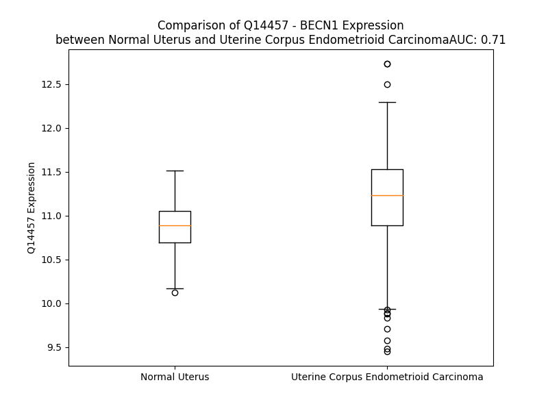

# Detailed Data for Q14457

## Introduction to the Detailed Summary

### How to Interpret the Results

- **Summary & Metrics**: This section provides a quick reference to essential protein attributes, including expression changes, family classification, and biomarker applications. Regulation status (upregulated/downregulated) indicates the protein's behavior in a disease context. Some information comes from the original excel file with the proteins selected from literature, while others are derived from the analyses.
- **Expression Comparison**: A visual representation comparing protein expression between normal and disease states. It highlights significant changes in expression levels that might indicate diagnostic or therapeutic relevance. This is data coming from transcriptomics experiments and could not translate similarly to protein levels.
- **Isoform Alignment**: An interactive view of isoform alignments, revealing structural and functional differences between variants of the protein.
- **Interactors & Homologs**: Tables listing known interaction partners and homologous proteins, the more interactors and homologs, the more complex the protein is to design an antibody for.
- **Biological Assemblies**: Information about the structural arrangement of the protein in different assemblies, providing insights into its functional state but also the complexity of the protein to develop antibodies.
- **Combined Per-Residue Information**: A detailed table summarizing residue-level data. This includes predictions for epitope regions, aggregation tendencies, and modifications that might impact the protein's function. Each row corresponds to a residue in the protein, providing insights into specific sites that may be important for research or drug development.
## Summary & Metrics

- **UniProt Accession**: Q14457
- **Gene Name**: BECN1
- **Protein Name**: beclin 1
- **Swiss Prot**: BECN1_HUMAN
- **Family**: other
- **Biomarker Application**: efficacy
- **Number of Isoforms**: 0
- **Regulation**: 1
- **(transcriptomics) AUC**: 0.71
- **(transcriptomics) Fold Change**: 1.03
- **(transcriptomics) Regulation**: Upregulated
- **Discotope Epitope Count**: 93
- **Max n_uniprots (Homo)**: 3.0
- **Max n_uniprots (Hetero)**: 8.0

## Expression Comparison

## Interactors

| preferredName_A   | preferredName_B   |   score |
|:------------------|:------------------|--------:|
| BECN1             | VMP1              |   0.999 |
| BECN1             | RB1CC1            |   0.999 |
| BECN1             | RUBCN             |   0.999 |
| BECN1             | BCL2L1            |   0.999 |
| BECN1             | ULK1              |   0.999 |
| BECN1             | BCL2              |   0.999 |
| BECN1             | HMGB1             |   0.999 |
| BECN1             | PIK3R4            |   0.999 |
| BECN1             | AMBRA1            |   0.999 |
| BECN1             | NRBF2             |   0.999 |
| BECN1             | PIK3C3            |   0.999 |
| BECN1             | ATG14             |   0.999 |
| BECN1             | UVRAG             |   0.999 |
| BECN1             | MCL1              |   0.998 |
| BECN1             | ITPR1             |   0.998 |
| BECN1             | ULK2              |   0.997 |
| BECN1             | BIRC2             |   0.996 |
| BECN1             | PINK1             |   0.996 |
| BECN1             | SH3GLB1           |   0.995 |
| BECN1             | TRAF2             |   0.995 |
| BECN1             | BIRC3             |   0.995 |
| BECN1             | RAB5A             |   0.992 |
| BECN1             | GABARAPL2         |   0.992 |
| BECN1             | GABARAP           |   0.991 |
| BECN1             | ATG12             |   0.991 |
| BECN1             | ATG3              |   0.991 |
| BECN1             | MYD88             |   0.99  |
| BECN1             | PRKN              |   0.989 |
| BECN1             | ATXN3             |   0.989 |
| BECN1             | ATG101            |   0.988 |
| BECN1             | CGAS              |   0.988 |
| BECN1             | DAPK1             |   0.987 |
| BECN1             | ITPR3             |   0.987 |
| BECN1             | BCL2L2            |   0.987 |
| BECN1             | GABARAPL1         |   0.987 |
| BECN1             | BCL2L11           |   0.987 |
| BECN1             | ATG5              |   0.986 |
| BECN1             | NLRP4             |   0.986 |
| BECN1             | ATG13             |   0.986 |
| BECN1             | ATG7              |   0.983 |
| BECN1             | TRAF6             |   0.982 |
| BECN1             | HTT               |   0.979 |
| BECN1             | ATXN3L            |   0.978 |
| BECN1             | MAP1LC3B          |   0.972 |
| BECN1             | BECN2             |   0.972 |
| BECN1             | DAPK3             |   0.972 |
| BECN1             | DAPK2             |   0.972 |
| BECN1             | ATG16L1           |   0.965 |
| BECN1             | MAP1LC3A          |   0.964 |
| BECN1             | SLAMF1            |   0.963 |

## Homologs

| uniprot_id   | gene_id   |
|:-------------|:----------|
| A8MW95       | BECN2     |

## Biological Assemblies

|   Unnamed: 0 |   assembly |   n_uniprots | composition   | crystal_id   |
|-------------:|-----------:|-------------:|:--------------|:-------------|
|            0 |          1 |            1 | Homo          | 4ddp         |
|            0 |          1 |            1 | Homo          | 5hhe         |
|            1 |          2 |            1 | Homo          | 5hhe         |
|            0 |          1 |            2 | Hetero        | 6hoi         |
|            1 |          2 |            2 | Hetero        | 6hoi         |
|            0 |          1 |            4 | Hetero        | 8sor         |
|            0 |          1 |            2 | Hetero        | 4mi8         |
|            1 |          2 |            2 | Hetero        | 4mi8         |
|            2 |          3 |            4 | Hetero        | 4mi8         |
|            0 |          1 |            2 | Hetero        | 2p1l         |
|            1 |          2 |            2 | Hetero        | 2p1l         |
|            2 |          3 |            2 | Hetero        | 2p1l         |
|            3 |          4 |            2 | Hetero        | 2p1l         |
|            4 |          5 |            8 | Hetero        | 2p1l         |
|            5 |          6 |            4 | Hetero        | 2p1l         |
|            6 |          7 |            4 | Hetero        | 2p1l         |
|            0 |          1 |            4 | Hetero        | 6dcn         |
|            1 |          2 |            4 | Hetero        | 6dcn         |
|            0 |          1 |            8 | Hetero        | 8srq         |
|            0 |          1 |            2 | Hetero        | 3dvu         |
|            1 |          2 |            2 | Hetero        | 3dvu         |
|            0 |          1 |            2 | Hetero        | 5vau         |
|            1 |          2 |            2 | Hetero        | 5vau         |
|            2 |          3 |            2 | Hetero        | 5vau         |
|            3 |          4 |            2 | Hetero        | 5vau         |
|            0 |          1 |            2 | Hetero        | 2pon         |
|            0 |          1 |            1 | Homo          | 5efm         |
|            0 |          1 |            3 | Homo          | 6hoj         |
|            0 |          1 |            1 | Homo          | 6hok         |
|            0 |          1 |            2 | Hetero        | 5vax         |
|            1 |          2 |            2 | Hetero        | 5vax         |
|            2 |          3 |            2 | Hetero        | 5vax         |
|            3 |          4 |            2 | Hetero        | 5vax         |
|            0 |          1 |            2 | Hetero        | 5vay         |
|            1 |          2 |            2 | Hetero        | 5vay         |
|            2 |          3 |            2 | Hetero        | 5vay         |
|            3 |          4 |            2 | Hetero        | 5vay         |
|            0 |          1 |            4 | Hetero        | 6dco         |

## Combined Per-Residue Information

|   res | aa   |   epitope_score | epitope   |   relative_surface_accessibility |   modeling_confidence |   Aggregation | modification               |
|------:|:-----|----------------:|:----------|---------------------------------:|----------------------:|--------------:|:---------------------------|
|     1 | M    |         0.08091 | False     |                          1.30615 |                 36.74 |         0     | N-acetylmethionine         |
|     2 | E    |         0.11662 | False     |                          0.96326 |                 33.66 |         0     | N/A                        |
|     3 | G    |         0.17042 | True      |                          0.81844 |                 36.29 |         0     | N/A                        |
|     4 | S    |         0.09463 | False     |                          0.9198  |                 38.4  |         0     | N/A                        |
|     5 | K    |         0.13944 | False     |                          0.95989 |                 34.56 |         0     | N/A                        |
|     6 | T    |         0.14083 | False     |                          0.94122 |                 34.49 |         0     | N/A                        |
|     7 | S    |         0.14977 | False     |                          0.84386 |                 35.5  |         0     | N/A                        |
|     8 | N    |         0.12887 | False     |                          0.92613 |                 32.09 |         0     | N/A                        |
|     9 | N    |         0.1316  | False     |                          0.9599  |                 34.81 |         0     | N/A                        |
|    10 | S    |         0.13283 | False     |                          0.71346 |                 33.52 |         0     | N/A                        |
|    11 | T    |         0.07074 | False     |                          0.94517 |                 36.7  |         0.322 | N/A                        |
|    12 | M    |         0.11328 | False     |                          0.89584 |                 37.86 |         0.866 | N/A                        |
|    13 | Q    |         0.16024 | True      |                          0.81769 |                 45.74 |         1.345 | N/A                        |
|    14 | V    |         0.21293 | True      |                          0.708   |                 54.06 |         2.286 | N/A                        |
|    15 | S    |         0.09043 | False     |                          0.51997 |                 66.35 |         2.286 | Phosphoserine              |
|    16 | F    |         0.05587 | False     |                          0.20655 |                 74.06 |         2.286 | N/A                        |
|    17 | V    |         0.10796 | False     |                          0.44062 |                 82.24 |         2.286 | N/A                        |
|    18 | C    |         0.02516 | False     |                          0.00148 |                 83.22 |         0.941 | N/A                        |
|    19 | Q    |         0.047   | False     |                          0.4942  |                 83.44 |         0     | N/A                        |
|    20 | R    |         0.09502 | False     |                          0.4559  |                 79.91 |         0     | N/A                        |
|    21 | C    |         0.10306 | False     |                          0.37366 |                 87.99 |         0     | N/A                        |
|    22 | S    |         0.08134 | False     |                          0.62702 |                 81.05 |         0     | N/A                        |
|    23 | Q    |         0.12441 | False     |                          0.58109 |                 80.95 |         0     | N/A                        |
|    24 | P    |         0.14601 | False     |                          0.73823 |                 79.82 |         0     | N/A                        |
|    25 | L    |         0.08211 | False     |                          0.21642 |                 73.41 |         0     | N/A                        |
|    26 | K    |         0.24923 | True      |                          1.00755 |                 72.12 |         0     | N/A                        |
|    27 | L    |         0.07422 | False     |                          0.30908 |                 66.55 |         0     | N/A                        |
|    28 | D    |         0.24188 | True      |                          0.52454 |                 68.15 |         0     | N/A                        |
|    29 | T    |         0.12858 | False     |                          0.6098  |                 62.3  |         0     | N/A                        |
|    30 | S    |         0.17709 | True      |                          0.49376 |                 64.6  |         0     | Phosphoserine              |
|    31 | F    |         0.0612  | False     |                          0.25856 |                 62.77 |         0     | N/A                        |
|    32 | K    |         0.22073 | True      |                          0.63205 |                 61.73 |         0     | N/A                        |
|    33 | I    |         0.22759 | True      |                          0.88253 |                 60.01 |         0.406 | N/A                        |
|    34 | L    |         0.0733  | False     |                          0.27578 |                 58.33 |         0.406 | N/A                        |
|    35 | D    |         0.1047  | False     |                          0.56159 |                 61.23 |         0.406 | N/A                        |
|    36 | R    |         0.24668 | True      |                          0.83896 |                 62.06 |         0.406 | N/A                        |
|    37 | V    |         0.11616 | False     |                          0.68168 |                 64.18 |         0.406 | N/A                        |
|    38 | T    |         0.17616 | True      |                          0.45544 |                 64.81 |         0.406 | N/A                        |
|    39 | I    |         0.13553 | False     |                          0.24799 |                 61.85 |         0.406 | N/A                        |
|    40 | Q    |         0.11901 | False     |                          0.70572 |                 63.08 |         0     | N/A                        |
|    41 | E    |         0.20242 | True      |                          0.6628  |                 65.28 |         0     | N/A                        |
|    42 | L    |         0.08415 | False     |                          0.60852 |                 61.83 |         0     | N/A                        |
|    43 | T    |         0.06273 | False     |                          0.31718 |                 57.1  |         0     | N/A                        |
|    44 | A    |         0.10354 | False     |                          0.51034 |                 55.45 |         0     | N/A                        |
|    45 | P    |         0.09933 | False     |                          0.69439 |                 53.62 |         0     | N/A                        |
|    46 | L    |         0.10509 | False     |                          0.92742 |                 48.29 |         0.563 | N/A                        |
|    47 | L    |         0.12552 | False     |                          1.01539 |                 42.7  |         0.563 | N/A                        |
|    48 | T    |         0.15773 | True      |                          0.91186 |                 30.37 |         0.563 | N/A                        |
|    49 | T    |         0.16601 | True      |                          0.96087 |                 31.72 |         0.563 | N/A                        |
|    50 | A    |         0.14384 | False     |                          0.8382  |                 26.04 |         0.563 | N/A                        |
|    51 | Q    |         0.18415 | True      |                          0.91323 |                 26.08 |         0     | N/A                        |
|    52 | A    |         0.1584  | True      |                          0.90832 |                 26.15 |         0     | N/A                        |
|    53 | K    |         0.1183  | False     |                          0.93237 |                 26.42 |         0     | N/A                        |
|    54 | P    |         0.11866 | False     |                          0.9709  |                 26.83 |         0     | N/A                        |
|    55 | G    |         0.12804 | False     |                          0.90541 |                 27.37 |         0     | N/A                        |
|    56 | E    |         0.10287 | False     |                          0.83443 |                 25.86 |         0     | N/A                        |
|    57 | T    |         0.16569 | True      |                          0.77686 |                 26.4  |         0     | N/A                        |
|    58 | Q    |         0.07574 | False     |                          0.79178 |                 28.25 |         0     | N/A                        |
|    59 | E    |         0.08987 | False     |                          0.84496 |                 24.69 |         0     | N/A                        |
|    60 | E    |         0.10612 | False     |                          0.91551 |                 29.45 |         0     | N/A                        |
|    61 | E    |         0.15137 | False     |                          0.8415  |                 25.4  |         0     | N/A                        |
|    62 | T    |         0.13823 | False     |                          0.95259 |                 29.74 |         0     | N/A                        |
|    63 | N    |         0.14437 | False     |                          0.91336 |                 25.76 |         0     | N/A                        |
|    64 | S    |         0.12216 | False     |                          0.80706 |                 29.71 |         0     | N/A                        |
|    65 | G    |         0.15161 | False     |                          0.87284 |                 26.39 |         0     | N/A                        |
|    66 | E    |         0.1362  | False     |                          0.92923 |                 29.18 |         0     | N/A                        |
|    67 | E    |         0.1215  | False     |                          0.82519 |                 28.51 |         0     | N/A                        |
|    68 | P    |         0.11678 | False     |                          0.76627 |                 31.6  |         0     | N/A                        |
|    69 | F    |         0.15431 | True      |                          0.93033 |                 24.75 |         0     | N/A                        |
|    70 | I    |         0.16247 | True      |                          0.97518 |                 33.74 |         0     | N/A                        |
|    71 | E    |         0.09923 | False     |                          0.72137 |                 30.21 |         0     | N/A                        |
|    72 | T    |         0.10474 | False     |                          0.86846 |                 30.62 |         0     | N/A                        |
|    73 | P    |         0.14213 | False     |                          0.93898 |                 40.18 |         0     | N/A                        |
|    74 | R    |         0.16741 | True      |                          0.90626 |                 32.92 |         0     | N/A                        |
|    75 | Q    |         0.27109 | True      |                          0.82497 |                 38.61 |         0     | N/A                        |
|    76 | D    |         0.15978 | True      |                          0.76892 |                 37.16 |         0     | N/A                        |
|    77 | G    |         0.14053 | False     |                          1.11326 |                 37.85 |         0     | N/A                        |
|    78 | V    |         0.11648 | False     |                          0.70654 |                 38.1  |         0     | N/A                        |
|    79 | S    |         0.14105 | False     |                          0.91024 |                 47.4  |         0     | N/A                        |
|    80 | R    |         0.17837 | True      |                          0.85072 |                 47.59 |         0     | N/A                        |
|    81 | R    |         0.23853 | True      |                          0.92438 |                 38.45 |         0     | N/A                        |
|    82 | F    |         0.22385 | True      |                          0.91141 |                 48.34 |         0     | N/A                        |
|    83 | I    |         0.18651 | True      |                          0.87921 |                 41.67 |         0     | N/A                        |
|    84 | P    |         0.11315 | False     |                          0.69577 |                 46.7  |         0     | N/A                        |
|    85 | P    |         0.10874 | False     |                          0.86435 |                 37.36 |         0     | N/A                        |
|    86 | A    |         0.13914 | False     |                          0.87377 |                 36.3  |         0     | N/A                        |
|    87 | R    |         0.21227 | True      |                          0.95424 |                 39.32 |         0     | N/A                        |
|    88 | M    |         0.12827 | False     |                          0.94286 |                 34    |         0     | N/A                        |
|    89 | M    |         0.2466  | True      |                          0.93269 |                 32.06 |         0     | N/A                        |
|    90 | S    |         0.13461 | False     |                          0.80882 |                 36.94 |         0     | Phosphoserine; by AMPK     |
|    91 | T    |         0.16168 | True      |                          0.80328 |                 37.51 |         0     | N/A                        |
|    92 | E    |         0.17107 | True      |                          0.84209 |                 31.84 |         0     | N/A                        |
|    93 | S    |         0.19739 | True      |                          0.85535 |                 34.83 |         0     | Phosphoserine; by AMPK     |
|    94 | A    |         0.15548 | True      |                          1.01935 |                 36.04 |         0     | N/A                        |
|    95 | N    |         0.15334 | True      |                          0.99601 |                 33.5  |         0     | N/A                        |
|    96 | S    |         0.12507 | False     |                          0.83185 |                 31.4  |         1.209 | Phosphoserine; by AMPK     |
|    97 | F    |         0.14341 | False     |                          0.95705 |                 38.4  |         2.08  | N/A                        |
|    98 | T    |         0.12052 | False     |                          0.72966 |                 36.05 |         2.08  | N/A                        |
|    99 | L    |         0.16327 | True      |                          0.81793 |                 34.74 |         2.08  | N/A                        |
|   100 | I    |         0.17328 | True      |                          0.98778 |                 33.96 |         2.08  | N/A                        |
|   101 | G    |         0.17465 | True      |                          0.65493 |                 31.44 |         0.871 | N/A                        |
|   102 | E    |         0.10514 | False     |                          0.91013 |                 33.98 |         0     | N/A                        |
|   103 | A    |         0.09792 | False     |                          1.0512  |                 37.25 |         0     | N/A                        |
|   104 | S    |         0.09818 | False     |                          0.73794 |                 33.65 |         0     | N/A                        |
|   105 | D    |         0.14922 | False     |                          0.90737 |                 39.11 |         0     | N/A                        |
|   106 | G    |         0.14487 | False     |                          1.09584 |                 32.05 |         0     | N/A                        |
|   107 | G    |         0.23955 | True      |                          0.72135 |                 38.5  |         0     | N/A                        |
|   108 | T    |         0.10086 | False     |                          0.70786 |                 45.91 |         0     | N/A                        |
|   109 | M    |         0.18062 | True      |                          0.90387 |                 46.23 |         0     | N/A                        |
|   110 | E    |         0.11168 | False     |                          0.67522 |                 49.36 |         0     | N/A                        |
|   111 | N    |         0.0825  | False     |                          0.6576  |                 55.34 |         0     | N/A                        |
|   112 | L    |         0.09006 | False     |                          0.48639 |                 58.47 |         0     | N/A                        |
|   113 | S    |         0.16957 | True      |                          0.53599 |                 62.31 |         0     | N/A                        |
|   114 | R    |         0.15991 | True      |                          0.69787 |                 64.74 |         0     | N/A                        |
|   115 | R    |         0.13342 | False     |                          0.3731  |                 65.22 |         0     | N/A                        |
|   116 | L    |         0.0681  | False     |                          0.26367 |                 67.71 |         0     | N/A                        |
|   117 | K    |         0.13298 | False     |                          0.68702 |                 71.87 |         0     | N/A                        |
|   118 | V    |         0.10571 | False     |                          0.30889 |                 69.86 |         0     | N/A                        |
|   119 | T    |         0.02815 | False     |                          0.0184  |                 71.96 |         0     | Phosphothreonine; by DAPK1 |
|   120 | G    |         0.0566  | False     |                          0.25134 |                 72.48 |         0     | N/A                        |
|   121 | D    |         0.13971 | False     |                          0.40623 |                 72.54 |         0     | N/A                        |
|   122 | L    |         0.04955 | False     |                          0.05053 |                 74.15 |         0     | N/A                        |
|   123 | F    |         0.04769 | False     |                          0.0808  |                 76.7  |         0     | N/A                        |
|   124 | D    |         0.12092 | False     |                          0.65254 |                 76.33 |         0     | N/A                        |
|   125 | I    |         0.11345 | False     |                          0.3366  |                 74.84 |         0     | N/A                        |
|   126 | M    |         0.07981 | False     |                          0.41034 |                 70.52 |         0     | N/A                        |
|   127 | S    |         0.11664 | False     |                          0.20571 |                 79.53 |         0     | N/A                        |
|   128 | G    |         0.07602 | False     |                          0.79805 |                 73.77 |         0     | N/A                        |
|   129 | Q    |         0.10419 | False     |                          0.50094 |                 72.05 |         0     | N/A                        |
|   130 | T    |         0.13183 | False     |                          0.43009 |                 71.77 |         0     | N/A                        |
|   131 | D    |         0.14018 | False     |                          0.97902 |                 72.56 |         0     | N/A                        |
|   132 | V    |         0.11139 | False     |                          0.31622 |                 78.05 |         0     | N/A                        |
|   133 | D    |         0.07255 | False     |                          0.57085 |                 79.19 |         0     | N/A                        |
|   134 | H    |         0.07288 | False     |                          0.19574 |                 79.24 |         0     | N/A                        |
|   135 | P    |         0.07576 | False     |                          0.10537 |                 82.23 |         0     | N/A                        |
|   136 | L    |         0.02997 | False     |                          0.15522 |                 80.88 |         0     | N/A                        |
|   137 | C    |         0.04961 | False     |                          0.17114 |                 85.58 |         0     | N/A                        |
|   138 | E    |         0.18867 | True      |                          0.74737 |                 86.67 |         0     | N/A                        |
|   139 | E    |         0.13306 | False     |                          0.70757 |                 87.94 |         0     | N/A                        |
|   140 | C    |         0.05924 | False     |                          0.1081  |                 88.06 |         0     | N/A                        |
|   141 | T    |         0.06527 | False     |                          0.35788 |                 86.42 |         0     | N/A                        |
|   142 | D    |         0.11375 | False     |                          0.47683 |                 91.42 |         0     | N/A                        |
|   143 | T    |         0.0833  | False     |                          0.43097 |                 90.04 |         0     | N/A                        |
|   144 | L    |         0.04238 | False     |                          0.22999 |                 89.11 |         0     | N/A                        |
|   145 | L    |         0.13356 | False     |                          0.6014  |                 91.28 |         0     | N/A                        |
|   146 | D    |         0.08545 | False     |                          0.60057 |                 94.33 |         0     | N/A                        |
|   147 | Q    |         0.07817 | False     |                          0.49425 |                 89.47 |         0     | N/A                        |
|   148 | L    |         0.02767 | False     |                          0.52859 |                 91.05 |         0     | N/A                        |
|   149 | D    |         0.09461 | False     |                          0.5818  |                 95.41 |         0     | N/A                        |
|   150 | T    |         0.0815  | False     |                          0.62012 |                 94.78 |         0     | N/A                        |
|   151 | Q    |         0.09631 | False     |                          0.60707 |                 95.18 |         0     | N/A                        |
|   152 | L    |         0.0561  | False     |                          0.73854 |                 94.79 |         0     | N/A                        |
|   153 | N    |         0.08002 | False     |                          0.63623 |                 96.22 |         0     | N/A                        |
|   154 | V    |         0.05115 | False     |                          0.59809 |                 96.18 |         0     | N/A                        |
|   155 | T    |         0.03539 | False     |                          0.48678 |                 95.14 |         0     | N/A                        |
|   156 | E    |         0.05342 | False     |                          0.51925 |                 95.71 |         0     | N/A                        |
|   157 | N    |         0.07364 | False     |                          0.51522 |                 95.81 |         0     | N/A                        |
|   158 | E    |         0.0355  | False     |                          0.46382 |                 95.47 |         0     | N/A                        |
|   159 | C    |         0.02456 | False     |                          0.47433 |                 92.48 |         0     | N/A                        |
|   160 | Q    |         0.03276 | False     |                          0.38949 |                 94.23 |         0     | N/A                        |
|   161 | N    |         0.04177 | False     |                          0.42007 |                 93.79 |         0     | N/A                        |
|   162 | Y    |         0.05952 | False     |                          0.6734  |                 89.74 |         0     | N/A                        |
|   163 | K    |         0.08548 | False     |                          0.64348 |                 91.34 |         0     | N/A                        |
|   164 | R    |         0.08202 | False     |                          0.54936 |                 88.4  |         0     | N/A                        |
|   165 | C    |         0.04141 | False     |                          0.50964 |                 85.62 |         0     | N/A                        |
|   166 | L    |         0.07878 | False     |                          0.65042 |                 86.27 |         0     | N/A                        |
|   167 | E    |         0.06972 | False     |                          0.50408 |                 87.81 |         0     | N/A                        |
|   168 | I    |         0.05009 | False     |                          0.62883 |                 83.34 |         0     | N/A                        |
|   169 | L    |         0.0709  | False     |                          0.68376 |                 78.83 |         0     | N/A                        |
|   170 | E    |         0.16034 | True      |                          0.77807 |                 81.33 |         0     | N/A                        |
|   171 | Q    |         0.11764 | False     |                          0.75926 |                 79.71 |         0     | N/A                        |
|   172 | M    |         0.06959 | False     |                          0.39177 |                 73.23 |         0     | N/A                        |
|   173 | N    |         0.19397 | True      |                          0.51898 |                 75.54 |         0     | N/A                        |
|   174 | E    |         0.10052 | False     |                          0.72497 |                 73.83 |         0     | N/A                        |
|   175 | D    |         0.15249 | True      |                          0.65637 |                 75.98 |         0     | N/A                        |
|   176 | D    |         0.06967 | False     |                          0.30717 |                 80.71 |         0     | N/A                        |
|   177 | S    |         0.06196 | False     |                          0.31522 |                 80.15 |         0     | N/A                        |
|   178 | E    |         0.08841 | False     |                          0.62318 |                 86.27 |         0     | N/A                        |
|   179 | Q    |         0.11079 | False     |                          0.5657  |                 88.02 |         0     | N/A                        |
|   180 | L    |         0.07646 | False     |                          0.5969  |                 86.73 |         0     | N/A                        |
|   181 | Q    |         0.08801 | False     |                          0.53812 |                 89.67 |         0     | N/A                        |
|   182 | M    |         0.12572 | False     |                          0.68261 |                 91.89 |         0     | N/A                        |
|   183 | E    |         0.06493 | False     |                          0.44207 |                 94.01 |         0     | N/A                        |
|   184 | L    |         0.12424 | False     |                          0.75693 |                 93.16 |         0     | N/A                        |
|   185 | K    |         0.09725 | False     |                          0.65528 |                 94.87 |         0     | N/A                        |
|   186 | E    |         0.11426 | False     |                          0.61705 |                 96.16 |         0     | N/A                        |
|   187 | L    |         0.11054 | False     |                          0.66262 |                 96.33 |         0     | N/A                        |
|   188 | A    |         0.09131 | False     |                          0.48204 |                 96.29 |         0     | N/A                        |
|   189 | L    |         0.10574 | False     |                          0.81446 |                 96.35 |         0     | N/A                        |
|   190 | E    |         0.03847 | False     |                          0.27086 |                 96.18 |         0     | N/A                        |
|   191 | E    |         0.11376 | False     |                          0.54839 |                 96.09 |         0     | N/A                        |
|   192 | E    |         0.08129 | False     |                          0.45356 |                 96.42 |         0     | N/A                        |
|   193 | R    |         0.12097 | False     |                          0.58977 |                 97.66 |         0     | N/A                        |
|   194 | L    |         0.10266 | False     |                          0.55558 |                 97.55 |         0     | N/A                        |
|   195 | I    |         0.05915 | False     |                          0.47987 |                 96.72 |         0     | N/A                        |
|   196 | Q    |         0.06687 | False     |                          0.49834 |                 96.78 |         0     | N/A                        |
|   197 | E    |         0.05048 | False     |                          0.52245 |                 97.73 |         0     | N/A                        |
|   198 | L    |         0.07596 | False     |                          0.66326 |                 96.67 |         0     | N/A                        |
|   199 | E    |         0.10724 | False     |                          0.45019 |                 97.17 |         0     | N/A                        |
|   200 | D    |         0.10489 | False     |                          0.4558  |                 97.58 |         0     | N/A                        |
|   201 | V    |         0.07288 | False     |                          0.62318 |                 97.58 |         0     | N/A                        |
|   202 | E    |         0.09178 | False     |                          0.39906 |                 96.49 |         0     | N/A                        |
|   203 | K    |         0.07581 | False     |                          0.53859 |                 97.45 |         0     | N/A                        |
|   204 | N    |         0.0405  | False     |                          0.53928 |                 97.76 |         0     | N/A                        |
|   205 | R    |         0.09231 | False     |                          0.61211 |                 97.09 |         0     | N/A                        |
|   206 | K    |         0.06628 | False     |                          0.56224 |                 96.91 |         0     | N/A                        |
|   207 | I    |         0.1054  | False     |                          0.57405 |                 97.89 |         0     | N/A                        |
|   208 | V    |         0.0637  | False     |                          0.67688 |                 98.03 |         0     | N/A                        |
|   209 | A    |         0.07052 | False     |                          0.47893 |                 97.54 |         0     | N/A                        |
|   210 | E    |         0.08779 | False     |                          0.51921 |                 97.31 |         0     | N/A                        |
|   211 | N    |         0.03928 | False     |                          0.45345 |                 98.25 |         0     | N/A                        |
|   212 | L    |         0.05541 | False     |                          0.61097 |                 97.04 |         0     | N/A                        |
|   213 | E    |         0.07364 | False     |                          0.63767 |                 97.5  |         0     | N/A                        |
|   214 | K    |         0.08253 | False     |                          0.63281 |                 97.94 |         0     | N/A                        |
|   215 | V    |         0.06113 | False     |                          0.66426 |                 98.24 |         0     | N/A                        |
|   216 | Q    |         0.07808 | False     |                          0.49604 |                 98.23 |         0     | N/A                        |
|   217 | A    |         0.10247 | False     |                          0.5792  |                 97.75 |         0     | N/A                        |
|   218 | E    |         0.06239 | False     |                          0.46708 |                 98.35 |         0     | N/A                        |
|   219 | A    |         0.05819 | False     |                          0.44993 |                 98.15 |         0     | N/A                        |
|   220 | E    |         0.10426 | False     |                          0.57909 |                 98.24 |         0     | N/A                        |
|   221 | R    |         0.07569 | False     |                          0.48206 |                 98.37 |         0     | N/A                        |
|   222 | L    |         0.05335 | False     |                          0.54997 |                 98.6  |         0     | N/A                        |
|   223 | D    |         0.1     | False     |                          0.58718 |                 98.58 |         0     | N/A                        |
|   224 | Q    |         0.09353 | False     |                          0.64243 |                 97.91 |         0     | N/A                        |
|   225 | E    |         0.05071 | False     |                          0.44194 |                 98.4  |         0     | N/A                        |
|   226 | E    |         0.06547 | False     |                          0.49024 |                 98.5  |         0     | N/A                        |
|   227 | A    |         0.05687 | False     |                          0.36595 |                 98.27 |         0     | N/A                        |
|   228 | Q    |         0.07432 | False     |                          0.50611 |                 98.02 |         0     | N/A                        |
|   229 | Y    |         0.09659 | False     |                          0.6539  |                 98.07 |         0     | N/A                        |
|   230 | Q    |         0.10575 | False     |                          0.48161 |                 98.39 |         0     | N/A                        |
|   231 | R    |         0.14682 | False     |                          0.6781  |                 98.42 |         0     | N/A                        |
|   232 | E    |         0.04722 | False     |                          0.3917  |                 98.37 |         0     | N/A                        |
|   233 | Y    |         0.08069 | False     |                          0.57272 |                 98.53 |         0     | N/A                        |
|   234 | S    |         0.11801 | False     |                          0.51877 |                 98.22 |         0     | N/A                        |
|   235 | E    |         0.08931 | False     |                          0.44949 |                 98.43 |         0     | N/A                        |
|   236 | F    |         0.07682 | False     |                          0.68757 |                 98.49 |         0     | N/A                        |
|   237 | K    |         0.05452 | False     |                          0.41771 |                 98.7  |         0     | N/A                        |
|   238 | R    |         0.08798 | False     |                          0.49133 |                 98.52 |         0     | N/A                        |
|   239 | Q    |         0.05967 | False     |                          0.4049  |                 98.63 |         0     | N/A                        |
|   240 | Q    |         0.06804 | False     |                          0.46484 |                 98.51 |         0     | N/A                        |
|   241 | L    |         0.14152 | False     |                          0.64601 |                 98.55 |         0     | N/A                        |
|   242 | E    |         0.06433 | False     |                          0.43893 |                 98.57 |         0     | N/A                        |
|   243 | L    |         0.11338 | False     |                          0.71379 |                 98.45 |         0     | N/A                        |
|   244 | D    |         0.05342 | False     |                          0.36314 |                 98.64 |         0     | N/A                        |
|   245 | D    |         0.04861 | False     |                          0.5998  |                 98.47 |         0     | N/A                        |
|   246 | E    |         0.05068 | False     |                          0.56946 |                 98.45 |         0     | N/A                        |
|   247 | L    |         0.06723 | False     |                          0.68023 |                 98.54 |         0     | N/A                        |
|   248 | K    |         0.06894 | False     |                          0.60228 |                 98.25 |         0     | N/A                        |
|   249 | S    |         0.06011 | False     |                          0.39962 |                 98.02 |         0     | N/A                        |
|   250 | V    |         0.04189 | False     |                          0.58648 |                 98.11 |         0     | N/A                        |
|   251 | E    |         0.05411 | False     |                          0.44142 |                 98.44 |         0     | N/A                        |
|   252 | N    |         0.05148 | False     |                          0.57492 |                 97.58 |         0     | N/A                        |
|   253 | Q    |         0.06057 | False     |                          0.59571 |                 98.34 |         0     | N/A                        |
|   254 | M    |         0.05079 | False     |                          0.59793 |                 97.89 |         0     | N/A                        |
|   255 | R    |         0.07453 | False     |                          0.60001 |                 97.89 |         0     | N/A                        |
|   256 | Y    |         0.11678 | False     |                          0.65485 |                 97.54 |         0     | N/A                        |
|   257 | A    |         0.06483 | False     |                          0.54401 |                 97.6  |         0     | N/A                        |
|   258 | Q    |         0.06544 | False     |                          0.5388  |                 96.44 |         0     | N/A                        |
|   259 | T    |         0.04681 | False     |                          0.43095 |                 95.55 |         0     | N/A                        |
|   260 | Q    |         0.03036 | False     |                          0.30932 |                 93.11 |         0     | N/A                        |
|   261 | L    |         0.02795 | False     |                          0.54832 |                 89.02 |         0     | N/A                        |
|   262 | D    |         0.0353  | False     |                          0.42887 |                 86.28 |         0     | N/A                        |
|   263 | K    |         0.04564 | False     |                          0.57275 |                 84.99 |         0     | N/A                        |
|   264 | L    |         0.04898 | False     |                          0.8127  |                 82.64 |         0     | N/A                        |
|   265 | K    |         0.0573  | False     |                          0.52021 |                 75.59 |         0     | N/A                        |
|   266 | K    |         0.05684 | False     |                          0.79134 |                 73.53 |         0     | N/A                        |
|   267 | T    |         0.07511 | False     |                          0.59781 |                 72.96 |         0     | N/A                        |
|   268 | N    |         0.03732 | False     |                          0.24083 |                 72.64 |         0     | N/A                        |
|   269 | V    |         0.06127 | False     |                          0.79364 |                 79.72 |         3.197 | N/A                        |
|   270 | F    |         0.03477 | False     |                          0.17012 |                 79.48 |         3.379 | N/A                        |
|   271 | N    |         0.09017 | False     |                          0.52816 |                 77.77 |         3.379 | N/A                        |
|   272 | A    |         0.05    | False     |                          0.74591 |                 79.14 |         3.505 | N/A                        |
|   273 | T    |         0.13024 | False     |                          0.462   |                 85.03 |         3.654 | N/A                        |
|   274 | F    |         0.05002 | False     |                          0.04557 |                 89.67 |         3.48  | N/A                        |
|   275 | H    |         0.08945 | False     |                          0.48255 |                 88.85 |         1.156 | N/A                        |
|   276 | I    |         0.02694 | False     |                          0.06088 |                 91.56 |         1.156 | N/A                        |
|   277 | W    |         0.06744 | False     |                          0.61303 |                 91.9  |         0.984 | N/A                        |
|   278 | H    |         0.17825 | True      |                          0.54125 |                 90.25 |         0     | N/A                        |
|   279 | S    |         0.18415 | True      |                          0.44096 |                 87.53 |         0     | N/A                        |
|   280 | G    |         0.22331 | True      |                          0.76277 |                 86.37 |         0     | N/A                        |
|   281 | Q    |         0.21487 | True      |                          0.50438 |                 85.18 |         0     | N/A                        |
|   282 | F    |         0.03433 | False     |                          0.03758 |                 89.58 |         0     | N/A                        |
|   283 | G    |         0.01345 | False     |                          0.02092 |                 91.06 |         0     | N/A                        |
|   284 | T    |         0.03551 | False     |                          0.05298 |                 92.92 |         0     | N/A                        |
|   285 | I    |         0.00863 | False     |                          0       |                 92.22 |         0     | N/A                        |
|   286 | N    |         0.05982 | False     |                          0.28166 |                 90.75 |         0     | N/A                        |
|   287 | N    |         0.16987 | True      |                          0.76634 |                 91.65 |         0     | N/A                        |
|   288 | F    |         0.09163 | False     |                          0.37772 |                 94.11 |         0     | N/A                        |
|   289 | R    |         0.19267 | True      |                          0.24077 |                 93.17 |         0     | N/A                        |
|   290 | L    |         0.00522 | False     |                          0       |                 90.91 |         0     | N/A                        |
|   291 | G    |         0.0056  | False     |                          0       |                 89.79 |         0     | N/A                        |
|   292 | R    |         0.17502 | True      |                          0.28905 |                 88.27 |         0     | N/A                        |
|   293 | L    |         0.17348 | True      |                          0.0428  |                 88.2  |         0     | N/A                        |
|   294 | P    |         0.28655 | True      |                          0.75625 |                 83.56 |         0     | N/A                        |
|   295 | S    |         0.36544 | True      |                          0.7114  |                 85.98 |         0     | N/A                        |
|   296 | V    |         0.24022 | True      |                          0.46175 |                 88.09 |         0     | N/A                        |
|   297 | P    |         0.37011 | True      |                          0.66047 |                 85.75 |         0     | N/A                        |
|   298 | V    |         0.03757 | False     |                          0.02352 |                 87.96 |         0     | N/A                        |
|   299 | E    |         0.31113 | True      |                          0.65829 |                 89.79 |         0     | N/A                        |
|   300 | W    |         0.11743 | False     |                          0.12227 |                 88.35 |         0     | N/A                        |
|   301 | N    |         0.16936 | True      |                          0.69854 |                 91.38 |         0     | N/A                        |
|   302 | E    |         0.05775 | False     |                          0.18228 |                 92.99 |         0     | N/A                        |
|   303 | I    |         0.01124 | False     |                          0       |                 91.24 |         0     | N/A                        |
|   304 | N    |         0.03867 | False     |                          0.061   |                 92.97 |         0     | N/A                        |
|   305 | A    |         0.02394 | False     |                          0.1947  |                 94.06 |         0.458 | N/A                        |
|   306 | A    |         0.00178 | False     |                          0       |                 94.4  |         1.001 | N/A                        |
|   307 | W    |         0.00308 | False     |                          0       |                 94.09 |         1.642 | N/A                        |
|   308 | G    |         0.01465 | False     |                          0.04097 |                 94.45 |         1.773 | N/A                        |
|   309 | Q    |         0.03548 | False     |                          0.23939 |                 94.29 |         3.5   | N/A                        |
|   310 | T    |         0.002   | False     |                          0       |                 94.03 |        43.012 | N/A                        |
|   311 | V    |         0.00225 | False     |                          0       |                 95.08 |        46.668 | N/A                        |
|   312 | L    |         0.03267 | False     |                          0.42124 |                 94.43 |        46.85  | N/A                        |
|   313 | L    |         0.00192 | False     |                          0       |                 93.72 |        46.85  | N/A                        |
|   314 | L    |         0.00281 | False     |                          0       |                 93.26 |        46.329 | N/A                        |
|   315 | H    |         0.04832 | False     |                          0.40214 |                 92.41 |         6.011 | N/A                        |
|   316 | A    |         0.03846 | False     |                          0.25947 |                 90.92 |         5.271 | N/A                        |
|   317 | L    |         0.00303 | False     |                          0       |                 89.76 |         4.645 | N/A                        |
|   318 | A    |         0.01343 | False     |                          0.03699 |                 89.86 |         1.053 | N/A                        |
|   319 | N    |         0.09756 | False     |                          0.72589 |                 90.03 |         0     | N/A                        |
|   320 | K    |         0.07195 | False     |                          0.48972 |                 85.84 |         0     | N/A                        |
|   321 | M    |         0.10451 | False     |                          0.28324 |                 84.55 |         0     | N/A                        |
|   322 | G    |         0.17393 | True      |                          0.72971 |                 85.08 |         0     | N/A                        |
|   323 | L    |         0.11601 | False     |                          0.19057 |                 87.7  |         0     | N/A                        |
|   324 | K    |         0.1255  | False     |                          0.88858 |                 88.76 |         0     | N/A                        |
|   325 | F    |         0.02625 | False     |                          0.12427 |                 90.29 |         0     | N/A                        |
|   326 | Q    |         0.10787 | False     |                          0.74734 |                 83.7  |         0     | N/A                        |
|   327 | R    |         0.07632 | False     |                          0.43186 |                 84.96 |         0     | N/A                        |
|   328 | Y    |         0.03782 | False     |                          0.21364 |                 89.94 |         0     | N/A                        |
|   329 | R    |         0.09586 | False     |                          0.58758 |                 90.56 |         0     | N/A                        |
|   330 | L    |         0.01472 | False     |                          0.02966 |                 91.95 |         0     | N/A                        |
|   331 | V    |         0.12074 | False     |                          0.21231 |                 91.87 |         0     | N/A                        |
|   332 | P    |         0.08343 | False     |                          0.31191 |                 90.38 |         0     | N/A                        |
|   333 | Y    |         0.22174 | True      |                          0.67172 |                 91.47 |         0     | N/A                        |
|   334 | G    |         0.10501 | False     |                          0.59128 |                 90.03 |         0     | N/A                        |
|   335 | N    |         0.10101 | False     |                          0.40395 |                 88.98 |         0     | N/A                        |
|   336 | H    |         0.14208 | False     |                          0.43861 |                 91.39 |         0     | N/A                        |
|   337 | S    |         0.01263 | False     |                          0.00372 |                 92.38 |         0     | N/A                        |
|   338 | Y    |         0.121   | False     |                          0.21739 |                 91.63 |         0     | N/A                        |
|   339 | L    |         0.00577 | False     |                          0       |                 90.88 |         0     | N/A                        |
|   340 | E    |         0.08145 | False     |                          0.24858 |                 89.79 |         0     | N/A                        |
|   341 | S    |         0.0684  | False     |                          0.08687 |                 86.77 |         0     | N/A                        |
|   342 | L    |         0.16382 | True      |                          0.51864 |                 84.94 |         0     | N/A                        |
|   343 | T    |         0.15527 | True      |                          0.91994 |                 82.79 |         0     | N/A                        |
|   344 | D    |         0.27595 | True      |                          0.38645 |                 79.87 |         0     | N/A                        |
|   345 | K    |         0.21666 | True      |                          0.91506 |                 71.43 |         0     | N/A                        |
|   346 | S    |         0.23783 | True      |                          0.78754 |                 70.36 |         0     | N/A                        |
|   347 | K    |         0.18931 | True      |                          0.49771 |                 78.27 |         0     | N/A                        |
|   348 | E    |         0.19199 | True      |                          0.55858 |                 85.22 |         0     | N/A                        |
|   349 | L    |         0.03159 | False     |                          0.05111 |                 88.74 |         0     | N/A                        |
|   350 | P    |         0.08274 | False     |                          0.16303 |                 89.36 |         0     | N/A                        |
|   351 | L    |         0.00553 | False     |                          0.00305 |                 86.76 |         0     | N/A                        |
|   352 | Y    |         0.08116 | False     |                          0.35302 |                 86.79 |         0     | N/A                        |
|   353 | C    |         0.05909 | False     |                          0.07204 |                 82.07 |         0     | N/A                        |
|   354 | S    |         0.20463 | True      |                          0.87096 |                 77.99 |         0     | N/A                        |
|   355 | G    |         0.25031 | True      |                          0.11415 |                 69.74 |         0     | N/A                        |
|   356 | G    |         0.32218 | True      |                          0.69755 |                 68.66 |         0     | N/A                        |
|   357 | L    |         0.28136 | True      |                          0.9182  |                 59.12 |         0     | N/A                        |
|   358 | R    |         0.29246 | True      |                          0.74969 |                 59.46 |         0     | N/A                        |
|   359 | F    |         0.10753 | False     |                          0.0562  |                 59.32 |         0     | N/A                        |
|   360 | F    |         0.28467 | True      |                          0.57013 |                 59.54 |         0     | N/A                        |
|   361 | W    |         0.41018 | True      |                          0.87156 |                 60.23 |         0     | N/A                        |
|   362 | D    |         0.07805 | False     |                          0.2491  |                 67.2  |         0     | N/A                        |
|   363 | N    |         0.16639 | True      |                          0.44859 |                 79.3  |         0     | N/A                        |
|   364 | K    |         0.1097  | False     |                          0.61665 |                 85.78 |         0     | N/A                        |
|   365 | F    |         0.04646 | False     |                          0.01564 |                 85.88 |         0     | N/A                        |
|   366 | D    |         0.05127 | False     |                          0.05339 |                 87.98 |         0     | N/A                        |
|   367 | H    |         0.10132 | False     |                          0.555   |                 88.15 |         0     | N/A                        |
|   368 | A    |         0.003   | False     |                          0       |                 89.16 |         5.957 | N/A                        |
|   369 | M    |         0.00434 | False     |                          0       |                 90.2  |        22.049 | N/A                        |
|   370 | V    |         0.01775 | False     |                          0.19327 |                 89.87 |        22.049 | N/A                        |
|   371 | A    |         0.00766 | False     |                          0.01459 |                 90.2  |        22.049 | N/A                        |
|   372 | F    |         0.00174 | False     |                          0       |                 92.95 |        22.049 | N/A                        |
|   373 | L    |         0.00191 | False     |                          0       |                 91.61 |        21.067 | N/A                        |
|   374 | D    |         0.01414 | False     |                          0.04755 |                 91.08 |         0     | N/A                        |
|   375 | C    |         0.00189 | False     |                          0       |                 91.41 |         0     | N/A                        |
|   376 | V    |         0.00143 | False     |                          0.00476 |                 91.45 |         0     | N/A                        |
|   377 | Q    |         0.02735 | False     |                          0.16646 |                 89.56 |         0     | N/A                        |
|   378 | Q    |         0.02824 | False     |                          0.08351 |                 89.65 |         0     | N/A                        |
|   379 | F    |         0.00651 | False     |                          0.00764 |                 88.99 |         0     | N/A                        |
|   380 | K    |         0.02478 | False     |                          0.10375 |                 87.07 |         0     | N/A                        |
|   381 | E    |         0.0483  | False     |                          0.41198 |                 86.64 |         0     | N/A                        |
|   382 | E    |         0.07333 | False     |                          0.29774 |                 84.36 |         0     | N/A                        |
|   383 | V    |         0.00956 | False     |                          0.00666 |                 82.96 |         0     | N/A                        |
|   384 | E    |         0.04945 | False     |                          0.27356 |                 79.99 |         0     | N/A                        |
|   385 | K    |         0.15034 | False     |                          0.7593  |                 78.72 |         0     | N/A                        |
|   386 | G    |         0.25673 | True      |                          0.70753 |                 70.5  |         0     | N/A                        |
|   387 | E    |         0.22377 | True      |                          0.38414 |                 67.1  |         0     | N/A                        |
|   388 | T    |         0.21913 | True      |                          0.96971 |                 60.89 |         0     | N/A                        |
|   389 | R    |         0.32535 | True      |                          0.90962 |                 67.45 |         0     | N/A                        |
|   390 | F    |         0.08822 | False     |                          0.16028 |                 71.59 |         0     | N/A                        |
|   391 | C    |         0.15941 | True      |                          0.56405 |                 74.04 |         0     | N/A                        |
|   392 | L    |         0.03462 | False     |                          0.04472 |                 81.23 |         0     | N/A                        |
|   393 | P    |         0.11245 | False     |                          0.28306 |                 82.4  |         0     | N/A                        |
|   394 | Y    |         0.06726 | False     |                          0.17411 |                 87.13 |         0     | N/A                        |
|   395 | R    |         0.09761 | False     |                          0.58562 |                 85.71 |         0     | N/A                        |
|   396 | M    |         0.0399  | False     |                          0.05581 |                 86.45 |         0     | N/A                        |
|   397 | D    |         0.06525 | False     |                          0.17512 |                 84.85 |         0     | N/A                        |
|   398 | V    |         0.05247 | False     |                          0.23908 |                 81.76 |         0     | N/A                        |
|   399 | E    |         0.18342 | True      |                          0.86896 |                 77.33 |         0     | N/A                        |
|   400 | K    |         0.20548 | True      |                          0.59438 |                 79.94 |         0     | N/A                        |
|   401 | G    |         0.00792 | False     |                          0       |                 82.38 |         0     | N/A                        |
|   402 | K    |         0.12273 | False     |                          0.33832 |                 88.22 |         0     | N/A                        |
|   403 | I    |         0.00753 | False     |                          0       |                 89.08 |         0     | N/A                        |
|   404 | E    |         0.15687 | True      |                          0.26056 |                 86.54 |         0     | N/A                        |
|   405 | D    |         0.04233 | False     |                          0.09867 |                 82.8  |         0     | N/A                        |
|   406 | T    |         0.17605 | True      |                          0.68759 |                 72.98 |         0     | N/A                        |
|   407 | G    |         0.19238 | True      |                          0.89959 |                 63.57 |         0     | N/A                        |
|   408 | G    |         0.18654 | True      |                          0.74034 |                 66.07 |         0     | N/A                        |
|   409 | S    |         0.19767 | True      |                          0.67696 |                 63.82 |         0     | N/A                        |
|   410 | G    |         0.12042 | False     |                          0.76554 |                 71.25 |         0     | N/A                        |
|   411 | G    |         0.19412 | True      |                          0.23659 |                 81.04 |         0     | N/A                        |
|   412 | S    |         0.28461 | True      |                          0.40695 |                 84.28 |         0     | N/A                        |
|   413 | Y    |         0.07083 | False     |                          0.15746 |                 89.51 |         0     | N/A                        |
|   414 | S    |         0.05546 | False     |                          0.12765 |                 87.93 |         0     | N/A                        |
|   415 | I    |         0.00498 | False     |                          0       |                 87.95 |         0     | N/A                        |
|   416 | K    |         0.06652 | False     |                          0.34447 |                 86.51 |         0     | N/A                        |
|   417 | T    |         0.13038 | False     |                          0.08954 |                 83.26 |         0     | N/A                        |
|   418 | Q    |         0.17542 | True      |                          0.32624 |                 80.81 |         0     | N/A                        |
|   419 | F    |         0.2732  | True      |                          1.02189 |                 77.84 |         0     | N/A                        |
|   420 | N    |         0.04889 | False     |                          0.20667 |                 82.99 |         0     | N/A                        |
|   421 | S    |         0.21107 | True      |                          0.4213  |                 86.38 |         0     | N/A                        |
|   422 | E    |         0.11896 | False     |                          0.18353 |                 85.27 |         0     | N/A                        |
|   423 | E    |         0.15439 | True      |                          0.46377 |                 87.94 |         0     | N/A                        |
|   424 | Q    |         0.0886  | False     |                          0.41859 |                 88.66 |         0     | N/A                        |
|   425 | W    |         0.04663 | False     |                          0.01046 |                 89.87 |         0     | N/A                        |
|   426 | T    |         0.01026 | False     |                          0.00571 |                 89.89 |         0     | N/A                        |
|   427 | K    |         0.05292 | False     |                          0.37094 |                 90.05 |         0     | N/A                        |
|   428 | A    |         0.00236 | False     |                          0       |                 90.31 |         0     | N/A                        |
|   429 | L    |         0.00326 | False     |                          0       |                 92.27 |         0     | N/A                        |
|   430 | K    |         0.04791 | False     |                          0.27771 |                 91.1  |         0     | N/A                        |
|   431 | F    |         0.03417 | False     |                          0.13313 |                 91.13 |         0     | N/A                        |
|   432 | M    |         0.00218 | False     |                          0       |                 92.73 |         0     | N/A                        |
|   433 | L    |         0.00558 | False     |                          0.00907 |                 93.14 |         0     | N/A                        |
|   434 | T    |         0.01823 | False     |                          0.25232 |                 91.19 |         0     | N/A                        |
|   435 | N    |         0.00565 | False     |                          0.00454 |                 91.11 |         0     | N/A                        |
|   436 | L    |         0.00313 | False     |                          0.00495 |                 91.4  |         0     | N/A                        |
|   437 | K    |         0.03488 | False     |                          0.36755 |                 90.18 |         0     | N/A                        |
|   438 | W    |         0.07621 | False     |                          0.54242 |                 88.7  |         2.401 | N/A                        |
|   439 | G    |         0.0023  | False     |                          0.00161 |                 86.72 |         2.831 | N/A                        |
|   440 | L    |         0.01208 | False     |                          0.02638 |                 87.37 |         6.819 | N/A                        |
|   441 | A    |         0.03356 | False     |                          0.54928 |                 85.24 |         7.177 | N/A                        |
|   442 | W    |         0.07944 | False     |                          0.10806 |                 84.31 |         7.6   | N/A                        |
|   443 | V    |         0.00568 | False     |                          0.00381 |                 82.72 |         7.45  | N/A                        |
|   444 | S    |         0.03106 | False     |                          0.1196  |                 80.29 |         5.25  | N/A                        |
|   445 | S    |         0.06904 | False     |                          0.41665 |                 78.88 |         3.389 | N/A                        |
|   446 | Q    |         0.18985 | True      |                          0.32549 |                 75.49 |         3.186 | N/A                        |
|   447 | F    |         0.07738 | False     |                          0.41996 |                 68.77 |         3.186 | N/A                        |
|   448 | Y    |         0.08425 | False     |                          0.57485 |                 63.4  |         3.186 | N/A                        |
|   449 | N    |         0.11226 | False     |                          0.85017 |                 52.8  |         0.192 | N/A                        |
|   450 | K    |         0.08871 | False     |                          1.05541 |                 45.62 |         0     | N/A                        |

