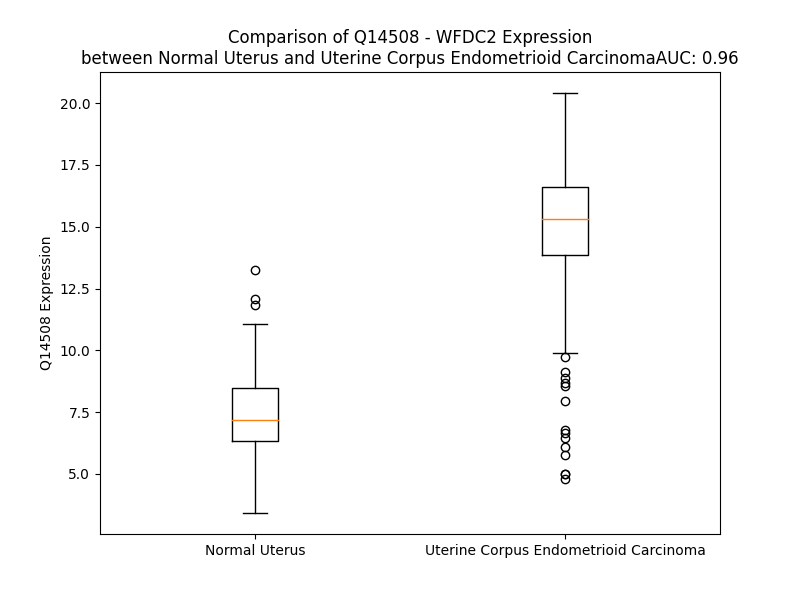

# Detailed Data for Q14508

## Introduction to the Detailed Summary

### How to Interpret the Results

- **Summary & Metrics**: This section provides a quick reference to essential protein attributes, including expression changes, family classification, and biomarker applications. Regulation status (upregulated/downregulated) indicates the protein's behavior in a disease context. Some information comes from the original excel file with the proteins selected from literature, while others are derived from the analyses.
- **Expression Comparison**: A visual representation comparing protein expression between normal and disease states. It highlights significant changes in expression levels that might indicate diagnostic or therapeutic relevance. This is data coming from transcriptomics experiments and could not translate similarly to protein levels.
- **Isoform Alignment**: An interactive view of isoform alignments, revealing structural and functional differences between variants of the protein.
- **Interactors & Homologs**: Tables listing known interaction partners and homologous proteins, the more interactors and homologs, the more complex the protein is to design an antibody for.
- **Biological Assemblies**: Information about the structural arrangement of the protein in different assemblies, providing insights into its functional state but also the complexity of the protein to develop antibodies.
- **Combined Per-Residue Information**: A detailed table summarizing residue-level data. This includes predictions for epitope regions, aggregation tendencies, and modifications that might impact the protein's function. Each row corresponds to a residue in the protein, providing insights into specific sites that may be important for research or drug development.
## Summary & Metrics

- **UniProt Accession**: Q14508
- **Gene Name**: WFDC2 (HE4)
- **Protein Name**: WAP four-disulfide core domain 2 (human epididymis secretory protein 4 (HE4)
- **Swiss Prot**: WFDC2_HUMAN
- **Family**: other
- **Biomarker Application**: diagnosis,unspecified application
- **Number of Isoforms**: 5
- **Regulation**: 1
- **(transcriptomics) AUC**: 0.96
- **(transcriptomics) Fold Change**: 1.96
- **(transcriptomics) Regulation**: Upregulated
- **Discotope Epitope Count**: 16
- **Max n_uniprots (Homo)**: N/A
- **Max n_uniprots (Hetero)**: N/A

## Expression Comparison

## Isoform Alignment

<pre style='font-size:14px; font-family:monospace;'>Q14508-1 MPACRLGPLAAALLLSLLLFGFTLVSGTGAEKTGVCPELQADQNCTQECVSDSECADNLKCCSAGCATFCSLPNDKEGSCPQVNINFPQLGLCRDQCQVDSQCPGQMKCCRNGCGKVSCVTPNF
Q14508-2 ---------------------------------------------------MLQVQVNLPVSPLPTYPYSFFYPDKEGSCPQVNINFPQLGLCRDQCQVDSQCPGQMKCCRNGCGKVSCVTPNF
Q14508-3 MPACRLGPLAAALLLSLLLFGFTLVS------------------------------------------------DKEGSCPQVNINFPQLGLCRDQCQVDSQCPGQMKCCRNGCGKVSCVTPNF
Q14508-4 MPACRLGPLAAALLLSLLLFGFTLVSGTGAEKTGVCPELQADQNCTQECVSDSECADNLKCCSAGCATFCLLCPNGQLAE--------------------------------------------
Q14508-5 MPACRLGPLAAALLLSLLLFGFTLVSGTGAEKTGVCPELQADQNCTQECVSDSECADNLKCCSAGCATFCSLPNALFHWHLKTRRLWEISGPRPRRPTWDSS----------------------
</pre>

## Interactors

| preferredName_A   | preferredName_B   | score   |
|-------------------|-------------------|---------|

## Homologs

| uniprot_id   | gene_id   |
|--------------|-----------|

## Combined Per-Residue Information

|   res | aa   |   epitope_score | epitope   |   relative_surface_accessibility |   modeling_confidence |   Aggregation | modification   | glycosylation                   |
|------:|:-----|----------------:|:----------|---------------------------------:|----------------------:|--------------:|:---------------|:--------------------------------|
|     1 | M    |         0.33072 | False     |                          1.29286 |                 41.59 |         0     | N/A            | N/A                             |
|     2 | P    |         0.42562 | True      |                          0.95428 |                 54.82 |         0     | N/A            | N/A                             |
|     3 | A    |         0.33555 | False     |                          0.97319 |                 55.58 |         0     | N/A            | N/A                             |
|     4 | C    |         0.27629 | False     |                          0.82496 |                 57.98 |         0     | N/A            | N/A                             |
|     5 | R    |         0.32262 | False     |                          0.88834 |                 57.56 |         0     | N/A            | N/A                             |
|     6 | L    |         0.31796 | False     |                          0.84683 |                 59.09 |         0     | N/A            | N/A                             |
|     7 | G    |         0.25154 | False     |                          0.69151 |                 60.73 |         0     | N/A            | N/A                             |
|     8 | P    |         0.25653 | False     |                          0.64094 |                 61.53 |         0.536 | N/A            | N/A                             |
|     9 | L    |         0.23682 | False     |                          0.77978 |                 59.22 |        48.889 | N/A            | N/A                             |
|    10 | A    |         0.14624 | False     |                          0.55433 |                 61.51 |        57.816 | N/A            | N/A                             |
|    11 | A    |         0.13172 | False     |                          0.53295 |                 62.81 |        68.424 | N/A            | N/A                             |
|    12 | A    |         0.13509 | False     |                          0.57556 |                 67.82 |        80.964 | N/A            | N/A                             |
|    13 | L    |         0.16917 | False     |                          0.72926 |                 67.36 |        95.803 | N/A            | N/A                             |
|    14 | L    |         0.18895 | False     |                          0.66728 |                 65.66 |        98.519 | N/A            | N/A                             |
|    15 | L    |         0.17169 | False     |                          0.70213 |                 64.01 |        99.015 | N/A            | N/A                             |
|    16 | S    |         0.13377 | False     |                          0.41352 |                 65.59 |        99.101 | N/A            | N/A                             |
|    17 | L    |         0.19271 | False     |                          0.75789 |                 65.49 |        99.819 | N/A            | N/A                             |
|    18 | L    |         0.17302 | False     |                          0.61623 |                 62.32 |        99.946 | N/A            | N/A                             |
|    19 | L    |         0.2004  | False     |                          0.75066 |                 61.25 |        99.942 | N/A            | N/A                             |
|    20 | F    |         0.22887 | False     |                          0.84622 |                 57.33 |        99.798 | N/A            | N/A                             |
|    21 | G    |         0.22006 | False     |                          0.5508  |                 57.59 |        97.978 | N/A            | N/A                             |
|    22 | F    |         0.28415 | False     |                          0.82485 |                 55.53 |        97.813 | N/A            | N/A                             |
|    23 | T    |         0.18145 | False     |                          0.71224 |                 52.35 |        95.784 | N/A            | N/A                             |
|    24 | L    |         0.20217 | False     |                          0.97318 |                 55.2  |        94.576 | N/A            | N/A                             |
|    25 | V    |         0.21103 | False     |                          0.93554 |                 55.87 |        87.977 | N/A            | N/A                             |
|    26 | S    |         0.16852 | False     |                          0.70304 |                 54.96 |        10.27  | N/A            | N/A                             |
|    27 | G    |         0.23393 | False     |                          0.59543 |                 50.46 |         0.683 | N/A            | N/A                             |
|    28 | T    |         0.23021 | False     |                          0.92726 |                 52.08 |         0.242 | N/A            | N/A                             |
|    29 | G    |         0.14818 | False     |                          0.34183 |                 61.28 |         0.025 | N/A            | N/A                             |
|    30 | A    |         0.1851  | False     |                          0.81781 |                 72.75 |         0.02  | N/A            | N/A                             |
|    31 | E    |         0.21277 | False     |                          0.77256 |                 85.58 |         0     | N/A            | N/A                             |
|    32 | K    |         0.32761 | False     |                          0.21258 |                 89.26 |         0     | N/A            | N/A                             |
|    33 | T    |         0.23984 | False     |                          0.76796 |                 88.14 |         0     | N/A            | N/A                             |
|    34 | G    |         0.23843 | False     |                          0.30869 |                 85.65 |         0     | N/A            | N/A                             |
|    35 | V    |         0.4463  | True      |                          0.67216 |                 90    |         0     | N/A            | N/A                             |
|    36 | C    |         0.33099 | False     |                          0.29948 |                 92.41 |         0     | N/A            | N/A                             |
|    37 | P    |         0.24586 | False     |                          0.21995 |                 90.83 |         0     | N/A            | N/A                             |
|    38 | E    |         0.48996 | True      |                          0.91794 |                 90.81 |         0     | N/A            | N/A                             |
|    39 | L    |         0.62346 | True      |                          0.28696 |                 90.87 |         0     | N/A            | N/A                             |
|    40 | Q    |         0.41205 | True      |                          0.87719 |                 92.22 |         0     | N/A            | N/A                             |
|    41 | A    |         0.26653 | False     |                          0.51878 |                 92.1  |         0     | N/A            | N/A                             |
|    42 | D    |         0.31522 | False     |                          0.31324 |                 90.54 |         0     | N/A            | N/A                             |
|    43 | Q    |         0.41732 | True      |                          0.78267 |                 91.04 |         0     | N/A            | N/A                             |
|    44 | N    |         0.36704 | False     |                          0.76303 |                 93.79 |         0     | N/A            | N-linked (GlcNAc...) asparagine |
|    45 | C    |         0.20883 | False     |                          0.47818 |                 93.66 |         0     | N/A            | N/A                             |
|    46 | T    |         0.33741 | False     |                          0.58635 |                 94.92 |         0     | N/A            | N/A                             |
|    47 | Q    |         0.37516 | False     |                          0.67205 |                 95.75 |         0     | N/A            | N/A                             |
|    48 | E    |         0.41046 | True      |                          0.56863 |                 95.58 |         0     | N/A            | N/A                             |
|    49 | C    |         0.05485 | False     |                          0.02128 |                 96.71 |         0     | N/A            | N/A                             |
|    50 | V    |         0.26268 | False     |                          0.86557 |                 95.02 |         0     | N/A            | N/A                             |
|    51 | S    |         0.11307 | False     |                          0.14015 |                 95.03 |         0     | N/A            | N/A                             |
|    52 | D    |         0.14056 | False     |                          0.09077 |                 95.16 |         0     | N/A            | N/A                             |
|    53 | S    |         0.20138 | False     |                          0.51525 |                 94.82 |         0     | N/A            | N/A                             |
|    54 | E    |         0.28654 | False     |                          0.50744 |                 95.92 |         0     | N/A            | N/A                             |
|    55 | C    |         0.20374 | False     |                          0.06438 |                 94.92 |         0     | N/A            | N/A                             |
|    56 | A    |         0.29106 | False     |                          0.60283 |                 93.8  |         0     | N/A            | N/A                             |
|    57 | D    |         0.50102 | True      |                          0.79143 |                 88.56 |         0     | N/A            | N/A                             |
|    58 | N    |         0.20939 | False     |                          0.40486 |                 85.92 |         0     | N/A            | N/A                             |
|    59 | L    |         0.28172 | False     |                          0.30584 |                 90.97 |         0     | N/A            | N/A                             |
|    60 | K    |         0.11811 | False     |                          0.07013 |                 94.2  |         0     | N/A            | N/A                             |
|    61 | C    |         0.08673 | False     |                          0.1702  |                 96.27 |         0     | N/A            | N/A                             |
|    62 | C    |         0.02346 | False     |                          0.00401 |                 95.88 |         0     | N/A            | N/A                             |
|    63 | S    |         0.28305 | False     |                          0.59461 |                 95.83 |         0     | N/A            | N/A                             |
|    64 | A    |         0.05085 | False     |                          0.01148 |                 95.01 |         0     | N/A            | N/A                             |
|    65 | G    |         0.29038 | False     |                          0.69566 |                 93.62 |         0     | N/A            | N/A                             |
|    66 | C    |         0.38607 | False     |                          0.45195 |                 94.69 |         0     | N/A            | N/A                             |
|    67 | A    |         0.06694 | False     |                          0.01625 |                 96.51 |         0     | N/A            | N/A                             |
|    68 | T    |         0.31775 | False     |                          0.20198 |                 96.96 |         0     | N/A            | N/A                             |
|    69 | F    |         0.34391 | False     |                          0.31006 |                 95.32 |         0     | N/A            | N/A                             |
|    70 | C    |         0.13238 | False     |                          0.22395 |                 95.34 |         0     | N/A            | N/A                             |
|    71 | S    |         0.22775 | False     |                          0.08766 |                 93.09 |         0     | N/A            | N/A                             |
|    72 | L    |         0.23115 | False     |                          0.41154 |                 89.51 |         0     | N/A            | N/A                             |
|    73 | P    |         0.03622 | False     |                          0.01392 |                 90.11 |         0     | N/A            | N/A                             |
|    74 | N    |         0.34098 | False     |                          0.1914  |                 87.87 |         0     | N/A            | N/A                             |
|    75 | D    |         0.22158 | False     |                          0.39933 |                 86.05 |         0     | N/A            | N/A                             |
|    76 | K    |         0.18517 | False     |                          0.08008 |                 86.28 |         0     | N/A            | N/A                             |
|    77 | E    |         0.23501 | False     |                          0.61269 |                 86.56 |         0     | N/A            | N/A                             |
|    78 | G    |         0.29541 | False     |                          0.35398 |                 89.94 |         0     | N/A            | N/A                             |
|    79 | S    |         0.22724 | False     |                          0.53861 |                 93.3  |         0     | N/A            | N/A                             |
|    80 | C    |         0.32712 | False     |                          0.37162 |                 93.41 |         0     | N/A            | N/A                             |
|    81 | P    |         0.16886 | False     |                          0.33946 |                 91.58 |         0     | N/A            | N/A                             |
|    82 | Q    |         0.31918 | False     |                          0.85981 |                 88.34 |         0     | N/A            | N/A                             |
|    83 | V    |         0.28791 | False     |                          0.39572 |                 82.62 |         0     | N/A            | N/A                             |
|    84 | N    |         0.26511 | False     |                          0.64167 |                 73.9  |         0     | N/A            | N/A                             |
|    85 | I    |         0.45556 | True      |                          0.82184 |                 70.77 |         0     | N/A            | N/A                             |
|    86 | N    |         0.40971 | True      |                          0.68373 |                 66.6  |         0     | N/A            | N/A                             |
|    87 | F    |         0.30543 | False     |                          0.78602 |                 60.36 |         0     | N/A            | N/A                             |
|    88 | P    |         0.32668 | False     |                          0.8815  |                 60.1  |         0     | N/A            | N/A                             |
|    89 | Q    |         0.37663 | False     |                          0.50426 |                 62.78 |         0     | N/A            | N/A                             |
|    90 | L    |         0.40249 | False     |                          1.11834 |                 59.54 |         0     | N/A            | N/A                             |
|    91 | G    |         0.47743 | True      |                          0.77975 |                 68.77 |         0     | N/A            | N/A                             |
|    92 | L    |         0.51148 | True      |                          0.77276 |                 70.52 |         0     | N/A            | N/A                             |
|    93 | C    |         0.2632  | False     |                          0.51063 |                 84.72 |         0     | N/A            | N/A                             |
|    94 | R    |         0.41334 | True      |                          0.60104 |                 90.19 |         0     | N/A            | N/A                             |
|    95 | D    |         0.32401 | False     |                          0.47337 |                 93.6  |         0     | N/A            | N/A                             |
|    96 | Q    |         0.53277 | True      |                          0.56749 |                 93.07 |         0     | N/A            | N/A                             |
|    97 | C    |         0.1107  | False     |                          0.04481 |                 93.84 |         0     | N/A            | N/A                             |
|    98 | Q    |         0.501   | True      |                          0.77327 |                 93.47 |         0     | N/A            | N/A                             |
|    99 | V    |         0.24559 | False     |                          0.33894 |                 92.55 |         0     | N/A            | N/A                             |
|   100 | D    |         0.11071 | False     |                          0.05132 |                 93.17 |         0     | N/A            | N/A                             |
|   101 | S    |         0.22601 | False     |                          0.29    |                 88.93 |         0     | N/A            | N/A                             |
|   102 | Q    |         0.40046 | False     |                          0.52882 |                 92.69 |         0     | N/A            | N/A                             |
|   103 | C    |         0.14285 | False     |                          0.04546 |                 92.76 |         0     | N/A            | N/A                             |
|   104 | P    |         0.27136 | False     |                          0.65628 |                 93.44 |         0     | N/A            | N/A                             |
|   105 | G    |         0.42982 | True      |                          0.80281 |                 90.42 |         0     | N/A            | N/A                             |
|   106 | Q    |         0.30209 | False     |                          0.62746 |                 88.99 |         0     | N/A            | N/A                             |
|   107 | M    |         0.29089 | False     |                          0.31572 |                 93.27 |         0     | N/A            | N/A                             |
|   108 | K    |         0.1453  | False     |                          0.10366 |                 94.19 |         0     | N/A            | N/A                             |
|   109 | C    |         0.08316 | False     |                          0.14236 |                 94.53 |         0     | N/A            | N/A                             |
|   110 | C    |         0.05503 | False     |                          0.01302 |                 93.74 |         0     | N/A            | N/A                             |
|   111 | R    |         0.34411 | False     |                          0.71715 |                 91.6  |         0     | N/A            | N/A                             |
|   112 | N    |         0.1793  | False     |                          0.13777 |                 84.36 |         0     | N/A            | N/A                             |
|   113 | G    |         0.23555 | False     |                          0.30736 |                 81.9  |         0     | N/A            | N/A                             |
|   114 | C    |         0.29194 | False     |                          0.38546 |                 85.78 |         0     | N/A            | N/A                             |
|   115 | G    |         0.18004 | False     |                          0.60861 |                 85.53 |         0     | N/A            | N/A                             |
|   116 | K    |         0.31777 | False     |                          0.36574 |                 90.69 |         0     | N/A            | N/A                             |
|   117 | V    |         0.34483 | False     |                          0.22469 |                 92.61 |         0     | N/A            | N/A                             |
|   118 | S    |         0.17858 | False     |                          0.12103 |                 93.06 |         0     | N/A            | N/A                             |
|   119 | C    |         0.12864 | False     |                          0.29258 |                 93.64 |         0     | N/A            | N/A                             |
|   120 | V    |         0.26034 | False     |                          0.27134 |                 93.1  |         0     | N/A            | N/A                             |
|   121 | T    |         0.25343 | False     |                          0.71027 |                 93.72 |         0     | N/A            | N/A                             |
|   122 | P    |         0.09463 | False     |                          0.0695  |                 93.26 |         0     | N/A            | N/A                             |
|   123 | N    |         0.15189 | False     |                          0.52476 |                 94.01 |         0     | N/A            | N/A                             |
|   124 | F    |         0.20796 | False     |                          0.8598  |                 89.8  |         0     | N/A            | N/A                             |

