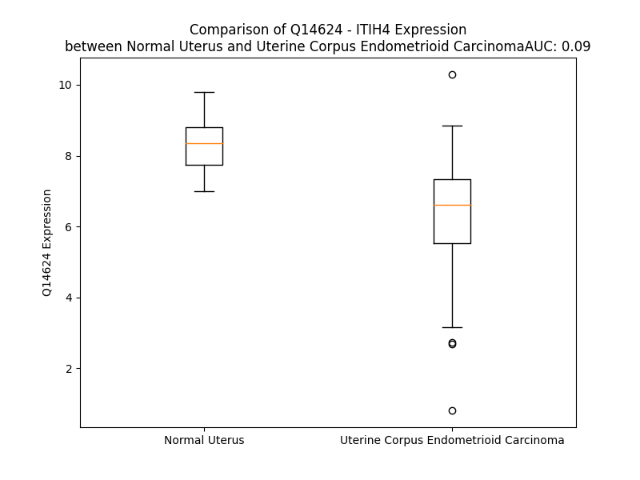

# Detailed Data for Q14624

## Introduction to the Detailed Summary

### How to Interpret the Results

- **Summary & Metrics**: This section provides a quick reference to essential protein attributes, including expression changes, family classification, and biomarker applications. Regulation status (upregulated/downregulated) indicates the protein's behavior in a disease context. Some information comes from the original excel file with the proteins selected from literature, while others are derived from the analyses.
- **Expression Comparison**: A visual representation comparing protein expression between normal and disease states. It highlights significant changes in expression levels that might indicate diagnostic or therapeutic relevance. This is data coming from transcriptomics experiments and could not translate similarly to protein levels.
- **Isoform Alignment**: An interactive view of isoform alignments, revealing structural and functional differences between variants of the protein.
- **Interactors & Homologs**: Tables listing known interaction partners and homologous proteins, the more interactors and homologs, the more complex the protein is to design an antibody for.
- **Biological Assemblies**: Information about the structural arrangement of the protein in different assemblies, providing insights into its functional state but also the complexity of the protein to develop antibodies.
- **Combined Per-Residue Information**: A detailed table summarizing residue-level data. This includes predictions for epitope regions, aggregation tendencies, and modifications that might impact the protein's function. Each row corresponds to a residue in the protein, providing insights into specific sites that may be important for research or drug development.
## Summary & Metrics

- **UniProt Accession**: Q14624
- **Gene Name**: ITIH4 (IHRP)
- **Protein Name**: Inter-alpha-trypsin inhibitor heavy chain H4
- **Swiss Prot**: ITIH4_HUMAN
- **Family**: other
- **Biomarker Application**: diagnosis
- **Number of Isoforms**: 4
- **Regulation**: 1
- **(transcriptomics) AUC**: 0.09
- **(transcriptomics) Fold Change**: 1.30
- **(transcriptomics) Regulation**: Downregulated
- **Discotope Epitope Count**: 242
- **Max n_uniprots (Homo)**: N/A
- **Max n_uniprots (Hetero)**: N/A

## Expression Comparison

## Isoform Alignment

<pre style='font-size:14px; font-family:monospace;'>Q14624-1 MKPPRPVRTCSKVLVLLSLLAIHQTTTAEKNGIDIYSLTVDSRVSSRFAHTVVTSRVVNRANTVQEATFQMELPKKAFITNFSMIIDGMTYPGIIKEKAEAQAQYSAAVAKGKSAGLVKATGRNMEQFQVSVSVAPNAKITFELVYEELLKRRLGVYELLLKVRPQQLVKHLQMDIHIFEPQGISFLETESTFMTNQLVDALTTWQNKTKAHIRFKPTLSQQQKSPEQQETVLDGNLIIRYDVDRAISGGSIQIENGYFVHYFAPEGLTTMPKNVVFVIDKSGSMSGRKIQQTREALIKILDDLSPRDQFNLIVFSTEATQWRPSLVPASAENVNKARSFAAGIQALGGTNINDAMLMAVQLLDSSNQEERLPEGSVSLIILLTDGDPTVGETNPRSIQNNVREAVSGRYSLFCLGFGFDVSYAFLEKLALDNGGLARRIHEDSDSALQLQDFYQEVANPLLTAVTFEYPSNAVEEVTQNNFRLLFKGSEMVVAGKLQDRGPDVLTATVSGKLPTQNITFQTESSVAEQEAEFQSPKYIFHNFMERLWAYLTIQQLLEQTVSASDADQQALRNQALNLSLAYSFVTPLTSMVVTKPDDQEQSQVAEKPMEGESRNRNVHSGSTFFKYYLQGAKIPKPEASFSPRRGWNRQAGAAGSRMNFRPGVLSSRQLGLPGPPDVPDHAAYHPFRRLAILPASAPPATSNPDPAVSRVMNMKIEETTMTTQT--------------PAPIQAPSAILPLPGQSVERLCVDPRHRQGPVNLLSDPEQGVEVTGQYEREKAGFSWIEVTFKNPLVWVHASPEHVVVTRNRRSSAYKWKETLFSVMPGLKMTMDKTGLLLLSDPDKVTIGLLFWDGRGEGLRLLLRDTDRFSSHVGGTLGQFYQEVLWGSPAASDDGRRTLRVQGNDHSATRERRLDYQEGPPGVEISCWSVEL
Q14624-2 MKPPRPVRTCSKVLVLLSLLAIHQTTTAEKNGIDIYSLTVDSRVSSRFAHTVVTSRVVNRANTVQEATFQMELPKKAFITNFSMIIDGMTYPGIIKEKAEAQAQYSAAVAKGKSAGLVKATGRNMEQFQVSVSVAPNAKITFELVYEELLKRRLGVYELLLKVRPQQLVKHLQMDIHIFEPQGISFLETESTFMTNQLVDALTTWQNKTKAHIRFKPTLSQQQKSPEQQETVLDGNLIIRYDVDRAISGGSIQIENGYFVHYFAPEGLTTMPKNVVFVIDKSGSMSGRKIQQTREALIKILDDLSPRDQFNLIVFSTEATQWRPSLVPASAENVNKARSFAAGIQALGGTNINDAMLMAVQLLDSSNQEERLPEGSVSLIILLTDGDPTVGETNPRSIQNNVREAVSGRYSLFCLGFGFDVSYAFLEKLALDNGGLARRIHEDSDSALQLQDFYQEVANPLLTAVTFEYPSNAVEEVTQNNFRLLFKGSEMVVAGKLQDRGPDVLTATVSGKLPTQNITFQTESSVAEQEAEFQSPKYIFHNFMERLWAYLTIQQLLEQTVSASDADQQALRNQALNLSLAYSFVTPLTSMVVTKPDDQEQSQVAEKPMEGESRNRNVHS------------------------------AGAAGSRMNFRPGVLSSRQLGLPGPPDVPDHAAYHPFRRLAILPASAPPATSNPDPAVSRVMNMKIEETTMTTQTPACPSCSRSRAPAVPAPIQAPSAILPLPGQSVERLCVDPRHRQGPVNLLSDPEQGVEVTGQYEREKAGFSWIEVTFKNPLVWVHASPEHVVVTRNRRSSAYKWKETLFSVMPGLKMTMDKTGLLLLSDPDKVTIGLLFWDGRGEGLRLLLRDTDRFSSHVGGTLGQFYQEVLWGSPAASDDGRRTLRVQGNDHSATRERRLDYQEGPPGVEISCWSVEL
Q14624-3 MKPPRPVRTCSKVLVLLSLLAIHQTTTAEKNGIDIYSLTVDSRVSSRFAHTVVTSRVVNRANTVQEATFQMELPKKAFITNFSMIIDGMTYPGIIKEKAEAQAQYSAAVAKGKSAGLVKATGRNMEQFQVSVSVAPNAKITFELVYEELLKRRLGVYELLLKVRPQQLVKHLQMDIHIFEPQGISFLETESTFMTNQLVDALTTWQNKTKAHIRFKPTLSQQQKSPEQQETVLDGNLIIRYDVDRAISGGSIQIENGYFVHYFAPEGLTTMPKNVVFVIDKSGSMSGRKIQQTREALIKILDDLSPRDQFNLIVFSTEATQWRPSLVPASAENVNKARSFAAGIQALGGTNINDAMLMAVQLLDSSNQEERLPEGSVSLIILLTDGDPTVGETNPRSIQNNVREAVSGRYSLFCLGFGFDVSYAFLEKLALDNGGLARRIHEDSDSALQLQDFYQEVANPLLTAVTFEYPSNAVEEVTQNNFRLLFKGSEMVVAGKLQDRGPDVLTATVSGKLPTQNITFQTESSVAEQEAEFQSPKYIFHNFMERLWAYLTIQQLLEQTVSASDADQQALRNQALNLSLAYSFVTPLTSMVVTKPDDQEQSQVAEKPMEGESRNRNVHS------------------------------AGAAGSRMNFRPGVLSSRQLGLPGPPDVPDHAAYHPFRRLAILPASAPPATSNPDPAVSRVMNMKIEETTMTTQT--------------PAPIQAPSAILPLPGQSVERLCVDPRHRQGPVNLLSDPEQGVEVTGQYEREKAGFSWIEVTFKNPLVWVHASPEHVVVTRNRRSSAYKWKETLFSVMPGLKMTMDKTGLLLLSDPDKVTIGLLFWDGRGEGLRLLLRDTDRFSSHVGGTLGQFYQEVLWGSPAASDDGRRTLRVQGNDHSATRERRLDYQEGPPGVEISCWSVEL
Q14624-4 MKPPRPVRTCSKVLVLLSLLAIHQTTTAEKNGIDIYSLTVDSRVSSRFAHTVVTSRVVNRANTVQEATFQMELPKKAFITNFSMIIDGMTYPGIIKEKAEAQAQYSAAVAKGKSAGLVKATGRNMEQFQVSVSVAPNAKITFELVYEELLKRRLGVYELLLKVRPQQLVKHLQMDIHIFEPQGISFLETESTFMTNQLVDALTTWQNKTKAHIRFKPTLSQQQKSPEQQETVLDGNLIIRYDVDRAISGGSIQIENGYFVHYFAPEGLTTMPKNVVFVIDKSGSMSGRKIQQTREALIKILDDLSPRDQFNLIVFSTEATQWRPSLVPASAENVNKARSFAAGIQALGGTNINDAMLMAVQLLDSSNQEERLPEGSVSLIILLTDGDPTVGETNPRSIQNNVREAVSGRYSLFCLGFGFDVSYAFLEKLALDNGGLARRIHEDSDSALQLQDFYQEVANPLLTAVTFEYPSNAVEEVTQNNFRLLFKGSEMVVAGKLQDRGPDVLTATVSGKLPTQNITFQTESSVAEQEAEFQSPKYIFHNFMERLWAYLTIQQLLEQTVSASDADQQALRNQALNLSLAYSFVTPLTSMVVTKPDDQEQSQVAEKPMEGESRNRNVHS------------------------------AGAAGSRMNFRPGVLSSRQLGLPGPPDVPDHAAYHPFRRLAILPASAPPATSNPDPAVSRVMNMKIEETTMTTQTP-----------------------------------------------------GVEVTGQYEREKAGFSWIEVTFKNPLVWVHASPEHVVVTRNRRSSAYKWKETLFSVMPGLKMTMDKTGLLLLSDPDKVTIGLLFW----------------FSSHVGGTLGQFYQEVLWGSPAASDDGRRTLRVQGNDHSATRERRLDYQEGPPGVEISCWSVEL
</pre>

## Interactors

| preferredName_A   | preferredName_B   |   score |
|:------------------|:------------------|--------:|
| ITIH4             | CXCR4             |   0.999 |
| ITIH4             | CD4               |   0.999 |
| ITIH4             | CCR5              |   0.999 |
| ITIH4             | CD209             |   0.998 |
| ITIH4             | SCD5              |   0.997 |
| ITIH4             | ERVW-1            |   0.993 |
| ITIH4             | PPP2R3C           |   0.972 |
| ITIH4             | CLEC4M            |   0.969 |
| ITIH4             | CD207             |   0.927 |

## Homologs

| uniprot_id   | gene_id   |
|:-------------|:----------|
| H3BUS3       | VWA3A     |
| Q9UKK3       | PARP4     |
| P19823       | ITIH2     |
| F8W737       | VWA3B     |
| Q06033       | ITIH3     |
| P19827       | ITIH1     |
| Q5TIE3       | VWA5B1    |
| A0A096LP62   | ITIH5     |
| E9PF42       | VWA5B2    |
| B4DHS6       | VWA5A     |
| Q6UXX5       | ITIH6     |

## Combined Per-Residue Information

|   res | aa   |   epitope_score | epitope   |   relative_surface_accessibility |   modeling_confidence |   Aggregation | modification   | glycosylation                             |
|------:|:-----|----------------:|:----------|---------------------------------:|----------------------:|--------------:|:---------------|:------------------------------------------|
|     1 | M    |         0.11978 | True      |                          1.35235 |                 46.58 |         0     | N/A            | N/A                                       |
|     2 | K    |         0.13259 | True      |                          0.96951 |                 38.76 |         0     | N/A            | N/A                                       |
|     3 | P    |         0.1594  | True      |                          0.84707 |                 62.64 |         0     | N/A            | N/A                                       |
|     4 | P    |         0.1533  | True      |                          0.85851 |                 56.49 |         0     | N/A            | N/A                                       |
|     5 | R    |         0.16258 | True      |                          0.86929 |                 40.09 |         0     | N/A            | N/A                                       |
|     6 | P    |         0.12916 | True      |                          0.94331 |                 50.07 |         0     | N/A            | N/A                                       |
|     7 | V    |         0.15283 | True      |                          0.80739 |                 40.42 |         0     | N/A            | N/A                                       |
|     8 | R    |         0.21956 | True      |                          0.88256 |                 38.72 |         0     | N/A            | N/A                                       |
|     9 | T    |         0.2034  | True      |                          0.89059 |                 38.2  |         0     | N/A            | N/A                                       |
|    10 | C    |         0.2032  | True      |                          0.91202 |                 32.09 |         0     | N/A            | N/A                                       |
|    11 | S    |         0.14465 | True      |                          0.78369 |                 30.66 |         0     | N/A            | N/A                                       |
|    12 | K    |         0.19047 | True      |                          0.94477 |                 33.2  |         0     | N/A            | N/A                                       |
|    13 | V    |         0.09814 | False     |                          0.98882 |                 35.98 |        88.243 | N/A            | N/A                                       |
|    14 | L    |         0.10468 | True      |                          0.99411 |                 32.53 |        95.567 | N/A            | N/A                                       |
|    15 | V    |         0.11464 | True      |                          0.82086 |                 39.35 |        99.225 | N/A            | N/A                                       |
|    16 | L    |         0.13232 | True      |                          0.9763  |                 31.64 |        99.531 | N/A            | N/A                                       |
|    17 | L    |         0.13233 | True      |                          0.97881 |                 38.97 |        99.581 | N/A            | N/A                                       |
|    18 | S    |         0.15913 | True      |                          0.80284 |                 31.07 |        97.542 | N/A            | N/A                                       |
|    19 | L    |         0.10767 | True      |                          1.02079 |                 36.34 |        97.266 | N/A            | N/A                                       |
|    20 | L    |         0.13486 | True      |                          0.91392 |                 30.95 |        95.702 | N/A            | N/A                                       |
|    21 | A    |         0.14174 | True      |                          1.02987 |                 32.26 |        87.133 | N/A            | N/A                                       |
|    22 | I    |         0.18638 | True      |                          0.72312 |                 29.84 |        79.885 | N/A            | N/A                                       |
|    23 | H    |         0.16234 | True      |                          0.81984 |                 28.42 |         0.675 | N/A            | N/A                                       |
|    24 | Q    |         0.12813 | True      |                          0.71862 |                 27.18 |         0.09  | N/A            | N/A                                       |
|    25 | T    |         0.0807  | False     |                          0.95543 |                 28.42 |         0.067 | N/A            | N/A                                       |
|    26 | T    |         0.11116 | True      |                          0.66211 |                 30.79 |         0.053 | N/A            | N/A                                       |
|    27 | T    |         0.06396 | False     |                          0.42896 |                 40.34 |         0.045 | N/A            | N/A                                       |
|    28 | A    |         0.03271 | False     |                          0.16804 |                 47.29 |         0.011 | N/A            | N/A                                       |
|    29 | E    |         0.09504 | False     |                          0.31546 |                 58.01 |         0     | N/A            | N/A                                       |
|    30 | K    |         0.08087 | False     |                          0.68113 |                 62.75 |         0     | N/A            | N/A                                       |
|    31 | N    |         0.15768 | True      |                          0.716   |                 73.83 |         0     | N/A            | N/A                                       |
|    32 | G    |         0.05115 | False     |                          0.11762 |                 84.54 |         0     | N/A            | N/A                                       |
|    33 | I    |         0.06629 | False     |                          0.0888  |                 91.07 |         0     | N/A            | N/A                                       |
|    34 | D    |         0.03653 | False     |                          0.1069  |                 92.93 |         0     | N/A            | N/A                                       |
|    35 | I    |         0.04774 | False     |                          0.12399 |                 94.46 |         1.429 | N/A            | N/A                                       |
|    36 | Y    |         0.11284 | True      |                          0.2544  |                 94.61 |         1.564 | N/A            | N/A                                       |
|    37 | S    |         0.02089 | False     |                          0.05005 |                 97.19 |         1.564 | N/A            | N/A                                       |
|    38 | L    |         0.01985 | False     |                          0.11702 |                 97.34 |         1.564 | N/A            | N/A                                       |
|    39 | T    |         0.08216 | False     |                          0.2946  |                 97.86 |         1.564 | N/A            | N/A                                       |
|    40 | V    |         0.0133  | False     |                          0.0655  |                 97.79 |         1.564 | N/A            | N/A                                       |
|    41 | D    |         0.04608 | False     |                          0.23655 |                 97.45 |         0     | N/A            | N/A                                       |
|    42 | S    |         0.00197 | False     |                          0       |                 97.81 |         0     | N/A            | N/A                                       |
|    43 | R    |         0.03196 | False     |                          0.26779 |                 97.11 |         0     | N/A            | N/A                                       |
|    44 | V    |         0.00149 | False     |                          0       |                 97.26 |         0     | N/A            | N/A                                       |
|    45 | S    |         0.00159 | False     |                          0       |                 95.07 |         0     | N/A            | N/A                                       |
|    46 | S    |         0.00236 | False     |                          0       |                 95.04 |         0     | N/A            | N/A                                       |
|    47 | R    |         0.00315 | False     |                          0.00991 |                 96.69 |         0     | N/A            | N/A                                       |
|    48 | F    |         0.00162 | False     |                          0       |                 97.55 |         0.146 | N/A            | N/A                                       |
|    49 | A    |         0.00111 | False     |                          0.00693 |                 97.64 |         0.146 | N/A            | N/A                                       |
|    50 | H    |         0.01416 | False     |                          0.16694 |                 97.49 |         0.146 | N/A            | N/A                                       |
|    51 | T    |         0.00508 | False     |                          0.00796 |                 97.63 |         0.146 | N/A            | N/A                                       |
|    52 | V    |         0.01128 | False     |                          0.2203  |                 97.15 |         0.146 | N/A            | N/A                                       |
|    53 | V    |         0.00212 | False     |                          0.00095 |                 97.29 |         0.146 | N/A            | N/A                                       |
|    54 | T    |         0.0194  | False     |                          0.1066  |                 97.41 |         0     | N/A            | N/A                                       |
|    55 | S    |         0.01131 | False     |                          0.03312 |                 96.22 |         0     | N/A            | N/A                                       |
|    56 | R    |         0.08065 | False     |                          0.38128 |                 96.24 |         0     | N/A            | N/A                                       |
|    57 | V    |         0.01171 | False     |                          0.02666 |                 94.3  |         0     | N/A            | N/A                                       |
|    58 | V    |         0.058   | False     |                          0.09235 |                 94.39 |         0     | N/A            | N/A                                       |
|    59 | N    |         0.01069 | False     |                          0       |                 94    |         0     | N/A            | N/A                                       |
|    60 | R    |         0.17982 | True      |                          0.44475 |                 93.77 |         0     | N/A            | N/A                                       |
|    61 | A    |         0.06667 | False     |                          0.20407 |                 92.61 |         0     | N/A            | N/A                                       |
|    62 | N    |         0.18582 | True      |                          0.84886 |                 92.11 |         0     | N/A            | N/A                                       |
|    63 | T    |         0.11569 | True      |                          0.56159 |                 92.9  |         0     | N/A            | N/A                                       |
|    64 | V    |         0.10581 | True      |                          0.66207 |                 87.95 |         0     | N/A            | N/A                                       |
|    65 | Q    |         0.08265 | False     |                          0.21242 |                 88.76 |         0     | N/A            | N/A                                       |
|    66 | E    |         0.0661  | False     |                          0.52021 |                 85.64 |         0     | N/A            | N/A                                       |
|    67 | A    |         0.00476 | False     |                          0.00255 |                 86.52 |         0     | N/A            | N/A                                       |
|    68 | T    |         0.07119 | False     |                          0.33802 |                 85.77 |         0     | N/A            | N/A                                       |
|    69 | F    |         0.01498 | False     |                          0.03901 |                 88.21 |         0     | N/A            | N/A                                       |
|    70 | Q    |         0.03817 | False     |                          0.26672 |                 88.38 |         0     | N/A            | N/A                                       |
|    71 | M    |         0.02651 | False     |                          0.09757 |                 89.7  |         0     | N/A            | N/A                                       |
|    72 | E    |         0.02727 | False     |                          0.08933 |                 90.89 |         0     | N/A            | N/A                                       |
|    73 | L    |         0.00478 | False     |                          0.00165 |                 92.37 |         0     | N/A            | N/A                                       |
|    74 | P    |         0.01313 | False     |                          0.10835 |                 92.5  |         0     | N/A            | N/A                                       |
|    75 | K    |         0.06349 | False     |                          0.26446 |                 88.96 |         0     | N/A            | N/A                                       |
|    76 | K    |         0.05299 | False     |                          0.49939 |                 90.64 |         0     | N/A            | N/A                                       |
|    77 | A    |         0.00098 | False     |                          0.00189 |                 94.44 |        14.186 | N/A            | N/A                                       |
|    78 | F    |         0.00403 | False     |                          0.01274 |                 94.56 |        60.056 | N/A            | N/A                                       |
|    79 | I    |         0.01152 | False     |                          0.03372 |                 93.43 |        60.512 | N/A            | N/A                                       |
|    80 | T    |         0.03242 | False     |                          0.10866 |                 93.43 |        60.512 | N/A            | N/A                                       |
|    81 | N    |         0.05032 | False     |                          0.32838 |                 92.94 |        60.583 | N/A            | N-linked (GlcNAc...) asparagine           |
|    82 | F    |         0.00381 | False     |                          0.00069 |                 91.44 |        62.385 | N/A            | N/A                                       |
|    83 | S    |         0.03494 | False     |                          0.03953 |                 91.3  |        61.951 | N/A            | N/A                                       |
|    84 | M    |         0.01558 | False     |                          0.01726 |                 88.94 |        61.951 | N/A            | N/A                                       |
|    85 | I    |         0.04352 | False     |                          0.34013 |                 91.53 |        61.951 | N/A            | N/A                                       |
|    86 | I    |         0.03817 | False     |                          0.09297 |                 84.93 |        56.952 | N/A            | N/A                                       |
|    87 | D    |         0.15801 | True      |                          0.67381 |                 80.62 |         0     | N/A            | N/A                                       |
|    88 | G    |         0.12074 | True      |                          0.83593 |                 83.93 |         0     | N/A            | N/A                                       |
|    89 | M    |         0.07899 | False     |                          0.57583 |                 86.67 |         0     | N/A            | N/A                                       |
|    90 | T    |         0.09641 | False     |                          0.55121 |                 89.43 |         0     | N/A            | N/A                                       |
|    91 | Y    |         0.06637 | False     |                          0.07073 |                 85.91 |         0     | N/A            | N/A                                       |
|    92 | P    |         0.06927 | False     |                          0.54255 |                 87.33 |         0     | N/A            | N/A                                       |
|    93 | G    |         0.02321 | False     |                          0.14633 |                 82.18 |         0     | N/A            | N/A                                       |
|    94 | I    |         0.09639 | False     |                          0.56877 |                 85.71 |         0     | N/A            | N/A                                       |
|    95 | I    |         0.03727 | False     |                          0.13678 |                 86.91 |         0     | N/A            | N/A                                       |
|    96 | K    |         0.08146 | False     |                          0.21287 |                 87.99 |         0     | N/A            | N/A                                       |
|    97 | E    |         0.10953 | True      |                          0.39591 |                 90.96 |         0     | N/A            | N/A                                       |
|    98 | K    |         0.0572  | False     |                          0.2103  |                 85.36 |         0     | N/A            | N/A                                       |
|    99 | A    |         0.07803 | False     |                          0.64674 |                 84.86 |         0     | N/A            | N/A                                       |
|   100 | E    |         0.13901 | True      |                          0.46496 |                 86.74 |         0     | N/A            | N/A                                       |
|   101 | A    |         0.00533 | False     |                          0       |                 80.3  |         0     | N/A            | N/A                                       |
|   102 | Q    |         0.14775 | True      |                          0.39543 |                 77.29 |         0     | N/A            | N/A                                       |
|   103 | A    |         0.12891 | True      |                          0.61228 |                 83.51 |         0     | N/A            | N/A                                       |
|   104 | Q    |         0.11429 | True      |                          0.26451 |                 76.12 |         0     | N/A            | N/A                                       |
|   105 | Y    |         0.21189 | True      |                          0.24494 |                 69.81 |         0     | N/A            | N/A                                       |
|   106 | S    |         0.1544  | True      |                          0.40708 |                 75.65 |         0     | N/A            | N/A                                       |
|   107 | A    |         0.11175 | True      |                          0.50908 |                 77.11 |         0     | N/A            | N/A                                       |
|   108 | A    |         0.05476 | False     |                          0.05394 |                 67.85 |         0     | N/A            | N/A                                       |
|   109 | V    |         0.1477  | True      |                          0.47898 |                 66.85 |         0     | N/A            | N/A                                       |
|   110 | A    |         0.24007 | True      |                          0.87238 |                 72.14 |         0     | N/A            | N/A                                       |
|   111 | K    |         0.12698 | True      |                          0.6001  |                 69.29 |         0     | N/A            | N/A                                       |
|   112 | G    |         0.30725 | True      |                          0.86472 |                 56.48 |         0     | N/A            | N/A                                       |
|   113 | K    |         0.07335 | False     |                          0.20492 |                 56.54 |         0     | N/A            | N/A                                       |
|   114 | S    |         0.0672  | False     |                          0.3865  |                 48.91 |         0     | N/A            | N/A                                       |
|   115 | A    |         0.15617 | True      |                          0.27149 |                 54.91 |         0     | N/A            | N/A                                       |
|   116 | G    |         0.01748 | False     |                          0.04464 |                 55.69 |         0     | N/A            | N/A                                       |
|   117 | L    |         0.17504 | True      |                          0.38806 |                 61.47 |         0     | N/A            | N/A                                       |
|   118 | V    |         0.03607 | False     |                          0.03717 |                 58.19 |         0     | N/A            | N/A                                       |
|   119 | K    |         0.18065 | True      |                          0.48096 |                 56.91 |         0     | N/A            | N/A                                       |
|   120 | A    |         0.10553 | True      |                          0.48801 |                 55.88 |         0     | N/A            | N/A                                       |
|   121 | T    |         0.12016 | True      |                          0.23889 |                 56.18 |         0     | N/A            | N/A                                       |
|   122 | G    |         0.2554  | True      |                          0.79991 |                 61.86 |         0     | N/A            | N/A                                       |
|   123 | R    |         0.13318 | True      |                          0.30149 |                 74.3  |         0     | N/A            | N/A                                       |
|   124 | N    |         0.09523 | False     |                          0.67596 |                 77.43 |         0     | N/A            | N/A                                       |
|   125 | M    |         0.04207 | False     |                          0.09579 |                 84.09 |         0     | N/A            | N/A                                       |
|   126 | E    |         0.01434 | False     |                          0.02714 |                 83.68 |         0     | N/A            | N/A                                       |
|   127 | Q    |         0.06562 | False     |                          0.18381 |                 82.74 |         0     | N/A            | N/A                                       |
|   128 | F    |         0.00778 | False     |                          0.00892 |                 83.92 |         0.459 | N/A            | N/A                                       |
|   129 | Q    |         0.04832 | False     |                          0.34207 |                 82.25 |         0.459 | N/A            | N/A                                       |
|   130 | V    |         0.01384 | False     |                          0.02475 |                 79.18 |         2.002 | N/A            | N/A                                       |
|   131 | S    |         0.07046 | False     |                          0.12403 |                 78.08 |         2.002 | N/A            | N/A                                       |
|   132 | V    |         0.01041 | False     |                          0.02666 |                 79.22 |         2.002 | N/A            | N/A                                       |
|   133 | S    |         0.03027 | False     |                          0.33165 |                 81.44 |         1.815 | N/A            | N/A                                       |
|   134 | V    |         0.01199 | False     |                          0.02571 |                 83.89 |         1.815 | N/A            | N/A                                       |
|   135 | A    |         0.03562 | False     |                          0.48329 |                 89.33 |         0     | N/A            | N/A                                       |
|   136 | P    |         0.05374 | False     |                          0.40351 |                 91.39 |         0     | N/A            | N/A                                       |
|   137 | N    |         0.08374 | False     |                          0.63302 |                 89.67 |         0     | N/A            | N/A                                       |
|   138 | A    |         0.03452 | False     |                          0.14012 |                 91.63 |         0.368 | N/A            | N/A                                       |
|   139 | K    |         0.12355 | True      |                          0.58748 |                 92.97 |         0.804 | N/A            | N/A                                       |
|   140 | I    |         0.00665 | False     |                          0.00699 |                 92.22 |         0.804 | N/A            | N/A                                       |
|   141 | T    |         0.04055 | False     |                          0.13605 |                 95.32 |         0.804 | N/A            | N/A                                       |
|   142 | F    |         0.00147 | False     |                          0.00064 |                 93.62 |         0.804 | N/A            | N/A                                       |
|   143 | E    |         0.01936 | False     |                          0.25352 |                 95.27 |         0.804 | N/A            | N/A                                       |
|   144 | L    |         0.00209 | False     |                          0       |                 94.53 |         0.804 | N/A            | N/A                                       |
|   145 | V    |         0.02141 | False     |                          0.09521 |                 95.88 |         0.804 | N/A            | N/A                                       |
|   146 | Y    |         0.00977 | False     |                          0.01975 |                 95.87 |         0.446 | N/A            | N/A                                       |
|   147 | E    |         0.01053 | False     |                          0.00927 |                 97.44 |         0     | N/A            | N/A                                       |
|   148 | E    |         0.01344 | False     |                          0.06118 |                 96.82 |         0     | N/A            | N/A                                       |
|   149 | L    |         0.00946 | False     |                          0.11168 |                 97.72 |         0     | N/A            | N/A                                       |
|   150 | L    |         0.01151 | False     |                          0.059   |                 97.69 |         0     | N/A            | N/A                                       |
|   151 | K    |         0.04055 | False     |                          0.56291 |                 95.4  |         0     | N/A            | N/A                                       |
|   152 | R    |         0.01653 | False     |                          0.09127 |                 95.4  |         0     | N/A            | N/A                                       |
|   153 | R    |         0.02283 | False     |                          0.2903  |                 91.69 |         0     | N/A            | N/A                                       |
|   154 | L    |         0.029   | False     |                          0.0549  |                 90.65 |         0.175 | N/A            | N/A                                       |
|   155 | G    |         0.02361 | False     |                          0.15423 |                 92.06 |         0.267 | N/A            | N/A                                       |
|   156 | V    |         0.0105  | False     |                          0.05323 |                 94    |         3.454 | N/A            | N/A                                       |
|   157 | Y    |         0.00165 | False     |                          0       |                 96.78 |         3.71  | N/A            | N/A                                       |
|   158 | E    |         0.0228  | False     |                          0.25103 |                 96.37 |         3.71  | N/A            | N/A                                       |
|   159 | L    |         0.00185 | False     |                          0.00412 |                 97.29 |         3.71  | N/A            | N/A                                       |
|   160 | L    |         0.03651 | False     |                          0.21843 |                 95.48 |         3.71  | N/A            | N/A                                       |
|   161 | L    |         0.01082 | False     |                          0.01896 |                 95.79 |         3.71  | N/A            | N/A                                       |
|   162 | K    |         0.02765 | False     |                          0.16864 |                 92.68 |         3.71  | N/A            | N/A                                       |
|   163 | V    |         0.02384 | False     |                          0.03999 |                 91.39 |         3.46  | N/A            | N/A                                       |
|   164 | R    |         0.1182  | True      |                          0.34077 |                 91.64 |         0     | N/A            | N/A                                       |
|   165 | P    |         0.01928 | False     |                          0.04871 |                 91.7  |         0     | N/A            | N/A                                       |
|   166 | Q    |         0.11333 | True      |                          0.46667 |                 88.59 |         0     | N/A            | N/A                                       |
|   167 | Q    |         0.11849 | True      |                          0.07737 |                 91.11 |         0     | N/A            | N/A                                       |
|   168 | L    |         0.04619 | False     |                          0.1153  |                 93.71 |         0     | N/A            | N/A                                       |
|   169 | V    |         0.00592 | False     |                          0       |                 95.1  |         0     | N/A            | N/A                                       |
|   170 | K    |         0.1312  | True      |                          0.62082 |                 94.78 |         0     | N/A            | N/A                                       |
|   171 | H    |         0.14989 | True      |                          0.54598 |                 96.88 |         0     | N/A            | N/A                                       |
|   172 | L    |         0.00763 | False     |                          0.02918 |                 97.35 |         0     | N/A            | N/A                                       |
|   173 | Q    |         0.0466  | False     |                          0.2532  |                 97.76 |         0     | N/A            | N/A                                       |
|   174 | M    |         0.01351 | False     |                          0.01496 |                 98.04 |         0     | N/A            | N/A                                       |
|   175 | D    |         0.06512 | False     |                          0.06819 |                 97.8  |         0     | N/A            | N/A                                       |
|   176 | I    |         0.00303 | False     |                          0       |                 98.14 |         0     | N/A            | N/A                                       |
|   177 | H    |         0.03664 | False     |                          0.05855 |                 97.87 |         0     | N/A            | N/A                                       |
|   178 | I    |         0.00125 | False     |                          0       |                 97.5  |         0     | N/A            | N/A                                       |
|   179 | F    |         0.02024 | False     |                          0.0293  |                 96.02 |         0     | N/A            | N/A                                       |
|   180 | E    |         0.0021  | False     |                          0       |                 95.44 |         0     | N/A            | N/A                                       |
|   181 | P    |         0.03176 | False     |                          0.13172 |                 92.15 |         0     | N/A            | N/A                                       |
|   182 | Q    |         0.03119 | False     |                          0.20354 |                 92.11 |         0     | N/A            | N/A                                       |
|   183 | G    |         0.00512 | False     |                          0       |                 94.69 |         0.188 | N/A            | N/A                                       |
|   184 | I    |         0.04095 | False     |                          0.12717 |                 95.9  |         0.188 | N/A            | N/A                                       |
|   185 | S    |         0.0273  | False     |                          0.47991 |                 93.67 |         0.188 | N/A            | N/A                                       |
|   186 | F    |         0.04612 | False     |                          0.24798 |                 93.42 |         0.188 | N/A            | N/A                                       |
|   187 | L    |         0.02371 | False     |                          0.05463 |                 95.32 |         0.188 | N/A            | N/A                                       |
|   188 | E    |         0.0196  | False     |                          0.02024 |                 94.95 |         0     | N/A            | N/A                                       |
|   189 | T    |         0.02143 | False     |                          0.04388 |                 96.02 |         0     | N/A            | N/A                                       |
|   190 | E    |         0.00765 | False     |                          0.01743 |                 95.39 |         0     | N/A            | N/A                                       |
|   191 | S    |         0.00637 | False     |                          0.00341 |                 94.74 |         0     | N/A            | N/A                                       |
|   192 | T    |         0.06565 | False     |                          0.29947 |                 93.02 |         0     | N/A            | N/A                                       |
|   193 | F    |         0.04922 | False     |                          0.04133 |                 92.12 |         0     | N/A            | N/A                                       |
|   194 | M    |         0.03716 | False     |                          0.04615 |                 92.26 |         0     | N/A            | N/A                                       |
|   195 | T    |         0.10486 | True      |                          0.35602 |                 87.69 |         0     | N/A            | N/A                                       |
|   196 | N    |         0.1649  | True      |                          0.89079 |                 84.11 |         0     | N/A            | N/A                                       |
|   197 | Q    |         0.10759 | True      |                          0.56455 |                 84.87 |         0     | N/A            | N/A                                       |
|   198 | L    |         0.00899 | False     |                          0       |                 91.62 |         0     | N/A            | N/A                                       |
|   199 | V    |         0.10779 | True      |                          0.29759 |                 90.9  |         0     | N/A            | N/A                                       |
|   200 | D    |         0.13481 | True      |                          0.75665 |                 92.31 |         0     | N/A            | N/A                                       |
|   201 | A    |         0.05004 | False     |                          0.07303 |                 95.16 |         0.155 | N/A            | N/A                                       |
|   202 | L    |         0.03999 | False     |                          0.15775 |                 95.57 |         0.155 | N/A            | N/A                                       |
|   203 | T    |         0.08814 | False     |                          0.538   |                 95.43 |         0.155 | N/A            | N/A                                       |
|   204 | T    |         0.10825 | True      |                          0.48845 |                 94.77 |         0.155 | N/A            | N/A                                       |
|   205 | W    |         0.15071 | True      |                          0.55939 |                 94.72 |         0.155 | N/A            | N/A                                       |
|   206 | Q    |         0.04453 | False     |                          0.46802 |                 93.89 |         0     | N/A            | N/A                                       |
|   207 | N    |         0.16355 | True      |                          0.46406 |                 94.38 |         0     | N/A            | N-linked (GlcNAc...) asparagine           |
|   208 | K    |         0.16068 | True      |                          0.68606 |                 95.5  |         0     | N/A            | N/A                                       |
|   209 | T    |         0.04812 | False     |                          0.21353 |                 95.01 |         0     | N/A            | N/A                                       |
|   210 | K    |         0.09629 | False     |                          0.2034  |                 96.47 |         0     | N/A            | N/A                                       |
|   211 | A    |         0.00179 | False     |                          0       |                 97.16 |         0     | N/A            | N/A                                       |
|   212 | H    |         0.04124 | False     |                          0.11989 |                 97.73 |         0     | N/A            | N/A                                       |
|   213 | I    |         0.00345 | False     |                          0       |                 97.75 |         0     | N/A            | N/A                                       |
|   214 | R    |         0.09049 | False     |                          0.38656 |                 97.89 |         0     | N/A            | N/A                                       |
|   215 | F    |         0.00548 | False     |                          0.00127 |                 97.64 |         0     | N/A            | N/A                                       |
|   216 | K    |         0.09086 | False     |                          0.56473 |                 97.34 |         0     | N/A            | N/A                                       |
|   217 | P    |         0.02053 | False     |                          0.02896 |                 97.12 |         0     | N/A            | N/A                                       |
|   218 | T    |         0.07591 | False     |                          0.5528  |                 94.96 |         0     | N/A            | N/A                                       |
|   219 | L    |         0.06046 | False     |                          0.45756 |                 92.87 |         0     | N/A            | N/A                                       |
|   220 | S    |         0.12402 | True      |                          0.5496  |                 92.05 |         0     | N/A            | N/A                                       |
|   221 | Q    |         0.06868 | False     |                          0.16922 |                 93.91 |         0     | N/A            | N/A                                       |
|   222 | Q    |         0.00577 | False     |                          0       |                 94.02 |         0     | N/A            | N/A                                       |
|   223 | Q    |         0.11051 | True      |                          0.20344 |                 90.93 |         0     | N/A            | N/A                                       |
|   224 | K    |         0.22628 | True      |                          0.52003 |                 85    |         0     | N/A            | N/A                                       |
|   225 | S    |         0.30277 | True      |                          0.31516 |                 81.92 |         0     | N/A            | N/A                                       |
|   226 | P    |         0.25134 | True      |                          0.90053 |                 79.68 |         0     | N/A            | N/A                                       |
|   227 | E    |         0.22014 | True      |                          0.86618 |                 78.42 |         0     | N/A            | N/A                                       |
|   228 | Q    |         0.23096 | True      |                          0.43416 |                 74.95 |         0     | N/A            | N/A                                       |
|   229 | Q    |         0.272   | True      |                          0.3803  |                 78.02 |         0     | N/A            | N/A                                       |
|   230 | E    |         0.19054 | True      |                          0.50966 |                 86.39 |         0     | N/A            | N/A                                       |
|   231 | T    |         0.0581  | False     |                          0.09998 |                 90.89 |         0     | N/A            | N/A                                       |
|   232 | V    |         0.09744 | False     |                          0.23725 |                 90.76 |         0     | N/A            | N/A                                       |
|   233 | L    |         0.0082  | False     |                          0.00366 |                 93.04 |         0     | N/A            | N/A                                       |
|   234 | D    |         0.09987 | False     |                          0.48183 |                 91.34 |         0     | N/A            | N/A                                       |
|   235 | G    |         0.0254  | False     |                          0.09174 |                 92.01 |         0.377 | N/A            | N/A                                       |
|   236 | N    |         0.05489 | False     |                          0.24355 |                 92.75 |         0.377 | N/A            | N/A                                       |
|   237 | L    |         0.00339 | False     |                          0.00165 |                 95.93 |         2.639 | N/A            | N/A                                       |
|   238 | I    |         0.0225  | False     |                          0.07878 |                 95.6  |         3.054 | N/A            | N/A                                       |
|   239 | I    |         0.00201 | False     |                          0       |                 97.31 |         3.054 | N/A            | N/A                                       |
|   240 | R    |         0.01703 | False     |                          0.06632 |                 96.3  |         2.677 | N/A            | N/A                                       |
|   241 | Y    |         0.0018  | False     |                          0       |                 96.5  |         2.677 | N/A            | N/A                                       |
|   242 | D    |         0.02238 | False     |                          0.05161 |                 95.37 |         2.677 | N/A            | N/A                                       |
|   243 | V    |         0.03017 | False     |                          0.0327  |                 95.33 |         2.677 | N/A            | N/A                                       |
|   244 | D    |         0.10716 | True      |                          0.33857 |                 93.89 |         0     | N/A            | N/A                                       |
|   245 | R    |         0.0522  | False     |                          0.19733 |                 90.98 |         0     | N/A            | N/A                                       |
|   246 | A    |         0.07993 | False     |                          0.54989 |                 78.83 |         0     | N/A            | N/A                                       |
|   247 | I    |         0.13159 | True      |                          0.88299 |                 74.5  |         0     | N/A            | N/A                                       |
|   248 | S    |         0.0898  | False     |                          0.38739 |                 76.55 |         0     | N/A            | N/A                                       |
|   249 | G    |         0.01349 | False     |                          0.04335 |                 70.92 |         0     | N/A            | N/A                                       |
|   250 | G    |         0.02705 | False     |                          0.18019 |                 79.61 |         0     | N/A            | N/A                                       |
|   251 | S    |         0.03656 | False     |                          0.21702 |                 89.78 |         0     | N/A            | N/A                                       |
|   252 | I    |         0.01762 | False     |                          0.02079 |                 94.29 |         0     | N/A            | N/A                                       |
|   253 | Q    |         0.01352 | False     |                          0.01297 |                 94.23 |         0     | N/A            | N/A                                       |
|   254 | I    |         0.00504 | False     |                          0       |                 93.85 |         0     | N/A            | N/A                                       |
|   255 | E    |         0.03479 | False     |                          0.06071 |                 92.38 |         0     | N/A            | N/A                                       |
|   256 | N    |         0.09645 | False     |                          0.5567  |                 88.72 |         0     | N/A            | N/A                                       |
|   257 | G    |         0.01775 | False     |                          0.33898 |                 93.03 |         1.314 | N/A            | N/A                                       |
|   258 | Y    |         0.03201 | False     |                          0.10848 |                 95.94 |        41.413 | N/A            | N/A                                       |
|   259 | F    |         0.00236 | False     |                          0.00051 |                 96.38 |        45.369 | N/A            | N/A                                       |
|   260 | V    |         0.00188 | False     |                          0       |                 96.92 |        45.369 | N/A            | N/A                                       |
|   261 | H    |         0.00457 | False     |                          0.00126 |                 96.71 |        45.369 | N/A            | N/A                                       |
|   262 | Y    |         0.00518 | False     |                          0.01594 |                 96.24 |        45.369 | N/A            | N/A                                       |
|   263 | F    |         0.00499 | False     |                          0.00515 |                 96    |        42.255 | N/A            | N/A                                       |
|   264 | A    |         0.02073 | False     |                          0.07509 |                 94.72 |         0.176 | N/A            | N/A                                       |
|   265 | P    |         0.03613 | False     |                          0.06592 |                 91.82 |         0.098 | N/A            | N/A                                       |
|   266 | E    |         0.12493 | True      |                          0.4665  |                 85.42 |         0     | N/A            | N/A                                       |
|   267 | G    |         0.13713 | True      |                          0.95277 |                 85.15 |         0     | N/A            | N/A                                       |
|   268 | L    |         0.09019 | False     |                          0.1875  |                 89.46 |         0     | N/A            | N/A                                       |
|   269 | T    |         0.1167  | True      |                          0.7288  |                 89.45 |         0     | N/A            | N/A                                       |
|   270 | T    |         0.05918 | False     |                          0.24115 |                 92.2  |         0     | N/A            | N/A                                       |
|   271 | M    |         0.05599 | False     |                          0.05969 |                 92.85 |         0     | N/A            | N/A                                       |
|   272 | P    |         0.02531 | False     |                          0.10239 |                 94.02 |         0     | N/A            | N/A                                       |
|   273 | K    |         0.0182  | False     |                          0.03723 |                 95.2  |         0.002 | N/A            | N/A                                       |
|   274 | N    |         0.00916 | False     |                          0.01089 |                 96.82 |         4.611 | N/A            | N-linked (GlcNAc...) asparagine; atypical |
|   275 | V    |         0.00271 | False     |                          0.00095 |                 97.28 |        99.262 | N/A            | N/A                                       |
|   276 | V    |         0.00171 | False     |                          0       |                 98.37 |        99.277 | N/A            | N/A                                       |
|   277 | F    |         0.01231 | False     |                          0.02102 |                 98.46 |        99.278 | N/A            | N/A                                       |
|   278 | V    |         0.00149 | False     |                          0       |                 98.65 |        99.278 | N/A            | N/A                                       |
|   279 | I    |         0.01263 | False     |                          0.0408  |                 98.47 |        98.356 | N/A            | N/A                                       |
|   280 | D    |         0.00321 | False     |                          0       |                 98.3  |         0.084 | N/A            | N/A                                       |
|   281 | K    |         0.03496 | False     |                          0.2047  |                 97.8  |         0.081 | N/A            | N/A                                       |
|   282 | S    |         0.07776 | False     |                          0.01456 |                 97.19 |         0.009 | N/A            | N/A                                       |
|   283 | G    |         0.2923  | True      |                          0.38365 |                 96.07 |         0     | N/A            | N/A                                       |
|   284 | S    |         0.10325 | True      |                          0.44764 |                 95.58 |         0     | N/A            | N/A                                       |
|   285 | M    |         0.00437 | False     |                          0       |                 97.07 |         0     | N/A            | N/A                                       |
|   286 | S    |         0.3061  | True      |                          0.50844 |                 95.71 |         0     | N/A            | N/A                                       |
|   287 | G    |         0.16794 | True      |                          0.6484  |                 94.35 |         0     | N/A            | N/A                                       |
|   288 | R    |         0.2691  | True      |                          0.61315 |                 92.35 |         0     | N/A            | N/A                                       |
|   289 | K    |         0.14659 | True      |                          0.10927 |                 95.52 |         0     | N/A            | N/A                                       |
|   290 | I    |         0.04029 | False     |                          0.0736  |                 96.79 |         0     | N/A            | N/A                                       |
|   291 | Q    |         0.22683 | True      |                          0.55292 |                 95.65 |         0     | N/A            | N/A                                       |
|   292 | Q    |         0.08224 | False     |                          0.09109 |                 94.4  |         0     | N/A            | N/A                                       |
|   293 | T    |         0.00791 | False     |                          0.00898 |                 97.34 |         0     | N/A            | N/A                                       |
|   294 | R    |         0.10333 | True      |                          0.27789 |                 97.4  |         0     | N/A            | N/A                                       |
|   295 | E    |         0.09177 | False     |                          0.35102 |                 94.68 |         0.695 | N/A            | N/A                                       |
|   296 | A    |         0.00508 | False     |                          0.0102  |                 95.89 |         0.995 | N/A            | N/A                                       |
|   297 | L    |         0.01009 | False     |                          0.03086 |                 97.55 |         0.995 | N/A            | N/A                                       |
|   298 | I    |         0.03009 | False     |                          0.22239 |                 96.67 |         0.995 | N/A            | N/A                                       |
|   299 | K    |         0.05027 | False     |                          0.41913 |                 92.84 |         0.995 | N/A            | N/A                                       |
|   300 | I    |         0.01862 | False     |                          0.072   |                 95.78 |         0.995 | N/A            | N/A                                       |
|   301 | L    |         0.003   | False     |                          0.00122 |                 96.99 |         0.763 | N/A            | N/A                                       |
|   302 | D    |         0.09221 | False     |                          0.45303 |                 93.06 |         0.3   | N/A            | N/A                                       |
|   303 | D    |         0.07252 | False     |                          0.45777 |                 90.54 |         0     | N/A            | N/A                                       |
|   304 | L    |         0.01051 | False     |                          0.07251 |                 94.65 |         0     | N/A            | N/A                                       |
|   305 | S    |         0.03143 | False     |                          0.31633 |                 92.72 |         0     | N/A            | N/A                                       |
|   306 | P    |         0.13677 | True      |                          0.78461 |                 92.63 |         0     | N/A            | N/A                                       |
|   307 | R    |         0.12414 | True      |                          0.51879 |                 92.23 |         0     | N/A            | N/A                                       |
|   308 | D    |         0.01755 | False     |                          0.01657 |                 95.73 |         0     | N/A            | N/A                                       |
|   309 | Q    |         0.10075 | False     |                          0.11026 |                 96.8  |        10.494 | N/A            | N/A                                       |
|   310 | F    |         0.00305 | False     |                          0       |                 97.95 |        46.161 | N/A            | N/A                                       |
|   311 | N    |         0.0038  | False     |                          0       |                 98.1  |        53.563 | N/A            | N/A                                       |
|   312 | L    |         0.00325 | False     |                          0       |                 98.49 |        66.397 | N/A            | N/A                                       |
|   313 | I    |         0.00247 | False     |                          0       |                 98.55 |        67.275 | N/A            | N/A                                       |
|   314 | V    |         0.01631 | False     |                          0.05236 |                 98.24 |        67.212 | N/A            | N/A                                       |
|   315 | F    |         0.00385 | False     |                          0       |                 98.47 |        63.952 | N/A            | N/A                                       |
|   316 | S    |         0.03475 | False     |                          0.07195 |                 97.58 |        17.103 | N/A            | N/A                                       |
|   317 | T    |         0.15545 | True      |                          0.48485 |                 96.76 |         6.93  | N/A            | N/A                                       |
|   318 | E    |         0.13533 | True      |                          0.63739 |                 95.52 |         0     | N/A            | N/A                                       |
|   319 | A    |         0.02951 | False     |                          0.14252 |                 97.1  |         0     | N/A            | N/A                                       |
|   320 | T    |         0.09023 | False     |                          0.40723 |                 96.68 |         0     | N/A            | N/A                                       |
|   321 | Q    |         0.11477 | True      |                          0.37714 |                 96.43 |         0     | N/A            | N/A                                       |
|   322 | W    |         0.09038 | False     |                          0.10546 |                 97.64 |         0     | N/A            | N/A                                       |
|   323 | R    |         0.07069 | False     |                          0.27646 |                 96.75 |         0     | N/A            | N/A                                       |
|   324 | P    |         0.10041 | False     |                          0.84279 |                 93.65 |         0     | N/A            | N/A                                       |
|   325 | S    |         0.06862 | False     |                          0.14555 |                 94.14 |         0     | N/A            | N/A                                       |
|   326 | L    |         0.02878 | False     |                          0.0543  |                 96.74 |         0     | N/A            | N/A                                       |
|   327 | V    |         0.07386 | False     |                          0.14662 |                 96.38 |         0     | N/A            | N/A                                       |
|   328 | P    |         0.07577 | False     |                          0.44435 |                 96.54 |         0     | N/A            | N/A                                       |
|   329 | A    |         0.00971 | False     |                          0.03111 |                 96.74 |         0     | N/A            | N/A                                       |
|   330 | S    |         0.05237 | False     |                          0.33311 |                 96.62 |         0     | N/A            | N/A                                       |
|   331 | A    |         0.10713 | True      |                          0.73687 |                 96.08 |         0     | N/A            | N/A                                       |
|   332 | E    |         0.16307 | True      |                          0.55794 |                 97.34 |         0     | N/A            | N/A                                       |
|   333 | N    |         0.03654 | False     |                          0.15364 |                 97.55 |         0     | N/A            | N/A                                       |
|   334 | V    |         0.03754 | False     |                          0.10378 |                 97.54 |         0     | N/A            | N/A                                       |
|   335 | N    |         0.09354 | False     |                          0.54854 |                 97.16 |         0     | N/A            | N/A                                       |
|   336 | K    |         0.07865 | False     |                          0.45481 |                 97.95 |         0     | N/A            | N/A                                       |
|   337 | A    |         0.00159 | False     |                          0       |                 97.86 |         0     | N/A            | N/A                                       |
|   338 | R    |         0.0491  | False     |                          0.35216 |                 97.23 |         0     | N/A            | N/A                                       |
|   339 | S    |         0.1069  | True      |                          0.63906 |                 97.32 |         0     | N/A            | N/A                                       |
|   340 | F    |         0.09216 | False     |                          0.32542 |                 97.34 |         0.195 | N/A            | N/A                                       |
|   341 | A    |         0.00474 | False     |                          0       |                 97.03 |         0.195 | N/A            | N/A                                       |
|   342 | A    |         0.10563 | True      |                          0.46637 |                 96.33 |         0.195 | N/A            | N/A                                       |
|   343 | G    |         0.14596 | True      |                          0.6007  |                 95.95 |         0.195 | N/A            | N/A                                       |
|   344 | I    |         0.06928 | False     |                          0.06083 |                 96.41 |         0.195 | N/A            | N/A                                       |
|   345 | Q    |         0.19334 | True      |                          0.73086 |                 95.55 |         0     | N/A            | N/A                                       |
|   346 | A    |         0.10446 | True      |                          0.20437 |                 96.37 |         0     | N/A            | N/A                                       |
|   347 | L    |         0.21411 | True      |                          0.85733 |                 94.57 |         0     | N/A            | N/A                                       |
|   348 | G    |         0.1116  | True      |                          0.42063 |                 94.71 |         0     | N/A            | N/A                                       |
|   349 | G    |         0.12921 | True      |                          0.2252  |                 95.42 |         0     | N/A            | N/A                                       |
|   350 | T    |         0.07177 | False     |                          0.04198 |                 96.39 |         0     | N/A            | N/A                                       |
|   351 | N    |         0.01602 | False     |                          0.04586 |                 97.85 |         0     | N/A            | N/A                                       |
|   352 | I    |         0.00313 | False     |                          0       |                 97.89 |         0     | N/A            | N/A                                       |
|   353 | N    |         0.01752 | False     |                          0.06435 |                 98.41 |         0     | N/A            | N/A                                       |
|   354 | D    |         0.07833 | False     |                          0.37037 |                 98.14 |         0     | N/A            | N/A                                       |
|   355 | A    |         0.00078 | False     |                          0       |                 98.32 |         1.743 | N/A            | N/A                                       |
|   356 | M    |         0.0021  | False     |                          0       |                 98.41 |         3.804 | N/A            | N/A                                       |
|   357 | L    |         0.04171 | False     |                          0.37839 |                 98.32 |         5.665 | N/A            | N/A                                       |
|   358 | M    |         0.02256 | False     |                          0.28316 |                 98.27 |         5.931 | N/A            | N/A                                       |
|   359 | A    |         0.00183 | False     |                          0       |                 98.28 |         6.164 | N/A            | N/A                                       |
|   360 | V    |         0.01697 | False     |                          0.03427 |                 97.96 |         6.164 | N/A            | N/A                                       |
|   361 | Q    |         0.07947 | False     |                          0.62102 |                 97.16 |         3.473 | N/A            | N/A                                       |
|   362 | L    |         0.01522 | False     |                          0.04817 |                 96.53 |         3.336 | N/A            | N/A                                       |
|   363 | L    |         0.00301 | False     |                          0       |                 96.46 |         3.066 | N/A            | N/A                                       |
|   364 | D    |         0.05994 | False     |                          0.1799  |                 95.42 |         0     | N/A            | N/A                                       |
|   365 | S    |         0.05203 | False     |                          0.34239 |                 94.78 |         0     | N/A            | N/A                                       |
|   366 | S    |         0.01142 | False     |                          0.00499 |                 93.15 |         0     | N/A            | N/A                                       |
|   367 | N    |         0.0883  | False     |                          0.5537  |                 90.53 |         0     | N/A            | N/A                                       |
|   368 | Q    |         0.11295 | True      |                          0.74457 |                 90.91 |         0     | N/A            | N/A                                       |
|   369 | E    |         0.10921 | True      |                          0.43596 |                 91.56 |         0     | N/A            | N/A                                       |
|   370 | E    |         0.12349 | True      |                          0.83699 |                 88.09 |         0     | N/A            | N/A                                       |
|   371 | R    |         0.12976 | True      |                          0.49941 |                 87.76 |         0     | N/A            | N/A                                       |
|   372 | L    |         0.0194  | False     |                          0.14788 |                 88.98 |         0     | N/A            | N/A                                       |
|   373 | P    |         0.08526 | False     |                          0.32867 |                 88.13 |         0     | N/A            | N/A                                       |
|   374 | E    |         0.09503 | False     |                          0.81422 |                 83.69 |         0     | N/A            | N/A                                       |
|   375 | G    |         0.02877 | False     |                          0.3269  |                 84.88 |         0.235 | N/A            | N/A                                       |
|   376 | S    |         0.04312 | False     |                          0.20826 |                 92.27 |         2.86  | N/A            | N/A                                       |
|   377 | V    |         0.01593 | False     |                          0.07807 |                 93.98 |        60.475 | N/A            | N/A                                       |
|   378 | S    |         0.02561 | False     |                          0.1084  |                 95.76 |        65.167 | N/A            | N/A                                       |
|   379 | L    |         0.00303 | False     |                          0.00577 |                 96.5  |        93.958 | N/A            | N/A                                       |
|   380 | I    |         0.00055 | False     |                          0       |                 98.17 |        95.925 | N/A            | N/A                                       |
|   381 | I    |         0.00606 | False     |                          0.036   |                 98.26 |        95.915 | N/A            | N/A                                       |
|   382 | L    |         0.00078 | False     |                          0       |                 98.59 |        93.379 | N/A            | N/A                                       |
|   383 | L    |         0.01041 | False     |                          0.02473 |                 98.5  |        78.414 | N/A            | N/A                                       |
|   384 | T    |         0.00319 | False     |                          0       |                 98.08 |        30.482 | N/A            | N/A                                       |
|   385 | D    |         0.00405 | False     |                          0       |                 96.29 |         0     | N/A            | N/A                                       |
|   386 | G    |         0.10192 | False     |                          0.12715 |                 94.39 |         0     | N/A            | N/A                                       |
|   387 | D    |         0.15045 | True      |                          0.29163 |                 95.95 |         0     | N/A            | N/A                                       |
|   388 | P    |         0.02727 | False     |                          0.08865 |                 96.88 |         0     | N/A            | N/A                                       |
|   389 | T    |         0.15337 | True      |                          0.62823 |                 96.99 |         0     | N/A            | N/A                                       |
|   390 | V    |         0.14706 | True      |                          0.31609 |                 96.9  |         0     | N/A            | N/A                                       |
|   391 | G    |         0.07374 | False     |                          0.6169  |                 96.8  |         0     | N/A            | N/A                                       |
|   392 | E    |         0.1247  | True      |                          0.32115 |                 97.86 |         0     | N/A            | N/A                                       |
|   393 | T    |         0.11595 | True      |                          0.41908 |                 96.83 |         0     | N/A            | N/A                                       |
|   394 | N    |         0.2012  | True      |                          0.46881 |                 96.94 |         0     | N/A            | N/A                                       |
|   395 | P    |         0.10398 | True      |                          0.43043 |                 94.71 |         0     | N/A            | N/A                                       |
|   396 | R    |         0.15057 | True      |                          0.72419 |                 93.64 |         0     | N/A            | N/A                                       |
|   397 | S    |         0.09792 | False     |                          0.24425 |                 97.21 |         0     | N/A            | N/A                                       |
|   398 | I    |         0.00356 | False     |                          0       |                 97.69 |         0     | N/A            | N/A                                       |
|   399 | Q    |         0.03337 | False     |                          0.0522  |                 96.16 |         0     | N/A            | N/A                                       |
|   400 | N    |         0.142   | True      |                          0.41136 |                 96.2  |         0     | N/A            | N/A                                       |
|   401 | N    |         0.07313 | False     |                          0.33424 |                 98.08 |         0     | N/A            | N/A                                       |
|   402 | V    |         0.00412 | False     |                          0       |                 97.94 |         0     | N/A            | N/A                                       |
|   403 | R    |         0.06365 | False     |                          0.43211 |                 96.37 |         0     | N/A            | N/A                                       |
|   404 | E    |         0.10543 | True      |                          0.62719 |                 97.3  |         0     | N/A            | N/A                                       |
|   405 | A    |         0.05082 | False     |                          0.24954 |                 97.67 |         0     | N/A            | N/A                                       |
|   406 | V    |         0.00614 | False     |                          0.0019  |                 96.35 |         0     | N/A            | N/A                                       |
|   407 | S    |         0.14487 | True      |                          0.55299 |                 94.53 |         0     | N/A            | N/A                                       |
|   408 | G    |         0.06364 | False     |                          0.75744 |                 91.14 |         0     | N/A            | N/A                                       |
|   409 | R    |         0.16578 | True      |                          0.46819 |                 91.5  |         0.65  | N/A            | N/A                                       |
|   410 | Y    |         0.03915 | False     |                          0.05153 |                 94.37 |         6.801 | N/A            | N/A                                       |
|   411 | S    |         0.0089  | False     |                          0.01829 |                 95.69 |         8.599 | N/A            | N/A                                       |
|   412 | L    |         0.00236 | False     |                          0.00165 |                 97.46 |        14.535 | N/A            | N/A                                       |
|   413 | F    |         0.00383 | False     |                          0.0242  |                 97.92 |        15.553 | N/A            | N/A                                       |
|   414 | C    |         0.00118 | False     |                          0.00074 |                 98.14 |        15.553 | N/A            | N/A                                       |
|   415 | L    |         0.01751 | False     |                          0.04193 |                 98.15 |        15.655 | N/A            | N/A                                       |
|   416 | G    |         0.0033  | False     |                          0.00138 |                 97.34 |        14.912 | N/A            | N/A                                       |
|   417 | F    |         0.0034  | False     |                          0.00064 |                 96.77 |        14.581 | N/A            | N/A                                       |
|   418 | G    |         0.02204 | False     |                          0.00966 |                 92.84 |         8.953 | N/A            | N/A                                       |
|   419 | F    |         0.22176 | True      |                          0.53217 |                 91.12 |         8.272 | N/A            | N/A                                       |
|   420 | D    |         0.23739 | True      |                          0.54076 |                 91.37 |         0.65  | N/A            | N/A                                       |
|   421 | V    |         0.02638 | False     |                          0.02111 |                 91.12 |        14.386 | N/A            | N/A                                       |
|   422 | S    |         0.1699  | True      |                          0.29042 |                 92.52 |        15.616 | N/A            | N/A                                       |
|   423 | Y    |         0.02889 | False     |                          0.12417 |                 92.62 |        15.979 | N/A            | N/A                                       |
|   424 | A    |         0.09573 | False     |                          0.60611 |                 91.86 |        15.979 | N/A            | N/A                                       |
|   425 | F    |         0.04218 | False     |                          0.03271 |                 94.79 |        15.979 | N/A            | N/A                                       |
|   426 | L    |         0.00289 | False     |                          0.00165 |                 96.75 |        15.653 | N/A            | N/A                                       |
|   427 | E    |         0.05199 | False     |                          0.27542 |                 95.4  |         0.474 | N/A            | N/A                                       |
|   428 | K    |         0.0337  | False     |                          0.23708 |                 94.9  |         0.474 | N/A            | N/A                                       |
|   429 | L    |         0.00156 | False     |                          0.00082 |                 96.65 |         0.474 | N/A            | N/A                                       |
|   430 | A    |         0.0019  | False     |                          0       |                 96.77 |         0.338 | N/A            | N/A                                       |
|   431 | L    |         0.02415 | False     |                          0.24111 |                 94.41 |         0.338 | N/A            | N/A                                       |
|   432 | D    |         0.05108 | False     |                          0.20464 |                 93.72 |         0     | N/A            | N/A                                       |
|   433 | N    |         0.02209 | False     |                          0.03775 |                 95.25 |         0     | N/A            | N/A                                       |
|   434 | G    |         0.05766 | False     |                          0.4189  |                 91.74 |         0     | N/A            | N/A                                       |
|   435 | G    |         0.01494 | False     |                          0.17636 |                 93.18 |         0     | N/A            | N/A                                       |
|   436 | L    |         0.03812 | False     |                          0.36436 |                 93.21 |         0     | N/A            | N/A                                       |
|   437 | A    |         0.02017 | False     |                          0.10946 |                 94.99 |         0     | N/A            | N/A                                       |
|   438 | R    |         0.05104 | False     |                          0.24305 |                 94.61 |         0     | N/A            | N/A                                       |
|   439 | R    |         0.05377 | False     |                          0.08797 |                 94.51 |         0     | N/A            | N/A                                       |
|   440 | I    |         0.00603 | False     |                          0.0064  |                 95.49 |         0     | N/A            | N/A                                       |
|   441 | H    |         0.05694 | False     |                          0.14191 |                 91.25 |         0     | N/A            | N/A                                       |
|   442 | E    |         0.16685 | True      |                          0.3994  |                 90.49 |         0     | N/A            | N/A                                       |
|   443 | D    |         0.1019  | False     |                          0.33216 |                 85.77 |         0     | N/A            | N/A                                       |
|   444 | S    |         0.13325 | True      |                          0.56183 |                 84.76 |         0     | N/A            | N/A                                       |
|   445 | D    |         0.04866 | False     |                          0.19905 |                 86.81 |         0     | N/A            | N/A                                       |
|   446 | S    |         0.00525 | False     |                          0       |                 91.12 |         0     | N/A            | N/A                                       |
|   447 | A    |         0.01951 | False     |                          0.03444 |                 92.48 |         0     | N/A            | N/A                                       |
|   448 | L    |         0.04129 | False     |                          0.11046 |                 90.74 |         0     | N/A            | N/A                                       |
|   449 | Q    |         0.04169 | False     |                          0.1471  |                 91.8  |         0     | N/A            | N/A                                       |
|   450 | L    |         0.00973 | False     |                          0.03333 |                 94.46 |         0     | N/A            | N/A                                       |
|   451 | Q    |         0.02166 | False     |                          0.1155  |                 92.46 |         0     | N/A            | N/A                                       |
|   452 | D    |         0.02607 | False     |                          0.18736 |                 90.47 |         0     | N/A            | N/A                                       |
|   453 | F    |         0.0085  | False     |                          0.01599 |                 92.65 |         0     | N/A            | N/A                                       |
|   454 | Y    |         0.01257 | False     |                          0.01183 |                 93.61 |         0     | N/A            | N/A                                       |
|   455 | Q    |         0.02806 | False     |                          0.19008 |                 91.78 |         0     | N/A            | N/A                                       |
|   456 | E    |         0.02293 | False     |                          0.16027 |                 92.05 |         0     | N/A            | N/A                                       |
|   457 | V    |         0.01088 | False     |                          0.03237 |                 92.78 |         0     | N/A            | N/A                                       |
|   458 | A    |         0.00922 | False     |                          0.06427 |                 91.44 |         0     | N/A            | N/A                                       |
|   459 | N    |         0.02049 | False     |                          0.22729 |                 92.62 |         0     | N/A            | N/A                                       |
|   460 | P    |         0.00163 | False     |                          0       |                 94.76 |         0.33  | N/A            | N/A                                       |
|   461 | L    |         0.01487 | False     |                          0.04452 |                 93.99 |        28.855 | N/A            | N/A                                       |
|   462 | L    |         0.00688 | False     |                          0.00495 |                 94.62 |        32.739 | N/A            | N/A                                       |
|   463 | T    |         0.03263 | False     |                          0.20141 |                 94.32 |        33.396 | N/A            | N/A                                       |
|   464 | A    |         0.04281 | False     |                          0.48105 |                 94.09 |        33.396 | N/A            | N/A                                       |
|   465 | V    |         0.00561 | False     |                          0.00352 |                 95.8  |        33.396 | N/A            | N/A                                       |
|   466 | T    |         0.02693 | False     |                          0.25406 |                 97.72 |        25.897 | N/A            | N/A                                       |
|   467 | F    |         0.00253 | False     |                          0.00051 |                 97.4  |        23.988 | N/A            | N/A                                       |
|   468 | E    |         0.08351 | False     |                          0.49905 |                 97.32 |         0     | N/A            | N/A                                       |
|   469 | Y    |         0.02526 | False     |                          0.1516  |                 96.07 |         0     | N/A            | N/A                                       |
|   470 | P    |         0.03823 | False     |                          0.32124 |                 94.29 |         0     | N/A            | N/A                                       |
|   471 | S    |         0.06763 | False     |                          0.82049 |                 90.95 |         0     | N/A            | N/A                                       |
|   472 | N    |         0.06709 | False     |                          0.58786 |                 92.4  |         0     | N/A            | N/A                                       |
|   473 | A    |         0.01665 | False     |                          0.00921 |                 94.4  |         0     | N/A            | N/A                                       |
|   474 | V    |         0.02242 | False     |                          0.12953 |                 95.6  |         0     | N/A            | N/A                                       |
|   475 | E    |         0.05505 | False     |                          0.47693 |                 95.58 |         0     | N/A            | N/A                                       |
|   476 | E    |         0.05178 | False     |                          0.39474 |                 95.68 |         0     | N/A            | N/A                                       |
|   477 | V    |         0.0318  | False     |                          0.44448 |                 96.76 |         0     | N/A            | N/A                                       |
|   478 | T    |         0.02285 | False     |                          0.05947 |                 97.66 |         0     | N/A            | N/A                                       |
|   479 | Q    |         0.03794 | False     |                          0.38638 |                 95.47 |         0     | N/A            | N/A                                       |
|   480 | N    |         0.02484 | False     |                          0.2573  |                 96.44 |         0     | N/A            | N/A                                       |
|   481 | N    |         0.04434 | False     |                          0.49583 |                 95.95 |         0     | N/A            | N/A                                       |
|   482 | F    |         0.01892 | False     |                          0.19326 |                 94.3  |         0     | N/A            | N/A                                       |
|   483 | R    |         0.03497 | False     |                          0.29679 |                 92.78 |         0     | N/A            | N/A                                       |
|   484 | L    |         0.01688 | False     |                          0.14385 |                 93.58 |         0     | N/A            | N/A                                       |
|   485 | L    |         0.00763 | False     |                          0.01237 |                 94.42 |         0     | N/A            | N/A                                       |
|   486 | F    |         0.01068 | False     |                          0.12247 |                 94.13 |         0     | N/A            | N/A                                       |
|   487 | K    |         0.06944 | False     |                          0.38914 |                 93.07 |         0     | N/A            | N/A                                       |
|   488 | G    |         0.01531 | False     |                          0.10792 |                 92.29 |         0     | N/A            | N/A                                       |
|   489 | S    |         0.03085 | False     |                          0.21676 |                 94.17 |         0     | N/A            | N/A                                       |
|   490 | E    |         0.02964 | False     |                          0.09565 |                 95.2  |         0     | N/A            | N/A                                       |
|   491 | M    |         0.0124  | False     |                          0.06544 |                 95.89 |         2.012 | N/A            | N/A                                       |
|   492 | V    |         0.00541 | False     |                          0.19031 |                 97.02 |         2.012 | N/A            | N/A                                       |
|   493 | V    |         0.00152 | False     |                          0       |                 98.03 |         2.012 | N/A            | N/A                                       |
|   494 | A    |         0.00059 | False     |                          0       |                 98.07 |         2.012 | N/A            | N/A                                       |
|   495 | G    |         0.00097 | False     |                          0       |                 97.47 |         2.012 | N/A            | N/A                                       |
|   496 | K    |         0.01668 | False     |                          0.26071 |                 97.03 |         0     | N/A            | N/A                                       |
|   497 | L    |         0.02227 | False     |                          0.10681 |                 96.44 |         0     | N/A            | N/A                                       |
|   498 | Q    |         0.07439 | False     |                          0.32692 |                 94.86 |         0     | N/A            | N/A                                       |
|   499 | D    |         0.12365 | True      |                          0.93604 |                 88.07 |         0     | N/A            | N/A                                       |
|   500 | R    |         0.22773 | True      |                          0.93084 |                 86.42 |         0     | N/A            | N/A                                       |
|   501 | G    |         0.13513 | True      |                          0.35585 |                 83.68 |         0     | N/A            | N/A                                       |
|   502 | P    |         0.11711 | True      |                          0.40731 |                 89.22 |         0     | N/A            | N/A                                       |
|   503 | D    |         0.0883  | False     |                          0.76068 |                 92.78 |         0     | N/A            | N/A                                       |
|   504 | V    |         0.09093 | False     |                          0.43796 |                 94.59 |         9.684 | N/A            | N/A                                       |
|   505 | L    |         0.00864 | False     |                          0.01072 |                 94.96 |        10.441 | N/A            | N/A                                       |
|   506 | T    |         0.04763 | False     |                          0.34637 |                 94.51 |        10.441 | N/A            | N/A                                       |
|   507 | A    |         0.00716 | False     |                          0.0151  |                 94.87 |        10.441 | N/A            | N/A                                       |
|   508 | T    |         0.05585 | False     |                          0.24437 |                 95.68 |        10.441 | N/A            | N/A                                       |
|   509 | V    |         0.00551 | False     |                          0.00762 |                 96.06 |        10.048 | N/A            | N/A                                       |
|   510 | S    |         0.04469 | False     |                          0.25982 |                 95.63 |         5.031 | N/A            | N/A                                       |
|   511 | G    |         0.02556 | False     |                          0.04405 |                 94.89 |         0.385 | N/A            | N/A                                       |
|   512 | K    |         0.12827 | True      |                          0.51706 |                 93.87 |         0     | N/A            | N/A                                       |
|   513 | L    |         0.06659 | False     |                          0.1586  |                 90.99 |         0     | N/A            | N/A                                       |
|   514 | P    |         0.07304 | False     |                          0.30839 |                 85.51 |         0     | N/A            | N/A                                       |
|   515 | T    |         0.11123 | True      |                          0.8826  |                 82.85 |         0     | N/A            | N/A                                       |
|   516 | Q    |         0.21055 | True      |                          0.54624 |                 89.79 |         0     | N/A            | N/A                                       |
|   517 | N    |         0.1227  | True      |                          0.72582 |                 92.65 |         0     | N/A            | N-linked (GlcNAc...) asparagine           |
|   518 | I    |         0.12771 | True      |                          0.21679 |                 93.32 |         0     | N/A            | N/A                                       |
|   519 | T    |         0.08226 | False     |                          0.54646 |                 94.1  |         0     | N/A            | N/A                                       |
|   520 | F    |         0.06495 | False     |                          0.10787 |                 93.5  |         0     | N/A            | N/A                                       |
|   521 | Q    |         0.0586  | False     |                          0.54137 |                 92.1  |         0     | N/A            | N/A                                       |
|   522 | T    |         0.03732 | False     |                          0.10549 |                 91.99 |         0     | N/A            | N/A                                       |
|   523 | E    |         0.08506 | False     |                          0.6471  |                 92.81 |         0     | N/A            | N/A                                       |
|   524 | S    |         0.04377 | False     |                          0.11388 |                 92.8  |         0     | N/A            | N/A                                       |
|   525 | S    |         0.06598 | False     |                          0.23998 |                 94.98 |         0     | N/A            | N/A                                       |
|   526 | V    |         0.02003 | False     |                          0.21898 |                 91.55 |         0     | N/A            | N/A                                       |
|   527 | A    |         0.0843  | False     |                          0.69639 |                 91.43 |         0     | N/A            | N/A                                       |
|   528 | E    |         0.09106 | False     |                          0.64072 |                 91.82 |         0     | N/A            | N/A                                       |
|   529 | Q    |         0.06796 | False     |                          0.16464 |                 90    |         0     | N/A            | N/A                                       |
|   530 | E    |         0.02744 | False     |                          0.30419 |                 89.1  |         0     | N/A            | N/A                                       |
|   531 | A    |         0.07799 | False     |                          0.51244 |                 88.33 |         0     | N/A            | N/A                                       |
|   532 | E    |         0.07202 | False     |                          0.35343 |                 86.25 |         0     | N/A            | N/A                                       |
|   533 | F    |         0.01623 | False     |                          0.06507 |                 85.83 |         0     | N/A            | N/A                                       |
|   534 | Q    |         0.19683 | True      |                          0.71533 |                 77.48 |         0     | N/A            | N/A                                       |
|   535 | S    |         0.1377  | True      |                          0.18274 |                 73.88 |         0     | N/A            | N/A                                       |
|   536 | P    |         0.15482 | True      |                          0.68561 |                 74.21 |         0     | N/A            | N/A                                       |
|   537 | K    |         0.10208 | True      |                          0.5404  |                 80.36 |         0     | N/A            | N/A                                       |
|   538 | Y    |         0.05515 | False     |                          0.08498 |                 81.19 |         0.984 | N/A            | N/A                                       |
|   539 | I    |         0.0262  | False     |                          0.03562 |                 80.86 |         0.984 | N/A            | N/A                                       |
|   540 | F    |         0.07559 | False     |                          0.09508 |                 82.91 |         0.984 | N/A            | N/A                                       |
|   541 | H    |         0.10301 | True      |                          0.7845  |                 78.54 |         0.984 | N/A            | N/A                                       |
|   542 | N    |         0.05138 | False     |                          0.39807 |                 85.12 |         0.984 | N/A            | N/A                                       |
|   543 | F    |         0.00669 | False     |                          0       |                 92.15 |         1.295 | N/A            | N/A                                       |
|   544 | M    |         0.00172 | False     |                          0.00072 |                 94.28 |         0.655 | N/A            | N/A                                       |
|   545 | E    |         0.04725 | False     |                          0.1961  |                 96.22 |         0.399 | N/A            | N/A                                       |
|   546 | R    |         0.03892 | False     |                          0.17747 |                 96.9  |         0.399 | N/A            | N/A                                       |
|   547 | L    |         0.00118 | False     |                          0       |                 96.94 |        88.224 | N/A            | N/A                                       |
|   548 | W    |         0.02    | False     |                          0.06129 |                 97.71 |        90.754 | N/A            | N/A                                       |
|   549 | A    |         0.00299 | False     |                          0       |                 97.63 |        91.284 | N/A            | N/A                                       |
|   550 | Y    |         0.01043 | False     |                          0.03557 |                 97.78 |        91.307 | N/A            | N/A                                       |
|   551 | L    |         0.01499 | False     |                          0.12942 |                 97.34 |        91.307 | N/A            | N/A                                       |
|   552 | T    |         0.01558 | False     |                          0.16543 |                 97.76 |        80.923 | N/A            | N/A                                       |
|   553 | I    |         0.00246 | False     |                          0.0008  |                 97.34 |        74.594 | N/A            | N/A                                       |
|   554 | Q    |         0.02881 | False     |                          0.24305 |                 94.93 |         4.845 | N/A            | N/A                                       |
|   555 | Q    |         0.04653 | False     |                          0.12611 |                 94.78 |         2.103 | N/A            | N/A                                       |
|   556 | L    |         0.02199 | False     |                          0.11871 |                 95.86 |         2     | N/A            | N/A                                       |
|   557 | L    |         0.02187 | False     |                          0.18298 |                 92.98 |         1.69  | N/A            | N/A                                       |
|   558 | E    |         0.03422 | False     |                          0.47538 |                 91.45 |         0     | N/A            | N/A                                       |
|   559 | Q    |         0.0564  | False     |                          0.42314 |                 91.76 |         0     | N/A            | N/A                                       |
|   560 | T    |         0.03097 | False     |                          0.08604 |                 91.52 |         0     | N/A            | N/A                                       |
|   561 | V    |         0.05068 | False     |                          0.29771 |                 88.55 |         0     | N/A            | N/A                                       |
|   562 | S    |         0.0391  | False     |                          0.34984 |                 83.09 |         0     | N/A            | N/A                                       |
|   563 | A    |         0.04319 | False     |                          0.25712 |                 86.48 |         0     | N/A            | N/A                                       |
|   564 | S    |         0.08488 | False     |                          0.48097 |                 83.11 |         0     | N/A            | N/A                                       |
|   565 | D    |         0.07761 | False     |                          0.74557 |                 81.33 |         0     | N/A            | N/A                                       |
|   566 | A    |         0.0909  | False     |                          0.77736 |                 83.1  |         0     | N/A            | N/A                                       |
|   567 | D    |         0.06493 | False     |                          0.48459 |                 89.41 |         0     | N/A            | N/A                                       |
|   568 | Q    |         0.04629 | False     |                          0.19382 |                 89.23 |         0     | N/A            | N/A                                       |
|   569 | Q    |         0.12552 | True      |                          0.48986 |                 91.13 |         0     | N/A            | N/A                                       |
|   570 | A    |         0.08392 | False     |                          0.52724 |                 93.77 |         0     | N/A            | N/A                                       |
|   571 | L    |         0.02432 | False     |                          0.1896  |                 94.78 |         0     | N/A            | N/A                                       |
|   572 | R    |         0.08378 | False     |                          0.34027 |                 94.01 |         0     | N/A            | N/A                                       |
|   573 | N    |         0.06275 | False     |                          0.43938 |                 95.3  |         0     | N/A            | N/A                                       |
|   574 | Q    |         0.04913 | False     |                          0.48855 |                 95.97 |         0     | N/A            | N/A                                       |
|   575 | A    |         0.00121 | False     |                          0       |                 96.55 |         1.469 | N/A            | N/A                                       |
|   576 | L    |         0.04666 | False     |                          0.18466 |                 96.39 |         3.376 | N/A            | N/A                                       |
|   577 | N    |         0.09834 | False     |                          0.61169 |                 97.25 |         3.694 | N/A            | N-linked (GlcNAc...) asparagine           |
|   578 | L    |         0.02939 | False     |                          0.21186 |                 96.79 |        13.044 | N/A            | N/A                                       |
|   579 | S    |         0.00383 | False     |                          0       |                 96.35 |        14.684 | N/A            | N/A                                       |
|   580 | L    |         0.06757 | False     |                          0.41856 |                 95.81 |        27.951 | N/A            | N/A                                       |
|   581 | A    |         0.09476 | False     |                          0.73965 |                 96.21 |        30.197 | N/A            | N/A                                       |
|   582 | Y    |         0.09002 | False     |                          0.16416 |                 94.35 |        30.197 | N/A            | N/A                                       |
|   583 | S    |         0.03419 | False     |                          0.37394 |                 94.2  |        29.646 | N/A            | N/A                                       |
|   584 | F    |         0.00133 | False     |                          0       |                 94.16 |        29.646 | N/A            | N/A                                       |
|   585 | V    |         0.00342 | False     |                          0.00642 |                 91.36 |        27.525 | N/A            | N/A                                       |
|   586 | T    |         0.00232 | False     |                          0       |                 91.34 |         0     | N/A            | N/A                                       |
|   587 | P    |         0.05455 | False     |                          0.26278 |                 88.23 |         0     | N/A            | N/A                                       |
|   588 | L    |         0.02438 | False     |                          0.20595 |                 89.61 |         2.569 | N/A            | N/A                                       |
|   589 | T    |         0.00546 | False     |                          0       |                 90.03 |         2.978 | N/A            | N/A                                       |
|   590 | S    |         0.0034  | False     |                          0       |                 84.58 |         3.235 | N/A            | N/A                                       |
|   591 | M    |         0.00834 | False     |                          0.00417 |                 82.47 |         3.235 | N/A            | N/A                                       |
|   592 | V    |         0.01514 | False     |                          0.01229 |                 74.72 |         3.235 | N/A            | N/A                                       |
|   593 | V    |         0.01344 | False     |                          0.02571 |                 73.34 |         2.902 | N/A            | N/A                                       |
|   594 | T    |         0.07143 | False     |                          0.31275 |                 67.21 |         1.242 | N/A            | N/A                                       |
|   595 | K    |         0.02871 | False     |                          0.19473 |                 66.36 |         0     | N/A            | N/A                                       |
|   596 | P    |         0.13187 | True      |                          0.70992 |                 53.25 |         0     | N/A            | N/A                                       |
|   597 | D    |         0.213   | True      |                          0.48576 |                 52.44 |         0     | N/A            | N/A                                       |
|   598 | D    |         0.1725  | True      |                          0.90279 |                 47.38 |         0     | N/A            | N/A                                       |
|   599 | Q    |         0.10403 | True      |                          0.5299  |                 49.53 |         0     | N/A            | N/A                                       |
|   600 | E    |         0.08082 | False     |                          0.34279 |                 50.64 |         0     | N/A            | N/A                                       |
|   601 | Q    |         0.09368 | False     |                          0.11443 |                 53.38 |         0     | N/A            | N/A                                       |
|   602 | S    |         0.05637 | False     |                          0.05295 |                 51.79 |         0     | N/A            | N/A                                       |
|   603 | Q    |         0.01343 | False     |                          0.00966 |                 57.82 |         0     | N/A            | N/A                                       |
|   604 | V    |         0.01442 | False     |                          0.03281 |                 54.25 |         0     | N/A            | N/A                                       |
|   605 | A    |         0.00904 | False     |                          0.05905 |                 56.12 |         0     | N/A            | N/A                                       |
|   606 | E    |         0.05141 | False     |                          0.1581  |                 72.62 |         0     | N/A            | N/A                                       |
|   607 | K    |         0.02285 | False     |                          0.08074 |                 69.23 |         0     | N/A            | N/A                                       |
|   608 | P    |         0.0412  | False     |                          0.2452  |                 66.02 |         0     | N/A            | N/A                                       |
|   609 | M    |         0.10944 | True      |                          0.55673 |                 65.21 |         0     | N/A            | N/A                                       |
|   610 | E    |         0.08209 | False     |                          0.45639 |                 61.74 |         0     | N/A            | N/A                                       |
|   611 | G    |         0.07752 | False     |                          0.57508 |                 51.09 |         0     | N/A            | N/A                                       |
|   612 | E    |         0.141   | True      |                          0.33759 |                 48.53 |         0     | N/A            | N/A                                       |
|   613 | S    |         0.15276 | True      |                          0.42792 |                 37.76 |         0     | N/A            | N/A                                       |
|   614 | R    |         0.14957 | True      |                          0.54724 |                 35.47 |         0     | N/A            | N/A                                       |
|   615 | N    |         0.21575 | True      |                          0.81243 |                 29.56 |         0     | N/A            | N/A                                       |
|   616 | R    |         0.19036 | True      |                          0.47132 |                 30.51 |         0     | N/A            | N/A                                       |
|   617 | N    |         0.30412 | True      |                          0.88485 |                 29.3  |         0     | N/A            | N/A                                       |
|   618 | V    |         0.15497 | True      |                          0.8382  |                 27.76 |         0     | N/A            | N/A                                       |
|   619 | H    |         0.2009  | True      |                          0.92373 |                 26.09 |         0     | N/A            | N/A                                       |
|   620 | S    |         0.15903 | True      |                          0.85356 |                 27.43 |         0     | N/A            | N/A                                       |
|   621 | G    |         0.15855 | True      |                          0.91833 |                 23.61 |         0     | N/A            | N/A                                       |
|   622 | S    |         0.17409 | True      |                          0.80308 |                 24.07 |         0     | N/A            | N/A                                       |
|   623 | T    |         0.18531 | True      |                          0.9088  |                 26.57 |         0     | N/A            | N/A                                       |
|   624 | F    |         0.15094 | True      |                          0.957   |                 28.52 |         0     | N/A            | N/A                                       |
|   625 | F    |         0.1723  | True      |                          1.02227 |                 26.19 |         0     | N/A            | N/A                                       |
|   626 | K    |         0.07205 | False     |                          0.90517 |                 27.5  |         0     | N/A            | N/A                                       |
|   627 | Y    |         0.1038  | True      |                          0.9561  |                 27.53 |         0     | N/A            | N/A                                       |
|   628 | Y    |         0.11745 | True      |                          0.95124 |                 29.59 |         0     | N/A            | N/A                                       |
|   629 | L    |         0.10109 | False     |                          1.1171  |                 34.12 |         0     | N/A            | N/A                                       |
|   630 | Q    |         0.14154 | True      |                          0.91566 |                 32.77 |         0     | N/A            | N/A                                       |
|   631 | G    |         0.25295 | True      |                          0.94926 |                 29.24 |         0     | N/A            | N/A                                       |
|   632 | A    |         0.07133 | False     |                          1.04947 |                 33.24 |         0     | N/A            | N/A                                       |
|   633 | K    |         0.12711 | True      |                          0.95089 |                 31.26 |         0     | N/A            | N/A                                       |
|   634 | I    |         0.13272 | True      |                          1.04928 |                 36.8  |         0     | N/A            | N/A                                       |
|   635 | P    |         0.09706 | False     |                          0.89389 |                 36.46 |         0     | N/A            | N/A                                       |
|   636 | K    |         0.1117  | True      |                          0.93032 |                 31.02 |         0     | N/A            | N/A                                       |
|   637 | P    |         0.07371 | False     |                          0.95068 |                 38.66 |         0     | N/A            | N/A                                       |
|   638 | E    |         0.11361 | True      |                          0.89698 |                 29.88 |         0     | N/A            | N/A                                       |
|   639 | A    |         0.10318 | True      |                          1.06285 |                 36.4  |         0     | N/A            | N/A                                       |
|   640 | S    |         0.08056 | False     |                          0.7576  |                 31.9  |         0     | N/A            | N/A                                       |
|   641 | F    |         0.10435 | True      |                          1.11    |                 32.39 |         0     | N/A            | N/A                                       |
|   642 | S    |         0.12626 | True      |                          0.80639 |                 34.21 |         0     | N/A            | N/A                                       |
|   643 | P    |         0.16862 | True      |                          0.94822 |                 38.65 |         0     | N/A            | N/A                                       |
|   644 | R    |         0.08847 | False     |                          0.92607 |                 34.66 |         0     | N/A            | N/A                                       |
|   645 | R    |         0.15022 | True      |                          0.95188 |                 35.22 |         0     | N/A            | N/A                                       |
|   646 | G    |         0.11889 | True      |                          0.8313  |                 32.5  |         0     | N/A            | N/A                                       |
|   647 | W    |         0.17524 | True      |                          1.14747 |                 34.46 |         0     | N/A            | N/A                                       |
|   648 | N    |         0.11095 | True      |                          0.93388 |                 32.35 |         0     | N/A            | N/A                                       |
|   649 | R    |         0.08748 | False     |                          0.99037 |                 32.68 |         0     | N/A            | N/A                                       |
|   650 | Q    |         0.09711 | False     |                          0.93322 |                 30.09 |         0     | N/A            | N/A                                       |
|   651 | A    |         0.13874 | True      |                          1.03214 |                 35.81 |         0     | N/A            | N/A                                       |
|   652 | G    |         0.1425  | True      |                          0.89085 |                 31.9  |         0     | N/A            | N/A                                       |
|   653 | A    |         0.07983 | False     |                          1.09785 |                 29.85 |         0     | N/A            | N/A                                       |
|   654 | A    |         0.08192 | False     |                          1.00086 |                 34.21 |         0     | N/A            | N/A                                       |
|   655 | G    |         0.14745 | True      |                          0.95798 |                 28.92 |         0     | N/A            | N/A                                       |
|   656 | S    |         0.10011 | False     |                          0.89227 |                 33.38 |         0     | N/A            | N/A                                       |
|   657 | R    |         0.19217 | True      |                          0.92712 |                 28.48 |         0     | N/A            | N/A                                       |
|   658 | M    |         0.11246 | True      |                          0.89507 |                 32.95 |         0     | N/A            | N/A                                       |
|   659 | N    |         0.12341 | True      |                          0.94727 |                 27.35 |         0     | N/A            | N/A                                       |
|   660 | F    |         0.07065 | False     |                          0.92138 |                 32.29 |         0     | N/A            | N/A                                       |
|   661 | R    |         0.20018 | True      |                          0.89921 |                 26.34 |         0     | N/A            | N/A                                       |
|   662 | P    |         0.09375 | False     |                          1.01807 |                 35.77 |         0     | N/A            | N/A                                       |
|   663 | G    |         0.10162 | False     |                          0.83011 |                 30.8  |         0     | N/A            | N/A                                       |
|   664 | V    |         0.09989 | False     |                          0.98169 |                 28.48 |         0     | N/A            | N/A                                       |
|   665 | L    |         0.14557 | True      |                          1.07586 |                 32    |         0     | N/A            | N/A                                       |
|   666 | S    |         0.08113 | False     |                          0.79063 |                 26.56 |         0     | N/A            | N/A                                       |
|   667 | S    |         0.0734  | False     |                          0.75177 |                 34.39 |         0     | N/A            | N/A                                       |
|   668 | R    |         0.19657 | True      |                          0.96638 |                 31.61 |         0     | N/A            | N/A                                       |
|   669 | Q    |         0.15129 | True      |                          0.85212 |                 27.88 |         0     | N/A            | N/A                                       |
|   670 | L    |         0.17005 | True      |                          1.12564 |                 30.5  |         0     | N/A            | N/A                                       |
|   671 | G    |         0.18414 | True      |                          0.90927 |                 30.03 |         0     | N/A            | N/A                                       |
|   672 | L    |         0.11389 | True      |                          1.04476 |                 30.04 |         0     | N/A            | N/A                                       |
|   673 | P    |         0.15286 | True      |                          0.94447 |                 38.35 |         0     | N/A            | N/A                                       |
|   674 | G    |         0.08841 | False     |                          0.81457 |                 29.76 |         0     | N/A            | N/A                                       |
|   675 | P    |         0.09191 | False     |                          0.9509  |                 42.03 |         0     | N/A            | N/A                                       |
|   676 | P    |         0.16064 | True      |                          0.8555  |                 40.14 |         0     | N/A            | N/A                                       |
|   677 | D    |         0.10223 | True      |                          0.87341 |                 36.47 |         0     | N/A            | N/A                                       |
|   678 | V    |         0.05007 | False     |                          0.96035 |                 37.27 |         0     | N/A            | N/A                                       |
|   679 | P    |         0.08993 | False     |                          0.8167  |                 40.41 |         0     | N/A            | N/A                                       |
|   680 | D    |         0.14827 | True      |                          0.66756 |                 35.37 |         0     | N/A            | N/A                                       |
|   681 | H    |         0.1062  | True      |                          0.90717 |                 34.66 |         0     | N/A            | N/A                                       |
|   682 | A    |         0.15245 | True      |                          1.01993 |                 34.6  |         0     | N/A            | N/A                                       |
|   683 | A    |         0.07629 | False     |                          0.81378 |                 31.48 |         0     | N/A            | N/A                                       |
|   684 | Y    |         0.13358 | True      |                          1.04365 |                 32.24 |         0     | N/A            | N/A                                       |
|   685 | H    |         0.16635 | True      |                          0.94688 |                 32.44 |         0     | N/A            | N/A                                       |
|   686 | P    |         0.10697 | True      |                          0.84043 |                 39.51 |         0     | N/A            | N/A                                       |
|   687 | F    |         0.06632 | False     |                          1.09236 |                 32.49 |         0     | N/A            | N/A                                       |
|   688 | R    |         0.1283  | True      |                          0.80053 |                 31.02 |         0     | N/A            | N/A                                       |
|   689 | R    |         0.09278 | False     |                          0.98547 |                 33.38 |         0     | N/A            | N/A                                       |
|   690 | L    |         0.12513 | True      |                          0.82612 |                 32.08 |         0     | N/A            | N/A                                       |
|   691 | A    |         0.06887 | False     |                          0.72835 |                 31.49 |         0     | N/A            | N/A                                       |
|   692 | I    |         0.11772 | True      |                          1.02338 |                 33.53 |         0     | N/A            | N/A                                       |
|   693 | L    |         0.09267 | False     |                          1.00635 |                 28.09 |         0     | N/A            | N/A                                       |
|   694 | P    |         0.10707 | True      |                          0.89716 |                 37.37 |         0     | N/A            | N/A                                       |
|   695 | A    |         0.11576 | True      |                          1.02973 |                 35.3  |         0     | N/A            | N/A                                       |
|   696 | S    |         0.06716 | False     |                          0.86708 |                 34.73 |         0     | N/A            | N/A                                       |
|   697 | A    |         0.1252  | True      |                          0.95157 |                 35.42 |         0     | N/A            | N/A                                       |
|   698 | P    |         0.15703 | True      |                          0.95362 |                 38.31 |         0     | N/A            | N/A                                       |
|   699 | P    |         0.13664 | True      |                          0.9645  |                 42.88 |         0     | N/A            | N/A                                       |
|   700 | A    |         0.10101 | False     |                          1.0325  |                 35.3  |         0     | N/A            | N/A                                       |
|   701 | T    |         0.10412 | True      |                          0.9328  |                 31.44 |         0     | N/A            | N/A                                       |
|   702 | S    |         0.11942 | True      |                          0.84522 |                 37.7  |         0     | N/A            | N/A                                       |
|   703 | N    |         0.10451 | True      |                          0.93725 |                 30.84 |         0     | N/A            | N/A                                       |
|   704 | P    |         0.09401 | False     |                          0.99144 |                 41.91 |         0     | N/A            | N/A                                       |
|   705 | D    |         0.05936 | False     |                          0.87947 |                 33.21 |         0     | N/A            | N/A                                       |
|   706 | P    |         0.10422 | True      |                          0.9024  |                 46.86 |         0     | N/A            | N/A                                       |
|   707 | A    |         0.11397 | True      |                          0.8809  |                 35.54 |         0     | N/A            | N/A                                       |
|   708 | V    |         0.05437 | False     |                          0.90709 |                 33.69 |         0     | N/A            | N/A                                       |
|   709 | S    |         0.06717 | False     |                          0.91986 |                 34.38 |         0     | N/A            | N/A                                       |
|   710 | R    |         0.09512 | False     |                          0.79285 |                 34.85 |         0     | N/A            | N/A                                       |
|   711 | V    |         0.05695 | False     |                          1.08027 |                 35.81 |         0     | N/A            | N/A                                       |
|   712 | M    |         0.12552 | True      |                          0.7786  |                 32.76 |         0     | N/A            | N/A                                       |
|   713 | N    |         0.07746 | False     |                          1.00581 |                 34.57 |         0     | N/A            | N/A                                       |
|   714 | M    |         0.14701 | True      |                          0.90799 |                 35.67 |         0     | N/A            | N/A                                       |
|   715 | K    |         0.06248 | False     |                          0.93739 |                 31.77 |         0     | N/A            | N/A                                       |
|   716 | I    |         0.0417  | False     |                          0.89533 |                 36.12 |         0     | N/A            | N/A                                       |
|   717 | E    |         0.09659 | False     |                          0.84254 |                 31.8  |         0     | N/A            | N/A                                       |
|   718 | E    |         0.05746 | False     |                          0.78003 |                 33.33 |         0     | N/A            | N/A                                       |
|   719 | T    |         0.12776 | True      |                          1.01535 |                 29.85 |         0     | N/A            | O-linked (GalNAc...) threonine            |
|   720 | T    |         0.08134 | False     |                          0.84788 |                 31.22 |         0     | N/A            | O-linked (GalNAc...) threonine            |
|   721 | M    |         0.12741 | True      |                          0.98109 |                 33.05 |         0     | N/A            | N/A                                       |
|   722 | T    |         0.11343 | True      |                          0.98003 |                 27.63 |         0     | N/A            | O-linked (GalNAc...) threonine            |
|   723 | T    |         0.06479 | False     |                          0.88138 |                 30.59 |         0     | N/A            | N/A                                       |
|   724 | Q    |         0.09543 | False     |                          0.8808  |                 30.61 |         0     | N/A            | N/A                                       |
|   725 | T    |         0.07462 | False     |                          0.88793 |                 29.79 |         0     | N/A            | N/A                                       |
|   726 | P    |         0.07386 | False     |                          0.85262 |                 42.3  |         0     | N/A            | N/A                                       |
|   727 | A    |         0.08717 | False     |                          0.84188 |                 52.86 |         0     | N/A            | N/A                                       |
|   728 | P    |         0.07686 | False     |                          0.57146 |                 61.41 |         0     | N/A            | N/A                                       |
|   729 | I    |         0.11394 | True      |                          0.40267 |                 69.75 |         0     | N/A            | N/A                                       |
|   730 | Q    |         0.03557 | False     |                          0.53083 |                 75.01 |         0     | N/A            | N/A                                       |
|   731 | A    |         0.02741 | False     |                          0.06973 |                 74.68 |         0     | N/A            | N/A                                       |
|   732 | P    |         0.02096 | False     |                          0.03665 |                 79.21 |         0     | N/A            | N/A                                       |
|   733 | S    |         0.00827 | False     |                          0.00712 |                 79.32 |         0     | N/A            | N/A                                       |
|   734 | A    |         0.00261 | False     |                          0.0102  |                 81.62 |         0     | N/A            | N/A                                       |
|   735 | I    |         0.00953 | False     |                          0.01718 |                 82.74 |         0     | N/A            | N/A                                       |
|   736 | L    |         0.00582 | False     |                          0.00165 |                 84.01 |         0     | N/A            | N/A                                       |
|   737 | P    |         0.01708 | False     |                          0.22267 |                 82.19 |         0     | N/A            | N/A                                       |
|   738 | L    |         0.01282 | False     |                          0.12267 |                 79.27 |         0     | N/A            | N/A                                       |
|   739 | P    |         0.05091 | False     |                          0.45927 |                 67.58 |         0     | N/A            | N/A                                       |
|   740 | G    |         0.13681 | True      |                          1.0326  |                 61.26 |         0     | N/A            | N/A                                       |
|   741 | Q    |         0.12684 | True      |                          0.54638 |                 54.67 |         0     | N/A            | N/A                                       |
|   742 | S    |         0.18939 | True      |                          0.93738 |                 49.84 |         0     | N/A            | N/A                                       |
|   743 | V    |         0.12914 | True      |                          0.83077 |                 55.56 |         0     | N/A            | N/A                                       |
|   744 | E    |         0.0472  | False     |                          0.16313 |                 70.89 |         0     | N/A            | N/A                                       |
|   745 | R    |         0.02727 | False     |                          0.31896 |                 82.1  |         0     | N/A            | N/A                                       |
|   746 | L    |         0.00166 | False     |                          0       |                 85.58 |         0     | N/A            | N/A                                       |
|   747 | C    |         0.0044  | False     |                          0.02115 |                 85.51 |         0     | N/A            | N/A                                       |
|   748 | V    |         0.00199 | False     |                          0.00082 |                 83.22 |         0     | N/A            | N/A                                       |
|   749 | D    |         0.03075 | False     |                          0.31739 |                 75.56 |         0     | N/A            | N/A                                       |
|   750 | P    |         0.0261  | False     |                          0.09146 |                 71.98 |         0     | N/A            | N/A                                       |
|   751 | R    |         0.07475 | False     |                          0.55734 |                 66.39 |         0     | N/A            | N/A                                       |
|   752 | H    |         0.11957 | True      |                          0.61568 |                 58.39 |         0     | N/A            | N/A                                       |
|   753 | R    |         0.06547 | False     |                          0.64437 |                 59.54 |         0     | N/A            | N/A                                       |
|   754 | Q    |         0.15892 | True      |                          0.86261 |                 66.45 |         0     | N/A            | N/A                                       |
|   755 | G    |         0.05836 | False     |                          0.36387 |                 77.4  |         0     | N/A            | N/A                                       |
|   756 | P    |         0.12157 | True      |                          0.70094 |                 83.77 |         0     | N/A            | N/A                                       |
|   757 | V    |         0.01808 | False     |                          0.14777 |                 88.22 |         0     | N/A            | N/A                                       |
|   758 | N    |         0.04918 | False     |                          0.46339 |                 91.45 |         0     | N/A            | N/A                                       |
|   759 | L    |         0.00209 | False     |                          0.00412 |                 91.9  |         0     | N/A            | N/A                                       |
|   760 | L    |         0.00412 | False     |                          0.01566 |                 93.18 |         0     | N/A            | N/A                                       |
|   761 | S    |         0.04149 | False     |                          0.15811 |                 94.42 |         0     | N/A            | N/A                                       |
|   762 | D    |         0.01194 | False     |                          0.00877 |                 94.16 |         0     | N/A            | N/A                                       |
|   763 | P    |         0.09069 | False     |                          0.58761 |                 92.16 |         0     | N/A            | N/A                                       |
|   764 | E    |         0.14674 | True      |                          0.60714 |                 90.95 |         0     | N/A            | N/A                                       |
|   765 | Q    |         0.04817 | False     |                          0.21013 |                 88.91 |         0     | N/A            | N/A                                       |
|   766 | G    |         0.01782 | False     |                          0.08642 |                 91.91 |         0     | N/A            | N/A                                       |
|   767 | V    |         0.00738 | False     |                          0.02102 |                 93.75 |         0     | N/A            | N/A                                       |
|   768 | E    |         0.01576 | False     |                          0.30361 |                 95.47 |         0     | N/A            | N/A                                       |
|   769 | V    |         0.00201 | False     |                          0.00095 |                 96    |         0     | N/A            | N/A                                       |
|   770 | T    |         0.04433 | False     |                          0.30568 |                 95.14 |         0     | N/A            | N/A                                       |
|   771 | G    |         0.00172 | False     |                          0.00119 |                 92.61 |         0     | N/A            | N/A                                       |
|   772 | Q    |         0.0355  | False     |                          0.28523 |                 90.36 |         0     | N/A            | N/A                                       |
|   773 | Y    |         0.02474 | False     |                          0.13838 |                 84.57 |         0     | N/A            | N/A                                       |
|   774 | E    |         0.04883 | False     |                          0.26336 |                 78.72 |         0     | N/A            | N/A                                       |
|   775 | R    |         0.12932 | True      |                          0.77393 |                 71.94 |         0     | N/A            | N/A                                       |
|   776 | E    |         0.13551 | True      |                          0.92906 |                 71.98 |         0     | N/A            | N/A                                       |
|   777 | K    |         0.07439 | False     |                          0.61458 |                 69.32 |         0     | N/A            | N/A                                       |
|   778 | A    |         0.05589 | False     |                          0.49764 |                 73.83 |         0.494 | N/A            | N/A                                       |
|   779 | G    |         0.01301 | False     |                          0.01111 |                 79.19 |         1.501 | N/A            | N/A                                       |
|   780 | F    |         0.00611 | False     |                          0.02127 |                 87.92 |         2.381 | N/A            | N/A                                       |
|   781 | S    |         0.05562 | False     |                          0.14011 |                 88.28 |         2.381 | N/A            | N/A                                       |
|   782 | W    |         0.04358 | False     |                          0.19113 |                 92.57 |         2.964 | N/A            | N/A                                       |
|   783 | I    |         0.00144 | False     |                          0       |                 95.43 |         3.107 | N/A            | N/A                                       |
|   784 | E    |         0.04814 | False     |                          0.16012 |                 96.21 |         1.788 | N/A            | N/A                                       |
|   785 | V    |         0.00087 | False     |                          0       |                 96.8  |         1.788 | N/A            | N/A                                       |
|   786 | T    |         0.02704 | False     |                          0.26433 |                 95.35 |         1.788 | N/A            | N/A                                       |
|   787 | F    |         0.00659 | False     |                          0.00965 |                 93.73 |         1.788 | N/A            | N/A                                       |
|   788 | K    |         0.08708 | False     |                          0.44346 |                 89.83 |         1.788 | N/A            | N/A                                       |
|   789 | N    |         0.10369 | True      |                          0.75666 |                 86.62 |         0     | N/A            | N/A                                       |
|   790 | P    |         0.07481 | False     |                          0.25692 |                 88.31 |         0.838 | N/A            | N/A                                       |
|   791 | L    |         0.05694 | False     |                          0.8009  |                 90.97 |         3.438 | N/A            | N/A                                       |
|   792 | V    |         0.00285 | False     |                          0.00952 |                 93.87 |         3.656 | N/A            | N/A                                       |
|   793 | W    |         0.03204 | False     |                          0.50152 |                 94.29 |         3.656 | N/A            | N/A                                       |
|   794 | V    |         0.00107 | False     |                          0       |                 96.61 |         3.656 | N/A            | N/A                                       |
|   795 | H    |         0.01672 | False     |                          0.27796 |                 95.27 |         2.818 | N/A            | N/A                                       |
|   796 | A    |         0.0013  | False     |                          0       |                 95.64 |         1.409 | N/A            | N/A                                       |
|   797 | S    |         0.03079 | False     |                          0.1337  |                 92.37 |         0     | N/A            | N/A                                       |
|   798 | P    |         0.03107 | False     |                          0.3582  |                 88.68 |         0     | N/A            | N/A                                       |
|   799 | E    |         0.08753 | False     |                          0.72089 |                 85.58 |         0     | N/A            | N/A                                       |
|   800 | H    |         0.05381 | False     |                          0.29021 |                 90.68 |         1.218 | N/A            | N/A                                       |
|   801 | V    |         0.00159 | False     |                          0.00286 |                 93.98 |         1.218 | N/A            | N/A                                       |
|   802 | V    |         0.02022 | False     |                          0.12137 |                 94.1  |         1.218 | N/A            | N/A                                       |
|   803 | V    |         0.00148 | False     |                          0.00211 |                 94.38 |         1.218 | N/A            | N/A                                       |
|   804 | T    |         0.02865 | False     |                          0.25274 |                 91.61 |         1.218 | N/A            | N/A                                       |
|   805 | R    |         0.01317 | False     |                          0.06068 |                 89.2  |         0     | N/A            | N/A                                       |
|   806 | N    |         0.03927 | False     |                          0.39675 |                 78.36 |         0     | N/A            | N/A                                       |
|   807 | R    |         0.06818 | False     |                          0.4504  |                 76.9  |         0     | N/A            | N/A                                       |
|   808 | R    |         0.04184 | False     |                          0.26374 |                 82.56 |         0     | N/A            | N/A                                       |
|   809 | S    |         0.05017 | False     |                          0.18486 |                 87.55 |         0     | N/A            | N/A                                       |
|   810 | S    |         0.01545 | False     |                          0.16867 |                 88.31 |         0     | N/A            | N/A                                       |
|   811 | A    |         0.05293 | False     |                          0.38844 |                 90.33 |         0     | N/A            | N/A                                       |
|   812 | Y    |         0.01904 | False     |                          0.10943 |                 91.47 |         0     | N/A            | N/A                                       |
|   813 | K    |         0.04184 | False     |                          0.49037 |                 90.96 |         0     | N/A            | N/A                                       |
|   814 | W    |         0.03624 | False     |                          0.11144 |                 90.94 |         0     | N/A            | N/A                                       |
|   815 | K    |         0.04581 | False     |                          0.41045 |                 89.77 |         0     | N/A            | N/A                                       |
|   816 | E    |         0.08169 | False     |                          0.43483 |                 89.53 |         0     | N/A            | N/A                                       |
|   817 | T    |         0.02667 | False     |                          0.15257 |                 91.13 |         9.099 | N/A            | N/A                                       |
|   818 | L    |         0.00514 | False     |                          0.0086  |                 93.73 |         9.099 | N/A            | N/A                                       |
|   819 | F    |         0.01238 | False     |                          0.06933 |                 95.37 |         9.099 | N/A            | N/A                                       |
|   820 | S    |         0.00125 | False     |                          0       |                 95.01 |         9.099 | N/A            | N/A                                       |
|   821 | V    |         0.02095 | False     |                          0.38799 |                 93.94 |         9.099 | N/A            | N/A                                       |
|   822 | M    |         0.01684 | False     |                          0.10488 |                 91.86 |         0     | N/A            | N/A                                       |
|   823 | P    |         0.04888 | False     |                          0.56278 |                 88.56 |         0     | N/A            | N/A                                       |
|   824 | G    |         0.03408 | False     |                          0.34404 |                 89.77 |         0     | N/A            | N/A                                       |
|   825 | L    |         0.00515 | False     |                          0.01202 |                 93.87 |         0     | N/A            | N/A                                       |
|   826 | K    |         0.02128 | False     |                          0.35316 |                 94.57 |         0     | N/A            | N/A                                       |
|   827 | M    |         0.00236 | False     |                          0       |                 95.35 |         0     | N/A            | N/A                                       |
|   828 | T    |         0.01262 | False     |                          0.21387 |                 95.4  |         0     | N/A            | N/A                                       |
|   829 | M    |         0.01121 | False     |                          0.02191 |                 93.82 |         0     | N/A            | N/A                                       |
|   830 | D    |         0.04423 | False     |                          0.39381 |                 86.67 |         0     | N/A            | N/A                                       |
|   831 | K    |         0.09342 | False     |                          0.80017 |                 86.42 |         0     | N/A            | N/A                                       |
|   832 | T    |         0.07606 | False     |                          0.33999 |                 85.68 |         3.667 | N/A            | N/A                                       |
|   833 | G    |         0.0061  | False     |                          0.00644 |                 89.45 |        14.953 | N/A            | N/A                                       |
|   834 | L    |         0.02931 | False     |                          0.09935 |                 92.27 |        16.809 | N/A            | N/A                                       |
|   835 | L    |         0.00114 | False     |                          0.00247 |                 95.2  |        16.809 | N/A            | N/A                                       |
|   836 | L    |         0.02118 | False     |                          0.21351 |                 95.35 |        16.809 | N/A            | N/A                                       |
|   837 | L    |         0.00247 | False     |                          0.00143 |                 96.08 |        15.598 | N/A            | N/A                                       |
|   838 | S    |         0.03164 | False     |                          0.18888 |                 94.74 |         3.372 | N/A            | N/A                                       |
|   839 | D    |         0.02495 | False     |                          0.12949 |                 91.95 |         0     | N/A            | N/A                                       |
|   840 | P    |         0.14404 | True      |                          0.78062 |                 89.14 |         0     | N/A            | N/A                                       |
|   841 | D    |         0.12409 | True      |                          0.6993  |                 88.85 |         0.012 | N/A            | N/A                                       |
|   842 | K    |         0.03924 | False     |                          0.11325 |                 90.27 |         0.275 | N/A            | N/A                                       |
|   843 | V    |         0.00355 | False     |                          0.00352 |                 91.2  |        71.068 | N/A            | N/A                                       |
|   844 | T    |         0.01616 | False     |                          0.06226 |                 93.83 |        86.746 | N/A            | N/A                                       |
|   845 | I    |         0.00226 | False     |                          0.0024  |                 94.67 |        90.308 | N/A            | N/A                                       |
|   846 | G    |         0.00815 | False     |                          0.01589 |                 94.35 |        90.57  | N/A            | N/A                                       |
|   847 | L    |         0.00161 | False     |                          0       |                 94.56 |        90.57  | N/A            | N/A                                       |
|   848 | L    |         0.01001 | False     |                          0.00824 |                 91.75 |        90.034 | N/A            | N/A                                       |
|   849 | F    |         0.03626 | False     |                          0.13538 |                 89.85 |        87.073 | N/A            | N/A                                       |
|   850 | W    |         0.02998 | False     |                          0.23423 |                 81.42 |        70.207 | N/A            | N/A                                       |
|   851 | D    |         0.11888 | True      |                          0.54614 |                 78.19 |         0.263 | N/A            | N/A                                       |
|   852 | G    |         0.10037 | False     |                          0.33082 |                 72.43 |         0.022 | N/A            | N/A                                       |
|   853 | R    |         0.1638  | True      |                          0.80793 |                 63.55 |         0     | N/A            | N/A                                       |
|   854 | G    |         0.06032 | False     |                          0.39302 |                 66    |         0     | N/A            | N/A                                       |
|   855 | E    |         0.08089 | False     |                          0.52286 |                 76.21 |         0     | N/A            | N/A                                       |
|   856 | G    |         0.01927 | False     |                          0.06921 |                 81.39 |         0     | N/A            | N/A                                       |
|   857 | L    |         0.00236 | False     |                          0       |                 89.52 |         0     | N/A            | N/A                                       |
|   858 | R    |         0.0539  | False     |                          0.03734 |                 86.95 |         0     | N/A            | N/A                                       |
|   859 | L    |         0.00277 | False     |                          0.00591 |                 91.37 |         0     | N/A            | N/A                                       |
|   860 | L    |         0.0126  | False     |                          0.04356 |                 89.84 |         0     | N/A            | N/A                                       |
|   861 | L    |         0.00435 | False     |                          0.0033  |                 90.97 |         0     | N/A            | N/A                                       |
|   862 | R    |         0.03862 | False     |                          0.23434 |                 88.41 |         0     | N/A            | N/A                                       |
|   863 | D    |         0.05087 | False     |                          0.38433 |                 87.41 |         0     | N/A            | N/A                                       |
|   864 | T    |         0.03093 | False     |                          0.08148 |                 88.27 |         0     | N/A            | N/A                                       |
|   865 | D    |         0.1538  | True      |                          0.71875 |                 86.93 |         0     | N/A            | N/A                                       |
|   866 | R    |         0.06494 | False     |                          0.3157  |                 89.3  |         0     | N/A            | N/A                                       |
|   867 | F    |         0.01367 | False     |                          0.13264 |                 90.18 |         0     | N/A            | N/A                                       |
|   868 | S    |         0.06434 | False     |                          0.13006 |                 91    |         0     | N/A            | N/A                                       |
|   869 | S    |         0.07437 | False     |                          0.70916 |                 87.97 |         0     | N/A            | N/A                                       |
|   870 | H    |         0.09069 | False     |                          0.60457 |                 89.9  |         0     | N/A            | N/A                                       |
|   871 | V    |         0.00443 | False     |                          0.00286 |                 91.6  |         0     | N/A            | N/A                                       |
|   872 | G    |         0.05579 | False     |                          0.18026 |                 91.6  |         0     | N/A            | N/A                                       |
|   873 | G    |         0.06146 | False     |                          0.3449  |                 88.6  |         0     | N/A            | N/A                                       |
|   874 | T    |         0.01701 | False     |                          0.19546 |                 87.67 |         0     | N/A            | N/A                                       |
|   875 | L    |         0.00158 | False     |                          0       |                 87.88 |         0     | N/A            | N/A                                       |
|   876 | G    |         0.00124 | False     |                          0       |                 87.33 |         0     | N/A            | N/A                                       |
|   877 | Q    |         0.05149 | False     |                          0.13118 |                 86.59 |         0     | N/A            | N/A                                       |
|   878 | F    |         0.00292 | False     |                          0.00101 |                 86.62 |         0     | N/A            | N/A                                       |
|   879 | Y    |         0.02158 | False     |                          0.11244 |                 86    |         0     | N/A            | N/A                                       |
|   880 | Q    |         0.02115 | False     |                          0.26467 |                 78.16 |         0     | N/A            | N/A                                       |
|   881 | E    |         0.08815 | False     |                          0.84387 |                 73.96 |         0     | N/A            | N/A                                       |
|   882 | V    |         0.02256 | False     |                          0.27228 |                 76.88 |         0     | N/A            | N/A                                       |
|   883 | L    |         0.10624 | True      |                          0.70375 |                 79.04 |         0     | N/A            | N/A                                       |
|   884 | W    |         0.04142 | False     |                          0.24971 |                 78.24 |         0     | N/A            | N/A                                       |
|   885 | G    |         0.07821 | False     |                          0.3585  |                 75.05 |         0     | N/A            | N/A                                       |
|   886 | S    |         0.0773  | False     |                          0.78474 |                 68.07 |         0     | N/A            | N/A                                       |
|   887 | P    |         0.12343 | True      |                          0.54281 |                 66.06 |         0     | N/A            | N/A                                       |
|   888 | A    |         0.09619 | False     |                          0.51871 |                 61.42 |         0     | N/A            | N/A                                       |
|   889 | A    |         0.20913 | True      |                          0.98018 |                 52.83 |         0     | N/A            | N/A                                       |
|   890 | S    |         0.14191 | True      |                          0.99054 |                 60.67 |         0     | N/A            | N/A                                       |
|   891 | D    |         0.12701 | True      |                          0.39938 |                 59.49 |         0     | N/A            | N/A                                       |
|   892 | D    |         0.12396 | True      |                          0.74558 |                 66.46 |         0     | N/A            | N/A                                       |
|   893 | G    |         0.06123 | False     |                          0.26265 |                 77.07 |         0     | N/A            | N/A                                       |
|   894 | R    |         0.20683 | True      |                          0.54059 |                 81.02 |         0     | N/A            | N/A                                       |
|   895 | R    |         0.05441 | False     |                          0.26097 |                 82.72 |         0     | N/A            | N/A                                       |
|   896 | T    |         0.07781 | False     |                          0.41483 |                 82.92 |         0     | N/A            | N/A                                       |
|   897 | L    |         0.00513 | False     |                          0       |                 84.02 |         0     | N/A            | N/A                                       |
|   898 | R    |         0.08128 | False     |                          0.47027 |                 82.72 |         0     | N/A            | N/A                                       |
|   899 | V    |         0.00623 | False     |                          0.00381 |                 79.86 |         0     | N/A            | N/A                                       |
|   900 | Q    |         0.06046 | False     |                          0.53436 |                 77.15 |         0     | N/A            | N/A                                       |
|   901 | G    |         0.07498 | False     |                          0.77865 |                 76.1  |         0     | N/A            | N/A                                       |
|   902 | N    |         0.07412 | False     |                          0.53776 |                 81.59 |         0     | N/A            | N/A                                       |
|   903 | D    |         0.11642 | True      |                          0.50635 |                 83.58 |         0     | N/A            | N/A                                       |
|   904 | H    |         0.02211 | False     |                          0.17462 |                 83.22 |         0     | N/A            | N/A                                       |
|   905 | S    |         0.04397 | False     |                          0.60253 |                 84.81 |         0     | N/A            | N/A                                       |
|   906 | A    |         0.0026  | False     |                          0       |                 85.76 |         0     | N/A            | N/A                                       |
|   907 | T    |         0.01973 | False     |                          0.32356 |                 86.25 |         0     | N/A            | N/A                                       |
|   908 | R    |         0.05577 | False     |                          0.5194  |                 85.61 |         0     | N/A            | N/A                                       |
|   909 | E    |         0.049   | False     |                          0.28855 |                 85.02 |         0     | N/A            | N/A                                       |
|   910 | R    |         0.14028 | True      |                          0.66679 |                 85.25 |         0     | N/A            | N/A                                       |
|   911 | R    |         0.02566 | False     |                          0.14567 |                 83.9  |         0     | N/A            | N/A                                       |
|   912 | L    |         0.0404  | False     |                          0.26501 |                 81.44 |         0     | N/A            | N/A                                       |
|   913 | D    |         0.01663 | False     |                          0.07063 |                 80.11 |         0     | N/A            | N/A                                       |
|   914 | Y    |         0.04124 | False     |                          0.03745 |                 77.31 |         0     | N/A            | N/A                                       |
|   915 | Q    |         0.03357 | False     |                          0.08256 |                 72.94 |         0     | N/A            | N/A                                       |
|   916 | E    |         0.06923 | False     |                          0.72072 |                 72.68 |         0     | N/A            | N/A                                       |
|   917 | G    |         0.03471 | False     |                          0.05111 |                 69.17 |         0     | N/A            | N/A                                       |
|   918 | P    |         0.13751 | True      |                          0.33572 |                 71.44 |         0     | N/A            | N/A                                       |
|   919 | P    |         0.33908 | True      |                          0.92118 |                 75.6  |         0     | N/A            | N/A                                       |
|   920 | G    |         0.0617  | False     |                          0.22787 |                 73.52 |         0     | N/A            | N/A                                       |
|   921 | V    |         0.05882 | False     |                          0.62456 |                 83.11 |         0     | N/A            | N/A                                       |
|   922 | E    |         0.08529 | False     |                          0.4307  |                 84.33 |         0     | N/A            | N/A                                       |
|   923 | I    |         0.06246 | False     |                          0.13098 |                 84.23 |         0     | N/A            | N/A                                       |
|   924 | S    |         0.06839 | False     |                          0.38859 |                 86.23 |         0     | N/A            | N/A                                       |
|   925 | C    |         0.00709 | False     |                          0.02287 |                 87.41 |         0     | N/A            | N/A                                       |
|   926 | W    |         0.03952 | False     |                          0.05097 |                 86.15 |         0     | N/A            | N/A                                       |
|   927 | S    |         0.02311 | False     |                          0.13642 |                 85.32 |         0     | N/A            | N/A                                       |
|   928 | V    |         0.00558 | False     |                          0.01507 |                 80.94 |         0     | N/A            | N/A                                       |
|   929 | E    |         0.05554 | False     |                          0.56316 |                 70.33 |         0     | N/A            | N/A                                       |
|   930 | L    |         0.04201 | False     |                          0.26726 |                 72.35 |         0     | N/A            | N/A                                       |

