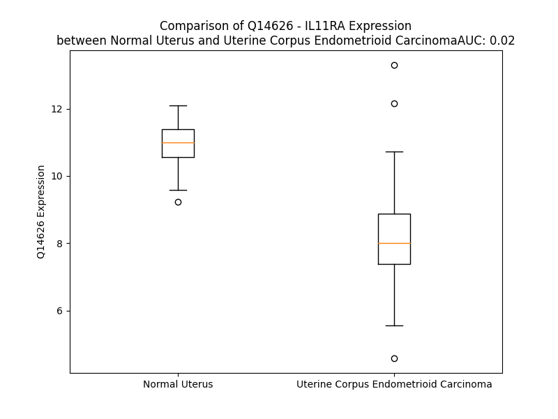

# Detailed Data for Q14626

## Introduction to the Detailed Summary

### How to Interpret the Results

- **Summary & Metrics**: This section provides a quick reference to essential protein attributes, including expression changes, family classification, and biomarker applications. Regulation status (upregulated/downregulated) indicates the protein's behavior in a disease context. Some information comes from the original excel file with the proteins selected from literature, while others are derived from the analyses.
- **Expression Comparison**: A visual representation comparing protein expression between normal and disease states. It highlights significant changes in expression levels that might indicate diagnostic or therapeutic relevance. This is data coming from transcriptomics experiments and could not translate similarly to protein levels.
- **Isoform Alignment**: An interactive view of isoform alignments, revealing structural and functional differences between variants of the protein.
- **Interactors & Homologs**: Tables listing known interaction partners and homologous proteins, the more interactors and homologs, the more complex the protein is to design an antibody for.
- **Biological Assemblies**: Information about the structural arrangement of the protein in different assemblies, providing insights into its functional state but also the complexity of the protein to develop antibodies.
- **Combined Per-Residue Information**: A detailed table summarizing residue-level data. This includes predictions for epitope regions, aggregation tendencies, and modifications that might impact the protein's function. Each row corresponds to a residue in the protein, providing insights into specific sites that may be important for research or drug development.
## Summary & Metrics

- **UniProt Accession**: Q14626
- **Gene Name**: IL11 R
- **Protein Name**: Interleukin-11 receptor subunit alpha
- **Swiss Prot**: I11RA_HUMAN
- **Family**: transmembrane receptor
- **Biomarker Application**:  
- **Number of Isoforms**: 2
- **Regulation**: 1
- **(transcriptomics) AUC**: 0.43
- **(transcriptomics) Fold Change**: 1.03
- **(transcriptomics) Regulation**: Downregulated
- **Discotope Epitope Count**: 80
- **Max n_uniprots (Homo)**: 1
- **Max n_uniprots (Hetero)**: 6

## Expression Comparison

## Isoform Alignment

<pre style='font-size:14px; font-family:monospace;'>Q14626-1 MSSSCSGLSRVLVAVATALVSASSPCPQAWGPPGVQYGQPGRSVKLCCPGVTAGDPVSWFRDGEPKLLQGPDSGLGHELVLAQADSTDEGTYICQTLDGALGGTVTLQLGYPPARPVVSCQAADYENFSCTWSPSQISGLPTRYLTSYRKKTVLGADSQRRSPSTGPWPCPQDPLGAARCVVHGAEFWSQYRINVTEVNPLGASTRLLDVSLQSILRPDPPQGLRVESVPGYPRRLRASWTYPASWPCQPHFLLKFRLQYRPAQHPAWSTVEPAGLEEVITDAVAGLPHAVRVSARDFLDAGTWSTWSPEAWGTPSTGTIPKEIPAWGQLHTQPEVEPQVDSPAPPRPSLQPHPRLLDHRDSVEQVAVLASLGILSFLGLVAGALALGLWLRLRRGGKDGSPKPGFLASVIPVDRRPGAPNL
Q14626-2 MSSSCSGLSRVLVAVATALVSASSPCPQAWGPPGVQYGQPGRSVKLCCPGVTAGDPVSWFRDGEPKLLQGPDSGLGHELVLAQADSTDEGTYICQTLDGALGGTVTLQLGYPPARPVVSCQAADYENFSCTWSPSQISGLPTRYLTSYRKKTVLGADSQRRSPSTGPWPCPQDPLGAARCVVHGAEFWSQYRINVTEVNPLGASTRLLDVSLQSILRPDPPQGLRVESVPGYPRRLRASWTYPASWPCQPHFLLKFRLQYRPAQHPAWSTVEPAGLEEVITDAVAGLPHAVRVSARDFLDAGTWSTWSPEAWGTPSTGTIPKEIPAWGQLHTQPEVEPQVDSPAPPRPSLQPHPRLLDHRDSVEQVAVLASLGILSFLGLVAGALALGLW--------------------------------
</pre>

## Interactors

| preferredName_A   | preferredName_B   |   score |
|:------------------|:------------------|--------:|
| IL11RA            | IL11              |   0.999 |
| IL11RA            | GALE              |   0.961 |
| IL11RA            | GALT              |   0.93  |
| IL11RA            | IL6ST             |   0.918 |
| IL11RA            | IL6               |   0.91  |
| IL11RA            | GALK2             |   0.909 |

## Homologs

| uniprot_id   | gene_id   |
|:-------------|:----------|
| A0A494C1C4   | IL13RA1   |
| A0A087X0H5   | GHR       |
| A0A8Q3SJ07   | IL12RB2   |
| O75462       | CRLF1     |
| A0A8V8TP76   | CSF3R     |
| P42702       | LIFR      |
| D6RJC8       | PRLR      |
| P42701       | IL12RB1   |
| Q99650       | OSMR      |
| E7ERY4       | IL5RA     |
| D6R9R8       | IL6R      |
| A0A0D9SFJ7   | IL23R     |
| A0A0C4DH06   | CRLF2     |
| D6RDW9       | IL2RG     |
| Q14627       | IL13RA2   |
| Q6UWB1       | IL27RA    |
| Q14213       | EBI3      |
| V9GYE9       | CSF2RA    |
| P26992       | CNTFR     |
| A0A8V8TMJ9   | IL6ST     |
| P48357       | LEPR      |
| A0A494BZY2   | IL31RA    |
| J3JS34       | IL3RA     |

## Biological Assemblies

|   Unnamed: 0 |   assembly |   n_uniprots | composition   | crystal_id   |
|-------------:|-----------:|-------------:|:--------------|:-------------|
|            0 |          1 |            6 | Hetero        | 8dps         |
|            0 |          1 |            1 | Homo          | 6o4p         |
|            1 |          2 |            1 | Homo          | 6o4p         |
|            0 |          1 |            6 | Hetero        | 8qy4         |
|            0 |          1 |            6 | Hetero        | 8dpt         |
|            0 |          1 |            6 | Hetero        | 8dpu         |
|            1 |          2 |            6 | Hetero        | 8dpu         |
|            2 |          3 |            6 | Hetero        | 8dpu         |

## Combined Per-Residue Information

|   res | aa   |   epitope_score | epitope   |   relative_surface_accessibility |   modeling_confidence |   Aggregation | modification   | glycosylation                   |
|------:|:-----|----------------:|:----------|---------------------------------:|----------------------:|--------------:|:---------------|:--------------------------------|
|     1 | M    |         0.07817 | False     |                          1.32781 |                 49.3  |         0     | N/A            | N/A                             |
|     2 | S    |         0.14452 | False     |                          0.87523 |                 39.53 |         0     | N/A            | N/A                             |
|     3 | S    |         0.13219 | False     |                          0.78932 |                 43.08 |         0     | N/A            | N/A                             |
|     4 | S    |         0.1044  | False     |                          0.86578 |                 41.03 |         0     | N/A            | N/A                             |
|     5 | C    |         0.08595 | False     |                          0.93939 |                 50.84 |         0     | N/A            | N/A                             |
|     6 | S    |         0.15794 | False     |                          0.85799 |                 43.5  |         0     | N/A            | N/A                             |
|     7 | G    |         0.21155 | True      |                          0.76481 |                 48.7  |         0     | N/A            | N/A                             |
|     8 | L    |         0.19001 | True      |                          1.08303 |                 47.89 |         0     | N/A            | N/A                             |
|     9 | S    |         0.10216 | False     |                          0.71258 |                 42.37 |         0     | N/A            | N/A                             |
|    10 | R    |         0.11216 | False     |                          0.92317 |                 54.25 |         0     | N/A            | N/A                             |
|    11 | V    |         0.07328 | False     |                          0.89142 |                 55.28 |        87.235 | N/A            | N/A                             |
|    12 | L    |         0.10601 | False     |                          1.0181  |                 56.61 |        94.457 | N/A            | N/A                             |
|    13 | V    |         0.08073 | False     |                          0.84844 |                 55.64 |        97.994 | N/A            | N/A                             |
|    14 | A    |         0.07179 | False     |                          0.92071 |                 55.44 |        98.291 | N/A            | N/A                             |
|    15 | V    |         0.07267 | False     |                          0.86626 |                 56.32 |        98.638 | N/A            | N/A                             |
|    16 | A    |         0.11235 | False     |                          0.90266 |                 54.47 |        96.43  | N/A            | N/A                             |
|    17 | T    |         0.09221 | False     |                          0.80107 |                 53.29 |        94.387 | N/A            | N/A                             |
|    18 | A    |         0.1187  | False     |                          0.84359 |                 50.83 |        93.124 | N/A            | N/A                             |
|    19 | L    |         0.12373 | False     |                          1.00167 |                 53.7  |        92.049 | N/A            | N/A                             |
|    20 | V    |         0.12875 | False     |                          0.93129 |                 45    |        86.157 | N/A            | N/A                             |
|    21 | S    |         0.15751 | False     |                          0.78034 |                 51.45 |        16.794 | N/A            | N/A                             |
|    22 | A    |         0.14258 | False     |                          0.87295 |                 53.88 |         8.186 | N/A            | N/A                             |
|    23 | S    |         0.19008 | True      |                          0.79706 |                 60.81 |         0.902 | N/A            | N/A                             |
|    24 | S    |         0.10814 | False     |                          0.53382 |                 68.9  |         0     | N/A            | N/A                             |
|    25 | P    |         0.07466 | False     |                          0.40818 |                 73.89 |         0     | N/A            | N/A                             |
|    26 | C    |         0.0279  | False     |                          0.10015 |                 80.89 |         0     | N/A            | N/A                             |
|    27 | P    |         0.13888 | False     |                          0.89072 |                 82.21 |         0     | N/A            | N/A                             |
|    28 | Q    |         0.08082 | False     |                          0.46642 |                 83.13 |         0     | N/A            | N/A                             |
|    29 | A    |         0.0572  | False     |                          0.38204 |                 89.36 |         0     | N/A            | N/A                             |
|    30 | W    |         0.15451 | False     |                          0.59486 |                 91.04 |         0     | N/A            | N/A                             |
|    31 | G    |         0.05407 | False     |                          0.29805 |                 92.87 |         0     | N/A            | N/A                             |
|    32 | P    |         0.10187 | False     |                          0.51892 |                 93.65 |         0     | N/A            | N/A                             |
|    33 | P    |         0.12073 | False     |                          0.909   |                 92.35 |         0     | N/A            | N/A                             |
|    34 | G    |         0.04462 | False     |                          0.39135 |                 92.34 |         0     | N/A            | N/A                             |
|    35 | V    |         0.05131 | False     |                          0.12394 |                 95.94 |         0     | N/A            | N/A                             |
|    36 | Q    |         0.02927 | False     |                          0.16469 |                 96.14 |         0     | N/A            | N/A                             |
|    37 | Y    |         0.02944 | False     |                          0.11871 |                 96.71 |         0     | N/A            | N/A                             |
|    38 | G    |         0.01419 | False     |                          0.03058 |                 96.32 |         0     | N/A            | N/A                             |
|    39 | Q    |         0.07196 | False     |                          0.25376 |                 96.93 |         0     | N/A            | N/A                             |
|    40 | P    |         0.08821 | False     |                          0.33566 |                 96.49 |         0     | N/A            | N/A                             |
|    41 | G    |         0.15596 | False     |                          0.64326 |                 95.79 |         0     | N/A            | N/A                             |
|    42 | R    |         0.23124 | True      |                          0.61796 |                 96.38 |         0     | N/A            | N/A                             |
|    43 | S    |         0.15359 | False     |                          0.60588 |                 96.24 |         0     | N/A            | N/A                             |
|    44 | V    |         0.02194 | False     |                          0.03873 |                 95.48 |         0     | N/A            | N/A                             |
|    45 | K    |         0.16376 | False     |                          0.5767  |                 94.13 |         0     | N/A            | N/A                             |
|    46 | L    |         0.00433 | False     |                          0.00082 |                 95.25 |         0     | N/A            | N/A                             |
|    47 | C    |         0.04067 | False     |                          0.11365 |                 94.63 |         0     | N/A            | N/A                             |
|    48 | C    |         0.00265 | False     |                          0       |                 93.29 |         0     | N/A            | N/A                             |
|    49 | P    |         0.06961 | False     |                          0.33997 |                 91.6  |         0     | N/A            | N/A                             |
|    50 | G    |         0.09125 | False     |                          0.92471 |                 85.78 |         0     | N/A            | N/A                             |
|    51 | V    |         0.06229 | False     |                          0.07392 |                 87.16 |         0     | N/A            | N/A                             |
|    52 | T    |         0.15434 | False     |                          0.66195 |                 85.44 |         0     | N/A            | N/A                             |
|    53 | A    |         0.19613 | True      |                          0.64813 |                 84.45 |         0     | N/A            | N/A                             |
|    54 | G    |         0.14197 | False     |                          0.59958 |                 83.98 |         0     | N/A            | N/A                             |
|    55 | D    |         0.15746 | False     |                          0.34074 |                 87.72 |         0     | N/A            | N/A                             |
|    56 | P    |         0.05732 | False     |                          0.35272 |                 91.31 |         0     | N/A            | N/A                             |
|    57 | V    |         0.00314 | False     |                          0.00095 |                 93.14 |         0     | N/A            | N/A                             |
|    58 | S    |         0.0824  | False     |                          0.15213 |                 93.99 |         0     | N/A            | N/A                             |
|    59 | W    |         0.01017 | False     |                          0       |                 95.27 |         0     | N/A            | N/A                             |
|    60 | F    |         0.10897 | False     |                          0.25098 |                 94.66 |         0     | N/A            | N/A                             |
|    61 | R    |         0.12707 | False     |                          0.23921 |                 95.47 |         0     | N/A            | N/A                             |
|    62 | D    |         0.29174 | True      |                          0.50273 |                 94.3  |         0     | N/A            | N/A                             |
|    63 | G    |         0.22844 | True      |                          0.94052 |                 91.48 |         0     | N/A            | N/A                             |
|    64 | E    |         0.17244 | True      |                          0.41687 |                 92.14 |         0     | N/A            | N/A                             |
|    65 | P    |         0.26342 | True      |                          0.97402 |                 88.15 |         0     | N/A            | N/A                             |
|    66 | K    |         0.18574 | True      |                          0.73546 |                 92.48 |         0     | N/A            | N/A                             |
|    67 | L    |         0.23357 | True      |                          0.52465 |                 92.14 |         0     | N/A            | N/A                             |
|    68 | L    |         0.11904 | False     |                          0.44597 |                 92.1  |         0     | N/A            | N/A                             |
|    69 | Q    |         0.15244 | False     |                          0.10848 |                 91.62 |         0     | N/A            | N/A                             |
|    70 | G    |         0.17729 | True      |                          0.21845 |                 87.94 |         0     | N/A            | N/A                             |
|    71 | P    |         0.22021 | True      |                          0.29088 |                 85.46 |         0     | N/A            | N/A                             |
|    72 | D    |         0.27011 | True      |                          0.90733 |                 85.62 |         0     | N/A            | N/A                             |
|    73 | S    |         0.15817 | False     |                          0.35975 |                 85.85 |         0     | N/A            | N/A                             |
|    74 | G    |         0.24558 | True      |                          0.91306 |                 87.15 |         0     | N/A            | N/A                             |
|    75 | L    |         0.23439 | True      |                          0.48126 |                 87.25 |         0     | N/A            | N/A                             |
|    76 | G    |         0.08583 | False     |                          0.12845 |                 90.82 |         0     | N/A            | N/A                             |
|    77 | H    |         0.10408 | False     |                          0.06324 |                 92.1  |         0     | N/A            | N/A                             |
|    78 | E    |         0.14098 | False     |                          0.1694  |                 94.04 |         0     | N/A            | N/A                             |
|    79 | L    |         0.04345 | False     |                          0.0371  |                 94.52 |         0     | N/A            | N/A                             |
|    80 | V    |         0.16936 | True      |                          0.48648 |                 94.59 |         0     | N/A            | N/A                             |
|    81 | L    |         0.11301 | False     |                          0.13107 |                 94.91 |         0     | N/A            | N/A                             |
|    82 | A    |         0.17651 | True      |                          0.77924 |                 93    |         0     | N/A            | N/A                             |
|    83 | Q    |         0.22172 | True      |                          0.70772 |                 94.33 |         0     | N/A            | N/A                             |
|    84 | A    |         0.01055 | False     |                          0.00566 |                 95.58 |         0     | N/A            | N/A                             |
|    85 | D    |         0.10562 | False     |                          0.40838 |                 95.48 |         0     | N/A            | N/A                             |
|    86 | S    |         0.14996 | False     |                          0.75471 |                 94.31 |         0     | N/A            | N/A                             |
|    87 | T    |         0.19496 | True      |                          0.65649 |                 94.42 |         0     | N/A            | N/A                             |
|    88 | D    |         0.08451 | False     |                          0.19139 |                 94.94 |         0     | N/A            | N/A                             |
|    89 | E    |         0.0689  | False     |                          0.39709 |                 95.74 |         0     | N/A            | N/A                             |
|    90 | G    |         0.03535 | False     |                          0.272   |                 96.18 |         0     | N/A            | N/A                             |
|    91 | T    |         0.10453 | False     |                          0.29063 |                 96.98 |         0     | N/A            | N/A                             |
|    92 | Y    |         0.0405  | False     |                          0.01414 |                 96.55 |         0     | N/A            | N/A                             |
|    93 | I    |         0.12515 | False     |                          0.20239 |                 94.94 |         0     | N/A            | N/A                             |
|    94 | C    |         0.00323 | False     |                          0       |                 93.68 |         0     | N/A            | N/A                             |
|    95 | Q    |         0.2848  | True      |                          0.30103 |                 92.52 |         0     | N/A            | N/A                             |
|    96 | T    |         0.09998 | False     |                          0.25634 |                 90.61 |         0     | N/A            | N/A                             |
|    97 | L    |         0.15087 | False     |                          0.76099 |                 87.79 |         0     | N/A            | N/A                             |
|    98 | D    |         0.2298  | True      |                          0.85193 |                 86.71 |         0     | N/A            | N/A                             |
|    99 | G    |         0.2232  | True      |                          0.64255 |                 77.44 |         0     | N/A            | N/A                             |
|   100 | A    |         0.17084 | True      |                          0.56411 |                 86.02 |         0     | N/A            | N/A                             |
|   101 | L    |         0.31874 | True      |                          0.67395 |                 87.18 |         0     | N/A            | N/A                             |
|   102 | G    |         0.09148 | False     |                          0.2077  |                 82.67 |         0     | N/A            | N/A                             |
|   103 | G    |         0.04903 | False     |                          0.10944 |                 90.33 |         0     | N/A            | N/A                             |
|   104 | T    |         0.18309 | True      |                          0.44913 |                 93.67 |         0.287 | N/A            | N/A                             |
|   105 | V    |         0.01433 | False     |                          0.00952 |                 95.5  |         0.769 | N/A            | N/A                             |
|   106 | T    |         0.05091 | False     |                          0.35338 |                 96.91 |         0.769 | N/A            | N/A                             |
|   107 | L    |         0.00612 | False     |                          0.00548 |                 97.03 |         0.769 | N/A            | N/A                             |
|   108 | Q    |         0.05292 | False     |                          0.28868 |                 97.25 |         0.769 | N/A            | N/A                             |
|   109 | L    |         0.05075 | False     |                          0.13781 |                 97.35 |         0.769 | N/A            | N/A                             |
|   110 | G    |         0.02721 | False     |                          0.05472 |                 97.1  |         0     | N/A            | N/A                             |
|   111 | Y    |         0.06283 | False     |                          0.48647 |                 97.57 |         0     | N/A            | N/A                             |
|   112 | P    |         0.09699 | False     |                          0.41536 |                 97.49 |         0     | N/A            | N/A                             |
|   113 | P    |         0.02406 | False     |                          0.09539 |                 97.92 |         0     | N/A            | N/A                             |
|   114 | A    |         0.04363 | False     |                          0.26407 |                 97.84 |         0     | N/A            | N/A                             |
|   115 | R    |         0.11878 | False     |                          0.65823 |                 98.05 |         0     | N/A            | N/A                             |
|   116 | P    |         0.00555 | False     |                          0.0147  |                 98.16 |         0     | N/A            | N/A                             |
|   117 | V    |         0.06743 | False     |                          0.60088 |                 98.46 |         0     | N/A            | N/A                             |
|   118 | V    |         0.02089 | False     |                          0.07975 |                 98.41 |         0     | N/A            | N/A                             |
|   119 | S    |         0.08508 | False     |                          0.50047 |                 98.03 |         0     | N/A            | N/A                             |
|   120 | C    |         0.03152 | False     |                          0.15887 |                 97.99 |         0     | N/A            | N/A                             |
|   121 | Q    |         0.0486  | False     |                          0.5571  |                 96.86 |         0     | N/A            | N/A                             |
|   122 | A    |         0.01442 | False     |                          0.02606 |                 97.87 |         0     | N/A            | N/A                             |
|   123 | A    |         0.08271 | False     |                          0.30532 |                 97.33 |         0     | N/A            | N/A                             |
|   124 | D    |         0.05717 | False     |                          0.08358 |                 96.08 |         0     | N/A            | N/A                             |
|   125 | Y    |         0.06768 | False     |                          0.04786 |                 94.73 |         0     | N/A            | N/A                             |
|   126 | E    |         0.11201 | False     |                          0.36116 |                 94.48 |         0     | N/A            | N/A                             |
|   127 | N    |         0.05295 | False     |                          0.26734 |                 95.89 |         0     | N/A            | N-linked (GlcNAc...) asparagine |
|   128 | F    |         0.01143 | False     |                          0.01625 |                 97.32 |         0     | N/A            | N/A                             |
|   129 | S    |         0.06165 | False     |                          0.05161 |                 97.45 |         0     | N/A            | N/A                             |
|   130 | C    |         0.00629 | False     |                          0.00466 |                 98.27 |         0     | N/A            | N/A                             |
|   131 | T    |         0.12692 | False     |                          0.33633 |                 98.42 |         0     | N/A            | N/A                             |
|   132 | W    |         0.04831 | False     |                          0.06821 |                 98.13 |         0     | N/A            | N/A                             |
|   133 | S    |         0.08295 | False     |                          0.41895 |                 97.56 |         0     | N/A            | N/A                             |
|   134 | P    |         0.07757 | False     |                          0.53633 |                 96.98 |         0     | N/A            | N/A                             |
|   135 | S    |         0.06223 | False     |                          0.46919 |                 97.29 |         0     | N/A            | N/A                             |
|   136 | Q    |         0.12128 | False     |                          0.56426 |                 96.27 |         0     | N/A            | N/A                             |
|   137 | I    |         0.17894 | True      |                          0.8908  |                 95.79 |         0     | N/A            | N/A                             |
|   138 | S    |         0.02252 | False     |                          0.09064 |                 96.01 |         0     | N/A            | N/A                             |
|   139 | G    |         0.14158 | False     |                          0.59332 |                 95.23 |         0     | N/A            | N/A                             |
|   140 | L    |         0.03094 | False     |                          0.08544 |                 97.05 |         0     | N/A            | N/A                             |
|   141 | P    |         0.06338 | False     |                          0.24482 |                 96.8  |         0     | N/A            | N/A                             |
|   142 | T    |         0.04426 | False     |                          0.28081 |                 96.43 |         0     | N/A            | N/A                             |
|   143 | R    |         0.18352 | True      |                          0.49672 |                 96.05 |         0     | N/A            | N/A                             |
|   144 | Y    |         0.03784 | False     |                          0.19813 |                 97.34 |         0     | N/A            | N/A                             |
|   145 | L    |         0.10629 | False     |                          0.69721 |                 97.36 |         0     | N/A            | N/A                             |
|   146 | T    |         0.05573 | False     |                          0.11088 |                 98.21 |         0     | N/A            | N/A                             |
|   147 | S    |         0.06889 | False     |                          0.18992 |                 97.45 |         0     | N/A            | N/A                             |
|   148 | Y    |         0.06443 | False     |                          0.14357 |                 96.33 |         0     | N/A            | N/A                             |
|   149 | R    |         0.08973 | False     |                          0.35332 |                 94.16 |         0     | N/A            | N/A                             |
|   150 | K    |         0.04044 | False     |                          0.27561 |                 92.08 |         0     | N/A            | N/A                             |
|   151 | K    |         0.08392 | False     |                          0.27396 |                 87.3  |         0     | N/A            | N/A                             |
|   152 | T    |         0.05943 | False     |                          0.41643 |                 66.24 |         0.177 | N/A            | N/A                             |
|   153 | V    |         0.11497 | False     |                          0.76795 |                 56.98 |         0.177 | N/A            | N/A                             |
|   154 | L    |         0.17538 | True      |                          1.10425 |                 50.96 |         0.177 | N/A            | N/A                             |
|   155 | G    |         0.25965 | True      |                          0.66532 |                 46.09 |         0.177 | N/A            | N/A                             |
|   156 | A    |         0.13995 | False     |                          0.98723 |                 43.51 |         0.177 | N/A            | N/A                             |
|   157 | D    |         0.24337 | True      |                          0.70774 |                 43.53 |         0     | N/A            | N/A                             |
|   158 | S    |         0.19109 | True      |                          0.98591 |                 46.2  |         0     | N/A            | N/A                             |
|   159 | Q    |         0.18766 | True      |                          0.91455 |                 44.91 |         0     | N/A            | N/A                             |
|   160 | R    |         0.17326 | True      |                          0.84156 |                 42.3  |         0     | N/A            | N/A                             |
|   161 | R    |         0.1632  | False     |                          0.92478 |                 42.61 |         0     | N/A            | N/A                             |
|   162 | S    |         0.09898 | False     |                          0.51304 |                 44.81 |         0     | N/A            | N/A                             |
|   163 | P    |         0.13695 | False     |                          0.7555  |                 51.31 |         0     | N/A            | N/A                             |
|   164 | S    |         0.07302 | False     |                          0.44306 |                 54.6  |         0     | N/A            | N/A                             |
|   165 | T    |         0.11913 | False     |                          0.44192 |                 64.39 |         0     | N/A            | N/A                             |
|   166 | G    |         0.13593 | False     |                          0.56181 |                 74.33 |         0     | N/A            | N/A                             |
|   167 | P    |         0.19555 | True      |                          0.77102 |                 89.37 |         0     | N/A            | N/A                             |
|   168 | W    |         0.1074  | False     |                          0.40297 |                 94.73 |         0     | N/A            | N/A                             |
|   169 | P    |         0.10406 | False     |                          0.72359 |                 95.96 |         0     | N/A            | N/A                             |
|   170 | C    |         0.01219 | False     |                          0.01594 |                 97.07 |         0     | N/A            | N/A                             |
|   171 | P    |         0.0973  | False     |                          0.61209 |                 96.75 |         0     | N/A            | N/A                             |
|   172 | Q    |         0.04915 | False     |                          0.37284 |                 96.75 |         0     | N/A            | N/A                             |
|   173 | D    |         0.13149 | False     |                          0.24315 |                 93.18 |         0     | N/A            | N/A                             |
|   174 | P    |         0.18753 | True      |                          0.98791 |                 91.42 |         0     | N/A            | N/A                             |
|   175 | L    |         0.17283 | True      |                          1.03682 |                 92.59 |         0     | N/A            | N/A                             |
|   176 | G    |         0.16913 | True      |                          0.85085 |                 87.21 |         0     | N/A            | N/A                             |
|   177 | A    |         0.21266 | True      |                          0.4779  |                 92.66 |         0     | N/A            | N/A                             |
|   178 | A    |         0.05359 | False     |                          0.45871 |                 97.05 |         0     | N/A            | N/A                             |
|   179 | R    |         0.09913 | False     |                          0.29757 |                 97.86 |         0     | N/A            | N/A                             |
|   180 | C    |         0.00184 | False     |                          0.00174 |                 97.71 |         0     | N/A            | N/A                             |
|   181 | V    |         0.05789 | False     |                          0.26083 |                 96.95 |         0     | N/A            | N/A                             |
|   182 | V    |         0.01103 | False     |                          0.02095 |                 96.75 |         0     | N/A            | N/A                             |
|   183 | H    |         0.12477 | False     |                          0.70219 |                 95.14 |         0     | N/A            | N/A                             |
|   184 | G    |         0.13914 | False     |                          0.7758  |                 92.53 |         0     | N/A            | N/A                             |
|   185 | A    |         0.02539 | False     |                          0.07313 |                 93.13 |         0     | N/A            | N/A                             |
|   186 | E    |         0.08037 | False     |                          0.47945 |                 91.77 |         0     | N/A            | N/A                             |
|   187 | F    |         0.04464 | False     |                          0.06551 |                 91.17 |         0.301 | N/A            | N/A                             |
|   188 | W    |         0.16204 | False     |                          0.73305 |                 89.03 |         0.301 | N/A            | N/A                             |
|   189 | S    |         0.03472 | False     |                          0.06455 |                 90.25 |         0.301 | N/A            | N/A                             |
|   190 | Q    |         0.09404 | False     |                          0.4227  |                 92.94 |         0.301 | N/A            | N/A                             |
|   191 | Y    |         0.02    | False     |                          0.03368 |                 94.67 |         0.301 | N/A            | N/A                             |
|   192 | R    |         0.06973 | False     |                          0.23969 |                 96.05 |         0     | N/A            | N/A                             |
|   193 | I    |         0.00628 | False     |                          0.00379 |                 97.44 |         0     | N/A            | N/A                             |
|   194 | N    |         0.0447  | False     |                          0.26521 |                 97.59 |         0     | N/A            | N-linked (GlcNAc...) asparagine |
|   195 | V    |         0.0028  | False     |                          0       |                 98.35 |         0     | N/A            | N/A                             |
|   196 | T    |         0.04503 | False     |                          0.10775 |                 98.31 |         0     | N/A            | N/A                             |
|   197 | E    |         0.00428 | False     |                          0.00882 |                 98.08 |         0     | N/A            | N/A                             |
|   198 | V    |         0.05419 | False     |                          0.33753 |                 98.05 |         0     | N/A            | N/A                             |
|   199 | N    |         0.0191  | False     |                          0.05689 |                 97.38 |         0     | N/A            | N/A                             |
|   200 | P    |         0.03311 | False     |                          0.27755 |                 96.82 |         0     | N/A            | N/A                             |
|   201 | L    |         0.07681 | False     |                          0.29601 |                 96.66 |         0     | N/A            | N/A                             |
|   202 | G    |         0.07438 | False     |                          0.38502 |                 96.81 |         0     | N/A            | N/A                             |
|   203 | A    |         0.11678 | False     |                          0.65288 |                 97.92 |         0     | N/A            | N/A                             |
|   204 | S    |         0.02267 | False     |                          0.12537 |                 98.43 |         0     | N/A            | N/A                             |
|   205 | T    |         0.08812 | False     |                          0.41811 |                 98.31 |         0     | N/A            | N/A                             |
|   206 | R    |         0.12263 | False     |                          0.39698 |                 98.38 |         0     | N/A            | N/A                             |
|   207 | L    |         0.18802 | True      |                          0.57842 |                 97.64 |         0     | N/A            | N/A                             |
|   208 | L    |         0.09888 | False     |                          0.27369 |                 97.63 |         0     | N/A            | N/A                             |
|   209 | D    |         0.09517 | False     |                          0.44985 |                 96.55 |         0     | N/A            | N/A                             |
|   210 | V    |         0.02426 | False     |                          0.03322 |                 96.28 |         0.384 | N/A            | N/A                             |
|   211 | S    |         0.12943 | False     |                          0.24109 |                 95.23 |         0.384 | N/A            | N/A                             |
|   212 | L    |         0.00251 | False     |                          0       |                 94.02 |         0.384 | N/A            | N/A                             |
|   213 | Q    |         0.12666 | False     |                          0.44053 |                 94.04 |         0.384 | N/A            | N/A                             |
|   214 | S    |         0.09962 | False     |                          0.54921 |                 95.77 |         0.384 | N/A            | N/A                             |
|   215 | I    |         0.10357 | False     |                          0.21405 |                 97.35 |         0.384 | N/A            | N/A                             |
|   216 | L    |         0.00514 | False     |                          0.00244 |                 97.59 |         0.384 | N/A            | N/A                             |
|   217 | R    |         0.10044 | False     |                          0.48163 |                 98.16 |         0     | N/A            | N/A                             |
|   218 | P    |         0.02505 | False     |                          0.02351 |                 98.01 |         0     | N/A            | N/A                             |
|   219 | D    |         0.11172 | False     |                          0.36255 |                 98.37 |         0     | N/A            | N/A                             |
|   220 | P    |         0.02749 | False     |                          0.2391  |                 98.54 |         0     | N/A            | N/A                             |
|   221 | P    |         0.01914 | False     |                          0.02351 |                 98.31 |         0     | N/A            | N/A                             |
|   222 | Q    |         0.12828 | False     |                          0.43185 |                 98.11 |         0     | N/A            | N/A                             |
|   223 | G    |         0.14594 | False     |                          0.6218  |                 97.96 |         0     | N/A            | N/A                             |
|   224 | L    |         0.03637 | False     |                          0.15602 |                 98.66 |         0     | N/A            | N/A                             |
|   225 | R    |         0.13093 | False     |                          0.63889 |                 98.61 |         0     | N/A            | N/A                             |
|   226 | V    |         0.03933 | False     |                          0.1187  |                 98.53 |         0     | N/A            | N/A                             |
|   227 | E    |         0.15556 | False     |                          0.39364 |                 98.32 |         0     | N/A            | N/A                             |
|   228 | S    |         0.10301 | False     |                          0.40139 |                 97.75 |         0     | N/A            | N/A                             |
|   229 | V    |         0.12916 | False     |                          0.21802 |                 97.42 |         0     | N/A            | N/A                             |
|   230 | P    |         0.34728 | True      |                          0.82832 |                 94.95 |         0     | N/A            | N/A                             |
|   231 | G    |         0.14683 | False     |                          0.81796 |                 93.33 |         0     | N/A            | N/A                             |
|   232 | Y    |         0.28685 | True      |                          0.47564 |                 96.51 |         0     | N/A            | N/A                             |
|   233 | P    |         0.16023 | False     |                          0.37775 |                 95.96 |         0     | N/A            | N/A                             |
|   234 | R    |         0.20129 | True      |                          0.49974 |                 96.88 |         0     | N/A            | N/A                             |
|   235 | R    |         0.21704 | True      |                          0.34313 |                 97.87 |         0     | N/A            | N/A                             |
|   236 | L    |         0.004   | False     |                          0       |                 98.28 |         0     | N/A            | N/A                             |
|   237 | R    |         0.16022 | False     |                          0.39691 |                 98.4  |         0     | N/A            | N/A                             |
|   238 | A    |         0.00359 | False     |                          0       |                 98.67 |         0     | N/A            | N/A                             |
|   239 | S    |         0.07003 | False     |                          0.22392 |                 98.62 |         0     | N/A            | N/A                             |
|   240 | W    |         0.04108 | False     |                          0.0323  |                 98.51 |         0     | N/A            | N/A                             |
|   241 | T    |         0.12773 | False     |                          0.53985 |                 97.86 |         0     | N/A            | N/A                             |
|   242 | Y    |         0.06384 | False     |                          0.24391 |                 97.53 |         0     | N/A            | N/A                             |
|   243 | P    |         0.02615 | False     |                          0.0147  |                 97.89 |         0     | N/A            | N/A                             |
|   244 | A    |         0.27227 | True      |                          0.85518 |                 96.83 |         0     | N/A            | N/A                             |
|   245 | S    |         0.08058 | False     |                          0.31238 |                 96.34 |         0     | N/A            | N/A                             |
|   246 | W    |         0.08979 | False     |                          0.03232 |                 96.48 |         0     | N/A            | N/A                             |
|   247 | P    |         0.13394 | False     |                          0.23741 |                 93.26 |         0     | N/A            | N/A                             |
|   248 | C    |         0.24119 | True      |                          0.98225 |                 82.34 |         0     | N/A            | N/A                             |
|   249 | Q    |         0.37635 | True      |                          0.82574 |                 84.66 |         0     | N/A            | N/A                             |
|   250 | P    |         0.16639 | True      |                          0.28687 |                 83.42 |         0     | N/A            | N/A                             |
|   251 | H    |         0.30967 | True      |                          0.89024 |                 89.73 |         0     | N/A            | N/A                             |
|   252 | F    |         0.21946 | True      |                          0.14827 |                 92.39 |         0     | N/A            | N/A                             |
|   253 | L    |         0.21673 | True      |                          0.60135 |                 95.81 |         0     | N/A            | N/A                             |
|   254 | L    |         0.03932 | False     |                          0.04997 |                 97.44 |         0     | N/A            | N/A                             |
|   255 | K    |         0.16129 | False     |                          0.19423 |                 97.65 |         0     | N/A            | N/A                             |
|   256 | F    |         0.0075  | False     |                          0.00573 |                 98.56 |         0     | N/A            | N/A                             |
|   257 | R    |         0.22508 | True      |                          0.27116 |                 98.45 |         0     | N/A            | N/A                             |
|   258 | L    |         0.0042  | False     |                          0       |                 98.62 |         0     | N/A            | N/A                             |
|   259 | Q    |         0.16007 | False     |                          0.12728 |                 98.52 |         0     | N/A            | N/A                             |
|   260 | Y    |         0.04606 | False     |                          0.07379 |                 98.46 |         0     | N/A            | N/A                             |
|   261 | R    |         0.07691 | False     |                          0.24163 |                 98.16 |         0     | N/A            | N/A                             |
|   262 | P    |         0.06519 | False     |                          0.20348 |                 97.39 |         0     | N/A            | N/A                             |
|   263 | A    |         0.13534 | False     |                          0.31781 |                 95.02 |         0     | N/A            | N/A                             |
|   264 | Q    |         0.3595  | True      |                          0.95286 |                 88.05 |         0     | N/A            | N/A                             |
|   265 | H    |         0.22212 | True      |                          0.46962 |                 94.75 |         0     | N/A            | N/A                             |
|   266 | P    |         0.31581 | True      |                          0.84122 |                 95.88 |         0     | N/A            | N/A                             |
|   267 | A    |         0.1741  | True      |                          0.55985 |                 97.09 |         0     | N/A            | N/A                             |
|   268 | W    |         0.10123 | False     |                          0.26043 |                 98.05 |         0     | N/A            | N/A                             |
|   269 | S    |         0.10194 | False     |                          0.36863 |                 98.23 |         0     | N/A            | N/A                             |
|   270 | T    |         0.17495 | True      |                          0.49557 |                 98.16 |         0     | N/A            | N/A                             |
|   271 | V    |         0.19265 | True      |                          0.33498 |                 97.9  |         0     | N/A            | N/A                             |
|   272 | E    |         0.25575 | True      |                          0.5669  |                 97.39 |         0     | N/A            | N/A                             |
|   273 | P    |         0.07755 | False     |                          0.05953 |                 97.5  |         0     | N/A            | N/A                             |
|   274 | A    |         0.16033 | False     |                          1.03298 |                 94.57 |         0     | N/A            | N/A                             |
|   275 | G    |         0.14809 | False     |                          0.45174 |                 95.02 |         0     | N/A            | N/A                             |
|   276 | L    |         0.12867 | False     |                          0.45549 |                 97.43 |         0     | N/A            | N/A                             |
|   277 | E    |         0.17619 | True      |                          0.35216 |                 98.06 |         0     | N/A            | N/A                             |
|   278 | E    |         0.08939 | False     |                          0.21715 |                 98.21 |         0     | N/A            | N/A                             |
|   279 | V    |         0.13689 | False     |                          0.3983  |                 98.17 |         0     | N/A            | N/A                             |
|   280 | I    |         0.03951 | False     |                          0.0328  |                 98.1  |         0     | N/A            | N/A                             |
|   281 | T    |         0.21971 | True      |                          0.58296 |                 97.55 |         0     | N/A            | N/A                             |
|   282 | D    |         0.0968  | False     |                          0.41572 |                 96.9  |         0     | N/A            | N/A                             |
|   283 | A    |         0.00879 | False     |                          0.0102  |                 96.88 |         0     | N/A            | N/A                             |
|   284 | V    |         0.08325 | False     |                          0.47128 |                 95.84 |         0     | N/A            | N/A                             |
|   285 | A    |         0.11858 | False     |                          0.52962 |                 95.44 |         0     | N/A            | N/A                             |
|   286 | G    |         0.0737  | False     |                          0.605   |                 92.05 |         0     | N/A            | N/A                             |
|   287 | L    |         0.15404 | False     |                          0.47071 |                 95.85 |         0     | N/A            | N/A                             |
|   288 | P    |         0.14642 | False     |                          0.4026  |                 97.65 |         0     | N/A            | N/A                             |
|   289 | H    |         0.01191 | False     |                          0.00768 |                 98.27 |         0     | N/A            | N/A                             |
|   290 | A    |         0.009   | False     |                          0.00128 |                 98.38 |         0     | N/A            | N/A                             |
|   291 | V    |         0.00194 | False     |                          0       |                 98.61 |         0     | N/A            | N/A                             |
|   292 | R    |         0.08452 | False     |                          0.18473 |                 98.62 |         0     | N/A            | N/A                             |
|   293 | V    |         0.00245 | False     |                          0       |                 98.71 |         0     | N/A            | N/A                             |
|   294 | S    |         0.01267 | False     |                          0.00624 |                 98.6  |         0     | N/A            | N/A                             |
|   295 | A    |         0.00165 | False     |                          0       |                 98.37 |         0     | N/A            | N/A                             |
|   296 | R    |         0.13249 | False     |                          0.20087 |                 98.01 |         0     | N/A            | N/A                             |
|   297 | D    |         0.01887 | False     |                          0.00307 |                 96.49 |         0     | N/A            | N/A                             |
|   298 | F    |         0.17677 | True      |                          0.6316  |                 95.62 |         0     | N/A            | N/A                             |
|   299 | L    |         0.3327  | True      |                          0.66987 |                 94.43 |         0     | N/A            | N/A                             |
|   300 | D    |         0.1358  | False     |                          0.41896 |                 95.08 |         0     | N/A            | N/A                             |
|   301 | A    |         0.06378 | False     |                          0.04591 |                 94.33 |         0     | N/A            | N/A                             |
|   302 | G    |         0.0577  | False     |                          0.17444 |                 95.6  |         0     | N/A            | N/A                             |
|   303 | T    |         0.09914 | False     |                          0.50476 |                 97.71 |         0     | N/A            | N/A                             |
|   304 | W    |         0.10545 | False     |                          0.23262 |                 98.2  |         0     | N/A            | N/A                             |
|   305 | S    |         0.01588 | False     |                          0.06227 |                 98.48 |         0     | N/A            | N/A                             |
|   306 | T    |         0.10467 | False     |                          0.54482 |                 98.45 |         0     | N/A            | N/A                             |
|   307 | W    |         0.07456 | False     |                          0.34232 |                 98.64 |         0     | N/A            | N/A                             |
|   308 | S    |         0.0125  | False     |                          0.04318 |                 98.64 |         0     | N/A            | N/A                             |
|   309 | P    |         0.15515 | False     |                          0.83856 |                 98.27 |         0     | N/A            | N/A                             |
|   310 | E    |         0.13338 | False     |                          0.37583 |                 98.12 |         0     | N/A            | N/A                             |
|   311 | A    |         0.05035 | False     |                          0.17218 |                 98.39 |         0     | N/A            | N/A                             |
|   312 | W    |         0.14071 | False     |                          0.61039 |                 98.19 |         0     | N/A            | N/A                             |
|   313 | G    |         0.05342 | False     |                          0.12048 |                 97.57 |         0     | N/A            | N/A                             |
|   314 | T    |         0.10428 | False     |                          0.43828 |                 97.79 |         0     | N/A            | N/A                             |
|   315 | P    |         0.02139 | False     |                          0.03821 |                 96.91 |         0     | N/A            | N/A                             |
|   316 | S    |         0.07529 | False     |                          0.15391 |                 93.73 |         0     | N/A            | N/A                             |
|   317 | T    |         0.11644 | False     |                          0.84357 |                 86.18 |         0     | N/A            | N/A                             |
|   318 | G    |         0.39738 | True      |                          0.69518 |                 67.07 |         0     | N/A            | N/A                             |
|   319 | T    |         0.15672 | False     |                          0.74402 |                 61.42 |         0     | N/A            | N/A                             |
|   320 | I    |         0.18968 | True      |                          0.90578 |                 54.81 |         0     | N/A            | N/A                             |
|   321 | P    |         0.21674 | True      |                          0.91134 |                 48.77 |         0     | N/A            | N/A                             |
|   322 | K    |         0.15833 | False     |                          0.82128 |                 42.43 |         0     | N/A            | N/A                             |
|   323 | E    |         0.18653 | True      |                          0.90481 |                 47.15 |         0     | N/A            | N/A                             |
|   324 | I    |         0.15396 | False     |                          0.82073 |                 50.19 |         0     | N/A            | N/A                             |
|   325 | P    |         0.11279 | False     |                          0.76795 |                 45.05 |         0     | N/A            | N/A                             |
|   326 | A    |         0.12033 | False     |                          1.06361 |                 38.78 |         0     | N/A            | N/A                             |
|   327 | W    |         0.18559 | True      |                          1.04522 |                 41.63 |         0     | N/A            | N/A                             |
|   328 | G    |         0.12528 | False     |                          0.67315 |                 33.89 |         0     | N/A            | N/A                             |
|   329 | Q    |         0.09992 | False     |                          0.95217 |                 41.44 |         0     | N/A            | N/A                             |
|   330 | L    |         0.11633 | False     |                          1.04157 |                 38.93 |         0     | N/A            | N/A                             |
|   331 | H    |         0.11083 | False     |                          0.94761 |                 36.44 |         0     | N/A            | N/A                             |
|   332 | T    |         0.14254 | False     |                          0.97993 |                 35.78 |         0     | N/A            | N/A                             |
|   333 | Q    |         0.11215 | False     |                          0.85462 |                 38.77 |         0     | N/A            | N/A                             |
|   334 | P    |         0.0733  | False     |                          0.85611 |                 38.89 |         0     | N/A            | N/A                             |
|   335 | E    |         0.09635 | False     |                          0.84223 |                 37.04 |         0     | N/A            | N/A                             |
|   336 | V    |         0.09432 | False     |                          0.87134 |                 40.49 |         0     | N/A            | N/A                             |
|   337 | E    |         0.10662 | False     |                          0.7945  |                 40.56 |         0     | N/A            | N/A                             |
|   338 | P    |         0.08587 | False     |                          0.72327 |                 39.95 |         0     | N/A            | N/A                             |
|   339 | Q    |         0.08842 | False     |                          0.85452 |                 36.82 |         0     | N/A            | N/A                             |
|   340 | V    |         0.08609 | False     |                          0.98838 |                 43.01 |         0     | N/A            | N/A                             |
|   341 | D    |         0.11603 | False     |                          0.8207  |                 41.53 |         0     | N/A            | N/A                             |
|   342 | S    |         0.12484 | False     |                          0.85747 |                 47.74 |         0     | N/A            | N/A                             |
|   343 | P    |         0.08472 | False     |                          0.9457  |                 48.02 |         0     | N/A            | N/A                             |
|   344 | A    |         0.12099 | False     |                          0.94359 |                 44.96 |         0     | N/A            | N/A                             |
|   345 | P    |         0.1641  | False     |                          0.89871 |                 53.22 |         0     | N/A            | N/A                             |
|   346 | P    |         0.12077 | False     |                          0.98219 |                 43.24 |         0     | N/A            | N/A                             |
|   347 | R    |         0.15272 | False     |                          0.91601 |                 44.63 |         0     | N/A            | N/A                             |
|   348 | P    |         0.09905 | False     |                          0.90946 |                 46.69 |         0     | N/A            | N/A                             |
|   349 | S    |         0.12043 | False     |                          0.83296 |                 37.34 |         0     | N/A            | N/A                             |
|   350 | L    |         0.11961 | False     |                          1.04801 |                 43.22 |         0     | N/A            | N/A                             |
|   351 | Q    |         0.14689 | False     |                          0.77461 |                 40.1  |         0     | N/A            | N/A                             |
|   352 | P    |         0.1442  | False     |                          0.93975 |                 40.29 |         0     | N/A            | N/A                             |
|   353 | H    |         0.19562 | True      |                          0.87475 |                 36.89 |         0     | N/A            | N/A                             |
|   354 | P    |         0.11241 | False     |                          0.91883 |                 44.47 |         0     | N/A            | N/A                             |
|   355 | R    |         0.18122 | True      |                          0.83804 |                 36.73 |         0     | N/A            | N/A                             |
|   356 | L    |         0.1939  | True      |                          1.08933 |                 38.85 |         0     | N/A            | N/A                             |
|   357 | L    |         0.19551 | True      |                          0.75106 |                 42.96 |         0     | N/A            | N/A                             |
|   358 | D    |         0.17235 | True      |                          0.62786 |                 46.8  |         0     | N/A            | N/A                             |
|   359 | H    |         0.18047 | True      |                          0.7823  |                 45.08 |         0     | N/A            | N/A                             |
|   360 | R    |         0.09885 | False     |                          0.81902 |                 47.9  |         0     | N/A            | N/A                             |
|   361 | D    |         0.05887 | False     |                          0.59553 |                 56.12 |         0     | N/A            | N/A                             |
|   362 | S    |         0.04033 | False     |                          0.46593 |                 63.2  |         0     | N/A            | N/A                             |
|   363 | V    |         0.02773 | False     |                          0.62853 |                 70.53 |         0     | N/A            | N/A                             |
|   364 | E    |         0.07175 | False     |                          0.56176 |                 69.9  |         0     | N/A            | N/A                             |
|   365 | Q    |         0.07786 | False     |                          0.6496  |                 71.43 |         1.576 | N/A            | N/A                             |
|   366 | V    |         0.04103 | False     |                          0.71041 |                 77.01 |        43.042 | N/A            | N/A                             |
|   367 | A    |         0.05768 | False     |                          0.54592 |                 77.31 |        52.936 | N/A            | N/A                             |
|   368 | V    |         0.03529 | False     |                          0.60266 |                 78.16 |        66.4   | N/A            | N/A                             |
|   369 | L    |         0.04572 | False     |                          0.76    |                 82.05 |        67.668 | N/A            | N/A                             |
|   370 | A    |         0.03403 | False     |                          0.50201 |                 80.99 |        68.02  | N/A            | N/A                             |
|   371 | S    |         0.04048 | False     |                          0.39546 |                 82.04 |        68.309 | N/A            | N/A                             |
|   372 | L    |         0.03959 | False     |                          0.6406  |                 84.49 |        72.397 | N/A            | N/A                             |
|   373 | G    |         0.04425 | False     |                          0.48451 |                 85.64 |        73.199 | N/A            | N/A                             |
|   374 | I    |         0.03368 | False     |                          0.6312  |                 85.24 |        93.33  | N/A            | N/A                             |
|   375 | L    |         0.04695 | False     |                          0.73027 |                 86.27 |        95.038 | N/A            | N/A                             |
|   376 | S    |         0.03905 | False     |                          0.50952 |                 87.34 |        94.765 | N/A            | N/A                             |
|   377 | F    |         0.04001 | False     |                          0.68398 |                 89.11 |        97.361 | N/A            | N/A                             |
|   378 | L    |         0.0467  | False     |                          0.62384 |                 91.56 |        96.614 | N/A            | N/A                             |
|   379 | G    |         0.03526 | False     |                          0.52913 |                 89.27 |        91.228 | N/A            | N/A                             |
|   380 | L    |         0.05821 | False     |                          0.77943 |                 92.36 |        91.122 | N/A            | N/A                             |
|   381 | V    |         0.0241  | False     |                          0.43923 |                 91.07 |        88.521 | N/A            | N/A                             |
|   382 | A    |         0.0308  | False     |                          0.55549 |                 91.35 |        56.847 | N/A            | N/A                             |
|   383 | G    |         0.03616 | False     |                          0.48048 |                 91.51 |        30.07  | N/A            | N/A                             |
|   384 | A    |         0.03747 | False     |                          0.61147 |                 91.31 |        27.819 | N/A            | N/A                             |
|   385 | L    |         0.03645 | False     |                          0.69812 |                 92.51 |        27.23  | N/A            | N/A                             |
|   386 | A    |         0.03202 | False     |                          0.56385 |                 91.28 |        24.299 | N/A            | N/A                             |
|   387 | L    |         0.05111 | False     |                          0.6257  |                 91.41 |        23.323 | N/A            | N/A                             |
|   388 | G    |         0.04857 | False     |                          0.35145 |                 89.97 |        18.45  | N/A            | N/A                             |
|   389 | L    |         0.06081 | False     |                          0.67634 |                 88.59 |        18.024 | N/A            | N/A                             |
|   390 | W    |         0.0642  | False     |                          0.53046 |                 87.34 |        15.735 | N/A            | N/A                             |
|   391 | L    |         0.06086 | False     |                          0.52724 |                 87.09 |        13.168 | N/A            | N/A                             |
|   392 | R    |         0.08353 | False     |                          0.77959 |                 84.47 |         0     | N/A            | N/A                             |
|   393 | L    |         0.06769 | False     |                          0.81361 |                 81.4  |         0     | N/A            | N/A                             |
|   394 | R    |         0.10918 | False     |                          0.62883 |                 78.93 |         0     | N/A            | N/A                             |
|   395 | R    |         0.12376 | False     |                          0.82543 |                 68.06 |         0     | N/A            | N/A                             |
|   396 | G    |         0.15668 | False     |                          0.75047 |                 56.78 |         0     | N/A            | N/A                             |
|   397 | G    |         0.20047 | True      |                          0.82537 |                 52.91 |         0     | N/A            | N/A                             |
|   398 | K    |         0.24518 | True      |                          0.88387 |                 50.73 |         0     | N/A            | N/A                             |
|   399 | D    |         0.20273 | True      |                          0.85978 |                 46.91 |         0     | N/A            | N/A                             |
|   400 | G    |         0.22786 | True      |                          0.92626 |                 40.12 |         0     | N/A            | N/A                             |
|   401 | S    |         0.2169  | True      |                          0.80056 |                 41.9  |         0     | N/A            | N/A                             |
|   402 | P    |         0.12161 | False     |                          0.95732 |                 39.65 |         0     | N/A            | N/A                             |
|   403 | K    |         0.15305 | False     |                          0.99127 |                 42.06 |         0     | N/A            | N/A                             |
|   404 | P    |         0.19267 | True      |                          0.95455 |                 38.34 |         0     | N/A            | N/A                             |
|   405 | G    |         0.14946 | False     |                          0.78461 |                 39.92 |         0.158 | N/A            | N/A                             |
|   406 | F    |         0.0961  | False     |                          1.09431 |                 42.76 |         5.321 | N/A            | N/A                             |
|   407 | L    |         0.08118 | False     |                          1.12183 |                 41.77 |         5.321 | N/A            | N/A                             |
|   408 | A    |         0.09789 | False     |                          0.94308 |                 39.94 |         5.321 | N/A            | N/A                             |
|   409 | S    |         0.07631 | False     |                          0.82898 |                 41.58 |         5.321 | N/A            | N/A                             |
|   410 | V    |         0.12159 | False     |                          0.98197 |                 43.63 |         5.321 | N/A            | N/A                             |
|   411 | I    |         0.14468 | False     |                          0.82898 |                 48.14 |         0.361 | N/A            | N/A                             |
|   412 | P    |         0.07263 | False     |                          0.92756 |                 47.82 |         0     | N/A            | N/A                             |
|   413 | V    |         0.06493 | False     |                          0.99522 |                 55.28 |         0     | N/A            | N/A                             |
|   414 | D    |         0.10729 | False     |                          0.80337 |                 49.58 |         0     | N/A            | N/A                             |
|   415 | R    |         0.10505 | False     |                          0.91635 |                 48.2  |         0     | N/A            | N/A                             |
|   416 | R    |         0.12624 | False     |                          0.92534 |                 48.67 |         0     | N/A            | N/A                             |
|   417 | P    |         0.1123  | False     |                          0.93601 |                 51.51 |         0     | N/A            | N/A                             |
|   418 | G    |         0.09643 | False     |                          0.97006 |                 53.24 |         0     | N/A            | N/A                             |
|   419 | A    |         0.10646 | False     |                          0.92458 |                 52.55 |         0     | N/A            | N/A                             |
|   420 | P    |         0.11831 | False     |                          0.86513 |                 50.19 |         0     | N/A            | N/A                             |
|   421 | N    |         0.11672 | False     |                          0.9476  |                 53.49 |         0     | N/A            | N/A                             |
|   422 | L    |         0.09198 | False     |                          1.51934 |                 47.75 |         0     | N/A            | N/A                             |

