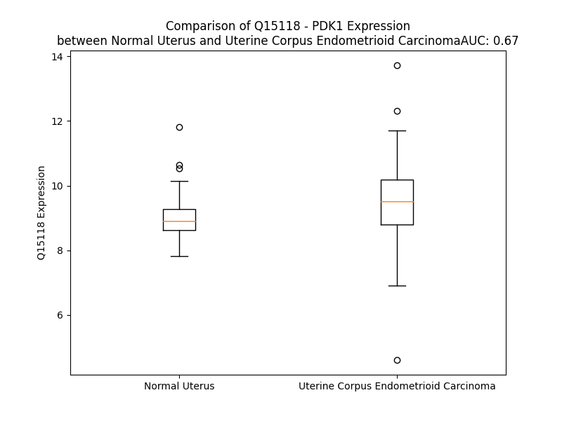

# Detailed Data for Q15118

## Introduction to the Detailed Summary

### How to Interpret the Results

- **Summary & Metrics**: This section provides a quick reference to essential protein attributes, including expression changes, family classification, and biomarker applications. Regulation status (upregulated/downregulated) indicates the protein's behavior in a disease context. Some information comes from the original excel file with the proteins selected from literature, while others are derived from the analyses.
- **Expression Comparison**: A visual representation comparing protein expression between normal and disease states. It highlights significant changes in expression levels that might indicate diagnostic or therapeutic relevance. This is data coming from transcriptomics experiments and could not translate similarly to protein levels.
- **Isoform Alignment**: An interactive view of isoform alignments, revealing structural and functional differences between variants of the protein.
- **Interactors & Homologs**: Tables listing known interaction partners and homologous proteins, the more interactors and homologs, the more complex the protein is to design an antibody for.
- **Biological Assemblies**: Information about the structural arrangement of the protein in different assemblies, providing insights into its functional state but also the complexity of the protein to develop antibodies.
- **Combined Per-Residue Information**: A detailed table summarizing residue-level data. This includes predictions for epitope regions, aggregation tendencies, and modifications that might impact the protein's function. Each row corresponds to a residue in the protein, providing insights into specific sites that may be important for research or drug development.
## Summary & Metrics

- **UniProt Accession**: Q15118
- **Gene Name**: PDK1
- **Protein Name**: [Pyruvate dehydrogenase [lipoamide]] kinase isozyme 1, mitochondrial
- **Swiss Prot**: PDK1_HUMAN
- **Family**: nan
- **Biomarker Application**: nan
- **Number of Isoforms**: 2
- **Regulation**: 2
- **(transcriptomics) AUC**: 0.85
- **(transcriptomics) Fold Change**: 1.13
- **(transcriptomics) Regulation**: Upregulated
- **Discotope Epitope Count**: 104
- **Max n_uniprots (Homo)**: 1
- **Max n_uniprots (Hetero)**: N/A

## Expression Comparison

## Isoform Alignment

<pre style='font-size:14px; font-family:monospace;'>Q15118-1 MRLARLLRGAALAGPGPGLRAAGFSRSFSSDSGSSPASERGVPGQVDFYARFSPSPLSMKQFLDFGSVNACEKTSFMFLRQELPVRLANIMKEISLLPDNLLRTPSVQLVQSWYIQSLQELLDFKDKSAEDAKAIYD--------------------FTDTVIRIRNRHNDVIPTMAQGVIEYKESFGVDPVTSQNVQYFLDRFYMSRISIRMLLNQHSLLFGGKGKGSPSHRKHIGSINPNCNVLEVIKDGYENARRLCDLYYINSPELELEELNAKSPGQPIQVVYVPSHLYHMVFELFKNAMRATMEHHANRGVYPPIQVHVTLGNEDLTVKMSDRGGGVPLRKIDRLFNYMYSTAPRPRVETSRAVPLAGFGYGLPISRLYAQYFQGDLKLYSLEGYGTDAVIYIKALSTDSIERLPVYNKAAWKHYNTNHEADDWCVPSREPKDMTTFRSA
Q15118-2 MRLARLLRGAALAGPGPGLRAAGFSRSFSSDSGSSPASERGVPGQVDFYARFSPSPLSMKQFLDFGSVNACEKTSFMFLRQELPVRLANIMKEISLLPDNLLRTPSVQLVQSWYIQSLQELLDFKDKSAEDAKAIYERPRRTWLQVSSLCCMACKMIFTDTVIRIRNRHNDVIPTMAQGVIEYKESFGVDPVTSQNVQYFLDRFYMSRISIRMLLNQHSLLFGGKGKGSPSHRKHIGSINPNCNVLEVIKDGYENARRLCDLYYINSPELELEELNAKSPGQPIQVVYVPSHLYHMVFELFKNAMRATMEHHANRGVYPPIQVHVTLGNEDLTVKMSDRGGGVPLRKIDRLFNYMYSTAPRPRVETSRAVPLAGFGYGLPISRLYAQYFQGDLKLYSLEGYGTDAVIYIKALSTDSIERLPVYNKAAWKHYNTNHEADDWCVPSREPKDMTTFRSA
</pre>

## Interactors

| preferredName_A   | preferredName_B   |   score |
|:------------------|:------------------|--------:|
| PDK1              | PDHB              |   0.984 |
| PDK1              | PDHA1             |   0.97  |
| PDK1              | PDK2              |   0.961 |
| PDK1              | PDHA2             |   0.927 |
| PDK1              | PDHX              |   0.904 |

## Homologs

| uniprot_id   | gene_id   |
|:-------------|:----------|
| A0A7P0TBJ6   | AKT3      |
| A0A8V8TMH8   | PRKCD     |
| Q04759       | PRKCQ     |
| A8MX96       | AKT2      |
| G3V2I6       | AKT1      |
| D6R983       | PDK2      |
| A4D1H4       | PDK4      |
| Q15120       | PDK3      |
| O14874       | BCKDK     |

## Biological Assemblies

|   Unnamed: 0 |   assembly |   n_uniprots | composition   | crystal_id   |
|-------------:|-----------:|-------------:|:--------------|:-------------|
|            0 |          1 |            1 | Homo          | 2q8h         |
|            0 |          1 |            1 | Homo          | 2q8f         |
|            0 |          1 |            1 | Homo          | 2q8g         |

## Combined Per-Residue Information

|   res | aa   |   epitope_score | epitope   |   relative_surface_accessibility |   modeling_confidence |   Aggregation | modification                                   |
|------:|:-----|----------------:|:----------|---------------------------------:|----------------------:|--------------:|:-----------------------------------------------|
|     1 | M    |         0.07163 | False     |                          1.12856 |                 36.83 |         0     | N/A                                            |
|     2 | R    |         0.17719 | True      |                          0.86001 |                 33.88 |         0     | N/A                                            |
|     3 | L    |         0.07788 | False     |                          0.49987 |                 34.67 |         0     | N/A                                            |
|     4 | A    |         0.09371 | False     |                          0.49249 |                 34.19 |         0     | N/A                                            |
|     5 | R    |         0.22845 | True      |                          0.82849 |                 35.19 |         0     | N/A                                            |
|     6 | L    |         0.19931 | True      |                          0.90321 |                 37.44 |         0     | N/A                                            |
|     7 | L    |         0.15726 | False     |                          0.88804 |                 37.82 |         0     | N/A                                            |
|     8 | R    |         0.15966 | False     |                          0.59119 |                 35.96 |         0     | N/A                                            |
|     9 | G    |         0.25312 | True      |                          0.82041 |                 33.5  |         0     | N/A                                            |
|    10 | A    |         0.19354 | True      |                          1.03924 |                 36.34 |         0     | N/A                                            |
|    11 | A    |         0.13654 | False     |                          0.86819 |                 32.82 |         0     | N/A                                            |
|    12 | L    |         0.15294 | False     |                          1.09512 |                 29    |         0     | N/A                                            |
|    13 | A    |         0.16439 | False     |                          1.08179 |                 30.93 |         0     | N/A                                            |
|    14 | G    |         0.28822 | True      |                          0.85504 |                 32.29 |         0     | N/A                                            |
|    15 | P    |         0.23008 | True      |                          1.0884  |                 31.47 |         0     | N/A                                            |
|    16 | G    |         0.2365  | True      |                          0.78603 |                 33.63 |         0     | N/A                                            |
|    17 | P    |         0.21067 | True      |                          1.06725 |                 31.84 |         0     | N/A                                            |
|    18 | G    |         0.21498 | True      |                          0.82186 |                 26.95 |         0     | N/A                                            |
|    19 | L    |         0.16037 | False     |                          1.11493 |                 31.74 |         0     | N/A                                            |
|    20 | R    |         0.15601 | False     |                          0.98802 |                 27.86 |         0     | N/A                                            |
|    21 | A    |         0.1262  | False     |                          0.94984 |                 31.42 |         0     | N/A                                            |
|    22 | A    |         0.11982 | False     |                          0.81861 |                 33.46 |         0     | N/A                                            |
|    23 | G    |         0.13786 | False     |                          0.57385 |                 28.49 |         0     | N/A                                            |
|    24 | F    |         0.14065 | False     |                          0.81496 |                 31.59 |         0     | N/A                                            |
|    25 | S    |         0.08424 | False     |                          0.70822 |                 30.16 |         0     | N/A                                            |
|    26 | R    |         0.11204 | False     |                          0.56977 |                 36.83 |         0     | N/A                                            |
|    27 | S    |         0.08027 | False     |                          0.77723 |                 28.84 |         0     | N/A                                            |
|    28 | F    |         0.13998 | False     |                          0.79815 |                 35.11 |         0     | N/A                                            |
|    29 | S    |         0.11358 | False     |                          0.77346 |                 30.84 |         0     | N/A                                            |
|    30 | S    |         0.12901 | False     |                          0.83162 |                 30.44 |         0     | N/A                                            |
|    31 | D    |         0.13136 | False     |                          0.71929 |                 35.78 |         0     | N/A                                            |
|    32 | S    |         0.1427  | False     |                          0.90308 |                 31.91 |         0     | N/A                                            |
|    33 | G    |         0.20272 | True      |                          0.97252 |                 37.09 |         0     | N/A                                            |
|    34 | S    |         0.09865 | False     |                          0.50649 |                 43.86 |         0     | N/A                                            |
|    35 | S    |         0.14249 | False     |                          0.48468 |                 39.52 |         0     | N/A                                            |
|    36 | P    |         0.19876 | True      |                          0.59332 |                 50.52 |         0     | N/A                                            |
|    37 | A    |         0.07245 | False     |                          0.08954 |                 50.7  |         0     | N/A                                            |
|    38 | S    |         0.09864 | False     |                          0.63949 |                 50.4  |         0     | N/A                                            |
|    39 | E    |         0.21836 | True      |                          0.64599 |                 52.5  |         0     | N/A                                            |
|    40 | R    |         0.09277 | False     |                          0.21218 |                 63.33 |         0     | N/A                                            |
|    41 | G    |         0.15854 | False     |                          0.61537 |                 84.04 |         0     | N/A                                            |
|    42 | V    |         0.09117 | False     |                          0.2465  |                 85.82 |         0     | N/A                                            |
|    43 | P    |         0.09073 | False     |                          0.74024 |                 88.87 |         0     | N/A                                            |
|    44 | G    |         0.06146 | False     |                          0.25289 |                 92.07 |         0     | N/A                                            |
|    45 | Q    |         0.06562 | False     |                          0.12    |                 92.47 |         0     | N/A                                            |
|    46 | V    |         0.02809 | False     |                          0.08854 |                 94.53 |         0.167 | N/A                                            |
|    47 | D    |         0.11364 | False     |                          0.35933 |                 95.01 |         0.167 | N/A                                            |
|    48 | F    |         0.09712 | False     |                          0.28765 |                 96.24 |         0.167 | N/A                                            |
|    49 | Y    |         0.02455 | False     |                          0.06703 |                 97.03 |         0.167 | N/A                                            |
|    50 | A    |         0.0189  | False     |                          0.04483 |                 96.36 |         0.167 | N/A                                            |
|    51 | R    |         0.12111 | False     |                          0.72859 |                 95.68 |         0.167 | N/A                                            |
|    52 | F    |         0.04257 | False     |                          0.43968 |                 96.59 |         0.167 | N/A                                            |
|    53 | S    |         0.05354 | False     |                          0.49644 |                 96.25 |         0     | N/A                                            |
|    54 | P    |         0.01649 | False     |                          0.0759  |                 97.9  |         0     | N/A                                            |
|    55 | S    |         0.03717 | False     |                          0.25216 |                 97.88 |         0     | N/A                                            |
|    56 | P    |         0.04122 | False     |                          0.50292 |                 97.8  |         0     | N/A                                            |
|    57 | L    |         0.05888 | False     |                          0.17064 |                 96.98 |         0     | N/A                                            |
|    58 | S    |         0.09613 | False     |                          0.08416 |                 97.15 |         0     | N/A                                            |
|    59 | M    |         0.00175 | False     |                          0       |                 95.96 |         0     | N/A                                            |
|    60 | K    |         0.10939 | False     |                          0.41579 |                 95.2  |         0     | N/A                                            |
|    61 | Q    |         0.07885 | False     |                          0.42198 |                 95.41 |         0     | N/A                                            |
|    62 | F    |         0.03067 | False     |                          0.05887 |                 95.07 |         0     | N/A                                            |
|    63 | L    |         0.06447 | False     |                          0.19537 |                 92.3  |         0     | N/A                                            |
|    64 | D    |         0.0796  | False     |                          0.30995 |                 92.33 |         0     | N/A                                            |
|    65 | F    |         0.04161 | False     |                          0.24593 |                 91.23 |         0     | N/A                                            |
|    66 | G    |         0.03565 | False     |                          0.09755 |                 86.98 |         0     | N/A                                            |
|    67 | S    |         0.15016 | False     |                          0.50549 |                 83.21 |         0     | N/A                                            |
|    68 | V    |         0.25266 | True      |                          0.8288  |                 78.26 |         0     | N/A                                            |
|    69 | N    |         0.19942 | True      |                          0.57593 |                 74.07 |         0     | N/A                                            |
|    70 | A    |         0.16056 | False     |                          0.52478 |                 80.49 |         0     | N/A                                            |
|    71 | C    |         0.19977 | True      |                          0.39006 |                 90.09 |         0     | N/A                                            |
|    72 | E    |         0.07638 | False     |                          0.28523 |                 92.72 |         0     | N/A                                            |
|    73 | K    |         0.16983 | False     |                          0.41561 |                 93.89 |         0     | N/A                                            |
|    74 | T    |         0.12842 | False     |                          0.51412 |                 93.88 |         4.858 | N/A                                            |
|    75 | S    |         0.02015 | False     |                          0.07423 |                 95.28 |         5.784 | N/A                                            |
|    76 | F    |         0.00421 | False     |                          0       |                 96.88 |         5.784 | N/A                                            |
|    77 | M    |         0.04861 | False     |                          0.20543 |                 96.24 |         5.784 | N/A                                            |
|    78 | F    |         0.05739 | False     |                          0.24578 |                 96.63 |         5.784 | N/A                                            |
|    79 | L    |         0.00807 | False     |                          0.0305  |                 97.72 |         5.032 | N/A                                            |
|    80 | R    |         0.06833 | False     |                          0.09283 |                 96.43 |         0     | N/A                                            |
|    81 | Q    |         0.06074 | False     |                          0.32279 |                 96.46 |         0     | N/A                                            |
|    82 | E    |         0.01324 | False     |                          0.01648 |                 98.25 |         0     | N/A                                            |
|    83 | L    |         0.00212 | False     |                          0.00495 |                 98.38 |         0     | N/A                                            |
|    84 | P    |         0.00286 | False     |                          0.00099 |                 98.29 |         0     | N/A                                            |
|    85 | V    |         0.01801 | False     |                          0.06664 |                 98.52 |         0     | N/A                                            |
|    86 | R    |         0.00684 | False     |                          0.01768 |                 98.51 |         0     | N/A                                            |
|    87 | L    |         0.00594 | False     |                          0.00412 |                 98.33 |         0.141 | N/A                                            |
|    88 | A    |         0.00142 | False     |                          0       |                 98.28 |         0.141 | N/A                                            |
|    89 | N    |         0.01353 | False     |                          0.01636 |                 98.29 |         0.141 | N/A                                            |
|    90 | I    |         0.01318 | False     |                          0.0056  |                 98.06 |         0.141 | N/A                                            |
|    91 | M    |         0.04938 | False     |                          0.10474 |                 97.79 |         0.141 | N/A                                            |
|    92 | K    |         0.03524 | False     |                          0.23337 |                 96.91 |         0     | N/A                                            |
|    93 | E    |         0.00826 | False     |                          0.00412 |                 96.97 |         0     | N/A                                            |
|    94 | I    |         0.00891 | False     |                          0.0088  |                 96.17 |         0     | N/A                                            |
|    95 | S    |         0.06996 | False     |                          0.44861 |                 94.59 |         0     | N/A                                            |
|    96 | L    |         0.08642 | False     |                          0.2938  |                 94.19 |         0     | N/A                                            |
|    97 | L    |         0.01546 | False     |                          0.03681 |                 93.5  |         0     | N/A                                            |
|    98 | P    |         0.07502 | False     |                          0.30902 |                 91.84 |         0     | N/A                                            |
|    99 | D    |         0.12191 | False     |                          0.58158 |                 92.43 |         0     | N/A                                            |
|   100 | N    |         0.10629 | False     |                          0.36896 |                 93.64 |         0     | N/A                                            |
|   101 | L    |         0.00832 | False     |                          0.0033  |                 94.35 |         0     | N/A                                            |
|   102 | L    |         0.02899 | False     |                          0.19066 |                 95.42 |         0     | N/A                                            |
|   103 | R    |         0.16613 | False     |                          0.66879 |                 95.87 |         0     | N/A                                            |
|   104 | T    |         0.0589  | False     |                          0.05998 |                 95.97 |         0     | N/A                                            |
|   105 | P    |         0.13476 | False     |                          0.71668 |                 97.02 |         0     | N/A                                            |
|   106 | S    |         0.07213 | False     |                          0.0874  |                 96.65 |         0.52  | N/A                                            |
|   107 | V    |         0.0037  | False     |                          0       |                 97.09 |         3.295 | N/A                                            |
|   108 | Q    |         0.12872 | False     |                          0.46433 |                 97.91 |         3.51  | N/A                                            |
|   109 | L    |         0.15946 | False     |                          0.49874 |                 98.09 |         9.745 | N/A                                            |
|   110 | V    |         0.00356 | False     |                          0       |                 97.92 |        10.754 | N/A                                            |
|   111 | Q    |         0.04132 | False     |                          0.23834 |                 97.4  |        10.548 | N/A                                            |
|   112 | S    |         0.13401 | False     |                          0.40411 |                 97.61 |        10.548 | N/A                                            |
|   113 | W    |         0.1004  | False     |                          0.19038 |                 98.37 |        10.719 | N/A                                            |
|   114 | Y    |         0.0057  | False     |                          0.00246 |                 98.05 |        10.719 | N/A                                            |
|   115 | I    |         0.08599 | False     |                          0.37438 |                 97.44 |         9.948 | N/A                                            |
|   116 | Q    |         0.10849 | False     |                          0.39532 |                 97.84 |         0.386 | N/A                                            |
|   117 | S    |         0.00976 | False     |                          0       |                 98.19 |         0.171 | N/A                                            |
|   118 | L    |         0.00329 | False     |                          0       |                 97.99 |         0.171 | N/A                                            |
|   119 | Q    |         0.10367 | False     |                          0.40986 |                 97.29 |         0     | N/A                                            |
|   120 | E    |         0.03724 | False     |                          0.17943 |                 97.53 |         0     | N/A                                            |
|   121 | L    |         0.00591 | False     |                          0.00473 |                 97.56 |         0     | N/A                                            |
|   122 | L    |         0.03922 | False     |                          0.15105 |                 96.39 |         0     | N/A                                            |
|   123 | D    |         0.12639 | False     |                          0.59525 |                 96    |         0     | N/A                                            |
|   124 | F    |         0.04381 | False     |                          0.04459 |                 97.09 |         0     | N/A                                            |
|   125 | K    |         0.10432 | False     |                          0.31952 |                 93.36 |         0     | N/A                                            |
|   126 | D    |         0.14948 | False     |                          0.73826 |                 93.1  |         0     | N/A                                            |
|   127 | K    |         0.11155 | False     |                          0.34473 |                 95.13 |         0     | N/A                                            |
|   128 | S    |         0.2267  | True      |                          0.46177 |                 93.88 |         0     | N/A                                            |
|   129 | A    |         0.12193 | False     |                          0.16824 |                 93.24 |         0     | N/A                                            |
|   130 | E    |         0.32621 | True      |                          0.66932 |                 94.26 |         0     | N/A                                            |
|   131 | D    |         0.3205  | True      |                          0.38153 |                 94.4  |         0     | N/A                                            |
|   132 | A    |         0.2256  | True      |                          0.75533 |                 93.38 |         0     | N/A                                            |
|   133 | K    |         0.19313 | True      |                          0.69922 |                 95.32 |         0     | N/A                                            |
|   134 | A    |         0.02397 | False     |                          0.01987 |                 95.84 |         0     | N/A                                            |
|   135 | I    |         0.0683  | False     |                          0.068   |                 94.73 |         0     | N/A                                            |
|   136 | Y    |         0.17454 | True      |                          0.64541 |                 94.6  |         0     | Phosphotyrosine; by FGFR1                      |
|   137 | D    |         0.07563 | False     |                          0.23703 |                 96.64 |         0     | N/A                                            |
|   138 | F    |         0.00328 | False     |                          0       |                 97.56 |         0.515 | N/A                                            |
|   139 | T    |         0.02521 | False     |                          0.06474 |                 96.04 |         0.515 | N/A                                            |
|   140 | D    |         0.11064 | False     |                          0.31317 |                 96.15 |         0.515 | N/A                                            |
|   141 | T    |         0.01664 | False     |                          0.01589 |                 97.73 |         0.515 | N/A                                            |
|   142 | V    |         0.00157 | False     |                          0       |                 96.96 |         0.515 | N/A                                            |
|   143 | I    |         0.05542 | False     |                          0.23039 |                 96.01 |         0.515 | N/A                                            |
|   144 | R    |         0.14326 | False     |                          0.47128 |                 97.16 |         0.515 | N/A                                            |
|   145 | I    |         0.01074 | False     |                          0.0056  |                 98.15 |         0.515 | N/A                                            |
|   146 | R    |         0.0563  | False     |                          0.24758 |                 96.51 |         0     | N/A                                            |
|   147 | N    |         0.18753 | True      |                          0.48109 |                 96.12 |         0     | N/A                                            |
|   148 | R    |         0.05344 | False     |                          0.18051 |                 97.81 |         0     | N/A                                            |
|   149 | H    |         0.04546 | False     |                          0.05862 |                 97.24 |         0     | N/A                                            |
|   150 | N    |         0.12791 | False     |                          0.46099 |                 93.04 |         0     | N/A                                            |
|   151 | D    |         0.11403 | False     |                          0.52491 |                 92.85 |         0     | N/A                                            |
|   152 | V    |         0.00462 | False     |                          0       |                 94.53 |         0     | N/A                                            |
|   153 | I    |         0.07463 | False     |                          0.22959 |                 91.63 |         0     | N/A                                            |
|   154 | P    |         0.11517 | False     |                          0.43548 |                 91.66 |         0     | N/A                                            |
|   155 | T    |         0.03882 | False     |                          0.13939 |                 93.42 |         0     | N/A                                            |
|   156 | M    |         0.0025  | False     |                          0.00139 |                 94.7  |         0     | N/A                                            |
|   157 | A    |         0.00823 | False     |                          0.0102  |                 92.05 |         0     | N/A                                            |
|   158 | Q    |         0.08803 | False     |                          0.31573 |                 90.73 |         0     | N/A                                            |
|   159 | G    |         0.00323 | False     |                          0       |                 92.92 |         0     | N/A                                            |
|   160 | V    |         0.01235 | False     |                          0.02475 |                 92.37 |         0     | N/A                                            |
|   161 | I    |         0.05709 | False     |                          0.20879 |                 89.78 |         0     | N/A                                            |
|   162 | E    |         0.08272 | False     |                          0.20734 |                 91.65 |         0     | N/A                                            |
|   163 | Y    |         0.08899 | False     |                          0.06806 |                 91.82 |         0     | N/A                                            |
|   164 | K    |         0.10726 | False     |                          0.36957 |                 89.02 |         0     | N/A                                            |
|   165 | E    |         0.26609 | True      |                          0.59447 |                 87.71 |         0     | N/A                                            |
|   166 | S    |         0.19929 | True      |                          0.61934 |                 90.01 |         0     | N/A                                            |
|   167 | F    |         0.29645 | True      |                          0.5613  |                 88.86 |         0     | N/A                                            |
|   168 | G    |         0.16821 | False     |                          0.4321  |                 82.97 |         0     | N/A                                            |
|   169 | V    |         0.1217  | False     |                          0.38531 |                 78.16 |         0     | N/A                                            |
|   170 | D    |         0.17764 | True      |                          0.39636 |                 83.06 |         0     | N/A                                            |
|   171 | P    |         0.12169 | False     |                          0.75412 |                 83.84 |         0     | N/A                                            |
|   172 | V    |         0.11576 | False     |                          0.25611 |                 83.85 |         0     | N/A                                            |
|   173 | T    |         0.06279 | False     |                          0.12103 |                 86.06 |         0     | N/A                                            |
|   174 | S    |         0.03386 | False     |                          0.23765 |                 87.83 |         0     | N/A                                            |
|   175 | Q    |         0.17461 | True      |                          0.54958 |                 89    |         0     | N/A                                            |
|   176 | N    |         0.07534 | False     |                          0.12297 |                 91.11 |         0.576 | N/A                                            |
|   177 | V    |         0.00332 | False     |                          0.00286 |                 92.76 |        15.482 | N/A                                            |
|   178 | Q    |         0.02975 | False     |                          0.17829 |                 94.07 |        15.482 | N/A                                            |
|   179 | Y    |         0.08531 | False     |                          0.24836 |                 95.63 |        15.848 | N/A                                            |
|   180 | F    |         0.00651 | False     |                          0.00318 |                 96.63 |        15.848 | N/A                                            |
|   181 | L    |         0.00241 | False     |                          0.00165 |                 97.14 |        15.848 | N/A                                            |
|   182 | D    |         0.03009 | False     |                          0.26318 |                 97.7  |         0.485 | N/A                                            |
|   183 | R    |         0.04484 | False     |                          0.16892 |                 98.36 |         0.485 | N/A                                            |
|   184 | F    |         0.00429 | False     |                          0       |                 98.32 |         0.485 | N/A                                            |
|   185 | Y    |         0.00725 | False     |                          0.005   |                 97.89 |         0.485 | N/A                                            |
|   186 | M    |         0.00938 | False     |                          0.05753 |                 98.52 |         0.108 | N/A                                            |
|   187 | S    |         0.00439 | False     |                          0.02339 |                 98.38 |         0     | N/A                                            |
|   188 | R    |         0.05144 | False     |                          0.06295 |                 97.72 |         0     | N/A                                            |
|   189 | I    |         0.03523 | False     |                          0.03732 |                 98.17 |         0     | N/A                                            |
|   190 | S    |         0.00324 | False     |                          0.00633 |                 98.35 |         0     | N/A                                            |
|   191 | I    |         0.00914 | False     |                          0.0304  |                 98.36 |         0     | N/A                                            |
|   192 | R    |         0.078   | False     |                          0.37079 |                 97.79 |         0     | N/A                                            |
|   193 | M    |         0.00489 | False     |                          0.01963 |                 97.84 |         0     | N/A                                            |
|   194 | L    |         0.00719 | False     |                          0.02179 |                 97.8  |         0     | N/A                                            |
|   195 | L    |         0.00867 | False     |                          0.01649 |                 96.91 |         0     | N/A                                            |
|   196 | N    |         0.02949 | False     |                          0.20722 |                 95.03 |         0     | N/A                                            |
|   197 | Q    |         0.02041 | False     |                          0.05044 |                 94.41 |         0     | N/A                                            |
|   198 | H    |         0.00671 | False     |                          0.00956 |                 94.72 |         0     | N/A                                            |
|   199 | S    |         0.05135 | False     |                          0.08522 |                 93.46 |         0     | N/A                                            |
|   200 | L    |         0.07699 | False     |                          0.45312 |                 91.83 |         0     | N/A                                            |
|   201 | L    |         0.02364 | False     |                          0.24539 |                 90.75 |         0     | N/A                                            |
|   202 | F    |         0.09042 | False     |                          0.18699 |                 91.25 |         0     | N/A                                            |
|   203 | G    |         0.07156 | False     |                          0.16854 |                 83.66 |         0     | N/A                                            |
|   204 | G    |         0.15689 | False     |                          0.71039 |                 67.96 |         0     | N/A                                            |
|   205 | K    |         0.27511 | True      |                          1.00136 |                 56.19 |         0     | N/A                                            |
|   206 | G    |         0.15583 | False     |                          0.28243 |                 51.25 |         0     | N/A                                            |
|   207 | K    |         0.2242  | True      |                          0.9429  |                 52.14 |         0     | N/A                                            |
|   208 | G    |         0.25982 | True      |                          0.80935 |                 48.39 |         0     | N/A                                            |
|   209 | S    |         0.2567  | True      |                          0.34615 |                 50.26 |         0     | N/A                                            |
|   210 | P    |         0.26221 | True      |                          0.70828 |                 52.16 |         0     | N/A                                            |
|   211 | S    |         0.16047 | False     |                          0.52144 |                 54.37 |         0     | N/A                                            |
|   212 | H    |         0.14719 | False     |                          0.40046 |                 58.73 |         0     | N/A                                            |
|   213 | R    |         0.44062 | True      |                          0.80931 |                 66.86 |         0     | N/A                                            |
|   214 | K    |         0.11805 | False     |                          0.75432 |                 80.14 |         0     | N/A                                            |
|   215 | H    |         0.14703 | False     |                          0.27995 |                 88.11 |         0     | N/A                                            |
|   216 | I    |         0.18121 | True      |                          0.22319 |                 90.57 |         0     | N/A                                            |
|   217 | G    |         0.03518 | False     |                          0.09025 |                 91.12 |         0     | N/A                                            |
|   218 | S    |         0.07712 | False     |                          0.1422  |                 92.91 |         0     | N/A                                            |
|   219 | I    |         0.00781 | False     |                          0       |                 95.7  |         0     | N/A                                            |
|   220 | N    |         0.05434 | False     |                          0.12527 |                 95.1  |         0     | N/A                                            |
|   221 | P    |         0.09948 | False     |                          0.29243 |                 95.36 |         0     | N/A                                            |
|   222 | N    |         0.1385  | False     |                          0.59792 |                 94.86 |         0     | N/A                                            |
|   223 | C    |         0.00454 | False     |                          0.00568 |                 96.19 |         0     | N/A                                            |
|   224 | N    |         0.04748 | False     |                          0.2075  |                 96.03 |         0     | N/A                                            |
|   225 | V    |         0.00163 | False     |                          0       |                 97.37 |         0.381 | N/A                                            |
|   226 | L    |         0.07462 | False     |                          0.17064 |                 97.68 |         0.381 | N/A                                            |
|   227 | E    |         0.16005 | False     |                          0.57446 |                 97.19 |         0.381 | N/A                                            |
|   228 | V    |         0.03507 | False     |                          0.12663 |                 97.94 |         0.381 | N/A                                            |
|   229 | I    |         0.00536 | False     |                          0.0016  |                 98.59 |         0.381 | N/A                                            |
|   230 | K    |         0.17489 | True      |                          0.52193 |                 98.55 |         0.381 | N/A                                            |
|   231 | D    |         0.11829 | False     |                          0.43547 |                 97.97 |         0     | N/A                                            |
|   232 | G    |         0.00491 | False     |                          0       |                 98.11 |         0     | N/A                                            |
|   233 | Y    |         0.03779 | False     |                          0.03165 |                 98.59 |         0     | N/A                                            |
|   234 | E    |         0.14466 | False     |                          0.37165 |                 98.26 |         0     | N/A                                            |
|   235 | N    |         0.06249 | False     |                          0.22516 |                 96.3  |         0     | N/A                                            |
|   236 | A    |         0.00241 | False     |                          0       |                 96.62 |         0     | N/A                                            |
|   237 | R    |         0.13676 | False     |                          0.24525 |                 96.84 |         0     | N/A                                            |
|   238 | R    |         0.26318 | True      |                          0.57768 |                 95.81 |         0     | N/A                                            |
|   239 | L    |         0.12094 | False     |                          0.27731 |                 92.53 |         0     | N/A                                            |
|   240 | C    |         0.00369 | False     |                          0       |                 93.4  |         0     | N/A                                            |
|   241 | D    |         0.20437 | True      |                          0.31693 |                 94.18 |         0     | N/A                                            |
|   242 | L    |         0.2042  | True      |                          0.91734 |                 91.7  |         0.562 | N/A                                            |
|   243 | Y    |         0.20741 | True      |                          0.59019 |                 87.99 |         0.562 | Phosphotyrosine; by FGFR1, ABL1, FLT3 and JAK2 |
|   244 | Y    |         0.25161 | True      |                          0.24112 |                 90.04 |         0.562 | Phosphotyrosine; by FGFR1                      |
|   245 | I    |         0.35554 | True      |                          0.96643 |                 90.53 |         0.562 | N/A                                            |
|   246 | N    |         0.21556 | True      |                          0.44272 |                 92.57 |         0.562 | N/A                                            |
|   247 | S    |         0.07233 | False     |                          0.04926 |                 95.68 |         0     | N/A                                            |
|   248 | P    |         0.00983 | False     |                          0.00596 |                 97.61 |         0     | N/A                                            |
|   249 | E    |         0.12596 | False     |                          0.49176 |                 97.95 |         0     | N/A                                            |
|   250 | L    |         0.07025 | False     |                          0.2346  |                 98.57 |         0     | N/A                                            |
|   251 | E    |         0.10745 | False     |                          0.41892 |                 98.46 |         0     | N/A                                            |
|   252 | L    |         0.10915 | False     |                          0.27939 |                 97.94 |         0     | N/A                                            |
|   253 | E    |         0.1526  | False     |                          0.54206 |                 96.79 |         0     | N/A                                            |
|   254 | E    |         0.10736 | False     |                          0.4196  |                 96.29 |         0     | N/A                                            |
|   255 | L    |         0.24983 | True      |                          0.70706 |                 96.59 |         0     | N/A                                            |
|   256 | N    |         0.05062 | False     |                          0.07598 |                 97.1  |         0     | N/A                                            |
|   257 | A    |         0.23337 | True      |                          0.65658 |                 95.29 |         0     | N/A                                            |
|   258 | K    |         0.2605  | True      |                          0.48509 |                 91.35 |         0     | N/A                                            |
|   259 | S    |         0.2424  | True      |                          0.37776 |                 93.06 |         0     | N/A                                            |
|   260 | P    |         0.42059 | True      |                          0.83374 |                 92.86 |         0     | N/A                                            |
|   261 | G    |         0.34901 | True      |                          1.00269 |                 90.25 |         0     | N/A                                            |
|   262 | Q    |         0.26422 | True      |                          0.55694 |                 93.91 |         0     | N/A                                            |
|   263 | P    |         0.18107 | True      |                          0.5199  |                 94.2  |         0.131 | N/A                                            |
|   264 | I    |         0.0101  | False     |                          0       |                 97.01 |        12.289 | N/A                                            |
|   265 | Q    |         0.17816 | True      |                          0.4485  |                 95.67 |        12.289 | N/A                                            |
|   266 | V    |         0.02695 | False     |                          0.05332 |                 96.25 |        13.812 | N/A                                            |
|   267 | V    |         0.08491 | False     |                          0.22082 |                 97.04 |        13.812 | N/A                                            |
|   268 | Y    |         0.00392 | False     |                          0.00463 |                 97.68 |        13.812 | N/A                                            |
|   269 | V    |         0.01093 | False     |                          0.00666 |                 97.38 |         3.017 | N/A                                            |
|   270 | P    |         0.03997 | False     |                          0.19552 |                 97.19 |         2.154 | N/A                                            |
|   271 | S    |         0.094   | False     |                          0.54783 |                 96.74 |         0     | N/A                                            |
|   272 | H    |         0.02032 | False     |                          0.10223 |                 98.01 |         0     | N/A                                            |
|   273 | L    |         0.00222 | False     |                          0       |                 98.33 |         2.34  | N/A                                            |
|   274 | Y    |         0.05887 | False     |                          0.26546 |                 98.36 |         2.644 | N/A                                            |
|   275 | H    |         0.07102 | False     |                          0.28043 |                 96.85 |         2.644 | N/A                                            |
|   276 | M    |         0.00249 | False     |                          0       |                 98.41 |         4.136 | N/A                                            |
|   277 | V    |         0.00218 | False     |                          0.00095 |                 98.45 |         5.418 | N/A                                            |
|   278 | F    |         0.0517  | False     |                          0.1637  |                 97.45 |         5.405 | N/A                                            |
|   279 | E    |         0.02052 | False     |                          0.11139 |                 96.47 |         3.44  | N/A                                            |
|   280 | L    |         0.00954 | False     |                          0.03613 |                 97.85 |         3.44  | N/A                                            |
|   281 | F    |         0.00164 | False     |                          0       |                 98.18 |         3.44  | N/A                                            |
|   282 | K    |         0.02248 | False     |                          0.12706 |                 95.85 |         3.44  | N/A                                            |
|   283 | N    |         0.03119 | False     |                          0.35316 |                 95.3  |         0     | N/A                                            |
|   284 | A    |         0.00894 | False     |                          0.05067 |                 97.61 |         0     | N/A                                            |
|   285 | M    |         0.00282 | False     |                          0       |                 97.27 |         0     | N/A                                            |
|   286 | R    |         0.10003 | False     |                          0.17657 |                 94.3  |         0     | N/A                                            |
|   287 | A    |         0.02523 | False     |                          0.31744 |                 95.76 |         0     | N/A                                            |
|   288 | T    |         0.0056  | False     |                          0.00408 |                 97.52 |         0     | N/A                                            |
|   289 | M    |         0.02612 | False     |                          0.02464 |                 95.31 |         0     | N/A                                            |
|   290 | E    |         0.1667  | False     |                          0.46706 |                 94.42 |         0     | N/A                                            |
|   291 | H    |         0.23759 | True      |                          0.52268 |                 95.62 |         0     | N/A                                            |
|   292 | H    |         0.11743 | False     |                          0.09525 |                 96.04 |         0     | N/A                                            |
|   293 | A    |         0.23297 | True      |                          0.58947 |                 91.84 |         0     | N/A                                            |
|   294 | N    |         0.34255 | True      |                          1.00073 |                 90.44 |         0     | N/A                                            |
|   295 | R    |         0.3916  | True      |                          0.74667 |                 89.95 |         0     | N/A                                            |
|   296 | G    |         0.30992 | True      |                          0.56817 |                 88.09 |         0     | N/A                                            |
|   297 | V    |         0.31676 | True      |                          0.79167 |                 92.07 |         0     | N/A                                            |
|   298 | Y    |         0.20371 | True      |                          0.22381 |                 96.35 |         0     | N/A                                            |
|   299 | P    |         0.10545 | False     |                          0.14344 |                 97.66 |         0     | N/A                                            |
|   300 | P    |         0.15376 | False     |                          0.28642 |                 98.28 |         0     | N/A                                            |
|   301 | I    |         0.00414 | False     |                          0.0016  |                 98.72 |         0     | N/A                                            |
|   302 | Q    |         0.08244 | False     |                          0.31214 |                 98.73 |         0     | N/A                                            |
|   303 | V    |         0.01034 | False     |                          0.0047  |                 98.8  |         0.207 | N/A                                            |
|   304 | H    |         0.09089 | False     |                          0.29047 |                 98.37 |         0.207 | N/A                                            |
|   305 | V    |         0.00781 | False     |                          0.00363 |                 98.49 |         0.207 | N/A                                            |
|   306 | T    |         0.12459 | False     |                          0.35801 |                 98.03 |         0.207 | N/A                                            |
|   307 | L    |         0.04157 | False     |                          0.07108 |                 98.21 |         0.207 | N/A                                            |
|   308 | G    |         0.07321 | False     |                          0.30309 |                 96.44 |         0     | N/A                                            |
|   309 | N    |         0.28133 | True      |                          0.7425  |                 94.98 |         0     | N/A                                            |
|   310 | E    |         0.18978 | True      |                          0.58826 |                 96.18 |         0     | N/A                                            |
|   311 | D    |         0.08467 | False     |                          0.33557 |                 97.25 |         0     | N/A                                            |
|   312 | L    |         0.00507 | False     |                          0.00122 |                 98.34 |         0     | N/A                                            |
|   313 | T    |         0.03811 | False     |                          0.17412 |                 98.63 |         0     | N/A                                            |
|   314 | V    |         0.00631 | False     |                          0.01258 |                 98.75 |         0     | N/A                                            |
|   315 | K    |         0.06117 | False     |                          0.34016 |                 98.76 |         0     | N/A                                            |
|   316 | M    |         0.00878 | False     |                          0.02148 |                 98.75 |         0     | N/A                                            |
|   317 | S    |         0.03357 | False     |                          0.12354 |                 98.8  |         0     | N/A                                            |
|   318 | D    |         0.0333  | False     |                          0.09201 |                 98.59 |         0     | N/A                                            |
|   319 | R    |         0.13861 | False     |                          0.4229  |                 98.4  |         0     | N/A                                            |
|   320 | G    |         0.03818 | False     |                          0.11701 |                 97.46 |         0     | N/A                                            |
|   321 | G    |         0.11692 | False     |                          0.12093 |                 96.94 |         0     | N/A                                            |
|   322 | G    |         0.07375 | False     |                          0.27184 |                 97.21 |         0     | N/A                                            |
|   323 | V    |         0.11904 | False     |                          0.23963 |                 96.91 |         0     | N/A                                            |
|   324 | P    |         0.20576 | True      |                          0.17794 |                 96.87 |         0     | N/A                                            |
|   325 | L    |         0.35498 | True      |                          0.94685 |                 95.74 |         0     | N/A                                            |
|   326 | R    |         0.35475 | True      |                          0.72105 |                 94.25 |         0     | N/A                                            |
|   327 | K    |         0.21051 | True      |                          0.33063 |                 94.13 |         0     | N/A                                            |
|   328 | I    |         0.06427 | False     |                          0.1064  |                 93.95 |         0     | N/A                                            |
|   329 | D    |         0.15756 | False     |                          0.71754 |                 91.88 |         0     | N/A                                            |
|   330 | R    |         0.21202 | True      |                          0.54256 |                 92.29 |         0     | N/A                                            |
|   331 | L    |         0.09427 | False     |                          0.19541 |                 93.53 |         8.176 | N/A                                            |
|   332 | F    |         0.02607 | False     |                          0.10162 |                 94.6  |         8.311 | N/A                                            |
|   333 | N    |         0.10426 | False     |                          0.33022 |                 92.51 |         8.311 | N/A                                            |
|   334 | Y    |         0.02484 | False     |                          0.0287  |                 90.57 |         8.311 | N/A                                            |
|   335 | M    |         0.09366 | False     |                          0.18114 |                 84.72 |         8.311 | N/A                                            |
|   336 | Y    |         0.14673 | False     |                          0.25    |                 82.41 |         6.716 | N/A                                            |
|   337 | S    |         0.08914 | False     |                          0.43123 |                 76.42 |         1.087 | N/A                                            |
|   338 | T    |         0.27496 | True      |                          0.68765 |                 66.27 |         0.406 | N/A                                            |
|   339 | A    |         0.06023 | False     |                          0.14283 |                 64.84 |         0     | N/A                                            |
|   340 | P    |         0.15923 | False     |                          0.80429 |                 62.47 |         0     | N/A                                            |
|   341 | R    |         0.21909 | True      |                          0.57255 |                 60.73 |         0     | N/A                                            |
|   342 | P    |         0.16162 | False     |                          0.27701 |                 53.95 |         0     | N/A                                            |
|   343 | R    |         0.20831 | True      |                          0.80236 |                 51.67 |         0     | N/A                                            |
|   344 | V    |         0.33487 | True      |                          0.90334 |                 52.11 |         0     | N/A                                            |
|   345 | E    |         0.25573 | True      |                          0.83392 |                 43.47 |         0     | N/A                                            |
|   346 | T    |         0.40038 | True      |                          0.78969 |                 38.13 |         0     | N/A                                            |
|   347 | S    |         0.16643 | False     |                          0.60074 |                 36.55 |         0     | N/A                                            |
|   348 | R    |         0.33158 | True      |                          1.03603 |                 40.54 |         0     | N/A                                            |
|   349 | A    |         0.20376 | True      |                          0.58844 |                 44.77 |         0     | N/A                                            |
|   350 | V    |         0.21615 | True      |                          0.82522 |                 48.58 |         0     | N/A                                            |
|   351 | P    |         0.18325 | True      |                          0.40027 |                 51.83 |         0     | N/A                                            |
|   352 | L    |         0.08373 | False     |                          0.05944 |                 52.87 |         0     | N/A                                            |
|   353 | A    |         0.09419 | False     |                          0.19748 |                 58.63 |         0     | N/A                                            |
|   354 | G    |         0.17453 | True      |                          0.37727 |                 61.64 |         0     | N/A                                            |
|   355 | F    |         0.13669 | False     |                          0.35781 |                 65.6  |         0     | N/A                                            |
|   356 | G    |         0.04606 | False     |                          0.25121 |                 80.43 |         0     | N/A                                            |
|   357 | Y    |         0.05326 | False     |                          0.0832  |                 90.16 |         0     | N/A                                            |
|   358 | G    |         0.05218 | False     |                          0.22576 |                 92.45 |         0     | N/A                                            |
|   359 | L    |         0.03295 | False     |                          0.15195 |                 94.92 |         0     | N/A                                            |
|   360 | P    |         0.01246 | False     |                          0.02057 |                 96.64 |         0     | N/A                                            |
|   361 | I    |         0.01601 | False     |                          0.0312  |                 96.31 |         0     | N/A                                            |
|   362 | S    |         0.00226 | False     |                          0       |                 97.88 |         0     | N/A                                            |
|   363 | R    |         0.04191 | False     |                          0.27531 |                 98.41 |         0     | N/A                                            |
|   364 | L    |         0.02693 | False     |                          0.04699 |                 98.5  |         0.747 | N/A                                            |
|   365 | Y    |         0.02445 | False     |                          0.12531 |                 98.39 |         0.747 | N/A                                            |
|   366 | A    |         0.00456 | False     |                          0.00754 |                 98.56 |         0.747 | N/A                                            |
|   367 | Q    |         0.02794 | False     |                          0.1408  |                 98.65 |         0.747 | N/A                                            |
|   368 | Y    |         0.00475 | False     |                          0       |                 98.69 |         0.747 | N/A                                            |
|   369 | F    |         0.01189 | False     |                          0.0102  |                 98.52 |         0.747 | N/A                                            |
|   370 | Q    |         0.06669 | False     |                          0.35986 |                 98.22 |         0.169 | N/A                                            |
|   371 | G    |         0.01541 | False     |                          0.14689 |                 98.37 |         0     | N/A                                            |
|   372 | D    |         0.04518 | False     |                          0.17204 |                 98.5  |         0     | N/A                                            |
|   373 | L    |         0.00408 | False     |                          0       |                 98.61 |         0     | N/A                                            |
|   374 | K    |         0.04954 | False     |                          0.40343 |                 98.21 |         0     | N/A                                            |
|   375 | L    |         0.06501 | False     |                          0.11134 |                 98.15 |         0     | N/A                                            |
|   376 | Y    |         0.09323 | False     |                          0.52085 |                 98.04 |         0     | N/A                                            |
|   377 | S    |         0.06361 | False     |                          0.18873 |                 97.58 |         0     | N/A                                            |
|   378 | L    |         0.14483 | False     |                          0.74345 |                 97.62 |         0     | N/A                                            |
|   379 | E    |         0.21894 | True      |                          0.63982 |                 97.45 |         0     | N/A                                            |
|   380 | G    |         0.21815 | True      |                          0.71641 |                 96.5  |         0     | N/A                                            |
|   381 | Y    |         0.21156 | True      |                          0.53546 |                 97.62 |         0     | N/A                                            |
|   382 | G    |         0.03448 | False     |                          0.03722 |                 98.17 |         0     | N/A                                            |
|   383 | T    |         0.02508 | False     |                          0.14492 |                 98.73 |         0.197 | N/A                                            |
|   384 | D    |         0.03592 | False     |                          0.2922  |                 98.68 |         0.531 | N/A                                            |
|   385 | A    |         0.01049 | False     |                          0.05994 |                 98.78 |        87.43  | N/A                                            |
|   386 | V    |         0.02198 | False     |                          0.07426 |                 98.78 |        87.458 | N/A                                            |
|   387 | I    |         0.00277 | False     |                          0.00198 |                 98.84 |        87.458 | N/A                                            |
|   388 | Y    |         0.05723 | False     |                          0.31379 |                 98.69 |        87.458 | N/A                                            |
|   389 | I    |         0.00659 | False     |                          0.01604 |                 98.48 |        87.458 | N/A                                            |
|   390 | K    |         0.03089 | False     |                          0.266   |                 98.02 |         0.583 | N/A                                            |
|   391 | A    |         0.02726 | False     |                          0.14868 |                 96.6  |         0.501 | N/A                                            |
|   392 | L    |         0.24166 | True      |                          0.46977 |                 95.42 |         0.432 | N/A                                            |
|   393 | S    |         0.08396 | False     |                          0.17948 |                 94.5  |         0.052 | N/A                                            |
|   394 | T    |         0.1648  | False     |                          0.48708 |                 95.92 |         0.052 | N/A                                            |
|   395 | D    |         0.13066 | False     |                          0.36007 |                 95.99 |         0.052 | N/A                                            |
|   396 | S    |         0.00605 | False     |                          0.00341 |                 97.04 |         0.052 | N/A                                            |
|   397 | I    |         0.18349 | True      |                          0.44398 |                 98    |         0.052 | N/A                                            |
|   398 | E    |         0.01331 | False     |                          0.02524 |                 98.57 |         0     | N/A                                            |
|   399 | R    |         0.12011 | False     |                          0.50025 |                 98.21 |         0     | N/A                                            |
|   400 | L    |         0.029   | False     |                          0.16654 |                 98.26 |         0     | N/A                                            |
|   401 | P    |         0.04712 | False     |                          0.0892  |                 97.61 |         0     | N/A                                            |
|   402 | V    |         0.05037 | False     |                          0.34254 |                 97.51 |         0     | N/A                                            |
|   403 | Y    |         0.09221 | False     |                          0.18939 |                 97.16 |         0     | N/A                                            |
|   404 | N    |         0.10718 | False     |                          0.45254 |                 95.33 |         0     | N/A                                            |
|   405 | K    |         0.19688 | True      |                          0.76069 |                 93.6  |         0     | N6-succinyllysine                              |
|   406 | A    |         0.13847 | False     |                          0.67772 |                 93.88 |         0     | N/A                                            |
|   407 | A    |         0.02756 | False     |                          0.03174 |                 93.62 |         0     | N/A                                            |
|   408 | W    |         0.14158 | False     |                          0.48139 |                 93.07 |         0     | N/A                                            |
|   409 | K    |         0.21273 | True      |                          0.57728 |                 91.72 |         0     | N/A                                            |
|   410 | H    |         0.09924 | False     |                          0.28002 |                 90.72 |         0     | N/A                                            |
|   411 | Y    |         0.06965 | False     |                          0.09072 |                 89.86 |         0     | N/A                                            |
|   412 | N    |         0.18261 | True      |                          0.45893 |                 84.06 |         0     | N/A                                            |
|   413 | T    |         0.21692 | True      |                          0.47416 |                 75.38 |         0     | N/A                                            |
|   414 | N    |         0.29641 | True      |                          0.8093  |                 66.02 |         0     | N/A                                            |
|   415 | H    |         0.40347 | True      |                          0.70843 |                 65.82 |         0     | N/A                                            |
|   416 | E    |         0.32641 | True      |                          0.74098 |                 71.59 |         0     | N/A                                            |
|   417 | A    |         0.26804 | True      |                          0.87504 |                 74.63 |         0     | N/A                                            |
|   418 | D    |         0.28004 | True      |                          0.59753 |                 79.8  |         0     | N/A                                            |
|   419 | D    |         0.23269 | True      |                          0.8721  |                 85.83 |         0     | N/A                                            |
|   420 | W    |         0.16435 | False     |                          0.92904 |                 88.77 |         0     | N/A                                            |
|   421 | C    |         0.24033 | True      |                          0.98209 |                 86.43 |         0     | N/A                                            |
|   422 | V    |         0.2467  | True      |                          0.77848 |                 85.19 |         0     | N/A                                            |
|   423 | P    |         0.23782 | True      |                          0.80423 |                 84.84 |         0     | N/A                                            |
|   424 | S    |         0.18873 | True      |                          0.55471 |                 84.97 |         0     | N/A                                            |
|   425 | R    |         0.242   | True      |                          0.97975 |                 87.57 |         0     | N/A                                            |
|   426 | E    |         0.25746 | True      |                          0.78269 |                 87.96 |         0     | N/A                                            |
|   427 | P    |         0.20113 | True      |                          0.76523 |                 87.92 |         0     | N/A                                            |
|   428 | K    |         0.2501  | True      |                          0.73009 |                 84.37 |         0     | N/A                                            |
|   429 | D    |         0.19575 | True      |                          0.52202 |                 85.4  |         0     | N/A                                            |
|   430 | M    |         0.14871 | False     |                          0.70824 |                 84.37 |         0     | N/A                                            |
|   431 | T    |         0.1409  | False     |                          0.74708 |                 82.14 |         0     | N/A                                            |
|   432 | T    |         0.17497 | True      |                          0.78719 |                 72.37 |         0     | N/A                                            |
|   433 | F    |         0.17723 | True      |                          0.69248 |                 61.67 |         0     | N/A                                            |
|   434 | R    |         0.17499 | True      |                          0.88521 |                 56.77 |         0     | N/A                                            |
|   435 | S    |         0.11645 | False     |                          0.88513 |                 51.02 |         0     | N/A                                            |
|   436 | A    |         0.08112 | False     |                          1.6074  |                 47.9  |         0     | N/A                                            |

