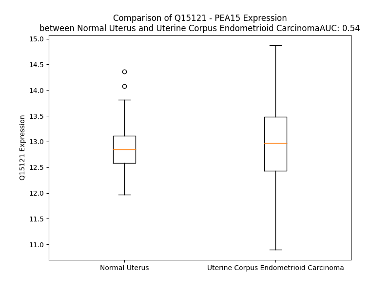

# Detailed Data for Q15121

## Introduction to the Detailed Summary

### How to Interpret the Results

- **Summary & Metrics**: This section provides a quick reference to essential protein attributes, including expression changes, family classification, and biomarker applications. Regulation status (upregulated/downregulated) indicates the protein's behavior in a disease context. Some information comes from the original excel file with the proteins selected from literature, while others are derived from the analyses.
- **Expression Comparison**: A visual representation comparing protein expression between normal and disease states. It highlights significant changes in expression levels that might indicate diagnostic or therapeutic relevance. This is data coming from transcriptomics experiments and could not translate similarly to protein levels.
- **Isoform Alignment**: An interactive view of isoform alignments, revealing structural and functional differences between variants of the protein.
- **Interactors & Homologs**: Tables listing known interaction partners and homologous proteins, the more interactors and homologs, the more complex the protein is to design an antibody for.
- **Biological Assemblies**: Information about the structural arrangement of the protein in different assemblies, providing insights into its functional state but also the complexity of the protein to develop antibodies.
- **Combined Per-Residue Information**: A detailed table summarizing residue-level data. This includes predictions for epitope regions, aggregation tendencies, and modifications that might impact the protein's function. Each row corresponds to a residue in the protein, providing insights into specific sites that may be important for research or drug development.
## Summary & Metrics

- **UniProt Accession**: Q15121
- **Gene Name**: PEA15
- **Protein Name**: phosphoprotein enriched in astrocytes 15
- **Swiss Prot**: nan
- **Family**: transporter
- **Biomarker Application**: prognosis
- **Number of Isoforms**: 2
- **Regulation**: 1
- **(transcriptomics) AUC**: 0.42
- **(transcriptomics) Fold Change**: 1.01
- **(transcriptomics) Regulation**: Downregulated
- **Discotope Epitope Count**: 26
- **Max n_uniprots (Homo)**: 1
- **Max n_uniprots (Hetero)**: 2

## Expression Comparison

## Isoform Alignment

<pre style='font-size:14px; font-family:monospace;'>Q15121-1 ---------------------MAEYGTLLQDLTNNITLEDLEQLKSACKEDIPSEKSEEITTGSAWFSFLESHNKLDKDNLSYIEHIFEISRRPDLLTMVVDYRTRVLKISEEDELDTKLTRIPSAKKYKDIIRQPSEEEIIKLAPPPKKA
Q15121-2 MEDEGNKLCQAPPWPGQTSPVMAEYGTLLQDLTNNITLEDLEQLKSACKEDIPSEKSEEITTGSAWFSFLESHNKLDKDNLSYIEHIFEISRRPDLLTMVVDYRTRVLKISEEDELDTKLTRIPSAKKYKDIIRQPSEEEIIKLAPPPKKA
</pre>

## Interactors

| preferredName_A   | preferredName_B   |   score |
|:------------------|:------------------|--------:|
| PEA15             | MAPK1             |   0.998 |
| PEA15             | MAPK3             |   0.961 |
| PEA15             | FADD              |   0.96  |

## Homologs

| uniprot_id   | gene_id   |
|--------------|-----------|

## Biological Assemblies

|   Unnamed: 0 |   assembly |   n_uniprots | composition   | crystal_id   |
|-------------:|-----------:|-------------:|:--------------|:-------------|
|            0 |          1 |            1 | Homo          | 6p6b         |
|            0 |          1 |            2 | Hetero        | 4iz5         |
|            1 |          2 |            2 | Hetero        | 4iz5         |
|            2 |          3 |            2 | Hetero        | 4iz5         |
|            3 |          4 |            2 | Hetero        | 4iz5         |
|            0 |          1 |            1 | Homo          | 6p6c         |
|            0 |          1 |            2 | Hetero        | 4iza         |
|            1 |          2 |            1 | Homo          | 4iza         |

## Combined Per-Residue Information

|   res | aa   |   epitope_score | epitope   |   relative_surface_accessibility |   modeling_confidence |   Aggregation | modification   |
|------:|:-----|----------------:|:----------|---------------------------------:|----------------------:|--------------:|:---------------|
|     1 | M    |         0.29848 | False     |                          1.21787 |                 56.74 |         0     | N/A            |
|     2 | A    |         0.33141 | False     |                          0.76676 |                 77.65 |         0     | N/A            |
|     3 | E    |         0.28129 | False     |                          0.49894 |                 85.16 |         0     | N/A            |
|     4 | Y    |         0.19316 | False     |                          0.13679 |                 88.95 |         0     | N/A            |
|     5 | G    |         0.28991 | False     |                          0.43612 |                 89    |         0     | N/A            |
|     6 | T    |         0.34283 | False     |                          0.49985 |                 90.85 |         0     | N/A            |
|     7 | L    |         0.18891 | False     |                          0.07031 |                 91.01 |         0     | N/A            |
|     8 | L    |         0.25634 | False     |                          0.13658 |                 92.53 |         0     | N/A            |
|     9 | Q    |         0.4135  | False     |                          0.58856 |                 92.18 |         0     | N/A            |
|    10 | D    |         0.41869 | True      |                          0.35785 |                 93.39 |         0     | N/A            |
|    11 | L    |         0.00608 | False     |                          0       |                 93.66 |         0     | N/A            |
|    12 | T    |         0.19595 | False     |                          0.25587 |                 91.96 |         0     | N/A            |
|    13 | N    |         0.43358 | True      |                          0.70153 |                 92.79 |         0     | N/A            |
|    14 | N    |         0.32465 | False     |                          0.44595 |                 92.84 |         0     | N/A            |
|    15 | I    |         0.16084 | False     |                          0.10328 |                 91.5  |         0     | N/A            |
|    16 | T    |         0.35266 | False     |                          0.55863 |                 90.79 |         0     | N/A            |
|    17 | L    |         0.24841 | False     |                          0.7783  |                 88.64 |         0     | N/A            |
|    18 | E    |         0.2088  | False     |                          0.61564 |                 90.1  |         0     | N/A            |
|    19 | D    |         0.09299 | False     |                          0.0407  |                 90.38 |         0     | N/A            |
|    20 | L    |         0.06821 | False     |                          0.02968 |                 90.51 |         0     | N/A            |
|    21 | E    |         0.35535 | False     |                          0.5322  |                 89.89 |         0     | N/A            |
|    22 | Q    |         0.30663 | False     |                          0.36327 |                 90.39 |         0     | N/A            |
|    23 | L    |         0.00696 | False     |                          0       |                 89.4  |         0     | N/A            |
|    24 | K    |         0.31544 | False     |                          0.20319 |                 88.14 |         0     | N/A            |
|    25 | S    |         0.27615 | False     |                          0.43984 |                 87.97 |         0     | N/A            |
|    26 | A    |         0.1926  | False     |                          0.19702 |                 86.66 |         0     | N/A            |
|    27 | C    |         0.02276 | False     |                          0.00401 |                 82.58 |         0     | N/A            |
|    28 | K    |         0.43714 | True      |                          0.6898  |                 79.87 |         0     | N/A            |
|    29 | E    |         0.48096 | True      |                          0.89746 |                 77.16 |         0     | N/A            |
|    30 | D    |         0.60198 | True      |                          0.4435  |                 76.53 |         0     | N/A            |
|    31 | I    |         0.22385 | False     |                          0.04492 |                 76.46 |         0     | N/A            |
|    32 | P    |         0.44781 | True      |                          0.61165 |                 77.38 |         0     | N/A            |
|    33 | S    |         0.34165 | False     |                          0.60361 |                 76.68 |         0     | N/A            |
|    34 | E    |         0.29205 | False     |                          0.66548 |                 79.55 |         0     | N/A            |
|    35 | K    |         0.49501 | True      |                          0.31838 |                 78.26 |         0     | N/A            |
|    36 | S    |         0.24681 | False     |                          0.13502 |                 80.05 |         0     | N/A            |
|    37 | E    |         0.30026 | False     |                          0.6531  |                 81.81 |         0     | N/A            |
|    38 | E    |         0.30991 | False     |                          0.54759 |                 85.22 |         0     | N/A            |
|    39 | I    |         0.14412 | False     |                          0.0296  |                 88.04 |         0     | N/A            |
|    40 | T    |         0.31795 | False     |                          0.63419 |                 87.74 |         0     | N/A            |
|    41 | T    |         0.3771  | False     |                          0.48954 |                 89.23 |         0     | N/A            |
|    42 | G    |         0.08076 | False     |                          0.09746 |                 88.11 |         0     | N/A            |
|    43 | S    |         0.31276 | False     |                          0.4515  |                 90.4  |         1.04  | N/A            |
|    44 | A    |         0.21471 | False     |                          0.34706 |                 90.44 |         9.414 | N/A            |
|    45 | W    |         0.00677 | False     |                          0.00217 |                 90.75 |        17.775 | N/A            |
|    46 | F    |         0.03592 | False     |                          0.01363 |                 92.08 |        17.775 | N/A            |
|    47 | S    |         0.43288 | True      |                          0.49694 |                 90.56 |        17.775 | N/A            |
|    48 | F    |         0.26976 | False     |                          0.12164 |                 89.83 |        17.775 | N/A            |
|    49 | L    |         0.01336 | False     |                          0       |                 90.89 |        16.315 | N/A            |
|    50 | E    |         0.40588 | False     |                          0.33008 |                 90.6  |         0     | N/A            |
|    51 | S    |         0.51189 | True      |                          0.69714 |                 89.73 |         0     | N/A            |
|    52 | H    |         0.5439  | True      |                          0.5022  |                 87.96 |         0     | N/A            |
|    53 | N    |         0.46926 | True      |                          0.83058 |                 86.72 |         0     | N/A            |
|    54 | K    |         0.416   | False     |                          0.35943 |                 87.39 |         0     | N/A            |
|    55 | L    |         0.06264 | False     |                          0.02647 |                 90.79 |         0     | N/A            |
|    56 | D    |         0.2798  | False     |                          0.43352 |                 88.11 |         0     | N/A            |
|    57 | K    |         0.3667  | False     |                          0.53441 |                 84.55 |         0     | N/A            |
|    58 | D    |         0.43225 | True      |                          0.53682 |                 82.67 |         0     | N/A            |
|    59 | N    |         0.47159 | True      |                          0.41272 |                 86.05 |         0     | N/A            |
|    60 | L    |         0.00873 | False     |                          0       |                 88.45 |         0     | N/A            |
|    61 | S    |         0.39911 | False     |                          0.46342 |                 87.57 |         0     | Phosphoserine  |
|    62 | Y    |         0.23168 | False     |                          0.13142 |                 89.4  |         0     | N/A            |
|    63 | I    |         0.02273 | False     |                          0       |                 90.13 |         0     | N/A            |
|    64 | E    |         0.21705 | False     |                          0.18187 |                 89.94 |         0     | N/A            |
|    65 | H    |         0.48562 | True      |                          0.51063 |                 89.84 |         0     | N/A            |
|    66 | I    |         0.02967 | False     |                          0.0048  |                 90.23 |         0     | N/A            |
|    67 | F    |         0.00821 | False     |                          0.00254 |                 91.54 |         0     | N/A            |
|    68 | E    |         0.29361 | False     |                          0.51233 |                 89.34 |         0     | N/A            |
|    69 | I    |         0.27081 | False     |                          0.50381 |                 89.91 |         0     | N/A            |
|    70 | S    |         0.10443 | False     |                          0.06799 |                 87.49 |         0     | N/A            |
|    71 | R    |         0.46361 | True      |                          0.79337 |                 88.33 |         0     | N/A            |
|    72 | R    |         0.32311 | False     |                          0.1883  |                 87.56 |         0     | N/A            |
|    73 | P    |         0.33373 | False     |                          0.67537 |                 88.92 |         0     | N/A            |
|    74 | D    |         0.20532 | False     |                          0.40916 |                 90.85 |         0     | N/A            |
|    75 | L    |         0.00884 | False     |                          0       |                 91.89 |        20.157 | N/A            |
|    76 | L    |         0.23815 | False     |                          0.29842 |                 90.8  |        23.498 | N/A            |
|    77 | T    |         0.36599 | False     |                          0.619   |                 90.56 |        23.498 | N/A            |
|    78 | M    |         0.28926 | False     |                          0.28073 |                 90.52 |        23.498 | N/A            |
|    79 | V    |         0.01118 | False     |                          0       |                 89.41 |        23.498 | N/A            |
|    80 | V    |         0.33202 | False     |                          0.42938 |                 86.83 |        21.987 | N/A            |
|    81 | D    |         0.35539 | False     |                          0.35638 |                 87.39 |         1.146 | N/A            |
|    82 | Y    |         0.21876 | False     |                          0.08904 |                 86.39 |         1.146 | N/A            |
|    83 | R    |         0.31775 | False     |                          0.07429 |                 82    |         1.146 | N/A            |
|    84 | T    |         0.25802 | False     |                          0.4153  |                 82.87 |         0.384 | N/A            |
|    85 | R    |         0.54665 | True      |                          0.69476 |                 80.23 |         0     | N/A            |
|    86 | V    |         0.34102 | False     |                          0.36329 |                 76.25 |         0     | N/A            |
|    87 | L    |         0.59466 | True      |                          0.3116  |                 68.57 |         0     | N/A            |
|    88 | K    |         0.44792 | True      |                          0.84611 |                 67.64 |         0     | N/A            |
|    89 | I    |         0.51462 | True      |                          0.29296 |                 55.16 |         0     | N/A            |
|    90 | S    |         0.22274 | False     |                          0.43453 |                 51.08 |         0     | Phosphoserine  |
|    91 | E    |         0.42743 | True      |                          0.59857 |                 53.08 |         0     | N/A            |
|    92 | E    |         0.38233 | False     |                          0.75773 |                 51.02 |         0     | N/A            |
|    93 | D    |         0.51541 | True      |                          0.72397 |                 51.8  |         0     | N/A            |
|    94 | E    |         0.46646 | True      |                          0.45119 |                 53.98 |         0     | N/A            |
|    95 | L    |         0.4145  | False     |                          0.42316 |                 50.45 |         0     | N/A            |
|    96 | D    |         0.44554 | True      |                          0.68265 |                 49.62 |         0     | N/A            |
|    97 | T    |         0.4583  | True      |                          0.81035 |                 50.58 |         0     | N/A            |
|    98 | K    |         0.39797 | False     |                          0.84568 |                 54.97 |         0     | N/A            |
|    99 | L    |         0.39197 | False     |                          0.75724 |                 49.78 |         0     | N/A            |
|   100 | T    |         0.25046 | False     |                          0.57745 |                 44.8  |         0     | N/A            |
|   101 | R    |         0.32936 | False     |                          0.8675  |                 47.87 |         0     | N/A            |
|   102 | I    |         0.31217 | False     |                          0.55378 |                 47.09 |         0     | N/A            |
|   103 | P    |         0.39464 | False     |                          0.7386  |                 47.2  |         0     | N/A            |
|   104 | S    |         0.21821 | False     |                          0.50956 |                 50.88 |         0     | Phosphoserine  |
|   105 | A    |         0.23396 | False     |                          0.6753  |                 52.68 |         0     | N/A            |
|   106 | K    |         0.3808  | False     |                          0.78316 |                 50.96 |         0     | N/A            |
|   107 | K    |         0.27132 | False     |                          0.6987  |                 52.7  |         0     | N/A            |
|   108 | Y    |         0.30671 | False     |                          0.56117 |                 57.05 |         0     | N/A            |
|   109 | K    |         0.30481 | False     |                          0.74334 |                 56.75 |         0     | N/A            |
|   110 | D    |         0.29787 | False     |                          0.84319 |                 58.7  |         0     | N/A            |
|   111 | I    |         0.23926 | False     |                          0.67414 |                 59.09 |         0     | N/A            |
|   112 | I    |         0.27333 | False     |                          0.72634 |                 57.69 |         0     | N/A            |
|   113 | R    |         0.28692 | False     |                          0.67725 |                 65.17 |         0     | N/A            |
|   114 | Q    |         0.37111 | False     |                          0.79731 |                 60.5  |         0     | N/A            |
|   115 | P    |         0.3722  | False     |                          0.5722  |                 60.61 |         0     | N/A            |
|   116 | S    |         0.24647 | False     |                          0.42888 |                 64.51 |         0     | Phosphoserine  |
|   117 | E    |         0.22367 | False     |                          0.71793 |                 66.67 |         0     | N/A            |
|   118 | E    |         0.43468 | True      |                          0.86594 |                 65.64 |         0     | N/A            |
|   119 | E    |         0.24085 | False     |                          0.42535 |                 64.97 |         0     | N/A            |
|   120 | I    |         0.27045 | False     |                          0.58792 |                 70.55 |         0     | N/A            |
|   121 | I    |         0.32562 | False     |                          0.94492 |                 72.38 |         0     | N/A            |
|   122 | K    |         0.35083 | False     |                          0.87417 |                 69.59 |         0     | N/A            |
|   123 | L    |         0.42196 | True      |                          1.01196 |                 74.25 |         0     | N/A            |
|   124 | A    |         0.21306 | False     |                          0.74561 |                 75.73 |         0     | N/A            |
|   125 | P    |         0.37448 | False     |                          0.88335 |                 73.34 |         0     | N/A            |
|   126 | P    |         0.31212 | False     |                          0.85016 |                 65.07 |         0     | N/A            |
|   127 | P    |         0.24514 | False     |                          0.94053 |                 70.15 |         0     | N/A            |
|   128 | K    |         0.30286 | False     |                          0.99205 |                 69.62 |         0     | N/A            |
|   129 | K    |         0.22116 | False     |                          1.01248 |                 65.52 |         0     | N/A            |
|   130 | A    |         0.23274 | False     |                          1.55692 |                 70.27 |         0     | N/A            |

