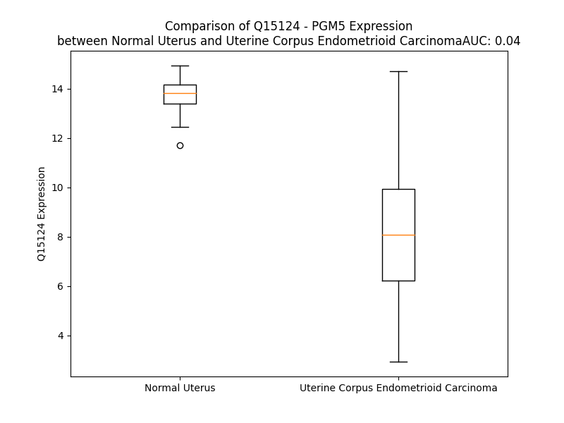

# Detailed Data for Q15124

## Introduction to the Detailed Summary

### How to Interpret the Results

- **Summary & Metrics**: This section provides a quick reference to essential protein attributes, including expression changes, family classification, and biomarker applications. Regulation status (upregulated/downregulated) indicates the protein's behavior in a disease context. Some information comes from the original excel file with the proteins selected from literature, while others are derived from the analyses.
- **Expression Comparison**: A visual representation comparing protein expression between normal and disease states. It highlights significant changes in expression levels that might indicate diagnostic or therapeutic relevance. This is data coming from transcriptomics experiments and could not translate similarly to protein levels.
- **Isoform Alignment**: An interactive view of isoform alignments, revealing structural and functional differences between variants of the protein.
- **Interactors & Homologs**: Tables listing known interaction partners and homologous proteins, the more interactors and homologs, the more complex the protein is to design an antibody for.
- **Biological Assemblies**: Information about the structural arrangement of the protein in different assemblies, providing insights into its functional state but also the complexity of the protein to develop antibodies.
- **Combined Per-Residue Information**: A detailed table summarizing residue-level data. This includes predictions for epitope regions, aggregation tendencies, and modifications that might impact the protein's function. Each row corresponds to a residue in the protein, providing insights into specific sites that may be important for research or drug development.
## Summary & Metrics

- **UniProt Accession**: Q15124
- **Gene Name**: PGM5
- **Protein Name**: Phosphoglucomutase-like protein 5
- **Swiss Prot**: PGM5_HUMAN
- **Family**: enzyme
- **Biomarker Application**:  
- **Number of Isoforms**: 2
- **Regulation**: 2
- **(transcriptomics) AUC**: 0.0
- **(transcriptomics) Fold Change**: 1.60
- **(transcriptomics) Regulation**: Downregulated
- **Discotope Epitope Count**: 114
- **Max n_uniprots (Homo)**: N/A
- **Max n_uniprots (Hetero)**: 3

## Expression Comparison

## Isoform Alignment

<pre style='font-size:14px; font-family:monospace;'>Q15124-1 MEGSPIPVLTVPTAPYEDQRPAGGGGLRRPTGLFEGQRNYLPNFIQSVLSSIDLRDRQGCTMVVGSDGRYFSRTAIEIVVQMAAANGIGRLIIGQNGILSTPAVSCIIRKIKAAGGIILTASHCPGGPGGEFGVKFNVANGGPAPDVVSDKIYQISKTIEEYAICPDLRIDLSRLGRQEFDLENKFKPFRVEIVDPVDIYLNLLRTIFDFHAIKGLLTGPSQLKIRIDAMHGVMGPYVRKVLCDELGAPANSAINCVPLEDFGGQHPDPNLTYATTLLEAMKGGEYGFGAAFDADGDRYMILGQNGFFVSPSDSLAIIAANLSCIPYFRQMGVRGFGRSMPTSMALDRVAKSMKVPVYETPAGWRFFSNLMDSGRCNLCGEESFGTGSDHLREKDGLWAVLVWLSIIAARKQSVEEIVRDHWAKFGRHYYCRFDYEGLDPKTTYYIMRDLEALVTDKSFIGQQFAVGSHVYSVAKTDSFEYVDPVDGTVTKKQGLRIIFSDASRLIFRLSSSSGVRATLRLYAESYERDPSGHDQEPQAVLSPLIAIALKISQIHERTGRRGPTVIT
Q15124-2 MEGSPIPVLTVPTAPYEDQRPAGGGGLRRPTGLFEGQRNYLPNFIQSVLSSIDLRDRQGCTMVVGSDGRYFSRTAIEIVVQMAAANGIGRLIIGQNGILSTPAVSCIIRKIKAAGGIILTASHCPGGPGGEFGVKFNVANGGPAPDVVSDKIYQISKTIEEYAICPDLRIDLSRLGRQEFDLENKFKPFRVEIVDPVDIYLNLLRTIFDFHAIKGLLTGPSQLKIRIDAMHGVMGPYVRKVLCDELGAPANSAINCVPLEDFGGQHPDPNLTYATTLLEAMKGGEYGFGAAFDADGDRYMILGQNGFFVSPSDSLAIIAANLSCIPYFRQMGVRGFGRSMPTSMALDRVAKSMKVPVYETPAGWRFFSNLMDSGRCNLCGEESFGTV------------------------------------------------------------------------------------------------------------------------------------------------------------------------------------
</pre>

## Interactors

| preferredName_A   | preferredName_B   |   score |
|:------------------|:------------------|--------:|
| PGM5              | UGP2              |   0.972 |
| PGM5              | GPI               |   0.968 |
| PGM5              | PGM2              |   0.953 |
| PGM5              | PGM3              |   0.951 |

## Homologs

| uniprot_id   | gene_id   |
|:-------------|:----------|
| A0A140VJL3   | HPRT1     |
| P36871       | PGM1      |
| E7ENQ8       | PGM2      |
| Q9NRG1       | PRTFDC1   |
| A0A087WT27   | PGM3      |
| Q6PCE3       | PGM2L1    |

## Biological Assemblies

|   Unnamed: 0 |   assembly |   n_uniprots | composition   | crystal_id   |
|-------------:|-----------:|-------------:|:--------------|:-------------|
|            0 |          1 |            3 | Hetero        | 7u21         |
|            1 |          2 |            3 | Hetero        | 7u21         |

## Combined Per-Residue Information

|   res | aa   |   epitope_score | epitope   |   relative_surface_accessibility |   modeling_confidence |   Aggregation | modification     |
|------:|:-----|----------------:|:----------|---------------------------------:|----------------------:|--------------:|:-----------------|
|     1 | M    |         0.12626 | False     |                          1.17992 |                 44.09 |         0     | N/A              |
|     2 | E    |         0.20685 | True      |                          0.9812  |                 45.61 |         0     | N/A              |
|     3 | G    |         0.28163 | True      |                          0.7446  |                 67.34 |         0     | N/A              |
|     4 | S    |         0.14649 | True      |                          0.82073 |                 82.74 |         0     | N/A              |
|     5 | P    |         0.12622 | False     |                          0.53909 |                 92.35 |         0     | N/A              |
|     6 | I    |         0.05117 | False     |                          0.17039 |                 96.48 |         0     | N/A              |
|     7 | P    |         0.06651 | False     |                          0.32904 |                 96.37 |         0     | N/A              |
|     8 | V    |         0.05929 | False     |                          0.35319 |                 97.23 |         0.144 | N/A              |
|     9 | L    |         0.16232 | True      |                          0.51275 |                 97.49 |         0.144 | N/A              |
|    10 | T    |         0.11423 | False     |                          0.58362 |                 98.38 |         0.144 | N/A              |
|    11 | V    |         0.07373 | False     |                          0.25039 |                 98.62 |         0.144 | N/A              |
|    12 | P    |         0.14747 | True      |                          0.77842 |                 98.46 |         0.144 | N/A              |
|    13 | T    |         0.07648 | False     |                          0.15931 |                 98.68 |         0     | N/A              |
|    14 | A    |         0.17881 | True      |                          0.64927 |                 97.81 |         0     | N/A              |
|    15 | P    |         0.06476 | False     |                          0.43508 |                 98.11 |         0     | N/A              |
|    16 | Y    |         0.11497 | False     |                          0.21454 |                 96.53 |         0     | N/A              |
|    17 | E    |         0.13878 | False     |                          0.64029 |                 92.62 |         0     | N/A              |
|    18 | D    |         0.15581 | True      |                          0.35304 |                 91.69 |         0     | N/A              |
|    19 | Q    |         0.00747 | False     |                          0       |                 95    |         0     | N/A              |
|    20 | R    |         0.15959 | True      |                          0.54179 |                 92.83 |         0     | N/A              |
|    21 | P    |         0.04403 | False     |                          0.10965 |                 90.03 |         0     | N/A              |
|    22 | A    |         0.06314 | False     |                          0.36739 |                 76.09 |         0     | N/A              |
|    23 | G    |         0.08731 | False     |                          0.50581 |                 64.92 |         0     | N/A              |
|    24 | G    |         0.07892 | False     |                          0.21734 |                 67.64 |         0     | N/A              |
|    25 | G    |         0.11168 | False     |                          0.45639 |                 77.83 |         0     | N/A              |
|    26 | G    |         0.0308  | False     |                          0.09421 |                 90.23 |         0     | N/A              |
|    27 | L    |         0.00679 | False     |                          0.00165 |                 94.6  |         0     | N/A              |
|    28 | R    |         0.19901 | True      |                          0.36198 |                 93.39 |         0     | N/A              |
|    29 | R    |         0.15425 | True      |                          0.11003 |                 93.42 |         0     | N/A              |
|    30 | P    |         0.17486 | True      |                          0.58849 |                 94.72 |         0     | N/A              |
|    31 | T    |         0.0215  | False     |                          0.01023 |                 96.93 |         0     | N/A              |
|    32 | G    |         0.22744 | True      |                          0.47981 |                 96.45 |         0     | N/A              |
|    33 | L    |         0.13102 | False     |                          0.32895 |                 95.57 |         0     | N/A              |
|    34 | F    |         0.03607 | False     |                          0.03348 |                 97.61 |         0     | N/A              |
|    35 | E    |         0.21881 | True      |                          0.44831 |                 97.06 |         0     | N/A              |
|    36 | G    |         0.32439 | True      |                          0.76165 |                 95.18 |         0     | N/A              |
|    37 | Q    |         0.16353 | True      |                          0.38679 |                 96.37 |         0     | N/A              |
|    38 | R    |         0.18402 | True      |                          0.76802 |                 97.34 |         0     | N/A              |
|    39 | N    |         0.06241 | False     |                          0.15724 |                 98.14 |         0     | N/A              |
|    40 | Y    |         0.00983 | False     |                          0.00391 |                 98.46 |         0     | N/A              |
|    41 | L    |         0.014   | False     |                          0.00719 |                 98.5  |         0     | N/A              |
|    42 | P    |         0.03273 | False     |                          0.12426 |                 98.72 |         0     | N/A              |
|    43 | N    |         0.00311 | False     |                          0       |                 98.78 |         0     | N/A              |
|    44 | F    |         0.022   | False     |                          0.01274 |                 98.53 |         3.397 | N/A              |
|    45 | I    |         0.00384 | False     |                          0       |                 98.74 |         3.599 | N/A              |
|    46 | Q    |         0.03096 | False     |                          0.06612 |                 98.85 |         3.599 | N/A              |
|    47 | S    |         0.00272 | False     |                          0       |                 98.55 |         3.599 | N/A              |
|    48 | V    |         0.00196 | False     |                          0       |                 98.2  |         3.832 | N/A              |
|    49 | L    |         0.00396 | False     |                          0.00247 |                 98.6  |         3.376 | N/A              |
|    50 | S    |         0.04388 | False     |                          0.29853 |                 98.13 |         0.69  | N/A              |
|    51 | S    |         0.02979 | False     |                          0.08403 |                 96.93 |         0.382 | N/A              |
|    52 | I    |         0.06706 | False     |                          0.13241 |                 96.91 |         0.382 | N/A              |
|    53 | D    |         0.10004 | False     |                          0.5186  |                 94.66 |         0     | N/A              |
|    54 | L    |         0.09953 | False     |                          0.70315 |                 94.38 |         0     | N/A              |
|    55 | R    |         0.14616 | True      |                          0.88922 |                 95.09 |         0     | N/A              |
|    56 | D    |         0.08592 | False     |                          0.58871 |                 95.13 |         0     | N/A              |
|    57 | R    |         0.08932 | False     |                          0.10115 |                 96.3  |         0     | N/A              |
|    58 | Q    |         0.06502 | False     |                          0.40264 |                 95.92 |         0     | N/A              |
|    59 | G    |         0.04982 | False     |                          0.66811 |                 96.23 |         0     | N/A              |
|    60 | C    |         0.07376 | False     |                          0.1412  |                 98.13 |         1.091 | N/A              |
|    61 | T    |         0.02652 | False     |                          0.13759 |                 98.78 |         1.263 | N/A              |
|    62 | M    |         0.00265 | False     |                          0.00431 |                 98.87 |         1.263 | N/A              |
|    63 | V    |         0.00099 | False     |                          0       |                 98.93 |         1.263 | N/A              |
|    64 | V    |         0.0014  | False     |                          0.00095 |                 98.93 |         1.263 | N/A              |
|    65 | G    |         0.00145 | False     |                          0       |                 98.85 |         0.172 | N/A              |
|    66 | S    |         0.01252 | False     |                          0.00949 |                 98.9  |         0     | N/A              |
|    67 | D    |         0.0096  | False     |                          0.00338 |                 98.77 |         0     | N/A              |
|    68 | G    |         0.0463  | False     |                          0.15255 |                 98.64 |         0     | N/A              |
|    69 | R    |         0.05585 | False     |                          0.01052 |                 98.72 |         0     | N/A              |
|    70 | Y    |         0.16965 | True      |                          0.26752 |                 98.75 |         0.735 | N/A              |
|    71 | F    |         0.05805 | False     |                          0.0996  |                 98.59 |         0.953 | N/A              |
|    72 | S    |         0.02229 | False     |                          0.02839 |                 98.8  |         0.953 | N/A              |
|    73 | R    |         0.15657 | True      |                          0.56138 |                 98.48 |         1.341 | N/A              |
|    74 | T    |         0.12519 | False     |                          0.48817 |                 98.35 |         1.341 | N/A              |
|    75 | A    |         0.00301 | False     |                          0       |                 98.69 |         1.341 | N/A              |
|    76 | I    |         0.00591 | False     |                          0.0024  |                 98.86 |         1.341 | N/A              |
|    77 | E    |         0.04749 | False     |                          0.32183 |                 98.64 |         1.341 | N/A              |
|    78 | I    |         0.01865 | False     |                          0.19439 |                 98.63 |         6.07  | N/A              |
|    79 | V    |         0.00402 | False     |                          0.00666 |                 98.82 |         6.07  | N/A              |
|    80 | V    |         0.00131 | False     |                          0.00095 |                 98.84 |         6.07  | N/A              |
|    81 | Q    |         0.02679 | False     |                          0.07927 |                 98.77 |         4.729 | N/A              |
|    82 | M    |         0.00683 | False     |                          0       |                 98.84 |         4.729 | N/A              |
|    83 | A    |         0.00267 | False     |                          0.0051  |                 98.66 |         3.296 | N/A              |
|    84 | A    |         0.00165 | False     |                          0.00283 |                 98.44 |         2.102 | N/A              |
|    85 | A    |         0.01135 | False     |                          0.11596 |                 98.23 |         1.093 | N/A              |
|    86 | N    |         0.04151 | False     |                          0.06339 |                 98.2  |         0.242 | N/A              |
|    87 | G    |         0.03684 | False     |                          0.06781 |                 97.28 |         0.242 | N/A              |
|    88 | I    |         0.03764 | False     |                          0.02407 |                 98.42 |         0.242 | N/A              |
|    89 | G    |         0.03494 | False     |                          0.24164 |                 98.13 |         0     | N/A              |
|    90 | R    |         0.11027 | False     |                          0.24889 |                 98.79 |         0     | N/A              |
|    91 | L    |         0.0059  | False     |                          0.00577 |                 98.91 |         0     | N/A              |
|    92 | I    |         0.0292  | False     |                          0.0352  |                 98.87 |         0     | N/A              |
|    93 | I    |         0.00251 | False     |                          0       |                 98.9  |         0     | N/A              |
|    94 | G    |         0.00291 | False     |                          0       |                 98.65 |         0     | N/A              |
|    95 | Q    |         0.05649 | False     |                          0.23941 |                 98.76 |         0     | N/A              |
|    96 | N    |         0.10284 | False     |                          0.35994 |                 98.58 |         0     | N/A              |
|    97 | G    |         0.00267 | False     |                          0       |                 98.63 |         0     | N/A              |
|    98 | I    |         0.03032 | False     |                          0.1104  |                 98.85 |         0     | N/A              |
|    99 | L    |         0.00596 | False     |                          0.00366 |                 98.89 |         0     | N/A              |
|   100 | S    |         0.0031  | False     |                          0.00237 |                 98.91 |         0     | N/A              |
|   101 | T    |         0.00196 | False     |                          0       |                 98.81 |         0     | N/A              |
|   102 | P    |         0.00409 | False     |                          0.00696 |                 98.88 |         0     | N/A              |
|   103 | A    |         0.00161 | False     |                          0.00128 |                 98.92 |         0.239 | N/A              |
|   104 | V    |         0.00112 | False     |                          0       |                 98.91 |         0.521 | N/A              |
|   105 | S    |         0.00545 | False     |                          0       |                 98.86 |         0.521 | N/A              |
|   106 | C    |         0.02035 | False     |                          0.04963 |                 98.89 |         0.521 | N/A              |
|   107 | I    |         0.01405 | False     |                          0.0112  |                 98.88 |         0.521 | N/A              |
|   108 | I    |         0.00415 | False     |                          0       |                 98.88 |         0.521 | N/A              |
|   109 | R    |         0.06992 | False     |                          0.32578 |                 98.68 |         0     | N/A              |
|   110 | K    |         0.13903 | True      |                          0.75179 |                 98.57 |         0     | N/A              |
|   111 | I    |         0.12486 | False     |                          0.31449 |                 98.27 |         0     | N/A              |
|   112 | K    |         0.15676 | True      |                          0.90733 |                 98.21 |         0     | N/A              |
|   113 | A    |         0.0111  | False     |                          0.01764 |                 98.52 |         0     | N/A              |
|   114 | A    |         0.02614 | False     |                          0.29002 |                 97.99 |         0     | N/A              |
|   115 | G    |         0.00447 | False     |                          0       |                 98.28 |         0.542 | N/A              |
|   116 | G    |         0.00113 | False     |                          0       |                 98.61 |         3.863 | N/A              |
|   117 | I    |         0.004   | False     |                          0.0048  |                 98.79 |        21.802 | N/A              |
|   118 | I    |         0.00366 | False     |                          0.0008  |                 98.83 |        21.969 | N/A              |
|   119 | L    |         0.00246 | False     |                          0       |                 98.81 |        21.969 | N/A              |
|   120 | T    |         0.00686 | False     |                          0.00211 |                 98.46 |        21.711 | Phosphothreonine |
|   121 | A    |         0.01827 | False     |                          0.03095 |                 96.07 |        19.847 | N/A              |
|   122 | S    |         0.04151 | False     |                          0.09726 |                 95    |         2.156 | Phosphoserine    |
|   123 | H    |         0.13687 | False     |                          0.19571 |                 93.7  |         0     | N/A              |
|   124 | C    |         0.11978 | False     |                          0.06768 |                 93.16 |         0     | N/A              |
|   125 | P    |         0.24329 | True      |                          0.27536 |                 95.47 |         0     | N/A              |
|   126 | G    |         0.09851 | False     |                          0.12576 |                 96.86 |         0     | N/A              |
|   127 | G    |         0.06169 | False     |                          0.04715 |                 98.05 |         0     | N/A              |
|   128 | P    |         0.19508 | True      |                          0.65074 |                 97.38 |         0     | N/A              |
|   129 | G    |         0.3137  | True      |                          1.02275 |                 95.17 |         0     | N/A              |
|   130 | G    |         0.06195 | False     |                          0.08303 |                 95.66 |         0     | N/A              |
|   131 | E    |         0.23838 | True      |                          0.25214 |                 95.44 |         0     | N/A              |
|   132 | F    |         0.00534 | False     |                          0       |                 97.45 |         0     | N/A              |
|   133 | G    |         0.00741 | False     |                          0       |                 96.77 |         0     | N/A              |
|   134 | V    |         0.00931 | False     |                          0.00704 |                 98.14 |         0     | N/A              |
|   135 | K    |         0.02484 | False     |                          0.0495  |                 97.4  |         0     | N/A              |
|   136 | F    |         0.02987 | False     |                          0.08318 |                 97.54 |         0     | N/A              |
|   137 | N    |         0.003   | False     |                          0.00064 |                 98.02 |         0     | N/A              |
|   138 | V    |         0.04565 | False     |                          0.21231 |                 96.79 |         0     | N/A              |
|   139 | A    |         0.05238 | False     |                          0.57051 |                 97.42 |         0     | N/A              |
|   140 | N    |         0.04545 | False     |                          0.26124 |                 96.94 |         0     | N/A              |
|   141 | G    |         0.00158 | False     |                          0       |                 98.18 |         0     | N/A              |
|   142 | G    |         0.00208 | False     |                          0       |                 96.9  |         0     | N/A              |
|   143 | P    |         0.0235  | False     |                          0.05818 |                 95.16 |         0     | N/A              |
|   144 | A    |         0.01207 | False     |                          0.06389 |                 93.18 |         0     | N/A              |
|   145 | P    |         0.03993 | False     |                          0.3529  |                 89.56 |         0     | N/A              |
|   146 | D    |         0.06291 | False     |                          0.32355 |                 86.03 |         0     | N/A              |
|   147 | V    |         0.07951 | False     |                          0.82969 |                 89.57 |         0     | N/A              |
|   148 | V    |         0.05996 | False     |                          0.23231 |                 93.04 |         0     | N/A              |
|   149 | S    |         0.02225 | False     |                          0.07244 |                 92.4  |         0     | N/A              |
|   150 | D    |         0.08585 | False     |                          0.35004 |                 92.5  |         0     | N/A              |
|   151 | K    |         0.08828 | False     |                          0.39241 |                 95.62 |         0     | N/A              |
|   152 | I    |         0.01925 | False     |                          0.0152  |                 96.86 |         0     | N/A              |
|   153 | Y    |         0.09014 | False     |                          0.16035 |                 96.05 |         0     | N/A              |
|   154 | Q    |         0.13167 | False     |                          0.47179 |                 97.37 |         0     | N/A              |
|   155 | I    |         0.14158 | True      |                          0.24207 |                 98.05 |         0     | N/A              |
|   156 | S    |         0.00332 | False     |                          0       |                 97.85 |         0     | N/A              |
|   157 | K    |         0.09804 | False     |                          0.28214 |                 97.55 |         0     | N/A              |
|   158 | T    |         0.21883 | True      |                          0.70653 |                 98.17 |         0     | N/A              |
|   159 | I    |         0.08964 | False     |                          0.0696  |                 98.54 |         0     | N/A              |
|   160 | E    |         0.12697 | False     |                          0.70698 |                 98.61 |         0     | N/A              |
|   161 | E    |         0.13768 | False     |                          0.52111 |                 98.73 |         0     | N/A              |
|   162 | Y    |         0.09836 | False     |                          0.07413 |                 98.78 |         0     | N/A              |
|   163 | A    |         0.0562  | False     |                          0.203   |                 98.66 |         0     | N/A              |
|   164 | I    |         0.09947 | False     |                          0.1096  |                 98.71 |         0     | N/A              |
|   165 | C    |         0.00802 | False     |                          0       |                 98.57 |         0     | N/A              |
|   166 | P    |         0.11027 | False     |                          0.31361 |                 97.07 |         0     | N/A              |
|   167 | D    |         0.14536 | True      |                          0.53355 |                 96.65 |         0     | N/A              |
|   168 | L    |         0.02901 | False     |                          0.01165 |                 97.63 |         0     | N/A              |
|   169 | R    |         0.16762 | True      |                          0.57837 |                 97.34 |         0     | N/A              |
|   170 | I    |         0.06042 | False     |                          0.10137 |                 97.01 |         0     | N/A              |
|   171 | D    |         0.15788 | True      |                          0.41566 |                 98.24 |         0     | N/A              |
|   172 | L    |         0.04405 | False     |                          0.09461 |                 98.45 |         0     | N/A              |
|   173 | S    |         0.16878 | True      |                          0.50165 |                 98.15 |         0     | N/A              |
|   174 | R    |         0.29799 | True      |                          0.73172 |                 98.11 |         0     | N/A              |
|   175 | L    |         0.1847  | True      |                          0.53721 |                 98.5  |         0     | N/A              |
|   176 | G    |         0.06576 | False     |                          0.43663 |                 98.24 |         0     | N/A              |
|   177 | R    |         0.23183 | True      |                          0.50561 |                 98.29 |         0     | N/A              |
|   178 | Q    |         0.06453 | False     |                          0.20303 |                 98.15 |         0     | N/A              |
|   179 | E    |         0.10392 | False     |                          0.45375 |                 97.26 |         0     | N/A              |
|   180 | F    |         0.05832 | False     |                          0.13289 |                 97.4  |         0     | N/A              |
|   181 | D    |         0.05688 | False     |                          0.44641 |                 96.56 |         0     | N/A              |
|   182 | L    |         0.04427 | False     |                          0.05557 |                 96.16 |         0     | N/A              |
|   183 | E    |         0.1742  | True      |                          0.39283 |                 92.86 |         0     | N/A              |
|   184 | N    |         0.23741 | True      |                          0.92542 |                 89.13 |         0     | N/A              |
|   185 | K    |         0.12917 | False     |                          0.39059 |                 88.92 |         0     | N/A              |
|   186 | F    |         0.16793 | True      |                          1.03585 |                 87.19 |         0     | N/A              |
|   187 | K    |         0.15689 | True      |                          0.79559 |                 93.35 |         0     | N/A              |
|   188 | P    |         0.11125 | False     |                          0.38126 |                 95.65 |         0     | N/A              |
|   189 | F    |         0.03256 | False     |                          0.01706 |                 98.2  |         2.517 | N/A              |
|   190 | R    |         0.07694 | False     |                          0.29423 |                 98.45 |         2.517 | N/A              |
|   191 | V    |         0.00336 | False     |                          0       |                 98.81 |         2.517 | N/A              |
|   192 | E    |         0.05354 | False     |                          0.18902 |                 98.77 |         2.517 | N/A              |
|   193 | I    |         0.02205 | False     |                          0.02543 |                 98.84 |         2.517 | N/A              |
|   194 | V    |         0.09618 | False     |                          0.2047  |                 98.81 |         2.32  | N/A              |
|   195 | D    |         0.06285 | False     |                          0.20915 |                 98.76 |         0     | N/A              |
|   196 | P    |         0.03805 | False     |                          0.11148 |                 98.58 |         0     | N/A              |
|   197 | V    |         0.02272 | False     |                          0.01413 |                 98.88 |         0.572 | N/A              |
|   198 | D    |         0.11306 | False     |                          0.35284 |                 98.63 |         0.705 | N/A              |
|   199 | I    |         0.04934 | False     |                          0.28493 |                 98.7  |        33.141 | N/A              |
|   200 | Y    |         0.01093 | False     |                          0.00974 |                 98.91 |        35.678 | N/A              |
|   201 | L    |         0.01847 | False     |                          0.01072 |                 98.86 |        35.796 | N/A              |
|   202 | N    |         0.18237 | True      |                          0.48042 |                 98.8  |        35.796 | N/A              |
|   203 | L    |         0.10597 | False     |                          0.26405 |                 98.82 |        36.356 | N/A              |
|   204 | L    |         0.00263 | False     |                          0       |                 98.89 |        32.088 | N/A              |
|   205 | R    |         0.14873 | True      |                          0.41027 |                 98.73 |         6.038 | N/A              |
|   206 | T    |         0.16544 | True      |                          0.69372 |                 98.4  |         6.038 | N/A              |
|   207 | I    |         0.02614 | False     |                          0.00627 |                 98.84 |         6.038 | N/A              |
|   208 | F    |         0.02942 | False     |                          0.04109 |                 98.87 |         6.038 | N/A              |
|   209 | D    |         0.07526 | False     |                          0.36469 |                 98.78 |         5.334 | N/A              |
|   210 | F    |         0.07936 | False     |                          0.1709  |                 98.75 |         5.2   | N/A              |
|   211 | H    |         0.1865  | True      |                          0.84944 |                 98.59 |         2.639 | N/A              |
|   212 | A    |         0.05158 | False     |                          0.39494 |                 98.61 |         2.639 | N/A              |
|   213 | I    |         0.00458 | False     |                          0.0024  |                 98.8  |         2.435 | N/A              |
|   214 | K    |         0.1336  | False     |                          0.42895 |                 98.79 |         0     | N/A              |
|   215 | G    |         0.23691 | True      |                          0.60965 |                 98.45 |         0     | N/A              |
|   216 | L    |         0.11987 | False     |                          0.20279 |                 98.64 |         0     | N/A              |
|   217 | L    |         0.00686 | False     |                          0.00369 |                 98.78 |         0     | N/A              |
|   218 | T    |         0.18908 | True      |                          0.33807 |                 98.58 |         0     | N/A              |
|   219 | G    |         0.18789 | True      |                          0.51388 |                 96.55 |         0     | N/A              |
|   220 | P    |         0.28277 | True      |                          1.10415 |                 95.77 |         0     | N/A              |
|   221 | S    |         0.18649 | True      |                          0.8356  |                 94.89 |         0     | N/A              |
|   222 | Q    |         0.15152 | True      |                          0.3404  |                 97.82 |         0     | N/A              |
|   223 | L    |         0.1063  | False     |                          0.20417 |                 98.67 |         0     | N/A              |
|   224 | K    |         0.06726 | False     |                          0.48611 |                 98.66 |         0     | N/A              |
|   225 | I    |         0.02009 | False     |                          0.02279 |                 98.84 |         0     | N/A              |
|   226 | R    |         0.10466 | False     |                          0.18058 |                 98.69 |         0     | N/A              |
|   227 | I    |         0.00333 | False     |                          0.0016  |                 98.86 |         0     | N/A              |
|   228 | D    |         0.01444 | False     |                          0.02207 |                 98.84 |         0     | N/A              |
|   229 | A    |         0.00285 | False     |                          0       |                 98.79 |         0     | N/A              |
|   230 | M    |         0.04487 | False     |                          0.07094 |                 98.6  |         0     | N/A              |
|   231 | H    |         0.11648 | False     |                          0.22571 |                 98.71 |         0     | N/A              |
|   232 | G    |         0.00389 | False     |                          0       |                 98.66 |         0     | N/A              |
|   233 | V    |         0.00412 | False     |                          0       |                 98.83 |         0     | N/A              |
|   234 | M    |         0.00778 | False     |                          0.00714 |                 98.89 |         0     | N/A              |
|   235 | G    |         0.00643 | False     |                          0       |                 98.81 |         0     | N/A              |
|   236 | P    |         0.08551 | False     |                          0.24294 |                 98.81 |         0     | N/A              |
|   237 | Y    |         0.00442 | False     |                          0       |                 98.91 |         0     | N/A              |
|   238 | V    |         0.01347 | False     |                          0.00381 |                 98.9  |         0     | N/A              |
|   239 | R    |         0.15649 | True      |                          0.40776 |                 98.84 |         0     | N/A              |
|   240 | K    |         0.07814 | False     |                          0.25137 |                 98.74 |         0     | N/A              |
|   241 | V    |         0.00724 | False     |                          0       |                 98.86 |         0     | N/A              |
|   242 | L    |         0.01996 | False     |                          0.00412 |                 98.88 |         0     | N/A              |
|   243 | C    |         0.09195 | False     |                          0.12755 |                 98.82 |         0     | N/A              |
|   244 | D    |         0.25587 | True      |                          0.66399 |                 98.71 |         0     | N/A              |
|   245 | E    |         0.15692 | True      |                          0.30722 |                 98.65 |         0     | N/A              |
|   246 | L    |         0.01066 | False     |                          0.0033  |                 98.82 |         0     | N/A              |
|   247 | G    |         0.14705 | True      |                          0.32967 |                 98.58 |         0     | N/A              |
|   248 | A    |         0.03267 | False     |                          0.04814 |                 98.72 |         0     | N/A              |
|   249 | P    |         0.11833 | False     |                          0.4195  |                 98.23 |         0     | N/A              |
|   250 | A    |         0.15335 | True      |                          0.81164 |                 98.27 |         0     | N/A              |
|   251 | N    |         0.25566 | True      |                          0.60799 |                 97.59 |         0     | N/A              |
|   252 | S    |         0.02566 | False     |                          0.04396 |                 98.61 |         0     | N/A              |
|   253 | A    |         0.07814 | False     |                          0.17835 |                 98.7  |         0     | N/A              |
|   254 | I    |         0.11696 | False     |                          0.22879 |                 98.04 |         0     | N/A              |
|   255 | N    |         0.05825 | False     |                          0.28767 |                 98.54 |         0     | N/A              |
|   256 | C    |         0.04415 | False     |                          0.05715 |                 98.74 |         0     | N/A              |
|   257 | V    |         0.14957 | True      |                          0.61694 |                 98.66 |         0     | N/A              |
|   258 | P    |         0.0705  | False     |                          0.25298 |                 98.74 |         0     | N/A              |
|   259 | L    |         0.24383 | True      |                          0.41349 |                 98.8  |         0     | N/A              |
|   260 | E    |         0.13863 | False     |                          0.45306 |                 98.74 |         0     | N/A              |
|   261 | D    |         0.15853 | True      |                          0.37309 |                 98.48 |         0     | N/A              |
|   262 | F    |         0.01834 | False     |                          0.0017  |                 98.53 |         0     | N/A              |
|   263 | G    |         0.21903 | True      |                          0.43246 |                 97.36 |         0     | N/A              |
|   264 | G    |         0.42383 | True      |                          0.72149 |                 96.59 |         0     | N/A              |
|   265 | Q    |         0.28812 | True      |                          0.56198 |                 94.46 |         0     | N/A              |
|   266 | H    |         0.38018 | True      |                          0.3667  |                 94.9  |         0     | N/A              |
|   267 | P    |         0.00639 | False     |                          0.00298 |                 97.5  |         0     | N/A              |
|   268 | D    |         0.10099 | False     |                          0.10197 |                 96.57 |         0     | N/A              |
|   269 | P    |         0.0039  | False     |                          0       |                 97.53 |         0     | N/A              |
|   270 | N    |         0.04945 | False     |                          0.02463 |                 95.48 |         0     | N/A              |
|   271 | L    |         0.11408 | False     |                          0.39188 |                 95.43 |         2.925 | N/A              |
|   272 | T    |         0.13631 | False     |                          0.46065 |                 92.73 |         3.3   | N/A              |
|   273 | Y    |         0.19001 | True      |                          0.29301 |                 94.23 |         3.93  | N/A              |
|   274 | A    |         0.01497 | False     |                          0.01786 |                 96.22 |         4.121 | N/A              |
|   275 | T    |         0.15364 | True      |                          0.45624 |                 95.77 |         4.121 | N/A              |
|   276 | T    |         0.13216 | False     |                          0.59196 |                 94.99 |         3.805 | N/A              |
|   277 | L    |         0.01124 | False     |                          0.01649 |                 98.12 |         3.618 | N/A              |
|   278 | L    |         0.05692 | False     |                          0.14756 |                 97.56 |         3.243 | N/A              |
|   279 | E    |         0.26333 | True      |                          0.63831 |                 97.63 |         0     | N/A              |
|   280 | A    |         0.0324  | False     |                          0.34004 |                 97.6  |         0     | N/A              |
|   281 | M    |         0.00562 | False     |                          0       |                 98.45 |         0     | N/A              |
|   282 | K    |         0.17463 | True      |                          0.63175 |                 97.9  |         0     | N/A              |
|   283 | G    |         0.26097 | True      |                          0.77203 |                 96.24 |         0     | N/A              |
|   284 | G    |         0.12006 | False     |                          0.23708 |                 96.09 |         0     | N/A              |
|   285 | E    |         0.11136 | False     |                          0.47243 |                 97.07 |         0     | N/A              |
|   286 | Y    |         0.09777 | False     |                          0.10925 |                 98.58 |         0     | N/A              |
|   287 | G    |         0.03645 | False     |                          0.19414 |                 98.55 |         0     | N/A              |
|   288 | F    |         0.00117 | False     |                          0       |                 98.9  |         0.192 | N/A              |
|   289 | G    |         0.00315 | False     |                          0       |                 98.9  |         0.192 | N/A              |
|   290 | A    |         0.00102 | False     |                          0       |                 98.94 |         0.192 | N/A              |
|   291 | A    |         0.00192 | False     |                          0       |                 98.89 |         0.192 | N/A              |
|   292 | F    |         0.00202 | False     |                          0       |                 98.88 |         0.192 | N/A              |
|   293 | D    |         0.00341 | False     |                          0       |                 98.55 |         0     | N/A              |
|   294 | A    |         0.00291 | False     |                          0       |                 98.6  |         0     | N/A              |
|   295 | D    |         0.00479 | False     |                          0.00166 |                 98.67 |         0     | N/A              |
|   296 | G    |         0.00226 | False     |                          0       |                 98.69 |         0     | N/A              |
|   297 | D    |         0.01556 | False     |                          0.01881 |                 98.49 |         0     | N/A              |
|   298 | R    |         0.11552 | False     |                          0.15968 |                 98.57 |         0     | N/A              |
|   299 | Y    |         0.0158  | False     |                          0.02223 |                 98.75 |         4.294 | N/A              |
|   300 | M    |         0.01414 | False     |                          0.00647 |                 98.78 |         4.294 | N/A              |
|   301 | I    |         0.01391 | False     |                          0.01145 |                 98.86 |         4.294 | N/A              |
|   302 | L    |         0.00393 | False     |                          0       |                 98.88 |         4.294 | N/A              |
|   303 | G    |         0.00204 | False     |                          0       |                 98.83 |         4.294 | N/A              |
|   304 | Q    |         0.06916 | False     |                          0.39405 |                 98.53 |         0.921 | N/A              |
|   305 | N    |         0.16267 | True      |                          0.61165 |                 98.38 |         1.146 | N/A              |
|   306 | G    |         0.04095 | False     |                          0.14639 |                 97.92 |         1.146 | N/A              |
|   307 | F    |         0.06482 | False     |                          0.17338 |                 98.38 |         1.146 | N/A              |
|   308 | F    |         0.0524  | False     |                          0.26775 |                 98.2  |         1.146 | N/A              |
|   309 | V    |         0.01429 | False     |                          0.02144 |                 98.71 |         1.146 | N/A              |
|   310 | S    |         0.02025 | False     |                          0.13165 |                 97.82 |         0     | N/A              |
|   311 | P    |         0.01178 | False     |                          0.07274 |                 98.4  |         0     | N/A              |
|   312 | S    |         0.00534 | False     |                          0.01031 |                 98.67 |         0     | N/A              |
|   313 | D    |         0.02403 | False     |                          0.04357 |                 98.79 |         0     | N/A              |
|   314 | S    |         0.00574 | False     |                          0.01456 |                 98.91 |         3.021 | N/A              |
|   315 | L    |         0.00184 | False     |                          0.0033  |                 98.89 |        18.737 | N/A              |
|   316 | A    |         0.00075 | False     |                          0       |                 98.92 |        22.829 | N/A              |
|   317 | I    |         0.00369 | False     |                          0       |                 98.93 |        23.852 | N/A              |
|   318 | I    |         0.00285 | False     |                          0.00059 |                 98.88 |        23.852 | N/A              |
|   319 | A    |         0.00111 | False     |                          0       |                 98.9  |        22.73  | N/A              |
|   320 | A    |         0.04467 | False     |                          0.32494 |                 98.8  |        14.18  | N/A              |
|   321 | N    |         0.02636 | False     |                          0.1109  |                 98.85 |         3.642 | N/A              |
|   322 | L    |         0.01315 | False     |                          0.02027 |                 98.55 |         3.11  | N/A              |
|   323 | S    |         0.0918  | False     |                          0.64735 |                 98.06 |         0.253 | N/A              |
|   324 | C    |         0.05689 | False     |                          0.2396  |                 98.47 |         0     | N/A              |
|   325 | I    |         0.00563 | False     |                          0       |                 98.72 |         0     | N/A              |
|   326 | P    |         0.07215 | False     |                          0.16104 |                 98.75 |         0     | N/A              |
|   327 | Y    |         0.12264 | False     |                          0.16066 |                 98.71 |         0     | N/A              |
|   328 | F    |         0.01799 | False     |                          0.03375 |                 98.57 |         0     | N/A              |
|   329 | R    |         0.09586 | False     |                          0.63603 |                 98.11 |         0     | N/A              |
|   330 | Q    |         0.20205 | True      |                          0.74687 |                 97.77 |         0     | N/A              |
|   331 | M    |         0.1661  | True      |                          0.58034 |                 95.68 |         0     | N/A              |
|   332 | G    |         0.08369 | False     |                          0.38423 |                 97.39 |         0     | N/A              |
|   333 | V    |         0.072   | False     |                          0.33279 |                 98.34 |         0     | N/A              |
|   334 | R    |         0.05876 | False     |                          0.3877  |                 98.2  |         0     | N/A              |
|   335 | G    |         0.00181 | False     |                          0       |                 98.63 |         0     | N/A              |
|   336 | F    |         0.00168 | False     |                          0       |                 98.85 |         0     | N/A              |
|   337 | G    |         0.00106 | False     |                          0       |                 98.59 |         0     | N/A              |
|   338 | R    |         0.02919 | False     |                          0.0206  |                 98.8  |         0     | N/A              |
|   339 | S    |         0.01243 | False     |                          0.00633 |                 98.31 |         0     | N/A              |
|   340 | M    |         0.00782 | False     |                          0.00216 |                 98.08 |         0     | N/A              |
|   341 | P    |         0.00732 | False     |                          0.00398 |                 98.03 |         0     | N/A              |
|   342 | T    |         0.00665 | False     |                          0.00381 |                 98.61 |         0     | N/A              |
|   343 | S    |         0.00349 | False     |                          0.00777 |                 98.54 |         0     | N/A              |
|   344 | M    |         0.04205 | False     |                          0.32494 |                 98.31 |         0     | N/A              |
|   345 | A    |         0.00734 | False     |                          0.0341  |                 98.76 |         0     | N/A              |
|   346 | L    |         0.00287 | False     |                          0.00554 |                 98.82 |         0     | N/A              |
|   347 | D    |         0.0495  | False     |                          0.15161 |                 98.65 |         0     | N/A              |
|   348 | R    |         0.14046 | True      |                          0.30522 |                 98.35 |         0     | N/A              |
|   349 | V    |         0.00403 | False     |                          0.00095 |                 98.74 |         0     | N/A              |
|   350 | A    |         0.00572 | False     |                          0.0102  |                 98.71 |         0     | N/A              |
|   351 | K    |         0.09149 | False     |                          0.80764 |                 98.35 |         0     | N/A              |
|   352 | S    |         0.15241 | True      |                          0.52141 |                 98.28 |         0     | N/A              |
|   353 | M    |         0.10862 | False     |                          0.41421 |                 97.96 |         0     | N/A              |
|   354 | K    |         0.33071 | True      |                          0.92069 |                 98.32 |         0     | N/A              |
|   355 | V    |         0.04432 | False     |                          0.15309 |                 98.41 |         0     | N/A              |
|   356 | P    |         0.08888 | False     |                          0.53298 |                 98.39 |         0     | N/A              |
|   357 | V    |         0.03981 | False     |                          0.37133 |                 98.68 |         0     | N/A              |
|   358 | Y    |         0.09491 | False     |                          0.21485 |                 98.65 |         0     | N/A              |
|   359 | E    |         0.02864 | False     |                          0.23715 |                 98.62 |         0     | N/A              |
|   360 | T    |         0.00397 | False     |                          0       |                 97.92 |         0     | N/A              |
|   361 | P    |         0.00345 | False     |                          0.00199 |                 95.57 |         0     | N/A              |
|   362 | A    |         0.1138  | False     |                          0.28831 |                 92.49 |         0     | N/A              |
|   363 | G    |         0.05558 | False     |                          0.24101 |                 89.95 |         0     | N/A              |
|   364 | W    |         0.02282 | False     |                          0.0224  |                 93.49 |         0     | N/A              |
|   365 | R    |         0.0684  | False     |                          0.09417 |                 90.71 |         0     | N/A              |
|   366 | F    |         0.03349 | False     |                          0.03503 |                 93.77 |         1.423 | N/A              |
|   367 | F    |         0.00372 | False     |                          0       |                 96.9  |         1.423 | N/A              |
|   368 | S    |         0.01387 | False     |                          0.03016 |                 95.65 |         1.423 | N/A              |
|   369 | N    |         0.07139 | False     |                          0.20743 |                 94.56 |         1.423 | N/A              |
|   370 | L    |         0.00269 | False     |                          0       |                 98.11 |         1.423 | N/A              |
|   371 | M    |         0.01143 | False     |                          0.02179 |                 98.3  |         0.757 | N/A              |
|   372 | D    |         0.05153 | False     |                          0.46483 |                 97.19 |         0     | N/A              |
|   373 | S    |         0.10593 | False     |                          0.38265 |                 97.77 |         0     | N/A              |
|   374 | G    |         0.03378 | False     |                          0.26978 |                 97.83 |         0     | N/A              |
|   375 | R    |         0.07206 | False     |                          0.39238 |                 98.34 |         0     | N/A              |
|   376 | C    |         0.00203 | False     |                          0       |                 97.84 |         0     | N/A              |
|   377 | N    |         0.00232 | False     |                          0       |                 97.75 |         0     | N/A              |
|   378 | L    |         0.00149 | False     |                          0       |                 98.81 |         0     | N/A              |
|   379 | C    |         0.00314 | False     |                          0       |                 98.72 |         0     | N/A              |
|   380 | G    |         0.00308 | False     |                          0       |                 98.68 |         0     | N/A              |
|   381 | E    |         0.04411 | False     |                          0.06014 |                 98.45 |         0     | N/A              |
|   382 | E    |         0.01784 | False     |                          0.01918 |                 97.7  |         0     | N/A              |
|   383 | S    |         0.02948 | False     |                          0.15145 |                 95.74 |         0     | N/A              |
|   384 | F    |         0.02512 | False     |                          0.02489 |                 98.03 |         0     | N/A              |
|   385 | G    |         0.01445 | False     |                          0.00514 |                 98.02 |         0     | N/A              |
|   386 | T    |         0.00281 | False     |                          0.00507 |                 98.74 |         0     | N/A              |
|   387 | G    |         0.00345 | False     |                          0       |                 98.66 |         0     | N/A              |
|   388 | S    |         0.00388 | False     |                          0.00079 |                 98.68 |         0     | N/A              |
|   389 | D    |         0.01897 | False     |                          0.05719 |                 98.43 |         0     | N/A              |
|   390 | H    |         0.03962 | False     |                          0.07511 |                 98.47 |         0     | N/A              |
|   391 | L    |         0.01175 | False     |                          0.00495 |                 98.21 |         0     | N/A              |
|   392 | R    |         0.05824 | False     |                          0.05432 |                 98.01 |         0     | N/A              |
|   393 | E    |         0.01338 | False     |                          0.00689 |                 98.15 |         0     | N/A              |
|   394 | K    |         0.06402 | False     |                          0.08946 |                 98.41 |         0.015 | N/A              |
|   395 | D    |         0.00205 | False     |                          0.00245 |                 98.84 |         0.016 | N/A              |
|   396 | G    |         0.00144 | False     |                          0       |                 98.81 |         9.09  | N/A              |
|   397 | L    |         0.00183 | False     |                          0       |                 98.92 |        89.486 | N/A              |
|   398 | W    |         0.00223 | False     |                          0       |                 98.91 |        96.253 | N/A              |
|   399 | A    |         0.00177 | False     |                          0       |                 98.89 |        97.887 | N/A              |
|   400 | V    |         0.00238 | False     |                          0       |                 98.94 |        99.804 | N/A              |
|   401 | L    |         0.00172 | False     |                          0       |                 98.95 |        99.96  | N/A              |
|   402 | V    |         0.00098 | False     |                          0.0019  |                 98.92 |        99.985 | N/A              |
|   403 | W    |         0.00183 | False     |                          0       |                 98.95 |        99.932 | N/A              |
|   404 | L    |         0.0021  | False     |                          0       |                 98.94 |        99.69  | N/A              |
|   405 | S    |         0.02552 | False     |                          0.06583 |                 98.92 |        98.289 | N/A              |
|   406 | I    |         0.00251 | False     |                          0.0016  |                 98.9  |        98.114 | N/A              |
|   407 | I    |         0.06522 | False     |                          0.05019 |                 98.86 |        96.203 | N/A              |
|   408 | A    |         0.0533  | False     |                          0.21498 |                 98.6  |        75.32  | N/A              |
|   409 | A    |         0.0786  | False     |                          0.56019 |                 98.67 |        17.769 | N/A              |
|   410 | R    |         0.13181 | False     |                          0.31234 |                 98.4  |         0.001 | N/A              |
|   411 | K    |         0.31098 | True      |                          0.89489 |                 98.12 |         0     | N/A              |
|   412 | Q    |         0.14265 | True      |                          0.24615 |                 98.61 |         0     | N/A              |
|   413 | S    |         0.05043 | False     |                          0.34551 |                 98.65 |         0     | N/A              |
|   414 | V    |         0.00508 | False     |                          0.00967 |                 98.87 |         0     | N/A              |
|   415 | E    |         0.0625  | False     |                          0.27355 |                 98.79 |         0     | N/A              |
|   416 | E    |         0.13525 | False     |                          0.45041 |                 98.8  |         0     | N/A              |
|   417 | I    |         0.00552 | False     |                          0.0008  |                 98.91 |         0     | N/A              |
|   418 | V    |         0.00547 | False     |                          0.00571 |                 98.87 |         0     | N/A              |
|   419 | R    |         0.09431 | False     |                          0.35802 |                 98.59 |         0     | N/A              |
|   420 | D    |         0.21884 | True      |                          0.37387 |                 98.6  |         0     | N/A              |
|   421 | H    |         0.03602 | False     |                          0.048   |                 98.78 |         0     | N/A              |
|   422 | W    |         0.03338 | False     |                          0.04574 |                 98.72 |         0     | N/A              |
|   423 | A    |         0.19851 | True      |                          0.599   |                 98.25 |         0     | N/A              |
|   424 | K    |         0.19446 | True      |                          0.74932 |                 98.24 |         0     | N/A              |
|   425 | F    |         0.10235 | False     |                          0.1235  |                 98.3  |         0     | N/A              |
|   426 | G    |         0.03925 | False     |                          0.07993 |                 98.23 |         0     | N/A              |
|   427 | R    |         0.02825 | False     |                          0.11988 |                 98.43 |         0     | N/A              |
|   428 | H    |         0.05136 | False     |                          0.03505 |                 98.24 |         0     | N/A              |
|   429 | Y    |         0.01892 | False     |                          0.01144 |                 98.49 |         0     | N/A              |
|   430 | Y    |         0.02728 | False     |                          0.11307 |                 98.35 |         0     | N/A              |
|   431 | C    |         0.01203 | False     |                          0.01302 |                 97.39 |         0     | N/A              |
|   432 | R    |         0.05063 | False     |                          0.05861 |                 97.52 |         0     | N/A              |
|   433 | F    |         0.06183 | False     |                          0.07962 |                 97.12 |         0     | N/A              |
|   434 | D    |         0.02351 | False     |                          0.01009 |                 94.79 |         0     | N/A              |
|   435 | Y    |         0.00817 | False     |                          0.00046 |                 95.21 |         0     | N/A              |
|   436 | E    |         0.13333 | False     |                          0.34123 |                 90.97 |         0     | N/A              |
|   437 | G    |         0.07984 | False     |                          0.40329 |                 88.77 |         0     | N/A              |
|   438 | L    |         0.04207 | False     |                          0.03476 |                 92.15 |         0     | N/A              |
|   439 | D    |         0.11117 | False     |                          0.48566 |                 92.16 |         0     | N/A              |
|   440 | P    |         0.07712 | False     |                          0.3013  |                 90.02 |         0     | N/A              |
|   441 | K    |         0.18158 | True      |                          0.6959  |                 92.38 |         0     | N/A              |
|   442 | T    |         0.12517 | False     |                          0.28892 |                 93.87 |         3.239 | N/A              |
|   443 | T    |         0.00454 | False     |                          0       |                 93.56 |         8.105 | N/A              |
|   444 | Y    |         0.26741 | True      |                          0.57468 |                 93.16 |         8.105 | N/A              |
|   445 | Y    |         0.30821 | True      |                          0.38655 |                 96    |         8.105 | N/A              |
|   446 | I    |         0.0515  | False     |                          0.00991 |                 96.74 |         8.105 | N/A              |
|   447 | M    |         0.02756 | False     |                          0.12832 |                 96.41 |         7.76  | N/A              |
|   448 | R    |         0.23973 | True      |                          0.47876 |                 96.23 |         0     | N/A              |
|   449 | D    |         0.24625 | True      |                          0.28085 |                 97.67 |         0     | N/A              |
|   450 | L    |         0.01614 | False     |                          0.01945 |                 97.12 |         0     | N/A              |
|   451 | E    |         0.05119 | False     |                          0.21037 |                 97.32 |         0     | N/A              |
|   452 | A    |         0.10616 | False     |                          0.62633 |                 97.37 |         0     | N/A              |
|   453 | L    |         0.13101 | False     |                          0.44375 |                 96.33 |         0     | N/A              |
|   454 | V    |         0.01036 | False     |                          0       |                 95.17 |         0     | N/A              |
|   455 | T    |         0.05507 | False     |                          0.50819 |                 92.77 |         0     | N/A              |
|   456 | D    |         0.13021 | False     |                          0.43251 |                 96.38 |         0     | N/A              |
|   457 | K    |         0.13652 | False     |                          0.94205 |                 93.51 |         0     | N/A              |
|   458 | S    |         0.18735 | True      |                          0.60424 |                 96.24 |         0     | N/A              |
|   459 | F    |         0.07879 | False     |                          0.04851 |                 96.98 |         0     | N/A              |
|   460 | I    |         0.10388 | False     |                          0.56662 |                 97.1  |         0     | N/A              |
|   461 | G    |         0.04926 | False     |                          0.61051 |                 96.36 |         0     | N/A              |
|   462 | Q    |         0.24906 | True      |                          0.41917 |                 97.06 |         0     | N/A              |
|   463 | Q    |         0.14507 | True      |                          0.6111  |                 97.21 |         0     | N/A              |
|   464 | F    |         0.14753 | True      |                          0.19321 |                 97.78 |         0     | N/A              |
|   465 | A    |         0.18161 | True      |                          0.72591 |                 96.9  |         0     | N/A              |
|   466 | V    |         0.17269 | True      |                          0.3312  |                 96.67 |         0     | N/A              |
|   467 | G    |         0.17544 | True      |                          0.96095 |                 93.47 |         0     | N/A              |
|   468 | S    |         0.21546 | True      |                          0.83984 |                 92.25 |         0     | N/A              |
|   469 | H    |         0.15006 | True      |                          0.49617 |                 93.38 |         0     | N/A              |
|   470 | V    |         0.1339  | False     |                          0.63655 |                 96.62 |         1.009 | N/A              |
|   471 | Y    |         0.02918 | False     |                          0.0494  |                 97.84 |         1.009 | N/A              |
|   472 | S    |         0.03051 | False     |                          0.22066 |                 98.1  |         1.009 | N/A              |
|   473 | V    |         0.03154 | False     |                          0.02745 |                 98.25 |         1.009 | N/A              |
|   474 | A    |         0.0617  | False     |                          0.48949 |                 97.58 |         1.009 | N/A              |
|   475 | K    |         0.07579 | False     |                          0.48025 |                 97.21 |         0     | N/A              |
|   476 | T    |         0.06118 | False     |                          0.13295 |                 97.29 |         0     | N/A              |
|   477 | D    |         0.11263 | False     |                          0.20736 |                 96.88 |         0     | N/A              |
|   478 | S    |         0.05764 | False     |                          0.22293 |                 96.79 |         0     | N/A              |
|   479 | F    |         0.07119 | False     |                          0.06698 |                 97.42 |         0     | N/A              |
|   480 | E    |         0.1081  | False     |                          0.41683 |                 96.97 |         0     | N/A              |
|   481 | Y    |         0.08355 | False     |                          0.07518 |                 97.22 |         0     | N/A              |
|   482 | V    |         0.15539 | True      |                          0.61239 |                 97.5  |         0     | N/A              |
|   483 | D    |         0.03012 | False     |                          0.0254  |                 95.59 |         0     | N/A              |
|   484 | P    |         0.2096  | True      |                          0.39459 |                 96.6  |         0     | N/A              |
|   485 | V    |         0.09551 | False     |                          0.48605 |                 94.63 |         0     | N/A              |
|   486 | D    |         0.16406 | True      |                          0.53832 |                 92.41 |         0     | N/A              |
|   487 | G    |         0.13675 | False     |                          0.53064 |                 94.18 |         0     | N/A              |
|   488 | T    |         0.19861 | True      |                          0.43845 |                 91.89 |         0     | N/A              |
|   489 | V    |         0.14148 | True      |                          0.49646 |                 94.87 |         0     | N/A              |
|   490 | T    |         0.13058 | False     |                          0.14084 |                 92.05 |         0     | N/A              |
|   491 | K    |         0.18898 | True      |                          0.62421 |                 93.82 |         0     | N/A              |
|   492 | K    |         0.10938 | False     |                          0.74341 |                 92.31 |         0     | N/A              |
|   493 | Q    |         0.11608 | False     |                          0.2292  |                 94.38 |         0     | N/A              |
|   494 | G    |         0.02105 | False     |                          0.05198 |                 96.12 |         0     | N/A              |
|   495 | L    |         0.02225 | False     |                          0.03792 |                 98.14 |         0     | N/A              |
|   496 | R    |         0.05361 | False     |                          0.06103 |                 98.24 |         0     | N/A              |
|   497 | I    |         0.00579 | False     |                          0.0016  |                 98.39 |         0     | N/A              |
|   498 | I    |         0.07199 | False     |                          0.22079 |                 97.92 |         0     | N/A              |
|   499 | F    |         0.00972 | False     |                          0.01773 |                 98.01 |         0     | N/A              |
|   500 | S    |         0.12396 | False     |                          0.64294 |                 96.26 |         0     | N/A              |
|   501 | D    |         0.10718 | False     |                          0.44114 |                 93.75 |         0     | N/A              |
|   502 | A    |         0.05295 | False     |                          0.32252 |                 92.95 |         0     | N/A              |
|   503 | S    |         0.00309 | False     |                          0.00237 |                 97.33 |         0     | N/A              |
|   504 | R    |         0.01878 | False     |                          0.01393 |                 98.49 |         0     | N/A              |
|   505 | L    |         0.0025  | False     |                          0       |                 98.69 |         0     | N/A              |
|   506 | I    |         0.0101  | False     |                          0.0136  |                 98.59 |         0     | N/A              |
|   507 | F    |         0.00973 | False     |                          0.00573 |                 98.29 |         0     | N/A              |
|   508 | R    |         0.05129 | False     |                          0.13993 |                 95.98 |         0     | N/A              |
|   509 | L    |         0.12344 | False     |                          0.41885 |                 91.06 |         0     | N/A              |
|   510 | S    |         0.11035 | False     |                          0.19277 |                 79.79 |         0     | N/A              |
|   511 | S    |         0.15937 | True      |                          0.69272 |                 62.76 |         0     | N/A              |
|   512 | S    |         0.14236 | True      |                          0.44218 |                 48.65 |         0     | N/A              |
|   513 | S    |         0.16508 | True      |                          0.37872 |                 48.07 |         0     | N/A              |
|   514 | G    |         0.12642 | False     |                          0.7154  |                 50.03 |         0     | N/A              |
|   515 | V    |         0.18072 | True      |                          0.81759 |                 62.86 |         0     | N/A              |
|   516 | R    |         0.30562 | True      |                          0.65923 |                 77.05 |         0     | N/A              |
|   517 | A    |         0.00836 | False     |                          0.01108 |                 87.5  |         0     | N/A              |
|   518 | T    |         0.04622 | False     |                          0.19677 |                 91.29 |         0     | N/A              |
|   519 | L    |         0.00746 | False     |                          0.00165 |                 95.3  |         0     | N/A              |
|   520 | R    |         0.07927 | False     |                          0.13765 |                 96.53 |         0     | N/A              |
|   521 | L    |         0.01021 | False     |                          0.01133 |                 97.98 |         0     | N/A              |
|   522 | Y    |         0.01153 | False     |                          0.00802 |                 98.56 |         0     | N/A              |
|   523 | A    |         0.00474 | False     |                          0       |                 98.63 |         0     | N/A              |
|   524 | E    |         0.0091  | False     |                          0.01219 |                 98.63 |         0     | N/A              |
|   525 | S    |         0.02135 | False     |                          0.1099  |                 98.04 |         0     | N/A              |
|   526 | Y    |         0.06933 | False     |                          0.19579 |                 97.27 |         0     | N/A              |
|   527 | E    |         0.08711 | False     |                          0.25842 |                 97.02 |         0     | N/A              |
|   528 | R    |         0.1324  | False     |                          0.77549 |                 95.86 |         0     | N/A              |
|   529 | D    |         0.14496 | True      |                          0.46344 |                 95.54 |         0     | N/A              |
|   530 | P    |         0.06464 | False     |                          0.56584 |                 96.11 |         0     | N/A              |
|   531 | S    |         0.17617 | True      |                          0.75493 |                 96.23 |         0     | N/A              |
|   532 | G    |         0.0368  | False     |                          0.103   |                 96.21 |         0     | N/A              |
|   533 | H    |         0.05015 | False     |                          0.04659 |                 97.83 |         0     | N/A              |
|   534 | D    |         0.16642 | True      |                          0.64521 |                 96.23 |         0     | N/A              |
|   535 | Q    |         0.15615 | True      |                          0.4624  |                 95.6  |         0     | N/A              |
|   536 | E    |         0.19265 | True      |                          0.48436 |                 95.23 |         0     | N/A              |
|   537 | P    |         0.04073 | False     |                          0.33103 |                 95.73 |         0     | N/A              |
|   538 | Q    |         0.09281 | False     |                          0.34585 |                 94.08 |         0     | N/A              |
|   539 | A    |         0.1051  | False     |                          0.63042 |                 95.42 |         0     | N/A              |
|   540 | V    |         0.05153 | False     |                          0.18263 |                 96.79 |         0     | N/A              |
|   541 | L    |         0.00279 | False     |                          0.00165 |                 97.72 |         0     | N/A              |
|   542 | S    |         0.08243 | False     |                          0.46356 |                 97.36 |         0     | N/A              |
|   543 | P    |         0.05516 | False     |                          0.08847 |                 98.05 |         0.681 | N/A              |
|   544 | L    |         0.00324 | False     |                          0       |                 98.15 |        37.634 | N/A              |
|   545 | I    |         0.01918 | False     |                          0.0776  |                 98.12 |        43.353 | N/A              |
|   546 | A    |         0.05232 | False     |                          0.39003 |                 97.93 |        43.353 | N/A              |
|   547 | I    |         0.02874 | False     |                          0.0224  |                 98.2  |        43.353 | N/A              |
|   548 | A    |         0.00302 | False     |                          0       |                 98.11 |        43.126 | N/A              |
|   549 | L    |         0.07554 | False     |                          0.22057 |                 97.83 |        37.335 | N/A              |
|   550 | K    |         0.12629 | False     |                          0.79428 |                 97.09 |         0     | N/A              |
|   551 | I    |         0.17556 | True      |                          0.13871 |                 97.06 |         0     | N/A              |
|   552 | S    |         0.03882 | False     |                          0.03149 |                 97.15 |         0     | N/A              |
|   553 | Q    |         0.09778 | False     |                          0.41572 |                 97.17 |         0     | N/A              |
|   554 | I    |         0.05797 | False     |                          0.012   |                 96.65 |         0     | N/A              |
|   555 | H    |         0.07882 | False     |                          0.25529 |                 97.63 |         0     | N/A              |
|   556 | E    |         0.21869 | True      |                          0.71971 |                 97.01 |         0     | N/A              |
|   557 | R    |         0.16998 | True      |                          0.35595 |                 97.1  |         0     | N/A              |
|   558 | T    |         0.14632 | True      |                          0.22384 |                 95.61 |         0     | N/A              |
|   559 | G    |         0.12411 | False     |                          0.77933 |                 95.77 |         0     | N/A              |
|   560 | R    |         0.25015 | True      |                          0.26687 |                 95.38 |         0     | N/A              |
|   561 | R    |         0.2781  | True      |                          0.95811 |                 95.49 |         0     | N/A              |
|   562 | G    |         0.16017 | True      |                          0.30658 |                 96.07 |         0     | N/A              |
|   563 | P    |         0.07443 | False     |                          0.24114 |                 95.72 |         0     | N/A              |
|   564 | T    |         0.10027 | False     |                          0.51759 |                 92.58 |         0     | N/A              |
|   565 | V    |         0.06864 | False     |                          0.06855 |                 91.34 |         0     | N/A              |
|   566 | I    |         0.05134 | False     |                          0.45255 |                 93.91 |         0     | N/A              |
|   567 | T    |         0.03365 | False     |                          0.2104  |                 92.27 |         0     | N/A              |

