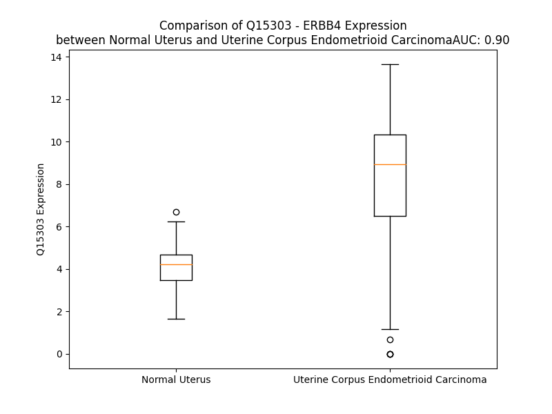

# Detailed Data for Q15303

## Introduction to the Detailed Summary

### How to Interpret the Results

- **Summary & Metrics**: This section provides a quick reference to essential protein attributes, including expression changes, family classification, and biomarker applications. Regulation status (upregulated/downregulated) indicates the protein's behavior in a disease context. Some information comes from the original excel file with the proteins selected from literature, while others are derived from the analyses.
- **Expression Comparison**: A visual representation comparing protein expression between normal and disease states. It highlights significant changes in expression levels that might indicate diagnostic or therapeutic relevance. This is data coming from transcriptomics experiments and could not translate similarly to protein levels.
- **Isoform Alignment**: An interactive view of isoform alignments, revealing structural and functional differences between variants of the protein.
- **Interactors & Homologs**: Tables listing known interaction partners and homologous proteins, the more interactors and homologs, the more complex the protein is to design an antibody for.
- **Biological Assemblies**: Information about the structural arrangement of the protein in different assemblies, providing insights into its functional state but also the complexity of the protein to develop antibodies.
- **Combined Per-Residue Information**: A detailed table summarizing residue-level data. This includes predictions for epitope regions, aggregation tendencies, and modifications that might impact the protein's function. Each row corresponds to a residue in the protein, providing insights into specific sites that may be important for research or drug development.
## Summary & Metrics

- **UniProt Accession**: Q15303
- **Gene Name**: ERBB4
- **Protein Name**: Receptor tyrosine-protein kinase erbB-4
- **Swiss Prot**: ERBB4_HUMAN
- **Family**: nan
- **Biomarker Application**: nan
- **Number of Isoforms**: 4
- **Regulation**: 1
- **(transcriptomics) AUC**: 0.89
- **(transcriptomics) Fold Change**: 1.91
- **(transcriptomics) Regulation**: Upregulated
- **Discotope Epitope Count**: 281
- **Max n_uniprots (Homo)**: 2
- **Max n_uniprots (Hetero)**: 4

## Expression Comparison

## Isoform Alignment

<pre style='font-size:14px; font-family:monospace;'>Q15303-1 MKPATGLWVWVSLLVAAGTVQPSDSQSVCAGTENKLSSLSDLEQQYRALRKYYENCEVVMGNLEITSIEHNRDLSFLRSVREVTGYVLVALNQFRYLPLENLRIIRGTKLYEDRYALAIFLNYRKDGNFGLQELGLKNLTEILNGGVYVDQNKFLCYADTIHWQDIVRNPWPSNLTLVSTNGSSGCGRCHKSCTGRCWGPTENHCQTLTRTVCAEQCDGRCYGPYVSDCCHRECAGGCSGPKDTDCFACMNFNDSGACVTQCPQTFVYNPTTFQLEHNFNAKYTYGAFCVKKCPHNFVVDSSSCVRACPSSKMEVEENGIKMCKPCTDICPKACDGIGTGSLMSAQTVDSSNIDKFINCTKINGNLIFLVTGIHGDPYNAIEAIDPEKLNVFRTVREITGFLNIQSWPPNMTDFSVFSNLVTIGGRVLYSGLSLLILKQQGITSLQFQSLKEISAGNIYITDNSNLCYYHTINWTTLFSTINQRIVIRDNRKAENCTAEGMVCNHLCSSDGCWGPGPDQCLSCRRFSRGRICIESCNLYDGEFREFENGSICVECDPQCEKMEDGLLTCHGPGPDNCTKCSHFKDGPNCVEKCPDGLQGANSFIFKYADPDRECHPCHPNCTQGCNGPTSHDCIYYPWTGHSTLPQHARTPLIAAGVIGGLFILVIVGLTFAVYVRRKSIKKKRALRRFLETELVEPLTPSGTAPNQAQLRILKETELKRVKVLGSGAFGTVYKGIWVPEGETVKIPVAIKILNETTGPKANVEFMDEALIMASMDHPHLVRLLGVCLSPTIQLVTQLMPHGCLLEYVHEHKDNIGSQLLLNWCVQIAKGMMYLEERRLVHRDLAARNVLVKSPNHVKITDFGLARLLEGDEKEYNADGGKMPIKWMALECIHYRKFTHQSDVWSYGVTIWELMTFGGKPYDGIPTREIPDLLEKGERLPQPPICTIDVYMVMVKCWMIDADSRPKFKELAAEFSRMARDPQRYLVIQGDDRMKLPSPNDSKFFQNLLDEEDLEDMMDAEEYLVPQAFNIPPPIYTSRARIDSNRSEIGHSPPPAYTPMSGNQFVYRDGGFAAEQGVSVPYRAPTSTIPEAPVAQGATAEIFDDSCCNGTLRKPVAPHVQEDSSTQRYSADPTVFAPERSPRGELDEEGYMTPMRDKPKQEYLNPVEENPFVSRRKNGDLQALDNPEYHNASNGPPKAEDEYVNEPLYLNTFANTLGKAEYLKNNILSMPEKAKKAFDNPDYWNHSLPPRSTLQHPDYLQEYSTKYFYKQNGRIRPIVAENPEYLSEFSLKPGTVLPPPPYRHRNTVV
Q15303-2 MKPATGLWVWVSLLVAAGTVQPSDSQSVCAGTENKLSSLSDLEQQYRALRKYYENCEVVMGNLEITSIEHNRDLSFLRSVREVTGYVLVALNQFRYLPLENLRIIRGTKLYEDRYALAIFLNYRKDGNFGLQELGLKNLTEILNGGVYVDQNKFLCYADTIHWQDIVRNPWPSNLTLVSTNGSSGCGRCHKSCTGRCWGPTENHCQTLTRTVCAEQCDGRCYGPYVSDCCHRECAGGCSGPKDTDCFACMNFNDSGACVTQCPQTFVYNPTTFQLEHNFNAKYTYGAFCVKKCPHNFVVDSSSCVRACPSSKMEVEENGIKMCKPCTDICPKACDGIGTGSLMSAQTVDSSNIDKFINCTKINGNLIFLVTGIHGDPYNAIEAIDPEKLNVFRTVREITGFLNIQSWPPNMTDFSVFSNLVTIGGRVLYSGLSLLILKQQGITSLQFQSLKEISAGNIYITDNSNLCYYHTINWTTLFSTINQRIVIRDNRKAENCTAEGMVCNHLCSSDGCWGPGPDQCLSCRRFSRGRICIESCNLYDGEFREFENGSICVECDPQCEKMEDGLLTCHGPGPDNCTKCSHFKDGPNCVEKCPDGLQGANSFIFKYADPDRECHPCHPNCTQGCIGSSIEDCIGL----------MDRTPLIAAGVIGGLFILVIVGLTFAVYVRRKSIKKKRALRRFLETELVEPLTPSGTAPNQAQLRILKETELKRVKVLGSGAFGTVYKGIWVPEGETVKIPVAIKILNETTGPKANVEFMDEALIMASMDHPHLVRLLGVCLSPTIQLVTQLMPHGCLLEYVHEHKDNIGSQLLLNWCVQIAKGMMYLEERRLVHRDLAARNVLVKSPNHVKITDFGLARLLEGDEKEYNADGGKMPIKWMALECIHYRKFTHQSDVWSYGVTIWELMTFGGKPYDGIPTREIPDLLEKGERLPQPPICTIDVYMVMVKCWMIDADSRPKFKELAAEFSRMARDPQRYLVIQGDDRMKLPSPNDSKFFQNLLDEEDLEDMMDAEEYLVPQAFNIPPPIYTSRARIDSNRSEIGHSPPPAYTPMSGNQFVYRDGGFAAEQGVSVPYRAPTSTIPEAPVAQGATAEIFDDSCCNGTLRKPVAPHVQEDSSTQRYSADPTVFAPERSPRGELDEEGYMTPMRDKPKQEYLNPVEENPFVSRRKNGDLQALDNPEYHNASNGPPKAEDEYVNEPLYLNTFANTLGKAEYLKNNILSMPEKAKKAFDNPDYWNHSLPPRSTLQHPDYLQEYSTKYFYKQNGRIRPIVAENPEYLSEFSLKPGTVLPPPPYRHRNTVV
Q15303-3 MKPATGLWVWVSLLVAAGTVQPSDSQSVCAGTENKLSSLSDLEQQYRALRKYYENCEVVMGNLEITSIEHNRDLSFLRSVREVTGYVLVALNQFRYLPLENLRIIRGTKLYEDRYALAIFLNYRKDGNFGLQELGLKNLTEILNGGVYVDQNKFLCYADTIHWQDIVRNPWPSNLTLVSTNGSSGCGRCHKSCTGRCWGPTENHCQTLTRTVCAEQCDGRCYGPYVSDCCHRECAGGCSGPKDTDCFACMNFNDSGACVTQCPQTFVYNPTTFQLEHNFNAKYTYGAFCVKKCPHNFVVDSSSCVRACPSSKMEVEENGIKMCKPCTDICPKACDGIGTGSLMSAQTVDSSNIDKFINCTKINGNLIFLVTGIHGDPYNAIEAIDPEKLNVFRTVREITGFLNIQSWPPNMTDFSVFSNLVTIGGRVLYSGLSLLILKQQGITSLQFQSLKEISAGNIYITDNSNLCYYHTINWTTLFSTINQRIVIRDNRKAENCTAEGMVCNHLCSSDGCWGPGPDQCLSCRRFSRGRICIESCNLYDGEFREFENGSICVECDPQCEKMEDGLLTCHGPGPDNCTKCSHFKDGPNCVEKCPDGLQGANSFIFKYADPDRECHPCHPNCTQGCNGPTSHDCIYYPWTGHSTLPQHARTPLIAAGVIGGLFILVIVGLTFAVYVRRKSIKKKRALRRFLETELVEPLTPSGTAPNQAQLRILKETELKRVKVLGSGAFGTVYKGIWVPEGETVKIPVAIKILNETTGPKANVEFMDEALIMASMDHPHLVRLLGVCLSPTIQLVTQLMPHGCLLEYVHEHKDNIGSQLLLNWCVQIAKGMMYLEERRLVHRDLAARNVLVKSPNHVKITDFGLARLLEGDEKEYNADGGKMPIKWMALECIHYRKFTHQSDVWSYGVTIWELMTFGGKPYDGIPTREIPDLLEKGERLPQPPICTIDVYMVMVKCWMIDADSRPKFKELAAEFSRMARDPQRYLVIQGDDRMKLPSPNDSKFFQNLLDEEDLEDMMDAEEYLVPQAFNIPPPIYTSRARIDSNR----------------NQFVYRDGGFAAEQGVSVPYRAPTSTIPEAPVAQGATAEIFDDSCCNGTLRKPVAPHVQEDSSTQRYSADPTVFAPERSPRGELDEEGYMTPMRDKPKQEYLNPVEENPFVSRRKNGDLQALDNPEYHNASNGPPKAEDEYVNEPLYLNTFANTLGKAEYLKNNILSMPEKAKKAFDNPDYWNHSLPPRSTLQHPDYLQEYSTKYFYKQNGRIRPIVAENPEYLSEFSLKPGTVLPPPPYRHRNTVV
Q15303-4 MKPATGLWVWVSLLVAAGTVQPSDSQSVCAGTENKLSSLSDLEQQYRALRKYYENCEVVMGNLEITSIEHNRDLSFLRSVREVTGYVLVALNQFRYLPLENLRIIRGTKLYEDRYALAIFLNYRKDGNFGLQELGLKNLTEILNGGVYVDQNKFLCYADTIHWQDIVRNPWPSNLTLVSTNGSSGCGRCHKSCTGRCWGPTENHCQTLTRTVCAEQCDGRCYGPYVSDCCHRECAGGCSGPKDTDCFACMNFNDSGACVTQCPQTFVYNPTTFQLEHNFNAKYTYGAFCVKKCPHNFVVDSSSCVRACPSSKMEVEENGIKMCKPCTDICPKACDGIGTGSLMSAQTVDSSNIDKFINCTKINGNLIFLVTGIHGDPYNAIEAIDPEKLNVFRTVREITGFLNIQSWPPNMTDFSVFSNLVTIGGRVLYSGLSLLILKQQGITSLQFQSLKEISAGNIYITDNSNLCYYHTINWTTLFSTINQRIVIRDNRKAENCTAEGMVCNHLCSSDGCWGPGPDQCLSCRRFSRGRICIESCNLYDGEFREFENGSICVECDPQCEKMEDGLLTCHGPGPDNCTKCSHFKDGPNCVEKCPDGLQGANSFIFKYADPDRECHPCHPNCTQGCIGSSIEDCIGL----------MDRTPLIAAGVIGGLFILVIVGLTFAVYVRRKSIKKKRALRRFLETELVEPLTPSGTAPNQAQLRILKETELKRVKVLGSGAFGTVYKGIWVPEGETVKIPVAIKILNETTGPKANVEFMDEALIMASMDHPHLVRLLGVCLSPTIQLVTQLMPHGCLLEYVHEHKDNIGSQLLLNWCVQIAKGMMYLEERRLVHRDLAARNVLVKSPNHVKITDFGLARLLEGDEKEYNADGGKMPIKWMALECIHYRKFTHQSDVWSYGVTIWELMTFGGKPYDGIPTREIPDLLEKGERLPQPPICTIDVYMVMVKCWMIDADSRPKFKELAAEFSRMARDPQRYLVIQGDDRMKLPSPNDSKFFQNLLDEEDLEDMMDAEEYLVPQAFNIPPPIYTSRARIDSNR----------------NQFVYRDGGFAAEQGVSVPYRAPTSTIPEAPVAQGATAEIFDDSCCNGTLRKPVAPHVQEDSSTQRYSADPTVFAPERSPRGELDEEGYMTPMRDKPKQEYLNPVEENPFVSRRKNGDLQALDNPEYHNASNGPPKAEDEYVNEPLYLNTFANTLGKAEYLKNNILSMPEKAKKAFDNPDYWNHSLPPRSTLQHPDYLQEYSTKYFYKQNGRIRPIVAENPEYLSEFSLKPGTVLPPPPYRHRNTVV
</pre>

## Interactors

| preferredName_A   | preferredName_B   |   score |
|:------------------|:------------------|--------:|
| ERBB4             | ERBB3             |   0.999 |
| ERBB4             | SHC1              |   0.999 |
| ERBB4             | BTC               |   0.999 |
| ERBB4             | NRG3              |   0.999 |
| ERBB4             | NRG2              |   0.999 |
| ERBB4             | GRB2              |   0.999 |
| ERBB4             | EGF               |   0.999 |
| ERBB4             | EREG              |   0.999 |
| ERBB4             | HBEGF             |   0.999 |
| ERBB4             | NRG1              |   0.999 |
| ERBB4             | NRG4              |   0.999 |
| ERBB4             | ERBB2             |   0.999 |
| ERBB4             | DLG4              |   0.998 |
| ERBB4             | EGFR              |   0.996 |
| ERBB4             | STAT5A            |   0.995 |
| ERBB4             | YAP1              |   0.994 |
| ERBB4             | STAT5B            |   0.993 |
| ERBB4             | WWOX              |   0.993 |
| ERBB4             | AREG              |   0.992 |
| ERBB4             | TGFA              |   0.989 |
| ERBB4             | PIK3R2            |   0.977 |
| ERBB4             | PIK3CA            |   0.97  |
| ERBB4             | PLCG1             |   0.968 |
| ERBB4             | ESR1              |   0.961 |
| ERBB4             | SHC2              |   0.958 |
| ERBB4             | PIK3R1            |   0.948 |
| ERBB4             | SHC3              |   0.947 |
| ERBB4             | PIK3CB            |   0.947 |
| ERBB4             | SHC4              |   0.942 |
| ERBB4             | PIK3R3            |   0.942 |
| ERBB4             | PLCG2             |   0.938 |
| ERBB4             | WWP1              |   0.929 |
| ERBB4             | PTPN11            |   0.927 |
| ERBB4             | PIK3CD            |   0.925 |
| ERBB4             | ITCH              |   0.924 |
| ERBB4             | DCN               |   0.922 |
| ERBB4             | SRC               |   0.916 |
| ERBB4             | TAB2              |   0.907 |

## Homologs

| uniprot_id   | gene_id   |
|:-------------|:----------|
| E7EVR7       | FGFR2     |
| P29317       | EPHA2     |
| P09619       | PDGFRB    |
| E7ER61       | FLT3      |
| F8W9L4       | FGFR3     |
| X5D7M5       | NTRK3     |
| P35968       | KDR       |
| Q8IWU2       | LMTK2     |
| L7RSL3       | FLT1      |
| Q04912       | MST1R     |
| J3QLV2       | ERBB2     |
| Q96L35       | EPHB4     |
| J3KQG3       | EPHA10    |
| F8VP57       | EPHA5     |
| Q6NVW1       | EPHB2     |
| C9J5X1       | IGF1R     |
| P21709       | EPHA1     |
| P29376       | LTK       |
| E7EQ23       | DDR1      |
| O15146       | MUSK      |
| A0A6Q8PHG5   | NTRK1     |
| P54764       | EPHA4     |
| B5A954       | TEK       |
| P35590       | TIE1      |
| E9PQ40       | FGFR1     |
| H7C3L9       | MERTK     |
| E9PEK4       | CSF1R     |
| H0YNK6       | TYRO3     |
| P34925       | RYK       |
| B5A927       | FLT4      |
| Q16832       | DDR2      |
| D6RJD4       | FGFR4     |
| Q01973       | ROR1      |
| Q01974       | ROR2      |
| P54762       | EPHB1     |
| Q5VWE5       | NTRK2     |
| P30530       | AXL       |
| A0A7P0T9L5   | EPHA7     |
| P08922       | ROS1      |
| Q504U8       | EGFR      |
| A0A087WZL3   | ALK       |
| O75812       | ERBB3     |
| A0A087WTE3   | EPHB6     |
| P54753       | EPHB3     |
| H0Y8K5       | EPHA6     |
| P06213       | INSR      |
| P14616       | INSRR     |
| C9JXA2       | EPHA3     |
| E6Y365       | MET       |
| P29322       | EPHA8     |
| P16234       | PDGFRA    |
| A0A8J8Z860   | KIT       |
| A0A087WWB1   | RET       |

## Biological Assemblies

|   Unnamed: 0 |   assembly |   n_uniprots | composition   | crystal_id   |
|-------------:|-----------:|-------------:|:--------------|:-------------|
|            0 |          1 |            1 | Homo          | 2r4b         |
|            1 |          2 |            1 | Homo          | 2r4b         |
|            0 |          1 |            0 | Hetero        | 3u9u         |
|            1 |          2 |            0 | Hetero        | 3u9u         |
|            2 |          3 |            1 | Homo          | 3u9u         |
|            3 |          4 |            1 | Homo          | 3u9u         |
|            0 |          1 |            4 | Hetero        | 8u4i         |
|            0 |          1 |            3 | Hetero        | 8u4k         |
|            0 |          1 |            1 | Homo          | 3bce         |
|            1 |          2 |            1 | Homo          | 3bce         |
|            2 |          3 |            1 | Homo          | 3bce         |
|            0 |          1 |            4 | Hetero        | 8u4j         |
|            0 |          1 |            3 | Hetero        | 8u4l         |
|            0 |          1 |            1 | Homo          | 2ahx         |
|            1 |          2 |            1 | Homo          | 2ahx         |
|            2 |          3 |            1 | Homo          | 2ahx         |
|            0 |          1 |            2 | Homo          | 2lcx         |
|            0 |          1 |            1 | Homo          | 3u2p         |
|            0 |          1 |            2 | Homo          | 2l2t         |
|            0 |          1 |            1 | Homo          | 3bbw         |
|            1 |          2 |            1 | Homo          | 3bbw         |
|            0 |          1 |            1 | Homo          | 3bbt         |
|            1 |          2 |            1 | Homo          | 3bbt         |
|            0 |          1 |            2 | Hetero        | 3u7u         |
|            1 |          2 |            2 | Hetero        | 3u7u         |
|            2 |          3 |            2 | Hetero        | 3u7u         |
|            3 |          4 |            2 | Hetero        | 3u7u         |
|            4 |          5 |            2 | Hetero        | 3u7u         |
|            5 |          6 |            2 | Hetero        | 3u7u         |

## Combined Per-Residue Information

|   res | aa   |   epitope_score | epitope   |   relative_surface_accessibility |   modeling_confidence |   Aggregation | modification                      | glycosylation                   |
|------:|:-----|----------------:|:----------|---------------------------------:|----------------------:|--------------:|:----------------------------------|:--------------------------------|
|     1 | M    |         0.16091 | True      |                          1.33253 |                 32.9  |         0     | N/A                               | N/A                             |
|     2 | K    |         0.13701 | True      |                          0.94755 |                 33.83 |         0     | N/A                               | N/A                             |
|     3 | P    |         0.15222 | True      |                          0.89167 |                 43.46 |         0.007 | N/A                               | N/A                             |
|     4 | A    |         0.09318 | False     |                          0.90961 |                 35.57 |         1.196 | N/A                               | N/A                             |
|     5 | T    |         0.09741 | True      |                          1.04005 |                 40.95 |         5.045 | N/A                               | N/A                             |
|     6 | G    |         0.131   | True      |                          0.81625 |                 41.03 |        11.514 | N/A                               | N/A                             |
|     7 | L    |         0.07751 | False     |                          0.94794 |                 35.96 |        83.36  | N/A                               | N/A                             |
|     8 | W    |         0.1775  | True      |                          1.08272 |                 35.06 |        96.425 | N/A                               | N/A                             |
|     9 | V    |         0.11733 | True      |                          0.72096 |                 34.73 |        99.584 | N/A                               | N/A                             |
|    10 | W    |         0.17705 | True      |                          0.9927  |                 34.81 |        99.851 | N/A                               | N/A                             |
|    11 | V    |         0.10508 | True      |                          1.03216 |                 40.89 |        99.907 | N/A                               | N/A                             |
|    12 | S    |         0.08141 | False     |                          0.61746 |                 36.48 |        99.319 | N/A                               | N/A                             |
|    13 | L    |         0.11429 | True      |                          0.84075 |                 38.57 |        99.252 | N/A                               | N/A                             |
|    14 | L    |         0.14297 | True      |                          1.03037 |                 35.8  |        98.774 | N/A                               | N/A                             |
|    15 | V    |         0.12273 | True      |                          0.95615 |                 36.14 |        96.152 | N/A                               | N/A                             |
|    16 | A    |         0.12935 | True      |                          0.78128 |                 34.24 |        65.274 | N/A                               | N/A                             |
|    17 | A    |         0.14142 | True      |                          0.95761 |                 30.89 |        39.167 | N/A                               | N/A                             |
|    18 | G    |         0.16446 | True      |                          0.7967  |                 28.61 |        17.086 | N/A                               | N/A                             |
|    19 | T    |         0.1125  | True      |                          0.85676 |                 30.03 |        15.099 | N/A                               | N/A                             |
|    20 | V    |         0.11082 | True      |                          1.02993 |                 28.99 |        13.917 | N/A                               | N/A                             |
|    21 | Q    |         0.1319  | True      |                          0.80407 |                 24.5  |         0.005 | N/A                               | N/A                             |
|    22 | P    |         0.08792 | False     |                          0.91101 |                 29.7  |         0.001 | N/A                               | N/A                             |
|    23 | S    |         0.09048 | False     |                          0.80392 |                 30.21 |         0     | N/A                               | N/A                             |
|    24 | D    |         0.0696  | False     |                          0.90721 |                 34.95 |         0     | N/A                               | N/A                             |
|    25 | S    |         0.0798  | False     |                          0.80865 |                 55.52 |         0     | N/A                               | N/A                             |
|    26 | Q    |         0.03613 | False     |                          0.31489 |                 67.37 |         0     | N/A                               | N/A                             |
|    27 | S    |         0.03406 | False     |                          0.35456 |                 81.64 |         0     | N/A                               | N/A                             |
|    28 | V    |         0.05757 | False     |                          0.46659 |                 79.11 |         0     | N/A                               | N/A                             |
|    29 | C    |         0.01999 | False     |                          0.15923 |                 83.8  |         0     | N/A                               | N/A                             |
|    30 | A    |         0.06161 | False     |                          0.60633 |                 75.96 |         0     | N/A                               | N/A                             |
|    31 | G    |         0.02712 | False     |                          0.0983  |                 84.57 |         0     | N/A                               | N/A                             |
|    32 | T    |         0.02954 | False     |                          0.1438  |                 82.01 |         0     | N/A                               | N/A                             |
|    33 | E    |         0.03423 | False     |                          0.21021 |                 86.46 |         0     | N/A                               | N/A                             |
|    34 | N    |         0.06826 | False     |                          0.28471 |                 79.91 |         0     | N/A                               | N/A                             |
|    35 | K    |         0.01816 | False     |                          0.0554  |                 90.18 |         0     | N/A                               | N/A                             |
|    36 | L    |         0.04895 | False     |                          0.1975  |                 87.45 |         0     | N/A                               | N/A                             |
|    37 | S    |         0.03299 | False     |                          0.15278 |                 77.48 |         0     | N/A                               | N/A                             |
|    38 | S    |         0.01182 | False     |                          0.02754 |                 76.6  |         0     | N/A                               | N/A                             |
|    39 | L    |         0.07196 | False     |                          0.18466 |                 73.58 |         0     | N/A                               | N/A                             |
|    40 | S    |         0.02882 | False     |                          0.2237  |                 74.37 |         0     | N/A                               | N/A                             |
|    41 | D    |         0.04564 | False     |                          0.2358  |                 82.32 |         0     | N/A                               | N/A                             |
|    42 | L    |         0.02865 | False     |                          0.3711  |                 87.83 |         0     | N/A                               | N/A                             |
|    43 | E    |         0.04282 | False     |                          0.29192 |                 89.42 |         0     | N/A                               | N/A                             |
|    44 | Q    |         0.04675 | False     |                          0.36332 |                 87    |         0     | N/A                               | N/A                             |
|    45 | Q    |         0.01072 | False     |                          0.06421 |                 88.91 |         0     | N/A                               | N/A                             |
|    46 | Y    |         0.04707 | False     |                          0.10618 |                 95.62 |         0     | N/A                               | N/A                             |
|    47 | R    |         0.12115 | True      |                          0.59767 |                 93.83 |         0     | N/A                               | N/A                             |
|    48 | A    |         0.01875 | False     |                          0.17037 |                 88.7  |         0     | N/A                               | N/A                             |
|    49 | L    |         0.01485 | False     |                          0.0443  |                 94.63 |         0     | N/A                               | N/A                             |
|    50 | R    |         0.11986 | True      |                          0.35776 |                 95.23 |         0     | N/A                               | N/A                             |
|    51 | K    |         0.1078  | True      |                          0.86895 |                 91.11 |         0     | N/A                               | N/A                             |
|    52 | Y    |         0.07719 | False     |                          0.48214 |                 89.21 |         0     | N/A                               | N/A                             |
|    53 | Y    |         0.00458 | False     |                          0.00396 |                 95.29 |         0     | N/A                               | N/A                             |
|    54 | E    |         0.0996  | True      |                          0.35101 |                 92.92 |         0     | N/A                               | N/A                             |
|    55 | N    |         0.06911 | False     |                          0.72096 |                 93.24 |         0     | N/A                               | N/A                             |
|    56 | C    |         0.02633 | False     |                          0.03591 |                 92.18 |         0     | N/A                               | N/A                             |
|    57 | E    |         0.02989 | False     |                          0.15918 |                 94.92 |         0     | N/A                               | N/A                             |
|    58 | V    |         0.011   | False     |                          0.01619 |                 89.48 |         0     | N/A                               | N/A                             |
|    59 | V    |         0.0015  | False     |                          0       |                 90.27 |         0     | N/A                               | N/A                             |
|    60 | M    |         0.02291 | False     |                          0.24027 |                 81.94 |         0     | N/A                               | N/A                             |
|    61 | G    |         0.02116 | False     |                          0.21889 |                 85.42 |         0     | N/A                               | N/A                             |
|    62 | N    |         0.01556 | False     |                          0.01025 |                 92.45 |         0     | N/A                               | N/A                             |
|    63 | L    |         0.00146 | False     |                          0       |                 97.66 |         0     | N/A                               | N/A                             |
|    64 | E    |         0.01882 | False     |                          0.04142 |                 97.57 |         0     | N/A                               | N/A                             |
|    65 | I    |         0.00319 | False     |                          0       |                 97.7  |         0     | N/A                               | N/A                             |
|    66 | T    |         0.0074  | False     |                          0.00724 |                 95.51 |         0     | N/A                               | N/A                             |
|    67 | S    |         0.02379 | False     |                          0.11608 |                 94.27 |         0     | N/A                               | N/A                             |
|    68 | I    |         0.01118 | False     |                          0.004   |                 96.83 |         0     | N/A                               | N/A                             |
|    69 | E    |         0.08801 | False     |                          0.25231 |                 93.32 |         0     | N/A                               | N/A                             |
|    70 | H    |         0.13699 | True      |                          0.47016 |                 93.78 |         0     | N/A                               | N/A                             |
|    71 | N    |         0.1958  | True      |                          0.75383 |                 93.14 |         0     | N/A                               | N/A                             |
|    72 | R    |         0.11402 | True      |                          0.19062 |                 94.97 |         0     | N/A                               | N/A                             |
|    73 | D    |         0.11819 | True      |                          0.48582 |                 95.44 |         0     | N/A                               | N/A                             |
|    74 | L    |         0.02837 | False     |                          0.03691 |                 97.33 |         0     | N/A                               | N/A                             |
|    75 | S    |         0.05039 | False     |                          0.34507 |                 96.82 |         0     | N/A                               | N/A                             |
|    76 | F    |         0.11158 | True      |                          0.10367 |                 96.73 |         0     | N/A                               | N/A                             |
|    77 | L    |         0.00165 | False     |                          0       |                 97.85 |         0     | N/A                               | N/A                             |
|    78 | R    |         0.07023 | False     |                          0.44639 |                 97.17 |         0     | N/A                               | N/A                             |
|    79 | S    |         0.05281 | False     |                          0.21639 |                 96.7  |         0.006 | N/A                               | N/A                             |
|    80 | V    |         0.00347 | False     |                          0.0007  |                 97.3  |         0.077 | N/A                               | N/A                             |
|    81 | R    |         0.0232  | False     |                          0.43123 |                 96.36 |         0.089 | N/A                               | N/A                             |
|    82 | E    |         0.01177 | False     |                          0.08044 |                 95.03 |         0.089 | N/A                               | N/A                             |
|    83 | V    |         0.00149 | False     |                          0       |                 96.1  |        58.023 | N/A                               | N/A                             |
|    84 | T    |         0.04922 | False     |                          0.14689 |                 90.42 |        58.745 | N/A                               | N/A                             |
|    85 | G    |         0.01815 | False     |                          0.01564 |                 90.47 |        61.731 | N/A                               | N/A                             |
|    86 | Y    |         0.0243  | False     |                          0.0183  |                 96.78 |        89.952 | N/A                               | N/A                             |
|    87 | V    |         0.0032  | False     |                          0.00095 |                 98.33 |        96.916 | N/A                               | N/A                             |
|    88 | L    |         0.00644 | False     |                          0       |                 98.26 |        96.809 | N/A                               | N/A                             |
|    89 | V    |         0.00163 | False     |                          0       |                 98.14 |        96.074 | N/A                               | N/A                             |
|    90 | A    |         0.01076 | False     |                          0       |                 96.88 |        86.969 | N/A                               | N/A                             |
|    91 | L    |         0.05402 | False     |                          0.28785 |                 95.08 |        75.067 | N/A                               | N/A                             |
|    92 | N    |         0.00716 | False     |                          0       |                 96.55 |         3.414 | N/A                               | N/A                             |
|    93 | Q    |         0.08527 | False     |                          0.13978 |                 95.13 |         0.603 | N/A                               | N/A                             |
|    94 | F    |         0.02821 | False     |                          0.02471 |                 96.43 |         0.563 | N/A                               | N/A                             |
|    95 | R    |         0.07911 | False     |                          0.61862 |                 95.5  |         0     | N/A                               | N/A                             |
|    96 | Y    |         0.06175 | False     |                          0.28862 |                 97.12 |         0     | N/A                               | N/A                             |
|    97 | L    |         0.0042  | False     |                          0.00165 |                 97.76 |         0     | N/A                               | N/A                             |
|    98 | P    |         0.04061 | False     |                          0.05865 |                 97.37 |         0     | N/A                               | N/A                             |
|    99 | L    |         0.00126 | False     |                          0       |                 97.85 |         0     | N/A                               | N/A                             |
|   100 | E    |         0.06535 | False     |                          0.12238 |                 95.7  |         0     | N/A                               | N/A                             |
|   101 | N    |         0.02338 | False     |                          0.40406 |                 96.85 |         0     | N/A                               | N/A                             |
|   102 | L    |         0.00163 | False     |                          0       |                 97.85 |         0     | N/A                               | N/A                             |
|   103 | R    |         0.02875 | False     |                          0.15626 |                 96.78 |         0     | N/A                               | N/A                             |
|   104 | I    |         0.00312 | False     |                          0       |                 96.54 |         0     | N/A                               | N/A                             |
|   105 | I    |         0.00244 | False     |                          0       |                 97.3  |         0     | N/A                               | N/A                             |
|   106 | R    |         0.05825 | False     |                          0.06979 |                 94.05 |         0     | N/A                               | N/A                             |
|   107 | G    |         0.00346 | False     |                          0       |                 91.72 |         0     | N/A                               | N/A                             |
|   108 | T    |         0.08552 | False     |                          0.71379 |                 85.25 |         0     | N/A                               | N/A                             |
|   109 | K    |         0.09181 | False     |                          0.43611 |                 84.24 |         0     | N/A                               | N/A                             |
|   110 | L    |         0.02733 | False     |                          0.22151 |                 91.87 |         0     | N/A                               | N/A                             |
|   111 | Y    |         0.04473 | False     |                          0.06068 |                 90.66 |         0     | N/A                               | N/A                             |
|   112 | E    |         0.06975 | False     |                          0.08871 |                 89.32 |         0     | N/A                               | N/A                             |
|   113 | D    |         0.14894 | True      |                          0.55824 |                 87.65 |         0     | N/A                               | N/A                             |
|   114 | R    |         0.09889 | True      |                          0.13437 |                 90.2  |         0     | N/A                               | N/A                             |
|   115 | Y    |         0.09569 | True      |                          0.13381 |                 93.45 |        83.41  | N/A                               | N/A                             |
|   116 | A    |         0.00126 | False     |                          0       |                 95.94 |        86.782 | N/A                               | N/A                             |
|   117 | L    |         0.0026  | False     |                          0.00165 |                 97.39 |        95.56  | N/A                               | N/A                             |
|   118 | A    |         0.01981 | False     |                          0       |                 97.22 |        95.611 | N/A                               | N/A                             |
|   119 | I    |         0.00271 | False     |                          0       |                 97.34 |        95.644 | N/A                               | N/A                             |
|   120 | F    |         0.2975  | True      |                          0.10966 |                 95.79 |        94.624 | N/A                               | N/A                             |
|   121 | L    |         0.21729 | True      |                          0.41533 |                 93.92 |        81.614 | N/A                               | N/A                             |
|   122 | N    |         0.00581 | False     |                          0.00064 |                 95.76 |         2.66  | N/A                               | N/A                             |
|   123 | Y    |         0.11404 | True      |                          0.26069 |                 92.79 |         1.479 | N/A                               | N/A                             |
|   124 | R    |         0.16956 | True      |                          0.42449 |                 88.78 |         0     | N/A                               | N/A                             |
|   125 | K    |         0.21873 | True      |                          0.97541 |                 82.99 |         0     | N/A                               | N/A                             |
|   126 | D    |         0.25959 | True      |                          0.54932 |                 81.1  |         0     | N/A                               | N/A                             |
|   127 | G    |         0.19093 | True      |                          0.23898 |                 78.45 |         0     | N/A                               | N/A                             |
|   128 | N    |         0.23501 | True      |                          0.68352 |                 81.85 |         0     | N/A                               | N/A                             |
|   129 | F    |         0.21799 | True      |                          0.33836 |                 88.24 |         0     | N/A                               | N/A                             |
|   130 | G    |         0.01911 | False     |                          0.01961 |                 92.79 |         0     | N/A                               | N/A                             |
|   131 | L    |         0.00173 | False     |                          0.00061 |                 95.51 |         0     | N/A                               | N/A                             |
|   132 | Q    |         0.03493 | False     |                          0.30633 |                 93.93 |         0     | N/A                               | N/A                             |
|   133 | E    |         0.07171 | False     |                          0.16333 |                 95.13 |         0     | N/A                               | N/A                             |
|   134 | L    |         0.01486 | False     |                          0.00931 |                 96.89 |         0     | N/A                               | N/A                             |
|   135 | G    |         0.02038 | False     |                          0.06277 |                 96.73 |         0     | N/A                               | N/A                             |
|   136 | L    |         0.00133 | False     |                          0.00082 |                 97.48 |         0     | N/A                               | N/A                             |
|   137 | K    |         0.05948 | False     |                          0.38202 |                 95.6  |         0     | N/A                               | N/A                             |
|   138 | N    |         0.01406 | False     |                          0.24151 |                 96.63 |         0     | N/A                               | N-linked (GlcNAc...) asparagine |
|   139 | L    |         0.00507 | False     |                          0.01341 |                 97.7  |         0     | N/A                               | N/A                             |
|   140 | T    |         0.00917 | False     |                          0.01238 |                 97.32 |         0     | N/A                               | N/A                             |
|   141 | E    |         0.00129 | False     |                          0       |                 96.79 |         0     | N/A                               | N/A                             |
|   142 | I    |         0.00391 | False     |                          0.00059 |                 96.28 |         0     | N/A                               | N/A                             |
|   143 | L    |         0.0362  | False     |                          0.17222 |                 93.18 |         0     | N/A                               | N/A                             |
|   144 | N    |         0.05212 | False     |                          0.42369 |                 91.56 |         0     | N/A                               | N/A                             |
|   145 | G    |         0.02732 | False     |                          0.11256 |                 90.04 |         0     | N/A                               | N/A                             |
|   146 | G    |         0.01846 | False     |                          0.03772 |                 91.73 |         0     | N/A                               | N/A                             |
|   147 | V    |         0.0053  | False     |                          0       |                 94.86 |         0     | N/A                               | N/A                             |
|   148 | Y    |         0.22338 | True      |                          0.23281 |                 94.22 |         0     | N/A                               | N/A                             |
|   149 | V    |         0.00234 | False     |                          0       |                 94.86 |         0     | N/A                               | N/A                             |
|   150 | D    |         0.17455 | True      |                          0.12515 |                 91.67 |         0     | N/A                               | N/A                             |
|   151 | Q    |         0.22415 | True      |                          0.48966 |                 89.24 |         0     | N/A                               | N/A                             |
|   152 | N    |         0.07081 | False     |                          0.03808 |                 91.85 |         0     | N/A                               | N/A                             |
|   153 | K    |         0.2096  | True      |                          0.43325 |                 90.12 |         0     | N/A                               | N/A                             |
|   154 | F    |         0.03538 | False     |                          0.15338 |                 92.74 |         5.993 | N/A                               | N/A                             |
|   155 | L    |         0.00223 | False     |                          0.00082 |                 94.76 |         5.993 | N/A                               | N/A                             |
|   156 | C    |         0.0321  | False     |                          0.08576 |                 94.11 |         5.993 | N/A                               | N/A                             |
|   157 | Y    |         0.07148 | False     |                          0.10218 |                 94.8  |         5.993 | N/A                               | N/A                             |
|   158 | A    |         0.00312 | False     |                          0.01313 |                 93.57 |         5.993 | N/A                               | N/A                             |
|   159 | D    |         0.05729 | False     |                          0.48465 |                 90.73 |         0     | N/A                               | N/A                             |
|   160 | T    |         0.06673 | False     |                          0.27669 |                 93.92 |         0     | N/A                               | N/A                             |
|   161 | I    |         0.01538 | False     |                          0.05094 |                 95.89 |         0     | N/A                               | N/A                             |
|   162 | H    |         0.06405 | False     |                          0.24496 |                 94.38 |         0     | N/A                               | N/A                             |
|   163 | W    |         0.0179  | False     |                          0.07504 |                 92.83 |         0     | N/A                               | N/A                             |
|   164 | Q    |         0.04867 | False     |                          0.56476 |                 91.11 |         0     | N/A                               | N/A                             |
|   165 | D    |         0.00815 | False     |                          0.00123 |                 94.32 |         0     | N/A                               | N/A                             |
|   166 | I    |         0.00569 | False     |                          0.0088  |                 95.4  |         0     | N/A                               | N/A                             |
|   167 | V    |         0.00788 | False     |                          0.01904 |                 93.04 |         0     | N/A                               | N/A                             |
|   168 | R    |         0.08635 | False     |                          0.43404 |                 88.81 |         0     | N/A                               | N/A                             |
|   169 | N    |         0.07813 | False     |                          0.48335 |                 73.92 |         0     | N/A                               | N/A                             |
|   170 | P    |         0.08527 | False     |                          0.37491 |                 68.97 |         0     | N/A                               | N/A                             |
|   171 | W    |         0.21694 | True      |                          0.85284 |                 67.32 |         0     | N/A                               | N/A                             |
|   172 | P    |         0.21143 | True      |                          0.59753 |                 64.49 |         0     | N/A                               | N/A                             |
|   173 | S    |         0.08581 | False     |                          0.58352 |                 63.22 |         0     | N/A                               | N/A                             |
|   174 | N    |         0.12335 | True      |                          0.72196 |                 67.56 |         0.487 | N/A                               | N-linked (GlcNAc...) asparagine |
|   175 | L    |         0.09426 | True      |                          0.17971 |                 69.9  |         2.941 | N/A                               | N/A                             |
|   176 | T    |         0.05799 | False     |                          0.33572 |                 79.33 |         3.108 | N/A                               | N/A                             |
|   177 | L    |         0.30198 | True      |                          0.53665 |                 79.04 |         3.108 | N/A                               | N/A                             |
|   178 | V    |         0.04176 | False     |                          0.28556 |                 83.08 |         3.108 | N/A                               | N/A                             |
|   179 | S    |         0.06183 | False     |                          0.25036 |                 81.35 |         2.621 | N/A                               | N/A                             |
|   180 | T    |         0.06078 | False     |                          0.12032 |                 78.26 |         1.079 | N/A                               | N/A                             |
|   181 | N    |         0.25731 | True      |                          0.94699 |                 72.21 |         0     | N/A                               | N-linked (GlcNAc...) asparagine |
|   182 | G    |         0.16548 | True      |                          0.8045  |                 69.68 |         0     | N/A                               | N/A                             |
|   183 | S    |         0.07279 | False     |                          0.19898 |                 79.58 |         0     | N/A                               | N/A                             |
|   184 | S    |         0.17025 | True      |                          0.65305 |                 76.98 |         0     | N/A                               | N/A                             |
|   185 | G    |         0.15599 | True      |                          1.0174  |                 79.32 |         0     | N/A                               | N/A                             |
|   186 | C    |         0.14635 | True      |                          0.42662 |                 88.21 |         0     | N/A                               | N/A                             |
|   187 | G    |         0.13891 | True      |                          0.52398 |                 90.81 |         0     | N/A                               | N/A                             |
|   188 | R    |         0.2093  | True      |                          0.91122 |                 92.64 |         0     | N/A                               | N/A                             |
|   189 | C    |         0.12333 | True      |                          0.17846 |                 94    |         0     | N/A                               | N/A                             |
|   190 | H    |         0.10505 | True      |                          0.39689 |                 96.42 |         0     | N/A                               | N/A                             |
|   191 | K    |         0.13968 | True      |                          0.959   |                 94.87 |         0     | N/A                               | N/A                             |
|   192 | S    |         0.14906 | True      |                          0.48075 |                 95.33 |         0     | N/A                               | N/A                             |
|   193 | C    |         0.03964 | False     |                          0.0369  |                 94.01 |         0     | N/A                               | N/A                             |
|   194 | T    |         0.22977 | True      |                          0.87483 |                 93.27 |         0     | N/A                               | N/A                             |
|   195 | G    |         0.06015 | False     |                          0.56808 |                 92.33 |         0     | N/A                               | N/A                             |
|   196 | R    |         0.0905  | False     |                          0.28512 |                 95.42 |         0     | N/A                               | N/A                             |
|   197 | C    |         0.00311 | False     |                          0       |                 96.74 |         0     | N/A                               | N/A                             |
|   198 | W    |         0.00701 | False     |                          0.01931 |                 95.98 |         0     | N/A                               | N/A                             |
|   199 | G    |         0.00347 | False     |                          0       |                 94.6  |         0     | N/A                               | N/A                             |
|   200 | P    |         0.07726 | False     |                          0.46817 |                 93.98 |         0     | N/A                               | N/A                             |
|   201 | T    |         0.11518 | True      |                          0.42067 |                 95.02 |         0     | N/A                               | N/A                             |
|   202 | E    |         0.13694 | True      |                          0.52269 |                 94.67 |         0     | N/A                               | N/A                             |
|   203 | N    |         0.05601 | False     |                          0.77783 |                 94.27 |         0     | N/A                               | N/A                             |
|   204 | H    |         0.11197 | True      |                          0.2234  |                 95.19 |         0     | N/A                               | N/A                             |
|   205 | C    |         0.05325 | False     |                          0.23936 |                 96.62 |         0     | N/A                               | N/A                             |
|   206 | Q    |         0.04986 | False     |                          0.08583 |                 97.06 |         0     | N/A                               | N/A                             |
|   207 | T    |         0.04873 | False     |                          0.57184 |                 95.75 |         0     | N/A                               | N/A                             |
|   208 | L    |         0.03428 | False     |                          0.23639 |                 96.26 |         0     | N/A                               | N/A                             |
|   209 | T    |         0.01761 | False     |                          0.02761 |                 96.41 |         0     | N/A                               | N/A                             |
|   210 | R    |         0.05299 | False     |                          0.31788 |                 94.69 |         0     | N/A                               | N/A                             |
|   211 | T    |         0.03758 | False     |                          0.45553 |                 93.84 |         0     | N/A                               | N/A                             |
|   212 | V    |         0.09382 | False     |                          0.424   |                 95.35 |         0     | N/A                               | N/A                             |
|   213 | C    |         0.06029 | False     |                          0.21116 |                 95.45 |         0     | N/A                               | N/A                             |
|   214 | A    |         0.05884 | False     |                          0.18865 |                 94.23 |         0     | N/A                               | N/A                             |
|   215 | E    |         0.12962 | True      |                          0.91408 |                 91.2  |         0     | N/A                               | N/A                             |
|   216 | Q    |         0.10485 | True      |                          0.63102 |                 91.49 |         0     | N/A                               | N/A                             |
|   217 | C    |         0.05306 | False     |                          0.15778 |                 92.96 |         0     | N/A                               | N/A                             |
|   218 | D    |         0.06897 | False     |                          0.68091 |                 90.49 |         0     | N/A                               | N/A                             |
|   219 | G    |         0.03614 | False     |                          0.32363 |                 91.24 |         0     | N/A                               | N/A                             |
|   220 | R    |         0.02262 | False     |                          0.02061 |                 96.09 |         0     | N/A                               | N/A                             |
|   221 | C    |         0.00695 | False     |                          0.0037  |                 97.61 |         0     | N/A                               | N/A                             |
|   222 | Y    |         0.20948 | True      |                          0.50925 |                 96.56 |         0     | N/A                               | N/A                             |
|   223 | G    |         0.02644 | False     |                          0.14578 |                 94.4  |         0     | N/A                               | N/A                             |
|   224 | P    |         0.1588  | True      |                          0.61054 |                 94.98 |         0     | N/A                               | N/A                             |
|   225 | Y    |         0.14175 | True      |                          0.6953  |                 95.25 |         0     | N/A                               | N/A                             |
|   226 | V    |         0.10952 | True      |                          0.61325 |                 93.44 |         0     | N/A                               | N/A                             |
|   227 | S    |         0.16005 | True      |                          0.63119 |                 94.34 |         0     | N/A                               | N/A                             |
|   228 | D    |         0.05963 | False     |                          0.09575 |                 96.05 |         0     | N/A                               | N/A                             |
|   229 | C    |         0.078   | False     |                          0.15515 |                 96.48 |         0     | N/A                               | N/A                             |
|   230 | C    |         0.07397 | False     |                          0.0701  |                 97.22 |         0     | N/A                               | N/A                             |
|   231 | H    |         0.03164 | False     |                          0.35177 |                 96.43 |         0     | N/A                               | N/A                             |
|   232 | R    |         0.0866  | False     |                          0.6325  |                 94.57 |         0     | N/A                               | N/A                             |
|   233 | E    |         0.04018 | False     |                          0.06698 |                 95.08 |         0     | N/A                               | N/A                             |
|   234 | C    |         0.01123 | False     |                          0.00592 |                 96.7  |         0     | N/A                               | N/A                             |
|   235 | A    |         0.00107 | False     |                          0       |                 94.63 |         0     | N/A                               | N/A                             |
|   236 | G    |         0.00166 | False     |                          0       |                 94.36 |         0     | N/A                               | N/A                             |
|   237 | G    |         0.00509 | False     |                          0.00483 |                 96.39 |         0     | N/A                               | N/A                             |
|   238 | C    |         0.00499 | False     |                          0.00986 |                 97.13 |         0     | N/A                               | N/A                             |
|   239 | S    |         0.08376 | False     |                          0.72701 |                 96.47 |         0     | N/A                               | N/A                             |
|   240 | G    |         0.0251  | False     |                          0.07725 |                 94.91 |         0     | N/A                               | N/A                             |
|   241 | P    |         0.15449 | True      |                          0.65104 |                 94.91 |         0     | N/A                               | N/A                             |
|   242 | K    |         0.18698 | True      |                          0.60986 |                 95.39 |         0     | N/A                               | N/A                             |
|   243 | D    |         0.07979 | False     |                          0.28612 |                 93.41 |         0     | N/A                               | N/A                             |
|   244 | T    |         0.14879 | True      |                          0.56174 |                 96.17 |         0     | N/A                               | N/A                             |
|   245 | D    |         0.06559 | False     |                          0.19934 |                 96.4  |         0     | N/A                               | N/A                             |
|   246 | C    |         0.03708 | False     |                          0.18078 |                 96.38 |         0     | N/A                               | N/A                             |
|   247 | F    |         0.02652 | False     |                          0.45212 |                 95.15 |         0     | N/A                               | N/A                             |
|   248 | A    |         0.00714 | False     |                          0.07652 |                 94.07 |         0     | N/A                               | N/A                             |
|   249 | C    |         0.0284  | False     |                          0.05761 |                 94.42 |         0     | N/A                               | N/A                             |
|   250 | M    |         0.01958 | False     |                          0.08114 |                 92.97 |         0     | N/A                               | N/A                             |
|   251 | N    |         0.04849 | False     |                          0.31607 |                 90.49 |         0     | N/A                               | N/A                             |
|   252 | F    |         0.01244 | False     |                          0.15861 |                 91.15 |         0     | N/A                               | N/A                             |
|   253 | N    |         0.01313 | False     |                          0.25153 |                 91.82 |         0     | N/A                               | N-linked (GlcNAc...) asparagine |
|   254 | D    |         0.01842 | False     |                          0.11644 |                 92.9  |         0     | N/A                               | N/A                             |
|   255 | S    |         0.09524 | True      |                          0.80523 |                 91.48 |         0     | N/A                               | N/A                             |
|   256 | G    |         0.02856 | False     |                          0.50919 |                 90.03 |         0     | N/A                               | N/A                             |
|   257 | A    |         0.10623 | True      |                          0.23579 |                 94.26 |         0     | N/A                               | N/A                             |
|   258 | C    |         0.07883 | False     |                          0.04306 |                 95.34 |         0     | N/A                               | N/A                             |
|   259 | V    |         0.09656 | True      |                          0.28154 |                 92.98 |         0     | N/A                               | N/A                             |
|   260 | T    |         0.0846  | False     |                          0.54451 |                 89.81 |         0     | N/A                               | N/A                             |
|   261 | Q    |         0.04939 | False     |                          0.31159 |                 89.04 |         0     | N/A                               | N/A                             |
|   262 | C    |         0.0539  | False     |                          0.06287 |                 90.53 |         0     | N/A                               | N/A                             |
|   263 | P    |         0.05343 | False     |                          0.33917 |                 89.29 |         0     | N/A                               | N/A                             |
|   264 | Q    |         0.04435 | False     |                          0.32786 |                 85.37 |         0.662 | N/A                               | N/A                             |
|   265 | T    |         0.042   | False     |                          0.12101 |                 84.42 |         0.662 | N/A                               | N/A                             |
|   266 | F    |         0.10079 | True      |                          0.55749 |                 84.95 |         0.662 | N/A                               | N/A                             |
|   267 | V    |         0.06792 | False     |                          0.12282 |                 86.6  |         0.662 | N/A                               | N/A                             |
|   268 | Y    |         0.02844 | False     |                          0.03357 |                 84.08 |         0.662 | N/A                               | N/A                             |
|   269 | N    |         0.05455 | False     |                          0.25187 |                 87.14 |         0     | N/A                               | N/A                             |
|   270 | P    |         0.14952 | True      |                          0.4624  |                 83.61 |         0     | N/A                               | N/A                             |
|   271 | T    |         0.09087 | False     |                          0.81433 |                 86.19 |         0     | N/A                               | N/A                             |
|   272 | T    |         0.09387 | True      |                          0.43638 |                 86.28 |         0     | N/A                               | N/A                             |
|   273 | F    |         0.07153 | False     |                          0.30788 |                 83.85 |         0     | N/A                               | N/A                             |
|   274 | Q    |         0.13586 | True      |                          0.50609 |                 80.42 |         0     | N/A                               | N/A                             |
|   275 | L    |         0.07782 | False     |                          0.65605 |                 81.68 |         0     | N/A                               | N/A                             |
|   276 | E    |         0.10724 | True      |                          0.35349 |                 85.11 |         0     | N/A                               | N/A                             |
|   277 | H    |         0.0858  | False     |                          0.54303 |                 85.19 |         0     | N/A                               | N/A                             |
|   278 | N    |         0.03981 | False     |                          0.14753 |                 85.4  |         0     | N/A                               | N/A                             |
|   279 | F    |         0.11825 | True      |                          0.97487 |                 85.14 |         0     | N/A                               | N/A                             |
|   280 | N    |         0.06391 | False     |                          0.75732 |                 86.65 |         0     | N/A                               | N/A                             |
|   281 | A    |         0.05724 | False     |                          0.14338 |                 88.31 |         0     | N/A                               | N/A                             |
|   282 | K    |         0.06129 | False     |                          0.14616 |                 91.31 |         0     | N/A                               | N/A                             |
|   283 | Y    |         0.0283  | False     |                          0.12424 |                 89.69 |         0.17  | N/A                               | N/A                             |
|   284 | T    |         0.03964 | False     |                          0.20811 |                 89.57 |         0.17  | N/A                               | N/A                             |
|   285 | Y    |         0.04294 | False     |                          0.16949 |                 83.32 |         0.17  | N/A                               | N/A                             |
|   286 | G    |         0.08753 | False     |                          0.45645 |                 79    |         0.17  | N/A                               | N/A                             |
|   287 | A    |         0.02627 | False     |                          0.09984 |                 84.64 |         0.17  | N/A                               | N/A                             |
|   288 | F    |         0.02388 | False     |                          0.1866  |                 87.96 |         0.17  | N/A                               | N/A                             |
|   289 | C    |         0.04177 | False     |                          0.09401 |                 92.35 |         0     | N/A                               | N/A                             |
|   290 | V    |         0.06625 | False     |                          0.25039 |                 87.99 |         0     | N/A                               | N/A                             |
|   291 | K    |         0.08936 | False     |                          0.79592 |                 89.18 |         0     | N/A                               | N/A                             |
|   292 | K    |         0.13406 | True      |                          0.84304 |                 85.67 |         0     | N/A                               | N/A                             |
|   293 | C    |         0.06691 | False     |                          0.18453 |                 83.04 |         0     | N/A                               | N/A                             |
|   294 | P    |         0.09088 | False     |                          0.37521 |                 76.01 |         0     | N/A                               | N/A                             |
|   295 | H    |         0.11087 | True      |                          0.95187 |                 68.95 |         0     | N/A                               | N/A                             |
|   296 | N    |         0.13586 | True      |                          0.76305 |                 67.58 |         0     | N/A                               | N/A                             |
|   297 | F    |         0.14272 | True      |                          0.21288 |                 77.25 |         0     | N/A                               | N/A                             |
|   298 | V    |         0.03088 | False     |                          0.05808 |                 81.97 |         0     | N/A                               | N/A                             |
|   299 | V    |         0.01148 | False     |                          0.11653 |                 89.12 |         0     | N/A                               | N/A                             |
|   300 | D    |         0.04732 | False     |                          0.10057 |                 87.05 |         0     | N/A                               | N/A                             |
|   301 | S    |         0.06771 | False     |                          0.50882 |                 85.21 |         0     | N/A                               | N/A                             |
|   302 | S    |         0.0278  | False     |                          0.27407 |                 85.47 |         0     | N/A                               | N/A                             |
|   303 | S    |         0.04834 | False     |                          0.2667  |                 87.73 |         0     | N/A                               | N/A                             |
|   304 | C    |         0.0324  | False     |                          0.1119  |                 85.03 |         0     | N/A                               | N/A                             |
|   305 | V    |         0.08908 | False     |                          0.30085 |                 78.91 |         0     | N/A                               | N/A                             |
|   306 | R    |         0.08614 | False     |                          0.72768 |                 73.37 |         0     | N/A                               | N/A                             |
|   307 | A    |         0.07201 | False     |                          0.40961 |                 73.29 |         0     | N/A                               | N/A                             |
|   308 | C    |         0.0607  | False     |                          0.12308 |                 81.19 |         0     | N/A                               | N/A                             |
|   309 | P    |         0.04605 | False     |                          0.33189 |                 78.17 |         0     | N/A                               | N/A                             |
|   310 | S    |         0.07234 | False     |                          0.62812 |                 75.27 |         0     | N/A                               | N/A                             |
|   311 | S    |         0.05891 | False     |                          0.57198 |                 82.44 |         0     | N/A                               | N/A                             |
|   312 | K    |         0.0969  | True      |                          0.19629 |                 87.15 |         0     | N/A                               | N/A                             |
|   313 | M    |         0.06121 | False     |                          0.37703 |                 85.46 |         0     | N/A                               | N/A                             |
|   314 | E    |         0.05694 | False     |                          0.42858 |                 85.65 |         0     | N/A                               | N/A                             |
|   315 | V    |         0.0382  | False     |                          0.26533 |                 86.88 |         0     | N/A                               | N/A                             |
|   316 | E    |         0.09438 | True      |                          0.59628 |                 86.02 |         0     | N/A                               | N/A                             |
|   317 | E    |         0.06758 | False     |                          0.36795 |                 83.75 |         0     | N/A                               | N/A                             |
|   318 | N    |         0.20116 | True      |                          0.99169 |                 82.34 |         0     | N/A                               | N/A                             |
|   319 | G    |         0.11737 | True      |                          0.74872 |                 77.72 |         0     | N/A                               | N/A                             |
|   320 | I    |         0.09321 | False     |                          0.45518 |                 80.52 |         0     | N/A                               | N/A                             |
|   321 | K    |         0.06801 | False     |                          0.43566 |                 82.97 |         0     | N/A                               | N/A                             |
|   322 | M    |         0.05265 | False     |                          0.19079 |                 89.48 |         0     | N/A                               | N/A                             |
|   323 | C    |         0.03106 | False     |                          0.08587 |                 89.37 |         0     | N/A                               | N/A                             |
|   324 | K    |         0.03861 | False     |                          0.38349 |                 89.3  |         0     | N/A                               | N/A                             |
|   325 | P    |         0.04476 | False     |                          0.64218 |                 87.92 |         0     | N/A                               | N/A                             |
|   326 | C    |         0.03032 | False     |                          0.15232 |                 83.78 |         0     | N/A                               | N/A                             |
|   327 | T    |         0.04521 | False     |                          0.94169 |                 82.5  |         0     | N/A                               | N/A                             |
|   328 | D    |         0.06219 | False     |                          0.57358 |                 76.72 |         0     | N/A                               | N/A                             |
|   329 | I    |         0.03793 | False     |                          0.43758 |                 79.18 |         0     | N/A                               | N/A                             |
|   330 | C    |         0.04549 | False     |                          0.28178 |                 77.27 |         0     | N/A                               | N/A                             |
|   331 | P    |         0.06668 | False     |                          0.66678 |                 82.76 |         0     | N/A                               | N/A                             |
|   332 | K    |         0.04714 | False     |                          0.38894 |                 86.11 |         0     | N/A                               | N/A                             |
|   333 | A    |         0.06208 | False     |                          0.59586 |                 86.73 |         0     | N/A                               | N/A                             |
|   334 | C    |         0.0182  | False     |                          0.12608 |                 93.53 |         0     | N/A                               | N/A                             |
|   335 | D    |         0.03541 | False     |                          0.25829 |                 94.09 |         0     | N/A                               | N/A                             |
|   336 | G    |         0.00136 | False     |                          0       |                 92.59 |         0     | N/A                               | N/A                             |
|   337 | I    |         0.00184 | False     |                          0       |                 93.73 |         0     | N/A                               | N/A                             |
|   338 | G    |         0.06778 | False     |                          0.38761 |                 85.07 |         0     | N/A                               | N/A                             |
|   339 | T    |         0.05951 | False     |                          0.29349 |                 81.15 |         0     | N/A                               | N/A                             |
|   340 | G    |         0.04572 | False     |                          0.46148 |                 83.07 |         0     | N/A                               | N/A                             |
|   341 | S    |         0.02958 | False     |                          0.38495 |                 85.24 |         0     | N/A                               | N/A                             |
|   342 | L    |         0.00998 | False     |                          0.03874 |                 89.9  |         0     | N/A                               | N/A                             |
|   343 | M    |         0.15776 | True      |                          0.55493 |                 85.29 |         0     | N/A                               | N/A                             |
|   344 | S    |         0.02643 | False     |                          0.04286 |                 83.87 |         0     | N/A                               | N/A                             |
|   345 | A    |         0.03767 | False     |                          0.15926 |                 89.67 |         0     | N/A                               | N/A                             |
|   346 | Q    |         0.16491 | True      |                          0.61751 |                 90.33 |         0     | N/A                               | N/A                             |
|   347 | T    |         0.08205 | False     |                          0.06304 |                 96.82 |         0     | N/A                               | N/A                             |
|   348 | V    |         0.00163 | False     |                          0       |                 97.32 |         0     | N/A                               | N/A                             |
|   349 | D    |         0.0271  | False     |                          0.05423 |                 96.25 |         0     | N/A                               | N/A                             |
|   350 | S    |         0.01731 | False     |                          0.22636 |                 96.29 |         0     | N/A                               | N/A                             |
|   351 | S    |         0.02148 | False     |                          0.19262 |                 94.84 |         0     | N/A                               | N/A                             |
|   352 | N    |         0.02344 | False     |                          0.0528  |                 96.4  |         0     | N/A                               | N/A                             |
|   353 | I    |         0.00368 | False     |                          0.0016  |                 97.18 |         0.134 | N/A                               | N/A                             |
|   354 | D    |         0.03074 | False     |                          0.42616 |                 95.77 |         0.134 | N/A                               | N/A                             |
|   355 | K    |         0.03766 | False     |                          0.26775 |                 95.17 |         0.134 | N/A                               | N/A                             |
|   356 | F    |         0.00228 | False     |                          0.00318 |                 96.77 |         0.134 | N/A                               | N/A                             |
|   357 | I    |         0.07382 | False     |                          0.50836 |                 93.86 |         0.134 | N/A                               | N/A                             |
|   358 | N    |         0.06468 | False     |                          0.52767 |                 91.24 |         0     | N/A                               | N-linked (GlcNAc...) asparagine |
|   359 | C    |         0.00264 | False     |                          0       |                 94.57 |         0     | N/A                               | N/A                             |
|   360 | T    |         0.01879 | False     |                          0.09738 |                 92.94 |         0     | N/A                               | N/A                             |
|   361 | K    |         0.04969 | False     |                          0.3071  |                 92.61 |         0     | N/A                               | N/A                             |
|   362 | I    |         0.00119 | False     |                          0       |                 95.47 |         0.047 | N/A                               | N/A                             |
|   363 | N    |         0.0609  | False     |                          0.35056 |                 90.48 |         0.049 | N/A                               | N/A                             |
|   364 | G    |         0.01467 | False     |                          0.1008  |                 89.47 |         0.363 | N/A                               | N/A                             |
|   365 | N    |         0.03413 | False     |                          0.05326 |                 93.87 |         3.83  | N/A                               | N/A                             |
|   366 | L    |         0.00135 | False     |                          0       |                 98.25 |        89.567 | N/A                               | N/A                             |
|   367 | I    |         0.10288 | True      |                          0.11839 |                 97.51 |        98.243 | N/A                               | N/A                             |
|   368 | F    |         0.00197 | False     |                          0       |                 98.02 |        98.654 | N/A                               | N/A                             |
|   369 | L    |         0.15711 | True      |                          0.23412 |                 95.12 |        98.682 | N/A                               | N/A                             |
|   370 | V    |         0.06853 | False     |                          0.63274 |                 93.52 |        98.542 | N/A                               | N/A                             |
|   371 | T    |         0.09191 | False     |                          0.38947 |                 90.15 |        58.53  | N/A                               | N/A                             |
|   372 | G    |         0.0026  | False     |                          0       |                 92.95 |        30.549 | N/A                               | N/A                             |
|   373 | I    |         0.01562 | False     |                          0.03795 |                 96.54 |        27.998 | N/A                               | N/A                             |
|   374 | H    |         0.10633 | True      |                          0.54016 |                 93.88 |         0.08  | N/A                               | N/A                             |
|   375 | G    |         0.03399 | False     |                          0.07481 |                 90.15 |         0.005 | N/A                               | N/A                             |
|   376 | D    |         0.09454 | True      |                          0.11726 |                 90.58 |         0     | N/A                               | N/A                             |
|   377 | P    |         0.09994 | True      |                          0.88601 |                 86.41 |         0     | N/A                               | N/A                             |
|   378 | Y    |         0.07625 | False     |                          0.57073 |                 82.4  |         0     | N/A                               | N/A                             |
|   379 | N    |         0.05102 | False     |                          0.22677 |                 83.63 |         0     | N/A                               | N/A                             |
|   380 | A    |         0.02168 | False     |                          0.06461 |                 89.42 |         0     | N/A                               | N/A                             |
|   381 | I    |         0.03235 | False     |                          0.08552 |                 91.27 |         0     | N/A                               | N/A                             |
|   382 | E    |         0.0747  | False     |                          0.54212 |                 93.88 |         0     | N/A                               | N/A                             |
|   383 | A    |         0.04985 | False     |                          0.5239  |                 95.19 |         0     | N/A                               | N/A                             |
|   384 | I    |         0.02015 | False     |                          0.04287 |                 95.51 |         0     | N/A                               | N/A                             |
|   385 | D    |         0.04564 | False     |                          0.42435 |                 95.25 |         0     | N/A                               | N/A                             |
|   386 | P    |         0.06834 | False     |                          0.44323 |                 95    |         0     | N/A                               | N/A                             |
|   387 | E    |         0.09021 | False     |                          0.63955 |                 94.78 |         0     | N/A                               | N/A                             |
|   388 | K    |         0.04233 | False     |                          0.37501 |                 96.38 |         0     | N/A                               | N/A                             |
|   389 | L    |         0.00261 | False     |                          0       |                 97.52 |         0     | N/A                               | N/A                             |
|   390 | N    |         0.03432 | False     |                          0.25299 |                 97.09 |         0     | N/A                               | N/A                             |
|   391 | V    |         0.03631 | False     |                          0.19804 |                 96.2  |         0     | N/A                               | N/A                             |
|   392 | F    |         0.00111 | False     |                          0       |                 98.01 |         0     | N/A                               | N/A                             |
|   393 | R    |         0.05587 | False     |                          0.39237 |                 96.59 |         0     | N/A                               | N/A                             |
|   394 | T    |         0.01267 | False     |                          0.15511 |                 95.15 |         0     | N/A                               | N/A                             |
|   395 | V    |         0.00127 | False     |                          0.0007  |                 96.98 |         0     | N/A                               | N/A                             |
|   396 | R    |         0.03282 | False     |                          0.33437 |                 95.59 |         0     | N/A                               | N/A                             |
|   397 | E    |         0.07972 | False     |                          0.20508 |                 94.9  |         0     | N/A                               | N/A                             |
|   398 | I    |         0.00423 | False     |                          0       |                 96.44 |         8.971 | N/A                               | N/A                             |
|   399 | T    |         0.0359  | False     |                          0.07302 |                 88.32 |         8.971 | N/A                               | N/A                             |
|   400 | G    |         0.00783 | False     |                          0.01197 |                 88.34 |         9.118 | N/A                               | N/A                             |
|   401 | F    |         0.05109 | False     |                          0.06767 |                 93.47 |         9.118 | N/A                               | N/A                             |
|   402 | L    |         0.002   | False     |                          0.00305 |                 98.03 |         9.118 | N/A                               | N/A                             |
|   403 | N    |         0.09735 | True      |                          0.00752 |                 97.07 |         2.993 | N/A                               | N/A                             |
|   404 | I    |         0.0058  | False     |                          0       |                 98.05 |         2.754 | N/A                               | N/A                             |
|   405 | Q    |         0.15957 | True      |                          0.24559 |                 94.39 |         0     | N/A                               | N/A                             |
|   406 | S    |         0.00991 | False     |                          0.03824 |                 96.3  |         0     | N/A                               | N/A                             |
|   407 | W    |         0.01531 | False     |                          0.03934 |                 97.52 |         0     | N/A                               | N/A                             |
|   408 | P    |         0.01983 | False     |                          0.04413 |                 96.5  |         0     | N/A                               | N/A                             |
|   409 | P    |         0.23423 | True      |                          0.68635 |                 92.66 |         0     | N/A                               | N/A                             |
|   410 | N    |         0.23235 | True      |                          0.91728 |                 93.46 |         0     | N/A                               | N-linked (GlcNAc...) asparagine |
|   411 | M    |         0.08977 | False     |                          0.19499 |                 96.16 |         0     | N/A                               | N/A                             |
|   412 | T    |         0.1328  | True      |                          0.47447 |                 97.15 |         0     | N/A                               | N/A                             |
|   413 | D    |         0.04422 | False     |                          0.09628 |                 97.89 |         0     | N/A                               | N/A                             |
|   414 | F    |         0.00431 | False     |                          0       |                 98.06 |        13.627 | N/A                               | N/A                             |
|   415 | S    |         0.07196 | False     |                          0.2179  |                 97.36 |        14.536 | N/A                               | N/A                             |
|   416 | V    |         0.00586 | False     |                          0.00762 |                 97.37 |        30.022 | N/A                               | N/A                             |
|   417 | F    |         0.00174 | False     |                          0       |                 98.2  |        31.293 | N/A                               | N/A                             |
|   418 | S    |         0.04262 | False     |                          0.14929 |                 96.94 |        31.293 | N/A                               | N/A                             |
|   419 | N    |         0.01067 | False     |                          0.20726 |                 96.25 |        31.547 | N/A                               | N/A                             |
|   420 | L    |         0.00158 | False     |                          0       |                 97.77 |        32.113 | N/A                               | N/A                             |
|   421 | V    |         0.03258 | False     |                          0.41034 |                 96.13 |        31.865 | N/A                               | N/A                             |
|   422 | T    |         0.04632 | False     |                          0.19628 |                 93.6  |        28.837 | N/A                               | N/A                             |
|   423 | I    |         0.00433 | False     |                          0       |                 96.38 |        27.036 | N/A                               | N/A                             |
|   424 | G    |         0.02912 | False     |                          0.1135  |                 86    |         6.143 | N/A                               | N/A                             |
|   425 | G    |         0.0164  | False     |                          0.04759 |                 87.22 |         0.335 | N/A                               | N/A                             |
|   426 | R    |         0.16822 | True      |                          0.71861 |                 77.64 |         0     | N/A                               | N/A                             |
|   427 | V    |         0.09639 | True      |                          0.56077 |                 70.33 |        16.633 | N/A                               | N/A                             |
|   428 | L    |         0.06896 | False     |                          0.42798 |                 80.58 |        17.976 | N/A                               | N/A                             |
|   429 | Y    |         0.30767 | True      |                          0.4082  |                 80.13 |        18.659 | N/A                               | N/A                             |
|   430 | S    |         0.23105 | True      |                          0.81309 |                 83.99 |        18.831 | N/A                               | N/A                             |
|   431 | G    |         0.03569 | False     |                          0.33429 |                 77.99 |        20.476 | N/A                               | N/A                             |
|   432 | L    |         0.13939 | True      |                          0.14144 |                 86.51 |        38.395 | N/A                               | N/A                             |
|   433 | S    |         0.00331 | False     |                          0.00263 |                 92.54 |        41.003 | N/A                               | N/A                             |
|   434 | L    |         0.00228 | False     |                          0.00236 |                 97.63 |        41.003 | N/A                               | N/A                             |
|   435 | L    |         0.31596 | True      |                          0.05676 |                 97.25 |        40.891 | N/A                               | N/A                             |
|   436 | I    |         0.00762 | False     |                          0       |                 97.98 |        40.28  | N/A                               | N/A                             |
|   437 | L    |         0.42538 | True      |                          0.27759 |                 93.82 |        34.497 | N/A                               | N/A                             |
|   438 | K    |         0.28857 | True      |                          0.61469 |                 94.47 |         0     | N/A                               | N/A                             |
|   439 | Q    |         0.01954 | False     |                          0.05854 |                 96.65 |         0     | N/A                               | N/A                             |
|   440 | Q    |         0.18297 | True      |                          0.45466 |                 93.73 |         0     | N/A                               | N/A                             |
|   441 | G    |         0.05637 | False     |                          0.34009 |                 94.18 |         0     | N/A                               | N/A                             |
|   442 | I    |         0.01126 | False     |                          0.0048  |                 97.79 |         0.13  | N/A                               | N/A                             |
|   443 | T    |         0.08526 | False     |                          0.34655 |                 97.87 |         0.13  | N/A                               | N/A                             |
|   444 | S    |         0.03827 | False     |                          0.04103 |                 98.08 |         0.13  | N/A                               | N/A                             |
|   445 | L    |         0.00283 | False     |                          0       |                 97.98 |         0.13  | N/A                               | N/A                             |
|   446 | Q    |         0.11078 | True      |                          0.17599 |                 97.63 |         0.13  | N/A                               | N/A                             |
|   447 | F    |         0.00116 | False     |                          0.00064 |                 97.86 |         0.13  | N/A                               | N/A                             |
|   448 | Q    |         0.04457 | False     |                          0.12984 |                 96.48 |         0     | N/A                               | N/A                             |
|   449 | S    |         0.00558 | False     |                          0.10892 |                 96.34 |         0     | N/A                               | N/A                             |
|   450 | L    |         0.001   | False     |                          0.00082 |                 97.6  |         0     | N/A                               | N/A                             |
|   451 | K    |         0.0504  | False     |                          0.51038 |                 94.35 |         0     | N/A                               | N/A                             |
|   452 | E    |         0.04223 | False     |                          0.31721 |                 94.14 |         0     | N/A                               | N/A                             |
|   453 | I    |         0.00588 | False     |                          0       |                 94.48 |         0     | N/A                               | N/A                             |
|   454 | S    |         0.08955 | False     |                          0.23374 |                 87.64 |         0     | N/A                               | N/A                             |
|   455 | A    |         0.03041 | False     |                          0.31503 |                 81.66 |         0     | N/A                               | N/A                             |
|   456 | G    |         0.01626 | False     |                          0.10519 |                 82.33 |         0     | N/A                               | N/A                             |
|   457 | N    |         0.03553 | False     |                          0.28693 |                 92.52 |         0.213 | N/A                               | N/A                             |
|   458 | I    |         0.00317 | False     |                          0       |                 96.23 |         0.213 | N/A                               | N/A                             |
|   459 | Y    |         0.29753 | True      |                          0.22664 |                 95.89 |         0.213 | N/A                               | N/A                             |
|   460 | I    |         0.00781 | False     |                          0       |                 97.76 |         0.213 | N/A                               | N/A                             |
|   461 | T    |         0.07441 | False     |                          0.00145 |                 96.23 |         0.213 | N/A                               | N/A                             |
|   462 | D    |         0.12946 | True      |                          0.2515  |                 95.31 |         0     | N/A                               | N/A                             |
|   463 | N    |         0.00758 | False     |                          0       |                 97.3  |         0     | N/A                               | N/A                             |
|   464 | S    |         0.16692 | True      |                          0.42081 |                 95.6  |         0     | N/A                               | N/A                             |
|   465 | N    |         0.05509 | False     |                          0.31834 |                 97.16 |         1.067 | N/A                               | N/A                             |
|   466 | L    |         0.00235 | False     |                          0       |                 98.08 |        33.087 | N/A                               | N/A                             |
|   467 | C    |         0.01454 | False     |                          0.01784 |                 97.88 |        38.847 | N/A                               | N/A                             |
|   468 | Y    |         0.01494 | False     |                          0.02577 |                 98    |        39.712 | N/A                               | N/A                             |
|   469 | Y    |         0.07517 | False     |                          0.07279 |                 96.61 |        39.712 | N/A                               | N/A                             |
|   470 | H    |         0.07618 | False     |                          0.35312 |                 95.79 |        39.712 | N/A                               | N/A                             |
|   471 | T    |         0.0585  | False     |                          0.2581  |                 96.89 |        40.825 | N/A                               | N/A                             |
|   472 | I    |         0.03092 | False     |                          0.06513 |                 97.24 |        42.979 | N/A                               | N/A                             |
|   473 | N    |         0.08231 | False     |                          0.35792 |                 96.65 |        42.059 | N/A                               | N-linked (GlcNAc...) asparagine |
|   474 | W    |         0.02833 | False     |                          0.06237 |                 95.69 |        47.72  | N/A                               | N/A                             |
|   475 | T    |         0.06087 | False     |                          0.72106 |                 94.01 |        47.642 | N/A                               | N/A                             |
|   476 | T    |         0.12935 | True      |                          0.51162 |                 94.16 |        48.243 | N/A                               | N/A                             |
|   477 | L    |         0.0185  | False     |                          0.03641 |                 94.28 |        49.617 | N/A                               | N/A                             |
|   478 | F    |         0.02814 | False     |                          0.17056 |                 94.25 |        48.159 | N/A                               | N/A                             |
|   479 | S    |         0.09147 | False     |                          0.50364 |                 82.4  |        25.734 | N/A                               | N/A                             |
|   480 | T    |         0.09055 | False     |                          0.46997 |                 77.35 |        22.932 | N/A                               | N/A                             |
|   481 | I    |         0.11544 | True      |                          1.07285 |                 87.61 |        21.319 | N/A                               | N/A                             |
|   482 | N    |         0.15189 | True      |                          0.78642 |                 82.82 |         0.163 | N/A                               | N/A                             |
|   483 | Q    |         0.04935 | False     |                          0.09702 |                 89.71 |         0     | N/A                               | N/A                             |
|   484 | R    |         0.20913 | True      |                          0.72643 |                 91.56 |         0     | N/A                               | N/A                             |
|   485 | I    |         0.18922 | True      |                          0.34542 |                 94.12 |         0     | N/A                               | N/A                             |
|   486 | V    |         0.25926 | True      |                          0.42748 |                 93.54 |         0     | N/A                               | N/A                             |
|   487 | I    |         0.06531 | False     |                          0.35265 |                 94.47 |         0     | N/A                               | N/A                             |
|   488 | R    |         0.4347  | True      |                          0.51629 |                 93.87 |         0     | N/A                               | N/A                             |
|   489 | D    |         0.22276 | True      |                          0.58812 |                 93.83 |         0     | N/A                               | N/A                             |
|   490 | N    |         0.145   | True      |                          0.09536 |                 95.92 |         0     | N/A                               | N/A                             |
|   491 | R    |         0.07964 | False     |                          0.26494 |                 96.3  |         0     | N/A                               | N/A                             |
|   492 | K    |         0.1125  | True      |                          0.68724 |                 96.88 |         0     | N/A                               | N/A                             |
|   493 | A    |         0.07344 | False     |                          0.30606 |                 94.92 |         0     | N/A                               | N/A                             |
|   494 | E    |         0.13072 | True      |                          0.64447 |                 95.84 |         0     | N/A                               | N/A                             |
|   495 | N    |         0.10021 | True      |                          0.47626 |                 96.81 |         0     | N/A                               | N-linked (GlcNAc...) asparagine |
|   496 | C    |         0.00608 | False     |                          0       |                 97.03 |         0     | N/A                               | N/A                             |
|   497 | T    |         0.04889 | False     |                          0.56919 |                 96.12 |         0     | N/A                               | N/A                             |
|   498 | A    |         0.11465 | True      |                          0.8659  |                 95.86 |         0     | N/A                               | N/A                             |
|   499 | E    |         0.21113 | True      |                          0.49749 |                 95.09 |         0     | N/A                               | N/A                             |
|   500 | G    |         0.08955 | False     |                          0.59844 |                 95.29 |         0     | N/A                               | N/A                             |
|   501 | M    |         0.07786 | False     |                          0.39034 |                 96.44 |         0     | N/A                               | N/A                             |
|   502 | V    |         0.07745 | False     |                          0.5325  |                 96.95 |         0     | N/A                               | N/A                             |
|   503 | C    |         0.04758 | False     |                          0.233   |                 97.62 |         0     | N/A                               | N/A                             |
|   504 | N    |         0.03002 | False     |                          0.24777 |                 97.61 |         0     | N/A                               | N/A                             |
|   505 | H    |         0.0833  | False     |                          0.70938 |                 96.98 |         0     | N/A                               | N/A                             |
|   506 | L    |         0.0201  | False     |                          0.13745 |                 97.69 |         0     | N/A                               | N/A                             |
|   507 | C    |         0.01202 | False     |                          0.00501 |                 97.26 |         0     | N/A                               | N/A                             |
|   508 | S    |         0.07277 | False     |                          0.19127 |                 96.72 |         0     | N/A                               | N/A                             |
|   509 | S    |         0.06984 | False     |                          0.88135 |                 96.16 |         0     | N/A                               | N/A                             |
|   510 | D    |         0.04026 | False     |                          0.19001 |                 95.96 |         0     | N/A                               | N/A                             |
|   511 | G    |         0.01191 | False     |                          0.05449 |                 96.64 |         0     | N/A                               | N/A                             |
|   512 | C    |         0.00294 | False     |                          0       |                 98.08 |         0     | N/A                               | N/A                             |
|   513 | W    |         0.00338 | False     |                          0.00106 |                 98.02 |         0     | N/A                               | N/A                             |
|   514 | G    |         0.00343 | False     |                          0       |                 97.54 |         0     | N/A                               | N/A                             |
|   515 | P    |         0.10967 | True      |                          0.52542 |                 96.7  |         0     | N/A                               | N/A                             |
|   516 | G    |         0.03793 | False     |                          0.25421 |                 96.19 |         0     | N/A                               | N/A                             |
|   517 | P    |         0.04255 | False     |                          0.28802 |                 97.17 |         0     | N/A                               | N/A                             |
|   518 | D    |         0.05006 | False     |                          0.27352 |                 96.9  |         0     | N/A                               | N/A                             |
|   519 | Q    |         0.01242 | False     |                          0.06363 |                 97.79 |         0     | N/A                               | N/A                             |
|   520 | C    |         0.02509 | False     |                          0.07997 |                 97.44 |         0     | N/A                               | N/A                             |
|   521 | L    |         0.0144  | False     |                          0.08976 |                 95.18 |         0     | N/A                               | N/A                             |
|   522 | S    |         0.03457 | False     |                          0.34548 |                 95.02 |         0     | N/A                               | N/A                             |
|   523 | C    |         0.03016 | False     |                          0.26795 |                 96.34 |         0     | N/A                               | N/A                             |
|   524 | R    |         0.05391 | False     |                          0.60409 |                 95.64 |         0     | N/A                               | N/A                             |
|   525 | R    |         0.07338 | False     |                          0.45838 |                 94.68 |         0     | N/A                               | N/A                             |
|   526 | F    |         0.0151  | False     |                          0.17822 |                 96.11 |         0     | N/A                               | N/A                             |
|   527 | S    |         0.0249  | False     |                          0.13992 |                 95.25 |         0     | N/A                               | N/A                             |
|   528 | R    |         0.07342 | False     |                          0.39552 |                 93.87 |         0     | N/A                               | N/A                             |
|   529 | G    |         0.06139 | False     |                          0.84863 |                 90.2  |         0     | N/A                               | N/A                             |
|   530 | R    |         0.03858 | False     |                          0.46386 |                 91.7  |         0     | N/A                               | N/A                             |
|   531 | I    |         0.04971 | False     |                          0.51918 |                 96.44 |         0     | N/A                               | N/A                             |
|   532 | C    |         0.02649 | False     |                          0.02696 |                 97.47 |         0     | N/A                               | N/A                             |
|   533 | I    |         0.04191 | False     |                          0.15777 |                 96.58 |         0     | N/A                               | N/A                             |
|   534 | E    |         0.06126 | False     |                          0.44474 |                 94.72 |         0     | N/A                               | N/A                             |
|   535 | S    |         0.09992 | True      |                          0.49464 |                 94.37 |         0     | N/A                               | N/A                             |
|   536 | C    |         0.03895 | False     |                          0.06471 |                 95    |         0     | N/A                               | N/A                             |
|   537 | N    |         0.03175 | False     |                          0.17315 |                 95.7  |         0     | N/A                               | N/A                             |
|   538 | L    |         0.03488 | False     |                          0.1776  |                 94.71 |         0     | N/A                               | N/A                             |
|   539 | Y    |         0.08404 | False     |                          0.47069 |                 94.44 |         0     | N/A                               | N/A                             |
|   540 | D    |         0.06113 | False     |                          0.61862 |                 92.65 |         0     | N/A                               | N/A                             |
|   541 | G    |         0.06828 | False     |                          0.45349 |                 90.33 |         0     | N/A                               | N/A                             |
|   542 | E    |         0.06276 | False     |                          0.62331 |                 90.62 |         0     | N/A                               | N/A                             |
|   543 | F    |         0.05252 | False     |                          0.53791 |                 93.78 |         0     | N/A                               | N/A                             |
|   544 | R    |         0.05473 | False     |                          0.03521 |                 96.05 |         0     | N/A                               | N/A                             |
|   545 | E    |         0.01402 | False     |                          0.01118 |                 96.42 |         0     | N/A                               | N/A                             |
|   546 | F    |         0.04179 | False     |                          0.09899 |                 95.43 |         0     | N/A                               | N/A                             |
|   547 | E    |         0.05795 | False     |                          0.38949 |                 93.21 |         0     | N/A                               | N/A                             |
|   548 | N    |         0.09985 | True      |                          0.57011 |                 91.59 |         0     | N/A                               | N-linked (GlcNAc...) asparagine |
|   549 | G    |         0.10684 | True      |                          0.75215 |                 89.77 |         0     | N/A                               | N/A                             |
|   550 | S    |         0.05702 | False     |                          0.472   |                 91.46 |         0     | N/A                               | N/A                             |
|   551 | I    |         0.03724 | False     |                          0.54238 |                 94.3  |         0     | N/A                               | N/A                             |
|   552 | C    |         0.04968 | False     |                          0.07699 |                 96.06 |         0     | N/A                               | N/A                             |
|   553 | V    |         0.03871 | False     |                          0.34846 |                 95.03 |         0     | N/A                               | N/A                             |
|   554 | E    |         0.03827 | False     |                          0.29635 |                 95.84 |         0     | N/A                               | N/A                             |
|   555 | C    |         0.03278 | False     |                          0.11731 |                 96.06 |         0     | N/A                               | N/A                             |
|   556 | D    |         0.0192  | False     |                          0.19711 |                 95.6  |         0     | N/A                               | N/A                             |
|   557 | P    |         0.05141 | False     |                          0.89874 |                 95.58 |         0     | N/A                               | N/A                             |
|   558 | Q    |         0.02025 | False     |                          0.15201 |                 96.02 |         0     | N/A                               | N/A                             |
|   559 | C    |         0.02832 | False     |                          0.06614 |                 96.65 |         0     | N/A                               | N/A                             |
|   560 | E    |         0.03765 | False     |                          0.2816  |                 95.72 |         0     | N/A                               | N/A                             |
|   561 | K    |         0.08916 | False     |                          0.54173 |                 95.55 |         0     | N/A                               | N/A                             |
|   562 | M    |         0.04137 | False     |                          0.16123 |                 95.65 |         0     | N/A                               | N/A                             |
|   563 | E    |         0.18574 | True      |                          0.55682 |                 91.02 |         0     | N/A                               | N/A                             |
|   564 | D    |         0.18168 | True      |                          0.9119  |                 91.65 |         0     | N/A                               | N/A                             |
|   565 | G    |         0.06423 | False     |                          0.59358 |                 90.77 |         0     | N/A                               | N/A                             |
|   566 | L    |         0.08177 | False     |                          0.5721  |                 94.37 |         0     | N/A                               | N/A                             |
|   567 | L    |         0.04203 | False     |                          0.37985 |                 96.09 |         0     | N/A                               | N/A                             |
|   568 | T    |         0.01881 | False     |                          0.01483 |                 96.49 |         0     | N/A                               | N/A                             |
|   569 | C    |         0.00452 | False     |                          0.00752 |                 96.92 |         0     | N/A                               | N/A                             |
|   570 | H    |         0.06028 | False     |                          0.6861  |                 95.45 |         0     | N/A                               | N/A                             |
|   571 | G    |         0.02285 | False     |                          0.0676  |                 93.66 |         0     | N/A                               | N/A                             |
|   572 | P    |         0.07563 | False     |                          0.65615 |                 92.67 |         0     | N/A                               | N/A                             |
|   573 | G    |         0.02671 | False     |                          0.27559 |                 90.96 |         0     | N/A                               | N/A                             |
|   574 | P    |         0.05776 | False     |                          0.31979 |                 93.55 |         0     | N/A                               | N/A                             |
|   575 | D    |         0.07593 | False     |                          0.4947  |                 94.01 |         0     | N/A                               | N/A                             |
|   576 | N    |         0.02777 | False     |                          0.31133 |                 96.12 |         0     | N/A                               | N-linked (GlcNAc...) asparagine |
|   577 | C    |         0.03105 | False     |                          0.15743 |                 96.32 |         0     | N/A                               | N/A                             |
|   578 | T    |         0.03839 | False     |                          0.3993  |                 96.03 |         0     | N/A                               | N/A                             |
|   579 | K    |         0.04346 | False     |                          0.50588 |                 95.65 |         0     | N/A                               | N/A                             |
|   580 | C    |         0.04251 | False     |                          0.16033 |                 96.31 |         0     | N/A                               | N/A                             |
|   581 | S    |         0.05707 | False     |                          0.2811  |                 94.85 |         0     | N/A                               | N/A                             |
|   582 | H    |         0.11683 | True      |                          0.36732 |                 95.29 |         0     | N/A                               | N/A                             |
|   583 | F    |         0.02526 | False     |                          0.30212 |                 95.96 |         0     | N/A                               | N/A                             |
|   584 | K    |         0.04626 | False     |                          0.36257 |                 95.67 |         0     | N/A                               | N/A                             |
|   585 | D    |         0.01634 | False     |                          0.02101 |                 93.04 |         0     | N/A                               | N/A                             |
|   586 | G    |         0.05723 | False     |                          0.34176 |                 91.33 |         0     | N/A                               | N/A                             |
|   587 | P    |         0.08095 | False     |                          0.51883 |                 92.86 |         0     | N/A                               | N/A                             |
|   588 | N    |         0.0384  | False     |                          0.09392 |                 93.76 |         0     | N/A                               | N/A                             |
|   589 | C    |         0.05214 | False     |                          0.04483 |                 95.79 |         0     | N/A                               | N/A                             |
|   590 | V    |         0.03568 | False     |                          0.23884 |                 93.48 |         0     | N/A                               | N/A                             |
|   591 | E    |         0.12063 | True      |                          0.54832 |                 94.02 |         0     | N/A                               | N/A                             |
|   592 | K    |         0.05739 | False     |                          0.62899 |                 93.49 |         0     | N/A                               | N/A                             |
|   593 | C    |         0.03153 | False     |                          0.05337 |                 93.11 |         0     | N/A                               | N/A                             |
|   594 | P    |         0.02382 | False     |                          0.07006 |                 90.47 |         0     | N/A                               | N/A                             |
|   595 | D    |         0.05947 | False     |                          0.40851 |                 89.04 |         0     | N/A                               | N/A                             |
|   596 | G    |         0.02436 | False     |                          0.32404 |                 84.09 |         0     | N/A                               | N/A                             |
|   597 | L    |         0.04268 | False     |                          0.41877 |                 82.65 |         0     | N/A                               | N/A                             |
|   598 | Q    |         0.07119 | False     |                          0.28298 |                 78.79 |         0     | N/A                               | N/A                             |
|   599 | G    |         0.01713 | False     |                          0.0147  |                 78.37 |         0     | N/A                               | N/A                             |
|   600 | A    |         0.07935 | False     |                          0.81642 |                 74.24 |         0.157 | N/A                               | N/A                             |
|   601 | N    |         0.14545 | True      |                          0.98163 |                 74.65 |         0.342 | N/A                               | N/A                             |
|   602 | S    |         0.11831 | True      |                          0.48933 |                 78.91 |         0.342 | N/A                               | N/A                             |
|   603 | F    |         0.08937 | False     |                          0.57995 |                 83.58 |         0.342 | N/A                               | N/A                             |
|   604 | I    |         0.03223 | False     |                          0.16799 |                 87.05 |         0.342 | N/A                               | N/A                             |
|   605 | F    |         0.02265 | False     |                          0.16046 |                 91.57 |         0.342 | N/A                               | N/A                             |
|   606 | K    |         0.03278 | False     |                          0.06881 |                 93.67 |         0     | N/A                               | N/A                             |
|   607 | Y    |         0.03623 | False     |                          0.14028 |                 94.28 |         0     | N/A                               | N/A                             |
|   608 | A    |         0.05459 | False     |                          0.37488 |                 95.23 |         0     | N/A                               | N/A                             |
|   609 | D    |         0.04799 | False     |                          0.21901 |                 93.58 |         0     | N/A                               | N/A                             |
|   610 | P    |         0.11216 | True      |                          1.00119 |                 93.3  |         0     | N/A                               | N/A                             |
|   611 | D    |         0.06487 | False     |                          0.77292 |                 92.67 |         0     | N/A                               | N/A                             |
|   612 | R    |         0.06236 | False     |                          0.48632 |                 93.83 |         0     | N/A                               | N/A                             |
|   613 | E    |         0.05139 | False     |                          0.34493 |                 95.59 |         0     | N/A                               | N/A                             |
|   614 | C    |         0.04138 | False     |                          0.05168 |                 95.24 |         0     | N/A                               | N/A                             |
|   615 | H    |         0.10373 | True      |                          0.34491 |                 94.67 |         0     | N/A                               | N/A                             |
|   616 | P    |         0.05689 | False     |                          0.66089 |                 92.83 |         0     | N/A                               | N/A                             |
|   617 | C    |         0.0435  | False     |                          0.11825 |                 92.53 |         0     | N/A                               | N/A                             |
|   618 | H    |         0.04938 | False     |                          0.32826 |                 91.46 |         0     | N/A                               | N/A                             |
|   619 | P    |         0.06864 | False     |                          0.87859 |                 87.68 |         0     | N/A                               | N/A                             |
|   620 | N    |         0.11056 | True      |                          0.57235 |                 88.66 |         0     | N/A                               | N-linked (GlcNAc...) asparagine |
|   621 | C    |         0.0311  | False     |                          0.03386 |                 89.15 |         0     | N/A                               | N/A                             |
|   622 | T    |         0.09241 | False     |                          0.69132 |                 85    |         0     | N/A                               | N/A                             |
|   623 | Q    |         0.07677 | False     |                          0.3371  |                 86.21 |         0     | N/A                               | N/A                             |
|   624 | G    |         0.01408 | False     |                          0.04989 |                 88.91 |         0     | N/A                               | N/A                             |
|   625 | C    |         0.01304 | False     |                          0.07362 |                 92.43 |         0     | N/A                               | N/A                             |
|   626 | N    |         0.10189 | True      |                          0.74724 |                 92.27 |         0     | N/A                               | N/A                             |
|   627 | G    |         0.01154 | False     |                          0.05311 |                 90.97 |         0     | N/A                               | N/A                             |
|   628 | P    |         0.06397 | False     |                          0.6025  |                 91.64 |         0     | N/A                               | N/A                             |
|   629 | T    |         0.09634 | True      |                          0.42006 |                 90.25 |         0     | N/A                               | N/A                             |
|   630 | S    |         0.11085 | True      |                          0.40833 |                 88.31 |         0     | N/A                               | N/A                             |
|   631 | H    |         0.10835 | True      |                          0.91018 |                 87.97 |         0     | N/A                               | N/A                             |
|   632 | D    |         0.05792 | False     |                          0.26944 |                 89.13 |         0     | N/A                               | N/A                             |
|   633 | C    |         0.0408  | False     |                          0.12727 |                 88.52 |         0     | N/A                               | N/A                             |
|   634 | I    |         0.03772 | False     |                          0.32472 |                 86.02 |         0     | N/A                               | N/A                             |
|   635 | Y    |         0.1017  | True      |                          0.66064 |                 73.38 |         0     | N/A                               | N/A                             |
|   636 | Y    |         0.10101 | True      |                          0.61365 |                 58.28 |         0     | N/A                               | N/A                             |
|   637 | P    |         0.12433 | True      |                          0.87694 |                 40.67 |         0     | N/A                               | N/A                             |
|   638 | W    |         0.20032 | True      |                          1.00985 |                 40.47 |         0     | N/A                               | N/A                             |
|   639 | T    |         0.09026 | False     |                          1.01062 |                 37.89 |         0     | N/A                               | N/A                             |
|   640 | G    |         0.19308 | True      |                          0.79838 |                 33.86 |         0     | N/A                               | N/A                             |
|   641 | H    |         0.19598 | True      |                          1.08987 |                 39.49 |         0     | N/A                               | N/A                             |
|   642 | S    |         0.11821 | True      |                          0.81953 |                 31.14 |         0     | N/A                               | N/A                             |
|   643 | T    |         0.1129  | True      |                          1.00408 |                 38.78 |         0     | N/A                               | N/A                             |
|   644 | L    |         0.16578 | True      |                          0.98332 |                 33.11 |         0     | N/A                               | N/A                             |
|   645 | P    |         0.15141 | True      |                          0.81782 |                 34.43 |         0     | N/A                               | N/A                             |
|   646 | Q    |         0.1289  | True      |                          0.6601  |                 33.74 |         0     | N/A                               | N/A                             |
|   647 | H    |         0.15818 | True      |                          0.89838 |                 39.33 |         0     | N/A                               | N/A                             |
|   648 | A    |         0.06989 | False     |                          0.89938 |                 39.33 |         0     | N/A                               | N/A                             |
|   649 | R    |         0.13312 | True      |                          0.88779 |                 39.48 |         0     | N/A                               | N/A                             |
|   650 | T    |         0.11975 | True      |                          0.8391  |                 47.08 |         0     | N/A                               | N/A                             |
|   651 | P    |         0.1503  | True      |                          0.90677 |                 48.17 |         0.004 | N/A                               | N/A                             |
|   652 | L    |         0.11268 | True      |                          0.88193 |                 40.43 |         1.363 | N/A                               | N/A                             |
|   653 | I    |         0.1085  | True      |                          1.04604 |                 52.66 |         1.655 | N/A                               | N/A                             |
|   654 | A    |         0.09633 | True      |                          0.70081 |                 53.18 |         1.73  | N/A                               | N/A                             |
|   655 | A    |         0.10357 | True      |                          0.63973 |                 54.81 |         1.868 | N/A                               | N/A                             |
|   656 | G    |         0.12403 | True      |                          0.72829 |                 56.83 |         2.702 | N/A                               | N/A                             |
|   657 | V    |         0.08375 | False     |                          0.83428 |                 62.99 |        21.367 | N/A                               | N/A                             |
|   658 | I    |         0.08342 | False     |                          0.70192 |                 63.65 |        26.385 | N/A                               | N/A                             |
|   659 | G    |         0.05926 | False     |                          0.36145 |                 66.17 |        26.845 | N/A                               | N/A                             |
|   660 | G    |         0.05702 | False     |                          0.43601 |                 72.28 |        31.949 | N/A                               | N/A                             |
|   661 | L    |         0.06192 | False     |                          0.68849 |                 75.38 |        88.671 | N/A                               | N/A                             |
|   662 | F    |         0.07874 | False     |                          0.67987 |                 77.93 |        99.06  | N/A                               | N/A                             |
|   663 | I    |         0.06154 | False     |                          0.66477 |                 80.97 |        99.907 | N/A                               | N/A                             |
|   664 | L    |         0.14928 | True      |                          0.7602  |                 80.98 |        99.984 | N/A                               | N/A                             |
|   665 | V    |         0.06207 | False     |                          0.60877 |                 82.1  |        99.997 | N/A                               | N/A                             |
|   666 | I    |         0.08476 | False     |                          0.47678 |                 84.21 |        99.987 | N/A                               | N/A                             |
|   667 | V    |         0.05674 | False     |                          0.63213 |                 83.74 |        99.86  | N/A                               | N/A                             |
|   668 | G    |         0.05871 | False     |                          0.5036  |                 83.12 |        98.355 | N/A                               | N/A                             |
|   669 | L    |         0.0494  | False     |                          0.65183 |                 83.63 |        98.22  | N/A                               | N/A                             |
|   670 | T    |         0.10871 | True      |                          0.5749  |                 79.85 |        97.483 | N/A                               | N/A                             |
|   671 | F    |         0.06649 | False     |                          0.70497 |                 83.07 |        97.281 | N/A                               | N/A                             |
|   672 | A    |         0.04373 | False     |                          0.49196 |                 77.16 |        95.341 | N/A                               | N/A                             |
|   673 | V    |         0.05499 | False     |                          0.5197  |                 79.91 |        93.757 | N/A                               | N/A                             |
|   674 | Y    |         0.11403 | True      |                          0.64305 |                 79.97 |        75.692 | N/A                               | N/A                             |
|   675 | V    |         0.04374 | False     |                          0.55642 |                 77.05 |        53.784 | N/A                               | N/A                             |
|   676 | R    |         0.10822 | True      |                          0.69311 |                 75.62 |         0     | N/A                               | N/A                             |
|   677 | R    |         0.06329 | False     |                          0.4054  |                 74.45 |         0     | N/A                               | N/A                             |
|   678 | K    |         0.1091  | True      |                          0.72201 |                 71.34 |         0     | N/A                               | N/A                             |
|   679 | S    |         0.08479 | False     |                          0.43048 |                 66.77 |         0     | N/A                               | N/A                             |
|   680 | I    |         0.03756 | False     |                          0.33919 |                 64.96 |         0     | N/A                               | N/A                             |
|   681 | K    |         0.05853 | False     |                          0.62127 |                 62.35 |         0     | N/A                               | N/A                             |
|   682 | K    |         0.05108 | False     |                          0.56294 |                 56.88 |         0     | N/A                               | N/A                             |
|   683 | K    |         0.06178 | False     |                          0.45451 |                 56.18 |         0     | N/A                               | N/A                             |
|   684 | R    |         0.08203 | False     |                          0.10456 |                 51.96 |         0     | N/A                               | N/A                             |
|   685 | A    |         0.05566 | False     |                          0.41551 |                 53.59 |         0     | N/A                               | N/A                             |
|   686 | L    |         0.03136 | False     |                          0.09233 |                 46.3  |         0     | N/A                               | N/A                             |
|   687 | R    |         0.08773 | False     |                          0.68246 |                 47.86 |         0     | N/A                               | N/A                             |
|   688 | R    |         0.12119 | True      |                          0.10599 |                 47.46 |         0     | N/A                               | N/A                             |
|   689 | F    |         0.02609 | False     |                          0.12438 |                 43.65 |         0     | N/A                               | N/A                             |
|   690 | L    |         0.14345 | True      |                          0.62714 |                 45.02 |         0     | N/A                               | N/A                             |
|   691 | E    |         0.03525 | False     |                          0.4031  |                 46.6  |         0     | N/A                               | N/A                             |
|   692 | T    |         0.03142 | False     |                          0.2824  |                 43.27 |         0     | N/A                               | N/A                             |
|   693 | E    |         0.04377 | False     |                          0.44262 |                 41.08 |         0     | N/A                               | N/A                             |
|   694 | L    |         0.06016 | False     |                          1.10548 |                 35.29 |         0     | N/A                               | N/A                             |
|   695 | V    |         0.03913 | False     |                          0.32162 |                 38.35 |         0     | N/A                               | N/A                             |
|   696 | E    |         0.09205 | False     |                          0.79495 |                 32.04 |         0     | N/A                               | N/A                             |
|   697 | P    |         0.06937 | False     |                          0.79457 |                 32.33 |         0     | N/A                               | N/A                             |
|   698 | L    |         0.12878 | True      |                          1.11319 |                 29.99 |         0     | N/A                               | N/A                             |
|   699 | T    |         0.09176 | False     |                          0.79407 |                 31.05 |         0     | N/A                               | N/A                             |
|   700 | P    |         0.11398 | True      |                          0.92195 |                 35.34 |         0     | N/A                               | N/A                             |
|   701 | S    |         0.12989 | True      |                          0.83306 |                 30.63 |         0     | N/A                               | N/A                             |
|   702 | G    |         0.10664 | True      |                          1.02382 |                 27.47 |         0     | N/A                               | N/A                             |
|   703 | T    |         0.04075 | False     |                          0.839   |                 31    |         0     | N/A                               | N/A                             |
|   704 | A    |         0.04879 | False     |                          0.69634 |                 33.16 |         0     | N/A                               | N/A                             |
|   705 | P    |         0.06033 | False     |                          0.68636 |                 32.42 |         0     | N/A                               | N/A                             |
|   706 | N    |         0.05562 | False     |                          0.96716 |                 30.46 |         0     | N/A                               | N/A                             |
|   707 | Q    |         0.0212  | False     |                          0.23585 |                 42.67 |         0     | N/A                               | N/A                             |
|   708 | A    |         0.02843 | False     |                          0.31152 |                 47.43 |         0     | N/A                               | N/A                             |
|   709 | Q    |         0.03889 | False     |                          0.60776 |                 52.63 |         0     | N/A                               | N/A                             |
|   710 | L    |         0.02284 | False     |                          0.13486 |                 65.54 |         0     | N/A                               | N/A                             |
|   711 | R    |         0.02648 | False     |                          0.13235 |                 74.3  |         0     | N/A                               | N/A                             |
|   712 | I    |         0.03984 | False     |                          0.54925 |                 82.11 |         0     | N/A                               | N/A                             |
|   713 | L    |         0.00679 | False     |                          0.02115 |                 84.17 |         0     | N/A                               | N/A                             |
|   714 | K    |         0.05615 | False     |                          0.26111 |                 83.61 |         0     | N/A                               | N/A                             |
|   715 | E    |         0.02062 | False     |                          0.31312 |                 83.41 |         0     | N/A                               | N/A                             |
|   716 | T    |         0.04799 | False     |                          0.54905 |                 83.94 |         0     | N/A                               | N/A                             |
|   717 | E    |         0.02337 | False     |                          0.02194 |                 85.84 |         0     | N/A                               | N/A                             |
|   718 | L    |         0.01284 | False     |                          0.06443 |                 87.52 |         0     | N/A                               | N/A                             |
|   719 | K    |         0.0438  | False     |                          0.59358 |                 88.24 |         0     | N/A                               | N/A                             |
|   720 | R    |         0.06604 | False     |                          0.3843  |                 88.27 |         0     | N/A                               | N/A                             |
|   721 | V    |         0.03981 | False     |                          0.33833 |                 85.05 |         0     | N/A                               | N/A                             |
|   722 | K    |         0.07357 | False     |                          0.45703 |                 86.9  |         0     | N/A                               | N/A                             |
|   723 | V    |         0.06665 | False     |                          0.53572 |                 86.75 |         0     | N/A                               | N/A                             |
|   724 | L    |         0.02896 | False     |                          0.33272 |                 82.46 |         0     | N/A                               | N/A                             |
|   725 | G    |         0.10682 | True      |                          0.39545 |                 77.97 |         0     | N/A                               | N/A                             |
|   726 | S    |         0.13537 | True      |                          0.66997 |                 76.94 |         0     | N/A                               | N/A                             |
|   727 | G    |         0.1044  | True      |                          0.55575 |                 67.59 |         0     | N/A                               | N/A                             |
|   728 | A    |         0.08163 | False     |                          0.70431 |                 61.75 |         0.633 | N/A                               | N/A                             |
|   729 | F    |         0.06674 | False     |                          0.35427 |                 61.62 |         1.215 | N/A                               | N/A                             |
|   730 | G    |         0.03516 | False     |                          0.05458 |                 74.46 |         1.215 | N/A                               | N/A                             |
|   731 | T    |         0.0331  | False     |                          0.14155 |                 84.71 |         1.215 | N/A                               | N/A                             |
|   732 | V    |         0.02815 | False     |                          0.31894 |                 88.05 |         1.215 | N/A                               | N/A                             |
|   733 | Y    |         0.05276 | False     |                          0.26442 |                 89.77 |         1.07  | N/A                               | N/A                             |
|   734 | K    |         0.04021 | False     |                          0.06869 |                 88.19 |         0     | N/A                               | N/A                             |
|   735 | G    |         0.00338 | False     |                          0.00119 |                 88.5  |         0     | N/A                               | N/A                             |
|   736 | I    |         0.02935 | False     |                          0.06    |                 89.53 |         0     | N/A                               | N/A                             |
|   737 | W    |         0.00513 | False     |                          0       |                 88.32 |         0     | N/A                               | N/A                             |
|   738 | V    |         0.03067 | False     |                          0.36274 |                 85.64 |         0     | N/A                               | N/A                             |
|   739 | P    |         0.01428 | False     |                          0.01093 |                 79.73 |         0     | N/A                               | N/A                             |
|   740 | E    |         0.09356 | False     |                          0.16148 |                 72.98 |         0     | N/A                               | N/A                             |
|   741 | G    |         0.02222 | False     |                          0.15608 |                 68.87 |         0     | N/A                               | N/A                             |
|   742 | E    |         0.03919 | False     |                          0.07731 |                 70.92 |         0     | N/A                               | N/A                             |
|   743 | T    |         0.07982 | False     |                          0.67236 |                 71.87 |         0     | N/A                               | N/A                             |
|   744 | V    |         0.05386 | False     |                          0.18661 |                 74.49 |         0     | N/A                               | N/A                             |
|   745 | K    |         0.02943 | False     |                          0.21555 |                 80.75 |         0     | N/A                               | N/A                             |
|   746 | I    |         0.00282 | False     |                          0       |                 84.4  |         0     | N/A                               | N/A                             |
|   747 | P    |         0.02855 | False     |                          0.20353 |                 87.99 |         0     | N/A                               | N/A                             |
|   748 | V    |         0.00359 | False     |                          0       |                 90.8  |         0     | N/A                               | N/A                             |
|   749 | A    |         0.01619 | False     |                          0.11836 |                 91.08 |         0     | N/A                               | N/A                             |
|   750 | I    |         0.00361 | False     |                          0       |                 89.92 |         0     | N/A                               | N/A                             |
|   751 | K    |         0.02623 | False     |                          0.13661 |                 87.78 |         0     | N/A                               | N/A                             |
|   752 | I    |         0.04396 | False     |                          0.11453 |                 85    |         0     | N/A                               | N/A                             |
|   753 | L    |         0.03259 | False     |                          0.12254 |                 72.64 |         0     | N/A                               | N/A                             |
|   754 | N    |         0.06888 | False     |                          0.43316 |                 66.14 |         0     | N/A                               | N/A                             |
|   755 | E    |         0.07275 | False     |                          0.78818 |                 56.33 |         0     | N/A                               | N/A                             |
|   756 | T    |         0.10751 | True      |                          0.9381  |                 53.03 |         0     | N/A                               | N/A                             |
|   757 | T    |         0.06944 | False     |                          0.36366 |                 54.44 |         0     | N/A                               | N/A                             |
|   758 | G    |         0.09205 | False     |                          0.53    |                 54.97 |         0     | N/A                               | N/A                             |
|   759 | P    |         0.0969  | True      |                          0.86048 |                 59.53 |         0     | N/A                               | N/A                             |
|   760 | K    |         0.07368 | False     |                          0.72119 |                 60.33 |         0     | N/A                               | N/A                             |
|   761 | A    |         0.05614 | False     |                          0.1662  |                 61.19 |         0     | N/A                               | N/A                             |
|   762 | N    |         0.07274 | False     |                          0.45574 |                 67.54 |         0     | N/A                               | N/A                             |
|   763 | V    |         0.06467 | False     |                          0.64741 |                 68.43 |         0     | N/A                               | N/A                             |
|   764 | E    |         0.0761  | False     |                          0.33255 |                 67.2  |         0     | N/A                               | N/A                             |
|   765 | F    |         0.02364 | False     |                          0.04342 |                 71.79 |         0     | N/A                               | N/A                             |
|   766 | M    |         0.07434 | False     |                          0.26996 |                 74.03 |         0     | N/A                               | N/A                             |
|   767 | D    |         0.03631 | False     |                          0.18939 |                 71.85 |         0     | N/A                               | N/A                             |
|   768 | E    |         0.02309 | False     |                          0.02714 |                 75.06 |         0     | N/A                               | N/A                             |
|   769 | A    |         0.00241 | False     |                          0       |                 78.09 |         0.397 | N/A                               | N/A                             |
|   770 | L    |         0.0542  | False     |                          0.50149 |                 77.06 |         0.397 | N/A                               | N/A                             |
|   771 | I    |         0.02073 | False     |                          0.10308 |                 76.7  |         0.397 | N/A                               | N/A                             |
|   772 | M    |         0.01562 | False     |                          0.03462 |                 81.33 |         0.397 | N/A                               | N/A                             |
|   773 | A    |         0.01129 | False     |                          0.26208 |                 78.58 |         0.397 | N/A                               | N/A                             |
|   774 | S    |         0.02584 | False     |                          0.25719 |                 74.74 |         0     | N/A                               | N/A                             |
|   775 | M    |         0.01437 | False     |                          0.04295 |                 79.1  |         0     | N/A                               | N/A                             |
|   776 | D    |         0.03586 | False     |                          0.5694  |                 82.08 |         0     | N/A                               | N/A                             |
|   777 | H    |         0.03146 | False     |                          0.20081 |                 88.02 |         0     | N/A                               | N/A                             |
|   778 | P    |         0.03979 | False     |                          0.5432  |                 91.15 |         0     | N/A                               | N/A                             |
|   779 | H    |         0.08434 | False     |                          0.12449 |                 94.63 |         0     | N/A                               | N/A                             |
|   780 | L    |         0.00611 | False     |                          0.02462 |                 92.35 |         0     | N/A                               | N/A                             |
|   781 | V    |         0.0053  | False     |                          0.0118  |                 89.8  |         0     | N/A                               | N/A                             |
|   782 | R    |         0.0377  | False     |                          0.33869 |                 83.88 |         0     | N/A                               | N/A                             |
|   783 | L    |         0.00992 | False     |                          0.09373 |                 87.01 |         0.909 | N/A                               | N/A                             |
|   784 | L    |         0.0111  | False     |                          0.04669 |                 86.85 |         1.05  | N/A                               | N/A                             |
|   785 | G    |         0.00678 | False     |                          0.01127 |                 86.22 |         1.05  | N/A                               | N/A                             |
|   786 | V    |         0.00302 | False     |                          0       |                 86.55 |         1.05  | N/A                               | N/A                             |
|   787 | C    |         0.00726 | False     |                          0.00374 |                 86.15 |         1.05  | N/A                               | N/A                             |
|   788 | L    |         0.12981 | True      |                          0.58533 |                 79.77 |         0.909 | N/A                               | N/A                             |
|   789 | S    |         0.05226 | False     |                          0.3658  |                 70.33 |         0     | N/A                               | N/A                             |
|   790 | P    |         0.19391 | True      |                          0.81948 |                 65.92 |         0     | N/A                               | N/A                             |
|   791 | T    |         0.04414 | False     |                          0.22494 |                 74.89 |         1.719 | N/A                               | N/A                             |
|   792 | I    |         0.0558  | False     |                          0.17569 |                 78.06 |         2.93  | N/A                               | N/A                             |
|   793 | Q    |         0.00447 | False     |                          0.00101 |                 86.43 |         2.93  | N/A                               | N/A                             |
|   794 | L    |         0.01528 | False     |                          0.01172 |                 87.64 |         3.424 | N/A                               | N/A                             |
|   795 | V    |         0.00199 | False     |                          0       |                 89.72 |         3.424 | N/A                               | N/A                             |
|   796 | T    |         0.02457 | False     |                          0.1164  |                 89.69 |         2.425 | N/A                               | N/A                             |
|   797 | Q    |         0.01563 | False     |                          0.02603 |                 86.9  |         0.831 | N/A                               | N/A                             |
|   798 | L    |         0.01715 | False     |                          0.06287 |                 87.29 |         0.831 | N/A                               | N/A                             |
|   799 | M    |         0.00963 | False     |                          0.02844 |                 88.11 |         0     | N/A                               | N/A                             |
|   800 | P    |         0.05419 | False     |                          0.22665 |                 81.17 |         0     | N/A                               | N/A                             |
|   801 | H    |         0.02893 | False     |                          0.04933 |                 84.48 |         0     | N/A                               | N/A                             |
|   802 | G    |         0.0193  | False     |                          0.08047 |                 87.96 |         0     | N/A                               | N/A                             |
|   803 | C    |         0.03211 | False     |                          0.13438 |                 91.04 |         0     | N/A                               | N/A                             |
|   804 | L    |         0.00091 | False     |                          0       |                 94.43 |         0     | N/A                               | N/A                             |
|   805 | L    |         0.01898 | False     |                          0.28007 |                 94.05 |         0     | N/A                               | N/A                             |
|   806 | E    |         0.04983 | False     |                          0.52642 |                 91.2  |         0     | N/A                               | N/A                             |
|   807 | Y    |         0.00912 | False     |                          0.01904 |                 91.28 |         0     | N/A                               | N/A                             |
|   808 | V    |         0.00199 | False     |                          0       |                 92.99 |         0     | N/A                               | N/A                             |
|   809 | H    |         0.07829 | False     |                          0.70311 |                 91.12 |         0     | N/A                               | N/A                             |
|   810 | E    |         0.09125 | False     |                          0.36337 |                 88.58 |         0     | N/A                               | N/A                             |
|   811 | H    |         0.03847 | False     |                          0.06025 |                 87.01 |         0     | N/A                               | N/A                             |
|   812 | K    |         0.07053 | False     |                          0.50767 |                 87.74 |         0     | N/A                               | N/A                             |
|   813 | D    |         0.10814 | True      |                          0.72126 |                 85.03 |         0     | N/A                               | N/A                             |
|   814 | N    |         0.04658 | False     |                          0.47343 |                 83.98 |         0     | N/A                               | N/A                             |
|   815 | I    |         0.00426 | False     |                          0       |                 87.44 |         0     | N/A                               | N/A                             |
|   816 | G    |         0.02229 | False     |                          0.11041 |                 88.01 |         0     | N/A                               | N/A                             |
|   817 | S    |         0.00411 | False     |                          0.00474 |                 91.83 |         0     | N/A                               | N/A                             |
|   818 | Q    |         0.04065 | False     |                          0.40365 |                 89.9  |         0.496 | N/A                               | N/A                             |
|   819 | L    |         0.01541 | False     |                          0.05523 |                 91.7  |        19.51  | N/A                               | N/A                             |
|   820 | L    |         0.00191 | False     |                          0       |                 94.74 |        22.704 | N/A                               | N/A                             |
|   821 | L    |         0.00171 | False     |                          0       |                 95.22 |        23.132 | N/A                               | N/A                             |
|   822 | N    |         0.01567 | False     |                          0.28461 |                 94.84 |        23.132 | N/A                               | N/A                             |
|   823 | W    |         0.00149 | False     |                          0.00055 |                 97.04 |        23.711 | N/A                               | N/A                             |
|   824 | C    |         0.00079 | False     |                          0       |                 97.65 |        22.582 | N/A                               | N/A                             |
|   825 | V    |         0.01432 | False     |                          0.09902 |                 97.58 |        21.308 | N/A                               | N/A                             |
|   826 | Q    |         0.02133 | False     |                          0.09748 |                 97.46 |         5.385 | N/A                               | N/A                             |
|   827 | I    |         0.00122 | False     |                          0.0008  |                 98.06 |         4.891 | N/A                               | N/A                             |
|   828 | A    |         0.00112 | False     |                          0       |                 98.02 |         2.239 | N/A                               | N/A                             |
|   829 | K    |         0.02084 | False     |                          0.39315 |                 97.87 |         0     | N/A                               | N/A                             |
|   830 | G    |         0.00145 | False     |                          0       |                 95.53 |         0.13  | N/A                               | N/A                             |
|   831 | M    |         0.00352 | False     |                          0.00825 |                 96.76 |         0.13  | N/A                               | N/A                             |
|   832 | M    |         0.01842 | False     |                          0.21609 |                 96.7  |         0.13  | N/A                               | N/A                             |
|   833 | Y    |         0.03603 | False     |                          0.11063 |                 94.26 |         0.13  | N/A                               | N/A                             |
|   834 | L    |         0.00357 | False     |                          0.00907 |                 91.7  |         0.13  | N/A                               | N/A                             |
|   835 | E    |         0.01867 | False     |                          0.13448 |                 91.98 |         0     | N/A                               | N/A                             |
|   836 | E    |         0.02505 | False     |                          0.13965 |                 89.95 |         0     | N/A                               | N/A                             |
|   837 | R    |         0.03387 | False     |                          0.15008 |                 85.98 |         0     | N/A                               | N/A                             |
|   838 | R    |         0.02655 | False     |                          0.10041 |                 87.39 |         0     | N/A                               | N/A                             |
|   839 | L    |         0.01872 | False     |                          0.04079 |                 86.71 |         0     | N/A                               | N/A                             |
|   840 | V    |         0.00321 | False     |                          0       |                 88.53 |         0     | N/A                               | N/A                             |
|   841 | H    |         0.00476 | False     |                          0.00073 |                 90.48 |         0     | N/A                               | N/A                             |
|   842 | R    |         0.0631  | False     |                          0.11195 |                 89.3  |         0     | N/A                               | N/A                             |
|   843 | D    |         0.02267 | False     |                          0.06229 |                 90.01 |         0     | N/A                               | N/A                             |
|   844 | L    |         0.00224 | False     |                          0       |                 95.04 |         0     | N/A                               | N/A                             |
|   845 | A    |         0.00273 | False     |                          0       |                 95.01 |         0     | N/A                               | N/A                             |
|   846 | A    |         0.00069 | False     |                          0       |                 95.58 |         0     | N/A                               | N/A                             |
|   847 | R    |         0.05145 | False     |                          0.21598 |                 93.05 |         0     | N/A                               | N/A                             |
|   848 | N    |         0.01204 | False     |                          0.07022 |                 93.65 |         0     | N/A                               | N/A                             |
|   849 | V    |         0.00171 | False     |                          0       |                 95.52 |         0     | N/A                               | N/A                             |
|   850 | L    |         0.02357 | False     |                          0.21598 |                 93.78 |         0     | N/A                               | N/A                             |
|   851 | V    |         0.00268 | False     |                          0       |                 92.49 |         0     | N/A                               | N/A                             |
|   852 | K    |         0.01883 | False     |                          0.23192 |                 87.09 |         0     | N/A                               | N/A                             |
|   853 | S    |         0.02961 | False     |                          0.30328 |                 86.28 |         0     | N/A                               | N/A                             |
|   854 | P    |         0.01364 | False     |                          0.10835 |                 85.77 |         0     | N/A                               | N/A                             |
|   855 | N    |         0.03232 | False     |                          0.51783 |                 88.12 |         0     | N/A                               | N/A                             |
|   856 | H    |         0.03362 | False     |                          0.26171 |                 90.67 |         0     | N/A                               | N/A                             |
|   857 | V    |         0.00579 | False     |                          0.00571 |                 95.9  |         0     | N/A                               | N/A                             |
|   858 | K    |         0.00429 | False     |                          0.00971 |                 95.17 |         0     | N/A                               | N/A                             |
|   859 | I    |         0.00396 | False     |                          0.004   |                 94.8  |         0     | N/A                               | N/A                             |
|   860 | T    |         0.03324 | False     |                          0.15686 |                 90.19 |         0     | N/A                               | N/A                             |
|   861 | D    |         0.02475 | False     |                          0.18754 |                 81.52 |         0     | N/A                               | N/A                             |
|   862 | F    |         0.00659 | False     |                          0.00889 |                 75.72 |         0     | N/A                               | N/A                             |
|   863 | G    |         0.05386 | False     |                          0.23748 |                 60.03 |         0     | N/A                               | N/A                             |
|   864 | L    |         0.03352 | False     |                          0.20787 |                 61.87 |         0     | N/A                               | N/A                             |
|   865 | A    |         0.00792 | False     |                          0.04287 |                 65.99 |         0     | N/A                               | N/A                             |
|   866 | R    |         0.09924 | True      |                          0.35008 |                 67.58 |         0     | N/A                               | N/A                             |
|   867 | L    |         0.05677 | False     |                          0.46597 |                 61.96 |         0     | N/A                               | N/A                             |
|   868 | L    |         0.01403 | False     |                          0.03839 |                 66.54 |         0     | N/A                               | N/A                             |
|   869 | E    |         0.06833 | False     |                          0.6185  |                 58.03 |         0     | N/A                               | N/A                             |
|   870 | G    |         0.08806 | False     |                          0.69796 |                 56.86 |         0     | N/A                               | N/A                             |
|   871 | D    |         0.04462 | False     |                          0.21391 |                 55.54 |         0     | N/A                               | N/A                             |
|   872 | E    |         0.0506  | False     |                          0.43662 |                 61.86 |         0     | N/A                               | N/A                             |
|   873 | K    |         0.05123 | False     |                          0.50567 |                 58.59 |         0     | N/A                               | N/A                             |
|   874 | E    |         0.04856 | False     |                          0.20606 |                 64.25 |         0     | N/A                               | N/A                             |
|   875 | Y    |         0.05948 | False     |                          0.14782 |                 63.99 |         0     | Phosphotyrosine; by autocatalysis | N/A                             |
|   876 | N    |         0.06796 | False     |                          0.61894 |                 65.87 |         0     | N/A                               | N/A                             |
|   877 | A    |         0.03612 | False     |                          0.12434 |                 60.04 |         0     | N/A                               | N/A                             |
|   878 | D    |         0.14025 | True      |                          0.94349 |                 55.93 |         0     | N/A                               | N/A                             |
|   879 | G    |         0.06697 | False     |                          0.31986 |                 60.91 |         0     | N/A                               | N/A                             |
|   880 | G    |         0.08832 | False     |                          0.72099 |                 61.21 |         0     | N/A                               | N/A                             |
|   881 | K    |         0.14527 | True      |                          0.66279 |                 67.18 |         0     | N/A                               | N/A                             |
|   882 | M    |         0.04245 | False     |                          0.24642 |                 75.21 |         0     | N/A                               | N/A                             |
|   883 | P    |         0.04668 | False     |                          0.1741  |                 87.44 |         0     | N/A                               | N/A                             |
|   884 | I    |         0.04183 | False     |                          0.25995 |                 91.06 |         0.362 | N/A                               | N/A                             |
|   885 | K    |         0.03536 | False     |                          0.11231 |                 94.27 |         0.362 | N/A                               | N/A                             |
|   886 | W    |         0.0425  | False     |                          0.14066 |                 94.97 |         0.362 | N/A                               | N/A                             |
|   887 | M    |         0.00868 | False     |                          0.01954 |                 93.01 |         0.362 | N/A                               | N/A                             |
|   888 | A    |         0.00215 | False     |                          0.00219 |                 94.71 |         0.362 | N/A                               | N/A                             |
|   889 | L    |         0.02416 | False     |                          0.09467 |                 93.05 |         0.362 | N/A                               | N/A                             |
|   890 | E    |         0.02855 | False     |                          0.11283 |                 92.14 |         0.362 | N/A                               | N/A                             |
|   891 | C    |         0.00464 | False     |                          0.0131  |                 91.57 |         0.362 | N/A                               | N/A                             |
|   892 | I    |         0.04033 | False     |                          0.15962 |                 90.07 |         0.362 | N/A                               | N/A                             |
|   893 | H    |         0.11351 | True      |                          0.44732 |                 87.98 |         0     | N/A                               | N/A                             |
|   894 | Y    |         0.12103 | True      |                          0.71169 |                 85.97 |         0     | N/A                               | N/A                             |
|   895 | R    |         0.05936 | False     |                          0.37642 |                 86.09 |         0     | N/A                               | N/A                             |
|   896 | K    |         0.06032 | False     |                          0.3096  |                 85.63 |         0     | N/A                               | N/A                             |
|   897 | F    |         0.00797 | False     |                          0.02229 |                 88.48 |         0     | N/A                               | N/A                             |
|   898 | T    |         0.03278 | False     |                          0.09307 |                 91.22 |         0     | N/A                               | N/A                             |
|   899 | H    |         0.01301 | False     |                          0.14896 |                 93.05 |         0     | N/A                               | N/A                             |
|   900 | Q    |         0.01823 | False     |                          0.13107 |                 95.62 |         0     | N/A                               | N/A                             |
|   901 | S    |         0.00561 | False     |                          0.02633 |                 94.82 |         0     | N/A                               | N/A                             |
|   902 | D    |         0.00558 | False     |                          0.00373 |                 95.89 |         0     | N/A                               | N/A                             |
|   903 | V    |         0.00177 | False     |                          0.00286 |                 97.86 |        11.72  | N/A                               | N/A                             |
|   904 | W    |         0.00318 | False     |                          0.0046  |                 97.73 |        12.6   | N/A                               | N/A                             |
|   905 | S    |         0.00395 | False     |                          0.02293 |                 97.11 |        13.07  | N/A                               | N/A                             |
|   906 | Y    |         0.00162 | False     |                          0.00226 |                 98.05 |        17.292 | N/A                               | N/A                             |
|   907 | G    |         0.00321 | False     |                          0.00483 |                 97.83 |        17.804 | N/A                               | N/A                             |
|   908 | V    |         0.00181 | False     |                          0       |                 97.9  |        17.804 | N/A                               | N/A                             |
|   909 | T    |         0.00094 | False     |                          0       |                 97.71 |        16.951 | N/A                               | N/A                             |
|   910 | I    |         0.00258 | False     |                          0.008   |                 97.78 |        16.444 | N/A                               | N/A                             |
|   911 | W    |         0.02405 | False     |                          0.09393 |                 97.91 |        13.814 | N/A                               | N/A                             |
|   912 | E    |         0.00584 | False     |                          0.00824 |                 97.36 |         0     | N/A                               | N/A                             |
|   913 | L    |         0.00079 | False     |                          0       |                 96.32 |         0.561 | N/A                               | N/A                             |
|   914 | M    |         0.00391 | False     |                          0.00744 |                 95.48 |         0.561 | N/A                               | N/A                             |
|   915 | T    |         0.04681 | False     |                          0.25603 |                 95.25 |         0.561 | N/A                               | N/A                             |
|   916 | F    |         0.04158 | False     |                          0.09459 |                 93.96 |         0.561 | N/A                               | N/A                             |
|   917 | G    |         0.02327 | False     |                          0.20153 |                 92.48 |         0.561 | N/A                               | N/A                             |
|   918 | G    |         0.03688 | False     |                          0.25045 |                 93.16 |         0     | N/A                               | N/A                             |
|   919 | K    |         0.04596 | False     |                          0.66119 |                 93.52 |         0     | N/A                               | N/A                             |
|   920 | P    |         0.00569 | False     |                          0.02088 |                 95.02 |         0     | N/A                               | N/A                             |
|   921 | Y    |         0.01495 | False     |                          0.06954 |                 94    |         0     | N/A                               | N/A                             |
|   922 | D    |         0.05972 | False     |                          0.53035 |                 91.51 |         0     | N/A                               | N/A                             |
|   923 | G    |         0.08444 | False     |                          0.8921  |                 90.2  |         0     | N/A                               | N/A                             |
|   924 | I    |         0.06969 | False     |                          0.32334 |                 91.21 |         0     | N/A                               | N/A                             |
|   925 | P    |         0.05582 | False     |                          0.40445 |                 89.36 |         0     | N/A                               | N/A                             |
|   926 | T    |         0.03902 | False     |                          0.35267 |                 85.75 |         0     | N/A                               | N/A                             |
|   927 | R    |         0.08913 | False     |                          0.6731  |                 87.97 |         0     | N/A                               | N/A                             |
|   928 | E    |         0.05003 | False     |                          0.30673 |                 92.91 |         0     | N/A                               | N/A                             |
|   929 | I    |         0.00267 | False     |                          0.0016  |                 91.55 |         0     | N/A                               | N/A                             |
|   930 | P    |         0.03693 | False     |                          0.15309 |                 90.48 |         0     | N/A                               | N/A                             |
|   931 | D    |         0.09133 | False     |                          0.46049 |                 91.39 |         0     | N/A                               | N/A                             |
|   932 | L    |         0.06333 | False     |                          0.26544 |                 92.55 |         0     | N/A                               | N/A                             |
|   933 | L    |         0.00422 | False     |                          0.00577 |                 92.75 |         0     | N/A                               | N/A                             |
|   934 | E    |         0.09133 | False     |                          0.5687  |                 90.81 |         0     | N/A                               | N/A                             |
|   935 | K    |         0.07611 | False     |                          0.73041 |                 91.58 |         0     | N/A                               | N/A                             |
|   936 | G    |         0.04099 | False     |                          0.54611 |                 89.01 |         0     | N/A                               | N/A                             |
|   937 | E    |         0.07172 | False     |                          0.50807 |                 91.5  |         0     | N/A                               | N/A                             |
|   938 | R    |         0.064   | False     |                          0.18069 |                 93.72 |         0     | N/A                               | N/A                             |
|   939 | L    |         0.01293 | False     |                          0.01484 |                 95.74 |         0     | N/A                               | N/A                             |
|   940 | P    |         0.10163 | True      |                          0.66102 |                 95.23 |         0     | N/A                               | N/A                             |
|   941 | Q    |         0.05931 | False     |                          0.36073 |                 96.58 |         0     | N/A                               | N/A                             |
|   942 | P    |         0.00621 | False     |                          0.01141 |                 95.5  |         0     | N/A                               | N/A                             |
|   943 | P    |         0.08824 | False     |                          0.95986 |                 92.72 |         0.136 | N/A                               | N/A                             |
|   944 | I    |         0.03248 | False     |                          0.14201 |                 93.96 |        11.824 | N/A                               | N/A                             |
|   945 | C    |         0.01729 | False     |                          0.06936 |                 95    |        12.893 | N/A                               | N/A                             |
|   946 | T    |         0.06041 | False     |                          0.23231 |                 95.12 |        17.969 | N/A                               | N/A                             |
|   947 | I    |         0.07959 | False     |                          0.62355 |                 93.43 |        26.502 | N/A                               | N/A                             |
|   948 | D    |         0.06897 | False     |                          0.38701 |                 94.38 |        27.343 | N/A                               | N/A                             |
|   949 | V    |         0.00132 | False     |                          0       |                 95.79 |        90.024 | N/A                               | N/A                             |
|   950 | Y    |         0.05867 | False     |                          0.1784  |                 97.45 |        94.907 | N/A                               | N/A                             |
|   951 | M    |         0.06557 | False     |                          0.51505 |                 96.45 |        94.935 | N/A                               | N/A                             |
|   952 | V    |         0.0173  | False     |                          0.06175 |                 96.68 |        94.959 | N/A                               | N/A                             |
|   953 | M    |         0.0044  | False     |                          0.00935 |                 97.41 |        94.959 | N/A                               | N/A                             |
|   954 | V    |         0.02368 | False     |                          0.30603 |                 96.58 |        89.738 | N/A                               | N/A                             |
|   955 | K    |         0.03718 | False     |                          0.52722 |                 96.9  |        27.842 | N/A                               | N/A                             |
|   956 | C    |         0.00231 | False     |                          0.00561 |                 97.81 |        26.742 | N/A                               | N/A                             |
|   957 | W    |         0.01038 | False     |                          0.01072 |                 96.93 |        26.51  | N/A                               | N/A                             |
|   958 | M    |         0.03884 | False     |                          0.44053 |                 95.36 |        22.148 | N/A                               | N/A                             |
|   959 | I    |         0.06794 | False     |                          0.5081  |                 91.67 |        20.333 | N/A                               | N/A                             |
|   960 | D    |         0.08142 | False     |                          0.44022 |                 91.89 |         0.499 | N/A                               | N/A                             |
|   961 | A    |         0.01942 | False     |                          0.21486 |                 92.01 |         0.228 | N/A                               | N/A                             |
|   962 | D    |         0.06334 | False     |                          0.51753 |                 91.46 |         0     | N/A                               | N/A                             |
|   963 | S    |         0.04809 | False     |                          0.42784 |                 94.88 |         0     | N/A                               | N/A                             |
|   964 | R    |         0.03938 | False     |                          0.03113 |                 97.28 |         0     | N/A                               | N/A                             |
|   965 | P    |         0.04083 | False     |                          0.11859 |                 96.6  |         0     | N/A                               | N/A                             |
|   966 | K    |         0.01251 | False     |                          0.14154 |                 96.36 |         0     | N/A                               | N/A                             |
|   967 | F    |         0.00225 | False     |                          0.00382 |                 97.61 |         0     | N/A                               | N/A                             |
|   968 | K    |         0.0162  | False     |                          0.17118 |                 96.57 |         0     | N/A                               | N/A                             |
|   969 | E    |         0.05556 | False     |                          0.27054 |                 97.07 |         0     | N/A                               | N/A                             |
|   970 | L    |         0.00422 | False     |                          0.01237 |                 97.74 |         0     | N/A                               | N/A                             |
|   971 | A    |         0.00643 | False     |                          0.05115 |                 96.8  |         0     | N/A                               | N/A                             |
|   972 | A    |         0.03722 | False     |                          0.42278 |                 96.2  |         0     | N/A                               | N/A                             |
|   973 | E    |         0.02534 | False     |                          0.26922 |                 95.7  |         0     | N/A                               | N/A                             |
|   974 | F    |         0.00168 | False     |                          0.00446 |                 96.69 |         0     | N/A                               | N/A                             |
|   975 | S    |         0.02342 | False     |                          0.22448 |                 96.27 |         0     | N/A                               | N/A                             |
|   976 | R    |         0.0757  | False     |                          0.43278 |                 95.5  |         0     | N/A                               | N/A                             |
|   977 | M    |         0.00669 | False     |                          0.00288 |                 95.73 |         0     | N/A                               | N/A                             |
|   978 | A    |         0.02865 | False     |                          0.15369 |                 91.46 |         0     | N/A                               | N/A                             |
|   979 | R    |         0.0751  | False     |                          0.81229 |                 91.05 |         0     | N/A                               | N/A                             |
|   980 | D    |         0.05733 | False     |                          0.39673 |                 90.62 |         0     | N/A                               | N/A                             |
|   981 | P    |         0.01668 | False     |                          0.14414 |                 89.99 |         0     | N/A                               | N/A                             |
|   982 | Q    |         0.04783 | False     |                          0.48456 |                 87.77 |         0     | N/A                               | N/A                             |
|   983 | R    |         0.09943 | True      |                          0.64789 |                 91.46 |         0     | N/A                               | N/A                             |
|   984 | Y    |         0.01758 | False     |                          0.03914 |                 94.1  |        14.091 | N/A                               | N/A                             |
|   985 | L    |         0.00516 | False     |                          0.00914 |                 93.48 |        14.222 | N/A                               | N/A                             |
|   986 | V    |         0.08254 | False     |                          0.7105  |                 91.11 |        14.222 | N/A                               | N/A                             |
|   987 | I    |         0.02839 | False     |                          0.13985 |                 86.99 |        14.222 | N/A                               | N/A                             |
|   988 | Q    |         0.05854 | False     |                          0.86714 |                 79.02 |        14.222 | N/A                               | N/A                             |
|   989 | G    |         0.05433 | False     |                          0.50374 |                 75.82 |         0.58  | N/A                               | N/A                             |
|   990 | D    |         0.05738 | False     |                          0.14452 |                 80.24 |         0     | N/A                               | N/A                             |
|   991 | D    |         0.15446 | True      |                          0.80261 |                 67.82 |         0     | N/A                               | N/A                             |
|   992 | R    |         0.13346 | True      |                          0.83618 |                 61.5  |         0     | N/A                               | N/A                             |
|   993 | M    |         0.0527  | False     |                          0.2595  |                 66.24 |         0     | N/A                               | N/A                             |
|   994 | K    |         0.08485 | False     |                          0.84323 |                 53.41 |         0     | N/A                               | N/A                             |
|   995 | L    |         0.07957 | False     |                          0.59866 |                 52.99 |         0     | N/A                               | N/A                             |
|   996 | P    |         0.03609 | False     |                          0.0781  |                 52.18 |         0     | N/A                               | N/A                             |
|   997 | S    |         0.07133 | False     |                          0.4018  |                 40.67 |         0     | N/A                               | N/A                             |
|   998 | P    |         0.05775 | False     |                          0.52587 |                 45.33 |         0     | N/A                               | N/A                             |
|   999 | N    |         0.06736 | False     |                          0.56838 |                 49.07 |         0     | N/A                               | N/A                             |
|  1000 | D    |         0.089   | False     |                          0.48986 |                 52.73 |         0     | N/A                               | N/A                             |
|  1001 | S    |         0.01571 | False     |                          0.01539 |                 52.64 |         0     | N/A                               | N/A                             |
|  1002 | K    |         0.1072  | True      |                          0.60762 |                 55.59 |         0     | N/A                               | N/A                             |
|  1003 | F    |         0.05857 | False     |                          0.2678  |                 56.13 |         0.632 | N/A                               | N/A                             |
|  1004 | F    |         0.03275 | False     |                          0.17835 |                 53.07 |         0.632 | N/A                               | N/A                             |
|  1005 | Q    |         0.06373 | False     |                          0.48601 |                 55.01 |         0.632 | N/A                               | N/A                             |
|  1006 | N    |         0.06214 | False     |                          0.51715 |                 57.79 |         0.632 | N/A                               | N/A                             |
|  1007 | L    |         0.05335 | False     |                          0.08845 |                 54.01 |         0.632 | N/A                               | N/A                             |
|  1008 | L    |         0.11638 | True      |                          0.34404 |                 51.39 |         0.421 | N/A                               | N/A                             |
|  1009 | D    |         0.10418 | True      |                          0.74172 |                 53.03 |         0     | N/A                               | N/A                             |
|  1010 | E    |         0.0588  | False     |                          0.47423 |                 51.53 |         0     | N/A                               | N/A                             |
|  1011 | E    |         0.11147 | True      |                          0.99779 |                 51.43 |         0     | N/A                               | N/A                             |
|  1012 | D    |         0.07539 | False     |                          0.42301 |                 52.71 |         0     | N/A                               | N/A                             |
|  1013 | L    |         0.10325 | True      |                          0.45421 |                 51.46 |         0     | N/A                               | N/A                             |
|  1014 | E    |         0.11287 | True      |                          0.96369 |                 53.91 |         0     | N/A                               | N/A                             |
|  1015 | D    |         0.05988 | False     |                          0.62857 |                 59.37 |         0     | N/A                               | N/A                             |
|  1016 | M    |         0.04084 | False     |                          0.27189 |                 66.89 |         0     | N/A                               | N/A                             |
|  1017 | M    |         0.0477  | False     |                          0.2177  |                 69.34 |         0     | N/A                               | N/A                             |
|  1018 | D    |         0.04614 | False     |                          0.3006  |                 72.55 |         0     | N/A                               | N/A                             |
|  1019 | A    |         0.00817 | False     |                          0.00584 |                 71.52 |         0     | N/A                               | N/A                             |
|  1020 | E    |         0.03618 | False     |                          0.26888 |                 67.95 |         0     | N/A                               | N/A                             |
|  1021 | E    |         0.04879 | False     |                          0.30734 |                 68.06 |         0     | N/A                               | N/A                             |
|  1022 | Y    |         0.01871 | False     |                          0.02662 |                 64.27 |         0     | N/A                               | N/A                             |
|  1023 | L    |         0.02855 | False     |                          0.12846 |                 64.51 |         0     | N/A                               | N/A                             |
|  1024 | V    |         0.05335 | False     |                          0.647   |                 55.65 |         0     | N/A                               | N/A                             |
|  1025 | P    |         0.03796 | False     |                          0.09293 |                 40.59 |         0     | N/A                               | N/A                             |
|  1026 | Q    |         0.08922 | False     |                          0.71271 |                 36.79 |         0     | N/A                               | N/A                             |
|  1027 | A    |         0.06115 | False     |                          0.70533 |                 33.78 |         0     | N/A                               | N/A                             |
|  1028 | F    |         0.0625  | False     |                          0.66489 |                 32.49 |         0     | N/A                               | N/A                             |
|  1029 | N    |         0.08005 | False     |                          0.89121 |                 30.31 |         0     | N/A                               | N/A                             |
|  1030 | I    |         0.07055 | False     |                          0.80685 |                 26.98 |         0     | N/A                               | N/A                             |
|  1031 | P    |         0.08247 | False     |                          0.75591 |                 25.46 |         0     | N/A                               | N/A                             |
|  1032 | P    |         0.0574  | False     |                          0.78034 |                 27.18 |         0     | N/A                               | N/A                             |
|  1033 | P    |         0.05857 | False     |                          0.71742 |                 25.38 |         0     | N/A                               | N/A                             |
|  1034 | I    |         0.07692 | False     |                          0.86034 |                 25.85 |         0     | N/A                               | N/A                             |
|  1035 | Y    |         0.11237 | True      |                          0.88404 |                 24.09 |         0     | Phosphotyrosine; by autocatalysis | N/A                             |
|  1036 | T    |         0.06095 | False     |                          0.73463 |                 25.31 |         0     | N/A                               | N/A                             |
|  1037 | S    |         0.07083 | False     |                          0.84729 |                 25.18 |         0     | N/A                               | N/A                             |
|  1038 | R    |         0.07981 | False     |                          0.89197 |                 26.89 |         0     | N/A                               | N/A                             |
|  1039 | A    |         0.04825 | False     |                          0.78335 |                 30.39 |         0     | N/A                               | N/A                             |
|  1040 | R    |         0.07748 | False     |                          0.93673 |                 25.64 |         0     | N/A                               | N/A                             |
|  1041 | I    |         0.05712 | False     |                          0.89783 |                 31.98 |         0     | N/A                               | N/A                             |
|  1042 | D    |         0.08897 | False     |                          0.78384 |                 27.21 |         0     | N/A                               | N/A                             |
|  1043 | S    |         0.0643  | False     |                          0.77913 |                 33.32 |         0     | N/A                               | N/A                             |
|  1044 | N    |         0.07909 | False     |                          0.98461 |                 30.89 |         0     | N/A                               | N/A                             |
|  1045 | R    |         0.10421 | True      |                          0.91326 |                 32.64 |         0     | N/A                               | N/A                             |
|  1046 | S    |         0.05032 | False     |                          0.61332 |                 30.85 |         0     | N/A                               | N/A                             |
|  1047 | E    |         0.08298 | False     |                          0.74005 |                 33.44 |         0     | N/A                               | N/A                             |
|  1048 | I    |         0.11466 | True      |                          0.95757 |                 35.35 |         0     | N/A                               | N/A                             |
|  1049 | G    |         0.10245 | True      |                          0.69679 |                 29.76 |         0     | N/A                               | N/A                             |
|  1050 | H    |         0.06491 | False     |                          0.95662 |                 35.49 |         0     | N/A                               | N/A                             |
|  1051 | S    |         0.06795 | False     |                          0.80155 |                 32.44 |         0     | N/A                               | N/A                             |
|  1052 | P    |         0.05962 | False     |                          0.9085  |                 36.33 |         0     | N/A                               | N/A                             |
|  1053 | P    |         0.0642  | False     |                          0.83995 |                 40.21 |         0     | N/A                               | N/A                             |
|  1054 | P    |         0.08945 | False     |                          0.86673 |                 39.75 |         0     | N/A                               | N/A                             |
|  1055 | A    |         0.08813 | False     |                          0.72777 |                 31.53 |         0     | N/A                               | N/A                             |
|  1056 | Y    |         0.08375 | False     |                          0.97862 |                 33.3  |         0     | Phosphotyrosine; by autocatalysis | N/A                             |
|  1057 | T    |         0.06814 | False     |                          0.86409 |                 31.7  |         0     | N/A                               | N/A                             |
|  1058 | P    |         0.08544 | False     |                          0.81424 |                 39.17 |         0     | N/A                               | N/A                             |
|  1059 | M    |         0.07849 | False     |                          0.87917 |                 33.42 |         0     | N/A                               | N/A                             |
|  1060 | S    |         0.06279 | False     |                          0.81994 |                 30.81 |         0     | N/A                               | N/A                             |
|  1061 | G    |         0.09871 | True      |                          0.7852  |                 31.24 |         0     | N/A                               | N/A                             |
|  1062 | N    |         0.07564 | False     |                          1.03392 |                 31.14 |         0     | N/A                               | N/A                             |
|  1063 | Q    |         0.06372 | False     |                          0.87319 |                 29.29 |         0     | N/A                               | N/A                             |
|  1064 | F    |         0.09647 | True      |                          1.02683 |                 27.23 |         0     | N/A                               | N/A                             |
|  1065 | V    |         0.06452 | False     |                          1.05465 |                 30.43 |         0     | N/A                               | N/A                             |
|  1066 | Y    |         0.17255 | True      |                          0.96263 |                 31.49 |         0     | N/A                               | N/A                             |
|  1067 | R    |         0.12702 | True      |                          0.93086 |                 32.79 |         0     | N/A                               | N/A                             |
|  1068 | D    |         0.08194 | False     |                          0.88762 |                 32.7  |         0     | N/A                               | N/A                             |
|  1069 | G    |         0.1224  | True      |                          0.96755 |                 31.44 |         0     | N/A                               | N/A                             |
|  1070 | G    |         0.07243 | False     |                          0.76497 |                 30.54 |         0     | N/A                               | N/A                             |
|  1071 | F    |         0.0709  | False     |                          1.08028 |                 31.1  |         0     | N/A                               | N/A                             |
|  1072 | A    |         0.09095 | False     |                          0.79342 |                 31.97 |         0     | N/A                               | N/A                             |
|  1073 | A    |         0.08052 | False     |                          0.8915  |                 31.68 |         0     | N/A                               | N/A                             |
|  1074 | E    |         0.09759 | True      |                          0.72264 |                 31.51 |         0     | N/A                               | N/A                             |
|  1075 | Q    |         0.08216 | False     |                          0.82821 |                 30.98 |         0     | N/A                               | N/A                             |
|  1076 | G    |         0.10628 | True      |                          0.77543 |                 31.42 |         0     | N/A                               | N/A                             |
|  1077 | V    |         0.06194 | False     |                          0.97633 |                 34.77 |         0     | N/A                               | N/A                             |
|  1078 | S    |         0.07697 | False     |                          0.75294 |                 31.79 |         0     | N/A                               | N/A                             |
|  1079 | V    |         0.08976 | False     |                          0.8093  |                 33.46 |         0     | N/A                               | N/A                             |
|  1080 | P    |         0.06458 | False     |                          0.84775 |                 39.7  |         0     | N/A                               | N/A                             |
|  1081 | Y    |         0.06807 | False     |                          0.75939 |                 31.81 |         0     | N/A                               | N/A                             |
|  1082 | R    |         0.11164 | True      |                          0.78089 |                 29.63 |         0     | N/A                               | N/A                             |
|  1083 | A    |         0.13597 | True      |                          0.86292 |                 32.78 |         0     | N/A                               | N/A                             |
|  1084 | P    |         0.09409 | True      |                          0.85736 |                 38.92 |         0     | N/A                               | N/A                             |
|  1085 | T    |         0.07727 | False     |                          0.89281 |                 32.39 |         0     | N/A                               | N/A                             |
|  1086 | S    |         0.08787 | False     |                          0.73481 |                 29.35 |         0     | N/A                               | N/A                             |
|  1087 | T    |         0.09167 | False     |                          0.82438 |                 32.33 |         0     | N/A                               | N/A                             |
|  1088 | I    |         0.07201 | False     |                          0.94876 |                 33.29 |         0     | N/A                               | N/A                             |
|  1089 | P    |         0.09511 | True      |                          0.74154 |                 35.79 |         0     | N/A                               | N/A                             |
|  1090 | E    |         0.07412 | False     |                          0.85695 |                 31.46 |         0     | N/A                               | N/A                             |
|  1091 | A    |         0.10827 | True      |                          0.84351 |                 33.59 |         0     | N/A                               | N/A                             |
|  1092 | P    |         0.11017 | True      |                          0.87554 |                 38.43 |         0     | N/A                               | N/A                             |
|  1093 | V    |         0.07401 | False     |                          0.94265 |                 28.77 |         0     | N/A                               | N/A                             |
|  1094 | A    |         0.06947 | False     |                          0.79121 |                 30.8  |         0     | N/A                               | N/A                             |
|  1095 | Q    |         0.09456 | True      |                          0.92456 |                 29.01 |         0     | N/A                               | N/A                             |
|  1096 | G    |         0.07784 | False     |                          0.80791 |                 30.63 |         0     | N/A                               | N/A                             |
|  1097 | A    |         0.0773  | False     |                          0.94205 |                 31.88 |         0     | N/A                               | N/A                             |
|  1098 | T    |         0.08054 | False     |                          0.87217 |                 32    |         0     | N/A                               | N/A                             |
|  1099 | A    |         0.0872  | False     |                          0.83101 |                 30.68 |         0     | N/A                               | N/A                             |
|  1100 | E    |         0.12189 | True      |                          0.78178 |                 32.98 |         0     | N/A                               | N/A                             |
|  1101 | I    |         0.12379 | True      |                          0.86852 |                 33.4  |         0     | N/A                               | N/A                             |
|  1102 | F    |         0.0573  | False     |                          0.88051 |                 30.91 |         0     | N/A                               | N/A                             |
|  1103 | D    |         0.09045 | False     |                          0.7995  |                 27.89 |         0     | N/A                               | N/A                             |
|  1104 | D    |         0.08533 | False     |                          0.81296 |                 29.69 |         0     | N/A                               | N/A                             |
|  1105 | S    |         0.08504 | False     |                          0.71974 |                 31.87 |         0     | N/A                               | N/A                             |
|  1106 | C    |         0.06934 | False     |                          0.89737 |                 30.44 |         0     | N/A                               | N/A                             |
|  1107 | C    |         0.07083 | False     |                          0.9004  |                 30.38 |         0     | N/A                               | N/A                             |
|  1108 | N    |         0.05207 | False     |                          0.9771  |                 30.36 |         0     | N/A                               | N/A                             |
|  1109 | G    |         0.11849 | True      |                          0.97382 |                 32.74 |         0     | N/A                               | N/A                             |
|  1110 | T    |         0.07823 | False     |                          0.9161  |                 29.51 |         0     | N/A                               | N/A                             |
|  1111 | L    |         0.10195 | True      |                          0.88991 |                 33.73 |         0     | N/A                               | N/A                             |
|  1112 | R    |         0.10463 | True      |                          0.86272 |                 33.59 |         0     | N/A                               | N/A                             |
|  1113 | K    |         0.16332 | True      |                          0.89354 |                 30.61 |         0     | N/A                               | N/A                             |
|  1114 | P    |         0.06235 | False     |                          0.75784 |                 36.62 |         0     | N/A                               | N/A                             |
|  1115 | V    |         0.06991 | False     |                          1.00923 |                 35.7  |         0     | N/A                               | N/A                             |
|  1116 | A    |         0.05876 | False     |                          0.79844 |                 32.62 |         0     | N/A                               | N/A                             |
|  1117 | P    |         0.10737 | True      |                          0.75767 |                 39.01 |         0     | N/A                               | N/A                             |
|  1118 | H    |         0.12177 | True      |                          0.84726 |                 34.17 |         0     | N/A                               | N/A                             |
|  1119 | V    |         0.10287 | True      |                          0.88793 |                 35.45 |         0     | N/A                               | N/A                             |
|  1120 | Q    |         0.08383 | False     |                          0.62176 |                 35.22 |         0     | N/A                               | N/A                             |
|  1121 | E    |         0.0918  | False     |                          0.75125 |                 33.95 |         0     | N/A                               | N/A                             |
|  1122 | D    |         0.07999 | False     |                          0.82401 |                 35.01 |         0     | N/A                               | N/A                             |
|  1123 | S    |         0.10224 | True      |                          0.61219 |                 33.45 |         0     | N/A                               | N/A                             |
|  1124 | S    |         0.08548 | False     |                          0.77885 |                 32.57 |         0     | N/A                               | N/A                             |
|  1125 | T    |         0.1052  | True      |                          0.83087 |                 32.27 |         0     | N/A                               | N/A                             |
|  1126 | Q    |         0.08991 | False     |                          0.69215 |                 32.39 |         0     | N/A                               | N/A                             |
|  1127 | R    |         0.17535 | True      |                          0.74369 |                 31.02 |         0     | N/A                               | N/A                             |
|  1128 | Y    |         0.13005 | True      |                          0.93794 |                 32.71 |         0     | N/A                               | N/A                             |
|  1129 | S    |         0.06796 | False     |                          0.84876 |                 29.87 |         0     | N/A                               | N/A                             |
|  1130 | A    |         0.0647  | False     |                          0.98311 |                 35.88 |         0     | N/A                               | N/A                             |
|  1131 | D    |         0.06192 | False     |                          0.80566 |                 33.3  |         0     | N/A                               | N/A                             |
|  1132 | P    |         0.06585 | False     |                          0.86167 |                 32.28 |         0     | N/A                               | N/A                             |
|  1133 | T    |         0.04815 | False     |                          0.69006 |                 31.17 |         0     | N/A                               | N/A                             |
|  1134 | V    |         0.04419 | False     |                          0.84945 |                 27.34 |         0     | N/A                               | N/A                             |
|  1135 | F    |         0.10998 | True      |                          1.07792 |                 28.96 |         0     | N/A                               | N/A                             |
|  1136 | A    |         0.06432 | False     |                          0.7321  |                 26.46 |         0     | N/A                               | N/A                             |
|  1137 | P    |         0.08172 | False     |                          0.89899 |                 34.7  |         0     | N/A                               | N/A                             |
|  1138 | E    |         0.06792 | False     |                          0.79051 |                 28.1  |         0     | N/A                               | N/A                             |
|  1139 | R    |         0.09199 | False     |                          0.80502 |                 27.04 |         0     | N/A                               | N/A                             |
|  1140 | S    |         0.08359 | False     |                          0.79092 |                 26.07 |         0     | N/A                               | N/A                             |
|  1141 | P    |         0.12009 | True      |                          0.77932 |                 36.83 |         0     | N/A                               | N/A                             |
|  1142 | R    |         0.14244 | True      |                          0.9717  |                 25.93 |         0     | N/A                               | N/A                             |
|  1143 | G    |         0.09262 | False     |                          0.80398 |                 31.56 |         0     | N/A                               | N/A                             |
|  1144 | E    |         0.14837 | True      |                          0.87284 |                 27.82 |         0     | N/A                               | N/A                             |
|  1145 | L    |         0.07544 | False     |                          0.97327 |                 35.05 |         0     | N/A                               | N/A                             |
|  1146 | D    |         0.07274 | False     |                          0.75383 |                 27.74 |         0     | N/A                               | N/A                             |
|  1147 | E    |         0.07051 | False     |                          0.92122 |                 33    |         0     | N/A                               | N/A                             |
|  1148 | E    |         0.08558 | False     |                          0.87827 |                 28.54 |         0     | N/A                               | N/A                             |
|  1149 | G    |         0.07405 | False     |                          0.93039 |                 30.32 |         0     | N/A                               | N/A                             |
|  1150 | Y    |         0.09059 | False     |                          0.9154  |                 28.76 |         0     | Phosphotyrosine; by autocatalysis | N/A                             |
|  1151 | M    |         0.06434 | False     |                          1.02584 |                 30.23 |         0     | N/A                               | N/A                             |
|  1152 | T    |         0.07796 | False     |                          0.8476  |                 29.21 |         0     | N/A                               | N/A                             |
|  1153 | P    |         0.06278 | False     |                          0.80503 |                 33.22 |         0     | N/A                               | N/A                             |
|  1154 | M    |         0.09346 | False     |                          1.05062 |                 30.02 |         0     | N/A                               | N/A                             |
|  1155 | R    |         0.0955  | True      |                          0.91525 |                 25.86 |         0     | N/A                               | N/A                             |
|  1156 | D    |         0.07807 | False     |                          0.91045 |                 30.2  |         0     | N/A                               | N/A                             |
|  1157 | K    |         0.08705 | False     |                          0.79943 |                 27.51 |         0     | N/A                               | N/A                             |
|  1158 | P    |         0.05902 | False     |                          0.86237 |                 28.79 |         0     | N/A                               | N/A                             |
|  1159 | K    |         0.07929 | False     |                          0.839   |                 29.43 |         0     | N/A                               | N/A                             |
|  1160 | Q    |         0.10299 | True      |                          0.48745 |                 26.37 |         0     | N/A                               | N/A                             |
|  1161 | E    |         0.09395 | True      |                          0.57279 |                 28.92 |         0     | N/A                               | N/A                             |
|  1162 | Y    |         0.07693 | False     |                          0.91398 |                 26.7  |         0     | Phosphotyrosine; by autocatalysis | N/A                             |
|  1163 | L    |         0.09252 | False     |                          0.87452 |                 29.66 |         0     | N/A                               | N/A                             |
|  1164 | N    |         0.07084 | False     |                          0.87003 |                 25.88 |         0     | N/A                               | N/A                             |
|  1165 | P    |         0.07152 | False     |                          0.70976 |                 29.99 |         0     | N/A                               | N/A                             |
|  1166 | V    |         0.07007 | False     |                          0.93684 |                 27.73 |         0     | N/A                               | N/A                             |
|  1167 | E    |         0.0927  | False     |                          0.58803 |                 28.72 |         0     | N/A                               | N/A                             |
|  1168 | E    |         0.0574  | False     |                          0.7911  |                 27.89 |         0     | N/A                               | N/A                             |
|  1169 | N    |         0.05255 | False     |                          0.41342 |                 28.69 |         0     | N/A                               | N/A                             |
|  1170 | P    |         0.12512 | True      |                          0.92739 |                 26.99 |         0     | N/A                               | N/A                             |
|  1171 | F    |         0.03691 | False     |                          0.74527 |                 29.69 |         0     | N/A                               | N/A                             |
|  1172 | V    |         0.048   | False     |                          0.82471 |                 28.14 |         0     | N/A                               | N/A                             |
|  1173 | S    |         0.06419 | False     |                          0.7482  |                 27.38 |         0     | N/A                               | N/A                             |
|  1174 | R    |         0.09524 | True      |                          0.88012 |                 26.55 |         0     | N/A                               | N/A                             |
|  1175 | R    |         0.09931 | True      |                          0.91783 |                 29.38 |         0     | N/A                               | N/A                             |
|  1176 | K    |         0.0649  | False     |                          0.97366 |                 28.16 |         0     | N/A                               | N/A                             |
|  1177 | N    |         0.0873  | False     |                          0.93934 |                 30.62 |         0     | N/A                               | N/A                             |
|  1178 | G    |         0.11634 | True      |                          0.86133 |                 27.17 |         0     | N/A                               | N/A                             |
|  1179 | D    |         0.09155 | False     |                          0.98936 |                 33.02 |         0     | N/A                               | N/A                             |
|  1180 | L    |         0.12152 | True      |                          0.99224 |                 28.78 |         0     | N/A                               | N/A                             |
|  1181 | Q    |         0.08403 | False     |                          0.84743 |                 30.69 |         0     | N/A                               | N/A                             |
|  1182 | A    |         0.10226 | True      |                          0.81531 |                 31.91 |         0     | N/A                               | N/A                             |
|  1183 | L    |         0.07825 | False     |                          0.98304 |                 34.11 |         0     | N/A                               | N/A                             |
|  1184 | D    |         0.06727 | False     |                          0.68751 |                 33.21 |         0     | N/A                               | N/A                             |
|  1185 | N    |         0.11954 | True      |                          0.83442 |                 33.51 |         0     | N/A                               | N/A                             |
|  1186 | P    |         0.07914 | False     |                          0.79201 |                 39.81 |         0     | N/A                               | N/A                             |
|  1187 | E    |         0.13547 | True      |                          0.74714 |                 33.47 |         0     | N/A                               | N/A                             |
|  1188 | Y    |         0.09382 | False     |                          0.79515 |                 33.2  |         0     | Phosphotyrosine; by autocatalysis | N/A                             |
|  1189 | H    |         0.06952 | False     |                          0.75778 |                 35.11 |         0     | N/A                               | N/A                             |
|  1190 | N    |         0.10844 | True      |                          0.85998 |                 32.94 |         0     | N/A                               | N/A                             |
|  1191 | A    |         0.12574 | True      |                          0.90832 |                 30.27 |         0     | N/A                               | N/A                             |
|  1192 | S    |         0.06149 | False     |                          0.89624 |                 34.28 |         0     | N/A                               | N/A                             |
|  1193 | N    |         0.1043  | True      |                          1.00626 |                 30.86 |         0     | N/A                               | N/A                             |
|  1194 | G    |         0.07386 | False     |                          0.82124 |                 30.85 |         0     | N/A                               | N/A                             |
|  1195 | P    |         0.12582 | True      |                          0.97335 |                 34.97 |         0     | N/A                               | N/A                             |
|  1196 | P    |         0.09551 | True      |                          0.92752 |                 31.64 |         0     | N/A                               | N/A                             |
|  1197 | K    |         0.09332 | False     |                          0.94638 |                 30.03 |         0     | N/A                               | N/A                             |
|  1198 | A    |         0.06556 | False     |                          0.81448 |                 28.83 |         0     | N/A                               | N/A                             |
|  1199 | E    |         0.08792 | False     |                          0.92052 |                 27    |         0     | N/A                               | N/A                             |
|  1200 | D    |         0.06587 | False     |                          0.89695 |                 31.62 |         0     | N/A                               | N/A                             |
|  1201 | E    |         0.07781 | False     |                          0.83503 |                 30.31 |         0     | N/A                               | N/A                             |
|  1202 | Y    |         0.11331 | True      |                          0.93505 |                 27.6  |         0     | Phosphotyrosine; by autocatalysis | N/A                             |
|  1203 | V    |         0.0824  | False     |                          0.89286 |                 31.2  |         0     | N/A                               | N/A                             |
|  1204 | N    |         0.0708  | False     |                          0.79232 |                 30.13 |         0     | N/A                               | N/A                             |
|  1205 | E    |         0.11704 | True      |                          0.87708 |                 26.77 |         0     | N/A                               | N/A                             |
|  1206 | P    |         0.05286 | False     |                          0.91125 |                 33.11 |         0     | N/A                               | N/A                             |
|  1207 | L    |         0.10381 | True      |                          1.02335 |                 27.19 |         1.699 | N/A                               | N/A                             |
|  1208 | Y    |         0.11721 | True      |                          0.93608 |                 26.05 |         2.3   | N/A                               | N/A                             |
|  1209 | L    |         0.06216 | False     |                          0.93194 |                 29.64 |         2.3   | N/A                               | N/A                             |
|  1210 | N    |         0.0647  | False     |                          0.50963 |                 27.72 |         2.3   | N/A                               | N/A                             |
|  1211 | T    |         0.04701 | False     |                          0.54927 |                 24.64 |         2.3   | N/A                               | N/A                             |
|  1212 | F    |         0.0707  | False     |                          0.85168 |                 24.39 |         2.3   | N/A                               | N/A                             |
|  1213 | A    |         0.05888 | False     |                          0.80499 |                 28.92 |         1.322 | N/A                               | N/A                             |
|  1214 | N    |         0.0551  | False     |                          0.54497 |                 29.89 |         0.5   | N/A                               | N/A                             |
|  1215 | T    |         0.06259 | False     |                          0.92077 |                 24.68 |         0.5   | N/A                               | N/A                             |
|  1216 | L    |         0.04576 | False     |                          0.3722  |                 30.22 |         0.5   | N/A                               | N/A                             |
|  1217 | G    |         0.03939 | False     |                          0.35157 |                 26.73 |         0     | N/A                               | N/A                             |
|  1218 | K    |         0.03513 | False     |                          0.37554 |                 26.32 |         0     | N/A                               | N/A                             |
|  1219 | A    |         0.02688 | False     |                          0.22407 |                 27.9  |         0     | N/A                               | N/A                             |
|  1220 | E    |         0.03627 | False     |                          0.19262 |                 26.82 |         0     | N/A                               | N/A                             |
|  1221 | Y    |         0.05255 | False     |                          0.42437 |                 27.27 |         0     | N/A                               | N/A                             |
|  1222 | L    |         0.0559  | False     |                          0.43205 |                 29.78 |         0     | N/A                               | N/A                             |
|  1223 | K    |         0.0643  | False     |                          0.52977 |                 30.41 |         0     | N/A                               | N/A                             |
|  1224 | N    |         0.08943 | False     |                          0.38163 |                 31.32 |         0     | N/A                               | N/A                             |
|  1225 | N    |         0.09361 | False     |                          0.94791 |                 31.11 |         0     | N/A                               | N/A                             |
|  1226 | I    |         0.08651 | False     |                          0.89763 |                 28.41 |         0     | N/A                               | N/A                             |
|  1227 | L    |         0.06816 | False     |                          0.93709 |                 30.01 |         0     | N/A                               | N/A                             |
|  1228 | S    |         0.0723  | False     |                          0.69074 |                 29.81 |         0     | N/A                               | N/A                             |
|  1229 | M    |         0.13037 | True      |                          0.91093 |                 28.9  |         0     | N/A                               | N/A                             |
|  1230 | P    |         0.08695 | False     |                          0.78619 |                 33.56 |         0     | N/A                               | N/A                             |
|  1231 | E    |         0.09501 | True      |                          0.64817 |                 30.66 |         0     | N/A                               | N/A                             |
|  1232 | K    |         0.06142 | False     |                          0.848   |                 32.29 |         0     | N/A                               | N/A                             |
|  1233 | A    |         0.08775 | False     |                          0.80219 |                 32.47 |         0     | N/A                               | N/A                             |
|  1234 | K    |         0.06008 | False     |                          0.91387 |                 31.4  |         0     | N/A                               | N/A                             |
|  1235 | K    |         0.0837  | False     |                          0.95986 |                 28.9  |         0     | N/A                               | N/A                             |
|  1236 | A    |         0.08333 | False     |                          0.86508 |                 29.12 |         0     | N/A                               | N/A                             |
|  1237 | F    |         0.12045 | True      |                          1.01908 |                 29.53 |         0     | N/A                               | N/A                             |
|  1238 | D    |         0.07317 | False     |                          0.80238 |                 31.31 |         0     | N/A                               | N/A                             |
|  1239 | N    |         0.06387 | False     |                          0.81115 |                 29.86 |         0     | N/A                               | N/A                             |
|  1240 | P    |         0.06948 | False     |                          0.75432 |                 34.78 |         0     | N/A                               | N/A                             |
|  1241 | D    |         0.06007 | False     |                          0.78258 |                 30.16 |         0     | N/A                               | N/A                             |
|  1242 | Y    |         0.10424 | True      |                          0.90424 |                 29.55 |         0     | Phosphotyrosine; by autocatalysis | N/A                             |
|  1243 | W    |         0.08004 | False     |                          0.82055 |                 29.64 |         0     | N/A                               | N/A                             |
|  1244 | N    |         0.0468  | False     |                          0.91408 |                 30.02 |         0     | N/A                               | N/A                             |
|  1245 | H    |         0.06876 | False     |                          0.824   |                 32.08 |         0     | N/A                               | N/A                             |
|  1246 | S    |         0.09623 | True      |                          0.77072 |                 33.86 |         0     | N/A                               | N/A                             |
|  1247 | L    |         0.08564 | False     |                          0.9603  |                 30.32 |         0     | N/A                               | N/A                             |
|  1248 | P    |         0.06545 | False     |                          0.82733 |                 36.43 |         0     | N/A                               | N/A                             |
|  1249 | P    |         0.10247 | True      |                          0.85998 |                 33.96 |         0     | N/A                               | N/A                             |
|  1250 | R    |         0.09857 | True      |                          0.90807 |                 32.72 |         0     | N/A                               | N/A                             |
|  1251 | S    |         0.09511 | True      |                          0.66516 |                 34.05 |         0     | N/A                               | N/A                             |
|  1252 | T    |         0.06776 | False     |                          0.86584 |                 32.99 |         0     | N/A                               | N/A                             |
|  1253 | L    |         0.09606 | True      |                          0.84055 |                 32.59 |         0     | N/A                               | N/A                             |
|  1254 | Q    |         0.08092 | False     |                          0.70104 |                 32.74 |         0     | N/A                               | N/A                             |
|  1255 | H    |         0.10834 | True      |                          0.85825 |                 32.67 |         0     | N/A                               | N/A                             |
|  1256 | P    |         0.07352 | False     |                          0.79036 |                 35.45 |         0     | N/A                               | N/A                             |
|  1257 | D    |         0.14416 | True      |                          0.79127 |                 31.02 |         0     | N/A                               | N/A                             |
|  1258 | Y    |         0.08288 | False     |                          0.90848 |                 31.12 |         0     | Phosphotyrosine; by autocatalysis | N/A                             |
|  1259 | L    |         0.08389 | False     |                          0.89298 |                 30.92 |         0     | N/A                               | N/A                             |
|  1260 | Q    |         0.10669 | True      |                          0.72272 |                 31.07 |         0     | N/A                               | N/A                             |
|  1261 | E    |         0.0762  | False     |                          0.56543 |                 31.38 |         0     | N/A                               | N/A                             |
|  1262 | Y    |         0.08165 | False     |                          0.90141 |                 28.88 |         0     | N/A                               | N/A                             |
|  1263 | S    |         0.06131 | False     |                          0.73504 |                 27.85 |         0     | N/A                               | N/A                             |
|  1264 | T    |         0.06557 | False     |                          0.82219 |                 33.24 |         0     | N/A                               | N/A                             |
|  1265 | K    |         0.08634 | False     |                          0.86691 |                 26.68 |         0     | N/A                               | N/A                             |
|  1266 | Y    |         0.07404 | False     |                          0.99931 |                 28.06 |         0     | N/A                               | N/A                             |
|  1267 | F    |         0.07392 | False     |                          0.96803 |                 26.7  |         0     | N/A                               | N/A                             |
|  1268 | Y    |         0.07679 | False     |                          1.00993 |                 29.72 |         0     | N/A                               | N/A                             |
|  1269 | K    |         0.07407 | False     |                          0.86479 |                 27.36 |         0     | N/A                               | N/A                             |
|  1270 | Q    |         0.07637 | False     |                          0.74839 |                 32.66 |         0     | N/A                               | N/A                             |
|  1271 | N    |         0.10144 | True      |                          0.94441 |                 29.03 |         0     | N/A                               | N/A                             |
|  1272 | G    |         0.06807 | False     |                          0.95337 |                 29.09 |         0     | N/A                               | N/A                             |
|  1273 | R    |         0.13882 | True      |                          0.98307 |                 24.55 |         0     | N/A                               | N/A                             |
|  1274 | I    |         0.07946 | False     |                          1.01523 |                 29.29 |         0     | N/A                               | N/A                             |
|  1275 | R    |         0.13591 | True      |                          0.8865  |                 26.6  |         0     | N/A                               | N/A                             |
|  1276 | P    |         0.09662 | True      |                          0.96044 |                 27.96 |         0     | N/A                               | N/A                             |
|  1277 | I    |         0.06247 | False     |                          1.00059 |                 28.44 |         0     | N/A                               | N/A                             |
|  1278 | V    |         0.07109 | False     |                          0.93257 |                 26.37 |         0     | N/A                               | N/A                             |
|  1279 | A    |         0.07863 | False     |                          0.95869 |                 30.12 |         0     | N/A                               | N/A                             |
|  1280 | E    |         0.13091 | True      |                          0.67559 |                 26.92 |         0     | N/A                               | N/A                             |
|  1281 | N    |         0.15697 | True      |                          0.91598 |                 28.39 |         0     | N/A                               | N/A                             |
|  1282 | P    |         0.17264 | True      |                          0.88765 |                 27.25 |         0     | N/A                               | N/A                             |
|  1283 | E    |         0.10524 | True      |                          0.6728  |                 29.29 |         0     | N/A                               | N/A                             |
|  1284 | Y    |         0.10979 | True      |                          0.78328 |                 27.02 |         0     | Phosphotyrosine; by autocatalysis | N/A                             |
|  1285 | L    |         0.06625 | False     |                          0.74281 |                 28.93 |         0     | N/A                               | N/A                             |
|  1286 | S    |         0.06694 | False     |                          0.78998 |                 30.14 |         0     | N/A                               | N/A                             |
|  1287 | E    |         0.11785 | True      |                          0.80511 |                 29.44 |         0     | N/A                               | N/A                             |
|  1288 | F    |         0.07491 | False     |                          0.92477 |                 28.04 |         0     | N/A                               | N/A                             |
|  1289 | S    |         0.09735 | True      |                          0.8675  |                 30.81 |         0     | N/A                               | N/A                             |
|  1290 | L    |         0.06546 | False     |                          0.91666 |                 30.54 |         0     | N/A                               | N/A                             |
|  1291 | K    |         0.0679  | False     |                          0.96434 |                 33.62 |         0     | N/A                               | N/A                             |
|  1292 | P    |         0.09085 | False     |                          1.00173 |                 33.26 |         0     | N/A                               | N/A                             |
|  1293 | G    |         0.09304 | False     |                          0.80843 |                 32.53 |         0     | N/A                               | N/A                             |
|  1294 | T    |         0.06515 | False     |                          0.93975 |                 36.57 |         0     | N/A                               | N/A                             |
|  1295 | V    |         0.06401 | False     |                          1.00215 |                 30.43 |         0     | N/A                               | N/A                             |
|  1296 | L    |         0.08598 | False     |                          1.04858 |                 36.91 |         0     | N/A                               | N/A                             |
|  1297 | P    |         0.07812 | False     |                          0.80883 |                 40.83 |         0     | N/A                               | N/A                             |
|  1298 | P    |         0.06264 | False     |                          0.8837  |                 36.09 |         0     | N/A                               | N/A                             |
|  1299 | P    |         0.04784 | False     |                          0.93751 |                 43.32 |         0     | N/A                               | N/A                             |
|  1300 | P    |         0.07888 | False     |                          0.83763 |                 41.07 |         0     | N/A                               | N/A                             |
|  1301 | Y    |         0.08597 | False     |                          0.84288 |                 31.87 |         0     | N/A                               | N/A                             |
|  1302 | R    |         0.11925 | True      |                          0.89798 |                 37.23 |         0     | N/A                               | N/A                             |
|  1303 | H    |         0.05455 | False     |                          0.83964 |                 35.71 |         0     | N/A                               | N/A                             |
|  1304 | R    |         0.08627 | False     |                          0.88086 |                 35.4  |         0     | N/A                               | N/A                             |
|  1305 | N    |         0.09886 | True      |                          0.78734 |                 35.39 |         0     | N/A                               | N/A                             |
|  1306 | T    |         0.08119 | False     |                          0.76391 |                 34.45 |         0     | N/A                               | N/A                             |
|  1307 | V    |         0.06856 | False     |                          0.97913 |                 36.01 |         0     | N/A                               | N/A                             |
|  1308 | V    |         0.14439 | True      |                          1.44456 |                 30.68 |         0     | N/A                               | N/A                             |

