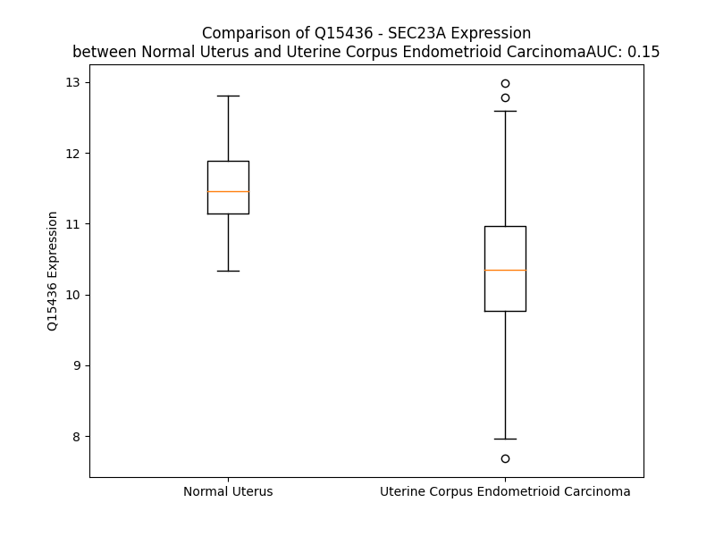

# Detailed Data for Q15436

## Introduction to the Detailed Summary

### How to Interpret the Results

- **Summary & Metrics**: This section provides a quick reference to essential protein attributes, including expression changes, family classification, and biomarker applications. Regulation status (upregulated/downregulated) indicates the protein's behavior in a disease context. Some information comes from the original excel file with the proteins selected from literature, while others are derived from the analyses.
- **Expression Comparison**: A visual representation comparing protein expression between normal and disease states. It highlights significant changes in expression levels that might indicate diagnostic or therapeutic relevance. This is data coming from transcriptomics experiments and could not translate similarly to protein levels.
- **Isoform Alignment**: An interactive view of isoform alignments, revealing structural and functional differences between variants of the protein.
- **Interactors & Homologs**: Tables listing known interaction partners and homologous proteins, the more interactors and homologs, the more complex the protein is to design an antibody for.
- **Biological Assemblies**: Information about the structural arrangement of the protein in different assemblies, providing insights into its functional state but also the complexity of the protein to develop antibodies.
- **Combined Per-Residue Information**: A detailed table summarizing residue-level data. This includes predictions for epitope regions, aggregation tendencies, and modifications that might impact the protein's function. Each row corresponds to a residue in the protein, providing insights into specific sites that may be important for research or drug development.
## Summary & Metrics

- **UniProt Accession**: Q15436
- **Gene Name**: SEC23A
- **Protein Name**: Transport protein Sec23 isoform A
- **Swiss Prot**: SC23A_HUMAN
- **Family**: transporter
- **Biomarker Application**:  
- **Number of Isoforms**: 2
- **Regulation**: 2
- **(transcriptomics) AUC**: 0.15
- **(transcriptomics) Fold Change**: 1.10
- **(transcriptomics) Regulation**: Downregulated
- **Discotope Epitope Count**: 174
- **Max n_uniprots (Homo)**: 1
- **Max n_uniprots (Hetero)**: 3

## Expression Comparison

## Isoform Alignment

<pre style='font-size:14px; font-family:monospace;'>Q15436-1 MTTYLEFIQQNEERDGVRFSWNVWPSSRLEATRMVVPVAALFTPLKERPDLPPIQYEPVLCSRTTCRAVLNPLCQVDYRAKLWACNFCYQRNQFPPSYAGISELNQPAELLPQFSSIEYVVLRGPQMPLIFLYVVDTCMEDEDLQALKESMQMSLSLLPPTALVGLITFGRMVQVHELGCEGISKSYVFRGTKDLSAKQLQEMLGLSKVPLTQATRGPQVQQPPPSNRFLQPVQKIDMNLTDLLGELQRDPWPVPQGKRPLRSSGVALSIAVGLLECTFPNTGARIMMFIGGPATQGPGMVVGDELKTPIRSWHDIDKDNAKYVKKGTKHFEALANRAATTGHVIDIYACALDQTGLLEMKCCPNLTGGYMVMGDSFNTSLFKQTFQRVFTKDMHGQFKMGFGGTLEIKTSREIKISGAIGPCVSLNSKGPCVSENEIGTGGTCQWKICGLSPTTTLAIYFEVVNQHNAPIPQGGRGAIQFVTQYQHSSGQRRIRVTTIARNWADAQTQIQNIAASFDQEAAAILMARLAIYRAETEEGPDVLRWLDRQLIRLCQKFGEYHKDDPSSFRFSETFSLYPQFMFHLRRSSFLQVFNNSPDESSYYRHHFMRQDLTQSLIMIQPILYAYSFSGPPEPVLLDSSSILADRILLMDTFFQILIYHGETIAQWRKSGYQDMPEYENFRHLLQAPVDDAQEILHSRFPMPRYIDTEHGGSQARFLLSKVNPSQTHNNMYAWGQESGAPILTDDVSLQVFMDHLKKLAVSSAA
Q15436-2 ----------------------------------------------------------------------------------------------------------------------------------------------------------------------------------------------------------MLGLSKVPLTQATRGPQVQQPPPSNRFLQPVQKIDMNLTDLLGELQRDPWPVPQGKRPLRSSGVALSIAVGLLECTFPNTGARIMMFIGGPATQGPGMVVGDELKTPIRSWHDIDKDNAKYVKKGTKHFEALANRAATTGHVIDIYACALDQTGLLEMKCCPNLTGGYMVMGDSFNTSLFKQTFQRVFTKDMHGQFKMGFGGTLEIKTSREIKISGAIGPCVSLNSKGPCVSENEIGTGGTCQWKICGLSPTTTLAIYFEVVNQHNAPIPQGGRGAIQFVTQYQHSSGQRRIRVTTIARNWADAQTQIQNIAASFDQEAAAILMARLAIYRAETEEGPDVLRWLDRQLIRLCQKFGEYHKDDPSSFRFSETFSLYPQFMFHLRRSSFLQVFNNSPDESSYYRHHFMRQDLTQSLIMIQPILYAYSFSGPPEPVLLDSSSILADRILLMDTFFQILIYHGETIAQWRKSGYQDMPEYENFRHLLQAPVDDAQEILHSRFPMPRYIDTEHGGSQARFLLSKVNPSQTHNNMYAWGQESGAPILTDDVSLQVFMDHLKKLAVSSAA
</pre>

## Interactors

| preferredName_A   | preferredName_B   |   score |
|:------------------|:------------------|--------:|
| SEC23A            | SEC31A            |   0.999 |
| SEC23A            | SEC24D            |   0.999 |
| SEC23A            | SEC13             |   0.999 |
| SEC23A            | SEC24A            |   0.999 |
| SEC23A            | SEC24B            |   0.999 |
| SEC23A            | SEC24C            |   0.998 |
| SEC23A            | SAR1A             |   0.995 |
| SEC23A            | SEC22B            |   0.993 |
| SEC23A            | SEC16A            |   0.988 |
| SEC23A            | SEC31B            |   0.977 |
| SEC23A            | MIA3              |   0.961 |
| SEC23A            | SAR1B             |   0.96  |
| SEC23A            | KLHL12            |   0.957 |
| SEC23A            | SEC23B            |   0.949 |
| SEC23A            | TMED7             |   0.939 |
| SEC23A            | SEC16B            |   0.937 |
| SEC23A            | PEF1              |   0.937 |
| SEC23A            | PDCD6             |   0.935 |
| SEC23A            | PREB              |   0.924 |
| SEC23A            | LMAN1             |   0.902 |

## Homologs

| uniprot_id   | gene_id   |
|:-------------|:----------|
| Q5QPE2       | SEC23B    |

## Biological Assemblies

|   Unnamed: 0 |   assembly |   n_uniprots | composition   | crystal_id   |
|-------------:|-----------:|-------------:|:--------------|:-------------|
|            0 |          1 |            2 | Hetero        | 3eg9         |
|            0 |          1 |            2 | Hetero        | 5kyx         |
|            0 |          1 |            3 | Hetero        | 5vnk         |
|            0 |          1 |            3 | Hetero        | 5vne         |
|            0 |          1 |            3 | Hetero        | 3egx         |
|            0 |          1 |            1 | Homo          | 2yrc         |
|            0 |          1 |            3 | Hetero        | 2nup         |
|            0 |          1 |            3 | Hetero        | 5vno         |
|            0 |          1 |            3 | Hetero        | 5vnh         |
|            0 |          1 |            3 | Hetero        | 5vni         |
|            0 |          1 |            2 | Hetero        | 5kyu         |
|            0 |          1 |            3 | Hetero        | 5vnl         |
|            1 |          2 |            3 | Hetero        | 5vnl         |
|            0 |          1 |            2 | Hetero        | 5kyy         |
|            0 |          1 |            3 | Hetero        | 5vng         |
|            0 |          1 |            3 | Hetero        | 2nut         |
|            0 |          1 |            2 | Hetero        | 3efo         |
|            0 |          1 |            3 | Hetero        | 5vnm         |
|            0 |          1 |            2 | Hetero        | 5kyw         |
|            0 |          1 |            1 | Homo          | 2yrd         |
|            0 |          1 |            3 | Hetero        | 3egd         |
|            0 |          1 |            1 | Homo          | 5kyn         |
|            1 |          2 |            1 | Homo          | 5kyn         |
|            0 |          1 |            3 | Hetero        | 8hr0         |
|            0 |          1 |            3 | Hetero        | 5vnf         |
|            0 |          1 |            3 | Hetero        | 5vnn         |
|            0 |          1 |            3 | Hetero        | 5vnj         |

## Combined Per-Residue Information

|   res | aa   |   epitope_score | epitope   |   relative_surface_accessibility |   modeling_confidence |   Aggregation | modification      |
|------:|:-----|----------------:|:----------|---------------------------------:|----------------------:|--------------:|:------------------|
|     1 | M    |         0.18429 | True      |                          1.28294 |                 46.35 |         0     | N/A               |
|     2 | T    |         0.20265 | True      |                          0.61076 |                 64.92 |         0     | N-acetylthreonine |
|     3 | T    |         0.11997 | False     |                          0.53153 |                 88.9  |         0     | N/A               |
|     4 | Y    |         0.10932 | False     |                          0.50002 |                 89.55 |         0     | N/A               |
|     5 | L    |         0.14522 | True      |                          0.76053 |                 91.13 |         0     | N/A               |
|     6 | E    |         0.13568 | True      |                          0.38334 |                 93.52 |         0     | N/A               |
|     7 | F    |         0.07279 | False     |                          0.35234 |                 95.23 |         0     | N/A               |
|     8 | I    |         0.05109 | False     |                          0.09099 |                 95.51 |         0     | N/A               |
|     9 | Q    |         0.13618 | True      |                          0.52668 |                 94.66 |         0     | N/A               |
|    10 | Q    |         0.1434  | True      |                          0.47293 |                 94.38 |         0     | N/A               |
|    11 | N    |         0.02272 | False     |                          0.05086 |                 95.07 |         0     | N/A               |
|    12 | E    |         0.02221 | False     |                          0.17504 |                 96.5  |         0     | N/A               |
|    13 | E    |         0.09737 | False     |                          0.59137 |                 94.26 |         0     | N/A               |
|    14 | R    |         0.09072 | False     |                          0.3151  |                 94.2  |         0     | N/A               |
|    15 | D    |         0.01836 | False     |                          0.02122 |                 96.67 |         0     | N/A               |
|    16 | G    |         0.00849 | False     |                          0.0532  |                 97.11 |         0     | N/A               |
|    17 | V    |         0.00654 | False     |                          0.01311 |                 98.31 |         0     | N/A               |
|    18 | R    |         0.1011  | False     |                          0.08425 |                 98.36 |         0     | N/A               |
|    19 | F    |         0.00446 | False     |                          0.00295 |                 98.57 |         0     | N/A               |
|    20 | S    |         0.00127 | False     |                          0       |                 98.09 |         0     | N/A               |
|    21 | W    |         0.00622 | False     |                          0       |                 97.17 |         0     | N/A               |
|    22 | N    |         0.03803 | False     |                          0.0667  |                 96.61 |         0     | N/A               |
|    23 | V    |         0.04044 | False     |                          0.11996 |                 94.47 |         0     | N/A               |
|    24 | W    |         0.00332 | False     |                          0.00055 |                 94.81 |         0     | N/A               |
|    25 | P    |         0.00576 | False     |                          0       |                 92.08 |         0     | N/A               |
|    26 | S    |         0.05464 | False     |                          0.10457 |                 89.42 |         0     | N/A               |
|    27 | S    |         0.02996 | False     |                          0.036   |                 87.39 |         0     | N/A               |
|    28 | R    |         0.1026  | False     |                          0.52177 |                 86.55 |         0     | N/A               |
|    29 | L    |         0.14023 | True      |                          0.50088 |                 85.55 |         0     | N/A               |
|    30 | E    |         0.07324 | False     |                          0.13045 |                 85.44 |         0     | N/A               |
|    31 | A    |         0.03309 | False     |                          0.1788  |                 88.51 |         0     | N/A               |
|    32 | T    |         0.09017 | False     |                          0.75602 |                 84.04 |         0     | N/A               |
|    33 | R    |         0.13424 | True      |                          0.54749 |                 86.39 |         0     | N/A               |
|    34 | M    |         0.02909 | False     |                          0.01151 |                 85.36 |         0     | N/A               |
|    35 | V    |         0.03431 | False     |                          0.2219  |                 91.67 |         0     | N/A               |
|    36 | V    |         0.00516 | False     |                          0.00872 |                 95.86 |         0     | N/A               |
|    37 | P    |         0.02285 | False     |                          0.21645 |                 96.03 |         0.318 | N/A               |
|    38 | V    |         0.00711 | False     |                          0.04234 |                 97.22 |        26.338 | N/A               |
|    39 | A    |         0.00139 | False     |                          0       |                 98.47 |        26.338 | N/A               |
|    40 | A    |         0.00218 | False     |                          0       |                 98.71 |        26.338 | N/A               |
|    41 | L    |         0.02398 | False     |                          0.03104 |                 98.78 |        26.338 | N/A               |
|    42 | F    |         0.00515 | False     |                          0.00892 |                 98.75 |        26.338 | N/A               |
|    43 | T    |         0.03385 | False     |                          0.09742 |                 98.6  |         0.106 | N/A               |
|    44 | P    |         0.00538 | False     |                          0.01102 |                 97.64 |         0     | N/A               |
|    45 | L    |         0.02063 | False     |                          0.10832 |                 96.63 |         0     | N/A               |
|    46 | K    |         0.04348 | False     |                          0.26643 |                 95.59 |         0     | N/A               |
|    47 | E    |         0.14358 | True      |                          0.49192 |                 91.35 |         0     | N/A               |
|    48 | R    |         0.10549 | False     |                          0.12203 |                 83.45 |         0     | N/A               |
|    49 | P    |         0.22367 | True      |                          0.82437 |                 74.83 |         0     | N/A               |
|    50 | D    |         0.17175 | True      |                          0.53969 |                 81.49 |         0     | N/A               |
|    51 | L    |         0.06893 | False     |                          0.12964 |                 75.39 |         0     | N/A               |
|    52 | P    |         0.07532 | False     |                          0.70304 |                 78.09 |         0     | N/A               |
|    53 | P    |         0.07514 | False     |                          0.32995 |                 85.12 |         0     | N/A               |
|    54 | I    |         0.08297 | False     |                          0.19359 |                 90.01 |         0     | N/A               |
|    55 | Q    |         0.13281 | True      |                          0.70513 |                 89.01 |         0     | N/A               |
|    56 | Y    |         0.12308 | True      |                          0.3538  |                 87.81 |         0     | N/A               |
|    57 | E    |         0.06815 | False     |                          0.33626 |                 87.08 |         0     | N/A               |
|    58 | P    |         0.014   | False     |                          0.14942 |                 94.57 |         0     | N/A               |
|    59 | V    |         0.05362 | False     |                          0.1216  |                 96.06 |         0     | N/A               |
|    60 | L    |         0.03973 | False     |                          0.52873 |                 97.35 |         0     | N/A               |
|    61 | C    |         0.03429 | False     |                          0.02887 |                 97.7  |         0     | N/A               |
|    62 | S    |         0.15368 | True      |                          0.6375  |                 97.12 |         0     | N/A               |
|    63 | R    |         0.14842 | True      |                          0.38457 |                 95.95 |         0     | N/A               |
|    64 | T    |         0.17576 | True      |                          0.75921 |                 91.63 |         0     | N/A               |
|    65 | T    |         0.13863 | True      |                          0.83558 |                 92.4  |         0     | N/A               |
|    66 | C    |         0.06263 | False     |                          0.13496 |                 94.61 |         0     | N/A               |
|    67 | R    |         0.15444 | True      |                          0.54822 |                 96.42 |         0     | N/A               |
|    68 | A    |         0.0015  | False     |                          0.00128 |                 97.56 |         0     | N/A               |
|    69 | V    |         0.01137 | False     |                          0.0197  |                 97.92 |         0     | N/A               |
|    70 | L    |         0.00416 | False     |                          0.00731 |                 97.87 |         0     | N/A               |
|    71 | N    |         0.00853 | False     |                          0.01624 |                 97.6  |         0     | N/A               |
|    72 | P    |         0.04084 | False     |                          0.23332 |                 96.92 |         0     | N/A               |
|    73 | L    |         0.0691  | False     |                          0.35601 |                 96.7  |         0     | N/A               |
|    74 | C    |         0.03456 | False     |                          0.08247 |                 96.97 |         0     | N/A               |
|    75 | Q    |         0.17026 | True      |                          0.71716 |                 95.62 |         0     | N/A               |
|    76 | V    |         0.0729  | False     |                          0.28151 |                 95.83 |         0     | N/A               |
|    77 | D    |         0.14561 | True      |                          0.41391 |                 95.02 |         0     | N/A               |
|    78 | Y    |         0.16461 | True      |                          0.17222 |                 93.34 |         0     | N/A               |
|    79 | R    |         0.29423 | True      |                          0.93999 |                 92.16 |         0     | N/A               |
|    80 | A    |         0.20054 | True      |                          0.49362 |                 93.9  |         0     | N/A               |
|    81 | K    |         0.16039 | True      |                          0.35468 |                 93.3  |         0     | N/A               |
|    82 | L    |         0.17459 | True      |                          0.33208 |                 96.7  |         0.201 | N/A               |
|    83 | W    |         0.01852 | False     |                          0.01014 |                 97.4  |         0.201 | N/A               |
|    84 | A    |         0.10734 | False     |                          0.19636 |                 97.83 |         0.201 | N/A               |
|    85 | C    |         0.02637 | False     |                          0.00631 |                 97.45 |         0.201 | N/A               |
|    86 | N    |         0.03995 | False     |                          0.18476 |                 95.65 |         0.201 | N/A               |
|    87 | F    |         0.03391 | False     |                          0.0881  |                 95.56 |         0.201 | N/A               |
|    88 | C    |         0.07351 | False     |                          0.16938 |                 93.99 |         0     | N/A               |
|    89 | Y    |         0.14593 | True      |                          0.68666 |                 93.84 |         0     | N/A               |
|    90 | Q    |         0.12813 | True      |                          0.27348 |                 96.69 |         0     | N/A               |
|    91 | R    |         0.35025 | True      |                          0.71887 |                 97.27 |         0     | N/A               |
|    92 | N    |         0.11697 | False     |                          0.031   |                 97.9  |         0     | N/A               |
|    93 | Q    |         0.22785 | True      |                          0.72594 |                 96.67 |         0     | N/A               |
|    94 | F    |         0.05848 | False     |                          0.06932 |                 95.31 |         0     | N/A               |
|    95 | P    |         0.07598 | False     |                          0.28588 |                 94.03 |         0     | N/A               |
|    96 | P    |         0.2289  | True      |                          0.94092 |                 92.58 |         0     | N/A               |
|    97 | S    |         0.12082 | False     |                          0.75066 |                 91.26 |         0     | N/A               |
|    98 | Y    |         0.11289 | False     |                          0.08039 |                 92.77 |         0     | N/A               |
|    99 | A    |         0.28774 | True      |                          0.64581 |                 89.82 |         0     | N/A               |
|   100 | G    |         0.23308 | True      |                          0.79702 |                 89.98 |         0     | N/A               |
|   101 | I    |         0.21154 | True      |                          0.08835 |                 91.87 |         0     | N/A               |
|   102 | S    |         0.12769 | True      |                          0.35835 |                 90.39 |         0     | N/A               |
|   103 | E    |         0.25904 | True      |                          0.65352 |                 90.02 |         0     | N/A               |
|   104 | L    |         0.22065 | True      |                          1.11156 |                 90.93 |         0     | N/A               |
|   105 | N    |         0.2674  | True      |                          0.64497 |                 90.17 |         0     | N/A               |
|   106 | Q    |         0.12567 | True      |                          0.34705 |                 90.85 |         0     | N/A               |
|   107 | P    |         0.06998 | False     |                          0.11589 |                 92.36 |         0     | N/A               |
|   108 | A    |         0.04075 | False     |                          0.1974  |                 92.37 |         0     | N/A               |
|   109 | E    |         0.03765 | False     |                          0.00591 |                 93.38 |         0     | N/A               |
|   110 | L    |         0.05237 | False     |                          0.07699 |                 94.99 |         0     | N/A               |
|   111 | L    |         0.10803 | False     |                          0.30171 |                 92.95 |         0     | N/A               |
|   112 | P    |         0.06973 | False     |                          0.6603  |                 92.44 |         0     | N/A               |
|   113 | Q    |         0.19408 | True      |                          0.47377 |                 90.39 |         0     | N/A               |
|   114 | F    |         0.0613  | False     |                          0.23043 |                 93.26 |         0.261 | N/A               |
|   115 | S    |         0.0388  | False     |                          0.08532 |                 95.33 |         0.261 | N/A               |
|   116 | S    |         0.01375 | False     |                          0.03554 |                 96.08 |         0.433 | N/A               |
|   117 | I    |         0.02857 | False     |                          0.0264  |                 95.48 |         1.823 | N/A               |
|   118 | E    |         0.02255 | False     |                          0.10143 |                 95.98 |         1.95  | N/A               |
|   119 | Y    |         0.00243 | False     |                          0.00093 |                 95.81 |         1.95  | N/A               |
|   120 | V    |         0.01959 | False     |                          0.03092 |                 94.39 |         1.95  | N/A               |
|   121 | V    |         0.04124 | False     |                          0.20544 |                 90.63 |         1.95  | N/A               |
|   122 | L    |         0.17985 | True      |                          0.74723 |                 78.43 |         1.95  | N/A               |
|   123 | R    |         0.24347 | True      |                          0.75744 |                 77.33 |         1.95  | N/A               |
|   124 | G    |         0.11706 | False     |                          0.69558 |                 72.03 |         0     | N/A               |
|   125 | P    |         0.08997 | False     |                          0.95068 |                 74.86 |         0     | N/A               |
|   126 | Q    |         0.15755 | True      |                          0.51172 |                 83.66 |         0     | N/A               |
|   127 | M    |         0.05231 | False     |                          0.2607  |                 86.84 |         0     | N/A               |
|   128 | P    |         0.02895 | False     |                          0.08366 |                 89.4  |         1.019 | N/A               |
|   129 | L    |         0.01913 | False     |                          0.03983 |                 94.38 |        83.7   | N/A               |
|   130 | I    |         0.00271 | False     |                          0       |                 97.22 |        98.572 | N/A               |
|   131 | F    |         0.00304 | False     |                          0       |                 98.08 |        99.827 | N/A               |
|   132 | L    |         0.00199 | False     |                          0.00412 |                 98.51 |        99.827 | N/A               |
|   133 | Y    |         0.00487 | False     |                          0.01011 |                 98.68 |        99.822 | N/A               |
|   134 | V    |         0.00107 | False     |                          0       |                 98.79 |        98.326 | N/A               |
|   135 | V    |         0.00129 | False     |                          0       |                 98.78 |        90.723 | N/A               |
|   136 | D    |         0.0042  | False     |                          0       |                 98.7  |         0     | N/A               |
|   137 | T    |         0.02357 | False     |                          0.07879 |                 98.56 |         0     | N/A               |
|   138 | C    |         0.04658 | False     |                          0.08298 |                 98.16 |         0     | N/A               |
|   139 | M    |         0.04607 | False     |                          0.07885 |                 96.34 |         0     | N/A               |
|   140 | E    |         0.27232 | True      |                          0.54618 |                 95.44 |         0     | N/A               |
|   141 | D    |         0.18428 | True      |                          0.50967 |                 96.37 |         0     | N/A               |
|   142 | E    |         0.17317 | True      |                          0.6751  |                 97.21 |         0     | N/A               |
|   143 | D    |         0.06488 | False     |                          0.16177 |                 97.54 |         0     | N/A               |
|   144 | L    |         0.01411 | False     |                          0.0272  |                 98.16 |         0     | N/A               |
|   145 | Q    |         0.1067  | False     |                          0.41249 |                 98.24 |         0     | N/A               |
|   146 | A    |         0.02719 | False     |                          0.03864 |                 98.1  |         0     | N/A               |
|   147 | L    |         0.0012  | False     |                          0       |                 98.26 |         0     | N/A               |
|   148 | K    |         0.06373 | False     |                          0.09751 |                 98.22 |         0     | N/A               |
|   149 | E    |         0.15319 | True      |                          0.45041 |                 97.8  |         0     | N/A               |
|   150 | S    |         0.02205 | False     |                          0.06307 |                 98.07 |         0     | N/A               |
|   151 | M    |         0.0037  | False     |                          0       |                 97.98 |         0     | N/A               |
|   152 | Q    |         0.07753 | False     |                          0.25002 |                 97.44 |         0     | N/A               |
|   153 | M    |         0.04981 | False     |                          0.32053 |                 96.59 |         0     | N/A               |
|   154 | S    |         0.01168 | False     |                          0       |                 96.52 |         0     | N/A               |
|   155 | L    |         0.01937 | False     |                          0.03591 |                 95.62 |         0     | N/A               |
|   156 | S    |         0.11332 | False     |                          0.68806 |                 95.32 |         0     | N/A               |
|   157 | L    |         0.03563 | False     |                          0.28211 |                 95.59 |         0     | N/A               |
|   158 | L    |         0.00963 | False     |                          0.06459 |                 95.73 |         0     | N/A               |
|   159 | P    |         0.04154 | False     |                          0.27238 |                 94.5  |         0     | N/A               |
|   160 | P    |         0.11186 | False     |                          0.61235 |                 93.95 |         0.14  | N/A               |
|   161 | T    |         0.10112 | False     |                          0.52621 |                 93.32 |        14.452 | N/A               |
|   162 | A    |         0.0064  | False     |                          0.00638 |                 95.55 |        38.422 | N/A               |
|   163 | L    |         0.00342 | False     |                          0       |                 96.3  |        66.205 | N/A               |
|   164 | V    |         0.00206 | False     |                          0       |                 97.69 |        70.162 | N/A               |
|   165 | G    |         0.00183 | False     |                          0.00161 |                 97.51 |        70.418 | N/A               |
|   166 | L    |         0.01234 | False     |                          0.01527 |                 98.43 |        70.622 | N/A               |
|   167 | I    |         0.00249 | False     |                          0       |                 98.61 |        69.856 | N/A               |
|   168 | T    |         0.01423 | False     |                          0.02358 |                 98.68 |        55.31  | N/A               |
|   169 | F    |         0.01011 | False     |                          0.00598 |                 98.7  |        46.006 | N/A               |
|   170 | G    |         0.01801 | False     |                          0.01383 |                 98.21 |         4.004 | N/A               |
|   171 | R    |         0.06771 | False     |                          0.31441 |                 97.95 |         0     | N/A               |
|   172 | M    |         0.07181 | False     |                          0.29883 |                 97.89 |         0     | N/A               |
|   173 | V    |         0.00306 | False     |                          0       |                 98.41 |         0     | N/A               |
|   174 | Q    |         0.07547 | False     |                          0.29613 |                 98.16 |         0     | N/A               |
|   175 | V    |         0.00686 | False     |                          0.00666 |                 97.75 |         0     | N/A               |
|   176 | H    |         0.06829 | False     |                          0.0863  |                 97.07 |         0     | N/A               |
|   177 | E    |         0.03318 | False     |                          0.07601 |                 94.69 |         0     | N/A               |
|   178 | L    |         0.02253 | False     |                          0.05204 |                 88.44 |         0     | N/A               |
|   179 | G    |         0.08241 | False     |                          0.45602 |                 75.44 |         0     | N/A               |
|   180 | C    |         0.0696  | False     |                          0.25163 |                 81.99 |         0     | N/A               |
|   181 | E    |         0.22998 | True      |                          0.84953 |                 81    |         0     | N/A               |
|   182 | G    |         0.31323 | True      |                          1.09458 |                 83.08 |         0     | N/A               |
|   183 | I    |         0.2367  | True      |                          0.70145 |                 88.19 |         0     | N/A               |
|   184 | S    |         0.09808 | False     |                          0.65038 |                 87.83 |         0     | N/A               |
|   185 | K    |         0.1612  | True      |                          0.36495 |                 93.16 |         0     | N/A               |
|   186 | S    |         0.08945 | False     |                          0.32322 |                 95.27 |         0     | N/A               |
|   187 | Y    |         0.18059 | True      |                          0.3235  |                 96.54 |         0     | N/A               |
|   188 | V    |         0.13687 | True      |                          0.66653 |                 97.56 |         0     | N/A               |
|   189 | F    |         0.06483 | False     |                          0.08661 |                 97.58 |         0     | N/A               |
|   190 | R    |         0.20041 | True      |                          0.6433  |                 96.85 |         0     | N/A               |
|   191 | G    |         0.00717 | False     |                          0.00553 |                 96.26 |         0     | N/A               |
|   192 | T    |         0.1696  | True      |                          0.52282 |                 96    |         0     | N/A               |
|   193 | K    |         0.17767 | True      |                          0.60666 |                 93.23 |         0     | N/A               |
|   194 | D    |         0.09032 | False     |                          0.41486 |                 93.04 |         0     | N/A               |
|   195 | L    |         0.0925  | False     |                          0.14965 |                 92.18 |         0     | N/A               |
|   196 | S    |         0.09467 | False     |                          0.42998 |                 92.93 |         0     | N/A               |
|   197 | A    |         0.01845 | False     |                          0.11902 |                 92.39 |         0     | N/A               |
|   198 | K    |         0.11769 | False     |                          0.71826 |                 92.84 |         0     | N/A               |
|   199 | Q    |         0.15714 | True      |                          0.41317 |                 93.54 |         0     | N/A               |
|   200 | L    |         0.01602 | False     |                          0.00659 |                 92.97 |         0     | N/A               |
|   201 | Q    |         0.0626  | False     |                          0.20114 |                 91.09 |         0     | N/A               |
|   202 | E    |         0.23487 | True      |                          0.58928 |                 92.58 |         0     | N/A               |
|   203 | M    |         0.19833 | True      |                          0.57245 |                 92.59 |         0     | N/A               |
|   204 | L    |         0.02102 | False     |                          0.0139  |                 92.06 |         0     | N/A               |
|   205 | G    |         0.2158  | True      |                          0.5917  |                 87.7  |         0     | N/A               |
|   206 | L    |         0.06621 | False     |                          0.08849 |                 80.39 |         0     | N/A               |
|   207 | S    |         0.07803 | False     |                          0.74432 |                 63.21 |         0     | N/A               |
|   208 | K    |         0.0833  | False     |                          0.77124 |                 56.61 |         0     | N/A               |
|   209 | V    |         0.06187 | False     |                          0.31501 |                 53.25 |         0     | N/A               |
|   210 | P    |         0.06681 | False     |                          0.78537 |                 41.98 |         0     | N/A               |
|   211 | L    |         0.10651 | False     |                          0.88185 |                 48.22 |         0     | N/A               |
|   212 | T    |         0.1001  | False     |                          0.73434 |                 38.73 |         0     | N/A               |
|   213 | Q    |         0.12889 | True      |                          0.83322 |                 33.27 |         0     | N/A               |
|   214 | A    |         0.13845 | True      |                          1.00026 |                 34.41 |         0     | N/A               |
|   215 | T    |         0.12869 | True      |                          0.90346 |                 30.69 |         0     | N/A               |
|   216 | R    |         0.21884 | True      |                          1.02539 |                 32.68 |         0     | N/A               |
|   217 | G    |         0.14193 | True      |                          0.59051 |                 42.58 |         0     | N/A               |
|   218 | P    |         0.17355 | True      |                          0.99248 |                 38.67 |         0     | N/A               |
|   219 | Q    |         0.14471 | True      |                          0.93068 |                 37.12 |         0     | N/A               |
|   220 | V    |         0.19114 | True      |                          0.90578 |                 38.22 |         0     | N/A               |
|   221 | Q    |         0.12868 | True      |                          0.89666 |                 43.76 |         0     | N/A               |
|   222 | Q    |         0.08821 | False     |                          0.70019 |                 44.08 |         0     | N/A               |
|   223 | P    |         0.10787 | False     |                          0.81432 |                 54.22 |         0     | N/A               |
|   224 | P    |         0.0831  | False     |                          0.45585 |                 60.07 |         0     | N/A               |
|   225 | P    |         0.03718 | False     |                          0.31115 |                 72.79 |         0     | N/A               |
|   226 | S    |         0.09497 | False     |                          0.37135 |                 76.48 |         0     | N/A               |
|   227 | N    |         0.05658 | False     |                          0.12536 |                 85.07 |         0     | N/A               |
|   228 | R    |         0.13556 | True      |                          0.41485 |                 90.1  |         0     | N/A               |
|   229 | F    |         0.00661 | False     |                          0.00647 |                 94.16 |         0     | N/A               |
|   230 | L    |         0.00243 | False     |                          0       |                 95.17 |         0     | N/A               |
|   231 | Q    |         0.06795 | False     |                          0.19896 |                 94.77 |         0     | N/A               |
|   232 | P    |         0.03216 | False     |                          0.05567 |                 95.31 |         0     | N/A               |
|   233 | V    |         0.022   | False     |                          0.07141 |                 95.54 |         0     | N/A               |
|   234 | Q    |         0.18171 | True      |                          0.551   |                 94.49 |         0     | N/A               |
|   235 | K    |         0.16968 | True      |                          0.70051 |                 93.48 |         0     | N/A               |
|   236 | I    |         0.04044 | False     |                          0.0472  |                 93.49 |         0     | N/A               |
|   237 | D    |         0.07896 | False     |                          0.36638 |                 91.52 |         0     | N/A               |
|   238 | M    |         0.11922 | False     |                          0.76506 |                 91.96 |         0     | N/A               |
|   239 | N    |         0.11771 | False     |                          0.46732 |                 92.4  |         0     | N/A               |
|   240 | L    |         0.00433 | False     |                          0.01225 |                 94.34 |         0     | N/A               |
|   241 | T    |         0.03971 | False     |                          0.36543 |                 95.37 |         0     | N/A               |
|   242 | D    |         0.15569 | True      |                          0.53389 |                 93.88 |         0     | N/A               |
|   243 | L    |         0.04956 | False     |                          0.1557  |                 95.03 |         0     | N/A               |
|   244 | L    |         0.01154 | False     |                          0.00824 |                 96.16 |         0     | N/A               |
|   245 | G    |         0.10955 | False     |                          0.40108 |                 95.57 |         0     | N/A               |
|   246 | E    |         0.23553 | True      |                          0.66376 |                 95.76 |         0     | N/A               |
|   247 | L    |         0.05864 | False     |                          0.1238  |                 96.44 |         0     | N/A               |
|   248 | Q    |         0.15592 | True      |                          0.73063 |                 96.32 |         0     | N/A               |
|   249 | R    |         0.21418 | True      |                          0.35409 |                 97.57 |         0     | N/A               |
|   250 | D    |         0.10847 | False     |                          0.16369 |                 97.57 |         0     | N/A               |
|   251 | P    |         0.24364 | True      |                          0.8037  |                 96.52 |         0     | N/A               |
|   252 | W    |         0.14579 | True      |                          0.49211 |                 96.52 |         0     | N/A               |
|   253 | P    |         0.28549 | True      |                          0.90463 |                 95.75 |         0     | N/A               |
|   254 | V    |         0.15953 | True      |                          0.49369 |                 97.57 |         0     | N/A               |
|   255 | P    |         0.19532 | True      |                          0.64203 |                 96.93 |         0     | N/A               |
|   256 | Q    |         0.41094 | True      |                          0.91071 |                 96.95 |         0     | N/A               |
|   257 | G    |         0.23589 | True      |                          0.50573 |                 97.02 |         0     | N/A               |
|   258 | K    |         0.23918 | True      |                          0.2706  |                 98.33 |         0     | N/A               |
|   259 | R    |         0.19667 | True      |                          0.12823 |                 98.3  |         0     | N/A               |
|   260 | P    |         0.07884 | False     |                          0.33764 |                 98.06 |         0     | N/A               |
|   261 | L    |         0.10151 | False     |                          0.34382 |                 98.43 |         0     | N/A               |
|   262 | R    |         0.05001 | False     |                          0.02771 |                 98.61 |         0     | N/A               |
|   263 | S    |         0.00129 | False     |                          0       |                 98.44 |         0.172 | N/A               |
|   264 | S    |         0.00586 | False     |                          0.00628 |                 98.52 |         1.905 | N/A               |
|   265 | G    |         0.00175 | False     |                          0       |                 98.19 |         5.789 | N/A               |
|   266 | V    |         0.00305 | False     |                          0       |                 98.49 |        48.949 | N/A               |
|   267 | A    |         0.00077 | False     |                          0       |                 98.59 |        52.462 | N/A               |
|   268 | L    |         0.00193 | False     |                          0       |                 98.58 |        56.467 | N/A               |
|   269 | S    |         0.00588 | False     |                          0.00335 |                 98.34 |        56.834 | N/A               |
|   270 | I    |         0.00339 | False     |                          0.0024  |                 98.18 |        59.796 | N/A               |
|   271 | A    |         0.00113 | False     |                          0       |                 98.36 |        58.025 | N/A               |
|   272 | V    |         0.00426 | False     |                          0.00381 |                 98.19 |        56.204 | N/A               |
|   273 | G    |         0.00402 | False     |                          0.00805 |                 96.85 |        32.864 | N/A               |
|   274 | L    |         0.00411 | False     |                          0.00495 |                 96.03 |        30.77  | N/A               |
|   275 | L    |         0.00132 | False     |                          0       |                 96.09 |        25.768 | N/A               |
|   276 | E    |         0.03711 | False     |                          0.2862  |                 94.75 |         0     | N/A               |
|   277 | C    |         0.05944 | False     |                          0.11396 |                 92.19 |         0     | N/A               |
|   278 | T    |         0.02698 | False     |                          0.05406 |                 91.7  |         0     | N/A               |
|   279 | F    |         0.01068 | False     |                          0.02509 |                 92.06 |         0     | N/A               |
|   280 | P    |         0.05413 | False     |                          0.33643 |                 91.68 |         0     | N/A               |
|   281 | N    |         0.09121 | False     |                          0.76501 |                 88.89 |         0     | N/A               |
|   282 | T    |         0.02581 | False     |                          0.09006 |                 90.04 |         0     | N/A               |
|   283 | G    |         0.00591 | False     |                          0.01383 |                 92.76 |         0     | N/A               |
|   284 | A    |         0.00112 | False     |                          0       |                 97.13 |         0     | N/A               |
|   285 | R    |         0.00385 | False     |                          0.00562 |                 98.47 |         0     | N/A               |
|   286 | I    |         0.00094 | False     |                          0       |                 98.83 |        32.026 | N/A               |
|   287 | M    |         0.00195 | False     |                          0       |                 98.81 |        32.269 | N/A               |
|   288 | M    |         0.00179 | False     |                          0       |                 98.85 |        32.269 | N/A               |
|   289 | F    |         0.00159 | False     |                          0       |                 98.82 |        32.269 | N/A               |
|   290 | I    |         0.00675 | False     |                          0.0024  |                 98.67 |        32.269 | N/A               |
|   291 | G    |         0.03893 | False     |                          0.1942  |                 98.14 |         2.887 | N/A               |
|   292 | G    |         0.03245 | False     |                          0.05024 |                 98.16 |         0     | N/A               |
|   293 | P    |         0.02663 | False     |                          0.08916 |                 98.43 |         0     | N/A               |
|   294 | A    |         0.00583 | False     |                          0.00566 |                 98.6  |         0     | N/A               |
|   295 | T    |         0.02701 | False     |                          0.04963 |                 98.45 |         0     | N/A               |
|   296 | Q    |         0.07106 | False     |                          0.10294 |                 96.93 |         0     | N/A               |
|   297 | G    |         0.03449 | False     |                          0.20583 |                 90.2  |         0     | N/A               |
|   298 | P    |         0.05847 | False     |                          0.26515 |                 95.28 |         0     | N/A               |
|   299 | G    |         0.00984 | False     |                          0.03871 |                 96.73 |         0     | N/A               |
|   300 | M    |         0.08472 | False     |                          0.28302 |                 97.86 |         0     | N/A               |
|   301 | V    |         0.00916 | False     |                          0.02558 |                 98.45 |         0     | N/A               |
|   302 | V    |         0.0502  | False     |                          0.01904 |                 98.33 |         0     | N/A               |
|   303 | G    |         0.17466 | True      |                          0.13841 |                 97.57 |         0     | N/A               |
|   304 | D    |         0.16724 | True      |                          0.23085 |                 97.59 |         0     | N/A               |
|   305 | E    |         0.24706 | True      |                          0.30868 |                 97.52 |         0     | N/A               |
|   306 | L    |         0.30651 | True      |                          0.57076 |                 97.27 |         0     | N/A               |
|   307 | K    |         0.44136 | True      |                          0.8354  |                 97.11 |         0     | N/A               |
|   308 | T    |         0.16875 | True      |                          0.31336 |                 95.46 |         0     | Phosphothreonine  |
|   309 | P    |         0.16714 | True      |                          0.72627 |                 97.09 |         0     | N/A               |
|   310 | I    |         0.15707 | True      |                          0.13175 |                 98.05 |         0     | N/A               |
|   311 | R    |         0.09394 | False     |                          0.05579 |                 97.88 |         0     | N/A               |
|   312 | S    |         0.17779 | True      |                          0.34266 |                 97.66 |         0     | N/A               |
|   313 | W    |         0.1112  | False     |                          0.19875 |                 95.4  |         0     | N/A               |
|   314 | H    |         0.23416 | True      |                          0.6609  |                 94.71 |         0     | N/A               |
|   315 | D    |         0.12089 | False     |                          0.17721 |                 96.2  |         0     | N/A               |
|   316 | I    |         0.15545 | True      |                          0.23471 |                 94.7  |         0     | N/A               |
|   317 | D    |         0.20681 | True      |                          0.64117 |                 90.85 |         0     | N/A               |
|   318 | K    |         0.25546 | True      |                          0.69321 |                 93.63 |         0     | N/A               |
|   319 | D    |         0.19779 | True      |                          0.67557 |                 92.65 |         0     | N/A               |
|   320 | N    |         0.3005  | True      |                          0.68232 |                 95.22 |         0     | N/A               |
|   321 | A    |         0.05283 | False     |                          0.16666 |                 94.89 |         0     | N/A               |
|   322 | K    |         0.27114 | True      |                          0.69865 |                 95.63 |         0     | N/A               |
|   323 | Y    |         0.10243 | False     |                          0.22971 |                 97.43 |         0     | N/A               |
|   324 | V    |         0.05931 | False     |                          0.12853 |                 97.15 |         0     | N/A               |
|   325 | K    |         0.21398 | True      |                          0.77765 |                 96.63 |         0     | N/A               |
|   326 | K    |         0.14847 | True      |                          0.80787 |                 97.43 |         0     | N/A               |
|   327 | G    |         0.01053 | False     |                          0.00576 |                 97.83 |         0     | N/A               |
|   328 | T    |         0.04138 | False     |                          0.18517 |                 97.9  |         0     | N/A               |
|   329 | K    |         0.09956 | False     |                          0.7525  |                 98.12 |         0     | N/A               |
|   330 | H    |         0.041   | False     |                          0.13247 |                 98.31 |         0     | N/A               |
|   331 | F    |         0.00221 | False     |                          0       |                 98.58 |         0     | N/A               |
|   332 | E    |         0.03621 | False     |                          0.35503 |                 98.16 |         0     | N/A               |
|   333 | A    |         0.07365 | False     |                          0.50482 |                 98.45 |         0     | N/A               |
|   334 | L    |         0.0078  | False     |                          0.01814 |                 98.42 |         0     | N/A               |
|   335 | A    |         0.00133 | False     |                          0       |                 98.49 |         0     | N/A               |
|   336 | N    |         0.04034 | False     |                          0.44803 |                 98.27 |         0     | N/A               |
|   337 | R    |         0.0176  | False     |                          0.25258 |                 98.05 |         0     | N/A               |
|   338 | A    |         0.00162 | False     |                          0       |                 98.32 |         0     | N/A               |
|   339 | A    |         0.00329 | False     |                          0.00706 |                 97.72 |         0     | N/A               |
|   340 | T    |         0.06321 | False     |                          0.67105 |                 96.83 |         0     | N/A               |
|   341 | T    |         0.03662 | False     |                          0.09188 |                 95.85 |         0     | N/A               |
|   342 | G    |         0.00583 | False     |                          0.05745 |                 96.36 |         0     | N/A               |
|   343 | H    |         0.0037  | False     |                          0       |                 98.36 |         0     | N/A               |
|   344 | V    |         0.00141 | False     |                          0       |                 98.78 |         0     | N/A               |
|   345 | I    |         0.00137 | False     |                          0       |                 98.87 |         0     | N/A               |
|   346 | D    |         0.00161 | False     |                          0       |                 98.8  |         0     | N/A               |
|   347 | I    |         0.00363 | False     |                          0       |                 98.82 |         0.234 | N/A               |
|   348 | Y    |         0.00357 | False     |                          0.00057 |                 98.74 |         0.234 | N/A               |
|   349 | A    |         0.01642 | False     |                          0.01142 |                 98.52 |         0.234 | N/A               |
|   350 | C    |         0.01495 | False     |                          0.01574 |                 98.26 |         0.234 | N/A               |
|   351 | A    |         0.08669 | False     |                          0.17302 |                 97.05 |         0.234 | N/A               |
|   352 | L    |         0.23256 | True      |                          1.00623 |                 95.66 |         0.234 | N/A               |
|   353 | D    |         0.19324 | True      |                          0.59676 |                 96.49 |         0     | N/A               |
|   354 | Q    |         0.09752 | False     |                          0.14123 |                 98.22 |         0     | N/A               |
|   355 | T    |         0.02374 | False     |                          0.04069 |                 98.35 |         0     | N/A               |
|   356 | G    |         0.00267 | False     |                          0       |                 98.32 |         0     | N/A               |
|   357 | L    |         0.00611 | False     |                          0.00412 |                 98.72 |         0     | N/A               |
|   358 | L    |         0.03962 | False     |                          0.09602 |                 98.27 |         0     | N/A               |
|   359 | E    |         0.00139 | False     |                          0       |                 98.46 |         0     | N/A               |
|   360 | M    |         0.00184 | False     |                          0.00288 |                 98.72 |         0     | N/A               |
|   361 | K    |         0.02314 | False     |                          0.14591 |                 98.37 |         0     | N/A               |
|   362 | C    |         0.03021 | False     |                          0.14225 |                 97.95 |         0     | N/A               |
|   363 | C    |         0.00154 | False     |                          0       |                 98.73 |         0     | N/A               |
|   364 | P    |         0.00153 | False     |                          0       |                 98.69 |         0     | N/A               |
|   365 | N    |         0.01576 | False     |                          0.24245 |                 98.48 |         0     | N/A               |
|   366 | L    |         0.02102 | False     |                          0.27781 |                 98.36 |         0     | N/A               |
|   367 | T    |         0.00171 | False     |                          0       |                 98.44 |         0     | N/A               |
|   368 | G    |         0.00471 | False     |                          0.02617 |                 98.35 |         0     | N/A               |
|   369 | G    |         0.00105 | False     |                          0       |                 98.41 |         0     | N/A               |
|   370 | Y    |         0.01731 | False     |                          0.05985 |                 98.44 |         0     | N/A               |
|   371 | M    |         0.00159 | False     |                          0       |                 98.61 |         0     | N/A               |
|   372 | V    |         0.02407 | False     |                          0.03427 |                 98.21 |         0     | N/A               |
|   373 | M    |         0.06513 | False     |                          0.2669  |                 97.91 |         0     | N/A               |
|   374 | G    |         0.04921 | False     |                          0.12144 |                 96.4  |         0     | N/A               |
|   375 | D    |         0.12977 | True      |                          0.50746 |                 96.14 |         0     | N/A               |
|   376 | S    |         0.12826 | True      |                          0.18779 |                 97.63 |         0     | N/A               |
|   377 | F    |         0.00299 | False     |                          0.00064 |                 97.97 |         0.396 | N/A               |
|   378 | N    |         0.14468 | True      |                          0.46674 |                 97.47 |         0.396 | N/A               |
|   379 | T    |         0.1053  | False     |                          0.28802 |                 94.94 |         0.396 | N/A               |
|   380 | S    |         0.13439 | True      |                          0.56825 |                 92.22 |         0.396 | N/A               |
|   381 | L    |         0.03501 | False     |                          0.25405 |                 92.59 |         0.396 | N/A               |
|   382 | F    |         0.01055 | False     |                          0.00946 |                 96.5  |         0.396 | N/A               |
|   383 | K    |         0.05868 | False     |                          0.33658 |                 96.27 |         0     | N/A               |
|   384 | Q    |         0.06381 | False     |                          0.32379 |                 94.32 |         0     | N/A               |
|   385 | T    |         0.02356 | False     |                          0.00579 |                 96.82 |         0     | N/A               |
|   386 | F    |         0.00342 | False     |                          0.00127 |                 97.5  |         0     | N/A               |
|   387 | Q    |         0.07176 | False     |                          0.47147 |                 95.49 |         0     | N/A               |
|   388 | R    |         0.08894 | False     |                          0.16002 |                 94.7  |         0     | N/A               |
|   389 | V    |         0.01946 | False     |                          0.05464 |                 96.61 |         0     | N/A               |
|   390 | F    |         0.011   | False     |                          0.01732 |                 96.74 |         0     | N/A               |
|   391 | T    |         0.11171 | False     |                          0.44659 |                 95.55 |         0     | N/A               |
|   392 | K    |         0.15754 | True      |                          0.43344 |                 94.96 |         0     | N/A               |
|   393 | D    |         0.05349 | False     |                          0.22699 |                 92.01 |         0     | N/A               |
|   394 | M    |         0.18272 | True      |                          0.86553 |                 89.37 |         0     | N/A               |
|   395 | H    |         0.16225 | True      |                          0.79652 |                 89.74 |         0     | N/A               |
|   396 | G    |         0.09421 | False     |                          0.54791 |                 92.76 |         0     | N/A               |
|   397 | Q    |         0.08209 | False     |                          0.28277 |                 93.38 |         0     | N/A               |
|   398 | F    |         0.03031 | False     |                          0.0247  |                 96.51 |         0     | N/A               |
|   399 | K    |         0.07951 | False     |                          0.3338  |                 95.74 |         0     | N/A               |
|   400 | M    |         0.02439 | False     |                          0.02923 |                 95.93 |         0     | N/A               |
|   401 | G    |         0.00602 | False     |                          0.0046  |                 96.65 |         0     | N/A               |
|   402 | F    |         0.00257 | False     |                          0       |                 97.66 |         0     | N/A               |
|   403 | G    |         0.03261 | False     |                          0.2142  |                 95.62 |         0     | N/A               |
|   404 | G    |         0.00112 | False     |                          0       |                 97.08 |         0     | N/A               |
|   405 | T    |         0.01317 | False     |                          0.21668 |                 98.24 |         0     | N/A               |
|   406 | L    |         0.00147 | False     |                          0       |                 98.54 |         0     | N/A               |
|   407 | E    |         0.03897 | False     |                          0.17906 |                 98.43 |         0     | N/A               |
|   408 | I    |         0.0047  | False     |                          0.00591 |                 98.52 |         0     | N/A               |
|   409 | K    |         0.01761 | False     |                          0.10887 |                 97.85 |         0     | N/A               |
|   410 | T    |         0.01981 | False     |                          0.11607 |                 97.46 |         0     | N/A               |
|   411 | S    |         0.03728 | False     |                          0.07653 |                 94.47 |         0     | N/A               |
|   412 | R    |         0.13059 | True      |                          0.75249 |                 92.73 |         0     | N/A               |
|   413 | E    |         0.07417 | False     |                          0.14117 |                 93.14 |         0     | N/A               |
|   414 | I    |         0.01316 | False     |                          0.00929 |                 95.24 |         0     | N/A               |
|   415 | K    |         0.03812 | False     |                          0.24869 |                 97.36 |         0     | N/A               |
|   416 | I    |         0.00568 | False     |                          0.00237 |                 98.44 |         0     | N/A               |
|   417 | S    |         0.02079 | False     |                          0.01511 |                 98.05 |         0     | N/A               |
|   418 | G    |         0.00192 | False     |                          0       |                 98.42 |         0     | N/A               |
|   419 | A    |         0.00378 | False     |                          0.00377 |                 98.61 |         0     | N/A               |
|   420 | I    |         0.01377 | False     |                          0.0408  |                 98.62 |         0     | N/A               |
|   421 | G    |         0.01551 | False     |                          0.2126  |                 98.18 |         0     | N/A               |
|   422 | P    |         0.01394 | False     |                          0.03863 |                 98.04 |         0     | N/A               |
|   423 | C    |         0.00972 | False     |                          0.01216 |                 98.21 |         0     | N/A               |
|   424 | V    |         0.04147 | False     |                          0.22469 |                 98.11 |         0     | N/A               |
|   425 | S    |         0.09154 | False     |                          0.27453 |                 97.88 |         0     | N/A               |
|   426 | L    |         0.08238 | False     |                          0.40189 |                 97.43 |         0     | N/A               |
|   427 | N    |         0.13151 | True      |                          0.63271 |                 96.18 |         0     | N/A               |
|   428 | S    |         0.09399 | False     |                          0.26526 |                 95.29 |         0     | N/A               |
|   429 | K    |         0.14501 | True      |                          0.68168 |                 93.2  |         0     | N/A               |
|   430 | G    |         0.04862 | False     |                          0.33646 |                 88.03 |         0     | N/A               |
|   431 | P    |         0.09407 | False     |                          0.872   |                 91.71 |         0     | N/A               |
|   432 | C    |         0.03178 | False     |                          0.14398 |                 94.8  |         0     | N/A               |
|   433 | V    |         0.02049 | False     |                          0.11197 |                 97.37 |         0     | N/A               |
|   434 | S    |         0.03421 | False     |                          0.04911 |                 96.68 |         0     | N/A               |
|   435 | E    |         0.11247 | False     |                          0.83208 |                 95.02 |         0     | N/A               |
|   436 | N    |         0.12419 | True      |                          0.53046 |                 94.5  |         0     | N/A               |
|   437 | E    |         0.12628 | True      |                          0.53158 |                 96.14 |         0     | N/A               |
|   438 | I    |         0.03826 | False     |                          0.20719 |                 95.77 |         0     | N/A               |
|   439 | G    |         0.02681 | False     |                          0.19575 |                 96.96 |         0     | N/A               |
|   440 | T    |         0.03149 | False     |                          0.28812 |                 97.03 |         0     | N/A               |
|   441 | G    |         0.05154 | False     |                          0.12417 |                 97.38 |         0     | N/A               |
|   442 | G    |         0.04215 | False     |                          0.06746 |                 97.45 |         0     | N/A               |
|   443 | T    |         0.0113  | False     |                          0.00282 |                 98.31 |         0     | N/A               |
|   444 | C    |         0.02463 | False     |                          0.09822 |                 97.65 |         0     | N/A               |
|   445 | Q    |         0.04558 | False     |                          0.19766 |                 98.38 |         0     | N/A               |
|   446 | W    |         0.00367 | False     |                          0       |                 98.69 |         0     | N/A               |
|   447 | K    |         0.0333  | False     |                          0.16204 |                 98.32 |         0     | N/A               |
|   448 | I    |         0.00316 | False     |                          0       |                 98.35 |         0     | N/A               |
|   449 | C    |         0.00206 | False     |                          0.00187 |                 98.28 |         0     | N/A               |
|   450 | G    |         0.0028  | False     |                          0.00595 |                 98.31 |         0     | N/A               |
|   451 | L    |         0.00893 | False     |                          0.02888 |                 97.9  |         0     | N/A               |
|   452 | S    |         0.01685 | False     |                          0.06997 |                 96.87 |         0     | N/A               |
|   453 | P    |         0.0313  | False     |                          0.18944 |                 96.17 |         0     | N/A               |
|   454 | T    |         0.05349 | False     |                          0.43123 |                 96.35 |         5.535 | N/A               |
|   455 | T    |         0.00347 | False     |                          0.00796 |                 98.39 |        14.84  | N/A               |
|   456 | T    |         0.00477 | False     |                          0.00666 |                 98.76 |        29.6   | N/A               |
|   457 | L    |         0.00109 | False     |                          0       |                 98.73 |        52.539 | N/A               |
|   458 | A    |         0.00129 | False     |                          0       |                 98.85 |        52.539 | N/A               |
|   459 | I    |         0.0012  | False     |                          0       |                 98.78 |        52.539 | N/A               |
|   460 | Y    |         0.00128 | False     |                          0.00122 |                 98.56 |        51.701 | N/A               |
|   461 | F    |         0.00733 | False     |                          0.04195 |                 98.01 |        49.532 | N/A               |
|   462 | E    |         0.03732 | False     |                          0.1119  |                 96.04 |         0     | N/A               |
|   463 | V    |         0.00602 | False     |                          0.00327 |                 94.18 |         0     | N/A               |
|   464 | V    |         0.07027 | False     |                          0.31374 |                 92.69 |         0     | N/A               |
|   465 | N    |         0.05163 | False     |                          0.14263 |                 88.32 |         0     | N/A               |
|   466 | Q    |         0.16631 | True      |                          0.67373 |                 83.11 |         0     | N/A               |
|   467 | H    |         0.23729 | True      |                          0.59848 |                 78.52 |         0     | N/A               |
|   468 | N    |         0.34946 | True      |                          0.87057 |                 78.63 |         0     | N/A               |
|   469 | A    |         0.13186 | True      |                          0.44827 |                 79.66 |         0     | N/A               |
|   470 | P    |         0.15466 | True      |                          0.80655 |                 74.67 |         0     | N/A               |
|   471 | I    |         0.08918 | False     |                          0.18653 |                 79.8  |         0     | N/A               |
|   472 | P    |         0.15338 | True      |                          0.78588 |                 76.19 |         0     | N/A               |
|   473 | Q    |         0.15019 | True      |                          0.71087 |                 71.93 |         0     | N/A               |
|   474 | G    |         0.15362 | True      |                          0.83641 |                 74.52 |         0     | N/A               |
|   475 | G    |         0.11147 | False     |                          0.24499 |                 83.22 |         0     | N/A               |
|   476 | R    |         0.10069 | False     |                          0.61936 |                 91.32 |         0     | N/A               |
|   477 | G    |         0.00197 | False     |                          0       |                 94.12 |         0     | N/A               |
|   478 | A    |         0.03819 | False     |                          0.04719 |                 97.46 |         1.809 | N/A               |
|   479 | I    |         0.00152 | False     |                          0.0024  |                 98.5  |         4.261 | N/A               |
|   480 | Q    |         0.00379 | False     |                          0       |                 98.65 |         4.261 | N/A               |
|   481 | F    |         0.0015  | False     |                          0.00406 |                 98.69 |         4.942 | N/A               |
|   482 | V    |         0.01529 | False     |                          0.06544 |                 98.51 |         4.942 | N/A               |
|   483 | T    |         0.00345 | False     |                          0.0029  |                 98.34 |         3.816 | N/A               |
|   484 | Q    |         0.04715 | False     |                          0.3186  |                 97.11 |         0.97  | N/A               |
|   485 | Y    |         0.01404 | False     |                          0.03148 |                 96.3  |         0.97  | N/A               |
|   486 | Q    |         0.02105 | False     |                          0.076   |                 94.7  |         0     | N/A               |
|   487 | H    |         0.0501  | False     |                          0.10716 |                 94.43 |         0     | N/A               |
|   488 | S    |         0.00731 | False     |                          0.07334 |                 92.65 |         0     | N/A               |
|   489 | S    |         0.11206 | False     |                          0.24716 |                 90.29 |         0     | N/A               |
|   490 | G    |         0.02037 | False     |                          0.13998 |                 87.15 |         0     | N/A               |
|   491 | Q    |         0.10921 | False     |                          0.23903 |                 91    |         0     | N/A               |
|   492 | R    |         0.05648 | False     |                          0.32642 |                 93.7  |         0     | N/A               |
|   493 | R    |         0.11941 | False     |                          0.11239 |                 94.82 |         0     | N/A               |
|   494 | I    |         0.04463 | False     |                          0.1008  |                 96.97 |         0     | N/A               |
|   495 | R    |         0.05291 | False     |                          0.0925  |                 97.23 |         0     | N/A               |
|   496 | V    |         0.00594 | False     |                          0.01714 |                 98.15 |         0.319 | N/A               |
|   497 | T    |         0.00571 | False     |                          0.01385 |                 98.41 |         0.319 | N/A               |
|   498 | T    |         0.00698 | False     |                          0.03105 |                 98.44 |         0.319 | N/A               |
|   499 | I    |         0.03851 | False     |                          0.0336  |                 97.92 |         0.319 | N/A               |
|   500 | A    |         0.03056 | False     |                          0.18727 |                 96.95 |         0.319 | N/A               |
|   501 | R    |         0.04283 | False     |                          0.0368  |                 95.56 |         0     | N/A               |
|   502 | N    |         0.11902 | False     |                          0.43975 |                 93.66 |         0     | N/A               |
|   503 | W    |         0.02734 | False     |                          0.07959 |                 92.54 |         0     | N/A               |
|   504 | A    |         0.01717 | False     |                          0.04093 |                 87.91 |         0     | N/A               |
|   505 | D    |         0.08174 | False     |                          0.31451 |                 77.5  |         0     | N/A               |
|   506 | A    |         0.12756 | True      |                          0.7465  |                 71.12 |         0     | N/A               |
|   507 | Q    |         0.26475 | True      |                          0.82209 |                 72.77 |         0     | N/A               |
|   508 | T    |         0.1466  | True      |                          0.38884 |                 77.14 |         0     | N/A               |
|   509 | Q    |         0.10713 | False     |                          0.15522 |                 75.53 |         0     | N/A               |
|   510 | I    |         0.14856 | True      |                          0.59143 |                 81.67 |         0     | N/A               |
|   511 | Q    |         0.1409  | True      |                          0.68026 |                 85.76 |         0     | N/A               |
|   512 | N    |         0.11376 | False     |                          0.33192 |                 88.06 |         0     | N/A               |
|   513 | I    |         0.01269 | False     |                          0.0056  |                 90.75 |         0.223 | N/A               |
|   514 | A    |         0.02138 | False     |                          0.19923 |                 93.15 |         0.223 | N/A               |
|   515 | A    |         0.09037 | False     |                          0.32661 |                 93.32 |         0.223 | N/A               |
|   516 | S    |         0.01515 | False     |                          0.00805 |                 94.88 |         0.223 | N/A               |
|   517 | F    |         0.01338 | False     |                          0.02486 |                 97.12 |         0.223 | N/A               |
|   518 | D    |         0.01412 | False     |                          0.02454 |                 97.8  |         0     | N/A               |
|   519 | Q    |         0.07452 | False     |                          0.11791 |                 97.65 |         0     | N/A               |
|   520 | E    |         0.08518 | False     |                          0.26607 |                 98.32 |         0.67  | N/A               |
|   521 | A    |         0.00118 | False     |                          0       |                 98.55 |         9.317 | N/A               |
|   522 | A    |         0.00076 | False     |                          0       |                 98.47 |        18.949 | N/A               |
|   523 | A    |         0.00397 | False     |                          0.01492 |                 98.57 |        19.648 | N/A               |
|   524 | I    |         0.00155 | False     |                          0.0008  |                 98.71 |        19.648 | N/A               |
|   525 | L    |         0.0015  | False     |                          0       |                 98.7  |        19.648 | N/A               |
|   526 | M    |         0.00908 | False     |                          0.00782 |                 98.45 |        19.13  | N/A               |
|   527 | A    |         0.0017  | False     |                          0       |                 98.55 |         9.506 | N/A               |
|   528 | R    |         0.00191 | False     |                          0       |                 98.43 |         0.67  | N/A               |
|   529 | L    |         0.02259 | False     |                          0.07089 |                 97.5  |         0.67  | N/A               |
|   530 | A    |         0.00161 | False     |                          0       |                 98    |         0.67  | N/A               |
|   531 | I    |         0.01436 | False     |                          0.0128  |                 97.8  |         0.67  | N/A               |
|   532 | Y    |         0.04306 | False     |                          0.40938 |                 96.99 |         0.521 | N/A               |
|   533 | R    |         0.12361 | True      |                          0.29653 |                 96.52 |         0     | N/A               |
|   534 | A    |         0.03347 | False     |                          0.1525  |                 95    |         0     | N/A               |
|   535 | E    |         0.064   | False     |                          0.40702 |                 90.49 |         0     | N/A               |
|   536 | T    |         0.1532  | True      |                          0.84883 |                 86.78 |         0     | N/A               |
|   537 | E    |         0.17182 | True      |                          0.37897 |                 89.95 |         0     | N/A               |
|   538 | E    |         0.17343 | True      |                          0.67508 |                 86.63 |         0     | N/A               |
|   539 | G    |         0.04496 | False     |                          0.32339 |                 87.36 |         0     | N/A               |
|   540 | P    |         0.10261 | False     |                          0.54419 |                 92.72 |         0     | N/A               |
|   541 | D    |         0.14749 | True      |                          0.40285 |                 94.88 |         0     | N/A               |
|   542 | V    |         0.00335 | False     |                          0.00286 |                 96.41 |         0     | N/A               |
|   543 | L    |         0.019   | False     |                          0.15394 |                 95.95 |         0     | N/A               |
|   544 | R    |         0.17016 | True      |                          0.53639 |                 96.24 |         0     | N/A               |
|   545 | W    |         0.08275 | False     |                          0.16514 |                 97.19 |         0     | N/A               |
|   546 | L    |         0.00718 | False     |                          0.01406 |                 97.17 |         0     | N/A               |
|   547 | D    |         0.06984 | False     |                          0.2671  |                 96.28 |         0     | N/A               |
|   548 | R    |         0.08382 | False     |                          0.61143 |                 96.31 |         0     | N/A               |
|   549 | Q    |         0.0209  | False     |                          0.12566 |                 96.39 |         0     | N/A               |
|   550 | L    |         0.01307 | False     |                          0.01909 |                 96.94 |         0     | N/A               |
|   551 | I    |         0.05112 | False     |                          0.20879 |                 96.24 |         0     | N/A               |
|   552 | R    |         0.04993 | False     |                          0.54368 |                 95.31 |         0     | N/A               |
|   553 | L    |         0.00178 | False     |                          0.0033  |                 95.27 |         0     | N/A               |
|   554 | C    |         0.00584 | False     |                          0       |                 95.05 |         0     | N/A               |
|   555 | Q    |         0.06787 | False     |                          0.18297 |                 94.22 |         0     | N/A               |
|   556 | K    |         0.0667  | False     |                          0.30548 |                 92.5  |         0     | N/A               |
|   557 | F    |         0.03266 | False     |                          0.1146  |                 93.97 |         0     | N/A               |
|   558 | G    |         0.02045 | False     |                          0.15466 |                 93.94 |         0     | N/A               |
|   559 | E    |         0.06393 | False     |                          0.6445  |                 94.76 |         0     | N/A               |
|   560 | Y    |         0.05665 | False     |                          0.33549 |                 96.14 |         0     | N/A               |
|   561 | H    |         0.10501 | False     |                          0.71246 |                 95.08 |         0     | N/A               |
|   562 | K    |         0.14045 | True      |                          0.69321 |                 94.39 |         0     | N/A               |
|   563 | D    |         0.12932 | True      |                          0.61023 |                 93.27 |         0     | N/A               |
|   564 | D    |         0.12192 | False     |                          0.30837 |                 95.36 |         0     | N/A               |
|   565 | P    |         0.04058 | False     |                          0.31937 |                 94.42 |         0     | N/A               |
|   566 | S    |         0.13633 | True      |                          0.80117 |                 95.16 |         0     | N/A               |
|   567 | S    |         0.10352 | False     |                          0.16689 |                 95.89 |         0     | N/A               |
|   568 | F    |         0.04779 | False     |                          0.07493 |                 96.67 |         0     | N/A               |
|   569 | R    |         0.27536 | True      |                          0.69096 |                 95.34 |         0     | N/A               |
|   570 | F    |         0.03249 | False     |                          0.18504 |                 94.47 |         0     | N/A               |
|   571 | S    |         0.08136 | False     |                          0.47825 |                 94.02 |         0     | N/A               |
|   572 | E    |         0.1122  | False     |                          0.78004 |                 93.99 |         0     | N/A               |
|   573 | T    |         0.0497  | False     |                          0.2852  |                 94.73 |         0     | N/A               |
|   574 | F    |         0.02883 | False     |                          0.01274 |                 96.3  |         0     | N/A               |
|   575 | S    |         0.05878 | False     |                          0.39923 |                 95.88 |         0     | N/A               |
|   576 | L    |         0.17888 | True      |                          0.47977 |                 95.76 |         0     | N/A               |
|   577 | Y    |         0.00514 | False     |                          0.00848 |                 97.65 |         0     | N/A               |
|   578 | P    |         0.00576 | False     |                          0.00398 |                 97.28 |         0     | N/A               |
|   579 | Q    |         0.02357 | False     |                          0.16849 |                 95.75 |         0     | N/A               |
|   580 | F    |         0.01407 | False     |                          0.06247 |                 97.32 |         0     | N/A               |
|   581 | M    |         0.00378 | False     |                          0.02043 |                 97.66 |         0     | N/A               |
|   582 | F    |         0.00828 | False     |                          0.00446 |                 96.5  |         0     | N/A               |
|   583 | H    |         0.01342 | False     |                          0.03787 |                 96.44 |         0     | N/A               |
|   584 | L    |         0.0014  | False     |                          0.00247 |                 97    |         0     | N/A               |
|   585 | R    |         0.06654 | False     |                          0.24324 |                 95.6  |         0     | N/A               |
|   586 | R    |         0.06348 | False     |                          0.21548 |                 93.67 |         0     | N/A               |
|   587 | S    |         0.02095 | False     |                          0.07488 |                 95.21 |         0     | N/A               |
|   588 | S    |         0.03188 | False     |                          0.17523 |                 94.28 |         0.855 | N/A               |
|   589 | F    |         0.00453 | False     |                          0.02484 |                 95.89 |        20.441 | N/A               |
|   590 | L    |         0.0132  | False     |                          0.05785 |                 95.22 |        20.441 | N/A               |
|   591 | Q    |         0.03953 | False     |                          0.36165 |                 92.62 |        20.441 | N/A               |
|   592 | V    |         0.06727 | False     |                          0.23668 |                 92.51 |        20.441 | N/A               |
|   593 | F    |         0.18609 | True      |                          0.84917 |                 89.71 |        20.441 | N/A               |
|   594 | N    |         0.18122 | True      |                          0.86276 |                 90.82 |         0.703 | N/A               |
|   595 | N    |         0.03682 | False     |                          0.19286 |                 94.82 |         0     | N/A               |
|   596 | S    |         0.08589 | False     |                          0.19559 |                 97.45 |         0     | N/A               |
|   597 | P    |         0.00472 | False     |                          0.00696 |                 97.83 |         0     | N/A               |
|   598 | D    |         0.01357 | False     |                          0.00335 |                 98.56 |         0     | N/A               |
|   599 | E    |         0.08896 | False     |                          0.27317 |                 97.77 |         0     | N/A               |
|   600 | S    |         0.00705 | False     |                          0.00312 |                 97.34 |         0     | N/A               |
|   601 | S    |         0.01384 | False     |                          0.04505 |                 98.08 |         0     | N/A               |
|   602 | Y    |         0.03401 | False     |                          0.10304 |                 98.42 |         0     | N/A               |
|   603 | Y    |         0.02939 | False     |                          0.1422  |                 98.02 |         0     | N/A               |
|   604 | R    |         0.04351 | False     |                          0.08746 |                 98.35 |         0     | N/A               |
|   605 | H    |         0.01296 | False     |                          0.02758 |                 98.56 |         0     | N/A               |
|   606 | H    |         0.00879 | False     |                          0.00205 |                 98.48 |         0     | N/A               |
|   607 | F    |         0.00188 | False     |                          0       |                 98.57 |         0     | N/A               |
|   608 | M    |         0.04152 | False     |                          0.15725 |                 98.39 |         0     | N/A               |
|   609 | R    |         0.00785 | False     |                          0.02152 |                 97.99 |         0     | N/A               |
|   610 | Q    |         0.01828 | False     |                          0.04282 |                 98.17 |         0     | N/A               |
|   611 | D    |         0.04214 | False     |                          0.21705 |                 96.99 |         0     | N/A               |
|   612 | L    |         0.02149 | False     |                          0.03346 |                 97.82 |         0.249 | N/A               |
|   613 | T    |         0.10032 | False     |                          0.51667 |                 96.51 |         0.249 | N/A               |
|   614 | Q    |         0.02943 | False     |                          0.20282 |                 97.54 |         0.459 | N/A               |
|   615 | S    |         0.0019  | False     |                          0       |                 98.24 |         5.842 | N/A               |
|   616 | L    |         0.02585 | False     |                          0.15225 |                 97.89 |         5.842 | N/A               |
|   617 | I    |         0.02145 | False     |                          0.06617 |                 97.54 |         5.842 | N/A               |
|   618 | M    |         0.01662 | False     |                          0.05635 |                 98.12 |         5.842 | N/A               |
|   619 | I    |         0.00854 | False     |                          0.03624 |                 97.15 |         5.842 | N/A               |
|   620 | Q    |         0.01772 | False     |                          0.18741 |                 96.66 |         0     | N/A               |
|   621 | P    |         0.01101 | False     |                          0.07248 |                 97.03 |         0.579 | N/A               |
|   622 | I    |         0.05305 | False     |                          0.37838 |                 95.85 |        49.606 | N/A               |
|   623 | L    |         0.00646 | False     |                          0.01245 |                 97.38 |        52.512 | N/A               |
|   624 | Y    |         0.07343 | False     |                          0.3456  |                 97.71 |        52.954 | N/A               |
|   625 | A    |         0.01586 | False     |                          0.01971 |                 97.85 |        52.954 | N/A               |
|   626 | Y    |         0.01954 | False     |                          0.02091 |                 98.11 |        52.894 | N/A               |
|   627 | S    |         0.089   | False     |                          0.14498 |                 96.25 |        35.386 | N/A               |
|   628 | F    |         0.19539 | True      |                          0.50626 |                 94.32 |        33.043 | N/A               |
|   629 | S    |         0.28363 | True      |                          0.77882 |                 90.81 |         3.563 | N/A               |
|   630 | G    |         0.09437 | False     |                          0.41244 |                 89.95 |         0     | N/A               |
|   631 | P    |         0.1892  | True      |                          0.82247 |                 93.76 |         0     | N/A               |
|   632 | P    |         0.07858 | False     |                          0.4747  |                 95.31 |         0     | N/A               |
|   633 | E    |         0.07204 | False     |                          0.39265 |                 96.19 |         0     | N/A               |
|   634 | P    |         0.05416 | False     |                          0.72909 |                 96.38 |         0     | N/A               |
|   635 | V    |         0.05475 | False     |                          0.23094 |                 95.74 |         0     | N/A               |
|   636 | L    |         0.08192 | False     |                          0.75221 |                 92.43 |         0     | N/A               |
|   637 | L    |         0.01168 | False     |                          0.06341 |                 93.37 |         0     | N/A               |
|   638 | D    |         0.0481  | False     |                          0.06447 |                 92.7  |         0     | N/A               |
|   639 | S    |         0.00692 | False     |                          0       |                 91.41 |         0     | N/A               |
|   640 | S    |         0.07142 | False     |                          0.38099 |                 91.33 |         0     | N/A               |
|   641 | S    |         0.0209  | False     |                          0.10991 |                 93.89 |         0     | N/A               |
|   642 | I    |         0.02196 | False     |                          0.04397 |                 94.22 |         0.188 | N/A               |
|   643 | L    |         0.08523 | False     |                          0.34312 |                 94.28 |         0.188 | N/A               |
|   644 | A    |         0.15064 | True      |                          0.4263  |                 95.23 |         0.188 | N/A               |
|   645 | D    |         0.19473 | True      |                          0.44715 |                 95.51 |         0.188 | N/A               |
|   646 | R    |         0.07121 | False     |                          0.19824 |                 95.91 |         5.492 | N/A               |
|   647 | I    |         0.00357 | False     |                          0       |                 98.18 |         5.492 | N/A               |
|   648 | L    |         0.00152 | False     |                          0.00082 |                 98.21 |         5.492 | N/A               |
|   649 | L    |         0.00956 | False     |                          0.02079 |                 98.19 |         5.492 | N/A               |
|   650 | M    |         0.00502 | False     |                          0.00431 |                 98.23 |         5.362 | N/A               |
|   651 | D    |         0.00808 | False     |                          0.0425  |                 97.69 |         5.304 | N/A               |
|   652 | T    |         0.02802 | False     |                          0.07778 |                 96.69 |        32.328 | N/A               |
|   653 | F    |         0.00551 | False     |                          0.00432 |                 97.33 |        77.669 | N/A               |
|   654 | F    |         0.01592 | False     |                          0.15564 |                 96.21 |        87.577 | N/A               |
|   655 | Q    |         0.03725 | False     |                          0.14194 |                 95.61 |        88.155 | N/A               |
|   656 | I    |         0.00208 | False     |                          0       |                 97.12 |        88.271 | N/A               |
|   657 | L    |         0.0028  | False     |                          0.00082 |                 97.98 |        88.152 | N/A               |
|   658 | I    |         0.00305 | False     |                          0.0008  |                 98.39 |        86.598 | N/A               |
|   659 | Y    |         0.02854 | False     |                          0.0323  |                 98.44 |        67.41  | N/A               |
|   660 | H    |         0.03441 | False     |                          0.02399 |                 98.13 |         0.623 | N/A               |
|   661 | G    |         0.00341 | False     |                          0.00322 |                 96.86 |         0.023 | N/A               |
|   662 | E    |         0.10078 | False     |                          0.40121 |                 96.7  |         0     | N/A               |
|   663 | T    |         0.20753 | True      |                          0.27432 |                 96.33 |         0     | N/A               |
|   664 | I    |         0.00715 | False     |                          0       |                 97.27 |         0     | N/A               |
|   665 | A    |         0.0256  | False     |                          0.04591 |                 96.92 |         0     | N/A               |
|   666 | Q    |         0.15154 | True      |                          0.5037  |                 97.03 |         0     | N/A               |
|   667 | W    |         0.16018 | True      |                          0.40894 |                 97    |         0     | N/A               |
|   668 | R    |         0.13881 | True      |                          0.33163 |                 96.65 |         0     | N/A               |
|   669 | K    |         0.1187  | False     |                          0.71446 |                 96.38 |         0     | N/A               |
|   670 | S    |         0.23888 | True      |                          0.53177 |                 96.7  |         0     | N/A               |
|   671 | G    |         0.08961 | False     |                          0.21287 |                 96.12 |         0     | N/A               |
|   672 | Y    |         0.22601 | True      |                          0.31359 |                 95.9  |         0     | N/A               |
|   673 | Q    |         0.08986 | False     |                          0.20376 |                 94.8  |         0     | N/A               |
|   674 | D    |         0.19417 | True      |                          0.7353  |                 95.39 |         0     | N/A               |
|   675 | M    |         0.19607 | True      |                          0.47147 |                 95.59 |         0     | N/A               |
|   676 | P    |         0.17164 | True      |                          0.90647 |                 94.69 |         0     | N/A               |
|   677 | E    |         0.35343 | True      |                          0.80188 |                 94.89 |         0     | N/A               |
|   678 | Y    |         0.17427 | True      |                          0.37946 |                 94.45 |         0     | N/A               |
|   679 | E    |         0.15356 | True      |                          0.5552  |                 94.57 |         0     | N/A               |
|   680 | N    |         0.19162 | True      |                          0.54064 |                 94.88 |         0     | N/A               |
|   681 | F    |         0.02279 | False     |                          0.01991 |                 96.99 |         0     | N/A               |
|   682 | R    |         0.11758 | False     |                          0.63038 |                 96.05 |         0     | N/A               |
|   683 | H    |         0.12356 | True      |                          0.6511  |                 95.46 |         0     | N/A               |
|   684 | L    |         0.02269 | False     |                          0.07856 |                 97.12 |         0     | N/A               |
|   685 | L    |         0.02017 | False     |                          0.13633 |                 97.49 |         0     | N/A               |
|   686 | Q    |         0.18113 | True      |                          0.42853 |                 96.88 |         0     | N/A               |
|   687 | A    |         0.04889 | False     |                          0.30527 |                 97    |         0     | N/A               |
|   688 | P    |         0.00287 | False     |                          0       |                 97.31 |         0     | N/A               |
|   689 | V    |         0.06704 | False     |                          0.28277 |                 97.33 |         0     | N/A               |
|   690 | D    |         0.09543 | False     |                          0.48426 |                 96.3  |         0     | N/A               |
|   691 | D    |         0.0395  | False     |                          0.33859 |                 95.55 |         0     | N/A               |
|   692 | A    |         0.00234 | False     |                          0       |                 95.62 |         0     | N/A               |
|   693 | Q    |         0.05082 | False     |                          0.36058 |                 93.32 |         0     | N/A               |
|   694 | E    |         0.07652 | False     |                          0.67602 |                 91.45 |         0     | N/A               |
|   695 | I    |         0.03417 | False     |                          0.25759 |                 91.67 |         0     | N/A               |
|   696 | L    |         0.04898 | False     |                          0.0338  |                 89.28 |         0     | N/A               |
|   697 | H    |         0.10651 | False     |                          0.67571 |                 84.52 |         0     | N/A               |
|   698 | S    |         0.11481 | False     |                          0.72969 |                 87.27 |         0     | N/A               |
|   699 | R    |         0.05021 | False     |                          0.07748 |                 92.17 |         0     | N/A               |
|   700 | F    |         0.06753 | False     |                          0.19297 |                 91.21 |         0     | N/A               |
|   701 | P    |         0.06466 | False     |                          0.03946 |                 92.53 |         0     | N/A               |
|   702 | M    |         0.03369 | False     |                          0.12228 |                 93.1  |         0     | N/A               |
|   703 | P    |         0.00435 | False     |                          0.01314 |                 94.73 |         0     | N/A               |
|   704 | R    |         0.07782 | False     |                          0.35515 |                 94.2  |         0     | N/A               |
|   705 | Y    |         0.03523 | False     |                          0.36542 |                 95.52 |         0     | N/A               |
|   706 | I    |         0.02063 | False     |                          0.0216  |                 96.31 |         0     | N/A               |
|   707 | D    |         0.04874 | False     |                          0.34527 |                 97.19 |         0     | N/A               |
|   708 | T    |         0.0241  | False     |                          0.06281 |                 97.81 |         0     | N/A               |
|   709 | E    |         0.08419 | False     |                          0.19229 |                 97.31 |         0     | N/A               |
|   710 | H    |         0.09406 | False     |                          0.47075 |                 94.25 |         0     | N/A               |
|   711 | G    |         0.13819 | True      |                          0.87775 |                 92.1  |         0     | N/A               |
|   712 | G    |         0.07847 | False     |                          0.29279 |                 94.49 |         0     | N/A               |
|   713 | S    |         0.11132 | False     |                          0.74438 |                 94.25 |         0     | N/A               |
|   714 | Q    |         0.06035 | False     |                          0.40695 |                 94.53 |         0     | N/A               |
|   715 | A    |         0.01448 | False     |                          0.05357 |                 95.01 |         0     | N/A               |
|   716 | R    |         0.16019 | True      |                          0.64925 |                 93.84 |         0     | N/A               |
|   717 | F    |         0.05049 | False     |                          0.24209 |                 94.07 |         0     | N/A               |
|   718 | L    |         0.00216 | False     |                          0.00082 |                 94.96 |         0     | N/A               |
|   719 | L    |         0.03734 | False     |                          0.39337 |                 92.91 |         0     | N/A               |
|   720 | S    |         0.07448 | False     |                          0.56683 |                 91.15 |         0     | N/A               |
|   721 | K    |         0.03361 | False     |                          0.32267 |                 93.08 |         0     | N/A               |
|   722 | V    |         0.00653 | False     |                          0.00633 |                 92.32 |         0     | N/A               |
|   723 | N    |         0.00954 | False     |                          0.02424 |                 90.84 |         0     | N/A               |
|   724 | P    |         0.01176 | False     |                          0.01841 |                 89.07 |         0     | N/A               |
|   725 | S    |         0.07267 | False     |                          0.21336 |                 84.11 |         0     | N/A               |
|   726 | Q    |         0.05743 | False     |                          0.08303 |                 77.41 |         0     | N/A               |
|   727 | T    |         0.0389  | False     |                          0.11731 |                 77.77 |         0     | N/A               |
|   728 | H    |         0.11546 | False     |                          0.44036 |                 75.73 |         0     | N/A               |
|   729 | N    |         0.08545 | False     |                          0.65234 |                 73.4  |         0     | N/A               |
|   730 | N    |         0.14388 | True      |                          0.51274 |                 75.4  |         0     | N/A               |
|   731 | M    |         0.08751 | False     |                          0.4229  |                 60.86 |         0     | N/A               |
|   732 | Y    |         0.19461 | True      |                          0.89387 |                 59.03 |         0     | N/A               |
|   733 | A    |         0.16854 | True      |                          0.80095 |                 59.69 |         0     | N/A               |
|   734 | W    |         0.16212 | True      |                          0.68757 |                 51.65 |         0     | N/A               |
|   735 | G    |         0.24617 | True      |                          0.72694 |                 52.4  |         0     | N/A               |
|   736 | Q    |         0.26995 | True      |                          0.98787 |                 47.09 |         0     | N/A               |
|   737 | E    |         0.13597 | True      |                          0.90022 |                 49.74 |         0     | N/A               |
|   738 | S    |         0.07828 | False     |                          0.3559  |                 57.73 |         0     | N/A               |
|   739 | G    |         0.0365  | False     |                          0.08592 |                 61.68 |         0     | N/A               |
|   740 | A    |         0.07654 | False     |                          0.23234 |                 68.56 |         0     | N/A               |
|   741 | P    |         0.08124 | False     |                          0.41501 |                 76.73 |         0     | N/A               |
|   742 | I    |         0.02195 | False     |                          0.084   |                 80.16 |         0     | N/A               |
|   743 | L    |         0.13242 | True      |                          0.92358 |                 84.34 |         0     | N/A               |
|   744 | T    |         0.08952 | False     |                          0.24135 |                 83.39 |         0     | N/A               |
|   745 | D    |         0.12837 | True      |                          0.80348 |                 81.5  |         0     | N/A               |
|   746 | D    |         0.04895 | False     |                          0.47476 |                 84.71 |         0     | N/A               |
|   747 | V    |         0.07782 | False     |                          0.52984 |                 88.29 |         0.286 | N/A               |
|   748 | S    |         0.01816 | False     |                          0.10106 |                 92.11 |         0.286 | N/A               |
|   749 | L    |         0.02749 | False     |                          0.19867 |                 92.88 |         1.068 | N/A               |
|   750 | Q    |         0.06869 | False     |                          0.47152 |                 91.53 |         1.068 | N/A               |
|   751 | V    |         0.06329 | False     |                          0.62008 |                 93.25 |         1.068 | N/A               |
|   752 | F    |         0.03501 | False     |                          0.1135  |                 95.14 |         1.068 | N/A               |
|   753 | M    |         0.02654 | False     |                          0.24263 |                 95.35 |         0.934 | N/A               |
|   754 | D    |         0.09952 | False     |                          0.46197 |                 94.8  |         0     | N/A               |
|   755 | H    |         0.12424 | True      |                          0.5828  |                 95.31 |         0     | N/A               |
|   756 | L    |         0.01452 | False     |                          0.04912 |                 95.78 |         0     | N/A               |
|   757 | K    |         0.04304 | False     |                          0.28624 |                 95.99 |         0     | N/A               |
|   758 | K    |         0.10325 | False     |                          0.59043 |                 95.95 |         0     | N/A               |
|   759 | L    |         0.05138 | False     |                          0.41232 |                 95.63 |         0     | N/A               |
|   760 | A    |         0.00199 | False     |                          0       |                 93.79 |         0     | N/A               |
|   761 | V    |         0.01762 | False     |                          0.01896 |                 94.3  |         0     | N/A               |
|   762 | S    |         0.06014 | False     |                          0.32812 |                 91.71 |         0     | N/A               |
|   763 | S    |         0.11107 | False     |                          0.62932 |                 74.29 |         0     | N/A               |
|   764 | A    |         0.06932 | False     |                          0.72765 |                 67.79 |         0     | N/A               |
|   765 | A    |         0.05624 | False     |                          1.50049 |                 43.72 |         0     | N/A               |

