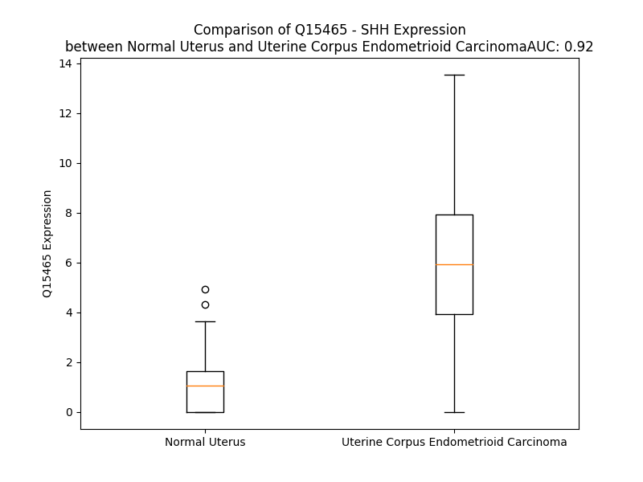

# Detailed Data for Q15465

## Introduction to the Detailed Summary

### How to Interpret the Results

- **Summary & Metrics**: This section provides a quick reference to essential protein attributes, including expression changes, family classification, and biomarker applications. Regulation status (upregulated/downregulated) indicates the protein's behavior in a disease context. Some information comes from the original excel file with the proteins selected from literature, while others are derived from the analyses.
- **Expression Comparison**: A visual representation comparing protein expression between normal and disease states. It highlights significant changes in expression levels that might indicate diagnostic or therapeutic relevance. This is data coming from transcriptomics experiments and could not translate similarly to protein levels.
- **Isoform Alignment**: An interactive view of isoform alignments, revealing structural and functional differences between variants of the protein.
- **Interactors & Homologs**: Tables listing known interaction partners and homologous proteins, the more interactors and homologs, the more complex the protein is to design an antibody for.
- **Biological Assemblies**: Information about the structural arrangement of the protein in different assemblies, providing insights into its functional state but also the complexity of the protein to develop antibodies.
- **Combined Per-Residue Information**: A detailed table summarizing residue-level data. This includes predictions for epitope regions, aggregation tendencies, and modifications that might impact the protein's function. Each row corresponds to a residue in the protein, providing insights into specific sites that may be important for research or drug development.
## Summary & Metrics

- **UniProt Accession**: Q15465
- **Gene Name**: SHH
- **Protein Name**: Sonic hedgehog protein
- **Swiss Prot**: SHH_HUMAN
- **Family**: peptidase
- **Biomarker Application**: diagnosis,efficacy,response to therapy,unspecified application
- **Number of Isoforms**: 0
- **Regulation**: -1
- **(transcriptomics) AUC**: 0.89
- **(transcriptomics) Fold Change**: 4.01
- **(transcriptomics) Regulation**: Upregulated
- **Discotope Epitope Count**: 97
- **Max n_uniprots (Homo)**: 4
- **Max n_uniprots (Hetero)**: 10

## Expression Comparison

## Interactors

| preferredName_A   | preferredName_B   |   score |
|:------------------|:------------------|--------:|
| SHH               | GAS1              |   0.999 |
| SHH               | HHIP              |   0.999 |
| SHH               | PTCH1             |   0.999 |
| SHH               | CDON              |   0.999 |
| SHH               | SMO               |   0.999 |
| SHH               | PTCH2             |   0.999 |
| SHH               | DISP1             |   0.996 |
| SHH               | BOC               |   0.996 |
| SHH               | LRP2              |   0.992 |
| SHH               | GLI1              |   0.979 |
| SHH               | GLI2              |   0.975 |
| SHH               | GLI3              |   0.966 |
| SHH               | GPC3              |   0.959 |
| SHH               | FOXA2             |   0.956 |
| SHH               | FGF8              |   0.954 |
| SHH               | IHH               |   0.951 |
| SHH               | DHH               |   0.938 |
| SHH               | SUFU              |   0.937 |
| SHH               | NOG               |   0.936 |
| SHH               | FGF4              |   0.928 |
| SHH               | FGF10             |   0.924 |
| SHH               | BMP4              |   0.922 |
| SHH               | DISP2             |   0.916 |
| SHH               | FOXF1             |   0.915 |
| SHH               | SIX3              |   0.904 |

## Homologs

| uniprot_id   | gene_id   |
|:-------------|:----------|
| O43323       | DHH       |
| Q14623       | IHH       |

## Biological Assemblies

|   Unnamed: 0 |   assembly |   n_uniprots | composition   | crystal_id   |
|-------------:|-----------:|-------------:|:--------------|:-------------|
|            0 |          1 |            1 | Homo          | 6pjv         |
|            0 |          1 |           10 | Hetero        | 6n7k         |
|            0 |          1 |            3 | Hetero        | 6rmg         |
|            0 |          1 |            4 | Hetero        | 7mhz         |
|            0 |          1 |           10 | Hetero        | 6n7g         |
|            0 |          1 |            4 | Hetero        | 6oev         |
|            0 |          1 |            6 | Hetero        | 7rhq         |
|            0 |          1 |            4 | Homo          | 7urf         |
|            0 |          1 |            3 | Hetero        | 6e1h         |
|            0 |          1 |            3 | Hetero        | 6dmy         |
|            0 |          1 |            2 | Hetero        | 7e2i         |
|            0 |          1 |            3 | Homo          | 3mxw         |
|            0 |          1 |            5 | Hetero        | 6n7h         |
|            0 |          1 |            1 | Homo          | 3ho5         |
|            1 |          2 |            2 | Hetero        | 3ho5         |
|            0 |          1 |            4 | Hetero        | 6rvd         |
|            0 |          1 |            1 | Homo          | 3m1n         |
|            1 |          2 |            1 | Homo          | 3m1n         |

## Combined Per-Residue Information

|   res | aa   |   epitope_score | epitope   |   relative_surface_accessibility |   modeling_confidence |   Aggregation | modification   | glycosylation                   |
|------:|:-----|----------------:|:----------|---------------------------------:|----------------------:|--------------:|:---------------|:--------------------------------|
|     1 | M    |         0.10175 | False     |                          1.126   |                 56.65 |         0     | N/A            | N/A                             |
|     2 | L    |         0.12973 | False     |                          0.84231 |                 65.1  |         0.032 | N/A            | N/A                             |
|     3 | L    |         0.07835 | False     |                          0.86608 |                 73.2  |         0.034 | N/A            | N/A                             |
|     4 | L    |         0.08575 | False     |                          0.78372 |                 76.81 |         0.035 | N/A            | N/A                             |
|     5 | A    |         0.0528  | False     |                          0.57068 |                 73.82 |         0.035 | N/A            | N/A                             |
|     6 | R    |         0.09675 | False     |                          0.62262 |                 77.25 |         0.035 | N/A            | N/A                             |
|     7 | C    |         0.07455 | False     |                          0.51883 |                 81.58 |        10.722 | N/A            | N/A                             |
|     8 | L    |         0.11847 | False     |                          0.65457 |                 79.81 |        73.938 | N/A            | N/A                             |
|     9 | L    |         0.08084 | False     |                          0.66986 |                 76.26 |        95.363 | N/A            | N/A                             |
|    10 | L    |         0.07748 | False     |                          0.74957 |                 79.54 |        99.059 | N/A            | N/A                             |
|    11 | V    |         0.07546 | False     |                          0.75358 |                 81.81 |        99.724 | N/A            | N/A                             |
|    12 | L    |         0.06502 | False     |                          0.49026 |                 79.38 |        99.763 | N/A            | N/A                             |
|    13 | V    |         0.05383 | False     |                          0.4351  |                 75.74 |        99.108 | N/A            | N/A                             |
|    14 | S    |         0.03985 | False     |                          0.48598 |                 75.47 |        88.609 | N/A            | N/A                             |
|    15 | S    |         0.07923 | False     |                          0.5194  |                 70.91 |        87.242 | N/A            | N/A                             |
|    16 | L    |         0.11572 | False     |                          0.85363 |                 71.07 |        87.073 | N/A            | N/A                             |
|    17 | L    |         0.09374 | False     |                          0.82351 |                 67.9  |        86.137 | N/A            | N/A                             |
|    18 | V    |         0.14003 | False     |                          0.77448 |                 57.61 |        80.563 | N/A            | N/A                             |
|    19 | C    |         0.07589 | False     |                          0.82411 |                 48.26 |        14.956 | N/A            | N/A                             |
|    20 | S    |         0.10697 | False     |                          0.82274 |                 55.25 |         3.157 | N/A            | N/A                             |
|    21 | G    |         0.06849 | False     |                          0.69943 |                 53.99 |         1.695 | N/A            | N/A                             |
|    22 | L    |         0.14543 | False     |                          1.13307 |                 47.84 |         1.564 | N/A            | N/A                             |
|    23 | A    |         0.09168 | False     |                          0.80657 |                 44.53 |         0.781 | N/A            | N/A                             |
|    24 | C    |         0.10124 | False     |                          0.95142 |                 45.8  |         0.119 | N/A            | N/A                             |
|    25 | G    |         0.07186 | False     |                          0.46162 |                 49.29 |         0     | N/A            | N/A                             |
|    26 | P    |         0.06541 | False     |                          0.43056 |                 44.19 |         0     | N/A            | N/A                             |
|    27 | G    |         0.11406 | False     |                          0.74416 |                 45.08 |         0     | N/A            | N/A                             |
|    28 | R    |         0.09525 | False     |                          0.99209 |                 51.51 |         0     | N/A            | N/A                             |
|    29 | G    |         0.04425 | False     |                          0.34041 |                 50.36 |         0     | N/A            | N/A                             |
|    30 | F    |         0.12678 | False     |                          0.76502 |                 34.72 |         0     | N/A            | N/A                             |
|    31 | G    |         0.08207 | False     |                          0.65426 |                 47.08 |         0     | N/A            | N/A                             |
|    32 | K    |         0.0944  | False     |                          0.99458 |                 45.07 |         0     | N/A            | N/A                             |
|    33 | R    |         0.13622 | False     |                          0.94489 |                 46.22 |         0     | N/A            | N/A                             |
|    34 | R    |         0.1205  | False     |                          0.62874 |                 49.41 |         0     | N/A            | N/A                             |
|    35 | H    |         0.11352 | False     |                          0.88737 |                 47.95 |         0     | N/A            | N/A                             |
|    36 | P    |         0.14214 | False     |                          0.97131 |                 56.18 |         0     | N/A            | N/A                             |
|    37 | K    |         0.08068 | False     |                          0.76788 |                 65.35 |         0     | N/A            | N/A                             |
|    38 | K    |         0.13648 | False     |                          0.97053 |                 77.64 |         0     | N/A            | N/A                             |
|    39 | L    |         0.0511  | False     |                          0.37782 |                 88.52 |         0     | N/A            | N/A                             |
|    40 | T    |         0.0745  | False     |                          0.63423 |                 93.55 |         0     | N/A            | N/A                             |
|    41 | P    |         0.111   | False     |                          0.49881 |                 96.93 |         0     | N/A            | N/A                             |
|    42 | L    |         0.02862 | False     |                          0.03138 |                 97.76 |         0     | N/A            | N/A                             |
|    43 | A    |         0.07697 | False     |                          0.59673 |                 97.34 |         0     | N/A            | N/A                             |
|    44 | Y    |         0.20992 | True      |                          0.4719  |                 97.61 |         0     | N/A            | N/A                             |
|    45 | K    |         0.16761 | True      |                          0.50036 |                 97.41 |         0     | N/A            | N/A                             |
|    46 | Q    |         0.10341 | False     |                          0.37076 |                 97.64 |         0     | N/A            | N/A                             |
|    47 | F    |         0.08833 | False     |                          0.31531 |                 97.13 |         0     | N/A            | N/A                             |
|    48 | I    |         0.10259 | False     |                          0.25808 |                 92.14 |         0     | N/A            | N/A                             |
|    49 | P    |         0.10182 | False     |                          0.33799 |                 90.88 |         0     | N/A            | N/A                             |
|    50 | N    |         0.19193 | True      |                          0.82072 |                 90.69 |         0     | N/A            | N/A                             |
|    51 | V    |         0.09988 | False     |                          0.4589  |                 86.98 |         0     | N/A            | N/A                             |
|    52 | A    |         0.25375 | True      |                          0.62473 |                 89.77 |         0     | N/A            | N/A                             |
|    53 | E    |         0.0992  | False     |                          0.16682 |                 92.46 |         0     | N/A            | N/A                             |
|    54 | K    |         0.08882 | False     |                          0.3618  |                 87    |         0     | N/A            | N/A                             |
|    55 | T    |         0.13483 | False     |                          0.32348 |                 74.15 |         0     | N/A            | N/A                             |
|    56 | L    |         0.04489 | False     |                          0.19008 |                 65.55 |         0     | N/A            | N/A                             |
|    57 | G    |         0.08555 | False     |                          0.6688  |                 69.67 |         0     | N/A            | N/A                             |
|    58 | A    |         0.00793 | False     |                          0       |                 85.46 |         0     | N/A            | N/A                             |
|    59 | S    |         0.00515 | False     |                          0.00077 |                 89.42 |         0     | N/A            | N/A                             |
|    60 | G    |         0.02608 | False     |                          0.04024 |                 81.25 |         0     | N/A            | N/A                             |
|    61 | R    |         0.11607 | False     |                          0.5024  |                 79.95 |         0     | N/A            | N/A                             |
|    62 | Y    |         0.14254 | False     |                          0.27527 |                 84.16 |         0     | N/A            | N/A                             |
|    63 | E    |         0.23388 | True      |                          0.4396  |                 82.9  |         0     | N/A            | N/A                             |
|    64 | G    |         0.09968 | False     |                          0.24255 |                 84.65 |         0     | N/A            | N/A                             |
|    65 | K    |         0.21499 | True      |                          0.44551 |                 91.13 |         0     | N/A            | N/A                             |
|    66 | I    |         0.03028 | False     |                          0.0072  |                 90.97 |         0     | N/A            | N/A                             |
|    67 | S    |         0.22022 | True      |                          0.3483  |                 91.69 |         0     | N/A            | N/A                             |
|    68 | R    |         0.25404 | True      |                          0.46473 |                 91.75 |         0     | N/A            | N/A                             |
|    69 | N    |         0.2774  | True      |                          0.89719 |                 90.07 |         0     | N/A            | N/A                             |
|    70 | S    |         0.18829 | True      |                          0.26767 |                 87.55 |         0     | N/A            | N/A                             |
|    71 | E    |         0.26582 | True      |                          0.67678 |                 83.67 |         0     | N/A            | N/A                             |
|    72 | R    |         0.16877 | True      |                          0.27147 |                 82.27 |         0     | N/A            | N/A                             |
|    73 | F    |         0.15946 | True      |                          0.24343 |                 89.27 |         0     | N/A            | N/A                             |
|    74 | K    |         0.27297 | True      |                          0.78682 |                 86.22 |         0     | N/A            | N/A                             |
|    75 | E    |         0.08117 | False     |                          0.29652 |                 84.79 |         0     | N/A            | N/A                             |
|    76 | L    |         0.09407 | False     |                          0.07456 |                 92.25 |         0     | N/A            | N/A                             |
|    77 | T    |         0.08555 | False     |                          0.28657 |                 92.85 |         0     | N/A            | N/A                             |
|    78 | P    |         0.15527 | True      |                          0.33557 |                 96.6  |         0     | N/A            | N/A                             |
|    79 | N    |         0.01253 | False     |                          0.00891 |                 97.51 |         0     | N/A            | N/A                             |
|    80 | Y    |         0.22522 | True      |                          0.71239 |                 96.66 |         0     | N/A            | N/A                             |
|    81 | N    |         0.05378 | False     |                          0.20764 |                 96.03 |         0     | N/A            | N/A                             |
|    82 | P    |         0.2165  | True      |                          0.81264 |                 96.31 |         0     | N/A            | N/A                             |
|    83 | D    |         0.05857 | False     |                          0.27407 |                 95.8  |         0     | N/A            | N/A                             |
|    84 | I    |         0.03625 | False     |                          0.05144 |                 98.34 |         0     | N/A            | N/A                             |
|    85 | I    |         0.09963 | False     |                          0.42958 |                 97.98 |         0     | N/A            | N/A                             |
|    86 | F    |         0.0517  | False     |                          0.08706 |                 97.68 |         0     | N/A            | N/A                             |
|    87 | K    |         0.24313 | True      |                          0.40109 |                 94.62 |         0     | N/A            | N/A                             |
|    88 | D    |         0.14248 | False     |                          0.23344 |                 89.85 |         0     | N/A            | N/A                             |
|    89 | E    |         0.22793 | True      |                          0.57998 |                 88.84 |         0     | N/A            | N/A                             |
|    90 | E    |         0.0898  | False     |                          0.42069 |                 86.25 |         0     | N/A            | N/A                             |
|    91 | N    |         0.2984  | True      |                          0.84109 |                 89.47 |         0     | N/A            | N/A                             |
|    92 | T    |         0.13841 | False     |                          0.45598 |                 90.28 |         0     | N/A            | N/A                             |
|    93 | G    |         0.06331 | False     |                          0.23348 |                 93.35 |         0     | N/A            | N/A                             |
|    94 | A    |         0.04541 | False     |                          0.06869 |                 95.2  |         0     | N/A            | N/A                             |
|    95 | D    |         0.03396 | False     |                          0.03193 |                 96.61 |         0     | N/A            | N/A                             |
|    96 | R    |         0.10463 | False     |                          0.27536 |                 97.57 |         0     | N/A            | N/A                             |
|    97 | L    |         0.07729 | False     |                          0.12613 |                 97.67 |         0     | N/A            | N/A                             |
|    98 | M    |         0.00578 | False     |                          0.00288 |                 96.63 |         0     | N/A            | N/A                             |
|    99 | T    |         0.02736 | False     |                          0.04189 |                 93.89 |         0     | N/A            | N/A                             |
|   100 | Q    |         0.03583 | False     |                          0.3785  |                 88.03 |         0     | N/A            | N/A                             |
|   101 | R    |         0.02757 | False     |                          0.19713 |                 88.93 |         0     | N/A            | N/A                             |
|   102 | C    |         0.00105 | False     |                          0       |                 95.42 |         0     | N/A            | N/A                             |
|   103 | K    |         0.03521 | False     |                          0.21753 |                 95.85 |         0     | N/A            | N/A                             |
|   104 | D    |         0.04438 | False     |                          0.44521 |                 92.21 |         0     | N/A            | N/A                             |
|   105 | K    |         0.018   | False     |                          0.24773 |                 95.46 |         0     | N/A            | N/A                             |
|   106 | L    |         0.00225 | False     |                          0       |                 97.84 |         5.306 | N/A            | N/A                             |
|   107 | N    |         0.02356 | False     |                          0.2366  |                 97.25 |         5.306 | N/A            | N/A                             |
|   108 | A    |         0.02308 | False     |                          0.28629 |                 94.7  |        12.373 | N/A            | N/A                             |
|   109 | L    |         0.00208 | False     |                          0       |                 97.97 |        20.428 | N/A            | N/A                             |
|   110 | A    |         0.00245 | False     |                          0.00128 |                 97.94 |        21.2   | N/A            | N/A                             |
|   111 | I    |         0.08297 | False     |                          0.59716 |                 94.48 |        21.089 | N/A            | N/A                             |
|   112 | S    |         0.04506 | False     |                          0.24149 |                 95.9  |        19.866 | N/A            | N/A                             |
|   113 | V    |         0.00246 | False     |                          0       |                 97.94 |        19.45  | N/A            | N/A                             |
|   114 | M    |         0.10418 | False     |                          0.30946 |                 96.3  |        10.865 | N/A            | N/A                             |
|   115 | N    |         0.16107 | True      |                          0.7424  |                 95.48 |         0.296 | N/A            | N/A                             |
|   116 | Q    |         0.08984 | False     |                          0.35047 |                 96.85 |         0     | N/A            | N/A                             |
|   117 | W    |         0.15307 | False     |                          0.15997 |                 97.67 |         0     | N/A            | N/A                             |
|   118 | P    |         0.30602 | True      |                          0.89679 |                 96.29 |         0     | N/A            | N/A                             |
|   119 | G    |         0.15212 | False     |                          1.02346 |                 96.51 |         0     | N/A            | N/A                             |
|   120 | V    |         0.05473 | False     |                          0.09873 |                 98.33 |         0     | N/A            | N/A                             |
|   121 | K    |         0.11304 | False     |                          0.35749 |                 98.48 |         0     | N/A            | N/A                             |
|   122 | L    |         0.00303 | False     |                          0       |                 98.73 |         0     | N/A            | N/A                             |
|   123 | R    |         0.09079 | False     |                          0.07677 |                 98.56 |         0     | N/A            | N/A                             |
|   124 | V    |         0.0037  | False     |                          0       |                 98.52 |         0     | N/A            | N/A                             |
|   125 | T    |         0.08422 | False     |                          0.19269 |                 96.95 |         0     | N/A            | N/A                             |
|   126 | E    |         0.11061 | False     |                          0.21129 |                 97.16 |         0     | N/A            | N/A                             |
|   127 | G    |         0.00339 | False     |                          0.00161 |                 96.3  |         0     | N/A            | N/A                             |
|   128 | W    |         0.02208 | False     |                          0.00653 |                 97.08 |         0     | N/A            | N/A                             |
|   129 | D    |         0.04507 | False     |                          0.02679 |                 94.6  |         0     | N/A            | N/A                             |
|   130 | E    |         0.10803 | False     |                          0.24385 |                 90.77 |         0     | N/A            | N/A                             |
|   131 | D    |         0.25706 | True      |                          0.55905 |                 88.2  |         0     | N/A            | N/A                             |
|   132 | G    |         0.22042 | True      |                          0.46021 |                 87.17 |         0     | N/A            | N/A                             |
|   133 | H    |         0.27648 | True      |                          0.74089 |                 87.1  |         0     | N/A            | N/A                             |
|   134 | H    |         0.18571 | True      |                          0.29623 |                 89.35 |         0     | N/A            | N/A                             |
|   135 | S    |         0.24175 | True      |                          0.66936 |                 90.14 |         0     | N/A            | N/A                             |
|   136 | E    |         0.22565 | True      |                          0.80383 |                 88.53 |         0     | N/A            | N/A                             |
|   137 | E    |         0.15584 | True      |                          0.47237 |                 89.11 |         0     | N/A            | N/A                             |
|   138 | S    |         0.07241 | False     |                          0.10139 |                 95.24 |         0     | N/A            | N/A                             |
|   139 | L    |         0.01882 | False     |                          0.00932 |                 96.36 |         0     | N/A            | N/A                             |
|   140 | H    |         0.01565 | False     |                          0.00808 |                 97.64 |         0     | N/A            | N/A                             |
|   141 | Y    |         0.0408  | False     |                          0.04055 |                 96.14 |         0     | N/A            | N/A                             |
|   142 | E    |         0.00727 | False     |                          0.00345 |                 94.14 |         0     | N/A            | N/A                             |
|   143 | G    |         0.00288 | False     |                          0.00161 |                 96.28 |         0     | N/A            | N/A                             |
|   144 | R    |         0.01714 | False     |                          0.0134  |                 95.74 |         0     | N/A            | N/A                             |
|   145 | A    |         0.0032  | False     |                          0.00189 |                 98.18 |         0     | N/A            | N/A                             |
|   146 | V    |         0.00187 | False     |                          0       |                 98.48 |         0     | N/A            | N/A                             |
|   147 | D    |         0.06565 | False     |                          0.0613  |                 98.47 |         0     | N/A            | N/A                             |
|   148 | I    |         0.00276 | False     |                          0       |                 98.77 |         0     | N/A            | N/A                             |
|   149 | T    |         0.03731 | False     |                          0.01999 |                 98.64 |         0     | N/A            | N/A                             |
|   150 | T    |         0.00264 | False     |                          0       |                 98.47 |         0     | N/A            | N/A                             |
|   151 | S    |         0.0525  | False     |                          0.25368 |                 98.18 |         0     | N/A            | N/A                             |
|   152 | D    |         0.12519 | False     |                          0.4245  |                 97.73 |         0     | N/A            | N/A                             |
|   153 | R    |         0.24007 | True      |                          0.63527 |                 96.97 |         0     | N/A            | N/A                             |
|   154 | D    |         0.10912 | False     |                          0.32092 |                 97.88 |         0     | N/A            | N/A                             |
|   155 | R    |         0.16564 | True      |                          0.63197 |                 97.36 |         0     | N/A            | N/A                             |
|   156 | S    |         0.13312 | False     |                          0.75988 |                 97.09 |         0     | N/A            | N/A                             |
|   157 | K    |         0.05725 | False     |                          0.19748 |                 98.19 |         0     | N/A            | N/A                             |
|   158 | Y    |         0.03842 | False     |                          0.02778 |                 98.54 |         0     | N/A            | N/A                             |
|   159 | G    |         0.02691 | False     |                          0.08765 |                 98.25 |         0     | N/A            | N/A                             |
|   160 | M    |         0.0541  | False     |                          0.20794 |                 98.09 |         0     | N/A            | N/A                             |
|   161 | L    |         0.00228 | False     |                          0       |                 98.66 |         0     | N/A            | N/A                             |
|   162 | A    |         0.00146 | False     |                          0       |                 98.55 |         0     | N/A            | N/A                             |
|   163 | R    |         0.03343 | False     |                          0.16718 |                 97.89 |         0     | N/A            | N/A                             |
|   164 | L    |         0.04585 | False     |                          0.061   |                 98.07 |         0     | N/A            | N/A                             |
|   165 | A    |         0.00241 | False     |                          0       |                 98.21 |         0     | N/A            | N/A                             |
|   166 | V    |         0.02504 | False     |                          0.22829 |                 95.43 |         0     | N/A            | N/A                             |
|   167 | E    |         0.06957 | False     |                          0.53891 |                 91.53 |         0     | N/A            | N/A                             |
|   168 | A    |         0.01733 | False     |                          0.1261  |                 94.42 |         0     | N/A            | N/A                             |
|   169 | G    |         0.06627 | False     |                          0.31798 |                 89.43 |         0     | N/A            | N/A                             |
|   170 | F    |         0.02818 | False     |                          0.06493 |                 95.75 |         0     | N/A            | N/A                             |
|   171 | D    |         0.02735 | False     |                          0.09878 |                 91.51 |         0     | N/A            | N/A                             |
|   172 | W    |         0.04933 | False     |                          0.0796  |                 96.83 |         0     | N/A            | N/A                             |
|   173 | V    |         0.00338 | False     |                          0.00095 |                 98.56 |         0     | N/A            | N/A                             |
|   174 | Y    |         0.12543 | False     |                          0.17604 |                 98.57 |         0     | N/A            | N/A                             |
|   175 | Y    |         0.06585 | False     |                          0.10249 |                 98.45 |         0     | N/A            | N/A                             |
|   176 | E    |         0.14948 | False     |                          0.29393 |                 97.12 |         0     | N/A            | N/A                             |
|   177 | S    |         0.20557 | True      |                          0.21997 |                 96.77 |         0     | N/A            | N/A                             |
|   178 | K    |         0.19093 | True      |                          0.64955 |                 95.63 |         0     | N/A            | N/A                             |
|   179 | A    |         0.18151 | True      |                          0.61161 |                 96.56 |         0     | N/A            | N/A                             |
|   180 | H    |         0.0891  | False     |                          0.16808 |                 98.04 |         0     | N/A            | N/A                             |
|   181 | I    |         0.00406 | False     |                          0       |                 98.73 |         0     | N/A            | N/A                             |
|   182 | H    |         0.04656 | False     |                          0.08698 |                 98.68 |         0     | N/A            | N/A                             |
|   183 | C    |         0.00306 | False     |                          0       |                 98.68 |         0     | N/A            | N/A                             |
|   184 | S    |         0.00482 | False     |                          0       |                 97.84 |         0     | N/A            | N/A                             |
|   185 | V    |         0.00237 | False     |                          0       |                 93.42 |         0     | N/A            | N/A                             |
|   186 | K    |         0.02226 | False     |                          0.02784 |                 85.81 |         0     | N/A            | N/A                             |
|   187 | A    |         0.04991 | False     |                          0.0607  |                 81.64 |         0     | N/A            | N/A                             |
|   188 | E    |         0.05434 | False     |                          0.26523 |                 70.49 |         0     | N/A            | N/A                             |
|   189 | N    |         0.15404 | False     |                          0.34792 |                 59.12 |         0     | N/A            | N/A                             |
|   190 | S    |         0.05829 | False     |                          0.09037 |                 50.19 |         0     | N/A            | N/A                             |
|   191 | V    |         0.12956 | False     |                          0.30245 |                 45.2  |         0     | N/A            | N/A                             |
|   192 | A    |         0.01597 | False     |                          0.03228 |                 44.56 |         0     | N/A            | N/A                             |
|   193 | A    |         0.03242 | False     |                          0.02423 |                 44.51 |         0     | N/A            | N/A                             |
|   194 | K    |         0.14953 | False     |                          0.56529 |                 47.8  |         0     | N/A            | N/A                             |
|   195 | S    |         0.043   | False     |                          0.01352 |                 51.75 |         0     | N/A            | N/A                             |
|   196 | G    |         0.02273 | False     |                          0.04901 |                 67.63 |         0     | N/A            | N/A                             |
|   197 | G    |         0.02078 | False     |                          0.04276 |                 82.8  |         0     | N/A            | N/A                             |
|   198 | C    |         0.00319 | False     |                          0       |                 91.21 |         0     | N/A            | N/A                             |
|   199 | F    |         0.00202 | False     |                          0       |                 94.21 |         0     | N/A            | N/A                             |
|   200 | P    |         0.01676 | False     |                          0.01889 |                 93.49 |         0     | N/A            | N/A                             |
|   201 | G    |         0.01372 | False     |                          0.03219 |                 93.89 |         0     | N/A            | N/A                             |
|   202 | S    |         0.09229 | False     |                          0.59594 |                 94.57 |         0     | N/A            | N/A                             |
|   203 | A    |         0.01112 | False     |                          0.02788 |                 96.96 |         0     | N/A            | N/A                             |
|   204 | T    |         0.07525 | False     |                          0.29613 |                 98.09 |         0     | N/A            | N/A                             |
|   205 | V    |         0.00335 | False     |                          0.00476 |                 98.1  |         0     | N/A            | N/A                             |
|   206 | H    |         0.05839 | False     |                          0.16113 |                 96.86 |         0     | N/A            | N/A                             |
|   207 | L    |         0.05935 | False     |                          0.18483 |                 97.06 |         0     | N/A            | N/A                             |
|   208 | E    |         0.15919 | True      |                          0.41147 |                 95.5  |         0     | N/A            | N/A                             |
|   209 | Q    |         0.22565 | True      |                          0.93726 |                 90.7  |         0     | N/A            | N/A                             |
|   210 | G    |         0.19111 | True      |                          0.47495 |                 89.11 |         0     | N/A            | N/A                             |
|   211 | G    |         0.18182 | True      |                          0.66327 |                 92.88 |         0     | N/A            | N/A                             |
|   212 | T    |         0.19909 | True      |                          0.5649  |                 96.46 |         0     | N/A            | N/A                             |
|   213 | K    |         0.09733 | False     |                          0.27625 |                 97.55 |         0     | N/A            | N/A                             |
|   214 | L    |         0.06724 | False     |                          0.39053 |                 97.88 |         0     | N/A            | N/A                             |
|   215 | V    |         0.00258 | False     |                          0       |                 97.68 |         0     | N/A            | N/A                             |
|   216 | K    |         0.04261 | False     |                          0.43071 |                 96.16 |         0     | N/A            | N/A                             |
|   217 | D    |         0.10584 | False     |                          0.41849 |                 96.62 |         0     | N/A            | N/A                             |
|   218 | L    |         0.01501 | False     |                          0.03534 |                 97.25 |         0     | N/A            | N/A                             |
|   219 | S    |         0.05505 | False     |                          0.43146 |                 95.34 |         0     | N/A            | N/A                             |
|   220 | P    |         0.10887 | False     |                          0.76603 |                 91.46 |         0     | N/A            | N/A                             |
|   221 | G    |         0.05885 | False     |                          0.81293 |                 89.86 |         0     | N/A            | N/A                             |
|   222 | D    |         0.0423  | False     |                          0.1329  |                 96.84 |         0     | N/A            | N/A                             |
|   223 | R    |         0.12339 | False     |                          0.38414 |                 97.87 |         0     | N/A            | N/A                             |
|   224 | V    |         0.00115 | False     |                          0       |                 98.08 |         0     | N/A            | N/A                             |
|   225 | L    |         0.01964 | False     |                          0.02687 |                 97.72 |         0     | N/A            | N/A                             |
|   226 | A    |         0.00313 | False     |                          0       |                 97.29 |         0     | N/A            | N/A                             |
|   227 | A    |         0.00952 | False     |                          0.0041  |                 95.5  |         0     | N/A            | N/A                             |
|   228 | D    |         0.02787 | False     |                          0.12225 |                 93.15 |         0     | N/A            | N/A                             |
|   229 | D    |         0.18944 | True      |                          0.80771 |                 87.74 |         0     | N/A            | N/A                             |
|   230 | Q    |         0.10902 | False     |                          0.66369 |                 88.16 |         0     | N/A            | N/A                             |
|   231 | G    |         0.08527 | False     |                          0.31288 |                 89.08 |         0     | N/A            | N/A                             |
|   232 | R    |         0.18374 | True      |                          0.59913 |                 92.91 |         1.094 | N/A            | N/A                             |
|   233 | L    |         0.10643 | False     |                          0.25779 |                 95.53 |         1.094 | N/A            | N/A                             |
|   234 | L    |         0.07946 | False     |                          0.33551 |                 96.06 |         1.094 | N/A            | N/A                             |
|   235 | Y    |         0.07004 | False     |                          0.24243 |                 97.44 |         1.094 | N/A            | N/A                             |
|   236 | S    |         0.03048 | False     |                          0.04322 |                 97.51 |         1.094 | N/A            | N/A                             |
|   237 | D    |         0.04373 | False     |                          0.3684  |                 97.07 |         1.094 | N/A            | N/A                             |
|   238 | F    |         0.01528 | False     |                          0.01931 |                 97.33 |        62.109 | N/A            | N/A                             |
|   239 | L    |         0.03561 | False     |                          0.09512 |                 95.29 |        62.109 | N/A            | N/A                             |
|   240 | T    |         0.06251 | False     |                          0.19523 |                 95.87 |        62.109 | N/A            | N/A                             |
|   241 | F    |         0.02309 | False     |                          0.1003  |                 94.78 |        62.109 | N/A            | N/A                             |
|   242 | L    |         0.01891 | False     |                          0.07659 |                 91.78 |        62.109 | N/A            | N/A                             |
|   243 | D    |         0.03    | False     |                          0.05636 |                 89.37 |         0     | N/A            | N/A                             |
|   244 | R    |         0.07723 | False     |                          0.25857 |                 91.2  |         0     | N/A            | N/A                             |
|   245 | D    |         0.11736 | False     |                          0.24921 |                 88.26 |         0     | N/A            | N/A                             |
|   246 | D    |         0.21117 | True      |                          0.50059 |                 87.76 |         0     | N/A            | N/A                             |
|   247 | G    |         0.29049 | True      |                          0.84433 |                 78.69 |         0     | N/A            | N/A                             |
|   248 | A    |         0.10315 | False     |                          0.17857 |                 75.11 |         0     | N/A            | N/A                             |
|   249 | K    |         0.17788 | True      |                          0.81122 |                 76.89 |         0     | N/A            | N/A                             |
|   250 | K    |         0.05321 | False     |                          0.10991 |                 72.56 |         0.178 | N/A            | N/A                             |
|   251 | V    |         0.06805 | False     |                          0.31046 |                 72.72 |        97.551 | N/A            | N/A                             |
|   252 | F    |         0.01283 | False     |                          0       |                 84.05 |        97.562 | N/A            | N/A                             |
|   253 | Y    |         0.04288 | False     |                          0.05639 |                 86.08 |        97.562 | N/A            | N/A                             |
|   254 | V    |         0.02523 | False     |                          0.01238 |                 90.27 |        97.562 | N/A            | N/A                             |
|   255 | I    |         0.02491 | False     |                          0.01391 |                 93.02 |        97.562 | N/A            | N/A                             |
|   256 | E    |         0.09955 | False     |                          0.22407 |                 95.71 |         0.236 | N/A            | N/A                             |
|   257 | T    |         0.02535 | False     |                          0.02401 |                 95.79 |         0.204 | N/A            | N/A                             |
|   258 | R    |         0.24788 | True      |                          0.55785 |                 88.7  |         0.058 | N/A            | N/A                             |
|   259 | E    |         0.25694 | True      |                          0.69891 |                 88.99 |         0     | N/A            | N/A                             |
|   260 | P    |         0.11397 | False     |                          0.32664 |                 91.28 |         0     | N/A            | N/A                             |
|   261 | R    |         0.22579 | True      |                          0.75557 |                 94.47 |         0     | N/A            | N/A                             |
|   262 | E    |         0.04746 | False     |                          0.11932 |                 95.61 |         0     | N/A            | N/A                             |
|   263 | R    |         0.14981 | False     |                          0.4073  |                 95.1  |         0     | N/A            | N/A                             |
|   264 | L    |         0.00312 | False     |                          0.00165 |                 95.63 |        78.155 | N/A            | N/A                             |
|   265 | L    |         0.04334 | False     |                          0.09857 |                 93.62 |        79.979 | N/A            | N/A                             |
|   266 | L    |         0.00351 | False     |                          0       |                 92.22 |        80.867 | N/A            | N/A                             |
|   267 | T    |         0.00808 | False     |                          0.00381 |                 87.54 |        81.017 | N/A            | N/A                             |
|   268 | A    |         0.02361 | False     |                          0.0587  |                 82.07 |        81.269 | N/A            | N/A                             |
|   269 | A    |         0.00652 | False     |                          0       |                 84.43 |        79.106 | N/A            | N/A                             |
|   270 | H    |         0.00538 | False     |                          0.00136 |                 90.67 |        77.316 | N/A            | N/A                             |
|   271 | L    |         0.0039  | False     |                          0.00082 |                 92.37 |        77.884 | N/A            | N/A                             |
|   272 | L    |         0.00303 | False     |                          0.00069 |                 94.03 |        77.859 | N/A            | N/A                             |
|   273 | F    |         0.01439 | False     |                          0.09109 |                 94.26 |        77.398 | N/A            | N/A                             |
|   274 | V    |         0.04356 | False     |                          0.09326 |                 92.18 |        71.512 | N/A            | N/A                             |
|   275 | A    |         0.03162 | False     |                          0.15361 |                 88.16 |         1.494 | N/A            | N/A                             |
|   276 | P    |         0.09048 | False     |                          0.42789 |                 79.46 |         0.854 | N/A            | N/A                             |
|   277 | H    |         0.19579 | True      |                          0.81048 |                 68.01 |         0     | N/A            | N/A                             |
|   278 | N    |         0.11942 | False     |                          0.77826 |                 56.83 |         0     | N/A            | N-linked (GlcNAc...) asparagine |
|   279 | D    |         0.17293 | True      |                          0.82    |                 41.64 |         0     | N/A            | N/A                             |
|   280 | S    |         0.11992 | False     |                          0.73424 |                 37.52 |         0     | N/A            | N/A                             |
|   281 | A    |         0.17134 | True      |                          0.84088 |                 36.53 |         0     | N/A            | N/A                             |
|   282 | T    |         0.22349 | True      |                          0.99223 |                 31.95 |         0     | N/A            | N/A                             |
|   283 | G    |         0.22193 | True      |                          0.90858 |                 29.43 |         0     | N/A            | N/A                             |
|   284 | E    |         0.19375 | True      |                          0.83532 |                 27.14 |         0     | N/A            | N/A                             |
|   285 | P    |         0.14724 | False     |                          0.99942 |                 32.93 |         0     | N/A            | N/A                             |
|   286 | E    |         0.19281 | True      |                          0.88125 |                 31.09 |         0     | N/A            | N/A                             |
|   287 | A    |         0.1262  | False     |                          0.92007 |                 31.94 |         0     | N/A            | N/A                             |
|   288 | S    |         0.14717 | False     |                          0.89154 |                 35.51 |         0     | N/A            | N/A                             |
|   289 | S    |         0.13279 | False     |                          0.85435 |                 32.7  |         0     | N/A            | N/A                             |
|   290 | G    |         0.23819 | True      |                          0.96019 |                 30.12 |         0     | N/A            | N/A                             |
|   291 | S    |         0.13326 | False     |                          0.85427 |                 35.29 |         0     | N/A            | N/A                             |
|   292 | G    |         0.18897 | True      |                          0.74267 |                 27.86 |         0     | N/A            | N/A                             |
|   293 | P    |         0.16345 | True      |                          0.9315  |                 29.12 |         0     | N/A            | N/A                             |
|   294 | P    |         0.13218 | False     |                          0.94779 |                 33.62 |         0     | N/A            | N/A                             |
|   295 | S    |         0.20777 | True      |                          0.8369  |                 31.47 |         0     | N/A            | N/A                             |
|   296 | G    |         0.24824 | True      |                          1.02898 |                 28    |         0     | N/A            | N/A                             |
|   297 | G    |         0.35401 | True      |                          0.82174 |                 28.38 |         0     | N/A            | N/A                             |
|   298 | A    |         0.22151 | True      |                          0.95723 |                 36.09 |         0     | N/A            | N/A                             |
|   299 | L    |         0.18922 | True      |                          1.02712 |                 44.02 |         0     | N/A            | N/A                             |
|   300 | G    |         0.13484 | False     |                          0.38023 |                 62.71 |         0     | N/A            | N/A                             |
|   301 | P    |         0.18449 | True      |                          0.4575  |                 74.69 |         0     | N/A            | N/A                             |
|   302 | R    |         0.17632 | True      |                          0.64288 |                 86.67 |         0     | N/A            | N/A                             |
|   303 | A    |         0.03548 | False     |                          0.12631 |                 90.21 |         0     | N/A            | N/A                             |
|   304 | L    |         0.0529  | False     |                          0.11541 |                 88.62 |         0     | N/A            | N/A                             |
|   305 | F    |         0.01001 | False     |                          0.00764 |                 87.92 |         0     | N/A            | N/A                             |
|   306 | A    |         0.00167 | False     |                          0       |                 88.83 |         0     | N/A            | N/A                             |
|   307 | S    |         0.04101 | False     |                          0.16353 |                 82.03 |         0     | N/A            | N/A                             |
|   308 | R    |         0.08605 | False     |                          0.36438 |                 82.95 |         0     | N/A            | N/A                             |
|   309 | V    |         0.00357 | False     |                          0.00141 |                 87.89 |         0     | N/A            | N/A                             |
|   310 | R    |         0.11715 | False     |                          0.52013 |                 88.52 |         0     | N/A            | N/A                             |
|   311 | P    |         0.06782 | False     |                          0.55224 |                 90.39 |         0     | N/A            | N/A                             |
|   312 | G    |         0.04641 | False     |                          0.60404 |                 89.97 |         0     | N/A            | N/A                             |
|   313 | Q    |         0.05256 | False     |                          0.273   |                 92.91 |         0     | N/A            | N/A                             |
|   314 | R    |         0.08368 | False     |                          0.48655 |                 94.34 |         0.165 | N/A            | N/A                             |
|   315 | V    |         0.00144 | False     |                          0.00095 |                 95.55 |        74.567 | N/A            | N/A                             |
|   316 | Y    |         0.02763 | False     |                          0.1314  |                 95.47 |        74.567 | N/A            | N/A                             |
|   317 | V    |         0.00199 | False     |                          0       |                 96.03 |        74.567 | N/A            | N/A                             |
|   318 | V    |         0.02063 | False     |                          0.02095 |                 94.19 |        74.567 | N/A            | N/A                             |
|   319 | A    |         0.05395 | False     |                          0.20806 |                 88.42 |        74.567 | N/A            | N/A                             |
|   320 | E    |         0.15882 | True      |                          0.45702 |                 84.78 |         0.329 | N/A            | N/A                             |
|   321 | R    |         0.23002 | True      |                          0.77505 |                 76.56 |         0.165 | N/A            | N/A                             |
|   322 | D    |         0.26664 | True      |                          0.87517 |                 77.25 |         0     | N/A            | N/A                             |
|   323 | G    |         0.20504 | True      |                          0.82377 |                 75.15 |         0     | N/A            | N/A                             |
|   324 | D    |         0.21452 | True      |                          0.4106  |                 82.13 |         0     | N/A            | N/A                             |
|   325 | R    |         0.19763 | True      |                          0.32014 |                 89.06 |         0     | N/A            | N/A                             |
|   326 | R    |         0.26339 | True      |                          0.61502 |                 91.54 |         0     | N/A            | N/A                             |
|   327 | L    |         0.05187 | False     |                          0.16395 |                 93.03 |         0     | N/A            | N/A                             |
|   328 | L    |         0.10241 | False     |                          0.47813 |                 92.07 |         0     | N/A            | N/A                             |
|   329 | P    |         0.07025 | False     |                          0.44513 |                 93.77 |         0     | N/A            | N/A                             |
|   330 | A    |         0.0054  | False     |                          0.00383 |                 93.9  |         0     | N/A            | N/A                             |
|   331 | A    |         0.05296 | False     |                          0.36755 |                 95.42 |         0     | N/A            | N/A                             |
|   332 | V    |         0.0199  | False     |                          0.01619 |                 95.29 |         0     | N/A            | N/A                             |
|   333 | H    |         0.13072 | False     |                          0.56141 |                 93.36 |         0     | N/A            | N/A                             |
|   334 | S    |         0.12548 | False     |                          0.20504 |                 90.09 |         0     | N/A            | N/A                             |
|   335 | V    |         0.05189 | False     |                          0.25138 |                 85.33 |         0     | N/A            | N/A                             |
|   336 | T    |         0.22662 | True      |                          0.50504 |                 78.04 |         0     | N/A            | N/A                             |
|   337 | L    |         0.15697 | True      |                          0.53679 |                 63.73 |         0     | N/A            | N/A                             |
|   338 | S    |         0.06725 | False     |                          0.16106 |                 62.74 |         0     | N/A            | N/A                             |
|   339 | E    |         0.28347 | True      |                          0.36913 |                 66.53 |         0     | N/A            | N/A                             |
|   340 | E    |         0.3025  | True      |                          0.66374 |                 75.43 |         0     | N/A            | N/A                             |
|   341 | A    |         0.12608 | False     |                          0.1797  |                 79.72 |         0     | N/A            | N/A                             |
|   342 | A    |         0.10968 | False     |                          0.70176 |                 85.12 |         0     | N/A            | N/A                             |
|   343 | G    |         0.00937 | False     |                          0.02208 |                 87.04 |         0     | N/A            | N/A                             |
|   344 | A    |         0.00372 | False     |                          0       |                 89.17 |         0     | N/A            | N/A                             |
|   345 | Y    |         0.01569 | False     |                          0.02871 |                 93.48 |         0     | N/A            | N/A                             |
|   346 | A    |         0.01389 | False     |                          0.04719 |                 94.48 |         0     | N/A            | N/A                             |
|   347 | P    |         0.00337 | False     |                          0.00372 |                 96.76 |         0     | N/A            | N/A                             |
|   348 | L    |         0.00181 | False     |                          0       |                 96.49 |         0     | N/A            | N/A                             |
|   349 | T    |         0.00155 | False     |                          0       |                 97.29 |         0     | N/A            | N/A                             |
|   350 | A    |         0.01978 | False     |                          0.4063  |                 95.99 |         0     | N/A            | N/A                             |
|   351 | Q    |         0.03763 | False     |                          0.27933 |                 96.06 |         0     | N/A            | N/A                             |
|   352 | G    |         0.00225 | False     |                          0       |                 95.06 |         0.797 | N/A            | N/A                             |
|   353 | T    |         0.02627 | False     |                          0.07045 |                 96.96 |         1.143 | N/A            | N/A                             |
|   354 | I    |         0.00234 | False     |                          0       |                 97.98 |         1.305 | N/A            | N/A                             |
|   355 | L    |         0.00149 | False     |                          0.00122 |                 97.74 |         1.305 | N/A            | N/A                             |
|   356 | I    |         0.00165 | False     |                          0       |                 97.83 |         1.305 | N/A            | N/A                             |
|   357 | N    |         0.02287 | False     |                          0.23349 |                 96.88 |         0.508 | N/A            | N/A                             |
|   358 | R    |         0.05684 | False     |                          0.28925 |                 96.01 |         0.258 | N/A            | N/A                             |
|   359 | V    |         0.00443 | False     |                          0.01619 |                 97.52 |        27.289 | N/A            | N/A                             |
|   360 | L    |         0.01558 | False     |                          0.05193 |                 97.35 |        29.591 | N/A            | N/A                             |
|   361 | A    |         0.00199 | False     |                          0       |                 97.03 |        29.591 | N/A            | N/A                             |
|   362 | S    |         0.00258 | False     |                          0       |                 95.49 |        29.591 | N/A            | N/A                             |
|   363 | C    |         0.01093 | False     |                          0.01507 |                 94.65 |        30.02  | N/A            | N/A                             |
|   364 | Y    |         0.0106  | False     |                          0.01462 |                 91.82 |        30.02  | N/A            | N/A                             |
|   365 | A    |         0.02344 | False     |                          0.13906 |                 86.01 |        30.02  | N/A            | N/A                             |
|   366 | V    |         0.02469 | False     |                          0.01904 |                 74.37 |        30.02  | N/A            | N/A                             |
|   367 | I    |         0.10378 | False     |                          0.21999 |                 76.28 |        24.151 | N/A            | N/A                             |
|   368 | E    |         0.04743 | False     |                          0.17615 |                 78.15 |         0.258 | N/A            | N/A                             |
|   369 | E    |         0.07917 | False     |                          0.50068 |                 83.79 |         0     | N/A            | N/A                             |
|   370 | H    |         0.02564 | False     |                          0.18091 |                 85.89 |         0     | N/A            | N/A                             |
|   371 | S    |         0.05537 | False     |                          0.44268 |                 86.37 |         0     | N/A            | N/A                             |
|   372 | W    |         0.13554 | False     |                          0.60961 |                 86.19 |         0     | N/A            | N/A                             |
|   373 | A    |         0.04254 | False     |                          0.07015 |                 86.87 |         0     | N/A            | N/A                             |
|   374 | H    |         0.03269 | False     |                          0.2716  |                 90.96 |         0     | N/A            | N/A                             |
|   375 | R    |         0.1446  | False     |                          0.58267 |                 91.52 |         0     | N/A            | N/A                             |
|   376 | A    |         0.06523 | False     |                          0.3793  |                 90.2  |         0     | N/A            | N/A                             |
|   377 | F    |         0.02321 | False     |                          0.08535 |                 93.08 |         0     | N/A            | N/A                             |
|   378 | A    |         0.09689 | False     |                          0.40077 |                 93.91 |         0     | N/A            | N/A                             |
|   379 | P    |         0.17548 | True      |                          0.4698  |                 94.31 |         0     | N/A            | N/A                             |
|   380 | F    |         0.0578  | False     |                          0.11255 |                 91.18 |         0     | N/A            | N/A                             |
|   381 | R    |         0.02429 | False     |                          0.1166  |                 94.65 |         0     | N/A            | N/A                             |
|   382 | L    |         0.09288 | False     |                          0.53325 |                 92.6  |         0     | N/A            | N/A                             |
|   383 | A    |         0.05513 | False     |                          0.43542 |                 91.65 |         0     | N/A            | N/A                             |
|   384 | H    |         0.04317 | False     |                          0.25868 |                 91.29 |         0     | N/A            | N/A                             |
|   385 | A    |         0.03544 | False     |                          0.56054 |                 91.06 |         5.845 | N/A            | N/A                             |
|   386 | L    |         0.11609 | False     |                          0.59848 |                 91.68 |        11.69  | N/A            | N/A                             |
|   387 | L    |         0.05258 | False     |                          0.30374 |                 89    |        11.69  | N/A            | N/A                             |
|   388 | A    |         0.08014 | False     |                          0.60539 |                 85.12 |        11.69  | N/A            | N/A                             |
|   389 | A    |         0.10665 | False     |                          0.72185 |                 85.14 |        11.69  | N/A            | N/A                             |
|   390 | L    |         0.1266  | False     |                          0.81028 |                 83.76 |        10.785 | N/A            | N/A                             |
|   391 | A    |         0.17317 | True      |                          0.61183 |                 76    |         0     | N/A            | N/A                             |
|   392 | P    |         0.14417 | False     |                          0.74993 |                 58.76 |         0     | N/A            | N/A                             |
|   393 | A    |         0.11405 | False     |                          0.86212 |                 56.12 |         0     | N/A            | N/A                             |
|   394 | R    |         0.12916 | False     |                          0.84659 |                 38.81 |         0     | N/A            | N/A                             |
|   395 | T    |         0.1276  | False     |                          0.83045 |                 41.5  |         0     | N/A            | N/A                             |
|   396 | D    |         0.136   | False     |                          0.90205 |                 40.3  |         0     | N/A            | N/A                             |
|   397 | R    |         0.1555  | True      |                          0.92296 |                 33.21 |         0     | N/A            | N/A                             |
|   398 | G    |         0.16289 | True      |                          1.01131 |                 31.55 |         0     | N/A            | N/A                             |
|   399 | G    |         0.14904 | False     |                          0.94466 |                 35.11 |         0     | N/A            | N/A                             |
|   400 | D    |         0.1993  | True      |                          0.88346 |                 34.95 |         0     | N/A            | N/A                             |
|   401 | S    |         0.16546 | True      |                          0.79891 |                 33.61 |         0     | N/A            | N/A                             |
|   402 | G    |         0.25872 | True      |                          0.98003 |                 29.55 |         0     | N/A            | N/A                             |
|   403 | G    |         0.29732 | True      |                          1.01618 |                 29.12 |         0     | N/A            | N/A                             |
|   404 | G    |         0.26125 | True      |                          0.9036  |                 29.42 |         0     | N/A            | N/A                             |
|   405 | D    |         0.12827 | False     |                          0.7714  |                 29.93 |         0     | N/A            | N/A                             |
|   406 | R    |         0.25705 | True      |                          0.8902  |                 29.55 |         0     | N/A            | N/A                             |
|   407 | G    |         0.16691 | True      |                          1.02866 |                 27.1  |         0     | N/A            | N/A                             |
|   408 | G    |         0.19034 | True      |                          0.90087 |                 27.15 |         0     | N/A            | N/A                             |
|   409 | G    |         0.16745 | True      |                          1.10357 |                 25.42 |         0     | N/A            | N/A                             |
|   410 | G    |         0.14887 | False     |                          0.76516 |                 25.04 |         0     | N/A            | N/A                             |
|   411 | G    |         0.13492 | False     |                          0.89809 |                 26.83 |         0     | N/A            | N/A                             |
|   412 | R    |         0.13833 | False     |                          0.85598 |                 28.15 |         0     | N/A            | N/A                             |
|   413 | V    |         0.08195 | False     |                          0.98796 |                 29.67 |         0     | N/A            | N/A                             |
|   414 | A    |         0.13874 | False     |                          0.74536 |                 35.48 |         0     | N/A            | N/A                             |
|   415 | L    |         0.19742 | True      |                          0.8533  |                 30.14 |         0     | N/A            | N/A                             |
|   416 | T    |         0.09305 | False     |                          0.59247 |                 31.6  |         0     | N/A            | N/A                             |
|   417 | A    |         0.09918 | False     |                          0.30183 |                 38.19 |         0     | N/A            | N/A                             |
|   418 | P    |         0.14183 | False     |                          1.00252 |                 32.22 |         0     | N/A            | N/A                             |
|   419 | G    |         0.15542 | True      |                          0.70608 |                 37.53 |         0     | N/A            | N/A                             |
|   420 | A    |         0.11941 | False     |                          0.423   |                 34.66 |         0     | N/A            | N/A                             |
|   421 | A    |         0.09693 | False     |                          0.91605 |                 28.54 |         0     | N/A            | N/A                             |
|   422 | D    |         0.1305  | False     |                          0.41422 |                 31.86 |         0     | N/A            | N/A                             |
|   423 | A    |         0.1477  | False     |                          0.69581 |                 26.42 |         0     | N/A            | N/A                             |
|   424 | P    |         0.1662  | True      |                          1.08429 |                 30.83 |         0     | N/A            | N/A                             |
|   425 | G    |         0.21227 | True      |                          0.9945  |                 29.73 |         0     | N/A            | N/A                             |
|   426 | A    |         0.14636 | False     |                          0.51812 |                 30.49 |         0     | N/A            | N/A                             |
|   427 | G    |         0.22741 | True      |                          0.78203 |                 35.09 |         0     | N/A            | N/A                             |
|   428 | A    |         0.15768 | True      |                          0.62001 |                 51.88 |         0     | N/A            | N/A                             |
|   429 | T    |         0.14676 | False     |                          0.79546 |                 53.54 |         0     | N/A            | N/A                             |
|   430 | A    |         0.19048 | True      |                          0.7912  |                 75.33 |         0     | N/A            | N/A                             |
|   431 | G    |         0.05592 | False     |                          0.29341 |                 81.15 |         0     | N/A            | N/A                             |
|   432 | I    |         0.13704 | False     |                          0.28999 |                 83.17 |         0.392 | N/A            | N/A                             |
|   433 | H    |         0.06427 | False     |                          0.23553 |                 87.46 |         0.392 | N/A            | N/A                             |
|   434 | W    |         0.07095 | False     |                          0.58169 |                 86.56 |         4.893 | N/A            | N/A                             |
|   435 | Y    |         0.06656 | False     |                          0.12139 |                 86.74 |         5.354 | N/A            | N/A                             |
|   436 | S    |         0.0107  | False     |                          0.0104  |                 85.7  |         5.354 | N/A            | N/A                             |
|   437 | Q    |         0.06213 | False     |                          0.43466 |                 80.15 |         5.762 | N/A            | N/A                             |
|   438 | L    |         0.14444 | False     |                          0.47802 |                 82.05 |        21.523 | N/A            | N/A                             |
|   439 | L    |         0.07822 | False     |                          0.23373 |                 83.46 |        23.979 | N/A            | N/A                             |
|   440 | Y    |         0.06811 | False     |                          0.26573 |                 74.66 |        24.141 | N/A            | N/A                             |
|   441 | Q    |         0.12794 | False     |                          0.51768 |                 71.22 |        22.618 | N/A            | N/A                             |
|   442 | I    |         0.1621  | True      |                          0.42478 |                 75.09 |        24.063 | N/A            | N/A                             |
|   443 | G    |         0.08224 | False     |                          0.10944 |                 72.64 |        21.556 | N/A            | N/A                             |
|   444 | T    |         0.09101 | False     |                          0.4473  |                 67.86 |        21.371 | N/A            | N/A                             |
|   445 | W    |         0.11532 | False     |                          0.73328 |                 69.04 |        21.262 | N/A            | N/A                             |
|   446 | L    |         0.12173 | False     |                          0.39441 |                 70.49 |        19.982 | N/A            | N/A                             |
|   447 | L    |         0.14066 | False     |                          0.27211 |                 67.89 |        17.126 | N/A            | N/A                             |
|   448 | D    |         0.0625  | False     |                          0.39428 |                 64.08 |         0     | N/A            | N/A                             |
|   449 | S    |         0.10146 | False     |                          0.67274 |                 63.27 |         0     | N/A            | N/A                             |
|   450 | E    |         0.20454 | True      |                          0.58498 |                 62.74 |         0     | N/A            | N/A                             |
|   451 | A    |         0.10434 | False     |                          0.39095 |                 67    |         0     | N/A            | N/A                             |
|   452 | L    |         0.03806 | False     |                          0.13236 |                 69.38 |         0     | N/A            | N/A                             |
|   453 | H    |         0.06183 | False     |                          0.02025 |                 67.87 |         0     | N/A            | N/A                             |
|   454 | P    |         0.10113 | False     |                          0.47046 |                 54.93 |         0     | N/A            | N/A                             |
|   455 | L    |         0.05059 | False     |                          0.02061 |                 54.28 |         0     | N/A            | N/A                             |
|   456 | G    |         0.05522 | False     |                          0.22778 |                 50.25 |         0     | N/A            | N/A                             |
|   457 | M    |         0.0584  | False     |                          0.17961 |                 48.79 |         0     | N/A            | N/A                             |
|   458 | A    |         0.08331 | False     |                          0.50713 |                 37.56 |         0     | N/A            | N/A                             |
|   459 | V    |         0.04934 | False     |                          0.55104 |                 35.4  |         0     | N/A            | N/A                             |
|   460 | K    |         0.15113 | False     |                          0.94945 |                 29.75 |         0     | N/A            | N/A                             |
|   461 | S    |         0.06776 | False     |                          0.8465  |                 26.81 |         0     | N/A            | N/A                             |
|   462 | S    |         0.10942 | False     |                          1.32207 |                 27.68 |         0     | N/A            | N/A                             |

