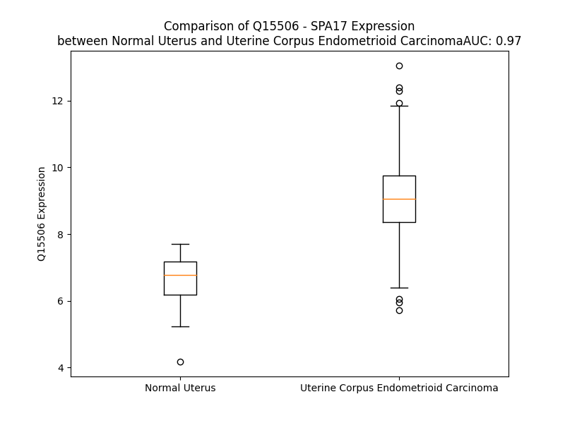

# Detailed Data for Q15506

## Introduction to the Detailed Summary

### How to Interpret the Results

- **Summary & Metrics**: This section provides a quick reference to essential protein attributes, including expression changes, family classification, and biomarker applications. Regulation status (upregulated/downregulated) indicates the protein's behavior in a disease context. Some information comes from the original excel file with the proteins selected from literature, while others are derived from the analyses.
- **Expression Comparison**: A visual representation comparing protein expression between normal and disease states. It highlights significant changes in expression levels that might indicate diagnostic or therapeutic relevance. This is data coming from transcriptomics experiments and could not translate similarly to protein levels.
- **Isoform Alignment**: An interactive view of isoform alignments, revealing structural and functional differences between variants of the protein.
- **Interactors & Homologs**: Tables listing known interaction partners and homologous proteins, the more interactors and homologs, the more complex the protein is to design an antibody for.
- **Biological Assemblies**: Information about the structural arrangement of the protein in different assemblies, providing insights into its functional state but also the complexity of the protein to develop antibodies.
- **Combined Per-Residue Information**: A detailed table summarizing residue-level data. This includes predictions for epitope regions, aggregation tendencies, and modifications that might impact the protein's function. Each row corresponds to a residue in the protein, providing insights into specific sites that may be important for research or drug development.
## Summary & Metrics

- **UniProt Accession**: Q15506
- **Gene Name**: SP17_HUMAN
- **Protein Name**: Sperm surface protein Sp17
- **Swiss Prot**: SP17_HUMAN
- **Family**: other
- **Biomarker Application**:  
- **Number of Isoforms**: 0
- **Regulation**: 1
- **(transcriptomics) AUC**: 0.97
- **(transcriptomics) Fold Change**: 1.37
- **(transcriptomics) Regulation**: Upregulated
- **Discotope Epitope Count**: 20
- **Max n_uniprots (Homo)**: N/A
- **Max n_uniprots (Hetero)**: N/A

## Expression Comparison

## Interactors

| preferredName_A   | preferredName_B   |   score |
|:------------------|:------------------|--------:|
| SPA17             | ROPN1L            |   0.975 |
| SPA17             | ROPN1             |   0.975 |
| SPA17             | AKAP3             |   0.953 |
| SPA17             | CABYR             |   0.95  |

## Homologs

| uniprot_id   | gene_id   |
|:-------------|:----------|
| A6NNX1       | RIIAD1    |
| Q5U058       | GAP43     |

## Biological Assemblies

| Unnamed: 0   | crystal_id   |
|--------------|--------------|

## Combined Per-Residue Information

|   res | aa   |   epitope_score | epitope   |   relative_surface_accessibility |   modeling_confidence |   Aggregation | modification   |
|------:|:-----|----------------:|:----------|---------------------------------:|----------------------:|--------------:|:---------------|
|     1 | M    |         0.16756 | False     |                          1.17747 |                 50.07 |         0     | N/A            |
|     2 | S    |         0.24593 | False     |                          0.66416 |                 54.56 |         0     | N/A            |
|     3 | I    |         0.37142 | True      |                          0.75907 |                 59.17 |         0     | N/A            |
|     4 | P    |         0.35101 | False     |                          0.64663 |                 61.98 |         0     | N/A            |
|     5 | F    |         0.51937 | True      |                          0.92803 |                 59.79 |         0     | N/A            |
|     6 | S    |         0.24025 | False     |                          0.43279 |                 63.06 |         0     | N/A            |
|     7 | N    |         0.34019 | False     |                          0.86585 |                 63.3  |         0     | N/A            |
|     8 | T    |         0.3543  | False     |                          0.53837 |                 68.29 |         0     | N/A            |
|     9 | H    |         0.45249 | True      |                          0.86046 |                 72.81 |         0     | N/A            |
|    10 | Y    |         0.4036  | True      |                          0.95382 |                 77.98 |         0     | N/A            |
|    11 | R    |         0.38498 | True      |                          0.42211 |                 77.53 |         0     | N/A            |
|    12 | I    |         0.24082 | False     |                          0.78402 |                 81.08 |         0     | N/A            |
|    13 | P    |         0.13476 | False     |                          0.72641 |                 85.52 |         0     | N/A            |
|    14 | Q    |         0.27857 | False     |                          0.66171 |                 83.02 |         0     | N/A            |
|    15 | G    |         0.02055 | False     |                          0.00968 |                 88.1  |         0     | N/A            |
|    16 | F    |         0.24346 | False     |                          0.41037 |                 91.67 |         0     | N/A            |
|    17 | G    |         0.20918 | False     |                          0.44976 |                 90.86 |         0     | N/A            |
|    18 | N    |         0.09108 | False     |                          0.31183 |                 92.1  |         0     | N/A            |
|    19 | L    |         0.25408 | False     |                          0.24813 |                 93.71 |         0     | N/A            |
|    20 | L    |         0.22765 | False     |                          0.47435 |                 94.75 |         0     | N/A            |
|    21 | E    |         0.16672 | False     |                          0.4692  |                 93.67 |         0     | N/A            |
|    22 | G    |         0.2673  | False     |                          0.24501 |                 95.29 |         0     | N/A            |
|    23 | L    |         0.15928 | False     |                          0.09727 |                 96.38 |         0     | N/A            |
|    24 | T    |         0.2187  | False     |                          0.4842  |                 97.55 |         0     | N/A            |
|    25 | R    |         0.42191 | True      |                          0.6237  |                 97.08 |         0     | N/A            |
|    26 | E    |         0.34343 | False     |                          0.26636 |                 97.12 |         0     | N/A            |
|    27 | I    |         0.21684 | False     |                          0.17119 |                 98.28 |         0     | N/A            |
|    28 | L    |         0.33262 | False     |                          0.72997 |                 97.93 |         0     | N/A            |
|    29 | R    |         0.61586 | True      |                          0.73448 |                 98.09 |         0     | N/A            |
|    30 | E    |         0.42006 | True      |                          0.55322 |                 97.26 |         0     | N/A            |
|    31 | Q    |         0.59246 | True      |                          0.62146 |                 97.83 |         0     | N/A            |
|    32 | P    |         0.34031 | False     |                          0.24874 |                 97.13 |         0     | N/A            |
|    33 | D    |         0.41694 | True      |                          0.98246 |                 96.97 |         0     | N/A            |
|    34 | N    |         0.35315 | False     |                          0.56515 |                 97.7  |         0     | N/A            |
|    35 | I    |         0.39975 | True      |                          0.51976 |                 96.38 |         0     | N/A            |
|    36 | P    |         0.34979 | False     |                          0.75337 |                 97.51 |         0     | N/A            |
|    37 | A    |         0.34322 | False     |                          0.53759 |                 97.72 |         6.08  | N/A            |
|    38 | F    |         0.39315 | True      |                          0.2397  |                 98.11 |        12.859 | N/A            |
|    39 | A    |         0.13819 | False     |                          0.14285 |                 98.01 |        13.368 | N/A            |
|    40 | A    |         0.32357 | False     |                          0.61674 |                 97.87 |        13.368 | N/A            |
|    41 | A    |         0.40828 | True      |                          0.5558  |                 97.43 |        13.368 | N/A            |
|    42 | Y    |         0.35422 | False     |                          0.18626 |                 96.71 |        13.017 | N/A            |
|    43 | F    |         0.15316 | False     |                          0.30656 |                 96.63 |        12.048 | N/A            |
|    44 | E    |         0.37128 | True      |                          0.6411  |                 97.04 |         0     | N/A            |
|    45 | S    |         0.32977 | False     |                          0.3179  |                 95.56 |         0     | N/A            |
|    46 | L    |         0.18722 | False     |                          0.1859  |                 93.62 |         0     | N/A            |
|    47 | L    |         0.29661 | False     |                          0.62051 |                 94.32 |         0     | N/A            |
|    48 | E    |         0.41385 | True      |                          0.46123 |                 95.65 |         0     | N/A            |
|    49 | K    |         0.33815 | False     |                          0.59411 |                 93.53 |         0     | N/A            |
|    50 | R    |         0.331   | False     |                          0.44411 |                 94.07 |         0     | N/A            |
|    51 | E    |         0.52724 | True      |                          0.70623 |                 94.76 |         0     | N/A            |
|    52 | K    |         0.46637 | True      |                          0.71377 |                 96.23 |         0     | N/A            |
|    53 | T    |         0.49105 | True      |                          0.63219 |                 94.35 |         0     | N/A            |
|    54 | N    |         0.3875  | True      |                          0.86099 |                 91.74 |         0     | N/A            |
|    55 | F    |         0.26536 | False     |                          0.558   |                 90.38 |         0     | N/A            |
|    56 | D    |         0.19809 | False     |                          0.15253 |                 89.99 |         0     | N/A            |
|    57 | P    |         0.17979 | False     |                          0.36046 |                 88.73 |         0     | N/A            |
|    58 | A    |         0.16389 | False     |                          0.16755 |                 89.32 |         0     | N/A            |
|    59 | E    |         0.27189 | False     |                          0.51851 |                 91.06 |         0     | N/A            |
|    60 | W    |         0.22836 | False     |                          0.62313 |                 89.11 |         0     | N/A            |
|    61 | G    |         0.00657 | False     |                          0       |                 87.79 |         0     | N/A            |
|    62 | S    |         0.16461 | False     |                          0.16634 |                 88.17 |         0     | N/A            |
|    63 | K    |         0.24247 | False     |                          0.66    |                 86.55 |         0     | N/A            |
|    64 | V    |         0.13236 | False     |                          0.21993 |                 82.03 |         0     | N/A            |
|    65 | E    |         0.20866 | False     |                          0.35824 |                 75.85 |         0     | N/A            |
|    66 | D    |         0.3144  | False     |                          0.28264 |                 76.55 |         0     | N/A            |
|    67 | R    |         0.33014 | False     |                          0.58263 |                 69.59 |         0     | N/A            |
|    68 | F    |         0.25874 | False     |                          0.80078 |                 66.38 |         0     | N/A            |
|    69 | Y    |         0.29328 | False     |                          0.63011 |                 65.98 |         0     | N/A            |
|    70 | N    |         0.21315 | False     |                          0.51146 |                 68.31 |         0     | N/A            |
|    71 | N    |         0.2207  | False     |                          0.67043 |                 59.61 |         0     | N/A            |
|    72 | H    |         0.24068 | False     |                          0.40506 |                 58.6  |         0     | N/A            |
|    73 | A    |         0.27585 | False     |                          0.86676 |                 60.37 |         0     | N/A            |
|    74 | F    |         0.3155  | False     |                          0.68057 |                 55.28 |         0     | N/A            |
|    75 | E    |         0.25256 | False     |                          0.59133 |                 58.79 |         0     | N/A            |
|    76 | E    |         0.35002 | False     |                          0.8567  |                 58.79 |         0     | N/A            |
|    77 | Q    |         0.22032 | False     |                          0.69367 |                 54.17 |         0     | N/A            |
|    78 | E    |         0.32842 | False     |                          0.57648 |                 42.84 |         0     | N/A            |
|    79 | P    |         0.20876 | False     |                          0.64715 |                 48.06 |         0     | N/A            |
|    80 | P    |         0.2144  | False     |                          0.96387 |                 51.81 |         0     | N/A            |
|    81 | E    |         0.26265 | False     |                          0.82695 |                 44.58 |         0     | N/A            |
|    82 | K    |         0.29529 | False     |                          0.98393 |                 34.74 |         0     | N/A            |
|    83 | S    |         0.29028 | False     |                          0.81114 |                 33.8  |         0     | N/A            |
|    84 | D    |         0.32876 | False     |                          0.83079 |                 36.93 |         0     | N/A            |
|    85 | P    |         0.24226 | False     |                          0.889   |                 42.77 |         0     | N/A            |
|    86 | K    |         0.27515 | False     |                          0.99105 |                 33.72 |         0     | N/A            |
|    87 | Q    |         0.28948 | False     |                          0.85627 |                 32.69 |         0     | N/A            |
|    88 | E    |         0.26882 | False     |                          0.88293 |                 33.23 |         0     | N/A            |
|    89 | E    |         0.3177  | False     |                          0.86344 |                 30.2  |         0     | N/A            |
|    90 | S    |         0.16774 | False     |                          0.72383 |                 30.81 |         0     | N/A            |
|    91 | Q    |         0.19089 | False     |                          0.76591 |                 32.04 |         0     | N/A            |
|    92 | I    |         0.22018 | False     |                          1.13498 |                 38.05 |         0     | N/A            |
|    93 | S    |         0.16246 | False     |                          0.66504 |                 32.38 |         0     | N/A            |
|    94 | G    |         0.24281 | False     |                          0.77228 |                 34.4  |         0     | N/A            |
|    95 | K    |         0.28397 | False     |                          0.85802 |                 28.29 |         0     | N/A            |
|    96 | E    |         0.2292  | False     |                          0.63199 |                 32.08 |         0     | N/A            |
|    97 | E    |         0.1939  | False     |                          0.75303 |                 32.29 |         0     | N/A            |
|    98 | E    |         0.23684 | False     |                          0.87719 |                 40.72 |         0     | N/A            |
|    99 | T    |         0.23073 | False     |                          0.8442  |                 34.44 |         0     | N/A            |
|   100 | S    |         0.23266 | False     |                          0.82756 |                 39.22 |         0.45  | N/A            |
|   101 | V    |         0.226   | False     |                          0.89401 |                 46.13 |         0.45  | N/A            |
|   102 | T    |         0.19202 | False     |                          0.65642 |                 42.55 |         0.45  | N/A            |
|   103 | I    |         0.31719 | False     |                          1.06594 |                 48.46 |         0.45  | N/A            |
|   104 | L    |         0.23346 | False     |                          0.85171 |                 52.57 |         0.45  | N/A            |
|   105 | D    |         0.26598 | False     |                          0.91004 |                 55.18 |         0     | N/A            |
|   106 | S    |         0.25889 | False     |                          0.31209 |                 61.93 |         0     | N/A            |
|   107 | S    |         0.36331 | True      |                          0.47741 |                 75.74 |         0     | N/A            |
|   108 | E    |         0.30658 | False     |                          0.75898 |                 79.47 |         0     | N/A            |
|   109 | E    |         0.31378 | False     |                          0.57901 |                 80.1  |         0     | N/A            |
|   110 | D    |         0.20796 | False     |                          0.40581 |                 86.76 |         0     | N/A            |
|   111 | K    |         0.33489 | False     |                          0.50971 |                 86.84 |         0     | N/A            |
|   112 | E    |         0.2723  | False     |                          0.58487 |                 89.1  |         0     | N/A            |
|   113 | K    |         0.27284 | False     |                          0.61126 |                 89.91 |         0     | N/A            |
|   114 | E    |         0.13607 | False     |                          0.6247  |                 89.68 |         0     | N/A            |
|   115 | E    |         0.26756 | False     |                          0.60683 |                 92.51 |         0.431 | N/A            |
|   116 | V    |         0.28225 | False     |                          0.74261 |                 93.23 |         0.431 | N/A            |
|   117 | A    |         0.08471 | False     |                          0.46593 |                 94.93 |         0.431 | N/A            |
|   118 | A    |         0.09694 | False     |                          0.41073 |                 95.56 |         0.431 | N/A            |
|   119 | V    |         0.20321 | False     |                          0.68602 |                 94.59 |         0.431 | N/A            |
|   120 | K    |         0.15683 | False     |                          0.74751 |                 96.7  |         0.431 | N/A            |
|   121 | I    |         0.15242 | False     |                          0.7191  |                 96.03 |         0.431 | N/A            |
|   122 | Q    |         0.28799 | False     |                          0.62828 |                 95.12 |         0     | N/A            |
|   123 | A    |         0.16624 | False     |                          0.52293 |                 96.66 |         0     | N/A            |
|   124 | A    |         0.08238 | False     |                          0.57638 |                 95.51 |         0     | N/A            |
|   125 | F    |         0.11766 | False     |                          0.67239 |                 96.82 |         0     | N/A            |
|   126 | R    |         0.2661  | False     |                          0.73572 |                 94.87 |         0     | N/A            |
|   127 | G    |         0.16608 | False     |                          0.24083 |                 97.34 |         0     | N/A            |
|   128 | H    |         0.07675 | False     |                          0.49156 |                 96.31 |         0     | N/A            |
|   129 | I    |         0.14514 | False     |                          0.45337 |                 96.28 |         0     | N/A            |
|   130 | A    |         0.14658 | False     |                          0.54682 |                 95.63 |         0     | N/A            |
|   131 | R    |         0.24607 | False     |                          0.56171 |                 95.8  |         0     | N/A            |
|   132 | E    |         0.09603 | False     |                          0.29046 |                 93.98 |         0     | N/A            |
|   133 | E    |         0.15954 | False     |                          0.46988 |                 92.67 |         0     | N/A            |
|   134 | A    |         0.15738 | False     |                          0.55744 |                 92.28 |         0     | N/A            |
|   135 | K    |         0.2076  | False     |                          0.54894 |                 92.32 |         0     | N/A            |
|   136 | K    |         0.14904 | False     |                          0.63746 |                 91.23 |         0     | N/A            |
|   137 | M    |         0.21765 | False     |                          0.73576 |                 88.57 |         0     | N/A            |
|   138 | K    |         0.15741 | False     |                          0.63416 |                 86.89 |         0     | N/A            |
|   139 | T    |         0.15437 | False     |                          0.522   |                 87.27 |         0     | N/A            |
|   140 | N    |         0.14263 | False     |                          0.56214 |                 83.59 |         0     | N/A            |
|   141 | S    |         0.18959 | False     |                          0.37441 |                 78.08 |         0     | N/A            |
|   142 | L    |         0.1207  | False     |                          0.52382 |                 75.17 |         0     | N/A            |
|   143 | Q    |         0.2216  | False     |                          0.53049 |                 73.26 |         0     | N/A            |
|   144 | N    |         0.14048 | False     |                          0.59321 |                 69.92 |         0     | N/A            |
|   145 | E    |         0.13938 | False     |                          0.54317 |                 70.77 |         0     | N/A            |
|   146 | E    |         0.1417  | False     |                          0.6034  |                 64.71 |         0     | N/A            |
|   147 | K    |         0.16526 | False     |                          0.71264 |                 60.34 |         0     | N/A            |
|   148 | E    |         0.14704 | False     |                          0.74813 |                 58.95 |         0     | N/A            |
|   149 | E    |         0.19469 | False     |                          0.84493 |                 58.12 |         0     | N/A            |
|   150 | N    |         0.16256 | False     |                          0.86893 |                 56.27 |         0     | N/A            |
|   151 | K    |         0.10103 | False     |                          1.15381 |                 49.01 |         0     | N/A            |

