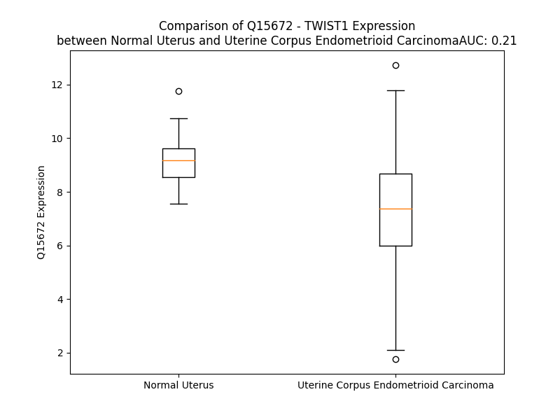

# Detailed Data for Q15672

## Introduction to the Detailed Summary

### How to Interpret the Results

- **Summary & Metrics**: This section provides a quick reference to essential protein attributes, including expression changes, family classification, and biomarker applications. Regulation status (upregulated/downregulated) indicates the protein's behavior in a disease context. Some information comes from the original excel file with the proteins selected from literature, while others are derived from the analyses.
- **Expression Comparison**: A visual representation comparing protein expression between normal and disease states. It highlights significant changes in expression levels that might indicate diagnostic or therapeutic relevance. This is data coming from transcriptomics experiments and could not translate similarly to protein levels.
- **Isoform Alignment**: An interactive view of isoform alignments, revealing structural and functional differences between variants of the protein.
- **Interactors & Homologs**: Tables listing known interaction partners and homologous proteins, the more interactors and homologs, the more complex the protein is to design an antibody for.
- **Biological Assemblies**: Information about the structural arrangement of the protein in different assemblies, providing insights into its functional state but also the complexity of the protein to develop antibodies.
- **Combined Per-Residue Information**: A detailed table summarizing residue-level data. This includes predictions for epitope regions, aggregation tendencies, and modifications that might impact the protein's function. Each row corresponds to a residue in the protein, providing insights into specific sites that may be important for research or drug development.
## Summary & Metrics

- **UniProt Accession**: Q15672
- **Gene Name**: TWIST1
- **Protein Name**: Twist-related protein 1
- **Swiss Prot**: TWST1_HUMAN
- **Family**: transcription regulator
- **Biomarker Application**: efficacy
- **Number of Isoforms**: 0
- **Regulation**: 1
- **(transcriptomics) AUC**: 0.73
- **(transcriptomics) Fold Change**: 1.12
- **(transcriptomics) Regulation**: Upregulated
- **Discotope Epitope Count**: 15
- **Max n_uniprots (Homo)**: N/A
- **Max n_uniprots (Hetero)**: 3

## Expression Comparison

## Interactors

| preferredName_A   | preferredName_B   |   score |
|:------------------|:------------------|--------:|
| TWIST1            | RUNX2             |   0.972 |
| TWIST1            | TP53              |   0.967 |
| TWIST1            | G3BP2             |   0.96  |
| TWIST1            | CD44              |   0.959 |
| TWIST1            | SNAI2             |   0.952 |
| TWIST1            | TWIST2            |   0.939 |
| TWIST1            | ZEB1              |   0.932 |
| TWIST1            | SNAI1             |   0.901 |
| TWIST1            | MSX2              |   0.901 |

## Homologs

| uniprot_id   | gene_id   |
|:-------------|:----------|
| Q12870       | TCF15     |
| Q96RJ6       | FERD3L    |
| P61296       | HAND2     |
| Q7RTU1       | TCF23     |
| Q7RTU0       | TCF24     |
| O96004       | HAND1     |
| Q8WVJ9       | TWIST2    |
| O60682       | MSC       |
| Q7RTS3       | PTF1A     |
| O43680       | TCF21     |
| Q6QHK4       | FIGLA     |
| Q7RTU7       | SCX       |
| Q7RTU4       | BHLHA9    |

## Biological Assemblies

|   Unnamed: 0 |   assembly |   n_uniprots | composition   | crystal_id   |
|-------------:|-----------:|-------------:|:--------------|:-------------|
|            0 |          1 |            3 | Hetero        | 8osb         |
|            0 |          1 |            2 | Hetero        | 2mjv         |

## Combined Per-Residue Information

|   res | aa   |   epitope_score | epitope   |   relative_surface_accessibility |   modeling_confidence |   Aggregation | modification   |
|------:|:-----|----------------:|:----------|---------------------------------:|----------------------:|--------------:|:---------------|
|     1 | M    |         0.16704 | False     |                          1.25822 |                 52.36 |         0     | N/A            |
|     2 | M    |         0.18366 | False     |                          0.90964 |                 53.45 |         0     | N/A            |
|     3 | Q    |         0.21825 | False     |                          0.80612 |                 55.83 |         0     | N/A            |
|     4 | D    |         0.19244 | False     |                          0.88977 |                 52    |         0     | N/A            |
|     5 | V    |         0.21195 | False     |                          1.00913 |                 67.94 |         0     | N/A            |
|     6 | S    |         0.24901 | False     |                          0.77903 |                 58.63 |         0     | N/A            |
|     7 | S    |         0.23755 | False     |                          0.88961 |                 64.62 |         0     | N/A            |
|     8 | S    |         0.20919 | False     |                          0.76897 |                 68.57 |         0     | N/A            |
|     9 | P    |         0.22414 | False     |                          1.0013  |                 59.57 |         0     | N/A            |
|    10 | V    |         0.21436 | False     |                          1.03865 |                 65.51 |         0     | N/A            |
|    11 | S    |         0.30649 | True      |                          0.7372  |                 60.87 |         0     | N/A            |
|    12 | P    |         0.17945 | False     |                          0.99872 |                 56.01 |         0     | N/A            |
|    13 | A    |         0.17358 | False     |                          1.02216 |                 65.67 |         0     | N/A            |
|    14 | D    |         0.19727 | False     |                          0.82372 |                 59.29 |         0     | N/A            |
|    15 | D    |         0.23762 | False     |                          0.83513 |                 60.03 |         0     | N/A            |
|    16 | S    |         0.16113 | False     |                          0.58586 |                 57.19 |         0     | N/A            |
|    17 | L    |         0.17317 | False     |                          0.98293 |                 59.65 |         0     | N/A            |
|    18 | S    |         0.19652 | False     |                          0.78315 |                 52.29 |         0     | N/A            |
|    19 | N    |         0.17787 | False     |                          0.95425 |                 50.68 |         0     | N/A            |
|    20 | S    |         0.1519  | False     |                          0.66917 |                 56.71 |         0     | N/A            |
|    21 | E    |         0.18467 | False     |                          0.83436 |                 56.64 |         0     | N/A            |
|    22 | E    |         0.23947 | False     |                          0.88675 |                 52.83 |         0     | N/A            |
|    23 | E    |         0.14841 | False     |                          0.79768 |                 50.12 |         0     | N/A            |
|    24 | P    |         0.23703 | False     |                          0.77257 |                 52.75 |         0     | N/A            |
|    25 | D    |         0.17524 | False     |                          0.75707 |                 51.12 |         0     | N/A            |
|    26 | R    |         0.30425 | True      |                          0.90706 |                 57.83 |         0     | N/A            |
|    27 | Q    |         0.18183 | False     |                          0.82001 |                 51.46 |         0     | N/A            |
|    28 | Q    |         0.20508 | False     |                          0.86285 |                 49.93 |         0     | N/A            |
|    29 | P    |         0.23735 | False     |                          0.93493 |                 60.82 |         0     | N/A            |
|    30 | P    |         0.21083 | False     |                          0.95425 |                 56.36 |         0     | N/A            |
|    31 | S    |         0.22735 | False     |                          0.91124 |                 50.4  |         0     | N/A            |
|    32 | G    |         0.28047 | False     |                          0.98095 |                 53.73 |         0     | N/A            |
|    33 | K    |         0.24917 | False     |                          0.95241 |                 54.86 |         0     | N/A            |
|    34 | R    |         0.23971 | False     |                          0.99783 |                 53.1  |         0     | N/A            |
|    35 | G    |         0.27895 | False     |                          0.91334 |                 44    |         0     | N/A            |
|    36 | G    |         0.20756 | False     |                          0.98206 |                 50.01 |         0     | N/A            |
|    37 | R    |         0.27728 | False     |                          0.98703 |                 55.94 |         0     | N/A            |
|    38 | K    |         0.31346 | True      |                          1.00661 |                 60.29 |         0     | N/A            |
|    39 | R    |         0.2603  | False     |                          0.98148 |                 53.86 |         0     | N/A            |
|    40 | R    |         0.23325 | False     |                          0.9691  |                 55.49 |         0     | N/A            |
|    41 | S    |         0.28257 | False     |                          0.74379 |                 48.74 |         0     | N/A            |
|    42 | S    |         0.15297 | False     |                          0.71822 |                 51.86 |         0     | N/A            |
|    43 | R    |         0.19184 | False     |                          0.85388 |                 55.63 |         0     | N/A            |
|    44 | R    |         0.1868  | False     |                          0.91597 |                 52.33 |         0     | N/A            |
|    45 | S    |         0.16336 | False     |                          0.73855 |                 51.93 |         0     | N/A            |
|    46 | A    |         0.14489 | False     |                          0.98234 |                 55.76 |         0     | N/A            |
|    47 | G    |         0.15872 | False     |                          0.96876 |                 46.76 |         0     | N/A            |
|    48 | G    |         0.25388 | False     |                          1.04191 |                 46.12 |         0     | N/A            |
|    49 | G    |         0.24842 | False     |                          0.93857 |                 48.73 |         0     | N/A            |
|    50 | A    |         0.15634 | False     |                          1.01701 |                 52.56 |         0     | N/A            |
|    51 | G    |         0.2033  | False     |                          0.89079 |                 53.91 |         0     | N/A            |
|    52 | P    |         0.13909 | False     |                          1.05657 |                 58.91 |         0     | N/A            |
|    53 | G    |         0.22333 | False     |                          0.94859 |                 49.87 |         0     | N/A            |
|    54 | G    |         0.17463 | False     |                          0.90597 |                 46.97 |         0     | N/A            |
|    55 | A    |         0.22216 | False     |                          0.96929 |                 57.82 |         0     | N/A            |
|    56 | A    |         0.1471  | False     |                          1.06137 |                 57.42 |         0     | N/A            |
|    57 | G    |         0.21965 | False     |                          0.91404 |                 50.67 |         0     | N/A            |
|    58 | G    |         0.15673 | False     |                          0.98376 |                 45.08 |         0     | N/A            |
|    59 | G    |         0.22428 | False     |                          0.88778 |                 48.07 |         0     | N/A            |
|    60 | V    |         0.14033 | False     |                          1.098   |                 60.09 |         0     | N/A            |
|    61 | G    |         0.194   | False     |                          0.92381 |                 49.67 |         0     | N/A            |
|    62 | G    |         0.22861 | False     |                          1.01058 |                 47.31 |         0     | N/A            |
|    63 | G    |         0.28366 | False     |                          0.94474 |                 52.64 |         0     | N/A            |
|    64 | D    |         0.16735 | False     |                          0.91493 |                 52.69 |         0     | N/A            |
|    65 | E    |         0.22564 | False     |                          0.8626  |                 58.03 |         0     | N/A            |
|    66 | P    |         0.27999 | False     |                          0.81719 |                 56.61 |         0     | N/A            |
|    67 | G    |         0.24861 | False     |                          0.91861 |                 48.73 |         0     | N/A            |
|    68 | S    |         0.16832 | False     |                          0.86055 |                 47.96 |         0     | N/A            |
|    69 | P    |         0.19606 | False     |                          0.94667 |                 53.22 |         0     | N/A            |
|    70 | A    |         0.18684 | False     |                          0.89969 |                 49.12 |         0     | N/A            |
|    71 | Q    |         0.25132 | False     |                          0.95947 |                 53.4  |         0     | N/A            |
|    72 | G    |         0.20841 | False     |                          0.76138 |                 47.42 |         0     | N/A            |
|    73 | K    |         0.18798 | False     |                          1.01211 |                 58.86 |         0     | N/A            |
|    74 | R    |         0.30286 | True      |                          0.9915  |                 53.07 |         0     | N/A            |
|    75 | G    |         0.34335 | True      |                          0.83611 |                 48    |         0     | N/A            |
|    76 | K    |         0.33115 | True      |                          1.00929 |                 57.1  |         0     | N/A            |
|    77 | K    |         0.20144 | False     |                          0.98165 |                 43.78 |         0     | N/A            |
|    78 | S    |         0.24965 | False     |                          0.7893  |                 55.46 |         0     | N/A            |
|    79 | A    |         0.13479 | False     |                          0.95731 |                 55.7  |         0     | N/A            |
|    80 | G    |         0.17404 | False     |                          0.96128 |                 41.98 |         0     | N/A            |
|    81 | C    |         0.22138 | False     |                          1.02744 |                 44.54 |         0     | N/A            |
|    82 | G    |         0.24147 | False     |                          0.93144 |                 43.62 |         0     | N/A            |
|    83 | G    |         0.26221 | False     |                          1.02101 |                 42.47 |         0     | N/A            |
|    84 | G    |         0.29838 | True      |                          0.97001 |                 42.98 |         0     | N/A            |
|    85 | G    |         0.27787 | False     |                          1.05367 |                 38.63 |         0     | N/A            |
|    86 | G    |         0.25095 | False     |                          0.96443 |                 43.68 |         0     | N/A            |
|    87 | A    |         0.26619 | False     |                          1.11269 |                 46.19 |         0     | N/A            |
|    88 | G    |         0.19944 | False     |                          0.90552 |                 44.35 |         0     | N/A            |
|    89 | G    |         0.19552 | False     |                          1.03689 |                 43.05 |         0     | N/A            |
|    90 | G    |         0.21068 | False     |                          0.91462 |                 43.42 |         0     | N/A            |
|    91 | G    |         0.1695  | False     |                          1.07599 |                 38.22 |         0     | N/A            |
|    92 | G    |         0.26824 | False     |                          0.86533 |                 47.28 |         0     | N/A            |
|    93 | S    |         0.2378  | False     |                          0.80541 |                 47.7  |         0     | N/A            |
|    94 | S    |         0.27193 | False     |                          0.83438 |                 47.33 |         0     | N/A            |
|    95 | S    |         0.1754  | False     |                          0.8679  |                 53.43 |         0     | N/A            |
|    96 | G    |         0.33491 | True      |                          1.03448 |                 39.41 |         0     | N/A            |
|    97 | G    |         0.21284 | False     |                          0.86423 |                 43.25 |         0     | N/A            |
|    98 | G    |         0.26905 | False     |                          1.03123 |                 51.01 |         0     | N/A            |
|    99 | S    |         0.1968  | False     |                          0.68889 |                 64.12 |         0     | N/A            |
|   100 | P    |         0.24789 | False     |                          0.94537 |                 64.53 |         0     | N/A            |
|   101 | Q    |         0.25294 | False     |                          0.4531  |                 69.18 |         0     | N/A            |
|   102 | S    |         0.33355 | True      |                          0.48871 |                 81.02 |         0     | N/A            |
|   103 | Y    |         0.17415 | False     |                          0.72862 |                 88.24 |         0     | N/A            |
|   104 | E    |         0.1179  | False     |                          0.6201  |                 91.26 |         0     | N/A            |
|   105 | E    |         0.13768 | False     |                          0.4946  |                 91.95 |         0     | N/A            |
|   106 | L    |         0.14406 | False     |                          0.38229 |                 92.26 |         0     | N/A            |
|   107 | Q    |         0.10464 | False     |                          0.3872  |                 93.83 |         0     | N/A            |
|   108 | T    |         0.1215  | False     |                          0.51169 |                 94.11 |         0     | N/A            |
|   109 | Q    |         0.13761 | False     |                          0.46343 |                 94.12 |         0     | N/A            |
|   110 | R    |         0.10785 | False     |                          0.57169 |                 95.58 |         0     | N/A            |
|   111 | V    |         0.0972  | False     |                          0.55767 |                 96.05 |         0.32  | N/A            |
|   112 | M    |         0.16145 | False     |                          0.58009 |                 95.12 |         0.32  | N/A            |
|   113 | A    |         0.11675 | False     |                          0.44552 |                 95.66 |         0.32  | N/A            |
|   114 | N    |         0.10507 | False     |                          0.65621 |                 97.88 |         0.32  | N/A            |
|   115 | V    |         0.10272 | False     |                          0.66648 |                 96.95 |         0.32  | N/A            |
|   116 | R    |         0.1526  | False     |                          0.70511 |                 97.45 |         0     | N/A            |
|   117 | E    |         0.10564 | False     |                          0.43348 |                 97.86 |         0     | N/A            |
|   118 | R    |         0.12238 | False     |                          0.75715 |                 97.64 |         0     | N/A            |
|   119 | Q    |         0.11761 | False     |                          0.54287 |                 97.62 |         0     | N/A            |
|   120 | R    |         0.13324 | False     |                          0.67222 |                 97.24 |         0     | N/A            |
|   121 | T    |         0.10544 | False     |                          0.40048 |                 97.25 |         0     | N/A            |
|   122 | Q    |         0.07884 | False     |                          0.44082 |                 97.12 |         0     | N/A            |
|   123 | S    |         0.09559 | False     |                          0.48787 |                 97.13 |         0     | N/A            |
|   124 | L    |         0.16092 | False     |                          0.52583 |                 95.86 |         0     | N/A            |
|   125 | N    |         0.17903 | False     |                          0.39241 |                 95.85 |         0     | N/A            |
|   126 | E    |         0.11916 | False     |                          0.50252 |                 96.17 |         0     | N/A            |
|   127 | A    |         0.12194 | False     |                          0.59744 |                 95.85 |         2.22  | N/A            |
|   128 | F    |         0.15039 | False     |                          0.15553 |                 94.87 |         2.22  | N/A            |
|   129 | A    |         0.13466 | False     |                          0.43181 |                 92.17 |         2.22  | N/A            |
|   130 | A    |         0.11903 | False     |                          0.52181 |                 93.26 |         2.22  | N/A            |
|   131 | L    |         0.13259 | False     |                          0.2744  |                 93.89 |         2.22  | N/A            |
|   132 | R    |         0.25999 | False     |                          0.30749 |                 91.63 |         0     | N/A            |
|   133 | K    |         0.20343 | False     |                          0.86083 |                 88.34 |         0     | N/A            |
|   134 | I    |         0.17558 | False     |                          0.66005 |                 89.49 |         0     | N/A            |
|   135 | I    |         0.04815 | False     |                          0.02604 |                 86.68 |         0     | N/A            |
|   136 | P    |         0.07344 | False     |                          0.09276 |                 82.57 |         0     | N/A            |
|   137 | T    |         0.14823 | False     |                          0.39284 |                 81.09 |         0     | N/A            |
|   138 | L    |         0.29573 | True      |                          0.63388 |                 74.16 |         0     | N/A            |
|   139 | P    |         0.2594  | False     |                          1.01195 |                 65.33 |         0     | N/A            |
|   140 | S    |         0.26976 | False     |                          0.70286 |                 65.95 |         0     | N/A            |
|   141 | D    |         0.25768 | False     |                          0.30132 |                 74.81 |         0     | N/A            |
|   142 | K    |         0.2271  | False     |                          0.89795 |                 80.87 |         0     | N/A            |
|   143 | L    |         0.15267 | False     |                          0.18839 |                 83.68 |         0     | N/A            |
|   144 | S    |         0.21902 | False     |                          0.40235 |                 91.05 |         0     | N/A            |
|   145 | K    |         0.27928 | False     |                          0.48598 |                 92.31 |         0     | N/A            |
|   146 | I    |         0.23786 | False     |                          0.62296 |                 93.52 |         0     | N/A            |
|   147 | Q    |         0.25987 | False     |                          0.43387 |                 90.54 |         0     | N/A            |
|   148 | T    |         0.00744 | False     |                          0       |                 90.81 |         0     | N/A            |
|   149 | L    |         0.16439 | False     |                          0.55439 |                 94.1  |         0     | N/A            |
|   150 | K    |         0.27121 | False     |                          0.59833 |                 90.88 |         0     | N/A            |
|   151 | L    |         0.02308 | False     |                          0.01154 |                 90    |         1.555 | N/A            |
|   152 | A    |         0.07492 | False     |                          0.11157 |                 92.7  |         1.707 | N/A            |
|   153 | A    |         0.18969 | False     |                          0.48969 |                 91.25 |         2.395 | N/A            |
|   154 | R    |         0.1819  | False     |                          0.29516 |                 88.77 |         3.314 | N/A            |
|   155 | Y    |         0.14378 | False     |                          0.11347 |                 90.94 |         3.314 | N/A            |
|   156 | I    |         0.2413  | False     |                          0.54196 |                 90.67 |         3.314 | N/A            |
|   157 | D    |         0.22751 | False     |                          0.47523 |                 89.56 |         3.314 | N/A            |
|   158 | F    |         0.0975  | False     |                          0.03822 |                 87.06 |        16.41  | N/A            |
|   159 | L    |         0.16684 | False     |                          0.32809 |                 87.2  |        17.302 | N/A            |
|   160 | Y    |         0.31738 | True      |                          0.66988 |                 87.63 |        17.302 | N/A            |
|   161 | Q    |         0.24448 | False     |                          0.5051  |                 83.34 |        16.543 | N/A            |
|   162 | V    |         0.08795 | False     |                          0.13391 |                 83.16 |        16.543 | N/A            |
|   163 | L    |         0.3144  | True      |                          0.72644 |                 83.07 |        14.281 | N/A            |
|   164 | Q    |         0.21953 | False     |                          0.56089 |                 79.41 |         0.396 | N/A            |
|   165 | S    |         0.16518 | False     |                          0.41149 |                 71.16 |         0     | N/A            |
|   166 | D    |         0.15481 | False     |                          0.39959 |                 67.49 |         0     | N/A            |
|   167 | E    |         0.16926 | False     |                          0.63837 |                 60.36 |         0     | N/A            |
|   168 | L    |         0.18986 | False     |                          0.82549 |                 55.74 |         0     | N/A            |
|   169 | D    |         0.14641 | False     |                          0.35807 |                 53.16 |         0     | N/A            |
|   170 | S    |         0.17254 | False     |                          0.65722 |                 54.4  |         0     | N/A            |
|   171 | K    |         0.1797  | False     |                          0.90561 |                 49.24 |         0     | N/A            |
|   172 | M    |         0.13592 | False     |                          0.96336 |                 50.12 |         0     | N/A            |
|   173 | A    |         0.149   | False     |                          0.65597 |                 43.33 |         0     | N/A            |
|   174 | S    |         0.15488 | False     |                          0.66591 |                 50.13 |         0     | N/A            |
|   175 | C    |         0.15709 | False     |                          0.65655 |                 49.95 |         0     | N/A            |
|   176 | S    |         0.18926 | False     |                          0.33844 |                 58.67 |         0     | N/A            |
|   177 | Y    |         0.20541 | False     |                          0.34202 |                 64.8  |         0     | N/A            |
|   178 | V    |         0.22107 | False     |                          0.97062 |                 61.2  |         0     | N/A            |
|   179 | A    |         0.31133 | True      |                          0.39976 |                 68.19 |         0     | N/A            |
|   180 | H    |         0.21259 | False     |                          0.69101 |                 64.86 |         0     | N/A            |
|   181 | E    |         0.27422 | False     |                          0.74425 |                 72.42 |         0     | N/A            |
|   182 | R    |         0.33967 | True      |                          0.58022 |                 78.37 |         0     | N/A            |
|   183 | L    |         0.13357 | False     |                          0.18218 |                 82.12 |        18.785 | N/A            |
|   184 | S    |         0.11923 | False     |                          0.19604 |                 83.43 |        19.127 | N/A            |
|   185 | Y    |         0.32448 | True      |                          0.70171 |                 84.45 |        27.528 | N/A            |
|   186 | A    |         0.06385 | False     |                          0.15117 |                 84.87 |        28.581 | N/A            |
|   187 | F    |         0.012   | False     |                          0.0051  |                 85.53 |        28.581 | N/A            |
|   188 | S    |         0.15428 | False     |                          0.29657 |                 83.96 |        25.636 | N/A            |
|   189 | V    |         0.17301 | False     |                          0.44913 |                 81.76 |        25.271 | N/A            |
|   190 | W    |         0.23494 | False     |                          0.26229 |                 82.46 |        22.844 | N/A            |
|   191 | R    |         0.18271 | False     |                          0.16629 |                 81.38 |         0     | N/A            |
|   192 | M    |         0.25986 | False     |                          0.84541 |                 72.74 |         0     | N/A            |
|   193 | E    |         0.21202 | False     |                          0.6516  |                 65.45 |         0     | N/A            |
|   194 | G    |         0.10938 | False     |                          0.35678 |                 60.58 |         0     | N/A            |
|   195 | A    |         0.18764 | False     |                          0.75403 |                 52.67 |         0     | N/A            |
|   196 | W    |         0.25198 | False     |                          0.31137 |                 58.17 |         0     | N/A            |
|   197 | S    |         0.20236 | False     |                          0.49576 |                 53.75 |         0     | N/A            |
|   198 | M    |         0.24316 | False     |                          0.85789 |                 49.46 |         0     | N/A            |
|   199 | S    |         0.22705 | False     |                          0.81367 |                 50.6  |         0     | N/A            |
|   200 | A    |         0.24048 | False     |                          0.93795 |                 53.42 |         0     | N/A            |
|   201 | S    |         0.16527 | False     |                          0.83561 |                 40.77 |         0     | N/A            |
|   202 | H    |         0.09551 | False     |                          1.37651 |                 36.54 |         0     | N/A            |

