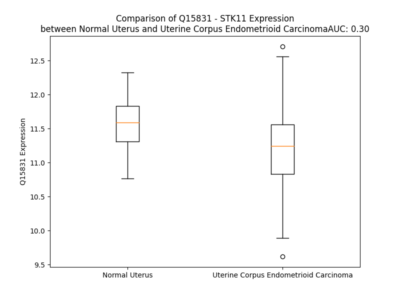

# Detailed Data for Q15831

## Introduction to the Detailed Summary

### How to Interpret the Results

- **Summary & Metrics**: This section provides a quick reference to essential protein attributes, including expression changes, family classification, and biomarker applications. Regulation status (upregulated/downregulated) indicates the protein's behavior in a disease context. Some information comes from the original excel file with the proteins selected from literature, while others are derived from the analyses.
- **Expression Comparison**: A visual representation comparing protein expression between normal and disease states. It highlights significant changes in expression levels that might indicate diagnostic or therapeutic relevance. This is data coming from transcriptomics experiments and could not translate similarly to protein levels.
- **Isoform Alignment**: An interactive view of isoform alignments, revealing structural and functional differences between variants of the protein.
- **Interactors & Homologs**: Tables listing known interaction partners and homologous proteins, the more interactors and homologs, the more complex the protein is to design an antibody for.
- **Biological Assemblies**: Information about the structural arrangement of the protein in different assemblies, providing insights into its functional state but also the complexity of the protein to develop antibodies.
- **Combined Per-Residue Information**: A detailed table summarizing residue-level data. This includes predictions for epitope regions, aggregation tendencies, and modifications that might impact the protein's function. Each row corresponds to a residue in the protein, providing insights into specific sites that may be important for research or drug development.
## Summary & Metrics

- **UniProt Accession**: Q15831
- **Gene Name**: STK11 /LKB1
- **Protein Name**: serine/threonine kinase 11
- **Swiss Prot**: STK11_HUMAN
- **Family**: kinase
- **Biomarker Application**: diagnosis
- **Number of Isoforms**: 2
- **Regulation**: -1
- **(transcriptomics) AUC**: 0.24
- **(transcriptomics) Fold Change**: 1.04
- **(transcriptomics) Regulation**: Downregulated
- **Discotope Epitope Count**: 71
- **Max n_uniprots (Homo)**: 2
- **Max n_uniprots (Hetero)**: 4

## Expression Comparison

## Isoform Alignment

<pre style='font-size:14px; font-family:monospace;'>Q15831-1 MEVVDPQQLGMFTEGELMSVGMDTFIHRIDSTEVIYQPRRKRAKLIGKYLMGDLLGEGSYGKVKEVLDSETLCRRAVKILKKKKLRRIPNGEANVKKEIQLLRRLRHKNVIQLVDVLYNEEKQKMYMVMEYCVCGMQEMLDSVPEKRFPVCQAHGYFCQLIDGLEYLHSQGIVHKDIKPGNLLLTTGGTLKISDLGVAEALHPFAADDTCRTSQGSPAFQPPEIANGLDTFSGFKVDIWSAGVTLYNITTGLYPFEGDNIYKLFENIGKGSYAIPGDCGPPLSDLLKGMLEYEPAKRFSIRQIRQHSWFRKKHPPAEAPVPIPPSPDTKDRWRSMTVVPYLEDLHGADEDEDLFDIEDDIIYTQDFTVPGQVPEEEASHNGQRRGLPKAVCMNGTEAAQLSTKSRAEGRAPNPARKACSASSKIRRLSACKQQ
Q15831-2 MEVVDPQQLGMFTEGELMSVGMDTFIHRIDSTEVIYQPRRKRAKLIGKYLMGDLLGEGSYGKVKEVLDSETLCRRAVKILKKKKLRRIPNGEANVKKEIQLLRRLRHKNVIQLVDVLYNEEKQKMYMVMEYCVCGMQEMLDSVPEKRFPVCQAHGYFCQLIDGLEYLHSQGIVHKDIKPGNLLLTTGGTLKISDLGVAEALHPFAADDTCRTSQGSPAFQPPEIANGLDTFSGFKVDIWSAGVTLYNITTGLYPFEGDNIYKLFENIGKGSYAIPGDCGPPLSDLLKGMLEYEPAKRFSIRQIRQHSWFRKKHPPAEAPVPIPPSPDTKDRWRSMTVVPYLEDLHGADEDEDLFDIEDDIIYTQDFTVPGGEEASEAGLRAER-GLQKSE---------GSDLSGEEASRPAPQ-------------------
</pre>

## Interactors

| preferredName_A   | preferredName_B   |   score |
|:------------------|:------------------|--------:|
| STK11             | CAB39             |   0.999 |
| STK11             | STRADA            |   0.999 |
| STK11             | CAB39L            |   0.998 |
| STK11             | STRADB            |   0.994 |
| STK11             | AXIN1             |   0.993 |
| STK11             | PRKAA1            |   0.986 |
| STK11             | PTEN              |   0.979 |
| STK11             | PRKAA2            |   0.978 |
| STK11             | PRKAB2            |   0.976 |
| STK11             | PRKAB1            |   0.975 |
| STK11             | PRKAG1            |   0.974 |
| STK11             | TP53              |   0.97  |
| STK11             | PRKAG2            |   0.962 |
| STK11             | FOXO3             |   0.96  |
| STK11             | PRKAG3            |   0.959 |
| STK11             | FOXO1             |   0.955 |
| STK11             | ARHGEF18          |   0.951 |
| STK11             | PRKCZ             |   0.948 |
| STK11             | CAMKK2            |   0.944 |
| STK11             | FOXO4             |   0.937 |
| STK11             | NUAK1             |   0.93  |
| STK11             | SMARCA4           |   0.92  |
| STK11             | PRKCI             |   0.914 |
| STK11             | STK11IP           |   0.912 |
| STK11             | SIRT1             |   0.903 |

## Homologs

| uniprot_id   | gene_id   |
|:-------------|:----------|
| Q86YV6       | MYLK4     |
| Q5SWX3       | CAMK2G    |
| Q96QS6       | PSKH2     |
| Q8N5S9       | CAMKK1    |
| Q9H1R3       | MYLK2     |
| C9J319       | STK33     |
| C9JEC5       | PNCK      |
| A0A8V8TQ13   | CAMK2B    |
| G5E9L9       | DCLK2     |
| O15075       | DCLK1     |
| P11801       | PSKH1     |
| Q96NX5       | CAMK1G    |
| F5GZ00       | CAMKK2    |
| A0A994J516   | CAMK2D    |
| A0A5F9ZHM9   | CAMK2A    |
| Q9C098       | DCLK3     |
| B4DM24       | CAMKV     |
| Q32MK0       | MYLK3     |
| Q16816       | PHKG1     |
| Q8IU85       | CAMK1D    |
| P15735       | PHKG2     |
| B0YIY3       | CAMK1     |

## Biological Assemblies

|   Unnamed: 0 |   assembly |   n_uniprots | composition   | crystal_id   |
|-------------:|-----------:|-------------:|:--------------|:-------------|
|            0 |          1 |            3 | Hetero        | 2wtk         |
|            1 |          2 |            3 | Hetero        | 2wtk         |
|            0 |          1 |            2 | Homo          | 4zdr         |
|            0 |          1 |            4 | Hetero        | 5wxn         |

## Combined Per-Residue Information

|   res | aa   |   epitope_score | epitope   |   relative_surface_accessibility |   modeling_confidence |   Aggregation | modification                                                |
|------:|:-----|----------------:|:----------|---------------------------------:|----------------------:|--------------:|:------------------------------------------------------------|
|     1 | M    |         0.15648 | False     |                          1.33542 |                 41.83 |         0     | N/A                                                         |
|     2 | E    |         0.13842 | False     |                          0.87137 |                 33.27 |         0     | N/A                                                         |
|     3 | V    |         0.15611 | False     |                          1.03694 |                 42.05 |         0     | N/A                                                         |
|     4 | V    |         0.14861 | False     |                          0.98549 |                 40.45 |         0     | N/A                                                         |
|     5 | D    |         0.12811 | False     |                          0.76802 |                 36.45 |         0     | N/A                                                         |
|     6 | P    |         0.11071 | False     |                          0.91788 |                 44.36 |         0     | N/A                                                         |
|     7 | Q    |         0.13568 | False     |                          0.88539 |                 42.96 |         0     | N/A                                                         |
|     8 | Q    |         0.13401 | False     |                          0.91086 |                 36.43 |         0     | N/A                                                         |
|     9 | L    |         0.12192 | False     |                          1.08405 |                 39.57 |         0     | N/A                                                         |
|    10 | G    |         0.09807 | False     |                          0.74339 |                 40.06 |         0     | N/A                                                         |
|    11 | M    |         0.11514 | False     |                          0.95618 |                 36.16 |         0     | N/A                                                         |
|    12 | F    |         0.10407 | False     |                          0.86566 |                 42.69 |         0     | N/A                                                         |
|    13 | T    |         0.19533 | True      |                          0.68331 |                 42.8  |         0     | N/A                                                         |
|    14 | E    |         0.17398 | True      |                          0.8891  |                 46.18 |         0     | N/A                                                         |
|    15 | G    |         0.13966 | False     |                          0.70936 |                 44.13 |         0     | N/A                                                         |
|    16 | E    |         0.08549 | False     |                          0.57098 |                 43.84 |         0     | N/A                                                         |
|    17 | L    |         0.13649 | False     |                          0.95783 |                 43.63 |         0     | N/A                                                         |
|    18 | M    |         0.2173  | True      |                          0.92303 |                 40.45 |         0     | N/A                                                         |
|    19 | S    |         0.17279 | True      |                          0.79595 |                 42.25 |         0     | N/A                                                         |
|    20 | V    |         0.10871 | False     |                          0.774   |                 41.11 |         0     | N/A                                                         |
|    21 | G    |         0.0997  | False     |                          0.98257 |                 34.66 |         0     | N/A                                                         |
|    22 | M    |         0.11453 | False     |                          0.88083 |                 39.39 |         0     | N/A                                                         |
|    23 | D    |         0.10398 | False     |                          0.70242 |                 40.45 |         0     | N/A                                                         |
|    24 | T    |         0.07453 | False     |                          0.9441  |                 46.01 |         0     | N/A                                                         |
|    25 | F    |         0.09409 | False     |                          0.80174 |                 53.02 |         0     | N/A                                                         |
|    26 | I    |         0.07531 | False     |                          0.9619  |                 67.3  |         0     | N/A                                                         |
|    27 | H    |         0.10379 | False     |                          0.80091 |                 67.74 |         0     | N/A                                                         |
|    28 | R    |         0.09293 | False     |                          0.95884 |                 67.51 |         0     | N/A                                                         |
|    29 | I    |         0.0741  | False     |                          0.45085 |                 68.93 |         0     | N/A                                                         |
|    30 | D    |         0.12858 | False     |                          0.50577 |                 74.73 |         0     | N/A                                                         |
|    31 | S    |         0.12096 | False     |                          0.74191 |                 71.47 |         0     | Phosphoserine                                               |
|    32 | T    |         0.17636 | True      |                          0.84556 |                 73.41 |         0     | N/A                                                         |
|    33 | E    |         0.11063 | False     |                          0.54887 |                 69.77 |         0     | N/A                                                         |
|    34 | V    |         0.0672  | False     |                          0.64344 |                 66.54 |         0     | N/A                                                         |
|    35 | I    |         0.09664 | False     |                          0.84804 |                 68.13 |         0     | N/A                                                         |
|    36 | Y    |         0.15284 | False     |                          0.86107 |                 60.01 |         0     | N/A                                                         |
|    37 | Q    |         0.10135 | False     |                          0.70279 |                 59.81 |         0     | N/A                                                         |
|    38 | P    |         0.12228 | False     |                          0.8161  |                 63.56 |         0     | N/A                                                         |
|    39 | R    |         0.08509 | False     |                          0.83566 |                 66.56 |         0     | N/A                                                         |
|    40 | R    |         0.09393 | False     |                          0.81238 |                 73.16 |         0     | N/A                                                         |
|    41 | K    |         0.07704 | False     |                          0.39407 |                 81.83 |         0     | N/A                                                         |
|    42 | R    |         0.1098  | False     |                          0.7952  |                 87.93 |         0     | N/A                                                         |
|    43 | A    |         0.08    | False     |                          0.2646  |                 90.74 |         0     | N/A                                                         |
|    44 | K    |         0.07908 | False     |                          0.42146 |                 93.07 |         0     | N6-acetyllysine                                             |
|    45 | L    |         0.1615  | False     |                          0.50207 |                 93.83 |         0     | N/A                                                         |
|    46 | I    |         0.04521 | False     |                          0.1112  |                 93.43 |         0     | N/A                                                         |
|    47 | G    |         0.15873 | False     |                          0.73095 |                 93.81 |         0     | N/A                                                         |
|    48 | K    |         0.11012 | False     |                          0.33096 |                 94.7  |         0     | N6-acetyllysine                                             |
|    49 | Y    |         0.01923 | False     |                          0.01809 |                 97.24 |         0     | N/A                                                         |
|    50 | L    |         0.02173 | False     |                          0.01731 |                 96.87 |         0     | N/A                                                         |
|    51 | M    |         0.01931 | False     |                          0.06258 |                 96.34 |         0     | N/A                                                         |
|    52 | G    |         0.00217 | False     |                          0.00119 |                 94.85 |         0     | N/A                                                         |
|    53 | D    |         0.04493 | False     |                          0.17558 |                 93.71 |         0     | N/A                                                         |
|    54 | L    |         0.0931  | False     |                          0.44063 |                 93.63 |         0     | N/A                                                         |
|    55 | L    |         0.03776 | False     |                          0.44786 |                 92.12 |         0     | N/A                                                         |
|    56 | G    |         0.0769  | False     |                          0.34095 |                 89.32 |         0     | N/A                                                         |
|    57 | E    |         0.12303 | False     |                          0.58217 |                 88.72 |         0     | N/A                                                         |
|    58 | G    |         0.06716 | False     |                          0.48838 |                 79.95 |         0     | N/A                                                         |
|    59 | S    |         0.10419 | False     |                          0.52553 |                 77.01 |         0     | N/A                                                         |
|    60 | Y    |         0.03722 | False     |                          0.14501 |                 81.66 |         0     | N/A                                                         |
|    61 | G    |         0.02897 | False     |                          0.10072 |                 88.7  |         0     | N/A                                                         |
|    62 | K    |         0.08112 | False     |                          0.46085 |                 94.4  |         0     | N/A                                                         |
|    63 | V    |         0.0226  | False     |                          0.25611 |                 95.58 |         0.294 | N/A                                                         |
|    64 | K    |         0.05075 | False     |                          0.25872 |                 96.17 |         0.294 | N/A                                                         |
|    65 | E    |         0.00479 | False     |                          0.00052 |                 96.52 |         0.294 | N/A                                                         |
|    66 | V    |         0.003   | False     |                          0.00261 |                 97.34 |         0.294 | N/A                                                         |
|    67 | L    |         0.02845 | False     |                          0.03545 |                 97.65 |         0.294 | N/A                                                         |
|    68 | D    |         0.01923 | False     |                          0.03153 |                 97.02 |         0     | N/A                                                         |
|    69 | S    |         0.16398 | True      |                          0.4591  |                 94.02 |         0     | N/A                                                         |
|    70 | E    |         0.20342 | True      |                          0.65549 |                 95.09 |         0     | N/A                                                         |
|    71 | T    |         0.1963  | True      |                          0.62972 |                 96.11 |         0     | N/A                                                         |
|    72 | L    |         0.21399 | True      |                          0.77242 |                 95.12 |         0     | N/A                                                         |
|    73 | C    |         0.07283 | False     |                          0.32237 |                 96.38 |         0     | N/A                                                         |
|    74 | R    |         0.04408 | False     |                          0.1893  |                 96.77 |         0     | N/A                                                         |
|    75 | R    |         0.05139 | False     |                          0.20277 |                 97.52 |         0     | N/A                                                         |
|    76 | A    |         0.02115 | False     |                          0.0676  |                 97.65 |         0     | N/A                                                         |
|    77 | V    |         0.01965 | False     |                          0.01809 |                 97.43 |         0     | N/A                                                         |
|    78 | K    |         0.01429 | False     |                          0.11412 |                 96.04 |         0     | N/A                                                         |
|    79 | I    |         0.03193 | False     |                          0.1386  |                 96.12 |         0     | N/A                                                         |
|    80 | L    |         0.00397 | False     |                          0.00061 |                 94.27 |         0     | N/A                                                         |
|    81 | K    |         0.15489 | False     |                          0.5395  |                 93.49 |         0     | N/A                                                         |
|    82 | K    |         0.10158 | False     |                          0.22349 |                 90.58 |         0     | N/A                                                         |
|    83 | K    |         0.33875 | True      |                          0.7415  |                 91.04 |         0     | N/A                                                         |
|    84 | K    |         0.10144 | False     |                          0.35207 |                 90.52 |         0     | N/A                                                         |
|    85 | L    |         0.01738 | False     |                          0.00925 |                 90.09 |         0     | N/A                                                         |
|    86 | R    |         0.4208  | True      |                          0.70039 |                 90.83 |         0     | N/A                                                         |
|    87 | R    |         0.30752 | True      |                          0.81881 |                 90.65 |         0     | N/A                                                         |
|    88 | I    |         0.10774 | False     |                          0.24612 |                 85.3  |         0     | N/A                                                         |
|    89 | P    |         0.22597 | True      |                          0.76996 |                 84.76 |         0     | N/A                                                         |
|    90 | N    |         0.15325 | False     |                          0.70977 |                 85.96 |         0     | N/A                                                         |
|    91 | G    |         0.02708 | False     |                          0.02489 |                 87    |         0     | N/A                                                         |
|    92 | E    |         0.12577 | False     |                          0.41344 |                 89.29 |         0     | N/A                                                         |
|    93 | A    |         0.13909 | False     |                          0.58146 |                 89.85 |         0     | N/A                                                         |
|    94 | N    |         0.08522 | False     |                          0.18716 |                 88.07 |         0     | N/A                                                         |
|    95 | V    |         0.0116  | False     |                          0.01483 |                 91.56 |         0     | N/A                                                         |
|    96 | K    |         0.11634 | False     |                          0.65116 |                 92.49 |         0     | N6-acetyllysine                                             |
|    97 | K    |         0.06972 | False     |                          0.38279 |                 91.92 |         0     | N6-acetyllysine                                             |
|    98 | E    |         0.01327 | False     |                          0.0277  |                 93.69 |         0     | N/A                                                         |
|    99 | I    |         0.02974 | False     |                          0.056   |                 95.13 |         0     | N/A                                                         |
|   100 | Q    |         0.09781 | False     |                          0.52418 |                 95.23 |         0     | N/A                                                         |
|   101 | L    |         0.04592 | False     |                          0.04452 |                 95.5  |         0     | N/A                                                         |
|   102 | L    |         0.00736 | False     |                          0.02552 |                 96.45 |         0     | N/A                                                         |
|   103 | R    |         0.17206 | True      |                          0.67557 |                 96.58 |         0     | N/A                                                         |
|   104 | R    |         0.11861 | False     |                          0.46249 |                 95.37 |         0     | N/A                                                         |
|   105 | L    |         0.02941 | False     |                          0.04896 |                 97.36 |         0     | N/A                                                         |
|   106 | R    |         0.14949 | False     |                          0.84653 |                 97.54 |         0     | N/A                                                         |
|   107 | H    |         0.0374  | False     |                          0.23835 |                 98.54 |         0     | N/A                                                         |
|   108 | K    |         0.06425 | False     |                          0.58986 |                 98.38 |         0.422 | N/A                                                         |
|   109 | N    |         0.01649 | False     |                          0.00296 |                 98.79 |         1.755 | N/A                                                         |
|   110 | V    |         0.00594 | False     |                          0.02119 |                 98.64 |        37.563 | N/A                                                         |
|   111 | I    |         0.0063  | False     |                          0.02494 |                 98.08 |        37.563 | N/A                                                         |
|   112 | Q    |         0.04977 | False     |                          0.4214  |                 97.89 |        37.563 | N/A                                                         |
|   113 | L    |         0.02589 | False     |                          0.12172 |                 97.88 |        37.563 | N/A                                                         |
|   114 | V    |         0.03779 | False     |                          0.38718 |                 97.35 |        37.458 | N/A                                                         |
|   115 | D    |         0.08705 | False     |                          0.27288 |                 96.83 |         0.422 | N/A                                                         |
|   116 | V    |         0.03323 | False     |                          0.12712 |                 96.86 |         0.422 | N/A                                                         |
|   117 | L    |         0.07054 | False     |                          0.24401 |                 96.62 |         0.422 | N/A                                                         |
|   118 | Y    |         0.10343 | False     |                          0.55023 |                 94.66 |         0.422 | N/A                                                         |
|   119 | N    |         0.05992 | False     |                          0.23121 |                 93.02 |         0     | N/A                                                         |
|   120 | E    |         0.17808 | True      |                          0.64534 |                 90.78 |         0     | N/A                                                         |
|   121 | E    |         0.20882 | True      |                          0.83609 |                 91.85 |         0     | N/A                                                         |
|   122 | K    |         0.17367 | True      |                          0.53756 |                 91.54 |         0     | N/A                                                         |
|   123 | Q    |         0.15429 | False     |                          0.29343 |                 93.33 |         0     | N/A                                                         |
|   124 | K    |         0.09727 | False     |                          0.21632 |                 94.09 |         0     | N/A                                                         |
|   125 | M    |         0.05667 | False     |                          0.11865 |                 93.94 |         9.22  | N/A                                                         |
|   126 | Y    |         0.01295 | False     |                          0.01776 |                 96.41 |         9.22  | N/A                                                         |
|   127 | M    |         0.00413 | False     |                          0       |                 96.63 |         9.22  | N/A                                                         |
|   128 | V    |         0.00319 | False     |                          0.00571 |                 97.84 |         9.22  | N/A                                                         |
|   129 | M    |         0.04593 | False     |                          0.11187 |                 97.64 |         9.22  | N/A                                                         |
|   130 | E    |         0.02932 | False     |                          0.12561 |                 97.41 |         0     | N/A                                                         |
|   131 | Y    |         0.02958 | False     |                          0.11188 |                 97.3  |         0     | N/A                                                         |
|   132 | C    |         0.02296 | False     |                          0.11475 |                 96.72 |         0     | N/A                                                         |
|   133 | V    |         0.04549 | False     |                          0.08214 |                 94.86 |         0     | N/A                                                         |
|   134 | C    |         0.02544 | False     |                          0.04528 |                 94.25 |         0     | N/A                                                         |
|   135 | G    |         0.03309 | False     |                          0.1926  |                 96.17 |         0     | N/A                                                         |
|   136 | M    |         0.0062  | False     |                          0.00503 |                 97.86 |         0     | N/A                                                         |
|   137 | Q    |         0.05722 | False     |                          0.2884  |                 96.85 |         0     | N/A                                                         |
|   138 | E    |         0.06288 | False     |                          0.30196 |                 95.41 |         0     | N/A                                                         |
|   139 | M    |         0.02152 | False     |                          0.00863 |                 96.79 |         0     | N/A                                                         |
|   140 | L    |         0.00653 | False     |                          0.00742 |                 97.85 |         0     | N/A                                                         |
|   141 | D    |         0.11404 | False     |                          0.54304 |                 96.91 |         0     | N/A                                                         |
|   142 | S    |         0.06466 | False     |                          0.41312 |                 95.96 |         0     | N/A                                                         |
|   143 | V    |         0.06866 | False     |                          0.20389 |                 96.99 |         0     | N/A                                                         |
|   144 | P    |         0.19526 | True      |                          0.91644 |                 96.88 |         0     | N/A                                                         |
|   145 | E    |         0.15246 | False     |                          0.52307 |                 95.51 |         0     | N/A                                                         |
|   146 | K    |         0.11201 | False     |                          0.38749 |                 97.53 |         0     | N/A                                                         |
|   147 | R    |         0.12644 | False     |                          0.28806 |                 97.57 |         0     | N/A                                                         |
|   148 | F    |         0.0034  | False     |                          0.00101 |                 97.95 |         0     | N/A                                                         |
|   149 | P    |         0.03284 | False     |                          0.08151 |                 96.97 |         0     | N/A                                                         |
|   150 | V    |         0.03074 | False     |                          0.40302 |                 96.99 |         0     | N/A                                                         |
|   151 | C    |         0.0321  | False     |                          0.29458 |                 97.47 |         0     | N/A                                                         |
|   152 | Q    |         0.03974 | False     |                          0.12736 |                 97.95 |         0     | N/A                                                         |
|   153 | A    |         0.00149 | False     |                          0       |                 98.27 |         0     | N/A                                                         |
|   154 | H    |         0.02898 | False     |                          0.13872 |                 98.51 |         0     | N/A                                                         |
|   155 | G    |         0.0495  | False     |                          0.36932 |                 98.36 |         0     | N/A                                                         |
|   156 | Y    |         0.02441 | False     |                          0.11243 |                 98.7  |         0.56  | N/A                                                         |
|   157 | F    |         0.00427 | False     |                          0.00549 |                 98.82 |         0.69  | N/A                                                         |
|   158 | C    |         0.05112 | False     |                          0.20318 |                 98.78 |         0.69  | N/A                                                         |
|   159 | Q    |         0.02725 | False     |                          0.1987  |                 98.83 |         0.69  | N/A                                                         |
|   160 | L    |         0.0041  | False     |                          0.01237 |                 98.91 |         0.69  | N/A                                                         |
|   161 | I    |         0.00287 | False     |                          0.0008  |                 98.89 |         0.69  | N/A                                                         |
|   162 | D    |         0.05352 | False     |                          0.19052 |                 98.82 |         0     | N/A                                                         |
|   163 | G    |         0.0029  | False     |                          0       |                 98.85 |         0     | N/A                                                         |
|   164 | L    |         0.00165 | False     |                          0       |                 98.81 |         0     | N/A                                                         |
|   165 | E    |         0.08588 | False     |                          0.36781 |                 98.74 |         0     | N/A                                                         |
|   166 | Y    |         0.09445 | False     |                          0.17899 |                 98.74 |         0     | N/A                                                         |
|   167 | L    |         0.00178 | False     |                          0       |                 98.61 |         0     | N/A                                                         |
|   168 | H    |         0.02667 | False     |                          0.10614 |                 98.17 |         0     | N/A                                                         |
|   169 | S    |         0.10376 | False     |                          0.64724 |                 96.93 |         0     | N/A                                                         |
|   170 | Q    |         0.14336 | False     |                          0.35369 |                 96.98 |         0     | N/A                                                         |
|   171 | G    |         0.09787 | False     |                          0.22799 |                 96.78 |         0     | N/A                                                         |
|   172 | I    |         0.00323 | False     |                          0       |                 97.42 |         0     | N/A                                                         |
|   173 | V    |         0.00149 | False     |                          0       |                 97.9  |         0     | N/A                                                         |
|   174 | H    |         0.00305 | False     |                          0       |                 97.77 |         0     | N/A                                                         |
|   175 | K    |         0.00908 | False     |                          0.01804 |                 97.02 |         0     | N/A                                                         |
|   176 | D    |         0.04391 | False     |                          0.09422 |                 97.09 |         0     | N/A                                                         |
|   177 | I    |         0.00243 | False     |                          0.00059 |                 98.58 |         0     | N/A                                                         |
|   178 | K    |         0.03487 | False     |                          0.21802 |                 98.18 |         0     | N/A                                                         |
|   179 | P    |         0.00448 | False     |                          0.00199 |                 98.18 |         0     | N/A                                                         |
|   180 | G    |         0.05757 | False     |                          0.4562  |                 96.13 |         0     | N/A                                                         |
|   181 | N    |         0.05341 | False     |                          0.07305 |                 97.53 |         0.371 | N/A                                                         |
|   182 | L    |         0.0047  | False     |                          0.00412 |                 98.54 |         4.245 | N/A                                                         |
|   183 | L    |         0.01868 | False     |                          0.27121 |                 98.13 |         4.245 | N/A                                                         |
|   184 | L    |         0.0138  | False     |                          0.01154 |                 97.97 |         4.245 | N/A                                                         |
|   185 | T    |         0.0318  | False     |                          0.14979 |                 96.06 |         4.245 | N/A                                                         |
|   186 | T    |         0.0908  | False     |                          0.74749 |                 91.15 |         4.012 | N/A                                                         |
|   187 | G    |         0.07956 | False     |                          0.83545 |                 92.96 |         0.32  | N/A                                                         |
|   188 | G    |         0.05352 | False     |                          0.37897 |                 94.91 |         0     | N/A                                                         |
|   189 | T    |         0.02702 | False     |                          0.29644 |                 98.36 |         0     | Phosphothreonine; by autocatalysis                          |
|   190 | L    |         0.00533 | False     |                          0.00165 |                 98.74 |         0     | N/A                                                         |
|   191 | K    |         0.02947 | False     |                          0.09061 |                 98.7  |         0     | N/A                                                         |
|   192 | I    |         0.00243 | False     |                          0       |                 98.76 |         0     | N/A                                                         |
|   193 | S    |         0.01377 | False     |                          0.08841 |                 96.55 |         0     | N/A                                                         |
|   194 | D    |         0.07801 | False     |                          0.33292 |                 92.9  |         0     | N/A                                                         |
|   195 | L    |         0.01411 | False     |                          0.01178 |                 93.59 |         0     | N/A                                                         |
|   196 | G    |         0.03895 | False     |                          0.09229 |                 89.46 |         0     | N/A                                                         |
|   197 | V    |         0.0581  | False     |                          0.23733 |                 91.3  |         0     | N/A                                                         |
|   198 | A    |         0.0078  | False     |                          0.01241 |                 94.45 |         0     | N/A                                                         |
|   199 | E    |         0.05183 | False     |                          0.17426 |                 94.32 |         0     | N/A                                                         |
|   200 | A    |         0.09577 | False     |                          0.41341 |                 94.61 |         0     | N/A                                                         |
|   201 | L    |         0.07716 | False     |                          0.16215 |                 94.84 |         0     | N/A                                                         |
|   202 | H    |         0.31647 | True      |                          0.65869 |                 92.33 |         0     | N/A                                                         |
|   203 | P    |         0.24329 | True      |                          0.89926 |                 90.81 |         0     | N/A                                                         |
|   204 | F    |         0.3501  | True      |                          0.92037 |                 92.87 |         0     | N/A                                                         |
|   205 | A    |         0.29588 | True      |                          0.47702 |                 92.79 |         0     | N/A                                                         |
|   206 | A    |         0.23491 | True      |                          1.07197 |                 90.32 |         0     | N/A                                                         |
|   207 | D    |         0.312   | True      |                          0.52865 |                 93.91 |         0     | N/A                                                         |
|   208 | D    |         0.04011 | False     |                          0.13424 |                 96.78 |         0     | N/A                                                         |
|   209 | T    |         0.13435 | False     |                          0.40726 |                 96.65 |         0     | N/A                                                         |
|   210 | C    |         0.00657 | False     |                          0.002   |                 95.43 |         0     | N/A                                                         |
|   211 | R    |         0.30031 | True      |                          0.73192 |                 91.17 |         0     | N/A                                                         |
|   212 | T    |         0.15596 | False     |                          0.48698 |                 88.74 |         0     | N/A                                                         |
|   213 | S    |         0.14086 | False     |                          0.54237 |                 87.59 |         0     | N/A                                                         |
|   214 | Q    |         0.14076 | False     |                          0.4159  |                 87.68 |         0     | N/A                                                         |
|   215 | G    |         0.04707 | False     |                          0.11104 |                 90.6  |         0     | N/A                                                         |
|   216 | S    |         0.07783 | False     |                          0.17031 |                 94.72 |         0     | N/A                                                         |
|   217 | P    |         0.11293 | False     |                          0.28331 |                 96.64 |         0     | N/A                                                         |
|   218 | A    |         0.03025 | False     |                          0.23716 |                 97.5  |         0     | N/A                                                         |
|   219 | F    |         0.07141 | False     |                          0.07564 |                 98.25 |         0     | N/A                                                         |
|   220 | Q    |         0.02529 | False     |                          0.0336  |                 97.97 |         0     | N/A                                                         |
|   221 | P    |         0.01202 | False     |                          0       |                 98.16 |         0     | N/A                                                         |
|   222 | P    |         0.01482 | False     |                          0.01292 |                 98.11 |         0     | N/A                                                         |
|   223 | E    |         0.05711 | False     |                          0.02976 |                 97.45 |         0     | N/A                                                         |
|   224 | I    |         0.07666 | False     |                          0.06946 |                 96.89 |         0     | N/A                                                         |
|   225 | A    |         0.04424 | False     |                          0.21445 |                 96.52 |         0     | N/A                                                         |
|   226 | N    |         0.21401 | True      |                          0.48535 |                 96.14 |         0     | N/A                                                         |
|   227 | G    |         0.24029 | True      |                          0.68576 |                 94.31 |         0     | N/A                                                         |
|   228 | L    |         0.25261 | True      |                          0.60871 |                 95.67 |         0     | N/A                                                         |
|   229 | D    |         0.32638 | True      |                          0.73602 |                 92.92 |         0     | N/A                                                         |
|   230 | T    |         0.26069 | True      |                          0.48536 |                 95.82 |         0.168 | N/A                                                         |
|   231 | F    |         0.06003 | False     |                          0.06892 |                 96.75 |         0.168 | N/A                                                         |
|   232 | S    |         0.03726 | False     |                          0.24581 |                 97.45 |         0.168 | N/A                                                         |
|   233 | G    |         0.00131 | False     |                          0       |                 97.62 |         0.301 | N/A                                                         |
|   234 | F    |         0.03525 | False     |                          0.28229 |                 98.34 |         3.987 | N/A                                                         |
|   235 | K    |         0.03532 | False     |                          0.16915 |                 98.45 |         3.941 | N/A                                                         |
|   236 | V    |         0.00294 | False     |                          0.00666 |                 98.38 |         3.941 | N/A                                                         |
|   237 | D    |         0.00268 | False     |                          0       |                 98.7  |         3.941 | N/A                                                         |
|   238 | I    |         0.00732 | False     |                          0.0168  |                 98.87 |         8.667 | N/A                                                         |
|   239 | W    |         0.00335 | False     |                          0.00485 |                 98.83 |         8.729 | N/A                                                         |
|   240 | S    |         0.0268  | False     |                          0.0166  |                 98.77 |         8.114 | N/A                                                         |
|   241 | A    |         0.00133 | False     |                          0       |                 98.91 |         9.157 | N/A                                                         |
|   242 | G    |         0.00181 | False     |                          0       |                 98.84 |        10.214 | N/A                                                         |
|   243 | V    |         0.00523 | False     |                          0       |                 98.79 |        16.803 | N/A                                                         |
|   244 | T    |         0.00226 | False     |                          0.00381 |                 98.79 |        17.206 | N/A                                                         |
|   245 | L    |         0.00234 | False     |                          0       |                 98.8  |        17.61  | N/A                                                         |
|   246 | Y    |         0.02869 | False     |                          0.03334 |                 98.63 |        16.941 | N/A                                                         |
|   247 | N    |         0.02555 | False     |                          0.03912 |                 98.25 |        11.508 | N/A                                                         |
|   248 | I    |         0.02232 | False     |                          0.012   |                 98.34 |        11.235 | N/A                                                         |
|   249 | T    |         0.02036 | False     |                          0.08876 |                 97.95 |         5.893 | N/A                                                         |
|   250 | T    |         0.05552 | False     |                          0.14849 |                 97.25 |         2.461 | N/A                                                         |
|   251 | G    |         0.04312 | False     |                          0.19506 |                 97.19 |         0.683 | N/A                                                         |
|   252 | L    |         0.15885 | False     |                          0.54902 |                 97.26 |         0.683 | N/A                                                         |
|   253 | Y    |         0.04279 | False     |                          0.2447  |                 97.59 |         0     | N/A                                                         |
|   254 | P    |         0.03538 | False     |                          0.088   |                 98.04 |         0     | N/A                                                         |
|   255 | F    |         0.04054 | False     |                          0.03414 |                 98.24 |         0     | N/A                                                         |
|   256 | E    |         0.16376 | True      |                          0.56432 |                 96.33 |         0     | N/A                                                         |
|   257 | G    |         0.15533 | False     |                          0.39303 |                 95.33 |         0     | N/A                                                         |
|   258 | D    |         0.39721 | True      |                          0.92787 |                 95.23 |         0     | N/A                                                         |
|   259 | N    |         0.2907  | True      |                          0.52226 |                 96.45 |         0     | N/A                                                         |
|   260 | I    |         0.17827 | True      |                          0.49743 |                 94.87 |         0.583 | N/A                                                         |
|   261 | Y    |         0.31045 | True      |                          0.80528 |                 95.95 |         0.583 | N/A                                                         |
|   262 | K    |         0.20692 | True      |                          0.41258 |                 97.46 |         0.583 | N/A                                                         |
|   263 | L    |         0.1076  | False     |                          0.11541 |                 98.07 |         0.583 | N/A                                                         |
|   264 | F    |         0.12426 | False     |                          0.25577 |                 97.44 |         0.583 | N/A                                                         |
|   265 | E    |         0.16211 | False     |                          0.37571 |                 97.82 |         0.583 | N/A                                                         |
|   266 | N    |         0.0453  | False     |                          0.26182 |                 98.1  |         0.442 | N/A                                                         |
|   267 | I    |         0.01024 | False     |                          0.0008  |                 98.27 |         0.442 | N/A                                                         |
|   268 | G    |         0.08223 | False     |                          0.14929 |                 97.52 |         0     | N/A                                                         |
|   269 | K    |         0.17133 | True      |                          0.6313  |                 97.39 |         0     | N/A                                                         |
|   270 | G    |         0.0938  | False     |                          0.20588 |                 95.43 |         0     | N/A                                                         |
|   271 | S    |         0.24839 | True      |                          0.71807 |                 95.82 |         0     | N/A                                                         |
|   272 | Y    |         0.21302 | True      |                          0.26238 |                 97.35 |         0     | N/A                                                         |
|   273 | A    |         0.16751 | True      |                          0.73923 |                 96.53 |         0     | N/A                                                         |
|   274 | I    |         0.14382 | False     |                          0.20109 |                 95.58 |         0     | N/A                                                         |
|   275 | P    |         0.10691 | False     |                          0.25064 |                 93.37 |         0     | N/A                                                         |
|   276 | G    |         0.27914 | True      |                          0.98141 |                 87.15 |         0     | N/A                                                         |
|   277 | D    |         0.20194 | True      |                          0.83042 |                 88.86 |         0     | N/A                                                         |
|   278 | C    |         0.0656  | False     |                          0.16244 |                 88.32 |         0     | N/A                                                         |
|   279 | G    |         0.15181 | False     |                          0.28476 |                 92.71 |         0     | N/A                                                         |
|   280 | P    |         0.13953 | False     |                          0.84539 |                 96.02 |         0     | N/A                                                         |
|   281 | P    |         0.13675 | False     |                          0.39053 |                 97.2  |         0     | N/A                                                         |
|   282 | L    |         0.00969 | False     |                          0.01625 |                 98.06 |         0     | N/A                                                         |
|   283 | S    |         0.02383 | False     |                          0.14757 |                 98.06 |         0     | N/A                                                         |
|   284 | D    |         0.09789 | False     |                          0.48627 |                 98.23 |         0     | N/A                                                         |
|   285 | L    |         0.00221 | False     |                          0       |                 98.69 |         0     | N/A                                                         |
|   286 | L    |         0.00286 | False     |                          0       |                 98.68 |         0     | N/A                                                         |
|   287 | K    |         0.12926 | False     |                          0.56436 |                 98.48 |         0     | N/A                                                         |
|   288 | G    |         0.04726 | False     |                          0.06945 |                 98.62 |         0     | N/A                                                         |
|   289 | M    |         0.01016 | False     |                          0       |                 98.81 |         0     | N/A                                                         |
|   290 | L    |         0.00925 | False     |                          0.02437 |                 98.77 |         0     | N/A                                                         |
|   291 | E    |         0.05992 | False     |                          0.32117 |                 98.61 |         0     | N/A                                                         |
|   292 | Y    |         0.15799 | False     |                          0.42883 |                 98.45 |         0     | N/A                                                         |
|   293 | E    |         0.16629 | True      |                          0.3922  |                 97.62 |         0     | N/A                                                         |
|   294 | P    |         0.08152 | False     |                          0.30326 |                 97.68 |         0     | N/A                                                         |
|   295 | A    |         0.1445  | False     |                          0.92133 |                 97.67 |         0     | N/A                                                         |
|   296 | K    |         0.15303 | False     |                          0.61434 |                 98.3  |         0     | N6-acetyllysine                                             |
|   297 | R    |         0.05668 | False     |                          0.00604 |                 98.7  |         0     | N/A                                                         |
|   298 | F    |         0.13006 | False     |                          0.20956 |                 98.79 |         0     | N/A                                                         |
|   299 | S    |         0.1209  | False     |                          0.29    |                 98.65 |         0     | N/A                                                         |
|   300 | I    |         0.02989 | False     |                          0.09785 |                 98.74 |         0     | N/A                                                         |
|   301 | R    |         0.22515 | True      |                          0.70858 |                 98.57 |         0     | N/A                                                         |
|   302 | Q    |         0.08171 | False     |                          0.40678 |                 98.76 |         0     | N/A                                                         |
|   303 | I    |         0.00633 | False     |                          0       |                 98.86 |         0     | N/A                                                         |
|   304 | R    |         0.07016 | False     |                          0.26071 |                 98.57 |         0     | N/A                                                         |
|   305 | Q    |         0.20104 | True      |                          0.5103  |                 98.58 |         0     | N/A                                                         |
|   306 | H    |         0.06964 | False     |                          0.09735 |                 98.74 |         0     | N/A                                                         |
|   307 | S    |         0.11585 | False     |                          0.54377 |                 98.14 |         0     | N/A                                                         |
|   308 | W    |         0.02986 | False     |                          0.0286  |                 98.4  |         0     | N/A                                                         |
|   309 | F    |         0.05506 | False     |                          0.10601 |                 98.6  |         0     | N/A                                                         |
|   310 | R    |         0.24306 | True      |                          0.72809 |                 98.15 |         0     | N/A                                                         |
|   311 | K    |         0.12428 | False     |                          0.51885 |                 96.19 |         0     | N6-acetyllysine                                             |
|   312 | K    |         0.18073 | True      |                          0.94411 |                 95.42 |         0     | N/A                                                         |
|   313 | H    |         0.19406 | True      |                          0.1076  |                 95.69 |         0     | N/A                                                         |
|   314 | P    |         0.20861 | True      |                          0.6648  |                 94.29 |         0     | N/A                                                         |
|   315 | P    |         0.28958 | True      |                          0.79941 |                 93.28 |         0     | N/A                                                         |
|   316 | A    |         0.26346 | True      |                          0.89181 |                 91.25 |         0     | N/A                                                         |
|   317 | E    |         0.21786 | True      |                          0.45966 |                 93.43 |         0     | N/A                                                         |
|   318 | A    |         0.14234 | False     |                          0.84075 |                 95.85 |         0     | N/A                                                         |
|   319 | P    |         0.20702 | True      |                          0.65143 |                 96.88 |         0     | N/A                                                         |
|   320 | V    |         0.05586 | False     |                          0.09893 |                 96.93 |         0     | N/A                                                         |
|   321 | P    |         0.17925 | True      |                          0.71072 |                 94.97 |         0     | N/A                                                         |
|   322 | I    |         0.08597 | False     |                          0.36231 |                 95.01 |         0     | N/A                                                         |
|   323 | P    |         0.05357 | False     |                          0.12525 |                 94.07 |         0     | N/A                                                         |
|   324 | P    |         0.11774 | False     |                          0.44569 |                 93.27 |         0     | N/A                                                         |
|   325 | S    |         0.0492  | False     |                          0.13648 |                 87.43 |         0     | Phosphoserine                                               |
|   326 | P    |         0.16849 | True      |                          0.59813 |                 82.94 |         0     | N/A                                                         |
|   327 | D    |         0.16456 | True      |                          0.7027  |                 82.41 |         0     | N/A                                                         |
|   328 | T    |         0.14802 | False     |                          0.59167 |                 84.57 |         0     | N/A                                                         |
|   329 | K    |         0.17413 | True      |                          0.71746 |                 88.27 |         0     | N/A                                                         |
|   330 | D    |         0.05876 | False     |                          0.23043 |                 90.33 |         0     | N/A                                                         |
|   331 | R    |         0.25491 | True      |                          0.77017 |                 88.61 |         0     | N/A                                                         |
|   332 | W    |         0.14001 | False     |                          0.96019 |                 85.9  |         0     | N/A                                                         |
|   333 | R    |         0.06171 | False     |                          0.1014  |                 90.93 |         0     | N/A                                                         |
|   334 | S    |         0.19761 | True      |                          0.48608 |                 90.74 |         0     | N/A                                                         |
|   335 | M    |         0.06357 | False     |                          0.35504 |                 91.14 |         0     | N/A                                                         |
|   336 | T    |         0.02057 | False     |                          0.19919 |                 92.16 |         0     | Phosphothreonine; by autocatalysis                          |
|   337 | V    |         0.01791 | False     |                          0.00095 |                 89.43 |         0     | N/A                                                         |
|   338 | V    |         0.12738 | False     |                          0.54649 |                 87.97 |         0     | N/A                                                         |
|   339 | P    |         0.1237  | False     |                          0.37931 |                 88.97 |         0     | N/A                                                         |
|   340 | Y    |         0.06591 | False     |                          0.10824 |                 91.51 |         0     | N/A                                                         |
|   341 | L    |         0.0881  | False     |                          0.34212 |                 87.2  |         0     | N/A                                                         |
|   342 | E    |         0.06544 | False     |                          0.5697  |                 87.74 |         0     | N/A                                                         |
|   343 | D    |         0.07143 | False     |                          0.43715 |                 86.8  |         0     | N/A                                                         |
|   344 | L    |         0.19757 | True      |                          0.43232 |                 85.14 |         0     | N/A                                                         |
|   345 | H    |         0.23614 | True      |                          0.74824 |                 85.23 |         0     | N/A                                                         |
|   346 | G    |         0.2292  | True      |                          0.53374 |                 74.3  |         0     | N/A                                                         |
|   347 | A    |         0.13949 | False     |                          0.80327 |                 59.55 |         0     | N/A                                                         |
|   348 | D    |         0.14138 | False     |                          0.48827 |                 57.25 |         0     | N/A                                                         |
|   349 | E    |         0.28101 | True      |                          0.84744 |                 53.8  |         0     | N/A                                                         |
|   350 | D    |         0.15691 | False     |                          0.78014 |                 55.18 |         0     | N/A                                                         |
|   351 | E    |         0.28348 | True      |                          0.72008 |                 51.32 |         0     | N/A                                                         |
|   352 | D    |         0.30696 | True      |                          0.90457 |                 45.5  |         0     | N/A                                                         |
|   353 | L    |         0.19075 | True      |                          0.81381 |                 46.33 |         0     | N/A                                                         |
|   354 | F    |         0.17709 | True      |                          0.80595 |                 41.79 |         0     | N/A                                                         |
|   355 | D    |         0.1566  | False     |                          0.97504 |                 37.18 |         0     | N/A                                                         |
|   356 | I    |         0.09756 | False     |                          0.60247 |                 41.18 |         0     | N/A                                                         |
|   357 | E    |         0.16992 | True      |                          0.84313 |                 40.62 |         0     | N/A                                                         |
|   358 | D    |         0.13636 | False     |                          0.84705 |                 32.19 |         0     | N/A                                                         |
|   359 | D    |         0.11868 | False     |                          0.76259 |                 35.34 |         0     | N/A                                                         |
|   360 | I    |         0.092   | False     |                          0.75179 |                 33.99 |         0     | N/A                                                         |
|   361 | I    |         0.08136 | False     |                          0.59032 |                 34.18 |         0     | N/A                                                         |
|   362 | Y    |         0.09214 | False     |                          0.7287  |                 34.8  |         0     | N/A                                                         |
|   363 | T    |         0.106   | False     |                          0.87338 |                 34.73 |         0     | Phosphothreonine; by ATM and autocatalysis                  |
|   364 | Q    |         0.10506 | False     |                          0.61508 |                 33.86 |         0     | N/A                                                         |
|   365 | D    |         0.09494 | False     |                          0.93271 |                 34.49 |         0     | N/A                                                         |
|   366 | F    |         0.09652 | False     |                          0.76746 |                 34.73 |         0     | N/A                                                         |
|   367 | T    |         0.07834 | False     |                          0.88745 |                 34.86 |         0     | N/A                                                         |
|   368 | V    |         0.09849 | False     |                          0.87512 |                 32.72 |         0     | N/A                                                         |
|   369 | P    |         0.15142 | False     |                          0.98304 |                 31.36 |         0     | N/A                                                         |
|   370 | G    |         0.13301 | False     |                          0.72546 |                 33.59 |         0     | N/A                                                         |
|   371 | Q    |         0.11204 | False     |                          0.90585 |                 36.25 |         0     | N/A                                                         |
|   372 | V    |         0.07012 | False     |                          0.97959 |                 32.83 |         0     | N/A                                                         |
|   373 | P    |         0.12072 | False     |                          0.90544 |                 38.25 |         0     | N/A                                                         |
|   374 | E    |         0.10172 | False     |                          0.80096 |                 34.89 |         0     | N/A                                                         |
|   375 | E    |         0.15163 | False     |                          0.82373 |                 38.43 |         0     | N/A                                                         |
|   376 | E    |         0.12088 | False     |                          0.82308 |                 35.31 |         0     | N/A                                                         |
|   377 | A    |         0.10396 | False     |                          0.89022 |                 35.05 |         0     | N/A                                                         |
|   378 | S    |         0.1249  | False     |                          0.79072 |                 35.5  |         0     | N/A                                                         |
|   379 | H    |         0.09529 | False     |                          0.90078 |                 40.13 |         0     | N/A                                                         |
|   380 | N    |         0.14014 | False     |                          0.94271 |                 38.15 |         0     | N/A                                                         |
|   381 | G    |         0.15596 | False     |                          0.88704 |                 35.5  |         0     | N/A                                                         |
|   382 | Q    |         0.09219 | False     |                          0.84722 |                 39.19 |         0     | N/A                                                         |
|   383 | R    |         0.17543 | True      |                          0.93857 |                 37.91 |         0     | N/A                                                         |
|   384 | R    |         0.15221 | False     |                          1.00178 |                 34.17 |         0     | N/A                                                         |
|   385 | G    |         0.09782 | False     |                          0.98394 |                 36.42 |         0     | N/A                                                         |
|   386 | L    |         0.09445 | False     |                          1.06062 |                 37.68 |         0     | N/A                                                         |
|   387 | P    |         0.09348 | False     |                          0.78675 |                 39.62 |         0     | N/A                                                         |
|   388 | K    |         0.0821  | False     |                          0.96251 |                 31.64 |         0     | N/A                                                         |
|   389 | A    |         0.07813 | False     |                          1.00591 |                 34.01 |         0     | N/A                                                         |
|   390 | V    |         0.08183 | False     |                          0.92305 |                 36.72 |         0     | N/A                                                         |
|   391 | C    |         0.09003 | False     |                          0.98219 |                 34.15 |         0     | N/A                                                         |
|   392 | M    |         0.08977 | False     |                          0.88443 |                 36.97 |         0     | N/A                                                         |
|   393 | N    |         0.13454 | False     |                          0.93944 |                 36.77 |         0     | N/A                                                         |
|   394 | G    |         0.09573 | False     |                          0.77082 |                 36.29 |         0     | N/A                                                         |
|   395 | T    |         0.07002 | False     |                          0.93851 |                 37.27 |         0     | N/A                                                         |
|   396 | E    |         0.08572 | False     |                          0.90648 |                 36.3  |         0     | N/A                                                         |
|   397 | A    |         0.04755 | False     |                          0.95159 |                 34.47 |         0     | N/A                                                         |
|   398 | A    |         0.08067 | False     |                          0.99034 |                 38.78 |         0     | N/A                                                         |
|   399 | Q    |         0.07323 | False     |                          0.90269 |                 34.95 |         0     | Phosphoserine                                               |
|   400 | L    |         0.12685 | False     |                          1.12349 |                 38.74 |         0     | N/A                                                         |
|   401 | S    |         0.08922 | False     |                          0.75002 |                 32.48 |         0     | Phosphoserine                                               |
|   402 | T    |         0.07558 | False     |                          1.0489  |                 38.78 |         0     | N/A                                                         |
|   403 | K    |         0.08942 | False     |                          1.00616 |                 34.7  |         0     | N/A                                                         |
|   404 | S    |         0.08963 | False     |                          0.8161  |                 39.16 |         0     | N/A                                                         |
|   405 | R    |         0.11535 | False     |                          0.97123 |                 36.24 |         0     | N/A                                                         |
|   406 | A    |         0.08325 | False     |                          0.73615 |                 39.77 |         0     | N/A                                                         |
|   407 | E    |         0.10728 | False     |                          0.9248  |                 38.63 |         0     | N/A                                                         |
|   408 | G    |         0.12179 | False     |                          0.81757 |                 36.42 |         0     | N/A                                                         |
|   409 | R    |         0.14226 | False     |                          0.99602 |                 36.02 |         0     | N/A                                                         |
|   410 | A    |         0.1176  | False     |                          0.88595 |                 43.23 |         0     | N/A                                                         |
|   411 | P    |         0.12714 | False     |                          0.84662 |                 38.16 |         0     | N/A                                                         |
|   412 | N    |         0.1094  | False     |                          0.86114 |                 39.63 |         0     | N/A                                                         |
|   413 | P    |         0.12597 | False     |                          0.85289 |                 38.83 |         0     | N/A                                                         |
|   414 | A    |         0.0983  | False     |                          0.90772 |                 31.03 |         0     | N/A                                                         |
|   415 | R    |         0.12198 | False     |                          0.96655 |                 33.82 |         0     | N/A                                                         |
|   416 | K    |         0.0797  | False     |                          0.99545 |                 33.16 |         0     | N6-acetyllysine                                             |
|   417 | A    |         0.06826 | False     |                          0.94209 |                 31.03 |         0     | N/A                                                         |
|   418 | C    |         0.0639  | False     |                          0.87888 |                 29.18 |         0     | N/A                                                         |
|   419 | S    |         0.07907 | False     |                          0.8292  |                 28.98 |         0     | N/A                                                         |
|   420 | A    |         0.06781 | False     |                          0.85443 |                 30.49 |         0     | N/A                                                         |
|   421 | S    |         0.1283  | False     |                          0.73518 |                 29.04 |         0     | N/A                                                         |
|   422 | S    |         0.09302 | False     |                          0.6199  |                 30.91 |         0     | N/A                                                         |
|   423 | K    |         0.14927 | False     |                          0.91266 |                 28.51 |         0     | N6-acetyllysine                                             |
|   424 | I    |         0.1206  | False     |                          0.70739 |                 32.51 |         0     | N/A                                                         |
|   425 | R    |         0.15872 | False     |                          0.83617 |                 30.23 |         0     | N/A                                                         |
|   426 | R    |         0.17293 | True      |                          0.91294 |                 30.95 |         0     | N/A                                                         |
|   427 | L    |         0.11359 | False     |                          1.03603 |                 27.56 |         0     | N/A                                                         |
|   428 | S    |         0.12513 | False     |                          0.74342 |                 27.77 |         0     | Phosphoserine; by autocatalysis, PKA, PKC/PRKCZ and RPS6KA1 |
|   429 | A    |         0.1174  | False     |                          0.6828  |                 29.61 |         0     | N/A                                                         |
|   430 | C    |         0.08983 | False     |                          0.7408  |                 28.54 |         0     | Cysteine methyl ester                                       |
|   431 | K    |         0.18113 | True      |                          0.82226 |                 28.23 |         0     | N6-acetyllysine                                             |
|   432 | Q    |         0.11272 | False     |                          0.90968 |                 30.12 |         0     | N/A                                                         |
|   433 | Q    |         0.07217 | False     |                          1.18696 |                 31.91 |         0     | N/A                                                         |

