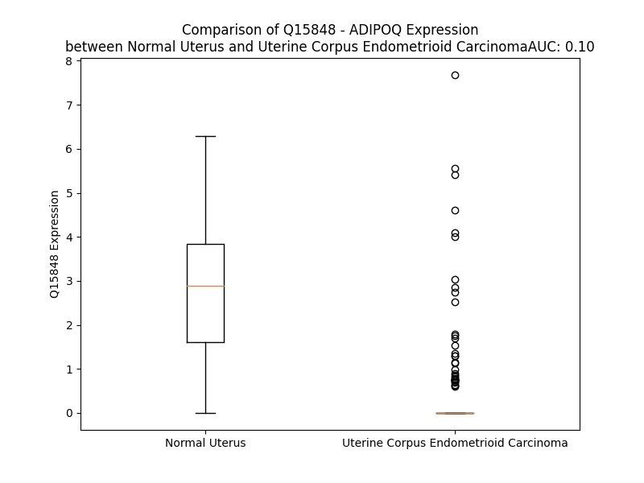

# Detailed Data for Q15848

## Introduction to the Detailed Summary

### How to Interpret the Results

- **Summary & Metrics**: This section provides a quick reference to essential protein attributes, including expression changes, family classification, and biomarker applications. Regulation status (upregulated/downregulated) indicates the protein's behavior in a disease context. Some information comes from the original excel file with the proteins selected from literature, while others are derived from the analyses.
- **Expression Comparison**: A visual representation comparing protein expression between normal and disease states. It highlights significant changes in expression levels that might indicate diagnostic or therapeutic relevance. This is data coming from transcriptomics experiments and could not translate similarly to protein levels.
- **Isoform Alignment**: An interactive view of isoform alignments, revealing structural and functional differences between variants of the protein.
- **Interactors & Homologs**: Tables listing known interaction partners and homologous proteins, the more interactors and homologs, the more complex the protein is to design an antibody for.
- **Biological Assemblies**: Information about the structural arrangement of the protein in different assemblies, providing insights into its functional state but also the complexity of the protein to develop antibodies.
- **Combined Per-Residue Information**: A detailed table summarizing residue-level data. This includes predictions for epitope regions, aggregation tendencies, and modifications that might impact the protein's function. Each row corresponds to a residue in the protein, providing insights into specific sites that may be important for research or drug development.
## Summary & Metrics

- **UniProt Accession**: Q15848
- **Gene Name**: ADIPOQ
- **Protein Name**: Adiponectin
- **Swiss Prot**: ADIPO_HUMAN
- **Family**: other
- **Biomarker Application**: diagnosis,disease progression,efficacy,prognosis,response to therapy,safety,unspecified application
- **Number of Isoforms**: 0
- **Regulation**: -1
- **(transcriptomics) AUC**: 0.13
- **(transcriptomics) Fold Change**: 4.33
- **(transcriptomics) Regulation**: Downregulated
- **Discotope Epitope Count**: 50
- **Max n_uniprots (Homo)**: 3
- **Max n_uniprots (Hetero)**: N/A

## Expression Comparison

## Interactors

| preferredName_A   | preferredName_B   |   score |
|:------------------|:------------------|--------:|
| ADIPOQ            | ADIPOR2           |   0.999 |
| ADIPOQ            | ADIPOR1           |   0.999 |
| ADIPOQ            | CDH13             |   0.996 |
| ADIPOQ            | LEP               |   0.994 |
| ADIPOQ            | CFD               |   0.988 |
| ADIPOQ            | RETN              |   0.967 |
| ADIPOQ            | PPARG             |   0.965 |
| ADIPOQ            | INS               |   0.961 |
| ADIPOQ            | PLIN1             |   0.947 |
| ADIPOQ            | PPARGC1A          |   0.944 |
| ADIPOQ            | CEBPA             |   0.942 |
| ADIPOQ            | FABP4             |   0.942 |
| ADIPOQ            | RETNLB            |   0.933 |
| ADIPOQ            | PPARA             |   0.914 |
| ADIPOQ            | CEBPB             |   0.904 |

## Homologs

| uniprot_id   | gene_id   |
|:-------------|:----------|
| A0A499FIM1   | C1QTNF2   |
| Q86Z23       | C1QL4     |
| F8WC87       | C1QTNF6   |
| Q9BXJ4       | C1QTNF3   |
| Q7Z5L3       | C1QL2     |
| P60827       | C1QTNF8   |
| Q6IEG3       | PDCD7     |
| A0A8Q3SI02   | C1QA      |
| A0A8Q3WKR2   | C1QC      |
| O75973       | C1QL1     |
| A6NHN0       | OTOL1     |
| A0A024R3F8   | ADIE      |
| E9PP49       | COL8A2    |
| A0A650AXN9   | COL10A1   |
| P0C862       | C1QTNF9   |
| B2RNN3       | C1QTNF9B  |
| Q9BXJ2       | C1QTNF7   |
| D6R934       | C1QB      |
| P27658       | COL8A1    |
| Q9BXJ3       | C1QTNF4   |
| A0A0C4DFP7   | C1QTNF1   |
| Q5JVU1       | COL19A1   |
| A0A3B0J0F3   | ADIJ      |

## Biological Assemblies

|   Unnamed: 0 |   assembly |   n_uniprots | composition   | crystal_id   |
|-------------:|-----------:|-------------:|:--------------|:-------------|
|            0 |          1 |            1 | Homo          | 6u6n         |
|            0 |          1 |            1 | Homo          | 4dou         |
|            0 |          1 |            3 | Homo          | 6u66         |

## Combined Per-Residue Information

|   res | aa   |   epitope_score | epitope   |   relative_surface_accessibility |   modeling_confidence |   Aggregation | modification              | glycosylation                            |
|------:|:-----|----------------:|:----------|---------------------------------:|----------------------:|--------------:|:--------------------------|:-----------------------------------------|
|     1 | M    |         0.16025 | False     |                          1.2334  |                 41.52 |         0.021 | N/A                       | N/A                                      |
|     2 | L    |         0.11919 | False     |                          0.88807 |                 38.85 |        81.567 | N/A                       | N/A                                      |
|     3 | L    |         0.16359 | False     |                          0.84476 |                 41.08 |        87.481 | N/A                       | N/A                                      |
|     4 | L    |         0.1373  | False     |                          1.02698 |                 40.35 |        89.711 | N/A                       | N/A                                      |
|     5 | G    |         0.21287 | False     |                          0.80824 |                 40    |        90.118 | N/A                       | N/A                                      |
|     6 | A    |         0.11833 | False     |                          0.9712  |                 44.47 |        94.57  | N/A                       | N/A                                      |
|     7 | V    |         0.11674 | False     |                          1.04417 |                 54.89 |        99.37  | N/A                       | N/A                                      |
|     8 | L    |         0.15851 | False     |                          0.91474 |                 41    |        99.518 | N/A                       | N/A                                      |
|     9 | L    |         0.16868 | False     |                          0.97699 |                 55.52 |        99.263 | N/A                       | N/A                                      |
|    10 | L    |         0.15521 | False     |                          0.91375 |                 40.34 |        97.847 | N/A                       | N/A                                      |
|    11 | L    |         0.16042 | False     |                          1.02253 |                 56.27 |        89.726 | N/A                       | N/A                                      |
|    12 | A    |         0.13654 | False     |                          0.77689 |                 41.9  |        42.864 | N/A                       | N/A                                      |
|    13 | L    |         0.1856  | False     |                          1.06259 |                 51.41 |         3.055 | N/A                       | N/A                                      |
|    14 | P    |         0.06952 | False     |                          0.93907 |                 43.63 |         1.559 | N/A                       | N/A                                      |
|    15 | G    |         0.19027 | False     |                          0.84902 |                 47.78 |         0     | N/A                       | N/A                                      |
|    16 | H    |         0.12173 | False     |                          0.92461 |                 43.22 |         0     | N/A                       | N/A                                      |
|    17 | D    |         0.15988 | False     |                          0.87655 |                 42.37 |         0     | N/A                       | N/A                                      |
|    18 | Q    |         0.11676 | False     |                          0.79643 |                 37.39 |         0     | N/A                       | N/A                                      |
|    19 | E    |         0.14397 | False     |                          0.94017 |                 38.65 |         0     | N/A                       | N/A                                      |
|    20 | T    |         0.11103 | False     |                          0.73281 |                 32.45 |         0     | N/A                       | N/A                                      |
|    21 | T    |         0.1423  | False     |                          0.7686  |                 34.38 |         0     | N/A                       | O-linked (GalNAc...) threonine           |
|    22 | T    |         0.19796 | False     |                          0.72755 |                 36.62 |         0     | N/A                       | O-linked (GalNAc...) threonine           |
|    23 | Q    |         0.14746 | False     |                          0.89627 |                 38.14 |         0     | N/A                       | N/A                                      |
|    24 | G    |         0.13983 | False     |                          0.83208 |                 37.45 |         0     | N/A                       | N/A                                      |
|    25 | P    |         0.14009 | False     |                          1.06238 |                 38.04 |         0     | N/A                       | N/A                                      |
|    26 | G    |         0.20761 | False     |                          0.79867 |                 43.55 |         0     | N/A                       | N/A                                      |
|    27 | V    |         0.13463 | False     |                          0.94944 |                 41.66 |         0     | N/A                       | N/A                                      |
|    28 | L    |         0.07765 | False     |                          0.90657 |                 37.96 |         0     | N/A                       | N/A                                      |
|    29 | L    |         0.15657 | False     |                          1.08538 |                 44.54 |         0     | N/A                       | N/A                                      |
|    30 | P    |         0.13226 | False     |                          0.82761 |                 48.78 |         0     | N/A                       | N/A                                      |
|    31 | L    |         0.19569 | False     |                          1.07141 |                 51.11 |         0     | N/A                       | N/A                                      |
|    32 | P    |         0.14441 | False     |                          0.91615 |                 55.7  |         0     | N/A                       | N/A                                      |
|    33 | K    |         0.17064 | False     |                          1.05731 |                 42.37 |         0     | 5-hydroxylysine           | N/A                                      |
|    34 | G    |         0.15013 | False     |                          0.79061 |                 47.95 |         0     | N/A                       | N/A                                      |
|    35 | A    |         0.15573 | False     |                          0.89908 |                 47.75 |         0     | N/A                       | N/A                                      |
|    36 | C    |         0.13279 | False     |                          1.00778 |                 47.01 |         0     | S-(2-succinyl)cysteine    | N/A                                      |
|    37 | T    |         0.23966 | False     |                          0.90227 |                 44.23 |         0     | N/A                       | N/A                                      |
|    38 | G    |         0.2722  | False     |                          1.0226  |                 46.96 |         0     | N/A                       | N/A                                      |
|    39 | W    |         0.19341 | False     |                          0.96503 |                 45.94 |         0     | N/A                       | N/A                                      |
|    40 | M    |         0.14864 | False     |                          0.8717  |                 50.89 |         0     | N/A                       | N/A                                      |
|    41 | A    |         0.18447 | False     |                          1.03098 |                 52.45 |         0     | N/A                       | N/A                                      |
|    42 | G    |         0.24601 | False     |                          0.807   |                 55.29 |         0     | N/A                       | N/A                                      |
|    43 | I    |         0.22246 | False     |                          1.00295 |                 62.95 |         0     | N/A                       | N/A                                      |
|    44 | P    |         0.23863 | False     |                          0.8588  |                 70.34 |         0     | 4-hydroxyproline          | N/A                                      |
|    45 | G    |         0.26757 | False     |                          0.844   |                 68.3  |         0     | N/A                       | N/A                                      |
|    46 | H    |         0.2402  | False     |                          0.94999 |                 68.74 |         0     | N/A                       | N/A                                      |
|    47 | P    |         0.28519 | True      |                          0.94256 |                 73.21 |         0     | 4-hydroxyproline          | N/A                                      |
|    48 | G    |         0.21131 | False     |                          0.84625 |                 66.32 |         0     | N/A                       | N/A                                      |
|    49 | H    |         0.2833  | True      |                          1.04374 |                 69.28 |         0     | N/A                       | N/A                                      |
|    50 | N    |         0.24773 | False     |                          0.94919 |                 68.7  |         0     | N/A                       | N/A                                      |
|    51 | G    |         0.2706  | False     |                          0.85743 |                 64.58 |         0     | N/A                       | N/A                                      |
|    52 | A    |         0.25835 | False     |                          0.93833 |                 69.28 |         0     | N/A                       | N/A                                      |
|    53 | P    |         0.27519 | True      |                          0.95856 |                 74.89 |         0     | 4-hydroxyproline          | N/A                                      |
|    54 | G    |         0.23627 | False     |                          0.85801 |                 69.67 |         0     | N/A                       | N/A                                      |
|    55 | R    |         0.28685 | True      |                          0.93152 |                 66.35 |         0     | N/A                       | N/A                                      |
|    56 | D    |         0.2213  | False     |                          0.84313 |                 70.63 |         0     | N/A                       | N/A                                      |
|    57 | G    |         0.17369 | False     |                          0.85813 |                 62.53 |         0     | N/A                       | N/A                                      |
|    58 | R    |         0.28188 | True      |                          0.92803 |                 64.84 |         0     | N/A                       | N/A                                      |
|    59 | D    |         0.3027  | True      |                          0.88052 |                 68.68 |         0     | N/A                       | N/A                                      |
|    60 | G    |         0.2195  | False     |                          0.87229 |                 60.33 |         0     | N/A                       | N/A                                      |
|    61 | T    |         0.19508 | False     |                          0.93047 |                 55.91 |         0     | N/A                       | N/A                                      |
|    62 | P    |         0.23296 | False     |                          0.98695 |                 68.01 |         0     | N/A                       | N/A                                      |
|    63 | G    |         0.19117 | False     |                          0.86389 |                 58.64 |         0     | N/A                       | N/A                                      |
|    64 | E    |         0.20528 | False     |                          0.97266 |                 55.69 |         0     | N/A                       | N/A                                      |
|    65 | K    |         0.19468 | False     |                          1.00209 |                 56.57 |         0     | 5-hydroxylysine           | O-linked (Gal...) hydroxylysine; partial |
|    66 | G    |         0.16455 | False     |                          0.83    |                 56.3  |         0     | N/A                       | N/A                                      |
|    67 | E    |         0.11482 | False     |                          0.94425 |                 53.72 |         0     | N/A                       | N/A                                      |
|    68 | K    |         0.18195 | False     |                          1.00118 |                 54.3  |         0     | 5-hydroxylysine           | O-linked (Gal...) hydroxylysine; partial |
|    69 | G    |         0.17    | False     |                          0.75389 |                 53.78 |         0     | N/A                       | N/A                                      |
|    70 | D    |         0.11195 | False     |                          0.93767 |                 49.23 |         0     | N/A                       | N/A                                      |
|    71 | P    |         0.13214 | False     |                          0.92476 |                 59.39 |         0     | 4-hydroxyproline; partial | N/A                                      |
|    72 | G    |         0.11328 | False     |                          0.75476 |                 54.59 |         0     | N/A                       | N/A                                      |
|    73 | L    |         0.14888 | False     |                          1.2039  |                 51.6  |         0     | N/A                       | N/A                                      |
|    74 | I    |         0.17687 | False     |                          0.94647 |                 55.36 |         0     | N/A                       | N/A                                      |
|    75 | G    |         0.16378 | False     |                          0.61879 |                 54.77 |         0     | N/A                       | N/A                                      |
|    76 | P    |         0.158   | False     |                          1.03765 |                 56.8  |         0     | 4-hydroxyproline; partial | N/A                                      |
|    77 | K    |         0.16154 | False     |                          0.79446 |                 53.92 |         0     | 5-hydroxylysine           | O-linked (Gal...) hydroxylysine; partial |
|    78 | G    |         0.15694 | False     |                          0.72526 |                 58.54 |         0     | N/A                       | N/A                                      |
|    79 | D    |         0.15831 | False     |                          0.89551 |                 59.38 |         0     | N/A                       | N/A                                      |
|    80 | I    |         0.13369 | False     |                          0.81143 |                 60    |         0     | N/A                       | N/A                                      |
|    81 | G    |         0.15956 | False     |                          0.71471 |                 63.61 |         0     | N/A                       | N/A                                      |
|    82 | E    |         0.17845 | False     |                          0.89041 |                 70.7  |         0     | N/A                       | N/A                                      |
|    83 | T    |         0.19255 | False     |                          0.90549 |                 70.63 |         0     | N/A                       | N/A                                      |
|    84 | G    |         0.19404 | False     |                          0.72931 |                 72.24 |         0     | N/A                       | N/A                                      |
|    85 | V    |         0.18182 | False     |                          0.96993 |                 79.56 |         0     | N/A                       | N/A                                      |
|    86 | P    |         0.27229 | False     |                          0.93578 |                 79.89 |         0     | N/A                       | N/A                                      |
|    87 | G    |         0.22039 | False     |                          0.85258 |                 81.08 |         0     | N/A                       | N/A                                      |
|    88 | A    |         0.18394 | False     |                          0.96592 |                 83.3  |         0     | N/A                       | N/A                                      |
|    89 | E    |         0.25919 | False     |                          0.89021 |                 82.83 |         0     | N/A                       | N/A                                      |
|    90 | G    |         0.20659 | False     |                          0.6349  |                 83.68 |         0     | N/A                       | N/A                                      |
|    91 | P    |         0.23207 | False     |                          0.9892  |                 85.12 |         0     | 4-hydroxyproline          | N/A                                      |
|    92 | R    |         0.27193 | False     |                          0.9428  |                 83.04 |         0     | N/A                       | N/A                                      |
|    93 | G    |         0.27965 | True      |                          0.74614 |                 83.45 |         0     | N/A                       | N/A                                      |
|    94 | F    |         0.22426 | False     |                          1.00799 |                 85.09 |         0     | N/A                       | N/A                                      |
|    95 | P    |         0.29179 | True      |                          0.92302 |                 84.61 |         0     | 4-hydroxyproline; partial | N/A                                      |
|    96 | G    |         0.28973 | True      |                          0.8757  |                 85.1  |         0     | N/A                       | N/A                                      |
|    97 | I    |         0.20137 | False     |                          1.05885 |                 84.78 |         0     | N/A                       | N/A                                      |
|    98 | Q    |         0.20371 | False     |                          0.86243 |                 84.39 |         0     | N/A                       | N/A                                      |
|    99 | G    |         0.24489 | False     |                          0.75849 |                 85.01 |         0     | N/A                       | N/A                                      |
|   100 | R    |         0.28339 | True      |                          0.96717 |                 86.09 |         0     | N/A                       | N/A                                      |
|   101 | K    |         0.22443 | False     |                          0.97988 |                 84.81 |         0     | 5-hydroxylysine           | O-linked (Gal...) hydroxylysine; partial |
|   102 | G    |         0.27174 | False     |                          0.71908 |                 80.8  |         0     | N/A                       | N/A                                      |
|   103 | E    |         0.26609 | False     |                          0.85909 |                 81.69 |         0     | N/A                       | N/A                                      |
|   104 | P    |         0.27186 | False     |                          0.94847 |                 79.08 |         0     | N/A                       | N/A                                      |
|   105 | G    |         0.26583 | False     |                          0.87396 |                 74.14 |         0     | N/A                       | N/A                                      |
|   106 | E    |         0.22272 | False     |                          0.91989 |                 78.34 |         0     | N/A                       | N/A                                      |
|   107 | G    |         0.23759 | False     |                          0.84072 |                 77.47 |         1.69  | N/A                       | N/A                                      |
|   108 | A    |         0.13096 | False     |                          0.91406 |                 85.05 |         1.69  | N/A                       | N/A                                      |
|   109 | Y    |         0.2183  | False     |                          0.78454 |                 87.63 |         1.834 | N/A                       | N/A                                      |
|   110 | V    |         0.19282 | False     |                          0.59032 |                 92.94 |         1.834 | N/A                       | N/A                                      |
|   111 | Y    |         0.17702 | False     |                          0.44377 |                 95.64 |         1.834 | N/A                       | N/A                                      |
|   112 | R    |         0.22444 | False     |                          0.54815 |                 97.68 |         0.144 | N/A                       | N/A                                      |
|   113 | S    |         0.02945 | False     |                          0.01801 |                 98.59 |         0.293 | N/A                       | N/A                                      |
|   114 | A    |         0.10555 | False     |                          0.22447 |                 98.81 |         1.748 | N/A                       | N/A                                      |
|   115 | F    |         0.01604 | False     |                          0.00861 |                 98.9  |         1.943 | N/A                       | N/A                                      |
|   116 | S    |         0.26083 | False     |                          0.19347 |                 98.88 |         1.943 | N/A                       | N/A                                      |
|   117 | V    |         0.00991 | False     |                          0       |                 98.76 |         1.943 | N/A                       | N/A                                      |
|   118 | G    |         0.01625 | False     |                          0       |                 98.15 |         1.943 | N/A                       | N/A                                      |
|   119 | L    |         0.06068 | False     |                          0.01982 |                 96.72 |         1.718 | N/A                       | N/A                                      |
|   120 | E    |         0.41113 | True      |                          0.54045 |                 93.08 |         0.144 | N/A                       | N/A                                      |
|   121 | T    |         0.24716 | False     |                          0.48872 |                 84.25 |         0.144 | N/A                       | N/A                                      |
|   122 | Y    |         0.63238 | True      |                          0.65518 |                 75.17 |         0.144 | N/A                       | N/A                                      |
|   123 | V    |         0.31064 | True      |                          0.69531 |                 73.11 |         0.144 | N/A                       | N/A                                      |
|   124 | T    |         0.14851 | False     |                          0.14287 |                 74.8  |         0     | N/A                       | N/A                                      |
|   125 | I    |         0.26866 | False     |                          0.61837 |                 83.67 |         0     | N/A                       | N/A                                      |
|   126 | P    |         0.32498 | True      |                          0.52608 |                 85.33 |         0     | N/A                       | N/A                                      |
|   127 | N    |         0.44301 | True      |                          0.58547 |                 85.57 |         0     | N/A                       | N/A                                      |
|   128 | M    |         0.21099 | False     |                          0.53515 |                 92.72 |         0     | N/A                       | N/A                                      |
|   129 | P    |         0.13686 | False     |                          0.15158 |                 95.6  |         0     | N/A                       | N/A                                      |
|   130 | I    |         0.03542 | False     |                          0.0208  |                 96.12 |         0     | N/A                       | N/A                                      |
|   131 | R    |         0.2774  | True      |                          0.49059 |                 96.16 |         0     | N/A                       | N/A                                      |
|   132 | F    |         0.007   | False     |                          0.00064 |                 97.35 |         0     | N/A                       | N/A                                      |
|   133 | T    |         0.20952 | False     |                          0.38775 |                 96.67 |         0     | N/A                       | N/A                                      |
|   134 | K    |         0.37902 | True      |                          0.33391 |                 97.6  |         0     | N/A                       | N/A                                      |
|   135 | I    |         0.36155 | True      |                          0.54415 |                 98.27 |         0     | N/A                       | N/A                                      |
|   136 | F    |         0.26689 | False     |                          0.5075  |                 98.47 |         0     | N/A                       | N/A                                      |
|   137 | Y    |         0.19055 | False     |                          0.36912 |                 98.76 |         0     | N/A                       | N/A                                      |
|   138 | N    |         0.23732 | False     |                          0.15102 |                 98.58 |         0     | N/A                       | N/A                                      |
|   139 | Q    |         0.35814 | True      |                          0.66965 |                 98.34 |         0     | N/A                       | N/A                                      |
|   140 | Q    |         0.20411 | False     |                          0.21439 |                 98.15 |         0     | N/A                       | N/A                                      |
|   141 | N    |         0.30978 | True      |                          0.76536 |                 98.37 |         0     | N/A                       | N/A                                      |
|   142 | H    |         0.12776 | False     |                          0.12559 |                 98.7  |         0     | N/A                       | N/A                                      |
|   143 | Y    |         0.05181 | False     |                          0.02257 |                 98.79 |         0     | N/A                       | N/A                                      |
|   144 | D    |         0.14734 | False     |                          0.28025 |                 98.13 |         0     | N/A                       | N/A                                      |
|   145 | G    |         0.20242 | False     |                          0.25926 |                 95.87 |         0     | N/A                       | N/A                                      |
|   146 | S    |         0.24151 | False     |                          0.58472 |                 95.03 |         0     | N/A                       | N/A                                      |
|   147 | T    |         0.20027 | False     |                          0.40981 |                 95.89 |         0     | N/A                       | N/A                                      |
|   148 | G    |         0.00478 | False     |                          0.00119 |                 96.79 |         0     | N/A                       | N/A                                      |
|   149 | K    |         0.16258 | False     |                          0.21562 |                 98.32 |         0     | N/A                       | N/A                                      |
|   150 | F    |         0.00747 | False     |                          0.00064 |                 98.79 |         0     | N/A                       | N/A                                      |
|   151 | H    |         0.12998 | False     |                          0.32914 |                 98.65 |         0     | N/A                       | N/A                                      |
|   152 | C    |         0.02589 | False     |                          0.02295 |                 98.51 |         0     | N/A                       | N/A                                      |
|   153 | N    |         0.07358 | False     |                          0.51482 |                 98.14 |         0     | N/A                       | N/A                                      |
|   154 | I    |         0.12443 | False     |                          0.18239 |                 98.06 |         0     | N/A                       | N/A                                      |
|   155 | P    |         0.07901 | False     |                          0.25945 |                 98.29 |         0.082 | N/A                       | N/A                                      |
|   156 | G    |         0.00269 | False     |                          0       |                 98.41 |         6.847 | N/A                       | N/A                                      |
|   157 | L    |         0.14818 | False     |                          0.30525 |                 98.71 |        81.75  | N/A                       | N/A                                      |
|   158 | Y    |         0.00549 | False     |                          0.00057 |                 98.85 |        95.425 | N/A                       | N/A                                      |
|   159 | Y    |         0.18365 | False     |                          0.31144 |                 98.89 |        98.512 | N/A                       | N/A                                      |
|   160 | F    |         0.00505 | False     |                          0.0017  |                 98.9  |        99.103 | N/A                       | N/A                                      |
|   161 | A    |         0.10344 | False     |                          0.10547 |                 98.89 |        99.128 | N/A                       | N/A                                      |
|   162 | Y    |         0.00992 | False     |                          0.00219 |                 98.8  |        98.949 | N/A                       | N/A                                      |
|   163 | H    |         0.27461 | True      |                          0.53682 |                 98.71 |        98.002 | N/A                       | N/A                                      |
|   164 | I    |         0.00909 | False     |                          0       |                 97.91 |        98.17  | N/A                       | N/A                                      |
|   165 | T    |         0.06639 | False     |                          0.02667 |                 97.56 |        97.314 | N/A                       | N/A                                      |
|   166 | V    |         0.00467 | False     |                          0       |                 96.61 |        96.81  | N/A                       | N/A                                      |
|   167 | Y    |         0.45282 | True      |                          0.35173 |                 95.36 |        90.874 | N/A                       | N/A                                      |
|   168 | M    |         0.41185 | True      |                          0.72746 |                 92.96 |        81.371 | N/A                       | N/A                                      |
|   169 | K    |         0.38858 | True      |                          0.49074 |                 94.3  |         0.225 | N/A                       | N/A                                      |
|   170 | D    |         0.34011 | True      |                          0.22605 |                 96.49 |         0.225 | N/A                       | N/A                                      |
|   171 | V    |         0.0045  | False     |                          0       |                 96.43 |         0.208 | N/A                       | N/A                                      |
|   172 | K    |         0.39438 | True      |                          0.25076 |                 97.12 |         0     | N/A                       | N/A                                      |
|   173 | V    |         0.00404 | False     |                          0       |                 96.97 |         0     | N/A                       | N/A                                      |
|   174 | S    |         0.00913 | False     |                          0       |                 97.04 |         0     | N/A                       | N/A                                      |
|   175 | L    |         0.01621 | False     |                          0.0033  |                 98.42 |         0     | N/A                       | N/A                                      |
|   176 | F    |         0.13398 | False     |                          0.13376 |                 98    |         0     | N/A                       | N/A                                      |
|   177 | K    |         0.14242 | False     |                          0.21206 |                 98.21 |         0     | N/A                       | N/A                                      |
|   178 | K    |         0.0871  | False     |                          0.49799 |                 94.4  |         0     | N/A                       | N/A                                      |
|   179 | D    |         0.33546 | True      |                          0.76603 |                 91.37 |         0     | N/A                       | N/A                                      |
|   180 | K    |         0.21383 | False     |                          0.74338 |                 96.13 |         0     | N/A                       | N/A                                      |
|   181 | A    |         0.18371 | False     |                          0.35784 |                 96    |         7.592 | N/A                       | N/A                                      |
|   182 | M    |         0.17212 | False     |                          0.45411 |                 97.47 |        26.636 | N/A                       | N/A                                      |
|   183 | L    |         0.23986 | False     |                          0.28523 |                 97.85 |        26.636 | N/A                       | N/A                                      |
|   184 | F    |         0.34785 | True      |                          0.53664 |                 97.83 |        26.636 | N/A                       | N/A                                      |
|   185 | T    |         0.23721 | False     |                          0.1253  |                 98.33 |        26.636 | N/A                       | N/A                                      |
|   186 | Y    |         0.50493 | True      |                          0.41635 |                 97.77 |        24.93  | N/A                       | N/A                                      |
|   187 | D    |         0.29403 | True      |                          0.19787 |                 97.79 |         0     | N/A                       | N/A                                      |
|   188 | Q    |         0.49593 | True      |                          0.54473 |                 96.77 |         0     | N/A                       | N/A                                      |
|   189 | Y    |         0.34937 | True      |                          0.19562 |                 95.81 |         0     | N/A                       | N/A                                      |
|   190 | Q    |         0.45173 | True      |                          0.61954 |                 95.61 |         0     | N/A                       | N/A                                      |
|   191 | E    |         0.5838  | True      |                          0.78011 |                 94.49 |         0     | N/A                       | N/A                                      |
|   192 | N    |         0.397   | True      |                          0.90299 |                 93.55 |         0     | N/A                       | N/A                                      |
|   193 | N    |         0.41985 | True      |                          0.40622 |                 94.7  |         0     | N/A                       | N/A                                      |
|   194 | V    |         0.55239 | True      |                          0.57663 |                 95.59 |         0     | N/A                       | N/A                                      |
|   195 | D    |         0.34243 | True      |                          0.24137 |                 97.3  |         0     | N/A                       | N/A                                      |
|   196 | Q    |         0.32763 | True      |                          0.60891 |                 98.01 |         0     | N/A                       | N/A                                      |
|   197 | A    |         0.09215 | False     |                          0.04486 |                 97.97 |         0     | N/A                       | N/A                                      |
|   198 | S    |         0.21962 | False     |                          0.50416 |                 98.51 |         0     | N/A                       | N/A                                      |
|   199 | G    |         0.25912 | False     |                          0.19198 |                 98.52 |         0.24  | N/A                       | N/A                                      |
|   200 | S    |         0.25303 | False     |                          0.43579 |                 98.77 |         0.24  | N/A                       | N/A                                      |
|   201 | V    |         0.23503 | False     |                          0.2742  |                 98.77 |         0.554 | N/A                       | N/A                                      |
|   202 | L    |         0.18422 | False     |                          0.53877 |                 98.76 |         0.554 | N/A                       | N/A                                      |
|   203 | L    |         0.11323 | False     |                          0.09727 |                 98.6  |         0.554 | N/A                       | N/A                                      |
|   204 | H    |         0.10081 | False     |                          0.42251 |                 98.46 |         0.315 | N/A                       | N/A                                      |
|   205 | L    |         0.00368 | False     |                          0       |                 98.6  |         0.315 | N/A                       | N/A                                      |
|   206 | E    |         0.13768 | False     |                          0.46065 |                 98.2  |         0     | N/A                       | N/A                                      |
|   207 | V    |         0.15952 | False     |                          0.68032 |                 97.88 |         0     | N/A                       | N/A                                      |
|   208 | G    |         0.17129 | False     |                          0.70023 |                 96.86 |         0     | N/A                       | N/A                                      |
|   209 | D    |         0.03555 | False     |                          0.01989 |                 98.38 |         0     | N/A                       | N/A                                      |
|   210 | Q    |         0.15824 | False     |                          0.26076 |                 98.55 |         0.248 | N/A                       | N/A                                      |
|   211 | V    |         0.00353 | False     |                          0       |                 98.78 |         9.485 | N/A                       | N/A                                      |
|   212 | W    |         0.12736 | False     |                          0.06523 |                 98.44 |        11.087 | N/A                       | N/A                                      |
|   213 | L    |         0.00696 | False     |                          0.00071 |                 97.56 |        11.087 | N/A                       | N/A                                      |
|   214 | Q    |         0.12809 | False     |                          0.11717 |                 95.38 |        11.087 | N/A                       | N/A                                      |
|   215 | V    |         0.04627 | False     |                          0.02254 |                 95.52 |        11.087 | N/A                       | N/A                                      |
|   216 | Y    |         0.43292 | True      |                          0.41961 |                 92.58 |         8.745 | N/A                       | N/A                                      |
|   217 | G    |         0.35365 | True      |                          0.44434 |                 87.54 |         0.701 | N/A                       | N/A                                      |
|   218 | E    |         0.51008 | True      |                          0.6433  |                 84.94 |         0     | N/A                       | N/A                                      |
|   219 | G    |         0.188   | False     |                          0.08618 |                 82.6  |         0     | N/A                       | N/A                                      |
|   220 | E    |         0.58823 | True      |                          0.65272 |                 87.46 |         0     | N/A                       | N/A                                      |
|   221 | R    |         0.45228 | True      |                          0.35839 |                 91.41 |         0     | N/A                       | N/A                                      |
|   222 | N    |         0.32833 | True      |                          0.25077 |                 93.13 |         0     | N/A                       | N/A                                      |
|   223 | G    |         0.12596 | False     |                          0.07217 |                 94.9  |         0     | N/A                       | N/A                                      |
|   224 | L    |         0.05626 | False     |                          0.01889 |                 95.74 |         0     | N/A                       | N/A                                      |
|   225 | Y    |         0.46139 | True      |                          0.22923 |                 95.55 |         0     | N/A                       | N/A                                      |
|   226 | A    |         0.05508 | False     |                          0.0396  |                 95.46 |         0     | N/A                       | N/A                                      |
|   227 | D    |         0.4264  | True      |                          0.33484 |                 93.12 |         0     | N/A                       | N/A                                      |
|   228 | N    |         0.44998 | True      |                          1.01688 |                 93.02 |         0     | N/A                       | N/A                                      |
|   229 | D    |         0.6262  | True      |                          0.78088 |                 93.67 |         0     | N/A                       | N/A                                      |
|   230 | N    |         0.42366 | True      |                          0.31438 |                 95.05 |         0     | N/A                       | N/A                                      |
|   231 | D    |         0.25191 | False     |                          0.35477 |                 97.22 |         0     | N/A                       | N/A                                      |
|   232 | S    |         0.0129  | False     |                          0       |                 97.9  |         0.577 | N/A                       | N/A                                      |
|   233 | T    |         0.15459 | False     |                          0.1862  |                 98.57 |         5.642 | N/A                       | N/A                                      |
|   234 | F    |         0.00701 | False     |                          0       |                 98.76 |        29.465 | N/A                       | N/A                                      |
|   235 | T    |         0.18993 | False     |                          0.26363 |                 98.92 |        31.254 | N/A                       | N/A                                      |
|   236 | G    |         0.00392 | False     |                          0.00136 |                 98.87 |        32.938 | N/A                       | N/A                                      |
|   237 | F    |         0.14491 | False     |                          0.37645 |                 98.86 |        33.313 | N/A                       | N/A                                      |
|   238 | L    |         0.1499  | False     |                          0.13878 |                 98.76 |        33.313 | N/A                       | N/A                                      |
|   239 | L    |         0.21874 | False     |                          0.45158 |                 98.27 |        31.165 | N/A                       | N/A                                      |
|   240 | Y    |         0.26586 | False     |                          0.63444 |                 98.09 |        18.401 | N/A                       | N/A                                      |
|   241 | H    |         0.10184 | False     |                          0.3478  |                 97.57 |         0.618 | N/A                       | N/A                                      |
|   242 | D    |         0.11094 | False     |                          0.33501 |                 96.72 |         0     | N/A                       | N/A                                      |
|   243 | T    |         0.11691 | False     |                          0.84926 |                 92.24 |         0     | N/A                       | N/A                                      |
|   244 | N    |         0.0979  | False     |                          1.29555 |                 79.85 |         0     | N/A                       | N/A                                      |

