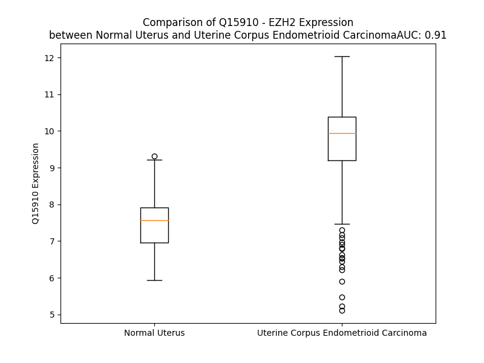

# Detailed Data for Q15910

## Introduction to the Detailed Summary

### How to Interpret the Results

- **Summary & Metrics**: This section provides a quick reference to essential protein attributes, including expression changes, family classification, and biomarker applications. Regulation status (upregulated/downregulated) indicates the protein's behavior in a disease context. Some information comes from the original excel file with the proteins selected from literature, while others are derived from the analyses.
- **Expression Comparison**: A visual representation comparing protein expression between normal and disease states. It highlights significant changes in expression levels that might indicate diagnostic or therapeutic relevance. This is data coming from transcriptomics experiments and could not translate similarly to protein levels.
- **Isoform Alignment**: An interactive view of isoform alignments, revealing structural and functional differences between variants of the protein.
- **Interactors & Homologs**: Tables listing known interaction partners and homologous proteins, the more interactors and homologs, the more complex the protein is to design an antibody for.
- **Biological Assemblies**: Information about the structural arrangement of the protein in different assemblies, providing insights into its functional state but also the complexity of the protein to develop antibodies.
- **Combined Per-Residue Information**: A detailed table summarizing residue-level data. This includes predictions for epitope regions, aggregation tendencies, and modifications that might impact the protein's function. Each row corresponds to a residue in the protein, providing insights into specific sites that may be important for research or drug development.
## Summary & Metrics

- **UniProt Accession**: Q15910
- **Gene Name**: EZH2
- **Protein Name**: Histone-lysine N-methyltransferase EZH2
- **Swiss Prot**: EZH2_HUMAN
- **Family**: transcription regulator
- **Biomarker Application**: diagnosis,disease progression,efficacy,prognosis
- **Number of Isoforms**: 5
- **Regulation**: 1
- **(transcriptomics) AUC**: 1.0
- **(transcriptomics) Fold Change**: 1.38
- **(transcriptomics) Regulation**: Upregulated
- **Discotope Epitope Count**: 177
- **Max n_uniprots (Homo)**: 2
- **Max n_uniprots (Hetero)**: 11

## Expression Comparison

## Isoform Alignment

<pre style='font-size:14px; font-family:monospace;'>Q15910-1 MGQTGKKSEKGPVCWRKRVKSEYMRLRQLKRFRRADEVKSMFSSNRQKILERTEILNQEWKQRRIQPVHILTSVSSLRGTRECSVTSDLDFPTQVIPLKTLNAVASVPIMYSWSPLQQNFMVEDETVLHNIPYMGDEVLDQDGTFIEELIKNYDGKVHGDRECGFINDEIFVELVNALGQYNDDDDDDDGDDPEEREEKQKDLEDHRDDKESRPPRKFPSDKIFEAISSMFPDKGTAEELKEKYKELTEQQLPGALPPECTPNIDGPNAKSVQREQSLHSFHTLFCRRCFKYDCFLH-----PFHATPNTYKRKNTETALDNKPCGPQCYQHLEGAKEFAAALTAERIKTPPKRPGGRRRGRLPNNSSRPSTPTINVLESKDTDSDREAGTETGGENNDKEEEEKKDETSSSSEANSRCQTPIKMKPNIEPPENVEWSGAEASMFRVLIGTYYDNFCAIARLIGTKTCRQVYEFRVKESSIIAPAPAEDVDTPPRKKKRKHRLWAAHCRKIQLKKDGSSNHVYNYQPCDHPRQPCDSSCPCVIAQNFCEKFCQCSSECQNRFPGCRCKAQCNTKQCPCYLAVRECDPDLCLTCGAADHWDSKNVSCKNCSIQRGSKKHLLLAPSDVAGWGIFIKDPVQKNEFISEYCGEIISQDEADRRGKVYDKYMCSFLFNLNNDFVVDATRKGNKIRFANHSVNPNCYAKVMMVNGDHRIGIFAKRAIQTGEELFFDYRYSQADALKYVGIEREMEIP
Q15910-2 MGQTGKKSEKGPVCWRKRVKSEYMRLRQLKRFRRADEVKSMFSSNRQKILERTEILNQEWKQRRIQPVHILTSVSSLRGTRECSVTSDLDFPTQVIPLKTLNAVASVPIMYSWSPLQQNFMVEDETVLHNIPYMGDEVLDQDGTFIEELIKNYDGKVHGDRECGFINDEIFVELVNALGQYNDDDDDDDGDDPEEREEKQKDLEDHRDDKESRPPRKFPSDKIFEAISSMFPDKGTAEELKEKYKELTEQQLPGALPPECTPNIDGPNAKSVQREQSLHSFHTLFCRRCFKYDCFLHRKCNYSFHATPNTYKRKNTETALDNKPCGPQCYQHLEGAKEFAAALTAERIKTPPKRPGGRRRGRLPNNSSRPSTPTINVLESKDTDSDREAGTETGGENNDKEEEEKKDETSSSSEANSRCQTPIKMKPNIEPPENVEWSGAEASMFRVLIGTYYDNFCAIARLIGTKTCRQVYEFRVKESSIIAPAPAEDVDTPPRKKKRKHRLWAAHCRKIQLKKDGSSNHVYNYQPCDHPRQPCDSSCPCVIAQNFCEKFCQCSSECQNRFPGCRCKAQCNTKQCPCYLAVRECDPDLCLTCGAADHWDSKNVSCKNCSIQRGSKKHLLLAPSDVAGWGIFIKDPVQKNEFISEYCGEIISQDEADRRGKVYDKYMCSFLFNLNNDFVVDATRKGNKIRFANHSVNPNCYAKVMMVNGDHRIGIFAKRAIQTGEELFFDYRYSQADALKYVGIEREMEIP
Q15910-3 MGQTGKKSEKGPVCWRKRVKSEYMRLRQLKRFRRADEVKSMFSSNRQKILERTEILNQEWKQRRIQPVHILTSVSSLRGTRE---------------------------------------VEDETVLHNIPYMGDEVLDQDGTFIEELIKNYDGKVHGDRECGFINDEIFVELVNALGQYNDDDDDDDGDDPEEREEKQKDLEDHRDDKESRPPRKFPSDKIFEAISSMFPDKGTAEELKEKYKELTEQQLPGALPPECTPNIDGPNAKSVQREQSLHSFHTLFCRRCFKYDCFLH-----PFHATPNTYKRKNTETALDNKPCGPQCYQHLEGAKEFAAALTAERIKTPPKRPGGRRRGRLPNNSSRPSTPTINVLESKDTDSDREAGTETGGENNDKEEEEKKDETSSSSEANSRCQTPIKMKPNIEPPENVEWSGAEASMFRVLIGTYYDNFCAIARLIGTKTCRQVYEFRVKESSIIAPAPAEDVDTPPRKKKRKHRLWAAHCRKIQLKKDGSSNHVYNYQPCDHPRQPCDSSCPCVIAQNFCEKFCQCSSECQNRFPGCRCKAQCNTKQCPCYLAVRECDPDLCLTCGAADHWDSKNVSCKNCSIQRGSKKHLLLAPSDVAGWGIFIKDPVQKNEFISEYCGEIISQDEADRRGKVYDKYMCSFLFNLNNDFVVDATRKGNKIRFANHSVNPNCYAKVMMVNGDHRIGIFAKRAIQTGEELFFDYRYSQADALKYVGIEREMEIP
Q15910-4 MGQTGKKSEKGPVCWRKRVKSEYMRLRQLKRFRRADEVKSMFSSNRQKILERTEILNQEWKQRRIQPVHILTS---------CSVTSDLDFPTQVIPLKTLNAVASVPIMYSWSPLQQNFMVEDETVLHNIPYMGDEVLDQDGTFIEELIKNYDGKVHGDRECGFINDEIFVELVNALGQYNDDDDDDDGDDPEEREEKQKDLEDHRDDKESRPPRKFPSDKIFEAISSMFPDKGTAEELKEKYKELTEQQLPGALPPECTPNIDGPNAKSVQREQSLHSFHTLFCRRCFKYDCFLH-----PFHATPNTYKRKNTETALDNKPCGPQCYQHLEGAKEFAAALTAERIKTPPKRPGGRRRGRLPNNSSRPSTPTINVLESKDTDSDREAGTETGGENNDKEEEEKKDETSSSSEANSRCQTPIKMKPNIEPPENVEWSGAEASMFRVLIGTYYDNFCAIARLIGTKTCRQVYEFRVKESSIIAPAPAEDVDTPPRKKKRKHRLWAAHCRKIQLKKDGSSNHVYNYQPCDHPRQPCDSSCPCVIAQNFCEKFCQCSSECQNRFPGCRCKAQCNTKQCPCYLAVRECDPDLCLTCGAADHWDSKNVSCKNCSIQRGSKKHLLLAPSDVAGWGIFIKDPVQKNEFISEYCGEIISQDEADRRGKVYDKYMCSFLFNLNNDFVVDATRKGNKIRFANHSVNPNCYAKVMMVNGDHRIGIFAKRAIQTGEELFFDYRYSQADALKYVGIEREMEIP
Q15910-5 MGQTGKKSEKGPVCWRKRVKSEYMRLRQLKRFRRADEVKSMFSSNRQKILERTEILNQEWKQRRIQPVHILTS---------CSVTSDLDFPTQVIPLKTLNAVASVPIMYSWSPLQQNFMVEDETVLHNIPYMGDEVLDQDGTFIEELIKNYDGKVHGDRECGFINDEIFVELVNALGQYNDDDDDDDGDDPEEREEKQKDLEDHRDDKESRPPRKFPSDKIFEAISSMFPDKGTAEELKEKYKELTEQQLPGALPPECTPNIDGPNAKSVQREQSLHSFHTLFCRRCFKYDCFLH-----PFHATPNTYKRKNTETALDNKPCGPQCYQHLEGAKEFAAALTAERIKTPPKRPGGRRRGRLPNNSSRPSTPTINVLESKDTDSDREAGTETGGENNDKEEEEKKDETSSSSEANSRCQTPIKMKPNIEPPENVEWSGAEASMFRVLIGTYYDNFCAIARLIGTKTCRQVYEFRVKESSIIAPAPAEDVDTPPRKKKRKHRLWAAHCRKIQLKKG------------------------------------------QNRFPGCRCKAQCNTKQCPCYLAVRECDPDLCLTCGAADHWDSKNVSCKNCSIQRGSKKHLLLAPSDVAGWGIFIKDPVQKNEFISEYCGEIISQDEADRRGKVYDKYMCSFLFNLNNDFVVDATRKGNKIRFANHSVNPNCYAKVMMVNGDHRIGIFAKRAIQTGEELFFDYRYSQADALKYVGIEREMEIP
</pre>

## Interactors

| preferredName_A   | preferredName_B   |   score |
|:------------------|:------------------|--------:|
| EZH2              | SUZ12             |   0.999 |
| EZH2              | RBBP7             |   0.999 |
| EZH2              | RBBP4             |   0.999 |
| EZH2              | EED               |   0.999 |
| EZH2              | DNMT1             |   0.999 |
| EZH2              | HDAC1             |   0.999 |
| EZH2              | BMI1              |   0.999 |
| EZH2              | DNMT3B            |   0.999 |
| EZH2              | HDAC2             |   0.999 |
| EZH2              | AEBP2             |   0.999 |
| EZH2              | JARID2            |   0.999 |
| EZH2              | DNMT3A            |   0.999 |
| EZH2              | EZH1              |   0.999 |
| EZH2              | RNF2              |   0.998 |
| EZH2              | H3C13             |   0.998 |
| EZH2              | YY1               |   0.998 |
| EZH2              | PHF1              |   0.998 |
| EZH2              | MTF2              |   0.998 |
| EZH2              | SNAI1             |   0.998 |
| EZH2              | ASXL1             |   0.998 |
| EZH2              | KDM1A             |   0.997 |
| EZH2              | CBX7              |   0.996 |
| EZH2              | CHD4              |   0.993 |
| EZH2              | H3-3B             |   0.99  |
| EZH2              | RING1             |   0.989 |
| EZH2              | HDAC3             |   0.989 |
| EZH2              | PHF19             |   0.989 |
| EZH2              | H3-4              |   0.989 |
| EZH2              | CTNNB1            |   0.986 |
| EZH2              | H3C12             |   0.985 |
| EZH2              | PCGF1             |   0.985 |
| EZH2              | COMMD3-BMI1       |   0.985 |
| EZH2              | MYC               |   0.984 |
| EZH2              | PHC1              |   0.982 |
| EZH2              | CBX2              |   0.98  |
| EZH2              | AR                |   0.978 |
| EZH2              | VAV1              |   0.978 |
| EZH2              | H4C6              |   0.977 |
| EZH2              | STAT3             |   0.973 |
| EZH2              | H3-2              |   0.972 |
| EZH2              | H3-5              |   0.972 |
| EZH2              | PCGF2             |   0.971 |
| EZH2              | CBX4              |   0.969 |
| EZH2              | CBX8              |   0.968 |
| EZH2              | KDM6A             |   0.965 |
| EZH2              | CDK1              |   0.965 |
| EZH2              | EP300             |   0.963 |
| EZH2              | SCML2             |   0.958 |
| EZH2              | SUV39H1           |   0.957 |
| EZH2              | H2AC8             |   0.956 |

## Homologs

| uniprot_id   | gene_id   |
|:-------------|:----------|
| K7EPC0       | EZH1      |
| A2ABF8       | EHMT2     |
| A0A8I5QJD3   | KMT2D     |
| Q96T68       | SETDB2    |
| Q9UPS6       | SETD1B    |
| O15047       | SETD1A    |
| A0A8I5KV15   | SETD2     |
| A0A1B0GW12   | EHMT1     |
| Q5JSS2       | SUV39H2   |
| Q9BZ95       | NSD3      |
| A0A7I2V4X1   | SETBP1    |
| D6RG26       | NSD1      |
| A0A8I5KPK0   | KMT2B     |
| D6RIS1       | NSD2      |
| A0A804HKW4   | KMT2C     |
| A0A7I2V542   | ASH1L     |
| H7C5V8       | KMT2A     |
| O43463       | SUV39H1   |
| B0QZE6       | SETDB1    |

## Biological Assemblies

|   Unnamed: 0 |   assembly |   n_uniprots | composition   | crystal_id   |
|-------------:|-----------:|-------------:|:--------------|:-------------|
|            0 |          1 |            1 | Homo          | 4mi5         |
|            0 |          1 |            2 | Hetero        | 5h15         |
|            1 |          2 |            2 | Hetero        | 5h15         |
|            0 |          1 |            2 | Hetero        | 7qjg         |
|            1 |          2 |            2 | Hetero        | 7qjg         |
|            0 |          1 |            2 | Hetero        | 5wg6         |
|            1 |          2 |            2 | Hetero        | 5wg6         |
|            0 |          1 |            1 | Homo          | 4mi0         |
|            0 |          1 |            2 | Hetero        | 5h17         |
|            0 |          1 |           11 | Hetero        | 6c23         |
|            0 |          1 |            6 | Hetero        | 6u4y         |
|            0 |          1 |            2 | Hetero        | 5h25         |
|            1 |          2 |            2 | Hetero        | 5h25         |
|            0 |          1 |            2 | Hetero        | 7qju         |
|            1 |          2 |            2 | Hetero        | 7qju         |
|            0 |          1 |            4 | Hetero        | 5ls6         |
|            1 |          2 |            4 | Hetero        | 5ls6         |
|            2 |          3 |            4 | Hetero        | 5ls6         |
|            3 |          4 |            4 | Hetero        | 5ls6         |
|            0 |          1 |            2 | Hetero        | 5h19         |
|            0 |          1 |           11 | Hetero        | 6c24         |
|            0 |          1 |            2 | Hetero        | 5u62         |
|            1 |          2 |            2 | Hetero        | 5u62         |
|            0 |          1 |            3 | Hetero        | 5ij7         |
|            1 |          2 |            3 | Hetero        | 5ij7         |
|            0 |          1 |            2 | Homo          | 6p5l         |
|            1 |          2 |            1 | Homo          | 6p5l         |
|            0 |          1 |            3 | Hetero        | 5ij8         |
|            1 |          2 |            3 | Hetero        | 5ij8         |
|            0 |          1 |            2 | Hetero        | 5wuk         |
|            0 |          1 |           11 | Hetero        | 6wkr         |
|            0 |          1 |            2 | Hetero        | 5gsa         |
|            1 |          2 |            2 | Hetero        | 5gsa         |
|            0 |          1 |            2 | Hetero        | 7qk4         |
|            0 |          1 |            2 | Hetero        | 5h14         |
|            1 |          2 |            2 | Hetero        | 5h14         |
|            0 |          1 |            2 | Hetero        | 5u5t         |
|            1 |          2 |            2 | Hetero        | 5u5t         |
|            0 |          1 |            5 | Hetero        | 5hyn         |
|            1 |          2 |            5 | Hetero        | 5hyn         |
|            2 |          3 |            5 | Hetero        | 5hyn         |
|            3 |          4 |            5 | Hetero        | 5hyn         |
|            4 |          5 |            4 | Hetero        | 5hyn         |
|            5 |          6 |            4 | Hetero        | 5hyn         |
|            6 |          7 |            4 | Hetero        | 5hyn         |
|            7 |          8 |            4 | Hetero        | 5hyn         |
|            0 |          1 |            2 | Hetero        | 6lo2         |
|            1 |          2 |            2 | Hetero        | 6lo2         |
|            0 |          1 |           11 | Hetero        | 7at8         |
|            0 |          1 |           11 | Hetero        | 8fyh         |
|            0 |          1 |            2 | Hetero        | 5h24         |
|            1 |          2 |            2 | Hetero        | 5h24         |

## Combined Per-Residue Information

|   res | aa   |   epitope_score | epitope   |   relative_surface_accessibility |   modeling_confidence |   Aggregation | modification                       | glycosylation            |
|------:|:-----|----------------:|:----------|---------------------------------:|----------------------:|--------------:|:-----------------------------------|:-------------------------|
|     1 | M    |         0.101   | False     |                          1.37137 |                 41.18 |         0     | N/A                                | N/A                      |
|     2 | G    |         0.17129 | True      |                          0.93131 |                 36.93 |         0     | N/A                                | N/A                      |
|     3 | Q    |         0.10885 | False     |                          0.92778 |                 37.96 |         0     | N/A                                | N/A                      |
|     4 | T    |         0.10124 | False     |                          1.00203 |                 37.13 |         0     | N/A                                | N/A                      |
|     5 | G    |         0.09595 | False     |                          0.93663 |                 35.43 |         0     | N/A                                | N/A                      |
|     6 | K    |         0.09024 | False     |                          0.99213 |                 38.18 |         0     | N/A                                | N/A                      |
|     7 | K    |         0.07843 | False     |                          0.93222 |                 36.35 |         0     | N/A                                | N/A                      |
|     8 | S    |         0.07421 | False     |                          0.8052  |                 38.52 |         0     | N/A                                | N/A                      |
|     9 | E    |         0.078   | False     |                          0.72944 |                 53.86 |         0     | N/A                                | N/A                      |
|    10 | K    |         0.08422 | False     |                          0.47474 |                 60.22 |         0     | N/A                                | N/A                      |
|    11 | G    |         0.08147 | False     |                          0.42071 |                 72.48 |         0     | N/A                                | N/A                      |
|    12 | P    |         0.06738 | False     |                          0.77799 |                 78.43 |         0     | N/A                                | N/A                      |
|    13 | V    |         0.03726 | False     |                          0.64308 |                 82.57 |         0     | N/A                                | N/A                      |
|    14 | C    |         0.02462 | False     |                          0.33214 |                 86.94 |         0     | N/A                                | N/A                      |
|    15 | W    |         0.01961 | False     |                          0.08484 |                 86.66 |         0     | N/A                                | N/A                      |
|    16 | R    |         0.07853 | False     |                          0.39381 |                 85.47 |         0     | N/A                                | N/A                      |
|    17 | K    |         0.04534 | False     |                          0.72477 |                 87.8  |         0     | N/A                                | N/A                      |
|    18 | R    |         0.02749 | False     |                          0.16442 |                 90.51 |         0     | N/A                                | N/A                      |
|    19 | V    |         0.00269 | False     |                          0.0019  |                 90.82 |         0     | N/A                                | N/A                      |
|    20 | K    |         0.08597 | False     |                          0.61412 |                 89.31 |         0     | N/A                                | N/A                      |
|    21 | S    |         0.04598 | False     |                          0.52766 |                 90.45 |         0     | Phosphoserine; by PKB/AKT1         | N/A                      |
|    22 | E    |         0.01435 | False     |                          0.03648 |                 91.89 |         0     | N/A                                | N/A                      |
|    23 | Y    |         0.02351 | False     |                          0.09017 |                 91.16 |         0     | N/A                                | N/A                      |
|    24 | M    |         0.05962 | False     |                          0.45256 |                 90.06 |         0     | N/A                                | N/A                      |
|    25 | R    |         0.07956 | False     |                          0.48377 |                 92.05 |         0     | N/A                                | N/A                      |
|    26 | L    |         0.03396 | False     |                          0.07749 |                 91.03 |         0     | N/A                                | N/A                      |
|    27 | R    |         0.05873 | False     |                          0.5216  |                 89.82 |         0     | N/A                                | N/A                      |
|    28 | Q    |         0.04057 | False     |                          0.49419 |                 89.82 |         0     | N/A                                | N/A                      |
|    29 | L    |         0.06071 | False     |                          0.64218 |                 90.83 |         0     | N/A                                | N/A                      |
|    30 | K    |         0.05629 | False     |                          0.21982 |                 88.46 |         0     | N/A                                | N/A                      |
|    31 | R    |         0.06318 | False     |                          0.7333  |                 88.23 |         0     | N/A                                | N/A                      |
|    32 | F    |         0.12182 | True      |                          0.71869 |                 90.21 |         0     | N/A                                | N/A                      |
|    33 | R    |         0.09839 | False     |                          0.68404 |                 89.65 |         0     | N/A                                | N/A                      |
|    34 | R    |         0.07051 | False     |                          0.67875 |                 89.35 |         0     | N/A                                | N/A                      |
|    35 | A    |         0.06779 | False     |                          0.38146 |                 91.5  |         0     | N/A                                | N/A                      |
|    36 | D    |         0.08086 | False     |                          0.49821 |                 93.3  |         0     | N/A                                | N/A                      |
|    37 | E    |         0.04844 | False     |                          0.4368  |                 92.66 |         0     | N/A                                | N/A                      |
|    38 | V    |         0.03633 | False     |                          0.42639 |                 93.95 |         0     | N/A                                | N/A                      |
|    39 | K    |         0.08774 | False     |                          0.65773 |                 95.09 |         0     | N/A                                | N/A                      |
|    40 | S    |         0.12436 | True      |                          0.56029 |                 95.32 |         0     | N/A                                | N/A                      |
|    41 | M    |         0.0535  | False     |                          0.69614 |                 95.35 |         0     | N/A                                | N/A                      |
|    42 | F    |         0.0629  | False     |                          0.71747 |                 96.33 |         0     | N/A                                | N/A                      |
|    43 | S    |         0.06052 | False     |                          0.58574 |                 96.15 |         0     | N/A                                | N/A                      |
|    44 | S    |         0.04662 | False     |                          0.40642 |                 96.83 |         0     | N/A                                | N/A                      |
|    45 | N    |         0.04876 | False     |                          0.41263 |                 97.43 |         0     | N/A                                | N/A                      |
|    46 | R    |         0.10877 | False     |                          0.5908  |                 97.22 |         0     | N/A                                | N/A                      |
|    47 | Q    |         0.09787 | False     |                          0.48145 |                 96.92 |         0     | N/A                                | N/A                      |
|    48 | K    |         0.11446 | True      |                          0.49343 |                 97.6  |         0     | N/A                                | N/A                      |
|    49 | I    |         0.06581 | False     |                          0.42158 |                 97.78 |         0     | N/A                                | N/A                      |
|    50 | L    |         0.08876 | False     |                          0.55985 |                 97.61 |         0     | N/A                                | N/A                      |
|    51 | E    |         0.0692  | False     |                          0.469   |                 97.24 |         0     | N/A                                | N/A                      |
|    52 | R    |         0.08056 | False     |                          0.64408 |                 97.69 |         0     | N/A                                | N/A                      |
|    53 | T    |         0.04615 | False     |                          0.47667 |                 97.89 |         0     | N/A                                | N/A                      |
|    54 | E    |         0.11525 | True      |                          0.38507 |                 96.94 |         0     | N/A                                | N/A                      |
|    55 | I    |         0.12057 | True      |                          0.65048 |                 97.1  |         0     | N/A                                | N/A                      |
|    56 | L    |         0.07585 | False     |                          0.69949 |                 97.52 |         0     | N/A                                | N/A                      |
|    57 | N    |         0.0687  | False     |                          0.32464 |                 97.57 |         0     | N/A                                | N/A                      |
|    58 | Q    |         0.08298 | False     |                          0.42883 |                 96.26 |         0     | N/A                                | N/A                      |
|    59 | E    |         0.06086 | False     |                          0.37672 |                 96.73 |         0     | N/A                                | N/A                      |
|    60 | W    |         0.05329 | False     |                          0.71704 |                 96.23 |         0     | N/A                                | N/A                      |
|    61 | K    |         0.09418 | False     |                          0.42676 |                 95.61 |         0     | N/A                                | N/A                      |
|    62 | Q    |         0.14336 | True      |                          0.74485 |                 95.75 |         0     | N/A                                | N/A                      |
|    63 | R    |         0.08825 | False     |                          0.55995 |                 95.43 |         0     | N/A                                | N/A                      |
|    64 | R    |         0.24307 | True      |                          0.84373 |                 92.53 |         0     | N/A                                | N/A                      |
|    65 | I    |         0.12293 | True      |                          0.71862 |                 93.87 |         0     | N/A                                | N/A                      |
|    66 | Q    |         0.10537 | False     |                          0.78726 |                 92.28 |         0     | N/A                                | N/A                      |
|    67 | P    |         0.10866 | False     |                          0.7026  |                 93.02 |         0     | N/A                                | N/A                      |
|    68 | V    |         0.06967 | False     |                          1.08811 |                 91.91 |         0.484 | N/A                                | N/A                      |
|    69 | H    |         0.0706  | False     |                          0.74379 |                 86.63 |         0.484 | N/A                                | N/A                      |
|    70 | I    |         0.10728 | False     |                          0.8347  |                 83.3  |         3.81  | N/A                                | N/A                      |
|    71 | L    |         0.12594 | True      |                          0.95564 |                 68.29 |         3.81  | N/A                                | N/A                      |
|    72 | T    |         0.08207 | False     |                          0.6873  |                 68.29 |         3.81  | N/A                                | N/A                      |
|    73 | S    |         0.12431 | True      |                          0.66889 |                 55.29 |         3.614 | N/A                                | N/A                      |
|    74 | V    |         0.09574 | False     |                          0.89302 |                 53.45 |         3.614 | N/A                                | N/A                      |
|    75 | S    |         0.11794 | True      |                          0.7913  |                 54.57 |         0.367 | N/A                                | O-linked (GlcNAc) serine |
|    76 | S    |         0.08543 | False     |                          0.43572 |                 55.6  |         0     | Phosphoserine                      | N/A                      |
|    77 | L    |         0.1153  | True      |                          0.79935 |                 59.92 |         0     | N/A                                | N/A                      |
|    78 | R    |         0.14107 | True      |                          1.02261 |                 64.38 |         0     | N/A                                | N/A                      |
|    79 | G    |         0.06769 | False     |                          0.9314  |                 72.98 |         0     | N/A                                | N/A                      |
|    80 | T    |         0.05025 | False     |                          0.45469 |                 78.52 |         0     | N/A                                | N/A                      |
|    81 | R    |         0.06635 | False     |                          0.74472 |                 86.86 |         0     | N/A                                | N/A                      |
|    82 | E    |         0.06089 | False     |                          0.50757 |                 88.16 |         0     | N/A                                | N/A                      |
|    83 | C    |         0.0939  | False     |                          0.29706 |                 91.43 |         0     | N/A                                | N/A                      |
|    84 | S    |         0.09649 | False     |                          0.57433 |                 92.02 |         0     | N/A                                | N/A                      |
|    85 | V    |         0.07365 | False     |                          0.63031 |                 94.24 |         0     | N/A                                | N/A                      |
|    86 | T    |         0.15246 | True      |                          0.73355 |                 94.46 |         0     | N/A                                | N/A                      |
|    87 | S    |         0.08001 | False     |                          0.35453 |                 93.43 |         0     | N/A                                | N/A                      |
|    88 | D    |         0.14227 | True      |                          0.95061 |                 95.02 |         0     | N/A                                | N/A                      |
|    89 | L    |         0.13697 | True      |                          0.86112 |                 94.54 |         0     | N/A                                | N/A                      |
|    90 | D    |         0.11626 | True      |                          0.9078  |                 89.48 |         0     | N/A                                | N/A                      |
|    91 | F    |         0.18176 | True      |                          0.69542 |                 94.39 |         0     | N/A                                | N/A                      |
|    92 | P    |         0.10428 | False     |                          0.80494 |                 93.59 |         0     | N/A                                | N/A                      |
|    93 | T    |         0.17231 | True      |                          0.51032 |                 93.32 |         0     | N/A                                | N/A                      |
|    94 | Q    |         0.13489 | True      |                          0.60014 |                 91.34 |         0     | N/A                                | N/A                      |
|    95 | V    |         0.14588 | True      |                          0.60523 |                 89.54 |         0     | N/A                                | N/A                      |
|    96 | I    |         0.04562 | False     |                          0.44785 |                 87.45 |         0     | N/A                                | N/A                      |
|    97 | P    |         0.03058 | False     |                          0.37269 |                 87.44 |         0     | N/A                                | N/A                      |
|    98 | L    |         0.10132 | False     |                          0.50119 |                 88.85 |         0     | N/A                                | N/A                      |
|    99 | K    |         0.09536 | False     |                          0.77253 |                 86.56 |         0     | N/A                                | N/A                      |
|   100 | T    |         0.11399 | True      |                          0.61628 |                 89.16 |         0     | N/A                                | N/A                      |
|   101 | L    |         0.0833  | False     |                          0.96463 |                 92.95 |         0     | N/A                                | N/A                      |
|   102 | N    |         0.14209 | True      |                          0.7968  |                 93.14 |         0     | N/A                                | N/A                      |
|   103 | A    |         0.11235 | True      |                          1.05552 |                 94.8  |         0     | N/A                                | N/A                      |
|   104 | V    |         0.10158 | False     |                          0.972   |                 96.34 |         0     | N/A                                | N/A                      |
|   105 | A    |         0.10478 | False     |                          0.94093 |                 94.55 |         0     | N/A                                | N/A                      |
|   106 | S    |         0.10176 | False     |                          0.83112 |                 95.28 |         0     | N/A                                | N/A                      |
|   107 | V    |         0.1661  | True      |                          0.81058 |                 95.77 |         0     | N/A                                | N/A                      |
|   108 | P    |         0.03288 | False     |                          0.25856 |                 95.59 |         0     | N/A                                | N/A                      |
|   109 | I    |         0.14551 | True      |                          0.90428 |                 94.27 |         3.019 | N/A                                | N/A                      |
|   110 | M    |         0.10442 | False     |                          0.54199 |                 94.06 |         3.019 | N/A                                | N/A                      |
|   111 | Y    |         0.10526 | False     |                          0.72063 |                 92.91 |         3.019 | N/A                                | N/A                      |
|   112 | S    |         0.12496 | True      |                          0.8783  |                 95.92 |         3.019 | N/A                                | N/A                      |
|   113 | W    |         0.05962 | False     |                          0.30287 |                 96.87 |         3.019 | N/A                                | N/A                      |
|   114 | S    |         0.06714 | False     |                          0.40846 |                 98.05 |         0     | N/A                                | N/A                      |
|   115 | P    |         0.10605 | False     |                          0.77971 |                 98    |         0     | N/A                                | N/A                      |
|   116 | L    |         0.02783 | False     |                          0.13412 |                 97.37 |         0     | N/A                                | N/A                      |
|   117 | Q    |         0.05914 | False     |                          0.5972  |                 95.81 |         0     | N/A                                | N/A                      |
|   118 | Q    |         0.06365 | False     |                          0.50806 |                 95.73 |         0     | N/A                                | N/A                      |
|   119 | N    |         0.02221 | False     |                          0.04605 |                 97.67 |         0     | N/A                                | N/A                      |
|   120 | F    |         0.05596 | False     |                          0.25616 |                 97.37 |         0     | N/A                                | N/A                      |
|   121 | M    |         0.03051 | False     |                          0.13931 |                 96.23 |         0     | N/A                                | N/A                      |
|   122 | V    |         0.02791 | False     |                          0.20904 |                 95.07 |         0     | N/A                                | N/A                      |
|   123 | E    |         0.06941 | False     |                          0.66275 |                 91.07 |         0     | N/A                                | N/A                      |
|   124 | D    |         0.0431  | False     |                          0.32835 |                 90.25 |         0     | N/A                                | N/A                      |
|   125 | E    |         0.04632 | False     |                          0.22725 |                 83.84 |         0     | N/A                                | N/A                      |
|   126 | T    |         0.06911 | False     |                          0.60268 |                 79.19 |         0     | N/A                                | N/A                      |
|   127 | V    |         0.0401  | False     |                          0.34303 |                 76.93 |         0     | N/A                                | N/A                      |
|   128 | L    |         0.04842 | False     |                          0.08903 |                 79.23 |         0     | N/A                                | N/A                      |
|   129 | H    |         0.17261 | True      |                          0.64525 |                 80.02 |         0     | N/A                                | N/A                      |
|   130 | N    |         0.15205 | True      |                          0.70396 |                 81.7  |         0     | N/A                                | N/A                      |
|   131 | I    |         0.1147  | True      |                          0.4292  |                 80.28 |         0     | N/A                                | N/A                      |
|   132 | P    |         0.03765 | False     |                          0.18706 |                 79.31 |         0     | N/A                                | N/A                      |
|   133 | Y    |         0.17526 | True      |                          0.6729  |                 79.52 |         0     | N/A                                | N/A                      |
|   134 | M    |         0.09602 | False     |                          0.15747 |                 73.68 |         0     | N/A                                | N/A                      |
|   135 | G    |         0.08775 | False     |                          0.25456 |                 72.96 |         0     | N/A                                | N/A                      |
|   136 | D    |         0.17121 | True      |                          0.57262 |                 77.73 |         0     | N/A                                | N/A                      |
|   137 | E    |         0.10317 | False     |                          0.72917 |                 74.99 |         0     | N/A                                | N/A                      |
|   138 | V    |         0.10447 | False     |                          0.3377  |                 69.77 |         0     | N/A                                | N/A                      |
|   139 | L    |         0.16251 | True      |                          0.3856  |                 66.64 |         0     | N/A                                | N/A                      |
|   140 | D    |         0.14837 | True      |                          0.80584 |                 67.21 |         0     | N/A                                | N/A                      |
|   141 | Q    |         0.1489  | True      |                          0.74541 |                 71.19 |         0     | N/A                                | N/A                      |
|   142 | D    |         0.10379 | False     |                          0.37124 |                 71.92 |         0     | N/A                                | N/A                      |
|   143 | G    |         0.11047 | True      |                          0.49175 |                 72.17 |         0     | N/A                                | N/A                      |
|   144 | T    |         0.07843 | False     |                          0.63121 |                 81.99 |         0     | N/A                                | N/A                      |
|   145 | F    |         0.08728 | False     |                          0.15856 |                 80.72 |         0     | N/A                                | N/A                      |
|   146 | I    |         0.04828 | False     |                          0.17759 |                 81.38 |         0     | N/A                                | N/A                      |
|   147 | E    |         0.12691 | True      |                          0.65251 |                 82.46 |         0     | N/A                                | N/A                      |
|   148 | E    |         0.07308 | False     |                          0.50119 |                 83.4  |         0     | N/A                                | N/A                      |
|   149 | L    |         0.01319 | False     |                          0.01343 |                 82.86 |         0     | N/A                                | N/A                      |
|   150 | I    |         0.04717 | False     |                          0.28079 |                 82.18 |         0     | N/A                                | N/A                      |
|   151 | K    |         0.10692 | False     |                          0.79683 |                 84.86 |         0     | N/A                                | N/A                      |
|   152 | N    |         0.06886 | False     |                          0.28194 |                 81.57 |         0     | N/A                                | N/A                      |
|   153 | Y    |         0.01883 | False     |                          0.07089 |                 81.53 |         0     | N/A                                | N/A                      |
|   154 | D    |         0.10672 | False     |                          0.68986 |                 80.24 |         0     | N/A                                | N/A                      |
|   155 | G    |         0.1138  | True      |                          0.45089 |                 75.35 |         0     | N/A                                | N/A                      |
|   156 | K    |         0.08807 | False     |                          0.45701 |                 75.59 |         0     | N/A                                | N/A                      |
|   157 | V    |         0.02676 | False     |                          0.20628 |                 79.05 |         0     | N/A                                | N/A                      |
|   158 | H    |         0.20456 | True      |                          0.64643 |                 74.24 |         0     | N/A                                | N/A                      |
|   159 | G    |         0.12266 | True      |                          0.6641  |                 68.73 |         0     | N/A                                | N/A                      |
|   160 | D    |         0.18396 | True      |                          0.6635  |                 65.82 |         0     | N/A                                | N/A                      |
|   161 | R    |         0.12895 | True      |                          0.6661  |                 59.76 |         0     | N/A                                | N/A                      |
|   162 | E    |         0.13201 | True      |                          0.94364 |                 56.15 |         0     | N/A                                | N/A                      |
|   163 | C    |         0.05459 | False     |                          0.65855 |                 49.75 |         0     | N/A                                | N/A                      |
|   164 | G    |         0.07528 | False     |                          0.61298 |                 58.05 |         0     | N/A                                | N/A                      |
|   165 | F    |         0.07127 | False     |                          0.72578 |                 66.65 |         0     | N/A                                | N/A                      |
|   166 | I    |         0.02334 | False     |                          0.03099 |                 80.19 |         0     | N/A                                | N/A                      |
|   167 | N    |         0.04917 | False     |                          0.30221 |                 84.6  |         0     | N/A                                | N/A                      |
|   168 | D    |         0.03542 | False     |                          0.3901  |                 88.33 |         0     | N/A                                | N/A                      |
|   169 | E    |         0.04797 | False     |                          0.51711 |                 87.19 |         0     | N/A                                | N/A                      |
|   170 | I    |         0.01795 | False     |                          0.1072  |                 90    |         0     | N/A                                | N/A                      |
|   171 | F    |         0.01631 | False     |                          0.04194 |                 91.8  |         0     | N/A                                | N/A                      |
|   172 | V    |         0.01034 | False     |                          0.14376 |                 92.23 |         0     | N/A                                | N/A                      |
|   173 | E    |         0.02174 | False     |                          0.31965 |                 91.59 |         0     | N/A                                | N/A                      |
|   174 | L    |         0.00104 | False     |                          0       |                 92.51 |         0.279 | N/A                                | N/A                      |
|   175 | V    |         0.0014  | False     |                          0       |                 92.92 |         0.279 | N/A                                | N/A                      |
|   176 | N    |         0.0317  | False     |                          0.25968 |                 91.27 |         0.279 | N/A                                | N/A                      |
|   177 | A    |         0.00693 | False     |                          0.0736  |                 91.38 |         0.279 | N/A                                | N/A                      |
|   178 | L    |         0.00239 | False     |                          0       |                 90.49 |         0.279 | N/A                                | N/A                      |
|   179 | G    |         0.03885 | False     |                          0.21294 |                 87.68 |         0     | N/A                                | N/A                      |
|   180 | Q    |         0.04693 | False     |                          0.49211 |                 81.4  |         0     | N/A                                | N/A                      |
|   181 | Y    |         0.05701 | False     |                          0.38186 |                 76.39 |         0     | N/A                                | N/A                      |
|   182 | N    |         0.06758 | False     |                          0.38875 |                 68.58 |         0     | N/A                                | N/A                      |
|   183 | D    |         0.10191 | False     |                          0.5647  |                 56.88 |         0     | N/A                                | N/A                      |
|   184 | D    |         0.13257 | True      |                          0.65763 |                 52.37 |         0     | N/A                                | N/A                      |
|   185 | D    |         0.07948 | False     |                          0.44532 |                 52.2  |         0     | N/A                                | N/A                      |
|   186 | D    |         0.13425 | True      |                          0.8036  |                 48.8  |         0     | N/A                                | N/A                      |
|   187 | D    |         0.12729 | True      |                          0.81381 |                 43.67 |         0     | N/A                                | N/A                      |
|   188 | D    |         0.09893 | False     |                          0.74576 |                 39.2  |         0     | N/A                                | N/A                      |
|   189 | D    |         0.07761 | False     |                          0.81828 |                 41.58 |         0     | N/A                                | N/A                      |
|   190 | G    |         0.18314 | True      |                          0.95995 |                 36.12 |         0     | N/A                                | N/A                      |
|   191 | D    |         0.09368 | False     |                          0.6757  |                 36.69 |         0     | N/A                                | N/A                      |
|   192 | D    |         0.09468 | False     |                          0.61493 |                 43.71 |         0     | N/A                                | N/A                      |
|   193 | P    |         0.09539 | False     |                          0.80954 |                 50.93 |         0     | N/A                                | N/A                      |
|   194 | E    |         0.09414 | False     |                          0.80667 |                 51.08 |         0     | N/A                                | N/A                      |
|   195 | E    |         0.04773 | False     |                          0.49356 |                 50.08 |         0     | N/A                                | N/A                      |
|   196 | R    |         0.08191 | False     |                          0.6632  |                 48.8  |         0     | N/A                                | N/A                      |
|   197 | E    |         0.08108 | False     |                          0.67632 |                 47.95 |         0     | N/A                                | N/A                      |
|   198 | E    |         0.08552 | False     |                          0.70175 |                 46.29 |         0     | N/A                                | N/A                      |
|   199 | K    |         0.06739 | False     |                          0.59508 |                 48.48 |         0     | N/A                                | N/A                      |
|   200 | Q    |         0.05774 | False     |                          0.68673 |                 49.97 |         0     | N/A                                | N/A                      |
|   201 | K    |         0.09063 | False     |                          0.7626  |                 47.66 |         0     | N/A                                | N/A                      |
|   202 | D    |         0.10458 | False     |                          0.68768 |                 45.56 |         0     | N/A                                | N/A                      |
|   203 | L    |         0.0684  | False     |                          0.88923 |                 48.56 |         0     | N/A                                | N/A                      |
|   204 | E    |         0.13131 | True      |                          0.65507 |                 46.61 |         0     | N/A                                | N/A                      |
|   205 | D    |         0.11538 | True      |                          0.82208 |                 43.31 |         0     | N/A                                | N/A                      |
|   206 | H    |         0.1264  | True      |                          0.9471  |                 39.15 |         0     | N/A                                | N/A                      |
|   207 | R    |         0.14684 | True      |                          0.78883 |                 36.49 |         0     | N/A                                | N/A                      |
|   208 | D    |         0.13031 | True      |                          0.88403 |                 36.04 |         0     | N/A                                | N/A                      |
|   209 | D    |         0.17503 | True      |                          0.93048 |                 33.47 |         0     | N/A                                | N/A                      |
|   210 | K    |         0.14107 | True      |                          1.02369 |                 33.62 |         0     | N/A                                | N/A                      |
|   211 | E    |         0.1903  | True      |                          0.87048 |                 34.65 |         0     | N/A                                | N/A                      |
|   212 | S    |         0.08712 | False     |                          0.84022 |                 32.01 |         0     | N/A                                | N/A                      |
|   213 | R    |         0.14079 | True      |                          0.92408 |                 27.92 |         0     | N/A                                | N/A                      |
|   214 | P    |         0.12429 | True      |                          0.81911 |                 31.81 |         0     | N/A                                | N/A                      |
|   215 | P    |         0.16496 | True      |                          0.94535 |                 48.31 |         0     | N/A                                | N/A                      |
|   216 | R    |         0.11738 | True      |                          0.70014 |                 56.29 |         0     | N/A                                | N/A                      |
|   217 | K    |         0.09602 | False     |                          0.85852 |                 66.35 |         0     | N/A                                | N/A                      |
|   218 | F    |         0.09769 | False     |                          0.50671 |                 79.77 |         0     | N/A                                | N/A                      |
|   219 | P    |         0.04286 | False     |                          0.13835 |                 82.97 |         0     | N/A                                | N/A                      |
|   220 | S    |         0.04694 | False     |                          0.27283 |                 84.15 |         0     | N/A                                | N/A                      |
|   221 | D    |         0.08253 | False     |                          0.45389 |                 87.56 |         0     | N/A                                | N/A                      |
|   222 | K    |         0.03658 | False     |                          0.4817  |                 87.95 |         0     | N/A                                | N/A                      |
|   223 | I    |         0.00591 | False     |                          0       |                 90.45 |         0     | N/A                                | N/A                      |
|   224 | F    |         0.00569 | False     |                          0.00549 |                 93.05 |         0     | N/A                                | N/A                      |
|   225 | E    |         0.0884  | False     |                          0.52109 |                 90.6  |         0     | N/A                                | N/A                      |
|   226 | A    |         0.0126  | False     |                          0.05739 |                 90.58 |         0     | N/A                                | N/A                      |
|   227 | I    |         0.00439 | False     |                          0.004   |                 90.14 |         0     | N/A                                | N/A                      |
|   228 | S    |         0.03605 | False     |                          0.14101 |                 89.32 |         0     | N/A                                | N/A                      |
|   229 | S    |         0.03425 | False     |                          0.43301 |                 86.46 |         0     | N/A                                | N/A                      |
|   230 | M    |         0.06101 | False     |                          0.34184 |                 85.48 |         0     | N/A                                | N/A                      |
|   231 | F    |         0.02639 | False     |                          0.0684  |                 85.17 |         0     | N/A                                | N/A                      |
|   232 | P    |         0.17422 | True      |                          0.73906 |                 79.65 |         0     | N/A                                | N/A                      |
|   233 | D    |         0.07871 | False     |                          0.58045 |                 76.16 |         0     | N/A                                | N/A                      |
|   234 | K    |         0.05899 | False     |                          0.28286 |                 81.64 |         0     | N/A                                | N/A                      |
|   235 | G    |         0.03496 | False     |                          0.16607 |                 81.39 |         0     | N/A                                | N/A                      |
|   236 | T    |         0.12603 | True      |                          0.57249 |                 88.38 |         0     | N/A                                | N/A                      |
|   237 | A    |         0.05368 | False     |                          0.28107 |                 90.23 |         0     | N/A                                | N/A                      |
|   238 | E    |         0.0914  | False     |                          0.47345 |                 89.86 |         0     | N/A                                | N/A                      |
|   239 | E    |         0.09745 | False     |                          0.45694 |                 89.29 |         0     | N/A                                | N/A                      |
|   240 | L    |         0.00801 | False     |                          0.00989 |                 90.81 |         0     | N/A                                | N/A                      |
|   241 | K    |         0.05528 | False     |                          0.1779  |                 91.94 |         0     | N/A                                | N/A                      |
|   242 | E    |         0.08214 | False     |                          0.49354 |                 88.38 |         0     | N/A                                | N/A                      |
|   243 | K    |         0.06729 | False     |                          0.3182  |                 88.61 |         0     | N/A                                | N/A                      |
|   244 | Y    |         0.02354 | False     |                          0.0648  |                 90.78 |         0     | N/A                                | N/A                      |
|   245 | K    |         0.08291 | False     |                          0.36539 |                 87.29 |         0     | N/A                                | N/A                      |
|   246 | E    |         0.08353 | False     |                          0.53205 |                 84.24 |         0     | N/A                                | N/A                      |
|   247 | L    |         0.04358 | False     |                          0.25157 |                 85.92 |         0     | N/A                                | N/A                      |
|   248 | T    |         0.06334 | False     |                          0.2988  |                 83.64 |         0     | N/A                                | N/A                      |
|   249 | E    |         0.06546 | False     |                          0.40693 |                 72.97 |         0     | N/A                                | N/A                      |
|   250 | Q    |         0.20582 | True      |                          0.63414 |                 61.09 |         0     | N/A                                | N/A                      |
|   251 | Q    |         0.16835 | True      |                          0.63735 |                 58.65 |         0     | N/A                                | N/A                      |
|   252 | L    |         0.17859 | True      |                          0.70423 |                 58.06 |         0     | N/A                                | N/A                      |
|   253 | P    |         0.28297 | True      |                          1.02647 |                 53.37 |         0     | N/A                                | N/A                      |
|   254 | G    |         0.12812 | True      |                          0.80762 |                 57.17 |         0     | N/A                                | N/A                      |
|   255 | A    |         0.21429 | True      |                          0.46061 |                 56.22 |         0     | N/A                                | N/A                      |
|   256 | L    |         0.16624 | True      |                          0.59636 |                 58.5  |         0     | N/A                                | N/A                      |
|   257 | P    |         0.16532 | True      |                          0.5034  |                 62.33 |         0     | N/A                                | N/A                      |
|   258 | P    |         0.24386 | True      |                          0.91124 |                 64.19 |         0     | N/A                                | N/A                      |
|   259 | E    |         0.18301 | True      |                          0.87408 |                 70.27 |         0     | N/A                                | N/A                      |
|   260 | C    |         0.11764 | True      |                          0.47013 |                 76.56 |         0     | N/A                                | N/A                      |
|   261 | T    |         0.06    | False     |                          0.4085  |                 83.29 |         0     | N/A                                | N/A                      |
|   262 | P    |         0.05312 | False     |                          0.13623 |                 85.47 |         0     | N/A                                | N/A                      |
|   263 | N    |         0.1572  | True      |                          0.61216 |                 89.07 |         0     | N/A                                | N/A                      |
|   264 | I    |         0.08831 | False     |                          0.31781 |                 91.63 |         0     | N/A                                | N/A                      |
|   265 | D    |         0.19442 | True      |                          0.83517 |                 92.63 |         0     | N/A                                | N/A                      |
|   266 | G    |         0.12126 | True      |                          0.15167 |                 88.85 |         0     | N/A                                | N/A                      |
|   267 | P    |         0.14871 | True      |                          1.06285 |                 88.98 |         0     | N/A                                | N/A                      |
|   268 | N    |         0.08348 | False     |                          0.62963 |                 87.46 |         0     | N/A                                | N/A                      |
|   269 | A    |         0.04325 | False     |                          0.20714 |                 89.31 |         0     | N/A                                | N/A                      |
|   270 | K    |         0.09743 | False     |                          0.68884 |                 89.92 |         0     | N/A                                | N/A                      |
|   271 | S    |         0.07174 | False     |                          0.48328 |                 91.93 |         0     | N/A                                | N/A                      |
|   272 | V    |         0.04694 | False     |                          0.18646 |                 90.59 |         0     | N/A                                | N/A                      |
|   273 | Q    |         0.07349 | False     |                          0.42586 |                 91.25 |         0     | N/A                                | N/A                      |
|   274 | R    |         0.02674 | False     |                          0.25622 |                 90.31 |         0     | N/A                                | N/A                      |
|   275 | E    |         0.05604 | False     |                          0.41572 |                 88.07 |         0     | N/A                                | N/A                      |
|   276 | Q    |         0.05375 | False     |                          0.4767  |                 89.5  |         0     | N/A                                | N/A                      |
|   277 | S    |         0.03381 | False     |                          0.17951 |                 90.97 |         0     | N/A                                | N/A                      |
|   278 | L    |         0.04812 | False     |                          0.20526 |                 91.7  |         0     | N/A                                | N/A                      |
|   279 | H    |         0.09763 | False     |                          0.55381 |                 90.03 |         0     | N/A                                | N/A                      |
|   280 | S    |         0.07749 | False     |                          0.49928 |                 89.43 |         0     | N/A                                | N/A                      |
|   281 | F    |         0.09461 | False     |                          0.5908  |                 92.25 |         0.168 | N/A                                | N/A                      |
|   282 | H    |         0.0275  | False     |                          0.13078 |                 90.89 |         0.168 | N/A                                | N/A                      |
|   283 | T    |         0.04867 | False     |                          0.31652 |                 88.33 |         0.168 | N/A                                | N/A                      |
|   284 | L    |         0.07808 | False     |                          0.49335 |                 90.82 |         0.168 | N/A                                | N/A                      |
|   285 | F    |         0.04846 | False     |                          0.31337 |                 94.35 |         0.168 | N/A                                | N/A                      |
|   286 | C    |         0.03204 | False     |                          0.11858 |                 95.23 |         0.168 | N/A                                | N/A                      |
|   287 | R    |         0.05429 | False     |                          0.37242 |                 93.86 |         0     | N/A                                | N/A                      |
|   288 | R    |         0.03723 | False     |                          0.172   |                 94.83 |         0     | N/A                                | N/A                      |
|   289 | C    |         0.05822 | False     |                          0.28661 |                 95.52 |         0     | N/A                                | N/A                      |
|   290 | F    |         0.10485 | False     |                          0.67855 |                 95.79 |         0     | N/A                                | N/A                      |
|   291 | K    |         0.23218 | True      |                          0.58976 |                 95.08 |         0     | N/A                                | N/A                      |
|   292 | Y    |         0.13338 | True      |                          0.53679 |                 95.52 |         0     | N/A                                | N/A                      |
|   293 | D    |         0.21922 | True      |                          0.64776 |                 91.11 |         0     | N/A                                | N/A                      |
|   294 | C    |         0.03182 | False     |                          0.13467 |                 95.05 |         0     | N/A                                | N/A                      |
|   295 | F    |         0.1808  | True      |                          0.66301 |                 94.52 |         0     | N/A                                | N/A                      |
|   296 | L    |         0.02939 | False     |                          0.11512 |                 95.21 |         0     | N/A                                | N/A                      |
|   297 | H    |         0.02848 | False     |                          0.13163 |                 95.22 |         0     | N/A                                | N/A                      |
|   298 | P    |         0.06062 | False     |                          0.43491 |                 90.37 |         0     | N/A                                | N/A                      |
|   299 | F    |         0.0953  | False     |                          0.69095 |                 88.8  |         0     | N/A                                | N/A                      |
|   300 | H    |         0.21359 | True      |                          0.68799 |                 85.8  |         0     | N/A                                | N/A                      |
|   301 | A    |         0.02731 | False     |                          0.28114 |                 83.36 |         0     | N/A                                | N/A                      |
|   302 | T    |         0.06152 | False     |                          0.2699  |                 82.78 |         0     | N/A                                | N/A                      |
|   303 | P    |         0.08492 | False     |                          0.60837 |                 85.07 |         0     | N/A                                | N/A                      |
|   304 | N    |         0.06048 | False     |                          0.16354 |                 85.36 |         0     | N/A                                | N/A                      |
|   305 | T    |         0.02706 | False     |                          0.20974 |                 85.11 |         0     | N/A                                | N/A                      |
|   306 | Y    |         0.07878 | False     |                          0.33187 |                 83.94 |         0     | N/A                                | N/A                      |
|   307 | K    |         0.06006 | False     |                          0.50839 |                 80.19 |         0     | N/A                                | N/A                      |
|   308 | R    |         0.15571 | True      |                          0.89686 |                 71.83 |         0     | N/A                                | N/A                      |
|   309 | K    |         0.11583 | True      |                          0.5217  |                 61.7  |         0     | N/A                                | N/A                      |
|   310 | N    |         0.09912 | False     |                          0.64226 |                 59.82 |         0     | N/A                                | N/A                      |
|   311 | T    |         0.06764 | False     |                          0.75646 |                 53.27 |         0     | N/A                                | N/A                      |
|   312 | E    |         0.13909 | True      |                          0.87251 |                 52.37 |         0     | N/A                                | N/A                      |
|   313 | T    |         0.05809 | False     |                          0.60158 |                 53.5  |         0     | N/A                                | N/A                      |
|   314 | A    |         0.06751 | False     |                          0.87729 |                 53.07 |         0     | N/A                                | N/A                      |
|   315 | L    |         0.05487 | False     |                          0.50645 |                 60.68 |         0     | N/A                                | N/A                      |
|   316 | D    |         0.05723 | False     |                          0.60807 |                 59.03 |         0     | N/A                                | N/A                      |
|   317 | N    |         0.14331 | True      |                          0.65151 |                 64.25 |         0     | N/A                                | N/A                      |
|   318 | K    |         0.16127 | True      |                          0.72429 |                 74.8  |         0     | N/A                                | N/A                      |
|   319 | P    |         0.19915 | True      |                          0.51213 |                 80.68 |         0     | N/A                                | N/A                      |
|   320 | C    |         0.14519 | True      |                          0.55043 |                 85.59 |         0     | N/A                                | N/A                      |
|   321 | G    |         0.07371 | False     |                          0.34638 |                 85.85 |         0     | N/A                                | N/A                      |
|   322 | P    |         0.15158 | True      |                          0.95887 |                 85.73 |         0     | N/A                                | N/A                      |
|   323 | Q    |         0.13821 | True      |                          0.54845 |                 85.06 |         0     | N/A                                | N/A                      |
|   324 | C    |         0.01533 | False     |                          0.00962 |                 88.05 |         0     | N/A                                | N/A                      |
|   325 | Y    |         0.01703 | False     |                          0.01898 |                 86.47 |         0     | N/A                                | N/A                      |
|   326 | Q    |         0.05504 | False     |                          0.22549 |                 82.75 |         0     | N/A                                | N/A                      |
|   327 | H    |         0.14977 | True      |                          0.56447 |                 83.69 |         0     | N/A                                | N/A                      |
|   328 | L    |         0.07231 | False     |                          0.18657 |                 80.31 |         0     | N/A                                | N/A                      |
|   329 | E    |         0.07831 | False     |                          0.86943 |                 74.58 |         0     | N/A                                | N/A                      |
|   330 | G    |         0.06489 | False     |                          0.38932 |                 71.84 |         0     | N/A                                | N/A                      |
|   331 | A    |         0.02061 | False     |                          0.02023 |                 74.37 |         0     | N/A                                | N/A                      |
|   332 | K    |         0.0708  | False     |                          0.52832 |                 74.05 |         0     | N/A                                | N/A                      |
|   333 | E    |         0.08147 | False     |                          0.65623 |                 75.62 |         0     | N/A                                | N/A                      |
|   334 | F    |         0.0646  | False     |                          0.24687 |                 76.12 |        15.846 | N/A                                | N/A                      |
|   335 | A    |         0.01426 | False     |                          0.04826 |                 72.97 |        15.846 | N/A                                | N/A                      |
|   336 | A    |         0.02599 | False     |                          0.59424 |                 74.45 |        16.143 | N/A                                | N/A                      |
|   337 | A    |         0.03389 | False     |                          0.43019 |                 75.22 |        16.143 | N/A                                | N/A                      |
|   338 | L    |         0.04949 | False     |                          0.17216 |                 70.27 |        16.143 | N/A                                | N/A                      |
|   339 | T    |         0.05754 | False     |                          0.22805 |                 67.1  |        10.025 | Phosphothreonine                   | N/A                      |
|   340 | A    |         0.03008 | False     |                          0.42158 |                 68.21 |         8.693 | N/A                                | N/A                      |
|   341 | E    |         0.05801 | False     |                          0.62865 |                 63.87 |         0     | N/A                                | N/A                      |
|   342 | R    |         0.05578 | False     |                          0.44051 |                 60.86 |         0     | N/A                                | N/A                      |
|   343 | I    |         0.08288 | False     |                          0.66672 |                 60.29 |         0     | N/A                                | N/A                      |
|   344 | K    |         0.15347 | True      |                          0.76888 |                 46.79 |         0     | N/A                                | N/A                      |
|   345 | T    |         0.06948 | False     |                          0.52435 |                 45.8  |         0     | Phosphothreonine; by CDK1 and CDK2 | N/A                      |
|   346 | P    |         0.10088 | False     |                          0.87361 |                 34.68 |         0     | N/A                                | N/A                      |
|   347 | P    |         0.1055  | False     |                          0.91237 |                 33.75 |         0     | N/A                                | N/A                      |
|   348 | K    |         0.16137 | True      |                          0.99636 |                 32.49 |         0     | N/A                                | N/A                      |
|   349 | R    |         0.13894 | True      |                          0.89155 |                 31.52 |         0     | N/A                                | N/A                      |
|   350 | P    |         0.1333  | True      |                          0.95    |                 31.75 |         0     | N/A                                | N/A                      |
|   351 | G    |         0.18308 | True      |                          0.95022 |                 31.15 |         0     | N/A                                | N/A                      |
|   352 | G    |         0.12418 | True      |                          0.87032 |                 33.25 |         0     | N/A                                | N/A                      |
|   353 | R    |         0.12687 | True      |                          0.97454 |                 31.29 |         0     | N/A                                | N/A                      |
|   354 | R    |         0.19152 | True      |                          0.97059 |                 36.59 |         0     | N/A                                | N/A                      |
|   355 | R    |         0.15894 | True      |                          1.01106 |                 33.21 |         0     | N/A                                | N/A                      |
|   356 | G    |         0.18277 | True      |                          0.89993 |                 32.88 |         0     | N/A                                | N/A                      |
|   357 | R    |         0.17322 | True      |                          0.98888 |                 34.9  |         0     | N/A                                | N/A                      |
|   358 | L    |         0.12053 | True      |                          0.98856 |                 36.16 |         0     | N/A                                | N/A                      |
|   359 | P    |         0.11471 | True      |                          0.94848 |                 38.2  |         0     | N/A                                | N/A                      |
|   360 | N    |         0.1201  | True      |                          0.76036 |                 33.46 |         0     | N/A                                | N/A                      |
|   361 | N    |         0.09785 | False     |                          1.01386 |                 37.03 |         0     | N/A                                | N/A                      |
|   362 | S    |         0.0773  | False     |                          0.7891  |                 36.31 |         0     | N/A                                | N/A                      |
|   363 | S    |         0.11954 | True      |                          0.93183 |                 39.28 |         0     | Phosphoserine                      | N/A                      |
|   364 | R    |         0.13093 | True      |                          0.83139 |                 36.03 |         0     | N/A                                | N/A                      |
|   365 | P    |         0.18783 | True      |                          0.90054 |                 40.23 |         0     | N/A                                | N/A                      |
|   366 | S    |         0.1367  | True      |                          0.71499 |                 36.73 |         0     | Phosphoserine                      | N/A                      |
|   367 | T    |         0.10885 | False     |                          0.79544 |                 32.25 |         0     | Phosphothreonine                   | N/A                      |
|   368 | P    |         0.15383 | True      |                          0.95749 |                 38.97 |         0     | N/A                                | N/A                      |
|   369 | T    |         0.11094 | True      |                          0.91305 |                 32.52 |         0.386 | N/A                                | N/A                      |
|   370 | I    |         0.10717 | False     |                          0.99711 |                 39.46 |         0.386 | N/A                                | N/A                      |
|   371 | N    |         0.09363 | False     |                          0.81933 |                 29.86 |         0.386 | N/A                                | N/A                      |
|   372 | V    |         0.08138 | False     |                          1.04489 |                 35.32 |         0.386 | N/A                                | N/A                      |
|   373 | L    |         0.08778 | False     |                          0.99899 |                 36.65 |         0.386 | N/A                                | N/A                      |
|   374 | E    |         0.08439 | False     |                          0.90071 |                 31.96 |         0     | N/A                                | N/A                      |
|   375 | S    |         0.05525 | False     |                          0.89101 |                 40.05 |         0     | N/A                                | N/A                      |
|   376 | K    |         0.11634 | True      |                          0.90784 |                 34.94 |         0     | N/A                                | N/A                      |
|   377 | D    |         0.12398 | True      |                          0.78126 |                 37.31 |         0     | N/A                                | N/A                      |
|   378 | T    |         0.12498 | True      |                          0.84451 |                 36.19 |         0     | N/A                                | N/A                      |
|   379 | D    |         0.14408 | True      |                          0.90447 |                 36.68 |         0     | N/A                                | N/A                      |
|   380 | S    |         0.10406 | False     |                          0.7658  |                 34.64 |         0     | N/A                                | N/A                      |
|   381 | D    |         0.11069 | True      |                          0.92946 |                 39.57 |         0     | N/A                                | N/A                      |
|   382 | R    |         0.1161  | True      |                          0.88609 |                 35.9  |         0     | N/A                                | N/A                      |
|   383 | E    |         0.08334 | False     |                          0.89292 |                 38.65 |         0     | N/A                                | N/A                      |
|   384 | A    |         0.06099 | False     |                          0.9337  |                 31.94 |         0     | N/A                                | N/A                      |
|   385 | G    |         0.07102 | False     |                          0.98696 |                 36.01 |         0     | N/A                                | N/A                      |
|   386 | T    |         0.10967 | True      |                          0.89905 |                 32.3  |         0     | N/A                                | N/A                      |
|   387 | E    |         0.1389  | True      |                          0.75551 |                 38.73 |         0     | N/A                                | N/A                      |
|   388 | T    |         0.083   | False     |                          0.95998 |                 35.8  |         0     | N/A                                | N/A                      |
|   389 | G    |         0.13788 | True      |                          0.9441  |                 30.08 |         0     | N/A                                | N/A                      |
|   390 | G    |         0.16407 | True      |                          0.97974 |                 33.02 |         0     | N/A                                | N/A                      |
|   391 | E    |         0.11768 | True      |                          0.84527 |                 34.8  |         0     | N/A                                | N/A                      |
|   392 | N    |         0.11536 | True      |                          0.81211 |                 33.56 |         0     | N/A                                | N/A                      |
|   393 | N    |         0.15355 | True      |                          0.93432 |                 35.64 |         0     | N/A                                | N/A                      |
|   394 | D    |         0.10146 | False     |                          0.78746 |                 34.72 |         0     | N/A                                | N/A                      |
|   395 | K    |         0.10247 | False     |                          1.00662 |                 39.71 |         0     | N/A                                | N/A                      |
|   396 | E    |         0.09561 | False     |                          0.85978 |                 34.01 |         0     | N/A                                | N/A                      |
|   397 | E    |         0.11603 | True      |                          0.86104 |                 39.66 |         0     | N/A                                | N/A                      |
|   398 | E    |         0.13818 | True      |                          0.87657 |                 36.85 |         0     | N/A                                | N/A                      |
|   399 | E    |         0.09655 | False     |                          0.75411 |                 34.54 |         0     | N/A                                | N/A                      |
|   400 | K    |         0.10916 | False     |                          1.02093 |                 42.21 |         0     | N/A                                | N/A                      |
|   401 | K    |         0.10082 | False     |                          0.6944  |                 34.53 |         0     | N/A                                | N/A                      |
|   402 | D    |         0.10408 | False     |                          0.96702 |                 37.29 |         0     | N/A                                | N/A                      |
|   403 | E    |         0.08692 | False     |                          0.6049  |                 35.51 |         0     | N/A                                | N/A                      |
|   404 | T    |         0.1314  | True      |                          1.00009 |                 36.08 |         0     | N/A                                | N/A                      |
|   405 | S    |         0.13174 | True      |                          0.78422 |                 33.45 |         0     | N/A                                | N/A                      |
|   406 | S    |         0.10675 | False     |                          0.80017 |                 34.93 |         0     | N/A                                | N/A                      |
|   407 | S    |         0.09999 | False     |                          0.72864 |                 36.42 |         0     | N/A                                | N/A                      |
|   408 | S    |         0.18029 | True      |                          0.76884 |                 34.72 |         0     | N/A                                | N/A                      |
|   409 | E    |         0.14872 | True      |                          0.89359 |                 34.38 |         0     | N/A                                | N/A                      |
|   410 | A    |         0.12095 | True      |                          1.06608 |                 36.18 |         0     | N/A                                | N/A                      |
|   411 | N    |         0.09758 | False     |                          0.9877  |                 32.87 |         0     | N/A                                | N/A                      |
|   412 | S    |         0.15813 | True      |                          0.75244 |                 33.32 |         0     | N/A                                | N/A                      |
|   413 | R    |         0.16362 | True      |                          0.87803 |                 33.71 |         0     | N/A                                | N/A                      |
|   414 | C    |         0.11143 | True      |                          0.97489 |                 33.34 |         0     | N/A                                | N/A                      |
|   415 | Q    |         0.12811 | True      |                          0.82328 |                 31.8  |         0     | N/A                                | N/A                      |
|   416 | T    |         0.08366 | False     |                          0.81446 |                 29.8  |         0     | N/A                                | N/A                      |
|   417 | P    |         0.10354 | False     |                          0.94196 |                 30.16 |         0     | N/A                                | N/A                      |
|   418 | I    |         0.09744 | False     |                          0.80333 |                 30.01 |         0     | N/A                                | N/A                      |
|   419 | K    |         0.08166 | False     |                          0.96606 |                 31.8  |         0     | N/A                                | N/A                      |
|   420 | M    |         0.09912 | False     |                          0.81487 |                 35.06 |         0     | N/A                                | N/A                      |
|   421 | K    |         0.11314 | True      |                          0.90592 |                 39.33 |         0     | N/A                                | N/A                      |
|   422 | P    |         0.06067 | False     |                          0.3153  |                 44.79 |         0     | N/A                                | N/A                      |
|   423 | N    |         0.07686 | False     |                          0.37059 |                 48.02 |         0     | N/A                                | N/A                      |
|   424 | I    |         0.14488 | True      |                          1.01944 |                 48.87 |         0     | N/A                                | N/A                      |
|   425 | E    |         0.1139  | True      |                          0.4867  |                 53.08 |         0     | N/A                                | N/A                      |
|   426 | P    |         0.17707 | True      |                          0.83143 |                 57.62 |         0     | N/A                                | N/A                      |
|   427 | P    |         0.15529 | True      |                          0.59632 |                 59.36 |         0     | N/A                                | N/A                      |
|   428 | E    |         0.13008 | True      |                          0.60667 |                 61.64 |         0     | N/A                                | N/A                      |
|   429 | N    |         0.23353 | True      |                          1.01731 |                 69.65 |         0     | N/A                                | N/A                      |
|   430 | V    |         0.10182 | False     |                          0.27317 |                 80.95 |         0     | N/A                                | N/A                      |
|   431 | E    |         0.18646 | True      |                          0.80208 |                 88.26 |         0     | N/A                                | N/A                      |
|   432 | W    |         0.1018  | False     |                          0.17258 |                 92.46 |         0     | N/A                                | N/A                      |
|   433 | S    |         0.06741 | False     |                          0.41887 |                 93.25 |         0     | N/A                                | N/A                      |
|   434 | G    |         0.01545 | False     |                          0.18953 |                 92.45 |         0     | N/A                                | N/A                      |
|   435 | A    |         0.03164 | False     |                          0.27303 |                 94.48 |         0     | N/A                                | N/A                      |
|   436 | E    |         0.04025 | False     |                          0.12286 |                 95.32 |         0     | N/A                                | N/A                      |
|   437 | A    |         0.01237 | False     |                          0.03571 |                 93.61 |         0     | N/A                                | N/A                      |
|   438 | S    |         0.00741 | False     |                          0.00728 |                 93.66 |         0     | N/A                                | N/A                      |
|   439 | M    |         0.02631 | False     |                          0.36319 |                 95.12 |         0.097 | N/A                                | N/A                      |
|   440 | F    |         0.00252 | False     |                          0       |                 94.69 |         0.182 | N/A                                | N/A                      |
|   441 | R    |         0.02134 | False     |                          0.11802 |                 92.55 |         0.182 | N/A                                | N/A                      |
|   442 | V    |         0.04937 | False     |                          0.14471 |                 92.56 |        48.213 | N/A                                | N/A                      |
|   443 | L    |         0.0219  | False     |                          0.09233 |                 93.11 |        52.254 | N/A                                | N/A                      |
|   444 | I    |         0.04926 | False     |                          0.13954 |                 89.69 |        52.331 | N/A                                | N/A                      |
|   445 | G    |         0.04006 | False     |                          0.35738 |                 85.82 |        52.331 | N/A                                | N/A                      |
|   446 | T    |         0.09453 | False     |                          0.52021 |                 86.46 |        52.331 | N/A                                | N/A                      |
|   447 | Y    |         0.05975 | False     |                          0.3353  |                 86.8  |        51.889 | N/A                                | N/A                      |
|   448 | Y    |         0.03016 | False     |                          0.30844 |                 84.18 |        40.238 | N/A                                | N/A                      |
|   449 | D    |         0.03249 | False     |                          0.11662 |                 84.39 |         0.292 | N/A                                | N/A                      |
|   450 | N    |         0.01166 | False     |                          0.16859 |                 87.3  |         0.258 | N/A                                | N/A                      |
|   451 | F    |         0.00243 | False     |                          0.00377 |                 90.22 |         3.446 | N/A                                | N/A                      |
|   452 | C    |         0.0255  | False     |                          0.19417 |                 90.37 |         3.446 | N/A                                | N/A                      |
|   453 | A    |         0.03562 | False     |                          0.21778 |                 90.43 |         3.446 | N/A                                | N/A                      |
|   454 | I    |         0.00242 | False     |                          0       |                 91.99 |         3.446 | N/A                                | N/A                      |
|   455 | A    |         0.01741 | False     |                          0.08861 |                 93    |         3.365 | N/A                                | N/A                      |
|   456 | R    |         0.14797 | True      |                          0.85027 |                 92.93 |         0.11  | N/A                                | N/A                      |
|   457 | L    |         0.06169 | False     |                          0.56484 |                 94.51 |         0.11  | N/A                                | N/A                      |
|   458 | I    |         0.0425  | False     |                          0.12713 |                 94.93 |         0.11  | N/A                                | N/A                      |
|   459 | G    |         0.17659 | True      |                          0.76183 |                 93.51 |         0     | N/A                                | N/A                      |
|   460 | T    |         0.15295 | True      |                          0.71238 |                 93.68 |         0     | N/A                                | N/A                      |
|   461 | K    |         0.05236 | False     |                          0.11594 |                 92.94 |         0     | N/A                                | N/A                      |
|   462 | T    |         0.04217 | False     |                          0.30109 |                 92.78 |         0     | N/A                                | N/A                      |
|   463 | C    |         0.01091 | False     |                          0.03825 |                 92.14 |         0     | N/A                                | N/A                      |
|   464 | R    |         0.05399 | False     |                          0.27343 |                 90.37 |         0     | N/A                                | N/A                      |
|   465 | Q    |         0.03695 | False     |                          0.14985 |                 91.99 |         0     | N/A                                | N/A                      |
|   466 | V    |         0.0016  | False     |                          0       |                 92.29 |         0.31  | N/A                                | N/A                      |
|   467 | Y    |         0.01054 | False     |                          0.01177 |                 90.12 |         0.31  | N/A                                | N/A                      |
|   468 | E    |         0.01959 | False     |                          0.0733  |                 89.97 |         0.31  | N/A                                | N/A                      |
|   469 | F    |         0.05066 | False     |                          0.0839  |                 90.65 |         0.31  | N/A                                | N/A                      |
|   470 | R    |         0.01602 | False     |                          0.07081 |                 88.58 |         0.31  | N/A                                | N/A                      |
|   471 | V    |         0.01671 | False     |                          0.26298 |                 86.09 |         0.31  | N/A                                | N/A                      |
|   472 | K    |         0.07136 | False     |                          0.60509 |                 85.53 |         0     | N/A                                | N/A                      |
|   473 | E    |         0.06164 | False     |                          0.0613  |                 81.08 |         0     | N/A                                | N/A                      |
|   474 | S    |         0.06267 | False     |                          0.37087 |                 72.69 |         0     | N/A                                | N/A                      |
|   475 | S    |         0.10312 | False     |                          0.7649  |                 61.67 |         0     | N/A                                | N/A                      |
|   476 | I    |         0.15066 | True      |                          0.70878 |                 64.21 |         0     | N/A                                | N/A                      |
|   477 | I    |         0.13803 | True      |                          0.38519 |                 53.53 |         0     | N/A                                | N/A                      |
|   478 | A    |         0.12244 | True      |                          0.79399 |                 50.12 |         0     | N/A                                | N/A                      |
|   479 | P    |         0.10988 | True      |                          0.77715 |                 45.68 |         0     | N/A                                | N/A                      |
|   480 | A    |         0.08074 | False     |                          0.6012  |                 41.64 |         0     | N/A                                | N/A                      |
|   481 | P    |         0.07253 | False     |                          0.85193 |                 41.34 |         0     | N/A                                | N/A                      |
|   482 | A    |         0.06319 | False     |                          0.43663 |                 42.14 |         0     | N/A                                | N/A                      |
|   483 | E    |         0.10022 | False     |                          0.57341 |                 42.92 |         0     | N/A                                | N/A                      |
|   484 | D    |         0.10155 | False     |                          0.60619 |                 39.63 |         0     | N/A                                | N/A                      |
|   485 | V    |         0.08048 | False     |                          0.48376 |                 41.93 |         0     | N/A                                | N/A                      |
|   486 | D    |         0.18169 | True      |                          0.78178 |                 36.29 |         0     | N/A                                | N/A                      |
|   487 | T    |         0.1379  | True      |                          0.18294 |                 36.85 |         0     | Phosphothreonine                   | N/A                      |
|   488 | P    |         0.1424  | True      |                          0.49993 |                 32.52 |         0     | N/A                                | N/A                      |
|   489 | P    |         0.17568 | True      |                          0.76494 |                 35.48 |         0     | N/A                                | N/A                      |
|   490 | R    |         0.13402 | True      |                          0.82017 |                 32.63 |         0     | N/A                                | N/A                      |
|   491 | K    |         0.13291 | True      |                          0.92517 |                 33.21 |         0     | N/A                                | N/A                      |
|   492 | K    |         0.12591 | True      |                          0.97461 |                 39.61 |         0     | N/A                                | N/A                      |
|   493 | K    |         0.16943 | True      |                          1.00632 |                 36.32 |         0     | N/A                                | N/A                      |
|   494 | R    |         0.24263 | True      |                          0.91806 |                 45.58 |         0     | N/A                                | N/A                      |
|   495 | K    |         0.09697 | False     |                          0.9618  |                 41.87 |         0     | N/A                                | N/A                      |
|   496 | H    |         0.10479 | False     |                          0.5312  |                 46.2  |         0     | N/A                                | N/A                      |
|   497 | R    |         0.16317 | True      |                          0.91681 |                 46.44 |         0     | N/A                                | N/A                      |
|   498 | L    |         0.15141 | True      |                          0.93957 |                 49.41 |         0     | N/A                                | N/A                      |
|   499 | W    |         0.05511 | False     |                          0.28179 |                 51.06 |         0     | N/A                                | N/A                      |
|   500 | A    |         0.0781  | False     |                          0.45394 |                 52.67 |         0     | N/A                                | N/A                      |
|   501 | A    |         0.09184 | False     |                          0.54971 |                 50.76 |         0     | N/A                                | N/A                      |
|   502 | H    |         0.07456 | False     |                          0.33959 |                 55.97 |         0     | N/A                                | N/A                      |
|   503 | C    |         0.02623 | False     |                          0.0826  |                 54.82 |         0     | N/A                                | N/A                      |
|   504 | R    |         0.15367 | True      |                          0.5685  |                 53.96 |         0     | N/A                                | N/A                      |
|   505 | K    |         0.08043 | False     |                          0.73635 |                 50.93 |         0     | N/A                                | N/A                      |
|   506 | I    |         0.05006 | False     |                          0.31032 |                 52.53 |         0     | N/A                                | N/A                      |
|   507 | Q    |         0.06508 | False     |                          0.18983 |                 50.35 |         0     | N/A                                | N/A                      |
|   508 | L    |         0.11476 | True      |                          0.80628 |                 43.39 |         0     | N/A                                | N/A                      |
|   509 | K    |         0.0745  | False     |                          0.83202 |                 45.96 |         0     | N/A                                | N/A                      |
|   510 | K    |         0.03713 | False     |                          0.40081 |                 48.96 |         0     | N/A                                | N/A                      |
|   511 | D    |         0.1552  | True      |                          0.77037 |                 47.58 |         0     | N/A                                | N/A                      |
|   512 | G    |         0.11925 | True      |                          0.70789 |                 39.73 |         0     | N/A                                | N/A                      |
|   513 | S    |         0.12347 | True      |                          0.61558 |                 37.98 |         0     | N/A                                | N/A                      |
|   514 | S    |         0.09192 | False     |                          0.50444 |                 47.92 |         0     | N/A                                | N/A                      |
|   515 | N    |         0.11926 | True      |                          0.59797 |                 60.06 |         0     | N/A                                | N/A                      |
|   516 | H    |         0.07978 | False     |                          0.41945 |                 73.02 |         0     | N/A                                | N/A                      |
|   517 | V    |         0.02303 | False     |                          0.43388 |                 86.1  |         0     | N/A                                | N/A                      |
|   518 | Y    |         0.08503 | False     |                          0.40258 |                 91.54 |         0     | N/A                                | N/A                      |
|   519 | N    |         0.02834 | False     |                          0.19516 |                 94.2  |         0     | N/A                                | N/A                      |
|   520 | Y    |         0.01511 | False     |                          0.00689 |                 95.76 |         0     | N/A                                | N/A                      |
|   521 | Q    |         0.04032 | False     |                          0.43361 |                 94.92 |         0     | N/A                                | N/A                      |
|   522 | P    |         0.01957 | False     |                          0.28444 |                 95.59 |         0     | N/A                                | N/A                      |
|   523 | C    |         0.01266 | False     |                          0.01676 |                 95.1  |         0     | N/A                                | N/A                      |
|   524 | D    |         0.05219 | False     |                          0.26176 |                 94.51 |         0     | N/A                                | N/A                      |
|   525 | H    |         0.10392 | False     |                          0.19511 |                 92.65 |         0     | N/A                                | N/A                      |
|   526 | P    |         0.06768 | False     |                          0.55755 |                 89.54 |         0     | N/A                                | N/A                      |
|   527 | R    |         0.11717 | True      |                          0.75635 |                 86.05 |         0     | N/A                                | N/A                      |
|   528 | Q    |         0.07941 | False     |                          0.56862 |                 91.44 |         0     | N/A                                | N/A                      |
|   529 | P    |         0.12101 | True      |                          0.62669 |                 93.35 |         0     | N/A                                | N/A                      |
|   530 | C    |         0.02397 | False     |                          0.18257 |                 94.17 |         0     | N/A                                | N/A                      |
|   531 | D    |         0.06727 | False     |                          0.38648 |                 91.85 |         0     | N/A                                | N/A                      |
|   532 | S    |         0.08712 | False     |                          0.74341 |                 93.05 |         0     | N/A                                | N/A                      |
|   533 | S    |         0.0634  | False     |                          0.60894 |                 94.83 |         0     | N/A                                | N/A                      |
|   534 | C    |         0.00364 | False     |                          0.00601 |                 95.29 |         0     | N/A                                | N/A                      |
|   535 | P    |         0.07174 | False     |                          0.54277 |                 94.95 |         0     | N/A                                | N/A                      |
|   536 | C    |         0.00861 | False     |                          0.01982 |                 94.72 |         0     | N/A                                | N/A                      |
|   537 | V    |         0.02995 | False     |                          0.37239 |                 93.82 |         0     | N/A                                | N/A                      |
|   538 | I    |         0.06799 | False     |                          0.6766  |                 93.68 |         0     | N/A                                | N/A                      |
|   539 | A    |         0.03404 | False     |                          0.18826 |                 91.81 |         0     | N/A                                | N/A                      |
|   540 | Q    |         0.02106 | False     |                          0.39218 |                 91.62 |         0     | N/A                                | N/A                      |
|   541 | N    |         0.01624 | False     |                          0.09883 |                 93.85 |         0     | N/A                                | N/A                      |
|   542 | F    |         0.02552 | False     |                          0.15762 |                 94.89 |         0     | N/A                                | N/A                      |
|   543 | C    |         0.00409 | False     |                          0.00666 |                 95.78 |         0     | N/A                                | N/A                      |
|   544 | E    |         0.01107 | False     |                          0.0225  |                 95.4  |         0     | N/A                                | N/A                      |
|   545 | K    |         0.03684 | False     |                          0.26365 |                 93.67 |         0     | N/A                                | N/A                      |
|   546 | F    |         0.01326 | False     |                          0.04313 |                 95.1  |         0     | N/A                                | N/A                      |
|   547 | C    |         0.00979 | False     |                          0.03553 |                 95.23 |         0     | N/A                                | N/A                      |
|   548 | Q    |         0.04389 | False     |                          0.31302 |                 94.48 |         0     | N/A                                | N/A                      |
|   549 | C    |         0.0248  | False     |                          0.09601 |                 92.02 |         0     | N/A                                | N/A                      |
|   550 | S    |         0.03615 | False     |                          0.35129 |                 90.64 |         0     | N/A                                | N/A                      |
|   551 | S    |         0.02793 | False     |                          0.40384 |                 88.09 |         0     | N/A                                | N/A                      |
|   552 | E    |         0.06192 | False     |                          0.58542 |                 88.55 |         0     | N/A                                | N/A                      |
|   553 | C    |         0.01803 | False     |                          0.13027 |                 91.05 |         0     | N/A                                | N/A                      |
|   554 | Q    |         0.05467 | False     |                          0.60523 |                 91.22 |         0     | N/A                                | N/A                      |
|   555 | N    |         0.02471 | False     |                          0.15544 |                 93.11 |         0     | N/A                                | N/A                      |
|   556 | R    |         0.05276 | False     |                          0.18139 |                 94.64 |         0     | N/A                                | N/A                      |
|   557 | F    |         0.00972 | False     |                          0.04286 |                 94.26 |         0     | N/A                                | N/A                      |
|   558 | P    |         0.06529 | False     |                          0.46316 |                 91.01 |         0     | N/A                                | N/A                      |
|   559 | G    |         0.01718 | False     |                          0.07578 |                 92.9  |         0     | N/A                                | N/A                      |
|   560 | C    |         0.01547 | False     |                          0.02906 |                 94.23 |         0     | N/A                                | N/A                      |
|   561 | R    |         0.10145 | False     |                          0.66253 |                 94.09 |         0     | N/A                                | N/A                      |
|   562 | C    |         0.04764 | False     |                          0.19601 |                 95.37 |         0     | N/A                                | N/A                      |
|   563 | K    |         0.05793 | False     |                          0.9388  |                 94.15 |         0     | N/A                                | N/A                      |
|   564 | A    |         0.10181 | False     |                          0.41316 |                 93.61 |         0     | N/A                                | N/A                      |
|   565 | Q    |         0.05099 | False     |                          0.45063 |                 93.13 |         0     | N/A                                | N/A                      |
|   566 | C    |         0.01255 | False     |                          0.03451 |                 95.83 |         0     | N/A                                | N/A                      |
|   567 | N    |         0.04851 | False     |                          0.42743 |                 94.58 |         0     | N/A                                | N/A                      |
|   568 | T    |         0.05832 | False     |                          0.48169 |                 93.81 |         0     | N/A                                | N/A                      |
|   569 | K    |         0.05889 | False     |                          0.80935 |                 92.25 |         0     | N/A                                | N/A                      |
|   570 | Q    |         0.09136 | False     |                          0.83556 |                 92.37 |         0     | N/A                                | N/A                      |
|   571 | C    |         0.00363 | False     |                          0.0126  |                 95.28 |         0     | N/A                                | N/A                      |
|   572 | P    |         0.04282 | False     |                          0.27362 |                 93.76 |         0     | N/A                                | N/A                      |
|   573 | C    |         0.00194 | False     |                          0.00094 |                 95.22 |         5.761 | N/A                                | N/A                      |
|   574 | Y    |         0.02772 | False     |                          0.29299 |                 94.8  |         5.761 | N/A                                | N/A                      |
|   575 | L    |         0.0301  | False     |                          0.32064 |                 93.11 |         5.761 | N/A                                | N/A                      |
|   576 | A    |         0.0131  | False     |                          0.21576 |                 90.82 |         5.761 | N/A                                | N/A                      |
|   577 | V    |         0.02316 | False     |                          0.41233 |                 94.75 |         5.761 | N/A                                | N/A                      |
|   578 | R    |         0.02958 | False     |                          0.05524 |                 96.52 |         0     | N/A                                | N/A                      |
|   579 | E    |         0.02067 | False     |                          0.0479  |                 97.05 |         0     | N/A                                | N/A                      |
|   580 | C    |         0.00159 | False     |                          0       |                 97.5  |         0     | N/A                                | N/A                      |
|   581 | D    |         0.01912 | False     |                          0.04276 |                 96.82 |         0     | N/A                                | N/A                      |
|   582 | P    |         0.02536 | False     |                          0.17462 |                 95.97 |         0     | N/A                                | N/A                      |
|   583 | D    |         0.09563 | False     |                          0.501   |                 94.92 |         0     | N/A                                | N/A                      |
|   584 | L    |         0.02208 | False     |                          0.21659 |                 93.91 |         0     | N/A                                | N/A                      |
|   585 | C    |         0.00296 | False     |                          0.00074 |                 95.42 |         0     | N/A                                | N/A                      |
|   586 | L    |         0.09659 | False     |                          0.71792 |                 94.83 |         0     | N/A                                | N/A                      |
|   587 | T    |         0.06097 | False     |                          0.57122 |                 94.37 |         0     | N/A                                | N/A                      |
|   588 | C    |         0.00283 | False     |                          0.00084 |                 95.37 |         0     | N/A                                | N/A                      |
|   589 | G    |         0.01644 | False     |                          0.06444 |                 94.03 |         0     | N/A                                | N/A                      |
|   590 | A    |         0.00156 | False     |                          0       |                 94.95 |         0     | N/A                                | N/A                      |
|   591 | A    |         0.05903 | False     |                          0.21814 |                 94.39 |         0     | N/A                                | N/A                      |
|   592 | D    |         0.09913 | False     |                          0.37072 |                 91.39 |         0     | N/A                                | N/A                      |
|   593 | H    |         0.12824 | True      |                          0.75599 |                 88.95 |         0     | N/A                                | N/A                      |
|   594 | W    |         0.11699 | True      |                          0.66247 |                 90.77 |         0     | N/A                                | N/A                      |
|   595 | D    |         0.16183 | True      |                          0.89882 |                 90.39 |         0     | N/A                                | N/A                      |
|   596 | S    |         0.0656  | False     |                          0.31102 |                 90.85 |         0     | N/A                                | N/A                      |
|   597 | K    |         0.081   | False     |                          0.60427 |                 83.46 |         0     | N/A                                | N/A                      |
|   598 | N    |         0.0761  | False     |                          0.75678 |                 88.37 |         0     | N/A                                | N/A                      |
|   599 | V    |         0.04729 | False     |                          0.08991 |                 93.07 |         0     | N/A                                | N/A                      |
|   600 | S    |         0.05677 | False     |                          0.4408  |                 94.75 |         0     | N/A                                | N/A                      |
|   601 | C    |         0.00608 | False     |                          0.02517 |                 96.49 |         0     | N/A                                | N/A                      |
|   602 | K    |         0.04061 | False     |                          0.44353 |                 95.55 |         0     | N/A                                | N/A                      |
|   603 | N    |         0.01267 | False     |                          0.0489  |                 96.73 |         0     | N/A                                | N/A                      |
|   604 | C    |         0.01195 | False     |                          0.01477 |                 96.65 |         0     | N/A                                | N/A                      |
|   605 | S    |         0.01303 | False     |                          0.15209 |                 96.74 |         0     | N/A                                | N/A                      |
|   606 | I    |         0.00916 | False     |                          0.01955 |                 96.67 |         0     | N/A                                | N/A                      |
|   607 | Q    |         0.039   | False     |                          0.23161 |                 95.97 |         0     | N/A                                | N/A                      |
|   608 | R    |         0.07948 | False     |                          0.07454 |                 95.29 |         0     | N/A                                | N/A                      |
|   609 | G    |         0.03842 | False     |                          0.4198  |                 94.44 |         0     | N/A                                | N/A                      |
|   610 | S    |         0.02494 | False     |                          0.18775 |                 94.23 |         0     | N/A                                | N/A                      |
|   611 | K    |         0.02892 | False     |                          0.46112 |                 96.23 |         0     | N/A                                | N/A                      |
|   612 | K    |         0.02348 | False     |                          0.28795 |                 97.52 |         0     | N/A                                | N/A                      |
|   613 | H    |         0.04859 | False     |                          0.5261  |                 98.12 |         0     | N/A                                | N/A                      |
|   614 | L    |         0.01281 | False     |                          0.03111 |                 98.52 |         0.189 | N/A                                | N/A                      |
|   615 | L    |         0.09528 | False     |                          0.47977 |                 98.49 |         0.189 | N/A                                | N/A                      |
|   616 | L    |         0.05306 | False     |                          0.43219 |                 98.38 |         0.189 | N/A                                | N/A                      |
|   617 | A    |         0.03901 | False     |                          0.35074 |                 98.15 |         0.189 | N/A                                | N/A                      |
|   618 | P    |         0.06041 | False     |                          0.55725 |                 97.96 |         0.189 | N/A                                | N/A                      |
|   619 | S    |         0.02478 | False     |                          0.13068 |                 97.42 |         0     | N/A                                | N/A                      |
|   620 | D    |         0.07173 | False     |                          0.80582 |                 96.21 |         0     | N/A                                | N/A                      |
|   621 | V    |         0.06973 | False     |                          0.81558 |                 95.14 |        16     | N/A                                | N/A                      |
|   622 | A    |         0.0674  | False     |                          0.66443 |                 93.1  |        17.36  | N/A                                | N/A                      |
|   623 | G    |         0.05824 | False     |                          0.4717  |                 95.02 |        20.884 | N/A                                | N/A                      |
|   624 | W    |         0.06309 | False     |                          0.18522 |                 97.24 |        60.091 | N/A                                | N/A                      |
|   625 | G    |         0.00202 | False     |                          0       |                 97.64 |        60.091 | N/A                                | N/A                      |
|   626 | I    |         0.00368 | False     |                          0.0008  |                 98.42 |        60.091 | N/A                                | N/A                      |
|   627 | F    |         0.04834 | False     |                          0.13485 |                 98.62 |        60.091 | N/A                                | N/A                      |
|   628 | I    |         0.00429 | False     |                          0.00139 |                 98.46 |        56.617 | N/A                                | N/A                      |
|   629 | K    |         0.09984 | False     |                          0.46361 |                 98.34 |         0     | N/A                                | N/A                      |
|   630 | D    |         0.09152 | False     |                          0.40095 |                 97.64 |         0     | N/A                                | N/A                      |
|   631 | P    |         0.06375 | False     |                          0.68716 |                 98.06 |         0     | N/A                                | N/A                      |
|   632 | V    |         0.01149 | False     |                          0.0313  |                 97.75 |         0     | N/A                                | N/A                      |
|   633 | Q    |         0.07157 | False     |                          0.69305 |                 97.18 |         0     | N/A                                | N/A                      |
|   634 | K    |         0.03658 | False     |                          0.65869 |                 97.52 |         0     | N/A                                | N/A                      |
|   635 | N    |         0.0289  | False     |                          0.50193 |                 95.74 |         0     | N/A                                | N/A                      |
|   636 | E    |         0.0518  | False     |                          0.29344 |                 96.08 |         0     | N/A                                | N/A                      |
|   637 | F    |         0.01325 | False     |                          0.06953 |                 97.26 |         0     | N/A                                | N/A                      |
|   638 | I    |         0.00094 | False     |                          0       |                 98.01 |         0     | N/A                                | N/A                      |
|   639 | S    |         0.00655 | False     |                          0.01344 |                 98    |         0     | N/A                                | N/A                      |
|   640 | E    |         0.02002 | False     |                          0.05703 |                 97.66 |         0     | N/A                                | N/A                      |
|   641 | Y    |         0.01518 | False     |                          0.01372 |                 97.01 |         0     | N/A                                | N/A                      |
|   642 | C    |         0.00481 | False     |                          0.01017 |                 97.88 |         0     | N/A                                | N/A                      |
|   643 | G    |         0.00245 | False     |                          0       |                 97.4  |         0     | N/A                                | N/A                      |
|   644 | E    |         0.00771 | False     |                          0.01185 |                 97.86 |         0     | N/A                                | N/A                      |
|   645 | I    |         0.00938 | False     |                          0.06    |                 97.1  |         0     | N/A                                | N/A                      |
|   646 | I    |         0.00677 | False     |                          0       |                 95.84 |         0     | N/A                                | N/A                      |
|   647 | S    |         0.0388  | False     |                          0.19599 |                 94.84 |         0     | N/A                                | N/A                      |
|   648 | Q    |         0.02399 | False     |                          0.20184 |                 90.86 |         0     | N/A                                | N/A                      |
|   649 | D    |         0.05524 | False     |                          0.60088 |                 90.05 |         0     | N/A                                | N/A                      |
|   650 | E    |         0.00914 | False     |                          0.00379 |                 91.64 |         0     | N/A                                | N/A                      |
|   651 | A    |         0.00764 | False     |                          0.0601  |                 91.37 |         0     | N/A                                | N/A                      |
|   652 | D    |         0.0422  | False     |                          0.56937 |                 88.52 |         0     | N/A                                | N/A                      |
|   653 | R    |         0.04413 | False     |                          0.12669 |                 87.42 |         0     | N/A                                | N/A                      |
|   654 | R    |         0.01758 | False     |                          0.03707 |                 90.26 |         0     | N/A                                | N/A                      |
|   655 | G    |         0.02233 | False     |                          0.14485 |                 87.19 |         0     | N/A                                | N/A                      |
|   656 | K    |         0.03724 | False     |                          0.41712 |                 83.65 |         0     | N/A                                | N/A                      |
|   657 | V    |         0.03985 | False     |                          0.17994 |                 85.6  |         0     | N/A                                | N/A                      |
|   658 | Y    |         0.02207 | False     |                          0.09774 |                 86.95 |         0     | N/A                                | N/A                      |
|   659 | D    |         0.07305 | False     |                          0.55095 |                 81.42 |         0     | N/A                                | N/A                      |
|   660 | K    |         0.05074 | False     |                          0.30101 |                 79    |         0     | N/A                                | N/A                      |
|   661 | Y    |         0.0947  | False     |                          0.42671 |                 79.15 |        14.043 | N/A                                | N/A                      |
|   662 | M    |         0.19067 | True      |                          0.94711 |                 79.81 |        14.461 | N/A                                | N/A                      |
|   663 | C    |         0.03224 | False     |                          0.35305 |                 78.38 |        15.64  | N/A                                | N/A                      |
|   664 | S    |         0.04009 | False     |                          0.39296 |                 81.8  |        16.81  | N/A                                | N/A                      |
|   665 | F    |         0.01773 | False     |                          0.2395  |                 86.81 |        24.899 | N/A                                | N/A                      |
|   666 | L    |         0.0232  | False     |                          0.15826 |                 89.4  |        24.741 | N/A                                | N/A                      |
|   667 | F    |         0.02332 | False     |                          0.13469 |                 89.2  |        23.891 | N/A                                | N/A                      |
|   668 | N    |         0.02643 | False     |                          0.23047 |                 89.2  |        12.081 | N/A                                | N/A                      |
|   669 | L    |         0.00883 | False     |                          0.05165 |                 90.66 |        11.495 | N/A                                | N/A                      |
|   670 | N    |         0.0219  | False     |                          0.0733  |                 90.26 |         0.114 | N/A                                | N/A                      |
|   671 | N    |         0.03717 | False     |                          0.2068  |                 89.28 |         0     | N/A                                | N/A                      |
|   672 | D    |         0.09725 | False     |                          0.33245 |                 91.38 |         0     | N/A                                | N/A                      |
|   673 | F    |         0.0244  | False     |                          0.14714 |                 95.07 |         0     | N/A                                | N/A                      |
|   674 | V    |         0.01528 | False     |                          0.03618 |                 94.54 |         0     | N/A                                | N/A                      |
|   675 | V    |         0.00103 | False     |                          0       |                 95.46 |         0     | N/A                                | N/A                      |
|   676 | D    |         0.00323 | False     |                          0       |                 95.34 |         0     | N/A                                | N/A                      |
|   677 | A    |         0.00121 | False     |                          0       |                 96.31 |         0     | N/A                                | N/A                      |
|   678 | T    |         0.02817 | False     |                          0.23564 |                 93.48 |         0     | N/A                                | N/A                      |
|   679 | R    |         0.06476 | False     |                          0.40773 |                 94.48 |         0     | N/A                                | N/A                      |
|   680 | K    |         0.08475 | False     |                          0.26617 |                 97.36 |         0     | N/A                                | N/A                      |
|   681 | G    |         0.00223 | False     |                          0       |                 97.18 |         0     | N/A                                | N/A                      |
|   682 | N    |         0.01215 | False     |                          0.07193 |                 97.66 |         0     | N/A                                | N/A                      |
|   683 | K    |         0.04757 | False     |                          0.47899 |                 97.94 |         0     | N/A                                | N/A                      |
|   684 | I    |         0.00318 | False     |                          0.00137 |                 97.49 |         0     | N/A                                | N/A                      |
|   685 | R    |         0.02535 | False     |                          0.07268 |                 96.1  |         0     | N/A                                | N/A                      |
|   686 | F    |         0.02594 | False     |                          0.11677 |                 96.89 |         0     | N/A                                | N/A                      |
|   687 | A    |         0.0026  | False     |                          0.00094 |                 96.7  |         0     | N/A                                | N/A                      |
|   688 | N    |         0.02383 | False     |                          0.19573 |                 95.18 |         0     | N/A                                | N/A                      |
|   689 | H    |         0.05515 | False     |                          0.42418 |                 92.99 |         0     | N/A                                | N/A                      |
|   690 | S    |         0.02664 | False     |                          0.20758 |                 92.87 |         0     | N/A                                | N/A                      |
|   691 | V    |         0.07409 | False     |                          0.62404 |                 92.03 |         0     | N/A                                | N/A                      |
|   692 | N    |         0.08348 | False     |                          0.8398  |                 94.16 |         0     | N/A                                | N/A                      |
|   693 | P    |         0.01753 | False     |                          0.10176 |                 96.17 |         0     | N/A                                | N/A                      |
|   694 | N    |         0.03093 | False     |                          0.05874 |                 97.84 |         0     | N/A                                | N/A                      |
|   695 | C    |         0.00248 | False     |                          0       |                 98.02 |         0     | N/A                                | N/A                      |
|   696 | Y    |         0.10089 | False     |                          0.30017 |                 95.11 |         0     | N/A                                | N/A                      |
|   697 | A    |         0.02351 | False     |                          0.43424 |                 93.84 |         0     | N/A                                | N/A                      |
|   698 | K    |         0.02819 | False     |                          0.26522 |                 92.12 |         0     | N/A                                | N/A                      |
|   699 | V    |         0.02746 | False     |                          0.36393 |                 93.81 |         1.226 | N/A                                | N/A                      |
|   700 | M    |         0.01599 | False     |                          0.04048 |                 93.43 |         1.226 | N/A                                | N/A                      |
|   701 | M    |         0.01673 | False     |                          0.08581 |                 95.5  |         1.226 | N/A                                | N/A                      |
|   702 | V    |         0.0129  | False     |                          0.03084 |                 97.24 |         1.226 | N/A                                | N/A                      |
|   703 | N    |         0.02956 | False     |                          0.22185 |                 95.52 |         1.226 | N/A                                | N/A                      |
|   704 | G    |         0.00179 | False     |                          0.00138 |                 94.07 |         0     | N/A                                | N/A                      |
|   705 | D    |         0.04451 | False     |                          0.14724 |                 97    |         0     | N/A                                | N/A                      |
|   706 | H    |         0.02234 | False     |                          0.0716  |                 95.73 |         0     | N/A                                | N/A                      |
|   707 | R    |         0.0308  | False     |                          0.0655  |                 96.58 |         0     | N/A                                | N/A                      |
|   708 | I    |         0.00956 | False     |                          0.0376  |                 95.41 |         0.315 | N/A                                | N/A                      |
|   709 | G    |         0.00191 | False     |                          0       |                 96.3  |         0.315 | N/A                                | N/A                      |
|   710 | I    |         0.00149 | False     |                          0.0016  |                 97.18 |         0.315 | N/A                                | N/A                      |
|   711 | F    |         0.03448 | False     |                          0.12803 |                 97.47 |         0.315 | N/A                                | N/A                      |
|   712 | A    |         0.00944 | False     |                          0       |                 98.14 |         0.315 | N/A                                | N/A                      |
|   713 | K    |         0.02433 | False     |                          0.48159 |                 97.27 |         0     | N/A                                | N/A                      |
|   714 | R    |         0.11549 | True      |                          0.44974 |                 97.75 |         0     | N/A                                | N/A                      |
|   715 | A    |         0.05824 | False     |                          0.62738 |                 98.15 |         0     | N/A                                | N/A                      |
|   716 | I    |         0.0123  | False     |                          0.01385 |                 98.33 |         0     | N/A                                | N/A                      |
|   717 | Q    |         0.08318 | False     |                          0.66836 |                 98.19 |         0     | N/A                                | N/A                      |
|   718 | T    |         0.05719 | False     |                          0.64819 |                 98.17 |         0     | N/A                                | N/A                      |
|   719 | G    |         0.03343 | False     |                          0.52062 |                 97.31 |         0     | N/A                                | N/A                      |
|   720 | E    |         0.05408 | False     |                          0.20672 |                 98.28 |         0     | N/A                                | N/A                      |
|   721 | E    |         0.03929 | False     |                          0.06376 |                 98.37 |         0     | N/A                                | N/A                      |
|   722 | L    |         0.0007  | False     |                          0       |                 98.43 |         0     | N/A                                | N/A                      |
|   723 | F    |         0.02502 | False     |                          0.181   |                 97.44 |         0     | N/A                                | N/A                      |
|   724 | F    |         0.01185 | False     |                          0.01029 |                 93.58 |         0     | N/A                                | N/A                      |
|   725 | D    |         0.0141  | False     |                          0.28621 |                 89.74 |         0     | N/A                                | N/A                      |
|   726 | Y    |         0.04163 | False     |                          0.28002 |                 86.03 |         0     | N/A                                | N/A                      |
|   727 | R    |         0.25152 | True      |                          0.62261 |                 74.04 |         0     | N/A                                | N/A                      |
|   728 | Y    |         0.10565 | False     |                          0.46937 |                 60.32 |         0     | N/A                                | N/A                      |
|   729 | S    |         0.05786 | False     |                          0.48199 |                 54.01 |         0     | N/A                                | N/A                      |
|   730 | Q    |         0.07555 | False     |                          0.81022 |                 45.12 |         0     | N/A                                | N/A                      |
|   731 | A    |         0.03725 | False     |                          0.35542 |                 45.8  |         0     | N/A                                | N/A                      |
|   732 | D    |         0.03953 | False     |                          0.23623 |                 53.72 |         0     | N/A                                | N/A                      |
|   733 | A    |         0.03629 | False     |                          0.3006  |                 47.88 |         0     | N/A                                | N/A                      |
|   734 | L    |         0.11075 | True      |                          0.85586 |                 40.77 |         0     | N/A                                | N/A                      |
|   735 | K    |         0.05795 | False     |                          0.35106 |                 45.42 |         0     | N/A                                | N/A                      |
|   736 | Y    |         0.06301 | False     |                          0.44145 |                 45.93 |         0     | N/A                                | N/A                      |
|   737 | V    |         0.07423 | False     |                          0.69535 |                 35.67 |         0     | N/A                                | N/A                      |
|   738 | G    |         0.0406  | False     |                          0.81583 |                 32.82 |         0     | N/A                                | N/A                      |
|   739 | I    |         0.05821 | False     |                          0.64089 |                 35    |         0     | N/A                                | N/A                      |
|   740 | E    |         0.03362 | False     |                          0.85528 |                 32.57 |         0     | N/A                                | N/A                      |
|   741 | R    |         0.04063 | False     |                          0.80968 |                 33.66 |         0     | N/A                                | N/A                      |
|   742 | E    |         0.08985 | False     |                          0.84678 |                 38.97 |         0     | N/A                                | N/A                      |
|   743 | M    |         0.08045 | False     |                          0.90111 |                 37.13 |         0     | N/A                                | N/A                      |
|   744 | E    |         0.04276 | False     |                          0.90822 |                 37.09 |         0     | N/A                                | N/A                      |
|   745 | I    |         0.06514 | False     |                          0.94809 |                 48.58 |         0     | N/A                                | N/A                      |
|   746 | P    |         0.10498 | False     |                          1.39061 |                 59.03 |         0     | N/A                                | N/A                      |

