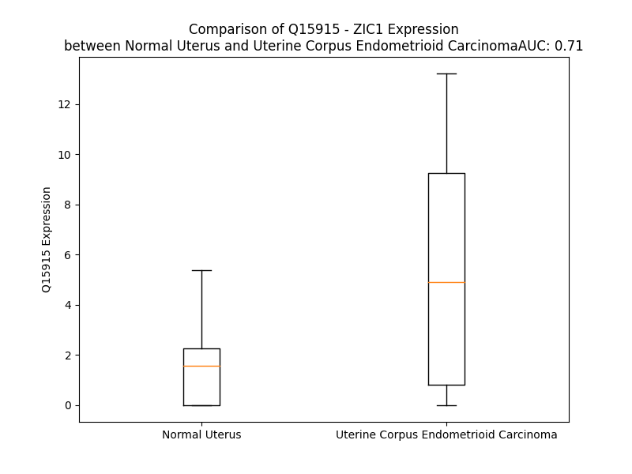

# Detailed Data for Q15915

## Introduction to the Detailed Summary

### How to Interpret the Results

- **Summary & Metrics**: This section provides a quick reference to essential protein attributes, including expression changes, family classification, and biomarker applications. Regulation status (upregulated/downregulated) indicates the protein's behavior in a disease context. Some information comes from the original excel file with the proteins selected from literature, while others are derived from the analyses.
- **Expression Comparison**: A visual representation comparing protein expression between normal and disease states. It highlights significant changes in expression levels that might indicate diagnostic or therapeutic relevance. This is data coming from transcriptomics experiments and could not translate similarly to protein levels.
- **Isoform Alignment**: An interactive view of isoform alignments, revealing structural and functional differences between variants of the protein.
- **Interactors & Homologs**: Tables listing known interaction partners and homologous proteins, the more interactors and homologs, the more complex the protein is to design an antibody for.
- **Biological Assemblies**: Information about the structural arrangement of the protein in different assemblies, providing insights into its functional state but also the complexity of the protein to develop antibodies.
- **Combined Per-Residue Information**: A detailed table summarizing residue-level data. This includes predictions for epitope regions, aggregation tendencies, and modifications that might impact the protein's function. Each row corresponds to a residue in the protein, providing insights into specific sites that may be important for research or drug development.
## Summary & Metrics

- **UniProt Accession**: Q15915
- **Gene Name**: ZIC1
- **Protein Name**: Zinc finger protein ZIC 1
- **Swiss Prot**: ZIC1_HUMAN
- **Family**: transcription regulator
- **Biomarker Application**:  
- **Number of Isoforms**: 0
- **Regulation**: 1
- **(transcriptomics) AUC**: 0.98
- **(transcriptomics) Fold Change**: 6.08
- **(transcriptomics) Regulation**: Upregulated
- **Discotope Epitope Count**: 44
- **Max n_uniprots (Homo)**: N/A
- **Max n_uniprots (Hetero)**: N/A

## Expression Comparison

## Interactors

| preferredName_A   | preferredName_B   |   score |
|:------------------|:------------------|--------:|
| ZIC1              | ZIC4              |   0.951 |

## Homologs

| uniprot_id   | gene_id   |
|:-------------|:----------|
| O60481       | ZIC3      |
| A0A6Q8PH00   | GLI2      |
| P98168       | ZXDA      |
| P98169       | ZXDB      |
| P08151       | GLI1      |
| A0A669KBC9   | AEBP2     |
| A0A7I2V3B8   | GLI3      |
| Q9BZE0       | GLIS2     |
| F8WEV9       | GLIS3     |
| Q96T25       | ZIC5      |
| C9J6T3       | ZIC4      |
| Q2QGD7       | ZXDC      |
| O95409       | ZIC2      |
| A0A0D9SEX9   | GLIS1     |

## Combined Per-Residue Information

|   res | aa   |   epitope_score | epitope   |   relative_surface_accessibility |   modeling_confidence |   Aggregation | modification   |
|------:|:-----|----------------:|:----------|---------------------------------:|----------------------:|--------------:|:---------------|
|     1 | M    |         0.1419  | False     |                          1.22506 |                 40.91 |         0     | N/A            |
|     2 | L    |         0.07949 | False     |                          0.89462 |                 39.98 |         0     | N/A            |
|     3 | L    |         0.12475 | False     |                          0.9694  |                 42.45 |         0     | N/A            |
|     4 | D    |         0.11137 | False     |                          0.84234 |                 40.87 |         0     | N/A            |
|     5 | A    |         0.07779 | False     |                          0.96078 |                 46.79 |         0     | N/A            |
|     6 | G    |         0.11695 | False     |                          0.81524 |                 53.38 |         0     | N/A            |
|     7 | P    |         0.0935  | False     |                          0.88946 |                 46.95 |         0     | N/A            |
|     8 | Q    |         0.09202 | False     |                          0.89777 |                 42.88 |         0     | N/A            |
|     9 | Y    |         0.14061 | False     |                          0.89961 |                 45.17 |         0     | N/A            |
|    10 | P    |         0.08944 | False     |                          0.81319 |                 46.32 |         0     | N/A            |
|    11 | A    |         0.08892 | False     |                          1.013   |                 41.99 |         3.125 | N/A            |
|    12 | I    |         0.15428 | True      |                          1.00626 |                 48.82 |         6.478 | N/A            |
|    13 | G    |         0.07807 | False     |                          0.7885  |                 42    |         6.739 | N/A            |
|    14 | V    |         0.08079 | False     |                          0.99073 |                 36.85 |         7.001 | N/A            |
|    15 | T    |         0.095   | False     |                          0.92759 |                 43.57 |         7.001 | N/A            |
|    16 | T    |         0.12075 | False     |                          0.82989 |                 40.28 |         6.673 | N/A            |
|    17 | F    |         0.14764 | True      |                          1.09675 |                 40.98 |         6.245 | N/A            |
|    18 | G    |         0.14426 | False     |                          0.95176 |                 35.89 |         0.734 | N/A            |
|    19 | A    |         0.10761 | False     |                          1.02491 |                 44.58 |         0     | N/A            |
|    20 | S    |         0.09414 | False     |                          0.79987 |                 36.52 |         0     | N/A            |
|    21 | R    |         0.18117 | True      |                          0.96203 |                 42.39 |         0     | N/A            |
|    22 | H    |         0.13155 | False     |                          0.89442 |                 41.23 |         0     | N/A            |
|    23 | H    |         0.13559 | False     |                          1.05059 |                 41.91 |         0     | N/A            |
|    24 | S    |         0.08375 | False     |                          0.85804 |                 41.38 |         0     | N/A            |
|    25 | A    |         0.09427 | False     |                          1.03428 |                 35.72 |         0     | N/A            |
|    26 | G    |         0.13277 | False     |                          0.84275 |                 42.62 |         0     | N/A            |
|    27 | D    |         0.12002 | False     |                          0.92386 |                 35.8  |         0     | N/A            |
|    28 | V    |         0.14211 | False     |                          1.07901 |                 43.27 |         0     | N/A            |
|    29 | A    |         0.088   | False     |                          0.90951 |                 37.42 |         0     | N/A            |
|    30 | E    |         0.14404 | False     |                          0.84709 |                 32.25 |         0     | N/A            |
|    31 | R    |         0.14761 | True      |                          0.95108 |                 37.74 |         0     | N/A            |
|    32 | D    |         0.16269 | True      |                          0.83427 |                 32.45 |         0     | N/A            |
|    33 | V    |         0.11704 | False     |                          1.02174 |                 38.29 |         0.948 | N/A            |
|    34 | G    |         0.15389 | True      |                          0.89727 |                 35.05 |         0.948 | N/A            |
|    35 | L    |         0.10147 | False     |                          1.15447 |                 35.31 |         0.948 | N/A            |
|    36 | G    |         0.12625 | False     |                          0.77194 |                 33.54 |         0.948 | N/A            |
|    37 | I    |         0.12888 | False     |                          1.06775 |                 36.27 |         0.948 | N/A            |
|    38 | N    |         0.10493 | False     |                          0.89927 |                 31.04 |         0     | N/A            |
|    39 | P    |         0.09645 | False     |                          0.80061 |                 40.05 |         0     | N/A            |
|    40 | F    |         0.08492 | False     |                          1.04203 |                 31.21 |         0     | N/A            |
|    41 | A    |         0.08025 | False     |                          0.93984 |                 33.87 |         0     | N/A            |
|    42 | D    |         0.10918 | False     |                          0.89883 |                 35.63 |         0     | N/A            |
|    43 | G    |         0.13277 | False     |                          0.87696 |                 31.69 |         0     | N/A            |
|    44 | M    |         0.1069  | False     |                          1.02921 |                 38.59 |         0     | N/A            |
|    45 | G    |         0.09796 | False     |                          0.87976 |                 31.72 |         0     | N/A            |
|    46 | A    |         0.08878 | False     |                          0.84076 |                 37.39 |         0     | N/A            |
|    47 | F    |         0.08736 | False     |                          1.05666 |                 34.34 |         0     | N/A            |
|    48 | K    |         0.0985  | False     |                          0.95068 |                 36.82 |         0     | N/A            |
|    49 | L    |         0.05601 | False     |                          1.02118 |                 38.51 |         0     | N/A            |
|    50 | N    |         0.09965 | False     |                          0.87931 |                 30.84 |         0     | N/A            |
|    51 | P    |         0.13093 | False     |                          0.89188 |                 34.55 |         0     | N/A            |
|    52 | S    |         0.11947 | False     |                          0.82479 |                 34.12 |         0     | N/A            |
|    53 | S    |         0.10318 | False     |                          0.77214 |                 40.64 |         0     | N/A            |
|    54 | H    |         0.11448 | False     |                          0.85756 |                 38.92 |         0     | N/A            |
|    55 | E    |         0.11265 | False     |                          0.64639 |                 32.28 |         0     | N/A            |
|    56 | L    |         0.10273 | False     |                          0.94135 |                 36.39 |         0     | N/A            |
|    57 | A    |         0.10806 | False     |                          1.05631 |                 37.05 |         0     | N/A            |
|    58 | S    |         0.10227 | False     |                          0.84785 |                 34.88 |         0     | N/A            |
|    59 | A    |         0.08345 | False     |                          1.07045 |                 37.89 |         0     | N/A            |
|    60 | G    |         0.19073 | True      |                          0.95928 |                 39.79 |         0     | N/A            |
|    61 | Q    |         0.10632 | False     |                          0.91599 |                 36.32 |         0     | N/A            |
|    62 | T    |         0.11026 | False     |                          1.02974 |                 36.59 |         0     | N/A            |
|    63 | A    |         0.10223 | False     |                          0.87602 |                 32.76 |         0     | N/A            |
|    64 | F    |         0.14792 | True      |                          1.0135  |                 34.15 |         0     | N/A            |
|    65 | T    |         0.11636 | False     |                          0.70481 |                 34.31 |         0     | N/A            |
|    66 | S    |         0.10931 | False     |                          0.72197 |                 40.11 |         0     | N/A            |
|    67 | Q    |         0.09775 | False     |                          0.89328 |                 35.69 |         0     | N/A            |
|    68 | A    |         0.0773  | False     |                          0.89483 |                 35.97 |         0     | N/A            |
|    69 | P    |         0.10402 | False     |                          0.85873 |                 39.43 |         0     | N/A            |
|    70 | G    |         0.13446 | False     |                          0.91442 |                 31.63 |         0     | N/A            |
|    71 | Y    |         0.15416 | True      |                          0.89933 |                 33.92 |         0.479 | N/A            |
|    72 | A    |         0.10846 | False     |                          0.91103 |                 34.25 |         0.618 | N/A            |
|    73 | A    |         0.09718 | False     |                          0.99822 |                 30.03 |         0.782 | N/A            |
|    74 | A    |         0.12502 | False     |                          0.95568 |                 34.37 |         0.782 | N/A            |
|    75 | A    |         0.141   | False     |                          0.93736 |                 34.34 |         0.782 | N/A            |
|    76 | A    |         0.16082 | True      |                          0.87734 |                 36.9  |         0.782 | N/A            |
|    77 | L    |         0.12928 | False     |                          1.092   |                 39.82 |         0.782 | N/A            |
|    78 | G    |         0.08447 | False     |                          0.80473 |                 36.68 |         0     | N/A            |
|    79 | H    |         0.13491 | False     |                          0.86436 |                 40.73 |         0     | N/A            |
|    80 | H    |         0.14983 | True      |                          0.80438 |                 40.74 |         0     | N/A            |
|    81 | H    |         0.13679 | False     |                          0.82862 |                 38.81 |         0     | N/A            |
|    82 | H    |         0.15812 | True      |                          0.89706 |                 42.24 |         0     | N/A            |
|    83 | P    |         0.09629 | False     |                          0.81971 |                 39.28 |         0     | N/A            |
|    84 | G    |         0.12528 | False     |                          0.95451 |                 41.49 |         0     | N/A            |
|    85 | H    |         0.18738 | True      |                          0.95309 |                 35.24 |         0     | N/A            |
|    86 | V    |         0.12094 | False     |                          1.05535 |                 38.74 |         0     | N/A            |
|    87 | G    |         0.11632 | False     |                          0.76133 |                 31.34 |         0     | N/A            |
|    88 | S    |         0.08234 | False     |                          0.84471 |                 27.79 |         0     | N/A            |
|    89 | Y    |         0.10165 | False     |                          0.89894 |                 32.38 |         0     | N/A            |
|    90 | S    |         0.10378 | False     |                          0.82822 |                 27.46 |         0     | N/A            |
|    91 | S    |         0.08429 | False     |                          0.7179  |                 33.74 |         0     | N/A            |
|    92 | A    |         0.08326 | False     |                          0.76664 |                 28.22 |         0     | N/A            |
|    93 | A    |         0.09939 | False     |                          0.84798 |                 33.38 |         0     | N/A            |
|    94 | F    |         0.14571 | True      |                          1.03746 |                 30.86 |         0     | N/A            |
|    95 | N    |         0.10908 | False     |                          0.93092 |                 33.21 |         0     | N/A            |
|    96 | S    |         0.06349 | False     |                          0.53798 |                 39.89 |         0     | N/A            |
|    97 | T    |         0.0794  | False     |                          0.45238 |                 45.64 |         0     | N/A            |
|    98 | R    |         0.20364 | True      |                          0.84641 |                 39.52 |         0     | N/A            |
|    99 | D    |         0.16073 | True      |                          0.72789 |                 38.37 |         0     | N/A            |
|   100 | F    |         0.14893 | True      |                          0.87642 |                 35.97 |         0     | N/A            |
|   101 | L    |         0.1051  | False     |                          0.59791 |                 44.61 |         0     | N/A            |
|   102 | F    |         0.13193 | False     |                          0.94876 |                 40.26 |         0     | N/A            |
|   103 | R    |         0.16553 | True      |                          0.86934 |                 40.02 |         0     | N/A            |
|   104 | N    |         0.12275 | False     |                          0.98928 |                 36.24 |         0     | N/A            |
|   105 | R    |         0.11899 | False     |                          0.99894 |                 34.43 |         0     | N/A            |
|   106 | G    |         0.1034  | False     |                          0.82824 |                 32.81 |         0     | N/A            |
|   107 | F    |         0.13389 | False     |                          1.11227 |                 39.41 |         0     | N/A            |
|   108 | G    |         0.08965 | False     |                          0.83263 |                 35.27 |         0     | N/A            |
|   109 | D    |         0.10102 | False     |                          0.94151 |                 31.89 |         0     | N/A            |
|   110 | A    |         0.07686 | False     |                          0.98845 |                 34.84 |         0     | N/A            |
|   111 | A    |         0.04966 | False     |                          0.96465 |                 34.36 |         0     | N/A            |
|   112 | A    |         0.0875  | False     |                          1.06079 |                 29.06 |         0     | N/A            |
|   113 | A    |         0.07895 | False     |                          0.92425 |                 33.22 |         0     | N/A            |
|   114 | A    |         0.06365 | False     |                          1.04063 |                 34.69 |         0     | N/A            |
|   115 | S    |         0.08556 | False     |                          0.86145 |                 31.94 |         0     | N/A            |
|   116 | A    |         0.06296 | False     |                          0.90191 |                 39.9  |         0     | N/A            |
|   117 | Q    |         0.12465 | False     |                          0.83569 |                 41.54 |         0     | N/A            |
|   118 | H    |         0.08384 | False     |                          0.97039 |                 37.94 |         0     | N/A            |
|   119 | S    |         0.12769 | False     |                          0.71921 |                 34.57 |         0.314 | N/A            |
|   120 | L    |         0.10794 | False     |                          0.91137 |                 35.39 |         0.904 | N/A            |
|   121 | F    |         0.083   | False     |                          0.94558 |                 36.4  |         0.904 | N/A            |
|   122 | A    |         0.07662 | False     |                          0.77739 |                 36.15 |         0.904 | N/A            |
|   123 | A    |         0.0647  | False     |                          0.97012 |                 38.28 |         0.904 | N/A            |
|   124 | S    |         0.10105 | False     |                          0.81695 |                 39.34 |         0.59  | N/A            |
|   125 | A    |         0.08421 | False     |                          0.99794 |                 41.94 |         0.27  | N/A            |
|   126 | G    |         0.07541 | False     |                          0.989   |                 37.28 |         0     | N/A            |
|   127 | G    |         0.10728 | False     |                          0.73563 |                 38.26 |         0     | N/A            |
|   128 | F    |         0.08576 | False     |                          1.14082 |                 41.82 |         0     | N/A            |
|   129 | G    |         0.12501 | False     |                          0.96846 |                 40.08 |         0     | N/A            |
|   130 | G    |         0.12056 | False     |                          0.8842  |                 40.74 |         0     | N/A            |
|   131 | P    |         0.08646 | False     |                          0.82893 |                 47.45 |         0     | N/A            |
|   132 | H    |         0.10517 | False     |                          0.97188 |                 43.16 |         0     | N/A            |
|   133 | G    |         0.12323 | False     |                          0.81171 |                 37.41 |         0     | N/A            |
|   134 | H    |         0.05923 | False     |                          0.94909 |                 39.53 |         0     | N/A            |
|   135 | T    |         0.09091 | False     |                          0.75436 |                 31.15 |         0     | N/A            |
|   136 | D    |         0.12183 | False     |                          0.85817 |                 31.49 |         0     | N/A            |
|   137 | A    |         0.08323 | False     |                          0.94626 |                 37.17 |         0     | N/A            |
|   138 | A    |         0.07448 | False     |                          1.05806 |                 36.84 |         0     | N/A            |
|   139 | G    |         0.08551 | False     |                          0.98998 |                 38.25 |         0     | N/A            |
|   140 | H    |         0.07312 | False     |                          0.99568 |                 35.95 |         0     | N/A            |
|   141 | L    |         0.11344 | False     |                          1.0147  |                 38.16 |         0     | N/A            |
|   142 | L    |         0.12454 | False     |                          0.94608 |                 36.37 |         0     | N/A            |
|   143 | F    |         0.09927 | False     |                          0.89941 |                 37.31 |         0     | N/A            |
|   144 | P    |         0.11591 | False     |                          0.95333 |                 42.92 |         0     | N/A            |
|   145 | G    |         0.1102  | False     |                          0.70311 |                 39.25 |         0     | N/A            |
|   146 | L    |         0.12802 | False     |                          1.06673 |                 39.11 |         0     | N/A            |
|   147 | H    |         0.09993 | False     |                          0.6833  |                 39.22 |         0     | N/A            |
|   148 | E    |         0.12966 | False     |                          0.70861 |                 38.08 |         0     | N/A            |
|   149 | Q    |         0.09405 | False     |                          0.68463 |                 38.29 |         0     | N/A            |
|   150 | A    |         0.08411 | False     |                          0.92333 |                 34.85 |         0     | N/A            |
|   151 | A    |         0.09892 | False     |                          1.03064 |                 38.78 |         0     | N/A            |
|   152 | G    |         0.15899 | True      |                          0.82615 |                 36.72 |         0     | N/A            |
|   153 | H    |         0.07028 | False     |                          1.05373 |                 33.44 |         0     | N/A            |
|   154 | A    |         0.08248 | False     |                          1.01623 |                 33.72 |         0     | N/A            |
|   155 | S    |         0.09561 | False     |                          0.80574 |                 31.59 |         0     | N/A            |
|   156 | P    |         0.09665 | False     |                          0.88639 |                 46.16 |         0     | N/A            |
|   157 | N    |         0.13091 | False     |                          0.97899 |                 36.18 |         0     | N/A            |
|   158 | V    |         0.08442 | False     |                          0.92882 |                 33.27 |         0     | N/A            |
|   159 | V    |         0.10378 | False     |                          0.99028 |                 40.98 |         0     | N/A            |
|   160 | N    |         0.07098 | False     |                          0.96409 |                 31.96 |         0     | N/A            |
|   161 | G    |         0.11338 | False     |                          0.95414 |                 38.9  |         0     | N/A            |
|   162 | Q    |         0.06665 | False     |                          0.86225 |                 33.2  |         0     | N/A            |
|   163 | M    |         0.12397 | False     |                          1.0265  |                 37.95 |         0     | N/A            |
|   164 | R    |         0.14074 | False     |                          0.82001 |                 30.87 |         0     | N/A            |
|   165 | L    |         0.09976 | False     |                          0.97317 |                 32.44 |         0     | N/A            |
|   166 | G    |         0.07346 | False     |                          0.77072 |                 35.52 |         0     | N/A            |
|   167 | F    |         0.12788 | False     |                          1.01748 |                 32.39 |         0     | N/A            |
|   168 | S    |         0.14411 | False     |                          0.83166 |                 36.92 |         0     | N/A            |
|   169 | G    |         0.15661 | True      |                          0.93138 |                 39.59 |         0     | N/A            |
|   170 | D    |         0.13013 | False     |                          0.8166  |                 34.7  |         0     | N/A            |
|   171 | M    |         0.12174 | False     |                          0.9676  |                 38.21 |         0     | N/A            |
|   172 | Y    |         0.07571 | False     |                          0.8354  |                 35.25 |         0     | N/A            |
|   173 | P    |         0.11952 | False     |                          0.98533 |                 42.27 |         0     | N/A            |
|   174 | R    |         0.13232 | False     |                          0.80213 |                 36.57 |         0     | N/A            |
|   175 | P    |         0.15323 | True      |                          0.65173 |                 49.2  |         0     | N/A            |
|   176 | E    |         0.08871 | False     |                          0.82638 |                 41.31 |         0     | N/A            |
|   177 | Q    |         0.1359  | False     |                          0.75078 |                 37.59 |         0     | N/A            |
|   178 | Y    |         0.06996 | False     |                          0.98592 |                 36.54 |         0     | N/A            |
|   179 | G    |         0.09067 | False     |                          0.86943 |                 41.02 |         0     | N/A            |
|   180 | Q    |         0.05558 | False     |                          0.82286 |                 31.97 |         0     | N/A            |
|   181 | V    |         0.07557 | False     |                          1.06889 |                 38.18 |         0     | N/A            |
|   182 | T    |         0.09066 | False     |                          0.75441 |                 31.73 |         0     | N/A            |
|   183 | S    |         0.10118 | False     |                          0.8849  |                 35.81 |         0     | N/A            |
|   184 | P    |         0.08262 | False     |                          0.92068 |                 33.58 |         0     | N/A            |
|   185 | R    |         0.09934 | False     |                          0.83833 |                 31.58 |         0     | N/A            |
|   186 | S    |         0.06011 | False     |                          0.87368 |                 30.72 |         0     | N/A            |
|   187 | E    |         0.082   | False     |                          0.61283 |                 33.22 |         0     | N/A            |
|   188 | H    |         0.1382  | False     |                          1.0098  |                 32.2  |         0     | N/A            |
|   189 | Y    |         0.11427 | False     |                          0.99523 |                 33.44 |         0     | N/A            |
|   190 | A    |         0.11551 | False     |                          0.87785 |                 30.35 |         0     | N/A            |
|   191 | A    |         0.0491  | False     |                          0.83826 |                 35.66 |         0     | N/A            |
|   192 | P    |         0.08303 | False     |                          0.8505  |                 37.94 |         0     | N/A            |
|   193 | Q    |         0.11099 | False     |                          0.78525 |                 31.12 |         0     | N/A            |
|   194 | L    |         0.11139 | False     |                          1.0046  |                 37.44 |         0     | N/A            |
|   195 | H    |         0.18722 | True      |                          0.91739 |                 32.16 |         0     | N/A            |
|   196 | G    |         0.20978 | True      |                          0.83852 |                 35.6  |         0     | N/A            |
|   197 | Y    |         0.12398 | False     |                          0.89356 |                 36.6  |         0     | N/A            |
|   198 | G    |         0.11062 | False     |                          0.67993 |                 37.9  |         0     | N/A            |
|   199 | P    |         0.14065 | False     |                          1.05518 |                 42.17 |         0     | N/A            |
|   200 | M    |         0.14353 | False     |                          0.83025 |                 44.84 |         0     | N/A            |
|   201 | N    |         0.12124 | False     |                          0.76689 |                 43.9  |         0     | N/A            |
|   202 | V    |         0.09395 | False     |                          0.903   |                 53.54 |         0     | N/A            |
|   203 | N    |         0.12491 | False     |                          0.74385 |                 47.99 |         0     | N/A            |
|   204 | M    |         0.06963 | False     |                          0.50499 |                 43.54 |         0     | N/A            |
|   205 | A    |         0.0882  | False     |                          0.81776 |                 45.27 |         0     | N/A            |
|   206 | A    |         0.14857 | True      |                          0.84153 |                 50.44 |         0     | N/A            |
|   207 | H    |         0.10877 | False     |                          0.87487 |                 51.71 |         0     | N/A            |
|   208 | H    |         0.0713  | False     |                          0.46557 |                 47.31 |         0     | N/A            |
|   209 | G    |         0.11319 | False     |                          0.68112 |                 48.79 |         0     | N/A            |
|   210 | A    |         0.05828 | False     |                          0.76207 |                 54.14 |         0.195 | N/A            |
|   211 | G    |         0.09891 | False     |                          0.59196 |                 49.01 |         0.195 | N/A            |
|   212 | A    |         0.04095 | False     |                          0.27082 |                 50.21 |         0.195 | N/A            |
|   213 | F    |         0.05266 | False     |                          0.5475  |                 43.49 |         0.195 | N/A            |
|   214 | F    |         0.0642  | False     |                          0.67516 |                 47.57 |         0.195 | N/A            |
|   215 | R    |         0.10216 | False     |                          0.81002 |                 48.92 |         0     | N/A            |
|   216 | Y    |         0.07551 | False     |                          0.60184 |                 43.06 |         0     | N/A            |
|   217 | M    |         0.10009 | False     |                          0.56138 |                 46.2  |         0     | N/A            |
|   218 | R    |         0.08759 | False     |                          0.85966 |                 49.14 |         0     | N/A            |
|   219 | Q    |         0.10634 | False     |                          0.51706 |                 41.6  |         0     | N/A            |
|   220 | P    |         0.0937  | False     |                          0.75972 |                 43.58 |         0     | N/A            |
|   221 | I    |         0.08537 | False     |                          0.85798 |                 47.64 |         0     | N/A            |
|   222 | K    |         0.10866 | False     |                          0.86963 |                 49.11 |         0     | N/A            |
|   223 | Q    |         0.05005 | False     |                          0.67181 |                 54.8  |         0     | N/A            |
|   224 | E    |         0.07481 | False     |                          0.60168 |                 67.11 |         0.973 | N/A            |
|   225 | L    |         0.02197 | False     |                          0.0643  |                 75.09 |         0.973 | N/A            |
|   226 | I    |         0.06912 | False     |                          0.45593 |                 78.42 |         0.973 | N/A            |
|   227 | C    |         0.01031 | False     |                          0       |                 81.9  |         0.973 | N/A            |
|   228 | K    |         0.04995 | False     |                          0.31276 |                 79.76 |         0.973 | N/A            |
|   229 | W    |         0.01266 | False     |                          0.00498 |                 77.67 |         0.973 | N/A            |
|   230 | I    |         0.05056 | False     |                          0.49198 |                 75.55 |         0.973 | N/A            |
|   231 | E    |         0.0684  | False     |                          0.31194 |                 63.42 |         0     | N/A            |
|   232 | P    |         0.12622 | False     |                          0.61357 |                 61.46 |         0     | N/A            |
|   233 | E    |         0.19085 | True      |                          0.7838  |                 56.18 |         0     | N/A            |
|   234 | Q    |         0.13206 | False     |                          0.45242 |                 46.16 |         0     | N/A            |
|   235 | L    |         0.16834 | True      |                          1.15248 |                 52.1  |         0     | N/A            |
|   236 | A    |         0.09819 | False     |                          0.98125 |                 52.29 |         0     | N/A            |
|   237 | N    |         0.08435 | False     |                          0.55369 |                 48.15 |         0     | N/A            |
|   238 | P    |         0.12729 | False     |                          0.87774 |                 46.24 |         0     | N/A            |
|   239 | K    |         0.15198 | True      |                          0.93604 |                 50.56 |         0     | N/A            |
|   240 | K    |         0.16739 | True      |                          0.71689 |                 61.66 |         0     | N/A            |
|   241 | S    |         0.09959 | False     |                          0.26808 |                 71.25 |         0     | N/A            |
|   242 | C    |         0.03476 | False     |                          0.07784 |                 78.26 |         0     | N/A            |
|   243 | N    |         0.10861 | False     |                          0.58563 |                 79.77 |         0     | N/A            |
|   244 | K    |         0.14383 | False     |                          0.50622 |                 82.12 |         0     | N/A            |
|   245 | T    |         0.09049 | False     |                          0.52359 |                 80.3  |         0     | N/A            |
|   246 | F    |         0.04948 | False     |                          0.18173 |                 80.74 |         0     | N/A            |
|   247 | S    |         0.06614 | False     |                          0.77553 |                 75.5  |         0     | N/A            |
|   248 | T    |         0.08429 | False     |                          0.44554 |                 76.29 |         0     | N/A            |
|   249 | M    |         0.01889 | False     |                          0.10528 |                 75.58 |         0     | N/A            |
|   250 | H    |         0.05971 | False     |                          0.60223 |                 75.31 |         0     | N/A            |
|   251 | E    |         0.03594 | False     |                          0.31963 |                 81.5  |         0     | N/A            |
|   252 | L    |         0.0029  | False     |                          0       |                 82.94 |         0.24  | N/A            |
|   253 | V    |         0.02352 | False     |                          0.07236 |                 78.14 |         0.24  | N/A            |
|   254 | T    |         0.04361 | False     |                          0.36632 |                 80.14 |         0.24  | N/A            |
|   255 | H    |         0.02285 | False     |                          0.08305 |                 83.71 |         0.24  | N/A            |
|   256 | V    |         0.00666 | False     |                          0       |                 80.41 |         0.24  | N/A            |
|   257 | T    |         0.02645 | False     |                          0.0492  |                 77.09 |         0.24  | N/A            |
|   258 | V    |         0.15577 | True      |                          0.75189 |                 76.61 |         0.24  | N/A            |
|   259 | E    |         0.16121 | True      |                          0.46996 |                 76.83 |         0     | N/A            |
|   260 | H    |         0.09305 | False     |                          0.18231 |                 74.86 |         0     | N/A            |
|   261 | V    |         0.04857 | False     |                          0.05778 |                 71.52 |         0     | N/A            |
|   262 | G    |         0.07613 | False     |                          0.29292 |                 61.67 |         0     | N/A            |
|   263 | G    |         0.20016 | True      |                          0.52895 |                 57.8  |         0     | N/A            |
|   264 | P    |         0.18377 | True      |                          0.91069 |                 57.26 |         0     | N/A            |
|   265 | E    |         0.18497 | True      |                          0.87217 |                 56.43 |         0     | N/A            |
|   266 | Q    |         0.09962 | False     |                          0.4574  |                 60.06 |         0     | N/A            |
|   267 | S    |         0.14686 | True      |                          0.70782 |                 57.88 |         0     | N/A            |
|   268 | N    |         0.09261 | False     |                          0.52556 |                 66.92 |         0     | N/A            |
|   269 | H    |         0.03568 | False     |                          0.09512 |                 72.44 |         0.754 | N/A            |
|   270 | I    |         0.05759 | False     |                          0.28885 |                 73    |         0.754 | N/A            |
|   271 | C    |         0.02747 | False     |                          0.01036 |                 78.71 |         0.754 | N/A            |
|   272 | F    |         0.07744 | False     |                          0.33633 |                 72.48 |         0.754 | N/A            |
|   273 | W    |         0.01753 | False     |                          0.05188 |                 75.25 |         0.754 | N/A            |
|   274 | E    |         0.09817 | False     |                          0.38248 |                 67.78 |         0     | N/A            |
|   275 | E    |         0.09671 | False     |                          0.61571 |                 68.01 |         0     | N/A            |
|   276 | C    |         0.04582 | False     |                          0.14317 |                 72.47 |         0     | N/A            |
|   277 | P    |         0.11157 | False     |                          0.90044 |                 69.87 |         0     | N/A            |
|   278 | R    |         0.12242 | False     |                          0.31548 |                 64.47 |         0     | N/A            |
|   279 | E    |         0.08699 | False     |                          0.72613 |                 58.34 |         0     | N/A            |
|   280 | G    |         0.07844 | False     |                          0.33575 |                 64.15 |         0     | N/A            |
|   281 | K    |         0.14125 | False     |                          0.61855 |                 67.33 |         0     | N/A            |
|   282 | P    |         0.11115 | False     |                          0.46441 |                 74.62 |         0     | N/A            |
|   283 | F    |         0.05443 | False     |                          0.11162 |                 72.64 |         0     | N/A            |
|   284 | K    |         0.14476 | False     |                          0.99226 |                 74.13 |         0     | N/A            |
|   285 | A    |         0.11409 | False     |                          0.26529 |                 73.8  |         0     | N/A            |
|   286 | K    |         0.03945 | False     |                          0.26722 |                 72.75 |         0     | N/A            |
|   287 | Y    |         0.10554 | False     |                          0.58587 |                 73.72 |         0     | N/A            |
|   288 | K    |         0.07411 | False     |                          0.49181 |                 77.45 |         0     | N/A            |
|   289 | L    |         0.00678 | False     |                          0.00082 |                 79.57 |         0     | N/A            |
|   290 | V    |         0.0223  | False     |                          0.09806 |                 75.27 |         0     | N/A            |
|   291 | N    |         0.05081 | False     |                          0.34545 |                 75.9  |         0     | N/A            |
|   292 | H    |         0.01419 | False     |                          0.12493 |                 81.54 |         0     | N/A            |
|   293 | I    |         0.00388 | False     |                          0       |                 77.7  |         0     | N/A            |
|   294 | R    |         0.0161  | False     |                          0.11331 |                 76.06 |         0     | N/A            |
|   295 | V    |         0.07104 | False     |                          0.7124  |                 76.93 |         0     | N/A            |
|   296 | H    |         0.03817 | False     |                          0.22429 |                 74.59 |         0     | N/A            |
|   297 | T    |         0.02287 | False     |                          0.19591 |                 73.89 |         0     | N/A            |
|   298 | G    |         0.0453  | False     |                          0.48196 |                 68.72 |         0     | N/A            |
|   299 | E    |         0.03863 | False     |                          0.22173 |                 66.6  |         0     | N/A            |
|   300 | K    |         0.11993 | False     |                          0.56081 |                 67.84 |         0     | N/A            |
|   301 | P    |         0.07309 | False     |                          0.44033 |                 69.52 |         0     | N/A            |
|   302 | F    |         0.07498 | False     |                          0.24813 |                 67.09 |         0     | N/A            |
|   303 | P    |         0.08141 | False     |                          0.37364 |                 72.75 |         0     | N/A            |
|   304 | C    |         0.05825 | False     |                          0.09266 |                 77.78 |         0     | N/A            |
|   305 | P    |         0.066   | False     |                          0.59692 |                 73.34 |         0     | N/A            |
|   306 | F    |         0.12477 | False     |                          0.51593 |                 71.82 |         0     | N/A            |
|   307 | P    |         0.10681 | False     |                          0.72736 |                 72.34 |         0     | N/A            |
|   308 | G    |         0.07893 | False     |                          1.08729 |                 73.68 |         0     | N/A            |
|   309 | C    |         0.04819 | False     |                          0.12654 |                 76.45 |         0     | N/A            |
|   310 | G    |         0.0828  | False     |                          0.80623 |                 75.23 |         0     | N/A            |
|   311 | K    |         0.12175 | False     |                          0.58591 |                 75.05 |         0     | N/A            |
|   312 | V    |         0.07221 | False     |                          0.44757 |                 74.06 |         0     | N/A            |
|   313 | F    |         0.05281 | False     |                          0.21378 |                 70.78 |         0     | N/A            |
|   314 | A    |         0.026   | False     |                          0.28181 |                 67.9  |         0     | N/A            |
|   315 | R    |         0.10739 | False     |                          0.50444 |                 69.5  |         0     | N/A            |
|   316 | S    |         0.04472 | False     |                          0.50238 |                 74.81 |         0     | N/A            |
|   317 | E    |         0.07826 | False     |                          0.48647 |                 75.44 |         0     | N/A            |
|   318 | N    |         0.0529  | False     |                          0.30388 |                 77.64 |         0     | N/A            |
|   319 | L    |         0.02434 | False     |                          0.13767 |                 80.3  |         0     | N/A            |
|   320 | K    |         0.04593 | False     |                          0.58239 |                 79.54 |         0     | N/A            |
|   321 | I    |         0.04257 | False     |                          0.28719 |                 80.13 |         0     | N/A            |
|   322 | H    |         0.01472 | False     |                          0.0893  |                 82.7  |         0     | N/A            |
|   323 | K    |         0.05389 | False     |                          0.44754 |                 81.36 |         0     | N/A            |
|   324 | R    |         0.07205 | False     |                          0.19114 |                 81.18 |         0     | N/A            |
|   325 | T    |         0.13163 | False     |                          0.63543 |                 79.47 |         0     | N/A            |
|   326 | H    |         0.06112 | False     |                          0.37605 |                 79.97 |         0     | N/A            |
|   327 | T    |         0.0955  | False     |                          0.6574  |                 77.24 |         0     | N/A            |
|   328 | G    |         0.07466 | False     |                          0.59757 |                 74.25 |         0     | N/A            |
|   329 | E    |         0.08598 | False     |                          0.43194 |                 76.37 |         0     | N/A            |
|   330 | K    |         0.14737 | True      |                          0.54876 |                 78.74 |         0     | N/A            |
|   331 | P    |         0.13772 | False     |                          0.49405 |                 80.16 |         0     | N/A            |
|   332 | F    |         0.12789 | False     |                          0.31702 |                 78    |         0     | N/A            |
|   333 | K    |         0.11842 | False     |                          0.60492 |                 81.46 |         0     | N/A            |
|   334 | C    |         0.05005 | False     |                          0.02739 |                 84.68 |         0     | N/A            |
|   335 | E    |         0.14644 | True      |                          0.61367 |                 81    |         0     | N/A            |
|   336 | F    |         0.10232 | False     |                          0.52738 |                 77.42 |         0     | N/A            |
|   337 | E    |         0.13969 | False     |                          0.75533 |                 74.54 |         0     | N/A            |
|   338 | G    |         0.11886 | False     |                          0.98611 |                 77.56 |         0     | N/A            |
|   339 | C    |         0.0458  | False     |                          0.12508 |                 80.61 |         0     | N/A            |
|   340 | D    |         0.13014 | False     |                          0.84299 |                 79.49 |         0     | N/A            |
|   341 | R    |         0.16642 | True      |                          0.57835 |                 79.89 |         0     | N/A            |
|   342 | R    |         0.09465 | False     |                          0.56776 |                 81.84 |         0     | N/A            |
|   343 | F    |         0.05372 | False     |                          0.21256 |                 78.69 |         0     | N/A            |
|   344 | A    |         0.03337 | False     |                          0.17045 |                 79.26 |         0     | N/A            |
|   345 | N    |         0.05309 | False     |                          0.12269 |                 80.64 |         0     | N/A            |
|   346 | S    |         0.06701 | False     |                          0.38206 |                 81.37 |         0     | N/A            |
|   347 | S    |         0.05388 | False     |                          0.5458  |                 81.43 |         0     | N/A            |
|   348 | D    |         0.05589 | False     |                          0.3116  |                 80.94 |         0     | N/A            |
|   349 | R    |         0.04307 | False     |                          0.24993 |                 83.86 |         0     | N/A            |
|   350 | K    |         0.09446 | False     |                          0.72881 |                 81.32 |         0     | N/A            |
|   351 | K    |         0.07873 | False     |                          0.53393 |                 78.57 |         0     | N/A            |
|   352 | H    |         0.01916 | False     |                          0.07194 |                 83.87 |         0     | N/A            |
|   353 | M    |         0.06605 | False     |                          0.28641 |                 79.03 |         0     | N/A            |
|   354 | H    |         0.04369 | False     |                          0.40229 |                 76.47 |         0     | N/A            |
|   355 | V    |         0.0985  | False     |                          0.59749 |                 76.53 |         0     | N/A            |
|   356 | H    |         0.05219 | False     |                          0.28801 |                 77.95 |         0     | N/A            |
|   357 | T    |         0.09453 | False     |                          0.59559 |                 70.6  |         0     | N/A            |
|   358 | S    |         0.12514 | False     |                          0.64125 |                 63.88 |         0     | N/A            |
|   359 | D    |         0.09767 | False     |                          0.48274 |                 65.16 |         0     | N/A            |
|   360 | K    |         0.28372 | True      |                          0.54746 |                 67.48 |         0     | N/A            |
|   361 | P    |         0.10567 | False     |                          0.65076 |                 74.48 |         0     | N/A            |
|   362 | Y    |         0.13428 | False     |                          0.36332 |                 73.3  |         0     | N/A            |
|   363 | L    |         0.06536 | False     |                          0.69391 |                 77.47 |         0     | N/A            |
|   364 | C    |         0.03707 | False     |                          0.07699 |                 81.48 |         0     | N/A            |
|   365 | K    |         0.07025 | False     |                          0.95568 |                 78.16 |         0     | N/A            |
|   366 | M    |         0.13033 | False     |                          0.62939 |                 72.44 |         0     | N/A            |
|   367 | C    |         0.0667  | False     |                          0.24844 |                 83.33 |         0     | N/A            |
|   368 | D    |         0.10382 | False     |                          0.87976 |                 77.43 |         0     | N/A            |
|   369 | K    |         0.13534 | False     |                          0.58617 |                 78.13 |         0     | N/A            |
|   370 | S    |         0.04585 | False     |                          0.30447 |                 78.64 |         0     | N/A            |
|   371 | Y    |         0.05144 | False     |                          0.23049 |                 75.95 |         0     | N/A            |
|   372 | T    |         0.05252 | False     |                          0.25151 |                 76.33 |         0     | N/A            |
|   373 | H    |         0.04714 | False     |                          0.24769 |                 75.92 |         0     | N/A            |
|   374 | P    |         0.06511 | False     |                          0.51877 |                 78.86 |         0     | N/A            |
|   375 | S    |         0.05371 | False     |                          0.52607 |                 82.74 |         0     | N/A            |
|   376 | S    |         0.04714 | False     |                          0.31693 |                 82.68 |         0     | N/A            |
|   377 | L    |         0.03493 | False     |                          0.20032 |                 85.16 |         0     | N/A            |
|   378 | R    |         0.06385 | False     |                          0.71954 |                 84.72 |         0     | N/A            |
|   379 | K    |         0.04181 | False     |                          0.7803  |                 83.47 |         0     | N/A            |
|   380 | H    |         0.02435 | False     |                          0.10536 |                 86.9  |         0     | N/A            |
|   381 | M    |         0.04511 | False     |                          0.35758 |                 81.94 |         0     | N/A            |
|   382 | K    |         0.0523  | False     |                          0.65347 |                 84.55 |         0     | N/A            |
|   383 | V    |         0.06123 | False     |                          0.59586 |                 84.18 |         0     | N/A            |
|   384 | H    |         0.04307 | False     |                          0.21029 |                 81.17 |         0     | N/A            |
|   385 | E    |         0.1403  | False     |                          0.68851 |                 73.89 |         0     | N/A            |
|   386 | S    |         0.07757 | False     |                          0.69221 |                 64.06 |         0     | N/A            |
|   387 | S    |         0.07443 | False     |                          0.44014 |                 59.29 |         0     | N/A            |
|   388 | S    |         0.19427 | True      |                          0.64876 |                 56.29 |         0     | N/A            |
|   389 | Q    |         0.19331 | True      |                          0.93945 |                 46.88 |         0     | N/A            |
|   390 | G    |         0.23672 | True      |                          0.76086 |                 38.89 |         0     | N/A            |
|   391 | S    |         0.17957 | True      |                          0.79776 |                 44.51 |         0     | N/A            |
|   392 | Q    |         0.09506 | False     |                          0.86645 |                 34    |         0     | N/A            |
|   393 | P    |         0.13209 | False     |                          0.85242 |                 37.84 |         0     | N/A            |
|   394 | S    |         0.10635 | False     |                          0.83362 |                 37.84 |         0     | N/A            |
|   395 | P    |         0.11952 | False     |                          0.90969 |                 44.26 |         0     | N/A            |
|   396 | A    |         0.06841 | False     |                          1.015   |                 38.36 |         0     | N/A            |
|   397 | A    |         0.09786 | False     |                          1.01287 |                 40.74 |         0     | N/A            |
|   398 | S    |         0.09826 | False     |                          0.86806 |                 42.18 |         0     | N/A            |
|   399 | S    |         0.12408 | False     |                          0.86399 |                 43.33 |         0     | N/A            |
|   400 | G    |         0.09729 | False     |                          0.89172 |                 40.23 |         0     | N/A            |
|   401 | Y    |         0.11763 | False     |                          0.98408 |                 44.8  |         0     | N/A            |
|   402 | E    |         0.08877 | False     |                          0.83155 |                 39.95 |         0     | N/A            |
|   403 | S    |         0.12287 | False     |                          0.76494 |                 43.99 |         0     | N/A            |
|   404 | S    |         0.12484 | False     |                          0.86558 |                 45.66 |         0     | N/A            |
|   405 | T    |         0.05487 | False     |                          0.94109 |                 55.24 |         0     | N/A            |
|   406 | P    |         0.06163 | False     |                          0.85826 |                 51.75 |         0     | N/A            |
|   407 | P    |         0.05883 | False     |                          0.97158 |                 53.11 |         0     | N/A            |
|   408 | T    |         0.07392 | False     |                          0.8656  |                 40.82 |         0     | N/A            |
|   409 | I    |         0.0853  | False     |                          0.99515 |                 47    |         0     | N/A            |
|   410 | V    |         0.06712 | False     |                          0.82135 |                 46.71 |         0     | N/A            |
|   411 | S    |         0.06724 | False     |                          0.75374 |                 47.04 |         0     | N/A            |
|   412 | P    |         0.1249  | False     |                          0.89646 |                 58.87 |         0     | N/A            |
|   413 | S    |         0.06349 | False     |                          0.78644 |                 42.25 |         0     | N/A            |
|   414 | T    |         0.11627 | False     |                          0.80587 |                 46.96 |         0     | N/A            |
|   415 | D    |         0.05815 | False     |                          0.81019 |                 44.76 |         0     | N/A            |
|   416 | N    |         0.11892 | False     |                          0.92301 |                 41.1  |         0     | N/A            |
|   417 | P    |         0.04868 | False     |                          0.8251  |                 49.83 |         0     | N/A            |
|   418 | T    |         0.07332 | False     |                          0.88092 |                 40.89 |         0     | N/A            |
|   419 | T    |         0.04678 | False     |                          0.82221 |                 40.49 |         0     | N/A            |
|   420 | S    |         0.0546  | False     |                          0.8058  |                 41.04 |         0     | N/A            |
|   421 | S    |         0.12564 | False     |                          0.73937 |                 41.15 |         0     | N/A            |
|   422 | L    |         0.1103  | False     |                          1.07441 |                 42.62 |         0     | N/A            |
|   423 | S    |         0.08049 | False     |                          0.77563 |                 46.19 |         0     | N/A            |
|   424 | P    |         0.14611 | True      |                          0.86462 |                 55.35 |         0     | N/A            |
|   425 | S    |         0.07644 | False     |                          0.79941 |                 44.77 |         0     | N/A            |
|   426 | S    |         0.09658 | False     |                          0.82572 |                 45.21 |         0     | N/A            |
|   427 | S    |         0.10576 | False     |                          0.89503 |                 49.1  |         0     | N/A            |
|   428 | A    |         0.09163 | False     |                          0.82658 |                 39.13 |         0     | N/A            |
|   429 | V    |         0.12108 | False     |                          1.08596 |                 51.71 |         0     | N/A            |
|   430 | H    |         0.11647 | False     |                          0.90692 |                 39.7  |         0     | N/A            |
|   431 | H    |         0.1454  | True      |                          0.95822 |                 42.3  |         0     | N/A            |
|   432 | T    |         0.0972  | False     |                          0.89232 |                 42.73 |         0     | N/A            |
|   433 | A    |         0.06918 | False     |                          1.00769 |                 40.41 |         0     | N/A            |
|   434 | G    |         0.08865 | False     |                          0.92422 |                 39.63 |         0     | N/A            |
|   435 | H    |         0.08715 | False     |                          1.02454 |                 42.89 |         0     | N/A            |
|   436 | S    |         0.08656 | False     |                          0.8064  |                 39.01 |         0     | N/A            |
|   437 | A    |         0.09381 | False     |                          0.95377 |                 36.23 |         0     | N/A            |
|   438 | L    |         0.12765 | False     |                          1.03845 |                 37.89 |         0     | N/A            |
|   439 | S    |         0.12641 | False     |                          0.88683 |                 33.05 |         0     | N/A            |
|   440 | S    |         0.07816 | False     |                          0.69761 |                 38.16 |         0     | N/A            |
|   441 | N    |         0.08469 | False     |                          0.92077 |                 37.44 |         0     | N/A            |
|   442 | F    |         0.12041 | False     |                          0.94144 |                 38.43 |         0     | N/A            |
|   443 | N    |         0.07145 | False     |                          0.68012 |                 36.67 |         0     | N/A            |
|   444 | E    |         0.09537 | False     |                          0.71311 |                 38.11 |         0     | N/A            |
|   445 | W    |         0.12592 | False     |                          1.08137 |                 47.77 |         0     | N/A            |
|   446 | Y    |         0.08185 | False     |                          0.95942 |                 41.14 |         0     | N/A            |
|   447 | V    |         0.07586 | False     |                          1.42677 |                 52.92 |         0     | N/A            |

