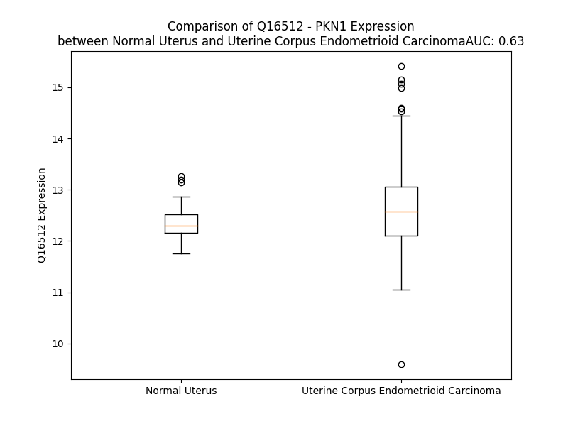

# Detailed Data for Q16512

## Introduction to the Detailed Summary

### How to Interpret the Results

- **Summary & Metrics**: This section provides a quick reference to essential protein attributes, including expression changes, family classification, and biomarker applications. Regulation status (upregulated/downregulated) indicates the protein's behavior in a disease context. Some information comes from the original excel file with the proteins selected from literature, while others are derived from the analyses.
- **Expression Comparison**: A visual representation comparing protein expression between normal and disease states. It highlights significant changes in expression levels that might indicate diagnostic or therapeutic relevance. This is data coming from transcriptomics experiments and could not translate similarly to protein levels.
- **Isoform Alignment**: An interactive view of isoform alignments, revealing structural and functional differences between variants of the protein.
- **Interactors & Homologs**: Tables listing known interaction partners and homologous proteins, the more interactors and homologs, the more complex the protein is to design an antibody for.
- **Biological Assemblies**: Information about the structural arrangement of the protein in different assemblies, providing insights into its functional state but also the complexity of the protein to develop antibodies.
- **Combined Per-Residue Information**: A detailed table summarizing residue-level data. This includes predictions for epitope regions, aggregation tendencies, and modifications that might impact the protein's function. Each row corresponds to a residue in the protein, providing insights into specific sites that may be important for research or drug development.
## Summary & Metrics

- **UniProt Accession**: Q16512
- **Gene Name**: PKN1
- **Protein Name**: Serine/threonine-protein kinase N1
- **Swiss Prot**: PKN1_HUMAN
- **Family**: kinase
- **Biomarker Application**:  
- **Number of Isoforms**: 3
- **Regulation**: 2
- **(transcriptomics) AUC**: 0.63
- **(transcriptomics) Fold Change**: 1.03
- **(transcriptomics) Regulation**: Upregulated
- **Discotope Epitope Count**: 284
- **Max n_uniprots (Homo)**: 1
- **Max n_uniprots (Hetero)**: 2

## Expression Comparison

## Isoform Alignment

<pre style='font-size:14px; font-family:monospace;'>Q16512-1 ------MASDAVQSEPRSWSLLEQLGLAGADLAAPGVQQQLELERERLRREIRKELKLKEGAENLRRATTDLGRSLGPVELLLRGSSRRLDLLHQQLQELHAHVVLPDPAATHDGPQSPGAGGPTCSATNLSRVAGLEKQLAIELKVKQGAENMIQTYSNGSTKDRKLLLTAQQMLQDSKTKIDIIRMQLRRALQAGQLENQAAPDDTQGSPDLGAVELRIEELRHHFRVEHAVAEGAKNVLRLLSAAKAPDRKAVSEAQEKLTESNQKLGLLREALERRLGELPADHPKGRLLREELAAASSAAFSTRLAGPFPATHYSTLCKPAPLTGTLEVRVVGCRDLPETIPWNPTPSMGGPGTPDSRPPFLSRPARGLYSRSGSLSGRSSLKAEAENTSEVSTVLKLDNTVVGQTSWKPCGPNAWDQSFTLELERARELELAVFWRDQRGLCALKFLKLEDFLDNERHEVQLDMEPQGCLVAEVTFRNPVIERIPRLRRQKKIFSKQQGKAFQRARQMNIDVATWVRLLRRLIPNATGTGTFSPGASPGSEARTTGDISVEKLNLGTDSDSSPQKSSRDPPSSPSSLSSPIQESTAPELPSETQETPGPALCSPLRKSPLTLEDFKFLAVLGRGHFGKVLLSEFRPSGELFAIKALKKGDIVARDEVESLMCEKRILAAVTSAGHPFLVNLFGCFQTPEHVCFVMEYSAGGDLMLHIHSDVFSEPRAIFYSACVVLGLQFLHEHKIVYRDLKLDNLLLDTEGYVKIADFGLCKEGMGYGDRTSTFCGTPEFLAPEVLTDTSYTRAVDWWGLGVLLYEMLVGESPFPGDDEEEVFDSIVNDEVRYPRFLSAEAIGIMRRLLRRNPERRLGSSERDAEDVKKQPFFRTLGWEALLARRLPPPFVPTLSGRTDVSNFDEEFTGEAPTLSPPRDARPLTAAEQAAFLDFDFVAGGC
Q16512-2 MAEANNPSEQELESEPRSWSLLEQLGLAGADLAAPGVQQQLELERERLRREIRKELKLKEGAENLRRATTDLGRSLGPVELLLRGSSRRLDLLHQQLQELHAHVVLPDPAATHDGPQSPGAGGPTCSATNLSRVAGLEKQLAIELKVKQGAENMIQTYSNGSTKDRKLLLTAQQMLQDSKTKIDIIRMQLRRALQAGQLENQAAPDDTQGSPDLGAVELRIEELRHHFRVEHAVAEGAKNVLRLLSAAKAPDRKAVSEAQEKLTESNQKLGLLREALERRLGELPADHPKGRLLREELAAASSAAFSTRLAGPFPATHYSTLCKPAPLTGTLEVRVVGCRDLPETIPWNPTPSMGGPGTPDSRPPFLSRPARGLYSRSGSLSGRSSLKAEAENTSEVSTVLKLDNTVVGQTSWKPCGPNAWDQSFTLELERARELELAVFWRDQRGLCALKFLKLEDFLDNERHEVQLDMEPQGCLVAEVTFRNPVIERIPRLRRQKKIFSKQQGKAFQRARQMNIDVATWVRLLRRLIPNATGTGTFSPGASPGSEARTTGDISVEKLNLGTDSDSSPQKSSRDPPSSPSSLSSPIQESTAPELPSETQETPGPALCSPLRKSPLTLEDFKFLAVLGRGHFGKVLLSEFRPSGELFAIKALKKGDIVARDEVESLMCEKRILAAVTSAGHPFLVNLFGCFQTPEHVCFVMEYSAGGDLMLHIHSDVFSEPRAIFYSACVVLGLQFLHEHKIVYRDLKLDNLLLDTEGYVKIADFGLCKEGMGYGDRTSTFCGTPEFLAPEVLTDTSYTRAVDWWGLGVLLYEMLVGESPFPGDDEEEVFDSIVNDEVRYPRFLSAEAIGIMRRLLRRNPERRLGSSERDAEDVKKQPFFRTLGWEALLARRLPPPFVPTLSGRTDVSNFDEEFTGEAPTLSPPRDARPLTAAEQAAFLDFDFVAGGC
Q16512-3 ------MASDAVQSEPRSWSLLEQLGLAGADLAAPGVQQQLELERERLRREIRKELKLKEGAENLRRATTDLGRSLGPVELLLRGSSRRLDLLHQQLQELHAHVVLPDPAATHDGPQSPGAGGPTCSATNLSRVAGLEKQLAIELKVKQGAENMIQTYSNGSTKDRKLLLTAQQMLQDSKTKIDIIRMQLRRALQAGQLENQAAPDDTQGSPDLGAVELRIEELRHHFRVEHAVAEGAKNVLRLLSAAKAPDRKAVSEAQEKLTESNQKLGLLREALERRLGELPADHPKGRLLREELAAASSAAFSTRLAGPFPATHYSTLCKPAPLTGTLEVRVVGCRDLPETIPWNPTPSMGGPGTPDSRPPFLSRPARGLYSRSGSLSGRSSLKAEAENTSEVSTVLKLDNTVVGQTSWKPCGPNAWDQSFTLELERARELELAVFWRDQRGLCALKFLKLEDFLDNERHEVQLDMEPQGCLVAEVTFRNPVIERIPRLRRQKKIFSKQQGKAFQRARQMNIDVATWVRLLRRLIPNATGTGTFSPGASPGSEARTTGDISVEKLNLGTDSDSSPQKSSRDPPSSPSSLSSPIQESTAPELPSETQETPGPALCR---------------------------------------------------------------------------------------------------------------------------------------------------------------------------------------------------------------------------------------------------------------------------------------------------------------------------------------------------
</pre>

## Interactors

| preferredName_A   | preferredName_B   |   score |
|:------------------|:------------------|--------:|
| PKN1              | RHOA              |   0.998 |
| PKN1              | MAP2K3            |   0.965 |
| PKN1              | MEFV              |   0.96  |
| PKN1              | MAP3K20           |   0.958 |
| PKN1              | PDPK1             |   0.945 |
| PKN1              | CDC25C            |   0.934 |
| PKN1              | RHOB              |   0.927 |
| PKN1              | PKN2              |   0.923 |
| PKN1              | PKN3              |   0.911 |

## Homologs

| uniprot_id   | gene_id   |
|:-------------|:----------|
| G3V4L3       | PRKCH     |
| Q6P5Z2       | PKN3      |
| P41743       | PRKCI     |
| D6RAN5       | PRKCZ     |
| L7RTI5       | PRKCE     |
| A0A804HIU5   | PRKCG     |
| B1AL79       | PKN2      |
| P17252       | PRKCA     |
| P05771       | PRKCB     |

## Biological Assemblies

|   Unnamed: 0 |   assembly |   n_uniprots | composition   | crystal_id   |
|-------------:|-----------:|-------------:|:--------------|:-------------|
|            0 |          1 |            1 | Homo          | 4oth         |
|            0 |          1 |            1 | Homo          | 4otg         |
|            0 |          1 |            1 | Homo          | 4otd         |
|            0 |          1 |            1 | Homo          | 1urf         |
|            0 |          1 |            2 | Hetero        | 1cxz         |
|            0 |          1 |            1 | Homo          | 4oti         |
|            0 |          1 |            2 | Hetero        | 4nkg         |
|            1 |          2 |            2 | Hetero        | 4nkg         |
|            0 |          1 |            2 | Hetero        | 2rmk         |

## Combined Per-Residue Information

|   res | aa   |   epitope_score | epitope   |   relative_surface_accessibility |   modeling_confidence |   Aggregation | modification               |
|------:|:-----|----------------:|:----------|---------------------------------:|----------------------:|--------------:|:---------------------------|
|     1 | M    |         0.17884 | True      |                          1.32346 |                 38.65 |         0     | N/A                        |
|     2 | A    |         0.13104 | True      |                          1.03699 |                 33.84 |         0     | N-acetylalanine            |
|     3 | S    |         0.21344 | True      |                          0.74321 |                 27.04 |         0     | N/A                        |
|     4 | D    |         0.13446 | True      |                          0.84359 |                 31.68 |         0     | N/A                        |
|     5 | A    |         0.11222 | True      |                          0.93297 |                 30.49 |         0     | N/A                        |
|     6 | V    |         0.08323 | False     |                          1.09328 |                 32.45 |         0     | N/A                        |
|     7 | Q    |         0.12733 | True      |                          0.8574  |                 28.61 |         0     | N/A                        |
|     8 | S    |         0.13593 | True      |                          0.82194 |                 27.87 |         0     | N/A                        |
|     9 | E    |         0.10524 | True      |                          0.8463  |                 25.14 |         0     | N/A                        |
|    10 | P    |         0.12131 | True      |                          0.92827 |                 32.05 |         0     | N/A                        |
|    11 | R    |         0.15555 | True      |                          0.8987  |                 32.39 |         0     | N/A                        |
|    12 | S    |         0.13957 | True      |                          0.86558 |                 45.01 |         0.327 | N/A                        |
|    13 | W    |         0.15961 | True      |                          0.75181 |                 45.87 |         0.327 | N/A                        |
|    14 | S    |         0.05436 | False     |                          0.2898  |                 64.88 |         0.327 | N/A                        |
|    15 | L    |         0.04683 | False     |                          0.07375 |                 70.28 |         0.327 | N/A                        |
|    16 | L    |         0.04306 | False     |                          0.1021  |                 67.62 |         0.327 | N/A                        |
|    17 | E    |         0.0728  | False     |                          0.40746 |                 72.05 |         0     | N/A                        |
|    18 | Q    |         0.17387 | True      |                          0.56573 |                 73.38 |         0     | N/A                        |
|    19 | L    |         0.15399 | True      |                          0.2685  |                 72.34 |         0     | N/A                        |
|    20 | G    |         0.24433 | True      |                          0.79914 |                 70.55 |         0     | N/A                        |
|    21 | L    |         0.05833 | False     |                          0.09846 |                 67.86 |         0     | N/A                        |
|    22 | A    |         0.11106 | True      |                          0.60176 |                 57.24 |         0     | N/A                        |
|    23 | G    |         0.10495 | True      |                          1.06946 |                 54.77 |         0     | N/A                        |
|    24 | A    |         0.08139 | False     |                          0.35928 |                 61.96 |         0     | N/A                        |
|    25 | D    |         0.10122 | False     |                          0.57429 |                 58.49 |         0     | N/A                        |
|    26 | L    |         0.04414 | False     |                          0.29033 |                 61.82 |         0     | N/A                        |
|    27 | A    |         0.0761  | False     |                          0.49493 |                 48.99 |         0     | N/A                        |
|    28 | A    |         0.10454 | True      |                          0.29845 |                 65.25 |         0     | N/A                        |
|    29 | P    |         0.11801 | True      |                          0.81048 |                 62.88 |         0     | N/A                        |
|    30 | G    |         0.17314 | True      |                          0.61185 |                 73.19 |         0     | N/A                        |
|    31 | V    |         0.0531  | False     |                          0.1473  |                 73.33 |         0     | N/A                        |
|    32 | Q    |         0.03837 | False     |                          0.08504 |                 65.44 |         0     | N/A                        |
|    33 | Q    |         0.09734 | False     |                          0.61388 |                 74.6  |         0     | N/A                        |
|    34 | Q    |         0.11466 | True      |                          0.41383 |                 78.75 |         0     | N/A                        |
|    35 | L    |         0.00868 | False     |                          0       |                 73.86 |         0     | N/A                        |
|    36 | E    |         0.08291 | False     |                          0.52914 |                 72.01 |         0     | N/A                        |
|    37 | L    |         0.10543 | True      |                          0.61785 |                 83.67 |         0     | N/A                        |
|    38 | E    |         0.07022 | False     |                          0.13044 |                 85.31 |         0     | N/A                        |
|    39 | R    |         0.04685 | False     |                          0.07194 |                 78.62 |         0     | N/A                        |
|    40 | E    |         0.09631 | False     |                          0.49088 |                 79.26 |         0     | N/A                        |
|    41 | R    |         0.14044 | True      |                          0.42569 |                 89.16 |         0     | N/A                        |
|    42 | L    |         0.01816 | False     |                          0.01401 |                 84.6  |         0     | N/A                        |
|    43 | R    |         0.15394 | True      |                          0.41758 |                 79.19 |         0     | N/A                        |
|    44 | R    |         0.19234 | True      |                          0.48339 |                 86.86 |         0     | N/A                        |
|    45 | E    |         0.03325 | False     |                          0.17542 |                 88.06 |         0     | N/A                        |
|    46 | I    |         0.05253 | False     |                          0.0792  |                 84.08 |         0     | N/A                        |
|    47 | R    |         0.12113 | True      |                          0.63886 |                 81.89 |         0     | N/A                        |
|    48 | K    |         0.12937 | True      |                          0.6805  |                 87.64 |         0     | N/A                        |
|    49 | E    |         0.0243  | False     |                          0.07504 |                 88.76 |         0     | N/A                        |
|    50 | L    |         0.05401 | False     |                          0.50941 |                 83.54 |         0     | N/A                        |
|    51 | K    |         0.1421  | True      |                          0.74948 |                 85.4  |         0     | N/A                        |
|    52 | L    |         0.04801 | False     |                          0.64284 |                 85.81 |         0     | N/A                        |
|    53 | K    |         0.03155 | False     |                          0.19241 |                 85.56 |         0     | N/A                        |
|    54 | E    |         0.08519 | False     |                          0.51436 |                 82.3  |         0     | N/A                        |
|    55 | G    |         0.12152 | True      |                          0.4603  |                 83.38 |         0     | N/A                        |
|    56 | A    |         0.02319 | False     |                          0.04194 |                 83.8  |         0     | N/A                        |
|    57 | E    |         0.0393  | False     |                          0.19509 |                 80.88 |         0     | N/A                        |
|    58 | N    |         0.0628  | False     |                          0.42672 |                 82.33 |         0     | N/A                        |
|    59 | L    |         0.05783 | False     |                          0.66185 |                 81.34 |         0     | N/A                        |
|    60 | R    |         0.14844 | True      |                          0.45672 |                 80.07 |         0     | N/A                        |
|    61 | R    |         0.12064 | True      |                          0.62821 |                 75.85 |         0     | N/A                        |
|    62 | A    |         0.10231 | False     |                          0.55539 |                 74.68 |         0     | N/A                        |
|    63 | T    |         0.04692 | False     |                          0.17943 |                 69.68 |         0     | N/A                        |
|    64 | T    |         0.1751  | True      |                          0.64283 |                 59.41 |         0     | N/A                        |
|    65 | D    |         0.12103 | True      |                          0.80357 |                 58.16 |         0     | N/A                        |
|    66 | L    |         0.12217 | True      |                          0.75446 |                 57.26 |         0     | N/A                        |
|    67 | G    |         0.17857 | True      |                          1.04743 |                 56.87 |         0     | N/A                        |
|    68 | R    |         0.14734 | True      |                          0.80511 |                 58.02 |         0     | N/A                        |
|    69 | S    |         0.18231 | True      |                          0.70642 |                 59.68 |         0     | Phosphoserine              |
|    70 | L    |         0.15523 | True      |                          0.37255 |                 71.29 |         0     | N/A                        |
|    71 | G    |         0.17152 | True      |                          0.4192  |                 76.36 |         0     | N/A                        |
|    72 | P    |         0.1062  | True      |                          0.65709 |                 80.49 |         0     | N/A                        |
|    73 | V    |         0.04856 | False     |                          0.10854 |                 81.09 |         0     | N/A                        |
|    74 | E    |         0.1177  | True      |                          0.48483 |                 80.58 |         0     | N/A                        |
|    75 | L    |         0.14821 | True      |                          0.83471 |                 85.21 |         0     | N/A                        |
|    76 | L    |         0.08692 | False     |                          0.66061 |                 83.77 |         0     | N/A                        |
|    77 | L    |         0.05438 | False     |                          0.12192 |                 84.37 |         0     | N/A                        |
|    78 | R    |         0.26148 | True      |                          0.72457 |                 84.58 |         0     | N/A                        |
|    79 | G    |         0.10751 | True      |                          0.46355 |                 86.68 |         0     | N/A                        |
|    80 | S    |         0.04943 | False     |                          0.06764 |                 85.21 |         0     | N/A                        |
|    81 | S    |         0.12419 | True      |                          0.22033 |                 81.59 |         0     | N/A                        |
|    82 | R    |         0.18422 | True      |                          0.71466 |                 86.01 |         0     | N/A                        |
|    83 | R    |         0.10448 | True      |                          0.48607 |                 87.78 |         0     | N/A                        |
|    84 | L    |         0.02889 | False     |                          0.05935 |                 84.92 |         0     | N/A                        |
|    85 | D    |         0.09696 | False     |                          0.57739 |                 77.02 |         0     | N/A                        |
|    86 | L    |         0.09491 | False     |                          0.59555 |                 87.06 |         0     | N/A                        |
|    87 | L    |         0.03653 | False     |                          0.05606 |                 86.18 |         0     | N/A                        |
|    88 | H    |         0.10538 | True      |                          0.4763  |                 78.65 |         0     | N/A                        |
|    89 | Q    |         0.08381 | False     |                          0.62412 |                 77.43 |         0     | N/A                        |
|    90 | Q    |         0.04364 | False     |                          0.19025 |                 82.06 |         0     | N/A                        |
|    91 | L    |         0.02562 | False     |                          0.12036 |                 79.06 |         0     | N/A                        |
|    92 | Q    |         0.04071 | False     |                          0.56005 |                 63.94 |         0     | N/A                        |
|    93 | E    |         0.07322 | False     |                          0.28369 |                 72.31 |         0     | N/A                        |
|    94 | L    |         0.01679 | False     |                          0.00165 |                 70.44 |         0     | N/A                        |
|    95 | H    |         0.05541 | False     |                          0.45766 |                 63.47 |         0     | N/A                        |
|    96 | A    |         0.04988 | False     |                          0.29328 |                 54.98 |         0     | N/A                        |
|    97 | H    |         0.05176 | False     |                          0.26465 |                 55.8  |         0     | N/A                        |
|    98 | V    |         0.06725 | False     |                          0.4193  |                 49.4  |         0     | N/A                        |
|    99 | V    |         0.05869 | False     |                          0.46259 |                 42.93 |         0     | N/A                        |
|   100 | L    |         0.08644 | False     |                          0.86688 |                 37.4  |         0     | N/A                        |
|   101 | P    |         0.09698 | False     |                          0.70649 |                 32.8  |         0     | N/A                        |
|   102 | D    |         0.09771 | False     |                          0.66869 |                 30.78 |         0     | N/A                        |
|   103 | P    |         0.11264 | True      |                          0.94618 |                 31.57 |         0     | N/A                        |
|   104 | A    |         0.11953 | True      |                          0.81623 |                 33.84 |         0     | N/A                        |
|   105 | A    |         0.13033 | True      |                          0.90486 |                 31.04 |         0     | N/A                        |
|   106 | T    |         0.17154 | True      |                          0.84783 |                 32.08 |         0     | N/A                        |
|   107 | H    |         0.25666 | True      |                          0.93034 |                 36.24 |         0     | N/A                        |
|   108 | D    |         0.16233 | True      |                          0.80562 |                 33.74 |         0     | N/A                        |
|   109 | G    |         0.20549 | True      |                          0.87426 |                 30.64 |         0     | N/A                        |
|   110 | P    |         0.14182 | True      |                          0.99006 |                 32.86 |         0     | N/A                        |
|   111 | Q    |         0.17819 | True      |                          0.9319  |                 31.09 |         0     | N/A                        |
|   112 | S    |         0.17937 | True      |                          0.85117 |                 32.64 |         0     | N/A                        |
|   113 | P    |         0.1433  | True      |                          0.99576 |                 33.68 |         0     | N/A                        |
|   114 | G    |         0.16341 | True      |                          0.87142 |                 28.27 |         0     | N/A                        |
|   115 | A    |         0.09195 | False     |                          1.10223 |                 31.34 |         0     | N/A                        |
|   116 | G    |         0.19132 | True      |                          0.93943 |                 28.08 |         0     | N/A                        |
|   117 | G    |         0.10753 | True      |                          0.85312 |                 29.79 |         0     | N/A                        |
|   118 | P    |         0.08608 | False     |                          0.99737 |                 33.61 |         0     | N/A                        |
|   119 | T    |         0.04895 | False     |                          0.7311  |                 32.79 |         0     | N/A                        |
|   120 | C    |         0.041   | False     |                          0.64616 |                 32.76 |         0     | N/A                        |
|   121 | S    |         0.08101 | False     |                          0.5651  |                 39.21 |         0     | N/A                        |
|   122 | A    |         0.05746 | False     |                          0.63487 |                 39.48 |         0     | N/A                        |
|   123 | T    |         0.05293 | False     |                          0.59867 |                 55.58 |         0     | N/A                        |
|   124 | N    |         0.02182 | False     |                          0.22201 |                 57.01 |         0     | N/A                        |
|   125 | L    |         0.15574 | True      |                          0.79628 |                 64.72 |         0     | N/A                        |
|   126 | S    |         0.05711 | False     |                          0.46007 |                 64.68 |         0     | N/A                        |
|   127 | R    |         0.02673 | False     |                          0.57987 |                 65.49 |         0     | N/A                        |
|   128 | V    |         0.03422 | False     |                          0.15519 |                 72.2  |         0     | N/A                        |
|   129 | A    |         0.12748 | True      |                          0.54913 |                 70.75 |         0     | N/A                        |
|   130 | G    |         0.09724 | False     |                          0.35303 |                 69.08 |         0     | N/A                        |
|   131 | L    |         0.03501 | False     |                          0.10718 |                 73.55 |         0     | N/A                        |
|   132 | E    |         0.08561 | False     |                          0.47865 |                 75.63 |         0     | N/A                        |
|   133 | K    |         0.08399 | False     |                          0.71149 |                 75.26 |         0     | N/A                        |
|   134 | Q    |         0.03081 | False     |                          0.45331 |                 74.66 |         0     | N/A                        |
|   135 | L    |         0.03535 | False     |                          0.15498 |                 77.23 |         0     | N/A                        |
|   136 | A    |         0.08891 | False     |                          0.46832 |                 76.5  |         0     | N/A                        |
|   137 | I    |         0.14757 | True      |                          0.56853 |                 73.66 |         0     | N/A                        |
|   138 | E    |         0.05582 | False     |                          0.08064 |                 81.49 |         0     | N/A                        |
|   139 | L    |         0.09703 | False     |                          0.44061 |                 79.47 |         0     | N/A                        |
|   140 | K    |         0.2568  | True      |                          0.76359 |                 80.51 |         0     | N/A                        |
|   141 | V    |         0.02742 | False     |                          0.35125 |                 79.35 |         0     | N/A                        |
|   142 | K    |         0.0512  | False     |                          0.27559 |                 85.63 |         0     | N/A                        |
|   143 | Q    |         0.10946 | True      |                          0.49761 |                 81.63 |         0     | N/A                        |
|   144 | G    |         0.11126 | True      |                          0.37225 |                 78.84 |         0     | N/A                        |
|   145 | A    |         0.01427 | False     |                          0       |                 81.77 |         0     | N/A                        |
|   146 | E    |         0.09249 | False     |                          0.26253 |                 86.38 |         0     | N/A                        |
|   147 | N    |         0.07302 | False     |                          0.48914 |                 82.51 |         0     | N/A                        |
|   148 | M    |         0.03677 | False     |                          0.30631 |                 79.84 |         0     | N/A                        |
|   149 | I    |         0.05894 | False     |                          0.22079 |                 83.94 |         0     | N/A                        |
|   150 | Q    |         0.17521 | True      |                          0.59547 |                 81.64 |         0     | N/A                        |
|   151 | T    |         0.11977 | True      |                          0.59585 |                 78.26 |         0     | N/A                        |
|   152 | Y    |         0.09223 | False     |                          0.22338 |                 76.72 |         0     | N/A                        |
|   153 | S    |         0.12684 | True      |                          0.44159 |                 75.19 |         0     | N/A                        |
|   154 | N    |         0.09633 | False     |                          0.76386 |                 69.91 |         0     | N/A                        |
|   155 | G    |         0.11979 | True      |                          0.31665 |                 59.25 |         0     | N/A                        |
|   156 | S    |         0.12    | True      |                          0.93227 |                 56.17 |         0     | N/A                        |
|   157 | T    |         0.11585 | True      |                          0.78918 |                 58    |         0     | N/A                        |
|   158 | K    |         0.14409 | True      |                          0.80702 |                 59.25 |         0     | N/A                        |
|   159 | D    |         0.05433 | False     |                          0.3078  |                 72.5  |         0     | N/A                        |
|   160 | R    |         0.25938 | True      |                          0.75788 |                 76.76 |         0     | N/A                        |
|   161 | K    |         0.10889 | True      |                          0.50369 |                 78.5  |         0     | N/A                        |
|   162 | L    |         0.07683 | False     |                          0.44103 |                 77.63 |         0.683 | N/A                        |
|   163 | L    |         0.091   | False     |                          0.24731 |                 81.16 |         0.683 | N/A                        |
|   164 | L    |         0.11754 | True      |                          0.63869 |                 82.16 |         0.683 | N/A                        |
|   165 | T    |         0.07775 | False     |                          0.46493 |                 79.99 |         0.683 | N/A                        |
|   166 | A    |         0.01189 | False     |                          0       |                 81.55 |         0.683 | N/A                        |
|   167 | Q    |         0.10452 | True      |                          0.42167 |                 83.6  |         0     | N/A                        |
|   168 | Q    |         0.09602 | False     |                          0.5288  |                 79.65 |         0     | N/A                        |
|   169 | M    |         0.05052 | False     |                          0.38192 |                 76.31 |         0     | N/A                        |
|   170 | L    |         0.07934 | False     |                          0.14014 |                 83.1  |         0     | N/A                        |
|   171 | Q    |         0.08673 | False     |                          0.52271 |                 74.9  |         0     | N/A                        |
|   172 | D    |         0.07355 | False     |                          0.36795 |                 69.47 |         0     | N/A                        |
|   173 | S    |         0.0174  | False     |                          0.00193 |                 75.9  |         0     | N/A                        |
|   174 | K    |         0.07293 | False     |                          0.4502  |                 75.01 |         0     | N/A                        |
|   175 | T    |         0.02213 | False     |                          0.22173 |                 65.02 |         0     | N/A                        |
|   176 | K    |         0.04385 | False     |                          0.46189 |                 67.39 |         0     | N/A                        |
|   177 | I    |         0.02697 | False     |                          0.0312  |                 72.62 |         0     | N/A                        |
|   178 | D    |         0.03796 | False     |                          0.16076 |                 63.46 |         0     | N/A                        |
|   179 | I    |         0.02501 | False     |                          0.0848  |                 64.85 |         0     | N/A                        |
|   180 | I    |         0.01842 | False     |                          0.028   |                 67.89 |         0     | N/A                        |
|   181 | R    |         0.111   | True      |                          0.41481 |                 74.13 |         0     | N/A                        |
|   182 | M    |         0.02065 | False     |                          0.07766 |                 63.53 |         0     | N/A                        |
|   183 | Q    |         0.02202 | False     |                          0.12854 |                 67.3  |         0     | N/A                        |
|   184 | L    |         0.03556 | False     |                          0.15663 |                 70.09 |         0     | N/A                        |
|   185 | R    |         0.05394 | False     |                          0.57891 |                 64.94 |         0     | N/A                        |
|   186 | R    |         0.04482 | False     |                          0.28347 |                 62.64 |         0     | N/A                        |
|   187 | A    |         0.04783 | False     |                          0.09014 |                 66.64 |         0     | N/A                        |
|   188 | L    |         0.10952 | True      |                          0.50305 |                 67.74 |         0     | N/A                        |
|   189 | Q    |         0.02955 | False     |                          0.41249 |                 57.87 |         0     | N/A                        |
|   190 | A    |         0.0173  | False     |                          0.37835 |                 57.61 |         0     | N/A                        |
|   191 | G    |         0.09138 | False     |                          0.19196 |                 55.81 |         0     | N/A                        |
|   192 | Q    |         0.05998 | False     |                          0.56005 |                 49.72 |         0     | N/A                        |
|   193 | L    |         0.02047 | False     |                          0.4857  |                 47.8  |         0     | N/A                        |
|   194 | E    |         0.06059 | False     |                          0.40126 |                 41.72 |         0     | N/A                        |
|   195 | N    |         0.11111 | True      |                          0.80016 |                 41.66 |         0     | N/A                        |
|   196 | Q    |         0.10346 | True      |                          0.75992 |                 43.6  |         0     | N/A                        |
|   197 | A    |         0.08265 | False     |                          0.82269 |                 37.99 |         0     | N/A                        |
|   198 | A    |         0.09087 | False     |                          0.77069 |                 35.94 |         0     | N/A                        |
|   199 | P    |         0.0835  | False     |                          0.97069 |                 38.66 |         0     | N/A                        |
|   200 | D    |         0.10812 | True      |                          0.92722 |                 36.02 |         0     | N/A                        |
|   201 | D    |         0.15725 | True      |                          0.90206 |                 32.64 |         0     | N/A                        |
|   202 | T    |         0.1579  | True      |                          0.95978 |                 36.74 |         0     | N/A                        |
|   203 | Q    |         0.14344 | True      |                          0.94841 |                 30.78 |         0     | N/A                        |
|   204 | G    |         0.14167 | True      |                          0.86436 |                 28.46 |         0     | N/A                        |
|   205 | S    |         0.05214 | False     |                          0.45886 |                 38.52 |         0     | Phosphoserine              |
|   206 | P    |         0.08229 | False     |                          0.9784  |                 42.83 |         0     | N/A                        |
|   207 | D    |         0.11885 | True      |                          0.61114 |                 53.33 |         0     | N/A                        |
|   208 | L    |         0.08781 | False     |                          0.40793 |                 58.48 |         0     | N/A                        |
|   209 | G    |         0.08294 | False     |                          0.46158 |                 56.78 |         0     | N/A                        |
|   210 | A    |         0.04995 | False     |                          0.62895 |                 66.55 |         0     | N/A                        |
|   211 | V    |         0.03558 | False     |                          0.18253 |                 71.98 |         0     | N/A                        |
|   212 | E    |         0.04093 | False     |                          0.20352 |                 70.68 |         0     | N/A                        |
|   213 | L    |         0.05609 | False     |                          0.43385 |                 70.05 |         0     | N/A                        |
|   214 | R    |         0.02962 | False     |                          0.22557 |                 78.4  |         0     | N/A                        |
|   215 | I    |         0.00879 | False     |                          0.0032  |                 80.92 |         0     | N/A                        |
|   216 | E    |         0.0428  | False     |                          0.10772 |                 75.62 |         0     | N/A                        |
|   217 | E    |         0.03335 | False     |                          0.19686 |                 78.65 |         0     | N/A                        |
|   218 | L    |         0.01261 | False     |                          0.02697 |                 86.78 |         0     | N/A                        |
|   219 | R    |         0.05133 | False     |                          0.14739 |                 83.99 |         0     | N/A                        |
|   220 | H    |         0.07619 | False     |                          0.46833 |                 81.35 |         0     | N/A                        |
|   221 | H    |         0.02794 | False     |                          0.09959 |                 85.68 |         0     | N/A                        |
|   222 | F    |         0.01219 | False     |                          0.0293  |                 87.36 |         0     | N/A                        |
|   223 | R    |         0.0847  | False     |                          0.40644 |                 82.84 |         0     | N/A                        |
|   224 | V    |         0.06578 | False     |                          0.42801 |                 81.46 |         0     | N/A                        |
|   225 | E    |         0.02376 | False     |                          0.03446 |                 87.71 |         0     | N/A                        |
|   226 | H    |         0.03182 | False     |                          0.12167 |                 84.64 |         0     | N/A                        |
|   227 | A    |         0.06072 | False     |                          0.62353 |                 79.72 |         0     | N/A                        |
|   228 | V    |         0.03462 | False     |                          0.37863 |                 83.03 |         0     | N/A                        |
|   229 | A    |         0.0062  | False     |                          0.0102  |                 87    |         0     | N/A                        |
|   230 | E    |         0.03728 | False     |                          0.25247 |                 83.34 |         0     | N/A                        |
|   231 | G    |         0.10449 | True      |                          0.37023 |                 79.82 |         0     | N/A                        |
|   232 | A    |         0.04254 | False     |                          0.07747 |                 84.87 |         0     | N/A                        |
|   233 | K    |         0.13083 | True      |                          0.37077 |                 87.69 |         0     | N/A                        |
|   234 | N    |         0.12692 | True      |                          0.38892 |                 81.58 |         0     | N/A                        |
|   235 | V    |         0.05334 | False     |                          0.46747 |                 82.9  |         0     | N/A                        |
|   236 | L    |         0.0477  | False     |                          0.16223 |                 86.01 |         0     | N/A                        |
|   237 | R    |         0.16933 | True      |                          0.58131 |                 84.65 |         0     | N/A                        |
|   238 | L    |         0.10633 | True      |                          0.78567 |                 81.88 |         0     | N/A                        |
|   239 | L    |         0.06112 | False     |                          0.21351 |                 83.14 |         0     | N/A                        |
|   240 | S    |         0.14675 | True      |                          0.69874 |                 77.79 |         0     | N/A                        |
|   241 | A    |         0.13298 | True      |                          0.82459 |                 76.69 |         0     | N/A                        |
|   242 | A    |         0.15306 | True      |                          0.45315 |                 73.19 |         0     | N/A                        |
|   243 | K    |         0.15487 | True      |                          1.06847 |                 68.86 |         0     | N/A                        |
|   244 | A    |         0.25661 | True      |                          0.84364 |                 70.31 |         0     | N/A                        |
|   245 | P    |         0.0825  | False     |                          0.46189 |                 71.89 |         0     | N/A                        |
|   246 | D    |         0.13901 | True      |                          0.47035 |                 81.58 |         0     | N/A                        |
|   247 | R    |         0.20856 | True      |                          0.85551 |                 83.14 |         0     | N/A                        |
|   248 | K    |         0.0978  | False     |                          0.67917 |                 84.73 |         0     | N/A                        |
|   249 | A    |         0.0533  | False     |                          0.30075 |                 81.7  |         0     | N/A                        |
|   250 | V    |         0.05365 | False     |                          0.33894 |                 84.49 |         0     | N/A                        |
|   251 | S    |         0.06093 | False     |                          0.3942  |                 86.78 |         0     | N/A                        |
|   252 | E    |         0.074   | False     |                          0.38349 |                 84.43 |         0     | N/A                        |
|   253 | A    |         0.0276  | False     |                          0.07363 |                 85.61 |         0     | N/A                        |
|   254 | Q    |         0.08487 | False     |                          0.43782 |                 89.94 |         0     | N/A                        |
|   255 | E    |         0.07697 | False     |                          0.35152 |                 86.64 |         0     | N/A                        |
|   256 | K    |         0.06039 | False     |                          0.65712 |                 86.36 |         0     | N/A                        |
|   257 | L    |         0.04231 | False     |                          0.1319  |                 89.74 |         0     | N/A                        |
|   258 | T    |         0.05166 | False     |                          0.47684 |                 89.2  |         0     | N/A                        |
|   259 | E    |         0.03736 | False     |                          0.30903 |                 88.35 |         0     | N/A                        |
|   260 | S    |         0.01387 | False     |                          0.0104  |                 89.17 |         0     | N/A                        |
|   261 | N    |         0.0849  | False     |                          0.43201 |                 89.78 |         0     | N/A                        |
|   262 | Q    |         0.03379 | False     |                          0.23583 |                 89.81 |         0     | N/A                        |
|   263 | K    |         0.00534 | False     |                          0.01057 |                 90.98 |         0     | N/A                        |
|   264 | L    |         0.01795 | False     |                          0.13638 |                 89.17 |         0     | N/A                        |
|   265 | G    |         0.04635 | False     |                          0.19854 |                 88.76 |         0     | N/A                        |
|   266 | L    |         0.00164 | False     |                          0.00247 |                 91.07 |         0     | N/A                        |
|   267 | L    |         0.00634 | False     |                          0.00495 |                 90.3  |         0     | N/A                        |
|   268 | R    |         0.05994 | False     |                          0.24755 |                 89.06 |         0     | N/A                        |
|   269 | E    |         0.04417 | False     |                          0.13769 |                 88.09 |         0     | N/A                        |
|   270 | A    |         0.00416 | False     |                          0.00383 |                 89.46 |         0     | N/A                        |
|   271 | L    |         0.01117 | False     |                          0.00412 |                 87.59 |         0     | N/A                        |
|   272 | E    |         0.11016 | True      |                          0.44728 |                 86.96 |         0     | N/A                        |
|   273 | R    |         0.06501 | False     |                          0.39563 |                 86.92 |         0     | N/A                        |
|   274 | R    |         0.06211 | False     |                          0.23647 |                 84.29 |         0     | N/A                        |
|   275 | L    |         0.0557  | False     |                          0.1424  |                 82.87 |         0     | N/A                        |
|   276 | G    |         0.19758 | True      |                          0.79168 |                 80.65 |         0     | N/A                        |
|   277 | E    |         0.05909 | False     |                          0.45146 |                 81.26 |         0     | N/A                        |
|   278 | L    |         0.03631 | False     |                          0.05974 |                 77.57 |         0     | N/A                        |
|   279 | P    |         0.11637 | True      |                          0.52119 |                 77.48 |         0     | N/A                        |
|   280 | A    |         0.18085 | True      |                          0.72033 |                 71.33 |         0     | N/A                        |
|   281 | D    |         0.17179 | True      |                          0.86215 |                 69.62 |         0     | N/A                        |
|   282 | H    |         0.11861 | True      |                          0.21541 |                 76.46 |         0     | N/A                        |
|   283 | P    |         0.11331 | True      |                          0.6637  |                 73.01 |         0     | N/A                        |
|   284 | K    |         0.05531 | False     |                          0.12786 |                 68.94 |         0     | N/A                        |
|   285 | G    |         0.0336  | False     |                          0       |                 72.98 |         0     | N/A                        |
|   286 | R    |         0.17496 | True      |                          0.64157 |                 71.44 |         0     | N/A                        |
|   287 | L    |         0.12508 | True      |                          0.58092 |                 74.03 |         0     | N/A                        |
|   288 | L    |         0.01682 | False     |                          0.00412 |                 74.72 |         0     | N/A                        |
|   289 | R    |         0.19703 | True      |                          0.40032 |                 76.76 |         0     | N/A                        |
|   290 | E    |         0.17182 | True      |                          0.46821 |                 73.21 |         0     | N/A                        |
|   291 | E    |         0.07504 | False     |                          0.10161 |                 71.95 |         0     | N/A                        |
|   292 | L    |         0.05169 | False     |                          0.05845 |                 75.88 |         0     | N/A                        |
|   293 | A    |         0.08438 | False     |                          0.66097 |                 74.46 |         0     | N/A                        |
|   294 | A    |         0.07098 | False     |                          0.28046 |                 69.26 |         0     | N/A                        |
|   295 | A    |         0.05308 | False     |                          0.15056 |                 64.44 |         0     | N/A                        |
|   296 | S    |         0.172   | True      |                          0.7105  |                 59.02 |         0     | N/A                        |
|   297 | S    |         0.1865  | True      |                          0.44307 |                 56.69 |         0     | N/A                        |
|   298 | A    |         0.10544 | True      |                          1.10195 |                 50.51 |         0     | N/A                        |
|   299 | A    |         0.07577 | False     |                          0.35306 |                 47.02 |         0     | N/A                        |
|   300 | F    |         0.04077 | False     |                          0.03911 |                 50.09 |         0     | N/A                        |
|   301 | S    |         0.13146 | True      |                          0.42195 |                 49.23 |         0     | N/A                        |
|   302 | T    |         0.15559 | True      |                          0.65681 |                 44.4  |         0     | N/A                        |
|   303 | R    |         0.1594  | True      |                          0.72755 |                 44.82 |         0     | N/A                        |
|   304 | L    |         0.14961 | True      |                          0.39708 |                 47.21 |         0     | N/A                        |
|   305 | A    |         0.17569 | True      |                          0.87067 |                 38.47 |         0     | N/A                        |
|   306 | G    |         0.08854 | False     |                          0.46877 |                 33.15 |         0     | N/A                        |
|   307 | P    |         0.12095 | True      |                          0.95552 |                 29.29 |         0     | N/A                        |
|   308 | F    |         0.16335 | True      |                          0.7494  |                 30.65 |         0     | N/A                        |
|   309 | P    |         0.10052 | False     |                          0.79673 |                 30.46 |         0     | N/A                        |
|   310 | A    |         0.15657 | True      |                          1.0542  |                 28.76 |         0     | N/A                        |
|   311 | T    |         0.16643 | True      |                          0.62321 |                 26.59 |         0     | N/A                        |
|   312 | H    |         0.18902 | True      |                          0.87826 |                 31.87 |         0     | N/A                        |
|   313 | Y    |         0.11167 | True      |                          0.66374 |                 30.22 |         0     | N/A                        |
|   314 | S    |         0.09027 | False     |                          0.8341  |                 30.05 |         0     | N/A                        |
|   315 | T    |         0.08956 | False     |                          0.3591  |                 39.19 |         0     | N/A                        |
|   316 | L    |         0.09028 | False     |                          0.36975 |                 48.84 |         0     | N/A                        |
|   317 | C    |         0.08089 | False     |                          0.6208  |                 50.26 |         0     | N/A                        |
|   318 | K    |         0.11018 | True      |                          0.81363 |                 58.61 |         0     | N/A                        |
|   319 | P    |         0.02952 | False     |                          0.17375 |                 64.37 |         0     | N/A                        |
|   320 | A    |         0.04619 | False     |                          0.22285 |                 63.48 |         0     | N/A                        |
|   321 | P    |         0.04093 | False     |                          0.19384 |                 70.9  |         0     | N/A                        |
|   322 | L    |         0.0076  | False     |                          0       |                 72.95 |         0     | N/A                        |
|   323 | T    |         0.09237 | False     |                          0.21422 |                 76.51 |         0     | N/A                        |
|   324 | G    |         0.01858 | False     |                          0.1575  |                 76.13 |         0     | N/A                        |
|   325 | T    |         0.0469  | False     |                          0.20638 |                 83.89 |         0.249 | N/A                        |
|   326 | L    |         0.00161 | False     |                          0       |                 87.88 |         0.667 | N/A                        |
|   327 | E    |         0.01751 | False     |                          0.27753 |                 88.74 |         0.667 | N/A                        |
|   328 | V    |         0.00177 | False     |                          0.00568 |                 90.86 |         0.667 | N/A                        |
|   329 | R    |         0.06792 | False     |                          0.3052  |                 91.91 |         0.667 | N/A                        |
|   330 | V    |         0.00086 | False     |                          0       |                 91.68 |         0.667 | N/A                        |
|   331 | V    |         0.02169 | False     |                          0.16661 |                 91.61 |         0.667 | N/A                        |
|   332 | G    |         0.00245 | False     |                          0       |                 90.43 |         0     | N/A                        |
|   333 | C    |         0.00562 | False     |                          0.00401 |                 90.47 |         0     | N/A                        |
|   334 | R    |         0.12345 | True      |                          0.34898 |                 90.88 |         0     | N/A                        |
|   335 | D    |         0.11582 | True      |                          0.60019 |                 86.6  |         0     | N/A                        |
|   336 | L    |         0.01322 | False     |                          0.07538 |                 86.41 |         0     | N/A                        |
|   337 | P    |         0.02866 | False     |                          0.04076 |                 82.66 |         0     | N/A                        |
|   338 | E    |         0.11801 | True      |                          0.7103  |                 75.33 |         0     | N/A                        |
|   339 | T    |         0.10423 | True      |                          0.75872 |                 70.43 |         0     | N/A                        |
|   340 | I    |         0.06231 | False     |                          0.03056 |                 70.8  |         0     | N/A                        |
|   341 | P    |         0.08859 | False     |                          0.59808 |                 62.89 |         0     | N/A                        |
|   342 | W    |         0.15773 | True      |                          0.3789  |                 66.64 |         0     | N/A                        |
|   343 | N    |         0.09681 | False     |                          0.37981 |                 52.05 |         0     | N/A                        |
|   344 | P    |         0.12514 | True      |                          0.86351 |                 40.85 |         0     | N/A                        |
|   345 | T    |         0.12138 | True      |                          0.81947 |                 38.56 |         0     | N/A                        |
|   346 | P    |         0.1111  | True      |                          0.94948 |                 33.55 |         0     | N/A                        |
|   347 | S    |         0.12445 | True      |                          0.86428 |                 37.85 |         0     | N/A                        |
|   348 | M    |         0.25491 | True      |                          1.04219 |                 34.02 |         0     | N/A                        |
|   349 | G    |         0.24862 | True      |                          0.96628 |                 29.5  |         0     | N/A                        |
|   350 | G    |         0.22465 | True      |                          0.84683 |                 32.37 |         0     | N/A                        |
|   351 | P    |         0.24592 | True      |                          1.08746 |                 34.38 |         0     | N/A                        |
|   352 | G    |         0.22021 | True      |                          0.77526 |                 32.06 |         0     | N/A                        |
|   353 | T    |         0.14006 | True      |                          0.95081 |                 37.9  |         0     | N/A                        |
|   354 | P    |         0.1574  | True      |                          0.97329 |                 32.57 |         0     | N/A                        |
|   355 | D    |         0.20379 | True      |                          0.86924 |                 31.43 |         0     | N/A                        |
|   356 | S    |         0.13508 | True      |                          0.72911 |                 30    |         0     | N/A                        |
|   357 | R    |         0.21345 | True      |                          0.96016 |                 31.95 |         0     | N/A                        |
|   358 | P    |         0.15198 | True      |                          0.89975 |                 30.99 |         0     | N/A                        |
|   359 | P    |         0.15354 | True      |                          0.87794 |                 28.28 |         0     | N/A                        |
|   360 | F    |         0.19355 | True      |                          1.00205 |                 26.96 |         0     | N/A                        |
|   361 | L    |         0.21883 | True      |                          1.11651 |                 27.68 |         0     | N/A                        |
|   362 | S    |         0.17917 | True      |                          0.83257 |                 28.92 |         0     | N/A                        |
|   363 | R    |         0.19067 | True      |                          0.8784  |                 27.92 |         0     | N/A                        |
|   364 | P    |         0.12098 | True      |                          0.95526 |                 29.63 |         0     | N/A                        |
|   365 | A    |         0.17299 | True      |                          0.91858 |                 31.27 |         0     | N/A                        |
|   366 | R    |         0.15206 | True      |                          0.96809 |                 35.83 |         0     | N/A                        |
|   367 | G    |         0.10749 | True      |                          0.36576 |                 34.63 |         0     | N/A                        |
|   368 | L    |         0.15929 | True      |                          0.73334 |                 41.19 |         0     | N/A                        |
|   369 | Y    |         0.10447 | True      |                          0.58435 |                 41.57 |         0     | N/A                        |
|   370 | S    |         0.13328 | True      |                          0.74941 |                 32.63 |         0     | N/A                        |
|   371 | R    |         0.18483 | True      |                          0.88942 |                 30.01 |         0     | N/A                        |
|   372 | S    |         0.17105 | True      |                          0.93695 |                 29.8  |         0     | N/A                        |
|   373 | G    |         0.19044 | True      |                          0.9399  |                 29.55 |         0     | N/A                        |
|   374 | S    |         0.15139 | True      |                          0.82713 |                 26.08 |         0     | Phosphoserine              |
|   375 | L    |         0.18931 | True      |                          1.05786 |                 28.55 |         0     | N/A                        |
|   376 | S    |         0.13369 | True      |                          0.89399 |                 27.49 |         0     | N/A                        |
|   377 | G    |         0.1633  | True      |                          0.93325 |                 28.67 |         0     | N/A                        |
|   378 | R    |         0.15595 | True      |                          1.02042 |                 26.89 |         0     | N/A                        |
|   379 | S    |         0.15461 | True      |                          0.83403 |                 31.56 |         0     | N/A                        |
|   380 | S    |         0.10177 | False     |                          0.82029 |                 27.09 |         0     | N/A                        |
|   381 | L    |         0.1907  | True      |                          1.12884 |                 33.65 |         0     | N/A                        |
|   382 | K    |         0.17749 | True      |                          0.93913 |                 30.36 |         0     | N/A                        |
|   383 | A    |         0.09385 | False     |                          0.9229  |                 29.13 |         0     | N/A                        |
|   384 | E    |         0.13755 | True      |                          0.9192  |                 32.46 |         0     | N/A                        |
|   385 | A    |         0.20167 | True      |                          0.92613 |                 37.82 |         0     | N/A                        |
|   386 | E    |         0.15794 | True      |                          0.86845 |                 43.29 |         0     | N/A                        |
|   387 | N    |         0.11535 | True      |                          0.92432 |                 51.06 |         0     | N/A                        |
|   388 | T    |         0.06949 | False     |                          0.44219 |                 61.13 |         0     | N/A                        |
|   389 | S    |         0.07979 | False     |                          0.51973 |                 79.72 |         0     | N/A                        |
|   390 | E    |         0.05625 | False     |                          0.16979 |                 90.56 |         0     | N/A                        |
|   391 | V    |         0.00325 | False     |                          0       |                 91.61 |         8.919 | N/A                        |
|   392 | S    |         0.00424 | False     |                          0       |                 92.79 |         8.919 | N/A                        |
|   393 | T    |         0.00156 | False     |                          0       |                 93.19 |         8.919 | N/A                        |
|   394 | V    |         0.07691 | False     |                          0.09426 |                 93.78 |         8.919 | N/A                        |
|   395 | L    |         0.00678 | False     |                          0       |                 94.35 |         8.919 | N/A                        |
|   396 | K    |         0.01719 | False     |                          0.03149 |                 91.59 |         0     | N/A                        |
|   397 | L    |         0.04181 | False     |                          0.09641 |                 86.69 |         0     | N/A                        |
|   398 | D    |         0.1171  | True      |                          0.4185  |                 76.45 |         0     | N/A                        |
|   399 | N    |         0.1201  | True      |                          0.57953 |                 78.55 |         0     | N/A                        |
|   400 | T    |         0.07423 | False     |                          0.62498 |                 83.65 |         0     | N/A                        |
|   401 | V    |         0.06615 | False     |                          0.63058 |                 88.83 |         0     | N/A                        |
|   402 | V    |         0.07408 | False     |                          0.41034 |                 89.98 |         0     | N/A                        |
|   403 | G    |         0.03517 | False     |                          0.11676 |                 89.01 |         0     | N/A                        |
|   404 | Q    |         0.05548 | False     |                          0.34954 |                 92.71 |         0     | N/A                        |
|   405 | T    |         0.01013 | False     |                          0.01357 |                 93.44 |         0     | N/A                        |
|   406 | S    |         0.09276 | False     |                          0.38422 |                 91.3  |         0     | N/A                        |
|   407 | W    |         0.06233 | False     |                          0.27745 |                 91.15 |         0     | N/A                        |
|   408 | K    |         0.07236 | False     |                          0.33357 |                 89.99 |         0     | N/A                        |
|   409 | P    |         0.16615 | True      |                          0.67286 |                 88.01 |         0     | N/A                        |
|   410 | C    |         0.03686 | False     |                          0.36867 |                 86.93 |         0     | N/A                        |
|   411 | G    |         0.05273 | False     |                          0.19635 |                 86.27 |         0     | N/A                        |
|   412 | P    |         0.11346 | True      |                          0.62912 |                 83.55 |         0     | N/A                        |
|   413 | N    |         0.0966  | False     |                          0.73215 |                 86.82 |         0     | N/A                        |
|   414 | A    |         0.03929 | False     |                          0.14806 |                 84.08 |         0     | N/A                        |
|   415 | W    |         0.01918 | False     |                          0.0288  |                 86.94 |         0     | N/A                        |
|   416 | D    |         0.06435 | False     |                          0.47503 |                 88.82 |         0     | N/A                        |
|   417 | Q    |         0.07902 | False     |                          0.25164 |                 90.07 |         0     | N/A                        |
|   418 | S    |         0.07554 | False     |                          0.65432 |                 90.44 |         0     | N/A                        |
|   419 | F    |         0.05236 | False     |                          0.1813  |                 91.83 |         0     | N/A                        |
|   420 | T    |         0.09787 | False     |                          0.64105 |                 90.32 |         0     | N/A                        |
|   421 | L    |         0.0305  | False     |                          0.0915  |                 87.46 |         0     | N/A                        |
|   422 | E    |         0.08096 | False     |                          0.66542 |                 84.81 |         0     | N/A                        |
|   423 | L    |         0.01187 | False     |                          0.02774 |                 82.2  |         0     | N/A                        |
|   424 | E    |         0.10897 | True      |                          0.81554 |                 74.78 |         0     | N/A                        |
|   425 | R    |         0.06823 | False     |                          0.43026 |                 72.91 |         0     | N/A                        |
|   426 | A    |         0.03117 | False     |                          0.08545 |                 79.67 |         0     | N/A                        |
|   427 | R    |         0.0714  | False     |                          0.30069 |                 80.87 |         0     | N/A                        |
|   428 | E    |         0.02748 | False     |                          0.18986 |                 87.03 |         0     | N/A                        |
|   429 | L    |         0.00273 | False     |                          0.00659 |                 90.22 |         0.264 | N/A                        |
|   430 | E    |         0.02268 | False     |                          0.02915 |                 93.05 |         0.264 | N/A                        |
|   431 | L    |         0.00216 | False     |                          0       |                 93.74 |        61.295 | N/A                        |
|   432 | A    |         0.0049  | False     |                          0.00383 |                 93.65 |        61.295 | N/A                        |
|   433 | V    |         0.00243 | False     |                          0.00095 |                 93.22 |        61.295 | N/A                        |
|   434 | F    |         0.03677 | False     |                          0.12955 |                 91.88 |        61.295 | N/A                        |
|   435 | W    |         0.02913 | False     |                          0.09411 |                 89.74 |        61.295 | N/A                        |
|   436 | R    |         0.10091 | False     |                          0.5225  |                 87.82 |         0.35  | N/A                        |
|   437 | D    |         0.07504 | False     |                          0.31118 |                 84.18 |         0.087 | N/A                        |
|   438 | Q    |         0.10271 | True      |                          0.8185  |                 78.66 |         0     | N/A                        |
|   439 | R    |         0.0832  | False     |                          0.184   |                 81.89 |         0     | N/A                        |
|   440 | G    |         0.03271 | False     |                          0.17865 |                 86.14 |         0     | N/A                        |
|   441 | L    |         0.01274 | False     |                          0.01037 |                 90.27 |         0     | N/A                        |
|   442 | C    |         0.00159 | False     |                          0       |                 91.11 |         0     | N/A                        |
|   443 | A    |         0.00058 | False     |                          0       |                 92.21 |         0     | N/A                        |
|   444 | L    |         0.00696 | False     |                          0.00577 |                 93.47 |         0     | N/A                        |
|   445 | K    |         0.04384 | False     |                          0.11498 |                 91.52 |         0     | N/A                        |
|   446 | F    |         0.01311 | False     |                          0.1662  |                 89.91 |         0.158 | N/A                        |
|   447 | L    |         0.0188  | False     |                          0.08656 |                 86.84 |         0.158 | N/A                        |
|   448 | K    |         0.016   | False     |                          0.19179 |                 83.11 |         0.158 | N6-acetyllysine            |
|   449 | L    |         0.00176 | False     |                          0.0033  |                 82.1  |         0.158 | N/A                        |
|   450 | E    |         0.03401 | False     |                          0.10772 |                 72.25 |         0.158 | N/A                        |
|   451 | D    |         0.10544 | True      |                          0.39151 |                 72.42 |         0     | N/A                        |
|   452 | F    |         0.02433 | False     |                          0.06242 |                 74.77 |         0     | N/A                        |
|   453 | L    |         0.02005 | False     |                          0.0123  |                 67.95 |         0     | N/A                        |
|   454 | D    |         0.08579 | False     |                          0.29284 |                 62.95 |         0     | N/A                        |
|   455 | N    |         0.03439 | False     |                          0.3289  |                 63.72 |         0     | N/A                        |
|   456 | E    |         0.05699 | False     |                          0.42851 |                 65.92 |         0     | N/A                        |
|   457 | R    |         0.10385 | True      |                          0.63118 |                 72.89 |         0     | N/A                        |
|   458 | H    |         0.06247 | False     |                          0.27871 |                 71.91 |         0     | N/A                        |
|   459 | E    |         0.11512 | True      |                          0.70956 |                 79.58 |         0     | N/A                        |
|   460 | V    |         0.04419 | False     |                          0.22183 |                 79.17 |         0     | N/A                        |
|   461 | Q    |         0.1085  | True      |                          0.56544 |                 85.26 |         0     | N/A                        |
|   462 | L    |         0.01251 | False     |                          0.03627 |                 85.45 |         0     | N/A                        |
|   463 | D    |         0.06431 | False     |                          0.51095 |                 87.18 |         0     | N/A                        |
|   464 | M    |         0.00523 | False     |                          0.01348 |                 90.5  |         0     | N/A                        |
|   465 | E    |         0.01526 | False     |                          0.02347 |                 89.56 |         0     | N/A                        |
|   466 | P    |         0.01774 | False     |                          0.00882 |                 87.53 |         0     | N/A                        |
|   467 | Q    |         0.06498 | False     |                          0.3434  |                 88    |         0     | N/A                        |
|   468 | G    |         0.00868 | False     |                          0.15126 |                 88.49 |         0     | N/A                        |
|   469 | C    |         0.02134 | False     |                          0.06109 |                 90.35 |         0     | N/A                        |
|   470 | L    |         0.00094 | False     |                          0       |                 91.34 |         0.221 | N/A                        |
|   471 | V    |         0.01969 | False     |                          0.15519 |                 91.57 |         0.221 | N/A                        |
|   472 | A    |         0.00191 | False     |                          0       |                 90.27 |         0.221 | N/A                        |
|   473 | E    |         0.03753 | False     |                          0.11172 |                 87.72 |         0.221 | N/A                        |
|   474 | V    |         0.00305 | False     |                          0.00381 |                 85.71 |         0.221 | N/A                        |
|   475 | T    |         0.02243 | False     |                          0.08155 |                 83.22 |         0.221 | N/A                        |
|   476 | F    |         0.01147 | False     |                          0       |                 81.58 |         0.221 | N/A                        |
|   477 | R    |         0.06889 | False     |                          0.41215 |                 72.85 |         0.221 | N/A                        |
|   478 | N    |         0.07732 | False     |                          0.59266 |                 66.18 |         0     | N/A                        |
|   479 | P    |         0.01808 | False     |                          0.02939 |                 66.63 |         0     | N/A                        |
|   480 | V    |         0.05758 | False     |                          0.44938 |                 62.75 |         0     | N/A                        |
|   481 | I    |         0.0572  | False     |                          0.22233 |                 59.92 |         0     | N/A                        |
|   482 | E    |         0.11083 | True      |                          0.33518 |                 49.93 |         0     | N/A                        |
|   483 | R    |         0.09109 | False     |                          0.62652 |                 44.18 |         0     | N/A                        |
|   484 | I    |         0.07346 | False     |                          0.50215 |                 42.97 |         0     | N/A                        |
|   485 | P    |         0.04855 | False     |                          0.33444 |                 39.25 |         0     | N/A                        |
|   486 | R    |         0.06381 | False     |                          0.42226 |                 48.18 |         0     | N/A                        |
|   487 | L    |         0.02083 | False     |                          0.09198 |                 47.73 |         0     | N/A                        |
|   488 | R    |         0.17415 | True      |                          0.53202 |                 46.4  |         0     | N/A                        |
|   489 | R    |         0.11936 | True      |                          0.23641 |                 42.16 |         0     | N/A                        |
|   490 | Q    |         0.05856 | False     |                          0.06117 |                 43.87 |         0     | N/A                        |
|   491 | K    |         0.1215  | True      |                          0.39785 |                 42.19 |         0     | N/A                        |
|   492 | K    |         0.11782 | True      |                          0.7612  |                 40.4  |         0     | N/A                        |
|   493 | I    |         0.11162 | True      |                          0.39926 |                 38.96 |         0     | N/A                        |
|   494 | F    |         0.15126 | True      |                          0.44276 |                 35.92 |         0     | N/A                        |
|   495 | S    |         0.12709 | True      |                          0.32624 |                 31.87 |         0     | N/A                        |
|   496 | K    |         0.12594 | True      |                          0.51479 |                 41.63 |         0     | N/A                        |
|   497 | Q    |         0.17891 | True      |                          0.88503 |                 36.08 |         0     | N/A                        |
|   498 | Q    |         0.18358 | True      |                          0.69032 |                 30.8  |         0     | N/A                        |
|   499 | G    |         0.24374 | True      |                          0.77473 |                 32.22 |         0     | N/A                        |
|   500 | K    |         0.20886 | True      |                          0.86713 |                 30.39 |         0     | N/A                        |
|   501 | A    |         0.13744 | True      |                          0.86151 |                 32.27 |         0     | N/A                        |
|   502 | F    |         0.18105 | True      |                          0.57828 |                 30.41 |         0     | N/A                        |
|   503 | Q    |         0.19436 | True      |                          0.42075 |                 31.54 |         0     | N/A                        |
|   504 | R    |         0.20858 | True      |                          0.30586 |                 31.41 |         0     | N/A                        |
|   505 | A    |         0.07872 | False     |                          0.32743 |                 36.1  |         0     | N/A                        |
|   506 | R    |         0.14349 | True      |                          0.76475 |                 31.77 |         0     | N/A                        |
|   507 | Q    |         0.08944 | False     |                          0.41306 |                 37.77 |         0     | N/A                        |
|   508 | M    |         0.12589 | True      |                          0.53607 |                 34.91 |         0     | N/A                        |
|   509 | N    |         0.20236 | True      |                          0.99934 |                 34.18 |         0     | N/A                        |
|   510 | I    |         0.16024 | True      |                          0.48044 |                 42.08 |         0.368 | N/A                        |
|   511 | D    |         0.14856 | True      |                          0.51336 |                 40.72 |         0.368 | N/A                        |
|   512 | V    |         0.0659  | False     |                          0.42396 |                 45.66 |        29.967 | N/A                        |
|   513 | A    |         0.06446 | False     |                          0.38268 |                 45.5  |        29.967 | N/A                        |
|   514 | T    |         0.05478 | False     |                          0.38631 |                 50.73 |        29.967 | N/A                        |
|   515 | W    |         0.12402 | True      |                          0.36063 |                 44.36 |        29.967 | N/A                        |
|   516 | V    |         0.04033 | False     |                          0.12567 |                 47.84 |        29.967 | N/A                        |
|   517 | R    |         0.10316 | True      |                          0.62951 |                 51.2  |         0.368 | N/A                        |
|   518 | L    |         0.14269 | True      |                          0.55293 |                 47.85 |         0.368 | N/A                        |
|   519 | L    |         0.06531 | False     |                          0.29701 |                 47.05 |         0.245 | N/A                        |
|   520 | R    |         0.08521 | False     |                          0.71122 |                 48.4  |         0     | N/A                        |
|   521 | R    |         0.19137 | True      |                          0.831   |                 45.5  |         0     | N/A                        |
|   522 | L    |         0.15175 | True      |                          0.76816 |                 36.65 |         0     | N/A                        |
|   523 | I    |         0.07498 | False     |                          0.51474 |                 35.42 |         0     | N/A                        |
|   524 | P    |         0.10343 | True      |                          0.74538 |                 32.89 |         0     | N/A                        |
|   525 | N    |         0.16989 | True      |                          0.85728 |                 33.74 |         0     | N/A                        |
|   526 | A    |         0.22843 | True      |                          1.00234 |                 27.93 |         0     | N/A                        |
|   527 | T    |         0.18876 | True      |                          0.85315 |                 29.93 |         0     | N/A                        |
|   528 | G    |         0.17979 | True      |                          0.9121  |                 29    |         0     | N/A                        |
|   529 | T    |         0.14164 | True      |                          1.00187 |                 32.75 |         0     | N/A                        |
|   530 | G    |         0.07091 | False     |                          0.95512 |                 30.62 |         0     | N/A                        |
|   531 | T    |         0.15118 | True      |                          0.82137 |                 28.78 |         0     | N/A                        |
|   532 | F    |         0.15194 | True      |                          0.95949 |                 30.08 |         0     | N/A                        |
|   533 | S    |         0.08264 | False     |                          0.77317 |                 28.09 |         0     | Phosphoserine              |
|   534 | P    |         0.14919 | True      |                          1.03844 |                 33.17 |         0     | N/A                        |
|   535 | G    |         0.16744 | True      |                          0.9472  |                 30.08 |         0     | N/A                        |
|   536 | A    |         0.08527 | False     |                          0.9691  |                 28.43 |         0     | N/A                        |
|   537 | S    |         0.15094 | True      |                          0.78461 |                 30.52 |         0     | Phosphoserine              |
|   538 | P    |         0.17631 | True      |                          1.02252 |                 34.63 |         0     | N/A                        |
|   539 | G    |         0.19713 | True      |                          0.95614 |                 31.82 |         0     | N/A                        |
|   540 | S    |         0.14239 | True      |                          0.8311  |                 30.83 |         0     | Phosphoserine              |
|   541 | E    |         0.0749  | False     |                          0.84765 |                 33.66 |         0     | N/A                        |
|   542 | A    |         0.1207  | True      |                          0.72604 |                 30.16 |         0     | N/A                        |
|   543 | R    |         0.09426 | False     |                          0.91359 |                 32.81 |         0     | N/A                        |
|   544 | T    |         0.11617 | True      |                          0.77075 |                 33.38 |         0     | N/A                        |
|   545 | T    |         0.0817  | False     |                          0.96575 |                 31.43 |         0     | N/A                        |
|   546 | G    |         0.12554 | True      |                          0.98896 |                 32.83 |         0     | N/A                        |
|   547 | D    |         0.13796 | True      |                          0.87184 |                 29.2  |         0     | N/A                        |
|   548 | I    |         0.14077 | True      |                          1.0337  |                 33.24 |         0     | N/A                        |
|   549 | S    |         0.09281 | False     |                          0.79046 |                 28.56 |         0     | N/A                        |
|   550 | V    |         0.07526 | False     |                          1.04628 |                 31.78 |         0     | N/A                        |
|   551 | E    |         0.06688 | False     |                          0.88188 |                 32.86 |         0     | N/A                        |
|   552 | K    |         0.13852 | True      |                          0.85132 |                 27.76 |         0     | N/A                        |
|   553 | L    |         0.17177 | True      |                          1.09117 |                 32.2  |         0     | N/A                        |
|   554 | N    |         0.11873 | True      |                          0.78033 |                 28.08 |         0     | N/A                        |
|   555 | L    |         0.07651 | False     |                          1.08468 |                 27.98 |         0     | N/A                        |
|   556 | G    |         0.11249 | True      |                          0.94345 |                 32.64 |         0     | N/A                        |
|   557 | T    |         0.08476 | False     |                          0.87984 |                 29.25 |         0     | N/A                        |
|   558 | D    |         0.11271 | True      |                          0.80001 |                 33.65 |         0     | N/A                        |
|   559 | S    |         0.10718 | True      |                          0.79538 |                 34.28 |         0     | Phosphoserine              |
|   560 | D    |         0.06961 | False     |                          0.86214 |                 29.67 |         0     | N/A                        |
|   561 | S    |         0.08708 | False     |                          0.86018 |                 34.67 |         0     | N/A                        |
|   562 | S    |         0.05511 | False     |                          0.7844  |                 28.93 |         0     | Phosphoserine              |
|   563 | P    |         0.13218 | True      |                          0.87641 |                 38.47 |         0     | N/A                        |
|   564 | Q    |         0.06713 | False     |                          0.90248 |                 34.09 |         0     | N/A                        |
|   565 | K    |         0.12488 | True      |                          0.92197 |                 29.67 |         0     | N/A                        |
|   566 | S    |         0.09149 | False     |                          0.81849 |                 33.68 |         0     | N/A                        |
|   567 | S    |         0.07163 | False     |                          0.76908 |                 30.95 |         0     | N/A                        |
|   568 | R    |         0.1362  | True      |                          0.9895  |                 35.62 |         0     | N/A                        |
|   569 | D    |         0.10468 | True      |                          0.83619 |                 36.04 |         0     | N/A                        |
|   570 | P    |         0.07721 | False     |                          0.88366 |                 50.8  |         0     | N/A                        |
|   571 | P    |         0.10853 | True      |                          0.93518 |                 42.59 |         0     | N/A                        |
|   572 | S    |         0.12424 | True      |                          0.9019  |                 40.01 |         0     | N/A                        |
|   573 | S    |         0.05537 | False     |                          0.79452 |                 36.32 |         0     | N/A                        |
|   574 | P    |         0.11827 | True      |                          0.85855 |                 42.89 |         0     | N/A                        |
|   575 | S    |         0.05726 | False     |                          0.78274 |                 38.33 |         0     | N/A                        |
|   576 | S    |         0.1372  | True      |                          0.84341 |                 36.59 |         0     | N/A                        |
|   577 | L    |         0.12519 | True      |                          1.06671 |                 33.96 |         0     | N/A                        |
|   578 | S    |         0.0662  | False     |                          0.87993 |                 39.23 |         0     | N/A                        |
|   579 | S    |         0.06192 | False     |                          0.74805 |                 34.51 |         0     | N/A                        |
|   580 | P    |         0.11702 | True      |                          0.78425 |                 42.84 |         0     | N/A                        |
|   581 | I    |         0.07612 | False     |                          0.90011 |                 37.63 |         0     | N/A                        |
|   582 | Q    |         0.12609 | True      |                          0.73085 |                 37.51 |         0     | N/A                        |
|   583 | E    |         0.06692 | False     |                          0.73774 |                 36.2  |         0     | N/A                        |
|   584 | S    |         0.07057 | False     |                          0.75025 |                 38.7  |         0     | N/A                        |
|   585 | T    |         0.06818 | False     |                          0.96587 |                 36.65 |         0     | N/A                        |
|   586 | A    |         0.06086 | False     |                          0.81773 |                 37.79 |         0     | N/A                        |
|   587 | P    |         0.11792 | True      |                          0.89592 |                 44.66 |         0     | N/A                        |
|   588 | E    |         0.10324 | True      |                          0.88696 |                 36.73 |         0     | N/A                        |
|   589 | L    |         0.07633 | False     |                          1.00019 |                 34.18 |         0     | N/A                        |
|   590 | P    |         0.09273 | False     |                          0.81296 |                 42.98 |         0     | N/A                        |
|   591 | S    |         0.06982 | False     |                          0.68521 |                 36.99 |         0     | N/A                        |
|   592 | E    |         0.09983 | False     |                          0.86983 |                 36.36 |         0     | N/A                        |
|   593 | T    |         0.13831 | True      |                          0.90219 |                 35.28 |         0     | N/A                        |
|   594 | Q    |         0.1446  | True      |                          0.83655 |                 32.14 |         0     | N/A                        |
|   595 | E    |         0.10084 | False     |                          0.9017  |                 37.46 |         0     | N/A                        |
|   596 | T    |         0.10721 | True      |                          0.90703 |                 35.33 |         0     | N/A                        |
|   597 | P    |         0.2088  | True      |                          0.99238 |                 37.49 |         0     | N/A                        |
|   598 | G    |         0.1293  | True      |                          0.70283 |                 35.41 |         0     | N/A                        |
|   599 | P    |         0.08567 | False     |                          0.96588 |                 38.35 |         0     | N/A                        |
|   600 | A    |         0.10252 | True      |                          0.96771 |                 35.68 |         0     | N/A                        |
|   601 | L    |         0.12799 | True      |                          1.0006  |                 36.35 |         0     | N/A                        |
|   602 | C    |         0.13393 | True      |                          0.96583 |                 35.68 |         0     | N/A                        |
|   603 | S    |         0.10063 | False     |                          0.66343 |                 33.14 |         0     | N/A                        |
|   604 | P    |         0.1126  | True      |                          0.99972 |                 34.04 |         0     | N/A                        |
|   605 | L    |         0.11503 | True      |                          0.91073 |                 40.05 |         0     | N/A                        |
|   606 | R    |         0.21653 | True      |                          0.97192 |                 39.92 |         0     | N/A                        |
|   607 | K    |         0.12423 | True      |                          0.55183 |                 62.65 |         0     | N/A                        |
|   608 | S    |         0.0698  | False     |                          0.64291 |                 82.4  |         0     | Phosphoserine              |
|   609 | P    |         0.04622 | False     |                          0.71058 |                 87.71 |         0     | N/A                        |
|   610 | L    |         0.01501 | False     |                          0.08462 |                 92.81 |         0     | N/A                        |
|   611 | T    |         0.05111 | False     |                          0.42814 |                 93.54 |         0     | N/A                        |
|   612 | L    |         0.03057 | False     |                          0.35438 |                 93.13 |         0     | N/A                        |
|   613 | E    |         0.08686 | False     |                          0.65771 |                 93.87 |         0     | N/A                        |
|   614 | D    |         0.04873 | False     |                          0.22035 |                 95.13 |         9.296 | N/A                        |
|   615 | F    |         0.01558 | False     |                          0.03315 |                 96.25 |         9.296 | N/A                        |
|   616 | K    |         0.05257 | False     |                          0.43297 |                 96.55 |         9.296 | N/A                        |
|   617 | F    |         0.01617 | False     |                          0.23045 |                 96.49 |        31.608 | N/A                        |
|   618 | L    |         0.05121 | False     |                          0.30334 |                 95.76 |        31.759 | N/A                        |
|   619 | A    |         0.02387 | False     |                          0.09821 |                 95.27 |        31.759 | N/A                        |
|   620 | V    |         0.00227 | False     |                          0       |                 94.22 |        31.759 | N/A                        |
|   621 | L    |         0.01079 | False     |                          0.06711 |                 92.57 |        31.555 | N/A                        |
|   622 | G    |         0.03484 | False     |                          0.1529  |                 87.61 |         2.744 | N/A                        |
|   623 | R    |         0.07423 | False     |                          0.59031 |                 82.82 |         0     | N/A                        |
|   624 | G    |         0.10187 | False     |                          0.56232 |                 69.08 |         0     | N/A                        |
|   625 | H    |         0.10758 | True      |                          0.55863 |                 66.71 |         0     | N/A                        |
|   626 | F    |         0.06263 | False     |                          0.17252 |                 64.07 |         0     | N/A                        |
|   627 | G    |         0.03079 | False     |                          0.19802 |                 81.22 |         0     | N/A                        |
|   628 | K    |         0.03373 | False     |                          0.10916 |                 90.9  |         0     | N/A                        |
|   629 | V    |         0.03083 | False     |                          0.27039 |                 93.81 |         0     | N/A                        |
|   630 | L    |         0.00257 | False     |                          0       |                 96.35 |         0     | N/A                        |
|   631 | L    |         0.00677 | False     |                          0.00412 |                 97.3  |         0     | N/A                        |
|   632 | S    |         0.00286 | False     |                          0       |                 97.27 |         0     | N/A                        |
|   633 | E    |         0.11584 | True      |                          0.2146  |                 97.36 |         0     | N/A                        |
|   634 | F    |         0.02977 | False     |                          0.12548 |                 96.19 |         0     | N/A                        |
|   635 | R    |         0.19534 | True      |                          0.57652 |                 94.34 |         0     | N/A                        |
|   636 | P    |         0.09976 | False     |                          0.68123 |                 92.44 |         0     | N/A                        |
|   637 | S    |         0.11328 | True      |                          0.56835 |                 92.78 |         0     | N/A                        |
|   638 | G    |         0.04645 | False     |                          0.30407 |                 92.54 |         0     | N/A                        |
|   639 | E    |         0.06054 | False     |                          0.42982 |                 94.55 |         0     | N/A                        |
|   640 | L    |         0.02194 | False     |                          0.12941 |                 96.49 |         0     | N/A                        |
|   641 | F    |         0.01878 | False     |                          0.04459 |                 97.01 |         0     | N/A                        |
|   642 | A    |         0.00585 | False     |                          0.07397 |                 96.42 |         0     | N/A                        |
|   643 | I    |         0.00568 | False     |                          0       |                 96.51 |         0     | N/A                        |
|   644 | K    |         0.02065 | False     |                          0.12977 |                 94.9  |         0     | N/A                        |
|   645 | A    |         0.0101  | False     |                          0.03405 |                 94.48 |         0     | N/A                        |
|   646 | L    |         0.03148 | False     |                          0.09315 |                 92.8  |         0     | N/A                        |
|   647 | K    |         0.02422 | False     |                          0.13992 |                 91.8  |         0     | N/A                        |
|   648 | K    |         0.01958 | False     |                          0.017   |                 92.55 |         0     | N/A                        |
|   649 | G    |         0.07562 | False     |                          0.16853 |                 90.22 |         0     | N/A                        |
|   650 | D    |         0.03484 | False     |                          0.18734 |                 88.37 |         0     | N/A                        |
|   651 | I    |         0.00842 | False     |                          0.0192  |                 89.02 |         0     | N/A                        |
|   652 | V    |         0.06649 | False     |                          0.30425 |                 90.16 |         0     | N/A                        |
|   653 | A    |         0.08909 | False     |                          0.71894 |                 86.93 |         0     | N/A                        |
|   654 | R    |         0.09845 | False     |                          0.32819 |                 83.26 |         0     | N/A                        |
|   655 | D    |         0.10996 | True      |                          0.63303 |                 87.01 |         0     | N/A                        |
|   656 | E    |         0.05195 | False     |                          0.08122 |                 87.34 |         0     | N/A                        |
|   657 | V    |         0.0277  | False     |                          0.21042 |                 90.9  |         0     | N/A                        |
|   658 | E    |         0.1127  | True      |                          0.57111 |                 88.42 |         0     | N/A                        |
|   659 | S    |         0.02858 | False     |                          0.33422 |                 86.99 |         0     | N/A                        |
|   660 | L    |         0.01743 | False     |                          0.05089 |                 91.49 |         0     | N/A                        |
|   661 | M    |         0.04815 | False     |                          0.11988 |                 92.18 |         0     | N/A                        |
|   662 | C    |         0.02332 | False     |                          0.11981 |                 89.96 |         0     | N/A                        |
|   663 | E    |         0.02236 | False     |                          0.03218 |                 92.61 |         0     | N/A                        |
|   664 | K    |         0.02223 | False     |                          0.12973 |                 93.5  |         0     | N/A                        |
|   665 | R    |         0.0457  | False     |                          0.41535 |                 93.08 |         0     | N/A                        |
|   666 | I    |         0.0103  | False     |                          0.0192  |                 91.77 |         6.805 | N/A                        |
|   667 | L    |         0.00306 | False     |                          0.00247 |                 92.49 |         7.393 | N/A                        |
|   668 | A    |         0.03949 | False     |                          0.20477 |                 91.38 |         7.393 | N/A                        |
|   669 | A    |         0.0361  | False     |                          0.34498 |                 88.87 |         7.393 | N/A                        |
|   670 | V    |         0.00314 | False     |                          0.00095 |                 89.19 |         7.393 | N/A                        |
|   671 | T    |         0.04687 | False     |                          0.20329 |                 89.59 |         3.462 | N/A                        |
|   672 | S    |         0.15682 | True      |                          0.78646 |                 89.47 |         0.535 | N/A                        |
|   673 | A    |         0.07044 | False     |                          0.56861 |                 89.93 |         0.245 | N/A                        |
|   674 | G    |         0.05395 | False     |                          0.54874 |                 90.36 |         0     | N/A                        |
|   675 | H    |         0.06519 | False     |                          0.08472 |                 94.35 |         0     | N/A                        |
|   676 | P    |         0.04087 | False     |                          0.19186 |                 95.68 |         0.7   | N/A                        |
|   677 | F    |         0.00508 | False     |                          0.00239 |                 97.31 |        61.924 | N/A                        |
|   678 | L    |         0.00119 | False     |                          0       |                 96.76 |        66.321 | N/A                        |
|   679 | V    |         0.00322 | False     |                          0.01714 |                 95.07 |        66.515 | N/A                        |
|   680 | N    |         0.01433 | False     |                          0.16732 |                 93.19 |        66.515 | N/A                        |
|   681 | L    |         0.00378 | False     |                          0.00208 |                 94.18 |        66.819 | N/A                        |
|   682 | F    |         0.03977 | False     |                          0.24672 |                 93.08 |        63.673 | N/A                        |
|   683 | G    |         0.00139 | False     |                          0       |                 94.06 |        15.12  | N/A                        |
|   684 | C    |         0.00875 | False     |                          0.00666 |                 96.08 |        10.696 | N/A                        |
|   685 | F    |         0.01046 | False     |                          0.00735 |                 95.73 |         9.955 | N/A                        |
|   686 | Q    |         0.04913 | False     |                          0.26085 |                 94.8  |         0.326 | N/A                        |
|   687 | T    |         0.03275 | False     |                          0.12092 |                 93.36 |         0     | N/A                        |
|   688 | P    |         0.08244 | False     |                          0.78518 |                 91.92 |         0     | N/A                        |
|   689 | E    |         0.08376 | False     |                          0.34647 |                 91.57 |         0     | N/A                        |
|   690 | H    |         0.03695 | False     |                          0.09099 |                 93.79 |         1.297 | N/A                        |
|   691 | V    |         0.00296 | False     |                          0       |                 94.89 |         5.153 | N/A                        |
|   692 | C    |         0.00232 | False     |                          0       |                 96.05 |         5.153 | N/A                        |
|   693 | F    |         0.00092 | False     |                          0       |                 95.43 |         5.153 | N/A                        |
|   694 | V    |         0.00137 | False     |                          0       |                 96.62 |         5.153 | N/A                        |
|   695 | M    |         0.01461 | False     |                          0.09024 |                 95.24 |         4.544 | N/A                        |
|   696 | E    |         0.03568 | False     |                          0.24498 |                 94.37 |         0     | N/A                        |
|   697 | Y    |         0.03429 | False     |                          0.13128 |                 95.37 |         0     | N/A                        |
|   698 | S    |         0.0108  | False     |                          0.02342 |                 95.33 |         0     | N/A                        |
|   699 | A    |         0.01756 | False     |                          0.03699 |                 94.45 |         0     | N/A                        |
|   700 | G    |         0.00105 | False     |                          0       |                 93.54 |         0     | N/A                        |
|   701 | G    |         0.0012  | False     |                          0       |                 92.43 |         0     | N/A                        |
|   702 | D    |         0.03267 | False     |                          0.21089 |                 92.21 |         0     | N/A                        |
|   703 | L    |         0.00152 | False     |                          0.00082 |                 91.92 |         0     | N/A                        |
|   704 | M    |         0.01038 | False     |                          0.01577 |                 87.76 |         0     | N/A                        |
|   705 | L    |         0.03404 | False     |                          0.35697 |                 84.95 |         0     | N/A                        |
|   706 | H    |         0.06026 | False     |                          0.17278 |                 85.96 |         0     | N/A                        |
|   707 | I    |         0.03273 | False     |                          0.05645 |                 82.74 |         0     | N/A                        |
|   708 | H    |         0.06377 | False     |                          0.36773 |                 65.43 |         0     | N/A                        |
|   709 | S    |         0.11719 | True      |                          0.84916 |                 54.97 |         0     | N/A                        |
|   710 | D    |         0.11172 | True      |                          0.5823  |                 66.67 |         0     | N/A                        |
|   711 | V    |         0.04275 | False     |                          0.38671 |                 85.02 |         0     | N/A                        |
|   712 | F    |         0.00662 | False     |                          0.02251 |                 90.82 |         0     | N/A                        |
|   713 | S    |         0.08482 | False     |                          0.52973 |                 92.64 |         0     | N/A                        |
|   714 | E    |         0.07729 | False     |                          0.24791 |                 94.33 |         0     | N/A                        |
|   715 | P    |         0.05082 | False     |                          0.68172 |                 95.71 |         0     | N/A                        |
|   716 | R    |         0.06513 | False     |                          0.14944 |                 95.25 |         0.006 | N/A                        |
|   717 | A    |         0.00078 | False     |                          0       |                 96.53 |        42.805 | N/A                        |
|   718 | I    |         0.03462 | False     |                          0.1088  |                 98.08 |        93.395 | N/A                        |
|   719 | F    |         0.02352 | False     |                          0.05278 |                 98.05 |        95.721 | N/A                        |
|   720 | Y    |         0.00695 | False     |                          0.00417 |                 97.93 |        95.909 | N/A                        |
|   721 | S    |         0.00296 | False     |                          0       |                 98.09 |        95.958 | N/A                        |
|   722 | A    |         0.00163 | False     |                          0       |                 98.5  |        96.343 | N/A                        |
|   723 | C    |         0.00346 | False     |                          0.00353 |                 98.3  |        96.585 | N/A                        |
|   724 | V    |         0.00131 | False     |                          0.00558 |                 98.47 |        97.741 | N/A                        |
|   725 | V    |         0.00142 | False     |                          0       |                 98.61 |        97.683 | N/A                        |
|   726 | L    |         0.017   | False     |                          0.06233 |                 98.3  |        96.319 | N/A                        |
|   727 | G    |         0.00099 | False     |                          0       |                 97.58 |        88.684 | N/A                        |
|   728 | L    |         0.00157 | False     |                          0       |                 98.22 |        87.981 | N/A                        |
|   729 | Q    |         0.04714 | False     |                          0.13623 |                 97.97 |        83.663 | N/A                        |
|   730 | F    |         0.03259 | False     |                          0.10227 |                 97.11 |        83.495 | N/A                        |
|   731 | L    |         0.00113 | False     |                          0.00082 |                 97.13 |        81.403 | N/A                        |
|   732 | H    |         0.01257 | False     |                          0.02488 |                 97.8  |        17.797 | N/A                        |
|   733 | E    |         0.05708 | False     |                          0.58622 |                 96.33 |         0.022 | N/A                        |
|   734 | H    |         0.06039 | False     |                          0.48485 |                 95.42 |         0.016 | N/A                        |
|   735 | K    |         0.06928 | False     |                          0.57435 |                 96.79 |         0.016 | N/A                        |
|   736 | I    |         0.02198 | False     |                          0.0448  |                 95.92 |         0.016 | N/A                        |
|   737 | V    |         0.00216 | False     |                          0       |                 96.35 |         0.016 | N/A                        |
|   738 | Y    |         0.01464 | False     |                          0.0044  |                 96.19 |         0.016 | N/A                        |
|   739 | R    |         0.02343 | False     |                          0.12074 |                 93.78 |         0     | N/A                        |
|   740 | D    |         0.03163 | False     |                          0.08237 |                 92.31 |         0     | N/A                        |
|   741 | L    |         0.00521 | False     |                          0.02703 |                 94.22 |         0     | N/A                        |
|   742 | K    |         0.04992 | False     |                          0.17209 |                 91.25 |         0     | N/A                        |
|   743 | L    |         0.00384 | False     |                          0.00448 |                 90.75 |         0     | N/A                        |
|   744 | D    |         0.04703 | False     |                          0.36972 |                 88.68 |         0     | N/A                        |
|   745 | N    |         0.02818 | False     |                          0.09664 |                 93.92 |         0     | N/A                        |
|   746 | L    |         0.00458 | False     |                          0.00659 |                 96.42 |         0     | N/A                        |
|   747 | L    |         0.01505 | False     |                          0.21928 |                 96.4  |         0     | N/A                        |
|   748 | L    |         0.00178 | False     |                          0       |                 96.24 |         0     | N/A                        |
|   749 | D    |         0.01102 | False     |                          0.07293 |                 95.15 |         0     | N/A                        |
|   750 | T    |         0.06226 | False     |                          0.54519 |                 94.33 |         0     | N/A                        |
|   751 | E    |         0.04516 | False     |                          0.45311 |                 95.43 |         0     | N/A                        |
|   752 | G    |         0.00177 | False     |                          0       |                 95.33 |         0     | N/A                        |
|   753 | Y    |         0.03434 | False     |                          0.02808 |                 97.85 |         0.754 | N/A                        |
|   754 | V    |         0.00523 | False     |                          0.00426 |                 98.02 |         0.891 | N/A                        |
|   755 | K    |         0.01523 | False     |                          0.07713 |                 97.54 |         0.891 | N/A                        |
|   756 | I    |         0.00296 | False     |                          0.004   |                 97.46 |         0.891 | N/A                        |
|   757 | A    |         0.0116  | False     |                          0.10331 |                 93.37 |         0.891 | N/A                        |
|   758 | D    |         0.04837 | False     |                          0.38295 |                 88.86 |         0.891 | N/A                        |
|   759 | F    |         0.00345 | False     |                          0.01741 |                 90.34 |         0.891 | N/A                        |
|   760 | G    |         0.0393  | False     |                          0.2172  |                 86.23 |         0.582 | N/A                        |
|   761 | L    |         0.04521 | False     |                          0.28913 |                 85.85 |         0.582 | N/A                        |
|   762 | C    |         0.02272 | False     |                          0.08905 |                 92.38 |         0     | N/A                        |
|   763 | K    |         0.05342 | False     |                          0.33518 |                 90.03 |         0     | N/A                        |
|   764 | E    |         0.0922  | False     |                          0.34173 |                 92.76 |         0     | N/A                        |
|   765 | G    |         0.05406 | False     |                          0.62422 |                 93.49 |         0     | N/A                        |
|   766 | M    |         0.01391 | False     |                          0.00537 |                 94.15 |         0     | N/A                        |
|   767 | G    |         0.01542 | False     |                          0.03702 |                 95.68 |         0     | N/A                        |
|   768 | Y    |         0.0995  | False     |                          0.57381 |                 96.9  |         0     | N/A                        |
|   769 | G    |         0.0517  | False     |                          0.64149 |                 93.81 |         0     | N/A                        |
|   770 | D    |         0.06598 | False     |                          0.36802 |                 96.36 |         0     | N/A                        |
|   771 | R    |         0.10493 | True      |                          0.52989 |                 93.37 |         0     | N/A                        |
|   772 | T    |         0.03867 | False     |                          0.04532 |                 88.21 |         0     | N/A                        |
|   773 | S    |         0.09736 | False     |                          0.54926 |                 84.05 |         0     | N/A                        |
|   774 | T    |         0.09646 | False     |                          0.47571 |                 78.01 |         0     | Phosphothreonine; by PDPK1 |
|   775 | F    |         0.12354 | True      |                          0.32896 |                 80.18 |         0     | N/A                        |
|   776 | C    |         0.06345 | False     |                          0.16598 |                 75.84 |         0     | N/A                        |
|   777 | G    |         0.02532 | False     |                          0.16063 |                 72.53 |         0     | N/A                        |
|   778 | T    |         0.05586 | False     |                          0.06446 |                 75.58 |         0     | Phosphothreonine           |
|   779 | P    |         0.05591 | False     |                          0.10637 |                 78.94 |         0     | N/A                        |
|   780 | E    |         0.02668 | False     |                          0.05405 |                 80.57 |         0     | N/A                        |
|   781 | F    |         0.04617 | False     |                          0.06681 |                 89.03 |         0     | N/A                        |
|   782 | L    |         0.01219 | False     |                          0.04699 |                 89.03 |         0     | N/A                        |
|   783 | A    |         0.00391 | False     |                          0.00986 |                 93.7  |         0     | N/A                        |
|   784 | P    |         0.01263 | False     |                          0.05269 |                 91.94 |         0     | N/A                        |
|   785 | E    |         0.0304  | False     |                          0.02168 |                 92.53 |         0     | N/A                        |
|   786 | V    |         0.01523 | False     |                          0.09625 |                 88.42 |         0     | N/A                        |
|   787 | L    |         0.02011 | False     |                          0.03953 |                 83.06 |         0     | N/A                        |
|   788 | T    |         0.05787 | False     |                          0.33458 |                 80.17 |         0     | N/A                        |
|   789 | D    |         0.07455 | False     |                          0.38519 |                 82.27 |         0     | N/A                        |
|   790 | T    |         0.05921 | False     |                          0.61803 |                 75.91 |         0     | N/A                        |
|   791 | S    |         0.08446 | False     |                          0.1844  |                 85.83 |         0     | N/A                        |
|   792 | Y    |         0.01967 | False     |                          0.02844 |                 91.73 |         0.786 | N/A                        |
|   793 | T    |         0.05573 | False     |                          0.19568 |                 96.1  |         0.88  | N/A                        |
|   794 | R    |         0.02888 | False     |                          0.07449 |                 96.99 |         1.038 | N/A                        |
|   795 | A    |         0.00465 | False     |                          0.01239 |                 97.8  |         1.038 | N/A                        |
|   796 | V    |         0.01053 | False     |                          0.08572 |                 97.15 |         1.038 | N/A                        |
|   797 | D    |         0.01811 | False     |                          0.01278 |                 98.12 |         1.038 | N/A                        |
|   798 | W    |         0.00155 | False     |                          0       |                 98.57 |        14.604 | N/A                        |
|   799 | W    |         0.00236 | False     |                          0.00276 |                 98.26 |        17.854 | N/A                        |
|   800 | G    |         0.00407 | False     |                          0.04024 |                 97.23 |        19.051 | N/A                        |
|   801 | L    |         0.00085 | False     |                          0       |                 98.31 |        31.001 | N/A                        |
|   802 | G    |         0.00153 | False     |                          0       |                 98.18 |        32.698 | N/A                        |
|   803 | V    |         0.00112 | False     |                          0       |                 96.67 |        32.698 | N/A                        |
|   804 | L    |         0.00117 | False     |                          0.00082 |                 95.98 |        32.558 | N/A                        |
|   805 | L    |         0.00154 | False     |                          0       |                 97.13 |        31.498 | N/A                        |
|   806 | Y    |         0.00991 | False     |                          0.03565 |                 96.26 |        26.601 | N/A                        |
|   807 | E    |         0.00197 | False     |                          0       |                 93.16 |         0     | N/A                        |
|   808 | M    |         0.00163 | False     |                          0.00278 |                 94.11 |         0     | N/A                        |
|   809 | L    |         0.0131  | False     |                          0.03828 |                 93.7  |         0     | N/A                        |
|   810 | V    |         0.00493 | False     |                          0       |                 90.37 |         0     | N/A                        |
|   811 | G    |         0.01266 | False     |                          0.05262 |                 86.24 |         0     | N/A                        |
|   812 | E    |         0.03709 | False     |                          0.2812  |                 85.6  |         0     | N/A                        |
|   813 | S    |         0.03058 | False     |                          0.13538 |                 89.37 |         0     | N/A                        |
|   814 | P    |         0.01719 | False     |                          0.06082 |                 92.45 |         0     | N/A                        |
|   815 | F    |         0.00297 | False     |                          0.00497 |                 92.48 |         0     | N/A                        |
|   816 | P    |         0.04694 | False     |                          0.67534 |                 82.04 |         0     | N/A                        |
|   817 | G    |         0.0261  | False     |                          0.18051 |                 75.75 |         0     | N/A                        |
|   818 | D    |         0.10874 | True      |                          0.83406 |                 75.84 |         0     | N/A                        |
|   819 | D    |         0.09002 | False     |                          0.49128 |                 78.21 |         0     | N/A                        |
|   820 | E    |         0.08369 | False     |                          0.38062 |                 74.01 |         0     | N/A                        |
|   821 | E    |         0.14416 | True      |                          0.6467  |                 76.99 |         0     | N/A                        |
|   822 | E    |         0.07767 | False     |                          0.46085 |                 82.09 |         0     | N/A                        |
|   823 | V    |         0.00977 | False     |                          0.0219  |                 81.63 |         0     | N/A                        |
|   824 | F    |         0.02509 | False     |                          0.15898 |                 84.34 |         0     | N/A                        |
|   825 | D    |         0.09786 | False     |                          0.50793 |                 81.89 |         0     | N/A                        |
|   826 | S    |         0.00685 | False     |                          0.02972 |                 87.91 |         0     | N/A                        |
|   827 | I    |         0.00868 | False     |                          0       |                 88.48 |         0     | N/A                        |
|   828 | V    |         0.0278  | False     |                          0.22598 |                 89.32 |         0     | N/A                        |
|   829 | N    |         0.08917 | False     |                          0.55514 |                 85.8  |         0     | N/A                        |
|   830 | D    |         0.0378  | False     |                          0.44031 |                 89.83 |         0     | N/A                        |
|   831 | E    |         0.05237 | False     |                          0.67866 |                 90.5  |         0     | N/A                        |
|   832 | V    |         0.02836 | False     |                          0.14172 |                 92.37 |         0     | N/A                        |
|   833 | R    |         0.08719 | False     |                          0.80918 |                 90.98 |         0     | N/A                        |
|   834 | Y    |         0.01915 | False     |                          0.18388 |                 90.56 |         0     | N/A                        |
|   835 | P    |         0.03946 | False     |                          0.23546 |                 84.24 |         0     | N/A                        |
|   836 | R    |         0.09495 | False     |                          0.99316 |                 84.73 |         0     | N/A                        |
|   837 | F    |         0.0933  | False     |                          0.6467  |                 87.99 |         0     | N/A                        |
|   838 | L    |         0.01236 | False     |                          0.10133 |                 89.42 |         0     | N/A                        |
|   839 | S    |         0.05725 | False     |                          0.24902 |                 93.35 |         0     | N/A                        |
|   840 | A    |         0.06182 | False     |                          0.79497 |                 95.81 |         0     | N/A                        |
|   841 | E    |         0.03407 | False     |                          0.21654 |                 97.06 |         0     | N/A                        |
|   842 | A    |         0.00198 | False     |                          0       |                 96.67 |         0.614 | N/A                        |
|   843 | I    |         0.02702 | False     |                          0.19759 |                 97.28 |         0.614 | N/A                        |
|   844 | G    |         0.02627 | False     |                          0.32404 |                 97.67 |         0.614 | N/A                        |
|   845 | I    |         0.01489 | False     |                          0.00996 |                 98.47 |         0.614 | N/A                        |
|   846 | M    |         0.00357 | False     |                          0       |                 98.26 |         0.614 | N/A                        |
|   847 | R    |         0.05338 | False     |                          0.5917  |                 97.81 |         0     | N/A                        |
|   848 | R    |         0.04264 | False     |                          0.45089 |                 98.27 |         0     | N/A                        |
|   849 | L    |         0.00176 | False     |                          0       |                 98.49 |         0     | N/A                        |
|   850 | L    |         0.01079 | False     |                          0.10241 |                 98.08 |         0     | N/A                        |
|   851 | R    |         0.07746 | False     |                          0.41685 |                 97.64 |         0     | N/A                        |
|   852 | R    |         0.04115 | False     |                          0.26824 |                 95.61 |         0     | N/A                        |
|   853 | N    |         0.06638 | False     |                          0.47639 |                 94.48 |         0     | N/A                        |
|   854 | P    |         0.03216 | False     |                          0.20546 |                 95.68 |         0     | N/A                        |
|   855 | E    |         0.13459 | True      |                          0.76424 |                 94.63 |         0     | N/A                        |
|   856 | R    |         0.06981 | False     |                          0.68767 |                 96.53 |         0     | N/A                        |
|   857 | R    |         0.12248 | True      |                          0.03788 |                 98.31 |         0     | N/A                        |
|   858 | L    |         0.02034 | False     |                          0.12037 |                 98.38 |         0     | N/A                        |
|   859 | G    |         0.005   | False     |                          0.01383 |                 97.7  |         0     | N/A                        |
|   860 | S    |         0.02462 | False     |                          0.17984 |                 96.96 |         0     | N/A                        |
|   861 | S    |         0.02976 | False     |                          0.26091 |                 96.76 |         0     | N/A                        |
|   862 | E    |         0.05893 | False     |                          0.66784 |                 96.93 |         0     | N/A                        |
|   863 | R    |         0.0865  | False     |                          0.59008 |                 97.27 |         0     | N/A                        |
|   864 | D    |         0.03855 | False     |                          0.07352 |                 98.2  |         0     | N/A                        |
|   865 | A    |         0.01021 | False     |                          0.01495 |                 97.89 |         0     | N/A                        |
|   866 | E    |         0.0804  | False     |                          0.39358 |                 98.01 |         0     | N/A                        |
|   867 | D    |         0.0465  | False     |                          0.08365 |                 97.67 |         0     | N/A                        |
|   868 | V    |         0.00065 | False     |                          0       |                 98.39 |         0     | N/A                        |
|   869 | K    |         0.03994 | False     |                          0.15706 |                 98.27 |         0     | N/A                        |
|   870 | K    |         0.11232 | True      |                          0.64305 |                 96.89 |         0     | N/A                        |
|   871 | Q    |         0.02362 | False     |                          0.08546 |                 98.15 |         0     | N/A                        |
|   872 | P    |         0.06119 | False     |                          0.57751 |                 97.69 |         0     | N/A                        |
|   873 | F    |         0.0079  | False     |                          0.01871 |                 97.94 |         0     | N/A                        |
|   874 | F    |         0.00587 | False     |                          0.01391 |                 98.1  |         0     | N/A                        |
|   875 | R    |         0.17076 | True      |                          0.69888 |                 95.28 |         0     | N/A                        |
|   876 | T    |         0.09874 | False     |                          0.72407 |                 91.25 |         0     | N/A                        |
|   877 | L    |         0.03696 | False     |                          0.17954 |                 92.11 |         0     | N/A                        |
|   878 | G    |         0.03784 | False     |                          0.44345 |                 94.54 |         0     | N/A                        |
|   879 | W    |         0.0161  | False     |                          0.15619 |                 97.55 |         0     | N/A                        |
|   880 | E    |         0.10557 | True      |                          0.69894 |                 96.87 |         0     | N/A                        |
|   881 | A    |         0.03561 | False     |                          0.28206 |                 97.27 |         0     | N/A                        |
|   882 | L    |         0.00215 | False     |                          0       |                 97.63 |         0     | N/A                        |
|   883 | L    |         0.0527  | False     |                          0.41594 |                 96.71 |         0     | N/A                        |
|   884 | A    |         0.05033 | False     |                          0.45405 |                 96.85 |         0     | N/A                        |
|   885 | R    |         0.04064 | False     |                          0.30366 |                 97.14 |         0     | N/A                        |
|   886 | R    |         0.12529 | True      |                          0.75206 |                 96.68 |         0     | N/A                        |
|   887 | L    |         0.04261 | False     |                          0.26544 |                 95.21 |         0     | N/A                        |
|   888 | P    |         0.06367 | False     |                          0.82823 |                 95.68 |         0     | N/A                        |
|   889 | P    |         0.0149  | False     |                          0.17496 |                 96.02 |         0     | N/A                        |
|   890 | P    |         0.07706 | False     |                          0.46334 |                 94.07 |         0     | N/A                        |
|   891 | F    |         0.04694 | False     |                          0.32581 |                 93.3  |         0     | N/A                        |
|   892 | V    |         0.04269 | False     |                          0.63028 |                 93.8  |         0     | N/A                        |
|   893 | P    |         0.01451 | False     |                          0.06099 |                 91.62 |         0     | N/A                        |
|   894 | T    |         0.08999 | False     |                          0.81528 |                 91.52 |         0     | N/A                        |
|   895 | L    |         0.05428 | False     |                          0.34782 |                 91.59 |         0     | N/A                        |
|   896 | S    |         0.09586 | False     |                          0.85212 |                 90.79 |         0     | N/A                        |
|   897 | G    |         0.12302 | True      |                          0.46947 |                 89.48 |         0     | N/A                        |
|   898 | R    |         0.05615 | False     |                          0.66806 |                 89.11 |         0     | N/A                        |
|   899 | T    |         0.05564 | False     |                          0.56061 |                 90.69 |         0     | N/A                        |
|   900 | D    |         0.03952 | False     |                          0.13429 |                 91.66 |         0     | N/A                        |
|   901 | V    |         0.02897 | False     |                          0.22511 |                 92.22 |         0     | N/A                        |
|   902 | S    |         0.07019 | False     |                          0.65262 |                 90.75 |         0     | N/A                        |
|   903 | N    |         0.02799 | False     |                          0.10389 |                 91.22 |         0     | N/A                        |
|   904 | F    |         0.01879 | False     |                          0.09853 |                 89.54 |         0     | N/A                        |
|   905 | D    |         0.04184 | False     |                          0.24042 |                 85.93 |         0     | N/A                        |
|   906 | E    |         0.06196 | False     |                          0.78173 |                 86.01 |         0     | N/A                        |
|   907 | E    |         0.08038 | False     |                          0.47532 |                 83.87 |         0     | N/A                        |
|   908 | F    |         0.02569 | False     |                          0.1223  |                 88.15 |         0     | N/A                        |
|   909 | T    |         0.03239 | False     |                          0.23384 |                 89.52 |         0     | N/A                        |
|   910 | G    |         0.07632 | False     |                          0.85051 |                 87.74 |         0     | N/A                        |
|   911 | E    |         0.0443  | False     |                          0.257   |                 89.75 |         0     | N/A                        |
|   912 | A    |         0.05894 | False     |                          0.65953 |                 90.98 |         0     | N/A                        |
|   913 | P    |         0.03302 | False     |                          0.357   |                 92.12 |         0     | N/A                        |
|   914 | T    |         0.06174 | False     |                          0.51358 |                 91.59 |         0     | Phosphothreonine           |
|   915 | L    |         0.03499 | False     |                          0.18368 |                 88.85 |         0     | N/A                        |
|   916 | S    |         0.052   | False     |                          0.31253 |                 82.54 |         0     | Phosphoserine              |
|   917 | P    |         0.10994 | True      |                          0.66772 |                 77.62 |         0     | N/A                        |
|   918 | P    |         0.07036 | False     |                          0.24701 |                 71.69 |         0     | N/A                        |
|   919 | R    |         0.12137 | True      |                          0.81751 |                 69.79 |         0     | N/A                        |
|   920 | D    |         0.05448 | False     |                          0.54159 |                 65.05 |         0     | N/A                        |
|   921 | A    |         0.08657 | False     |                          1.03239 |                 62.89 |         0     | N/A                        |
|   922 | R    |         0.18372 | True      |                          0.55994 |                 80.02 |         0     | N/A                        |
|   923 | P    |         0.09374 | False     |                          0.8529  |                 83.32 |         0     | N/A                        |
|   924 | L    |         0.05402 | False     |                          0.18929 |                 88.5  |         0     | N/A                        |
|   925 | T    |         0.0753  | False     |                          0.46024 |                 92.55 |         0     | N/A                        |
|   926 | A    |         0.10168 | False     |                          0.83443 |                 93.08 |         0     | N/A                        |
|   927 | A    |         0.0768  | False     |                          0.75061 |                 92.19 |         0     | N/A                        |
|   928 | E    |         0.06769 | False     |                          0.19092 |                 92.77 |         0     | N/A                        |
|   929 | Q    |         0.03186 | False     |                          0.2409  |                 93.39 |         0     | N/A                        |
|   930 | A    |         0.046   | False     |                          0.55097 |                 94.28 |         0     | N/A                        |
|   931 | A    |         0.07342 | False     |                          0.4319  |                 92.54 |         0     | N/A                        |
|   932 | F    |         0.00148 | False     |                          0       |                 94.51 |         0     | N/A                        |
|   933 | L    |         0.09434 | False     |                          0.80205 |                 92.25 |         0     | N/A                        |
|   934 | D    |         0.0564  | False     |                          0.67159 |                 91.41 |         0     | N/A                        |
|   935 | F    |         0.00238 | False     |                          0       |                 94.08 |         0     | N/A                        |
|   936 | D    |         0.03501 | False     |                          0.37384 |                 93.29 |         0     | N/A                        |
|   937 | F    |         0.05801 | False     |                          0.21823 |                 91.59 |         0     | N/A                        |
|   938 | V    |         0.02047 | False     |                          0.1433  |                 89.93 |         0     | N/A                        |
|   939 | A    |         0.0133  | False     |                          0.16797 |                 82.18 |         0     | N/A                        |
|   940 | G    |         0.07045 | False     |                          0.91377 |                 69.92 |         0     | N/A                        |
|   941 | G    |         0.07299 | False     |                          0.69714 |                 47.34 |         0     | N/A                        |
|   942 | C    |         0.05146 | False     |                          1.3105  |                 33.82 |         0     | N/A                        |

