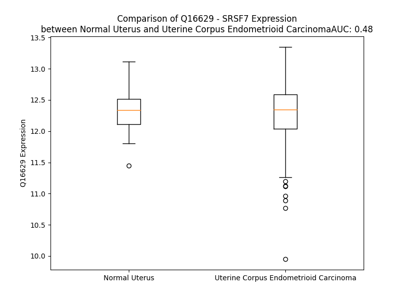

# Detailed Data for Q16629

## Introduction to the Detailed Summary

### How to Interpret the Results

- **Summary & Metrics**: This section provides a quick reference to essential protein attributes, including expression changes, family classification, and biomarker applications. Regulation status (upregulated/downregulated) indicates the protein's behavior in a disease context. Some information comes from the original excel file with the proteins selected from literature, while others are derived from the analyses.
- **Expression Comparison**: A visual representation comparing protein expression between normal and disease states. It highlights significant changes in expression levels that might indicate diagnostic or therapeutic relevance. This is data coming from transcriptomics experiments and could not translate similarly to protein levels.
- **Isoform Alignment**: An interactive view of isoform alignments, revealing structural and functional differences between variants of the protein.
- **Interactors & Homologs**: Tables listing known interaction partners and homologous proteins, the more interactors and homologs, the more complex the protein is to design an antibody for.
- **Biological Assemblies**: Information about the structural arrangement of the protein in different assemblies, providing insights into its functional state but also the complexity of the protein to develop antibodies.
- **Combined Per-Residue Information**: A detailed table summarizing residue-level data. This includes predictions for epitope regions, aggregation tendencies, and modifications that might impact the protein's function. Each row corresponds to a residue in the protein, providing insights into specific sites that may be important for research or drug development.
## Summary & Metrics

- **UniProt Accession**: Q16629
- **Gene Name**: SRSF7
- **Protein Name**: serine/arginine-rich splicing factor 7
- **Swiss Prot**: SRSF7_HUMAN
- **Family**: other
- **Biomarker Application**:  
- **Number of Isoforms**: 4
- **Regulation**: -1
- **(transcriptomics) AUC**: 0.6
- **(transcriptomics) Fold Change**: 1.01
- **(transcriptomics) Regulation**: Upregulated
- **Discotope Epitope Count**: 55
- **Max n_uniprots (Homo)**: 1
- **Max n_uniprots (Hetero)**: N/A

## Expression Comparison

## Isoform Alignment

<pre style='font-size:14px; font-family:monospace;'>Q16629-1 MSRYGRYGGETKVYVGNLGTGAGKGELERAFSYYGPLRTVWIARNPPGFAFVEFEDPRDAEDAVRGLDGKVICGSRVRVELSTGMPRRSRFDRPPARRPFDPNDRCYECGEKGHYAYDCHRYSRRRRSRSRSRSHSRSRGRRYSRSRSRSRGRRSRSASPRRSRSISLRRSRSASLRRSRSGSIKGSRYFQSPSRSRSRSRSISRPRSSRSKSRSPSPKRSRSPSGSPRRSASPERMD
Q16629-2 MSRYGRYGGETKVYVGNLGTGAGKGELERAFSYYGPLRTVWIARNPPGFAFVEFEDPRDAEDAVRGLDGKVICGSRVRVELSTGMPRRSRFDRPPARRPFDPNDRCYECGEKGHYAYDCHRYSRRRRSRAENLRR-------------------------------------------------------------------------------------------------------
Q16629-3 MSRYGRYGGETKVYVGNLGTGAGKGELERAFSYYGPLRTVWIARNPPGFAFVEFEDPRDAEDAVRGLDGKVICGSRVRVELSTGMPRRSRFDRPPARRPFDPNDRCYECGEKGHYAYDCHRYSRRRRSRYLF----------------------------------------------------------------------------------------------------------
Q16629-4 MSRYGRYGGETKVYVGNLGTGAGKGELERAFSYYGPLRTVWIARNPPGFAFVEFEDPRDAEDAVRGLDGKVICGSRVRVELSTGMPRRSRFDRPPARRPFDPNDRCYECGEKGHYAYDCHRYSRRRRSRSRSRSHSRSRGRRYSRSRSRSRGRRSRSASPRRSRSISLRRSRSASLRRSRSGSIKGSRYFQSPSRSRSRSRSISRPRSS------------RSPSGSPRRSASPERMD
</pre>

## Interactors

| preferredName_A   | preferredName_B   |   score |
|:------------------|:------------------|--------:|
| SRSF7             | SRSF3             |   0.997 |
| SRSF7             | SRSF1             |   0.997 |
| SRSF7             | TRA2B             |   0.995 |
| SRSF7             | SRSF9             |   0.99  |
| SRSF7             | U2AF2             |   0.978 |
| SRSF7             | SRSF6             |   0.978 |
| SRSF7             | SRPK1             |   0.965 |
| SRSF7             | HNRNPA1           |   0.964 |
| SRSF7             | SRSF11            |   0.962 |
| SRSF7             | NXF1              |   0.962 |
| SRSF7             | SRSF2             |   0.961 |
| SRSF7             | ALYREF            |   0.958 |
| SRSF7             | HNRNPC            |   0.951 |
| SRSF7             | HNRNPA2B1         |   0.947 |
| SRSF7             | PTBP1             |   0.933 |
| SRSF7             | SRSF5             |   0.933 |
| SRSF7             | HNRNPL            |   0.926 |
| SRSF7             | HNRNPH1           |   0.922 |
| SRSF7             | RBMX              |   0.919 |
| SRSF7             | HNRNPF            |   0.918 |
| SRSF7             | U2AF1             |   0.917 |
| SRSF7             | EIF4A3            |   0.908 |
| SRSF7             | DDX39B            |   0.905 |
| SRSF7             | NCBP2             |   0.904 |
| SRSF7             | SRSF4             |   0.903 |
| SRSF7             | HNRNPM            |   0.902 |
| SRSF7             | ZRSR2             |   0.901 |

## Homologs

| uniprot_id   | gene_id   |
|:-------------|:----------|
| Q13247       | SRSF6     |
| S4R2X6       | SRSF4     |
| B4DJK0       | SRSF5     |
| J3QQV5       | SRSF1     |
| Q7L4I2       | RSRC2     |
| H3BMX3       | RSRP1     |
| A0A9L9PWY3   | SRSF9     |
| P84103       | SRSF3     |

## Biological Assemblies

|   Unnamed: 0 |   assembly |   n_uniprots | composition   | crystal_id   |
|-------------:|-----------:|-------------:|:--------------|:-------------|
|            0 |          1 |            1 | Homo          | 2hvz         |

## Combined Per-Residue Information

|   res | aa   |   epitope_score | epitope   |   relative_surface_accessibility |   modeling_confidence |   Aggregation | modification               |
|------:|:-----|----------------:|:----------|---------------------------------:|----------------------:|--------------:|:---------------------------|
|     1 | M    |         0.20546 | False     |                          1.2582  |                 31.8  |         0     | N/A                        |
|     2 | S    |         0.23512 | False     |                          0.79691 |                 40.58 |         0     | N/A                        |
|     3 | R    |         0.29677 | True      |                          0.97694 |                 45.86 |         0     | N/A                        |
|     4 | Y    |         0.34621 | True      |                          0.74687 |                 45.49 |         0     | N/A                        |
|     5 | G    |         0.27031 | False     |                          0.92608 |                 46.98 |         0     | N/A                        |
|     6 | R    |         0.28446 | True      |                          0.83682 |                 51.67 |         0     | N/A                        |
|     7 | Y    |         0.25019 | False     |                          0.56755 |                 52.06 |         0     | N/A                        |
|     8 | G    |         0.16986 | False     |                          0.8006  |                 52.76 |         0     | N/A                        |
|     9 | G    |         0.15057 | False     |                          0.31323 |                 58.06 |         0     | N/A                        |
|    10 | E    |         0.13575 | False     |                          0.41276 |                 64.98 |         0     | N/A                        |
|    11 | T    |         0.12352 | False     |                          0.09533 |                 78.59 |         0     | N/A                        |
|    12 | K    |         0.1232  | False     |                          0.35518 |                 84.78 |         0     | N/A                        |
|    13 | V    |         0.00577 | False     |                          0       |                 86.92 |         0.2   | N/A                        |
|    14 | Y    |         0.12363 | False     |                          0.28684 |                 86.47 |         0.2   | N/A                        |
|    15 | V    |         0.00488 | False     |                          0       |                 86.11 |         0.2   | N/A                        |
|    16 | G    |         0.05036 | False     |                          0.02736 |                 84.79 |         0.2   | N/A                        |
|    17 | N    |         0.1343  | False     |                          0.58961 |                 81.64 |         0.2   | N/A                        |
|    18 | L    |         0.10164 | False     |                          0.07901 |                 76.1  |         0.2   | N/A                        |
|    19 | G    |         0.14749 | False     |                          0.2261  |                 67.43 |         0     | N/A                        |
|    20 | T    |         0.28949 | True      |                          1.07821 |                 66.83 |         0     | N/A                        |
|    21 | G    |         0.23822 | False     |                          0.72091 |                 63.17 |         0     | N/A                        |
|    22 | A    |         0.13282 | False     |                          0.07754 |                 64.94 |         0     | N/A                        |
|    23 | G    |         0.26876 | False     |                          0.42931 |                 74.16 |         0     | N/A                        |
|    24 | K    |         0.30536 | True      |                          0.51511 |                 81.88 |         0     | N6-acetyllysine; alternate |
|    25 | G    |         0.25734 | False     |                          0.38377 |                 83.32 |         0     | N/A                        |
|    26 | E    |         0.20677 | False     |                          0.25994 |                 82.61 |         0     | N/A                        |
|    27 | L    |         0.0079  | False     |                          0       |                 85.1  |         0     | N/A                        |
|    28 | E    |         0.25891 | False     |                          0.35054 |                 87.34 |         0     | N/A                        |
|    29 | R    |         0.38453 | True      |                          0.66902 |                 86.01 |         0     | N/A                        |
|    30 | A    |         0.21477 | False     |                          0.15355 |                 84.94 |         2.375 | N/A                        |
|    31 | F    |         0.00709 | False     |                          0.00064 |                 85.61 |         2.375 | N/A                        |
|    32 | S    |         0.21302 | False     |                          0.50029 |                 86.52 |         2.375 | Phosphoserine              |
|    33 | Y    |         0.32633 | True      |                          0.83287 |                 85.69 |         2.375 | N/A                        |
|    34 | Y    |         0.23389 | False     |                          0.25886 |                 84.63 |         2.375 | N/A                        |
|    35 | G    |         0.0834  | False     |                          0.13776 |                 85    |         0     | N/A                        |
|    36 | P    |         0.19796 | False     |                          0.58552 |                 87.05 |         0     | N/A                        |
|    37 | L    |         0.18995 | False     |                          0.26419 |                 87.59 |         0     | N/A                        |
|    38 | R    |         0.26534 | False     |                          0.56709 |                 86.15 |         0     | N/A                        |
|    39 | T    |         0.18569 | False     |                          0.52055 |                 85.14 |         2.14  | N/A                        |
|    40 | V    |         0.24645 | False     |                          0.19507 |                 87.42 |         2.14  | N/A                        |
|    41 | W    |         0.20392 | False     |                          0.65806 |                 85.15 |         2.14  | N/A                        |
|    42 | I    |         0.28865 | True      |                          0.3069  |                 84.65 |         2.14  | N/A                        |
|    43 | A    |         0.1142  | False     |                          0.06715 |                 79.35 |         2.14  | N/A                        |
|    44 | R    |         0.47043 | True      |                          0.86708 |                 68.81 |         0     | N/A                        |
|    45 | N    |         0.61953 | True      |                          0.85167 |                 60.65 |         0     | N/A                        |
|    46 | P    |         0.40617 | True      |                          0.65012 |                 66.01 |         0     | N/A                        |
|    47 | P    |         0.30995 | True      |                          0.82907 |                 65.27 |         0     | N/A                        |
|    48 | G    |         0.19954 | False     |                          0.2603  |                 71.83 |         2.908 | N/A                        |
|    49 | F    |         0.11136 | False     |                          0.18961 |                 81.89 |         2.908 | N/A                        |
|    50 | A    |         0.0075  | False     |                          0       |                 86.33 |         2.908 | N/A                        |
|    51 | F    |         0.11919 | False     |                          0.18935 |                 87.31 |         2.908 | N/A                        |
|    52 | V    |         0.0067  | False     |                          0       |                 87.78 |         2.908 | N/A                        |
|    53 | E    |         0.1337  | False     |                          0.18686 |                 87.04 |         0     | N/A                        |
|    54 | F    |         0.01006 | False     |                          0.00355 |                 87.71 |         0     | N/A                        |
|    55 | E    |         0.18512 | False     |                          0.52586 |                 85.46 |         0     | N/A                        |
|    56 | D    |         0.21028 | False     |                          0.24844 |                 83.71 |         0     | N/A                        |
|    57 | P    |         0.13984 | False     |                          0.21257 |                 82.94 |         0     | N/A                        |
|    58 | R    |         0.2553  | False     |                          0.66515 |                 84.47 |         0     | N/A                        |
|    59 | D    |         0.12627 | False     |                          0.18291 |                 86.91 |         0     | N/A                        |
|    60 | A    |         0.00385 | False     |                          0       |                 86.13 |         0     | N/A                        |
|    61 | E    |         0.15404 | False     |                          0.4244  |                 85.84 |         0     | N/A                        |
|    62 | D    |         0.19048 | False     |                          0.41301 |                 87    |         0     | N/A                        |
|    63 | A    |         0.0051  | False     |                          0       |                 86.96 |         0     | N/A                        |
|    64 | V    |         0.1822  | False     |                          0.14542 |                 87.89 |         0     | N/A                        |
|    65 | R    |         0.31386 | True      |                          0.78227 |                 86.17 |         0     | N/A                        |
|    66 | G    |         0.2111  | False     |                          0.43101 |                 85.45 |         0     | N/A                        |
|    67 | L    |         0.01505 | False     |                          0.00082 |                 83.29 |         0     | N/A                        |
|    68 | D    |         0.28501 | True      |                          0.49058 |                 86.32 |         0     | N/A                        |
|    69 | G    |         0.19205 | False     |                          0.5233  |                 79.58 |         0     | N/A                        |
|    70 | K    |         0.21575 | False     |                          0.48878 |                 80.02 |         0     | N/A                        |
|    71 | V    |         0.19335 | False     |                          0.63873 |                 76.98 |         0     | N/A                        |
|    72 | I    |         0.11663 | False     |                          0.04699 |                 68.83 |         0     | N/A                        |
|    73 | C    |         0.24801 | False     |                          0.5532  |                 61.41 |         0     | N/A                        |
|    74 | G    |         0.36563 | True      |                          0.85935 |                 68.99 |         0     | N/A                        |
|    75 | S    |         0.20173 | False     |                          0.24503 |                 73.92 |         0     | N/A                        |
|    76 | R    |         0.28626 | True      |                          0.73356 |                 81.3  |         0     | N/A                        |
|    77 | V    |         0.0163  | False     |                          0.0095  |                 84.83 |         0     | N/A                        |
|    78 | R    |         0.17373 | False     |                          0.52362 |                 84.83 |         0     | N/A                        |
|    79 | V    |         0.02778 | False     |                          0.0183  |                 87.99 |         0     | N/A                        |
|    80 | E    |         0.15218 | False     |                          0.33445 |                 85    |         0     | N/A                        |
|    81 | L    |         0.19877 | False     |                          0.37535 |                 81.97 |         0     | N/A                        |
|    82 | S    |         0.14476 | False     |                          0.10266 |                 66.34 |         0     | N/A                        |
|    83 | T    |         0.23215 | False     |                          0.842   |                 58.01 |         0     | N/A                        |
|    84 | G    |         0.2195  | False     |                          0.52284 |                 52.58 |         0     | N/A                        |
|    85 | M    |         0.32271 | True      |                          0.90237 |                 44.6  |         0     | N/A                        |
|    86 | P    |         0.19818 | False     |                          0.56848 |                 46.62 |         0     | N/A                        |
|    87 | R    |         0.33536 | True      |                          0.99218 |                 45.32 |         0     | N/A                        |
|    88 | R    |         0.26418 | False     |                          0.67062 |                 43.67 |         0     | N/A                        |
|    89 | S    |         0.22038 | False     |                          0.40921 |                 43.8  |         0     | N/A                        |
|    90 | R    |         0.30885 | True      |                          0.99281 |                 50.35 |         0     | N/A                        |
|    91 | F    |         0.22227 | False     |                          0.94789 |                 53.19 |         0     | N/A                        |
|    92 | D    |         0.26575 | False     |                          0.5391  |                 52.7  |         0     | N/A                        |
|    93 | R    |         0.35438 | True      |                          0.77594 |                 50.48 |         0     | N/A                        |
|    94 | P    |         0.21316 | False     |                          0.796   |                 53.44 |         0     | N/A                        |
|    95 | P    |         0.28549 | True      |                          0.96965 |                 52.52 |         0     | N/A                        |
|    96 | A    |         0.26444 | False     |                          0.59035 |                 52.93 |         0     | N/A                        |
|    97 | R    |         0.3658  | True      |                          0.92312 |                 52.88 |         0     | N/A                        |
|    98 | R    |         0.38083 | True      |                          0.81997 |                 56.86 |         0     | N/A                        |
|    99 | P    |         0.36021 | True      |                          0.82344 |                 57.62 |         0     | N/A                        |
|   100 | F    |         0.2765  | False     |                          0.38416 |                 54.64 |         0     | N/A                        |
|   101 | D    |         0.33642 | True      |                          0.47115 |                 63.19 |         0     | N/A                        |
|   102 | P    |         0.36192 | True      |                          0.74962 |                 65.52 |         0     | N/A                        |
|   103 | N    |         0.30076 | True      |                          0.73171 |                 64.96 |         0     | N/A                        |
|   104 | D    |         0.30018 | True      |                          0.29504 |                 69.75 |         0     | N/A                        |
|   105 | R    |         0.37175 | True      |                          0.62523 |                 71.65 |         0     | N/A                        |
|   106 | C    |         0.10048 | False     |                          0.01406 |                 75.09 |         0     | N/A                        |
|   107 | Y    |         0.39081 | True      |                          0.93514 |                 73.37 |         0     | N/A                        |
|   108 | E    |         0.33067 | True      |                          0.39871 |                 64.63 |         0     | N/A                        |
|   109 | C    |         0.10962 | False     |                          0.12673 |                 76.16 |         0     | N/A                        |
|   110 | G    |         0.27851 | False     |                          0.57204 |                 75.99 |         0     | N/A                        |
|   111 | E    |         0.26929 | False     |                          0.45888 |                 70.18 |         0     | N/A                        |
|   112 | K    |         0.36324 | True      |                          0.5818  |                 71.83 |         0     | N/A                        |
|   113 | G    |         0.21802 | False     |                          0.65046 |                 69.24 |         0     | N/A                        |
|   114 | H    |         0.12539 | False     |                          0.11924 |                 73.92 |         0     | N/A                        |
|   115 | Y    |         0.24388 | False     |                          0.3849  |                 68.87 |         0     | N/A                        |
|   116 | A    |         0.31031 | True      |                          0.26623 |                 70.32 |         0     | N/A                        |
|   117 | Y    |         0.35194 | True      |                          0.93812 |                 63.23 |         0     | N/A                        |
|   118 | D    |         0.29121 | True      |                          0.508   |                 66.33 |         0     | N/A                        |
|   119 | C    |         0.09362 | False     |                          0.0148  |                 72.16 |         0     | N/A                        |
|   120 | H    |         0.31723 | True      |                          0.62817 |                 69.22 |         0     | N/A                        |
|   121 | R    |         0.40716 | True      |                          0.59631 |                 61.91 |         0     | N/A                        |
|   122 | Y    |         0.45294 | True      |                          0.65109 |                 57.45 |         0     | N/A                        |
|   123 | S    |         0.19432 | False     |                          0.4203  |                 54.56 |         0     | N/A                        |
|   124 | R    |         0.33353 | True      |                          0.75618 |                 50.11 |         0     | N/A                        |
|   125 | R    |         0.38948 | True      |                          0.9073  |                 48.23 |         0     | N/A                        |
|   126 | R    |         0.32516 | True      |                          0.89638 |                 48.03 |         0     | N/A                        |
|   127 | R    |         0.33514 | True      |                          0.76035 |                 41.22 |         0     | N/A                        |
|   128 | S    |         0.36349 | True      |                          0.84351 |                 38.69 |         0     | N/A                        |
|   129 | R    |         0.33842 | True      |                          0.87078 |                 39.14 |         0     | N/A                        |
|   130 | S    |         0.22321 | False     |                          0.87286 |                 35.59 |         0     | N/A                        |
|   131 | R    |         0.38122 | True      |                          0.97918 |                 38.42 |         0     | N/A                        |
|   132 | S    |         0.18615 | False     |                          0.76518 |                 34.36 |         0     | N/A                        |
|   133 | R    |         0.2062  | False     |                          0.99094 |                 38.34 |         0     | N/A                        |
|   134 | S    |         0.17443 | False     |                          0.83097 |                 38.72 |         0     | N/A                        |
|   135 | H    |         0.2213  | False     |                          1.01201 |                 32.98 |         0     | N/A                        |
|   136 | S    |         0.22333 | False     |                          0.70463 |                 37.59 |         0     | N/A                        |
|   137 | R    |         0.25295 | False     |                          0.9688  |                 38.26 |         0     | N/A                        |
|   138 | S    |         0.19886 | False     |                          0.76488 |                 36.57 |         0     | N/A                        |
|   139 | R    |         0.20391 | False     |                          0.9958  |                 39.45 |         0     | N/A                        |
|   140 | G    |         0.17236 | False     |                          0.85121 |                 41.4  |         0     | N/A                        |
|   141 | R    |         0.25437 | False     |                          0.95709 |                 38.27 |         0     | N/A                        |
|   142 | R    |         0.38956 | True      |                          0.9308  |                 36.15 |         0     | N/A                        |
|   143 | Y    |         0.21983 | False     |                          0.83245 |                 32.87 |         0     | N/A                        |
|   144 | S    |         0.13873 | False     |                          0.51441 |                 40.5  |         0     | N/A                        |
|   145 | R    |         0.20081 | False     |                          0.82199 |                 35.75 |         0     | N/A                        |
|   146 | S    |         0.1921  | False     |                          0.70567 |                 40.29 |         0     | N/A                        |
|   147 | R    |         0.27517 | False     |                          0.92762 |                 38.84 |         0     | N/A                        |
|   148 | S    |         0.21944 | False     |                          0.76122 |                 41.64 |         0     | N/A                        |
|   149 | R    |         0.2501  | False     |                          0.92038 |                 39.63 |         0     | N/A                        |
|   150 | S    |         0.20468 | False     |                          0.7665  |                 41.94 |         0     | N/A                        |
|   151 | R    |         0.21861 | False     |                          0.9568  |                 39.39 |         0     | N/A                        |
|   152 | G    |         0.13917 | False     |                          0.80001 |                 38.3  |         0     | N/A                        |
|   153 | R    |         0.1742  | False     |                          0.92189 |                 39.04 |         0     | N/A                        |
|   154 | R    |         0.20793 | False     |                          0.91492 |                 34.71 |         0     | N/A                        |
|   155 | S    |         0.17962 | False     |                          0.66851 |                 36.51 |         0     | N/A                        |
|   156 | R    |         0.2683  | False     |                          0.9133  |                 32.99 |         0     | N/A                        |
|   157 | S    |         0.27723 | False     |                          0.86107 |                 34.22 |         0     | N/A                        |
|   158 | A    |         0.19577 | False     |                          1.02507 |                 39.08 |         0     | N/A                        |
|   159 | S    |         0.19477 | False     |                          0.83075 |                 38.19 |         0     | N/A                        |
|   160 | P    |         0.20633 | False     |                          0.84708 |                 43.82 |         0     | N/A                        |
|   161 | R    |         0.23889 | False     |                          0.89521 |                 44.34 |         0     | N/A                        |
|   162 | R    |         0.27288 | False     |                          0.8927  |                 35.22 |         0     | N/A                        |
|   163 | S    |         0.2186  | False     |                          0.77163 |                 42.28 |         0     | Phosphoserine              |
|   164 | R    |         0.34283 | True      |                          0.85911 |                 34.4  |         0     | N/A                        |
|   165 | S    |         0.28313 | True      |                          0.76811 |                 42.91 |         0     | Phosphoserine              |
|   166 | I    |         0.18575 | False     |                          1.00983 |                 40.9  |         0     | N/A                        |
|   167 | S    |         0.15996 | False     |                          0.59677 |                 42.04 |         0     | Phosphoserine              |
|   168 | L    |         0.20567 | False     |                          0.8543  |                 39.95 |         0     | N/A                        |
|   169 | R    |         0.18484 | False     |                          0.82237 |                 44.53 |         0     | N/A                        |
|   170 | R    |         0.22425 | False     |                          0.77287 |                 34.21 |         0     | N/A                        |
|   171 | S    |         0.15355 | False     |                          0.78207 |                 42.3  |         0     | N/A                        |
|   172 | R    |         0.24489 | False     |                          0.83371 |                 34.89 |         0     | N/A                        |
|   173 | S    |         0.19659 | False     |                          0.81924 |                 43.47 |         0     | N/A                        |
|   174 | A    |         0.18109 | False     |                          0.93783 |                 40.44 |         0     | N/A                        |
|   175 | S    |         0.19513 | False     |                          0.67608 |                 42.48 |         0     | N/A                        |
|   176 | L    |         0.24049 | False     |                          0.98109 |                 38.26 |         0     | N/A                        |
|   177 | R    |         0.24273 | False     |                          0.85604 |                 44.79 |         0     | N/A                        |
|   178 | R    |         0.22543 | False     |                          0.82371 |                 36.97 |         0     | N/A                        |
|   179 | S    |         0.16445 | False     |                          0.79602 |                 42.33 |         0     | N/A                        |
|   180 | R    |         0.23697 | False     |                          0.86792 |                 38.87 |         0     | N/A                        |
|   181 | S    |         0.14831 | False     |                          0.90988 |                 46.82 |         0     | Phosphoserine              |
|   182 | G    |         0.25775 | False     |                          0.85125 |                 40.26 |         0     | N/A                        |
|   183 | S    |         0.21057 | False     |                          0.74551 |                 50.93 |         0     | Phosphoserine              |
|   184 | I    |         0.20494 | False     |                          0.89119 |                 48.72 |         0     | N/A                        |
|   185 | K    |         0.21868 | False     |                          0.93845 |                 50.55 |         0     | N/A                        |
|   186 | G    |         0.20462 | False     |                          0.81187 |                 36.4  |         0     | N/A                        |
|   187 | S    |         0.127   | False     |                          0.774   |                 43.07 |         0     | N/A                        |
|   188 | R    |         0.21124 | False     |                          0.84184 |                 36.15 |         0     | N/A                        |
|   189 | Y    |         0.25881 | False     |                          0.78749 |                 41.97 |         0     | N/A                        |
|   190 | F    |         0.21864 | False     |                          0.99402 |                 45.32 |         0     | N/A                        |
|   191 | Q    |         0.19321 | False     |                          0.81393 |                 41.86 |         0     | N/A                        |
|   192 | S    |         0.19071 | False     |                          0.79667 |                 37.52 |         0     | Phosphoserine              |
|   193 | P    |         0.17219 | False     |                          0.91764 |                 46.45 |         0     | N/A                        |
|   194 | S    |         0.15553 | False     |                          0.79429 |                 39.51 |         0     | Phosphoserine              |
|   195 | R    |         0.21361 | False     |                          0.98639 |                 41.79 |         0     | N/A                        |
|   196 | S    |         0.15531 | False     |                          0.75412 |                 43.77 |         0     | Phosphoserine              |
|   197 | R    |         0.29233 | True      |                          0.90148 |                 42.59 |         0     | N/A                        |
|   198 | S    |         0.23446 | False     |                          0.74128 |                 48.39 |         0     | N/A                        |
|   199 | R    |         0.27405 | False     |                          0.93306 |                 42.83 |         0     | N/A                        |
|   200 | S    |         0.2628  | False     |                          0.76389 |                 50.6  |         0     | N/A                        |
|   201 | R    |         0.2957  | True      |                          0.95452 |                 41.75 |         0     | N/A                        |
|   202 | S    |         0.15342 | False     |                          0.7744  |                 46.5  |         0     | N/A                        |
|   203 | I    |         0.18515 | False     |                          1.06665 |                 48.03 |         0     | N/A                        |
|   204 | S    |         0.16333 | False     |                          0.71705 |                 46.94 |         0     | N/A                        |
|   205 | R    |         0.2372  | False     |                          0.95548 |                 54.78 |         0     | N/A                        |
|   206 | P    |         0.21414 | False     |                          0.85853 |                 47.98 |         0     | N/A                        |
|   207 | R    |         0.28054 | True      |                          0.96335 |                 42.34 |         0     | N/A                        |
|   208 | S    |         0.23186 | False     |                          0.88938 |                 51.19 |         0     | N/A                        |
|   209 | S    |         0.25934 | False     |                          0.78577 |                 46.61 |         0     | N/A                        |
|   210 | R    |         0.32034 | True      |                          0.92367 |                 47.53 |         0     | N/A                        |
|   211 | S    |         0.15622 | False     |                          0.77417 |                 51.66 |         0     | N/A                        |
|   212 | K    |         0.2937  | True      |                          0.99031 |                 52.17 |         0     | N/A                        |
|   213 | S    |         0.22114 | False     |                          0.76206 |                 54.73 |         0     | N/A                        |
|   214 | R    |         0.24358 | False     |                          0.92445 |                 49.83 |         0     | N/A                        |
|   215 | S    |         0.17598 | False     |                          0.90727 |                 56.17 |         0     | N/A                        |
|   216 | P    |         0.19361 | False     |                          0.88482 |                 57.61 |         0     | N/A                        |
|   217 | S    |         0.22499 | False     |                          0.76233 |                 52.41 |         0     | N/A                        |
|   218 | P    |         0.19987 | False     |                          0.96505 |                 58.78 |         0     | N/A                        |
|   219 | K    |         0.19    | False     |                          0.96031 |                 53.74 |         0     | N/A                        |
|   220 | R    |         0.32905 | True      |                          0.94887 |                 47.82 |         0     | N/A                        |
|   221 | S    |         0.22167 | False     |                          0.73079 |                 53.96 |         0     | N/A                        |
|   222 | R    |         0.26012 | False     |                          0.9235  |                 49.86 |         0     | N/A                        |
|   223 | S    |         0.1142  | False     |                          0.82479 |                 54.22 |         0     | N/A                        |
|   224 | P    |         0.225   | False     |                          0.97178 |                 61.14 |         0     | N/A                        |
|   225 | S    |         0.2174  | False     |                          0.89947 |                 56.88 |         0     | N/A                        |
|   226 | G    |         0.34956 | True      |                          0.95319 |                 51.36 |         0     | N/A                        |
|   227 | S    |         0.19628 | False     |                          0.82514 |                 60.94 |         0     | N/A                        |
|   228 | P    |         0.25121 | False     |                          0.96491 |                 56.04 |         0     | N/A                        |
|   229 | R    |         0.23438 | False     |                          0.88171 |                 61.74 |         0     | N/A                        |
|   230 | R    |         0.22803 | False     |                          0.844   |                 55.88 |         0     | N/A                        |
|   231 | S    |         0.19617 | False     |                          0.84254 |                 56.13 |         0     | Phosphoserine              |
|   232 | A    |         0.19421 | False     |                          1.02814 |                 58.73 |         0     | N/A                        |
|   233 | S    |         0.16919 | False     |                          0.81248 |                 63.5  |         0     | Phosphoserine              |
|   234 | P    |         0.19234 | False     |                          0.94477 |                 68.84 |         0     | N/A                        |
|   235 | E    |         0.16954 | False     |                          0.8035  |                 65.85 |         0     | N/A                        |
|   236 | R    |         0.25415 | False     |                          0.92021 |                 62.12 |         0     | N/A                        |
|   237 | M    |         0.20443 | False     |                          0.99246 |                 65.9  |         0     | N/A                        |
|   238 | D    |         0.18797 | False     |                          1.31136 |                 59.16 |         0     | N/A                        |

