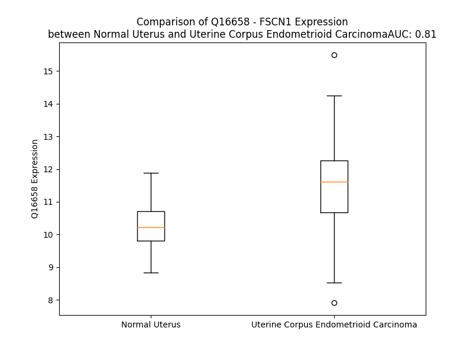

# Detailed Data for Q16658

## Introduction to the Detailed Summary

### How to Interpret the Results

- **Summary & Metrics**: This section provides a quick reference to essential protein attributes, including expression changes, family classification, and biomarker applications. Regulation status (upregulated/downregulated) indicates the protein's behavior in a disease context. Some information comes from the original excel file with the proteins selected from literature, while others are derived from the analyses.
- **Expression Comparison**: A visual representation comparing protein expression between normal and disease states. It highlights significant changes in expression levels that might indicate diagnostic or therapeutic relevance. This is data coming from transcriptomics experiments and could not translate similarly to protein levels.
- **Isoform Alignment**: An interactive view of isoform alignments, revealing structural and functional differences between variants of the protein.
- **Interactors & Homologs**: Tables listing known interaction partners and homologous proteins, the more interactors and homologs, the more complex the protein is to design an antibody for.
- **Biological Assemblies**: Information about the structural arrangement of the protein in different assemblies, providing insights into its functional state but also the complexity of the protein to develop antibodies.
- **Combined Per-Residue Information**: A detailed table summarizing residue-level data. This includes predictions for epitope regions, aggregation tendencies, and modifications that might impact the protein's function. Each row corresponds to a residue in the protein, providing insights into specific sites that may be important for research or drug development.
## Summary & Metrics

- **UniProt Accession**: Q16658
- **Gene Name**: FSCN1
- **Protein Name**: Fascin
- **Swiss Prot**: FSCN1_HUMAN
- **Family**: other
- **Biomarker Application**: unspecified application
- **Number of Isoforms**: 0
- **Regulation**: 1
- **(transcriptomics) AUC**: 0.81
- **(transcriptomics) Fold Change**: 1.12
- **(transcriptomics) Regulation**: Upregulated
- **Discotope Epitope Count**: 95
- **Max n_uniprots (Homo)**: 2
- **Max n_uniprots (Hetero)**: N/A

## Expression Comparison

## Interactors

| preferredName_A   | preferredName_B   |   score |
|:------------------|:------------------|--------:|
| FSCN1             | ESPN              |   0.949 |

## Homologs

| uniprot_id   | gene_id   |
|:-------------|:----------|
| O14926       | FSCN2     |
| F8WDZ8       | FSCN3     |

## Biological Assemblies

|   Unnamed: 0 |   assembly |   n_uniprots | composition   | crystal_id   |
|-------------:|-----------:|-------------:|:--------------|:-------------|
|            0 |          1 |            1 | Homo          | 6i15         |
|            0 |          1 |            1 | Homo          | 6i11         |
|            0 |          1 |            1 | Homo          | 7zau         |
|            1 |          2 |            1 | Homo          | 7zau         |
|            2 |          3 |            1 | Homo          | 7zau         |
|            3 |          4 |            1 | Homo          | 7zau         |
|            0 |          1 |            1 | Homo          | 3llp         |
|            1 |          2 |            1 | Homo          | 3llp         |
|            0 |          1 |            1 | Homo          | 4gp0         |
|            1 |          2 |            1 | Homo          | 4gp0         |
|            2 |          3 |            2 | Homo          | 4gp0         |
|            0 |          1 |            1 | Homo          | 6b0t         |
|            1 |          2 |            1 | Homo          | 6b0t         |
|            2 |          3 |            1 | Homo          | 6b0t         |
|            3 |          4 |            1 | Homo          | 6b0t         |
|            4 |          5 |            1 | Homo          | 6b0t         |
|            5 |          6 |            1 | Homo          | 6b0t         |
|            0 |          1 |            1 | Homo          | 6i16         |
|            0 |          1 |            1 | Homo          | 6i0z         |
|            1 |          2 |            1 | Homo          | 6i0z         |
|            0 |          1 |            1 | Homo          | 6i13         |
|            0 |          1 |            1 | Homo          | 4goy         |
|            1 |          2 |            1 | Homo          | 4goy         |
|            2 |          3 |            2 | Homo          | 4goy         |
|            3 |          4 |            1 | Homo          | 4goy         |
|            0 |          1 |            1 | Homo          | 6i14         |
|            0 |          1 |            1 | Homo          | 1dfc         |
|            1 |          2 |            1 | Homo          | 1dfc         |
|            0 |          1 |            1 | Homo          | 6i12         |
|            0 |          1 |            1 | Homo          | 6i17         |
|            0 |          1 |            1 | Homo          | 4gov         |
|            1 |          2 |            1 | Homo          | 4gov         |
|            2 |          3 |            2 | Homo          | 4gov         |
|            0 |          1 |            1 | Homo          | 3p53         |
|            1 |          2 |            1 | Homo          | 3p53         |
|            0 |          1 |            1 | Homo          | 6i10         |
|            0 |          1 |            1 | Homo          | 6i18         |
|            0 |          1 |            1 | Homo          | 4gp3         |
|            1 |          2 |            1 | Homo          | 4gp3         |
|            2 |          3 |            2 | Homo          | 4gp3         |
|            3 |          4 |            1 | Homo          | 4gp3         |

## Combined Per-Residue Information

|   res | aa   |   epitope_score | epitope   |   relative_surface_accessibility |   modeling_confidence |   Aggregation | modification          |
|------:|:-----|----------------:|:----------|---------------------------------:|----------------------:|--------------:|:----------------------|
|     1 | M    |         0.07649 | False     |                          0.98511 |                 42.91 |         0     | N/A                   |
|     2 | T    |         0.15738 | True      |                          0.37025 |                 45.38 |         0     | N-acetylthreonine     |
|     3 | A    |         0.16898 | True      |                          1.09331 |                 46.44 |         0     | N/A                   |
|     4 | N    |         0.09245 | False     |                          0.39245 |                 54.39 |         0     | N/A                   |
|     5 | G    |         0.05445 | False     |                          0.03312 |                 59.01 |         0     | N/A                   |
|     6 | T    |         0.06962 | False     |                          0.06876 |                 62.23 |         0     | N/A                   |
|     7 | A    |         0.04441 | False     |                          0.11379 |                 70.72 |         0     | N/A                   |
|     8 | E    |         0.11221 | False     |                          0.60889 |                 72.2  |         0     | N/A                   |
|     9 | A    |         0.06432 | False     |                          0.613   |                 74.04 |         0.233 | N/A                   |
|    10 | V    |         0.03014 | False     |                          0.24142 |                 78.52 |         0.508 | N/A                   |
|    11 | Q    |         0.0741  | False     |                          0.49119 |                 84.96 |         0.508 | N/A                   |
|    12 | I    |         0.0125  | False     |                          0.0574  |                 87.99 |         2.305 | N/A                   |
|    13 | Q    |         0.07523 | False     |                          0.27677 |                 93.45 |         2.455 | N/A                   |
|    14 | F    |         0.0016  | False     |                          0.00069 |                 95.01 |         2.604 | N/A                   |
|    15 | G    |         0.00346 | False     |                          0       |                 96.4  |         2.604 | N/A                   |
|    16 | L    |         0.00399 | False     |                          0       |                 97.37 |         2.604 | N/A                   |
|    17 | I    |         0.03576 | False     |                          0.05555 |                 96.65 |         2.442 | N/A                   |
|    18 | N    |         0.02192 | False     |                          0.03248 |                 96.76 |         0.149 | N/A                   |
|    19 | C    |         0.21312 | True      |                          0.48249 |                 95.02 |         0     | N/A                   |
|    20 | G    |         0.16233 | True      |                          0.46076 |                 95.03 |         0     | N/A                   |
|    21 | N    |         0.10079 | False     |                          0.64515 |                 94.49 |         0     | N/A                   |
|    22 | K    |         0.22793 | True      |                          0.36103 |                 97.14 |         0     | N/A                   |
|    23 | Y    |         0.02625 | False     |                          0.06999 |                 97.55 |         0     | N/A                   |
|    24 | L    |         0.00411 | False     |                          0       |                 98.33 |         0     | N/A                   |
|    25 | T    |         0.06337 | False     |                          0.0219  |                 98.27 |         0     | N/A                   |
|    26 | A    |         0.00598 | False     |                          0.00128 |                 98    |         0     | N/A                   |
|    27 | E    |         0.18604 | True      |                          0.23168 |                 96.67 |         0     | N/A                   |
|    28 | A    |         0.20039 | True      |                          0.56193 |                 94.51 |         0     | N/A                   |
|    29 | F    |         0.35117 | True      |                          0.88968 |                 92.86 |         0     | N/A                   |
|    30 | G    |         0.25561 | True      |                          0.58938 |                 92.67 |         0     | N/A                   |
|    31 | F    |         0.18087 | True      |                          0.33024 |                 94.48 |         0     | N/A                   |
|    32 | K    |         0.22365 | True      |                          0.65046 |                 94.51 |         0     | N/A                   |
|    33 | V    |         0.04052 | False     |                          0.0904  |                 97.39 |         0     | N/A                   |
|    34 | N    |         0.10317 | False     |                          0.10859 |                 97.61 |         0     | N/A                   |
|    35 | A    |         0.00777 | False     |                          0.00094 |                 97.83 |         0     | N/A                   |
|    36 | S    |         0.26001 | True      |                          0.42026 |                 96.15 |         0     | N/A                   |
|    37 | A    |         0.11698 | False     |                          0.22977 |                 95.92 |         0     | N/A                   |
|    38 | S    |         0.18324 | True      |                          0.67903 |                 93.38 |         0     | Phosphoserine         |
|    39 | S    |         0.08932 | False     |                          0.30363 |                 91.93 |         0     | Phosphoserine; by PKC |
|    40 | L    |         0.05552 | False     |                          0.10552 |                 93.61 |         0     | N/A                   |
|    41 | K    |         0.08651 | False     |                          0.35427 |                 92.23 |         0     | N/A                   |
|    42 | K    |         0.14075 | False     |                          0.73005 |                 92.46 |         0     | N/A                   |
|    43 | K    |         0.0979  | False     |                          0.43701 |                 96.23 |         0     | N/A                   |
|    44 | Q    |         0.14373 | False     |                          0.05125 |                 97.22 |         0.366 | N/A                   |
|    45 | I    |         0.07202 | False     |                          0.2001  |                 96.49 |         0.366 | N/A                   |
|    46 | W    |         0.00853 | False     |                          0.0005  |                 97.25 |         0.366 | N/A                   |
|    47 | T    |         0.02438 | False     |                          0.08511 |                 95.21 |         0.366 | N/A                   |
|    48 | L    |         0.02814 | False     |                          0.14925 |                 92.93 |         0.366 | N/A                   |
|    49 | E    |         0.04928 | False     |                          0.21596 |                 90.59 |         0     | N/A                   |
|    50 | Q    |         0.05483 | False     |                          0.38999 |                 84.42 |         0     | N/A                   |
|    51 | P    |         0.0539  | False     |                          0.06704 |                 77.72 |         0     | N/A                   |
|    52 | P    |         0.16104 | True      |                          0.80699 |                 65.79 |         0     | N/A                   |
|    53 | D    |         0.27169 | True      |                          0.74442 |                 64.24 |         0     | N/A                   |
|    54 | E    |         0.13495 | False     |                          0.39455 |                 63.1  |         0     | N/A                   |
|    55 | A    |         0.10782 | False     |                          1.13706 |                 57.22 |         0     | N/A                   |
|    56 | G    |         0.20114 | True      |                          0.90693 |                 64.08 |         0     | N/A                   |
|    57 | S    |         0.11297 | False     |                          0.18436 |                 75.19 |         0     | N/A                   |
|    58 | A    |         0.04322 | False     |                          0.65557 |                 82.72 |         0.209 | N/A                   |
|    59 | A    |         0.02099 | False     |                          0.00426 |                 90.46 |         0.209 | N/A                   |
|    60 | V    |         0.01449 | False     |                          0.03903 |                 92.44 |         0.209 | N/A                   |
|    61 | C    |         0.01287 | False     |                          0.00594 |                 94.72 |         0.209 | N/A                   |
|    62 | L    |         0.00414 | False     |                          0.00165 |                 96.55 |         0.209 | N/A                   |
|    63 | R    |         0.14435 | False     |                          0.30078 |                 96.76 |         0     | N/A                   |
|    64 | S    |         0.03017 | False     |                          0.04259 |                 97.62 |         0     | N/A                   |
|    65 | H    |         0.11459 | False     |                          0.30831 |                 95.43 |         0     | N/A                   |
|    66 | L    |         0.14027 | False     |                          0.28634 |                 96.8  |         0     | N/A                   |
|    67 | G    |         0.10244 | False     |                          0.36433 |                 96.41 |         0     | N/A                   |
|    68 | R    |         0.17356 | True      |                          0.1742  |                 97.54 |         0     | N/A                   |
|    69 | Y    |         0.02315 | False     |                          0.08694 |                 97.65 |         0     | N/A                   |
|    70 | L    |         0.00461 | False     |                          0       |                 98.14 |         0     | N/A                   |
|    71 | A    |         0.03663 | False     |                          0.0286  |                 97.58 |         0     | N/A                   |
|    72 | A    |         0.00654 | False     |                          0.00255 |                 97.85 |         0     | N/A                   |
|    73 | D    |         0.08324 | False     |                          0.30136 |                 96.61 |         0     | N/A                   |
|    74 | K    |         0.20449 | True      |                          0.73677 |                 97    |         0     | N6-acetyllysine       |
|    75 | D    |         0.16932 | True      |                          0.55853 |                 97.51 |         0     | N/A                   |
|    76 | G    |         0.02581 | False     |                          0.02961 |                 96.93 |         0     | N/A                   |
|    77 | N    |         0.18554 | True      |                          0.53402 |                 97.39 |         0     | N/A                   |
|    78 | V    |         0.06926 | False     |                          0.13427 |                 97.74 |         0     | N/A                   |
|    79 | T    |         0.07679 | False     |                          0.33869 |                 95.58 |         0     | N/A                   |
|    80 | C    |         0.01036 | False     |                          0.002   |                 97.32 |         0     | N/A                   |
|    81 | E    |         0.25199 | True      |                          0.49201 |                 96.49 |         0     | N/A                   |
|    82 | R    |         0.18936 | True      |                          0.34334 |                 95.82 |         0     | N/A                   |
|    83 | E    |         0.26785 | True      |                          0.5863  |                 95.47 |         0     | N/A                   |
|    84 | V    |         0.11395 | False     |                          0.81409 |                 94.08 |         0     | N/A                   |
|    85 | P    |         0.05784 | False     |                          0.2894  |                 92.93 |         0     | N/A                   |
|    86 | G    |         0.06628 | False     |                          0.19831 |                 93.18 |         0     | N/A                   |
|    87 | P    |         0.09773 | False     |                          0.67938 |                 93.91 |         0     | N/A                   |
|    88 | D    |         0.12356 | False     |                          0.16445 |                 96.56 |         0     | N/A                   |
|    89 | C    |         0.00515 | False     |                          0       |                 96.3  |         0     | N/A                   |
|    90 | R    |         0.08699 | False     |                          0.19609 |                 94.99 |         0     | N/A                   |
|    91 | F    |         0.0032  | False     |                          0       |                 95.88 |        91.969 | N/A                   |
|    92 | L    |         0.05713 | False     |                          0.2234  |                 93.92 |        91.991 | N/A                   |
|    93 | I    |         0.0304  | False     |                          0.16257 |                 93.74 |        91.991 | N/A                   |
|    94 | V    |         0.0975  | False     |                          0.37702 |                 94.26 |        91.991 | N/A                   |
|    95 | A    |         0.0332  | False     |                          0.14894 |                 94.3  |        91.991 | N/A                   |
|    96 | H    |         0.08354 | False     |                          0.16391 |                 95.17 |         0.27  | N/A                   |
|    97 | D    |         0.12734 | False     |                          0.36414 |                 92.17 |         0     | N/A                   |
|    98 | D    |         0.04736 | False     |                          0.23062 |                 92.78 |         0     | N/A                   |
|    99 | G    |         0.01233 | False     |                          0.04563 |                 93.11 |         0     | N/A                   |
|   100 | R    |         0.09002 | False     |                          0.2699  |                 96.17 |         0     | N/A                   |
|   101 | W    |         0.01282 | False     |                          0.00055 |                 96.58 |         0     | N/A                   |
|   102 | S    |         0.00437 | False     |                          0       |                 97.85 |         0     | N/A                   |
|   103 | L    |         0.00493 | False     |                          0.00165 |                 97.68 |         0     | N/A                   |
|   104 | Q    |         0.1391  | False     |                          0.13831 |                 97.8  |         0     | N/A                   |
|   105 | S    |         0.00659 | False     |                          0.00079 |                 97.44 |         0     | N/A                   |
|   106 | E    |         0.05303 | False     |                          0.20425 |                 95.07 |         0     | N/A                   |
|   107 | A    |         0.10773 | False     |                          0.52015 |                 95.34 |         0     | N/A                   |
|   108 | H    |         0.19075 | True      |                          0.25896 |                 97.06 |         0     | N/A                   |
|   109 | R    |         0.24949 | True      |                          0.5256  |                 97.27 |         0     | N/A                   |
|   110 | R    |         0.20972 | True      |                          0.27522 |                 98.15 |         0     | N/A                   |
|   111 | Y    |         0.05547 | False     |                          0.15515 |                 98.56 |         0     | N/A                   |
|   112 | F    |         0.01508 | False     |                          0.00064 |                 98.58 |         0     | N/A                   |
|   113 | G    |         0.04609 | False     |                          0.02593 |                 98.2  |         0     | N/A                   |
|   114 | G    |         0.06225 | False     |                          0.13841 |                 97.33 |         0     | N/A                   |
|   115 | T    |         0.19788 | True      |                          0.2726  |                 97.25 |         0     | N/A                   |
|   116 | E    |         0.29713 | True      |                          0.45703 |                 95.9  |         0     | N/A                   |
|   117 | D    |         0.49343 | True      |                          0.72628 |                 95.5  |         0     | N/A                   |
|   118 | R    |         0.20121 | True      |                          0.69965 |                 96.15 |         0     | N/A                   |
|   119 | L    |         0.04745 | False     |                          0.12287 |                 97.91 |         0.24  | N/A                   |
|   120 | S    |         0.08835 | False     |                          0.39332 |                 97.87 |         0.24  | N/A                   |
|   121 | C    |         0.01731 | False     |                          0.00666 |                 98.29 |         0.24  | N/A                   |
|   122 | F    |         0.17588 | True      |                          0.55318 |                 97.92 |         0.406 | N/A                   |
|   123 | A    |         0.09905 | False     |                          0.26642 |                 97.78 |         0.406 | N/A                   |
|   124 | Q    |         0.22931 | True      |                          0.63279 |                 97.18 |         0.166 | N/A                   |
|   125 | T    |         0.1585  | True      |                          0.73381 |                 97.12 |         0.166 | N/A                   |
|   126 | V    |         0.13868 | False     |                          0.34445 |                 97.8  |         0.166 | N/A                   |
|   127 | S    |         0.13126 | False     |                          0.35394 |                 97.09 |         0     | Phosphoserine         |
|   128 | P    |         0.11398 | False     |                          0.67273 |                 96.53 |         0     | N/A                   |
|   129 | A    |         0.08823 | False     |                          0.3167  |                 97.1  |         0     | N/A                   |
|   130 | E    |         0.10832 | False     |                          0.08755 |                 98.23 |         0     | N/A                   |
|   131 | K    |         0.06443 | False     |                          0.19698 |                 97.86 |         0     | N/A                   |
|   132 | W    |         0.00957 | False     |                          0       |                 97.84 |         0     | N/A                   |
|   133 | S    |         0.03993 | False     |                          0.03874 |                 95.89 |         0     | N/A                   |
|   134 | V    |         0.01028 | False     |                          0.02401 |                 95.15 |         0     | N/A                   |
|   135 | H    |         0.03306 | False     |                          0.01639 |                 94.87 |         0     | N/A                   |
|   136 | I    |         0.01782 | False     |                          0.02341 |                 93.55 |         0     | N/A                   |
|   137 | A    |         0.01224 | False     |                          0.0269  |                 92.63 |         0     | N/A                   |
|   138 | M    |         0.02633 | False     |                          0.06517 |                 90.2  |         0     | N/A                   |
|   139 | H    |         0.02898 | False     |                          0.08306 |                 93.99 |         0     | N/A                   |
|   140 | P    |         0.00414 | False     |                          0       |                 95.26 |         0     | N/A                   |
|   141 | Q    |         0.0099  | False     |                          0.01615 |                 96.32 |         0     | N/A                   |
|   142 | V    |         0.00608 | False     |                          0.00952 |                 95.72 |         0.714 | N/A                   |
|   143 | N    |         0.01538 | False     |                          0.02839 |                 96.71 |         0.714 | N/A                   |
|   144 | I    |         0.00434 | False     |                          0.00377 |                 96.96 |         0.988 | N/A                   |
|   145 | Y    |         0.05735 | False     |                          0.09368 |                 96.46 |         0.988 | N/A                   |
|   146 | S    |         0.00261 | False     |                          0       |                 97.1  |         0.988 | N/A                   |
|   147 | V    |         0.08153 | False     |                          0.38952 |                 93.03 |         0.853 | N/A                   |
|   148 | T    |         0.12435 | False     |                          0.35425 |                 94.89 |         0.274 | N/A                   |
|   149 | R    |         0.20966 | True      |                          0.34801 |                 95.49 |         0     | N/A                   |
|   150 | K    |         0.19961 | True      |                          0.65747 |                 95.61 |         0     | N/A                   |
|   151 | R    |         0.18862 | True      |                          0.32543 |                 96.86 |         0     | N/A                   |
|   152 | Y    |         0.00357 | False     |                          0.00117 |                 97.35 |         0     | N/A                   |
|   153 | A    |         0.00572 | False     |                          0.00283 |                 98.07 |         0     | N/A                   |
|   154 | H    |         0.06602 | False     |                          0.12171 |                 97.56 |         0     | N/A                   |
|   155 | L    |         0.08695 | False     |                          0.1514  |                 97.68 |         0     | N/A                   |
|   156 | S    |         0.1428  | False     |                          0.11379 |                 95.44 |         0     | N/A                   |
|   157 | A    |         0.27123 | True      |                          0.8213  |                 87.37 |         0     | N/A                   |
|   158 | R    |         0.58016 | True      |                          0.78018 |                 83.56 |         0     | N/A                   |
|   159 | P    |         0.57139 | True      |                          1.0001  |                 85.12 |         0     | N/A                   |
|   160 | A    |         0.32117 | True      |                          0.5679  |                 84.03 |         0     | N/A                   |
|   161 | D    |         0.11231 | False     |                          0.26032 |                 93.15 |         0     | N/A                   |
|   162 | E    |         0.11245 | False     |                          0.13251 |                 96.8  |         0     | N/A                   |
|   163 | I    |         0.0116  | False     |                          0.00217 |                 98.47 |         0     | N/A                   |
|   164 | A    |         0.03132 | False     |                          0.0051  |                 98.01 |         0     | N/A                   |
|   165 | V    |         0.00829 | False     |                          0       |                 98.01 |         0     | N/A                   |
|   166 | D    |         0.21973 | True      |                          0.36689 |                 96.29 |         0     | N/A                   |
|   167 | R    |         0.17631 | True      |                          0.24786 |                 95.03 |         0     | N/A                   |
|   168 | D    |         0.14524 | False     |                          0.44737 |                 94.49 |         0     | N/A                   |
|   169 | V    |         0.11759 | False     |                          0.15424 |                 94.96 |         0     | N/A                   |
|   170 | P    |         0.00545 | False     |                          0.00934 |                 95.67 |         0     | N/A                   |
|   171 | W    |         0.01217 | False     |                          0.00541 |                 94.8  |         0     | N/A                   |
|   172 | G    |         0.04466 | False     |                          0.17319 |                 93.73 |         0     | N/A                   |
|   173 | V    |         0.08046 | False     |                          0.44857 |                 94.92 |         0     | N/A                   |
|   174 | D    |         0.05982 | False     |                          0.21593 |                 95.69 |         0     | N/A                   |
|   175 | S    |         0.00887 | False     |                          0.01194 |                 96.24 |         2.345 | N/A                   |
|   176 | L    |         0.0066  | False     |                          0.01356 |                 96.83 |        18.406 | N/A                   |
|   177 | I    |         0.00413 | False     |                          0.0016  |                 97.82 |        25.038 | N/A                   |
|   178 | T    |         0.00162 | False     |                          0.00236 |                 97.54 |        25.038 | N/A                   |
|   179 | L    |         0.00228 | False     |                          0       |                 96.9  |        25.038 | N/A                   |
|   180 | A    |         0.01886 | False     |                          0.05867 |                 95.35 |        24.621 | N/A                   |
|   181 | F    |         0.02251 | False     |                          0.2089  |                 93.13 |        21.425 | N/A                   |
|   182 | Q    |         0.13919 | False     |                          0.3635  |                 87.86 |         0.748 | N/A                   |
|   183 | D    |         0.15306 | False     |                          0.8397  |                 86.25 |         0     | N/A                   |
|   184 | Q    |         0.07451 | False     |                          0.28466 |                 87.87 |         0     | N/A                   |
|   185 | R    |         0.07852 | False     |                          0.20211 |                 94.09 |         0     | N/A                   |
|   186 | Y    |         0.02063 | False     |                          0.01863 |                 96.71 |         0     | N/A                   |
|   187 | S    |         0.02091 | False     |                          0.03242 |                 97.11 |         0     | N/A                   |
|   188 | V    |         0.00446 | False     |                          0.00381 |                 97.98 |         0     | N/A                   |
|   189 | Q    |         0.02813 | False     |                          0.05752 |                 97.64 |         0     | N/A                   |
|   190 | T    |         0.00524 | False     |                          0.00095 |                 97.26 |         0     | N/A                   |
|   191 | A    |         0.04602 | False     |                          0.08154 |                 94.41 |         0     | N/A                   |
|   192 | D    |         0.09524 | False     |                          0.38151 |                 94.18 |         0     | N/A                   |
|   193 | H    |         0.08543 | False     |                          0.40023 |                 94.06 |         0     | N/A                   |
|   194 | R    |         0.13827 | False     |                          0.15893 |                 96.21 |         0     | N/A                   |
|   195 | F    |         0.03332 | False     |                          0.0707  |                 97.82 |         0     | N/A                   |
|   196 | L    |         0.00455 | False     |                          0       |                 98.44 |         0     | N/A                   |
|   197 | R    |         0.21793 | True      |                          0.20925 |                 97.98 |         0     | N/A                   |
|   198 | H    |         0.06542 | False     |                          0.1656  |                 97.69 |         0     | N/A                   |
|   199 | D    |         0.07442 | False     |                          0.37092 |                 97.04 |         0     | N/A                   |
|   200 | G    |         0.06178 | False     |                          0.06796 |                 97.53 |         0     | N/A                   |
|   201 | R    |         0.29843 | True      |                          0.63225 |                 97.16 |         0     | N/A                   |
|   202 | L    |         0.08583 | False     |                          0.13221 |                 97.99 |         0     | N/A                   |
|   203 | V    |         0.0989  | False     |                          0.20565 |                 97.31 |         0     | N/A                   |
|   204 | A    |         0.28795 | True      |                          0.79506 |                 95.77 |         0     | N/A                   |
|   205 | R    |         0.22854 | True      |                          0.77405 |                 94.72 |         0     | N/A                   |
|   206 | P    |         0.15646 | True      |                          0.43056 |                 93.77 |         0     | N/A                   |
|   207 | E    |         0.20403 | True      |                          0.3563  |                 95.27 |         0     | N/A                   |
|   208 | P    |         0.12755 | False     |                          0.75295 |                 93.93 |         0     | N/A                   |
|   209 | A    |         0.06381 | False     |                          0.19348 |                 96.55 |         0     | N/A                   |
|   210 | T    |         0.0189  | False     |                          0.00145 |                 97.55 |         0     | N/A                   |
|   211 | G    |         0.05349 | False     |                          0.08859 |                 97.25 |         0     | N/A                   |
|   212 | Y    |         0.00841 | False     |                          0.00158 |                 97.58 |         0     | N/A                   |
|   213 | T    |         0.01646 | False     |                          0.02022 |                 96.71 |         0     | N/A                   |
|   214 | L    |         0.0124  | False     |                          0.01642 |                 95.22 |         0     | N/A                   |
|   215 | E    |         0.01613 | False     |                          0.0553  |                 93.44 |         0     | N/A                   |
|   216 | F    |         0.0113  | False     |                          0.02058 |                 89.47 |         0     | N/A                   |
|   217 | R    |         0.05557 | False     |                          0.35814 |                 85.56 |         0     | N/A                   |
|   218 | S    |         0.07058 | False     |                          0.46252 |                 82.06 |         0     | N/A                   |
|   219 | G    |         0.04001 | False     |                          0.47055 |                 83.93 |         0     | N/A                   |
|   220 | K    |         0.08439 | False     |                          0.26043 |                 90.85 |         0     | N/A                   |
|   221 | V    |         0.00648 | False     |                          0.00518 |                 93.78 |         0     | N/A                   |
|   222 | A    |         0.00544 | False     |                          0.00255 |                 96.14 |         0     | N/A                   |
|   223 | F    |         0.00338 | False     |                          0.00064 |                 97.76 |         0     | N/A                   |
|   224 | R    |         0.05938 | False     |                          0.14209 |                 97.72 |         0     | N/A                   |
|   225 | D    |         0.01538 | False     |                          0.01018 |                 96.72 |         0     | N/A                   |
|   226 | C    |         0.12867 | False     |                          0.33083 |                 94.65 |         0     | N/A                   |
|   227 | E    |         0.12764 | False     |                          0.51258 |                 95.19 |         0     | N/A                   |
|   228 | G    |         0.04061 | False     |                          0.03135 |                 95.97 |         0     | N/A                   |
|   229 | R    |         0.24277 | True      |                          0.23866 |                 97.59 |         0     | N/A                   |
|   230 | Y    |         0.02717 | False     |                          0.02732 |                 98.29 |         0     | N/A                   |
|   231 | L    |         0.00341 | False     |                          0       |                 98.53 |         0     | N/A                   |
|   232 | A    |         0.0362  | False     |                          0.10226 |                 98.27 |         0     | N/A                   |
|   233 | P    |         0.03866 | False     |                          0.1655  |                 97.79 |         0     | N/A                   |
|   234 | S    |         0.16575 | True      |                          0.31608 |                 96.64 |         0     | Phosphoserine         |
|   235 | G    |         0.28507 | True      |                          0.55852 |                 95.3  |         0     | N/A                   |
|   236 | P    |         0.24544 | True      |                          0.98543 |                 94.8  |         0     | N/A                   |
|   237 | S    |         0.2613  | True      |                          0.28775 |                 95.01 |         0     | N/A                   |
|   238 | G    |         0.01031 | False     |                          0       |                 97.04 |         0     | N/A                   |
|   239 | T    |         0.14114 | False     |                          0.15107 |                 97.89 |         0     | Phosphothreonine      |
|   240 | L    |         0.00615 | False     |                          0.00287 |                 98.59 |         0     | N/A                   |
|   241 | K    |         0.15361 | False     |                          0.35441 |                 98.21 |         0     | N/A                   |
|   242 | A    |         0.05238 | False     |                          0.1758  |                 98.07 |         0     | N/A                   |
|   243 | G    |         0.12391 | False     |                          0.33038 |                 95.48 |         0     | N/A                   |
|   244 | K    |         0.28278 | True      |                          0.98769 |                 94.04 |         0     | N/A                   |
|   245 | A    |         0.1267  | False     |                          0.33293 |                 94.79 |         0     | N/A                   |
|   246 | T    |         0.24668 | True      |                          0.61736 |                 94.24 |         0     | N/A                   |
|   247 | K    |         0.17643 | True      |                          0.81821 |                 92.53 |         0     | N/A                   |
|   248 | V    |         0.07347 | False     |                          0.09806 |                 93.01 |         0     | N/A                   |
|   249 | G    |         0.11152 | False     |                          0.40881 |                 92.3  |         0     | N/A                   |
|   250 | K    |         0.10455 | False     |                          0.79066 |                 92.58 |         0     | N/A                   |
|   251 | D    |         0.1103  | False     |                          0.45795 |                 95.96 |         0     | N/A                   |
|   252 | E    |         0.06341 | False     |                          0.07115 |                 97.14 |         0     | N/A                   |
|   253 | L    |         0.05805 | False     |                          0.18114 |                 95.68 |         0     | N/A                   |
|   254 | F    |         0.00331 | False     |                          0.00064 |                 96.36 |         0     | N/A                   |
|   255 | A    |         0.03473 | False     |                          0.05229 |                 94.48 |         0     | N/A                   |
|   256 | L    |         0.02583 | False     |                          0.03293 |                 94.52 |         0     | N/A                   |
|   257 | E    |         0.03383 | False     |                          0.03503 |                 93.93 |         0     | N/A                   |
|   258 | Q    |         0.02502 | False     |                          0.25141 |                 91.11 |         0     | N/A                   |
|   259 | S    |         0.00816 | False     |                          0.03606 |                 92.78 |         0     | N/A                   |
|   260 | C    |         0.02684 | False     |                          0.19087 |                 93.11 |         0.303 | N/A                   |
|   261 | A    |         0.00914 | False     |                          0.0469  |                 95.37 |         1.743 | N/A                   |
|   262 | Q    |         0.01804 | False     |                          0.0176  |                 97.37 |         1.743 | N/A                   |
|   263 | V    |         0.00334 | False     |                          0       |                 98.06 |         3.911 | N/A                   |
|   264 | V    |         0.02633 | False     |                          0.01523 |                 98.35 |         3.911 | N/A                   |
|   265 | L    |         0.00543 | False     |                          0       |                 98.5  |         3.911 | N/A                   |
|   266 | Q    |         0.06605 | False     |                          0.25683 |                 98.34 |         2.168 | N/A                   |
|   267 | A    |         0.01538 | False     |                          0.04188 |                 98.25 |         2.168 | N/A                   |
|   268 | A    |         0.07301 | False     |                          0.48256 |                 96.27 |         0.618 | N/A                   |
|   269 | N    |         0.09412 | False     |                          0.41565 |                 96.14 |         0.139 | N/A                   |
|   270 | E    |         0.17277 | True      |                          0.69781 |                 96.77 |         0     | N/A                   |
|   271 | R    |         0.20625 | True      |                          0.39241 |                 98.18 |         0     | N/A                   |
|   272 | N    |         0.02683 | False     |                          0.06202 |                 98.41 |         0     | N/A                   |
|   273 | V    |         0.00472 | False     |                          0       |                 98.47 |         0     | N/A                   |
|   274 | S    |         0.01117 | False     |                          0       |                 98.18 |         0     | N/A                   |
|   275 | T    |         0.07141 | False     |                          0.15274 |                 96.72 |         0     | N/A                   |
|   276 | R    |         0.31824 | True      |                          0.5714  |                 94.76 |         0     | N/A                   |
|   277 | Q    |         0.25159 | True      |                          0.46593 |                 88.71 |         0     | N/A                   |
|   278 | G    |         0.17485 | True      |                          0.51329 |                 90.25 |         0     | N/A                   |
|   279 | M    |         0.18509 | True      |                          0.67276 |                 91.87 |         0     | N/A                   |
|   280 | D    |         0.13273 | False     |                          0.33258 |                 95.07 |         0     | N/A                   |
|   281 | L    |         0.00427 | False     |                          0.00244 |                 97.7  |         0     | N/A                   |
|   282 | S    |         0.01391 | False     |                          0.00104 |                 97.82 |         0     | N/A                   |
|   283 | A    |         0.01913 | False     |                          0.00848 |                 98.11 |         0     | N/A                   |
|   284 | N    |         0.12098 | False     |                          0.30763 |                 96.98 |         0     | N/A                   |
|   285 | Q    |         0.13707 | False     |                          0.1217  |                 97.38 |         0     | N/A                   |
|   286 | D    |         0.24764 | True      |                          0.63628 |                 96.41 |         0     | N/A                   |
|   287 | E    |         0.13993 | False     |                          0.50505 |                 95.44 |         0     | N/A                   |
|   288 | E    |         0.14335 | False     |                          0.40645 |                 95.3  |         0     | N/A                   |
|   289 | T    |         0.12216 | False     |                          0.42531 |                 95.81 |         0     | N/A                   |
|   290 | D    |         0.1312  | False     |                          0.27594 |                 95.73 |         0     | N/A                   |
|   291 | Q    |         0.1105  | False     |                          0.33634 |                 96.84 |         0     | N/A                   |
|   292 | E    |         0.04067 | False     |                          0.01536 |                 97.91 |         0     | N/A                   |
|   293 | T    |         0.01585 | False     |                          0.03131 |                 97.9  |         0     | N/A                   |
|   294 | F    |         0.0058  | False     |                          0.00318 |                 98.02 |         0     | N/A                   |
|   295 | Q    |         0.01185 | False     |                          0.00816 |                 97.06 |         0     | N/A                   |
|   296 | L    |         0.02319 | False     |                          0.04678 |                 96.71 |         0     | N/A                   |
|   297 | E    |         0.02739 | False     |                          0.12541 |                 94.96 |         0     | N/A                   |
|   298 | I    |         0.04335 | False     |                          0.09704 |                 93.87 |         0     | N/A                   |
|   299 | D    |         0.06045 | False     |                          0.19522 |                 92.43 |         0     | N/A                   |
|   300 | R    |         0.16038 | True      |                          0.59458 |                 88.44 |         0     | N/A                   |
|   301 | D    |         0.16041 | True      |                          0.8225  |                 90.75 |         0     | N/A                   |
|   302 | T    |         0.16223 | True      |                          0.57717 |                 92.47 |         0     | N/A                   |
|   303 | K    |         0.10904 | False     |                          0.51737 |                 92.16 |         0     | N/A                   |
|   304 | K    |         0.08286 | False     |                          0.34968 |                 95.41 |         0     | N/A                   |
|   305 | C    |         0.01669 | False     |                          0.01432 |                 96.43 |         0     | N/A                   |
|   306 | A    |         0.00664 | False     |                          0       |                 97.37 |         0     | N/A                   |
|   307 | F    |         0.00211 | False     |                          0       |                 97.84 |         0     | N/A                   |
|   308 | R    |         0.13214 | False     |                          0.12074 |                 97.02 |         0     | N/A                   |
|   309 | T    |         0.03861 | False     |                          0.02161 |                 96.2  |         0     | N/A                   |
|   310 | H    |         0.08029 | False     |                          0.25323 |                 94.17 |         0     | N/A                   |
|   311 | T    |         0.13118 | False     |                          0.63615 |                 93.95 |         0     | N/A                   |
|   312 | G    |         0.1176  | False     |                          0.29279 |                 93.4  |         0     | N/A                   |
|   313 | K    |         0.11443 | False     |                          0.35873 |                 95.83 |         0     | N/A                   |
|   314 | Y    |         0.03594 | False     |                          0.09097 |                 97.67 |         3.1   | N/A                   |
|   315 | W    |         0.01157 | False     |                          0       |                 98.32 |         3.255 | N/A                   |
|   316 | T    |         0.0867  | False     |                          0.10326 |                 98.29 |         3.255 | N/A                   |
|   317 | L    |         0.03505 | False     |                          0.12373 |                 98.37 |         3.255 | N/A                   |
|   318 | T    |         0.10087 | False     |                          0.22601 |                 97.49 |         3.255 | N/A                   |
|   319 | A    |         0.18312 | True      |                          1.13067 |                 95.36 |         1.936 | N/A                   |
|   320 | T    |         0.21843 | True      |                          0.9432  |                 94.99 |         0.664 | N/A                   |
|   321 | G    |         0.05256 | False     |                          0.12646 |                 97.1  |         0     | N/A                   |
|   322 | G    |         0.10593 | False     |                          0.1842  |                 97.57 |         0     | N/A                   |
|   323 | V    |         0.00813 | False     |                          0.00904 |                 98.34 |         0     | N/A                   |
|   324 | Q    |         0.16779 | True      |                          0.19792 |                 97.5  |         0     | N/A                   |
|   325 | S    |         0.06678 | False     |                          0.09511 |                 96    |         0     | N/A                   |
|   326 | T    |         0.14635 | False     |                          0.35213 |                 96.1  |         0     | N/A                   |
|   327 | A    |         0.05188 | False     |                          0.13009 |                 96.06 |         0     | N/A                   |
|   328 | S    |         0.17913 | True      |                          0.61912 |                 94.41 |         0     | N/A                   |
|   329 | S    |         0.10366 | False     |                          0.59669 |                 94.28 |         0     | N/A                   |
|   330 | K    |         0.1114  | False     |                          0.36844 |                 94.58 |         0     | N/A                   |
|   331 | N    |         0.12084 | False     |                          0.47758 |                 95.02 |         0     | N/A                   |
|   332 | A    |         0.10529 | False     |                          0.76094 |                 96.18 |         0.145 | N/A                   |
|   333 | S    |         0.08092 | False     |                          0.27659 |                 97.82 |         0.145 | N/A                   |
|   334 | C    |         0.00559 | False     |                          0       |                 98.12 |         0.145 | N/A                   |
|   335 | Y    |         0.04337 | False     |                          0.1969  |                 98.06 |         0.145 | N/A                   |
|   336 | F    |         0.0038  | False     |                          0.00206 |                 98.32 |         0.145 | N/A                   |
|   337 | D    |         0.04663 | False     |                          0.18197 |                 97.46 |         0     | N/A                   |
|   338 | I    |         0.04885 | False     |                          0.18835 |                 97.39 |         0     | N/A                   |
|   339 | E    |         0.06542 | False     |                          0.28449 |                 96.49 |         0     | N/A                   |
|   340 | W    |         0.04889 | False     |                          0.25126 |                 95.85 |         0     | N/A                   |
|   341 | R    |         0.2962  | True      |                          0.56248 |                 95.52 |         0     | N/A                   |
|   342 | D    |         0.10616 | False     |                          0.41101 |                 93.32 |         0     | N/A                   |
|   343 | R    |         0.12867 | False     |                          0.33004 |                 97.08 |         0     | N/A                   |
|   344 | R    |         0.08169 | False     |                          0.26241 |                 98.03 |         0     | N/A                   |
|   345 | I    |         0.01801 | False     |                          0.0232  |                 98.17 |         0     | N/A                   |
|   346 | T    |         0.03332 | False     |                          0.01476 |                 98.41 |         0     | N/A                   |
|   347 | L    |         0.00404 | False     |                          0.00142 |                 98.31 |         0     | N/A                   |
|   348 | R    |         0.11022 | False     |                          0.35971 |                 98.3  |         0     | N/A                   |
|   349 | A    |         0.01873 | False     |                          0.03695 |                 98.35 |         0     | N/A                   |
|   350 | S    |         0.06353 | False     |                          0.45277 |                 97.27 |         0     | N/A                   |
|   351 | N    |         0.1075  | False     |                          0.42542 |                 97.68 |         0     | N/A                   |
|   352 | G    |         0.16474 | True      |                          0.51764 |                 97.61 |         0     | N/A                   |
|   353 | K    |         0.17869 | True      |                          0.34602 |                 98.52 |         0     | N/A                   |
|   354 | F    |         0.03151 | False     |                          0.10255 |                 98.53 |         0     | N/A                   |
|   355 | V    |         0.0043  | False     |                          0.00095 |                 98.48 |         0     | N/A                   |
|   356 | T    |         0.06573 | False     |                          0.10196 |                 98.04 |         0     | N/A                   |
|   357 | S    |         0.0311  | False     |                          0.17261 |                 96.77 |         0     | N/A                   |
|   358 | K    |         0.13992 | False     |                          0.49816 |                 95.26 |         0     | N/A                   |
|   359 | K    |         0.18158 | True      |                          1.1055  |                 93.4  |         0     | N/A                   |
|   360 | N    |         0.17268 | True      |                          0.58305 |                 93.56 |         0     | N/A                   |
|   361 | G    |         0.03444 | False     |                          0.05132 |                 95.73 |         0     | N/A                   |
|   362 | Q    |         0.12541 | False     |                          0.28987 |                 97.04 |         0     | N/A                   |
|   363 | L    |         0.01546 | False     |                          0.02508 |                 98.22 |         0.125 | N/A                   |
|   364 | A    |         0.03009 | False     |                          0.02423 |                 97.99 |         0.125 | N/A                   |
|   365 | A    |         0.01709 | False     |                          0.0132  |                 98.35 |         0.125 | N/A                   |
|   366 | S    |         0.16871 | True      |                          0.46231 |                 97.13 |         0.125 | N/A                   |
|   367 | V    |         0.11778 | False     |                          0.28372 |                 97.71 |         0.125 | N/A                   |
|   368 | E    |         0.19904 | True      |                          0.70428 |                 97.1  |         0     | N/A                   |
|   369 | T    |         0.18807 | True      |                          0.78414 |                 96.94 |         0     | N/A                   |
|   370 | A    |         0.08131 | False     |                          0.29282 |                 96.49 |         0     | N/A                   |
|   371 | G    |         0.16761 | True      |                          0.4586  |                 96.21 |         0     | N/A                   |
|   372 | D    |         0.13713 | False     |                          0.73386 |                 96.48 |         0     | N/A                   |
|   373 | S    |         0.08197 | False     |                          0.49877 |                 96.85 |         1.097 | N/A                   |
|   374 | E    |         0.04337 | False     |                          0.05259 |                 98.02 |        10.405 | N/A                   |
|   375 | L    |         0.08636 | False     |                          0.29107 |                 98.21 |        10.405 | N/A                   |
|   376 | F    |         0.00265 | False     |                          0.00064 |                 98.6  |        10.405 | N/A                   |
|   377 | L    |         0.04821 | False     |                          0.11542 |                 98.21 |        10.405 | N/A                   |
|   378 | M    |         0.01596 | False     |                          0.06695 |                 98.12 |        10.405 | N/A                   |
|   379 | K    |         0.08834 | False     |                          0.19632 |                 97.81 |        10.405 | N/A                   |
|   380 | L    |         0.01774 | False     |                          0.04053 |                 97.47 |        10.405 | N/A                   |
|   381 | I    |         0.05586 | False     |                          0.16994 |                 96.66 |        10.296 | N/A                   |
|   382 | N    |         0.00978 | False     |                          0.01578 |                 96.15 |         0.34  | N/A                   |
|   383 | R    |         0.00959 | False     |                          0.00911 |                 96.56 |         0     | N/A                   |
|   384 | P    |         0.02982 | False     |                          0.24796 |                 95.94 |         1.644 | N/A                   |
|   385 | I    |         0.01442 | False     |                          0.0032  |                 97.07 |         1.644 | N/A                   |
|   386 | I    |         0.00751 | False     |                          0.0008  |                 97.56 |         1.644 | N/A                   |
|   387 | V    |         0.0058  | False     |                          0       |                 97.62 |         1.644 | N/A                   |
|   388 | F    |         0.0049  | False     |                          0       |                 97.89 |         1.644 | N/A                   |
|   389 | R    |         0.09808 | False     |                          0.234   |                 96.39 |         0     | N/A                   |
|   390 | G    |         0.0382  | False     |                          0.13119 |                 95.22 |         0     | N/A                   |
|   391 | E    |         0.15167 | False     |                          0.60747 |                 91.99 |         0     | N/A                   |
|   392 | H    |         0.14769 | False     |                          0.25057 |                 92.28 |         0     | N/A                   |
|   393 | G    |         0.0255  | False     |                          0.14304 |                 94.2  |         0     | N/A                   |
|   394 | F    |         0.01454 | False     |                          0.04395 |                 96.57 |         0     | N/A                   |
|   395 | I    |         0.00359 | False     |                          0       |                 97.53 |         0     | N/A                   |
|   396 | G    |         0.01171 | False     |                          0       |                 96.29 |         0     | N/A                   |
|   397 | C    |         0.03524 | False     |                          0.05247 |                 96.24 |         0     | N/A                   |
|   398 | R    |         0.23275 | True      |                          0.54723 |                 94.24 |         0     | N/A                   |
|   399 | K    |         0.21524 | True      |                          0.64981 |                 88.92 |         0     | N/A                   |
|   400 | V    |         0.26269 | True      |                          1.05919 |                 91.15 |         0.125 | N/A                   |
|   401 | T    |         0.21811 | True      |                          0.62718 |                 93.06 |         0.125 | N/A                   |
|   402 | G    |         0.02122 | False     |                          0.07639 |                 94.95 |         0.125 | N/A                   |
|   403 | T    |         0.20014 | True      |                          0.37947 |                 96.38 |         0.125 | Phosphothreonine      |
|   404 | L    |         0.02126 | False     |                          0.0196  |                 97.9  |         0.125 | N/A                   |
|   405 | D    |         0.04792 | False     |                          0.09189 |                 96.62 |         0     | N/A                   |
|   406 | A    |         0.01299 | False     |                          0.01037 |                 96.68 |         0     | N/A                   |
|   407 | N    |         0.09693 | False     |                          0.24327 |                 94.75 |         0     | N/A                   |
|   408 | R    |         0.13622 | False     |                          0.27845 |                 93.98 |         0     | N/A                   |
|   409 | S    |         0.09178 | False     |                          0.15458 |                 90.93 |         0     | N/A                   |
|   410 | S    |         0.08155 | False     |                          0.33884 |                 90.38 |         0     | N/A                   |
|   411 | Y    |         0.0513  | False     |                          0.10961 |                 93.92 |         0     | N/A                   |
|   412 | D    |         0.04405 | False     |                          0.20144 |                 95.06 |         0     | N/A                   |
|   413 | V    |         0.02779 | False     |                          0.19803 |                 95.74 |         0     | N/A                   |
|   414 | F    |         0.00409 | False     |                          0.00191 |                 97.4  |         0     | N/A                   |
|   415 | Q    |         0.07497 | False     |                          0.26699 |                 97.47 |         0     | N/A                   |
|   416 | L    |         0.04765 | False     |                          0.06703 |                 97.81 |         0     | N/A                   |
|   417 | E    |         0.10245 | False     |                          0.31123 |                 97.73 |         0     | N/A                   |
|   418 | F    |         0.03914 | False     |                          0.30421 |                 97.68 |         0     | N/A                   |
|   419 | N    |         0.09365 | False     |                          0.54052 |                 96.22 |         0     | N/A                   |
|   420 | D    |         0.07142 | False     |                          0.40797 |                 96.15 |         0     | N/A                   |
|   421 | G    |         0.01483 | False     |                          0.06872 |                 97.3  |         0     | N/A                   |
|   422 | A    |         0.00886 | False     |                          0       |                 98.27 |         0     | N/A                   |
|   423 | Y    |         0.01755 | False     |                          0.02539 |                 98.54 |         0     | N/A                   |
|   424 | N    |         0.04814 | False     |                          0.02928 |                 98.45 |         0     | N/A                   |
|   425 | I    |         0.00584 | False     |                          0.00481 |                 98.47 |         0     | N/A                   |
|   426 | K    |         0.09601 | False     |                          0.22786 |                 97.21 |         0     | N/A                   |
|   427 | D    |         0.01743 | False     |                          0.06061 |                 95.97 |         0     | N/A                   |
|   428 | S    |         0.06127 | False     |                          0.66155 |                 92.82 |         0     | N/A                   |
|   429 | T    |         0.20092 | True      |                          0.52005 |                 94.41 |         0     | N/A                   |
|   430 | G    |         0.07411 | False     |                          0.37951 |                 95.17 |         0     | N/A                   |
|   431 | K    |         0.14116 | False     |                          0.35847 |                 97.87 |         0     | N/A                   |
|   432 | Y    |         0.05132 | False     |                          0.11374 |                 98.38 |         3.545 | N/A                   |
|   433 | W    |         0.01682 | False     |                          0.00264 |                 98.47 |         3.545 | N/A                   |
|   434 | T    |         0.08913 | False     |                          0.24634 |                 97.73 |         3.545 | N/A                   |
|   435 | V    |         0.04519 | False     |                          0.34412 |                 97.13 |         3.545 | N/A                   |
|   436 | G    |         0.20229 | True      |                          0.40768 |                 94.72 |         3.545 | N/A                   |
|   437 | S    |         0.15687 | True      |                          1.02456 |                 92.88 |         0.39  | N/A                   |
|   438 | D    |         0.22189 | True      |                          0.55799 |                 94.22 |         0     | N/A                   |
|   439 | S    |         0.07433 | False     |                          0.29401 |                 96.51 |         0     | N/A                   |
|   440 | A    |         0.13741 | False     |                          0.19736 |                 96.93 |         0     | N/A                   |
|   441 | V    |         0.04223 | False     |                          0.02393 |                 98.04 |         0     | N/A                   |
|   442 | T    |         0.18163 | True      |                          0.27006 |                 97.41 |         0     | N/A                   |
|   443 | S    |         0.03675 | False     |                          0.01691 |                 97.4  |         0     | N/A                   |
|   444 | S    |         0.14454 | False     |                          0.44368 |                 95.98 |         0     | N/A                   |
|   445 | G    |         0.07449 | False     |                          0.14485 |                 96.08 |         0     | N/A                   |
|   446 | D    |         0.20401 | True      |                          0.68701 |                 96.66 |         0     | N/A                   |
|   447 | T    |         0.1053  | False     |                          0.66378 |                 97.23 |         0     | N/A                   |
|   448 | P    |         0.1758  | True      |                          0.55073 |                 97.52 |         0     | N/A                   |
|   449 | V    |         0.04022 | False     |                          0.26473 |                 97.82 |         0     | N/A                   |
|   450 | D    |         0.12194 | False     |                          0.27516 |                 97.95 |         0     | N/A                   |
|   451 | F    |         0.00231 | False     |                          0.00064 |                 98.49 |         0     | N/A                   |
|   452 | F    |         0.0371  | False     |                          0.15243 |                 98.22 |         0     | N/A                   |
|   453 | F    |         0.02691 | False     |                          0.04612 |                 97.76 |         0     | N/A                   |
|   454 | E    |         0.04655 | False     |                          0.05456 |                 97.06 |         0     | N/A                   |
|   455 | F    |         0.01783 | False     |                          0.04328 |                 95.28 |         0     | N/A                   |
|   456 | C    |         0.08824 | False     |                          0.24803 |                 87.38 |         0     | N/A                   |
|   457 | D    |         0.10895 | False     |                          0.13303 |                 86.88 |         0     | N/A                   |
|   458 | Y    |         0.07294 | False     |                          0.43227 |                 83.25 |         0     | N/A                   |
|   459 | N    |         0.03918 | False     |                          0.07243 |                 88.62 |         0     | N/A                   |
|   460 | K    |         0.07535 | False     |                          0.30976 |                 95.01 |         0     | N/A                   |
|   461 | V    |         0.00246 | False     |                          0.0019  |                 97.21 |         0     | N/A                   |
|   462 | A    |         0.00497 | False     |                          0       |                 97.83 |         0     | N/A                   |
|   463 | I    |         0.00475 | False     |                          0       |                 98.32 |         0     | N/A                   |
|   464 | K    |         0.04072 | False     |                          0.19006 |                 98.09 |         0     | N/A                   |
|   465 | V    |         0.05816 | False     |                          0.11313 |                 97.56 |         0     | N/A                   |
|   466 | G    |         0.11077 | False     |                          0.90802 |                 94.48 |         0     | N/A                   |
|   467 | G    |         0.0727  | False     |                          0.61165 |                 95.52 |         0     | N/A                   |
|   468 | R    |         0.2301  | True      |                          0.37532 |                 97.75 |         0     | N/A                   |
|   469 | Y    |         0.02951 | False     |                          0.10888 |                 98.34 |         0     | N/A                   |
|   470 | L    |         0.00379 | False     |                          0       |                 98.29 |         0     | N/A                   |
|   471 | K    |         0.12759 | False     |                          0.35204 |                 97.6  |         0     | N/A                   |
|   472 | G    |         0.02155 | False     |                          0.0473  |                 96.39 |         0     | N/A                   |
|   473 | D    |         0.13507 | False     |                          0.35962 |                 93.7  |         0     | N/A                   |
|   474 | H    |         0.19017 | True      |                          0.76139 |                 91.16 |         0     | N/A                   |
|   475 | A    |         0.13334 | False     |                          0.77106 |                 94.06 |         0     | N/A                   |
|   476 | G    |         0.01586 | False     |                          0.02485 |                 94.19 |         0     | N/A                   |
|   477 | V    |         0.12245 | False     |                          0.43828 |                 96.26 |         0     | N/A                   |
|   478 | L    |         0.02317 | False     |                          0.01732 |                 98.08 |         0     | N/A                   |
|   479 | K    |         0.16873 | True      |                          0.36484 |                 97.79 |         0     | N/A                   |
|   480 | A    |         0.05655 | False     |                          0.05157 |                 97.9  |         0     | N/A                   |
|   481 | S    |         0.15463 | True      |                          0.37688 |                 97.06 |         0     | N/A                   |
|   482 | A    |         0.07276 | False     |                          0.08928 |                 97.09 |         0     | N/A                   |
|   483 | E    |         0.15347 | False     |                          0.62998 |                 96.18 |         0     | N/A                   |
|   484 | T    |         0.14817 | False     |                          0.67465 |                 96.12 |         0     | N/A                   |
|   485 | V    |         0.08089 | False     |                          0.38541 |                 95.33 |         0     | N/A                   |
|   486 | D    |         0.13313 | False     |                          0.23881 |                 93.83 |         0     | N/A                   |
|   487 | P    |         0.12049 | False     |                          0.71487 |                 93.34 |         0     | N/A                   |
|   488 | A    |         0.11549 | False     |                          0.1655  |                 95.3  |         0     | N/A                   |
|   489 | S    |         0.00742 | False     |                          0       |                 96.79 |         0     | N/A                   |
|   490 | L    |         0.03746 | False     |                          0.14401 |                 97.31 |         0     | N/A                   |
|   491 | W    |         0.03252 | False     |                          0.00663 |                 97.55 |         0     | N/A                   |
|   492 | E    |         0.0424  | False     |                          0.16852 |                 95.86 |         0     | N/A                   |
|   493 | Y    |         0.01638 | False     |                          0.05997 |                 94.05 |         0     | N/A                   |

