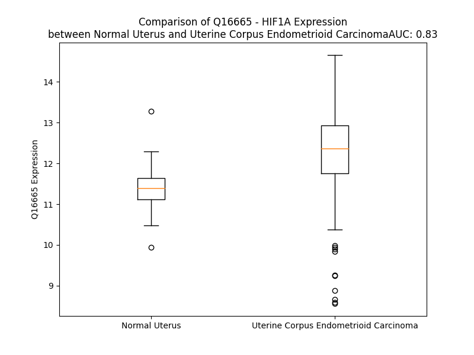

# Detailed Data for Q16665

## Introduction to the Detailed Summary

### How to Interpret the Results

- **Summary & Metrics**: This section provides a quick reference to essential protein attributes, including expression changes, family classification, and biomarker applications. Regulation status (upregulated/downregulated) indicates the protein's behavior in a disease context. Some information comes from the original excel file with the proteins selected from literature, while others are derived from the analyses.
- **Expression Comparison**: A visual representation comparing protein expression between normal and disease states. It highlights significant changes in expression levels that might indicate diagnostic or therapeutic relevance. This is data coming from transcriptomics experiments and could not translate similarly to protein levels.
- **Isoform Alignment**: An interactive view of isoform alignments, revealing structural and functional differences between variants of the protein.
- **Interactors & Homologs**: Tables listing known interaction partners and homologous proteins, the more interactors and homologs, the more complex the protein is to design an antibody for.
- **Biological Assemblies**: Information about the structural arrangement of the protein in different assemblies, providing insights into its functional state but also the complexity of the protein to develop antibodies.
- **Combined Per-Residue Information**: A detailed table summarizing residue-level data. This includes predictions for epitope regions, aggregation tendencies, and modifications that might impact the protein's function. Each row corresponds to a residue in the protein, providing insights into specific sites that may be important for research or drug development.
## Summary & Metrics

- **UniProt Accession**: Q16665
- **Gene Name**: HIF-1A
- **Protein Name**: Hypoxia-inducible factor 1-alpha
- **Swiss Prot**: HIF1A_HUMAN
- **Family**: transcription regulator
- **Biomarker Application**: diagnosis,efficacy,prognosis,response to therapy
- **Number of Isoforms**: 3
- **Regulation**: 1
- **(transcriptomics) AUC**: 0.83
- **(transcriptomics) Fold Change**: 1.08
- **(transcriptomics) Regulation**: Upregulated
- **Discotope Epitope Count**: 217
- **Max n_uniprots (Homo)**: 1
- **Max n_uniprots (Hetero)**: 4

## Expression Comparison

## Isoform Alignment

<pre style='font-size:14px; font-family:monospace;'>Q16665-1 ---------------MEGAGG---------ANDKKKISSERRKEKSRDAARSRRSKESEVFYELAHQLPLPHNVSSHLDKASVMRLTISYLRVRKLLDAGDLDIEDDMKAQMNCFYLKALDGFVMVLTDDGDMIYISDNVNKYMGLTQFELTGHSVFDFTHPCDHEEMREMLTHRNGLVKKGKEQNTQRSFFLRMKCTLTSRGRTMNIKSATWKVLHCTGHIHVYDTNSNQPQCGYKKPPMTCLVLICEPIPHPSNIEIPLDSKTFLSRHSLDMKFSYCDERITELMGYEPEELLGRSIYEYYHALDSDHLTKTHHDMFTKGQVTTGQYRMLAKRGGYVWVETQATVIYNTKNSQPQCIVCVNYVVSGIIQHDLIFSLQQTECVLKPVESSDMKMTQLFTKVESEDTSSLFDKLKKEPDALTLLAPAAGDTIISLDFGSNDTETDDQQLEEVPLYNDVMLPSPNEKLQNINLAMSPLPTAETPKPLRSSADPALNQEVALKLEPNPESLELSFTMPQIQDQTPSPSDGSTRQSSPEPNSPSEYCFYVDSDMVNEFKLELVEKLFAEDTEAKNPFSTQDTDLDLEMLAPYIPMDDDFQLRSFDQLSPLESSSASPESASPQSTVTVFQQTQIQEPTANATTTTATTDELKTVTKDRMEDIKILIASPSPTHIHKETTSATSSPYRDTQSRTASPNRAGKGVIEQTEKSHPRSPNVLSVALSQRTTVPEEELNPKILALQNAQRKRKMEHDGSLFQAVGIGTLLQQPDDHAATTSLSWKRVKGCKSSEQNGMEQKTIILIPSDLACRLLGQSMDESGLPQLTSYDCEVNAPIQGSRNLLQGEELLRALDQVN
Q16665-2 ---------------MEGAGG---------ANDKKKISSERRKEKSRDAARSRRSKESEVFYELAHQLPLPHNVSSHLDKASVMRLTISYLRVRKLLDAGDLDIEDDMKAQMNCFYLKALDGFVMVLTDDGDMIYISDNVNKYMGLTQFELTGHSVFDFTHPCDHEEMREMLTHRNGLVKKGKEQNTQRSFFLRMKCTLTSRGRTMNIKSATWKVLHCTGHIHVYDTNSNQPQCGYKKPPMTCLVLICEPIPHPSNIEIPLDSKTFLSRHSLDMKFSYCDERITELMGYEPEELLGRSIYEYYHALDSDHLTKTHHDMFTKGQVTTGQYRMLAKRGGYVWVETQATVIYNTKNSQPQCIVCVNYVVSGIIQHDLIFSLQQTECVLKPVESSDMKMTQLFTKVESEDTSSLFDKLKKEPDALTLLAPAAGDTIISLDFGSNDTETDDQQLEEVPLYNDVMLPSPNEKLQNINLAMSPLPTAETPKPLRSSADPALNQEVALKLEPNPESLELSFTMPQIQDQTPSPSDGSTRQSSPEPNSPSEYCFYVDSDMVNEFKLELVEKLFAEDTEAKNPFSTQDTDLDLEMLAPYIPMDDDFQLRSFDQLSPLESSSASPESASPQSTVTVFQQTQIQEPTANATTTTATTDELKTVTKDRMEDIKILIASPSPTHIHKETTSATSSPYRDTQSRTASPNRAGKGVIEQTEKSHPRSPNVLSVALSQRTTVPEEELNPKILALQNAQRKRKMEHDGSLFQAVGII-------------------------------------------------------------------------------------------
Q16665-3 MSSQCRSLENKFVFLKEGLGNSKPEELEEIRIENGRISSERRKEKSRDAARSRRSKESEVFYELAHQLPLPHNVSSHLDKASVMRLTISYLRVRKLLDAGDLDIEDDMKAQMNCFYLKALDGFVMVLTDDGDMIYISDNVNKYMGLTQFELTGHSVFDFTHPCDHEEMREMLTHRNGLVKKGKEQNTQRSFFLRMKCTLTSRGRTMNIKSATWKVLHCTGHIHVYDTNSNQPQCGYKKPPMTCLVLICEPIPHPSNIEIPLDSKTFLSRHSLDMKFSYCDERITELMGYEPEELLGRSIYEYYHALDSDHLTKTHHDMFTKGQVTTGQYRMLAKRGGYVWVETQATVIYNTKNSQPQCIVCVNYVVSGIIQHDLIFSLQQTECVLKPVESSDMKMTQLFTKVESEDTSSLFDKLKKEPDALTLLAPAAGDTIISLDFGSNDTETDDQQLEEVPLYNDVMLPSPNEKLQNINLAMSPLPTAETPKPLRSSADPALNQEVALKLEPNPESLELSFTMPQIQDQTPSPSDGSTRQSSPEPNSPSEYCFYVDSDMVNEFKLELVEKLFAEDTEAKNPFSTQDTDLDLEMLAPYIPMDDDFQLRSFDQLSPLESSSASPESASPQSTVTVFQQTQIQEPTANATTTTATTDELKTVTKDRMEDIKILIASPSPTHIHKETTSATSSPYRDTQSRTASPNRAGKGVIEQTEKSHPRSPNVLSVALSQRTTVPEEELNPKILALQNAQRKRKMEHDGSLFQAVGIGTLLQQPDDHAATTSLSWKRVKGCKSSEQNGMEQKTIILIPSDLACRLLGQSMDESGLPQLTSYDCEVNAPIQGSRNLLQGEELLRALDQVN
</pre>

## Interactors

| preferredName_A   | preferredName_B   |   score |
|:------------------|:------------------|--------:|
| HIF1A             | EGLN3             |   0.999 |
| HIF1A             | ARNT              |   0.999 |
| HIF1A             | CUL2              |   0.999 |
| HIF1A             | CREBBP            |   0.999 |
| HIF1A             | HIF1AN            |   0.999 |
| HIF1A             | ARNT2             |   0.999 |
| HIF1A             | EGLN2             |   0.999 |
| HIF1A             | TP53              |   0.999 |
| HIF1A             | EP300             |   0.999 |
| HIF1A             | ELOB              |   0.999 |
| HIF1A             | HSP90AA1          |   0.999 |
| HIF1A             | VHL               |   0.999 |
| HIF1A             | EGLN1             |   0.999 |
| HIF1A             | ELOC              |   0.999 |
| HIF1A             | EPAS1             |   0.998 |
| HIF1A             | CTNNB1            |   0.998 |
| HIF1A             | HSP90AB1          |   0.998 |
| HIF1A             | FOXO3             |   0.997 |
| HIF1A             | PKM               |   0.996 |
| HIF1A             | STAT3             |   0.994 |
| HIF1A             | HIF3A             |   0.994 |
| HIF1A             | NOTCH1            |   0.993 |
| HIF1A             | MYC               |   0.993 |
| HIF1A             | RELA              |   0.989 |
| HIF1A             | XBP1              |   0.988 |
| HIF1A             | MDM2              |   0.988 |
| HIF1A             | FOXP3             |   0.988 |
| HIF1A             | MAPK1             |   0.985 |
| HIF1A             | HDAC1             |   0.983 |
| HIF1A             | TCHP              |   0.983 |
| HIF1A             | EIF5B             |   0.981 |
| HIF1A             | SIRT6             |   0.98  |
| HIF1A             | RBX1              |   0.978 |
| HIF1A             | SMAD3             |   0.975 |
| HIF1A             | MAPK3             |   0.969 |
| HIF1A             | EPO               |   0.967 |
| HIF1A             | ARNTL             |   0.963 |
| HIF1A             | JUN               |   0.961 |
| HIF1A             | CDKN2A            |   0.956 |
| HIF1A             | HDAC4             |   0.955 |
| HIF1A             | KDM4C             |   0.953 |
| HIF1A             | UBC               |   0.95  |
| HIF1A             | ESR1              |   0.948 |
| HIF1A             | BCL2              |   0.946 |
| HIF1A             | RUNX1             |   0.945 |
| HIF1A             | CA9               |   0.944 |
| HIF1A             | HSPA4             |   0.938 |
| HIF1A             | EGFR              |   0.934 |
| HIF1A             | RACK1             |   0.933 |
| HIF1A             | AKT1              |   0.932 |

## Homologs

| uniprot_id   | gene_id   |
|:-------------|:----------|
| C9J9N2       | EPAS1     |
| Q14190       | SIM2      |
| H0YHB6       | NPAS3     |
| Q99742       | NPAS1     |
| Q8IUM7       | NPAS4     |
| E9PNQ7       | HIF3A     |
| P81133       | SIM1      |

## Biological Assemblies

|   Unnamed: 0 |   assembly |   n_uniprots | composition   | crystal_id   |
|-------------:|-----------:|-------------:|:--------------|:-------------|
|            0 |          1 |            2 | Hetero        | 1l3e         |
|            0 |          1 |            2 | Hetero        | 5la9         |
|            1 |          2 |            2 | Hetero        | 5la9         |
|            0 |          1 |            4 | Hetero        | 4ajy         |
|            0 |          1 |            3 | Hetero        | 6gmr         |
|            0 |          1 |            2 | Hetero        | 7qgs         |
|            0 |          1 |            2 | Hetero        | 5jwp         |
|            0 |          1 |            2 | Hetero        | 3hqu         |
|            0 |          1 |            2 | Hetero        | 4h6j         |
|            0 |          1 |            4 | Hetero        | 5las         |
|            0 |          1 |            2 | Hetero        | 5l9v         |
|            1 |          2 |            2 | Hetero        | 5l9v         |
|            0 |          1 |            2 | Hetero        | 1h2l         |
|            0 |          1 |            2 | Hetero        | 1l8c         |
|            0 |          1 |            2 | Hetero        | 3hqr         |
|            0 |          1 |            2 | Hetero        | 7lvs         |
|            0 |          1 |            4 | Hetero        | 1lqb         |
|            1 |          2 |            4 | Hetero        | 1lqb         |
|            0 |          1 |            4 | Hetero        | 1lm8         |
|            0 |          1 |            3 | Hetero        | 6gfx         |
|            0 |          1 |            2 | Hetero        | 1h2k         |
|            0 |          1 |            1 | Homo          | 8he3         |
|            0 |          1 |            2 | Hetero        | 1h2m         |
|            0 |          1 |            2 | Hetero        | 2ilm         |
|            0 |          1 |            2 | Hetero        | 8he0         |
|            0 |          1 |            2 | Hetero        | 6yw3         |
|            0 |          1 |            2 | Hetero        | 5l9b         |
|            1 |          2 |            2 | Hetero        | 5l9b         |

## Combined Per-Residue Information

|   res | aa   |   epitope_score | epitope   |   relative_surface_accessibility |   modeling_confidence |   Aggregation | modification                   | glycosylation                                         |
|------:|:-----|----------------:|:----------|---------------------------------:|----------------------:|--------------:|:-------------------------------|:------------------------------------------------------|
|     1 | M    |         0.05388 | False     |                          1.27966 |                 47.56 |         0     | N/A                            | N/A                                                   |
|     2 | E    |         0.13192 | True      |                          0.87115 |                 55.35 |         0     | N/A                            | N/A                                                   |
|     3 | G    |         0.08662 | False     |                          0.9881  |                 57.25 |         0     | N/A                            | N/A                                                   |
|     4 | A    |         0.0669  | False     |                          0.77057 |                 56.78 |         0     | N/A                            | N/A                                                   |
|     5 | G    |         0.08203 | False     |                          0.50827 |                 55.33 |         0     | N/A                            | N/A                                                   |
|     6 | G    |         0.08843 | False     |                          0.51083 |                 58.95 |         0     | N/A                            | N/A                                                   |
|     7 | A    |         0.04154 | False     |                          0.55101 |                 60.16 |         0     | N/A                            | N/A                                                   |
|     8 | N    |         0.04221 | False     |                          0.65195 |                 62.74 |         0     | N/A                            | N/A                                                   |
|     9 | D    |         0.0737  | False     |                          0.46459 |                 66.58 |         0     | N/A                            | N/A                                                   |
|    10 | K    |         0.06528 | False     |                          0.7809  |                 72.33 |         0     | N/A                            | N/A                                                   |
|    11 | K    |         0.05702 | False     |                          0.72206 |                 74.15 |         0     | N/A                            | N/A                                                   |
|    12 | K    |         0.05771 | False     |                          0.68375 |                 75.37 |         0     | N/A                            | N/A                                                   |
|    13 | I    |         0.07236 | False     |                          0.54078 |                 79.04 |         0     | N/A                            | N/A                                                   |
|    14 | S    |         0.03276 | False     |                          0.51447 |                 84.44 |         0     | N/A                            | N/A                                                   |
|    15 | S    |         0.02159 | False     |                          0.41005 |                 86.56 |         0     | N/A                            | N/A                                                   |
|    16 | E    |         0.05864 | False     |                          0.53885 |                 89.63 |         0     | N/A                            | N/A                                                   |
|    17 | R    |         0.09487 | False     |                          0.69147 |                 88.75 |         0     | N/A                            | N/A                                                   |
|    18 | R    |         0.07804 | False     |                          0.75982 |                 90.45 |         0     | N/A                            | (Microbial infection) N-beta-linked (GlcNAc) arginine |
|    19 | K    |         0.04651 | False     |                          0.71163 |                 93.31 |         0     | N/A                            | N/A                                                   |
|    20 | E    |         0.05112 | False     |                          0.35406 |                 92.56 |         0     | N/A                            | N/A                                                   |
|    21 | K    |         0.04808 | False     |                          0.78748 |                 95    |         0     | N/A                            | N/A                                                   |
|    22 | S    |         0.02452 | False     |                          0.53391 |                 94.68 |         0     | N/A                            | N/A                                                   |
|    23 | R    |         0.02783 | False     |                          0.50434 |                 95.63 |         0     | N/A                            | N/A                                                   |
|    24 | D    |         0.01672 | False     |                          0.38231 |                 96.56 |         0     | N/A                            | N/A                                                   |
|    25 | A    |         0.01285 | False     |                          0.60952 |                 96.94 |         0     | N/A                            | N/A                                                   |
|    26 | A    |         0.00758 | False     |                          0.2524  |                 97.14 |         0     | N/A                            | N/A                                                   |
|    27 | R    |         0.02022 | False     |                          0.47436 |                 97.75 |         0     | N/A                            | N/A                                                   |
|    28 | S    |         0.01861 | False     |                          0.55745 |                 97.35 |         0     | N/A                            | N/A                                                   |
|    29 | R    |         0.03249 | False     |                          0.68442 |                 97.9  |         0     | N/A                            | N/A                                                   |
|    30 | R    |         0.03081 | False     |                          0.55533 |                 96.8  |         0     | N/A                            | N/A                                                   |
|    31 | S    |         0.01667 | False     |                          0.57391 |                 96.82 |         0     | N/A                            | N/A                                                   |
|    32 | K    |         0.06036 | False     |                          0.6553  |                 97.43 |         0     | N/A                            | N/A                                                   |
|    33 | E    |         0.02929 | False     |                          0.37356 |                 96.33 |         0     | N/A                            | N/A                                                   |
|    34 | S    |         0.0275  | False     |                          0.27472 |                 95.5  |         0     | N/A                            | N/A                                                   |
|    35 | E    |         0.02349 | False     |                          0.58376 |                 96.01 |         0     | N/A                            | N/A                                                   |
|    36 | V    |         0.02316 | False     |                          0.51718 |                 96.54 |         0     | N/A                            | N/A                                                   |
|    37 | F    |         0.0275  | False     |                          0.23906 |                 95.76 |         0     | N/A                            | N/A                                                   |
|    38 | Y    |         0.06728 | False     |                          0.56807 |                 93.13 |         0     | N/A                            | N/A                                                   |
|    39 | E    |         0.05651 | False     |                          0.55691 |                 94.92 |         0     | N/A                            | N/A                                                   |
|    40 | L    |         0.03162 | False     |                          0.33081 |                 95.63 |         0     | N/A                            | N/A                                                   |
|    41 | A    |         0.0064  | False     |                          0.01786 |                 95.15 |         0     | N/A                            | N/A                                                   |
|    42 | H    |         0.05566 | False     |                          0.4878  |                 93.16 |         0     | N/A                            | N/A                                                   |
|    43 | Q    |         0.09382 | False     |                          0.69957 |                 93.96 |         0     | N/A                            | N/A                                                   |
|    44 | L    |         0.0178  | False     |                          0.08972 |                 92.73 |         0     | N/A                            | N/A                                                   |
|    45 | P    |         0.01591 | False     |                          0.22956 |                 90.04 |         0     | N/A                            | N/A                                                   |
|    46 | L    |         0.02911 | False     |                          0.05636 |                 88.81 |         0     | N/A                            | N/A                                                   |
|    47 | P    |         0.06109 | False     |                          0.41468 |                 89.47 |         0     | N/A                            | N/A                                                   |
|    48 | H    |         0.10264 | True      |                          0.64844 |                 88.68 |         0     | N/A                            | N/A                                                   |
|    49 | N    |         0.09042 | False     |                          0.52504 |                 89.15 |         0     | N/A                            | N/A                                                   |
|    50 | V    |         0.04591 | False     |                          0.24555 |                 88.8  |         0     | N/A                            | N/A                                                   |
|    51 | S    |         0.01779 | False     |                          0.01087 |                 89.26 |         0     | N/A                            | N/A                                                   |
|    52 | S    |         0.05471 | False     |                          0.3106  |                 89.13 |         0     | N/A                            | N/A                                                   |
|    53 | H    |         0.16897 | True      |                          0.86021 |                 89.55 |         0     | N/A                            | N/A                                                   |
|    54 | L    |         0.03076 | False     |                          0.19364 |                 92.19 |         0     | N/A                            | N/A                                                   |
|    55 | D    |         0.06113 | False     |                          0.54163 |                 93.8  |         0     | N/A                            | N/A                                                   |
|    56 | K    |         0.04776 | False     |                          0.38794 |                 95.21 |         0     | N/A                            | N/A                                                   |
|    57 | A    |         0.03822 | False     |                          0.62265 |                 95.91 |         0     | N/A                            | N/A                                                   |
|    58 | S    |         0.02531 | False     |                          0.10445 |                 95.33 |         0     | N/A                            | N/A                                                   |
|    59 | V    |         0.01088 | False     |                          0.02475 |                 96.14 |         0     | N/A                            | N/A                                                   |
|    60 | M    |         0.03724 | False     |                          0.43036 |                 96.69 |         0     | N/A                            | N/A                                                   |
|    61 | R    |         0.07902 | False     |                          0.16955 |                 96.29 |         0     | N/A                            | N/A                                                   |
|    62 | L    |         0.00376 | False     |                          0.01168 |                 95.93 |         0.671 | N/A                            | N/A                                                   |
|    63 | T    |         0.02249 | False     |                          0.13424 |                 96.51 |         0.671 | N/A                            | N/A                                                   |
|    64 | I    |         0.02766 | False     |                          0.47514 |                 95.64 |         0.671 | N/A                            | N/A                                                   |
|    65 | S    |         0.00553 | False     |                          0.00682 |                 95.07 |         0.671 | N/A                            | N/A                                                   |
|    66 | Y    |         0.03052 | False     |                          0.21993 |                 93.77 |         0.671 | N/A                            | N/A                                                   |
|    67 | L    |         0.07998 | False     |                          0.6623  |                 93.41 |         0.671 | N/A                            | N/A                                                   |
|    68 | R    |         0.03193 | False     |                          0.2698  |                 91.45 |         0     | N/A                            | N/A                                                   |
|    69 | V    |         0.00963 | False     |                          0.09235 |                 90.18 |         0     | N/A                            | N/A                                                   |
|    70 | R    |         0.08452 | False     |                          0.48056 |                 87.6  |         0     | N/A                            | N/A                                                   |
|    71 | K    |         0.04121 | False     |                          0.20121 |                 85.67 |         0     | N/A                            | N/A                                                   |
|    72 | L    |         0.02801 | False     |                          0.08824 |                 82.45 |         0     | N/A                            | N/A                                                   |
|    73 | L    |         0.08737 | False     |                          0.39419 |                 78.74 |         0     | N/A                            | N/A                                                   |
|    74 | D    |         0.1345  | True      |                          0.70771 |                 73.03 |         0     | N/A                            | N/A                                                   |
|    75 | A    |         0.07948 | False     |                          0.44028 |                 63.05 |         0     | N/A                            | N/A                                                   |
|    76 | G    |         0.09829 | True      |                          0.42089 |                 57.6  |         0     | N/A                            | N/A                                                   |
|    77 | D    |         0.10114 | True      |                          0.91602 |                 54.23 |         0     | N/A                            | N/A                                                   |
|    78 | L    |         0.15625 | True      |                          0.75961 |                 58.19 |         0     | N/A                            | N/A                                                   |
|    79 | D    |         0.16759 | True      |                          0.74905 |                 54.8  |         0     | N/A                            | N/A                                                   |
|    80 | I    |         0.14523 | True      |                          1.05031 |                 57.3  |         0     | N/A                            | N/A                                                   |
|    81 | E    |         0.10974 | True      |                          0.45356 |                 60.43 |         0     | N/A                            | N/A                                                   |
|    82 | D    |         0.20004 | True      |                          0.57602 |                 66.69 |         0     | N/A                            | N/A                                                   |
|    83 | D    |         0.12431 | True      |                          0.7098  |                 69.6  |         0     | N/A                            | N/A                                                   |
|    84 | M    |         0.13578 | True      |                          0.58338 |                 68.28 |         0     | N/A                            | N/A                                                   |
|    85 | K    |         0.1216  | True      |                          0.5577  |                 70.22 |         0     | N/A                            | N/A                                                   |
|    86 | A    |         0.06559 | False     |                          0.47741 |                 70.6  |         0     | N/A                            | N/A                                                   |
|    87 | Q    |         0.15028 | True      |                          0.52202 |                 71.34 |         0     | N/A                            | N/A                                                   |
|    88 | M    |         0.13105 | True      |                          0.44823 |                 77.27 |         0.15  | N/A                            | N/A                                                   |
|    89 | N    |         0.08353 | False     |                          0.34347 |                 78.83 |         0.281 | N/A                            | N/A                                                   |
|    90 | C    |         0.07895 | False     |                          0.29922 |                 78.9  |         4.378 | N/A                            | N/A                                                   |
|    91 | F    |         0.09569 | False     |                          0.51178 |                 87.97 |        24.001 | N/A                            | N/A                                                   |
|    92 | Y    |         0.13982 | True      |                          0.63404 |                 91.2  |        25.546 | N/A                            | N/A                                                   |
|    93 | L    |         0.06449 | False     |                          0.33745 |                 90.9  |        26.03  | N/A                            | N/A                                                   |
|    94 | K    |         0.17251 | True      |                          0.74907 |                 90.77 |        26.082 | N/A                            | N/A                                                   |
|    95 | A    |         0.13062 | True      |                          0.83545 |                 92.99 |        26.082 | N/A                            | N/A                                                   |
|    96 | L    |         0.04526 | False     |                          0.2212  |                 93.33 |        26.082 | N/A                            | N/A                                                   |
|    97 | D    |         0.06084 | False     |                          0.5826  |                 92.31 |        26.082 | N/A                            | N/A                                                   |
|    98 | G    |         0.00255 | False     |                          0       |                 95.33 |        30.5   | N/A                            | N/A                                                   |
|    99 | F    |         0.00121 | False     |                          0       |                 97.42 |        65.273 | N/A                            | N/A                                                   |
|   100 | V    |         0.02024 | False     |                          0.25135 |                 97.42 |        66.657 | N/A                            | N/A                                                   |
|   101 | M    |         0.00345 | False     |                          0.00072 |                 97.76 |        66.163 | N/A                            | N/A                                                   |
|   102 | V    |         0.01195 | False     |                          0.08473 |                 97.01 |        65.599 | N/A                            | N/A                                                   |
|   103 | L    |         0.00211 | False     |                          0       |                 97    |        57.004 | N/A                            | N/A                                                   |
|   104 | T    |         0.01504 | False     |                          0.03713 |                 94.05 |        11.26  | N/A                            | N/A                                                   |
|   105 | D    |         0.023   | False     |                          0.48572 |                 92.23 |         0     | N/A                            | N/A                                                   |
|   106 | D    |         0.04045 | False     |                          0.6543  |                 92.81 |         0     | N/A                            | N/A                                                   |
|   107 | G    |         0.00207 | False     |                          0       |                 95.08 |         0     | N/A                            | N/A                                                   |
|   108 | D    |         0.04578 | False     |                          0.20207 |                 96.44 |         0     | N/A                            | N/A                                                   |
|   109 | M    |         0.00646 | False     |                          0       |                 97.58 |         0.468 | N/A                            | N/A                                                   |
|   110 | I    |         0.01654 | False     |                          0.01183 |                 95.82 |         0.468 | N/A                            | N/A                                                   |
|   111 | Y    |         0.05287 | False     |                          0.21076 |                 96.45 |         0.468 | N/A                            | N/A                                                   |
|   112 | I    |         0.00611 | False     |                          0.00187 |                 97    |         0.468 | N/A                            | N/A                                                   |
|   113 | S    |         0.01369 | False     |                          0.00312 |                 95.6  |         0.468 | N/A                            | N/A                                                   |
|   114 | D    |         0.03787 | False     |                          0.24589 |                 92.58 |         0     | N/A                            | N/A                                                   |
|   115 | N    |         0.01715 | False     |                          0.15206 |                 94.6  |         0     | N/A                            | N/A                                                   |
|   116 | V    |         0.00239 | False     |                          0       |                 96    |         0     | N/A                            | N/A                                                   |
|   117 | N    |         0.03435 | False     |                          0.41094 |                 93.45 |         0     | N/A                            | N/A                                                   |
|   118 | K    |         0.1021  | True      |                          0.60874 |                 93.1  |         0     | N/A                            | N/A                                                   |
|   119 | Y    |         0.01938 | False     |                          0.05378 |                 93.69 |         0     | N/A                            | N/A                                                   |
|   120 | M    |         0.00615 | False     |                          0       |                 95.18 |         0     | N/A                            | N/A                                                   |
|   121 | G    |         0.02642 | False     |                          0.14199 |                 93.77 |         0     | N/A                            | N/A                                                   |
|   122 | L    |         0.02686 | False     |                          0.02968 |                 94.08 |         0     | N/A                            | N/A                                                   |
|   123 | T    |         0.05939 | False     |                          0.29038 |                 93.49 |         0     | N/A                            | N/A                                                   |
|   124 | Q    |         0.00917 | False     |                          0.06191 |                 94.27 |         0     | N/A                            | N/A                                                   |
|   125 | F    |         0.05294 | False     |                          0.32037 |                 91.24 |         0     | N/A                            | N/A                                                   |
|   126 | E    |         0.04493 | False     |                          0.40952 |                 92.95 |         0     | N/A                            | N/A                                                   |
|   127 | L    |         0.00137 | False     |                          0       |                 95.93 |         0     | N/A                            | N/A                                                   |
|   128 | T    |         0.00637 | False     |                          0.0136  |                 96.85 |         0     | N/A                            | N/A                                                   |
|   129 | G    |         0.01805 | False     |                          0.23373 |                 95.45 |         0     | N/A                            | N/A                                                   |
|   130 | H    |         0.12221 | True      |                          0.33492 |                 97.17 |         0     | N/A                            | N/A                                                   |
|   131 | S    |         0.05359 | False     |                          0.23512 |                 97.41 |         0     | N/A                            | N/A                                                   |
|   132 | V    |         0.00134 | False     |                          0       |                 97.82 |         0     | N/A                            | N/A                                                   |
|   133 | F    |         0.02697 | False     |                          0.24629 |                 97.88 |         0     | N/A                            | N/A                                                   |
|   134 | D    |         0.05086 | False     |                          0.47353 |                 97.13 |         0     | N/A                            | N/A                                                   |
|   135 | F    |         0.02849 | False     |                          0.07261 |                 97.17 |         0     | N/A                            | N/A                                                   |
|   136 | T    |         0.01537 | False     |                          0.02534 |                 97.92 |         0     | N/A                            | N/A                                                   |
|   137 | H    |         0.0284  | False     |                          0.18513 |                 97.63 |         0     | N/A                            | N/A                                                   |
|   138 | P    |         0.07291 | False     |                          0.6657  |                 97.37 |         0     | N/A                            | N/A                                                   |
|   139 | C    |         0.06359 | False     |                          0.73435 |                 96.55 |         0     | N/A                            | N/A                                                   |
|   140 | D    |         0.01669 | False     |                          0.02521 |                 97.07 |         0     | N/A                            | N/A                                                   |
|   141 | H    |         0.05148 | False     |                          0.15996 |                 97.4  |         0     | N/A                            | N/A                                                   |
|   142 | E    |         0.06372 | False     |                          0.59099 |                 95.7  |         0     | N/A                            | N/A                                                   |
|   143 | E    |         0.02925 | False     |                          0.28128 |                 94.77 |         0     | N/A                            | N/A                                                   |
|   144 | M    |         0.00212 | False     |                          0.00288 |                 95.05 |         0     | N/A                            | N/A                                                   |
|   145 | R    |         0.0658  | False     |                          0.43229 |                 95    |         0     | N/A                            | N/A                                                   |
|   146 | E    |         0.07054 | False     |                          0.44322 |                 93.41 |         0     | N/A                            | N/A                                                   |
|   147 | M    |         0.03278 | False     |                          0.20919 |                 92.85 |         0     | N/A                            | N/A                                                   |
|   148 | L    |         0.01644 | False     |                          0.04942 |                 92.58 |         0     | N/A                            | N/A                                                   |
|   149 | T    |         0.03601 | False     |                          0.46344 |                 86.48 |         0     | N/A                            | N/A                                                   |
|   150 | H    |         0.07334 | False     |                          0.24707 |                 77.39 |         0     | N/A                            | N/A                                                   |
|   151 | R    |         0.07999 | False     |                          0.72997 |                 66.51 |         0     | N/A                            | N/A                                                   |
|   152 | N    |         0.11461 | True      |                          0.74398 |                 57.47 |         0     | N/A                            | N/A                                                   |
|   153 | G    |         0.09716 | False     |                          0.59187 |                 45.07 |         0     | N/A                            | N/A                                                   |
|   154 | L    |         0.09175 | False     |                          1.08425 |                 42.51 |         0     | N/A                            | N/A                                                   |
|   155 | V    |         0.07499 | False     |                          0.52355 |                 48.78 |         0     | N/A                            | N/A                                                   |
|   156 | K    |         0.0567  | False     |                          0.89877 |                 47.85 |         0     | N/A                            | N/A                                                   |
|   157 | K    |         0.16407 | True      |                          1.03208 |                 40.37 |         0     | N/A                            | N/A                                                   |
|   158 | G    |         0.18698 | True      |                          0.96079 |                 50.98 |         0     | N/A                            | N/A                                                   |
|   159 | K    |         0.09506 | False     |                          0.8753  |                 48.81 |         0     | N/A                            | N/A                                                   |
|   160 | E    |         0.17253 | True      |                          0.916   |                 52.73 |         0     | N/A                            | N/A                                                   |
|   161 | Q    |         0.0646  | False     |                          0.41783 |                 61.77 |         0     | N/A                            | N/A                                                   |
|   162 | N    |         0.12942 | True      |                          0.78234 |                 74.47 |         0     | N/A                            | N/A                                                   |
|   163 | T    |         0.04728 | False     |                          0.29334 |                 90.49 |         0     | N/A                            | N/A                                                   |
|   164 | Q    |         0.0714  | False     |                          0.57624 |                 93.2  |         0     | N/A                            | N/A                                                   |
|   165 | R    |         0.0685  | False     |                          0.13776 |                 93.88 |         0     | N/A                            | N/A                                                   |
|   166 | S    |         0.02775 | False     |                          0.50694 |                 94.43 |         0     | N/A                            | N/A                                                   |
|   167 | F    |         0.0232  | False     |                          0.04843 |                 95.57 |         0     | N/A                            | N/A                                                   |
|   168 | F    |         0.02193 | False     |                          0.0793  |                 97.34 |         0     | N/A                            | N/A                                                   |
|   169 | L    |         0.0036  | False     |                          0.00495 |                 97.02 |         0     | N/A                            | N/A                                                   |
|   170 | R    |         0.06202 | False     |                          0.14246 |                 97.74 |         0     | N/A                            | N/A                                                   |
|   171 | M    |         0.00318 | False     |                          0.00134 |                 97.11 |         0     | N/A                            | N/A                                                   |
|   172 | K    |         0.04155 | False     |                          0.25783 |                 96.91 |         0     | N/A                            | N/A                                                   |
|   173 | C    |         0.01324 | False     |                          0.03227 |                 95.88 |         0     | N/A                            | N/A                                                   |
|   174 | T    |         0.01408 | False     |                          0.02407 |                 95.85 |         0     | N/A                            | N/A                                                   |
|   175 | L    |         0.06537 | False     |                          0.28173 |                 92.83 |         0     | N/A                            | N/A                                                   |
|   176 | T    |         0.09612 | False     |                          0.36069 |                 88.07 |         0     | N/A                            | N/A                                                   |
|   177 | S    |         0.09364 | False     |                          0.7655  |                 80.44 |         0     | N/A                            | N/A                                                   |
|   178 | R    |         0.15293 | True      |                          0.81104 |                 81.24 |         0     | N/A                            | N/A                                                   |
|   179 | G    |         0.09811 | True      |                          0.62119 |                 81.35 |         0     | N/A                            | N/A                                                   |
|   180 | R    |         0.15381 | True      |                          0.68243 |                 88.03 |         0     | N/A                            | N/A                                                   |
|   181 | T    |         0.18917 | True      |                          0.61589 |                 90.02 |         0     | N/A                            | N/A                                                   |
|   182 | M    |         0.19156 | True      |                          0.51258 |                 91.17 |         0     | N/A                            | N/A                                                   |
|   183 | N    |         0.15627 | True      |                          0.60112 |                 91.26 |         0     | N/A                            | N/A                                                   |
|   184 | I    |         0.08629 | False     |                          0.45823 |                 90.05 |         0     | N/A                            | N/A                                                   |
|   185 | K    |         0.15146 | True      |                          0.95243 |                 91.73 |         0     | N/A                            | N/A                                                   |
|   186 | S    |         0.14215 | True      |                          0.49918 |                 93.13 |         0     | N/A                            | N/A                                                   |
|   187 | A    |         0.07636 | False     |                          0.2514  |                 93.53 |         0     | N/A                            | N/A                                                   |
|   188 | T    |         0.07149 | False     |                          0.59469 |                 93.59 |         0     | N/A                            | N/A                                                   |
|   189 | W    |         0.11428 | True      |                          0.49725 |                 94.88 |         0     | N/A                            | N/A                                                   |
|   190 | K    |         0.01614 | False     |                          0.25205 |                 95.58 |         0     | N/A                            | N/A                                                   |
|   191 | V    |         0.00533 | False     |                          0.04747 |                 97.17 |         0     | N/A                            | N/A                                                   |
|   192 | L    |         0.00253 | False     |                          0       |                 97.6  |         0     | N/A                            | N/A                                                   |
|   193 | H    |         0.01524 | False     |                          0.18319 |                 97.6  |         0     | N/A                            | N/A                                                   |
|   194 | C    |         0.00314 | False     |                          0       |                 97.67 |         0     | N/A                            | N/A                                                   |
|   195 | T    |         0.02296 | False     |                          0.2911  |                 97.14 |         0     | N/A                            | N/A                                                   |
|   196 | G    |         0.02028 | False     |                          0.18422 |                 96.17 |         0     | N/A                            | N/A                                                   |
|   197 | H    |         0.03921 | False     |                          0.41711 |                 94.37 |         0     | N/A                            | N/A                                                   |
|   198 | I    |         0.01871 | False     |                          0.00956 |                 92.41 |         0     | N/A                            | N/A                                                   |
|   199 | H    |         0.04446 | False     |                          0.41353 |                 87.88 |         0     | N/A                            | N/A                                                   |
|   200 | V    |         0.05537 | False     |                          0.45896 |                 85.9  |         0     | N/A                            | N/A                                                   |
|   201 | Y    |         0.06709 | False     |                          0.22154 |                 77.82 |         0     | N/A                            | N/A                                                   |
|   202 | D    |         0.05951 | False     |                          0.50051 |                 69.01 |         0     | N/A                            | N/A                                                   |
|   203 | T    |         0.07347 | False     |                          0.36093 |                 59.22 |         0     | N/A                            | N/A                                                   |
|   204 | N    |         0.28119 | True      |                          0.73369 |                 53.9  |         0     | N/A                            | N/A                                                   |
|   205 | S    |         0.18149 | True      |                          0.8167  |                 52.7  |         0     | N/A                            | N/A                                                   |
|   206 | N    |         0.15001 | True      |                          0.74175 |                 50.54 |         0     | N/A                            | N/A                                                   |
|   207 | Q    |         0.18363 | True      |                          0.87514 |                 47.28 |         0     | N/A                            | N/A                                                   |
|   208 | P    |         0.18049 | True      |                          0.60721 |                 50.68 |         0     | N/A                            | N/A                                                   |
|   209 | Q    |         0.22148 | True      |                          0.97275 |                 54.12 |         0     | N/A                            | N/A                                                   |
|   210 | C    |         0.15775 | True      |                          0.63383 |                 54.48 |         0     | N/A                            | N/A                                                   |
|   211 | G    |         0.2161  | True      |                          0.92153 |                 54.51 |         0     | N/A                            | N/A                                                   |
|   212 | Y    |         0.19701 | True      |                          0.82439 |                 57.26 |         0     | N/A                            | N/A                                                   |
|   213 | K    |         0.17361 | True      |                          0.88464 |                 59.07 |         0     | N/A                            | N/A                                                   |
|   214 | K    |         0.12177 | True      |                          0.65729 |                 63.96 |         0     | N/A                            | N/A                                                   |
|   215 | P    |         0.11589 | True      |                          0.73977 |                 67.72 |         0     | N/A                            | N/A                                                   |
|   216 | P    |         0.13119 | True      |                          0.47556 |                 75.66 |         0.727 | N/A                            | N/A                                                   |
|   217 | M    |         0.04494 | False     |                          0.15589 |                 80.31 |        10.629 | N/A                            | N/A                                                   |
|   218 | T    |         0.02288 | False     |                          0.11055 |                 88.8  |        19.025 | N/A                            | N/A                                                   |
|   219 | C    |         0.00209 | False     |                          0.001   |                 92.35 |        30.721 | N/A                            | N/A                                                   |
|   220 | L    |         0.00493 | False     |                          0.00507 |                 95.26 |        40.382 | N/A                            | N/A                                                   |
|   221 | V    |         0.01404 | False     |                          0.32913 |                 95.8  |        40.382 | N/A                            | N/A                                                   |
|   222 | L    |         0.00678 | False     |                          0.00469 |                 97.81 |        40.059 | N/A                            | N/A                                                   |
|   223 | I    |         0.03243 | False     |                          0.39441 |                 98.09 |        36.981 | N/A                            | N/A                                                   |
|   224 | C    |         0.00257 | False     |                          0       |                 98.2  |        14.416 | N/A                            | N/A                                                   |
|   225 | E    |         0.02388 | False     |                          0.34082 |                 96.74 |         0     | N/A                            | N/A                                                   |
|   226 | P    |         0.01271 | False     |                          0.15853 |                 94.74 |         0     | N/A                            | N/A                                                   |
|   227 | I    |         0.00974 | False     |                          0.04605 |                 92.96 |         0     | N/A                            | N/A                                                   |
|   228 | P    |         0.03859 | False     |                          0.48018 |                 87.21 |         0     | N/A                            | N/A                                                   |
|   229 | H    |         0.03364 | False     |                          0.40429 |                 88.15 |         0     | N/A                            | N/A                                                   |
|   230 | P    |         0.0192  | False     |                          0.04201 |                 85.28 |         0     | N/A                            | N/A                                                   |
|   231 | S    |         0.05918 | False     |                          0.44061 |                 82.4  |         0     | N/A                            | N/A                                                   |
|   232 | N    |         0.12409 | True      |                          0.49422 |                 79.47 |         0     | N/A                            | N/A                                                   |
|   233 | I    |         0.09251 | False     |                          0.25128 |                 78.12 |         0     | N/A                            | N/A                                                   |
|   234 | E    |         0.19486 | True      |                          0.85768 |                 68.54 |         0     | N/A                            | N/A                                                   |
|   235 | I    |         0.17405 | True      |                          0.82132 |                 72.86 |         0     | N/A                            | N/A                                                   |
|   236 | P    |         0.14463 | True      |                          0.69923 |                 75.98 |         0     | N/A                            | N/A                                                   |
|   237 | L    |         0.03424 | False     |                          0.18191 |                 81.54 |         0     | N/A                            | N/A                                                   |
|   238 | D    |         0.08529 | False     |                          0.48811 |                 85.96 |         0     | N/A                            | N/A                                                   |
|   239 | S    |         0.09756 | False     |                          0.54507 |                 89.18 |         0     | N/A                            | N/A                                                   |
|   240 | K    |         0.08599 | False     |                          0.57035 |                 92.2  |         0     | N/A                            | N/A                                                   |
|   241 | T    |         0.01536 | False     |                          0.03475 |                 93.84 |         0     | N/A                            | N/A                                                   |
|   242 | F    |         0.01915 | False     |                          0.01147 |                 94.22 |         0     | N/A                            | N/A                                                   |
|   243 | L    |         0.02632 | False     |                          0.0915  |                 94.42 |         0     | N/A                            | N/A                                                   |
|   244 | S    |         0.00843 | False     |                          0.00729 |                 96.43 |         0     | N/A                            | N/A                                                   |
|   245 | R    |         0.03214 | False     |                          0.11608 |                 97.18 |         0     | N/A                            | N/A                                                   |
|   246 | H    |         0.00227 | False     |                          0       |                 97.75 |         0     | N/A                            | N/A                                                   |
|   247 | S    |         0.02831 | False     |                          0.28183 |                 97.05 |         0     | Phosphoserine; by CK1          | N/A                                                   |
|   248 | L    |         0.03081 | False     |                          0.42819 |                 95.67 |         0     | N/A                            | N/A                                                   |
|   249 | D    |         0.04926 | False     |                          0.48091 |                 95.68 |         0     | N/A                            | N/A                                                   |
|   250 | M    |         0.01892 | False     |                          0.01726 |                 96.76 |         0     | N/A                            | N/A                                                   |
|   251 | K    |         0.08083 | False     |                          0.40767 |                 97.81 |         0     | N/A                            | N/A                                                   |
|   252 | F    |         0.02946 | False     |                          0.03085 |                 97.76 |         0     | N/A                            | N/A                                                   |
|   253 | S    |         0.06327 | False     |                          0.3832  |                 97.06 |         0     | N/A                            | N/A                                                   |
|   254 | Y    |         0.05199 | False     |                          0.22449 |                 96.79 |         0     | N/A                            | N/A                                                   |
|   255 | C    |         0.03098 | False     |                          0.04167 |                 95.09 |         0     | N/A                            | N/A                                                   |
|   256 | D    |         0.022   | False     |                          0.06203 |                 92.3  |         0     | N/A                            | N/A                                                   |
|   257 | E    |         0.10967 | True      |                          0.74239 |                 93.6  |         0     | N/A                            | N/A                                                   |
|   258 | R    |         0.07057 | False     |                          0.20553 |                 92.38 |         0     | N/A                            | N/A                                                   |
|   259 | I    |         0.00582 | False     |                          0       |                 94.76 |         0     | N/A                            | N/A                                                   |
|   260 | T    |         0.16908 | True      |                          0.36234 |                 94.88 |         0     | N/A                            | N/A                                                   |
|   261 | E    |         0.21373 | True      |                          0.70147 |                 93.99 |         0     | N/A                            | N/A                                                   |
|   262 | L    |         0.03471 | False     |                          0.15451 |                 94.51 |         0     | N/A                            | N/A                                                   |
|   263 | M    |         0.01038 | False     |                          0.0071  |                 94.01 |         0     | N/A                            | N/A                                                   |
|   264 | G    |         0.0591  | False     |                          0.3054  |                 93.5  |         0     | N/A                            | N/A                                                   |
|   265 | Y    |         0.02903 | False     |                          0.04882 |                 95.23 |         0     | N/A                            | N/A                                                   |
|   266 | E    |         0.13128 | True      |                          0.40014 |                 95.47 |         0     | N/A                            | N/A                                                   |
|   267 | P    |         0.0244  | False     |                          0.18192 |                 95.29 |         0     | N/A                            | N/A                                                   |
|   268 | E    |         0.19252 | True      |                          0.75602 |                 94.91 |         0     | N/A                            | N/A                                                   |
|   269 | E    |         0.12341 | True      |                          0.37385 |                 93.85 |         0     | N/A                            | N/A                                                   |
|   270 | L    |         0.0046  | False     |                          0.00082 |                 95.24 |         0     | N/A                            | N/A                                                   |
|   271 | L    |         0.0782  | False     |                          0.54417 |                 96.32 |         0     | N/A                            | N/A                                                   |
|   272 | G    |         0.06547 | False     |                          0.56407 |                 95.54 |         0     | N/A                            | N/A                                                   |
|   273 | R    |         0.19638 | True      |                          0.47311 |                 95.96 |         0     | N/A                            | N/A                                                   |
|   274 | S    |         0.05081 | False     |                          0.17099 |                 96.29 |         0     | N/A                            | N/A                                                   |
|   275 | I    |         0.02524 | False     |                          0.04    |                 96.21 |         0     | N/A                            | N/A                                                   |
|   276 | Y    |         0.04259 | False     |                          0.43966 |                 95.79 |         0     | N/A                            | N/A                                                   |
|   277 | E    |         0.06597 | False     |                          0.31176 |                 94.19 |         0     | N/A                            | N/A                                                   |
|   278 | Y    |         0.01656 | False     |                          0.04381 |                 95.34 |         0     | N/A                            | N/A                                                   |
|   279 | Y    |         0.04062 | False     |                          0.07491 |                 96.28 |         0     | N/A                            | N/A                                                   |
|   280 | H    |         0.03177 | False     |                          0.06004 |                 96.42 |         0     | N/A                            | N/A                                                   |
|   281 | A    |         0.05945 | False     |                          0.32983 |                 94.04 |         0     | N/A                            | N/A                                                   |
|   282 | L    |         0.07689 | False     |                          0.45305 |                 95.83 |         0     | N/A                            | N/A                                                   |
|   283 | D    |         0.05625 | False     |                          0.10818 |                 96.88 |         0     | N/A                            | N/A                                                   |
|   284 | S    |         0.05498 | False     |                          0.34164 |                 91.54 |         0     | N/A                            | N/A                                                   |
|   285 | D    |         0.14873 | True      |                          0.73152 |                 92.88 |         0     | N/A                            | N/A                                                   |
|   286 | H    |         0.0696  | False     |                          0.48753 |                 94.36 |         0     | N/A                            | N/A                                                   |
|   287 | L    |         0.00255 | False     |                          0.00082 |                 96.69 |         0     | N/A                            | N/A                                                   |
|   288 | T    |         0.05435 | False     |                          0.53966 |                 95.57 |         0     | N/A                            | N/A                                                   |
|   289 | K    |         0.08943 | False     |                          0.6262  |                 95    |         0     | N/A                            | N/A                                                   |
|   290 | T    |         0.01647 | False     |                          0.03903 |                 96.39 |         0     | N/A                            | N/A                                                   |
|   291 | H    |         0.0269  | False     |                          0.03841 |                 96.05 |         0     | N/A                            | N/A                                                   |
|   292 | H    |         0.07627 | False     |                          0.65651 |                 95.44 |         0     | N/A                            | N/A                                                   |
|   293 | D    |         0.02075 | False     |                          0.09993 |                 95.61 |         0     | N/A                            | N/A                                                   |
|   294 | M    |         0.00136 | False     |                          0       |                 96.14 |         0     | N/A                            | N/A                                                   |
|   295 | F    |         0.06224 | False     |                          0.46123 |                 94.85 |         0     | N/A                            | N/A                                                   |
|   296 | T    |         0.05013 | False     |                          0.4475  |                 95.22 |         0     | N/A                            | N/A                                                   |
|   297 | K    |         0.02196 | False     |                          0.08789 |                 95.88 |         0     | N/A                            | N/A                                                   |
|   298 | G    |         0.02322 | False     |                          0.10495 |                 95.14 |         0     | N/A                            | N/A                                                   |
|   299 | Q    |         0.0098  | False     |                          0.10743 |                 96.68 |         0     | N/A                            | N/A                                                   |
|   300 | V    |         0.00227 | False     |                          0       |                 97.37 |         0     | N/A                            | N/A                                                   |
|   301 | T    |         0.01409 | False     |                          0.11162 |                 96.66 |         0     | N/A                            | N/A                                                   |
|   302 | T    |         0.00846 | False     |                          0.02588 |                 95.75 |         0     | N/A                            | N/A                                                   |
|   303 | G    |         0.04651 | False     |                          0.31044 |                 92.78 |         0     | N/A                            | N/A                                                   |
|   304 | Q    |         0.07792 | False     |                          0.55808 |                 96.89 |         0     | N/A                            | N/A                                                   |
|   305 | Y    |         0.01461 | False     |                          0.00709 |                 97.95 |         0     | N/A                            | N/A                                                   |
|   306 | R    |         0.08456 | False     |                          0.16108 |                 97.99 |         0     | N/A                            | N/A                                                   |
|   307 | M    |         0.01664 | False     |                          0.0117  |                 96.64 |         0     | N/A                            | N/A                                                   |
|   308 | L    |         0.00847 | False     |                          0.03957 |                 96.73 |         0     | N/A                            | N/A                                                   |
|   309 | A    |         0.00179 | False     |                          0       |                 95.85 |         0     | N/A                            | N/A                                                   |
|   310 | K    |         0.01349 | False     |                          0.14833 |                 94.54 |         0     | N/A                            | N/A                                                   |
|   311 | R    |         0.07519 | False     |                          0.64334 |                 90.7  |         0     | N/A                            | N/A                                                   |
|   312 | G    |         0.00438 | False     |                          0.00238 |                 92.26 |         1.369 | N/A                            | N/A                                                   |
|   313 | G    |         0.00168 | False     |                          0       |                 95.45 |        39.954 | N/A                            | N/A                                                   |
|   314 | Y    |         0.05014 | False     |                          0.10035 |                 96.76 |        40.045 | N/A                            | N/A                                                   |
|   315 | V    |         0.00217 | False     |                          0.00095 |                 97.39 |        40.045 | N/A                            | N/A                                                   |
|   316 | W    |         0.04351 | False     |                          0.34578 |                 98.17 |        40.045 | N/A                            | N/A                                                   |
|   317 | V    |         0.00352 | False     |                          0       |                 97.91 |        39.938 | N/A                            | N/A                                                   |
|   318 | E    |         0.03028 | False     |                          0.27117 |                 97.27 |         0.091 | N/A                            | N/A                                                   |
|   319 | T    |         0.03864 | False     |                          0.0476  |                 96.97 |         0.091 | N/A                            | N/A                                                   |
|   320 | Q    |         0.01611 | False     |                          0.22725 |                 95.84 |         0.265 | N/A                            | N/A                                                   |
|   321 | A    |         0.02127 | False     |                          0.02296 |                 96.84 |        12.58  | N/A                            | N/A                                                   |
|   322 | T    |         0.00486 | False     |                          0.03687 |                 96.85 |        12.906 | N/A                            | N/A                                                   |
|   323 | V    |         0.01249 | False     |                          0.05212 |                 96.64 |        13.11  | N/A                            | N/A                                                   |
|   324 | I    |         0.01295 | False     |                          0.14719 |                 94.69 |        13.11  | N/A                            | N/A                                                   |
|   325 | Y    |         0.04683 | False     |                          0.44922 |                 92.66 |        13.11  | N/A                            | N/A                                                   |
|   326 | N    |         0.02976 | False     |                          0.1584  |                 91.16 |         0.795 | N/A                            | N/A                                                   |
|   327 | T    |         0.10236 | True      |                          0.9578  |                 88.34 |         0.417 | N/A                            | N/A                                                   |
|   328 | K    |         0.08324 | False     |                          0.76405 |                 91.23 |         0.091 | N/A                            | N/A                                                   |
|   329 | N    |         0.08417 | False     |                          0.61754 |                 91.19 |         0     | N/A                            | N/A                                                   |
|   330 | S    |         0.08699 | False     |                          0.6849  |                 88.17 |         0     | N/A                            | N/A                                                   |
|   331 | Q    |         0.06394 | False     |                          0.56606 |                 92.46 |         0     | N/A                            | N/A                                                   |
|   332 | P    |         0.06371 | False     |                          0.4151  |                 94.21 |         0     | N/A                            | N/A                                                   |
|   333 | Q    |         0.07782 | False     |                          0.38782 |                 93.54 |         0.536 | N/A                            | N/A                                                   |
|   334 | C    |         0.02296 | False     |                          0.10785 |                 95.57 |        14.468 | N/A                            | N/A                                                   |
|   335 | I    |         0.00203 | False     |                          0       |                 97.4  |        79.161 | N/A                            | N/A                                                   |
|   336 | V    |         0.00244 | False     |                          0.00803 |                 96.93 |        85.077 | N/A                            | N/A                                                   |
|   337 | C    |         0.02374 | False     |                          0.01684 |                 96.57 |        85.609 | N/A                            | N/A                                                   |
|   338 | V    |         0.0067  | False     |                          0.04189 |                 95.4  |        88.086 | N/A                            | N/A                                                   |
|   339 | N    |         0.02485 | False     |                          0.01628 |                 96.52 |        87.929 | N/A                            | N/A                                                   |
|   340 | Y    |         0.03559 | False     |                          0.33698 |                 95.74 |        91.18  | N/A                            | N/A                                                   |
|   341 | V    |         0.01363 | False     |                          0.06766 |                 96.8  |        91.911 | N/A                            | N/A                                                   |
|   342 | V    |         0.09208 | False     |                          0.57526 |                 95.14 |        89.308 | N/A                            | N/A                                                   |
|   343 | S    |         0.0503  | False     |                          0.21442 |                 95.03 |        56.858 | N/A                            | N/A                                                   |
|   344 | G    |         0.1078  | True      |                          0.7091  |                 94.21 |        52.823 | N/A                            | N/A                                                   |
|   345 | I    |         0.05958 | False     |                          0.43167 |                 95.76 |        52.44  | N/A                            | N/A                                                   |
|   346 | I    |         0.08019 | False     |                          0.35038 |                 95.65 |        48.121 | N/A                            | N/A                                                   |
|   347 | Q    |         0.10433 | True      |                          0.50249 |                 92.02 |         0.857 | N/A                            | N/A                                                   |
|   348 | H    |         0.05578 | False     |                          0.41892 |                 89.65 |         0.191 | N/A                            | N/A                                                   |
|   349 | D    |         0.07101 | False     |                          0.48762 |                 88.9  |         0     | N/A                            | N/A                                                   |
|   350 | L    |         0.0443  | False     |                          0.31951 |                 91.52 |        12.718 | N/A                            | N/A                                                   |
|   351 | I    |         0.02699 | False     |                          0.13074 |                 91.68 |        12.718 | N/A                            | N/A                                                   |
|   352 | F    |         0.03584 | False     |                          0.26186 |                 90.7  |        12.718 | N/A                            | N/A                                                   |
|   353 | S    |         0.0429  | False     |                          0.16753 |                 88.75 |        12.718 | N/A                            | N/A                                                   |
|   354 | L    |         0.08328 | False     |                          0.7538  |                 85.34 |        12.718 | N/A                            | N/A                                                   |
|   355 | Q    |         0.03669 | False     |                          0.25814 |                 80.1  |         0.479 | N/A                            | N/A                                                   |
|   356 | Q    |         0.00787 | False     |                          0       |                 88.44 |         0     | N/A                            | N/A                                                   |
|   357 | T    |         0.03764 | False     |                          0.09328 |                 82.18 |         0     | N/A                            | N/A                                                   |
|   358 | E    |         0.08113 | False     |                          0.52194 |                 72.73 |         0     | N/A                            | N/A                                                   |
|   359 | C    |         0.04181 | False     |                          0.35657 |                 58.97 |         0     | N/A                            | N/A                                                   |
|   360 | V    |         0.08673 | False     |                          0.6557  |                 58.57 |         0     | N/A                            | N/A                                                   |
|   361 | L    |         0.08848 | False     |                          0.78924 |                 59.01 |         0     | N/A                            | N/A                                                   |
|   362 | K    |         0.11578 | True      |                          0.69607 |                 49.05 |         0     | N/A                            | N/A                                                   |
|   363 | P    |         0.08701 | False     |                          0.73186 |                 38.61 |         0     | N/A                            | N/A                                                   |
|   364 | V    |         0.07828 | False     |                          0.94606 |                 39.88 |         0     | N/A                            | N/A                                                   |
|   365 | E    |         0.11597 | True      |                          0.72388 |                 35.55 |         0     | N/A                            | N/A                                                   |
|   366 | S    |         0.05561 | False     |                          0.4489  |                 38.31 |         0     | N/A                            | N/A                                                   |
|   367 | S    |         0.0705  | False     |                          0.71128 |                 39.73 |         0     | N/A                            | N/A                                                   |
|   368 | D    |         0.05533 | False     |                          0.49101 |                 45.7  |         0     | N/A                            | N/A                                                   |
|   369 | M    |         0.05233 | False     |                          0.53929 |                 48.09 |         0     | N/A                            | N/A                                                   |
|   370 | K    |         0.07035 | False     |                          0.76829 |                 45.55 |         0     | N/A                            | N/A                                                   |
|   371 | M    |         0.04308 | False     |                          0.35463 |                 47.64 |         0     | N/A                            | N/A                                                   |
|   372 | T    |         0.06589 | False     |                          0.58121 |                 48.95 |         0     | N/A                            | N/A                                                   |
|   373 | Q    |         0.06206 | False     |                          0.64995 |                 48.49 |         0     | N/A                            | N/A                                                   |
|   374 | L    |         0.05584 | False     |                          0.74136 |                 46.72 |         0     | N/A                            | N/A                                                   |
|   375 | F    |         0.06427 | False     |                          0.48612 |                 47.99 |         0     | N/A                            | N/A                                                   |
|   376 | T    |         0.04866 | False     |                          0.70131 |                 48.89 |         0     | N/A                            | N/A                                                   |
|   377 | K    |         0.03448 | False     |                          0.81056 |                 45.61 |         0     | N/A                            | N/A                                                   |
|   378 | V    |         0.03352 | False     |                          0.18519 |                 44.69 |         0     | N/A                            | N/A                                                   |
|   379 | E    |         0.0907  | False     |                          0.83746 |                 40.85 |         0     | N/A                            | N/A                                                   |
|   380 | S    |         0.04852 | False     |                          0.79069 |                 46.92 |         0     | N/A                            | N/A                                                   |
|   381 | E    |         0.05295 | False     |                          0.55019 |                 42.9  |         0     | N/A                            | N/A                                                   |
|   382 | D    |         0.07196 | False     |                          0.67667 |                 49.98 |         0     | N/A                            | N/A                                                   |
|   383 | T    |         0.06236 | False     |                          0.86224 |                 54.93 |         0     | N/A                            | N/A                                                   |
|   384 | S    |         0.05187 | False     |                          0.66163 |                 58.14 |         0     | N/A                            | N/A                                                   |
|   385 | S    |         0.03191 | False     |                          0.29991 |                 63.6  |         0     | N/A                            | N/A                                                   |
|   386 | L    |         0.03019 | False     |                          0.30996 |                 60.59 |         0     | N/A                            | N/A                                                   |
|   387 | F    |         0.08982 | False     |                          0.71179 |                 69.59 |         0     | N/A                            | N/A                                                   |
|   388 | D    |         0.05834 | False     |                          0.45469 |                 74.94 |         0     | N/A                            | N/A                                                   |
|   389 | K    |         0.07802 | False     |                          0.50784 |                 69.51 |         0     | N/A                            | N/A                                                   |
|   390 | L    |         0.03762 | False     |                          0.39827 |                 64.08 |         0     | N/A                            | N/A                                                   |
|   391 | K    |         0.10249 | True      |                          0.67903 |                 74.84 |         0     | N/A                            | N/A                                                   |
|   392 | K    |         0.13474 | True      |                          0.79998 |                 75.26 |         0     | N/A                            | N/A                                                   |
|   393 | E    |         0.22789 | True      |                          0.58664 |                 71.59 |         0     | N/A                            | N/A                                                   |
|   394 | P    |         0.09293 | False     |                          0.62578 |                 68.9  |         0     | N/A                            | N/A                                                   |
|   395 | D    |         0.10856 | True      |                          0.70281 |                 70.13 |         0     | N/A                            | N/A                                                   |
|   396 | A    |         0.02863 | False     |                          0.28819 |                 63.64 |         1.822 | N/A                            | N/A                                                   |
|   397 | L    |         0.0811  | False     |                          0.53577 |                 61.92 |         1.822 | N/A                            | N/A                                                   |
|   398 | T    |         0.1066  | True      |                          0.68398 |                 64.98 |         1.822 | N/A                            | N/A                                                   |
|   399 | L    |         0.10543 | True      |                          0.80114 |                 61.28 |         1.822 | N/A                            | N/A                                                   |
|   400 | L    |         0.08171 | False     |                          0.66569 |                 57.84 |         1.822 | N/A                            | N/A                                                   |
|   401 | A    |         0.08127 | False     |                          0.62854 |                 60.41 |         0     | N/A                            | N/A                                                   |
|   402 | P    |         0.07309 | False     |                          0.87019 |                 67.37 |         0     | 4-hydroxyproline               | N/A                                                   |
|   403 | A    |         0.11473 | True      |                          0.64568 |                 69.54 |         0     | N/A                            | N/A                                                   |
|   404 | A    |         0.07239 | False     |                          1.15621 |                 60.05 |         0     | N/A                            | N/A                                                   |
|   405 | G    |         0.0992  | True      |                          0.91298 |                 69.19 |         0     | N/A                            | N/A                                                   |
|   406 | D    |         0.10304 | True      |                          0.49895 |                 74.27 |         0     | N/A                            | N/A                                                   |
|   407 | T    |         0.07995 | False     |                          0.85975 |                 61.1  |         0.382 | N/A                            | N/A                                                   |
|   408 | I    |         0.07176 | False     |                          0.96221 |                 68.14 |         0.382 | N/A                            | N/A                                                   |
|   409 | I    |         0.13832 | True      |                          0.7856  |                 58.99 |         0.382 | N/A                            | N/A                                                   |
|   410 | S    |         0.07349 | False     |                          0.79272 |                 59.5  |         0.382 | N/A                            | N/A                                                   |
|   411 | L    |         0.08596 | False     |                          0.77034 |                 46.01 |         0.382 | N/A                            | N/A                                                   |
|   412 | D    |         0.10756 | True      |                          0.88607 |                 52.13 |         0     | N/A                            | N/A                                                   |
|   413 | F    |         0.12468 | True      |                          0.8961  |                 42.31 |         0     | N/A                            | N/A                                                   |
|   414 | G    |         0.12503 | True      |                          0.88256 |                 40.25 |         0     | N/A                            | N/A                                                   |
|   415 | S    |         0.11125 | True      |                          0.74904 |                 35.93 |         0     | N/A                            | N/A                                                   |
|   416 | N    |         0.13331 | True      |                          0.8913  |                 38.06 |         0     | N/A                            | N/A                                                   |
|   417 | D    |         0.09487 | False     |                          0.82313 |                 36.02 |         0     | N/A                            | N/A                                                   |
|   418 | T    |         0.09688 | False     |                          0.83682 |                 38.24 |         0     | N/A                            | N/A                                                   |
|   419 | E    |         0.16555 | True      |                          0.783   |                 38.08 |         0     | N/A                            | N/A                                                   |
|   420 | T    |         0.12675 | True      |                          0.88717 |                 34.08 |         0     | N/A                            | N/A                                                   |
|   421 | D    |         0.08719 | False     |                          0.86777 |                 36.77 |         0     | N/A                            | N/A                                                   |
|   422 | D    |         0.11066 | True      |                          0.7868  |                 31.84 |         0     | N/A                            | N/A                                                   |
|   423 | Q    |         0.08213 | False     |                          0.83444 |                 35.86 |         0     | N/A                            | N/A                                                   |
|   424 | Q    |         0.10132 | True      |                          0.79358 |                 30.98 |         0     | N/A                            | N/A                                                   |
|   425 | L    |         0.11365 | True      |                          0.95151 |                 32.85 |         0     | N/A                            | N/A                                                   |
|   426 | E    |         0.06363 | False     |                          0.87859 |                 31.57 |         0     | N/A                            | N/A                                                   |
|   427 | E    |         0.10945 | True      |                          0.80446 |                 29.07 |         0     | N/A                            | N/A                                                   |
|   428 | V    |         0.09166 | False     |                          0.95236 |                 31.78 |         0     | N/A                            | N/A                                                   |
|   429 | P    |         0.12454 | True      |                          0.86142 |                 36.58 |         0     | N/A                            | N/A                                                   |
|   430 | L    |         0.07841 | False     |                          1.04714 |                 34.25 |         0     | N/A                            | N/A                                                   |
|   431 | Y    |         0.08601 | False     |                          0.91636 |                 30.05 |         0     | N/A                            | N/A                                                   |
|   432 | N    |         0.08005 | False     |                          0.75029 |                 38.83 |         0     | N/A                            | N/A                                                   |
|   433 | D    |         0.07687 | False     |                          0.7743  |                 37.27 |         0     | N/A                            | N/A                                                   |
|   434 | V    |         0.0607  | False     |                          0.8602  |                 34.03 |         0     | N/A                            | N/A                                                   |
|   435 | M    |         0.11809 | True      |                          0.95141 |                 36.52 |         0     | N/A                            | N/A                                                   |
|   436 | L    |         0.08554 | False     |                          0.94453 |                 33.44 |         0     | N/A                            | N/A                                                   |
|   437 | P    |         0.0914  | False     |                          0.97414 |                 36.35 |         0     | N/A                            | N/A                                                   |
|   438 | S    |         0.1174  | True      |                          0.85418 |                 33.88 |         0     | N/A                            | N/A                                                   |
|   439 | P    |         0.12449 | True      |                          0.94838 |                 40.32 |         0     | N/A                            | N/A                                                   |
|   440 | N    |         0.10603 | True      |                          0.93108 |                 34.73 |         0     | N/A                            | N/A                                                   |
|   441 | E    |         0.10647 | True      |                          0.65855 |                 34.41 |         0     | N/A                            | N/A                                                   |
|   442 | K    |         0.11727 | True      |                          0.81167 |                 33.47 |         0     | N/A                            | N/A                                                   |
|   443 | L    |         0.09337 | False     |                          0.96357 |                 34.31 |         0     | N/A                            | N/A                                                   |
|   444 | Q    |         0.11305 | True      |                          0.73535 |                 32.21 |         0     | N/A                            | N/A                                                   |
|   445 | N    |         0.10612 | True      |                          0.83146 |                 29.77 |         0     | N/A                            | N/A                                                   |
|   446 | I    |         0.0837  | False     |                          0.95624 |                 33.61 |         0.138 | N/A                            | N/A                                                   |
|   447 | N    |         0.09111 | False     |                          0.93763 |                 27.92 |         0.138 | N/A                            | N/A                                                   |
|   448 | L    |         0.1217  | True      |                          1.06608 |                 33.48 |         0.138 | N/A                            | N/A                                                   |
|   449 | A    |         0.07879 | False     |                          0.85572 |                 31.55 |         0.138 | N/A                            | N/A                                                   |
|   450 | M    |         0.13808 | True      |                          0.95217 |                 32.59 |         0.138 | N/A                            | N/A                                                   |
|   451 | S    |         0.12877 | True      |                          0.75454 |                 32.48 |         0     | N/A                            | N/A                                                   |
|   452 | P    |         0.15497 | True      |                          0.95307 |                 36.13 |         0     | N/A                            | N/A                                                   |
|   453 | L    |         0.11385 | True      |                          0.99573 |                 33.26 |         0     | N/A                            | N/A                                                   |
|   454 | P    |         0.10677 | True      |                          0.766   |                 34.89 |         0     | N/A                            | N/A                                                   |
|   455 | T    |         0.09101 | False     |                          0.91736 |                 28.24 |         0     | N/A                            | N/A                                                   |
|   456 | A    |         0.14448 | True      |                          0.90886 |                 32.23 |         0     | N/A                            | N/A                                                   |
|   457 | E    |         0.14054 | True      |                          0.9011  |                 32.99 |         0     | N/A                            | N/A                                                   |
|   458 | T    |         0.10857 | True      |                          0.93994 |                 27.12 |         0     | N/A                            | N/A                                                   |
|   459 | P    |         0.09802 | True      |                          0.92127 |                 31.16 |         0     | N/A                            | N/A                                                   |
|   460 | K    |         0.10083 | True      |                          0.89053 |                 30.47 |         0     | N/A                            | N/A                                                   |
|   461 | P    |         0.10428 | True      |                          1.02042 |                 28.75 |         0     | N/A                            | N/A                                                   |
|   462 | L    |         0.09358 | False     |                          1.06366 |                 28.59 |         0     | N/A                            | N/A                                                   |
|   463 | R    |         0.1027  | True      |                          0.96358 |                 26.33 |         0     | N/A                            | N/A                                                   |
|   464 | S    |         0.09279 | False     |                          0.8718  |                 31.79 |         0     | N/A                            | N/A                                                   |
|   465 | S    |         0.10686 | True      |                          0.81619 |                 28.33 |         0     | N/A                            | N/A                                                   |
|   466 | A    |         0.1243  | True      |                          1.01049 |                 35.74 |         0     | N/A                            | N/A                                                   |
|   467 | D    |         0.10303 | True      |                          0.6669  |                 30.3  |         0     | N/A                            | N/A                                                   |
|   468 | P    |         0.13362 | True      |                          0.96605 |                 30.57 |         0     | N/A                            | N/A                                                   |
|   469 | A    |         0.07461 | False     |                          0.70283 |                 37.85 |         0     | N/A                            | N/A                                                   |
|   470 | L    |         0.09123 | False     |                          0.98307 |                 38.54 |         0     | N/A                            | N/A                                                   |
|   471 | N    |         0.14892 | True      |                          0.83412 |                 43.61 |         0     | N/A                            | N/A                                                   |
|   472 | Q    |         0.12326 | True      |                          0.77208 |                 43.9  |         0     | N/A                            | N/A                                                   |
|   473 | E    |         0.10703 | True      |                          0.81453 |                 40.98 |         0     | N/A                            | N/A                                                   |
|   474 | V    |         0.15593 | True      |                          0.86883 |                 43    |         0     | N/A                            | N/A                                                   |
|   475 | A    |         0.1124  | True      |                          0.58311 |                 42.45 |         0     | N/A                            | N/A                                                   |
|   476 | L    |         0.15149 | True      |                          0.94758 |                 40.56 |         0     | N/A                            | N/A                                                   |
|   477 | K    |         0.13353 | True      |                          0.70935 |                 38.36 |         0     | N/A                            | N/A                                                   |
|   478 | L    |         0.16154 | True      |                          0.88991 |                 35.58 |         0     | N/A                            | N/A                                                   |
|   479 | E    |         0.12374 | True      |                          0.8782  |                 34.28 |         0     | N/A                            | N/A                                                   |
|   480 | P    |         0.1141  | True      |                          0.70351 |                 34.54 |         0     | N/A                            | N/A                                                   |
|   481 | N    |         0.11404 | True      |                          0.78795 |                 33.11 |         0     | N/A                            | N/A                                                   |
|   482 | P    |         0.1181  | True      |                          0.93081 |                 34.92 |         0     | N/A                            | N/A                                                   |
|   483 | E    |         0.06937 | False     |                          0.70072 |                 34.92 |         0     | N/A                            | N/A                                                   |
|   484 | S    |         0.08708 | False     |                          0.81988 |                 31.74 |         0     | N/A                            | N/A                                                   |
|   485 | L    |         0.10435 | True      |                          0.64702 |                 34.59 |         0     | N/A                            | N/A                                                   |
|   486 | E    |         0.096   | False     |                          0.71793 |                 34.81 |         0     | N/A                            | N/A                                                   |
|   487 | L    |         0.08999 | False     |                          0.4884  |                 42.86 |         0     | N/A                            | N/A                                                   |
|   488 | S    |         0.07914 | False     |                          0.37828 |                 37.92 |         0     | N/A                            | N/A                                                   |
|   489 | F    |         0.04209 | False     |                          0.11115 |                 40.9  |         0     | N/A                            | N/A                                                   |
|   490 | T    |         0.09263 | False     |                          0.48373 |                 34.09 |         0     | N/A                            | N/A                                                   |
|   491 | M    |         0.10757 | True      |                          0.75629 |                 32.93 |         0     | N/A                            | N/A                                                   |
|   492 | P    |         0.11158 | True      |                          0.84531 |                 32.36 |         0     | N/A                            | N/A                                                   |
|   493 | Q    |         0.12489 | True      |                          0.72294 |                 33.16 |         0     | N/A                            | N/A                                                   |
|   494 | I    |         0.09042 | False     |                          0.99138 |                 29.41 |         0     | N/A                            | N/A                                                   |
|   495 | Q    |         0.12118 | True      |                          0.74143 |                 30.67 |         0     | N/A                            | N/A                                                   |
|   496 | D    |         0.14684 | True      |                          0.84756 |                 30.89 |         0     | N/A                            | N/A                                                   |
|   497 | Q    |         0.14995 | True      |                          0.78853 |                 33.17 |         0     | N/A                            | N/A                                                   |
|   498 | T    |         0.11502 | True      |                          0.97538 |                 31.14 |         0     | N/A                            | N/A                                                   |
|   499 | P    |         0.09243 | False     |                          0.93711 |                 38.24 |         0     | N/A                            | N/A                                                   |
|   500 | S    |         0.16177 | True      |                          0.82119 |                 36.56 |         0     | N/A                            | N/A                                                   |
|   501 | P    |         0.1075  | True      |                          0.98863 |                 37.51 |         0     | N/A                            | N/A                                                   |
|   502 | S    |         0.14059 | True      |                          0.8793  |                 42.11 |         0     | N/A                            | N/A                                                   |
|   503 | D    |         0.10789 | True      |                          0.96221 |                 39.57 |         0     | N/A                            | N/A                                                   |
|   504 | G    |         0.15285 | True      |                          0.93007 |                 37.84 |         0     | N/A                            | N/A                                                   |
|   505 | S    |         0.14976 | True      |                          0.86916 |                 38.82 |         0     | N/A                            | N/A                                                   |
|   506 | T    |         0.15568 | True      |                          0.86432 |                 38.76 |         0     | N/A                            | N/A                                                   |
|   507 | R    |         0.16204 | True      |                          0.8913  |                 39.2  |         0     | N/A                            | N/A                                                   |
|   508 | Q    |         0.09495 | False     |                          0.86036 |                 42.14 |         0     | N/A                            | N/A                                                   |
|   509 | S    |         0.09021 | False     |                          0.84702 |                 37.94 |         0     | N/A                            | N/A                                                   |
|   510 | S    |         0.09629 | False     |                          0.87184 |                 30.2  |         0     | N/A                            | N/A                                                   |
|   511 | P    |         0.10207 | True      |                          0.9154  |                 37.74 |         0     | N/A                            | N/A                                                   |
|   512 | E    |         0.07853 | False     |                          0.83978 |                 33.99 |         0     | N/A                            | N/A                                                   |
|   513 | P    |         0.10317 | True      |                          0.96158 |                 38.82 |         0     | N/A                            | N/A                                                   |
|   514 | N    |         0.08706 | False     |                          0.92869 |                 34.87 |         0     | N/A                            | N/A                                                   |
|   515 | S    |         0.10807 | True      |                          0.81411 |                 37.81 |         0     | N/A                            | N/A                                                   |
|   516 | P    |         0.07073 | False     |                          1.01419 |                 43.05 |         0     | N/A                            | N/A                                                   |
|   517 | S    |         0.09282 | False     |                          0.78655 |                 33.07 |         0     | N/A                            | N/A                                                   |
|   518 | E    |         0.10724 | True      |                          0.84444 |                 32.35 |         0     | N/A                            | N/A                                                   |
|   519 | Y    |         0.12487 | True      |                          0.78228 |                 32.11 |         2.607 | N/A                            | N/A                                                   |
|   520 | C    |         0.07512 | False     |                          0.9174  |                 33.38 |         2.607 | N/A                            | N/A                                                   |
|   521 | F    |         0.11885 | True      |                          0.90116 |                 34.66 |         2.607 | N/A                            | N/A                                                   |
|   522 | Y    |         0.16999 | True      |                          0.94135 |                 30.62 |         2.607 | N/A                            | N/A                                                   |
|   523 | V    |         0.09175 | False     |                          0.86821 |                 36.14 |         2.607 | N/A                            | N/A                                                   |
|   524 | D    |         0.08861 | False     |                          0.81148 |                 30.96 |         0     | N/A                            | N/A                                                   |
|   525 | S    |         0.15464 | True      |                          0.8062  |                 29.04 |         0     | N/A                            | N/A                                                   |
|   526 | D    |         0.12081 | True      |                          0.84997 |                 34.63 |         0     | N/A                            | N/A                                                   |
|   527 | M    |         0.12154 | True      |                          0.79216 |                 34.13 |         0     | N/A                            | N/A                                                   |
|   528 | V    |         0.10994 | True      |                          1.05928 |                 30.01 |         0     | N/A                            | N/A                                                   |
|   529 | N    |         0.11747 | True      |                          0.5917  |                 37.94 |         0     | N/A                            | N/A                                                   |
|   530 | E    |         0.12965 | True      |                          0.74144 |                 35.94 |         0     | N/A                            | N/A                                                   |
|   531 | F    |         0.11506 | True      |                          0.60416 |                 40.39 |         0.668 | N/A                            | N/A                                                   |
|   532 | K    |         0.14667 | True      |                          0.4827  |                 42.81 |         0.668 | N6-acetyllysine                | N/A                                                   |
|   533 | L    |         0.12199 | True      |                          0.86654 |                 45.34 |         0.668 | N/A                            | N/A                                                   |
|   534 | E    |         0.17486 | True      |                          0.38586 |                 43.57 |         0.668 | N/A                            | N/A                                                   |
|   535 | L    |         0.05218 | False     |                          0.46472 |                 53.59 |         0.668 | N/A                            | N/A                                                   |
|   536 | V    |         0.02882 | False     |                          0.31894 |                 54.54 |         0.668 | N/A                            | N/A                                                   |
|   537 | E    |         0.07458 | False     |                          0.67283 |                 53.82 |         0     | N/A                            | N/A                                                   |
|   538 | K    |         0.06805 | False     |                          0.56132 |                 53.25 |         0     | N/A                            | N/A                                                   |
|   539 | L    |         0.0271  | False     |                          0.06796 |                 56.75 |         0     | N/A                            | N/A                                                   |
|   540 | F    |         0.05068 | False     |                          0.31739 |                 57.91 |         0     | N/A                            | N/A                                                   |
|   541 | A    |         0.12233 | True      |                          0.51883 |                 49.61 |         0     | N/A                            | N/A                                                   |
|   542 | E    |         0.06599 | False     |                          0.39643 |                 44.06 |         0     | N/A                            | N/A                                                   |
|   543 | D    |         0.10721 | True      |                          0.64404 |                 42.4  |         0     | N/A                            | N/A                                                   |
|   544 | T    |         0.1536  | True      |                          0.89271 |                 34.16 |         0     | N/A                            | N/A                                                   |
|   545 | E    |         0.11897 | True      |                          0.8517  |                 30.55 |         0     | N/A                            | N/A                                                   |
|   546 | A    |         0.07791 | False     |                          0.87467 |                 30.8  |         0     | N/A                            | N/A                                                   |
|   547 | K    |         0.11465 | True      |                          0.97613 |                 36.79 |         0     | N/A                            | N/A                                                   |
|   548 | N    |         0.10514 | True      |                          0.87452 |                 34.86 |         0     | N/A                            | N/A                                                   |
|   549 | P    |         0.11027 | True      |                          0.96013 |                 29.55 |         0     | N/A                            | N/A                                                   |
|   550 | F    |         0.10093 | True      |                          1.05787 |                 30.99 |         0     | N/A                            | N/A                                                   |
|   551 | S    |         0.08447 | False     |                          0.84705 |                 31.53 |         0     | Phosphoserine; by GSK3-beta    | N/A                                                   |
|   552 | T    |         0.08007 | False     |                          0.92536 |                 29.4  |         0     | N/A                            | N/A                                                   |
|   553 | Q    |         0.1028  | True      |                          0.82645 |                 35.78 |         0     | N/A                            | N/A                                                   |
|   554 | D    |         0.10696 | True      |                          0.77543 |                 31.42 |         0     | N/A                            | N/A                                                   |
|   555 | T    |         0.08696 | False     |                          0.80968 |                 34.4  |         0     | Phosphothreonine; by GSK3-beta | N/A                                                   |
|   556 | D    |         0.07454 | False     |                          0.93    |                 33    |         0     | N/A                            | N/A                                                   |
|   557 | L    |         0.11337 | True      |                          0.92902 |                 40.32 |         0     | N/A                            | N/A                                                   |
|   558 | D    |         0.11622 | True      |                          0.80816 |                 37.38 |         0     | N/A                            | N/A                                                   |
|   559 | L    |         0.0868  | False     |                          1.13754 |                 46.15 |         0     | N/A                            | N/A                                                   |
|   560 | E    |         0.08845 | False     |                          0.75428 |                 40.2  |         0     | N/A                            | N/A                                                   |
|   561 | M    |         0.08755 | False     |                          0.93154 |                 42.4  |         0     | N/A                            | N/A                                                   |
|   562 | L    |         0.14401 | True      |                          1.0854  |                 41.19 |         0     | N/A                            | N/A                                                   |
|   563 | A    |         0.08178 | False     |                          0.84559 |                 48.46 |         0     | N/A                            | N/A                                                   |
|   564 | P    |         0.05992 | False     |                          0.88839 |                 50.9  |         0     | 4-hydroxyproline               | N/A                                                   |
|   565 | Y    |         0.10572 | True      |                          0.89436 |                 42.7  |         0     | N/A                            | N/A                                                   |
|   566 | I    |         0.07845 | False     |                          0.86503 |                 51.68 |         0     | N/A                            | N/A                                                   |
|   567 | P    |         0.07564 | False     |                          0.73251 |                 50.28 |         0     | N/A                            | N/A                                                   |
|   568 | M    |         0.09353 | False     |                          0.98254 |                 39.59 |         0     | N/A                            | N/A                                                   |
|   569 | D    |         0.10862 | True      |                          0.81937 |                 40.68 |         0     | N/A                            | N/A                                                   |
|   570 | D    |         0.09384 | False     |                          0.95823 |                 44.6  |         0     | N/A                            | N/A                                                   |
|   571 | D    |         0.0631  | False     |                          0.75041 |                 41.66 |         0     | N/A                            | N/A                                                   |
|   572 | F    |         0.05809 | False     |                          0.86899 |                 34.44 |         0     | N/A                            | N/A                                                   |
|   573 | Q    |         0.07675 | False     |                          0.71282 |                 42.39 |         0     | N/A                            | N/A                                                   |
|   574 | L    |         0.06622 | False     |                          1.08991 |                 34.08 |         0     | N/A                            | N/A                                                   |
|   575 | R    |         0.09471 | False     |                          0.70598 |                 38.03 |         0     | N/A                            | N/A                                                   |
|   576 | S    |         0.07984 | False     |                          0.84685 |                 30.02 |         0     | Phosphoserine; by PLK3         | N/A                                                   |
|   577 | F    |         0.06891 | False     |                          0.90363 |                 34.71 |         0     | N/A                            | N/A                                                   |
|   578 | D    |         0.0789  | False     |                          0.78046 |                 31.61 |         0     | N/A                            | N/A                                                   |
|   579 | Q    |         0.04566 | False     |                          0.74495 |                 31.84 |         0     | N/A                            | N/A                                                   |
|   580 | L    |         0.06865 | False     |                          1.00573 |                 34.45 |         0     | N/A                            | N/A                                                   |
|   581 | S    |         0.075   | False     |                          0.74059 |                 32.45 |         0     | N/A                            | N/A                                                   |
|   582 | P    |         0.0778  | False     |                          0.93033 |                 34.4  |         0     | N/A                            | N/A                                                   |
|   583 | L    |         0.04037 | False     |                          1.02623 |                 35.5  |         0     | N/A                            | N/A                                                   |
|   584 | E    |         0.07875 | False     |                          0.85682 |                 36.7  |         0     | N/A                            | N/A                                                   |
|   585 | S    |         0.03676 | False     |                          0.83714 |                 32.08 |         0     | N/A                            | N/A                                                   |
|   586 | S    |         0.04863 | False     |                          0.94954 |                 34.71 |         0     | N/A                            | N/A                                                   |
|   587 | S    |         0.08163 | False     |                          0.87287 |                 33.92 |         0     | N/A                            | N/A                                                   |
|   588 | A    |         0.04486 | False     |                          1.03672 |                 35.41 |         0     | N/A                            | N/A                                                   |
|   589 | S    |         0.05246 | False     |                          0.81037 |                 31.34 |         0     | Phosphoserine; by GSK3-beta    | N/A                                                   |
|   590 | P    |         0.10762 | True      |                          0.85052 |                 46.11 |         0     | N/A                            | N/A                                                   |
|   591 | E    |         0.08366 | False     |                          0.8021  |                 36.09 |         0     | N/A                            | N/A                                                   |
|   592 | S    |         0.08128 | False     |                          0.89277 |                 38.47 |         0     | N/A                            | N/A                                                   |
|   593 | A    |         0.08019 | False     |                          1.00767 |                 38.49 |         0     | N/A                            | N/A                                                   |
|   594 | S    |         0.05645 | False     |                          0.77409 |                 35.33 |         0     | N/A                            | N/A                                                   |
|   595 | P    |         0.0891  | False     |                          0.71832 |                 43.24 |         0     | N/A                            | N/A                                                   |
|   596 | Q    |         0.07672 | False     |                          0.86063 |                 37.99 |         0.125 | N/A                            | N/A                                                   |
|   597 | S    |         0.08401 | False     |                          0.79923 |                 37.37 |         3.701 | N/A                            | N/A                                                   |
|   598 | T    |         0.06135 | False     |                          0.87621 |                 36.4  |        30.434 | N/A                            | N/A                                                   |
|   599 | V    |         0.11592 | True      |                          0.86006 |                 37.4  |        32.127 | N/A                            | N/A                                                   |
|   600 | T    |         0.10426 | True      |                          0.96887 |                 32.89 |        32.127 | N/A                            | N/A                                                   |
|   601 | V    |         0.08462 | False     |                          0.84488 |                 38.16 |        32.127 | N/A                            | N/A                                                   |
|   602 | F    |         0.0829  | False     |                          1.07978 |                 36.56 |        31.867 | N/A                            | N/A                                                   |
|   603 | Q    |         0.07089 | False     |                          0.82035 |                 36.04 |         2.826 | N/A                            | N/A                                                   |
|   604 | Q    |         0.07529 | False     |                          0.91319 |                 35.24 |         0     | N/A                            | N/A                                                   |
|   605 | T    |         0.06894 | False     |                          0.88461 |                 32.32 |         0     | N/A                            | N/A                                                   |
|   606 | Q    |         0.09326 | False     |                          0.89754 |                 36.69 |         0     | N/A                            | N/A                                                   |
|   607 | I    |         0.09372 | False     |                          1.04438 |                 36.53 |         0     | N/A                            | N/A                                                   |
|   608 | Q    |         0.09391 | False     |                          0.84073 |                 32.83 |         0     | N/A                            | N/A                                                   |
|   609 | E    |         0.09302 | False     |                          0.81069 |                 30.73 |         0     | N/A                            | N/A                                                   |
|   610 | P    |         0.14471 | True      |                          0.92981 |                 40.41 |         0     | N/A                            | N/A                                                   |
|   611 | T    |         0.11332 | True      |                          0.99099 |                 32.68 |         0     | N/A                            | N/A                                                   |
|   612 | A    |         0.0903  | False     |                          0.98325 |                 42.8  |         0     | N/A                            | N/A                                                   |
|   613 | N    |         0.09413 | False     |                          1.00302 |                 36.61 |         0     | N/A                            | N/A                                                   |
|   614 | A    |         0.0585  | False     |                          0.97201 |                 33.04 |         0     | N/A                            | N/A                                                   |
|   615 | T    |         0.06796 | False     |                          1.00161 |                 36.44 |         0     | N/A                            | N/A                                                   |
|   616 | T    |         0.07819 | False     |                          0.78931 |                 31.72 |         0     | N/A                            | N/A                                                   |
|   617 | T    |         0.12832 | True      |                          0.91254 |                 36.11 |         0     | N/A                            | N/A                                                   |
|   618 | T    |         0.04774 | False     |                          0.83358 |                 31.96 |         0     | N/A                            | N/A                                                   |
|   619 | A    |         0.07198 | False     |                          0.88703 |                 37.32 |         0     | N/A                            | N/A                                                   |
|   620 | T    |         0.03926 | False     |                          0.8336  |                 35.79 |         0     | N/A                            | N/A                                                   |
|   621 | T    |         0.06182 | False     |                          0.80102 |                 37.06 |         0     | N/A                            | N/A                                                   |
|   622 | D    |         0.06604 | False     |                          0.80653 |                 36.42 |         0     | N/A                            | N/A                                                   |
|   623 | E    |         0.08696 | False     |                          0.77325 |                 37.39 |         0     | N/A                            | N/A                                                   |
|   624 | L    |         0.05716 | False     |                          0.89141 |                 35.55 |         0     | N/A                            | N/A                                                   |
|   625 | K    |         0.06998 | False     |                          0.89209 |                 28.91 |         0     | N/A                            | N/A                                                   |
|   626 | T    |         0.09007 | False     |                          0.86174 |                 31.86 |         0     | N/A                            | N/A                                                   |
|   627 | V    |         0.06939 | False     |                          0.94971 |                 33.47 |         0     | N/A                            | N/A                                                   |
|   628 | T    |         0.06323 | False     |                          0.81806 |                 35.47 |         0     | N/A                            | N/A                                                   |
|   629 | K    |         0.07225 | False     |                          0.86148 |                 34.25 |         0     | N/A                            | N/A                                                   |
|   630 | D    |         0.06159 | False     |                          0.56613 |                 34.78 |         0     | N/A                            | N/A                                                   |
|   631 | R    |         0.13351 | True      |                          0.84019 |                 36.14 |         0     | N/A                            | N/A                                                   |
|   632 | M    |         0.09913 | True      |                          0.79496 |                 36.23 |         0     | N/A                            | N/A                                                   |
|   633 | E    |         0.04889 | False     |                          0.75003 |                 36.09 |         0     | N/A                            | N/A                                                   |
|   634 | D    |         0.07866 | False     |                          0.78242 |                 36.37 |         0.482 | N/A                            | N/A                                                   |
|   635 | I    |         0.07155 | False     |                          0.87891 |                 35.73 |         0.482 | N/A                            | N/A                                                   |
|   636 | K    |         0.08603 | False     |                          0.91074 |                 29.54 |         0.482 | N/A                            | N/A                                                   |
|   637 | I    |         0.12278 | True      |                          0.90591 |                 35.66 |         0.482 | N/A                            | N/A                                                   |
|   638 | L    |         0.09747 | False     |                          0.96914 |                 30.31 |         0.482 | N/A                            | N/A                                                   |
|   639 | I    |         0.07006 | False     |                          0.97474 |                 33.55 |         0.482 | N/A                            | N/A                                                   |
|   640 | A    |         0.11268 | True      |                          0.76697 |                 32.99 |         0.221 | N/A                            | N/A                                                   |
|   641 | S    |         0.09102 | False     |                          0.86805 |                 30.13 |         0     | N/A                            | N/A                                                   |
|   642 | P    |         0.08362 | False     |                          0.99355 |                 40.07 |         0     | N/A                            | N/A                                                   |
|   643 | S    |         0.13681 | True      |                          0.81027 |                 32    |         0     | N/A                            | N/A                                                   |
|   644 | P    |         0.13139 | True      |                          0.93899 |                 44.12 |         0     | N/A                            | N/A                                                   |
|   645 | T    |         0.07578 | False     |                          0.88439 |                 35.22 |         0     | N/A                            | N/A                                                   |
|   646 | H    |         0.08156 | False     |                          1.02603 |                 32.56 |         0     | N/A                            | N/A                                                   |
|   647 | I    |         0.11683 | True      |                          0.9569  |                 38.09 |         0     | N/A                            | N/A                                                   |
|   648 | H    |         0.07995 | False     |                          0.9516  |                 35.8  |         0     | N/A                            | N/A                                                   |
|   649 | K    |         0.08825 | False     |                          0.9314  |                 33.17 |         0     | N/A                            | N/A                                                   |
|   650 | E    |         0.07988 | False     |                          0.93798 |                 34.37 |         0     | N/A                            | N/A                                                   |
|   651 | T    |         0.06341 | False     |                          0.79813 |                 33.99 |         0     | N/A                            | N/A                                                   |
|   652 | T    |         0.10256 | True      |                          1.0331  |                 37.69 |         0     | N/A                            | N/A                                                   |
|   653 | S    |         0.09137 | False     |                          0.8129  |                 35.9  |         0     | N/A                            | N/A                                                   |
|   654 | A    |         0.06168 | False     |                          0.87774 |                 36.27 |         0     | N/A                            | N/A                                                   |
|   655 | T    |         0.06137 | False     |                          0.97946 |                 36.04 |         0     | N/A                            | N/A                                                   |
|   656 | S    |         0.0789  | False     |                          0.8516  |                 34.9  |         0     | N/A                            | N/A                                                   |
|   657 | S    |         0.07592 | False     |                          0.85943 |                 35.52 |         0     | Phosphoserine; by PLK3         | N/A                                                   |
|   658 | P    |         0.08576 | False     |                          0.87341 |                 37.01 |         0     | N/A                            | N/A                                                   |
|   659 | Y    |         0.07066 | False     |                          0.89976 |                 36.12 |         0     | N/A                            | N/A                                                   |
|   660 | R    |         0.08702 | False     |                          0.82895 |                 37.14 |         0     | N/A                            | N/A                                                   |
|   661 | D    |         0.06578 | False     |                          0.84367 |                 31.62 |         0     | N/A                            | N/A                                                   |
|   662 | T    |         0.10465 | True      |                          0.93349 |                 36.55 |         0     | N/A                            | N/A                                                   |
|   663 | Q    |         0.11567 | True      |                          0.88026 |                 32.48 |         0     | N/A                            | N/A                                                   |
|   664 | S    |         0.08919 | False     |                          0.92241 |                 37.49 |         0     | N/A                            | N/A                                                   |
|   665 | R    |         0.1653  | True      |                          0.89634 |                 35.88 |         0     | N/A                            | N/A                                                   |
|   666 | T    |         0.07745 | False     |                          0.83841 |                 38.39 |         0     | N/A                            | N/A                                                   |
|   667 | A    |         0.09428 | False     |                          0.95613 |                 36.49 |         0     | N/A                            | N/A                                                   |
|   668 | S    |         0.10083 | True      |                          0.83658 |                 34.86 |         0     | N/A                            | N/A                                                   |
|   669 | P    |         0.10352 | True      |                          0.98622 |                 46.97 |         0     | N/A                            | N/A                                                   |
|   670 | N    |         0.10744 | True      |                          0.94851 |                 36.11 |         0     | N/A                            | N/A                                                   |
|   671 | R    |         0.12555 | True      |                          0.96904 |                 39.35 |         0     | N/A                            | N/A                                                   |
|   672 | A    |         0.08065 | False     |                          1.0117  |                 40.54 |         0     | N/A                            | N/A                                                   |
|   673 | G    |         0.08299 | False     |                          0.84084 |                 42.16 |         0     | N/A                            | N/A                                                   |
|   674 | K    |         0.11745 | True      |                          1.05923 |                 36.69 |         0     | N/A                            | N/A                                                   |
|   675 | G    |         0.0429  | False     |                          0.80955 |                 37.49 |         0     | N/A                            | N/A                                                   |
|   676 | V    |         0.0822  | False     |                          1.00417 |                 34.58 |         0     | N/A                            | N/A                                                   |
|   677 | I    |         0.03762 | False     |                          0.95291 |                 38.87 |         0     | N/A                            | N/A                                                   |
|   678 | E    |         0.05676 | False     |                          0.69348 |                 33.43 |         0     | N/A                            | N/A                                                   |
|   679 | Q    |         0.05826 | False     |                          0.73866 |                 32.3  |         0     | N/A                            | N/A                                                   |
|   680 | T    |         0.07022 | False     |                          0.75729 |                 30.66 |         0     | N/A                            | N/A                                                   |
|   681 | E    |         0.06325 | False     |                          0.64961 |                 30.39 |         0     | N/A                            | N/A                                                   |
|   682 | K    |         0.05173 | False     |                          0.80391 |                 32.18 |         0     | N/A                            | N/A                                                   |
|   683 | S    |         0.06213 | False     |                          0.88008 |                 34.13 |         0     | N/A                            | N/A                                                   |
|   684 | H    |         0.06783 | False     |                          0.9586  |                 36.97 |         0     | N/A                            | N/A                                                   |
|   685 | P    |         0.08267 | False     |                          0.83674 |                 40.04 |         0     | N/A                            | N/A                                                   |
|   686 | R    |         0.11006 | True      |                          0.93609 |                 34    |         0     | N/A                            | N/A                                                   |
|   687 | S    |         0.08879 | False     |                          0.71044 |                 38.14 |         0     | N/A                            | N/A                                                   |
|   688 | P    |         0.06958 | False     |                          0.98318 |                 44.32 |         0     | N/A                            | N/A                                                   |
|   689 | N    |         0.08038 | False     |                          0.8888  |                 35.29 |         1.046 | N/A                            | N/A                                                   |
|   690 | V    |         0.08652 | False     |                          0.97432 |                 37.63 |        24.663 | N/A                            | N/A                                                   |
|   691 | L    |         0.08562 | False     |                          1.0643  |                 37.03 |        26.297 | N/A                            | N/A                                                   |
|   692 | S    |         0.08961 | False     |                          0.80925 |                 29.29 |        26.297 | N/A                            | N/A                                                   |
|   693 | V    |         0.06848 | False     |                          1.10823 |                 36.87 |        26.297 | N/A                            | N/A                                                   |
|   694 | A    |         0.07022 | False     |                          0.78972 |                 31.46 |        26.135 | N/A                            | N/A                                                   |
|   695 | L    |         0.07425 | False     |                          1.0271  |                 32.78 |        22.476 | N/A                            | N/A                                                   |
|   696 | S    |         0.0515  | False     |                          0.6164  |                 30.18 |         0.871 | N/A                            | N/A                                                   |
|   697 | Q    |         0.10956 | True      |                          0.85996 |                 31.08 |         0     | N/A                            | N/A                                                   |
|   698 | R    |         0.1126  | True      |                          0.92644 |                 28.28 |         0     | N/A                            | N/A                                                   |
|   699 | T    |         0.07916 | False     |                          0.91395 |                 30.46 |         0     | N/A                            | N/A                                                   |
|   700 | T    |         0.08264 | False     |                          0.90695 |                 27.79 |         0     | N/A                            | N/A                                                   |
|   701 | V    |         0.07865 | False     |                          0.93763 |                 33.14 |         0     | N/A                            | N/A                                                   |
|   702 | P    |         0.07007 | False     |                          0.83991 |                 33.4  |         0     | N/A                            | N/A                                                   |
|   703 | E    |         0.0662  | False     |                          0.92534 |                 29.68 |         0     | N/A                            | N/A                                                   |
|   704 | E    |         0.06373 | False     |                          0.80326 |                 33.09 |         0     | N/A                            | N/A                                                   |
|   705 | E    |         0.08329 | False     |                          0.91144 |                 30.59 |         0     | N/A                            | N/A                                                   |
|   706 | L    |         0.0799  | False     |                          0.78805 |                 38.49 |         0     | N/A                            | N/A                                                   |
|   707 | N    |         0.1187  | True      |                          0.48154 |                 36.9  |         0     | N/A                            | N/A                                                   |
|   708 | P    |         0.07739 | False     |                          0.81593 |                 41.07 |         0     | N/A                            | N/A                                                   |
|   709 | K    |         0.08256 | False     |                          0.75171 |                 41.29 |         0     | N6-acetyllysine                | N/A                                                   |
|   710 | I    |         0.04648 | False     |                          0.45278 |                 49.48 |         0.232 | N/A                            | N/A                                                   |
|   711 | L    |         0.07333 | False     |                          0.67117 |                 40.6  |         0.232 | N/A                            | N/A                                                   |
|   712 | A    |         0.05744 | False     |                          0.6032  |                 42.19 |         0.232 | N/A                            | N/A                                                   |
|   713 | L    |         0.06461 | False     |                          0.69328 |                 43.01 |         0.232 | N/A                            | N/A                                                   |
|   714 | Q    |         0.08527 | False     |                          0.51403 |                 40.69 |         0.232 | N/A                            | N/A                                                   |
|   715 | N    |         0.09836 | True      |                          0.65622 |                 37.82 |         0     | N/A                            | N/A                                                   |
|   716 | A    |         0.07258 | False     |                          0.57202 |                 40.89 |         0     | N/A                            | N/A                                                   |
|   717 | Q    |         0.09852 | True      |                          0.69607 |                 37.77 |         0     | N/A                            | N/A                                                   |
|   718 | R    |         0.1303  | True      |                          0.90252 |                 34.73 |         0     | N/A                            | N/A                                                   |
|   719 | K    |         0.11068 | True      |                          0.90386 |                 34.66 |         0     | N/A                            | N/A                                                   |
|   720 | R    |         0.09959 | True      |                          0.868   |                 27.74 |         0     | N/A                            | N/A                                                   |
|   721 | K    |         0.08711 | False     |                          0.99868 |                 28.73 |         0     | N/A                            | N/A                                                   |
|   722 | M    |         0.13109 | True      |                          1.03817 |                 31.04 |         0     | N/A                            | N/A                                                   |
|   723 | E    |         0.09731 | False     |                          0.87933 |                 27.11 |         0     | N/A                            | N/A                                                   |
|   724 | H    |         0.0717  | False     |                          0.93613 |                 29.78 |         0     | N/A                            | N/A                                                   |
|   725 | D    |         0.05797 | False     |                          0.8381  |                 32.12 |         0     | N/A                            | N/A                                                   |
|   726 | G    |         0.08348 | False     |                          0.95447 |                 31.22 |         0     | N/A                            | N/A                                                   |
|   727 | S    |         0.05012 | False     |                          0.81104 |                 28.05 |         0     | N/A                            | N/A                                                   |
|   728 | L    |         0.06996 | False     |                          1.10147 |                 28.57 |         5.778 | N/A                            | N/A                                                   |
|   729 | F    |         0.07141 | False     |                          0.8381  |                 27.36 |         6.45  | N/A                            | N/A                                                   |
|   730 | Q    |         0.06739 | False     |                          0.80413 |                 27.33 |         6.45  | N/A                            | N/A                                                   |
|   731 | A    |         0.03606 | False     |                          0.88502 |                 27.23 |         7.474 | N/A                            | N/A                                                   |
|   732 | V    |         0.04645 | False     |                          1.03408 |                 28.1  |         8.686 | N/A                            | N/A                                                   |
|   733 | G    |         0.04572 | False     |                          0.75284 |                 26.22 |         7.244 | N/A                            | N/A                                                   |
|   734 | I    |         0.05802 | False     |                          1.05625 |                 25.56 |         8.08  | N/A                            | N/A                                                   |
|   735 | G    |         0.0619  | False     |                          0.73202 |                 25.15 |         6.402 | N/A                            | N/A                                                   |
|   736 | T    |         0.0686  | False     |                          0.94119 |                 26.45 |         6.274 | N/A                            | N/A                                                   |
|   737 | L    |         0.07861 | False     |                          0.96924 |                 27.58 |         6.274 | N/A                            | N/A                                                   |
|   738 | L    |         0.06259 | False     |                          0.9374  |                 24.15 |         5.511 | N/A                            | N/A                                                   |
|   739 | Q    |         0.04956 | False     |                          0.89864 |                 28.01 |         0     | N/A                            | N/A                                                   |
|   740 | Q    |         0.0672  | False     |                          0.81791 |                 27.94 |         0     | N/A                            | N/A                                                   |
|   741 | P    |         0.08556 | False     |                          0.72332 |                 33.74 |         0     | N/A                            | N/A                                                   |
|   742 | D    |         0.05828 | False     |                          0.78091 |                 30.53 |         0     | N/A                            | N/A                                                   |
|   743 | D    |         0.08143 | False     |                          0.69914 |                 32.26 |         0     | N/A                            | N/A                                                   |
|   744 | H    |         0.08052 | False     |                          0.91998 |                 34.36 |         0     | N/A                            | N/A                                                   |
|   745 | A    |         0.05491 | False     |                          0.98975 |                 29.67 |         0     | N/A                            | N/A                                                   |
|   746 | A    |         0.0419  | False     |                          1.02141 |                 31.84 |         0     | N/A                            | N/A                                                   |
|   747 | T    |         0.05156 | False     |                          0.9364  |                 29.9  |         0     | N/A                            | N/A                                                   |
|   748 | T    |         0.05471 | False     |                          1.01725 |                 29.93 |         0     | N/A                            | N/A                                                   |
|   749 | S    |         0.07886 | False     |                          0.82461 |                 29.56 |         0     | N/A                            | N/A                                                   |
|   750 | L    |         0.07113 | False     |                          1.09916 |                 30.03 |         0     | N/A                            | N/A                                                   |
|   751 | S    |         0.06591 | False     |                          0.82714 |                 29.95 |         0     | N/A                            | N/A                                                   |
|   752 | W    |         0.06309 | False     |                          1.11713 |                 29.44 |         0     | N/A                            | N/A                                                   |
|   753 | K    |         0.10241 | True      |                          0.91876 |                 27.58 |         0     | N/A                            | N/A                                                   |
|   754 | R    |         0.05954 | False     |                          0.87941 |                 27.59 |         0     | N/A                            | N/A                                                   |
|   755 | V    |         0.08111 | False     |                          0.90666 |                 30.58 |         0     | N/A                            | N/A                                                   |
|   756 | K    |         0.0755  | False     |                          0.83827 |                 29.98 |         0     | N/A                            | N/A                                                   |
|   757 | G    |         0.10087 | True      |                          0.9158  |                 30.14 |         0     | N/A                            | N/A                                                   |
|   758 | C    |         0.05418 | False     |                          0.89797 |                 29.95 |         0     | N/A                            | N/A                                                   |
|   759 | K    |         0.07016 | False     |                          0.85353 |                 27.73 |         0     | N/A                            | N/A                                                   |
|   760 | S    |         0.09138 | False     |                          0.89997 |                 32.97 |         0     | N/A                            | N/A                                                   |
|   761 | S    |         0.11227 | True      |                          0.72388 |                 30.79 |         0     | N/A                            | N/A                                                   |
|   762 | E    |         0.06282 | False     |                          0.79342 |                 31.77 |         0     | N/A                            | N/A                                                   |
|   763 | Q    |         0.09137 | False     |                          0.87557 |                 30.52 |         0     | N/A                            | N/A                                                   |
|   764 | N    |         0.07955 | False     |                          0.96761 |                 32.28 |         0     | N/A                            | N/A                                                   |
|   765 | G    |         0.05927 | False     |                          0.92665 |                 30.79 |         0     | N/A                            | N/A                                                   |
|   766 | M    |         0.06056 | False     |                          0.86719 |                 30.33 |         0     | N/A                            | N/A                                                   |
|   767 | E    |         0.04956 | False     |                          0.77053 |                 35.56 |         0     | N/A                            | N/A                                                   |
|   768 | Q    |         0.07093 | False     |                          0.82451 |                 34.9  |         0     | N/A                            | N/A                                                   |
|   769 | K    |         0.08831 | False     |                          0.48971 |                 39.45 |         0     | N/A                            | N/A                                                   |
|   770 | T    |         0.06274 | False     |                          0.66358 |                 37.43 |         4.107 | N/A                            | N/A                                                   |
|   771 | I    |         0.0989  | True      |                          0.59474 |                 41.02 |        10.021 | N/A                            | N/A                                                   |
|   772 | I    |         0.06315 | False     |                          0.53547 |                 43.11 |        10.021 | N/A                            | N/A                                                   |
|   773 | L    |         0.10709 | True      |                          0.72507 |                 41.64 |        10.021 | N/A                            | N/A                                                   |
|   774 | I    |         0.05406 | False     |                          0.36411 |                 44.83 |        10.021 | N/A                            | N/A                                                   |
|   775 | P    |         0.1059  | True      |                          0.6206  |                 42.83 |         9.432 | N/A                            | N/A                                                   |
|   776 | S    |         0.07712 | False     |                          0.60486 |                 45.3  |         0     | N/A                            | N/A                                                   |
|   777 | D    |         0.07776 | False     |                          0.50585 |                 46.89 |         0     | N/A                            | N/A                                                   |
|   778 | L    |         0.09418 | False     |                          0.46494 |                 47.01 |         0     | N/A                            | N/A                                                   |
|   779 | A    |         0.02656 | False     |                          0.22078 |                 50.22 |         0     | N/A                            | N/A                                                   |
|   780 | C    |         0.06195 | False     |                          0.24722 |                 48.88 |         0     | N/A                            | N/A                                                   |
|   781 | R    |         0.06732 | False     |                          0.36349 |                 44.83 |         0     | N/A                            | N/A                                                   |
|   782 | L    |         0.07864 | False     |                          0.61829 |                 43.82 |         0     | N/A                            | N/A                                                   |
|   783 | L    |         0.05699 | False     |                          0.57865 |                 50.27 |         0     | N/A                            | N/A                                                   |
|   784 | G    |         0.05591 | False     |                          0.56573 |                 41.42 |         0     | N/A                            | N/A                                                   |
|   785 | Q    |         0.09203 | False     |                          0.78734 |                 41.14 |         0     | N/A                            | N/A                                                   |
|   786 | S    |         0.05834 | False     |                          0.56529 |                 37.56 |         0     | N/A                            | N/A                                                   |
|   787 | M    |         0.13159 | True      |                          0.9085  |                 37.34 |         0     | N/A                            | N/A                                                   |
|   788 | D    |         0.07136 | False     |                          0.72133 |                 34.11 |         0     | N/A                            | N/A                                                   |
|   789 | E    |         0.13526 | True      |                          0.92006 |                 36.9  |         0     | N/A                            | N/A                                                   |
|   790 | S    |         0.07324 | False     |                          0.96638 |                 34.26 |         0     | N/A                            | N/A                                                   |
|   791 | G    |         0.08037 | False     |                          0.61335 |                 37.2  |         0     | N/A                            | N/A                                                   |
|   792 | L    |         0.05704 | False     |                          0.75753 |                 42.29 |         0     | N/A                            | N/A                                                   |
|   793 | P    |         0.09041 | False     |                          0.61684 |                 46.52 |         0     | N/A                            | N/A                                                   |
|   794 | Q    |         0.14429 | True      |                          0.85477 |                 47.53 |         0     | N/A                            | N/A                                                   |
|   795 | L    |         0.03058 | False     |                          0.22651 |                 46.28 |         0     | N/A                            | N/A                                                   |
|   796 | T    |         0.0815  | False     |                          0.51085 |                 55.78 |         0     | N/A                            | N/A                                                   |
|   797 | S    |         0.07406 | False     |                          0.53175 |                 48.53 |         0     | N/A                            | N/A                                                   |
|   798 | Y    |         0.08728 | False     |                          0.75672 |                 47.51 |         0     | N/A                            | N/A                                                   |
|   799 | D    |         0.17759 | True      |                          0.50928 |                 49.84 |         0     | N/A                            | N/A                                                   |
|   800 | C    |         0.06039 | False     |                          0.34811 |                 46.22 |         0     | S-nitrosocysteine              | N/A                                                   |
|   801 | E    |         0.11007 | True      |                          0.68265 |                 46.54 |         0     | N/A                            | N/A                                                   |
|   802 | V    |         0.0594  | False     |                          0.72899 |                 39.75 |         0     | N/A                            | N/A                                                   |
|   803 | N    |         0.07366 | False     |                          0.89984 |                 35.7  |         0     | (3S)-3-hydroxyasparagine       | N/A                                                   |
|   804 | A    |         0.04921 | False     |                          0.78131 |                 36.21 |         0     | N/A                            | N/A                                                   |
|   805 | P    |         0.08261 | False     |                          1.06457 |                 38    |         0     | N/A                            | N/A                                                   |
|   806 | I    |         0.06065 | False     |                          0.8889  |                 38.83 |         0     | N/A                            | N/A                                                   |
|   807 | Q    |         0.10731 | True      |                          0.92623 |                 37.1  |         0     | N/A                            | N/A                                                   |
|   808 | G    |         0.08479 | False     |                          0.91795 |                 42.24 |         0     | N/A                            | N/A                                                   |
|   809 | S    |         0.06645 | False     |                          0.76948 |                 34.34 |         0     | N/A                            | N/A                                                   |
|   810 | R    |         0.09043 | False     |                          0.90048 |                 40.7  |         0     | N/A                            | N/A                                                   |
|   811 | N    |         0.07768 | False     |                          0.94436 |                 45.31 |         0     | N/A                            | N/A                                                   |
|   812 | L    |         0.06583 | False     |                          1.03959 |                 47.99 |         0     | N/A                            | N/A                                                   |
|   813 | L    |         0.09582 | False     |                          0.70011 |                 48.21 |         0     | N/A                            | N/A                                                   |
|   814 | Q    |         0.08546 | False     |                          0.70137 |                 59.33 |         0     | N/A                            | N/A                                                   |
|   815 | G    |         0.04842 | False     |                          0.24147 |                 50.5  |         0     | N/A                            | N/A                                                   |
|   816 | E    |         0.06188 | False     |                          0.62002 |                 63.58 |         0     | N/A                            | N/A                                                   |
|   817 | E    |         0.04154 | False     |                          0.37415 |                 60    |         0     | N/A                            | N/A                                                   |
|   818 | L    |         0.03655 | False     |                          0.39569 |                 55.33 |         0     | N/A                            | N/A                                                   |
|   819 | L    |         0.05113 | False     |                          0.38463 |                 60.38 |         0     | N/A                            | N/A                                                   |
|   820 | R    |         0.0999  | True      |                          0.55127 |                 61.65 |         0     | N/A                            | N/A                                                   |
|   821 | A    |         0.04013 | False     |                          0.43048 |                 51.96 |         0     | N/A                            | N/A                                                   |
|   822 | L    |         0.03972 | False     |                          0.49705 |                 54.58 |         0     | N/A                            | N/A                                                   |
|   823 | D    |         0.08184 | False     |                          0.68508 |                 65.64 |         0     | N/A                            | N/A                                                   |
|   824 | Q    |         0.06253 | False     |                          0.79718 |                 52.54 |         0     | N/A                            | N/A                                                   |
|   825 | V    |         0.08488 | False     |                          0.85331 |                 46.68 |         0     | N/A                            | N/A                                                   |
|   826 | N    |         0.06177 | False     |                          0.96856 |                 36.4  |         0     | N/A                            | N/A                                                   |

