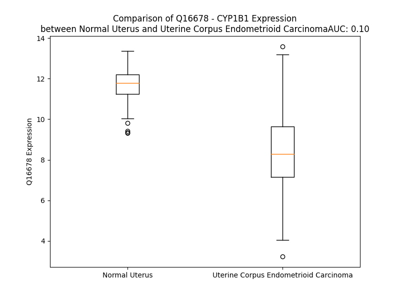

# Detailed Data for Q16678

## Introduction to the Detailed Summary

### How to Interpret the Results

- **Summary & Metrics**: This section provides a quick reference to essential protein attributes, including expression changes, family classification, and biomarker applications. Regulation status (upregulated/downregulated) indicates the protein's behavior in a disease context. Some information comes from the original excel file with the proteins selected from literature, while others are derived from the analyses.
- **Expression Comparison**: A visual representation comparing protein expression between normal and disease states. It highlights significant changes in expression levels that might indicate diagnostic or therapeutic relevance. This is data coming from transcriptomics experiments and could not translate similarly to protein levels.
- **Isoform Alignment**: An interactive view of isoform alignments, revealing structural and functional differences between variants of the protein.
- **Interactors & Homologs**: Tables listing known interaction partners and homologous proteins, the more interactors and homologs, the more complex the protein is to design an antibody for.
- **Biological Assemblies**: Information about the structural arrangement of the protein in different assemblies, providing insights into its functional state but also the complexity of the protein to develop antibodies.
- **Combined Per-Residue Information**: A detailed table summarizing residue-level data. This includes predictions for epitope regions, aggregation tendencies, and modifications that might impact the protein's function. Each row corresponds to a residue in the protein, providing insights into specific sites that may be important for research or drug development.
## Summary & Metrics

- **UniProt Accession**: Q16678
- **Gene Name**: CYP1B1
- **Protein Name**: Cytochrome P450 1B1
- **Swiss Prot**: CP1B1_HUMAN
- **Family**: enzyme
- **Biomarker Application**: diagnosis,efficacy,prognosis,unspecified application
- **Number of Isoforms**: 0
- **Regulation**: -1
- **(transcriptomics) AUC**: 0.18
- **(transcriptomics) Fold Change**: 1.20
- **(transcriptomics) Regulation**: Downregulated
- **Discotope Epitope Count**: 104
- **Max n_uniprots (Homo)**: 1
- **Max n_uniprots (Hetero)**: N/A

## Expression Comparison

## Interactors

| preferredName_A   | preferredName_B   |   score |
|:------------------|:------------------|--------:|
| CYP1B1            | GSTP1             |   0.973 |
| CYP1B1            | COMT              |   0.971 |
| CYP1B1            | EPHX1             |   0.966 |
| CYP1B1            | UGT1A6            |   0.966 |
| CYP1B1            | LRTOMT            |   0.966 |
| CYP1B1            | UGT1A1            |   0.963 |
| CYP1B1            | UGT1A8            |   0.963 |
| CYP1B1            | UGT1A7            |   0.963 |
| CYP1B1            | UGT1A4            |   0.963 |
| CYP1B1            | UGT1A10           |   0.963 |
| CYP1B1            | GSTM1             |   0.962 |
| CYP1B1            | HSD17B1           |   0.958 |
| CYP1B1            | HPGDS             |   0.954 |
| CYP1B1            | GSTA1             |   0.954 |
| CYP1B1            | GSTM2             |   0.947 |
| CYP1B1            | MYOC              |   0.944 |
| CYP1B1            | UGT1A9            |   0.944 |
| CYP1B1            | UGT2B7            |   0.944 |
| CYP1B1            | GSTM3             |   0.943 |
| CYP1B1            | UGT1A3            |   0.942 |
| CYP1B1            | HSD17B2           |   0.941 |
| CYP1B1            | UGT1A5            |   0.938 |
| CYP1B1            | UGT2B15           |   0.938 |
| CYP1B1            | IDO1              |   0.938 |
| CYP1B1            | AKR1C3            |   0.937 |
| CYP1B1            | CYP1A1            |   0.937 |
| CYP1B1            | GSTA2             |   0.936 |
| CYP1B1            | UGT2B4            |   0.936 |
| CYP1B1            | CYP1A2            |   0.936 |
| CYP1B1            | UGT2A2            |   0.935 |
| CYP1B1            | UGT2B17           |   0.934 |
| CYP1B1            | ASMT              |   0.933 |
| CYP1B1            | HSD17B8           |   0.933 |
| CYP1B1            | HSD17B7           |   0.932 |
| CYP1B1            | UGT2B10           |   0.932 |
| CYP1B1            | CYP2B6            |   0.932 |
| CYP1B1            | UGT2B11           |   0.932 |
| CYP1B1            | GSTT2B            |   0.931 |
| CYP1B1            | IDO2              |   0.931 |
| CYP1B1            | UGT2A3            |   0.931 |
| CYP1B1            | UGT2B28           |   0.931 |
| CYP1B1            | SULT2A1           |   0.93  |
| CYP1B1            | GSTA4             |   0.929 |
| CYP1B1            | GSTO1             |   0.929 |
| CYP1B1            | HSD17B12          |   0.928 |
| CYP1B1            | MGST1             |   0.925 |
| CYP1B1            | GSTO2             |   0.921 |
| CYP1B1            | GSTM5             |   0.92  |
| CYP1B1            | GSTA3             |   0.919 |
| CYP1B1            | GSTM4             |   0.917 |

## Homologs

| uniprot_id   | gene_id   |
|:-------------|:----------|
| E7EMT5       | CYP1A1    |
| P05177       | CYP1A2    |

## Biological Assemblies

|   Unnamed: 0 |   assembly |   n_uniprots | composition   | crystal_id   |
|-------------:|-----------:|-------------:|:--------------|:-------------|
|            0 |          1 |            1 | Homo          | 6iq5         |
|            1 |          2 |            1 | Homo          | 6iq5         |
|            0 |          1 |            1 | Homo          | 3pm0         |

## Combined Per-Residue Information

|   res | aa   |   epitope_score | epitope   |   relative_surface_accessibility |   modeling_confidence |   Aggregation | modification   |
|------:|:-----|----------------:|:----------|---------------------------------:|----------------------:|--------------:|:---------------|
|     1 | M    |         0.16124 | True      |                          1.30014 |                 40.41 |         0     | N/A            |
|     2 | G    |         0.13264 | False     |                          1.02003 |                 45.78 |         0     | N/A            |
|     3 | T    |         0.15299 | True      |                          0.93882 |                 46.52 |         0     | N/A            |
|     4 | S    |         0.13118 | False     |                          0.83459 |                 47.97 |         0     | N/A            |
|     5 | L    |         0.14014 | True      |                          1.07802 |                 43.66 |         0     | N/A            |
|     6 | S    |         0.09155 | False     |                          0.7449  |                 46.24 |         0     | N/A            |
|     7 | P    |         0.09462 | False     |                          0.8717  |                 55.14 |         0     | N/A            |
|     8 | N    |         0.21809 | True      |                          0.85302 |                 48.92 |         0     | N/A            |
|     9 | D    |         0.16027 | True      |                          0.83974 |                 46.16 |         0     | N/A            |
|    10 | P    |         0.17798 | True      |                          0.8604  |                 49.73 |         0     | N/A            |
|    11 | W    |         0.18029 | True      |                          1.00136 |                 44.71 |         0     | N/A            |
|    12 | P    |         0.1415  | True      |                          0.90137 |                 48.8  |         0     | N/A            |
|    13 | L    |         0.15573 | True      |                          1.04723 |                 53.09 |         0     | N/A            |
|    14 | N    |         0.14155 | True      |                          0.83092 |                 58.93 |         0     | N/A            |
|    15 | P    |         0.18257 | True      |                          0.92666 |                 64.85 |         0     | N/A            |
|    16 | L    |         0.14749 | True      |                          0.6204  |                 68.35 |         0.171 | N/A            |
|    17 | S    |         0.14187 | True      |                          0.42953 |                 78.01 |         0.203 | N/A            |
|    18 | I    |         0.12264 | False     |                          0.87726 |                 80.23 |         0.472 | N/A            |
|    19 | Q    |         0.12403 | False     |                          0.74884 |                 82.52 |         0.497 | N/A            |
|    20 | Q    |         0.10554 | False     |                          0.44589 |                 83.31 |         1.128 | N/A            |
|    21 | T    |         0.07204 | False     |                          0.38863 |                 84.3  |        17.243 | N/A            |
|    22 | T    |         0.05052 | False     |                          0.48247 |                 86.27 |        44.317 | N/A            |
|    23 | L    |         0.08397 | False     |                          0.63076 |                 89.96 |        89.711 | N/A            |
|    24 | L    |         0.05625 | False     |                          0.57169 |                 90.05 |        97.911 | N/A            |
|    25 | L    |         0.06883 | False     |                          0.7161  |                 91.28 |        99.41  | N/A            |
|    26 | L    |         0.08672 | False     |                          0.67058 |                 92.08 |        99.671 | N/A            |
|    27 | L    |         0.06015 | False     |                          0.58107 |                 93.33 |        99.604 | N/A            |
|    28 | S    |         0.05863 | False     |                          0.43884 |                 91.08 |        98.385 | N/A            |
|    29 | V    |         0.04358 | False     |                          0.55302 |                 92.74 |        98.272 | N/A            |
|    30 | L    |         0.07981 | False     |                          0.63836 |                 93.51 |        96.286 | N/A            |
|    31 | A    |         0.05956 | False     |                          0.51103 |                 92.42 |        85.411 | N/A            |
|    32 | T    |         0.06688 | False     |                          0.65199 |                 92.54 |        76.212 | N/A            |
|    33 | V    |         0.0427  | False     |                          0.53711 |                 92.31 |        70.738 | N/A            |
|    34 | H    |         0.07429 | False     |                          0.59902 |                 89.89 |         6.27  | N/A            |
|    35 | V    |         0.04014 | False     |                          0.58648 |                 90.67 |         5.794 | N/A            |
|    36 | G    |         0.0327  | False     |                          0.31545 |                 90.3  |         0.191 | N/A            |
|    37 | Q    |         0.04313 | False     |                          0.41241 |                 87.1  |         0.007 | N/A            |
|    38 | R    |         0.10017 | False     |                          0.69065 |                 85.61 |         0     | N/A            |
|    39 | L    |         0.04949 | False     |                          0.65355 |                 84.28 |         0     | N/A            |
|    40 | L    |         0.0768  | False     |                          0.63678 |                 82.52 |         0     | N/A            |
|    41 | R    |         0.12771 | False     |                          0.6458  |                 79.04 |         0     | N/A            |
|    42 | Q    |         0.10604 | False     |                          0.50931 |                 74.75 |         0     | N/A            |
|    43 | R    |         0.10763 | False     |                          0.66033 |                 74.03 |         0     | N/A            |
|    44 | R    |         0.09961 | False     |                          0.66994 |                 74.99 |         0     | N/A            |
|    45 | R    |         0.20271 | True      |                          0.74699 |                 70.23 |         0     | N/A            |
|    46 | Q    |         0.11582 | False     |                          0.41254 |                 68.83 |         0     | N/A            |
|    47 | L    |         0.09805 | False     |                          0.75487 |                 70.32 |         0     | N/A            |
|    48 | R    |         0.11602 | False     |                          0.87158 |                 74.85 |         0     | N/A            |
|    49 | S    |         0.05094 | False     |                          0.25888 |                 87.66 |         0     | N/A            |
|    50 | A    |         0.04009 | False     |                          0.35668 |                 91.5  |         0     | N/A            |
|    51 | P    |         0.01832 | False     |                          0.08467 |                 95.59 |         0     | N/A            |
|    52 | P    |         0.13557 | False     |                          0.33799 |                 96.04 |         0     | N/A            |
|    53 | G    |         0.04549 | False     |                          0.37423 |                 95.82 |         0     | N/A            |
|    54 | P    |         0.06275 | False     |                          0.18276 |                 95.55 |         0     | N/A            |
|    55 | F    |         0.23475 | True      |                          0.7615  |                 93.77 |         0     | N/A            |
|    56 | A    |         0.06822 | False     |                          0.25847 |                 93.9  |         0     | N/A            |
|    57 | W    |         0.19276 | True      |                          0.67924 |                 92.69 |         0     | N/A            |
|    58 | P    |         0.23832 | True      |                          0.69456 |                 87.38 |         0     | N/A            |
|    59 | L    |         0.17205 | True      |                          0.88552 |                 84.12 |         0     | N/A            |
|    60 | I    |         0.21763 | True      |                          0.44878 |                 89.33 |         0     | N/A            |
|    61 | G    |         0.00785 | False     |                          0.00476 |                 92.59 |         0     | N/A            |
|    62 | N    |         0.03762 | False     |                          0.0281  |                 94.43 |         0     | N/A            |
|    63 | A    |         0.09352 | False     |                          0.17874 |                 90.81 |         0     | N/A            |
|    64 | A    |         0.21037 | True      |                          0.82723 |                 88.88 |         0     | N/A            |
|    65 | A    |         0.14099 | True      |                          0.499   |                 89.1  |         0     | N/A            |
|    66 | V    |         0.0186  | False     |                          0.01879 |                 90.05 |         0     | N/A            |
|    67 | G    |         0.09901 | False     |                          0.58395 |                 87.04 |         0     | N/A            |
|    68 | Q    |         0.16341 | True      |                          0.86482 |                 87.09 |         0     | N/A            |
|    69 | A    |         0.04151 | False     |                          0.1857  |                 93.73 |         0     | N/A            |
|    70 | A    |         0.0085  | False     |                          0.00638 |                 95.61 |         0     | N/A            |
|    71 | H    |         0.01257 | False     |                          0.01389 |                 97.25 |         0     | N/A            |
|    72 | L    |         0.06276 | False     |                          0.37584 |                 96.88 |         0     | N/A            |
|    73 | S    |         0.03381 | False     |                          0.07286 |                 97.25 |         0     | N/A            |
|    74 | F    |         0.00384 | False     |                          0       |                 98.16 |         0     | N/A            |
|    75 | A    |         0.01529 | False     |                          0.19499 |                 97.5  |         0     | N/A            |
|    76 | R    |         0.1276  | False     |                          0.56907 |                 96.96 |         0     | N/A            |
|    77 | L    |         0.05071 | False     |                          0.15498 |                 97.38 |         0     | N/A            |
|    78 | A    |         0.01603 | False     |                          0.14281 |                 97.64 |         0     | N/A            |
|    79 | R    |         0.18479 | True      |                          0.82216 |                 96.42 |         0     | N/A            |
|    80 | R    |         0.32751 | True      |                          0.78181 |                 96.47 |         0     | N/A            |
|    81 | Y    |         0.10975 | False     |                          0.20249 |                 97.06 |         0     | N/A            |
|    82 | G    |         0.11573 | False     |                          0.43305 |                 97.44 |         0     | N/A            |
|    83 | D    |         0.04799 | False     |                          0.35936 |                 98.08 |         0     | N/A            |
|    84 | V    |         0.00653 | False     |                          0.00902 |                 98.49 |         0     | N/A            |
|    85 | F    |         0.00509 | False     |                          0       |                 98.04 |         0     | N/A            |
|    86 | Q    |         0.03545 | False     |                          0.32937 |                 97.41 |         0     | N/A            |
|    87 | I    |         0.02369 | False     |                          0.01684 |                 96.81 |         0     | N/A            |
|    88 | R    |         0.19868 | True      |                          0.3307  |                 95.34 |         0     | N/A            |
|    89 | L    |         0.01299 | False     |                          0.00495 |                 92.97 |         0     | N/A            |
|    90 | G    |         0.0336  | False     |                          0.03278 |                 88.23 |         0     | N/A            |
|    91 | S    |         0.19617 | True      |                          0.67928 |                 82.23 |         0     | N/A            |
|    92 | C    |         0.03778 | False     |                          0.15936 |                 92.79 |         0     | N/A            |
|    93 | P    |         0.09195 | False     |                          0.48653 |                 93.97 |         4.871 | N/A            |
|    94 | I    |         0.0026  | False     |                          0       |                 97.44 |        14.335 | N/A            |
|    95 | V    |         0.00476 | False     |                          0.00666 |                 98.43 |        14.71  | N/A            |
|    96 | V    |         0.00096 | False     |                          0       |                 98.62 |        14.71  | N/A            |
|    97 | L    |         0.0014  | False     |                          0       |                 98.78 |        14.71  | N/A            |
|    98 | N    |         0.00851 | False     |                          0.01206 |                 98.65 |         9.839 | N/A            |
|    99 | G    |         0.02547 | False     |                          0.12808 |                 97.77 |         4.183 | N/A            |
|   100 | E    |         0.06926 | False     |                          0.392   |                 97.12 |         0     | N/A            |
|   101 | R    |         0.13087 | False     |                          0.68137 |                 97.85 |         0     | N/A            |
|   102 | A    |         0.00205 | False     |                          0       |                 98.49 |         0     | N/A            |
|   103 | I    |         0.00682 | False     |                          0.0016  |                 98.56 |         0     | N/A            |
|   104 | H    |         0.0679  | False     |                          0.4142  |                 98.3  |         0     | N/A            |
|   105 | Q    |         0.12792 | False     |                          0.18049 |                 98.56 |         0     | N/A            |
|   106 | A    |         0.00177 | False     |                          0       |                 98.65 |         0     | N/A            |
|   107 | L    |         0.01135 | False     |                          0.0362  |                 98.49 |         0     | N/A            |
|   108 | V    |         0.18731 | True      |                          0.47087 |                 98.07 |         0     | N/A            |
|   109 | Q    |         0.19323 | True      |                          0.64518 |                 98.16 |         0     | N/A            |
|   110 | Q    |         0.08416 | False     |                          0.24866 |                 97.42 |         0     | N/A            |
|   111 | G    |         0.08608 | False     |                          0.07458 |                 96.27 |         0     | N/A            |
|   112 | S    |         0.14817 | True      |                          0.43672 |                 97.87 |         0     | N/A            |
|   113 | A    |         0.04024 | False     |                          0.1826  |                 98.18 |         0     | N/A            |
|   114 | F    |         0.00445 | False     |                          0.00311 |                 98.51 |         0     | N/A            |
|   115 | A    |         0.01044 | False     |                          0.0102  |                 98.22 |         0     | N/A            |
|   116 | D    |         0.02971 | False     |                          0.14746 |                 98.32 |         0     | N/A            |
|   117 | R    |         0.06717 | False     |                          0.04856 |                 97.91 |         0     | N/A            |
|   118 | P    |         0.02247 | False     |                          0.04357 |                 96.07 |         0     | N/A            |
|   119 | A    |         0.0782  | False     |                          0.66901 |                 93.41 |         0     | N/A            |
|   120 | F    |         0.03173 | False     |                          0.10156 |                 94.59 |         0     | N/A            |
|   121 | A    |         0.09506 | False     |                          0.48729 |                 93.61 |         0     | N/A            |
|   122 | S    |         0.00344 | False     |                          0       |                 94.83 |         0     | N/A            |
|   123 | F    |         0.02765 | False     |                          0.04006 |                 96.15 |         0     | N/A            |
|   124 | R    |         0.09699 | False     |                          0.64263 |                 95.12 |         0     | N/A            |
|   125 | V    |         0.07363 | False     |                          0.24444 |                 95.62 |         0     | N/A            |
|   126 | V    |         0.01577 | False     |                          0.05522 |                 96.03 |         0     | N/A            |
|   127 | S    |         0.00971 | False     |                          0.05663 |                 94.98 |         0     | N/A            |
|   128 | G    |         0.07562 | False     |                          0.63232 |                 90.9  |         0     | N/A            |
|   129 | G    |         0.11414 | False     |                          0.50016 |                 93.05 |         0     | N/A            |
|   130 | R    |         0.07723 | False     |                          0.46625 |                 94.56 |         0     | N/A            |
|   131 | S    |         0.03958 | False     |                          0.02477 |                 96.6  |         0     | N/A            |
|   132 | M    |         0.03686 | False     |                          0.07014 |                 95.36 |         0     | N/A            |
|   133 | A    |         0.06595 | False     |                          0.25691 |                 96.68 |         0     | N/A            |
|   134 | F    |         0.03243 | False     |                          0.06286 |                 97.23 |         0     | N/A            |
|   135 | G    |         0.02668 | False     |                          0.17382 |                 96.45 |         0     | N/A            |
|   136 | H    |         0.1176  | False     |                          0.48397 |                 97.44 |         0     | N/A            |
|   137 | Y    |         0.07993 | False     |                          0.19848 |                 97.51 |         0     | N/A            |
|   138 | S    |         0.08712 | False     |                          0.36521 |                 96.25 |         0     | N/A            |
|   139 | E    |         0.1566  | True      |                          0.58775 |                 95.16 |         0     | N/A            |
|   140 | H    |         0.12431 | False     |                          0.49457 |                 93.09 |         0     | N/A            |
|   141 | W    |         0.04124 | False     |                          0.05086 |                 95.75 |         0     | N/A            |
|   142 | K    |         0.07097 | False     |                          0.30106 |                 96.05 |         0     | N/A            |
|   143 | V    |         0.07502 | False     |                          0.33989 |                 94.37 |         0     | N/A            |
|   144 | Q    |         0.02379 | False     |                          0.02134 |                 95.32 |         0     | N/A            |
|   145 | R    |         0.02585 | False     |                          0.1962  |                 96.46 |         0     | N/A            |
|   146 | R    |         0.08559 | False     |                          0.56548 |                 95.31 |         0     | N/A            |
|   147 | A    |         0.01185 | False     |                          0.05806 |                 94.01 |         0     | N/A            |
|   148 | A    |         0.00372 | False     |                          0       |                 95.19 |         0     | N/A            |
|   149 | H    |         0.02465 | False     |                          0.3865  |                 94.16 |         0     | N/A            |
|   150 | S    |         0.0961  | False     |                          0.36239 |                 91.18 |         0     | N/A            |
|   151 | M    |         0.02077 | False     |                          0.10675 |                 90.07 |         0     | N/A            |
|   152 | M    |         0.02036 | False     |                          0.04906 |                 88.29 |         0     | N/A            |
|   153 | R    |         0.06918 | False     |                          0.4713  |                 85.43 |         0     | N/A            |
|   154 | N    |         0.06258 | False     |                          0.39291 |                 81.3  |         0     | N/A            |
|   155 | F    |         0.0327  | False     |                          0.2183  |                 75.47 |         0     | N/A            |
|   156 | F    |         0.0333  | False     |                          0.03999 |                 72.66 |         0     | N/A            |
|   157 | T    |         0.10342 | False     |                          0.35508 |                 64.11 |         0     | N/A            |
|   158 | R    |         0.2387  | True      |                          0.67342 |                 65.96 |         0     | N/A            |
|   159 | Q    |         0.13159 | False     |                          0.49402 |                 73.14 |         0     | N/A            |
|   160 | P    |         0.12083 | False     |                          0.63889 |                 76.46 |         0     | N/A            |
|   161 | R    |         0.18909 | True      |                          0.65034 |                 78.73 |         0     | N/A            |
|   162 | S    |         0.06918 | False     |                          0.18368 |                 77.53 |         0     | N/A            |
|   163 | R    |         0.06976 | False     |                          0.38629 |                 82.2  |         0     | N/A            |
|   164 | Q    |         0.13526 | False     |                          0.61222 |                 86.26 |         0     | N/A            |
|   165 | V    |         0.07978 | False     |                          0.55339 |                 87.19 |         0     | N/A            |
|   166 | L    |         0.00411 | False     |                          0.00989 |                 89.62 |         0     | N/A            |
|   167 | E    |         0.02329 | False     |                          0.17779 |                 93.37 |         0     | N/A            |
|   168 | G    |         0.02987 | False     |                          0.09941 |                 94.51 |         0     | N/A            |
|   169 | H    |         0.02395 | False     |                          0.22923 |                 94.94 |         0     | N/A            |
|   170 | V    |         0.00308 | False     |                          0       |                 97.36 |         0     | N/A            |
|   171 | L    |         0.01558 | False     |                          0.15475 |                 97.55 |         0     | N/A            |
|   172 | S    |         0.01573 | False     |                          0.23067 |                 97.35 |         0     | N/A            |
|   173 | E    |         0.00826 | False     |                          0.02221 |                 98.11 |         0     | N/A            |
|   174 | A    |         0.00102 | False     |                          0       |                 98.49 |         0.119 | N/A            |
|   175 | R    |         0.03185 | False     |                          0.23258 |                 98.24 |         0.26  | N/A            |
|   176 | E    |         0.03946 | False     |                          0.25446 |                 98.17 |         0.277 | N/A            |
|   177 | L    |         0.00099 | False     |                          0       |                 98.47 |        64.729 | N/A            |
|   178 | V    |         0.00141 | False     |                          0       |                 98.69 |        94.489 | N/A            |
|   179 | A    |         0.04827 | False     |                          0.17207 |                 98.51 |        94.489 | N/A            |
|   180 | L    |         0.02837 | False     |                          0.23125 |                 98.43 |        94.489 | N/A            |
|   181 | L    |         0.00201 | False     |                          0       |                 98.51 |        94.489 | N/A            |
|   182 | V    |         0.04317 | False     |                          0.26137 |                 98.42 |        89.421 | N/A            |
|   183 | R    |         0.1466  | True      |                          0.70346 |                 98.07 |         0.017 | N/A            |
|   184 | G    |         0.06728 | False     |                          0.41479 |                 97.71 |         0     | N/A            |
|   185 | S    |         0.06079 | False     |                          0.0347  |                 98.3  |         0     | N/A            |
|   186 | A    |         0.09304 | False     |                          0.50681 |                 96.55 |         0     | N/A            |
|   187 | D    |         0.17288 | True      |                          0.98103 |                 95.3  |         0     | N/A            |
|   188 | G    |         0.11821 | False     |                          0.59241 |                 94.65 |         0     | N/A            |
|   189 | A    |         0.13136 | False     |                          0.43601 |                 97.79 |         0     | N/A            |
|   190 | F    |         0.06591 | False     |                          0.32922 |                 98.1  |         0     | N/A            |
|   191 | L    |         0.04751 | False     |                          0.17147 |                 97.68 |         0     | N/A            |
|   192 | D    |         0.02958 | False     |                          0.19816 |                 96.85 |         0     | N/A            |
|   193 | P    |         0.00178 | False     |                          0       |                 97.2  |         0     | N/A            |
|   194 | R    |         0.03305 | False     |                          0.27129 |                 95.17 |         0     | N/A            |
|   195 | P    |         0.06921 | False     |                          0.55423 |                 94.64 |         0.505 | N/A            |
|   196 | L    |         0.02325 | False     |                          0.14426 |                 97.07 |        44.048 | N/A            |
|   197 | T    |         0.00135 | False     |                          0       |                 97.22 |        63.672 | N/A            |
|   198 | V    |         0.00904 | False     |                          0.17042 |                 96.57 |        89.609 | N/A            |
|   199 | V    |         0.00653 | False     |                          0.03047 |                 97.49 |        91.303 | N/A            |
|   200 | A    |         0.00054 | False     |                          0       |                 98.24 |        91.433 | N/A            |
|   201 | V    |         0.00637 | False     |                          0.00857 |                 97.6  |        90.852 | N/A            |
|   202 | A    |         0.00113 | False     |                          0       |                 97.4  |        78.189 | N/A            |
|   203 | N    |         0.01066 | False     |                          0.00532 |                 97.86 |        61.573 | N/A            |
|   204 | V    |         0.00172 | False     |                          0.00286 |                 96.7  |        61.236 | N/A            |
|   205 | M    |         0.00277 | False     |                          0       |                 95.31 |        53.392 | N/A            |
|   206 | S    |         0.00218 | False     |                          0       |                 96.54 |        44.41  | N/A            |
|   207 | A    |         0.01776 | False     |                          0.13364 |                 94.65 |        43.305 | N/A            |
|   208 | V    |         0.01037 | False     |                          0.07559 |                 92.66 |        42.348 | N/A            |
|   209 | C    |         0.00168 | False     |                          0       |                 94.81 |        30.889 | N/A            |
|   210 | F    |         0.01917 | False     |                          0.0421  |                 95.43 |        28.71  | N/A            |
|   211 | G    |         0.09171 | False     |                          0.63644 |                 92.55 |         1.173 | N/A            |
|   212 | C    |         0.10577 | False     |                          0.29236 |                 94.13 |         0.168 | N/A            |
|   213 | R    |         0.15776 | True      |                          0.48987 |                 94.4  |         0     | N/A            |
|   214 | Y    |         0.07045 | False     |                          0.16812 |                 96.27 |         0     | N/A            |
|   215 | S    |         0.15361 | True      |                          0.50663 |                 96.2  |         0     | N/A            |
|   216 | H    |         0.06412 | False     |                          0.05999 |                 95.99 |         0     | N/A            |
|   217 | D    |         0.15071 | True      |                          0.57189 |                 94.18 |         0     | N/A            |
|   218 | D    |         0.12599 | False     |                          0.228   |                 95.39 |         0     | N/A            |
|   219 | P    |         0.21336 | True      |                          0.78275 |                 93.56 |         0     | N/A            |
|   220 | E    |         0.16246 | True      |                          0.69095 |                 91.69 |         0     | N/A            |
|   221 | F    |         0.00662 | False     |                          0.01059 |                 93.73 |         0     | N/A            |
|   222 | R    |         0.08214 | False     |                          0.37426 |                 93.31 |         0     | N/A            |
|   223 | E    |         0.14162 | True      |                          0.51619 |                 91.65 |         0     | N/A            |
|   224 | L    |         0.07019 | False     |                          0.16997 |                 91.41 |         0     | N/A            |
|   225 | L    |         0.02671 | False     |                          0.02498 |                 91.88 |         0     | N/A            |
|   226 | S    |         0.10298 | False     |                          0.51779 |                 86.27 |         0     | N/A            |
|   227 | H    |         0.13313 | False     |                          0.27767 |                 84.47 |         0     | N/A            |
|   228 | N    |         0.03743 | False     |                          0.16839 |                 86.48 |         0     | N/A            |
|   229 | E    |         0.04601 | False     |                          0.29218 |                 87.25 |         0     | N/A            |
|   230 | E    |         0.0745  | False     |                          0.22168 |                 90.81 |         0     | N/A            |
|   231 | F    |         0.08689 | False     |                          0.23016 |                 93.6  |         0     | N/A            |
|   232 | G    |         0.00975 | False     |                          0.00483 |                 91.74 |         0     | N/A            |
|   233 | R    |         0.10236 | False     |                          0.42792 |                 91.57 |         0     | N/A            |
|   234 | T    |         0.00898 | False     |                          0.00693 |                 93.58 |         0     | N/A            |
|   235 | V    |         0.01932 | False     |                          0.01642 |                 94.42 |         0     | N/A            |
|   236 | G    |         0.04189 | False     |                          0.05527 |                 92.35 |         0     | N/A            |
|   237 | A    |         0.00943 | False     |                          0.02778 |                 90.93 |         0     | N/A            |
|   238 | G    |         0.04669 | False     |                          0.23678 |                 88.56 |         0     | N/A            |
|   239 | S    |         0.048   | False     |                          0.14501 |                 90.29 |         0     | N/A            |
|   240 | L    |         0.11567 | False     |                          0.37113 |                 88.62 |         0     | N/A            |
|   241 | V    |         0.07    | False     |                          0.06495 |                 90.91 |         0     | N/A            |
|   242 | D    |         0.07159 | False     |                          0.11559 |                 90.76 |         0     | N/A            |
|   243 | V    |         0.02153 | False     |                          0.02566 |                 89.35 |         0     | N/A            |
|   244 | M    |         0.13597 | False     |                          0.039   |                 88.5  |         0     | N/A            |
|   245 | P    |         0.22326 | True      |                          0.55201 |                 83.49 |         0     | N/A            |
|   246 | W    |         0.36163 | True      |                          0.49702 |                 86.77 |         0     | N/A            |
|   247 | L    |         0.13882 | True      |                          0.12118 |                 88.5  |         0     | N/A            |
|   248 | Q    |         0.17988 | True      |                          0.22357 |                 88.84 |         0     | N/A            |
|   249 | Y    |         0.37135 | True      |                          0.82941 |                 88.66 |         0     | N/A            |
|   250 | F    |         0.41194 | True      |                          0.4456  |                 91.79 |         0     | N/A            |
|   251 | P    |         0.35711 | True      |                          0.88487 |                 92.14 |         0     | N/A            |
|   252 | N    |         0.13949 | True      |                          0.15682 |                 91.72 |         0     | N/A            |
|   253 | P    |         0.23187 | True      |                          0.78832 |                 91.11 |         0     | N/A            |
|   254 | V    |         0.1274  | False     |                          0.20551 |                 90.41 |         0     | N/A            |
|   255 | R    |         0.10783 | False     |                          0.22332 |                 92.2  |         0     | N/A            |
|   256 | T    |         0.29619 | True      |                          0.50141 |                 93.58 |         0.138 | N/A            |
|   257 | V    |         0.04905 | False     |                          0.32077 |                 92.78 |         0.369 | N/A            |
|   258 | F    |         0.0626  | False     |                          0.12166 |                 94.14 |         0.369 | N/A            |
|   259 | R    |         0.33278 | True      |                          0.55179 |                 93.88 |         0.369 | N/A            |
|   260 | E    |         0.13321 | False     |                          0.4291  |                 93.16 |         0.369 | N/A            |
|   261 | F    |         0.01295 | False     |                          0.0051  |                 94.98 |         0.369 | N/A            |
|   262 | E    |         0.15486 | True      |                          0.25454 |                 95.67 |         0     | N/A            |
|   263 | Q    |         0.23954 | True      |                          0.40951 |                 94.56 |         0     | N/A            |
|   264 | L    |         0.14246 | True      |                          0.15022 |                 93.55 |         0     | N/A            |
|   265 | N    |         0.02941 | False     |                          0.08131 |                 95.2  |         0     | N/A            |
|   266 | R    |         0.19156 | True      |                          0.48021 |                 95    |         0     | N/A            |
|   267 | N    |         0.08981 | False     |                          0.42103 |                 93.95 |         0     | N/A            |
|   268 | F    |         0.03358 | False     |                          0.17543 |                 94.57 |         3.624 | N/A            |
|   269 | S    |         0.03757 | False     |                          0.26914 |                 94.29 |         4.163 | N/A            |
|   270 | N    |         0.20312 | True      |                          0.58559 |                 95.06 |         4.163 | N/A            |
|   271 | F    |         0.0959  | False     |                          0.14367 |                 95.25 |         6.168 | N/A            |
|   272 | I    |         0.00528 | False     |                          0.0008  |                 96.58 |         6.306 | N/A            |
|   273 | L    |         0.1552  | True      |                          0.47153 |                 96.65 |         5.097 | N/A            |
|   274 | D    |         0.10445 | False     |                          0.39869 |                 97.06 |         2.143 | N/A            |
|   275 | K    |         0.04418 | False     |                          0.06794 |                 97.05 |         2.143 | N/A            |
|   276 | F    |         0.0424  | False     |                          0.09363 |                 97.74 |         2.143 | N/A            |
|   277 | L    |         0.20351 | True      |                          0.54963 |                 97.89 |         1.833 | N/A            |
|   278 | R    |         0.13982 | True      |                          0.48599 |                 97.2  |         0     | N/A            |
|   279 | H    |         0.01423 | False     |                          0.08236 |                 96.9  |         0     | N/A            |
|   280 | C    |         0.10763 | False     |                          0.38087 |                 95.05 |         0     | N/A            |
|   281 | E    |         0.24821 | True      |                          0.77027 |                 95.04 |         0     | N/A            |
|   282 | S    |         0.10853 | False     |                          0.44156 |                 94.47 |         0     | N/A            |
|   283 | L    |         0.06662 | False     |                          0.15387 |                 90.88 |         0     | N/A            |
|   284 | R    |         0.17689 | True      |                          0.75245 |                 86.64 |         0     | N/A            |
|   285 | P    |         0.20387 | True      |                          1.02247 |                 79.7  |         0     | N/A            |
|   286 | G    |         0.18807 | True      |                          0.99018 |                 80.87 |         0     | N/A            |
|   287 | A    |         0.14906 | True      |                          0.40004 |                 83.52 |         0     | N/A            |
|   288 | A    |         0.09367 | False     |                          0.7803  |                 85.98 |         0     | N/A            |
|   289 | P    |         0.07719 | False     |                          0.42634 |                 89.93 |         0     | N/A            |
|   290 | R    |         0.09621 | False     |                          0.55058 |                 88.68 |         0     | N/A            |
|   291 | D    |         0.02349 | False     |                          0.0352  |                 91.86 |         0     | N/A            |
|   292 | M    |         0.00112 | False     |                          0       |                 92.74 |         0     | N/A            |
|   293 | M    |         0.00259 | False     |                          0       |                 95.13 |         0     | N/A            |
|   294 | D    |         0.00441 | False     |                          0       |                 94.04 |         0     | N/A            |
|   295 | A    |         0.03641 | False     |                          0.08789 |                 92.42 |         4.09  | N/A            |
|   296 | F    |         0.0065  | False     |                          0.00879 |                 94.27 |         8.266 | N/A            |
|   297 | I    |         0.01045 | False     |                          0.004   |                 94.7  |         8.266 | N/A            |
|   298 | L    |         0.09313 | False     |                          0.16383 |                 91.93 |         8.266 | N/A            |
|   299 | S    |         0.03641 | False     |                          0.20252 |                 90.11 |         8.266 | N/A            |
|   300 | A    |         0.01538 | False     |                          0.02559 |                 91.97 |         7.707 | N/A            |
|   301 | E    |         0.10419 | False     |                          0.42469 |                 90.38 |         0     | N/A            |
|   302 | K    |         0.07182 | False     |                          0.52696 |                 88.17 |         0     | N/A            |
|   303 | K    |         0.10562 | False     |                          0.38662 |                 87.48 |         0     | N/A            |
|   304 | A    |         0.13226 | False     |                          0.88505 |                 86.67 |         0     | N/A            |
|   305 | A    |         0.15001 | True      |                          0.81729 |                 86.77 |         0     | N/A            |
|   306 | G    |         0.14722 | True      |                          0.65449 |                 81.75 |         0     | N/A            |
|   307 | D    |         0.09657 | False     |                          0.32616 |                 74.55 |         0     | N/A            |
|   308 | S    |         0.19449 | True      |                          0.75553 |                 63.22 |         0     | N/A            |
|   309 | H    |         0.27191 | True      |                          1.0024  |                 56.57 |         0     | N/A            |
|   310 | G    |         0.21844 | True      |                          0.62769 |                 56.29 |         0     | N/A            |
|   311 | G    |         0.22724 | True      |                          1.02112 |                 55.53 |         0     | N/A            |
|   312 | G    |         0.17412 | True      |                          0.52479 |                 66.25 |         0     | N/A            |
|   313 | A    |         0.10539 | False     |                          0.30525 |                 77.77 |         0     | N/A            |
|   314 | R    |         0.08269 | False     |                          0.14191 |                 82.15 |         0     | N/A            |
|   315 | L    |         0.01207 | False     |                          0.03074 |                 88.12 |         0     | N/A            |
|   316 | D    |         0.11014 | False     |                          0.34975 |                 91.07 |         0     | N/A            |
|   317 | L    |         0.1495  | True      |                          0.46182 |                 92.1  |         0     | N/A            |
|   318 | E    |         0.09082 | False     |                          0.59023 |                 92.93 |         0     | N/A            |
|   319 | N    |         0.01499 | False     |                          0.02218 |                 94.64 |         0     | N/A            |
|   320 | V    |         0.003   | False     |                          0       |                 96.37 |         0     | N/A            |
|   321 | P    |         0.03157 | False     |                          0.15408 |                 97.23 |         0     | N/A            |
|   322 | A    |         0.01218 | False     |                          0.08347 |                 96.65 |         0     | N/A            |
|   323 | T    |         0.00144 | False     |                          0       |                 97.1  |         0     | N/A            |
|   324 | I    |         0.00226 | False     |                          0       |                 96.81 |         0     | N/A            |
|   325 | T    |         0.0276  | False     |                          0.07514 |                 96.81 |         0     | N/A            |
|   326 | D    |         0.02995 | False     |                          0.08422 |                 96.36 |         0     | N/A            |
|   327 | I    |         0.03544 | False     |                          0.06348 |                 96.33 |         0     | N/A            |
|   328 | F    |         0.00559 | False     |                          0.00127 |                 95.67 |         0     | N/A            |
|   329 | G    |         0.03334 | False     |                          0.29467 |                 95    |         0     | N/A            |
|   330 | A    |         0.0412  | False     |                          0.52032 |                 95.94 |         0     | N/A            |
|   331 | S    |         0.02771 | False     |                          0.11204 |                 95.28 |         0     | N/A            |
|   332 | Q    |         0.00941 | False     |                          0.01024 |                 95.01 |         0     | N/A            |
|   333 | D    |         0.02981 | False     |                          0.03069 |                 93.97 |         0     | N/A            |
|   334 | T    |         0.04793 | False     |                          0.27916 |                 97.3  |        10.838 | N/A            |
|   335 | L    |         0.02361 | False     |                          0.03462 |                 98.01 |        29.06  | N/A            |
|   336 | S    |         0.00819 | False     |                          0.01186 |                 97.47 |        29.581 | N/A            |
|   337 | T    |         0.00289 | False     |                          0.00217 |                 97.94 |        33.809 | N/A            |
|   338 | A    |         0.01761 | False     |                          0.03372 |                 98.59 |        40.916 | N/A            |
|   339 | L    |         0.00341 | False     |                          0.00165 |                 98.52 |        49.315 | N/A            |
|   340 | Q    |         0.00545 | False     |                          0.03447 |                 98.25 |        50.847 | N/A            |
|   341 | W    |         0.01133 | False     |                          0.04963 |                 98.68 |        89.116 | N/A            |
|   342 | L    |         0.0026  | False     |                          0.02555 |                 98.75 |        97.247 | N/A            |
|   343 | L    |         0.00084 | False     |                          0       |                 98.45 |        97.801 | N/A            |
|   344 | L    |         0.0073  | False     |                          0.02555 |                 98.1  |        97.718 | N/A            |
|   345 | L    |         0.00131 | False     |                          0       |                 98.3  |        97.208 | N/A            |
|   346 | F    |         0.00171 | False     |                          0       |                 98.05 |        89.756 | N/A            |
|   347 | T    |         0.03898 | False     |                          0.06127 |                 97.01 |        34.046 | N/A            |
|   348 | R    |         0.05919 | False     |                          0.21368 |                 96.38 |         0     | N/A            |
|   349 | Y    |         0.06207 | False     |                          0.28763 |                 97.39 |         0     | N/A            |
|   350 | P    |         0.08    | False     |                          0.59567 |                 97.45 |         0     | N/A            |
|   351 | D    |         0.08862 | False     |                          0.75102 |                 98.38 |         0     | N/A            |
|   352 | V    |         0.01978 | False     |                          0.09806 |                 98.65 |         0     | N/A            |
|   353 | Q    |         0.01689 | False     |                          0.05511 |                 98.74 |         0     | N/A            |
|   354 | T    |         0.05137 | False     |                          0.58988 |                 98.73 |         0     | N/A            |
|   355 | R    |         0.16301 | True      |                          0.46532 |                 98.61 |         0     | N/A            |
|   356 | V    |         0.00228 | False     |                          0.00095 |                 98.85 |         0     | N/A            |
|   357 | Q    |         0.04825 | False     |                          0.06935 |                 98.86 |         0     | N/A            |
|   358 | A    |         0.06722 | False     |                          0.52755 |                 98.74 |         0     | N/A            |
|   359 | E    |         0.08632 | False     |                          0.11435 |                 98.67 |         0     | N/A            |
|   360 | L    |         0.00235 | False     |                          0       |                 98.84 |         0     | N/A            |
|   361 | D    |         0.0461  | False     |                          0.25743 |                 98.66 |         0     | N/A            |
|   362 | Q    |         0.20708 | True      |                          0.79299 |                 98.43 |         0     | N/A            |
|   363 | V    |         0.09251 | False     |                          0.38676 |                 98.38 |         0     | N/A            |
|   364 | V    |         0.0495  | False     |                          0.0765  |                 98.42 |         0     | N/A            |
|   365 | G    |         0.07568 | False     |                          0.30031 |                 98.04 |         0     | N/A            |
|   366 | R    |         0.12168 | False     |                          0.21247 |                 97.36 |         0     | N/A            |
|   367 | D    |         0.23033 | True      |                          0.82438 |                 96.22 |         0     | N/A            |
|   368 | R    |         0.17818 | True      |                          0.40275 |                 96.58 |         0     | N/A            |
|   369 | L    |         0.02092 | False     |                          0.13399 |                 98.14 |         0     | N/A            |
|   370 | P    |         0.01314 | False     |                          0.03454 |                 97.94 |         0     | N/A            |
|   371 | C    |         0.02467 | False     |                          0.36855 |                 96.12 |         0     | N/A            |
|   372 | M    |         0.03688 | False     |                          0.20133 |                 94.38 |         0     | N/A            |
|   373 | G    |         0.112   | False     |                          0.68611 |                 94.4  |         0     | N/A            |
|   374 | D    |         0.03295 | False     |                          0.07505 |                 97.86 |         0     | N/A            |
|   375 | Q    |         0.0416  | False     |                          0.26507 |                 97.02 |         0     | N/A            |
|   376 | P    |         0.17506 | True      |                          0.75118 |                 95.78 |         0     | N/A            |
|   377 | N    |         0.13241 | False     |                          0.57567 |                 98.1  |         0     | N/A            |
|   378 | L    |         0.00393 | False     |                          0       |                 98.47 |         0     | N/A            |
|   379 | P    |         0.04961 | False     |                          0.16104 |                 98.38 |         0.9   | N/A            |
|   380 | Y    |         0.04158 | False     |                          0.0586  |                 98.74 |        74.203 | N/A            |
|   381 | V    |         0.00075 | False     |                          0.00095 |                 98.77 |        93.352 | N/A            |
|   382 | L    |         0.03296 | False     |                          0.11046 |                 98.59 |        94.611 | N/A            |
|   383 | A    |         0.00163 | False     |                          0       |                 98.7  |        94.611 | N/A            |
|   384 | F    |         0.0022  | False     |                          0       |                 98.78 |        94.611 | N/A            |
|   385 | L    |         0.00949 | False     |                          0.05294 |                 98.76 |        87.285 | N/A            |
|   386 | Y    |         0.02382 | False     |                          0.15524 |                 98.72 |        68.493 | N/A            |
|   387 | E    |         0.00302 | False     |                          0       |                 98.8  |         2.465 | N/A            |
|   388 | A    |         0.00429 | False     |                          0.0245  |                 98.73 |         2.465 | N/A            |
|   389 | M    |         0.0177  | False     |                          0.04654 |                 98.69 |         2.465 | N/A            |
|   390 | R    |         0.00839 | False     |                          0       |                 98.49 |         2.465 | N/A            |
|   391 | F    |         0.08755 | False     |                          0.15999 |                 98.49 |         2.327 | N/A            |
|   392 | S    |         0.02442 | False     |                          0.05747 |                 97.87 |         0.583 | N/A            |
|   393 | S    |         0.00316 | False     |                          0.00312 |                 98.23 |         0.373 | N/A            |
|   394 | F    |         0.03652 | False     |                          0.05032 |                 97.98 |         0.353 | N/A            |
|   395 | V    |         0.02528 | False     |                          0.16347 |                 97.52 |         0.035 | N/A            |
|   396 | P    |         0.00412 | False     |                          0.00298 |                 97.85 |         0.015 | N/A            |
|   397 | V    |         0.01116 | False     |                          0.02732 |                 98.32 |         0     | N/A            |
|   398 | T    |         0.0181  | False     |                          0.06114 |                 98.12 |         0     | N/A            |
|   399 | I    |         0.03628 | False     |                          0.17465 |                 97.82 |         0     | N/A            |
|   400 | P    |         0.0077  | False     |                          0.01392 |                 97.94 |         0     | N/A            |
|   401 | H    |         0.00926 | False     |                          0.00972 |                 98.55 |         0     | N/A            |
|   402 | A    |         0.02117 | False     |                          0.05739 |                 98.44 |         0     | N/A            |
|   403 | T    |         0.00794 | False     |                          0.00493 |                 98.65 |         0     | N/A            |
|   404 | T    |         0.05245 | False     |                          0.27647 |                 98.3  |         0     | N/A            |
|   405 | A    |         0.14359 | True      |                          0.43619 |                 97.65 |         0     | N/A            |
|   406 | N    |         0.11173 | False     |                          0.6645  |                 97.02 |         0     | N/A            |
|   407 | T    |         0.04083 | False     |                          0.12032 |                 96.93 |         0     | N/A            |
|   408 | S    |         0.08931 | False     |                          0.34158 |                 96.73 |         0.153 | N/A            |
|   409 | V    |         0.00311 | False     |                          0       |                 97.66 |         0.153 | N/A            |
|   410 | L    |         0.06387 | False     |                          0.29628 |                 96.42 |         0.153 | N/A            |
|   411 | G    |         0.15087 | True      |                          0.7844  |                 94.08 |         0.153 | N/A            |
|   412 | Y    |         0.07901 | False     |                          0.30575 |                 97.37 |         0.153 | N/A            |
|   413 | H    |         0.12954 | False     |                          0.27092 |                 96.3  |         0     | N/A            |
|   414 | I    |         0.00639 | False     |                          0.0008  |                 97.06 |         0     | N/A            |
|   415 | P    |         0.11447 | False     |                          0.50201 |                 96.1  |         0     | N/A            |
|   416 | K    |         0.09133 | False     |                          0.54555 |                 97.16 |         0.053 | N/A            |
|   417 | D    |         0.08952 | False     |                          0.6242  |                 96.95 |         0.053 | N/A            |
|   418 | T    |         0.04642 | False     |                          0.08456 |                 97.8  |        94.379 | N/A            |
|   419 | V    |         0.00861 | False     |                          0.06352 |                 98.14 |        95.519 | N/A            |
|   420 | V    |         0.002   | False     |                          0       |                 98.6  |        95.598 | N/A            |
|   421 | F    |         0.00542 | False     |                          0.01465 |                 98.51 |        95.598 | N/A            |
|   422 | V    |         0.00255 | False     |                          0.00095 |                 98.62 |        95.598 | N/A            |
|   423 | N    |         0.00247 | False     |                          0       |                 98.65 |         6.298 | N/A            |
|   424 | Q    |         0.00665 | False     |                          0.00615 |                 98.54 |         2.039 | N/A            |
|   425 | W    |         0.04606 | False     |                          0.21514 |                 98.56 |         1.865 | N/A            |
|   426 | S    |         0.02644 | False     |                          0.11924 |                 98.42 |         1.146 | N/A            |
|   427 | V    |         0.00835 | False     |                          0.00571 |                 98.42 |         1.061 | N/A            |
|   428 | N    |         0.00288 | False     |                          0.00222 |                 98.52 |         0.012 | N/A            |
|   429 | H    |         0.059   | False     |                          0.13472 |                 98.31 |         0     | N/A            |
|   430 | D    |         0.10381 | False     |                          0.23749 |                 97.72 |         0     | N/A            |
|   431 | P    |         0.21507 | True      |                          0.67647 |                 96.6  |         0     | N/A            |
|   432 | L    |         0.2911  | True      |                          1.04949 |                 95.07 |         0     | N/A            |
|   433 | K    |         0.14557 | True      |                          0.15526 |                 95.17 |         0     | N/A            |
|   434 | W    |         0.0496  | False     |                          0.00719 |                 97.37 |         0     | N/A            |
|   435 | P    |         0.20321 | True      |                          0.69689 |                 96.06 |         0     | N/A            |
|   436 | N    |         0.22521 | True      |                          0.57748 |                 97.63 |         0     | N/A            |
|   437 | P    |         0.04363 | False     |                          0.09841 |                 97.61 |         0     | N/A            |
|   438 | E    |         0.06978 | False     |                          0.57388 |                 96.52 |         0     | N/A            |
|   439 | N    |         0.2045  | True      |                          0.51212 |                 97.23 |         0     | N/A            |
|   440 | F    |         0.03371 | False     |                          0.07083 |                 98.15 |         0     | N/A            |
|   441 | D    |         0.12867 | False     |                          0.35355 |                 98.07 |         0     | N/A            |
|   442 | P    |         0.01801 | False     |                          0.01988 |                 98.41 |         0     | N/A            |
|   443 | A    |         0.13218 | False     |                          0.38006 |                 97.55 |         0     | N/A            |
|   444 | R    |         0.1474  | True      |                          0.15703 |                 97.26 |         0     | N/A            |
|   445 | F    |         0.00293 | False     |                          0       |                 98.29 |         0     | N/A            |
|   446 | L    |         0.0637  | False     |                          0.17068 |                 98.14 |         0     | N/A            |
|   447 | D    |         0.12434 | False     |                          0.35649 |                 95.76 |         0     | N/A            |
|   448 | K    |         0.21457 | True      |                          1.04315 |                 94.33 |         0     | N/A            |
|   449 | D    |         0.24634 | True      |                          0.75683 |                 94.74 |         0     | N/A            |
|   450 | G    |         0.16004 | True      |                          0.37608 |                 94.36 |         0     | N/A            |
|   451 | L    |         0.22477 | True      |                          0.6331  |                 96.08 |         0     | N/A            |
|   452 | I    |         0.09545 | False     |                          0.18717 |                 97.08 |         0     | N/A            |
|   453 | N    |         0.06319 | False     |                          0.26915 |                 96.7  |         0     | N/A            |
|   454 | K    |         0.3144  | True      |                          0.78381 |                 94.66 |         0     | N/A            |
|   455 | D    |         0.12941 | False     |                          0.48885 |                 95.45 |         0     | N/A            |
|   456 | L    |         0.12171 | False     |                          0.2267  |                 95.9  |         0     | N/A            |
|   457 | T    |         0.10577 | False     |                          0.11128 |                 96.57 |         0     | N/A            |
|   458 | S    |         0.08299 | False     |                          0.70122 |                 95.14 |         0     | N/A            |
|   459 | R    |         0.16048 | True      |                          0.39582 |                 95.88 |         0     | N/A            |
|   460 | V    |         0.03454 | False     |                          0.12818 |                 98.22 |        21.348 | N/A            |
|   461 | M    |         0.0289  | False     |                          0.08721 |                 98    |        22.781 | N/A            |
|   462 | I    |         0.04094 | False     |                          0.04778 |                 97.71 |        22.894 | N/A            |
|   463 | F    |         0.04768 | False     |                          0.151   |                 97.82 |        22.894 | N/A            |
|   464 | S    |         0.03405 | False     |                          0.12885 |                 97.57 |        22.894 | N/A            |
|   465 | V    |         0.13776 | True      |                          0.27196 |                 97.68 |        18.974 | N/A            |
|   466 | G    |         0.09362 | False     |                          0.37017 |                 97.09 |         0.668 | N/A            |
|   467 | K    |         0.21929 | True      |                          0.53169 |                 97.33 |         0     | N/A            |
|   468 | R    |         0.10815 | False     |                          0.08729 |                 97.67 |         0     | N/A            |
|   469 | R    |         0.12798 | False     |                          0.45039 |                 97.33 |         0     | N/A            |
|   470 | C    |         0.06523 | False     |                          0.4275  |                 97.72 |         0     | N/A            |
|   471 | I    |         0.09378 | False     |                          0.24324 |                 96.08 |         0     | N/A            |
|   472 | G    |         0.03464 | False     |                          0.15852 |                 95.33 |         0     | N/A            |
|   473 | E    |         0.022   | False     |                          0.09251 |                 95.35 |         0     | N/A            |
|   474 | E    |         0.07343 | False     |                          0.52052 |                 92.97 |         0.002 | N/A            |
|   475 | L    |         0.03242 | False     |                          0.05184 |                 93.17 |         0.002 | N/A            |
|   476 | S    |         0.02711 | False     |                          0.09672 |                 95.84 |         0.002 | N/A            |
|   477 | K    |         0.02613 | False     |                          0.24868 |                 96.13 |         0.002 | N/A            |
|   478 | M    |         0.04733 | False     |                          0.07132 |                 95.21 |         1.356 | N/A            |
|   479 | Q    |         0.01228 | False     |                          0.00341 |                 97.09 |         2.543 | N/A            |
|   480 | L    |         0.0136  | False     |                          0.03957 |                 98.53 |        84.41  | N/A            |
|   481 | F    |         0.00642 | False     |                          0.00755 |                 98.49 |        98.477 | N/A            |
|   482 | L    |         0.00973 | False     |                          0.02226 |                 98.41 |        99.615 | N/A            |
|   483 | F    |         0.00537 | False     |                          0.00828 |                 98.74 |        99.804 | N/A            |
|   484 | I    |         0.00321 | False     |                          0       |                 98.66 |        99.797 | N/A            |
|   485 | S    |         0.00121 | False     |                          0       |                 98.8  |        94.585 | N/A            |
|   486 | I    |         0.00895 | False     |                          0.0184  |                 98.77 |        93.823 | N/A            |
|   487 | L    |         0.00159 | False     |                          0       |                 98.81 |        85.399 | N/A            |
|   488 | A    |         0.00117 | False     |                          0       |                 98.73 |        39.298 | N/A            |
|   489 | H    |         0.00456 | False     |                          0       |                 98.65 |         0.312 | N/A            |
|   490 | Q    |         0.01035 | False     |                          0.00775 |                 98.71 |         0.042 | N/A            |
|   491 | C    |         0.00373 | False     |                          0       |                 98.73 |         0.037 | N/A            |
|   492 | D    |         0.03051 | False     |                          0.26708 |                 98.53 |         0.001 | N/A            |
|   493 | F    |         0.01622 | False     |                          0.02638 |                 98.48 |         0.001 | N/A            |
|   494 | R    |         0.08839 | False     |                          0.60381 |                 97.94 |         0.001 | N/A            |
|   495 | A    |         0.04602 | False     |                          0.32543 |                 96.72 |         0     | N/A            |
|   496 | N    |         0.05484 | False     |                          0.10783 |                 96.34 |         0     | N/A            |
|   497 | P    |         0.14454 | True      |                          0.81598 |                 94.02 |         0     | N/A            |
|   498 | N    |         0.27598 | True      |                          0.85514 |                 93.85 |         0     | N/A            |
|   499 | E    |         0.12313 | False     |                          0.21921 |                 92.45 |         0     | N/A            |
|   500 | P    |         0.25415 | True      |                          0.72771 |                 89.64 |         0     | N/A            |
|   501 | A    |         0.16127 | True      |                          0.80314 |                 86.17 |         0     | N/A            |
|   502 | K    |         0.24903 | True      |                          0.74508 |                 90.25 |         0     | N/A            |
|   503 | M    |         0.07405 | False     |                          0.22359 |                 94.26 |         0     | N/A            |
|   504 | N    |         0.09815 | False     |                          0.39974 |                 94    |         0     | N/A            |
|   505 | F    |         0.07684 | False     |                          0.31228 |                 95.51 |         0.533 | N/A            |
|   506 | S    |         0.06414 | False     |                          0.19733 |                 94.23 |         0.533 | N/A            |
|   507 | Y    |         0.07443 | False     |                          0.14878 |                 94.69 |         0.78  | N/A            |
|   508 | G    |         0.03512 | False     |                          0.07815 |                 94.12 |         0.78  | N/A            |
|   509 | L    |         0.03989 | False     |                          0.12075 |                 95.3  |         0.78  | N/A            |
|   510 | T    |         0.01539 | False     |                          0.01233 |                 97.34 |         0.622 | N/A            |
|   511 | I    |         0.00788 | False     |                          0.0264  |                 96.29 |         0.622 | N/A            |
|   512 | K    |         0.04642 | False     |                          0.11703 |                 96.13 |         0     | N/A            |
|   513 | P    |         0.00544 | False     |                          0.00834 |                 96.32 |         0     | N/A            |
|   514 | K    |         0.12815 | False     |                          0.56203 |                 95.09 |         0     | N/A            |
|   515 | S    |         0.13735 | True      |                          0.50906 |                 94.59 |         0     | N/A            |
|   516 | F    |         0.03156 | False     |                          0.0375  |                 96.24 |         0     | N/A            |
|   517 | K    |         0.09073 | False     |                          0.44465 |                 97.8  |         0     | N/A            |
|   518 | V    |         0.00204 | False     |                          0.00286 |                 97.97 |         1.083 | N/A            |
|   519 | N    |         0.03175 | False     |                          0.0622  |                 98.49 |         1.083 | N/A            |
|   520 | V    |         0.00408 | False     |                          0.00704 |                 98.64 |         1.083 | N/A            |
|   521 | T    |         0.06693 | False     |                          0.3697  |                 98.45 |         1.083 | N/A            |
|   522 | L    |         0.08656 | False     |                          0.30091 |                 98.57 |         1.083 | N/A            |
|   523 | R    |         0.10199 | False     |                          0.28844 |                 98.1  |         0     | N/A            |
|   524 | E    |         0.0825  | False     |                          0.48369 |                 96.75 |         0     | N/A            |
|   525 | S    |         0.1213  | False     |                          0.33362 |                 96.82 |         0     | N/A            |
|   526 | M    |         0.067   | False     |                          0.19138 |                 97.63 |         0     | N/A            |
|   527 | E    |         0.18318 | True      |                          0.64485 |                 97.57 |         0     | N/A            |
|   528 | L    |         0.07666 | False     |                          0.29989 |                 96.86 |         0     | N/A            |
|   529 | L    |         0.00328 | False     |                          0       |                 97.93 |         0     | N/A            |
|   530 | D    |         0.06845 | False     |                          0.25501 |                 97.74 |         0     | N/A            |
|   531 | S    |         0.08065 | False     |                          0.41192 |                 96.43 |         0     | N/A            |
|   532 | A    |         0.02561 | False     |                          0.21147 |                 95.35 |         0     | N/A            |
|   533 | V    |         0.03904 | False     |                          0.13615 |                 93.83 |         0     | N/A            |
|   534 | Q    |         0.1553  | True      |                          0.58922 |                 93.67 |         0     | N/A            |
|   535 | N    |         0.07641 | False     |                          0.56253 |                 91.3  |         0     | N/A            |
|   536 | L    |         0.04437 | False     |                          0.28146 |                 88.6  |         0     | N/A            |
|   537 | Q    |         0.12377 | False     |                          0.52086 |                 84.24 |         0     | N/A            |
|   538 | A    |         0.07954 | False     |                          0.55344 |                 79.62 |         0     | N/A            |
|   539 | K    |         0.09345 | False     |                          0.66376 |                 75.95 |         0     | N/A            |
|   540 | E    |         0.10515 | False     |                          0.58253 |                 68.22 |         0     | N/A            |
|   541 | T    |         0.13829 | True      |                          0.85445 |                 54.51 |         0     | N/A            |
|   542 | C    |         0.11451 | False     |                          0.89208 |                 37.32 |         0     | N/A            |
|   543 | Q    |         0.15131 | True      |                          0.85455 |                 43.08 |         0     | N/A            |

