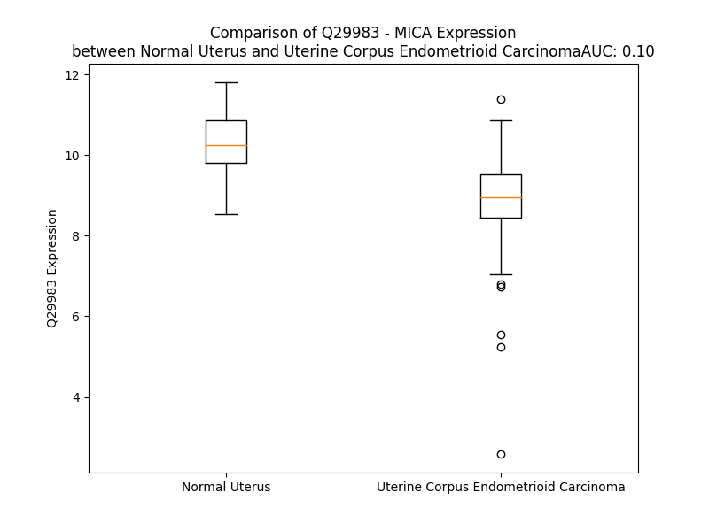

# Detailed Data for Q29983

## Introduction to the Detailed Summary

### How to Interpret the Results

- **Summary & Metrics**: This section provides a quick reference to essential protein attributes, including expression changes, family classification, and biomarker applications. Regulation status (upregulated/downregulated) indicates the protein's behavior in a disease context. Some information comes from the original excel file with the proteins selected from literature, while others are derived from the analyses.
- **Expression Comparison**: A visual representation comparing protein expression between normal and disease states. It highlights significant changes in expression levels that might indicate diagnostic or therapeutic relevance. This is data coming from transcriptomics experiments and could not translate similarly to protein levels.
- **Isoform Alignment**: An interactive view of isoform alignments, revealing structural and functional differences between variants of the protein.
- **Interactors & Homologs**: Tables listing known interaction partners and homologous proteins, the more interactors and homologs, the more complex the protein is to design an antibody for.
- **Biological Assemblies**: Information about the structural arrangement of the protein in different assemblies, providing insights into its functional state but also the complexity of the protein to develop antibodies.
- **Combined Per-Residue Information**: A detailed table summarizing residue-level data. This includes predictions for epitope regions, aggregation tendencies, and modifications that might impact the protein's function. Each row corresponds to a residue in the protein, providing insights into specific sites that may be important for research or drug development.
## Summary & Metrics

- **UniProt Accession**: Q29983
- **Gene Name**: MICA
- **Protein Name**: MHC class I polypeptide-related sequence A
- **Swiss Prot**: MICA_HUMAN
- **Family**: other
- **Biomarker Application**: safety
- **Number of Isoforms**: 2
- **Regulation**: 1
- **(transcriptomics) AUC**: 0.08
- **(transcriptomics) Fold Change**: 1.15
- **(transcriptomics) Regulation**: Downregulated
- **Discotope Epitope Count**: 85
- **Max n_uniprots (Homo)**: 1
- **Max n_uniprots (Hetero)**: 3

## Expression Comparison

## Isoform Alignment

<pre style='font-size:14px; font-family:monospace;'>Q29983-1 MGLGPVFLLLAGIFPFAPPGAAAEPHSLRYNLTVLSWDGSVQSGFLTEVHLDGQPFLRCDRQKCRAKPQGQWAEDVLGNKTWDRETRDLTGNGKDLRMTLAHIKDQKEGLHSLQEIRVCEIHEDNSTRSSQHFYYDGELFLSQNLETKEWTMPQSSRAQTLAMNVRNFLKEDAMKTKTHYHAMHADCLQELRRYLKSGVVLRRTVPPMVNVTRSEASEGNITVTCRASGFYPWNITLSWRQDGVSLSHDTQQWGDVLPDGNGTYQTWVATRICQGEEQRFTCYMEHSGNHSTHPVPSGKVLVLQSHWQTFHVSAVAAAAIFVIIIFYVRCCKKKTSAAEGPELVSLQVLDQHPVGTSDHRDATQLGFQPLMSDLGSTGSTEGA
Q29983-2 MGLGPVFLLLAGIFPFAPPGAAAEPHSLRYNLTVLSWDGSVQSGFLTEVHLDGQPFLRCDRQKCRAKPQGQWAEDVLGNKTWDRETRDLTGNGKDLRMTLAHIKDQK------------------------------------------------------------------------------------------------EVPPMVNVTRSEASEGNITVTCRASGFYPWNITLSWRQDGVSLSHDTQQWGDVLPDGNGTYQTWVATRICQGEEQRFTCYMEHSGNHSTHPVPSGKVLVLQSHWQTFHVSAVAAAAIFVIIIFYVRCCKKKTSAAEGPELVSLQVLDQHPVGTSDHRDATQLGFQPLMSDLGSTGSTEGA
</pre>

## Interactors

| preferredName_A   | preferredName_B   |   score |
|:------------------|:------------------|--------:|
| MICA              | KLRK1             |   0.999 |
| MICA              | MICB              |   0.918 |
| MICA              | IGHV3-43D         |   0.909 |

## Homologs

| uniprot_id   | gene_id   |
|:-------------|:----------|
| A0A140T9M1   | MICA      |
| A0A140T9M1   | MICA      |
| A0A140T9M1   | MICA      |
| A0A140T9M1   | MICA      |
| Q29980       | MICB      |
| Q9BZM4       | ULBP3     |
| Q9BZM5       | ULBP2     |
| Q9BZM6       | ULBP1     |
| Q6H3X3       | RAET1G    |
| Q3T1D4       | RAET1E    |
| Q5VY80       | RAET1L    |
| P25311       | AZGP1     |
| Q6B0J5       | HFE       |
| M0QYN1       | FCGRT     |
| P29016       | CD1B      |
| P29017       | CD1C      |
| P06126       | CD1A      |
| P15813       | CD1D      |
| P15812       | CD1E      |
| A0A140T8X0   | HLA-F     |
| A0A140T9W2   | HLA-C     |
| Q5SS57       | HLA-B     |
| Q95460       | MR1       |
| Q6DU50       | HLA-E     |
| Q6DU14       | HLA-G     |
| Q9GJ45       | HLA-A     |

## Biological Assemblies

|   Unnamed: 0 |   assembly |   n_uniprots | composition   | crystal_id   |
|-------------:|-----------:|-------------:|:--------------|:-------------|
|            0 |          1 |            3 | Hetero        | 7fi8         |
|            0 |          1 |            0 | Hetero        | 1b3j         |
|            0 |          1 |            3 | Hetero        | 7fi5         |
|            0 |          1 |            3 | Hetero        | 7fi7         |
|            0 |          1 |            1 | Homo          | 8tlz         |
|            1 |          2 |            1 | Homo          | 8tlz         |
|            0 |          1 |            2 | Hetero        | 8tm0         |
|            0 |          1 |            3 | Hetero        | 7fi6         |
|            0 |          1 |            3 | Hetero        | 1hyr         |
|            0 |          1 |            2 | Hetero        | 8tm2         |
|            0 |          1 |            3 | Hetero        | 7fi9         |

## Combined Per-Residue Information

|   res | aa   |   epitope_score | epitope   |   relative_surface_accessibility |   modeling_confidence |   Aggregation | modification   | glycosylation                   |
|------:|:-----|----------------:|:----------|---------------------------------:|----------------------:|--------------:|:---------------|:--------------------------------|
|     1 | M    |         0.17923 | False     |                          1.33253 |                 43.37 |         0     | N/A            | N/A                             |
|     2 | G    |         0.20714 | True      |                          0.99484 |                 42.91 |         0     | N/A            | N/A                             |
|     3 | L    |         0.17544 | False     |                          1.15903 |                 44.52 |         0     | N/A            | N/A                             |
|     4 | G    |         0.16898 | False     |                          0.76186 |                 51.26 |         0     | N/A            | N/A                             |
|     5 | P    |         0.13141 | False     |                          0.84855 |                 50.63 |         1.192 | N/A            | N/A                             |
|     6 | V    |         0.13666 | False     |                          0.93288 |                 48.9  |        92.503 | N/A            | N/A                             |
|     7 | F    |         0.12017 | False     |                          0.93255 |                 50.24 |        97.563 | N/A            | N/A                             |
|     8 | L    |         0.13459 | False     |                          0.98059 |                 45.22 |        97.79  | N/A            | N/A                             |
|     9 | L    |         0.14379 | False     |                          1.05464 |                 44.93 |        97.826 | N/A            | N/A                             |
|    10 | L    |         0.15631 | False     |                          1.07184 |                 45.47 |        97.755 | N/A            | N/A                             |
|    11 | A    |         0.14609 | False     |                          0.92337 |                 44.27 |        65.616 | N/A            | N/A                             |
|    12 | G    |         0.14993 | False     |                          0.73132 |                 43.94 |        36.159 | N/A            | N/A                             |
|    13 | I    |         0.1704  | False     |                          0.99925 |                 45.75 |        33.491 | N/A            | N/A                             |
|    14 | F    |         0.15685 | False     |                          0.84074 |                 43.47 |         4.3   | N/A            | N/A                             |
|    15 | P    |         0.14376 | False     |                          0.8881  |                 41.4  |         1.839 | N/A            | N/A                             |
|    16 | F    |         0.16499 | False     |                          0.97144 |                 39.22 |         0     | N/A            | N/A                             |
|    17 | A    |         0.14637 | False     |                          0.78965 |                 36.34 |         0     | N/A            | N/A                             |
|    18 | P    |         0.1424  | False     |                          0.86164 |                 40.94 |         0     | N/A            | N/A                             |
|    19 | P    |         0.15407 | False     |                          0.71231 |                 37.15 |         0     | N/A            | N/A                             |
|    20 | G    |         0.23838 | True      |                          0.66683 |                 42.85 |         0     | N/A            | N/A                             |
|    21 | A    |         0.19545 | True      |                          0.71069 |                 52.64 |         0     | N/A            | N/A                             |
|    22 | A    |         0.19885 | True      |                          0.85662 |                 60.65 |         0     | N/A            | N/A                             |
|    23 | A    |         0.1235  | False     |                          0.33073 |                 77.26 |         0     | N/A            | N/A                             |
|    24 | E    |         0.14159 | False     |                          0.45889 |                 85.76 |         0     | N/A            | N/A                             |
|    25 | P    |         0.0661  | False     |                          0.25404 |                 92.61 |         0     | N/A            | N/A                             |
|    26 | H    |         0.05253 | False     |                          0.41108 |                 94.3  |         0     | N/A            | N/A                             |
|    27 | S    |         0.03334 | False     |                          0.17105 |                 96.07 |         0     | N/A            | N/A                             |
|    28 | L    |         0.00315 | False     |                          0       |                 97.21 |         0     | N/A            | N/A                             |
|    29 | R    |         0.06421 | False     |                          0.38552 |                 97.72 |         0     | N/A            | N/A                             |
|    30 | Y    |         0.02585 | False     |                          0.05055 |                 97.08 |         5.745 | N/A            | N/A                             |
|    31 | N    |         0.02917 | False     |                          0.24007 |                 97.11 |         6.696 | N/A            | N-linked (GlcNAc...) asparagine |
|    32 | L    |         0.0217  | False     |                          0.01566 |                 96.38 |         9.39  | N/A            | N/A                             |
|    33 | T    |         0.03899 | False     |                          0.14122 |                 97.05 |         9.791 | N/A            | N/A                             |
|    34 | V    |         0.00478 | False     |                          0.0019  |                 96.21 |         9.791 | N/A            | N/A                             |
|    35 | L    |         0.05418 | False     |                          0.35671 |                 95.29 |         9.791 | N/A            | N/A                             |
|    36 | S    |         0.04304 | False     |                          0.03995 |                 94.91 |         9.055 | N/A            | N/A                             |
|    37 | W    |         0.18285 | False     |                          0.61753 |                 93.84 |         7.853 | N/A            | N/A                             |
|    38 | D    |         0.31011 | True      |                          0.51949 |                 91.78 |         0     | N/A            | N/A                             |
|    39 | G    |         0.18763 | False     |                          0.71046 |                 87.09 |         0     | N/A            | N/A                             |
|    40 | S    |         0.15345 | False     |                          0.58563 |                 93.1  |         0     | N/A            | N/A                             |
|    41 | V    |         0.09489 | False     |                          0.28803 |                 94.3  |         0     | N/A            | N/A                             |
|    42 | Q    |         0.15439 | False     |                          0.39145 |                 93.35 |         0     | N/A            | N/A                             |
|    43 | S    |         0.0872  | False     |                          0.46398 |                 91.11 |         0     | N/A            | N/A                             |
|    44 | G    |         0.07658 | False     |                          0.19599 |                 89.86 |         0     | N/A            | N/A                             |
|    45 | F    |         0.03065 | False     |                          0.07306 |                 93.31 |         0     | N/A            | N/A                             |
|    46 | L    |         0.08121 | False     |                          0.35189 |                 93.88 |         0     | N/A            | N/A                             |
|    47 | T    |         0.00391 | False     |                          0.00095 |                 95.08 |         0     | N/A            | N/A                             |
|    48 | E    |         0.05336 | False     |                          0.30441 |                 94.58 |         0     | N/A            | N/A                             |
|    49 | V    |         0.00942 | False     |                          0.00662 |                 95.27 |         0     | N/A            | N/A                             |
|    50 | H    |         0.05851 | False     |                          0.22286 |                 94.1  |         0     | N/A            | N/A                             |
|    51 | L    |         0.01003 | False     |                          0.00756 |                 93.73 |         0     | N/A            | N/A                             |
|    52 | D    |         0.04817 | False     |                          0.12283 |                 91.45 |         0     | N/A            | N/A                             |
|    53 | G    |         0.14577 | False     |                          0.62839 |                 87.33 |         0     | N/A            | N/A                             |
|    54 | Q    |         0.07859 | False     |                          0.10298 |                 87.4  |         0     | N/A            | N/A                             |
|    55 | P    |         0.0972  | False     |                          0.53628 |                 89.82 |         0     | N/A            | N/A                             |
|    56 | F    |         0.00625 | False     |                          0.00191 |                 90.76 |         0     | N/A            | N/A                             |
|    57 | L    |         0.02183 | False     |                          0.01118 |                 90.52 |         0     | N/A            | N/A                             |
|    58 | R    |         0.0861  | False     |                          0.42608 |                 91.36 |         0     | N/A            | N/A                             |
|    59 | C    |         0.0128  | False     |                          0.00701 |                 87.47 |         0     | N/A            | N/A                             |
|    60 | D    |         0.07944 | False     |                          0.43114 |                 80.29 |         0     | N/A            | N/A                             |
|    61 | R    |         0.12589 | False     |                          0.73645 |                 72.84 |         0     | N/A            | N/A                             |
|    62 | Q    |         0.15824 | False     |                          0.67746 |                 68.56 |         0     | N/A            | N/A                             |
|    63 | K    |         0.15905 | False     |                          0.92527 |                 70.63 |         0     | N/A            | N/A                             |
|    64 | C    |         0.02558 | False     |                          0.07025 |                 74.61 |         0     | N/A            | N/A                             |
|    65 | R    |         0.17181 | False     |                          0.68915 |                 85.62 |         0     | N/A            | N/A                             |
|    66 | A    |         0.03322 | False     |                          0.03582 |                 87.29 |         0     | N/A            | N/A                             |
|    67 | K    |         0.13516 | False     |                          0.61656 |                 86.77 |         0     | N/A            | N/A                             |
|    68 | P    |         0.10335 | False     |                          0.23029 |                 88.63 |         0     | N/A            | N/A                             |
|    69 | Q    |         0.16564 | False     |                          0.33635 |                 85.92 |         0     | N/A            | N/A                             |
|    70 | G    |         0.1795  | False     |                          0.47945 |                 82.92 |         0     | N/A            | N/A                             |
|    71 | Q    |         0.26405 | True      |                          0.71406 |                 84.34 |         0     | N/A            | N/A                             |
|    72 | W    |         0.10405 | False     |                          0.12012 |                 83.29 |         0     | N/A            | N/A                             |
|    73 | A    |         0.00935 | False     |                          0       |                 86.33 |         0     | N/A            | N/A                             |
|    74 | E    |         0.35144 | True      |                          0.54614 |                 84.36 |         0     | N/A            | N/A                             |
|    75 | D    |         0.2452  | True      |                          0.514   |                 82.09 |         0     | N/A            | N/A                             |
|    76 | V    |         0.14296 | False     |                          0.32033 |                 86.73 |         0     | N/A            | N/A                             |
|    77 | L    |         0.09568 | False     |                          0.05568 |                 88.59 |         0     | N/A            | N/A                             |
|    78 | G    |         0.16009 | False     |                          0.60716 |                 85.2  |         0     | N/A            | N/A                             |
|    79 | N    |         0.18601 | False     |                          0.74592 |                 87.34 |         0     | N/A            | N-linked (GlcNAc...) asparagine |
|    80 | K    |         0.30926 | True      |                          0.89257 |                 90.22 |         0     | N/A            | N/A                             |
|    81 | T    |         0.09907 | False     |                          0.08425 |                 89.74 |         0     | N/A            | N/A                             |
|    82 | W    |         0.07194 | False     |                          0.09105 |                 89.44 |         0     | N/A            | N/A                             |
|    83 | D    |         0.24111 | True      |                          0.471   |                 91.08 |         0     | N/A            | N/A                             |
|    84 | R    |         0.27805 | True      |                          0.35375 |                 91.62 |         0     | N/A            | N/A                             |
|    85 | E    |         0.03222 | False     |                          0.01803 |                 91.95 |         0     | N/A            | N/A                             |
|    86 | T    |         0.13754 | False     |                          0.24114 |                 92.26 |         0     | N/A            | N/A                             |
|    87 | R    |         0.43446 | True      |                          0.70432 |                 92.54 |         0     | N/A            | N/A                             |
|    88 | D    |         0.22217 | True      |                          0.41809 |                 92.56 |         0     | N/A            | N/A                             |
|    89 | L    |         0.00763 | False     |                          0.00989 |                 93.44 |         0     | N/A            | N/A                             |
|    90 | T    |         0.14058 | False     |                          0.44489 |                 92.69 |         0     | N/A            | N/A                             |
|    91 | G    |         0.29004 | True      |                          0.44917 |                 92.43 |         0     | N/A            | N/A                             |
|    92 | N    |         0.10289 | False     |                          0.2657  |                 93.08 |         0     | N/A            | N/A                             |
|    93 | G    |         0.00264 | False     |                          0       |                 93.83 |         0     | N/A            | N/A                             |
|    94 | K    |         0.14924 | False     |                          0.57521 |                 93.27 |         0     | N/A            | N/A                             |
|    95 | D    |         0.12605 | False     |                          0.30667 |                 93.5  |         0     | N/A            | N/A                             |
|    96 | L    |         0.01514 | False     |                          0.02591 |                 95.47 |         0     | N/A            | N/A                             |
|    97 | R    |         0.08571 | False     |                          0.26809 |                 94.61 |         0     | N/A            | N/A                             |
|    98 | M    |         0.20487 | True      |                          0.46598 |                 94.68 |         0     | N/A            | N/A                             |
|    99 | T    |         0.02832 | False     |                          0.02794 |                 95.88 |         0     | N/A            | N/A                             |
|   100 | L    |         0.02181 | False     |                          0.04749 |                 95.62 |         0     | N/A            | N/A                             |
|   101 | A    |         0.13757 | False     |                          0.56367 |                 93.77 |         0     | N/A            | N/A                             |
|   102 | H    |         0.14484 | False     |                          0.30848 |                 92.56 |         0     | N/A            | N/A                             |
|   103 | I    |         0.1187  | False     |                          0.09124 |                 92.08 |         0     | N/A            | N/A                             |
|   104 | K    |         0.29248 | True      |                          0.81858 |                 78.4  |         0     | N/A            | N/A                             |
|   105 | D    |         0.21119 | True      |                          0.24936 |                 77.47 |         0     | N/A            | N/A                             |
|   106 | Q    |         0.36706 | True      |                          0.9107  |                 67.88 |         0     | N/A            | N/A                             |
|   107 | K    |         0.41901 | True      |                          0.6317  |                 83.99 |         0     | N/A            | N/A                             |
|   108 | E    |         0.34478 | True      |                          0.83453 |                 88.24 |         0     | N/A            | N/A                             |
|   109 | G    |         0.18275 | False     |                          0.21614 |                 91.67 |         0     | N/A            | N/A                             |
|   110 | L    |         0.27394 | True      |                          0.60199 |                 94.24 |         0     | N/A            | N/A                             |
|   111 | H    |         0.11677 | False     |                          0.06988 |                 95.75 |         0     | N/A            | N/A                             |
|   112 | S    |         0.06407 | False     |                          0.1446  |                 96.5  |         0     | N/A            | N/A                             |
|   113 | L    |         0.00623 | False     |                          0       |                 97.65 |         0     | N/A            | N/A                             |
|   114 | Q    |         0.06313 | False     |                          0.2223  |                 98.17 |         0     | N/A            | N/A                             |
|   115 | E    |         0.03943 | False     |                          0.08773 |                 98.1  |         0     | N/A            | N/A                             |
|   116 | I    |         0.02482 | False     |                          0.072   |                 98.3  |         0     | N/A            | N/A                             |
|   117 | R    |         0.06613 | False     |                          0.07838 |                 97.6  |         0     | N/A            | N/A                             |
|   118 | V    |         0.03496 | False     |                          0.13273 |                 98.11 |         0     | N/A            | N/A                             |
|   119 | C    |         0.00387 | False     |                          0       |                 97.85 |         0     | N/A            | N/A                             |
|   120 | E    |         0.084   | False     |                          0.21998 |                 97.34 |         0     | N/A            | N/A                             |
|   121 | I    |         0.1042  | False     |                          0.11746 |                 95.89 |         0     | N/A            | N/A                             |
|   122 | H    |         0.06603 | False     |                          0.19033 |                 93.52 |         0     | N/A            | N/A                             |
|   123 | E    |         0.12747 | False     |                          0.72276 |                 88.18 |         0     | N/A            | N/A                             |
|   124 | D    |         0.3403  | True      |                          0.67926 |                 92.6  |         0     | N/A            | N/A                             |
|   125 | N    |         0.12291 | False     |                          0.74527 |                 92.09 |         0     | N/A            | N/A                             |
|   126 | S    |         0.20293 | True      |                          0.38349 |                 95.06 |         0     | N/A            | N/A                             |
|   127 | T    |         0.12136 | False     |                          0.22671 |                 96.24 |         0     | N/A            | N/A                             |
|   128 | R    |         0.19117 | False     |                          0.57957 |                 95.61 |         0     | N/A            | N/A                             |
|   129 | S    |         0.03915 | False     |                          0.04326 |                 97.02 |         0     | N/A            | N/A                             |
|   130 | S    |         0.05515 | False     |                          0.18942 |                 97.52 |         0     | N/A            | N/A                             |
|   131 | Q    |         0.03163 | False     |                          0.01903 |                 97.67 |         0     | N/A            | N/A                             |
|   132 | H    |         0.11347 | False     |                          0.24306 |                 98.38 |         0     | N/A            | N/A                             |
|   133 | F    |         0.02438 | False     |                          0.02102 |                 98.36 |         0     | N/A            | N/A                             |
|   134 | Y    |         0.0963  | False     |                          0.26327 |                 98.41 |         0     | N/A            | N/A                             |
|   135 | Y    |         0.04608 | False     |                          0.02632 |                 97.28 |         0     | N/A            | N/A                             |
|   136 | D    |         0.13654 | False     |                          0.33731 |                 96.19 |         0     | N/A            | N/A                             |
|   137 | G    |         0.17583 | False     |                          0.62436 |                 95.9  |         0     | N/A            | N/A                             |
|   138 | E    |         0.20314 | True      |                          0.61507 |                 97.46 |         0     | N/A            | N/A                             |
|   139 | L    |         0.12155 | False     |                          0.38474 |                 98.28 |         0     | N/A            | N/A                             |
|   140 | F    |         0.02332 | False     |                          0.01098 |                 97.8  |         0     | N/A            | N/A                             |
|   141 | L    |         0.02215 | False     |                          0.01237 |                 98    |         0     | N/A            | N/A                             |
|   142 | S    |         0.12155 | False     |                          0.13943 |                 97.98 |         0     | N/A            | N/A                             |
|   143 | Q    |         0.04206 | False     |                          0.01494 |                 97.18 |         0     | N/A            | N/A                             |
|   144 | N    |         0.10329 | False     |                          0.39886 |                 96.51 |         0     | N/A            | N/A                             |
|   145 | L    |         0.01199 | False     |                          0.00907 |                 95.39 |         0     | N/A            | N/A                             |
|   146 | E    |         0.11297 | False     |                          0.31695 |                 89.09 |         0     | N/A            | N/A                             |
|   147 | T    |         0.13935 | False     |                          0.56086 |                 92.33 |         0     | N/A            | N/A                             |
|   148 | K    |         0.08138 | False     |                          0.18772 |                 91.83 |         0     | N/A            | N/A                             |
|   149 | E    |         0.12874 | False     |                          0.57478 |                 94.66 |         0     | N/A            | N/A                             |
|   150 | W    |         0.1431  | False     |                          0.23826 |                 96.34 |         0     | N/A            | N/A                             |
|   151 | T    |         0.19268 | False     |                          0.62627 |                 97.46 |         0     | N/A            | N/A                             |
|   152 | M    |         0.19896 | True      |                          0.38875 |                 96.66 |         0     | N/A            | N/A                             |
|   153 | P    |         0.18351 | False     |                          0.32862 |                 97.37 |         0     | N/A            | N/A                             |
|   154 | Q    |         0.36904 | True      |                          0.80582 |                 95.44 |         0     | N/A            | N/A                             |
|   155 | S    |         0.22359 | True      |                          0.45981 |                 96.26 |         0     | N/A            | N/A                             |
|   156 | S    |         0.25404 | True      |                          0.6962  |                 94.82 |         0     | N/A            | N/A                             |
|   157 | R    |         0.34375 | True      |                          0.47647 |                 93.5  |         0     | N/A            | N/A                             |
|   158 | A    |         0.05476 | False     |                          0.06815 |                 95.77 |         0     | N/A            | N/A                             |
|   159 | Q    |         0.17621 | False     |                          0.30911 |                 96.24 |         0     | N/A            | N/A                             |
|   160 | T    |         0.16574 | False     |                          0.68213 |                 94.83 |         0     | N/A            | N/A                             |
|   161 | L    |         0.14445 | False     |                          0.14673 |                 95.92 |         0     | N/A            | N/A                             |
|   162 | A    |         0.02094 | False     |                          0.01108 |                 96.35 |         0     | N/A            | N/A                             |
|   163 | M    |         0.35284 | True      |                          0.49475 |                 94.57 |         0     | N/A            | N/A                             |
|   164 | N    |         0.17506 | False     |                          0.26601 |                 93.88 |         0     | N/A            | N/A                             |
|   165 | V    |         0.0081  | False     |                          0.01047 |                 95.38 |         0     | N/A            | N/A                             |
|   166 | R    |         0.23    | True      |                          0.40475 |                 94.41 |         0     | N/A            | N/A                             |
|   167 | N    |         0.21004 | True      |                          0.43251 |                 93.55 |         0     | N/A            | N/A                             |
|   168 | F    |         0.10942 | False     |                          0.09487 |                 94.38 |         0     | N/A            | N/A                             |
|   169 | L    |         0.04498 | False     |                          0.04452 |                 93.66 |         0     | N/A            | N/A                             |
|   170 | K    |         0.28545 | True      |                          0.70138 |                 91.91 |         0     | N/A            | N/A                             |
|   171 | E    |         0.35115 | True      |                          0.59439 |                 91.74 |         0     | N/A            | N/A                             |
|   172 | D    |         0.25143 | True      |                          0.54517 |                 90.43 |         0     | N/A            | N/A                             |
|   173 | A    |         0.16322 | False     |                          0.34915 |                 88.45 |         0     | N/A            | N/A                             |
|   174 | M    |         0.35774 | True      |                          0.72402 |                 89.74 |         0     | N/A            | N/A                             |
|   175 | K    |         0.24774 | True      |                          0.17122 |                 88.17 |         0     | N/A            | N/A                             |
|   176 | T    |         0.14056 | False     |                          0.54501 |                 89.39 |         0     | N/A            | N/A                             |
|   177 | K    |         0.13294 | False     |                          0.80062 |                 88.24 |         0     | N/A            | N/A                             |
|   178 | T    |         0.16422 | False     |                          0.70961 |                 90.81 |         0     | N/A            | N/A                             |
|   179 | H    |         0.2293  | True      |                          0.34807 |                 91.9  |         0     | N/A            | N/A                             |
|   180 | Y    |         0.04917 | False     |                          0.07252 |                 92.88 |         0     | N/A            | N/A                             |
|   181 | H    |         0.23143 | True      |                          0.52084 |                 91.61 |         0     | N/A            | N/A                             |
|   182 | A    |         0.23707 | True      |                          0.43858 |                 93.64 |         0     | N/A            | N/A                             |
|   183 | M    |         0.04035 | False     |                          0.11046 |                 94.29 |         0     | N/A            | N/A                             |
|   184 | H    |         0.07661 | False     |                          0.17619 |                 94.31 |         0     | N/A            | N/A                             |
|   185 | A    |         0.22182 | True      |                          0.51338 |                 95.29 |         0     | N/A            | N/A                             |
|   186 | D    |         0.28592 | True      |                          0.49137 |                 95.05 |         0     | N/A            | N/A                             |
|   187 | C    |         0.02097 | False     |                          0.03502 |                 95.99 |         0     | N/A            | N/A                             |
|   188 | L    |         0.08231 | False     |                          0.06348 |                 96.78 |         0     | N/A            | N/A                             |
|   189 | Q    |         0.26556 | True      |                          0.58355 |                 96.1  |         0     | N/A            | N/A                             |
|   190 | E    |         0.06543 | False     |                          0.11498 |                 94.83 |         0     | N/A            | N/A                             |
|   191 | L    |         0.00395 | False     |                          0       |                 96.06 |         0     | N/A            | N/A                             |
|   192 | R    |         0.21726 | True      |                          0.53438 |                 95.62 |         0     | N/A            | N/A                             |
|   193 | R    |         0.20407 | True      |                          0.23134 |                 94.2  |         0     | N/A            | N/A                             |
|   194 | Y    |         0.00255 | False     |                          0       |                 93.21 |         0     | N/A            | N/A                             |
|   195 | L    |         0.05001 | False     |                          0.2699  |                 91.96 |         0     | N/A            | N/A                             |
|   196 | K    |         0.2597  | True      |                          0.92565 |                 92.7  |         0     | N/A            | N/A                             |
|   197 | S    |         0.27115 | True      |                          0.33429 |                 91.19 |         0     | N/A            | N/A                             |
|   198 | G    |         0.11986 | False     |                          0.22022 |                 84.86 |         0     | N/A            | N/A                             |
|   199 | V    |         0.01461 | False     |                          0       |                 86.9  |         0     | N/A            | N/A                             |
|   200 | V    |         0.05625 | False     |                          0.09806 |                 81.86 |         0     | N/A            | N/A                             |
|   201 | L    |         0.25197 | True      |                          0.81943 |                 80.03 |         0     | N/A            | N/A                             |
|   202 | R    |         0.27187 | True      |                          0.50661 |                 81.33 |         0     | N/A            | N/A                             |
|   203 | R    |         0.21676 | True      |                          0.28183 |                 84.35 |         0     | N/A            | N/A                             |
|   204 | T    |         0.11365 | False     |                          0.27247 |                 88.4  |         0     | N/A            | N/A                             |
|   205 | V    |         0.21162 | True      |                          0.36464 |                 92.54 |         0     | N/A            | N/A                             |
|   206 | P    |         0.15252 | False     |                          0.66551 |                 94.87 |         0     | N/A            | N/A                             |
|   207 | P    |         0.09234 | False     |                          0.18573 |                 96.66 |         0     | N/A            | N/A                             |
|   208 | M    |         0.14525 | False     |                          0.71292 |                 96.87 |         0     | N/A            | N/A                             |
|   209 | V    |         0.07751 | False     |                          0.2941  |                 97.37 |         0     | N/A            | N/A                             |
|   210 | N    |         0.11215 | False     |                          0.5614  |                 97.23 |         0     | N/A            | N-linked (GlcNAc...) asparagine |
|   211 | V    |         0.0564  | False     |                          0.1151  |                 97.66 |         0     | N/A            | N/A                             |
|   212 | T    |         0.11124 | False     |                          0.46937 |                 96.15 |         0     | N/A            | N/A                             |
|   213 | R    |         0.21311 | True      |                          0.37357 |                 93.53 |         0     | N/A            | N/A                             |
|   214 | S    |         0.11892 | False     |                          0.38945 |                 92.79 |         0     | N/A            | N/A                             |
|   215 | E    |         0.26125 | True      |                          0.83406 |                 89.46 |         0     | N/A            | N/A                             |
|   216 | A    |         0.25773 | True      |                          0.50278 |                 87.9  |         0     | N/A            | N/A                             |
|   217 | S    |         0.1299  | False     |                          0.589   |                 88.35 |         0     | N/A            | N/A                             |
|   218 | E    |         0.28481 | True      |                          0.89784 |                 90.86 |         0     | N/A            | N/A                             |
|   219 | G    |         0.12426 | False     |                          0.50967 |                 89.48 |         0     | N/A            | N/A                             |
|   220 | N    |         0.14606 | False     |                          0.42014 |                 93.38 |         0.278 | N/A            | N-linked (GlcNAc...) asparagine |
|   221 | I    |         0.02154 | False     |                          0.02429 |                 94.89 |         0.479 | N/A            | N/A                             |
|   222 | T    |         0.0612  | False     |                          0.25955 |                 96.02 |         0.479 | N/A            | N/A                             |
|   223 | V    |         0.00505 | False     |                          0       |                 97.02 |         0.479 | N/A            | N/A                             |
|   224 | T    |         0.02998 | False     |                          0.22463 |                 97.71 |         0.479 | N/A            | N/A                             |
|   225 | C    |         0.00118 | False     |                          0       |                 97.98 |         0.201 | N/A            | N/A                             |
|   226 | R    |         0.15948 | False     |                          0.38578 |                 97.86 |         0     | N/A            | N/A                             |
|   227 | A    |         0.00544 | False     |                          0       |                 97.75 |         0     | N/A            | N/A                             |
|   228 | S    |         0.1155  | False     |                          0.21876 |                 97    |         0     | N/A            | N/A                             |
|   229 | G    |         0.07369 | False     |                          0.14851 |                 95.26 |         0     | N/A            | N/A                             |
|   230 | F    |         0.00584 | False     |                          0       |                 94.68 |         0     | N/A            | N/A                             |
|   231 | Y    |         0.04302 | False     |                          0.02534 |                 91.66 |         0     | N/A            | N/A                             |
|   232 | P    |         0.1368  | False     |                          0.22864 |                 90.38 |         0     | N/A            | N/A                             |
|   233 | W    |         0.15466 | False     |                          0.20262 |                 91.02 |         0.355 | N/A            | N/A                             |
|   234 | N    |         0.08341 | False     |                          0.31228 |                 91.89 |         0.355 | N/A            | N/A                             |
|   235 | I    |         0.12572 | False     |                          0.19071 |                 94.32 |         0.764 | N/A            | N/A                             |
|   236 | T    |         0.11645 | False     |                          0.48977 |                 94.89 |         0.764 | N/A            | N/A                             |
|   237 | L    |         0.04392 | False     |                          0.02218 |                 96.17 |         0.764 | N/A            | N/A                             |
|   238 | S    |         0.03925 | False     |                          0.10783 |                 96.9  |         0.41  | N/A            | N/A                             |
|   239 | W    |         0.01177 | False     |                          0       |                 97.96 |         0.41  | N/A            | N/A                             |
|   240 | R    |         0.15778 | False     |                          0.25811 |                 97.71 |         0     | N/A            | N/A                             |
|   241 | Q    |         0.12554 | False     |                          0.30968 |                 97.07 |         0     | N/A            | N/A                             |
|   242 | D    |         0.28004 | True      |                          0.54632 |                 95.61 |         0     | N/A            | N/A                             |
|   243 | G    |         0.16858 | False     |                          0.59438 |                 93.71 |         0     | N/A            | N/A                             |
|   244 | V    |         0.21777 | True      |                          0.7706  |                 96.57 |         0     | N/A            | N/A                             |
|   245 | S    |         0.17816 | False     |                          0.4493  |                 94.66 |         0     | N/A            | N/A                             |
|   246 | L    |         0.10154 | False     |                          0.2266  |                 95.05 |         0     | N/A            | N/A                             |
|   247 | S    |         0.23515 | True      |                          0.49757 |                 92.87 |         0     | N/A            | N/A                             |
|   248 | H    |         0.14492 | False     |                          0.44652 |                 89.07 |         0     | N/A            | N/A                             |
|   249 | D    |         0.29843 | True      |                          0.85113 |                 92.58 |         0     | N/A            | N/A                             |
|   250 | T    |         0.21874 | True      |                          0.55687 |                 93.14 |         0     | N/A            | N/A                             |
|   251 | Q    |         0.03241 | False     |                          0.06788 |                 96.02 |         0     | N/A            | N/A                             |
|   252 | Q    |         0.15551 | False     |                          0.46523 |                 96.04 |         0     | N/A            | N/A                             |
|   253 | W    |         0.18143 | False     |                          0.45736 |                 96.01 |         0     | N/A            | N/A                             |
|   254 | G    |         0.1685  | False     |                          0.16028 |                 94.66 |         0     | N/A            | N/A                             |
|   255 | D    |         0.28643 | True      |                          0.70038 |                 94.37 |         0     | N/A            | N/A                             |
|   256 | V    |         0.15973 | False     |                          0.25679 |                 93.85 |         0     | N/A            | N/A                             |
|   257 | L    |         0.29678 | True      |                          0.59518 |                 94.85 |         0     | N/A            | N/A                             |
|   258 | P    |         0.19065 | False     |                          0.72123 |                 93.24 |         0     | N/A            | N/A                             |
|   259 | D    |         0.24222 | True      |                          0.29751 |                 90.2  |         0     | N/A            | N/A                             |
|   260 | G    |         0.45623 | True      |                          0.91933 |                 84.34 |         0     | N/A            | N/A                             |
|   261 | N    |         0.27272 | True      |                          0.67014 |                 87.48 |         0     | N/A            | N-linked (GlcNAc...) asparagine |
|   262 | G    |         0.17789 | False     |                          0.32923 |                 84.15 |         0     | N/A            | N/A                             |
|   263 | T    |         0.0995  | False     |                          0.08151 |                 92.12 |         0.3   | N/A            | N/A                             |
|   264 | Y    |         0.05061 | False     |                          0.15938 |                 94.08 |         0.962 | N/A            | N/A                             |
|   265 | Q    |         0.19509 | True      |                          0.26472 |                 96.58 |         0.962 | N/A            | N/A                             |
|   266 | T    |         0.05762 | False     |                          0.06087 |                 97.71 |         1.3   | N/A            | N/A                             |
|   267 | W    |         0.14361 | False     |                          0.32899 |                 97.69 |         1.3   | N/A            | N/A                             |
|   268 | V    |         0.0029  | False     |                          0       |                 97.97 |         1.3   | N/A            | N/A                             |
|   269 | A    |         0.02589 | False     |                          0.02933 |                 97.72 |         0.494 | N/A            | N/A                             |
|   270 | T    |         0.02256 | False     |                          0.01855 |                 97.39 |         0.338 | N/A            | N/A                             |
|   271 | R    |         0.21886 | True      |                          0.71671 |                 96.02 |         0     | N/A            | N/A                             |
|   272 | I    |         0.05439 | False     |                          0.03736 |                 95.59 |         0     | N/A            | N/A                             |
|   273 | C    |         0.07541 | False     |                          0.48676 |                 94.45 |         0     | N/A            | N/A                             |
|   274 | Q    |         0.20976 | True      |                          0.52726 |                 91.85 |         0     | N/A            | N/A                             |
|   275 | G    |         0.12243 | False     |                          0.76296 |                 89.74 |         0     | N/A            | N/A                             |
|   276 | E    |         0.15938 | False     |                          0.2865  |                 92.81 |         0     | N/A            | N/A                             |
|   277 | E    |         0.10839 | False     |                          0.10269 |                 92.73 |         0     | N/A            | N/A                             |
|   278 | Q    |         0.16364 | False     |                          0.6688  |                 92.87 |         0     | N/A            | N/A                             |
|   279 | R    |         0.23098 | True      |                          0.40521 |                 95.46 |         0     | N/A            | N/A                             |
|   280 | F    |         0.03964 | False     |                          0.0582  |                 97.05 |         0.941 | N/A            | N/A                             |
|   281 | T    |         0.08085 | False     |                          0.22272 |                 97.7  |         0.941 | N/A            | N/A                             |
|   282 | C    |         0.00187 | False     |                          0       |                 97.93 |         0.941 | N/A            | N/A                             |
|   283 | Y    |         0.16644 | False     |                          0.13848 |                 97.6  |         0.941 | N/A            | N/A                             |
|   284 | M    |         0.01455 | False     |                          0.01252 |                 96.92 |         0.941 | N/A            | N/A                             |
|   285 | E    |         0.12061 | False     |                          0.32119 |                 95.81 |         0     | N/A            | N/A                             |
|   286 | H    |         0.05524 | False     |                          0.03867 |                 94.31 |         0     | N/A            | N/A                             |
|   287 | S    |         0.0473  | False     |                          0.4832  |                 89.46 |         0     | N/A            | N/A                             |
|   288 | G    |         0.16102 | False     |                          0.767   |                 87.78 |         0     | N/A            | N/A                             |
|   289 | N    |         0.1701  | False     |                          0.62572 |                 92.99 |         0     | N/A            | N/A                             |
|   290 | H    |         0.3799  | True      |                          0.59224 |                 96.02 |         0     | N/A            | N/A                             |
|   291 | S    |         0.16296 | False     |                          0.28827 |                 97.01 |         0     | N/A            | N/A                             |
|   292 | T    |         0.18938 | False     |                          0.56841 |                 97.34 |         0     | N/A            | N/A                             |
|   293 | H    |         0.13602 | False     |                          0.2314  |                 97.59 |         0     | N/A            | N/A                             |
|   294 | P    |         0.22696 | True      |                          0.66456 |                 96.81 |         0     | N/A            | N/A                             |
|   295 | V    |         0.01405 | False     |                          0.03001 |                 95.52 |         0     | N/A            | N/A                             |
|   296 | P    |         0.15805 | False     |                          0.45032 |                 90.2  |         0     | N/A            | N/A                             |
|   297 | S    |         0.26256 | True      |                          0.63201 |                 76.8  |         0     | N/A            | N/A                             |
|   298 | G    |         0.22137 | True      |                          0.19882 |                 65.82 |         0     | N/A            | N/A                             |
|   299 | K    |         0.25935 | True      |                          0.96967 |                 54.07 |         0     | N/A            | N/A                             |
|   300 | V    |         0.21388 | True      |                          0.83793 |                 42.88 |         3.582 | N/A            | N/A                             |
|   301 | L    |         0.22092 | True      |                          0.98169 |                 35.83 |         3.582 | N/A            | N/A                             |
|   302 | V    |         0.15382 | False     |                          0.72794 |                 42.48 |         3.582 | N/A            | N/A                             |
|   303 | L    |         0.2714  | True      |                          0.98222 |                 41.66 |         3.582 | N/A            | N/A                             |
|   304 | Q    |         0.24744 | True      |                          0.71429 |                 41.46 |         3.582 | N/A            | N/A                             |
|   305 | S    |         0.21516 | True      |                          0.34908 |                 46.47 |         0.053 | N/A            | N/A                             |
|   306 | H    |         0.23074 | True      |                          0.62102 |                 47.78 |         0     | N/A            | N/A                             |
|   307 | W    |         0.21254 | True      |                          0.80323 |                 50.31 |         0     | N/A            | N/A                             |
|   308 | Q    |         0.1555  | False     |                          0.66589 |                 54.58 |         0     | N/A            | N/A                             |
|   309 | T    |         0.09864 | False     |                          0.58144 |                 58.97 |         0.1   | N/A            | N/A                             |
|   310 | F    |         0.14612 | False     |                          0.58492 |                 67.25 |         0.793 | N/A            | N/A                             |
|   311 | H    |         0.11917 | False     |                          0.61272 |                 69.44 |         1.433 | N/A            | N/A                             |
|   312 | V    |         0.06925 | False     |                          0.76454 |                 75.79 |        31.093 | N/A            | N/A                             |
|   313 | S    |         0.06981 | False     |                          0.47146 |                 78.14 |        33.613 | N/A            | N/A                             |
|   314 | A    |         0.0474  | False     |                          0.56636 |                 83.49 |        56.312 | N/A            | N/A                             |
|   315 | V    |         0.07526 | False     |                          0.75135 |                 86.87 |        83.156 | N/A            | N/A                             |
|   316 | A    |         0.04185 | False     |                          0.44825 |                 88.73 |        85.437 | N/A            | N/A                             |
|   317 | A    |         0.05481 | False     |                          0.5611  |                 89.85 |        88.134 | N/A            | N/A                             |
|   318 | A    |         0.07611 | False     |                          0.52807 |                 91.58 |        91.323 | N/A            | N/A                             |
|   319 | A    |         0.06825 | False     |                          0.46837 |                 92.13 |        95.095 | N/A            | N/A                             |
|   320 | I    |         0.0488  | False     |                          0.59997 |                 93.09 |        99.556 | N/A            | N/A                             |
|   321 | F    |         0.08344 | False     |                          0.65988 |                 93.06 |        99.964 | N/A            | N/A                             |
|   322 | V    |         0.09105 | False     |                          0.64832 |                 92.15 |        99.997 | N/A            | N/A                             |
|   323 | I    |         0.07336 | False     |                          0.68693 |                 91.88 |        99.999 | N/A            | N/A                             |
|   324 | I    |         0.04798 | False     |                          0.55038 |                 91.04 |        99.996 | N/A            | N/A                             |
|   325 | I    |         0.079   | False     |                          0.36976 |                 90.41 |        99.956 | N/A            | N/A                             |
|   326 | F    |         0.10456 | False     |                          0.72052 |                 89.33 |        99.519 | N/A            | N/A                             |
|   327 | Y    |         0.08443 | False     |                          0.68443 |                 88.64 |        94.161 | N/A            | N/A                             |
|   328 | V    |         0.02957 | False     |                          0.51697 |                 86.67 |        87.245 | N/A            | N/A                             |
|   329 | R    |         0.10315 | False     |                          0.67071 |                 83.97 |         0     | N/A            | N/A                             |
|   330 | C    |         0.08839 | False     |                          0.45011 |                 80.17 |         0     | N/A            | N/A                             |
|   331 | C    |         0.03559 | False     |                          0.40465 |                 76.49 |         0     | N/A            | N/A                             |
|   332 | K    |         0.09002 | False     |                          0.73882 |                 68.29 |         0     | N/A            | N/A                             |
|   333 | K    |         0.15297 | False     |                          0.83621 |                 58.39 |         0     | N/A            | N/A                             |
|   334 | K    |         0.11573 | False     |                          0.83916 |                 55.52 |         0     | N/A            | N/A                             |
|   335 | T    |         0.14063 | False     |                          0.77415 |                 53.35 |         0     | N/A            | N/A                             |
|   336 | S    |         0.24954 | True      |                          0.76465 |                 52.22 |         0     | N/A            | N/A                             |
|   337 | A    |         0.16938 | False     |                          0.86033 |                 49.79 |         0     | N/A            | N/A                             |
|   338 | A    |         0.14161 | False     |                          0.71426 |                 46.55 |         0     | N/A            | N/A                             |
|   339 | E    |         0.11787 | False     |                          0.9524  |                 41.38 |         0     | N/A            | N/A                             |
|   340 | G    |         0.16839 | False     |                          0.85767 |                 39.87 |         0     | N/A            | N/A                             |
|   341 | P    |         0.09854 | False     |                          1.00705 |                 41.29 |         0     | N/A            | N/A                             |
|   342 | E    |         0.18021 | False     |                          0.90642 |                 43.22 |         0     | N/A            | N/A                             |
|   343 | L    |         0.24556 | True      |                          0.91803 |                 43.17 |         1.076 | N/A            | N/A                             |
|   344 | V    |         0.13335 | False     |                          0.91431 |                 45.77 |         1.243 | N/A            | N/A                             |
|   345 | S    |         0.18778 | False     |                          0.74238 |                 42.32 |         1.243 | N/A            | N/A                             |
|   346 | L    |         0.11802 | False     |                          0.9588  |                 42.24 |         1.243 | N/A            | N/A                             |
|   347 | Q    |         0.20551 | True      |                          0.77663 |                 42.57 |         1.243 | N/A            | N/A                             |
|   348 | V    |         0.19725 | True      |                          0.9369  |                 43.64 |         1.243 | N/A            | N/A                             |
|   349 | L    |         0.12694 | False     |                          0.96876 |                 38.91 |         1.076 | N/A            | N/A                             |
|   350 | D    |         0.1791  | False     |                          0.82758 |                 42.65 |         0     | N/A            | N/A                             |
|   351 | Q    |         0.11241 | False     |                          0.81203 |                 41.87 |         0     | N/A            | N/A                             |
|   352 | H    |         0.15403 | False     |                          0.92631 |                 46.26 |         0     | N/A            | N/A                             |
|   353 | P    |         0.13858 | False     |                          0.75613 |                 47    |         0     | N/A            | N/A                             |
|   354 | V    |         0.08391 | False     |                          1.048   |                 48.39 |         0     | N/A            | N/A                             |
|   355 | G    |         0.13451 | False     |                          0.82713 |                 39.63 |         0     | N/A            | N/A                             |
|   356 | T    |         0.10002 | False     |                          0.94714 |                 36.99 |         0     | N/A            | N/A                             |
|   357 | S    |         0.18125 | False     |                          0.72494 |                 37.63 |         0     | N/A            | N/A                             |
|   358 | D    |         0.14713 | False     |                          0.76161 |                 42.04 |         0     | N/A            | N/A                             |
|   359 | H    |         0.13402 | False     |                          0.73816 |                 44.41 |         0     | N/A            | N/A                             |
|   360 | R    |         0.17268 | False     |                          0.7589  |                 45.09 |         0     | N/A            | N/A                             |
|   361 | D    |         0.16813 | False     |                          0.79079 |                 45.6  |         0     | N/A            | N/A                             |
|   362 | A    |         0.1438  | False     |                          0.86462 |                 44.02 |         0     | N/A            | N/A                             |
|   363 | T    |         0.10501 | False     |                          0.89332 |                 44.06 |         0     | N/A            | N/A                             |
|   364 | Q    |         0.15151 | False     |                          0.71667 |                 47.11 |         0     | N/A            | N/A                             |
|   365 | L    |         0.1198  | False     |                          0.9901  |                 43.25 |         0     | N/A            | N/A                             |
|   366 | G    |         0.16744 | False     |                          0.74477 |                 40.83 |         0     | N/A            | N/A                             |
|   367 | F    |         0.15148 | False     |                          1.11811 |                 45.75 |         0     | N/A            | N/A                             |
|   368 | Q    |         0.09252 | False     |                          0.85848 |                 46.92 |         0     | N/A            | N/A                             |
|   369 | P    |         0.09225 | False     |                          0.75811 |                 46.46 |         0     | N/A            | N/A                             |
|   370 | L    |         0.08791 | False     |                          1.01066 |                 42.1  |         0     | N/A            | N/A                             |
|   371 | M    |         0.09552 | False     |                          0.92896 |                 45.73 |         0     | N/A            | N/A                             |
|   372 | S    |         0.09043 | False     |                          0.77537 |                 46.14 |         0     | N/A            | N/A                             |
|   373 | D    |         0.0768  | False     |                          0.90379 |                 38.68 |         0     | N/A            | N/A                             |
|   374 | L    |         0.08256 | False     |                          1.05206 |                 49.1  |         0     | N/A            | N/A                             |
|   375 | G    |         0.11761 | False     |                          0.76737 |                 40.85 |         0     | N/A            | N/A                             |
|   376 | S    |         0.13339 | False     |                          0.78436 |                 40.72 |         0     | N/A            | N/A                             |
|   377 | T    |         0.17797 | False     |                          0.99963 |                 42.26 |         0     | N/A            | N/A                             |
|   378 | G    |         0.1116  | False     |                          0.97237 |                 52.27 |         0     | N/A            | N/A                             |
|   379 | S    |         0.06789 | False     |                          0.83773 |                 43.17 |         0     | N/A            | N/A                             |
|   380 | T    |         0.08937 | False     |                          1.02772 |                 56.32 |         0     | N/A            | N/A                             |
|   381 | E    |         0.10312 | False     |                          0.93274 |                 49.95 |         0     | N/A            | N/A                             |
|   382 | G    |         0.13339 | False     |                          0.87691 |                 62.03 |         0     | N/A            | N/A                             |
|   383 | A    |         0.06967 | False     |                          1.68741 |                 49.1  |         0     | N/A            | N/A                             |

