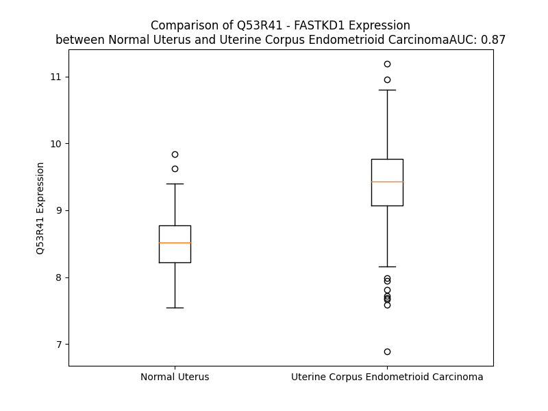

# Detailed Data for Q53R41

## Introduction to the Detailed Summary

### How to Interpret the Results

- **Summary & Metrics**: This section provides a quick reference to essential protein attributes, including expression changes, family classification, and biomarker applications. Regulation status (upregulated/downregulated) indicates the protein's behavior in a disease context. Some information comes from the original excel file with the proteins selected from literature, while others are derived from the analyses.
- **Expression Comparison**: A visual representation comparing protein expression between normal and disease states. It highlights significant changes in expression levels that might indicate diagnostic or therapeutic relevance. This is data coming from transcriptomics experiments and could not translate similarly to protein levels.
- **Isoform Alignment**: An interactive view of isoform alignments, revealing structural and functional differences between variants of the protein.
- **Interactors & Homologs**: Tables listing known interaction partners and homologous proteins, the more interactors and homologs, the more complex the protein is to design an antibody for.
- **Biological Assemblies**: Information about the structural arrangement of the protein in different assemblies, providing insights into its functional state but also the complexity of the protein to develop antibodies.
- **Combined Per-Residue Information**: A detailed table summarizing residue-level data. This includes predictions for epitope regions, aggregation tendencies, and modifications that might impact the protein's function. Each row corresponds to a residue in the protein, providing insights into specific sites that may be important for research or drug development.
## Summary & Metrics

- **UniProt Accession**: Q53R41
- **Gene Name**: FASTKD1 
- **Protein Name**: FAST kinase domains 1 
- **Swiss Prot**: FAKD1_HUMAN
- **Family**: other
- **Biomarker Application**:  
- **Number of Isoforms**: 2
- **Regulation**: 1
- **(transcriptomics) AUC**: 0.92
- **(transcriptomics) Fold Change**: 1.11
- **(transcriptomics) Regulation**: Upregulated
- **Discotope Epitope Count**: 189
- **Max n_uniprots (Homo)**: N/A
- **Max n_uniprots (Hetero)**: N/A

## Expression Comparison

## Isoform Alignment

<pre style='font-size:14px; font-family:monospace;'>Q53R41-1 MKKTPVFLESLVTNMLRLRAICPFSWRVFQFRPISCEPLIIQMNKCTDEEQMFGFIERNKAILSEKQVGCAFDMLWKLQKQKTSLLKNAEYVRDHPQFLTLHNLATNKFKLMNDDTLVNVLYVTQQFAGEAHDPLVEALVTEAWRRLERFDIKLLSEFSSCLADQHLYFSPLMGKIADIVHRNLETTQDLSSLSVLMVNISSLISRHFQQQLVNKTELLFDTIDSSEVNVAKSIAKFLRNVRYRYQPLLERCNNVFLSNVDHLDLDSISKILSVYKFLQFNSFEFIIMAKKKLTEMIPLCNHPASFVKLFVALGPIAGPEEKKQLKSTMLLMSEDLTGEQALAVLGAMGDMESRNSCLIKRVTSVLHKHLDGYKPLELLKITQELTFLHFQRKEFFAKLRELLLSYLKNSFIPTEVSVLVRAISLLPSPHLDEVGISRIEAVLPQCDLNNLSSFATSVLRWIQHDHMYLDNMTAKQLKLLQKLDHYGRQRLQHSNSLDLLRKELKSLKGNTFPESLLEEMIATLQHFMDDINYINVGEIASFISSTDYLSTLLLDRIASVAVQQIEKIHPFTIPAIIRPFSVLNYDPPQRDEFLGTCVQHLNSYLGILDPFILVFLGFSLATLEYFPEDLLKAIFNIKFLARLDSQLEILSPSRSARVQFHLMELNRSVCLECPEFQIPWFHDRFCQQYNKGIGGMDGTQQQIFKMLAEVLGGINCVKASVLTPYYHKVDFECILDKRKKPLPYGSHNIALGQLPEMPWESNIEIVGSRLPPGAERIALEFLDSKALCRNIPHMKGKSAMKKRHLEILGYRVIQISQFEWNSMALSTKDARMDYLRECIFGEVKSCL
Q53R41-2 MKKTPVFLESLVTNMLRLRAICPFSWRVFQFRPISCEPLIIQMNKCTDEEQMFGFIERNKAILSEKQVGCAFDMLWKLQKQKTSLLKNAEYVRDHPQFLTLHNLATNKFKLMNDDTLVNVLYVTQQFAGEAHDPLVEALVTEAWRRLERFDIKLLSEFSSCLADQHLYFSPLMGKIADIVHRNLETTQDLSSLSVLMVNISSLISRHFQQQLVNKTELLFDTIDSSEVNVAKSIAKFLRNVRYRYQPLLERCNNVFLSNVDHLDLDSISKILSVYKFLQFNSFEFIIMAKKKLTEMIPLCNHPASFVKLFVALGPIAGPEEKKQLKSTMLLMSEDLTGEQALAVLGAMGDMESRNSCLIKRVTSVLHKHLDGYKPLELLKITQELTFLHFQRKEFFAKLRELLLSYLKNSFIPTEVSVLVRAISLLPSPHLDEVGISRIEAVLPQCDLNNLSSFATSVLRWIQHDHMYLDNMTAKQLKLLQKLDHYGRQRLQHSNSLDLLRKELKSLKGNTFPESLLEEMIATLQHFMDDINYINVGEIASFISSTDYLSTLLLDRIASVAVQQIEKIHPFTIPAIIRPFSVLNYDPPQRDEFLGTCVQHLNSYLGILDPFILVFLGFSLATLEYFPEDLLKAIFNIKFLARLDSQL-------------------------------------------ESIGGMDGTQQQIFKMLAEVLGGINCVKASVLTPYYHKVDFECILDKRKKPLPYGSHNIALGQLPEMPWESNIEIVGSRLPPGAERIALEFLDSKALCRNIPHMKGKSAMKKRHLEILGYRVIQISQFEWNSMALSTKDARMDYLRECIFGEVKSCL
</pre>

## Interactors

| preferredName_A   | preferredName_B   | score   |
|-------------------|-------------------|---------|

## Homologs

| uniprot_id   | gene_id   |
|:-------------|:----------|
| Q9NYY8       | FASTKD2   |
| D6RHY4       | FASTKD3   |
| Q7L8L6       | FASTKD5   |
| Q14296       | FASTK     |
| C9J347       | TBRG4     |

## Combined Per-Residue Information

|   res | aa   |   epitope_score | epitope   |   relative_surface_accessibility |   modeling_confidence |   Aggregation | modification    |
|------:|:-----|----------------:|:----------|---------------------------------:|----------------------:|--------------:|:----------------|
|     1 | M    |         0.1972  | True      |                          1.26783 |                 32.74 |         0     | N/A             |
|     2 | K    |         0.14817 | True      |                          1.02636 |                 29.46 |         0     | N/A             |
|     3 | K    |         0.20759 | True      |                          0.95319 |                 30.74 |         0     | N/A             |
|     4 | T    |         0.1792  | True      |                          0.85922 |                 32.15 |         0     | N/A             |
|     5 | P    |         0.12667 | True      |                          0.80137 |                 30.19 |         0     | N/A             |
|     6 | V    |         0.12309 | True      |                          0.83238 |                 31.54 |         0     | N/A             |
|     7 | F    |         0.19862 | True      |                          0.89623 |                 31.04 |         0     | N/A             |
|     8 | L    |         0.16002 | True      |                          0.89539 |                 32.92 |         0     | N/A             |
|     9 | E    |         0.12254 | True      |                          0.65415 |                 32.45 |         0     | N/A             |
|    10 | S    |         0.13402 | True      |                          0.60636 |                 35.88 |         0.145 | N/A             |
|    11 | L    |         0.11051 | True      |                          0.72289 |                 36.14 |         1.523 | N/A             |
|    12 | V    |         0.05663 | False     |                          0.62932 |                 40.71 |         1.523 | N/A             |
|    13 | T    |         0.13016 | True      |                          0.61071 |                 39.49 |         1.523 | N/A             |
|    14 | N    |         0.16046 | True      |                          0.65602 |                 33.2  |         1.523 | N/A             |
|    15 | M    |         0.12751 | True      |                          0.78246 |                 35.8  |         1.523 | N/A             |
|    16 | L    |         0.16501 | True      |                          0.74504 |                 35.16 |         1.31  | N/A             |
|    17 | R    |         0.24065 | True      |                          0.80595 |                 32.14 |         0     | N/A             |
|    18 | L    |         0.16923 | True      |                          0.91881 |                 34.11 |         0     | N/A             |
|    19 | R    |         0.20336 | True      |                          0.90181 |                 34.09 |         0     | N/A             |
|    20 | A    |         0.18106 | True      |                          0.81837 |                 36.6  |         0     | N/A             |
|    21 | I    |         0.21581 | True      |                          0.88988 |                 33.51 |         0     | N/A             |
|    22 | C    |         0.20466 | True      |                          0.74713 |                 31.4  |         0     | N/A             |
|    23 | P    |         0.15209 | True      |                          0.90387 |                 41.66 |         0     | N/A             |
|    24 | F    |         0.20704 | True      |                          0.95844 |                 32.16 |         0     | N/A             |
|    25 | S    |         0.12833 | True      |                          0.68235 |                 31.45 |         0     | N/A             |
|    26 | W    |         0.1883  | True      |                          1.08449 |                 28.52 |         0     | N/A             |
|    27 | R    |         0.16697 | True      |                          0.8024  |                 30.36 |         0     | N/A             |
|    28 | V    |         0.16988 | True      |                          0.84406 |                 32.18 |         0     | N/A             |
|    29 | F    |         0.14002 | True      |                          0.85091 |                 30.93 |         0     | N/A             |
|    30 | Q    |         0.16615 | True      |                          0.78195 |                 26.32 |         0     | N/A             |
|    31 | F    |         0.17347 | True      |                          0.95009 |                 34.5  |         0     | N/A             |
|    32 | R    |         0.14061 | True      |                          0.82402 |                 27.8  |         0     | N/A             |
|    33 | P    |         0.14424 | True      |                          0.8782  |                 38.25 |         0     | N/A             |
|    34 | I    |         0.12252 | True      |                          0.78166 |                 42.38 |         0     | N/A             |
|    35 | S    |         0.09133 | False     |                          0.42267 |                 46.83 |         0     | N/A             |
|    36 | C    |         0.06964 | False     |                          0.39853 |                 50.36 |         0     | N/A             |
|    37 | E    |         0.16469 | True      |                          0.60936 |                 62.2  |         0     | N/A             |
|    38 | P    |         0.11852 | True      |                          0.45719 |                 76.14 |         0     | N/A             |
|    39 | L    |         0.06935 | False     |                          0.15251 |                 77.62 |         5.007 | N/A             |
|    40 | I    |         0.0816  | False     |                          0.27359 |                 79.24 |         5.007 | N/A             |
|    41 | I    |         0.0913  | False     |                          0.53274 |                 80.78 |         5.007 | N/A             |
|    42 | Q    |         0.13927 | True      |                          0.48763 |                 78.11 |         5.007 | N/A             |
|    43 | M    |         0.01699 | False     |                          0       |                 80.32 |         5.007 | N/A             |
|    44 | N    |         0.10627 | True      |                          0.52742 |                 81.44 |         0.175 | N/A             |
|    45 | K    |         0.14139 | True      |                          0.72153 |                 82.87 |         0     | N/A             |
|    46 | C    |         0.02792 | False     |                          0.10931 |                 81.67 |         0     | N/A             |
|    47 | T    |         0.10922 | True      |                          0.72693 |                 80.77 |         0     | N/A             |
|    48 | D    |         0.05346 | False     |                          0.3148  |                 82.05 |         0     | N/A             |
|    49 | E    |         0.04377 | False     |                          0.05113 |                 82.77 |         0     | N/A             |
|    50 | E    |         0.17284 | True      |                          0.61293 |                 83.45 |         0     | N/A             |
|    51 | Q    |         0.12515 | True      |                          0.44272 |                 83.58 |         0.137 | N/A             |
|    52 | M    |         0.00603 | False     |                          0       |                 85.68 |         9.725 | N/A             |
|    53 | F    |         0.01677 | False     |                          0.01029 |                 87.25 |         9.725 | N/A             |
|    54 | G    |         0.07677 | False     |                          0.29402 |                 82.97 |         9.725 | N/A             |
|    55 | F    |         0.04643 | False     |                          0.11503 |                 83.98 |         9.725 | N/A             |
|    56 | I    |         0.01005 | False     |                          0.0008  |                 84.62 |         9.725 | N/A             |
|    57 | E    |         0.11927 | True      |                          0.50261 |                 85.44 |         0     | N/A             |
|    58 | R    |         0.28665 | True      |                          0.84195 |                 83.93 |         0     | N/A             |
|    59 | N    |         0.06151 | False     |                          0.13723 |                 83.53 |         0     | N/A             |
|    60 | K    |         0.17855 | True      |                          0.59692 |                 79.55 |         0     | N/A             |
|    61 | A    |         0.1083  | True      |                          0.88789 |                 78.12 |         0     | N/A             |
|    62 | I    |         0.12241 | True      |                          0.60288 |                 83.77 |         0     | N/A             |
|    63 | L    |         0.00476 | False     |                          0       |                 84.61 |         0     | N/A             |
|    64 | S    |         0.01503 | False     |                          0.18615 |                 86.32 |         0     | N/A             |
|    65 | E    |         0.02793 | False     |                          0.21306 |                 84.38 |         0     | N/A             |
|    66 | K    |         0.03415 | False     |                          0.56922 |                 85.22 |         0     | N/A             |
|    67 | Q    |         0.01532 | False     |                          0.01861 |                 86.21 |         0     | N/A             |
|    68 | V    |         0.00429 | False     |                          0       |                 87.6  |         0.339 | N/A             |
|    69 | G    |         0.01973 | False     |                          0.05058 |                 87.97 |         0.339 | N/A             |
|    70 | C    |         0.03597 | False     |                          0.13696 |                 87.28 |         0.339 | N/A             |
|    71 | A    |         0.00364 | False     |                          0       |                 88.16 |         0.339 | N/A             |
|    72 | F    |         0.00331 | False     |                          0       |                 88.96 |         0.339 | N/A             |
|    73 | D    |         0.03916 | False     |                          0.24296 |                 86.66 |         0     | N/A             |
|    74 | M    |         0.05859 | False     |                          0.08478 |                 85.82 |         0     | N/A             |
|    75 | L    |         0.00566 | False     |                          0       |                 86.34 |         0     | N/A             |
|    76 | W    |         0.04402 | False     |                          0.2193  |                 85.45 |         0     | N/A             |
|    77 | K    |         0.13828 | True      |                          0.45425 |                 85.7  |         0     | N/A             |
|    78 | L    |         0.04874 | False     |                          0.06788 |                 83.6  |         0     | N/A             |
|    79 | Q    |         0.04407 | False     |                          0.01802 |                 80.57 |         0     | N/A             |
|    80 | K    |         0.11509 | True      |                          0.72967 |                 77.77 |         0     | N/A             |
|    81 | Q    |         0.19778 | True      |                          0.74839 |                 77.89 |         0     | N/A             |
|    82 | K    |         0.08701 | False     |                          0.32381 |                 75.5  |         0     | N/A             |
|    83 | T    |         0.20755 | True      |                          0.62508 |                 64.72 |         0     | N/A             |
|    84 | S    |         0.18408 | True      |                          0.76897 |                 59.53 |         0     | N/A             |
|    85 | L    |         0.22986 | True      |                          1.06174 |                 53.94 |         0     | N/A             |
|    86 | L    |         0.17556 | True      |                          0.70804 |                 58.13 |         0     | N/A             |
|    87 | K    |         0.2067  | True      |                          0.51567 |                 66.19 |         0     | N/A             |
|    88 | N    |         0.10875 | True      |                          0.4504  |                 74.1  |         0     | N/A             |
|    89 | A    |         0.09651 | False     |                          0.39868 |                 74.5  |         0     | N/A             |
|    90 | E    |         0.14601 | True      |                          0.5727  |                 78.31 |         0     | N/A             |
|    91 | Y    |         0.10378 | True      |                          0.38635 |                 81.78 |         0     | N/A             |
|    92 | V    |         0.00616 | False     |                          0       |                 81    |         0     | N/A             |
|    93 | R    |         0.0806  | False     |                          0.34849 |                 79.1  |         0     | N/A             |
|    94 | D    |         0.22621 | True      |                          0.59844 |                 82.97 |         0     | N/A             |
|    95 | H    |         0.09748 | False     |                          0.21529 |                 85.83 |         0     | N/A             |
|    96 | P    |         0.10515 | True      |                          0.69274 |                 85.82 |         0     | N/A             |
|    97 | Q    |         0.19164 | True      |                          0.13676 |                 86.43 |         0.47  | N/A             |
|    98 | F    |         0.03059 | False     |                          0.05032 |                 86.85 |         0.47  | N/A             |
|    99 | L    |         0.14286 | True      |                          0.69163 |                 85.84 |         0.47  | N/A             |
|   100 | T    |         0.08876 | False     |                          0.25152 |                 85.48 |         0.47  | N/A             |
|   101 | L    |         0.00257 | False     |                          0       |                 88.22 |         0.47  | N/A             |
|   102 | H    |         0.04393 | False     |                          0.11682 |                 87.5  |         0     | N/A             |
|   103 | N    |         0.14862 | True      |                          0.49905 |                 87.62 |         0     | N/A             |
|   104 | L    |         0.05445 | False     |                          0.14992 |                 87.87 |         0     | N/A             |
|   105 | A    |         0.00268 | False     |                          0       |                 90.11 |         0     | N/A             |
|   106 | T    |         0.05759 | False     |                          0.41903 |                 88.86 |         0     | N/A             |
|   107 | N    |         0.16764 | True      |                          0.75372 |                 88.12 |         0     | N/A             |
|   108 | K    |         0.09955 | False     |                          0.22743 |                 89.7  |         0     | N/A             |
|   109 | F    |         0.05836 | False     |                          0.12102 |                 87.72 |         0     | N/A             |
|   110 | K    |         0.09123 | False     |                          0.63606 |                 88.45 |         0     | N/A             |
|   111 | L    |         0.0993  | False     |                          0.78615 |                 90.07 |         0     | N/A             |
|   112 | M    |         0.01155 | False     |                          0.01917 |                 92.95 |         0     | N/A             |
|   113 | N    |         0.06631 | False     |                          0.51982 |                 91.65 |         0     | N/A             |
|   114 | D    |         0.04834 | False     |                          0.18089 |                 92.08 |         0     | N/A             |
|   115 | D    |         0.06177 | False     |                          0.50617 |                 91.03 |         0     | N/A             |
|   116 | T    |         0.0405  | False     |                          0.16064 |                 90.8  |         8.543 | N/A             |
|   117 | L    |         0.00336 | False     |                          0.0033  |                 93.58 |        47.863 | N/A             |
|   118 | V    |         0.00534 | False     |                          0.00381 |                 92.22 |        67.294 | N/A             |
|   119 | N    |         0.02784 | False     |                          0.26856 |                 90.57 |        68.852 | N/A             |
|   120 | V    |         0.00183 | False     |                          0       |                 91.46 |        84.52  | N/A             |
|   121 | L    |         0.0034  | False     |                          0.0033  |                 91.3  |        84.571 | N/A             |
|   122 | Y    |         0.06221 | False     |                          0.31196 |                 89.6  |        83.894 | N/A             |
|   123 | V    |         0.00322 | False     |                          0       |                 88.05 |        80.6   | N/A             |
|   124 | T    |         0.00493 | False     |                          0.00613 |                 88.58 |        40.872 | N/A             |
|   125 | Q    |         0.02999 | False     |                          0.13238 |                 87.93 |         2.528 | N/A             |
|   126 | Q    |         0.07506 | False     |                          0.32387 |                 83.72 |         0.978 | N/A             |
|   127 | F    |         0.01217 | False     |                          0.03084 |                 82.96 |         0.935 | N/A             |
|   128 | A    |         0.0494  | False     |                          0.42159 |                 72.99 |         0.202 | N/A             |
|   129 | G    |         0.18372 | True      |                          0.65963 |                 64.55 |         0     | N/A             |
|   130 | E    |         0.15897 | True      |                          0.70935 |                 66.1  |         0     | N/A             |
|   131 | A    |         0.15835 | True      |                          0.95139 |                 64.16 |         0     | N/A             |
|   132 | H    |         0.18484 | True      |                          0.77639 |                 74.34 |         0     | N/A             |
|   133 | D    |         0.04777 | False     |                          0.14561 |                 83.78 |         0     | N/A             |
|   134 | P    |         0.09007 | False     |                          0.74862 |                 87.02 |         0     | N/A             |
|   135 | L    |         0.02383 | False     |                          0.0231  |                 89.06 |         0     | N/A             |
|   136 | V    |         0.01997 | False     |                          0.0695  |                 89.66 |         0     | N/A             |
|   137 | E    |         0.13018 | True      |                          0.51069 |                 89.85 |         0     | N/A             |
|   138 | A    |         0.04151 | False     |                          0.23801 |                 90.98 |         0     | N/A             |
|   139 | L    |         0.00169 | False     |                          0       |                 92.36 |         0     | N/A             |
|   140 | V    |         0.02632 | False     |                          0.12853 |                 91.8  |         0     | N/A             |
|   141 | T    |         0.07924 | False     |                          0.44422 |                 91.94 |         0     | N/A             |
|   142 | E    |         0.056   | False     |                          0.08262 |                 93.5  |         0     | N/A             |
|   143 | A    |         0.00429 | False     |                          0.00383 |                 93.49 |         0     | N/A             |
|   144 | W    |         0.08761 | False     |                          0.45514 |                 93.79 |         0     | N/A             |
|   145 | R    |         0.20523 | True      |                          0.70069 |                 92.72 |         0     | N/A             |
|   146 | R    |         0.09435 | False     |                          0.11418 |                 93.69 |         0     | N/A             |
|   147 | L    |         0.03226 | False     |                          0.02191 |                 92.11 |         0     | N/A             |
|   148 | E    |         0.10591 | True      |                          0.59292 |                 92.23 |         0     | N/A             |
|   149 | R    |         0.15165 | True      |                          0.75829 |                 91.63 |         0     | N/A             |
|   150 | F    |         0.02033 | False     |                          0.04449 |                 93.6  |         0.578 | N/A             |
|   151 | D    |         0.07832 | False     |                          0.50077 |                 91.29 |         0.578 | N/A             |
|   152 | I    |         0.02804 | False     |                          0.14859 |                 91.77 |         0.578 | N/A             |
|   153 | K    |         0.08446 | False     |                          0.59208 |                 93.43 |         0.578 | N/A             |
|   154 | L    |         0.02732 | False     |                          0.10552 |                 93.67 |         0.578 | N/A             |
|   155 | L    |         0.00205 | False     |                          0.00082 |                 95.54 |         0.386 | N/A             |
|   156 | S    |         0.02404 | False     |                          0.0643  |                 94.92 |         0     | N/A             |
|   157 | E    |         0.02976 | False     |                          0.34872 |                 93.64 |         0     | N/A             |
|   158 | F    |         0.00212 | False     |                          0       |                 95.47 |         0     | N/A             |
|   159 | S    |         0.00163 | False     |                          0       |                 94.56 |         0     | N/A             |
|   160 | S    |         0.02567 | False     |                          0.23915 |                 92.81 |         0     | N/A             |
|   161 | C    |         0.00262 | False     |                          0       |                 91.87 |         0     | N/A             |
|   162 | L    |         0.00347 | False     |                          0       |                 92.01 |         0     | N/A             |
|   163 | A    |         0.02365 | False     |                          0.08213 |                 89.13 |         0     | N/A             |
|   164 | D    |         0.04983 | False     |                          0.52121 |                 86.54 |         0     | N/A             |
|   165 | Q    |         0.08577 | False     |                          0.28466 |                 86.8  |         0     | N/A             |
|   166 | H    |         0.15737 | True      |                          0.79958 |                 86.17 |         0     | N/A             |
|   167 | L    |         0.04812 | False     |                          0.39651 |                 86.92 |         0     | N/A             |
|   168 | Y    |         0.0684  | False     |                          0.3647  |                 85.59 |         0     | N/A             |
|   169 | F    |         0.10844 | True      |                          0.78687 |                 87.37 |         0     | N/A             |
|   170 | S    |         0.0857  | False     |                          0.13561 |                 90.78 |         0     | N/A             |
|   171 | P    |         0.09105 | False     |                          0.75267 |                 91.58 |         0     | N/A             |
|   172 | L    |         0.0369  | False     |                          0.03945 |                 92.62 |         0     | N/A             |
|   173 | M    |         0.00276 | False     |                          0       |                 95.25 |         0     | N/A             |
|   174 | G    |         0.0493  | False     |                          0.32526 |                 94.2  |         0     | N/A             |
|   175 | K    |         0.12797 | True      |                          0.4951  |                 94.56 |         0     | N/A             |
|   176 | I    |         0.00476 | False     |                          0       |                 95.6  |         0     | N/A             |
|   177 | A    |         0.01416 | False     |                          0.08049 |                 95.19 |         0     | N/A             |
|   178 | D    |         0.1364  | True      |                          0.41329 |                 95.49 |         0     | N/A             |
|   179 | I    |         0.02762 | False     |                          0.032   |                 94.69 |         0     | N/A             |
|   180 | V    |         0.00216 | False     |                          0.00095 |                 95.19 |         0     | N/A             |
|   181 | H    |         0.11143 | True      |                          0.4456  |                 95    |         0     | N/A             |
|   182 | R    |         0.26563 | True      |                          0.54795 |                 94.25 |         0     | N/A             |
|   183 | N    |         0.08804 | False     |                          0.36631 |                 91.95 |         0     | N/A             |
|   184 | L    |         0.04798 | False     |                          0.06595 |                 91.89 |         0     | N/A             |
|   185 | E    |         0.19238 | True      |                          0.78789 |                 89.79 |         0     | N/A             |
|   186 | T    |         0.14242 | True      |                          0.77037 |                 90.22 |         0     | N/A             |
|   187 | T    |         0.02735 | False     |                          0.04692 |                 89.38 |         0     | N/A             |
|   188 | Q    |         0.2225  | True      |                          0.6082  |                 89.53 |         0     | N/A             |
|   189 | D    |         0.05005 | False     |                          0.36661 |                 89.86 |         0     | N/A             |
|   190 | L    |         0.01679 | False     |                          0.03148 |                 91.93 |         2.255 | N/A             |
|   191 | S    |         0.06698 | False     |                          0.35842 |                 91.8  |         2.599 | N/A             |
|   192 | S    |         0.01178 | False     |                          0.06647 |                 93.39 |         6.196 | N/A             |
|   193 | L    |         0.00149 | False     |                          0       |                 95.01 |        34.425 | N/A             |
|   194 | S    |         0.0062  | False     |                          0.00553 |                 94.82 |        39.282 | N/A             |
|   195 | V    |         0.03735 | False     |                          0.35417 |                 95.12 |        55.948 | N/A             |
|   196 | L    |         0.00129 | False     |                          0       |                 96.21 |        57.241 | N/A             |
|   197 | M    |         0.00291 | False     |                          0       |                 96.25 |        57.095 | N/A             |
|   198 | V    |         0.01787 | False     |                          0.0902  |                 95.95 |        55.6   | N/A             |
|   199 | N    |         0.01102 | False     |                          0.06628 |                 95.53 |        34.586 | N/A             |
|   200 | I    |         0.00718 | False     |                          0       |                 95.91 |        32.988 | N/A             |
|   201 | S    |         0.02407 | False     |                          0.10766 |                 94.39 |        13.402 | N/A             |
|   202 | S    |         0.04487 | False     |                          0.4376  |                 90.46 |        10.998 | N/A             |
|   203 | L    |         0.06309 | False     |                          0.4099  |                 91.69 |        10.744 | N/A             |
|   204 | I    |         0.07236 | False     |                          0.10235 |                 92.62 |         9.117 | N/A             |
|   205 | S    |         0.07604 | False     |                          0.52847 |                 89.96 |         0.86  | N/A             |
|   206 | R    |         0.08342 | False     |                          0.50886 |                 82.71 |         0     | N/A             |
|   207 | H    |         0.09375 | False     |                          0.63974 |                 85.92 |         0     | N/A             |
|   208 | F    |         0.05941 | False     |                          0.04744 |                 93.88 |         0     | N/A             |
|   209 | Q    |         0.03207 | False     |                          0.10703 |                 92.56 |         0     | N/A             |
|   210 | Q    |         0.08088 | False     |                          0.36187 |                 89.21 |         0     | N/A             |
|   211 | Q    |         0.08316 | False     |                          0.30465 |                 92.66 |         0     | N/A             |
|   212 | L    |         0.00163 | False     |                          0       |                 95.51 |         0     | N/A             |
|   213 | V    |         0.0036  | False     |                          0.00095 |                 93.37 |         0     | N/A             |
|   214 | N    |         0.07933 | False     |                          0.52202 |                 91.55 |         0     | N/A             |
|   215 | K    |         0.08335 | False     |                          0.13878 |                 93.85 |         0     | N/A             |
|   216 | T    |         0.00375 | False     |                          0       |                 94.06 |         0     | N/A             |
|   217 | E    |         0.06343 | False     |                          0.20513 |                 91.56 |         0     | N/A             |
|   218 | L    |         0.20775 | True      |                          0.76233 |                 90.97 |         0     | N/A             |
|   219 | L    |         0.03369 | False     |                          0.01484 |                 91.17 |         0     | N/A             |
|   220 | F    |         0.02114 | False     |                          0.0848  |                 90.17 |         0     | N/A             |
|   221 | D    |         0.10955 | True      |                          0.64327 |                 82.74 |         0     | N/A             |
|   222 | T    |         0.30315 | True      |                          0.73651 |                 82.54 |         0     | N/A             |
|   223 | I    |         0.13697 | True      |                          0.2055  |                 78.39 |         0     | N/A             |
|   224 | D    |         0.23396 | True      |                          0.53528 |                 76.81 |         0     | N/A             |
|   225 | S    |         0.13193 | True      |                          0.47724 |                 75.3  |         0     | N/A             |
|   226 | S    |         0.14958 | True      |                          0.53848 |                 76.94 |         0     | N/A             |
|   227 | E    |         0.10388 | True      |                          0.34319 |                 82.06 |         0     | N/A             |
|   228 | V    |         0.0697  | False     |                          0.11169 |                 89.27 |         0     | N/A             |
|   229 | N    |         0.10225 | True      |                          0.68623 |                 90.23 |         0     | N/A             |
|   230 | V    |         0.03947 | False     |                          0.05617 |                 91.81 |         0     | N/A             |
|   231 | A    |         0.0112  | False     |                          0.00948 |                 93.3  |         0     | N/A             |
|   232 | K    |         0.0341  | False     |                          0.28916 |                 93.66 |         0     | N/A             |
|   233 | S    |         0.03343 | False     |                          0.16489 |                 94.24 |         0     | N/A             |
|   234 | I    |         0.00341 | False     |                          0       |                 95.46 |         0     | N/A             |
|   235 | A    |         0.00874 | False     |                          0.01913 |                 94.45 |         0     | N/A             |
|   236 | K    |         0.0487  | False     |                          0.45451 |                 94.74 |         0     | N/A             |
|   237 | F    |         0.00122 | False     |                          0       |                 96.53 |         0     | N/A             |
|   238 | L    |         0.00165 | False     |                          0       |                 95.25 |         0     | N/A             |
|   239 | R    |         0.08325 | False     |                          0.31038 |                 94.13 |         0     | N/A             |
|   240 | N    |         0.03277 | False     |                          0.36444 |                 92.97 |         0     | N/A             |
|   241 | V    |         0.02753 | False     |                          0.14638 |                 90.22 |         0     | N/A             |
|   242 | R    |         0.11132 | True      |                          0.66596 |                 86.82 |         0     | N/A             |
|   243 | Y    |         0.07678 | False     |                          0.28429 |                 85.35 |         0     | N/A             |
|   244 | R    |         0.07308 | False     |                          0.45101 |                 82.42 |         0     | N/A             |
|   245 | Y    |         0.05645 | False     |                          0.20167 |                 87.66 |         0     | N/A             |
|   246 | Q    |         0.02946 | False     |                          0.10498 |                 86.41 |         0     | N/A             |
|   247 | P    |         0.05839 | False     |                          0.2228  |                 86.81 |         0     | N/A             |
|   248 | L    |         0.00176 | False     |                          0       |                 91.27 |         0     | N/A             |
|   249 | L    |         0.00131 | False     |                          0       |                 92.5  |         0     | N/A             |
|   250 | E    |         0.06481 | False     |                          0.28257 |                 89.95 |         0     | N/A             |
|   251 | R    |         0.05627 | False     |                          0.26104 |                 91.02 |         0     | N/A             |
|   252 | C    |         0.00282 | False     |                          0       |                 93.41 |         0     | N/A             |
|   253 | N    |         0.02074 | False     |                          0.06879 |                 93.15 |         0     | N/A             |
|   254 | N    |         0.12006 | True      |                          0.55274 |                 91.61 |         0.221 | N/A             |
|   255 | V    |         0.04387 | False     |                          0.09684 |                 92.2  |         1.244 | N/A             |
|   256 | F    |         0.00432 | False     |                          0       |                 93.75 |         1.244 | N/A             |
|   257 | L    |         0.05484 | False     |                          0.28079 |                 91.71 |         1.244 | N/A             |
|   258 | S    |         0.11098 | True      |                          0.62321 |                 91.07 |         1.244 | N/A             |
|   259 | N    |         0.06057 | False     |                          0.1061  |                 90.89 |         1.022 | N/A             |
|   260 | V    |         0.07663 | False     |                          0.28578 |                 86.45 |         1.022 | N/A             |
|   261 | D    |         0.1989  | True      |                          0.79442 |                 85.95 |         0     | N/A             |
|   262 | H    |         0.16602 | True      |                          0.80283 |                 85.08 |         0     | N/A             |
|   263 | L    |         0.00778 | False     |                          0.00413 |                 90.39 |         0     | N/A             |
|   264 | D    |         0.0772  | False     |                          0.47597 |                 90.65 |         0     | N/A             |
|   265 | L    |         0.03431 | False     |                          0.1504  |                 90.84 |         0     | N/A             |
|   266 | D    |         0.04841 | False     |                          0.26374 |                 90.69 |         0     | N/A             |
|   267 | S    |         0.0369  | False     |                          0.10005 |                 92.18 |         0     | N/A             |
|   268 | I    |         0.00529 | False     |                          0       |                 94.1  |         0     | N/A             |
|   269 | S    |         0.01903 | False     |                          0.21342 |                 92.64 |         0     | N/A             |
|   270 | K    |         0.06095 | False     |                          0.62643 |                 92.87 |         0     | N/A             |
|   271 | I    |         0.01664 | False     |                          0.02629 |                 94.62 |        23.974 | N/A             |
|   272 | L    |         0.02314 | False     |                          0.15295 |                 93.11 |        26.232 | N/A             |
|   273 | S    |         0.05125 | False     |                          0.47026 |                 91.61 |        27.364 | N/A             |
|   274 | V    |         0.01558 | False     |                          0.05332 |                 93.2  |        36.537 | N/A             |
|   275 | Y    |         0.01418 | False     |                          0.02942 |                 93.13 |        37.314 | N/A             |
|   276 | K    |         0.06057 | False     |                          0.66352 |                 88.76 |        36.38  | N/A             |
|   277 | F    |         0.07329 | False     |                          0.52901 |                 88.18 |        36.482 | N/A             |
|   278 | L    |         0.0127  | False     |                          0.0525  |                 88.71 |        36.482 | N/A             |
|   279 | Q    |         0.11046 | True      |                          0.6418  |                 83.77 |        36.482 | N/A             |
|   280 | F    |         0.0354  | False     |                          0.05479 |                 87.55 |        36.482 | N/A             |
|   281 | N    |         0.05377 | False     |                          0.39638 |                 81.81 |        36.482 | N/A             |
|   282 | S    |         0.02332 | False     |                          0.06887 |                 88.37 |        36.482 | N/A             |
|   283 | F    |         0.01699 | False     |                          0.04719 |                 86.46 |        36.599 | N/A             |
|   284 | E    |         0.05569 | False     |                          0.56138 |                 88.74 |        36.497 | N/A             |
|   285 | F    |         0.00165 | False     |                          0       |                 93.01 |        64.896 | N/A             |
|   286 | I    |         0.017   | False     |                          0.15839 |                 91.27 |        64.723 | N/A             |
|   287 | I    |         0.08338 | False     |                          0.48147 |                 89.79 |        62.602 | N/A             |
|   288 | M    |         0.05999 | False     |                          0.12155 |                 92.5  |        39.292 | N/A             |
|   289 | A    |         0.00209 | False     |                          0       |                 93.72 |        29.564 | N/A             |
|   290 | K    |         0.02999 | False     |                          0.18647 |                 92.78 |         0.117 | N/A             |
|   291 | K    |         0.14717 | True      |                          0.68956 |                 91.91 |         0     | N/A             |
|   292 | K    |         0.05124 | False     |                          0.14314 |                 92.74 |         0     | N/A             |
|   293 | L    |         0.00231 | False     |                          0       |                 94.2  |         0     | N/A             |
|   294 | T    |         0.04015 | False     |                          0.30245 |                 92.39 |         0     | N/A             |
|   295 | E    |         0.11125 | True      |                          0.53184 |                 91.5  |         0     | N/A             |
|   296 | M    |         0.0605  | False     |                          0.17912 |                 91.22 |         0     | N/A             |
|   297 | I    |         0.07386 | False     |                          0.07155 |                 88.53 |         0     | N/A             |
|   298 | P    |         0.23766 | True      |                          0.73147 |                 86.11 |         0     | N/A             |
|   299 | L    |         0.13561 | True      |                          0.83228 |                 86.17 |         0     | N/A             |
|   300 | C    |         0.03489 | False     |                          0.1335  |                 84.82 |         0     | N/A             |
|   301 | N    |         0.24237 | True      |                          0.82724 |                 81.59 |         0     | N/A             |
|   302 | H    |         0.12363 | True      |                          0.65352 |                 86.13 |         0     | N/A             |
|   303 | P    |         0.06726 | False     |                          0.18961 |                 86.06 |         0     | N/A             |
|   304 | A    |         0.02761 | False     |                          0.36952 |                 88.44 |         0     | N/A             |
|   305 | S    |         0.04407 | False     |                          0.33633 |                 89.08 |         0     | N/A             |
|   306 | F    |         0.00348 | False     |                          0.00127 |                 93.61 |         0     | N/A             |
|   307 | V    |         0.01949 | False     |                          0.05427 |                 93.92 |         0     | N/A             |
|   308 | K    |         0.04936 | False     |                          0.49689 |                 92.52 |         0     | N/A             |
|   309 | L    |         0.00112 | False     |                          0       |                 94.46 |        45.927 | N/A             |
|   310 | F    |         0.00249 | False     |                          0       |                 94.84 |        45.927 | N/A             |
|   311 | V    |         0.02356 | False     |                          0.41217 |                 94.26 |        45.927 | N/A             |
|   312 | A    |         0.00773 | False     |                          0.08573 |                 93.84 |        45.927 | N/A             |
|   313 | L    |         0.00225 | False     |                          0       |                 94.38 |        45.927 | N/A             |
|   314 | G    |         0.00134 | False     |                          0       |                 93.1  |         0     | N/A             |
|   315 | P    |         0.01499 | False     |                          0.22462 |                 90.08 |         0     | N/A             |
|   316 | I    |         0.0398  | False     |                          0.11629 |                 90.11 |         0     | N/A             |
|   317 | A    |         0.01121 | False     |                          0.03111 |                 89.96 |         0     | N/A             |
|   318 | G    |         0.02689 | False     |                          0.07403 |                 85.98 |         0     | N/A             |
|   319 | P    |         0.05752 | False     |                          0.83866 |                 85.29 |         0     | N/A             |
|   320 | E    |         0.07727 | False     |                          0.62292 |                 87.45 |         0     | N/A             |
|   321 | E    |         0.06266 | False     |                          0.19526 |                 89.7  |         0     | N/A             |
|   322 | K    |         0.01798 | False     |                          0.14788 |                 90.48 |         0     | N/A             |
|   323 | K    |         0.09282 | False     |                          0.70656 |                 90.55 |         0     | N/A             |
|   324 | Q    |         0.12509 | True      |                          0.43489 |                 91.58 |         0     | N/A             |
|   325 | L    |         0.00195 | False     |                          0       |                 93.42 |         0     | N/A             |
|   326 | K    |         0.02215 | False     |                          0.19566 |                 92.8  |         0     | N/A             |
|   327 | S    |         0.08111 | False     |                          0.46373 |                 91.51 |         0.462 | N/A             |
|   328 | T    |         0.07341 | False     |                          0.27108 |                 91.66 |         4.365 | N/A             |
|   329 | M    |         0.00265 | False     |                          0.00202 |                 93.26 |         4.365 | N/A             |
|   330 | L    |         0.08788 | False     |                          0.33204 |                 90.86 |         4.365 | N/A             |
|   331 | L    |         0.15953 | True      |                          0.92016 |                 89    |         4.365 | N/A             |
|   332 | M    |         0.09006 | False     |                          0.1504  |                 89.44 |         4.365 | N/A             |
|   333 | S    |         0.02348 | False     |                          0       |                 84.5  |         0.169 | N/A             |
|   334 | E    |         0.1101  | True      |                          0.60271 |                 81.71 |         0     | N/A             |
|   335 | D    |         0.1448  | True      |                          0.6419  |                 84.87 |         0     | N/A             |
|   336 | L    |         0.0099  | False     |                          0.05805 |                 90.96 |         0     | N/A             |
|   337 | T    |         0.05376 | False     |                          0.5143  |                 91.76 |         0     | N/A             |
|   338 | G    |         0.01837 | False     |                          0.09343 |                 91.19 |         0     | N/A             |
|   339 | E    |         0.09407 | False     |                          0.70859 |                 92.21 |         0     | N/A             |
|   340 | Q    |         0.03893 | False     |                          0.18307 |                 94.13 |         0.202 | N/A             |
|   341 | A    |         0.00101 | False     |                          0       |                 94.23 |         6.371 | N/A             |
|   342 | L    |         0.02476 | False     |                          0.07666 |                 94.77 |         9.636 | N/A             |
|   343 | A    |         0.01915 | False     |                          0.30689 |                 93.96 |         9.866 | N/A             |
|   344 | V    |         0.00177 | False     |                          0       |                 95.03 |         9.866 | N/A             |
|   345 | L    |         0.00242 | False     |                          0       |                 94.56 |         9.866 | N/A             |
|   346 | G    |         0.04264 | False     |                          0.09087 |                 92.34 |         4.503 | N/A             |
|   347 | A    |         0.00634 | False     |                          0.02536 |                 92.48 |         2.558 | N/A             |
|   348 | M    |         0.00339 | False     |                          0.00072 |                 92.79 |         0.685 | N/A             |
|   349 | G    |         0.03756 | False     |                          0.06712 |                 90.21 |         0     | N/A             |
|   350 | D    |         0.02121 | False     |                          0.36289 |                 88.24 |         0     | N/A             |
|   351 | M    |         0.02978 | False     |                          0.0328  |                 89.05 |         0     | N/A             |
|   352 | E    |         0.05864 | False     |                          0.29114 |                 86    |         0     | N/A             |
|   353 | S    |         0.01201 | False     |                          0.03536 |                 85.56 |         0     | N/A             |
|   354 | R    |         0.10223 | True      |                          0.69263 |                 85.16 |         0     | N/A             |
|   355 | N    |         0.05834 | False     |                          0.30515 |                 87.32 |         0     | N/A             |
|   356 | S    |         0.11529 | True      |                          0.54906 |                 88.31 |         0     | N/A             |
|   357 | C    |         0.04767 | False     |                          0.50774 |                 90.27 |         0     | N/A             |
|   358 | L    |         0.0032  | False     |                          0.00082 |                 91.04 |         0     | N/A             |
|   359 | I    |         0.02041 | False     |                          0.0432  |                 91.29 |         0     | N/A             |
|   360 | K    |         0.06767 | False     |                          0.5268  |                 90.53 |         0     | N6-acetyllysine |
|   361 | R    |         0.09646 | False     |                          0.37518 |                 90.33 |         0     | N/A             |
|   362 | V    |         0.00245 | False     |                          0       |                 92.4  |         0.173 | N/A             |
|   363 | T    |         0.02023 | False     |                          0.02546 |                 91.54 |         0.173 | N/A             |
|   364 | S    |         0.08394 | False     |                          0.32622 |                 91.75 |         0.173 | N/A             |
|   365 | V    |         0.02313 | False     |                          0.05522 |                 91.92 |         0.173 | N/A             |
|   366 | L    |         0.00393 | False     |                          0       |                 92.71 |         0.173 | N/A             |
|   367 | H    |         0.1536  | True      |                          0.36021 |                 92.19 |         0     | N/A             |
|   368 | K    |         0.1224  | True      |                          0.79794 |                 91.05 |         0     | N/A             |
|   369 | H    |         0.07395 | False     |                          0.45964 |                 91.26 |         0     | N/A             |
|   370 | L    |         0.00625 | False     |                          0.00305 |                 91.73 |         0     | N/A             |
|   371 | D    |         0.07184 | False     |                          0.5084  |                 91.32 |         0     | N/A             |
|   372 | G    |         0.14265 | True      |                          0.82353 |                 90.8  |         0     | N/A             |
|   373 | Y    |         0.01848 | False     |                          0.04268 |                 94.5  |         0     | N/A             |
|   374 | K    |         0.12999 | True      |                          0.71333 |                 93.65 |         0     | N/A             |
|   375 | P    |         0.03073 | False     |                          0.12028 |                 92.51 |         0     | N/A             |
|   376 | L    |         0.05413 | False     |                          0.76157 |                 92.69 |         0.46  | N/A             |
|   377 | E    |         0.03749 | False     |                          0.26265 |                 94.69 |         0.46  | N/A             |
|   378 | L    |         0.00303 | False     |                          0.00082 |                 95.18 |         0.46  | N/A             |
|   379 | L    |         0.02883 | False     |                          0.09975 |                 94.33 |         0.46  | N/A             |
|   380 | K    |         0.04094 | False     |                          0.40041 |                 93.7  |         0.46  | N/A             |
|   381 | I    |         0.00596 | False     |                          0       |                 95.07 |         0.46  | N/A             |
|   382 | T    |         0.00482 | False     |                          0       |                 93.41 |         0.46  | N/A             |
|   383 | Q    |         0.04254 | False     |                          0.26177 |                 92.4  |         0     | N/A             |
|   384 | E    |         0.02979 | False     |                          0.17615 |                 91.82 |         0     | N/A             |
|   385 | L    |         0.00441 | False     |                          0       |                 92.25 |         3.26  | N/A             |
|   386 | T    |         0.06462 | False     |                          0.36737 |                 89.38 |         3.857 | N/A             |
|   387 | F    |         0.07528 | False     |                          0.54471 |                 88.69 |         3.857 | N/A             |
|   388 | L    |         0.01538 | False     |                          0.04416 |                 88.38 |         3.857 | N/A             |
|   389 | H    |         0.13589 | True      |                          0.63025 |                 84.94 |         3.857 | N/A             |
|   390 | F    |         0.06904 | False     |                          0.09851 |                 87.34 |         3.857 | N/A             |
|   391 | Q    |         0.27806 | True      |                          0.81902 |                 82.37 |         0     | N/A             |
|   392 | R    |         0.17985 | True      |                          0.49321 |                 85.36 |         0     | N/A             |
|   393 | K    |         0.13413 | True      |                          0.90883 |                 87.07 |         0     | N/A             |
|   394 | E    |         0.15012 | True      |                          0.71794 |                 88.92 |         0     | N/A             |
|   395 | F    |         0.02788 | False     |                          0.02059 |                 91.05 |         0     | N/A             |
|   396 | F    |         0.01682 | False     |                          0.05477 |                 91.6  |         0     | N/A             |
|   397 | A    |         0.06841 | False     |                          0.47773 |                 91.42 |         0     | N/A             |
|   398 | K    |         0.07021 | False     |                          0.30068 |                 92.34 |         0     | N/A             |
|   399 | L    |         0.00114 | False     |                          0       |                 93.33 |         0     | N/A             |
|   400 | R    |         0.05922 | False     |                          0.27482 |                 92.64 |         0     | N/A             |
|   401 | E    |         0.14219 | True      |                          0.62169 |                 92.5  |         0     | N/A             |
|   402 | L    |         0.04682 | False     |                          0.18536 |                 93.68 |        18.612 | N/A             |
|   403 | L    |         0.00188 | False     |                          0       |                 94.47 |        26.495 | N/A             |
|   404 | L    |         0.02317 | False     |                          0.22648 |                 92.85 |        26.495 | N/A             |
|   405 | S    |         0.10085 | False     |                          0.42843 |                 92.67 |        26.495 | N/A             |
|   406 | Y    |         0.08631 | False     |                          0.31162 |                 93.85 |        26.495 | N/A             |
|   407 | L    |         0.00581 | False     |                          0.01072 |                 93.18 |        23.614 | N/A             |
|   408 | K    |         0.11144 | True      |                          0.48149 |                 90.69 |         0     | N/A             |
|   409 | N    |         0.19046 | True      |                          0.68839 |                 90.72 |         0     | N/A             |
|   410 | S    |         0.02426 | False     |                          0.05066 |                 91.61 |         0     | N/A             |
|   411 | F    |         0.16898 | True      |                          0.71159 |                 90.65 |         0     | N/A             |
|   412 | I    |         0.14953 | True      |                          0.62557 |                 92.04 |         0     | N/A             |
|   413 | P    |         0.02665 | False     |                          0.15011 |                 92.14 |         0     | N/A             |
|   414 | T    |         0.03724 | False     |                          0.50805 |                 91.77 |         0.176 | N/A             |
|   415 | E    |         0.04964 | False     |                          0.24147 |                 94.07 |         0.472 | N/A             |
|   416 | V    |         0.00241 | False     |                          0       |                 94.55 |        65.705 | N/A             |
|   417 | S    |         0.01741 | False     |                          0.045   |                 93.02 |        65.705 | N/A             |
|   418 | V    |         0.03277 | False     |                          0.15709 |                 93.61 |        65.705 | N/A             |
|   419 | L    |         0.0019  | False     |                          0       |                 94.82 |        65.705 | N/A             |
|   420 | V    |         0.00115 | False     |                          0.00286 |                 93.45 |        65.705 | N/A             |
|   421 | R    |         0.06474 | False     |                          0.44883 |                 92.38 |         0.472 | N/A             |
|   422 | A    |         0.00217 | False     |                          0       |                 93.62 |         0.472 | N/A             |
|   423 | I    |         0.00281 | False     |                          0.0024  |                 93.5  |         0.472 | N/A             |
|   424 | S    |         0.01785 | False     |                          0.04707 |                 90.97 |         0.191 | N/A             |
|   425 | L    |         0.02157 | False     |                          0.19382 |                 90.31 |         0.191 | N/A             |
|   426 | L    |         0.01407 | False     |                          0.03472 |                 90.28 |         0     | N/A             |
|   427 | P    |         0.04733 | False     |                          0.56093 |                 83.53 |         0     | N/A             |
|   428 | S    |         0.03097 | False     |                          0.41544 |                 79.89 |         0     | N/A             |
|   429 | P    |         0.03578 | False     |                          0.10784 |                 77.71 |         0     | N/A             |
|   430 | H    |         0.09926 | False     |                          0.45354 |                 78.27 |         0     | N/A             |
|   431 | L    |         0.03909 | False     |                          0.06728 |                 81.07 |         0     | N/A             |
|   432 | D    |         0.10285 | True      |                          0.29952 |                 82.76 |         0     | N/A             |
|   433 | E    |         0.19688 | True      |                          0.57039 |                 83.45 |         0     | N/A             |
|   434 | V    |         0.05857 | False     |                          0.54718 |                 84.61 |         0     | N/A             |
|   435 | G    |         0.01897 | False     |                          0.02668 |                 86.68 |         0     | N/A             |
|   436 | I    |         0.0334  | False     |                          0.14399 |                 87.37 |         0     | N/A             |
|   437 | S    |         0.07938 | False     |                          0.50603 |                 89.7  |         0     | N/A             |
|   438 | R    |         0.07986 | False     |                          0.16069 |                 90.53 |         0     | N/A             |
|   439 | I    |         0.00437 | False     |                          0       |                 91.96 |         0     | N/A             |
|   440 | E    |         0.07697 | False     |                          0.29435 |                 92.31 |         0     | N/A             |
|   441 | A    |         0.03815 | False     |                          0.60398 |                 92.18 |         0     | N/A             |
|   442 | V    |         0.01847 | False     |                          0.03618 |                 94.55 |         0     | N/A             |
|   443 | L    |         0.0061  | False     |                          0.01183 |                 92.32 |         0     | N/A             |
|   444 | P    |         0.12154 | True      |                          0.62187 |                 90.92 |         0     | N/A             |
|   445 | Q    |         0.13101 | True      |                          0.65535 |                 91.16 |         0     | N/A             |
|   446 | C    |         0.00988 | False     |                          0.04039 |                 89.99 |         0     | N/A             |
|   447 | D    |         0.03676 | False     |                          0.33158 |                 86.4  |         0     | N/A             |
|   448 | L    |         0.00373 | False     |                          0       |                 84.87 |         0     | N/A             |
|   449 | N    |         0.02706 | False     |                          0.35663 |                 84.75 |         0     | N/A             |
|   450 | N    |         0.01885 | False     |                          0.0412  |                 88.48 |         0     | N/A             |
|   451 | L    |         0.01017 | False     |                          0.01316 |                 88.76 |         0     | N/A             |
|   452 | S    |         0.01159 | False     |                          0.07357 |                 84.3  |         0     | N/A             |
|   453 | S    |         0.02689 | False     |                          0.1442  |                 86.53 |         0.138 | N/A             |
|   454 | F    |         0.00139 | False     |                          0.00064 |                 90.12 |         1.459 | N/A             |
|   455 | A    |         0.00975 | False     |                          0.01403 |                 87.21 |         1.459 | N/A             |
|   456 | T    |         0.03472 | False     |                          0.22306 |                 85.07 |         1.459 | N/A             |
|   457 | S    |         0.00774 | False     |                          0.0129  |                 88.69 |         1.459 | N/A             |
|   458 | V    |         0.00761 | False     |                          0       |                 87.48 |         1.459 | N/A             |
|   459 | L    |         0.12908 | True      |                          0.47336 |                 84.11 |         1.255 | N/A             |
|   460 | R    |         0.07409 | False     |                          0.37478 |                 83.33 |         0     | N/A             |
|   461 | W    |         0.01518 | False     |                          0.0108  |                 83.81 |         0     | N/A             |
|   462 | I    |         0.10349 | True      |                          0.16799 |                 80.49 |         0     | N/A             |
|   463 | Q    |         0.13009 | True      |                          0.66971 |                 78.43 |         0     | N/A             |
|   464 | H    |         0.12026 | True      |                          0.30239 |                 74.02 |         0     | N/A             |
|   465 | D    |         0.0947  | False     |                          0.09234 |                 68.26 |         0     | N/A             |
|   466 | H    |         0.22146 | True      |                          0.76188 |                 63.72 |         0     | N/A             |
|   467 | M    |         0.23448 | True      |                          0.75465 |                 59.2  |         0     | N/A             |
|   468 | Y    |         0.15834 | True      |                          0.74367 |                 56.72 |         0     | N/A             |
|   469 | L    |         0.19977 | True      |                          0.74881 |                 54.36 |         0     | N/A             |
|   470 | D    |         0.18586 | True      |                          0.80323 |                 58.96 |         0     | N/A             |
|   471 | N    |         0.21154 | True      |                          0.87396 |                 58.26 |         0     | N/A             |
|   472 | M    |         0.08791 | False     |                          0.47727 |                 57.47 |         0     | N/A             |
|   473 | T    |         0.09426 | False     |                          0.20253 |                 69.52 |         0     | N/A             |
|   474 | A    |         0.1318  | True      |                          0.50141 |                 79.55 |         0     | N/A             |
|   475 | K    |         0.13381 | True      |                          0.50299 |                 81.17 |         0     | N/A             |
|   476 | Q    |         0.03826 | False     |                          0.0644  |                 83.01 |         0     | N/A             |
|   477 | L    |         0.09877 | False     |                          0.5545  |                 83.94 |         0     | N/A             |
|   478 | K    |         0.14923 | True      |                          0.63415 |                 87.86 |         0     | N/A             |
|   479 | L    |         0.00964 | False     |                          0.00318 |                 88.56 |         0     | N/A             |
|   480 | L    |         0.04243 | False     |                          0.20753 |                 87.35 |         0     | N/A             |
|   481 | Q    |         0.10732 | True      |                          0.63274 |                 89.07 |         0     | N/A             |
|   482 | K    |         0.10849 | True      |                          0.41953 |                 90.51 |         0     | N/A             |
|   483 | L    |         0.01573 | False     |                          0.02061 |                 89.84 |         0     | N/A             |
|   484 | D    |         0.04793 | False     |                          0.15129 |                 86.7  |         0     | N/A             |
|   485 | H    |         0.12164 | True      |                          0.5798  |                 90.74 |         0     | N/A             |
|   486 | Y    |         0.05221 | False     |                          0.27104 |                 90.46 |         0     | N/A             |
|   487 | G    |         0.00335 | False     |                          0       |                 88.85 |         0     | N/A             |
|   488 | R    |         0.06342 | False     |                          0.29179 |                 87.44 |         0     | N/A             |
|   489 | Q    |         0.09559 | False     |                          0.38402 |                 89.08 |         0     | N/A             |
|   490 | R    |         0.04717 | False     |                          0.43642 |                 87.02 |         0     | N/A             |
|   491 | L    |         0.00815 | False     |                          0.01165 |                 86.74 |         0     | N/A             |
|   492 | Q    |         0.14537 | True      |                          0.58364 |                 85.79 |         0     | N/A             |
|   493 | H    |         0.12416 | True      |                          0.6273  |                 85.11 |         0     | N/A             |
|   494 | S    |         0.0397  | False     |                          0.15554 |                 83.25 |         0     | N/A             |
|   495 | N    |         0.13604 | True      |                          0.83206 |                 83.35 |         0     | N/A             |
|   496 | S    |         0.08944 | False     |                          0.30963 |                 84.04 |         0     | N/A             |
|   497 | L    |         0.01108 | False     |                          0.04995 |                 84.26 |         0     | N/A             |
|   498 | D    |         0.1233  | True      |                          0.45646 |                 78.53 |         0     | N/A             |
|   499 | L    |         0.05956 | False     |                          0.53438 |                 76.82 |         0     | N/A             |
|   500 | L    |         0.01014 | False     |                          0.01213 |                 83.3  |         0     | N/A             |
|   501 | R    |         0.05779 | False     |                          0.14764 |                 77.96 |         0     | N/A             |
|   502 | K    |         0.09553 | False     |                          0.529   |                 71.4  |         0     | N/A             |
|   503 | E    |         0.05022 | False     |                          0.12224 |                 76.13 |         0     | N/A             |
|   504 | L    |         0.03474 | False     |                          0.09411 |                 73.47 |         0     | N/A             |
|   505 | K    |         0.15592 | True      |                          0.69867 |                 68.54 |         0     | N/A             |
|   506 | S    |         0.04585 | False     |                          0.45772 |                 63.69 |         0     | N/A             |
|   507 | L    |         0.04089 | False     |                          0.11213 |                 66.39 |         0     | N/A             |
|   508 | K    |         0.11424 | True      |                          0.76191 |                 63.49 |         0     | N/A             |
|   509 | G    |         0.01178 | False     |                          0.01081 |                 56.31 |         0     | N/A             |
|   510 | N    |         0.06876 | False     |                          0.66914 |                 61.81 |         0     | N/A             |
|   511 | T    |         0.05252 | False     |                          0.35551 |                 61.92 |         0     | N/A             |
|   512 | F    |         0.03286 | False     |                          0.04062 |                 67.28 |         0     | N/A             |
|   513 | P    |         0.0325  | False     |                          0.24299 |                 73.35 |         0     | N/A             |
|   514 | E    |         0.07583 | False     |                          0.48847 |                 76.33 |         0     | N/A             |
|   515 | S    |         0.03379 | False     |                          0.3527  |                 77.88 |         0     | N/A             |
|   516 | L    |         0.0137  | False     |                          0.01319 |                 81.18 |         0     | N/A             |
|   517 | L    |         0.00244 | False     |                          0.00082 |                 85.45 |         0     | N/A             |
|   518 | E    |         0.05773 | False     |                          0.53872 |                 88.46 |         0     | N/A             |
|   519 | E    |         0.03159 | False     |                          0.20817 |                 88.35 |         0     | N/A             |
|   520 | M    |         0.00371 | False     |                          0       |                 87.82 |         0.284 | N/A             |
|   521 | I    |         0.00798 | False     |                          0.0256  |                 90.88 |         0.284 | N/A             |
|   522 | A    |         0.03681 | False     |                          0.47846 |                 91.38 |         0.284 | N/A             |
|   523 | T    |         0.01633 | False     |                          0.10154 |                 91.47 |         0.284 | N/A             |
|   524 | L    |         0.00148 | False     |                          0       |                 92.01 |         0.284 | N/A             |
|   525 | Q    |         0.02791 | False     |                          0.2832  |                 93.71 |         0     | N/A             |
|   526 | H    |         0.10938 | True      |                          0.80165 |                 92.28 |         0     | N/A             |
|   527 | F    |         0.03952 | False     |                          0.11221 |                 92.61 |         0     | N/A             |
|   528 | M    |         0.07822 | False     |                          0.32232 |                 93.14 |         0     | N/A             |
|   529 | D    |         0.07684 | False     |                          0.73745 |                 92.01 |         0     | N/A             |
|   530 | D    |         0.06785 | False     |                          0.45521 |                 92.61 |         0     | N/A             |
|   531 | I    |         0.00442 | False     |                          0.00769 |                 94.06 |         0     | N/A             |
|   532 | N    |         0.02831 | False     |                          0.29779 |                 92.34 |         0     | N/A             |
|   533 | Y    |         0.10147 | True      |                          0.38474 |                 91.14 |         0     | N/A             |
|   534 | I    |         0.08643 | False     |                          0.5627  |                 86.47 |         0     | N/A             |
|   535 | N    |         0.02847 | False     |                          0.03859 |                 88.48 |         0     | N/A             |
|   536 | V    |         0.00272 | False     |                          0       |                 93.71 |         0     | N/A             |
|   537 | G    |         0.01753 | False     |                          0.10087 |                 91.99 |         0     | N/A             |
|   538 | E    |         0.02995 | False     |                          0.44407 |                 88.05 |         0     | N/A             |
|   539 | I    |         0.00323 | False     |                          0.0016  |                 92.29 |         3.713 | N/A             |
|   540 | A    |         0.00179 | False     |                          0       |                 94.76 |         3.713 | N/A             |
|   541 | S    |         0.01572 | False     |                          0.35357 |                 91.11 |         3.713 | N/A             |
|   542 | F    |         0.01055 | False     |                          0.07495 |                 89.95 |         3.713 | N/A             |
|   543 | I    |         0.00247 | False     |                          0       |                 92.7  |         3.713 | N/A             |
|   544 | S    |         0.00556 | False     |                          0.0246  |                 92.48 |         0.41  | N/A             |
|   545 | S    |         0.03432 | False     |                          0.2669  |                 88.92 |         0     | N/A             |
|   546 | T    |         0.0126  | False     |                          0       |                 89.4  |         0     | N/A             |
|   547 | D    |         0.0246  | False     |                          0.20898 |                 90.11 |         0     | N/A             |
|   548 | Y    |         0.0674  | False     |                          0.12359 |                 92.79 |        12.114 | N/A             |
|   549 | L    |         0.01764 | False     |                          0.09599 |                 95.63 |        15.437 | N/A             |
|   550 | S    |         0.01583 | False     |                          0.0416  |                 95.93 |        17.105 | N/A             |
|   551 | T    |         0.05389 | False     |                          0.41229 |                 97.18 |        17.39  | N/A             |
|   552 | L    |         0.05303 | False     |                          0.61365 |                 97.01 |        17.869 | N/A             |
|   553 | L    |         0.00164 | False     |                          0       |                 97    |        17.816 | N/A             |
|   554 | L    |         0.0009  | False     |                          0       |                 98.05 |        17.536 | N/A             |
|   555 | D    |         0.03786 | False     |                          0.21897 |                 98.28 |         1.093 | N/A             |
|   556 | R    |         0.05635 | False     |                          0.27132 |                 97.79 |         1.093 | N/A             |
|   557 | I    |         0.00126 | False     |                          0       |                 97.98 |        22.039 | N/A             |
|   558 | A    |         0.00103 | False     |                          0       |                 98.26 |        22.259 | N/A             |
|   559 | S    |         0.03175 | False     |                          0.19185 |                 97.98 |        22.259 | N/A             |
|   560 | V    |         0.00725 | False     |                          0.01238 |                 97.82 |        22.522 | N/A             |
|   561 | A    |         0.002   | False     |                          0.00342 |                 97.54 |        22.522 | N/A             |
|   562 | V    |         0.03655 | False     |                          0.21376 |                 97.72 |        21     | N/A             |
|   563 | Q    |         0.1092  | True      |                          0.65731 |                 96.98 |         1.783 | N/A             |
|   564 | Q    |         0.08242 | False     |                          0.23736 |                 96.66 |         1.082 | N/A             |
|   565 | I    |         0.02999 | False     |                          0.12263 |                 95.7  |         1.082 | N/A             |
|   566 | E    |         0.12372 | True      |                          0.82081 |                 92.92 |         0     | N/A             |
|   567 | K    |         0.06698 | False     |                          0.66223 |                 91.78 |         0     | N/A             |
|   568 | I    |         0.00822 | False     |                          0.02676 |                 92.43 |         0     | N/A             |
|   569 | H    |         0.04001 | False     |                          0.34124 |                 88.32 |         0     | N/A             |
|   570 | P    |         0.02322 | False     |                          0.07555 |                 90.23 |         0     | N/A             |
|   571 | F    |         0.03044 | False     |                          0.21997 |                 88.89 |         0     | N/A             |
|   572 | T    |         0.02386 | False     |                          0.28249 |                 91.71 |         0     | N/A             |
|   573 | I    |         0.00367 | False     |                          0       |                 95.6  |         0     | N/A             |
|   574 | P    |         0.01559 | False     |                          0.15475 |                 95.4  |         0     | N/A             |
|   575 | A    |         0.01576 | False     |                          0.29246 |                 93.95 |         0     | N/A             |
|   576 | I    |         0.00172 | False     |                          0       |                 97.79 |         0     | N/A             |
|   577 | I    |         0.00192 | False     |                          0.0008  |                 98.32 |         0     | N/A             |
|   578 | R    |         0.03355 | False     |                          0.35163 |                 97.79 |         0     | N/A             |
|   579 | P    |         0.00273 | False     |                          0       |                 97.64 |         0     | N/A             |
|   580 | F    |         0.00263 | False     |                          0.00686 |                 98.56 |         2.84  | N/A             |
|   581 | S    |         0.01218 | False     |                          0.03778 |                 98    |         2.84  | N/A             |
|   582 | V    |         0.02896 | False     |                          0.23988 |                 97.09 |         2.84  | N/A             |
|   583 | L    |         0.00119 | False     |                          0       |                 97.78 |         2.84  | N/A             |
|   584 | N    |         0.02668 | False     |                          0.27648 |                 97.73 |         2.84  | N/A             |
|   585 | Y    |         0.06605 | False     |                          0.15799 |                 98.15 |         2.199 | N/A             |
|   586 | D    |         0.03941 | False     |                          0.49141 |                 97.24 |         0     | N/A             |
|   587 | P    |         0.01912 | False     |                          0.04103 |                 97.05 |         0     | N/A             |
|   588 | P    |         0.09874 | False     |                          0.83628 |                 97.22 |         0     | N/A             |
|   589 | Q    |         0.05536 | False     |                          0.24588 |                 95.68 |         0     | N/A             |
|   590 | R    |         0.06117 | False     |                          0.21539 |                 96.92 |         0     | N/A             |
|   591 | D    |         0.08865 | False     |                          0.61475 |                 97.02 |         0     | N/A             |
|   592 | E    |         0.07052 | False     |                          0.52065 |                 97.89 |         0     | N/A             |
|   593 | F    |         0.00194 | False     |                          0.00064 |                 98.43 |         0     | N/A             |
|   594 | L    |         0.00791 | False     |                          0.01237 |                 98.12 |         0     | N/A             |
|   595 | G    |         0.02656 | False     |                          0.28039 |                 97.42 |         0     | N/A             |
|   596 | T    |         0.04841 | False     |                          0.2128  |                 97.47 |         0     | N/A             |
|   597 | C    |         0.00123 | False     |                          0.00187 |                 97.49 |         0     | N/A             |
|   598 | V    |         0.01658 | False     |                          0.09521 |                 97.03 |         0     | N/A             |
|   599 | Q    |         0.07111 | False     |                          0.6972  |                 96.1  |         0     | N/A             |
|   600 | H    |         0.05767 | False     |                          0.22956 |                 94.76 |         0     | N/A             |
|   601 | L    |         0.00768 | False     |                          0.01319 |                 95.19 |         0     | N/A             |
|   602 | N    |         0.07947 | False     |                          0.36739 |                 94    |         0     | N/A             |
|   603 | S    |         0.08144 | False     |                          0.67236 |                 90.71 |         0.032 | N/A             |
|   604 | Y    |         0.073   | False     |                          0.33359 |                 90.9  |         0.293 | N/A             |
|   605 | L    |         0.04516 | False     |                          0.14473 |                 91.3  |         0.293 | N/A             |
|   606 | G    |         0.1141  | True      |                          0.75409 |                 86.66 |         0.293 | N/A             |
|   607 | I    |         0.14749 | True      |                          0.62843 |                 85.8  |         0.293 | N/A             |
|   608 | L    |         0.00629 | False     |                          0.00183 |                 87.16 |         0.293 | N/A             |
|   609 | D    |         0.03598 | False     |                          0.11136 |                 87.72 |         0     | N/A             |
|   610 | P    |         0.00363 | False     |                          0.00099 |                 92.01 |         0.987 | N/A             |
|   611 | F    |         0.0282  | False     |                          0.17208 |                 91.86 |        81.178 | N/A             |
|   612 | I    |         0.02177 | False     |                          0.17439 |                 92.54 |        98.398 | N/A             |
|   613 | L    |         0.00448 | False     |                          0.00495 |                 95.77 |        99.631 | N/A             |
|   614 | V    |         0.00147 | False     |                          0       |                 97.47 |        99.851 | N/A             |
|   615 | F    |         0.03273 | False     |                          0.26623 |                 96.79 |        99.861 | N/A             |
|   616 | L    |         0.00428 | False     |                          0.01731 |                 97.62 |        96.746 | N/A             |
|   617 | G    |         0.00898 | False     |                          0.03072 |                 98.13 |        75.983 | N/A             |
|   618 | F    |         0.01802 | False     |                          0.09746 |                 98.39 |        74.084 | N/A             |
|   619 | S    |         0.01421 | False     |                          0.09034 |                 98.32 |        50.728 | N/A             |
|   620 | L    |         0.00172 | False     |                          0.00247 |                 98.47 |        47.83  | N/A             |
|   621 | A    |         0.0013  | False     |                          0.0011  |                 98.34 |        32.007 | N/A             |
|   622 | T    |         0.00515 | False     |                          0.01681 |                 98.06 |        18.629 | N/A             |
|   623 | L    |         0.01385 | False     |                          0.06534 |                 97.79 |        15.721 | N/A             |
|   624 | E    |         0.02779 | False     |                          0.49608 |                 97.32 |         0     | N/A             |
|   625 | Y    |         0.03613 | False     |                          0.25358 |                 97.97 |         0     | N/A             |
|   626 | F    |         0.02028 | False     |                          0.18963 |                 97.81 |         0     | N/A             |
|   627 | P    |         0.03127 | False     |                          0.12525 |                 96.76 |         0     | N/A             |
|   628 | E    |         0.05753 | False     |                          0.42858 |                 95.99 |         0     | N/A             |
|   629 | D    |         0.06165 | False     |                          0.49727 |                 95.63 |         0.304 | N/A             |
|   630 | L    |         0.00559 | False     |                          0.01649 |                 96.63 |         0.304 | N/A             |
|   631 | L    |         0.00646 | False     |                          0.01319 |                 97.11 |         0.304 | N/A             |
|   632 | K    |         0.10962 | True      |                          0.5991  |                 94.99 |         0.304 | N/A             |
|   633 | A    |         0.03723 | False     |                          0.27508 |                 95.05 |         0.614 | N/A             |
|   634 | I    |         0.00341 | False     |                          0       |                 96.79 |         0.614 | N/A             |
|   635 | F    |         0.0114  | False     |                          0.16507 |                 96.28 |         0.614 | N/A             |
|   636 | N    |         0.04632 | False     |                          0.41795 |                 93.29 |         0.614 | N/A             |
|   637 | I    |         0.0733  | False     |                          0.90098 |                 93.42 |         0.614 | N/A             |
|   638 | K    |         0.09164 | False     |                          0.85    |                 93.48 |         0     | N/A             |
|   639 | F    |         0.01235 | False     |                          0.10778 |                 94.59 |         0     | N/A             |
|   640 | L    |         0.02359 | False     |                          0.24523 |                 94.56 |         0     | N/A             |
|   641 | A    |         0.05877 | False     |                          0.56769 |                 92.39 |         0     | N/A             |
|   642 | R    |         0.05318 | False     |                          0.38689 |                 90.97 |         0     | N/A             |
|   643 | L    |         0.00371 | False     |                          0.00907 |                 93.08 |         0     | N/A             |
|   644 | D    |         0.07826 | False     |                          0.51245 |                 90.68 |         0     | N/A             |
|   645 | S    |         0.02892 | False     |                          0.3676  |                 87.63 |         0     | N/A             |
|   646 | Q    |         0.01657 | False     |                          0.02852 |                 88.13 |         0     | N/A             |
|   647 | L    |         0.01558 | False     |                          0.07867 |                 88.62 |         0     | N/A             |
|   648 | E    |         0.08646 | False     |                          0.66483 |                 84.24 |         0     | N/A             |
|   649 | I    |         0.01748 | False     |                          0.07099 |                 82.77 |         0     | N/A             |
|   650 | L    |         0.04037 | False     |                          0.20598 |                 84.03 |         0     | N/A             |
|   651 | S    |         0.06889 | False     |                          0.17489 |                 82.81 |         0     | N/A             |
|   652 | P    |         0.06727 | False     |                          0.52028 |                 82.91 |         0     | N/A             |
|   653 | S    |         0.08179 | False     |                          0.4981  |                 83.17 |         0     | N/A             |
|   654 | R    |         0.08553 | False     |                          0.60038 |                 84.72 |         0     | N/A             |
|   655 | S    |         0.02565 | False     |                          0.10655 |                 89    |         0     | N/A             |
|   656 | A    |         0.03609 | False     |                          0.47459 |                 90.04 |         0     | N/A             |
|   657 | R    |         0.05525 | False     |                          0.53793 |                 92.42 |         0     | N/A             |
|   658 | V    |         0.01553 | False     |                          0.02951 |                 94.79 |         0     | N/A             |
|   659 | Q    |         0.0328  | False     |                          0.31655 |                 95.06 |         0     | N/A             |
|   660 | F    |         0.05259 | False     |                          0.20633 |                 95.25 |         0     | N/A             |
|   661 | H    |         0.02773 | False     |                          0.11627 |                 97.26 |         0     | N/A             |
|   662 | L    |         0.01243 | False     |                          0.07419 |                 97.74 |         0     | N/A             |
|   663 | M    |         0.01189 | False     |                          0.02445 |                 97.2  |         0     | N/A             |
|   664 | E    |         0.00883 | False     |                          0.02909 |                 97.53 |         0     | N/A             |
|   665 | L    |         0.00077 | False     |                          0.00165 |                 98.31 |         0     | N/A             |
|   666 | N    |         0.00261 | False     |                          0       |                 98.03 |         0     | N/A             |
|   667 | R    |         0.02763 | False     |                          0.06126 |                 97.91 |         0     | N/A             |
|   668 | S    |         0.00135 | False     |                          0       |                 98.24 |         0     | N/A             |
|   669 | V    |         0.00469 | False     |                          0.00356 |                 97.97 |         0     | N/A             |
|   670 | C    |         0.01684 | False     |                          0.14161 |                 97.6  |         0     | N/A             |
|   671 | L    |         0.02836 | False     |                          0.10018 |                 97.62 |         0     | N/A             |
|   672 | E    |         0.03792 | False     |                          0.2015  |                 97.93 |         0     | N/A             |
|   673 | C    |         0.0727  | False     |                          0.07085 |                 96.9  |         0     | N/A             |
|   674 | P    |         0.07442 | False     |                          0.65642 |                 95.36 |         0     | N/A             |
|   675 | E    |         0.24776 | True      |                          0.62388 |                 95.48 |         0     | N/A             |
|   676 | F    |         0.08363 | False     |                          0.27558 |                 95.3  |         0     | N/A             |
|   677 | Q    |         0.23914 | True      |                          0.79933 |                 94.6  |         0     | N/A             |
|   678 | I    |         0.04865 | False     |                          0.17125 |                 95.01 |         0     | N/A             |
|   679 | P    |         0.13196 | True      |                          0.69685 |                 94.49 |         0     | N/A             |
|   680 | W    |         0.02983 | False     |                          0.21057 |                 95.16 |         0     | N/A             |
|   681 | F    |         0.06603 | False     |                          0.44978 |                 94.24 |         0     | N/A             |
|   682 | H    |         0.03371 | False     |                          0.08701 |                 94.81 |         0     | N/A             |
|   683 | D    |         0.05878 | False     |                          0.3654  |                 92.59 |         0     | N/A             |
|   684 | R    |         0.12343 | True      |                          0.80507 |                 90.51 |         0     | N/A             |
|   685 | F    |         0.06376 | False     |                          0.25048 |                 91.22 |         0     | N/A             |
|   686 | C    |         0.00948 | False     |                          0.01823 |                 91.39 |         0     | N/A             |
|   687 | Q    |         0.04172 | False     |                          0.43849 |                 88.23 |         0     | N/A             |
|   688 | Q    |         0.10424 | True      |                          0.65424 |                 87.22 |         0     | N/A             |
|   689 | Y    |         0.16787 | True      |                          0.47923 |                 84.42 |         0     | N/A             |
|   690 | N    |         0.03635 | False     |                          0.12967 |                 81.62 |         0     | N/A             |
|   691 | K    |         0.13175 | True      |                          0.82684 |                 76.61 |         0     | N/A             |
|   692 | G    |         0.17408 | True      |                          0.86711 |                 65.7  |         0     | N/A             |
|   693 | I    |         0.10119 | False     |                          0.43    |                 63.02 |         0     | N/A             |
|   694 | G    |         0.08418 | False     |                          0.41927 |                 59.76 |         0     | N/A             |
|   695 | G    |         0.10275 | True      |                          0.75729 |                 68.81 |         0     | N/A             |
|   696 | M    |         0.04273 | False     |                          0.2193  |                 74.45 |         0     | N/A             |
|   697 | D    |         0.06427 | False     |                          0.4719  |                 79.76 |         0     | N/A             |
|   698 | G    |         0.07618 | False     |                          0.68547 |                 84.53 |         0     | N/A             |
|   699 | T    |         0.07858 | False     |                          0.32268 |                 85.67 |         0     | N/A             |
|   700 | Q    |         0.0142  | False     |                          0.13313 |                 87.7  |         0     | N/A             |
|   701 | Q    |         0.04187 | False     |                          0.40444 |                 88.81 |         0     | N/A             |
|   702 | Q    |         0.10209 | True      |                          0.4004  |                 90.45 |         0.255 | N/A             |
|   703 | I    |         0.00444 | False     |                          0       |                 91.71 |         9.084 | N/A             |
|   704 | F    |         0.01507 | False     |                          0.16179 |                 92.21 |         9.681 | N/A             |
|   705 | K    |         0.0554  | False     |                          0.65163 |                 92.26 |         9.681 | N/A             |
|   706 | M    |         0.02758 | False     |                          0.02556 |                 93.43 |         9.681 | N/A             |
|   707 | L    |         0.00137 | False     |                          0       |                 94.22 |         9.681 | N/A             |
|   708 | A    |         0.01017 | False     |                          0.05962 |                 93.56 |         9.681 | N/A             |
|   709 | E    |         0.11477 | True      |                          0.46432 |                 93.58 |         9.681 | N/A             |
|   710 | V    |         0.03649 | False     |                          0.12328 |                 93.27 |         9.681 | N/A             |
|   711 | L    |         0.00787 | False     |                          0.03732 |                 93.21 |         8.487 | N/A             |
|   712 | G    |         0.09217 | False     |                          0.85502 |                 90.7  |         1.12  | N/A             |
|   713 | G    |         0.03977 | False     |                          0.33524 |                 89.37 |         0.534 | N/A             |
|   714 | I    |         0.05753 | False     |                          0.57529 |                 88.78 |         0.534 | N/A             |
|   715 | N    |         0.04348 | False     |                          0.49586 |                 89.96 |         0     | N/A             |
|   716 | C    |         0.01572 | False     |                          0.08773 |                 90.54 |         0     | N/A             |
|   717 | V    |         0.00821 | False     |                          0.04856 |                 91.99 |         0     | N/A             |
|   718 | K    |         0.02853 | False     |                          0.18802 |                 90.77 |         0     | N/A             |
|   719 | A    |         0.03016 | False     |                          0.18462 |                 89.28 |         0     | N/A             |
|   720 | S    |         0.02315 | False     |                          0.14314 |                 87.82 |         0     | N/A             |
|   721 | V    |         0.00561 | False     |                          0.01428 |                 88    |         0     | N/A             |
|   722 | L    |         0.01746 | False     |                          0.04287 |                 90.72 |         0     | N/A             |
|   723 | T    |         0.0035  | False     |                          0.0007  |                 91.7  |         0     | N/A             |
|   724 | P    |         0.02889 | False     |                          0.38925 |                 89.89 |         0     | N/A             |
|   725 | Y    |         0.04102 | False     |                          0.24477 |                 93.15 |         0     | N/A             |
|   726 | Y    |         0.02689 | False     |                          0.05139 |                 92.81 |         0     | N/A             |
|   727 | H    |         0.02934 | False     |                          0.05577 |                 92.92 |         0     | N/A             |
|   728 | K    |         0.03496 | False     |                          0.24228 |                 91.27 |         0     | N/A             |
|   729 | V    |         0.00167 | False     |                          0       |                 91.71 |         0     | N/A             |
|   730 | D    |         0.02089 | False     |                          0.10768 |                 92.38 |         0     | N/A             |
|   731 | F    |         0.00216 | False     |                          0.00701 |                 94.34 |         0     | N/A             |
|   732 | E    |         0.0063  | False     |                          0.0067  |                 94.01 |         0     | N/A             |
|   733 | C    |         0.00166 | False     |                          0       |                 94.01 |         0     | N/A             |
|   734 | I    |         0.02238 | False     |                          0.11759 |                 92.44 |         0     | N/A             |
|   735 | L    |         0.0035  | False     |                          0       |                 92.65 |         0     | N/A             |
|   736 | D    |         0.047   | False     |                          0.19554 |                 90.18 |         0     | N/A             |
|   737 | K    |         0.10621 | True      |                          0.78554 |                 88.19 |         0     | N/A             |
|   738 | R    |         0.11971 | True      |                          0.72738 |                 88.13 |         0     | N/A             |
|   739 | K    |         0.08815 | False     |                          0.46853 |                 89.02 |         0     | N/A             |
|   740 | K    |         0.09824 | False     |                          0.62634 |                 90.84 |         0     | N/A             |
|   741 | P    |         0.02566 | False     |                          0.25449 |                 91.56 |         0     | N/A             |
|   742 | L    |         0.04295 | False     |                          0.30472 |                 89.69 |         0     | N/A             |
|   743 | P    |         0.11367 | True      |                          0.64552 |                 87.42 |         0     | N/A             |
|   744 | Y    |         0.02373 | False     |                          0.17712 |                 82.45 |         0     | N/A             |
|   745 | G    |         0.12543 | True      |                          0.81585 |                 65.77 |         0     | N/A             |
|   746 | S    |         0.07311 | False     |                          0.74395 |                 44.67 |         0     | N/A             |
|   747 | H    |         0.06643 | False     |                          0.85355 |                 39.31 |         0     | N/A             |
|   748 | N    |         0.119   | True      |                          0.92711 |                 27.25 |         0     | N/A             |
|   749 | I    |         0.06269 | False     |                          0.80901 |                 32.78 |         0     | N/A             |
|   750 | A    |         0.08047 | False     |                          0.8487  |                 26.87 |         0     | N/A             |
|   751 | L    |         0.13133 | True      |                          1.07073 |                 25.97 |         0     | N/A             |
|   752 | G    |         0.16436 | True      |                          0.85879 |                 28.44 |         0     | N/A             |
|   753 | Q    |         0.15738 | True      |                          0.78796 |                 27.71 |         0     | N/A             |
|   754 | L    |         0.11473 | True      |                          1.14431 |                 28.55 |         0     | N/A             |
|   755 | P    |         0.07635 | False     |                          0.65034 |                 29.85 |         0     | N/A             |
|   756 | E    |         0.08111 | False     |                          0.97984 |                 29.99 |         0     | N/A             |
|   757 | M    |         0.10841 | True      |                          0.76468 |                 27.13 |         0     | N/A             |
|   758 | P    |         0.08357 | False     |                          0.85418 |                 32.08 |         0     | N/A             |
|   759 | W    |         0.10709 | True      |                          0.86437 |                 42.22 |         0     | N/A             |
|   760 | E    |         0.08097 | False     |                          0.82956 |                 30.8  |         0     | N/A             |
|   761 | S    |         0.05472 | False     |                          0.38691 |                 36.43 |         0     | N/A             |
|   762 | N    |         0.0313  | False     |                          0.60269 |                 39.6  |         0     | N/A             |
|   763 | I    |         0.07414 | False     |                          0.5078  |                 40.35 |         0     | N/A             |
|   764 | E    |         0.04217 | False     |                          0.42941 |                 46.93 |         0     | N/A             |
|   765 | I    |         0.05645 | False     |                          0.54711 |                 49.27 |         0     | N/A             |
|   766 | V    |         0.04287 | False     |                          0.12406 |                 50.84 |         0     | N/A             |
|   767 | G    |         0.11309 | True      |                          0.88182 |                 47.33 |         0     | N/A             |
|   768 | S    |         0.09939 | False     |                          0.6055  |                 55.5  |         0     | N/A             |
|   769 | R    |         0.1861  | True      |                          0.95815 |                 66.2  |         0     | N/A             |
|   770 | L    |         0.0665  | False     |                          0.33375 |                 77.11 |         0     | N/A             |
|   771 | P    |         0.11644 | True      |                          0.50873 |                 81.91 |         0     | N/A             |
|   772 | P    |         0.1251  | True      |                          0.96713 |                 81.65 |         0     | N/A             |
|   773 | G    |         0.09305 | False     |                          0.72755 |                 84.63 |         0     | N/A             |
|   774 | A    |         0.04309 | False     |                          0.1612  |                 88.59 |         0     | N/A             |
|   775 | E    |         0.02425 | False     |                          0.23332 |                 91.1  |         0     | N/A             |
|   776 | R    |         0.05773 | False     |                          0.09724 |                 92.36 |         0     | N/A             |
|   777 | I    |         0.00422 | False     |                          0       |                 94.93 |         0     | N/A             |
|   778 | A    |         0.00109 | False     |                          0       |                 95.54 |         0     | N/A             |
|   779 | L    |         0.00121 | False     |                          0.00069 |                 95.54 |         0     | N/A             |
|   780 | E    |         0.03321 | False     |                          0.0556  |                 94.59 |         0     | N/A             |
|   781 | F    |         0.04484 | False     |                          0.13211 |                 92.49 |         0     | N/A             |
|   782 | L    |         0.02675 | False     |                          0.09563 |                 92.33 |         0     | N/A             |
|   783 | D    |         0.04376 | False     |                          0.32403 |                 88.83 |         0     | N/A             |
|   784 | S    |         0.09524 | False     |                          0.54107 |                 86.51 |         0     | N/A             |
|   785 | K    |         0.11666 | True      |                          0.80298 |                 89.02 |         0     | N/A             |
|   786 | A    |         0.02257 | False     |                          0.11789 |                 92.74 |         0     | N/A             |
|   787 | L    |         0.01525 | False     |                          0.03039 |                 93.15 |         0     | N/A             |
|   788 | C    |         0.00841 | False     |                          0.01258 |                 93.1  |         0     | N/A             |
|   789 | R    |         0.06591 | False     |                          0.2746  |                 88.8  |         0     | N/A             |
|   790 | N    |         0.04667 | False     |                          0.30246 |                 90.76 |         0     | N/A             |
|   791 | I    |         0.10022 | False     |                          0.43886 |                 90.91 |         0     | N/A             |
|   792 | P    |         0.05105 | False     |                          0.75795 |                 90.88 |         0     | N/A             |
|   793 | H    |         0.05374 | False     |                          0.28699 |                 94.32 |         0     | N/A             |
|   794 | M    |         0.01793 | False     |                          0.1834  |                 95.46 |         0     | N/A             |
|   795 | K    |         0.07023 | False     |                          0.13189 |                 96.73 |         0     | N/A             |
|   796 | G    |         0.00527 | False     |                          0.00483 |                 97.13 |         0     | N/A             |
|   797 | K    |         0.03681 | False     |                          0.48222 |                 96.1  |         0     | N/A             |
|   798 | S    |         0.0083  | False     |                          0.15067 |                 96.47 |         0     | N/A             |
|   799 | A    |         0.01469 | False     |                          0.12205 |                 97.53 |         0     | N/A             |
|   800 | M    |         0.00563 | False     |                          0.02014 |                 98.07 |         0     | N/A             |
|   801 | K    |         0.0196  | False     |                          0.2266  |                 97.45 |         0     | N/A             |
|   802 | K    |         0.02463 | False     |                          0.33638 |                 97.65 |         0     | N/A             |
|   803 | R    |         0.0503  | False     |                          0.16025 |                 97.76 |         0     | N/A             |
|   804 | H    |         0.00301 | False     |                          0       |                 98.25 |         0     | N/A             |
|   805 | L    |         0.00104 | False     |                          0.00082 |                 97.29 |         0.215 | N/A             |
|   806 | E    |         0.06363 | False     |                          0.41626 |                 97.05 |         0.215 | N/A             |
|   807 | I    |         0.08141 | False     |                          0.52802 |                 96.06 |         0.215 | N/A             |
|   808 | L    |         0.03011 | False     |                          0.24971 |                 94.29 |         0.215 | N/A             |
|   809 | G    |         0.05721 | False     |                          0.61779 |                 92.44 |         0.215 | N/A             |
|   810 | Y    |         0.03056 | False     |                          0.03563 |                 94.67 |         0.215 | N/A             |
|   811 | R    |         0.08996 | False     |                          0.19838 |                 94.85 |         0.215 | N/A             |
|   812 | V    |         0.01043 | False     |                          0.14541 |                 96.16 |         0.929 | N/A             |
|   813 | I    |         0.01985 | False     |                          0.092   |                 95    |         0.929 | N/A             |
|   814 | Q    |         0.02    | False     |                          0.20966 |                 94.07 |         0.713 | N/A             |
|   815 | I    |         0.00336 | False     |                          0.0024  |                 91.67 |         0.713 | N/A             |
|   816 | S    |         0.02216 | False     |                          0.10934 |                 89.95 |         0.713 | N/A             |
|   817 | Q    |         0.09541 | False     |                          0.29569 |                 87.38 |         0.554 | N/A             |
|   818 | F    |         0.06276 | False     |                          0.55613 |                 85.68 |         0.554 | N/A             |
|   819 | E    |         0.06276 | False     |                          0.44295 |                 86.09 |         0     | N/A             |
|   820 | W    |         0.00914 | False     |                          0.00579 |                 88.81 |         0     | N/A             |
|   821 | N    |         0.11986 | True      |                          0.57392 |                 87.27 |         0     | N/A             |
|   822 | S    |         0.0667  | False     |                          0.3001  |                 88.27 |         0     | N/A             |
|   823 | M    |         0.18555 | True      |                          0.95752 |                 86.39 |         0     | N/A             |
|   824 | A    |         0.10756 | True      |                          0.7525  |                 85.92 |         0     | N/A             |
|   825 | L    |         0.02376 | False     |                          0.10057 |                 88.23 |         0     | N/A             |
|   826 | S    |         0.11182 | True      |                          0.63992 |                 87.86 |         0     | N/A             |
|   827 | T    |         0.145   | True      |                          0.5495  |                 90.07 |         0     | N/A             |
|   828 | K    |         0.13604 | True      |                          0.5398  |                 91.41 |         0     | N/A             |
|   829 | D    |         0.10031 | False     |                          0.61438 |                 91.75 |         0     | N/A             |
|   830 | A    |         0.05143 | False     |                          0.26506 |                 91.76 |         0     | N/A             |
|   831 | R    |         0.06929 | False     |                          0.14659 |                 93.12 |         0     | N/A             |
|   832 | M    |         0.05752 | False     |                          0.11507 |                 92.56 |         0     | N/A             |
|   833 | D    |         0.07885 | False     |                          0.47865 |                 92.52 |         0     | N/A             |
|   834 | Y    |         0.07631 | False     |                          0.20299 |                 93.14 |         0     | N/A             |
|   835 | L    |         0.00183 | False     |                          0       |                 93.66 |         0     | N/A             |
|   836 | R    |         0.08656 | False     |                          0.38109 |                 93.24 |         0     | N/A             |
|   837 | E    |         0.05899 | False     |                          0.57262 |                 92.08 |         0     | N/A             |
|   838 | C    |         0.02157 | False     |                          0.20167 |                 91.73 |         0     | N/A             |
|   839 | I    |         0.00215 | False     |                          0.00059 |                 92.12 |         0     | N/A             |
|   840 | F    |         0.05698 | False     |                          0.35217 |                 92.35 |         0     | N/A             |
|   841 | G    |         0.03678 | False     |                          0.30088 |                 83.55 |         0     | N/A             |
|   842 | E    |         0.09363 | False     |                          0.86603 |                 65.98 |         0     | N/A             |
|   843 | V    |         0.07168 | False     |                          0.81443 |                 49.86 |         0     | N/A             |
|   844 | K    |         0.07724 | False     |                          0.81385 |                 40.32 |         0     | N/A             |
|   845 | S    |         0.12595 | True      |                          0.77276 |                 29.85 |         0     | N/A             |
|   846 | C    |         0.09017 | False     |                          0.93146 |                 32.27 |         0     | N/A             |
|   847 | L    |         0.1538  | True      |                          1.45043 |                 28.2  |         0     | N/A             |

