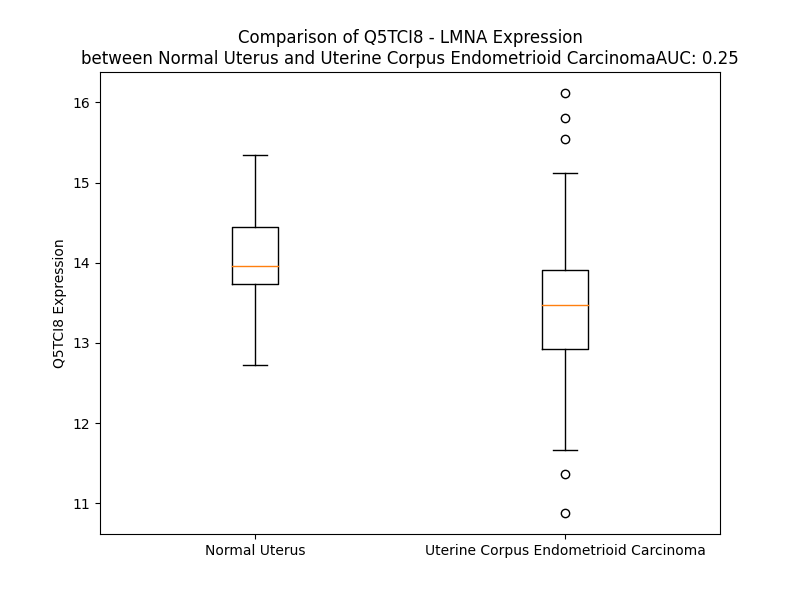

# Detailed Data for Q5TCI8

## Introduction to the Detailed Summary

### How to Interpret the Results

- **Summary & Metrics**: This section provides a quick reference to essential protein attributes, including expression changes, family classification, and biomarker applications. Regulation status (upregulated/downregulated) indicates the protein's behavior in a disease context. Some information comes from the original excel file with the proteins selected from literature, while others are derived from the analyses.
- **Expression Comparison**: A visual representation comparing protein expression between normal and disease states. It highlights significant changes in expression levels that might indicate diagnostic or therapeutic relevance. This is data coming from transcriptomics experiments and could not translate similarly to protein levels.
- **Isoform Alignment**: An interactive view of isoform alignments, revealing structural and functional differences between variants of the protein.
- **Interactors & Homologs**: Tables listing known interaction partners and homologous proteins, the more interactors and homologs, the more complex the protein is to design an antibody for.
- **Biological Assemblies**: Information about the structural arrangement of the protein in different assemblies, providing insights into its functional state but also the complexity of the protein to develop antibodies.
- **Combined Per-Residue Information**: A detailed table summarizing residue-level data. This includes predictions for epitope regions, aggregation tendencies, and modifications that might impact the protein's function. Each row corresponds to a residue in the protein, providing insights into specific sites that may be important for research or drug development.
## Summary & Metrics

- **UniProt Accession**: Q5TCI8
- **Gene Name**: LMNA
- **Protein Name**: Lamin A/C, prelaminin A/C
- **Swiss Prot**: Q5TCI8_HUMAN
- **Family**: other
- **Biomarker Application**:  
- **Number of Isoforms**: 0
- **Regulation**: 2
- **(transcriptomics) AUC**: 0.25
- **(transcriptomics) Fold Change**: 1.04
- **(transcriptomics) Regulation**: Downregulated
- **Discotope Epitope Count**: 61
- **Max n_uniprots (Homo)**: N/A
- **Max n_uniprots (Hetero)**: N/A

## Expression Comparison

## Combined Per-Residue Information

|   res | aa   |   epitope_score | epitope   |   relative_surface_accessibility |   modeling_confidence |   Aggregation | modification   |
|------:|:-----|----------------:|:----------|---------------------------------:|----------------------:|--------------:|:---------------|
|     1 | M    |         0.08818 | False     |                          1.3692  |                 39.97 |         0     | N/A            |
|     2 | Q    |         0.098   | False     |                          0.86106 |                 38.22 |         0     | N/A            |
|     3 | P    |         0.09008 | False     |                          0.75087 |                 66.19 |         0     | N/A            |
|     4 | L    |         0.08588 | False     |                          0.92271 |                 40.34 |         0.19  | N/A            |
|     5 | L    |         0.07735 | False     |                          0.90716 |                 41.12 |         0.19  | N/A            |
|     6 | C    |         0.06759 | False     |                          0.72735 |                 36.88 |         0.19  | N/A            |
|     7 | L    |         0.08907 | False     |                          1.07326 |                 38.78 |         0.19  | N/A            |
|     8 | G    |         0.08526 | False     |                          0.84047 |                 35.81 |         0.19  | N/A            |
|     9 | N    |         0.08895 | False     |                          0.90241 |                 41.56 |         0     | N/A            |
|    10 | L    |         0.08014 | False     |                          0.90769 |                 40.41 |         0     | N/A            |
|    11 | E    |         0.08319 | False     |                          0.78261 |                 42    |         0     | N/A            |
|    12 | D    |         0.09369 | False     |                          0.76914 |                 39.69 |         0     | N/A            |
|    13 | A    |         0.06894 | False     |                          0.80948 |                 36.66 |         0     | N/A            |
|    14 | R    |         0.11187 | False     |                          0.79242 |                 40.91 |         0     | N/A            |
|    15 | E    |         0.07461 | False     |                          0.53894 |                 41.56 |         0     | N/A            |
|    16 | R    |         0.12714 | False     |                          0.75092 |                 41.78 |         0     | N/A            |
|    17 | T    |         0.11843 | False     |                          0.9289  |                 42.72 |         0.316 | N/A            |
|    18 | G    |         0.10633 | False     |                          0.90631 |                 35.97 |         0.316 | N/A            |
|    19 | T    |         0.10207 | False     |                          0.90127 |                 39.28 |         0.316 | N/A            |
|    20 | L    |         0.06967 | False     |                          0.93954 |                 38.34 |         0.316 | N/A            |
|    21 | L    |         0.07836 | False     |                          0.9774  |                 37.22 |         0.316 | N/A            |
|    22 | A    |         0.08275 | False     |                          0.71952 |                 38.66 |         0.145 | N/A            |
|    23 | Q    |         0.1152  | False     |                          0.87034 |                 39.91 |         0     | N/A            |
|    24 | H    |         0.12258 | False     |                          1.01837 |                 40.19 |         0     | N/A            |
|    25 | P    |         0.08408 | False     |                          0.95102 |                 63.75 |         0     | N/A            |
|    26 | A    |         0.08381 | False     |                          0.90279 |                 36.78 |         0     | N/A            |
|    27 | W    |         0.10266 | False     |                          0.96713 |                 38.22 |         0     | N/A            |
|    28 | G    |         0.12633 | False     |                          0.78724 |                 36.81 |         0     | N/A            |
|    29 | R    |         0.10206 | False     |                          0.82883 |                 38.75 |         0     | N/A            |
|    30 | T    |         0.10098 | False     |                          0.86327 |                 41.72 |         0     | N/A            |
|    31 | R    |         0.14115 | True      |                          0.99175 |                 42.06 |         0     | N/A            |
|    32 | A    |         0.08051 | False     |                          0.89742 |                 36.47 |         0     | N/A            |
|    33 | K    |         0.09374 | False     |                          0.95459 |                 46.44 |         0     | N/A            |
|    34 | P    |         0.12502 | False     |                          0.94218 |                 64.56 |         0     | N/A            |
|    35 | G    |         0.10987 | False     |                          0.83133 |                 32.78 |         0     | N/A            |
|    36 | S    |         0.08642 | False     |                          0.90449 |                 31.05 |         0     | N/A            |
|    37 | P    |         0.12116 | False     |                          0.89408 |                 57.19 |         0     | N/A            |
|    38 | L    |         0.09932 | False     |                          1.147   |                 44.84 |         0     | N/A            |
|    39 | N    |         0.06792 | False     |                          0.64401 |                 48.41 |         0     | N/A            |
|    40 | T    |         0.13317 | True      |                          0.92856 |                 56.28 |         0     | N/A            |
|    41 | K    |         0.1278  | False     |                          0.93392 |                 55.12 |         0     | N/A            |
|    42 | K    |         0.08109 | False     |                          0.82781 |                 55.78 |         0     | N/A            |
|    43 | E    |         0.0595  | False     |                          0.52807 |                 56.22 |         0     | N/A            |
|    44 | G    |         0.0714  | False     |                          0.53118 |                 61.56 |         0     | N/A            |
|    45 | D    |         0.1169  | False     |                          0.69458 |                 60.38 |         0     | N/A            |
|    46 | L    |         0.07146 | False     |                          0.69707 |                 58.94 |         0.445 | N/A            |
|    47 | I    |         0.09523 | False     |                          0.68293 |                 63.59 |         0.445 | N/A            |
|    48 | A    |         0.06253 | False     |                          0.55908 |                 64.5  |         0.445 | N/A            |
|    49 | A    |         0.08705 | False     |                          0.5644  |                 61.97 |         0.445 | N/A            |
|    50 | Q    |         0.0788  | False     |                          0.5343  |                 61.31 |         0.445 | N/A            |
|    51 | A    |         0.11981 | False     |                          0.48316 |                 68    |         0.203 | N/A            |
|    52 | R    |         0.11989 | False     |                          0.72813 |                 69.19 |         0     | N/A            |
|    53 | L    |         0.10869 | False     |                          0.64726 |                 64.5  |         0     | N/A            |
|    54 | K    |         0.1025  | False     |                          0.69952 |                 71    |         0     | N/A            |
|    55 | D    |         0.14737 | True      |                          0.58798 |                 74.44 |         0     | N/A            |
|    56 | L    |         0.11824 | False     |                          0.73405 |                 70.5  |         0     | N/A            |
|    57 | E    |         0.07269 | False     |                          0.43532 |                 68.12 |         0     | N/A            |
|    58 | A    |         0.09636 | False     |                          0.59149 |                 73.75 |         0     | N/A            |
|    59 | L    |         0.09796 | False     |                          0.67834 |                 79    |         0     | N/A            |
|    60 | L    |         0.11395 | False     |                          0.64088 |                 74.88 |         0     | N/A            |
|    61 | N    |         0.0951  | False     |                          0.58632 |                 78.25 |         0     | N/A            |
|    62 | S    |         0.12212 | False     |                          0.52195 |                 80.12 |         0     | N/A            |
|    63 | K    |         0.09562 | False     |                          0.66258 |                 80.06 |         0     | N/A            |
|    64 | E    |         0.07077 | False     |                          0.48041 |                 80.75 |         0     | N/A            |
|    65 | A    |         0.07372 | False     |                          0.56492 |                 80    |         0     | N/A            |
|    66 | A    |         0.05979 | False     |                          0.54744 |                 81.94 |         0     | N/A            |
|    67 | L    |         0.08438 | False     |                          0.67586 |                 82.81 |         0     | N/A            |
|    68 | S    |         0.05426 | False     |                          0.52955 |                 82.81 |         0     | N/A            |
|    69 | T    |         0.09864 | False     |                          0.51977 |                 83.25 |         0     | N/A            |
|    70 | A    |         0.10207 | False     |                          0.48818 |                 82.69 |         0     | N/A            |
|    71 | L    |         0.07792 | False     |                          0.46099 |                 84.88 |         0     | N/A            |
|    72 | S    |         0.05714 | False     |                          0.40577 |                 84.56 |         0     | N/A            |
|    73 | E    |         0.07043 | False     |                          0.48467 |                 88.25 |         0     | N/A            |
|    74 | K    |         0.11045 | False     |                          0.53224 |                 89    |         0     | N/A            |
|    75 | R    |         0.13525 | True      |                          0.64558 |                 87.38 |         0     | N/A            |
|    76 | T    |         0.08215 | False     |                          0.59626 |                 88    |         0     | N/A            |
|    77 | L    |         0.09196 | False     |                          0.61887 |                 88.44 |         0     | N/A            |
|    78 | E    |         0.05893 | False     |                          0.45531 |                 88.38 |         0     | N/A            |
|    79 | G    |         0.04853 | False     |                          0.39698 |                 88.5  |         0     | N/A            |
|    80 | E    |         0.099   | False     |                          0.49888 |                 90.06 |         0     | N/A            |
|    81 | L    |         0.08331 | False     |                          0.55705 |                 88.25 |         0     | N/A            |
|    82 | H    |         0.09786 | False     |                          0.72164 |                 90.62 |         0     | N/A            |
|    83 | D    |         0.10097 | False     |                          0.55448 |                 90.38 |         0     | N/A            |
|    84 | L    |         0.09234 | False     |                          0.59792 |                 91.5  |         0     | N/A            |
|    85 | R    |         0.13304 | True      |                          0.67037 |                 91.19 |         0     | N/A            |
|    86 | G    |         0.05002 | False     |                          0.36343 |                 91.56 |         0     | N/A            |
|    87 | Q    |         0.10635 | False     |                          0.48875 |                 93.06 |         0     | N/A            |
|    88 | V    |         0.0835  | False     |                          0.56458 |                 91.94 |         0     | N/A            |
|    89 | A    |         0.09526 | False     |                          0.52552 |                 93.06 |         0     | N/A            |
|    90 | K    |         0.08065 | False     |                          0.75007 |                 93.75 |         0     | N/A            |
|    91 | L    |         0.13398 | True      |                          0.75803 |                 93.88 |         0     | N/A            |
|    92 | E    |         0.11747 | False     |                          0.57219 |                 94    |         0     | N/A            |
|    93 | A    |         0.06204 | False     |                          0.64572 |                 94.44 |         0     | N/A            |
|    94 | A    |         0.07294 | False     |                          0.55054 |                 94.94 |         0     | N/A            |
|    95 | L    |         0.0859  | False     |                          0.58519 |                 95.38 |         0     | N/A            |
|    96 | G    |         0.11062 | False     |                          0.44427 |                 95.38 |         0     | N/A            |
|    97 | E    |         0.07645 | False     |                          0.43016 |                 95.56 |         0     | N/A            |
|    98 | A    |         0.11687 | False     |                          0.52435 |                 94.69 |         0     | N/A            |
|    99 | K    |         0.11571 | False     |                          0.55489 |                 96.19 |         0     | N/A            |
|   100 | K    |         0.06361 | False     |                          0.55527 |                 96.62 |         0     | N/A            |
|   101 | Q    |         0.12288 | False     |                          0.5203  |                 96    |         0     | N/A            |
|   102 | L    |         0.07013 | False     |                          0.66986 |                 96.62 |         0     | N/A            |
|   103 | Q    |         0.07322 | False     |                          0.52403 |                 96.69 |         0     | N/A            |
|   104 | D    |         0.0685  | False     |                          0.33273 |                 96.44 |         0     | N/A            |
|   105 | E    |         0.11627 | False     |                          0.48159 |                 96.44 |         0     | N/A            |
|   106 | M    |         0.10869 | False     |                          0.5314  |                 96.5  |         0     | N/A            |
|   107 | L    |         0.10568 | False     |                          0.71307 |                 97.12 |         0     | N/A            |
|   108 | R    |         0.11129 | False     |                          0.58964 |                 96.31 |         0     | N/A            |
|   109 | R    |         0.08931 | False     |                          0.61902 |                 97.38 |         0     | N/A            |
|   110 | V    |         0.05004 | False     |                          0.55887 |                 97.69 |         0     | N/A            |
|   111 | D    |         0.07728 | False     |                          0.40867 |                 96.75 |         0     | N/A            |
|   112 | A    |         0.06088 | False     |                          0.52494 |                 95.75 |         0     | N/A            |
|   113 | E    |         0.07226 | False     |                          0.40473 |                 96.88 |         0     | N/A            |
|   114 | N    |         0.09092 | False     |                          0.55079 |                 97.44 |         0     | N/A            |
|   115 | R    |         0.08969 | False     |                          0.64755 |                 97.19 |         0     | N/A            |
|   116 | L    |         0.09271 | False     |                          0.6163  |                 97.19 |         0     | N/A            |
|   117 | Q    |         0.05845 | False     |                          0.41813 |                 97.5  |         0     | N/A            |
|   118 | T    |         0.08178 | False     |                          0.48179 |                 97.56 |         0     | N/A            |
|   119 | M    |         0.11356 | False     |                          0.69256 |                 96.12 |         0     | N/A            |
|   120 | K    |         0.05496 | False     |                          0.4998  |                 97.12 |         0     | N/A            |
|   121 | E    |         0.08897 | False     |                          0.51344 |                 97.25 |         0     | N/A            |
|   122 | E    |         0.05981 | False     |                          0.4468  |                 97.19 |         0     | N/A            |
|   123 | L    |         0.0979  | False     |                          0.57093 |                 96.94 |         0     | N/A            |
|   124 | D    |         0.09101 | False     |                          0.41764 |                 97    |         0     | N/A            |
|   125 | F    |         0.09892 | False     |                          0.6782  |                 97.56 |         0     | N/A            |
|   126 | Q    |         0.07582 | False     |                          0.45237 |                 96.69 |         0     | N/A            |
|   127 | K    |         0.09328 | False     |                          0.52952 |                 97.12 |         0     | N/A            |
|   128 | N    |         0.04988 | False     |                          0.62699 |                 97.12 |         0     | N/A            |
|   129 | I    |         0.07612 | False     |                          0.42311 |                 97.25 |         0     | N/A            |
|   130 | Y    |         0.12655 | False     |                          0.63215 |                 95.75 |         0     | N/A            |
|   131 | S    |         0.07191 | False     |                          0.51802 |                 96.44 |         0     | N/A            |
|   132 | E    |         0.1037  | False     |                          0.43312 |                 95.25 |         0     | N/A            |
|   133 | E    |         0.06195 | False     |                          0.49032 |                 95    |         0     | N/A            |
|   134 | L    |         0.05103 | False     |                          0.64123 |                 95    |         0     | N/A            |
|   135 | R    |         0.07886 | False     |                          0.55121 |                 95.44 |         0     | N/A            |
|   136 | E    |         0.06012 | False     |                          0.39065 |                 94.62 |         0     | N/A            |
|   137 | T    |         0.10054 | False     |                          0.5194  |                 94.12 |         0     | N/A            |
|   138 | K    |         0.04652 | False     |                          0.64202 |                 93.69 |         0     | N/A            |
|   139 | R    |         0.11148 | False     |                          0.61704 |                 94.06 |         0     | N/A            |
|   140 | R    |         0.1326  | True      |                          0.59457 |                 91.44 |         0     | N/A            |
|   141 | H    |         0.0576  | False     |                          0.65305 |                 91.25 |         0     | N/A            |
|   142 | E    |         0.07581 | False     |                          0.58735 |                 91.44 |         0     | N/A            |
|   143 | T    |         0.08656 | False     |                          0.47587 |                 89.38 |         0     | N/A            |
|   144 | R    |         0.09202 | False     |                          0.63747 |                 88.25 |         0     | N/A            |
|   145 | L    |         0.09532 | False     |                          0.58138 |                 85.69 |         0     | N/A            |
|   146 | V    |         0.04705 | False     |                          0.60171 |                 87.44 |         0     | N/A            |
|   147 | E    |         0.08438 | False     |                          0.57127 |                 86.81 |         0     | N/A            |
|   148 | I    |         0.06704 | False     |                          0.49925 |                 85.5  |         0     | N/A            |
|   149 | D    |         0.0757  | False     |                          0.41412 |                 87.75 |         0     | N/A            |
|   150 | N    |         0.08012 | False     |                          0.41661 |                 87.5  |         0     | N/A            |
|   151 | G    |         0.03756 | False     |                          0.31306 |                 89.12 |         0     | N/A            |
|   152 | K    |         0.06909 | False     |                          0.49939 |                 89.88 |         0     | N/A            |
|   153 | Q    |         0.08997 | False     |                          0.54191 |                 92    |         0     | N/A            |
|   154 | R    |         0.13589 | True      |                          0.64823 |                 91.88 |         0     | N/A            |
|   155 | E    |         0.0494  | False     |                          0.46875 |                 93    |         0     | N/A            |
|   156 | F    |         0.0738  | False     |                          0.69656 |                 93.75 |         0     | N/A            |
|   157 | E    |         0.06683 | False     |                          0.47414 |                 95.38 |         0     | N/A            |
|   158 | S    |         0.05612 | False     |                          0.43498 |                 96.19 |         0     | N/A            |
|   159 | R    |         0.15669 | True      |                          0.60619 |                 96.25 |         0     | N/A            |
|   160 | L    |         0.08549 | False     |                          0.67751 |                 95.88 |         0     | N/A            |
|   161 | A    |         0.06233 | False     |                          0.5492  |                 96.81 |         0     | N/A            |
|   162 | D    |         0.11511 | False     |                          0.51996 |                 97.56 |         0     | N/A            |
|   163 | A    |         0.09591 | False     |                          0.53921 |                 97.5  |         0     | N/A            |
|   164 | L    |         0.07398 | False     |                          0.51941 |                 97.31 |         0     | N/A            |
|   165 | Q    |         0.06178 | False     |                          0.66287 |                 98    |         0     | N/A            |
|   166 | E    |         0.09483 | False     |                          0.53985 |                 98.06 |         0     | N/A            |
|   167 | L    |         0.07113 | False     |                          0.5548  |                 98.06 |         0     | N/A            |
|   168 | R    |         0.10115 | False     |                          0.65464 |                 98    |         0     | N/A            |
|   169 | A    |         0.10859 | False     |                          0.47944 |                 98.06 |         0     | N/A            |
|   170 | Q    |         0.08789 | False     |                          0.43787 |                 98.25 |         0     | N/A            |
|   171 | H    |         0.07314 | False     |                          0.51987 |                 98.19 |         0     | N/A            |
|   172 | E    |         0.05386 | False     |                          0.6317  |                 98.12 |         0     | N/A            |
|   173 | D    |         0.09202 | False     |                          0.51125 |                 98.44 |         0     | N/A            |
|   174 | Q    |         0.10843 | False     |                          0.40995 |                 98.25 |         0     | N/A            |
|   175 | V    |         0.06937 | False     |                          0.7237  |                 98.19 |         0     | N/A            |
|   176 | E    |         0.08936 | False     |                          0.41668 |                 98.44 |         0     | N/A            |
|   177 | Q    |         0.09138 | False     |                          0.53658 |                 98.31 |         0     | N/A            |
|   178 | Y    |         0.08425 | False     |                          0.70068 |                 97.94 |         0     | N/A            |
|   179 | K    |         0.07851 | False     |                          0.55232 |                 98.5  |         0     | N/A            |
|   180 | K    |         0.11379 | False     |                          0.54138 |                 98.44 |         0     | N/A            |
|   181 | E    |         0.11272 | False     |                          0.56906 |                 98.12 |         0     | N/A            |
|   182 | L    |         0.07032 | False     |                          0.62593 |                 97.94 |         0     | N/A            |
|   183 | E    |         0.05582 | False     |                          0.48701 |                 98.06 |         0     | N/A            |
|   184 | K    |         0.09418 | False     |                          0.74504 |                 98.38 |         0     | N/A            |
|   185 | T    |         0.08984 | False     |                          0.47805 |                 98.06 |         0     | N/A            |
|   186 | Y    |         0.09469 | False     |                          0.54619 |                 97.94 |         0     | N/A            |
|   187 | S    |         0.06806 | False     |                          0.40512 |                 98.38 |         0     | N/A            |
|   188 | A    |         0.07532 | False     |                          0.59643 |                 98.19 |         0     | N/A            |
|   189 | K    |         0.11681 | False     |                          0.63146 |                 98.12 |         0     | N/A            |
|   190 | L    |         0.08887 | False     |                          0.65026 |                 98    |         0     | N/A            |
|   191 | D    |         0.11393 | False     |                          0.35875 |                 97.88 |         0     | N/A            |
|   192 | N    |         0.10571 | False     |                          0.62952 |                 97.75 |         0     | N/A            |
|   193 | A    |         0.09772 | False     |                          0.54776 |                 97.25 |         0     | N/A            |
|   194 | R    |         0.17581 | True      |                          0.65126 |                 97.88 |         0     | N/A            |
|   195 | Q    |         0.11482 | False     |                          0.41416 |                 97.94 |         0     | N/A            |
|   196 | S    |         0.07915 | False     |                          0.45909 |                 96.38 |         0     | N/A            |
|   197 | A    |         0.05958 | False     |                          0.61548 |                 97.38 |         0     | N/A            |
|   198 | E    |         0.10902 | False     |                          0.54871 |                 97.75 |         0     | N/A            |
|   199 | R    |         0.18813 | True      |                          0.55264 |                 96.62 |         0     | N/A            |
|   200 | N    |         0.1175  | False     |                          0.56863 |                 97    |         0     | N/A            |
|   201 | S    |         0.10332 | False     |                          0.54282 |                 97.38 |         0     | N/A            |
|   202 | N    |         0.17728 | True      |                          0.62291 |                 96.94 |         0     | N/A            |
|   203 | L    |         0.09779 | False     |                          0.75212 |                 96.44 |         0     | N/A            |
|   204 | V    |         0.07593 | False     |                          0.66465 |                 96.62 |         0     | N/A            |
|   205 | G    |         0.09976 | False     |                          0.36479 |                 97.06 |         0     | N/A            |
|   206 | A    |         0.13394 | True      |                          0.46203 |                 96.81 |         0     | N/A            |
|   207 | A    |         0.16578 | True      |                          0.55615 |                 96.31 |         0     | N/A            |
|   208 | H    |         0.11612 | False     |                          0.53708 |                 97.25 |         0     | N/A            |
|   209 | E    |         0.10914 | False     |                          0.57333 |                 97.25 |         0     | N/A            |
|   210 | E    |         0.10938 | False     |                          0.60591 |                 97.19 |         0     | N/A            |
|   211 | L    |         0.08935 | False     |                          0.7033  |                 97.44 |         0     | N/A            |
|   212 | Q    |         0.07003 | False     |                          0.36181 |                 97.94 |         0     | N/A            |
|   213 | Q    |         0.13834 | True      |                          0.60009 |                 97.5  |         0     | N/A            |
|   214 | S    |         0.08215 | False     |                          0.4206  |                 96.5  |         0     | N/A            |
|   215 | R    |         0.14378 | True      |                          0.61176 |                 97.88 |         0     | N/A            |
|   216 | I    |         0.13159 | False     |                          0.70689 |                 97.88 |         0     | N/A            |
|   217 | R    |         0.15091 | True      |                          0.69038 |                 98.06 |         0     | N/A            |
|   218 | I    |         0.14516 | True      |                          0.64435 |                 97.88 |         0     | N/A            |
|   219 | D    |         0.07846 | False     |                          0.49685 |                 97.69 |         0     | N/A            |
|   220 | S    |         0.10157 | False     |                          0.41154 |                 98.12 |         0     | N/A            |
|   221 | L    |         0.06745 | False     |                          0.57527 |                 97.44 |         0     | N/A            |
|   222 | S    |         0.08551 | False     |                          0.46895 |                 97.75 |         0     | N/A            |
|   223 | A    |         0.11156 | False     |                          0.59975 |                 97.81 |         0     | N/A            |
|   224 | Q    |         0.0946  | False     |                          0.50487 |                 98    |         0     | N/A            |
|   225 | L    |         0.11151 | False     |                          0.62336 |                 97.62 |         0     | N/A            |
|   226 | S    |         0.0686  | False     |                          0.30234 |                 97.69 |         0     | N/A            |
|   227 | Q    |         0.09257 | False     |                          0.48718 |                 98    |         0     | N/A            |
|   228 | L    |         0.06255 | False     |                          0.71261 |                 97.12 |         0     | N/A            |
|   229 | Q    |         0.11083 | False     |                          0.53229 |                 97.75 |         0     | N/A            |
|   230 | K    |         0.09306 | False     |                          0.64943 |                 97.81 |         0     | N/A            |
|   231 | Q    |         0.08238 | False     |                          0.4672  |                 97.88 |         0     | N/A            |
|   232 | L    |         0.12924 | False     |                          0.6774  |                 97.56 |         0     | N/A            |
|   233 | A    |         0.08408 | False     |                          0.56157 |                 97.31 |         0     | N/A            |
|   234 | A    |         0.0892  | False     |                          0.49869 |                 97.88 |         0     | N/A            |
|   235 | K    |         0.06361 | False     |                          0.68153 |                 96.56 |         0     | N/A            |
|   236 | E    |         0.06752 | False     |                          0.30493 |                 97.44 |         0     | N/A            |
|   237 | A    |         0.09067 | False     |                          0.43996 |                 97.38 |         0     | N/A            |
|   238 | K    |         0.05791 | False     |                          0.62987 |                 97.25 |         0     | N/A            |
|   239 | L    |         0.08405 | False     |                          0.65689 |                 96.94 |         0     | N/A            |
|   240 | R    |         0.09577 | False     |                          0.57737 |                 97.25 |         0     | N/A            |
|   241 | D    |         0.12749 | False     |                          0.56445 |                 97.25 |         0     | N/A            |
|   242 | L    |         0.07826 | False     |                          0.70648 |                 96.5  |         0     | N/A            |
|   243 | E    |         0.09281 | False     |                          0.5783  |                 96.94 |         0     | N/A            |
|   244 | D    |         0.12576 | False     |                          0.42619 |                 97.19 |         0     | N/A            |
|   245 | S    |         0.0531  | False     |                          0.34776 |                 97.12 |         0     | N/A            |
|   246 | L    |         0.06496 | False     |                          0.47813 |                 97    |         0     | N/A            |
|   247 | A    |         0.03938 | False     |                          0.46615 |                 96.56 |         0     | N/A            |
|   248 | R    |         0.08827 | False     |                          0.59609 |                 96.69 |         0     | N/A            |
|   249 | E    |         0.09148 | False     |                          0.55329 |                 96.56 |         0     | N/A            |
|   250 | R    |         0.11709 | False     |                          0.53815 |                 97.06 |         0     | N/A            |
|   251 | D    |         0.11124 | False     |                          0.30571 |                 96.5  |         0     | N/A            |
|   252 | T    |         0.06594 | False     |                          0.55132 |                 97    |         0     | N/A            |
|   253 | S    |         0.03616 | False     |                          0.44474 |                 95.75 |         0     | N/A            |
|   254 | R    |         0.09078 | False     |                          0.63372 |                 97    |         0     | N/A            |
|   255 | R    |         0.11903 | False     |                          0.64901 |                 96.38 |         0     | N/A            |
|   256 | L    |         0.11868 | False     |                          0.61875 |                 97.25 |         0     | N/A            |
|   257 | L    |         0.14536 | True      |                          0.69615 |                 96.25 |         0     | N/A            |
|   258 | A    |         0.1466  | True      |                          0.54141 |                 96.44 |         0     | N/A            |
|   259 | E    |         0.08524 | False     |                          0.48877 |                 97    |         0     | N/A            |
|   260 | K    |         0.08378 | False     |                          0.46917 |                 96    |         0     | N/A            |
|   261 | E    |         0.09685 | False     |                          0.63725 |                 95.88 |         0     | N/A            |
|   262 | R    |         0.09245 | False     |                          0.64959 |                 96.19 |         0     | N/A            |
|   263 | E    |         0.08209 | False     |                          0.38567 |                 96    |         0     | N/A            |
|   264 | M    |         0.09223 | False     |                          0.56589 |                 95.12 |         0     | N/A            |
|   265 | A    |         0.09673 | False     |                          0.51512 |                 95.44 |         0     | N/A            |
|   266 | E    |         0.05157 | False     |                          0.27446 |                 96    |         0     | N/A            |
|   267 | M    |         0.08773 | False     |                          0.60909 |                 94.5  |         0     | N/A            |
|   268 | R    |         0.0988  | False     |                          0.64967 |                 95.5  |         0     | N/A            |
|   269 | A    |         0.07596 | False     |                          0.58644 |                 95.44 |         0     | N/A            |
|   270 | R    |         0.07811 | False     |                          0.50371 |                 95.62 |         0     | N/A            |
|   271 | M    |         0.07903 | False     |                          0.65364 |                 94.19 |         0     | N/A            |
|   272 | Q    |         0.09156 | False     |                          0.47982 |                 94.81 |         0     | N/A            |
|   273 | Q    |         0.06861 | False     |                          0.53776 |                 95.56 |         0     | N/A            |
|   274 | Q    |         0.06744 | False     |                          0.52168 |                 94.56 |         0     | N/A            |
|   275 | L    |         0.10009 | False     |                          0.5712  |                 95.25 |         0     | N/A            |
|   276 | D    |         0.10822 | False     |                          0.47108 |                 94.5  |         0     | N/A            |
|   277 | E    |         0.05633 | False     |                          0.46084 |                 94.5  |         0     | N/A            |
|   278 | Y    |         0.06096 | False     |                          0.67063 |                 93.94 |         0     | N/A            |
|   279 | Q    |         0.08942 | False     |                          0.44961 |                 93.12 |         0     | N/A            |
|   280 | E    |         0.08779 | False     |                          0.58258 |                 93.81 |         0     | N/A            |
|   281 | L    |         0.05897 | False     |                          0.65572 |                 94.38 |         0     | N/A            |
|   282 | L    |         0.09564 | False     |                          0.51405 |                 92.75 |         0     | N/A            |
|   283 | D    |         0.07176 | False     |                          0.42732 |                 93.69 |         0     | N/A            |
|   284 | I    |         0.06609 | False     |                          0.52501 |                 93.56 |         0     | N/A            |
|   285 | K    |         0.04697 | False     |                          0.50458 |                 93.31 |         0     | N/A            |
|   286 | L    |         0.06942 | False     |                          0.52386 |                 92.62 |         0     | N/A            |
|   287 | A    |         0.05331 | False     |                          0.47467 |                 92.19 |         0     | N/A            |
|   288 | L    |         0.08258 | False     |                          0.54902 |                 90.94 |         0     | N/A            |
|   289 | D    |         0.04786 | False     |                          0.33288 |                 90.81 |         0     | N/A            |
|   290 | M    |         0.0974  | False     |                          0.75783 |                 88.81 |         0     | N/A            |
|   291 | E    |         0.07828 | False     |                          0.45649 |                 89.69 |         0     | N/A            |
|   292 | I    |         0.04758 | False     |                          0.50617 |                 86.06 |         0     | N/A            |
|   293 | H    |         0.04605 | False     |                          0.51529 |                 88.5  |         0     | N/A            |
|   294 | A    |         0.04639 | False     |                          0.53764 |                 83.5  |         0     | N/A            |
|   295 | Y    |         0.06877 | False     |                          0.6351  |                 86.19 |         0     | N/A            |
|   296 | R    |         0.05589 | False     |                          0.58144 |                 82.62 |         0     | N/A            |
|   297 | K    |         0.06504 | False     |                          0.60899 |                 81.62 |         0     | N/A            |
|   298 | L    |         0.0937  | False     |                          0.82855 |                 77.69 |         0     | N/A            |
|   299 | L    |         0.08235 | False     |                          0.6337  |                 68.5  |         0     | N/A            |
|   300 | E    |         0.11526 | False     |                          0.4399  |                 70.06 |         0     | N/A            |
|   301 | G    |         0.04898 | False     |                          0.41249 |                 65.75 |         0     | N/A            |
|   302 | E    |         0.09481 | False     |                          0.38396 |                 58.16 |         0     | N/A            |
|   303 | E    |         0.06304 | False     |                          0.363   |                 50.78 |         0     | N/A            |
|   304 | E    |         0.11249 | False     |                          0.74467 |                 49.09 |         0     | N/A            |
|   305 | R    |         0.16218 | True      |                          0.70023 |                 56.25 |         0     | N/A            |
|   306 | L    |         0.12381 | False     |                          0.73181 |                 46.62 |         0     | N/A            |
|   307 | R    |         0.13096 | False     |                          0.90268 |                 40.5  |         0     | N/A            |
|   308 | L    |         0.10902 | False     |                          0.76923 |                 34.03 |         0     | N/A            |
|   309 | S    |         0.09638 | False     |                          0.83865 |                 29.42 |         0     | N/A            |
|   310 | P    |         0.07215 | False     |                          0.87736 |                 53.28 |         0     | N/A            |
|   311 | S    |         0.08926 | False     |                          0.83667 |                 30.34 |         0     | N/A            |
|   312 | P    |         0.09764 | False     |                          0.94336 |                 55.62 |         0     | N/A            |
|   313 | T    |         0.13315 | True      |                          0.85352 |                 31.33 |         0     | N/A            |
|   314 | S    |         0.09045 | False     |                          0.7146  |                 32.34 |         0     | N/A            |
|   315 | Q    |         0.1411  | True      |                          0.6977  |                 31.45 |         0     | N/A            |
|   316 | R    |         0.20542 | True      |                          0.75114 |                 28.33 |         0     | N/A            |
|   317 | S    |         0.09282 | False     |                          0.7074  |                 31.83 |         0     | N/A            |
|   318 | R    |         0.19006 | True      |                          0.93583 |                 32.94 |         0     | N/A            |
|   319 | G    |         0.11197 | False     |                          0.77921 |                 30.41 |         0     | N/A            |
|   320 | R    |         0.13237 | False     |                          0.97601 |                 35.84 |         0     | N/A            |
|   321 | A    |         0.08008 | False     |                          0.84351 |                 32    |         0     | N/A            |
|   322 | S    |         0.10418 | False     |                          0.89398 |                 32.66 |         0     | N/A            |
|   323 | S    |         0.05841 | False     |                          0.80873 |                 31.81 |         0     | N/A            |
|   324 | H    |         0.14305 | True      |                          0.9222  |                 36.56 |         0     | N/A            |
|   325 | S    |         0.16146 | True      |                          0.75308 |                 34.53 |         0     | N/A            |
|   326 | S    |         0.13019 | False     |                          0.91989 |                 33.88 |         0     | N/A            |
|   327 | Q    |         0.15421 | True      |                          0.88818 |                 34.5  |         0     | N/A            |
|   328 | T    |         0.07399 | False     |                          0.89023 |                 34.78 |         0     | N/A            |
|   329 | Q    |         0.09431 | False     |                          0.9694  |                 36.75 |         0     | N/A            |
|   330 | G    |         0.10624 | False     |                          0.89914 |                 31    |         0     | N/A            |
|   331 | G    |         0.09832 | False     |                          1.06374 |                 30.66 |         0     | N/A            |
|   332 | G    |         0.16347 | True      |                          0.97794 |                 30.12 |         0     | N/A            |
|   333 | S    |         0.13221 | False     |                          0.87355 |                 32.16 |         0     | N/A            |
|   334 | V    |         0.10689 | False     |                          0.9999  |                 35.09 |         0     | N/A            |
|   335 | T    |         0.10636 | False     |                          0.92534 |                 31.06 |         0     | N/A            |
|   336 | K    |         0.11447 | False     |                          0.92308 |                 31.92 |         0     | N/A            |
|   337 | K    |         0.13036 | False     |                          0.94267 |                 30    |         0     | N/A            |
|   338 | R    |         0.12235 | False     |                          0.92324 |                 32.38 |         0     | N/A            |
|   339 | K    |         0.15508 | True      |                          0.99268 |                 29.09 |         0     | N/A            |
|   340 | L    |         0.11295 | False     |                          0.96942 |                 33.31 |         0     | N/A            |
|   341 | E    |         0.12561 | False     |                          0.84388 |                 26.84 |         0     | N/A            |
|   342 | S    |         0.1416  | True      |                          0.80875 |                 31.41 |         0     | N/A            |
|   343 | T    |         0.12044 | False     |                          0.98278 |                 31.42 |         0     | N/A            |
|   344 | E    |         0.11325 | False     |                          0.81724 |                 35.06 |         0     | N/A            |
|   345 | S    |         0.06425 | False     |                          0.93037 |                 36.81 |         0     | N/A            |
|   346 | R    |         0.18669 | True      |                          0.88401 |                 45    |         0     | N/A            |
|   347 | S    |         0.09007 | False     |                          0.56499 |                 54.22 |         0     | N/A            |
|   348 | S    |         0.07092 | False     |                          0.41085 |                 71.25 |         0     | N/A            |
|   349 | F    |         0.05363 | False     |                          0.2287  |                 76.19 |         0     | N/A            |
|   350 | S    |         0.04142 | False     |                          0.39988 |                 82.12 |         0     | N/A            |
|   351 | Q    |         0.05992 | False     |                          0.45457 |                 88.56 |         0     | N/A            |
|   352 | H    |         0.07593 | False     |                          0.60169 |                 87.75 |         0     | N/A            |
|   353 | A    |         0.07302 | False     |                          0.64714 |                 92.69 |         0     | N/A            |
|   354 | R    |         0.09637 | False     |                          0.71231 |                 93.19 |         0     | N/A            |
|   355 | T    |         0.09075 | False     |                          0.41131 |                 92.25 |         0     | N/A            |
|   356 | S    |         0.0841  | False     |                          0.72681 |                 86.31 |         0     | N/A            |
|   357 | G    |         0.0472  | False     |                          0.44539 |                 85.5  |         0     | N/A            |
|   358 | R    |         0.08302 | False     |                          0.37006 |                 94.62 |         0     | N/A            |
|   359 | V    |         0.00683 | False     |                          0.00795 |                 96.81 |         0     | N/A            |
|   360 | A    |         0.01058 | False     |                          0.03571 |                 97    |         0     | N/A            |
|   361 | V    |         0.00678 | False     |                          0.02556 |                 97.06 |         0     | N/A            |
|   362 | E    |         0.05578 | False     |                          0.22253 |                 95.62 |         0     | N/A            |
|   363 | E    |         0.09206 | False     |                          0.34007 |                 94.81 |         0     | N/A            |
|   364 | V    |         0.01894 | False     |                          0.05707 |                 94.44 |         0     | N/A            |
|   365 | D    |         0.06977 | False     |                          0.14353 |                 93.25 |         0     | N/A            |
|   366 | E    |         0.07313 | False     |                          0.38076 |                 90.06 |         0     | N/A            |
|   367 | E    |         0.06086 | False     |                          0.58329 |                 89.75 |         0     | N/A            |
|   368 | G    |         0.00315 | False     |                          0.00271 |                 92.81 |         0     | N/A            |
|   369 | K    |         0.09099 | False     |                          0.40947 |                 95.69 |         0     | N/A            |
|   370 | F    |         0.06912 | False     |                          0.11147 |                 97.19 |         0     | N/A            |
|   371 | V    |         0.00104 | False     |                          0       |                 97.56 |         0     | N/A            |
|   372 | R    |         0.11385 | False     |                          0.22987 |                 98.06 |         0     | N/A            |
|   373 | L    |         0.00277 | False     |                          0       |                 98.19 |         0     | N/A            |
|   374 | R    |         0.06818 | False     |                          0.3471  |                 97.62 |         0     | N/A            |
|   375 | N    |         0.01463 | False     |                          0.00064 |                 97.44 |         0     | N/A            |
|   376 | K    |         0.10569 | False     |                          0.72898 |                 95.38 |         0     | N/A            |
|   377 | S    |         0.08184 | False     |                          0.202   |                 94.88 |         0     | N/A            |
|   378 | N    |         0.15685 | True      |                          0.87562 |                 94.62 |         0     | N/A            |
|   379 | E    |         0.07748 | False     |                          0.4406  |                 96.62 |         0     | N/A            |
|   380 | D    |         0.13615 | True      |                          0.45191 |                 97.44 |         0     | N/A            |
|   381 | Q    |         0.05379 | False     |                          0.16489 |                 96.75 |         0     | N/A            |
|   382 | S    |         0.14061 | True      |                          0.56374 |                 96.75 |         0     | N/A            |
|   383 | M    |         0.00477 | False     |                          0       |                 96.44 |         0     | N/A            |
|   384 | G    |         0.03306 | False     |                          0.14813 |                 95.5  |         0     | N/A            |
|   385 | N    |         0.11673 | False     |                          0.38547 |                 95.31 |         0     | N/A            |
|   386 | W    |         0.07463 | False     |                          0.10688 |                 97.88 |         0     | N/A            |
|   387 | Q    |         0.08802 | False     |                          0.16295 |                 98    |         0     | N/A            |
|   388 | I    |         0.00295 | False     |                          0       |                 97.94 |         0     | N/A            |
|   389 | K    |         0.0757  | False     |                          0.32032 |                 97.56 |         0     | N/A            |
|   390 | R    |         0.01716 | False     |                          0.00496 |                 96.12 |         0     | N/A            |
|   391 | Q    |         0.07108 | False     |                          0.27007 |                 95.31 |         0     | N/A            |
|   392 | N    |         0.06175 | False     |                          0.04543 |                 92.44 |         0     | N/A            |
|   393 | G    |         0.09943 | False     |                          0.48196 |                 87.12 |         0     | N/A            |
|   394 | D    |         0.18806 | True      |                          0.94622 |                 85.5  |         0     | N/A            |
|   395 | D    |         0.12783 | False     |                          0.42655 |                 89.88 |         0     | N/A            |
|   396 | P    |         0.11662 | False     |                          0.86431 |                 91.56 |         0     | N/A            |
|   397 | L    |         0.13292 | True      |                          0.58444 |                 94.12 |         0     | N/A            |
|   398 | L    |         0.06767 | False     |                          0.18795 |                 96.38 |         0     | N/A            |
|   399 | T    |         0.09072 | False     |                          0.35291 |                 97.38 |         0     | N/A            |
|   400 | Y    |         0.10632 | False     |                          0.08191 |                 97.5  |         0     | N/A            |
|   401 | R    |         0.12403 | False     |                          0.54174 |                 97.5  |         0     | N/A            |
|   402 | F    |         0.00662 | False     |                          0.00971 |                 97.56 |         0     | N/A            |
|   403 | P    |         0.12172 | False     |                          0.47219 |                 95.56 |         0     | N/A            |
|   404 | P    |         0.11367 | False     |                          0.71743 |                 93.88 |         0     | N/A            |
|   405 | K    |         0.18502 | True      |                          0.96915 |                 93.5  |         0     | N/A            |
|   406 | F    |         0.11284 | False     |                          0.07529 |                 96.75 |         0     | N/A            |
|   407 | T    |         0.14255 | True      |                          0.39746 |                 96.88 |         0     | N/A            |
|   408 | L    |         0.00741 | False     |                          0       |                 97.25 |         0     | N/A            |
|   409 | K    |         0.09915 | False     |                          0.6144  |                 97.38 |         0     | N/A            |
|   410 | A    |         0.03584 | False     |                          0.42089 |                 96.81 |         0.083 | N/A            |
|   411 | G    |         0.08193 | False     |                          0.49116 |                 95.06 |         0.181 | N/A            |
|   412 | Q    |         0.12978 | False     |                          0.19299 |                 97.31 |         3.581 | N/A            |
|   413 | V    |         0.06385 | False     |                          0.27894 |                 97.81 |        83.539 | N/A            |
|   414 | V    |         0.00891 | False     |                          0.00095 |                 98.06 |        87.778 | N/A            |
|   415 | T    |         0.15527 | True      |                          0.0785  |                 98.19 |        87.931 | N/A            |
|   416 | I    |         0.00451 | False     |                          0       |                 98.19 |        87.974 | N/A            |
|   417 | W    |         0.17481 | True      |                          0.26714 |                 98    |        87.692 | N/A            |
|   418 | A    |         0.00683 | False     |                          0.00444 |                 97.06 |        56.73  | N/A            |
|   419 | A    |         0.08931 | False     |                          0.35275 |                 95.25 |        28.428 | N/A            |
|   420 | G    |         0.17996 | True      |                          0.6915  |                 91.25 |         4.35  | N/A            |
|   421 | A    |         0.14216 | True      |                          0.31998 |                 93    |         2.178 | N/A            |
|   422 | G    |         0.26881 | True      |                          0.85749 |                 90.31 |         0.342 | N/A            |
|   423 | A    |         0.15013 | True      |                          0.28698 |                 92.44 |         0.196 | N/A            |
|   424 | T    |         0.2356  | True      |                          0.76939 |                 93.88 |         0.073 | N/A            |
|   425 | H    |         0.20594 | True      |                          0.44815 |                 94.44 |         0     | N/A            |
|   426 | S    |         0.2577  | True      |                          0.41127 |                 94.06 |         0     | N/A            |
|   427 | P    |         0.2707  | True      |                          0.63224 |                 91.62 |         0     | N/A            |
|   428 | P    |         0.21042 | True      |                          0.43839 |                 91    |         0     | N/A            |
|   429 | T    |         0.17242 | True      |                          0.41315 |                 94.38 |         0     | N/A            |
|   430 | D    |         0.13376 | True      |                          0.22327 |                 96.31 |         0     | N/A            |
|   431 | L    |         0.01877 | False     |                          0.02143 |                 97.25 |         0     | N/A            |
|   432 | V    |         0.03033 | False     |                          0.16004 |                 97.06 |         0     | N/A            |
|   433 | W    |         0.10078 | False     |                          0.12148 |                 96.75 |         0     | N/A            |
|   434 | K    |         0.21375 | True      |                          0.78055 |                 92.75 |         0     | N/A            |
|   435 | A    |         0.11191 | False     |                          0.78154 |                 91.94 |         0     | N/A            |
|   436 | Q    |         0.21529 | True      |                          0.34952 |                 92.38 |         0     | N/A            |
|   437 | N    |         0.17265 | True      |                          0.70857 |                 93.25 |         0     | N/A            |
|   438 | T    |         0.10705 | False     |                          0.43658 |                 94.12 |         0     | N/A            |
|   439 | W    |         0.00594 | False     |                          0       |                 94.56 |         0     | N/A            |
|   440 | G    |         0.04878 | False     |                          0.1191  |                 89.06 |         0     | N/A            |
|   441 | C    |         0.12608 | False     |                          0.57616 |                 87    |         0     | N/A            |
|   442 | G    |         0.06708 | False     |                          0.36515 |                 85.56 |         0     | N/A            |
|   443 | N    |         0.11971 | False     |                          0.60541 |                 86.44 |         0     | N/A            |
|   444 | S    |         0.04644 | False     |                          0.31345 |                 90.12 |         0     | N/A            |
|   445 | L    |         0.00748 | False     |                          0.00348 |                 93.56 |         0     | N/A            |
|   446 | R    |         0.09708 | False     |                          0.35225 |                 95.75 |         0     | N/A            |
|   447 | T    |         0.00203 | False     |                          0       |                 97.31 |         0     | N/A            |
|   448 | A    |         0.0223  | False     |                          0.03571 |                 97.38 |         0     | N/A            |
|   449 | L    |         0.00376 | False     |                          0       |                 98.06 |         0     | N/A            |
|   450 | I    |         0.04647 | False     |                          0.1064  |                 97.56 |         0     | N/A            |
|   451 | N    |         0.03181 | False     |                          0.14144 |                 95.81 |         0     | N/A            |
|   452 | S    |         0.06466 | False     |                          0.64308 |                 92.94 |         0     | N/A            |
|   453 | T    |         0.09227 | False     |                          0.77594 |                 91.75 |         0     | N/A            |
|   454 | G    |         0.05967 | False     |                          0.64912 |                 91.62 |         0     | N/A            |
|   455 | E    |         0.14535 | True      |                          0.53925 |                 94.56 |         0     | N/A            |
|   456 | E    |         0.0769  | False     |                          0.36257 |                 97.19 |         0     | N/A            |
|   457 | V    |         0.01761 | False     |                          0.14552 |                 96.38 |         0     | N/A            |
|   458 | A    |         0.00399 | False     |                          0.02678 |                 96.81 |         0     | N/A            |
|   459 | M    |         0.02942 | False     |                          0.16703 |                 96.88 |         0     | N/A            |
|   460 | R    |         0.04487 | False     |                          0.14905 |                 96.31 |         0     | N/A            |
|   461 | K    |         0.08128 | False     |                          0.36057 |                 94.75 |         0     | N/A            |
|   462 | L    |         0.01672 | False     |                          0.02555 |                 92.19 |         2.533 | N/A            |
|   463 | V    |         0.06366 | False     |                          0.367   |                 90.19 |         2.533 | N/A            |
|   464 | R    |         0.09409 | False     |                          0.36727 |                 84.62 |         2.533 | N/A            |
|   465 | S    |         0.05751 | False     |                          0.38481 |                 74.75 |         9.664 | N/A            |
|   466 | V    |         0.06308 | False     |                          0.7255  |                 57.88 |         9.664 | N/A            |
|   467 | T    |         0.05775 | False     |                          0.71172 |                 50.03 |         9.664 | N/A            |
|   468 | V    |         0.08305 | False     |                          0.74082 |                 45.25 |         9.664 | N/A            |
|   469 | V    |         0.08436 | False     |                          0.85699 |                 44.72 |         9.664 | N/A            |
|   470 | E    |         0.13385 | True      |                          0.73104 |                 40    |         2.533 | N/A            |
|   471 | D    |         0.08788 | False     |                          0.76105 |                 39.94 |         0     | N/A            |
|   472 | D    |         0.11756 | False     |                          0.87958 |                 42.81 |         0     | N/A            |
|   473 | E    |         0.09143 | False     |                          0.88551 |                 45.31 |         0     | N/A            |
|   474 | D    |         0.15921 | True      |                          0.81123 |                 42.75 |         0     | N/A            |
|   475 | E    |         0.06986 | False     |                          0.84781 |                 47.84 |         0     | N/A            |
|   476 | D    |         0.11991 | False     |                          0.93381 |                 40.97 |         0     | N/A            |
|   477 | G    |         0.08164 | False     |                          0.88477 |                 41.12 |         0     | N/A            |
|   478 | D    |         0.12068 | False     |                          0.96178 |                 38.59 |         0     | N/A            |
|   479 | D    |         0.09224 | False     |                          0.72982 |                 41.16 |         0     | N/A            |
|   480 | L    |         0.10443 | False     |                          1.06272 |                 38.47 |         0     | N/A            |
|   481 | L    |         0.1363  | True      |                          0.91947 |                 41.09 |         0     | N/A            |
|   482 | H    |         0.12663 | False     |                          0.95538 |                 38.97 |         0     | N/A            |
|   483 | H    |         0.09799 | False     |                          0.9249  |                 35.22 |         0     | N/A            |
|   484 | H    |         0.06517 | False     |                          0.89638 |                 34.84 |         0     | N/A            |
|   485 | H    |         0.12623 | False     |                          0.92697 |                 31.67 |         0     | N/A            |
|   486 | V    |         0.06751 | False     |                          1.0756  |                 33.84 |         0     | N/A            |
|   487 | S    |         0.09654 | False     |                          0.82234 |                 40.12 |         0     | N/A            |
|   488 | G    |         0.10013 | False     |                          0.855   |                 34.47 |         0     | N/A            |
|   489 | S    |         0.1284  | False     |                          0.91178 |                 43.53 |         0     | N/A            |
|   490 | R    |         0.16809 | True      |                          0.93563 |                 42.09 |         0     | N/A            |
|   491 | R    |         0.14026 | True      |                          1.22619 |                 50.75 |         0     | N/A            |

