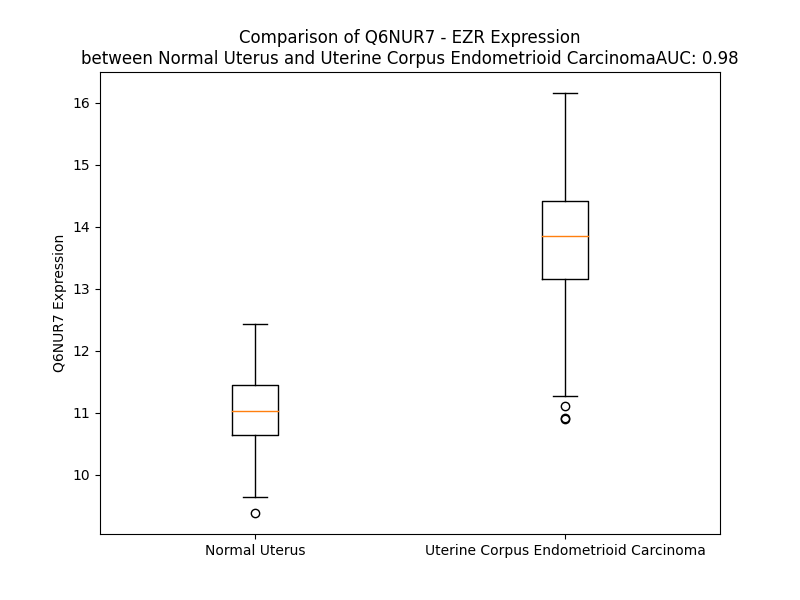

# Detailed Data for Q6NUR7

## Introduction to the Detailed Summary

### How to Interpret the Results

- **Summary & Metrics**: This section provides a quick reference to essential protein attributes, including expression changes, family classification, and biomarker applications. Regulation status (upregulated/downregulated) indicates the protein's behavior in a disease context. Some information comes from the original excel file with the proteins selected from literature, while others are derived from the analyses.
- **Expression Comparison**: A visual representation comparing protein expression between normal and disease states. It highlights significant changes in expression levels that might indicate diagnostic or therapeutic relevance. This is data coming from transcriptomics experiments and could not translate similarly to protein levels.
- **Isoform Alignment**: An interactive view of isoform alignments, revealing structural and functional differences between variants of the protein.
- **Interactors & Homologs**: Tables listing known interaction partners and homologous proteins, the more interactors and homologs, the more complex the protein is to design an antibody for.
- **Biological Assemblies**: Information about the structural arrangement of the protein in different assemblies, providing insights into its functional state but also the complexity of the protein to develop antibodies.
- **Combined Per-Residue Information**: A detailed table summarizing residue-level data. This includes predictions for epitope regions, aggregation tendencies, and modifications that might impact the protein's function. Each row corresponds to a residue in the protein, providing insights into specific sites that may be important for research or drug development.
## Summary & Metrics

- **UniProt Accession**: Q6NUR7
- **Gene Name**: EZR
- **Protein Name**: ezrin /villin2
- **Swiss Prot**: Q6NUR7_HUMAN
- **Family**: other
- **Biomarker Application**: prognosis
- **Number of Isoforms**: 0
- **Regulation**: 1
- **(transcriptomics) AUC**: 0.98
- **(transcriptomics) Fold Change**: 1.17
- **(transcriptomics) Regulation**: Upregulated
- **Discotope Epitope Count**: 109
- **Max n_uniprots (Homo)**: N/A
- **Max n_uniprots (Hetero)**: N/A

## Expression Comparison

## Combined Per-Residue Information

|   res | aa   |   epitope_score | epitope   |   relative_surface_accessibility |   modeling_confidence |   Aggregation | modification   |
|------:|:-----|----------------:|:----------|---------------------------------:|----------------------:|--------------:|:---------------|
|     1 | M    |         0.08586 | False     |                          1.24197 |                 66.5  |         0     | N/A            |
|     2 | P    |         0.23477 | True      |                          0.69657 |                 72.5  |         0     | N/A            |
|     3 | K    |         0.1461  | True      |                          0.85305 |                 85.06 |         0     | N/A            |
|     4 | P    |         0.12681 | True      |                          0.60933 |                 91.69 |         0     | N/A            |
|     5 | I    |         0.05742 | False     |                          0.25519 |                 94.06 |         0     | N/A            |
|     6 | N    |         0.0738  | False     |                          0.44153 |                 96.12 |         0     | N/A            |
|     7 | V    |         0.00642 | False     |                          0.00363 |                 97.12 |         0     | N/A            |
|     8 | R    |         0.08642 | False     |                          0.29722 |                 98.12 |         0     | N/A            |
|     9 | V    |         0.00243 | False     |                          0       |                 98.25 |         0     | N/A            |
|    10 | T    |         0.02857 | False     |                          0.25586 |                 98.12 |         0     | N/A            |
|    11 | T    |         0.01341 | False     |                          0.00799 |                 97.12 |         0     | N/A            |
|    12 | M    |         0.07764 | False     |                          0.22377 |                 95.75 |         0     | N/A            |
|    13 | D    |         0.09273 | False     |                          0.40321 |                 92.25 |         0     | N/A            |
|    14 | A    |         0.06625 | False     |                          0.39595 |                 94.06 |         0     | N/A            |
|    15 | E    |         0.16225 | True      |                          0.49971 |                 96.5  |         0     | N/A            |
|    16 | L    |         0.10448 | False     |                          0.17311 |                 96.19 |         0     | N/A            |
|    17 | E    |         0.15659 | True      |                          0.55381 |                 96.25 |         0     | N/A            |
|    18 | F    |         0.12332 | True      |                          0.21425 |                 95.56 |         0     | N/A            |
|    19 | A    |         0.07618 | False     |                          0.5894  |                 95.62 |         0     | N/A            |
|    20 | I    |         0.13286 | True      |                          0.04311 |                 95.62 |         0     | N/A            |
|    21 | Q    |         0.06816 | False     |                          0.4792  |                 94.88 |         0     | N/A            |
|    22 | P    |         0.0739  | False     |                          0.35655 |                 92.19 |         0     | N/A            |
|    23 | N    |         0.12907 | True      |                          0.61827 |                 93.88 |         0     | N/A            |
|    24 | T    |         0.03636 | False     |                          0.12716 |                 96.38 |         0     | N/A            |
|    25 | T    |         0.15778 | True      |                          0.28833 |                 97.5  |         0     | N/A            |
|    26 | G    |         0.0028  | False     |                          0       |                 96.75 |         0     | N/A            |
|    27 | K    |         0.04478 | False     |                          0.36852 |                 97.38 |         0     | N/A            |
|    28 | Q    |         0.09055 | False     |                          0.51856 |                 97.31 |         0     | N/A            |
|    29 | L    |         0.00329 | False     |                          0.00082 |                 97.5  |         0.022 | N/A            |
|    30 | F    |         0.02334 | False     |                          0.04459 |                 98    |         0.022 | N/A            |
|    31 | D    |         0.04474 | False     |                          0.24218 |                 97.38 |         0.022 | N/A            |
|    32 | Q    |         0.08453 | False     |                          0.38301 |                 96.56 |         0.022 | N/A            |
|    33 | V    |         0.00417 | False     |                          0.00095 |                 97.19 |         0.022 | N/A            |
|    34 | V    |         0.02049 | False     |                          0.05688 |                 96.81 |         0.022 | N/A            |
|    35 | K    |         0.10686 | False     |                          0.81806 |                 95.62 |         0.022 | N/A            |
|    36 | T    |         0.09158 | False     |                          0.6067  |                 95.44 |         0.217 | N/A            |
|    37 | I    |         0.07525 | False     |                          0.19117 |                 95.19 |         0.563 | N/A            |
|    38 | G    |         0.10619 | False     |                          0.56695 |                 94.75 |         0.563 | N/A            |
|    39 | L    |         0.03982 | False     |                          0.04041 |                 96.5  |         0.856 | N/A            |
|    40 | R    |         0.08516 | False     |                          0.39127 |                 95.56 |         0.888 | N/A            |
|    41 | E    |         0.00786 | False     |                          0       |                 96.06 |         0.888 | N/A            |
|    42 | V    |         0.08172 | False     |                          0.38787 |                 96.12 |        85.418 | N/A            |
|    43 | W    |         0.05555 | False     |                          0.23451 |                 95.06 |        86.263 | N/A            |
|    44 | Y    |         0.00934 | False     |                          0.02269 |                 97.5  |        86.411 | N/A            |
|    45 | F    |         0.01294 | False     |                          0.07386 |                 98.06 |        86.411 | N/A            |
|    46 | G    |         0.0157  | False     |                          0.09979 |                 97.25 |        86.08  | N/A            |
|    47 | L    |         0.00701 | False     |                          0.00496 |                 97.75 |        76.331 | N/A            |
|    48 | H    |         0.07254 | False     |                          0.21782 |                 95.56 |        22.777 | N/A            |
|    49 | Y    |         0.04727 | False     |                          0.04469 |                 95.62 |        22.284 | N/A            |
|    50 | V    |         0.08659 | False     |                          0.45051 |                 93.75 |        20.563 | N/A            |
|    51 | D    |         0.06249 | False     |                          0.11871 |                 91.62 |         0     | N/A            |
|    52 | N    |         0.11834 | False     |                          0.45633 |                 91    |         0     | N/A            |
|    53 | K    |         0.13692 | True      |                          0.64084 |                 88.88 |         0     | N/A            |
|    54 | G    |         0.14177 | True      |                          0.55797 |                 88.44 |         0     | N/A            |
|    55 | F    |         0.15155 | True      |                          0.35804 |                 86.88 |         0     | N/A            |
|    56 | P    |         0.21564 | True      |                          0.62472 |                 90.12 |         0     | N/A            |
|    57 | T    |         0.06979 | False     |                          0.28701 |                 91.44 |         0     | N/A            |
|    58 | W    |         0.0363  | False     |                          0.24055 |                 94.75 |         0     | N/A            |
|    59 | L    |         0.0162  | False     |                          0.07739 |                 95.62 |         0     | N/A            |
|    60 | K    |         0.08156 | False     |                          0.47343 |                 94.19 |         0     | N/A            |
|    61 | L    |         0.06843 | False     |                          0.4376  |                 94.31 |         0     | N/A            |
|    62 | D    |         0.08805 | False     |                          0.58991 |                 93.5  |         0     | N/A            |
|    63 | K    |         0.09056 | False     |                          0.45565 |                 95    |         0     | N/A            |
|    64 | K    |         0.17947 | True      |                          0.51459 |                 96    |         0     | N/A            |
|    65 | V    |         0.00705 | False     |                          0.00969 |                 94.81 |         0     | N/A            |
|    66 | S    |         0.10721 | False     |                          0.48419 |                 92.12 |         0     | N/A            |
|    67 | A    |         0.19845 | True      |                          0.69413 |                 93.44 |         0     | N/A            |
|    68 | Q    |         0.06259 | False     |                          0.08543 |                 92.5  |         0     | N/A            |
|    69 | E    |         0.11714 | False     |                          0.48204 |                 90.38 |         0     | N/A            |
|    70 | V    |         0.03139 | False     |                          0.09128 |                 91.75 |         0     | N/A            |
|    71 | R    |         0.15703 | True      |                          0.54253 |                 91.69 |         0     | N/A            |
|    72 | K    |         0.20039 | True      |                          0.89958 |                 88.12 |         0     | N/A            |
|    73 | E    |         0.15765 | True      |                          0.34166 |                 91.31 |         0     | N/A            |
|    74 | N    |         0.20145 | True      |                          0.78595 |                 91.12 |         0     | N/A            |
|    75 | P    |         0.22311 | True      |                          0.1948  |                 94.5  |         0     | N/A            |
|    76 | L    |         0.04988 | False     |                          0.10799 |                 96.06 |         0     | N/A            |
|    77 | Q    |         0.10767 | False     |                          0.35964 |                 97.06 |         0     | N/A            |
|    78 | F    |         0.01429 | False     |                          0.017   |                 98    |         0     | N/A            |
|    79 | K    |         0.11577 | False     |                          0.51574 |                 98.12 |         0     | N/A            |
|    80 | F    |         0.01414 | False     |                          0.00927 |                 98.38 |         0     | N/A            |
|    81 | R    |         0.08816 | False     |                          0.1411  |                 98.12 |         0     | N/A            |
|    82 | A    |         0.01627 | False     |                          0.05675 |                 97.62 |         0     | N/A            |
|    83 | K    |         0.03149 | False     |                          0.18172 |                 96.38 |         0     | N/A            |
|    84 | F    |         0.02138 | False     |                          0.09423 |                 97.75 |         0     | N/A            |
|    85 | Y    |         0.01077 | False     |                          0.12745 |                 97.88 |         0     | N/A            |
|    86 | P    |         0.00641 | False     |                          0.03894 |                 96.31 |         0     | N/A            |
|    87 | E    |         0.02621 | False     |                          0.08266 |                 93.69 |         0     | N/A            |
|    88 | D    |         0.03661 | False     |                          0.12028 |                 94.94 |         0     | N/A            |
|    89 | V    |         0.00277 | False     |                          0.0007  |                 96.31 |         0     | N/A            |
|    90 | A    |         0.04522 | False     |                          0.42656 |                 93.06 |         0     | N/A            |
|    91 | E    |         0.13589 | True      |                          0.66898 |                 90.81 |         0     | N/A            |
|    92 | E    |         0.03446 | False     |                          0.14722 |                 94.06 |         0     | N/A            |
|    93 | L    |         0.01467 | False     |                          0.05368 |                 96.31 |         0     | N/A            |
|    94 | I    |         0.06433 | False     |                          0.10974 |                 94.75 |         0     | N/A            |
|    95 | Q    |         0.07305 | False     |                          0.17997 |                 94.38 |         0     | N/A            |
|    96 | D    |         0.05089 | False     |                          0.35168 |                 94.25 |         0.058 | N/A            |
|    97 | I    |         0.03776 | False     |                          0.21831 |                 95.88 |         0.058 | N/A            |
|    98 | T    |         0.00187 | False     |                          0       |                 97    |         0.058 | N/A            |
|    99 | Q    |         0.01249 | False     |                          0.06875 |                 97.25 |         0.058 | N/A            |
|   100 | K    |         0.04305 | False     |                          0.3613  |                 97.81 |         0.058 | N/A            |
|   101 | L    |         0.00345 | False     |                          0.0228  |                 98.25 |        53.59  | N/A            |
|   102 | F    |         0.00234 | False     |                          0       |                 98.56 |        63.271 | N/A            |
|   103 | F    |         0.02178 | False     |                          0.04777 |                 98.56 |        63.271 | N/A            |
|   104 | L    |         0.03109 | False     |                          0.22652 |                 98.25 |        63.271 | N/A            |
|   105 | Q    |         0.02494 | False     |                          0.12258 |                 98.38 |        63.271 | N/A            |
|   106 | V    |         0.00228 | False     |                          0.00286 |                 98.56 |        62.691 | N/A            |
|   107 | K    |         0.04107 | False     |                          0.22626 |                 98.38 |         2.312 | N/A            |
|   108 | E    |         0.11157 | False     |                          0.43574 |                 97.69 |         2.312 | N/A            |
|   109 | G    |         0.03661 | False     |                          0.07174 |                 97.94 |         2.312 | N/A            |
|   110 | I    |         0.01227 | False     |                          0.0168  |                 98.56 |         2.312 | N/A            |
|   111 | L    |         0.03741 | False     |                          0.08469 |                 97.88 |         2.312 | N/A            |
|   112 | S    |         0.1307  | True      |                          0.4783  |                 97.25 |         0.085 | N/A            |
|   113 | D    |         0.06809 | False     |                          0.34214 |                 96.56 |         0     | N/A            |
|   114 | E    |         0.0676  | False     |                          0.67566 |                 96.56 |         0     | N/A            |
|   115 | I    |         0.02633 | False     |                          0.084   |                 98.06 |         0     | N/A            |
|   116 | Y    |         0.02024 | False     |                          0.01962 |                 98.25 |         0     | N/A            |
|   117 | C    |         0.00231 | False     |                          0       |                 98.31 |         0     | N/A            |
|   118 | P    |         0.01557 | False     |                          0.05766 |                 97.75 |         0     | N/A            |
|   119 | P    |         0.01519 | False     |                          0.11233 |                 97.56 |         0     | N/A            |
|   120 | E    |         0.01619 | False     |                          0.19548 |                 96.94 |         0     | N/A            |
|   121 | T    |         0.01262 | False     |                          0.0808  |                 98.19 |         5.995 | N/A            |
|   122 | A    |         0.00285 | False     |                          0.01675 |                 98.12 |        10.28  | N/A            |
|   123 | V    |         0.00102 | False     |                          0       |                 97.94 |        18.907 | N/A            |
|   124 | L    |         0.00214 | False     |                          0       |                 98.25 |        19.511 | N/A            |
|   125 | L    |         0.00199 | False     |                          0.00989 |                 98.5  |        19.622 | N/A            |
|   126 | G    |         0.00571 | False     |                          0.0092  |                 98    |        16.177 | N/A            |
|   127 | S    |         0.00109 | False     |                          0       |                 97.94 |        15.354 | N/A            |
|   128 | Y    |         0.00818 | False     |                          0.0213  |                 98.38 |        15.147 | N/A            |
|   129 | A    |         0.01798 | False     |                          0.07592 |                 98.12 |        14.081 | N/A            |
|   130 | V    |         0.00491 | False     |                          0.00571 |                 97.75 |        13.18  | N/A            |
|   131 | Q    |         0.00322 | False     |                          0.00059 |                 97.75 |         1.857 | N/A            |
|   132 | A    |         0.01753 | False     |                          0.10077 |                 97.38 |         0.834 | N/A            |
|   133 | K    |         0.16207 | True      |                          0.57188 |                 95.88 |         0     | N/A            |
|   134 | F    |         0.11978 | False     |                          0.34979 |                 95.62 |         0     | N/A            |
|   135 | G    |         0.04115 | False     |                          0.12452 |                 95.25 |         0     | N/A            |
|   136 | D    |         0.10219 | False     |                          0.38213 |                 95    |         0     | N/A            |
|   137 | Y    |         0.09892 | False     |                          0.21278 |                 95.81 |         0     | N/A            |
|   138 | N    |         0.09155 | False     |                          0.40064 |                 92.94 |         0     | N/A            |
|   139 | K    |         0.0892  | False     |                          0.78026 |                 92.44 |         0     | N/A            |
|   140 | E    |         0.15498 | True      |                          0.70563 |                 92.31 |         0     | N/A            |
|   141 | V    |         0.15629 | True      |                          0.7615  |                 92.38 |         0     | N/A            |
|   142 | H    |         0.0726  | False     |                          0.11296 |                 94.31 |         0     | N/A            |
|   143 | K    |         0.12975 | True      |                          0.5931  |                 91.88 |         0     | N/A            |
|   144 | S    |         0.06893 | False     |                          0.85862 |                 89.75 |         0     | N/A            |
|   145 | G    |         0.0744  | False     |                          0.48507 |                 89.81 |         0     | N/A            |
|   146 | Y    |         0.15402 | True      |                          0.1774  |                 93.81 |         0     | N/A            |
|   147 | L    |         0.01259 | False     |                          0.00387 |                 93.94 |         0     | N/A            |
|   148 | S    |         0.11008 | False     |                          0.43066 |                 90.88 |         0     | N/A            |
|   149 | S    |         0.23976 | True      |                          0.77094 |                 90.25 |         0     | N/A            |
|   150 | E    |         0.12396 | True      |                          0.17422 |                 91.75 |         0     | N/A            |
|   151 | R    |         0.23229 | True      |                          0.56121 |                 92.88 |         0     | N/A            |
|   152 | L    |         0.04375 | False     |                          0.15384 |                 88.81 |         0     | N/A            |
|   153 | I    |         0.01883 | False     |                          0.0232  |                 95.94 |         0     | N/A            |
|   154 | P    |         0.00491 | False     |                          0.00398 |                 97.19 |         0     | N/A            |
|   155 | Q    |         0.14724 | True      |                          0.4732  |                 95.5  |         0     | N/A            |
|   156 | R    |         0.0696  | False     |                          0.11671 |                 96.69 |         0     | N/A            |
|   157 | V    |         0.00355 | False     |                          0       |                 96.88 |         0     | N/A            |
|   158 | M    |         0.10642 | False     |                          0.2899  |                 94.88 |         0     | N/A            |
|   159 | D    |         0.19223 | True      |                          0.4458  |                 94.69 |         0     | N/A            |
|   160 | Q    |         0.01489 | False     |                          0.01452 |                 95.25 |         0     | N/A            |
|   161 | H    |         0.04384 | False     |                          0.04677 |                 96.19 |         0     | N/A            |
|   162 | K    |         0.22404 | True      |                          0.681   |                 94    |         0     | N/A            |
|   163 | L    |         0.09057 | False     |                          0.18675 |                 94.5  |         0     | N/A            |
|   164 | T    |         0.17881 | True      |                          0.56055 |                 93.62 |         0     | N/A            |
|   165 | R    |         0.15743 | True      |                          0.47695 |                 91.69 |         0     | N/A            |
|   166 | D    |         0.074   | False     |                          0.60803 |                 92.69 |         0     | N/A            |
|   167 | Q    |         0.17145 | True      |                          0.41683 |                 94.12 |         0     | N/A            |
|   168 | W    |         0.01927 | False     |                          0.03373 |                 95.44 |         0     | N/A            |
|   169 | E    |         0.02791 | False     |                          0.09634 |                 94.5  |         0     | N/A            |
|   170 | D    |         0.0713  | False     |                          0.46202 |                 93.25 |         0     | N/A            |
|   171 | R    |         0.11709 | False     |                          0.21832 |                 94.94 |         0     | N/A            |
|   172 | I    |         0.00998 | False     |                          0.0136  |                 96.5  |         0     | N/A            |
|   173 | Q    |         0.03534 | False     |                          0.17934 |                 96.19 |         0     | N/A            |
|   174 | V    |         0.14878 | True      |                          0.64944 |                 95.75 |         0     | N/A            |
|   175 | W    |         0.06382 | False     |                          0.09645 |                 96.38 |         0     | N/A            |
|   176 | H    |         0.01042 | False     |                          0       |                 97    |         0     | N/A            |
|   177 | A    |         0.05116 | False     |                          0.39762 |                 95.88 |         0     | N/A            |
|   178 | E    |         0.11634 | False     |                          0.4484  |                 95.5  |         0     | N/A            |
|   179 | H    |         0.00989 | False     |                          0.0072  |                 95.44 |         0     | N/A            |
|   180 | R    |         0.13867 | True      |                          0.75903 |                 93.62 |         0     | N/A            |
|   181 | G    |         0.04748 | False     |                          0.37447 |                 89.94 |         0     | N/A            |
|   182 | M    |         0.02913 | False     |                          0.21185 |                 93.38 |         0     | N/A            |
|   183 | L    |         0.07219 | False     |                          0.30631 |                 91.75 |         0     | N/A            |
|   184 | K    |         0.06802 | False     |                          0.4322  |                 94    |         0     | N/A            |
|   185 | D    |         0.03391 | False     |                          0.21503 |                 92.81 |         0     | N/A            |
|   186 | N    |         0.07909 | False     |                          0.26828 |                 93.94 |         0     | N/A            |
|   187 | A    |         0.00123 | False     |                          0       |                 97.38 |         0     | N/A            |
|   188 | M    |         0.03204 | False     |                          0.0858  |                 98.12 |         0.203 | N/A            |
|   189 | L    |         0.01775 | False     |                          0.11788 |                 96.94 |         0.38  | N/A            |
|   190 | E    |         0.01862 | False     |                          0.1459  |                 97.75 |         0.38  | N/A            |
|   191 | Y    |         0.00807 | False     |                          0.01841 |                 98.62 |         0.38  | N/A            |
|   192 | L    |         0.00119 | False     |                          0       |                 98.56 |         0.38  | N/A            |
|   193 | K    |         0.01905 | False     |                          0.18824 |                 98.19 |         0.38  | N/A            |
|   194 | I    |         0.00861 | False     |                          0.0536  |                 98.31 |         0.38  | N/A            |
|   195 | A    |         0.00111 | False     |                          0       |                 98.44 |         0     | N/A            |
|   196 | Q    |         0.02866 | False     |                          0.04068 |                 97.88 |         0     | N/A            |
|   197 | D    |         0.06643 | False     |                          0.14153 |                 97.88 |         0     | N/A            |
|   198 | L    |         0.01385 | False     |                          0.06183 |                 98.12 |         0     | N/A            |
|   199 | E    |         0.01799 | False     |                          0.11439 |                 97.44 |         0     | N/A            |
|   200 | M    |         0.03733 | False     |                          0.11163 |                 98.06 |         0     | N/A            |
|   201 | Y    |         0.03024 | False     |                          0.05013 |                 98.19 |         0     | N/A            |
|   202 | G    |         0.02142 | False     |                          0.13557 |                 96.5  |         0     | N/A            |
|   203 | I    |         0.0259  | False     |                          0.12724 |                 97.69 |         0     | N/A            |
|   204 | N    |         0.06431 | False     |                          0.16629 |                 97.25 |         0     | N/A            |
|   205 | Y    |         0.05859 | False     |                          0.18487 |                 97.38 |         0     | N/A            |
|   206 | F    |         0.02725 | False     |                          0.0686  |                 97.38 |         0     | N/A            |
|   207 | E    |         0.09257 | False     |                          0.42303 |                 97.5  |         0     | N/A            |
|   208 | I    |         0.01982 | False     |                          0.01617 |                 98    |         0     | N/A            |
|   209 | K    |         0.09055 | False     |                          0.38637 |                 98.12 |         0     | N/A            |
|   210 | N    |         0.01754 | False     |                          0.01337 |                 96.5  |         0     | N/A            |
|   211 | K    |         0.11318 | False     |                          0.56951 |                 95    |         0     | N/A            |
|   212 | K    |         0.07267 | False     |                          0.65316 |                 94.88 |         0     | N/A            |
|   213 | G    |         0.08722 | False     |                          0.36323 |                 94.69 |         0     | N/A            |
|   214 | T    |         0.08709 | False     |                          0.32703 |                 97.5  |         0     | N/A            |
|   215 | D    |         0.12843 | True      |                          0.41209 |                 97.94 |         0     | N/A            |
|   216 | L    |         0.00532 | False     |                          0.012   |                 98.25 |         1.15  | N/A            |
|   217 | W    |         0.09061 | False     |                          0.15423 |                 98.38 |         1.15  | N/A            |
|   218 | L    |         0.00322 | False     |                          0.00082 |                 98.5  |         1.15  | N/A            |
|   219 | G    |         0.00241 | False     |                          0       |                 98.31 |         1.15  | N/A            |
|   220 | V    |         0.00263 | False     |                          0.0007  |                 98.38 |         1.15  | N/A            |
|   221 | D    |         0.01257 | False     |                          0.05585 |                 97.06 |         0     | N/A            |
|   222 | A    |         0.00755 | False     |                          0.07731 |                 96.19 |         0.215 | N/A            |
|   223 | L    |         0.03646 | False     |                          0.08161 |                 94.69 |         0.474 | N/A            |
|   224 | G    |         0.00318 | False     |                          0       |                 95.81 |         0.603 | N/A            |
|   225 | L    |         0.00122 | False     |                          0.00082 |                 98.06 |         0.603 | N/A            |
|   226 | N    |         0.00694 | False     |                          0.00877 |                 98.25 |         0.603 | N/A            |
|   227 | I    |         0.0024  | False     |                          0       |                 98.44 |         0.603 | N/A            |
|   228 | Y    |         0.00689 | False     |                          0.00621 |                 98.5  |         0.603 | N/A            |
|   229 | E    |         0.06184 | False     |                          0.28687 |                 97.38 |         0     | N/A            |
|   230 | K    |         0.09691 | False     |                          0.41119 |                 95.69 |         0     | N/A            |
|   231 | D    |         0.19005 | True      |                          0.60119 |                 95.88 |         0     | N/A            |
|   232 | D    |         0.07433 | False     |                          0.08588 |                 96.88 |         0     | N/A            |
|   233 | K    |         0.07674 | False     |                          0.28847 |                 96.81 |         0     | N/A            |
|   234 | L    |         0.01051 | False     |                          0.02215 |                 96.38 |         0     | N/A            |
|   235 | T    |         0.03864 | False     |                          0.05778 |                 97.31 |         0     | N/A            |
|   236 | P    |         0.0116  | False     |                          0.07689 |                 97.56 |         0     | N/A            |
|   237 | K    |         0.08181 | False     |                          0.37633 |                 96.94 |         0     | N/A            |
|   238 | I    |         0.04062 | False     |                          0.0376  |                 97.62 |         0     | N/A            |
|   239 | G    |         0.00188 | False     |                          0       |                 96.81 |         0     | N/A            |
|   240 | F    |         0.01393 | False     |                          0.02848 |                 96.38 |         0     | N/A            |
|   241 | P    |         0.04665 | False     |                          0.11332 |                 95.44 |         0     | N/A            |
|   242 | W    |         0.00319 | False     |                          0       |                 94.88 |         0     | N/A            |
|   243 | S    |         0.02973 | False     |                          0.28854 |                 91.62 |         0     | N/A            |
|   244 | E    |         0.0553  | False     |                          0.173   |                 93.5  |         0     | N/A            |
|   245 | I    |         0.01434 | False     |                          0.0239  |                 93.31 |         0     | N/A            |
|   246 | R    |         0.05914 | False     |                          0.38021 |                 90.75 |         0     | N/A            |
|   247 | N    |         0.09667 | False     |                          0.40641 |                 91.88 |         0     | N/A            |
|   248 | I    |         0.02302 | False     |                          0.07872 |                 94.88 |         0     | N/A            |
|   249 | S    |         0.09229 | False     |                          0.35661 |                 93.56 |         0     | N/A            |
|   250 | F    |         0.06586 | False     |                          0.26633 |                 94.44 |         0     | N/A            |
|   251 | N    |         0.14354 | True      |                          0.75976 |                 92.44 |         0     | N/A            |
|   252 | D    |         0.13927 | True      |                          0.47571 |                 91.88 |         0     | N/A            |
|   253 | K    |         0.05686 | False     |                          0.51935 |                 94.19 |         0     | N/A            |
|   254 | K    |         0.16163 | True      |                          0.42265 |                 95.56 |         0     | N/A            |
|   255 | F    |         0.00384 | False     |                          0.00064 |                 97.81 |         0     | N/A            |
|   256 | V    |         0.0422  | False     |                          0.16185 |                 96.69 |         0     | N/A            |
|   257 | I    |         0.03618 | False     |                          0.0304  |                 96.5  |         0     | N/A            |
|   258 | K    |         0.06329 | False     |                          0.39643 |                 94.81 |         0     | N/A            |
|   259 | P    |         0.04    | False     |                          0.08069 |                 93.88 |         0     | N/A            |
|   260 | I    |         0.07741 | False     |                          0.32507 |                 91.12 |         0     | N/A            |
|   261 | D    |         0.16718 | True      |                          0.39603 |                 90.56 |         0     | N/A            |
|   262 | K    |         0.169   | True      |                          0.88124 |                 89.5  |         0     | N/A            |
|   263 | K    |         0.21548 | True      |                          0.91754 |                 90.44 |         0     | N/A            |
|   264 | A    |         0.06514 | False     |                          0.10493 |                 92.75 |         0     | N/A            |
|   265 | P    |         0.11258 | False     |                          0.38655 |                 95.06 |         0     | N/A            |
|   266 | D    |         0.12618 | True      |                          0.31032 |                 96.19 |         0     | N/A            |
|   267 | F    |         0.01614 | False     |                          0.02011 |                 97.12 |        12.57  | N/A            |
|   268 | V    |         0.03638 | False     |                          0.05141 |                 97.56 |        13.138 | N/A            |
|   269 | F    |         0.00645 | False     |                          0       |                 98    |        13.138 | N/A            |
|   270 | Y    |         0.08683 | False     |                          0.35915 |                 97.88 |        13.138 | N/A            |
|   271 | A    |         0.02511 | False     |                          0.0109  |                 96.19 |        13.138 | N/A            |
|   272 | P    |         0.12686 | True      |                          0.51328 |                 92.56 |         7.536 | N/A            |
|   273 | R    |         0.26635 | True      |                          0.533   |                 90.25 |         0     | N/A            |
|   274 | L    |         0.11701 | False     |                          0.45851 |                 89.44 |         0     | N/A            |
|   275 | R    |         0.14254 | True      |                          0.40788 |                 87.38 |         0     | N/A            |
|   276 | I    |         0.05668 | False     |                          0.20479 |                 91.56 |         0     | N/A            |
|   277 | N    |         0.00419 | False     |                          0       |                 93.5  |         0     | N/A            |
|   278 | K    |         0.12918 | True      |                          0.52978 |                 92.06 |         0     | N/A            |
|   279 | R    |         0.11344 | False     |                          0.39594 |                 92.12 |         0     | N/A            |
|   280 | I    |         0.0035  | False     |                          0.0008  |                 95.56 |         0     | N/A            |
|   281 | L    |         0.04591 | False     |                          0.22175 |                 94.75 |         0     | N/A            |
|   282 | Q    |         0.04409 | False     |                          0.39382 |                 92.12 |         0     | N/A            |
|   283 | L    |         0.00838 | False     |                          0.01072 |                 94.69 |         0     | N/A            |
|   284 | C    |         0.00149 | False     |                          0.00094 |                 95.94 |         0     | N/A            |
|   285 | M    |         0.03087 | False     |                          0.19582 |                 92.69 |         0     | N/A            |
|   286 | G    |         0.01866 | False     |                          0.11555 |                 93.12 |         0     | N/A            |
|   287 | N    |         0.00855 | False     |                          0.03079 |                 95.38 |         0     | N/A            |
|   288 | H    |         0.00986 | False     |                          0.01967 |                 92.62 |         0     | N/A            |
|   289 | E    |         0.07128 | False     |                          0.51463 |                 91.44 |         0     | N/A            |
|   290 | L    |         0.0314  | False     |                          0.08903 |                 92.94 |         0     | N/A            |
|   291 | Y    |         0.00882 | False     |                          0.01574 |                 92.44 |         0     | N/A            |
|   292 | M    |         0.03574 | False     |                          0.06814 |                 88.88 |         0     | N/A            |
|   293 | R    |         0.10085 | False     |                          0.34003 |                 88.69 |         0     | N/A            |
|   294 | R    |         0.05225 | False     |                          0.25823 |                 88.5  |         0     | N/A            |
|   295 | R    |         0.08518 | False     |                          0.15551 |                 87.5  |         0     | N/A            |
|   296 | K    |         0.0598  | False     |                          0.39706 |                 87.06 |         0     | N/A            |
|   297 | P    |         0.1891  | True      |                          0.82001 |                 86.12 |         0     | N/A            |
|   298 | D    |         0.11913 | False     |                          0.3727  |                 88.44 |         0     | N/A            |
|   299 | T    |         0.13132 | True      |                          0.50185 |                 90.81 |         0     | N/A            |
|   300 | I    |         0.2245  | True      |                          0.79167 |                 91.25 |         0     | N/A            |
|   301 | E    |         0.06049 | False     |                          0.42646 |                 90.25 |         0     | N/A            |
|   302 | V    |         0.02713 | False     |                          0.05712 |                 92    |         0     | N/A            |
|   303 | Q    |         0.10649 | False     |                          0.48226 |                 91.19 |         0     | N/A            |
|   304 | Q    |         0.05727 | False     |                          0.52033 |                 93.06 |         0     | N/A            |
|   305 | M    |         0.021   | False     |                          0.02454 |                 92.44 |         0     | N/A            |
|   306 | K    |         0.06561 | False     |                          0.29311 |                 93    |         0     | N/A            |
|   307 | A    |         0.07199 | False     |                          0.45627 |                 92.62 |         0     | N/A            |
|   308 | Q    |         0.06476 | False     |                          0.45541 |                 91.94 |         0     | N/A            |
|   309 | A    |         0.06602 | False     |                          0.22719 |                 89.94 |         0     | N/A            |
|   310 | R    |         0.08933 | False     |                          0.67199 |                 89.25 |         0     | N/A            |
|   311 | E    |         0.0498  | False     |                          0.65719 |                 90.75 |         0     | N/A            |
|   312 | E    |         0.04461 | False     |                          0.4312  |                 88.81 |         0     | N/A            |
|   313 | K    |         0.04006 | False     |                          0.4417  |                 86.44 |         0     | N/A            |
|   314 | H    |         0.07613 | False     |                          0.57847 |                 88.75 |         0     | N/A            |
|   315 | Q    |         0.04509 | False     |                          0.57233 |                 90.12 |         0     | N/A            |
|   316 | K    |         0.07484 | False     |                          0.39894 |                 87.25 |         0     | N/A            |
|   317 | Q    |         0.05692 | False     |                          0.46487 |                 85.81 |         0     | N/A            |
|   318 | L    |         0.04383 | False     |                          0.41318 |                 89.31 |         0     | N/A            |
|   319 | E    |         0.03196 | False     |                          0.59121 |                 88.81 |         0     | N/A            |
|   320 | R    |         0.05827 | False     |                          0.28684 |                 83.12 |         0     | N/A            |
|   321 | Q    |         0.06677 | False     |                          0.47608 |                 87.19 |         0     | N/A            |
|   322 | Q    |         0.05924 | False     |                          0.63761 |                 89.62 |         0     | N/A            |
|   323 | L    |         0.09772 | False     |                          0.58613 |                 87    |         0     | N/A            |
|   324 | E    |         0.05182 | False     |                          0.32166 |                 85.25 |         0     | N/A            |
|   325 | T    |         0.05398 | False     |                          0.63273 |                 89    |         0     | N/A            |
|   326 | E    |         0.05759 | False     |                          0.32957 |                 88.62 |         0     | N/A            |
|   327 | K    |         0.0567  | False     |                          0.53758 |                 87.5  |         0     | N/A            |
|   328 | K    |         0.07362 | False     |                          0.62757 |                 87.62 |         0     | N/A            |
|   329 | R    |         0.0837  | False     |                          0.67486 |                 89.06 |         0     | N/A            |
|   330 | R    |         0.06196 | False     |                          0.6399  |                 87.5  |         0     | N/A            |
|   331 | E    |         0.06336 | False     |                          0.41323 |                 88.44 |         0     | N/A            |
|   332 | T    |         0.03732 | False     |                          0.459   |                 90.44 |         0     | N/A            |
|   333 | V    |         0.06765 | False     |                          0.60643 |                 90.69 |         0     | N/A            |
|   334 | E    |         0.0765  | False     |                          0.57258 |                 87.88 |         0     | N/A            |
|   335 | R    |         0.10229 | False     |                          0.6232  |                 90.06 |         0     | N/A            |
|   336 | E    |         0.04392 | False     |                          0.50346 |                 91.56 |         0     | N/A            |
|   337 | K    |         0.059   | False     |                          0.62949 |                 90.5  |         0     | N/A            |
|   338 | E    |         0.0909  | False     |                          0.45686 |                 91    |         0     | N/A            |
|   339 | Q    |         0.05782 | False     |                          0.54381 |                 91.44 |         0     | N/A            |
|   340 | M    |         0.09558 | False     |                          0.63527 |                 91.69 |         0     | N/A            |
|   341 | M    |         0.09906 | False     |                          0.53373 |                 90.12 |         0     | N/A            |
|   342 | R    |         0.10833 | False     |                          0.61102 |                 92    |         0     | N/A            |
|   343 | E    |         0.07377 | False     |                          0.43325 |                 92.06 |         0     | N/A            |
|   344 | K    |         0.0908  | False     |                          0.57264 |                 91.38 |         0     | N/A            |
|   345 | E    |         0.05628 | False     |                          0.44538 |                 91.56 |         0     | N/A            |
|   346 | E    |         0.13155 | True      |                          0.47379 |                 93.19 |         0     | N/A            |
|   347 | L    |         0.08847 | False     |                          0.62239 |                 93.75 |         0     | N/A            |
|   348 | M    |         0.06813 | False     |                          0.45438 |                 91    |         0     | N/A            |
|   349 | L    |         0.10984 | False     |                          0.71668 |                 93.62 |         0     | N/A            |
|   350 | R    |         0.15773 | True      |                          0.53663 |                 93.19 |         0     | N/A            |
|   351 | L    |         0.07965 | False     |                          0.66778 |                 89.19 |         0     | N/A            |
|   352 | Q    |         0.10477 | False     |                          0.56058 |                 89.88 |         0     | N/A            |
|   353 | D    |         0.07094 | False     |                          0.37668 |                 91.75 |         0     | N/A            |
|   354 | Y    |         0.16557 | True      |                          0.64647 |                 89.12 |         0     | N/A            |
|   355 | E    |         0.05151 | False     |                          0.49046 |                 87.56 |         0     | N/A            |
|   356 | E    |         0.09294 | False     |                          0.65628 |                 90.81 |         0     | N/A            |
|   357 | K    |         0.11065 | False     |                          0.58367 |                 90.06 |         0     | N/A            |
|   358 | T    |         0.08293 | False     |                          0.53037 |                 86.06 |         0     | N/A            |
|   359 | K    |         0.08285 | False     |                          0.47272 |                 90.06 |         0     | N/A            |
|   360 | K    |         0.07024 | False     |                          0.61284 |                 89.94 |         0     | N/A            |
|   361 | A    |         0.06116 | False     |                          0.52925 |                 87    |         0     | N/A            |
|   362 | E    |         0.06391 | False     |                          0.52504 |                 84.31 |         0     | N/A            |
|   363 | R    |         0.08174 | False     |                          0.68247 |                 88.44 |         0     | N/A            |
|   364 | E    |         0.10384 | False     |                          0.41126 |                 88.88 |         0     | N/A            |
|   365 | L    |         0.10645 | False     |                          0.63406 |                 86.12 |         0     | N/A            |
|   366 | S    |         0.0725  | False     |                          0.43779 |                 87.38 |         0     | N/A            |
|   367 | E    |         0.06908 | False     |                          0.4292  |                 89.25 |         0     | N/A            |
|   368 | Q    |         0.1102  | False     |                          0.57589 |                 85    |         0     | N/A            |
|   369 | I    |         0.04306 | False     |                          0.55177 |                 86.19 |         0     | N/A            |
|   370 | Q    |         0.08728 | False     |                          0.57227 |                 86.94 |         0     | N/A            |
|   371 | R    |         0.11937 | False     |                          0.5635  |                 86.94 |         0     | N/A            |
|   372 | A    |         0.09537 | False     |                          0.54592 |                 82.88 |         0     | N/A            |
|   373 | L    |         0.07511 | False     |                          0.65528 |                 88.12 |         0     | N/A            |
|   374 | Q    |         0.07212 | False     |                          0.57432 |                 86.56 |         0     | N/A            |
|   375 | L    |         0.14898 | True      |                          0.71389 |                 82.88 |         0     | N/A            |
|   376 | E    |         0.08701 | False     |                          0.56738 |                 80.31 |         0     | N/A            |
|   377 | E    |         0.08408 | False     |                          0.47192 |                 84.38 |         0     | N/A            |
|   378 | E    |         0.07011 | False     |                          0.54962 |                 83.81 |         0     | N/A            |
|   379 | R    |         0.09842 | False     |                          0.65264 |                 81.94 |         0     | N/A            |
|   380 | K    |         0.07226 | False     |                          0.60633 |                 83.5  |         0     | N/A            |
|   381 | R    |         0.08032 | False     |                          0.59786 |                 83.38 |         0     | N/A            |
|   382 | A    |         0.13628 | True      |                          0.60467 |                 79.06 |         0     | N/A            |
|   383 | Q    |         0.07649 | False     |                          0.42126 |                 77.94 |         0     | N/A            |
|   384 | E    |         0.10019 | False     |                          0.45983 |                 82.69 |         0     | N/A            |
|   385 | E    |         0.11086 | False     |                          0.42735 |                 81.31 |         0     | N/A            |
|   386 | A    |         0.08389 | False     |                          0.5252  |                 76.62 |         0     | N/A            |
|   387 | E    |         0.06995 | False     |                          0.50984 |                 81.88 |         0     | N/A            |
|   388 | R    |         0.15704 | True      |                          0.51827 |                 84.25 |         0     | N/A            |
|   389 | L    |         0.16259 | True      |                          0.61655 |                 80.44 |         0     | N/A            |
|   390 | E    |         0.18474 | True      |                          0.56372 |                 78.38 |         0     | N/A            |
|   391 | A    |         0.0872  | False     |                          0.5813  |                 81    |         0     | N/A            |
|   392 | D    |         0.0882  | False     |                          0.50875 |                 79.12 |         0     | N/A            |
|   393 | R    |         0.11599 | False     |                          0.65992 |                 82.56 |         0     | N/A            |
|   394 | M    |         0.07395 | False     |                          0.53141 |                 79.25 |         0     | N/A            |
|   395 | A    |         0.06512 | False     |                          0.52544 |                 81.38 |         0     | N/A            |
|   396 | A    |         0.15396 | True      |                          0.60407 |                 76.5  |         0     | N/A            |
|   397 | L    |         0.07675 | False     |                          0.52561 |                 78.75 |         0     | N/A            |
|   398 | R    |         0.07912 | False     |                          0.59474 |                 80.75 |         0     | N/A            |
|   399 | A    |         0.11893 | False     |                          0.5028  |                 77.38 |         0     | N/A            |
|   400 | K    |         0.13862 | True      |                          0.53023 |                 76.06 |         0     | N/A            |
|   401 | E    |         0.10343 | False     |                          0.57479 |                 77.25 |         0     | N/A            |
|   402 | E    |         0.12217 | True      |                          0.58048 |                 75.06 |         0     | N/A            |
|   403 | L    |         0.09905 | False     |                          0.73541 |                 72.31 |         0     | N/A            |
|   404 | E    |         0.10245 | False     |                          0.43011 |                 70.25 |         0     | N/A            |
|   405 | R    |         0.11072 | False     |                          0.71297 |                 74.19 |         0     | N/A            |
|   406 | Q    |         0.06557 | False     |                          0.5704  |                 72.5  |         0     | N/A            |
|   407 | A    |         0.18324 | True      |                          0.46209 |                 68.06 |         0     | N/A            |
|   408 | V    |         0.08508 | False     |                          0.51337 |                 71.38 |         0     | N/A            |
|   409 | D    |         0.10273 | False     |                          0.45352 |                 67.56 |         0     | N/A            |
|   410 | Q    |         0.1266  | True      |                          0.67976 |                 61.56 |         0     | N/A            |
|   411 | I    |         0.08797 | False     |                          0.58786 |                 62.81 |         0     | N/A            |
|   412 | K    |         0.10339 | False     |                          0.50751 |                 64.19 |         0     | N/A            |
|   413 | S    |         0.06892 | False     |                          0.48242 |                 63.56 |         0     | N/A            |
|   414 | Q    |         0.08794 | False     |                          0.6618  |                 55.94 |         0     | N/A            |
|   415 | E    |         0.10473 | False     |                          0.54552 |                 59.19 |         0     | N/A            |
|   416 | Q    |         0.08615 | False     |                          0.6813  |                 60.31 |         0     | N/A            |
|   417 | L    |         0.08519 | False     |                          0.68037 |                 58.47 |         0     | N/A            |
|   418 | A    |         0.07006 | False     |                          0.55843 |                 59.41 |         0     | N/A            |
|   419 | A    |         0.05512 | False     |                          0.5766  |                 63.72 |         0     | N/A            |
|   420 | E    |         0.0428  | False     |                          0.56546 |                 63.12 |         0     | N/A            |
|   421 | L    |         0.10122 | False     |                          0.73203 |                 57.06 |         0     | N/A            |
|   422 | A    |         0.05614 | False     |                          0.55276 |                 58.59 |         0     | N/A            |
|   423 | E    |         0.04086 | False     |                          0.63929 |                 67    |         0     | N/A            |
|   424 | Y    |         0.04798 | False     |                          0.67599 |                 59.31 |         0     | N/A            |
|   425 | T    |         0.06194 | False     |                          0.57246 |                 56.94 |         0     | N/A            |
|   426 | A    |         0.0518  | False     |                          0.47196 |                 60    |         0     | N/A            |
|   427 | K    |         0.04555 | False     |                          0.63983 |                 64    |         0     | N/A            |
|   428 | I    |         0.05658 | False     |                          0.57906 |                 57.34 |         0     | N/A            |
|   429 | A    |         0.03914 | False     |                          0.4144  |                 57.62 |         0     | N/A            |
|   430 | L    |         0.05132 | False     |                          0.69908 |                 63.53 |         0     | N/A            |
|   431 | L    |         0.03248 | False     |                          0.77133 |                 57.53 |         0     | N/A            |
|   432 | E    |         0.03474 | False     |                          0.37418 |                 56.25 |         0     | N/A            |
|   433 | E    |         0.02584 | False     |                          0.16601 |                 57.41 |         0     | N/A            |
|   434 | A    |         0.06972 | False     |                          0.51443 |                 56.12 |         0     | N/A            |
|   435 | R    |         0.09037 | False     |                          0.51951 |                 54.06 |         0     | N/A            |
|   436 | R    |         0.05473 | False     |                          0.37389 |                 52.5  |         0     | N/A            |
|   437 | R    |         0.10279 | False     |                          0.59906 |                 52.03 |         0     | N/A            |
|   438 | K    |         0.10395 | False     |                          0.82911 |                 53.41 |         0     | N/A            |
|   439 | E    |         0.06727 | False     |                          0.52766 |                 36.78 |         0     | N/A            |
|   440 | D    |         0.07701 | False     |                          0.51601 |                 40.53 |         0     | N/A            |
|   441 | E    |         0.09557 | False     |                          0.60233 |                 52.91 |         0     | N/A            |
|   442 | V    |         0.05602 | False     |                          1.05266 |                 28    |         0     | N/A            |
|   443 | E    |         0.10543 | False     |                          0.88104 |                 12.7  |         0     | N/A            |
|   444 | E    |         0.07938 | False     |                          0.78757 |                 49.72 |         0     | N/A            |
|   445 | W    |         0.13862 | True      |                          1.01022 |                 35.44 |         0     | N/A            |
|   446 | Q    |         0.14314 | True      |                          0.78187 |                  5.45 |         0     | N/A            |
|   447 | H    |         0.16794 | True      |                          1.09112 |                  4.55 |         0     | N/A            |
|   448 | R    |         0.20325 | True      |                          0.95358 |                  4.18 |         0     | N/A            |
|   449 | A    |         0.11587 | False     |                          0.97589 |                 19.73 |         0     | N/A            |
|   450 | K    |         0.10294 | False     |                          1.03023 |                 20.59 |         0     | N/A            |
|   451 | E    |         0.11469 | False     |                          0.89348 |                 24.5  |         0     | N/A            |
|   452 | A    |         0.15338 | True      |                          0.98142 |                 39.94 |         0     | N/A            |
|   453 | Q    |         0.20256 | True      |                          0.83941 |                 42.75 |         0     | N/A            |
|   454 | D    |         0.11831 | False     |                          0.79159 |                 45.72 |         0     | N/A            |
|   455 | D    |         0.19654 | True      |                          0.82596 |                 48.38 |         0     | N/A            |
|   456 | L    |         0.06425 | False     |                          0.89708 |                 43    |         0     | N/A            |
|   457 | V    |         0.09071 | False     |                          0.82476 |                 53    |         0     | N/A            |
|   458 | K    |         0.1063  | False     |                          0.92806 |                 41.72 |         0     | N/A            |
|   459 | T    |         0.09814 | False     |                          0.80501 |                 36.56 |         0     | N/A            |
|   460 | K    |         0.18854 | True      |                          0.76333 |                 43.56 |         0     | N/A            |
|   461 | E    |         0.10495 | False     |                          0.69431 |                 36.59 |         0     | N/A            |
|   462 | E    |         0.07786 | False     |                          0.76686 |                 34.62 |         0     | N/A            |
|   463 | L    |         0.10664 | False     |                          0.86625 |                 32.69 |         0     | N/A            |
|   464 | H    |         0.08724 | False     |                          0.79351 |                 30.08 |         0     | N/A            |
|   465 | L    |         0.11719 | False     |                          0.87803 |                 27.89 |         0     | N/A            |
|   466 | V    |         0.13344 | True      |                          0.76074 |                 28.78 |         0     | N/A            |
|   467 | M    |         0.09838 | False     |                          0.87497 |                 27.64 |         0     | N/A            |
|   468 | T    |         0.15057 | True      |                          0.8798  |                 29.33 |         0     | N/A            |
|   469 | A    |         0.08704 | False     |                          0.83021 |                 25.11 |         0     | N/A            |
|   470 | P    |         0.12441 | True      |                          0.93574 |                 45.12 |         0     | N/A            |
|   471 | P    |         0.12814 | True      |                          0.86208 |                 39.5  |         0     | N/A            |
|   472 | P    |         0.09211 | False     |                          0.80412 |                 42.09 |         0     | N/A            |
|   473 | P    |         0.10116 | False     |                          0.93201 |                 43.25 |         0     | N/A            |
|   474 | P    |         0.10208 | False     |                          0.83269 |                 43.44 |         0     | N/A            |
|   475 | P    |         0.08189 | False     |                          0.91195 |                 46    |         0     | N/A            |
|   476 | P    |         0.07984 | False     |                          0.89773 |                 53.5  |         0     | N/A            |
|   477 | V    |         0.0778  | False     |                          0.78175 |                 28.34 |         0     | N/A            |
|   478 | Y    |         0.0974  | False     |                          0.86987 |                 26.88 |         0     | N/A            |
|   479 | E    |         0.14102 | True      |                          0.79545 |                 26.11 |         0     | N/A            |
|   480 | P    |         0.13537 | True      |                          0.74687 |                 36.28 |         0     | N/A            |
|   481 | V    |         0.08972 | False     |                          0.8591  |                 27.12 |         0     | N/A            |
|   482 | S    |         0.10531 | False     |                          0.64897 |                 30.47 |         0     | N/A            |
|   483 | Y    |         0.11507 | False     |                          0.796   |                 26.77 |         0     | N/A            |
|   484 | H    |         0.1114  | False     |                          0.89151 |                 28.64 |         0     | N/A            |
|   485 | V    |         0.09897 | False     |                          0.97749 |                 29.5  |         0     | N/A            |
|   486 | Q    |         0.06743 | False     |                          0.75893 |                 31    |         0     | N/A            |
|   487 | E    |         0.11451 | False     |                          0.73256 |                 29.09 |         0     | N/A            |
|   488 | S    |         0.07477 | False     |                          0.75708 |                 33.53 |         0     | N/A            |
|   489 | L    |         0.16903 | True      |                          1.00552 |                 36.31 |         0     | N/A            |
|   490 | Q    |         0.14719 | True      |                          0.83692 |                 38.19 |         0     | N/A            |
|   491 | D    |         0.2548  | True      |                          0.83819 |                 34.94 |         0     | N/A            |
|   492 | E    |         0.15289 | True      |                          0.89106 |                 39.53 |         0     | N/A            |
|   493 | G    |         0.1457  | True      |                          0.94292 |                 35.84 |         0     | N/A            |
|   494 | A    |         0.13771 | True      |                          1.02586 |                 45.59 |         0     | N/A            |
|   495 | E    |         0.16191 | True      |                          0.81933 |                 42.06 |         0     | N/A            |
|   496 | P    |         0.12871 | True      |                          0.81638 |                 47.47 |         0     | N/A            |
|   497 | T    |         0.08973 | False     |                          0.72618 |                 40.28 |         0     | N/A            |
|   498 | G    |         0.14899 | True      |                          0.73395 |                 40.5  |         0     | N/A            |
|   499 | Y    |         0.1249  | True      |                          0.71845 |                 47.97 |         0     | N/A            |
|   500 | S    |         0.164   | True      |                          0.90076 |                 37.53 |         0     | N/A            |
|   501 | A    |         0.09464 | False     |                          0.4331  |                 52.09 |         0     | N/A            |
|   502 | G    |         0.10537 | False     |                          0.8816  |                 41.09 |         0     | N/A            |
|   503 | L    |         0.03219 | False     |                          0.18076 |                 62.19 |         0     | N/A            |
|   504 | S    |         0.06242 | False     |                          0.46426 |                 51.84 |         0     | N/A            |
|   505 | S    |         0.10425 | False     |                          0.43036 |                 55.16 |         0     | N/A            |
|   506 | E    |         0.14403 | True      |                          0.71469 |                 50.41 |         0     | N/A            |
|   507 | G    |         0.12938 | True      |                          0.68876 |                 50.75 |         0     | N/A            |
|   508 | I    |         0.06374 | False     |                          0.3173  |                 52.44 |         0     | N/A            |
|   509 | R    |         0.18005 | True      |                          0.69099 |                 50.88 |         0     | N/A            |
|   510 | D    |         0.22039 | True      |                          0.79739 |                 49.22 |         0     | N/A            |
|   511 | D    |         0.13875 | True      |                          0.6047  |                 50.16 |         0     | N/A            |
|   512 | G    |         0.10627 | False     |                          0.40541 |                 53.16 |         0     | N/A            |
|   513 | N    |         0.17381 | True      |                          0.66234 |                 59.91 |         0     | N/A            |
|   514 | E    |         0.03321 | False     |                          0.12223 |                 65.12 |         0     | N/A            |
|   515 | E    |         0.0864  | False     |                          0.65424 |                 67.88 |         0     | N/A            |
|   516 | K    |         0.14165 | True      |                          0.77673 |                 81.81 |         0     | N/A            |
|   517 | R    |         0.05151 | False     |                          0.17052 |                 89.5  |         0     | N/A            |
|   518 | I    |         0.12997 | True      |                          0.4399  |                 93.69 |         0     | N/A            |
|   519 | T    |         0.03386 | False     |                          0.08749 |                 95.12 |         0     | N/A            |
|   520 | E    |         0.02091 | False     |                          0.0607  |                 95    |         0     | N/A            |
|   521 | A    |         0.02075 | False     |                          0.27738 |                 92.62 |         0     | N/A            |
|   522 | E    |         0.07672 | False     |                          0.39326 |                 93.5  |         0     | N/A            |
|   523 | K    |         0.16807 | True      |                          0.49698 |                 93    |         0     | N/A            |
|   524 | N    |         0.10026 | False     |                          0.26889 |                 93.94 |         0     | N/A            |
|   525 | E    |         0.14321 | True      |                          0.60191 |                 93.25 |         0     | N/A            |
|   526 | R    |         0.0948  | False     |                          0.39914 |                 93.69 |         0     | N/A            |
|   527 | V    |         0.00757 | False     |                          0.01809 |                 93.88 |         0     | N/A            |
|   528 | Q    |         0.0203  | False     |                          0.39468 |                 95.25 |         0     | N/A            |
|   529 | R    |         0.08428 | False     |                          0.58787 |                 95.88 |         0     | N/A            |
|   530 | Q    |         0.02222 | False     |                          0.03814 |                 95    |         0     | N/A            |
|   531 | L    |         0.01427 | False     |                          0.16583 |                 95.81 |         2.212 | N/A            |
|   532 | L    |         0.062   | False     |                          0.72557 |                 95.44 |         2.212 | N/A            |
|   533 | T    |         0.12865 | True      |                          0.41316 |                 96.31 |         2.212 | N/A            |
|   534 | L    |         0.0042  | False     |                          0.00082 |                 95.94 |         2.212 | N/A            |
|   535 | S    |         0.02782 | False     |                          0.34356 |                 95.38 |         2.212 | N/A            |
|   536 | S    |         0.09579 | False     |                          0.52892 |                 95.19 |         0.244 | N/A            |
|   537 | E    |         0.05487 | False     |                          0.30308 |                 93.69 |         0     | N/A            |
|   538 | L    |         0.00763 | False     |                          0.02803 |                 94.44 |         0     | N/A            |
|   539 | S    |         0.05811 | False     |                          0.4656  |                 92.88 |         0     | N/A            |
|   540 | Q    |         0.21229 | True      |                          0.8401  |                 90.62 |         0     | N/A            |
|   541 | A    |         0.05448 | False     |                          0.11694 |                 92.38 |         0     | N/A            |
|   542 | R    |         0.07877 | False     |                          0.29706 |                 94.12 |         0     | N/A            |
|   543 | D    |         0.09132 | False     |                          0.09691 |                 93.44 |         0     | N/A            |
|   544 | E    |         0.11622 | False     |                          0.46681 |                 91.38 |         0     | N/A            |
|   545 | N    |         0.20458 | True      |                          0.90695 |                 92.88 |         0     | N/A            |
|   546 | K    |         0.18097 | True      |                          0.5054  |                 95.06 |         0     | N/A            |
|   547 | R    |         0.07591 | False     |                          0.31153 |                 93.56 |         0     | N/A            |
|   548 | T    |         0.06854 | False     |                          0.38117 |                 96.06 |         0     | N/A            |
|   549 | H    |         0.06398 | False     |                          0.53087 |                 96.25 |         0     | N/A            |
|   550 | N    |         0.06033 | False     |                          0.2786  |                 96.75 |         0     | N/A            |
|   551 | D    |         0.01994 | False     |                          0.01554 |                 96.19 |         0     | N/A            |
|   552 | I    |         0.0913  | False     |                          0.57705 |                 96.56 |         0     | N/A            |
|   553 | I    |         0.03961 | False     |                          0.14438 |                 97.25 |         0     | N/A            |
|   554 | H    |         0.02287 | False     |                          0.13327 |                 96.62 |         0     | N/A            |
|   555 | N    |         0.05424 | False     |                          0.36297 |                 95.25 |         0     | N/A            |
|   556 | E    |         0.05991 | False     |                          0.29454 |                 96.56 |         0     | N/A            |
|   557 | N    |         0.03623 | False     |                          0.06942 |                 96.25 |         0     | N/A            |
|   558 | M    |         0.04337 | False     |                          0.63744 |                 94.12 |         0     | N/A            |
|   559 | R    |         0.09782 | False     |                          0.76803 |                 95.25 |         0     | N/A            |
|   560 | Q    |         0.14847 | True      |                          0.4823  |                 95.31 |         0     | N/A            |
|   561 | G    |         0.08529 | False     |                          0.57014 |                 94.06 |         0     | N/A            |
|   562 | R    |         0.10042 | False     |                          0.29042 |                 95.12 |         0     | N/A            |
|   563 | D    |         0.03068 | False     |                          0.17714 |                 95.12 |         0     | N/A            |
|   564 | K    |         0.01217 | False     |                          0.10027 |                 95.75 |         0     | N/A            |
|   565 | Y    |         0.01813 | False     |                          0.04891 |                 95.19 |         0     | N/A            |
|   566 | K    |         0.04609 | False     |                          0.42048 |                 95.19 |         0     | N/A            |
|   567 | T    |         0.01282 | False     |                          0.07679 |                 95.94 |         0     | N/A            |
|   568 | L    |         0.02187 | False     |                          0.07914 |                 94.81 |         0     | N/A            |
|   569 | R    |         0.07274 | False     |                          0.28679 |                 94.38 |         0     | N/A            |
|   570 | Q    |         0.15735 | True      |                          0.51182 |                 94.75 |         0     | N/A            |
|   571 | I    |         0.07076 | False     |                          0.09417 |                 94.81 |         0     | N/A            |
|   572 | R    |         0.03611 | False     |                          0.16836 |                 95    |         0     | N/A            |
|   573 | Q    |         0.10686 | False     |                          0.6216  |                 91.75 |         0     | N/A            |
|   574 | G    |         0.08245 | False     |                          0.48458 |                 91.81 |         0     | N/A            |
|   575 | N    |         0.12731 | True      |                          0.59699 |                 92.81 |         0     | N/A            |
|   576 | T    |         0.02835 | False     |                          0.10413 |                 93.88 |         0     | N/A            |
|   577 | K    |         0.03757 | False     |                          0.50776 |                 95.19 |         0     | N/A            |
|   578 | Q    |         0.08725 | False     |                          0.40668 |                 96.12 |         0     | N/A            |
|   579 | R    |         0.03447 | False     |                          0.03955 |                 96.81 |         0     | N/A            |
|   580 | I    |         0.01437 | False     |                          0.0208  |                 96.12 |         0     | N/A            |
|   581 | D    |         0.06697 | False     |                          0.44518 |                 94.81 |         0     | N/A            |
|   582 | E    |         0.03297 | False     |                          0.35163 |                 96.19 |         0     | N/A            |
|   583 | F    |         0.00403 | False     |                          0       |                 97    |         0     | N/A            |
|   584 | E    |         0.05312 | False     |                          0.17141 |                 95.19 |         0     | N/A            |
|   585 | A    |         0.04655 | False     |                          0.67949 |                 94.75 |         0     | N/A            |
|   586 | L    |         0.07687 | False     |                          0.37352 |                 92    |         0     | N/A            |

