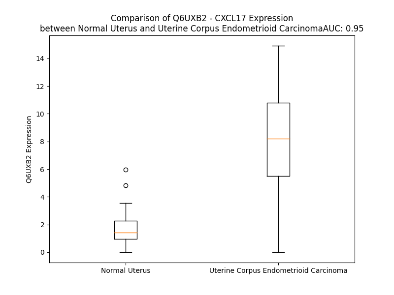

# Detailed Data for Q6UXB2

## Introduction to the Detailed Summary

### How to Interpret the Results

- **Summary & Metrics**: This section provides a quick reference to essential protein attributes, including expression changes, family classification, and biomarker applications. Regulation status (upregulated/downregulated) indicates the protein's behavior in a disease context. Some information comes from the original excel file with the proteins selected from literature, while others are derived from the analyses.
- **Expression Comparison**: A visual representation comparing protein expression between normal and disease states. It highlights significant changes in expression levels that might indicate diagnostic or therapeutic relevance. This is data coming from transcriptomics experiments and could not translate similarly to protein levels.
- **Isoform Alignment**: An interactive view of isoform alignments, revealing structural and functional differences between variants of the protein.
- **Interactors & Homologs**: Tables listing known interaction partners and homologous proteins, the more interactors and homologs, the more complex the protein is to design an antibody for.
- **Biological Assemblies**: Information about the structural arrangement of the protein in different assemblies, providing insights into its functional state but also the complexity of the protein to develop antibodies.
- **Combined Per-Residue Information**: A detailed table summarizing residue-level data. This includes predictions for epitope regions, aggregation tendencies, and modifications that might impact the protein's function. Each row corresponds to a residue in the protein, providing insights into specific sites that may be important for research or drug development.
## Summary & Metrics

- **UniProt Accession**: Q6UXB2
- **Gene Name**: CXCL17
- **Protein Name**: VEGF co-regulated chemokine 1
- **Swiss Prot**: VCC1_HUMAN
- **Family**: nan
- **Biomarker Application**: nan
- **Number of Isoforms**: 0
- **Regulation**: 1
- **(transcriptomics) AUC**: 0.95
- **(transcriptomics) Fold Change**: 5.16
- **(transcriptomics) Regulation**: Upregulated
- **Discotope Epitope Count**: 13
- **Max n_uniprots (Homo)**: N/A
- **Max n_uniprots (Hetero)**: N/A

## Expression Comparison

## Interactors

| preferredName_A   | preferredName_B   |   score |
|:------------------|:------------------|--------:|
| CXCL17            | CCL17             |   0.998 |
| CXCL17            | CCL20             |   0.997 |
| CXCL17            | CXCL14            |   0.997 |
| CXCL17            | CCL25             |   0.997 |
| CXCL17            | CCL5              |   0.997 |
| CXCL17            | CCL2              |   0.996 |
| CXCL17            | CXCL9             |   0.996 |
| CXCL17            | CXCL10            |   0.996 |
| CXCL17            | CXCL12            |   0.996 |
| CXCL17            | CCL8              |   0.996 |
| CXCL17            | XCL1              |   0.995 |
| CXCL17            | XCL2              |   0.995 |
| CXCL17            | CCL13             |   0.995 |
| CXCL17            | CCL21             |   0.995 |
| CXCL17            | CCL26             |   0.995 |
| CXCL17            | PF4               |   0.995 |
| CXCL17            | CCL28             |   0.994 |
| CXCL17            | GPR35             |   0.962 |

## Homologs

| uniprot_id   | gene_id   |
|--------------|-----------|

## Combined Per-Residue Information

|   res | aa   |   epitope_score | epitope   |   relative_surface_accessibility |   modeling_confidence |   Aggregation | modification   |
|------:|:-----|----------------:|:----------|---------------------------------:|----------------------:|--------------:|:---------------|
|     1 | M    |         0.2311  | False     |                          1.05211 |                 61.65 |         0     | N/A            |
|     2 | K    |         0.33624 | False     |                          0.88478 |                 69.29 |         0     | N/A            |
|     3 | V    |         0.18872 | False     |                          0.87677 |                 71.58 |        47.295 | N/A            |
|     4 | L    |         0.18839 | False     |                          0.78625 |                 76.86 |        55.506 | N/A            |
|     5 | I    |         0.16689 | False     |                          0.61117 |                 80.84 |        59.615 | N/A            |
|     6 | S    |         0.137   | False     |                          0.454   |                 82.32 |        59.959 | N/A            |
|     7 | S    |         0.14717 | False     |                          0.40303 |                 82.42 |        62.48  | N/A            |
|     8 | L    |         0.19702 | False     |                          0.77338 |                 82.77 |        63.903 | N/A            |
|     9 | L    |         0.18949 | False     |                          0.71538 |                 85.06 |        63.812 | N/A            |
|    10 | L    |         0.17584 | False     |                          0.80069 |                 84.38 |        62.27  | N/A            |
|    11 | L    |         0.18392 | False     |                          0.60425 |                 85.51 |        53.795 | N/A            |
|    12 | L    |         0.28212 | False     |                          0.63617 |                 84.07 |         5.192 | N/A            |
|    13 | P    |         0.26817 | False     |                          0.50835 |                 82.25 |         2.712 | N/A            |
|    14 | L    |         0.2173  | False     |                          0.74795 |                 79.98 |         4.051 | N/A            |
|    15 | M    |         0.18763 | False     |                          0.66936 |                 78.5  |         4.675 | N/A            |
|    16 | L    |         0.16867 | False     |                          0.58095 |                 76.93 |         5.262 | N/A            |
|    17 | M    |         0.26498 | False     |                          0.66068 |                 71    |         5.262 | N/A            |
|    18 | S    |         0.2166  | False     |                          0.43737 |                 63.43 |         5.262 | N/A            |
|    19 | M    |         0.24764 | False     |                          0.76911 |                 62.2  |         5.025 | N/A            |
|    20 | V    |         0.13699 | False     |                          0.73442 |                 57.63 |         4.757 | N/A            |
|    21 | S    |         0.18943 | False     |                          0.57198 |                 54.56 |         0.392 | N/A            |
|    22 | S    |         0.2822  | False     |                          0.68434 |                 50.97 |         0     | N/A            |
|    23 | S    |         0.22614 | False     |                          0.60347 |                 46.88 |         0     | N/A            |
|    24 | L    |         0.32403 | False     |                          0.89568 |                 42.16 |         0     | N/A            |
|    25 | N    |         0.33329 | False     |                          0.85449 |                 43.28 |         0     | N/A            |
|    26 | P    |         0.31747 | False     |                          1.0022  |                 36.93 |         0     | N/A            |
|    27 | G    |         0.38226 | False     |                          0.78813 |                 40.05 |         0     | N/A            |
|    28 | V    |         0.29564 | False     |                          1.02569 |                 43.73 |         0     | N/A            |
|    29 | A    |         0.27315 | False     |                          0.90033 |                 47.98 |         0     | N/A            |
|    30 | R    |         0.39454 | False     |                          1.00264 |                 38.1  |         0     | N/A            |
|    31 | G    |         0.40566 | False     |                          0.91001 |                 38.2  |         0     | N/A            |
|    32 | H    |         0.39235 | False     |                          0.79651 |                 42.07 |         0     | N/A            |
|    33 | R    |         0.40587 | False     |                          0.77444 |                 47.74 |         0     | N/A            |
|    34 | D    |         0.39991 | False     |                          0.81245 |                 36.84 |         0     | N/A            |
|    35 | R    |         0.40269 | False     |                          0.95555 |                 37.24 |         0     | N/A            |
|    36 | G    |         0.38362 | False     |                          0.86766 |                 42.4  |         0     | N/A            |
|    37 | Q    |         0.2969  | False     |                          0.89448 |                 38.66 |         0     | N/A            |
|    38 | A    |         0.31553 | False     |                          0.77618 |                 35.37 |         0     | N/A            |
|    39 | S    |         0.26957 | False     |                          0.47874 |                 40.82 |         0     | N/A            |
|    40 | R    |         0.31271 | False     |                          0.85825 |                 41.75 |         0     | N/A            |
|    41 | R    |         0.35863 | False     |                          0.90065 |                 44.13 |         0     | N/A            |
|    42 | W    |         0.26739 | False     |                          0.85059 |                 45.2  |         0     | N/A            |
|    43 | L    |         0.27616 | False     |                          0.84292 |                 40.53 |         0     | N/A            |
|    44 | Q    |         0.28861 | False     |                          0.77873 |                 41.79 |         0     | N/A            |
|    45 | E    |         0.22078 | False     |                          0.96331 |                 36.57 |         0     | N/A            |
|    46 | G    |         0.3662  | False     |                          0.95902 |                 35.84 |         0     | N/A            |
|    47 | G    |         0.34681 | False     |                          0.60459 |                 41.61 |         0     | N/A            |
|    48 | Q    |         0.26657 | False     |                          0.63941 |                 52.71 |         0     | N/A            |
|    49 | E    |         0.23486 | False     |                          0.62799 |                 59.47 |         0     | N/A            |
|    50 | C    |         0.17835 | False     |                          0.15306 |                 66.18 |         0     | N/A            |
|    51 | E    |         0.31346 | False     |                          0.49063 |                 69.52 |         0     | N/A            |
|    52 | C    |         0.0984  | False     |                          0.13536 |                 71.64 |         0     | N/A            |
|    53 | K    |         0.32871 | False     |                          0.70284 |                 64.75 |         0     | N/A            |
|    54 | D    |         0.2715  | False     |                          0.25794 |                 61.49 |         0     | N/A            |
|    55 | W    |         0.30004 | False     |                          0.22819 |                 59.1  |         0     | N/A            |
|    56 | F    |         0.26631 | False     |                          0.52425 |                 57.52 |         0     | N/A            |
|    57 | L    |         0.24975 | False     |                          0.95795 |                 56.99 |         0     | N/A            |
|    58 | R    |         0.29653 | False     |                          0.53851 |                 58.04 |         0     | N/A            |
|    59 | A    |         0.2988  | False     |                          0.5516  |                 55.19 |         0     | N/A            |
|    60 | P    |         0.41667 | True      |                          0.94779 |                 52.51 |         0     | N/A            |
|    61 | R    |         0.32534 | False     |                          0.86234 |                 48.82 |         0     | N/A            |
|    62 | R    |         0.29711 | False     |                          0.95093 |                 51.77 |         0     | N/A            |
|    63 | K    |         0.28485 | False     |                          0.85532 |                 41.85 |         0     | N/A            |
|    64 | F    |         0.2988  | False     |                          0.99093 |                 49.33 |         0     | N/A            |
|    65 | M    |         0.25658 | False     |                          0.81771 |                 41.42 |         0     | N/A            |
|    66 | T    |         0.26048 | False     |                          0.83916 |                 45.32 |         0     | N/A            |
|    67 | V    |         0.28916 | False     |                          0.5787  |                 47.9  |         0     | N/A            |
|    68 | S    |         0.34253 | False     |                          0.82967 |                 41.92 |         0     | N/A            |
|    69 | G    |         0.36503 | False     |                          0.81965 |                 46.52 |         0     | N/A            |
|    70 | L    |         0.33179 | False     |                          0.53512 |                 51.44 |         0     | N/A            |
|    71 | P    |         0.3208  | False     |                          0.67037 |                 51.88 |         0     | N/A            |
|    72 | K    |         0.38067 | False     |                          1.00668 |                 57.53 |         0     | N/A            |
|    73 | K    |         0.23201 | False     |                          0.25695 |                 62.79 |         0     | N/A            |
|    74 | Q    |         0.45371 | True      |                          0.82329 |                 67.03 |         0     | N/A            |
|    75 | C    |         0.26558 | False     |                          0.17203 |                 70.74 |         0     | N/A            |
|    76 | P    |         0.1738  | False     |                          0.39696 |                 71.57 |         0     | N/A            |
|    77 | C    |         0.09452 | False     |                          0.02073 |                 71.82 |         0     | N/A            |
|    78 | D    |         0.36291 | False     |                          0.41221 |                 68.91 |         0     | N/A            |
|    79 | H    |         0.37375 | False     |                          0.76295 |                 65.68 |         0     | N/A            |
|    80 | F    |         0.23443 | False     |                          0.46257 |                 64.52 |         0     | N/A            |
|    81 | K    |         0.4421  | True      |                          0.79229 |                 62.09 |         0     | N/A            |
|    82 | G    |         0.37973 | False     |                          0.50496 |                 55.06 |         0     | N/A            |
|    83 | N    |         0.37849 | False     |                          0.99469 |                 52.67 |         0     | N/A            |
|    84 | V    |         0.24849 | False     |                          0.51165 |                 58.11 |         0     | N/A            |
|    85 | K    |         0.42052 | True      |                          0.94058 |                 58.13 |         0     | N/A            |
|    86 | K    |         0.44564 | True      |                          0.73266 |                 59.91 |         0     | N/A            |
|    87 | T    |         0.40701 | False     |                          0.58613 |                 59.77 |         0     | N/A            |
|    88 | R    |         0.44309 | True      |                          0.81801 |                 62.9  |         0     | N/A            |
|    89 | H    |         0.47874 | True      |                          0.86143 |                 62.5  |         0     | N/A            |
|    90 | Q    |         0.40626 | False     |                          0.55781 |                 62    |         0     | N/A            |
|    91 | R    |         0.50024 | True      |                          0.70938 |                 58.62 |         0     | N/A            |
|    92 | H    |         0.43814 | True      |                          0.87234 |                 62.49 |         0     | N/A            |
|    93 | H    |         0.42767 | True      |                          0.85216 |                 57.95 |         0     | N/A            |
|    94 | R    |         0.44671 | True      |                          0.90816 |                 56.13 |         0     | N/A            |
|    95 | K    |         0.37899 | False     |                          0.92719 |                 58.97 |         0     | N/A            |
|    96 | P    |         0.48536 | True      |                          0.89255 |                 56.8  |         0     | N/A            |
|    97 | N    |         0.38933 | False     |                          0.50898 |                 60.92 |         0     | N/A            |
|    98 | K    |         0.36708 | False     |                          0.73749 |                 59.69 |         0     | N/A            |
|    99 | H    |         0.29868 | False     |                          0.53723 |                 62.4  |         0     | N/A            |
|   100 | S    |         0.29697 | False     |                          0.18947 |                 70.5  |         0     | N/A            |
|   101 | R    |         0.34246 | False     |                          0.68149 |                 73.14 |         0     | N/A            |
|   102 | A    |         0.23857 | False     |                          0.42965 |                 74    |         0     | N/A            |
|   103 | C    |         0.03646 | False     |                          0.01216 |                 76.56 |         0     | N/A            |
|   104 | Q    |         0.26728 | False     |                          0.55899 |                 77.86 |         0     | N/A            |
|   105 | Q    |         0.23064 | False     |                          0.55522 |                 80.9  |         0     | N/A            |
|   106 | F    |         0.14695 | False     |                          0.11419 |                 80.49 |         0     | N/A            |
|   107 | L    |         0.2312  | False     |                          0.30748 |                 76.62 |         0     | N/A            |
|   108 | K    |         0.20491 | False     |                          0.65605 |                 80.52 |         0     | N/A            |
|   109 | Q    |         0.20439 | False     |                          0.43611 |                 77.25 |         0     | N/A            |
|   110 | C    |         0.0407  | False     |                          0.00187 |                 77.78 |         0     | N/A            |
|   111 | Q    |         0.25599 | False     |                          0.47856 |                 75.56 |         0     | N/A            |
|   112 | L    |         0.27621 | False     |                          0.67894 |                 75.12 |         0     | N/A            |
|   113 | R    |         0.35794 | False     |                          0.50877 |                 70.21 |         0     | N/A            |
|   114 | S    |         0.22438 | False     |                          0.41009 |                 64.26 |         0     | N/A            |
|   115 | F    |         0.32231 | False     |                          0.90203 |                 58.59 |         0     | N/A            |
|   116 | A    |         0.26839 | False     |                          0.76765 |                 58.79 |         0     | N/A            |
|   117 | L    |         0.42777 | True      |                          0.69979 |                 51.86 |         0     | N/A            |
|   118 | P    |         0.30978 | False     |                          0.92769 |                 45.29 |         0     | N/A            |
|   119 | L    |         0.24801 | False     |                          1.49026 |                 39.37 |         0     | N/A            |

