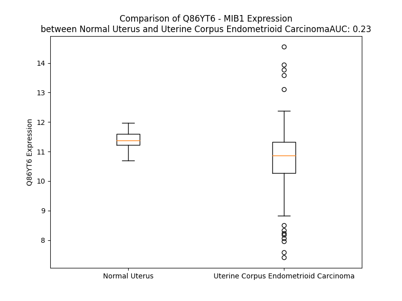

# Detailed Data for Q86YT6

## Introduction to the Detailed Summary

### How to Interpret the Results

- **Summary & Metrics**: This section provides a quick reference to essential protein attributes, including expression changes, family classification, and biomarker applications. Regulation status (upregulated/downregulated) indicates the protein's behavior in a disease context. Some information comes from the original excel file with the proteins selected from literature, while others are derived from the analyses.
- **Expression Comparison**: A visual representation comparing protein expression between normal and disease states. It highlights significant changes in expression levels that might indicate diagnostic or therapeutic relevance. This is data coming from transcriptomics experiments and could not translate similarly to protein levels.
- **Isoform Alignment**: An interactive view of isoform alignments, revealing structural and functional differences between variants of the protein.
- **Interactors & Homologs**: Tables listing known interaction partners and homologous proteins, the more interactors and homologs, the more complex the protein is to design an antibody for.
- **Biological Assemblies**: Information about the structural arrangement of the protein in different assemblies, providing insights into its functional state but also the complexity of the protein to develop antibodies.
- **Combined Per-Residue Information**: A detailed table summarizing residue-level data. This includes predictions for epitope regions, aggregation tendencies, and modifications that might impact the protein's function. Each row corresponds to a residue in the protein, providing insights into specific sites that may be important for research or drug development.
## Summary & Metrics

- **UniProt Accession**: Q86YT6
- **Gene Name**: MIB1
- **Protein Name**: E3 ubiquitin-protein ligase MIB1
- **Swiss Prot**: MIB1_HUMAN
- **Family**: other
- **Biomarker Application**: diagnosis,efficacy,prognosis
- **Number of Isoforms**: 0
- **Regulation**: 1
- **(transcriptomics) AUC**: 0.41
- **(transcriptomics) Fold Change**: 1.02
- **(transcriptomics) Regulation**: Downregulated
- **Discotope Epitope Count**: 215
- **Max n_uniprots (Homo)**: 2
- **Max n_uniprots (Hetero)**: N/A

## Expression Comparison

## Interactors

| preferredName_A   | preferredName_B   | score   |
|-------------------|-------------------|---------|

## Homologs

| uniprot_id   | gene_id   |
|:-------------|:----------|
| D6RAZ0       | MIB2      |

## Biological Assemblies

|   Unnamed: 0 |   assembly |   n_uniprots | composition   | crystal_id   |
|-------------:|-----------:|-------------:|:--------------|:-------------|
|            0 |          1 |            1 | Homo          | 4xib         |
|            0 |          1 |            1 | Homo          | 4xi6         |
|            1 |          2 |            1 | Homo          | 4xi6         |
|            2 |          3 |            1 | Homo          | 4xi6         |
|            0 |          1 |            1 | Homo          | 4xi7         |
|            0 |          1 |            1 | Homo          | 4tse         |
|            1 |          2 |            1 | Homo          | 4tse         |
|            2 |          3 |            2 | Homo          | 4tse         |

## Combined Per-Residue Information

|   res | aa   |   epitope_score | epitope   |   relative_surface_accessibility |   modeling_confidence |   Aggregation | modification   |
|------:|:-----|----------------:|:----------|---------------------------------:|----------------------:|--------------:|:---------------|
|     1 | M    |         0.14588 | True      |                          1.34375 |                 30.37 |         0     | N/A            |
|     2 | S    |         0.15173 | True      |                          0.82021 |                 29.28 |         0     | N/A            |
|     3 | N    |         0.17872 | True      |                          0.88115 |                 29.39 |         0     | N/A            |
|     4 | S    |         0.1288  | True      |                          0.93329 |                 26.35 |         0     | N/A            |
|     5 | R    |         0.15294 | True      |                          0.89646 |                 33.55 |         0     | N/A            |
|     6 | N    |         0.15005 | True      |                          1.00006 |                 28.71 |         0     | N/A            |
|     7 | N    |         0.08772 | False     |                          0.79111 |                 30.55 |         0     | N/A            |
|     8 | R    |         0.08632 | False     |                          0.63277 |                 44.8  |         0     | N/A            |
|     9 | V    |         0.09019 | False     |                          0.86756 |                 49.16 |         0     | N/A            |
|    10 | M    |         0.04818 | False     |                          0.10558 |                 59.03 |         0     | N/A            |
|    11 | V    |         0.05706 | False     |                          0.57709 |                 62.92 |         0     | N/A            |
|    12 | E    |         0.0703  | False     |                          0.47552 |                 75.49 |         0     | N/A            |
|    13 | G    |         0.03013 | False     |                          0.10944 |                 81.47 |         0     | N/A            |
|    14 | V    |         0.03288 | False     |                          0.38271 |                 93.07 |         0     | N/A            |
|    15 | G    |         0.00125 | False     |                          0       |                 96.01 |         0     | N/A            |
|    16 | A    |         0.00527 | False     |                          0.01148 |                 97.35 |         0     | N/A            |
|    17 | R    |         0.02592 | False     |                          0.05864 |                 98.26 |         0     | N/A            |
|    18 | V    |         0.0047  | False     |                          0       |                 98.48 |         0     | N/A            |
|    19 | V    |         0.00239 | False     |                          0.00762 |                 98.53 |         0     | N/A            |
|    20 | R    |         0.08481 | False     |                          0.15812 |                 98.2  |         0     | N/A            |
|    21 | G    |         0.01506 | False     |                          0.06067 |                 96.7  |         0     | N/A            |
|    22 | P    |         0.17676 | True      |                          0.52722 |                 94.88 |         0     | N/A            |
|    23 | D    |         0.10476 | True      |                          0.35907 |                 95.05 |         0     | N/A            |
|    24 | W    |         0.05309 | False     |                          0.1466  |                 96.1  |         0     | N/A            |
|    25 | K    |         0.16363 | True      |                          0.65274 |                 93.39 |         0     | N/A            |
|    26 | W    |         0.19674 | True      |                          0.37816 |                 93.73 |         0     | N/A            |
|    27 | G    |         0.0857  | False     |                          0.59306 |                 93.66 |         0     | N/A            |
|    28 | K    |         0.12259 | True      |                          0.80696 |                 94.32 |         0     | N/A            |
|    29 | Q    |         0.06451 | False     |                          0.19463 |                 92.17 |         0     | N/A            |
|    30 | D    |         0.00609 | False     |                          0.00245 |                 96.24 |         0     | N/A            |
|    31 | G    |         0.03544 | False     |                          0.3436  |                 93.51 |         0     | N/A            |
|    32 | G    |         0.02409 | False     |                          0.14163 |                 94.03 |         0     | N/A            |
|    33 | E    |         0.06897 | False     |                          0.40462 |                 95.93 |         0     | N/A            |
|    34 | G    |         0.00353 | False     |                          0.00415 |                 94.3  |         0     | N/A            |
|    35 | H    |         0.02825 | False     |                          0.1255  |                 98.11 |         0     | N/A            |
|    36 | V    |         0.00293 | False     |                          0.00522 |                 98.31 |         0     | N/A            |
|    37 | G    |         0.00151 | False     |                          0       |                 98.35 |         0     | N/A            |
|    38 | T    |         0.00279 | False     |                          0.00507 |                 98.62 |         0     | N/A            |
|    39 | V    |         0.0032  | False     |                          0       |                 97.89 |         0     | N/A            |
|    40 | R    |         0.05125 | False     |                          0.32788 |                 95.67 |         0     | N/A            |
|    41 | S    |         0.11542 | True      |                          0.29678 |                 92.56 |         0     | N/A            |
|    42 | F    |         0.04963 | False     |                          0.15838 |                 90.39 |         0     | N/A            |
|    43 | E    |         0.20372 | True      |                          0.58483 |                 83.69 |         0     | N/A            |
|    44 | S    |         0.11231 | True      |                          0.32269 |                 80.09 |         0     | N/A            |
|    45 | P    |         0.06323 | False     |                          0.53032 |                 77.07 |         0     | N/A            |
|    46 | E    |         0.06788 | False     |                          0.56882 |                 84.13 |         0     | N/A            |
|    47 | E    |         0.0877  | False     |                          0.34416 |                 87.8  |         0     | N/A            |
|    48 | V    |         0.00257 | False     |                          0       |                 92.85 |        70.305 | N/A            |
|    49 | V    |         0.02951 | False     |                          0.12282 |                 95.92 |        70.305 | N/A            |
|    50 | V    |         0.00362 | False     |                          0       |                 97.68 |        70.305 | N/A            |
|    51 | V    |         0.0153  | False     |                          0.03705 |                 98.16 |        70.305 | N/A            |
|    52 | W    |         0.00518 | False     |                          0.00528 |                 98.56 |        70.305 | N/A            |
|    53 | D    |         0.01171 | False     |                          0.03187 |                 98.45 |         0     | N/A            |
|    54 | N    |         0.02421 | False     |                          0.28505 |                 96.56 |         0     | N/A            |
|    55 | G    |         0.0315  | False     |                          0.32982 |                 94.84 |         0     | N/A            |
|    56 | T    |         0.0626  | False     |                          0.372   |                 94.05 |         0     | N/A            |
|    57 | A    |         0.08804 | False     |                          0.58682 |                 95.52 |         0     | N/A            |
|    58 | A    |         0.06189 | False     |                          0.18093 |                 93.83 |         0     | N/A            |
|    59 | N    |         0.08637 | False     |                          0.46398 |                 93.64 |         0     | N/A            |
|    60 | Y    |         0.00885 | False     |                          0.01274 |                 96.43 |         0     | N/A            |
|    61 | R    |         0.17606 | True      |                          0.28024 |                 94.54 |         0     | N/A            |
|    62 | C    |         0.01052 | False     |                          0.00174 |                 89.19 |         0     | N/A            |
|    63 | S    |         0.05169 | False     |                          0.33268 |                 85.79 |         0     | N/A            |
|    64 | G    |         0.11257 | True      |                          0.85084 |                 79.77 |         0     | N/A            |
|    65 | A    |         0.13484 | True      |                          0.20667 |                 88.5  |         0     | N/A            |
|    66 | Y    |         0.04673 | False     |                          0.23342 |                 92.9  |         0     | N/A            |
|    67 | D    |         0.00598 | False     |                          0       |                 97.46 |         0     | N/A            |
|    68 | L    |         0.002   | False     |                          0.00153 |                 98.01 |         0     | N/A            |
|    69 | R    |         0.04729 | False     |                          0.10208 |                 98    |         0     | N/A            |
|    70 | I    |         0.01532 | False     |                          0.08939 |                 97.72 |         0     | N/A            |
|    71 | L    |         0.02575 | False     |                          0.10509 |                 97.53 |         0     | N/A            |
|    72 | D    |         0.01671 | False     |                          0.09408 |                 96.95 |         0     | N/A            |
|    73 | S    |         0.01453 | False     |                          0.05096 |                 96.94 |         0     | N/A            |
|    74 | A    |         0.00569 | False     |                          0.01275 |                 95.7  |         0     | N/A            |
|    75 | P    |         0.0101  | False     |                          0.02792 |                 96.86 |         0     | N/A            |
|    76 | T    |         0.05353 | False     |                          0.29241 |                 95.04 |         0     | N/A            |
|    77 | G    |         0.03141 | False     |                          0.27785 |                 92.82 |         0     | N/A            |
|    78 | I    |         0.08498 | False     |                          0.16709 |                 91.82 |         0     | N/A            |
|    79 | K    |         0.07499 | False     |                          0.4438  |                 94.01 |         0     | N/A            |
|    80 | H    |         0.06585 | False     |                          0.04613 |                 92.64 |         0     | N/A            |
|    81 | D    |         0.17377 | True      |                          0.60582 |                 89.31 |         0     | N/A            |
|    82 | G    |         0.16475 | True      |                          1.01787 |                 88.91 |         0     | N/A            |
|    83 | T    |         0.05648 | False     |                          0.09907 |                 92.57 |         0     | N/A            |
|    84 | M    |         0.14868 | True      |                          0.32856 |                 91.87 |         0     | N/A            |
|    85 | C    |         0.01057 | False     |                          0       |                 91.31 |         0     | N/A            |
|    86 | D    |         0.0823  | False     |                          0.28233 |                 93.91 |         0     | N/A            |
|    87 | T    |         0.10584 | True      |                          0.38337 |                 82.49 |         0     | N/A            |
|    88 | C    |         0.08052 | False     |                          0.49959 |                 85.45 |         0     | N/A            |
|    89 | R    |         0.15781 | True      |                          0.66917 |                 93.7  |         0     | N/A            |
|    90 | Q    |         0.09359 | False     |                          0.22414 |                 86.82 |         0     | N/A            |
|    91 | Q    |         0.21474 | True      |                          0.66948 |                 92.24 |         0     | N/A            |
|    92 | P    |         0.23035 | True      |                          0.24701 |                 94.26 |         0     | N/A            |
|    93 | I    |         0.00605 | False     |                          0       |                 94.74 |         0     | N/A            |
|    94 | I    |         0.05901 | False     |                          0.13053 |                 94.94 |         0     | N/A            |
|    95 | G    |         0.0013  | False     |                          0       |                 95.52 |         0     | N/A            |
|    96 | I    |         0.00414 | False     |                          0.0016  |                 96.74 |         0     | N/A            |
|    97 | R    |         0.05655 | False     |                          0.18169 |                 97.61 |         0     | N/A            |
|    98 | W    |         0.0054  | False     |                          0       |                 97.88 |         0     | N/A            |
|    99 | K    |         0.03292 | False     |                          0.20322 |                 96.98 |         0     | N/A            |
|   100 | C    |         0.02716 | False     |                          0.02443 |                 95.43 |         0     | N/A            |
|   101 | A    |         0.06862 | False     |                          0.37283 |                 94.09 |         0     | N/A            |
|   102 | E    |         0.17553 | True      |                          0.49086 |                 90.63 |         0     | N/A            |
|   103 | C    |         0.17044 | True      |                          0.28702 |                 86.18 |         0     | N/A            |
|   104 | T    |         0.33688 | True      |                          0.98774 |                 85.51 |         0     | N/A            |
|   105 | N    |         0.11886 | True      |                          0.74685 |                 85.5  |         0     | N/A            |
|   106 | Y    |         0.12988 | True      |                          0.21988 |                 91.66 |         0     | N/A            |
|   107 | D    |         0.03538 | False     |                          0.0377  |                 95.79 |         0     | N/A            |
|   108 | L    |         0.00342 | False     |                          0       |                 94.85 |         0     | N/A            |
|   109 | C    |         0.01914 | False     |                          0.04128 |                 96.85 |         0     | N/A            |
|   110 | T    |         0.04734 | False     |                          0.05985 |                 96.71 |         0     | N/A            |
|   111 | V    |         0.04309 | False     |                          0.59636 |                 93.55 |         0     | N/A            |
|   112 | C    |         0.03286 | False     |                          0.04904 |                 94.26 |         0     | N/A            |
|   113 | Y    |         0.00208 | False     |                          0.00232 |                 97.23 |         0     | N/A            |
|   114 | H    |         0.01455 | False     |                          0.06495 |                 95.32 |         0     | N/A            |
|   115 | G    |         0.06119 | False     |                          0.47683 |                 88.39 |         0     | N/A            |
|   116 | D    |         0.05344 | False     |                          0.34011 |                 94.89 |         0     | N/A            |
|   117 | K    |         0.11525 | True      |                          0.47458 |                 91.55 |         0     | N/A            |
|   118 | H    |         0.08368 | False     |                          0.21746 |                 92.41 |         0     | N/A            |
|   119 | H    |         0.12475 | True      |                          0.61069 |                 90.57 |         0     | N/A            |
|   120 | L    |         0.02848 | False     |                          0.25337 |                 87.2  |         0     | N/A            |
|   121 | R    |         0.13475 | True      |                          0.58353 |                 89.81 |         0     | N/A            |
|   122 | H    |         0.07058 | False     |                          0.20798 |                 92.86 |         0     | N/A            |
|   123 | R    |         0.1214  | True      |                          0.3499  |                 95.63 |         0     | N/A            |
|   124 | F    |         0.00361 | False     |                          0.00309 |                 97.38 |         0     | N/A            |
|   125 | Y    |         0.04119 | False     |                          0.21239 |                 96.99 |         0     | N/A            |
|   126 | R    |         0.04    | False     |                          0.07694 |                 97.13 |         0     | N/A            |
|   127 | I    |         0.06297 | False     |                          0.11439 |                 94.66 |         0     | N/A            |
|   128 | T    |         0.01192 | False     |                          0.15713 |                 92.73 |         0     | N/A            |
|   129 | T    |         0.02677 | False     |                          0.18766 |                 90.06 |         0     | N/A            |
|   130 | P    |         0.04295 | False     |                          0.64222 |                 87.38 |         0     | N/A            |
|   131 | G    |         0.07942 | False     |                          0.66087 |                 79.25 |         0     | N/A            |
|   132 | S    |         0.04971 | False     |                          0.24564 |                 79.88 |         0     | N/A            |
|   133 | E    |         0.02931 | False     |                          0.279   |                 80.45 |         0     | N/A            |
|   134 | R    |         0.13691 | True      |                          0.61353 |                 89.12 |         0     | N/A            |
|   135 | V    |         0.02163 | False     |                          0.40082 |                 91.84 |         0     | N/A            |
|   136 | L    |         0.06192 | False     |                          0.44968 |                 94.78 |         0     | N/A            |
|   137 | L    |         0.02834 | False     |                          0.07749 |                 93.88 |         0     | N/A            |
|   138 | E    |         0.072   | False     |                          0.52884 |                 90.95 |         0     | N/A            |
|   139 | S    |         0.04324 | False     |                          0.07089 |                 93.92 |         0     | N/A            |
|   140 | R    |         0.01385 | False     |                          0.01269 |                 94.11 |         0     | N/A            |
|   141 | R    |         0.08069 | False     |                          0.43296 |                 88.38 |         0     | N/A            |
|   142 | K    |         0.11425 | True      |                          0.70589 |                 87.34 |         0     | N/A            |
|   143 | S    |         0.0336  | False     |                          0.13449 |                 86.68 |         0     | N/A            |
|   144 | K    |         0.09126 | False     |                          0.68641 |                 86.73 |         0     | N/A            |
|   145 | K    |         0.02972 | False     |                          0.06641 |                 92.04 |         0     | N/A            |
|   146 | I    |         0.04569 | False     |                          0.19839 |                 90.11 |         0     | N/A            |
|   147 | T    |         0.01626 | False     |                          0.21141 |                 93.75 |         0     | N/A            |
|   148 | A    |         0.00487 | False     |                          0.02933 |                 94.14 |         0     | N/A            |
|   149 | R    |         0.06092 | False     |                          0.26899 |                 97.28 |         0     | N/A            |
|   150 | G    |         0.00136 | False     |                          0.00322 |                 97.16 |         0     | N/A            |
|   151 | I    |         0.00815 | False     |                          0.01732 |                 97.87 |         0     | N/A            |
|   152 | F    |         0.02417 | False     |                          0.17473 |                 96.73 |         0     | N/A            |
|   153 | A    |         0.02244 | False     |                          0.56276 |                 93.64 |         0     | N/A            |
|   154 | G    |         0.0299  | False     |                          0.41523 |                 93.9  |         0     | N/A            |
|   155 | A    |         0.00107 | False     |                          0.00128 |                 96.52 |         0     | N/A            |
|   156 | R    |         0.11764 | True      |                          0.24646 |                 98.25 |         0     | N/A            |
|   157 | V    |         0.00198 | False     |                          0       |                 98.45 |         0     | N/A            |
|   158 | V    |         0.02033 | False     |                          0.10568 |                 98.26 |         0     | N/A            |
|   159 | R    |         0.06412 | False     |                          0.17214 |                 97.67 |         0     | N/A            |
|   160 | G    |         0.01015 | False     |                          0.16397 |                 96.82 |         0     | N/A            |
|   161 | V    |         0.0803  | False     |                          0.64396 |                 95    |         0     | N/A            |
|   162 | D    |         0.06756 | False     |                          0.10638 |                 96.5  |         0     | N/A            |
|   163 | W    |         0.06371 | False     |                          0.15266 |                 97.09 |         0     | N/A            |
|   164 | Q    |         0.13723 | True      |                          0.58782 |                 94.02 |         0     | N/A            |
|   165 | W    |         0.14042 | True      |                          0.22839 |                 95.11 |         0     | N/A            |
|   166 | E    |         0.26195 | True      |                          0.74626 |                 94.03 |         0     | N/A            |
|   167 | D    |         0.19795 | True      |                          0.57727 |                 94.42 |         0     | N/A            |
|   168 | Q    |         0.11945 | True      |                          0.32061 |                 93.92 |         0     | N/A            |
|   169 | D    |         0.00945 | False     |                          0.00184 |                 95.13 |         0     | N/A            |
|   170 | G    |         0.08067 | False     |                          0.39082 |                 92.38 |         0     | N/A            |
|   171 | G    |         0.05529 | False     |                          0.19152 |                 88.58 |         0     | N/A            |
|   172 | N    |         0.12476 | True      |                          0.79496 |                 92.78 |         0     | N/A            |
|   173 | G    |         0.06836 | False     |                          0.54046 |                 89.84 |         0     | N/A            |
|   174 | R    |         0.2376  | True      |                          0.47834 |                 95.68 |         0     | N/A            |
|   175 | R    |         0.10859 | True      |                          0.51859 |                 97.63 |         0     | N/A            |
|   176 | G    |         0.0028  | False     |                          0       |                 97.45 |         0     | N/A            |
|   177 | K    |         0.0548  | False     |                          0.4842  |                 98.18 |         0     | N/A            |
|   178 | V    |         0.00374 | False     |                          0.00141 |                 97.57 |         0     | N/A            |
|   179 | T    |         0.07664 | False     |                          0.45429 |                 95.39 |         0     | N/A            |
|   180 | E    |         0.09532 | True      |                          0.46429 |                 91.91 |         0     | N/A            |
|   181 | I    |         0.06538 | False     |                          0.28566 |                 94.66 |         0     | N/A            |
|   182 | Q    |         0.09271 | False     |                          0.29194 |                 93.68 |         0     | N/A            |
|   183 | D    |         0.16349 | True      |                          0.42312 |                 95.14 |         0     | N/A            |
|   184 | W    |         0.1439  | True      |                          0.31795 |                 93.85 |         0     | N/A            |
|   185 | S    |         0.18102 | True      |                          0.29127 |                 92.17 |         0     | N/A            |
|   186 | A    |         0.1104  | True      |                          0.91027 |                 87.27 |         0     | N/A            |
|   187 | S    |         0.09387 | False     |                          0.60357 |                 88.38 |         0     | N/A            |
|   188 | S    |         0.0449  | False     |                          0.04784 |                 91.76 |         0     | N/A            |
|   189 | P    |         0.02319 | False     |                          0.05666 |                 91.76 |         0     | N/A            |
|   190 | H    |         0.04265 | False     |                          0.33028 |                 93.22 |         0     | N/A            |
|   191 | S    |         0.00174 | False     |                          0       |                 97.04 |         3.021 | N/A            |
|   192 | A    |         0.00284 | False     |                          0       |                 97.44 |        26.507 | N/A            |
|   193 | A    |         0.00143 | False     |                          0       |                 97.68 |        46.435 | N/A            |
|   194 | Y    |         0.11505 | True      |                          0.28624 |                 97.83 |        46.435 | N/A            |
|   195 | V    |         0.00345 | False     |                          0       |                 98.28 |        46.435 | N/A            |
|   196 | L    |         0.08804 | False     |                          0.49777 |                 97.74 |        46.327 | N/A            |
|   197 | W    |         0.03212 | False     |                          0.012   |                 98.13 |        43.643 | N/A            |
|   198 | D    |         0.1245  | True      |                          0.49996 |                 96.95 |         0     | N/A            |
|   199 | N    |         0.13987 | True      |                          0.45739 |                 93.62 |         0     | N/A            |
|   200 | G    |         0.10277 | True      |                          0.64761 |                 94.38 |         0     | N/A            |
|   201 | A    |         0.13238 | True      |                          0.34477 |                 95.28 |         0     | N/A            |
|   202 | K    |         0.20092 | True      |                          0.65202 |                 95.74 |         0     | N/A            |
|   203 | N    |         0.10383 | True      |                          0.33226 |                 97.49 |         0     | N/A            |
|   204 | L    |         0.11029 | True      |                          0.25164 |                 97.38 |         0     | N/A            |
|   205 | Y    |         0.00317 | False     |                          0.00046 |                 98.34 |         0     | N/A            |
|   206 | R    |         0.06161 | False     |                          0.06561 |                 98.29 |         0     | N/A            |
|   207 | V    |         0.00865 | False     |                          0.02856 |                 97.92 |         0     | N/A            |
|   208 | G    |         0.0024  | False     |                          0       |                 95.43 |         0     | N/A            |
|   209 | F    |         0.10105 | True      |                          0.18281 |                 96.89 |         0     | N/A            |
|   210 | E    |         0.04839 | False     |                          0.54524 |                 94.53 |         0     | N/A            |
|   211 | G    |         0.00492 | False     |                          0.0078  |                 94.66 |         0     | N/A            |
|   212 | M    |         0.08538 | False     |                          0.31026 |                 97.12 |         0     | N/A            |
|   213 | S    |         0.0096  | False     |                          0.03827 |                 97.32 |         0     | N/A            |
|   214 | D    |         0.00544 | False     |                          0       |                 98.46 |         0     | N/A            |
|   215 | L    |         0.00884 | False     |                          0.0195  |                 98.28 |         0     | N/A            |
|   216 | K    |         0.03043 | False     |                          0.37585 |                 98.12 |         0     | N/A            |
|   217 | C    |         0.02316 | False     |                          0.08574 |                 95.31 |         0     | N/A            |
|   218 | V    |         0.09383 | False     |                          0.49424 |                 95.54 |         0     | N/A            |
|   219 | Q    |         0.09153 | False     |                          0.59435 |                 95.81 |         0     | N/A            |
|   220 | D    |         0.03269 | False     |                          0.36127 |                 95.98 |         0     | N/A            |
|   221 | A    |         0.02349 | False     |                          0.14285 |                 93.81 |         0     | N/A            |
|   222 | K    |         0.07738 | False     |                          0.71139 |                 92.52 |         0     | N/A            |
|   223 | G    |         0.04725 | False     |                          0.34144 |                 86.09 |         0     | N/A            |
|   224 | G    |         0.04252 | False     |                          0.52957 |                 83.92 |         0     | N/A            |
|   225 | S    |         0.04154 | False     |                          0.20262 |                 89.8  |         0     | N/A            |
|   226 | F    |         0.01366 | False     |                          0.01235 |                 96.18 |         0     | N/A            |
|   227 | Y    |         0.01443 | False     |                          0.02848 |                 96.85 |         0     | N/A            |
|   228 | R    |         0.03649 | False     |                          0.18327 |                 96.29 |         0     | N/A            |
|   229 | D    |         0.07768 | False     |                          0.42613 |                 94.28 |         0     | N/A            |
|   230 | H    |         0.01427 | False     |                          0.0265  |                 97.51 |         0     | N/A            |
|   231 | C    |         0.00849 | False     |                          0.03647 |                 97.07 |         0     | N/A            |
|   232 | P    |         0.0048  | False     |                          0.01093 |                 95.63 |         0     | N/A            |
|   233 | V    |         0.02976 | False     |                          0.18321 |                 95.42 |         0     | N/A            |
|   234 | L    |         0.01539 | False     |                          0.02452 |                 93.08 |         0     | N/A            |
|   235 | G    |         0.01803 | False     |                          0.10826 |                 81    |         0     | N/A            |
|   236 | E    |         0.07615 | False     |                          0.43521 |                 71.07 |         0     | N/A            |
|   237 | Q    |         0.04912 | False     |                          0.51655 |                 55.99 |         0     | N/A            |
|   238 | N    |         0.08704 | False     |                          0.52765 |                 43.36 |         0     | N/A            |
|   239 | G    |         0.10391 | True      |                          0.63204 |                 33.37 |         0     | N/A            |
|   240 | N    |         0.15772 | True      |                          1.04857 |                 28.27 |         0     | N/A            |
|   241 | R    |         0.09968 | True      |                          0.72138 |                 32.87 |         0     | N/A            |
|   242 | N    |         0.03953 | False     |                          0.16181 |                 32.14 |         0     | N/A            |
|   243 | P    |         0.04164 | False     |                          0.41748 |                 32.88 |         0     | N/A            |
|   244 | G    |         0.05098 | False     |                          0.42655 |                 44.29 |         0     | N/A            |
|   245 | G    |         0.04798 | False     |                          0.6142  |                 55.53 |         0     | N/A            |
|   246 | L    |         0.02054 | False     |                          0.03777 |                 69.95 |         0     | N/A            |
|   247 | Q    |         0.08556 | False     |                          0.49746 |                 77.91 |         0     | N/A            |
|   248 | I    |         0.12118 | True      |                          0.73218 |                 81.1  |         0     | N/A            |
|   249 | G    |         0.04304 | False     |                          0.58154 |                 83.7  |         0     | N/A            |
|   250 | D    |         0.03657 | False     |                          0.11334 |                 87.64 |         0     | N/A            |
|   251 | L    |         0.03925 | False     |                          0.52552 |                 89.71 |         0     | N/A            |
|   252 | V    |         0.00435 | False     |                          0.0007  |                 90.96 |         0     | N/A            |
|   253 | N    |         0.08039 | False     |                          0.29393 |                 91.62 |         0     | N/A            |
|   254 | I    |         0.06655 | False     |                          0.06393 |                 91    |         0     | N/A            |
|   255 | D    |         0.14761 | True      |                          0.63501 |                 85.46 |         0     | N/A            |
|   256 | L    |         0.09996 | True      |                          0.38526 |                 82.43 |         0     | N/A            |
|   257 | D    |         0.23678 | True      |                          0.64024 |                 83.65 |         0     | N/A            |
|   258 | L    |         0.19061 | True      |                          0.36316 |                 88.02 |         0     | N/A            |
|   259 | E    |         0.14983 | True      |                          0.74335 |                 85.68 |         0     | N/A            |
|   260 | I    |         0.09293 | False     |                          0.47107 |                 82.2  |         0     | N/A            |
|   261 | V    |         0.00348 | False     |                          0       |                 88.89 |         0     | N/A            |
|   262 | Q    |         0.17698 | True      |                          0.33718 |                 90.27 |         0     | N/A            |
|   263 | S    |         0.20528 | True      |                          0.56372 |                 86.54 |         0     | N/A            |
|   264 | L    |         0.07369 | False     |                          0.32429 |                 87.23 |         0     | N/A            |
|   265 | Q    |         0.01484 | False     |                          0.00273 |                 89.38 |         0     | N/A            |
|   266 | H    |         0.25995 | True      |                          0.79365 |                 86.1  |         0     | N/A            |
|   267 | G    |         0.13784 | True      |                          0.93611 |                 84.33 |         0     | N/A            |
|   268 | H    |         0.10249 | True      |                          0.30786 |                 87.41 |         0     | N/A            |
|   269 | G    |         0.14022 | True      |                          0.72358 |                 83.3  |         0     | N/A            |
|   270 | G    |         0.10916 | True      |                          0.34471 |                 90.57 |         0     | N/A            |
|   271 | W    |         0.12449 | True      |                          0.21064 |                 92.46 |         0     | N/A            |
|   272 | T    |         0.18179 | True      |                          0.49459 |                 91.58 |         0     | N/A            |
|   273 | D    |         0.18721 | True      |                          0.75966 |                 87.4  |         0     | N/A            |
|   274 | G    |         0.13648 | True      |                          0.50446 |                 87.44 |         0     | N/A            |
|   275 | M    |         0.03479 | False     |                          0.01919 |                 94.07 |         0     | N/A            |
|   276 | F    |         0.23585 | True      |                          0.51281 |                 89.82 |         0     | N/A            |
|   277 | E    |         0.10905 | True      |                          0.21426 |                 89.94 |         0     | N/A            |
|   278 | T    |         0.01808 | False     |                          0.00493 |                 91.3  |         0     | N/A            |
|   279 | L    |         0.10166 | True      |                          0.28703 |                 90.46 |         0     | N/A            |
|   280 | T    |         0.16593 | True      |                          0.88841 |                 83.77 |         0     | N/A            |
|   281 | T    |         0.09831 | True      |                          0.31739 |                 86.42 |         0     | N/A            |
|   282 | T    |         0.09104 | False     |                          0.41032 |                 91.21 |         0     | N/A            |
|   283 | G    |         0.00971 | False     |                          0.00779 |                 91.25 |         0     | N/A            |
|   284 | T    |         0.03463 | False     |                          0.39284 |                 93.01 |         0     | N/A            |
|   285 | V    |         0.00559 | False     |                          0.00774 |                 92.43 |         0     | N/A            |
|   286 | C    |         0.10654 | True      |                          0.31413 |                 90.88 |         0     | N/A            |
|   287 | G    |         0.05228 | False     |                          0.19635 |                 88.65 |         0     | N/A            |
|   288 | I    |         0.06837 | False     |                          0.40142 |                 89.2  |         0     | N/A            |
|   289 | D    |         0.10378 | True      |                          0.32193 |                 82.86 |         0     | N/A            |
|   290 | E    |         0.21446 | True      |                          0.86049 |                 78.93 |         0     | N/A            |
|   291 | D    |         0.11139 | True      |                          0.65946 |                 79.17 |         0     | N/A            |
|   292 | H    |         0.06087 | False     |                          0.49121 |                 79.99 |         0     | N/A            |
|   293 | D    |         0.03345 | False     |                          0.03146 |                 89.99 |         0     | N/A            |
|   294 | I    |         0.00557 | False     |                          0.0008  |                 91.07 |         0     | N/A            |
|   295 | V    |         0.04445 | False     |                          0.21326 |                 94.69 |         0     | N/A            |
|   296 | V    |         0.00171 | False     |                          0       |                 95.33 |         0     | N/A            |
|   297 | Q    |         0.10375 | True      |                          0.34401 |                 94.87 |         0     | N/A            |
|   298 | Y    |         0.0244  | False     |                          0.02362 |                 93.99 |         0     | N/A            |
|   299 | P    |         0.165   | True      |                          0.84122 |                 83.71 |         0     | N/A            |
|   300 | S    |         0.14782 | True      |                          0.54595 |                 85.62 |         0     | N/A            |
|   301 | G    |         0.08786 | False     |                          0.59322 |                 86.16 |         0     | N/A            |
|   302 | N    |         0.10219 | True      |                          0.39563 |                 91.89 |         0     | N/A            |
|   303 | R    |         0.14885 | True      |                          0.62212 |                 95.75 |         0     | N/A            |
|   304 | W    |         0.07405 | False     |                          0.22826 |                 96.75 |         0     | N/A            |
|   305 | T    |         0.08083 | False     |                          0.26404 |                 95.47 |         0     | N/A            |
|   306 | F    |         0.00285 | False     |                          0       |                 94.81 |         0     | N/A            |
|   307 | N    |         0.0361  | False     |                          0.11851 |                 90.56 |         0     | N/A            |
|   308 | P    |         0.0123  | False     |                          0.10235 |                 87.95 |         0     | N/A            |
|   309 | A    |         0.07119 | False     |                          0.59196 |                 87.61 |         0     | N/A            |
|   310 | V    |         0.01428 | False     |                          0.00934 |                 89.15 |         0     | N/A            |
|   311 | L    |         0.0402  | False     |                          0.09486 |                 90.02 |         0     | N/A            |
|   312 | T    |         0.02709 | False     |                          0.44672 |                 84.7  |         0     | N/A            |
|   313 | K    |         0.07914 | False     |                          0.48301 |                 84    |         0     | N/A            |
|   314 | A    |         0.1018  | True      |                          0.34653 |                 69.47 |         0     | N/A            |
|   315 | N    |         0.11183 | True      |                          0.73734 |                 48.95 |         0     | N/A            |
|   316 | I    |         0.16359 | True      |                          1.05313 |                 32.68 |         0     | N/A            |
|   317 | V    |         0.14797 | True      |                          0.81239 |                 30.08 |         0     | N/A            |
|   318 | R    |         0.24968 | True      |                          0.9677  |                 27.98 |         0     | N/A            |
|   319 | S    |         0.17114 | True      |                          0.88493 |                 27.28 |         0     | N/A            |
|   320 | G    |         0.22035 | True      |                          0.80309 |                 30.53 |         0     | N/A            |
|   321 | D    |         0.14905 | True      |                          0.88052 |                 30.63 |         0     | N/A            |
|   322 | A    |         0.13327 | True      |                          0.94189 |                 26.6  |         0     | N/A            |
|   323 | A    |         0.17174 | True      |                          0.84784 |                 29.48 |         0     | N/A            |
|   324 | Q    |         0.11372 | True      |                          0.90458 |                 27.69 |         0     | N/A            |
|   325 | G    |         0.22602 | True      |                          0.60338 |                 27.38 |         0     | N/A            |
|   326 | A    |         0.15012 | True      |                          0.9507  |                 28.42 |         0     | N/A            |
|   327 | E    |         0.17594 | True      |                          0.89755 |                 27.47 |         0     | N/A            |
|   328 | G    |         0.13467 | True      |                          1.01306 |                 24.19 |         0     | N/A            |
|   329 | G    |         0.11443 | True      |                          0.90862 |                 27.69 |         0     | N/A            |
|   330 | T    |         0.11601 | True      |                          0.93281 |                 32.99 |         0     | N/A            |
|   331 | S    |         0.05202 | False     |                          0.62475 |                 43.56 |         0     | N/A            |
|   332 | Q    |         0.11612 | True      |                          0.76125 |                 71.47 |         0     | N/A            |
|   333 | F    |         0.02756 | False     |                          0.09681 |                 83.46 |         0     | N/A            |
|   334 | Q    |         0.06914 | False     |                          0.64013 |                 84.25 |         0     | N/A            |
|   335 | V    |         0.07322 | False     |                          0.69246 |                 83.93 |         0     | N/A            |
|   336 | G    |         0.01044 | False     |                          0.30036 |                 86.22 |         0     | N/A            |
|   337 | D    |         0.02971 | False     |                          0.10907 |                 89.48 |         0     | N/A            |
|   338 | L    |         0.03305 | False     |                          0.32774 |                 92.37 |         0.096 | N/A            |
|   339 | V    |         0.00176 | False     |                          0       |                 93.35 |         0.096 | N/A            |
|   340 | Q    |         0.04912 | False     |                          0.3799  |                 94.61 |         0.096 | N/A            |
|   341 | V    |         0.0037  | False     |                          0.00493 |                 93.07 |         0.096 | N/A            |
|   342 | C    |         0.02663 | False     |                          0.1542  |                 91.15 |         0.096 | N/A            |
|   343 | Y    |         0.11149 | True      |                          0.79426 |                 90.76 |         0.096 | N/A            |
|   344 | D    |         0.11525 | True      |                          0.37982 |                 90.5  |         0     | N/A            |
|   345 | L    |         0.13838 | True      |                          0.43048 |                 88.48 |         0     | N/A            |
|   346 | E    |         0.16971 | True      |                          0.76754 |                 86.82 |         0     | N/A            |
|   347 | R    |         0.08344 | False     |                          0.54348 |                 88.05 |         0     | N/A            |
|   348 | I    |         0.0134  | False     |                          0       |                 90.5  |         0     | N/A            |
|   349 | K    |         0.09032 | False     |                          0.30634 |                 88.05 |         0     | N/A            |
|   350 | L    |         0.11976 | True      |                          0.71414 |                 85.38 |         0     | N/A            |
|   351 | L    |         0.03963 | False     |                          0.22204 |                 85.82 |         0     | N/A            |
|   352 | Q    |         0.01398 | False     |                          0.00059 |                 86.7  |         0     | N/A            |
|   353 | R    |         0.12768 | True      |                          0.65612 |                 75.62 |         0     | N/A            |
|   354 | G    |         0.0671  | False     |                          0.31598 |                 63.99 |         0     | N/A            |
|   355 | H    |         0.03293 | False     |                          0.20826 |                 62.66 |         0     | N/A            |
|   356 | G    |         0.07563 | False     |                          0.58709 |                 60.34 |         0     | N/A            |
|   357 | E    |         0.08049 | False     |                          0.58048 |                 66.61 |         0     | N/A            |
|   358 | W    |         0.10062 | True      |                          0.18837 |                 83.06 |         0     | N/A            |
|   359 | A    |         0.08608 | False     |                          0.38135 |                 83.64 |         0     | N/A            |
|   360 | E    |         0.23164 | True      |                          0.52594 |                 85.69 |         0     | N/A            |
|   361 | A    |         0.08764 | False     |                          0.62406 |                 86.31 |         0     | N/A            |
|   362 | M    |         0.02094 | False     |                          0.01482 |                 90.95 |         0     | N/A            |
|   363 | L    |         0.12389 | True      |                          0.46304 |                 89.97 |         0     | N/A            |
|   364 | P    |         0.14676 | True      |                          0.62114 |                 90.75 |         0     | N/A            |
|   365 | T    |         0.0165  | False     |                          0.01142 |                 93.25 |         0     | N/A            |
|   366 | L    |         0.06851 | False     |                          0.23338 |                 93.34 |         0     | N/A            |
|   367 | G    |         0.03307 | False     |                          0.2655  |                 91.11 |         0     | N/A            |
|   368 | K    |         0.08357 | False     |                          0.52386 |                 94.55 |         0     | N/A            |
|   369 | V    |         0.07924 | False     |                          0.54509 |                 93.38 |         0     | N/A            |
|   370 | G    |         0.00951 | False     |                          0.05472 |                 91.71 |         0     | N/A            |
|   371 | R    |         0.0589  | False     |                          0.52602 |                 93.89 |         0     | N/A            |
|   372 | V    |         0.00536 | False     |                          0.00493 |                 90.86 |         0     | N/A            |
|   373 | Q    |         0.10096 | True      |                          0.34138 |                 88.25 |         0     | N/A            |
|   374 | Q    |         0.06089 | False     |                          0.39523 |                 86.26 |         0     | N/A            |
|   375 | I    |         0.02916 | False     |                          0.32092 |                 84.93 |         0     | N/A            |
|   376 | Y    |         0.06753 | False     |                          0.27454 |                 77.73 |         0     | N/A            |
|   377 | S    |         0.04418 | False     |                          0.42146 |                 67.18 |         0     | N/A            |
|   378 | D    |         0.05115 | False     |                          0.36248 |                 72.08 |         0     | N/A            |
|   379 | S    |         0.03436 | False     |                          0.35342 |                 77.02 |         0     | N/A            |
|   380 | D    |         0.01946 | False     |                          0.02751 |                 86.52 |         0     | N/A            |
|   381 | L    |         0.00401 | False     |                          0.01237 |                 90.04 |         0     | N/A            |
|   382 | K    |         0.02104 | False     |                          0.2946  |                 91.84 |         0     | N/A            |
|   383 | V    |         0.00096 | False     |                          0       |                 93.18 |         0     | N/A            |
|   384 | E    |         0.04727 | False     |                          0.35577 |                 94.38 |         0     | N/A            |
|   385 | V    |         0.02162 | False     |                          0.01904 |                 92.3  |         0     | N/A            |
|   386 | C    |         0.0717  | False     |                          0.54912 |                 88.29 |         0     | N/A            |
|   387 | G    |         0.10881 | True      |                          0.92039 |                 83.72 |         0     | N/A            |
|   388 | T    |         0.12786 | True      |                          0.51997 |                 87.47 |         0     | N/A            |
|   389 | S    |         0.06669 | False     |                          0.33792 |                 91.34 |         0     | N/A            |
|   390 | W    |         0.06231 | False     |                          0.24813 |                 91.77 |         0     | N/A            |
|   391 | T    |         0.02489 | False     |                          0.2626  |                 91.36 |         0     | N/A            |
|   392 | Y    |         0.00171 | False     |                          0       |                 92.59 |         0     | N/A            |
|   393 | N    |         0.02081 | False     |                          0.09355 |                 88.29 |         0     | N/A            |
|   394 | P    |         0.01675 | False     |                          0.26203 |                 89.26 |         0     | N/A            |
|   395 | A    |         0.02883 | False     |                          0.52283 |                 89.46 |         0     | N/A            |
|   396 | A    |         0.00256 | False     |                          0       |                 91.85 |         0     | N/A            |
|   397 | V    |         0.01955 | False     |                          0.05979 |                 92.49 |         0     | N/A            |
|   398 | S    |         0.03505 | False     |                          0.55351 |                 90.46 |         0     | N/A            |
|   399 | K    |         0.08098 | False     |                          0.55972 |                 87.06 |         0     | N/A            |
|   400 | V    |         0.05318 | False     |                          0.35852 |                 83.61 |         0     | N/A            |
|   401 | A    |         0.07855 | False     |                          1.0108  |                 52.6  |         0     | N/A            |
|   402 | S    |         0.07972 | False     |                          0.55626 |                 45.42 |         0     | N/A            |
|   403 | A    |         0.23624 | True      |                          1.02758 |                 29.86 |         0     | N/A            |
|   404 | G    |         0.13599 | True      |                          0.90883 |                 28.1  |         0     | N/A            |
|   405 | S    |         0.31462 | True      |                          0.94017 |                 27.89 |         0     | N/A            |
|   406 | A    |         0.08643 | False     |                          0.84634 |                 26.38 |         0     | N/A            |
|   407 | I    |         0.14515 | True      |                          1.0875  |                 30.64 |         0     | N/A            |
|   408 | S    |         0.12903 | True      |                          0.66338 |                 27.13 |         0     | Phosphoserine  |
|   409 | N    |         0.15104 | True      |                          0.93332 |                 27.03 |         0     | N/A            |
|   410 | A    |         0.21593 | True      |                          0.90897 |                 32.07 |         0     | N/A            |
|   411 | S    |         0.22186 | True      |                          0.83993 |                 36.61 |         0     | N/A            |
|   412 | G    |         0.23257 | True      |                          1.02093 |                 35.94 |         0     | N/A            |
|   413 | E    |         0.11588 | True      |                          0.73891 |                 39.89 |         0     | N/A            |
|   414 | R    |         0.09276 | False     |                          0.72682 |                 47.63 |         0     | N/A            |
|   415 | L    |         0.07536 | False     |                          0.35679 |                 45.21 |         0     | N/A            |
|   416 | S    |         0.06066 | False     |                          0.4597  |                 53.82 |         0     | N/A            |
|   417 | Q    |         0.10258 | True      |                          0.56823 |                 56.84 |         0     | N/A            |
|   418 | L    |         0.09824 | True      |                          0.50745 |                 47.92 |         0     | N/A            |
|   419 | L    |         0.02234 | False     |                          0.14743 |                 54.61 |         0     | N/A            |
|   420 | K    |         0.06606 | False     |                          0.68696 |                 58.06 |         0     | N/A            |
|   421 | K    |         0.12445 | True      |                          0.83956 |                 55.51 |         0     | N/A            |
|   422 | L    |         0.11162 | True      |                          0.68777 |                 45.24 |         0     | N/A            |
|   423 | F    |         0.05593 | False     |                          0.24726 |                 52.29 |         0     | N/A            |
|   424 | E    |         0.22855 | True      |                          0.66967 |                 49.91 |         0     | N/A            |
|   425 | T    |         0.1209  | True      |                          0.73432 |                 42.34 |         0     | N/A            |
|   426 | Q    |         0.12538 | True      |                          0.82438 |                 44.07 |         0     | N/A            |
|   427 | E    |         0.09868 | True      |                          0.97207 |                 46.85 |         0     | N/A            |
|   428 | S    |         0.04451 | False     |                          0.25246 |                 53.68 |         0     | N/A            |
|   429 | G    |         0.10707 | True      |                          0.94486 |                 67.02 |         0     | N/A            |
|   430 | D    |         0.04343 | False     |                          0.421   |                 85.13 |         0     | N/A            |
|   431 | L    |         0.06292 | False     |                          0.23285 |                 87.15 |         0     | N/A            |
|   432 | N    |         0.02569 | False     |                          0.24002 |                 86.75 |         0     | N/A            |
|   433 | E    |         0.02392 | False     |                          0.16636 |                 90.55 |         0     | N/A            |
|   434 | E    |         0.03072 | False     |                          0.22066 |                 92.34 |         0     | N/A            |
|   435 | L    |         0.00258 | False     |                          0.0033  |                 94.51 |         0     | N/A            |
|   436 | V    |         0.00703 | False     |                          0.01714 |                 93.94 |         0     | N/A            |
|   437 | K    |         0.02328 | False     |                          0.17211 |                 92.23 |         0     | N/A            |
|   438 | A    |         0.0076  | False     |                          0.03244 |                 94.92 |         0     | N/A            |
|   439 | A    |         0.00269 | False     |                          0       |                 95.7  |         0     | N/A            |
|   440 | A    |         0.01681 | False     |                          0.19531 |                 93.61 |         0     | N/A            |
|   441 | N    |         0.04818 | False     |                          0.76007 |                 93.61 |         0     | N/A            |
|   442 | G    |         0.03714 | False     |                          0.28744 |                 93.73 |         0     | N/A            |
|   443 | D    |         0.06085 | False     |                          0.36522 |                 95.64 |         0     | N/A            |
|   444 | V    |         0.06768 | False     |                          0.43744 |                 96.02 |         0     | N/A            |
|   445 | A    |         0.11997 | True      |                          0.64218 |                 95.43 |         0     | N/A            |
|   446 | K    |         0.05643 | False     |                          0.4109  |                 94.42 |         0     | N/A            |
|   447 | V    |         0.00189 | False     |                          0       |                 95.33 |         0     | N/A            |
|   448 | E    |         0.15691 | True      |                          0.41358 |                 95.45 |         0     | N/A            |
|   449 | D    |         0.21308 | True      |                          0.49672 |                 93.88 |         0     | N/A            |
|   450 | L    |         0.0232  | False     |                          0.02709 |                 93.42 |         0     | N/A            |
|   451 | L    |         0.03406 | False     |                          0.17181 |                 92.8  |         0     | N/A            |
|   452 | K    |         0.13247 | True      |                          0.68674 |                 92.07 |         0     | N/A            |
|   453 | R    |         0.14444 | True      |                          0.47463 |                 90.77 |         0     | N/A            |
|   454 | P    |         0.17129 | True      |                          0.96574 |                 84.05 |         0     | N/A            |
|   455 | D    |         0.24755 | True      |                          0.71738 |                 86.33 |         0     | N/A            |
|   456 | V    |         0.05668 | False     |                          0.16558 |                 89.42 |         0     | N/A            |
|   457 | D    |         0.04294 | False     |                          0.43511 |                 92.38 |         0     | N/A            |
|   458 | V    |         0.0299  | False     |                          0.12235 |                 92.76 |         0     | N/A            |
|   459 | N    |         0.08212 | False     |                          0.30704 |                 93.42 |         0     | N/A            |
|   460 | G    |         0.03388 | False     |                          0.07117 |                 90.47 |         0     | N/A            |
|   461 | Q    |         0.04918 | False     |                          0.47948 |                 90.82 |         0     | N/A            |
|   462 | C    |         0.0377  | False     |                          0.0915  |                 88.58 |         0     | N/A            |
|   463 | A    |         0.0974  | True      |                          0.60711 |                 84.47 |         0     | N/A            |
|   464 | G    |         0.04216 | False     |                          0.15525 |                 86.41 |         0     | N/A            |
|   465 | H    |         0.06905 | False     |                          0.16564 |                 90.94 |         0     | N/A            |
|   466 | T    |         0.02865 | False     |                          0.0184  |                 95.25 |         0     | N/A            |
|   467 | A    |         0.00064 | False     |                          0.00128 |                 95.77 |         0     | N/A            |
|   468 | M    |         0.0033  | False     |                          0.00853 |                 96.46 |         0     | N/A            |
|   469 | Q    |         0.0042  | False     |                          0.00917 |                 96.02 |         0     | N/A            |
|   470 | A    |         0.0119  | False     |                          0.09675 |                 94.95 |         0     | N/A            |
|   471 | A    |         0.00107 | False     |                          0       |                 96.55 |         0     | N/A            |
|   472 | S    |         0.00196 | False     |                          0       |                 96.79 |         0     | N/A            |
|   473 | Q    |         0.03822 | False     |                          0.19607 |                 95.29 |         0     | N/A            |
|   474 | N    |         0.04273 | False     |                          0.38105 |                 93.14 |         0     | N/A            |
|   475 | G    |         0.02141 | False     |                          0.25657 |                 94.04 |         0     | N/A            |
|   476 | H    |         0.04044 | False     |                          0.25409 |                 96.42 |         0     | N/A            |
|   477 | V    |         0.02964 | False     |                          0.24417 |                 96.13 |         3.121 | N/A            |
|   478 | D    |         0.06218 | False     |                          0.48227 |                 96.29 |         3.334 | N/A            |
|   479 | I    |         0.00558 | False     |                          0.00469 |                 96.77 |         3.334 | N/A            |
|   480 | L    |         0.00217 | False     |                          0       |                 96.39 |         3.334 | N/A            |
|   481 | K    |         0.07993 | False     |                          0.483   |                 95.76 |         3.334 | N/A            |
|   482 | L    |         0.03847 | False     |                          0.2     |                 95.21 |         3.334 | N/A            |
|   483 | L    |         0.00252 | False     |                          0.00082 |                 95.18 |         3.109 | N/A            |
|   484 | L    |         0.01497 | False     |                          0.33001 |                 93.93 |         2.661 | N/A            |
|   485 | K    |         0.12258 | True      |                          0.7789  |                 93.28 |         0     | N/A            |
|   486 | Q    |         0.10933 | True      |                          0.42159 |                 90.95 |         0     | N/A            |
|   487 | N    |         0.08147 | False     |                          0.89645 |                 88.95 |         0     | N/A            |
|   488 | V    |         0.02679 | False     |                          0.15155 |                 92.76 |         0     | N/A            |
|   489 | D    |         0.05615 | False     |                          0.44129 |                 93.84 |         0     | N/A            |
|   490 | V    |         0.01923 | False     |                          0.11897 |                 93.93 |         0     | N/A            |
|   491 | E    |         0.08156 | False     |                          0.30507 |                 95.18 |         0     | N/A            |
|   492 | A    |         0.02439 | False     |                          0.15682 |                 94.08 |         0     | N/A            |
|   493 | E    |         0.06521 | False     |                          0.41472 |                 95.33 |         0     | N/A            |
|   494 | D    |         0.05715 | False     |                          0.10897 |                 92.39 |         0     | N/A            |
|   495 | K    |         0.12798 | True      |                          0.77048 |                 92    |         0     | N/A            |
|   496 | D    |         0.09486 | True      |                          0.56511 |                 92.15 |         0     | N/A            |
|   497 | G    |         0.01019 | False     |                          0.01449 |                 93.39 |         0     | N/A            |
|   498 | D    |         0.04089 | False     |                          0.15822 |                 96.1  |         0     | N/A            |
|   499 | R    |         0.05661 | False     |                          0.15437 |                 96.81 |         0     | N/A            |
|   500 | A    |         0.00156 | False     |                          0.01385 |                 97.08 |         0     | N/A            |
|   501 | V    |         0.00765 | False     |                          0.01266 |                 97.62 |         0     | N/A            |
|   502 | H    |         0.0055  | False     |                          0.00693 |                 97.89 |         0     | N/A            |
|   503 | H    |         0.01492 | False     |                          0.08364 |                 96.82 |         0     | N/A            |
|   504 | A    |         0.0008  | False     |                          0       |                 97.22 |         0     | N/A            |
|   505 | A    |         0.00101 | False     |                          0       |                 97.34 |         0     | N/A            |
|   506 | F    |         0.05469 | False     |                          0.51159 |                 96.56 |         0     | N/A            |
|   507 | G    |         0.03164 | False     |                          0.29397 |                 93.08 |         0     | N/A            |
|   508 | D    |         0.03854 | False     |                          0.44536 |                 96.78 |         0     | N/A            |
|   509 | E    |         0.02745 | False     |                          0.23012 |                 96.6  |         0     | N/A            |
|   510 | G    |         0.02588 | False     |                          0.17798 |                 94.52 |         0     | N/A            |
|   511 | A    |         0.02082 | False     |                          0.56348 |                 96.14 |         0     | N/A            |
|   512 | V    |         0.00235 | False     |                          0.00095 |                 96.88 |         0     | N/A            |
|   513 | I    |         0.00179 | False     |                          0       |                 97.44 |         0     | N/A            |
|   514 | E    |         0.04003 | False     |                          0.32407 |                 96.61 |         0     | N/A            |
|   515 | V    |         0.02443 | False     |                          0.12828 |                 96.67 |         0     | N/A            |
|   516 | L    |         0.00139 | False     |                          0       |                 96.36 |         0     | N/A            |
|   517 | H    |         0.04731 | False     |                          0.38741 |                 95.38 |         0     | N/A            |
|   518 | R    |         0.11879 | True      |                          0.74788 |                 94.22 |         0     | N/A            |
|   519 | G    |         0.0712  | False     |                          0.28503 |                 91.14 |         0     | N/A            |
|   520 | S    |         0.0862  | False     |                          0.77226 |                 91.21 |         0     | N/A            |
|   521 | A    |         0.01122 | False     |                          0.08326 |                 94.19 |         0     | N/A            |
|   522 | D    |         0.03844 | False     |                          0.43546 |                 94.1  |         0     | N/A            |
|   523 | L    |         0.01806 | False     |                          0.06726 |                 96.03 |         0     | N/A            |
|   524 | N    |         0.04413 | False     |                          0.31825 |                 94.67 |         0     | N/A            |
|   525 | A    |         0.02186 | False     |                          0.05102 |                 92.58 |         0     | N/A            |
|   526 | R    |         0.04534 | False     |                          0.3535  |                 94.7  |         0     | N/A            |
|   527 | N    |         0.02687 | False     |                          0.08794 |                 94.24 |         0     | N/A            |
|   528 | K    |         0.11421 | True      |                          0.69377 |                 94.36 |         0     | N/A            |
|   529 | R    |         0.11756 | True      |                          0.581   |                 93.3  |         0     | N/A            |
|   530 | R    |         0.045   | False     |                          0.40727 |                 92.18 |         0     | N/A            |
|   531 | Q    |         0.03199 | False     |                          0.0837  |                 96.78 |         0     | N/A            |
|   532 | T    |         0.01064 | False     |                          0.01817 |                 97.28 |         0     | N/A            |
|   533 | P    |         0.00106 | False     |                          0       |                 97.79 |         0     | N/A            |
|   534 | L    |         0.00233 | False     |                          0.01307 |                 98.29 |         0     | N/A            |
|   535 | H    |         0.00353 | False     |                          0       |                 97.97 |         0     | N/A            |
|   536 | I    |         0.01489 | False     |                          0.1136  |                 96.88 |         0     | N/A            |
|   537 | A    |         0.00057 | False     |                          0       |                 97.86 |         0     | N/A            |
|   538 | V    |         0.00074 | False     |                          0       |                 98    |         0     | N/A            |
|   539 | N    |         0.02577 | False     |                          0.26541 |                 95.93 |         0     | N/A            |
|   540 | K    |         0.05959 | False     |                          0.45823 |                 95.39 |         0     | N/A            |
|   541 | G    |         0.01849 | False     |                          0.26502 |                 96.01 |         0     | N/A            |
|   542 | H    |         0.02677 | False     |                          0.20909 |                 97.15 |         0     | N/A            |
|   543 | L    |         0.02685 | False     |                          0.3193  |                 97.23 |         0.646 | N/A            |
|   544 | Q    |         0.03017 | False     |                          0.5708  |                 96.52 |         0.646 | N/A            |
|   545 | V    |         0.00377 | False     |                          0.00381 |                 97.84 |         3.874 | N/A            |
|   546 | V    |         0.00103 | False     |                          0       |                 98.32 |         4.107 | N/A            |
|   547 | K    |         0.04464 | False     |                          0.38414 |                 98.05 |         4.107 | N/A            |
|   548 | T    |         0.01884 | False     |                          0.14253 |                 97.66 |         4.107 | N/A            |
|   549 | L    |         0.00167 | False     |                          0       |                 97.95 |         4.107 | N/A            |
|   550 | L    |         0.0212  | False     |                          0.13273 |                 97.49 |         4.107 | N/A            |
|   551 | D    |         0.0453  | False     |                          0.75243 |                 96.94 |         4.107 | N/A            |
|   552 | F    |         0.05313 | False     |                          0.33453 |                 96.26 |         3.866 | N/A            |
|   553 | G    |         0.08333 | False     |                          0.72044 |                 89.62 |         0.245 | N/A            |
|   554 | C    |         0.01103 | False     |                          0.05785 |                 92.22 |         0     | N/A            |
|   555 | H    |         0.03716 | False     |                          0.4764  |                 91.2  |         0     | N/A            |
|   556 | P    |         0.01427 | False     |                          0.12201 |                 95.25 |         0     | N/A            |
|   557 | S    |         0.03809 | False     |                          0.05061 |                 94.62 |         0     | N/A            |
|   558 | L    |         0.01827 | False     |                          0.23741 |                 90.38 |         0     | N/A            |
|   559 | Q    |         0.04333 | False     |                          0.29104 |                 94.83 |         0     | N/A            |
|   560 | D    |         0.03726 | False     |                          0.08469 |                 93.23 |         0     | N/A            |
|   561 | S    |         0.05648 | False     |                          0.38547 |                 92.28 |         0     | N/A            |
|   562 | E    |         0.07685 | False     |                          0.518   |                 90.13 |         0     | N/A            |
|   563 | G    |         0.01297 | False     |                          0.03518 |                 88.92 |         0     | N/A            |
|   564 | D    |         0.03454 | False     |                          0.15576 |                 95.76 |         0     | N/A            |
|   565 | T    |         0.00485 | False     |                          0.0043  |                 96.87 |         0     | N/A            |
|   566 | P    |         0.00148 | False     |                          0.00199 |                 97.8  |         0     | N/A            |
|   567 | L    |         0.0024  | False     |                          0.00577 |                 96.88 |         0     | N/A            |
|   568 | H    |         0.00407 | False     |                          0.00787 |                 97.25 |         0     | N/A            |
|   569 | D    |         0.02092 | False     |                          0.09485 |                 96.8  |         0     | N/A            |
|   570 | A    |         0.00136 | False     |                          0.00283 |                 97.23 |         0     | N/A            |
|   571 | I    |         0.00449 | False     |                          0.00692 |                 96.6  |         0     | N/A            |
|   572 | S    |         0.03163 | False     |                          0.32297 |                 94.64 |         0     | N/A            |
|   573 | K    |         0.08326 | False     |                          0.51909 |                 93.65 |         0     | N/A            |
|   574 | K    |         0.08997 | False     |                          0.7088  |                 93.13 |         0     | N/A            |
|   575 | R    |         0.04547 | False     |                          0.3685  |                 92.3  |         0     | N/A            |
|   576 | D    |         0.03799 | False     |                          0.31618 |                 90.69 |         0     | N/A            |
|   577 | D    |         0.0512  | False     |                          0.4604  |                 93.07 |         0     | N/A            |
|   578 | I    |         0.0061  | False     |                          0.0032  |                 96.63 |        35.129 | N/A            |
|   579 | L    |         0.00279 | False     |                          0.00247 |                 95.51 |        42.561 | N/A            |
|   580 | A    |         0.02028 | False     |                          0.28503 |                 94.32 |        42.561 | N/A            |
|   581 | V    |         0.02255 | False     |                          0.17204 |                 96.05 |        42.561 | N/A            |
|   582 | L    |         0.00161 | False     |                          0       |                 96.99 |        42.561 | N/A            |
|   583 | L    |         0.01925 | False     |                          0.13287 |                 94.5  |        37.119 | N/A            |
|   584 | E    |         0.06454 | False     |                          0.64987 |                 93.39 |         0     | N/A            |
|   585 | A    |         0.04027 | False     |                          0.42162 |                 93.77 |         0     | N/A            |
|   586 | G    |         0.07721 | False     |                          0.64591 |                 91.42 |         0     | N/A            |
|   587 | A    |         0.01297 | False     |                          0.08806 |                 94.38 |         0     | N/A            |
|   588 | D    |         0.03408 | False     |                          0.35098 |                 89.38 |         0     | N/A            |
|   589 | V    |         0.00813 | False     |                          0.03416 |                 93.48 |         0     | N/A            |
|   590 | T    |         0.04503 | False     |                          0.44319 |                 90.11 |         0     | N/A            |
|   591 | I    |         0.03144 | False     |                          0.26917 |                 89.89 |         0     | N/A            |
|   592 | T    |         0.04092 | False     |                          0.43199 |                 92.13 |         0     | N/A            |
|   593 | N    |         0.02434 | False     |                          0.06031 |                 90.11 |         0     | N/A            |
|   594 | N    |         0.08167 | False     |                          0.66544 |                 90.99 |         0     | N/A            |
|   595 | N    |         0.11325 | True      |                          0.62252 |                 85.76 |         0     | N/A            |
|   596 | G    |         0.04203 | False     |                          0.13806 |                 88.18 |         0     | N/A            |
|   597 | F    |         0.02012 | False     |                          0.13249 |                 94.42 |         0     | N/A            |
|   598 | N    |         0.01619 | False     |                          0.03551 |                 94.59 |         0     | N/A            |
|   599 | A    |         0.00118 | False     |                          0.00383 |                 95.93 |         0     | N/A            |
|   600 | L    |         0.00249 | False     |                          0.00907 |                 96.72 |         0     | N/A            |
|   601 | H    |         0.01354 | False     |                          0.01927 |                 97.45 |         0     | N/A            |
|   602 | H    |         0.01326 | False     |                          0.04213 |                 96.59 |         0     | N/A            |
|   603 | A    |         0.0007  | False     |                          0       |                 97    |         0     | N/A            |
|   604 | A    |         0.00091 | False     |                          0       |                 97.8  |         0     | N/A            |
|   605 | L    |         0.04288 | False     |                          0.34931 |                 96.41 |         0     | N/A            |
|   606 | R    |         0.0805  | False     |                          0.53998 |                 95.39 |         0     | N/A            |
|   607 | G    |         0.02204 | False     |                          0.21792 |                 95.49 |         0     | N/A            |
|   608 | N    |         0.0184  | False     |                          0.02695 |                 94.66 |         0     | N/A            |
|   609 | P    |         0.02965 | False     |                          0.27719 |                 95.46 |         0     | N/A            |
|   610 | S    |         0.02389 | False     |                          0.35707 |                 94.7  |         0     | N/A            |
|   611 | A    |         0.00071 | False     |                          0       |                 95.78 |         0     | N/A            |
|   612 | M    |         0.00166 | False     |                          0       |                 96.84 |         0     | N/A            |
|   613 | R    |         0.05339 | False     |                          0.52289 |                 95.34 |         0     | N/A            |
|   614 | V    |         0.04831 | False     |                          0.24849 |                 93.08 |         0     | N/A            |
|   615 | L    |         0.00324 | False     |                          0.00183 |                 94.61 |         0     | N/A            |
|   616 | L    |         0.01883 | False     |                          0.11728 |                 94.15 |         0     | N/A            |
|   617 | S    |         0.05289 | False     |                          0.56436 |                 90.81 |         0     | N/A            |
|   618 | K    |         0.07017 | False     |                          0.52216 |                 84.83 |         0     | N/A            |
|   619 | L    |         0.01265 | False     |                          0.18424 |                 82.54 |         0     | N/A            |
|   620 | P    |         0.07563 | False     |                          0.71609 |                 74.31 |         0     | N/A            |
|   621 | R    |         0.16622 | True      |                          0.53291 |                 80.01 |         0     | N/A            |
|   622 | P    |         0.06127 | False     |                          0.74301 |                 82.74 |         0     | N/A            |
|   623 | W    |         0.07733 | False     |                          0.64597 |                 85.46 |         0     | N/A            |
|   624 | I    |         0.0141  | False     |                          0.03784 |                 89.89 |         0     | N/A            |
|   625 | V    |         0.01002 | False     |                          0.02815 |                 94.49 |         0     | N/A            |
|   626 | D    |         0.04939 | False     |                          0.25472 |                 95.45 |         0     | N/A            |
|   627 | E    |         0.05262 | False     |                          0.40195 |                 92.92 |         0     | N/A            |
|   628 | K    |         0.04714 | False     |                          0.51709 |                 94.34 |         0     | N/A            |
|   629 | K    |         0.08267 | False     |                          0.16046 |                 90.87 |         0     | N/A            |
|   630 | D    |         0.15416 | True      |                          0.86345 |                 87.07 |         0     | N/A            |
|   631 | D    |         0.09224 | False     |                          0.34173 |                 90.04 |         0     | N/A            |
|   632 | G    |         0.02412 | False     |                          0.07864 |                 92.76 |         0     | N/A            |
|   633 | Y    |         0.03422 | False     |                          0.14503 |                 97.26 |         0     | N/A            |
|   634 | T    |         0.01932 | False     |                          0.01802 |                 97.8  |         0     | N/A            |
|   635 | A    |         0.00119 | False     |                          0.00875 |                 97.93 |         0     | N/A            |
|   636 | L    |         0.0036  | False     |                          0.01142 |                 98.53 |         0     | N/A            |
|   637 | H    |         0.00893 | False     |                          0.01296 |                 98.52 |         0     | N/A            |
|   638 | L    |         0.01095 | False     |                          0.04946 |                 97.92 |         0     | N/A            |
|   639 | A    |         0.00063 | False     |                          0       |                 98.36 |         0     | N/A            |
|   640 | A    |         0.00071 | False     |                          0       |                 98.13 |         0     | N/A            |
|   641 | L    |         0.01688 | False     |                          0.26921 |                 97.35 |         0     | N/A            |
|   642 | N    |         0.05398 | False     |                          0.39015 |                 96.52 |         0     | N/A            |
|   643 | N    |         0.0535  | False     |                          0.44635 |                 97.02 |         0     | N/A            |
|   644 | H    |         0.03215 | False     |                          0.27419 |                 97.85 |         0     | N/A            |
|   645 | V    |         0.03883 | False     |                          0.2518  |                 97.52 |         0     | N/A            |
|   646 | E    |         0.06626 | False     |                          0.56409 |                 97.89 |         0     | N/A            |
|   647 | V    |         0.00428 | False     |                          0.00653 |                 98.19 |         0     | N/A            |
|   648 | A    |         0.00042 | False     |                          0       |                 98.34 |         0     | N/A            |
|   649 | E    |         0.05691 | False     |                          0.32799 |                 98.24 |         0     | N/A            |
|   650 | L    |         0.0436  | False     |                          0.10304 |                 97.91 |         0     | N/A            |
|   651 | L    |         0.00105 | False     |                          0       |                 97.82 |         0     | N/A            |
|   652 | V    |         0.01315 | False     |                          0.10403 |                 97.6  |         0     | N/A            |
|   653 | H    |         0.11002 | True      |                          0.67712 |                 96.32 |         0     | N/A            |
|   654 | Q    |         0.04881 | False     |                          0.37462 |                 94.53 |         0     | N/A            |
|   655 | G    |         0.03009 | False     |                          0.1119  |                 92.9  |         0     | N/A            |
|   656 | N    |         0.06593 | False     |                          0.77613 |                 94.41 |         0     | N/A            |
|   657 | A    |         0.01053 | False     |                          0.08818 |                 96.57 |         0     | N/A            |
|   658 | N    |         0.03733 | False     |                          0.48093 |                 97.05 |         0     | N/A            |
|   659 | L    |         0.02114 | False     |                          0.12277 |                 97.74 |         0     | N/A            |
|   660 | D    |         0.03143 | False     |                          0.19766 |                 97.82 |         0     | N/A            |
|   661 | I    |         0.02855 | False     |                          0.13588 |                 97.39 |         0     | N/A            |
|   662 | Q    |         0.03464 | False     |                          0.28241 |                 97.79 |         0     | N/A            |
|   663 | N    |         0.02179 | False     |                          0.04692 |                 96.59 |         0     | N/A            |
|   664 | V    |         0.1601  | True      |                          0.71114 |                 95.23 |         0     | N/A            |
|   665 | N    |         0.07281 | False     |                          0.44866 |                 95.46 |         0     | N/A            |
|   666 | Q    |         0.05675 | False     |                          0.4124  |                 96.62 |         0     | N/A            |
|   667 | Q    |         0.03494 | False     |                          0.1505  |                 97.6  |         0     | N/A            |
|   668 | T    |         0.01483 | False     |                          0.01124 |                 98.36 |         0.183 | N/A            |
|   669 | A    |         0.00096 | False     |                          0.00893 |                 98.28 |         0.491 | N/A            |
|   670 | L    |         0.00201 | False     |                          0.00495 |                 98.43 |         0.856 | N/A            |
|   671 | H    |         0.01243 | False     |                          0.01548 |                 97.99 |         0.856 | N/A            |
|   672 | L    |         0.03151 | False     |                          0.01649 |                 97.29 |         0.856 | N/A            |
|   673 | A    |         0.00053 | False     |                          0       |                 97.27 |         0.856 | N/A            |
|   674 | V    |         0.00104 | False     |                          0       |                 96.38 |         0.856 | N/A            |
|   675 | E    |         0.04397 | False     |                          0.20726 |                 93.36 |         0     | N/A            |
|   676 | R    |         0.07508 | False     |                          0.51804 |                 93.5  |         0     | N/A            |
|   677 | Q    |         0.03179 | False     |                          0.22109 |                 93.06 |         0     | N/A            |
|   678 | H    |         0.03974 | False     |                          0.18273 |                 94.88 |         0     | N/A            |
|   679 | T    |         0.05144 | False     |                          0.40241 |                 93.75 |         0     | N/A            |
|   680 | Q    |         0.04232 | False     |                          0.44897 |                 95.4  |         0     | N/A            |
|   681 | I    |         0.00525 | False     |                          0       |                 97.04 |         0     | N/A            |
|   682 | V    |         0.00227 | False     |                          0.00571 |                 97.39 |         0     | N/A            |
|   683 | R    |         0.04036 | False     |                          0.33971 |                 96.98 |         0     | N/A            |
|   684 | L    |         0.03303 | False     |                          0.11473 |                 97.77 |         0     | N/A            |
|   685 | L    |         0.00215 | False     |                          0.00247 |                 98.07 |         0     | N/A            |
|   686 | V    |         0.00849 | False     |                          0.10304 |                 97.2  |         0     | N/A            |
|   687 | R    |         0.05585 | False     |                          0.66054 |                 96.81 |         0     | N/A            |
|   688 | A    |         0.02939 | False     |                          0.38382 |                 96.15 |         0     | N/A            |
|   689 | G    |         0.05463 | False     |                          0.68154 |                 95.35 |         0     | N/A            |
|   690 | A    |         0.01295 | False     |                          0.07564 |                 97.27 |         0     | N/A            |
|   691 | K    |         0.05628 | False     |                          0.62643 |                 97.14 |         0     | N/A            |
|   692 | L    |         0.02407 | False     |                          0.09926 |                 96.76 |         0     | N/A            |
|   693 | D    |         0.0567  | False     |                          0.31629 |                 96.92 |         0     | N/A            |
|   694 | I    |         0.03072 | False     |                          0.19291 |                 97.28 |         0     | N/A            |
|   695 | Q    |         0.03383 | False     |                          0.33502 |                 97.55 |         0     | N/A            |
|   696 | D    |         0.03868 | False     |                          0.11034 |                 96.66 |         0     | N/A            |
|   697 | K    |         0.10091 | True      |                          0.57141 |                 95.62 |         0     | N/A            |
|   698 | D    |         0.12086 | True      |                          0.50797 |                 94.54 |         0     | N/A            |
|   699 | G    |         0.01482 | False     |                          0.03863 |                 94.98 |         0     | N/A            |
|   700 | D    |         0.02311 | False     |                          0.05128 |                 96.2  |         0     | N/A            |
|   701 | T    |         0.00298 | False     |                          0.00072 |                 97.39 |         0     | N/A            |
|   702 | P    |         0.00137 | False     |                          0.00199 |                 96.77 |         0     | N/A            |
|   703 | L    |         0.00245 | False     |                          0.00318 |                 95.79 |         0     | N/A            |
|   704 | H    |         0.00764 | False     |                          0       |                 95.21 |         0     | N/A            |
|   705 | E    |         0.02496 | False     |                          0.14867 |                 92.65 |         0     | N/A            |
|   706 | A    |         0.00065 | False     |                          0       |                 92.89 |         0     | N/A            |
|   707 | L    |         0.00236 | False     |                          0.00061 |                 91.55 |         0     | N/A            |
|   708 | R    |         0.07291 | False     |                          0.23454 |                 89.14 |         0     | N/A            |
|   709 | H    |         0.03497 | False     |                          0.33085 |                 84.41 |         0     | N/A            |
|   710 | H    |         0.02968 | False     |                          0.0894  |                 83.53 |         0     | N/A            |
|   711 | T    |         0.03033 | False     |                          0.19495 |                 82.32 |         0     | N/A            |
|   712 | L    |         0.06084 | False     |                          0.52984 |                 81.36 |         0     | N/A            |
|   713 | S    |         0.03444 | False     |                          0.2077  |                 78.4  |         0     | N/A            |
|   714 | Q    |         0.04023 | False     |                          0.3049  |                 74.62 |         0     | N/A            |
|   715 | L    |         0.06552 | False     |                          0.55579 |                 78.13 |         0     | N/A            |
|   716 | R    |         0.10029 | True      |                          0.68688 |                 74.07 |         0     | N/A            |
|   717 | Q    |         0.0668  | False     |                          0.27621 |                 67.75 |         0     | N/A            |
|   718 | L    |         0.06635 | False     |                          0.6532  |                 70.78 |         0     | N/A            |
|   719 | Q    |         0.05899 | False     |                          0.61526 |                 66.3  |         0     | N/A            |
|   720 | D    |         0.05828 | False     |                          0.60194 |                 64.57 |         0     | N/A            |
|   721 | M    |         0.07231 | False     |                          0.75456 |                 59.41 |         0     | N/A            |
|   722 | Q    |         0.11252 | True      |                          0.69535 |                 55.4  |         0     | N/A            |
|   723 | D    |         0.19396 | True      |                          0.77385 |                 50.5  |         0     | N/A            |
|   724 | V    |         0.06613 | False     |                          0.7394  |                 50.32 |         0     | N/A            |
|   725 | G    |         0.07589 | False     |                          0.75065 |                 44.11 |         0     | N/A            |
|   726 | K    |         0.16091 | True      |                          0.92811 |                 44.27 |         0     | N/A            |
|   727 | V    |         0.14374 | True      |                          0.81154 |                 40.2  |         0     | N/A            |
|   728 | D    |         0.14672 | True      |                          0.87174 |                 32.79 |         0     | N/A            |
|   729 | A    |         0.12317 | True      |                          1.03105 |                 30.77 |         0     | N/A            |
|   730 | A    |         0.09948 | True      |                          0.93556 |                 33.57 |         0     | N/A            |
|   731 | W    |         0.1098  | True      |                          1.12481 |                 27.86 |         0     | N/A            |
|   732 | E    |         0.06173 | False     |                          0.8075  |                 35.94 |         0     | N/A            |
|   733 | P    |         0.06137 | False     |                          0.8862  |                 35.17 |         0     | N/A            |
|   734 | S    |         0.1004  | True      |                          0.93116 |                 32.36 |         0     | N/A            |
|   735 | K    |         0.12397 | True      |                          0.94479 |                 33.51 |         0     | N/A            |
|   736 | N    |         0.10324 | True      |                          0.91789 |                 28.21 |         0     | N/A            |
|   737 | T    |         0.08656 | False     |                          0.86938 |                 28.04 |         0.444 | N/A            |
|   738 | L    |         0.06241 | False     |                          1.07646 |                 27.77 |         2.678 | N/A            |
|   739 | I    |         0.08811 | False     |                          0.95151 |                 32.66 |         2.678 | N/A            |
|   740 | M    |         0.08922 | False     |                          1.01169 |                 28.96 |         2.678 | N/A            |
|   741 | G    |         0.07582 | False     |                          0.91594 |                 31.35 |         2.678 | N/A            |
|   742 | L    |         0.12837 | True      |                          1.18743 |                 27.33 |         2.678 | N/A            |
|   743 | G    |         0.10117 | True      |                          0.65859 |                 28.13 |         0.184 | N/A            |
|   744 | T    |         0.07108 | False     |                          0.94444 |                 35.67 |         0     | N/A            |
|   745 | Q    |         0.0972  | True      |                          0.75949 |                 39.34 |         0     | N/A            |
|   746 | G    |         0.07656 | False     |                          0.57979 |                 35.66 |         0     | N/A            |
|   747 | A    |         0.03901 | False     |                          0.68658 |                 46.45 |         0     | N/A            |
|   748 | E    |         0.05814 | False     |                          0.62969 |                 50.88 |         0     | N/A            |
|   749 | K    |         0.06385 | False     |                          0.51932 |                 49.99 |         0     | N/A            |
|   750 | K    |         0.09667 | True      |                          0.78386 |                 58.09 |         0     | N/A            |
|   751 | S    |         0.03389 | False     |                          0.17403 |                 74.75 |         0     | N/A            |
|   752 | A    |         0.01243 | False     |                          0.04336 |                 84.54 |         0.489 | N/A            |
|   753 | A    |         0.03044 | False     |                          0.19453 |                 84.97 |         2.188 | N/A            |
|   754 | S    |         0.03368 | False     |                          0.40438 |                 89.1  |         4.201 | N/A            |
|   755 | I    |         0.0134  | False     |                          0.0296  |                 92.41 |        19.513 | N/A            |
|   756 | A    |         0.00053 | False     |                          0       |                 92.73 |        20.356 | N/A            |
|   757 | C    |         0.01208 | False     |                          0.23466 |                 90.75 |        20.812 | N/A            |
|   758 | F    |         0.03158 | False     |                          0.19464 |                 93    |        20.812 | N/A            |
|   759 | L    |         0.00112 | False     |                          0.00082 |                 94.79 |        20.561 | N/A            |
|   760 | A    |         0.00151 | False     |                          0       |                 93.08 |        13.074 | N/A            |
|   761 | A    |         0.01907 | False     |                          0.42705 |                 91.84 |         6.31  | N/A            |
|   762 | N    |         0.04365 | False     |                          0.30086 |                 92.74 |         0.164 | N/A            |
|   763 | G    |         0.01859 | False     |                          0.32109 |                 91.4  |         0     | N/A            |
|   764 | A    |         0.00093 | False     |                          0.00255 |                 93.7  |         0     | N/A            |
|   765 | D    |         0.04991 | False     |                          0.27141 |                 92.44 |         0     | N/A            |
|   766 | L    |         0.02308 | False     |                          0.08918 |                 92.21 |         0     | N/A            |
|   767 | S    |         0.0587  | False     |                          0.61894 |                 91.83 |         0     | N/A            |
|   768 | I    |         0.02622 | False     |                          0.22879 |                 92.74 |         0     | N/A            |
|   769 | R    |         0.13922 | True      |                          0.59535 |                 93.75 |         0     | N/A            |
|   770 | N    |         0.02084 | False     |                          0.05523 |                 93.74 |         0     | N/A            |
|   771 | K    |         0.13057 | True      |                          0.73788 |                 93.6  |         0     | N/A            |
|   772 | K    |         0.126   | True      |                          0.75014 |                 92.06 |         0     | N/A            |
|   773 | G    |         0.06282 | False     |                          0.4372  |                 91.07 |         0     | N/A            |
|   774 | Q    |         0.05949 | False     |                          0.31232 |                 91.53 |         0     | N/A            |
|   775 | S    |         0.04844 | False     |                          0.07398 |                 92.9  |         0     | N/A            |
|   776 | P    |         0.00232 | False     |                          0       |                 90.63 |         0     | N/A            |
|   777 | L    |         0.03597 | False     |                          0.37614 |                 88.73 |         0     | N/A            |
|   778 | D    |         0.06593 | False     |                          0.52683 |                 89.1  |         0     | N/A            |
|   779 | L    |         0.0404  | False     |                          0.1304  |                 85.91 |         0     | N/A            |
|   780 | C    |         0.02893 | False     |                          0.09425 |                 82.81 |         0     | N/A            |
|   781 | P    |         0.13621 | True      |                          0.55622 |                 71.63 |         0     | N/A            |
|   782 | D    |         0.08178 | False     |                          0.25142 |                 76.91 |         0     | N/A            |
|   783 | P    |         0.06479 | False     |                          0.66791 |                 78.13 |         0     | N/A            |
|   784 | N    |         0.06022 | False     |                          0.68184 |                 81.48 |         0     | N/A            |
|   785 | L    |         0.03695 | False     |                          0.08421 |                 83.68 |         0     | N/A            |
|   786 | C    |         0.03458 | False     |                          0.23406 |                 83.45 |         0     | N/A            |
|   787 | K    |         0.07507 | False     |                          0.71561 |                 83.41 |         0     | N/A            |
|   788 | A    |         0.02623 | False     |                          0.35604 |                 85.77 |         0     | N/A            |
|   789 | L    |         0.00293 | False     |                          0       |                 86.98 |         0     | N/A            |
|   790 | A    |         0.0336  | False     |                          0.36693 |                 83.13 |         0     | N/A            |
|   791 | K    |         0.06586 | False     |                          0.63693 |                 83.96 |         0     | N/A            |
|   792 | C    |         0.02972 | False     |                          0.22706 |                 80.33 |         0     | N/A            |
|   793 | H    |         0.05977 | False     |                          0.23375 |                 76.52 |         0     | N/A            |
|   794 | K    |         0.09357 | False     |                          0.70202 |                 72.76 |         0     | N/A            |
|   795 | E    |         0.03969 | False     |                          0.32425 |                 67.84 |         0     | N/A            |
|   796 | K    |         0.04513 | False     |                          0.5331  |                 65.02 |         0     | N/A            |
|   797 | V    |         0.08785 | False     |                          0.79321 |                 58.76 |         0     | N/A            |
|   798 | S    |         0.08752 | False     |                          0.53725 |                 54.65 |         0     | N/A            |
|   799 | G    |         0.06945 | False     |                          0.85958 |                 44.81 |         0     | N/A            |
|   800 | Q    |         0.11701 | True      |                          0.76579 |                 37.07 |         0     | N/A            |
|   801 | V    |         0.06669 | False     |                          0.69933 |                 35.39 |         0     | N/A            |
|   802 | G    |         0.06398 | False     |                          0.75938 |                 30.52 |         0     | N/A            |
|   803 | S    |         0.07022 | False     |                          0.76365 |                 30.32 |         0     | N/A            |
|   804 | R    |         0.09241 | False     |                          0.93259 |                 28.79 |         0     | N/A            |
|   805 | S    |         0.0645  | False     |                          0.47452 |                 31.18 |         0     | N/A            |
|   806 | P    |         0.06324 | False     |                          0.97931 |                 28.05 |         0     | N/A            |
|   807 | S    |         0.0538  | False     |                          0.46574 |                 29.66 |         0     | N/A            |
|   808 | M    |         0.10779 | True      |                          0.98015 |                 27.01 |         0     | N/A            |
|   809 | I    |         0.07611 | False     |                          0.94587 |                 30.1  |         0     | N/A            |
|   810 | S    |         0.07774 | False     |                          0.78755 |                 30.61 |         0     | N/A            |
|   811 | N    |         0.07548 | False     |                          0.78185 |                 34.23 |         0     | N/A            |
|   812 | D    |         0.10776 | True      |                          0.70869 |                 44.26 |         0     | N/A            |
|   813 | S    |         0.06929 | False     |                          0.50235 |                 52.76 |         0     | N/A            |
|   814 | E    |         0.05161 | False     |                          0.61247 |                 53.51 |         0     | N/A            |
|   815 | T    |         0.0667  | False     |                          0.6167  |                 62.97 |         0     | N/A            |
|   816 | L    |         0.04515 | False     |                          0.23329 |                 72.75 |         0     | N/A            |
|   817 | E    |         0.04147 | False     |                          0.32817 |                 77.29 |         0     | N/A            |
|   818 | E    |         0.05123 | False     |                          0.42093 |                 87.22 |         0     | N/A            |
|   819 | C    |         0.0239  | False     |                          0.0037  |                 90.12 |         0     | N/A            |
|   820 | M    |         0.05681 | False     |                          0.4953  |                 89.49 |         0     | N/A            |
|   821 | V    |         0.03523 | False     |                          0.4955  |                 88.26 |         0     | N/A            |
|   822 | C    |         0.04365 | False     |                          0.30157 |                 88.11 |         0     | N/A            |
|   823 | S    |         0.07195 | False     |                          0.55232 |                 86.07 |         0     | N/A            |
|   824 | D    |         0.07303 | False     |                          0.79165 |                 81.31 |         0     | N/A            |
|   825 | M    |         0.0467  | False     |                          0.43106 |                 86.26 |         0     | N/A            |
|   826 | K    |         0.09095 | False     |                          0.64267 |                 89.49 |         0     | N/A            |
|   827 | R    |         0.05085 | False     |                          0.0629  |                 91.12 |         0     | N/A            |
|   828 | D    |         0.0336  | False     |                          0.1033  |                 92.66 |         0     | N/A            |
|   829 | T    |         0.02527 | False     |                          0.02262 |                 94.24 |         0     | N/A            |
|   830 | L    |         0.00785 | False     |                          0.07889 |                 95.13 |         0     | N/A            |
|   831 | F    |         0.00204 | False     |                          0.00051 |                 95.58 |         0     | N/A            |
|   832 | G    |         0.03524 | False     |                          0.18492 |                 91.01 |         0     | N/A            |
|   833 | P    |         0.1731  | True      |                          0.59631 |                 90.97 |         0     | N/A            |
|   834 | C    |         0.03187 | False     |                          0.21767 |                 92.57 |         0     | N/A            |
|   835 | G    |         0.02028 | False     |                          0.14679 |                 92.41 |         0     | N/A            |
|   836 | H    |         0.07582 | False     |                          0.20768 |                 94.77 |         0     | N/A            |
|   837 | I    |         0.00179 | False     |                          0       |                 94.41 |         0     | N/A            |
|   838 | A    |         0.00385 | False     |                          0       |                 92.17 |         0     | N/A            |
|   839 | T    |         0.00237 | False     |                          0       |                 93.73 |         0     | N/A            |
|   840 | C    |         0.00466 | False     |                          0.00287 |                 93.14 |         0     | N/A            |
|   841 | S    |         0.03929 | False     |                          0.26413 |                 92.12 |         0     | N/A            |
|   842 | L    |         0.08295 | False     |                          0.80178 |                 91.59 |         0     | N/A            |
|   843 | C    |         0.02503 | False     |                          0.09447 |                 93.4  |         0     | N/A            |
|   844 | S    |         0.00715 | False     |                          0.04902 |                 93.35 |         0     | N/A            |
|   845 | P    |         0.14191 | True      |                          0.68874 |                 93.34 |         0     | N/A            |
|   846 | R    |         0.12794 | True      |                          0.81873 |                 91.02 |         0     | N/A            |
|   847 | V    |         0.03165 | False     |                          0.06664 |                 91.04 |         0     | N/A            |
|   848 | K    |         0.10899 | True      |                          0.82876 |                 92.45 |         0     | N/A            |
|   849 | K    |         0.11334 | True      |                          0.62715 |                 94.27 |         0     | N/A            |
|   850 | C    |         0.00355 | False     |                          0.00174 |                 92.66 |         0     | N/A            |
|   851 | L    |         0.04803 | False     |                          0.31759 |                 91.48 |         0     | N/A            |
|   852 | I    |         0.08125 | False     |                          0.30539 |                 89.83 |         0     | N/A            |
|   853 | C    |         0.05493 | False     |                          0.40909 |                 91.36 |         0     | N/A            |
|   854 | K    |         0.08868 | False     |                          0.66349 |                 91.67 |         0     | N/A            |
|   855 | E    |         0.04122 | False     |                          0.39598 |                 92.06 |         0     | N/A            |
|   856 | Q    |         0.07357 | False     |                          0.61931 |                 94.46 |         0     | N/A            |
|   857 | V    |         0.01322 | False     |                          0.09538 |                 93.31 |         0     | N/A            |
|   858 | Q    |         0.08953 | False     |                          0.69558 |                 93.11 |         0     | N/A            |
|   859 | S    |         0.04287 | False     |                          0.42759 |                 93.51 |         0     | N/A            |
|   860 | R    |         0.19919 | True      |                          0.39995 |                 94.6  |         0     | N/A            |
|   861 | T    |         0.03954 | False     |                          0.53676 |                 93.24 |         0     | N/A            |
|   862 | K    |         0.02454 | False     |                          0.51507 |                 93.51 |         0     | N/A            |
|   863 | I    |         0.01493 | False     |                          0.06209 |                 92.88 |         0     | N/A            |
|   864 | E    |         0.0819  | False     |                          0.47061 |                 91.64 |         0     | N/A            |
|   865 | E    |         0.15807 | True      |                          0.50966 |                 92.77 |         0     | N/A            |
|   866 | C    |         0.01455 | False     |                          0       |                 93.31 |         0     | N/A            |
|   867 | V    |         0.06828 | False     |                          0.52291 |                 91.25 |         0     | N/A            |
|   868 | V    |         0.05475 | False     |                          0.57245 |                 87.78 |         0     | N/A            |
|   869 | C    |         0.04336 | False     |                          0.38828 |                 89.31 |         0     | N/A            |
|   870 | S    |         0.09313 | False     |                          0.56815 |                 87.76 |         0     | N/A            |
|   871 | D    |         0.16471 | True      |                          0.73314 |                 82.37 |         0     | N/A            |
|   872 | K    |         0.0657  | False     |                          0.50453 |                 87.6  |         0     | N/A            |
|   873 | K    |         0.06835 | False     |                          0.66334 |                 90.99 |         0     | N/A            |
|   874 | A    |         0.00363 | False     |                          0.02429 |                 94.05 |         4.499 | N/A            |
|   875 | A    |         0.02043 | False     |                          0.19641 |                 93.8  |         4.499 | N/A            |
|   876 | V    |         0.02238 | False     |                          0.0476  |                 94.7  |         4.499 | N/A            |
|   877 | L    |         0.00821 | False     |                          0.05358 |                 95.84 |         4.499 | N/A            |
|   878 | F    |         0.00225 | False     |                          0       |                 95.45 |         4.499 | N/A            |
|   879 | Q    |         0.04781 | False     |                          0.34423 |                 92.69 |         0     | N/A            |
|   880 | P    |         0.26823 | True      |                          0.69055 |                 92.05 |         0     | N/A            |
|   881 | C    |         0.02677 | False     |                          0.24509 |                 91.85 |         0     | N/A            |
|   882 | G    |         0.03145 | False     |                          0.42573 |                 92.43 |         0     | N/A            |
|   883 | H    |         0.03683 | False     |                          0.32466 |                 93.89 |         0     | N/A            |
|   884 | M    |         0.02248 | False     |                          0.09909 |                 94.81 |         0     | N/A            |
|   885 | C    |         0.01957 | False     |                          0.01402 |                 93.16 |         0     | N/A            |
|   886 | A    |         0.00205 | False     |                          0       |                 93.78 |         0     | N/A            |
|   887 | C    |         0.01264 | False     |                          0.03345 |                 94.19 |         0     | N/A            |
|   888 | E    |         0.0665  | False     |                          0.50766 |                 92.14 |         0     | N/A            |
|   889 | N    |         0.07241 | False     |                          0.57342 |                 89.9  |         0     | N/A            |
|   890 | C    |         0.03677 | False     |                          0.10531 |                 92.38 |         0     | N/A            |
|   891 | A    |         0.00137 | False     |                          0.00255 |                 92.28 |         0     | N/A            |
|   892 | N    |         0.05374 | False     |                          0.72548 |                 88.8  |         0     | N/A            |
|   893 | L    |         0.0839  | False     |                          0.93988 |                 88.98 |         0     | N/A            |
|   894 | M    |         0.05524 | False     |                          0.11975 |                 88.15 |         0     | N/A            |
|   895 | K    |         0.09997 | True      |                          0.85236 |                 91.64 |         0     | N/A            |
|   896 | K    |         0.14819 | True      |                          0.58622 |                 92.81 |         0     | N/A            |
|   897 | C    |         0.00466 | False     |                          0.00222 |                 92.29 |         0     | N/A            |
|   898 | V    |         0.05316 | False     |                          0.45447 |                 91.15 |         0     | N/A            |
|   899 | Q    |         0.06171 | False     |                          0.53774 |                 88.13 |         0     | N/A            |
|   900 | C    |         0.03832 | False     |                          0.40254 |                 92    |         0     | N/A            |
|   901 | R    |         0.13144 | True      |                          0.73641 |                 91.97 |         0     | N/A            |
|   902 | A    |         0.03373 | False     |                          0.32217 |                 91.56 |         0     | N/A            |
|   903 | V    |         0.09955 | True      |                          0.62143 |                 92.51 |         0     | N/A            |
|   904 | V    |         0.02572 | False     |                          0.08967 |                 91.94 |         0     | N/A            |
|   905 | E    |         0.08209 | False     |                          0.6937  |                 93.22 |         0     | N/A            |
|   906 | R    |         0.1103  | True      |                          0.58739 |                 92.97 |         0     | N/A            |
|   907 | R    |         0.11158 | True      |                          0.34098 |                 94.03 |         0     | N/A            |
|   908 | V    |         0.02434 | False     |                          0.11901 |                 93.33 |         0     | N/A            |
|   909 | P    |         0.04171 | False     |                          0.32705 |                 92.9  |         0     | N/A            |
|   910 | F    |         0.02185 | False     |                          0.21003 |                 92.1  |         0.363 | N/A            |
|   911 | I    |         0.03493 | False     |                          0.33063 |                 88.02 |         0.363 | N/A            |
|   912 | M    |         0.04197 | False     |                          0.2772  |                 88.77 |         0.363 | N/A            |
|   913 | C    |         0.01048 | False     |                          0.03058 |                 91.29 |         0.363 | N/A            |
|   914 | C    |         0.01232 | False     |                          0.01729 |                 90.49 |         0.363 | N/A            |
|   915 | G    |         0.0325  | False     |                          0.48172 |                 81.19 |         0     | N/A            |
|   916 | G    |         0.03859 | False     |                          0.17327 |                 77.4  |         0     | N/A            |
|   917 | K    |         0.06464 | False     |                          0.97815 |                 69.91 |         0     | N/A            |
|   918 | S    |         0.04953 | False     |                          0.4052  |                 47.13 |         0     | N/A            |
|   919 | S    |         0.07754 | False     |                          0.95885 |                 43.84 |         0     | N/A            |
|   920 | E    |         0.0893  | False     |                          0.83236 |                 39.15 |         0     | N/A            |
|   921 | D    |         0.08545 | False     |                          0.83611 |                 28.93 |         0     | N/A            |
|   922 | A    |         0.06156 | False     |                          0.85245 |                 29.82 |         0     | N/A            |
|   923 | T    |         0.13888 | True      |                          1.00522 |                 32.91 |         0     | N/A            |
|   924 | D    |         0.14674 | True      |                          0.85131 |                 26.89 |         0     | N/A            |
|   925 | D    |         0.11068 | True      |                          0.81216 |                 28.05 |         0     | N/A            |
|   926 | I    |         0.14012 | True      |                          0.99761 |                 33.98 |         0     | N/A            |
|   927 | S    |         0.08557 | False     |                          0.73033 |                 31.03 |         0     | N/A            |
|   928 | S    |         0.05493 | False     |                          0.94565 |                 28.58 |         0     | N/A            |
|   929 | G    |         0.07387 | False     |                          0.99944 |                 32.34 |         0     | N/A            |
|   930 | N    |         0.08973 | False     |                          0.85781 |                 30.34 |         0     | N/A            |
|   931 | I    |         0.0651  | False     |                          0.8492  |                 32.42 |         0     | N/A            |
|   932 | P    |         0.10245 | True      |                          0.82691 |                 31.2  |         0     | N/A            |
|   933 | V    |         0.04804 | False     |                          0.99379 |                 30.12 |         0     | N/A            |
|   934 | L    |         0.04842 | False     |                          0.95875 |                 28.11 |         0     | N/A            |
|   935 | Q    |         0.05201 | False     |                          0.771   |                 29.14 |         0     | N/A            |
|   936 | K    |         0.09239 | False     |                          0.9826  |                 30.46 |         0     | N/A            |
|   937 | D    |         0.06102 | False     |                          0.81199 |                 33.29 |         0     | N/A            |
|   938 | K    |         0.06797 | False     |                          0.88463 |                 34.26 |         0     | N/A            |
|   939 | D    |         0.08323 | False     |                          0.70938 |                 37.16 |         0     | N/A            |
|   940 | N    |         0.0681  | False     |                          0.78645 |                 36.73 |         0     | N/A            |
|   941 | T    |         0.05491 | False     |                          0.6927  |                 41.64 |         0     | N/A            |
|   942 | N    |         0.09663 | True      |                          0.62589 |                 50.75 |         0     | N/A            |
|   943 | V    |         0.04922 | False     |                          0.69939 |                 50.44 |         0     | N/A            |
|   944 | N    |         0.08657 | False     |                          0.59485 |                 55.05 |         0     | N/A            |
|   945 | A    |         0.0507  | False     |                          0.45661 |                 64.32 |         0     | N/A            |
|   946 | D    |         0.08323 | False     |                          0.47832 |                 64.65 |         0     | N/A            |
|   947 | V    |         0.05573 | False     |                          0.4846  |                 69.71 |         0     | N/A            |
|   948 | Q    |         0.07985 | False     |                          0.61374 |                 71.66 |         0     | N/A            |
|   949 | K    |         0.06646 | False     |                          0.65842 |                 74.26 |         0     | N/A            |
|   950 | L    |         0.09335 | False     |                          0.71301 |                 71.11 |         0     | N/A            |
|   951 | Q    |         0.05908 | False     |                          0.56687 |                 74.42 |         0     | N/A            |
|   952 | Q    |         0.05241 | False     |                          0.51426 |                 79.05 |         0     | N/A            |
|   953 | Q    |         0.08425 | False     |                          0.46484 |                 77.32 |         0     | N/A            |
|   954 | L    |         0.06197 | False     |                          0.68957 |                 75.28 |         0     | N/A            |
|   955 | Q    |         0.04219 | False     |                          0.42455 |                 77.84 |         0     | N/A            |
|   956 | D    |         0.04783 | False     |                          0.34015 |                 78.04 |         0     | N/A            |
|   957 | I    |         0.04351 | False     |                          0.61986 |                 78.79 |         0     | N/A            |
|   958 | K    |         0.06135 | False     |                          0.55254 |                 77.31 |         0     | N/A            |
|   959 | E    |         0.06158 | False     |                          0.51378 |                 80.45 |         0     | N/A            |
|   960 | Q    |         0.05651 | False     |                          0.65337 |                 82.87 |         0     | N/A            |
|   961 | T    |         0.03023 | False     |                          0.40051 |                 87.19 |         0     | N/A            |
|   962 | M    |         0.04417 | False     |                          0.26344 |                 90.32 |         0     | N/A            |
|   963 | C    |         0.00826 | False     |                          0       |                 92.83 |         0     | N/A            |
|   964 | P    |         0.05036 | False     |                          0.40054 |                 90.15 |         0     | N/A            |
|   965 | V    |         0.03241 | False     |                          0.49865 |                 90.89 |         0     | N/A            |
|   966 | C    |         0.03799 | False     |                          0.32333 |                 90.56 |         0     | N/A            |
|   967 | L    |         0.09731 | True      |                          0.71543 |                 89.4  |         0     | N/A            |
|   968 | D    |         0.21423 | True      |                          0.74493 |                 87.47 |         0     | N/A            |
|   969 | R    |         0.09042 | False     |                          0.48109 |                 91.91 |         0     | N/A            |
|   970 | L    |         0.07776 | False     |                          0.72528 |                 91.55 |         0     | N/A            |
|   971 | K    |         0.07586 | False     |                          0.33925 |                 93.2  |         0     | N/A            |
|   972 | N    |         0.0425  | False     |                          0.32391 |                 93.62 |         0.935 | N/A            |
|   973 | M    |         0.01913 | False     |                          0.0187  |                 93.3  |         4.707 | N/A            |
|   974 | I    |         0.06376 | False     |                          0.32639 |                 93.83 |         5.626 | N/A            |
|   975 | F    |         0.01142 | False     |                          0.01356 |                 94.48 |         5.626 | N/A            |
|   976 | L    |         0.07585 | False     |                          0.63376 |                 89.39 |         5.626 | N/A            |
|   977 | C    |         0.04402 | False     |                          0.321   |                 90.4  |         4.826 | N/A            |
|   978 | G    |         0.07206 | False     |                          0.66599 |                 88.15 |         1.231 | N/A            |
|   979 | H    |         0.0327  | False     |                          0.27866 |                 93.83 |         0.168 | N/A            |
|   980 | G    |         0.03782 | False     |                          0.09722 |                 91.27 |         0     | N/A            |
|   981 | T    |         0.00314 | False     |                          0.00381 |                 94.4  |         0     | N/A            |
|   982 | C    |         0.01093 | False     |                          0.02203 |                 94.97 |         0     | N/A            |
|   983 | Q    |         0.05683 | False     |                          0.37479 |                 93.49 |         0     | N/A            |
|   984 | L    |         0.04899 | False     |                          0.54689 |                 91.92 |         0     | N/A            |
|   985 | C    |         0.03073 | False     |                          0.11699 |                 94.35 |         0     | N/A            |
|   986 | G    |         0.00245 | False     |                          0       |                 92.89 |         0     | N/A            |
|   987 | D    |         0.07591 | False     |                          0.52402 |                 91.73 |         0     | N/A            |
|   988 | R    |         0.12191 | True      |                          0.81537 |                 90.42 |         0     | N/A            |
|   989 | M    |         0.04168 | False     |                          0.1609  |                 88.13 |         0     | N/A            |
|   990 | S    |         0.08884 | False     |                          0.70605 |                 91.96 |         0     | N/A            |
|   991 | E    |         0.08889 | False     |                          0.50867 |                 93.13 |         0     | N/A            |
|   992 | C    |         0.01087 | False     |                          0.01089 |                 92.62 |         0     | N/A            |
|   993 | P    |         0.06479 | False     |                          0.45742 |                 89.17 |         0     | N/A            |
|   994 | I    |         0.05464 | False     |                          0.5204  |                 89.36 |         0     | N/A            |
|   995 | C    |         0.05613 | False     |                          0.32935 |                 92.61 |         0     | N/A            |
|   996 | R    |         0.14795 | True      |                          0.80575 |                 91.1  |         0     | N/A            |
|   997 | K    |         0.05845 | False     |                          0.66238 |                 88.75 |         0     | N/A            |
|   998 | A    |         0.05552 | False     |                          0.69567 |                 92.26 |         0     | N/A            |
|   999 | I    |         0.03254 | False     |                          0.13401 |                 91.98 |         0     | N/A            |
|  1000 | E    |         0.07671 | False     |                          0.72934 |                 88.01 |         0     | N/A            |
|  1001 | R    |         0.15031 | True      |                          0.64147 |                 90.38 |         0     | N/A            |
|  1002 | R    |         0.12367 | True      |                          0.41223 |                 94.49 |         0     | N/A            |
|  1003 | I    |         0.05364 | False     |                          0.49758 |                 91.26 |         0     | N/A            |
|  1004 | L    |         0.09652 | True      |                          0.46579 |                 89.74 |         0     | N/A            |
|  1005 | L    |         0.07595 | False     |                          0.53522 |                 78.2  |         0     | N/A            |
|  1006 | Y    |         0.08137 | False     |                          1.1874  |                 69.92 |         0     | N/A            |

