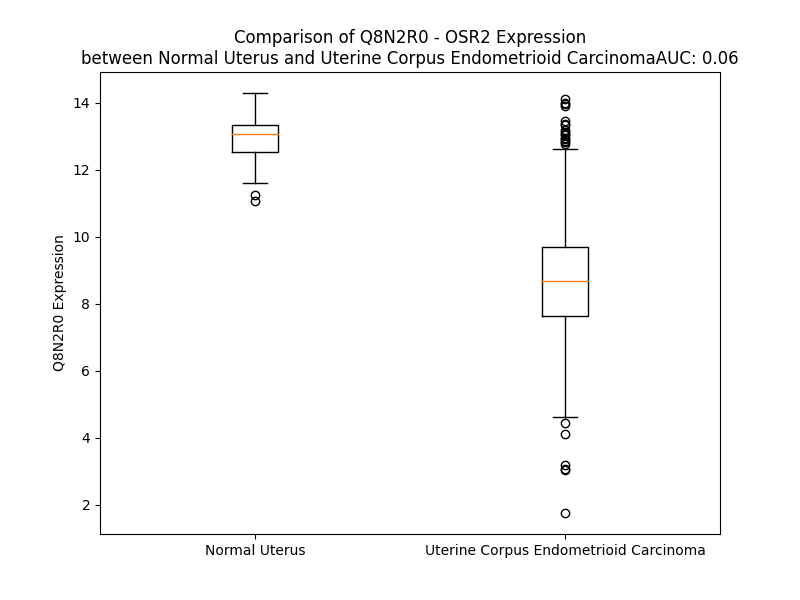

# Detailed Data for Q8N2R0

## Introduction to the Detailed Summary

### How to Interpret the Results

- **Summary & Metrics**: This section provides a quick reference to essential protein attributes, including expression changes, family classification, and biomarker applications. Regulation status (upregulated/downregulated) indicates the protein's behavior in a disease context. Some information comes from the original excel file with the proteins selected from literature, while others are derived from the analyses.
- **Expression Comparison**: A visual representation comparing protein expression between normal and disease states. It highlights significant changes in expression levels that might indicate diagnostic or therapeutic relevance. This is data coming from transcriptomics experiments and could not translate similarly to protein levels.
- **Isoform Alignment**: An interactive view of isoform alignments, revealing structural and functional differences between variants of the protein.
- **Interactors & Homologs**: Tables listing known interaction partners and homologous proteins, the more interactors and homologs, the more complex the protein is to design an antibody for.
- **Biological Assemblies**: Information about the structural arrangement of the protein in different assemblies, providing insights into its functional state but also the complexity of the protein to develop antibodies.
- **Combined Per-Residue Information**: A detailed table summarizing residue-level data. This includes predictions for epitope regions, aggregation tendencies, and modifications that might impact the protein's function. Each row corresponds to a residue in the protein, providing insights into specific sites that may be important for research or drug development.
## Summary & Metrics

- **UniProt Accession**: Q8N2R0
- **Gene Name**: OSR2
- **Protein Name**: Protein odd-skipped-related 2
- **Swiss Prot**: OSR2_HUMAN
- **Family**: nan
- **Biomarker Application**: nan
- **Number of Isoforms**: 3
- **Regulation**: 1
- **(transcriptomics) AUC**: 0.0
- **(transcriptomics) Fold Change**: 1.39
- **(transcriptomics) Regulation**: Downregulated
- **Discotope Epitope Count**: 19
- **Max n_uniprots (Homo)**: N/A
- **Max n_uniprots (Hetero)**: N/A

## Expression Comparison

## Isoform Alignment

<pre style='font-size:14px; font-family:monospace;'>Q8N2R0-1 -------------------------------------------------------------------------------------------------------------------------MGSKALPAPIPLHPSLQLTNYSFLQAVNTFPATVDHLQGLYGLSAVQTMHMNHWTLGYPNVHEITRSTITEMAAAQGLVDARFPFPALPFTTHLFHPKQGAIAHVLPALHKDRPRFDFANLAVAATQEDPPKMGDLSKLSPGLGSPISGLSKLTPDRKPSRGRLPSKTKKEFICKFCGRHFTKSYNLLIHERTHTDERPYTCDICHKAFRRQDHLRDHRYIHSKEKPFKCQECGKGFCQSRTLAVHKTLHMQESPHKCPTCGRTFNQRSNLKTHLLTHTDIKPYSCEQCGKVFRRNCDLRRHSLTHTPRQDF
Q8N2R0-2 -------------------------------------------------------------------------------------------------------------------------MGSKALPAPIPLHPSLQLTNYSFLQAVNTFPATVDHLQGLYGLSAVQTMHMNHWTLGYPNVHEITRSTITEMAAAQGLVDARFPFPALPFTTHLFHPKQGAIAHVLPALHKDRPRFDFANLAVAATQEDPPKMGDLSKLSPGLGSPISGLSKLTPDRKPSRGRLPSKTKKEFICKFCGRHFTKSYNLLIHERTHTDERPYTCDICHKAFRRQDHLRDHRYIHSKEKPFKCQECGKGFCQSRTLAVHKTLHMQTSSPTAASSAAKCSGETVICGGTA------------------------------------
Q8N2R0-3 MGLRAEEGKRKPPRSVRGEVSPSQGPLAQEDEARRLRSCTPACHPGKRGKGGHRARRQRSAWDLTTHPLTHRSQELRGAAATEGFLYVLLSHWVFVGAPRPPASDSWKKGLVPSAPPASRKMGSKALPAPIPLHPSLQLTNYSFLQAVNTFPATVDHLQGLYGLSAVQTMHMNHWTLGYPNVHEITRSTITEMAAAQGLVDARFPFPALPFTTHLFHPKQGAIAHVLPALHKDRPRFDFANLAVAATQEDPPKMGDLSKLSPGLGSPISGLSKLTPDRKPSRGRLPSKTKKEFICKFCGRHFTKSYNLLIHERTHTDERPYTCDICHKAFRRQDHLRDHRYIHSKEKPFKCQECGKGFCQSRTLAVHKTLHMQESPHKCPTCGRTFNQRSNLKTHLLTHTDIKPYSCEQCGKVFRRNCDLRRHSLTHTPRQDF
</pre>

## Interactors

| preferredName_A   | preferredName_B   | score   |
|-------------------|-------------------|---------|

## Homologs

| uniprot_id   | gene_id   |
|:-------------|:----------|
| Q8TAX0       | OSR1      |

## Combined Per-Residue Information

|   res | aa   |   epitope_score | epitope   |   relative_surface_accessibility |   modeling_confidence |   Aggregation | modification   |
|------:|:-----|----------------:|:----------|---------------------------------:|----------------------:|--------------:|:---------------|
|     1 | M    |         0.12397 | False     |                          1.31094 |                 39.89 |         0     | N/A            |
|     2 | G    |         0.13439 | False     |                          0.9871  |                 39.21 |         0     | N/A            |
|     3 | S    |         0.11792 | False     |                          0.87858 |                 41.11 |         0     | N/A            |
|     4 | K    |         0.15082 | False     |                          0.98354 |                 44.5  |         0     | N/A            |
|     5 | A    |         0.14209 | False     |                          0.93944 |                 40.19 |         0     | N/A            |
|     6 | L    |         0.14927 | False     |                          1.03675 |                 38.76 |         0     | N/A            |
|     7 | P    |         0.13487 | False     |                          0.91274 |                 39.17 |         0     | N/A            |
|     8 | A    |         0.11449 | False     |                          0.8102  |                 41.77 |         0     | N/A            |
|     9 | P    |         0.11181 | False     |                          0.96404 |                 35.18 |         0     | N/A            |
|    10 | I    |         0.09297 | False     |                          0.91927 |                 41.67 |         0     | N/A            |
|    11 | P    |         0.11981 | False     |                          0.92497 |                 34.17 |         0     | N/A            |
|    12 | L    |         0.1222  | False     |                          1.06951 |                 31.76 |         0     | N/A            |
|    13 | H    |         0.14035 | False     |                          0.81597 |                 32.4  |         0     | N/A            |
|    14 | P    |         0.14731 | False     |                          0.95679 |                 30.75 |         0     | N/A            |
|    15 | S    |         0.18535 | False     |                          0.58235 |                 29.77 |         0     | N/A            |
|    16 | L    |         0.15289 | False     |                          1.00857 |                 28.75 |         0     | N/A            |
|    17 | Q    |         0.17637 | False     |                          0.83841 |                 30.65 |         0     | N/A            |
|    18 | L    |         0.10369 | False     |                          1.00691 |                 36.37 |         0.214 | N/A            |
|    19 | T    |         0.11197 | False     |                          0.80122 |                 35.54 |         0.214 | N/A            |
|    20 | N    |         0.13359 | False     |                          0.77435 |                 40.07 |         0.214 | N/A            |
|    21 | Y    |         0.15842 | False     |                          0.91646 |                 37.13 |         0.88  | N/A            |
|    22 | S    |         0.09386 | False     |                          0.64487 |                 39.95 |         1.073 | N/A            |
|    23 | F    |         0.11453 | False     |                          0.40995 |                 39.31 |         2.629 | N/A            |
|    24 | L    |         0.17456 | False     |                          0.86724 |                 38.94 |         2.629 | N/A            |
|    25 | Q    |         0.13568 | False     |                          0.78931 |                 38.06 |         2.415 | N/A            |
|    26 | A    |         0.07503 | False     |                          0.70745 |                 39.97 |         2.415 | N/A            |
|    27 | V    |         0.09397 | False     |                          0.41846 |                 39.62 |         2.415 | N/A            |
|    28 | N    |         0.18624 | False     |                          0.9087  |                 33.96 |         0     | N/A            |
|    29 | T    |         0.14948 | False     |                          0.77149 |                 50.11 |         0     | N/A            |
|    30 | F    |         0.22547 | True      |                          0.76672 |                 40.94 |         0     | N/A            |
|    31 | P    |         0.1652  | False     |                          0.72303 |                 44.7  |         0     | N/A            |
|    32 | A    |         0.13851 | False     |                          0.79941 |                 48.6  |         0     | N/A            |
|    33 | T    |         0.08539 | False     |                          0.5502  |                 53.52 |         0     | N/A            |
|    34 | V    |         0.07598 | False     |                          0.2542  |                 51.89 |         0     | N/A            |
|    35 | D    |         0.14699 | False     |                          0.61909 |                 53.81 |         0     | N/A            |
|    36 | H    |         0.09759 | False     |                          0.65382 |                 56.96 |         0     | N/A            |
|    37 | L    |         0.09221 | False     |                          0.41795 |                 46.39 |         0     | N/A            |
|    38 | Q    |         0.17794 | False     |                          0.2797  |                 54.98 |         0     | N/A            |
|    39 | G    |         0.20138 | False     |                          0.8339  |                 57.89 |         0     | N/A            |
|    40 | L    |         0.09939 | False     |                          0.66972 |                 53.98 |         0.692 | N/A            |
|    41 | Y    |         0.1896  | False     |                          0.49441 |                 53.86 |         0.692 | N/A            |
|    42 | G    |         0.13418 | False     |                          0.38774 |                 53.53 |         0.692 | N/A            |
|    43 | L    |         0.19427 | False     |                          0.67712 |                 54.47 |         0.692 | N/A            |
|    44 | S    |         0.10573 | False     |                          0.62614 |                 52.53 |         0.692 | N/A            |
|    45 | A    |         0.07246 | False     |                          0.32344 |                 49.42 |         0.692 | N/A            |
|    46 | V    |         0.03724 | False     |                          0.13134 |                 54.47 |         0.692 | N/A            |
|    47 | Q    |         0.07683 | False     |                          0.38    |                 52    |         0     | N/A            |
|    48 | T    |         0.06481 | False     |                          0.54293 |                 54.94 |         0     | N/A            |
|    49 | M    |         0.05414 | False     |                          0.56487 |                 45.57 |         0     | N/A            |
|    50 | H    |         0.07686 | False     |                          0.51111 |                 52.4  |         0     | N/A            |
|    51 | M    |         0.07869 | False     |                          0.60542 |                 45.73 |         0     | N/A            |
|    52 | N    |         0.0666  | False     |                          0.52512 |                 40.01 |         0     | N/A            |
|    53 | H    |         0.05317 | False     |                          0.46312 |                 47.3  |         0     | N/A            |
|    54 | W    |         0.10384 | False     |                          0.85692 |                 38.47 |         0     | N/A            |
|    55 | T    |         0.07317 | False     |                          0.56494 |                 40.98 |         0     | N/A            |
|    56 | L    |         0.0787  | False     |                          0.70382 |                 39.73 |         0     | N/A            |
|    57 | G    |         0.08919 | False     |                          0.81504 |                 37.84 |         0     | N/A            |
|    58 | Y    |         0.09001 | False     |                          0.61269 |                 42.05 |         0     | N/A            |
|    59 | P    |         0.07777 | False     |                          0.81722 |                 40.48 |         0     | N/A            |
|    60 | N    |         0.11405 | False     |                          0.63178 |                 38.47 |         0     | N/A            |
|    61 | V    |         0.09422 | False     |                          0.55651 |                 42.31 |         0     | N/A            |
|    62 | H    |         0.12671 | False     |                          0.82505 |                 38.32 |         0     | N/A            |
|    63 | E    |         0.13249 | False     |                          0.69313 |                 38.95 |         0     | N/A            |
|    64 | I    |         0.10817 | False     |                          0.56335 |                 39.47 |         0     | N/A            |
|    65 | T    |         0.07963 | False     |                          0.39342 |                 41.55 |         0     | N/A            |
|    66 | R    |         0.16143 | False     |                          0.69962 |                 44.05 |         0     | N/A            |
|    67 | S    |         0.06563 | False     |                          0.45811 |                 44.35 |         0     | N/A            |
|    68 | T    |         0.05077 | False     |                          0.46941 |                 45.6  |         0     | N/A            |
|    69 | I    |         0.11314 | False     |                          0.6047  |                 48.79 |         0     | N/A            |
|    70 | T    |         0.06753 | False     |                          0.62762 |                 55.18 |         0     | N/A            |
|    71 | E    |         0.11102 | False     |                          0.57872 |                 45.56 |         0     | N/A            |
|    72 | M    |         0.05529 | False     |                          0.5651  |                 45.65 |         0     | N/A            |
|    73 | A    |         0.06577 | False     |                          0.41748 |                 43.52 |         0     | N/A            |
|    74 | A    |         0.11627 | False     |                          0.70052 |                 45.28 |         0     | N/A            |
|    75 | A    |         0.10532 | False     |                          0.84155 |                 48.62 |         0     | N/A            |
|    76 | Q    |         0.10975 | False     |                          0.61423 |                 45.56 |         0     | N/A            |
|    77 | G    |         0.16244 | False     |                          0.78696 |                 40.31 |         0     | N/A            |
|    78 | L    |         0.10178 | False     |                          0.80454 |                 37.99 |         0     | N/A            |
|    79 | V    |         0.11017 | False     |                          0.91994 |                 38.98 |         0     | N/A            |
|    80 | D    |         0.12684 | False     |                          0.86952 |                 33.83 |         0     | N/A            |
|    81 | A    |         0.14724 | False     |                          0.85867 |                 30.05 |         0     | N/A            |
|    82 | R    |         0.2164  | True      |                          0.87599 |                 31.64 |         0     | N/A            |
|    83 | F    |         0.11327 | False     |                          0.9508  |                 30.86 |         0     | N/A            |
|    84 | P    |         0.11703 | False     |                          0.9654  |                 33.43 |         0     | N/A            |
|    85 | F    |         0.13461 | False     |                          0.91222 |                 32.26 |         0     | N/A            |
|    86 | P    |         0.09353 | False     |                          0.94521 |                 35.71 |         0     | N/A            |
|    87 | A    |         0.07753 | False     |                          0.82683 |                 30.86 |         0     | N/A            |
|    88 | L    |         0.15521 | False     |                          1.01881 |                 33.41 |         0     | N/A            |
|    89 | P    |         0.08289 | False     |                          0.77914 |                 33.2  |         0     | N/A            |
|    90 | F    |         0.08004 | False     |                          1.05828 |                 29.13 |         0.132 | N/A            |
|    91 | T    |         0.09747 | False     |                          0.87155 |                 31.98 |         0.132 | N/A            |
|    92 | T    |         0.07308 | False     |                          0.86451 |                 28.67 |         0.132 | N/A            |
|    93 | H    |         0.11213 | False     |                          1.00887 |                 33.62 |         0.132 | N/A            |
|    94 | L    |         0.08124 | False     |                          0.86411 |                 29.61 |         0.132 | N/A            |
|    95 | F    |         0.14566 | False     |                          1.0965  |                 28.9  |         0.132 | N/A            |
|    96 | H    |         0.06138 | False     |                          0.87104 |                 34.63 |         0     | N/A            |
|    97 | P    |         0.05712 | False     |                          0.87367 |                 31.51 |         0     | N/A            |
|    98 | K    |         0.09633 | False     |                          1.02479 |                 35.58 |         0     | N/A            |
|    99 | Q    |         0.16038 | False     |                          0.95876 |                 30.02 |         0     | N/A            |
|   100 | G    |         0.23747 | True      |                          0.87235 |                 30.72 |         0     | N/A            |
|   101 | A    |         0.10312 | False     |                          0.88128 |                 26.27 |         0     | N/A            |
|   102 | I    |         0.13627 | False     |                          0.98584 |                 25.97 |         0     | N/A            |
|   103 | A    |         0.10073 | False     |                          0.89395 |                 26.13 |         0     | N/A            |
|   104 | H    |         0.06055 | False     |                          0.93545 |                 24.12 |         0     | N/A            |
|   105 | V    |         0.07267 | False     |                          0.99241 |                 26.65 |         0     | N/A            |
|   106 | L    |         0.13948 | False     |                          1.01466 |                 24.58 |         0     | N/A            |
|   107 | P    |         0.07493 | False     |                          0.75623 |                 34.13 |         0     | N/A            |
|   108 | A    |         0.06624 | False     |                          1.03914 |                 28.96 |         0     | N/A            |
|   109 | L    |         0.13338 | False     |                          0.96476 |                 24.4  |         0     | N/A            |
|   110 | H    |         0.13369 | False     |                          0.89305 |                 26.85 |         0     | N/A            |
|   111 | K    |         0.19741 | False     |                          0.77739 |                 28.7  |         0     | N/A            |
|   112 | D    |         0.09518 | False     |                          0.90531 |                 26.89 |         0     | N/A            |
|   113 | R    |         0.11987 | False     |                          0.68825 |                 29.19 |         0     | N/A            |
|   114 | P    |         0.0672  | False     |                          0.68306 |                 27.83 |         0     | N/A            |
|   115 | R    |         0.1567  | False     |                          0.85593 |                 29.28 |         0     | N/A            |
|   116 | F    |         0.1149  | False     |                          0.6194  |                 28.19 |         0     | N/A            |
|   117 | D    |         0.125   | False     |                          0.55931 |                 25.25 |         0     | N/A            |
|   118 | F    |         0.1143  | False     |                          0.68607 |                 27.04 |         1.209 | N/A            |
|   119 | A    |         0.12566 | False     |                          0.82366 |                 26.41 |         1.209 | N/A            |
|   120 | N    |         0.10177 | False     |                          0.92571 |                 26.39 |         1.209 | N/A            |
|   121 | L    |         0.12846 | False     |                          0.87049 |                 27.76 |         4.002 | N/A            |
|   122 | A    |         0.06672 | False     |                          0.95106 |                 25.5  |         4.002 | N/A            |
|   123 | V    |         0.10361 | False     |                          0.85102 |                 27.65 |         4.002 | N/A            |
|   124 | A    |         0.08093 | False     |                          0.82039 |                 24.84 |         3.53  | N/A            |
|   125 | A    |         0.0801  | False     |                          0.91043 |                 26.12 |         3.131 | N/A            |
|   126 | T    |         0.08347 | False     |                          0.76761 |                 27.63 |         0.498 | N/A            |
|   127 | Q    |         0.12142 | False     |                          0.93911 |                 26.18 |         0     | N/A            |
|   128 | E    |         0.16953 | False     |                          0.78497 |                 27    |         0     | N/A            |
|   129 | D    |         0.13742 | False     |                          0.81513 |                 31.27 |         0     | N/A            |
|   130 | P    |         0.09087 | False     |                          0.83359 |                 39.04 |         0     | N/A            |
|   131 | P    |         0.09111 | False     |                          0.93093 |                 33.13 |         0     | N/A            |
|   132 | K    |         0.11735 | False     |                          1.01213 |                 28.8  |         0     | N/A            |
|   133 | M    |         0.12871 | False     |                          1.02311 |                 32.83 |         0     | N/A            |
|   134 | G    |         0.12866 | False     |                          0.7991  |                 33.17 |         0     | N/A            |
|   135 | D    |         0.08502 | False     |                          0.83422 |                 27.06 |         0     | N/A            |
|   136 | L    |         0.09055 | False     |                          1.12386 |                 28.76 |         0     | N/A            |
|   137 | S    |         0.05742 | False     |                          0.64297 |                 27.24 |         0     | N/A            |
|   138 | K    |         0.07947 | False     |                          0.92058 |                 30.78 |         0     | N/A            |
|   139 | L    |         0.10063 | False     |                          1.10836 |                 27.08 |         0     | N/A            |
|   140 | S    |         0.05774 | False     |                          0.79333 |                 30.91 |         0     | N/A            |
|   141 | P    |         0.11896 | False     |                          0.99914 |                 41.17 |         0     | N/A            |
|   142 | G    |         0.20196 | False     |                          0.77882 |                 30.69 |         0     | N/A            |
|   143 | L    |         0.08062 | False     |                          1.14938 |                 35.4  |         0     | N/A            |
|   144 | G    |         0.12396 | False     |                          0.91568 |                 32.75 |         0     | N/A            |
|   145 | S    |         0.10312 | False     |                          0.87414 |                 32.84 |         0     | N/A            |
|   146 | P    |         0.0627  | False     |                          0.81992 |                 35.7  |         0     | N/A            |
|   147 | I    |         0.08636 | False     |                          0.96166 |                 29.77 |         0     | N/A            |
|   148 | S    |         0.12319 | False     |                          0.87581 |                 34.37 |         0     | N/A            |
|   149 | G    |         0.08731 | False     |                          0.80617 |                 29.46 |         0     | N/A            |
|   150 | L    |         0.11509 | False     |                          1.11971 |                 32.65 |         0     | N/A            |
|   151 | S    |         0.07515 | False     |                          0.73851 |                 33.09 |         0     | N/A            |
|   152 | K    |         0.05368 | False     |                          0.90913 |                 31.44 |         0     | N/A            |
|   153 | L    |         0.09188 | False     |                          1.07608 |                 30.84 |         0     | N/A            |
|   154 | T    |         0.06619 | False     |                          0.90343 |                 33.18 |         0     | N/A            |
|   155 | P    |         0.07436 | False     |                          0.90991 |                 40.37 |         0     | N/A            |
|   156 | D    |         0.13324 | False     |                          0.81765 |                 32.42 |         0     | N/A            |
|   157 | R    |         0.16933 | False     |                          0.94832 |                 37.34 |         0     | N/A            |
|   158 | K    |         0.08679 | False     |                          0.84221 |                 32.12 |         0     | N/A            |
|   159 | P    |         0.12513 | False     |                          0.86217 |                 34.77 |         0     | N/A            |
|   160 | S    |         0.09443 | False     |                          0.86141 |                 42    |         0     | N/A            |
|   161 | R    |         0.11924 | False     |                          0.89814 |                 40.71 |         0     | N/A            |
|   162 | G    |         0.09875 | False     |                          0.76302 |                 35.81 |         0     | N/A            |
|   163 | R    |         0.14318 | False     |                          0.94877 |                 39.69 |         0     | N/A            |
|   164 | L    |         0.08857 | False     |                          0.93276 |                 33.68 |         0     | N/A            |
|   165 | P    |         0.13018 | False     |                          0.9092  |                 39.56 |         0     | N/A            |
|   166 | S    |         0.11267 | False     |                          0.62477 |                 48.59 |         0     | N/A            |
|   167 | K    |         0.12914 | False     |                          0.93414 |                 51.43 |         0     | N/A            |
|   168 | T    |         0.09912 | False     |                          0.99303 |                 48.14 |         0     | N/A            |
|   169 | K    |         0.17095 | False     |                          0.60286 |                 60.48 |         0     | N/A            |
|   170 | K    |         0.1797  | False     |                          0.79089 |                 69.49 |         0     | N/A            |
|   171 | E    |         0.10052 | False     |                          0.56521 |                 84.26 |         0     | N/A            |
|   172 | F    |         0.20393 | False     |                          0.28248 |                 90.01 |         0     | N/A            |
|   173 | I    |         0.08853 | False     |                          0.51388 |                 90.7  |         0     | N/A            |
|   174 | C    |         0.04801 | False     |                          0.01036 |                 92.97 |         0     | N/A            |
|   175 | K    |         0.12669 | False     |                          0.92444 |                 90.52 |         0     | N/A            |
|   176 | F    |         0.15982 | False     |                          0.657   |                 89.36 |         0     | N/A            |
|   177 | C    |         0.13405 | False     |                          0.4059  |                 92.94 |         0     | N/A            |
|   178 | G    |         0.09325 | False     |                          0.47096 |                 89.33 |         0     | N/A            |
|   179 | R    |         0.14393 | False     |                          0.53021 |                 90.7  |         0     | N/A            |
|   180 | H    |         0.12464 | False     |                          0.58989 |                 94.01 |         0     | N/A            |
|   181 | F    |         0.12696 | False     |                          0.17534 |                 92.26 |         0     | N/A            |
|   182 | T    |         0.13264 | False     |                          0.5551  |                 92.32 |         0     | N/A            |
|   183 | K    |         0.12035 | False     |                          0.65152 |                 91.82 |         0     | N/A            |
|   184 | S    |         0.1306  | False     |                          0.47901 |                 92.53 |         0.835 | N/A            |
|   185 | Y    |         0.16966 | False     |                          0.62327 |                 91.93 |         7.562 | N/A            |
|   186 | N    |         0.1163  | False     |                          0.38699 |                 93.71 |         7.562 | N/A            |
|   187 | L    |         0.07044 | False     |                          0.14014 |                 93.15 |         7.562 | N/A            |
|   188 | L    |         0.11022 | False     |                          0.56082 |                 92.91 |         7.562 | N/A            |
|   189 | I    |         0.0625  | False     |                          0.1128  |                 92.35 |         7.562 | N/A            |
|   190 | H    |         0.0499  | False     |                          0.15578 |                 92.44 |         0     | N/A            |
|   191 | E    |         0.08952 | False     |                          0.2125  |                 91.84 |         0     | N/A            |
|   192 | R    |         0.13787 | False     |                          0.17791 |                 92.45 |         0     | N/A            |
|   193 | T    |         0.12739 | False     |                          0.36624 |                 92.76 |         0     | N/A            |
|   194 | H    |         0.08391 | False     |                          0.40641 |                 91.27 |         0     | N/A            |
|   195 | T    |         0.13367 | False     |                          0.61227 |                 89.65 |         0     | N/A            |
|   196 | D    |         0.12294 | False     |                          0.26557 |                 88.28 |         0     | N/A            |
|   197 | E    |         0.15109 | False     |                          0.47602 |                 89.76 |         0     | N/A            |
|   198 | R    |         0.33206 | True      |                          0.46114 |                 91.96 |         0     | N/A            |
|   199 | P    |         0.26609 | True      |                          0.49338 |                 91.08 |         0     | N/A            |
|   200 | Y    |         0.19291 | False     |                          0.32235 |                 93.68 |         0     | N/A            |
|   201 | T    |         0.10518 | False     |                          0.51616 |                 93.52 |         0     | N/A            |
|   202 | C    |         0.02881 | False     |                          0.00335 |                 92.67 |         0     | N/A            |
|   203 | D    |         0.16421 | False     |                          0.61193 |                 92.61 |         0     | N/A            |
|   204 | I    |         0.1965  | False     |                          0.68099 |                 90.03 |         0     | N/A            |
|   205 | C    |         0.14692 | False     |                          0.4146  |                 92.88 |         0     | N/A            |
|   206 | H    |         0.28568 | True      |                          0.77606 |                 91.66 |         0     | N/A            |
|   207 | K    |         0.3207  | True      |                          0.5787  |                 92.12 |         0     | N/A            |
|   208 | A    |         0.18904 | False     |                          0.32635 |                 92.92 |         0     | N/A            |
|   209 | F    |         0.11142 | False     |                          0.15602 |                 90.94 |         0     | N/A            |
|   210 | R    |         0.14054 | False     |                          0.24112 |                 92.33 |         0     | N/A            |
|   211 | R    |         0.1737  | False     |                          0.33505 |                 92.43 |         0     | N/A            |
|   212 | Q    |         0.18253 | False     |                          0.4821  |                 92.34 |         0     | N/A            |
|   213 | D    |         0.11038 | False     |                          0.26595 |                 89.65 |         0     | N/A            |
|   214 | H    |         0.15912 | False     |                          0.44587 |                 91.49 |         0     | N/A            |
|   215 | L    |         0.08069 | False     |                          0.04946 |                 91.3  |         0     | N/A            |
|   216 | R    |         0.20918 | True      |                          0.56531 |                 90.26 |         0     | N/A            |
|   217 | D    |         0.12576 | False     |                          0.20458 |                 87.86 |         0     | N/A            |
|   218 | H    |         0.06303 | False     |                          0.11409 |                 89.76 |         0     | N/A            |
|   219 | R    |         0.22718 | True      |                          0.43318 |                 88.47 |         0     | N/A            |
|   220 | Y    |         0.11346 | False     |                          0.24918 |                 86.92 |         0     | N/A            |
|   221 | I    |         0.30548 | True      |                          0.70825 |                 85.19 |         0     | N/A            |
|   222 | H    |         0.1622  | False     |                          0.32689 |                 86.45 |         0     | N/A            |
|   223 | S    |         0.26065 | True      |                          0.48253 |                 80.98 |         0     | N/A            |
|   224 | K    |         0.2197  | True      |                          0.84388 |                 74.5  |         0     | N/A            |
|   225 | E    |         0.27126 | True      |                          0.59534 |                 75.11 |         0     | N/A            |
|   226 | K    |         0.33233 | True      |                          0.45169 |                 82.29 |         0     | N/A            |
|   227 | P    |         0.31358 | True      |                          0.53794 |                 82.15 |         0     | N/A            |
|   228 | F    |         0.20101 | False     |                          0.37351 |                 85.75 |         0     | N/A            |
|   229 | K    |         0.12254 | False     |                          0.6676  |                 86.91 |         0     | N/A            |
|   230 | C    |         0.05633 | False     |                          0.01243 |                 89.82 |         0     | N/A            |
|   231 | Q    |         0.17417 | False     |                          0.84301 |                 89.3  |         0     | N/A            |
|   232 | E    |         0.19512 | False     |                          0.62631 |                 86.42 |         0     | N/A            |
|   233 | C    |         0.173   | False     |                          0.47328 |                 89.18 |         0     | N/A            |
|   234 | G    |         0.15416 | False     |                          0.63591 |                 85.41 |         0     | N/A            |
|   235 | K    |         0.2012  | False     |                          0.58263 |                 87.03 |         0     | N/A            |
|   236 | G    |         0.10226 | False     |                          0.14945 |                 86.06 |         0     | N/A            |
|   237 | F    |         0.12053 | False     |                          0.16738 |                 85.23 |         0     | N/A            |
|   238 | C    |         0.08621 | False     |                          0.2508  |                 84.78 |         0     | N/A            |
|   239 | Q    |         0.13342 | False     |                          0.35659 |                 85.13 |         0     | N/A            |
|   240 | S    |         0.13047 | False     |                          0.49763 |                 87.23 |         0     | N/A            |
|   241 | R    |         0.18048 | False     |                          0.78564 |                 86.18 |         0     | N/A            |
|   242 | T    |         0.11981 | False     |                          0.42794 |                 87.55 |         0     | N/A            |
|   243 | L    |         0.0962  | False     |                          0.122   |                 87.88 |         0     | N/A            |
|   244 | A    |         0.10559 | False     |                          0.52511 |                 87.66 |         0     | N/A            |
|   245 | V    |         0.11024 | False     |                          0.33368 |                 85.84 |         0     | N/A            |
|   246 | H    |         0.04797 | False     |                          0.11917 |                 87.62 |         0     | N/A            |
|   247 | K    |         0.09914 | False     |                          0.44875 |                 85.74 |         0     | N/A            |
|   248 | T    |         0.04451 | False     |                          0.26914 |                 84.86 |         0     | N/A            |
|   249 | L    |         0.18263 | False     |                          0.65573 |                 82.94 |         0     | N/A            |
|   250 | H    |         0.1179  | False     |                          0.36697 |                 82.42 |         0     | N/A            |
|   251 | M    |         0.14017 | False     |                          0.72896 |                 72.3  |         0     | N/A            |
|   252 | Q    |         0.20048 | False     |                          0.92161 |                 65.13 |         0     | N/A            |
|   253 | E    |         0.22799 | True      |                          0.80041 |                 63.47 |         0     | N/A            |
|   254 | S    |         0.1202  | False     |                          0.2126  |                 70.51 |         0     | N/A            |
|   255 | P    |         0.2167  | True      |                          0.61993 |                 78.38 |         0     | N/A            |
|   256 | H    |         0.15913 | False     |                          0.2858  |                 83.93 |         0     | N/A            |
|   257 | K    |         0.08934 | False     |                          0.65997 |                 85.25 |         0     | N/A            |
|   258 | C    |         0.03149 | False     |                          0.00518 |                 89.66 |         0     | N/A            |
|   259 | P    |         0.08644 | False     |                          0.85313 |                 86.32 |         0     | N/A            |
|   260 | T    |         0.14096 | False     |                          0.66137 |                 87.1  |         0     | N/A            |
|   261 | C    |         0.14312 | False     |                          0.4873  |                 89.05 |         0     | N/A            |
|   262 | G    |         0.11552 | False     |                          0.37703 |                 84.1  |         0     | N/A            |
|   263 | R    |         0.24034 | True      |                          0.64526 |                 85.9  |         0     | N/A            |
|   264 | T    |         0.11675 | False     |                          0.47487 |                 84.69 |         0     | N/A            |
|   265 | F    |         0.12619 | False     |                          0.1716  |                 84.42 |         0     | N/A            |
|   266 | N    |         0.10175 | False     |                          0.18803 |                 84.33 |         0     | N/A            |
|   267 | Q    |         0.09468 | False     |                          0.3405  |                 85.26 |         0     | N/A            |
|   268 | R    |         0.10796 | False     |                          0.69668 |                 87.26 |         0     | N/A            |
|   269 | S    |         0.09471 | False     |                          0.50645 |                 87.37 |         0     | N/A            |
|   270 | N    |         0.12926 | False     |                          0.3934  |                 88.89 |         0     | N/A            |
|   271 | L    |         0.05824 | False     |                          0.14756 |                 89.69 |         0     | N/A            |
|   272 | K    |         0.05677 | False     |                          0.52835 |                 88.72 |         0     | N/A            |
|   273 | T    |         0.13586 | False     |                          0.37647 |                 89.17 |         0     | N/A            |
|   274 | H    |         0.03514 | False     |                          0.13164 |                 90.49 |         0     | N/A            |
|   275 | L    |         0.09233 | False     |                          0.32645 |                 90.2  |         0     | N/A            |
|   276 | L    |         0.06606 | False     |                          0.22917 |                 90.76 |         0     | N/A            |
|   277 | T    |         0.16776 | False     |                          0.41502 |                 89.37 |         0     | N/A            |
|   278 | H    |         0.10105 | False     |                          0.39504 |                 88.03 |         0     | N/A            |
|   279 | T    |         0.12711 | False     |                          0.57022 |                 84.07 |         0     | N/A            |
|   280 | D    |         0.15276 | False     |                          0.6317  |                 80.15 |         0     | N/A            |
|   281 | I    |         0.13447 | False     |                          0.55918 |                 86.01 |         0     | N/A            |
|   282 | K    |         0.20514 | True      |                          0.4451  |                 89    |         0     | N/A            |
|   283 | P    |         0.08662 | False     |                          0.55101 |                 88.21 |         0     | N/A            |
|   284 | Y    |         0.12579 | False     |                          0.35361 |                 90.74 |         0     | N/A            |
|   285 | S    |         0.04113 | False     |                          0.49105 |                 91.91 |         0     | N/A            |
|   286 | C    |         0.0758  | False     |                          0.04596 |                 93.75 |         0     | N/A            |
|   287 | E    |         0.09464 | False     |                          0.92635 |                 90.53 |         0     | N/A            |
|   288 | Q    |         0.14119 | False     |                          0.68083 |                 88.35 |         0     | N/A            |
|   289 | C    |         0.11585 | False     |                          0.39992 |                 93.68 |         0     | N/A            |
|   290 | G    |         0.13394 | False     |                          0.62544 |                 89.66 |         0     | N/A            |
|   291 | K    |         0.12786 | False     |                          0.60701 |                 91.72 |         0     | N/A            |
|   292 | V    |         0.08543 | False     |                          0.53686 |                 92.23 |         0     | N/A            |
|   293 | F    |         0.09869 | False     |                          0.19526 |                 90.41 |         0     | N/A            |
|   294 | R    |         0.16067 | False     |                          0.24671 |                 90.25 |         0     | N/A            |
|   295 | R    |         0.13103 | False     |                          0.45103 |                 90.63 |         0     | N/A            |
|   296 | N    |         0.08946 | False     |                          0.2464  |                 91.5  |         0     | N/A            |
|   297 | C    |         0.10677 | False     |                          0.53243 |                 91.19 |         0     | N/A            |
|   298 | D    |         0.10045 | False     |                          0.15384 |                 93.56 |         0     | N/A            |
|   299 | L    |         0.06593 | False     |                          0.1558  |                 93.22 |         0     | N/A            |
|   300 | R    |         0.11301 | False     |                          0.64134 |                 92.54 |         0     | N/A            |
|   301 | R    |         0.12746 | False     |                          0.65    |                 92.72 |         0     | N/A            |
|   302 | H    |         0.0578  | False     |                          0.1287  |                 93.03 |         0     | N/A            |
|   303 | S    |         0.10231 | False     |                          0.33108 |                 90.55 |         0     | N/A            |
|   304 | L    |         0.09945 | False     |                          0.76611 |                 91.01 |         0     | N/A            |
|   305 | T    |         0.18891 | False     |                          0.7184  |                 90.76 |         0     | N/A            |
|   306 | H    |         0.10591 | False     |                          0.30822 |                 86.21 |         0     | N/A            |
|   307 | T    |         0.11715 | False     |                          0.5699  |                 80.9  |         0     | N/A            |
|   308 | P    |         0.12379 | False     |                          0.87576 |                 68.04 |         0     | N/A            |
|   309 | R    |         0.12583 | False     |                          0.87155 |                 65.68 |         0     | N/A            |
|   310 | Q    |         0.11532 | False     |                          0.7493  |                 59.8  |         0     | N/A            |
|   311 | D    |         0.14116 | False     |                          0.8223  |                 55.01 |         0     | N/A            |
|   312 | F    |         0.07485 | False     |                          1.23587 |                 56.35 |         0     | N/A            |

