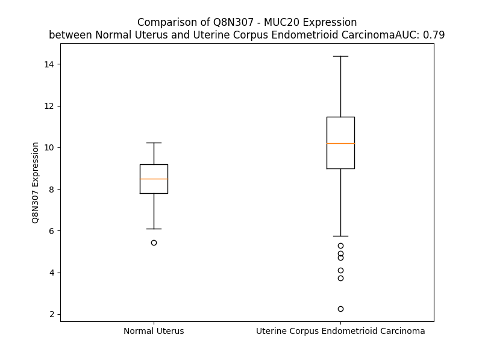

# Detailed Data for Q8N307

## Introduction to the Detailed Summary

### How to Interpret the Results

- **Summary & Metrics**: This section provides a quick reference to essential protein attributes, including expression changes, family classification, and biomarker applications. Regulation status (upregulated/downregulated) indicates the protein's behavior in a disease context. Some information comes from the original excel file with the proteins selected from literature, while others are derived from the analyses.
- **Expression Comparison**: A visual representation comparing protein expression between normal and disease states. It highlights significant changes in expression levels that might indicate diagnostic or therapeutic relevance. This is data coming from transcriptomics experiments and could not translate similarly to protein levels.
- **Isoform Alignment**: An interactive view of isoform alignments, revealing structural and functional differences between variants of the protein.
- **Interactors & Homologs**: Tables listing known interaction partners and homologous proteins, the more interactors and homologs, the more complex the protein is to design an antibody for.
- **Biological Assemblies**: Information about the structural arrangement of the protein in different assemblies, providing insights into its functional state but also the complexity of the protein to develop antibodies.
- **Combined Per-Residue Information**: A detailed table summarizing residue-level data. This includes predictions for epitope regions, aggregation tendencies, and modifications that might impact the protein's function. Each row corresponds to a residue in the protein, providing insights into specific sites that may be important for research or drug development.
## Summary & Metrics

- **UniProt Accession**: Q8N307
- **Gene Name**: MUC20
- **Protein Name**: Mucin-20
- **Swiss Prot**: MUC20_HUMAN
- **Family**: other
- **Biomarker Application**:  
- **Number of Isoforms**: 2
- **Regulation**: 1
- **(transcriptomics) AUC**: 0.79
- **(transcriptomics) Fold Change**: 1.19
- **(transcriptomics) Regulation**: Upregulated
- **Discotope Epitope Count**: 223
- **Max n_uniprots (Homo)**: N/A
- **Max n_uniprots (Hetero)**: N/A

## Expression Comparison

## Isoform Alignment

<pre style='font-size:14px; font-family:monospace;'>Q8N307-1 MGCLWGLALPLFFFCWEVGVSGSSAGPSTRRADTAMTTDDTEVPAMTLAPGHAALETQTLSAETSSRASTPAGPIPEAETRGAKRISPARETRSFTKTSPNFMVLIATSVETSAASGSPEGAGMTTVQTITGSDPREAIFDTLCTDDSSEEAKTLTMDILTLAHTSTEAKGLSSESSASSDSPHPVITPSRASESSASSDGPHPVITPSRASESSASSDGPHPVITPSRASESSASSDGPHPVITPSRASESSASSDGPHPVITPSRASESSASSDGPHPVITPSRASESSASSDGPHPVITPSRASESSASSDGPHPVITPSRASESSASSDGPHPVITPSRASESSASSDGLHPVITPSRASESSASSDGPHPVITPSRASESSASSDGPHPVITPSWSPGSDVTLLAEALVTVTNIEVINCSITEIETTTSSIPGASDTDLIPTEGVKASSTSDPPALPDSTEAKPHITEVTASAETLSTAGTTESAAPDATVGTPLPTNSATEREVTAPGATTLSGALVTVSRNPLEETSALSVETPSYVKVSGAAPVSIEAGSAVGKTTSFAGSSASSYSPSEAALKNFTPSETPTMDIATKGPFPTSRDPLPSVPPTTTNSSRGTNSTLAKITTSAKTTMKPPTATPTTARTRPTTDVSAGENGGFLLLRLSVASPEDLTDPRVAERLMQQLHRELHAHAPHFQVSLLRVRRG
Q8N307-3 -----------------------------------MTTDDTEVPAMTLAPGHAALETQTLSAETSSRASTPAGPIPEAETRGAKRISPARETRSFTKTSPNFMVLIATSVETSAASGSPEGAGMTTVQTITGSDPREAIFDTLCTDDSSEEAKTLTMDILTLAHTSTEAKGLSSESSASSDSPHPVITPSRASESSASSDGPHPVITPSRASESSASSDGPHPVITPSRASESSASSDGPHPVITPSRASESSASSDGPHPVITPSRASESSASSDGPHPVITPSRASESSASSDGPHPVITPSRASESSASSDGPHPVITPSRASESSASSDGPHPVITPSRASESSASSDGLHPVITPSRASESSASSDGPHPVITPSRASESSASSDGPHPVITPSWSPGSDVTLLAEALVTVTNIEVINCSITEIETTTSSIPGASDTDLIPTEGVKASSTSDPPALPDSTEAKPHITEVTASAETLSTAGTTESAAPDATVGTPLPTNSATEREVTAPGATTLSGALVTVSRNPLEETSALSVETPSYVKVSGAAPVSIEAGSAVGKTTSFAGSSASSYSPSEAALKNFTPSETPTMDIATKGPFPTSRDPLPSVPPTTTNSSRGTNSTLAKITTSAKTTMKPPTATPTTARTRPTTDVSAGENGGFLLLRLSVASPEDLTDPRVAERLMQQLHRELHAHAPHFQVSLLRVRRG
</pre>

## Interactors

| preferredName_A   | preferredName_B   |   score |
|:------------------|:------------------|--------:|
| MUC20             | MUC4              |   0.974 |
| MUC20             | MUC1              |   0.953 |
| MUC20             | MUC13             |   0.949 |
| MUC20             | MUC12             |   0.938 |
| MUC20             | MUC2              |   0.93  |
| MUC20             | MUC17             |   0.929 |
| MUC20             | MUC3A             |   0.926 |
| MUC20             | MUC5B             |   0.917 |
| MUC20             | MUC15             |   0.915 |
| MUC20             | MUC5AC            |   0.904 |

## Homologs

| uniprot_id   | gene_id   |
|:-------------|:----------|
| C9JJE7       | MUC20     |
| C9JJE7       | MUC20     |
| C9JJE7       | MUC20     |
| C9JJE7       | MUC20     |
| C9JJE7       | MUC20     |
| C9JJE7       | MUC20     |
| C9JJE7       | MUC20     |

## Combined Per-Residue Information

|   res | aa   |   epitope_score | epitope   |   relative_surface_accessibility |   modeling_confidence |   Aggregation | modification   | glycosylation                   |
|------:|:-----|----------------:|:----------|---------------------------------:|----------------------:|--------------:|:---------------|:--------------------------------|
|     1 | M    |         0.09173 | False     |                          1.34373 |                 33.54 |         0     | N/A            | N/A                             |
|     2 | G    |         0.12164 | True      |                          0.8945  |                 37.57 |         0     | N/A            | N/A                             |
|     3 | C    |         0.07156 | False     |                          0.90493 |                 31.2  |         0.494 | N/A            | N/A                             |
|     4 | L    |         0.10387 | False     |                          1.12249 |                 35.16 |         0.94  | N/A            | N/A                             |
|     5 | W    |         0.12226 | True      |                          1.13262 |                 33.96 |         0.94  | N/A            | N/A                             |
|     6 | G    |         0.09326 | False     |                          0.83422 |                 29.05 |         0.94  | N/A            | N/A                             |
|     7 | L    |         0.08261 | False     |                          1.06152 |                 31.48 |         0.94  | N/A            | N/A                             |
|     8 | A    |         0.10584 | False     |                          0.99035 |                 27.88 |         0.653 | N/A            | N/A                             |
|     9 | L    |         0.096   | False     |                          0.97483 |                 28.09 |         0     | N/A            | N/A                             |
|    10 | P    |         0.09465 | False     |                          0.7637  |                 32.09 |         1.552 | N/A            | N/A                             |
|    11 | L    |         0.08197 | False     |                          1.10396 |                 29.67 |        77.899 | N/A            | N/A                             |
|    12 | F    |         0.1175  | False     |                          0.92357 |                 26.23 |        91.173 | N/A            | N/A                             |
|    13 | F    |         0.11195 | False     |                          0.90072 |                 24.95 |        91.173 | N/A            | N/A                             |
|    14 | F    |         0.11114 | False     |                          0.99625 |                 27.72 |        91.173 | N/A            | N/A                             |
|    15 | C    |         0.05862 | False     |                          0.8104  |                 25.45 |        90.558 | N/A            | N/A                             |
|    16 | W    |         0.11501 | False     |                          0.96055 |                 29.58 |        86.638 | N/A            | N/A                             |
|    17 | E    |         0.08703 | False     |                          0.84538 |                 27.02 |         0     | N/A            | N/A                             |
|    18 | V    |         0.1114  | False     |                          0.9235  |                 34.16 |         0     | N/A            | N/A                             |
|    19 | G    |         0.10279 | False     |                          0.73744 |                 28.86 |         0     | N/A            | N/A                             |
|    20 | V    |         0.10262 | False     |                          1.08849 |                 28.24 |         0     | N/A            | N/A                             |
|    21 | S    |         0.12127 | True      |                          0.89437 |                 34.65 |         0     | N/A            | N/A                             |
|    22 | G    |         0.15817 | True      |                          0.8583  |                 26.49 |         0     | N/A            | N/A                             |
|    23 | S    |         0.1129  | False     |                          0.8662  |                 33.3  |         0     | N/A            | N/A                             |
|    24 | S    |         0.0835  | False     |                          0.84992 |                 32.95 |         0     | N/A            | N/A                             |
|    25 | A    |         0.08207 | False     |                          1.03823 |                 27.45 |         0     | N/A            | N/A                             |
|    26 | G    |         0.10972 | False     |                          0.87927 |                 36.4  |         0     | N/A            | N/A                             |
|    27 | P    |         0.15126 | True      |                          0.92851 |                 39.45 |         0     | N/A            | N/A                             |
|    28 | S    |         0.10575 | False     |                          0.80864 |                 27.26 |         0     | N/A            | N/A                             |
|    29 | T    |         0.12418 | True      |                          1.02374 |                 35.39 |         0     | N/A            | N/A                             |
|    30 | R    |         0.22676 | True      |                          0.96235 |                 29.22 |         0     | N/A            | N/A                             |
|    31 | R    |         0.13037 | True      |                          0.87983 |                 33.53 |         0     | N/A            | N/A                             |
|    32 | A    |         0.13556 | True      |                          0.91111 |                 31.83 |         0     | N/A            | N/A                             |
|    33 | D    |         0.17335 | True      |                          0.74943 |                 35.34 |         0     | N/A            | N/A                             |
|    34 | T    |         0.18852 | True      |                          0.97468 |                 30.94 |         0     | N/A            | N/A                             |
|    35 | A    |         0.13188 | True      |                          0.98069 |                 33.25 |         0     | N/A            | N/A                             |
|    36 | M    |         0.17975 | True      |                          0.87753 |                 27.04 |         0     | N/A            | N/A                             |
|    37 | T    |         0.19859 | True      |                          0.93899 |                 32.39 |         0     | N/A            | N/A                             |
|    38 | T    |         0.15633 | True      |                          0.77328 |                 31.78 |         0     | N/A            | N/A                             |
|    39 | D    |         0.17485 | True      |                          0.84084 |                 32.05 |         0     | N/A            | N/A                             |
|    40 | D    |         0.16174 | True      |                          0.87606 |                 29.38 |         0     | N/A            | N/A                             |
|    41 | T    |         0.16735 | True      |                          0.8537  |                 32.09 |         0     | N/A            | N/A                             |
|    42 | E    |         0.1205  | True      |                          0.8471  |                 31.48 |         0     | N/A            | N/A                             |
|    43 | V    |         0.08658 | False     |                          1.00581 |                 29.4  |         0     | N/A            | N/A                             |
|    44 | P    |         0.09982 | False     |                          0.74236 |                 30.48 |         0     | N/A            | N/A                             |
|    45 | A    |         0.14501 | True      |                          0.98034 |                 26.88 |         0     | N/A            | N/A                             |
|    46 | M    |         0.1667  | True      |                          0.88544 |                 29.44 |         0     | N/A            | N/A                             |
|    47 | T    |         0.11254 | False     |                          0.90076 |                 27.86 |         0     | N/A            | N/A                             |
|    48 | L    |         0.12133 | True      |                          1.05256 |                 27.08 |         0     | N/A            | N/A                             |
|    49 | A    |         0.11904 | True      |                          0.82672 |                 26.96 |         0     | N/A            | N/A                             |
|    50 | P    |         0.10012 | False     |                          0.79452 |                 29.81 |         0     | N/A            | N/A                             |
|    51 | G    |         0.14653 | True      |                          0.93618 |                 27.82 |         0     | N/A            | N/A                             |
|    52 | H    |         0.12151 | True      |                          0.89492 |                 29.25 |         0     | N/A            | N/A                             |
|    53 | A    |         0.10153 | False     |                          0.94014 |                 30.08 |         0     | N/A            | N/A                             |
|    54 | A    |         0.09625 | False     |                          0.92188 |                 28.77 |         0     | N/A            | N/A                             |
|    55 | L    |         0.09839 | False     |                          1.00537 |                 28.9  |         0     | N/A            | N/A                             |
|    56 | E    |         0.08229 | False     |                          0.74201 |                 27.57 |         0     | N/A            | N/A                             |
|    57 | T    |         0.09935 | False     |                          0.86467 |                 26.12 |         0     | N/A            | N/A                             |
|    58 | Q    |         0.12273 | True      |                          0.76066 |                 26.81 |         0     | N/A            | N/A                             |
|    59 | T    |         0.15592 | True      |                          0.80879 |                 26.19 |         0     | N/A            | N/A                             |
|    60 | L    |         0.14817 | True      |                          1.00772 |                 29.9  |         0     | N/A            | N/A                             |
|    61 | S    |         0.10097 | False     |                          0.71699 |                 26.07 |         0     | N/A            | N/A                             |
|    62 | A    |         0.12569 | True      |                          0.90911 |                 25.93 |         0     | N/A            | N/A                             |
|    63 | E    |         0.11602 | False     |                          0.84359 |                 28.25 |         0     | N/A            | N/A                             |
|    64 | T    |         0.14091 | True      |                          0.88753 |                 26.43 |         0     | N/A            | N/A                             |
|    65 | S    |         0.11562 | False     |                          0.86151 |                 30.38 |         0     | N/A            | N/A                             |
|    66 | S    |         0.11851 | False     |                          0.79323 |                 30.93 |         0     | N/A            | N/A                             |
|    67 | R    |         0.16603 | True      |                          0.89212 |                 29.58 |         0     | N/A            | N/A                             |
|    68 | A    |         0.14928 | True      |                          0.96567 |                 30.07 |         0     | N/A            | N/A                             |
|    69 | S    |         0.09118 | False     |                          0.63735 |                 33.07 |         0     | N/A            | N/A                             |
|    70 | T    |         0.08002 | False     |                          0.91784 |                 29.74 |         0     | N/A            | N/A                             |
|    71 | P    |         0.11904 | True      |                          0.94775 |                 32.03 |         0     | N/A            | N/A                             |
|    72 | A    |         0.10864 | False     |                          0.99182 |                 32.39 |         0     | N/A            | N/A                             |
|    73 | G    |         0.13567 | True      |                          0.72798 |                 30.43 |         0     | N/A            | N/A                             |
|    74 | P    |         0.09483 | False     |                          1.0197  |                 30.63 |         0     | N/A            | N/A                             |
|    75 | I    |         0.15035 | True      |                          0.98041 |                 34.06 |         0     | N/A            | N/A                             |
|    76 | P    |         0.11289 | False     |                          0.89964 |                 34.2  |         0     | N/A            | N/A                             |
|    77 | E    |         0.15371 | True      |                          0.92361 |                 26.82 |         0     | N/A            | N/A                             |
|    78 | A    |         0.10827 | False     |                          0.9344  |                 32.27 |         0     | N/A            | N/A                             |
|    79 | E    |         0.13348 | True      |                          0.6747  |                 25.16 |         0     | N/A            | N/A                             |
|    80 | T    |         0.18183 | True      |                          0.90364 |                 35.73 |         0     | N/A            | N/A                             |
|    81 | R    |         0.17913 | True      |                          0.81152 |                 34.59 |         0     | N/A            | N/A                             |
|    82 | G    |         0.18018 | True      |                          0.96334 |                 30.36 |         0     | N/A            | N/A                             |
|    83 | A    |         0.14405 | True      |                          1.05084 |                 31.2  |         0     | N/A            | N/A                             |
|    84 | K    |         0.12334 | True      |                          0.92603 |                 29.84 |         0     | N/A            | N/A                             |
|    85 | R    |         0.1562  | True      |                          0.95657 |                 31.63 |         0     | N/A            | N/A                             |
|    86 | I    |         0.18356 | True      |                          0.84292 |                 30.03 |         0     | N/A            | N/A                             |
|    87 | S    |         0.13188 | True      |                          0.7667  |                 31.9  |         0     | N/A            | N/A                             |
|    88 | P    |         0.09499 | False     |                          0.95928 |                 33.99 |         0     | N/A            | N/A                             |
|    89 | A    |         0.1258  | True      |                          1.03027 |                 29.84 |         0     | N/A            | N/A                             |
|    90 | R    |         0.15299 | True      |                          0.86782 |                 28    |         0     | N/A            | N/A                             |
|    91 | E    |         0.18122 | True      |                          0.89688 |                 29.57 |         0     | N/A            | N/A                             |
|    92 | T    |         0.11908 | True      |                          0.78915 |                 25.78 |         0     | N/A            | N/A                             |
|    93 | R    |         0.16304 | True      |                          0.85638 |                 25.89 |         0     | N/A            | N/A                             |
|    94 | S    |         0.08823 | False     |                          0.77453 |                 27.1  |         0     | N/A            | N/A                             |
|    95 | F    |         0.13335 | True      |                          0.93766 |                 23.44 |         0     | N/A            | N/A                             |
|    96 | T    |         0.13662 | True      |                          0.93041 |                 23.73 |         0     | N/A            | N/A                             |
|    97 | K    |         0.14049 | True      |                          0.92772 |                 24.45 |         0     | N/A            | N/A                             |
|    98 | T    |         0.10316 | False     |                          0.8588  |                 26    |         0     | N/A            | N/A                             |
|    99 | S    |         0.09703 | False     |                          0.72793 |                 24.14 |         0     | N/A            | N/A                             |
|   100 | P    |         0.11018 | False     |                          0.71233 |                 23.89 |         0.036 | N/A            | N/A                             |
|   101 | N    |         0.08752 | False     |                          0.95367 |                 25.19 |         3.449 | N/A            | N/A                             |
|   102 | F    |         0.10852 | False     |                          0.90334 |                 21.87 |        88.119 | N/A            | N/A                             |
|   103 | M    |         0.08649 | False     |                          0.99298 |                 19.85 |        92.409 | N/A            | N/A                             |
|   104 | V    |         0.08065 | False     |                          0.89653 |                 20.01 |        94.231 | N/A            | N/A                             |
|   105 | L    |         0.12817 | True      |                          0.97832 |                 21.52 |        94.283 | N/A            | N/A                             |
|   106 | I    |         0.10747 | False     |                          0.85534 |                 20.6  |        94.179 | N/A            | N/A                             |
|   107 | A    |         0.08521 | False     |                          0.85518 |                 23.33 |        60.836 | N/A            | N/A                             |
|   108 | T    |         0.09324 | False     |                          0.87017 |                 25.99 |        30.438 | N/A            | N/A                             |
|   109 | S    |         0.09176 | False     |                          0.83789 |                 24.9  |        11.202 | N/A            | N/A                             |
|   110 | V    |         0.08613 | False     |                          0.94074 |                 28.73 |        10.33  | N/A            | N/A                             |
|   111 | E    |         0.09805 | False     |                          0.87093 |                 23.74 |         0     | N/A            | N/A                             |
|   112 | T    |         0.12955 | True      |                          0.82606 |                 29.74 |         0     | N/A            | N/A                             |
|   113 | S    |         0.12953 | True      |                          0.86503 |                 24.72 |         0     | N/A            | N/A                             |
|   114 | A    |         0.14494 | True      |                          0.84821 |                 25.86 |         0     | N/A            | N/A                             |
|   115 | A    |         0.15091 | True      |                          0.88782 |                 26.86 |         0     | N/A            | N/A                             |
|   116 | S    |         0.12162 | True      |                          0.91341 |                 27.41 |         0     | N/A            | N/A                             |
|   117 | G    |         0.10562 | False     |                          0.8868  |                 29.12 |         0     | N/A            | N/A                             |
|   118 | S    |         0.10315 | False     |                          0.78784 |                 27.18 |         0     | N/A            | N/A                             |
|   119 | P    |         0.10294 | False     |                          0.98473 |                 35.72 |         0     | N/A            | N/A                             |
|   120 | E    |         0.17184 | True      |                          0.87784 |                 30.31 |         0     | N/A            | N/A                             |
|   121 | G    |         0.13068 | True      |                          0.86449 |                 31.71 |         0     | N/A            | N/A                             |
|   122 | A    |         0.18812 | True      |                          1.0907  |                 29.57 |         0     | N/A            | N/A                             |
|   123 | G    |         0.12756 | True      |                          0.81796 |                 30.76 |         0     | N/A            | N/A                             |
|   124 | M    |         0.12493 | True      |                          1.01764 |                 32.74 |         0     | N/A            | N/A                             |
|   125 | T    |         0.08331 | False     |                          0.96862 |                 27.61 |         0     | N/A            | N/A                             |
|   126 | T    |         0.09184 | False     |                          0.82148 |                 31.15 |         0     | N/A            | N/A                             |
|   127 | V    |         0.08534 | False     |                          0.8903  |                 24.78 |         0     | N/A            | N/A                             |
|   128 | Q    |         0.15906 | True      |                          0.8198  |                 27.61 |         0     | N/A            | N/A                             |
|   129 | T    |         0.12873 | True      |                          0.76475 |                 24.88 |         0     | N/A            | N/A                             |
|   130 | I    |         0.13706 | True      |                          1.01314 |                 29.43 |         0     | N/A            | N/A                             |
|   131 | T    |         0.15246 | True      |                          0.86336 |                 28.29 |         0     | N/A            | N/A                             |
|   132 | G    |         0.12035 | True      |                          0.83921 |                 27.48 |         0     | N/A            | N/A                             |
|   133 | S    |         0.10666 | False     |                          0.87772 |                 30.01 |         0     | N/A            | N/A                             |
|   134 | D    |         0.08883 | False     |                          0.58359 |                 29.86 |         0     | N/A            | N/A                             |
|   135 | P    |         0.14799 | True      |                          0.80002 |                 36.67 |         0     | N/A            | N/A                             |
|   136 | R    |         0.1147  | False     |                          0.73381 |                 35.42 |         0     | N/A            | N/A                             |
|   137 | E    |         0.09235 | False     |                          0.76714 |                 36.95 |         0     | N/A            | N/A                             |
|   138 | A    |         0.11929 | True      |                          0.81379 |                 34.65 |         0     | N/A            | N/A                             |
|   139 | I    |         0.11264 | False     |                          0.77131 |                 37.89 |         0     | N/A            | N/A                             |
|   140 | F    |         0.11413 | False     |                          0.83511 |                 36.03 |         0     | N/A            | N/A                             |
|   141 | D    |         0.12858 | True      |                          0.80445 |                 37.87 |         0     | N/A            | N/A                             |
|   142 | T    |         0.15521 | True      |                          0.79981 |                 38.18 |         0     | N/A            | N/A                             |
|   143 | L    |         0.13149 | True      |                          0.99367 |                 32.85 |         0     | N/A            | N/A                             |
|   144 | C    |         0.13264 | True      |                          0.81775 |                 33.62 |         0     | N/A            | N/A                             |
|   145 | T    |         0.14484 | True      |                          0.91948 |                 39.1  |         0     | N/A            | N/A                             |
|   146 | D    |         0.17151 | True      |                          0.95538 |                 40.17 |         0     | N/A            | N/A                             |
|   147 | D    |         0.12992 | True      |                          0.86675 |                 39.52 |         0     | N/A            | N/A                             |
|   148 | S    |         0.12446 | True      |                          0.73072 |                 41.13 |         0     | N/A            | N/A                             |
|   149 | S    |         0.1212  | True      |                          0.4195  |                 47.27 |         0     | N/A            | N/A                             |
|   150 | E    |         0.11558 | False     |                          0.58065 |                 49.66 |         0     | N/A            | N/A                             |
|   151 | E    |         0.08515 | False     |                          0.65128 |                 46.33 |         0     | N/A            | N/A                             |
|   152 | A    |         0.07878 | False     |                          0.57294 |                 47.45 |         0     | N/A            | N/A                             |
|   153 | K    |         0.07069 | False     |                          0.6052  |                 47.52 |         0     | N/A            | N/A                             |
|   154 | T    |         0.08243 | False     |                          0.58306 |                 48.15 |         0     | N/A            | N/A                             |
|   155 | L    |         0.10058 | False     |                          0.71613 |                 49.46 |         0     | N/A            | N/A                             |
|   156 | T    |         0.06525 | False     |                          0.58541 |                 47.46 |         0     | N/A            | N/A                             |
|   157 | M    |         0.06006 | False     |                          0.66812 |                 51.98 |         0     | N/A            | N/A                             |
|   158 | D    |         0.08174 | False     |                          0.57588 |                 45.9  |         0     | N/A            | N/A                             |
|   159 | I    |         0.08875 | False     |                          0.68157 |                 46.87 |         3.222 | N/A            | N/A                             |
|   160 | L    |         0.08054 | False     |                          0.64914 |                 49.91 |         3.222 | N/A            | N/A                             |
|   161 | T    |         0.06813 | False     |                          0.48906 |                 48.89 |         3.222 | N/A            | N/A                             |
|   162 | L    |         0.11345 | False     |                          0.87709 |                 49.77 |         3.222 | N/A            | N/A                             |
|   163 | A    |         0.09655 | False     |                          0.66073 |                 40.68 |         3.222 | N/A            | N/A                             |
|   164 | H    |         0.10026 | False     |                          0.83244 |                 34.31 |         0     | N/A            | N/A                             |
|   165 | T    |         0.15047 | True      |                          0.68822 |                 36.16 |         0     | N/A            | N/A                             |
|   166 | S    |         0.14229 | True      |                          0.75586 |                 40.87 |         0     | N/A            | N/A                             |
|   167 | T    |         0.16829 | True      |                          0.88089 |                 37.33 |         0     | N/A            | N/A                             |
|   168 | E    |         0.08334 | False     |                          0.65075 |                 40.33 |         0     | N/A            | N/A                             |
|   169 | A    |         0.14426 | True      |                          1.07342 |                 41.24 |         0     | N/A            | N/A                             |
|   170 | K    |         0.12768 | True      |                          0.78596 |                 40.04 |         0     | N/A            | N/A                             |
|   171 | G    |         0.07913 | False     |                          0.92264 |                 39.13 |         0     | N/A            | N/A                             |
|   172 | L    |         0.10109 | False     |                          0.99724 |                 44.78 |         0     | N/A            | N/A                             |
|   173 | S    |         0.12753 | True      |                          0.73761 |                 52.09 |         0     | N/A            | N/A                             |
|   174 | S    |         0.08979 | False     |                          0.43149 |                 69.75 |         0     | N/A            | N/A                             |
|   175 | E    |         0.06961 | False     |                          0.55406 |                 81.15 |         0     | N/A            | N/A                             |
|   176 | S    |         0.04854 | False     |                          0.25107 |                 78.58 |         0     | N/A            | N/A                             |
|   177 | S    |         0.08764 | False     |                          0.6358  |                 82.18 |         0     | N/A            | N/A                             |
|   178 | A    |         0.02962 | False     |                          0.34751 |                 81.25 |         0     | N/A            | N/A                             |
|   179 | S    |         0.07424 | False     |                          0.72637 |                 79.98 |         0     | N/A            | N/A                             |
|   180 | S    |         0.05767 | False     |                          0.24297 |                 74.43 |         0     | N/A            | N/A                             |
|   181 | D    |         0.12538 | True      |                          0.74191 |                 74.67 |         0     | N/A            | N/A                             |
|   182 | S    |         0.06138 | False     |                          0.39845 |                 63.19 |         0     | N/A            | N/A                             |
|   183 | P    |         0.1714  | True      |                          0.66477 |                 68.64 |         0     | N/A            | N/A                             |
|   184 | H    |         0.10574 | False     |                          0.69752 |                 77.71 |         0     | N/A            | N/A                             |
|   185 | P    |         0.05361 | False     |                          0.45607 |                 82.95 |         0     | N/A            | N/A                             |
|   186 | V    |         0.02454 | False     |                          0.06746 |                 85.39 |         0     | N/A            | N/A                             |
|   187 | I    |         0.07798 | False     |                          0.61478 |                 86.64 |         0     | N/A            | N/A                             |
|   188 | T    |         0.04731 | False     |                          0.05903 |                 85.67 |         0     | N/A            | N/A                             |
|   189 | P    |         0.0853  | False     |                          0.73326 |                 83.81 |         0     | N/A            | N/A                             |
|   190 | S    |         0.01147 | False     |                          0.05306 |                 82.39 |         0     | N/A            | N/A                             |
|   191 | R    |         0.13882 | True      |                          0.87828 |                 84.45 |         0     | N/A            | N/A                             |
|   192 | A    |         0.04736 | False     |                          0.24152 |                 79.9  |         0     | N/A            | N/A                             |
|   193 | S    |         0.0469  | False     |                          0.38921 |                 83.01 |         0     | N/A            | N/A                             |
|   194 | E    |         0.04602 | False     |                          0.35846 |                 86.83 |         0     | N/A            | N/A                             |
|   195 | S    |         0.00593 | False     |                          0.01707 |                 87.66 |         0     | N/A            | N/A                             |
|   196 | S    |         0.03981 | False     |                          0.30291 |                 89.32 |         0     | N/A            | N/A                             |
|   197 | A    |         0.00763 | False     |                          0.04723 |                 90.18 |         0     | N/A            | N/A                             |
|   198 | S    |         0.0304  | False     |                          0.33015 |                 88.75 |         0     | N/A            | N/A                             |
|   199 | S    |         0.01207 | False     |                          0.026   |                 84.93 |         0     | N/A            | N/A                             |
|   200 | D    |         0.05622 | False     |                          0.63513 |                 83.86 |         0     | N/A            | N/A                             |
|   201 | G    |         0.02194 | False     |                          0.00805 |                 74.25 |         0     | N/A            | N/A                             |
|   202 | P    |         0.06301 | False     |                          0.48018 |                 79.55 |         0     | N/A            | N/A                             |
|   203 | H    |         0.05768 | False     |                          0.26594 |                 82.36 |         0     | N/A            | N/A                             |
|   204 | P    |         0.02574 | False     |                          0.2177  |                 87.81 |         0     | N/A            | N/A                             |
|   205 | V    |         0.00325 | False     |                          0.00082 |                 91.6  |         0     | N/A            | N/A                             |
|   206 | I    |         0.03185 | False     |                          0.25439 |                 92.25 |         0     | N/A            | N/A                             |
|   207 | T    |         0.00887 | False     |                          0       |                 90.91 |         0     | N/A            | N/A                             |
|   208 | P    |         0.04459 | False     |                          0.36461 |                 88.29 |         0     | N/A            | N/A                             |
|   209 | S    |         0.02426 | False     |                          0.06869 |                 87.39 |         0     | N/A            | N/A                             |
|   210 | R    |         0.14067 | True      |                          0.607   |                 88.32 |         0     | N/A            | N/A                             |
|   211 | A    |         0.04823 | False     |                          0.1762  |                 82.83 |         0     | N/A            | N/A                             |
|   212 | S    |         0.05199 | False     |                          0.3982  |                 85.97 |         0     | N/A            | N/A                             |
|   213 | E    |         0.05603 | False     |                          0.41797 |                 89.75 |         0     | N/A            | N/A                             |
|   214 | S    |         0.01526 | False     |                          0.02496 |                 91.29 |         0     | N/A            | N/A                             |
|   215 | S    |         0.07274 | False     |                          0.3524  |                 91.92 |         0     | N/A            | N/A                             |
|   216 | A    |         0.01589 | False     |                          0.03649 |                 93.68 |         0     | N/A            | N/A                             |
|   217 | S    |         0.05138 | False     |                          0.34565 |                 91.83 |         0     | N/A            | N/A                             |
|   218 | S    |         0.01479 | False     |                          0.02277 |                 89.03 |         0     | N/A            | N/A                             |
|   219 | D    |         0.07901 | False     |                          0.591   |                 86.59 |         0     | N/A            | N/A                             |
|   220 | G    |         0.01994 | False     |                          0.00483 |                 79.05 |         0     | N/A            | N/A                             |
|   221 | P    |         0.08388 | False     |                          0.45429 |                 82.04 |         0     | N/A            | N/A                             |
|   222 | H    |         0.06627 | False     |                          0.31682 |                 85.2  |         0     | N/A            | N/A                             |
|   223 | P    |         0.02077 | False     |                          0.2018  |                 90.63 |         0     | N/A            | N/A                             |
|   224 | V    |         0.0025  | False     |                          0       |                 94.29 |         0     | N/A            | N/A                             |
|   225 | I    |         0.03709 | False     |                          0.27199 |                 94.59 |         0     | N/A            | N/A                             |
|   226 | T    |         0.00596 | False     |                          0       |                 93.93 |         0     | N/A            | N/A                             |
|   227 | P    |         0.03978 | False     |                          0.371   |                 91.41 |         0     | N/A            | N/A                             |
|   228 | S    |         0.04256 | False     |                          0.06832 |                 89.37 |         0     | N/A            | N/A                             |
|   229 | R    |         0.12004 | True      |                          0.48252 |                 91.15 |         0     | N/A            | N/A                             |
|   230 | A    |         0.04738 | False     |                          0.16825 |                 86.9  |         0     | N/A            | N/A                             |
|   231 | S    |         0.06855 | False     |                          0.39646 |                 88.09 |         0     | N/A            | N/A                             |
|   232 | E    |         0.04882 | False     |                          0.42476 |                 92.04 |         0     | N/A            | N/A                             |
|   233 | S    |         0.01665 | False     |                          0.02434 |                 93.03 |         0     | N/A            | N/A                             |
|   234 | S    |         0.06567 | False     |                          0.35384 |                 93.76 |         0     | N/A            | N/A                             |
|   235 | A    |         0.0167  | False     |                          0.03562 |                 95.75 |         0     | N/A            | N/A                             |
|   236 | S    |         0.04359 | False     |                          0.33712 |                 93.62 |         0     | N/A            | N/A                             |
|   237 | S    |         0.01144 | False     |                          0.02167 |                 91.15 |         0     | N/A            | N/A                             |
|   238 | D    |         0.07171 | False     |                          0.58293 |                 87.93 |         0     | N/A            | N/A                             |
|   239 | G    |         0.01982 | False     |                          0.00483 |                 81.07 |         0     | N/A            | N/A                             |
|   240 | P    |         0.11514 | False     |                          0.43986 |                 83.03 |         0     | N/A            | N/A                             |
|   241 | H    |         0.06026 | False     |                          0.30967 |                 86.88 |         0     | N/A            | N/A                             |
|   242 | P    |         0.01877 | False     |                          0.19583 |                 91.8  |         0     | N/A            | N/A                             |
|   243 | V    |         0.00263 | False     |                          0.00082 |                 96    |         0     | N/A            | N/A                             |
|   244 | I    |         0.03194 | False     |                          0.27439 |                 96.04 |         0     | N/A            | N/A                             |
|   245 | T    |         0.00477 | False     |                          0       |                 95.42 |         0     | N/A            | N/A                             |
|   246 | P    |         0.03417 | False     |                          0.36599 |                 92.67 |         0     | N/A            | N/A                             |
|   247 | S    |         0.02797 | False     |                          0.07029 |                 90.52 |         0     | N/A            | N/A                             |
|   248 | R    |         0.08989 | False     |                          0.48798 |                 92.36 |         0     | N/A            | N/A                             |
|   249 | A    |         0.0452  | False     |                          0.15699 |                 88.06 |         0     | N/A            | N/A                             |
|   250 | S    |         0.06794 | False     |                          0.3875  |                 89.22 |         0     | N/A            | N/A                             |
|   251 | E    |         0.05352 | False     |                          0.42785 |                 92.88 |         0     | N/A            | N/A                             |
|   252 | S    |         0.02139 | False     |                          0.0264  |                 93.89 |         0     | N/A            | N/A                             |
|   253 | S    |         0.05317 | False     |                          0.35171 |                 94.44 |         0     | N/A            | N/A                             |
|   254 | A    |         0.01557 | False     |                          0.03231 |                 96.57 |         0     | N/A            | N/A                             |
|   255 | S    |         0.07789 | False     |                          0.33606 |                 94.26 |         0     | N/A            | N/A                             |
|   256 | S    |         0.01221 | False     |                          0.02048 |                 92.03 |         0     | N/A            | N/A                             |
|   257 | D    |         0.08405 | False     |                          0.5787  |                 88.34 |         0     | N/A            | N/A                             |
|   258 | G    |         0.0181  | False     |                          0.00644 |                 81.94 |         0     | N/A            | N/A                             |
|   259 | P    |         0.118   | False     |                          0.42495 |                 83.31 |         0     | N/A            | N/A                             |
|   260 | H    |         0.0854  | False     |                          0.30343 |                 86.85 |         0     | N/A            | N/A                             |
|   261 | P    |         0.02526 | False     |                          0.19881 |                 91.9  |         0     | N/A            | N/A                             |
|   262 | V    |         0.00353 | False     |                          0       |                 96.34 |         0     | N/A            | N/A                             |
|   263 | I    |         0.04198 | False     |                          0.27759 |                 96.34 |         0     | N/A            | N/A                             |
|   264 | T    |         0.00539 | False     |                          0       |                 95.53 |         0     | N/A            | N/A                             |
|   265 | P    |         0.03581 | False     |                          0.36977 |                 92.88 |         0     | N/A            | N/A                             |
|   266 | S    |         0.02658 | False     |                          0.05468 |                 90.88 |         0     | N/A            | N/A                             |
|   267 | R    |         0.1212  | True      |                          0.49125 |                 92.4  |         0     | N/A            | N/A                             |
|   268 | A    |         0.04895 | False     |                          0.1592  |                 88.24 |         0     | N/A            | N/A                             |
|   269 | S    |         0.05409 | False     |                          0.3825  |                 89.08 |         0     | N/A            | N/A                             |
|   270 | E    |         0.04334 | False     |                          0.42541 |                 92.7  |         0     | N/A            | N/A                             |
|   271 | S    |         0.01189 | False     |                          0.0255  |                 93.78 |         0     | N/A            | N/A                             |
|   272 | S    |         0.06045 | False     |                          0.34749 |                 94.47 |         0     | N/A            | N/A                             |
|   273 | A    |         0.01829 | False     |                          0.04219 |                 96.6  |         0     | N/A            | N/A                             |
|   274 | S    |         0.07162 | False     |                          0.32963 |                 94.08 |         0     | N/A            | N/A                             |
|   275 | S    |         0.00988 | False     |                          0.02048 |                 92.23 |         0     | N/A            | N/A                             |
|   276 | D    |         0.08133 | False     |                          0.57531 |                 88.4  |         0     | N/A            | N/A                             |
|   277 | G    |         0.01856 | False     |                          0.00644 |                 81.79 |         0     | N/A            | N/A                             |
|   278 | P    |         0.11712 | False     |                          0.42123 |                 82.79 |         0     | N/A            | N/A                             |
|   279 | H    |         0.08543 | False     |                          0.29847 |                 86.15 |         0     | N/A            | N/A                             |
|   280 | P    |         0.02623 | False     |                          0.19086 |                 91.25 |         0     | N/A            | N/A                             |
|   281 | V    |         0.00289 | False     |                          0.00082 |                 96.11 |         0     | N/A            | N/A                             |
|   282 | I    |         0.03318 | False     |                          0.28239 |                 95.98 |         0     | N/A            | N/A                             |
|   283 | T    |         0.0061  | False     |                          0       |                 95.24 |         0     | N/A            | N/A                             |
|   284 | P    |         0.03253 | False     |                          0.36786 |                 91.86 |         0     | N/A            | N/A                             |
|   285 | S    |         0.02475 | False     |                          0.05212 |                 90.01 |         0     | N/A            | N/A                             |
|   286 | R    |         0.08969 | False     |                          0.48502 |                 91.35 |         0     | N/A            | N/A                             |
|   287 | A    |         0.03337 | False     |                          0.16539 |                 86.75 |         0     | N/A            | N/A                             |
|   288 | S    |         0.05938 | False     |                          0.38537 |                 87.76 |         0     | N/A            | N/A                             |
|   289 | E    |         0.06626 | False     |                          0.42711 |                 91.61 |         0     | N/A            | N/A                             |
|   290 | S    |         0.01039 | False     |                          0.02694 |                 93.22 |         0     | N/A            | N/A                             |
|   291 | S    |         0.05283 | False     |                          0.34576 |                 93.82 |         0     | N/A            | N/A                             |
|   292 | A    |         0.01559 | False     |                          0.04052 |                 96.32 |         0     | N/A            | N/A                             |
|   293 | S    |         0.06293 | False     |                          0.33641 |                 93.87 |         0     | N/A            | N/A                             |
|   294 | S    |         0.01018 | False     |                          0.02211 |                 91.9  |         0     | N/A            | N/A                             |
|   295 | D    |         0.08032 | False     |                          0.56882 |                 88.26 |         0     | N/A            | N/A                             |
|   296 | G    |         0.01576 | False     |                          0.00644 |                 81.61 |         0     | N/A            | N/A                             |
|   297 | P    |         0.11613 | False     |                          0.41851 |                 82.49 |         0     | N/A            | N/A                             |
|   298 | H    |         0.09558 | False     |                          0.30941 |                 85.27 |         0     | N/A            | N/A                             |
|   299 | P    |         0.02946 | False     |                          0.19683 |                 90.34 |         0     | N/A            | N/A                             |
|   300 | V    |         0.00234 | False     |                          0.00164 |                 95.44 |         0     | N/A            | N/A                             |
|   301 | I    |         0.02652 | False     |                          0.27679 |                 95.32 |         0     | N/A            | N/A                             |
|   302 | T    |         0.00486 | False     |                          0       |                 94.62 |         0     | N/A            | N/A                             |
|   303 | P    |         0.03152 | False     |                          0.3659  |                 90.75 |         0     | N/A            | N/A                             |
|   304 | S    |         0.01521 | False     |                          0.05638 |                 88.69 |         0     | N/A            | N/A                             |
|   305 | R    |         0.08147 | False     |                          0.49391 |                 89.81 |         0     | N/A            | N/A                             |
|   306 | A    |         0.04344 | False     |                          0.15543 |                 85.63 |         0     | N/A            | N/A                             |
|   307 | S    |         0.05255 | False     |                          0.39066 |                 86.41 |         0     | N/A            | N/A                             |
|   308 | E    |         0.04307 | False     |                          0.43124 |                 90.49 |         0     | N/A            | N/A                             |
|   309 | S    |         0.00999 | False     |                          0.02179 |                 91.87 |         0     | N/A            | N/A                             |
|   310 | S    |         0.05868 | False     |                          0.35038 |                 92.99 |         0     | N/A            | N/A                             |
|   311 | A    |         0.012   | False     |                          0.03468 |                 95.67 |         0     | N/A            | N/A                             |
|   312 | S    |         0.09221 | False     |                          0.33181 |                 93.03 |         0     | N/A            | N/A                             |
|   313 | S    |         0.01076 | False     |                          0.0166  |                 91.28 |         0     | N/A            | N/A                             |
|   314 | D    |         0.0811  | False     |                          0.56517 |                 87.51 |         0     | N/A            | N/A                             |
|   315 | G    |         0.02029 | False     |                          0.00805 |                 80.88 |         0     | N/A            | N/A                             |
|   316 | P    |         0.11061 | False     |                          0.41682 |                 81.43 |         0     | N/A            | N/A                             |
|   317 | H    |         0.0737  | False     |                          0.30791 |                 84.08 |         0     | N/A            | N/A                             |
|   318 | P    |         0.02957 | False     |                          0.20876 |                 88.77 |         0     | N/A            | N/A                             |
|   319 | V    |         0.00214 | False     |                          0       |                 94.38 |         0     | N/A            | N/A                             |
|   320 | I    |         0.0226  | False     |                          0.27519 |                 94.31 |         0     | N/A            | N/A                             |
|   321 | T    |         0.00472 | False     |                          0       |                 93.83 |         0     | N/A            | N/A                             |
|   322 | P    |         0.02882 | False     |                          0.3652  |                 88.98 |         0     | N/A            | N/A                             |
|   323 | S    |         0.0233  | False     |                          0.05529 |                 87.51 |         0     | N/A            | N/A                             |
|   324 | R    |         0.09243 | False     |                          0.51558 |                 87.37 |         0     | N/A            | N/A                             |
|   325 | A    |         0.0333  | False     |                          0.16061 |                 82.64 |         0     | N/A            | N/A                             |
|   326 | S    |         0.07274 | False     |                          0.39844 |                 84.54 |         0     | N/A            | N/A                             |
|   327 | E    |         0.04603 | False     |                          0.4345  |                 88.64 |         0     | N/A            | N/A                             |
|   328 | S    |         0.00823 | False     |                          0.02314 |                 90.41 |         0     | N/A            | N/A                             |
|   329 | S    |         0.04804 | False     |                          0.35044 |                 91.45 |         0     | N/A            | N/A                             |
|   330 | A    |         0.01318 | False     |                          0.04663 |                 94.38 |         0     | N/A            | N/A                             |
|   331 | S    |         0.06935 | False     |                          0.35962 |                 92.13 |         0     | N/A            | N/A                             |
|   332 | S    |         0.00857 | False     |                          0.01468 |                 90.44 |         0     | N/A            | N/A                             |
|   333 | D    |         0.07544 | False     |                          0.57262 |                 86.63 |         0     | N/A            | N/A                             |
|   334 | G    |         0.02023 | False     |                          0.00966 |                 79.01 |         0     | N/A            | N/A                             |
|   335 | P    |         0.09655 | False     |                          0.41851 |                 79.77 |         0     | N/A            | N/A                             |
|   336 | H    |         0.06152 | False     |                          0.29995 |                 83    |         0     | N/A            | N/A                             |
|   337 | P    |         0.02439 | False     |                          0.1839  |                 86.65 |         0     | N/A            | N/A                             |
|   338 | V    |         0.00146 | False     |                          0.00082 |                 92.73 |         0     | N/A            | N/A                             |
|   339 | I    |         0.02549 | False     |                          0.27839 |                 92.72 |         0     | N/A            | N/A                             |
|   340 | T    |         0.00357 | False     |                          0       |                 92.14 |         0     | N/A            | N/A                             |
|   341 | P    |         0.02527 | False     |                          0.35294 |                 86.69 |         0     | N/A            | N/A                             |
|   342 | S    |         0.02221 | False     |                          0.05984 |                 84.98 |         0     | N/A            | N/A                             |
|   343 | R    |         0.07894 | False     |                          0.50687 |                 84.53 |         0     | N/A            | N/A                             |
|   344 | A    |         0.051   | False     |                          0.15697 |                 77.99 |         0     | N/A            | N/A                             |
|   345 | S    |         0.07644 | False     |                          0.39977 |                 81.57 |         0     | N/A            | N/A                             |
|   346 | E    |         0.06642 | False     |                          0.45008 |                 86.21 |         0     | N/A            | N/A                             |
|   347 | S    |         0.00793 | False     |                          0.02449 |                 87.68 |         0     | N/A            | N/A                             |
|   348 | S    |         0.05373 | False     |                          0.35316 |                 89.51 |         0     | N/A            | N/A                             |
|   349 | A    |         0.01091 | False     |                          0.04144 |                 92.58 |         0     | N/A            | N/A                             |
|   350 | S    |         0.05671 | False     |                          0.36786 |                 90.48 |         0     | N/A            | N/A                             |
|   351 | S    |         0.0062  | False     |                          0.01111 |                 88.55 |         0     | N/A            | N/A                             |
|   352 | D    |         0.10128 | False     |                          0.54875 |                 84.9  |         0     | N/A            | N/A                             |
|   353 | G    |         0.01657 | False     |                          0.02575 |                 75.1  |         0     | N/A            | N/A                             |
|   354 | L    |         0.14418 | True      |                          0.61608 |                 75.25 |         0     | N/A            | N/A                             |
|   355 | H    |         0.05498 | False     |                          0.3347  |                 81.49 |         0     | N/A            | N/A                             |
|   356 | P    |         0.02261 | False     |                          0.22168 |                 84.25 |         0     | N/A            | N/A                             |
|   357 | V    |         0.0024  | False     |                          0.00082 |                 90.4  |         0     | N/A            | N/A                             |
|   358 | I    |         0.02223 | False     |                          0.27279 |                 90.01 |         0     | N/A            | N/A                             |
|   359 | T    |         0.00736 | False     |                          0       |                 90.01 |         0     | N/A            | N/A                             |
|   360 | P    |         0.03318 | False     |                          0.34317 |                 83.85 |         0     | N/A            | N/A                             |
|   361 | S    |         0.02258 | False     |                          0.06881 |                 80.36 |         0     | N/A            | N/A                             |
|   362 | R    |         0.07288 | False     |                          0.52905 |                 80.44 |         0     | N/A            | N/A                             |
|   363 | A    |         0.0421  | False     |                          0.1012  |                 71.92 |         0     | N/A            | N/A                             |
|   364 | S    |         0.08838 | False     |                          0.45103 |                 76.65 |         0     | N/A            | N/A                             |
|   365 | E    |         0.07066 | False     |                          0.47249 |                 81.8  |         0     | N/A            | N/A                             |
|   366 | S    |         0.01232 | False     |                          0.04054 |                 84.24 |         0     | N/A            | N/A                             |
|   367 | S    |         0.07208 | False     |                          0.34503 |                 86.98 |         0     | N/A            | N/A                             |
|   368 | A    |         0.01077 | False     |                          0.04756 |                 90.4  |         0     | N/A            | N/A                             |
|   369 | S    |         0.06599 | False     |                          0.32565 |                 88.1  |         0     | N/A            | N/A                             |
|   370 | S    |         0.00859 | False     |                          0.00799 |                 87.51 |         0     | N/A            | N/A                             |
|   371 | D    |         0.07144 | False     |                          0.58766 |                 84.32 |         0     | N/A            | N/A                             |
|   372 | G    |         0.0129  | False     |                          0.00966 |                 76.68 |         0     | N/A            | N/A                             |
|   373 | P    |         0.08198 | False     |                          0.36742 |                 77.47 |         0     | N/A            | N/A                             |
|   374 | H    |         0.03275 | False     |                          0.29716 |                 81.22 |         0     | N/A            | N/A                             |
|   375 | P    |         0.02471 | False     |                          0.21174 |                 82.57 |         0     | N/A            | N/A                             |
|   376 | V    |         0.0019  | False     |                          0.00082 |                 87.95 |         0     | N/A            | N/A                             |
|   377 | I    |         0.0305  | False     |                          0.28399 |                 87.48 |         0     | N/A            | N/A                             |
|   378 | T    |         0.00427 | False     |                          0       |                 87.67 |         0     | N/A            | N/A                             |
|   379 | P    |         0.04941 | False     |                          0.33691 |                 80.66 |         0     | N/A            | N/A                             |
|   380 | S    |         0.01951 | False     |                          0.0108  |                 76.62 |         0     | N/A            | N/A                             |
|   381 | R    |         0.07904 | False     |                          0.42482 |                 75.28 |         0     | N/A            | N/A                             |
|   382 | A    |         0.0505  | False     |                          0.1242  |                 65.42 |         0     | N/A            | N/A                             |
|   383 | S    |         0.07303 | False     |                          0.80123 |                 66.02 |         0     | N/A            | N/A                             |
|   384 | E    |         0.1085  | False     |                          0.62438 |                 74.95 |         0     | N/A            | N/A                             |
|   385 | S    |         0.06049 | False     |                          0.24936 |                 78.75 |         0     | N/A            | N/A                             |
|   386 | S    |         0.10342 | False     |                          0.49258 |                 83.27 |         0     | N/A            | N/A                             |
|   387 | A    |         0.02495 | False     |                          0.22504 |                 85.17 |         0     | N/A            | N/A                             |
|   388 | S    |         0.10643 | False     |                          0.46998 |                 84.22 |         0     | N/A            | N/A                             |
|   389 | S    |         0.03797 | False     |                          0.19086 |                 84.84 |         0     | N/A            | N/A                             |
|   390 | D    |         0.1233  | True      |                          0.80174 |                 83.1  |         0     | N/A            | N/A                             |
|   391 | G    |         0.0511  | False     |                          0.16168 |                 76.68 |         0     | N/A            | N/A                             |
|   392 | P    |         0.16491 | True      |                          0.9089  |                 75.27 |         0     | N/A            | N/A                             |
|   393 | H    |         0.08362 | False     |                          0.43976 |                 76.02 |         0     | N/A            | N/A                             |
|   394 | P    |         0.10162 | False     |                          0.56606 |                 77.34 |         0     | N/A            | N/A                             |
|   395 | V    |         0.09557 | False     |                          0.42376 |                 84.72 |         0     | N/A            | N/A                             |
|   396 | I    |         0.07734 | False     |                          0.44478 |                 82.24 |         0     | N/A            | N/A                             |
|   397 | T    |         0.1148  | False     |                          0.39195 |                 82.62 |         0     | N/A            | N/A                             |
|   398 | P    |         0.06645 | False     |                          0.43101 |                 75.95 |         0     | N/A            | N/A                             |
|   399 | S    |         0.07172 | False     |                          0.52971 |                 65.08 |         0     | N/A            | N/A                             |
|   400 | W    |         0.06366 | False     |                          0.75681 |                 59.34 |         0     | N/A            | N/A                             |
|   401 | S    |         0.0772  | False     |                          0.70268 |                 53.19 |         0     | N/A            | N/A                             |
|   402 | P    |         0.12263 | True      |                          0.68652 |                 48.04 |         0     | N/A            | N/A                             |
|   403 | G    |         0.09679 | False     |                          0.65439 |                 39.74 |         0     | N/A            | N/A                             |
|   404 | S    |         0.11724 | False     |                          0.68128 |                 36.35 |         0     | N/A            | N/A                             |
|   405 | D    |         0.09718 | False     |                          0.57519 |                 32.97 |         0     | N/A            | N/A                             |
|   406 | V    |         0.15573 | True      |                          1.04784 |                 37.11 |         1.189 | N/A            | N/A                             |
|   407 | T    |         0.1335  | True      |                          0.73517 |                 32.19 |         1.189 | N/A            | N/A                             |
|   408 | L    |         0.10172 | False     |                          0.95422 |                 28.92 |         1.189 | N/A            | N/A                             |
|   409 | L    |         0.12437 | True      |                          0.59342 |                 27.9  |         1.189 | N/A            | N/A                             |
|   410 | A    |         0.10922 | False     |                          0.68701 |                 32.91 |         1.189 | N/A            | N/A                             |
|   411 | E    |         0.10045 | False     |                          0.83457 |                 32.21 |         0     | N/A            | N/A                             |
|   412 | A    |         0.0484  | False     |                          0.4727  |                 28.21 |        11.528 | N/A            | N/A                             |
|   413 | L    |         0.05412 | False     |                          0.76598 |                 26.9  |        17.148 | N/A            | N/A                             |
|   414 | V    |         0.07478 | False     |                          0.83622 |                 27.23 |        17.529 | N/A            | N/A                             |
|   415 | T    |         0.03529 | False     |                          0.4988  |                 27.03 |        17.529 | N/A            | N/A                             |
|   416 | V    |         0.0573  | False     |                          0.60681 |                 29.87 |        17.529 | N/A            | N/A                             |
|   417 | T    |         0.02533 | False     |                          0.29133 |                 30.05 |        10.698 | N/A            | N/A                             |
|   418 | N    |         0.05659 | False     |                          0.52516 |                 31.47 |         1.771 | N/A            | N/A                             |
|   419 | I    |         0.01871 | False     |                          0.14183 |                 32.64 |         1.771 | N/A            | N/A                             |
|   420 | E    |         0.02614 | False     |                          0.53836 |                 32.94 |         0     | N/A            | N/A                             |
|   421 | V    |         0.01964 | False     |                          0.06685 |                 31.06 |         0     | N/A            | N/A                             |
|   422 | I    |         0.06492 | False     |                          0.56857 |                 31.33 |         0     | N/A            | N/A                             |
|   423 | N    |         0.0793  | False     |                          0.80542 |                 36.19 |         0     | N/A            | N-linked (GlcNAc...) asparagine |
|   424 | C    |         0.06783 | False     |                          0.70009 |                 39.04 |         0     | N/A            | N/A                             |
|   425 | S    |         0.08161 | False     |                          0.47216 |                 29.61 |         0     | N/A            | N/A                             |
|   426 | I    |         0.08717 | False     |                          0.48324 |                 32.94 |         0     | N/A            | N/A                             |
|   427 | T    |         0.09047 | False     |                          0.62151 |                 37.93 |         0     | N/A            | N/A                             |
|   428 | E    |         0.09758 | False     |                          0.64684 |                 30.68 |         0     | N/A            | N/A                             |
|   429 | I    |         0.10498 | False     |                          0.64049 |                 32.25 |         0     | N/A            | N/A                             |
|   430 | E    |         0.07738 | False     |                          0.66817 |                 29.44 |         0     | N/A            | N/A                             |
|   431 | T    |         0.09449 | False     |                          0.5125  |                 31.74 |         0     | N/A            | N/A                             |
|   432 | T    |         0.06388 | False     |                          0.76845 |                 26.66 |         0     | N/A            | N/A                             |
|   433 | T    |         0.05667 | False     |                          0.57477 |                 27.63 |         0     | N/A            | N/A                             |
|   434 | S    |         0.09165 | False     |                          0.76177 |                 26.1  |         0     | N/A            | N/A                             |
|   435 | S    |         0.08173 | False     |                          0.75859 |                 26.79 |         0     | N/A            | N/A                             |
|   436 | I    |         0.17417 | True      |                          0.9533  |                 28.18 |         0     | N/A            | N/A                             |
|   437 | P    |         0.1633  | True      |                          0.95444 |                 33.48 |         0     | N/A            | N/A                             |
|   438 | G    |         0.18647 | True      |                          0.92768 |                 27.82 |         0     | N/A            | N/A                             |
|   439 | A    |         0.21064 | True      |                          1.02787 |                 26.23 |         0     | N/A            | N/A                             |
|   440 | S    |         0.24299 | True      |                          0.84569 |                 28.61 |         0     | N/A            | N/A                             |
|   441 | D    |         0.19238 | True      |                          0.94534 |                 30.5  |         0     | N/A            | N/A                             |
|   442 | T    |         0.19474 | True      |                          0.8205  |                 31.6  |         0     | N/A            | N/A                             |
|   443 | D    |         0.1334  | True      |                          0.80944 |                 30.66 |         0     | N/A            | N/A                             |
|   444 | L    |         0.20247 | True      |                          1.04745 |                 31.9  |         0     | N/A            | N/A                             |
|   445 | I    |         0.1993  | True      |                          0.8314  |                 31.17 |         0     | N/A            | N/A                             |
|   446 | P    |         0.16611 | True      |                          0.86456 |                 39.29 |         0     | N/A            | N/A                             |
|   447 | T    |         0.21171 | True      |                          0.76941 |                 25.93 |         0     | N/A            | N/A                             |
|   448 | E    |         0.10386 | False     |                          0.90281 |                 26.06 |         0     | N/A            | N/A                             |
|   449 | G    |         0.2458  | True      |                          0.87107 |                 24.94 |         0     | N/A            | N/A                             |
|   450 | V    |         0.10571 | False     |                          0.9922  |                 28    |         0     | N/A            | N/A                             |
|   451 | K    |         0.15826 | True      |                          0.92845 |                 26.7  |         0     | N/A            | N/A                             |
|   452 | A    |         0.11538 | False     |                          0.78496 |                 25.87 |         0     | N/A            | N/A                             |
|   453 | S    |         0.14499 | True      |                          0.83502 |                 24.78 |         0     | N/A            | N/A                             |
|   454 | S    |         0.13953 | True      |                          0.86123 |                 29    |         0     | N/A            | N/A                             |
|   455 | T    |         0.14445 | True      |                          0.96647 |                 23.21 |         0     | N/A            | N/A                             |
|   456 | S    |         0.14443 | True      |                          0.75564 |                 26.97 |         0     | N/A            | N/A                             |
|   457 | D    |         0.14949 | True      |                          0.7734  |                 29.96 |         0     | N/A            | N/A                             |
|   458 | P    |         0.12675 | True      |                          0.84521 |                 32.29 |         0     | N/A            | N/A                             |
|   459 | P    |         0.10282 | False     |                          0.97899 |                 30.49 |         0     | N/A            | N/A                             |
|   460 | A    |         0.13793 | True      |                          0.9498  |                 28.63 |         0     | N/A            | N/A                             |
|   461 | L    |         0.14573 | True      |                          1.04327 |                 28.52 |         0     | N/A            | N/A                             |
|   462 | P    |         0.12248 | True      |                          0.85869 |                 33.78 |         0     | N/A            | N/A                             |
|   463 | D    |         0.13035 | True      |                          0.92878 |                 23.73 |         0     | N/A            | N/A                             |
|   464 | S    |         0.13086 | True      |                          0.8519  |                 35.62 |         0     | N/A            | N/A                             |
|   465 | T    |         0.08952 | False     |                          0.96276 |                 31.85 |         0     | N/A            | N/A                             |
|   466 | E    |         0.15067 | True      |                          0.82691 |                 28.53 |         0     | N/A            | N/A                             |
|   467 | A    |         0.17492 | True      |                          0.92685 |                 28.93 |         0     | N/A            | N/A                             |
|   468 | K    |         0.12181 | True      |                          0.75166 |                 25.14 |         0     | N/A            | N/A                             |
|   469 | P    |         0.12841 | True      |                          0.88357 |                 29.34 |         0     | N/A            | N/A                             |
|   470 | H    |         0.11461 | False     |                          0.76511 |                 24.83 |         0     | N/A            | N/A                             |
|   471 | I    |         0.13542 | True      |                          0.98315 |                 32.09 |         0     | N/A            | N/A                             |
|   472 | T    |         0.0692  | False     |                          0.69871 |                 27.05 |         0     | N/A            | N/A                             |
|   473 | E    |         0.14263 | True      |                          0.86218 |                 30.67 |         0     | N/A            | N/A                             |
|   474 | V    |         0.10123 | False     |                          1.01874 |                 26.86 |         0     | N/A            | N/A                             |
|   475 | T    |         0.08374 | False     |                          0.92913 |                 24.38 |         0     | N/A            | N/A                             |
|   476 | A    |         0.10828 | False     |                          0.84291 |                 28.46 |         0     | N/A            | N/A                             |
|   477 | S    |         0.11295 | False     |                          0.80056 |                 26.16 |         0     | N/A            | N/A                             |
|   478 | A    |         0.07967 | False     |                          0.94032 |                 26.47 |         0     | N/A            | N/A                             |
|   479 | E    |         0.14111 | True      |                          0.9237  |                 29.96 |         0     | N/A            | N/A                             |
|   480 | T    |         0.07768 | False     |                          0.86983 |                 26.31 |         0     | N/A            | N/A                             |
|   481 | L    |         0.17093 | True      |                          1.10205 |                 31.88 |         0     | N/A            | N/A                             |
|   482 | S    |         0.1091  | False     |                          0.73233 |                 30.14 |         0     | N/A            | N/A                             |
|   483 | T    |         0.12024 | True      |                          0.90853 |                 29.69 |         0     | N/A            | N/A                             |
|   484 | A    |         0.09086 | False     |                          0.96986 |                 28.82 |         0     | N/A            | N/A                             |
|   485 | G    |         0.12673 | True      |                          0.91447 |                 31.1  |         0     | N/A            | N/A                             |
|   486 | T    |         0.12429 | True      |                          0.93113 |                 27.99 |         0     | N/A            | N/A                             |
|   487 | T    |         0.1069  | False     |                          0.96086 |                 33.43 |         0     | N/A            | N/A                             |
|   488 | E    |         0.14483 | True      |                          0.7972  |                 27.72 |         0     | N/A            | N/A                             |
|   489 | S    |         0.10976 | False     |                          0.81233 |                 30.42 |         0     | N/A            | N/A                             |
|   490 | A    |         0.09789 | False     |                          0.93716 |                 30.87 |         0     | N/A            | N/A                             |
|   491 | A    |         0.09089 | False     |                          0.91999 |                 28.24 |         0     | N/A            | N/A                             |
|   492 | P    |         0.12333 | True      |                          0.98728 |                 40.22 |         0     | N/A            | N/A                             |
|   493 | D    |         0.11424 | False     |                          0.85749 |                 24.78 |         0     | N/A            | N/A                             |
|   494 | A    |         0.08644 | False     |                          0.79461 |                 29.06 |         0     | N/A            | N/A                             |
|   495 | T    |         0.16864 | True      |                          0.93071 |                 31.2  |         0     | N/A            | N/A                             |
|   496 | V    |         0.14011 | True      |                          0.96051 |                 27.6  |         0     | N/A            | N/A                             |
|   497 | G    |         0.20005 | True      |                          0.94188 |                 32.7  |         0     | N/A            | N/A                             |
|   498 | T    |         0.12857 | True      |                          0.85108 |                 27.7  |         0     | N/A            | N/A                             |
|   499 | P    |         0.12067 | True      |                          0.84799 |                 47.04 |         0     | N/A            | N/A                             |
|   500 | L    |         0.09499 | False     |                          0.82947 |                 34.49 |         0     | N/A            | N/A                             |
|   501 | P    |         0.16413 | True      |                          0.94021 |                 36.33 |         0     | N/A            | N/A                             |
|   502 | T    |         0.11794 | False     |                          0.72052 |                 24.47 |         0     | N/A            | N/A                             |
|   503 | N    |         0.19284 | True      |                          0.98374 |                 32.96 |         0     | N/A            | N/A                             |
|   504 | S    |         0.13821 | True      |                          0.88878 |                 24.5  |         0     | N/A            | N/A                             |
|   505 | A    |         0.19963 | True      |                          0.91612 |                 29.48 |         0     | N/A            | N/A                             |
|   506 | T    |         0.16575 | True      |                          0.82587 |                 26.37 |         0     | N/A            | N/A                             |
|   507 | E    |         0.14307 | True      |                          0.78851 |                 25.09 |         0     | N/A            | N/A                             |
|   508 | R    |         0.16679 | True      |                          0.97204 |                 29.43 |         0     | N/A            | N/A                             |
|   509 | E    |         0.13392 | True      |                          0.87261 |                 25.03 |         0     | N/A            | N/A                             |
|   510 | V    |         0.20675 | True      |                          0.96763 |                 28.22 |         0     | N/A            | N/A                             |
|   511 | T    |         0.17117 | True      |                          0.83773 |                 26.12 |         0     | N/A            | N/A                             |
|   512 | A    |         0.09977 | False     |                          0.82511 |                 25.83 |         0     | N/A            | N/A                             |
|   513 | P    |         0.13664 | True      |                          1.00849 |                 27.14 |         0     | N/A            | N/A                             |
|   514 | G    |         0.10438 | False     |                          0.93724 |                 25.51 |         0     | N/A            | N/A                             |
|   515 | A    |         0.1166  | False     |                          1.04318 |                 27.55 |         0.134 | N/A            | N/A                             |
|   516 | T    |         0.11502 | False     |                          0.95557 |                 25.89 |         0.292 | N/A            | N/A                             |
|   517 | T    |         0.14052 | True      |                          0.80105 |                 26.46 |         0.558 | N/A            | N/A                             |
|   518 | L    |         0.11936 | True      |                          1.10734 |                 26.45 |         1.188 | N/A            | N/A                             |
|   519 | S    |         0.17768 | True      |                          0.76645 |                 25.47 |         1.188 | N/A            | N/A                             |
|   520 | G    |         0.15272 | True      |                          0.78475 |                 27.94 |         2.015 | N/A            | N/A                             |
|   521 | A    |         0.13258 | True      |                          0.94212 |                 24.78 |        10.389 | N/A            | N/A                             |
|   522 | L    |         0.09366 | False     |                          1.05774 |                 26.3  |        11.478 | N/A            | N/A                             |
|   523 | V    |         0.09168 | False     |                          0.92549 |                 23.66 |        11.478 | N/A            | N/A                             |
|   524 | T    |         0.13386 | True      |                          0.88819 |                 24.87 |        11.301 | N/A            | N/A                             |
|   525 | V    |         0.11758 | False     |                          0.88418 |                 24.51 |        11.145 | N/A            | N/A                             |
|   526 | S    |         0.12735 | True      |                          0.72174 |                 22.77 |         2.011 | N/A            | N/A                             |
|   527 | R    |         0.15494 | True      |                          0.92488 |                 26.64 |         0     | N/A            | N/A                             |
|   528 | N    |         0.13025 | True      |                          0.81582 |                 24.77 |         0     | N/A            | N/A                             |
|   529 | P    |         0.07114 | False     |                          0.98911 |                 28.68 |         0     | N/A            | N/A                             |
|   530 | L    |         0.09529 | False     |                          1.01558 |                 27.97 |         0     | N/A            | N/A                             |
|   531 | E    |         0.09787 | False     |                          0.77071 |                 27.6  |         0     | N/A            | N/A                             |
|   532 | E    |         0.08508 | False     |                          0.94726 |                 30.54 |         0     | N/A            | N/A                             |
|   533 | T    |         0.18063 | True      |                          0.78093 |                 22.61 |         0     | N/A            | N/A                             |
|   534 | S    |         0.09874 | False     |                          0.9063  |                 26.22 |         0     | N/A            | N/A                             |
|   535 | A    |         0.14894 | True      |                          1.01141 |                 25.95 |         0     | N/A            | N/A                             |
|   536 | L    |         0.11773 | False     |                          0.98761 |                 23.54 |         0     | N/A            | N/A                             |
|   537 | S    |         0.09212 | False     |                          0.88946 |                 29.05 |         0     | N/A            | N/A                             |
|   538 | V    |         0.09197 | False     |                          0.87163 |                 23.84 |         0     | N/A            | N/A                             |
|   539 | E    |         0.11739 | False     |                          0.90246 |                 28.17 |         0     | N/A            | N/A                             |
|   540 | T    |         0.10048 | False     |                          0.78667 |                 25.85 |         0     | N/A            | N/A                             |
|   541 | P    |         0.11382 | False     |                          0.94651 |                 23.95 |         0     | N/A            | N/A                             |
|   542 | S    |         0.07278 | False     |                          0.80646 |                 25.93 |         0     | N/A            | N/A                             |
|   543 | Y    |         0.12334 | True      |                          0.86413 |                 20.63 |         0     | N/A            | N/A                             |
|   544 | V    |         0.11596 | False     |                          0.91164 |                 28.03 |         0     | N/A            | N/A                             |
|   545 | K    |         0.12109 | True      |                          0.75915 |                 24.21 |         0     | N/A            | N/A                             |
|   546 | V    |         0.09085 | False     |                          0.995   |                 29.75 |         0     | N/A            | N/A                             |
|   547 | S    |         0.20372 | True      |                          0.71542 |                 28.1  |         0     | N/A            | N/A                             |
|   548 | G    |         0.1137  | False     |                          0.93952 |                 24.41 |         0     | N/A            | N/A                             |
|   549 | A    |         0.11077 | False     |                          1.00438 |                 30.77 |         0     | N/A            | N/A                             |
|   550 | A    |         0.0839  | False     |                          0.87553 |                 27.79 |         0     | N/A            | N/A                             |
|   551 | P    |         0.08375 | False     |                          0.95301 |                 28.75 |         0     | N/A            | N/A                             |
|   552 | V    |         0.07954 | False     |                          0.97239 |                 32.44 |         0     | N/A            | N/A                             |
|   553 | S    |         0.08883 | False     |                          0.82548 |                 30.41 |         0     | N/A            | N/A                             |
|   554 | I    |         0.12403 | True      |                          0.98507 |                 33.87 |         0     | N/A            | N/A                             |
|   555 | E    |         0.13961 | True      |                          0.87348 |                 31.35 |         0     | N/A            | N/A                             |
|   556 | A    |         0.09517 | False     |                          0.95106 |                 30.89 |         0     | N/A            | N/A                             |
|   557 | G    |         0.11995 | True      |                          0.93549 |                 31.99 |         0     | N/A            | N/A                             |
|   558 | S    |         0.06832 | False     |                          0.85635 |                 27.45 |         0     | N/A            | N/A                             |
|   559 | A    |         0.103   | False     |                          0.83418 |                 29.4  |         0     | N/A            | N/A                             |
|   560 | V    |         0.05643 | False     |                          1.06143 |                 34.39 |         0     | N/A            | N/A                             |
|   561 | G    |         0.08309 | False     |                          0.75042 |                 28.67 |         0     | N/A            | N/A                             |
|   562 | K    |         0.07885 | False     |                          1.02121 |                 27.12 |         0     | N/A            | N/A                             |
|   563 | T    |         0.08248 | False     |                          0.9667  |                 28.11 |         0     | N/A            | N/A                             |
|   564 | T    |         0.06967 | False     |                          0.81573 |                 25.65 |         0     | N/A            | N/A                             |
|   565 | S    |         0.07731 | False     |                          0.85838 |                 31.23 |         0     | N/A            | N/A                             |
|   566 | F    |         0.07087 | False     |                          1.01662 |                 25.21 |         0     | N/A            | N/A                             |
|   567 | A    |         0.07276 | False     |                          0.9841  |                 35.37 |         0     | N/A            | N/A                             |
|   568 | G    |         0.09864 | False     |                          0.79159 |                 27.78 |         0     | N/A            | N/A                             |
|   569 | S    |         0.05926 | False     |                          0.89072 |                 26.87 |         0     | N/A            | N/A                             |
|   570 | S    |         0.07424 | False     |                          0.82246 |                 30.74 |         0     | N/A            | N/A                             |
|   571 | A    |         0.08847 | False     |                          0.95368 |                 25.59 |         0     | N/A            | N/A                             |
|   572 | S    |         0.0875  | False     |                          0.92504 |                 36.18 |         0     | N/A            | N/A                             |
|   573 | S    |         0.08547 | False     |                          0.76317 |                 27.41 |         0     | N/A            | N/A                             |
|   574 | Y    |         0.07898 | False     |                          0.9736  |                 28.36 |         0     | N/A            | N/A                             |
|   575 | S    |         0.09291 | False     |                          0.58233 |                 30.77 |         0     | N/A            | N/A                             |
|   576 | P    |         0.11911 | True      |                          0.93677 |                 34.25 |         0     | N/A            | N/A                             |
|   577 | S    |         0.08124 | False     |                          0.83246 |                 30.3  |         0     | N/A            | N/A                             |
|   578 | E    |         0.12486 | True      |                          0.9065  |                 27.29 |         0     | N/A            | N/A                             |
|   579 | A    |         0.16198 | True      |                          0.87424 |                 29.46 |         0     | N/A            | N/A                             |
|   580 | A    |         0.12112 | True      |                          0.86807 |                 27.34 |         0     | N/A            | N/A                             |
|   581 | L    |         0.15957 | True      |                          1.034   |                 27.49 |         0     | N/A            | N/A                             |
|   582 | K    |         0.09447 | False     |                          0.95872 |                 29.8  |         0     | N/A            | N/A                             |
|   583 | N    |         0.09414 | False     |                          0.87237 |                 29.36 |         0     | N/A            | N/A                             |
|   584 | F    |         0.10748 | False     |                          1.01821 |                 25.94 |         0     | N/A            | N/A                             |
|   585 | T    |         0.08881 | False     |                          0.85628 |                 24.29 |         0     | N/A            | N/A                             |
|   586 | P    |         0.10038 | False     |                          0.9152  |                 28.46 |         0     | N/A            | N/A                             |
|   587 | S    |         0.09259 | False     |                          0.76402 |                 25.38 |         0     | N/A            | N/A                             |
|   588 | E    |         0.10266 | False     |                          0.86841 |                 27.22 |         0     | N/A            | N/A                             |
|   589 | T    |         0.13261 | True      |                          0.87738 |                 23.38 |         0     | N/A            | N/A                             |
|   590 | P    |         0.11629 | False     |                          0.9775  |                 29.46 |         0     | N/A            | N/A                             |
|   591 | T    |         0.07448 | False     |                          0.848   |                 28.42 |         0     | N/A            | N/A                             |
|   592 | M    |         0.10902 | False     |                          0.93916 |                 26.79 |         0     | N/A            | N/A                             |
|   593 | D    |         0.07792 | False     |                          0.77942 |                 26.24 |         0     | N/A            | N/A                             |
|   594 | I    |         0.15937 | True      |                          0.95406 |                 31.71 |         0     | N/A            | N/A                             |
|   595 | A    |         0.16096 | True      |                          0.961   |                 25.73 |         0     | N/A            | N/A                             |
|   596 | T    |         0.13692 | True      |                          0.88921 |                 28.9  |         0     | N/A            | N/A                             |
|   597 | K    |         0.11285 | False     |                          0.9674  |                 31.09 |         0     | N/A            | N/A                             |
|   598 | G    |         0.1098  | False     |                          0.63581 |                 26.02 |         0     | N/A            | N/A                             |
|   599 | P    |         0.1127  | False     |                          1.01468 |                 36.03 |         0     | N/A            | N/A                             |
|   600 | F    |         0.15266 | True      |                          0.98746 |                 27.86 |         0     | N/A            | N/A                             |
|   601 | P    |         0.09375 | False     |                          0.9255  |                 35.52 |         0     | N/A            | N/A                             |
|   602 | T    |         0.14007 | True      |                          1.00359 |                 29.42 |         0     | N/A            | N/A                             |
|   603 | S    |         0.10747 | False     |                          0.77492 |                 27.77 |         0     | N/A            | N/A                             |
|   604 | R    |         0.12527 | True      |                          0.95248 |                 31.52 |         0     | N/A            | N/A                             |
|   605 | D    |         0.17059 | True      |                          0.791   |                 28.57 |         0     | N/A            | N/A                             |
|   606 | P    |         0.14233 | True      |                          0.97964 |                 30.74 |         0     | N/A            | N/A                             |
|   607 | L    |         0.16221 | True      |                          1.01494 |                 30.51 |         0     | N/A            | N/A                             |
|   608 | P    |         0.12964 | True      |                          0.84308 |                 28.33 |         0     | N/A            | N/A                             |
|   609 | S    |         0.1809  | True      |                          0.89943 |                 26.51 |         0     | N/A            | N/A                             |
|   610 | V    |         0.11886 | True      |                          0.94267 |                 28.52 |         0     | N/A            | N/A                             |
|   611 | P    |         0.12839 | True      |                          0.80671 |                 26.92 |         0     | N/A            | N/A                             |
|   612 | P    |         0.12745 | True      |                          0.93327 |                 29.72 |         0     | N/A            | N/A                             |
|   613 | T    |         0.09879 | False     |                          0.88856 |                 25.6  |         0     | N/A            | N/A                             |
|   614 | T    |         0.12928 | True      |                          0.81903 |                 27.01 |         0     | N/A            | N/A                             |
|   615 | T    |         0.14472 | True      |                          0.8294  |                 27.86 |         0     | N/A            | N/A                             |
|   616 | N    |         0.15135 | True      |                          0.87731 |                 27.34 |         0     | N/A            | N-linked (GlcNAc...) asparagine |
|   617 | S    |         0.10832 | False     |                          0.73347 |                 28.3  |         0     | N/A            | N/A                             |
|   618 | S    |         0.07872 | False     |                          0.81084 |                 30.61 |         0     | N/A            | N/A                             |
|   619 | R    |         0.14482 | True      |                          0.88972 |                 29.91 |         0     | N/A            | N/A                             |
|   620 | G    |         0.09522 | False     |                          0.81336 |                 32.28 |         0     | N/A            | N/A                             |
|   621 | T    |         0.10619 | False     |                          0.83539 |                 28.15 |         0     | N/A            | N/A                             |
|   622 | N    |         0.19833 | True      |                          0.91015 |                 30.11 |         0     | N/A            | N-linked (GlcNAc...) asparagine |
|   623 | S    |         0.1234  | True      |                          0.86634 |                 25.29 |         0     | N/A            | N/A                             |
|   624 | T    |         0.11337 | False     |                          0.91677 |                 27.32 |         0     | N/A            | N/A                             |
|   625 | L    |         0.11122 | False     |                          1.03468 |                 28.22 |         0     | N/A            | N/A                             |
|   626 | A    |         0.11526 | False     |                          0.87256 |                 27.67 |         0     | N/A            | N/A                             |
|   627 | K    |         0.11924 | True      |                          0.87551 |                 28.36 |         0     | N/A            | N/A                             |
|   628 | I    |         0.15455 | True      |                          0.79524 |                 23.88 |         0     | N/A            | N/A                             |
|   629 | T    |         0.11103 | False     |                          0.9852  |                 26.66 |         0     | N/A            | N/A                             |
|   630 | T    |         0.11195 | False     |                          0.82397 |                 25.36 |         0     | N/A            | N/A                             |
|   631 | S    |         0.11614 | False     |                          0.8817  |                 28.71 |         0     | N/A            | N/A                             |
|   632 | A    |         0.08726 | False     |                          0.82511 |                 28.8  |         0     | N/A            | N/A                             |
|   633 | K    |         0.10281 | False     |                          0.92449 |                 28.11 |         0     | N/A            | N/A                             |
|   634 | T    |         0.12039 | True      |                          0.73347 |                 27.01 |         0     | N/A            | N/A                             |
|   635 | T    |         0.14543 | True      |                          0.78637 |                 26.05 |         0     | N/A            | N/A                             |
|   636 | M    |         0.14657 | True      |                          0.87053 |                 29.95 |         0     | N/A            | N/A                             |
|   637 | K    |         0.1407  | True      |                          0.85344 |                 25.61 |         0     | N/A            | N/A                             |
|   638 | P    |         0.16331 | True      |                          0.78109 |                 27.02 |         0     | N/A            | N/A                             |
|   639 | P    |         0.12773 | True      |                          0.95864 |                 28.03 |         0     | N/A            | N/A                             |
|   640 | T    |         0.13736 | True      |                          0.832   |                 26.86 |         0     | N/A            | N/A                             |
|   641 | A    |         0.09894 | False     |                          0.86839 |                 24.65 |         0     | N/A            | N/A                             |
|   642 | T    |         0.13466 | True      |                          0.84008 |                 23.42 |         0     | N/A            | N/A                             |
|   643 | P    |         0.12331 | True      |                          0.8811  |                 25.33 |         0     | N/A            | N/A                             |
|   644 | T    |         0.1435  | True      |                          0.95543 |                 24.35 |         0     | N/A            | N/A                             |
|   645 | T    |         0.11656 | False     |                          0.80174 |                 23.26 |         0     | N/A            | N/A                             |
|   646 | A    |         0.10644 | False     |                          0.85743 |                 21.72 |         0     | N/A            | N/A                             |
|   647 | R    |         0.15246 | True      |                          0.91165 |                 22.37 |         0     | N/A            | N/A                             |
|   648 | T    |         0.12242 | True      |                          0.87471 |                 22.34 |         0     | N/A            | N/A                             |
|   649 | R    |         0.18548 | True      |                          0.87593 |                 22.76 |         0     | N/A            | N/A                             |
|   650 | P    |         0.14115 | True      |                          0.79881 |                 26.26 |         0     | N/A            | N/A                             |
|   651 | T    |         0.10982 | False     |                          0.94229 |                 22.96 |         0     | N/A            | N/A                             |
|   652 | T    |         0.0959  | False     |                          0.72507 |                 27.11 |         0     | N/A            | N/A                             |
|   653 | D    |         0.1633  | True      |                          0.8137  |                 26.63 |         0     | N/A            | N/A                             |
|   654 | V    |         0.09807 | False     |                          0.93347 |                 27.91 |         0     | N/A            | N/A                             |
|   655 | S    |         0.1367  | True      |                          0.76742 |                 31.01 |         0     | N/A            | N/A                             |
|   656 | A    |         0.16396 | True      |                          0.96757 |                 32.54 |         0     | N/A            | N/A                             |
|   657 | G    |         0.17847 | True      |                          0.96076 |                 31.14 |         0     | N/A            | N/A                             |
|   658 | E    |         0.11216 | False     |                          0.90944 |                 34.03 |         0     | N/A            | N/A                             |
|   659 | N    |         0.12767 | True      |                          0.9699  |                 37.92 |         0     | N/A            | N/A                             |
|   660 | G    |         0.09763 | False     |                          0.89107 |                 34.01 |         2.88  | N/A            | N/A                             |
|   661 | G    |         0.09449 | False     |                          0.73875 |                 37.17 |         6.521 | N/A            | N/A                             |
|   662 | F    |         0.07904 | False     |                          0.93209 |                 43.07 |         6.521 | N/A            | N/A                             |
|   663 | L    |         0.05204 | False     |                          0.78509 |                 46.4  |         6.521 | N/A            | N/A                             |
|   664 | L    |         0.04285 | False     |                          0.79853 |                 45.25 |         6.521 | N/A            | N/A                             |
|   665 | L    |         0.01965 | False     |                          0.31507 |                 51.45 |         6.075 | N/A            | N/A                             |
|   666 | R    |         0.05491 | False     |                          0.74422 |                 48.06 |         0     | N/A            | N/A                             |
|   667 | L    |         0.0498  | False     |                          0.31834 |                 53.16 |         0     | N/A            | N/A                             |
|   668 | S    |         0.0479  | False     |                          0.54374 |                 48.47 |         0     | N/A            | N/A                             |
|   669 | V    |         0.03812 | False     |                          0.26315 |                 54.89 |         0     | N/A            | N/A                             |
|   670 | A    |         0.07563 | False     |                          0.72339 |                 54.21 |         0     | N/A            | N/A                             |
|   671 | S    |         0.05677 | False     |                          0.28252 |                 55.35 |         0     | N/A            | N/A                             |
|   672 | P    |         0.06547 | False     |                          0.94224 |                 57.39 |         0     | N/A            | N/A                             |
|   673 | E    |         0.09176 | False     |                          0.51119 |                 61.12 |         0     | N/A            | N/A                             |
|   674 | D    |         0.05248 | False     |                          0.41595 |                 67.79 |         0     | N/A            | N/A                             |
|   675 | L    |         0.04061 | False     |                          0.17619 |                 68.46 |         0     | N/A            | N/A                             |
|   676 | T    |         0.09754 | False     |                          0.58904 |                 67.19 |         0     | N/A            | N/A                             |
|   677 | D    |         0.10116 | False     |                          0.24972 |                 70.44 |         0     | N/A            | N/A                             |
|   678 | P    |         0.11753 | False     |                          0.74661 |                 69.11 |         0     | N/A            | N/A                             |
|   679 | R    |         0.12546 | True      |                          0.70251 |                 76.12 |         0     | N/A            | N/A                             |
|   680 | V    |         0.03522 | False     |                          0.29961 |                 71.29 |         0     | N/A            | N/A                             |
|   681 | A    |         0.01853 | False     |                          0.07652 |                 68.76 |         0     | N/A            | N/A                             |
|   682 | E    |         0.084   | False     |                          0.5181  |                 71.83 |         0     | N/A            | N/A                             |
|   683 | R    |         0.12276 | True      |                          0.69055 |                 72.97 |         0     | N/A            | N/A                             |
|   684 | L    |         0.03604 | False     |                          0.22682 |                 70.71 |         0     | N/A            | N/A                             |
|   685 | M    |         0.03461 | False     |                          0.18638 |                 71.78 |         0     | N/A            | N/A                             |
|   686 | Q    |         0.06987 | False     |                          0.44541 |                 70.57 |         0     | N/A            | N/A                             |
|   687 | Q    |         0.06944 | False     |                          0.52274 |                 65.23 |         0     | N/A            | N/A                             |
|   688 | L    |         0.01755 | False     |                          0.11954 |                 68.09 |         0     | N/A            | N/A                             |
|   689 | H    |         0.12273 | True      |                          0.50499 |                 65.18 |         0     | N/A            | N/A                             |
|   690 | R    |         0.09959 | False     |                          0.70377 |                 65.27 |         0     | N/A            | N/A                             |
|   691 | E    |         0.06088 | False     |                          0.52223 |                 60.45 |         0     | N/A            | N/A                             |
|   692 | L    |         0.02702 | False     |                          0.25859 |                 60.03 |         0     | N/A            | N/A                             |
|   693 | H    |         0.10154 | False     |                          0.54986 |                 61.85 |         0     | N/A            | N/A                             |
|   694 | A    |         0.06621 | False     |                          0.79397 |                 59.79 |         0     | N/A            | N/A                             |
|   695 | H    |         0.10931 | False     |                          0.80097 |                 50.37 |         0     | N/A            | N/A                             |
|   696 | A    |         0.04448 | False     |                          0.28808 |                 51.74 |         0     | N/A            | N/A                             |
|   697 | P    |         0.10182 | False     |                          0.5374  |                 52.94 |         0     | N/A            | N/A                             |
|   698 | H    |         0.14638 | True      |                          0.94441 |                 51.67 |         0     | N/A            | N/A                             |
|   699 | F    |         0.04233 | False     |                          0.49257 |                 54.46 |         0.41  | N/A            | N/A                             |
|   700 | Q    |         0.06766 | False     |                          0.85996 |                 52.63 |         0.41  | N/A            | N/A                             |
|   701 | V    |         0.02582 | False     |                          0.26165 |                 57.04 |         0.41  | N/A            | N/A                             |
|   702 | S    |         0.03774 | False     |                          0.56521 |                 57.3  |         0.41  | N/A            | N/A                             |
|   703 | L    |         0.06091 | False     |                          0.53466 |                 58.93 |         0.41  | N/A            | N/A                             |
|   704 | L    |         0.09558 | False     |                          0.87374 |                 53.91 |         0.41  | N/A            | N/A                             |
|   705 | R    |         0.13682 | True      |                          0.70652 |                 57.1  |         0     | N/A            | N/A                             |
|   706 | V    |         0.05641 | False     |                          0.358   |                 58.93 |         0     | N/A            | N/A                             |
|   707 | R    |         0.13843 | True      |                          0.74753 |                 54.61 |         0     | N/A            | N/A                             |
|   708 | R    |         0.11524 | False     |                          0.76278 |                 58.1  |         0     | N/A            | N/A                             |
|   709 | G    |         0.07574 | False     |                          1.55017 |                 56.45 |         0     | N/A            | N/A                             |

