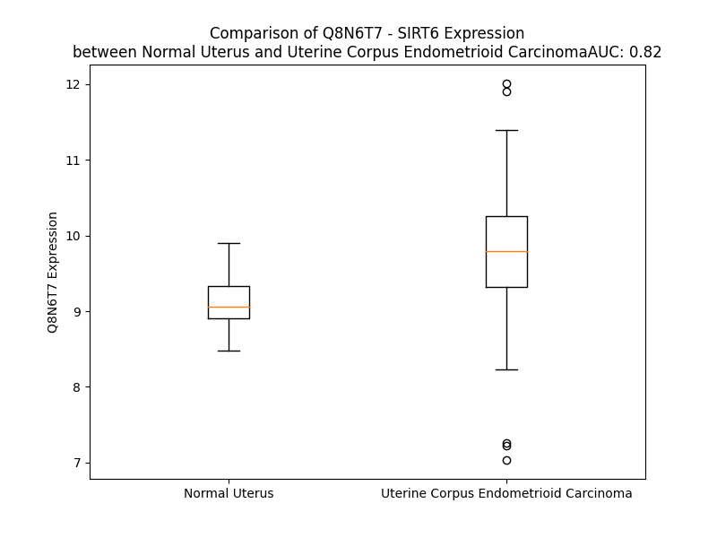

# Detailed Data for Q8N6T7

## Introduction to the Detailed Summary

### How to Interpret the Results

- **Summary & Metrics**: This section provides a quick reference to essential protein attributes, including expression changes, family classification, and biomarker applications. Regulation status (upregulated/downregulated) indicates the protein's behavior in a disease context. Some information comes from the original excel file with the proteins selected from literature, while others are derived from the analyses.
- **Expression Comparison**: A visual representation comparing protein expression between normal and disease states. It highlights significant changes in expression levels that might indicate diagnostic or therapeutic relevance. This is data coming from transcriptomics experiments and could not translate similarly to protein levels.
- **Isoform Alignment**: An interactive view of isoform alignments, revealing structural and functional differences between variants of the protein.
- **Interactors & Homologs**: Tables listing known interaction partners and homologous proteins, the more interactors and homologs, the more complex the protein is to design an antibody for.
- **Biological Assemblies**: Information about the structural arrangement of the protein in different assemblies, providing insights into its functional state but also the complexity of the protein to develop antibodies.
- **Combined Per-Residue Information**: A detailed table summarizing residue-level data. This includes predictions for epitope regions, aggregation tendencies, and modifications that might impact the protein's function. Each row corresponds to a residue in the protein, providing insights into specific sites that may be important for research or drug development.
## Summary & Metrics

- **UniProt Accession**: Q8N6T7
- **Gene Name**: SIRT6 
- **Protein Name**: sirtuin (silent mating type information regulation 2 homolog) 6 (S. cerevisiae) 
- **Swiss Prot**: SIR6_HUMAN
- **Family**: enzyme
- **Biomarker Application**:  
- **Number of Isoforms**: 2
- **Regulation**: 1
- **(transcriptomics) AUC**: 0.7
- **(transcriptomics) Fold Change**: 1.04
- **(transcriptomics) Regulation**: Upregulated
- **Discotope Epitope Count**: 99
- **Max n_uniprots (Homo)**: 6
- **Max n_uniprots (Hetero)**: 9

## Expression Comparison

## Isoform Alignment

<pre style='font-size:14px; font-family:monospace;'>Q8N6T7-1 MSVNYAAGLSPYADKGKCGLPEIFDPPEELERKVWELARLVWQSSSVVFHTGAGISTASGIPDFRGPHGVWTMEERGLAPKFDTTFESARPTQTHMALVQLERVGLLRFLVSQNVDGLHVRSGFPRDKLAELHGNMFVEECAKCKTQYVRDTVVGTMGLKATGRLCTVAKARGLRACRGELRDTILDWEDSLPDRDLALADEASRNADLSITLGTSLQIRPSGNLPLATKRRGGRLVIVNLQPTKHDRHADLRIHGYVDEVMTRLMKHLGLEIPAWDGPRVLERALPPLPRPPTPKLEPKEESPTRINGSIPAGPKQEPCAQHNGSEPASPKRERPTSPAPHRPPKRVKAKAVPS
Q8N6T7-2 MSVNYAAGLSPYADKGKCGLPEIFDPPEELERKVWELARLVWQSSSVVFHTGAGISTASGIPDFRGPHGVWTMEERGLAPKFDTTFESARPTQTHMALVQLERVGLLRFLVSQNVDGLHVRSGFPRDKLAELHGNMFVEECAKCKTQYVRDTVVGTMGLKATGRLCTVAKARGLRACR---------------------------NADLSITLGTSLQIRPSGNLPLATKRRGGRLVIVNLQPTKHDRHADLRIHGYVDEVMTRLMKHLGLEIPAWDGPRVLERALPPLPRPPTPKLEPKEESPTRINGSIPAGPKQEPCAQHNGSEPASPKRERPTSPAPHRPPKRVKAKAVPS
</pre>

## Interactors

| preferredName_A   | preferredName_B   |   score |
|:------------------|:------------------|--------:|
| SIRT6             | HIF1A             |   0.98  |
| SIRT6             | RELA              |   0.969 |
| SIRT6             | NAMPT             |   0.964 |
| SIRT6             | MYC               |   0.957 |
| SIRT6             | NMNAT1            |   0.949 |
| SIRT6             | RBBP8             |   0.947 |
| SIRT6             | NMNAT2            |   0.946 |
| SIRT6             | NADSYN1           |   0.932 |
| SIRT6             | BST1              |   0.928 |
| SIRT6             | CD38              |   0.926 |
| SIRT6             | NNMT              |   0.92  |
| SIRT6             | PNP               |   0.913 |
| SIRT6             | NUDT12            |   0.912 |
| SIRT6             | WRN               |   0.912 |
| SIRT6             | NNT               |   0.906 |

## Homologs

| uniprot_id   | gene_id   |
|:-------------|:----------|
| B0QZ35       | SIRT1     |
| A0A7P0T9N1   | SIRT5     |
| E9PJS6       | SIRT3     |
| Q9NRC8       | SIRT7     |
| Q8IXJ6       | SIRT2     |
| Q9Y6E7       | SIRT4     |

## Biological Assemblies

|   Unnamed: 0 |   assembly |   n_uniprots | composition   | crystal_id   |
|-------------:|-----------:|-------------:|:--------------|:-------------|
|            0 |          1 |            1 | Homo          | 8ak5         |
|            1 |          2 |            1 | Homo          | 8ak5         |
|            0 |          1 |            1 | Homo          | 3zg6         |
|            0 |          1 |            1 | Homo          | 8bl1         |
|            1 |          2 |            1 | Homo          | 8bl1         |
|            0 |          1 |            1 | Homo          | 6xv1         |
|            1 |          2 |            1 | Homo          | 6xv1         |
|            0 |          1 |            1 | Homo          | 5mfp         |
|            1 |          2 |            1 | Homo          | 5mfp         |
|            0 |          1 |            2 | Homo          | 6qcj         |
|            0 |          1 |            1 | Homo          | 5mgn         |
|            1 |          2 |            1 | Homo          | 5mgn         |
|            0 |          1 |            1 | Homo          | 3pki         |
|            1 |          2 |            1 | Homo          | 3pki         |
|            2 |          3 |            1 | Homo          | 3pki         |
|            3 |          4 |            1 | Homo          | 3pki         |
|            4 |          5 |            1 | Homo          | 3pki         |
|            5 |          6 |            1 | Homo          | 3pki         |
|            6 |          7 |            3 | Homo          | 3pki         |
|            7 |          8 |            3 | Homo          | 3pki         |
|            0 |          1 |            1 | Homo          | 6qce         |
|            1 |          2 |            1 | Homo          | 6qce         |
|            0 |          1 |            1 | Homo          | 8ak7         |
|            1 |          2 |            1 | Homo          | 8ak7         |
|            0 |          1 |            1 | Homo          | 8bl0         |
|            1 |          2 |            1 | Homo          | 8bl0         |
|            0 |          1 |            1 | Homo          | 8ak6         |
|            1 |          2 |            1 | Homo          | 8ak6         |
|            0 |          1 |            1 | Homo          | 3pkj         |
|            1 |          2 |            1 | Homo          | 3pkj         |
|            2 |          3 |            1 | Homo          | 3pkj         |
|            3 |          4 |            1 | Homo          | 3pkj         |
|            4 |          5 |            1 | Homo          | 3pkj         |
|            5 |          6 |            1 | Homo          | 3pkj         |
|            6 |          7 |            6 | Homo          | 3pkj         |
|            0 |          1 |            9 | Hetero        | 8g57         |
|            0 |          1 |            1 | Homo          | 7cl1         |
|            0 |          1 |            1 | Homo          | 8akg         |
|            1 |          2 |            1 | Homo          | 8akg         |
|            0 |          1 |            2 | Homo          | 8cno         |
|            0 |          1 |            1 | Homo          | 6qch         |
|            1 |          2 |            1 | Homo          | 6qch         |
|            0 |          1 |            2 | Homo          | 8i2b         |
|            0 |          1 |            8 | Hetero        | 8of4         |
|            0 |          1 |            1 | Homo          | 8akc         |
|            1 |          2 |            1 | Homo          | 8akc         |
|            0 |          1 |            2 | Homo          | 8cnm         |
|            0 |          1 |            1 | Homo          | 6qcd         |
|            1 |          2 |            1 | Homo          | 6qcd         |
|            0 |          1 |            1 | Homo          | 8akb         |
|            1 |          2 |            1 | Homo          | 8akb         |
|            0 |          1 |            1 | Homo          | 6xv6         |
|            1 |          2 |            1 | Homo          | 6xv6         |
|            2 |          3 |            1 | Homo          | 6xv6         |
|            3 |          4 |            1 | Homo          | 6xv6         |
|            4 |          5 |            1 | Homo          | 6xv6         |
|            5 |          6 |            1 | Homo          | 6xv6         |
|            0 |          1 |            1 | Homo          | 6xuy         |
|            1 |          2 |            1 | Homo          | 6xuy         |
|            0 |          1 |            1 | Homo          | 5mf6         |
|            1 |          2 |            1 | Homo          | 5mf6         |
|            0 |          1 |            1 | Homo          | 5mfz         |
|            1 |          2 |            1 | Homo          | 5mfz         |
|            0 |          1 |            1 | Homo          | 5y2f         |
|            0 |          1 |            1 | Homo          | 6xvg         |
|            1 |          2 |            1 | Homo          | 6xvg         |
|            2 |          3 |            1 | Homo          | 6xvg         |
|            3 |          4 |            1 | Homo          | 6xvg         |
|            4 |          5 |            1 | Homo          | 6xvg         |
|            5 |          6 |            1 | Homo          | 6xvg         |
|            0 |          1 |            1 | Homo          | 8aka         |
|            1 |          2 |            1 | Homo          | 8aka         |
|            0 |          1 |            1 | Homo          | 8ake         |
|            1 |          2 |            1 | Homo          | 8ake         |
|            0 |          1 |            1 | Homo          | 7cl0         |
|            0 |          1 |            1 | Homo          | 6hoy         |
|            1 |          2 |            1 | Homo          | 6hoy         |
|            0 |          1 |            1 | Homo          | 8akd         |
|            1 |          2 |            1 | Homo          | 8akd         |
|            0 |          1 |            1 | Homo          | 8ak8         |
|            1 |          2 |            1 | Homo          | 8ak8         |
|            0 |          1 |            1 | Homo          | 8ak9         |
|            1 |          2 |            1 | Homo          | 8ak9         |
|            0 |          1 |            8 | Hetero        | 8f86         |
|            0 |          1 |            2 | Homo          | 6zu4         |
|            0 |          1 |            1 | Homo          | 3k35         |
|            1 |          2 |            1 | Homo          | 3k35         |
|            2 |          3 |            1 | Homo          | 3k35         |
|            3 |          4 |            1 | Homo          | 3k35         |
|            4 |          5 |            1 | Homo          | 3k35         |
|            5 |          6 |            1 | Homo          | 3k35         |
|            6 |          7 |            6 | Homo          | 3k35         |
|            0 |          1 |            1 | Homo          | 5x16         |
|            0 |          1 |            1 | Homo          | 8akf         |
|            1 |          2 |            1 | Homo          | 8akf         |

## Combined Per-Residue Information

|   res | aa   |   epitope_score | epitope   |   relative_surface_accessibility |   modeling_confidence |   Aggregation | modification            |
|------:|:-----|----------------:|:----------|---------------------------------:|----------------------:|--------------:|:------------------------|
|     1 | M    |         0.0914  | False     |                          1.23315 |                 36.3  |         0     | N/A                     |
|     2 | S    |         0.10867 | False     |                          0.36127 |                 45.73 |         0     | N-acetylserine          |
|     3 | V    |         0.09598 | False     |                          0.41444 |                 54.25 |         0     | N/A                     |
|     4 | N    |         0.18923 | False     |                          0.35824 |                 66.89 |         0     | N/A                     |
|     5 | Y    |         0.24511 | True      |                          0.1158  |                 71.75 |         0     | N/A                     |
|     6 | A    |         0.19649 | False     |                          0.18892 |                 75.36 |         0     | N/A                     |
|     7 | A    |         0.32908 | True      |                          0.8112  |                 75.55 |         0     | N/A                     |
|     8 | G    |         0.23672 | True      |                          0.3221  |                 78.17 |         0     | N/A                     |
|     9 | L    |         0.25861 | True      |                          0.13882 |                 85.1  |         0     | N/A                     |
|    10 | S    |         0.21136 | False     |                          0.43787 |                 88.07 |         0     | Phosphoserine; by MAPK8 |
|    11 | P    |         0.3277  | True      |                          1.01887 |                 86.92 |         0     | N/A                     |
|    12 | Y    |         0.31565 | True      |                          0.42547 |                 86.03 |         0     | N/A                     |
|    13 | A    |         0.40117 | True      |                          1.0495  |                 84.84 |         0     | N/A                     |
|    14 | D    |         0.42203 | True      |                          0.60944 |                 91.09 |         0     | N/A                     |
|    15 | K    |         0.32737 | True      |                          0.15508 |                 92.97 |         0     | N/A                     |
|    16 | G    |         0.29961 | True      |                          0.39821 |                 94.28 |         0     | N/A                     |
|    17 | K    |         0.35052 | True      |                          0.70121 |                 97.02 |         0     | N/A                     |
|    18 | C    |         0.22356 | True      |                          0.16758 |                 97.32 |         0     | N/A                     |
|    19 | G    |         0.23759 | True      |                          0.28181 |                 97.17 |         0     | N/A                     |
|    20 | L    |         0.24183 | True      |                          0.33465 |                 97.93 |         0     | N/A                     |
|    21 | P    |         0.25333 | True      |                          0.76864 |                 98.22 |         0     | N/A                     |
|    22 | E    |         0.28412 | True      |                          0.34283 |                 98.7  |         0     | N/A                     |
|    23 | I    |         0.18577 | False     |                          0.41518 |                 98.72 |         0     | N/A                     |
|    24 | F    |         0.22325 | True      |                          0.54241 |                 98.69 |         0     | N/A                     |
|    25 | D    |         0.13523 | False     |                          0.1004  |                 98.61 |         0     | N/A                     |
|    26 | P    |         0.21234 | False     |                          0.56265 |                 98.56 |         0     | N/A                     |
|    27 | P    |         0.2161  | False     |                          0.74376 |                 98.33 |         0     | N/A                     |
|    28 | E    |         0.1831  | False     |                          0.79626 |                 98.07 |         0     | N/A                     |
|    29 | E    |         0.11377 | False     |                          0.31305 |                 98.62 |         0     | N/A                     |
|    30 | L    |         0.06669 | False     |                          0.05441 |                 98.65 |         0     | N/A                     |
|    31 | E    |         0.16725 | False     |                          0.34111 |                 98.48 |         0     | N/A                     |
|    32 | R    |         0.24087 | True      |                          0.57053 |                 98.67 |         0     | N/A                     |
|    33 | K    |         0.09909 | False     |                          0.08478 |                 98.86 |         0     | N6-acetyllysine         |
|    34 | V    |         0.00424 | False     |                          0       |                 98.8  |         0.31  | N/A                     |
|    35 | W    |         0.198   | False     |                          0.56274 |                 98.53 |         0.31  | N/A                     |
|    36 | E    |         0.10186 | False     |                          0.16775 |                 98.71 |         0.31  | N/A                     |
|    37 | L    |         0.00268 | False     |                          0.00082 |                 98.83 |         0.31  | N/A                     |
|    38 | A    |         0.00247 | False     |                          0       |                 98.69 |         0.31  | N/A                     |
|    39 | R    |         0.15179 | False     |                          0.15359 |                 98.41 |         0.31  | N/A                     |
|    40 | L    |         0.04606 | False     |                          0.09416 |                 98.59 |         0.916 | N/A                     |
|    41 | V    |         0.01257 | False     |                          0.01138 |                 98.52 |         1.028 | N/A                     |
|    42 | W    |         0.10764 | False     |                          0.1695  |                 97.73 |         1.028 | N/A                     |
|    43 | Q    |         0.10836 | False     |                          0.49046 |                 97.5  |         0.719 | N/A                     |
|    44 | S    |         0.06875 | False     |                          0.1944  |                 98.18 |         0.888 | N/A                     |
|    45 | S    |         0.20753 | False     |                          0.85625 |                 97.66 |         2.364 | N/A                     |
|    46 | S    |         0.07136 | False     |                          0.16087 |                 98.65 |         2.364 | N/A                     |
|    47 | V    |         0.0153  | False     |                          0.02314 |                 98.9  |         2.823 | N/A                     |
|    48 | V    |         0.00227 | False     |                          0       |                 98.93 |         2.823 | N/A                     |
|    49 | F    |         0.00328 | False     |                          0.00637 |                 98.93 |         2.823 | N/A                     |
|    50 | H    |         0.01719 | False     |                          0.02163 |                 98.93 |         0.459 | N/A                     |
|    51 | T    |         0.00344 | False     |                          0.00141 |                 98.94 |         0.459 | N/A                     |
|    52 | G    |         0.0101  | False     |                          0.03058 |                 98.69 |         0     | N/A                     |
|    53 | A    |         0.05345 | False     |                          0.166   |                 98.22 |         0     | N/A                     |
|    54 | G    |         0.05626 | False     |                          0.21727 |                 98.54 |         0     | N/A                     |
|    55 | I    |         0.01397 | False     |                          0.00355 |                 98.74 |         0     | N/A                     |
|    56 | S    |         0.0137  | False     |                          0.00624 |                 98.69 |         0     | N/A                     |
|    57 | T    |         0.17779 | False     |                          0.44595 |                 98.33 |         0     | N/A                     |
|    58 | A    |         0.13731 | False     |                          0.73454 |                 98.01 |         0     | N/A                     |
|    59 | S    |         0.1134  | False     |                          0.15614 |                 97.78 |         0     | N/A                     |
|    60 | G    |         0.0786  | False     |                          0.17733 |                 97.38 |         0     | N/A                     |
|    61 | I    |         0.11025 | False     |                          0.07596 |                 96.92 |         0     | N/A                     |
|    62 | P    |         0.07533 | False     |                          0.16097 |                 96.93 |         0     | N/A                     |
|    63 | D    |         0.19079 | False     |                          0.1853  |                 97.52 |         0     | N/A                     |
|    64 | F    |         0.27064 | True      |                          0.24904 |                 96.57 |         0     | N/A                     |
|    65 | R    |         0.21251 | False     |                          0.09477 |                 97.8  |         0     | N/A                     |
|    66 | G    |         0.05656 | False     |                          0.03543 |                 97.53 |         0     | N/A                     |
|    67 | P    |         0.16544 | False     |                          0.31983 |                 97.46 |         0     | N/A                     |
|    68 | H    |         0.33833 | True      |                          0.72511 |                 97.08 |         0     | N/A                     |
|    69 | G    |         0.03608 | False     |                          0.01312 |                 96.11 |         0     | N/A                     |
|    70 | V    |         0.19257 | False     |                          0.05878 |                 95.18 |         0     | N/A                     |
|    71 | W    |         0.13995 | False     |                          0.05392 |                 95.34 |         0     | N/A                     |
|    72 | T    |         0.04115 | False     |                          0.01854 |                 96.18 |         0     | N/A                     |
|    73 | M    |         0.17867 | False     |                          0.13558 |                 95.37 |         0     | N/A                     |
|    74 | E    |         0.26094 | True      |                          0.44008 |                 93.52 |         0     | N/A                     |
|    75 | E    |         0.41359 | True      |                          0.55608 |                 94.48 |         0     | N/A                     |
|    76 | R    |         0.3837  | True      |                          0.52863 |                 95.59 |         0     | N/A                     |
|    77 | G    |         0.35451 | True      |                          0.85389 |                 94.26 |         0     | N/A                     |
|    78 | L    |         0.33213 | True      |                          0.60914 |                 94.71 |         0     | N/A                     |
|    79 | A    |         0.16319 | False     |                          0.78025 |                 91.67 |         0     | N/A                     |
|    80 | P    |         0.10601 | False     |                          0.16576 |                 92.45 |         0     | N/A                     |
|    81 | K    |         0.25041 | True      |                          0.75358 |                 92.43 |         0     | N/A                     |
|    82 | F    |         0.32548 | True      |                          0.22846 |                 92.97 |         0     | N/A                     |
|    83 | D    |         0.29233 | True      |                          0.61333 |                 95.16 |         0     | N/A                     |
|    84 | T    |         0.19213 | False     |                          0.18237 |                 96.43 |         0     | N/A                     |
|    85 | T    |         0.19382 | False     |                          0.33401 |                 95.49 |         0     | N/A                     |
|    86 | F    |         0.04423 | False     |                          0.05451 |                 96.22 |         0     | N/A                     |
|    87 | E    |         0.09277 | False     |                          0.33314 |                 97.2  |         0     | N/A                     |
|    88 | S    |         0.17514 | False     |                          0.59426 |                 97.63 |         0     | N/A                     |
|    89 | A    |         0.01382 | False     |                          0.0086  |                 97.97 |         0     | N/A                     |
|    90 | R    |         0.16114 | False     |                          0.64292 |                 98.48 |         0     | N/A                     |
|    91 | P    |         0.02925 | False     |                          0.11048 |                 98.81 |         0     | N/A                     |
|    92 | T    |         0.05176 | False     |                          0.07176 |                 98.87 |         0     | N/A                     |
|    93 | Q    |         0.06373 | False     |                          0.4525  |                 98.8  |         0     | N/A                     |
|    94 | T    |         0.00265 | False     |                          0       |                 98.94 |         0     | N/A                     |
|    95 | H    |         0.00338 | False     |                          0.00109 |                 98.94 |         0     | N/A                     |
|    96 | M    |         0.07016 | False     |                          0.0676  |                 98.89 |         1.993 | N/A                     |
|    97 | A    |         0.00348 | False     |                          0       |                 98.91 |         3.739 | N/A                     |
|    98 | L    |         0.00249 | False     |                          0.00082 |                 98.93 |         3.739 | N/A                     |
|    99 | V    |         0.01295 | False     |                          0.01142 |                 98.88 |         3.739 | N/A                     |
|   100 | Q    |         0.06169 | False     |                          0.14224 |                 98.81 |         3.739 | N/A                     |
|   101 | L    |         0.00531 | False     |                          0.0033  |                 98.83 |         3.739 | N/A                     |
|   102 | E    |         0.01736 | False     |                          0.02518 |                 98.81 |         0     | N/A                     |
|   103 | R    |         0.13299 | False     |                          0.37413 |                 98.6  |         0     | N/A                     |
|   104 | V    |         0.04623 | False     |                          0.0197  |                 98.55 |         0     | N/A                     |
|   105 | G    |         0.07136 | False     |                          0.41099 |                 98.33 |         0     | N/A                     |
|   106 | L    |         0.0495  | False     |                          0.15452 |                 98.57 |         0     | N/A                     |
|   107 | L    |         0.02071 | False     |                          0.0161  |                 98.83 |         0     | N/A                     |
|   108 | R    |         0.07873 | False     |                          0.62445 |                 98.81 |         0     | N/A                     |
|   109 | F    |         0.04095 | False     |                          0.07854 |                 98.9  |         0.296 | N/A                     |
|   110 | L    |         0.00174 | False     |                          0       |                 98.95 |         0.296 | N/A                     |
|   111 | V    |         0.00796 | False     |                          0.02682 |                 98.92 |         0.296 | N/A                     |
|   112 | S    |         0.02122 | False     |                          0.01433 |                 98.87 |         0.296 | N/A                     |
|   113 | Q    |         0.08075 | False     |                          0.11917 |                 98.65 |         0.296 | N/A                     |
|   114 | N    |         0.0343  | False     |                          0.05453 |                 98.26 |         0.296 | N/A                     |
|   115 | V    |         0.06343 | False     |                          0.07701 |                 97.73 |         0.296 | N/A                     |
|   116 | D    |         0.03221 | False     |                          0.03977 |                 97.99 |         0     | N/A                     |
|   117 | G    |         0.02611 | False     |                          0.04071 |                 98.42 |         0     | N/A                     |
|   118 | L    |         0.0033  | False     |                          0.00142 |                 98.77 |         0     | N/A                     |
|   119 | H    |         0.01308 | False     |                          0.03044 |                 98.86 |         0     | N/A                     |
|   120 | V    |         0.00504 | False     |                          0.00381 |                 98.8  |         0     | N/A                     |
|   121 | R    |         0.04493 | False     |                          0.03757 |                 98.69 |         0     | N/A                     |
|   122 | S    |         0.02209 | False     |                          0.06568 |                 98.79 |         0     | N/A                     |
|   123 | G    |         0.02051 | False     |                          0.10958 |                 98.68 |         0     | N/A                     |
|   124 | F    |         0.00672 | False     |                          0.00127 |                 98.86 |         0     | N/A                     |
|   125 | P    |         0.00536 | False     |                          0.00398 |                 98.81 |         0     | N/A                     |
|   126 | R    |         0.06687 | False     |                          0.154   |                 98.8  |         0     | N/A                     |
|   127 | D    |         0.11094 | False     |                          0.37182 |                 98.72 |         0     | N/A                     |
|   128 | K    |         0.09672 | False     |                          0.19235 |                 98.83 |         0     | N/A                     |
|   129 | L    |         0.02668 | False     |                          0.03366 |                 98.9  |         0     | N/A                     |
|   130 | A    |         0.00297 | False     |                          0       |                 98.86 |         0     | N/A                     |
|   131 | E    |         0.085   | False     |                          0.11337 |                 98.75 |         0     | N/A                     |
|   132 | L    |         0.00565 | False     |                          0       |                 98.55 |         0     | N/A                     |
|   133 | H    |         0.0996  | False     |                          0.15301 |                 97.97 |         0     | N/A                     |
|   134 | G    |         0.05452 | False     |                          0.04806 |                 97.8  |         0     | N/A                     |
|   135 | N    |         0.0152  | False     |                          0.01164 |                 98.33 |         0     | N/A                     |
|   136 | M    |         0.0097  | False     |                          0.00216 |                 97.21 |         0     | N/A                     |
|   137 | F    |         0.00499 | False     |                          0.00343 |                 98.33 |         0     | N/A                     |
|   138 | V    |         0.01411 | False     |                          0.01999 |                 98.69 |         0     | N/A                     |
|   139 | E    |         0.01769 | False     |                          0       |                 98.68 |         0     | N/A                     |
|   140 | E    |         0.09214 | False     |                          0.21384 |                 98.69 |         0     | N/A                     |
|   141 | C    |         0.00793 | False     |                          0       |                 98.54 |         0     | N/A                     |
|   142 | A    |         0.15742 | False     |                          0.3994  |                 97.72 |         0     | N/A                     |
|   143 | K    |         0.32297 | True      |                          0.69087 |                 97.02 |         0     | N/A                     |
|   144 | C    |         0.13084 | False     |                          0.22228 |                 96.94 |         0     | N/A                     |
|   145 | K    |         0.21158 | False     |                          0.6657  |                 97.64 |         0     | N/A                     |
|   146 | T    |         0.19771 | False     |                          0.33852 |                 97.74 |         0     | N/A                     |
|   147 | Q    |         0.10371 | False     |                          0.35073 |                 98.55 |         0     | N/A                     |
|   148 | Y    |         0.13751 | False     |                          0.16467 |                 98.61 |         0     | N/A                     |
|   149 | V    |         0.065   | False     |                          0.27421 |                 98.59 |         0     | N/A                     |
|   150 | R    |         0.34722 | True      |                          0.31268 |                 98.25 |         0     | N/A                     |
|   151 | D    |         0.1839  | False     |                          0.71423 |                 96.96 |         0     | N/A                     |
|   152 | T    |         0.10157 | False     |                          0.54503 |                 97.17 |         1.764 | N/A                     |
|   153 | V    |         0.1436  | False     |                          0.17601 |                 96.9  |         2.792 | N/A                     |
|   154 | V    |         0.01516 | False     |                          0.00973 |                 96.52 |         2.792 | N/A                     |
|   155 | G    |         0.17048 | False     |                          0.76669 |                 92.65 |         2.792 | N/A                     |
|   156 | T    |         0.14551 | False     |                          0.24849 |                 94.45 |         2.792 | N/A                     |
|   157 | M    |         0.06239 | False     |                          0.04885 |                 94.36 |         2.04  | N/A                     |
|   158 | G    |         0.08733 | False     |                          0.19525 |                 95.27 |         0.989 | N/A                     |
|   159 | L    |         0.13956 | False     |                          0.38426 |                 96.52 |         0.86  | N/A                     |
|   160 | K    |         0.18624 | False     |                          0.51817 |                 96.56 |         0     | N/A                     |
|   161 | A    |         0.19233 | False     |                          0.45929 |                 97.85 |         0     | N/A                     |
|   162 | T    |         0.13027 | False     |                          0.14954 |                 97.56 |         0     | N/A                     |
|   163 | G    |         0.2733  | True      |                          0.89857 |                 97.82 |         0     | N/A                     |
|   164 | R    |         0.28394 | True      |                          0.38066 |                 98.38 |         0     | N/A                     |
|   165 | L    |         0.35826 | True      |                          0.55858 |                 98.4  |         0     | N/A                     |
|   166 | C    |         0.04209 | False     |                          0.01332 |                 98.38 |         0     | N/A                     |
|   167 | T    |         0.26152 | True      |                          0.6919  |                 97.59 |         0     | N/A                     |
|   168 | V    |         0.30731 | True      |                          0.3237  |                 96.95 |         0     | N/A                     |
|   169 | A    |         0.25354 | True      |                          0.65232 |                 95.78 |         0     | N/A                     |
|   170 | K    |         0.37555 | True      |                          0.45503 |                 91.37 |         0     | N/A                     |
|   171 | A    |         0.29877 | True      |                          0.50136 |                 88.75 |         0     | N/A                     |
|   172 | R    |         0.45964 | True      |                          0.99626 |                 87.46 |         0     | N/A                     |
|   173 | G    |         0.33455 | True      |                          0.66908 |                 89.44 |         0     | N/A                     |
|   174 | L    |         0.47535 | True      |                          0.91106 |                 90.19 |         0     | N/A                     |
|   175 | R    |         0.52153 | True      |                          0.7086  |                 92.46 |         0     | N/A                     |
|   176 | A    |         0.47673 | True      |                          0.44532 |                 94    |         0     | N/A                     |
|   177 | C    |         0.1099  | False     |                          0.13113 |                 97.42 |         0     | N/A                     |
|   178 | R    |         0.33415 | True      |                          0.65175 |                 97.02 |         0     | N/A                     |
|   179 | G    |         0.01229 | False     |                          0       |                 97.84 |         0     | N/A                     |
|   180 | E    |         0.18092 | False     |                          0.33623 |                 98.45 |         0     | N/A                     |
|   181 | L    |         0.01122 | False     |                          0.0033  |                 98.74 |         0     | N/A                     |
|   182 | R    |         0.26425 | True      |                          0.41557 |                 98.57 |         0     | N/A                     |
|   183 | D    |         0.01578 | False     |                          0.01125 |                 98.05 |         0     | N/A                     |
|   184 | T    |         0.07842 | False     |                          0.12925 |                 98.33 |         0     | N/A                     |
|   185 | I    |         0.03542 | False     |                          0.0032  |                 97.56 |         0     | N/A                     |
|   186 | L    |         0.17802 | False     |                          0.10753 |                 95.68 |         0     | N/A                     |
|   187 | D    |         0.2113  | False     |                          0.16165 |                 94.04 |         0     | N/A                     |
|   188 | W    |         0.31348 | True      |                          0.26429 |                 91.26 |         0     | N/A                     |
|   189 | E    |         0.4538  | True      |                          0.85393 |                 91.08 |         0     | N/A                     |
|   190 | D    |         0.21018 | False     |                          0.2874  |                 93.76 |         0     | N/A                     |
|   191 | S    |         0.35271 | True      |                          0.73383 |                 94.45 |         0     | N/A                     |
|   192 | L    |         0.24533 | True      |                          0.14955 |                 96.93 |         0     | N/A                     |
|   193 | P    |         0.11598 | False     |                          0.34878 |                 96.89 |         0     | N/A                     |
|   194 | D    |         0.24628 | True      |                          0.75756 |                 96.55 |         0     | N/A                     |
|   195 | R    |         0.17562 | False     |                          0.59775 |                 97.36 |         0     | N/A                     |
|   196 | D    |         0.07221 | False     |                          0.11367 |                 98.52 |         0     | N/A                     |
|   197 | L    |         0.12293 | False     |                          0.28523 |                 98.55 |         0     | N/A                     |
|   198 | A    |         0.17718 | False     |                          0.57075 |                 98.5  |         0     | N/A                     |
|   199 | L    |         0.07038 | False     |                          0.34224 |                 98.64 |         0     | N/A                     |
|   200 | A    |         0.00308 | False     |                          0       |                 98.79 |         0     | N/A                     |
|   201 | D    |         0.08345 | False     |                          0.27981 |                 98.68 |         0     | N/A                     |
|   202 | E    |         0.21557 | False     |                          0.43879 |                 98.71 |         0     | N/A                     |
|   203 | A    |         0.02721 | False     |                          0.13508 |                 98.79 |         0     | N/A                     |
|   204 | S    |         0.00315 | False     |                          0       |                 98.7  |         0     | N/A                     |
|   205 | R    |         0.26153 | True      |                          0.33499 |                 98.55 |         0     | N/A                     |
|   206 | N    |         0.17623 | False     |                          0.55677 |                 98.57 |         0     | N/A                     |
|   207 | A    |         0.04948 | False     |                          0.04753 |                 98.76 |         0     | N/A                     |
|   208 | D    |         0.0928  | False     |                          0.30789 |                 98.72 |         0     | N/A                     |
|   209 | L    |         0.00495 | False     |                          0.00165 |                 98.9  |         0.535 | N/A                     |
|   210 | S    |         0.00197 | False     |                          0       |                 98.91 |         0.535 | N/A                     |
|   211 | I    |         0.0021  | False     |                          0       |                 98.93 |         0.535 | N/A                     |
|   212 | T    |         0.00719 | False     |                          0.0037  |                 98.94 |         0.535 | N/A                     |
|   213 | L    |         0.00587 | False     |                          0       |                 98.94 |         0.535 | N/A                     |
|   214 | G    |         0.07231 | False     |                          0.09199 |                 98.73 |         0     | N/A                     |
|   215 | T    |         0.10582 | False     |                          0.07062 |                 98.73 |         0     | N/A                     |
|   216 | S    |         0.05602 | False     |                          0.1315  |                 98.39 |         0     | N/A                     |
|   217 | L    |         0.01418 | False     |                          0.00662 |                 98.49 |         0     | N/A                     |
|   218 | Q    |         0.16985 | False     |                          0.17322 |                 98.04 |         0     | N/A                     |
|   219 | I    |         0.35425 | True      |                          0.30296 |                 96    |         0     | N/A                     |
|   220 | R    |         0.53276 | True      |                          0.68662 |                 96.11 |         0     | N/A                     |
|   221 | P    |         0.20394 | False     |                          0.37425 |                 97.01 |         0     | N/A                     |
|   222 | S    |         0.03652 | False     |                          0.02284 |                 96.56 |         0     | N/A                     |
|   223 | G    |         0.00637 | False     |                          0       |                 97.7  |         0     | N/A                     |
|   224 | N    |         0.26    | True      |                          0.28633 |                 98.47 |         0     | N/A                     |
|   225 | L    |         0.05458 | False     |                          0.06418 |                 98.69 |         0     | N/A                     |
|   226 | P    |         0.00521 | False     |                          0.00099 |                 98.71 |         0     | N/A                     |
|   227 | L    |         0.13911 | False     |                          0.1562  |                 98.69 |         0     | N/A                     |
|   228 | A    |         0.06229 | False     |                          0.08598 |                 98.46 |         0     | N/A                     |
|   229 | T    |         0.00327 | False     |                          0       |                 98.66 |         0     | N/A                     |
|   230 | K    |         0.16898 | False     |                          0.32746 |                 98.33 |         0     | N/A                     |
|   231 | R    |         0.31074 | True      |                          0.80844 |                 96.57 |         0     | N/A                     |
|   232 | R    |         0.24269 | True      |                          0.65294 |                 95.86 |         0     | N/A                     |
|   233 | G    |         0.14942 | False     |                          0.82176 |                 97.4  |         0     | N/A                     |
|   234 | G    |         0.06463 | False     |                          0.06911 |                 98.49 |         0     | N/A                     |
|   235 | R    |         0.24196 | True      |                          0.49947 |                 98.79 |         0     | N/A                     |
|   236 | L    |         0.00426 | False     |                          0       |                 98.89 |        30.959 | N/A                     |
|   237 | V    |         0.00282 | False     |                          0       |                 98.93 |        35.754 | N/A                     |
|   238 | I    |         0.02818 | False     |                          0.02014 |                 98.92 |        35.754 | N/A                     |
|   239 | V    |         0.00285 | False     |                          0.00211 |                 98.92 |        35.754 | N/A                     |
|   240 | N    |         0.07826 | False     |                          0.09829 |                 98.82 |        35.754 | N/A                     |
|   241 | L    |         0.19476 | False     |                          0.196   |                 98.74 |        30.962 | N/A                     |
|   242 | Q    |         0.1854  | False     |                          0.07698 |                 98.62 |         0     | N/A                     |
|   243 | P    |         0.17728 | False     |                          0.32502 |                 98.35 |         0     | N/A                     |
|   244 | T    |         0.08528 | False     |                          0.09273 |                 98.75 |         0     | N/A                     |
|   245 | K    |         0.22492 | True      |                          0.5113  |                 98.43 |         0     | N/A                     |
|   246 | H    |         0.09674 | False     |                          0.06789 |                 98.52 |         0     | N/A                     |
|   247 | D    |         0.13539 | False     |                          0.14665 |                 98.53 |         0     | N/A                     |
|   248 | R    |         0.40319 | True      |                          0.81999 |                 98.28 |         0     | N/A                     |
|   249 | H    |         0.11909 | False     |                          0.34104 |                 98.45 |         0     | N/A                     |
|   250 | A    |         0.08552 | False     |                          0.2012  |                 98.58 |         0     | N/A                     |
|   251 | D    |         0.08385 | False     |                          0.33797 |                 98.78 |         0     | N/A                     |
|   252 | L    |         0.07015 | False     |                          0.10634 |                 98.83 |         0     | N/A                     |
|   253 | R    |         0.13464 | False     |                          0.42291 |                 98.85 |         0     | N/A                     |
|   254 | I    |         0.01069 | False     |                          0.00364 |                 98.88 |         0     | N/A                     |
|   255 | H    |         0.08991 | False     |                          0.15661 |                 98.87 |         0     | N/A                     |
|   256 | G    |         0.04653 | False     |                          0.04898 |                 98.67 |         0     | N/A                     |
|   257 | Y    |         0.1737  | False     |                          0.56267 |                 98.8  |         0     | N/A                     |
|   258 | V    |         0.02827 | False     |                          0.10965 |                 98.81 |         0     | N/A                     |
|   259 | D    |         0.10255 | False     |                          0.13098 |                 98.85 |         0     | N/A                     |
|   260 | E    |         0.18255 | False     |                          0.32383 |                 98.83 |         0     | N/A                     |
|   261 | V    |         0.0038  | False     |                          0       |                 98.91 |         0     | N/A                     |
|   262 | M    |         0.00293 | False     |                          0       |                 98.89 |         0     | N/A                     |
|   263 | T    |         0.12033 | False     |                          0.38923 |                 98.81 |         0     | N/A                     |
|   264 | R    |         0.16995 | False     |                          0.28058 |                 98.74 |         0     | N/A                     |
|   265 | L    |         0.0039  | False     |                          0       |                 98.81 |         0     | N/A                     |
|   266 | M    |         0.02608 | False     |                          0.01007 |                 98.75 |         0     | N/A                     |
|   267 | K    |         0.24937 | True      |                          0.81069 |                 98.45 |         0     | N/A                     |
|   268 | H    |         0.11998 | False     |                          0.21096 |                 98.05 |         0     | N/A                     |
|   269 | L    |         0.04256 | False     |                          0.03067 |                 98.09 |         0     | N/A                     |
|   270 | G    |         0.18777 | False     |                          0.60536 |                 98.13 |         0     | N/A                     |
|   271 | L    |         0.14496 | False     |                          0.1035  |                 98.51 |         0     | N/A                     |
|   272 | E    |         0.20603 | False     |                          0.7722  |                 98.28 |         0     | N/A                     |
|   273 | I    |         0.22936 | True      |                          0.30111 |                 98.71 |         0     | N/A                     |
|   274 | P    |         0.18971 | False     |                          0.2158  |                 98.52 |         0     | N/A                     |
|   275 | A    |         0.19918 | False     |                          0.85462 |                 98.34 |         0     | N/A                     |
|   276 | W    |         0.23674 | True      |                          0.24892 |                 98.56 |         0     | N/A                     |
|   277 | D    |         0.24923 | True      |                          0.71141 |                 97.25 |         0     | N/A                     |
|   278 | G    |         0.15671 | False     |                          0.17211 |                 97.52 |         0     | N/A                     |
|   279 | P    |         0.29062 | True      |                          0.48443 |                 97.87 |         0     | N/A                     |
|   280 | R    |         0.26044 | True      |                          0.55017 |                 97.42 |         0     | N/A                     |
|   281 | V    |         0.11424 | False     |                          0.51558 |                 98.47 |         0     | N/A                     |
|   282 | L    |         0.15546 | False     |                          0.28688 |                 98.51 |         0     | N/A                     |
|   283 | E    |         0.26184 | True      |                          0.48833 |                 98.43 |         0     | N/A                     |
|   284 | R    |         0.29798 | True      |                          0.73543 |                 98.56 |         0     | N/A                     |
|   285 | A    |         0.10363 | False     |                          0.27035 |                 98.49 |         0     | N/A                     |
|   286 | L    |         0.19902 | False     |                          0.6944  |                 98.21 |         0     | N/A                     |
|   287 | P    |         0.2532  | True      |                          0.81386 |                 97.84 |         0     | N/A                     |
|   288 | P    |         0.23803 | True      |                          0.67607 |                 97.62 |         0     | N/A                     |
|   289 | L    |         0.2912  | True      |                          0.55095 |                 97.65 |         0     | N/A                     |
|   290 | P    |         0.24847 | True      |                          0.94297 |                 96.09 |         0     | N/A                     |
|   291 | R    |         0.20832 | False     |                          0.52969 |                 93.76 |         0     | N/A                     |
|   292 | P    |         0.22643 | True      |                          0.39174 |                 93.62 |         0     | N/A                     |
|   293 | P    |         0.19813 | False     |                          0.91601 |                 90.7  |         0     | N/A                     |
|   294 | T    |         0.15185 | False     |                          0.54423 |                 90.34 |         0     | Phosphothreonine        |
|   295 | P    |         0.2485  | True      |                          0.39167 |                 90.19 |         0     | N/A                     |
|   296 | K    |         0.25123 | True      |                          1.02919 |                 85.11 |         0     | N/A                     |
|   297 | L    |         0.27296 | True      |                          0.31839 |                 82.25 |         0     | N/A                     |
|   298 | E    |         0.29441 | True      |                          0.76991 |                 68.9  |         0     | N/A                     |
|   299 | P    |         0.28772 | True      |                          0.8795  |                 55.75 |         0     | N/A                     |
|   300 | K    |         0.30624 | True      |                          0.68243 |                 54.59 |         0     | N/A                     |
|   301 | E    |         0.23933 | True      |                          0.85861 |                 39.8  |         0     | N/A                     |
|   302 | E    |         0.29721 | True      |                          0.90413 |                 33.62 |         0     | N/A                     |
|   303 | S    |         0.2722  | True      |                          0.73674 |                 31.86 |         0     | Phosphoserine           |
|   304 | P    |         0.21754 | False     |                          0.922   |                 33.63 |         0     | N/A                     |
|   305 | T    |         0.27933 | True      |                          0.80056 |                 34.7  |         0     | N/A                     |
|   306 | R    |         0.25144 | True      |                          0.94464 |                 34.35 |         0     | N/A                     |
|   307 | I    |         0.14377 | False     |                          0.93964 |                 37.47 |         0     | N/A                     |
|   308 | N    |         0.2078  | False     |                          0.84096 |                 38.79 |         0     | N/A                     |
|   309 | G    |         0.20991 | False     |                          0.83613 |                 34.27 |         0     | N/A                     |
|   310 | S    |         0.25754 | True      |                          0.75071 |                 38.8  |         0     | N/A                     |
|   311 | I    |         0.28016 | True      |                          0.97175 |                 42.93 |         0     | N/A                     |
|   312 | P    |         0.20557 | False     |                          0.88927 |                 42.19 |         0     | N/A                     |
|   313 | A    |         0.24523 | True      |                          1.03364 |                 38.09 |         0     | N/A                     |
|   314 | G    |         0.28101 | True      |                          0.76478 |                 39.91 |         0     | N/A                     |
|   315 | P    |         0.2123  | False     |                          0.9775  |                 41.98 |         0     | N/A                     |
|   316 | K    |         0.18216 | False     |                          0.99638 |                 36.44 |         0     | N/A                     |
|   317 | Q    |         0.22177 | False     |                          0.91885 |                 43.4  |         0     | N/A                     |
|   318 | E    |         0.29974 | True      |                          0.8652  |                 40.82 |         0     | N/A                     |
|   319 | P    |         0.16058 | False     |                          0.94397 |                 37.58 |         0     | N/A                     |
|   320 | C    |         0.1945  | False     |                          1.02396 |                 39.45 |         0     | N/A                     |
|   321 | A    |         0.19074 | False     |                          0.82429 |                 39.36 |         0     | N/A                     |
|   322 | Q    |         0.16458 | False     |                          0.8007  |                 41.57 |         0     | N/A                     |
|   323 | H    |         0.22611 | True      |                          0.83472 |                 40.58 |         0     | N/A                     |
|   324 | N    |         0.17167 | False     |                          0.91633 |                 38.34 |         0     | N/A                     |
|   325 | G    |         0.28321 | True      |                          0.85567 |                 38.63 |         0     | N/A                     |
|   326 | S    |         0.20946 | False     |                          0.91696 |                 41.68 |         0     | N/A                     |
|   327 | E    |         0.14822 | False     |                          0.85089 |                 35.16 |         0     | N/A                     |
|   328 | P    |         0.31653 | True      |                          0.8986  |                 46.89 |         0     | N/A                     |
|   329 | A    |         0.1807  | False     |                          0.90777 |                 42.42 |         0     | N/A                     |
|   330 | S    |         0.11758 | False     |                          0.81051 |                 37.42 |         0     | Phosphoserine           |
|   331 | P    |         0.17203 | False     |                          0.97192 |                 47.71 |         0     | N/A                     |
|   332 | K    |         0.18546 | False     |                          0.98729 |                 38.69 |         0     | N/A                     |
|   333 | R    |         0.273   | True      |                          0.89851 |                 45.04 |         0     | N/A                     |
|   334 | E    |         0.28731 | True      |                          0.79023 |                 42.52 |         0     | N/A                     |
|   335 | R    |         0.19717 | False     |                          0.93959 |                 36.81 |         0     | N/A                     |
|   336 | P    |         0.20348 | False     |                          0.92156 |                 54.9  |         0     | N/A                     |
|   337 | T    |         0.27355 | True      |                          0.92147 |                 45.09 |         0     | N/A                     |
|   338 | S    |         0.18745 | False     |                          0.85489 |                 41.55 |         0     | N/A                     |
|   339 | P    |         0.26305 | True      |                          0.94123 |                 59.37 |         0     | N/A                     |
|   340 | A    |         0.20725 | False     |                          0.83878 |                 51.59 |         0     | N/A                     |
|   341 | P    |         0.14017 | False     |                          0.97391 |                 48.64 |         0     | N/A                     |
|   342 | H    |         0.22411 | True      |                          1.03101 |                 49.64 |         0     | N/A                     |
|   343 | R    |         0.31385 | True      |                          0.91215 |                 51.43 |         0     | N/A                     |
|   344 | P    |         0.23201 | True      |                          0.85033 |                 61.58 |         0     | N/A                     |
|   345 | P    |         0.19311 | False     |                          0.95922 |                 51.9  |         0     | N/A                     |
|   346 | K    |         0.18736 | False     |                          0.96979 |                 40.72 |         0     | N/A                     |
|   347 | R    |         0.24739 | True      |                          0.98523 |                 44.77 |         0     | N/A                     |
|   348 | V    |         0.1638  | False     |                          0.97818 |                 45.84 |         0     | N/A                     |
|   349 | K    |         0.15666 | False     |                          0.94173 |                 37.45 |         0     | N/A                     |
|   350 | A    |         0.13119 | False     |                          1.02557 |                 46.49 |         0     | N/A                     |
|   351 | K    |         0.13977 | False     |                          0.97392 |                 40.79 |         0     | N/A                     |
|   352 | A    |         0.12335 | False     |                          0.89782 |                 46.11 |         0     | N/A                     |
|   353 | V    |         0.13115 | False     |                          0.9971  |                 43.53 |         0     | N/A                     |
|   354 | P    |         0.1586  | False     |                          0.89024 |                 45.91 |         0     | N/A                     |
|   355 | S    |         0.11553 | False     |                          1.38882 |                 56.33 |         0     | N/A                     |

