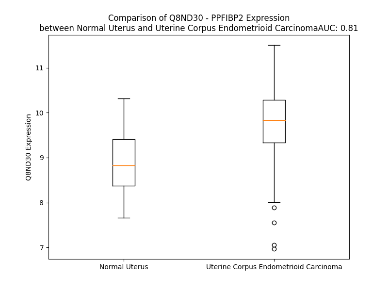

# Detailed Data for Q8ND30

## Introduction to the Detailed Summary

### How to Interpret the Results

- **Summary & Metrics**: This section provides a quick reference to essential protein attributes, including expression changes, family classification, and biomarker applications. Regulation status (upregulated/downregulated) indicates the protein's behavior in a disease context. Some information comes from the original excel file with the proteins selected from literature, while others are derived from the analyses.
- **Expression Comparison**: A visual representation comparing protein expression between normal and disease states. It highlights significant changes in expression levels that might indicate diagnostic or therapeutic relevance. This is data coming from transcriptomics experiments and could not translate similarly to protein levels.
- **Isoform Alignment**: An interactive view of isoform alignments, revealing structural and functional differences between variants of the protein.
- **Interactors & Homologs**: Tables listing known interaction partners and homologous proteins, the more interactors and homologs, the more complex the protein is to design an antibody for.
- **Biological Assemblies**: Information about the structural arrangement of the protein in different assemblies, providing insights into its functional state but also the complexity of the protein to develop antibodies.
- **Combined Per-Residue Information**: A detailed table summarizing residue-level data. This includes predictions for epitope regions, aggregation tendencies, and modifications that might impact the protein's function. Each row corresponds to a residue in the protein, providing insights into specific sites that may be important for research or drug development.
## Summary & Metrics

- **UniProt Accession**: Q8ND30
- **Gene Name**: PPFIBP2 
- **Protein Name**: PTPRF interacting protein, binding protein 2 (liprin beta 2) 
- **Swiss Prot**: LIPB2_HUMAN
- **Family**: phosphatase
- **Biomarker Application**:  
- **Number of Isoforms**: 3
- **Regulation**: 1
- **(transcriptomics) AUC**: 0.81
- **(transcriptomics) Fold Change**: 1.10
- **(transcriptomics) Regulation**: Upregulated
- **Discotope Epitope Count**: 249
- **Max n_uniprots (Homo)**: 1
- **Max n_uniprots (Hetero)**: N/A

## Expression Comparison

## Isoform Alignment

<pre style='font-size:14px; font-family:monospace;'>Q8ND30-1 MASDASHALEAALEQMDGIIAGTKTGADLSDGTCEPGLASPASYMNPFPVLHLIEDLRLALEMLELPQERAALLSQIPGPTAAYIKEWFEESLSQVNHHSAASNETYQERLARLEGDKESLILQVSVLTDQVEAQGEKIRDLEVCLEGHQVKLNAAEEMLQQELLSRTSLETQKLDLMTEVSELKLKLVGMEKEQREQEEKQRKAEELLQELRHLKIKVEELENERNQYEWKLKATKAEVAQLQEQVALKDAEIERLHSQLSRTAALHSESHTERDQEIQRLKMGMETLLLANEDKDRRIEELTGLLNQYRKVKEIVMVTQGPSERTLSINEEEPEGGFSKWNATNKDPEELFKQEMPPRCSSPTVGPPPLPQKSLETRAQKKLSCSLEDLRSESVDKCMDGNQPFPVLEPKDSPFLAEHKYPTLPGKLSGATPNGEAAKSPPTICQPDATGSSLLRLRDTESGWDDTAVVNDLSSTSSGTESGPQSPLTPDGKRNPKGIKKFWGKIRRTQSGNFYTDTLGMAEFRRGGLRATAGPRLSRTRDSKGQKSDANAPFAQWSTERVCAWLEDFGLAQYVIFARQWVSSGHTLLTATPQDMEKELGIKHPLHRKKLVLAVKAINTKQEEKSALLDHIWVTRWLDDIGLPQYKDQFHESRVDRRMLQYLTVNDLLFLKVTSQLHHLSIKCAIHVLHVNKFNPHCLHRRPADESNLSPSEVVQWSNHRVMEWLRSVDLAEYAPNLRGSGVHGGLIILEPRFTGDTLAMLLNIPPQKTLLRRHLTTKFNALIGPEAEQEKREKMASPAYTPLTTTAKVRPRKLGFSHFGNIRKKKFDESTDYICPMEPSDGVSDSHRVYSGYRGLSPLDAPELDGLDQVGQIS
Q8ND30-2 ----------------------------------------------------------------------------------------------------------------MSSEQWPRLPGKVSVLTDQVEAQGEKIRDLEVCLEGHQVKLNAAEEMLQQELLSRTSLETQKLDLMTEVSELKLKLVGMEKEQREQEEKQRKAEELLQELRHLKIKVEELENERNQYEWKLKATKAEVAQLQEQVALKDAEIERLHSQLSRTAALHSESHTERDQEIQRLKMGMETLLLANEDKDRRIEELTGLLNQYRKVKEIVMVTQGPSERTLSINEEEPEGGFSKWNATNKDPEELFKQEMPPRCSSPTVGPPPLPQKSLETRAQKKLSCSLEDLRSESVDKCMDGNQPFPVLEPKDSPFLAEHKYPTLPGKLSGATPNGEAAKSPPTICQPDATGSSLLRLRDTESGWDDTAVVNDLSSTSSGTESGPQSPLTPDGKRNPKGIKKFWGKIRRTQSGNFYTDTLGMAEFRRGGLRATAGPRLSRTRDSKGQKSDANAPFAQWSTERVCAWLEDFGLAQYVIFARQWVSSGHTLLTATPQDMEKELGIKHPLHRKKLVLAVKAINTKQEEKSALLDHIWVTRWLDDIGLPQYKDQFHESRVDRRMLQYLTVNDLLFLKVTSQLHHLSIKCAIHVLHVNKFNPHCLHRRPADESNLSPSEVVQWSNHRVMEWLRSVDLAEYAPNLRGSGVHGGLIILEPRFTGDTLAMLLNIPPQKTLLRRHLTTKFNALIGPEAEQEKREKMASPAYTPLTTTAKVRPRKLGFSHFGNIRKKKFDESTDYICPMEPSDGVSDSHRVYSGYRGLSPLDAPELDGLDQVGQIS
Q8ND30-3 --------------------------------------------------------------------------------------------------------------------------------------MGKLITR---------MWKLLRRRSAPKELLSRTSLETQKLDLMTEVSELKLKLVGMEKEQREQEEKQRKAEELLQELRHLKIKVEELENERNQYEWKLKATKAEVAQLQEQVALKDAEIERLHSQLSRTAALHSESHTERDQEIQRLKMGMETLLLANEDKDRRIEELTGLLNQYRKVKEIVMVTQGPSERTLSINEEEPEGGFSKWNATNKDPEELFKQEMPPRCSSPTVGPPPLPQKSLETRAQKKLSCSLEDLRSESVDKCMDGNQPFPVLEPKDSPFLAEHKYPTLPGKLSGATPNGEAAKSPPTICQPDATGSSLLRLRDTESGWDDTAVVNDLSSTSSGTESGPQSPLTPDGKRNPKGIKKFWGKIRRTQSGNFYTDTLGMAEFRRGGLRATAGPRLSRTRDSKGQKSDANAPFAQWSTERVCAWLEDFGLAQYVIFARQWVSSGHTLLTATPQDMEKELGIKHPLHRKKLVLAVKAINTKQEEKSALLDHIWVTRWLDDIGLPQYKDQFHESRVDRRMLQYLTVNDLLFLKVTSQLHHLSIKCAIHVLHVNKFNPHCLHRRPADESNLSPSEVVQWSNHRVMEWLRSVDLAEYAPNLRGSGVHGGLIILEPRFTGDTLAMLLNIPPQKTLLRRHLTTKFNALIGPEAEQEKREKMASPAYTPLTTTAKVRPRKLGFSHFGNIRKKKFDESTDYICPMEPSDGVSDSHRVYSGYRGLSPLDAPELDGLDQVGQIS
</pre>

## Interactors

| preferredName_A   | preferredName_B   | score   |
|-------------------|-------------------|---------|

## Homologs

| uniprot_id   | gene_id   |
|:-------------|:----------|
| A0A8I5QJ45   | PPFIA4    |
| E9PID5       | PPFIA1    |
| H0YHK3       | PPFIA2    |
| O75145       | PPFIA3    |
| F5H0E0       | PPFIBP1   |

## Biological Assemblies

|   Unnamed: 0 |   assembly |   n_uniprots | composition   | crystal_id   |
|-------------:|-----------:|-------------:|:--------------|:-------------|
|            0 |          1 |            1 | Homo          | 3qh9         |

## Combined Per-Residue Information

|   res | aa   |   epitope_score | epitope   |   relative_surface_accessibility |   modeling_confidence |   Aggregation | modification   |
|------:|:-----|----------------:|:----------|---------------------------------:|----------------------:|--------------:|:---------------|
|     1 | M    |         0.04258 | False     |                          1.06992 |                 51.76 |         0     | N/A            |
|     2 | A    |         0.06518 | False     |                          0.88133 |                 55.14 |         0     | N/A            |
|     3 | S    |         0.08693 | False     |                          0.55997 |                 69.21 |         0     | N/A            |
|     4 | D    |         0.08301 | False     |                          0.52651 |                 74.93 |         0     | N/A            |
|     5 | A    |         0.05506 | False     |                          0.65444 |                 78    |         0     | N/A            |
|     6 | S    |         0.04925 | False     |                          0.54585 |                 77.89 |         0     | N/A            |
|     7 | H    |         0.06468 | False     |                          0.70957 |                 82.32 |         0     | N/A            |
|     8 | A    |         0.03686 | False     |                          0.6161  |                 80.31 |         0     | N/A            |
|     9 | L    |         0.05345 | False     |                          0.71413 |                 82.58 |         0     | N/A            |
|    10 | E    |         0.09343 | True      |                          0.49189 |                 85.52 |         0     | N/A            |
|    11 | A    |         0.05479 | False     |                          0.50855 |                 84.68 |         0     | N/A            |
|    12 | A    |         0.02866 | False     |                          0.42502 |                 84.32 |         0     | N/A            |
|    13 | L    |         0.06004 | False     |                          0.5643  |                 83.87 |         0     | N/A            |
|    14 | E    |         0.05731 | False     |                          0.59248 |                 80.85 |         0     | N/A            |
|    15 | Q    |         0.06189 | False     |                          0.59929 |                 76.22 |         0     | N/A            |
|    16 | M    |         0.07316 | False     |                          0.54392 |                 74.45 |         0     | N/A            |
|    17 | D    |         0.04768 | False     |                          0.57798 |                 75.16 |         0     | N/A            |
|    18 | G    |         0.02081 | False     |                          0.09034 |                 66.83 |         0.142 | N/A            |
|    19 | I    |         0.0723  | False     |                          0.79754 |                 67.35 |         1.081 | N/A            |
|    20 | I    |         0.05347 | False     |                          0.8463  |                 61.96 |         1.081 | N/A            |
|    21 | A    |         0.03221 | False     |                          0.66004 |                 66.2  |         1.081 | N/A            |
|    22 | G    |         0.09595 | True      |                          0.7319  |                 50.17 |         1.081 | N/A            |
|    23 | T    |         0.07583 | False     |                          0.72687 |                 59.61 |         0.938 | N/A            |
|    24 | K    |         0.08035 | False     |                          0.67495 |                 43.07 |         0     | N/A            |
|    25 | T    |         0.11787 | True      |                          0.99771 |                 42.33 |         0     | N/A            |
|    26 | G    |         0.13557 | True      |                          0.9836  |                 35.96 |         0     | N/A            |
|    27 | A    |         0.06621 | False     |                          0.89344 |                 34.66 |         0     | N/A            |
|    28 | D    |         0.08099 | False     |                          0.81974 |                 32.74 |         0     | N/A            |
|    29 | L    |         0.13333 | True      |                          1.1658  |                 35.21 |         0     | N/A            |
|    30 | S    |         0.0765  | False     |                          0.87375 |                 29.89 |         0     | N/A            |
|    31 | D    |         0.13261 | True      |                          0.94502 |                 32.21 |         0     | N/A            |
|    32 | G    |         0.13266 | True      |                          0.8035  |                 35.83 |         0     | N/A            |
|    33 | T    |         0.13645 | True      |                          0.97925 |                 35.8  |         0     | N/A            |
|    34 | C    |         0.0852  | False     |                          0.82001 |                 31.14 |         0     | N/A            |
|    35 | E    |         0.10958 | True      |                          0.85083 |                 35.26 |         0     | N/A            |
|    36 | P    |         0.08458 | False     |                          0.86253 |                 37.79 |         0     | N/A            |
|    37 | G    |         0.12945 | True      |                          0.77588 |                 29.24 |         0     | N/A            |
|    38 | L    |         0.13715 | True      |                          1.09438 |                 36.14 |         0     | N/A            |
|    39 | A    |         0.05983 | False     |                          1.07386 |                 27.95 |         0     | N/A            |
|    40 | S    |         0.10136 | True      |                          0.75112 |                 31.73 |         0     | N/A            |
|    41 | P    |         0.09687 | True      |                          0.98401 |                 32.58 |         0     | N/A            |
|    42 | A    |         0.09925 | True      |                          0.91752 |                 35.93 |         0     | N/A            |
|    43 | S    |         0.08743 | False     |                          0.74737 |                 30.92 |         0     | N/A            |
|    44 | Y    |         0.11254 | True      |                          0.85031 |                 37.69 |         0     | N/A            |
|    45 | M    |         0.09709 | True      |                          0.84392 |                 46.66 |         0     | N/A            |
|    46 | N    |         0.09377 | True      |                          0.65917 |                 47.53 |         0     | N/A            |
|    47 | P    |         0.07306 | False     |                          0.42546 |                 56.8  |         0     | N/A            |
|    48 | F    |         0.14169 | True      |                          0.77442 |                 60.43 |         0     | N/A            |
|    49 | P    |         0.10681 | True      |                          0.55628 |                 69.77 |         0     | N/A            |
|    50 | V    |         0.0836  | False     |                          0.45675 |                 67.66 |         0.216 | N/A            |
|    51 | L    |         0.08317 | False     |                          0.47235 |                 71.32 |         0.216 | N/A            |
|    52 | H    |         0.0853  | False     |                          0.65403 |                 76.75 |         0.216 | N/A            |
|    53 | L    |         0.06115 | False     |                          0.73655 |                 80.17 |         0.216 | N/A            |
|    54 | I    |         0.04363 | False     |                          0.27446 |                 76.39 |         0.216 | N/A            |
|    55 | E    |         0.07756 | False     |                          0.34745 |                 78.47 |         0     | N/A            |
|    56 | D    |         0.07707 | False     |                          0.37737 |                 81    |         0     | N/A            |
|    57 | L    |         0.06039 | False     |                          0.52842 |                 80.11 |         0     | N/A            |
|    58 | R    |         0.1064  | True      |                          0.43638 |                 81.53 |         0     | N/A            |
|    59 | L    |         0.08207 | False     |                          0.5321  |                 81.74 |         0     | N/A            |
|    60 | A    |         0.06508 | False     |                          0.47496 |                 80.69 |         0     | N/A            |
|    61 | L    |         0.04019 | False     |                          0.11226 |                 79.16 |         0     | N/A            |
|    62 | E    |         0.06459 | False     |                          0.48513 |                 80.43 |         0     | N/A            |
|    63 | M    |         0.11424 | True      |                          0.85867 |                 80.21 |         0     | N/A            |
|    64 | L    |         0.07763 | False     |                          0.32154 |                 78.49 |         0     | N/A            |
|    65 | E    |         0.15859 | True      |                          0.88215 |                 73.06 |         0     | N/A            |
|    66 | L    |         0.25678 | True      |                          0.60897 |                 77.09 |         0     | N/A            |
|    67 | P    |         0.08737 | False     |                          0.7817  |                 75.96 |         0     | N/A            |
|    68 | Q    |         0.14906 | True      |                          0.77237 |                 77.96 |         0     | N/A            |
|    69 | E    |         0.10622 | True      |                          0.40068 |                 76.52 |         0     | N/A            |
|    70 | R    |         0.12469 | True      |                          0.43075 |                 75.69 |         0     | N/A            |
|    71 | A    |         0.11181 | True      |                          0.54176 |                 73.42 |         0.439 | N/A            |
|    72 | A    |         0.10843 | True      |                          0.47378 |                 78.36 |         0.439 | N/A            |
|    73 | L    |         0.06002 | False     |                          0.46663 |                 72.58 |         0.439 | N/A            |
|    74 | L    |         0.1273  | True      |                          0.53834 |                 70.65 |         0.439 | N/A            |
|    75 | S    |         0.13887 | True      |                          0.70426 |                 74.46 |         0.439 | N/A            |
|    76 | Q    |         0.1447  | True      |                          0.63529 |                 77.14 |         0     | N/A            |
|    77 | I    |         0.13571 | True      |                          0.35472 |                 70.77 |         0     | N/A            |
|    78 | P    |         0.0939  | True      |                          0.60042 |                 79.37 |         0     | N/A            |
|    79 | G    |         0.10944 | True      |                          0.61597 |                 77.89 |         0     | N/A            |
|    80 | P    |         0.17815 | True      |                          0.79584 |                 80.5  |         0     | N/A            |
|    81 | T    |         0.0836  | False     |                          0.43101 |                 77.66 |         2.717 | N/A            |
|    82 | A    |         0.05621 | False     |                          0.48554 |                 76.67 |         2.717 | N/A            |
|    83 | A    |         0.08609 | False     |                          0.55562 |                 80.78 |         2.717 | N/A            |
|    84 | Y    |         0.11982 | True      |                          0.65871 |                 80.88 |         2.717 | N/A            |
|    85 | I    |         0.03331 | False     |                          0.35198 |                 76.7  |         2.717 | N/A            |
|    86 | K    |         0.07389 | False     |                          0.59937 |                 79.26 |         0     | N/A            |
|    87 | E    |         0.1871  | True      |                          0.59721 |                 80.59 |         0     | N/A            |
|    88 | W    |         0.04525 | False     |                          0.28534 |                 78.55 |         0     | N/A            |
|    89 | F    |         0.11387 | True      |                          0.41089 |                 74.97 |         0     | N/A            |
|    90 | E    |         0.12611 | True      |                          0.47551 |                 76.62 |         0     | N/A            |
|    91 | E    |         0.11081 | True      |                          0.52475 |                 72.37 |         0     | N/A            |
|    92 | S    |         0.0361  | False     |                          0.32495 |                 66.22 |         0     | N/A            |
|    93 | L    |         0.08421 | False     |                          0.74471 |                 63.76 |         0     | N/A            |
|    94 | S    |         0.0673  | False     |                          0.40256 |                 63.05 |         0     | N/A            |
|    95 | Q    |         0.07998 | False     |                          0.56804 |                 58.1  |         0     | N/A            |
|    96 | V    |         0.06505 | False     |                          0.83533 |                 57.03 |         0     | N/A            |
|    97 | N    |         0.11099 | True      |                          0.64707 |                 52.02 |         0     | N/A            |
|    98 | H    |         0.18957 | True      |                          0.79146 |                 49.84 |         0     | N/A            |
|    99 | H    |         0.13344 | True      |                          0.92435 |                 47.51 |         0     | N/A            |
|   100 | S    |         0.1265  | True      |                          0.48633 |                 47    |         0     | N/A            |
|   101 | A    |         0.17021 | True      |                          1.00181 |                 47.97 |         0     | N/A            |
|   102 | A    |         0.13609 | True      |                          1.00741 |                 53.24 |         0     | N/A            |
|   103 | S    |         0.10836 | True      |                          0.41438 |                 53.26 |         0     | N/A            |
|   104 | N    |         0.23297 | True      |                          1.06393 |                 53.66 |         0     | N/A            |
|   105 | E    |         0.09328 | True      |                          0.31663 |                 64.67 |         0     | N/A            |
|   106 | T    |         0.16662 | True      |                          0.55821 |                 77.53 |         0     | N/A            |
|   107 | Y    |         0.10817 | True      |                          0.7959  |                 77.24 |         0     | N/A            |
|   108 | Q    |         0.11225 | True      |                          0.74323 |                 81.24 |         0     | N/A            |
|   109 | E    |         0.12063 | True      |                          0.49796 |                 80.39 |         0     | N/A            |
|   110 | R    |         0.04066 | False     |                          0.39851 |                 83.05 |         0     | N/A            |
|   111 | L    |         0.06907 | False     |                          0.64877 |                 84.43 |         0     | N/A            |
|   112 | A    |         0.13687 | True      |                          0.59239 |                 87.07 |         0     | N/A            |
|   113 | R    |         0.13715 | True      |                          0.46357 |                 88.88 |         0     | N/A            |
|   114 | L    |         0.08395 | False     |                          0.61133 |                 91.22 |         0     | N/A            |
|   115 | E    |         0.10967 | True      |                          0.49525 |                 89.65 |         0     | N/A            |
|   116 | G    |         0.0737  | False     |                          0.44597 |                 90.99 |         0     | N/A            |
|   117 | D    |         0.06648 | False     |                          0.46619 |                 93    |         0     | N/A            |
|   118 | K    |         0.06883 | False     |                          0.48979 |                 95.28 |         0     | N/A            |
|   119 | E    |         0.0911  | False     |                          0.5563  |                 93.73 |         0     | N/A            |
|   120 | S    |         0.08629 | False     |                          0.4199  |                 93.06 |        14.526 | N/A            |
|   121 | L    |         0.04338 | False     |                          0.67267 |                 95.67 |        30.208 | N/A            |
|   122 | I    |         0.05077 | False     |                          0.62888 |                 95.41 |        36.974 | N/A            |
|   123 | L    |         0.08238 | False     |                          0.72532 |                 95.24 |        37.582 | N/A            |
|   124 | Q    |         0.05335 | False     |                          0.50534 |                 94.22 |        37.582 | N/A            |
|   125 | V    |         0.0476  | False     |                          0.60928 |                 96.07 |        38.22  | N/A            |
|   126 | S    |         0.06021 | False     |                          0.41427 |                 95.37 |        34.061 | N/A            |
|   127 | V    |         0.05501 | False     |                          0.48626 |                 96.71 |        33.411 | N/A            |
|   128 | L    |         0.04011 | False     |                          0.65744 |                 96.79 |        25.612 | N/A            |
|   129 | T    |         0.04454 | False     |                          0.45925 |                 96.45 |        10.059 | N/A            |
|   130 | D    |         0.08078 | False     |                          0.54556 |                 96.68 |         0     | N/A            |
|   131 | Q    |         0.03446 | False     |                          0.46664 |                 94.41 |         0     | N/A            |
|   132 | V    |         0.02742 | False     |                          0.73997 |                 97    |         0     | N/A            |
|   133 | E    |         0.05619 | False     |                          0.58811 |                 96.05 |         0     | N/A            |
|   134 | A    |         0.03561 | False     |                          0.55277 |                 95.71 |         0     | N/A            |
|   135 | Q    |         0.03976 | False     |                          0.5908  |                 95.15 |         0     | N/A            |
|   136 | G    |         0.03476 | False     |                          0.25215 |                 96.83 |         0     | N/A            |
|   137 | E    |         0.07164 | False     |                          0.54386 |                 96.17 |         0     | N/A            |
|   138 | K    |         0.03992 | False     |                          0.66546 |                 96.69 |         0     | N/A            |
|   139 | I    |         0.06986 | False     |                          0.59257 |                 96.43 |         0     | N/A            |
|   140 | R    |         0.04755 | False     |                          0.54287 |                 96.86 |         0     | N/A            |
|   141 | D    |         0.05632 | False     |                          0.63973 |                 96.76 |         0     | N/A            |
|   142 | L    |         0.0383  | False     |                          0.66008 |                 96.48 |         0     | N/A            |
|   143 | E    |         0.04171 | False     |                          0.51769 |                 96.29 |         0     | N/A            |
|   144 | V    |         0.05828 | False     |                          0.75618 |                 96.24 |         0     | N/A            |
|   145 | C    |         0.023   | False     |                          0.48683 |                 95.97 |         0     | N/A            |
|   146 | L    |         0.03251 | False     |                          0.80428 |                 96.49 |         0     | N/A            |
|   147 | E    |         0.04661 | False     |                          0.62068 |                 95.45 |         0     | N/A            |
|   148 | G    |         0.03105 | False     |                          0.33101 |                 94.25 |         0     | N/A            |
|   149 | H    |         0.02673 | False     |                          0.59687 |                 96.04 |         0     | N/A            |
|   150 | Q    |         0.03596 | False     |                          0.47048 |                 96.19 |         0     | N/A            |
|   151 | V    |         0.04253 | False     |                          0.69087 |                 96.35 |         0     | N/A            |
|   152 | K    |         0.03605 | False     |                          0.63533 |                 95.17 |         0     | N/A            |
|   153 | L    |         0.03696 | False     |                          0.69449 |                 94.38 |         0     | N/A            |
|   154 | N    |         0.04151 | False     |                          0.49458 |                 95.32 |         0     | N/A            |
|   155 | A    |         0.02497 | False     |                          0.42702 |                 96.12 |         0     | N/A            |
|   156 | A    |         0.02633 | False     |                          0.48558 |                 95.5  |         0     | N/A            |
|   157 | E    |         0.02641 | False     |                          0.5018  |                 95.75 |         0     | N/A            |
|   158 | E    |         0.04997 | False     |                          0.62994 |                 95.65 |         0     | N/A            |
|   159 | M    |         0.04153 | False     |                          0.67945 |                 93.74 |         0     | N/A            |
|   160 | L    |         0.02184 | False     |                          0.64819 |                 95.84 |         0     | N/A            |
|   161 | Q    |         0.04503 | False     |                          0.49609 |                 94.7  |         0     | N/A            |
|   162 | Q    |         0.0606  | False     |                          0.663   |                 94.34 |         0     | N/A            |
|   163 | E    |         0.08146 | False     |                          0.53942 |                 93.61 |         0     | N/A            |
|   164 | L    |         0.02981 | False     |                          0.59004 |                 93.66 |         0     | N/A            |
|   165 | L    |         0.04536 | False     |                          0.81724 |                 94.56 |         0     | N/A            |
|   166 | S    |         0.03409 | False     |                          0.37562 |                 93.79 |         0     | N/A            |
|   167 | R    |         0.03859 | False     |                          0.54328 |                 94.3  |         0     | N/A            |
|   168 | T    |         0.02718 | False     |                          0.63218 |                 94.75 |         0     | N/A            |
|   169 | S    |         0.04379 | False     |                          0.56852 |                 94.88 |         0     | N/A            |
|   170 | L    |         0.04003 | False     |                          0.42985 |                 95.76 |         0     | N/A            |
|   171 | E    |         0.03548 | False     |                          0.39787 |                 93.45 |         0     | N/A            |
|   172 | T    |         0.03631 | False     |                          0.54051 |                 96.02 |         0     | N/A            |
|   173 | Q    |         0.0195  | False     |                          0.30225 |                 95.71 |         0     | N/A            |
|   174 | K    |         0.02619 | False     |                          0.38828 |                 96.54 |         0     | N/A            |
|   175 | L    |         0.04701 | False     |                          0.66624 |                 95.68 |         0     | N/A            |
|   176 | D    |         0.03739 | False     |                          0.5331  |                 95.99 |         0     | N/A            |
|   177 | L    |         0.02748 | False     |                          0.19949 |                 96.94 |         0     | N/A            |
|   178 | M    |         0.04377 | False     |                          0.56952 |                 92.97 |         0     | N/A            |
|   179 | T    |         0.0298  | False     |                          0.5944  |                 95.87 |         0     | N/A            |
|   180 | E    |         0.05486 | False     |                          0.45377 |                 96.1  |         0     | N/A            |
|   181 | V    |         0.02798 | False     |                          0.45555 |                 95.55 |         0     | N/A            |
|   182 | S    |         0.04415 | False     |                          0.511   |                 95.31 |         0     | N/A            |
|   183 | E    |         0.03441 | False     |                          0.45674 |                 95.98 |         0     | N/A            |
|   184 | L    |         0.04424 | False     |                          0.58643 |                 96.72 |         0     | N/A            |
|   185 | K    |         0.04632 | False     |                          0.62089 |                 95.27 |         0     | N/A            |
|   186 | L    |         0.04667 | False     |                          0.83359 |                 94.89 |         0     | N/A            |
|   187 | K    |         0.03764 | False     |                          0.57789 |                 95.93 |         0     | N/A            |
|   188 | L    |         0.0516  | False     |                          0.5919  |                 94.06 |         0     | N/A            |
|   189 | V    |         0.05385 | False     |                          0.63189 |                 93.96 |         0     | N/A            |
|   190 | G    |         0.04178 | False     |                          0.36849 |                 93.2  |         0     | N/A            |
|   191 | M    |         0.0555  | False     |                          0.68559 |                 93.28 |         0     | N/A            |
|   192 | E    |         0.06561 | False     |                          0.4218  |                 92.8  |         0     | N/A            |
|   193 | K    |         0.05358 | False     |                          0.57689 |                 94.11 |         0     | N/A            |
|   194 | E    |         0.05601 | False     |                          0.56882 |                 91.68 |         0     | N/A            |
|   195 | Q    |         0.0639  | False     |                          0.54896 |                 92.7  |         0     | N/A            |
|   196 | R    |         0.08243 | False     |                          0.60495 |                 91.92 |         0     | N/A            |
|   197 | E    |         0.0543  | False     |                          0.36454 |                 92.72 |         0     | N/A            |
|   198 | Q    |         0.04914 | False     |                          0.56252 |                 90.78 |         0     | N/A            |
|   199 | E    |         0.06344 | False     |                          0.41149 |                 93.24 |         0     | N/A            |
|   200 | E    |         0.07148 | False     |                          0.46392 |                 93.43 |         0     | N/A            |
|   201 | K    |         0.06793 | False     |                          0.57559 |                 94.01 |         0     | N/A            |
|   202 | Q    |         0.04447 | False     |                          0.50528 |                 93.1  |         0     | N/A            |
|   203 | R    |         0.06828 | False     |                          0.6353  |                 94.25 |         0     | N/A            |
|   204 | K    |         0.03636 | False     |                          0.52603 |                 94.54 |         0     | N/A            |
|   205 | A    |         0.02858 | False     |                          0.42207 |                 94.83 |         0     | N/A            |
|   206 | E    |         0.06602 | False     |                          0.4225  |                 94.26 |         0     | N/A            |
|   207 | E    |         0.07673 | False     |                          0.51138 |                 94.19 |         0     | N/A            |
|   208 | L    |         0.06815 | False     |                          0.63866 |                 95.47 |         0     | N/A            |
|   209 | L    |         0.06162 | False     |                          0.58217 |                 94.59 |         0     | N/A            |
|   210 | Q    |         0.0675  | False     |                          0.53771 |                 95.1  |         0     | N/A            |
|   211 | E    |         0.0346  | False     |                          0.52278 |                 94.84 |         0     | N/A            |
|   212 | L    |         0.04516 | False     |                          0.69015 |                 95.15 |         0     | N/A            |
|   213 | R    |         0.05873 | False     |                          0.54506 |                 95.62 |         0     | N/A            |
|   214 | H    |         0.08803 | False     |                          0.66225 |                 94.73 |         0     | N/A            |
|   215 | L    |         0.06661 | False     |                          0.63276 |                 96.6  |         0     | N/A            |
|   216 | K    |         0.06098 | False     |                          0.70189 |                 96.59 |         0     | N/A            |
|   217 | I    |         0.04863 | False     |                          0.58937 |                 96.06 |         0     | N/A            |
|   218 | K    |         0.04884 | False     |                          0.4218  |                 96.04 |         0     | N/A            |
|   219 | V    |         0.04103 | False     |                          0.58076 |                 95.92 |         0     | N/A            |
|   220 | E    |         0.05839 | False     |                          0.50617 |                 95.27 |         0     | N/A            |
|   221 | E    |         0.05204 | False     |                          0.41322 |                 95.09 |         0     | N/A            |
|   222 | L    |         0.03387 | False     |                          0.56115 |                 96.61 |         0     | N/A            |
|   223 | E    |         0.0597  | False     |                          0.46263 |                 94.96 |         0     | N/A            |
|   224 | N    |         0.04516 | False     |                          0.59289 |                 95.43 |         0     | N/A            |
|   225 | E    |         0.04106 | False     |                          0.44563 |                 94.96 |         0     | N/A            |
|   226 | R    |         0.07769 | False     |                          0.53336 |                 96.44 |         0     | N/A            |
|   227 | N    |         0.04272 | False     |                          0.37279 |                 95.6  |         0     | N/A            |
|   228 | Q    |         0.03288 | False     |                          0.5076  |                 95.56 |         0     | N/A            |
|   229 | Y    |         0.07167 | False     |                          0.64326 |                 95.18 |         0     | N/A            |
|   230 | E    |         0.04979 | False     |                          0.31716 |                 95.71 |         0     | N/A            |
|   231 | W    |         0.04589 | False     |                          0.81475 |                 95.45 |         0     | N/A            |
|   232 | K    |         0.05912 | False     |                          0.52373 |                 96.01 |         0     | N/A            |
|   233 | L    |         0.06265 | False     |                          0.58648 |                 95.28 |         0     | N/A            |
|   234 | K    |         0.06306 | False     |                          0.54962 |                 95.93 |         0     | N/A            |
|   235 | A    |         0.06722 | False     |                          0.6014  |                 95.48 |         0     | N/A            |
|   236 | T    |         0.08495 | False     |                          0.48339 |                 95.77 |         0     | N/A            |
|   237 | K    |         0.06162 | False     |                          0.63529 |                 95.93 |         0     | N/A            |
|   238 | A    |         0.04096 | False     |                          0.60502 |                 95.35 |         0     | N/A            |
|   239 | E    |         0.03839 | False     |                          0.52811 |                 93.98 |         0     | N/A            |
|   240 | V    |         0.04159 | False     |                          0.55506 |                 94.7  |         0     | N/A            |
|   241 | A    |         0.0551  | False     |                          0.51126 |                 94.92 |         0     | N/A            |
|   242 | Q    |         0.08567 | False     |                          0.57812 |                 94.53 |         0     | N/A            |
|   243 | L    |         0.04711 | False     |                          0.59771 |                 94.79 |         0     | N/A            |
|   244 | Q    |         0.05026 | False     |                          0.59247 |                 94.26 |         0     | N/A            |
|   245 | E    |         0.04281 | False     |                          0.56787 |                 93.89 |         0     | N/A            |
|   246 | Q    |         0.02543 | False     |                          0.45155 |                 92.95 |         0     | N/A            |
|   247 | V    |         0.06457 | False     |                          0.64074 |                 94.32 |         0     | N/A            |
|   248 | A    |         0.05688 | False     |                          0.56751 |                 94.07 |         0     | N/A            |
|   249 | L    |         0.05393 | False     |                          0.72026 |                 93.71 |         0     | N/A            |
|   250 | K    |         0.05302 | False     |                          0.69359 |                 92.03 |         0     | N/A            |
|   251 | D    |         0.03251 | False     |                          0.44827 |                 93.64 |         0     | N/A            |
|   252 | A    |         0.05533 | False     |                          0.5358  |                 92.83 |         0     | N/A            |
|   253 | E    |         0.03073 | False     |                          0.35421 |                 91.67 |         0     | N/A            |
|   254 | I    |         0.05041 | False     |                          0.51118 |                 89.98 |         0     | N/A            |
|   255 | E    |         0.05074 | False     |                          0.6278  |                 89.55 |         0     | N/A            |
|   256 | R    |         0.07793 | False     |                          0.4425  |                 90.33 |         0     | N/A            |
|   257 | L    |         0.03908 | False     |                          0.4954  |                 88.39 |         0     | N/A            |
|   258 | H    |         0.07215 | False     |                          0.58689 |                 84.74 |         0     | N/A            |
|   259 | S    |         0.05735 | False     |                          0.39402 |                 83.48 |         0     | N/A            |
|   260 | Q    |         0.05257 | False     |                          0.44312 |                 85.03 |         0     | N/A            |
|   261 | L    |         0.05506 | False     |                          0.75041 |                 77.74 |         0     | N/A            |
|   262 | S    |         0.07408 | False     |                          0.56977 |                 77.86 |         0     | N/A            |
|   263 | R    |         0.18746 | True      |                          0.60678 |                 71.51 |         0     | N/A            |
|   264 | T    |         0.09335 | True      |                          0.58856 |                 63.1  |         0     | N/A            |
|   265 | A    |         0.04489 | False     |                          0.494   |                 57.77 |         0     | N/A            |
|   266 | A    |         0.08759 | False     |                          0.62994 |                 56.94 |         0     | N/A            |
|   267 | L    |         0.20106 | True      |                          0.93825 |                 54.09 |         0     | N/A            |
|   268 | H    |         0.14828 | True      |                          0.60248 |                 52.11 |         0     | N/A            |
|   269 | S    |         0.15476 | True      |                          0.4465  |                 43.22 |         0     | N/A            |
|   270 | E    |         0.15085 | True      |                          0.89294 |                 46.87 |         0     | N/A            |
|   271 | S    |         0.16756 | True      |                          0.40659 |                 50.5  |         0     | N/A            |
|   272 | H    |         0.08673 | False     |                          0.41144 |                 51.49 |         0     | N/A            |
|   273 | T    |         0.08231 | False     |                          0.54649 |                 58.35 |         0     | N/A            |
|   274 | E    |         0.21052 | True      |                          0.63085 |                 61.91 |         0     | N/A            |
|   275 | R    |         0.09682 | True      |                          0.53531 |                 65.49 |         0     | N/A            |
|   276 | D    |         0.04045 | False     |                          0.41393 |                 70.26 |         0     | N/A            |
|   277 | Q    |         0.10139 | True      |                          0.53072 |                 76.45 |         0     | N/A            |
|   278 | E    |         0.09034 | False     |                          0.4371  |                 77.56 |         0     | N/A            |
|   279 | I    |         0.09097 | False     |                          0.52975 |                 79.68 |         0     | N/A            |
|   280 | Q    |         0.06461 | False     |                          0.64555 |                 80.83 |         0     | N/A            |
|   281 | R    |         0.11705 | True      |                          0.55378 |                 83.78 |         0     | N/A            |
|   282 | L    |         0.06705 | False     |                          0.72779 |                 86.61 |         0     | N/A            |
|   283 | K    |         0.04312 | False     |                          0.60357 |                 86.3  |         0     | N/A            |
|   284 | M    |         0.05566 | False     |                          0.73193 |                 84.41 |         0     | N/A            |
|   285 | G    |         0.04063 | False     |                          0.37196 |                 89.04 |         0     | N/A            |
|   286 | M    |         0.06367 | False     |                          0.62906 |                 88.98 |         0     | N/A            |
|   287 | E    |         0.03847 | False     |                          0.53502 |                 87.49 |         0     | N/A            |
|   288 | T    |         0.06249 | False     |                          0.58218 |                 87.19 |         0.628 | N/A            |
|   289 | L    |         0.05945 | False     |                          0.6558  |                 87.11 |         0.628 | N/A            |
|   290 | L    |         0.07385 | False     |                          0.66934 |                 87.7  |         0.628 | N/A            |
|   291 | L    |         0.04145 | False     |                          0.69395 |                 88.4  |         0.628 | N/A            |
|   292 | A    |         0.03501 | False     |                          0.38115 |                 88.25 |         0.628 | N/A            |
|   293 | N    |         0.0391  | False     |                          0.44231 |                 90.7  |         0     | N/A            |
|   294 | E    |         0.03736 | False     |                          0.41299 |                 89.23 |         0     | N/A            |
|   295 | D    |         0.0351  | False     |                          0.4431  |                 88.29 |         0     | N/A            |
|   296 | K    |         0.04033 | False     |                          0.50785 |                 89.45 |         0     | N/A            |
|   297 | D    |         0.03889 | False     |                          0.47684 |                 89.8  |         0     | N/A            |
|   298 | R    |         0.04723 | False     |                          0.50691 |                 90    |         0     | N/A            |
|   299 | R    |         0.0698  | False     |                          0.51776 |                 88.48 |         0     | N/A            |
|   300 | I    |         0.04947 | False     |                          0.60116 |                 86.91 |         0     | N/A            |
|   301 | E    |         0.04632 | False     |                          0.66104 |                 87.16 |         0     | N/A            |
|   302 | E    |         0.06142 | False     |                          0.43231 |                 88.29 |         0     | N/A            |
|   303 | L    |         0.07426 | False     |                          0.62683 |                 87.77 |         0     | N/A            |
|   304 | T    |         0.03088 | False     |                          0.48568 |                 87.03 |         0     | N/A            |
|   305 | G    |         0.05495 | False     |                          0.39229 |                 86.58 |         0     | N/A            |
|   306 | L    |         0.0552  | False     |                          0.58244 |                 89.14 |         0     | N/A            |
|   307 | L    |         0.02707 | False     |                          0.66385 |                 85.84 |         0     | N/A            |
|   308 | N    |         0.02746 | False     |                          0.40879 |                 83.3  |         0     | N/A            |
|   309 | Q    |         0.04643 | False     |                          0.55371 |                 84.28 |         0     | N/A            |
|   310 | Y    |         0.04692 | False     |                          0.64448 |                 83.31 |         0     | N/A            |
|   311 | R    |         0.04369 | False     |                          0.63219 |                 83.55 |         0     | N/A            |
|   312 | K    |         0.05712 | False     |                          0.65633 |                 79.62 |         0     | N/A            |
|   313 | V    |         0.05364 | False     |                          0.5522  |                 77.75 |         0.243 | N/A            |
|   314 | K    |         0.02124 | False     |                          0.49523 |                 75.49 |         0.243 | N/A            |
|   315 | E    |         0.06829 | False     |                          0.53247 |                 65.29 |         0.243 | N/A            |
|   316 | I    |         0.10215 | True      |                          0.70253 |                 66.28 |        65.329 | N/A            |
|   317 | V    |         0.03241 | False     |                          0.46556 |                 62.43 |        65.329 | N/A            |
|   318 | M    |         0.05444 | False     |                          0.58339 |                 56.66 |        65.329 | N/A            |
|   319 | V    |         0.13712 | True      |                          0.98068 |                 49.43 |        65.329 | N/A            |
|   320 | T    |         0.1652  | True      |                          0.78859 |                 53.4  |        65.177 | N/A            |
|   321 | Q    |         0.03361 | False     |                          0.52351 |                 33.83 |         2.452 | N/A            |
|   322 | G    |         0.11814 | True      |                          0.83097 |                 28.55 |         0     | N/A            |
|   323 | P    |         0.09937 | True      |                          0.98436 |                 33.64 |         0     | N/A            |
|   324 | S    |         0.07721 | False     |                          0.65853 |                 31.97 |         0     | N/A            |
|   325 | E    |         0.07873 | False     |                          0.65968 |                 35.63 |         0     | N/A            |
|   326 | R    |         0.15625 | True      |                          0.81477 |                 40.42 |         0     | N/A            |
|   327 | T    |         0.0645  | False     |                          0.79186 |                 38.89 |         0     | N/A            |
|   328 | L    |         0.07083 | False     |                          1.00848 |                 39.03 |         0     | N/A            |
|   329 | S    |         0.06145 | False     |                          0.67538 |                 38.62 |         0     | Phosphoserine  |
|   330 | I    |         0.0929  | True      |                          0.93251 |                 40.43 |         0     | N/A            |
|   331 | N    |         0.08403 | False     |                          0.93594 |                 37.06 |         0     | N/A            |
|   332 | E    |         0.12254 | True      |                          0.89575 |                 42.63 |         0     | N/A            |
|   333 | E    |         0.11961 | True      |                          0.93823 |                 38.26 |         0     | N/A            |
|   334 | E    |         0.12573 | True      |                          0.80484 |                 46.01 |         0     | N/A            |
|   335 | P    |         0.10643 | True      |                          0.80011 |                 49.08 |         0     | N/A            |
|   336 | E    |         0.12313 | True      |                          0.89528 |                 39.57 |         0     | N/A            |
|   337 | G    |         0.07502 | False     |                          0.98175 |                 44.59 |         0     | N/A            |
|   338 | G    |         0.0814  | False     |                          0.84132 |                 41.52 |         0     | N/A            |
|   339 | F    |         0.11034 | True      |                          1.08524 |                 38.18 |         0     | N/A            |
|   340 | S    |         0.06682 | False     |                          0.87656 |                 36.68 |         0     | N/A            |
|   341 | K    |         0.14159 | True      |                          0.69937 |                 41.55 |         0     | N/A            |
|   342 | W    |         0.09835 | True      |                          0.88986 |                 34.54 |         0     | N/A            |
|   343 | N    |         0.12905 | True      |                          0.82337 |                 37.36 |         0     | N/A            |
|   344 | A    |         0.0957  | True      |                          0.97449 |                 36.44 |         0     | N/A            |
|   345 | T    |         0.14597 | True      |                          1.05573 |                 37.57 |         0     | N/A            |
|   346 | N    |         0.17079 | True      |                          0.88887 |                 35.11 |         0     | N/A            |
|   347 | K    |         0.12632 | True      |                          1.02382 |                 37.62 |         0     | N/A            |
|   348 | D    |         0.15495 | True      |                          0.82275 |                 33.04 |         0     | N/A            |
|   349 | P    |         0.15823 | True      |                          0.81517 |                 42.71 |         0     | N/A            |
|   350 | E    |         0.1269  | True      |                          0.84403 |                 31.56 |         0     | N/A            |
|   351 | E    |         0.1141  | True      |                          0.81922 |                 33.79 |         0     | N/A            |
|   352 | L    |         0.13723 | True      |                          0.90117 |                 34.31 |         0     | N/A            |
|   353 | F    |         0.13034 | True      |                          0.75853 |                 35.08 |         0     | N/A            |
|   354 | K    |         0.09182 | False     |                          0.77699 |                 33.48 |         0     | N/A            |
|   355 | Q    |         0.10646 | True      |                          0.82739 |                 34.71 |         0     | N/A            |
|   356 | E    |         0.11556 | True      |                          0.61188 |                 35.57 |         0     | N/A            |
|   357 | M    |         0.15519 | True      |                          0.87143 |                 40.82 |         0     | N/A            |
|   358 | P    |         0.11998 | True      |                          0.79951 |                 41.32 |         0     | N/A            |
|   359 | P    |         0.15601 | True      |                          0.84861 |                 48.5  |         0     | N/A            |
|   360 | R    |         0.10156 | True      |                          0.93869 |                 35.49 |         0     | N/A            |
|   361 | C    |         0.11814 | True      |                          0.86687 |                 28.7  |         0     | N/A            |
|   362 | S    |         0.10786 | True      |                          0.81297 |                 38.11 |         0     | N/A            |
|   363 | S    |         0.06733 | False     |                          0.80192 |                 33.58 |         0     | Phosphoserine  |
|   364 | P    |         0.10478 | True      |                          0.85557 |                 40.55 |         0     | N/A            |
|   365 | T    |         0.11945 | True      |                          0.84868 |                 33.01 |         0     | N/A            |
|   366 | V    |         0.10471 | True      |                          1.0359  |                 40.07 |         0     | N/A            |
|   367 | G    |         0.06291 | False     |                          0.71562 |                 33.66 |         0     | N/A            |
|   368 | P    |         0.06935 | False     |                          0.99562 |                 48.71 |         0     | N/A            |
|   369 | P    |         0.08581 | False     |                          0.87349 |                 42.48 |         0     | N/A            |
|   370 | P    |         0.09245 | True      |                          0.93585 |                 42.9  |         0     | N/A            |
|   371 | L    |         0.08331 | False     |                          1.0276  |                 40.44 |         0     | N/A            |
|   372 | P    |         0.10254 | True      |                          0.94987 |                 41.2  |         0     | N/A            |
|   373 | Q    |         0.09469 | True      |                          0.84253 |                 34.81 |         0     | N/A            |
|   374 | K    |         0.08478 | False     |                          0.99403 |                 36.32 |         0     | N/A            |
|   375 | S    |         0.09134 | False     |                          0.70926 |                 35.01 |         0     | N/A            |
|   376 | L    |         0.09678 | True      |                          0.96622 |                 39.07 |         0     | N/A            |
|   377 | E    |         0.1497  | True      |                          0.76465 |                 34.6  |         0     | N/A            |
|   378 | T    |         0.14085 | True      |                          0.85084 |                 37.36 |         0     | N/A            |
|   379 | R    |         0.12139 | True      |                          0.90949 |                 35.36 |         0     | N/A            |
|   380 | A    |         0.12794 | True      |                          0.83471 |                 36.37 |         0     | N/A            |
|   381 | Q    |         0.09207 | True      |                          0.793   |                 36.31 |         0     | N/A            |
|   382 | K    |         0.07238 | False     |                          0.82475 |                 33.67 |         0     | N/A            |
|   383 | K    |         0.07184 | False     |                          0.85754 |                 31.82 |         0     | N/A            |
|   384 | L    |         0.07152 | False     |                          0.94456 |                 36.63 |         0     | N/A            |
|   385 | S    |         0.09493 | True      |                          0.70511 |                 31.1  |         0     | N/A            |
|   386 | C    |         0.07777 | False     |                          0.94025 |                 34.51 |         0     | N/A            |
|   387 | S    |         0.12473 | True      |                          0.75179 |                 32.46 |         0     | Phosphoserine  |
|   388 | L    |         0.15159 | True      |                          0.97392 |                 33.18 |         0     | N/A            |
|   389 | E    |         0.10403 | True      |                          0.75141 |                 37.59 |         0     | N/A            |
|   390 | D    |         0.12175 | True      |                          0.79782 |                 36.85 |         0     | N/A            |
|   391 | L    |         0.11154 | True      |                          0.93413 |                 38.78 |         0     | N/A            |
|   392 | R    |         0.10662 | True      |                          0.85294 |                 35.93 |         0     | N/A            |
|   393 | S    |         0.17719 | True      |                          0.68786 |                 31.91 |         0     | N/A            |
|   394 | E    |         0.10228 | True      |                          0.87099 |                 33.03 |         0     | N/A            |
|   395 | S    |         0.06189 | False     |                          0.68788 |                 37.47 |         0     | N/A            |
|   396 | V    |         0.15498 | True      |                          0.95669 |                 37.43 |         0     | N/A            |
|   397 | D    |         0.08486 | False     |                          0.784   |                 38.54 |         0     | N/A            |
|   398 | K    |         0.10174 | True      |                          0.98225 |                 38.45 |         0     | N/A            |
|   399 | C    |         0.09023 | False     |                          0.80918 |                 29.34 |         0     | N/A            |
|   400 | M    |         0.155   | True      |                          0.97481 |                 37.1  |         0     | N/A            |
|   401 | D    |         0.15748 | True      |                          0.81687 |                 34.77 |         0     | N/A            |
|   402 | G    |         0.15336 | True      |                          0.80359 |                 35.86 |         0     | N/A            |
|   403 | N    |         0.12778 | True      |                          1.00876 |                 34.56 |         0     | N/A            |
|   404 | Q    |         0.08303 | False     |                          0.67012 |                 33.68 |         0     | N/A            |
|   405 | P    |         0.07937 | False     |                          0.9023  |                 37.8  |         0     | N/A            |
|   406 | F    |         0.07856 | False     |                          0.82116 |                 34.24 |         0     | N/A            |
|   407 | P    |         0.07424 | False     |                          0.84296 |                 38.21 |         0     | N/A            |
|   408 | V    |         0.08374 | False     |                          0.86335 |                 29.41 |         0     | N/A            |
|   409 | L    |         0.11566 | True      |                          1.07982 |                 37.73 |         0     | N/A            |
|   410 | E    |         0.09735 | True      |                          0.79121 |                 33.05 |         0     | N/A            |
|   411 | P    |         0.10767 | True      |                          0.84717 |                 39.13 |         0     | N/A            |
|   412 | K    |         0.08771 | False     |                          0.98239 |                 34.97 |         0     | N/A            |
|   413 | D    |         0.1002  | True      |                          0.75973 |                 32.82 |         0     | N/A            |
|   414 | S    |         0.12276 | True      |                          0.78342 |                 32.41 |         0     | N/A            |
|   415 | P    |         0.14281 | True      |                          0.79938 |                 40.15 |         0     | N/A            |
|   416 | F    |         0.1541  | True      |                          0.96478 |                 33.89 |         0     | N/A            |
|   417 | L    |         0.11069 | True      |                          0.90937 |                 38.2  |         0     | N/A            |
|   418 | A    |         0.09248 | True      |                          0.78461 |                 32.76 |         0     | N/A            |
|   419 | E    |         0.16049 | True      |                          0.79925 |                 36.68 |         0     | N/A            |
|   420 | H    |         0.14609 | True      |                          0.88757 |                 43.14 |         0     | N/A            |
|   421 | K    |         0.09566 | True      |                          0.85476 |                 37.57 |         0     | N/A            |
|   422 | Y    |         0.1242  | True      |                          0.97427 |                 35.5  |         0     | N/A            |
|   423 | P    |         0.14716 | True      |                          0.86014 |                 38.69 |         0     | N/A            |
|   424 | T    |         0.10807 | True      |                          0.94322 |                 37.11 |         0     | N/A            |
|   425 | L    |         0.08546 | False     |                          1.00622 |                 36.15 |         0     | N/A            |
|   426 | P    |         0.0691  | False     |                          0.9473  |                 35.44 |         0     | N/A            |
|   427 | G    |         0.07376 | False     |                          0.95606 |                 35.42 |         0     | N/A            |
|   428 | K    |         0.06508 | False     |                          0.98756 |                 31.32 |         0     | N/A            |
|   429 | L    |         0.10514 | True      |                          1.06034 |                 37.78 |         0     | N/A            |
|   430 | S    |         0.0977  | True      |                          0.81915 |                 31.86 |         0     | N/A            |
|   431 | G    |         0.07507 | False     |                          0.8211  |                 36.34 |         0     | N/A            |
|   432 | A    |         0.07337 | False     |                          0.91061 |                 35.38 |         0     | N/A            |
|   433 | T    |         0.10074 | True      |                          0.88065 |                 39.34 |         0     | N/A            |
|   434 | P    |         0.1102  | True      |                          0.75472 |                 46.32 |         0     | N/A            |
|   435 | N    |         0.16168 | True      |                          0.96696 |                 38.38 |         0     | N/A            |
|   436 | G    |         0.12155 | True      |                          0.87501 |                 44.81 |         0     | N/A            |
|   437 | E    |         0.11118 | True      |                          0.95844 |                 43.98 |         0     | N/A            |
|   438 | A    |         0.05725 | False     |                          0.98723 |                 38.74 |         0     | N/A            |
|   439 | A    |         0.08937 | False     |                          0.90089 |                 45.17 |         0     | N/A            |
|   440 | K    |         0.08988 | False     |                          0.98159 |                 42.04 |         0     | N/A            |
|   441 | S    |         0.08006 | False     |                          0.72247 |                 45.06 |         0     | N/A            |
|   442 | P    |         0.10776 | True      |                          0.91419 |                 39.11 |         0     | N/A            |
|   443 | P    |         0.07356 | False     |                          0.77151 |                 39.71 |         0     | N/A            |
|   444 | T    |         0.06992 | False     |                          0.93812 |                 39.31 |         0     | N/A            |
|   445 | I    |         0.12722 | True      |                          0.8501  |                 33.62 |         0     | N/A            |
|   446 | C    |         0.0959  | True      |                          0.93956 |                 34.62 |         0     | N/A            |
|   447 | Q    |         0.06394 | False     |                          0.84332 |                 32.09 |         0     | N/A            |
|   448 | P    |         0.11944 | True      |                          0.78039 |                 39.89 |         0     | N/A            |
|   449 | D    |         0.10567 | True      |                          0.82899 |                 30.79 |         0     | N/A            |
|   450 | A    |         0.0858  | False     |                          0.77158 |                 30.95 |         0     | N/A            |
|   451 | T    |         0.08887 | False     |                          1.01927 |                 31.36 |         0     | N/A            |
|   452 | G    |         0.10835 | True      |                          0.91309 |                 29.38 |         0     | N/A            |
|   453 | S    |         0.08989 | False     |                          0.8006  |                 31.65 |         0     | N/A            |
|   454 | S    |         0.06813 | False     |                          0.80231 |                 36.55 |         0     | N/A            |
|   455 | L    |         0.121   | True      |                          0.85412 |                 28.73 |         0     | N/A            |
|   456 | L    |         0.0896  | False     |                          0.80536 |                 32.27 |         0     | N/A            |
|   457 | R    |         0.08522 | False     |                          0.79639 |                 28.84 |         0     | N/A            |
|   458 | L    |         0.11809 | True      |                          0.87106 |                 27.22 |         0     | N/A            |
|   459 | R    |         0.07615 | False     |                          0.78757 |                 27.8  |         0     | N/A            |
|   460 | D    |         0.1016  | True      |                          0.70026 |                 29.65 |         0     | N/A            |
|   461 | T    |         0.08269 | False     |                          0.72427 |                 29.28 |         0     | N/A            |
|   462 | E    |         0.07516 | False     |                          0.82606 |                 26.92 |         0     | N/A            |
|   463 | S    |         0.04449 | False     |                          0.6276  |                 28.68 |         0     | N/A            |
|   464 | G    |         0.08787 | False     |                          0.71296 |                 29.68 |         0     | N/A            |
|   465 | W    |         0.09879 | True      |                          0.99896 |                 31.01 |         0     | N/A            |
|   466 | D    |         0.08207 | False     |                          0.81597 |                 29.76 |         0     | N/A            |
|   467 | D    |         0.0703  | False     |                          0.79028 |                 31.66 |         0     | N/A            |
|   468 | T    |         0.09528 | True      |                          0.84079 |                 30.79 |         0     | N/A            |
|   469 | A    |         0.06325 | False     |                          0.80378 |                 30.84 |         0     | N/A            |
|   470 | V    |         0.05004 | False     |                          0.89247 |                 37.24 |         0     | N/A            |
|   471 | V    |         0.07312 | False     |                          0.97113 |                 29.68 |         0     | N/A            |
|   472 | N    |         0.07879 | False     |                          0.76816 |                 31.93 |         0     | N/A            |
|   473 | D    |         0.11142 | True      |                          0.90357 |                 28.8  |         0     | N/A            |
|   474 | L    |         0.10352 | True      |                          0.9228  |                 32.7  |         0     | N/A            |
|   475 | S    |         0.10314 | True      |                          0.81106 |                 31.43 |         0     | N/A            |
|   476 | S    |         0.0915  | False     |                          0.88972 |                 35.11 |         0     | N/A            |
|   477 | T    |         0.1034  | True      |                          0.91479 |                 37.5  |         0     | N/A            |
|   478 | S    |         0.09327 | True      |                          0.8471  |                 38.71 |         0     | N/A            |
|   479 | S    |         0.09319 | True      |                          0.83939 |                 39.55 |         0     | N/A            |
|   480 | G    |         0.08614 | False     |                          0.74301 |                 41.38 |         0     | N/A            |
|   481 | T    |         0.06981 | False     |                          0.91715 |                 39.84 |         0     | N/A            |
|   482 | E    |         0.07461 | False     |                          0.7793  |                 38.56 |         0     | N/A            |
|   483 | S    |         0.06563 | False     |                          0.84432 |                 40.23 |         0     | N/A            |
|   484 | G    |         0.07244 | False     |                          0.83948 |                 40.68 |         0     | N/A            |
|   485 | P    |         0.07449 | False     |                          0.85851 |                 48.47 |         0     | N/A            |
|   486 | Q    |         0.06991 | False     |                          0.83916 |                 38.26 |         0     | N/A            |
|   487 | S    |         0.08618 | False     |                          0.72326 |                 34.91 |         0     | N/A            |
|   488 | P    |         0.08567 | False     |                          0.78952 |                 39.59 |         0     | N/A            |
|   489 | L    |         0.08975 | False     |                          0.89034 |                 31.86 |         0     | N/A            |
|   490 | T    |         0.09705 | True      |                          0.81018 |                 36.37 |         0     | N/A            |
|   491 | P    |         0.07798 | False     |                          0.87259 |                 46.91 |         0     | N/A            |
|   492 | D    |         0.08098 | False     |                          0.94711 |                 38.34 |         0     | N/A            |
|   493 | G    |         0.09526 | True      |                          0.71473 |                 33.91 |         0     | N/A            |
|   494 | K    |         0.08293 | False     |                          0.98982 |                 34.16 |         0     | N/A            |
|   495 | R    |         0.12473 | True      |                          1.01436 |                 43.66 |         0     | N/A            |
|   496 | N    |         0.07853 | False     |                          0.82572 |                 41.03 |         0     | N/A            |
|   497 | P    |         0.13152 | True      |                          0.77087 |                 53.04 |         0     | N/A            |
|   498 | K    |         0.12596 | True      |                          0.96113 |                 39.97 |         0     | N/A            |
|   499 | G    |         0.08769 | False     |                          0.88667 |                 36.33 |         0     | N/A            |
|   500 | I    |         0.14106 | True      |                          1.05439 |                 58.71 |         0     | N/A            |
|   501 | K    |         0.10678 | True      |                          0.81319 |                 43.44 |         0     | N/A            |
|   502 | K    |         0.09208 | True      |                          0.8759  |                 46.92 |         0     | N/A            |
|   503 | F    |         0.16454 | True      |                          0.93906 |                 53.46 |         0     | N/A            |
|   504 | W    |         0.05807 | False     |                          0.99107 |                 42.6  |         0     | N/A            |
|   505 | G    |         0.12287 | True      |                          0.6409  |                 37.19 |         0     | N/A            |
|   506 | K    |         0.06475 | False     |                          1.02814 |                 36.97 |         0     | N/A            |
|   507 | I    |         0.09882 | True      |                          1.01552 |                 43.05 |         0     | N/A            |
|   508 | R    |         0.11935 | True      |                          0.86068 |                 33.68 |         0     | N/A            |
|   509 | R    |         0.09981 | True      |                          0.93781 |                 37.04 |         0     | N/A            |
|   510 | T    |         0.08365 | False     |                          0.90956 |                 34.56 |         0     | N/A            |
|   511 | Q    |         0.11991 | True      |                          0.86943 |                 32.17 |         0     | N/A            |
|   512 | S    |         0.07928 | False     |                          0.8845  |                 32.49 |         0     | Phosphoserine  |
|   513 | G    |         0.04021 | False     |                          0.86611 |                 37.03 |         0     | N/A            |
|   514 | N    |         0.04021 | False     |                          0.78325 |                 30.1  |         0     | N/A            |
|   515 | F    |         0.09514 | True      |                          1.07562 |                 33.86 |         0     | N/A            |
|   516 | Y    |         0.08942 | False     |                          0.79598 |                 29.69 |         0     | N/A            |
|   517 | T    |         0.10237 | True      |                          0.94897 |                 35.46 |         0     | N/A            |
|   518 | D    |         0.07773 | False     |                          0.72702 |                 32.26 |         0     | N/A            |
|   519 | T    |         0.10002 | True      |                          0.84897 |                 37.83 |         0     | N/A            |
|   520 | L    |         0.08372 | False     |                          1.11967 |                 39.91 |         0     | N/A            |
|   521 | G    |         0.09571 | True      |                          0.80319 |                 39.37 |         0     | N/A            |
|   522 | M    |         0.06586 | False     |                          1.00362 |                 39.18 |         0     | N/A            |
|   523 | A    |         0.07634 | False     |                          0.96782 |                 40.28 |         0     | N/A            |
|   524 | E    |         0.04664 | False     |                          0.91305 |                 38.45 |         0     | N/A            |
|   525 | F    |         0.08365 | False     |                          0.97654 |                 35.54 |         0     | N/A            |
|   526 | R    |         0.14152 | True      |                          0.97244 |                 46.52 |         0     | N/A            |
|   527 | R    |         0.15629 | True      |                          0.98436 |                 45.8  |         0     | N/A            |
|   528 | G    |         0.07607 | False     |                          1.01682 |                 39.25 |         0     | N/A            |
|   529 | G    |         0.09224 | True      |                          0.79243 |                 37.69 |         0     | N/A            |
|   530 | L    |         0.04808 | False     |                          1.11517 |                 40.38 |         0     | N/A            |
|   531 | R    |         0.11594 | True      |                          0.91728 |                 42.55 |         0     | N/A            |
|   532 | A    |         0.04435 | False     |                          0.96201 |                 41.01 |         0     | N/A            |
|   533 | T    |         0.12378 | True      |                          0.87764 |                 50.61 |         0     | N/A            |
|   534 | A    |         0.09188 | True      |                          1.05426 |                 46.64 |         0     | N/A            |
|   535 | G    |         0.06066 | False     |                          0.82309 |                 42.88 |         0     | N/A            |
|   536 | P    |         0.09245 | True      |                          0.89931 |                 39.91 |         0     | N/A            |
|   537 | R    |         0.07157 | False     |                          0.93307 |                 39.79 |         0     | N/A            |
|   538 | L    |         0.13195 | True      |                          1.15029 |                 39.7  |         0     | N/A            |
|   539 | S    |         0.07009 | False     |                          0.56482 |                 32.69 |         0     | N/A            |
|   540 | R    |         0.18034 | True      |                          0.99817 |                 37.42 |         0     | N/A            |
|   541 | T    |         0.08666 | False     |                          0.74578 |                 34.44 |         0     | N/A            |
|   542 | R    |         0.1466  | True      |                          0.89528 |                 40.41 |         0     | N/A            |
|   543 | D    |         0.10662 | True      |                          0.81441 |                 35.31 |         0     | N/A            |
|   544 | S    |         0.12773 | True      |                          0.71581 |                 37.1  |         0     | N/A            |
|   545 | K    |         0.12987 | True      |                          0.98258 |                 32.99 |         0     | N/A            |
|   546 | G    |         0.1641  | True      |                          0.96977 |                 33.95 |         0     | N/A            |
|   547 | Q    |         0.09293 | True      |                          0.7047  |                 37.51 |         0     | N/A            |
|   548 | K    |         0.15874 | True      |                          1.05972 |                 36.24 |         0     | N/A            |
|   549 | S    |         0.0789  | False     |                          0.42663 |                 44.89 |         0     | N/A            |
|   550 | D    |         0.10438 | True      |                          0.65018 |                 50.22 |         0     | N/A            |
|   551 | A    |         0.09463 | True      |                          0.84984 |                 58.48 |         0     | N/A            |
|   552 | N    |         0.16815 | True      |                          0.93982 |                 69.13 |         0     | N/A            |
|   553 | A    |         0.0513  | False     |                          0.18009 |                 80.74 |         0     | N/A            |
|   554 | P    |         0.08058 | False     |                          0.58551 |                 88.51 |         0     | N/A            |
|   555 | F    |         0.01337 | False     |                          0.06899 |                 90.56 |         0     | N/A            |
|   556 | A    |         0.04638 | False     |                          0.32556 |                 91.47 |         0     | N/A            |
|   557 | Q    |         0.13844 | True      |                          0.66093 |                 92.32 |         0     | N/A            |
|   558 | W    |         0.03508 | False     |                          0.2064  |                 93.97 |         0     | N/A            |
|   559 | S    |         0.03287 | False     |                          0.41725 |                 94.78 |         0     | N/A            |
|   560 | T    |         0.03797 | False     |                          0.18242 |                 94.99 |         0     | N/A            |
|   561 | E    |         0.07139 | False     |                          0.49732 |                 94.94 |         0     | N/A            |
|   562 | R    |         0.03874 | False     |                          0.23253 |                 94.43 |         0     | N/A            |
|   563 | V    |         0.00121 | False     |                          0       |                 94.66 |         4.457 | N/A            |
|   564 | C    |         0.0029  | False     |                          0       |                 95.49 |         4.457 | N/A            |
|   565 | A    |         0.0243  | False     |                          0.46723 |                 95.05 |         4.457 | N/A            |
|   566 | W    |         0.03193 | False     |                          0.21276 |                 93.86 |         4.457 | N/A            |
|   567 | L    |         0.00293 | False     |                          0.00495 |                 94.37 |         4.457 | N/A            |
|   568 | E    |         0.06693 | False     |                          0.40642 |                 93.36 |         0     | N/A            |
|   569 | D    |         0.09015 | False     |                          0.82807 |                 91.59 |         0     | N/A            |
|   570 | F    |         0.03978 | False     |                          0.23488 |                 91.8  |        29.767 | N/A            |
|   571 | G    |         0.02311 | False     |                          0.12116 |                 92.56 |        36.398 | N/A            |
|   572 | L    |         0.00174 | False     |                          0.00165 |                 95.72 |        47.487 | N/A            |
|   573 | A    |         0.08611 | False     |                          0.48868 |                 94.97 |        49.501 | N/A            |
|   574 | Q    |         0.08558 | False     |                          0.43381 |                 94.11 |        51.626 | N/A            |
|   575 | Y    |         0.05978 | False     |                          0.1096  |                 96.53 |        76.489 | N/A            |
|   576 | V    |         0.01677 | False     |                          0.05712 |                 95.75 |        76.489 | N/A            |
|   577 | I    |         0.06037 | False     |                          0.72404 |                 95.08 |        76.381 | N/A            |
|   578 | F    |         0.0361  | False     |                          0.47832 |                 95.74 |        74.764 | N/A            |
|   579 | A    |         0.0013  | False     |                          0       |                 94.46 |        47.724 | N/A            |
|   580 | R    |         0.11347 | True      |                          0.4892  |                 95.43 |         0     | N/A            |
|   581 | Q    |         0.07125 | False     |                          0.75632 |                 94.25 |         0     | N/A            |
|   582 | W    |         0.122   | True      |                          0.27173 |                 94.5  |         0     | N/A            |
|   583 | V    |         0.01197 | False     |                          0.01743 |                 94.21 |         0     | N/A            |
|   584 | S    |         0.04988 | False     |                          0.71504 |                 91.97 |         0     | N/A            |
|   585 | S    |         0.042   | False     |                          0.23298 |                 93.53 |         0     | N/A            |
|   586 | G    |         0.00155 | False     |                          0       |                 92.8  |         0     | N/A            |
|   587 | H    |         0.06799 | False     |                          0.54131 |                 93.39 |         0     | N/A            |
|   588 | T    |         0.07256 | False     |                          0.19118 |                 94.32 |         0.503 | N/A            |
|   589 | L    |         0.00121 | False     |                          0       |                 93.11 |         0.503 | N/A            |
|   590 | L    |         0.02533 | False     |                          0.23832 |                 92.53 |         0.503 | N/A            |
|   591 | T    |         0.10741 | True      |                          0.60557 |                 92.58 |         0.503 | N/A            |
|   592 | A    |         0.01746 | False     |                          0.16404 |                 91.92 |         0.503 | N/A            |
|   593 | T    |         0.05902 | False     |                          0.45365 |                 92.22 |         0     | N/A            |
|   594 | P    |         0.05248 | False     |                          0.42149 |                 90.5  |         0     | N/A            |
|   595 | Q    |         0.077   | False     |                          0.63143 |                 92.17 |         0     | N/A            |
|   596 | D    |         0.09828 | True      |                          0.30413 |                 93.7  |         0     | N/A            |
|   597 | M    |         0.00486 | False     |                          0.0151  |                 92.89 |         0     | N/A            |
|   598 | E    |         0.05788 | False     |                          0.3599  |                 93.28 |         0     | N/A            |
|   599 | K    |         0.1507  | True      |                          0.80349 |                 94.23 |         0     | N/A            |
|   600 | E    |         0.04927 | False     |                          0.30055 |                 94.6  |         0     | N/A            |
|   601 | L    |         0.00231 | False     |                          0.00165 |                 93.78 |         0     | N/A            |
|   602 | G    |         0.05563 | False     |                          0.34975 |                 92.28 |         0     | N/A            |
|   603 | I    |         0.01603 | False     |                          0.01068 |                 95.51 |         0     | N/A            |
|   604 | K    |         0.10472 | True      |                          0.90993 |                 94.19 |         0     | N/A            |
|   605 | H    |         0.07639 | False     |                          0.26214 |                 94.82 |         0     | N/A            |
|   606 | P    |         0.1014  | True      |                          0.39805 |                 94.04 |         0     | N/A            |
|   607 | L    |         0.00299 | False     |                          0.00659 |                 95.87 |         0     | N/A            |
|   608 | H    |         0.01876 | False     |                          0.0607  |                 96.7  |         0     | N/A            |
|   609 | R    |         0.03257 | False     |                          0.32009 |                 95.14 |         0     | N/A            |
|   610 | K    |         0.0226  | False     |                          0.18623 |                 94.61 |         0     | N/A            |
|   611 | K    |         0.01171 | False     |                          0.01387 |                 94.91 |         0     | N/A            |
|   612 | L    |         0.00151 | False     |                          0.00165 |                 94.83 |         9.961 | N/A            |
|   613 | V    |         0.02039 | False     |                          0.30694 |                 93.54 |         9.961 | N/A            |
|   614 | L    |         0.02117 | False     |                          0.08957 |                 92.26 |         9.961 | N/A            |
|   615 | A    |         0.01375 | False     |                          0.02023 |                 91.81 |         9.961 | N/A            |
|   616 | V    |         0.02243 | False     |                          0.07902 |                 91.24 |         9.961 | N/A            |
|   617 | K    |         0.07561 | False     |                          0.5714  |                 89.26 |         0     | N/A            |
|   618 | A    |         0.02126 | False     |                          0.08909 |                 87.62 |         0     | N/A            |
|   619 | I    |         0.02842 | False     |                          0.32541 |                 87.17 |         0     | N/A            |
|   620 | N    |         0.09966 | True      |                          0.63897 |                 84.22 |         0     | N/A            |
|   621 | T    |         0.05088 | False     |                          0.59771 |                 82.24 |         0     | N/A            |
|   622 | K    |         0.13703 | True      |                          0.88032 |                 73.5  |         0     | N/A            |
|   623 | Q    |         0.11723 | True      |                          0.41219 |                 63.08 |         0     | N/A            |
|   624 | E    |         0.14171 | True      |                          0.91699 |                 55.72 |         0     | N/A            |
|   625 | E    |         0.0493  | False     |                          0.2621  |                 58.89 |         0     | N/A            |
|   626 | K    |         0.07437 | False     |                          0.78357 |                 58.07 |         0     | N/A            |
|   627 | S    |         0.01726 | False     |                          0.02076 |                 55.64 |         0     | N/A            |
|   628 | A    |         0.04549 | False     |                          0.74552 |                 58.32 |         0     | N/A            |
|   629 | L    |         0.11278 | True      |                          0.84347 |                 70.66 |         0     | N/A            |
|   630 | L    |         0.03632 | False     |                          0.06631 |                 86.34 |         0     | N/A            |
|   631 | D    |         0.06603 | False     |                          0.33352 |                 91.75 |         0     | N/A            |
|   632 | H    |         0.02201 | False     |                          0.07979 |                 94.27 |         0.413 | N/A            |
|   633 | I    |         0.06436 | False     |                          0.51278 |                 94.72 |         0.413 | N/A            |
|   634 | W    |         0.04418 | False     |                          0.17521 |                 94.95 |         0.413 | N/A            |
|   635 | V    |         0.0014  | False     |                          0       |                 96.12 |         0.413 | N/A            |
|   636 | T    |         0.02652 | False     |                          0.12224 |                 95.79 |         0.413 | N/A            |
|   637 | R    |         0.08317 | False     |                          0.62864 |                 95.36 |         0     | N/A            |
|   638 | W    |         0.01109 | False     |                          0.01498 |                 96.55 |         0     | N/A            |
|   639 | L    |         0.00245 | False     |                          0       |                 97.66 |         0     | N/A            |
|   640 | D    |         0.04901 | False     |                          0.28779 |                 96.67 |         0     | N/A            |
|   641 | D    |         0.04971 | False     |                          0.14942 |                 97.05 |         0     | N/A            |
|   642 | I    |         0.00557 | False     |                          0       |                 97.6  |         0     | N/A            |
|   643 | G    |         0.00872 | False     |                          0.01288 |                 97.63 |         0     | N/A            |
|   644 | L    |         0.00338 | False     |                          0       |                 98.19 |         0     | N/A            |
|   645 | P    |         0.08783 | False     |                          0.37565 |                 97.43 |         0     | N/A            |
|   646 | Q    |         0.11869 | True      |                          0.40977 |                 97.25 |         0     | N/A            |
|   647 | Y    |         0.04123 | False     |                          0.10211 |                 98.07 |         0     | N/A            |
|   648 | K    |         0.06744 | False     |                          0.3099  |                 97.62 |         0     | N/A            |
|   649 | D    |         0.09416 | True      |                          0.57409 |                 97.32 |         0     | N/A            |
|   650 | Q    |         0.03755 | False     |                          0.16108 |                 97.06 |         0     | N/A            |
|   651 | F    |         0.00113 | False     |                          0.00069 |                 97.67 |         0     | N/A            |
|   652 | H    |         0.07701 | False     |                          0.4395  |                 96.85 |         0     | N/A            |
|   653 | E    |         0.10761 | True      |                          0.56163 |                 95.89 |         0     | N/A            |
|   654 | S    |         0.02072 | False     |                          0.03874 |                 96.09 |         0     | N/A            |
|   655 | R    |         0.03333 | False     |                          0.20591 |                 96.35 |         0     | N/A            |
|   656 | V    |         0.00187 | False     |                          0.0007  |                 96.38 |         0     | N/A            |
|   657 | D    |         0.02837 | False     |                          0.06129 |                 93.99 |         0     | N/A            |
|   658 | R    |         0.01374 | False     |                          0.04074 |                 90.72 |         0     | N/A            |
|   659 | R    |         0.02592 | False     |                          0.12695 |                 90.02 |         0     | N/A            |
|   660 | M    |         0.00625 | False     |                          0.00772 |                 94.07 |         1.7   | N/A            |
|   661 | L    |         0.00395 | False     |                          0.01341 |                 93.54 |         5.902 | N/A            |
|   662 | Q    |         0.02979 | False     |                          0.0754  |                 87.55 |         6.397 | N/A            |
|   663 | Y    |         0.03854 | False     |                          0.23283 |                 90.97 |        20.447 | N/A            |
|   664 | L    |         0.00265 | False     |                          0.00591 |                 94.21 |        24.489 | N/A            |
|   665 | T    |         0.04198 | False     |                          0.10558 |                 93.34 |        25.165 | N/A            |
|   666 | V    |         0.01881 | False     |                          0.19803 |                 91.75 |        26.331 | N/A            |
|   667 | N    |         0.05128 | False     |                          0.49993 |                 91.97 |        21.943 | N/A            |
|   668 | D    |         0.03523 | False     |                          0.11111 |                 95.37 |        24.629 | N/A            |
|   669 | L    |         0.00129 | False     |                          0       |                 95.75 |        24.629 | N/A            |
|   670 | L    |         0.02785 | False     |                          0.19    |                 94.21 |        24.629 | N/A            |
|   671 | F    |         0.05919 | False     |                          0.51003 |                 93.95 |        24.629 | N/A            |
|   672 | L    |         0.00461 | False     |                          0.00577 |                 96.5  |        24.629 | N/A            |
|   673 | K    |         0.07345 | False     |                          0.63512 |                 95.69 |        24.629 | N/A            |
|   674 | V    |         0.00393 | False     |                          0       |                 96.83 |        23.622 | N/A            |
|   675 | T    |         0.05609 | False     |                          0.40218 |                 95.01 |         9.438 | N/A            |
|   676 | S    |         0.05289 | False     |                          0.12945 |                 95.48 |         0.999 | N/A            |
|   677 | Q    |         0.03502 | False     |                          0.23619 |                 94.29 |         0.125 | N/A            |
|   678 | L    |         0.00761 | False     |                          0.02886 |                 95.68 |         0.125 | N/A            |
|   679 | H    |         0.0281  | False     |                          0.13488 |                 97.37 |         0     | N/A            |
|   680 | H    |         0.02007 | False     |                          0.01829 |                 95.72 |         0     | N/A            |
|   681 | L    |         0.01869 | False     |                          0.07007 |                 94.86 |         0     | N/A            |
|   682 | S    |         0.00201 | False     |                          0       |                 97.49 |         0     | N/A            |
|   683 | I    |         0.00065 | False     |                          0       |                 97.28 |         0     | N/A            |
|   684 | K    |         0.03424 | False     |                          0.21732 |                 95.75 |         0     | N/A            |
|   685 | C    |         0.01099 | False     |                          0.04269 |                 96.27 |         0.613 | N/A            |
|   686 | A    |         0.0013  | False     |                          0.00283 |                 96.22 |         0.613 | N/A            |
|   687 | I    |         0.00609 | False     |                          0.0016  |                 94.46 |         0.613 | N/A            |
|   688 | H    |         0.05164 | False     |                          0.06949 |                 93.09 |         0.613 | N/A            |
|   689 | V    |         0.01153 | False     |                          0.01428 |                 93.85 |         0.613 | N/A            |
|   690 | L    |         0.00304 | False     |                          0.00495 |                 92.82 |         0.613 | N/A            |
|   691 | H    |         0.02776 | False     |                          0.13508 |                 90.26 |         0     | N/A            |
|   692 | V    |         0.04256 | False     |                          0.2759  |                 90.45 |         0     | N/A            |
|   693 | N    |         0.04196 | False     |                          0.22651 |                 89.86 |         0     | N/A            |
|   694 | K    |         0.12858 | True      |                          0.86403 |                 88.67 |         0     | N/A            |
|   695 | F    |         0.02077 | False     |                          0.06373 |                 85.84 |         0     | N/A            |
|   696 | N    |         0.04969 | False     |                          0.4669  |                 87.3  |         0     | N/A            |
|   697 | P    |         0.07942 | False     |                          0.4234  |                 87.39 |         0     | N/A            |
|   698 | H    |         0.1439  | True      |                          0.74993 |                 87.56 |         0     | N/A            |
|   699 | C    |         0.01849 | False     |                          0.02416 |                 90.82 |         0     | N/A            |
|   700 | L    |         0.01515 | False     |                          0.13113 |                 92.59 |         0     | N/A            |
|   701 | H    |         0.03876 | False     |                          0.39832 |                 89.98 |         0     | N/A            |
|   702 | R    |         0.08907 | False     |                          0.39946 |                 89.26 |         0     | N/A            |
|   703 | R    |         0.09069 | False     |                          0.81671 |                 78.73 |         0     | N/A            |
|   704 | P    |         0.06317 | False     |                          0.29982 |                 66.85 |         0     | N/A            |
|   705 | A    |         0.06109 | False     |                          1.12519 |                 61.86 |         0     | N/A            |
|   706 | D    |         0.07645 | False     |                          0.45588 |                 66.16 |         0     | N/A            |
|   707 | E    |         0.105   | True      |                          0.60549 |                 66.32 |         0     | N/A            |
|   708 | S    |         0.15839 | True      |                          0.68097 |                 63.84 |         0     | N/A            |
|   709 | N    |         0.07278 | False     |                          0.69574 |                 63.28 |         0     | N/A            |
|   710 | L    |         0.04506 | False     |                          0.44587 |                 77.38 |         0     | N/A            |
|   711 | S    |         0.03657 | False     |                          0.33265 |                 84.46 |         0     | N/A            |
|   712 | P    |         0.03721 | False     |                          0.41072 |                 86.97 |         0     | N/A            |
|   713 | S    |         0.0319  | False     |                          0.41181 |                 86.95 |         0     | N/A            |
|   714 | E    |         0.03989 | False     |                          0.36364 |                 89.98 |         0     | N/A            |
|   715 | V    |         0.00236 | False     |                          0.00095 |                 93.13 |         0     | N/A            |
|   716 | V    |         0.00604 | False     |                          0.00666 |                 94.57 |         0     | N/A            |
|   717 | Q    |         0.03116 | False     |                          0.15862 |                 94.41 |         0     | N/A            |
|   718 | W    |         0.01765 | False     |                          0.02309 |                 95.95 |         0     | N/A            |
|   719 | S    |         0.00338 | False     |                          0       |                 96.94 |         0     | N/A            |
|   720 | N    |         0.00661 | False     |                          0.03628 |                 97.75 |         0     | N/A            |
|   721 | H    |         0.04791 | False     |                          0.35111 |                 96.84 |         0     | N/A            |
|   722 | R    |         0.02301 | False     |                          0.09061 |                 95.39 |         0     | N/A            |
|   723 | V    |         0.00117 | False     |                          0       |                 96.66 |         0     | N/A            |
|   724 | M    |         0.02223 | False     |                          0.10204 |                 96.61 |         0     | N/A            |
|   725 | E    |         0.02006 | False     |                          0.24275 |                 94.82 |         0     | N/A            |
|   726 | W    |         0.04174 | False     |                          0.05689 |                 95.11 |         0     | N/A            |
|   727 | L    |         0.00135 | False     |                          0       |                 96.69 |         0     | N/A            |
|   728 | R    |         0.0492  | False     |                          0.44849 |                 95.31 |         0     | N/A            |
|   729 | S    |         0.0615  | False     |                          0.66943 |                 93.39 |         0     | N/A            |
|   730 | V    |         0.04671 | False     |                          0.07045 |                 94.83 |         0     | N/A            |
|   731 | D    |         0.07371 | False     |                          0.72444 |                 96.01 |         0     | N/A            |
|   732 | L    |         0.00588 | False     |                          0.00824 |                 96.72 |         0     | N/A            |
|   733 | A    |         0.05041 | False     |                          0.44755 |                 96.5  |         0     | N/A            |
|   734 | E    |         0.15324 | True      |                          0.66027 |                 96.48 |         0     | N/A            |
|   735 | Y    |         0.04978 | False     |                          0.09076 |                 97.74 |         0     | N/A            |
|   736 | A    |         0.00517 | False     |                          0.00893 |                 97.39 |         0     | N/A            |
|   737 | P    |         0.07336 | False     |                          0.55007 |                 97.3  |         0     | N/A            |
|   738 | N    |         0.03768 | False     |                          0.37816 |                 97.34 |         0     | N/A            |
|   739 | L    |         0.00167 | False     |                          0       |                 97.35 |         0     | N/A            |
|   740 | R    |         0.08376 | False     |                          0.73755 |                 96.09 |         0     | N/A            |
|   741 | G    |         0.02995 | False     |                          0.20582 |                 96.91 |         0     | N/A            |
|   742 | S    |         0.03493 | False     |                          0.07756 |                 97.23 |         0     | N/A            |
|   743 | G    |         0.00137 | False     |                          0       |                 97.56 |         0     | N/A            |
|   744 | V    |         0.0016  | False     |                          0       |                 98.15 |         0     | N/A            |
|   745 | H    |         0.00155 | False     |                          0       |                 97.58 |         0     | N/A            |
|   746 | G    |         0.00092 | False     |                          0       |                 96.91 |         0.914 | N/A            |
|   747 | G    |         0.00078 | False     |                          0       |                 96.77 |         9.513 | N/A            |
|   748 | L    |         0.00062 | False     |                          0       |                 97.43 |         9.513 | N/A            |
|   749 | I    |         0.00159 | False     |                          0       |                 97.18 |         9.513 | N/A            |
|   750 | I    |         0.02825 | False     |                          0.14108 |                 95.47 |         9.513 | N/A            |
|   751 | L    |         0.03109 | False     |                          0.24034 |                 94.59 |         9.372 | N/A            |
|   752 | E    |         0.02652 | False     |                          0.06857 |                 94.89 |         0     | N/A            |
|   753 | P    |         0.02452 | False     |                          0.24454 |                 93.29 |         0     | N/A            |
|   754 | R    |         0.03454 | False     |                          0.0755  |                 93.93 |         0     | N/A            |
|   755 | F    |         0.00252 | False     |                          0       |                 96.09 |         0     | N/A            |
|   756 | T    |         0.01724 | False     |                          0.11358 |                 95.12 |         0     | N/A            |
|   757 | G    |         0.00898 | False     |                          0.04457 |                 95.46 |         0     | N/A            |
|   758 | D    |         0.03522 | False     |                          0.44777 |                 94.48 |         0     | N/A            |
|   759 | T    |         0.01097 | False     |                          0.0359  |                 95.47 |         2.249 | N/A            |
|   760 | L    |         0.00071 | False     |                          0       |                 97.62 |         5.567 | N/A            |
|   761 | A    |         0.00351 | False     |                          0.01148 |                 97.18 |         5.567 | N/A            |
|   762 | M    |         0.02581 | False     |                          0.40615 |                 95.65 |         5.567 | N/A            |
|   763 | L    |         0.02046 | False     |                          0.1233  |                 96.92 |         5.567 | N/A            |
|   764 | L    |         0.00273 | False     |                          0       |                 97.52 |         5.219 | N/A            |
|   765 | N    |         0.08423 | False     |                          0.65503 |                 96.65 |         0.124 | N/A            |
|   766 | I    |         0.01626 | False     |                          0.01782 |                 96.95 |         0     | N/A            |
|   767 | P    |         0.04117 | False     |                          0.41453 |                 95.28 |         0     | N/A            |
|   768 | P    |         0.07472 | False     |                          0.6953  |                 95.23 |         0     | N/A            |
|   769 | Q    |         0.07989 | False     |                          0.73568 |                 96.07 |         0     | N/A            |
|   770 | K    |         0.10813 | True      |                          0.44341 |                 96.13 |         0     | N/A            |
|   771 | T    |         0.10435 | True      |                          0.64168 |                 96.02 |         0     | N/A            |
|   772 | L    |         0.05116 | False     |                          0.80108 |                 97.1  |         0     | N/A            |
|   773 | L    |         0.05012 | False     |                          0.31078 |                 97.08 |         0     | N/A            |
|   774 | R    |         0.04072 | False     |                          0.14973 |                 97.43 |         0     | N/A            |
|   775 | R    |         0.04901 | False     |                          0.67737 |                 97.22 |         0     | N/A            |
|   776 | H    |         0.04381 | False     |                          0.31728 |                 97.79 |         0     | N/A            |
|   777 | L    |         0.00163 | False     |                          0.00082 |                 97.98 |         0     | N/A            |
|   778 | T    |         0.04138 | False     |                          0.34284 |                 96.66 |         0     | N/A            |
|   779 | T    |         0.03194 | False     |                          0.62096 |                 96.38 |         0     | N/A            |
|   780 | K    |         0.04364 | False     |                          0.3721  |                 96.13 |         0     | N/A            |
|   781 | F    |         0.00943 | False     |                          0.01274 |                 96.8  |         0.562 | N/A            |
|   782 | N    |         0.02595 | False     |                          0.24881 |                 95.24 |         0.562 | N/A            |
|   783 | A    |         0.02857 | False     |                          0.80957 |                 93.72 |         0.562 | N/A            |
|   784 | L    |         0.01457 | False     |                          0.05518 |                 93.95 |         0.562 | N/A            |
|   785 | I    |         0.00783 | False     |                          0.01311 |                 94.69 |         0.562 | N/A            |
|   786 | G    |         0.0454  | False     |                          0.14762 |                 92.92 |         0     | N/A            |
|   787 | P    |         0.10267 | True      |                          0.86106 |                 92.71 |         0     | N/A            |
|   788 | E    |         0.07741 | False     |                          0.67113 |                 92.06 |         0     | N/A            |
|   789 | A    |         0.01674 | False     |                          0.11297 |                 92.37 |         0     | N/A            |
|   790 | E    |         0.02612 | False     |                          0.22041 |                 93.82 |         0     | N/A            |
|   791 | Q    |         0.04612 | False     |                          0.38288 |                 93.09 |         0     | N/A            |
|   792 | E    |         0.02738 | False     |                          0.23016 |                 91.02 |         0     | N/A            |
|   793 | K    |         0.02031 | False     |                          0.04353 |                 94.31 |         0     | N/A            |
|   794 | R    |         0.04755 | False     |                          0.4933  |                 93.13 |         0     | N/A            |
|   795 | E    |         0.04805 | False     |                          0.52796 |                 92.44 |         0     | N/A            |
|   796 | K    |         0.022   | False     |                          0.36281 |                 89.2  |         0     | N/A            |
|   797 | M    |         0.02997 | False     |                          0.52523 |                 90.07 |         0     | N/A            |
|   798 | A    |         0.0549  | False     |                          0.78023 |                 91.37 |         0     | N/A            |
|   799 | S    |         0.05072 | False     |                          0.2982  |                 89.85 |         0     | N/A            |
|   800 | P    |         0.07647 | False     |                          1.08395 |                 85.58 |         0     | N/A            |
|   801 | A    |         0.04607 | False     |                          0.84022 |                 86.04 |         0     | N/A            |
|   802 | Y    |         0.05555 | False     |                          0.23374 |                 88.1  |         0     | N/A            |
|   803 | T    |         0.03171 | False     |                          0.56475 |                 89.21 |         0     | N/A            |
|   804 | P    |         0.08052 | False     |                          0.62882 |                 88.23 |         0     | N/A            |
|   805 | L    |         0.01015 | False     |                          0.0439  |                 91.05 |         0     | N/A            |
|   806 | T    |         0.04273 | False     |                          0.49165 |                 88.65 |         0     | N/A            |
|   807 | T    |         0.02182 | False     |                          0.36134 |                 88.91 |         0     | N/A            |
|   808 | T    |         0.07131 | False     |                          0.74185 |                 90.11 |         0     | N/A            |
|   809 | A    |         0.02678 | False     |                          0.27094 |                 92.14 |         0     | N/A            |
|   810 | K    |         0.09734 | True      |                          0.75135 |                 92.56 |         0     | N/A            |
|   811 | V    |         0.02234 | False     |                          0.18052 |                 89.09 |         0     | N/A            |
|   812 | R    |         0.09546 | True      |                          0.8251  |                 78.65 |         0     | N/A            |
|   813 | P    |         0.06838 | False     |                          0.65108 |                 70.94 |         0     | N/A            |
|   814 | R    |         0.12563 | True      |                          0.66029 |                 61.44 |         0     | N/A            |
|   815 | K    |         0.07119 | False     |                          0.92144 |                 49.8  |         0     | N/A            |
|   816 | L    |         0.08853 | False     |                          0.89076 |                 48.52 |         0     | N/A            |
|   817 | G    |         0.0732  | False     |                          0.55752 |                 36.57 |         0     | N/A            |
|   818 | F    |         0.0512  | False     |                          0.22556 |                 48.08 |         0     | N/A            |
|   819 | S    |         0.0554  | False     |                          0.53587 |                 49.16 |         0     | N/A            |
|   820 | H    |         0.088   | False     |                          0.6765  |                 42.83 |         0     | N/A            |
|   821 | F    |         0.09526 | True      |                          0.61329 |                 45.7  |         0     | N/A            |
|   822 | G    |         0.06471 | False     |                          0.79951 |                 41.32 |         0     | N/A            |
|   823 | N    |         0.10133 | True      |                          0.79721 |                 39.86 |         0     | N/A            |
|   824 | I    |         0.13695 | True      |                          0.63605 |                 47.2  |         0     | N/A            |
|   825 | R    |         0.26987 | True      |                          0.94585 |                 42.78 |         0     | N/A            |
|   826 | K    |         0.22105 | True      |                          1.00628 |                 44.54 |         0     | N/A            |
|   827 | K    |         0.08814 | False     |                          0.83292 |                 37.95 |         0     | N/A            |
|   828 | K    |         0.10088 | True      |                          0.94615 |                 31.36 |         0     | N/A            |
|   829 | F    |         0.10097 | True      |                          0.80592 |                 32.16 |         0     | N/A            |
|   830 | D    |         0.08622 | False     |                          0.50125 |                 37.78 |         0     | N/A            |
|   831 | E    |         0.05535 | False     |                          0.44987 |                 46.29 |         0     | N/A            |
|   832 | S    |         0.12441 | True      |                          0.40577 |                 52.31 |         0     | N/A            |
|   833 | T    |         0.08903 | False     |                          0.57676 |                 51.05 |         0     | N/A            |
|   834 | D    |         0.05515 | False     |                          0.36743 |                 68.32 |         0     | N/A            |
|   835 | Y    |         0.0389  | False     |                          0.13921 |                 82.57 |         0     | N/A            |
|   836 | I    |         0.00861 | False     |                          0.09641 |                 82.27 |         0     | N/A            |
|   837 | C    |         0.02306 | False     |                          0.03759 |                 82.08 |         0     | N/A            |
|   838 | P    |         0.03684 | False     |                          0.28615 |                 69.38 |         0     | N/A            |
|   839 | M    |         0.05442 | False     |                          0.62044 |                 61.47 |         0     | N/A            |
|   840 | E    |         0.12258 | True      |                          0.45991 |                 53.8  |         0     | N/A            |
|   841 | P    |         0.10876 | True      |                          0.89878 |                 41.58 |         0     | N/A            |
|   842 | S    |         0.11191 | True      |                          0.82343 |                 30.99 |         0     | N/A            |
|   843 | D    |         0.10856 | True      |                          0.89018 |                 29.02 |         0     | N/A            |
|   844 | G    |         0.08475 | False     |                          0.94155 |                 30.06 |         0     | N/A            |
|   845 | V    |         0.09944 | True      |                          1.09505 |                 29.28 |         0     | N/A            |
|   846 | S    |         0.05063 | False     |                          0.82341 |                 29.17 |         0     | N/A            |
|   847 | D    |         0.058   | False     |                          0.55901 |                 27.89 |         0     | N/A            |
|   848 | S    |         0.08561 | False     |                          0.76117 |                 32.3  |         0     | N/A            |
|   849 | H    |         0.07414 | False     |                          0.93864 |                 35.97 |         0     | N/A            |
|   850 | R    |         0.06381 | False     |                          0.75479 |                 34    |         0     | N/A            |
|   851 | V    |         0.07664 | False     |                          0.46843 |                 38.09 |         0     | N/A            |
|   852 | Y    |         0.05928 | False     |                          0.37172 |                 46.3  |         0     | N/A            |
|   853 | S    |         0.07773 | False     |                          0.33861 |                 35.79 |         0     | N/A            |
|   854 | G    |         0.05845 | False     |                          0.6434  |                 32.68 |         0     | N/A            |
|   855 | Y    |         0.04244 | False     |                          0.35875 |                 37.24 |         0     | N/A            |
|   856 | R    |         0.10575 | True      |                          0.53582 |                 43.17 |         0     | N/A            |
|   857 | G    |         0.10626 | True      |                          0.80814 |                 31.46 |         0     | N/A            |
|   858 | L    |         0.0952  | True      |                          0.91587 |                 30.29 |         0     | N/A            |
|   859 | S    |         0.03161 | False     |                          0.36765 |                 33.85 |         0     | N/A            |
|   860 | P    |         0.05553 | False     |                          0.45262 |                 36.23 |         0     | N/A            |
|   861 | L    |         0.04591 | False     |                          0.47211 |                 40.19 |         0     | N/A            |
|   862 | D    |         0.06368 | False     |                          0.46384 |                 40.71 |         0     | N/A            |
|   863 | A    |         0.06244 | False     |                          0.7122  |                 33.24 |         0     | N/A            |
|   864 | P    |         0.08866 | False     |                          0.83677 |                 32.22 |         0     | N/A            |
|   865 | E    |         0.07372 | False     |                          0.87853 |                 28.85 |         0     | N/A            |
|   866 | L    |         0.09065 | False     |                          0.98404 |                 34.52 |         0     | N/A            |
|   867 | D    |         0.13054 | True      |                          0.93193 |                 32.74 |         0     | N/A            |
|   868 | G    |         0.0678  | False     |                          0.83044 |                 29.85 |         0     | N/A            |
|   869 | L    |         0.0942  | True      |                          1.01832 |                 33.78 |         0     | N/A            |
|   870 | D    |         0.05975 | False     |                          0.86105 |                 35.25 |         0     | N/A            |
|   871 | Q    |         0.06092 | False     |                          0.92891 |                 32.95 |         0     | N/A            |
|   872 | V    |         0.0415  | False     |                          1.08927 |                 35.89 |         0     | N/A            |
|   873 | G    |         0.06804 | False     |                          0.91848 |                 44.63 |         0     | N/A            |
|   874 | Q    |         0.05743 | False     |                          0.80523 |                 38.01 |         0     | N/A            |
|   875 | I    |         0.04574 | False     |                          0.93936 |                 35.85 |         0     | N/A            |
|   876 | S    |         0.09104 | False     |                          1.34446 |                 37.73 |         0     | N/A            |

