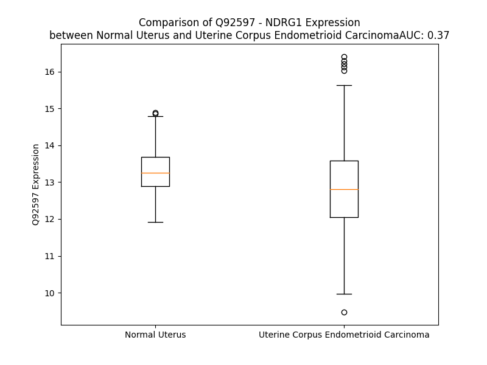

# Detailed Data for Q92597

## Introduction to the Detailed Summary

### How to Interpret the Results

- **Summary & Metrics**: This section provides a quick reference to essential protein attributes, including expression changes, family classification, and biomarker applications. Regulation status (upregulated/downregulated) indicates the protein's behavior in a disease context. Some information comes from the original excel file with the proteins selected from literature, while others are derived from the analyses.
- **Expression Comparison**: A visual representation comparing protein expression between normal and disease states. It highlights significant changes in expression levels that might indicate diagnostic or therapeutic relevance. This is data coming from transcriptomics experiments and could not translate similarly to protein levels.
- **Isoform Alignment**: An interactive view of isoform alignments, revealing structural and functional differences between variants of the protein.
- **Interactors & Homologs**: Tables listing known interaction partners and homologous proteins, the more interactors and homologs, the more complex the protein is to design an antibody for.
- **Biological Assemblies**: Information about the structural arrangement of the protein in different assemblies, providing insights into its functional state but also the complexity of the protein to develop antibodies.
- **Combined Per-Residue Information**: A detailed table summarizing residue-level data. This includes predictions for epitope regions, aggregation tendencies, and modifications that might impact the protein's function. Each row corresponds to a residue in the protein, providing insights into specific sites that may be important for research or drug development.
## Summary & Metrics

- **UniProt Accession**: Q92597
- **Gene Name**: NDRG1
- **Protein Name**: Protein NDRG1
- **Swiss Prot**: NDRG1_HUMAN
- **Family**: kinase
- **Biomarker Application**: prognosis
- **Number of Isoforms**: 3
- **Regulation**: 1
- **(transcriptomics) AUC**: 0.37
- **(transcriptomics) Fold Change**: 1.04
- **(transcriptomics) Regulation**: Downregulated
- **Discotope Epitope Count**: 73
- **Max n_uniprots (Homo)**: 2
- **Max n_uniprots (Hetero)**: N/A

## Expression Comparison

## Isoform Alignment

<pre style='font-size:14px; font-family:monospace;'>Q92597-1 MSREMQDVDLAEVKPLVEKGETITGLLQEFDVQEQDIETLHGSVHVTLCGTPKGNRPVILTYHDIGMNHKTCYNPLFNYEDMQEITQHFAVCHVDAPGQQDGAASFPAGYMYPSMDQLAEMLPGVLQQFGLKSIIGMGTGAGAYILTRFALNNPEMVEGLVLINVNPCAEGWMDWAASKISGWTQALPDMVVSHLFGKEEMQSNVEVVHTYRQHIVNDMNPGNLHLFINAYNSRRDLEIERPMPGTHTVTLQCPALLVVGDSSPAVDAVVECNSKLDPTKTTLLKMADCGGLPQISQPAKLAEAFKYFVQGMGYMPSASMTRLMRSRTASGSSVTSLDGTRSRSHTSEGTRSRSHTSEGTRSRSHTSEGAHLDITPNSGAAGNSAGPKSMEVSC
Q92597-2 ------------------------------------------------------------------MNHKTCYNPLFNYEDMQEITQHFAVCHVDAPGQQDGAASFPAGYMYPSMDQLAEMLPGVLQQFGLKSIIGMGTGAGAYILTRFALNNPEMVEGLVLINVNPCAEGWMDWAASKISGWTQALPDMVVSHLFGKEEMQSNVEVVHTYRQHIVNDMNPGNLHLFINAYNSRRDLEIERPMPGTHTVTLQCPALLVVGDSSPAVDAVVECNSKLDPTKTTLLKMADCGGLPQISQPAKLAEAFKYFVQGMGYMPSASMTRLMRSRTASGSSVTSLDGTRSRSHTSEGTRSRSHTSEGTRSRSHTSEGAHLDITPNSGAAGNSAGPKSMEVSC
Q92597-3 ---------------------------------------------------------------------------------MQEITQHFAVCHVDAPGQQDGAASFPAGYMYPSMDQLAEMLPGVLQQFGLKSIIGMGTGAGAYILTRFALNNPEMVEGLVLINVNPCAEGWMDWAASKISGWTQALPDMVVSHLFGKEEMQSNVEVVHTYRQHIVNDMNPGNLHLFINAYNSRRDLEIERPMPGTHTVTLQCPALLVVGDSSPAVDAVVECNSKLDPTKTTLLKMADCGGLPQISQPAKLAEAFKYFVQGMGYMPSASMTRLMRSRTASGSSVTSLDGTRSRSHTSEGTRSRSHTSEGTRSRSHTSEGAHLDITPNSGAAGNSAGPKSMEVSC
</pre>

## Interactors

| preferredName_A   | preferredName_B   |   score |
|:------------------|:------------------|--------:|
| NDRG1             | MYCN              |   0.937 |

## Homologs

| uniprot_id   | gene_id   |
|:-------------|:----------|
| F8WBF9       | NDRG3     |
| G3V271       | NDRG2     |
| H3BR92       | NDRG4     |

## Biological Assemblies

|   Unnamed: 0 |   assembly |   n_uniprots | composition   | crystal_id   |
|-------------:|-----------:|-------------:|:--------------|:-------------|
|            0 |          1 |            2 | Homo          | 6zmm         |

## Combined Per-Residue Information

|   res | aa   |   epitope_score | epitope   |   relative_surface_accessibility |   modeling_confidence |   Aggregation | modification              |
|------:|:-----|----------------:|:----------|---------------------------------:|----------------------:|--------------:|:--------------------------|
|     1 | M    |         0.16218 | False     |                          1.33429 |                 43.24 |         0     | N/A                       |
|     2 | S    |         0.13829 | False     |                          0.92825 |                 35.86 |         0     | N-acetylserine            |
|     2 | S    |         0.13829 | False     |                          0.92825 |                 35.86 |         0     | Phosphoserine             |
|     3 | R    |         0.24791 | True      |                          0.95599 |                 42.33 |         0     | N/A                       |
|     4 | E    |         0.13914 | False     |                          0.83589 |                 37.02 |         0     | N/A                       |
|     5 | M    |         0.23165 | True      |                          1.05023 |                 42.87 |         0     | N/A                       |
|     6 | Q    |         0.14565 | False     |                          0.84146 |                 40.8  |         0     | N/A                       |
|     7 | D    |         0.19116 | False     |                          0.93424 |                 36.02 |         0     | N/A                       |
|     8 | V    |         0.10187 | False     |                          0.94445 |                 40.55 |         0     | N/A                       |
|     9 | D    |         0.15102 | False     |                          0.87311 |                 34.36 |         0     | N/A                       |
|    10 | L    |         0.11812 | False     |                          1.07366 |                 36.64 |         0     | N/A                       |
|    11 | A    |         0.12875 | False     |                          0.87404 |                 37.84 |         0     | N/A                       |
|    12 | E    |         0.16707 | False     |                          0.8515  |                 34.16 |         0     | N/A                       |
|    13 | V    |         0.12449 | False     |                          1.00962 |                 38.71 |         0     | N/A                       |
|    14 | K    |         0.16734 | False     |                          0.83357 |                 35.01 |         0     | N/A                       |
|    15 | P    |         0.13719 | False     |                          0.90492 |                 32.71 |         0     | N/A                       |
|    16 | L    |         0.10494 | False     |                          1.07153 |                 33.1  |         0     | N/A                       |
|    17 | V    |         0.11122 | False     |                          0.99975 |                 37.9  |         0     | N/A                       |
|    18 | E    |         0.14367 | False     |                          0.85647 |                 35.01 |         0     | N/A                       |
|    19 | K    |         0.14967 | False     |                          0.98671 |                 30.79 |         0     | N/A                       |
|    20 | G    |         0.11665 | False     |                          0.83555 |                 31.38 |         0     | N/A                       |
|    21 | E    |         0.15719 | False     |                          0.88088 |                 29.23 |         0     | N/A                       |
|    22 | T    |         0.13937 | False     |                          0.8947  |                 28.32 |         0     | N/A                       |
|    23 | I    |         0.11698 | False     |                          0.87642 |                 35    |         0.143 | N/A                       |
|    24 | T    |         0.15023 | False     |                          0.98131 |                 31.25 |         0.143 | N/A                       |
|    25 | G    |         0.15383 | False     |                          0.86484 |                 29.21 |         0.143 | N/A                       |
|    26 | L    |         0.11693 | False     |                          1.07861 |                 35.06 |         0.143 | N/A                       |
|    27 | L    |         0.09277 | False     |                          0.60862 |                 35.44 |         0.143 | N/A                       |
|    28 | Q    |         0.10838 | False     |                          0.80225 |                 39.88 |         0     | N/A                       |
|    29 | E    |         0.11432 | False     |                          0.87575 |                 45.34 |         0     | N/A                       |
|    30 | F    |         0.08594 | False     |                          0.41496 |                 57.5  |         0     | N/A                       |
|    31 | D    |         0.07734 | False     |                          0.65688 |                 75.14 |         0     | N/A                       |
|    32 | V    |         0.117   | False     |                          0.60908 |                 89.26 |         0     | N/A                       |
|    33 | Q    |         0.17863 | False     |                          0.4523  |                 92.05 |         0     | N/A                       |
|    34 | E    |         0.15248 | False     |                          0.49767 |                 95.36 |         0     | N/A                       |
|    35 | Q    |         0.18    | False     |                          0.19656 |                 95.63 |         0     | N/A                       |
|    36 | D    |         0.14343 | False     |                          0.59711 |                 97.18 |         0     | N/A                       |
|    37 | I    |         0.04013 | False     |                          0.0368  |                 97.2  |         0     | N/A                       |
|    38 | E    |         0.17651 | False     |                          0.79664 |                 97.28 |         0     | N/A                       |
|    39 | T    |         0.06747 | False     |                          0.12057 |                 95.9  |         0     | N/A                       |
|    40 | L    |         0.24066 | True      |                          0.82928 |                 94.38 |         0     | N/A                       |
|    41 | H    |         0.18678 | False     |                          0.23298 |                 97.45 |         0     | N/A                       |
|    42 | G    |         0.14343 | False     |                          0.388   |                 95.73 |         0     | N/A                       |
|    43 | S    |         0.17157 | False     |                          0.50876 |                 96.55 |         0.13  | N/A                       |
|    44 | V    |         0.01351 | False     |                          0.01428 |                 97.93 |         1.502 | N/A                       |
|    45 | H    |         0.08683 | False     |                          0.15869 |                 98.52 |         1.502 | N/A                       |
|    46 | V    |         0.00729 | False     |                          0.00286 |                 98.35 |         1.502 | N/A                       |
|    47 | T    |         0.02268 | False     |                          0.04044 |                 98.06 |         1.502 | N/A                       |
|    48 | L    |         0.04589 | False     |                          0.07068 |                 96.44 |         1.502 | N/A                       |
|    49 | C    |         0.05293 | False     |                          0.19122 |                 94.43 |         1.315 | N/A                       |
|    50 | G    |         0.03481 | False     |                          0.14954 |                 91.67 |         0     | N/A                       |
|    51 | T    |         0.10742 | False     |                          0.71323 |                 90.4  |         0     | N/A                       |
|    52 | P    |         0.06609 | False     |                          0.31059 |                 90.38 |         0     | N/A                       |
|    53 | K    |         0.18208 | False     |                          0.4774  |                 87.12 |         0     | N/A                       |
|    54 | G    |         0.26734 | True      |                          0.8743  |                 80.36 |         0     | N/A                       |
|    55 | N    |         0.19364 | True      |                          0.83072 |                 85.58 |         0     | N/A                       |
|    56 | R    |         0.19269 | True      |                          0.36086 |                 91.88 |         0     | N/A                       |
|    57 | P    |         0.01202 | False     |                          0.02301 |                 96.72 |         0.844 | N/A                       |
|    58 | V    |         0.0072  | False     |                          0.01333 |                 97.62 |        71.11  | N/A                       |
|    59 | I    |         0.00097 | False     |                          0       |                 98.41 |        71.11  | N/A                       |
|    60 | L    |         0.00108 | False     |                          0       |                 98.75 |        71.11  | N/A                       |
|    61 | T    |         0.00221 | False     |                          0.00072 |                 98.88 |        71.11  | N/A                       |
|    62 | Y    |         0.0054  | False     |                          0.00869 |                 98.89 |        71.11  | N/A                       |
|    63 | H    |         0.00743 | False     |                          0.00126 |                 98.7  |         1.379 | N/A                       |
|    64 | D    |         0.026   | False     |                          0.0164  |                 97.99 |         0     | N/A                       |
|    65 | I    |         0.00985 | False     |                          0       |                 95.96 |         0     | N/A                       |
|    66 | G    |         0.00387 | False     |                          0       |                 95.31 |         0     | N/A                       |
|    67 | M    |         0.01222 | False     |                          0       |                 96.53 |         0     | N/A                       |
|    68 | N    |         0.02615 | False     |                          0.01036 |                 96.87 |         0     | N/A                       |
|    69 | H    |         0.03042 | False     |                          0.04404 |                 97.66 |         0     | N/A                       |
|    70 | K    |         0.19052 | False     |                          0.38797 |                 95.51 |         0     | N/A                       |
|    71 | T    |         0.11427 | False     |                          0.19513 |                 94.56 |         0     | N/A                       |
|    72 | C    |         0.01104 | False     |                          0       |                 97.01 |         0     | N/A                       |
|    73 | Y    |         0.00495 | False     |                          0.00057 |                 97.72 |         0     | N/A                       |
|    74 | N    |         0.12229 | False     |                          0.31435 |                 95.33 |         0     | N/A                       |
|    75 | P    |         0.19472 | True      |                          0.3843  |                 94.36 |         0     | N/A                       |
|    76 | L    |         0.00434 | False     |                          0       |                 97.1  |         0     | N/A                       |
|    77 | F    |         0.06011 | False     |                          0.09107 |                 96.67 |         0     | N/A                       |
|    78 | N    |         0.12804 | False     |                          0.68071 |                 94.01 |         0     | N/A                       |
|    79 | Y    |         0.19556 | True      |                          0.38422 |                 93.93 |         0     | N/A                       |
|    80 | E    |         0.14464 | False     |                          0.70838 |                 92.86 |         0     | N/A                       |
|    81 | D    |         0.11452 | False     |                          0.33483 |                 90.09 |         0     | N/A                       |
|    82 | M    |         0.00251 | False     |                          0       |                 94.03 |         0     | N/A                       |
|    83 | Q    |         0.0689  | False     |                          0.30605 |                 89.27 |         0     | N/A                       |
|    84 | E    |         0.09025 | False     |                          0.38024 |                 87.72 |         0     | N/A                       |
|    85 | I    |         0.01191 | False     |                          0.0024  |                 91.34 |         0     | N/A                       |
|    86 | T    |         0.0469  | False     |                          0.10676 |                 91.32 |         0     | N/A                       |
|    87 | Q    |         0.09043 | False     |                          0.59198 |                 89.06 |         0     | N/A                       |
|    88 | H    |         0.10512 | False     |                          0.32833 |                 91.05 |         0.322 | N/A                       |
|    89 | F    |         0.0254  | False     |                          0.04034 |                 94.97 |         2.164 | N/A                       |
|    90 | A    |         0.01312 | False     |                          0.05458 |                 95.51 |         2.302 | N/A                       |
|    91 | V    |         0.02185 | False     |                          0.02856 |                 97.55 |         2.302 | N/A                       |
|    92 | C    |         0.00222 | False     |                          0       |                 98.1  |         2.302 | N/A                       |
|    93 | H    |         0.00846 | False     |                          0.04522 |                 98.62 |         1.98  | N/A                       |
|    94 | V    |         0.00194 | False     |                          0.00141 |                 98.77 |         1.833 | N/A                       |
|    95 | D    |         0.01519 | False     |                          0.01331 |                 98.72 |         0     | N/A                       |
|    96 | A    |         0.00384 | False     |                          0       |                 98.76 |         0     | N/A                       |
|    97 | P    |         0.01535 | False     |                          0.02684 |                 98.53 |         0     | N/A                       |
|    98 | G    |         0.04811 | False     |                          0.06138 |                 97.85 |         0     | N/A                       |
|    99 | Q    |         0.02303 | False     |                          0.0098  |                 98.12 |         0     | N/A                       |
|   100 | Q    |         0.08037 | False     |                          0.20752 |                 96.85 |         0     | N/A                       |
|   101 | D    |         0.2835  | True      |                          0.41358 |                 93.54 |         0     | N/A                       |
|   102 | G    |         0.32045 | True      |                          0.91124 |                 92.77 |         0     | N/A                       |
|   103 | A    |         0.11896 | False     |                          0.13554 |                 96.33 |         0     | N/A                       |
|   104 | A    |         0.15808 | False     |                          0.82476 |                 96.76 |         0     | N/A                       |
|   105 | S    |         0.3258  | True      |                          0.60941 |                 97.32 |         0     | N/A                       |
|   106 | F    |         0.23029 | True      |                          0.27975 |                 97.6  |         0     | N/A                       |
|   107 | P    |         0.35538 | True      |                          0.71189 |                 97.05 |         0     | N/A                       |
|   108 | A    |         0.38506 | True      |                          1.07192 |                 93.81 |         0     | N/A                       |
|   109 | G    |         0.33996 | True      |                          0.89557 |                 93.68 |         0     | N/A                       |
|   110 | Y    |         0.30367 | True      |                          0.30963 |                 96.51 |         0     | N/A                       |
|   111 | M    |         0.28173 | True      |                          0.91831 |                 96.07 |         0     | N/A                       |
|   112 | Y    |         0.19518 | True      |                          0.1162  |                 98.14 |         0     | N/A                       |
|   113 | P    |         0.03643 | False     |                          0.03579 |                 98.38 |         0     | N/A                       |
|   114 | S    |         0.08334 | False     |                          0.38761 |                 98.05 |         0     | N/A                       |
|   115 | M    |         0.01797 | False     |                          0.01676 |                 98.19 |         0     | N/A                       |
|   116 | D    |         0.07034 | False     |                          0.18931 |                 98.37 |         0     | N/A                       |
|   117 | Q    |         0.09923 | False     |                          0.33842 |                 98.61 |         0     | N/A                       |
|   118 | L    |         0.00397 | False     |                          0.00183 |                 98.79 |         0     | N/A                       |
|   119 | A    |         0.00461 | False     |                          0.00605 |                 98.76 |         0     | N/A                       |
|   120 | E    |         0.10474 | False     |                          0.37431 |                 98.56 |         0     | N/A                       |
|   121 | M    |         0.01488 | False     |                          0.00782 |                 98.61 |         0     | N/A                       |
|   122 | L    |         0.00718 | False     |                          0.00577 |                 98.65 |         0     | N/A                       |
|   123 | P    |         0.09675 | False     |                          0.27685 |                 98.15 |         0     | N/A                       |
|   124 | G    |         0.06796 | False     |                          0.24    |                 97.06 |         0     | N/A                       |
|   125 | V    |         0.00271 | False     |                          0       |                 97.35 |         0     | N/A                       |
|   126 | L    |         0.01984 | False     |                          0.02143 |                 96.53 |         0     | N/A                       |
|   127 | Q    |         0.21178 | True      |                          0.75214 |                 95.69 |         0     | N/A                       |
|   128 | Q    |         0.15027 | False     |                          0.54714 |                 94.84 |         0     | N/A                       |
|   129 | F    |         0.06788 | False     |                          0.2068  |                 92.78 |         0     | N/A                       |
|   130 | G    |         0.23797 | True      |                          0.77591 |                 93.79 |         0     | N/A                       |
|   131 | L    |         0.0491  | False     |                          0.16231 |                 94.7  |         0     | N/A                       |
|   132 | K    |         0.14148 | False     |                          0.81034 |                 95.41 |         0     | N/A                       |
|   133 | S    |         0.04485 | False     |                          0.11426 |                 97.81 |         0     | N/A                       |
|   134 | I    |         0.0029  | False     |                          0       |                 98.59 |         0     | N/A                       |
|   135 | I    |         0.00118 | False     |                          0       |                 98.66 |         0     | N/A                       |
|   136 | G    |         0.00112 | False     |                          0       |                 98.85 |         0     | N/A                       |
|   137 | M    |         0.00121 | False     |                          0       |                 98.88 |         0     | N/A                       |
|   138 | G    |         0.0023  | False     |                          0       |                 98.87 |         0     | N/A                       |
|   139 | T    |         0.00458 | False     |                          0       |                 98.71 |         0     | N/A                       |
|   140 | G    |         0.03352 | False     |                          0.00322 |                 97.68 |         0     | N/A                       |
|   141 | A    |         0.00829 | False     |                          0       |                 98.14 |         0.579 | N/A                       |
|   142 | G    |         0.01642 | False     |                          0       |                 98.81 |         1.099 | N/A                       |
|   143 | A    |         0.00167 | False     |                          0       |                 98.82 |         3.261 | N/A                       |
|   144 | Y    |         0.00492 | False     |                          0.00139 |                 98.64 |         3.261 | N/A                       |
|   145 | I    |         0.00333 | False     |                          0       |                 98.83 |         3.261 | N/A                       |
|   146 | L    |         0.00134 | False     |                          0       |                 98.93 |         3.123 | N/A                       |
|   147 | T    |         0.00138 | False     |                          0.00095 |                 98.82 |         2.521 | N/A                       |
|   148 | R    |         0.03589 | False     |                          0.05477 |                 98.69 |         0     | N/A                       |
|   149 | F    |         0.00308 | False     |                          0.00206 |                 98.79 |         0     | N/A                       |
|   150 | A    |         0.00875 | False     |                          0.02623 |                 98.79 |         0     | N/A                       |
|   151 | L    |         0.05729 | False     |                          0.19212 |                 98.2  |         0     | N/A                       |
|   152 | N    |         0.14014 | False     |                          0.49977 |                 98.11 |         0     | N/A                       |
|   153 | N    |         0.10103 | False     |                          0.17391 |                 98.39 |         0     | N/A                       |
|   154 | P    |         0.11051 | False     |                          0.32274 |                 98.01 |         0     | N/A                       |
|   155 | E    |         0.1994  | True      |                          0.63127 |                 97.77 |         0     | N/A                       |
|   156 | M    |         0.112   | False     |                          0.27883 |                 98.29 |         0     | N/A                       |
|   157 | V    |         0.01503 | False     |                          0.04397 |                 98.7  |         0     | N/A                       |
|   158 | E    |         0.06825 | False     |                          0.33302 |                 98.42 |         0     | N/A                       |
|   159 | G    |         0.00252 | False     |                          0       |                 98.72 |         6.668 | N/A                       |
|   160 | L    |         0.00151 | False     |                          0       |                 98.93 |        31.255 | N/A                       |
|   161 | V    |         0.00096 | False     |                          0       |                 98.88 |        42.6   | N/A                       |
|   162 | L    |         0.0019  | False     |                          0       |                 98.85 |        42.6   | N/A                       |
|   163 | I    |         0.00242 | False     |                          0       |                 98.76 |        42.6   | N/A                       |
|   164 | N    |         0.11005 | False     |                          0.09107 |                 97.82 |        38.144 | N/A                       |
|   165 | V    |         0.00446 | False     |                          0       |                 98.05 |        36.045 | N/A                       |
|   166 | N    |         0.05658 | False     |                          0.19814 |                 96.28 |         0     | N/A                       |
|   167 | P    |         0.01614 | False     |                          0.01746 |                 95.78 |         0     | N/A                       |
|   168 | C    |         0.08419 | False     |                          0.18369 |                 92.52 |         0     | N/A                       |
|   169 | A    |         0.19073 | False     |                          0.39291 |                 86.17 |         0     | N/A                       |
|   170 | E    |         0.33492 | True      |                          0.74215 |                 68.06 |         0     | N/A                       |
|   171 | G    |         0.25523 | True      |                          0.35753 |                 58.35 |         0     | N/A                       |
|   172 | W    |         0.16527 | False     |                          0.24834 |                 63.24 |         0     | N/A                       |
|   173 | M    |         0.1159  | False     |                          0.15558 |                 56.63 |         0     | N/A                       |
|   174 | D    |         0.21624 | True      |                          0.87299 |                 56.81 |         0     | N/A                       |
|   175 | W    |         0.19663 | True      |                          0.6225  |                 51.3  |         0     | N/A                       |
|   176 | A    |         0.05672 | False     |                          0.0102  |                 51.05 |         0     | N/A                       |
|   177 | A    |         0.19204 | True      |                          0.5661  |                 51.26 |         0     | N/A                       |
|   178 | S    |         0.14258 | False     |                          0.72434 |                 49.77 |         0     | N/A                       |
|   179 | K    |         0.12339 | False     |                          0.4169  |                 49.77 |         0     | N/A                       |
|   180 | I    |         0.28074 | True      |                          0.72824 |                 50.5  |         0     | N/A                       |
|   181 | S    |         0.22003 | True      |                          0.98054 |                 53.18 |         0     | N/A                       |
|   182 | G    |         0.08153 | False     |                          0.40273 |                 56.47 |         0     | N/A                       |
|   183 | W    |         0.149   | False     |                          0.23913 |                 56.99 |         0     | N/A                       |
|   184 | T    |         0.18633 | False     |                          0.76688 |                 57.99 |         0     | N/A                       |
|   185 | Q    |         0.29379 | True      |                          0.82883 |                 60.49 |         0     | N/A                       |
|   186 | A    |         0.11267 | False     |                          0.12473 |                 77.24 |         0     | N/A                       |
|   187 | L    |         0.04998 | False     |                          0.04039 |                 83.78 |         0     | N/A                       |
|   188 | P    |         0.06716 | False     |                          0.12824 |                 87.23 |         0     | N/A                       |
|   189 | D    |         0.17415 | False     |                          0.35921 |                 86.28 |         0     | N/A                       |
|   190 | M    |         0.05419 | False     |                          0.03093 |                 85.89 |         1.559 | N/A                       |
|   191 | V    |         0.00659 | False     |                          0       |                 91.15 |         2.925 | N/A                       |
|   192 | V    |         0.00884 | False     |                          0       |                 91.15 |         2.925 | N/A                       |
|   193 | S    |         0.13959 | False     |                          0.28113 |                 88.17 |         2.925 | N/A                       |
|   194 | H    |         0.14743 | False     |                          0.17928 |                 91.53 |         2.925 | N/A                       |
|   195 | L    |         0.07683 | False     |                          0.02817 |                 91.67 |         2.925 | N/A                       |
|   196 | F    |         0.0311  | False     |                          0.01981 |                 91.03 |         2.925 | N/A                       |
|   197 | G    |         0.12884 | False     |                          0.08208 |                 84.71 |         0     | N/A                       |
|   198 | K    |         0.26531 | True      |                          0.86051 |                 83.45 |         0     | N/A                       |
|   199 | E    |         0.29229 | True      |                          0.66219 |                 82.92 |         0     | N/A                       |
|   200 | E    |         0.14253 | False     |                          0.08719 |                 82.88 |         0     | N/A                       |
|   201 | M    |         0.15282 | False     |                          0.31367 |                 84.72 |         0     | N/A                       |
|   202 | Q    |         0.38904 | True      |                          0.73472 |                 85.04 |         0     | N/A                       |
|   203 | S    |         0.36706 | True      |                          0.74486 |                 84.98 |         0     | N/A                       |
|   204 | N    |         0.15651 | False     |                          0.33125 |                 83.45 |         0     | N/A                       |
|   205 | V    |         0.28566 | True      |                          0.66169 |                 86.51 |         0     | N/A                       |
|   206 | E    |         0.34926 | True      |                          0.75204 |                 88.11 |         0     | N/A                       |
|   207 | V    |         0.19366 | True      |                          0.30738 |                 86.47 |         0.938 | N/A                       |
|   208 | V    |         0.01976 | False     |                          0.01333 |                 89.13 |         0.938 | N/A                       |
|   209 | H    |         0.30634 | True      |                          0.54773 |                 90.74 |         0.938 | N/A                       |
|   210 | T    |         0.33168 | True      |                          0.61285 |                 89.79 |         0.938 | N/A                       |
|   211 | Y    |         0.05723 | False     |                          0.06443 |                 89.66 |         0.938 | N/A                       |
|   212 | R    |         0.26235 | True      |                          0.27908 |                 91.33 |         0     | N/A                       |
|   213 | Q    |         0.28509 | True      |                          0.39129 |                 91.44 |         0     | N/A                       |
|   214 | H    |         0.10861 | False     |                          0.08952 |                 89.5  |         0     | N/A                       |
|   215 | I    |         0.08127 | False     |                          0.03071 |                 90.38 |         0     | N/A                       |
|   216 | V    |         0.28058 | True      |                          0.65839 |                 90.57 |         0     | N/A                       |
|   217 | N    |         0.48613 | True      |                          0.64516 |                 90.02 |         0     | N/A                       |
|   218 | D    |         0.41391 | True      |                          0.44965 |                 90.33 |         0     | N/A                       |
|   219 | M    |         0.07286 | False     |                          0.0457  |                 92.33 |         0     | N/A                       |
|   220 | N    |         0.10009 | False     |                          0.14946 |                 95.3  |         0     | N/A                       |
|   221 | P    |         0.10407 | False     |                          0.55807 |                 92.98 |         0     | N/A                       |
|   222 | G    |         0.2232  | True      |                          0.46983 |                 93.22 |         0     | N/A                       |
|   223 | N    |         0.01713 | False     |                          0.00509 |                 97.15 |         0     | N/A                       |
|   224 | L    |         0.00834 | False     |                          0.00412 |                 95.51 |         2.129 | N/A                       |
|   225 | H    |         0.09818 | False     |                          0.34228 |                 92.67 |         2.129 | N/A                       |
|   226 | L    |         0.21251 | True      |                          0.27254 |                 95.44 |         7.46  | N/A                       |
|   227 | F    |         0.00297 | False     |                          0       |                 96.81 |         8.216 | N/A                       |
|   228 | I    |         0.01405 | False     |                          0.0016  |                 93.87 |         8.216 | N/A                       |
|   229 | N    |         0.18884 | False     |                          0.31007 |                 92.29 |         6.581 | N/A                       |
|   230 | A    |         0.09169 | False     |                          0.13011 |                 95.28 |         6.581 | N/A                       |
|   231 | Y    |         0.03426 | False     |                          0.01928 |                 95.57 |         5.349 | N/A                       |
|   232 | N    |         0.13823 | False     |                          0.15395 |                 91.34 |         0     | N/A                       |
|   233 | S    |         0.23855 | True      |                          0.73907 |                 92.47 |         0     | N/A                       |
|   234 | R    |         0.1586  | False     |                          0.04684 |                 95.63 |         0     | N/A                       |
|   235 | R    |         0.16647 | False     |                          0.44353 |                 95.13 |         0     | N/A                       |
|   236 | D    |         0.22612 | True      |                          0.41043 |                 96.38 |         0     | N/A                       |
|   237 | L    |         0.02978 | False     |                          0.00782 |                 96.55 |         0     | N/A                       |
|   238 | E    |         0.26728 | True      |                          0.56754 |                 95.16 |         0     | N/A                       |
|   239 | I    |         0.0592  | False     |                          0.01966 |                 96.43 |         0     | N/A                       |
|   240 | E    |         0.2381  | True      |                          0.50314 |                 96.43 |         0     | N/A                       |
|   241 | R    |         0.16827 | False     |                          0.2842  |                 96.07 |         0     | N/A                       |
|   242 | P    |         0.1876  | False     |                          0.36644 |                 92.94 |         0     | N/A                       |
|   243 | M    |         0.3048  | True      |                          0.63796 |                 89.46 |         0     | N/A                       |
|   244 | P    |         0.46134 | True      |                          0.97732 |                 86.36 |         0     | N/A                       |
|   245 | G    |         0.28616 | True      |                          1.07359 |                 85.7  |         0     | N/A                       |
|   246 | T    |         0.29668 | True      |                          0.58785 |                 85.63 |         0     | N/A                       |
|   247 | H    |         0.30721 | True      |                          0.99747 |                 83.7  |         0     | N/A                       |
|   248 | T    |         0.19417 | True      |                          0.29152 |                 88.21 |         0     | N/A                       |
|   249 | V    |         0.18068 | False     |                          0.59387 |                 92.51 |         0     | N/A                       |
|   250 | T    |         0.062   | False     |                          0.15711 |                 95.73 |         0     | N/A                       |
|   251 | L    |         0.02382 | False     |                          0.04416 |                 97.86 |         0     | N/A                       |
|   252 | Q    |         0.15218 | False     |                          0.58887 |                 97.06 |         0     | N/A                       |
|   253 | C    |         0.04833 | False     |                          0.09466 |                 98.37 |         0     | N/A                       |
|   254 | P    |         0.05946 | False     |                          0.33799 |                 98.57 |         0.578 | N/A                       |
|   255 | A    |         0.01235 | False     |                          0.01292 |                 98.79 |        42.254 | N/A                       |
|   256 | L    |         0.01579 | False     |                          0.0577  |                 98.83 |        46.641 | N/A                       |
|   257 | L    |         0.00288 | False     |                          0       |                 98.83 |        46.641 | N/A                       |
|   258 | V    |         0.001   | False     |                          0       |                 98.76 |        46.641 | N/A                       |
|   259 | V    |         0.00399 | False     |                          0.00095 |                 98.26 |        46.532 | N/A                       |
|   260 | G    |         0.00386 | False     |                          0       |                 96.62 |         7.828 | N/A                       |
|   261 | D    |         0.07807 | False     |                          0.46195 |                 94.2  |         0     | N/A                       |
|   262 | S    |         0.11874 | False     |                          0.35089 |                 92.37 |         0     | N/A                       |
|   263 | S    |         0.18071 | False     |                          0.06925 |                 93.67 |         0     | N/A                       |
|   264 | P    |         0.23309 | True      |                          0.5465  |                 92.47 |         0     | N/A                       |
|   265 | A    |         0.08103 | False     |                          0.14922 |                 94.71 |         0     | N/A                       |
|   266 | V    |         0.07518 | False     |                          0.20905 |                 95.41 |         0     | N/A                       |
|   267 | D    |         0.33798 | True      |                          0.73612 |                 94.85 |         0     | N/A                       |
|   268 | A    |         0.07005 | False     |                          0.19609 |                 95.85 |         0     | N/A                       |
|   269 | V    |         0.00412 | False     |                          0       |                 97.8  |         0     | N/A                       |
|   270 | V    |         0.10722 | False     |                          0.39884 |                 97.56 |         0     | N/A                       |
|   271 | E    |         0.09657 | False     |                          0.33213 |                 96.8  |         0     | N/A                       |
|   272 | C    |         0.00169 | False     |                          0       |                 97.78 |         0     | N/A                       |
|   273 | N    |         0.05846 | False     |                          0.10762 |                 98.26 |         0     | N/A                       |
|   274 | S    |         0.09188 | False     |                          0.38216 |                 97.28 |         0     | N/A                       |
|   275 | K    |         0.06415 | False     |                          0.19983 |                 97.43 |         0     | N/A                       |
|   276 | L    |         0.00871 | False     |                          0.0072  |                 97.72 |         0     | N/A                       |
|   277 | D    |         0.05334 | False     |                          0.15309 |                 96.49 |         0     | N/A                       |
|   278 | P    |         0.09659 | False     |                          0.54006 |                 96.37 |         0     | N/A                       |
|   279 | T    |         0.18461 | False     |                          0.82934 |                 95.68 |         0     | N/A                       |
|   280 | K    |         0.12669 | False     |                          0.45925 |                 96.09 |         0     | N/A                       |
|   281 | T    |         0.0305  | False     |                          0.13189 |                 98.41 |         0     | N/A                       |
|   282 | T    |         0.05009 | False     |                          0.40274 |                 98.45 |         0     | N/A                       |
|   283 | L    |         0.02547 | False     |                          0.06646 |                 98.43 |         0     | N/A                       |
|   284 | L    |         0.0228  | False     |                          0.04946 |                 98.29 |         0     | N/A                       |
|   285 | K    |         0.032   | False     |                          0.31452 |                 97.6  |         0     | N/A                       |
|   286 | M    |         0.01007 | False     |                          0.02373 |                 96.54 |         0     | N/A                       |
|   287 | A    |         0.03812 | False     |                          0.30157 |                 94.18 |         0     | N/A                       |
|   288 | D    |         0.13138 | False     |                          0.72047 |                 90.1  |         0     | N/A                       |
|   289 | C    |         0.01138 | False     |                          0.00673 |                 91.57 |         0     | N/A                       |
|   290 | G    |         0.08145 | False     |                          0.08685 |                 90.17 |         0     | N/A                       |
|   291 | G    |         0.06354 | False     |                          0.00798 |                 90.43 |         0     | N/A                       |
|   292 | L    |         0.05332 | False     |                          0.01401 |                 93.18 |         0     | N/A                       |
|   293 | P    |         0.00351 | False     |                          0       |                 94.99 |         0     | N/A                       |
|   294 | Q    |         0.00533 | False     |                          0       |                 93.61 |         0     | N/A                       |
|   295 | I    |         0.16283 | False     |                          0.23467 |                 91.11 |         0     | N/A                       |
|   296 | S    |         0.08762 | False     |                          0.3895  |                 90.03 |         0     | N/A                       |
|   297 | Q    |         0.07506 | False     |                          0.12401 |                 93.55 |         0     | N/A                       |
|   298 | P    |         0.04873 | False     |                          0.13221 |                 94.91 |         0     | N/A                       |
|   299 | A    |         0.07676 | False     |                          0.3211  |                 94.75 |         0     | N/A                       |
|   300 | K    |         0.05191 | False     |                          0.36356 |                 95.82 |         0     | N/A                       |
|   301 | L    |         0.00201 | False     |                          0       |                 97.08 |         1.292 | N/A                       |
|   302 | A    |         0.0056  | False     |                          0.0082  |                 96.52 |         1.529 | N/A                       |
|   303 | E    |         0.04424 | False     |                          0.1135  |                 94.77 |         2.296 | N/A                       |
|   304 | A    |         0.02153 | False     |                          0.17274 |                 96.49 |         2.296 | N/A                       |
|   305 | F    |         0.00144 | False     |                          0       |                 97.04 |         2.296 | N/A                       |
|   306 | K    |         0.01474 | False     |                          0.02583 |                 94.66 |         2.296 | N/A                       |
|   307 | Y    |         0.06194 | False     |                          0.23803 |                 94.69 |         2.296 | N/A                       |
|   308 | F    |         0.03746 | False     |                          0.1323  |                 97.02 |         2.296 | N/A                       |
|   309 | V    |         0.00394 | False     |                          0       |                 95.64 |         2.296 | N/A                       |
|   310 | Q    |         0.07282 | False     |                          0.20015 |                 93.95 |         0     | N/A                       |
|   311 | G    |         0.17402 | False     |                          0.86644 |                 94.68 |         0     | N/A                       |
|   312 | M    |         0.08524 | False     |                          0.22136 |                 95.07 |         0     | N/A                       |
|   313 | G    |         0.18226 | False     |                          0.6596  |                 94.24 |         0     | N/A                       |
|   314 | Y    |         0.10357 | False     |                          0.18593 |                 92.91 |         0     | N/A                       |
|   315 | M    |         0.08718 | False     |                          0.07013 |                 87.11 |         0     | N/A                       |
|   316 | P    |         0.27532 | True      |                          0.84257 |                 76.44 |         0     | N/A                       |
|   317 | S    |         0.20737 | True      |                          0.8498  |                 70.35 |         0     | N/A                       |
|   318 | A    |         0.07516 | False     |                          0.20214 |                 72.63 |         0     | N/A                       |
|   319 | S    |         0.21482 | True      |                          0.63319 |                 66.43 |         0     | Phosphoserine             |
|   320 | M    |         0.16966 | False     |                          0.57101 |                 56.51 |         0     | N/A                       |
|   321 | T    |         0.07847 | False     |                          0.3183  |                 55.59 |         0     | N/A                       |
|   322 | R    |         0.21935 | True      |                          0.82291 |                 57.37 |         0     | N/A                       |
|   323 | L    |         0.09666 | False     |                          0.47298 |                 52.04 |         0     | N/A                       |
|   324 | M    |         0.16068 | False     |                          0.48194 |                 45.51 |         0     | N/A                       |
|   325 | R    |         0.23855 | True      |                          0.76173 |                 45.24 |         0     | N/A                       |
|   326 | S    |         0.14297 | False     |                          0.70546 |                 45.58 |         0     | Phosphoserine             |
|   327 | R    |         0.19087 | False     |                          0.77937 |                 53.26 |         0     | N/A                       |
|   328 | T    |         0.1705  | False     |                          0.82228 |                 47.15 |         0     | Phosphothreonine; by SGK1 |
|   329 | A    |         0.19202 | True      |                          0.86372 |                 41.29 |         0     | N/A                       |
|   330 | S    |         0.15031 | False     |                          0.81351 |                 38.79 |         0     | Phosphoserine; by SGK1    |
|   331 | G    |         0.23563 | True      |                          0.98023 |                 35.01 |         0     | N/A                       |
|   332 | S    |         0.11228 | False     |                          0.84031 |                 37.46 |         0     | Phosphoserine; by SGK1    |
|   333 | S    |         0.10237 | False     |                          0.81939 |                 31.69 |         0     | Phosphoserine             |
|   334 | V    |         0.10889 | False     |                          0.93028 |                 42.69 |         0     | N/A                       |
|   335 | T    |         0.14149 | False     |                          0.94821 |                 35.18 |         0     | Phosphothreonine          |
|   336 | S    |         0.12474 | False     |                          0.71923 |                 42.44 |         0     | Phosphoserine             |
|   337 | L    |         0.11633 | False     |                          1.0798  |                 38.75 |         0     | N/A                       |
|   338 | D    |         0.18914 | False     |                          0.91065 |                 44.5  |         0     | N/A                       |
|   339 | G    |         0.15423 | False     |                          0.81257 |                 41.27 |         0     | N/A                       |
|   340 | T    |         0.1545  | False     |                          0.94756 |                 39.92 |         0     | Phosphothreonine          |
|   341 | R    |         0.15143 | False     |                          0.97806 |                 38.52 |         0     | N/A                       |
|   342 | S    |         0.15582 | False     |                          0.79124 |                 48.13 |         0     | Phosphoserine             |
|   343 | R    |         0.24607 | True      |                          0.95505 |                 42.4  |         0     | N/A                       |
|   344 | S    |         0.18886 | False     |                          0.84388 |                 41.97 |         0     | N/A                       |
|   345 | H    |         0.16204 | False     |                          0.93578 |                 43.5  |         0     | N/A                       |
|   346 | T    |         0.2337  | True      |                          0.99319 |                 43.55 |         0     | Phosphothreonine; by SGK1 |
|   347 | S    |         0.15097 | False     |                          0.75466 |                 41.5  |         0     | N/A                       |
|   348 | E    |         0.19343 | True      |                          0.90717 |                 44.77 |         0     | N/A                       |
|   349 | G    |         0.17181 | False     |                          0.80243 |                 41.95 |         0     | N/A                       |
|   350 | T    |         0.1484  | False     |                          0.76987 |                 42.67 |         0     | N/A                       |
|   351 | R    |         0.12462 | False     |                          0.90158 |                 45.23 |         0     | N/A                       |
|   352 | S    |         0.10204 | False     |                          0.65914 |                 45.45 |         0     | Phosphoserine             |
|   353 | R    |         0.15979 | False     |                          0.93326 |                 44.26 |         0     | N/A                       |
|   354 | S    |         0.14476 | False     |                          0.56651 |                 44.15 |         0     | N/A                       |
|   355 | H    |         0.10051 | False     |                          0.88115 |                 45.53 |         0     | N/A                       |
|   356 | T    |         0.1534  | False     |                          0.91128 |                 43.73 |         0     | Phosphothreonine; by SGK1 |
|   357 | S    |         0.14738 | False     |                          0.8099  |                 43.07 |         0     | N/A                       |
|   358 | E    |         0.18338 | False     |                          0.93821 |                 42.72 |         0     | N/A                       |
|   359 | G    |         0.19731 | True      |                          1.00586 |                 42.48 |         0     | N/A                       |
|   360 | T    |         0.11322 | False     |                          0.87819 |                 41.86 |         0     | N/A                       |
|   361 | R    |         0.20244 | True      |                          0.89058 |                 44.07 |         0     | N/A                       |
|   362 | S    |         0.19616 | True      |                          0.79917 |                 41.87 |         0     | Phosphoserine             |
|   363 | R    |         0.21635 | True      |                          0.93739 |                 39.51 |         0     | N/A                       |
|   364 | S    |         0.14424 | False     |                          0.90253 |                 43.31 |         0     | Phosphoserine; by SGK1    |
|   365 | H    |         0.14317 | False     |                          0.94124 |                 40.67 |         0     | N/A                       |
|   366 | T    |         0.14261 | False     |                          1.03104 |                 42.36 |         0     | Phosphothreonine; by SGK1 |
|   367 | S    |         0.13869 | False     |                          0.77725 |                 38.77 |         0     | N/A                       |
|   368 | E    |         0.14598 | False     |                          0.90557 |                 40.63 |         0     | N/A                       |
|   369 | G    |         0.19739 | True      |                          0.94707 |                 34.08 |         0     | N/A                       |
|   370 | A    |         0.13209 | False     |                          0.99898 |                 36.77 |         0     | N/A                       |
|   371 | H    |         0.08548 | False     |                          0.85076 |                 35.38 |         0     | N/A                       |
|   372 | L    |         0.12876 | False     |                          1.0565  |                 34.13 |         0     | N/A                       |
|   373 | D    |         0.10592 | False     |                          0.68159 |                 34.7  |         0     | N/A                       |
|   374 | I    |         0.16606 | False     |                          0.99937 |                 38.58 |         0     | N/A                       |
|   375 | T    |         0.1097  | False     |                          0.86227 |                 36.54 |         0     | Phosphothreonine          |
|   376 | P    |         0.13255 | False     |                          0.88527 |                 34.09 |         0     | N/A                       |
|   377 | N    |         0.14177 | False     |                          0.97291 |                 35.54 |         0     | N/A                       |
|   378 | S    |         0.1456  | False     |                          0.84425 |                 33.68 |         0     | N/A                       |
|   379 | G    |         0.20716 | True      |                          0.82069 |                 32.95 |         0     | N/A                       |
|   380 | A    |         0.14675 | False     |                          1.04669 |                 32    |         0     | N/A                       |
|   381 | A    |         0.14892 | False     |                          0.96867 |                 34.83 |         0     | N/A                       |
|   382 | G    |         0.12404 | False     |                          0.89168 |                 29.75 |         0     | N/A                       |
|   383 | N    |         0.13968 | False     |                          0.97265 |                 34.99 |         0     | N/A                       |
|   384 | S    |         0.16111 | False     |                          0.91344 |                 35.76 |         0     | N/A                       |
|   385 | A    |         0.16082 | False     |                          0.98989 |                 38.23 |         0     | N/A                       |
|   386 | G    |         0.16242 | False     |                          0.65667 |                 39.8  |         0     | N/A                       |
|   387 | P    |         0.12824 | False     |                          0.63152 |                 40.28 |         0     | N/A                       |
|   388 | K    |         0.10025 | False     |                          0.97822 |                 44.38 |         0     | N/A                       |
|   389 | S    |         0.11428 | False     |                          0.51    |                 40.29 |         0     | N/A                       |
|   390 | M    |         0.06589 | False     |                          0.48368 |                 44.62 |         0     | N/A                       |
|   391 | E    |         0.14489 | False     |                          0.73675 |                 38.25 |         0     | N/A                       |
|   392 | V    |         0.04301 | False     |                          0.19609 |                 36.63 |         0     | N/A                       |
|   393 | S    |         0.06991 | False     |                          0.74518 |                 35.74 |         0     | N/A                       |
|   394 | C    |         0.08552 | False     |                          1.16321 |                 35.14 |         0     | N/A                       |

