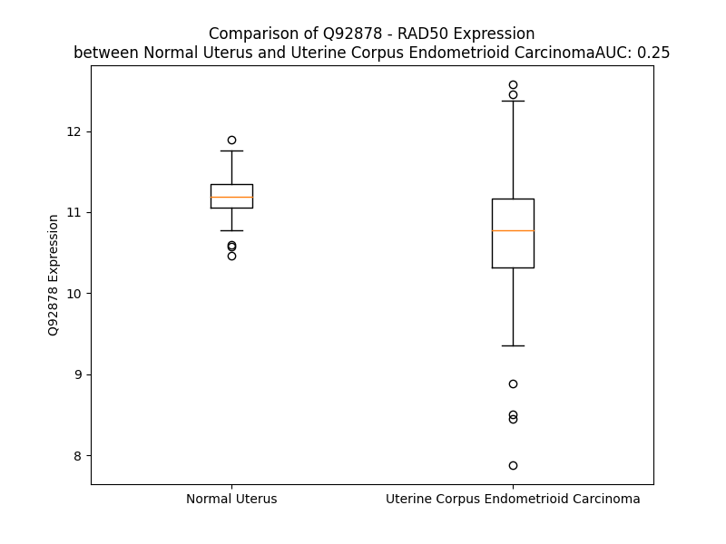

# Detailed Data for Q92878

## Introduction to the Detailed Summary

### How to Interpret the Results

- **Summary & Metrics**: This section provides a quick reference to essential protein attributes, including expression changes, family classification, and biomarker applications. Regulation status (upregulated/downregulated) indicates the protein's behavior in a disease context. Some information comes from the original excel file with the proteins selected from literature, while others are derived from the analyses.
- **Expression Comparison**: A visual representation comparing protein expression between normal and disease states. It highlights significant changes in expression levels that might indicate diagnostic or therapeutic relevance. This is data coming from transcriptomics experiments and could not translate similarly to protein levels.
- **Isoform Alignment**: An interactive view of isoform alignments, revealing structural and functional differences between variants of the protein.
- **Interactors & Homologs**: Tables listing known interaction partners and homologous proteins, the more interactors and homologs, the more complex the protein is to design an antibody for.
- **Biological Assemblies**: Information about the structural arrangement of the protein in different assemblies, providing insights into its functional state but also the complexity of the protein to develop antibodies.
- **Combined Per-Residue Information**: A detailed table summarizing residue-level data. This includes predictions for epitope regions, aggregation tendencies, and modifications that might impact the protein's function. Each row corresponds to a residue in the protein, providing insights into specific sites that may be important for research or drug development.
## Summary & Metrics

- **UniProt Accession**: Q92878
- **Gene Name**: RAD50
- **Protein Name**: DNA repair protein RAD50
- **Swiss Prot**: RAD50_HUMAN
- **Family**: nan
- **Biomarker Application**: nan
- **Number of Isoforms**: 3
- **Regulation**: 2
- **(transcriptomics) AUC**: 0.25
- **(transcriptomics) Fold Change**: 1.04
- **(transcriptomics) Regulation**: Downregulated
- **Discotope Epitope Count**: 267
- **Max n_uniprots (Homo)**: 2
- **Max n_uniprots (Hetero)**: N/A

## Expression Comparison

## Isoform Alignment

<pre style='font-size:14px; font-family:monospace;'>Q92878-1 ------MSRIEKMSILGVRSFGIEDKDKQIITFFSPLTILVGPNGAGKTTIIECLKYICTGDFPPGTKGNTFVHDPKVAQETDVRAQIRLQFRDVNGELIAVQRSMVCTQKSKKTEFKTLEGVITRTKHGEKVSLSSKCAEIDREMISSLGVSKAVLNNVIFCHQEDSNWPLSEGKALKQKFDEIFSATRYIKALETLRQVRQTQGQKVKEYQMELKYLKQYKEKACEIRDQITSKEAQLTSSKEIVKSYENELDPLKNRLKEIEHNLSKIMKLDNEIKALDSRKKQMEKDNSELEEKMEKVFQGTDEQLNDLYHNHQRTVREKERKLVDCHRELEKLNKESRLLNQEKSELLVEQGRLQLQADRHQEHIRARDSLIQSLATQLELDGFERGPFSERQIKNFHKLVRERQEGEAKTANQLMNDFAEKETLKQKQIDEIRDKKTGLGRIIELKSEILSKKQNELKNVKYELQQLEGSSDRILELDQELIKAERELSKAEKNSNVETLKMEVISLQNEKADLDRTLRKLDQEMEQLNHHTTTRTQMEMLTKDKADKDEQIRKIKSRHSDELTSLLGYFPNKKQLEDWLHSKSKEINQTRDRLAKLNKELASSEQNKNHINNELKRKEEQLSSYEDKLFDVCGSQDFESDLDRLKEEIEKSSKQRAMLAGATAVYSQFITQLTDENQSCCPVCQRVFQTEAELQEVISDLQSKLRLAPDKLKSTESELKKKEKRRDEMLGLVPMRQSIIDLKEKEIPELRNKLQNVNRDIQRLKNDIEEQETLLGTIMPEEESAKVCLTDVTIMERFQMELKDVERKIAQQAAKLQGIDLDRTVQQVNQEKQEKQHKLDTVSSKIELNRKLIQDQQEQIQHLKSTTNELKSEKLQISTNLQRRQQLEEQTVELSTEVQSLYREIKDAKEQVSPLETTLEKFQQEKEELINKKNTSNKIAQDKLNDIKEKVKNIHGYMKDIENYIQDGKDDYKKQKETELNKVIAQLSECEKHKEKINEDMRLMRQDIDTQKIQERWLQDNLTLRKRNEELKEVEEERKQHLKEMGQMQVLQMKSEHQKLEENIDNIKRNHNLALGRQKGYEEEIIHFKKELREPQFRDAEEKYREMMIVMRTTELVNKDLDIYYKTLDQAIMKFHSMKMEEINKIIRDLWRSTYRGQDIEYIEIRSDADENVSASDKRRNYNYRVVMLKGDTALDMRGRCSAGQKVLASLIIRLALAETFCLNCGIIALDEPTTNLDRENIESLAHALVEIIKSRSQQRNFQLLVITHDEDFVELLGRSEYVEKFYRIKKNIDQCSEIVKCSVSSLGFNVH
Q92878-2 MLIFSVRDMFAKMSILGVRSFGIEDKDKQIITFFSPLTILVGPNGAGKTTIIECLKYICTGDFPPGTKGNTFVHDPKVAQETDVRAQIRLQFRDVNGELIAVQRSMVCTQKSKKTEFKTLEGVITRTKHGEKVSLSSKCAEIDREMISSLGVSKAVLNNVIFCHQEDSNWPLSEGKALKQKFDEIFSATRYIKALETLRQVRQTQGQKVKEYQMELKYLKQYKEKACEIRDQITSKEAQLTSSKEIVKSYENELDPLKNRLKEIEHNLSKIMKLDNEIKALDSRKKQMEKDNSELEEKMEKVFQGTDEQLNDLYHNHQRTVREKERKLVDCHRELEKLNKESRLLNQEKSELLVEQGRLQLQADRHQEHIRARDSLIQSLATQLELDGFERGPFSERQIKNFHKLVRERQEGEAKTANQLMNDFAEKETLKQKQIDEIRDKKTGLGRIIELKSEILSKKQNELKNVKYELQQLEGSSDRILELDQELIKAERELSKAEKNSNVETLKMEVISLQNEKADLDRTLRKLDQEMEQLNHHTTTRTQMEMLTKDKADKDEQIRKIKSRHSDELTSLLGYFPNKKQLEDWLHSKSKEINQTRDRLAKLNKELASSEQNKNHINNELKRKEEQLSSYEDKLFDVCGSQDFESDLDRLKEEIEKSSKQRAMLAGATAVYSQFITQLTDENQSCCPVCQRVFQTEAELQEVISDLQSKLRLAPDKLKSTESELKKKEKRRDEMLGLVPMRQSIIDLKEKEIPELRNKLQNVNRDIQRLKNDIEEQETLLGTIMPEEESAKVCLTDVTIMERFQMELKDVERKIAQQAAKLQGIDLDRTVQQVNQEKQEKQHKLDTVSSKIELNRKLIQDQQEQIQHLKSTTNELKSEKLQISTNLQRRQQLEEQTVELSTEVQSLYREIKDAKEQVSPLETTLEKFQQEKEELINKKNTSNKIAQDKLNDIKEKVKNIHGYMKDIENYIQDGKDDYKKQKETELNKVIAQLSECEKHKEKINEDMRLMRQDIDTQKIQERWLQDNLTLRKRNEELKEVEEERKQHLKEMGQMQVLQMKSEHQKLEENIDNIKRNHNLALGRQKGYEEEIIHFKKELREPQFRDAEEKYREMMIVMRTTELVNKDLDIYYKTLDQAIMKFHSMKMEEINKIIRDLWRSTYRGQDIEYIEIRSDADENVSASDKRRNYNYRVVMLKGDTALDMRGRCSAGQKVLASLIIRLALAETFCLNCGIIALDEPTTNLDRENIESLAHALVEIIKSRSQQRNFQLLVITHDEDFVELLGRSEYVEKFYRIKKNIDQCSEIVKCSVSSLGFNVH
Q92878-3 -------------------------------------------------------------------------------------------------------------------------------------------------MISSLGVSKAVLNNVIFCHQEDSNWPLSEGKALKQKFDEIFSATRYIKALETLRQVRQTQGQKVKEYQMELKYLKQYKEKACEIRDQITSKEAQLTSSKEIVKSYENELDPLKNRLKEIEHNLSKIMKLDNEIKALDSRKKQMEKDNSELEEKMEKVFQGTDEQLNDLYHNHQRTVREKERKLVDCHRELEKLNKESRLLNQEKSELLVEQGRLQLQADRHQEHIRARDSLIQSLATQLELDGFERGPFSERQIKNFHKLVRERQEGEAKTANQLMNDFAEKETLKQKQIDEIRDKKTGLGRIIELKSEILSKKQNELKNVKYELQQLEGSSDRILELDQELIKAERELSKAEKNSNVETLKMEVISLQNEKADLDRTLRKLDQEMEQLNHHTTTRTQMEMLTKDKADKDEQIRKIKSRHSDELTSLLGYFPNKKQLEDWLHSKSKEINQTRDRLAKLNKELASSEQNKNHINNELKRKEEQLSSYEDKLFDVCGSQDFESDLDRLKEEIEKSSKQRAMLAGATAVYSQFITQLTDENQSCCPVCQRVFQTEAELQEVISDLQSKLRLAPDKLKSTESELKKKEKRRDEMLGLVPMRQSIIDLKEKEIPELRNKLQNVNRDIQRLKNDIEEQETLLGTIMPEEESAKVCLTDVTIMERFQMELKDVERKIAQQAAKLQGIDLDRTVQQVNQEKQEKQHKLDTVSSKIELNRKLIQDQQEQIQHLKSTTNELKSEKLQISTNLQRRQQLEEQTVELSTEVQSLYREIKDAKEQVSPLETTLEKFQQEKEELINKKNTSNKIAQDKLNDIKEKVKNIHGYMKDIENYIQDGKDDYKKQKETELNKVIAQLSECEKHKEKINEDMRLMRQDIDTQKIQERWLQDNLTLRKRNEELKEVEEERKQHLKEMGQMQVLQMKSEHQKLEENIDNIKRNHNLALGRQKGYEEEIIHFKKELREPQFRDAEEKYREMMIVMRTTELVNKDLDIYYKTLDQAIMKFHSMKMEEINKIIRDLWRSTYRGQDIEYIEIRSDADENVSASDKRRNYNYRVVMLKGDTALDMRGRCSAGQKVLASLIIRLALAETFCLNCGIIALDEPTTNLDRENIESLAHALVEIIKSRSQQRNFQLLVITHDEDFVELLGRSEYVEKFYRIKKNIDQCSEIVKCSVSSLGFNVH
</pre>

## Interactors

| preferredName_A   | preferredName_B   |   score |
|:------------------|:------------------|--------:|
| RAD50             | BRCA1             |   0.999 |
| RAD50             | MRE11             |   0.999 |
| RAD50             | NBN               |   0.999 |
| RAD50             | RBBP8             |   0.999 |
| RAD50             | BARD1             |   0.997 |
| RAD50             | ATM               |   0.99  |
| RAD50             | MDC1              |   0.947 |
| RAD50             | H2AX              |   0.934 |
| RAD50             | ENSP00000491596   |   0.933 |
| RAD50             | TERF2             |   0.926 |
| RAD50             | BLM               |   0.92  |
| RAD50             | XRCC6             |   0.909 |
| RAD50             | ATR               |   0.905 |

## Homologs

| uniprot_id   | gene_id   |
|--------------|-----------|

## Biological Assemblies

|   Unnamed: 0 |   assembly |   n_uniprots | composition   | crystal_id   |
|-------------:|-----------:|-------------:|:--------------|:-------------|
|            0 |          1 |            2 | Homo          | 5gox         |

## Combined Per-Residue Information

|   res | aa   |   epitope_score | epitope   |   relative_surface_accessibility |   modeling_confidence |   Aggregation | modification          |
|------:|:-----|----------------:|:----------|---------------------------------:|----------------------:|--------------:|:----------------------|
|     1 | M    |         0.05013 | False     |                          0.65731 |                 73.83 |         0     | N/A                   |
|     2 | S    |         0.00255 | False     |                          0       |                 86.96 |         0     | N/A                   |
|     3 | R    |         0.04861 | False     |                          0.32055 |                 89.13 |         0     | N/A                   |
|     4 | I    |         0.0072  | False     |                          0.0073  |                 93.04 |         0     | N/A                   |
|     5 | E    |         0.03787 | False     |                          0.14101 |                 92.56 |         0     | N/A                   |
|     6 | K    |         0.0438  | False     |                          0.40702 |                 94.98 |         0     | N/A                   |
|     7 | M    |         0.00572 | False     |                          0.00258 |                 96.72 |         0.59  | N/A                   |
|     8 | S    |         0.05782 | False     |                          0.12182 |                 96.86 |         0.59  | N/A                   |
|     9 | I    |         0.00564 | False     |                          0.00467 |                 97.2  |         0.59  | N/A                   |
|    10 | L    |         0.04185 | False     |                          0.12189 |                 96.51 |         0.59  | N/A                   |
|    11 | G    |         0.00142 | False     |                          0       |                 94.42 |         0.59  | N/A                   |
|    12 | V    |         0.00228 | False     |                          0       |                 94.67 |         0.59  | N/A                   |
|    13 | R    |         0.11312 | True      |                          0.31913 |                 92.91 |         0     | N/A                   |
|    14 | S    |         0.09499 | True      |                          0.29181 |                 93.09 |         0     | N/A                   |
|    15 | F    |         0.0063  | False     |                          0.00387 |                 95.05 |         0     | N/A                   |
|    16 | G    |         0.02294 | False     |                          0.01265 |                 92.12 |         0     | N/A                   |
|    17 | I    |         0.12246 | True      |                          0.30624 |                 93.14 |         0     | N/A                   |
|    18 | E    |         0.10666 | True      |                          0.45674 |                 90.49 |         0     | N/A                   |
|    19 | D    |         0.07219 | False     |                          0.66339 |                 88.51 |         0     | N/A                   |
|    20 | K    |         0.13062 | True      |                          0.6826  |                 89.06 |         0     | N/A                   |
|    21 | D    |         0.04777 | False     |                          0.07866 |                 88.8  |         0     | N/A                   |
|    22 | K    |         0.07223 | False     |                          0.30839 |                 93.6  |         0     | N/A                   |
|    23 | Q    |         0.02912 | False     |                          0.12657 |                 95.9  |        18.257 | N/A                   |
|    24 | I    |         0.05298 | False     |                          0.49754 |                 95.24 |        76.01  | N/A                   |
|    25 | I    |         0.00874 | False     |                          0.0032  |                 94.97 |        76.01  | N/A                   |
|    26 | T    |         0.04512 | False     |                          0.41621 |                 94.85 |        76.01  | N/A                   |
|    27 | F    |         0.0141  | False     |                          0.06037 |                 92.66 |        76.01  | N/A                   |
|    28 | F    |         0.04039 | False     |                          0.20469 |                 88.98 |        74.627 | N/A                   |
|    29 | S    |         0.14902 | True      |                          0.46062 |                 84.56 |         0.069 | N/A                   |
|    30 | P    |         0.0374  | False     |                          0.17396 |                 85.99 |         0.371 | N/A                   |
|    31 | L    |         0.03276 | False     |                          0.02508 |                 88.53 |        58.827 | N/A                   |
|    32 | T    |         0.00356 | False     |                          0       |                 91.46 |        58.827 | N/A                   |
|    33 | I    |         0.00192 | False     |                          0.00149 |                 92.02 |        58.827 | N/A                   |
|    34 | L    |         0.00312 | False     |                          0       |                 92.88 |        58.827 | N/A                   |
|    35 | V    |         0.00582 | False     |                          0.00286 |                 92.01 |        58.801 | N/A                   |
|    36 | G    |         0.02235 | False     |                          0.0482  |                 89.36 |         0     | N/A                   |
|    37 | P    |         0.14515 | True      |                          0.63831 |                 88.92 |         0     | N/A                   |
|    38 | N    |         0.10768 | True      |                          0.73636 |                 87.14 |         0     | N/A                   |
|    39 | G    |         0.09131 | True      |                          0.80635 |                 85.9  |         0     | N/A                   |
|    40 | A    |         0.01956 | False     |                          0.02826 |                 91.14 |         0     | N/A                   |
|    41 | G    |         0.0267  | False     |                          0.13961 |                 90.07 |         0     | N/A                   |
|    42 | K    |         0.03163 | False     |                          0.04858 |                 91.38 |         0     | N/A                   |
|    43 | T    |         0.038   | False     |                          0.20851 |                 90.88 |         0     | N/A                   |
|    44 | T    |         0.02081 | False     |                          0.06195 |                 92.63 |         0.34  | N/A                   |
|    45 | I    |         0.00272 | False     |                          0       |                 93.88 |         1.212 | N/A                   |
|    46 | I    |         0.0174  | False     |                          0.0256  |                 91.76 |         1.212 | N/A                   |
|    47 | E    |         0.01662 | False     |                          0.01555 |                 92.53 |         1.212 | N/A                   |
|    48 | C    |         0.00129 | False     |                          0       |                 94.63 |         1.212 | N/A                   |
|    49 | L    |         0.0009  | False     |                          0       |                 93.85 |         1.212 | N/A                   |
|    50 | K    |         0.01468 | False     |                          0.0976  |                 93.03 |         1.212 | N/A                   |
|    51 | Y    |         0.00685 | False     |                          0.02016 |                 93.61 |         1.212 | N/A                   |
|    52 | I    |         0.00326 | False     |                          0       |                 93.79 |         1.212 | N/A                   |
|    53 | C    |         0.00108 | False     |                          0.00094 |                 91.69 |         0.297 | N/A                   |
|    54 | T    |         0.00698 | False     |                          0.0019  |                 90.44 |         0.146 | N/A                   |
|    55 | G    |         0.01539 | False     |                          0.24179 |                 90.41 |         0     | N/A                   |
|    56 | D    |         0.03335 | False     |                          0.27263 |                 90.86 |         0     | N/A                   |
|    57 | F    |         0.07213 | False     |                          0.26941 |                 90.22 |         0     | N/A                   |
|    58 | P    |         0.03955 | False     |                          0.03505 |                 84.15 |         0     | N/A                   |
|    59 | P    |         0.09441 | True      |                          0.3196  |                 82.13 |         0     | N/A                   |
|    60 | G    |         0.19505 | True      |                          1.1099  |                 75.84 |         0     | N/A                   |
|    61 | T    |         0.13041 | True      |                          0.25558 |                 78.75 |         0     | N/A                   |
|    62 | K    |         0.16031 | True      |                          0.74659 |                 79.32 |         0     | N/A                   |
|    63 | G    |         0.01478 | False     |                          0.05254 |                 82.93 |         0     | N/A                   |
|    64 | N    |         0.04811 | False     |                          0.25973 |                 86.02 |         0     | N/A                   |
|    65 | T    |         0.18241 | True      |                          0.51391 |                 88.83 |         0     | N/A                   |
|    66 | F    |         0.00802 | False     |                          0       |                 93.04 |         0     | N/A                   |
|    67 | V    |         0.01673 | False     |                          0.02182 |                 93.33 |         0     | N/A                   |
|    68 | H    |         0.02637 | False     |                          0.07585 |                 92.8  |         0     | N/A                   |
|    69 | D    |         0.0861  | False     |                          0.34594 |                 90.61 |         0     | N/A                   |
|    70 | P    |         0.01044 | False     |                          0.00734 |                 91.03 |         0     | N/A                   |
|    71 | K    |         0.22622 | True      |                          0.69864 |                 88.64 |         0     | N/A                   |
|    72 | V    |         0.14091 | True      |                          0.7656  |                 87.3  |         0     | N/A                   |
|    73 | A    |         0.07917 | False     |                          0.23722 |                 87.4  |         0     | N/A                   |
|    74 | Q    |         0.24657 | True      |                          0.85757 |                 87.65 |         0     | N/A                   |
|    75 | E    |         0.17881 | True      |                          0.46475 |                 89.86 |         0     | N/A                   |
|    76 | T    |         0.19392 | True      |                          0.62372 |                 90.56 |         0     | N/A                   |
|    77 | D    |         0.1058  | True      |                          0.43303 |                 91.81 |         0     | N/A                   |
|    78 | V    |         0.01883 | False     |                          0.00857 |                 93.31 |         0     | N/A                   |
|    79 | R    |         0.10335 | True      |                          0.69507 |                 93.55 |         0     | N/A                   |
|    80 | A    |         0.01399 | False     |                          0.01601 |                 95.13 |         0     | N/A                   |
|    81 | Q    |         0.03504 | False     |                          0.20288 |                 95.17 |         0     | N/A                   |
|    82 | I    |         0.00275 | False     |                          0       |                 96.45 |         0     | N/A                   |
|    83 | R    |         0.06673 | False     |                          0.46224 |                 95.69 |         0     | N/A                   |
|    84 | L    |         0.00115 | False     |                          0       |                 96.26 |         0     | N/A                   |
|    85 | Q    |         0.03478 | False     |                          0.2784  |                 94.85 |         0     | N/A                   |
|    86 | F    |         0.00532 | False     |                          0       |                 93.26 |         0     | N/A                   |
|    87 | R    |         0.09533 | True      |                          0.31699 |                 90.92 |         0     | N/A                   |
|    88 | D    |         0.02079 | False     |                          0.05171 |                 90.02 |         0     | N/A                   |
|    89 | V    |         0.03345 | False     |                          0.33676 |                 87.67 |         0     | N/A                   |
|    90 | N    |         0.09331 | True      |                          0.77396 |                 86.92 |         0     | N/A                   |
|    91 | G    |         0.04914 | False     |                          0.34726 |                 85.34 |         0     | N/A                   |
|    92 | E    |         0.12883 | True      |                          0.43655 |                 87.63 |         0     | N/A                   |
|    93 | L    |         0.04223 | False     |                          0.34131 |                 89.73 |         3.863 | N/A                   |
|    94 | I    |         0.0218  | False     |                          0.0152  |                 91.65 |         3.863 | N/A                   |
|    95 | A    |         0.0303  | False     |                          0.26179 |                 93.09 |         3.863 | N/A                   |
|    96 | V    |         0.0033  | False     |                          0.0008  |                 94.23 |         3.863 | N/A                   |
|    97 | Q    |         0.04034 | False     |                          0.13449 |                 94.26 |         3.863 | N/A                   |
|    98 | R    |         0.08175 | False     |                          0.0191  |                 94.4  |         0     | N/A                   |
|    99 | S    |         0.0219  | False     |                          0.10974 |                 93.74 |         0     | N/A                   |
|   100 | M    |         0.00424 | False     |                          0.00053 |                 94.16 |         0     | N/A                   |
|   101 | V    |         0.03293 | False     |                          0.11044 |                 93.92 |         0     | N/A                   |
|   102 | C    |         0.00526 | False     |                          0       |                 93.48 |         0     | N/A                   |
|   103 | T    |         0.08284 | False     |                          0.1685  |                 92.87 |         0     | N/A                   |
|   104 | Q    |         0.15638 | True      |                          0.23387 |                 90.38 |         0     | N/A                   |
|   105 | K    |         0.14002 | True      |                          0.50948 |                 85.85 |         0     | N/A                   |
|   106 | S    |         0.13428 | True      |                          0.94245 |                 80.29 |         0     | N/A                   |
|   107 | K    |         0.27327 | True      |                          0.95026 |                 77.81 |         0     | N/A                   |
|   108 | K    |         0.24336 | True      |                          0.80351 |                 83.77 |         0     | N/A                   |
|   109 | T    |         0.1168  | True      |                          0.28809 |                 85.06 |         0     | N/A                   |
|   110 | E    |         0.082   | False     |                          0.28738 |                 89.9  |         0     | N/A                   |
|   111 | F    |         0.0726  | False     |                          0.2655  |                 92.27 |         0.211 | N/A                   |
|   112 | K    |         0.13563 | True      |                          0.50761 |                 90.72 |         0.211 | N/A                   |
|   113 | T    |         0.04738 | False     |                          0.37783 |                 89.88 |         0.211 | N/A                   |
|   114 | L    |         0.07621 | False     |                          0.42869 |                 90.29 |         0.211 | N/A                   |
|   115 | E    |         0.11738 | True      |                          0.54254 |                 84.67 |         0.211 | N/A                   |
|   116 | G    |         0.00877 | False     |                          0.00805 |                 88.72 |         0.211 | N/A                   |
|   117 | V    |         0.05237 | False     |                          0.33058 |                 91.91 |         0.211 | N/A                   |
|   118 | I    |         0.03475 | False     |                          0.05958 |                 91.11 |         0.211 | N/A                   |
|   119 | T    |         0.04216 | False     |                          0.2051  |                 91.04 |         0     | N/A                   |
|   120 | R    |         0.06199 | False     |                          0.29892 |                 86.48 |         0     | N/A                   |
|   121 | T    |         0.09056 | True      |                          0.36424 |                 81.49 |         0     | N/A                   |
|   122 | K    |         0.14444 | True      |                          0.5244  |                 71.19 |         0     | N/A                   |
|   123 | H    |         0.25421 | True      |                          1.06357 |                 72.47 |         0     | N/A                   |
|   124 | G    |         0.15175 | True      |                          0.77133 |                 74.34 |         0     | N/A                   |
|   125 | E    |         0.09748 | True      |                          0.67917 |                 77.59 |         0     | N/A                   |
|   126 | K    |         0.20251 | True      |                          0.78872 |                 81.9  |         0     | N/A                   |
|   127 | V    |         0.07569 | False     |                          0.4293  |                 84.34 |         0     | N/A                   |
|   128 | S    |         0.13348 | True      |                          0.52175 |                 84.79 |         0     | N/A                   |
|   129 | L    |         0.10582 | True      |                          0.59271 |                 82.98 |         0     | N/A                   |
|   130 | S    |         0.09967 | True      |                          0.59423 |                 81.14 |         0     | N/A                   |
|   131 | S    |         0.08665 | True      |                          0.09354 |                 78.27 |         0     | N/A                   |
|   132 | K    |         0.14022 | True      |                          0.71775 |                 78.22 |         0     | N/A                   |
|   133 | C    |         0.05458 | False     |                          0.31309 |                 73.41 |         0     | N/A                   |
|   134 | A    |         0.09298 | True      |                          0.6012  |                 71.02 |         0     | N/A                   |
|   135 | E    |         0.09351 | True      |                          0.37034 |                 84.37 |         0     | N/A                   |
|   136 | I    |         0.00594 | False     |                          0.004   |                 89.48 |         0     | N/A                   |
|   137 | D    |         0.03046 | False     |                          0.16639 |                 89.4  |         0     | N/A                   |
|   138 | R    |         0.09423 | True      |                          0.63026 |                 87.57 |         0     | N/A                   |
|   139 | E    |         0.03782 | False     |                          0.12289 |                 87.53 |         0     | N/A                   |
|   140 | M    |         0.00218 | False     |                          0       |                 90.92 |         0.191 | N/A                   |
|   141 | I    |         0.02963 | False     |                          0.32746 |                 89.22 |         0.366 | N/A                   |
|   142 | S    |         0.08383 | False     |                          0.57886 |                 88.79 |         0.366 | N/A                   |
|   143 | S    |         0.02542 | False     |                          0.0627  |                 89.72 |         0.366 | N/A                   |
|   144 | L    |         0.00366 | False     |                          0.0033  |                 90.07 |         0.366 | N/A                   |
|   145 | G    |         0.04388 | False     |                          0.30497 |                 85.87 |         0.176 | N/A                   |
|   146 | V    |         0.02037 | False     |                          0.05867 |                 87.24 |         0.176 | N/A                   |
|   147 | S    |         0.0153  | False     |                          0.25028 |                 88.69 |         0     | N/A                   |
|   148 | K    |         0.03804 | False     |                          0.32941 |                 89    |         0     | N/A                   |
|   149 | A    |         0.00721 | False     |                          0.11665 |                 89.4  |         4.909 | N/A                   |
|   150 | V    |         0.00631 | False     |                          0.01333 |                 89.87 |        10.717 | N/A                   |
|   151 | L    |         0.00217 | False     |                          0.00412 |                 91.22 |        11.571 | N/A                   |
|   152 | N    |         0.0279  | False     |                          0.15296 |                 90.21 |        11.701 | N/A                   |
|   153 | N    |         0.0167  | False     |                          0.06769 |                 89.44 |        12.399 | N/A                   |
|   154 | V    |         0.003   | False     |                          0       |                 90.83 |        13.863 | N/A                   |
|   155 | I    |         0.00312 | False     |                          0.0016  |                 91.71 |        13.863 | N/A                   |
|   156 | F    |         0.00254 | False     |                          0.00534 |                 92.53 |        13.292 | N/A                   |
|   157 | C    |         0.0097  | False     |                          0.01227 |                 90.72 |         5.457 | N/A                   |
|   158 | H    |         0.03947 | False     |                          0.12239 |                 87.72 |         3.431 | N/A                   |
|   159 | Q    |         0.16825 | True      |                          0.34825 |                 83.46 |         0     | N/A                   |
|   160 | E    |         0.17225 | True      |                          0.64447 |                 83.25 |         0     | N/A                   |
|   161 | D    |         0.14555 | True      |                          0.30756 |                 86.07 |         0     | N/A                   |
|   162 | S    |         0.02752 | False     |                          0.17305 |                 86.19 |         0     | N/A                   |
|   163 | N    |         0.06089 | False     |                          0.23768 |                 87.87 |         0     | N/A                   |
|   164 | W    |         0.01909 | False     |                          0.03132 |                 91.05 |         0     | N/A                   |
|   165 | P    |         0.00358 | False     |                          0.00147 |                 90.98 |         0     | N/A                   |
|   166 | L    |         0.02099 | False     |                          0.08756 |                 89.48 |         0     | N/A                   |
|   167 | S    |         0.05443 | False     |                          0.258   |                 88.04 |         0     | N/A                   |
|   168 | E    |         0.16879 | True      |                          0.53492 |                 84.14 |         0     | N/A                   |
|   169 | G    |         0.14665 | True      |                          0.45416 |                 78.23 |         0     | N/A                   |
|   170 | K    |         0.10134 | True      |                          0.89914 |                 77.5  |         0     | N/A                   |
|   171 | A    |         0.06978 | False     |                          0.44361 |                 81.95 |         0     | N/A                   |
|   172 | L    |         0.01006 | False     |                          0.0272  |                 85.86 |         0     | N/A                   |
|   173 | K    |         0.01778 | False     |                          0.14718 |                 81.44 |         0     | N/A                   |
|   174 | Q    |         0.06717 | False     |                          0.54565 |                 80.47 |         0     | N/A                   |
|   175 | K    |         0.02803 | False     |                          0.16619 |                 86.24 |         0     | N/A                   |
|   176 | F    |         0.00212 | False     |                          0       |                 85.32 |         0     | N/A                   |
|   177 | D    |         0.03111 | False     |                          0.09687 |                 79.27 |         0     | N/A                   |
|   178 | E    |         0.00966 | False     |                          0.32784 |                 82.07 |         0     | N/A                   |
|   179 | I    |         0.00538 | False     |                          0.00828 |                 85.88 |         0.552 | N/A                   |
|   180 | F    |         0.01736 | False     |                          0.03558 |                 80.1  |         0.552 | N/A                   |
|   181 | S    |         0.02882 | False     |                          0.39825 |                 71.62 |         0.552 | N/A                   |
|   182 | A    |         0.04872 | False     |                          0.04336 |                 67.37 |         0.552 | N/A                   |
|   183 | T    |         0.08108 | False     |                          0.39203 |                 67.94 |         0.552 | N/A                   |
|   184 | R    |         0.10367 | True      |                          0.77509 |                 75.4  |         0     | N/A                   |
|   185 | Y    |         0.10414 | True      |                          0.52661 |                 80.78 |         0     | N/A                   |
|   186 | I    |         0.0374  | False     |                          0.16851 |                 76.72 |         0     | N/A                   |
|   187 | K    |         0.08478 | False     |                          0.69468 |                 78.87 |         0     | N/A                   |
|   188 | A    |         0.05375 | False     |                          0.38131 |                 84.78 |         0     | N/A                   |
|   189 | L    |         0.02703 | False     |                          0.09563 |                 84    |         0     | N/A                   |
|   190 | E    |         0.08325 | False     |                          0.32185 |                 82.62 |         0     | N/A                   |
|   191 | T    |         0.05473 | False     |                          0.57624 |                 85.91 |         0     | N/A                   |
|   192 | L    |         0.03557 | False     |                          0.22726 |                 88.11 |         0     | N/A                   |
|   193 | R    |         0.04502 | False     |                          0.19081 |                 84.24 |         0     | N/A                   |
|   194 | Q    |         0.05194 | False     |                          0.48637 |                 87.21 |         0     | N/A                   |
|   195 | V    |         0.03592 | False     |                          0.42653 |                 89.29 |         0     | N/A                   |
|   196 | R    |         0.05133 | False     |                          0.14726 |                 88.84 |         0     | N/A                   |
|   197 | Q    |         0.07382 | False     |                          0.49737 |                 86.17 |         0     | N/A                   |
|   198 | T    |         0.09139 | True      |                          0.55948 |                 88.09 |         0     | N/A                   |
|   199 | Q    |         0.02203 | False     |                          0.22482 |                 89.11 |         0     | N/A                   |
|   200 | G    |         0.02497 | False     |                          0.22021 |                 89.14 |         0     | N/A                   |
|   201 | Q    |         0.09118 | True      |                          0.42751 |                 88.71 |         0     | N/A                   |
|   202 | K    |         0.07051 | False     |                          0.41506 |                 89.38 |         0     | N/A                   |
|   203 | V    |         0.02507 | False     |                          0.08664 |                 89.89 |         0     | N/A                   |
|   204 | K    |         0.07311 | False     |                          0.5817  |                 87.77 |         0     | N/A                   |
|   205 | E    |         0.08369 | False     |                          0.37904 |                 89.11 |         0     | N/A                   |
|   206 | Y    |         0.04597 | False     |                          0.20449 |                 91.42 |         0     | N/A                   |
|   207 | Q    |         0.04897 | False     |                          0.40129 |                 88.69 |         0     | N/A                   |
|   208 | M    |         0.12964 | True      |                          0.57004 |                 86.68 |         0     | N/A                   |
|   209 | E    |         0.04891 | False     |                          0.40712 |                 88.29 |         0     | N/A                   |
|   210 | L    |         0.07514 | False     |                          0.17229 |                 88.69 |         0     | N/A                   |
|   211 | K    |         0.08301 | False     |                          0.69054 |                 87.23 |         0     | N/A                   |
|   212 | Y    |         0.12122 | True      |                          0.6148  |                 85.77 |         0     | N/A                   |
|   213 | L    |         0.04117 | False     |                          0.122   |                 88.16 |         0     | N/A                   |
|   214 | K    |         0.06889 | False     |                          0.45177 |                 88.42 |         0     | N/A                   |
|   215 | Q    |         0.0976  | True      |                          0.57526 |                 87.75 |         0     | N/A                   |
|   216 | Y    |         0.07946 | False     |                          0.3552  |                 88.83 |         0     | N/A                   |
|   217 | K    |         0.04105 | False     |                          0.36698 |                 89.09 |         0     | N/A                   |
|   218 | E    |         0.06097 | False     |                          0.42362 |                 88.13 |         0     | N/A                   |
|   219 | K    |         0.0424  | False     |                          0.40138 |                 86.85 |         0     | N/A                   |
|   220 | A    |         0.00807 | False     |                          0.00893 |                 88.32 |         0     | N/A                   |
|   221 | C    |         0.05557 | False     |                          0.44669 |                 87.08 |         0     | N/A                   |
|   222 | E    |         0.08772 | True      |                          0.51261 |                 88.04 |         0     | N/A                   |
|   223 | I    |         0.00934 | False     |                          0.0224  |                 87.4  |         0     | N/A                   |
|   224 | R    |         0.06575 | False     |                          0.36067 |                 87.48 |         0     | N/A                   |
|   225 | D    |         0.07125 | False     |                          0.5511  |                 86.97 |         0     | N/A                   |
|   226 | Q    |         0.02062 | False     |                          0.38782 |                 88.01 |         0     | N/A                   |
|   227 | I    |         0.05747 | False     |                          0.0936  |                 87.44 |         0     | N/A                   |
|   228 | T    |         0.05497 | False     |                          0.65502 |                 86.73 |         0     | N/A                   |
|   229 | S    |         0.06103 | False     |                          0.45256 |                 88.06 |         0     | N/A                   |
|   230 | K    |         0.02044 | False     |                          0.0923  |                 87.18 |         0     | N/A                   |
|   231 | E    |         0.08517 | False     |                          0.36931 |                 85.55 |         0     | N/A                   |
|   232 | A    |         0.05162 | False     |                          0.65487 |                 84.37 |         0     | N/A                   |
|   233 | Q    |         0.02537 | False     |                          0.25527 |                 86.86 |         0     | N/A                   |
|   234 | L    |         0.05009 | False     |                          0.15168 |                 86.59 |         0     | N/A                   |
|   235 | T    |         0.06734 | False     |                          0.64603 |                 83.56 |         0     | N/A                   |
|   236 | S    |         0.05627 | False     |                          0.51318 |                 84.91 |         0     | N/A                   |
|   237 | S    |         0.00645 | False     |                          0.03947 |                 84.26 |         0     | N/A                   |
|   238 | K    |         0.06001 | False     |                          0.44454 |                 81.83 |         0     | N/A                   |
|   239 | E    |         0.06344 | False     |                          0.68679 |                 81.2  |         0     | N/A                   |
|   240 | I    |         0.01658 | False     |                          0.42958 |                 82.48 |         0     | N/A                   |
|   241 | V    |         0.02072 | False     |                          0.11425 |                 82.1  |         0     | N/A                   |
|   242 | K    |         0.07403 | False     |                          0.74161 |                 80.51 |         0     | N/A                   |
|   243 | S    |         0.03781 | False     |                          0.50048 |                 82.44 |         0     | N/A                   |
|   244 | Y    |         0.02189 | False     |                          0.28583 |                 82.53 |         0     | N/A                   |
|   245 | E    |         0.03895 | False     |                          0.29551 |                 77.5  |         0     | N/A                   |
|   246 | N    |         0.10959 | True      |                          0.77533 |                 78.24 |         0     | N/A                   |
|   247 | E    |         0.03364 | False     |                          0.45846 |                 79.27 |         0     | N/A                   |
|   248 | L    |         0.01164 | False     |                          0.00071 |                 76.51 |         0     | N/A                   |
|   249 | D    |         0.07308 | False     |                          0.48079 |                 75.69 |         0     | N/A                   |
|   250 | P    |         0.08705 | True      |                          0.80686 |                 77.45 |         0     | N/A                   |
|   251 | L    |         0.03024 | False     |                          0.33135 |                 75.54 |         0     | N/A                   |
|   252 | K    |         0.04014 | False     |                          0.18834 |                 75.47 |         0     | N/A                   |
|   253 | N    |         0.11098 | True      |                          0.76512 |                 74.37 |         0     | N/A                   |
|   254 | R    |         0.08081 | False     |                          0.46098 |                 74.62 |         0     | N/A                   |
|   255 | L    |         0.04711 | False     |                          0.17806 |                 76.71 |         0     | N/A                   |
|   256 | K    |         0.07502 | False     |                          0.57001 |                 76.2  |         0     | N/A                   |
|   257 | E    |         0.11749 | True      |                          0.5929  |                 72.29 |         0     | N/A                   |
|   258 | I    |         0.03296 | False     |                          0.1072  |                 72.43 |         0     | N/A                   |
|   259 | E    |         0.04687 | False     |                          0.4408  |                 73.89 |         0     | N/A                   |
|   260 | H    |         0.11454 | True      |                          0.75331 |                 74.56 |         0     | N/A                   |
|   261 | N    |         0.059   | False     |                          0.47086 |                 68.76 |         0     | N/A                   |
|   262 | L    |         0.07591 | False     |                          0.36665 |                 72.18 |         0     | N/A                   |
|   263 | S    |         0.05343 | False     |                          0.53705 |                 73.4  |         0     | N/A                   |
|   264 | K    |         0.09875 | True      |                          0.74232 |                 68.64 |         0     | N/A                   |
|   265 | I    |         0.09507 | True      |                          0.41511 |                 69.1  |         0     | N/A                   |
|   266 | M    |         0.08887 | True      |                          0.81738 |                 70.37 |         0     | N/A                   |
|   267 | K    |         0.0896  | True      |                          0.68048 |                 74.24 |         0     | N/A                   |
|   268 | L    |         0.05465 | False     |                          0.44286 |                 66.35 |         0     | N/A                   |
|   269 | D    |         0.07122 | False     |                          0.38984 |                 71.11 |         0     | N/A                   |
|   270 | N    |         0.05188 | False     |                          0.59629 |                 72.52 |         0     | N/A                   |
|   271 | E    |         0.04631 | False     |                          0.46723 |                 73.01 |         0     | N/A                   |
|   272 | I    |         0.0624  | False     |                          0.30326 |                 69.92 |         0     | N/A                   |
|   273 | K    |         0.04559 | False     |                          0.60833 |                 74.13 |         0     | N/A                   |
|   274 | A    |         0.04303 | False     |                          0.58161 |                 74.08 |         0     | N/A                   |
|   275 | L    |         0.03154 | False     |                          0.22854 |                 72.41 |         0     | N/A                   |
|   276 | D    |         0.08509 | False     |                          0.40225 |                 71.75 |         0     | N/A                   |
|   277 | S    |         0.04414 | False     |                          0.56687 |                 71.49 |         0     | N/A                   |
|   278 | R    |         0.04874 | False     |                          0.57698 |                 76.07 |         0     | N/A                   |
|   279 | K    |         0.06627 | False     |                          0.36083 |                 72.37 |         0     | N/A                   |
|   280 | K    |         0.09181 | True      |                          0.74681 |                 72.74 |         0     | N/A                   |
|   281 | Q    |         0.07003 | False     |                          0.49123 |                 73.55 |         0     | N/A                   |
|   282 | M    |         0.03202 | False     |                          0.25017 |                 73.35 |         0     | N/A                   |
|   283 | E    |         0.05465 | False     |                          0.41413 |                 71.14 |         0     | N/A                   |
|   284 | K    |         0.07718 | False     |                          0.56736 |                 73.82 |         0     | N/A                   |
|   285 | D    |         0.03526 | False     |                          0.29713 |                 70.31 |         0     | N/A                   |
|   286 | N    |         0.03185 | False     |                          0.14185 |                 69.55 |         0     | N/A                   |
|   287 | S    |         0.05368 | False     |                          0.50439 |                 67.22 |         0     | N/A                   |
|   288 | E    |         0.11712 | True      |                          0.40886 |                 69.37 |         0     | N/A                   |
|   289 | L    |         0.04137 | False     |                          0.2944  |                 62.5  |         0     | N/A                   |
|   290 | E    |         0.07904 | False     |                          0.52534 |                 60.71 |         0     | N/A                   |
|   291 | E    |         0.15961 | True      |                          0.79261 |                 65.58 |         0     | N/A                   |
|   292 | K    |         0.09824 | True      |                          0.78356 |                 63.04 |         0     | N/A                   |
|   293 | M    |         0.03705 | False     |                          0.2001  |                 56.98 |         0     | N/A                   |
|   294 | E    |         0.09298 | True      |                          0.89755 |                 60.64 |         0     | N/A                   |
|   295 | K    |         0.19077 | True      |                          0.75049 |                 57.99 |         0     | N/A                   |
|   296 | V    |         0.06703 | False     |                          0.66561 |                 60.35 |         0     | N/A                   |
|   297 | F    |         0.12001 | True      |                          0.18704 |                 63.58 |         0     | N/A                   |
|   298 | Q    |         0.13718 | True      |                          0.92689 |                 59.39 |         0     | N/A                   |
|   299 | G    |         0.11981 | True      |                          0.27905 |                 64.95 |         0     | N/A                   |
|   300 | T    |         0.10542 | True      |                          0.52776 |                 68.8  |         0     | N/A                   |
|   301 | D    |         0.06855 | False     |                          0.41018 |                 64.25 |         0     | N/A                   |
|   302 | E    |         0.12855 | True      |                          0.72151 |                 70.6  |         0     | N/A                   |
|   303 | Q    |         0.10275 | True      |                          0.51397 |                 68.4  |         0     | N/A                   |
|   304 | L    |         0.03197 | False     |                          0.05946 |                 65.64 |         0     | N/A                   |
|   305 | N    |         0.05841 | False     |                          0.44869 |                 69.81 |         0     | N/A                   |
|   306 | D    |         0.09113 | True      |                          0.60347 |                 73.15 |         0     | N/A                   |
|   307 | L    |         0.09046 | True      |                          0.61112 |                 68.41 |         0     | N/A                   |
|   308 | Y    |         0.05868 | False     |                          0.33508 |                 70.91 |         0     | N/A                   |
|   309 | H    |         0.10891 | True      |                          0.66711 |                 73.58 |         0     | N/A                   |
|   310 | N    |         0.10146 | True      |                          0.64043 |                 73.2  |         0     | N/A                   |
|   311 | H    |         0.05325 | False     |                          0.22251 |                 70.3  |         0     | N/A                   |
|   312 | Q    |         0.07303 | False     |                          0.28604 |                 69.89 |         0     | N/A                   |
|   313 | R    |         0.07223 | False     |                          0.72495 |                 76.05 |         0     | N/A                   |
|   314 | T    |         0.05708 | False     |                          0.49281 |                 72.87 |         0     | N/A                   |
|   315 | V    |         0.04052 | False     |                          0.24563 |                 72.83 |         0     | N/A                   |
|   316 | R    |         0.05161 | False     |                          0.64637 |                 75.07 |         0     | N/A                   |
|   317 | E    |         0.06766 | False     |                          0.5897  |                 77.81 |         0     | N/A                   |
|   318 | K    |         0.02715 | False     |                          0.2551  |                 72.39 |         0     | N/A                   |
|   319 | E    |         0.03718 | False     |                          0.44469 |                 74.95 |         0     | N/A                   |
|   320 | R    |         0.0544  | False     |                          0.76043 |                 81.17 |         0     | N/A                   |
|   321 | K    |         0.03747 | False     |                          0.6083  |                 78.38 |         0     | N/A                   |
|   322 | L    |         0.02642 | False     |                          0.24148 |                 79.57 |         0     | N/A                   |
|   323 | V    |         0.0466  | False     |                          0.75632 |                 80.49 |         0     | N/A                   |
|   324 | D    |         0.03693 | False     |                          0.49594 |                 81.93 |         0     | N/A                   |
|   325 | C    |         0.02864 | False     |                          0.27578 |                 80.2  |         0     | N/A                   |
|   326 | H    |         0.04656 | False     |                          0.64577 |                 79.85 |         0     | N/A                   |
|   327 | R    |         0.05365 | False     |                          0.64828 |                 84.14 |         0     | N/A                   |
|   328 | E    |         0.0187  | False     |                          0.5318  |                 82.99 |         0     | N/A                   |
|   329 | L    |         0.0168  | False     |                          0.24154 |                 84.7  |         0     | N/A                   |
|   330 | E    |         0.03892 | False     |                          0.62907 |                 83.09 |         0     | N/A                   |
|   331 | K    |         0.03853 | False     |                          0.74037 |                 85.4  |         0     | N/A                   |
|   332 | L    |         0.01895 | False     |                          0.15498 |                 84.24 |         0     | N/A                   |
|   333 | N    |         0.02652 | False     |                          0.39507 |                 82.81 |         0     | N/A                   |
|   334 | K    |         0.05321 | False     |                          0.77495 |                 84.4  |         0     | N/A                   |
|   335 | E    |         0.02478 | False     |                          0.52729 |                 84.56 |         0     | N/A                   |
|   336 | S    |         0.02138 | False     |                          0.13921 |                 83.75 |         0     | N/A                   |
|   337 | R    |         0.04581 | False     |                          0.73664 |                 84.53 |         0     | N/A                   |
|   338 | L    |         0.02856 | False     |                          0.73944 |                 86.52 |         0     | N/A                   |
|   339 | L    |         0.01885 | False     |                          0.1929  |                 86.01 |         0     | N/A                   |
|   340 | N    |         0.03325 | False     |                          0.46015 |                 82.6  |         0     | N/A                   |
|   341 | Q    |         0.03641 | False     |                          0.57892 |                 84.29 |         0     | N/A                   |
|   342 | E    |         0.0219  | False     |                          0.46446 |                 86.28 |         0     | N/A                   |
|   343 | K    |         0.0422  | False     |                          0.35026 |                 84.52 |         0     | N/A                   |
|   344 | S    |         0.0539  | False     |                          0.50863 |                 79.9  |         0     | N/A                   |
|   345 | E    |         0.04202 | False     |                          0.6503  |                 84.51 |         0     | N/A                   |
|   346 | L    |         0.0245  | False     |                          0.15401 |                 85.02 |         0     | N/A                   |
|   347 | L    |         0.0898  | True      |                          0.57715 |                 80.98 |         0     | N/A                   |
|   348 | V    |         0.05031 | False     |                          0.78132 |                 79.34 |         0     | N/A                   |
|   349 | E    |         0.01848 | False     |                          0.21784 |                 81.62 |         0     | N/A                   |
|   350 | Q    |         0.06601 | False     |                          0.31823 |                 77.5  |         0     | N/A                   |
|   351 | G    |         0.06737 | False     |                          0.57182 |                 74.22 |         0     | N/A                   |
|   352 | R    |         0.10468 | True      |                          0.58922 |                 83.42 |         0     | N/A                   |
|   353 | L    |         0.01825 | False     |                          0.10975 |                 81.42 |         0     | N/A                   |
|   354 | Q    |         0.07753 | False     |                          0.40594 |                 76.17 |         0     | N/A                   |
|   355 | L    |         0.07099 | False     |                          0.82629 |                 79.68 |         0     | N/A                   |
|   356 | Q    |         0.02323 | False     |                          0.27566 |                 82.89 |         0     | N/A                   |
|   357 | A    |         0.03931 | False     |                          0.35215 |                 78.73 |         0     | N/A                   |
|   358 | D    |         0.06037 | False     |                          0.58408 |                 80.64 |         0     | N/A                   |
|   359 | R    |         0.06008 | False     |                          0.55806 |                 82.92 |         0     | N/A                   |
|   360 | H    |         0.03694 | False     |                          0.16735 |                 83.6  |         0     | N/A                   |
|   361 | Q    |         0.04665 | False     |                          0.51487 |                 82.53 |         0     | N/A                   |
|   362 | E    |         0.06355 | False     |                          0.57405 |                 83.44 |         0     | N/A                   |
|   363 | H    |         0.01349 | False     |                          0.09158 |                 87    |         0     | N/A                   |
|   364 | I    |         0.04503 | False     |                          0.3923  |                 82.74 |         0     | N/A                   |
|   365 | R    |         0.09962 | True      |                          0.70571 |                 85.09 |         0     | N/A                   |
|   366 | A    |         0.02218 | False     |                          0.24474 |                 84.75 |         0     | N/A                   |
|   367 | R    |         0.05371 | False     |                          0.16624 |                 87.11 |         0     | N/A                   |
|   368 | D    |         0.02681 | False     |                          0.13654 |                 85.22 |         0     | N/A                   |
|   369 | S    |         0.05874 | False     |                          0.53828 |                 85.89 |         0     | N/A                   |
|   370 | L    |         0.02274 | False     |                          0.20526 |                 85.12 |         0     | N/A                   |
|   371 | I    |         0.00742 | False     |                          0.0032  |                 86.35 |         0     | N/A                   |
|   372 | Q    |         0.04264 | False     |                          0.32825 |                 86.01 |         0     | N/A                   |
|   373 | S    |         0.04994 | False     |                          0.37927 |                 85.21 |         0     | N/A                   |
|   374 | L    |         0.00402 | False     |                          0       |                 85.56 |         0     | N/A                   |
|   375 | A    |         0.00886 | False     |                          0.03867 |                 84.98 |         0     | N/A                   |
|   376 | T    |         0.11847 | True      |                          0.82349 |                 84.54 |         0     | N/A                   |
|   377 | Q    |         0.06687 | False     |                          0.39129 |                 82.5  |         0     | N/A                   |
|   378 | L    |         0.03062 | False     |                          0.04785 |                 81.86 |         0     | N/A                   |
|   379 | E    |         0.14303 | True      |                          0.70361 |                 80.97 |         0     | N/A                   |
|   380 | L    |         0.09028 | True      |                          0.18994 |                 80.66 |         0     | N/A                   |
|   381 | D    |         0.11939 | True      |                          0.83914 |                 80.22 |         0     | N/A                   |
|   382 | G    |         0.11913 | True      |                          0.66045 |                 79.45 |         0     | N/A                   |
|   383 | F    |         0.04531 | False     |                          0.04474 |                 84.67 |         0     | N/A                   |
|   384 | E    |         0.15684 | True      |                          0.75279 |                 74.72 |         0     | N/A                   |
|   385 | R    |         0.19705 | True      |                          0.8418  |                 75.8  |         0     | N/A                   |
|   386 | G    |         0.17618 | True      |                          0.37885 |                 71.38 |         0     | N/A                   |
|   387 | P    |         0.2435  | True      |                          0.903   |                 75.42 |         0     | N/A                   |
|   388 | F    |         0.05117 | False     |                          0.06833 |                 79.19 |         0     | N/A                   |
|   389 | S    |         0.0659  | False     |                          0.44852 |                 78.56 |         0     | N/A                   |
|   390 | E    |         0.10723 | True      |                          0.55649 |                 74.32 |         0     | N/A                   |
|   391 | R    |         0.14682 | True      |                          0.84579 |                 80.04 |         0     | N/A                   |
|   392 | Q    |         0.0933  | True      |                          0.34215 |                 81.25 |         0     | N/A                   |
|   393 | I    |         0.02012 | False     |                          0.07028 |                 81.25 |         0     | N/A                   |
|   394 | K    |         0.0869  | True      |                          0.64711 |                 81.44 |         0     | N/A                   |
|   395 | N    |         0.09159 | True      |                          0.50047 |                 85.12 |         0     | N/A                   |
|   396 | F    |         0.00805 | False     |                          0.00191 |                 86.23 |         0     | N/A                   |
|   397 | H    |         0.05012 | False     |                          0.29222 |                 83    |         0     | N/A                   |
|   398 | K    |         0.07705 | False     |                          0.57889 |                 84.16 |         0     | N/A                   |
|   399 | L    |         0.07349 | False     |                          0.3411  |                 86.16 |         0     | N/A                   |
|   400 | V    |         0.0138  | False     |                          0.02736 |                 86.31 |         0     | N/A                   |
|   401 | R    |         0.13509 | True      |                          0.61264 |                 83.28 |         0     | N/A                   |
|   402 | E    |         0.06138 | False     |                          0.50265 |                 82.61 |         0     | N/A                   |
|   403 | R    |         0.047   | False     |                          0.43568 |                 81.82 |         0     | N/A                   |
|   404 | Q    |         0.03798 | False     |                          0.17217 |                 80.39 |         0     | N/A                   |
|   405 | E    |         0.088   | True      |                          0.52794 |                 80.38 |         0     | N/A                   |
|   406 | G    |         0.0642  | False     |                          0.42691 |                 81.18 |         0     | N/A                   |
|   407 | E    |         0.0588  | False     |                          0.25414 |                 79.34 |         0     | N/A                   |
|   408 | A    |         0.08723 | True      |                          0.35533 |                 77.81 |         0     | N/A                   |
|   409 | K    |         0.11613 | True      |                          0.70544 |                 79.32 |         0     | N/A                   |
|   410 | T    |         0.0882  | True      |                          0.64217 |                 80.31 |         0     | N/A                   |
|   411 | A    |         0.04787 | False     |                          0.16544 |                 79.77 |         0     | N/A                   |
|   412 | N    |         0.06995 | False     |                          0.62575 |                 76.47 |         0     | N/A                   |
|   413 | Q    |         0.10654 | True      |                          0.64526 |                 78.94 |         0     | N/A                   |
|   414 | L    |         0.06364 | False     |                          0.47731 |                 79.61 |         0     | N/A                   |
|   415 | M    |         0.06964 | False     |                          0.2132  |                 75.92 |         0     | N/A                   |
|   416 | N    |         0.13202 | True      |                          0.63954 |                 76.38 |         0     | N/A                   |
|   417 | D    |         0.1381  | True      |                          0.45443 |                 79.92 |         0     | N/A                   |
|   418 | F    |         0.08165 | False     |                          0.13654 |                 82.27 |         0     | N/A                   |
|   419 | A    |         0.08372 | False     |                          0.38921 |                 76.29 |         0     | N/A                   |
|   420 | E    |         0.09048 | True      |                          0.66716 |                 78.77 |         0     | N/A                   |
|   421 | K    |         0.03241 | False     |                          0.47346 |                 82.54 |         0     | N/A                   |
|   422 | E    |         0.04705 | False     |                          0.19187 |                 78.86 |         0     | N/A                   |
|   423 | T    |         0.12074 | True      |                          0.56121 |                 78.85 |         0     | N/A                   |
|   424 | L    |         0.14779 | True      |                          0.70153 |                 81.72 |         0     | N/A                   |
|   425 | K    |         0.0509  | False     |                          0.18689 |                 82.94 |         0     | N/A                   |
|   426 | Q    |         0.0598  | False     |                          0.27659 |                 80.56 |         0     | N/A                   |
|   427 | K    |         0.06027 | False     |                          0.64653 |                 79.55 |         0     | N/A                   |
|   428 | Q    |         0.05145 | False     |                          0.32247 |                 84.75 |         0     | N/A                   |
|   429 | I    |         0.03879 | False     |                          0.0336  |                 81.83 |         0     | N/A                   |
|   430 | D    |         0.06395 | False     |                          0.30767 |                 77.06 |         0     | N/A                   |
|   431 | E    |         0.08376 | False     |                          0.5986  |                 80.53 |         0     | N/A                   |
|   432 | I    |         0.05683 | False     |                          0.11999 |                 83.85 |         0     | N/A                   |
|   433 | R    |         0.17029 | True      |                          0.42662 |                 78.33 |         0     | N/A                   |
|   434 | D    |         0.12315 | True      |                          0.63312 |                 76.68 |         0     | N/A                   |
|   435 | K    |         0.08539 | False     |                          0.54881 |                 79.43 |         0     | N/A                   |
|   436 | K    |         0.04802 | False     |                          0.28311 |                 81.58 |         0     | N/A                   |
|   437 | T    |         0.11146 | True      |                          0.36234 |                 75.06 |         0     | N/A                   |
|   438 | G    |         0.04307 | False     |                          0.13292 |                 77.89 |         0     | N/A                   |
|   439 | L    |         0.06179 | False     |                          0.15969 |                 80.92 |         0     | N/A                   |
|   440 | G    |         0.10094 | True      |                          0.29861 |                 76.42 |         0     | N/A                   |
|   441 | R    |         0.10721 | True      |                          0.4962  |                 75.77 |         0     | N/A                   |
|   442 | I    |         0.04929 | False     |                          0.27359 |                 80.64 |         0.293 | N/A                   |
|   443 | I    |         0.05181 | False     |                          0.17279 |                 83.43 |         0.293 | N/A                   |
|   444 | E    |         0.10837 | True      |                          0.60703 |                 78.3  |         0.293 | N/A                   |
|   445 | L    |         0.11139 | True      |                          0.62257 |                 79.36 |         0.293 | N/A                   |
|   446 | K    |         0.04771 | False     |                          0.2569  |                 84.4  |         0.293 | N/A                   |
|   447 | S    |         0.08201 | False     |                          0.33541 |                 83.36 |         0     | N/A                   |
|   448 | E    |         0.08374 | False     |                          0.47484 |                 79.19 |         0     | N/A                   |
|   449 | I    |         0.07554 | False     |                          0.47678 |                 82.58 |         0     | N/A                   |
|   450 | L    |         0.04704 | False     |                          0.1014  |                 86.02 |         0     | N/A                   |
|   451 | S    |         0.07951 | False     |                          0.43537 |                 82.67 |         0     | N/A                   |
|   452 | K    |         0.12121 | True      |                          0.53103 |                 82.98 |         0     | N/A                   |
|   453 | K    |         0.05462 | False     |                          0.2092  |                 83.97 |         0     | N/A                   |
|   454 | Q    |         0.09333 | True      |                          0.32648 |                 83.67 |         0     | N/A                   |
|   455 | N    |         0.1222  | True      |                          0.51319 |                 80.99 |         0     | N/A                   |
|   456 | E    |         0.0784  | False     |                          0.36991 |                 82.14 |         0     | N/A                   |
|   457 | L    |         0.03407 | False     |                          0.13849 |                 84.59 |         0     | N/A                   |
|   458 | K    |         0.10083 | True      |                          0.7182  |                 82.12 |         0     | N/A                   |
|   459 | N    |         0.10887 | True      |                          0.59526 |                 80.66 |         0     | N/A                   |
|   460 | V    |         0.04177 | False     |                          0.12255 |                 80.43 |         0     | N/A                   |
|   461 | K    |         0.08528 | False     |                          0.51552 |                 79.62 |         0     | N/A                   |
|   462 | Y    |         0.12124 | True      |                          0.62244 |                 78.27 |         0     | N/A                   |
|   463 | E    |         0.08171 | False     |                          0.31322 |                 74.42 |         0     | N/A                   |
|   464 | L    |         0.0668  | False     |                          0.17971 |                 76.5  |         0     | N/A                   |
|   465 | Q    |         0.08857 | True      |                          0.63251 |                 75.57 |         0     | N/A                   |
|   466 | Q    |         0.15183 | True      |                          0.6037  |                 70.95 |         0     | N/A                   |
|   467 | L    |         0.06737 | False     |                          0.08717 |                 67.08 |         0     | N/A                   |
|   468 | E    |         0.10877 | True      |                          0.6464  |                 61.03 |         0     | N/A                   |
|   469 | G    |         0.11382 | True      |                          0.71787 |                 64.39 |         0     | N/A                   |
|   470 | S    |         0.04202 | False     |                          0.18725 |                 63.3  |         0     | N/A                   |
|   471 | S    |         0.09892 | True      |                          0.57797 |                 62.29 |         0     | N/A                   |
|   472 | D    |         0.05997 | False     |                          0.60497 |                 70.43 |         0     | N/A                   |
|   473 | R    |         0.07395 | False     |                          0.28098 |                 72.88 |         0     | N/A                   |
|   474 | I    |         0.06197 | False     |                          0.23599 |                 72.09 |         0     | N/A                   |
|   475 | L    |         0.08857 | True      |                          0.74326 |                 75.81 |         0     | N/A                   |
|   476 | E    |         0.14545 | True      |                          0.45011 |                 79.25 |         0     | N/A                   |
|   477 | L    |         0.01841 | False     |                          0       |                 78.6  |         0     | N/A                   |
|   478 | D    |         0.11689 | True      |                          0.30408 |                 75.86 |         0     | N/A                   |
|   479 | Q    |         0.11425 | True      |                          0.64982 |                 81.46 |         0     | N/A                   |
|   480 | E    |         0.06606 | False     |                          0.33277 |                 82.26 |         0     | N/A                   |
|   481 | L    |         0.05396 | False     |                          0.12448 |                 83.76 |         0     | N/A                   |
|   482 | I    |         0.06574 | False     |                          0.52332 |                 81.29 |         0     | N/A                   |
|   483 | K    |         0.11857 | True      |                          0.62504 |                 83.21 |         0     | N/A                   |
|   484 | A    |         0.05785 | False     |                          0.08109 |                 79.18 |         0     | N/A                   |
|   485 | E    |         0.05668 | False     |                          0.36678 |                 79.29 |         0     | N/A                   |
|   486 | R    |         0.12377 | True      |                          0.69234 |                 81.41 |         0     | N/A                   |
|   487 | E    |         0.0575  | False     |                          0.40243 |                 81.04 |         0     | N/A                   |
|   488 | L    |         0.02608 | False     |                          0.13107 |                 82.39 |         0     | N/A                   |
|   489 | S    |         0.05442 | False     |                          0.36882 |                 77.54 |         0     | N/A                   |
|   490 | K    |         0.13972 | True      |                          0.67508 |                 79.82 |         0     | N/A                   |
|   491 | A    |         0.086   | False     |                          0.18838 |                 77.76 |         0     | N/A                   |
|   492 | E    |         0.03763 | False     |                          0.30489 |                 74.88 |         0     | N/A                   |
|   493 | K    |         0.1565  | True      |                          0.80582 |                 74.9  |         0     | N/A                   |
|   494 | N    |         0.13844 | True      |                          0.73199 |                 76.64 |         0     | N/A                   |
|   495 | S    |         0.0213  | False     |                          0.21845 |                 70.02 |         0     | N/A                   |
|   496 | N    |         0.02727 | False     |                          0.33995 |                 74.92 |         0     | N/A                   |
|   497 | V    |         0.00862 | False     |                          0.01619 |                 73.61 |         0     | N/A                   |
|   498 | E    |         0.0171  | False     |                          0.0276  |                 72.71 |         0     | N/A                   |
|   499 | T    |         0.00377 | False     |                          0       |                 77.74 |         0     | N/A                   |
|   500 | L    |         0.00988 | False     |                          0.0915  |                 77.56 |         0     | N/A                   |
|   501 | K    |         0.0089  | False     |                          0.05576 |                 76.47 |         0     | N/A                   |
|   502 | M    |         0.01679 | False     |                          0.07743 |                 77.95 |         0     | N/A                   |
|   503 | E    |         0.00976 | False     |                          0.03616 |                 77.7  |         0     | N/A                   |
|   504 | V    |         0.01516 | False     |                          0.03808 |                 77.5  |         0     | N/A                   |
|   505 | I    |         0.04398 | False     |                          0.36437 |                 79.18 |         0     | N/A                   |
|   506 | S    |         0.03359 | False     |                          0.22107 |                 80.03 |         0     | N/A                   |
|   507 | L    |         0.02082 | False     |                          0.13355 |                 83.33 |         0     | N/A                   |
|   508 | Q    |         0.04672 | False     |                          0.4401  |                 79    |         0     | N/A                   |
|   509 | N    |         0.09829 | True      |                          0.63406 |                 79.27 |         0     | N/A                   |
|   510 | E    |         0.02871 | False     |                          0.31907 |                 81.34 |         0     | N/A                   |
|   511 | K    |         0.07325 | False     |                          0.33814 |                 80.12 |         0     | N/A                   |
|   512 | A    |         0.03473 | False     |                          0.46653 |                 78.81 |         0     | N/A                   |
|   513 | D    |         0.12232 | True      |                          0.48902 |                 78.44 |         0     | N/A                   |
|   514 | L    |         0.02244 | False     |                          0.14792 |                 79.03 |         0     | N/A                   |
|   515 | D    |         0.0401  | False     |                          0.29066 |                 75.61 |         0     | N/A                   |
|   516 | R    |         0.08815 | True      |                          0.65663 |                 78.89 |         0     | N/A                   |
|   517 | T    |         0.073   | False     |                          0.4024  |                 77.01 |         0     | N/A                   |
|   518 | L    |         0.02851 | False     |                          0.06925 |                 73.85 |         0     | N/A                   |
|   519 | R    |         0.07292 | False     |                          0.68324 |                 73.85 |         0     | N/A                   |
|   520 | K    |         0.10527 | True      |                          0.75769 |                 73.22 |         0     | N/A                   |
|   521 | L    |         0.04186 | False     |                          0.13096 |                 72.71 |         0     | N/A                   |
|   522 | D    |         0.0358  | False     |                          0.2788  |                 65.71 |         0     | N/A                   |
|   523 | Q    |         0.0403  | False     |                          0.58548 |                 67.08 |         0     | N/A                   |
|   524 | E    |         0.07233 | False     |                          0.3739  |                 66.52 |         0     | N/A                   |
|   525 | M    |         0.03564 | False     |                          0.13287 |                 63.81 |         0     | N/A                   |
|   526 | E    |         0.05324 | False     |                          0.54797 |                 60.84 |         0     | N/A                   |
|   527 | Q    |         0.09554 | True      |                          0.69774 |                 58.92 |         0     | N/A                   |
|   528 | L    |         0.04033 | False     |                          0.24531 |                 61.6  |         0     | N/A                   |
|   529 | N    |         0.01598 | False     |                          0.28564 |                 58.24 |         0     | N/A                   |
|   530 | H    |         0.06099 | False     |                          0.62787 |                 57.88 |         0     | N/A                   |
|   531 | H    |         0.05941 | False     |                          0.62691 |                 61.12 |         0     | N/A                   |
|   532 | T    |         0.01325 | False     |                          0.08146 |                 57.24 |         0     | N/A                   |
|   533 | T    |         0.02187 | False     |                          0.25501 |                 60.68 |         0     | N/A                   |
|   534 | T    |         0.0328  | False     |                          0.24094 |                 59.84 |         0     | N/A                   |
|   535 | R    |         0.05918 | False     |                          0.49527 |                 60.29 |         0     | N/A                   |
|   536 | T    |         0.03455 | False     |                          0.29326 |                 58.92 |         0     | N/A                   |
|   537 | Q    |         0.03637 | False     |                          0.37305 |                 65.03 |         0     | N/A                   |
|   538 | M    |         0.04106 | False     |                          0.18243 |                 68.51 |         0     | N/A                   |
|   539 | E    |         0.02672 | False     |                          0.40029 |                 66.96 |         0     | N/A                   |
|   540 | M    |         0.06325 | False     |                          0.66559 |                 69.37 |         0     | N/A                   |
|   541 | L    |         0.03035 | False     |                          0.1624  |                 76.28 |         0     | N/A                   |
|   542 | T    |         0.03481 | False     |                          0.49072 |                 75.57 |         0     | N/A                   |
|   543 | K    |         0.05013 | False     |                          0.59754 |                 75.17 |         0     | N/A                   |
|   544 | D    |         0.02816 | False     |                          0.27476 |                 77.96 |         0     | N/A                   |
|   545 | K    |         0.04007 | False     |                          0.29121 |                 82.16 |         0     | N/A                   |
|   546 | A    |         0.02018 | False     |                          0.47717 |                 79.32 |         0     | N/A                   |
|   547 | D    |         0.06936 | False     |                          0.36039 |                 78.93 |         0     | N/A                   |
|   548 | K    |         0.02307 | False     |                          0.12529 |                 79.18 |         0     | N/A                   |
|   549 | D    |         0.01261 | False     |                          0.25416 |                 80.76 |         0     | N/A                   |
|   550 | E    |         0.02746 | False     |                          0.30683 |                 79.33 |         0     | N/A                   |
|   551 | Q    |         0.03635 | False     |                          0.36    |                 82.69 |         0     | N/A                   |
|   552 | I    |         0.0207  | False     |                          0.0824  |                 82.09 |         0     | N/A                   |
|   553 | R    |         0.06238 | False     |                          0.62823 |                 83.06 |         0     | N/A                   |
|   554 | K    |         0.03758 | False     |                          0.56858 |                 81.91 |         0     | N/A                   |
|   555 | I    |         0.01922 | False     |                          0.10057 |                 81.39 |         0     | N/A                   |
|   556 | K    |         0.02486 | False     |                          0.41761 |                 81.18 |         0     | N/A                   |
|   557 | S    |         0.05302 | False     |                          0.55959 |                 81.96 |         0     | N/A                   |
|   558 | R    |         0.12742 | True      |                          0.65128 |                 81.55 |         0     | N/A                   |
|   559 | H    |         0.03491 | False     |                          0.01569 |                 82.77 |         0     | N/A                   |
|   560 | S    |         0.03788 | False     |                          0.30045 |                 80.56 |         0     | N/A                   |
|   561 | D    |         0.10222 | True      |                          0.69643 |                 80.38 |         0     | N/A                   |
|   562 | E    |         0.03393 | False     |                          0.36535 |                 80.26 |         0     | N/A                   |
|   563 | L    |         0.0043  | False     |                          0       |                 82.18 |         0     | N/A                   |
|   564 | T    |         0.03944 | False     |                          0.46552 |                 83.8  |         0     | N/A                   |
|   565 | S    |         0.08224 | False     |                          0.75444 |                 81.94 |         0     | N/A                   |
|   566 | L    |         0.03212 | False     |                          0.21741 |                 80.29 |         0     | N/A                   |
|   567 | L    |         0.0548  | False     |                          0.17268 |                 78.72 |         0     | N/A                   |
|   568 | G    |         0.14251 | True      |                          0.69613 |                 79.3  |         0     | N/A                   |
|   569 | Y    |         0.12496 | True      |                          0.47815 |                 82.82 |         0     | N/A                   |
|   570 | F    |         0.03941 | False     |                          0.27227 |                 82.53 |         0     | N/A                   |
|   571 | P    |         0.02186 | False     |                          0.01658 |                 81.66 |         0     | N/A                   |
|   572 | N    |         0.04531 | False     |                          0.4528  |                 81.16 |         0     | N/A                   |
|   573 | K    |         0.07241 | False     |                          0.30328 |                 82.45 |         0     | N/A                   |
|   574 | K    |         0.09093 | True      |                          0.68206 |                 82.27 |         0     | N/A                   |
|   575 | Q    |         0.07739 | False     |                          0.36317 |                 84.61 |         0     | N/A                   |
|   576 | L    |         0.0023  | False     |                          0       |                 84.31 |         0     | N/A                   |
|   577 | E    |         0.05747 | False     |                          0.36643 |                 84.93 |         0     | N/A                   |
|   578 | D    |         0.06996 | False     |                          0.48854 |                 83.94 |         0     | N/A                   |
|   579 | W    |         0.03169 | False     |                          0.17904 |                 87.83 |         0     | N/A                   |
|   580 | L    |         0.0266  | False     |                          0.09428 |                 86.72 |         0     | N/A                   |
|   581 | H    |         0.05175 | False     |                          0.70825 |                 85.88 |         0     | N/A                   |
|   582 | S    |         0.04693 | False     |                          0.49453 |                 86.62 |         0     | N/A                   |
|   583 | K    |         0.02856 | False     |                          0.17466 |                 85.55 |         0     | N/A                   |
|   584 | S    |         0.03098 | False     |                          0.30986 |                 85.81 |         0     | N/A                   |
|   585 | K    |         0.03819 | False     |                          0.58871 |                 87.14 |         0     | N/A                   |
|   586 | E    |         0.03037 | False     |                          0.35079 |                 88.67 |         0     | N/A                   |
|   587 | I    |         0.01849 | False     |                          0.0304  |                 87.72 |         0     | N/A                   |
|   588 | N    |         0.04133 | False     |                          0.51292 |                 84.7  |         0     | N/A                   |
|   589 | Q    |         0.04772 | False     |                          0.44729 |                 89.18 |         0     | N/A                   |
|   590 | T    |         0.00637 | False     |                          0.01158 |                 88.11 |         0     | N/A                   |
|   591 | R    |         0.0653  | False     |                          0.42885 |                 88.2  |         0     | N/A                   |
|   592 | D    |         0.05269 | False     |                          0.57557 |                 86.17 |         0     | N/A                   |
|   593 | R    |         0.06081 | False     |                          0.47921 |                 89.58 |         0     | N/A                   |
|   594 | L    |         0.03544 | False     |                          0.20609 |                 89.48 |         0     | N/A                   |
|   595 | A    |         0.0285  | False     |                          0.43529 |                 85.33 |         0     | N/A                   |
|   596 | K    |         0.04857 | False     |                          0.6352  |                 89.75 |         0     | N/A                   |
|   597 | L    |         0.01547 | False     |                          0.17971 |                 92.16 |         0     | N/A                   |
|   598 | N    |         0.0386  | False     |                          0.39374 |                 86.51 |         0     | N/A                   |
|   599 | K    |         0.10737 | True      |                          0.7349  |                 87.8  |         0     | N/A                   |
|   600 | E    |         0.04032 | False     |                          0.45744 |                 89.42 |         0     | N/A                   |
|   601 | L    |         0.03683 | False     |                          0.15086 |                 92.13 |         0     | N/A                   |
|   602 | A    |         0.03706 | False     |                          0.59261 |                 86.76 |         0     | N/A                   |
|   603 | S    |         0.05814 | False     |                          0.43881 |                 88.92 |         0     | N/A                   |
|   604 | S    |         0.01088 | False     |                          0.11951 |                 90.63 |         0     | N/A                   |
|   605 | E    |         0.03642 | False     |                          0.2552  |                 87.48 |         0     | N/A                   |
|   606 | Q    |         0.0581  | False     |                          0.6578  |                 85.7  |         0     | N/A                   |
|   607 | N    |         0.03768 | False     |                          0.46593 |                 87.51 |         0     | N/A                   |
|   608 | K    |         0.03778 | False     |                          0.28064 |                 91.21 |         0     | N/A                   |
|   609 | N    |         0.0541  | False     |                          0.54058 |                 85.9  |         0     | N/A                   |
|   610 | H    |         0.04897 | False     |                          0.65766 |                 86.36 |         0     | N/A                   |
|   611 | I    |         0.01425 | False     |                          0.14639 |                 90.59 |         0     | N/A                   |
|   612 | N    |         0.03764 | False     |                          0.35119 |                 89.88 |         0     | N/A                   |
|   613 | N    |         0.06997 | False     |                          0.61531 |                 87.21 |         0     | N/A                   |
|   614 | E    |         0.05065 | False     |                          0.23816 |                 89.62 |         0     | N/A                   |
|   615 | L    |         0.0256  | False     |                          0.05276 |                 91.24 |         0     | N/A                   |
|   616 | K    |         0.09537 | True      |                          0.54816 |                 89.02 |         0     | N/A                   |
|   617 | R    |         0.02764 | False     |                          0.25949 |                 88.97 |         0     | N/A                   |
|   618 | K    |         0.02199 | False     |                          0.1065  |                 90.07 |         0     | N/A                   |
|   619 | E    |         0.02705 | False     |                          0.30102 |                 89.3  |         0     | N/A                   |
|   620 | E    |         0.03716 | False     |                          0.1949  |                 87.7  |         0     | N/A                   |
|   621 | Q    |         0.00873 | False     |                          0.02502 |                 88.01 |         0     | N/A                   |
|   622 | L    |         0.03308 | False     |                          0.12118 |                 89.31 |         0     | N/A                   |
|   623 | S    |         0.05314 | False     |                          0.45713 |                 87.01 |         0     | N/A                   |
|   624 | S    |         0.02385 | False     |                          0.19466 |                 85.7  |         0     | N/A                   |
|   625 | Y    |         0.0097  | False     |                          0.0506  |                 84.43 |         0     | N/A                   |
|   626 | E    |         0.03654 | False     |                          0.33427 |                 82.04 |         0     | N/A                   |
|   627 | D    |         0.06358 | False     |                          0.53376 |                 80.94 |         0     | N/A                   |
|   628 | K    |         0.0479  | False     |                          0.4138  |                 76.61 |         0     | N/A                   |
|   629 | L    |         0.02073 | False     |                          0.1286  |                 75.11 |         0     | N/A                   |
|   630 | F    |         0.07361 | False     |                          0.67414 |                 74.77 |         0     | N/A                   |
|   631 | D    |         0.09285 | True      |                          0.7683  |                 74.98 |         0     | N/A                   |
|   632 | V    |         0.05015 | False     |                          0.39856 |                 68.19 |         0     | N/A                   |
|   633 | C    |         0.03421 | False     |                          0.05371 |                 66.77 |         0     | N/A                   |
|   634 | G    |         0.13808 | True      |                          0.78973 |                 64.6  |         0     | N/A                   |
|   635 | S    |         0.11076 | True      |                          0.29684 |                 65.55 |         0     | Phosphoserine; by ATM |
|   636 | Q    |         0.11871 | True      |                          0.90418 |                 58.23 |         0     | N/A                   |
|   637 | D    |         0.12582 | True      |                          0.43874 |                 70.93 |         0     | N/A                   |
|   638 | F    |         0.04218 | False     |                          0.12543 |                 72    |         0     | N/A                   |
|   639 | E    |         0.07242 | False     |                          0.6777  |                 72.72 |         0     | N/A                   |
|   640 | S    |         0.06915 | False     |                          0.50719 |                 78.34 |         0     | N/A                   |
|   641 | D    |         0.04984 | False     |                          0.10112 |                 80.01 |         0     | N/A                   |
|   642 | L    |         0.02638 | False     |                          0.07502 |                 82.37 |         0     | N/A                   |
|   643 | D    |         0.06078 | False     |                          0.42851 |                 83.04 |         0     | N/A                   |
|   644 | R    |         0.11005 | True      |                          0.52576 |                 85.42 |         0     | N/A                   |
|   645 | L    |         0.01108 | False     |                          0.0424  |                 85.92 |         0     | N/A                   |
|   646 | K    |         0.08402 | False     |                          0.49421 |                 86.01 |         0     | N/A                   |
|   647 | E    |         0.06164 | False     |                          0.50916 |                 88.46 |         0     | N/A                   |
|   648 | E    |         0.04411 | False     |                          0.28561 |                 89.28 |         0     | N/A                   |
|   649 | I    |         0.04585 | False     |                          0.11839 |                 89.44 |         0     | N/A                   |
|   650 | E    |         0.06262 | False     |                          0.54601 |                 88.79 |         0     | N/A                   |
|   651 | K    |         0.06489 | False     |                          0.60588 |                 89.35 |         0     | N/A                   |
|   652 | S    |         0.02455 | False     |                          0.12161 |                 88.2  |         0     | N/A                   |
|   653 | S    |         0.02422 | False     |                          0.32814 |                 87.14 |         0     | N/A                   |
|   654 | K    |         0.06034 | False     |                          0.59547 |                 88.85 |         0     | N/A                   |
|   655 | Q    |         0.03612 | False     |                          0.47749 |                 88.51 |         0     | N/A                   |
|   656 | R    |         0.06545 | False     |                          0.42649 |                 88.95 |         0     | N/A                   |
|   657 | A    |         0.08091 | False     |                          0.61387 |                 85.56 |         0.147 | N/A                   |
|   658 | M    |         0.12715 | True      |                          0.67643 |                 87.01 |         0.44  | N/A                   |
|   659 | L    |         0.02449 | False     |                          0.18383 |                 87.04 |         1.435 | N/A                   |
|   660 | A    |         0.04253 | False     |                          0.38145 |                 85.49 |         1.435 | N/A                   |
|   661 | G    |         0.05054 | False     |                          0.42909 |                 85.38 |         1.435 | N/A                   |
|   662 | A    |         0.02941 | False     |                          0.3519  |                 85.2  |         3.668 | N/A                   |
|   663 | T    |         0.03816 | False     |                          0.21802 |                 86.09 |         5.085 | N/A                   |
|   664 | A    |         0.09009 | True      |                          0.60326 |                 84.79 |         7.344 | N/A                   |
|   665 | V    |         0.0541  | False     |                          0.52078 |                 86.54 |        10.023 | N/A                   |
|   666 | Y    |         0.05557 | False     |                          0.27776 |                 87.5  |        10.034 | N/A                   |
|   667 | S    |         0.0573  | False     |                          0.36535 |                 86.42 |         8.246 | N/A                   |
|   668 | Q    |         0.07545 | False     |                          0.43229 |                 86.22 |         7.967 | N/A                   |
|   669 | F    |         0.05608 | False     |                          0.22676 |                 88.69 |         8.343 | N/A                   |
|   670 | I    |         0.0636  | False     |                          0.15679 |                 87.58 |         8.075 | N/A                   |
|   671 | T    |         0.06234 | False     |                          0.36973 |                 87.24 |         3.154 | N/A                   |
|   672 | Q    |         0.03463 | False     |                          0.19093 |                 85.11 |         0.377 | N/A                   |
|   673 | L    |         0.0119  | False     |                          0.03656 |                 86.97 |         0.377 | N/A                   |
|   674 | T    |         0.08267 | False     |                          0.40207 |                 85.28 |         0     | N/A                   |
|   675 | D    |         0.1402  | True      |                          0.61998 |                 83.42 |         0     | N/A                   |
|   676 | E    |         0.09763 | True      |                          0.44739 |                 81.64 |         0     | N/A                   |
|   677 | N    |         0.10346 | True      |                          0.77165 |                 75.06 |         0     | N/A                   |
|   678 | Q    |         0.09372 | True      |                          0.33819 |                 76.45 |         0     | N/A                   |
|   679 | S    |         0.05971 | False     |                          0.48301 |                 81.49 |         0     | N/A                   |
|   680 | C    |         0.06656 | False     |                          0.20337 |                 86.37 |         0     | N/A                   |
|   681 | C    |         0.03767 | False     |                          0.19293 |                 87.52 |         0     | N/A                   |
|   682 | P    |         0.01567 | False     |                          0.23435 |                 84.84 |         0     | N/A                   |
|   683 | V    |         0.07523 | False     |                          0.7791  |                 87.62 |         0     | N/A                   |
|   684 | C    |         0.16418 | True      |                          0.61574 |                 89.15 |         0     | N/A                   |
|   685 | Q    |         0.13379 | True      |                          0.76561 |                 83.4  |         0     | N/A                   |
|   686 | R    |         0.21006 | True      |                          0.56344 |                 86.33 |         0     | N/A                   |
|   687 | V    |         0.08214 | False     |                          0.63277 |                 85.52 |         0     | N/A                   |
|   688 | F    |         0.01908 | False     |                          0.15081 |                 87.46 |         0     | N/A                   |
|   689 | Q    |         0.16007 | True      |                          0.73041 |                 81.33 |         0     | N/A                   |
|   690 | T    |         0.13754 | True      |                          0.54559 |                 85.38 |         0     | Phosphothreonine      |
|   691 | E    |         0.05942 | False     |                          0.56278 |                 81.93 |         0     | N/A                   |
|   692 | A    |         0.07018 | False     |                          0.6037  |                 84.51 |         0     | N/A                   |
|   693 | E    |         0.08104 | False     |                          0.29423 |                 84.68 |         0     | N/A                   |
|   694 | L    |         0.03427 | False     |                          0.11211 |                 85.73 |         0     | N/A                   |
|   695 | Q    |         0.13417 | True      |                          0.46775 |                 85.97 |         0     | N/A                   |
|   696 | E    |         0.09476 | True      |                          0.66813 |                 88.23 |         0     | N/A                   |
|   697 | V    |         0.03556 | False     |                          0.33418 |                 87.19 |         0     | N/A                   |
|   698 | I    |         0.02707 | False     |                          0.08    |                 86.37 |         0     | N/A                   |
|   699 | S    |         0.08046 | False     |                          0.52177 |                 87.47 |         0     | N/A                   |
|   700 | D    |         0.0792  | False     |                          0.38053 |                 88.04 |         0     | N/A                   |
|   701 | L    |         0.0165  | False     |                          0.08656 |                 87.1  |         0     | N/A                   |
|   702 | Q    |         0.09739 | True      |                          0.47294 |                 85.34 |         0     | N/A                   |
|   703 | S    |         0.05648 | False     |                          0.57737 |                 85.87 |         0     | N/A                   |
|   704 | K    |         0.04483 | False     |                          0.50771 |                 82.76 |         0     | N/A                   |
|   705 | L    |         0.05044 | False     |                          0.16902 |                 82.86 |         0     | N/A                   |
|   706 | R    |         0.25372 | True      |                          0.82157 |                 80.64 |         0     | N/A                   |
|   707 | L    |         0.09376 | True      |                          0.71459 |                 78.72 |         0     | N/A                   |
|   708 | A    |         0.02453 | False     |                          0.10041 |                 80.3  |         0     | N/A                   |
|   709 | P    |         0.06902 | False     |                          0.51616 |                 81.05 |         0     | N/A                   |
|   710 | D    |         0.08492 | False     |                          0.61827 |                 83.75 |         0     | N/A                   |
|   711 | K    |         0.0385  | False     |                          0.59016 |                 86.59 |         0     | N/A                   |
|   712 | L    |         0.02771 | False     |                          0.20197 |                 87.39 |         0     | N/A                   |
|   713 | K    |         0.11126 | True      |                          0.76047 |                 87.39 |         0     | N/A                   |
|   714 | S    |         0.06227 | False     |                          0.54799 |                 88.11 |         0     | N/A                   |
|   715 | T    |         0.0099  | False     |                          0.05412 |                 88.88 |         0     | N/A                   |
|   716 | E    |         0.03237 | False     |                          0.27451 |                 88.51 |         0     | N/A                   |
|   717 | S    |         0.05405 | False     |                          0.55503 |                 87.72 |         0     | N/A                   |
|   718 | E    |         0.03682 | False     |                          0.35739 |                 88.92 |         0     | N/A                   |
|   719 | L    |         0.018   | False     |                          0.08408 |                 89.82 |         0     | N/A                   |
|   720 | K    |         0.11194 | True      |                          0.73027 |                 87.8  |         0     | N/A                   |
|   721 | K    |         0.06397 | False     |                          0.64195 |                 87.82 |         0     | N/A                   |
|   722 | K    |         0.02775 | False     |                          0.20696 |                 88.49 |         0     | N/A                   |
|   723 | E    |         0.02184 | False     |                          0.27201 |                 87.74 |         0     | N/A                   |
|   724 | K    |         0.04683 | False     |                          0.62273 |                 85.99 |         0     | N/A                   |
|   725 | R    |         0.05114 | False     |                          0.34721 |                 84.14 |         0     | N/A                   |
|   726 | R    |         0.07117 | False     |                          0.2375  |                 86.07 |         0     | N/A                   |
|   727 | D    |         0.09354 | True      |                          0.45504 |                 82.99 |         0     | N/A                   |
|   728 | E    |         0.02338 | False     |                          0.43025 |                 80.86 |         0     | N/A                   |
|   729 | M    |         0.0036  | False     |                          0       |                 80.46 |         0     | N/A                   |
|   730 | L    |         0.057   | False     |                          0.49356 |                 80.33 |         0     | N/A                   |
|   731 | G    |         0.06378 | False     |                          0.65056 |                 76.51 |         0     | N/A                   |
|   732 | L    |         0.03558 | False     |                          0.10964 |                 76.5  |         0     | N/A                   |
|   733 | V    |         0.08831 | True      |                          0.48469 |                 77.22 |         0     | N/A                   |
|   734 | P    |         0.05633 | False     |                          0.65981 |                 79.25 |         0     | N/A                   |
|   735 | M    |         0.03077 | False     |                          0.12915 |                 78.5  |         0     | N/A                   |
|   736 | R    |         0.08118 | False     |                          0.44537 |                 77.79 |         0     | N/A                   |
|   737 | Q    |         0.07449 | False     |                          0.48349 |                 81.53 |         0     | N/A                   |
|   738 | S    |         0.01709 | False     |                          0.29934 |                 83.77 |         0     | N/A                   |
|   739 | I    |         0.01846 | False     |                          0.0352  |                 85.56 |         0.195 | N/A                   |
|   740 | I    |         0.06689 | False     |                          0.30399 |                 85.15 |         0.195 | N/A                   |
|   741 | D    |         0.03492 | False     |                          0.37974 |                 87.31 |         0.195 | N/A                   |
|   742 | L    |         0.0091  | False     |                          0.0272  |                 88.61 |         0.195 | N/A                   |
|   743 | K    |         0.06971 | False     |                          0.52037 |                 87.92 |         0.195 | N/A                   |
|   744 | E    |         0.11287 | True      |                          0.66287 |                 89.16 |         0     | N/A                   |
|   745 | K    |         0.10157 | True      |                          0.60536 |                 89    |         0     | N/A                   |
|   746 | E    |         0.02377 | False     |                          0.3276  |                 88.75 |         0     | N/A                   |
|   747 | I    |         0.02062 | False     |                          0.0552  |                 91.58 |         0     | N/A                   |
|   748 | P    |         0.03298 | False     |                          0.41871 |                 91.68 |         0     | N/A                   |
|   749 | E    |         0.04274 | False     |                          0.35005 |                 90.54 |         0     | N/A                   |
|   750 | L    |         0.0208  | False     |                          0.13932 |                 92.04 |         0     | N/A                   |
|   751 | R    |         0.07896 | False     |                          0.49315 |                 91.11 |         0     | N/A                   |
|   752 | N    |         0.08393 | False     |                          0.5206  |                 90.24 |         0     | N/A                   |
|   753 | K    |         0.02182 | False     |                          0.44572 |                 89.9  |         0     | N/A                   |
|   754 | L    |         0.02396 | False     |                          0.16982 |                 90.15 |         0     | N/A                   |
|   755 | Q    |         0.04644 | False     |                          0.4753  |                 90.99 |         0     | N/A                   |
|   756 | N    |         0.05163 | False     |                          0.39084 |                 90.03 |         0     | N/A                   |
|   757 | V    |         0.02492 | False     |                          0.1628  |                 91.47 |         0     | N/A                   |
|   758 | N    |         0.06766 | False     |                          0.29062 |                 89.22 |         0     | N/A                   |
|   759 | R    |         0.1257  | True      |                          0.57367 |                 91.01 |         0     | N/A                   |
|   760 | D    |         0.02173 | False     |                          0.27867 |                 88.63 |         0     | N/A                   |
|   761 | I    |         0.0234  | False     |                          0.0336  |                 91.86 |         0     | N/A                   |
|   762 | Q    |         0.0504  | False     |                          0.59198 |                 89.84 |         0     | N/A                   |
|   763 | R    |         0.09046 | True      |                          0.50753 |                 92.54 |         0     | N/A                   |
|   764 | L    |         0.00918 | False     |                          0.03874 |                 91.52 |         0     | N/A                   |
|   765 | K    |         0.03478 | False     |                          0.43745 |                 90.5  |         0     | N/A                   |
|   766 | N    |         0.04543 | False     |                          0.56577 |                 89.81 |         0     | N/A                   |
|   767 | D    |         0.01732 | False     |                          0.23365 |                 90.24 |         0     | N/A                   |
|   768 | I    |         0.03404 | False     |                          0.0944  |                 90.34 |         0     | N/A                   |
|   769 | E    |         0.05447 | False     |                          0.60481 |                 88.21 |         0     | N/A                   |
|   770 | E    |         0.05286 | False     |                          0.59276 |                 88.21 |         0     | N/A                   |
|   771 | Q    |         0.01462 | False     |                          0.12908 |                 88.3  |         0     | N/A                   |
|   772 | E    |         0.04548 | False     |                          0.47393 |                 85.92 |         0     | N/A                   |
|   773 | T    |         0.03438 | False     |                          0.5985  |                 85.39 |         0.255 | N/A                   |
|   774 | L    |         0.02683 | False     |                          0.40571 |                 86.51 |         0.686 | N/A                   |
|   775 | L    |         0.03136 | False     |                          0.16817 |                 86.55 |         0.686 | N/A                   |
|   776 | G    |         0.06805 | False     |                          0.54335 |                 82.22 |         0.686 | N/A                   |
|   777 | T    |         0.06117 | False     |                          0.51535 |                 83.91 |         0.686 | N/A                   |
|   778 | I    |         0.01104 | False     |                          0.0376  |                 83.49 |         0.686 | N/A                   |
|   779 | M    |         0.05174 | False     |                          0.43395 |                 83.37 |         0     | N/A                   |
|   780 | P    |         0.05847 | False     |                          0.58629 |                 83.62 |         0     | N/A                   |
|   781 | E    |         0.02545 | False     |                          0.26683 |                 83.96 |         0     | N/A                   |
|   782 | E    |         0.02859 | False     |                          0.09407 |                 85.58 |         0     | N/A                   |
|   783 | E    |         0.07671 | False     |                          0.48862 |                 82.26 |         0     | N/A                   |
|   784 | S    |         0.03384 | False     |                          0.18952 |                 82.13 |         0     | N/A                   |
|   785 | A    |         0.00301 | False     |                          0       |                 82.45 |         0     | N/A                   |
|   786 | K    |         0.06287 | False     |                          0.40833 |                 82.97 |         0.188 | N/A                   |
|   787 | V    |         0.05836 | False     |                          0.60117 |                 82.47 |         0.188 | N/A                   |
|   788 | C    |         0.00359 | False     |                          0.00187 |                 82.61 |         0.188 | N/A                   |
|   789 | L    |         0.05111 | False     |                          0.24318 |                 84.72 |         0.188 | N/A                   |
|   790 | T    |         0.07212 | False     |                          0.60078 |                 81.88 |         0.188 | N/A                   |
|   791 | D    |         0.0515  | False     |                          0.11998 |                 83.39 |         0.188 | N/A                   |
|   792 | V    |         0.00241 | False     |                          0       |                 83.96 |         0.188 | N/A                   |
|   793 | T    |         0.0416  | False     |                          0.39389 |                 83.63 |         0.188 | N/A                   |
|   794 | I    |         0.03736 | False     |                          0.45518 |                 83.9  |         0.188 | N/A                   |
|   795 | M    |         0.01671 | False     |                          0.02373 |                 83.75 |         0.188 | N/A                   |
|   796 | E    |         0.05164 | False     |                          0.25097 |                 81.64 |         0     | N/A                   |
|   797 | R    |         0.1205  | True      |                          0.59203 |                 84.12 |         0     | N/A                   |
|   798 | F    |         0.01492 | False     |                          0.16434 |                 83.78 |         0     | N/A                   |
|   799 | Q    |         0.04583 | False     |                          0.32943 |                 82.88 |         0     | N/A                   |
|   800 | M    |         0.07087 | False     |                          0.68309 |                 81.9  |         0     | N/A                   |
|   801 | E    |         0.0253  | False     |                          0.25731 |                 82.06 |         0     | N/A                   |
|   802 | L    |         0.02648 | False     |                          0.12777 |                 83.05 |         0     | N/A                   |
|   803 | K    |         0.0762  | False     |                          0.71454 |                 81.32 |         0     | N/A                   |
|   804 | D    |         0.05132 | False     |                          0.25775 |                 80.2  |         0     | N/A                   |
|   805 | V    |         0.00773 | False     |                          0.02285 |                 80.18 |         0     | N/A                   |
|   806 | E    |         0.03676 | False     |                          0.34312 |                 79.16 |         0     | N/A                   |
|   807 | R    |         0.06723 | False     |                          0.60791 |                 80.54 |         0     | N/A                   |
|   808 | K    |         0.02408 | False     |                          0.412   |                 77.31 |         0     | N/A                   |
|   809 | I    |         0.05856 | False     |                          0.19679 |                 76.96 |         0     | N/A                   |
|   810 | A    |         0.06497 | False     |                          0.59498 |                 76    |         0     | N/A                   |
|   811 | Q    |         0.06481 | False     |                          0.49012 |                 74.58 |         0     | N/A                   |
|   812 | Q    |         0.02703 | False     |                          0.11211 |                 67.43 |         0     | N/A                   |
|   813 | A    |         0.04494 | False     |                          0.42238 |                 66.64 |         0     | N/A                   |
|   814 | A    |         0.06051 | False     |                          0.68974 |                 65.83 |         0     | N/A                   |
|   815 | K    |         0.10968 | True      |                          0.68149 |                 62.08 |         0     | N/A                   |
|   816 | L    |         0.0576  | False     |                          0.51264 |                 58.22 |         0     | N/A                   |
|   817 | Q    |         0.06223 | False     |                          0.82451 |                 52.53 |         0     | N/A                   |
|   818 | G    |         0.09155 | True      |                          0.91524 |                 52.87 |         0     | N/A                   |
|   819 | I    |         0.07045 | False     |                          0.88561 |                 50.07 |         0     | N/A                   |
|   820 | D    |         0.08156 | False     |                          0.85999 |                 47.1  |         0     | N/A                   |
|   821 | L    |         0.09974 | True      |                          0.93866 |                 45.73 |         0     | N/A                   |
|   822 | D    |         0.10217 | True      |                          0.93134 |                 52.61 |         0     | N/A                   |
|   823 | R    |         0.0947  | True      |                          0.56543 |                 59.83 |         0     | N/A                   |
|   824 | T    |         0.09536 | True      |                          0.45743 |                 55    |         0     | N/A                   |
|   825 | V    |         0.04557 | False     |                          0.45228 |                 58.79 |         0     | N/A                   |
|   826 | Q    |         0.11891 | True      |                          0.70237 |                 61.45 |         0     | N/A                   |
|   827 | Q    |         0.13766 | True      |                          0.50565 |                 67.93 |         0     | N/A                   |
|   828 | V    |         0.01587 | False     |                          0.01904 |                 66.7  |         0     | N/A                   |
|   829 | N    |         0.02372 | False     |                          0.33163 |                 67.08 |         0     | N/A                   |
|   830 | Q    |         0.07787 | False     |                          0.59965 |                 72.7  |         0     | N/A                   |
|   831 | E    |         0.09583 | True      |                          0.51651 |                 73.9  |         0     | N/A                   |
|   832 | K    |         0.03161 | False     |                          0.24201 |                 72.9  |         0     | N/A                   |
|   833 | Q    |         0.04161 | False     |                          0.51211 |                 73.39 |         0     | N/A                   |
|   834 | E    |         0.08253 | False     |                          0.54037 |                 78.67 |         0     | N/A                   |
|   835 | K    |         0.04935 | False     |                          0.35312 |                 76.82 |         0     | N/A                   |
|   836 | Q    |         0.03963 | False     |                          0.30211 |                 76.49 |         0     | N/A                   |
|   837 | H    |         0.12022 | True      |                          0.71976 |                 78.3  |         0     | N/A                   |
|   838 | K    |         0.06146 | False     |                          0.587   |                 78.79 |         0     | N/A                   |
|   839 | L    |         0.03372 | False     |                          0.10304 |                 78.52 |         0     | N/A                   |
|   840 | D    |         0.08174 | False     |                          0.37491 |                 77.87 |         0     | N/A                   |
|   841 | T    |         0.04736 | False     |                          0.47845 |                 80.47 |         0     | N/A                   |
|   842 | V    |         0.01009 | False     |                          0.10187 |                 81.82 |         0     | N/A                   |
|   843 | S    |         0.026   | False     |                          0.28618 |                 78.15 |         0     | N/A                   |
|   844 | S    |         0.05664 | False     |                          0.51141 |                 80.08 |         0     | N/A                   |
|   845 | K    |         0.02869 | False     |                          0.47908 |                 81.98 |         0     | N/A                   |
|   846 | I    |         0.02855 | False     |                          0.072   |                 81.36 |         0     | N/A                   |
|   847 | E    |         0.05917 | False     |                          0.60483 |                 77.86 |         0     | N/A                   |
|   848 | L    |         0.07779 | False     |                          0.69955 |                 81.82 |         0     | N/A                   |
|   849 | N    |         0.01047 | False     |                          0.04328 |                 82.65 |         0     | N/A                   |
|   850 | R    |         0.04683 | False     |                          0.44353 |                 78.02 |         0     | N/A                   |
|   851 | K    |         0.06252 | False     |                          0.61507 |                 78.14 |         0     | N/A                   |
|   852 | L    |         0.03667 | False     |                          0.43773 |                 81.03 |         0     | N/A                   |
|   853 | I    |         0.01021 | False     |                          0.0424  |                 80.59 |         0     | N/A                   |
|   854 | Q    |         0.04157 | False     |                          0.49207 |                 78.03 |         0     | N/A                   |
|   855 | D    |         0.05238 | False     |                          0.37137 |                 78.61 |         0     | N/A                   |
|   856 | Q    |         0.03035 | False     |                          0.25415 |                 79.46 |         0     | N/A                   |
|   857 | Q    |         0.01475 | False     |                          0.13852 |                 79.4  |         0     | N/A                   |
|   858 | E    |         0.03484 | False     |                          0.43659 |                 77.39 |         0     | N/A                   |
|   859 | Q    |         0.04762 | False     |                          0.54407 |                 79.25 |         0     | N/A                   |
|   860 | I    |         0.01236 | False     |                          0.0536  |                 82.32 |         0     | N/A                   |
|   861 | Q    |         0.02671 | False     |                          0.39668 |                 77.94 |         0     | N/A                   |
|   862 | H    |         0.0445  | False     |                          0.67065 |                 78.48 |         0     | N/A                   |
|   863 | L    |         0.03239 | False     |                          0.20856 |                 80.98 |         0     | N/A                   |
|   864 | K    |         0.02018 | False     |                          0.10934 |                 80.1  |         0     | N/A                   |
|   865 | S    |         0.03006 | False     |                          0.34111 |                 76.49 |         0     | N/A                   |
|   866 | T    |         0.02752 | False     |                          0.29709 |                 77.98 |         0     | N/A                   |
|   867 | T    |         0.01335 | False     |                          0.04475 |                 80.93 |         0     | N/A                   |
|   868 | N    |         0.03722 | False     |                          0.53002 |                 76.11 |         0     | N/A                   |
|   869 | E    |         0.04423 | False     |                          0.49634 |                 79.02 |         0     | N/A                   |
|   870 | L    |         0.01516 | False     |                          0.1226  |                 81.19 |         0     | N/A                   |
|   871 | K    |         0.03826 | False     |                          0.42109 |                 79.08 |         0     | N/A                   |
|   872 | S    |         0.04136 | False     |                          0.49678 |                 74.75 |         0     | N/A                   |
|   873 | E    |         0.022   | False     |                          0.30163 |                 76.27 |         0     | N/A                   |
|   874 | K    |         0.05358 | False     |                          0.30783 |                 78.87 |         0     | N/A                   |
|   875 | L    |         0.03973 | False     |                          0.78422 |                 74.17 |         0     | N/A                   |
|   876 | Q    |         0.05576 | False     |                          0.58502 |                 74.69 |         0     | N/A                   |
|   877 | I    |         0.02771 | False     |                          0.12959 |                 72.96 |         0     | N/A                   |
|   878 | S    |         0.04436 | False     |                          0.4593  |                 73.38 |         0     | N/A                   |
|   879 | T    |         0.06427 | False     |                          0.60438 |                 72.17 |         0     | N/A                   |
|   880 | N    |         0.0313  | False     |                          0.31177 |                 69.57 |         0     | N/A                   |
|   881 | L    |         0.0687  | False     |                          0.47974 |                 72.19 |         0     | N/A                   |
|   882 | Q    |         0.1105  | True      |                          0.66086 |                 72.6  |         0     | N/A                   |
|   883 | R    |         0.09033 | True      |                          0.49238 |                 74.7  |         0     | N/A                   |
|   884 | R    |         0.06093 | False     |                          0.40096 |                 75.62 |         0     | N/A                   |
|   885 | Q    |         0.08552 | False     |                          0.60854 |                 74.64 |         0     | N/A                   |
|   886 | Q    |         0.10135 | True      |                          0.56964 |                 78.01 |         0     | N/A                   |
|   887 | L    |         0.0223  | False     |                          0.061   |                 80.67 |         0     | N/A                   |
|   888 | E    |         0.05793 | False     |                          0.32487 |                 77.89 |         0     | N/A                   |
|   889 | E    |         0.08627 | False     |                          0.62973 |                 80.77 |         0     | N/A                   |
|   890 | Q    |         0.03538 | False     |                          0.41675 |                 82.04 |         0     | N/A                   |
|   891 | T    |         0.02549 | False     |                          0.16661 |                 83.34 |         0     | N/A                   |
|   892 | V    |         0.0534  | False     |                          0.68835 |                 83.69 |         0     | N/A                   |
|   893 | E    |         0.06468 | False     |                          0.59165 |                 81.91 |         0     | N/A                   |
|   894 | L    |         0.01342 | False     |                          0.0981  |                 84.23 |         0     | N/A                   |
|   895 | S    |         0.036   | False     |                          0.26961 |                 83.96 |         0     | N/A                   |
|   896 | T    |         0.09305 | True      |                          0.57871 |                 86.27 |         0     | N/A                   |
|   897 | E    |         0.02737 | False     |                          0.3688  |                 84.55 |         0     | N/A                   |
|   898 | V    |         0.01335 | False     |                          0.10473 |                 85.84 |         0     | N/A                   |
|   899 | Q    |         0.07826 | False     |                          0.55212 |                 86.36 |         0     | N/A                   |
|   900 | S    |         0.03546 | False     |                          0.39561 |                 86.96 |         0     | N/A                   |
|   901 | L    |         0.01944 | False     |                          0.11459 |                 85.56 |         0     | N/A                   |
|   902 | Y    |         0.07448 | False     |                          0.54723 |                 81.75 |         0     | N/A                   |
|   903 | R    |         0.12074 | True      |                          0.66632 |                 86.21 |         0     | N/A                   |
|   904 | E    |         0.0579  | False     |                          0.36877 |                 85.75 |         0     | N/A                   |
|   905 | I    |         0.0379  | False     |                          0.0592  |                 85.01 |         0     | N/A                   |
|   906 | K    |         0.0624  | False     |                          0.56084 |                 85.49 |         0     | N/A                   |
|   907 | D    |         0.05438 | False     |                          0.44545 |                 84.54 |         0     | N/A                   |
|   908 | A    |         0.00848 | False     |                          0.06124 |                 83.34 |         0     | N/A                   |
|   909 | K    |         0.07241 | False     |                          0.56261 |                 80.18 |         0     | N/A                   |
|   910 | E    |         0.05738 | False     |                          0.52486 |                 83.6  |         0     | N/A                   |
|   911 | Q    |         0.05622 | False     |                          0.50995 |                 82.63 |         0     | N/A                   |
|   912 | V    |         0.0264  | False     |                          0.13805 |                 80.9  |         0     | N/A                   |
|   913 | S    |         0.08805 | True      |                          0.49211 |                 76.76 |         0     | N/A                   |
|   914 | P    |         0.07517 | False     |                          0.57776 |                 82.99 |         0     | N/A                   |
|   915 | L    |         0.02749 | False     |                          0.18136 |                 80.93 |         0     | N/A                   |
|   916 | E    |         0.03807 | False     |                          0.30493 |                 76.23 |         0     | N/A                   |
|   917 | T    |         0.06541 | False     |                          0.62239 |                 82.36 |         0     | N/A                   |
|   918 | T    |         0.02075 | False     |                          0.3278  |                 83.34 |         0     | N/A                   |
|   919 | L    |         0.02293 | False     |                          0.10881 |                 81.7  |         0     | N/A                   |
|   920 | E    |         0.02664 | False     |                          0.25727 |                 80.28 |         0     | N/A                   |
|   921 | K    |         0.0362  | False     |                          0.56249 |                 84.72 |         0     | N/A                   |
|   922 | F    |         0.03752 | False     |                          0.19364 |                 85.48 |         0     | N/A                   |
|   923 | Q    |         0.02296 | False     |                          0.18348 |                 79    |         0     | N/A                   |
|   924 | Q    |         0.01821 | False     |                          0.13334 |                 83.46 |         0     | N/A                   |
|   925 | E    |         0.02446 | False     |                          0.26687 |                 83.3  |         0     | N/A                   |
|   926 | K    |         0.038   | False     |                          0.17656 |                 82.58 |         0     | N/A                   |
|   927 | E    |         0.0138  | False     |                          0.02452 |                 79.44 |         0     | N/A                   |
|   928 | E    |         0.02723 | False     |                          0.1698  |                 83.62 |         0     | N/A                   |
|   929 | L    |         0.01976 | False     |                          0.22654 |                 82.78 |         0     | N/A                   |
|   930 | I    |         0.05102 | False     |                          0.28627 |                 78.14 |         0     | N/A                   |
|   931 | N    |         0.0284  | False     |                          0.34865 |                 80.14 |         0     | N/A                   |
|   932 | K    |         0.0393  | False     |                          0.52259 |                 81.46 |         0     | N/A                   |
|   933 | K    |         0.06111 | False     |                          0.24945 |                 80    |         0     | N/A                   |
|   934 | N    |         0.04859 | False     |                          0.50023 |                 76.47 |         0     | N/A                   |
|   935 | T    |         0.03601 | False     |                          0.52881 |                 80.75 |         0     | N/A                   |
|   936 | S    |         0.03329 | False     |                          0.2282  |                 80.39 |         0     | N/A                   |
|   937 | N    |         0.02674 | False     |                          0.25513 |                 79    |         0     | N/A                   |
|   938 | K    |         0.03927 | False     |                          0.61967 |                 78.2  |         0     | N/A                   |
|   939 | I    |         0.05957 | False     |                          0.58554 |                 80.96 |         0     | N/A                   |
|   940 | A    |         0.0345  | False     |                          0.18616 |                 77.24 |         0     | N/A                   |
|   941 | Q    |         0.05651 | False     |                          0.46042 |                 78.29 |         0     | N/A                   |
|   942 | D    |         0.0333  | False     |                          0.40684 |                 80.07 |         0     | N/A                   |
|   943 | K    |         0.04516 | False     |                          0.5223  |                 77.8  |         0     | N/A                   |
|   944 | L    |         0.02433 | False     |                          0.13767 |                 80.61 |         0     | N/A                   |
|   945 | N    |         0.05802 | False     |                          0.47975 |                 79.89 |         0     | N/A                   |
|   946 | D    |         0.02802 | False     |                          0.28245 |                 82.49 |         0     | N/A                   |
|   947 | I    |         0.00928 | False     |                          0.0144  |                 81.68 |         0     | N/A                   |
|   948 | K    |         0.04101 | False     |                          0.56288 |                 80.63 |         0     | N/A                   |
|   949 | E    |         0.0535  | False     |                          0.5085  |                 81.54 |         0     | N/A                   |
|   950 | K    |         0.01535 | False     |                          0.19673 |                 81.38 |         0     | N/A                   |
|   951 | V    |         0.01448 | False     |                          0.26087 |                 82.88 |         0     | N/A                   |
|   952 | K    |         0.05505 | False     |                          0.73099 |                 81.94 |         0     | N/A                   |
|   953 | N    |         0.01971 | False     |                          0.3077  |                 83.32 |         0     | N/A                   |
|   954 | I    |         0.00782 | False     |                          0       |                 83.34 |         0     | N/A                   |
|   955 | H    |         0.05778 | False     |                          0.62288 |                 81.73 |         0     | N/A                   |
|   956 | G    |         0.04874 | False     |                          0.37667 |                 81.25 |         0     | N/A                   |
|   957 | Y    |         0.02229 | False     |                          0.24875 |                 85.86 |         0     | N/A                   |
|   958 | M    |         0.04369 | False     |                          0.29539 |                 80.77 |         0     | N/A                   |
|   959 | K    |         0.10965 | True      |                          0.6405  |                 83.53 |         0     | N6-acetyllysine       |
|   960 | D    |         0.04928 | False     |                          0.36398 |                 82.21 |         0     | N/A                   |
|   961 | I    |         0.02157 | False     |                          0.13519 |                 82.33 |         0     | N/A                   |
|   962 | E    |         0.0899  | True      |                          0.5955  |                 80.97 |         0     | N/A                   |
|   963 | N    |         0.06297 | False     |                          0.38014 |                 80.51 |         0     | N/A                   |
|   964 | Y    |         0.05814 | False     |                          0.17356 |                 82.75 |         0     | N/A                   |
|   965 | I    |         0.06396 | False     |                          0.73225 |                 76.44 |         0     | N/A                   |
|   966 | Q    |         0.11764 | True      |                          0.80764 |                 80.05 |         0     | N/A                   |
|   967 | D    |         0.12686 | True      |                          0.5161  |                 78.89 |         0     | N/A                   |
|   968 | G    |         0.09291 | True      |                          0.69621 |                 76.82 |         0     | N/A                   |
|   969 | K    |         0.03713 | False     |                          0.32137 |                 77.54 |         0     | N/A                   |
|   970 | D    |         0.07975 | False     |                          0.54373 |                 75.25 |         0     | N/A                   |
|   971 | D    |         0.10141 | True      |                          0.63578 |                 78.77 |         0     | N/A                   |
|   972 | Y    |         0.06066 | False     |                          0.47284 |                 79.15 |         0     | N/A                   |
|   973 | K    |         0.04089 | False     |                          0.29705 |                 80.03 |         0     | N/A                   |
|   974 | K    |         0.06786 | False     |                          0.67809 |                 78.3  |         0     | N/A                   |
|   975 | Q    |         0.09022 | True      |                          0.59786 |                 82.41 |         0     | N/A                   |
|   976 | K    |         0.03448 | False     |                          0.19856 |                 80.71 |         0     | N/A                   |
|   977 | E    |         0.05992 | False     |                          0.34533 |                 79.93 |         0     | N/A                   |
|   978 | T    |         0.12426 | True      |                          0.69297 |                 83.52 |         0     | N/A                   |
|   979 | E    |         0.07546 | False     |                          0.34917 |                 84.06 |         0     | N/A                   |
|   980 | L    |         0.03889 | False     |                          0.14344 |                 84.38 |         0     | N/A                   |
|   981 | N    |         0.08396 | False     |                          0.67118 |                 81.12 |         0     | N/A                   |
|   982 | K    |         0.1013  | True      |                          0.78951 |                 84.25 |         0     | N/A                   |
|   983 | V    |         0.011   | False     |                          0.05046 |                 85.06 |         3.821 | N/A                   |
|   984 | I    |         0.05811 | False     |                          0.51    |                 82.47 |         3.821 | N/A                   |
|   985 | A    |         0.07785 | False     |                          0.68947 |                 83.55 |         3.821 | N/A                   |
|   986 | Q    |         0.05154 | False     |                          0.55009 |                 83.95 |         3.821 | N/A                   |
|   987 | L    |         0.03469 | False     |                          0.17339 |                 84.52 |         3.821 | N/A                   |
|   988 | S    |         0.08295 | False     |                          0.54454 |                 82.55 |         0.393 | N/A                   |
|   989 | E    |         0.06652 | False     |                          0.72806 |                 83.5  |         0     | N/A                   |
|   990 | C    |         0.01173 | False     |                          0.11499 |                 83.07 |         0     | N/A                   |
|   991 | E    |         0.03725 | False     |                          0.56084 |                 80.22 |         0     | N/A                   |
|   992 | K    |         0.03487 | False     |                          0.75616 |                 82.95 |         0     | N/A                   |
|   993 | H    |         0.03626 | False     |                          0.62827 |                 83.18 |         0     | N/A                   |
|   994 | K    |         0.02584 | False     |                          0.20601 |                 81.39 |         0     | N/A                   |
|   995 | E    |         0.06577 | False     |                          0.69384 |                 79.94 |         0     | N/A                   |
|   996 | K    |         0.06908 | False     |                          0.74371 |                 82.46 |         0     | N/A                   |
|   997 | I    |         0.01571 | False     |                          0.13439 |                 82.4  |         0     | N/A                   |
|   998 | N    |         0.061   | False     |                          0.57105 |                 80.04 |         0     | N/A                   |
|   999 | E    |         0.04236 | False     |                          0.43889 |                 80.94 |         0     | N/A                   |
|  1000 | D    |         0.03046 | False     |                          0.46313 |                 79.89 |         0     | N/A                   |
|  1001 | M    |         0.02515 | False     |                          0.14687 |                 78.73 |         0     | N/A                   |
|  1002 | R    |         0.13668 | True      |                          0.5631  |                 78.62 |         0     | N/A                   |
|  1003 | L    |         0.07495 | False     |                          0.6504  |                 77.55 |         0     | N/A                   |
|  1004 | M    |         0.04436 | False     |                          0.35739 |                 77.08 |         0     | N/A                   |
|  1005 | R    |         0.10855 | True      |                          0.59909 |                 75.53 |         0     | N/A                   |
|  1006 | Q    |         0.0924  | True      |                          0.70999 |                 74.98 |         0     | N/A                   |
|  1007 | D    |         0.05418 | False     |                          0.4453  |                 73.73 |         0     | N/A                   |
|  1008 | I    |         0.03333 | False     |                          0.15457 |                 74.27 |         0     | N/A                   |
|  1009 | D    |         0.11521 | True      |                          0.56126 |                 71.64 |         0     | N/A                   |
|  1010 | T    |         0.0667  | False     |                          0.73747 |                 71.21 |         0     | N/A                   |
|  1011 | Q    |         0.03259 | False     |                          0.24863 |                 67.97 |         0     | N/A                   |
|  1012 | K    |         0.057   | False     |                          0.58995 |                 64.97 |         0     | N/A                   |
|  1013 | I    |         0.09057 | True      |                          0.85492 |                 67.52 |         0     | N/A                   |
|  1014 | Q    |         0.0847  | False     |                          0.59279 |                 64.21 |         0     | N/A                   |
|  1015 | E    |         0.03773 | False     |                          0.32218 |                 66.19 |         0     | N/A                   |
|  1016 | R    |         0.14791 | True      |                          0.77436 |                 64.45 |         0     | N/A                   |
|  1017 | W    |         0.08156 | False     |                          0.5526  |                 69.7  |         0     | N/A                   |
|  1018 | L    |         0.02887 | False     |                          0.09707 |                 65.19 |         0     | N/A                   |
|  1019 | Q    |         0.07982 | False     |                          0.6334  |                 68.86 |         0     | N/A                   |
|  1020 | D    |         0.05909 | False     |                          0.52836 |                 68.98 |         0     | N/A                   |
|  1021 | N    |         0.03795 | False     |                          0.08529 |                 68.31 |         0     | N/A                   |
|  1022 | L    |         0.08357 | False     |                          0.54467 |                 66.5  |         0     | N/A                   |
|  1023 | T    |         0.04272 | False     |                          0.52815 |                 72.41 |         0     | N/A                   |
|  1024 | L    |         0.03801 | False     |                          0.16813 |                 69.65 |         0     | N/A                   |
|  1025 | R    |         0.096   | True      |                          0.57613 |                 68.07 |         0     | N/A                   |
|  1026 | K    |         0.09537 | True      |                          0.78604 |                 71.63 |         0     | N/A                   |
|  1027 | R    |         0.06881 | False     |                          0.42945 |                 69.8  |         0     | N/A                   |
|  1028 | N    |         0.08001 | False     |                          0.54594 |                 69.54 |         0     | N/A                   |
|  1029 | E    |         0.09831 | True      |                          0.73739 |                 69.91 |         0     | N/A                   |
|  1030 | E    |         0.0735  | False     |                          0.5596  |                 70.88 |         0     | N/A                   |
|  1031 | L    |         0.04396 | False     |                          0.32627 |                 70.83 |         0     | N/A                   |
|  1032 | K    |         0.10104 | True      |                          0.82532 |                 68.86 |         0     | N/A                   |
|  1033 | E    |         0.11469 | True      |                          0.76334 |                 72.31 |         0     | N/A                   |
|  1034 | V    |         0.02494 | False     |                          0.09744 |                 70.8  |         0     | N/A                   |
|  1035 | E    |         0.0594  | False     |                          0.47135 |                 66.76 |         0     | N/A                   |
|  1036 | E    |         0.11102 | True      |                          0.56834 |                 70    |         0     | N/A                   |
|  1037 | E    |         0.05124 | False     |                          0.53357 |                 68.77 |         0     | N/A                   |
|  1038 | R    |         0.06641 | False     |                          0.4523  |                 67.94 |         0     | N/A                   |
|  1039 | K    |         0.09448 | True      |                          0.70453 |                 67.85 |         0     | N/A                   |
|  1040 | Q    |         0.12251 | True      |                          0.73049 |                 69.63 |         0     | N/A                   |
|  1041 | H    |         0.06172 | False     |                          0.44909 |                 63.54 |         0     | N/A                   |
|  1042 | L    |         0.0849  | False     |                          0.73747 |                 61.06 |         0     | N/A                   |
|  1043 | K    |         0.08605 | False     |                          0.93619 |                 63.8  |         0     | N/A                   |
|  1044 | E    |         0.06965 | False     |                          0.6803  |                 60.86 |         0     | N/A                   |
|  1045 | M    |         0.05717 | False     |                          0.68733 |                 54.79 |         0     | N/A                   |
|  1046 | G    |         0.10617 | True      |                          0.86621 |                 55.04 |         0     | N/A                   |
|  1047 | Q    |         0.10542 | True      |                          0.86125 |                 50.76 |         0     | N/A                   |
|  1048 | M    |         0.05355 | False     |                          0.70492 |                 47.79 |         0     | N/A                   |
|  1049 | Q    |         0.0697  | False     |                          0.93016 |                 50.44 |         0     | N/A                   |
|  1050 | V    |         0.04284 | False     |                          0.46247 |                 56.97 |         0     | N/A                   |
|  1051 | L    |         0.13811 | True      |                          0.96806 |                 58.32 |         0     | N/A                   |
|  1052 | Q    |         0.09094 | True      |                          0.85081 |                 58.78 |         0     | N/A                   |
|  1053 | M    |         0.07313 | False     |                          0.50242 |                 62.17 |         0     | N/A                   |
|  1054 | K    |         0.09893 | True      |                          0.59872 |                 62.26 |         0     | N/A                   |
|  1055 | S    |         0.10954 | True      |                          0.6392  |                 65.53 |         0     | N/A                   |
|  1056 | E    |         0.0614  | False     |                          0.44785 |                 66.95 |         0     | N/A                   |
|  1057 | H    |         0.05067 | False     |                          0.24285 |                 73.48 |         0     | N/A                   |
|  1058 | Q    |         0.15383 | True      |                          0.64629 |                 71.78 |         0     | N/A                   |
|  1059 | K    |         0.15603 | True      |                          0.80192 |                 73.1  |         0     | N/A                   |
|  1060 | L    |         0.04979 | False     |                          0.23387 |                 73.1  |         0     | N/A                   |
|  1061 | E    |         0.04875 | False     |                          0.3553  |                 72.47 |         0     | N/A                   |
|  1062 | E    |         0.07879 | False     |                          0.65665 |                 76.45 |         0     | N/A                   |
|  1063 | N    |         0.05224 | False     |                          0.61376 |                 72.85 |         0     | N/A                   |
|  1064 | I    |         0.01593 | False     |                          0.0456  |                 76.73 |         0     | N/A                   |
|  1065 | D    |         0.05454 | False     |                          0.36989 |                 75.58 |         0     | N/A                   |
|  1066 | N    |         0.09987 | True      |                          0.53466 |                 77.16 |         0     | N/A                   |
|  1067 | I    |         0.05482 | False     |                          0.28319 |                 78.74 |         0     | N/A                   |
|  1068 | K    |         0.01612 | False     |                          0.19414 |                 76    |         0     | N/A                   |
|  1069 | R    |         0.07388 | False     |                          0.43414 |                 79.69 |         0     | N/A                   |
|  1070 | N    |         0.03134 | False     |                          0.30671 |                 76.49 |         0     | N/A                   |
|  1071 | H    |         0.00406 | False     |                          0.00068 |                 82    |         0     | N/A                   |
|  1072 | N    |         0.00491 | False     |                          0       |                 76.9  |         0     | N/A                   |
|  1073 | L    |         0.00336 | False     |                          0.00082 |                 79.88 |         0     | N/A                   |
|  1074 | A    |         0.00417 | False     |                          0       |                 78.24 |         0     | N/A                   |
|  1075 | L    |         0.01007 | False     |                          0.16899 |                 80.23 |         0     | N/A                   |
|  1076 | G    |         0.00252 | False     |                          0       |                 79.73 |         0     | N/A                   |
|  1077 | R    |         0.02226 | False     |                          0.09616 |                 79.11 |         0     | N/A                   |
|  1078 | Q    |         0.0253  | False     |                          0.11514 |                 83.01 |         0     | N/A                   |
|  1079 | K    |         0.04197 | False     |                          0.33177 |                 79.46 |         0     | N/A                   |
|  1080 | G    |         0.01493 | False     |                          0.11343 |                 82.62 |         0     | N/A                   |
|  1081 | Y    |         0.01269 | False     |                          0.07191 |                 86.42 |         0     | N/A                   |
|  1082 | E    |         0.03232 | False     |                          0.25491 |                 83.2  |         0     | N/A                   |
|  1083 | E    |         0.05089 | False     |                          0.54446 |                 83.51 |         0     | N/A                   |
|  1084 | E    |         0.01289 | False     |                          0.1421  |                 83.59 |         0     | N/A                   |
|  1085 | I    |         0.0346  | False     |                          0.0744  |                 85.62 |         0     | N/A                   |
|  1086 | I    |         0.06437 | False     |                          0.70682 |                 85    |         0     | N/A                   |
|  1087 | H    |         0.07548 | False     |                          0.61258 |                 85.95 |         0     | N/A                   |
|  1088 | F    |         0.01675 | False     |                          0.17899 |                 87.38 |         0     | N/A                   |
|  1089 | K    |         0.04945 | False     |                          0.37552 |                 86.47 |         0     | N/A                   |
|  1090 | K    |         0.07988 | False     |                          0.74516 |                 85.81 |         0     | N/A                   |
|  1091 | E    |         0.03295 | False     |                          0.19567 |                 86.03 |         0     | N/A                   |
|  1092 | L    |         0.04638 | False     |                          0.24207 |                 87.95 |         0     | N/A                   |
|  1093 | R    |         0.13838 | True      |                          0.74172 |                 85.32 |         0     | N/A                   |
|  1094 | E    |         0.08064 | False     |                          0.34968 |                 85.4  |         0     | N/A                   |
|  1095 | P    |         0.09641 | True      |                          0.81072 |                 80.65 |         0     | N/A                   |
|  1096 | Q    |         0.08668 | True      |                          0.37299 |                 82.36 |         0     | N/A                   |
|  1097 | F    |         0.0262  | False     |                          0.04714 |                 87.84 |         0     | N/A                   |
|  1098 | R    |         0.09985 | True      |                          0.6763  |                 84.68 |         0     | N/A                   |
|  1099 | D    |         0.0436  | False     |                          0.24871 |                 85.57 |         0     | N/A                   |
|  1100 | A    |         0.00362 | False     |                          0.0011  |                 86.62 |         0     | N/A                   |
|  1101 | E    |         0.04559 | False     |                          0.29387 |                 86.36 |         0     | N/A                   |
|  1102 | E    |         0.06733 | False     |                          0.59059 |                 88.46 |         0     | N/A                   |
|  1103 | K    |         0.04087 | False     |                          0.37323 |                 87.88 |         0     | N/A                   |
|  1104 | Y    |         0.02408 | False     |                          0.14934 |                 90.64 |         0     | N/A                   |
|  1105 | R    |         0.10129 | True      |                          0.58437 |                 90.27 |         0     | N/A                   |
|  1106 | E    |         0.06413 | False     |                          0.53989 |                 90.6  |         0     | N/A                   |
|  1107 | M    |         0.02382 | False     |                          0.14362 |                 90.83 |        10.359 | N/A                   |
|  1108 | M    |         0.03578 | False     |                          0.42036 |                 91.46 |        10.798 | N/A                   |
|  1109 | I    |         0.0539  | False     |                          0.62456 |                 91.84 |        10.798 | N/A                   |
|  1110 | V    |         0.02736 | False     |                          0.44387 |                 91.98 |        10.798 | N/A                   |
|  1111 | M    |         0.042   | False     |                          0.14502 |                 93.07 |        10.798 | N/A                   |
|  1112 | R    |         0.15111 | True      |                          0.49774 |                 91.35 |         0.623 | N/A                   |
|  1113 | T    |         0.04138 | False     |                          0.53245 |                 93.67 |         0.623 | N/A                   |
|  1114 | T    |         0.01824 | False     |                          0.12019 |                 91.49 |         0.623 | N/A                   |
|  1115 | E    |         0.01953 | False     |                          0.16249 |                 90.96 |         0.623 | N/A                   |
|  1116 | L    |         0.09039 | True      |                          0.55579 |                 92.07 |         0.623 | N/A                   |
|  1117 | V    |         0.0264  | False     |                          0.43414 |                 91.57 |         0.623 | N/A                   |
|  1118 | N    |         0.01598 | False     |                          0.19206 |                 89.6  |         0     | N/A                   |
|  1119 | K    |         0.06165 | False     |                          0.50764 |                 90.43 |         0     | N/A                   |
|  1120 | D    |         0.06136 | False     |                          0.43796 |                 92.08 |         0     | N/A                   |
|  1121 | L    |         0.02427 | False     |                          0.13465 |                 90.77 |         0.446 | N/A                   |
|  1122 | D    |         0.02554 | False     |                          0.16479 |                 86.9  |         0.446 | N/A                   |
|  1123 | I    |         0.05735 | False     |                          0.63336 |                 89.25 |         0.446 | N/A                   |
|  1124 | Y    |         0.05084 | False     |                          0.66607 |                 89.8  |         0.446 | N/A                   |
|  1125 | Y    |         0.009   | False     |                          0.04439 |                 89.29 |         0.446 | N/A                   |
|  1126 | K    |         0.05094 | False     |                          0.45034 |                 84.23 |         0.446 | N/A                   |
|  1127 | T    |         0.0711  | False     |                          0.58488 |                 88.07 |         0.24  | N/A                   |
|  1128 | L    |         0.02145 | False     |                          0.24284 |                 87.74 |         0.24  | N/A                   |
|  1129 | D    |         0.026   | False     |                          0.06074 |                 82.59 |         0     | N/A                   |
|  1130 | Q    |         0.06729 | False     |                          0.60808 |                 83.47 |         0     | N/A                   |
|  1131 | A    |         0.03377 | False     |                          0.52385 |                 85.69 |         0     | N/A                   |
|  1132 | I    |         0.03005 | False     |                          0.08617 |                 81.51 |         0     | N/A                   |
|  1133 | M    |         0.04521 | False     |                          0.23917 |                 78.29 |         0     | N/A                   |
|  1134 | K    |         0.12972 | True      |                          0.71502 |                 82.5  |         0     | N/A                   |
|  1135 | F    |         0.05781 | False     |                          0.44067 |                 83.26 |         0     | N/A                   |
|  1136 | H    |         0.0087  | False     |                          0.04742 |                 81.56 |         0     | N/A                   |
|  1137 | S    |         0.085   | False     |                          0.577   |                 82.59 |         0     | N/A                   |
|  1138 | M    |         0.07508 | False     |                          0.51645 |                 86.82 |         0     | N/A                   |
|  1139 | K    |         0.04126 | False     |                          0.1674  |                 86.46 |         0     | N/A                   |
|  1140 | M    |         0.00904 | False     |                          0.05465 |                 87.89 |         0     | N/A                   |
|  1141 | E    |         0.08955 | True      |                          0.64164 |                 89.33 |         0     | N/A                   |
|  1142 | E    |         0.04166 | False     |                          0.31671 |                 89.25 |         0     | N/A                   |
|  1143 | I    |         0.00234 | False     |                          0       |                 91.11 |         0     | N/A                   |
|  1144 | N    |         0.0444  | False     |                          0.06003 |                 93.16 |         0     | N/A                   |
|  1145 | K    |         0.07308 | False     |                          0.63268 |                 92.75 |         0     | N/A                   |
|  1146 | I    |         0.02743 | False     |                          0.17439 |                 89.6  |         0     | N/A                   |
|  1147 | I    |         0.0036  | False     |                          0.0016  |                 92.94 |         0     | N/A                   |
|  1148 | R    |         0.04513 | False     |                          0.29274 |                 92.37 |         0     | N/A                   |
|  1149 | D    |         0.09381 | True      |                          0.50246 |                 88.54 |         0     | N/A                   |
|  1150 | L    |         0.01601 | False     |                          0.13602 |                 87.19 |         0     | N/A                   |
|  1151 | W    |         0.00549 | False     |                          0.00759 |                 90.46 |         0     | N/A                   |
|  1152 | R    |         0.09184 | True      |                          0.58036 |                 88.25 |         0     | N/A                   |
|  1153 | S    |         0.04136 | False     |                          0.43062 |                 82.19 |         0     | N/A                   |
|  1154 | T    |         0.01913 | False     |                          0.02209 |                 82.76 |         0     | N/A                   |
|  1155 | Y    |         0.02312 | False     |                          0.11411 |                 85.91 |         0     | N/A                   |
|  1156 | R    |         0.09137 | True      |                          0.47856 |                 81.91 |         0     | N/A                   |
|  1157 | G    |         0.07133 | False     |                          0.34305 |                 81.8  |         0     | N/A                   |
|  1158 | Q    |         0.07974 | False     |                          0.95314 |                 83.99 |         0     | N/A                   |
|  1159 | D    |         0.06386 | False     |                          0.31261 |                 88.93 |         0     | N/A                   |
|  1160 | I    |         0.02599 | False     |                          0.04759 |                 90.95 |         0     | N/A                   |
|  1161 | E    |         0.09347 | True      |                          0.43478 |                 90.74 |         0     | N/A                   |
|  1162 | Y    |         0.07207 | False     |                          0.17455 |                 93.39 |         0     | N/A                   |
|  1163 | I    |         0.0059  | False     |                          0.0008  |                 94.35 |         0     | N/A                   |
|  1164 | E    |         0.03159 | False     |                          0.08759 |                 93.01 |         0     | N/A                   |
|  1165 | I    |         0.00552 | False     |                          0.00532 |                 92.28 |         0     | N/A                   |
|  1166 | R    |         0.05806 | False     |                          0.43545 |                 88.37 |         0     | N/A                   |
|  1167 | S    |         0.03336 | False     |                          0.34756 |                 82.55 |         0     | N/A                   |
|  1168 | D    |         0.03975 | False     |                          0.35643 |                 74.84 |         0     | N/A                   |
|  1169 | A    |         0.04937 | False     |                          0.43302 |                 66.08 |         0     | N/A                   |
|  1170 | D    |         0.09008 | True      |                          0.31885 |                 62.19 |         0     | N/A                   |
|  1171 | E    |         0.12586 | True      |                          0.80033 |                 54.61 |         0     | N/A                   |
|  1172 | N    |         0.08318 | False     |                          0.65062 |                 48.48 |         0     | N/A                   |
|  1173 | V    |         0.03843 | False     |                          0.22041 |                 52.69 |         0     | N/A                   |
|  1174 | S    |         0.06028 | False     |                          0.5434  |                 53.37 |         0     | N/A                   |
|  1175 | A    |         0.05152 | False     |                          0.18157 |                 56    |         0     | N/A                   |
|  1176 | S    |         0.02142 | False     |                          0.20082 |                 55.6  |         0     | N/A                   |
|  1177 | D    |         0.10033 | True      |                          0.48272 |                 57.2  |         0     | N/A                   |
|  1178 | K    |         0.0851  | False     |                          0.5517  |                 56.98 |         0     | N/A                   |
|  1179 | R    |         0.12939 | True      |                          0.48472 |                 62.18 |         0     | N/A                   |
|  1180 | R    |         0.04584 | False     |                          0.29924 |                 64.36 |         0     | N/A                   |
|  1181 | N    |         0.07583 | False     |                          0.37894 |                 63.75 |         0     | N/A                   |
|  1182 | Y    |         0.04074 | False     |                          0.09383 |                 69.16 |         0     | N/A                   |
|  1183 | N    |         0.0358  | False     |                          0.53727 |                 75.48 |         0     | N/A                   |
|  1184 | Y    |         0.00924 | False     |                          0.03146 |                 85.11 |         0     | N/A                   |
|  1185 | R    |         0.06232 | False     |                          0.44116 |                 88.62 |         0     | N/A                   |
|  1186 | V    |         0.00667 | False     |                          0.0233  |                 91.89 |         0     | N/A                   |
|  1187 | V    |         0.03949 | False     |                          0.04094 |                 92.91 |         0     | N/A                   |
|  1188 | M    |         0.03939 | False     |                          0.10179 |                 94.19 |         0     | N/A                   |
|  1189 | L    |         0.04857 | False     |                          0.1253  |                 92.8  |         0     | N/A                   |
|  1190 | K    |         0.05484 | False     |                          0.53198 |                 88.17 |         0     | N/A                   |
|  1191 | G    |         0.07194 | False     |                          0.53942 |                 84.62 |         0     | N/A                   |
|  1192 | D    |         0.13953 | True      |                          0.97167 |                 82.24 |         0     | N/A                   |
|  1193 | T    |         0.08905 | True      |                          0.51101 |                 87.15 |         0     | N/A                   |
|  1194 | A    |         0.07474 | False     |                          0.50673 |                 90.01 |         0     | N/A                   |
|  1195 | L    |         0.04665 | False     |                          0.33386 |                 90.43 |         0     | N/A                   |
|  1196 | D    |         0.02543 | False     |                          0.31693 |                 90.99 |         0     | N/A                   |
|  1197 | M    |         0.00238 | False     |                          0       |                 92.18 |         0     | N/A                   |
|  1198 | R    |         0.09162 | True      |                          0.48643 |                 89.11 |         0     | N/A                   |
|  1199 | G    |         0.07091 | False     |                          0.9763  |                 86.17 |         0     | N/A                   |
|  1200 | R    |         0.09247 | True      |                          0.60843 |                 89.77 |         0     | N/A                   |
|  1201 | C    |         0.01898 | False     |                          0.19674 |                 88.42 |         0     | N/A                   |
|  1202 | S    |         0.04994 | False     |                          0.47108 |                 88.34 |         0     | N/A                   |
|  1203 | A    |         0.08356 | False     |                          0.5493  |                 85.49 |         0     | N/A                   |
|  1204 | G    |         0.02231 | False     |                          0.11879 |                 85.1  |         0     | N/A                   |
|  1205 | Q    |         0.02079 | False     |                          0.11476 |                 90.04 |         0     | N/A                   |
|  1206 | K    |         0.03324 | False     |                          0.39739 |                 88.95 |         0     | N/A                   |
|  1207 | V    |         0.01015 | False     |                          0.14745 |                 87.17 |        38.517 | N/A                   |
|  1208 | L    |         0.00233 | False     |                          0.00742 |                 88.88 |        41.692 | N/A                   |
|  1209 | A    |         0.00211 | False     |                          0       |                 91.59 |        42.993 | N/A                   |
|  1210 | S    |         0.00934 | False     |                          0.02184 |                 90.69 |        43.666 | N/A                   |
|  1211 | L    |         0.01264 | False     |                          0.05854 |                 87.64 |        49.959 | N/A                   |
|  1212 | I    |         0.00557 | False     |                          0.008   |                 90.33 |        50.596 | N/A                   |
|  1213 | I    |         0.00088 | False     |                          0.0008  |                 91.91 |        48.772 | N/A                   |
|  1214 | R    |         0.01294 | False     |                          0.0238  |                 90.65 |        28.06  | N/A                   |
|  1215 | L    |         0.0106  | False     |                          0.04964 |                 86.92 |        28.06  | N/A                   |
|  1216 | A    |         0.00171 | False     |                          0       |                 89.21 |        28.06  | N/A                   |
|  1217 | L    |         0.00182 | False     |                          0       |                 90.23 |        28.06  | N/A                   |
|  1218 | A    |         0.01192 | False     |                          0.08417 |                 86.35 |        28.06  | N/A                   |
|  1219 | E    |         0.03159 | False     |                          0.34409 |                 82.03 |        28.06  | N/A                   |
|  1220 | T    |         0.01323 | False     |                          0.04918 |                 84.68 |        26.72  | N/A                   |
|  1221 | F    |         0.02503 | False     |                          0.18357 |                 83.25 |        25.938 | N/A                   |
|  1222 | C    |         0.04181 | False     |                          0.07974 |                 77.1  |        14.775 | N/A                   |
|  1223 | L    |         0.09887 | True      |                          0.75218 |                 72.67 |        12.768 | N/A                   |
|  1224 | N    |         0.05863 | False     |                          0.42979 |                 76.44 |         0.631 | N/A                   |
|  1225 | C    |         0.0121  | False     |                          0.00947 |                 80.4  |         0.226 | N/A                   |
|  1226 | G    |         0.01178 | False     |                          0.1763  |                 80.17 |         0.637 | N/A                   |
|  1227 | I    |         0.00485 | False     |                          0.0147  |                 88.26 |         0.637 | N/A                   |
|  1228 | I    |         0.01165 | False     |                          0.0288  |                 90.51 |         0.637 | N/A                   |
|  1229 | A    |         0.00145 | False     |                          0.00222 |                 91.86 |         0.412 | N/A                   |
|  1230 | L    |         0.00351 | False     |                          0.00558 |                 90.92 |         0.412 | N/A                   |
|  1231 | D    |         0.01799 | False     |                          0.0768  |                 89.61 |         0     | N/A                   |
|  1232 | E    |         0.04176 | False     |                          0.0617  |                 88.23 |         0     | N/A                   |
|  1233 | P    |         0.01123 | False     |                          0.0169  |                 87.31 |         0     | N/A                   |
|  1234 | T    |         0.01566 | False     |                          0.07183 |                 86.95 |         0     | N/A                   |
|  1235 | T    |         0.08689 | True      |                          0.33896 |                 85.01 |         0     | N/A                   |
|  1236 | N    |         0.13254 | True      |                          0.63528 |                 83.44 |         0     | N/A                   |
|  1237 | L    |         0.02041 | False     |                          0.13119 |                 84.16 |         0     | N/A                   |
|  1238 | D    |         0.081   | False     |                          0.49089 |                 85.62 |         0     | N/A                   |
|  1239 | R    |         0.17747 | True      |                          0.70638 |                 85.69 |         0     | N/A                   |
|  1240 | E    |         0.06328 | False     |                          0.63922 |                 84.79 |         0     | N/A                   |
|  1241 | N    |         0.0209  | False     |                          0.0914  |                 82.85 |         0     | N/A                   |
|  1242 | I    |         0.01231 | False     |                          0.14799 |                 86.26 |         0     | N/A                   |
|  1243 | E    |         0.02815 | False     |                          0.27085 |                 85.89 |         0     | N/A                   |
|  1244 | S    |         0.0308  | False     |                          0.03706 |                 83.94 |         0     | N/A                   |
|  1245 | L    |         0.00336 | False     |                          0.01072 |                 85.1  |         0     | N/A                   |
|  1246 | A    |         0.00376 | False     |                          0.02511 |                 85.43 |         0     | N/A                   |
|  1247 | H    |         0.06445 | False     |                          0.64628 |                 83.87 |         0     | N/A                   |
|  1248 | A    |         0.0146  | False     |                          0.0959  |                 80.16 |         0.338 | N/A                   |
|  1249 | L    |         0.00335 | False     |                          0.00247 |                 83.38 |         0.737 | N/A                   |
|  1250 | V    |         0.02346 | False     |                          0.17709 |                 83.35 |         0.737 | N/A                   |
|  1251 | E    |         0.05638 | False     |                          0.46358 |                 80.37 |         0.737 | N/A                   |
|  1252 | I    |         0.02375 | False     |                          0.09657 |                 78.52 |         0.737 | N/A                   |
|  1253 | I    |         0.00334 | False     |                          0       |                 80.61 |         0.737 | N/A                   |
|  1254 | K    |         0.08192 | False     |                          0.49996 |                 81.29 |         0.737 | N/A                   |
|  1255 | S    |         0.08558 | False     |                          0.61455 |                 77.43 |         0     | N/A                   |
|  1256 | R    |         0.04202 | False     |                          0.16878 |                 75.63 |         0     | N/A                   |
|  1257 | S    |         0.06643 | False     |                          0.35989 |                 71.37 |         0     | N/A                   |
|  1258 | Q    |         0.11594 | True      |                          0.82938 |                 71.88 |         0     | N/A                   |
|  1259 | Q    |         0.08003 | False     |                          0.48095 |                 73.26 |         0     | N/A                   |
|  1260 | R    |         0.05568 | False     |                          0.86673 |                 69.47 |         0     | N/A                   |
|  1261 | N    |         0.05153 | False     |                          0.10754 |                 76.4  |         2.269 | N/A                   |
|  1262 | F    |         0.02442 | False     |                          0.03084 |                 85.21 |        60.654 | N/A                   |
|  1263 | Q    |         0.01394 | False     |                          0.01114 |                 88.33 |        63.523 | N/A                   |
|  1264 | L    |         0.00386 | False     |                          0.00577 |                 89.65 |        76.591 | N/A                   |
|  1265 | L    |         0.00269 | False     |                          0.00399 |                 92    |        76.591 | N/A                   |
|  1266 | V    |         0.00176 | False     |                          0       |                 91.61 |        76.591 | N/A                   |
|  1267 | I    |         0.00914 | False     |                          0.00457 |                 91.8  |        75.587 | N/A                   |
|  1268 | T    |         0.0057  | False     |                          0       |                 90.72 |        62.259 | N/A                   |
|  1269 | H    |         0.07953 | False     |                          0.48453 |                 89.11 |         0.162 | N/A                   |
|  1270 | D    |         0.03607 | False     |                          0.17681 |                 88.03 |         0     | N/A                   |
|  1271 | E    |         0.05419 | False     |                          0.37647 |                 83.75 |         0     | N/A                   |
|  1272 | D    |         0.08093 | False     |                          0.60748 |                 84.29 |         0     | N/A                   |
|  1273 | F    |         0.00216 | False     |                          0       |                 87.71 |         0     | N/A                   |
|  1274 | V    |         0.00183 | False     |                          0       |                 85.81 |         0     | N/A                   |
|  1275 | E    |         0.06737 | False     |                          0.40554 |                 83.46 |         0     | N/A                   |
|  1276 | L    |         0.03081 | False     |                          0.18362 |                 85.16 |         0     | N/A                   |
|  1277 | L    |         0.00237 | False     |                          0.00082 |                 84.92 |         0     | N/A                   |
|  1278 | G    |         0.02653 | False     |                          0.19173 |                 76.58 |         0     | N/A                   |
|  1279 | R    |         0.13623 | True      |                          0.68733 |                 77.02 |         0     | N/A                   |
|  1280 | S    |         0.07451 | False     |                          0.143   |                 73.65 |         0     | N/A                   |
|  1281 | E    |         0.0821  | False     |                          0.88507 |                 75.18 |         0     | N/A                   |
|  1282 | Y    |         0.04785 | False     |                          0.30041 |                 74.08 |         0.983 | N/A                   |
|  1283 | V    |         0.01876 | False     |                          0.06738 |                 75.38 |         1.206 | N/A                   |
|  1284 | E    |         0.05132 | False     |                          0.6141  |                 80.64 |         1.206 | N/A                   |
|  1285 | K    |         0.06392 | False     |                          0.41648 |                 87.54 |         1.206 | N/A                   |
|  1286 | F    |         0.00538 | False     |                          0       |                 91.08 |         1.206 | N/A                   |
|  1287 | Y    |         0.03542 | False     |                          0.04694 |                 93.52 |         0.984 | N/A                   |
|  1288 | R    |         0.04597 | False     |                          0.29133 |                 93.25 |         0     | N/A                   |
|  1289 | I    |         0.0021  | False     |                          0.00059 |                 93.88 |         0     | N/A                   |
|  1290 | K    |         0.05549 | False     |                          0.39184 |                 93    |         0     | N/A                   |
|  1291 | K    |         0.09404 | True      |                          0.32819 |                 92.08 |         0     | N/A                   |
|  1292 | N    |         0.03652 | False     |                          0.23892 |                 90.35 |         0     | N/A                   |
|  1293 | I    |         0.08807 | True      |                          0.99091 |                 89.16 |         0     | N/A                   |
|  1294 | D    |         0.05852 | False     |                          0.5476  |                 86.63 |         0     | N/A                   |
|  1295 | Q    |         0.16787 | True      |                          0.61366 |                 88.85 |         0     | N/A                   |
|  1296 | C    |         0.02036 | False     |                          0.12253 |                 91.44 |         0     | N/A                   |
|  1297 | S    |         0.01118 | False     |                          0.01548 |                 94.4  |         0     | N/A                   |
|  1298 | E    |         0.03288 | False     |                          0.2452  |                 94.43 |         0     | N/A                   |
|  1299 | I    |         0.0221  | False     |                          0.11517 |                 94.7  |         0     | N/A                   |
|  1300 | V    |         0.02984 | False     |                          0.33894 |                 93.15 |         0     | N/A                   |
|  1301 | K    |         0.03886 | False     |                          0.52384 |                 92.11 |         0     | N/A                   |
|  1302 | C    |         0.06478 | False     |                          0.17352 |                 89.62 |         0     | N/A                   |
|  1303 | S    |         0.05559 | False     |                          0.37223 |                 85.85 |         0     | N/A                   |
|  1304 | V    |         0.01969 | False     |                          0.18321 |                 77.6  |         0     | N/A                   |
|  1305 | S    |         0.04586 | False     |                          0.64438 |                 76.17 |         0     | N/A                   |
|  1306 | S    |         0.14435 | True      |                          0.44484 |                 75.57 |         0     | N/A                   |
|  1307 | L    |         0.03154 | False     |                          0.14066 |                 69.2  |         0.173 | N/A                   |
|  1308 | G    |         0.11238 | True      |                          0.87034 |                 54.28 |         0.173 | N/A                   |
|  1309 | F    |         0.15594 | True      |                          0.90443 |                 49.59 |         0.173 | N/A                   |
|  1310 | N    |         0.13329 | True      |                          0.86851 |                 39.47 |         0.173 | N/A                   |
|  1311 | V    |         0.11789 | True      |                          0.97901 |                 33.17 |         0.173 | N/A                   |
|  1312 | H    |         0.08776 | True      |                          1.37044 |                 27.73 |         0     | N/A                   |

