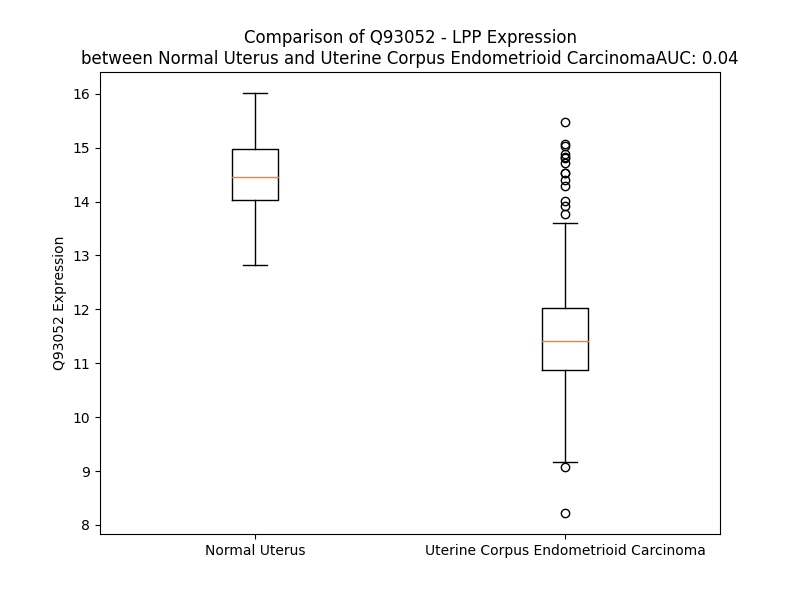

# Detailed Data for Q93052

## Introduction to the Detailed Summary

### How to Interpret the Results

- **Summary & Metrics**: This section provides a quick reference to essential protein attributes, including expression changes, family classification, and biomarker applications. Regulation status (upregulated/downregulated) indicates the protein's behavior in a disease context. Some information comes from the original excel file with the proteins selected from literature, while others are derived from the analyses.
- **Expression Comparison**: A visual representation comparing protein expression between normal and disease states. It highlights significant changes in expression levels that might indicate diagnostic or therapeutic relevance. This is data coming from transcriptomics experiments and could not translate similarly to protein levels.
- **Isoform Alignment**: An interactive view of isoform alignments, revealing structural and functional differences between variants of the protein.
- **Interactors & Homologs**: Tables listing known interaction partners and homologous proteins, the more interactors and homologs, the more complex the protein is to design an antibody for.
- **Biological Assemblies**: Information about the structural arrangement of the protein in different assemblies, providing insights into its functional state but also the complexity of the protein to develop antibodies.
- **Combined Per-Residue Information**: A detailed table summarizing residue-level data. This includes predictions for epitope regions, aggregation tendencies, and modifications that might impact the protein's function. Each row corresponds to a residue in the protein, providing insights into specific sites that may be important for research or drug development.
## Summary & Metrics

- **UniProt Accession**: Q93052
- **Gene Name**: LPP
- **Protein Name**: Lipoma-preferred partner
- **Swiss Prot**: LPP_HUMAN
- **Family**: other
- **Biomarker Application**:  
- **Number of Isoforms**: 0
- **Regulation**: 2
- **(transcriptomics) AUC**: 0.04
- **(transcriptomics) Fold Change**: 1.26
- **(transcriptomics) Regulation**: Downregulated
- **Discotope Epitope Count**: 85
- **Max n_uniprots (Homo)**: N/A
- **Max n_uniprots (Hetero)**: N/A

## Expression Comparison

## Interactors

| preferredName_A   | preferredName_B   |   score |
|:------------------|:------------------|--------:|
| LPP               | LASP1             |    0.95 |

## Homologs

| uniprot_id   | gene_id   |
|:-------------|:----------|
| E7EN81       | FBLIM1    |

## Combined Per-Residue Information

|   res | aa   |   epitope_score | epitope   |   relative_surface_accessibility |   modeling_confidence |   Aggregation | modification     |
|------:|:-----|----------------:|:----------|---------------------------------:|----------------------:|--------------:|:-----------------|
|     1 | M    |         0.09486 | False     |                          1.27217 |                 39.74 |         0     | N/A              |
|     2 | S    |         0.06014 | False     |                          0.8462  |                 46.51 |         0     | N/A              |
|     3 | H    |         0.0681  | False     |                          0.96297 |                 44.34 |         0     | N/A              |
|     4 | P    |         0.06987 | False     |                          0.89558 |                 56.79 |         0     | N/A              |
|     5 | S    |         0.0556  | False     |                          0.78677 |                 45.7  |         0     | N/A              |
|     6 | W    |         0.06957 | False     |                          1.04664 |                 48.55 |         0     | N/A              |
|     7 | L    |         0.09916 | False     |                          0.99762 |                 48.02 |         0     | N/A              |
|     8 | P    |         0.06468 | False     |                          0.84803 |                 55.11 |         0     | N/A              |
|     9 | P    |         0.06952 | False     |                          0.99801 |                 54.14 |         0     | N/A              |
|    10 | K    |         0.05929 | False     |                          1.00179 |                 37.35 |         0     | N/A              |
|    11 | S    |         0.03925 | False     |                          0.84259 |                 43.76 |         0     | N/A              |
|    12 | T    |         0.06034 | False     |                          0.97157 |                 42.74 |         0     | N/A              |
|    13 | G    |         0.04425 | False     |                          0.78105 |                 45.92 |         0     | N/A              |
|    14 | E    |         0.06402 | False     |                          0.91691 |                 45.88 |         0     | N/A              |
|    15 | P    |         0.0507  | False     |                          0.80058 |                 44.53 |         0     | N/A              |
|    16 | L    |         0.05061 | False     |                          1.17614 |                 44.81 |         0     | N/A              |
|    17 | G    |         0.09433 | False     |                          0.92764 |                 39.82 |         0     | N/A              |
|    18 | H    |         0.08066 | False     |                          1.0028  |                 41.29 |         0     | N/A              |
|    19 | V    |         0.05514 | False     |                          0.90199 |                 39.43 |         0     | N/A              |
|    20 | P    |         0.06131 | False     |                          0.83497 |                 37.37 |         0     | N/A              |
|    21 | A    |         0.05379 | False     |                          0.96378 |                 29.68 |         0     | N/A              |
|    22 | R    |         0.07601 | False     |                          0.96455 |                 36.93 |         0     | N/A              |
|    23 | M    |         0.06594 | False     |                          0.88158 |                 32.64 |         0     | N/A              |
|    24 | E    |         0.07058 | False     |                          0.84182 |                 35.91 |         0     | N/A              |
|    25 | T    |         0.0809  | False     |                          0.78637 |                 33.55 |         0     | N/A              |
|    26 | T    |         0.06392 | False     |                          0.78977 |                 34.68 |         0     | N/A              |
|    27 | H    |         0.05187 | False     |                          0.88434 |                 32.08 |         0     | N/A              |
|    28 | S    |         0.04691 | False     |                          0.89044 |                 33.7  |         0     | N/A              |
|    29 | F    |         0.05356 | False     |                          0.98361 |                 38.22 |         0     | N/A              |
|    30 | G    |         0.06259 | False     |                          0.88145 |                 35.75 |         0     | N/A              |
|    31 | N    |         0.07727 | False     |                          0.79948 |                 34.18 |         0     | N/A              |
|    32 | P    |         0.0321  | False     |                          0.58304 |                 41.67 |         0     | N/A              |
|    33 | S    |         0.05865 | False     |                          0.84826 |                 37.74 |         0     | N/A              |
|    34 | I    |         0.03624 | False     |                          0.43888 |                 41.79 |         0     | N/A              |
|    35 | S    |         0.04112 | False     |                          0.62037 |                 47.11 |         0     | N/A              |
|    36 | V    |         0.04994 | False     |                          0.6398  |                 46.98 |         0     | N/A              |
|    37 | S    |         0.02736 | False     |                          0.43343 |                 47.47 |         0     | N/A              |
|    38 | T    |         0.05317 | False     |                          0.55628 |                 47.08 |         0     | N/A              |
|    39 | Q    |         0.05466 | False     |                          0.72129 |                 45.59 |         0     | N/A              |
|    40 | Q    |         0.05487 | False     |                          0.52134 |                 32.26 |         0     | N/A              |
|    41 | P    |         0.06993 | False     |                          0.62186 |                 41.6  |         0     | N/A              |
|    42 | P    |         0.06502 | False     |                          1.0108  |                 42.08 |         0     | N/A              |
|    43 | K    |         0.06597 | False     |                          0.67524 |                 40.38 |         0     | N/A              |
|    44 | K    |         0.05757 | False     |                          0.91303 |                 40.17 |         0     | N/A              |
|    45 | F    |         0.09471 | False     |                          1.06925 |                 38.74 |         0     | N/A              |
|    46 | A    |         0.07174 | False     |                          0.78934 |                 37.97 |         0     | N/A              |
|    47 | P    |         0.08981 | False     |                          0.96593 |                 36.64 |         0     | N/A              |
|    48 | V    |         0.05742 | False     |                          0.95117 |                 39.73 |         0     | N/A              |
|    49 | V    |         0.10671 | False     |                          1.01449 |                 34.38 |         0     | N/A              |
|    50 | A    |         0.0593  | False     |                          0.77435 |                 38.61 |         0     | N/A              |
|    51 | P    |         0.07003 | False     |                          0.91715 |                 36.21 |         0     | N/A              |
|    52 | K    |         0.1267  | True      |                          0.97526 |                 34.49 |         0     | N/A              |
|    53 | P    |         0.0804  | False     |                          0.93716 |                 39.8  |         0     | N/A              |
|    54 | K    |         0.07078 | False     |                          1.01538 |                 40.63 |         0     | N/A              |
|    55 | Y    |         0.10221 | False     |                          0.87339 |                 37.79 |         0     | N/A              |
|    56 | N    |         0.10385 | False     |                          0.79897 |                 38.5  |         0     | N/A              |
|    57 | P    |         0.10047 | False     |                          0.70496 |                 41.96 |         0     | N/A              |
|    58 | Y    |         0.06661 | False     |                          0.91613 |                 34.62 |         0     | N/A              |
|    59 | K    |         0.05154 | False     |                          0.98781 |                 38.37 |         0     | N/A              |
|    60 | Q    |         0.05493 | False     |                          0.88057 |                 41.26 |         0     | N/A              |
|    61 | P    |         0.05925 | False     |                          0.91819 |                 50.2  |         0     | N/A              |
|    62 | G    |         0.08639 | False     |                          0.98247 |                 39.55 |         0     | N/A              |
|    63 | G    |         0.128   | True      |                          0.88031 |                 47.12 |         0     | N/A              |
|    64 | E    |         0.1414  | True      |                          0.93872 |                 42.31 |         0     | N/A              |
|    65 | G    |         0.11353 | True      |                          0.73204 |                 46.93 |         0     | N/A              |
|    66 | D    |         0.18482 | True      |                          0.92484 |                 41.58 |         0     | N/A              |
|    67 | F    |         0.14676 | True      |                          1.01561 |                 54.75 |         0     | N/A              |
|    68 | L    |         0.2057  | True      |                          0.99366 |                 57.71 |         0     | N/A              |
|    69 | P    |         0.09851 | False     |                          0.83602 |                 66.8  |         0     | N/A              |
|    70 | P    |         0.076   | False     |                          0.87981 |                 66.13 |         0     | N/A              |
|    71 | P    |         0.11484 | True      |                          0.86502 |                 61.79 |         0     | N/A              |
|    72 | P    |         0.1307  | True      |                          0.86928 |                 66.64 |         0     | N/A              |
|    73 | P    |         0.09349 | False     |                          0.83657 |                 71.34 |         0     | N/A              |
|    74 | P    |         0.09686 | False     |                          0.83217 |                 62.14 |         0     | N/A              |
|    75 | L    |         0.18132 | True      |                          1.11986 |                 51.91 |         0     | N/A              |
|    76 | D    |         0.08378 | False     |                          0.83634 |                 60.26 |         0     | N/A              |
|    77 | D    |         0.09206 | False     |                          0.80351 |                 44.66 |         0     | N/A              |
|    78 | S    |         0.09132 | False     |                          0.73561 |                 40.43 |         0     | N/A              |
|    79 | S    |         0.10134 | False     |                          0.89929 |                 42.18 |         0     | N/A              |
|    80 | A    |         0.08209 | False     |                          0.9324  |                 36.32 |         0     | N/A              |
|    81 | L    |         0.12002 | True      |                          1.05906 |                 47.49 |         0     | N/A              |
|    82 | P    |         0.07495 | False     |                          0.83711 |                 42.66 |         0     | N/A              |
|    83 | S    |         0.11767 | True      |                          0.82039 |                 34.24 |         0     | N/A              |
|    84 | I    |         0.0796  | False     |                          1.00653 |                 42.33 |         0     | N/A              |
|    85 | S    |         0.09115 | False     |                          0.76229 |                 38.32 |         0     | N/A              |
|    86 | G    |         0.0912  | False     |                          0.67243 |                 41.97 |         0     | N/A              |
|    87 | N    |         0.0824  | False     |                          0.93973 |                 45.54 |         0     | N/A              |
|    88 | F    |         0.11566 | True      |                          0.97401 |                 46.68 |         0     | N/A              |
|    89 | P    |         0.10369 | False     |                          0.80082 |                 59    |         0     | N/A              |
|    90 | P    |         0.12945 | True      |                          0.85159 |                 56.07 |         0     | N/A              |
|    91 | P    |         0.1354  | True      |                          0.85847 |                 58.71 |         0     | N/A              |
|    92 | P    |         0.09969 | False     |                          0.78652 |                 66.54 |         0     | N/A              |
|    93 | P    |         0.06897 | False     |                          0.91557 |                 54.93 |         0     | N/A              |
|    94 | L    |         0.06786 | False     |                          1.00397 |                 53.03 |         0     | N/A              |
|    95 | D    |         0.12505 | True      |                          0.82697 |                 46.83 |         0     | N/A              |
|    96 | E    |         0.10601 | False     |                          0.91155 |                 43.83 |         0     | N/A              |
|    97 | E    |         0.08709 | False     |                          0.8485  |                 42.32 |         0     | N/A              |
|    98 | A    |         0.05394 | False     |                          0.84959 |                 42.91 |         0     | N/A              |
|    99 | F    |         0.08509 | False     |                          1.04868 |                 43.3  |         0     | N/A              |
|   100 | K    |         0.06837 | False     |                          0.93085 |                 38.23 |         0     | N/A              |
|   101 | V    |         0.06199 | False     |                          0.96957 |                 43.69 |         0     | N/A              |
|   102 | Q    |         0.09355 | False     |                          0.85095 |                 34.3  |         0     | N/A              |
|   103 | G    |         0.10331 | False     |                          0.80149 |                 36.37 |         0     | N/A              |
|   104 | N    |         0.11451 | True      |                          0.84455 |                 38.92 |         0     | N/A              |
|   105 | P    |         0.13745 | True      |                          0.95202 |                 42.64 |         0     | N/A              |
|   106 | G    |         0.12616 | True      |                          0.531   |                 44.39 |         0     | N/A              |
|   107 | G    |         0.13064 | True      |                          0.92101 |                 46.62 |         0     | N/A              |
|   108 | K    |         0.10271 | False     |                          0.47912 |                 56.39 |         0     | N6-acetyllysine  |
|   109 | T    |         0.08694 | False     |                          0.61057 |                 71.78 |         0     | N/A              |
|   110 | L    |         0.04897 | False     |                          0.71871 |                 72.27 |         0     | N/A              |
|   111 | E    |         0.08201 | False     |                          0.5161  |                 78.78 |         0     | N/A              |
|   112 | E    |         0.08403 | False     |                          0.45756 |                 73.88 |         0     | N/A              |
|   113 | R    |         0.0825  | False     |                          0.59338 |                 74.33 |         0     | N/A              |
|   114 | R    |         0.05883 | False     |                          0.55743 |                 79.93 |         0     | N/A              |
|   115 | S    |         0.05886 | False     |                          0.54255 |                 84.77 |         0     | N/A              |
|   116 | S    |         0.03363 | False     |                          0.29439 |                 87.71 |         0     | Phosphoserine    |
|   117 | L    |         0.04303 | False     |                          0.62794 |                 91.09 |         0     | N/A              |
|   118 | D    |         0.05296 | False     |                          0.46207 |                 94.26 |         0     | N/A              |
|   119 | A    |         0.0635  | False     |                          0.57178 |                 91.16 |         0     | N/A              |
|   120 | E    |         0.04533 | False     |                          0.59457 |                 94.01 |         0     | N/A              |
|   121 | I    |         0.04696 | False     |                          0.53577 |                 92.38 |         0     | N/A              |
|   122 | D    |         0.04062 | False     |                          0.62265 |                 93.88 |         0     | N/A              |
|   123 | S    |         0.03341 | False     |                          0.45895 |                 95.32 |         0     | N/A              |
|   124 | L    |         0.03343 | False     |                          0.67697 |                 94.36 |         0.365 | N/A              |
|   125 | T    |         0.0383  | False     |                          0.54173 |                 94.16 |         0.365 | N/A              |
|   126 | S    |         0.04418 | False     |                          0.47044 |                 92.57 |         0.365 | N/A              |
|   127 | I    |         0.03255 | False     |                          0.56015 |                 91.83 |         0.365 | N/A              |
|   128 | L    |         0.04311 | False     |                          0.68296 |                 90.94 |         0.365 | N/A              |
|   129 | A    |         0.02968 | False     |                          0.44525 |                 91.69 |         0.167 | N/A              |
|   130 | D    |         0.02912 | False     |                          0.5422  |                 89.5  |         0     | N/A              |
|   131 | L    |         0.04153 | False     |                          0.68711 |                 84.85 |         0     | N/A              |
|   132 | E    |         0.04344 | False     |                          0.65385 |                 87.76 |         0     | N/A              |
|   133 | C    |         0.04901 | False     |                          0.70959 |                 80.15 |         0     | N/A              |
|   134 | S    |         0.06949 | False     |                          0.62988 |                 71.88 |         0     | N/A              |
|   135 | S    |         0.09973 | False     |                          0.36347 |                 54.55 |         0     | N/A              |
|   136 | P    |         0.10582 | False     |                          0.9473  |                 58.87 |         0     | N/A              |
|   137 | Y    |         0.12571 | True      |                          0.91325 |                 55.68 |         0     | N/A              |
|   138 | K    |         0.07654 | False     |                          0.7421  |                 52.41 |         0     | N/A              |
|   139 | P    |         0.08914 | False     |                          0.92778 |                 44.6  |         0     | N/A              |
|   140 | R    |         0.14359 | True      |                          0.90457 |                 36.15 |         0     | N/A              |
|   141 | P    |         0.08396 | False     |                          0.82942 |                 49.49 |         0     | N/A              |
|   142 | P    |         0.0999  | False     |                          0.81103 |                 36.96 |         0     | N/A              |
|   143 | Q    |         0.07655 | False     |                          0.88929 |                 41.02 |         0     | N/A              |
|   144 | S    |         0.07991 | False     |                          0.91737 |                 35.88 |         0     | N/A              |
|   145 | S    |         0.05175 | False     |                          0.74992 |                 37.94 |         0     | N/A              |
|   146 | T    |         0.05235 | False     |                          1.01516 |                 39.73 |         0     | N/A              |
|   147 | G    |         0.07598 | False     |                          0.84636 |                 38.96 |         0     | N/A              |
|   148 | S    |         0.07135 | False     |                          0.83096 |                 40.87 |         0     | N/A              |
|   149 | T    |         0.04858 | False     |                          0.98212 |                 40.04 |         0     | N/A              |
|   150 | A    |         0.04741 | False     |                          0.97929 |                 40.9  |         0     | N/A              |
|   151 | S    |         0.03915 | False     |                          0.82199 |                 49.31 |         0     | Phosphoserine    |
|   152 | P    |         0.03404 | False     |                          0.89175 |                 60.01 |         0     | N/A              |
|   153 | P    |         0.04883 | False     |                          0.907   |                 55.01 |         0     | N/A              |
|   154 | V    |         0.02808 | False     |                          1.02131 |                 41.1  |         0     | N/A              |
|   155 | S    |         0.03198 | False     |                          0.6251  |                 39.65 |         0     | N/A              |
|   156 | T    |         0.08842 | False     |                          0.90326 |                 45.76 |         0     | N/A              |
|   157 | P    |         0.08212 | False     |                          0.87324 |                 48.85 |         0     | N/A              |
|   158 | V    |         0.0413  | False     |                          0.961   |                 38.74 |         0     | N/A              |
|   159 | T    |         0.11377 | True      |                          0.87011 |                 41.31 |         0     | N/A              |
|   160 | G    |         0.05036 | False     |                          0.8598  |                 41.31 |         0     | N/A              |
|   161 | H    |         0.05947 | False     |                          0.96078 |                 37.15 |         0     | N/A              |
|   162 | K    |         0.06279 | False     |                          1.04029 |                 43.16 |         0     | N/A              |
|   163 | R    |         0.07679 | False     |                          0.90338 |                 34.21 |         0     | N/A              |
|   164 | M    |         0.10428 | False     |                          1.03004 |                 34.14 |         0     | N/A              |
|   165 | V    |         0.04964 | False     |                          0.85828 |                 36.08 |         0     | N/A              |
|   166 | I    |         0.06992 | False     |                          0.90305 |                 31.92 |         0     | N/A              |
|   167 | P    |         0.07827 | False     |                          0.85698 |                 37.35 |         0     | N/A              |
|   168 | N    |         0.06556 | False     |                          0.77313 |                 34.27 |         0     | N/A              |
|   169 | Q    |         0.07811 | False     |                          0.77508 |                 33.24 |         0     | N/A              |
|   170 | P    |         0.06973 | False     |                          0.7789  |                 36.29 |         0     | N/A              |
|   171 | P    |         0.06244 | False     |                          0.88657 |                 35.23 |         0     | N/A              |
|   172 | L    |         0.03994 | False     |                          1.00651 |                 37.7  |         0     | N/A              |
|   173 | T    |         0.07021 | False     |                          0.90155 |                 36.65 |         0     | N/A              |
|   174 | A    |         0.09562 | False     |                          0.89584 |                 30.57 |         0     | N/A              |
|   175 | T    |         0.08826 | False     |                          0.82909 |                 36.61 |         0     | N/A              |
|   176 | K    |         0.08238 | False     |                          0.9052  |                 37.15 |         0     | N/A              |
|   177 | K    |         0.1047  | False     |                          0.92297 |                 35.49 |         0     | N/A              |
|   178 | S    |         0.03638 | False     |                          0.73319 |                 36.28 |         0     | N/A              |
|   179 | T    |         0.05029 | False     |                          0.87667 |                 35.2  |         0     | N/A              |
|   180 | L    |         0.08516 | False     |                          1.07172 |                 39.94 |         0     | N/A              |
|   181 | K    |         0.05459 | False     |                          0.89066 |                 36.75 |         0     | N/A              |
|   182 | P    |         0.07698 | False     |                          0.72176 |                 38.76 |         0     | N/A              |
|   183 | Q    |         0.04898 | False     |                          0.81827 |                 36.28 |         0     | N/A              |
|   184 | P    |         0.06474 | False     |                          0.89575 |                 33.43 |         0     | N/A              |
|   185 | A    |         0.02718 | False     |                          0.71751 |                 42.88 |         0     | N/A              |
|   186 | P    |         0.04442 | False     |                          1.01299 |                 36.97 |         0     | N/A              |
|   187 | Q    |         0.06342 | False     |                          0.80414 |                 41.19 |         0     | N/A              |
|   188 | A    |         0.07359 | False     |                          0.58422 |                 42.63 |         0     | N/A              |
|   189 | G    |         0.07755 | False     |                          0.58321 |                 44.28 |         0     | N/A              |
|   190 | P    |         0.09538 | False     |                          0.53516 |                 44.95 |         0     | N/A              |
|   191 | I    |         0.05675 | False     |                          0.78997 |                 44.36 |         0     | N/A              |
|   192 | P    |         0.05393 | False     |                          0.94671 |                 41.44 |         0     | N/A              |
|   193 | V    |         0.05198 | False     |                          0.52566 |                 46.34 |         0     | N/A              |
|   194 | A    |         0.0484  | False     |                          0.57845 |                 41.65 |         0     | N/A              |
|   195 | P    |         0.05398 | False     |                          0.95119 |                 39.22 |         0     | N/A              |
|   196 | I    |         0.07625 | False     |                          0.84629 |                 40.84 |         0     | N/A              |
|   197 | G    |         0.07474 | False     |                          0.75278 |                 33.9  |         0     | N/A              |
|   198 | T    |         0.05882 | False     |                          0.81945 |                 38.61 |         0     | N/A              |
|   199 | L    |         0.05608 | False     |                          0.75603 |                 41.5  |         0     | N/A              |
|   200 | K    |         0.05773 | False     |                          0.9227  |                 37.47 |         0     | N/A              |
|   201 | P    |         0.07202 | False     |                          0.82241 |                 35.48 |         0     | N/A              |
|   202 | Q    |         0.03699 | False     |                          0.44614 |                 45.79 |         0     | N/A              |
|   203 | P    |         0.07359 | False     |                          0.57543 |                 44.58 |         0     | N/A              |
|   204 | Q    |         0.04884 | False     |                          0.67599 |                 41.25 |         0     | N/A              |
|   205 | P    |         0.03801 | False     |                          0.48585 |                 48.6  |         0     | N/A              |
|   206 | V    |         0.03291 | False     |                          0.70731 |                 46.55 |         0     | N/A              |
|   207 | P    |         0.03443 | False     |                          0.57916 |                 50.14 |         0     | N/A              |
|   208 | A    |         0.02568 | False     |                          0.28989 |                 54.07 |         0     | N/A              |
|   209 | S    |         0.04385 | False     |                          0.7383  |                 56.14 |         0     | N/A              |
|   210 | Y    |         0.03682 | False     |                          0.23512 |                 55.73 |         0     | N/A              |
|   211 | T    |         0.05265 | False     |                          0.65504 |                 58.41 |         0     | N/A              |
|   212 | T    |         0.02392 | False     |                          0.11674 |                 56.26 |         0     | N/A              |
|   213 | A    |         0.04635 | False     |                          0.18591 |                 47.47 |         0     | N/A              |
|   214 | S    |         0.03564 | False     |                          0.48425 |                 43.23 |         0     | N/A              |
|   215 | T    |         0.05664 | False     |                          0.26408 |                 42.16 |         0     | N/A              |
|   216 | S    |         0.14434 | True      |                          1.05102 |                 47.83 |         0     | N/A              |
|   217 | S    |         0.11209 | True      |                          0.70632 |                 49.74 |         0     | N/A              |
|   218 | R    |         0.12964 | True      |                          0.69702 |                 44.02 |         0     | N/A              |
|   219 | P    |         0.09217 | False     |                          0.97477 |                 37.9  |         0     | N/A              |
|   220 | T    |         0.07155 | False     |                          0.67577 |                 39.01 |         0     | N/A              |
|   221 | F    |         0.05959 | False     |                          0.62266 |                 41.37 |         0     | N/A              |
|   222 | N    |         0.07361 | False     |                          0.80215 |                 37.63 |         0     | N/A              |
|   223 | V    |         0.03808 | False     |                          0.63777 |                 40.05 |         0     | N/A              |
|   224 | Q    |         0.08727 | False     |                          0.87842 |                 31.77 |         0     | N/A              |
|   225 | V    |         0.05697 | False     |                          0.67189 |                 36.69 |         0     | N/A              |
|   226 | K    |         0.07735 | False     |                          0.91378 |                 31.37 |         0     | N/A              |
|   227 | S    |         0.05739 | False     |                          0.74815 |                 32.82 |         0     | N/A              |
|   228 | A    |         0.05273 | False     |                          0.75784 |                 31.38 |         0     | N/A              |
|   229 | Q    |         0.09117 | False     |                          0.78095 |                 28.74 |         0     | N/A              |
|   230 | P    |         0.09124 | False     |                          0.67814 |                 35.61 |         0     | N/A              |
|   231 | S    |         0.06523 | False     |                          0.74597 |                 30.02 |         0     | N/A              |
|   232 | P    |         0.13383 | True      |                          0.80494 |                 34.1  |         0     | N/A              |
|   233 | H    |         0.10686 | False     |                          0.84941 |                 36.02 |         0     | N/A              |
|   234 | Y    |         0.08644 | False     |                          0.90253 |                 36.06 |         0     | N/A              |
|   235 | M    |         0.11685 | True      |                          0.98568 |                 35.89 |         0     | N/A              |
|   236 | A    |         0.07715 | False     |                          0.75249 |                 35.42 |         0     | N/A              |
|   237 | A    |         0.06925 | False     |                          0.91514 |                 37.05 |         0     | N/A              |
|   238 | P    |         0.06061 | False     |                          0.92614 |                 40.1  |         0     | N/A              |
|   239 | S    |         0.081   | False     |                          0.90588 |                 38.33 |         0     | N/A              |
|   240 | S    |         0.11173 | True      |                          0.94356 |                 38.6  |         0     | N/A              |
|   241 | G    |         0.10695 | False     |                          0.91402 |                 36.4  |         0     | N/A              |
|   242 | Q    |         0.08368 | False     |                          0.78693 |                 37.54 |         0     | N/A              |
|   243 | I    |         0.08768 | False     |                          1.04922 |                 38.6  |         0     | N/A              |
|   244 | Y    |         0.09685 | False     |                          0.86909 |                 36.45 |         0     | Phosphotyrosine  |
|   245 | G    |         0.08274 | False     |                          0.85569 |                 38.34 |         0     | N/A              |
|   246 | S    |         0.11357 | True      |                          0.90177 |                 40.09 |         0     | N/A              |
|   247 | G    |         0.11962 | True      |                          0.92298 |                 37.25 |         0     | N/A              |
|   248 | P    |         0.07    | False     |                          0.9471  |                 40.04 |         0     | N/A              |
|   249 | Q    |         0.09104 | False     |                          0.97741 |                 41.81 |         0     | N/A              |
|   250 | G    |         0.06503 | False     |                          0.60634 |                 37.53 |         0     | N/A              |
|   251 | Y    |         0.08909 | False     |                          1.03928 |                 40.12 |         0     | N/A              |
|   252 | N    |         0.09458 | False     |                          0.83442 |                 35.01 |         0     | N/A              |
|   253 | T    |         0.08371 | False     |                          0.95001 |                 43.06 |         0     | N/A              |
|   254 | Q    |         0.10384 | False     |                          0.80831 |                 38.7  |         0     | N/A              |
|   255 | P    |         0.06587 | False     |                          0.86335 |                 41.16 |         0     | N/A              |
|   256 | V    |         0.07249 | False     |                          0.94501 |                 47.01 |         0     | N/A              |
|   257 | P    |         0.06929 | False     |                          0.96931 |                 40.06 |         0     | N/A              |
|   258 | V    |         0.09067 | False     |                          0.97823 |                 47.04 |         0     | N/A              |
|   259 | S    |         0.10732 | False     |                          0.858   |                 41.27 |         0     | N/A              |
|   260 | G    |         0.07606 | False     |                          0.89307 |                 46.62 |         0     | N/A              |
|   261 | Q    |         0.08084 | False     |                          0.84895 |                 40.38 |         0     | N/A              |
|   262 | C    |         0.05127 | False     |                          0.87999 |                 37.16 |         0     | N/A              |
|   263 | P    |         0.1091  | False     |                          0.86482 |                 48.44 |         0     | N/A              |
|   264 | P    |         0.0955  | False     |                          0.90165 |                 44.35 |         0     | N/A              |
|   265 | P    |         0.0912  | False     |                          0.98678 |                 54.58 |         0     | N/A              |
|   266 | S    |         0.11989 | True      |                          0.90195 |                 44.01 |         0     | N/A              |
|   267 | T    |         0.08747 | False     |                          0.99112 |                 35.5  |         0     | N/A              |
|   268 | R    |         0.09621 | False     |                          0.97579 |                 42.54 |         0     | N/A              |
|   269 | G    |         0.13659 | True      |                          0.93187 |                 36.66 |         0     | N/A              |
|   270 | G    |         0.1473  | True      |                          0.95889 |                 39.54 |         0     | N/A              |
|   271 | M    |         0.09642 | False     |                          0.91443 |                 42.73 |         0     | N/A              |
|   272 | D    |         0.12567 | True      |                          0.83263 |                 42.69 |         0     | N/A              |
|   273 | Y    |         0.09346 | False     |                          0.95439 |                 35.72 |         0     | N/A              |
|   274 | A    |         0.06284 | False     |                          0.99739 |                 41.67 |         0     | N/A              |
|   275 | Y    |         0.08045 | False     |                          0.83503 |                 33.7  |         0     | N/A              |
|   276 | I    |         0.09654 | False     |                          0.98608 |                 42.86 |         0     | N/A              |
|   277 | P    |         0.06066 | False     |                          0.61554 |                 47.18 |         0     | N/A              |
|   278 | P    |         0.07009 | False     |                          0.90755 |                 57.87 |         0     | N/A              |
|   279 | P    |         0.08734 | False     |                          0.97879 |                 46.14 |         0     | N/A              |
|   280 | G    |         0.11162 | True      |                          0.84121 |                 39.62 |         0     | N/A              |
|   281 | L    |         0.08519 | False     |                          0.9925  |                 38.7  |         0     | N/A              |
|   282 | Q    |         0.10128 | False     |                          0.8444  |                 42.3  |         0     | N/A              |
|   283 | P    |         0.06676 | False     |                          0.79974 |                 39.66 |         0     | N/A              |
|   284 | E    |         0.08992 | False     |                          0.76306 |                 42.49 |         0     | N/A              |
|   285 | P    |         0.09323 | False     |                          0.95894 |                 43.19 |         0     | N/A              |
|   286 | G    |         0.06459 | False     |                          0.61477 |                 40.89 |         0     | N/A              |
|   287 | Y    |         0.09446 | False     |                          1.04867 |                 35.34 |         0     | N/A              |
|   288 | G    |         0.08831 | False     |                          0.96832 |                 43.94 |         0     | N/A              |
|   289 | Y    |         0.11187 | True      |                          1.02117 |                 34.64 |         0     | N/A              |
|   290 | A    |         0.09845 | False     |                          0.91115 |                 46.14 |         0     | N/A              |
|   291 | P    |         0.06052 | False     |                          0.9215  |                 38.81 |         0     | N/A              |
|   292 | N    |         0.07612 | False     |                          0.90432 |                 36.34 |         0     | N/A              |
|   293 | Q    |         0.09941 | False     |                          0.88252 |                 42.22 |         0     | N/A              |
|   294 | G    |         0.11021 | True      |                          0.79243 |                 36.2  |         0     | N/A              |
|   295 | R    |         0.119   | True      |                          0.95661 |                 39.72 |         0     | N/A              |
|   296 | Y    |         0.10737 | False     |                          0.92676 |                 31.19 |         0     | N/A              |
|   297 | Y    |         0.09616 | False     |                          0.93097 |                 37.77 |         0     | N/A              |
|   298 | E    |         0.07599 | False     |                          0.78607 |                 35.45 |         0     | N/A              |
|   299 | G    |         0.11389 | True      |                          0.73775 |                 41.72 |         0     | N/A              |
|   300 | Y    |         0.08372 | False     |                          0.9886  |                 37.9  |         0     | N/A              |
|   301 | Y    |         0.08436 | False     |                          0.95584 |                 35.04 |         0     | Phosphotyrosine  |
|   302 | A    |         0.09998 | False     |                          0.97575 |                 41.1  |         0     | N/A              |
|   303 | A    |         0.06935 | False     |                          0.94394 |                 36.56 |         0     | N/A              |
|   304 | G    |         0.1098  | True      |                          0.88516 |                 36.87 |         0     | N/A              |
|   305 | P    |         0.10086 | False     |                          1.03419 |                 49.56 |         0     | N/A              |
|   306 | G    |         0.05775 | False     |                          0.91099 |                 40.39 |         0     | N/A              |
|   307 | Y    |         0.14927 | True      |                          1.01326 |                 41.25 |         0     | N/A              |
|   308 | G    |         0.11311 | True      |                          0.6954  |                 37.5  |         0     | N/A              |
|   309 | G    |         0.08908 | False     |                          0.92253 |                 39.89 |         0     | N/A              |
|   310 | R    |         0.13965 | True      |                          0.86932 |                 41.24 |         0     | N/A              |
|   311 | N    |         0.09621 | False     |                          0.71333 |                 38.81 |         0     | N/A              |
|   312 | D    |         0.09257 | False     |                          0.71465 |                 44.11 |         0     | N/A              |
|   313 | S    |         0.08376 | False     |                          0.84274 |                 49.41 |         0     | N/A              |
|   314 | D    |         0.06879 | False     |                          0.82407 |                 39.26 |         0     | N/A              |
|   315 | P    |         0.0977  | False     |                          0.79099 |                 51.7  |         0     | N/A              |
|   316 | T    |         0.10973 | False     |                          0.81869 |                 38.19 |         0     | N/A              |
|   317 | Y    |         0.09269 | False     |                          0.92169 |                 39.91 |         0     | N/A              |
|   318 | G    |         0.12419 | True      |                          0.69456 |                 42.54 |         0     | N/A              |
|   319 | Q    |         0.09366 | False     |                          0.71467 |                 45.08 |         0     | N/A              |
|   320 | Q    |         0.12723 | True      |                          0.81222 |                 40.86 |         0     | N/A              |
|   321 | G    |         0.16501 | True      |                          0.88662 |                 38.31 |         0     | N/A              |
|   322 | H    |         0.07325 | False     |                          1.00894 |                 38.45 |         0     | N/A              |
|   323 | P    |         0.04988 | False     |                          0.73671 |                 44.95 |         0     | N/A              |
|   324 | N    |         0.0739  | False     |                          0.93848 |                 38.53 |         0     | N/A              |
|   325 | T    |         0.10286 | False     |                          0.77663 |                 33.16 |         0     | N/A              |
|   326 | W    |         0.10751 | False     |                          1.01414 |                 35.54 |         0     | N/A              |
|   327 | K    |         0.06913 | False     |                          0.92521 |                 35.42 |         0     | N/A              |
|   328 | R    |         0.10378 | False     |                          0.85936 |                 30.44 |         0     | N/A              |
|   329 | E    |         0.07175 | False     |                          0.83123 |                 34.31 |         0     | N/A              |
|   330 | P    |         0.09844 | False     |                          0.80756 |                 37.95 |         0     | N/A              |
|   331 | G    |         0.12355 | True      |                          0.85667 |                 30.45 |         0     | N/A              |
|   332 | Y    |         0.09586 | False     |                          1.0047  |                 31.89 |         0     | N/A              |
|   333 | T    |         0.07631 | False     |                          0.8394  |                 40.6  |         0     | Phosphothreonine |
|   334 | P    |         0.07805 | False     |                          0.8737  |                 51.7  |         0     | N/A              |
|   335 | P    |         0.08314 | False     |                          0.99024 |                 45.52 |         0     | N/A              |
|   336 | G    |         0.09152 | False     |                          0.82475 |                 37.82 |         0     | N/A              |
|   337 | A    |         0.08394 | False     |                          1.12479 |                 42.86 |         0     | N/A              |
|   338 | G    |         0.09642 | False     |                          0.8964  |                 37.75 |         0     | N/A              |
|   339 | N    |         0.11138 | True      |                          0.80734 |                 40.16 |         0     | N/A              |
|   340 | Q    |         0.06036 | False     |                          0.771   |                 38.76 |         0     | N/A              |
|   341 | N    |         0.08661 | False     |                          0.79629 |                 38.95 |         0     | N/A              |
|   342 | P    |         0.05659 | False     |                          0.85232 |                 48.41 |         0     | N/A              |
|   343 | P    |         0.0895  | False     |                          1.01895 |                 42.91 |         0     | N/A              |
|   344 | G    |         0.07487 | False     |                          0.77855 |                 37.9  |         0     | N/A              |
|   345 | M    |         0.09658 | False     |                          0.97826 |                 33.04 |         0     | N/A              |
|   346 | Y    |         0.116   | True      |                          0.97376 |                 39.15 |         0     | N/A              |
|   347 | P    |         0.10033 | False     |                          0.87336 |                 36.2  |         0     | N/A              |
|   348 | V    |         0.15159 | True      |                          0.89308 |                 37.63 |         0     | N/A              |
|   349 | T    |         0.08778 | False     |                          0.88759 |                 38.86 |         0     | N/A              |
|   350 | G    |         0.14699 | True      |                          0.81108 |                 37.56 |         0     | N/A              |
|   351 | P    |         0.09876 | False     |                          0.8205  |                 41.14 |         0     | N/A              |
|   352 | K    |         0.08869 | False     |                          0.87211 |                 35.17 |         0     | N/A              |
|   353 | K    |         0.14341 | True      |                          0.87416 |                 35.94 |         0     | N/A              |
|   354 | T    |         0.08327 | False     |                          0.78652 |                 34.41 |         0     | N/A              |
|   355 | Y    |         0.11087 | True      |                          0.88767 |                 37.96 |         0     | N/A              |
|   356 | I    |         0.16321 | True      |                          0.81805 |                 38.27 |         0     | N/A              |
|   357 | T    |         0.08057 | False     |                          0.79918 |                 34.77 |         0     | N/A              |
|   358 | D    |         0.15897 | True      |                          0.82872 |                 34.15 |         0     | N/A              |
|   359 | P    |         0.07955 | False     |                          0.9114  |                 39.95 |         0     | N/A              |
|   360 | V    |         0.09203 | False     |                          1.06608 |                 38.13 |         0     | N/A              |
|   361 | S    |         0.07588 | False     |                          0.7892  |                 39.78 |         0     | N/A              |
|   362 | A    |         0.1167  | True      |                          0.89135 |                 44.61 |         0     | N/A              |
|   363 | P    |         0.10062 | False     |                          0.86442 |                 41.36 |         0     | N/A              |
|   364 | C    |         0.06057 | False     |                          0.89952 |                 36.37 |         0     | N/A              |
|   365 | A    |         0.11938 | True      |                          0.85802 |                 41.96 |         0     | N/A              |
|   366 | P    |         0.09839 | False     |                          0.94429 |                 43.63 |         0     | N/A              |
|   367 | P    |         0.0865  | False     |                          0.89145 |                 36.61 |         0     | N/A              |
|   368 | L    |         0.06224 | False     |                          1.10901 |                 42.21 |         0     | N/A              |
|   369 | Q    |         0.08493 | False     |                          0.8497  |                 43.44 |         0     | N/A              |
|   370 | P    |         0.06907 | False     |                          1.02016 |                 44.95 |         0     | N/A              |
|   371 | K    |         0.08101 | False     |                          1.00191 |                 42.55 |         0     | N/A              |
|   372 | G    |         0.11492 | True      |                          0.85905 |                 32.56 |         0     | N/A              |
|   373 | G    |         0.06172 | False     |                          0.68273 |                 37.59 |         0     | N/A              |
|   374 | H    |         0.07498 | False     |                          0.93868 |                 43.54 |         0     | N/A              |
|   375 | S    |         0.12422 | True      |                          0.89763 |                 40.17 |         0     | Phosphoserine    |
|   376 | G    |         0.11059 | True      |                          0.76959 |                 41.19 |         0     | N/A              |
|   377 | Q    |         0.08479 | False     |                          0.85152 |                 47.81 |         0     | N/A              |
|   378 | L    |         0.10626 | False     |                          1.0254  |                 44.2  |         0     | N/A              |
|   379 | G    |         0.11708 | True      |                          0.78268 |                 43.81 |         0     | N/A              |
|   380 | P    |         0.10724 | False     |                          0.96153 |                 47.48 |         0     | N/A              |
|   381 | S    |         0.11775 | True      |                          0.73913 |                 46.39 |         0     | N/A              |
|   382 | S    |         0.08557 | False     |                          0.82217 |                 45.48 |         0     | N/A              |
|   383 | V    |         0.05824 | False     |                          1.01218 |                 53.03 |         0     | N/A              |
|   384 | A    |         0.06592 | False     |                          0.83059 |                 45.9  |         0     | N/A              |
|   385 | P    |         0.06758 | False     |                          0.75468 |                 57.94 |         0     | N/A              |
|   386 | S    |         0.07711 | False     |                          0.74333 |                 57.3  |         0     | N/A              |
|   387 | F    |         0.09782 | False     |                          0.85822 |                 57.92 |         0     | N/A              |
|   388 | R    |         0.17526 | True      |                          0.55425 |                 76.11 |         0     | N/A              |
|   389 | P    |         0.08426 | False     |                          0.73323 |                 74.9  |         0     | N/A              |
|   390 | E    |         0.07093 | False     |                          0.53261 |                 82    |         0     | N/A              |
|   391 | D    |         0.06279 | False     |                          0.50698 |                 85.31 |         0     | N/A              |
|   392 | E    |         0.0557  | False     |                          0.64515 |                 84.84 |         0     | N/A              |
|   393 | L    |         0.07325 | False     |                          0.72144 |                 87.61 |         0     | N/A              |
|   394 | E    |         0.08204 | False     |                          0.60757 |                 89.13 |         0     | N/A              |
|   395 | H    |         0.04298 | False     |                          0.74154 |                 87.61 |         0     | N/A              |
|   396 | L    |         0.04816 | False     |                          0.64487 |                 87.82 |         0     | N/A              |
|   397 | T    |         0.04372 | False     |                          0.47732 |                 89.81 |         0     | N/A              |
|   398 | K    |         0.04928 | False     |                          0.67253 |                 88.64 |         0     | N/A              |
|   399 | K    |         0.05388 | False     |                          0.54771 |                 84.75 |         0     | N/A              |
|   400 | M    |         0.09212 | False     |                          0.70831 |                 83.59 |         0     | N/A              |
|   401 | L    |         0.05782 | False     |                          0.58528 |                 87.25 |         0     | N/A              |
|   402 | Y    |         0.06843 | False     |                          0.64883 |                 82.14 |         0     | N/A              |
|   403 | D    |         0.05703 | False     |                          0.38111 |                 77.45 |         0     | N/A              |
|   404 | M    |         0.08619 | False     |                          0.74879 |                 75.71 |         0     | N/A              |
|   405 | E    |         0.1067  | False     |                          0.74879 |                 81.11 |         0     | N/A              |
|   406 | N    |         0.10495 | False     |                          0.48678 |                 69.43 |         0     | N/A              |
|   407 | P    |         0.08578 | False     |                          0.6219  |                 61.54 |         0     | N/A              |
|   408 | P    |         0.12193 | True      |                          0.85232 |                 57.5  |         0     | N/A              |
|   409 | A    |         0.12476 | True      |                          0.87374 |                 55.67 |         0     | N/A              |
|   410 | D    |         0.18353 | True      |                          0.6408  |                 59.3  |         0     | N/A              |
|   411 | E    |         0.08234 | False     |                          0.38351 |                 70.06 |         0     | N/A              |
|   412 | Y    |         0.17754 | True      |                          0.5701  |                 81.24 |         0     | N/A              |
|   413 | F    |         0.08523 | False     |                          0.28651 |                 81.47 |         0     | N/A              |
|   414 | G    |         0.02619 | False     |                          0.1706  |                 86.83 |         0     | N/A              |
|   415 | R    |         0.16661 | True      |                          0.61243 |                 90.93 |         0     | N/A              |
|   416 | C    |         0.03834 | False     |                          0.00444 |                 93.08 |         0     | N/A              |
|   417 | A    |         0.08217 | False     |                          0.53099 |                 90.58 |         0     | N/A              |
|   418 | R    |         0.09311 | False     |                          0.46525 |                 90.95 |         0     | N/A              |
|   419 | C    |         0.09812 | False     |                          0.47697 |                 93.52 |         0     | N/A              |
|   420 | G    |         0.06714 | False     |                          0.386   |                 91.02 |         0     | N/A              |
|   421 | E    |         0.11397 | True      |                          0.58387 |                 92.56 |         0     | N/A              |
|   422 | N    |         0.15211 | True      |                          0.44441 |                 90.92 |         0     | N/A              |
|   423 | V    |         0.0055  | False     |                          0       |                 89.93 |         0     | N/A              |
|   424 | V    |         0.14016 | True      |                          0.37547 |                 87.96 |         0     | N/A              |
|   425 | G    |         0.07858 | False     |                          0.23312 |                 81.97 |         0     | N/A              |
|   426 | E    |         0.12913 | True      |                          0.43188 |                 79.05 |         0     | N/A              |
|   427 | G    |         0.03898 | False     |                          0.34034 |                 81.25 |         0     | N/A              |
|   428 | T    |         0.05298 | False     |                          0.42593 |                 85.4  |         0     | N/A              |
|   429 | G    |         0.00878 | False     |                          0.00754 |                 87.34 |         0     | N/A              |
|   430 | C    |         0.00751 | False     |                          0.01444 |                 88.46 |         0     | N/A              |
|   431 | T    |         0.07113 | False     |                          0.45949 |                 88.89 |         0     | N/A              |
|   432 | A    |         0.00706 | False     |                          0.02423 |                 85.82 |         0     | N/A              |
|   433 | M    |         0.06006 | False     |                          0.19555 |                 86.04 |         0     | N/A              |
|   434 | D    |         0.13662 | True      |                          0.84486 |                 85.7  |         0     | N/A              |
|   435 | Q    |         0.06462 | False     |                          0.29624 |                 89.17 |         0     | N/A              |
|   436 | V    |         0.03598 | False     |                          0.19752 |                 90.87 |         0     | N/A              |
|   437 | F    |         0.02441 | False     |                          0.07389 |                 92.55 |         0     | N/A              |
|   438 | H    |         0.09392 | False     |                          0.22716 |                 92.99 |         0     | N/A              |
|   439 | V    |         0.02908 | False     |                          0.16689 |                 90.42 |         0     | N/A              |
|   440 | D    |         0.08756 | False     |                          0.55651 |                 91.78 |         0     | N/A              |
|   441 | C    |         0.05876 | False     |                          0.19366 |                 93.35 |         0.806 | N/A              |
|   442 | F    |         0.02283 | False     |                          0.01107 |                 93.53 |         4.825 | N/A              |
|   443 | T    |         0.07985 | False     |                          0.13617 |                 94.97 |         4.973 | N/A              |
|   444 | C    |         0.02284 | False     |                          0       |                 95.08 |         4.973 | N/A              |
|   445 | I    |         0.07854 | False     |                          0.40827 |                 93.12 |         4.973 | N/A              |
|   446 | I    |         0.08849 | False     |                          0.57522 |                 94.14 |         4.973 | N/A              |
|   447 | C    |         0.07094 | False     |                          0.38884 |                 95.7  |         1.145 | N/A              |
|   448 | N    |         0.15065 | True      |                          0.57425 |                 94.54 |         0.193 | N/A              |
|   449 | N    |         0.10981 | True      |                          0.58099 |                 93.72 |         0     | N/A              |
|   450 | K    |         0.12776 | True      |                          0.60266 |                 92.62 |         0     | N/A              |
|   451 | L    |         0.0048  | False     |                          0.00495 |                 92.22 |         0     | N/A              |
|   452 | R    |         0.06461 | False     |                          0.43055 |                 85.03 |         0     | N/A              |
|   453 | G    |         0.04164 | False     |                          0.50932 |                 83.51 |         0     | N/A              |
|   454 | Q    |         0.07725 | False     |                          0.53408 |                 84.97 |         0     | N/A              |
|   455 | P    |         0.05707 | False     |                          0.50161 |                 87.78 |         0.857 | N/A              |
|   456 | F    |         0.00755 | False     |                          0.00448 |                 92.1  |         0.857 | N/A              |
|   457 | Y    |         0.04011 | False     |                          0.13807 |                 90.42 |         0.857 | N/A              |
|   458 | A    |         0.04168 | False     |                          0.42278 |                 91.32 |         0.857 | N/A              |
|   459 | V    |         0.03111 | False     |                          0.2761  |                 87.87 |         0.857 | N/A              |
|   460 | E    |         0.11865 | True      |                          0.69684 |                 87.38 |         0     | N/A              |
|   461 | K    |         0.07943 | False     |                          0.75919 |                 85.41 |         0     | N/A              |
|   462 | K    |         0.05749 | False     |                          0.39075 |                 89.79 |         0     | N/A              |
|   463 | A    |         0.01474 | False     |                          0.08408 |                 92.02 |         0     | N/A              |
|   464 | Y    |         0.03789 | False     |                          0.1206  |                 93.96 |         0     | N/A              |
|   465 | C    |         0.04692 | False     |                          0.11592 |                 94.1  |         0     | N/A              |
|   466 | E    |         0.05109 | False     |                          0.32412 |                 92.22 |         0     | N/A              |
|   467 | P    |         0.12469 | True      |                          0.64187 |                 93.41 |         0     | N/A              |
|   468 | C    |         0.04549 | False     |                          0.11177 |                 94.27 |         0     | N/A              |
|   469 | Y    |         0.02517 | False     |                          0.07788 |                 93.33 |         0     | N/A              |
|   470 | I    |         0.04857 | False     |                          0.22215 |                 92.32 |         0     | N/A              |
|   471 | N    |         0.06834 | False     |                          0.78378 |                 90.58 |         0     | N/A              |
|   472 | T    |         0.10653 | False     |                          0.54447 |                 89.24 |         0     | N/A              |
|   473 | L    |         0.02917 | False     |                          0.08149 |                 91.69 |         0     | N/A              |
|   474 | E    |         0.0697  | False     |                          0.34735 |                 93.16 |         0     | N/A              |
|   475 | Q    |         0.11929 | True      |                          0.59999 |                 94.97 |         0     | N/A              |
|   476 | C    |         0.04018 | False     |                          0.0074  |                 95.89 |         0     | N/A              |
|   477 | N    |         0.07679 | False     |                          0.50065 |                 94.49 |         0     | N/A              |
|   478 | V    |         0.09145 | False     |                          0.64473 |                 93.81 |         0     | N/A              |
|   479 | C    |         0.07675 | False     |                          0.35198 |                 94.93 |         0     | N/A              |
|   480 | S    |         0.09609 | False     |                          0.64954 |                 94.55 |         0     | N/A              |
|   481 | K    |         0.12155 | True      |                          0.66367 |                 94.27 |         0     | N/A              |
|   482 | P    |         0.05138 | False     |                          0.29023 |                 94.09 |         0     | N/A              |
|   483 | I    |         0.01833 | False     |                          0.01235 |                 94.23 |         0     | N/A              |
|   484 | M    |         0.0736  | False     |                          0.52974 |                 88.79 |         0     | N/A              |
|   485 | E    |         0.06734 | False     |                          0.80661 |                 83.99 |         0     | N/A              |
|   486 | R    |         0.0805  | False     |                          0.50205 |                 90.87 |         0     | N/A              |
|   487 | I    |         0.02407 | False     |                          0.18274 |                 92.12 |         0     | N/A              |
|   488 | L    |         0.0301  | False     |                          0.13025 |                 93.75 |         0     | N/A              |
|   489 | R    |         0.07057 | False     |                          0.62024 |                 93.86 |         0     | N/A              |
|   490 | A    |         0.01249 | False     |                          0.04701 |                 89.92 |         0     | N/A              |
|   491 | T    |         0.06128 | False     |                          0.48498 |                 88.41 |         0     | N/A              |
|   492 | G    |         0.04272 | False     |                          1.0077  |                 89.21 |         0     | N/A              |
|   493 | K    |         0.04552 | False     |                          0.46849 |                 93.27 |         0     | N/A              |
|   494 | A    |         0.0269  | False     |                          0.09703 |                 95.12 |         0     | N/A              |
|   495 | Y    |         0.00893 | False     |                          0.02834 |                 96.36 |         0     | N/A              |
|   496 | H    |         0.04264 | False     |                          0.21265 |                 95.66 |         0     | N/A              |
|   497 | P    |         0.035   | False     |                          0.20645 |                 93.97 |         0     | N/A              |
|   498 | H    |         0.08009 | False     |                          0.86169 |                 94.03 |         0.13  | N/A              |
|   499 | C    |         0.03998 | False     |                          0.20904 |                 95.41 |         0.574 | N/A              |
|   500 | F    |         0.01513 | False     |                          0.00833 |                 96.16 |         1.833 | N/A              |
|   501 | T    |         0.09195 | False     |                          0.25915 |                 97.21 |         1.833 | N/A              |
|   502 | C    |         0.02288 | False     |                          0       |                 96.76 |         1.833 | N/A              |
|   503 | V    |         0.12387 | True      |                          0.43589 |                 95.28 |         1.833 | N/A              |
|   504 | M    |         0.04418 | False     |                          0.5338  |                 94.85 |         1.625 | N/A              |
|   505 | C    |         0.06563 | False     |                          0.44152 |                 96.4  |         0     | N/A              |
|   506 | H    |         0.09022 | False     |                          0.71075 |                 95.59 |         0     | N/A              |
|   507 | R    |         0.06906 | False     |                          0.46679 |                 95.03 |         0     | N/A              |
|   508 | S    |         0.08489 | False     |                          0.36469 |                 95.37 |         0     | N/A              |
|   509 | L    |         0.0089  | False     |                          0.01706 |                 95.57 |         0     | N/A              |
|   510 | D    |         0.03203 | False     |                          0.26863 |                 93.91 |         0     | N/A              |
|   511 | G    |         0.05675 | False     |                          0.89438 |                 91.68 |         0     | N/A              |
|   512 | I    |         0.07579 | False     |                          0.38046 |                 91.71 |         0     | N/A              |
|   513 | P    |         0.04932 | False     |                          0.67867 |                 91.74 |         0     | N/A              |
|   514 | F    |         0.05153 | False     |                          0.1497  |                 94.04 |         0     | N/A              |
|   515 | T    |         0.01134 | False     |                          0.0243  |                 93    |         0     | N/A              |
|   516 | V    |         0.01586 | False     |                          0.31318 |                 93.92 |         0     | N/A              |
|   517 | D    |         0.0196  | False     |                          0.12942 |                 91.92 |         0     | N/A              |
|   518 | A    |         0.05431 | False     |                          0.94283 |                 90.71 |         0     | N/A              |
|   519 | G    |         0.07418 | False     |                          0.79268 |                 90.55 |         0     | N/A              |
|   520 | G    |         0.03386 | False     |                          0.5816  |                 91.03 |         0     | N/A              |
|   521 | L    |         0.04866 | False     |                          0.5383  |                 92.6  |         0.227 | N/A              |
|   522 | I    |         0.0138  | False     |                          0.09601 |                 94.46 |         0.227 | N/A              |
|   523 | H    |         0.01037 | False     |                          0       |                 95.43 |         0.227 | N/A              |
|   524 | C    |         0.01062 | False     |                          0.02264 |                 95.06 |         0.227 | N/A              |
|   525 | I    |         0.02975 | False     |                          0.38799 |                 92.15 |         0.227 | N/A              |
|   526 | E    |         0.07148 | False     |                          0.55848 |                 91.65 |         0     | N/A              |
|   527 | D    |         0.0286  | False     |                          0.14824 |                 94.46 |         0     | N/A              |
|   528 | F    |         0.02245 | False     |                          0.08026 |                 93.49 |         0     | N/A              |
|   529 | H    |         0.03304 | False     |                          0.1971  |                 91.71 |         0     | N/A              |
|   530 | K    |         0.04254 | False     |                          0.63802 |                 91.77 |         0     | N/A              |
|   531 | K    |         0.07751 | False     |                          0.49609 |                 90.62 |         0     | N/A              |
|   532 | F    |         0.07545 | False     |                          0.50686 |                 90.64 |         0     | N/A              |
|   533 | A    |         0.03012 | False     |                          0.1796  |                 92.21 |         0     | N/A              |
|   534 | P    |         0.0385  | False     |                          0.4124  |                 93.68 |         0     | N/A              |
|   535 | R    |         0.10548 | False     |                          0.51294 |                 95.25 |         0     | N/A              |
|   536 | C    |         0.01943 | False     |                          0.0037  |                 96.15 |         0     | N/A              |
|   537 | S    |         0.01859 | False     |                          0.19578 |                 94.12 |         0     | N/A              |
|   538 | V    |         0.04726 | False     |                          0.62059 |                 93.69 |         0     | N/A              |
|   539 | C    |         0.07652 | False     |                          0.42836 |                 95.24 |         0     | N/A              |
|   540 | K    |         0.06991 | False     |                          0.63977 |                 94.97 |         0     | N/A              |
|   541 | E    |         0.04359 | False     |                          0.53295 |                 94.9  |         0     | N/A              |
|   542 | P    |         0.02269 | False     |                          0.08294 |                 94.64 |         0     | N/A              |
|   543 | I    |         0.01174 | False     |                          0.01969 |                 93.57 |         0     | N/A              |
|   544 | M    |         0.08369 | False     |                          0.48273 |                 90.38 |         0     | N/A              |
|   545 | P    |         0.03058 | False     |                          0.2181  |                 87.96 |         0     | N/A              |
|   546 | A    |         0.04478 | False     |                          0.57957 |                 83.83 |         0     | N/A              |
|   547 | P    |         0.15395 | True      |                          1.04598 |                 82.34 |         0     | N/A              |
|   548 | G    |         0.04811 | False     |                          0.97287 |                 80.83 |         0     | N/A              |
|   549 | Q    |         0.10031 | False     |                          0.56893 |                 80.78 |         0     | N/A              |
|   550 | E    |         0.07326 | False     |                          0.9037  |                 77.78 |         0     | N/A              |
|   551 | E    |         0.07948 | False     |                          0.38022 |                 83.7  |         0.199 | N/A              |
|   552 | T    |         0.03197 | False     |                          0.317   |                 85.75 |         0.199 | N/A              |
|   553 | V    |         0.06038 | False     |                          0.56117 |                 89.49 |         0.422 | N/A              |
|   554 | R    |         0.03593 | False     |                          0.27622 |                 92.45 |         0.422 | N/A              |
|   555 | I    |         0.01886 | False     |                          0.0664  |                 92.47 |         0.422 | N/A              |
|   556 | V    |         0.0458  | False     |                          0.41342 |                 92.62 |         0.422 | N/A              |
|   557 | A    |         0.01367 | False     |                          0.12627 |                 90.59 |         0.422 | N/A              |
|   558 | L    |         0.04788 | False     |                          0.46534 |                 89.16 |         0.422 | N/A              |
|   559 | D    |         0.09387 | False     |                          0.92352 |                 89.82 |         0.223 | N/A              |
|   560 | R    |         0.06344 | False     |                          0.32145 |                 92.81 |         0     | N/A              |
|   561 | D    |         0.02023 | False     |                          0.16735 |                 95.07 |         0     | N/A              |
|   562 | F    |         0.00414 | False     |                          0.01338 |                 94.85 |         0     | N/A              |
|   563 | H    |         0.04531 | False     |                          0.24074 |                 94.39 |         0     | N/A              |
|   564 | V    |         0.02489 | False     |                          0.28878 |                 91.97 |         0     | N/A              |
|   565 | H    |         0.09211 | False     |                          0.73051 |                 92.15 |         0     | N/A              |
|   566 | C    |         0.04341 | False     |                          0.19587 |                 94.15 |         0     | N/A              |
|   567 | Y    |         0.01165 | False     |                          0.01621 |                 93.89 |         0     | N/A              |
|   568 | R    |         0.10837 | False     |                          0.40241 |                 93.8  |         0     | N/A              |
|   569 | C    |         0.0552  | False     |                          0.01184 |                 93.69 |         0     | N/A              |
|   570 | E    |         0.05827 | False     |                          0.47896 |                 92.91 |         0     | N/A              |
|   571 | D    |         0.05212 | False     |                          0.44244 |                 93.08 |         0     | N/A              |
|   572 | C    |         0.04816 | False     |                          0.55607 |                 93.23 |         0     | N/A              |
|   573 | G    |         0.04254 | False     |                          0.43301 |                 91.92 |         0     | N/A              |
|   574 | G    |         0.03778 | False     |                          0.30811 |                 90.13 |         0     | N/A              |
|   575 | L    |         0.04001 | False     |                          0.30318 |                 91.71 |         0     | N/A              |
|   576 | L    |         0.00282 | False     |                          0.00082 |                 90.58 |         0     | N/A              |
|   577 | S    |         0.02975 | False     |                          0.22966 |                 85.34 |         0     | N/A              |
|   578 | E    |         0.11991 | True      |                          0.57016 |                 79.41 |         0     | N/A              |
|   579 | G    |         0.03247 | False     |                          0.58876 |                 70.26 |         0     | N/A              |
|   580 | D    |         0.13554 | True      |                          0.92434 |                 64.06 |         0     | N/A              |
|   581 | N    |         0.08341 | False     |                          0.31454 |                 64.02 |         0     | N/A              |
|   582 | Q    |         0.1076  | False     |                          0.63793 |                 68.11 |         0     | N/A              |
|   583 | G    |         0.02699 | False     |                          0.06396 |                 77.73 |         0     | N/A              |
|   584 | C    |         0.01407 | False     |                          0.09191 |                 88.82 |         0     | N/A              |
|   585 | Y    |         0.07375 | False     |                          0.24728 |                 91.18 |         0     | N/A              |
|   586 | P    |         0.06102 | False     |                          0.47659 |                 90.33 |         0     | N/A              |
|   587 | L    |         0.04913 | False     |                          0.1868  |                 91.13 |         0     | N/A              |
|   588 | D    |         0.1065  | False     |                          0.70111 |                 87.85 |         0     | N/A              |
|   589 | G    |         0.0303  | False     |                          0.54028 |                 86.91 |         0     | N/A              |
|   590 | H    |         0.06294 | False     |                          0.34967 |                 90.29 |         0     | N/A              |
|   591 | I    |         0.01213 | False     |                          0.0272  |                 91.5  |         0     | N/A              |
|   592 | L    |         0.00317 | False     |                          0       |                 92.1  |         0     | N/A              |
|   593 | C    |         0.01977 | False     |                          0.03294 |                 93.34 |         0     | N/A              |
|   594 | K    |         0.05775 | False     |                          0.60406 |                 91.46 |         0     | N/A              |
|   595 | T    |         0.05689 | False     |                          0.69939 |                 92.55 |         0     | N/A              |
|   596 | C    |         0.03838 | False     |                          0.12881 |                 94.36 |         0     | N/A              |
|   597 | N    |         0.02036 | False     |                          0.11245 |                 93.39 |         0     | N/A              |
|   598 | S    |         0.02219 | False     |                          0.36654 |                 93.17 |         0     | N/A              |
|   599 | A    |         0.02614 | False     |                          0.49113 |                 94    |         0     | N/A              |
|   600 | R    |         0.03728 | False     |                          0.27165 |                 93.57 |         0     | N/A              |
|   601 | I    |         0.04341 | False     |                          0.46078 |                 93.29 |         0     | N/A              |
|   602 | R    |         0.06296 | False     |                          0.73023 |                 93.43 |         0     | N/A              |
|   603 | V    |         0.05366 | False     |                          0.57741 |                 91.26 |         0     | N/A              |
|   604 | L    |         0.048   | False     |                          0.47831 |                 89.52 |         0     | N/A              |
|   605 | T    |         0.03938 | False     |                          0.58231 |                 90.49 |         0     | N/A              |
|   606 | A    |         0.03798 | False     |                          0.54987 |                 90.32 |         0     | N/A              |
|   607 | K    |         0.03089 | False     |                          0.65555 |                 85.83 |         0     | N/A              |
|   608 | A    |         0.05822 | False     |                          0.59774 |                 84.39 |         0     | N/A              |
|   609 | S    |         0.04634 | False     |                          0.59672 |                 83.67 |         0     | N/A              |
|   610 | T    |         0.07296 | False     |                          0.81499 |                 79.25 |         0     | N/A              |
|   611 | D    |         0.06512 | False     |                          0.81982 |                 67.68 |         0     | N/A              |
|   612 | L    |         0.08823 | False     |                          1.27624 |                 55.33 |         0     | N/A              |

