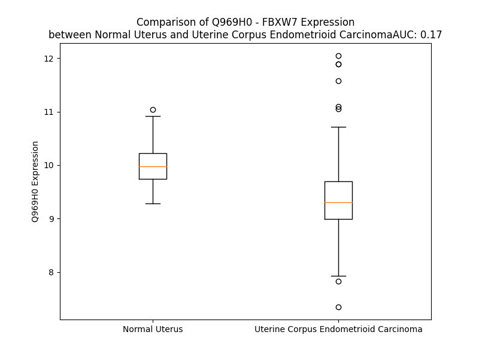

# Detailed Data for Q969H0

## Introduction to the Detailed Summary

### How to Interpret the Results

- **Summary & Metrics**: This section provides a quick reference to essential protein attributes, including expression changes, family classification, and biomarker applications. Regulation status (upregulated/downregulated) indicates the protein's behavior in a disease context. Some information comes from the original excel file with the proteins selected from literature, while others are derived from the analyses.
- **Expression Comparison**: A visual representation comparing protein expression between normal and disease states. It highlights significant changes in expression levels that might indicate diagnostic or therapeutic relevance. This is data coming from transcriptomics experiments and could not translate similarly to protein levels.
- **Isoform Alignment**: An interactive view of isoform alignments, revealing structural and functional differences between variants of the protein.
- **Interactors & Homologs**: Tables listing known interaction partners and homologous proteins, the more interactors and homologs, the more complex the protein is to design an antibody for.
- **Biological Assemblies**: Information about the structural arrangement of the protein in different assemblies, providing insights into its functional state but also the complexity of the protein to develop antibodies.
- **Combined Per-Residue Information**: A detailed table summarizing residue-level data. This includes predictions for epitope regions, aggregation tendencies, and modifications that might impact the protein's function. Each row corresponds to a residue in the protein, providing insights into specific sites that may be important for research or drug development.
## Summary & Metrics

- **UniProt Accession**: Q969H0
- **Gene Name**: FBXW7
- **Protein Name**: F-box/WD repeat-containing protein 7
- **Swiss Prot**: FBXW7_HUMAN
- **Family**: transcription regulator
- **Biomarker Application**: unspecified application
- **Number of Isoforms**: 3
- **Regulation**: 2
- **(transcriptomics) AUC**: 0.18
- **(transcriptomics) Fold Change**: 1.06
- **(transcriptomics) Regulation**: Downregulated
- **Discotope Epitope Count**: 127
- **Max n_uniprots (Homo)**: N/A
- **Max n_uniprots (Hetero)**: 3

## Expression Comparison

## Isoform Alignment

<pre style='font-size:14px; font-family:monospace;'>Q969H0-1 MNQELLSVGSKRRRTGGSLRGNPSSSQVDEEQMNRVVEEEQQQQLRQQEEEHTARNGEVVGVEPRPGGQNDSQQGQLEENNNRFISVDEDSSGNQEEQEEDEEHAGEQDEEDEEEEEMDQESDDFDQSDDSSREDEHTHTNSVTNSSSIVDLPVHQLSSPFYTKTTKMKRKLDHGSEVRSFSLGKKPCKVSEYTSTTGLVPCSATPTTFGDLRAANGQGQQRRRITSVQPPTGLQEWLKMFQSWSGPEKLLALDELIDSCEPTQVKHMMQVIEPQFQRDFISLLPKELALYVLSFLEPKDLLQAAQTCRYWRILAEDNLLWREKCKEEGIDEPLHIKRRKVIKPGFIHSPWKSAYIRQHRIDTNWRRGELKSPKVLKGHDDHVITCLQFCGNRIVSGSDDNTLKVWSAVTGKCLRTLVGHTGGVWSSQMRDNIIISGSTDRTLKVWNAETGECIHTLYGHTSTVRCMHLHEKRVVSGSRDATLRVWDIETGQCLHVLMGHVAAVRCVQYDGRRVVSGAYDFMVKVWDPETETCLHTLQGHTNRVYSLQFDGIHVVSGSLDTSIRVWDVETGNCIHTLTGHQSLTSGMELKDNILVSGNADSTVKIWDIKTGQCLQTLQGPNKHQSAVTCLQFNKNFVITSSDDGTVKLWDLKTGEFIRNLVTLESGGSGGVVWRIRASNTKLVCAVGSRNGTEETKLLVLDFDVDMK
Q969H0-2 --------------------------------------------------MCVPRSGLILSCICLYCGVL----LPVLLPNLPFLTCLSMSTLE--------------------SVTYLPEKGLYCQRLPSSRTHGGTESLKGKN------TENMGFYGTLKMIFYKMKRKLDHGSEVRSFSLGKKPCKVSEYTSTTGLVPCSATPTTFGDLRAANGQGQQRRRITSVQPPTGLQEWLKMFQSWSGPEKLLALDELIDSCEPTQVKHMMQVIEPQFQRDFISLLPKELALYVLSFLEPKDLLQAAQTCRYWRILAEDNLLWREKCKEEGIDEPLHIKRRKVIKPGFIHSPWKSAYIRQHRIDTNWRRGELKSPKVLKGHDDHVITCLQFCGNRIVSGSDDNTLKVWSAVTGKCLRTLVGHTGGVWSSQMRDNIIISGSTDRTLKVWNAETGECIHTLYGHTSTVRCMHLHEKRVVSGSRDATLRVWDIETGQCLHVLMGHVAAVRCVQYDGRRVVSGAYDFMVKVWDPETETCLHTLQGHTNRVYSLQFDGIHVVSGSLDTSIRVWDVETGNCIHTLTGHQSLTSGMELKDNILVSGNADSTVKIWDIKTGQCLQTLQGPNKHQSAVTCLQFNKNFVITSSDDGTVKLWDLKTGEFIRNLVTLESGGSGGVVWRIRASNTKLVCAVGSRNGTEETKLLVLDFDVDMK
Q969H0-4 --------------------------------------------------------------------------------------------------------------------MSKPGKPTLNHGLVPVDLKSAKEPLPHQTVMKI--FSISIIAQGLPFCRRRMKRKLDHGSEVRSFSLGKKPCKVSEYTSTTGLVPCSATPTTFGDLRAANGQGQQRRRITSVQPPTGLQEWLKMFQSWSGPEKLLALDELIDSCEPTQVKHMMQVIEPQFQRDFISLLPKELALYVLSFLEPKDLLQAAQTCRYWRILAEDNLLWREKCKEEGIDEPLHIKRRKVIKPGFIHSPWKSAYIRQHRIDTNWRRGELKSPKVLKGHDDHVITCLQFCGNRIVSGSDDNTLKVWSAVTGKCLRTLVGHTGGVWSSQMRDNIIISGSTDRTLKVWNAETGECIHTLYGHTSTVRCMHLHEKRVVSGSRDATLRVWDIETGQCLHVLMGHVAAVRCVQYDGRRVVSGAYDFMVKVWDPETETCLHTLQGHTNRVYSLQFDGIHVVSGSLDTSIRVWDVETGNCIHTLTGHQSLTSGMELKDNILVSGNADSTVKIWDIKTGQCLQTLQGPNKHQSAVTCLQFNKNFVITSSDDGTVKLWDLKTGEFIRNLVTLESGGSGGVVWRIRASNTKLVCAVGSRNGTEETKLLVLDFDVDMK
</pre>

## Interactors

| preferredName_A   | preferredName_B   |   score |
|:------------------|:------------------|--------:|
| FBXW7             | SKP1              |   0.999 |
| FBXW7             | RBX1              |   0.999 |
| FBXW7             | MYC               |   0.999 |
| FBXW7             | CUL1              |   0.999 |
| FBXW7             | CCNE1             |   0.998 |
| FBXW7             | JUN               |   0.997 |
| FBXW7             | NOTCH1            |   0.995 |
| FBXW7             | FLI1              |   0.995 |
| FBXW7             | SKP2              |   0.991 |
| FBXW7             | BTRC              |   0.981 |
| FBXW7             | USP28             |   0.966 |
| FBXW7             | TP53              |   0.96  |
| FBXW7             | FBXO4             |   0.949 |
| FBXW7             | CDC34             |   0.949 |
| FBXW7             | FBXO2             |   0.945 |
| FBXW7             | MCL1              |   0.945 |
| FBXW7             | KLF5              |   0.94  |
| FBXW7             | PRKN              |   0.936 |
| FBXW7             | DISC1             |   0.931 |
| FBXW7             | CTNNB1            |   0.924 |
| FBXW7             | MTOR              |   0.921 |
| FBXW7             | FBXW11            |   0.918 |

## Homologs

| uniprot_id   | gene_id   |
|:-------------|:----------|
| Q86TI4       | WDR86     |
| B7Z3H4       | BTRC      |
| A8MWE9       | EFCAB8    |
| Q6X9E4       | FBXW12    |
| E5RGC1       | FBXW11    |
| Q9H977       | WDR54     |
| A0A3B3IS43   | WDR49     |
| H3BUP4       | TRAF7     |
| B1ANS9       | WDR64     |
| Q5XUX1       | FBXW9     |
| Q8NEA4       | FBXO36    |
| E5RIL5       | FBXO16    |
| Q8N3Y1       | FBXW8     |
| F5H5D4       | PAAF1     |

## Biological Assemblies

|   Unnamed: 0 |   assembly |   n_uniprots | composition   | crystal_id   |
|-------------:|-----------:|-------------:|:--------------|:-------------|
|            0 |          1 |            2 | Hetero        | 5v4b         |
|            1 |          2 |            2 | Hetero        | 5v4b         |
|            0 |          1 |            2 | Hetero        | 2ovp         |
|            1 |          2 |            2 | Hetero        | 2ovp         |
|            0 |          1 |            2 | Hetero        | 7t1y         |
|            0 |          1 |            2 | Hetero        | 2ovr         |
|            0 |          1 |            2 | Hetero        | 7t1z         |
|            0 |          1 |            3 | Hetero        | 5ibk         |
|            1 |          2 |            3 | Hetero        | 5ibk         |
|            0 |          1 |            2 | Hetero        | 2ovq         |
|            1 |          2 |            2 | Hetero        | 2ovq         |

## Combined Per-Residue Information

|   res | aa   |   epitope_score | epitope   |   relative_surface_accessibility |   modeling_confidence |   Aggregation | modification           |
|------:|:-----|----------------:|:----------|---------------------------------:|----------------------:|--------------:|:-----------------------|
|     1 | M    |         0.02243 | False     |                          0.23974 |                 30.92 |         0     | N/A                    |
|     2 | N    |         0.02365 | False     |                          0.2361  |                 33.71 |         0     | N/A                    |
|     3 | Q    |         0.02842 | False     |                          0.12831 |                 33.96 |         0     | N/A                    |
|     4 | E    |         0.04602 | False     |                          0.31758 |                 31.63 |         0     | N/A                    |
|     5 | L    |         0.04473 | False     |                          0.52548 |                 31.87 |         0.671 | N/A                    |
|     6 | L    |         0.03928 | False     |                          0.29057 |                 35.63 |         0.671 | N/A                    |
|     7 | S    |         0.08048 | False     |                          0.66    |                 32.22 |         0.671 | N/A                    |
|     8 | V    |         0.129   | True      |                          0.94141 |                 29.01 |         0.671 | N/A                    |
|     9 | G    |         0.10742 | False     |                          0.77619 |                 28.09 |         0.671 | N/A                    |
|    10 | S    |         0.10412 | False     |                          0.93018 |                 31.52 |         0     | N/A                    |
|    11 | K    |         0.12185 | True      |                          0.95335 |                 29.13 |         0     | N/A                    |
|    12 | R    |         0.13732 | True      |                          0.90368 |                 27.84 |         0     | N/A                    |
|    13 | R    |         0.12668 | True      |                          0.98221 |                 30.93 |         0     | N/A                    |
|    14 | R    |         0.12981 | True      |                          0.91155 |                 27.89 |         0     | N/A                    |
|    15 | T    |         0.10001 | False     |                          0.90839 |                 33.43 |         0     | N/A                    |
|    16 | G    |         0.13047 | True      |                          1.04053 |                 30.47 |         0     | N/A                    |
|    17 | G    |         0.14942 | True      |                          1.00222 |                 30.87 |         0     | N/A                    |
|    18 | S    |         0.0976  | False     |                          0.85124 |                 28.47 |         0     | N/A                    |
|    19 | L    |         0.12183 | True      |                          1.11443 |                 33.89 |         0     | N/A                    |
|    20 | R    |         0.19561 | True      |                          0.97925 |                 29.42 |         0     | N/A                    |
|    21 | G    |         0.1093  | False     |                          0.83739 |                 31.97 |         0     | N/A                    |
|    22 | N    |         0.14826 | True      |                          0.92609 |                 31.81 |         0     | N/A                    |
|    23 | P    |         0.09294 | False     |                          0.63019 |                 32.87 |         0     | N/A                    |
|    24 | S    |         0.10662 | False     |                          0.50256 |                 37.32 |         0     | N/A                    |
|    25 | S    |         0.13392 | True      |                          0.67926 |                 32.99 |         0     | N/A                    |
|    26 | S    |         0.10844 | False     |                          0.50113 |                 38.28 |         0     | Phosphoserine; by ATM  |
|    27 | Q    |         0.09465 | False     |                          0.46406 |                 37.34 |         0     | N/A                    |
|    28 | V    |         0.05769 | False     |                          0.5529  |                 38.97 |         0     | N/A                    |
|    29 | D    |         0.14847 | True      |                          0.52805 |                 40.48 |         0     | N/A                    |
|    30 | E    |         0.0504  | False     |                          0.18131 |                 43.29 |         0     | N/A                    |
|    31 | E    |         0.15645 | True      |                          0.5565  |                 46.28 |         0     | N/A                    |
|    32 | Q    |         0.1766  | True      |                          0.59885 |                 41.62 |         0     | N/A                    |
|    33 | M    |         0.13616 | True      |                          0.48562 |                 43.69 |         0     | N/A                    |
|    34 | N    |         0.06408 | False     |                          0.35086 |                 50.49 |         0     | N/A                    |
|    35 | R    |         0.17159 | True      |                          0.5796  |                 59.31 |         0     | N/A                    |
|    36 | V    |         0.10776 | False     |                          0.5454  |                 61.91 |         0     | N/A                    |
|    37 | V    |         0.0517  | False     |                          0.35607 |                 57.2  |         0     | N/A                    |
|    38 | E    |         0.07694 | False     |                          0.48928 |                 63.28 |         0     | N/A                    |
|    39 | E    |         0.12507 | True      |                          0.55393 |                 67.43 |         0     | N/A                    |
|    40 | E    |         0.07448 | False     |                          0.48881 |                 66.16 |         0     | N/A                    |
|    41 | Q    |         0.06354 | False     |                          0.30928 |                 58.97 |         0     | N/A                    |
|    42 | Q    |         0.04355 | False     |                          0.46628 |                 69.59 |         0     | N/A                    |
|    43 | Q    |         0.12546 | True      |                          0.5504  |                 69.96 |         0     | N/A                    |
|    44 | Q    |         0.05989 | False     |                          0.44571 |                 68.44 |         0     | N/A                    |
|    45 | L    |         0.08804 | False     |                          0.66973 |                 71.23 |         0     | N/A                    |
|    46 | R    |         0.17501 | True      |                          0.55739 |                 72.16 |         0     | N/A                    |
|    47 | Q    |         0.14773 | True      |                          0.54402 |                 69.02 |         0     | N/A                    |
|    48 | Q    |         0.08478 | False     |                          0.61671 |                 65.38 |         0     | N/A                    |
|    49 | E    |         0.08414 | False     |                          0.57891 |                 70.18 |         0     | N/A                    |
|    50 | E    |         0.1033  | False     |                          0.61724 |                 71.35 |         0     | N/A                    |
|    51 | E    |         0.08711 | False     |                          0.66907 |                 67.3  |         0     | N/A                    |
|    52 | H    |         0.09532 | False     |                          0.67962 |                 58.57 |         0     | N/A                    |
|    53 | T    |         0.07399 | False     |                          0.6887  |                 62.92 |         0     | N/A                    |
|    54 | A    |         0.10005 | False     |                          0.65406 |                 60.81 |         0     | N/A                    |
|    55 | R    |         0.14447 | True      |                          0.87327 |                 52.78 |         0     | N/A                    |
|    56 | N    |         0.04641 | False     |                          0.71784 |                 48.83 |         0     | N/A                    |
|    57 | G    |         0.10909 | False     |                          0.62468 |                 44.71 |         0     | N/A                    |
|    58 | E    |         0.14043 | True      |                          0.85468 |                 37.88 |         0     | N/A                    |
|    59 | V    |         0.0992  | False     |                          0.97543 |                 38.04 |         0     | N/A                    |
|    60 | V    |         0.06761 | False     |                          1.07173 |                 37.55 |         0     | N/A                    |
|    61 | G    |         0.09228 | False     |                          0.77099 |                 33.73 |         0     | N/A                    |
|    62 | V    |         0.06638 | False     |                          1.00865 |                 36.17 |         0     | N/A                    |
|    63 | E    |         0.09896 | False     |                          0.80979 |                 34.68 |         0     | N/A                    |
|    64 | P    |         0.07451 | False     |                          0.93989 |                 38.1  |         0     | N/A                    |
|    65 | R    |         0.12947 | True      |                          0.94804 |                 36.34 |         0     | N/A                    |
|    66 | P    |         0.10157 | False     |                          1.03548 |                 37.9  |         0     | N/A                    |
|    67 | G    |         0.09851 | False     |                          0.98842 |                 39.69 |         0     | N/A                    |
|    68 | G    |         0.10519 | False     |                          0.88582 |                 35.04 |         0     | N/A                    |
|    69 | Q    |         0.10186 | False     |                          0.88715 |                 36.96 |         0     | N/A                    |
|    70 | N    |         0.09593 | False     |                          0.77904 |                 36.75 |         0     | N/A                    |
|    71 | D    |         0.16868 | True      |                          0.75201 |                 35.46 |         0     | N/A                    |
|    72 | S    |         0.10842 | False     |                          0.78395 |                 32.63 |         0     | N/A                    |
|    73 | Q    |         0.11282 | True      |                          0.91491 |                 35.73 |         0     | N/A                    |
|    74 | Q    |         0.11157 | False     |                          0.92711 |                 32.24 |         0     | N/A                    |
|    75 | G    |         0.15428 | True      |                          0.90951 |                 34.63 |         0     | N/A                    |
|    76 | Q    |         0.14063 | True      |                          0.89768 |                 31.29 |         0     | N/A                    |
|    77 | L    |         0.10228 | False     |                          0.91995 |                 35.56 |         0     | N/A                    |
|    78 | E    |         0.14509 | True      |                          0.80346 |                 36.09 |         0     | N/A                    |
|    79 | E    |         0.08308 | False     |                          0.78132 |                 38.73 |         0     | N/A                    |
|    80 | N    |         0.09518 | False     |                          0.61617 |                 38.64 |         0     | N/A                    |
|    81 | N    |         0.13544 | True      |                          0.77283 |                 38.81 |         0     | N/A                    |
|    82 | N    |         0.11744 | True      |                          0.81466 |                 38.8  |         0     | N/A                    |
|    83 | R    |         0.17199 | True      |                          0.85292 |                 29.67 |         0     | N/A                    |
|    84 | F    |         0.11054 | False     |                          0.94548 |                 33.28 |         0     | N/A                    |
|    85 | I    |         0.1349  | True      |                          0.84214 |                 33.58 |         0     | N/A                    |
|    86 | S    |         0.10505 | False     |                          0.80426 |                 31.13 |         0     | N/A                    |
|    87 | V    |         0.07761 | False     |                          1.0145  |                 37.98 |         0     | N/A                    |
|    88 | D    |         0.14814 | True      |                          0.83562 |                 33.97 |         0     | N/A                    |
|    89 | E    |         0.10816 | False     |                          0.94045 |                 38.82 |         0     | N/A                    |
|    90 | D    |         0.13913 | True      |                          0.89417 |                 33.27 |         0     | N/A                    |
|    91 | S    |         0.15887 | True      |                          0.94115 |                 35.75 |         0     | N/A                    |
|    92 | S    |         0.10314 | False     |                          0.89586 |                 33.76 |         0     | N/A                    |
|    93 | G    |         0.09114 | False     |                          0.93703 |                 35.46 |         0     | N/A                    |
|    94 | N    |         0.10402 | False     |                          0.91587 |                 30.73 |         0     | N/A                    |
|    95 | Q    |         0.10635 | False     |                          0.80591 |                 35.28 |         0     | N/A                    |
|    96 | E    |         0.15184 | True      |                          0.77715 |                 34.39 |         0     | N/A                    |
|    97 | E    |         0.11982 | True      |                          0.71936 |                 34.76 |         0     | N/A                    |
|    98 | Q    |         0.08554 | False     |                          0.75176 |                 34.54 |         0     | N/A                    |
|    99 | E    |         0.09692 | False     |                          0.87747 |                 33.82 |         0     | N/A                    |
|   100 | E    |         0.10568 | False     |                          0.95815 |                 36.37 |         0     | N/A                    |
|   101 | D    |         0.0885  | False     |                          0.87257 |                 35.43 |         0     | N/A                    |
|   102 | E    |         0.10616 | False     |                          0.94317 |                 38.75 |         0     | N/A                    |
|   103 | E    |         0.11775 | True      |                          0.74246 |                 35.05 |         0     | N/A                    |
|   104 | H    |         0.15773 | True      |                          0.91503 |                 37.45 |         0     | N/A                    |
|   105 | A    |         0.0854  | False     |                          1.00105 |                 36.12 |         0     | N/A                    |
|   106 | G    |         0.14361 | True      |                          0.79018 |                 35.89 |         0     | N/A                    |
|   107 | E    |         0.12697 | True      |                          0.83079 |                 36.97 |         0     | N/A                    |
|   108 | Q    |         0.08856 | False     |                          0.81755 |                 36.27 |         0     | N/A                    |
|   109 | D    |         0.07358 | False     |                          0.81409 |                 34.38 |         0     | N/A                    |
|   110 | E    |         0.07533 | False     |                          0.96046 |                 42.88 |         0     | N/A                    |
|   111 | E    |         0.07129 | False     |                          0.85703 |                 34.21 |         0     | N/A                    |
|   112 | D    |         0.0999  | False     |                          0.94129 |                 45.21 |         0     | N/A                    |
|   113 | E    |         0.12452 | True      |                          0.83545 |                 33.4  |         0     | N/A                    |
|   114 | E    |         0.09793 | False     |                          0.84357 |                 38.49 |         0     | N/A                    |
|   115 | E    |         0.09745 | False     |                          0.79962 |                 37.23 |         0     | N/A                    |
|   116 | E    |         0.05768 | False     |                          0.8917  |                 33.97 |         0     | N/A                    |
|   117 | E    |         0.08572 | False     |                          0.91014 |                 41.29 |         0     | N/A                    |
|   118 | M    |         0.10154 | False     |                          0.90283 |                 36.77 |         0     | N/A                    |
|   119 | D    |         0.10367 | False     |                          0.90777 |                 43.96 |         0     | N/A                    |
|   120 | Q    |         0.13908 | True      |                          0.83384 |                 35.02 |         0     | N/A                    |
|   121 | E    |         0.12034 | True      |                          0.93828 |                 41.41 |         0     | N/A                    |
|   122 | S    |         0.11762 | True      |                          0.77764 |                 39.32 |         0     | N/A                    |
|   123 | D    |         0.12083 | True      |                          0.83375 |                 36.61 |         0     | N/A                    |
|   124 | D    |         0.08526 | False     |                          0.8703  |                 42.34 |         0     | N/A                    |
|   125 | F    |         0.15213 | True      |                          0.94392 |                 36.31 |         0     | N/A                    |
|   126 | D    |         0.10501 | False     |                          0.81824 |                 39.8  |         0     | N/A                    |
|   127 | Q    |         0.10479 | False     |                          0.83292 |                 34.48 |         0     | N/A                    |
|   128 | S    |         0.10419 | False     |                          0.88887 |                 40.31 |         0     | N/A                    |
|   129 | D    |         0.11596 | True      |                          0.87339 |                 35.51 |         0     | N/A                    |
|   130 | D    |         0.11921 | True      |                          0.82255 |                 38.15 |         0     | N/A                    |
|   131 | S    |         0.09018 | False     |                          0.71346 |                 34.61 |         0     | N/A                    |
|   132 | S    |         0.12162 | True      |                          0.68976 |                 37.09 |         0     | N/A                    |
|   133 | R    |         0.1381  | True      |                          0.80982 |                 35.99 |         0     | N/A                    |
|   134 | E    |         0.11808 | True      |                          0.63978 |                 39.26 |         0     | N/A                    |
|   135 | D    |         0.1068  | False     |                          0.7874  |                 36.58 |         0     | N/A                    |
|   136 | E    |         0.10866 | False     |                          0.74933 |                 35.73 |         0     | N/A                    |
|   137 | H    |         0.11611 | True      |                          0.80871 |                 36.18 |         0     | N/A                    |
|   138 | T    |         0.10237 | False     |                          0.67503 |                 35.66 |         0     | N/A                    |
|   139 | H    |         0.10902 | False     |                          0.89473 |                 36.15 |         0     | N/A                    |
|   140 | T    |         0.12328 | True      |                          0.74878 |                 37.21 |         0     | N/A                    |
|   141 | N    |         0.09797 | False     |                          0.86857 |                 36.19 |         0     | N/A                    |
|   142 | S    |         0.07729 | False     |                          0.7592  |                 36.6  |         0     | N/A                    |
|   143 | V    |         0.08818 | False     |                          0.95103 |                 36.29 |         0     | N/A                    |
|   144 | T    |         0.121   | True      |                          0.8391  |                 37.82 |         0     | N/A                    |
|   145 | N    |         0.09128 | False     |                          0.90234 |                 37.55 |         0     | N/A                    |
|   146 | S    |         0.12277 | True      |                          0.74563 |                 37.06 |         0     | N/A                    |
|   147 | S    |         0.06075 | False     |                          0.80477 |                 35.14 |         0     | N/A                    |
|   148 | S    |         0.128   | True      |                          0.74103 |                 36.81 |         0     | N/A                    |
|   149 | I    |         0.08405 | False     |                          0.92111 |                 37.65 |         0     | N/A                    |
|   150 | V    |         0.09295 | False     |                          0.91305 |                 34.18 |         0     | N/A                    |
|   151 | D    |         0.1253  | True      |                          0.81    |                 31.99 |         0     | N/A                    |
|   152 | L    |         0.07274 | False     |                          0.95996 |                 35.39 |         0     | N/A                    |
|   153 | P    |         0.07394 | False     |                          0.94225 |                 34.08 |         0     | N/A                    |
|   154 | V    |         0.08311 | False     |                          0.7878  |                 35.86 |         0     | N/A                    |
|   155 | H    |         0.10239 | False     |                          0.79478 |                 36.17 |         0     | N/A                    |
|   156 | Q    |         0.10204 | False     |                          0.83532 |                 29.91 |         0     | N/A                    |
|   157 | L    |         0.10704 | False     |                          1.10505 |                 34.09 |         0     | N/A                    |
|   158 | S    |         0.10094 | False     |                          0.83513 |                 34.85 |         0     | N/A                    |
|   159 | S    |         0.06789 | False     |                          0.75713 |                 35.58 |         0     | N/A                    |
|   160 | P    |         0.05605 | False     |                          0.86917 |                 38.91 |         0     | N/A                    |
|   161 | F    |         0.07386 | False     |                          0.9793  |                 34.56 |         0     | N/A                    |
|   162 | Y    |         0.08517 | False     |                          0.91558 |                 33.81 |         0     | N/A                    |
|   163 | T    |         0.07229 | False     |                          0.78125 |                 33.05 |         0     | N/A                    |
|   164 | K    |         0.08272 | False     |                          0.90891 |                 32.94 |         0     | N/A                    |
|   165 | T    |         0.06516 | False     |                          0.87066 |                 34.16 |         0     | N/A                    |
|   166 | T    |         0.08791 | False     |                          0.90541 |                 34.18 |         0     | N/A                    |
|   167 | K    |         0.09291 | False     |                          0.97293 |                 33.04 |         0     | N/A                    |
|   168 | M    |         0.12987 | True      |                          1.03369 |                 34.12 |         0     | N/A                    |
|   169 | K    |         0.10772 | False     |                          0.94302 |                 35.36 |         0     | N/A                    |
|   170 | R    |         0.10367 | False     |                          0.97869 |                 28.17 |         0     | N/A                    |
|   171 | K    |         0.08564 | False     |                          0.80649 |                 34.3  |         0     | N/A                    |
|   172 | L    |         0.17345 | True      |                          0.96792 |                 30.57 |         0     | N/A                    |
|   173 | D    |         0.09029 | False     |                          0.69642 |                 33.67 |         0     | N/A                    |
|   174 | H    |         0.16026 | True      |                          1.01544 |                 32    |         0     | N/A                    |
|   175 | G    |         0.11263 | True      |                          0.96841 |                 33.83 |         0     | N/A                    |
|   176 | S    |         0.11159 | False     |                          0.84388 |                 33.22 |         0     | N/A                    |
|   177 | E    |         0.12227 | True      |                          0.93789 |                 34.21 |         0     | N/A                    |
|   178 | V    |         0.10965 | False     |                          0.94783 |                 30.63 |         0     | N/A                    |
|   179 | R    |         0.13152 | True      |                          0.92738 |                 31.38 |         0     | N/A                    |
|   180 | S    |         0.08134 | False     |                          0.73264 |                 28.32 |         0     | N/A                    |
|   181 | F    |         0.14844 | True      |                          1.04201 |                 31.56 |         0     | N/A                    |
|   182 | S    |         0.12897 | True      |                          0.77978 |                 33.78 |         0     | N/A                    |
|   183 | L    |         0.10559 | False     |                          1.13441 |                 29.57 |         0     | N/A                    |
|   184 | G    |         0.11317 | True      |                          0.91063 |                 34.27 |         0     | N/A                    |
|   185 | K    |         0.10811 | False     |                          0.98622 |                 34.72 |         0     | N/A                    |
|   186 | K    |         0.08173 | False     |                          0.96485 |                 34.62 |         0     | N/A                    |
|   187 | P    |         0.09992 | False     |                          0.93661 |                 32.56 |         0     | N/A                    |
|   188 | C    |         0.10667 | False     |                          0.99316 |                 32.69 |         0     | N/A                    |
|   189 | K    |         0.10557 | False     |                          1.00566 |                 33.52 |         0     | N/A                    |
|   190 | V    |         0.09205 | False     |                          0.91277 |                 27.85 |         0     | N/A                    |
|   191 | S    |         0.07285 | False     |                          0.84259 |                 33.72 |         0     | N/A                    |
|   192 | E    |         0.0609  | False     |                          0.68081 |                 28.89 |         0     | N/A                    |
|   193 | Y    |         0.10709 | False     |                          1.01995 |                 34.41 |         0     | N/A                    |
|   194 | T    |         0.06667 | False     |                          0.85326 |                 30.53 |         0     | N/A                    |
|   195 | S    |         0.10585 | False     |                          0.78643 |                 33.61 |         0     | N/A                    |
|   196 | T    |         0.06284 | False     |                          0.86562 |                 32.57 |         0     | N/A                    |
|   197 | T    |         0.08639 | False     |                          0.99241 |                 35.84 |         0     | N/A                    |
|   198 | G    |         0.13237 | True      |                          0.75802 |                 32.57 |         0     | N/A                    |
|   199 | L    |         0.11447 | True      |                          1.09227 |                 35.66 |         0     | N/A                    |
|   200 | V    |         0.10936 | False     |                          0.83955 |                 33.14 |         0     | N/A                    |
|   201 | P    |         0.07159 | False     |                          0.92597 |                 31.52 |         0     | N/A                    |
|   202 | C    |         0.06947 | False     |                          0.92091 |                 27.64 |         0     | N/A                    |
|   203 | S    |         0.08955 | False     |                          0.834   |                 30.97 |         0     | N/A                    |
|   204 | A    |         0.05912 | False     |                          0.93451 |                 31.16 |         0     | N/A                    |
|   205 | T    |         0.06469 | False     |                          0.78839 |                 29.3  |         0     | Phosphothreonine       |
|   206 | P    |         0.13642 | True      |                          0.86201 |                 32.5  |         0     | N/A                    |
|   207 | T    |         0.1477  | True      |                          0.83505 |                 32.32 |         0     | N/A                    |
|   208 | T    |         0.14226 | True      |                          0.72149 |                 34.87 |         0     | N/A                    |
|   209 | F    |         0.11112 | False     |                          0.88454 |                 37.99 |         0     | N/A                    |
|   210 | G    |         0.14977 | True      |                          0.66027 |                 36.8  |         0     | N/A                    |
|   211 | D    |         0.18019 | True      |                          0.80841 |                 39.68 |         0     | N/A                    |
|   212 | L    |         0.16296 | True      |                          0.83849 |                 37.11 |         0     | N/A                    |
|   213 | R    |         0.1467  | True      |                          0.7419  |                 35.27 |         0     | N/A                    |
|   214 | A    |         0.14049 | True      |                          0.9827  |                 35.94 |         0     | N/A                    |
|   215 | A    |         0.11159 | False     |                          0.60981 |                 37.21 |         0     | N/A                    |
|   216 | N    |         0.18748 | True      |                          0.92434 |                 33.67 |         0     | N/A                    |
|   217 | G    |         0.14184 | True      |                          0.88327 |                 33.08 |         0     | N/A                    |
|   218 | Q    |         0.12164 | True      |                          0.8063  |                 31.31 |         0     | N/A                    |
|   219 | G    |         0.14476 | True      |                          0.85638 |                 29.92 |         0     | N/A                    |
|   220 | Q    |         0.09052 | False     |                          0.87385 |                 37.5  |         0     | N/A                    |
|   221 | Q    |         0.08651 | False     |                          0.88526 |                 37.15 |         0     | N/A                    |
|   222 | R    |         0.11691 | True      |                          0.69894 |                 48.7  |         0     | N/A                    |
|   223 | R    |         0.14436 | True      |                          0.92122 |                 47.2  |         0     | N/A                    |
|   224 | R    |         0.13503 | True      |                          0.72668 |                 53.48 |         0     | N/A                    |
|   225 | I    |         0.14662 | True      |                          0.64317 |                 59.7  |         0     | N/A                    |
|   226 | T    |         0.23456 | True      |                          0.92534 |                 57.31 |         0     | N/A                    |
|   227 | S    |         0.12244 | True      |                          0.79141 |                 60.15 |         0     | Phosphoserine; by SGK1 |
|   228 | V    |         0.14623 | True      |                          0.73871 |                 71.91 |         0     | N/A                    |
|   229 | Q    |         0.09795 | False     |                          0.81605 |                 76.76 |         0     | N/A                    |
|   230 | P    |         0.09295 | False     |                          0.72801 |                 77.12 |         0     | N/A                    |
|   231 | P    |         0.17686 | True      |                          0.69149 |                 83.56 |         0     | N/A                    |
|   232 | T    |         0.17108 | True      |                          1.02519 |                 84.68 |         0     | N/A                    |
|   233 | G    |         0.1061  | False     |                          0.40563 |                 87.93 |         0     | N/A                    |
|   234 | L    |         0.0807  | False     |                          0.40043 |                 88.04 |         0     | N/A                    |
|   235 | Q    |         0.11834 | True      |                          0.66023 |                 86.85 |         0     | N/A                    |
|   236 | E    |         0.11984 | True      |                          0.65978 |                 89.65 |         0     | N/A                    |
|   237 | W    |         0.08582 | False     |                          0.41942 |                 91.69 |         0     | N/A                    |
|   238 | L    |         0.05121 | False     |                          0.41691 |                 90.39 |         0     | N/A                    |
|   239 | K    |         0.07354 | False     |                          0.71679 |                 90.71 |         0     | N/A                    |
|   240 | M    |         0.09716 | False     |                          0.49679 |                 92.97 |         0     | N/A                    |
|   241 | F    |         0.03733 | False     |                          0.19491 |                 93.32 |         0     | N/A                    |
|   242 | Q    |         0.07726 | False     |                          0.63503 |                 91.58 |         0     | N/A                    |
|   243 | S    |         0.11089 | False     |                          0.70823 |                 94.09 |         0     | N/A                    |
|   244 | W    |         0.0456  | False     |                          0.31098 |                 95.45 |         0     | N/A                    |
|   245 | S    |         0.05115 | False     |                          0.41989 |                 94.44 |         0     | N/A                    |
|   246 | G    |         0.03888 | False     |                          0.54298 |                 91.31 |         0     | N/A                    |
|   247 | P    |         0.08368 | False     |                          0.67843 |                 94.71 |         0     | N/A                    |
|   248 | E    |         0.08721 | False     |                          0.4474  |                 95.03 |         0     | N/A                    |
|   249 | K    |         0.04475 | False     |                          0.28246 |                 94.02 |         0     | N/A                    |
|   250 | L    |         0.10352 | False     |                          0.6974  |                 91.32 |         0     | N/A                    |
|   251 | L    |         0.07158 | False     |                          0.71355 |                 93.83 |         0     | N/A                    |
|   252 | A    |         0.03572 | False     |                          0.2409  |                 92.05 |         0     | N/A                    |
|   253 | L    |         0.04378 | False     |                          0.39816 |                 92.01 |         0     | N/A                    |
|   254 | D    |         0.08571 | False     |                          0.47685 |                 91.01 |         0     | N/A                    |
|   255 | E    |         0.08955 | False     |                          0.65673 |                 94.04 |         0     | N/A                    |
|   256 | L    |         0.04385 | False     |                          0.40818 |                 91.38 |         0     | N/A                    |
|   257 | I    |         0.04878 | False     |                          0.43647 |                 89.77 |         0     | N/A                    |
|   258 | D    |         0.14618 | True      |                          0.8044  |                 91.66 |         0     | N/A                    |
|   259 | S    |         0.06205 | False     |                          0.70356 |                 92.32 |         0     | N/A                    |
|   260 | C    |         0.02266 | False     |                          0.21327 |                 91.34 |         0     | N/A                    |
|   261 | E    |         0.07201 | False     |                          0.51802 |                 93.36 |         0     | N/A                    |
|   262 | P    |         0.10419 | False     |                          0.85506 |                 89.99 |         0     | N/A                    |
|   263 | T    |         0.09035 | False     |                          0.67271 |                 90.86 |         0     | N/A                    |
|   264 | Q    |         0.08309 | False     |                          0.39724 |                 91.47 |         0     | N/A                    |
|   265 | V    |         0.0644  | False     |                          0.40463 |                 87.13 |         0     | N/A                    |
|   266 | K    |         0.04257 | False     |                          0.6848  |                 86.68 |         0     | N/A                    |
|   267 | H    |         0.05497 | False     |                          0.40254 |                 86.83 |         0     | N/A                    |
|   268 | M    |         0.03912 | False     |                          0.23344 |                 86.51 |         1.016 | N/A                    |
|   269 | M    |         0.07474 | False     |                          0.55298 |                 82.17 |         1.016 | N/A                    |
|   270 | Q    |         0.04109 | False     |                          0.57545 |                 83.4  |         1.016 | N/A                    |
|   271 | V    |         0.026   | False     |                          0.33054 |                 81.8  |         1.016 | N/A                    |
|   272 | I    |         0.10716 | False     |                          0.35598 |                 79.65 |         1.016 | N/A                    |
|   273 | E    |         0.07456 | False     |                          0.46749 |                 73.04 |         0     | N/A                    |
|   274 | P    |         0.0958  | False     |                          0.62653 |                 67.96 |         0     | N/A                    |
|   275 | Q    |         0.06636 | False     |                          0.4876  |                 62.79 |         0     | N/A                    |
|   276 | F    |         0.11754 | True      |                          0.84359 |                 62.01 |         0     | N/A                    |
|   277 | Q    |         0.12246 | True      |                          0.72958 |                 65.16 |         0     | N/A                    |
|   278 | R    |         0.10671 | False     |                          0.64127 |                 71.35 |         0     | N/A                    |
|   279 | D    |         0.04223 | False     |                          0.33106 |                 84.67 |         0     | N/A                    |
|   280 | F    |         0.09215 | False     |                          0.67779 |                 89.36 |         1.77  | N/A                    |
|   281 | I    |         0.04443 | False     |                          0.0696  |                 91.59 |         1.77  | N/A                    |
|   282 | S    |         0.0515  | False     |                          0.34578 |                 88.86 |         1.77  | N/A                    |
|   283 | L    |         0.12918 | True      |                          0.71503 |                 89.43 |         1.77  | N/A                    |
|   284 | L    |         0.06378 | False     |                          0.23592 |                 91.66 |         1.77  | N/A                    |
|   285 | P    |         0.10628 | False     |                          0.6189  |                 95.1  |         1.568 | N/A                    |
|   286 | K    |         0.13783 | True      |                          0.66899 |                 93.82 |         0.08  | N/A                    |
|   287 | E    |         0.12128 | True      |                          0.72158 |                 95.82 |         0.08  | N/A                    |
|   288 | L    |         0.10935 | False     |                          0.56963 |                 96.8  |        89.405 | N/A                    |
|   289 | A    |         0.00303 | False     |                          0       |                 96.11 |        91.515 | N/A                    |
|   290 | L    |         0.05113 | False     |                          0.29207 |                 96.72 |        96.892 | N/A                    |
|   291 | Y    |         0.07926 | False     |                          0.62116 |                 97.35 |        97.844 | N/A                    |
|   292 | V    |         0.0272  | False     |                          0.4358  |                 97.2  |        98.077 | N/A                    |
|   293 | L    |         0.00854 | False     |                          0.01896 |                 97.16 |        94.737 | N/A                    |
|   294 | S    |         0.07336 | False     |                          0.23533 |                 96.87 |        76.051 | N/A                    |
|   295 | F    |         0.09482 | False     |                          0.74799 |                 97.36 |        73.556 | N/A                    |
|   296 | L    |         0.03145 | False     |                          0.37278 |                 97.37 |        62.205 | N/A                    |
|   297 | E    |         0.05577 | False     |                          0.60379 |                 96.98 |         0     | N/A                    |
|   298 | P    |         0.01005 | False     |                          0.05567 |                 97.39 |         0     | N/A                    |
|   299 | K    |         0.0487  | False     |                          0.74292 |                 97.14 |         0     | N/A                    |
|   300 | D    |         0.05239 | False     |                          0.34088 |                 97.82 |         0     | N/A                    |
|   301 | L    |         0.00193 | False     |                          0       |                 97.81 |         0.145 | N/A                    |
|   302 | L    |         0.03172 | False     |                          0.33218 |                 97.13 |         0.145 | N/A                    |
|   303 | Q    |         0.06963 | False     |                          0.57131 |                 97.36 |         0.145 | N/A                    |
|   304 | A    |         0.01737 | False     |                          0.07036 |                 96.04 |         0.145 | N/A                    |
|   305 | A    |         0.01953 | False     |                          0.13941 |                 95.8  |         0.145 | N/A                    |
|   306 | Q    |         0.08556 | False     |                          0.56736 |                 95.25 |         0     | N/A                    |
|   307 | T    |         0.03004 | False     |                          0.45281 |                 93.77 |         0     | N/A                    |
|   308 | C    |         0.04025 | False     |                          0.3796  |                 90.52 |         0     | N/A                    |
|   309 | R    |         0.05419 | False     |                          0.86834 |                 90.01 |         0     | N/A                    |
|   310 | Y    |         0.0628  | False     |                          0.33709 |                 90.78 |         0.195 | N/A                    |
|   311 | W    |         0.02673 | False     |                          0.23538 |                 94.91 |         0.195 | N/A                    |
|   312 | R    |         0.03406 | False     |                          0.39466 |                 94.13 |         0.195 | N/A                    |
|   313 | I    |         0.11893 | True      |                          0.6631  |                 93.22 |         0.195 | N/A                    |
|   314 | L    |         0.03087 | False     |                          0.06265 |                 94.97 |         0.195 | N/A                    |
|   315 | A    |         0.00156 | False     |                          0.00128 |                 96.6  |         0.195 | N/A                    |
|   316 | E    |         0.0296  | False     |                          0.1132  |                 95.82 |         0.195 | N/A                    |
|   317 | D    |         0.03553 | False     |                          0.24463 |                 96.74 |         0     | N/A                    |
|   318 | N    |         0.05872 | False     |                          0.40671 |                 96.46 |         0     | N/A                    |
|   319 | L    |         0.16053 | True      |                          0.75686 |                 96.53 |         0     | N/A                    |
|   320 | L    |         0.01755 | False     |                          0.06751 |                 97.46 |         0     | N/A                    |
|   321 | W    |         0.00389 | False     |                          0       |                 98.31 |         0     | N/A                    |
|   322 | R    |         0.06088 | False     |                          0.54642 |                 97.77 |         0     | N/A                    |
|   323 | E    |         0.05247 | False     |                          0.44329 |                 97.11 |         0     | N/A                    |
|   324 | K    |         0.02371 | False     |                          0.08708 |                 97.5  |         0     | N/A                    |
|   325 | C    |         0.00551 | False     |                          0       |                 97.24 |         0     | N/A                    |
|   326 | K    |         0.0846  | False     |                          0.82851 |                 96.01 |         0     | N/A                    |
|   327 | E    |         0.04569 | False     |                          0.54751 |                 94.14 |         0     | N/A                    |
|   328 | E    |         0.03955 | False     |                          0.33399 |                 92.24 |         0     | N/A                    |
|   329 | G    |         0.03768 | False     |                          0.6352  |                 92.25 |         0     | N/A                    |
|   330 | I    |         0.04562 | False     |                          0.14688 |                 95.04 |         0     | N/A                    |
|   331 | D    |         0.17192 | True      |                          0.74453 |                 93.77 |         0     | N/A                    |
|   332 | E    |         0.08593 | False     |                          0.69184 |                 93.79 |         0     | N/A                    |
|   333 | P    |         0.05083 | False     |                          0.31077 |                 95.39 |         0     | N/A                    |
|   334 | L    |         0.06284 | False     |                          0.2944  |                 93.2  |         0     | N/A                    |
|   335 | H    |         0.12311 | True      |                          0.69651 |                 90.3  |         0     | N/A                    |
|   336 | I    |         0.05606 | False     |                          0.33606 |                 84.03 |         0     | N/A                    |
|   337 | K    |         0.1203  | True      |                          0.97127 |                 74.56 |         0     | N/A                    |
|   338 | R    |         0.17438 | True      |                          0.54783 |                 64.97 |         0     | N/A                    |
|   339 | R    |         0.17826 | True      |                          0.96648 |                 56.69 |         0     | N/A                    |
|   340 | K    |         0.17643 | True      |                          0.78699 |                 57.62 |         0     | N/A                    |
|   341 | V    |         0.16984 | True      |                          0.92527 |                 53.82 |         0     | N/A                    |
|   342 | I    |         0.20114 | True      |                          0.90522 |                 59.8  |         0     | N/A                    |
|   343 | K    |         0.22916 | True      |                          0.79709 |                 58.43 |         0     | N/A                    |
|   344 | P    |         0.29231 | True      |                          0.93426 |                 55.99 |         0     | N/A                    |
|   345 | G    |         0.25251 | True      |                          0.90824 |                 66.75 |         0     | N/A                    |
|   346 | F    |         0.08553 | False     |                          0.3243  |                 77.03 |         0     | N/A                    |
|   347 | I    |         0.13958 | True      |                          0.9228  |                 84.22 |         0     | N/A                    |
|   348 | H    |         0.06634 | False     |                          0.35309 |                 90.17 |         0     | N/A                    |
|   349 | S    |         0.0274  | False     |                          0.03258 |                 93.87 |         0     | N/A                    |
|   350 | P    |         0.0326  | False     |                          0.23758 |                 95.86 |         0     | N/A                    |
|   351 | W    |         0.0292  | False     |                          0.15545 |                 97.85 |         0     | N/A                    |
|   352 | K    |         0.00984 | False     |                          0.04185 |                 96.9  |         0     | N/A                    |
|   353 | S    |         0.01263 | False     |                          0.09235 |                 94.91 |         0     | N/A                    |
|   354 | A    |         0.01316 | False     |                          0.07176 |                 96.73 |         0     | N/A                    |
|   355 | Y    |         0.02517 | False     |                          0.10078 |                 97.26 |         0     | N/A                    |
|   356 | I    |         0.02177 | False     |                          0.25199 |                 96.21 |         0     | N/A                    |
|   357 | R    |         0.06835 | False     |                          0.24608 |                 96.76 |         0     | N/A                    |
|   358 | Q    |         0.02756 | False     |                          0.20959 |                 96.93 |         0     | N/A                    |
|   359 | H    |         0.0506  | False     |                          0.54301 |                 96.23 |         0     | N/A                    |
|   360 | R    |         0.06162 | False     |                          0.45407 |                 97.15 |         0     | N/A                    |
|   361 | I    |         0.00407 | False     |                          0       |                 97.5  |         0     | N/A                    |
|   362 | D    |         0.02453 | False     |                          0.10924 |                 97.58 |         0     | N/A                    |
|   363 | T    |         0.03035 | False     |                          0.27649 |                 97.46 |         0     | N/A                    |
|   364 | N    |         0.04479 | False     |                          0.13439 |                 97.71 |         0     | N/A                    |
|   365 | W    |         0.02082 | False     |                          0.04406 |                 98.32 |         0     | N/A                    |
|   366 | R    |         0.10853 | False     |                          0.27131 |                 98.23 |         0     | N/A                    |
|   367 | R    |         0.16932 | True      |                          0.68688 |                 97.56 |         0     | N/A                    |
|   368 | G    |         0.04014 | False     |                          0.18314 |                 96.29 |         0     | N/A                    |
|   369 | E    |         0.1416  | True      |                          0.8032  |                 96.22 |         0     | N/A                    |
|   370 | L    |         0.1025  | False     |                          0.42725 |                 95.69 |         0     | N/A                    |
|   371 | K    |         0.10529 | False     |                          0.51306 |                 94.68 |         0     | N/A                    |
|   372 | S    |         0.14043 | True      |                          0.81187 |                 95.98 |         0     | N/A                    |
|   373 | P    |         0.08699 | False     |                          0.3556  |                 97.73 |         0     | N/A                    |
|   374 | K    |         0.03088 | False     |                          0.31943 |                 98.19 |         0     | N/A                    |
|   375 | V    |         0.07756 | False     |                          0.56925 |                 98.46 |         0     | N/A                    |
|   376 | L    |         0.02567 | False     |                          0.02079 |                 98.32 |         0     | N/A                    |
|   377 | K    |         0.10506 | False     |                          0.59778 |                 97.92 |         0     | N/A                    |
|   378 | G    |         0.03838 | False     |                          0.11497 |                 97.18 |         0     | N/A                    |
|   379 | H    |         0.02851 | False     |                          0.02407 |                 97.9  |         0     | N/A                    |
|   380 | D    |         0.20887 | True      |                          0.60288 |                 96.59 |         0     | N/A                    |
|   381 | D    |         0.18316 | True      |                          0.85126 |                 94.83 |         0     | N/A                    |
|   382 | H    |         0.07549 | False     |                          0.39598 |                 97.9  |         0.15  | N/A                    |
|   383 | V    |         0.04896 | False     |                          0.24278 |                 97.83 |         3.682 | N/A                    |
|   384 | I    |         0.01049 | False     |                          0.01089 |                 98.64 |         3.893 | N/A                    |
|   385 | T    |         0.04203 | False     |                          0.10966 |                 98.1  |         3.893 | N/A                    |
|   386 | C    |         0.01195 | False     |                          0.04807 |                 98.23 |         3.893 | N/A                    |
|   387 | L    |         0.00487 | False     |                          0.01075 |                 98.7  |         3.893 | N/A                    |
|   388 | Q    |         0.01951 | False     |                          0.11106 |                 98.55 |         1.443 | N/A                    |
|   389 | F    |         0.01873 | False     |                          0.16938 |                 97.86 |         1.443 | N/A                    |
|   390 | C    |         0.04012 | False     |                          0.32883 |                 96.16 |         0.215 | N/A                    |
|   391 | G    |         0.08941 | False     |                          0.74824 |                 93.28 |         0     | N/A                    |
|   392 | N    |         0.04068 | False     |                          0.51079 |                 95.91 |         0     | N/A                    |
|   393 | R    |         0.04587 | False     |                          0.28828 |                 97.81 |         0     | N/A                    |
|   394 | I    |         0.00121 | False     |                          0       |                 98.6  |         0     | N/A                    |
|   395 | V    |         0.00155 | False     |                          0.00286 |                 98.74 |         0     | N/A                    |
|   396 | S    |         0.00184 | False     |                          0       |                 98.78 |         0     | N/A                    |
|   397 | G    |         0.00212 | False     |                          0       |                 98.69 |         0     | N/A                    |
|   398 | S    |         0.00262 | False     |                          0       |                 98.74 |         0     | N/A                    |
|   399 | D    |         0.06788 | False     |                          0.2735  |                 98.26 |         0     | N/A                    |
|   400 | D    |         0.07104 | False     |                          0.21205 |                 98.37 |         0     | N/A                    |
|   401 | N    |         0.06884 | False     |                          0.32703 |                 98.62 |         0     | N/A                    |
|   402 | T    |         0.04275 | False     |                          0.14091 |                 98.79 |         0     | N/A                    |
|   403 | L    |         0.00297 | False     |                          0.00165 |                 98.81 |         0     | N/A                    |
|   404 | K    |         0.03477 | False     |                          0.15639 |                 98.8  |         0     | N/A                    |
|   405 | V    |         0.0027  | False     |                          0       |                 98.69 |         1.646 | N/A                    |
|   406 | W    |         0.02648 | False     |                          0.04091 |                 98.69 |         1.646 | N/A                    |
|   407 | S    |         0.02842 | False     |                          0.09653 |                 98.12 |         1.646 | N/A                    |
|   408 | A    |         0.00202 | False     |                          0.00222 |                 97.72 |         1.646 | N/A                    |
|   409 | V    |         0.06004 | False     |                          0.58081 |                 97.11 |         1.646 | N/A                    |
|   410 | T    |         0.12241 | True      |                          0.56533 |                 97.57 |         0.294 | N/A                    |
|   411 | G    |         0.03583 | False     |                          0.19674 |                 97.12 |         0     | N/A                    |
|   412 | K    |         0.10518 | False     |                          0.68949 |                 98.26 |         0     | N/A                    |
|   413 | C    |         0.06396 | False     |                          0.44007 |                 98.44 |         0     | N/A                    |
|   414 | L    |         0.04935 | False     |                          0.36294 |                 98.26 |         0     | N/A                    |
|   415 | R    |         0.08584 | False     |                          0.37293 |                 98.3  |         0     | N/A                    |
|   416 | T    |         0.07776 | False     |                          0.36912 |                 98.7  |         0     | N/A                    |
|   417 | L    |         0.00772 | False     |                          0.0057  |                 98.71 |         0     | N/A                    |
|   418 | V    |         0.14407 | True      |                          0.72696 |                 98.61 |         0     | N/A                    |
|   419 | G    |         0.10058 | False     |                          0.52681 |                 98.21 |         0     | N/A                    |
|   420 | H    |         0.03535 | False     |                          0.0606  |                 98.73 |         0     | N/A                    |
|   421 | T    |         0.14386 | True      |                          0.83809 |                 98.63 |         0     | N/A                    |
|   422 | G    |         0.06552 | False     |                          0.11749 |                 98.11 |         0     | N/A                    |
|   423 | G    |         0.06792 | False     |                          0.0937  |                 98.31 |         0     | N/A                    |
|   424 | V    |         0.0023  | False     |                          0       |                 98.77 |         0     | N/A                    |
|   425 | W    |         0.09641 | False     |                          0.27893 |                 98.59 |         0     | N/A                    |
|   426 | S    |         0.01242 | False     |                          0.07696 |                 98.43 |         0     | N/A                    |
|   427 | S    |         0.00866 | False     |                          0.05816 |                 98.66 |         0     | N/A                    |
|   428 | Q    |         0.01742 | False     |                          0.18306 |                 98.67 |         0     | N/A                    |
|   429 | M    |         0.01241 | False     |                          0.12728 |                 97.27 |         0     | N/A                    |
|   430 | R    |         0.03867 | False     |                          0.39094 |                 94    |         0     | N/A                    |
|   431 | D    |         0.07439 | False     |                          0.62864 |                 88.99 |         0     | N/A                    |
|   432 | N    |         0.04676 | False     |                          0.36574 |                 94.88 |         1.05  | N/A                    |
|   433 | I    |         0.0301  | False     |                          0.35118 |                 97.91 |         1.375 | N/A                    |
|   434 | I    |         0.00134 | False     |                          0.0008  |                 98.65 |         1.375 | N/A                    |
|   435 | I    |         0.00106 | False     |                          0       |                 98.8  |         1.375 | N/A                    |
|   436 | S    |         0.00294 | False     |                          0       |                 98.87 |         1.375 | N/A                    |
|   437 | G    |         0.00166 | False     |                          0       |                 98.8  |         0.324 | N/A                    |
|   438 | S    |         0.00396 | False     |                          0       |                 98.85 |         0     | N/A                    |
|   439 | T    |         0.13362 | True      |                          0.40292 |                 98.74 |         0     | N/A                    |
|   440 | D    |         0.05629 | False     |                          0.17934 |                 98.65 |         0     | N/A                    |
|   441 | R    |         0.1731  | True      |                          0.55118 |                 98.8  |         0     | N/A                    |
|   442 | T    |         0.03004 | False     |                          0.08854 |                 98.87 |         0     | N/A                    |
|   443 | L    |         0.00278 | False     |                          0.00247 |                 98.86 |         0     | N/A                    |
|   444 | K    |         0.03034 | False     |                          0.09629 |                 98.86 |         0     | N/A                    |
|   445 | V    |         0.00656 | False     |                          0.00286 |                 98.77 |         0     | N/A                    |
|   446 | W    |         0.03858 | False     |                          0.0105  |                 98.75 |         0     | N/A                    |
|   447 | N    |         0.02685 | False     |                          0.21622 |                 98.29 |         0     | N/A                    |
|   448 | A    |         0.00778 | False     |                          0.01076 |                 97.84 |         0     | N/A                    |
|   449 | E    |         0.05119 | False     |                          0.42981 |                 97.02 |         0     | N/A                    |
|   450 | T    |         0.1343  | True      |                          0.49413 |                 97.91 |         0     | N/A                    |
|   451 | G    |         0.05237 | False     |                          0.19077 |                 97.92 |         0     | N/A                    |
|   452 | E    |         0.10531 | False     |                          0.5594  |                 98.35 |         0     | N/A                    |
|   453 | C    |         0.07961 | False     |                          0.38415 |                 98.6  |         0.155 | N/A                    |
|   454 | I    |         0.10259 | False     |                          0.501   |                 98.45 |         0.155 | N/A                    |
|   455 | H    |         0.07116 | False     |                          0.2343  |                 98.66 |         0.155 | N/A                    |
|   456 | T    |         0.05606 | False     |                          0.26741 |                 98.81 |         0.155 | N/A                    |
|   457 | L    |         0.02167 | False     |                          0.01459 |                 98.72 |         0.155 | N/A                    |
|   458 | Y    |         0.26886 | True      |                          0.73389 |                 98.72 |         0.155 | N/A                    |
|   459 | G    |         0.07512 | False     |                          0.34279 |                 98.23 |         0     | N/A                    |
|   460 | H    |         0.02397 | False     |                          0.05988 |                 98.76 |         0     | N/A                    |
|   461 | T    |         0.10896 | False     |                          0.69317 |                 98.67 |         0     | N/A                    |
|   462 | S    |         0.07454 | False     |                          0.1958  |                 98.63 |         0     | N/A                    |
|   463 | T    |         0.04153 | False     |                          0.10517 |                 98.62 |         0     | N/A                    |
|   464 | V    |         0.00163 | False     |                          0       |                 98.83 |         0     | N/A                    |
|   465 | R    |         0.09508 | False     |                          0.1527  |                 98.73 |         0     | N/A                    |
|   466 | C    |         0.028   | False     |                          0.10014 |                 98.62 |         0     | N/A                    |
|   467 | M    |         0.02008 | False     |                          0.06202 |                 98.82 |         0     | N/A                    |
|   468 | H    |         0.01907 | False     |                          0.2789  |                 98.74 |         0     | N/A                    |
|   469 | L    |         0.03027 | False     |                          0.13435 |                 98.36 |         0     | N/A                    |
|   470 | H    |         0.0477  | False     |                          0.33532 |                 98    |         0     | N/A                    |
|   471 | E    |         0.0846  | False     |                          0.6304  |                 96.36 |         0     | N/A                    |
|   472 | K    |         0.04314 | False     |                          0.56723 |                 96.55 |         0     | N/A                    |
|   473 | R    |         0.0347  | False     |                          0.23843 |                 98.41 |         0     | N/A                    |
|   474 | V    |         0.00196 | False     |                          0       |                 98.78 |         0     | N/A                    |
|   475 | V    |         0.00121 | False     |                          0       |                 98.9  |         0     | N/A                    |
|   476 | S    |         0.0025  | False     |                          0       |                 98.91 |         0     | N/A                    |
|   477 | G    |         0.0017  | False     |                          0       |                 98.84 |         0     | N/A                    |
|   478 | S    |         0.00464 | False     |                          0       |                 98.88 |         0     | N/A                    |
|   479 | R    |         0.09518 | False     |                          0.28106 |                 98.71 |         0     | N/A                    |
|   480 | D    |         0.05106 | False     |                          0.20357 |                 98.62 |         0     | N/A                    |
|   481 | A    |         0.03332 | False     |                          0.19061 |                 98.73 |         0     | N/A                    |
|   482 | T    |         0.03123 | False     |                          0.1622  |                 98.84 |         0     | N/A                    |
|   483 | L    |         0.00251 | False     |                          0.00082 |                 98.91 |         0     | N/A                    |
|   484 | R    |         0.04581 | False     |                          0.17045 |                 98.88 |         0     | N/A                    |
|   485 | V    |         0.00207 | False     |                          0       |                 98.87 |         0     | N/A                    |
|   486 | W    |         0.03384 | False     |                          0.01493 |                 98.81 |         0     | N/A                    |
|   487 | D    |         0.02528 | False     |                          0.13695 |                 98.52 |         0     | N/A                    |
|   488 | I    |         0.02855 | False     |                          0.08386 |                 97.45 |         0     | N/A                    |
|   489 | E    |         0.07397 | False     |                          0.55824 |                 97.09 |         0     | N/A                    |
|   490 | T    |         0.08548 | False     |                          0.56244 |                 98.08 |         0     | N/A                    |
|   491 | G    |         0.04773 | False     |                          0.15921 |                 98.06 |         0     | N/A                    |
|   492 | Q    |         0.08858 | False     |                          0.53314 |                 98.54 |         0     | N/A                    |
|   493 | C    |         0.07629 | False     |                          0.34259 |                 98.6  |         2.046 | N/A                    |
|   494 | L    |         0.05009 | False     |                          0.43074 |                 98.58 |         2.217 | N/A                    |
|   495 | H    |         0.06522 | False     |                          0.16225 |                 98.7  |         2.217 | N/A                    |
|   496 | V    |         0.04113 | False     |                          0.27445 |                 98.8  |         2.217 | N/A                    |
|   497 | L    |         0.00287 | False     |                          0.00122 |                 98.83 |         2.217 | N/A                    |
|   498 | M    |         0.22024 | True      |                          0.73181 |                 98.66 |         1.262 | N/A                    |
|   499 | G    |         0.05009 | False     |                          0.4883  |                 98.16 |         0     | N/A                    |
|   500 | H    |         0.02222 | False     |                          0.06006 |                 98.71 |         0     | N/A                    |
|   501 | V    |         0.08536 | False     |                          0.78791 |                 98.46 |         0     | N/A                    |
|   502 | A    |         0.03934 | False     |                          0.12754 |                 98.58 |         0     | N/A                    |
|   503 | A    |         0.04683 | False     |                          0.17081 |                 98.55 |         0     | N/A                    |
|   504 | V    |         0.00135 | False     |                          0.0007  |                 98.85 |         0     | N/A                    |
|   505 | R    |         0.07563 | False     |                          0.10909 |                 98.63 |         0     | N/A                    |
|   506 | C    |         0.01502 | False     |                          0.08112 |                 98.5  |         0     | N/A                    |
|   507 | V    |         0.01962 | False     |                          0.07506 |                 98.84 |         0     | N/A                    |
|   508 | Q    |         0.01778 | False     |                          0.11503 |                 98.81 |         0     | N/A                    |
|   509 | Y    |         0.01128 | False     |                          0.03098 |                 98.71 |         0     | N/A                    |
|   510 | D    |         0.05044 | False     |                          0.27301 |                 97.86 |         0     | N/A                    |
|   511 | G    |         0.03406 | False     |                          0.33208 |                 97.28 |         0     | N/A                    |
|   512 | R    |         0.09207 | False     |                          0.46908 |                 97.99 |         0     | N/A                    |
|   513 | R    |         0.07213 | False     |                          0.18231 |                 98.54 |         0     | N/A                    |
|   514 | V    |         0.0015  | False     |                          0       |                 98.88 |         7.672 | N/A                    |
|   515 | V    |         0.00087 | False     |                          0       |                 98.89 |         9.425 | N/A                    |
|   516 | S    |         0.00168 | False     |                          0       |                 98.9  |         9.425 | N/A                    |
|   517 | G    |         0.00266 | False     |                          0       |                 98.77 |         9.57  | N/A                    |
|   518 | A    |         0.0013  | False     |                          0       |                 98.82 |        11.36  | N/A                    |
|   519 | Y    |         0.05839 | False     |                          0.12982 |                 98.75 |        13.478 | N/A                    |
|   520 | D    |         0.04733 | False     |                          0.08289 |                 98.46 |        13.495 | N/A                    |
|   521 | F    |         0.04087 | False     |                          0.35459 |                 98.6  |        13.495 | N/A                    |
|   522 | M    |         0.03273 | False     |                          0.28099 |                 98.78 |        13.495 | N/A                    |
|   523 | V    |         0.00222 | False     |                          0.00177 |                 98.91 |        13.495 | N/A                    |
|   524 | K    |         0.01767 | False     |                          0.09628 |                 98.89 |        13.495 | N/A                    |
|   525 | V    |         0.00314 | False     |                          0.00095 |                 98.89 |        13.495 | N/A                    |
|   526 | W    |         0.01191 | False     |                          0.00332 |                 98.86 |        12.167 | N/A                    |
|   527 | D    |         0.04978 | False     |                          0.15186 |                 98.61 |         0     | N/A                    |
|   528 | P    |         0.00931 | False     |                          0.01093 |                 98.25 |         0     | N/A                    |
|   529 | E    |         0.07336 | False     |                          0.48693 |                 98.23 |         0     | N/A                    |
|   530 | T    |         0.0879  | False     |                          0.59556 |                 98.31 |         0     | N/A                    |
|   531 | E    |         0.05735 | False     |                          0.42625 |                 98.6  |         0     | N/A                    |
|   532 | T    |         0.05863 | False     |                          0.43324 |                 98.61 |         0     | N/A                    |
|   533 | C    |         0.05406 | False     |                          0.36501 |                 98.64 |         0     | N/A                    |
|   534 | L    |         0.07307 | False     |                          0.47068 |                 98.63 |         0     | N/A                    |
|   535 | H    |         0.07295 | False     |                          0.24741 |                 98.73 |         0     | N/A                    |
|   536 | T    |         0.04479 | False     |                          0.38458 |                 98.8  |         0     | N/A                    |
|   537 | L    |         0.01142 | False     |                          0.02197 |                 98.73 |         0     | N/A                    |
|   538 | Q    |         0.09007 | False     |                          0.60482 |                 98.39 |         0     | N/A                    |
|   539 | G    |         0.03483 | False     |                          0.38386 |                 97.7  |         0     | N/A                    |
|   540 | H    |         0.01816 | False     |                          0.06735 |                 98.68 |         0     | N/A                    |
|   541 | T    |         0.05405 | False     |                          0.75144 |                 98.53 |         0     | N/A                    |
|   542 | N    |         0.03495 | False     |                          0.30518 |                 98.33 |         0     | N/A                    |
|   543 | R    |         0.10716 | False     |                          0.18926 |                 98.36 |         0     | N/A                    |
|   544 | V    |         0.00118 | False     |                          0       |                 98.61 |         2.376 | N/A                    |
|   545 | Y    |         0.03547 | False     |                          0.01379 |                 98.38 |         2.563 | N/A                    |
|   546 | S    |         0.00874 | False     |                          0.06448 |                 97.83 |         2.563 | N/A                    |
|   547 | L    |         0.0066  | False     |                          0.06234 |                 98.41 |         2.563 | N/A                    |
|   548 | Q    |         0.01392 | False     |                          0.11966 |                 98.72 |         2.563 | N/A                    |
|   549 | F    |         0.0175  | False     |                          0.12716 |                 98.63 |         2.384 | N/A                    |
|   550 | D    |         0.0302  | False     |                          0.40119 |                 97.74 |         0     | N/A                    |
|   551 | G    |         0.0214  | False     |                          0.24868 |                 97.49 |         0     | N/A                    |
|   552 | I    |         0.06325 | False     |                          0.63635 |                 98.42 |         0     | N/A                    |
|   553 | H    |         0.03844 | False     |                          0.10791 |                 98.66 |         0     | N/A                    |
|   554 | V    |         0.00196 | False     |                          0       |                 98.83 |         0     | N/A                    |
|   555 | V    |         0.00139 | False     |                          0       |                 98.86 |         0     | N/A                    |
|   556 | S    |         0.00133 | False     |                          0       |                 98.81 |         0     | N/A                    |
|   557 | G    |         0.00111 | False     |                          0       |                 98.61 |         0     | N/A                    |
|   558 | S    |         0.00155 | False     |                          0       |                 98.55 |         0     | N/A                    |
|   559 | L    |         0.09532 | False     |                          0.31645 |                 98.05 |         0     | N/A                    |
|   560 | D    |         0.04457 | False     |                          0.19481 |                 98.08 |         0     | N/A                    |
|   561 | T    |         0.05751 | False     |                          0.3241  |                 98.17 |         0     | N/A                    |
|   562 | S    |         0.02246 | False     |                          0.10762 |                 98.45 |         0     | N/A                    |
|   563 | I    |         0.00468 | False     |                          0.0064  |                 98.86 |         0     | N/A                    |
|   564 | R    |         0.03508 | False     |                          0.16999 |                 98.83 |         0     | N/A                    |
|   565 | V    |         0.00188 | False     |                          0       |                 98.87 |         0     | N/A                    |
|   566 | W    |         0.01026 | False     |                          0.01769 |                 98.83 |         0     | N/A                    |
|   567 | D    |         0.0266  | False     |                          0.23131 |                 98.63 |         0     | N/A                    |
|   568 | V    |         0.01322 | False     |                          0.03556 |                 98.42 |         0     | N/A                    |
|   569 | E    |         0.06882 | False     |                          0.5134  |                 98.25 |         0     | N/A                    |
|   570 | T    |         0.05423 | False     |                          0.57726 |                 98.32 |         0     | N/A                    |
|   571 | G    |         0.02501 | False     |                          0.18384 |                 98.27 |         0     | N/A                    |
|   572 | N    |         0.05603 | False     |                          0.5867  |                 98.58 |         0     | N/A                    |
|   573 | C    |         0.0376  | False     |                          0.37315 |                 98.62 |         0     | N/A                    |
|   574 | I    |         0.05765 | False     |                          0.46727 |                 98.61 |         0     | N/A                    |
|   575 | H    |         0.06061 | False     |                          0.22487 |                 98.68 |         0     | N/A                    |
|   576 | T    |         0.04324 | False     |                          0.44972 |                 98.71 |         0     | N/A                    |
|   577 | L    |         0.01584 | False     |                          0.04892 |                 98.59 |         0     | N/A                    |
|   578 | T    |         0.0567  | False     |                          0.66558 |                 98.05 |         0     | N/A                    |
|   579 | G    |         0.03483 | False     |                          0.58932 |                 96.43 |         0     | N/A                    |
|   580 | H    |         0.02425 | False     |                          0.05041 |                 98.03 |         0     | N/A                    |
|   581 | Q    |         0.07461 | False     |                          0.76781 |                 97.65 |         0     | N/A                    |
|   582 | S    |         0.03623 | False     |                          0.27849 |                 97.79 |         0     | N/A                    |
|   583 | L    |         0.01429 | False     |                          0.01978 |                 96.71 |         0     | N/A                    |
|   584 | T    |         0.00165 | False     |                          0       |                 97.59 |         0     | N/A                    |
|   585 | S    |         0.02116 | False     |                          0.0735  |                 91.08 |         0     | N/A                    |
|   586 | G    |         0.03374 | False     |                          0.23015 |                 91.23 |         0     | N/A                    |
|   587 | M    |         0.01675 | False     |                          0.06409 |                 98.41 |         0     | N/A                    |
|   588 | E    |         0.02886 | False     |                          0.23826 |                 98.45 |         0     | N/A                    |
|   589 | L    |         0.01244 | False     |                          0.16265 |                 98.45 |         0     | N/A                    |
|   590 | K    |         0.03323 | False     |                          0.59673 |                 97.52 |         0     | N/A                    |
|   591 | D    |         0.07754 | False     |                          0.63326 |                 95.88 |         0     | N/A                    |
|   592 | N    |         0.02628 | False     |                          0.21306 |                 98.06 |         0.56  | N/A                    |
|   593 | I    |         0.02826 | False     |                          0.25119 |                 98.64 |         0.734 | N/A                    |
|   594 | L    |         0.00126 | False     |                          0       |                 98.77 |         0.734 | N/A                    |
|   595 | V    |         0.00163 | False     |                          0       |                 98.76 |         0.734 | N/A                    |
|   596 | S    |         0.00148 | False     |                          0       |                 98.71 |         0.734 | N/A                    |
|   597 | G    |         0.00194 | False     |                          0.00483 |                 98.28 |         0.174 | N/A                    |
|   598 | N    |         0.00214 | False     |                          0       |                 98.56 |         0     | N/A                    |
|   599 | A    |         0.03103 | False     |                          0.16992 |                 97.71 |         0     | N/A                    |
|   600 | D    |         0.0438  | False     |                          0.18747 |                 97    |         0     | N/A                    |
|   601 | S    |         0.03457 | False     |                          0.08257 |                 97.33 |         0     | N/A                    |
|   602 | T    |         0.03371 | False     |                          0.15355 |                 97.93 |         0.933 | N/A                    |
|   603 | V    |         0.01054 | False     |                          0.01673 |                 98.75 |         1.143 | N/A                    |
|   604 | K    |         0.03029 | False     |                          0.11262 |                 98.74 |         1.143 | N/A                    |
|   605 | I    |         0.00451 | False     |                          0.0064  |                 98.76 |         1.143 | N/A                    |
|   606 | W    |         0.00789 | False     |                          0.0293  |                 98.78 |         1.143 | N/A                    |
|   607 | D    |         0.02499 | False     |                          0.13987 |                 98.58 |         1.143 | N/A                    |
|   608 | I    |         0.01418 | False     |                          0.00532 |                 98.57 |         1.143 | N/A                    |
|   609 | K    |         0.08517 | False     |                          0.65743 |                 98.22 |         0     | N/A                    |
|   610 | T    |         0.12907 | True      |                          0.64856 |                 98.25 |         0     | N/A                    |
|   611 | G    |         0.03202 | False     |                          0.21281 |                 98.07 |         0     | N/A                    |
|   612 | Q    |         0.0886  | False     |                          0.52851 |                 98.46 |         0     | N/A                    |
|   613 | C    |         0.05381 | False     |                          0.37295 |                 98.47 |         0     | N/A                    |
|   614 | L    |         0.05983 | False     |                          0.42781 |                 98.4  |         0     | N/A                    |
|   615 | Q    |         0.04406 | False     |                          0.23435 |                 98.42 |         0     | N/A                    |
|   616 | T    |         0.03457 | False     |                          0.25404 |                 98.49 |         0     | N/A                    |
|   617 | L    |         0.00718 | False     |                          0.01301 |                 98.2  |         0     | N/A                    |
|   618 | Q    |         0.09676 | False     |                          0.48892 |                 94.4  |         0     | N/A                    |
|   619 | G    |         0.04877 | False     |                          0.4741  |                 95.94 |         0     | N/A                    |
|   620 | P    |         0.09853 | False     |                          1.02336 |                 97.46 |         0     | N/A                    |
|   621 | N    |         0.05214 | False     |                          0.43604 |                 97.96 |         0     | N/A                    |
|   622 | K    |         0.07819 | False     |                          0.37385 |                 97.66 |         0     | N/A                    |
|   623 | H    |         0.01274 | False     |                          0.01465 |                 98.31 |         0     | N/A                    |
|   624 | Q    |         0.0472  | False     |                          0.66404 |                 97.4  |         0     | N/A                    |
|   625 | S    |         0.04671 | False     |                          0.32454 |                 96.95 |         0     | N/A                    |
|   626 | A    |         0.00976 | False     |                          0.0589  |                 97.52 |         0.4   | N/A                    |
|   627 | V    |         0.00193 | False     |                          0.0019  |                 98.39 |         0.4   | N/A                    |
|   628 | T    |         0.02338 | False     |                          0.15884 |                 97.81 |         0.4   | N/A                    |
|   629 | C    |         0.01372 | False     |                          0.16273 |                 98.23 |         0.4   | N/A                    |
|   630 | L    |         0.01374 | False     |                          0.02959 |                 98.46 |         0.4   | N/A                    |
|   631 | Q    |         0.02407 | False     |                          0.11436 |                 98.55 |         0     | N/A                    |
|   632 | F    |         0.02758 | False     |                          0.20869 |                 98.41 |         0     | N/A                    |
|   633 | N    |         0.02014 | False     |                          0.4399  |                 96.7  |         0     | N/A                    |
|   634 | K    |         0.04016 | False     |                          0.50705 |                 95.17 |         0     | N/A                    |
|   635 | N    |         0.06026 | False     |                          0.14709 |                 96.52 |         1.257 | N/A                    |
|   636 | F    |         0.02305 | False     |                          0.0247  |                 98.4  |        17.416 | N/A                    |
|   637 | V    |         0.00184 | False     |                          0       |                 98.78 |        17.416 | N/A                    |
|   638 | I    |         0.015   | False     |                          0.0632  |                 98.83 |        17.416 | N/A                    |
|   639 | T    |         0.00304 | False     |                          0       |                 98.8  |        17.416 | N/A                    |
|   640 | S    |         0.00088 | False     |                          0       |                 98.59 |        16.761 | N/A                    |
|   641 | S    |         0.0019  | False     |                          0       |                 98.51 |         0.701 | N/A                    |
|   642 | D    |         0.03134 | False     |                          0.15484 |                 97.13 |         0     | N/A                    |
|   643 | D    |         0.04169 | False     |                          0.1296  |                 97.57 |         0     | N/A                    |
|   644 | G    |         0.00149 | False     |                          0       |                 98.08 |         0     | N/A                    |
|   645 | T    |         0.03233 | False     |                          0.09711 |                 98.63 |         0.224 | N/A                    |
|   646 | V    |         0.00154 | False     |                          0       |                 98.81 |         0.224 | N/A                    |
|   647 | K    |         0.02621 | False     |                          0.05287 |                 98.8  |         0.224 | N/A                    |
|   648 | L    |         0.00444 | False     |                          0       |                 98.83 |         0.224 | N/A                    |
|   649 | W    |         0.01798 | False     |                          0.00995 |                 98.83 |         0.224 | N/A                    |
|   650 | D    |         0.01886 | False     |                          0.12516 |                 98.53 |         0.224 | N/A                    |
|   651 | L    |         0.01822 | False     |                          0.16107 |                 98.13 |         0.224 | N/A                    |
|   652 | K    |         0.05766 | False     |                          0.7097  |                 97.02 |         0     | N/A                    |
|   653 | T    |         0.11276 | True      |                          0.52677 |                 97.83 |         0     | N/A                    |
|   654 | G    |         0.02189 | False     |                          0.10282 |                 97.96 |         0     | N/A                    |
|   655 | E    |         0.04308 | False     |                          0.56667 |                 98.36 |         0     | N/A                    |
|   656 | F    |         0.04633 | False     |                          0.27624 |                 98.74 |         0     | N/A                    |
|   657 | I    |         0.04081 | False     |                          0.2993  |                 98.58 |         0     | N/A                    |
|   658 | R    |         0.10176 | False     |                          0.20118 |                 98.5  |         0     | N/A                    |
|   659 | N    |         0.04929 | False     |                          0.30629 |                 98.48 |         1.368 | N/A                    |
|   660 | L    |         0.00982 | False     |                          0.04743 |                 98.62 |         1.368 | N/A                    |
|   661 | V    |         0.01837 | False     |                          0.09205 |                 98.58 |         1.368 | N/A                    |
|   662 | T    |         0.05108 | False     |                          0.59408 |                 98.24 |         1.368 | N/A                    |
|   663 | L    |         0.02382 | False     |                          0.12064 |                 98.05 |         1.368 | N/A                    |
|   664 | E    |         0.09152 | False     |                          0.96256 |                 97.02 |         0     | N/A                    |
|   665 | S    |         0.01268 | False     |                          0.09049 |                 96.92 |         0     | N/A                    |
|   666 | G    |         0.02579 | False     |                          0.14018 |                 94.85 |         0     | N/A                    |
|   667 | G    |         0.11171 | False     |                          1.08075 |                 93.55 |         0     | N/A                    |
|   668 | S    |         0.07195 | False     |                          0.47668 |                 95.55 |         0     | N/A                    |
|   669 | G    |         0.03427 | False     |                          0.33634 |                 94.94 |         0     | N/A                    |
|   670 | G    |         0.00291 | False     |                          0       |                 97.37 |         0     | N/A                    |
|   671 | V    |         0.02006 | False     |                          0.11234 |                 97.97 |         0     | N/A                    |
|   672 | V    |         0.00132 | False     |                          0       |                 98.52 |         0     | N/A                    |
|   673 | W    |         0.02207 | False     |                          0.09694 |                 98.08 |         0     | N/A                    |
|   674 | R    |         0.02414 | False     |                          0.27984 |                 98.07 |         0     | N/A                    |
|   675 | I    |         0.0035  | False     |                          0.00355 |                 98.72 |         0     | N/A                    |
|   676 | R    |         0.04401 | False     |                          0.27204 |                 98.63 |         0     | N/A                    |
|   677 | A    |         0.02763 | False     |                          0.33983 |                 98.39 |         0     | N/A                    |
|   678 | S    |         0.0314  | False     |                          0.35935 |                 97.16 |         0     | N/A                    |
|   679 | N    |         0.04281 | False     |                          0.47419 |                 96.34 |         0     | N/A                    |
|   680 | T    |         0.03312 | False     |                          0.12174 |                 96.99 |         0     | N/A                    |
|   681 | K    |         0.03673 | False     |                          0.11741 |                 98.13 |         0     | N/A                    |
|   682 | L    |         0.00207 | False     |                          0       |                 98.71 |         2.722 | N/A                    |
|   683 | V    |         0.00183 | False     |                          0       |                 98.78 |         2.722 | N/A                    |
|   684 | C    |         0.00127 | False     |                          0       |                 98.81 |         2.722 | N/A                    |
|   685 | A    |         0.00069 | False     |                          0       |                 98.78 |         2.722 | N/A                    |
|   686 | V    |         0.00213 | False     |                          0       |                 98.55 |         2.722 | N/A                    |
|   687 | G    |         0.00232 | False     |                          0       |                 97.9  |         0     | N/A                    |
|   688 | S    |         0.01625 | False     |                          0.07264 |                 97.02 |         0     | N/A                    |
|   689 | R    |         0.07328 | False     |                          0.55211 |                 92.84 |         0     | N/A                    |
|   690 | N    |         0.07745 | False     |                          0.58874 |                 93.7  |         0     | N/A                    |
|   691 | G    |         0.06626 | False     |                          0.73826 |                 93.83 |         0     | N/A                    |
|   692 | T    |         0.0841  | False     |                          0.44316 |                 96.21 |         0     | N/A                    |
|   693 | E    |         0.04384 | False     |                          0.14318 |                 97.01 |         0     | N/A                    |
|   694 | E    |         0.05772 | False     |                          0.48327 |                 97.62 |         0     | N/A                    |
|   695 | T    |         0.01177 | False     |                          0.01835 |                 98.39 |         0     | N/A                    |
|   696 | K    |         0.03716 | False     |                          0.0969  |                 98.56 |         0.322 | N/A                    |
|   697 | L    |         0.00431 | False     |                          0.00483 |                 98.81 |         0.322 | N/A                    |
|   698 | L    |         0.01898 | False     |                          0.07007 |                 98.69 |         0.322 | N/A                    |
|   699 | V    |         0.0074  | False     |                          0.01341 |                 98.67 |         0.322 | N/A                    |
|   700 | L    |         0.01705 | False     |                          0.03874 |                 98.47 |         0.322 | N/A                    |
|   701 | D    |         0.03915 | False     |                          0.2414  |                 97.6  |         0.322 | N/A                    |
|   702 | F    |         0.01115 | False     |                          0.03567 |                 97.68 |         0.322 | N/A                    |
|   703 | D    |         0.04217 | False     |                          0.27043 |                 95.67 |         0     | N/A                    |
|   704 | V    |         0.01993 | False     |                          0.21805 |                 92.3  |         0     | N/A                    |
|   705 | D    |         0.04811 | False     |                          0.68717 |                 84.39 |         0     | N/A                    |
|   706 | M    |         0.04777 | False     |                          0.19359 |                 75.64 |         0     | N/A                    |
|   707 | K    |         0.04414 | False     |                          1.06135 |                 57.69 |         0     | N/A                    |

