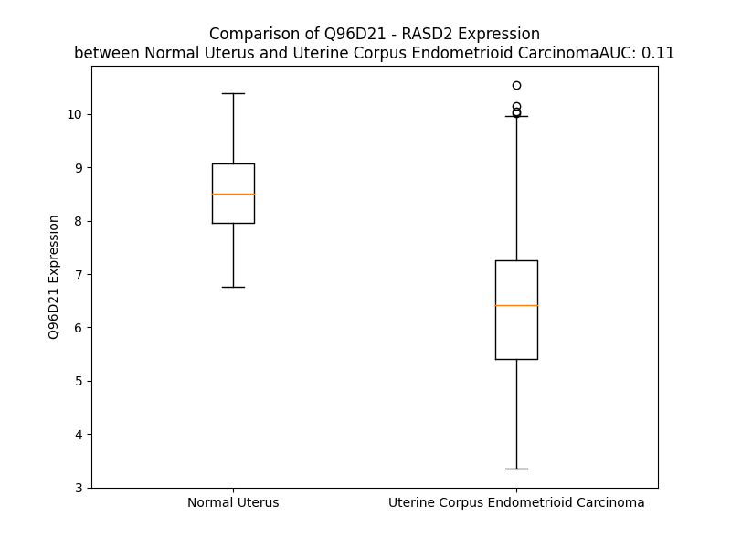

# Detailed Data for Q96D21

## Introduction to the Detailed Summary

### How to Interpret the Results

- **Summary & Metrics**: This section provides a quick reference to essential protein attributes, including expression changes, family classification, and biomarker applications. Regulation status (upregulated/downregulated) indicates the protein's behavior in a disease context. Some information comes from the original excel file with the proteins selected from literature, while others are derived from the analyses.
- **Expression Comparison**: A visual representation comparing protein expression between normal and disease states. It highlights significant changes in expression levels that might indicate diagnostic or therapeutic relevance. This is data coming from transcriptomics experiments and could not translate similarly to protein levels.
- **Isoform Alignment**: An interactive view of isoform alignments, revealing structural and functional differences between variants of the protein.
- **Interactors & Homologs**: Tables listing known interaction partners and homologous proteins, the more interactors and homologs, the more complex the protein is to design an antibody for.
- **Biological Assemblies**: Information about the structural arrangement of the protein in different assemblies, providing insights into its functional state but also the complexity of the protein to develop antibodies.
- **Combined Per-Residue Information**: A detailed table summarizing residue-level data. This includes predictions for epitope regions, aggregation tendencies, and modifications that might impact the protein's function. Each row corresponds to a residue in the protein, providing insights into specific sites that may be important for research or drug development.
## Summary & Metrics

- **UniProt Accession**: Q96D21
- **Gene Name**: RASD2 / TEM-2
- **Protein Name**: Tumour endothelial marker 2 / GTP-binding protein Rhes
- **Swiss Prot**: RHES_HUMAN
- **Family**: nan
- **Biomarker Application**: nan
- **Number of Isoforms**: 0
- **Regulation**: 1
- **(transcriptomics) AUC**: 0.22
- **(transcriptomics) Fold Change**: 1.15
- **(transcriptomics) Regulation**: Downregulated
- **Discotope Epitope Count**: 50
- **Max n_uniprots (Homo)**: N/A
- **Max n_uniprots (Hetero)**: N/A

## Expression Comparison

## Interactors

| preferredName_A   | preferredName_B   |   score |
|:------------------|:------------------|--------:|
| RASD2             | HTT               |   0.947 |
| RASD2             | BECN1             |   0.912 |

## Homologs

| uniprot_id   | gene_id   |
|:-------------|:----------|
| O75628       | REM1      |
| E7ESV4       | RAP1B     |
| F8W1T5       | RHEBL1    |
| P55042       | RRAD      |
| Q96S79       | RASL10B   |
| E9PQC5       | RRAS2     |
| Q7Z444       | ERAS      |
| G5EA41       | RERGL     |
| Q9Y272       | RASD1     |
| A0A087X2C3   | RAP2C     |
| X5D945       | HRAS      |
| C9JYR1       | RALB      |
| E5RJF9       | GEM       |
| O95661       | DIRAS3    |
| A8KAH9       | RAP1A     |
| A0A494C0S1   | RIT1      |
| K7EKE9       | NKIRAS2   |
| Q92737       | RASL10A   |
| F8WBL3       | RHEB      |
| P10114       | RAP2A     |
| P61225       | RAP2B     |
| Q96A58       | RERG      |
| Q96HU8       | DIRAS2    |
| Q5U091       | NRAS      |
| P10301       | RRAS      |
| K7EN06       | DIRAS1    |
| Q8IYK8       | REM2      |
| A0A8I5KUB5   | KRAS      |
| Q6T310       | RASL11A   |
| P11233       | RALA      |
| Q9NYN1       | RASL12    |
| Q9NYS0       | NKIRAS1   |
| Q6FGP0       | MRAS      |
| Q99578       | RIT2      |
| Q9BPW5       | RASL11B   |

## Combined Per-Residue Information

|   res | aa   |   epitope_score | epitope   |   relative_surface_accessibility |   modeling_confidence |   Aggregation | modification          |
|------:|:-----|----------------:|:----------|---------------------------------:|----------------------:|--------------:|:----------------------|
|     1 | M    |         0.22891 | False     |                          1.28143 |                 35.02 |         0     | N/A                   |
|     2 | M    |         0.25346 | False     |                          1.04666 |                 30.41 |         0     | N/A                   |
|     3 | K    |         0.21287 | False     |                          0.92962 |                 26.12 |         0     | N/A                   |
|     4 | T    |         0.21714 | False     |                          0.95465 |                 28.82 |         0     | N/A                   |
|     5 | L    |         0.19548 | False     |                          0.95226 |                 28.76 |         0     | N/A                   |
|     6 | S    |         0.13628 | False     |                          0.79519 |                 30.25 |         0     | N/A                   |
|     7 | S    |         0.16172 | False     |                          0.7659  |                 34.64 |         0     | N/A                   |
|     8 | G    |         0.13759 | False     |                          0.82397 |                 30.67 |         0     | N/A                   |
|     9 | N    |         0.1736  | False     |                          0.76459 |                 37.1  |         0     | N/A                   |
|    10 | C    |         0.10807 | False     |                          0.79189 |                 36.43 |         0     | N/A                   |
|    11 | T    |         0.17988 | False     |                          0.76425 |                 49.77 |         0     | N/A                   |
|    12 | L    |         0.12618 | False     |                          0.48029 |                 63.49 |         0     | N/A                   |
|    13 | S    |         0.14184 | False     |                          0.76539 |                 78.25 |         0     | N/A                   |
|    14 | V    |         0.06914 | False     |                          0.17979 |                 86.49 |         0     | N/A                   |
|    15 | P    |         0.11368 | False     |                          0.43328 |                 87.38 |         0     | N/A                   |
|    16 | A    |         0.12865 | False     |                          0.6337  |                 85.96 |         0     | N/A                   |
|    17 | K    |         0.24169 | False     |                          0.78374 |                 87.57 |         0     | N/A                   |
|    18 | N    |         0.09813 | False     |                          0.07979 |                 93.43 |         0     | N/A                   |
|    19 | S    |         0.09575 | False     |                          0.18363 |                 93.33 |         0     | N/A                   |
|    20 | Y    |         0.17269 | False     |                          0.23414 |                 95.32 |         0     | N/A                   |
|    21 | R    |         0.02927 | False     |                          0.0401  |                 95.63 |         0     | N/A                   |
|    22 | M    |         0.00835 | False     |                          0.00537 |                 97.36 |         2.378 | N/A                   |
|    23 | V    |         0.00111 | False     |                          0       |                 96.73 |         2.86  | N/A                   |
|    24 | V    |         0.00386 | False     |                          0.00381 |                 97.23 |         2.86  | N/A                   |
|    25 | L    |         0.02311 | False     |                          0.0272  |                 95.78 |         2.86  | N/A                   |
|    26 | G    |         0.05579 | False     |                          0.05994 |                 95.56 |         2.86  | N/A                   |
|    27 | A    |         0.07118 | False     |                          0.19896 |                 94.59 |         1.043 | N/A                   |
|    28 | S    |         0.11136 | False     |                          0.47407 |                 92.73 |         0     | N/A                   |
|    29 | R    |         0.16197 | False     |                          0.69013 |                 93.11 |         0     | N/A                   |
|    30 | V    |         0.03289 | False     |                          0.01034 |                 95.48 |         0     | N/A                   |
|    31 | G    |         0.08826 | False     |                          0.19594 |                 95.26 |         0     | N/A                   |
|    32 | K    |         0.05934 | False     |                          0.0553  |                 96.05 |         0     | N/A                   |
|    33 | S    |         0.1025  | False     |                          0.33835 |                 95.34 |         0     | N/A                   |
|    34 | S    |         0.11756 | False     |                          0.21646 |                 95.8  |         0     | N/A                   |
|    35 | I    |         0.00696 | False     |                          0.0024  |                 97    |         0     | N/A                   |
|    36 | V    |         0.03019 | False     |                          0.02666 |                 96.01 |         0     | N/A                   |
|    37 | S    |         0.14293 | False     |                          0.20715 |                 94.59 |         0     | N/A                   |
|    38 | R    |         0.24859 | False     |                          0.14017 |                 94.75 |         0     | N/A                   |
|    39 | F    |         0.01767 | False     |                          0.00461 |                 95.2  |         0     | N/A                   |
|    40 | L    |         0.06344 | False     |                          0.04337 |                 93.67 |         0     | N/A                   |
|    41 | N    |         0.29465 | True      |                          0.53478 |                 90.66 |         0     | N/A                   |
|    42 | G    |         0.1512  | False     |                          0.4121  |                 90.99 |         0     | N/A                   |
|    43 | R    |         0.29838 | True      |                          0.68912 |                 90.45 |         0     | N/A                   |
|    44 | F    |         0.26929 | True      |                          0.30231 |                 91.6  |         0     | N/A                   |
|    45 | E    |         0.33095 | True      |                          0.64245 |                 89.72 |         0     | N/A                   |
|    46 | D    |         0.30729 | True      |                          0.68448 |                 86.51 |         0     | N/A                   |
|    47 | Q    |         0.28745 | True      |                          0.76644 |                 85.73 |         0     | N/A                   |
|    48 | Y    |         0.33614 | True      |                          0.50447 |                 83    |         0     | N/A                   |
|    49 | T    |         0.25594 | False     |                          0.70007 |                 83.5  |         0     | N/A                   |
|    50 | P    |         0.29759 | True      |                          0.78075 |                 84.76 |         0     | N/A                   |
|    51 | T    |         0.15332 | False     |                          0.21586 |                 82.09 |         0     | N/A                   |
|    52 | I    |         0.34791 | True      |                          0.89797 |                 80.18 |         0     | N/A                   |
|    53 | E    |         0.1472  | False     |                          0.29504 |                 85.12 |         0     | N/A                   |
|    54 | D    |         0.17189 | False     |                          0.40969 |                 90.81 |         0     | N/A                   |
|    55 | F    |         0.10174 | False     |                          0.0864  |                 94.18 |         0     | N/A                   |
|    56 | H    |         0.10385 | False     |                          0.27688 |                 95.17 |         0     | N/A                   |
|    57 | R    |         0.08049 | False     |                          0.2851  |                 94.9  |         0     | N/A                   |
|    58 | K    |         0.01573 | False     |                          0.00725 |                 95.07 |         0     | N/A                   |
|    59 | V    |         0.04312 | False     |                          0.07484 |                 94.36 |         0     | N/A                   |
|    60 | Y    |         0.00503 | False     |                          0.00183 |                 94.25 |         0     | N/A                   |
|    61 | N    |         0.11665 | False     |                          0.13389 |                 92.79 |         0     | N/A                   |
|    62 | I    |         0.06941 | False     |                          0.02866 |                 93.27 |         0     | N/A                   |
|    63 | R    |         0.18784 | False     |                          0.81253 |                 90.58 |         0     | N/A                   |
|    64 | G    |         0.14051 | False     |                          0.76447 |                 87.66 |         0     | N/A                   |
|    65 | D    |         0.18472 | False     |                          0.48449 |                 91.89 |         0     | N/A                   |
|    66 | M    |         0.10409 | False     |                          0.19186 |                 93.61 |         0     | N/A                   |
|    67 | Y    |         0.12649 | False     |                          0.14341 |                 95.7  |         0     | N/A                   |
|    68 | Q    |         0.05447 | False     |                          0.12804 |                 95.25 |         0     | N/A                   |
|    69 | L    |         0.00316 | False     |                          0       |                 97.02 |         0     | N/A                   |
|    70 | D    |         0.03412 | False     |                          0.05148 |                 96.68 |         0     | N/A                   |
|    71 | I    |         0.0067  | False     |                          0.004   |                 97.45 |         0     | N/A                   |
|    72 | L    |         0.00325 | False     |                          0       |                 95.55 |         0     | N/A                   |
|    73 | D    |         0.01151 | False     |                          0.00757 |                 93.63 |         0     | N/A                   |
|    74 | T    |         0.01589 | False     |                          0.00639 |                 88.38 |         0     | N/A                   |
|    75 | S    |         0.12553 | False     |                          0.10934 |                 84.79 |         0     | N/A                   |
|    76 | G    |         0.22671 | False     |                          0.27422 |                 74.63 |         0     | N/A                   |
|    77 | N    |         0.40161 | True      |                          0.72377 |                 73.14 |         0     | N/A                   |
|    78 | H    |         0.20156 | False     |                          0.12759 |                 69.67 |         0     | N/A                   |
|    79 | P    |         0.30847 | True      |                          0.6902  |                 66.79 |         0     | N/A                   |
|    80 | F    |         0.37117 | True      |                          0.68913 |                 82.45 |         0     | N/A                   |
|    81 | P    |         0.22112 | False     |                          0.74173 |                 85.48 |         0     | N/A                   |
|    82 | A    |         0.28091 | True      |                          0.73697 |                 89.14 |         0     | N/A                   |
|    83 | M    |         0.30356 | True      |                          0.47052 |                 88.85 |         0     | N/A                   |
|    84 | R    |         0.16595 | False     |                          0.10949 |                 89.88 |         0     | N/A                   |
|    85 | R    |         0.22806 | False     |                          0.51886 |                 92.22 |         0.533 | N/A                   |
|    86 | L    |         0.20935 | False     |                          0.09516 |                 92.46 |         0.993 | N/A                   |
|    87 | S    |         0.01028 | False     |                          0.00553 |                 93.09 |         0.993 | N/A                   |
|    88 | I    |         0.00674 | False     |                          0       |                 93.58 |         0.993 | N/A                   |
|    89 | L    |         0.11992 | False     |                          0.18308 |                 93.19 |         0.993 | N/A                   |
|    90 | T    |         0.00498 | False     |                          0.0007  |                 92.76 |         0.993 | N/A                   |
|    91 | G    |         0.00509 | False     |                          0.00238 |                 94.66 |         0.533 | N/A                   |
|    92 | D    |         0.08471 | False     |                          0.1363  |                 94.2  |         0.533 | N/A                   |
|    93 | V    |         0.02076 | False     |                          0.01714 |                 96.23 |        92.056 | N/A                   |
|    94 | F    |         0.00278 | False     |                          0       |                 97.58 |        99.369 | N/A                   |
|    95 | I    |         0.00297 | False     |                          0.0024  |                 98.16 |        99.739 | N/A                   |
|    96 | L    |         0.00252 | False     |                          0       |                 97.9  |        99.767 | N/A                   |
|    97 | V    |         0.00233 | False     |                          0       |                 98.28 |        99.767 | N/A                   |
|    98 | F    |         0.00407 | False     |                          0       |                 98.3  |        94.328 | N/A                   |
|    99 | S    |         0.03194 | False     |                          0.0104  |                 97.93 |        21.964 | N/A                   |
|   100 | L    |         0.03591 | False     |                          0.0371  |                 98.14 |        18.569 | N/A                   |
|   101 | D    |         0.24937 | False     |                          0.21072 |                 97.16 |         0     | N/A                   |
|   102 | N    |         0.23792 | False     |                          0.36912 |                 97.19 |         0     | N/A                   |
|   103 | R    |         0.38395 | True      |                          0.35144 |                 97.25 |         0     | N/A                   |
|   104 | E    |         0.31214 | True      |                          0.72301 |                 97.54 |         0     | N/A                   |
|   105 | S    |         0.01843 | False     |                          0.00565 |                 97.21 |         0     | N/A                   |
|   106 | F    |         0.00846 | False     |                          0       |                 98.21 |         0     | N/A                   |
|   107 | D    |         0.3265  | True      |                          0.38379 |                 97.59 |         0     | N/A                   |
|   108 | E    |         0.14483 | False     |                          0.18148 |                 95.91 |         0     | N/A                   |
|   109 | V    |         0.0036  | False     |                          0       |                 96.89 |         0     | N/A                   |
|   110 | K    |         0.2168  | False     |                          0.31693 |                 96.76 |         0     | N/A                   |
|   111 | R    |         0.4041  | True      |                          0.49963 |                 95.59 |         0     | N/A                   |
|   112 | L    |         0.02639 | False     |                          0.02226 |                 95.16 |         0     | N/A                   |
|   113 | Q    |         0.13863 | False     |                          0.09385 |                 95.5  |         0     | N/A                   |
|   114 | K    |         0.40296 | True      |                          0.65689 |                 94.36 |         0     | N/A                   |
|   115 | Q    |         0.23575 | False     |                          0.21358 |                 93.72 |         0     | N/A                   |
|   116 | I    |         0.00474 | False     |                          0       |                 94.26 |         0     | N/A                   |
|   117 | L    |         0.14988 | False     |                          0.50712 |                 92.6  |         0     | N/A                   |
|   118 | E    |         0.27028 | True      |                          0.45832 |                 91.82 |         0     | N/A                   |
|   119 | V    |         0.09824 | False     |                          0.10754 |                 91.46 |         0     | N/A                   |
|   120 | K    |         0.18508 | False     |                          0.07152 |                 89.49 |         0     | N/A                   |
|   121 | S    |         0.13451 | False     |                          0.47513 |                 86.11 |         0     | N/A                   |
|   122 | C    |         0.19099 | False     |                          0.7467  |                 81.87 |         0     | N/A                   |
|   123 | L    |         0.20599 | False     |                          0.30363 |                 77.12 |         0     | N/A                   |
|   124 | K    |         0.12426 | False     |                          0.26227 |                 69.7  |         0     | N/A                   |
|   125 | N    |         0.1892  | False     |                          0.72435 |                 60.03 |         0     | N/A                   |
|   126 | K    |         0.24515 | False     |                          1.02449 |                 48.18 |         0     | N/A                   |
|   127 | T    |         0.27014 | True      |                          0.56141 |                 47.93 |         0     | N/A                   |
|   128 | K    |         0.2709  | True      |                          1.00723 |                 47.85 |         0     | N/A                   |
|   129 | E    |         0.14766 | False     |                          0.75804 |                 49.92 |         0     | N/A                   |
|   130 | A    |         0.17789 | False     |                          0.69267 |                 52.74 |         0     | N/A                   |
|   131 | A    |         0.118   | False     |                          0.49608 |                 59.67 |         0     | N/A                   |
|   132 | E    |         0.06529 | False     |                          0.44022 |                 79.33 |         0     | N/A                   |
|   133 | L    |         0.077   | False     |                          0.14274 |                 90.94 |         0     | N/A                   |
|   134 | P    |         0.02592 | False     |                          0.06163 |                 95.44 |         0     | N/A                   |
|   135 | M    |         0.02337 | False     |                          0.02776 |                 97.2  |         0     | N/A                   |
|   136 | V    |         0.00358 | False     |                          0       |                 98.07 |         0     | N/A                   |
|   137 | I    |         0.00239 | False     |                          0       |                 98.25 |         0     | N/A                   |
|   138 | C    |         0.00322 | False     |                          0       |                 98.3  |         0     | N/A                   |
|   139 | G    |         0.00389 | False     |                          0       |                 98.39 |         0     | N/A                   |
|   140 | N    |         0.02459 | False     |                          0.02844 |                 98.22 |         0     | N/A                   |
|   141 | K    |         0.07986 | False     |                          0.23537 |                 96.75 |         0     | N/A                   |
|   142 | N    |         0.17437 | False     |                          0.28102 |                 95.85 |         0     | N/A                   |
|   143 | D    |         0.26473 | True      |                          0.20664 |                 95.53 |         0     | N/A                   |
|   144 | H    |         0.4264  | True      |                          0.48083 |                 92.22 |         0     | N/A                   |
|   145 | G    |         0.35865 | True      |                          0.51521 |                 89.21 |         0     | N/A                   |
|   146 | E    |         0.28307 | True      |                          0.64383 |                 91.25 |         0     | N/A                   |
|   147 | L    |         0.43452 | True      |                          1.13396 |                 93.42 |         0     | N/A                   |
|   148 | C    |         0.25073 | False     |                          0.48576 |                 93.76 |         0     | N/A                   |
|   149 | R    |         0.35557 | True      |                          0.24204 |                 96.7  |         0     | N/A                   |
|   150 | Q    |         0.31037 | True      |                          0.50606 |                 97.44 |         0     | N/A                   |
|   151 | V    |         0.01347 | False     |                          0.00166 |                 96.83 |         0     | N/A                   |
|   152 | P    |         0.30886 | True      |                          0.47801 |                 95.7  |         0     | N/A                   |
|   153 | T    |         0.22014 | False     |                          0.35046 |                 95.92 |         0     | N/A                   |
|   154 | T    |         0.25763 | False     |                          0.70374 |                 96.38 |         0     | N/A                   |
|   155 | E    |         0.3251  | True      |                          0.22542 |                 96.34 |         0     | N/A                   |
|   156 | A    |         0.0044  | False     |                          0       |                 95.53 |         0     | N/A                   |
|   157 | E    |         0.21086 | False     |                          0.42191 |                 96.1  |         0     | N/A                   |
|   158 | L    |         0.33288 | True      |                          0.8069  |                 96.06 |         0     | N/A                   |
|   159 | L    |         0.27996 | True      |                          0.27498 |                 94.05 |         0     | N/A                   |
|   160 | V    |         0.10279 | False     |                          0.13644 |                 93.9  |         0     | N/A                   |
|   161 | S    |         0.25672 | False     |                          0.57801 |                 91.15 |         0     | N/A                   |
|   162 | G    |         0.26878 | True      |                          1.06337 |                 86.57 |         0     | N/A                   |
|   163 | D    |         0.24185 | False     |                          0.31967 |                 87.26 |         0     | N/A                   |
|   164 | E    |         0.2293  | False     |                          0.88006 |                 85.97 |         0     | N/A                   |
|   165 | N    |         0.17032 | False     |                          0.27879 |                 90.8  |         0     | N/A                   |
|   166 | C    |         0.11602 | False     |                          0.08449 |                 95.11 |         0     | N/A                   |
|   167 | A    |         0.12242 | False     |                          0.17218 |                 96.49 |         0     | N/A                   |
|   168 | Y    |         0.12134 | False     |                          0.151   |                 97.99 |         0     | N/A                   |
|   169 | F    |         0.13047 | False     |                          0.18145 |                 98.16 |         0     | N/A                   |
|   170 | E    |         0.07843 | False     |                          0.16777 |                 98.12 |         0     | N/A                   |
|   171 | V    |         0.00227 | False     |                          0       |                 97.95 |         0     | N/A                   |
|   172 | S    |         0.01783 | False     |                          0       |                 97.57 |         0     | N/A                   |
|   173 | A    |         0.03854 | False     |                          0.01915 |                 96.54 |         0     | N/A                   |
|   174 | K    |         0.28522 | True      |                          0.5136  |                 95.92 |         0     | N/A                   |
|   175 | K    |         0.38994 | True      |                          0.67563 |                 96.02 |         0     | N/A                   |
|   176 | N    |         0.18    | False     |                          0.37597 |                 95.19 |         0     | N/A                   |
|   177 | T    |         0.32033 | True      |                          0.3742  |                 96.68 |         0     | N/A                   |
|   178 | N    |         0.0987  | False     |                          0.37469 |                 96.48 |         0     | N/A                   |
|   179 | V    |         0.00289 | False     |                          0.00095 |                 96.48 |         0     | N/A                   |
|   180 | D    |         0.11068 | False     |                          0.25606 |                 94.36 |         0     | N/A                   |
|   181 | E    |         0.24664 | False     |                          0.4915  |                 96.06 |         0.008 | N/A                   |
|   182 | M    |         0.00415 | False     |                          0       |                 97.5  |        28.701 | N/A                   |
|   183 | F    |         0.01304 | False     |                          0.01083 |                 97.01 |        95.932 | N/A                   |
|   184 | Y    |         0.17716 | False     |                          0.41396 |                 96.3  |        97.006 | N/A                   |
|   185 | V    |         0.15497 | False     |                          0.34751 |                 95.85 |        97.146 | N/A                   |
|   186 | L    |         0.00245 | False     |                          0       |                 96.47 |        97.151 | N/A                   |
|   187 | F    |         0.00451 | False     |                          0.00069 |                 95.89 |        96.411 | N/A                   |
|   188 | S    |         0.19004 | False     |                          0.32233 |                 94.79 |        65.477 | N/A                   |
|   189 | M    |         0.13233 | False     |                          0.20644 |                 94.19 |        61.032 | N/A                   |
|   190 | A    |         0.07213 | False     |                          0.18771 |                 93.48 |        27.972 | N/A                   |
|   191 | K    |         0.20773 | False     |                          0.76269 |                 93.67 |         0.008 | N/A                   |
|   192 | L    |         0.054   | False     |                          0.04833 |                 94.24 |         0     | N/A                   |
|   193 | P    |         0.10333 | False     |                          0.21487 |                 94.55 |         0     | N/A                   |
|   194 | H    |         0.10309 | False     |                          0.43969 |                 92.95 |         0     | N/A                   |
|   195 | E    |         0.09461 | False     |                          0.14901 |                 94.18 |         0     | N/A                   |
|   196 | M    |         0.00288 | False     |                          0       |                 94.98 |         0     | N/A                   |
|   197 | S    |         0.04364 | False     |                          0.0208  |                 92.93 |         0     | N/A                   |
|   198 | P    |         0.04995 | False     |                          0.10523 |                 86.61 |         0     | N/A                   |
|   199 | A    |         0.17009 | False     |                          0.75741 |                 87.7  |         0     | N/A                   |
|   200 | L    |         0.16509 | False     |                          0.51822 |                 90.77 |         0     | N/A                   |
|   201 | H    |         0.08437 | False     |                          0.08478 |                 91.7  |         0     | N/A                   |
|   202 | R    |         0.20144 | False     |                          0.62707 |                 89.71 |         0     | N/A                   |
|   203 | K    |         0.14117 | False     |                          0.43737 |                 88.77 |         0     | N/A                   |
|   204 | I    |         0.11328 | False     |                          0.2463  |                 87.06 |         0.134 | N/A                   |
|   205 | S    |         0.24985 | False     |                          0.67237 |                 78.61 |         0.134 | N/A                   |
|   206 | V    |         0.13604 | False     |                          0.45949 |                 69.77 |         0.134 | N/A                   |
|   207 | Q    |         0.25208 | False     |                          0.66654 |                 59.14 |         0.134 | N/A                   |
|   208 | Y    |         0.29194 | True      |                          0.67432 |                 49.6  |         0.134 | N/A                   |
|   209 | G    |         0.27741 | True      |                          0.6616  |                 43.45 |         0     | N/A                   |
|   210 | D    |         0.16788 | False     |                          0.47164 |                 44.9  |         0     | N/A                   |
|   211 | A    |         0.19051 | False     |                          0.74003 |                 44.13 |         0     | N/A                   |
|   212 | F    |         0.2382  | False     |                          0.73389 |                 38.81 |         0     | N/A                   |
|   213 | H    |         0.18738 | False     |                          0.61006 |                 35.68 |         0     | N/A                   |
|   214 | P    |         0.14881 | False     |                          0.91211 |                 38.37 |         0     | N/A                   |
|   215 | R    |         0.21739 | False     |                          0.73217 |                 36.14 |         0     | N/A                   |
|   216 | P    |         0.15098 | False     |                          0.79811 |                 38.7  |         0     | N/A                   |
|   217 | F    |         0.16805 | False     |                          0.57879 |                 47.06 |         0     | N/A                   |
|   218 | C    |         0.15739 | False     |                          0.582   |                 40.05 |         0     | N/A                   |
|   219 | M    |         0.21503 | False     |                          0.46778 |                 48.39 |         0     | N/A                   |
|   220 | R    |         0.3704  | True      |                          0.88982 |                 43.64 |         0     | N/A                   |
|   221 | R    |         0.32041 | True      |                          0.93489 |                 43.03 |         0     | N/A                   |
|   222 | V    |         0.089   | False     |                          0.32197 |                 48.92 |         0     | N/A                   |
|   223 | K    |         0.22503 | False     |                          0.88409 |                 46    |         0     | N/A                   |
|   224 | E    |         0.27605 | True      |                          0.87196 |                 55.02 |         0     | N/A                   |
|   225 | M    |         0.2092  | False     |                          0.98517 |                 61.98 |         0     | N/A                   |
|   226 | D    |         0.20552 | False     |                          0.60621 |                 83.36 |         0     | N/A                   |
|   227 | A    |         0.06623 | False     |                          0.12084 |                 91.12 |         0     | N/A                   |
|   228 | Y    |         0.11798 | False     |                          0.11901 |                 91.21 |         0     | N/A                   |
|   229 | G    |         0.02206 | False     |                          0.01547 |                 92.34 |         0     | N/A                   |
|   230 | M    |         0.12246 | False     |                          0.21345 |                 92.45 |         0     | N/A                   |
|   231 | V    |         0.11697 | False     |                          0.30088 |                 92.25 |         0     | N/A                   |
|   232 | S    |         0.09282 | False     |                          0.22639 |                 90.87 |         0     | N/A                   |
|   233 | P    |         0.2144  | False     |                          0.62651 |                 83.44 |         0     | N/A                   |
|   234 | F    |         0.36248 | True      |                          0.7761  |                 82.03 |         0     | N/A                   |
|   235 | A    |         0.11011 | False     |                          0.25962 |                 88.57 |         0     | N/A                   |
|   236 | R    |         0.29129 | True      |                          0.83975 |                 89.08 |         0     | N/A                   |
|   237 | R    |         0.2402  | False     |                          0.26507 |                 90.87 |         0     | N/A                   |
|   238 | P    |         0.12861 | False     |                          0.25591 |                 91.56 |         0     | N/A                   |
|   239 | S    |         0.21249 | False     |                          0.50356 |                 93.58 |         0     | N/A                   |
|   240 | V    |         0.27524 | True      |                          0.49716 |                 92.58 |         0     | N/A                   |
|   241 | N    |         0.285   | True      |                          0.55508 |                 94.13 |         0     | N/A                   |
|   242 | S    |         0.23702 | False     |                          0.41202 |                 92.42 |         0     | N/A                   |
|   243 | D    |         0.02271 | False     |                          0.00751 |                 93.36 |         0     | N/A                   |
|   244 | L    |         0.32482 | True      |                          0.58572 |                 92.34 |         0     | N/A                   |
|   245 | K    |         0.31119 | True      |                          0.64477 |                 91.53 |         0     | N/A                   |
|   246 | Y    |         0.11896 | False     |                          0.24284 |                 89.02 |         0     | N/A                   |
|   247 | I    |         0.12136 | False     |                          0.1032  |                 89.37 |         0     | N/A                   |
|   248 | K    |         0.23355 | False     |                          0.77567 |                 88.1  |         0     | N/A                   |
|   249 | A    |         0.14552 | False     |                          0.39248 |                 85.76 |         0     | N/A                   |
|   250 | K    |         0.16824 | False     |                          0.23881 |                 81.97 |         0     | N/A                   |
|   251 | V    |         0.12969 | False     |                          0.40037 |                 81.25 |         0     | N/A                   |
|   252 | L    |         0.19123 | False     |                          0.66914 |                 80.18 |         0     | N/A                   |
|   253 | R    |         0.18313 | False     |                          0.40741 |                 73.93 |         0     | N/A                   |
|   254 | E    |         0.14885 | False     |                          0.30724 |                 68.54 |         0     | N/A                   |
|   255 | G    |         0.25001 | False     |                          0.43914 |                 64.69 |         0     | N/A                   |
|   256 | Q    |         0.20199 | False     |                          0.46985 |                 59.88 |         0     | N/A                   |
|   257 | A    |         0.15599 | False     |                          0.51807 |                 58.06 |         0     | N/A                   |
|   258 | R    |         0.14214 | False     |                          0.29408 |                 54.05 |         0     | N/A                   |
|   259 | E    |         0.20737 | False     |                          0.59982 |                 55.83 |         0     | N/A                   |
|   260 | R    |         0.29043 | True      |                          0.7796  |                 53.07 |         0     | N/A                   |
|   261 | D    |         0.19145 | False     |                          0.69551 |                 52.93 |         0     | N/A                   |
|   262 | K    |         0.25237 | False     |                          0.79108 |                 54.63 |         0     | N/A                   |
|   263 | C    |         0.18077 | False     |                          0.68998 |                 43.74 |         0     | Cysteine methyl ester |
|   264 | T    |         0.27212 | True      |                          0.7952  |                 47.26 |         0     | N/A                   |
|   265 | I    |         0.22103 | False     |                          0.93253 |                 45.48 |         0     | N/A                   |
|   266 | Q    |         0.17534 | False     |                          1.17691 |                 44.65 |         0     | N/A                   |

