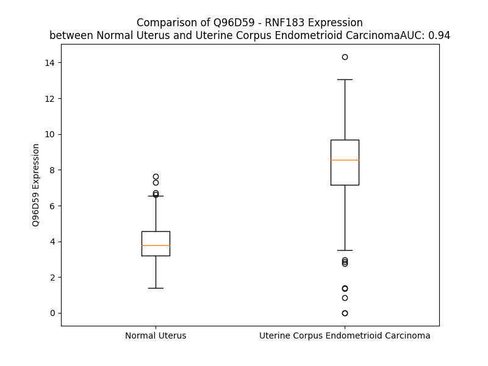

# Detailed Data for Q96D59

## Introduction to the Detailed Summary

### How to Interpret the Results

- **Summary & Metrics**: This section provides a quick reference to essential protein attributes, including expression changes, family classification, and biomarker applications. Regulation status (upregulated/downregulated) indicates the protein's behavior in a disease context. Some information comes from the original excel file with the proteins selected from literature, while others are derived from the analyses.
- **Expression Comparison**: A visual representation comparing protein expression between normal and disease states. It highlights significant changes in expression levels that might indicate diagnostic or therapeutic relevance. This is data coming from transcriptomics experiments and could not translate similarly to protein levels.
- **Isoform Alignment**: An interactive view of isoform alignments, revealing structural and functional differences between variants of the protein.
- **Interactors & Homologs**: Tables listing known interaction partners and homologous proteins, the more interactors and homologs, the more complex the protein is to design an antibody for.
- **Biological Assemblies**: Information about the structural arrangement of the protein in different assemblies, providing insights into its functional state but also the complexity of the protein to develop antibodies.
- **Combined Per-Residue Information**: A detailed table summarizing residue-level data. This includes predictions for epitope regions, aggregation tendencies, and modifications that might impact the protein's function. Each row corresponds to a residue in the protein, providing insights into specific sites that may be important for research or drug development.
## Summary & Metrics

- **UniProt Accession**: Q96D59
- **Gene Name**: RNF183 
- **Protein Name**: ring finger protein 183 
- **Swiss Prot**: RN183_HUMAN
- **Family**: other
- **Biomarker Application**:  
- **Number of Isoforms**: 0
- **Regulation**: 1
- **(transcriptomics) AUC**: 0.94
- **(transcriptomics) Fold Change**: 2.09
- **(transcriptomics) Regulation**: Upregulated
- **Discotope Epitope Count**: 37
- **Max n_uniprots (Homo)**: N/A
- **Max n_uniprots (Hetero)**: N/A

## Expression Comparison

## Interactors

| preferredName_A   | preferredName_B   | score   |
|-------------------|-------------------|---------|

## Homologs

| uniprot_id   | gene_id   |
|:-------------|:----------|
| Q9H0X6       | RNF208    |
| E7ERA6       | RNF223    |
| M0QZC1       | RNF225    |

## Combined Per-Residue Information

|   res | aa   |   epitope_score | epitope   |   relative_surface_accessibility |   modeling_confidence |   Aggregation | modification   |
|------:|:-----|----------------:|:----------|---------------------------------:|----------------------:|--------------:|:---------------|
|     1 | M    |         0.20816 | False     |                          1.27445 |                 36.96 |         0     | N/A            |
|     2 | A    |         0.24415 | False     |                          1.02251 |                 36.08 |         0     | N/A            |
|     3 | E    |         0.21107 | False     |                          0.67293 |                 33.7  |         0     | N/A            |
|     4 | Q    |         0.28368 | False     |                          0.90918 |                 34.35 |         0     | N/A            |
|     5 | Q    |         0.30152 | False     |                          0.69643 |                 31.27 |         0     | N/A            |
|     6 | G    |         0.24087 | False     |                          0.86608 |                 34.76 |         0     | N/A            |
|     7 | R    |         0.27632 | False     |                          0.89753 |                 36.41 |         0     | N/A            |
|     8 | E    |         0.27747 | False     |                          0.68978 |                 45.81 |         0     | N/A            |
|     9 | L    |         0.21902 | False     |                          0.75331 |                 53.6  |         0     | N/A            |
|    10 | E    |         0.24031 | False     |                          0.60558 |                 63.13 |         0     | N/A            |
|    11 | A    |         0.30925 | True      |                          0.24768 |                 78.99 |         0     | N/A            |
|    12 | E    |         0.27654 | False     |                          0.46834 |                 86.66 |         0     | N/A            |
|    13 | C    |         0.0349  | False     |                          0.00148 |                 85.91 |         0     | N/A            |
|    14 | P    |         0.34391 | True      |                          0.39915 |                 86.9  |         0     | N/A            |
|    15 | V    |         0.34194 | True      |                          0.44901 |                 88.16 |         0     | N/A            |
|    16 | C    |         0.27782 | False     |                          0.30198 |                 85.49 |         0     | N/A            |
|    17 | W    |         0.33339 | True      |                          0.81555 |                 86.67 |         0     | N/A            |
|    18 | N    |         0.366   | True      |                          0.37425 |                 84.31 |         0     | N/A            |
|    19 | P    |         0.46225 | True      |                          0.54242 |                 83.49 |         0     | N/A            |
|    20 | F    |         0.10339 | False     |                          0.05615 |                 84    |         0     | N/A            |
|    21 | N    |         0.23684 | False     |                          0.28796 |                 81.28 |         0     | N/A            |
|    22 | N    |         0.27567 | False     |                          0.17174 |                 78.96 |         0     | N/A            |
|    23 | T    |         0.29295 | False     |                          0.21631 |                 79.47 |         0     | N/A            |
|    24 | F    |         0.11058 | False     |                          0.15782 |                 81.32 |         0     | N/A            |
|    25 | H    |         0.18758 | False     |                          0.1729  |                 85.92 |         0     | N/A            |
|    26 | T    |         0.02954 | False     |                          0.02475 |                 87    |         0     | N/A            |
|    27 | P    |         0.00485 | False     |                          0       |                 88.38 |         0     | N/A            |
|    28 | K    |         0.16303 | False     |                          0.0905  |                 90.85 |         0     | N/A            |
|    29 | M    |         0.14875 | False     |                          0.28105 |                 90.21 |         0     | N/A            |
|    30 | L    |         0.08242 | False     |                          0.03419 |                 91.02 |         0     | N/A            |
|    31 | D    |         0.27241 | False     |                          0.60683 |                 89.14 |         0     | N/A            |
|    32 | C    |         0.21515 | False     |                          0.23094 |                 91.02 |         0     | N/A            |
|    33 | C    |         0.29882 | False     |                          0.68138 |                 89.61 |         0     | N/A            |
|    34 | H    |         0.31187 | True      |                          0.3406  |                 90.14 |         0     | N/A            |
|    35 | S    |         0.12516 | False     |                          0.14986 |                 90.4  |         0     | N/A            |
|    36 | F    |         0.01911 | False     |                          0.00265 |                 90.76 |         0     | N/A            |
|    37 | C    |         0.01479 | False     |                          0.00468 |                 86.68 |         0     | N/A            |
|    38 | V    |         0.01603 | False     |                          0.00381 |                 89.63 |         0     | N/A            |
|    39 | E    |         0.1813  | False     |                          0.17486 |                 88.07 |         0     | N/A            |
|    40 | C    |         0.15557 | False     |                          0.12252 |                 85.75 |         0.187 | N/A            |
|    41 | L    |         0.02883 | False     |                          0.00907 |                 89.71 |         0.187 | N/A            |
|    42 | A    |         0.00688 | False     |                          0       |                 88.01 |         0.187 | N/A            |
|    43 | H    |         0.2959  | False     |                          0.40363 |                 86.19 |         0.187 | N/A            |
|    44 | L    |         0.19872 | False     |                          0.27404 |                 85.89 |         0.187 | N/A            |
|    45 | S    |         0.18208 | False     |                          0.13538 |                 85.06 |         0.187 | N/A            |
|    46 | L    |         0.21729 | False     |                          0.27065 |                 82.19 |         0.187 | N/A            |
|    47 | V    |         0.20973 | False     |                          0.59126 |                 80.91 |         0.187 | N/A            |
|    48 | T    |         0.19641 | False     |                          0.14654 |                 77.59 |         0     | N/A            |
|    49 | P    |         0.17618 | False     |                          0.97664 |                 66.77 |         0     | N/A            |
|    50 | A    |         0.22423 | False     |                          0.47245 |                 68.67 |         0     | N/A            |
|    51 | R    |         0.25762 | False     |                          0.79656 |                 65.74 |         0     | N/A            |
|    52 | R    |         0.33657 | True      |                          0.5615  |                 74.2  |         0     | N/A            |
|    53 | R    |         0.33097 | True      |                          0.56072 |                 83.69 |         0     | N/A            |
|    54 | L    |         0.03411 | False     |                          0.01237 |                 87.36 |         0     | N/A            |
|    55 | L    |         0.22985 | False     |                          0.57159 |                 88.21 |         0     | N/A            |
|    56 | C    |         0.05189 | False     |                          0.00814 |                 89.9  |         0     | N/A            |
|    57 | P    |         0.20139 | False     |                          0.48966 |                 88.73 |         0     | N/A            |
|    58 | L    |         0.36981 | True      |                          0.63625 |                 88.18 |         0     | N/A            |
|    59 | C    |         0.2703  | False     |                          0.38979 |                 90.44 |         0     | N/A            |
|    60 | R    |         0.42321 | True      |                          0.78152 |                 89.2  |         0     | N/A            |
|    61 | Q    |         0.29036 | False     |                          0.50509 |                 90.51 |         0     | N/A            |
|    62 | P    |         0.3419  | True      |                          0.49363 |                 88.07 |         0     | N/A            |
|    63 | T    |         0.06391 | False     |                          0.01904 |                 89.43 |         0.244 | N/A            |
|    64 | V    |         0.22663 | False     |                          0.67697 |                 87.34 |         0.244 | N/A            |
|    65 | L    |         0.13501 | False     |                          0.07222 |                 84.76 |         0.244 | N/A            |
|    66 | A    |         0.21084 | False     |                          0.57328 |                 81.18 |         0.244 | N/A            |
|    67 | S    |         0.34989 | True      |                          0.69052 |                 76.18 |         0.244 | N/A            |
|    68 | G    |         0.25714 | False     |                          0.91073 |                 72.55 |         0     | N/A            |
|    69 | Q    |         0.23683 | False     |                          0.32227 |                 79.31 |         0     | N/A            |
|    70 | P    |         0.21777 | False     |                          0.30305 |                 80.97 |         0     | N/A            |
|    71 | V    |         0.04376 | False     |                          0.02856 |                 84.97 |         0     | N/A            |
|    72 | T    |         0.08113 | False     |                          0.07565 |                 83.16 |         0     | N/A            |
|    73 | D    |         0.31501 | True      |                          0.54786 |                 83.82 |         0     | N/A            |
|    74 | L    |         0.08034 | False     |                          0.05004 |                 86.13 |         0     | N/A            |
|    75 | P    |         0.41547 | True      |                          0.64004 |                 86.74 |         0     | N/A            |
|    76 | T    |         0.29275 | False     |                          0.20284 |                 86.82 |         0     | N/A            |
|    77 | D    |         0.23196 | False     |                          0.1449  |                 84.42 |         0     | N/A            |
|    78 | T    |         0.44082 | True      |                          0.63897 |                 79.45 |         9.384 | N/A            |
|    79 | A    |         0.32298 | True      |                          0.65149 |                 80.12 |        25.153 | N/A            |
|    80 | M    |         0.25665 | False     |                          0.14458 |                 76.85 |        27.273 | N/A            |
|    81 | L    |         0.12346 | False     |                          0.01319 |                 76.15 |        27.273 | N/A            |
|    82 | A    |         0.29708 | False     |                          0.65185 |                 76.3  |        27.273 | N/A            |
|    83 | L    |         0.24344 | False     |                          0.75597 |                 74.29 |        27.273 | N/A            |
|    84 | L    |         0.29028 | False     |                          0.16535 |                 68.59 |        23.381 | N/A            |
|    85 | R    |         0.42483 | True      |                          0.90926 |                 72.48 |         0     | N/A            |
|    86 | L    |         0.46107 | True      |                          0.3656  |                 62.97 |         0     | N/A            |
|    87 | E    |         0.3614  | True      |                          0.67762 |                 60.09 |         0     | N/A            |
|    88 | P    |         0.36744 | True      |                          0.55042 |                 59.5  |         0     | N/A            |
|    89 | H    |         0.33754 | True      |                          0.45458 |                 63.9  |         0     | N/A            |
|    90 | H    |         0.29576 | False     |                          0.83156 |                 66.16 |         0     | N/A            |
|    91 | V    |         0.14821 | False     |                          0.1165  |                 68.45 |         0     | N/A            |
|    92 | I    |         0.23735 | False     |                          0.51198 |                 73.35 |         0     | N/A            |
|    93 | L    |         0.29037 | False     |                          0.17645 |                 74.39 |         0     | N/A            |
|    94 | E    |         0.20231 | False     |                          0.61416 |                 72.83 |         0     | N/A            |
|    95 | G    |         0.22169 | False     |                          0.65946 |                 73.38 |         0     | N/A            |
|    96 | H    |         0.19733 | False     |                          0.26408 |                 69.82 |         0     | N/A            |
|    97 | Q    |         0.1932  | False     |                          0.3453  |                 72.36 |         0     | N/A            |
|    98 | L    |         0.02434 | False     |                          0       |                 69.88 |         0     | N/A            |
|    99 | C    |         0.20839 | False     |                          0.10585 |                 73.25 |         0     | N/A            |
|   100 | L    |         0.3612  | True      |                          0.07337 |                 68.89 |         0     | N/A            |
|   101 | K    |         0.26933 | False     |                          0.587   |                 61.34 |         0     | N/A            |
|   102 | D    |         0.37238 | True      |                          0.37737 |                 60.08 |         0     | N/A            |
|   103 | Q    |         0.26477 | False     |                          0.7402  |                 51.73 |         0     | N/A            |
|   104 | P    |         0.28924 | False     |                          0.6035  |                 49.72 |         0     | N/A            |
|   105 | K    |         0.39014 | True      |                          1.01952 |                 49.34 |         0     | N/A            |
|   106 | S    |         0.27882 | False     |                          0.28437 |                 49.82 |         0     | N/A            |
|   107 | R    |         0.44793 | True      |                          0.97445 |                 57.17 |         0     | N/A            |
|   108 | Y    |         0.37592 | True      |                          0.92128 |                 52.88 |         0     | N/A            |
|   109 | F    |         0.38697 | True      |                          0.76952 |                 51.46 |         0     | N/A            |
|   110 | L    |         0.32404 | True      |                          1.17628 |                 57.03 |         0     | N/A            |
|   111 | R    |         0.33861 | True      |                          0.4411  |                 49.3  |         0     | N/A            |
|   112 | Q    |         0.23858 | False     |                          0.62661 |                 51.18 |         0     | N/A            |
|   113 | P    |         0.31205 | True      |                          0.4291  |                 54.32 |         0     | N/A            |
|   114 | Q    |         0.30902 | True      |                          0.35134 |                 55.51 |         0     | N/A            |
|   115 | V    |         0.43995 | True      |                          0.53712 |                 60.33 |         0     | N/A            |
|   116 | Y    |         0.48286 | True      |                          0.48672 |                 65.68 |         0     | N/A            |
|   117 | T    |         0.28725 | False     |                          0.54365 |                 75.19 |         0     | N/A            |
|   118 | L    |         0.31761 | True      |                          0.30748 |                 74.38 |         0     | N/A            |
|   119 | D    |         0.30389 | False     |                          0.56497 |                 77.99 |         0     | N/A            |
|   120 | L    |         0.13896 | False     |                          0.05988 |                 75.28 |         0     | N/A            |
|   121 | G    |         0.14635 | False     |                          0.40485 |                 72.57 |         0     | N/A            |
|   122 | P    |         0.31996 | True      |                          0.97534 |                 61.85 |         0     | N/A            |
|   123 | Q    |         0.22133 | False     |                          0.5758  |                 51.97 |         0     | N/A            |
|   124 | P    |         0.23394 | False     |                          0.62067 |                 48.85 |         0     | N/A            |
|   125 | G    |         0.30858 | False     |                          0.90864 |                 44.07 |         0     | N/A            |
|   126 | G    |         0.30867 | False     |                          0.84347 |                 35.08 |         0     | N/A            |
|   127 | Q    |         0.23989 | False     |                          0.92294 |                 41.7  |         0     | N/A            |
|   128 | T    |         0.33662 | True      |                          1.06121 |                 31.66 |         0     | N/A            |
|   129 | G    |         0.27397 | False     |                          0.70469 |                 31.38 |         0     | N/A            |
|   130 | P    |         0.2832  | False     |                          0.90419 |                 39.16 |         0     | N/A            |
|   131 | P    |         0.30767 | False     |                          0.92887 |                 33.26 |         0     | N/A            |
|   132 | P    |         0.25049 | False     |                          0.92209 |                 37.87 |         0     | N/A            |
|   133 | D    |         0.29299 | False     |                          0.86926 |                 28.92 |         0     | N/A            |
|   134 | T    |         0.20519 | False     |                          0.88414 |                 37.13 |         0     | N/A            |
|   135 | A    |         0.18907 | False     |                          0.94451 |                 33.87 |         0     | N/A            |
|   136 | S    |         0.17702 | False     |                          0.75486 |                 30.36 |         0     | N/A            |
|   137 | A    |         0.19841 | False     |                          0.9627  |                 28.44 |         0     | N/A            |
|   138 | T    |         0.19295 | False     |                          0.86934 |                 27.68 |         0     | N/A            |
|   139 | V    |         0.1944  | False     |                          0.86279 |                 34.67 |         0     | N/A            |
|   140 | S    |         0.22988 | False     |                          0.7743  |                 28.11 |         0     | N/A            |
|   141 | T    |         0.20711 | False     |                          0.79326 |                 28.76 |         0     | N/A            |
|   142 | P    |         0.27184 | False     |                          0.85685 |                 26.58 |         0     | N/A            |
|   143 | I    |         0.15743 | False     |                          0.95078 |                 29.67 |         0     | N/A            |
|   144 | L    |         0.22801 | False     |                          0.97758 |                 25.52 |         0     | N/A            |
|   145 | I    |         0.1656  | False     |                          0.82658 |                 33.12 |         0     | N/A            |
|   146 | P    |         0.17911 | False     |                          0.75434 |                 30.34 |         0     | N/A            |
|   147 | S    |         0.2116  | False     |                          0.62532 |                 33.82 |         0     | N/A            |
|   148 | H    |         0.19853 | False     |                          0.94166 |                 37.14 |         0     | N/A            |
|   149 | H    |         0.22348 | False     |                          0.69163 |                 38.77 |         0     | N/A            |
|   150 | S    |         0.18145 | False     |                          0.61654 |                 43.56 |         0     | N/A            |
|   151 | L    |         0.28231 | False     |                          0.98135 |                 41    |         0     | N/A            |
|   152 | R    |         0.2476  | False     |                          0.84832 |                 43.84 |         0     | N/A            |
|   153 | E    |         0.15687 | False     |                          0.42656 |                 47.26 |         0     | N/A            |
|   154 | C    |         0.19984 | False     |                          0.68958 |                 45.2  |         0     | N/A            |
|   155 | F    |         0.23927 | False     |                          0.81532 |                 44.81 |         0     | N/A            |
|   156 | R    |         0.30435 | False     |                          0.36651 |                 48.69 |         0     | N/A            |
|   157 | N    |         0.21137 | False     |                          0.45069 |                 55.26 |         0     | N/A            |
|   158 | P    |         0.22718 | False     |                          0.47653 |                 62.18 |         0     | N/A            |
|   159 | Q    |         0.29481 | False     |                          0.68933 |                 64.74 |         0     | N/A            |
|   160 | F    |         0.24759 | False     |                          0.69172 |                 71.62 |         0     | N/A            |
|   161 | R    |         0.18084 | False     |                          0.5284  |                 76.15 |         0     | N/A            |
|   162 | I    |         0.17398 | False     |                          0.61354 |                 81.02 |        48.12  | N/A            |
|   163 | F    |         0.18765 | False     |                          0.59587 |                 84.4  |        53.023 | N/A            |
|   164 | A    |         0.10401 | False     |                          0.54112 |                 87.06 |        55.339 | N/A            |
|   165 | Y    |         0.17956 | False     |                          0.60937 |                 88.77 |        75.796 | N/A            |
|   166 | L    |         0.12291 | False     |                          0.61132 |                 93.41 |        89.723 | N/A            |
|   167 | M    |         0.07196 | False     |                          0.41963 |                 93.75 |        93.144 | N/A            |
|   168 | A    |         0.0771  | False     |                          0.53688 |                 94.54 |        96.111 | N/A            |
|   169 | V    |         0.05181 | False     |                          0.62905 |                 96.05 |        99.619 | N/A            |
|   170 | I    |         0.0915  | False     |                          0.53918 |                 95.98 |        99.917 | N/A            |
|   171 | L    |         0.10113 | False     |                          0.63805 |                 96.37 |        99.944 | N/A            |
|   172 | S    |         0.08223 | False     |                          0.41986 |                 96.17 |        99.946 | N/A            |
|   173 | V    |         0.05807 | False     |                          0.51577 |                 96.57 |        99.986 | N/A            |
|   174 | T    |         0.07065 | False     |                          0.38905 |                 95.9  |        99.986 | N/A            |
|   175 | L    |         0.11043 | False     |                          0.71174 |                 95.46 |        99.989 | N/A            |
|   176 | L    |         0.13522 | False     |                          0.71802 |                 94.76 |        99.977 | N/A            |
|   177 | L    |         0.09251 | False     |                          0.63866 |                 93.97 |        99.908 | N/A            |
|   178 | I    |         0.07857 | False     |                          0.49678 |                 93.1  |        99.531 | N/A            |
|   179 | F    |         0.07257 | False     |                          0.55738 |                 91.68 |        95.406 | N/A            |
|   180 | S    |         0.06991 | False     |                          0.43325 |                 89.9  |        44.809 | N/A            |
|   181 | I    |         0.10145 | False     |                          0.62786 |                 88.15 |        44.005 | N/A            |
|   182 | F    |         0.17027 | False     |                          0.70105 |                 84.79 |        40.686 | N/A            |
|   183 | W    |         0.16675 | False     |                          0.71289 |                 78.06 |        14.967 | N/A            |
|   184 | T    |         0.09004 | False     |                          0.54388 |                 80.68 |         2.601 | N/A            |
|   185 | K    |         0.13724 | False     |                          0.59239 |                 74.61 |         0     | N/A            |
|   186 | Q    |         0.08651 | False     |                          0.67304 |                 71.49 |         0     | N/A            |
|   187 | F    |         0.12609 | False     |                          0.7884  |                 65.62 |        49.889 | N/A            |
|   188 | L    |         0.13919 | False     |                          0.83497 |                 60.86 |        49.889 | N/A            |
|   189 | W    |         0.2064  | False     |                          0.96119 |                 58.15 |        49.889 | N/A            |
|   190 | G    |         0.18053 | False     |                          0.73661 |                 58.06 |        49.889 | N/A            |
|   191 | V    |         0.05153 | False     |                          0.83216 |                 55.77 |        49.889 | N/A            |
|   192 | G    |         0.07404 | False     |                          1.56049 |                 44.78 |         0     | N/A            |

