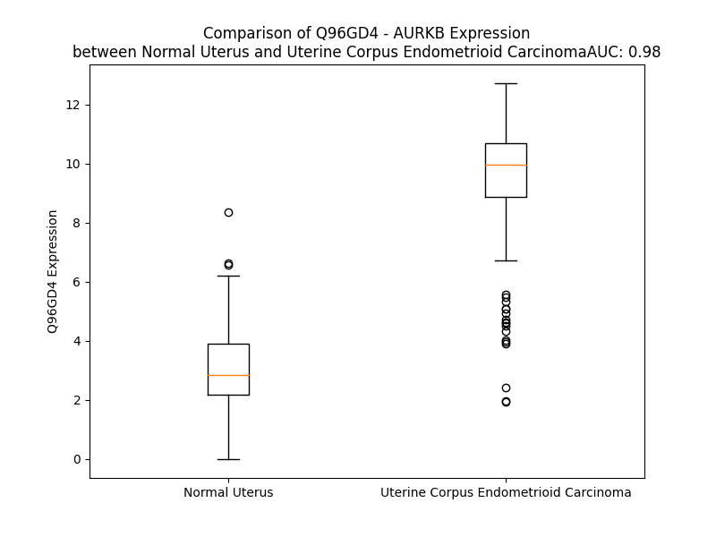

# Detailed Data for Q96GD4

## Introduction to the Detailed Summary

### How to Interpret the Results

- **Summary & Metrics**: This section provides a quick reference to essential protein attributes, including expression changes, family classification, and biomarker applications. Regulation status (upregulated/downregulated) indicates the protein's behavior in a disease context. Some information comes from the original excel file with the proteins selected from literature, while others are derived from the analyses.
- **Expression Comparison**: A visual representation comparing protein expression between normal and disease states. It highlights significant changes in expression levels that might indicate diagnostic or therapeutic relevance. This is data coming from transcriptomics experiments and could not translate similarly to protein levels.
- **Isoform Alignment**: An interactive view of isoform alignments, revealing structural and functional differences between variants of the protein.
- **Interactors & Homologs**: Tables listing known interaction partners and homologous proteins, the more interactors and homologs, the more complex the protein is to design an antibody for.
- **Biological Assemblies**: Information about the structural arrangement of the protein in different assemblies, providing insights into its functional state but also the complexity of the protein to develop antibodies.
- **Combined Per-Residue Information**: A detailed table summarizing residue-level data. This includes predictions for epitope regions, aggregation tendencies, and modifications that might impact the protein's function. Each row corresponds to a residue in the protein, providing insights into specific sites that may be important for research or drug development.
## Summary & Metrics

- **UniProt Accession**: Q96GD4
- **Gene Name**: AURKB
- **Protein Name**: Aurora kinase B
- **Swiss Prot**: AURKB_HUMAN
- **Family**: kinase
- **Biomarker Application**: diagnosis
- **Number of Isoforms**: 5
- **Regulation**: 1
- **(transcriptomics) AUC**: 1.0
- **(transcriptomics) Fold Change**: 3.30
- **(transcriptomics) Regulation**: Upregulated
- **Discotope Epitope Count**: 66
- **Max n_uniprots (Homo)**: N/A
- **Max n_uniprots (Hetero)**: N/A

## Expression Comparison

## Isoform Alignment

<pre style='font-size:14px; font-family:monospace;'>Q96GD4-1 MAQKENSYPWPYGRQTAPSGLSTLPQRVLRKEPVTPSALVLMSRSNVQPTAAPGQKVMENSSGTPDILT-RHFTIDDFEIGRPLGKGKFGNVYLAREKKSHFIVALKVLFKSQIEKEGVEHQLRREIEIQAHLHHPNILRLYNYFYDRRRIYLILEYAPRGELYKELQKSCTFDEQRTATIMEELADALMYCHGKKVIHRDIKPENLLLGLKGELKIADFGWSVHAPSLRRKTMCGTLDYLPPEMIEGRMHNEKVDLWCIGVLCYELLVGNPPFESASHNETYRRIVKVDLKFPASVPMGAQDLISKLLRHNPSERLPLAQVSAHPWVRANSRRVLPPSALQSVA
Q96GD4-2 MAQKENSYPWPYGRQTAPSGLSTLPQRVLRKEPVTPSALVLMSRSNVQPTAAPGQKVMENSSGTPDILT-RHFTIDDFEIGRPLGKALLCLW--------------------------------PEASSVSSPSHPNILRLYNYFYDRRRIYLILEYAPRGELYKELQKSCTFDEQRTATIMEELADALMYCHGKKVIHRDIKPENLLLGLKGELKIADFGWSVHAPSLRRKTMCGTLDYLPPEMIEGRMHNEKVDLWCIGVLCYELLVGNPPFESASHNETYRRIVKVDLKFPASVPMGAQDLISKLLRHNPSERLPLAQVSAHPWVRANSRRVLPPSALQSVA
Q96GD4-3 MAQKENSYPWPYGRQTAPSGLSTLPQRVLRKEPVTPSALVLMSRSNVQPTAAPGQKVMENSSGTPDILTRRHFTIDDFEIGRPLGKGKFGNVYLAREKKSHFIVALKVLFKSQIEKEGVEHQLRREIEIQAHLQSWRSWQML-----------------------------------------------------------------------------------------------------------------------------------------------------------------------------------------------------------
Q96GD4-4 -----------------------------------------MSRSNVQPTAAPGQKVMENSSGTPDILT-RHFTIDDFEIGRPLGKGKFGNVYLAREKKSHFIVALKVLFKSQIEKEGVEHQLRREIEIQAHLHHPNILRLYNYFYDRRRIYLILEYAPRGELYKELQKSCTFDEQRTATIMEELADALMYCHGKKVIHRDIKPENLLLGLKGELKIADFGWSVHAPSLRRKTMCGTLDYLPPEMIEGRMHNEKVDLWCIGVLCYELLVGNPPFESASHNETYRRIVKVDLKFPASVPMGAQDLISKLLRHNPSERLPLAQVSAHPWVRANSRRVLPPSALQSVA
Q96GD4-5 MAQKENSYPWPYGRQTAPSGLSTLPQRVLRKEPVTPSALVLMSRSNVQPTAAPGQKVMENSSGTPDILTRRHFTIDDFEIGRPLGKGKFGNVYLAREKKSHFIVALKVLFKSQIEKEGVEHQLRREIEIQAHLHHPNILRLYNYFYDRRRIYLILEYAPRGELYKELQKSCTFDEQRTATIMEELADALMYCHGKKVIHRDIKPENLLLGLKGELKIADFGWSVHAPSLRRKTMCGTLDYLPPEMIEGRMHNEKVDLWCIGVLCYELLVGNPPFESASHNETYRRIVKVDLKFPASVPMGAQDLISKLLRHNPSERLPLAQVSAHPWVRANSRRVLPPSALQSVA
</pre>

## Interactors

| preferredName_A   | preferredName_B   |   score |
|:------------------|:------------------|--------:|
| AURKB             | BUB1B             |   0.999 |
| AURKB             | BIRC5             |   0.999 |
| AURKB             | INCENP            |   0.999 |
| AURKB             | CDCA8             |   0.999 |
| AURKB             | CDC20             |   0.998 |
| AURKB             | BUB1              |   0.997 |
| AURKB             | CDK1              |   0.997 |
| AURKB             | CENPA             |   0.997 |
| AURKB             | KIF2C             |   0.996 |
| AURKB             | CCNA2             |   0.991 |
| AURKB             | CCNB2             |   0.99  |
| AURKB             | KIF20A            |   0.99  |
| AURKB             | ESPL1             |   0.985 |
| AURKB             | NDC80             |   0.979 |
| AURKB             | CENPE             |   0.975 |
| AURKB             | H3-4              |   0.974 |
| AURKB             | RCC2              |   0.973 |
| AURKB             | TOP2A             |   0.97  |
| AURKB             | SGO1              |   0.969 |
| AURKB             | CDCA5             |   0.968 |
| AURKB             | RACGAP1           |   0.966 |
| AURKB             | KIF11             |   0.964 |
| AURKB             | CCNB1             |   0.962 |
| AURKB             | KIF23             |   0.961 |
| AURKB             | HASPIN            |   0.956 |
| AURKB             | UBE2C             |   0.955 |
| AURKB             | DLGAP5            |   0.95  |
| AURKB             | NUF2              |   0.95  |
| AURKB             | PTTG1             |   0.949 |
| AURKB             | BUB3              |   0.943 |
| AURKB             | KIF4A             |   0.942 |
| AURKB             | TPX2              |   0.94  |
| AURKB             | PLK1              |   0.939 |
| AURKB             | CDCA3             |   0.933 |
| AURKB             | OGA               |   0.93  |
| AURKB             | MAD2L1            |   0.93  |
| AURKB             | CUL3              |   0.927 |
| AURKB             | HJURP             |   0.927 |
| AURKB             | ZWINT             |   0.927 |
| AURKB             | CDC45             |   0.926 |
| AURKB             | AURKC             |   0.926 |
| AURKB             | CENPF             |   0.925 |
| AURKB             | H3C13             |   0.922 |
| AURKB             | AURKA             |   0.922 |
| AURKB             | H3-5              |   0.922 |
| AURKB             | MAPRE1            |   0.917 |
| AURKB             | KNL1              |   0.916 |
| AURKB             | PPP1CC            |   0.916 |
| AURKB             | NCAPG             |   0.913 |
| AURKB             | H3C12             |   0.909 |

## Homologs

| uniprot_id   | gene_id   |
|:-------------|:----------|
| A3KFJ2       | AURKA     |
| M0QYK8       | AURKC     |

## Biological Assemblies

| Unnamed: 0   | crystal_id   |
|--------------|--------------|

## Combined Per-Residue Information

|   res | aa   |   epitope_score | epitope   |   relative_surface_accessibility |   modeling_confidence |   Aggregation | modification                       |
|------:|:-----|----------------:|:----------|---------------------------------:|----------------------:|--------------:|:-----------------------------------|
|     1 | M    |         0.18839 | False     |                          1.34401 |                 28.8  |         0     | N/A                                |
|     2 | A    |         0.16889 | False     |                          0.93712 |                 34.13 |         0     | N/A                                |
|     3 | Q    |         0.2128  | False     |                          0.85196 |                 26.76 |         0     | N/A                                |
|     4 | K    |         0.31669 | True      |                          0.99727 |                 33.71 |         0     | N/A                                |
|     5 | E    |         0.24175 | True      |                          0.88372 |                 33.34 |         0     | N/A                                |
|     6 | N    |         0.16806 | False     |                          0.89624 |                 27.77 |         0     | N/A                                |
|     7 | S    |         0.2753  | True      |                          0.80596 |                 30.85 |         0     | N/A                                |
|     8 | Y    |         0.13424 | False     |                          1.01072 |                 26.32 |         0     | N/A                                |
|     9 | P    |         0.12837 | False     |                          0.88212 |                 34.47 |         0     | N/A                                |
|    10 | W    |         0.17553 | False     |                          1.05796 |                 27.48 |         0     | N/A                                |
|    11 | P    |         0.22379 | True      |                          0.89918 |                 38.18 |         0     | N/A                                |
|    12 | Y    |         0.17767 | False     |                          1.03291 |                 28.07 |         0     | N/A                                |
|    13 | G    |         0.14133 | False     |                          0.90934 |                 32.07 |         0     | N/A                                |
|    14 | R    |         0.16529 | False     |                          0.95686 |                 26.56 |         0     | N/A                                |
|    15 | Q    |         0.24752 | True      |                          0.86342 |                 32.19 |         0     | N/A                                |
|    16 | T    |         0.17949 | False     |                          0.88896 |                 32.56 |         0     | N/A                                |
|    17 | A    |         0.16919 | False     |                          0.92881 |                 28.12 |         0     | N/A                                |
|    18 | P    |         0.21479 | False     |                          0.94218 |                 30.66 |         0     | N/A                                |
|    19 | S    |         0.16072 | False     |                          0.87215 |                 26.91 |         0     | N/A                                |
|    20 | G    |         0.19486 | False     |                          0.90329 |                 30.19 |         0     | N/A                                |
|    21 | L    |         0.1367  | False     |                          1.12024 |                 24.41 |         0     | N/A                                |
|    22 | S    |         0.24066 | True      |                          0.74005 |                 30.13 |         0     | N/A                                |
|    23 | T    |         0.14292 | False     |                          0.92653 |                 26.94 |         0     | N/A                                |
|    24 | L    |         0.15803 | False     |                          1.03378 |                 27.34 |         0     | N/A                                |
|    25 | P    |         0.18005 | False     |                          0.85379 |                 29.33 |         0     | N/A                                |
|    26 | Q    |         0.23883 | True      |                          0.92801 |                 27.15 |         0     | N/A                                |
|    27 | R    |         0.28301 | True      |                          0.88363 |                 28.83 |         0     | N/A                                |
|    28 | V    |         0.17464 | False     |                          0.70373 |                 27.4  |         0     | N/A                                |
|    29 | L    |         0.16843 | False     |                          1.13465 |                 24.62 |         0     | N/A                                |
|    30 | R    |         0.21019 | False     |                          0.74823 |                 27.09 |         0     | N/A                                |
|    31 | K    |         0.2176  | False     |                          0.99398 |                 28.5  |         0     | N/A                                |
|    32 | E    |         0.2194  | True      |                          0.60452 |                 25.06 |         0     | N/A                                |
|    33 | P    |         0.20459 | False     |                          0.76723 |                 29.51 |         0     | N/A                                |
|    34 | V    |         0.14878 | False     |                          0.46884 |                 37.15 |         0     | N/A                                |
|    35 | T    |         0.15502 | False     |                          0.42429 |                 40.21 |         0     | Phosphothreonine                   |
|    36 | P    |         0.19507 | False     |                          0.73306 |                 45.61 |         0     | N/A                                |
|    37 | S    |         0.09321 | False     |                          0.17681 |                 50.48 |         2.879 | N/A                                |
|    38 | A    |         0.06092 | False     |                          0.13519 |                 56.35 |        10.547 | N/A                                |
|    39 | L    |         0.12914 | False     |                          0.68944 |                 58.36 |        11.548 | N/A                                |
|    40 | V    |         0.10957 | False     |                          0.49014 |                 60.92 |        11.548 | N/A                                |
|    41 | L    |         0.02898 | False     |                          0.00989 |                 73.12 |        11.548 | N/A                                |
|    42 | M    |         0.08395 | False     |                          0.35557 |                 58.95 |         9.516 | N/A                                |
|    43 | S    |         0.07852 | False     |                          0.56789 |                 49.79 |         1.847 | N/A                                |
|    44 | R    |         0.12933 | False     |                          0.42864 |                 48.24 |         0     | N/A                                |
|    45 | S    |         0.10795 | False     |                          0.6373  |                 37.26 |         0     | N/A                                |
|    46 | N    |         0.24826 | True      |                          0.90882 |                 29.48 |         0     | N/A                                |
|    47 | V    |         0.14185 | False     |                          0.98131 |                 28.15 |         0     | N/A                                |
|    48 | Q    |         0.18083 | False     |                          0.80751 |                 28.47 |         0     | N/A                                |
|    49 | P    |         0.21146 | False     |                          0.87766 |                 28.92 |         0     | N/A                                |
|    50 | T    |         0.20219 | False     |                          0.93544 |                 28.47 |         0     | N/A                                |
|    51 | A    |         0.20039 | False     |                          0.99453 |                 30.2  |         0     | N/A                                |
|    52 | A    |         0.27505 | True      |                          0.91926 |                 29.05 |         0     | N/A                                |
|    53 | P    |         0.25206 | True      |                          1.03103 |                 31.34 |         0     | N/A                                |
|    54 | G    |         0.34568 | True      |                          0.84147 |                 29.07 |         0     | N/A                                |
|    55 | Q    |         0.23541 | True      |                          0.90456 |                 31.51 |         0     | N/A                                |
|    56 | K    |         0.18854 | False     |                          1.02633 |                 29.26 |         0     | N/A                                |
|    57 | V    |         0.20195 | False     |                          1.00709 |                 29.53 |         0     | N/A                                |
|    58 | M    |         0.21196 | False     |                          0.96576 |                 29.08 |         0     | N/A                                |
|    59 | E    |         0.20291 | False     |                          0.8962  |                 26.87 |         0     | N/A                                |
|    60 | N    |         0.19833 | False     |                          0.97125 |                 31.52 |         0     | N/A                                |
|    61 | S    |         0.21117 | False     |                          0.92447 |                 29.88 |         0     | N/A                                |
|    62 | S    |         0.24804 | True      |                          0.7755  |                 31.49 |         0     | Phosphoserine                      |
|    63 | G    |         0.18667 | False     |                          1.02997 |                 28.05 |         0     | N/A                                |
|    64 | T    |         0.19537 | False     |                          0.85031 |                 28.65 |         0     | Phosphothreonine                   |
|    65 | P    |         0.21766 | False     |                          0.87404 |                 28.9  |         0     | N/A                                |
|    66 | D    |         0.18105 | False     |                          0.77425 |                 30.4  |         0     | N/A                                |
|    67 | I    |         0.19975 | False     |                          0.93534 |                 35.53 |         0     | N/A                                |
|    68 | L    |         0.22577 | True      |                          0.95221 |                 36.43 |         0     | N/A                                |
|    69 | T    |         0.10313 | False     |                          0.4771  |                 51.79 |         0     | N/A                                |
|    70 | R    |         0.18579 | False     |                          0.34705 |                 63.66 |         0     | N/A                                |
|    71 | H    |         0.16599 | False     |                          0.87854 |                 85.65 |         0     | N/A                                |
|    72 | F    |         0.0561  | False     |                          0.06255 |                 93.71 |         0     | N/A                                |
|    73 | T    |         0.16551 | False     |                          0.48588 |                 96.32 |         0     | N/A                                |
|    74 | I    |         0.13442 | False     |                          0.34654 |                 96.37 |         0     | N/A                                |
|    75 | D    |         0.23052 | True      |                          0.6513  |                 96.73 |         0     | N/A                                |
|    76 | D    |         0.13061 | False     |                          0.18507 |                 97.02 |         0     | N/A                                |
|    77 | F    |         0.02724 | False     |                          0.03703 |                 97.91 |         0     | N/A                                |
|    78 | E    |         0.1495  | False     |                          0.35702 |                 98.17 |         0     | N/A                                |
|    79 | I    |         0.14967 | False     |                          0.47573 |                 97.83 |         0     | N/A                                |
|    80 | G    |         0.11528 | False     |                          0.49335 |                 97.26 |         0     | N/A                                |
|    81 | R    |         0.28384 | True      |                          0.59974 |                 96.56 |         0     | N/A                                |
|    82 | P    |         0.21792 | False     |                          0.67634 |                 96.12 |         0     | N/A                                |
|    83 | L    |         0.07846 | False     |                          0.32315 |                 93.99 |         0     | N/A                                |
|    84 | G    |         0.20088 | False     |                          0.36231 |                 88.08 |         0     | N/A                                |
|    85 | K    |         0.32752 | True      |                          0.90878 |                 84.89 |         0     | N/A                                |
|    86 | G    |         0.1346  | False     |                          0.40325 |                 78.89 |         0     | N/A                                |
|    87 | K    |         0.31303 | True      |                          0.74095 |                 77.72 |         0     | N/A                                |
|    88 | F    |         0.22866 | True      |                          0.19845 |                 83.63 |         0.48  | N/A                                |
|    89 | G    |         0.08093 | False     |                          0.11952 |                 89.28 |         0.48  | N/A                                |
|    90 | N    |         0.21671 | False     |                          0.29075 |                 93.83 |         1.683 | N/A                                |
|    91 | V    |         0.03603 | False     |                          0.21707 |                 95.54 |         1.683 | N/A                                |
|    92 | Y    |         0.14763 | False     |                          0.25433 |                 97.79 |         1.683 | N/A                                |
|    93 | L    |         0.07549 | False     |                          0.22587 |                 98.14 |         1.683 | N/A                                |
|    94 | A    |         0.01144 | False     |                          0.01812 |                 98.38 |         1.683 | N/A                                |
|    95 | R    |         0.18375 | False     |                          0.38649 |                 98.3  |         0     | N/A                                |
|    96 | E    |         0.04387 | False     |                          0.01068 |                 97.21 |         0     | N/A                                |
|    97 | K    |         0.41547 | True      |                          0.46057 |                 96.98 |         0     | N/A                                |
|    98 | K    |         0.2199  | True      |                          0.74369 |                 94.01 |         0     | N/A                                |
|    99 | S    |         0.14116 | False     |                          0.28432 |                 94.89 |         0     | N/A                                |
|   100 | H    |         0.18123 | False     |                          0.61576 |                 95.61 |         0.182 | N/A                                |
|   101 | F    |         0.05525 | False     |                          0.24108 |                 96.27 |        60.247 | N/A                                |
|   102 | I    |         0.04214 | False     |                          0.44999 |                 97.77 |        60.247 | N/A                                |
|   103 | V    |         0.00473 | False     |                          0       |                 97.8  |        60.247 | N/A                                |
|   104 | A    |         0.01754 | False     |                          0.06377 |                 97.84 |        60.247 | N/A                                |
|   105 | L    |         0.00316 | False     |                          0       |                 97.15 |        60.247 | N/A                                |
|   106 | K    |         0.04422 | False     |                          0.18295 |                 95.18 |         0     | N/A                                |
|   107 | V    |         0.06341 | False     |                          0.10378 |                 96.01 |         0     | N/A                                |
|   108 | L    |         0.04303 | False     |                          0.03133 |                 94.41 |         0     | N/A                                |
|   109 | F    |         0.1665  | False     |                          0.36966 |                 94.8  |         0     | N/A                                |
|   110 | K    |         0.26344 | True      |                          0.2546  |                 94.43 |         0     | N/A                                |
|   111 | S    |         0.28692 | True      |                          0.60228 |                 94    |         0     | N/A                                |
|   112 | Q    |         0.29062 | True      |                          0.40722 |                 90.68 |         0     | N/A                                |
|   113 | I    |         0.03539 | False     |                          0.0192  |                 89.42 |         0     | N/A                                |
|   114 | E    |         0.38242 | True      |                          0.61721 |                 91.49 |         0     | N/A                                |
|   115 | K    |         0.51349 | True      |                          0.87347 |                 90.96 |         0     | N/A                                |
|   116 | E    |         0.43024 | True      |                          0.46126 |                 88.68 |         0     | N/A                                |
|   117 | G    |         0.377   | True      |                          0.73876 |                 88.4  |         0     | N/A                                |
|   118 | V    |         0.2296  | True      |                          0.18756 |                 85.69 |         0     | N/A                                |
|   119 | E    |         0.22468 | True      |                          0.40655 |                 88.32 |         0     | N/A                                |
|   120 | H    |         0.28893 | True      |                          0.76722 |                 84.27 |         0     | N/A                                |
|   121 | Q    |         0.22333 | True      |                          0.34704 |                 81.26 |         0     | N/A                                |
|   122 | L    |         0.07603 | False     |                          0.09481 |                 87.15 |         0     | N/A                                |
|   123 | R    |         0.25854 | True      |                          0.57881 |                 87.69 |         0     | N/A                                |
|   124 | R    |         0.18028 | False     |                          0.46208 |                 82.59 |         0     | N/A                                |
|   125 | E    |         0.04194 | False     |                          0.08577 |                 83.76 |         0     | N/A                                |
|   126 | I    |         0.07853 | False     |                          0.1056  |                 88.55 |         0     | N/A                                |
|   127 | E    |         0.07061 | False     |                          0.54627 |                 87.53 |         0     | N/A                                |
|   128 | I    |         0.10454 | False     |                          0.08455 |                 84.31 |         0     | N/A                                |
|   129 | Q    |         0.01114 | False     |                          0.03009 |                 88.41 |         0     | N/A                                |
|   130 | A    |         0.02877 | False     |                          0.25254 |                 89.24 |         0     | N/A                                |
|   131 | H    |         0.1345  | False     |                          0.56358 |                 90.26 |         0     | N/A                                |
|   132 | L    |         0.01243 | False     |                          0.01477 |                 92.01 |         0     | N/A                                |
|   133 | H    |         0.12384 | False     |                          0.52955 |                 93.78 |         0     | N/A                                |
|   134 | H    |         0.05137 | False     |                          0.14966 |                 96.06 |         0     | N/A                                |
|   135 | P    |         0.06243 | False     |                          0.21473 |                 96.47 |         0     | N/A                                |
|   136 | N    |         0.05266 | False     |                          0.01619 |                 97.42 |         0     | N/A                                |
|   137 | I    |         0.01082 | False     |                          0.01384 |                 96.67 |         0     | N/A                                |
|   138 | L    |         0.00697 | False     |                          0.05068 |                 95.98 |         0     | N/A                                |
|   139 | R    |         0.03883 | False     |                          0.11269 |                 94.8  |         0     | N/A                                |
|   140 | L    |         0.00843 | False     |                          0.01186 |                 94.72 |         9.733 | N/A                                |
|   141 | Y    |         0.01881 | False     |                          0.1029  |                 93.54 |        10.727 | N/A                                |
|   142 | N    |         0.04523 | False     |                          0.06055 |                 93.37 |        10.727 | N/A                                |
|   143 | Y    |         0.13154 | False     |                          0.34646 |                 94.2  |        10.727 | N/A                                |
|   144 | F    |         0.03961 | False     |                          0.07308 |                 95.4  |        10.727 | N/A                                |
|   145 | Y    |         0.1474  | False     |                          0.67155 |                 95.03 |         6.419 | N/A                                |
|   146 | D    |         0.09578 | False     |                          0.31934 |                 95.76 |         0     | N/A                                |
|   147 | R    |         0.25388 | True      |                          0.95741 |                 95.88 |         0     | N/A                                |
|   148 | R    |         0.17688 | False     |                          0.73687 |                 95.92 |         0     | N/A                                |
|   149 | R    |         0.19884 | False     |                          0.35567 |                 96.39 |         0.032 | N/A                                |
|   150 | I    |         0.09572 | False     |                          0.16159 |                 95.2  |        87.964 | N/A                                |
|   151 | Y    |         0.02359 | False     |                          0.01758 |                 95.93 |        87.964 | N/A                                |
|   152 | L    |         0.00839 | False     |                          0.01072 |                 95.09 |        87.964 | N/A                                |
|   153 | I    |         0.00165 | False     |                          0       |                 96.18 |        87.964 | N/A                                |
|   154 | L    |         0.05799 | False     |                          0.07254 |                 96    |        87.964 | N/A                                |
|   155 | E    |         0.04219 | False     |                          0.17644 |                 96.22 |         0.032 | N/A                                |
|   156 | Y    |         0.08979 | False     |                          0.22072 |                 96.92 |         0.032 | N/A                                |
|   157 | A    |         0.03316 | False     |                          0.09588 |                 96.75 |         0     | N/A                                |
|   158 | P    |         0.14062 | False     |                          0.39208 |                 95.29 |         0     | N/A                                |
|   159 | R    |         0.14988 | False     |                          0.44299 |                 95.89 |         0     | N/A                                |
|   160 | G    |         0.08622 | False     |                          0.33937 |                 95.01 |         0     | N/A                                |
|   161 | E    |         0.10218 | False     |                          0.23099 |                 92.88 |         0     | N/A                                |
|   162 | L    |         0.00502 | False     |                          0       |                 95.82 |         0     | N/A                                |
|   163 | Y    |         0.18818 | False     |                          0.32955 |                 91.73 |         0     | N/A                                |
|   164 | K    |         0.27449 | True      |                          0.5555  |                 91.03 |         0     | N/A                                |
|   165 | E    |         0.12364 | False     |                          0.21904 |                 95.32 |         0     | N/A                                |
|   166 | L    |         0.03171 | False     |                          0.03193 |                 93.61 |         0     | N/A                                |
|   167 | Q    |         0.22496 | True      |                          0.56129 |                 89.66 |         0     | N/A                                |
|   168 | K    |         0.25642 | True      |                          0.83796 |                 94.04 |         0     | N/A                                |
|   169 | S    |         0.20463 | False     |                          0.42422 |                 93.1  |         0     | N/A                                |
|   170 | C    |         0.22658 | True      |                          0.67335 |                 92.31 |         0     | N/A                                |
|   171 | T    |         0.25336 | True      |                          0.40897 |                 95.63 |         0     | N/A                                |
|   172 | F    |         0.07007 | False     |                          0.09067 |                 97.22 |         0     | N/A                                |
|   173 | D    |         0.12694 | False     |                          0.56456 |                 97.37 |         0     | N/A                                |
|   174 | E    |         0.10572 | False     |                          0.31827 |                 97.97 |         0     | N/A                                |
|   175 | Q    |         0.17381 | False     |                          0.44404 |                 98.2  |         0     | N/A                                |
|   176 | R    |         0.11304 | False     |                          0.21398 |                 97.78 |         0     | N/A                                |
|   177 | T    |         0.00201 | False     |                          0       |                 98.28 |         0.234 | N/A                                |
|   178 | A    |         0.00302 | False     |                          0       |                 98.57 |         0.234 | N/A                                |
|   179 | T    |         0.0355  | False     |                          0.09826 |                 98.39 |         0.234 | N/A                                |
|   180 | I    |         0.00198 | False     |                          0       |                 98.23 |         0.234 | N/A                                |
|   181 | M    |         0.00476 | False     |                          0.00525 |                 98.49 |         0.234 | N/A                                |
|   182 | E    |         0.03664 | False     |                          0.20093 |                 98.31 |         0     | N/A                                |
|   183 | E    |         0.01322 | False     |                          0.02165 |                 98.12 |         0     | N/A                                |
|   184 | L    |         0.0022  | False     |                          0.00165 |                 97.92 |         0     | N/A                                |
|   185 | A    |         0.00168 | False     |                          0       |                 97.96 |         0     | N/A                                |
|   186 | D    |         0.06949 | False     |                          0.24118 |                 97.87 |         0     | N/A                                |
|   187 | A    |         0.00147 | False     |                          0       |                 97.21 |         0.166 | N/A                                |
|   188 | L    |         0.00287 | False     |                          0       |                 96.78 |         0.363 | N/A                                |
|   189 | M    |         0.07349 | False     |                          0.40176 |                 96.76 |         0.363 | N/A                                |
|   190 | Y    |         0.13415 | False     |                          0.24783 |                 96.66 |         0.363 | N/A                                |
|   191 | C    |         0.0032  | False     |                          0       |                 95.24 |         0.363 | N/A                                |
|   192 | H    |         0.07766 | False     |                          0.16445 |                 94.47 |         0.363 | N/A                                |
|   193 | G    |         0.13599 | False     |                          0.74027 |                 94.44 |         0     | N/A                                |
|   194 | K    |         0.18097 | False     |                          0.40236 |                 92.4  |         0     | N/A                                |
|   195 | K    |         0.14385 | False     |                          0.53817 |                 90.36 |         0     | N/A                                |
|   196 | V    |         0.02296 | False     |                          0.03427 |                 91.12 |         0     | N/A                                |
|   197 | I    |         0.03997 | False     |                          0.0632  |                 90.84 |         0     | N/A                                |
|   198 | H    |         0.00454 | False     |                          0.00245 |                 91.57 |         0     | N/A                                |
|   199 | R    |         0.04985 | False     |                          0.06963 |                 89.46 |         0     | N/A                                |
|   200 | D    |         0.06391 | False     |                          0.0485  |                 88.71 |         0     | N/A                                |
|   201 | I    |         0.00469 | False     |                          0.00177 |                 94.14 |         0     | N/A                                |
|   202 | K    |         0.07849 | False     |                          0.13671 |                 91.24 |         0     | N/A                                |
|   203 | P    |         0.01914 | False     |                          0.00994 |                 92.57 |         0     | N/A                                |
|   204 | E    |         0.11933 | False     |                          0.37873 |                 89.76 |         0     | N/A                                |
|   205 | N    |         0.09245 | False     |                          0.09437 |                 93.09 |         0.464 | N/A                                |
|   206 | L    |         0.00247 | False     |                          0       |                 96.28 |        12.37  | N/A                                |
|   207 | L    |         0.05566 | False     |                          0.20939 |                 97.02 |        12.37  | N/A                                |
|   208 | L    |         0.00545 | False     |                          0       |                 97.14 |        12.37  | N/A                                |
|   209 | G    |         0.01267 | False     |                          0.0338  |                 95.16 |        12.37  | N/A                                |
|   210 | L    |         0.13491 | False     |                          0.84315 |                 93.26 |        12.37  | N/A                                |
|   211 | K    |         0.12527 | False     |                          0.7236  |                 92.41 |         0     | N/A                                |
|   212 | G    |         0.01603 | False     |                          0.00661 |                 93.88 |         0     | N/A                                |
|   213 | E    |         0.05247 | False     |                          0.1461  |                 96.22 |         0     | N/A                                |
|   214 | L    |         0.00306 | False     |                          0       |                 97.96 |         0     | N/A                                |
|   215 | K    |         0.03189 | False     |                          0.06485 |                 97.49 |         0     | N6-acetyllysine                    |
|   216 | I    |         0.00286 | False     |                          0       |                 96.77 |         0     | N/A                                |
|   217 | A    |         0.02448 | False     |                          0.09311 |                 91.1  |         0     | N/A                                |
|   218 | D    |         0.14527 | False     |                          0.37503 |                 79.13 |         0     | N/A                                |
|   219 | F    |         0.01248 | False     |                          0.00457 |                 80.84 |         0.153 | N/A                                |
|   220 | G    |         0.10767 | False     |                          0.16601 |                 66.4  |         0.153 | N/A                                |
|   221 | W    |         0.21435 | False     |                          0.47352 |                 65.48 |         0.153 | N/A                                |
|   222 | S    |         0.02934 | False     |                          0.03459 |                 59.13 |         0.153 | N/A                                |
|   223 | V    |         0.0504  | False     |                          0.03808 |                 61.18 |         0.153 | N/A                                |
|   224 | H    |         0.21337 | False     |                          0.52848 |                 57.02 |         0     | N/A                                |
|   225 | A    |         0.17009 | False     |                          0.15877 |                 52.4  |         0     | N/A                                |
|   226 | P    |         0.31378 | True      |                          0.67047 |                 40.3  |         0     | N/A                                |
|   227 | S    |         0.41413 | True      |                          0.76256 |                 41.5  |         0     | Phosphoserine                      |
|   228 | L    |         0.28615 | True      |                          0.79671 |                 42.24 |         0     | N/A                                |
|   229 | R    |         0.25875 | True      |                          0.65688 |                 42.29 |         0     | N/A                                |
|   230 | R    |         0.27319 | True      |                          0.26123 |                 51.95 |         0     | N/A                                |
|   231 | K    |         0.29365 | True      |                          0.77876 |                 42.74 |         0     | N/A                                |
|   232 | T    |         0.22817 | True      |                          0.54376 |                 47.66 |         0     | Phosphothreonine; by autocatalysis |
|   233 | M    |         0.29808 | True      |                          0.63957 |                 45.78 |         0     | N/A                                |
|   234 | C    |         0.05886 | False     |                          0.0603  |                 47.28 |         0     | N/A                                |
|   235 | G    |         0.19792 | False     |                          0.42042 |                 53.93 |         0     | N/A                                |
|   236 | T    |         0.21852 | False     |                          0.34412 |                 66.82 |         0     | N/A                                |
|   237 | L    |         0.23078 | True      |                          0.21803 |                 84.87 |         0     | N/A                                |
|   238 | D    |         0.08332 | False     |                          0.1371  |                 88.74 |         0     | N/A                                |
|   239 | Y    |         0.08728 | False     |                          0.04878 |                 94.39 |         0     | N/A                                |
|   240 | L    |         0.06763 | False     |                          0.05276 |                 92.77 |         0     | N/A                                |
|   241 | P    |         0.03201 | False     |                          0.01988 |                 94.99 |         0     | N/A                                |
|   242 | P    |         0.00624 | False     |                          0       |                 96.21 |         0     | N/A                                |
|   243 | E    |         0.02548 | False     |                          0.00642 |                 94.99 |         0     | N/A                                |
|   244 | M    |         0.0643  | False     |                          0.04588 |                 92.17 |         0     | N/A                                |
|   245 | I    |         0.37696 | True      |                          0.22953 |                 91.88 |         0     | N/A                                |
|   246 | E    |         0.28055 | True      |                          0.3516  |                 93.09 |         0     | N/A                                |
|   247 | G    |         0.19812 | False     |                          0.61555 |                 89.42 |         0     | N/A                                |
|   248 | R    |         0.38672 | True      |                          0.39476 |                 91.05 |         0     | N/A                                |
|   249 | M    |         0.28357 | True      |                          0.44297 |                 87.23 |         0     | N/A                                |
|   250 | H    |         0.06452 | False     |                          0.01666 |                 87.71 |         0     | N/A                                |
|   251 | N    |         0.09929 | False     |                          0.30379 |                 90.9  |         0     | N/A                                |
|   252 | E    |         0.08563 | False     |                          0.28323 |                 92.64 |         0     | N/A                                |
|   253 | K    |         0.07201 | False     |                          0.20104 |                 95.54 |         0.428 | N/A                                |
|   254 | V    |         0.00368 | False     |                          0.00666 |                 94.69 |         0.428 | N/A                                |
|   255 | D    |         0.00276 | False     |                          0       |                 95.49 |         0.428 | N/A                                |
|   256 | L    |         0.01704 | False     |                          0.0272  |                 97.82 |        27.714 | N/A                                |
|   257 | W    |         0.00505 | False     |                          0       |                 97.85 |        32.657 | N/A                                |
|   258 | C    |         0.04166 | False     |                          0.029   |                 96.48 |        33.257 | N/A                                |
|   259 | I    |         0.00983 | False     |                          0.0048  |                 97.12 |        34.027 | N/A                                |
|   260 | G    |         0.00253 | False     |                          0       |                 98.44 |        34.027 | N/A                                |
|   261 | V    |         0.01563 | False     |                          0       |                 98.19 |        33.727 | N/A                                |
|   262 | L    |         0.0019  | False     |                          0       |                 97.82 |        29.857 | N/A                                |
|   263 | C    |         0.00096 | False     |                          0       |                 98.61 |         8.137 | N/A                                |
|   264 | Y    |         0.04782 | False     |                          0.06486 |                 98.57 |         6.356 | N/A                                |
|   265 | E    |         0.05272 | False     |                          0.0598  |                 97.56 |         0     | N/A                                |
|   266 | L    |         0.00248 | False     |                          0       |                 97.97 |         0     | N/A                                |
|   267 | L    |         0.05326 | False     |                          0.12162 |                 98.13 |         0     | N/A                                |
|   268 | V    |         0.08757 | False     |                          0.25342 |                 96.92 |         0     | N/A                                |
|   269 | G    |         0.14788 | False     |                          0.2338  |                 92.91 |         0     | N/A                                |
|   270 | N    |         0.21322 | False     |                          0.51744 |                 91.99 |         0     | N/A                                |
|   271 | P    |         0.13148 | False     |                          0.16722 |                 94.8  |         0     | N/A                                |
|   272 | P    |         0.02929 | False     |                          0.03432 |                 96.88 |         0     | N/A                                |
|   273 | F    |         0.00486 | False     |                          0       |                 96.47 |         0     | N/A                                |
|   274 | E    |         0.2528  | True      |                          0.4746  |                 89.91 |         0     | N/A                                |
|   275 | S    |         0.1986  | False     |                          0.25885 |                 90.53 |         0     | N/A                                |
|   276 | A    |         0.33133 | True      |                          1.14928 |                 86.63 |         0     | N/A                                |
|   277 | S    |         0.40029 | True      |                          0.4246  |                 90.15 |         0     | N/A                                |
|   278 | H    |         0.28419 | True      |                          0.68156 |                 88.34 |         0     | N/A                                |
|   279 | N    |         0.33569 | True      |                          0.75693 |                 91.95 |         0     | N/A                                |
|   280 | E    |         0.30152 | True      |                          0.29815 |                 93.76 |         0     | N/A                                |
|   281 | T    |         0.01585 | False     |                          0.00869 |                 93    |         0     | N/A                                |
|   282 | Y    |         0.23723 | True      |                          0.29755 |                 93.93 |         0     | N/A                                |
|   283 | R    |         0.17739 | False     |                          0.40681 |                 96.75 |         0     | N/A                                |
|   284 | R    |         0.19135 | False     |                          0.13714 |                 97.56 |         0     | N/A                                |
|   285 | I    |         0.00986 | False     |                          0       |                 97.12 |         0     | N/A                                |
|   286 | V    |         0.21933 | True      |                          0.31866 |                 96.92 |         0     | N/A                                |
|   287 | K    |         0.15948 | False     |                          0.68796 |                 97.73 |         0     | N/A                                |
|   288 | V    |         0.14789 | False     |                          0.24113 |                 97.84 |         0     | N/A                                |
|   289 | D    |         0.20195 | False     |                          0.22172 |                 98.01 |         0     | N/A                                |
|   290 | L    |         0.15519 | False     |                          0.22793 |                 98.03 |         0     | N/A                                |
|   291 | K    |         0.19344 | False     |                          0.65559 |                 97.74 |         0     | N/A                                |
|   292 | F    |         0.17139 | False     |                          0.28127 |                 98.03 |         0     | N/A                                |
|   293 | P    |         0.20586 | False     |                          0.37826 |                 96.86 |         0     | N/A                                |
|   294 | A    |         0.19524 | False     |                          1.08488 |                 95.99 |         0     | N/A                                |
|   295 | S    |         0.19271 | False     |                          0.73118 |                 94.82 |         0     | N/A                                |
|   296 | V    |         0.04778 | False     |                          0.03756 |                 97.73 |         0     | N/A                                |
|   297 | P    |         0.12334 | False     |                          0.2684  |                 97.29 |         0     | N/A                                |
|   298 | M    |         0.19707 | False     |                          0.89135 |                 98.07 |         0     | N/A                                |
|   299 | G    |         0.11056 | False     |                          0.31678 |                 98.12 |         0     | N/A                                |
|   300 | A    |         0.00197 | False     |                          0       |                 98.51 |         0     | N/A                                |
|   301 | Q    |         0.11714 | False     |                          0.24965 |                 98.66 |         0     | N/A                                |
|   302 | D    |         0.14836 | False     |                          0.3539  |                 98.71 |         0     | N/A                                |
|   303 | L    |         0.003   | False     |                          0       |                 98.74 |         0     | N/A                                |
|   304 | I    |         0.01046 | False     |                          0       |                 98.77 |         0     | N/A                                |
|   305 | S    |         0.16125 | False     |                          0.3368  |                 98.62 |         0     | N/A                                |
|   306 | K    |         0.12742 | False     |                          0.40202 |                 98.63 |         0     | N/A                                |
|   307 | L    |         0.00929 | False     |                          0       |                 98.56 |         0     | N/A                                |
|   308 | L    |         0.01435 | False     |                          0.02255 |                 98.58 |         0     | N/A                                |
|   309 | R    |         0.1066  | False     |                          0.42672 |                 98.49 |         0     | N/A                                |
|   310 | H    |         0.23571 | True      |                          0.35981 |                 97.98 |         0     | N/A                                |
|   311 | N    |         0.1991  | False     |                          0.38444 |                 97.12 |         0     | N/A                                |
|   312 | P    |         0.09561 | False     |                          0.16502 |                 97.02 |         0     | N/A                                |
|   313 | S    |         0.2475  | True      |                          0.6587  |                 96.45 |         0     | N/A                                |
|   314 | E    |         0.12791 | False     |                          0.46734 |                 97.77 |         0     | N/A                                |
|   315 | R    |         0.04334 | False     |                          0.00564 |                 98.39 |         0     | N/A                                |
|   316 | L    |         0.07392 | False     |                          0.12436 |                 98.21 |         0     | N/A                                |
|   317 | P    |         0.14222 | False     |                          0.43839 |                 97.36 |         0     | N/A                                |
|   318 | L    |         0.03401 | False     |                          0.07329 |                 96.46 |         0     | N/A                                |
|   319 | A    |         0.11546 | False     |                          0.56537 |                 94.88 |         0     | N/A                                |
|   320 | Q    |         0.21305 | False     |                          0.47184 |                 97.4  |         0     | N/A                                |
|   321 | V    |         0.00286 | False     |                          0       |                 97.87 |         0     | N/A                                |
|   322 | S    |         0.08801 | False     |                          0.24051 |                 91.61 |         0     | N/A                                |
|   323 | A    |         0.12179 | False     |                          0.56439 |                 96.64 |         0     | N/A                                |
|   324 | H    |         0.05045 | False     |                          0.04806 |                 98.58 |         0     | N/A                                |
|   325 | P    |         0.14259 | False     |                          0.74401 |                 98.39 |         0     | N/A                                |
|   326 | W    |         0.05552 | False     |                          0.06445 |                 98.58 |         0     | N/A                                |
|   327 | V    |         0.00575 | False     |                          0.00381 |                 98.49 |         0     | N/A                                |
|   328 | R    |         0.17964 | False     |                          0.74015 |                 97.57 |         0     | N/A                                |
|   329 | A    |         0.14439 | False     |                          0.63518 |                 98.09 |         0     | N/A                                |
|   330 | N    |         0.12915 | False     |                          0.19978 |                 98.37 |         0     | N/A                                |
|   331 | S    |         0.0604  | False     |                          0.10934 |                 98.01 |         0     | N/A                                |
|   332 | R    |         0.34104 | True      |                          0.56374 |                 96.16 |         0     | N/A                                |
|   333 | R    |         0.12989 | False     |                          0.20811 |                 95.35 |         0     | N/A                                |
|   334 | V    |         0.1461  | False     |                          0.70071 |                 89.72 |         0     | N/A                                |
|   335 | L    |         0.16893 | False     |                          0.45321 |                 84.77 |         0     | N/A                                |
|   336 | P    |         0.1764  | False     |                          0.20563 |                 77.64 |         0     | N/A                                |
|   337 | P    |         0.1383  | False     |                          0.66858 |                 75.65 |         0     | N/A                                |
|   338 | S    |         0.14734 | False     |                          0.51499 |                 71.06 |         0     | N/A                                |
|   339 | A    |         0.10275 | False     |                          0.13147 |                 64.34 |         0     | N/A                                |
|   340 | L    |         0.1859  | False     |                          0.71577 |                 55.56 |         0     | N/A                                |
|   341 | Q    |         0.20677 | False     |                          0.54387 |                 42.95 |         0     | N/A                                |
|   342 | S    |         0.21989 | True      |                          0.75456 |                 38.77 |         0     | N/A                                |
|   343 | V    |         0.18464 | False     |                          0.92441 |                 34.17 |         0     | N/A                                |
|   344 | A    |         0.09899 | False     |                          1.40304 |                 25.23 |         0     | N/A                                |

