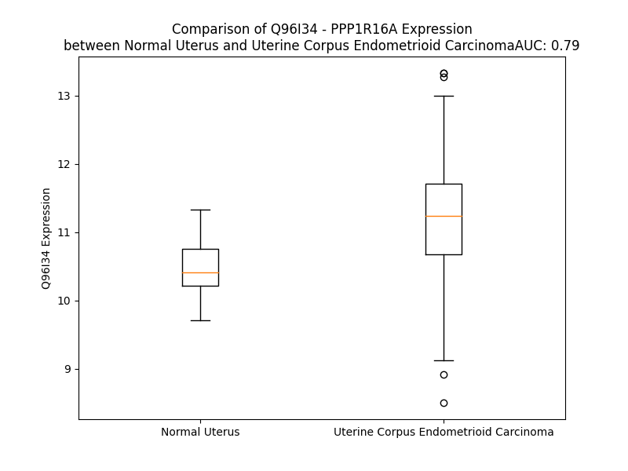

# Detailed Data for Q96I34

## Introduction to the Detailed Summary

### How to Interpret the Results

- **Summary & Metrics**: This section provides a quick reference to essential protein attributes, including expression changes, family classification, and biomarker applications. Regulation status (upregulated/downregulated) indicates the protein's behavior in a disease context. Some information comes from the original excel file with the proteins selected from literature, while others are derived from the analyses.
- **Expression Comparison**: A visual representation comparing protein expression between normal and disease states. It highlights significant changes in expression levels that might indicate diagnostic or therapeutic relevance. This is data coming from transcriptomics experiments and could not translate similarly to protein levels.
- **Isoform Alignment**: An interactive view of isoform alignments, revealing structural and functional differences between variants of the protein.
- **Interactors & Homologs**: Tables listing known interaction partners and homologous proteins, the more interactors and homologs, the more complex the protein is to design an antibody for.
- **Biological Assemblies**: Information about the structural arrangement of the protein in different assemblies, providing insights into its functional state but also the complexity of the protein to develop antibodies.
- **Combined Per-Residue Information**: A detailed table summarizing residue-level data. This includes predictions for epitope regions, aggregation tendencies, and modifications that might impact the protein's function. Each row corresponds to a residue in the protein, providing insights into specific sites that may be important for research or drug development.
## Summary & Metrics

- **UniProt Accession**: Q96I34
- **Gene Name**: PPP1R16A 
- **Protein Name**: protein phosphatase 1, regulatory (inhibitor) subunit 16A 
- **Swiss Prot**: PP16A_HUMAN
- **Family**: other
- **Biomarker Application**:  
- **Number of Isoforms**: 0
- **Regulation**: 1
- **(transcriptomics) AUC**: 0.79
- **(transcriptomics) Fold Change**: 1.07
- **(transcriptomics) Regulation**: Upregulated
- **Discotope Epitope Count**: 150
- **Max n_uniprots (Homo)**: N/A
- **Max n_uniprots (Hetero)**: N/A

## Expression Comparison

## Interactors

| preferredName_A   | preferredName_B   |   score |
|:------------------|:------------------|--------:|
| PPP1R16A          | PPP1CB            |   0.904 |

## Homologs

| uniprot_id   | gene_id   |
|:-------------|:----------|
| Q96T49       | PPP1R16B  |

## Combined Per-Residue Information

|   res | aa   |   epitope_score | epitope   |   relative_surface_accessibility |   modeling_confidence |   Aggregation | modification          |
|------:|:-----|----------------:|:----------|---------------------------------:|----------------------:|--------------:|:----------------------|
|     1 | M    |         0.02788 | False     |                          0.95297 |                 66.69 |         0     | N/A                   |
|     2 | A    |         0.05196 | False     |                          0.45781 |                 69.14 |         0     | N/A                   |
|     3 | E    |         0.0879  | False     |                          0.59941 |                 82.29 |         0     | N/A                   |
|     4 | H    |         0.08566 | False     |                          0.68259 |                 83.63 |         0     | N/A                   |
|     5 | L    |         0.14519 | True      |                          0.80149 |                 88.22 |         0     | N/A                   |
|     6 | E    |         0.0765  | False     |                          0.46808 |                 85.01 |         0     | N/A                   |
|     7 | L    |         0.09284 | False     |                          0.46178 |                 85.07 |         0     | N/A                   |
|     8 | L    |         0.16922 | True      |                          0.51211 |                 86.96 |         0     | N/A                   |
|     9 | A    |         0.09704 | False     |                          0.74334 |                 88.41 |         0     | N/A                   |
|    10 | E    |         0.06812 | False     |                          0.20993 |                 86.95 |         0     | N/A                   |
|    11 | M    |         0.15081 | True      |                          0.66473 |                 86.65 |         0     | N/A                   |
|    12 | P    |         0.13103 | False     |                          0.62592 |                 89.02 |         0     | N/A                   |
|    13 | M    |         0.11125 | False     |                          0.47479 |                 87.37 |         0     | N/A                   |
|    14 | V    |         0.03094 | False     |                          0.27134 |                 88.22 |         0     | N/A                   |
|    15 | G    |         0.12031 | False     |                          0.77617 |                 88.8  |         0     | N/A                   |
|    16 | R    |         0.22021 | True      |                          0.85923 |                 90.1  |         0     | N/A                   |
|    17 | M    |         0.04936 | False     |                          0.26495 |                 90.4  |         0     | N/A                   |
|    18 | S    |         0.11517 | False     |                          0.44372 |                 93.51 |         0     | N/A                   |
|    19 | T    |         0.11622 | False     |                          0.71577 |                 90.02 |         0     | N/A                   |
|    20 | Q    |         0.15941 | True      |                          0.649   |                 93.19 |         0     | N/A                   |
|    21 | E    |         0.09441 | False     |                          0.43004 |                 92.9  |         0     | N/A                   |
|    22 | R    |         0.12586 | False     |                          0.44424 |                 92.33 |         0     | N/A                   |
|    23 | L    |         0.09534 | False     |                          0.64551 |                 92.58 |         0     | N/A                   |
|    24 | K    |         0.11995 | False     |                          0.65049 |                 93.91 |         0     | N/A                   |
|    25 | H    |         0.04922 | False     |                          0.18929 |                 91.13 |         0     | N/A                   |
|    26 | A    |         0.10459 | False     |                          0.38002 |                 91.27 |         0     | N/A                   |
|    27 | Q    |         0.0688  | False     |                          0.52338 |                 93.9  |         0     | N/A                   |
|    28 | K    |         0.0599  | False     |                          0.67923 |                 92.97 |         0     | N/A                   |
|    29 | R    |         0.07181 | False     |                          0.25975 |                 89.09 |         0     | N/A                   |
|    30 | R    |         0.12002 | False     |                          0.65953 |                 92.33 |         0     | N/A                   |
|    31 | A    |         0.10916 | False     |                          0.62267 |                 94.45 |         0     | N/A                   |
|    32 | Q    |         0.07036 | False     |                          0.4891  |                 91.86 |         0     | N/A                   |
|    33 | Q    |         0.03818 | False     |                          0.50417 |                 90.8  |         0     | N/A                   |
|    34 | V    |         0.03834 | False     |                          0.66835 |                 93.27 |         0     | N/A                   |
|    35 | K    |         0.06728 | False     |                          0.76919 |                 93.72 |         0     | N/A                   |
|    36 | M    |         0.04942 | False     |                          0.55186 |                 89.69 |         0     | N/A                   |
|    37 | W    |         0.06264 | False     |                          0.6581  |                 89.73 |         0     | N/A                   |
|    38 | A    |         0.06807 | False     |                          0.33679 |                 91.76 |         0     | N/A                   |
|    39 | Q    |         0.06988 | False     |                          0.54384 |                 90.39 |         0     | N/A                   |
|    40 | A    |         0.0611  | False     |                          0.53528 |                 88.93 |         0     | N/A                   |
|    41 | E    |         0.04702 | False     |                          0.35495 |                 88.02 |         0     | N/A                   |
|    42 | K    |         0.06532 | False     |                          0.72573 |                 89.46 |         0     | N/A                   |
|    43 | E    |         0.04852 | False     |                          0.47326 |                 88.75 |         0     | N/A                   |
|    44 | A    |         0.04027 | False     |                          0.56306 |                 84.77 |         0     | N/A                   |
|    45 | Q    |         0.05757 | False     |                          0.55131 |                 75.58 |         0     | N/A                   |
|    46 | G    |         0.08038 | False     |                          0.67491 |                 67.53 |         0     | N/A                   |
|    47 | K    |         0.07961 | False     |                          0.86728 |                 60.12 |         0     | N/A                   |
|    48 | K    |         0.09999 | False     |                          0.88846 |                 52.33 |         0     | N/A                   |
|    49 | G    |         0.09552 | False     |                          0.45265 |                 43.75 |         0     | N/A                   |
|    50 | P    |         0.14644 | True      |                          1.12044 |                 43.41 |         0     | N/A                   |
|    51 | G    |         0.19211 | True      |                          0.75109 |                 44.08 |         0     | N/A                   |
|    52 | E    |         0.17247 | True      |                          0.88281 |                 37.54 |         0     | N/A                   |
|    53 | R    |         0.13005 | False     |                          0.75414 |                 33.3  |         0     | N/A                   |
|    54 | P    |         0.13051 | False     |                          0.96264 |                 42.89 |         0     | N/A                   |
|    55 | R    |         0.16617 | True      |                          0.80706 |                 31.94 |         0     | N/A                   |
|    56 | K    |         0.09369 | False     |                          0.94608 |                 34.8  |         0     | N/A                   |
|    57 | E    |         0.1038  | False     |                          0.65147 |                 33.49 |         0     | N/A                   |
|    58 | A    |         0.1226  | False     |                          1.0257  |                 36.08 |         0     | N/A                   |
|    59 | A    |         0.22174 | True      |                          1.01097 |                 40.2  |         0     | N/A                   |
|    60 | S    |         0.10073 | False     |                          0.69565 |                 40.58 |         0     | N/A                   |
|    61 | Q    |         0.17888 | True      |                          0.76892 |                 40.6  |         0     | N/A                   |
|    62 | G    |         0.15162 | True      |                          0.73518 |                 42.64 |         0     | N/A                   |
|    63 | L    |         0.13853 | True      |                          1.00438 |                 47.75 |         0     | N/A                   |
|    64 | L    |         0.12717 | False     |                          1.01158 |                 57.65 |         0     | N/A                   |
|    65 | K    |         0.09456 | False     |                          0.93084 |                 58.4  |         0     | N/A                   |
|    66 | Q    |         0.1096  | False     |                          0.73543 |                 77.16 |         0     | N/A                   |
|    67 | V    |         0.12089 | False     |                          0.84451 |                 88.25 |         0     | N/A                   |
|    68 | L    |         0.14399 | True      |                          0.89549 |                 89.8  |         0     | N/A                   |
|    69 | F    |         0.19606 | True      |                          0.65635 |                 93.56 |         0     | N/A                   |
|    70 | P    |         0.13413 | False     |                          0.55471 |                 94.41 |         0     | N/A                   |
|    71 | P    |         0.09951 | False     |                          0.55867 |                 94.4  |         0.124 | N/A                   |
|    72 | S    |         0.04902 | False     |                          0.21603 |                 93.39 |        10.443 | N/A                   |
|    73 | V    |         0.08434 | False     |                          0.52496 |                 95.26 |        10.443 | N/A                   |
|    74 | V    |         0.06754 | False     |                          0.27196 |                 95.51 |        10.443 | N/A                   |
|    75 | L    |         0.00302 | False     |                          0       |                 96.72 |        10.443 | N/A                   |
|    76 | L    |         0.0497  | False     |                          0.20521 |                 96.89 |        10.443 | N/A                   |
|    77 | E    |         0.06486 | False     |                          0.47744 |                 96.54 |         0     | N/A                   |
|    78 | A    |         0.00343 | False     |                          0       |                 97.15 |         0     | N/A                   |
|    79 | A    |         0.00374 | False     |                          0.00383 |                 97.17 |         0     | N/A                   |
|    80 | A    |         0.06949 | False     |                          0.48325 |                 96.02 |         0     | N/A                   |
|    81 | R    |         0.07824 | False     |                          0.48079 |                 96.8  |         0     | N/A                   |
|    82 | N    |         0.06758 | False     |                          0.3568  |                 97.09 |         0     | N/A                   |
|    83 | D    |         0.03833 | False     |                          0.28321 |                 97.65 |         0     | N/A                   |
|    84 | L    |         0.05364 | False     |                          0.28502 |                 97.34 |         0     | N/A                   |
|    85 | E    |         0.14406 | True      |                          0.59191 |                 97.47 |         0     | N/A                   |
|    86 | E    |         0.05469 | False     |                          0.31519 |                 96.92 |         0     | N/A                   |
|    87 | V    |         0.00265 | False     |                          0       |                 97.59 |         0     | N/A                   |
|    88 | R    |         0.16777 | True      |                          0.48692 |                 97.44 |         0     | N/A                   |
|    89 | Q    |         0.13721 | True      |                          0.66947 |                 96.48 |         0     | N/A                   |
|    90 | F    |         0.05329 | False     |                          0.20256 |                 95.99 |         0     | N/A                   |
|    91 | L    |         0.06557 | False     |                          0.14726 |                 95.94 |         0     | N/A                   |
|    92 | G    |         0.10345 | False     |                          0.86357 |                 95.59 |         0     | N/A                   |
|    93 | S    |         0.19699 | True      |                          0.64556 |                 94.67 |         0     | N/A                   |
|    94 | G    |         0.09092 | False     |                          0.82703 |                 94.14 |         0     | N/A                   |
|    95 | V    |         0.06814 | False     |                          0.18797 |                 95.69 |         0     | N/A                   |
|    96 | S    |         0.05366 | False     |                          0.39392 |                 96.71 |         0     | N/A                   |
|    97 | P    |         0.03564 | False     |                          0.1227  |                 96.68 |         0     | N/A                   |
|    98 | D    |         0.08612 | False     |                          0.38966 |                 97.14 |         0     | N/A                   |
|    99 | L    |         0.0782  | False     |                          0.30831 |                 96.69 |         0     | N/A                   |
|   100 | A    |         0.05625 | False     |                          0.34974 |                 96.58 |         0     | N/A                   |
|   101 | N    |         0.09889 | False     |                          0.38466 |                 95.77 |         0     | N/A                   |
|   102 | E    |         0.1907  | True      |                          0.94144 |                 95.31 |         0     | N/A                   |
|   103 | D    |         0.1446  | True      |                          0.48456 |                 94.52 |         0     | N/A                   |
|   104 | G    |         0.05491 | False     |                          0.23054 |                 95.86 |         0     | N/A                   |
|   105 | L    |         0.04482 | False     |                          0.26473 |                 97.15 |         0     | N/A                   |
|   106 | T    |         0.03164 | False     |                          0.04907 |                 98.08 |         0     | N/A                   |
|   107 | A    |         0.00182 | False     |                          0.00128 |                 97.89 |         0     | N/A                   |
|   108 | L    |         0.00624 | False     |                          0.00907 |                 98.36 |         0     | N/A                   |
|   109 | H    |         0.01237 | False     |                          0.00341 |                 98.45 |         0     | N/A                   |
|   110 | Q    |         0.06091 | False     |                          0.2866  |                 97.28 |         0     | N/A                   |
|   111 | C    |         0.00241 | False     |                          0.00187 |                 97.98 |         0     | N/A                   |
|   112 | C    |         0.0027  | False     |                          0       |                 98.27 |         0     | N/A                   |
|   113 | I    |         0.11399 | False     |                          0.42259 |                 97.56 |         0     | N/A                   |
|   114 | D    |         0.10197 | False     |                          0.34981 |                 97.54 |         0     | N/A                   |
|   115 | D    |         0.07151 | False     |                          0.37495 |                 97.91 |         0     | N/A                   |
|   116 | F    |         0.0292  | False     |                          0.22686 |                 97.92 |         0     | N/A                   |
|   117 | R    |         0.10996 | False     |                          0.42478 |                 97.5  |         0     | N/A                   |
|   118 | E    |         0.07721 | False     |                          0.53197 |                 97.86 |         0     | N/A                   |
|   119 | M    |         0.0035  | False     |                          0       |                 98.12 |         0     | N/A                   |
|   120 | V    |         0.00362 | False     |                          0       |                 98.42 |         0     | N/A                   |
|   121 | Q    |         0.12544 | False     |                          0.42844 |                 97.97 |         0     | N/A                   |
|   122 | Q    |         0.06058 | False     |                          0.11171 |                 97.56 |         0     | N/A                   |
|   123 | L    |         0.00196 | False     |                          0       |                 98.02 |         0     | N/A                   |
|   124 | L    |         0.03544 | False     |                          0.18334 |                 97.72 |         0     | N/A                   |
|   125 | E    |         0.1518  | True      |                          0.68592 |                 96.66 |         0     | N/A                   |
|   126 | A    |         0.06466 | False     |                          0.42868 |                 96.69 |         0     | N/A                   |
|   127 | G    |         0.10641 | False     |                          0.65435 |                 96.73 |         0     | N/A                   |
|   128 | A    |         0.03603 | False     |                          0.09599 |                 97.85 |         0     | N/A                   |
|   129 | N    |         0.0738  | False     |                          0.43508 |                 98.22 |         0     | N/A                   |
|   130 | I    |         0.04635 | False     |                          0.1249  |                 98.11 |         0     | N/A                   |
|   131 | N    |         0.05618 | False     |                          0.36645 |                 98.25 |         0     | N/A                   |
|   132 | A    |         0.02621 | False     |                          0.088   |                 98.01 |         0     | N/A                   |
|   133 | C    |         0.05852 | False     |                          0.54493 |                 97.09 |         0     | N/A                   |
|   134 | D    |         0.05038 | False     |                          0.13638 |                 96.89 |         0     | N/A                   |
|   135 | S    |         0.15139 | True      |                          0.58802 |                 95.02 |         0     | N/A                   |
|   136 | E    |         0.10516 | False     |                          0.5031  |                 93.42 |         0     | N/A                   |
|   137 | C    |         0.02606 | False     |                          0.38247 |                 96.05 |         0     | N/A                   |
|   138 | W    |         0.05823 | False     |                          0.25596 |                 97.82 |         0     | N/A                   |
|   139 | T    |         0.0225  | False     |                          0.02338 |                 98.42 |         0     | N/A                   |
|   140 | P    |         0.00147 | False     |                          0       |                 98.52 |         0     | N/A                   |
|   141 | L    |         0.00311 | False     |                          0.00742 |                 98.6  |         0     | N/A                   |
|   142 | H    |         0.00546 | False     |                          0       |                 98.51 |         0     | N/A                   |
|   143 | A    |         0.02327 | False     |                          0.07525 |                 97.82 |         0     | N/A                   |
|   144 | A    |         0.00193 | False     |                          0       |                 98.36 |         0     | N/A                   |
|   145 | A    |         0.00266 | False     |                          0.00283 |                 98.11 |         0     | N/A                   |
|   146 | T    |         0.05648 | False     |                          0.43751 |                 97.24 |         0     | N/A                   |
|   147 | C    |         0.07255 | False     |                          0.41723 |                 97.14 |         0     | N/A                   |
|   148 | G    |         0.02486 | False     |                          0.29925 |                 97    |         0     | N/A                   |
|   149 | H    |         0.02461 | False     |                          0.20132 |                 97.84 |         0     | N/A                   |
|   150 | L    |         0.05077 | False     |                          0.33636 |                 97.9  |         0     | N/A                   |
|   151 | H    |         0.05292 | False     |                          0.28607 |                 97.95 |         0     | N/A                   |
|   152 | L    |         0.00338 | False     |                          0       |                 98.54 |         0     | N/A                   |
|   153 | V    |         0.00202 | False     |                          0       |                 98.46 |         0     | N/A                   |
|   154 | E    |         0.11738 | False     |                          0.44746 |                 98.17 |         0     | N/A                   |
|   155 | L    |         0.06236 | False     |                          0.2068  |                 98.38 |         1.398 | N/A                   |
|   156 | L    |         0.0032  | False     |                          0       |                 98.52 |         1.398 | N/A                   |
|   157 | I    |         0.03451 | False     |                          0.14309 |                 97.95 |         1.398 | N/A                   |
|   158 | A    |         0.08798 | False     |                          0.84631 |                 97.4  |         1.398 | N/A                   |
|   159 | S    |         0.1103  | False     |                          0.41705 |                 97.35 |         1.398 | N/A                   |
|   160 | G    |         0.06377 | False     |                          0.51028 |                 96.87 |         0.642 | N/A                   |
|   161 | A    |         0.0102  | False     |                          0.00444 |                 98.18 |         1.216 | N/A                   |
|   162 | N    |         0.05739 | False     |                          0.40397 |                 97.71 |         1.907 | N/A                   |
|   163 | L    |         0.01834 | False     |                          0.02356 |                 97.11 |         2.311 | N/A                   |
|   164 | L    |         0.0236  | False     |                          0.26275 |                 97.07 |         2.311 | N/A                   |
|   165 | A    |         0.02944 | False     |                          0.11224 |                 97.21 |         2.311 | N/A                   |
|   166 | V    |         0.02809 | False     |                          0.20454 |                 95.8  |         2.311 | N/A                   |
|   167 | N    |         0.02139 | False     |                          0.03582 |                 94.56 |         0.405 | N/A                   |
|   168 | T    |         0.07356 | False     |                          0.23022 |                 90.34 |         0.151 | N/A                   |
|   169 | D    |         0.04724 | False     |                          0.36343 |                 87.77 |         0     | N/A                   |
|   170 | G    |         0.03046 | False     |                          0.31805 |                 90.82 |         0     | N/A                   |
|   171 | N    |         0.03888 | False     |                          0.25194 |                 94.31 |         0     | N/A                   |
|   172 | M    |         0.00426 | False     |                          0       |                 97.04 |         0     | N/A                   |
|   173 | P    |         0.00387 | False     |                          0.00497 |                 96.83 |         0     | N/A                   |
|   174 | Y    |         0.01756 | False     |                          0.02822 |                 95.41 |         0     | N/A                   |
|   175 | D    |         0.039   | False     |                          0.26343 |                 95.14 |         0     | N/A                   |
|   176 | L    |         0.03643 | False     |                          0.12494 |                 92.47 |         0     | N/A                   |
|   177 | C    |         0.04277 | False     |                          0.07411 |                 94.16 |         0     | N/A                   |
|   178 | D    |         0.14122 | True      |                          0.75022 |                 92.06 |         0     | N/A                   |
|   179 | D    |         0.03709 | False     |                          0.32619 |                 94.95 |         0     | N/A                   |
|   180 | E    |         0.0704  | False     |                          0.57966 |                 94.68 |         0     | N/A                   |
|   181 | Q    |         0.06091 | False     |                          0.64023 |                 96.48 |         0     | N/A                   |
|   182 | T    |         0.00221 | False     |                          0       |                 97.07 |         0     | N/A                   |
|   183 | L    |         0.02242 | False     |                          0.10964 |                 96.31 |         0     | N/A                   |
|   184 | D    |         0.07601 | False     |                          0.45544 |                 96.01 |         0     | N/A                   |
|   185 | C    |         0.03719 | False     |                          0.23084 |                 96.98 |         0     | N/A                   |
|   186 | L    |         0.00479 | False     |                          0.00577 |                 96.85 |         0     | N/A                   |
|   187 | E    |         0.02254 | False     |                          0.05702 |                 95.2  |         0     | N/A                   |
|   188 | T    |         0.0433  | False     |                          0.40278 |                 95.47 |         0     | N/A                   |
|   189 | A    |         0.04759 | False     |                          0.12595 |                 96.53 |         0     | N/A                   |
|   190 | M    |         0.01495 | False     |                          0.0047  |                 96.66 |         0     | N/A                   |
|   191 | A    |         0.06479 | False     |                          0.47163 |                 93.87 |         0     | N/A                   |
|   192 | D    |         0.13329 | False     |                          0.75055 |                 94.73 |         0     | N/A                   |
|   193 | R    |         0.13051 | False     |                          0.44769 |                 94.83 |         0     | N/A                   |
|   194 | G    |         0.0967  | False     |                          0.65574 |                 93.06 |         0     | N/A                   |
|   195 | I    |         0.05153 | False     |                          0.13109 |                 93.63 |         0     | N/A                   |
|   196 | T    |         0.05346 | False     |                          0.39131 |                 92.33 |         0     | N/A                   |
|   197 | Q    |         0.0193  | False     |                          0.11685 |                 89.94 |         0     | N/A                   |
|   198 | D    |         0.07096 | False     |                          0.36051 |                 93.29 |         0     | N/A                   |
|   199 | S    |         0.09546 | False     |                          0.28657 |                 93.64 |         0     | N/A                   |
|   200 | I    |         0.01012 | False     |                          0.0232  |                 94.02 |         0     | N/A                   |
|   201 | E    |         0.05426 | False     |                          0.35847 |                 93.01 |         0     | N/A                   |
|   202 | A    |         0.05228 | False     |                          0.55328 |                 95.33 |         0     | N/A                   |
|   203 | A    |         0.03549 | False     |                          0.16707 |                 95.47 |         0     | N/A                   |
|   204 | R    |         0.06165 | False     |                          0.28546 |                 94.15 |         0     | N/A                   |
|   205 | A    |         0.04641 | False     |                          0.37535 |                 94.31 |         0     | N/A                   |
|   206 | V    |         0.07567 | False     |                          0.60336 |                 95.49 |         0     | N/A                   |
|   207 | P    |         0.08929 | False     |                          0.42231 |                 92.72 |         0     | N/A                   |
|   208 | E    |         0.07675 | False     |                          0.16254 |                 95.41 |         0     | N/A                   |
|   209 | L    |         0.14604 | True      |                          0.56464 |                 96.14 |         0     | N/A                   |
|   210 | R    |         0.12408 | False     |                          0.70575 |                 95.87 |         0     | N/A                   |
|   211 | M    |         0.04896 | False     |                          0.10444 |                 94.62 |         0     | N/A                   |
|   212 | L    |         0.03776 | False     |                          0.0272  |                 96.36 |         0     | N/A                   |
|   213 | D    |         0.19286 | True      |                          0.4988  |                 96.53 |         0     | N/A                   |
|   214 | D    |         0.08254 | False     |                          0.43537 |                 93.93 |         0     | N/A                   |
|   215 | I    |         0.02313 | False     |                          0.0048  |                 94.19 |         0     | N/A                   |
|   216 | R    |         0.19524 | True      |                          0.42693 |                 95.1  |         0     | N/A                   |
|   217 | S    |         0.11322 | False     |                          0.49874 |                 94.47 |         0     | N/A                   |
|   218 | R    |         0.08704 | False     |                          0.38998 |                 92.55 |         0     | N/A                   |
|   219 | L    |         0.13704 | True      |                          0.33956 |                 91.64 |         0     | N/A                   |
|   220 | Q    |         0.16896 | True      |                          0.81216 |                 92.83 |         0     | N/A                   |
|   221 | A    |         0.1411  | True      |                          0.80266 |                 93.82 |         0     | N/A                   |
|   222 | G    |         0.19668 | True      |                          0.81395 |                 89.27 |         0     | N/A                   |
|   223 | A    |         0.1837  | True      |                          0.47722 |                 88.16 |         0     | N/A                   |
|   224 | D    |         0.15391 | True      |                          0.579   |                 87.96 |         0     | N/A                   |
|   225 | L    |         0.0587  | False     |                          0.04116 |                 87.35 |         0     | N/A                   |
|   226 | H    |         0.13404 | False     |                          0.35319 |                 83.96 |         0     | N/A                   |
|   227 | A    |         0.14718 | True      |                          0.43242 |                 86.24 |         0     | N/A                   |
|   228 | P    |         0.24265 | True      |                          0.68467 |                 87.64 |         0     | N/A                   |
|   229 | L    |         0.15001 | True      |                          0.37065 |                 88.69 |         0     | N/A                   |
|   230 | D    |         0.25966 | True      |                          0.70336 |                 85.8  |         0     | N/A                   |
|   231 | H    |         0.12633 | False     |                          0.30871 |                 85.49 |         0     | N/A                   |
|   232 | G    |         0.08426 | False     |                          0.31284 |                 89.1  |         0     | N/A                   |
|   233 | A    |         0.00691 | False     |                          0       |                 92.57 |         0     | N/A                   |
|   234 | T    |         0.08446 | False     |                          0.09075 |                 94.02 |         0     | N/A                   |
|   235 | L    |         0.01321 | False     |                          0.09221 |                 94.4  |         0.137 | N/A                   |
|   236 | L    |         0.00378 | False     |                          0.00672 |                 95.92 |         0.137 | N/A                   |
|   237 | H    |         0.01345 | False     |                          0.00395 |                 95.65 |         0.137 | N/A                   |
|   238 | V    |         0.03694 | False     |                          0.19517 |                 93.32 |         0.137 | N/A                   |
|   239 | A    |         0.00198 | False     |                          0       |                 95.43 |         0.137 | N/A                   |
|   240 | A    |         0.00211 | False     |                          0       |                 95.59 |         0     | N/A                   |
|   241 | A    |         0.0179  | False     |                          0.04314 |                 93.31 |         0     | N/A                   |
|   242 | N    |         0.03095 | False     |                          0.19665 |                 91.3  |         0     | N/A                   |
|   243 | G    |         0.01587 | False     |                          0.22887 |                 93.14 |         0     | N/A                   |
|   244 | F    |         0.02924 | False     |                          0.14268 |                 95.51 |         0     | N/A                   |
|   245 | S    |         0.02171 | False     |                          0.32664 |                 94.81 |         0     | N/A                   |
|   246 | E    |         0.03486 | False     |                          0.58045 |                 95.77 |         0     | N/A                   |
|   247 | A    |         0.00156 | False     |                          0       |                 96.45 |         0.928 | N/A                   |
|   248 | A    |         0.00205 | False     |                          0       |                 96.51 |         1.856 | N/A                   |
|   249 | A    |         0.04816 | False     |                          0.33189 |                 96.23 |         1.856 | N/A                   |
|   250 | L    |         0.03396 | False     |                          0.21658 |                 95.23 |         1.856 | N/A                   |
|   251 | L    |         0.00586 | False     |                          0.00412 |                 95.25 |         1.856 | N/A                   |
|   252 | L    |         0.03099 | False     |                          0.08617 |                 94.25 |         1.712 | N/A                   |
|   253 | E    |         0.09818 | False     |                          0.68844 |                 93.35 |         0     | N/A                   |
|   254 | H    |         0.06801 | False     |                          0.43837 |                 92.34 |         0     | N/A                   |
|   255 | R    |         0.14946 | True      |                          0.84254 |                 91.23 |         0     | N/A                   |
|   256 | A    |         0.04419 | False     |                          0.09644 |                 92.8  |         0     | N/A                   |
|   257 | S    |         0.05723 | False     |                          0.4194  |                 93.27 |         0     | N/A                   |
|   258 | L    |         0.06906 | False     |                          0.19874 |                 94.38 |         0     | N/A                   |
|   259 | S    |         0.09277 | False     |                          0.61595 |                 94.07 |         0     | N/A                   |
|   260 | A    |         0.03194 | False     |                          0.18238 |                 94.23 |         0     | N/A                   |
|   261 | K    |         0.11721 | False     |                          0.46858 |                 94.04 |         0     | N/A                   |
|   262 | D    |         0.05119 | False     |                          0.09495 |                 94.1  |         0     | N/A                   |
|   263 | Q    |         0.26087 | True      |                          0.57193 |                 93.18 |         0     | N/A                   |
|   264 | D    |         0.09363 | False     |                          0.21143 |                 91.75 |         0     | N/A                   |
|   265 | G    |         0.04715 | False     |                          0.04346 |                 94.07 |         0     | N/A                   |
|   266 | W    |         0.08889 | False     |                          0.12714 |                 95.55 |         0     | N/A                   |
|   267 | E    |         0.05288 | False     |                          0.06015 |                 96.15 |         0     | N/A                   |
|   268 | P    |         0.00263 | False     |                          0.00199 |                 96.4  |         0     | N/A                   |
|   269 | L    |         0.00683 | False     |                          0.01025 |                 97.02 |         0     | N/A                   |
|   270 | H    |         0.00331 | False     |                          0       |                 96.9  |         0     | N/A                   |
|   271 | A    |         0.02373 | False     |                          0.05484 |                 94.76 |         1.037 | N/A                   |
|   272 | A    |         0.00168 | False     |                          0       |                 95.96 |         1.037 | N/A                   |
|   273 | A    |         0.00281 | False     |                          0       |                 96    |         1.037 | N/A                   |
|   274 | Y    |         0.08065 | False     |                          0.25111 |                 94.78 |         1.037 | N/A                   |
|   275 | W    |         0.0663  | False     |                          0.31044 |                 91.77 |         1.037 | N/A                   |
|   276 | G    |         0.01695 | False     |                          0.27194 |                 92.89 |         0     | N/A                   |
|   277 | Q    |         0.0255  | False     |                          0.09456 |                 94.23 |         0     | N/A                   |
|   278 | V    |         0.03228 | False     |                          0.19015 |                 95.1  |         0     | N/A                   |
|   279 | P    |         0.05841 | False     |                          0.60005 |                 95.19 |         0     | N/A                   |
|   280 | L    |         0.00423 | False     |                          0.0033  |                 95.71 |         0     | N/A                   |
|   281 | V    |         0.00139 | False     |                          0       |                 96.49 |         0     | N/A                   |
|   282 | E    |         0.04451 | False     |                          0.37685 |                 95.89 |         0     | N/A                   |
|   283 | L    |         0.03426 | False     |                          0.26262 |                 96.24 |         0     | N/A                   |
|   284 | L    |         0.00301 | False     |                          0.00165 |                 96.42 |         0     | N/A                   |
|   285 | V    |         0.01068 | False     |                          0.0505  |                 95.16 |         0     | N/A                   |
|   286 | A    |         0.03372 | False     |                          0.51215 |                 93.53 |         0     | N/A                   |
|   287 | H    |         0.05869 | False     |                          0.50552 |                 94.33 |         0     | N/A                   |
|   288 | G    |         0.03664 | False     |                          0.68421 |                 92.78 |         0     | N/A                   |
|   289 | A    |         0.02733 | False     |                          0.10404 |                 95.03 |         0     | N/A                   |
|   290 | D    |         0.03608 | False     |                          0.47168 |                 94.44 |         0     | N/A                   |
|   291 | L    |         0.03372 | False     |                          0.05529 |                 93.93 |         0     | N/A                   |
|   292 | N    |         0.05895 | False     |                          0.45107 |                 93.52 |         0     | N/A                   |
|   293 | A    |         0.05829 | False     |                          0.0829  |                 94.31 |         0     | N/A                   |
|   294 | K    |         0.14257 | True      |                          0.50975 |                 94.6  |         0     | N/A                   |
|   295 | S    |         0.08621 | False     |                          0.07703 |                 93.9  |         0     | N/A                   |
|   296 | L    |         0.37904 | True      |                          0.84131 |                 93.59 |         0     | N/A                   |
|   297 | M    |         0.30994 | True      |                          0.80328 |                 93.08 |         0     | N/A                   |
|   298 | D    |         0.19616 | True      |                          0.60135 |                 93.75 |         0     | N/A                   |
|   299 | E    |         0.10396 | False     |                          0.16188 |                 95.01 |         0     | N/A                   |
|   300 | T    |         0.16973 | True      |                          0.14244 |                 95.56 |         0     | N/A                   |
|   301 | P    |         0.00521 | False     |                          0.00199 |                 94.89 |         0     | N/A                   |
|   302 | L    |         0.0543  | False     |                          0.27135 |                 95.04 |         0     | N/A                   |
|   303 | D    |         0.13358 | False     |                          0.56524 |                 94.74 |         0     | N/A                   |
|   304 | V    |         0.03866 | False     |                          0.08024 |                 92.86 |         0     | N/A                   |
|   305 | C    |         0.01893 | False     |                          0.03352 |                 91.79 |         0     | N/A                   |
|   306 | G    |         0.08755 | False     |                          0.47501 |                 88.02 |         0     | N/A                   |
|   307 | D    |         0.04558 | False     |                          0.27228 |                 89.84 |         0     | N/A                   |
|   308 | E    |         0.13953 | True      |                          0.62077 |                 92.89 |         0     | N/A                   |
|   309 | E    |         0.03591 | False     |                          0.59989 |                 93.89 |         0     | N/A                   |
|   310 | V    |         0.00425 | False     |                          0       |                 94.18 |         0     | N/A                   |
|   311 | R    |         0.07464 | False     |                          0.28075 |                 95.51 |         0     | N/A                   |
|   312 | A    |         0.0807  | False     |                          0.57349 |                 95.75 |         0     | N/A                   |
|   313 | K    |         0.05619 | False     |                          0.18796 |                 95.62 |         0     | N/A                   |
|   314 | L    |         0.01854 | False     |                          0.02279 |                 95.26 |         0     | N/A                   |
|   315 | L    |         0.11142 | False     |                          0.42949 |                 95.02 |         0     | N/A                   |
|   316 | E    |         0.05319 | False     |                          0.36929 |                 95.24 |         0     | N/A                   |
|   317 | L    |         0.04538 | False     |                          0.07337 |                 93.93 |         0     | N/A                   |
|   318 | K    |         0.0417  | False     |                          0.28605 |                 93.6  |         0     | N/A                   |
|   319 | H    |         0.08497 | False     |                          0.63323 |                 92.69 |         0     | N/A                   |
|   320 | K    |         0.02692 | False     |                          0.43439 |                 91.3  |         0     | N/A                   |
|   321 | H    |         0.02587 | False     |                          0.37946 |                 89.18 |         0     | N/A                   |
|   322 | D    |         0.07559 | False     |                          0.3688  |                 89.47 |         0     | N/A                   |
|   323 | A    |         0.02374 | False     |                          0.45928 |                 89.7  |         0     | N/A                   |
|   324 | L    |         0.01529 | False     |                          0.33106 |                 86.69 |         0     | N/A                   |
|   325 | L    |         0.06457 | False     |                          0.55463 |                 84.04 |         0     | N/A                   |
|   326 | R    |         0.04696 | False     |                          0.52669 |                 87.5  |         0     | N/A                   |
|   327 | A    |         0.01771 | False     |                          0.41465 |                 85.98 |         0     | N/A                   |
|   328 | Q    |         0.01802 | False     |                          0.29378 |                 81.82 |         0     | N/A                   |
|   329 | S    |         0.05337 | False     |                          0.49752 |                 76.64 |         0     | N/A                   |
|   330 | R    |         0.04461 | False     |                          0.69252 |                 75.17 |         0     | N/A                   |
|   331 | Q    |         0.03421 | False     |                          0.56688 |                 71.21 |         0     | N/A                   |
|   332 | R    |         0.09159 | False     |                          0.53748 |                 70.28 |         0     | N/A                   |
|   333 | S    |         0.05595 | False     |                          0.35133 |                 69.94 |         0     | N/A                   |
|   334 | L    |         0.06793 | False     |                          0.64665 |                 65.61 |         0     | N/A                   |
|   335 | L    |         0.03473 | False     |                          0.67187 |                 59.91 |         0     | N/A                   |
|   336 | R    |         0.06316 | False     |                          0.76758 |                 58.46 |         0     | N/A                   |
|   337 | R    |         0.08798 | False     |                          0.68747 |                 57.38 |         0     | N/A                   |
|   338 | R    |         0.06215 | False     |                          0.75593 |                 54.98 |         0     | N/A                   |
|   339 | T    |         0.07273 | False     |                          0.70467 |                 57.26 |         0     | N/A                   |
|   340 | S    |         0.13179 | False     |                          0.69098 |                 56.51 |         0     | N/A                   |
|   341 | S    |         0.12125 | False     |                          0.69925 |                 57.15 |         0     | N/A                   |
|   342 | A    |         0.13444 | False     |                          0.76219 |                 52.42 |         0     | N/A                   |
|   343 | G    |         0.23298 | True      |                          0.73307 |                 45.24 |         0     | N/A                   |
|   344 | S    |         0.20506 | True      |                          0.88995 |                 48.73 |         0     | N/A                   |
|   345 | R    |         0.26168 | True      |                          0.9758  |                 47.48 |         0     | N/A                   |
|   346 | G    |         0.20865 | True      |                          0.79303 |                 46.99 |         0     | N/A                   |
|   347 | K    |         0.18896 | True      |                          1.03971 |                 47.05 |         0     | N/A                   |
|   348 | V    |         0.14683 | True      |                          0.81632 |                 49.23 |         0     | N/A                   |
|   349 | V    |         0.15059 | True      |                          0.94965 |                 48.12 |         0     | N/A                   |
|   350 | R    |         0.16508 | True      |                          0.82509 |                 54.6  |         0     | N/A                   |
|   351 | R    |         0.22881 | True      |                          0.94056 |                 48.69 |         0     | N/A                   |
|   352 | V    |         0.06514 | False     |                          0.61532 |                 58.73 |         0     | N/A                   |
|   353 | S    |         0.12742 | False     |                          0.38953 |                 61.31 |         0     | N/A                   |
|   354 | L    |         0.12684 | False     |                          0.92244 |                 54.16 |         0     | N/A                   |
|   355 | T    |         0.13998 | True      |                          0.65854 |                 66.81 |         0     | N/A                   |
|   356 | Q    |         0.13153 | False     |                          0.52371 |                 65.88 |         0     | N/A                   |
|   357 | R    |         0.11543 | False     |                          0.55514 |                 62.48 |         0     | N/A                   |
|   358 | T    |         0.16107 | True      |                          0.49875 |                 67.55 |         0     | N/A                   |
|   359 | D    |         0.08883 | False     |                          0.3621  |                 73.17 |         0     | N/A                   |
|   360 | L    |         0.05962 | False     |                          0.62759 |                 71.55 |         0     | N/A                   |
|   361 | Y    |         0.07322 | False     |                          0.47908 |                 71.55 |         0     | N/A                   |
|   362 | R    |         0.08201 | False     |                          0.6545  |                 71.11 |         0     | N/A                   |
|   363 | K    |         0.09831 | False     |                          0.68248 |                 73.48 |         0     | N/A                   |
|   364 | Q    |         0.0533  | False     |                          0.40929 |                 70.72 |         0     | N/A                   |
|   365 | H    |         0.09088 | False     |                          0.63392 |                 74.33 |         0     | N/A                   |
|   366 | A    |         0.04454 | False     |                          0.51336 |                 75.53 |         0     | N/A                   |
|   367 | Q    |         0.05399 | False     |                          0.60606 |                 69.3  |         0     | N/A                   |
|   368 | E    |         0.03138 | False     |                          0.30582 |                 67.99 |         0     | N/A                   |
|   369 | A    |         0.03154 | False     |                          0.43707 |                 73.63 |         0.411 | N/A                   |
|   370 | I    |         0.06474 | False     |                          0.57194 |                 74.06 |         0.411 | N/A                   |
|   371 | V    |         0.0431  | False     |                          0.5361  |                 68.42 |         0.411 | N/A                   |
|   372 | W    |         0.03417 | False     |                          0.29036 |                 66.77 |         0.411 | N/A                   |
|   373 | Q    |         0.10514 | False     |                          0.75725 |                 68.28 |         0.411 | N/A                   |
|   374 | Q    |         0.11445 | False     |                          0.59372 |                 57.26 |         0     | N/A                   |
|   375 | P    |         0.1642  | True      |                          0.82936 |                 55.36 |         0     | N/A                   |
|   376 | P    |         0.1104  | False     |                          0.86043 |                 51.51 |         0     | N/A                   |
|   377 | P    |         0.1462  | True      |                          0.87321 |                 49.82 |         0     | N/A                   |
|   378 | T    |         0.18054 | True      |                          1.03521 |                 40.65 |         0     | N/A                   |
|   379 | S    |         0.12321 | False     |                          0.63258 |                 43.91 |         0     | N/A                   |
|   380 | P    |         0.25852 | True      |                          0.96637 |                 45.09 |         0     | N/A                   |
|   381 | E    |         0.13157 | False     |                          0.84476 |                 34.13 |         0     | N/A                   |
|   382 | P    |         0.14667 | True      |                          0.82546 |                 43.09 |         0     | N/A                   |
|   383 | P    |         0.14906 | True      |                          0.94291 |                 40.94 |         0     | N/A                   |
|   384 | E    |         0.13949 | True      |                          0.86003 |                 39.22 |         0     | N/A                   |
|   385 | D    |         0.17898 | True      |                          0.91723 |                 40.66 |         0     | N/A                   |
|   386 | N    |         0.205   | True      |                          0.86405 |                 39.39 |         0     | N/A                   |
|   387 | D    |         0.21698 | True      |                          0.87836 |                 40.38 |         0     | N/A                   |
|   388 | D    |         0.22141 | True      |                          0.84733 |                 42.32 |         0     | N/A                   |
|   389 | R    |         0.26453 | True      |                          0.92559 |                 41.62 |         0     | N/A                   |
|   390 | Q    |         0.20114 | True      |                          0.90568 |                 44.37 |         0     | N/A                   |
|   391 | T    |         0.18417 | True      |                          1.05088 |                 39.47 |         0     | N/A                   |
|   392 | G    |         0.14732 | True      |                          0.9765  |                 36.77 |         0     | N/A                   |
|   393 | A    |         0.18733 | True      |                          0.88778 |                 37.05 |         0     | N/A                   |
|   394 | E    |         0.08805 | False     |                          0.81727 |                 40    |         0     | N/A                   |
|   395 | L    |         0.14296 | True      |                          1.03924 |                 35.57 |         0     | N/A                   |
|   396 | R    |         0.2083  | True      |                          0.92243 |                 37.35 |         0     | N/A                   |
|   397 | P    |         0.18039 | True      |                          0.90458 |                 33.78 |         0     | N/A                   |
|   398 | P    |         0.17755 | True      |                          0.87965 |                 44.97 |         0     | N/A                   |
|   399 | P    |         0.18486 | True      |                          0.92636 |                 44.95 |         0     | N/A                   |
|   400 | P    |         0.09164 | False     |                          0.90562 |                 39.67 |         0     | N/A                   |
|   401 | E    |         0.17475 | True      |                          0.90898 |                 37.98 |         0     | N/A                   |
|   402 | E    |         0.16237 | True      |                          0.91012 |                 37.13 |         0     | N/A                   |
|   403 | D    |         0.13739 | True      |                          0.79467 |                 37.99 |         0     | N/A                   |
|   404 | N    |         0.18026 | True      |                          0.86748 |                 43.11 |         0     | N/A                   |
|   405 | P    |         0.09816 | False     |                          0.78918 |                 43.14 |         0     | N/A                   |
|   406 | E    |         0.13828 | True      |                          0.81952 |                 38.71 |         0     | N/A                   |
|   407 | V    |         0.11212 | False     |                          0.85063 |                 38.7  |         0     | N/A                   |
|   408 | V    |         0.11767 | False     |                          0.8988  |                 37.13 |         0     | N/A                   |
|   409 | R    |         0.15394 | True      |                          0.89424 |                 33.73 |         0     | N/A                   |
|   410 | P    |         0.12825 | False     |                          0.75906 |                 45.6  |         0     | N/A                   |
|   411 | H    |         0.17448 | True      |                          1.02896 |                 39.24 |         0     | N/A                   |
|   412 | N    |         0.07634 | False     |                          0.90686 |                 39.08 |         0     | N/A                   |
|   413 | G    |         0.18381 | True      |                          0.79769 |                 35.2  |         0     | N/A                   |
|   414 | R    |         0.18744 | True      |                          0.9517  |                 38.22 |         0     | N/A                   |
|   415 | V    |         0.14827 | True      |                          0.94095 |                 39.46 |         0     | N/A                   |
|   416 | G    |         0.21037 | True      |                          0.87236 |                 31.77 |         0     | N/A                   |
|   417 | G    |         0.26431 | True      |                          0.94966 |                 33.17 |         0     | N/A                   |
|   418 | S    |         0.08692 | False     |                          0.81081 |                 35.08 |         0     | N/A                   |
|   419 | P    |         0.10797 | False     |                          0.94377 |                 34.73 |         0     | N/A                   |
|   420 | V    |         0.0951  | False     |                          0.87182 |                 33.38 |         0     | N/A                   |
|   421 | R    |         0.11008 | False     |                          0.90514 |                 28.35 |         0     | N/A                   |
|   422 | H    |         0.15508 | True      |                          0.94125 |                 30.52 |         0     | N/A                   |
|   423 | L    |         0.17604 | True      |                          0.9279  |                 27.9  |         0     | N/A                   |
|   424 | Y    |         0.11324 | False     |                          0.9962  |                 25.21 |         0     | N/A                   |
|   425 | S    |         0.08761 | False     |                          0.80401 |                 27.06 |         0     | N/A                   |
|   426 | K    |         0.0958  | False     |                          0.88798 |                 28.14 |         0     | N/A                   |
|   427 | R    |         0.08568 | False     |                          0.5105  |                 30.84 |         0     | N/A                   |
|   428 | L    |         0.12175 | False     |                          0.77463 |                 32.09 |         0     | N/A                   |
|   429 | D    |         0.08856 | False     |                          0.72819 |                 29.38 |         0     | N/A                   |
|   430 | R    |         0.1077  | False     |                          0.53822 |                 35.58 |         0     | N/A                   |
|   431 | S    |         0.075   | False     |                          0.66391 |                 29.25 |         0     | N/A                   |
|   432 | V    |         0.052   | False     |                          0.78581 |                 29.27 |         0     | N/A                   |
|   433 | S    |         0.09586 | False     |                          0.65887 |                 29.92 |         0     | Phosphoserine         |
|   434 | Y    |         0.08796 | False     |                          0.36545 |                 33.2  |         0     | N/A                   |
|   435 | Q    |         0.12429 | False     |                          0.85991 |                 26.87 |         0     | N/A                   |
|   436 | L    |         0.12189 | False     |                          0.82973 |                 31.53 |         0     | N/A                   |
|   437 | S    |         0.08182 | False     |                          0.70511 |                 26.34 |         0     | N/A                   |
|   438 | P    |         0.13849 | True      |                          0.91153 |                 33.14 |         0     | N/A                   |
|   439 | L    |         0.15169 | True      |                          1.01486 |                 30    |         0     | N/A                   |
|   440 | D    |         0.14423 | True      |                          0.91126 |                 27.28 |         0     | N/A                   |
|   441 | S    |         0.1692  | True      |                          0.5331  |                 30.86 |         0     | N/A                   |
|   442 | T    |         0.23551 | True      |                          1.02403 |                 33.58 |         0     | N/A                   |
|   443 | T    |         0.18259 | True      |                          0.77281 |                 30.17 |         0     | N/A                   |
|   444 | P    |         0.204   | True      |                          0.90547 |                 31.34 |         0     | N/A                   |
|   445 | H    |         0.22093 | True      |                          0.92827 |                 31.36 |         0     | N/A                   |
|   446 | T    |         0.13214 | False     |                          0.91931 |                 29.28 |         0     | N/A                   |
|   447 | L    |         0.15024 | True      |                          0.94356 |                 34    |         0     | N/A                   |
|   448 | V    |         0.10869 | False     |                          0.95204 |                 32.46 |         0     | N/A                   |
|   449 | H    |         0.1165  | False     |                          0.87469 |                 34.29 |         0     | N/A                   |
|   450 | D    |         0.10088 | False     |                          0.7999  |                 34.4  |         0     | N/A                   |
|   451 | K    |         0.13534 | False     |                          0.74118 |                 45.31 |         0     | N/A                   |
|   452 | A    |         0.1097  | False     |                          0.75702 |                 45.13 |         0     | N/A                   |
|   453 | H    |         0.16219 | True      |                          0.65951 |                 52.79 |         0     | N/A                   |
|   454 | H    |         0.19611 | True      |                          0.51028 |                 59.4  |         0     | N/A                   |
|   455 | T    |         0.09531 | False     |                          0.52959 |                 65.57 |         0     | N/A                   |
|   456 | L    |         0.02401 | False     |                          0.09154 |                 60.05 |         0     | N/A                   |
|   457 | A    |         0.065   | False     |                          0.47781 |                 63.53 |         0     | N/A                   |
|   458 | D    |         0.07674 | False     |                          0.23213 |                 67.87 |         0     | N/A                   |
|   459 | L    |         0.04163 | False     |                          0.05182 |                 62.55 |         0     | N/A                   |
|   460 | K    |         0.1322  | False     |                          0.31818 |                 68.93 |         0     | N/A                   |
|   461 | R    |         0.18499 | True      |                          0.57844 |                 72.04 |         0     | N/A                   |
|   462 | Q    |         0.0846  | False     |                          0.44099 |                 67.45 |         0     | N/A                   |
|   463 | R    |         0.08651 | False     |                          0.22731 |                 65.63 |         0     | N/A                   |
|   464 | A    |         0.08133 | False     |                          0.49413 |                 70.52 |         0     | N/A                   |
|   465 | A    |         0.08796 | False     |                          0.43916 |                 71.3  |         0     | N/A                   |
|   466 | A    |         0.07187 | False     |                          0.58157 |                 69.48 |         0     | N/A                   |
|   467 | K    |         0.16025 | True      |                          0.53412 |                 69.04 |         0     | N/A                   |
|   468 | L    |         0.13662 | True      |                          0.97101 |                 71.39 |         0     | N/A                   |
|   469 | Q    |         0.20757 | True      |                          0.75112 |                 66.89 |         0     | N/A                   |
|   470 | R    |         0.17481 | True      |                          0.76274 |                 49.14 |         0     | N/A                   |
|   471 | P    |         0.1581  | True      |                          0.78563 |                 44.16 |         0     | N/A                   |
|   472 | P    |         0.13372 | False     |                          0.83359 |                 43.77 |         0     | N/A                   |
|   473 | P    |         0.18432 | True      |                          0.96361 |                 46.45 |         0     | N/A                   |
|   474 | E    |         0.21909 | True      |                          0.93202 |                 42.3  |         0     | N/A                   |
|   475 | G    |         0.14302 | True      |                          0.66338 |                 40.69 |         0     | N/A                   |
|   476 | P    |         0.21259 | True      |                          0.98743 |                 45.18 |         0     | N/A                   |
|   477 | E    |         0.19105 | True      |                          0.93781 |                 36.74 |         0     | N/A                   |
|   478 | S    |         0.18536 | True      |                          0.77481 |                 36.22 |         0     | N/A                   |
|   479 | P    |         0.20168 | True      |                          1.01225 |                 42.22 |         0     | N/A                   |
|   480 | E    |         0.11495 | False     |                          0.86075 |                 36.39 |         0     | N/A                   |
|   481 | T    |         0.1355  | False     |                          0.94686 |                 38.65 |         0     | N/A                   |
|   482 | A    |         0.07124 | False     |                          0.87567 |                 37.85 |         0     | N/A                   |
|   483 | E    |         0.1235  | False     |                          0.89176 |                 39.17 |         0     | N/A                   |
|   484 | P    |         0.15331 | True      |                          0.973   |                 37.61 |         0     | N/A                   |
|   485 | G    |         0.16291 | True      |                          0.8724  |                 37.82 |         0     | N/A                   |
|   486 | L    |         0.10829 | False     |                          1.10367 |                 42.03 |         0     | N/A                   |
|   487 | P    |         0.10871 | False     |                          0.91442 |                 39.01 |         0     | N/A                   |
|   488 | G    |         0.15808 | True      |                          0.93054 |                 42.03 |         0     | N/A                   |
|   489 | D    |         0.10446 | False     |                          0.83388 |                 36.82 |         0     | N/A                   |
|   490 | T    |         0.16953 | True      |                          0.90804 |                 37.47 |         0     | N/A                   |
|   491 | V    |         0.0841  | False     |                          0.87561 |                 40.15 |         0     | N/A                   |
|   492 | T    |         0.19948 | True      |                          0.88453 |                 36.87 |         0     | N/A                   |
|   493 | P    |         0.15256 | True      |                          0.89713 |                 37.15 |         0     | N/A                   |
|   494 | Q    |         0.14417 | True      |                          0.85006 |                 32.21 |         0     | N/A                   |
|   495 | P    |         0.1209  | False     |                          0.82258 |                 39.75 |         0     | N/A                   |
|   496 | D    |         0.30033 | True      |                          0.87316 |                 34.07 |         0     | N/A                   |
|   497 | C    |         0.13004 | False     |                          0.9863  |                 28.82 |         0     | N/A                   |
|   498 | G    |         0.22111 | True      |                          0.88795 |                 34.04 |         0     | N/A                   |
|   499 | F    |         0.14549 | True      |                          1.0642  |                 30.78 |         0     | N/A                   |
|   500 | R    |         0.2845  | True      |                          0.94903 |                 35.97 |         0     | N/A                   |
|   501 | A    |         0.25783 | True      |                          1.05245 |                 33.53 |         0     | N/A                   |
|   502 | G    |         0.24269 | True      |                          0.90354 |                 35.96 |         0     | N/A                   |
|   503 | G    |         0.28307 | True      |                          0.96985 |                 32.68 |         0     | N/A                   |
|   504 | D    |         0.29137 | True      |                          0.85283 |                 42.96 |         0     | N/A                   |
|   505 | P    |         0.25393 | True      |                          0.7307  |                 40.91 |         0     | N/A                   |
|   506 | P    |         0.20122 | True      |                          0.95319 |                 45.43 |         0     | N/A                   |
|   507 | L    |         0.14361 | True      |                          0.99718 |                 39.61 |         0     | N/A                   |
|   508 | L    |         0.16472 | True      |                          1.06691 |                 34.59 |         0     | N/A                   |
|   509 | K    |         0.14633 | True      |                          0.90843 |                 42.26 |         0     | N/A                   |
|   510 | L    |         0.22568 | True      |                          1.10078 |                 34.07 |         0     | N/A                   |
|   511 | T    |         0.25226 | True      |                          0.88696 |                 36.98 |         0     | N/A                   |
|   512 | A    |         0.17646 | True      |                          0.72902 |                 36.44 |         0     | N/A                   |
|   513 | P    |         0.18985 | True      |                          0.97495 |                 37.22 |         0     | N/A                   |
|   514 | A    |         0.23518 | True      |                          0.91053 |                 44.58 |         0     | N/A                   |
|   515 | V    |         0.22877 | True      |                          0.99977 |                 44.97 |         0     | N/A                   |
|   516 | E    |         0.21144 | True      |                          0.8664  |                 35.69 |         0     | N/A                   |
|   517 | A    |         0.22916 | True      |                          0.79135 |                 40.69 |         0     | N/A                   |
|   518 | P    |         0.23092 | True      |                          0.90025 |                 37.17 |         0     | N/A                   |
|   519 | V    |         0.17107 | True      |                          0.99186 |                 38.3  |         0     | N/A                   |
|   520 | E    |         0.18218 | True      |                          0.75469 |                 38.31 |         0     | N/A                   |
|   521 | R    |         0.31346 | True      |                          0.77573 |                 40    |         0     | N/A                   |
|   522 | R    |         0.23675 | True      |                          0.81931 |                 39.91 |         0     | N/A                   |
|   523 | P    |         0.11425 | False     |                          0.62435 |                 43.61 |         0     | N/A                   |
|   524 | C    |         0.17074 | True      |                          0.53257 |                 42.24 |         0     | N/A                   |
|   525 | C    |         0.06061 | False     |                          0.12592 |                 36.81 |         0     | Cysteine methyl ester |
|   526 | L    |         0.17698 | True      |                          0.8384  |                 44.92 |         0     | N/A                   |
|   527 | L    |         0.06282 | False     |                          0.10883 |                 45.91 |         0     | N/A                   |
|   528 | M    |         0.12543 | False     |                          0.55714 |                 42.1  |         0     | N/A                   |

