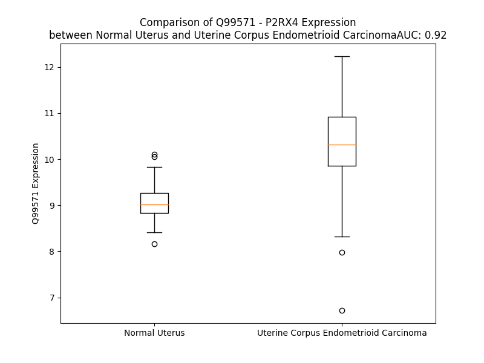

# Detailed Data for Q99571

## Introduction to the Detailed Summary

### How to Interpret the Results

- **Summary & Metrics**: This section provides a quick reference to essential protein attributes, including expression changes, family classification, and biomarker applications. Regulation status (upregulated/downregulated) indicates the protein's behavior in a disease context. Some information comes from the original excel file with the proteins selected from literature, while others are derived from the analyses.
- **Expression Comparison**: A visual representation comparing protein expression between normal and disease states. It highlights significant changes in expression levels that might indicate diagnostic or therapeutic relevance. This is data coming from transcriptomics experiments and could not translate similarly to protein levels.
- **Isoform Alignment**: An interactive view of isoform alignments, revealing structural and functional differences between variants of the protein.
- **Interactors & Homologs**: Tables listing known interaction partners and homologous proteins, the more interactors and homologs, the more complex the protein is to design an antibody for.
- **Biological Assemblies**: Information about the structural arrangement of the protein in different assemblies, providing insights into its functional state but also the complexity of the protein to develop antibodies.
- **Combined Per-Residue Information**: A detailed table summarizing residue-level data. This includes predictions for epitope regions, aggregation tendencies, and modifications that might impact the protein's function. Each row corresponds to a residue in the protein, providing insights into specific sites that may be important for research or drug development.
## Summary & Metrics

- **UniProt Accession**: Q99571
- **Gene Name**: P2RX4 
- **Protein Name**: purinergic receptor P2X, ligand-gated ion channel, 4 
- **Swiss Prot**: P2RX4_HUMAN
- **Family**: ion channel
- **Biomarker Application**:  
- **Number of Isoforms**: 3
- **Regulation**: 1
- **(transcriptomics) AUC**: 0.66
- **(transcriptomics) Fold Change**: 1.04
- **(transcriptomics) Regulation**: Upregulated
- **Discotope Epitope Count**: 106
- **Max n_uniprots (Homo)**: N/A
- **Max n_uniprots (Hetero)**: N/A

## Expression Comparison

## Isoform Alignment

<pre style='font-size:14px; font-family:monospace;'>Q99571-1 MAGCCAALAAFLFEYDTPRIVLIRSRKVGLMNRAVQLLILAYVIG----------------WVFVWEKGYQETDSVVSSVTTKVKGVAVTNTSKLGFRIWDVADYVIPAQEENSLFVMTNVILTMNQTQGLCPEIPDATTVCKSDASCTAGSAGTHSNGVSTGRCVAFNGSVKTCEVAAWCPVEDDTHVPQPAFLKAAENFTLLVKNNIWYPKFNFSKRNILPNITTTYLKSCIYDAKTDPFCPIFRLGKIVENAGHSFQDMAVEGGIMGIQVNWDCNLDRAASLCLPRYSFRRLDTRDVEHNVSPGYNFRFAKYYRDLAGNEQRTLIKAYGIRFDIIVFGKAGKFDIIPTMINIGSGLALLGMATVLCDIIVLYCMKKRLYYREKKYKYVEDYEQGLASELDQ
Q99571-2 MAGCCAALAAFLFEYDTPRIVLIRSRKVGLMNRAVQLLILAYVIGCYHPHLAEVEMESPRRWVFVWEKGYQETDSVVSSVTTKVKGVAVTNTSKLGFRIWDVADYVIPAQEENSLFVMTNVILTMNQTQGLCPEIPDATTVCKSDASCTAGSAGTHSNGVSTGRCVAFNGSVKTCEVAAWCPVEDDTHVPQPAFLKAAENFTLLVKNNIWYPKFNFSKRNILPNITTTYLKSCIYDAKTDPFCPIFRLGKIVENAGHSFQDMAVEGGIMGIQVNWDCNLDRAASLCLPRYSFRRLDTRDVEHNVSPGYNFRFAKYYRDLAGNEQRTLIKAYGIRFDIIVFGKAGKFDIIPTMINIGSGLALLGMATVLCDIIVLYCMKKRLYYREKKYKYVEDYEQGLASELDQ
Q99571-3 MAGCCAALAAFLFEYDTPRIVLIRSRKVGLMNRAVQLLILAYVIG----------------WVFVWEKGYQETDSVVSSVTTKVKGVAVTNTSKLGFRIWDVADYVIPAQEENSLFVMTNVILTMNQTQGLCPEIPDATTVCKSDASCTAGSAGTHSNGVSTGR---------------------------PAFLKAAENFTLLVKNNIWYPKFNFSKRNILPNITTTYLKSCIYDAKTDPFCPIFRLGKIVENAGHSFQDMAVEGGIMGIQVNWDCNLDRAASLCLPRYSFRRLDTRDVEHNVSPGYNFRFAKYYRDLAGNEQRTLIKAYGIRFDIIVFGKAGKFDIIPTMINIGSGLALLGMATVLCDIIVLYCMKKRLYYREKKYKYVEDYEQGLASELDQ
</pre>

## Interactors

| preferredName_A   | preferredName_B   |   score |
|:------------------|:------------------|--------:|
| P2RX4             | P2RX7             |   0.995 |
| P2RX4             | P2RX6             |   0.993 |
| P2RX4             | P2RX3             |   0.991 |
| P2RX4             | P2RX5             |   0.977 |
| P2RX4             | P2RX1             |   0.976 |
| P2RX4             | P2RX2             |   0.945 |
| P2RX4             | GRIN1             |   0.921 |
| P2RX4             | GRIN2A            |   0.916 |
| P2RX4             | GRIN2C            |   0.905 |
| P2RX4             | GRIN2D            |   0.902 |

## Homologs

| uniprot_id   | gene_id   |
|:-------------|:----------|
| F5H237       | P2RX7     |
| I3L3H3       | P2RX1     |
| A0A8V8TLD3   | P2RX5     |
| O15547       | P2RX6     |
| H0YDR6       | P2RX3     |
| Q32MC3       | P2RX2     |

## Combined Per-Residue Information

|   res | aa   |   epitope_score | epitope   |   relative_surface_accessibility |   modeling_confidence |   Aggregation | modification   | glycosylation                   |
|------:|:-----|----------------:|:----------|---------------------------------:|----------------------:|--------------:|:---------------|:--------------------------------|
|     1 | M    |         0.09656 | False     |                          1.145   |                 51.6  |         0     | N/A            | N/A                             |
|     2 | A    |         0.08929 | False     |                          0.84357 |                 57.36 |         0.539 | N/A            | N/A                             |
|     3 | G    |         0.08405 | False     |                          0.67079 |                 64.06 |         0.772 | N/A            | N/A                             |
|     4 | C    |         0.06498 | False     |                          0.60042 |                 68.4  |         1.437 | N/A            | N/A                             |
|     5 | C    |         0.07215 | False     |                          0.62607 |                 68.75 |         4.711 | N/A            | N/A                             |
|     6 | A    |         0.06893 | False     |                          0.62026 |                 75.89 |        20.295 | N/A            | N/A                             |
|     7 | A    |         0.06979 | False     |                          0.57494 |                 76.74 |        40.121 | N/A            | N/A                             |
|     8 | L    |         0.07403 | False     |                          0.62616 |                 73.18 |        64.463 | N/A            | N/A                             |
|     9 | A    |         0.05966 | False     |                          0.44127 |                 75.66 |        68.581 | N/A            | N/A                             |
|    10 | A    |         0.0679  | False     |                          0.45617 |                 79.52 |        68.581 | N/A            | N/A                             |
|    11 | F    |         0.12971 | False     |                          0.76084 |                 80.65 |        68.534 | N/A            | N/A                             |
|    12 | L    |         0.14882 | False     |                          0.85289 |                 83.19 |        67.113 | N/A            | N/A                             |
|    13 | F    |         0.15694 | False     |                          0.92967 |                 85.09 |        62.336 | N/A            | N/A                             |
|    14 | E    |         0.0913  | False     |                          0.6157  |                 86.5  |         0     | N/A            | N/A                             |
|    15 | Y    |         0.10564 | False     |                          0.85876 |                 85.19 |         0     | N/A            | N/A                             |
|    16 | D    |         0.11285 | False     |                          0.82555 |                 86.24 |         0     | N/A            | N/A                             |
|    17 | T    |         0.06146 | False     |                          0.66763 |                 88.52 |         0     | N/A            | N/A                             |
|    18 | P    |         0.07617 | False     |                          0.81712 |                 88.83 |         0     | N/A            | N/A                             |
|    19 | R    |         0.13769 | False     |                          0.84927 |                 87.35 |         0     | N/A            | N/A                             |
|    20 | I    |         0.05992 | False     |                          0.78706 |                 87.42 |         0     | N/A            | N/A                             |
|    21 | V    |         0.08921 | False     |                          0.47777 |                 86.66 |         0     | N/A            | N/A                             |
|    22 | L    |         0.06303 | False     |                          0.91904 |                 86.95 |         0     | N/A            | N/A                             |
|    23 | I    |         0.0589  | False     |                          0.37734 |                 86.26 |         0     | N/A            | N/A                             |
|    24 | R    |         0.12959 | False     |                          0.97246 |                 85.29 |         0     | N/A            | N/A                             |
|    25 | S    |         0.11201 | False     |                          0.2321  |                 87.02 |         0     | N/A            | N/A                             |
|    26 | R    |         0.10615 | False     |                          0.93103 |                 90.25 |         0     | N/A            | N/A                             |
|    27 | K    |         0.16359 | False     |                          0.80534 |                 88.26 |         0     | N/A            | N/A                             |
|    28 | V    |         0.05237 | False     |                          0.09507 |                 86.87 |         0     | N/A            | N/A                             |
|    29 | G    |         0.03569 | False     |                          0.38551 |                 89.76 |         0     | N/A            | N/A                             |
|    30 | L    |         0.04519 | False     |                          0.83889 |                 91.62 |         0     | N/A            | N/A                             |
|    31 | M    |         0.11088 | False     |                          0.24727 |                 89.07 |         0     | N/A            | N/A                             |
|    32 | N    |         0.03923 | False     |                          0.25739 |                 90.38 |         0     | N/A            | N/A                             |
|    33 | R    |         0.10068 | False     |                          0.66802 |                 92.96 |         0     | N/A            | N/A                             |
|    34 | A    |         0.0314  | False     |                          0.52819 |                 92.94 |        12.985 | N/A            | N/A                             |
|    35 | V    |         0.0294  | False     |                          0.21585 |                 92.29 |        28.349 | N/A            | N/A                             |
|    36 | Q    |         0.03002 | False     |                          0.21905 |                 93.31 |        30.576 | N/A            | N/A                             |
|    37 | L    |         0.03665 | False     |                          0.74328 |                 93.91 |        87.432 | N/A            | N/A                             |
|    38 | L    |         0.0504  | False     |                          0.74489 |                 94.03 |        97.843 | N/A            | N/A                             |
|    39 | I    |         0.04812 | False     |                          0.0816  |                 93.47 |        99.75  | N/A            | N/A                             |
|    40 | L    |         0.031   | False     |                          0.54078 |                 93.51 |        99.924 | N/A            | N/A                             |
|    41 | A    |         0.03941 | False     |                          0.55054 |                 95.16 |        99.956 | N/A            | N/A                             |
|    42 | Y    |         0.09291 | False     |                          0.48996 |                 94.17 |        99.994 | N/A            | N/A                             |
|    43 | V    |         0.03489 | False     |                          0.10568 |                 94.34 |        99.999 | N/A            | N/A                             |
|    44 | I    |         0.12099 | False     |                          0.53438 |                 94.37 |        99.999 | N/A            | N/A                             |
|    45 | G    |         0.15107 | False     |                          0.4244  |                 95.12 |        99.993 | N/A            | N/A                             |
|    46 | W    |         0.20142 | True      |                          0.56241 |                 95.24 |        99.993 | N/A            | N/A                             |
|    47 | V    |         0.13862 | False     |                          0.23326 |                 94.7  |        99.989 | N/A            | N/A                             |
|    48 | F    |         0.12841 | False     |                          0.17023 |                 93.49 |        99.936 | N/A            | N/A                             |
|    49 | V    |         0.16952 | False     |                          0.72942 |                 92.98 |        99.29  | N/A            | N/A                             |
|    50 | W    |         0.19831 | True      |                          0.79008 |                 93.25 |        85.836 | N/A            | N/A                             |
|    51 | E    |         0.15218 | False     |                          0.54122 |                 93.12 |         0.092 | N/A            | N/A                             |
|    52 | K    |         0.16021 | False     |                          0.40521 |                 94.18 |         0.092 | N/A            | N/A                             |
|    53 | G    |         0.08285 | False     |                          0.16892 |                 93.25 |         0.021 | N/A            | N/A                             |
|    54 | Y    |         0.14299 | False     |                          0.25756 |                 94.86 |         0.015 | N/A            | N/A                             |
|    55 | Q    |         0.07708 | False     |                          0.06766 |                 95.48 |         0     | N/A            | N/A                             |
|    56 | E    |         0.10483 | False     |                          0.28004 |                 95.41 |         0     | N/A            | N/A                             |
|    57 | T    |         0.17623 | False     |                          0.56921 |                 95.04 |         0     | N/A            | N/A                             |
|    58 | D    |         0.1805  | False     |                          0.13496 |                 96    |         0     | N/A            | N/A                             |
|    59 | S    |         0.11931 | False     |                          0.59566 |                 95.58 |         0.478 | N/A            | N/A                             |
|    60 | V    |         0.08711 | False     |                          0.1851  |                 95.28 |         4.874 | N/A            | N/A                             |
|    61 | V    |         0.1062  | False     |                          0.55282 |                 95.48 |         4.874 | N/A            | N/A                             |
|    62 | S    |         0.04314 | False     |                          0.31808 |                 94.95 |         4.874 | N/A            | N/A                             |
|    63 | S    |         0.17403 | False     |                          0.47843 |                 94.53 |         4.874 | N/A            | N/A                             |
|    64 | V    |         0.04202 | False     |                          0.07024 |                 95.32 |         4.874 | N/A            | N/A                             |
|    65 | T    |         0.16681 | False     |                          0.54988 |                 93.73 |         4.329 | N/A            | N/A                             |
|    66 | T    |         0.11298 | False     |                          0.28277 |                 94.11 |         1.606 | N/A            | N/A                             |
|    67 | K    |         0.17121 | False     |                          0.58772 |                 93.62 |         0     | N/A            | N/A                             |
|    68 | V    |         0.02789 | False     |                          0.02999 |                 94.42 |         0     | N/A            | N/A                             |
|    69 | K    |         0.19276 | False     |                          0.61299 |                 94.2  |         0     | N/A            | N/A                             |
|    70 | G    |         0.10901 | False     |                          0.26142 |                 93.92 |         0.141 | N/A            | N/A                             |
|    71 | V    |         0.17508 | False     |                          0.65742 |                 95.03 |         0.141 | N/A            | N/A                             |
|    72 | A    |         0.02565 | False     |                          0.01786 |                 93.71 |         0.141 | N/A            | N/A                             |
|    73 | V    |         0.17284 | False     |                          0.57624 |                 92.27 |         0.141 | N/A            | N/A                             |
|    74 | T    |         0.04015 | False     |                          0.03903 |                 89.14 |         0.141 | N/A            | N/A                             |
|    75 | N    |         0.23462 | True      |                          0.74776 |                 86.67 |         0     | N/A            | N-linked (GlcNAc...) asparagine |
|    76 | T    |         0.11635 | False     |                          0.30029 |                 81.97 |         0     | N/A            | N/A                             |
|    77 | S    |         0.24949 | True      |                          0.9588  |                 79.44 |         0     | N/A            | N/A                             |
|    78 | K    |         0.22395 | True      |                          0.92166 |                 75.04 |         0     | N/A            | N/A                             |
|    79 | L    |         0.22828 | True      |                          0.21061 |                 78.01 |         0.518 | N/A            | N/A                             |
|    80 | G    |         0.1757  | False     |                          0.40197 |                 84.68 |         0.518 | N/A            | N/A                             |
|    81 | F    |         0.30629 | True      |                          0.70327 |                 90.24 |         0.518 | N/A            | N/A                             |
|    82 | R    |         0.299   | True      |                          0.29955 |                 90.63 |         0.518 | N/A            | N/A                             |
|    83 | I    |         0.19233 | False     |                          0.57565 |                 93.67 |         0.518 | N/A            | N/A                             |
|    84 | W    |         0.07159 | False     |                          0.0293  |                 94.02 |         0.518 | N/A            | N/A                             |
|    85 | D    |         0.12638 | False     |                          0.39766 |                 94.7  |         0.518 | N/A            | N/A                             |
|    86 | V    |         0.08263 | False     |                          0.39143 |                 93.81 |         0.518 | N/A            | N/A                             |
|    87 | A    |         0.13905 | False     |                          0.82266 |                 93.18 |         0.236 | N/A            | N/A                             |
|    88 | D    |         0.168   | False     |                          0.22844 |                 93.36 |         0     | N/A            | N/A                             |
|    89 | Y    |         0.00923 | False     |                          0       |                 93.48 |         0     | N/A            | N/A                             |
|    90 | V    |         0.04774 | False     |                          0.11297 |                 93.68 |         0     | N/A            | N/A                             |
|    91 | I    |         0.19141 | False     |                          0.22622 |                 90.07 |         0     | N/A            | N/A                             |
|    92 | P    |         0.18291 | False     |                          0.50655 |                 91.33 |         0     | N/A            | N/A                             |
|    93 | A    |         0.15399 | False     |                          0.85104 |                 84.32 |         0     | N/A            | N/A                             |
|    94 | Q    |         0.20306 | True      |                          0.85424 |                 81.41 |         0     | N/A            | N/A                             |
|    95 | E    |         0.13907 | False     |                          0.30136 |                 82.13 |         0     | N/A            | N/A                             |
|    96 | E    |         0.17145 | False     |                          0.79875 |                 84.73 |         0     | N/A            | N/A                             |
|    97 | N    |         0.0571  | False     |                          0.42196 |                 89.39 |         0.044 | N/A            | N/A                             |
|    98 | S    |         0.0495  | False     |                          0.05356 |                 93.09 |         3.604 | N/A            | N/A                             |
|    99 | L    |         0.01891 | False     |                          0.02555 |                 93.48 |        80.461 | N/A            | N/A                             |
|   100 | F    |         0.03931 | False     |                          0.02127 |                 95.28 |        94.33  | N/A            | N/A                             |
|   101 | V    |         0.00252 | False     |                          0.00381 |                 95.5  |        95.46  | N/A            | N/A                             |
|   102 | M    |         0.01155 | False     |                          0.00863 |                 95.12 |        95.554 | N/A            | N/A                             |
|   103 | T    |         0.00246 | False     |                          0.0019  |                 94.91 |        95.546 | N/A            | N/A                             |
|   104 | N    |         0.00571 | False     |                          0       |                 93.92 |        94.462 | N/A            | N/A                             |
|   105 | V    |         0.01643 | False     |                          0.00542 |                 92.83 |        95.436 | N/A            | N/A                             |
|   106 | I    |         0.09797 | False     |                          0.10497 |                 92.34 |        94.805 | N/A            | N/A                             |
|   107 | L    |         0.13761 | False     |                          0.19302 |                 91.62 |        87.908 | N/A            | N/A                             |
|   108 | T    |         0.12688 | False     |                          0.09476 |                 93.39 |        50.192 | N/A            | N/A                             |
|   109 | M    |         0.1709  | False     |                          0.49418 |                 91.73 |        27.718 | N/A            | N/A                             |
|   110 | N    |         0.15974 | False     |                          0.54902 |                 91.64 |         1.089 | N/A            | N-linked (GlcNAc...) asparagine |
|   111 | Q    |         0.0233  | False     |                          0.01173 |                 94.79 |         0.056 | N/A            | N/A                             |
|   112 | T    |         0.17795 | False     |                          0.32094 |                 94.76 |         0.019 | N/A            | N/A                             |
|   113 | Q    |         0.29605 | True      |                          0.61101 |                 93.49 |         0     | N/A            | N/A                             |
|   114 | G    |         0.1185  | False     |                          0.36539 |                 93.91 |         0     | N/A            | N/A                             |
|   115 | L    |         0.14344 | False     |                          0.67087 |                 95.06 |         0     | N/A            | N/A                             |
|   116 | C    |         0.05429 | False     |                          0.11116 |                 94.55 |         0     | N/A            | N/A                             |
|   117 | P    |         0.12443 | False     |                          0.28988 |                 93.87 |         0     | N/A            | N/A                             |
|   118 | E    |         0.01571 | False     |                          0.02054 |                 91.86 |         0     | N/A            | N/A                             |
|   119 | I    |         0.17389 | False     |                          0.13951 |                 91.02 |         0     | N/A            | N/A                             |
|   120 | P    |         0.23043 | True      |                          0.32931 |                 89.06 |         0     | N/A            | N/A                             |
|   121 | D    |         0.26658 | True      |                          0.48688 |                 85.58 |         0     | N/A            | N/A                             |
|   122 | A    |         0.29239 | True      |                          0.99446 |                 82.81 |         0     | N/A            | N/A                             |
|   123 | T    |         0.31046 | True      |                          0.8156  |                 82.92 |         0     | N/A            | N/A                             |
|   124 | T    |         0.07787 | False     |                          0.13219 |                 85.86 |         0     | N/A            | N/A                             |
|   125 | V    |         0.14749 | False     |                          0.56202 |                 91.43 |         0     | N/A            | N/A                             |
|   126 | C    |         0.0414  | False     |                          0.04306 |                 91.24 |         0     | N/A            | N/A                             |
|   127 | K    |         0.21344 | True      |                          0.94778 |                 91.08 |         0     | N/A            | N/A                             |
|   128 | S    |         0.19045 | False     |                          0.45426 |                 92    |         0     | N/A            | N/A                             |
|   129 | D    |         0.16268 | False     |                          0.46224 |                 92.02 |         0     | N/A            | N/A                             |
|   130 | A    |         0.19925 | True      |                          0.96349 |                 89.16 |         0     | N/A            | N/A                             |
|   131 | S    |         0.20116 | True      |                          0.52438 |                 89.05 |         0     | N/A            | N/A                             |
|   132 | C    |         0.06623 | False     |                          0.07372 |                 89.4  |         0     | N/A            | N/A                             |
|   133 | T    |         0.14088 | False     |                          0.69212 |                 90.3  |         0     | N/A            | N/A                             |
|   134 | A    |         0.0837  | False     |                          0.69287 |                 91.12 |         0     | N/A            | N/A                             |
|   135 | G    |         0.11706 | False     |                          0.66315 |                 89.11 |         0     | N/A            | N/A                             |
|   136 | S    |         0.19849 | True      |                          0.37323 |                 87.91 |         0     | N/A            | N/A                             |
|   137 | A    |         0.2513  | True      |                          0.71486 |                 85.73 |         0     | N/A            | N/A                             |
|   138 | G    |         0.29521 | True      |                          0.55381 |                 82.02 |         0     | N/A            | N/A                             |
|   139 | T    |         0.30342 | True      |                          0.9699  |                 82    |         0     | N/A            | N/A                             |
|   140 | H    |         0.26856 | True      |                          0.86707 |                 80.8  |         0     | N/A            | N/A                             |
|   141 | S    |         0.11703 | False     |                          0.30249 |                 85.47 |         0     | N/A            | N/A                             |
|   142 | N    |         0.20313 | True      |                          0.51905 |                 89.92 |         0     | N/A            | N/A                             |
|   143 | G    |         0.06487 | False     |                          0.18538 |                 91.59 |         0     | N/A            | N/A                             |
|   144 | V    |         0.14246 | False     |                          0.49098 |                 93.72 |         0     | N/A            | N/A                             |
|   145 | S    |         0.04709 | False     |                          0.07904 |                 92.76 |         0     | N/A            | N/A                             |
|   146 | T    |         0.18819 | False     |                          0.31117 |                 93.55 |         0     | N/A            | N/A                             |
|   147 | G    |         0.09736 | False     |                          0.15373 |                 92.35 |         0     | N/A            | N/A                             |
|   148 | R    |         0.17009 | False     |                          0.53662 |                 94.4  |         0     | N/A            | N/A                             |
|   149 | C    |         0.0718  | False     |                          0.13281 |                 94.21 |         0     | N/A            | N/A                             |
|   150 | V    |         0.1576  | False     |                          0.2304  |                 94.8  |         0     | N/A            | N/A                             |
|   151 | A    |         0.29186 | True      |                          0.64431 |                 93.84 |         0     | N/A            | N/A                             |
|   152 | F    |         0.28173 | True      |                          0.44691 |                 90.89 |         0     | N/A            | N/A                             |
|   153 | N    |         0.34421 | True      |                          0.67182 |                 88.92 |         0     | N/A            | N-linked (GlcNAc...) asparagine |
|   154 | G    |         0.35648 | True      |                          1.0265  |                 87.16 |         0     | N/A            | N/A                             |
|   155 | S    |         0.28423 | True      |                          0.8781  |                 90.06 |         0     | N/A            | N/A                             |
|   156 | V    |         0.23125 | True      |                          0.36561 |                 91.87 |         0     | N/A            | N/A                             |
|   157 | K    |         0.22515 | True      |                          0.5114  |                 94.07 |         0     | N/A            | N/A                             |
|   158 | T    |         0.00854 | False     |                          0       |                 93.73 |         0     | N/A            | N/A                             |
|   159 | C    |         0.05446 | False     |                          0.11261 |                 93.01 |         0     | N/A            | N/A                             |
|   160 | E    |         0.06694 | False     |                          0.07396 |                 94.87 |         0     | N/A            | N/A                             |
|   161 | V    |         0.02216 | False     |                          0.01809 |                 94.6  |         0     | N/A            | N/A                             |
|   162 | A    |         0.26008 | True      |                          0.43045 |                 95.35 |         0     | N/A            | N/A                             |
|   163 | A    |         0.04517 | False     |                          0.12165 |                 94.15 |         0     | N/A            | N/A                             |
|   164 | W    |         0.23706 | True      |                          0.21217 |                 95.17 |         0     | N/A            | N/A                             |
|   165 | C    |         0.10631 | False     |                          0.11048 |                 94.14 |         0     | N/A            | N/A                             |
|   166 | P    |         0.29471 | True      |                          0.57501 |                 93.88 |         0     | N/A            | N/A                             |
|   167 | V    |         0.0691  | False     |                          0.10747 |                 92.88 |         0     | N/A            | N/A                             |
|   168 | E    |         0.06037 | False     |                          0.05558 |                 92.32 |         0     | N/A            | N/A                             |
|   169 | D    |         0.24203 | True      |                          0.48034 |                 87.8  |         0     | N/A            | N/A                             |
|   170 | D    |         0.2974  | True      |                          0.30561 |                 83.76 |         0     | N/A            | N/A                             |
|   171 | T    |         0.22727 | True      |                          0.58123 |                 80.77 |         0     | N/A            | N/A                             |
|   172 | H    |         0.25747 | True      |                          0.82459 |                 83.19 |         0     | N/A            | N/A                             |
|   173 | V    |         0.1156  | False     |                          0.2851  |                 85.73 |         0     | N/A            | N/A                             |
|   174 | P    |         0.09468 | False     |                          0.24156 |                 85.95 |         0     | N/A            | N/A                             |
|   175 | Q    |         0.13747 | False     |                          0.69402 |                 86.18 |         0     | N/A            | N/A                             |
|   176 | P    |         0.29397 | True      |                          0.76506 |                 87.42 |         0     | N/A            | N/A                             |
|   177 | A    |         0.0339  | False     |                          0.03455 |                 88.72 |         0.042 | N/A            | N/A                             |
|   178 | F    |         0.10214 | False     |                          0.22831 |                 88.05 |         0.091 | N/A            | N/A                             |
|   179 | L    |         0.00496 | False     |                          0.00412 |                 89.86 |         0.091 | N/A            | N/A                             |
|   180 | K    |         0.08319 | False     |                          0.62157 |                 89.31 |         0.091 | N/A            | N/A                             |
|   181 | A    |         0.09535 | False     |                          0.37407 |                 92.14 |         0.091 | N/A            | N/A                             |
|   182 | A    |         0.0018  | False     |                          0       |                 94.18 |         0.091 | N/A            | N/A                             |
|   183 | E    |         0.0591  | False     |                          0.28581 |                 95.14 |         0.091 | N/A            | N/A                             |
|   184 | N    |         0.10968 | False     |                          0.56466 |                 95.68 |         3.414 | N/A            | N-linked (GlcNAc...) asparagine |
|   185 | F    |         0.02763 | False     |                          0.02759 |                 96.39 |        82.023 | N/A            | N/A                             |
|   186 | T    |         0.10777 | False     |                          0.26778 |                 96.04 |        82.023 | N/A            | N/A                             |
|   187 | L    |         0.00462 | False     |                          0       |                 95.34 |        82.023 | N/A            | N/A                             |
|   188 | L    |         0.22983 | True      |                          0.21864 |                 94.8  |        82.023 | N/A            | N/A                             |
|   189 | V    |         0.0036  | False     |                          0       |                 95.23 |        81.763 | N/A            | N/A                             |
|   190 | K    |         0.2098  | True      |                          0.46388 |                 94.57 |         0     | N/A            | N/A                             |
|   191 | N    |         0.01328 | False     |                          0.00657 |                 95.9  |         0     | N/A            | N/A                             |
|   192 | N    |         0.23125 | True      |                          0.48329 |                 95.23 |         0     | N/A            | N/A                             |
|   193 | I    |         0.07845 | False     |                          0.01797 |                 95.56 |         0     | N/A            | N/A                             |
|   194 | W    |         0.1853  | False     |                          0.51681 |                 95.87 |         0     | N/A            | N/A                             |
|   195 | Y    |         0.00589 | False     |                          0       |                 95.85 |         0     | N/A            | N/A                             |
|   196 | P    |         0.16834 | False     |                          0.41496 |                 95.16 |         0     | N/A            | N/A                             |
|   197 | K    |         0.30118 | True      |                          0.54231 |                 94.18 |         0     | N/A            | N/A                             |
|   198 | F    |         0.26308 | True      |                          0.16242 |                 93.7  |         0     | N/A            | N/A                             |
|   199 | N    |         0.2766  | True      |                          0.81937 |                 94.08 |         0     | N/A            | N-linked (GlcNAc...) asparagine |
|   200 | F    |         0.21957 | True      |                          0.17831 |                 94.5  |         0     | N/A            | N/A                             |
|   201 | S    |         0.2303  | True      |                          0.64473 |                 94.27 |         0     | N/A            | N/A                             |
|   202 | K    |         0.22677 | True      |                          0.1661  |                 94.09 |         0     | N/A            | N/A                             |
|   203 | R    |         0.40099 | True      |                          0.49962 |                 94.08 |         0     | N/A            | N/A                             |
|   204 | N    |         0.02051 | False     |                          0.01242 |                 94.32 |         0     | N/A            | N/A                             |
|   205 | I    |         0.22713 | True      |                          0.15039 |                 92.87 |         0     | N/A            | N/A                             |
|   206 | L    |         0.19369 | True      |                          0.16541 |                 89.57 |         0     | N/A            | N/A                             |
|   207 | P    |         0.28184 | True      |                          0.89793 |                 85.62 |         0     | N/A            | N/A                             |
|   208 | N    |         0.31829 | True      |                          0.75195 |                 85.79 |         0     | N/A            | N-linked (GlcNAc...) asparagine |
|   209 | I    |         0.30046 | True      |                          0.19542 |                 86.41 |         1.155 | N/A            | N/A                             |
|   210 | T    |         0.27246 | True      |                          0.54128 |                 90.9  |         1.155 | N/A            | N/A                             |
|   211 | T    |         0.27903 | True      |                          0.73405 |                 88.49 |         1.155 | N/A            | N/A                             |
|   212 | T    |         0.27713 | True      |                          0.69915 |                 90.73 |         1.155 | N/A            | N/A                             |
|   213 | Y    |         0.38747 | True      |                          0.29232 |                 90.73 |         1.155 | N/A            | N/A                             |
|   214 | L    |         0.17469 | False     |                          0.30498 |                 89.33 |         0.976 | N/A            | N/A                             |
|   215 | K    |         0.32476 | True      |                          0.88802 |                 88.93 |         0     | N/A            | N/A                             |
|   216 | S    |         0.25508 | True      |                          0.68825 |                 91.38 |         0     | N/A            | N/A                             |
|   217 | C    |         0.06834 | False     |                          0.07389 |                 94.26 |         0     | N/A            | N/A                             |
|   218 | I    |         0.18774 | False     |                          0.46173 |                 94.49 |         0     | N/A            | N/A                             |
|   219 | Y    |         0.11906 | False     |                          0.06017 |                 95.83 |         0     | N/A            | N/A                             |
|   220 | D    |         0.11577 | False     |                          0.24735 |                 94.23 |         0     | N/A            | N/A                             |
|   221 | A    |         0.19177 | False     |                          0.65626 |                 91.95 |         0     | N/A            | N/A                             |
|   222 | K    |         0.24621 | True      |                          0.93742 |                 91.56 |         0     | N/A            | N/A                             |
|   223 | T    |         0.31451 | True      |                          0.83327 |                 93.04 |         0     | N/A            | N/A                             |
|   224 | D    |         0.28808 | True      |                          0.18952 |                 92.4  |         0     | N/A            | N/A                             |
|   225 | P    |         0.25127 | True      |                          0.33137 |                 92.96 |         0     | N/A            | N/A                             |
|   226 | F    |         0.1538  | False     |                          0.33737 |                 91.57 |         0     | N/A            | N/A                             |
|   227 | C    |         0.00915 | False     |                          0       |                 94.93 |         0     | N/A            | N/A                             |
|   228 | P    |         0.00853 | False     |                          0       |                 94.77 |         0     | N/A            | N/A                             |
|   229 | I    |         0.0842  | False     |                          0.13839 |                 96.02 |         0     | N/A            | N/A                             |
|   230 | F    |         0.02188 | False     |                          0.00877 |                 96.79 |         0     | N/A            | N/A                             |
|   231 | R    |         0.18954 | False     |                          0.34959 |                 96.6  |         0     | N/A            | N/A                             |
|   232 | L    |         0.00402 | False     |                          0.00247 |                 96.31 |         0     | N/A            | N/A                             |
|   233 | G    |         0.03697 | False     |                          0.06919 |                 95.49 |         0     | N/A            | N/A                             |
|   234 | K    |         0.1313  | False     |                          0.35098 |                 95.29 |         0     | N/A            | N/A                             |
|   235 | I    |         0.01986 | False     |                          0.00949 |                 95.87 |         0     | N/A            | N/A                             |
|   236 | V    |         0.00667 | False     |                          0       |                 95.23 |         0     | N/A            | N/A                             |
|   237 | E    |         0.25046 | True      |                          0.62054 |                 95.17 |         0     | N/A            | N/A                             |
|   238 | N    |         0.17432 | False     |                          0.54353 |                 93.95 |         0     | N/A            | N/A                             |
|   239 | A    |         0.11087 | False     |                          0.23492 |                 93.63 |         0     | N/A            | N/A                             |
|   240 | G    |         0.21941 | True      |                          0.79242 |                 92.84 |         0     | N/A            | N/A                             |
|   241 | H    |         0.23219 | True      |                          0.37778 |                 92.08 |         0     | N/A            | N/A                             |
|   242 | S    |         0.20286 | True      |                          0.42657 |                 93.23 |         0     | N/A            | N/A                             |
|   243 | F    |         0.04865 | False     |                          0.04786 |                 93.89 |         0     | N/A            | N/A                             |
|   244 | Q    |         0.11961 | False     |                          0.34754 |                 92.22 |         0     | N/A            | N/A                             |
|   245 | D    |         0.16848 | False     |                          0.55507 |                 90.15 |         0     | N/A            | N/A                             |
|   246 | M    |         0.03616 | False     |                          0.03904 |                 91.89 |         0     | N/A            | N/A                             |
|   247 | A    |         0.00246 | False     |                          0       |                 93.44 |         0     | N/A            | N/A                             |
|   248 | V    |         0.09499 | False     |                          0.13519 |                 92.42 |         0     | N/A            | N/A                             |
|   249 | E    |         0.15103 | False     |                          0.33143 |                 89.07 |         0     | N/A            | N/A                             |
|   250 | G    |         0.02431 | False     |                          0.01785 |                 92.51 |         0     | N/A            | N/A                             |
|   251 | G    |         0.00338 | False     |                          0.00161 |                 92.7  |         0     | N/A            | N/A                             |
|   252 | I    |         0.11173 | False     |                          0.24639 |                 94.68 |         0.349 | N/A            | N/A                             |
|   253 | M    |         0.00606 | False     |                          0       |                 95.53 |         0.349 | N/A            | N/A                             |
|   254 | G    |         0.01209 | False     |                          0       |                 96.15 |         0.349 | N/A            | N/A                             |
|   255 | I    |         0.00822 | False     |                          0       |                 96.96 |         0.349 | N/A            | N/A                             |
|   256 | Q    |         0.12817 | False     |                          0.20854 |                 96.59 |         0.349 | N/A            | N/A                             |
|   257 | V    |         0.00601 | False     |                          0       |                 96.76 |         0.349 | N/A            | N/A                             |
|   258 | N    |         0.057   | False     |                          0.20873 |                 96.55 |         0     | N/A            | N/A                             |
|   259 | W    |         0.01273 | False     |                          0       |                 95.92 |         0     | N/A            | N/A                             |
|   260 | D    |         0.15364 | False     |                          0.59186 |                 94.06 |         0     | N/A            | N/A                             |
|   261 | C    |         0.0489  | False     |                          0.05303 |                 95.32 |         0     | N/A            | N/A                             |
|   262 | N    |         0.06558 | False     |                          0.18641 |                 94.98 |         0     | N/A            | N/A                             |
|   263 | L    |         0.15607 | False     |                          0.16183 |                 94.56 |         0     | N/A            | N/A                             |
|   264 | D    |         0.31592 | True      |                          0.40793 |                 92.98 |         0     | N/A            | N/A                             |
|   265 | R    |         0.31931 | True      |                          0.64172 |                 91.86 |         0     | N/A            | N/A                             |
|   266 | A    |         0.26813 | True      |                          0.5901  |                 92.14 |         0     | N/A            | N/A                             |
|   267 | A    |         0.20794 | True      |                          0.51737 |                 89.3  |         0     | N/A            | N/A                             |
|   268 | S    |         0.30282 | True      |                          0.59747 |                 89.46 |         0     | N/A            | N/A                             |
|   269 | L    |         0.31747 | True      |                          0.68684 |                 92.45 |         0     | N/A            | N/A                             |
|   270 | C    |         0.0353  | False     |                          0.02949 |                 94    |         0     | N/A            | N/A                             |
|   271 | L    |         0.19561 | True      |                          0.30191 |                 94.02 |         0     | N/A            | N/A                             |
|   272 | P    |         0.02633 | False     |                          0.03488 |                 95.4  |         0     | N/A            | N/A                             |
|   273 | R    |         0.32633 | True      |                          0.74997 |                 95.12 |         0     | N/A            | N/A                             |
|   274 | Y    |         0.0519  | False     |                          0.10677 |                 96.58 |         0     | N/A            | N/A                             |
|   275 | S    |         0.20448 | True      |                          0.37291 |                 95.87 |         0     | N/A            | N/A                             |
|   276 | F    |         0.06778 | False     |                          0.1357  |                 96.27 |         0     | N/A            | N/A                             |
|   277 | R    |         0.23628 | True      |                          0.63267 |                 94.83 |         0     | N/A            | N/A                             |
|   278 | R    |         0.13926 | False     |                          0.14798 |                 93.72 |         0     | N/A            | N/A                             |
|   279 | L    |         0.22887 | True      |                          0.43708 |                 92.42 |         0     | N/A            | N/A                             |
|   280 | D    |         0.12302 | False     |                          0.1953  |                 88.26 |         0     | N/A            | N/A                             |
|   281 | T    |         0.18001 | False     |                          0.90904 |                 71.8  |         0     | N/A            | N/A                             |
|   282 | R    |         0.15475 | False     |                          0.53966 |                 68.66 |         0     | N/A            | N/A                             |
|   283 | D    |         0.1357  | False     |                          0.35007 |                 67.23 |         0     | N/A            | N/A                             |
|   284 | V    |         0.23683 | True      |                          0.74523 |                 69.71 |         0     | N/A            | N/A                             |
|   285 | E    |         0.19913 | True      |                          0.79515 |                 65.06 |         0     | N/A            | N/A                             |
|   286 | H    |         0.23174 | True      |                          0.71124 |                 64.01 |         0     | N/A            | N/A                             |
|   287 | N    |         0.26174 | True      |                          0.50285 |                 68.42 |         0     | N/A            | N/A                             |
|   288 | V    |         0.35266 | True      |                          1.02493 |                 66.83 |         0     | N/A            | N/A                             |
|   289 | S    |         0.2324  | True      |                          0.67429 |                 73.49 |         0     | N/A            | N/A                             |
|   290 | P    |         0.15566 | False     |                          0.38867 |                 78.02 |         0     | N/A            | N/A                             |
|   291 | G    |         0.14547 | False     |                          0.23147 |                 85.13 |         0     | N/A            | N/A                             |
|   292 | Y    |         0.14902 | False     |                          0.26708 |                 91.36 |         0     | N/A            | N/A                             |
|   293 | N    |         0.29139 | True      |                          0.36582 |                 92.85 |         0     | N/A            | N/A                             |
|   294 | F    |         0.27651 | True      |                          0.27363 |                 94.34 |         0     | N/A            | N/A                             |
|   295 | R    |         0.40085 | True      |                          0.5008  |                 94.69 |         0     | N/A            | N/A                             |
|   296 | F    |         0.34268 | True      |                          0.2625  |                 95.74 |         0     | N/A            | N/A                             |
|   297 | A    |         0.20229 | True      |                          0.26966 |                 95.86 |         0     | N/A            | N/A                             |
|   298 | K    |         0.22222 | True      |                          0.44048 |                 94.96 |         0     | N/A            | N/A                             |
|   299 | Y    |         0.28921 | True      |                          0.57073 |                 95.7  |         0     | N/A            | N/A                             |
|   300 | Y    |         0.28364 | True      |                          0.36459 |                 95.28 |         0     | N/A            | N/A                             |
|   301 | R    |         0.36199 | True      |                          0.76071 |                 93.99 |         0     | N/A            | N/A                             |
|   302 | D    |         0.22156 | True      |                          0.26694 |                 89.34 |         0     | N/A            | N/A                             |
|   303 | L    |         0.39138 | True      |                          1.20693 |                 91.48 |         0     | N/A            | N/A                             |
|   304 | A    |         0.29739 | True      |                          0.80112 |                 90.38 |         0     | N/A            | N/A                             |
|   305 | G    |         0.20134 | True      |                          0.53393 |                 90.2  |         0     | N/A            | N/A                             |
|   306 | N    |         0.35399 | True      |                          0.5336  |                 91.1  |         0     | N/A            | N/A                             |
|   307 | E    |         0.23495 | True      |                          0.41724 |                 94.52 |         0     | N/A            | N/A                             |
|   308 | Q    |         0.23283 | True      |                          0.13537 |                 95.33 |         0     | N/A            | N/A                             |
|   309 | R    |         0.23183 | True      |                          0.14329 |                 96.03 |         0     | N/A            | N/A                             |
|   310 | T    |         0.1155  | False     |                          0.08227 |                 94.98 |         0     | N/A            | N/A                             |
|   311 | L    |         0.14145 | False     |                          0.12054 |                 96    |         0     | N/A            | N/A                             |
|   312 | I    |         0.09093 | False     |                          0.0488  |                 94.23 |         0     | N/A            | N/A                             |
|   313 | K    |         0.1178  | False     |                          0.06571 |                 94.9  |         0     | N/A            | N/A                             |
|   314 | A    |         0.00586 | False     |                          0       |                 94.59 |         0.829 | N/A            | N/A                             |
|   315 | Y    |         0.07012 | False     |                          0.04734 |                 94.81 |         1.81  | N/A            | N/A                             |
|   316 | G    |         0.00407 | False     |                          0       |                 94.32 |         2.602 | N/A            | N/A                             |
|   317 | I    |         0.00677 | False     |                          0.0032  |                 95.16 |        11.522 | N/A            | N/A                             |
|   318 | R    |         0.16513 | False     |                          0.2609  |                 95.28 |        12.315 | N/A            | N/A                             |
|   319 | F    |         0.00461 | False     |                          0.00127 |                 95.78 |        12.537 | N/A            | N/A                             |
|   320 | D    |         0.08328 | False     |                          0.18809 |                 95.86 |        12.537 | N/A            | N/A                             |
|   321 | I    |         0.01874 | False     |                          0.03912 |                 96.41 |        76.006 | N/A            | N/A                             |
|   322 | I    |         0.08817 | False     |                          0.40878 |                 96.48 |        76.006 | N/A            | N/A                             |
|   323 | V    |         0.0449  | False     |                          0.17993 |                 96.73 |        75.882 | N/A            | N/A                             |
|   324 | F    |         0.20831 | True      |                          0.41796 |                 96.51 |        73.85  | N/A            | N/A                             |
|   325 | G    |         0.05343 | False     |                          0.13418 |                 94.78 |        64.529 | N/A            | N/A                             |
|   326 | K    |         0.17469 | False     |                          0.65415 |                 95.19 |         0.222 | N/A            | N/A                             |
|   327 | A    |         0.00357 | False     |                          0       |                 95.88 |         0.052 | N/A            | N/A                             |
|   328 | G    |         0.08989 | False     |                          0.06582 |                 95.72 |         0     | N/A            | N/A                             |
|   329 | K    |         0.08843 | False     |                          0.44316 |                 95.82 |         0     | N/A            | N/A                             |
|   330 | F    |         0.20425 | True      |                          0.5623  |                 95.93 |         0     | N/A            | N/A                             |
|   331 | D    |         0.15662 | False     |                          0.23099 |                 95.95 |         0     | N/A            | N/A                             |
|   332 | I    |         0.25888 | True      |                          0.5384  |                 94.7  |         0     | N/A            | N/A                             |
|   333 | I    |         0.15284 | False     |                          0.68856 |                 94.55 |         0     | N/A            | N/A                             |
|   334 | P    |         0.14973 | False     |                          0.19583 |                 94.56 |         0     | N/A            | N/A                             |
|   335 | T    |         0.04706 | False     |                          0.10663 |                 94.52 |         0.194 | N/A            | N/A                             |
|   336 | M    |         0.07952 | False     |                          0.59703 |                 95.35 |         0.194 | N/A            | N/A                             |
|   337 | I    |         0.07997 | False     |                          0.64035 |                 94.7  |         0.194 | N/A            | N/A                             |
|   338 | N    |         0.06396 | False     |                          0.22078 |                 93.87 |         0.194 | N/A            | N/A                             |
|   339 | I    |         0.0541  | False     |                          0.43473 |                 93.43 |         0.194 | N/A            | N/A                             |
|   340 | G    |         0.1026  | False     |                          0.44727 |                 94.37 |         0     | N/A            | N/A                             |
|   341 | S    |         0.07953 | False     |                          0.48987 |                 93.47 |         0     | N/A            | N/A                             |
|   342 | G    |         0.04292 | False     |                          0.09477 |                 92.22 |         1.508 | N/A            | N/A                             |
|   343 | L    |         0.02757 | False     |                          0.68725 |                 91.96 |        14.002 | N/A            | N/A                             |
|   344 | A    |         0.06483 | False     |                          0.69406 |                 92.87 |        16.133 | N/A            | N/A                             |
|   345 | L    |         0.06002 | False     |                          0.3758  |                 91.66 |        18.616 | N/A            | N/A                             |
|   346 | L    |         0.06315 | False     |                          0.29877 |                 90.85 |        19.045 | N/A            | N/A                             |
|   347 | G    |         0.05322 | False     |                          0.4331  |                 89.28 |        18.475 | N/A            | N/A                             |
|   348 | M    |         0.05107 | False     |                          0.56474 |                 88.25 |        18.503 | N/A            | N/A                             |
|   349 | A    |         0.00425 | False     |                          0       |                 87.66 |        17.773 | N/A            | N/A                             |
|   350 | T    |         0.05355 | False     |                          0.51661 |                 88.42 |        17.044 | N/A            | N/A                             |
|   351 | V    |         0.03668 | False     |                          0.57657 |                 89.89 |        16.772 | N/A            | N/A                             |
|   352 | L    |         0.02336 | False     |                          0.48225 |                 88.57 |        11.398 | N/A            | N/A                             |
|   353 | C    |         0.01085 | False     |                          0.06994 |                 87.94 |         0.401 | N/A            | N/A                             |
|   354 | D    |         0.0513  | False     |                          0.33286 |                 89.31 |         0.224 | N/A            | N/A                             |
|   355 | I    |         0.04034 | False     |                          0.50706 |                 89.37 |        88.738 | N/A            | N/A                             |
|   356 | I    |         0.11768 | False     |                          0.34158 |                 88.32 |        94.483 | N/A            | N/A                             |
|   357 | V    |         0.01882 | False     |                          0.03808 |                 88.1  |        94.504 | N/A            | N/A                             |
|   358 | L    |         0.07564 | False     |                          0.10832 |                 87.33 |        94.504 | N/A            | N/A                             |
|   359 | Y    |         0.17414 | False     |                          0.6802  |                 87.96 |        94.504 | N/A            | N/A                             |
|   360 | C    |         0.14433 | False     |                          0.70331 |                 86.68 |        68.445 | N/A            | N/A                             |
|   361 | M    |         0.13902 | False     |                          0.22407 |                 85.82 |        23.351 | N/A            | N/A                             |
|   362 | K    |         0.14445 | False     |                          1.0476  |                 83.79 |         0.224 | N/A            | N/A                             |
|   363 | K    |         0.12977 | False     |                          0.70485 |                 83.57 |         0     | N/A            | N/A                             |
|   364 | R    |         0.19532 | True      |                          0.50577 |                 85.3  |         0     | N/A            | N/A                             |
|   365 | L    |         0.12569 | False     |                          0.68024 |                 84.81 |         0     | N/A            | N/A                             |
|   366 | Y    |         0.12124 | False     |                          0.56035 |                 86.97 |         0     | N/A            | N/A                             |
|   367 | Y    |         0.07085 | False     |                          0.12623 |                 85.78 |         0     | N/A            | N/A                             |
|   368 | R    |         0.1173  | False     |                          0.45851 |                 86.39 |         0     | N/A            | N/A                             |
|   369 | E    |         0.09865 | False     |                          0.64325 |                 87.32 |         0     | N/A            | N/A                             |
|   370 | K    |         0.133   | False     |                          0.59523 |                 87.25 |         0     | N/A            | N/A                             |
|   371 | K    |         0.07699 | False     |                          0.38337 |                 87.1  |         0     | N/A            | N/A                             |
|   372 | Y    |         0.08642 | False     |                          0.44721 |                 87.78 |         0     | N/A            | N/A                             |
|   373 | K    |         0.10545 | False     |                          0.76927 |                 85.26 |         0     | N/A            | N/A                             |
|   374 | Y    |         0.12817 | False     |                          0.75248 |                 80.83 |         0     | N/A            | N/A                             |
|   375 | V    |         0.08102 | False     |                          0.97258 |                 82.55 |         0     | N/A            | N/A                             |
|   376 | E    |         0.11904 | False     |                          0.72968 |                 80.45 |         0     | N/A            | N/A                             |
|   377 | D    |         0.11687 | False     |                          0.62738 |                 77.68 |         0     | N/A            | N/A                             |
|   378 | Y    |         0.19733 | True      |                          0.87236 |                 67.63 |         0     | N/A            | N/A                             |
|   379 | E    |         0.10641 | False     |                          0.78263 |                 66.4  |         0     | N/A            | N/A                             |
|   380 | Q    |         0.0619  | False     |                          0.64496 |                 58.45 |         0     | N/A            | N/A                             |
|   381 | G    |         0.0647  | False     |                          0.36303 |                 57.28 |         0     | N/A            | N/A                             |
|   382 | L    |         0.06741 | False     |                          0.63009 |                 57.32 |         0     | N/A            | N/A                             |
|   383 | A    |         0.05276 | False     |                          0.5721  |                 57.94 |         0     | N/A            | N/A                             |
|   384 | S    |         0.10542 | False     |                          0.54744 |                 58.75 |         0     | N/A            | N/A                             |
|   385 | E    |         0.09973 | False     |                          0.71232 |                 61.04 |         0     | N/A            | N/A                             |
|   386 | L    |         0.09306 | False     |                          0.86411 |                 65.46 |         0     | N/A            | N/A                             |
|   387 | D    |         0.07209 | False     |                          0.83971 |                 60.24 |         0     | N/A            | N/A                             |
|   388 | Q    |         0.04775 | False     |                          1.09329 |                 48.79 |         0     | N/A            | N/A                             |

