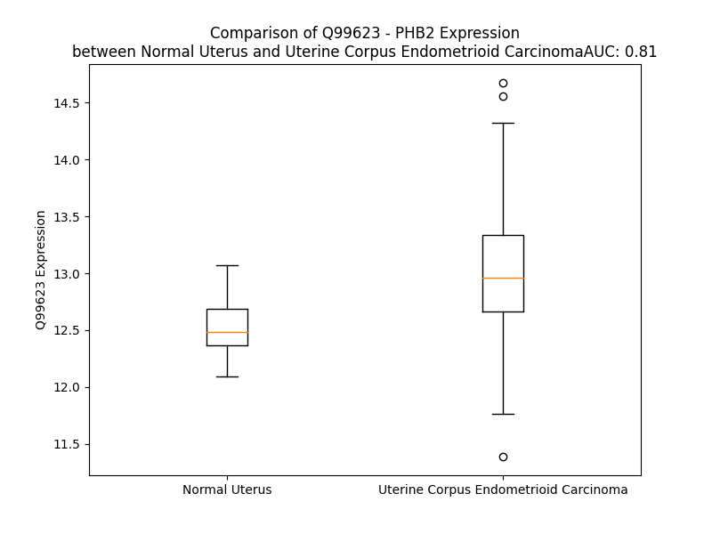

# Detailed Data for Q99623

## Introduction to the Detailed Summary

### How to Interpret the Results

- **Summary & Metrics**: This section provides a quick reference to essential protein attributes, including expression changes, family classification, and biomarker applications. Regulation status (upregulated/downregulated) indicates the protein's behavior in a disease context. Some information comes from the original excel file with the proteins selected from literature, while others are derived from the analyses.
- **Expression Comparison**: A visual representation comparing protein expression between normal and disease states. It highlights significant changes in expression levels that might indicate diagnostic or therapeutic relevance. This is data coming from transcriptomics experiments and could not translate similarly to protein levels.
- **Isoform Alignment**: An interactive view of isoform alignments, revealing structural and functional differences between variants of the protein.
- **Interactors & Homologs**: Tables listing known interaction partners and homologous proteins, the more interactors and homologs, the more complex the protein is to design an antibody for.
- **Biological Assemblies**: Information about the structural arrangement of the protein in different assemblies, providing insights into its functional state but also the complexity of the protein to develop antibodies.
- **Combined Per-Residue Information**: A detailed table summarizing residue-level data. This includes predictions for epitope regions, aggregation tendencies, and modifications that might impact the protein's function. Each row corresponds to a residue in the protein, providing insights into specific sites that may be important for research or drug development.
## Summary & Metrics

- **UniProt Accession**: Q99623
- **Gene Name**: PHB2
- **Protein Name**: Prohibitin-2
- **Swiss Prot**: PHB2_HUMAN
- **Family**: nan
- **Biomarker Application**: nan
- **Number of Isoforms**: 2
- **Regulation**: 1
- **(transcriptomics) AUC**: 0.81
- **(transcriptomics) Fold Change**: 1.04
- **(transcriptomics) Regulation**: Upregulated
- **Discotope Epitope Count**: 39
- **Max n_uniprots (Homo)**: 6
- **Max n_uniprots (Hetero)**: N/A

## Expression Comparison

## Isoform Alignment

<pre style='font-size:14px; font-family:monospace;'>Q99623-1 MAQNLKDLAGRLPAGPRGMGTALKLLLGAGAVAYGVRESVFTVEGGHRAIFFNRIGGVQQDTILAEGLHFRIPWFQYPIIYDIRARPRKISSPTGSKDLQMVNISLRVLSRPNAQELPSMYQRLGLDYEERVLPSIVNEVLKSVVAKFNASQLITQRAQVSLLIRRELTERAKDFSLILDDVAITELSFSREYTAAVEAKQVAQQEAQRAQFLVEKAKQEQRQKIVQAEGEAEAAKMLGEALSKNPGYIKLRKIRAAQNISKTIATSQNRIYLTADNLVLNLQDESFTRGSDSLIKGKK
Q99623-2 MAQNLKDLAGRLPAGPRGMGTALKLLLGAGAVAYGVRESVFTVEGGHRAIFFNRIGGVQQDTILAEGLHFRIPWFQYPIIYDIRARPRKISSPTGSKDLQMVNISLRVLSRPNAQELPSMYQRLGLDYEERVLPSIVNEVLKSVVAKFNASQLITQRAQVSLLIRRELTERAKDFSLILDDVAITELSFSREYTAAVEAKQV--------------------------------------ALSKNPGYIKLRKIRAAQNISKTIATSQNRIYLTADNLVLNLQDESFTRGSDSLIKGKK
</pre>

## Interactors

| preferredName_A   | preferredName_B   |   score |
|:------------------|:------------------|--------:|
| PHB2              | PHB               |   0.999 |
| PHB2              | ESR1              |   0.985 |
| PHB2              | C1QBP             |   0.964 |
| PHB2              | ARFGEF3           |   0.962 |
| PHB2              | HDAC1             |   0.946 |
| PHB2              | TUFM              |   0.911 |
| PHB2              | MFN1              |   0.907 |
| PHB2              | OPA1              |   0.905 |

## Homologs

| uniprot_id   | gene_id   |
|:-------------|:----------|
| A8K401       | PHB       |

## Biological Assemblies

|   Unnamed: 0 |   assembly |   n_uniprots | composition   | crystal_id   |
|-------------:|-----------:|-------------:|:--------------|:-------------|
|            0 |          1 |            6 | Homo          | 8j4i         |
|            0 |          1 |            1 | Homo          | 6iqe         |

## Combined Per-Residue Information

|   res | aa   |   epitope_score | epitope   |   relative_surface_accessibility |   modeling_confidence |   Aggregation | modification    |
|------:|:-----|----------------:|:----------|---------------------------------:|----------------------:|--------------:|:----------------|
|     1 | M    |         0.10231 | False     |                          1.16811 |                 44.47 |         0     | N/A             |
|     2 | A    |         0.12649 | False     |                          0.80779 |                 52.31 |         0     | N-acetylalanine |
|     3 | Q    |         0.14308 | False     |                          0.78138 |                 52.46 |         0     | N/A             |
|     4 | N    |         0.07414 | False     |                          0.71877 |                 52.47 |         0     | N/A             |
|     5 | L    |         0.09617 | False     |                          0.82399 |                 50.81 |         0     | N/A             |
|     6 | K    |         0.09524 | False     |                          0.83195 |                 54.58 |         0     | N/A             |
|     7 | D    |         0.10649 | False     |                          0.6624  |                 53.99 |         0     | N/A             |
|     8 | L    |         0.06607 | False     |                          0.78909 |                 51.49 |         0     | N/A             |
|     9 | A    |         0.08525 | False     |                          0.73148 |                 56.66 |         0     | N/A             |
|    10 | G    |         0.154   | False     |                          0.81543 |                 54.05 |         0     | N/A             |
|    11 | R    |         0.18889 | False     |                          0.84439 |                 52.95 |         0     | N/A             |
|    12 | L    |         0.14224 | False     |                          0.8977  |                 43.38 |         0     | N/A             |
|    13 | P    |         0.13709 | False     |                          0.89271 |                 49.11 |         0     | N/A             |
|    14 | A    |         0.1235  | False     |                          1.03583 |                 51.91 |         0     | N/A             |
|    15 | G    |         0.11028 | False     |                          0.49864 |                 43.05 |         0     | N/A             |
|    16 | P    |         0.12471 | False     |                          0.79683 |                 49.68 |         0     | N/A             |
|    17 | R    |         0.15557 | False     |                          0.96987 |                 55.81 |         0     | N/A             |
|    18 | G    |         0.12819 | False     |                          0.63408 |                 54.79 |         0     | N/A             |
|    19 | M    |         0.07055 | False     |                          0.65268 |                 54.38 |         0     | N/A             |
|    20 | G    |         0.10961 | False     |                          0.46449 |                 69.76 |         0     | N/A             |
|    21 | T    |         0.06537 | False     |                          0.62676 |                 79.35 |         0     | N/A             |
|    22 | A    |         0.04784 | False     |                          0.43642 |                 78.69 |         0     | N/A             |
|    23 | L    |         0.05413 | False     |                          0.56587 |                 82.65 |         0     | N/A             |
|    24 | K    |         0.10641 | False     |                          0.75017 |                 82.75 |         0     | N/A             |
|    25 | L    |         0.05451 | False     |                          0.82533 |                 86.61 |         2.955 | N/A             |
|    26 | L    |         0.06853 | False     |                          0.76953 |                 86.7  |         3.38  | N/A             |
|    27 | L    |         0.0524  | False     |                          0.71042 |                 87.77 |         3.539 | N/A             |
|    28 | G    |         0.06044 | False     |                          0.41643 |                 87.24 |         3.539 | N/A             |
|    29 | A    |         0.02862 | False     |                          0.57611 |                 88.45 |         3.976 | N/A             |
|    30 | G    |         0.0468  | False     |                          0.45433 |                 89.05 |         4.253 | N/A             |
|    31 | A    |         0.09169 | False     |                          0.63522 |                 86.63 |         8.619 | N/A             |
|    32 | V    |         0.09191 | False     |                          0.721   |                 85.9  |        13.837 | N/A             |
|    33 | A    |         0.05194 | False     |                          0.58385 |                 86.18 |        13.625 | N/A             |
|    34 | Y    |         0.07361 | False     |                          0.56376 |                 84.83 |        13.447 | N/A             |
|    35 | G    |         0.10789 | False     |                          0.26116 |                 85.53 |        12.492 | N/A             |
|    36 | V    |         0.04866 | False     |                          0.61246 |                 84.5  |        12.492 | N/A             |
|    37 | R    |         0.11766 | False     |                          0.56378 |                 83.75 |         0     | N/A             |
|    38 | E    |         0.11033 | False     |                          0.20695 |                 82.52 |         0     | N/A             |
|    39 | S    |         0.17533 | False     |                          0.18369 |                 83.48 |         7.257 | N/A             |
|    40 | V    |         0.11204 | False     |                          0.33584 |                 87.99 |         7.257 | N/A             |
|    41 | F    |         0.33032 | True      |                          0.11985 |                 87.29 |         7.257 | N/A             |
|    42 | T    |         0.17373 | False     |                          0.61056 |                 89.29 |         7.257 | N/A             |
|    43 | V    |         0.04653 | False     |                          0.02604 |                 90.11 |         7.257 | N/A             |
|    44 | E    |         0.15161 | False     |                          0.59256 |                 89.65 |         0     | N/A             |
|    45 | G    |         0.15341 | False     |                          0.51703 |                 89    |         0     | N/A             |
|    46 | G    |         0.09361 | False     |                          0.28389 |                 90.09 |         0     | N/A             |
|    47 | H    |         0.13389 | False     |                          0.19239 |                 92.78 |         0     | N/A             |
|    48 | R    |         0.15768 | False     |                          0.25836 |                 91.6  |         0     | N/A             |
|    49 | A    |         0.00615 | False     |                          0       |                 90.17 |         0.397 | N/A             |
|    50 | I    |         0.0121  | False     |                          0       |                 89.99 |         0.397 | N/A             |
|    51 | F    |         0.08691 | False     |                          0.06497 |                 88.71 |         0.397 | N/A             |
|    52 | F    |         0.24369 | True      |                          0.39437 |                 87.58 |         0.397 | N/A             |
|    53 | N    |         0.14923 | False     |                          0.15698 |                 86.69 |         0.397 | N/A             |
|    54 | R    |         0.34059 | True      |                          0.63547 |                 82.33 |         0     | N/A             |
|    55 | I    |         0.38328 | True      |                          0.8836  |                 82.52 |         0     | N/A             |
|    56 | G    |         0.34759 | True      |                          0.71783 |                 79.9  |         0     | N/A             |
|    57 | G    |         0.17328 | False     |                          0.32798 |                 84.3  |         0     | N/A             |
|    58 | V    |         0.17496 | False     |                          0.12255 |                 81.97 |         0     | N/A             |
|    59 | Q    |         0.20046 | False     |                          0.28955 |                 76.84 |         0     | N/A             |
|    60 | Q    |         0.1627  | False     |                          0.39929 |                 73.32 |         0     | N/A             |
|    61 | D    |         0.22095 | True      |                          0.87391 |                 74.32 |         0     | N/A             |
|    62 | T    |         0.14347 | False     |                          0.35417 |                 75.97 |         0     | N/A             |
|    63 | I    |         0.12524 | False     |                          0.30121 |                 83.28 |         0     | N/A             |
|    64 | L    |         0.1156  | False     |                          0.19043 |                 85.33 |         0     | N/A             |
|    65 | A    |         0.16073 | False     |                          0.54557 |                 88.56 |         0     | N/A             |
|    66 | E    |         0.16444 | False     |                          0.58099 |                 88.6  |         0     | N/A             |
|    67 | G    |         0.10611 | False     |                          0.37573 |                 91.34 |         0     | N/A             |
|    68 | L    |         0.1882  | False     |                          0.68608 |                 89.98 |         0     | N/A             |
|    69 | H    |         0.27131 | True      |                          0.21065 |                 88.03 |         0     | N/A             |
|    70 | F    |         0.17208 | False     |                          0.71776 |                 87.93 |         0     | N/A             |
|    71 | R    |         0.21664 | False     |                          0.19876 |                 85.66 |         0     | N/A             |
|    72 | I    |         0.21364 | False     |                          0.59997 |                 86.87 |         0     | N/A             |
|    73 | P    |         0.129   | False     |                          0.14189 |                 81.4  |         0     | N/A             |
|    74 | W    |         0.27157 | True      |                          0.81101 |                 82.14 |         0     | N/A             |
|    75 | F    |         0.41326 | True      |                          0.51146 |                 85.64 |         0     | N/A             |
|    76 | Q    |         0.14257 | False     |                          0.12291 |                 87.97 |         0     | N/A             |
|    77 | Y    |         0.28987 | True      |                          0.45916 |                 88.08 |         0     | N/A             |
|    78 | P    |         0.13225 | False     |                          0.28712 |                 88.94 |         0     | N/A             |
|    79 | I    |         0.16698 | False     |                          0.15119 |                 89.23 |         0     | N/A             |
|    80 | I    |         0.08749 | False     |                          0.51266 |                 90.69 |         0     | N/A             |
|    81 | Y    |         0.04319 | False     |                          0.02657 |                 91.02 |         0     | N/A             |
|    82 | D    |         0.10442 | False     |                          0.16332 |                 91.52 |         0     | N/A             |
|    83 | I    |         0.09833 | False     |                          0.23484 |                 91.33 |         0     | N/A             |
|    84 | R    |         0.13564 | False     |                          0.49184 |                 93.03 |         0     | N/A             |
|    85 | A    |         0.12311 | False     |                          0.44265 |                 93.51 |         0     | N/A             |
|    86 | R    |         0.25212 | True      |                          0.47685 |                 93.32 |         0     | N/A             |
|    87 | P    |         0.28744 | True      |                          0.69702 |                 94.68 |         0     | N/A             |
|    88 | R    |         0.41261 | True      |                          0.24283 |                 92.92 |         0     | N/A             |
|    89 | K    |         0.18151 | False     |                          0.56407 |                 94.73 |         0     | N/A             |
|    90 | I    |         0.17982 | False     |                          0.0904  |                 94.25 |         0     | N/A             |
|    91 | S    |         0.17829 | False     |                          0.47641 |                 93.54 |         0     | N/A             |
|    92 | S    |         0.05696 | False     |                          0.03999 |                 91.39 |         0     | N/A             |
|    93 | P    |         0.21338 | False     |                          0.65739 |                 92.88 |         0     | N/A             |
|    94 | T    |         0.01903 | False     |                          0.01714 |                 92.82 |         0     | N/A             |
|    95 | G    |         0.0856  | False     |                          0.37667 |                 93.19 |         0     | N/A             |
|    96 | S    |         0.03392 | False     |                          0.04228 |                 93.73 |         0     | N/A             |
|    97 | K    |         0.14948 | False     |                          0.63982 |                 94.55 |         0     | N/A             |
|    98 | D    |         0.20654 | False     |                          0.37455 |                 93.61 |         0     | N/A             |
|    99 | L    |         0.19227 | False     |                          0.9955  |                 91.85 |         0.203 | N/A             |
|   100 | Q    |         0.15329 | False     |                          0.29708 |                 91.41 |         0.203 | N/A             |
|   101 | M    |         0.13715 | False     |                          0.60094 |                 93.28 |         0.203 | N/A             |
|   102 | V    |         0.00952 | False     |                          0.00563 |                 93.85 |         0.203 | N/A             |
|   103 | N    |         0.115   | False     |                          0.46077 |                 94.26 |         0.203 | N/A             |
|   104 | I    |         0.00332 | False     |                          0       |                 94.45 |         0.203 | N/A             |
|   105 | S    |         0.06341 | False     |                          0.04854 |                 94.95 |         0     | N/A             |
|   106 | L    |         0.00596 | False     |                          0       |                 95.11 |         0     | N/A             |
|   107 | R    |         0.18041 | False     |                          0.29875 |                 95.21 |         0     | N/A             |
|   108 | V    |         0.00564 | False     |                          0       |                 95.4  |         0     | N/A             |
|   109 | L    |         0.08051 | False     |                          0.26132 |                 95.2  |         0     | N/A             |
|   110 | S    |         0.01488 | False     |                          0.00888 |                 93.86 |         0     | N/A             |
|   111 | R    |         0.08313 | False     |                          0.30322 |                 93.62 |         0     | N/A             |
|   112 | P    |         0.00582 | False     |                          0.00298 |                 93.85 |         0     | N/A             |
|   113 | N    |         0.07784 | False     |                          0.20702 |                 92.34 |         0     | N/A             |
|   114 | A    |         0.05576 | False     |                          0.11443 |                 89.51 |         0     | N/A             |
|   115 | Q    |         0.2029  | False     |                          0.71038 |                 90.19 |         0     | N/A             |
|   116 | E    |         0.11471 | False     |                          0.37762 |                 89.42 |         0     | N/A             |
|   117 | L    |         0.00865 | False     |                          0       |                 90.1  |         0     | N/A             |
|   118 | P    |         0.02095 | False     |                          0.01591 |                 90.09 |         0     | N/A             |
|   119 | S    |         0.17635 | False     |                          0.28568 |                 89.74 |         0     | N/A             |
|   120 | M    |         0.01378 | False     |                          0       |                 90.48 |         0     | N/A             |
|   121 | Y    |         0.27008 | True      |                          0.23369 |                 90.18 |         0     | N/A             |
|   122 | Q    |         0.33797 | True      |                          0.55595 |                 88.53 |         0     | N/A             |
|   123 | R    |         0.37662 | True      |                          0.55382 |                 89.77 |         0     | N/A             |
|   124 | L    |         0.21347 | False     |                          0.14574 |                 89.24 |         0     | N/A             |
|   125 | G    |         0.12941 | False     |                          0.26308 |                 88.6  |         0     | N/A             |
|   126 | L    |         0.34593 | True      |                          0.62062 |                 86.45 |         0     | N/A             |
|   127 | D    |         0.20749 | False     |                          0.62012 |                 88.75 |         0     | N/A             |
|   128 | Y    |         0.06632 | False     |                          0.07264 |                 87.07 |         0     | Phosphotyrosine |
|   129 | E    |         0.08789 | False     |                          0.15935 |                 86.35 |         0     | N/A             |
|   130 | E    |         0.29837 | True      |                          0.6222  |                 88.62 |         0     | N/A             |
|   131 | R    |         0.31828 | True      |                          0.71675 |                 87.53 |         0     | N/A             |
|   132 | V    |         0.13851 | False     |                          0.05998 |                 91.31 |         0     | N/A             |
|   133 | L    |         0.00409 | False     |                          0       |                 91.1  |         0     | N/A             |
|   134 | P    |         0.09962 | False     |                          0.27023 |                 92.91 |         0     | N/A             |
|   135 | S    |         0.18167 | False     |                          0.53265 |                 92.9  |         0     | N/A             |
|   136 | I    |         0.12559 | False     |                          0.0624  |                 94.28 |         0.578 | N/A             |
|   137 | V    |         0.0025  | False     |                          0       |                 95.12 |         0.578 | N/A             |
|   138 | N    |         0.06017 | False     |                          0.29329 |                 94.23 |         0.578 | N/A             |
|   139 | E    |         0.16635 | False     |                          0.48035 |                 94.44 |         0.578 | N/A             |
|   140 | V    |         0.03447 | False     |                          0.03142 |                 95.04 |         0.578 | N/A             |
|   141 | L    |         0.00299 | False     |                          0       |                 94.61 |         0.578 | N/A             |
|   142 | K    |         0.10182 | False     |                          0.54997 |                 94.39 |         0.578 | N/A             |
|   143 | S    |         0.2015  | False     |                          0.384   |                 94.26 |         0.578 | N/A             |
|   144 | V    |         0.00602 | False     |                          0       |                 94.38 |         0.578 | N/A             |
|   145 | V    |         0.00234 | False     |                          0       |                 94.15 |         0.578 | N/A             |
|   146 | A    |         0.05467 | False     |                          0.48835 |                 94.56 |         0.265 | N/A             |
|   147 | K    |         0.24956 | True      |                          0.54799 |                 95.15 |         0     | N6-acetyllysine |
|   148 | F    |         0.11563 | False     |                          0.13695 |                 95.64 |         0     | N/A             |
|   149 | N    |         0.08379 | False     |                          0.32393 |                 94.2  |         0     | N/A             |
|   150 | A    |         0.00498 | False     |                          0       |                 91.95 |         0     | N/A             |
|   151 | S    |         0.16413 | False     |                          0.47997 |                 89.48 |         0     | Phosphoserine   |
|   152 | Q    |         0.15984 | False     |                          0.31758 |                 93.25 |         0     | N/A             |
|   153 | L    |         0.00817 | False     |                          0.00326 |                 92.58 |         0     | N/A             |
|   154 | I    |         0.22063 | True      |                          0.5645  |                 90.53 |         0     | N/A             |
|   155 | T    |         0.20308 | False     |                          0.77908 |                 91.7  |         0     | N/A             |
|   156 | Q    |         0.18221 | False     |                          0.3774  |                 93.41 |         0     | N/A             |
|   157 | R    |         0.23407 | True      |                          0.37328 |                 92.19 |         0     | N/A             |
|   158 | A    |         0.16163 | False     |                          0.79059 |                 92.64 |         0     | N/A             |
|   159 | Q    |         0.19494 | False     |                          0.54652 |                 93.57 |         0     | N/A             |
|   160 | V    |         0.00353 | False     |                          0.00095 |                 93.94 |         3.829 | N/A             |
|   161 | S    |         0.11371 | False     |                          0.12589 |                 93.44 |         3.829 | N/A             |
|   162 | L    |         0.16742 | False     |                          0.60941 |                 94.07 |         3.829 | N/A             |
|   163 | L    |         0.15364 | False     |                          0.30254 |                 94.96 |         3.829 | N/A             |
|   164 | I    |         0.00574 | False     |                          0       |                 95.89 |         3.829 | N/A             |
|   165 | R    |         0.12965 | False     |                          0.40036 |                 95.48 |         0     | N/A             |
|   166 | R    |         0.23244 | True      |                          0.69587 |                 95.48 |         0     | N/A             |
|   167 | E    |         0.09481 | False     |                          0.19359 |                 95.53 |         0     | N/A             |
|   168 | L    |         0.00465 | False     |                          0       |                 95.84 |         0     | N/A             |
|   169 | T    |         0.19246 | False     |                          0.40825 |                 95.14 |         0     | N/A             |
|   170 | E    |         0.18512 | False     |                          0.62877 |                 94.84 |         0     | N/A             |
|   171 | R    |         0.21061 | False     |                          0.47514 |                 94.75 |         0     | N/A             |
|   172 | A    |         0.006   | False     |                          0       |                 94.01 |         0     | N/A             |
|   173 | K    |         0.15233 | False     |                          0.7843  |                 92.64 |         0     | N/A             |
|   174 | D    |         0.19444 | False     |                          0.55807 |                 92.33 |         0     | N/A             |
|   175 | F    |         0.2433  | True      |                          0.33828 |                 92.63 |         9.913 | N/A             |
|   176 | S    |         0.04676 | False     |                          0.03071 |                 92.06 |         9.913 | N/A             |
|   177 | L    |         0.04745 | False     |                          0.03178 |                 93.7  |         9.913 | N/A             |
|   178 | I    |         0.0993  | False     |                          0.33519 |                 94.1  |         9.913 | N/A             |
|   179 | L    |         0.11242 | False     |                          0.0905  |                 94.89 |         9.913 | N/A             |
|   180 | D    |         0.16285 | False     |                          0.43313 |                 93.23 |         0     | N/A             |
|   181 | D    |         0.26849 | True      |                          0.25672 |                 93.19 |         0     | N/A             |
|   182 | V    |         0.04047 | False     |                          0.03589 |                 94.3  |         0     | N/A             |
|   183 | A    |         0.18318 | False     |                          0.26018 |                 92.28 |         0     | N/A             |
|   184 | I    |         0.12838 | False     |                          0.06241 |                 94.39 |         0     | N/A             |
|   185 | T    |         0.21202 | False     |                          0.36382 |                 93.38 |         0     | N/A             |
|   186 | E    |         0.22428 | True      |                          0.49161 |                 93.65 |         0     | N/A             |
|   187 | L    |         0.2284  | True      |                          0.23877 |                 92.24 |         0     | N/A             |
|   188 | S    |         0.21536 | False     |                          0.44077 |                 92.72 |         0     | N/A             |
|   189 | F    |         0.18131 | False     |                          0.17964 |                 92.11 |         0     | N/A             |
|   190 | S    |         0.11735 | False     |                          0.30699 |                 89.7  |         0     | N/A             |
|   191 | R    |         0.23595 | True      |                          0.85342 |                 91.07 |         0     | N/A             |
|   192 | E    |         0.2051  | False     |                          0.66877 |                 91.46 |         0     | N/A             |
|   193 | Y    |         0.19897 | False     |                          0.19555 |                 90.44 |         1.042 | N/A             |
|   194 | T    |         0.20346 | False     |                          0.40217 |                 90.69 |         1.042 | N/A             |
|   195 | A    |         0.12989 | False     |                          0.5449  |                 93.59 |         1.042 | N/A             |
|   196 | A    |         0.16625 | False     |                          0.5758  |                 91.51 |         1.042 | N/A             |
|   197 | V    |         0.1293  | False     |                          0.44929 |                 90.01 |         1.042 | N/A             |
|   198 | E    |         0.13013 | False     |                          0.54822 |                 91.83 |         0     | N/A             |
|   199 | A    |         0.11491 | False     |                          0.59135 |                 95.86 |         0     | N/A             |
|   200 | K    |         0.2489  | True      |                          0.72668 |                 93.75 |         0     | N6-acetyllysine |
|   201 | Q    |         0.15439 | False     |                          0.48433 |                 93.55 |         0     | N/A             |
|   202 | V    |         0.10496 | False     |                          0.58242 |                 96.7  |         0     | N/A             |
|   203 | A    |         0.08572 | False     |                          0.53821 |                 96.45 |         0     | N/A             |
|   204 | Q    |         0.10103 | False     |                          0.46126 |                 96.35 |         0     | N/A             |
|   205 | Q    |         0.11449 | False     |                          0.38064 |                 96.3  |         0     | N/A             |
|   206 | E    |         0.0826  | False     |                          0.5248  |                 97    |         0     | N/A             |
|   207 | A    |         0.07758 | False     |                          0.48046 |                 96.99 |         0     | N/A             |
|   208 | Q    |         0.10756 | False     |                          0.50576 |                 97.46 |         0     | N/A             |
|   209 | R    |         0.13468 | False     |                          0.67948 |                 97.45 |         0     | N/A             |
|   210 | A    |         0.05038 | False     |                          0.5406  |                 97    |         1.563 | N/A             |
|   211 | Q    |         0.04927 | False     |                          0.58517 |                 97.13 |         1.563 | N/A             |
|   212 | F    |         0.07247 | False     |                          0.70079 |                 97.28 |         1.563 | N/A             |
|   213 | L    |         0.07193 | False     |                          0.73647 |                 97.46 |         1.563 | N/A             |
|   214 | V    |         0.06583 | False     |                          0.53742 |                 96.68 |         1.563 | N/A             |
|   215 | E    |         0.0541  | False     |                          0.54935 |                 97.14 |         0     | N/A             |
|   216 | K    |         0.05704 | False     |                          0.55657 |                 97.67 |         0     | N/A             |
|   217 | A    |         0.04691 | False     |                          0.4913  |                 96.81 |         0     | N/A             |
|   218 | K    |         0.09311 | False     |                          0.57524 |                 97.31 |         0     | N/A             |
|   219 | Q    |         0.0499  | False     |                          0.48588 |                 96.64 |         0     | N/A             |
|   220 | E    |         0.05098 | False     |                          0.37829 |                 96.58 |         0     | N/A             |
|   221 | Q    |         0.03924 | False     |                          0.56056 |                 96.2  |         0     | N/A             |
|   222 | R    |         0.04958 | False     |                          0.60057 |                 96.26 |         0     | N/A             |
|   223 | Q    |         0.05476 | False     |                          0.6114  |                 96.25 |         0     | N/A             |
|   224 | K    |         0.05224 | False     |                          0.69454 |                 96.71 |         0     | N/A             |
|   225 | I    |         0.07608 | False     |                          0.49587 |                 97.05 |         0     | N/A             |
|   226 | V    |         0.05412 | False     |                          0.71666 |                 96.31 |         0     | N/A             |
|   227 | Q    |         0.03076 | False     |                          0.57374 |                 95.37 |         0     | N/A             |
|   228 | A    |         0.03727 | False     |                          0.55313 |                 95.88 |         0     | N/A             |
|   229 | E    |         0.03524 | False     |                          0.55878 |                 95.77 |         0     | N/A             |
|   230 | G    |         0.04369 | False     |                          0.45155 |                 96.46 |         0     | N/A             |
|   231 | E    |         0.0329  | False     |                          0.54555 |                 94.14 |         0     | N/A             |
|   232 | A    |         0.03199 | False     |                          0.48951 |                 94.47 |         0     | N/A             |
|   233 | E    |         0.0408  | False     |                          0.54115 |                 94.55 |         0     | N/A             |
|   234 | A    |         0.02532 | False     |                          0.49145 |                 93.26 |         0     | N/A             |
|   235 | A    |         0.02351 | False     |                          0.59229 |                 90.8  |         0     | N/A             |
|   236 | K    |         0.0954  | False     |                          0.71799 |                 92.09 |         0     | N6-acetyllysine |
|   237 | M    |         0.04521 | False     |                          0.61921 |                 90.36 |         0     | N/A             |
|   238 | L    |         0.0219  | False     |                          0.52159 |                 86.64 |         0     | N/A             |
|   239 | G    |         0.03159 | False     |                          0.41048 |                 86.53 |         0     | N/A             |
|   240 | E    |         0.07785 | False     |                          0.56948 |                 86.67 |         0     | N/A             |
|   241 | A    |         0.0449  | False     |                          0.55044 |                 85.37 |         0     | N/A             |
|   242 | L    |         0.03929 | False     |                          0.14548 |                 82.42 |         0     | N/A             |
|   243 | S    |         0.08551 | False     |                          0.38881 |                 79.06 |         0     | N/A             |
|   244 | K    |         0.12631 | False     |                          0.79126 |                 82.49 |         0     | N/A             |
|   245 | N    |         0.15782 | False     |                          0.57257 |                 81.18 |         0     | N/A             |
|   246 | P    |         0.0629  | False     |                          0.17921 |                 75.47 |         0     | N/A             |
|   247 | G    |         0.1007  | False     |                          0.4928  |                 80.16 |         0     | N/A             |
|   248 | Y    |         0.11249 | False     |                          0.49061 |                 81.91 |         0     | N/A             |
|   249 | I    |         0.06518 | False     |                          0.15599 |                 82.8  |         0     | N/A             |
|   250 | K    |         0.15506 | False     |                          0.48476 |                 81.48 |         0     | N6-acetyllysine |
|   251 | L    |         0.11447 | False     |                          0.55139 |                 85.88 |         0     | N/A             |
|   252 | R    |         0.06248 | False     |                          0.43026 |                 84.9  |         0     | N/A             |
|   253 | K    |         0.06314 | False     |                          0.33548 |                 84.09 |         0     | N/A             |
|   254 | I    |         0.13028 | False     |                          0.33018 |                 87.71 |         0     | N/A             |
|   255 | R    |         0.14385 | False     |                          0.60233 |                 89.85 |         0     | N/A             |
|   256 | A    |         0.06597 | False     |                          0.42932 |                 88.52 |         0     | N/A             |
|   257 | A    |         0.06721 | False     |                          0.11295 |                 86.25 |         0     | N/A             |
|   258 | Q    |         0.14561 | False     |                          0.48229 |                 88.43 |         0     | N/A             |
|   259 | N    |         0.07934 | False     |                          0.59312 |                 89.85 |         0     | N/A             |
|   260 | I    |         0.0664  | False     |                          0.55906 |                 87.42 |         0     | N/A             |
|   261 | S    |         0.09914 | False     |                          0.34238 |                 84.02 |         0     | N/A             |
|   262 | K    |         0.10373 | False     |                          0.69183 |                 87.33 |         0     | N6-acetyllysine |
|   263 | T    |         0.07802 | False     |                          0.68992 |                 87.32 |         0     | N/A             |
|   264 | I    |         0.10846 | False     |                          0.35456 |                 85.09 |         0     | N/A             |
|   265 | A    |         0.14681 | False     |                          0.85467 |                 83.75 |         0     | N/A             |
|   266 | T    |         0.17601 | False     |                          0.84206 |                 86.47 |         0     | N/A             |
|   267 | S    |         0.23433 | True      |                          0.41064 |                 85.14 |         0     | N/A             |
|   268 | Q    |         0.17049 | False     |                          0.94913 |                 84.52 |         0     | N/A             |
|   269 | N    |         0.21684 | True      |                          0.62054 |                 82.95 |         0     | N/A             |
|   270 | R    |         0.25035 | True      |                          0.82444 |                 79.45 |         0     | N/A             |
|   271 | I    |         0.23804 | True      |                          0.52214 |                 76.68 |        14.779 | N/A             |
|   272 | Y    |         0.2522  | True      |                          0.87093 |                 77.93 |        14.779 | N/A             |
|   273 | L    |         0.20852 | False     |                          0.54058 |                 74.28 |        14.779 | N/A             |
|   274 | T    |         0.16553 | False     |                          0.62396 |                 77    |        14.779 | N/A             |
|   275 | A    |         0.19806 | False     |                          0.83927 |                 72.78 |        14.779 | N/A             |
|   276 | D    |         0.22511 | True      |                          0.7346  |                 70.9  |         0     | N/A             |
|   277 | N    |         0.17508 | False     |                          0.37466 |                 74.6  |         0     | N/A             |
|   278 | L    |         0.27842 | True      |                          0.76956 |                 70.8  |         0.613 | N/A             |
|   279 | V    |         0.15626 | False     |                          0.43194 |                 72.68 |         0.613 | N/A             |
|   280 | L    |         0.11435 | False     |                          0.34942 |                 73.5  |         0.613 | N/A             |
|   281 | N    |         0.13102 | False     |                          0.38918 |                 74.99 |         0.613 | N/A             |
|   282 | L    |         0.12249 | False     |                          0.29183 |                 73.09 |         0.613 | N/A             |
|   283 | Q    |         0.28053 | True      |                          0.73611 |                 72.34 |         0     | N/A             |
|   284 | D    |         0.22504 | True      |                          0.40685 |                 71.73 |         0     | N/A             |
|   285 | E    |         0.15966 | False     |                          0.59552 |                 70.34 |         0     | N/A             |
|   286 | S    |         0.16238 | False     |                          0.67447 |                 71.73 |         0     | N/A             |
|   287 | F    |         0.11473 | False     |                          0.23435 |                 67.23 |         0     | N/A             |
|   288 | T    |         0.14603 | False     |                          0.21607 |                 68.3  |         0     | N/A             |
|   289 | R    |         0.23393 | True      |                          0.63532 |                 70.86 |         0     | N/A             |
|   290 | G    |         0.13866 | False     |                          0.53935 |                 66.82 |         0     | N/A             |
|   291 | S    |         0.0769  | False     |                          0.05646 |                 64.35 |         0     | N/A             |
|   292 | D    |         0.07073 | False     |                          0.40332 |                 66.52 |         0     | N/A             |
|   293 | S    |         0.11366 | False     |                          0.52613 |                 67.8  |         0     | N/A             |
|   294 | L    |         0.05488 | False     |                          0.58332 |                 59.09 |         0     | N/A             |
|   295 | I    |         0.09255 | False     |                          0.54954 |                 60.58 |         0     | N/A             |
|   296 | K    |         0.08799 | False     |                          0.77707 |                 59.66 |         0     | N/A             |
|   297 | G    |         0.17939 | False     |                          0.83441 |                 55.89 |         0     | N/A             |
|   298 | K    |         0.10657 | False     |                          0.67795 |                 47.48 |         0     | N/A             |
|   299 | K    |         0.08411 | False     |                          1.207   |                 40.34 |         0     | N/A             |

