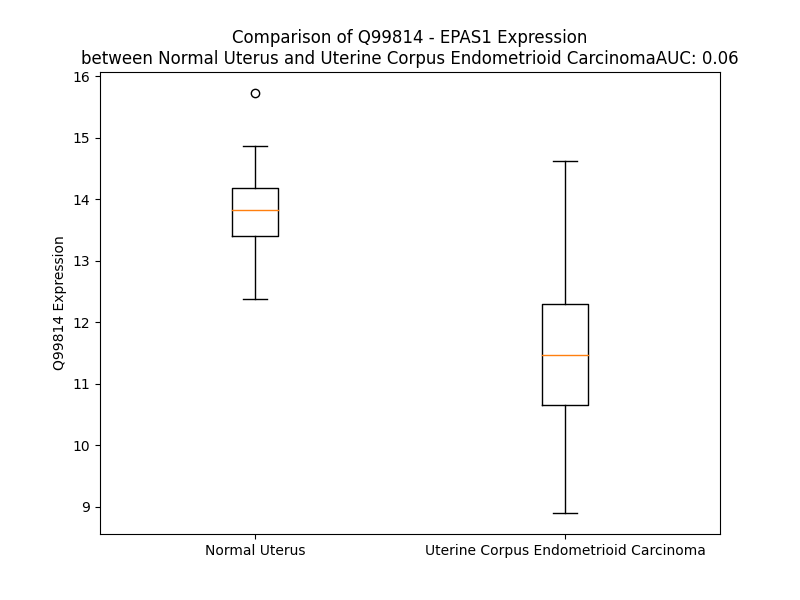

# Detailed Data for Q99814

## Introduction to the Detailed Summary

### How to Interpret the Results

- **Summary & Metrics**: This section provides a quick reference to essential protein attributes, including expression changes, family classification, and biomarker applications. Regulation status (upregulated/downregulated) indicates the protein's behavior in a disease context. Some information comes from the original excel file with the proteins selected from literature, while others are derived from the analyses.
- **Expression Comparison**: A visual representation comparing protein expression between normal and disease states. It highlights significant changes in expression levels that might indicate diagnostic or therapeutic relevance. This is data coming from transcriptomics experiments and could not translate similarly to protein levels.
- **Isoform Alignment**: An interactive view of isoform alignments, revealing structural and functional differences between variants of the protein.
- **Interactors & Homologs**: Tables listing known interaction partners and homologous proteins, the more interactors and homologs, the more complex the protein is to design an antibody for.
- **Biological Assemblies**: Information about the structural arrangement of the protein in different assemblies, providing insights into its functional state but also the complexity of the protein to develop antibodies.
- **Combined Per-Residue Information**: A detailed table summarizing residue-level data. This includes predictions for epitope regions, aggregation tendencies, and modifications that might impact the protein's function. Each row corresponds to a residue in the protein, providing insights into specific sites that may be important for research or drug development.
## Summary & Metrics

- **UniProt Accession**: Q99814
- **Gene Name**: EPAS1 (HIF-2A)
- **Protein Name**: Endothelial PAS domain-containing protein 1
- **Swiss Prot**: EPAS1_HUMAN
- **Family**: transcription regulator
- **Biomarker Application**: disease progression,prognosis
- **Number of Isoforms**: 0
- **Regulation**: 1
- **(transcriptomics) AUC**: 0.01
- **(transcriptomics) Fold Change**: 1.27
- **(transcriptomics) Regulation**: Downregulated
- **Discotope Epitope Count**: 198
- **Max n_uniprots (Homo)**: 1
- **Max n_uniprots (Hetero)**: 4

## Expression Comparison

## Interactors

| preferredName_A   | preferredName_B   |   score |
|:------------------|:------------------|--------:|
| EPAS1             | EGLN1             |   0.999 |
| EPAS1             | VHL               |   0.999 |
| EPAS1             | ARNT              |   0.999 |
| EPAS1             | EGLN3             |   0.999 |
| EPAS1             | EP300             |   0.998 |
| EPAS1             | HIF1A             |   0.998 |
| EPAS1             | EGLN2             |   0.998 |
| EPAS1             | ARNT2             |   0.998 |
| EPAS1             | HIF3A             |   0.997 |
| EPAS1             | ELOB              |   0.995 |
| EPAS1             | ELOC              |   0.995 |
| EPAS1             | RBM4              |   0.991 |
| EPAS1             | CREBBP            |   0.986 |
| EPAS1             | CUL2              |   0.967 |
| EPAS1             | POU5F1            |   0.955 |
| EPAS1             | EIF4E2            |   0.955 |
| EPAS1             | EIF5B             |   0.946 |
| EPAS1             | RBX1              |   0.939 |
| EPAS1             | EPO               |   0.939 |
| EPAS1             | HIF1AN            |   0.937 |
| EPAS1             | MYC               |   0.932 |
| EPAS1             | ARNTL             |   0.922 |
| EPAS1             | CA9               |   0.908 |

## Homologs

| uniprot_id   | gene_id   |
|:-------------|:----------|
| Q14190       | SIM2      |
| H0YHB6       | NPAS3     |
| Q99742       | NPAS1     |
| Q8IUM7       | NPAS4     |
| E9PNQ7       | HIF3A     |
| D0VY79       | HIF1A     |
| P81133       | SIM1      |

## Biological Assemblies

|   Unnamed: 0 |   assembly |   n_uniprots | composition   | crystal_id   |
|-------------:|-----------:|-------------:|:--------------|:-------------|
|            0 |          1 |            1 | Homo          | 1p97         |
|            0 |          1 |            1 | Homo          | 5kiz         |
|            0 |          1 |            2 | Hetero        | 5ufp         |
|            0 |          1 |            2 | Hetero        | 6x21         |
|            0 |          1 |            2 | Hetero        | 6x28         |
|            0 |          1 |            2 | Hetero        | 7q5v         |
|            0 |          1 |            4 | Hetero        | 6i7r         |
|            0 |          1 |            2 | Hetero        | 3h82         |
|            0 |          1 |            2 | Hetero        | 7q5x         |
|            0 |          1 |            2 | Hetero        | 8ck4         |
|            0 |          1 |            3 | Hetero        | 4pky         |
|            1 |          2 |            3 | Hetero        | 4pky         |
|            2 |          3 |            1 | Homo          | 4pky         |
|            0 |          1 |            4 | Hetero        | 6i7q         |
|            0 |          1 |            2 | Hetero        | 5tbm         |
|            1 |          2 |            2 | Hetero        | 5tbm         |
|            0 |          1 |            2 | Hetero        | 6d0c         |
|            0 |          1 |            2 | Hetero        | 6x2h         |
|            0 |          1 |            2 | Hetero        | 6x37         |
|            0 |          1 |            2 | Hetero        | 3f1p         |
|            0 |          1 |            2 | Hetero        | 3f1o         |
|            0 |          1 |            2 | Hetero        | 7ujv         |
|            0 |          1 |            2 | Hetero        | 6x3d         |
|            0 |          1 |            2 | Hetero        | 8ck3         |
|            0 |          1 |            2 | Hetero        | 6d0b         |
|            1 |          2 |            2 | Hetero        | 6d0b         |
|            0 |          1 |            4 | Hetero        | 6bvb         |
|            0 |          1 |            2 | Hetero        | 2a24         |
|            0 |          1 |            2 | Hetero        | 3h7w         |
|            0 |          1 |            2 | Hetero        | 6czw         |
|            1 |          2 |            2 | Hetero        | 6czw         |
|            0 |          1 |            2 | Hetero        | 8ck8         |
|            0 |          1 |            2 | Hetero        | 3f1n         |
|            0 |          1 |            2 | Hetero        | 4gs9         |
|            0 |          1 |            2 | Hetero        | 6d09         |
|            1 |          2 |            2 | Hetero        | 6d09         |
|            0 |          1 |            2 | Hetero        | 4ghi         |
|            0 |          1 |            2 | Hetero        | 4xt2         |
|            1 |          2 |            2 | Hetero        | 4xt2         |

## Combined Per-Residue Information

|   res | aa   |   epitope_score | epitope   |   relative_surface_accessibility |   modeling_confidence |   Aggregation | modification             |
|------:|:-----|----------------:|:----------|---------------------------------:|----------------------:|--------------:|:-------------------------|
|     1 | M    |         0.06399 | False     |                          1.06784 |                 59.49 |         0     | N/A                      |
|     2 | T    |         0.06173 | False     |                          0.83787 |                 64.21 |         0     | N/A                      |
|     3 | A    |         0.03936 | False     |                          0.5087  |                 65.4  |         0     | N/A                      |
|     4 | D    |         0.0656  | False     |                          0.48118 |                 64.58 |         0     | N/A                      |
|     5 | K    |         0.07043 | False     |                          0.77861 |                 66.7  |         0     | N/A                      |
|     6 | E    |         0.06417 | False     |                          0.6252  |                 66.01 |         0     | N/A                      |
|     7 | K    |         0.07664 | False     |                          0.73296 |                 69.47 |         0     | N/A                      |
|     8 | K    |         0.06261 | False     |                          0.78352 |                 69.39 |         0     | N/A                      |
|     9 | R    |         0.13584 | True      |                          0.68089 |                 70.03 |         0     | N/A                      |
|    10 | S    |         0.06381 | False     |                          0.40893 |                 74.48 |         0     | N/A                      |
|    11 | S    |         0.05529 | False     |                          0.50159 |                 80.34 |         0     | N/A                      |
|    12 | S    |         0.0385  | False     |                          0.39681 |                 83.22 |         0     | N/A                      |
|    13 | E    |         0.07631 | False     |                          0.49674 |                 85.2  |         0     | N/A                      |
|    14 | R    |         0.10221 | True      |                          0.74552 |                 84.68 |         0     | N/A                      |
|    15 | R    |         0.07973 | False     |                          0.73994 |                 86.68 |         0     | N/A                      |
|    16 | K    |         0.0356  | False     |                          0.72767 |                 89.79 |         0     | N/A                      |
|    17 | E    |         0.06072 | False     |                          0.36095 |                 88.03 |         0     | N/A                      |
|    18 | K    |         0.07989 | False     |                          0.78286 |                 91.54 |         0     | N/A                      |
|    19 | S    |         0.03028 | False     |                          0.41136 |                 91.43 |         0     | N/A                      |
|    20 | R    |         0.07931 | False     |                          0.50648 |                 91.87 |         0     | N/A                      |
|    21 | D    |         0.04924 | False     |                          0.37423 |                 93.06 |         0     | N/A                      |
|    22 | A    |         0.02783 | False     |                          0.5328  |                 92.44 |         0     | N/A                      |
|    23 | A    |         0.01454 | False     |                          0.31527 |                 91.22 |         0     | N/A                      |
|    24 | R    |         0.05852 | False     |                          0.49849 |                 94.24 |         0     | N/A                      |
|    25 | C    |         0.04068 | False     |                          0.60664 |                 94.58 |         0     | N/A                      |
|    26 | R    |         0.05115 | False     |                          0.60255 |                 94.5  |         0     | N/A                      |
|    27 | R    |         0.09773 | True      |                          0.57998 |                 93.22 |         0     | N/A                      |
|    28 | S    |         0.04855 | False     |                          0.51901 |                 94.34 |         0     | N/A                      |
|    29 | K    |         0.03652 | False     |                          0.3948  |                 95.68 |         0     | N/A                      |
|    30 | E    |         0.04347 | False     |                          0.41228 |                 93.3  |         0     | N/A                      |
|    31 | T    |         0.04455 | False     |                          0.34062 |                 94.54 |         0     | N/A                      |
|    32 | E    |         0.1177  | True      |                          0.52879 |                 95.36 |         0     | N/A                      |
|    33 | V    |         0.03527 | False     |                          0.50385 |                 95.94 |         0     | N/A                      |
|    34 | F    |         0.03245 | False     |                          0.23199 |                 95.66 |         0     | N/A                      |
|    35 | Y    |         0.04829 | False     |                          0.37658 |                 95.12 |         0     | N/A                      |
|    36 | E    |         0.05164 | False     |                          0.51457 |                 95.36 |         0     | N/A                      |
|    37 | L    |         0.02263 | False     |                          0.3266  |                 95.36 |         0     | N/A                      |
|    38 | A    |         0.00323 | False     |                          0.00383 |                 95.51 |         0     | N/A                      |
|    39 | H    |         0.04186 | False     |                          0.45155 |                 94.19 |         0     | N/A                      |
|    40 | E    |         0.03461 | False     |                          0.39407 |                 94.12 |         0     | N/A                      |
|    41 | L    |         0.00939 | False     |                          0.05197 |                 93.71 |         0     | N/A                      |
|    42 | P    |         0.03009 | False     |                          0.32357 |                 92    |         0     | N/A                      |
|    43 | L    |         0.03923 | False     |                          0.19427 |                 91.51 |         0     | N/A                      |
|    44 | P    |         0.10843 | True      |                          0.64815 |                 92.34 |         0     | N/A                      |
|    45 | H    |         0.12337 | True      |                          0.63147 |                 91.28 |         0     | N/A                      |
|    46 | S    |         0.1139  | True      |                          0.67269 |                 92.62 |         0     | N/A                      |
|    47 | V    |         0.11855 | True      |                          0.4024  |                 92.05 |         0     | N/A                      |
|    48 | S    |         0.01651 | False     |                          0.00437 |                 92.35 |         0     | N/A                      |
|    49 | S    |         0.05399 | False     |                          0.32921 |                 92.45 |         0     | N/A                      |
|    50 | H    |         0.16627 | True      |                          0.83114 |                 92.44 |         0     | N/A                      |
|    51 | L    |         0.01941 | False     |                          0.08598 |                 94.77 |         0     | N/A                      |
|    52 | D    |         0.0773  | False     |                          0.50171 |                 95.25 |         0     | N/A                      |
|    53 | K    |         0.05267 | False     |                          0.33997 |                 95.41 |         0     | N/A                      |
|    54 | A    |         0.06824 | False     |                          0.65231 |                 95.98 |         0     | N/A                      |
|    55 | S    |         0.03121 | False     |                          0.09076 |                 96.35 |         0     | N/A                      |
|    56 | I    |         0.00359 | False     |                          0.0016  |                 97.1  |         0     | N/A                      |
|    57 | M    |         0.04276 | False     |                          0.32968 |                 96.88 |         0     | N/A                      |
|    58 | R    |         0.05774 | False     |                          0.1722  |                 96.59 |         0     | N/A                      |
|    59 | L    |         0.00697 | False     |                          0.08369 |                 96.55 |         3.851 | N/A                      |
|    60 | A    |         0.00971 | False     |                          0.09566 |                 96.54 |         4.449 | N/A                      |
|    61 | I    |         0.02045 | False     |                          0.26858 |                 95.23 |         4.449 | N/A                      |
|    62 | S    |         0.00715 | False     |                          0.01344 |                 94.91 |         4.449 | N/A                      |
|    63 | F    |         0.01601 | False     |                          0.12655 |                 94.26 |         4.449 | N/A                      |
|    64 | L    |         0.02106 | False     |                          0.33282 |                 92.97 |         3.853 | N/A                      |
|    65 | R    |         0.01304 | False     |                          0.24024 |                 90.78 |         0     | N/A                      |
|    66 | T    |         0.0043  | False     |                          0.01142 |                 90.01 |         0     | N/A                      |
|    67 | H    |         0.02654 | False     |                          0.51633 |                 87.17 |         0     | N/A                      |
|    68 | K    |         0.01555 | False     |                          0.18494 |                 84.96 |         0     | N/A                      |
|    69 | L    |         0.01141 | False     |                          0.03803 |                 83.68 |         0.159 | N/A                      |
|    70 | L    |         0.02266 | False     |                          0.11597 |                 81.18 |         0.159 | N/A                      |
|    71 | S    |         0.06909 | False     |                          0.56049 |                 79.35 |         0.159 | N/A                      |
|    72 | S    |         0.02714 | False     |                          0.38932 |                 73.72 |         0.159 | N/A                      |
|    73 | V    |         0.04824 | False     |                          0.32119 |                 68.3  |         0.159 | N/A                      |
|    74 | C    |         0.06627 | False     |                          0.40909 |                 57.84 |         0.159 | N/A                      |
|    75 | S    |         0.07767 | False     |                          0.71143 |                 53.36 |         0     | N/A                      |
|    76 | E    |         0.10446 | True      |                          0.93391 |                 49.36 |         0     | N/A                      |
|    77 | N    |         0.08896 | False     |                          0.80593 |                 46.89 |         0     | N/A                      |
|    78 | E    |         0.13127 | True      |                          0.7961  |                 49.52 |         0     | N/A                      |
|    79 | S    |         0.09343 | True      |                          0.93471 |                 45.36 |         0     | N/A                      |
|    80 | E    |         0.07938 | False     |                          0.74646 |                 52.64 |         0     | N/A                      |
|    81 | A    |         0.06263 | False     |                          0.55703 |                 58.31 |         0     | N/A                      |
|    82 | E    |         0.10132 | True      |                          0.83316 |                 54.93 |         0     | N/A                      |
|    83 | A    |         0.07554 | False     |                          0.78989 |                 53.25 |         0     | N/A                      |
|    84 | D    |         0.04238 | False     |                          0.22027 |                 61.74 |         0     | N/A                      |
|    85 | Q    |         0.07282 | False     |                          0.45481 |                 66.47 |         0     | N/A                      |
|    86 | Q    |         0.07433 | False     |                          0.74701 |                 65.51 |         0     | N/A                      |
|    87 | M    |         0.07259 | False     |                          0.48    |                 73.71 |         0     | N/A                      |
|    88 | D    |         0.04024 | False     |                          0.10561 |                 74.96 |         0     | N/A                      |
|    89 | N    |         0.05328 | False     |                          0.56432 |                 77.09 |         0.261 | N/A                      |
|    90 | L    |         0.05012 | False     |                          0.57777 |                 85.95 |         7.55  | N/A                      |
|    91 | Y    |         0.05114 | False     |                          0.37933 |                 86.83 |        11.201 | N/A                      |
|    92 | L    |         0.02778 | False     |                          0.31706 |                 86.96 |        12.239 | N/A                      |
|    93 | K    |         0.13387 | True      |                          0.69917 |                 87.2  |        12.417 | N/A                      |
|    94 | A    |         0.0657  | False     |                          0.44719 |                 89.62 |        12.417 | N/A                      |
|    95 | L    |         0.02455 | False     |                          0.23151 |                 89.75 |        12.417 | N/A                      |
|    96 | E    |         0.03245 | False     |                          0.31709 |                 89.06 |        12.417 | N/A                      |
|    97 | G    |         0.00215 | False     |                          0       |                 93.53 |        18.526 | N/A                      |
|    98 | F    |         0.00299 | False     |                          0.01147 |                 96.31 |        82.06  | N/A                      |
|    99 | I    |         0.0233  | False     |                          0.11919 |                 96.53 |        84.677 | N/A                      |
|   100 | A    |         0.00925 | False     |                          0.04464 |                 97.18 |        84.606 | N/A                      |
|   101 | V    |         0.00103 | False     |                          0.00095 |                 96.5  |        84.547 | N/A                      |
|   102 | V    |         0.00232 | False     |                          0.0019  |                 96.47 |        83.382 | N/A                      |
|   103 | T    |         0.01363 | False     |                          0.05141 |                 93.54 |        17.488 | N/A                      |
|   104 | Q    |         0.023   | False     |                          0.36987 |                 91.24 |         0.65  | N/A                      |
|   105 | D    |         0.04251 | False     |                          0.61875 |                 91.97 |         0     | N/A                      |
|   106 | G    |         0.00226 | False     |                          0       |                 94.71 |         0     | N/A                      |
|   107 | D    |         0.03956 | False     |                          0.24487 |                 95.94 |         0     | N/A                      |
|   108 | M    |         0.02601 | False     |                          0.01545 |                 97.25 |         0.831 | N/A                      |
|   109 | I    |         0.01137 | False     |                          0.02776 |                 95.69 |         0.831 | N/A                      |
|   110 | F    |         0.01998 | False     |                          0.10334 |                 96.51 |         0.831 | N/A                      |
|   111 | L    |         0.0054  | False     |                          0.00577 |                 97.07 |         0.831 | N/A                      |
|   112 | S    |         0.03041 | False     |                          0.04576 |                 94.86 |         0.831 | N/A                      |
|   113 | E    |         0.03903 | False     |                          0.65716 |                 92.49 |         0     | N/A                      |
|   114 | N    |         0.0265  | False     |                          0.16215 |                 93.6  |         0     | N/A                      |
|   115 | I    |         0.00264 | False     |                          0       |                 95.66 |         0     | N/A                      |
|   116 | S    |         0.0349  | False     |                          0.3551  |                 93.28 |         0     | N/A                      |
|   117 | K    |         0.09196 | True      |                          0.77441 |                 91.74 |         0     | N/A                      |
|   118 | F    |         0.02394 | False     |                          0.0996  |                 92.62 |         0.317 | N/A                      |
|   119 | M    |         0.0038  | False     |                          0       |                 95.18 |         0.317 | N/A                      |
|   120 | G    |         0.034   | False     |                          0.22821 |                 93.61 |         0.317 | N/A                      |
|   121 | L    |         0.03638 | False     |                          0.04781 |                 94.27 |         0.317 | N/A                      |
|   122 | T    |         0.08954 | True      |                          0.42345 |                 94.76 |         0.317 | N/A                      |
|   123 | Q    |         0.01751 | False     |                          0.2508  |                 94.95 |         0.317 | N/A                      |
|   124 | V    |         0.0548  | False     |                          0.20946 |                 95.1  |         0.317 | N/A                      |
|   125 | E    |         0.06541 | False     |                          0.45679 |                 94.79 |         0     | N/A                      |
|   126 | L    |         0.0031  | False     |                          0       |                 96.74 |         0     | N/A                      |
|   127 | T    |         0.01479 | False     |                          0.06188 |                 97.42 |         0     | N/A                      |
|   128 | G    |         0.01247 | False     |                          0.26173 |                 95.43 |         0     | N/A                      |
|   129 | H    |         0.08502 | False     |                          0.32917 |                 97.42 |         0     | N/A                      |
|   130 | S    |         0.06446 | False     |                          0.24032 |                 97.44 |         0     | N/A                      |
|   131 | I    |         0.01093 | False     |                          0.0296  |                 97.99 |         0     | N/A                      |
|   132 | F    |         0.02845 | False     |                          0.23803 |                 98.03 |         0     | N/A                      |
|   133 | D    |         0.05583 | False     |                          0.4673  |                 97.26 |         0     | N/A                      |
|   134 | F    |         0.03259 | False     |                          0.0879  |                 97.5  |         0     | N/A                      |
|   135 | T    |         0.01496 | False     |                          0.02534 |                 98.2  |         0     | N/A                      |
|   136 | H    |         0.03226 | False     |                          0.19478 |                 97.85 |         0     | N/A                      |
|   137 | P    |         0.09551 | True      |                          0.6337  |                 97.64 |         0     | N/A                      |
|   138 | C    |         0.09168 | True      |                          0.74785 |                 96.91 |         0     | N/A                      |
|   139 | D    |         0.00822 | False     |                          0.0084  |                 97.6  |         0     | N/A                      |
|   140 | H    |         0.05523 | False     |                          0.17443 |                 97.7  |         0     | N/A                      |
|   141 | E    |         0.1182  | True      |                          0.53414 |                 96.06 |         0     | N/A                      |
|   142 | E    |         0.03983 | False     |                          0.27573 |                 95.84 |         0     | N/A                      |
|   143 | I    |         0.00908 | False     |                          0.00779 |                 96.66 |         0     | N/A                      |
|   144 | R    |         0.10147 | True      |                          0.44983 |                 95.29 |         0     | N/A                      |
|   145 | E    |         0.10937 | True      |                          0.46489 |                 93.71 |         0     | N/A                      |
|   146 | N    |         0.02318 | False     |                          0.12978 |                 94    |         0     | N/A                      |
|   147 | L    |         0.01473 | False     |                          0.02502 |                 92.36 |         0     | N/A                      |
|   148 | S    |         0.02027 | False     |                          0.30493 |                 84.29 |         0     | N/A                      |
|   149 | L    |         0.04692 | False     |                          0.30399 |                 71.88 |         0     | N/A                      |
|   150 | K    |         0.07705 | False     |                          0.67293 |                 63.21 |         0     | N/A                      |
|   151 | N    |         0.09469 | True      |                          0.63325 |                 52.15 |         0     | N/A                      |
|   152 | G    |         0.07619 | False     |                          0.75359 |                 39.08 |         0     | N/A                      |
|   153 | S    |         0.10697 | True      |                          0.91246 |                 35.88 |         0     | N/A                      |
|   154 | G    |         0.13728 | True      |                          0.72402 |                 40.27 |         0     | N/A                      |
|   155 | F    |         0.14257 | True      |                          1.14684 |                 33.89 |         0     | N/A                      |
|   156 | G    |         0.20084 | True      |                          0.7978  |                 36.91 |         0     | N/A                      |
|   157 | K    |         0.12844 | True      |                          0.97364 |                 39.41 |         0     | N/A                      |
|   158 | K    |         0.17999 | True      |                          0.97209 |                 33.82 |         0     | N/A                      |
|   159 | S    |         0.09905 | True      |                          0.73665 |                 37.65 |         0     | N/A                      |
|   160 | K    |         0.16081 | True      |                          0.80642 |                 37.14 |         0     | N/A                      |
|   161 | D    |         0.1178  | True      |                          0.72044 |                 45.32 |         0     | N/A                      |
|   162 | M    |         0.11069 | True      |                          0.50035 |                 56.39 |         0     | N/A                      |
|   163 | S    |         0.08245 | False     |                          0.5524  |                 74.66 |         0     | N/A                      |
|   164 | T    |         0.045   | False     |                          0.45638 |                 89.4  |         0     | N/A                      |
|   165 | E    |         0.04798 | False     |                          0.51339 |                 91.89 |         0     | N/A                      |
|   166 | R    |         0.0873  | False     |                          0.15289 |                 93.64 |         0     | N/A                      |
|   167 | D    |         0.0458  | False     |                          0.55804 |                 94.77 |         0     | N/A                      |
|   168 | F    |         0.0239  | False     |                          0.03745 |                 96.35 |         0     | N/A                      |
|   169 | F    |         0.02068 | False     |                          0.06586 |                 97.86 |         0     | N/A                      |
|   170 | M    |         0.00828 | False     |                          0.02085 |                 97.47 |         0     | N/A                      |
|   171 | R    |         0.05972 | False     |                          0.12817 |                 97.97 |         0     | N/A                      |
|   172 | M    |         0.00707 | False     |                          0.01463 |                 97.56 |         0     | N/A                      |
|   173 | K    |         0.04545 | False     |                          0.2565  |                 97.14 |         0     | N/A                      |
|   174 | C    |         0.01043 | False     |                          0.02815 |                 96.15 |         0     | N/A                      |
|   175 | T    |         0.01078 | False     |                          0.01904 |                 95.84 |         0     | N/A                      |
|   176 | V    |         0.08584 | False     |                          0.32156 |                 92.09 |         0     | N/A                      |
|   177 | T    |         0.06359 | False     |                          0.28383 |                 88    |         0     | N/A                      |
|   178 | N    |         0.05993 | False     |                          0.66826 |                 81.01 |         0     | N/A                      |
|   179 | R    |         0.10214 | True      |                          0.56381 |                 81.34 |         0     | N/A                      |
|   180 | G    |         0.07725 | False     |                          0.79233 |                 80.8  |         0     | N/A                      |
|   181 | R    |         0.19199 | True      |                          0.68715 |                 86.88 |         0     | N/A                      |
|   182 | T    |         0.14067 | True      |                          0.68881 |                 89.3  |         0     | N/A                      |
|   183 | V    |         0.12847 | True      |                          0.34313 |                 92.64 |         0     | N/A                      |
|   184 | N    |         0.15121 | True      |                          0.7649  |                 91.67 |         0     | N/A                      |
|   185 | L    |         0.07176 | False     |                          0.50169 |                 91.89 |         0     | N/A                      |
|   186 | K    |         0.16121 | True      |                          0.95094 |                 92.57 |         0     | N/A                      |
|   187 | S    |         0.15602 | True      |                          0.55673 |                 93.4  |         0     | N/A                      |
|   188 | A    |         0.04665 | False     |                          0.22759 |                 93.88 |         0     | N/A                      |
|   189 | T    |         0.05977 | False     |                          0.51471 |                 94.01 |         0     | N/A                      |
|   190 | W    |         0.11175 | True      |                          0.48368 |                 95.21 |         0     | N/A                      |
|   191 | K    |         0.01604 | False     |                          0.26717 |                 95.62 |         0     | N/A                      |
|   192 | V    |         0.0049  | False     |                          0.04162 |                 97.28 |         0     | N/A                      |
|   193 | L    |         0.00189 | False     |                          0       |                 97.81 |         0     | N/A                      |
|   194 | H    |         0.01364 | False     |                          0.17006 |                 97.8  |         0     | N/A                      |
|   195 | C    |         0.00509 | False     |                          0       |                 97.69 |         0     | N/A                      |
|   196 | T    |         0.0126  | False     |                          0.26735 |                 96.47 |         0     | N/A                      |
|   197 | G    |         0.01766 | False     |                          0.25952 |                 94.63 |         0     | N/A                      |
|   198 | Q    |         0.03198 | False     |                          0.13209 |                 92.38 |         0     | N/A                      |
|   199 | V    |         0.00741 | False     |                          0.0094  |                 91.36 |         0     | N/A                      |
|   200 | K    |         0.02595 | False     |                          0.20332 |                 85.46 |         0     | N/A                      |
|   201 | V    |         0.04274 | False     |                          0.48793 |                 82.26 |         0     | N/A                      |
|   202 | Y    |         0.02103 | False     |                          0.06606 |                 72.37 |         0     | N/A                      |
|   203 | N    |         0.07035 | False     |                          0.70057 |                 61.36 |         0     | N/A                      |
|   204 | N    |         0.04519 | False     |                          0.38954 |                 52.91 |         0     | N/A                      |
|   205 | C    |         0.06327 | False     |                          0.65078 |                 41.09 |         0     | N/A                      |
|   206 | P    |         0.11151 | True      |                          0.82621 |                 44.56 |         0     | N/A                      |
|   207 | P    |         0.11205 | True      |                          0.98961 |                 36.39 |         0     | N/A                      |
|   208 | H    |         0.10852 | True      |                          0.86697 |                 42.53 |         0     | N/A                      |
|   209 | N    |         0.13208 | True      |                          0.86552 |                 36.6  |         0     | N/A                      |
|   210 | S    |         0.09913 | True      |                          0.66129 |                 40.64 |         0     | N/A                      |
|   211 | L    |         0.1409  | True      |                          1.13306 |                 52.11 |         0     | N/A                      |
|   212 | C    |         0.10271 | True      |                          0.5656  |                 42.85 |         0     | N/A                      |
|   213 | G    |         0.13842 | True      |                          1.02211 |                 41.06 |         0     | N/A                      |
|   214 | Y    |         0.14547 | True      |                          0.84868 |                 46.68 |         0     | N/A                      |
|   215 | K    |         0.14861 | True      |                          0.95534 |                 50.58 |         0     | N/A                      |
|   216 | E    |         0.05808 | False     |                          0.43557 |                 56.04 |         0     | N/A                      |
|   217 | P    |         0.0648  | False     |                          0.71997 |                 58.49 |         0.982 | N/A                      |
|   218 | L    |         0.08974 | True      |                          0.56021 |                 65.64 |        13.122 | N/A                      |
|   219 | L    |         0.02617 | False     |                          0.27805 |                 73.33 |        19.199 | N/A                      |
|   220 | S    |         0.02016 | False     |                          0.08144 |                 86.28 |        20.183 | N/A                      |
|   221 | C    |         0.00473 | False     |                          0.01797 |                 91.36 |        23.01  | N/A                      |
|   222 | L    |         0.00648 | False     |                          0.01238 |                 94.44 |        25.345 | N/A                      |
|   223 | I    |         0.01398 | False     |                          0.13123 |                 94.97 |        25.345 | N/A                      |
|   224 | I    |         0.0069  | False     |                          0.01444 |                 96.56 |        24.226 | N/A                      |
|   225 | M    |         0.02661 | False     |                          0.30654 |                 96.92 |        11.48  | N/A                      |
|   226 | C    |         0.00946 | False     |                          0.01029 |                 97.9  |         3.826 | N/A                      |
|   227 | E    |         0.0165  | False     |                          0.24202 |                 95.48 |         0     | N/A                      |
|   228 | P    |         0.00975 | False     |                          0.14337 |                 94.51 |         0     | N/A                      |
|   229 | I    |         0.01129 | False     |                          0.06422 |                 92.75 |         0     | N/A                      |
|   230 | Q    |         0.02888 | False     |                          0.30451 |                 85.87 |         0     | N/A                      |
|   231 | H    |         0.03624 | False     |                          0.31749 |                 85.69 |         0     | N/A                      |
|   232 | P    |         0.02711 | False     |                          0.22395 |                 82.14 |         0     | N/A                      |
|   233 | S    |         0.07535 | False     |                          0.63242 |                 77.17 |         0     | N/A                      |
|   234 | H    |         0.08141 | False     |                          0.42874 |                 70.69 |         0     | N/A                      |
|   235 | M    |         0.06143 | False     |                          0.29196 |                 68.85 |         0     | N/A                      |
|   236 | D    |         0.12264 | True      |                          0.77957 |                 63.86 |         0     | N/A                      |
|   237 | I    |         0.07309 | False     |                          0.32782 |                 66.11 |         0     | N/A                      |
|   238 | P    |         0.12362 | True      |                          0.59643 |                 74.02 |         0     | N/A                      |
|   239 | L    |         0.05454 | False     |                          0.3938  |                 79.51 |         0     | N/A                      |
|   240 | D    |         0.04959 | False     |                          0.29511 |                 83.29 |         0     | N/A                      |
|   241 | S    |         0.08697 | False     |                          0.6493  |                 87.62 |         0     | N/A                      |
|   242 | K    |         0.06401 | False     |                          0.40778 |                 90.98 |         0     | N/A                      |
|   243 | T    |         0.0124  | False     |                          0.03661 |                 93.14 |         0     | N/A                      |
|   244 | F    |         0.03497 | False     |                          0.01592 |                 94.11 |         0     | N/A                      |
|   245 | L    |         0.02338 | False     |                          0.2506  |                 94.41 |         0     | N/A                      |
|   246 | S    |         0.00812 | False     |                          0.00633 |                 96.65 |         0     | N/A                      |
|   247 | R    |         0.05756 | False     |                          0.37571 |                 97.39 |         0     | N/A                      |
|   248 | H    |         0.00994 | False     |                          0.0331  |                 98.12 |         0     | N/A                      |
|   249 | S    |         0.03691 | False     |                          0.22463 |                 97.48 |         0     | N/A                      |
|   250 | M    |         0.03597 | False     |                          0.31706 |                 96.29 |         0     | N/A                      |
|   251 | D    |         0.04185 | False     |                          0.45589 |                 96.75 |         0     | N/A                      |
|   252 | M    |         0.02609 | False     |                          0.06678 |                 97.62 |         0     | N/A                      |
|   253 | K    |         0.08493 | False     |                          0.41919 |                 98.11 |         0     | N/A                      |
|   254 | F    |         0.04545 | False     |                          0.05178 |                 98.1  |         0     | N/A                      |
|   255 | T    |         0.09928 | True      |                          0.52075 |                 97.57 |         0     | N/A                      |
|   256 | Y    |         0.13163 | True      |                          0.42449 |                 97.14 |         0     | N/A                      |
|   257 | C    |         0.04822 | False     |                          0.03415 |                 95.41 |         0     | N/A                      |
|   258 | D    |         0.03104 | False     |                          0.12264 |                 93.09 |         0     | N/A                      |
|   259 | D    |         0.14118 | True      |                          0.66959 |                 94.33 |         0     | N/A                      |
|   260 | R    |         0.07675 | False     |                          0.27643 |                 92.37 |         0     | N/A                      |
|   261 | I    |         0.00907 | False     |                          0       |                 94.85 |         0     | N/A                      |
|   262 | T    |         0.1209  | True      |                          0.36675 |                 94.67 |         0     | N/A                      |
|   263 | E    |         0.17062 | True      |                          0.78197 |                 93.88 |         0     | N/A                      |
|   264 | L    |         0.03714 | False     |                          0.15876 |                 93.66 |         0     | N/A                      |
|   265 | I    |         0.01185 | False     |                          0.00364 |                 93.89 |         0     | N/A                      |
|   266 | G    |         0.0478  | False     |                          0.2265  |                 93.35 |         0     | N/A                      |
|   267 | Y    |         0.0382  | False     |                          0.05545 |                 95.29 |         0     | N/A                      |
|   268 | H    |         0.14914 | True      |                          0.49145 |                 95.8  |         0     | N/A                      |
|   269 | P    |         0.02003 | False     |                          0.14812 |                 96.22 |         0     | N/A                      |
|   270 | E    |         0.22866 | True      |                          0.76655 |                 95.55 |         0     | N/A                      |
|   271 | E    |         0.13927 | True      |                          0.33905 |                 94.2  |         0     | N/A                      |
|   272 | L    |         0.00482 | False     |                          0       |                 95.77 |         0     | N/A                      |
|   273 | L    |         0.08202 | False     |                          0.5272  |                 96.87 |         0     | N/A                      |
|   274 | G    |         0.06794 | False     |                          0.5808  |                 96.25 |         0     | N/A                      |
|   275 | R    |         0.12057 | True      |                          0.31924 |                 96.77 |         0     | N/A                      |
|   276 | S    |         0.05928 | False     |                          0.13315 |                 97.08 |         0     | N/A                      |
|   277 | A    |         0.02261 | False     |                          0.04176 |                 97.21 |         0     | N/A                      |
|   278 | Y    |         0.04859 | False     |                          0.3332  |                 97.19 |         0     | N/A                      |
|   279 | E    |         0.09228 | True      |                          0.41811 |                 95.89 |         0     | N/A                      |
|   280 | F    |         0.01694 | False     |                          0.02117 |                 96.36 |         0     | N/A                      |
|   281 | Y    |         0.06135 | False     |                          0.13957 |                 97.07 |         0     | N/A                      |
|   282 | H    |         0.05898 | False     |                          0.11967 |                 97.13 |         0     | N/A                      |
|   283 | A    |         0.15863 | True      |                          0.78429 |                 96.14 |         0     | N/A                      |
|   284 | L    |         0.18827 | True      |                          0.83103 |                 96.82 |         0     | N/A                      |
|   285 | D    |         0.04313 | False     |                          0.06243 |                 97.34 |         0     | N/A                      |
|   286 | S    |         0.09789 | True      |                          0.34775 |                 92.8  |         0     | N/A                      |
|   287 | E    |         0.15761 | True      |                          0.74401 |                 95.31 |         0     | N/A                      |
|   288 | N    |         0.07456 | False     |                          0.54997 |                 95.85 |         0     | N/A                      |
|   289 | M    |         0.03143 | False     |                          0.04613 |                 97.16 |         0     | N/A                      |
|   290 | T    |         0.05474 | False     |                          0.3824  |                 97.39 |         0     | N/A                      |
|   291 | K    |         0.07211 | False     |                          0.61241 |                 96.45 |         0     | N/A                      |
|   292 | S    |         0.01943 | False     |                          0.12241 |                 97.49 |         0     | N/A                      |
|   293 | H    |         0.0277  | False     |                          0.19614 |                 97.84 |         0     | N/A                      |
|   294 | Q    |         0.10593 | True      |                          0.55403 |                 96.91 |         0     | N/A                      |
|   295 | N    |         0.02028 | False     |                          0.13312 |                 96.85 |         0     | N/A                      |
|   296 | L    |         0.00815 | False     |                          0.03297 |                 97.47 |         0     | N/A                      |
|   297 | C    |         0.04602 | False     |                          0.46488 |                 95.83 |         0     | N/A                      |
|   298 | T    |         0.10334 | True      |                          0.61535 |                 95.69 |         0     | N/A                      |
|   299 | K    |         0.0267  | False     |                          0.08253 |                 96.42 |         0     | N/A                      |
|   300 | G    |         0.01989 | False     |                          0.11125 |                 95.42 |         0     | N/A                      |
|   301 | Q    |         0.01073 | False     |                          0.10788 |                 97.07 |         0     | N/A                      |
|   302 | V    |         0.00907 | False     |                          0.05046 |                 97.66 |         0     | N/A                      |
|   303 | V    |         0.01511 | False     |                          0.14869 |                 97.05 |         0     | N/A                      |
|   304 | S    |         0.02468 | False     |                          0.08328 |                 96.75 |         0     | N/A                      |
|   305 | G    |         0.05068 | False     |                          0.5081  |                 93.76 |         0     | N/A                      |
|   306 | Q    |         0.06938 | False     |                          0.33895 |                 96.94 |         0     | N/A                      |
|   307 | Y    |         0.03508 | False     |                          0.03491 |                 98.08 |         0     | N/A                      |
|   308 | R    |         0.09066 | True      |                          0.15828 |                 98.12 |         0     | N/A                      |
|   309 | M    |         0.03843 | False     |                          0.04087 |                 97.17 |         0     | N/A                      |
|   310 | L    |         0.03282 | False     |                          0.05606 |                 97.03 |         0     | N/A                      |
|   311 | A    |         0.00483 | False     |                          0.00638 |                 96.04 |         0     | N/A                      |
|   312 | K    |         0.03188 | False     |                          0.17089 |                 94.27 |         0     | N/A                      |
|   313 | H    |         0.05813 | False     |                          0.55497 |                 90.9  |         0     | N/A                      |
|   314 | G    |         0.00477 | False     |                          0.0028  |                 92.4  |         2.6   | N/A                      |
|   315 | G    |         0.00151 | False     |                          0       |                 95.97 |         7.218 | N/A                      |
|   316 | Y    |         0.0257  | False     |                          0.02396 |                 97.15 |         7.218 | N/A                      |
|   317 | V    |         0.00384 | False     |                          0.0019  |                 97.37 |         7.218 | N/A                      |
|   318 | W    |         0.04254 | False     |                          0.29065 |                 98.18 |         7.218 | N/A                      |
|   319 | L    |         0.00572 | False     |                          0.00495 |                 97.51 |         6.815 | N/A                      |
|   320 | E    |         0.01631 | False     |                          0.17472 |                 97.32 |         0     | N/A                      |
|   321 | T    |         0.0255  | False     |                          0.09972 |                 96.91 |         0     | N/A                      |
|   322 | Q    |         0.01241 | False     |                          0.15438 |                 96.06 |         0     | N/A                      |
|   323 | G    |         0.00842 | False     |                          0.00644 |                 96.8  |         1.446 | N/A                      |
|   324 | T    |         0.00405 | False     |                          0.03519 |                 97.11 |         1.446 | N/A                      |
|   325 | V    |         0.01325 | False     |                          0.04496 |                 96.98 |         1.446 | N/A                      |
|   326 | I    |         0.0185  | False     |                          0.26159 |                 94.58 |         1.446 | N/A                      |
|   327 | Y    |         0.04934 | False     |                          0.46226 |                 92.77 |         1.446 | N/A                      |
|   328 | N    |         0.04783 | False     |                          0.26797 |                 91.7  |         0     | N/A                      |
|   329 | P    |         0.07309 | False     |                          0.89131 |                 88.48 |         0     | N/A                      |
|   330 | R    |         0.10462 | True      |                          0.91829 |                 91.55 |         0     | N/A                      |
|   331 | N    |         0.0905  | True      |                          0.49448 |                 91.89 |         0     | N/A                      |
|   332 | L    |         0.11192 | True      |                          0.83865 |                 89.66 |         0     | N/A                      |
|   333 | Q    |         0.0563  | False     |                          0.55828 |                 92.69 |         0     | N/A                      |
|   334 | P    |         0.07336 | False     |                          0.50997 |                 94.3  |         0     | N/A                      |
|   335 | Q    |         0.09143 | True      |                          0.59826 |                 93.46 |         0     | N/A                      |
|   336 | C    |         0.03123 | False     |                          0.11207 |                 95.29 |         1.723 | N/A                      |
|   337 | I    |         0.00299 | False     |                          0       |                 97.54 |         8.642 | N/A                      |
|   338 | M    |         0.01677 | False     |                          0.08897 |                 96.77 |         9.21  | N/A                      |
|   339 | C    |         0.0178  | False     |                          0.02271 |                 96.56 |         9.748 | N/A                      |
|   340 | V    |         0.00839 | False     |                          0.0457  |                 95.27 |        11.659 | N/A                      |
|   341 | N    |         0.03678 | False     |                          0.04405 |                 96.35 |        11.354 | N/A                      |
|   342 | Y    |         0.01845 | False     |                          0.24893 |                 95.33 |        11.354 | N/A                      |
|   343 | V    |         0.01164 | False     |                          0.05778 |                 96.3  |        11.159 | N/A                      |
|   344 | L    |         0.05192 | False     |                          0.18628 |                 95.76 |         8.281 | N/A                      |
|   345 | S    |         0.07635 | False     |                          0.18141 |                 95.16 |         0.832 | N/A                      |
|   346 | E    |         0.08723 | False     |                          0.73317 |                 94.36 |         0     | N/A                      |
|   347 | I    |         0.07506 | False     |                          0.40053 |                 95.87 |         0     | N/A                      |
|   348 | E    |         0.09907 | True      |                          0.3235  |                 95.71 |         0     | N/A                      |
|   349 | K    |         0.17514 | True      |                          0.52015 |                 92.99 |         0     | N/A                      |
|   350 | N    |         0.09685 | True      |                          0.44017 |                 90.26 |         0     | N/A                      |
|   351 | D    |         0.17246 | True      |                          0.86978 |                 89.81 |         0     | N/A                      |
|   352 | V    |         0.11889 | True      |                          0.47604 |                 94.13 |         1.754 | N/A                      |
|   353 | V    |         0.1109  | True      |                          0.50903 |                 93.99 |         1.754 | N/A                      |
|   354 | F    |         0.10123 | True      |                          0.39975 |                 93.49 |         1.754 | N/A                      |
|   355 | S    |         0.06956 | False     |                          0.24087 |                 91.51 |         1.754 | N/A                      |
|   356 | M    |         0.0929  | True      |                          0.79924 |                 87.59 |         1.754 | N/A                      |
|   357 | D    |         0.04105 | False     |                          0.27849 |                 83.9  |         0     | N/A                      |
|   358 | Q    |         0.01162 | False     |                          0.00843 |                 90.16 |         0     | N/A                      |
|   359 | T    |         0.09596 | True      |                          0.13539 |                 83.83 |         0     | N/A                      |
|   360 | E    |         0.06649 | False     |                          0.4163  |                 72.6  |         0     | N/A                      |
|   361 | S    |         0.04155 | False     |                          0.32139 |                 62.07 |         0     | N/A                      |
|   362 | L    |         0.09578 | True      |                          0.75931 |                 59.95 |         0     | N/A                      |
|   363 | F    |         0.09448 | True      |                          0.83636 |                 60.5  |         0     | N/A                      |
|   364 | K    |         0.06969 | False     |                          0.67687 |                 56.08 |         0     | N/A                      |
|   365 | P    |         0.07844 | False     |                          0.69454 |                 41.16 |         0     | N/A                      |
|   366 | H    |         0.04797 | False     |                          0.57389 |                 38.61 |         0     | N/A                      |
|   367 | L    |         0.05574 | False     |                          0.83696 |                 43.45 |         0     | N/A                      |
|   368 | M    |         0.08803 | False     |                          0.93128 |                 44.39 |         0     | N/A                      |
|   369 | A    |         0.03284 | False     |                          0.52068 |                 46.2  |         0     | N/A                      |
|   370 | M    |         0.0571  | False     |                          0.5594  |                 44.18 |         0     | N/A                      |
|   371 | N    |         0.04585 | False     |                          0.57016 |                 41.99 |         0     | N/A                      |
|   372 | S    |         0.04335 | False     |                          0.59644 |                 44.09 |         0     | N/A                      |
|   373 | I    |         0.07947 | False     |                          0.72964 |                 48.4  |         0     | N/A                      |
|   374 | F    |         0.04187 | False     |                          0.8105  |                 45.11 |         0     | N/A                      |
|   375 | D    |         0.07146 | False     |                          0.79888 |                 45.57 |         0     | N/A                      |
|   376 | S    |         0.09212 | True      |                          0.77505 |                 44.08 |         0     | N/A                      |
|   377 | S    |         0.05021 | False     |                          0.68578 |                 40.52 |         0     | N/A                      |
|   378 | G    |         0.14157 | True      |                          0.83939 |                 36.03 |         0     | N/A                      |
|   379 | K    |         0.07997 | False     |                          1.08688 |                 32.23 |         0     | N/A                      |
|   380 | G    |         0.04952 | False     |                          0.83394 |                 36.06 |         0     | N/A                      |
|   381 | A    |         0.04813 | False     |                          1.06527 |                 33.04 |         0     | N/A                      |
|   382 | V    |         0.04729 | False     |                          0.95423 |                 41.2  |         0     | N/A                      |
|   383 | S    |         0.03622 | False     |                          0.77544 |                 42.59 |         0     | N/A                      |
|   384 | E    |         0.05806 | False     |                          0.73164 |                 50.4  |         0     | N/A                      |
|   385 | K    |         0.05009 | False     |                          0.81928 |                 52.01 |         0     | N/A                      |
|   386 | S    |         0.05503 | False     |                          0.57726 |                 50.27 |         0.394 | N/A                      |
|   387 | N    |         0.05635 | False     |                          0.7126  |                 53.48 |         0.553 | N/A                      |
|   388 | F    |         0.06971 | False     |                          0.79294 |                 59.08 |         0.553 | N/A                      |
|   389 | L    |         0.08721 | False     |                          0.68998 |                 58.97 |         0.553 | N/A                      |
|   390 | F    |         0.06722 | False     |                          0.7517  |                 57.59 |         0.553 | N/A                      |
|   391 | T    |         0.04839 | False     |                          0.53866 |                 64.71 |         0.306 | N/A                      |
|   392 | K    |         0.06859 | False     |                          0.44984 |                 60.24 |         0     | N/A                      |
|   393 | L    |         0.05903 | False     |                          0.47876 |                 60.33 |         0     | N/A                      |
|   394 | K    |         0.05387 | False     |                          0.8013  |                 66.8  |         0     | N/A                      |
|   395 | E    |         0.14305 | True      |                          0.73288 |                 64.28 |         0     | N/A                      |
|   396 | E    |         0.16676 | True      |                          0.40769 |                 64.68 |         0     | N/A                      |
|   397 | P    |         0.09899 | True      |                          0.64828 |                 61.86 |         0     | N/A                      |
|   398 | E    |         0.14509 | True      |                          0.76256 |                 64.25 |         0     | N/A                      |
|   399 | E    |         0.05713 | False     |                          0.35724 |                 61.86 |         0     | N/A                      |
|   400 | L    |         0.06409 | False     |                          0.54209 |                 56.65 |         0     | N/A                      |
|   401 | A    |         0.1083  | True      |                          0.75852 |                 59.72 |         0     | N/A                      |
|   402 | Q    |         0.15318 | True      |                          0.75776 |                 60.31 |         0     | N/A                      |
|   403 | L    |         0.1681  | True      |                          0.8009  |                 57.2  |         0     | N/A                      |
|   404 | A    |         0.06101 | False     |                          0.59583 |                 56.44 |         0     | N/A                      |
|   405 | P    |         0.06472 | False     |                          0.82825 |                 65.76 |         0     | 4-hydroxyproline         |
|   406 | T    |         0.12458 | True      |                          0.65335 |                 69.86 |         0     | N/A                      |
|   407 | P    |         0.13279 | True      |                          1.02985 |                 61.85 |         0     | N/A                      |
|   408 | G    |         0.11145 | True      |                          0.95342 |                 73.59 |         0     | N/A                      |
|   409 | D    |         0.12229 | True      |                          0.51902 |                 76.29 |         0     | N/A                      |
|   410 | A    |         0.09467 | True      |                          0.90625 |                 73.76 |         0.546 | N/A                      |
|   411 | I    |         0.09439 | True      |                          0.98079 |                 66.5  |         0.546 | N/A                      |
|   412 | I    |         0.14523 | True      |                          0.87048 |                 69.11 |         0.546 | N/A                      |
|   413 | S    |         0.05587 | False     |                          0.74719 |                 58.35 |         0.546 | N/A                      |
|   414 | L    |         0.14104 | True      |                          0.83992 |                 52.85 |         0.546 | N/A                      |
|   415 | D    |         0.13209 | True      |                          0.81829 |                 55.13 |         0     | N/A                      |
|   416 | F    |         0.19306 | True      |                          0.91615 |                 48.86 |         0     | N/A                      |
|   417 | G    |         0.09606 | True      |                          0.63111 |                 41.08 |         0     | N/A                      |
|   418 | N    |         0.06534 | False     |                          0.91385 |                 36.43 |         0     | N/A                      |
|   419 | Q    |         0.08636 | False     |                          0.79132 |                 40.64 |         0     | N/A                      |
|   420 | N    |         0.07476 | False     |                          0.87545 |                 37.57 |         0     | N/A                      |
|   421 | F    |         0.10977 | True      |                          0.98009 |                 39.3  |         0     | N/A                      |
|   422 | E    |         0.10847 | True      |                          0.84504 |                 38.48 |         0     | N/A                      |
|   423 | E    |         0.08489 | False     |                          0.83235 |                 31.31 |         0     | N/A                      |
|   424 | S    |         0.07534 | False     |                          0.88195 |                 37.93 |         0     | N/A                      |
|   425 | S    |         0.05314 | False     |                          0.8042  |                 34.73 |         0     | N/A                      |
|   426 | A    |         0.06124 | False     |                          0.77109 |                 37.08 |         0     | N/A                      |
|   427 | Y    |         0.06885 | False     |                          1.0147  |                 35.67 |         0     | N/A                      |
|   428 | G    |         0.05917 | False     |                          0.75872 |                 35.24 |         0     | N/A                      |
|   429 | K    |         0.06706 | False     |                          1.02312 |                 38.6  |         0     | N/A                      |
|   430 | A    |         0.0558  | False     |                          0.71765 |                 37.54 |         0     | N/A                      |
|   431 | I    |         0.04886 | False     |                          0.90346 |                 38.75 |         0     | N/A                      |
|   432 | L    |         0.09725 | True      |                          0.98797 |                 35.58 |         0     | N/A                      |
|   433 | P    |         0.05494 | False     |                          0.85207 |                 41.25 |         0     | N/A                      |
|   434 | P    |         0.08701 | False     |                          1.00438 |                 38.75 |         0     | N/A                      |
|   435 | S    |         0.05967 | False     |                          0.77177 |                 33.51 |         0     | N/A                      |
|   436 | Q    |         0.0904  | True      |                          0.88262 |                 35.99 |         0     | N/A                      |
|   437 | P    |         0.05681 | False     |                          0.91217 |                 35.89 |         0     | N/A                      |
|   438 | W    |         0.06954 | False     |                          1.01917 |                 33.16 |         0     | N/A                      |
|   439 | A    |         0.06831 | False     |                          0.91858 |                 28.24 |         0     | N/A                      |
|   440 | T    |         0.07129 | False     |                          0.74042 |                 35.05 |         0     | N/A                      |
|   441 | E    |         0.09436 | True      |                          0.76792 |                 27.94 |         0     | N/A                      |
|   442 | L    |         0.09734 | True      |                          0.86173 |                 29.94 |         0     | N/A                      |
|   443 | R    |         0.13164 | True      |                          0.87659 |                 31.12 |         0     | N/A                      |
|   444 | S    |         0.06836 | False     |                          0.69592 |                 28.12 |         0     | N/A                      |
|   445 | H    |         0.09051 | True      |                          1.08155 |                 35.62 |         0     | N/A                      |
|   446 | S    |         0.0553  | False     |                          0.78439 |                 29.41 |         0     | N/A                      |
|   447 | T    |         0.07592 | False     |                          0.84781 |                 34.18 |         0     | N/A                      |
|   448 | Q    |         0.07214 | False     |                          0.83698 |                 36.94 |         0     | N/A                      |
|   449 | S    |         0.10684 | True      |                          0.7105  |                 32.56 |         0     | N/A                      |
|   450 | E    |         0.09448 | True      |                          0.8612  |                 34.82 |         0     | N/A                      |
|   451 | A    |         0.04755 | False     |                          0.95583 |                 34.72 |         0     | N/A                      |
|   452 | G    |         0.07734 | False     |                          0.896   |                 30.58 |         0     | N/A                      |
|   453 | S    |         0.07819 | False     |                          0.8629  |                 35.03 |         0     | N/A                      |
|   454 | L    |         0.0641  | False     |                          1.02594 |                 35.26 |         0     | N/A                      |
|   455 | P    |         0.05887 | False     |                          0.85621 |                 38.71 |         0     | N/A                      |
|   456 | A    |         0.0795  | False     |                          0.85857 |                 32.79 |         0     | N/A                      |
|   457 | F    |         0.07494 | False     |                          0.97804 |                 31.22 |         0     | N/A                      |
|   458 | T    |         0.06484 | False     |                          0.73479 |                 34.79 |         0     | N/A                      |
|   459 | V    |         0.0614  | False     |                          1.03777 |                 36.21 |         0     | N/A                      |
|   460 | P    |         0.07683 | False     |                          0.79294 |                 37.36 |         0     | N/A                      |
|   461 | Q    |         0.07438 | False     |                          0.84099 |                 32.77 |         0     | N/A                      |
|   462 | A    |         0.05393 | False     |                          0.9278  |                 33.62 |         0     | N/A                      |
|   463 | A    |         0.05081 | False     |                          1.00006 |                 32.3  |         0     | N/A                      |
|   464 | A    |         0.05801 | False     |                          0.92063 |                 37.99 |         0     | N/A                      |
|   465 | P    |         0.06768 | False     |                          1.02706 |                 40.9  |         0     | N/A                      |
|   466 | G    |         0.07319 | False     |                          0.82933 |                 37.5  |         0     | N/A                      |
|   467 | S    |         0.08727 | False     |                          0.8209  |                 33.08 |         0     | N/A                      |
|   468 | T    |         0.05389 | False     |                          0.85067 |                 39.57 |         0     | N/A                      |
|   469 | T    |         0.07105 | False     |                          0.89183 |                 35.48 |         0     | N/A                      |
|   470 | P    |         0.05454 | False     |                          0.9062  |                 39.91 |         0     | N/A                      |
|   471 | S    |         0.05982 | False     |                          0.91328 |                 35.64 |         0     | N/A                      |
|   472 | A    |         0.05074 | False     |                          0.90782 |                 32.07 |         0     | N/A                      |
|   473 | T    |         0.08557 | False     |                          1.0358  |                 35.12 |         0     | N/A                      |
|   474 | S    |         0.06687 | False     |                          0.84139 |                 31.63 |         0     | N/A                      |
|   475 | S    |         0.11086 | True      |                          0.92987 |                 39.13 |         0     | N/A                      |
|   476 | S    |         0.08355 | False     |                          0.88792 |                 30.73 |         0     | N/A                      |
|   477 | S    |         0.10723 | True      |                          0.94996 |                 37.25 |         0     | N/A                      |
|   478 | S    |         0.08836 | False     |                          0.74693 |                 31.68 |         0     | N/A                      |
|   479 | C    |         0.07099 | False     |                          0.92693 |                 30.5  |         0     | N/A                      |
|   480 | S    |         0.07075 | False     |                          0.80992 |                 35.5  |         0     | N/A                      |
|   481 | T    |         0.06117 | False     |                          0.93403 |                 37.61 |         0     | N/A                      |
|   482 | P    |         0.08792 | False     |                          0.91108 |                 39.66 |         0     | N/A                      |
|   483 | N    |         0.06595 | False     |                          0.96112 |                 32.39 |         0     | N/A                      |
|   484 | S    |         0.09652 | True      |                          0.776   |                 41.46 |         0     | N/A                      |
|   485 | P    |         0.08786 | False     |                          0.80173 |                 40.25 |         0     | N/A                      |
|   486 | E    |         0.06573 | False     |                          0.83581 |                 38.14 |         0     | N/A                      |
|   487 | D    |         0.06428 | False     |                          0.77123 |                 33.96 |         0     | N/A                      |
|   488 | Y    |         0.11535 | True      |                          0.9455  |                 36.77 |         0     | N/A                      |
|   489 | Y    |         0.10556 | True      |                          0.94127 |                 36.33 |         0     | N/A                      |
|   490 | T    |         0.0819  | False     |                          0.94507 |                 29.85 |         0     | N/A                      |
|   491 | S    |         0.08966 | True      |                          0.71329 |                 30.4  |         0     | N/A                      |
|   492 | L    |         0.05834 | False     |                          0.91914 |                 29.41 |         0     | N/A                      |
|   493 | D    |         0.09588 | True      |                          0.72892 |                 32.59 |         0     | N/A                      |
|   494 | N    |         0.05276 | False     |                          0.72288 |                 39.69 |         0     | N/A                      |
|   495 | D    |         0.07605 | False     |                          0.80167 |                 41.72 |         0     | N/A                      |
|   496 | L    |         0.11368 | True      |                          0.78086 |                 42.06 |         1.129 | N/A                      |
|   497 | K    |         0.10878 | True      |                          0.71204 |                 43.44 |         1.338 | N/A                      |
|   498 | I    |         0.07793 | False     |                          0.74772 |                 46.45 |         1.338 | N/A                      |
|   499 | E    |         0.10147 | True      |                          0.58377 |                 45.57 |         1.338 | N/A                      |
|   500 | V    |         0.08923 | True      |                          0.5645  |                 50.2  |         2.12  | N/A                      |
|   501 | I    |         0.09249 | True      |                          0.61677 |                 47.81 |         2.12  | N/A                      |
|   502 | E    |         0.1229  | True      |                          0.68385 |                 45.2  |         0.782 | N/A                      |
|   503 | K    |         0.07653 | False     |                          0.73305 |                 48.39 |         0.782 | N/A                      |
|   504 | L    |         0.10433 | True      |                          0.83511 |                 43.64 |         0.782 | N/A                      |
|   505 | F    |         0.09536 | True      |                          0.93509 |                 37.69 |         0.782 | N/A                      |
|   506 | A    |         0.05044 | False     |                          0.62417 |                 40.72 |         0.311 | N/A                      |
|   507 | M    |         0.07068 | False     |                          0.91921 |                 36.22 |         0.166 | N/A                      |
|   508 | D    |         0.04358 | False     |                          0.66125 |                 34.28 |         0     | N/A                      |
|   509 | T    |         0.08529 | False     |                          1.03484 |                 35.47 |         0     | N/A                      |
|   510 | E    |         0.05702 | False     |                          0.8351  |                 32.22 |         0     | N/A                      |
|   511 | A    |         0.0773  | False     |                          0.81936 |                 37.26 |         0     | N/A                      |
|   512 | K    |         0.057   | False     |                          0.91573 |                 37.23 |         0     | N/A                      |
|   513 | D    |         0.1104  | True      |                          0.79321 |                 31.6  |         0     | N/A                      |
|   514 | Q    |         0.06816 | False     |                          0.88858 |                 33.99 |         0     | N/A                      |
|   515 | C    |         0.07246 | False     |                          0.84453 |                 26.67 |         0     | N/A                      |
|   516 | S    |         0.06822 | False     |                          0.73443 |                 26.87 |         0     | N/A                      |
|   517 | T    |         0.04817 | False     |                          0.88399 |                 29.65 |         0     | N/A                      |
|   518 | Q    |         0.04717 | False     |                          0.81542 |                 32.86 |         0     | N/A                      |
|   519 | T    |         0.07015 | False     |                          0.60285 |                 34.33 |         0     | N/A                      |
|   520 | D    |         0.09961 | True      |                          0.806   |                 30.17 |         0     | N/A                      |
|   521 | F    |         0.06311 | False     |                          0.92399 |                 34.78 |         0     | N/A                      |
|   522 | N    |         0.07066 | False     |                          0.87288 |                 31.73 |         0     | N/A                      |
|   523 | E    |         0.07746 | False     |                          0.92878 |                 39.43 |         0     | N/A                      |
|   524 | L    |         0.09548 | True      |                          0.95027 |                 40.77 |         0     | N/A                      |
|   525 | D    |         0.12053 | True      |                          0.43171 |                 44.7  |         0     | N/A                      |
|   526 | L    |         0.06426 | False     |                          0.91944 |                 47.21 |         0     | N/A                      |
|   527 | E    |         0.11328 | True      |                          0.87299 |                 45.86 |         0     | N/A                      |
|   528 | T    |         0.11524 | True      |                          0.70092 |                 53.76 |         0     | N/A                      |
|   529 | L    |         0.07802 | False     |                          0.83433 |                 50.26 |         0     | N/A                      |
|   530 | A    |         0.07194 | False     |                          0.67597 |                 53.28 |         0     | N/A                      |
|   531 | P    |         0.09065 | True      |                          0.8332  |                 51.55 |         0     | 4-hydroxyproline         |
|   532 | Y    |         0.12677 | True      |                          0.86348 |                 52.16 |         0     | N/A                      |
|   533 | I    |         0.15714 | True      |                          0.78225 |                 58.2  |         0     | N/A                      |
|   534 | P    |         0.10095 | True      |                          0.58011 |                 52.48 |         0     | N/A                      |
|   535 | M    |         0.16214 | True      |                          0.79604 |                 54.47 |         0     | N/A                      |
|   536 | D    |         0.13013 | True      |                          0.86303 |                 46.44 |         0     | N/A                      |
|   537 | G    |         0.05304 | False     |                          0.51153 |                 42.06 |         0     | N/A                      |
|   538 | E    |         0.07788 | False     |                          0.97426 |                 42.62 |         0     | N/A                      |
|   539 | D    |         0.0396  | False     |                          0.81128 |                 49.04 |         0     | N/A                      |
|   540 | F    |         0.07491 | False     |                          0.72347 |                 40.7  |         0     | N/A                      |
|   541 | Q    |         0.06103 | False     |                          0.88014 |                 35.37 |         0     | N/A                      |
|   542 | L    |         0.07922 | False     |                          0.97692 |                 42.26 |         0     | N/A                      |
|   543 | S    |         0.06318 | False     |                          0.71064 |                 36.67 |         0     | N/A                      |
|   544 | P    |         0.06649 | False     |                          0.92147 |                 36.85 |         0     | N/A                      |
|   545 | I    |         0.10098 | True      |                          0.99959 |                 37.55 |         0     | N/A                      |
|   546 | C    |         0.0926  | True      |                          0.74203 |                 36.08 |         0     | N/A                      |
|   547 | P    |         0.0668  | False     |                          1.02977 |                 36.03 |         0     | N/A                      |
|   548 | E    |         0.08422 | False     |                          0.8627  |                 35.77 |         0     | N/A                      |
|   549 | E    |         0.08703 | False     |                          0.87554 |                 34.33 |         0     | N/A                      |
|   550 | R    |         0.09604 | True      |                          0.92498 |                 27.57 |         0     | N/A                      |
|   551 | L    |         0.05475 | False     |                          1.09342 |                 33.7  |         0     | N/A                      |
|   552 | L    |         0.06089 | False     |                          1.12371 |                 33.83 |         0     | N/A                      |
|   553 | A    |         0.04259 | False     |                          0.91791 |                 30.37 |         0     | N/A                      |
|   554 | E    |         0.07538 | False     |                          0.92433 |                 34.51 |         0     | N/A                      |
|   555 | N    |         0.04209 | False     |                          0.93027 |                 35.04 |         0     | N/A                      |
|   556 | P    |         0.06134 | False     |                          0.86724 |                 34.13 |         0     | N/A                      |
|   557 | Q    |         0.063   | False     |                          0.88423 |                 33.83 |         0     | N/A                      |
|   558 | S    |         0.04116 | False     |                          0.75282 |                 35.94 |         0     | N/A                      |
|   559 | T    |         0.08996 | True      |                          0.90734 |                 33.79 |         0     | N/A                      |
|   560 | P    |         0.03678 | False     |                          0.89903 |                 31.32 |         0     | N/A                      |
|   561 | Q    |         0.05853 | False     |                          0.93137 |                 36.71 |         0     | N/A                      |
|   562 | H    |         0.06459 | False     |                          0.93784 |                 30.65 |         0     | N/A                      |
|   563 | C    |         0.0591  | False     |                          0.96983 |                 31.07 |         0     | N/A                      |
|   564 | F    |         0.08814 | False     |                          0.97703 |                 28.46 |         0.294 | N/A                      |
|   565 | S    |         0.04245 | False     |                          0.88798 |                 34.25 |         0.294 | N/A                      |
|   566 | A    |         0.04013 | False     |                          0.92707 |                 31.96 |         0.482 | N/A                      |
|   567 | M    |         0.08533 | False     |                          0.97846 |                 33.93 |         0.703 | N/A                      |
|   568 | T    |         0.08388 | False     |                          0.84481 |                 31.96 |         0.703 | N/A                      |
|   569 | N    |         0.06772 | False     |                          0.90619 |                 40.39 |         0.703 | N/A                      |
|   570 | I    |         0.08802 | False     |                          0.85454 |                 37.95 |         0.703 | N/A                      |
|   571 | F    |         0.03852 | False     |                          0.98594 |                 32.83 |         0.703 | N/A                      |
|   572 | Q    |         0.11233 | True      |                          0.86852 |                 34.23 |         0     | N/A                      |
|   573 | P    |         0.05737 | False     |                          0.88398 |                 32.17 |         0     | N/A                      |
|   574 | L    |         0.07666 | False     |                          1.07659 |                 37.39 |         0     | N/A                      |
|   575 | A    |         0.0713  | False     |                          0.80774 |                 38.11 |         0     | N/A                      |
|   576 | P    |         0.05424 | False     |                          1.00349 |                 35.02 |         0     | N/A                      |
|   577 | V    |         0.06035 | False     |                          1.0238  |                 39.96 |         0     | N/A                      |
|   578 | A    |         0.0743  | False     |                          0.69902 |                 33.44 |         0     | N/A                      |
|   579 | P    |         0.06183 | False     |                          0.93025 |                 36.68 |         0     | N/A                      |
|   580 | H    |         0.08613 | False     |                          0.88906 |                 36.63 |         0     | N/A                      |
|   581 | S    |         0.06462 | False     |                          0.86561 |                 33.01 |         0     | N/A                      |
|   582 | P    |         0.06697 | False     |                          0.78935 |                 36.33 |         0     | N/A                      |
|   583 | F    |         0.05734 | False     |                          0.94195 |                 30.96 |         0.457 | N/A                      |
|   584 | L    |         0.05566 | False     |                          1.08338 |                 33.28 |         0.457 | N/A                      |
|   585 | L    |         0.07674 | False     |                          1.03392 |                 27.9  |         0.457 | N/A                      |
|   586 | D    |         0.0429  | False     |                          0.68495 |                 28.65 |         0.457 | N/A                      |
|   587 | K    |         0.04943 | False     |                          0.81112 |                 32.27 |         0.457 | N/A                      |
|   588 | F    |         0.07649 | False     |                          1.06738 |                 30.88 |         0.457 | N/A                      |
|   589 | Q    |         0.06224 | False     |                          0.8732  |                 26.2  |         0     | N/A                      |
|   590 | Q    |         0.04891 | False     |                          0.88729 |                 31.01 |         0     | N/A                      |
|   591 | Q    |         0.05976 | False     |                          0.84026 |                 33.5  |         0     | N/A                      |
|   592 | L    |         0.06877 | False     |                          1.00155 |                 32.8  |         0     | N/A                      |
|   593 | E    |         0.07244 | False     |                          0.8297  |                 26.8  |         0     | N/A                      |
|   594 | S    |         0.06499 | False     |                          0.73996 |                 33.13 |         0     | N/A                      |
|   595 | K    |         0.04801 | False     |                          0.93774 |                 31.77 |         0     | N/A                      |
|   596 | K    |         0.06775 | False     |                          0.86699 |                 31.73 |         0     | N/A                      |
|   597 | T    |         0.06011 | False     |                          0.67328 |                 32.04 |         0     | N/A                      |
|   598 | E    |         0.05775 | False     |                          0.75194 |                 31.01 |         0     | N/A                      |
|   599 | P    |         0.0493  | False     |                          0.85266 |                 33.84 |         0     | N/A                      |
|   600 | E    |         0.07175 | False     |                          0.8029  |                 34.25 |         0     | N/A                      |
|   601 | H    |         0.06756 | False     |                          0.83384 |                 34.56 |         0     | N/A                      |
|   602 | R    |         0.09455 | True      |                          0.89279 |                 31.52 |         0     | N/A                      |
|   603 | P    |         0.06342 | False     |                          0.84987 |                 34.5  |         0     | N/A                      |
|   604 | M    |         0.06861 | False     |                          0.98075 |                 30.64 |         4.952 | N/A                      |
|   605 | S    |         0.06944 | False     |                          0.8671  |                 31.87 |         5.49  | N/A                      |
|   606 | S    |         0.06272 | False     |                          0.81838 |                 26.47 |         5.49  | N/A                      |
|   607 | I    |         0.1056  | True      |                          1.00738 |                 33.02 |         5.49  | N/A                      |
|   608 | F    |         0.09029 | True      |                          0.94435 |                 26.55 |         5.49  | N/A                      |
|   609 | F    |         0.08693 | False     |                          1.07225 |                 32.08 |         5.116 | N/A                      |
|   610 | D    |         0.09634 | True      |                          0.78818 |                 29.83 |         0     | N/A                      |
|   611 | A    |         0.05229 | False     |                          0.82094 |                 29.84 |         0     | N/A                      |
|   612 | G    |         0.06634 | False     |                          0.98314 |                 29.71 |         0     | N/A                      |
|   613 | S    |         0.05406 | False     |                          0.92724 |                 32.46 |         0     | N/A                      |
|   614 | K    |         0.07608 | False     |                          0.92234 |                 31.28 |         0     | N/A                      |
|   615 | A    |         0.06911 | False     |                          0.97065 |                 34.56 |         0     | N/A                      |
|   616 | S    |         0.06592 | False     |                          0.72832 |                 34.48 |         0     | N/A                      |
|   617 | L    |         0.08726 | False     |                          1.00868 |                 33.39 |         0     | N/A                      |
|   618 | P    |         0.06156 | False     |                          0.90346 |                 36.97 |         0     | N/A                      |
|   619 | P    |         0.045   | False     |                          0.90652 |                 34.3  |         0     | N/A                      |
|   620 | C    |         0.06136 | False     |                          1.01262 |                 30.44 |         0     | N/A                      |
|   621 | C    |         0.05194 | False     |                          0.8982  |                 26.81 |         0     | N/A                      |
|   622 | G    |         0.11341 | True      |                          0.89134 |                 33.74 |         0     | N/A                      |
|   623 | Q    |         0.06441 | False     |                          0.8649  |                 29.97 |         0     | N/A                      |
|   624 | A    |         0.06749 | False     |                          0.92251 |                 29.25 |         0     | N/A                      |
|   625 | S    |         0.07701 | False     |                          0.8645  |                 34.83 |         0     | N/A                      |
|   626 | T    |         0.04852 | False     |                          0.94223 |                 34.71 |         0     | N/A                      |
|   627 | P    |         0.08218 | False     |                          0.81252 |                 37.43 |         0     | N/A                      |
|   628 | L    |         0.06458 | False     |                          1.03358 |                 33.87 |         0     | N/A                      |
|   629 | S    |         0.07916 | False     |                          0.83203 |                 29.22 |         0     | N/A                      |
|   630 | S    |         0.06765 | False     |                          0.85737 |                 33.78 |         0     | N/A                      |
|   631 | M    |         0.05773 | False     |                          0.95749 |                 34.59 |         0     | N/A                      |
|   632 | G    |         0.11025 | True      |                          0.82013 |                 28.16 |         0     | N/A                      |
|   633 | G    |         0.07855 | False     |                          0.93416 |                 30.96 |         0     | N/A                      |
|   634 | R    |         0.12467 | True      |                          0.98414 |                 29.23 |         0     | N/A                      |
|   635 | S    |         0.07506 | False     |                          0.77734 |                 34.95 |         0     | N/A                      |
|   636 | N    |         0.08156 | False     |                          0.91736 |                 30.37 |         0     | N/A                      |
|   637 | T    |         0.07535 | False     |                          0.75379 |                 30.34 |         0     | N/A                      |
|   638 | Q    |         0.16058 | True      |                          0.84847 |                 26.63 |         0     | N/A                      |
|   639 | W    |         0.16328 | True      |                          0.87655 |                 35.7  |         0     | N/A                      |
|   640 | P    |         0.11625 | True      |                          0.82391 |                 36.36 |         0     | N/A                      |
|   641 | P    |         0.16137 | True      |                          0.93219 |                 32.3  |         0     | N/A                      |
|   642 | D    |         0.15261 | True      |                          0.79586 |                 39.62 |         0     | N/A                      |
|   643 | P    |         0.11201 | True      |                          0.76971 |                 37.04 |         0     | N/A                      |
|   644 | P    |         0.16939 | True      |                          0.90921 |                 33.94 |         0     | N/A                      |
|   645 | L    |         0.10274 | True      |                          0.71526 |                 36.74 |         0     | N/A                      |
|   646 | H    |         0.11141 | True      |                          1.00066 |                 29.53 |         0     | N/A                      |
|   647 | F    |         0.12769 | True      |                          0.81417 |                 36.15 |         0     | N/A                      |
|   648 | G    |         0.10873 | True      |                          0.70436 |                 31.63 |         0     | N/A                      |
|   649 | P    |         0.09814 | True      |                          0.93766 |                 32.98 |         0     | N/A                      |
|   650 | T    |         0.09935 | True      |                          0.89699 |                 32.99 |         0     | N/A                      |
|   651 | K    |         0.1098  | True      |                          0.91037 |                 31.25 |         0     | N/A                      |
|   652 | W    |         0.12267 | True      |                          1.05978 |                 30.63 |         0     | N/A                      |
|   653 | A    |         0.05611 | False     |                          0.95075 |                 31.04 |         0     | N/A                      |
|   654 | V    |         0.07859 | False     |                          0.98385 |                 31.08 |         0     | N/A                      |
|   655 | G    |         0.09843 | True      |                          0.89298 |                 31.46 |         0     | N/A                      |
|   656 | D    |         0.10223 | True      |                          0.76328 |                 28.82 |         0     | N/A                      |
|   657 | Q    |         0.09    | True      |                          0.91419 |                 34.42 |         0     | N/A                      |
|   658 | R    |         0.13209 | True      |                          0.93778 |                 29.68 |         0     | N/A                      |
|   659 | T    |         0.1107  | True      |                          0.86908 |                 33.44 |         0     | N/A                      |
|   660 | E    |         0.08757 | False     |                          0.81076 |                 29.98 |         0     | N/A                      |
|   661 | F    |         0.07905 | False     |                          1.03909 |                 34.9  |         0     | N/A                      |
|   662 | L    |         0.09253 | True      |                          1.11437 |                 32.35 |         0     | N/A                      |
|   663 | G    |         0.11296 | True      |                          0.87885 |                 33.74 |         0     | N/A                      |
|   664 | A    |         0.05402 | False     |                          1.05046 |                 35.34 |         0     | N/A                      |
|   665 | A    |         0.05911 | False     |                          0.87626 |                 33.82 |         0     | N/A                      |
|   666 | P    |         0.09734 | True      |                          0.81847 |                 41.6  |         0     | N/A                      |
|   667 | L    |         0.06248 | False     |                          1.0977  |                 40.07 |         0     | N/A                      |
|   668 | G    |         0.1335  | True      |                          0.86033 |                 37.95 |         0     | N/A                      |
|   669 | P    |         0.07812 | False     |                          0.96289 |                 43.47 |         0     | N/A                      |
|   670 | P    |         0.06168 | False     |                          0.94075 |                 40.34 |         0     | N/A                      |
|   671 | V    |         0.06225 | False     |                          1.06252 |                 41.88 |         0     | N/A                      |
|   672 | S    |         0.04918 | False     |                          0.74176 |                 37.09 |         0     | N/A                      |
|   673 | P    |         0.07156 | False     |                          0.88644 |                 40.68 |         0     | N/A                      |
|   674 | P    |         0.06191 | False     |                          0.8892  |                 38.23 |         0     | N/A                      |
|   675 | H    |         0.05349 | False     |                          0.89607 |                 32.14 |         0     | N/A                      |
|   676 | V    |         0.08697 | False     |                          0.99427 |                 34.99 |         0     | N/A                      |
|   677 | S    |         0.07251 | False     |                          0.661   |                 28.42 |         0     | N/A                      |
|   678 | T    |         0.04816 | False     |                          0.72953 |                 31.64 |         0     | N/A                      |
|   679 | F    |         0.09278 | True      |                          1.02528 |                 31.56 |         0     | N/A                      |
|   680 | K    |         0.06785 | False     |                          0.90591 |                 32.33 |         0     | N/A                      |
|   681 | T    |         0.06318 | False     |                          1.0126  |                 28.8  |         0     | N/A                      |
|   682 | R    |         0.11152 | True      |                          0.91729 |                 30.32 |         0     | N/A                      |
|   683 | S    |         0.07363 | False     |                          0.81816 |                 28.37 |         0     | N/A                      |
|   684 | A    |         0.0884  | False     |                          0.98951 |                 33.77 |         0     | N/A                      |
|   685 | K    |         0.08535 | False     |                          1.00366 |                 32.98 |         0     | N/A                      |
|   686 | G    |         0.07528 | False     |                          0.75754 |                 29.7  |         0     | N/A                      |
|   687 | F    |         0.05992 | False     |                          1.12897 |                 30.65 |         0     | N/A                      |
|   688 | G    |         0.05537 | False     |                          0.96821 |                 27.1  |         0     | N/A                      |
|   689 | A    |         0.0716  | False     |                          0.94192 |                 29.55 |         0     | N/A                      |
|   690 | R    |         0.07991 | False     |                          0.99251 |                 30.48 |         0     | N/A                      |
|   691 | G    |         0.08119 | False     |                          0.84445 |                 29.71 |         0     | N/A                      |
|   692 | P    |         0.06031 | False     |                          0.87513 |                 39.28 |         0     | N/A                      |
|   693 | D    |         0.10281 | True      |                          0.91978 |                 33.49 |         0     | N/A                      |
|   694 | V    |         0.05352 | False     |                          0.85022 |                 38.49 |         0     | N/A                      |
|   695 | L    |         0.08302 | False     |                          0.65526 |                 38.88 |         0     | N/A                      |
|   696 | S    |         0.03312 | False     |                          0.31752 |                 39.12 |         0     | N/A                      |
|   697 | P    |         0.09683 | True      |                          0.48014 |                 38.07 |         0     | N/A                      |
|   698 | A    |         0.03062 | False     |                          0.47674 |                 36.85 |         3.233 | N/A                      |
|   699 | M    |         0.07883 | False     |                          0.48833 |                 45.49 |         3.399 | N/A                      |
|   700 | V    |         0.03212 | False     |                          0.37797 |                 43.39 |         3.399 | N/A                      |
|   701 | A    |         0.01753 | False     |                          0.20429 |                 43.37 |         3.399 | N/A                      |
|   702 | L    |         0.08265 | False     |                          0.59095 |                 44.75 |         3.399 | N/A                      |
|   703 | S    |         0.04312 | False     |                          0.40727 |                 41.25 |         0.306 | N/A                      |
|   704 | N    |         0.03527 | False     |                          0.37623 |                 46.59 |         0     | N/A                      |
|   705 | K    |         0.04787 | False     |                          0.38949 |                 56.49 |         0     | N/A                      |
|   706 | L    |         0.06475 | False     |                          0.53584 |                 44    |         0     | N/A                      |
|   707 | K    |         0.05636 | False     |                          0.6606  |                 45.22 |         0     | N/A                      |
|   708 | L    |         0.02376 | False     |                          0.28294 |                 48.82 |         0     | N/A                      |
|   709 | K    |         0.03665 | False     |                          0.39501 |                 47.43 |         0     | N/A                      |
|   710 | R    |         0.10417 | True      |                          0.7338  |                 38.43 |         0     | N/A                      |
|   711 | Q    |         0.05738 | False     |                          0.53968 |                 42.34 |         0     | N/A                      |
|   712 | L    |         0.04526 | False     |                          0.451   |                 43.71 |         0     | N/A                      |
|   713 | E    |         0.04456 | False     |                          0.40695 |                 42.75 |         0     | N/A                      |
|   714 | Y    |         0.07174 | False     |                          0.77264 |                 45.02 |         0     | N/A                      |
|   715 | E    |         0.04856 | False     |                          0.59394 |                 44.21 |         0     | N/A                      |
|   716 | E    |         0.04751 | False     |                          0.57123 |                 44.3  |         0     | N/A                      |
|   717 | Q    |         0.06597 | False     |                          0.64931 |                 42.61 |         0     | N/A                      |
|   718 | A    |         0.05401 | False     |                          0.49123 |                 42.38 |         0     | N/A                      |
|   719 | F    |         0.07332 | False     |                          0.89644 |                 41.75 |         0     | N/A                      |
|   720 | Q    |         0.06376 | False     |                          0.72135 |                 43.47 |         0     | N/A                      |
|   721 | D    |         0.07655 | False     |                          0.8209  |                 40.72 |         0     | N/A                      |
|   722 | L    |         0.07545 | False     |                          0.93992 |                 37.39 |         0     | N/A                      |
|   723 | S    |         0.06396 | False     |                          0.83912 |                 39.19 |         0     | N/A                      |
|   724 | G    |         0.04386 | False     |                          1.03676 |                 33.85 |         0     | N/A                      |
|   725 | G    |         0.05007 | False     |                          0.91902 |                 34.08 |         0     | N/A                      |
|   726 | D    |         0.05724 | False     |                          0.93696 |                 36.64 |         0     | N/A                      |
|   727 | P    |         0.05632 | False     |                          0.85941 |                 41.59 |         0     | N/A                      |
|   728 | P    |         0.06748 | False     |                          0.9881  |                 40.56 |         0     | N/A                      |
|   729 | G    |         0.04689 | False     |                          1.02636 |                 37.04 |         0     | N/A                      |
|   730 | G    |         0.06237 | False     |                          1.00538 |                 34.18 |         0     | N/A                      |
|   731 | S    |         0.06182 | False     |                          0.84058 |                 32.85 |         0     | N/A                      |
|   732 | T    |         0.04532 | False     |                          0.91139 |                 34.67 |         0     | N/A                      |
|   733 | S    |         0.04559 | False     |                          0.75963 |                 33.39 |         0     | N/A                      |
|   734 | H    |         0.05742 | False     |                          0.99898 |                 31.78 |         0     | N/A                      |
|   735 | L    |         0.03661 | False     |                          0.95832 |                 38.66 |         0     | N/A                      |
|   736 | M    |         0.0683  | False     |                          0.73898 |                 32.93 |         0     | N/A                      |
|   737 | W    |         0.04746 | False     |                          1.13673 |                 30.88 |         0     | N/A                      |
|   738 | K    |         0.04429 | False     |                          0.94226 |                 30.59 |         0     | N/A                      |
|   739 | R    |         0.06385 | False     |                          0.88623 |                 31.23 |         0     | N/A                      |
|   740 | M    |         0.08229 | False     |                          0.8683  |                 32.08 |         0     | N/A                      |
|   741 | K    |         0.05126 | False     |                          0.96806 |                 29.58 |         0     | N/A                      |
|   742 | N    |         0.05019 | False     |                          0.92357 |                 31.6  |         0     | N/A                      |
|   743 | L    |         0.07418 | False     |                          1.08177 |                 34.4  |         0     | N/A                      |
|   744 | R    |         0.08123 | False     |                          0.95519 |                 31.84 |         0     | N/A                      |
|   745 | G    |         0.04908 | False     |                          0.94098 |                 30.34 |         0     | N/A                      |
|   746 | G    |         0.05638 | False     |                          1.01719 |                 33.03 |         0     | N/A                      |
|   747 | S    |         0.04586 | False     |                          0.8209  |                 30.1  |         0     | N/A                      |
|   748 | C    |         0.04666 | False     |                          0.92684 |                 28.95 |         0     | N/A                      |
|   749 | P    |         0.03991 | False     |                          0.86918 |                 35.58 |         0     | N/A                      |
|   750 | L    |         0.06318 | False     |                          1.12626 |                 34.44 |         0     | N/A                      |
|   751 | M    |         0.06392 | False     |                          0.95608 |                 36.12 |         0     | N/A                      |
|   752 | P    |         0.04854 | False     |                          0.89675 |                 37.86 |         0     | N/A                      |
|   753 | D    |         0.04997 | False     |                          0.94076 |                 39.42 |         0     | N/A                      |
|   754 | K    |         0.05463 | False     |                          0.82091 |                 30    |         0     | N/A                      |
|   755 | P    |         0.07038 | False     |                          0.9713  |                 42.36 |         0     | N/A                      |
|   756 | L    |         0.07341 | False     |                          0.98576 |                 29.42 |         0     | N/A                      |
|   757 | S    |         0.05811 | False     |                          0.90526 |                 36.01 |         0     | N/A                      |
|   758 | A    |         0.06113 | False     |                          0.82873 |                 34.46 |         0     | N/A                      |
|   759 | N    |         0.05256 | False     |                          0.96204 |                 35.63 |         0     | N/A                      |
|   760 | V    |         0.04803 | False     |                          0.9731  |                 32.35 |         0     | N/A                      |
|   761 | P    |         0.04376 | False     |                          0.98453 |                 37.96 |         0     | N/A                      |
|   762 | N    |         0.05386 | False     |                          0.81709 |                 30.19 |         0     | N/A                      |
|   763 | D    |         0.05003 | False     |                          0.8503  |                 35.05 |         0     | N/A                      |
|   764 | K    |         0.05937 | False     |                          0.78149 |                 32.62 |         0     | N/A                      |
|   765 | F    |         0.07359 | False     |                          0.98523 |                 33.19 |         0     | N/A                      |
|   766 | T    |         0.05613 | False     |                          0.72695 |                 34.7  |         0     | N/A                      |
|   767 | Q    |         0.05657 | False     |                          0.82937 |                 36.07 |         0     | N/A                      |
|   768 | N    |         0.05055 | False     |                          0.84516 |                 33.63 |         0     | N/A                      |
|   769 | P    |         0.05168 | False     |                          0.80922 |                 42.97 |         0     | N/A                      |
|   770 | M    |         0.05688 | False     |                          0.82532 |                 37.54 |         0     | N/A                      |
|   771 | R    |         0.10086 | True      |                          0.89233 |                 35.84 |         0     | N/A                      |
|   772 | G    |         0.07346 | False     |                          0.83543 |                 35.89 |         0     | N/A                      |
|   773 | L    |         0.0559  | False     |                          1.10315 |                 36.82 |         0     | N/A                      |
|   774 | G    |         0.06296 | False     |                          0.69563 |                 33.86 |         0     | N/A                      |
|   775 | H    |         0.04821 | False     |                          1.019   |                 34.46 |         0     | N/A                      |
|   776 | P    |         0.06005 | False     |                          0.78534 |                 37.01 |         0     | N/A                      |
|   777 | L    |         0.0738  | False     |                          0.98503 |                 31.8  |         0     | N/A                      |
|   778 | R    |         0.08408 | False     |                          0.81665 |                 35.4  |         0     | N/A                      |
|   779 | H    |         0.08792 | False     |                          0.74652 |                 36.89 |         0     | N/A                      |
|   780 | L    |         0.07325 | False     |                          0.82866 |                 34.22 |         0     | N/A                      |
|   781 | P    |         0.05593 | False     |                          0.88008 |                 36.56 |         0     | N/A                      |
|   782 | L    |         0.04985 | False     |                          0.91386 |                 38.97 |         0     | N/A                      |
|   783 | P    |         0.07541 | False     |                          0.84292 |                 38.76 |         0     | N/A                      |
|   784 | Q    |         0.06547 | False     |                          0.83994 |                 34.07 |         0     | N/A                      |
|   785 | P    |         0.05033 | False     |                          0.96437 |                 47.95 |         0     | N/A                      |
|   786 | P    |         0.07772 | False     |                          0.8464  |                 37.98 |         0     | N/A                      |
|   787 | S    |         0.0639  | False     |                          0.77344 |                 33.35 |         0     | N/A                      |
|   788 | A    |         0.05903 | False     |                          0.86305 |                 36.68 |         0     | N/A                      |
|   789 | I    |         0.07792 | False     |                          0.95009 |                 38.76 |         0     | N/A                      |
|   790 | S    |         0.05991 | False     |                          0.76473 |                 37.82 |         0     | N/A                      |
|   791 | P    |         0.05682 | False     |                          1.02219 |                 39.77 |         0     | N/A                      |
|   792 | G    |         0.05245 | False     |                          0.91971 |                 36.93 |         0     | N/A                      |
|   793 | E    |         0.06706 | False     |                          0.85218 |                 34.85 |         0     | N/A                      |
|   794 | N    |         0.05807 | False     |                          0.95572 |                 35.23 |         0     | N/A                      |
|   795 | S    |         0.06565 | False     |                          0.77965 |                 30.62 |         0     | N/A                      |
|   796 | K    |         0.06889 | False     |                          1.02702 |                 33.57 |         0     | N/A                      |
|   797 | S    |         0.08936 | True      |                          0.90122 |                 28.19 |         0     | N/A                      |
|   798 | R    |         0.07606 | False     |                          0.94439 |                 31.14 |         0     | N/A                      |
|   799 | F    |         0.10499 | True      |                          0.96811 |                 28.7  |         0     | N/A                      |
|   800 | P    |         0.05574 | False     |                          0.77347 |                 28.39 |         0     | N/A                      |
|   801 | P    |         0.05762 | False     |                          0.86319 |                 31.13 |         0     | N/A                      |
|   802 | Q    |         0.06163 | False     |                          0.81788 |                 29.73 |         0     | N/A                      |
|   803 | C    |         0.05033 | False     |                          0.81182 |                 25.2  |         0     | N/A                      |
|   804 | Y    |         0.08585 | False     |                          0.92583 |                 26.7  |         0     | N/A                      |
|   805 | A    |         0.07446 | False     |                          0.93517 |                 24.2  |         0     | N/A                      |
|   806 | T    |         0.07322 | False     |                          0.77063 |                 26.22 |         0     | N/A                      |
|   807 | Q    |         0.07092 | False     |                          0.85254 |                 24.76 |         0     | N/A                      |
|   808 | Y    |         0.0805  | False     |                          0.8577  |                 30.64 |         0     | N/A                      |
|   809 | Q    |         0.07624 | False     |                          0.69891 |                 27.92 |         0     | N/A                      |
|   810 | D    |         0.09171 | True      |                          0.82474 |                 26.42 |         0     | N/A                      |
|   811 | Y    |         0.05576 | False     |                          0.82813 |                 25.23 |         0     | N/A                      |
|   812 | S    |         0.10138 | True      |                          0.73746 |                 25.37 |         0     | N/A                      |
|   813 | L    |         0.12438 | True      |                          0.75837 |                 27.31 |         0     | N/A                      |
|   814 | S    |         0.08499 | False     |                          0.59667 |                 25.79 |         0     | N/A                      |
|   815 | S    |         0.06606 | False     |                          0.39512 |                 32.98 |         0     | N/A                      |
|   816 | A    |         0.03921 | False     |                          0.52929 |                 31.86 |         0     | N/A                      |
|   817 | H    |         0.07536 | False     |                          0.82764 |                 32.39 |         0     | N/A                      |
|   818 | K    |         0.09034 | True      |                          0.75692 |                 33.97 |         0     | N/A                      |
|   819 | V    |         0.03521 | False     |                          0.44031 |                 36.84 |         0     | N/A                      |
|   820 | S    |         0.02647 | False     |                          0.20814 |                 35.35 |         0     | N/A                      |
|   821 | G    |         0.04879 | False     |                          0.31612 |                 43.66 |         0     | N/A                      |
|   822 | M    |         0.05399 | False     |                          0.48989 |                 49.57 |         0     | N/A                      |
|   823 | A    |         0.01312 | False     |                          0.16345 |                 50.76 |         0     | N/A                      |
|   824 | S    |         0.042   | False     |                          0.18987 |                 53.56 |         0     | N/A                      |
|   825 | R    |         0.06804 | False     |                          0.38245 |                 53.61 |         0     | N/A                      |
|   826 | L    |         0.02266 | False     |                          0.26199 |                 54.01 |         0     | N/A                      |
|   827 | L    |         0.01614 | False     |                          0.03957 |                 56.24 |         0     | N/A                      |
|   828 | G    |         0.05349 | False     |                          0.30615 |                 48.08 |         0     | N/A                      |
|   829 | P    |         0.06738 | False     |                          0.53549 |                 47.69 |         0     | N/A                      |
|   830 | S    |         0.03342 | False     |                          0.4011  |                 49.36 |         0     | N/A                      |
|   831 | F    |         0.03054 | False     |                          0.15538 |                 47.1  |         0     | N/A                      |
|   832 | E    |         0.16262 | True      |                          0.70912 |                 48.59 |         0     | N/A                      |
|   833 | S    |         0.10128 | True      |                          0.69459 |                 41.91 |         0     | N/A                      |
|   834 | Y    |         0.05217 | False     |                          0.50259 |                 41.08 |         0     | N/A                      |
|   835 | L    |         0.0698  | False     |                          1.07428 |                 39.51 |         0     | N/A                      |
|   836 | L    |         0.07028 | False     |                          0.40637 |                 41.05 |         0     | N/A                      |
|   837 | P    |         0.07017 | False     |                          0.68553 |                 46.46 |         0     | N/A                      |
|   838 | E    |         0.09362 | True      |                          0.84981 |                 45.57 |         0     | N/A                      |
|   839 | L    |         0.05376 | False     |                          0.6358  |                 47.1  |         0     | N/A                      |
|   840 | T    |         0.06439 | False     |                          0.49368 |                 49.89 |         0     | Phosphothreonine         |
|   841 | R    |         0.05647 | False     |                          0.74096 |                 48.67 |         0     | N/A                      |
|   842 | Y    |         0.11389 | True      |                          0.79096 |                 48.78 |         0     | N/A                      |
|   843 | D    |         0.06892 | False     |                          0.47739 |                 51.03 |         0     | N/A                      |
|   844 | C    |         0.02926 | False     |                          0.21617 |                 49.76 |         0     | N/A                      |
|   845 | E    |         0.09807 | True      |                          0.54441 |                 51.48 |         0     | N/A                      |
|   846 | V    |         0.06797 | False     |                          0.60888 |                 44.43 |         0     | N/A                      |
|   847 | N    |         0.04769 | False     |                          0.66185 |                 39.43 |         0     | (3S)-3-hydroxyasparagine |
|   848 | V    |         0.04341 | False     |                          0.84153 |                 40.23 |         0     | N/A                      |
|   849 | P    |         0.10076 | True      |                          0.97672 |                 35.68 |         0     | N/A                      |
|   850 | V    |         0.06028 | False     |                          0.87749 |                 43.78 |         0     | N/A                      |
|   851 | L    |         0.10743 | True      |                          1.1171  |                 41.69 |         0     | N/A                      |
|   852 | G    |         0.11615 | True      |                          0.86806 |                 48.74 |         0     | N/A                      |
|   853 | S    |         0.07511 | False     |                          0.90962 |                 38.61 |         0     | N/A                      |
|   854 | S    |         0.04598 | False     |                          0.75106 |                 43.89 |         0     | N/A                      |
|   855 | T    |         0.0449  | False     |                          0.98287 |                 40.57 |         0     | N/A                      |
|   856 | L    |         0.04649 | False     |                          0.73946 |                 47.35 |         0     | N/A                      |
|   857 | L    |         0.08081 | False     |                          0.84189 |                 46.89 |         0     | N/A                      |
|   858 | Q    |         0.05103 | False     |                          0.64606 |                 50.36 |         0     | N/A                      |
|   859 | G    |         0.01457 | False     |                          0.19632 |                 43.63 |         0     | N/A                      |
|   860 | G    |         0.04746 | False     |                          0.39442 |                 51.51 |         0     | N/A                      |
|   861 | D    |         0.04513 | False     |                          0.25996 |                 55.46 |         0     | N/A                      |
|   862 | L    |         0.0602  | False     |                          0.56056 |                 55.09 |         0     | N/A                      |
|   863 | L    |         0.05933 | False     |                          0.37049 |                 55.15 |         0     | N/A                      |
|   864 | R    |         0.07363 | False     |                          0.51915 |                 58.75 |         0     | N/A                      |
|   865 | A    |         0.04293 | False     |                          0.4339  |                 57.17 |         0     | N/A                      |
|   866 | L    |         0.01724 | False     |                          0.31783 |                 58.13 |         0     | N/A                      |
|   867 | D    |         0.07791 | False     |                          0.55673 |                 59.64 |         0     | N/A                      |
|   868 | Q    |         0.07748 | False     |                          0.76007 |                 55.99 |         0     | N/A                      |
|   869 | A    |         0.02161 | False     |                          0.2681  |                 52.4  |         0     | N/A                      |
|   870 | T    |         0.03752 | False     |                          0.34289 |                 41.22 |         0     | N/A                      |

