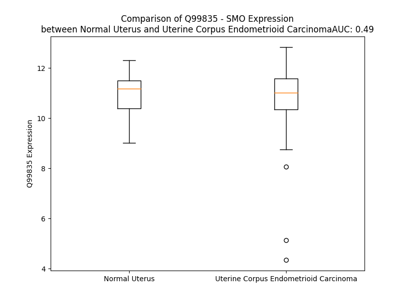

# Detailed Data for Q99835

## Introduction to the Detailed Summary

### How to Interpret the Results

- **Summary & Metrics**: This section provides a quick reference to essential protein attributes, including expression changes, family classification, and biomarker applications. Regulation status (upregulated/downregulated) indicates the protein's behavior in a disease context. Some information comes from the original excel file with the proteins selected from literature, while others are derived from the analyses.
- **Expression Comparison**: A visual representation comparing protein expression between normal and disease states. It highlights significant changes in expression levels that might indicate diagnostic or therapeutic relevance. This is data coming from transcriptomics experiments and could not translate similarly to protein levels.
- **Isoform Alignment**: An interactive view of isoform alignments, revealing structural and functional differences between variants of the protein.
- **Interactors & Homologs**: Tables listing known interaction partners and homologous proteins, the more interactors and homologs, the more complex the protein is to design an antibody for.
- **Biological Assemblies**: Information about the structural arrangement of the protein in different assemblies, providing insights into its functional state but also the complexity of the protein to develop antibodies.
- **Combined Per-Residue Information**: A detailed table summarizing residue-level data. This includes predictions for epitope regions, aggregation tendencies, and modifications that might impact the protein's function. Each row corresponds to a residue in the protein, providing insights into specific sites that may be important for research or drug development.
## Summary & Metrics

- **UniProt Accession**: Q99835
- **Gene Name**: SMO
- **Protein Name**: Smoothened homolog
- **Swiss Prot**: SMO_HUMAN
- **Family**: G-protein coupled receptor
- **Biomarker Application**: response to therapy
- **Number of Isoforms**: 0
- **Regulation**: -1
- **(transcriptomics) AUC**: 0.84
- **(transcriptomics) Fold Change**: 1.09
- **(transcriptomics) Regulation**: Upregulated
- **Discotope Epitope Count**: 206
- **Max n_uniprots (Homo)**: 2
- **Max n_uniprots (Hetero)**: 6

## Expression Comparison

## Interactors

| preferredName_A   | preferredName_B   |   score |
|:------------------|:------------------|--------:|
| SMO               | SHH               |   0.999 |
| SMO               | PTCH1             |   0.999 |
| SMO               | SUFU              |   0.998 |
| SMO               | IHH               |   0.997 |
| SMO               | ARRB2             |   0.997 |
| SMO               | ARRB1             |   0.994 |
| SMO               | PTCH2             |   0.993 |
| SMO               | KIF3A             |   0.991 |
| SMO               | GRK2              |   0.99  |
| SMO               | GLI1              |   0.988 |
| SMO               | EVC               |   0.983 |
| SMO               | GLI2              |   0.98  |
| SMO               | EVC2              |   0.979 |
| SMO               | GLI3              |   0.975 |
| SMO               | GNAI1             |   0.969 |
| SMO               | PRKACB            |   0.965 |
| SMO               | PRKACG            |   0.965 |
| SMO               | PRKACA            |   0.965 |
| SMO               | BOC               |   0.963 |
| SMO               | DHH               |   0.958 |
| SMO               | GNB1              |   0.951 |
| SMO               | KIF7              |   0.947 |
| SMO               | GRK3              |   0.935 |
| SMO               | MOSMO             |   0.931 |
| SMO               | MEGF8             |   0.93  |
| SMO               | GNG2              |   0.922 |
| SMO               | MGRN1             |   0.919 |
| SMO               | PRKCA             |   0.916 |
| SMO               | CSNK1D            |   0.914 |
| SMO               | CSNK1G3           |   0.913 |
| SMO               | CSNK1E            |   0.911 |
| SMO               | CSNK1G2           |   0.909 |
| SMO               | CSNK1A1L          |   0.905 |

## Homologs

| uniprot_id   | gene_id   |
|:-------------|:----------|
| Q9UP38       | FZD1      |
| O00144       | FZD9      |
| Q9NPG1       | FZD3      |
| F5H450       | FZD10     |
| Q5T4F7       | SFRP5     |
| O75084       | FZD7      |
| Q13467       | FZD5      |
| Q9H461       | FZD8      |
| Q9ULV1       | FZD4      |
| G5EA13       | FZD6      |
| Q6ZSL4       | SFRP1     |
| Q96HF1       | SFRP2     |
| Q92765       | FRZB      |
| C9JMJ2       | SFRP4     |
| Q14332       | FZD2      |
| Q6QHF9       | PAOX      |
| A0A494C134   | PPOX      |
| A0A8I5KUC3   | MAOA      |
| Q96RQ9       | IL4I1     |
| Q08EI0       | KDM1B     |
| P27338       | MAOB      |
| A0A8I5KSH0   | KDM1A     |

## Biological Assemblies

|   Unnamed: 0 |   assembly |   n_uniprots | composition   | crystal_id   |
|-------------:|-----------:|-------------:|:--------------|:-------------|
|            0 |          1 |            2 | Homo          | 5v57         |
|            0 |          1 |            2 | Homo          | 4n4w         |
|            0 |          1 |            5 | Hetero        | 6xbl         |
|            0 |          1 |            5 | Hetero        | 6xbj         |
|            0 |          1 |            1 | Homo          | 4qin         |
|            0 |          1 |            1 | Homo          | 5l7i         |
|            1 |          2 |            1 | Homo          | 5l7i         |
|            0 |          1 |            2 | Homo          | 4jkv         |
|            0 |          1 |            1 | Homo          | 7zi0         |
|            1 |          2 |            1 | Homo          | 7zi0         |
|            0 |          1 |            2 | Homo          | 5v56         |
|            0 |          1 |            1 | Homo          | 4qim         |
|            0 |          1 |            1 | Homo          | 4o9r         |
|            0 |          1 |            1 | Homo          | 5l7d         |
|            1 |          2 |            1 | Homo          | 5l7d         |
|            0 |          1 |            5 | Hetero        | 6xbk         |
|            0 |          1 |            5 | Hetero        | 6xbm         |
|            0 |          1 |            6 | Hetero        | 6ot0         |

## Combined Per-Residue Information

|   res | aa   |   epitope_score | epitope   |   relative_surface_accessibility |   modeling_confidence |   Aggregation | modification     | glycosylation                   |
|------:|:-----|----------------:|:----------|---------------------------------:|----------------------:|--------------:|:-----------------|:--------------------------------|
|     1 | M    |         0.10456 | False     |                          1.34529 |                 34.55 |         0     | N/A              | N/A                             |
|     2 | A    |         0.10505 | False     |                          1.00163 |                 35.26 |         0     | N/A              | N/A                             |
|     3 | A    |         0.10644 | True      |                          1.04355 |                 32.31 |         0     | N/A              | N/A                             |
|     4 | A    |         0.09276 | False     |                          0.94498 |                 37.83 |         0     | N/A              | N/A                             |
|     5 | R    |         0.1856  | True      |                          0.93352 |                 33.65 |         0     | N/A              | N/A                             |
|     6 | P    |         0.13311 | True      |                          0.96454 |                 39.56 |         0     | N/A              | N/A                             |
|     7 | A    |         0.09785 | False     |                          0.94966 |                 37.08 |         0     | N/A              | N/A                             |
|     8 | R    |         0.16552 | True      |                          0.99492 |                 36.25 |         0     | N/A              | N/A                             |
|     9 | G    |         0.13129 | True      |                          0.73438 |                 36.5  |         0     | N/A              | N/A                             |
|    10 | P    |         0.10727 | True      |                          0.94277 |                 38.81 |         0     | N/A              | N/A                             |
|    11 | E    |         0.13031 | True      |                          0.80226 |                 37.98 |         0     | N/A              | N/A                             |
|    12 | L    |         0.1257  | True      |                          0.80631 |                 43.49 |         0     | N/A              | N/A                             |
|    13 | P    |         0.14349 | True      |                          0.65508 |                 50.8  |         0.265 | N/A              | N/A                             |
|    14 | L    |         0.14341 | True      |                          0.8671  |                 47.27 |        59.613 | N/A              | N/A                             |
|    15 | L    |         0.04022 | False     |                          0.2761  |                 51.29 |        70.48  | N/A              | N/A                             |
|    16 | G    |         0.05645 | False     |                          0.37808 |                 49.66 |        72.466 | N/A              | N/A                             |
|    17 | L    |         0.06054 | False     |                          0.64124 |                 54.04 |        94.323 | N/A              | N/A                             |
|    18 | L    |         0.04168 | False     |                          0.42243 |                 50.37 |        98.108 | N/A              | N/A                             |
|    19 | L    |         0.0397  | False     |                          0.07007 |                 53.67 |        98.563 | N/A              | N/A                             |
|    20 | L    |         0.0701  | False     |                          0.55133 |                 55.32 |        98.443 | N/A              | N/A                             |
|    21 | L    |         0.08962 | False     |                          0.83444 |                 57.3  |        97.728 | N/A              | N/A                             |
|    22 | L    |         0.05407 | False     |                          0.58726 |                 48.71 |        92.627 | N/A              | N/A                             |
|    23 | L    |         0.07885 | False     |                          0.30433 |                 48.49 |        63.586 | N/A              | N/A                             |
|    24 | G    |         0.12136 | True      |                          0.7675  |                 36.52 |         5.256 | N/A              | N/A                             |
|    25 | D    |         0.08785 | False     |                          0.74771 |                 37.14 |         0     | N/A              | N/A                             |
|    26 | P    |         0.09276 | False     |                          0.90198 |                 42.93 |         0     | N/A              | N/A                             |
|    27 | G    |         0.10201 | False     |                          0.85093 |                 34.51 |         0     | N/A              | N/A                             |
|    28 | R    |         0.14141 | True      |                          0.97584 |                 35.79 |         0     | N/A              | N/A                             |
|    29 | G    |         0.09531 | False     |                          0.8501  |                 33.03 |         0     | N/A              | N/A                             |
|    30 | A    |         0.08132 | False     |                          0.99679 |                 32.61 |         0     | N/A              | N/A                             |
|    31 | A    |         0.10882 | True      |                          0.96591 |                 35.35 |         0     | N/A              | N/A                             |
|    32 | S    |         0.10193 | False     |                          0.79919 |                 34.77 |         0     | N/A              | N/A                             |
|    33 | S    |         0.12543 | True      |                          0.85857 |                 35.22 |         0     | N/A              | N/A                             |
|    34 | G    |         0.14129 | True      |                          0.82662 |                 36.09 |         0     | N/A              | N/A                             |
|    35 | N    |         0.12575 | True      |                          0.94981 |                 36.63 |         0     | N/A              | N-linked (GlcNAc...) asparagine |
|    36 | A    |         0.10354 | False     |                          0.94831 |                 37.48 |         0     | N/A              | N/A                             |
|    37 | T    |         0.15037 | True      |                          0.89665 |                 39.18 |         0     | N/A              | N/A                             |
|    38 | G    |         0.1691  | True      |                          0.82658 |                 36.54 |         0     | N/A              | N/A                             |
|    39 | P    |         0.15275 | True      |                          0.96828 |                 42.58 |         0     | N/A              | N/A                             |
|    40 | G    |         0.14207 | True      |                          0.74844 |                 35.46 |         0     | N/A              | N/A                             |
|    41 | P    |         0.11571 | True      |                          0.97024 |                 54.03 |         0     | N/A              | N/A                             |
|    42 | R    |         0.14224 | True      |                          0.99379 |                 39.31 |         0     | N/A              | N/A                             |
|    43 | S    |         0.1511  | True      |                          0.8233  |                 44.5  |         0     | N/A              | N/A                             |
|    44 | A    |         0.11491 | True      |                          0.98229 |                 45.84 |         0     | N/A              | N/A                             |
|    45 | G    |         0.11987 | True      |                          1.04522 |                 38.12 |         0     | N/A              | N/A                             |
|    46 | G    |         0.16578 | True      |                          0.8203  |                 40.36 |         0     | N/A              | N/A                             |
|    47 | S    |         0.15823 | True      |                          0.9472  |                 41.73 |         0     | N/A              | N/A                             |
|    48 | A    |         0.14173 | True      |                          0.81352 |                 45.15 |         0     | N/A              | N/A                             |
|    49 | R    |         0.18903 | True      |                          0.9682  |                 41.04 |         0     | N/A              | N/A                             |
|    50 | R    |         0.19342 | True      |                          0.88382 |                 46.42 |         0     | N/A              | N/A                             |
|    51 | S    |         0.12127 | True      |                          0.87323 |                 44.25 |         0     | N/A              | N/A                             |
|    52 | A    |         0.135   | True      |                          0.88434 |                 43    |         0     | N/A              | N/A                             |
|    53 | A    |         0.13026 | True      |                          0.74961 |                 42.78 |         0     | N/A              | N/A                             |
|    54 | V    |         0.15508 | True      |                          1.06686 |                 41.07 |         0     | N/A              | N/A                             |
|    55 | T    |         0.13639 | True      |                          0.85154 |                 47.16 |         0     | N/A              | N/A                             |
|    56 | G    |         0.17455 | True      |                          0.53578 |                 44.31 |         0     | N/A              | N/A                             |
|    57 | P    |         0.09482 | False     |                          0.94553 |                 60.31 |         0     | N/A              | N/A                             |
|    58 | P    |         0.10435 | False     |                          0.81847 |                 69.05 |         0     | N/A              | N/A                             |
|    59 | P    |         0.17075 | True      |                          0.83688 |                 73.58 |         0     | N/A              | N/A                             |
|    60 | P    |         0.09495 | False     |                          0.81242 |                 74.43 |         0     | N/A              | N/A                             |
|    61 | L    |         0.10181 | False     |                          0.5633  |                 82.17 |         0     | N/A              | N/A                             |
|    62 | S    |         0.15646 | True      |                          0.71357 |                 81.89 |         0     | N/A              | N/A                             |
|    63 | H    |         0.08522 | False     |                          0.53189 |                 90.52 |         0     | N/A              | N/A                             |
|    64 | C    |         0.10442 | False     |                          0.07258 |                 90.41 |         0     | N/A              | N/A                             |
|    65 | G    |         0.0511  | False     |                          0.14087 |                 91.08 |         0     | N/A              | N/A                             |
|    66 | R    |         0.18761 | True      |                          0.33505 |                 92.73 |         0     | N/A              | N/A                             |
|    67 | A    |         0.09767 | False     |                          0.83054 |                 93.98 |         0     | N/A              | N/A                             |
|    68 | A    |         0.03613 | False     |                          0.05586 |                 93.29 |         0     | N/A              | N/A                             |
|    69 | P    |         0.0888  | False     |                          0.78629 |                 93.91 |         0     | N/A              | N/A                             |
|    70 | C    |         0.06752 | False     |                          0.2952  |                 94.68 |         0     | N/A              | N/A                             |
|    71 | E    |         0.13898 | True      |                          0.39361 |                 95.16 |         0     | N/A              | N/A                             |
|    72 | P    |         0.10447 | False     |                          0.77398 |                 95.43 |         0     | N/A              | N/A                             |
|    73 | L    |         0.08228 | False     |                          0.18762 |                 95    |         0     | N/A              | N/A                             |
|    74 | R    |         0.20778 | True      |                          0.64195 |                 95.52 |         0     | N/A              | N/A                             |
|    75 | Y    |         0.13094 | True      |                          0.32772 |                 94.54 |         0     | N/A              | N/A                             |
|    76 | N    |         0.10069 | False     |                          0.65471 |                 92.81 |         0     | N/A              | N/A                             |
|    77 | V    |         0.09771 | False     |                          0.43111 |                 93.72 |         0     | N/A              | N/A                             |
|    78 | C    |         0.00996 | False     |                          0.00401 |                 93.9  |         0     | N/A              | N/A                             |
|    79 | L    |         0.04193 | False     |                          0.1708  |                 92.03 |         0     | N/A              | N/A                             |
|    80 | G    |         0.11063 | True      |                          0.80234 |                 90    |         0     | N/A              | N/A                             |
|    81 | S    |         0.04527 | False     |                          0.07767 |                 93.08 |         0     | N/A              | N/A                             |
|    82 | V    |         0.1102  | True      |                          0.74625 |                 93.75 |         0     | N/A              | N/A                             |
|    83 | L    |         0.03429 | False     |                          0.07377 |                 94.17 |         0     | N/A              | N/A                             |
|    84 | P    |         0.1161  | True      |                          0.65111 |                 93.37 |         0     | N/A              | N/A                             |
|    85 | Y    |         0.12998 | True      |                          0.12016 |                 92.62 |         0     | N/A              | N/A                             |
|    86 | G    |         0.08224 | False     |                          0.68732 |                 94.06 |         0     | N/A              | N/A                             |
|    87 | A    |         0.04921 | False     |                          0.25456 |                 95.71 |         0     | N/A              | N/A                             |
|    88 | T    |         0.0494  | False     |                          0.02556 |                 95.66 |         0     | N/A              | N/A                             |
|    89 | S    |         0.03435 | False     |                          0.04166 |                 95.14 |         0     | N/A              | N/A                             |
|    90 | T    |         0.05832 | False     |                          0.22197 |                 94.95 |         0     | N/A              | N/A                             |
|    91 | L    |         0.20767 | True      |                          0.53547 |                 94.71 |         0     | N/A              | N/A                             |
|    92 | L    |         0.04426 | False     |                          0.10093 |                 94.45 |         0     | N/A              | N/A                             |
|    93 | A    |         0.01454 | False     |                          0.03501 |                 94.4  |         0     | N/A              | N/A                             |
|    94 | G    |         0.12356 | True      |                          0.79097 |                 91.77 |         0     | N/A              | N/A                             |
|    95 | D    |         0.09832 | False     |                          0.3067  |                 92.37 |         0     | N/A              | N/A                             |
|    96 | S    |         0.044   | False     |                          0.04767 |                 93.9  |         0     | N/A              | N/A                             |
|    97 | D    |         0.12403 | True      |                          0.85672 |                 93.55 |         0     | N/A              | N/A                             |
|    98 | S    |         0.07209 | False     |                          0.35108 |                 95.36 |         0     | N/A              | N/A                             |
|    99 | Q    |         0.03085 | False     |                          0.06596 |                 95.08 |         0     | N/A              | N/A                             |
|   100 | E    |         0.07215 | False     |                          0.39666 |                 95.02 |         0     | N/A              | N/A                             |
|   101 | E    |         0.09737 | False     |                          0.3394  |                 94.14 |         0     | N/A              | N/A                             |
|   102 | A    |         0.0088  | False     |                          0.01658 |                 94.54 |         0     | N/A              | N/A                             |
|   103 | H    |         0.05387 | False     |                          0.34296 |                 94.07 |         0     | N/A              | N/A                             |
|   104 | G    |         0.03976 | False     |                          0.44396 |                 91.81 |         0     | N/A              | N/A                             |
|   105 | K    |         0.06415 | False     |                          0.23495 |                 91.73 |         0     | N/A              | N/A                             |
|   106 | L    |         0.02389 | False     |                          0.02803 |                 92.65 |         4.611 | N/A              | N/A                             |
|   107 | V    |         0.0653  | False     |                          0.63991 |                 89.73 |         4.737 | N/A              | N/A                             |
|   108 | L    |         0.0424  | False     |                          0.29039 |                 87.29 |         4.737 | N/A              | N/A                             |
|   109 | W    |         0.01435 | False     |                          0.05661 |                 90.2  |         4.737 | N/A              | N/A                             |
|   110 | S    |         0.03648 | False     |                          0.25443 |                 86.94 |         4.737 | N/A              | N/A                             |
|   111 | G    |         0.02582 | False     |                          0.25993 |                 82.71 |         0.934 | N/A              | N/A                             |
|   112 | L    |         0.00264 | False     |                          0.00295 |                 87.6  |         0.809 | N/A              | N/A                             |
|   113 | R    |         0.09032 | False     |                          0.36159 |                 88.37 |         0     | N/A              | N/A                             |
|   114 | N    |         0.03134 | False     |                          0.10251 |                 84.77 |         0     | N/A              | N/A                             |
|   115 | A    |         0.00839 | False     |                          0.00638 |                 87.24 |         0     | N/A              | N/A                             |
|   116 | P    |         0.02555 | False     |                          0.04711 |                 89.74 |         0     | N/A              | N/A                             |
|   117 | R    |         0.05808 | False     |                          0.39979 |                 91.35 |         0     | N/A              | N/A                             |
|   118 | C    |         0.00354 | False     |                          0       |                 91.9  |         8.289 | N/A              | N/A                             |
|   119 | W    |         0.00585 | False     |                          0.00276 |                 92.27 |         8.289 | N/A              | N/A                             |
|   120 | A    |         0.03818 | False     |                          0.51737 |                 92.71 |         8.289 | N/A              | N/A                             |
|   121 | V    |         0.04705 | False     |                          0.30686 |                 93.24 |         8.289 | N/A              | N/A                             |
|   122 | I    |         0.00485 | False     |                          0.0016  |                 94.19 |         8.289 | N/A              | N/A                             |
|   123 | Q    |         0.00944 | False     |                          0.01119 |                 94.24 |         0     | N/A              | N/A                             |
|   124 | P    |         0.02845 | False     |                          0.16104 |                 94.68 |         0.119 | N/A              | N/A                             |
|   125 | L    |         0.00242 | False     |                          0.00165 |                 95.51 |        13.555 | N/A              | N/A                             |
|   126 | L    |         0.00195 | False     |                          0.00082 |                 95.58 |        15.463 | N/A              | N/A                             |
|   127 | C    |         0.00425 | False     |                          0       |                 95.71 |        15.463 | N/A              | N/A                             |
|   128 | A    |         0.00469 | False     |                          0.08246 |                 95.66 |        15.463 | N/A              | N/A                             |
|   129 | V    |         0.01499 | False     |                          0.01523 |                 95.94 |        15.463 | N/A              | N/A                             |
|   130 | Y    |         0.01487 | False     |                          0.01395 |                 96.05 |        12.441 | N/A              | N/A                             |
|   131 | M    |         0.01818 | False     |                          0.05077 |                 95.78 |         0     | N/A              | N/A                             |
|   132 | P    |         0.00661 | False     |                          0.02286 |                 95.6  |         0     | N/A              | N/A                             |
|   133 | K    |         0.02835 | False     |                          0.29772 |                 94.78 |         0     | N/A              | N/A                             |
|   134 | C    |         0.02784 | False     |                          0.04441 |                 94.2  |         0     | N/A              | N/A                             |
|   135 | E    |         0.10218 | False     |                          0.48168 |                 93.45 |         0     | N/A              | N/A                             |
|   136 | N    |         0.11391 | True      |                          0.88844 |                 91.46 |         0     | N/A              | N/A                             |
|   137 | D    |         0.13219 | True      |                          0.58154 |                 92.29 |         0     | N/A              | N/A                             |
|   138 | R    |         0.11655 | True      |                          0.31468 |                 93.3  |         0     | N/A              | N/A                             |
|   139 | V    |         0.00689 | False     |                          0       |                 94.21 |         0     | N/A              | N/A                             |
|   140 | E    |         0.04661 | False     |                          0.21311 |                 93.28 |         0     | N/A              | N/A                             |
|   141 | L    |         0.02248 | False     |                          0.05523 |                 94.58 |         0     | N/A              | N/A                             |
|   142 | P    |         0.01096 | False     |                          0.05511 |                 95.24 |         0     | N/A              | N/A                             |
|   143 | S    |         0.02459 | False     |                          0.026   |                 94.92 |         0     | N/A              | N/A                             |
|   144 | R    |         0.09362 | False     |                          0.30265 |                 94.45 |         0     | N/A              | N/A                             |
|   145 | T    |         0.07773 | False     |                          0.66034 |                 94.17 |         0     | N/A              | N/A                             |
|   146 | L    |         0.02045 | False     |                          0.11847 |                 94.62 |         0     | N/A              | N/A                             |
|   147 | C    |         0.00442 | False     |                          0       |                 95.91 |         0     | N/A              | N/A                             |
|   148 | Q    |         0.12064 | True      |                          0.4426  |                 95.31 |         0     | N/A              | N/A                             |
|   149 | A    |         0.02989 | False     |                          0.48945 |                 94.34 |         0     | N/A              | N/A                             |
|   150 | T    |         0.00523 | False     |                          0       |                 94.39 |         0     | N/A              | N/A                             |
|   151 | R    |         0.10823 | True      |                          0.23919 |                 93.84 |         0     | N/A              | N/A                             |
|   152 | G    |         0.11665 | True      |                          0.51586 |                 91.01 |         0     | N/A              | N/A                             |
|   153 | P    |         0.07216 | False     |                          0.24835 |                 91.01 |         0     | N/A              | N/A                             |
|   154 | C    |         0.00492 | False     |                          0       |                 91.41 |         0     | N/A              | N/A                             |
|   155 | A    |         0.04445 | False     |                          0.35423 |                 88.83 |         0     | N/A              | N/A                             |
|   156 | I    |         0.01475 | False     |                          0       |                 84.59 |         0     | N/A              | N/A                             |
|   157 | V    |         0.00871 | False     |                          0       |                 88.28 |         0     | N/A              | N/A                             |
|   158 | E    |         0.11241 | True      |                          0.54776 |                 88.67 |         0     | N/A              | N/A                             |
|   159 | R    |         0.21478 | True      |                          0.63815 |                 83.37 |         0     | N/A              | N/A                             |
|   160 | E    |         0.08519 | False     |                          0.44961 |                 79.63 |         0     | N/A              | N/A                             |
|   161 | R    |         0.22765 | True      |                          0.49837 |                 82.33 |         0     | N/A              | N/A                             |
|   162 | G    |         0.07408 | False     |                          0.32414 |                 88.13 |         0     | N/A              | N/A                             |
|   163 | W    |         0.06397 | False     |                          0.06844 |                 91.93 |         0     | N/A              | N/A                             |
|   164 | P    |         0.06938 | False     |                          0.25051 |                 92.79 |         0     | N/A              | N/A                             |
|   165 | D    |         0.14107 | True      |                          0.4985  |                 93.36 |         0     | N/A              | N/A                             |
|   166 | F    |         0.09264 | False     |                          0.10474 |                 94.1  |         0     | N/A              | N/A                             |
|   167 | L    |         0.00451 | False     |                          0.0033  |                 95.55 |         0     | N/A              | N/A                             |
|   168 | R    |         0.12854 | True      |                          0.47489 |                 94.85 |         0     | N/A              | N/A                             |
|   169 | C    |         0.06415 | False     |                          0.2113  |                 95.23 |         0     | N/A              | N/A                             |
|   170 | T    |         0.07315 | False     |                          0.2999  |                 94.53 |         0     | N/A              | N/A                             |
|   171 | P    |         0.14632 | True      |                          0.7008  |                 91.33 |         0     | N/A              | N/A                             |
|   172 | D    |         0.1133  | True      |                          0.52352 |                 90.94 |         0     | N/A              | N/A                             |
|   173 | R    |         0.10462 | False     |                          0.30352 |                 92.47 |         0     | N/A              | N/A                             |
|   174 | F    |         0.01831 | False     |                          0.01592 |                 95.49 |         0     | N/A              | N/A                             |
|   175 | P    |         0.03331 | False     |                          0.07853 |                 94.13 |         0     | N/A              | N/A                             |
|   176 | E    |         0.16449 | True      |                          0.55035 |                 91.86 |         0     | N/A              | N/A                             |
|   177 | G    |         0.14063 | True      |                          0.84515 |                 86.36 |         0     | N/A              | N/A                             |
|   178 | C    |         0.07685 | False     |                          0.08316 |                 88.93 |         0     | N/A              | N/A                             |
|   179 | T    |         0.06718 | False     |                          0.68866 |                 87.48 |         0     | N/A              | N/A                             |
|   180 | N    |         0.04125 | False     |                          0.10198 |                 86.89 |         0     | N/A              | N/A                             |
|   181 | E    |         0.08886 | False     |                          0.2698  |                 81.42 |         0     | N/A              | N/A                             |
|   182 | V    |         0.02674 | False     |                          0.04946 |                 84.17 |         0     | N/A              | N/A                             |
|   183 | Q    |         0.21182 | True      |                          0.6428  |                 81.82 |         0     | N/A              | N/A                             |
|   184 | N    |         0.14608 | True      |                          0.7256  |                 83.22 |         0     | N/A              | N/A                             |
|   185 | I    |         0.09213 | False     |                          0.08682 |                 88.6  |         0     | N/A              | N/A                             |
|   186 | K    |         0.09595 | False     |                          0.84502 |                 88.45 |         0     | N/A              | N/A                             |
|   187 | F    |         0.07937 | False     |                          0.1912  |                 88.63 |         0     | N/A              | N/A                             |
|   188 | N    |         0.17117 | True      |                          0.79565 |                 81.97 |         0     | N/A              | N-linked (GlcNAc...) asparagine |
|   189 | S    |         0.12257 | True      |                          0.2436  |                 79.07 |         0     | N/A              | N/A                             |
|   190 | S    |         0.11527 | True      |                          0.59686 |                 80.82 |         0     | N/A              | N/A                             |
|   191 | G    |         0.0202  | False     |                          0.04077 |                 82.95 |         0     | N/A              | N/A                             |
|   192 | Q    |         0.16715 | True      |                          0.58545 |                 86.7  |         0     | N/A              | N/A                             |
|   193 | C    |         0.05354 | False     |                          0.20132 |                 88.67 |         0     | N/A              | N/A                             |
|   194 | E    |         0.07701 | False     |                          0.40275 |                 85    |         0     | N/A              | N/A                             |
|   195 | V    |         0.12395 | True      |                          0.75221 |                 84.11 |         0     | N/A              | N/A                             |
|   196 | P    |         0.01393 | False     |                          0.00664 |                 88.28 |         0     | N/A              | N/A                             |
|   197 | L    |         0.01342 | False     |                          0.02871 |                 91.53 |         0     | N/A              | N/A                             |
|   198 | V    |         0.06141 | False     |                          0.39701 |                 93.26 |         0     | N/A              | N/A                             |
|   199 | R    |         0.06288 | False     |                          0.45848 |                 92.57 |         0     | N/A              | N/A                             |
|   200 | T    |         0.03206 | False     |                          0.0325  |                 92.33 |         0     | N/A              | N/A                             |
|   201 | D    |         0.10701 | True      |                          0.72063 |                 91.66 |         0     | N/A              | N/A                             |
|   202 | N    |         0.11897 | True      |                          0.33179 |                 90.97 |         0     | N/A              | N/A                             |
|   203 | P    |         0.13373 | True      |                          0.66599 |                 91.13 |         0     | N/A              | N/A                             |
|   204 | K    |         0.15281 | True      |                          0.69169 |                 89.48 |         0     | N/A              | N/A                             |
|   205 | S    |         0.03867 | False     |                          0.07548 |                 91.14 |         0     | N/A              | N/A                             |
|   206 | W    |         0.10435 | False     |                          0.31831 |                 91.33 |         0     | N/A              | N/A                             |
|   207 | Y    |         0.06899 | False     |                          0.1676  |                 88.55 |         0     | N/A              | N/A                             |
|   208 | E    |         0.20763 | True      |                          0.56939 |                 83.07 |         0     | N/A              | N/A                             |
|   209 | D    |         0.11344 | True      |                          0.1357  |                 78.8  |         0     | N/A              | N/A                             |
|   210 | V    |         0.00622 | False     |                          0       |                 84.61 |         0     | N/A              | N/A                             |
|   211 | E    |         0.04991 | False     |                          0.26322 |                 87.47 |         0     | N/A              | N/A                             |
|   212 | G    |         0.0127  | False     |                          0.05143 |                 88.7  |         0     | N/A              | N/A                             |
|   213 | C    |         0.00897 | False     |                          0       |                 92.04 |         0     | N/A              | N/A                             |
|   214 | G    |         0.0021  | False     |                          0       |                 92.83 |         0     | N/A              | N/A                             |
|   215 | I    |         0.04432 | False     |                          0.0552  |                 93.19 |         0     | N/A              | N/A                             |
|   216 | Q    |         0.05403 | False     |                          0.18852 |                 94.56 |         0     | N/A              | N/A                             |
|   217 | C    |         0.02977 | False     |                          0.09118 |                 95.83 |         0     | N/A              | N/A                             |
|   218 | Q    |         0.09658 | False     |                          0.46344 |                 95.12 |         0     | N/A              | N/A                             |
|   219 | N    |         0.04583 | False     |                          0.17247 |                 93.43 |         0     | N/A              | N/A                             |
|   220 | P    |         0.0811  | False     |                          0.21174 |                 92.19 |         0     | N/A              | N/A                             |
|   221 | L    |         0.05224 | False     |                          0.11771 |                 91.69 |         0     | N/A              | N/A                             |
|   222 | F    |         0.04756 | False     |                          0.09185 |                 94.28 |         0     | N/A              | N/A                             |
|   223 | T    |         0.09681 | False     |                          0.57432 |                 94.95 |         0     | N/A              | N/A                             |
|   224 | E    |         0.07933 | False     |                          0.46297 |                 95.5  |         0     | N/A              | N/A                             |
|   225 | A    |         0.05295 | False     |                          0.67459 |                 97.18 |         0     | N/A              | N/A                             |
|   226 | E    |         0.05818 | False     |                          0.18888 |                 96.88 |         0     | N/A              | N/A                             |
|   227 | H    |         0.02768 | False     |                          0.02707 |                 96.89 |         0     | N/A              | N/A                             |
|   228 | Q    |         0.08637 | False     |                          0.51334 |                 96.95 |         0     | N/A              | N/A                             |
|   229 | D    |         0.0725  | False     |                          0.4086  |                 97.24 |         0     | N/A              | N/A                             |
|   230 | M    |         0.00439 | False     |                          0.00431 |                 97.51 |         0.017 | N/A              | N/A                             |
|   231 | H    |         0.02321 | False     |                          0.08944 |                 97.84 |         0.04  | N/A              | N/A                             |
|   232 | S    |         0.03572 | False     |                          0.55813 |                 97.38 |         1.055 | N/A              | N/A                             |
|   233 | Y    |         0.03353 | False     |                          0.21763 |                 98.02 |        11.979 | N/A              | N/A                             |
|   234 | I    |         0.00125 | False     |                          0       |                 97.98 |        15.614 | N/A              | N/A                             |
|   235 | A    |         0.02574 | False     |                          0.31018 |                 97.89 |        16.539 | N/A              | N/A                             |
|   236 | A    |         0.0181  | False     |                          0.52359 |                 98.07 |        20.739 | N/A              | N/A                             |
|   237 | F    |         0.02125 | False     |                          0.25381 |                 97.91 |        28.746 | N/A              | N/A                             |
|   238 | G    |         0.00119 | False     |                          0       |                 97.5  |        27.896 | N/A              | N/A                             |
|   239 | A    |         0.01048 | False     |                          0.2034  |                 98.01 |        35.011 | N/A              | N/A                             |
|   240 | V    |         0.0075  | False     |                          0.52554 |                 98.2  |        43.613 | N/A              | N/A                             |
|   241 | T    |         0.00064 | False     |                          0.0019  |                 98.07 |        42.948 | N/A              | N/A                             |
|   242 | G    |         0.01018 | False     |                          0.10818 |                 97.95 |        43.528 | N/A              | N/A                             |
|   243 | L    |         0.01326 | False     |                          0.62139 |                 98.05 |        57.432 | N/A              | N/A                             |
|   244 | C    |         0.00537 | False     |                          0.16702 |                 97.85 |        59.686 | N/A              | N/A                             |
|   245 | T    |         0.00142 | False     |                          0       |                 97.59 |        71.632 | N/A              | N/A                             |
|   246 | L    |         0.01255 | False     |                          0.36024 |                 97.74 |        91.448 | N/A              | N/A                             |
|   247 | F    |         0.00882 | False     |                          0.41626 |                 97.37 |        95.18  | N/A              | N/A                             |
|   248 | T    |         0.00083 | False     |                          0       |                 95.93 |        93.714 | N/A              | N/A                             |
|   249 | L    |         0.00477 | False     |                          0.12847 |                 96.79 |        93.126 | N/A              | N/A                             |
|   250 | A    |         0.00645 | False     |                          0.33879 |                 96.1  |        87.235 | N/A              | N/A                             |
|   251 | T    |         0.00259 | False     |                          0       |                 94.51 |        82.27  | N/A              | N/A                             |
|   252 | F    |         0.00259 | False     |                          0       |                 93.22 |        80.937 | N/A              | N/A                             |
|   253 | V    |         0.03259 | False     |                          0.66546 |                 94.07 |        71.144 | N/A              | N/A                             |
|   254 | A    |         0.01835 | False     |                          0.27847 |                 91.04 |        31.396 | N/A              | N/A                             |
|   255 | D    |         0.06601 | False     |                          0.11447 |                 89.49 |         0.369 | N/A              | N/A                             |
|   256 | W    |         0.04543 | False     |                          0.3888  |                 88.34 |         0.369 | N/A              | N/A                             |
|   257 | R    |         0.16634 | True      |                          0.95421 |                 84.62 |         0.369 | N/A              | N/A                             |
|   258 | N    |         0.12373 | True      |                          0.34277 |                 80.32 |         0.006 | N/A              | N/A                             |
|   259 | S    |         0.00527 | False     |                          0       |                 83.64 |         0     | N/A              | N/A                             |
|   260 | N    |         0.09049 | False     |                          0.47335 |                 83.87 |         0     | N/A              | N/A                             |
|   261 | R    |         0.15259 | True      |                          0.45632 |                 79.3  |         0     | N/A              | N/A                             |
|   262 | Y    |         0.14222 | True      |                          0.22215 |                 78.46 |         0     | N/A              | N/A                             |
|   263 | P    |         0.02117 | False     |                          0.07891 |                 78.42 |         0.124 | N/A              | N/A                             |
|   264 | A    |         0.02098 | False     |                          0.04464 |                 82.57 |        30.686 | N/A              | N/A                             |
|   265 | V    |         0.01165 | False     |                          0.01238 |                 89.09 |        92.193 | N/A              | N/A                             |
|   266 | I    |         0.00163 | False     |                          0       |                 91.2  |        99.204 | N/A              | N/A                             |
|   267 | L    |         0.00306 | False     |                          0.00577 |                 90.49 |        99.837 | N/A              | N/A                             |
|   268 | F    |         0.01774 | False     |                          0.15032 |                 94.09 |        99.958 | N/A              | N/A                             |
|   269 | Y    |         0.00866 | False     |                          0.16339 |                 95.83 |        99.928 | N/A              | N/A                             |
|   270 | V    |         0.00282 | False     |                          0.02571 |                 94.89 |        99.624 | N/A              | N/A                             |
|   271 | N    |         0.00072 | False     |                          0.00086 |                 96.44 |        95.852 | N/A              | N/A                             |
|   272 | A    |         0.01267 | False     |                          0.23112 |                 97.74 |        95.721 | N/A              | N/A                             |
|   273 | C    |         0.00599 | False     |                          0.05283 |                 97.95 |        95.611 | N/A              | N/A                             |
|   274 | F    |         0.0032  | False     |                          0.1558  |                 97.28 |        95.594 | N/A              | N/A                             |
|   275 | F    |         0.0102  | False     |                          0.13759 |                 98.38 |        95.295 | N/A              | N/A                             |
|   276 | V    |         0.00656 | False     |                          0.47699 |                 98.33 |        91.623 | N/A              | N/A                             |
|   277 | G    |         0.00683 | False     |                          0.11165 |                 97.68 |        48.411 | N/A              | N/A                             |
|   278 | S    |         0.00385 | False     |                          0.02046 |                 97.9  |        44.522 | N/A              | N/A                             |
|   279 | I    |         0.00805 | False     |                          0.11348 |                 97.41 |        44.04  | N/A              | N/A                             |
|   280 | G    |         0.00154 | False     |                          0.00399 |                 97.3  |        38.768 | N/A              | N/A                             |
|   281 | W    |         0.00357 | False     |                          0.04891 |                 98.05 |        38.294 | N/A              | N/A                             |
|   282 | L    |         0.01522 | False     |                          0.09075 |                 97.95 |        29.433 | N/A              | N/A                             |
|   283 | A    |         0.0085  | False     |                          0.03505 |                 96.98 |         2.02  | N/A              | N/A                             |
|   284 | Q    |         0.01418 | False     |                          0.02196 |                 96.77 |         0.017 | N/A              | N/A                             |
|   285 | F    |         0.06968 | False     |                          0.40761 |                 97.02 |         0.009 | N/A              | N/A                             |
|   286 | M    |         0.05696 | False     |                          0.33575 |                 94.71 |         0.002 | N/A              | N/A                             |
|   287 | D    |         0.11445 | True      |                          0.96856 |                 92.6  |         0     | N/A              | N/A                             |
|   288 | G    |         0.06354 | False     |                          0.66637 |                 91.91 |         0     | N/A              | N/A                             |
|   289 | A    |         0.02653 | False     |                          0.168   |                 95.15 |         0     | N/A              | N/A                             |
|   290 | R    |         0.04472 | False     |                          0.27159 |                 96.02 |         0     | N/A              | N/A                             |
|   291 | R    |         0.11883 | True      |                          0.748   |                 95.73 |         0     | N/A              | N/A                             |
|   292 | E    |         0.06634 | False     |                          0.49546 |                 95.53 |         0     | N/A              | N/A                             |
|   293 | I    |         0.02236 | False     |                          0.0472  |                 96.51 |         0     | N/A              | N/A                             |
|   294 | V    |         0.00703 | False     |                          0.00476 |                 96.8  |         0     | N/A              | N/A                             |
|   295 | C    |         0.04288 | False     |                          0.14618 |                 96.32 |         0     | N/A              | N/A                             |
|   296 | R    |         0.0568  | False     |                          0.04955 |                 95.22 |         0     | N/A              | N/A                             |
|   297 | A    |         0.17549 | True      |                          0.97992 |                 93.08 |         0     | N/A              | N/A                             |
|   298 | D    |         0.10607 | False     |                          0.26408 |                 92.4  |         0     | N/A              | N/A                             |
|   299 | G    |         0.0614  | False     |                          0.38918 |                 92.7  |         0     | N/A              | N/A                             |
|   300 | T    |         0.01038 | False     |                          0.00952 |                 94.63 |         0     | N/A              | N/A                             |
|   301 | M    |         0.06046 | False     |                          0.16966 |                 94.58 |         0     | N/A              | N/A                             |
|   302 | R    |         0.0265  | False     |                          0.01553 |                 95.44 |         0     | N/A              | N/A                             |
|   303 | L    |         0.07557 | False     |                          0.26743 |                 94.13 |         0     | N/A              | N/A                             |
|   304 | G    |         0.07552 | False     |                          0.28729 |                 93.37 |         0     | N/A              | N/A                             |
|   305 | E    |         0.02908 | False     |                          0.01854 |                 94.63 |         0     | N/A              | N/A                             |
|   306 | P    |         0.11316 | True      |                          0.42423 |                 93.81 |         0     | N/A              | N/A                             |
|   307 | T    |         0.10248 | False     |                          0.23052 |                 90.04 |         0     | N/A              | N/A                             |
|   308 | S    |         0.24986 | True      |                          0.52397 |                 84.99 |         0     | N/A              | N/A                             |
|   309 | N    |         0.18897 | True      |                          1.00444 |                 86.86 |         0     | N/A              | N-linked (GlcNAc...) asparagine |
|   310 | E    |         0.12301 | True      |                          0.19742 |                 89.9  |         0     | N/A              | N/A                             |
|   311 | T    |         0.04853 | False     |                          0.49836 |                 93.79 |         0.001 | N/A              | N/A                             |
|   312 | L    |         0.11215 | True      |                          0.69805 |                 95.23 |         0.003 | N/A              | N/A                             |
|   313 | S    |         0.02295 | False     |                          0.15836 |                 95.31 |         0.007 | N/A              | N/A                             |
|   314 | C    |         0.00185 | False     |                          0.002   |                 96.74 |         0.44  | N/A              | N/A                             |
|   315 | V    |         0.02033 | False     |                          0.13615 |                 97.37 |        25.98  | N/A              | N/A                             |
|   316 | I    |         0.01815 | False     |                          0.54297 |                 97.45 |        51.633 | N/A              | N/A                             |
|   317 | I    |         0.00852 | False     |                          0.0616  |                 97.83 |        81.399 | N/A              | N/A                             |
|   318 | F    |         0.00243 | False     |                          0       |                 98.24 |        97.598 | N/A              | N/A                             |
|   319 | V    |         0.00739 | False     |                          0.35798 |                 98.38 |        99.573 | N/A              | N/A                             |
|   320 | I    |         0.0082  | False     |                          0.19557 |                 98.17 |        99.932 | N/A              | N/A                             |
|   321 | V    |         0.00439 | False     |                          0.01751 |                 98.02 |        99.98  | N/A              | N/A                             |
|   322 | Y    |         0.00145 | False     |                          0       |                 98.27 |        99.995 | N/A              | N/A                             |
|   323 | Y    |         0.00983 | False     |                          0.25675 |                 98.36 |        99.997 | N/A              | N/A                             |
|   324 | A    |         0.00413 | False     |                          0.06406 |                 98.12 |        99.995 | N/A              | N/A                             |
|   325 | L    |         0.00484 | False     |                          0.10642 |                 96.92 |        99.993 | N/A              | N/A                             |
|   326 | M    |         0.00283 | False     |                          0.00878 |                 97.82 |        99.981 | N/A              | N/A                             |
|   327 | A    |         0.00119 | False     |                          0.0051  |                 97.85 |        99.967 | N/A              | N/A                             |
|   328 | G    |         0.00433 | False     |                          0.04639 |                 95.78 |        99.956 | N/A              | N/A                             |
|   329 | V    |         0.009   | False     |                          0.07712 |                 95.53 |        99.956 | N/A              | N/A                             |
|   330 | V    |         0.00391 | False     |                          0.12091 |                 96.76 |        99.944 | N/A              | N/A                             |
|   331 | W    |         0.0021  | False     |                          0       |                 95.77 |        99.808 | N/A              | N/A                             |
|   332 | F    |         0.00573 | False     |                          0.04456 |                 93.93 |        97.308 | N/A              | N/A                             |
|   333 | V    |         0.00528 | False     |                          0.16947 |                 95.06 |        71.614 | N/A              | N/A                             |
|   334 | V    |         0.00484 | False     |                          0.04094 |                 93.72 |        45.587 | N/A              | N/A                             |
|   335 | L    |         0.00414 | False     |                          0.01319 |                 90.85 |        15.634 | N/A              | N/A                             |
|   336 | T    |         0.00103 | False     |                          0.00571 |                 92.49 |         0.957 | N/A              | N/A                             |
|   337 | Y    |         0.02096 | False     |                          0.25735 |                 91.97 |         0.242 | N/A              | N/A                             |
|   338 | A    |         0.00092 | False     |                          0       |                 88.5  |         0.031 | N/A              | N/A                             |
|   339 | W    |         0.00502 | False     |                          0.03143 |                 87.25 |         0.014 | N/A              | N/A                             |
|   340 | H    |         0.00912 | False     |                          0.11143 |                 88.11 |         0     | N/A              | N/A                             |
|   341 | T    |         0.01452 | False     |                          0.1275  |                 87.24 |         0     | N/A              | N/A                             |
|   342 | S    |         0.01581 | False     |                          0.17159 |                 82.78 |         0     | N/A              | N/A                             |
|   343 | F    |         0.00707 | False     |                          0.00662 |                 79.24 |         0     | N/A              | N/A                             |
|   344 | K    |         0.07383 | False     |                          0.74164 |                 81.42 |         0     | N/A              | N/A                             |
|   345 | A    |         0.05745 | False     |                          0.13515 |                 79.19 |         0     | N/A              | N/A                             |
|   346 | L    |         0.08733 | False     |                          0.26619 |                 72.45 |         0     | N/A              | N/A                             |
|   347 | G    |         0.19276 | True      |                          0.7666  |                 64.91 |         0     | N/A              | N/A                             |
|   348 | T    |         0.26006 | True      |                          0.47722 |                 71.11 |         0     | N/A              | N/A                             |
|   349 | T    |         0.15705 | True      |                          0.85826 |                 68.12 |         0     | N/A              | N/A                             |
|   350 | Y    |         0.2644  | True      |                          0.66729 |                 72.96 |         0     | N/A              | N/A                             |
|   351 | Q    |         0.19453 | True      |                          0.67194 |                 72.97 |         0     | N/A              | N/A                             |
|   352 | P    |         0.05287 | False     |                          0.1506  |                 75.07 |         0     | N/A              | N/A                             |
|   353 | L    |         0.03073 | False     |                          0.06505 |                 79.27 |         0     | N/A              | N/A                             |
|   354 | S    |         0.18552 | True      |                          0.60834 |                 72.69 |         0     | N/A              | N/A                             |
|   355 | G    |         0.11991 | True      |                          0.85467 |                 77.65 |         0     | N/A              | N/A                             |
|   356 | K    |         0.09387 | False     |                          0.32312 |                 83.09 |         0     | N/A              | N/A                             |
|   357 | T    |         0.10329 | False     |                          0.41585 |                 84.52 |         0     | N/A              | N/A                             |
|   358 | S    |         0.06888 | False     |                          0.66874 |                 90.15 |         0.16  | N/A              | N/A                             |
|   359 | Y    |         0.07111 | False     |                          0.71814 |                 93.65 |         5.985 | N/A              | N/A                             |
|   360 | F    |         0.01324 | False     |                          0.08795 |                 93.56 |         6.365 | N/A              | N/A                             |
|   361 | H    |         0.01539 | False     |                          0.24743 |                 94.45 |         6.365 | N/A              | N/A                             |
|   362 | L    |         0.04036 | False     |                          0.74138 |                 95.77 |         6.375 | N/A              | N/A                             |
|   363 | L    |         0.02775 | False     |                          0.54631 |                 95.53 |         6.375 | N/A              | N/A                             |
|   364 | T    |         0.00155 | False     |                          0       |                 96.47 |         4.941 | N/A              | N/A                             |
|   365 | W    |         0.01253 | False     |                          0.34473 |                 98    |         4.087 | N/A              | N/A                             |
|   366 | S    |         0.02287 | False     |                          0.34169 |                 97.85 |         0.021 | N/A              | N/A                             |
|   367 | L    |         0.00871 | False     |                          0.48511 |                 97.24 |         0     | N/A              | N/A                             |
|   368 | P    |         0.00144 | False     |                          0.00185 |                 98.24 |         1.111 | N/A              | N/A                             |
|   369 | F    |         0.03955 | False     |                          0.62047 |                 98.37 |        91.651 | N/A              | N/A                             |
|   370 | V    |         0.01548 | False     |                          0.65374 |                 98.34 |        99.029 | N/A              | N/A                             |
|   371 | L    |         0.01053 | False     |                          0.2572  |                 97.99 |        99.656 | N/A              | N/A                             |
|   372 | T    |         0.00936 | False     |                          0.04665 |                 98.01 |        99.77  | N/A              | N/A                             |
|   373 | V    |         0.01692 | False     |                          0.51072 |                 98.01 |        99.952 | N/A              | N/A                             |
|   374 | A    |         0.01219 | False     |                          0.33275 |                 97.85 |        99.884 | N/A              | N/A                             |
|   375 | I    |         0.00133 | False     |                          0       |                 98.05 |        99.817 | N/A              | N/A                             |
|   376 | L    |         0.03821 | False     |                          0.28952 |                 97.35 |        98.986 | N/A              | N/A                             |
|   377 | A    |         0.0585  | False     |                          0.81367 |                 97.01 |        94.443 | N/A              | N/A                             |
|   378 | V    |         0.04997 | False     |                          0.42706 |                 96.24 |        90.595 | N/A              | N/A                             |
|   379 | A    |         0.16176 | True      |                          0.30139 |                 95.75 |        45.298 | N/A              | N/A                             |
|   380 | Q    |         0.04081 | False     |                          0.14861 |                 95.74 |         6.995 | N/A              | N/A                             |
|   381 | V    |         0.00168 | False     |                          0       |                 97.44 |         6.447 | N/A              | N/A                             |
|   382 | D    |         0.01394 | False     |                          0.01293 |                 96.04 |         0     | N/A              | N/A                             |
|   383 | G    |         0.00315 | False     |                          0       |                 96.09 |         0     | N/A              | N/A                             |
|   384 | D    |         0.03174 | False     |                          0.07835 |                 95.97 |         0     | N/A              | N/A                             |
|   385 | S    |         0.01921 | False     |                          0.05447 |                 96.17 |         0.235 | N/A              | N/A                             |
|   386 | V    |         0.03205 | False     |                          0.06188 |                 96.29 |         3.498 | N/A              | N/A                             |
|   387 | S    |         0.01093 | False     |                          0.03016 |                 95.28 |         3.688 | N/A              | N/A                             |
|   388 | G    |         0.00213 | False     |                          0       |                 96.2  |         5.42  | N/A              | N/A                             |
|   389 | I    |         0.00742 | False     |                          0.0064  |                 97.12 |         7.97  | N/A              | N/A                             |
|   390 | C    |         0.0027  | False     |                          0       |                 97.84 |         8.149 | N/A              | N/A                             |
|   391 | F    |         0.02923 | False     |                          0.05651 |                 97.45 |         8.149 | N/A              | N/A                             |
|   392 | V    |         0.00286 | False     |                          0       |                 96.8  |         8.149 | N/A              | N/A                             |
|   393 | G    |         0.00861 | False     |                          0.01071 |                 92.07 |         5.586 | N/A              | N/A                             |
|   394 | Y    |         0.02993 | False     |                          0.24956 |                 91.33 |         4.45  | N/A              | N/A                             |
|   395 | K    |         0.13669 | True      |                          0.50543 |                 89.78 |         0     | N/A              | N/A                             |
|   396 | N    |         0.12386 | True      |                          0.33334 |                 91.04 |         0     | N/A              | N/A                             |
|   397 | Y    |         0.0401  | False     |                          0.20171 |                 91.92 |         0     | N/A              | N/A                             |
|   398 | R    |         0.11637 | True      |                          0.68139 |                 94.39 |         0     | N/A              | N/A                             |
|   399 | Y    |         0.06511 | False     |                          0.35244 |                 95.93 |         0     | N/A              | N/A                             |
|   400 | R    |         0.02873 | False     |                          0.11759 |                 94.51 |         0     | N/A              | N/A                             |
|   401 | A    |         0.01852 | False     |                          0.1703  |                 93.61 |         0.325 | N/A              | N/A                             |
|   402 | G    |         0.03409 | False     |                          0.51976 |                 96.2  |         0.325 | N/A              | N/A                             |
|   403 | F    |         0.04596 | False     |                          0.17134 |                 97.41 |         0.326 | N/A              | N/A                             |
|   404 | V    |         0.00605 | False     |                          0.00095 |                 96.45 |         0.326 | N/A              | N/A                             |
|   405 | L    |         0.02258 | False     |                          0.13147 |                 95.61 |         0.326 | N/A              | N/A                             |
|   406 | A    |         0.01151 | False     |                          0.56493 |                 96.59 |         0.001 | N/A              | N/A                             |
|   407 | P    |         0.01165 | False     |                          0.16197 |                 97.42 |         0.535 | N/A              | N/A                             |
|   408 | I    |         0.00205 | False     |                          0.0016  |                 96.44 |        44.071 | N/A              | N/A                             |
|   409 | G    |         0.02003 | False     |                          0.13368 |                 97.09 |        48.052 | N/A              | N/A                             |
|   410 | L    |         0.03534 | False     |                          0.69037 |                 97.33 |        91.901 | N/A              | N/A                             |
|   411 | V    |         0.00541 | False     |                          0.07997 |                 96.34 |        99.09  | N/A              | N/A                             |
|   412 | L    |         0.00634 | False     |                          0.09384 |                 97.05 |        99.695 | N/A              | N/A                             |
|   413 | I    |         0.04882 | False     |                          0.77116 |                 97.93 |        99.77  | N/A              | N/A                             |
|   414 | V    |         0.007   | False     |                          0.35417 |                 97.6  |        99.355 | N/A              | N/A                             |
|   415 | G    |         0.00153 | False     |                          0       |                 95.59 |        89.764 | N/A              | N/A                             |
|   416 | G    |         0.01067 | False     |                          0.10275 |                 95.88 |        88.842 | N/A              | N/A                             |
|   417 | Y    |         0.053   | False     |                          0.54649 |                 96.91 |        88.758 | N/A              | N/A                             |
|   418 | F    |         0.01613 | False     |                          0.18408 |                 95.07 |        88.467 | N/A              | N/A                             |
|   419 | L    |         0.00702 | False     |                          0.01566 |                 93.56 |        84.901 | N/A              | N/A                             |
|   420 | I    |         0.01803 | False     |                          0.64275 |                 93.55 |        77.783 | N/A              | N/A                             |
|   421 | R    |         0.01349 | False     |                          0.42042 |                 93.4  |         0     | N/A              | N/A                             |
|   422 | G    |         0.00285 | False     |                          0       |                 88.95 |         0.003 | N/A              | N/A                             |
|   423 | V    |         0.01441 | False     |                          0.29038 |                 87.53 |        15.158 | N/A              | N/A                             |
|   424 | M    |         0.02374 | False     |                          0.59599 |                 89.26 |        16.29  | N/A              | N/A                             |
|   425 | T    |         0.02522 | False     |                          0.19625 |                 85.37 |        17.282 | N/A              | N/A                             |
|   426 | L    |         0.03871 | False     |                          0.26874 |                 80.03 |        17.282 | N/A              | N/A                             |
|   427 | F    |         0.04256 | False     |                          0.68036 |                 81.95 |        17.282 | N/A              | N/A                             |
|   428 | S    |         0.0715  | False     |                          0.39649 |                 83.5  |         7.441 | N/A              | N/A                             |
|   429 | I    |         0.07868 | False     |                          0.25571 |                 75.22 |         6.995 | N/A              | N/A                             |
|   430 | K    |         0.09452 | False     |                          0.79458 |                 74.05 |         0     | N/A              | N/A                             |
|   431 | S    |         0.20656 | True      |                          0.6077  |                 75.8  |         0     | N/A              | N/A                             |
|   432 | N    |         0.24224 | True      |                          0.59331 |                 72.43 |         0     | N/A              | N/A                             |
|   433 | H    |         0.24174 | True      |                          0.56837 |                 66.24 |         0     | N/A              | N/A                             |
|   434 | P    |         0.21587 | True      |                          0.91711 |                 61.94 |         0     | N/A              | N/A                             |
|   435 | G    |         0.31387 | True      |                          0.90726 |                 60.55 |         0     | N/A              | N/A                             |
|   436 | L    |         0.30397 | True      |                          0.8175  |                 56.31 |         0     | N/A              | N/A                             |
|   437 | L    |         0.20252 | True      |                          0.43848 |                 59.05 |         0     | N/A              | N/A                             |
|   438 | S    |         0.16512 | True      |                          0.63575 |                 61.51 |         0     | N/A              | N/A                             |
|   439 | E    |         0.20573 | True      |                          0.78634 |                 64.84 |         0     | N/A              | N/A                             |
|   440 | K    |         0.11386 | True      |                          0.79944 |                 62.87 |         0     | N/A              | N/A                             |
|   441 | A    |         0.05339 | False     |                          0.2491  |                 57.71 |         0     | N/A              | N/A                             |
|   442 | A    |         0.06783 | False     |                          0.1607  |                 62.64 |         0     | N/A              | N/A                             |
|   443 | S    |         0.1254  | True      |                          0.46482 |                 67.59 |         0     | N/A              | N/A                             |
|   444 | K    |         0.10974 | True      |                          0.36859 |                 65.42 |         0     | N/A              | N/A                             |
|   445 | I    |         0.03663 | False     |                          0.1032  |                 62.99 |         0     | N/A              | N/A                             |
|   446 | N    |         0.07511 | False     |                          0.45248 |                 69.31 |         0     | N/A              | N/A                             |
|   447 | E    |         0.17098 | True      |                          0.6061  |                 75    |         0.001 | N/A              | N/A                             |
|   448 | T    |         0.04609 | False     |                          0.12493 |                 69.88 |         0.001 | N/A              | N/A                             |
|   449 | M    |         0.01492 | False     |                          0.02355 |                 72.54 |         0.001 | N/A              | N/A                             |
|   450 | L    |         0.04365 | False     |                          0.60979 |                 77.23 |         0.001 | N/A              | N/A                             |
|   451 | R    |         0.03678 | False     |                          0.25408 |                 81.4  |         0.001 | N/A              | N/A                             |
|   452 | L    |         0.00704 | False     |                          0.03473 |                 77.77 |        14.458 | N/A              | N/A                             |
|   453 | G    |         0.0054  | False     |                          0.02363 |                 82.71 |        17.115 | N/A              | N/A                             |
|   454 | I    |         0.02378 | False     |                          0.52504 |                 85.2  |        85.731 | N/A              | N/A                             |
|   455 | F    |         0.01564 | False     |                          0.09675 |                 83.48 |        92.504 | N/A              | N/A                             |
|   456 | G    |         0.00531 | False     |                          0.03219 |                 86.55 |        93.056 | N/A              | N/A                             |
|   457 | F    |         0.02035 | False     |                          0.46794 |                 90.39 |        99.194 | N/A              | N/A                             |
|   458 | L    |         0.00898 | False     |                          0.51127 |                 91.87 |        99.695 | N/A              | N/A                             |
|   459 | A    |         0.00203 | False     |                          0.01148 |                 90.92 |        99.785 | N/A              | N/A                             |
|   460 | F    |         0.02343 | False     |                          0.24714 |                 94.66 |        99.893 | N/A              | N/A                             |
|   461 | G    |         0.02322 | False     |                          0.32005 |                 95.93 |        99.889 | N/A              | N/A                             |
|   462 | F    |         0.01515 | False     |                          0.17728 |                 95.71 |        99.976 | N/A              | N/A                             |
|   463 | V    |         0.0043  | False     |                          0.07236 |                 94.08 |        99.969 | N/A              | N/A                             |
|   464 | L    |         0.02096 | False     |                          0.50698 |                 96.74 |        99.803 | N/A              | N/A                             |
|   465 | I    |         0.01215 | False     |                          0.38158 |                 97.2  |        98.894 | N/A              | N/A                             |
|   466 | T    |         0.01111 | False     |                          0.05649 |                 94.6  |        88.972 | N/A              | N/A                             |
|   467 | F    |         0.02182 | False     |                          0.25993 |                 96.1  |        83.064 | N/A              | N/A                             |
|   468 | S    |         0.02013 | False     |                          0.43891 |                 96.93 |        13.272 | N/A              | N/A                             |
|   469 | C    |         0.01262 | False     |                          0.06451 |                 96.35 |         4.615 | N/A              | N/A                             |
|   470 | H    |         0.01536 | False     |                          0.04666 |                 93.92 |         2.857 | N/A              | N/A                             |
|   471 | F    |         0.01494 | False     |                          0.45097 |                 95.87 |         2.518 | N/A              | N/A                             |
|   472 | Y    |         0.05057 | False     |                          0.38114 |                 95.95 |         1.04  | N/A              | N/A                             |
|   473 | D    |         0.02737 | False     |                          0.11628 |                 92.24 |         0     | N/A              | N/A                             |
|   474 | F    |         0.05773 | False     |                          0.35356 |                 93.31 |         0     | N/A              | N/A                             |
|   475 | F    |         0.05126 | False     |                          0.68833 |                 94.34 |         0     | N/A              | N/A                             |
|   476 | N    |         0.07671 | False     |                          0.26653 |                 94.41 |         0     | N/A              | N/A                             |
|   477 | Q    |         0.05295 | False     |                          0.13237 |                 90.25 |         0     | N/A              | N/A                             |
|   478 | A    |         0.0454  | False     |                          0.27982 |                 91.09 |         0     | N/A              | N/A                             |
|   479 | E    |         0.08058 | False     |                          0.44962 |                 93.17 |         0     | N/A              | N/A                             |
|   480 | W    |         0.04665 | False     |                          0.0771  |                 93.44 |         0     | N/A              | N/A                             |
|   481 | E    |         0.06145 | False     |                          0.34248 |                 90.07 |         0     | N/A              | N/A                             |
|   482 | R    |         0.12964 | True      |                          0.6368  |                 90.4  |         0     | N/A              | N/A                             |
|   483 | S    |         0.02554 | False     |                          0.03826 |                 91.81 |         0     | N/A              | N/A                             |
|   484 | F    |         0.03827 | False     |                          0.20075 |                 90.09 |         0     | N/A              | N/A                             |
|   485 | R    |         0.09897 | False     |                          0.35705 |                 87.88 |         0     | N/A              | N/A                             |
|   486 | D    |         0.04572 | False     |                          0.38613 |                 85.43 |         0     | N/A              | N/A                             |
|   487 | Y    |         0.06405 | False     |                          0.1517  |                 87.2  |         1.185 | N/A              | N/A                             |
|   488 | V    |         0.00592 | False     |                          0       |                 84.52 |         1.185 | N/A              | N/A                             |
|   489 | L    |         0.03775 | False     |                          0.17827 |                 79.74 |         1.185 | N/A              | N/A                             |
|   490 | C    |         0.03813 | False     |                          0.30904 |                 82.07 |         1.185 | N/A              | N/A                             |
|   491 | Q    |         0.06138 | False     |                          0.30283 |                 79.86 |         1.185 | N/A              | N/A                             |
|   492 | A    |         0.01866 | False     |                          0.00638 |                 72.36 |         1.055 | N/A              | N/A                             |
|   493 | N    |         0.06387 | False     |                          0.42018 |                 70.04 |         0.825 | N/A              | N/A                             |
|   494 | V    |         0.02808 | False     |                          0.09264 |                 62.19 |         0.825 | N/A              | N/A                             |
|   495 | T    |         0.06014 | False     |                          0.40336 |                 59.69 |         0.825 | N/A              | N/A                             |
|   496 | I    |         0.03238 | False     |                          0.10229 |                 60.54 |         0.825 | N/A              | N/A                             |
|   497 | G    |         0.06436 | False     |                          0.18587 |                 53.07 |         0     | N/A              | N/A                             |
|   498 | L    |         0.08068 | False     |                          0.82183 |                 55.24 |         0     | N/A              | N/A                             |
|   499 | P    |         0.13014 | True      |                          0.77378 |                 52.64 |         0     | N/A              | N/A                             |
|   500 | T    |         0.09317 | False     |                          0.55631 |                 51.93 |         0     | N/A              | N/A                             |
|   501 | K    |         0.18564 | True      |                          1.01955 |                 48.66 |         0     | N/A              | N/A                             |
|   502 | Q    |         0.17059 | True      |                          0.71038 |                 48.84 |         0     | N/A              | N/A                             |
|   503 | P    |         0.16163 | True      |                          0.90856 |                 51.17 |         0     | N/A              | N/A                             |
|   504 | I    |         0.12756 | True      |                          0.83817 |                 54.35 |         0     | N/A              | N/A                             |
|   505 | P    |         0.07024 | False     |                          0.37127 |                 58.5  |         0     | N/A              | N/A                             |
|   506 | D    |         0.16197 | True      |                          0.86899 |                 64.07 |         0     | N/A              | N/A                             |
|   507 | C    |         0.04359 | False     |                          0.16264 |                 78.62 |         0     | N/A              | N/A                             |
|   508 | E    |         0.10625 | True      |                          0.75108 |                 84.17 |         0     | N/A              | N/A                             |
|   509 | I    |         0.07179 | False     |                          0.24897 |                 86.49 |         0     | N/A              | N/A                             |
|   510 | K    |         0.0937  | False     |                          0.72089 |                 88.97 |         0     | N/A              | N/A                             |
|   511 | N    |         0.11327 | True      |                          0.42741 |                 90.25 |         0     | N/A              | N/A                             |
|   512 | R    |         0.12372 | True      |                          0.4206  |                 92.42 |         0     | N/A              | N/A                             |
|   513 | P    |         0.04662 | False     |                          0.29222 |                 93.71 |         0     | N/A              | N/A                             |
|   514 | S    |         0.06843 | False     |                          0.30693 |                 94.78 |         0.236 | N/A              | N/A                             |
|   515 | L    |         0.06049 | False     |                          0.19189 |                 94.71 |         8.358 | N/A              | N/A                             |
|   516 | L    |         0.07208 | False     |                          0.73855 |                 96.22 |         9.813 | N/A              | N/A                             |
|   517 | V    |         0.01038 | False     |                          0.19898 |                 96.39 |         9.988 | N/A              | N/A                             |
|   518 | E    |         0.01326 | False     |                          0.20766 |                 94.5  |         9.988 | N/A              | N/A                             |
|   519 | K    |         0.03841 | False     |                          0.19675 |                 97.57 |         9.988 | N/A              | N/A                             |
|   520 | I    |         0.00828 | False     |                          0.43267 |                 97.76 |        40.843 | N/A              | N/A                             |
|   521 | N    |         0.00826 | False     |                          0.01701 |                 96.5  |        40.919 | N/A              | N/A                             |
|   522 | L    |         0.00139 | False     |                          0       |                 96.67 |        67.516 | N/A              | N/A                             |
|   523 | F    |         0.0458  | False     |                          0.45229 |                 97.39 |        69.806 | N/A              | N/A                             |
|   524 | A    |         0.00077 | False     |                          0       |                 96.59 |        69.373 | N/A              | N/A                             |
|   525 | M    |         0.00571 | False     |                          0.10952 |                 94.87 |        67.921 | N/A              | N/A                             |
|   526 | F    |         0.00567 | False     |                          0.02749 |                 96.95 |        66.193 | N/A              | N/A                             |
|   527 | G    |         0.00899 | False     |                          0.08103 |                 95.68 |        29.326 | N/A              | N/A                             |
|   528 | T    |         0.00402 | False     |                          0.07218 |                 94.06 |        25.894 | N/A              | N/A                             |
|   529 | G    |         0.00062 | False     |                          0       |                 95.43 |        24.191 | N/A              | N/A                             |
|   530 | I    |         0.01848 | False     |                          0.24639 |                 95.96 |        27.959 | N/A              | N/A                             |
|   531 | A    |         0.007   | False     |                          0.13228 |                 94.13 |        26.337 | N/A              | N/A                             |
|   532 | M    |         0.00373 | False     |                          0.01247 |                 92.39 |        25.094 | N/A              | N/A                             |
|   533 | S    |         0.00171 | False     |                          0       |                 94.04 |        23.468 | N/A              | N/A                             |
|   534 | T    |         0.01633 | False     |                          0.23288 |                 92.38 |        24.134 | N/A              | N/A                             |
|   535 | W    |         0.01004 | False     |                          0.01008 |                 88.85 |        24.025 | N/A              | N/A                             |
|   536 | V    |         0.0106  | False     |                          0.0007  |                 91.09 |        23.442 | N/A              | N/A                             |
|   537 | W    |         0.08005 | False     |                          0.62646 |                 90.67 |        16.15  | N/A              | N/A                             |
|   538 | T    |         0.04134 | False     |                          0.15642 |                 88.22 |         4.845 | N/A              | N/A                             |
|   539 | K    |         0.07351 | False     |                          0.87827 |                 88.58 |         0     | N/A              | N/A                             |
|   540 | A    |         0.04085 | False     |                          0.13387 |                 85.16 |         2.824 | N/A              | N/A                             |
|   541 | T    |         0.01347 | False     |                          0.03618 |                 89.94 |         5.102 | N/A              | N/A                             |
|   542 | L    |         0.0548  | False     |                          0.79493 |                 91.37 |         5.102 | N/A              | N/A                             |
|   543 | L    |         0.02904 | False     |                          0.36849 |                 89.31 |         5.102 | N/A              | N/A                             |
|   544 | I    |         0.02695 | False     |                          0.0384  |                 89.07 |         5.102 | N/A              | N/A                             |
|   545 | W    |         0.05331 | False     |                          0.41849 |                 91.91 |         3.977 | N/A              | N/A                             |
|   546 | R    |         0.12407 | True      |                          0.55073 |                 90.1  |         0     | N/A              | N/A                             |
|   547 | R    |         0.03762 | False     |                          0.21299 |                 86.87 |         0     | N/A              | N/A                             |
|   548 | T    |         0.03206 | False     |                          0.17286 |                 88.84 |         0     | N/A              | N/A                             |
|   549 | W    |         0.06214 | False     |                          0.77135 |                 89.86 |         0     | N/A              | N/A                             |
|   550 | C    |         0.01814 | False     |                          0.13196 |                 88.05 |         0     | N/A              | N/A                             |
|   551 | R    |         0.04769 | False     |                          0.59779 |                 84.96 |         0     | N/A              | N/A                             |
|   552 | L    |         0.07603 | False     |                          0.84226 |                 88.71 |         0     | N/A              | N/A                             |
|   553 | T    |         0.07762 | False     |                          0.51902 |                 88.34 |         0     | N/A              | N/A                             |
|   554 | G    |         0.15654 | True      |                          0.80677 |                 75.21 |         0     | N/A              | N/A                             |
|   555 | Q    |         0.08874 | False     |                          0.62487 |                 67.67 |         0     | N/A              | N/A                             |
|   556 | S    |         0.07572 | False     |                          0.69541 |                 54.74 |         0     | Phosphoserine    | N/A                             |
|   557 | D    |         0.06838 | False     |                          0.30806 |                 52.65 |         0     | N/A              | N/A                             |
|   558 | D    |         0.14317 | True      |                          0.85004 |                 47.61 |         0     | N/A              | N/A                             |
|   559 | E    |         0.09852 | False     |                          0.28828 |                 51.63 |         0     | N/A              | N/A                             |
|   560 | P    |         0.05565 | False     |                          0.48728 |                 45.46 |         0     | N/A              | N/A                             |
|   561 | K    |         0.12127 | True      |                          0.88784 |                 48.23 |         0     | N/A              | N/A                             |
|   562 | R    |         0.09547 | False     |                          0.78314 |                 48.24 |         0     | N/A              | N/A                             |
|   563 | I    |         0.06119 | False     |                          0.43807 |                 52.81 |         0     | N/A              | N/A                             |
|   564 | K    |         0.17175 | True      |                          0.75225 |                 56.69 |         0     | N/A              | N/A                             |
|   565 | K    |         0.03534 | False     |                          0.35164 |                 56.64 |         0     | N/A              | N/A                             |
|   566 | S    |         0.06374 | False     |                          0.5784  |                 64.48 |         0     | N/A              | N/A                             |
|   567 | K    |         0.11937 | True      |                          0.70176 |                 65.42 |         0     | N/A              | N/A                             |
|   568 | M    |         0.04288 | False     |                          0.09972 |                 64.55 |         0     | N/A              | N/A                             |
|   569 | I    |         0.07212 | False     |                          0.45358 |                 68.58 |         0     | N/A              | N/A                             |
|   570 | A    |         0.07602 | False     |                          0.54386 |                 72.93 |         0     | N/A              | N/A                             |
|   571 | K    |         0.05815 | False     |                          0.51371 |                 70.21 |         0     | N/A              | N/A                             |
|   572 | A    |         0.01306 | False     |                          0.00128 |                 70.14 |         0     | N/A              | N/A                             |
|   573 | F    |         0.06234 | False     |                          0.57394 |                 75.03 |         0     | N/A              | N/A                             |
|   574 | S    |         0.06899 | False     |                          0.69322 |                 76.57 |         0     | Phosphoserine    | N/A                             |
|   575 | K    |         0.07679 | False     |                          0.34087 |                 71.72 |         0     | N/A              | N/A                             |
|   576 | R    |         0.09647 | False     |                          0.28588 |                 71.34 |         0     | N/A              | N/A                             |
|   577 | H    |         0.12353 | True      |                          0.81896 |                 72.54 |         0     | N/A              | N/A                             |
|   578 | E    |         0.06334 | False     |                          0.38103 |                 72.48 |         0     | N/A              | N/A                             |
|   579 | L    |         0.03158 | False     |                          0.0728  |                 67.14 |         0     | N/A              | N/A                             |
|   580 | L    |         0.08405 | False     |                          0.5577  |                 66.78 |         0     | N/A              | N/A                             |
|   581 | Q    |         0.1287  | True      |                          0.75235 |                 68.58 |         0     | N/A              | N/A                             |
|   582 | N    |         0.20269 | True      |                          0.54044 |                 67.49 |         0     | N/A              | N/A                             |
|   583 | P    |         0.09439 | False     |                          0.93608 |                 59.69 |         0     | N/A              | N/A                             |
|   584 | G    |         0.1367  | True      |                          0.85173 |                 58.85 |         0     | N/A              | N/A                             |
|   585 | Q    |         0.14878 | True      |                          0.46046 |                 59.42 |         0     | N/A              | N/A                             |
|   586 | E    |         0.11517 | True      |                          0.81082 |                 56.18 |         0     | N/A              | N/A                             |
|   587 | L    |         0.06067 | False     |                          0.26253 |                 56.17 |         0     | N/A              | N/A                             |
|   588 | S    |         0.1174  | True      |                          0.84276 |                 52.01 |         0     | N/A              | N/A                             |
|   589 | F    |         0.05367 | False     |                          0.19    |                 51.2  |         0     | N/A              | N/A                             |
|   590 | S    |         0.07782 | False     |                          0.63618 |                 41.03 |         0     | Phosphoserine    | N/A                             |
|   591 | M    |         0.04774 | False     |                          0.3417  |                 39.91 |         0     | N/A              | N/A                             |
|   592 | H    |         0.08505 | False     |                          0.76675 |                 33.2  |         0     | N/A              | N/A                             |
|   593 | T    |         0.09265 | False     |                          0.68523 |                 34.4  |         0     | Phosphothreonine | N/A                             |
|   594 | V    |         0.0569  | False     |                          0.52621 |                 33.52 |         0     | N/A              | N/A                             |
|   595 | S    |         0.07841 | False     |                          0.58817 |                 38.84 |         0     | Phosphoserine    | N/A                             |
|   596 | H    |         0.09057 | False     |                          0.43784 |                 42.98 |         0     | N/A              | N/A                             |
|   597 | D    |         0.09734 | False     |                          0.46478 |                 44.25 |         0     | N/A              | N/A                             |
|   598 | G    |         0.08432 | False     |                          0.15254 |                 42.63 |         0     | N/A              | N/A                             |
|   599 | P    |         0.06296 | False     |                          0.25064 |                 47.97 |         0     | N/A              | N/A                             |
|   600 | V    |         0.02291 | False     |                          0.01619 |                 52.85 |         1.113 | N/A              | N/A                             |
|   601 | A    |         0.05247 | False     |                          0.11262 |                 50.91 |         1.113 | N/A              | N/A                             |
|   602 | G    |         0.05568 | False     |                          0.22181 |                 42.72 |         1.113 | N/A              | N/A                             |
|   603 | L    |         0.0326  | False     |                          0.36001 |                 46.52 |         1.113 | N/A              | N/A                             |
|   604 | A    |         0.06243 | False     |                          0.60681 |                 36.96 |         1.113 | N/A              | N/A                             |
|   605 | F    |         0.07765 | False     |                          0.38123 |                 37.39 |         1.113 | N/A              | N/A                             |
|   606 | D    |         0.13896 | True      |                          0.6953  |                 36.57 |         0     | N/A              | N/A                             |
|   607 | L    |         0.15456 | True      |                          0.66867 |                 36.03 |         0     | N/A              | N/A                             |
|   608 | N    |         0.11223 | True      |                          0.85417 |                 34.42 |         0     | N/A              | N/A                             |
|   609 | E    |         0.06893 | False     |                          0.47314 |                 33.91 |         0     | N/A              | N/A                             |
|   610 | P    |         0.08798 | False     |                          0.82758 |                 32.26 |         0     | N/A              | N/A                             |
|   611 | S    |         0.07531 | False     |                          0.58724 |                 32.87 |         0     | N/A              | N/A                             |
|   612 | A    |         0.04973 | False     |                          0.33553 |                 41.95 |         0     | N/A              | N/A                             |
|   613 | D    |         0.07336 | False     |                          0.61843 |                 42.51 |         0     | N/A              | N/A                             |
|   614 | V    |         0.05965 | False     |                          0.22403 |                 48.93 |         0     | N/A              | N/A                             |
|   615 | S    |         0.09457 | False     |                          0.48943 |                 52.88 |         0     | N/A              | N/A                             |
|   616 | S    |         0.07691 | False     |                          0.64207 |                 57.43 |         0     | N/A              | N/A                             |
|   617 | A    |         0.06805 | False     |                          0.50111 |                 62.26 |         0     | N/A              | N/A                             |
|   618 | W    |         0.08349 | False     |                          0.25688 |                 65.34 |         0     | N/A              | N/A                             |
|   619 | A    |         0.02232 | False     |                          0.32104 |                 62.8  |         0     | N/A              | N/A                             |
|   620 | Q    |         0.08051 | False     |                          0.62909 |                 64.01 |         0     | N/A              | N/A                             |
|   621 | H    |         0.12081 | True      |                          0.42116 |                 67.35 |         0     | N/A              | N/A                             |
|   622 | V    |         0.02568 | False     |                          0.04094 |                 68.97 |         0     | N/A              | N/A                             |
|   623 | T    |         0.03049 | False     |                          0.21947 |                 65.88 |         0     | N/A              | N/A                             |
|   624 | K    |         0.11867 | True      |                          0.64063 |                 68.45 |         0     | N/A              | N/A                             |
|   625 | M    |         0.12447 | True      |                          0.55254 |                 68.8  |         0     | N/A              | N/A                             |
|   626 | V    |         0.02671 | False     |                          0.06826 |                 67.95 |         0     | N/A              | N/A                             |
|   627 | A    |         0.07794 | False     |                          0.35354 |                 65.08 |         0     | N/A              | N/A                             |
|   628 | R    |         0.1392  | True      |                          0.81195 |                 61.37 |         0     | N/A              | N/A                             |
|   629 | R    |         0.14425 | True      |                          0.88898 |                 54.54 |         0     | N/A              | N/A                             |
|   630 | G    |         0.11062 | True      |                          0.97577 |                 47.92 |         0     | N/A              | N/A                             |
|   631 | A    |         0.16237 | True      |                          0.90098 |                 39.29 |         0     | N/A              | N/A                             |
|   632 | I    |         0.12611 | True      |                          0.97692 |                 40.58 |         0     | N/A              | N/A                             |
|   633 | L    |         0.10417 | False     |                          1.03117 |                 39.43 |         0     | N/A              | N/A                             |
|   634 | P    |         0.1675  | True      |                          0.8745  |                 39.37 |         0     | N/A              | N/A                             |
|   635 | Q    |         0.15173 | True      |                          0.88713 |                 40.86 |         0     | N/A              | N/A                             |
|   636 | D    |         0.12133 | True      |                          0.81001 |                 37.05 |         0     | N/A              | N/A                             |
|   637 | I    |         0.08743 | False     |                          0.88193 |                 40.5  |         0     | N/A              | N/A                             |
|   638 | S    |         0.10747 | True      |                          0.91968 |                 34    |         0     | Phosphoserine    | N/A                             |
|   639 | V    |         0.08551 | False     |                          0.82256 |                 40.2  |         0     | N/A              | N/A                             |
|   640 | T    |         0.14056 | True      |                          0.92633 |                 33.13 |         0     | Phosphothreonine | N/A                             |
|   641 | P    |         0.13177 | True      |                          0.92473 |                 43.86 |         0     | N/A              | N/A                             |
|   642 | V    |         0.1065  | True      |                          1.06183 |                 41.44 |         0     | N/A              | N/A                             |
|   643 | A    |         0.12377 | True      |                          0.87338 |                 36.3  |         0     | N/A              | N/A                             |
|   644 | T    |         0.18351 | True      |                          0.91083 |                 36.88 |         0     | Phosphothreonine | N/A                             |
|   645 | P    |         0.1317  | True      |                          0.92504 |                 37.96 |         0     | N/A              | N/A                             |
|   646 | V    |         0.14807 | True      |                          0.9953  |                 36.16 |         0     | N/A              | N/A                             |
|   647 | P    |         0.17175 | True      |                          0.79572 |                 45.51 |         0     | N/A              | N/A                             |
|   648 | P    |         0.15539 | True      |                          0.95362 |                 39.89 |         0     | N/A              | N/A                             |
|   649 | E    |         0.19281 | True      |                          0.9318  |                 34.41 |         0     | N/A              | N/A                             |
|   650 | E    |         0.20103 | True      |                          0.82217 |                 36.79 |         0     | N/A              | N/A                             |
|   651 | Q    |         0.13849 | True      |                          0.77512 |                 38.95 |         0     | N/A              | N/A                             |
|   652 | A    |         0.16759 | True      |                          1.04228 |                 34.73 |         0.388 | N/A              | N/A                             |
|   653 | N    |         0.1794  | True      |                          0.91037 |                 38.38 |         1.645 | N/A              | N/A                             |
|   654 | L    |         0.20362 | True      |                          0.83092 |                 38.04 |         1.645 | N/A              | N/A                             |
|   655 | W    |         0.15252 | True      |                          1.01952 |                 34.94 |         1.645 | N/A              | N/A                             |
|   656 | L    |         0.12321 | True      |                          1.07862 |                 35.13 |         1.645 | N/A              | N/A                             |
|   657 | V    |         0.12075 | True      |                          0.98357 |                 39.92 |         1.645 | N/A              | N/A                             |
|   658 | E    |         0.14568 | True      |                          0.76838 |                 33.58 |         0     | N/A              | N/A                             |
|   659 | A    |         0.14625 | True      |                          0.83913 |                 38.12 |         0     | N/A              | N/A                             |
|   660 | E    |         0.11684 | True      |                          0.86839 |                 36.98 |         0     | N/A              | N/A                             |
|   661 | I    |         0.06532 | False     |                          0.524   |                 44.21 |         0     | N/A              | N/A                             |
|   662 | S    |         0.10951 | True      |                          0.5116  |                 47.36 |         0     | Phosphoserine    | N/A                             |
|   663 | P    |         0.09828 | False     |                          0.74767 |                 48.68 |         0     | N/A              | N/A                             |
|   664 | E    |         0.12564 | True      |                          0.6383  |                 53.2  |         0     | N/A              | N/A                             |
|   665 | L    |         0.08759 | False     |                          0.60497 |                 55.8  |         0     | N/A              | N/A                             |
|   666 | Q    |         0.08436 | False     |                          0.55296 |                 58.45 |         0     | N/A              | N/A                             |
|   667 | K    |         0.08672 | False     |                          0.72682 |                 67.01 |         0     | N/A              | N/A                             |
|   668 | R    |         0.15612 | True      |                          0.69127 |                 61.09 |         0     | N/A              | N/A                             |
|   669 | L    |         0.10552 | False     |                          0.56641 |                 60.13 |         0     | N/A              | N/A                             |
|   670 | G    |         0.07471 | False     |                          0.44133 |                 64.17 |         0     | N/A              | N/A                             |
|   671 | R    |         0.16688 | True      |                          0.77932 |                 62.82 |         0     | N/A              | N/A                             |
|   672 | K    |         0.11521 | True      |                          0.74882 |                 58.03 |         0     | N/A              | N/A                             |
|   673 | K    |         0.09283 | False     |                          0.81284 |                 58.08 |         0     | N/A              | N/A                             |
|   674 | K    |         0.13012 | True      |                          0.78946 |                 56.72 |         0     | N/A              | N/A                             |
|   675 | R    |         0.18148 | True      |                          0.82151 |                 56.05 |         0     | N/A              | N/A                             |
|   676 | R    |         0.12873 | True      |                          0.80329 |                 53.26 |         0     | N/A              | N/A                             |
|   677 | K    |         0.06417 | False     |                          0.68504 |                 52.18 |         0     | N/A              | N/A                             |
|   678 | R    |         0.13456 | True      |                          0.8375  |                 53.2  |         0     | N/A              | N/A                             |
|   679 | K    |         0.11641 | True      |                          0.90511 |                 48.8  |         0     | N/A              | N/A                             |
|   680 | K    |         0.10615 | False     |                          0.90922 |                 46.48 |         0     | N/A              | N/A                             |
|   681 | E    |         0.09542 | False     |                          0.5938  |                 45.62 |         0     | N/A              | N/A                             |
|   682 | V    |         0.11673 | True      |                          0.88249 |                 41.91 |         0     | N/A              | N/A                             |
|   683 | C    |         0.05603 | False     |                          0.84409 |                 40.91 |         0     | N/A              | N/A                             |
|   684 | P    |         0.19602 | True      |                          0.97178 |                 41.92 |         0     | N/A              | N/A                             |
|   685 | L    |         0.14692 | True      |                          1.10358 |                 41.67 |         0     | N/A              | N/A                             |
|   686 | A    |         0.10631 | True      |                          0.89652 |                 42.64 |         0     | N/A              | N/A                             |
|   687 | P    |         0.11424 | True      |                          0.94362 |                 47.49 |         0     | N/A              | N/A                             |
|   688 | P    |         0.09722 | False     |                          0.89868 |                 44.09 |         0     | N/A              | N/A                             |
|   689 | P    |         0.08129 | False     |                          0.88141 |                 41.44 |         0     | N/A              | N/A                             |
|   690 | E    |         0.06014 | False     |                          0.78255 |                 43.38 |         0     | N/A              | N/A                             |
|   691 | L    |         0.1297  | True      |                          0.79841 |                 42.87 |         0     | N/A              | N/A                             |
|   692 | H    |         0.09771 | False     |                          0.86165 |                 44.22 |         0     | N/A              | N/A                             |
|   693 | P    |         0.08502 | False     |                          0.87232 |                 43.37 |         0     | N/A              | N/A                             |
|   694 | P    |         0.10516 | False     |                          0.91471 |                 44.67 |         0     | N/A              | N/A                             |
|   695 | A    |         0.08869 | False     |                          0.96188 |                 44.98 |         0     | N/A              | N/A                             |
|   696 | P    |         0.1068  | True      |                          0.97363 |                 42.69 |         0     | N/A              | N/A                             |
|   697 | A    |         0.09112 | False     |                          0.92064 |                 37.88 |         0     | N/A              | N/A                             |
|   698 | P    |         0.08682 | False     |                          0.96183 |                 42.7  |         0     | N/A              | N/A                             |
|   699 | S    |         0.14448 | True      |                          0.82077 |                 35.93 |         0     | N/A              | N/A                             |
|   700 | T    |         0.14494 | True      |                          0.88228 |                 42.83 |         0     | N/A              | N/A                             |
|   701 | I    |         0.07421 | False     |                          0.88633 |                 44.25 |         0     | N/A              | N/A                             |
|   702 | P    |         0.1101  | True      |                          0.97926 |                 42.97 |         0     | N/A              | N/A                             |
|   703 | R    |         0.12787 | True      |                          0.91641 |                 43.46 |         0     | N/A              | N/A                             |
|   704 | L    |         0.08345 | False     |                          1.03346 |                 39.71 |         0     | N/A              | N/A                             |
|   705 | P    |         0.09897 | False     |                          0.88939 |                 43.62 |         0     | N/A              | N/A                             |
|   706 | Q    |         0.11664 | True      |                          0.90806 |                 38.64 |         0     | N/A              | N/A                             |
|   707 | L    |         0.13727 | True      |                          1.04024 |                 40.81 |         0     | N/A              | N/A                             |
|   708 | P    |         0.15036 | True      |                          0.87594 |                 40.29 |         0     | N/A              | N/A                             |
|   709 | R    |         0.11946 | True      |                          0.96352 |                 32.11 |         0     | N/A              | N/A                             |
|   710 | Q    |         0.11548 | True      |                          0.78027 |                 36.51 |         0     | N/A              | N/A                             |
|   711 | K    |         0.05625 | False     |                          0.88376 |                 33.92 |         0     | N/A              | N/A                             |
|   712 | C    |         0.05977 | False     |                          0.89072 |                 28    |         0.637 | N/A              | N/A                             |
|   713 | L    |         0.08995 | False     |                          1.09575 |                 33    |         1.167 | N/A              | N/A                             |
|   714 | V    |         0.06875 | False     |                          0.927   |                 30    |         1.314 | N/A              | N/A                             |
|   715 | A    |         0.0768  | False     |                          1.01929 |                 33.18 |         1.314 | N/A              | N/A                             |
|   716 | A    |         0.09338 | False     |                          0.96322 |                 29.64 |         1.314 | N/A              | N/A                             |
|   717 | G    |         0.07618 | False     |                          0.94512 |                 33.98 |         1.114 | N/A              | N/A                             |
|   718 | A    |         0.07101 | False     |                          0.89304 |                 29.25 |         1.114 | N/A              | N/A                             |
|   719 | W    |         0.05492 | False     |                          1.14136 |                 34.11 |         1.114 | N/A              | N/A                             |
|   720 | G    |         0.09036 | False     |                          0.89978 |                 32.24 |         0.323 | N/A              | N/A                             |
|   721 | A    |         0.07037 | False     |                          1.05539 |                 31.36 |         0.323 | N/A              | N/A                             |
|   722 | G    |         0.07282 | False     |                          0.90334 |                 31.44 |         0     | N/A              | N/A                             |
|   723 | D    |         0.12109 | True      |                          0.85565 |                 29.86 |         0     | N/A              | N/A                             |
|   724 | S    |         0.04555 | False     |                          0.74031 |                 30.88 |         0     | N/A              | N/A                             |
|   725 | C    |         0.06084 | False     |                          0.85001 |                 25.01 |         0     | N/A              | N/A                             |
|   726 | R    |         0.07476 | False     |                          0.84856 |                 30.59 |         0     | N/A              | N/A                             |
|   727 | Q    |         0.04938 | False     |                          0.84092 |                 29.96 |         0     | N/A              | N/A                             |
|   728 | G    |         0.08548 | False     |                          0.96678 |                 33.3  |         0.245 | N/A              | N/A                             |
|   729 | A    |         0.06649 | False     |                          0.85096 |                 28.03 |         8.611 | N/A              | N/A                             |
|   730 | W    |         0.0675  | False     |                          1.11559 |                 30.22 |         9.703 | N/A              | N/A                             |
|   731 | T    |         0.0621  | False     |                          0.81752 |                 28.78 |         9.703 | N/A              | N/A                             |
|   732 | L    |         0.09455 | False     |                          1.03905 |                 31.92 |         9.703 | N/A              | N/A                             |
|   733 | V    |         0.05205 | False     |                          0.86017 |                 32.98 |         9.703 | N/A              | N/A                             |
|   734 | S    |         0.06583 | False     |                          0.74456 |                 33.67 |         2.015 | N/A              | N/A                             |
|   735 | N    |         0.12008 | True      |                          0.8813  |                 33.73 |         0     | N/A              | N/A                             |
|   736 | P    |         0.07928 | False     |                          0.69895 |                 37.1  |         0     | N/A              | N/A                             |
|   737 | F    |         0.09215 | False     |                          0.95623 |                 33.3  |         0     | N/A              | N/A                             |
|   738 | C    |         0.05064 | False     |                          0.93685 |                 29.31 |         0     | N/A              | N/A                             |
|   739 | P    |         0.07592 | False     |                          0.77109 |                 37.38 |         0     | N/A              | N/A                             |
|   740 | E    |         0.08628 | False     |                          0.85549 |                 30.77 |         0     | N/A              | N/A                             |
|   741 | P    |         0.08507 | False     |                          0.89203 |                 35.75 |         0     | N/A              | N/A                             |
|   742 | S    |         0.08246 | False     |                          0.86411 |                 29.99 |         0     | N/A              | N/A                             |
|   743 | P    |         0.0816  | False     |                          0.90689 |                 34.36 |         0     | N/A              | N/A                             |
|   744 | P    |         0.08345 | False     |                          0.84062 |                 38.73 |         0     | N/A              | N/A                             |
|   745 | Q    |         0.07006 | False     |                          0.945   |                 35.97 |         0     | N/A              | N/A                             |
|   746 | D    |         0.07012 | False     |                          0.82201 |                 32.25 |         0     | N/A              | N/A                             |
|   747 | P    |         0.10561 | False     |                          0.69532 |                 39.19 |         0     | N/A              | N/A                             |
|   748 | F    |         0.10104 | False     |                          0.97608 |                 36.88 |         0     | N/A              | N/A                             |
|   749 | L    |         0.09447 | False     |                          1.01522 |                 36.23 |         0     | N/A              | N/A                             |
|   750 | P    |         0.09545 | False     |                          0.84566 |                 40.57 |         0     | N/A              | N/A                             |
|   751 | S    |         0.11137 | True      |                          0.86646 |                 39.16 |         0     | N/A              | N/A                             |
|   752 | A    |         0.06254 | False     |                          0.89616 |                 39.59 |         0     | N/A              | N/A                             |
|   753 | P    |         0.08468 | False     |                          1.0105  |                 47.38 |         0     | N/A              | N/A                             |
|   754 | A    |         0.05991 | False     |                          0.87319 |                 39.82 |         0     | N/A              | N/A                             |
|   755 | P    |         0.0645  | False     |                          0.89265 |                 43.76 |         0     | N/A              | N/A                             |
|   756 | V    |         0.06132 | False     |                          0.98071 |                 42.45 |         0     | N/A              | N/A                             |
|   757 | A    |         0.04608 | False     |                          0.90262 |                 35.44 |         0     | N/A              | N/A                             |
|   758 | W    |         0.0648  | False     |                          1.03376 |                 37.87 |         0     | N/A              | N/A                             |
|   759 | A    |         0.06582 | False     |                          0.79607 |                 37.44 |         0     | N/A              | N/A                             |
|   760 | H    |         0.09081 | False     |                          1.06053 |                 38.49 |         0     | N/A              | N/A                             |
|   761 | G    |         0.07505 | False     |                          1.02977 |                 36.07 |         0     | N/A              | N/A                             |
|   762 | R    |         0.11512 | True      |                          0.94168 |                 32.47 |         0     | N/A              | N/A                             |
|   763 | R    |         0.1176  | True      |                          0.9721  |                 36.03 |         0     | N/A              | N/A                             |
|   764 | Q    |         0.07103 | False     |                          0.84608 |                 37.79 |         0     | N/A              | N/A                             |
|   765 | G    |         0.10116 | False     |                          0.86196 |                 33.01 |         0     | N/A              | N/A                             |
|   766 | L    |         0.08132 | False     |                          1.15908 |                 35.21 |         0     | N/A              | N/A                             |
|   767 | G    |         0.11762 | True      |                          0.71007 |                 35.43 |         0     | N/A              | N/A                             |
|   768 | P    |         0.07959 | False     |                          1.00673 |                 35.33 |         0     | N/A              | N/A                             |
|   769 | I    |         0.06892 | False     |                          1.03053 |                 36.6  |         0     | N/A              | N/A                             |
|   770 | H    |         0.10119 | False     |                          0.93128 |                 35.61 |         0     | N/A              | N/A                             |
|   771 | S    |         0.07583 | False     |                          0.68137 |                 33.3  |         0     | N/A              | N/A                             |
|   772 | R    |         0.07982 | False     |                          0.96683 |                 34.13 |         0     | N/A              | N/A                             |
|   773 | T    |         0.08745 | False     |                          0.79064 |                 31.94 |         0     | N/A              | N/A                             |
|   774 | N    |         0.05029 | False     |                          0.90431 |                 35.54 |         0     | N/A              | N/A                             |
|   775 | L    |         0.07932 | False     |                          1.02826 |                 29.93 |         0     | N/A              | N/A                             |
|   776 | M    |         0.08419 | False     |                          0.94259 |                 36.66 |         0     | N/A              | N/A                             |
|   777 | D    |         0.04956 | False     |                          0.76649 |                 34.42 |         0     | N/A              | N/A                             |
|   778 | T    |         0.09252 | False     |                          0.86221 |                 34.75 |         0     | N/A              | N/A                             |
|   779 | E    |         0.07046 | False     |                          0.78917 |                 34.88 |         0     | N/A              | N/A                             |
|   780 | L    |         0.14187 | True      |                          0.87252 |                 32.02 |         0     | N/A              | N/A                             |
|   781 | M    |         0.06771 | False     |                          0.83579 |                 35.42 |         0     | N/A              | N/A                             |
|   782 | D    |         0.1575  | True      |                          0.86697 |                 30.55 |         0     | N/A              | N/A                             |
|   783 | A    |         0.05754 | False     |                          0.85751 |                 38.1  |         0     | N/A              | N/A                             |
|   784 | D    |         0.05964 | False     |                          0.85383 |                 32.29 |         0     | N/A              | N/A                             |
|   785 | S    |         0.0837  | False     |                          0.88781 |                 35.4  |         0     | N/A              | N/A                             |
|   786 | D    |         0.08817 | False     |                          0.85416 |                 31.38 |         0     | N/A              | N/A                             |
|   787 | F    |         0.09034 | False     |                          1.38762 |                 30.35 |         0     | N/A              | N/A                             |

