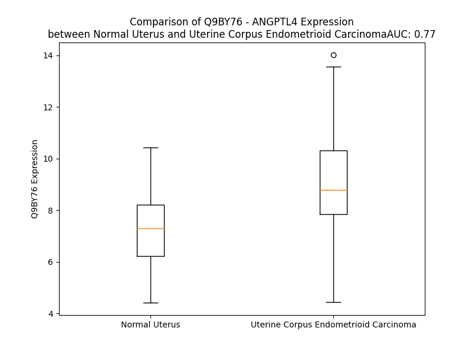

# Detailed Data for Q9BY76

## Introduction to the Detailed Summary

### How to Interpret the Results

- **Summary & Metrics**: This section provides a quick reference to essential protein attributes, including expression changes, family classification, and biomarker applications. Regulation status (upregulated/downregulated) indicates the protein's behavior in a disease context. Some information comes from the original excel file with the proteins selected from literature, while others are derived from the analyses.
- **Expression Comparison**: A visual representation comparing protein expression between normal and disease states. It highlights significant changes in expression levels that might indicate diagnostic or therapeutic relevance. This is data coming from transcriptomics experiments and could not translate similarly to protein levels.
- **Isoform Alignment**: An interactive view of isoform alignments, revealing structural and functional differences between variants of the protein.
- **Interactors & Homologs**: Tables listing known interaction partners and homologous proteins, the more interactors and homologs, the more complex the protein is to design an antibody for.
- **Biological Assemblies**: Information about the structural arrangement of the protein in different assemblies, providing insights into its functional state but also the complexity of the protein to develop antibodies.
- **Combined Per-Residue Information**: A detailed table summarizing residue-level data. This includes predictions for epitope regions, aggregation tendencies, and modifications that might impact the protein's function. Each row corresponds to a residue in the protein, providing insights into specific sites that may be important for research or drug development.
## Summary & Metrics

- **UniProt Accession**: Q9BY76
- **Gene Name**: ANGPTL4
- **Protein Name**: Angiopoietin-related protein 4
- **Swiss Prot**: ANGL4_HUMAN
- **Family**: other
- **Biomarker Application**:  
- **Number of Isoforms**: 3
- **Regulation**: 2
- **(transcriptomics) AUC**: 0.77
- **(transcriptomics) Fold Change**: 1.24
- **(transcriptomics) Regulation**: Upregulated
- **Discotope Epitope Count**: 92
- **Max n_uniprots (Homo)**: 1.0
- **Max n_uniprots (Hetero)**: N/A

## Expression Comparison

## Isoform Alignment

<pre style='font-size:14px; font-family:monospace;'>Q9BY76-1 MSGAPTAGAALMLCAATAVLLSAQGGPVQSKSPRFASWDEMNVLAHGLLQLGQGLREHAERTRSQLSALERRLSACGSACQGTEGSTDLPLAPESRVDPEVLHSLQTQLKAQNSRIQQLFHKVAQQQRHLEKQHLRIQHLQSQFGLLDHKHLDHEVAKPARRKRLPEMAQPVDPAHNVSRLHRLPRDCQELFQVGERQSGLFEIQPQGSPPFLVNCKMTSDGGWTVIQRRHDGSVDFNRPWEAYKAGFGDPHGEFWLGLEKVHSITGDRNSRLAVQLRDWDGNAELLQFSVHLGGEDTAYSLQLTAPVAGQLGATTVPPSGLSVPFSTWDQDHDLRRDKNCAKSLSGGWWFGTCSHSNLNGQYFRSIPQQRQKLKKGIFWKTWRGRYYPLQATTMLIQPMAAEAAS
Q9BY76-2 MSGAPTAGAALMLCAATAVLLSAQGGPVQSKSPRFASWDEMNVLAHGLLQLGQGLREHAERTRSQLSALERRLSACGSACQGTEGSTDLPLAPESRVDPEVLHSLQTQLKAQNSRIQQLFHKVAQQQRHLEKQHLRIQHLQSQFGLLDHKHLDHEVAKPARRKRLPEMAQPVDPAHNVSRLH--------------------------------------HGGWTVIQRRHDGSVDFNRPWEAYKAGFGDPHGEFWLGLEKVHSITGDRNSRLAVQLRDWDGNAELLQFSVHLGGEDTAYSLQLTAPVAGQLGATTVPPSGLSVPFSTWDQDHDLRRDKNCAKSLSGGWWFGTCSHSNLNGQYFRSIPQQRQKLKKGIFWKTWRGRYYPLQATTMLIQPMAAEAAS
Q9BY76-3 -----------------------------------------------------------------------------------------------------------------------------------------------------------------------MAQPVDPAHNVSRLHRLPRDCQELFQVGERQSGLFEIQPQGSPPFLVNCKMTSDGGWTVIQRRHDGSVDFNRPWEAYKAGFGDPHGEFWLGLEKVHSITGDRNSRLAVQLRDWDGNAELLQFSVHLGGEDTAYSLQLTAPVAGQLGATTVPPSGLSVPFSTWDQDHDLRRDKNCAKSLSGGWWFGTCSHSNLNGQYFRSIPQQRQKLKKGIFWKTWRGRYYPLQATTMLIQPMAAEAAS
</pre>

## Interactors

| preferredName_A   | preferredName_B   |   score |
|:------------------|:------------------|--------:|
| ANGPTL4           | LPL               |   0.994 |
| ANGPTL4           | ANGPTL8           |   0.979 |
| ANGPTL4           | GPIHBP1           |   0.926 |
| ANGPTL4           | ANGPTL3           |   0.915 |
| ANGPTL4           | CLDN5             |   0.913 |

## Homologs

| uniprot_id   | gene_id   |
|:-------------|:----------|
| Q6UXM4       | FCN3      |
| P02671       | FGA       |
| Q9UKU9       | ANGPTL2   |
| Q9Y5C1       | ANGPTL3   |
| A0A0A0MSK1   | ANGPTL1   |
| Q92752       | TNR       |
| A0A3B3ISX9   | TNXB      |
| P02751       | FN1       |
| O00602       | FCN1      |
| Q15485       | FCN2      |
| Q8NI99       | ANGPTL6   |
| D6REL8       | FGB       |
| E9PKF7       | ANGPTL5   |
| A0A994J7R0   | TNC       |
| O43827       | ANGPTL7   |
| P55083       | MFAP4     |
| Q08830       | FGL1      |
| Q9UQP3       | TNN       |
| X6RDH7       | FIBCD1    |
| C9JPQ9       | FGG       |
| Q9Y264       | ANGPT4    |
| Q5VTL7       | FNDC7     |
| A4D1B8       | FGL2      |
| B4DTQ9       | ANGPT1    |
| O15123       | ANGPT2    |

## Biological Assemblies

|   Unnamed: 0 |   assembly |   n_uniprots | composition   | crystal_id   |
|-------------:|-----------:|-------------:|:--------------|:-------------|
|            0 |          1 |            1 | Homo          | 6u1u         |
|            0 |          1 |            1 | Homo          | 6eub         |
|            0 |          1 |            1 | Homo          | 6u0a         |

## Combined Per-Residue Information

|   res | aa   |   epitope_score | epitope   |   relative_surface_accessibility |   modeling_confidence |   Aggregation | modification   | glycosylation                   |
|------:|:-----|----------------:|:----------|---------------------------------:|----------------------:|--------------:|:---------------|:--------------------------------|
|     1 | M    |         0.12167 | False     |                          1.32873 |                 42.31 |         0     | N/A            | N/A                             |
|     2 | S    |         0.09993 | False     |                          0.93597 |                 40.89 |         0     | N/A            | N/A                             |
|     3 | G    |         0.15369 | False     |                          0.91919 |                 41.4  |         0     | N/A            | N/A                             |
|     4 | A    |         0.14337 | False     |                          0.9046  |                 34.65 |         0     | N/A            | N/A                             |
|     5 | P    |         0.13042 | False     |                          0.83689 |                 45.21 |         0     | N/A            | N/A                             |
|     6 | T    |         0.07443 | False     |                          0.92699 |                 34.74 |         0.625 | N/A            | N/A                             |
|     7 | A    |         0.09062 | False     |                          1.0663  |                 40.38 |         1.677 | N/A            | N/A                             |
|     8 | G    |         0.15366 | False     |                          0.96028 |                 37.09 |         2.921 | N/A            | N/A                             |
|     9 | A    |         0.07887 | False     |                          1.05401 |                 37.6  |        17.718 | N/A            | N/A                             |
|    10 | A    |         0.06432 | False     |                          0.81573 |                 38.64 |        34.792 | N/A            | N/A                             |
|    11 | L    |         0.10189 | False     |                          0.96773 |                 36.36 |        54.91  | N/A            | N/A                             |
|    12 | M    |         0.09235 | False     |                          0.80692 |                 39.07 |        58.541 | N/A            | N/A                             |
|    13 | L    |         0.12662 | False     |                          0.88003 |                 34.02 |        61.724 | N/A            | N/A                             |
|    14 | C    |         0.0813  | False     |                          0.9936  |                 35    |        61.891 | N/A            | N/A                             |
|    15 | A    |         0.08177 | False     |                          0.82782 |                 37.63 |        64.479 | N/A            | N/A                             |
|    16 | A    |         0.07918 | False     |                          1.00592 |                 33.5  |        67.451 | N/A            | N/A                             |
|    17 | T    |         0.13001 | False     |                          0.93701 |                 43.6  |        70.819 | N/A            | N/A                             |
|    18 | A    |         0.16122 | False     |                          0.93429 |                 36.3  |        71.853 | N/A            | N/A                             |
|    19 | V    |         0.13017 | False     |                          0.94149 |                 40.49 |        72.422 | N/A            | N/A                             |
|    20 | L    |         0.14993 | False     |                          1.04601 |                 35.48 |        71.021 | N/A            | N/A                             |
|    21 | L    |         0.21691 | True      |                          0.94294 |                 41.28 |        62.512 | N/A            | N/A                             |
|    22 | S    |         0.24081 | True      |                          0.75468 |                 38    |        13.169 | N/A            | N/A                             |
|    23 | A    |         0.17477 | False     |                          0.86115 |                 34.36 |         6.441 | N/A            | N/A                             |
|    24 | Q    |         0.1375  | False     |                          0.95413 |                 38.78 |         0.144 | N/A            | N/A                             |
|    25 | G    |         0.19123 | True      |                          1.01893 |                 32.64 |         0     | N/A            | N/A                             |
|    26 | G    |         0.28043 | True      |                          0.77264 |                 39.27 |         0     | N/A            | N/A                             |
|    27 | P    |         0.202   | True      |                          0.96141 |                 37.54 |         0     | N/A            | N/A                             |
|    28 | V    |         0.17531 | False     |                          1.07528 |                 37.65 |         0     | N/A            | N/A                             |
|    29 | Q    |         0.14991 | False     |                          0.81533 |                 39.74 |         0     | N/A            | N/A                             |
|    30 | S    |         0.14968 | False     |                          0.86036 |                 38.21 |         0     | N/A            | N/A                             |
|    31 | K    |         0.18634 | True      |                          0.98256 |                 40.48 |         0     | N/A            | N/A                             |
|    32 | S    |         0.12083 | False     |                          0.73544 |                 40.76 |         0     | N/A            | N/A                             |
|    33 | P    |         0.09977 | False     |                          0.75763 |                 45.93 |         0     | N/A            | N/A                             |
|    34 | R    |         0.26822 | True      |                          0.97862 |                 53.54 |         0     | N/A            | N/A                             |
|    35 | F    |         0.14093 | False     |                          0.69149 |                 58.09 |         0     | N/A            | N/A                             |
|    36 | A    |         0.07619 | False     |                          0.45578 |                 65.05 |         0     | N/A            | N/A                             |
|    37 | S    |         0.13368 | False     |                          0.39158 |                 73.89 |         0     | N/A            | N/A                             |
|    38 | W    |         0.20764 | True      |                          0.93922 |                 65.24 |         0     | N/A            | N/A                             |
|    39 | D    |         0.14702 | False     |                          0.64424 |                 69.15 |         0     | N/A            | N/A                             |
|    40 | E    |         0.11424 | False     |                          0.49758 |                 69.14 |         0     | N/A            | N/A                             |
|    41 | M    |         0.0767  | False     |                          0.41631 |                 69.26 |         0     | N/A            | N/A                             |
|    42 | N    |         0.16796 | False     |                          0.4562  |                 68.46 |         0     | N/A            | N/A                             |
|    43 | V    |         0.08712 | False     |                          0.77867 |                 75.36 |         0     | N/A            | N/A                             |
|    44 | L    |         0.12958 | False     |                          0.65346 |                 70.05 |         0     | N/A            | N/A                             |
|    45 | A    |         0.15873 | False     |                          0.51638 |                 66.6  |         0     | N/A            | N/A                             |
|    46 | H    |         0.18022 | True      |                          0.59997 |                 71.1  |         0     | N/A            | N/A                             |
|    47 | G    |         0.05855 | False     |                          0.43554 |                 77.01 |         0     | N/A            | N/A                             |
|    48 | L    |         0.05842 | False     |                          0.40327 |                 74.07 |         0     | N/A            | N/A                             |
|    49 | L    |         0.13952 | False     |                          0.67764 |                 74.21 |         0     | N/A            | N/A                             |
|    50 | Q    |         0.16348 | False     |                          0.63528 |                 74.28 |         0     | N/A            | N/A                             |
|    51 | L    |         0.10599 | False     |                          0.53098 |                 76.17 |         0     | N/A            | N/A                             |
|    52 | G    |         0.09731 | False     |                          0.45674 |                 73.36 |         0     | N/A            | N/A                             |
|    53 | Q    |         0.14216 | False     |                          0.51737 |                 72.17 |         0     | N/A            | N/A                             |
|    54 | G    |         0.06965 | False     |                          0.4358  |                 75.04 |         0     | N/A            | N/A                             |
|    55 | L    |         0.05675 | False     |                          0.38458 |                 76.57 |         0     | N/A            | N/A                             |
|    56 | R    |         0.13131 | False     |                          0.65678 |                 77.29 |         0     | N/A            | N/A                             |
|    57 | E    |         0.07091 | False     |                          0.42598 |                 76.29 |         0     | N/A            | N/A                             |
|    58 | H    |         0.09524 | False     |                          0.51168 |                 79.57 |         0     | N/A            | N/A                             |
|    59 | A    |         0.06942 | False     |                          0.56301 |                 75.95 |         0     | N/A            | N/A                             |
|    60 | E    |         0.11094 | False     |                          0.4369  |                 78.97 |         0     | N/A            | N/A                             |
|    61 | R    |         0.13903 | False     |                          0.57164 |                 80.98 |         0     | N/A            | N/A                             |
|    62 | T    |         0.04981 | False     |                          0.3181  |                 81.13 |         0     | N/A            | N/A                             |
|    63 | R    |         0.1383  | False     |                          0.76327 |                 81.95 |         0     | N/A            | N/A                             |
|    64 | S    |         0.06319 | False     |                          0.51998 |                 78.23 |         0     | N/A            | N/A                             |
|    65 | Q    |         0.08697 | False     |                          0.63062 |                 84.12 |         0     | N/A            | N/A                             |
|    66 | L    |         0.22192 | True      |                          0.6422  |                 83.06 |         0     | N/A            | N/A                             |
|    67 | S    |         0.0358  | False     |                          0.32695 |                 80.4  |         0     | N/A            | N/A                             |
|    68 | A    |         0.07975 | False     |                          0.40011 |                 82.94 |         0     | N/A            | N/A                             |
|    69 | L    |         0.07859 | False     |                          0.64642 |                 83.39 |         0     | N/A            | N/A                             |
|    70 | E    |         0.10377 | False     |                          0.61532 |                 82.82 |         0     | N/A            | N/A                             |
|    71 | R    |         0.13142 | False     |                          0.63221 |                 81.2  |         0     | N/A            | N/A                             |
|    72 | R    |         0.11942 | False     |                          0.7713  |                 84.98 |         0     | N/A            | N/A                             |
|    73 | L    |         0.19991 | True      |                          0.72341 |                 80.19 |         0     | N/A            | N/A                             |
|    74 | S    |         0.12399 | False     |                          0.59937 |                 78.65 |         0     | N/A            | N/A                             |
|    75 | A    |         0.06739 | False     |                          0.57978 |                 79.73 |         0     | N/A            | N/A                             |
|    76 | C    |         0.15529 | False     |                          0.55758 |                 77.62 |         0     | N/A            | N/A                             |
|    77 | G    |         0.07609 | False     |                          0.43055 |                 75.36 |         0     | N/A            | N/A                             |
|    78 | S    |         0.11263 | False     |                          0.57069 |                 70.83 |         0     | N/A            | N/A                             |
|    79 | A    |         0.12082 | False     |                          0.69502 |                 67.63 |         0     | N/A            | N/A                             |
|    80 | C    |         0.14019 | False     |                          0.73714 |                 60    |         0     | N/A            | N/A                             |
|    81 | Q    |         0.1232  | False     |                          0.81786 |                 57.06 |         0     | N/A            | N/A                             |
|    82 | G    |         0.2104  | True      |                          0.75566 |                 52.95 |         0     | N/A            | N/A                             |
|    83 | T    |         0.1908  | True      |                          0.88139 |                 48.01 |         0     | N/A            | N/A                             |
|    84 | E    |         0.21235 | True      |                          0.95888 |                 41.39 |         0     | N/A            | N/A                             |
|    85 | G    |         0.24422 | True      |                          0.86137 |                 41.76 |         0     | N/A            | N/A                             |
|    86 | S    |         0.21381 | True      |                          0.81949 |                 42.52 |         0     | N/A            | N/A                             |
|    87 | T    |         0.29363 | True      |                          0.86188 |                 37.99 |         0     | N/A            | N/A                             |
|    88 | D    |         0.23006 | True      |                          0.82448 |                 36.04 |         0     | N/A            | N/A                             |
|    89 | L    |         0.18793 | True      |                          1.08482 |                 46.95 |         0     | N/A            | N/A                             |
|    90 | P    |         0.19054 | True      |                          0.83546 |                 42.98 |         0     | N/A            | N/A                             |
|    91 | L    |         0.18896 | True      |                          1.08329 |                 35.52 |         0     | N/A            | N/A                             |
|    92 | A    |         0.17424 | False     |                          0.80369 |                 47.28 |         0     | N/A            | N/A                             |
|    93 | P    |         0.16721 | False     |                          0.95369 |                 45.26 |         0     | N/A            | N/A                             |
|    94 | E    |         0.15424 | False     |                          0.64153 |                 38.22 |         0     | N/A            | N/A                             |
|    95 | S    |         0.14388 | False     |                          0.85263 |                 41.89 |         0     | N/A            | N/A                             |
|    96 | R    |         0.2671  | True      |                          0.80084 |                 48.85 |         0     | N/A            | N/A                             |
|    97 | V    |         0.1618  | False     |                          0.76798 |                 56.69 |         0     | N/A            | N/A                             |
|    98 | D    |         0.19887 | True      |                          0.43686 |                 62.05 |         0     | N/A            | N/A                             |
|    99 | P    |         0.10374 | False     |                          0.77237 |                 71.45 |         0     | N/A            | N/A                             |
|   100 | E    |         0.12104 | False     |                          0.71959 |                 74.91 |         0     | N/A            | N/A                             |
|   101 | V    |         0.11485 | False     |                          0.57505 |                 76.62 |         0     | N/A            | N/A                             |
|   102 | L    |         0.10927 | False     |                          0.68748 |                 71.76 |         0     | N/A            | N/A                             |
|   103 | H    |         0.16735 | False     |                          0.67297 |                 74.75 |         0     | N/A            | N/A                             |
|   104 | S    |         0.10392 | False     |                          0.51492 |                 78.77 |         0     | N/A            | N/A                             |
|   105 | L    |         0.07505 | False     |                          0.63065 |                 77.9  |         0     | N/A            | N/A                             |
|   106 | Q    |         0.19427 | True      |                          0.47142 |                 77.6  |         0     | N/A            | N/A                             |
|   107 | T    |         0.1104  | False     |                          0.50713 |                 83.65 |         0     | N/A            | N/A                             |
|   108 | Q    |         0.09062 | False     |                          0.54675 |                 83.69 |         0     | N/A            | N/A                             |
|   109 | L    |         0.19244 | True      |                          0.7112  |                 79.04 |         0     | N/A            | N/A                             |
|   110 | K    |         0.09698 | False     |                          0.63106 |                 79.85 |         0     | N/A            | N/A                             |
|   111 | A    |         0.14262 | False     |                          0.55414 |                 84.16 |         0     | N/A            | N/A                             |
|   112 | Q    |         0.12134 | False     |                          0.52197 |                 78.43 |         0     | N/A            | N/A                             |
|   113 | N    |         0.19434 | True      |                          0.54874 |                 77.16 |         0     | N/A            | N/A                             |
|   114 | S    |         0.08482 | False     |                          0.46467 |                 78.82 |         0     | N/A            | N/A                             |
|   115 | R    |         0.09466 | False     |                          0.69405 |                 83.7  |         0     | N/A            | N/A                             |
|   116 | I    |         0.07332 | False     |                          0.30719 |                 77.83 |         0     | N/A            | N/A                             |
|   117 | Q    |         0.06552 | False     |                          0.50486 |                 72.29 |         0     | N/A            | N/A                             |
|   118 | Q    |         0.09029 | False     |                          0.60194 |                 81.6  |         0     | N/A            | N/A                             |
|   119 | L    |         0.14504 | False     |                          0.51051 |                 79.24 |         0     | N/A            | N/A                             |
|   120 | F    |         0.09443 | False     |                          0.7003  |                 75.85 |         0     | N/A            | N/A                             |
|   121 | H    |         0.10768 | False     |                          0.66749 |                 73.28 |         0     | N/A            | N/A                             |
|   122 | K    |         0.09218 | False     |                          0.65364 |                 79.54 |         0     | N/A            | N/A                             |
|   123 | V    |         0.05181 | False     |                          0.37292 |                 78.78 |         0     | N/A            | N/A                             |
|   124 | A    |         0.05943 | False     |                          0.45939 |                 70.39 |         0     | N/A            | N/A                             |
|   125 | Q    |         0.1004  | False     |                          0.58098 |                 77.31 |         0     | N/A            | N/A                             |
|   126 | Q    |         0.10672 | False     |                          0.48503 |                 80.2  |         0     | N/A            | N/A                             |
|   127 | Q    |         0.09904 | False     |                          0.43554 |                 76.07 |         0     | N/A            | N/A                             |
|   128 | R    |         0.11019 | False     |                          0.46027 |                 76.57 |         0     | N/A            | N/A                             |
|   129 | H    |         0.10615 | False     |                          0.75193 |                 79    |         0     | N/A            | N/A                             |
|   130 | L    |         0.07693 | False     |                          0.35916 |                 79.24 |         0     | N/A            | N/A                             |
|   131 | E    |         0.07642 | False     |                          0.36657 |                 73.7  |         0     | N/A            | N/A                             |
|   132 | K    |         0.07439 | False     |                          0.50507 |                 77.36 |         0     | N/A            | N/A                             |
|   133 | Q    |         0.08723 | False     |                          0.38938 |                 80.47 |         0     | N/A            | N/A                             |
|   134 | H    |         0.14833 | False     |                          0.56552 |                 78.02 |         0     | N/A            | N/A                             |
|   135 | L    |         0.07034 | False     |                          0.26684 |                 74.29 |         0     | N/A            | N/A                             |
|   136 | R    |         0.11056 | False     |                          0.6251  |                 78.23 |         0     | N/A            | N/A                             |
|   137 | I    |         0.08185 | False     |                          0.39017 |                 80.96 |         0     | N/A            | N/A                             |
|   138 | Q    |         0.0636  | False     |                          0.38649 |                 75.46 |         0     | N/A            | N/A                             |
|   139 | H    |         0.0804  | False     |                          0.52063 |                 76.58 |         0     | N/A            | N/A                             |
|   140 | L    |         0.05996 | False     |                          0.40228 |                 75.3  |         0     | N/A            | N/A                             |
|   141 | Q    |         0.06312 | False     |                          0.57426 |                 74.88 |         0     | N/A            | N/A                             |
|   142 | S    |         0.07859 | False     |                          0.40747 |                 73.4  |         0     | N/A            | N/A                             |
|   143 | Q    |         0.06613 | False     |                          0.44559 |                 74.14 |         0     | N/A            | N/A                             |
|   144 | F    |         0.07541 | False     |                          0.6898  |                 66.8  |         0     | N/A            | N/A                             |
|   145 | G    |         0.07347 | False     |                          0.51246 |                 61.16 |         0     | N/A            | N/A                             |
|   146 | L    |         0.08217 | False     |                          0.71927 |                 55.61 |         0     | N/A            | N/A                             |
|   147 | L    |         0.11525 | False     |                          0.69423 |                 53.1  |         0     | N/A            | N/A                             |
|   148 | D    |         0.15308 | False     |                          0.7671  |                 48.21 |         0     | N/A            | N/A                             |
|   149 | H    |         0.24506 | True      |                          0.92083 |                 49.09 |         0     | N/A            | N/A                             |
|   150 | K    |         0.20328 | True      |                          0.75476 |                 48.36 |         0     | N/A            | N/A                             |
|   151 | H    |         0.24281 | True      |                          0.905   |                 37.75 |         0     | N/A            | N/A                             |
|   152 | L    |         0.22558 | True      |                          1.00783 |                 40.92 |         0     | N/A            | N/A                             |
|   153 | D    |         0.17296 | False     |                          0.90924 |                 38.13 |         0     | N/A            | N/A                             |
|   154 | H    |         0.18921 | True      |                          0.95745 |                 36.76 |         0     | N/A            | N/A                             |
|   155 | E    |         0.14432 | False     |                          0.88707 |                 36.04 |         0     | N/A            | N/A                             |
|   156 | V    |         0.20307 | True      |                          0.81294 |                 39.57 |         0     | N/A            | N/A                             |
|   157 | A    |         0.14941 | False     |                          0.99364 |                 38.01 |         0     | N/A            | N/A                             |
|   158 | K    |         0.15853 | False     |                          0.91723 |                 40.51 |         0     | N/A            | N/A                             |
|   159 | P    |         0.20427 | True      |                          0.93293 |                 34.59 |         0     | N/A            | N/A                             |
|   160 | A    |         0.11747 | False     |                          0.95436 |                 40.41 |         0     | N/A            | N/A                             |
|   161 | R    |         0.32108 | True      |                          0.78725 |                 40.91 |         0     | N/A            | N/A                             |
|   162 | R    |         0.19517 | True      |                          0.85237 |                 41.73 |         0     | N/A            | N/A                             |
|   163 | K    |         0.13775 | False     |                          0.99465 |                 40.17 |         0     | N/A            | N/A                             |
|   164 | R    |         0.2047  | True      |                          0.66534 |                 34.34 |         0     | N/A            | N/A                             |
|   165 | L    |         0.17964 | True      |                          0.89401 |                 36.79 |         0     | N/A            | N/A                             |
|   166 | P    |         0.15958 | False     |                          0.89298 |                 36.21 |         0     | N/A            | N/A                             |
|   167 | E    |         0.21167 | True      |                          0.59424 |                 30.79 |         0     | N/A            | N/A                             |
|   168 | M    |         0.16536 | False     |                          0.89765 |                 35.68 |         0     | N/A            | N/A                             |
|   169 | A    |         0.13622 | False     |                          0.98101 |                 32.05 |         0     | N/A            | N/A                             |
|   170 | Q    |         0.15742 | False     |                          0.76332 |                 39.21 |         0     | N/A            | N/A                             |
|   171 | P    |         0.17756 | True      |                          1.01943 |                 35.91 |         0     | N/A            | N/A                             |
|   172 | V    |         0.15203 | False     |                          0.91913 |                 39.37 |         0     | N/A            | N/A                             |
|   173 | D    |         0.152   | False     |                          0.64149 |                 39.12 |         0     | N/A            | N/A                             |
|   174 | P    |         0.23167 | True      |                          1.06119 |                 40.6  |         0     | N/A            | N/A                             |
|   175 | A    |         0.25139 | True      |                          0.73998 |                 36.15 |         0     | N/A            | N/A                             |
|   176 | H    |         0.20616 | True      |                          0.87968 |                 42.07 |         0     | N/A            | N/A                             |
|   177 | N    |         0.32092 | True      |                          0.81974 |                 39.53 |         0     | N/A            | N-linked (GlcNAc...) asparagine |
|   178 | V    |         0.17777 | True      |                          0.89258 |                 44.86 |         0     | N/A            | N/A                             |
|   179 | S    |         0.17059 | False     |                          0.89381 |                 47.6  |         0     | N/A            | N/A                             |
|   180 | R    |         0.18644 | True      |                          0.76446 |                 52.35 |         0     | N/A            | N/A                             |
|   181 | L    |         0.22854 | True      |                          0.86789 |                 51.56 |         0     | N/A            | N/A                             |
|   182 | H    |         0.16663 | False     |                          1.03306 |                 64.14 |         0     | N/A            | N/A                             |
|   183 | R    |         0.19943 | True      |                          0.58558 |                 88.09 |         0     | N/A            | N/A                             |
|   184 | L    |         0.20947 | True      |                          0.35616 |                 94.49 |         0     | N/A            | N/A                             |
|   185 | P    |         0.0669  | False     |                          0.167   |                 96.01 |         0     | N/A            | N/A                             |
|   186 | R    |         0.13945 | False     |                          0.38765 |                 96.73 |         0     | N/A            | N/A                             |
|   187 | D    |         0.02554 | False     |                          0.03103 |                 97.69 |         0     | N/A            | N/A                             |
|   188 | C    |         0.00355 | False     |                          0.001   |                 98.16 |         0     | N/A            | N/A                             |
|   189 | Q    |         0.04668 | False     |                          0.174   |                 97.65 |         0     | N/A            | N/A                             |
|   190 | E    |         0.05362 | False     |                          0.17084 |                 96.57 |         0     | N/A            | N/A                             |
|   191 | L    |         0.07272 | False     |                          0.10799 |                 96.89 |         0.171 | N/A            | N/A                             |
|   192 | F    |         0.08592 | False     |                          0.21235 |                 97.14 |         0.171 | N/A            | N/A                             |
|   193 | Q    |         0.12572 | False     |                          0.63915 |                 96.03 |         0.171 | N/A            | N/A                             |
|   194 | V    |         0.10724 | False     |                          0.76938 |                 95.41 |         0.171 | N/A            | N/A                             |
|   195 | G    |         0.11732 | False     |                          0.47471 |                 96.39 |         0.171 | N/A            | N/A                             |
|   196 | E    |         0.1344  | False     |                          0.26749 |                 97.21 |         0     | N/A            | N/A                             |
|   197 | R    |         0.36046 | True      |                          0.59027 |                 97.31 |         0     | N/A            | N/A                             |
|   198 | Q    |         0.17915 | True      |                          0.65928 |                 97.61 |         0     | N/A            | N/A                             |
|   199 | S    |         0.22316 | True      |                          0.46834 |                 98.01 |         0     | N/A            | N/A                             |
|   200 | G    |         0.08523 | False     |                          0.32276 |                 97.33 |         0     | N/A            | N/A                             |
|   201 | L    |         0.16709 | False     |                          0.3058  |                 97.79 |         0     | N/A            | N/A                             |
|   202 | F    |         0.12383 | False     |                          0.19884 |                 97.91 |         0     | N/A            | N/A                             |
|   203 | E    |         0.17359 | False     |                          0.43336 |                 97.74 |         0     | N/A            | N/A                             |
|   204 | I    |         0.00873 | False     |                          0       |                 97.99 |         0     | N/A            | N/A                             |
|   205 | Q    |         0.1233  | False     |                          0.31126 |                 97.86 |         0     | N/A            | N/A                             |
|   206 | P    |         0.02258 | False     |                          0.02347 |                 96.81 |         0     | N/A            | N/A                             |
|   207 | Q    |         0.24318 | True      |                          0.69447 |                 93.27 |         0     | N/A            | N/A                             |
|   208 | G    |         0.25673 | True      |                          0.97358 |                 92.1  |         0     | N/A            | N/A                             |
|   209 | S    |         0.13395 | False     |                          0.15235 |                 95.21 |         0     | N/A            | N/A                             |
|   210 | P    |         0.23639 | True      |                          0.72172 |                 96.62 |         0     | N/A            | N/A                             |
|   211 | P    |         0.4582  | True      |                          0.45188 |                 97.7  |         0     | N/A            | N/A                             |
|   212 | F    |         0.08111 | False     |                          0.10063 |                 97.79 |         0.138 | N/A            | N/A                             |
|   213 | L    |         0.19059 | True      |                          0.5463  |                 97.37 |         0.138 | N/A            | N/A                             |
|   214 | V    |         0.00637 | False     |                          0.00857 |                 98.34 |         0.138 | N/A            | N/A                             |
|   215 | N    |         0.10744 | False     |                          0.091   |                 98.26 |         0.138 | N/A            | N/A                             |
|   216 | C    |         0.01726 | False     |                          0.02517 |                 98.46 |         0.138 | N/A            | N/A                             |
|   217 | K    |         0.05478 | False     |                          0.34119 |                 98.22 |         0     | N/A            | N/A                             |
|   218 | M    |         0.04237 | False     |                          0.1049  |                 97.81 |         0     | N/A            | N/A                             |
|   219 | T    |         0.09854 | False     |                          0.29887 |                 96.72 |         0     | N/A            | N/A                             |
|   220 | S    |         0.16118 | False     |                          0.95923 |                 94.73 |         0     | N/A            | N/A                             |
|   221 | D    |         0.23448 | True      |                          0.49161 |                 93.51 |         0     | N/A            | N/A                             |
|   222 | G    |         0.02662 | False     |                          0.01127 |                 96.41 |         0.41  | N/A            | N/A                             |
|   223 | G    |         0.01077 | False     |                          0.00714 |                 97.84 |         4.963 | N/A            | N/A                             |
|   224 | W    |         0.04739 | False     |                          0.05787 |                 98.48 |         4.963 | N/A            | N/A                             |
|   225 | T    |         0.00347 | False     |                          0.00507 |                 98.62 |         4.963 | N/A            | N/A                             |
|   226 | V    |         0.03215 | False     |                          0.06284 |                 98.7  |         4.963 | N/A            | N/A                             |
|   227 | I    |         0.0185  | False     |                          0.01419 |                 98.7  |         4.963 | N/A            | N/A                             |
|   228 | Q    |         0.00195 | False     |                          0       |                 98.78 |         0     | N/A            | N/A                             |
|   229 | R    |         0.0491  | False     |                          0.19742 |                 98.76 |         0     | N/A            | N/A                             |
|   230 | R    |         0.04284 | False     |                          0.01942 |                 98.43 |         0     | N/A            | N/A                             |
|   231 | H    |         0.11669 | False     |                          0.47748 |                 97.38 |         0     | N/A            | N/A                             |
|   232 | D    |         0.09514 | False     |                          0.28378 |                 96.66 |         0     | N/A            | N/A                             |
|   233 | G    |         0.11497 | False     |                          0.30875 |                 96.9  |         0     | N/A            | N/A                             |
|   234 | S    |         0.22945 | True      |                          0.5519  |                 97.54 |         0     | N/A            | N/A                             |
|   235 | V    |         0.12226 | False     |                          0.1639  |                 98.22 |         0     | N/A            | N/A                             |
|   236 | D    |         0.20285 | True      |                          0.49754 |                 98.07 |         0     | N/A            | N/A                             |
|   237 | F    |         0.02641 | False     |                          0.01747 |                 98.48 |         0     | N/A            | N/A                             |
|   238 | N    |         0.10667 | False     |                          0.4441  |                 98.03 |         0     | N/A            | N/A                             |
|   239 | R    |         0.35924 | True      |                          0.33903 |                 98.4  |         0     | N/A            | N/A                             |
|   240 | P    |         0.1477  | False     |                          0.3857  |                 98.4  |         0     | N/A            | N/A                             |
|   241 | W    |         0.06678 | False     |                          0.06695 |                 98.43 |         0     | N/A            | N/A                             |
|   242 | E    |         0.31461 | True      |                          0.54414 |                 98.61 |         0     | N/A            | N/A                             |
|   243 | A    |         0.13493 | False     |                          0.2265  |                 98.7  |         0     | N/A            | N/A                             |
|   244 | Y    |         0.00413 | False     |                          0       |                 98.77 |         0     | N/A            | N/A                             |
|   245 | K    |         0.15234 | False     |                          0.23625 |                 98.74 |         0     | N/A            | N/A                             |
|   246 | A    |         0.25855 | True      |                          0.53629 |                 98.55 |         0     | N/A            | N/A                             |
|   247 | G    |         0.0834  | False     |                          0.28454 |                 98.67 |         0     | N/A            | N/A                             |
|   248 | F    |         0.20804 | True      |                          0.14268 |                 98.83 |         0     | N/A            | N/A                             |
|   249 | G    |         0.12887 | False     |                          0.50091 |                 97.99 |         0     | N/A            | N/A                             |
|   250 | D    |         0.20334 | True      |                          0.37272 |                 94.88 |         0     | N/A            | N/A                             |
|   251 | P    |         0.10493 | False     |                          0.35061 |                 91.3  |         0     | N/A            | N/A                             |
|   252 | H    |         0.18228 | True      |                          0.79135 |                 91.4  |         0     | N/A            | N/A                             |
|   253 | G    |         0.11706 | False     |                          0.19935 |                 96.4  |         0     | N/A            | N/A                             |
|   254 | E    |         0.00643 | False     |                          0.0012  |                 98.67 |         0     | N/A            | N/A                             |
|   255 | F    |         0.05075 | False     |                          0.03719 |                 98.82 |         7.645 | N/A            | N/A                             |
|   256 | W    |         0.05943 | False     |                          0.01328 |                 98.85 |         7.645 | N/A            | N/A                             |
|   257 | L    |         0.04248 | False     |                          0.09355 |                 98.74 |         7.645 | N/A            | N/A                             |
|   258 | G    |         0.00397 | False     |                          0       |                 98.67 |         7.645 | N/A            | N/A                             |
|   259 | L    |         0.00911 | False     |                          0.0033  |                 98.73 |         7.645 | N/A            | N/A                             |
|   260 | E    |         0.12614 | False     |                          0.39126 |                 98.53 |         0     | N/A            | N/A                             |
|   261 | K    |         0.05777 | False     |                          0.29459 |                 98.58 |         0     | N/A            | N/A                             |
|   262 | V    |         0.0133  | False     |                          0.01714 |                 98.58 |         0     | N/A            | N/A                             |
|   263 | H    |         0.04729 | False     |                          0.21177 |                 98.16 |         0     | N/A            | N/A                             |
|   264 | S    |         0.08307 | False     |                          0.20883 |                 97.89 |         0     | N/A            | N/A                             |
|   265 | I    |         0.02169 | False     |                          0.0152  |                 98.12 |         0     | N/A            | N/A                             |
|   266 | T    |         0.00915 | False     |                          0.00784 |                 97.12 |         0     | N/A            | N/A                             |
|   267 | G    |         0.05436 | False     |                          0.30926 |                 94.24 |         0     | N/A            | N/A                             |
|   268 | D    |         0.16659 | False     |                          0.83942 |                 92.78 |         0     | N/A            | N/A                             |
|   269 | R    |         0.08457 | False     |                          0.24193 |                 94.11 |         0     | N/A            | N/A                             |
|   270 | N    |         0.0949  | False     |                          0.35746 |                 95.12 |         0     | N/A            | N/A                             |
|   271 | S    |         0.00344 | False     |                          0.00104 |                 97.02 |         0     | N/A            | N/A                             |
|   272 | R    |         0.09008 | False     |                          0.31839 |                 97.1  |         0     | N/A            | N/A                             |
|   273 | L    |         0.03446 | False     |                          0.05358 |                 97.94 |         0.68  | N/A            | N/A                             |
|   274 | A    |         0.02709 | False     |                          0.04719 |                 97.94 |         0.68  | N/A            | N/A                             |
|   275 | V    |         0.01489 | False     |                          0.01809 |                 98.29 |         0.68  | N/A            | N/A                             |
|   276 | Q    |         0.06988 | False     |                          0.25269 |                 98.4  |         0.68  | N/A            | N/A                             |
|   277 | L    |         0.01794 | False     |                          0.02329 |                 98.43 |         0.68  | N/A            | N/A                             |
|   278 | R    |         0.10834 | False     |                          0.47634 |                 98.14 |         0     | N/A            | N/A                             |
|   279 | D    |         0.01042 | False     |                          0.00441 |                 95.9  |         0     | N/A            | N/A                             |
|   280 | W    |         0.19553 | True      |                          0.41683 |                 93.94 |         0     | N/A            | N/A                             |
|   281 | D    |         0.16677 | False     |                          0.72504 |                 94.36 |         0     | N/A            | N/A                             |
|   282 | G    |         0.11519 | False     |                          0.63207 |                 93.59 |         0     | N/A            | N/A                             |
|   283 | N    |         0.18235 | True      |                          0.45402 |                 97.15 |         0     | N/A            | N/A                             |
|   284 | A    |         0.23347 | True      |                          0.71653 |                 96.89 |         0     | N/A            | N/A                             |
|   285 | E    |         0.22379 | True      |                          0.31333 |                 97.29 |         0     | N/A            | N/A                             |
|   286 | L    |         0.10701 | False     |                          0.73904 |                 96.84 |         0.463 | N/A            | N/A                             |
|   287 | L    |         0.07789 | False     |                          0.25377 |                 96.32 |         0.463 | N/A            | N/A                             |
|   288 | Q    |         0.09472 | False     |                          0.52478 |                 95.88 |         0.463 | N/A            | N/A                             |
|   289 | F    |         0.03099 | False     |                          0.08543 |                 95.27 |         0.463 | N/A            | N/A                             |
|   290 | S    |         0.04931 | False     |                          0.34967 |                 95.48 |         0.463 | N/A            | N/A                             |
|   291 | V    |         0.01254 | False     |                          0.00857 |                 96.46 |         0.463 | N/A            | N/A                             |
|   292 | H    |         0.0837  | False     |                          0.31161 |                 97.14 |         0     | N/A            | N/A                             |
|   293 | L    |         0.02632 | False     |                          0.02928 |                 97.72 |         0     | N/A            | N/A                             |
|   294 | G    |         0.04172 | False     |                          0.10944 |                 97.32 |         0     | N/A            | N/A                             |
|   295 | G    |         0.05382 | False     |                          0.11068 |                 97.23 |         0     | N/A            | N/A                             |
|   296 | E    |         0.12497 | False     |                          0.38297 |                 97.02 |         0     | N/A            | N/A                             |
|   297 | D    |         0.19925 | True      |                          0.83051 |                 96.91 |         0     | N/A            | N/A                             |
|   298 | T    |         0.18071 | True      |                          0.33224 |                 96.88 |         0     | N/A            | N/A                             |
|   299 | A    |         0.08765 | False     |                          0.1272  |                 97.74 |         0     | N/A            | N/A                             |
|   300 | Y    |         0.01441 | False     |                          0       |                 98.39 |         0     | N/A            | N/A                             |
|   301 | S    |         0.05144 | False     |                          0.05526 |                 97.52 |         0     | N/A            | N/A                             |
|   302 | L    |         0.02421 | False     |                          0.11459 |                 96.54 |         0     | N/A            | N/A                             |
|   303 | Q    |         0.08727 | False     |                          0.36835 |                 96.01 |         0     | N/A            | N/A                             |
|   304 | L    |         0.04286 | False     |                          0.07699 |                 94.11 |         0     | N/A            | N/A                             |
|   305 | T    |         0.10795 | False     |                          0.50226 |                 93.3  |         0     | N/A            | N/A                             |
|   306 | A    |         0.04765 | False     |                          0.2527  |                 89.71 |         0     | N/A            | N/A                             |
|   307 | P    |         0.14631 | False     |                          0.68791 |                 90.8  |         0     | N/A            | N/A                             |
|   308 | V    |         0.02779 | False     |                          0.09426 |                 90.24 |         0     | N/A            | N/A                             |
|   309 | A    |         0.00713 | False     |                          0.00383 |                 88.24 |         0     | N/A            | N/A                             |
|   310 | G    |         0.06011 | False     |                          0.37033 |                 85.6  |         0     | N/A            | N/A                             |
|   311 | Q    |         0.10289 | False     |                          0.56298 |                 84.61 |         0     | N/A            | N/A                             |
|   312 | L    |         0.08801 | False     |                          0.19555 |                 84.08 |         0     | N/A            | N/A                             |
|   313 | G    |         0.09438 | False     |                          0.56127 |                 80.71 |         0     | N/A            | N/A                             |
|   314 | A    |         0.09541 | False     |                          0.32979 |                 83.69 |         0     | N/A            | N/A                             |
|   315 | T    |         0.20468 | True      |                          0.87335 |                 80.16 |         0     | N/A            | N/A                             |
|   316 | T    |         0.17549 | False     |                          0.90462 |                 83.12 |         0     | N/A            | N/A                             |
|   317 | V    |         0.09022 | False     |                          0.21801 |                 85.2  |         0     | N/A            | N/A                             |
|   318 | P    |         0.23567 | True      |                          0.5523  |                 87.36 |         0     | N/A            | N/A                             |
|   319 | P    |         0.24942 | True      |                          1.02494 |                 86.76 |         0     | N/A            | N/A                             |
|   320 | S    |         0.17419 | False     |                          0.83848 |                 89.2  |         0     | N/A            | N/A                             |
|   321 | G    |         0.08164 | False     |                          0.09504 |                 90.94 |         0     | N/A            | N/A                             |
|   322 | L    |         0.14454 | False     |                          0.32414 |                 93.35 |         0     | N/A            | N/A                             |
|   323 | S    |         0.14321 | False     |                          0.46112 |                 94.83 |         0     | N/A            | N/A                             |
|   324 | V    |         0.02084 | False     |                          0.05427 |                 94.77 |         0     | N/A            | N/A                             |
|   325 | P    |         0.04783 | False     |                          0.1527  |                 96.88 |         0     | N/A            | N/A                             |
|   326 | F    |         0.00486 | False     |                          0       |                 97.81 |         0     | N/A            | N/A                             |
|   327 | S    |         0.00946 | False     |                          0.00079 |                 96.87 |         0     | N/A            | N/A                             |
|   328 | T    |         0.00869 | False     |                          0       |                 97.43 |         0     | N/A            | N/A                             |
|   329 | W    |         0.13846 | False     |                          0.47206 |                 95.86 |         0     | N/A            | N/A                             |
|   330 | D    |         0.20045 | True      |                          0.38077 |                 96.58 |         0     | N/A            | N/A                             |
|   331 | Q    |         0.24777 | True      |                          0.41355 |                 94.97 |         0     | N/A            | N/A                             |
|   332 | D    |         0.11868 | False     |                          0.42346 |                 91.22 |         0     | N/A            | N/A                             |
|   333 | H    |         0.10394 | False     |                          0.33881 |                 89.72 |         0     | N/A            | N/A                             |
|   334 | D    |         0.13229 | False     |                          0.10484 |                 81.02 |         0     | N/A            | N/A                             |
|   335 | L    |         0.16513 | False     |                          0.54909 |                 75.8  |         0     | N/A            | N/A                             |
|   336 | R    |         0.28246 | True      |                          0.43248 |                 76.62 |         0     | N/A            | N/A                             |
|   337 | R    |         0.24905 | True      |                          1.02349 |                 73.98 |         0     | N/A            | N/A                             |
|   338 | D    |         0.25435 | True      |                          0.5623  |                 81.45 |         0     | N/A            | N/A                             |
|   339 | K    |         0.21188 | True      |                          0.50864 |                 83.71 |         0     | N/A            | N/A                             |
|   340 | N    |         0.05472 | False     |                          0.21265 |                 88.96 |         0     | N/A            | N/A                             |
|   341 | C    |         0.00797 | False     |                          0.00187 |                 91.77 |         0     | N/A            | N/A                             |
|   342 | A    |         0.01419 | False     |                          0.01144 |                 93.05 |         0     | N/A            | N/A                             |
|   343 | K    |         0.21163 | True      |                          0.68174 |                 93.04 |         0     | N/A            | N/A                             |
|   344 | S    |         0.20866 | True      |                          0.37688 |                 92.66 |         0     | N/A            | N/A                             |
|   345 | L    |         0.09238 | False     |                          0.04197 |                 94.11 |         0     | N/A            | N/A                             |
|   346 | S    |         0.11235 | False     |                          0.0667  |                 95.67 |         0     | N/A            | N/A                             |
|   347 | G    |         0.01223 | False     |                          0.01657 |                 97.28 |         0     | N/A            | N/A                             |
|   348 | G    |         0.00639 | False     |                          0       |                 97.67 |         0.238 | N/A            | N/A                             |
|   349 | W    |         0.06309 | False     |                          0.05758 |                 97.57 |         3.832 | N/A            | N/A                             |
|   350 | W    |         0.05889 | False     |                          0.08842 |                 96.02 |         3.976 | N/A            | N/A                             |
|   351 | F    |         0.03326 | False     |                          0.0144  |                 92.34 |         3.976 | N/A            | N/A                             |
|   352 | G    |         0.09148 | False     |                          0.25382 |                 85.71 |         3.976 | N/A            | N/A                             |
|   353 | T    |         0.16466 | False     |                          0.48325 |                 86.05 |         3.976 | N/A            | N/A                             |
|   354 | C    |         0.07771 | False     |                          0.14742 |                 89.12 |         3.36  | N/A            | N/A                             |
|   355 | S    |         0.34604 | True      |                          0.4102  |                 86.62 |         0.329 | N/A            | N/A                             |
|   356 | H    |         0.10291 | False     |                          0.14795 |                 89.11 |         0     | N/A            | N/A                             |
|   357 | S    |         0.03629 | False     |                          0.05798 |                 94.32 |         0     | N/A            | N/A                             |
|   358 | N    |         0.00865 | False     |                          0.00296 |                 96.85 |         0     | N/A            | N/A                             |
|   359 | L    |         0.00584 | False     |                          0       |                 98.42 |         0     | N/A            | N/A                             |
|   360 | N    |         0.00329 | False     |                          0       |                 98.55 |         0     | N/A            | N/A                             |
|   361 | G    |         0.00309 | False     |                          0.00373 |                 97.7  |         0     | N/A            | N/A                             |
|   362 | Q    |         0.13348 | False     |                          0.44371 |                 96.96 |         0     | N/A            | N/A                             |
|   363 | Y    |         0.03758 | False     |                          0.12349 |                 97.34 |         0     | N/A            | N/A                             |
|   364 | F    |         0.18053 | True      |                          0.11915 |                 94.74 |         0     | N/A            | N/A                             |
|   365 | R    |         0.16664 | False     |                          0.68161 |                 88.39 |         0     | N/A            | N/A                             |
|   366 | S    |         0.18814 | True      |                          0.68333 |                 84.93 |         0     | N/A            | N/A                             |
|   367 | I    |         0.08959 | False     |                          0.66914 |                 78.55 |         0     | N/A            | N/A                             |
|   368 | P    |         0.10076 | False     |                          0.18507 |                 78.67 |         0     | N/A            | N/A                             |
|   369 | Q    |         0.24304 | True      |                          0.95168 |                 74.87 |         0     | N/A            | N/A                             |
|   370 | Q    |         0.28738 | True      |                          0.54536 |                 83.15 |         0     | N/A            | N/A                             |
|   371 | R    |         0.24954 | True      |                          0.67513 |                 83.09 |         0     | N/A            | N/A                             |
|   372 | Q    |         0.19778 | True      |                          0.63144 |                 85.01 |         0     | N/A            | N/A                             |
|   373 | K    |         0.20814 | True      |                          0.55797 |                 87.83 |         0     | N/A            | N/A                             |
|   374 | L    |         0.08462 | False     |                          0.09702 |                 88.67 |         0     | N/A            | N/A                             |
|   375 | K    |         0.1693  | False     |                          0.29513 |                 91.49 |         0     | N/A            | N/A                             |
|   376 | K    |         0.14164 | False     |                          0.33293 |                 94.16 |         0     | N/A            | N/A                             |
|   377 | G    |         0.03867 | False     |                          0.00924 |                 95.84 |         0     | N/A            | N/A                             |
|   378 | I    |         0.01249 | False     |                          0.00699 |                 97.52 |         0     | N/A            | N/A                             |
|   379 | F    |         0.01809 | False     |                          0.00755 |                 95.66 |         0     | N/A            | N/A                             |
|   380 | W    |         0.02854 | False     |                          0.0557  |                 95.68 |         0     | N/A            | N/A                             |
|   381 | K    |         0.08133 | False     |                          0.32956 |                 94.03 |         0     | N/A            | N/A                             |
|   382 | T    |         0.11401 | False     |                          0.3906  |                 91.1  |         0     | N/A            | N/A                             |
|   383 | W    |         0.09549 | False     |                          0.11931 |                 94.13 |         0     | N/A            | N/A                             |
|   384 | R    |         0.17134 | False     |                          0.21415 |                 93.34 |         0     | N/A            | N/A                             |
|   385 | G    |         0.05277 | False     |                          0.15324 |                 91.99 |         0     | N/A            | N/A                             |
|   386 | R    |         0.12255 | False     |                          0.1179  |                 91.08 |         0     | N/A            | N/A                             |
|   387 | Y    |         0.17935 | True      |                          0.43861 |                 92.28 |         0     | N/A            | N/A                             |
|   388 | Y    |         0.07986 | False     |                          0.12167 |                 92.46 |         0     | N/A            | N/A                             |
|   389 | P    |         0.02675 | False     |                          0.03224 |                 94.15 |         0     | N/A            | N/A                             |
|   390 | L    |         0.00608 | False     |                          0.00326 |                 96.9  |         0.263 | N/A            | N/A                             |
|   391 | Q    |         0.05035 | False     |                          0.21407 |                 96.81 |         0.263 | N/A            | N/A                             |
|   392 | A    |         0.04289 | False     |                          0.12394 |                 98.11 |         1.505 | N/A            | N/A                             |
|   393 | T    |         0.00714 | False     |                          0.00857 |                 98.68 |         2.974 | N/A            | N/A                             |
|   394 | T    |         0.03113 | False     |                          0.19651 |                 98.65 |         2.974 | N/A            | N/A                             |
|   395 | M    |         0.01446 | False     |                          0.01582 |                 98.75 |         2.974 | N/A            | N/A                             |
|   396 | L    |         0.00838 | False     |                          0.01319 |                 98.55 |         2.974 | N/A            | N/A                             |
|   397 | I    |         0.01489 | False     |                          0.02219 |                 98.32 |         2.974 | N/A            | N/A                             |
|   398 | Q    |         0.01799 | False     |                          0.02966 |                 97.77 |         0     | N/A            | N/A                             |
|   399 | P    |         0.01475 | False     |                          0.03441 |                 94.48 |         0     | N/A            | N/A                             |
|   400 | M    |         0.08846 | False     |                          0.31045 |                 88.49 |         0     | N/A            | N/A                             |
|   401 | A    |         0.1143  | False     |                          0.85945 |                 78.61 |         0     | N/A            | N/A                             |
|   402 | A    |         0.10315 | False     |                          0.73163 |                 62.58 |         0     | N/A            | N/A                             |
|   403 | E    |         0.19406 | True      |                          0.82908 |                 48.29 |         0     | N/A            | N/A                             |
|   404 | A    |         0.10331 | False     |                          0.89539 |                 35.3  |         0     | N/A            | N/A                             |
|   405 | A    |         0.109   | False     |                          1.06578 |                 34.51 |         0     | N/A            | N/A                             |
|   406 | S    |         0.06863 | False     |                          1.31327 |                 28.78 |         0     | N/A            | N/A                             |

