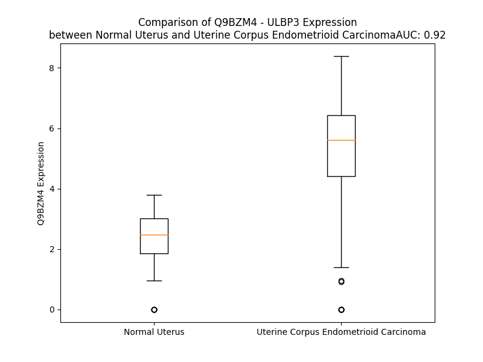

# Detailed Data for Q9BZM4

## Introduction to the Detailed Summary

### How to Interpret the Results

- **Summary & Metrics**: This section provides a quick reference to essential protein attributes, including expression changes, family classification, and biomarker applications. Regulation status (upregulated/downregulated) indicates the protein's behavior in a disease context. Some information comes from the original excel file with the proteins selected from literature, while others are derived from the analyses.
- **Expression Comparison**: A visual representation comparing protein expression between normal and disease states. It highlights significant changes in expression levels that might indicate diagnostic or therapeutic relevance. This is data coming from transcriptomics experiments and could not translate similarly to protein levels.
- **Isoform Alignment**: An interactive view of isoform alignments, revealing structural and functional differences between variants of the protein.
- **Interactors & Homologs**: Tables listing known interaction partners and homologous proteins, the more interactors and homologs, the more complex the protein is to design an antibody for.
- **Biological Assemblies**: Information about the structural arrangement of the protein in different assemblies, providing insights into its functional state but also the complexity of the protein to develop antibodies.
- **Combined Per-Residue Information**: A detailed table summarizing residue-level data. This includes predictions for epitope regions, aggregation tendencies, and modifications that might impact the protein's function. Each row corresponds to a residue in the protein, providing insights into specific sites that may be important for research or drug development.
## Summary & Metrics

- **UniProt Accession**: Q9BZM4
- **Gene Name**: ULBP3
- **Protein Name**: NKG2D ligand 3
- **Swiss Prot**: N2DL3_HUMAN
- **Family**: transmembrane receptor
- **Biomarker Application**:  
- **Number of Isoforms**: 0
- **Regulation**: -1
- **(transcriptomics) AUC**: 0.92
- **(transcriptomics) Fold Change**: 2.28
- **(transcriptomics) Regulation**: Upregulated
- **Discotope Epitope Count**: 54
- **Max n_uniprots (Homo)**: N/A
- **Max n_uniprots (Hetero)**: 3

## Expression Comparison

## Interactors

| preferredName_A   | preferredName_B   |   score |
|:------------------|:------------------|--------:|
| ULBP3             | KLRK1             |   0.999 |
| ULBP3             | ULBP1             |   0.965 |
| ULBP3             | HCST              |   0.925 |
| ULBP3             | ULBP2             |   0.917 |

## Homologs

| uniprot_id   | gene_id   |
|:-------------|:----------|
| Q9BZM5       | ULBP2     |
| Q9BZM6       | ULBP1     |
| Q6H3X3       | RAET1G    |
| Q5VY80       | RAET1L    |
| Q3T1D4       | RAET1E    |
| A0A140T9M1   | MICA      |
| Q29980       | MICB      |
| P25311       | AZGP1     |
| Q6B0J5       | HFE       |
| M0QYN1       | FCGRT     |
| P29016       | CD1B      |
| P29017       | CD1C      |
| P06126       | CD1A      |
| P15813       | CD1D      |
| P15812       | CD1E      |
| A0A140T8X0   | HLA-F     |
| A0A140T9W2   | HLA-C     |
| Q5SS57       | HLA-B     |
| Q95460       | MR1       |
| Q6DU50       | HLA-E     |
| Q6DU14       | HLA-G     |
| Q9GJ45       | HLA-A     |

## Biological Assemblies

|   Unnamed: 0 |   assembly |   n_uniprots | composition   | crystal_id   |
|-------------:|-----------:|-------------:|:--------------|:-------------|
|            0 |          1 |            3 | Hetero        | 1kcg         |

## Combined Per-Residue Information

|   res | aa   |   epitope_score | epitope   |   relative_surface_accessibility |   modeling_confidence |   Aggregation | modification   | glycosylation                   |
|------:|:-----|----------------:|:----------|---------------------------------:|----------------------:|--------------:|:---------------|:--------------------------------|
|     1 | M    |         0.21183 | False     |                          1.31984 |                 43.12 |         0     | N/A            | N/A                             |
|     2 | A    |         0.23828 | False     |                          1.01527 |                 47.38 |         0     | N/A            | N/A                             |
|     3 | A    |         0.17427 | False     |                          1.03955 |                 45.11 |         0     | N/A            | N/A                             |
|     4 | A    |         0.24076 | False     |                          0.97591 |                 53.09 |         0     | N/A            | N/A                             |
|     5 | A    |         0.1878  | False     |                          1.00054 |                 50.8  |         0     | N/A            | N/A                             |
|     6 | S    |         0.18185 | False     |                          0.82436 |                 58.28 |         0     | N/A            | N/A                             |
|     7 | P    |         0.24603 | False     |                          0.88147 |                 50.74 |         0     | N/A            | N/A                             |
|     8 | A    |         0.20791 | False     |                          0.94792 |                 52.08 |         0     | N/A            | N/A                             |
|     9 | I    |         0.24144 | False     |                          0.99972 |                 58.39 |         0     | N/A            | N/A                             |
|    10 | L    |         0.22733 | False     |                          0.94578 |                 53.41 |         0     | N/A            | N/A                             |
|    11 | P    |         0.19208 | False     |                          0.8168  |                 54.73 |         0     | N/A            | N/A                             |
|    12 | R    |         0.2296  | False     |                          0.95675 |                 52.79 |         0     | N/A            | N/A                             |
|    13 | L    |         0.17394 | False     |                          1.00237 |                 50.37 |         0     | N/A            | N/A                             |
|    14 | A    |         0.14282 | False     |                          0.80945 |                 57.13 |         0     | N/A            | N/A                             |
|    15 | I    |         0.18862 | False     |                          0.95602 |                 55.63 |         0     | N/A            | N/A                             |
|    16 | L    |         0.16836 | False     |                          0.84983 |                 50.1  |         0     | N/A            | N/A                             |
|    17 | P    |         0.15942 | False     |                          0.78904 |                 55.55 |         0.351 | N/A            | N/A                             |
|    18 | Y    |         0.20563 | False     |                          0.9241  |                 56.06 |         0.351 | N/A            | N/A                             |
|    19 | L    |         0.18591 | False     |                          0.94324 |                 51.83 |         0.351 | N/A            | N/A                             |
|    20 | L    |         0.13489 | False     |                          0.96749 |                 49.66 |         0.351 | N/A            | N/A                             |
|    21 | F    |         0.15793 | False     |                          0.92572 |                 44.66 |         0.351 | N/A            | N/A                             |
|    22 | D    |         0.17511 | False     |                          0.78873 |                 43.09 |         0     | N/A            | N/A                             |
|    23 | W    |         0.28031 | False     |                          0.95518 |                 40.1  |         0     | N/A            | N/A                             |
|    24 | S    |         0.17591 | False     |                          0.54278 |                 42.17 |         0     | N/A            | N/A                             |
|    25 | G    |         0.40002 | True      |                          0.92272 |                 41.43 |         0     | N/A            | N/A                             |
|    26 | T    |         0.20242 | False     |                          0.83446 |                 39.63 |         0     | N/A            | N/A                             |
|    27 | G    |         0.28957 | True      |                          0.73039 |                 40.34 |         0     | N/A            | N/A                             |
|    28 | R    |         0.36264 | True      |                          0.86953 |                 52.19 |         0     | N/A            | N/A                             |
|    29 | A    |         0.30202 | True      |                          0.90797 |                 59.92 |         0     | N/A            | N/A                             |
|    30 | D    |         0.24843 | False     |                          0.56608 |                 78.08 |         0     | N/A            | N/A                             |
|    31 | A    |         0.16957 | False     |                          0.38763 |                 89.66 |         0     | N/A            | N/A                             |
|    32 | H    |         0.24491 | False     |                          0.24729 |                 92.8  |         0.026 | N/A            | N/A                             |
|    33 | S    |         0.06963 | False     |                          0.13204 |                 95.03 |         7.608 | N/A            | N/A                             |
|    34 | L    |         0.0043  | False     |                          0       |                 95.33 |        68.785 | N/A            | N/A                             |
|    35 | W    |         0.08303 | False     |                          0.26238 |                 97.06 |        81.162 | N/A            | N/A                             |
|    36 | Y    |         0.00404 | False     |                          0       |                 98.09 |        82.562 | N/A            | N/A                             |
|    37 | N    |         0.06649 | False     |                          0.18741 |                 98.38 |        82.928 | N/A            | N-linked (GlcNAc...) asparagine |
|    38 | F    |         0.01268 | False     |                          0.00869 |                 98.58 |        82.997 | N/A            | N/A                             |
|    39 | T    |         0.11522 | False     |                          0.35332 |                 98.19 |        82.136 | N/A            | N/A                             |
|    40 | I    |         0.00476 | False     |                          0.0032  |                 97.79 |        81.53  | N/A            | N/A                             |
|    41 | I    |         0.09434 | False     |                          0.15742 |                 95.93 |        74.792 | N/A            | N/A                             |
|    42 | H    |         0.14585 | False     |                          0.29262 |                 94.14 |         0.77  | N/A            | N/A                             |
|    43 | L    |         0.46142 | True      |                          0.86889 |                 92.06 |         0     | N/A            | N/A                             |
|    44 | P    |         0.16735 | False     |                          0.30597 |                 93.15 |         0     | N/A            | N/A                             |
|    45 | R    |         0.36872 | True      |                          0.73249 |                 94.3  |         0     | N/A            | N/A                             |
|    46 | H    |         0.30722 | True      |                          1.07846 |                 92.16 |         0     | N/A            | N/A                             |
|    47 | G    |         0.25702 | False     |                          0.96002 |                 91.69 |         0     | N/A            | N/A                             |
|    48 | Q    |         0.34548 | True      |                          0.41461 |                 94.06 |         0     | N/A            | N/A                             |
|    49 | Q    |         0.18947 | False     |                          0.34635 |                 95.34 |         0     | N/A            | N/A                             |
|    50 | W    |         0.11738 | False     |                          0.13181 |                 96.78 |         0     | N/A            | N/A                             |
|    51 | C    |         0.01124 | False     |                          0.00386 |                 98.3  |         0     | N/A            | N/A                             |
|    52 | E    |         0.09068 | False     |                          0.24528 |                 98.19 |         0     | N/A            | N/A                             |
|    53 | V    |         0.00351 | False     |                          0       |                 98.4  |         0     | N/A            | N/A                             |
|    54 | Q    |         0.14167 | False     |                          0.29828 |                 97.81 |         0     | N/A            | N/A                             |
|    55 | S    |         0.00733 | False     |                          0       |                 96.17 |         0     | N/A            | N/A                             |
|    56 | Q    |         0.10839 | False     |                          0.21521 |                 94.6  |         0     | N/A            | N/A                             |
|    57 | V    |         0.09613 | False     |                          0.04495 |                 91.46 |         0     | N/A            | N/A                             |
|    58 | D    |         0.13779 | False     |                          0.23984 |                 91.56 |         0     | N/A            | N/A                             |
|    59 | Q    |         0.26402 | False     |                          0.78313 |                 91.08 |         0     | N/A            | N/A                             |
|    60 | K    |         0.27728 | False     |                          0.67629 |                 91.83 |         0     | N/A            | N/A                             |
|    61 | N    |         0.18219 | False     |                          0.63991 |                 92.73 |         0.175 | N/A            | N/A                             |
|    62 | F    |         0.06362 | False     |                          0.02357 |                 91.89 |         0.175 | N/A            | N/A                             |
|    63 | L    |         0.03963 | False     |                          0.02212 |                 94.64 |         0.175 | N/A            | N/A                             |
|    64 | S    |         0.12956 | False     |                          0.08169 |                 96.61 |         0.175 | N/A            | N/A                             |
|    65 | Y    |         0.01537 | False     |                          0.00226 |                 97.01 |         0.175 | N/A            | N/A                             |
|    66 | D    |         0.05626 | False     |                          0.07495 |                 97.88 |         0     | N/A            | N/A                             |
|    67 | C    |         0.01078 | False     |                          0.00888 |                 97.68 |         0     | N/A            | N/A                             |
|    68 | G    |         0.09809 | False     |                          0.31123 |                 96.67 |         0     | N/A            | N/A                             |
|    69 | S    |         0.2567  | False     |                          0.41761 |                 96.21 |         0     | N/A            | N/A                             |
|    70 | D    |         0.22598 | False     |                          0.4402  |                 95.43 |         0     | N/A            | N/A                             |
|    71 | K    |         0.35756 | True      |                          0.60636 |                 95.53 |         0     | N/A            | N/A                             |
|    72 | V    |         0.28939 | True      |                          0.38979 |                 94.59 |         0.141 | N/A            | N/A                             |
|    73 | L    |         0.23148 | False     |                          0.55088 |                 94.88 |         0.141 | N/A            | N/A                             |
|    74 | S    |         0.3634  | True      |                          0.49536 |                 93.22 |         0.141 | N/A            | N/A                             |
|    75 | M    |         0.36972 | True      |                          0.28865 |                 88.58 |         0.141 | N/A            | N/A                             |
|    76 | G    |         0.15657 | False     |                          0.24143 |                 85.21 |         0.141 | N/A            | N/A                             |
|    77 | H    |         0.36234 | True      |                          0.84655 |                 77.25 |         0     | N/A            | N/A                             |
|    78 | L    |         0.42789 | True      |                          0.66937 |                 70.41 |         0     | N/A            | N/A                             |
|    79 | E    |         0.21513 | False     |                          0.1318  |                 70.08 |         0     | N/A            | N/A                             |
|    80 | E    |         0.52444 | True      |                          0.49496 |                 66.41 |         0     | N/A            | N/A                             |
|    81 | Q    |         0.25946 | False     |                          0.60449 |                 64.99 |         0     | N/A            | N/A                             |
|    82 | L    |         0.27199 | False     |                          0.08738 |                 70.18 |         0     | N/A            | N/A                             |
|    83 | Y    |         0.46772 | True      |                          0.5551  |                 67.44 |         0     | N/A            | N/A                             |
|    84 | A    |         0.25229 | False     |                          0.94014 |                 67.69 |         0     | N/A            | N/A                             |
|    85 | T    |         0.24342 | False     |                          0.28905 |                 78.43 |         0     | N/A            | N/A                             |
|    86 | D    |         0.24934 | False     |                          0.75678 |                 81.69 |         0     | N/A            | N/A                             |
|    87 | A    |         0.17084 | False     |                          0.21848 |                 83.51 |         0     | N/A            | N/A                             |
|    88 | W    |         0.09743 | False     |                          0.06554 |                 86.49 |         0     | N/A            | N/A                             |
|    89 | G    |         0.38136 | True      |                          0.49436 |                 90.04 |         0     | N/A            | N/A                             |
|    90 | K    |         0.40612 | True      |                          0.61066 |                 92.43 |         0     | N/A            | N/A                             |
|    91 | Q    |         0.01719 | False     |                          0.017   |                 93.44 |         0     | N/A            | N/A                             |
|    92 | L    |         0.17923 | False     |                          0.122   |                 94.39 |         0     | N/A            | N/A                             |
|    93 | E    |         0.35191 | True      |                          0.40222 |                 95.45 |         0     | N/A            | N/A                             |
|    94 | M    |         0.11745 | False     |                          0.07541 |                 96.57 |         0     | N/A            | N/A                             |
|    95 | L    |         0.00274 | False     |                          0       |                 97.67 |         0     | N/A            | N/A                             |
|    96 | R    |         0.29911 | True      |                          0.3047  |                 97.67 |         0     | N/A            | N/A                             |
|    97 | E    |         0.41082 | True      |                          0.46873 |                 97.71 |         0     | N/A            | N/A                             |
|    98 | V    |         0.00423 | False     |                          0       |                 98.36 |         0     | N/A            | N/A                             |
|    99 | G    |         0.00439 | False     |                          0       |                 98.2  |         0     | N/A            | N/A                             |
|   100 | Q    |         0.29385 | True      |                          0.38272 |                 97.31 |         0     | N/A            | N/A                             |
|   101 | R    |         0.22608 | False     |                          0.26874 |                 97.23 |         0     | N/A            | N/A                             |
|   102 | L    |         0.00494 | False     |                          0       |                 97.5  |         0     | N/A            | N/A                             |
|   103 | R    |         0.16336 | False     |                          0.3806  |                 96.36 |         0     | N/A            | N/A                             |
|   104 | L    |         0.34793 | True      |                          0.68248 |                 95.5  |         0     | N/A            | N/A                             |
|   105 | E    |         0.11171 | False     |                          0.06251 |                 94.59 |         0     | N/A            | N/A                             |
|   106 | L    |         0.03173 | False     |                          0.02269 |                 94.2  |         0     | N/A            | N/A                             |
|   107 | A    |         0.18563 | False     |                          0.59092 |                 92.3  |         0     | N/A            | N/A                             |
|   108 | D    |         0.23402 | False     |                          0.59766 |                 86.54 |         0     | N/A            | N/A                             |
|   109 | T    |         0.13494 | False     |                          0.15224 |                 85.36 |         0     | N/A            | N/A                             |
|   110 | E    |         0.27681 | False     |                          0.4958  |                 88.15 |         0     | N/A            | N/A                             |
|   111 | L    |         0.1812  | False     |                          0.17914 |                 91.88 |         0     | N/A            | N/A                             |
|   112 | E    |         0.41134 | True      |                          0.19811 |                 91.59 |         0     | N/A            | N/A                             |
|   113 | D    |         0.5184  | True      |                          0.91028 |                 89.91 |         0     | N/A            | N/A                             |
|   114 | F    |         0.29639 | True      |                          0.12616 |                 91.17 |         0     | N/A            | N/A                             |
|   115 | T    |         0.36261 | True      |                          0.85831 |                 91.13 |         0     | N/A            | N/A                             |
|   116 | P    |         0.27888 | False     |                          0.32057 |                 88.85 |         0     | N/A            | N/A                             |
|   117 | S    |         0.37595 | True      |                          0.83935 |                 88.21 |         0     | N/A            | N/A                             |
|   118 | G    |         0.38775 | True      |                          0.48301 |                 88.28 |         0     | N/A            | N/A                             |
|   119 | P    |         0.28802 | True      |                          0.57535 |                 89.45 |         0     | N/A            | N/A                             |
|   120 | L    |         0.18486 | False     |                          0.20662 |                 93.77 |         0.185 | N/A            | N/A                             |
|   121 | T    |         0.06709 | False     |                          0.17311 |                 95.33 |         0.185 | N/A            | N/A                             |
|   122 | L    |         0.0138  | False     |                          0.00659 |                 97.6  |         0.185 | N/A            | N/A                             |
|   123 | Q    |         0.08184 | False     |                          0.30838 |                 98.24 |         0.185 | N/A            | N/A                             |
|   124 | V    |         0.01752 | False     |                          0.01841 |                 98.65 |         0.185 | N/A            | N/A                             |
|   125 | R    |         0.10199 | False     |                          0.45899 |                 98.48 |         0     | N/A            | N/A                             |
|   126 | M    |         0.00379 | False     |                          0.00072 |                 98.06 |         0     | N/A            | N/A                             |
|   127 | S    |         0.01107 | False     |                          0.01527 |                 97.14 |         0     | N/A            | N/A                             |
|   128 | C    |         0.00314 | False     |                          0       |                 96.3  |         0     | N/A            | N/A                             |
|   129 | E    |         0.11857 | False     |                          0.31848 |                 95.28 |         0     | N/A            | N/A                             |
|   130 | C    |         0.11839 | False     |                          0.12315 |                 92.52 |         0     | N/A            | N/A                             |
|   131 | E    |         0.14421 | False     |                          0.29267 |                 89.55 |         0     | N/A            | N/A                             |
|   132 | A    |         0.16778 | False     |                          0.64136 |                 85.95 |         0     | N/A            | N/A                             |
|   133 | D    |         0.34887 | True      |                          0.75205 |                 86.28 |         0     | N/A            | N/A                             |
|   134 | G    |         0.14086 | False     |                          0.34001 |                 84.84 |         0     | N/A            | N/A                             |
|   135 | Y    |         0.24187 | False     |                          0.48133 |                 90.65 |         0     | N/A            | N/A                             |
|   136 | I    |         0.1095  | False     |                          0.08967 |                 92.43 |         0     | N/A            | N/A                             |
|   137 | R    |         0.22868 | False     |                          0.45301 |                 96.04 |         0     | N/A            | N/A                             |
|   138 | G    |         0.03535 | False     |                          0.03747 |                 97.3  |         0     | N/A            | N/A                             |
|   139 | S    |         0.06955 | False     |                          0.3709  |                 98.08 |         0     | N/A            | N/A                             |
|   140 | W    |         0.01785 | False     |                          0.00585 |                 98.64 |         0     | N/A            | N/A                             |
|   141 | Q    |         0.11509 | False     |                          0.16845 |                 98.63 |         0     | N/A            | N/A                             |
|   142 | F    |         0.00277 | False     |                          0       |                 98.26 |         0     | N/A            | N/A                             |
|   143 | S    |         0.09625 | False     |                          0.04809 |                 97.96 |         0     | N/A            | N/A                             |
|   144 | F    |         0.01894 | False     |                          0.00784 |                 96.79 |         0     | N/A            | N/A                             |
|   145 | D    |         0.22719 | False     |                          0.27619 |                 92.28 |         0     | N/A            | N/A                             |
|   146 | G    |         0.2767  | False     |                          0.7474  |                 92.62 |         0     | N/A            | N/A                             |
|   147 | R    |         0.34367 | True      |                          0.52785 |                 96.08 |         0     | N/A            | N/A                             |
|   148 | K    |         0.1068  | False     |                          0.5083  |                 97.68 |         0.159 | N/A            | N/A                             |
|   149 | F    |         0.01181 | False     |                          0       |                 97.87 |         0.159 | N/A            | N/A                             |
|   150 | L    |         0.00712 | False     |                          0       |                 98.15 |         0.159 | N/A            | N/A                             |
|   151 | L    |         0.16485 | False     |                          0.37981 |                 98.57 |         0.159 | N/A            | N/A                             |
|   152 | F    |         0.02423 | False     |                          0.00753 |                 98.63 |         0.159 | N/A            | N/A                             |
|   153 | D    |         0.12583 | False     |                          0.31073 |                 98.19 |         0.159 | N/A            | N/A                             |
|   154 | S    |         0.00362 | False     |                          0       |                 98.09 |         0     | N/A            | N/A                             |
|   155 | N    |         0.14524 | False     |                          0.23808 |                 96.51 |         0     | N/A            | N/A                             |
|   156 | N    |         0.26197 | False     |                          0.69662 |                 96.71 |         0     | N/A            | N/A                             |
|   157 | R    |         0.13767 | False     |                          0.46654 |                 96.76 |         0     | N/A            | N/A                             |
|   158 | K    |         0.31468 | True      |                          0.61756 |                 97.97 |         0     | N/A            | N/A                             |
|   159 | W    |         0.08771 | False     |                          0.02566 |                 98.23 |         0     | N/A            | N/A                             |
|   160 | T    |         0.21755 | False     |                          0.41811 |                 98.39 |         0     | N/A            | N/A                             |
|   161 | V    |         0.3871  | True      |                          0.36005 |                 98.2  |         0     | N/A            | N/A                             |
|   162 | V    |         0.23378 | False     |                          0.55938 |                 98.08 |         0     | N/A            | N/A                             |
|   163 | H    |         0.23022 | False     |                          0.27946 |                 97.4  |         0     | N/A            | N/A                             |
|   164 | A    |         0.39179 | True      |                          0.50063 |                 95.9  |         0     | N/A            | N/A                             |
|   165 | G    |         0.01384 | False     |                          0.00138 |                 95.73 |         0     | N/A            | N/A                             |
|   166 | A    |         0.00785 | False     |                          0       |                 96.92 |         0     | N/A            | N/A                             |
|   167 | R    |         0.58021 | True      |                          0.56195 |                 96.97 |         0     | N/A            | N/A                             |
|   168 | R    |         0.46474 | True      |                          0.45556 |                 96.23 |         0     | N/A            | N/A                             |
|   169 | M    |         0.04291 | False     |                          0.01418 |                 95.87 |         0     | N/A            | N/A                             |
|   170 | K    |         0.27425 | False     |                          0.21544 |                 96.96 |         0     | N/A            | N/A                             |
|   171 | E    |         0.47506 | True      |                          0.57912 |                 96.03 |         0     | N/A            | N/A                             |
|   172 | K    |         0.2257  | False     |                          0.40605 |                 95.62 |         0     | N/A            | N/A                             |
|   173 | W    |         0.02612 | False     |                          0.00927 |                 96.27 |         0     | N/A            | N/A                             |
|   174 | E    |         0.34294 | True      |                          0.41041 |                 96.05 |         0     | N/A            | N/A                             |
|   175 | K    |         0.37238 | True      |                          0.90331 |                 96.7  |         0     | N/A            | N/A                             |
|   176 | D    |         0.27312 | False     |                          0.32205 |                 96.23 |         0     | N/A            | N/A                             |
|   177 | S    |         0.29936 | True      |                          0.65432 |                 96.22 |         0.184 | N/A            | N/A                             |
|   178 | G    |         0.25309 | False     |                          0.54415 |                 97.33 |         4.556 | N/A            | N/A                             |
|   179 | L    |         0.02558 | False     |                          0.00979 |                 96.78 |        10.597 | N/A            | N/A                             |
|   180 | T    |         0.09627 | False     |                          0.09715 |                 97.37 |        10.597 | N/A            | N/A                             |
|   181 | T    |         0.26559 | False     |                          0.39891 |                 98.02 |        10.597 | N/A            | N/A                             |
|   182 | F    |         0.32345 | True      |                          0.26928 |                 98.02 |        10.597 | N/A            | N/A                             |
|   183 | F    |         0.003   | False     |                          0       |                 98.08 |        10.267 | N/A            | N/A                             |
|   184 | K    |         0.12249 | False     |                          0.19753 |                 98.02 |         0     | N/A            | N/A                             |
|   185 | M    |         0.40884 | True      |                          0.40311 |                 97.37 |         0     | N/A            | N/A                             |
|   186 | V    |         0.03532 | False     |                          0.03427 |                 97.59 |         0     | N/A            | N/A                             |
|   187 | S    |         0.00307 | False     |                          0       |                 97.56 |         0     | N/A            | N/A                             |
|   188 | M    |         0.18052 | False     |                          0.1988  |                 96.45 |         0     | N/A            | N/A                             |
|   189 | R    |         0.47941 | True      |                          0.61938 |                 94.58 |         0     | N/A            | N/A                             |
|   190 | D    |         0.23261 | False     |                          0.25419 |                 94.61 |         0     | N/A            | N/A                             |
|   191 | C    |         0.00296 | False     |                          0       |                 92.96 |         0     | N/A            | N/A                             |
|   192 | K    |         0.12601 | False     |                          0.20699 |                 92.06 |         0     | N/A            | N/A                             |
|   193 | S    |         0.26445 | False     |                          0.40697 |                 90.79 |         0     | N/A            | N/A                             |
|   194 | W    |         0.12111 | False     |                          0.10226 |                 91.29 |         0     | N/A            | N/A                             |
|   195 | L    |         0.00919 | False     |                          0.00495 |                 90.07 |         0     | N/A            | N/A                             |
|   196 | R    |         0.35697 | True      |                          0.51727 |                 87.38 |         0     | N/A            | N/A                             |
|   197 | D    |         0.2369  | False     |                          0.26436 |                 85.87 |         0     | N/A            | N/A                             |
|   198 | F    |         0.17555 | False     |                          0.09433 |                 84.96 |         0     | N/A            | N/A                             |
|   199 | L    |         0.18536 | False     |                          0.25514 |                 84.84 |         0     | N/A            | N/A                             |
|   200 | M    |         0.25056 | False     |                          0.56065 |                 83.76 |         0     | N/A            | N/A                             |
|   201 | H    |         0.17275 | False     |                          0.31209 |                 81.37 |         0     | N/A            | N/A                             |
|   202 | R    |         0.26608 | False     |                          0.30254 |                 80.57 |         0     | N/A            | N/A                             |
|   203 | K    |         0.18722 | False     |                          0.59245 |                 83.2  |         0     | N/A            | N/A                             |
|   204 | K    |         0.18814 | False     |                          0.67601 |                 81.75 |         0     | N/A            | N/A                             |
|   205 | R    |         0.23857 | False     |                          0.4139  |                 76.68 |         0     | N/A            | N/A                             |
|   206 | L    |         0.23581 | False     |                          0.8252  |                 79.6  |         0     | N/A            | N/A                             |
|   207 | E    |         0.23406 | False     |                          0.49759 |                 75.74 |         0     | N/A            | N/A                             |
|   208 | P    |         0.27288 | False     |                          0.90392 |                 68.72 |         0     | N/A            | N/A                             |
|   209 | T    |         0.26852 | False     |                          0.94657 |                 63.76 |         0     | N/A            | N/A                             |
|   210 | A    |         0.16752 | False     |                          0.74923 |                 58.24 |         0     | N/A            | N/A                             |
|   211 | P    |         0.28289 | True      |                          0.83533 |                 61.66 |         0     | N/A            | N/A                             |
|   212 | P    |         0.21548 | False     |                          0.92838 |                 58.34 |         0     | N/A            | N/A                             |
|   213 | T    |         0.21907 | False     |                          0.92671 |                 57.7  |         0     | N/A            | N/A                             |
|   214 | M    |         0.23519 | False     |                          0.96671 |                 56.16 |         0     | N/A            | N/A                             |
|   215 | A    |         0.14014 | False     |                          0.80411 |                 58.59 |         0     | N/A            | N/A                             |
|   216 | P    |         0.30132 | True      |                          1.01653 |                 51.61 |         0     | N/A            | N/A                             |
|   217 | G    |         0.24083 | False     |                          0.85758 |                 56.46 |         0     | N/A            | N/A                             |
|   218 | L    |         0.3211  | True      |                          1.0773  |                 51.57 |         0     | N/A            | N/A                             |
|   219 | A    |         0.19175 | False     |                          0.83706 |                 46.48 |         0     | N/A            | N/A                             |
|   220 | Q    |         0.224   | False     |                          0.75457 |                 55.42 |         0     | N/A            | N/A                             |
|   221 | P    |         0.23517 | False     |                          0.8949  |                 44.63 |         0     | N/A            | N/A                             |
|   222 | K    |         0.24737 | False     |                          0.90416 |                 52.16 |         0     | N/A            | N/A                             |
|   223 | A    |         0.16631 | False     |                          0.92794 |                 53.94 |         0.014 | N/A            | N/A                             |
|   224 | I    |         0.15086 | False     |                          1.01206 |                 52.77 |         0.031 | N/A            | N/A                             |
|   225 | A    |         0.1635  | False     |                          0.8353  |                 55.91 |         0.031 | N/A            | N/A                             |
|   226 | T    |         0.20614 | False     |                          0.76837 |                 54.96 |         0.031 | N/A            | N/A                             |
|   227 | T    |         0.28109 | True      |                          0.9161  |                 57.25 |         0.031 | N/A            | N/A                             |
|   228 | L    |         0.29161 | True      |                          0.73324 |                 59.26 |         0.031 | N/A            | N/A                             |
|   229 | S    |         0.24558 | False     |                          0.47133 |                 55.29 |         0     | N/A            | N/A                             |
|   230 | P    |         0.31597 | True      |                          0.81065 |                 57.5  |         0.792 | N/A            | N/A                             |
|   231 | W    |         0.33664 | True      |                          0.92046 |                 55.96 |        65.333 | N/A            | N/A                             |
|   232 | S    |         0.17379 | False     |                          0.46223 |                 55.6  |        68.876 | N/A            | N/A                             |
|   233 | F    |         0.2614  | False     |                          0.66483 |                 53.3  |        97.277 | N/A            | N/A                             |
|   234 | L    |         0.31383 | True      |                          0.80289 |                 54.81 |        99.524 | N/A            | N/A                             |
|   235 | I    |         0.30169 | True      |                          0.75889 |                 58.09 |        99.932 | N/A            | N/A                             |
|   236 | I    |         0.24243 | False     |                          0.736   |                 57.36 |        99.959 | N/A            | N/A                             |
|   237 | L    |         0.232   | False     |                          0.95162 |                 53.81 |        99.859 | N/A            | N/A                             |
|   238 | C    |         0.21471 | False     |                          0.77382 |                 59.85 |        98.467 | N/A            | N/A                             |
|   239 | F    |         0.27749 | False     |                          0.8792  |                 60.12 |        97.831 | N/A            | N/A                             |
|   240 | I    |         0.27328 | False     |                          0.84274 |                 56.17 |        90.006 | N/A            | N/A                             |
|   241 | L    |         0.22768 | False     |                          1.03205 |                 52.67 |         4.434 | N/A            | N/A                             |
|   242 | P    |         0.26771 | False     |                          0.85498 |                 55.47 |         1.22  | N/A            | N/A                             |
|   243 | G    |         0.22537 | False     |                          0.89913 |                 56.51 |         0     | N/A            | N/A                             |
|   244 | I    |         0.18088 | False     |                          1.41971 |                 43.73 |         0     | N/A            | N/A                             |

