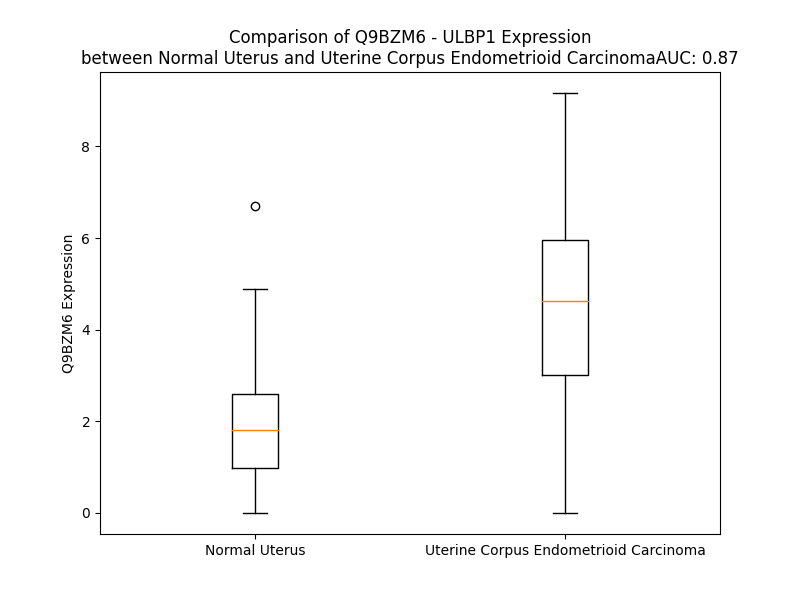

# Detailed Data for Q9BZM6

## Introduction to the Detailed Summary

### How to Interpret the Results

- **Summary & Metrics**: This section provides a quick reference to essential protein attributes, including expression changes, family classification, and biomarker applications. Regulation status (upregulated/downregulated) indicates the protein's behavior in a disease context. Some information comes from the original excel file with the proteins selected from literature, while others are derived from the analyses.
- **Expression Comparison**: A visual representation comparing protein expression between normal and disease states. It highlights significant changes in expression levels that might indicate diagnostic or therapeutic relevance. This is data coming from transcriptomics experiments and could not translate similarly to protein levels.
- **Isoform Alignment**: An interactive view of isoform alignments, revealing structural and functional differences between variants of the protein.
- **Interactors & Homologs**: Tables listing known interaction partners and homologous proteins, the more interactors and homologs, the more complex the protein is to design an antibody for.
- **Biological Assemblies**: Information about the structural arrangement of the protein in different assemblies, providing insights into its functional state but also the complexity of the protein to develop antibodies.
- **Combined Per-Residue Information**: A detailed table summarizing residue-level data. This includes predictions for epitope regions, aggregation tendencies, and modifications that might impact the protein's function. Each row corresponds to a residue in the protein, providing insights into specific sites that may be important for research or drug development.
## Summary & Metrics

- **UniProt Accession**: Q9BZM6
- **Gene Name**: ULBP1
- **Protein Name**: NKG2D ligand 1
- **Swiss Prot**: N2DL1_HUMAN
- **Family**: transmembrane receptor
- **Biomarker Application**:  
- **Number of Isoforms**: 0
- **Regulation**: -1
- **(transcriptomics) AUC**: 0.98
- **(transcriptomics) Fold Change**: 3.32
- **(transcriptomics) Regulation**: Upregulated
- **Discotope Epitope Count**: 64
- **Max n_uniprots (Homo)**: N/A
- **Max n_uniprots (Hetero)**: N/A

## Expression Comparison

## Interactors

| preferredName_A   | preferredName_B   |   score |
|:------------------|:------------------|--------:|
| ULBP1             | KLRK1             |   0.999 |
| ULBP1             | MICB              |   0.973 |
| ULBP1             | ULBP3             |   0.965 |
| ULBP1             | HCST              |   0.928 |
| ULBP1             | ULBP2             |   0.911 |
| ULBP1             | CD226             |   0.91  |
| ULBP1             | NCR1              |   0.903 |

## Homologs

| uniprot_id   | gene_id   |
|:-------------|:----------|
| Q9BZM5       | ULBP2     |
| Q6H3X3       | RAET1G    |
| Q5VY80       | RAET1L    |
| Q9BZM4       | ULBP3     |
| Q3T1D4       | RAET1E    |
| A0A140T9M1   | MICA      |
| Q29980       | MICB      |
| P25311       | AZGP1     |
| Q6B0J5       | HFE       |
| M0QYN1       | FCGRT     |
| P29016       | CD1B      |
| P29017       | CD1C      |
| P06126       | CD1A      |
| P15813       | CD1D      |
| P15812       | CD1E      |
| A0A140T8X0   | HLA-F     |
| A0A140T9W2   | HLA-C     |
| Q5SS57       | HLA-B     |
| Q95460       | MR1       |
| Q6DU50       | HLA-E     |
| Q6DU14       | HLA-G     |
| Q9GJ45       | HLA-A     |

## Combined Per-Residue Information

|   res | aa   |   epitope_score | epitope   |   relative_surface_accessibility |   modeling_confidence |   Aggregation | modification   | glycosylation                   |
|------:|:-----|----------------:|:----------|---------------------------------:|----------------------:|--------------:|:---------------|:--------------------------------|
|     1 | M    |         0.21223 | False     |                          1.32498 |                 42.07 |         0     | N/A            | N/A                             |
|     2 | A    |         0.2378  | False     |                          1.03148 |                 46.68 |         0     | N/A            | N/A                             |
|     3 | A    |         0.21262 | False     |                          0.98335 |                 54.59 |         0     | N/A            | N/A                             |
|     4 | A    |         0.18883 | False     |                          0.96456 |                 58.34 |         0     | N/A            | N/A                             |
|     5 | A    |         0.19664 | False     |                          0.67023 |                 55.88 |         0     | N/A            | N/A                             |
|     6 | S    |         0.14006 | False     |                          0.34445 |                 63.43 |         0     | N/A            | N/A                             |
|     7 | P    |         0.23026 | False     |                          0.73453 |                 61.92 |         0.215 | N/A            | N/A                             |
|     8 | A    |         0.12032 | False     |                          0.34139 |                 60.63 |         4.151 | N/A            | N/A                             |
|     9 | F    |         0.23649 | False     |                          0.32152 |                 60.4  |         4.481 | N/A            | N/A                             |
|    10 | L    |         0.19785 | False     |                          0.67132 |                 62.57 |         4.481 | N/A            | N/A                             |
|    11 | L    |         0.252   | False     |                          0.84499 |                 65.77 |         4.481 | N/A            | N/A                             |
|    12 | C    |         0.1029  | False     |                          0.14757 |                 64.85 |         4.266 | N/A            | N/A                             |
|    13 | L    |         0.18115 | False     |                          0.54984 |                 67.13 |         0.61  | N/A            | N/A                             |
|    14 | P    |         0.15949 | False     |                          0.54662 |                 67.75 |         0.311 | N/A            | N/A                             |
|    15 | L    |         0.12423 | False     |                          0.58082 |                 64.72 |         0.41  | N/A            | N/A                             |
|    16 | L    |         0.13624 | False     |                          0.21856 |                 63.73 |         0.41  | N/A            | N/A                             |
|    17 | H    |         0.22271 | False     |                          0.71741 |                 63.87 |         0.41  | N/A            | N/A                             |
|    18 | L    |         0.14207 | False     |                          0.67948 |                 62.49 |         0.41  | N/A            | N/A                             |
|    19 | L    |         0.11849 | False     |                          0.43181 |                 58.99 |         0.41  | N/A            | N/A                             |
|    20 | S    |         0.12623 | False     |                          0.38645 |                 58.85 |         0     | N/A            | N/A                             |
|    21 | G    |         0.12609 | False     |                          0.45235 |                 53.28 |         0     | N/A            | N/A                             |
|    22 | W    |         0.18155 | False     |                          0.80789 |                 48.07 |         0     | N/A            | N/A                             |
|    23 | S    |         0.17236 | False     |                          0.64484 |                 45.02 |         0     | N/A            | N/A                             |
|    24 | R    |         0.22634 | False     |                          0.73834 |                 44.78 |         0     | N/A            | N/A                             |
|    25 | A    |         0.17828 | False     |                          0.73584 |                 43.04 |         0     | N/A            | N/A                             |
|    26 | G    |         0.21936 | False     |                          0.65526 |                 39.55 |         0     | N/A            | N/A                             |
|    27 | W    |         0.2422  | False     |                          1.05287 |                 43.37 |         0     | N/A            | N/A                             |
|    28 | V    |         0.14771 | False     |                          0.46583 |                 55.24 |         0     | N/A            | N/A                             |
|    29 | D    |         0.15696 | False     |                          0.69712 |                 73.03 |         0     | N/A            | N/A                             |
|    30 | T    |         0.12633 | False     |                          0.41045 |                 86.6  |         0     | N/A            | N/A                             |
|    31 | H    |         0.1659  | False     |                          0.30866 |                 91.35 |         0     | N/A            | N/A                             |
|    32 | C    |         0.07797 | False     |                          0.19443 |                 94.73 |         0     | N/A            | N/A                             |
|    33 | L    |         0.00593 | False     |                          0       |                 96.64 |         0     | N/A            | N/A                             |
|    34 | C    |         0.02612 | False     |                          0.03788 |                 97.89 |         0     | N/A            | N/A                             |
|    35 | Y    |         0.00309 | False     |                          0       |                 98.45 |         0     | N/A            | N/A                             |
|    36 | D    |         0.07112 | False     |                          0.23102 |                 97.85 |         0     | N/A            | N/A                             |
|    37 | F    |         0.0101  | False     |                          0.00862 |                 96.88 |         0.798 | N/A            | N/A                             |
|    38 | I    |         0.12915 | False     |                          0.36496 |                 93.46 |         0.798 | N/A            | N/A                             |
|    39 | I    |         0.00724 | False     |                          0.0024  |                 91.19 |         0.798 | N/A            | N/A                             |
|    40 | T    |         0.26581 | False     |                          0.18774 |                 85.09 |         0.798 | N/A            | N/A                             |
|    41 | P    |         0.17494 | False     |                          0.44523 |                 70.57 |         0.798 | N/A            | N/A                             |
|    42 | K    |         0.27827 | True      |                          0.61316 |                 65.67 |         0     | N/A            | N/A                             |
|    43 | S    |         0.21505 | False     |                          0.30307 |                 58.39 |         0     | N/A            | N/A                             |
|    44 | R    |         0.30949 | True      |                          0.86408 |                 55.8  |         0     | N/A            | N/A                             |
|    45 | P    |         0.30406 | True      |                          1.06997 |                 57.32 |         0     | N/A            | N/A                             |
|    46 | E    |         0.31321 | True      |                          0.63144 |                 58.33 |         0     | N/A            | N/A                             |
|    47 | P    |         0.24175 | False     |                          0.68284 |                 62.88 |         0     | N/A            | N/A                             |
|    48 | Q    |         0.24262 | False     |                          0.4981  |                 71.93 |         0     | N/A            | N/A                             |
|    49 | W    |         0.17841 | False     |                          0.22057 |                 84.26 |         0     | N/A            | N/A                             |
|    50 | C    |         0.03786 | False     |                          0.0411  |                 90.7  |         0     | N/A            | N/A                             |
|    51 | E    |         0.12295 | False     |                          0.32373 |                 90.69 |         0     | N/A            | N/A                             |
|    52 | V    |         0.00734 | False     |                          0       |                 96.88 |         0     | N/A            | N/A                             |
|    53 | Q    |         0.12835 | False     |                          0.29711 |                 97.42 |         0     | N/A            | N/A                             |
|    54 | G    |         0.00802 | False     |                          0       |                 97.72 |         0     | N/A            | N/A                             |
|    55 | L    |         0.09309 | False     |                          0.07623 |                 96.78 |         0     | N/A            | N/A                             |
|    56 | V    |         0.01603 | False     |                          0.00381 |                 93.99 |         0     | N/A            | N/A                             |
|    57 | D    |         0.15169 | False     |                          0.2978  |                 92.07 |         0     | N/A            | N/A                             |
|    58 | E    |         0.22785 | False     |                          0.5671  |                 93.08 |         0     | N/A            | N/A                             |
|    59 | R    |         0.26181 | False     |                          0.64356 |                 93.36 |         0     | N/A            | N/A                             |
|    60 | P    |         0.1984  | False     |                          0.36785 |                 95.6  |         0     | N/A            | N/A                             |
|    61 | F    |         0.02367 | False     |                          0.00961 |                 95.46 |         0     | N/A            | N/A                             |
|    62 | L    |         0.00548 | False     |                          0.00082 |                 96.53 |         0     | N/A            | N/A                             |
|    63 | H    |         0.15913 | False     |                          0.25814 |                 96.63 |         0     | N/A            | N/A                             |
|    64 | Y    |         0.01509 | False     |                          0.00225 |                 96.01 |         0     | N/A            | N/A                             |
|    65 | D    |         0.09004 | False     |                          0.09353 |                 90.9  |         0     | N/A            | N/A                             |
|    66 | C    |         0.03382 | False     |                          0.04484 |                 90.33 |         0     | N/A            | N/A                             |
|    67 | V    |         0.158   | False     |                          0.58905 |                 87.66 |         0     | N/A            | N/A                             |
|    68 | N    |         0.31387 | True      |                          0.59007 |                 90.07 |         0     | N/A            | N/A                             |
|    69 | H    |         0.21418 | False     |                          0.4196  |                 91.95 |         0     | N/A            | N/A                             |
|    70 | K    |         0.32546 | True      |                          0.63539 |                 94.49 |         0     | N/A            | N/A                             |
|    71 | A    |         0.17952 | False     |                          0.12992 |                 96.36 |         0     | N/A            | N/A                             |
|    72 | K    |         0.25794 | False     |                          0.52201 |                 96.64 |         0     | N/A            | N/A                             |
|    73 | A    |         0.20979 | False     |                          0.28023 |                 96.3  |         0     | N/A            | N/A                             |
|    74 | F    |         0.27088 | False     |                          0.37025 |                 94.17 |         0     | N/A            | N/A                             |
|    75 | A    |         0.20377 | False     |                          0.48576 |                 91.26 |         0     | N/A            | N/A                             |
|    76 | S    |         0.25769 | False     |                          0.50845 |                 91.81 |         0     | N/A            | N/A                             |
|    77 | L    |         0.09611 | False     |                          0.05182 |                 92.89 |         0     | N/A            | N/A                             |
|    78 | G    |         0.00234 | False     |                          0       |                 94.94 |         0     | N/A            | N/A                             |
|    79 | K    |         0.33645 | True      |                          0.70761 |                 94.19 |         0     | N/A            | N/A                             |
|    80 | K    |         0.30489 | True      |                          0.34818 |                 92.76 |         0     | N/A            | N/A                             |
|    81 | V    |         0.01239 | False     |                          0       |                 94.48 |         0     | N/A            | N/A                             |
|    82 | N    |         0.35462 | True      |                          0.37798 |                 94.47 |         0     | N/A            | N-linked (GlcNAc...) asparagine |
|    83 | V    |         0.31291 | True      |                          0.90978 |                 93.84 |         0     | N/A            | N/A                             |
|    84 | T    |         0.27877 | True      |                          0.12988 |                 94.3  |         0     | N/A            | N/A                             |
|    85 | K    |         0.26677 | False     |                          0.74535 |                 94.43 |         0     | N/A            | N/A                             |
|    86 | T    |         0.10123 | False     |                          0.07941 |                 93.94 |         0     | N/A            | N/A                             |
|    87 | W    |         0.06916 | False     |                          0.094   |                 95.26 |         0     | N/A            | N/A                             |
|    88 | E    |         0.34811 | True      |                          0.59134 |                 95.58 |         0     | N/A            | N/A                             |
|    89 | E    |         0.29802 | True      |                          0.31979 |                 96.59 |         0     | N/A            | N/A                             |
|    90 | Q    |         0.00345 | False     |                          0       |                 97.12 |         0     | N/A            | N/A                             |
|    91 | T    |         0.10287 | False     |                          0.09885 |                 97.35 |         0     | N/A            | N/A                             |
|    92 | E    |         0.4787  | True      |                          0.48977 |                 97.44 |         0     | N/A            | N/A                             |
|    93 | T    |         0.16845 | False     |                          0.14536 |                 97.9  |         0     | N/A            | N/A                             |
|    94 | L    |         0.02244 | False     |                          0.01319 |                 97.83 |         0     | N/A            | N/A                             |
|    95 | R    |         0.34634 | True      |                          0.37363 |                 96.72 |         0     | N/A            | N/A                             |
|    96 | D    |         0.42443 | True      |                          0.41016 |                 97.22 |         0     | N/A            | N/A                             |
|    97 | V    |         0.01621 | False     |                          0.00571 |                 97.35 |         2.691 | N/A            | N/A                             |
|    98 | V    |         0.00644 | False     |                          0.00476 |                 95.26 |         2.691 | N/A            | N/A                             |
|    99 | D    |         0.4064  | True      |                          0.4486  |                 93.67 |         2.691 | N/A            | N/A                             |
|   100 | F    |         0.26497 | False     |                          0.22338 |                 93.98 |         2.691 | N/A            | N/A                             |
|   101 | L    |         0.0041  | False     |                          0.00082 |                 92.93 |         2.691 | N/A            | N/A                             |
|   102 | K    |         0.15994 | False     |                          0.43016 |                 89.28 |         2.691 | N/A            | N/A                             |
|   103 | G    |         0.35828 | True      |                          0.43486 |                 87.46 |         0.222 | N/A            | N/A                             |
|   104 | Q    |         0.16773 | False     |                          0.13452 |                 82.46 |         0     | N/A            | N/A                             |
|   105 | L    |         0.09752 | False     |                          0.09113 |                 80.73 |         0     | N/A            | N/A                             |
|   106 | L    |         0.24513 | False     |                          0.88593 |                 74.8  |         0     | N/A            | N/A                             |
|   107 | D    |         0.30453 | True      |                          0.49325 |                 72.28 |         0     | N/A            | N/A                             |
|   108 | I    |         0.38591 | True      |                          0.16201 |                 70.94 |         0     | N/A            | N/A                             |
|   109 | Q    |         0.28698 | True      |                          0.52289 |                 65.42 |         0     | N/A            | N/A                             |
|   110 | V    |         0.17067 | False     |                          0.22002 |                 65.28 |         0     | N/A            | N/A                             |
|   111 | E    |         0.34991 | True      |                          0.42874 |                 67.14 |         0     | N/A            | N/A                             |
|   112 | N    |         0.36105 | True      |                          0.7385  |                 63.99 |         0     | N/A            | N/A                             |
|   113 | L    |         0.34525 | True      |                          0.21323 |                 68.62 |         0     | N/A            | N/A                             |
|   114 | I    |         0.38079 | True      |                          0.79459 |                 65.41 |         0     | N/A            | N/A                             |
|   115 | P    |         0.36914 | True      |                          0.8668  |                 60.33 |         0     | N/A            | N/A                             |
|   116 | I    |         0.39042 | True      |                          0.64999 |                 66.97 |         0     | N/A            | N/A                             |
|   117 | E    |         0.29382 | True      |                          0.64935 |                 68.26 |         0     | N/A            | N/A                             |
|   118 | P    |         0.34172 | True      |                          0.38261 |                 73.85 |         0     | N/A            | N/A                             |
|   119 | L    |         0.13667 | False     |                          0.25901 |                 81.07 |         0     | N/A            | N/A                             |
|   120 | T    |         0.16409 | False     |                          0.19757 |                 87.91 |         0     | N/A            | N/A                             |
|   121 | L    |         0.01157 | False     |                          0.00287 |                 91.46 |         0     | N/A            | N/A                             |
|   122 | Q    |         0.14256 | False     |                          0.26796 |                 94.79 |         0     | N/A            | N/A                             |
|   123 | A    |         0.0227  | False     |                          0.02276 |                 97.21 |         0     | N/A            | N/A                             |
|   124 | R    |         0.09395 | False     |                          0.25303 |                 98.23 |         0     | N/A            | N/A                             |
|   125 | M    |         0.01076 | False     |                          0.00575 |                 98.07 |         0     | N/A            | N/A                             |
|   126 | S    |         0.04253 | False     |                          0.13431 |                 97.62 |         0     | N/A            | N/A                             |
|   127 | C    |         0.00894 | False     |                          0.00895 |                 96.84 |         0     | N/A            | N/A                             |
|   128 | E    |         0.14142 | False     |                          0.20379 |                 94.37 |         0     | N/A            | N/A                             |
|   129 | H    |         0.13873 | False     |                          0.25519 |                 85.61 |         0     | N/A            | N/A                             |
|   130 | E    |         0.23847 | False     |                          0.22022 |                 79.22 |         0     | N/A            | N/A                             |
|   131 | A    |         0.28419 | True      |                          0.6685  |                 67.55 |         0     | N/A            | N/A                             |
|   132 | H    |         0.30659 | True      |                          0.86552 |                 67.61 |         0     | N/A            | N/A                             |
|   133 | G    |         0.18725 | False     |                          0.47202 |                 67.88 |         0     | N/A            | N/A                             |
|   134 | H    |         0.25889 | False     |                          0.58761 |                 77.14 |         0     | N/A            | N/A                             |
|   135 | G    |         0.09043 | False     |                          0.15967 |                 84.23 |         0     | N/A            | N/A                             |
|   136 | R    |         0.21753 | False     |                          0.49709 |                 94.06 |         0     | N/A            | N/A                             |
|   137 | G    |         0.06112 | False     |                          0.05558 |                 96.51 |         0     | N/A            | N/A                             |
|   138 | S    |         0.09909 | False     |                          0.21357 |                 97.82 |         0.325 | N/A            | N/A                             |
|   139 | W    |         0.00697 | False     |                          0.00055 |                 98.31 |         7.826 | N/A            | N/A                             |
|   140 | Q    |         0.18445 | False     |                          0.2459  |                 97.78 |         7.826 | N/A            | N/A                             |
|   141 | F    |         0.00732 | False     |                          0.0016  |                 95.46 |         7.826 | N/A            | N/A                             |
|   142 | L    |         0.16148 | False     |                          0.19207 |                 93.69 |         7.826 | N/A            | N/A                             |
|   143 | F    |         0.01202 | False     |                          0.00064 |                 89.75 |         7.826 | N/A            | N/A                             |
|   144 | N    |         0.11514 | False     |                          0.23944 |                 86.74 |         0.281 | N/A            | N/A                             |
|   145 | G    |         0.25526 | False     |                          0.60946 |                 89.5  |         0     | N/A            | N/A                             |
|   146 | Q    |         0.24885 | False     |                          0.46781 |                 91.65 |         0     | N/A            | N/A                             |
|   147 | K    |         0.15735 | False     |                          0.56977 |                 93.62 |         0.41  | N/A            | N/A                             |
|   148 | F    |         0.00928 | False     |                          0.00255 |                 92.48 |         0.41  | N/A            | N/A                             |
|   149 | L    |         0.01777 | False     |                          0.00487 |                 93.99 |         0.41  | N/A            | N/A                             |
|   150 | L    |         0.1495  | False     |                          0.34128 |                 97.18 |         0.41  | N/A            | N/A                             |
|   151 | F    |         0.01508 | False     |                          0       |                 97.86 |         0.41  | N/A            | N/A                             |
|   152 | D    |         0.13056 | False     |                          0.2635  |                 97.28 |         0.41  | N/A            | N/A                             |
|   153 | S    |         0.00261 | False     |                          0       |                 97.18 |         0     | N/A            | N/A                             |
|   154 | N    |         0.15187 | False     |                          0.35852 |                 95.03 |         0     | N/A            | N/A                             |
|   155 | N    |         0.3026  | True      |                          0.6929  |                 95.47 |         0     | N/A            | N/A                             |
|   156 | R    |         0.19829 | False     |                          0.61487 |                 95.31 |         0     | N/A            | N/A                             |
|   157 | K    |         0.35044 | True      |                          0.61528 |                 96.22 |         0     | N/A            | N/A                             |
|   158 | W    |         0.20075 | False     |                          0.05101 |                 96.46 |         0     | N/A            | N/A                             |
|   159 | T    |         0.25895 | False     |                          0.34121 |                 95.93 |         0     | N/A            | N/A                             |
|   160 | A    |         0.29126 | True      |                          0.46011 |                 94.4  |         0     | N/A            | N/A                             |
|   161 | L    |         0.32654 | True      |                          0.54568 |                 94.21 |         0     | N/A            | N/A                             |
|   162 | H    |         0.22006 | False     |                          0.22871 |                 91.83 |         0     | N/A            | N/A                             |
|   163 | P    |         0.53484 | True      |                          0.71106 |                 88.43 |         0     | N/A            | N/A                             |
|   164 | G    |         0.05311 | False     |                          0.02531 |                 85.79 |         0     | N/A            | N/A                             |
|   165 | A    |         0.01751 | False     |                          0.00255 |                 88.59 |         0     | N/A            | N/A                             |
|   166 | K    |         0.45614 | True      |                          0.62845 |                 87.07 |         0     | N/A            | N/A                             |
|   167 | K    |         0.31021 | True      |                          0.45801 |                 87.03 |         0     | N/A            | N/A                             |
|   168 | M    |         0.20425 | False     |                          0.05928 |                 87.94 |         0     | N/A            | N/A                             |
|   169 | T    |         0.12556 | False     |                          0.0695  |                 88.48 |         0     | N/A            | N/A                             |
|   170 | E    |         0.50189 | True      |                          0.37784 |                 90.24 |         0     | N/A            | N/A                             |
|   171 | K    |         0.3567  | True      |                          0.46559 |                 91.24 |         0     | N/A            | N/A                             |
|   172 | W    |         0.05613 | False     |                          0.01034 |                 92.6  |         0     | N/A            | N/A                             |
|   173 | E    |         0.4099  | True      |                          0.51668 |                 92.84 |         0     | N/A            | N/A                             |
|   174 | K    |         0.38637 | True      |                          0.83371 |                 94.33 |         0     | N/A            | N/A                             |
|   175 | N    |         0.33685 | True      |                          0.40562 |                 94.59 |         0     | N/A            | N/A                             |
|   176 | R    |         0.28876 | True      |                          0.73176 |                 95.74 |         0     | N/A            | N/A                             |
|   177 | D    |         0.31934 | True      |                          0.59729 |                 96.35 |         0     | N/A            | N/A                             |
|   178 | V    |         0.11721 | False     |                          0.08447 |                 95.49 |        43.8   | N/A            | N/A                             |
|   179 | T    |         0.17122 | False     |                          0.10747 |                 96.62 |        44.185 | N/A            | N/A                             |
|   180 | M    |         0.3678  | True      |                          0.42989 |                 97.18 |        44.185 | N/A            | N/A                             |
|   181 | F    |         0.28926 | True      |                          0.29029 |                 97.7  |        44.185 | N/A            | N/A                             |
|   182 | F    |         0.00274 | False     |                          0       |                 97.94 |        44.185 | N/A            | N/A                             |
|   183 | Q    |         0.11318 | False     |                          0.16671 |                 97.38 |         2.036 | N/A            | N/A                             |
|   184 | K    |         0.34497 | True      |                          0.65884 |                 97.21 |         0     | N/A            | N/A                             |
|   185 | I    |         0.08526 | False     |                          0.0344  |                 98    |         0     | N/A            | N/A                             |
|   186 | S    |         0.00209 | False     |                          0.00231 |                 97.52 |         0     | N/A            | N/A                             |
|   187 | L    |         0.18291 | False     |                          0.31078 |                 95.73 |         0     | N/A            | N/A                             |
|   188 | G    |         0.32475 | True      |                          0.38201 |                 94.61 |         0     | N/A            | N/A                             |
|   189 | D    |         0.10455 | False     |                          0.12889 |                 96.26 |         0     | N/A            | N/A                             |
|   190 | C    |         0.00209 | False     |                          0       |                 96.35 |         0     | N/A            | N/A                             |
|   191 | K    |         0.14431 | False     |                          0.2643  |                 92.86 |         0     | N/A            | N/A                             |
|   192 | M    |         0.20397 | False     |                          0.54783 |                 93.09 |         0     | N/A            | N/A                             |
|   193 | W    |         0.0407  | False     |                          0.01635 |                 95.35 |         0     | N/A            | N/A                             |
|   194 | L    |         0.00363 | False     |                          0.00082 |                 93.9  |         0     | N/A            | N/A                             |
|   195 | E    |         0.18053 | False     |                          0.35041 |                 91.09 |         0     | N/A            | N/A                             |
|   196 | E    |         0.1836  | False     |                          0.15976 |                 91.76 |         0     | N/A            | N/A                             |
|   197 | F    |         0.00627 | False     |                          0.00231 |                 92.17 |         6.569 | N/A            | N/A                             |
|   198 | L    |         0.16969 | False     |                          0.14487 |                 89.36 |         6.569 | N/A            | N/A                             |
|   199 | M    |         0.14191 | False     |                          0.57791 |                 89.45 |         6.569 | N/A            | N/A                             |
|   200 | Y    |         0.28942 | True      |                          0.26272 |                 89.81 |         6.569 | N/A            | N/A                             |
|   201 | W    |         0.19539 | False     |                          0.25065 |                 84.84 |         6.569 | N/A            | N/A                             |
|   202 | E    |         0.15374 | False     |                          0.58053 |                 82.04 |         0     | N/A            | N/A                             |
|   203 | Q    |         0.17882 | False     |                          0.31325 |                 81.13 |         0     | N/A            | N/A                             |
|   204 | M    |         0.36507 | True      |                          0.29381 |                 80.76 |         0     | N/A            | N/A                             |
|   205 | L    |         0.23461 | False     |                          0.77598 |                 80.1  |         0     | N/A            | N/A                             |
|   206 | D    |         0.45155 | True      |                          0.53355 |                 69.9  |         0     | N/A            | N/A                             |
|   207 | P    |         0.43392 | True      |                          0.84318 |                 67.54 |         0     | N/A            | N/A                             |
|   208 | T    |         0.44848 | True      |                          0.94099 |                 67.6  |         0     | N/A            | N/A                             |
|   209 | K    |         0.25495 | False     |                          0.66215 |                 58.1  |         0     | N/A            | N/A                             |
|   210 | P    |         0.35634 | True      |                          0.76565 |                 56.75 |         0     | N/A            | N/A                             |
|   211 | P    |         0.26081 | False     |                          0.74492 |                 56.27 |         0     | N/A            | N/A                             |
|   212 | S    |         0.25883 | False     |                          0.71747 |                 53.79 |         0     | N/A            | N/A                             |
|   213 | L    |         0.24419 | False     |                          1.03921 |                 49.95 |         0     | N/A            | N/A                             |
|   214 | A    |         0.25385 | False     |                          0.70661 |                 44.76 |         0     | N/A            | N/A                             |
|   215 | P    |         0.32415 | True      |                          1.10406 |                 42.18 |         0     | N/A            | N/A                             |
|   216 | G    |         0.29366 | True      |                          0.65614 |                 50.28 |         0     | N/A            | N/A                             |
|   217 | T    |         0.3642  | True      |                          0.9959  |                 41.79 |         0     | N/A            | N/A                             |
|   218 | T    |         0.27782 | True      |                          0.94978 |                 46.26 |         0     | N/A            | N/A                             |
|   219 | Q    |         0.29937 | True      |                          0.75387 |                 49.53 |         0     | N/A            | N/A                             |
|   220 | P    |         0.33366 | True      |                          0.92315 |                 45.49 |         0     | N/A            | N/A                             |
|   221 | K    |         0.29182 | True      |                          0.93875 |                 49.64 |         0     | N/A            | N/A                             |
|   222 | A    |         0.28447 | True      |                          0.9806  |                 44.48 |         0     | N/A            | N/A                             |
|   223 | M    |         0.23982 | False     |                          0.88925 |                 48.06 |         0     | N/A            | N/A                             |
|   224 | A    |         0.2114  | False     |                          0.9183  |                 49.71 |         0     | N/A            | N/A                             |
|   225 | T    |         0.24962 | False     |                          0.73833 |                 50.72 |         0     | N/A            | N/A                             |
|   226 | T    |         0.22575 | False     |                          0.92567 |                 53.3  |         0     | N/A            | N/A                             |
|   227 | L    |         0.23896 | False     |                          0.585   |                 59.9  |         0     | N/A            | N/A                             |
|   228 | S    |         0.18562 | False     |                          0.33057 |                 68.56 |         0     | N/A            | N/A                             |
|   229 | P    |         0.28393 | True      |                          0.73611 |                 69.88 |         0.771 | N/A            | N/A                             |
|   230 | W    |         0.23353 | False     |                          0.86065 |                 71.57 |        63.586 | N/A            | N/A                             |
|   231 | S    |         0.10875 | False     |                          0.14102 |                 67.89 |        66.948 | N/A            | N/A                             |
|   232 | L    |         0.18676 | False     |                          0.59629 |                 69.74 |        94.043 | N/A            | N/A                             |
|   233 | L    |         0.14544 | False     |                          0.65135 |                 75.62 |        99.002 | N/A            | N/A                             |
|   234 | I    |         0.20002 | False     |                          0.22239 |                 71.61 |        99.908 | N/A            | N/A                             |
|   235 | I    |         0.13935 | False     |                          0.30218 |                 73.86 |        99.991 | N/A            | N/A                             |
|   236 | F    |         0.15969 | False     |                          0.65488 |                 76.61 |        99.998 | N/A            | N/A                             |
|   237 | L    |         0.21939 | False     |                          0.57952 |                 79.15 |        99.986 | N/A            | N/A                             |
|   238 | C    |         0.05892 | False     |                          0.06973 |                 73.22 |        99.907 | N/A            | N/A                             |
|   239 | F    |         0.20754 | False     |                          0.61564 |                 75.16 |        99.873 | N/A            | N/A                             |
|   240 | I    |         0.16412 | False     |                          0.57645 |                 75.75 |        99.458 | N/A            | N/A                             |
|   241 | L    |         0.14938 | False     |                          0.71583 |                 67.77 |        94.919 | N/A            | N/A                             |
|   242 | A    |         0.07927 | False     |                          0.24279 |                 64.73 |        70.126 | N/A            | N/A                             |
|   243 | G    |         0.11343 | False     |                          0.84791 |                 61.35 |        13.022 | N/A            | N/A                             |
|   244 | R    |         0.10302 | False     |                          1.09559 |                 49.92 |         0.043 | N/A            | N/A                             |

