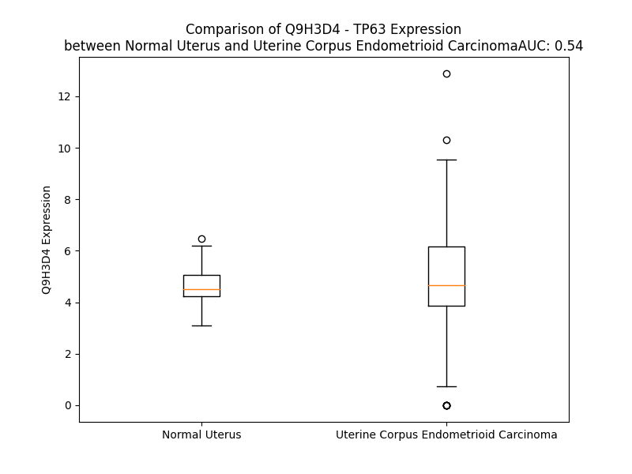

# Detailed Data for Q9H3D4

## Introduction to the Detailed Summary

### How to Interpret the Results

- **Summary & Metrics**: This section provides a quick reference to essential protein attributes, including expression changes, family classification, and biomarker applications. Regulation status (upregulated/downregulated) indicates the protein's behavior in a disease context. Some information comes from the original excel file with the proteins selected from literature, while others are derived from the analyses.
- **Expression Comparison**: A visual representation comparing protein expression between normal and disease states. It highlights significant changes in expression levels that might indicate diagnostic or therapeutic relevance. This is data coming from transcriptomics experiments and could not translate similarly to protein levels.
- **Isoform Alignment**: An interactive view of isoform alignments, revealing structural and functional differences between variants of the protein.
- **Interactors & Homologs**: Tables listing known interaction partners and homologous proteins, the more interactors and homologs, the more complex the protein is to design an antibody for.
- **Biological Assemblies**: Information about the structural arrangement of the protein in different assemblies, providing insights into its functional state but also the complexity of the protein to develop antibodies.
- **Combined Per-Residue Information**: A detailed table summarizing residue-level data. This includes predictions for epitope regions, aggregation tendencies, and modifications that might impact the protein's function. Each row corresponds to a residue in the protein, providing insights into specific sites that may be important for research or drug development.
## Summary & Metrics

- **UniProt Accession**: Q9H3D4
- **Gene Name**: TP63
- **Protein Name**: p63
- **Swiss Prot**: P63_HUMAN
- **Family**: transcription regulator
- **Biomarker Application**: diagnosis,efficacy,prognosis,unspecified application
- **Number of Isoforms**: 0
- **Regulation**: -1
- **(transcriptomics) AUC**: 0.76
- **(transcriptomics) Fold Change**: 1.39
- **(transcriptomics) Regulation**: Upregulated
- **Discotope Epitope Count**: 121
- **Max n_uniprots (Homo)**: 4
- **Max n_uniprots (Hetero)**: 4

## Expression Comparison

## Interactors

| preferredName_A   | preferredName_B   |   score |
|:------------------|:------------------|--------:|
| TP63              | TP73              |   0.997 |
| TP63              | TP53              |   0.953 |
| TP63              | SOX2              |   0.93  |
| TP63              | PERP              |   0.93  |

## Homologs

| uniprot_id   | gene_id   |
|:-------------|:----------|
| A0A0C4DFW9   | TP73      |
| A0A386NBZ1   | TP53      |

## Biological Assemblies

|   Unnamed: 0 |   assembly |   n_uniprots | composition   | crystal_id   |
|-------------:|-----------:|-------------:|:--------------|:-------------|
|            0 |          1 |            2 | Hetero        | 6ru8         |
|            1 |          2 |            2 | Hetero        | 6ru8         |
|            2 |          3 |            2 | Hetero        | 6ru8         |
|            3 |          4 |            2 | Hetero        | 6ru8         |
|            0 |          1 |            2 | Hetero        | 8p9c         |
|            0 |          1 |            4 | Homo          | 3zy0         |
|            0 |          1 |            2 | Hetero        | 8p9e         |
|            0 |          1 |            1 | Homo          | 7z7e         |
|            0 |          1 |            4 | Hetero        | 8p9d         |
|            0 |          1 |            1 | Homo          | 2rmn         |
|            0 |          1 |            1 | Homo          | 7z71         |
|            1 |          2 |            1 | Homo          | 7z71         |
|            0 |          1 |            1 | Homo          | 2y9u         |
|            0 |          1 |            4 | Homo          | 3qym         |
|            1 |          2 |            4 | Homo          | 3qym         |
|            2 |          3 |            4 | Homo          | 3qym         |
|            0 |          1 |            1 | Homo          | 7z72         |
|            0 |          1 |            4 | Homo          | 7z73         |
|            0 |          1 |            1 | Homo          | 3zy1         |
|            0 |          1 |            2 | Hetero        | 6ru6         |
|            1 |          2 |            1 | Homo          | 6ru6         |
|            0 |          1 |            4 | Homo          | 3qyn         |
|            0 |          1 |            4 | Homo          | 3us2         |
|            1 |          2 |            4 | Homo          | 3us2         |
|            0 |          1 |            1 | Homo          | 1rg6         |
|            0 |          1 |            1 | Homo          | 6fgn         |
|            0 |          1 |            2 | Homo          | 3us1         |
|            0 |          1 |            4 | Hetero        | 2nb1         |
|            0 |          1 |            1 | Homo          | 2y9t         |
|            0 |          1 |            4 | Homo          | 3us0         |
|            0 |          1 |            4 | Homo          | 4a9z         |
|            0 |          1 |            2 | Hetero        | 6ru7         |
|            1 |          2 |            2 | Hetero        | 6ru7         |

## Combined Per-Residue Information

|   res | aa   |   epitope_score | epitope   |   relative_surface_accessibility |   modeling_confidence |   Aggregation | modification   |
|------:|:-----|----------------:|:----------|---------------------------------:|----------------------:|--------------:|:---------------|
|     1 | M    |         0.06635 | False     |                          1.27305 |                 34.2  |         0     | N/A            |
|     2 | N    |         0.1072  | False     |                          0.77632 |                 30.63 |         0     | N/A            |
|     3 | F    |         0.09303 | False     |                          0.87354 |                 33.97 |         0     | N/A            |
|     4 | E    |         0.11537 | True      |                          0.74953 |                 34.38 |         0     | N/A            |
|     5 | T    |         0.06812 | False     |                          0.76612 |                 35.11 |         0     | N/A            |
|     6 | S    |         0.05157 | False     |                          0.67426 |                 36.37 |         0     | N/A            |
|     7 | R    |         0.10936 | False     |                          0.92274 |                 35.15 |         0     | N/A            |
|     8 | C    |         0.06603 | False     |                          0.85051 |                 28.23 |         0     | N/A            |
|     9 | A    |         0.06454 | False     |                          0.97599 |                 35.79 |         0     | N/A            |
|    10 | T    |         0.10218 | False     |                          0.76583 |                 28.95 |         0     | N/A            |
|    11 | L    |         0.11406 | True      |                          1.09993 |                 32.4  |         0     | N/A            |
|    12 | Q    |         0.07994 | False     |                          0.8089  |                 28.44 |         0     | N/A            |
|    13 | Y    |         0.11103 | False     |                          0.8729  |                 27.75 |         0     | N/A            |
|    14 | C    |         0.07016 | False     |                          0.90481 |                 28.44 |         0     | N/A            |
|    15 | P    |         0.11595 | True      |                          0.56565 |                 34.59 |         0     | N/A            |
|    16 | D    |         0.14518 | True      |                          0.74143 |                 33.46 |         0     | N/A            |
|    17 | P    |         0.05019 | False     |                          0.85099 |                 35.22 |         0     | N/A            |
|    18 | Y    |         0.12204 | True      |                          0.90112 |                 26.32 |         0     | N/A            |
|    19 | I    |         0.10686 | False     |                          1.01689 |                 29.39 |         0     | N/A            |
|    20 | Q    |         0.09016 | False     |                          0.75195 |                 25.53 |         0     | N/A            |
|    21 | R    |         0.08891 | False     |                          0.86375 |                 25.4  |         0     | N/A            |
|    22 | F    |         0.07946 | False     |                          1.02929 |                 29.03 |         0     | N/A            |
|    23 | V    |         0.06055 | False     |                          0.90228 |                 25.62 |         0     | N/A            |
|    24 | E    |         0.10386 | False     |                          0.86251 |                 28.08 |         0     | N/A            |
|    25 | T    |         0.0699  | False     |                          0.86511 |                 27.99 |         0     | N/A            |
|    26 | P    |         0.09292 | False     |                          0.95029 |                 31.29 |         0     | N/A            |
|    27 | A    |         0.12283 | True      |                          0.90152 |                 29.61 |         0     | N/A            |
|    28 | H    |         0.14488 | True      |                          0.92115 |                 26.97 |         0     | N/A            |
|    29 | F    |         0.10586 | False     |                          0.95644 |                 29.32 |         0     | N/A            |
|    30 | S    |         0.12076 | True      |                          0.66843 |                 24.15 |         0     | N/A            |
|    31 | W    |         0.14847 | True      |                          1.02245 |                 31.35 |         0     | N/A            |
|    32 | K    |         0.12382 | True      |                          0.75779 |                 27.33 |         0     | N/A            |
|    33 | E    |         0.08335 | False     |                          0.64334 |                 25.42 |         0     | N/A            |
|    34 | S    |         0.08183 | False     |                          0.9172  |                 30.92 |         0     | N/A            |
|    35 | Y    |         0.07183 | False     |                          0.84062 |                 24.93 |         0     | N/A            |
|    36 | Y    |         0.10172 | False     |                          0.86366 |                 24.49 |         0     | N/A            |
|    37 | R    |         0.11555 | True      |                          0.99254 |                 28.49 |         0     | N/A            |
|    38 | S    |         0.08108 | False     |                          0.77025 |                 24.51 |         0     | N/A            |
|    39 | T    |         0.09189 | False     |                          1.00539 |                 29.36 |         0     | N/A            |
|    40 | M    |         0.1499  | True      |                          1.05135 |                 22.49 |         0     | N/A            |
|    41 | S    |         0.10227 | False     |                          0.88999 |                 27.79 |         0     | N/A            |
|    42 | Q    |         0.1654  | True      |                          0.94933 |                 24.38 |         0     | N/A            |
|    43 | S    |         0.11368 | True      |                          0.8897  |                 27.15 |         0     | N/A            |
|    44 | T    |         0.10408 | False     |                          0.86553 |                 24.12 |         0     | N/A            |
|    45 | Q    |         0.13782 | True      |                          0.86044 |                 27.38 |         0     | N/A            |
|    46 | T    |         0.08135 | False     |                          0.85744 |                 27.51 |         0     | N/A            |
|    47 | N    |         0.07109 | False     |                          0.90947 |                 29.3  |         0     | N/A            |
|    48 | E    |         0.06642 | False     |                          0.89325 |                 29.22 |         0     | N/A            |
|    49 | F    |         0.0631  | False     |                          0.98235 |                 33.89 |         0     | N/A            |
|    50 | L    |         0.05206 | False     |                          0.82273 |                 36.12 |         0     | N/A            |
|    51 | S    |         0.07353 | False     |                          0.42243 |                 36.62 |         0     | N/A            |
|    52 | P    |         0.06714 | False     |                          0.77456 |                 43.59 |         0     | N/A            |
|    53 | E    |         0.10044 | False     |                          0.60812 |                 45.46 |         0     | N/A            |
|    54 | V    |         0.06189 | False     |                          0.56585 |                 44.82 |         0     | N/A            |
|    55 | F    |         0.05336 | False     |                          0.40005 |                 46.78 |         0     | N/A            |
|    56 | Q    |         0.08728 | False     |                          0.57122 |                 42.03 |         0     | N/A            |
|    57 | H    |         0.10941 | False     |                          0.8006  |                 43.07 |         0     | N/A            |
|    58 | I    |         0.05022 | False     |                          0.52175 |                 46.77 |         0     | N/A            |
|    59 | W    |         0.04225 | False     |                          0.30153 |                 46.4  |         0     | N/A            |
|    60 | D    |         0.05343 | False     |                          0.58852 |                 41.22 |         0     | N/A            |
|    61 | F    |         0.03842 | False     |                          0.80382 |                 39.96 |         0     | N/A            |
|    62 | L    |         0.05024 | False     |                          0.69444 |                 35.67 |         0     | N/A            |
|    63 | E    |         0.09449 | False     |                          0.73819 |                 33.31 |         0     | N/A            |
|    64 | Q    |         0.05412 | False     |                          0.74814 |                 30.46 |         0     | N/A            |
|    65 | P    |         0.05201 | False     |                          0.9402  |                 26.73 |         0     | N/A            |
|    66 | I    |         0.06068 | False     |                          0.7779  |                 29.6  |         0     | N/A            |
|    67 | C    |         0.05599 | False     |                          0.96567 |                 26.61 |         0     | N/A            |
|    68 | S    |         0.05209 | False     |                          0.79179 |                 28.98 |         0     | N/A            |
|    69 | V    |         0.078   | False     |                          1.08107 |                 29.85 |         0     | N/A            |
|    70 | Q    |         0.11245 | True      |                          0.83482 |                 32.22 |         0     | N/A            |
|    71 | P    |         0.12277 | True      |                          0.94414 |                 29.94 |         0     | N/A            |
|    72 | I    |         0.1026  | False     |                          1.046   |                 30.57 |         0     | N/A            |
|    73 | D    |         0.08596 | False     |                          0.47409 |                 30.3  |         0     | N/A            |
|    74 | L    |         0.07962 | False     |                          0.85279 |                 29.87 |         0     | N/A            |
|    75 | N    |         0.0879  | False     |                          0.588   |                 32.3  |         0     | N/A            |
|    76 | F    |         0.10818 | False     |                          0.80574 |                 34.25 |         0     | N/A            |
|    77 | V    |         0.08486 | False     |                          0.84001 |                 34.8  |         0     | N/A            |
|    78 | D    |         0.12907 | True      |                          0.90377 |                 35.13 |         0     | N/A            |
|    79 | E    |         0.09079 | False     |                          0.84544 |                 37.59 |         0     | N/A            |
|    80 | P    |         0.06972 | False     |                          0.80875 |                 37.03 |         0     | N/A            |
|    81 | S    |         0.06735 | False     |                          0.68246 |                 36.36 |         0     | N/A            |
|    82 | E    |         0.06612 | False     |                          0.89367 |                 38.97 |         0     | N/A            |
|    83 | D    |         0.06616 | False     |                          0.97724 |                 44.19 |         0     | N/A            |
|    84 | G    |         0.06065 | False     |                          0.54153 |                 43.53 |         0     | N/A            |
|    85 | A    |         0.03942 | False     |                          0.52395 |                 46.13 |         0     | N/A            |
|    86 | T    |         0.05031 | False     |                          0.61292 |                 54.88 |         0     | N/A            |
|    87 | N    |         0.0902  | False     |                          0.53451 |                 57.75 |         0     | N/A            |
|    88 | K    |         0.03613 | False     |                          0.26433 |                 64.59 |         0     | N/A            |
|    89 | I    |         0.08996 | False     |                          0.36442 |                 55.22 |         0     | N/A            |
|    90 | E    |         0.02995 | False     |                          0.16693 |                 58.77 |         0     | N/A            |
|    91 | I    |         0.12959 | True      |                          0.57206 |                 51.49 |         0     | N/A            |
|    92 | S    |         0.04037 | False     |                          0.38353 |                 56.64 |         0     | N/A            |
|    93 | M    |         0.1176  | True      |                          0.65408 |                 53.7  |         0     | N/A            |
|    94 | D    |         0.04076 | False     |                          0.37715 |                 53.77 |         0     | N/A            |
|    95 | C    |         0.0901  | False     |                          0.71726 |                 49.32 |         0     | N/A            |
|    96 | I    |         0.08439 | False     |                          0.49904 |                 57.99 |         0     | N/A            |
|    97 | R    |         0.12015 | True      |                          0.63873 |                 49.9  |         0     | N/A            |
|    98 | M    |         0.06909 | False     |                          0.48183 |                 47.03 |         0     | N/A            |
|    99 | Q    |         0.07105 | False     |                          0.56509 |                 45.13 |         0     | N/A            |
|   100 | D    |         0.04746 | False     |                          0.73619 |                 41.16 |         0     | N/A            |
|   101 | S    |         0.13002 | True      |                          0.84864 |                 39.33 |         0     | N/A            |
|   102 | D    |         0.08313 | False     |                          0.62112 |                 35.91 |         0     | N/A            |
|   103 | L    |         0.11904 | True      |                          1.07686 |                 33.49 |         0     | N/A            |
|   104 | S    |         0.08695 | False     |                          0.84704 |                 31.82 |         0     | N/A            |
|   105 | D    |         0.10173 | False     |                          0.8356  |                 34.35 |         0     | N/A            |
|   106 | P    |         0.1183  | True      |                          0.86714 |                 33.93 |         0     | N/A            |
|   107 | M    |         0.12375 | True      |                          0.97144 |                 34.3  |         0     | N/A            |
|   108 | W    |         0.11069 | False     |                          0.82536 |                 31.47 |         0     | N/A            |
|   109 | P    |         0.16669 | True      |                          0.95052 |                 34.77 |         0     | N/A            |
|   110 | Q    |         0.12518 | True      |                          0.63981 |                 27.87 |         0     | N/A            |
|   111 | Y    |         0.11113 | False     |                          0.92414 |                 29.49 |         0     | N/A            |
|   112 | T    |         0.07106 | False     |                          0.73372 |                 30.69 |         0     | N/A            |
|   113 | N    |         0.0692  | False     |                          1.01443 |                 27.27 |         0     | N/A            |
|   114 | L    |         0.07278 | False     |                          1.00092 |                 31.81 |         0     | N/A            |
|   115 | G    |         0.10454 | False     |                          0.76232 |                 33.01 |         0     | N/A            |
|   116 | L    |         0.10848 | False     |                          1.06104 |                 30.49 |         0     | N/A            |
|   117 | L    |         0.08276 | False     |                          1.04393 |                 29.77 |         0     | N/A            |
|   118 | N    |         0.08285 | False     |                          1.039   |                 31.85 |         0     | N/A            |
|   119 | S    |         0.06743 | False     |                          0.74954 |                 28.34 |         0     | N/A            |
|   120 | M    |         0.09402 | False     |                          0.97085 |                 31.85 |         0     | N/A            |
|   121 | D    |         0.09269 | False     |                          0.71842 |                 33.99 |         0     | N/A            |
|   122 | Q    |         0.13973 | True      |                          0.80435 |                 37.07 |         0     | N/A            |
|   123 | Q    |         0.09979 | False     |                          0.74187 |                 35.83 |         0     | N/A            |
|   124 | I    |         0.09026 | False     |                          0.85279 |                 41.78 |         0     | N/A            |
|   125 | Q    |         0.14401 | True      |                          0.75286 |                 36.76 |         0     | N/A            |
|   126 | N    |         0.07059 | False     |                          0.93597 |                 36.49 |         0     | N/A            |
|   127 | G    |         0.08216 | False     |                          0.83325 |                 35.35 |         0     | N/A            |
|   128 | S    |         0.08082 | False     |                          0.85266 |                 37.92 |         0     | N/A            |
|   129 | S    |         0.07927 | False     |                          0.82816 |                 36.82 |         0     | N/A            |
|   130 | S    |         0.11628 | True      |                          0.72131 |                 40.39 |         0     | N/A            |
|   131 | T    |         0.08756 | False     |                          0.88461 |                 41.48 |         0     | N/A            |
|   132 | S    |         0.12162 | True      |                          0.7803  |                 41.03 |         0     | N/A            |
|   133 | P    |         0.05734 | False     |                          0.89409 |                 44.94 |         0     | N/A            |
|   134 | Y    |         0.10373 | False     |                          1.01086 |                 39.31 |         0     | N/A            |
|   135 | N    |         0.10248 | False     |                          0.74504 |                 40.56 |         0     | N/A            |
|   136 | T    |         0.12447 | True      |                          0.83106 |                 40.54 |         0     | N/A            |
|   137 | D    |         0.08667 | False     |                          0.72551 |                 40.01 |         0     | N/A            |
|   138 | H    |         0.10573 | False     |                          1.03647 |                 44.5  |         0     | N/A            |
|   139 | A    |         0.10366 | False     |                          0.84728 |                 42.25 |         0     | N/A            |
|   140 | Q    |         0.1447  | True      |                          0.91528 |                 41.96 |         0     | N/A            |
|   141 | N    |         0.08994 | False     |                          0.96506 |                 40.43 |         0     | N/A            |
|   142 | S    |         0.08476 | False     |                          0.82045 |                 40.85 |         0     | N/A            |
|   143 | V    |         0.07719 | False     |                          1.06669 |                 41.08 |         0     | N/A            |
|   144 | T    |         0.08217 | False     |                          0.86935 |                 46.86 |         0     | N/A            |
|   145 | A    |         0.09718 | False     |                          0.79817 |                 43.03 |         0     | N/A            |
|   146 | P    |         0.08312 | False     |                          0.93924 |                 48.81 |         0     | N/A            |
|   147 | S    |         0.11815 | True      |                          0.67932 |                 37.7  |         0     | N/A            |
|   148 | P    |         0.14799 | True      |                          0.97821 |                 44.17 |         0     | N/A            |
|   149 | Y    |         0.12156 | True      |                          0.98187 |                 50.14 |         0     | N/A            |
|   150 | A    |         0.0626  | False     |                          0.827   |                 43.04 |         0     | N/A            |
|   151 | Q    |         0.0986  | False     |                          0.87744 |                 40.1  |         0     | N/A            |
|   152 | P    |         0.09275 | False     |                          0.84811 |                 41.05 |         0     | N/A            |
|   153 | S    |         0.09338 | False     |                          0.85374 |                 37.86 |         0     | N/A            |
|   154 | S    |         0.10786 | False     |                          0.76261 |                 37.82 |         0     | N/A            |
|   155 | T    |         0.08322 | False     |                          1.01378 |                 36.96 |         0     | N/A            |
|   156 | F    |         0.09665 | False     |                          0.82443 |                 41.9  |         0     | N/A            |
|   157 | D    |         0.11682 | True      |                          0.88225 |                 34.36 |         0     | N/A            |
|   158 | A    |         0.13495 | True      |                          0.72797 |                 32.83 |         0     | N/A            |
|   159 | L    |         0.1415  | True      |                          0.98451 |                 43.45 |         0     | N/A            |
|   160 | S    |         0.09543 | False     |                          0.79331 |                 38.86 |         0     | N/A            |
|   161 | P    |         0.18339 | True      |                          0.64274 |                 57.04 |         0     | N/A            |
|   162 | S    |         0.1005  | False     |                          0.40361 |                 63.81 |         0     | N/A            |
|   163 | P    |         0.12369 | True      |                          0.75641 |                 75.33 |         0     | N/A            |
|   164 | A    |         0.10243 | False     |                          0.63557 |                 76.02 |         0     | N/A            |
|   165 | I    |         0.10512 | False     |                          0.5505  |                 86.09 |         0     | N/A            |
|   166 | P    |         0.03336 | False     |                          0.15815 |                 87.6  |         0     | N/A            |
|   167 | S    |         0.04984 | False     |                          0.42129 |                 89.84 |         0     | N/A            |
|   168 | N    |         0.04298 | False     |                          0.50119 |                 89.96 |         0     | N/A            |
|   169 | T    |         0.07404 | False     |                          0.62207 |                 92.74 |         0     | N/A            |
|   170 | D    |         0.05861 | False     |                          0.34674 |                 95.38 |         0     | N/A            |
|   171 | Y    |         0.11837 | True      |                          0.42353 |                 96.93 |         0     | N/A            |
|   172 | P    |         0.08974 | False     |                          0.48014 |                 96.53 |         0     | N/A            |
|   173 | G    |         0.03174 | False     |                          0.21107 |                 95.24 |         0     | N/A            |
|   174 | P    |         0.07443 | False     |                          0.6812  |                 95.69 |         0     | N/A            |
|   175 | H    |         0.04364 | False     |                          0.11258 |                 95.42 |         0     | N/A            |
|   176 | S    |         0.04707 | False     |                          0.39742 |                 96.29 |         0     | N/A            |
|   177 | F    |         0.00282 | False     |                          0       |                 97.58 |         0     | N/A            |
|   178 | D    |         0.03363 | False     |                          0.32535 |                 97.06 |         0     | N/A            |
|   179 | V    |         0.01256 | False     |                          0.13156 |                 96.95 |         0     | N/A            |
|   180 | S    |         0.04407 | False     |                          0.23091 |                 94.93 |         0     | N/A            |
|   181 | F    |         0.03351 | False     |                          0.13488 |                 95.26 |         0     | N/A            |
|   182 | Q    |         0.08569 | False     |                          0.58019 |                 90.32 |         0     | N/A            |
|   183 | Q    |         0.14688 | True      |                          0.8182  |                 83.23 |         0     | N/A            |
|   184 | S    |         0.06613 | False     |                          0.11415 |                 86.46 |         0     | N/A            |
|   185 | S    |         0.11974 | True      |                          0.55984 |                 86.83 |         0     | N/A            |
|   186 | T    |         0.1046  | False     |                          0.51366 |                 86.71 |         0     | N/A            |
|   187 | A    |         0.14926 | True      |                          0.4529  |                 90.84 |         0     | N/A            |
|   188 | K    |         0.23191 | True      |                          0.96881 |                 87.09 |         0     | N/A            |
|   189 | S    |         0.16158 | True      |                          0.75612 |                 91.2  |         0     | N/A            |
|   190 | A    |         0.05975 | False     |                          0.12524 |                 93.97 |         0.367 | N/A            |
|   191 | T    |         0.07821 | False     |                          0.37163 |                 95.94 |         0.367 | N/A            |
|   192 | W    |         0.01583 | False     |                          0.17638 |                 97.17 |         0.367 | N/A            |
|   193 | T    |         0.00275 | False     |                          0       |                 97.1  |         0.367 | N/A            |
|   194 | Y    |         0.02703 | False     |                          0.14911 |                 97.33 |         0.367 | N/A            |
|   195 | S    |         0.00717 | False     |                          0       |                 95.43 |         0.175 | N/A            |
|   196 | T    |         0.05521 | False     |                          0.72949 |                 92.05 |         0     | N/A            |
|   197 | E    |         0.08774 | False     |                          0.46901 |                 90.07 |         0     | N/A            |
|   198 | L    |         0.04599 | False     |                          0.18981 |                 92.48 |         0     | N/A            |
|   199 | K    |         0.03991 | False     |                          0.59475 |                 93.75 |         0     | N/A            |
|   200 | K    |         0.02062 | False     |                          0.1061  |                 97.08 |         0     | N/A            |
|   201 | L    |         0.00188 | False     |                          0.00247 |                 97.99 |         0     | N/A            |
|   202 | Y    |         0.00211 | False     |                          0       |                 98.19 |         0     | N/A            |
|   203 | C    |         0.00155 | False     |                          0       |                 97.89 |         0     | N/A            |
|   204 | Q    |         0.05225 | False     |                          0.21516 |                 97.36 |         0     | N/A            |
|   205 | I    |         0.10338 | False     |                          0.20992 |                 96.08 |         0     | N/A            |
|   206 | A    |         0.05179 | False     |                          0.28598 |                 94.47 |         0     | N/A            |
|   207 | K    |         0.13497 | True      |                          0.48345 |                 95.41 |         0     | N/A            |
|   208 | T    |         0.04927 | False     |                          0.32527 |                 95.48 |         0     | N/A            |
|   209 | C    |         0.00621 | False     |                          0.00501 |                 96.41 |         0     | N/A            |
|   210 | P    |         0.05951 | False     |                          0.22725 |                 96.05 |         0     | N/A            |
|   211 | I    |         0.00413 | False     |                          0.008   |                 96.99 |         0     | N/A            |
|   212 | Q    |         0.0747  | False     |                          0.11021 |                 96.75 |         0     | N/A            |
|   213 | I    |         0.01016 | False     |                          0.01405 |                 97.42 |         0     | N/A            |
|   214 | K    |         0.06753 | False     |                          0.2903  |                 96.74 |         0     | N/A            |
|   215 | V    |         0.04922 | False     |                          0.19277 |                 96.43 |         0     | N/A            |
|   216 | M    |         0.09992 | False     |                          0.66666 |                 93.49 |         0     | N/A            |
|   217 | T    |         0.05042 | False     |                          0.40041 |                 93.51 |         0     | N/A            |
|   218 | P    |         0.1087  | False     |                          0.85905 |                 93.59 |         0     | N/A            |
|   219 | P    |         0.02977 | False     |                          0.11172 |                 95.47 |         0     | N/A            |
|   220 | P    |         0.13079 | True      |                          0.52517 |                 94.93 |         0     | N/A            |
|   221 | Q    |         0.07725 | False     |                          0.94376 |                 93.96 |         0     | N/A            |
|   222 | G    |         0.07626 | False     |                          0.54792 |                 94.59 |         0     | N/A            |
|   223 | A    |         0.01693 | False     |                          0.03914 |                 97.24 |         0     | N/A            |
|   224 | V    |         0.03357 | False     |                          0.17232 |                 97.66 |         0     | N/A            |
|   225 | I    |         0.01024 | False     |                          0.01979 |                 97.9  |         0     | N/A            |
|   226 | R    |         0.0732  | False     |                          0.19739 |                 97.57 |         0     | N/A            |
|   227 | A    |         0.00281 | False     |                          0.00638 |                 97.99 |         0     | N/A            |
|   228 | M    |         0.0466  | False     |                          0.15105 |                 97.34 |         0     | N/A            |
|   229 | P    |         0.01542 | False     |                          0.05204 |                 97.54 |         0     | N/A            |
|   230 | V    |         0.00898 | False     |                          0.01523 |                 96.81 |         0     | N/A            |
|   231 | Y    |         0.02105 | False     |                          0.01618 |                 97.09 |         0     | N/A            |
|   232 | K    |         0.10752 | False     |                          0.49609 |                 95.46 |         0     | N/A            |
|   233 | K    |         0.17904 | True      |                          0.48385 |                 93.43 |         0     | N/A            |
|   234 | A    |         0.14509 | True      |                          0.86329 |                 90.98 |         0     | N/A            |
|   235 | E    |         0.24051 | True      |                          0.58475 |                 93.46 |         0     | N/A            |
|   236 | H    |         0.17801 | True      |                          0.19898 |                 92.82 |         0     | N/A            |
|   237 | V    |         0.07185 | False     |                          0.18375 |                 91.08 |         0.388 | N/A            |
|   238 | T    |         0.1393  | True      |                          0.65713 |                 90.77 |         0.388 | N/A            |
|   239 | E    |         0.22523 | True      |                          0.3577  |                 93.89 |         0.388 | N/A            |
|   240 | V    |         0.07316 | False     |                          0.25027 |                 94.82 |         0.388 | N/A            |
|   241 | V    |         0.0073  | False     |                          0.0069  |                 96.7  |         0.388 | N/A            |
|   242 | K    |         0.12939 | True      |                          0.36423 |                 94.3  |         0.388 | N/A            |
|   243 | R    |         0.04605 | False     |                          0.01128 |                 96.24 |         0     | N/A            |
|   244 | C    |         0.04681 | False     |                          0.0312  |                 96.38 |         0     | N/A            |
|   245 | P    |         0.32208 | True      |                          0.51095 |                 94.7  |         0     | N/A            |
|   246 | N    |         0.24984 | True      |                          0.77885 |                 94.01 |         0     | N/A            |
|   247 | H    |         0.09704 | False     |                          0.17307 |                 93.87 |         0     | N/A            |
|   248 | E    |         0.18859 | True      |                          0.2752  |                 93.82 |         0     | N/A            |
|   249 | L    |         0.33029 | True      |                          0.90316 |                 91.15 |         0     | N/A            |
|   250 | S    |         0.14983 | True      |                          0.25165 |                 87.09 |         0     | N/A            |
|   251 | R    |         0.36825 | True      |                          0.74472 |                 80.55 |         0     | N/A            |
|   252 | E    |         0.27347 | True      |                          0.74448 |                 76.77 |         0     | N/A            |
|   253 | F    |         0.10429 | False     |                          0.23228 |                 75.18 |         0     | N/A            |
|   254 | N    |         0.12763 | True      |                          0.16321 |                 81.22 |         0     | N/A            |
|   255 | E    |         0.25586 | True      |                          0.67692 |                 73.02 |         0     | N/A            |
|   256 | G    |         0.17703 | True      |                          0.98941 |                 68.94 |         0     | N/A            |
|   257 | Q    |         0.17142 | True      |                          0.49447 |                 73.39 |         0     | N/A            |
|   258 | I    |         0.0715  | False     |                          0.89503 |                 81.94 |         0     | N/A            |
|   259 | A    |         0.03889 | False     |                          0.07766 |                 90.57 |         0     | N/A            |
|   260 | P    |         0.08678 | False     |                          0.34296 |                 92.52 |         0     | N/A            |
|   261 | P    |         0.13703 | True      |                          0.49107 |                 93.3  |         0     | N/A            |
|   262 | S    |         0.05335 | False     |                          0.17681 |                 93.39 |         0     | N/A            |
|   263 | H    |         0.02757 | False     |                          0.03555 |                 95.69 |         0     | N/A            |
|   264 | L    |         0.0051  | False     |                          0.00708 |                 97.27 |         0     | N/A            |
|   265 | I    |         0.02022 | False     |                          0.03311 |                 97.41 |         0     | N/A            |
|   266 | R    |         0.05406 | False     |                          0.01799 |                 95.62 |         0     | N/A            |
|   267 | V    |         0.01313 | False     |                          0.12138 |                 95.75 |         0     | N/A            |
|   268 | E    |         0.12556 | True      |                          0.39234 |                 91.76 |         0     | N/A            |
|   269 | G    |         0.16525 | True      |                          0.98771 |                 87    |         0     | N/A            |
|   270 | N    |         0.0487  | False     |                          0.22163 |                 86.13 |         0     | N/A            |
|   271 | S    |         0.05673 | False     |                          0.70373 |                 87.84 |         0     | N/A            |
|   272 | H    |         0.05993 | False     |                          0.52771 |                 91.83 |         0     | N/A            |
|   273 | A    |         0.01626 | False     |                          0.1179  |                 94.98 |         0     | N/A            |
|   274 | Q    |         0.15071 | True      |                          0.57711 |                 95.37 |         0     | N/A            |
|   275 | Y    |         0.09699 | False     |                          0.19284 |                 96.15 |         0     | N/A            |
|   276 | V    |         0.0676  | False     |                          0.39892 |                 94.75 |         0     | N/A            |
|   277 | E    |         0.15266 | True      |                          0.38355 |                 95.58 |         0     | N/A            |
|   278 | D    |         0.04992 | False     |                          0.14627 |                 92.8  |         0     | N/A            |
|   279 | P    |         0.11413 | True      |                          0.97604 |                 92.2  |         0     | N/A            |
|   280 | I    |         0.14457 | True      |                          0.70645 |                 88.73 |         0     | N/A            |
|   281 | T    |         0.05953 | False     |                          0.19781 |                 91.6  |         0     | N/A            |
|   282 | G    |         0.06189 | False     |                          0.26381 |                 93.38 |         0     | N/A            |
|   283 | R    |         0.06045 | False     |                          0.04698 |                 95    |         0     | N/A            |
|   284 | Q    |         0.03115 | False     |                          0.02578 |                 96.22 |         0     | N/A            |
|   285 | S    |         0.01544 | False     |                          0.05005 |                 96.97 |         0     | N/A            |
|   286 | V    |         0.00634 | False     |                          0.0052  |                 97.27 |         0     | N/A            |
|   287 | L    |         0.02734 | False     |                          0.12426 |                 97.24 |         0     | N/A            |
|   288 | V    |         0.01502 | False     |                          0.03508 |                 96.79 |         0     | N/A            |
|   289 | P    |         0.05274 | False     |                          0.39426 |                 96.3  |         0     | N/A            |
|   290 | Y    |         0.04024 | False     |                          0.14167 |                 96.27 |         0     | N/A            |
|   291 | E    |         0.04879 | False     |                          0.41724 |                 94.11 |         0     | N/A            |
|   292 | P    |         0.05959 | False     |                          0.71505 |                 93.64 |         0     | N/A            |
|   293 | P    |         0.02732 | False     |                          0.30502 |                 94    |         0     | N/A            |
|   294 | Q    |         0.10575 | False     |                          0.73436 |                 92.03 |         0     | N/A            |
|   295 | V    |         0.07393 | False     |                          0.92653 |                 91.48 |         0     | N/A            |
|   296 | G    |         0.05441 | False     |                          1.00505 |                 90.61 |         0     | N/A            |
|   297 | T    |         0.16497 | True      |                          0.44765 |                 91.61 |         0     | N/A            |
|   298 | E    |         0.15856 | True      |                          0.63902 |                 92.08 |         0     | N/A            |
|   299 | F    |         0.13474 | True      |                          0.32689 |                 95.03 |        28.881 | N/A            |
|   300 | T    |         0.02961 | False     |                          0.17092 |                 95.21 |        30.911 | N/A            |
|   301 | T    |         0.06822 | False     |                          0.41954 |                 95.78 |        35.867 | N/A            |
|   302 | V    |         0.01446 | False     |                          0.08759 |                 96.84 |        43.902 | N/A            |
|   303 | L    |         0.05595 | False     |                          0.36109 |                 96.6  |        44.227 | N/A            |
|   304 | Y    |         0.00901 | False     |                          0.01264 |                 97.3  |        40.705 | N/A            |
|   305 | N    |         0.08164 | False     |                          0.09368 |                 95.93 |        27.57  | N/A            |
|   306 | F    |         0.00661 | False     |                          0.0051  |                 97.26 |        26.919 | N/A            |
|   307 | M    |         0.04472 | False     |                          0.05739 |                 96.02 |        15.681 | N/A            |
|   308 | C    |         0.00518 | False     |                          0       |                 96.8  |         2.672 | N/A            |
|   309 | N    |         0.07566 | False     |                          0.20188 |                 97.43 |         0     | N/A            |
|   310 | S    |         0.05651 | False     |                          0.10375 |                 97.68 |         0     | N/A            |
|   311 | S    |         0.11007 | False     |                          0.49635 |                 97.04 |         0     | N/A            |
|   312 | C    |         0.13369 | True      |                          0.15764 |                 96.94 |         0     | N/A            |
|   313 | V    |         0.22647 | True      |                          0.86044 |                 96.14 |         0     | N/A            |
|   314 | G    |         0.2068  | True      |                          0.6361  |                 92.89 |         0     | N/A            |
|   315 | G    |         0.03956 | False     |                          0.11826 |                 93.5  |         0     | N/A            |
|   316 | M    |         0.01198 | False     |                          0       |                 96.6  |         0     | N/A            |
|   317 | N    |         0.12336 | True      |                          0.48021 |                 96.87 |         0     | N/A            |
|   318 | R    |         0.25929 | True      |                          0.79814 |                 95.99 |         0     | N/A            |
|   319 | R    |         0.21569 | True      |                          0.19734 |                 96.77 |         0     | N/A            |
|   320 | P    |         0.07421 | False     |                          0.32951 |                 97.06 |         0.44  | N/A            |
|   321 | I    |         0.00416 | False     |                          0.0016  |                 97.83 |        98.485 | N/A            |
|   322 | L    |         0.0415  | False     |                          0.11953 |                 97.45 |        99.648 | N/A            |
|   323 | I    |         0.01349 | False     |                          0.0168  |                 97.88 |        99.828 | N/A            |
|   324 | I    |         0.01749 | False     |                          0.02595 |                 97.3  |        99.828 | N/A            |
|   325 | V    |         0.00237 | False     |                          0.0019  |                 97.95 |        99.826 | N/A            |
|   326 | T    |         0.02361 | False     |                          0.06742 |                 97.97 |        96.513 | N/A            |
|   327 | L    |         0.00333 | False     |                          0       |                 98.13 |        81.607 | N/A            |
|   328 | E    |         0.02211 | False     |                          0.03914 |                 97.64 |         0.039 | N/A            |
|   329 | T    |         0.05104 | False     |                          0.1433  |                 96.09 |         0.039 | N/A            |
|   330 | R    |         0.04245 | False     |                          0.82939 |                 90.64 |         0.039 | N/A            |
|   331 | D    |         0.0938  | False     |                          0.76685 |                 90.16 |         0     | N/A            |
|   332 | G    |         0.06925 | False     |                          0.4218  |                 90.85 |         0     | N/A            |
|   333 | Q    |         0.11511 | True      |                          0.62169 |                 93.73 |         0     | N/A            |
|   334 | V    |         0.02719 | False     |                          0.40856 |                 96.17 |         0     | N/A            |
|   335 | L    |         0.05361 | False     |                          0.11541 |                 97.15 |         0     | N/A            |
|   336 | G    |         0.00175 | False     |                          0       |                 97.52 |         0     | N/A            |
|   337 | R    |         0.04195 | False     |                          0.15147 |                 97.97 |         0     | N/A            |
|   338 | R    |         0.0519  | False     |                          0.17372 |                 97.38 |         0     | N/A            |
|   339 | C    |         0.02917 | False     |                          0.13758 |                 96.25 |         0     | N/A            |
|   340 | F    |         0.01709 | False     |                          0.03372 |                 96.73 |         0     | N/A            |
|   341 | E    |         0.04228 | False     |                          0.08969 |                 97.36 |         0     | N/A            |
|   342 | A    |         0.0103  | False     |                          0.02168 |                 97.97 |         0     | N/A            |
|   343 | R    |         0.08033 | False     |                          0.29654 |                 97.89 |         0     | N/A            |
|   344 | I    |         0.00925 | False     |                          0.01005 |                 98.28 |         0     | N/A            |
|   345 | C    |         0.16591 | True      |                          0.10816 |                 97.49 |         0     | N/A            |
|   346 | A    |         0.1378  | True      |                          0.70062 |                 96.59 |         0     | N/A            |
|   347 | C    |         0.13285 | True      |                          0.30161 |                 95.78 |         0     | N/A            |
|   348 | P    |         0.00436 | False     |                          0.00298 |                 97.3  |         0     | N/A            |
|   349 | G    |         0.02179 | False     |                          0.0405  |                 95.9  |         0     | N/A            |
|   350 | R    |         0.20027 | True      |                          0.59184 |                 95.86 |         0     | N/A            |
|   351 | D    |         0.03515 | False     |                          0.07977 |                 96.46 |         0     | N/A            |
|   352 | R    |         0.04381 | False     |                          0.11426 |                 96.3  |         0     | N/A            |
|   353 | K    |         0.08719 | False     |                          0.598   |                 94.52 |         0     | N/A            |
|   354 | A    |         0.07651 | False     |                          0.55318 |                 95.31 |         0     | N/A            |
|   355 | D    |         0.02397 | False     |                          0.1706  |                 95.22 |         0     | N/A            |
|   356 | E    |         0.03391 | False     |                          0.08177 |                 95.04 |         0     | N/A            |
|   357 | D    |         0.0578  | False     |                          0.22591 |                 94.33 |         0     | N/A            |
|   358 | S    |         0.03537 | False     |                          0.37219 |                 92.06 |         0     | N/A            |
|   359 | I    |         0.03476 | False     |                          0.39998 |                 88.33 |         0     | N/A            |
|   360 | R    |         0.04242 | False     |                          0.3992  |                 88.47 |         0     | N/A            |
|   361 | K    |         0.05474 | False     |                          0.67161 |                 88.7  |         0     | N/A            |
|   362 | Q    |         0.05954 | False     |                          0.52573 |                 79.27 |         0     | N/A            |
|   363 | Q    |         0.03171 | False     |                          0.6438  |                 71.48 |         0     | N/A            |
|   364 | V    |         0.03298 | False     |                          0.38224 |                 66.1  |         0     | N/A            |
|   365 | S    |         0.05442 | False     |                          0.32059 |                 59.92 |         0     | N/A            |
|   366 | D    |         0.04877 | False     |                          0.58852 |                 52.18 |         0     | N/A            |
|   367 | S    |         0.03333 | False     |                          0.55753 |                 53.11 |         0     | N/A            |
|   368 | T    |         0.06897 | False     |                          0.7958  |                 56.04 |         0     | N/A            |
|   369 | K    |         0.07567 | False     |                          0.68545 |                 46.66 |         0     | N/A            |
|   370 | N    |         0.08039 | False     |                          1.04441 |                 44.19 |         0     | N/A            |
|   371 | G    |         0.10314 | False     |                          0.76046 |                 42.37 |         0     | N/A            |
|   372 | D    |         0.08327 | False     |                          0.87367 |                 42.77 |         0     | N/A            |
|   373 | G    |         0.1047  | False     |                          0.88039 |                 36.97 |         0     | N/A            |
|   374 | T    |         0.08635 | False     |                          0.76209 |                 45.25 |         0     | N/A            |
|   375 | K    |         0.0785  | False     |                          0.94643 |                 42.16 |         0     | N/A            |
|   376 | R    |         0.09206 | False     |                          0.92073 |                 37.72 |         0     | N/A            |
|   377 | P    |         0.12863 | True      |                          0.89133 |                 38.45 |         0     | N/A            |
|   378 | F    |         0.13749 | True      |                          0.79625 |                 31.86 |         0     | N/A            |
|   379 | R    |         0.09349 | False     |                          0.75901 |                 36.95 |         0     | N/A            |
|   380 | Q    |         0.09856 | False     |                          0.86165 |                 38.82 |         0     | N/A            |
|   381 | N    |         0.07786 | False     |                          0.75647 |                 30.35 |         0     | N/A            |
|   382 | T    |         0.07235 | False     |                          0.93103 |                 38.19 |         0     | N/A            |
|   383 | H    |         0.08403 | False     |                          0.95714 |                 35.32 |         0     | N/A            |
|   384 | G    |         0.08472 | False     |                          0.90853 |                 34.7  |         0     | N/A            |
|   385 | I    |         0.08959 | False     |                          0.97953 |                 36.24 |         0     | N/A            |
|   386 | Q    |         0.0825  | False     |                          0.91725 |                 37.68 |         0     | N/A            |
|   387 | M    |         0.11317 | True      |                          0.89179 |                 30.83 |         0     | N/A            |
|   388 | T    |         0.0913  | False     |                          0.87213 |                 30.1  |         0     | N/A            |
|   389 | S    |         0.07428 | False     |                          0.73438 |                 34.11 |         0     | N/A            |
|   390 | I    |         0.07754 | False     |                          0.96119 |                 38.82 |         0     | N/A            |
|   391 | K    |         0.07953 | False     |                          0.86664 |                 34.36 |         0     | N/A            |
|   392 | K    |         0.10203 | False     |                          0.95775 |                 36.5  |         0     | N/A            |
|   393 | R    |         0.15807 | True      |                          0.86328 |                 38.94 |         0     | N/A            |
|   394 | R    |         0.1034  | False     |                          0.8319  |                 46.91 |         0     | N/A            |
|   395 | S    |         0.06611 | False     |                          0.41227 |                 47.38 |         0     | N/A            |
|   396 | P    |         0.09711 | False     |                          0.5492  |                 60.18 |         0     | N/A            |
|   397 | D    |         0.07698 | False     |                          0.79836 |                 61.29 |         0     | N/A            |
|   398 | D    |         0.12132 | True      |                          0.59937 |                 70.1  |         0     | N/A            |
|   399 | E    |         0.03585 | False     |                          0.4525  |                 83    |         0     | N/A            |
|   400 | L    |         0.05439 | False     |                          0.77655 |                 85.06 |         0.226 | N/A            |
|   401 | L    |         0.05574 | False     |                          0.87895 |                 87.12 |         0.226 | N/A            |
|   402 | Y    |         0.08364 | False     |                          0.85109 |                 90.66 |         0.226 | N/A            |
|   403 | L    |         0.05051 | False     |                          0.80722 |                 91.81 |         0.226 | N/A            |
|   404 | P    |         0.07468 | False     |                          0.93153 |                 93.28 |         0.226 | N/A            |
|   405 | V    |         0.02615 | False     |                          0.34576 |                 93.86 |         0     | N/A            |
|   406 | R    |         0.14711 | True      |                          0.93652 |                 94.17 |         0     | N/A            |
|   407 | G    |         0.07429 | False     |                          0.53216 |                 93.53 |         0     | N/A            |
|   408 | R    |         0.1247  | True      |                          0.64952 |                 94.13 |         0     | N/A            |
|   409 | E    |         0.0821  | False     |                          0.73922 |                 93.51 |         0     | N/A            |
|   410 | T    |         0.02336 | False     |                          0.4069  |                 91.55 |         0.743 | N/A            |
|   411 | Y    |         0.05202 | False     |                          0.42251 |                 95.91 |         0.91  | N/A            |
|   412 | E    |         0.05762 | False     |                          0.3305  |                 95.24 |         1.043 | N/A            |
|   413 | M    |         0.0474  | False     |                          0.21347 |                 91.19 |         1.043 | N/A            |
|   414 | L    |         0.02671 | False     |                          0.38103 |                 94.41 |         1.043 | N/A            |
|   415 | L    |         0.06774 | False     |                          0.34259 |                 93.91 |         1.043 | N/A            |
|   416 | K    |         0.07366 | False     |                          0.62378 |                 92.8  |         1.043 | N/A            |
|   417 | I    |         0.05881 | False     |                          0.46217 |                 92.72 |         1.043 | N/A            |
|   418 | K    |         0.04826 | False     |                          0.48021 |                 92.62 |         0     | N/A            |
|   419 | E    |         0.05576 | False     |                          0.44354 |                 92.52 |         0     | N/A            |
|   420 | S    |         0.0437  | False     |                          0.45504 |                 88.06 |         0     | N/A            |
|   421 | L    |         0.04035 | False     |                          0.57827 |                 88.19 |         0     | N/A            |
|   422 | E    |         0.0382  | False     |                          0.35665 |                 87.72 |         0     | N/A            |
|   423 | L    |         0.06403 | False     |                          0.63547 |                 86.52 |         0     | N/A            |
|   424 | M    |         0.04046 | False     |                          0.55246 |                 82.36 |         0     | N/A            |
|   425 | Q    |         0.06699 | False     |                          0.73277 |                 83.09 |         0     | N/A            |
|   426 | Y    |         0.06605 | False     |                          0.73682 |                 83.72 |         0     | N/A            |
|   427 | L    |         0.04042 | False     |                          0.40438 |                 82.4  |         0     | N/A            |
|   428 | P    |         0.051   | False     |                          0.51692 |                 83.47 |         0     | N/A            |
|   429 | Q    |         0.08969 | False     |                          0.72054 |                 75.11 |         0     | N/A            |
|   430 | H    |         0.07316 | False     |                          0.6733  |                 83.03 |         0     | N/A            |
|   431 | T    |         0.03518 | False     |                          0.3633  |                 82.46 |         0     | N/A            |
|   432 | I    |         0.03745 | False     |                          0.32732 |                 80.33 |         0     | N/A            |
|   433 | E    |         0.06334 | False     |                          0.45633 |                 79.56 |         0     | N/A            |
|   434 | T    |         0.04304 | False     |                          0.61124 |                 83.17 |         0     | N/A            |
|   435 | Y    |         0.0528  | False     |                          0.59666 |                 76.3  |         0     | N/A            |
|   436 | R    |         0.04242 | False     |                          0.56829 |                 81.38 |         0     | N/A            |
|   437 | Q    |         0.06111 | False     |                          0.53983 |                 81.42 |         0     | N/A            |
|   438 | Q    |         0.04883 | False     |                          0.45943 |                 83.61 |         0     | N/A            |
|   439 | Q    |         0.05427 | False     |                          0.41824 |                 77.61 |         0     | N/A            |
|   440 | Q    |         0.05411 | False     |                          0.43003 |                 78.69 |         0     | N/A            |
|   441 | Q    |         0.0578  | False     |                          0.6146  |                 80.18 |         0     | N/A            |
|   442 | Q    |         0.065   | False     |                          0.45447 |                 77.26 |         0     | N/A            |
|   443 | H    |         0.06467 | False     |                          0.62435 |                 75.85 |         0     | N/A            |
|   444 | Q    |         0.10938 | False     |                          0.50582 |                 73.53 |         0     | N/A            |
|   445 | H    |         0.09503 | False     |                          0.56441 |                 73.95 |         0     | N/A            |
|   446 | L    |         0.06681 | False     |                          0.67378 |                 68.91 |         0     | N/A            |
|   447 | L    |         0.09501 | False     |                          0.6128  |                 61.92 |         0     | N/A            |
|   448 | Q    |         0.14325 | True      |                          0.63061 |                 58.36 |         0     | N/A            |
|   449 | K    |         0.07162 | False     |                          0.60062 |                 54.99 |         0     | N/A            |
|   450 | Q    |         0.07766 | False     |                          0.68056 |                 50.6  |         0     | N/A            |
|   451 | T    |         0.10706 | False     |                          0.78183 |                 46.54 |         0     | N/A            |
|   452 | S    |         0.15325 | True      |                          0.70524 |                 42    |         0     | N/A            |
|   453 | I    |         0.16235 | True      |                          0.86893 |                 42.45 |         0     | N/A            |
|   454 | Q    |         0.13571 | True      |                          0.82647 |                 36.49 |         0     | N/A            |
|   455 | S    |         0.09786 | False     |                          0.77116 |                 35.27 |         0     | N/A            |
|   456 | P    |         0.10302 | False     |                          0.98512 |                 38.72 |         0     | N/A            |
|   457 | S    |         0.0817  | False     |                          0.79755 |                 37.25 |         0     | N/A            |
|   458 | S    |         0.12662 | True      |                          0.87619 |                 38.98 |         0     | N/A            |
|   459 | Y    |         0.18853 | True      |                          1.02306 |                 35.65 |         0     | N/A            |
|   460 | G    |         0.14243 | True      |                          0.86662 |                 37.97 |         0     | N/A            |
|   461 | N    |         0.16839 | True      |                          0.99841 |                 35.87 |         0     | N/A            |
|   462 | S    |         0.09021 | False     |                          0.89744 |                 40.93 |         0     | N/A            |
|   463 | S    |         0.0969  | False     |                          0.83002 |                 42.19 |         0     | N/A            |
|   464 | P    |         0.0989  | False     |                          0.88815 |                 42.49 |         0     | N/A            |
|   465 | P    |         0.12108 | True      |                          0.84605 |                 45.37 |         0     | N/A            |
|   466 | L    |         0.06932 | False     |                          0.93928 |                 39.08 |         0     | N/A            |
|   467 | N    |         0.08301 | False     |                          0.833   |                 40.1  |         0     | N/A            |
|   468 | K    |         0.07335 | False     |                          0.87466 |                 40.79 |         0     | N/A            |
|   469 | M    |         0.10343 | False     |                          0.8534  |                 40.75 |         0     | N/A            |
|   470 | N    |         0.07291 | False     |                          0.80614 |                 35.63 |         0     | N/A            |
|   471 | S    |         0.10251 | False     |                          0.67603 |                 37.81 |         0     | N/A            |
|   472 | M    |         0.07098 | False     |                          0.85913 |                 39.45 |         0     | N/A            |
|   473 | N    |         0.065   | False     |                          0.83695 |                 32.83 |         0     | N/A            |
|   474 | K    |         0.07095 | False     |                          1.00039 |                 38.42 |         0     | N/A            |
|   475 | L    |         0.05727 | False     |                          1.05826 |                 32.49 |         0     | N/A            |
|   476 | P    |         0.09332 | False     |                          0.96084 |                 41.08 |         0     | N/A            |
|   477 | S    |         0.08513 | False     |                          0.87805 |                 35.42 |         0     | N/A            |
|   478 | V    |         0.06067 | False     |                          1.0074  |                 32.77 |         0.212 | N/A            |
|   479 | S    |         0.08642 | False     |                          0.74457 |                 33.29 |         0.212 | N/A            |
|   480 | Q    |         0.0687  | False     |                          0.82326 |                 36.37 |         0.212 | N/A            |
|   481 | L    |         0.08305 | False     |                          0.85948 |                 36.31 |         0.212 | N/A            |
|   482 | I    |         0.08302 | False     |                          0.86511 |                 38.11 |         0.212 | N/A            |
|   483 | N    |         0.0815  | False     |                          0.84899 |                 31.39 |         0     | N/A            |
|   484 | P    |         0.06197 | False     |                          0.81516 |                 47.42 |         0     | N/A            |
|   485 | Q    |         0.06648 | False     |                          0.80701 |                 36.98 |         0     | N/A            |
|   486 | Q    |         0.06841 | False     |                          0.62247 |                 39.35 |         0     | N/A            |
|   487 | R    |         0.12457 | True      |                          0.77105 |                 32.86 |         0     | N/A            |
|   488 | N    |         0.07106 | False     |                          0.8323  |                 30.42 |         0     | N/A            |
|   489 | A    |         0.09178 | False     |                          0.76251 |                 31.09 |         0     | N/A            |
|   490 | L    |         0.11799 | True      |                          0.98448 |                 37.41 |         0     | N/A            |
|   491 | T    |         0.08854 | False     |                          0.9105  |                 34.25 |         0     | N/A            |
|   492 | P    |         0.07441 | False     |                          0.89687 |                 42.24 |         0     | N/A            |
|   493 | T    |         0.06311 | False     |                          0.89919 |                 32.46 |         0     | N/A            |
|   494 | T    |         0.0778  | False     |                          0.75593 |                 34.21 |         0     | N/A            |
|   495 | I    |         0.11686 | True      |                          0.95094 |                 42.89 |         0     | N/A            |
|   496 | P    |         0.06151 | False     |                          0.86185 |                 43.8  |         0     | N/A            |
|   497 | D    |         0.07007 | False     |                          0.80992 |                 34.12 |         0     | N/A            |
|   498 | G    |         0.09647 | False     |                          0.69613 |                 33.86 |         0     | N/A            |
|   499 | M    |         0.06133 | False     |                          1.01259 |                 42.14 |         0     | N/A            |
|   500 | G    |         0.10582 | False     |                          0.93558 |                 33.51 |         0     | N/A            |
|   501 | A    |         0.0466  | False     |                          0.89718 |                 34.6  |         0     | N/A            |
|   502 | N    |         0.07183 | False     |                          0.97894 |                 35.86 |         0     | N/A            |
|   503 | I    |         0.08762 | False     |                          0.96676 |                 37.94 |         0     | N/A            |
|   504 | P    |         0.07358 | False     |                          0.83373 |                 45.34 |         0     | N/A            |
|   505 | M    |         0.0841  | False     |                          0.92347 |                 42.34 |         0     | N/A            |
|   506 | M    |         0.09264 | False     |                          0.9413  |                 41.02 |         0     | N/A            |
|   507 | G    |         0.05449 | False     |                          0.79693 |                 35.62 |         0     | N/A            |
|   508 | T    |         0.10222 | False     |                          0.9324  |                 38.41 |         0     | N/A            |
|   509 | H    |         0.08999 | False     |                          0.89765 |                 39.32 |         0     | N/A            |
|   510 | M    |         0.06358 | False     |                          0.8791  |                 36.58 |         0     | N/A            |
|   511 | P    |         0.08869 | False     |                          0.74707 |                 49.67 |         0     | N/A            |
|   512 | M    |         0.05045 | False     |                          0.9444  |                 41.58 |         0     | N/A            |
|   513 | A    |         0.09695 | False     |                          0.89545 |                 37.87 |         0     | N/A            |
|   514 | G    |         0.04478 | False     |                          0.89402 |                 40.01 |         0     | N/A            |
|   515 | D    |         0.08281 | False     |                          0.8018  |                 38.8  |         0     | N/A            |
|   516 | M    |         0.06168 | False     |                          0.82326 |                 45.9  |         0     | N/A            |
|   517 | N    |         0.06405 | False     |                          0.92354 |                 34.96 |         0     | N/A            |
|   518 | G    |         0.08783 | False     |                          0.84439 |                 34.82 |         0     | N/A            |
|   519 | L    |         0.0786  | False     |                          1.1289  |                 39.84 |         0     | N/A            |
|   520 | S    |         0.06672 | False     |                          0.82315 |                 32.26 |         0     | N/A            |
|   521 | P    |         0.06171 | False     |                          0.91669 |                 45.39 |         0     | N/A            |
|   522 | T    |         0.04875 | False     |                          0.90648 |                 36.69 |         0     | N/A            |
|   523 | Q    |         0.06765 | False     |                          0.87971 |                 33.87 |         0     | N/A            |
|   524 | A    |         0.05099 | False     |                          0.99269 |                 36.27 |         0     | N/A            |
|   525 | L    |         0.05263 | False     |                          1.0521  |                 35.76 |         0     | N/A            |
|   526 | P    |         0.10177 | False     |                          0.8356  |                 39.05 |         0     | N/A            |
|   527 | P    |         0.08582 | False     |                          0.86402 |                 41.08 |         0     | N/A            |
|   528 | P    |         0.06956 | False     |                          0.85591 |                 37.81 |         0     | N/A            |
|   529 | L    |         0.05685 | False     |                          1.05079 |                 32.11 |         0     | N/A            |
|   530 | S    |         0.05567 | False     |                          0.84031 |                 33.83 |         0     | N/A            |
|   531 | M    |         0.08946 | False     |                          0.92586 |                 32.46 |         0     | N/A            |
|   532 | P    |         0.1063  | False     |                          0.89526 |                 36.72 |         0     | N/A            |
|   533 | S    |         0.06393 | False     |                          0.67642 |                 33.03 |         0     | N/A            |
|   534 | T    |         0.06896 | False     |                          0.93544 |                 35.01 |         0     | N/A            |
|   535 | S    |         0.08341 | False     |                          0.60093 |                 35.65 |         0     | N/A            |
|   536 | H    |         0.07248 | False     |                          0.89221 |                 38.97 |         0     | N/A            |
|   537 | C    |         0.05434 | False     |                          0.94607 |                 29.64 |         0     | N/A            |
|   538 | T    |         0.07747 | False     |                          0.82282 |                 34.38 |         0     | N/A            |
|   539 | P    |         0.05282 | False     |                          0.83878 |                 35.44 |         0     | N/A            |
|   540 | P    |         0.06579 | False     |                          0.75598 |                 35.97 |         0     | N/A            |
|   541 | P    |         0.05238 | False     |                          0.81739 |                 36.33 |         0     | N/A            |
|   542 | P    |         0.06878 | False     |                          0.94442 |                 42.92 |         0     | N/A            |
|   543 | Y    |         0.07414 | False     |                          0.83237 |                 32.43 |         0     | N/A            |
|   544 | P    |         0.06231 | False     |                          0.94662 |                 49.04 |         0     | N/A            |
|   545 | T    |         0.05166 | False     |                          0.56707 |                 61.44 |         0     | N/A            |
|   546 | D    |         0.04369 | False     |                          0.45029 |                 74.47 |         0     | N/A            |
|   547 | C    |         0.02802 | False     |                          0.23255 |                 85.71 |         3.96  | N/A            |
|   548 | S    |         0.04099 | False     |                          0.2293  |                 91.81 |        23.02  | N/A            |
|   549 | I    |         0.00268 | False     |                          0.004   |                 92.38 |        48.359 | N/A            |
|   550 | V    |         0.06032 | False     |                          0.60109 |                 92.44 |        49.275 | N/A            |
|   551 | S    |         0.02555 | False     |                          0.24566 |                 91.64 |        49.275 | N/A            |
|   552 | F    |         0.01051 | False     |                          0.03822 |                 93.13 |        49.275 | N/A            |
|   553 | L    |         0.00178 | False     |                          0.00247 |                 94.14 |        49.025 | N/A            |
|   554 | A    |         0.05581 | False     |                          0.56119 |                 92.11 |        22.934 | N/A            |
|   555 | R    |         0.06629 | False     |                          0.48322 |                 90.47 |         0     | N/A            |
|   556 | L    |         0.05574 | False     |                          0.34099 |                 91.39 |         0     | N/A            |
|   557 | G    |         0.07788 | False     |                          0.7793  |                 90.49 |         0     | N/A            |
|   558 | C    |         0.01917 | False     |                          0.03087 |                 91.02 |         0     | N/A            |
|   559 | S    |         0.09579 | False     |                          0.48156 |                 91.27 |         0     | N/A            |
|   560 | S    |         0.07587 | False     |                          0.62981 |                 92.45 |         0     | N/A            |
|   561 | C    |         0.00306 | False     |                          0.00094 |                 91.52 |         0     | N/A            |
|   562 | L    |         0.05871 | False     |                          0.28923 |                 92.41 |         0     | N/A            |
|   563 | D    |         0.11192 | True      |                          0.60376 |                 92.86 |         0     | N/A            |
|   564 | Y    |         0.03884 | False     |                          0.31712 |                 93.37 |         0     | N/A            |
|   565 | F    |         0.00068 | False     |                          0       |                 93.56 |         0     | N/A            |
|   566 | T    |         0.0546  | False     |                          0.42655 |                 90.68 |         0     | N/A            |
|   567 | T    |         0.07695 | False     |                          0.74483 |                 89.82 |         0     | N/A            |
|   568 | Q    |         0.10357 | False     |                          0.60813 |                 86.84 |         0     | N/A            |
|   569 | G    |         0.05681 | False     |                          0.59047 |                 86.86 |         0.381 | N/A            |
|   570 | L    |         0.01913 | False     |                          0.11706 |                 90.25 |         5.281 | N/A            |
|   571 | T    |         0.04594 | False     |                          0.45971 |                 90.58 |         5.281 | N/A            |
|   572 | T    |         0.0241  | False     |                          0.2519  |                 90.02 |         5.486 | N/A            |
|   573 | I    |         0.00425 | False     |                          0.0024  |                 90.77 |         5.486 | N/A            |
|   574 | Y    |         0.07596 | False     |                          0.50523 |                 89.33 |         5.486 | N/A            |
|   575 | Q    |         0.09095 | False     |                          0.43687 |                 89.29 |         0.868 | N/A            |
|   576 | I    |         0.00853 | False     |                          0       |                 90.54 |         0.868 | N/A            |
|   577 | E    |         0.02058 | False     |                          0.15118 |                 87.63 |         0     | N/A            |
|   578 | H    |         0.06819 | False     |                          0.82455 |                 88.65 |         0     | N/A            |
|   579 | Y    |         0.0536  | False     |                          0.2567  |                 91.08 |         0     | N/A            |
|   580 | S    |         0.05666 | False     |                          0.37465 |                 91.11 |         0     | N/A            |
|   581 | M    |         0.03476 | False     |                          0.27455 |                 89.79 |         0     | N/A            |
|   582 | D    |         0.08384 | False     |                          0.69036 |                 90.9  |         0     | N/A            |
|   583 | D    |         0.04745 | False     |                          0.34995 |                 91.57 |         0     | N/A            |
|   584 | L    |         0.00194 | False     |                          0       |                 93.07 |         0     | N/A            |
|   585 | A    |         0.05161 | False     |                          0.33149 |                 90.91 |         0     | N/A            |
|   586 | S    |         0.04636 | False     |                          0.64719 |                 90.31 |         0     | N/A            |
|   587 | L    |         0.0325  | False     |                          0.10935 |                 89.26 |         0     | N/A            |
|   588 | K    |         0.15381 | True      |                          0.81434 |                 90.53 |         0     | N/A            |
|   589 | I    |         0.00583 | False     |                          0.00118 |                 90.79 |         0     | N/A            |
|   590 | P    |         0.05758 | False     |                          0.33301 |                 90.45 |         0     | N/A            |
|   591 | E    |         0.10455 | False     |                          0.66362 |                 88.98 |         0     | N/A            |
|   592 | Q    |         0.16106 | True      |                          0.70653 |                 90.54 |         0     | N/A            |
|   593 | F    |         0.05277 | False     |                          0.2516  |                 93.09 |         0     | N/A            |
|   594 | R    |         0.08252 | False     |                          0.24143 |                 93.86 |         0     | N/A            |
|   595 | H    |         0.06687 | False     |                          0.66683 |                 92.28 |         0     | N/A            |
|   596 | A    |         0.02068 | False     |                          0.3889  |                 93.53 |         0     | N/A            |
|   597 | I    |         0.00208 | False     |                          0       |                 93.58 |         0     | N/A            |
|   598 | W    |         0.10072 | False     |                          0.41144 |                 93.64 |         0     | N/A            |
|   599 | K    |         0.06471 | False     |                          0.61125 |                 92.54 |         0     | N/A            |
|   600 | G    |         0.02166 | False     |                          0.0609  |                 92.39 |         0     | N/A            |
|   601 | I    |         0.00981 | False     |                          0.0232  |                 91.77 |         0     | N/A            |
|   602 | L    |         0.03125 | False     |                          0.40967 |                 90.26 |         0     | N/A            |
|   603 | D    |         0.04829 | False     |                          0.39463 |                 88.27 |         0     | N/A            |
|   604 | H    |         0.02889 | False     |                          0.07752 |                 83.82 |         0     | N/A            |
|   605 | R    |         0.03462 | False     |                          0.4378  |                 85.76 |         0     | N/A            |
|   606 | Q    |         0.06226 | False     |                          0.55641 |                 77.06 |         0     | N/A            |
|   607 | L    |         0.08701 | False     |                          0.76964 |                 70.04 |         0     | N/A            |
|   608 | H    |         0.10872 | False     |                          0.4547  |                 59.45 |         0     | N/A            |
|   609 | E    |         0.08916 | False     |                          0.74568 |                 42.11 |         0     | N/A            |
|   610 | F    |         0.09198 | False     |                          0.94789 |                 42.98 |         0     | N/A            |
|   611 | S    |         0.08202 | False     |                          0.64603 |                 36.61 |         0     | N/A            |
|   612 | S    |         0.06755 | False     |                          0.68869 |                 30.9  |         0     | N/A            |
|   613 | P    |         0.11758 | True      |                          0.94596 |                 31.48 |         0     | N/A            |
|   614 | S    |         0.07894 | False     |                          0.84219 |                 34.66 |         0     | N/A            |
|   615 | H    |         0.09448 | False     |                          0.94281 |                 36.64 |         0     | N/A            |
|   616 | L    |         0.06394 | False     |                          0.97394 |                 36.12 |         0     | N/A            |
|   617 | L    |         0.1022  | False     |                          1.0421  |                 38.02 |         0     | N/A            |
|   618 | R    |         0.09025 | False     |                          0.86048 |                 36.06 |         0     | N/A            |
|   619 | T    |         0.04925 | False     |                          0.82307 |                 36.07 |         0     | N/A            |
|   620 | P    |         0.06849 | False     |                          0.83644 |                 37.5  |         0     | N/A            |
|   621 | S    |         0.06237 | False     |                          0.78566 |                 37.37 |         0     | N/A            |
|   622 | S    |         0.05275 | False     |                          0.95778 |                 37.75 |         0     | N/A            |
|   623 | A    |         0.04788 | False     |                          1.00778 |                 35.55 |         0     | N/A            |
|   624 | S    |         0.05846 | False     |                          0.89565 |                 39.15 |         0     | N/A            |
|   625 | T    |         0.06329 | False     |                          0.85392 |                 34.64 |         0     | N/A            |
|   626 | V    |         0.05882 | False     |                          1.00054 |                 38.68 |         0     | N/A            |
|   627 | S    |         0.05883 | False     |                          0.70987 |                 35.22 |         0     | N/A            |
|   628 | V    |         0.06729 | False     |                          1.07965 |                 35.72 |         0     | N/A            |
|   629 | G    |         0.06402 | False     |                          0.89302 |                 30.72 |         0     | N/A            |
|   630 | S    |         0.07684 | False     |                          0.88924 |                 33.41 |         0     | N/A            |
|   631 | S    |         0.05295 | False     |                          0.8228  |                 30.12 |         0     | N/A            |
|   632 | E    |         0.0918  | False     |                          0.90136 |                 35.04 |         0     | N/A            |
|   633 | T    |         0.09446 | False     |                          0.90088 |                 38.01 |         0     | N/A            |
|   634 | R    |         0.07703 | False     |                          0.86348 |                 39.45 |         0     | N/A            |
|   635 | G    |         0.07843 | False     |                          0.6509  |                 38.26 |         0     | N/A            |
|   636 | E    |         0.06115 | False     |                          0.61446 |                 44.94 |         0     | N/A            |
|   637 | R    |         0.07863 | False     |                          0.77933 |                 47.34 |         0     | N/A            |
|   638 | V    |         0.07429 | False     |                          0.41249 |                 42.5  |         3.223 | N/A            |
|   639 | I    |         0.0931  | False     |                          0.60237 |                 47.26 |         3.223 | N/A            |
|   640 | D    |         0.13373 | True      |                          0.54475 |                 46.19 |         3.223 | N/A            |
|   641 | A    |         0.053   | False     |                          0.40453 |                 53.84 |         3.223 | N/A            |
|   642 | V    |         0.08585 | False     |                          0.52173 |                 54.44 |         3.223 | N/A            |
|   643 | R    |         0.1176  | True      |                          0.56613 |                 62.8  |         3.223 | N/A            |
|   644 | F    |         0.09035 | False     |                          0.70921 |                 63.67 |         3.223 | N/A            |
|   645 | T    |         0.04787 | False     |                          0.35858 |                 58.32 |         1.882 | N/A            |
|   646 | L    |         0.08639 | False     |                          0.72156 |                 73.04 |         1.59  | N/A            |
|   647 | R    |         0.07307 | False     |                          0.57363 |                 62.46 |         0     | N/A            |
|   648 | Q    |         0.07379 | False     |                          0.47    |                 78.12 |         0     | N/A            |
|   649 | T    |         0.04069 | False     |                          0.3879  |                 68.01 |         0     | N/A            |
|   650 | I    |         0.07671 | False     |                          0.52166 |                 71.93 |         0     | N/A            |
|   651 | S    |         0.0673  | False     |                          0.38767 |                 63.93 |         0     | N/A            |
|   652 | F    |         0.10182 | False     |                          0.75171 |                 55.17 |         0     | N/A            |
|   653 | P    |         0.06496 | False     |                          0.34345 |                 54.06 |         0     | N/A            |
|   654 | P    |         0.14834 | True      |                          0.67072 |                 55.29 |         0     | N/A            |
|   655 | R    |         0.12577 | True      |                          0.72349 |                 52.56 |         0     | N/A            |
|   656 | D    |         0.16609 | True      |                          0.78142 |                 56.9  |         0     | N/A            |
|   657 | E    |         0.07158 | False     |                          0.61975 |                 46.9  |         0     | N/A            |
|   658 | W    |         0.11886 | True      |                          0.59758 |                 52.92 |         0     | N/A            |
|   659 | N    |         0.14122 | True      |                          0.88545 |                 48.59 |         0     | N/A            |
|   660 | D    |         0.05692 | False     |                          0.84053 |                 49.64 |         0     | N/A            |
|   661 | F    |         0.08543 | False     |                          0.74062 |                 37.18 |         0     | N/A            |
|   662 | N    |         0.11669 | True      |                          0.8696  |                 38.27 |         0     | N/A            |
|   663 | F    |         0.13661 | True      |                          0.95615 |                 38.8  |         0     | N/A            |
|   664 | D    |         0.08948 | False     |                          0.60945 |                 41.87 |         0     | N/A            |
|   665 | M    |         0.13676 | True      |                          0.77967 |                 39.92 |         0     | N/A            |
|   666 | D    |         0.06837 | False     |                          0.63926 |                 36.99 |         0     | N/A            |
|   667 | A    |         0.06401 | False     |                          0.84635 |                 37.97 |         0     | N/A            |
|   668 | R    |         0.10425 | False     |                          0.82479 |                 38.43 |         0     | N/A            |
|   669 | R    |         0.10707 | False     |                          0.83501 |                 38.13 |         0     | N/A            |
|   670 | N    |         0.07838 | False     |                          0.94001 |                 36.54 |         0     | N/A            |
|   671 | K    |         0.08171 | False     |                          0.91155 |                 38.61 |         0     | N/A            |
|   672 | Q    |         0.07476 | False     |                          0.91986 |                 38.22 |         0     | N/A            |
|   673 | Q    |         0.08084 | False     |                          0.89897 |                 36.32 |         0     | N/A            |
|   674 | R    |         0.08232 | False     |                          0.93397 |                 39.09 |         0     | N/A            |
|   675 | I    |         0.09248 | False     |                          1.03316 |                 40.31 |         0     | N/A            |
|   676 | K    |         0.10349 | False     |                          0.9343  |                 37.18 |         0     | N/A            |
|   677 | E    |         0.06373 | False     |                          0.871   |                 38.88 |         0     | N/A            |
|   678 | E    |         0.06679 | False     |                          0.95373 |                 39.14 |         0     | N/A            |
|   679 | G    |         0.0754  | False     |                          0.951   |                 43.31 |         0     | N/A            |
|   680 | E    |         0.08392 | False     |                          1.27496 |                 29.54 |         0     | N/A            |

