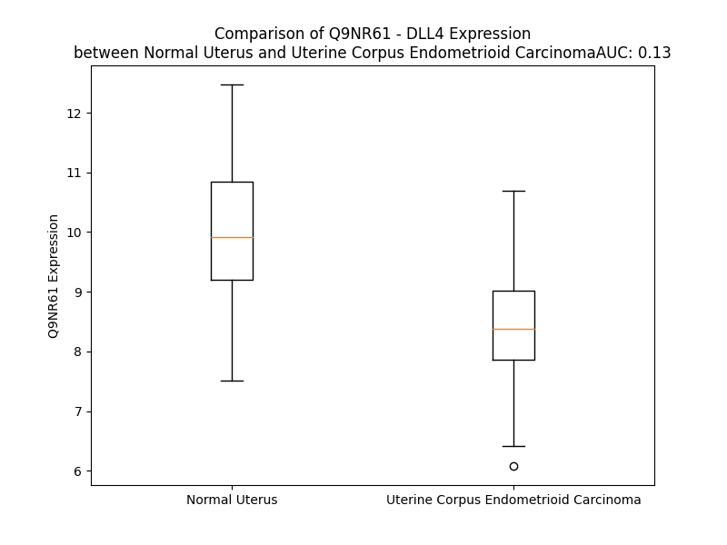

# Detailed Data for Q9NR61

## Introduction to the Detailed Summary

### How to Interpret the Results

- **Summary & Metrics**: This section provides a quick reference to essential protein attributes, including expression changes, family classification, and biomarker applications. Regulation status (upregulated/downregulated) indicates the protein's behavior in a disease context. Some information comes from the original excel file with the proteins selected from literature, while others are derived from the analyses.
- **Expression Comparison**: A visual representation comparing protein expression between normal and disease states. It highlights significant changes in expression levels that might indicate diagnostic or therapeutic relevance. This is data coming from transcriptomics experiments and could not translate similarly to protein levels.
- **Isoform Alignment**: An interactive view of isoform alignments, revealing structural and functional differences between variants of the protein.
- **Interactors & Homologs**: Tables listing known interaction partners and homologous proteins, the more interactors and homologs, the more complex the protein is to design an antibody for.
- **Biological Assemblies**: Information about the structural arrangement of the protein in different assemblies, providing insights into its functional state but also the complexity of the protein to develop antibodies.
- **Combined Per-Residue Information**: A detailed table summarizing residue-level data. This includes predictions for epitope regions, aggregation tendencies, and modifications that might impact the protein's function. Each row corresponds to a residue in the protein, providing insights into specific sites that may be important for research or drug development.
## Summary & Metrics

- **UniProt Accession**: Q9NR61
- **Gene Name**: DLL4
- **Protein Name**: Delta-like protein 4
- **Swiss Prot**: DLL4_HUMAN
- **Family**: other
- **Biomarker Application**:  
- **Number of Isoforms**: 0
- **Regulation**: 1
- **(transcriptomics) AUC**: 0.17
- **(transcriptomics) Fold Change**: 1.15
- **(transcriptomics) Regulation**: Downregulated
- **Discotope Epitope Count**: 142
- **Max n_uniprots (Homo)**: 1
- **Max n_uniprots (Hetero)**: N/A

## Expression Comparison

## Interactors

| preferredName_A   | preferredName_B   |   score |
|:------------------|:------------------|--------:|
| DLL4              | NOTCH1            |   0.999 |
| DLL4              | NOTCH2            |   0.999 |
| DLL4              | NOTCH4            |   0.998 |
| DLL4              | NOTCH3            |   0.998 |
| DLL4              | DLL1              |   0.942 |
| DLL4              | DLL3              |   0.919 |
| DLL4              | RBPJ              |   0.905 |

## Homologs

| uniprot_id   | gene_id   |
|:-------------|:----------|
| A0A140T8Y6   | NOTCH4    |
| A0A0D9SF76   | DLL1      |
| P78504       | JAG1      |
| Q8NFT8       | DNER      |
| Q9Y219       | JAG2      |

## Biological Assemblies

|   Unnamed: 0 |   assembly |   n_uniprots | composition   | crystal_id   |
|-------------:|-----------:|-------------:|:--------------|:-------------|
|            0 |          1 |            1 | Homo          | 5mvx         |

## Combined Per-Residue Information

|   res | aa   |   epitope_score | epitope   |   relative_surface_accessibility |   modeling_confidence |   Aggregation | modification   | glycosylation                   |
|------:|:-----|----------------:|:----------|---------------------------------:|----------------------:|--------------:|:---------------|:--------------------------------|
|     1 | M    |         0.09372 | False     |                          1.21677 |                 46.44 |         0     | N/A            | N/A                             |
|     2 | A    |         0.07368 | False     |                          0.83653 |                 46.29 |         0     | N/A            | N/A                             |
|     3 | A    |         0.03481 | False     |                          0.87934 |                 46.78 |         0     | N/A            | N/A                             |
|     4 | A    |         0.03655 | False     |                          0.69874 |                 47.48 |         0     | N/A            | N/A                             |
|     5 | S    |         0.06324 | False     |                          0.57852 |                 47.29 |         0     | N/A            | N/A                             |
|     6 | R    |         0.07394 | False     |                          0.83287 |                 46.72 |         0     | N/A            | N/A                             |
|     7 | S    |         0.04516 | False     |                          0.46707 |                 51.37 |         0.025 | N/A            | N/A                             |
|     8 | A    |         0.10324 | False     |                          0.59259 |                 52.81 |         0.228 | N/A            | N/A                             |
|     9 | S    |         0.12274 | True      |                          0.51258 |                 55.62 |         0.887 | N/A            | N/A                             |
|    10 | G    |         0.05553 | False     |                          0.38671 |                 52.91 |         6.197 | N/A            | N/A                             |
|    11 | W    |         0.14437 | True      |                          0.74205 |                 56.74 |        65.197 | N/A            | N/A                             |
|    12 | A    |         0.06317 | False     |                          0.45893 |                 57.94 |        79.466 | N/A            | N/A                             |
|    13 | L    |         0.09697 | False     |                          0.73671 |                 58.9  |        96.287 | N/A            | N/A                             |
|    14 | L    |         0.08043 | False     |                          0.72123 |                 56.96 |        99.249 | N/A            | N/A                             |
|    15 | L    |         0.08314 | False     |                          0.65619 |                 57.42 |        99.772 | N/A            | N/A                             |
|    16 | L    |         0.09076 | False     |                          0.63911 |                 57.7  |        99.811 | N/A            | N/A                             |
|    17 | V    |         0.05971 | False     |                          0.66873 |                 57.51 |        99.55  | N/A            | N/A                             |
|    18 | A    |         0.09467 | False     |                          0.54438 |                 52.67 |        95.833 | N/A            | N/A                             |
|    19 | L    |         0.10982 | False     |                          0.86024 |                 48.94 |        92.589 | N/A            | N/A                             |
|    20 | W    |         0.1191  | True      |                          0.88259 |                 42.58 |        74.778 | N/A            | N/A                             |
|    21 | Q    |         0.0795  | False     |                          0.70749 |                 38.95 |         1.095 | N/A            | N/A                             |
|    22 | Q    |         0.07294 | False     |                          0.77427 |                 45.82 |         0.041 | N/A            | N/A                             |
|    23 | R    |         0.08383 | False     |                          0.90644 |                 49.38 |         0     | N/A            | N/A                             |
|    24 | A    |         0.05739 | False     |                          0.57127 |                 53.32 |         0     | N/A            | N/A                             |
|    25 | A    |         0.05484 | False     |                          0.50548 |                 68.61 |         0     | N/A            | N/A                             |
|    26 | G    |         0.0077  | False     |                          0       |                 83.37 |         0     | N/A            | N/A                             |
|    27 | S    |         0.05763 | False     |                          0.14152 |                 92.44 |         0     | N/A            | N/A                             |
|    28 | G    |         0.00981 | False     |                          0.00595 |                 93.8  |         0.164 | N/A            | N/A                             |
|    29 | V    |         0.03254 | False     |                          0.15804 |                 95.44 |         0.31  | N/A            | N/A                             |
|    30 | F    |         0.00315 | False     |                          0       |                 96.15 |         0.31  | N/A            | N/A                             |
|    31 | Q    |         0.06561 | False     |                          0.06921 |                 96.68 |         0.31  | N/A            | N/A                             |
|    32 | L    |         0.00316 | False     |                          0       |                 96.35 |         0.31  | N/A            | N/A                             |
|    33 | Q    |         0.06709 | False     |                          0.16449 |                 96.52 |         0.146 | N/A            | N/A                             |
|    34 | L    |         0.00846 | False     |                          0.00487 |                 96.12 |         0.146 | N/A            | N/A                             |
|    35 | Q    |         0.07393 | False     |                          0.24048 |                 95.31 |         0     | N/A            | N/A                             |
|    36 | E    |         0.12186 | True      |                          0.17288 |                 96.53 |         0     | N/A            | N/A                             |
|    37 | F    |         0.01062 | False     |                          0.00387 |                 97.19 |         0     | N/A            | N/A                             |
|    38 | I    |         0.08872 | False     |                          0.22879 |                 97.26 |         0     | N/A            | N/A                             |
|    39 | N    |         0.00646 | False     |                          0       |                 96.29 |         0     | N/A            | N/A                             |
|    40 | E    |         0.12149 | True      |                          0.68849 |                 92.97 |         0     | N/A            | N/A                             |
|    41 | R    |         0.13063 | True      |                          0.71487 |                 92.61 |         0     | N/A            | N/A                             |
|    42 | G    |         0.04677 | False     |                          0.07246 |                 94.17 |         0     | N/A            | N/A                             |
|    43 | V    |         0.08103 | False     |                          0.10419 |                 95.21 |         0     | N/A            | N/A                             |
|    44 | L    |         0.03711 | False     |                          0.104   |                 95.15 |         0     | N/A            | N/A                             |
|    45 | A    |         0.06313 | False     |                          0.62883 |                 92.95 |         0     | N/A            | N/A                             |
|    46 | S    |         0.17155 | True      |                          0.5196  |                 91.47 |         0     | N/A            | N/A                             |
|    47 | G    |         0.07457 | False     |                          0.54868 |                 90.7  |         0     | N/A            | N/A                             |
|    48 | R    |         0.22883 | True      |                          0.62509 |                 92.97 |         0     | N/A            | N/A                             |
|    49 | P    |         0.17778 | True      |                          0.70394 |                 94.07 |         0     | N/A            | N/A                             |
|    50 | C    |         0.03292 | False     |                          0.06732 |                 93.44 |         0     | N/A            | N/A                             |
|    51 | E    |         0.21167 | True      |                          0.78224 |                 91.24 |         0     | N/A            | N/A                             |
|    52 | P    |         0.27615 | True      |                          1.04065 |                 92.06 |         0     | N/A            | N/A                             |
|    53 | G    |         0.03585 | False     |                          0.04185 |                 94.05 |         0     | N/A            | N/A                             |
|    54 | C    |         0.00523 | False     |                          0       |                 95.35 |         0     | N/A            | N/A                             |
|    55 | R    |         0.13331 | True      |                          0.31825 |                 96.25 |         0     | N/A            | N/A                             |
|    56 | T    |         0.00472 | False     |                          0       |                 96.34 |         0     | N/A            | N/A                             |
|    57 | F    |         0.011   | False     |                          0       |                 96.26 |         0     | N/A            | N/A                             |
|    58 | F    |         0.00262 | False     |                          0.00255 |                 96.38 |         0     | N/A            | N/A                             |
|    59 | R    |         0.14892 | True      |                          0.17612 |                 95.26 |         0     | N/A            | N/A                             |
|    60 | V    |         0.00612 | False     |                          0.00954 |                 96    |         0     | N/A            | N/A                             |
|    61 | C    |         0.03268 | False     |                          0.1246  |                 95.94 |         0     | N/A            | N/A                             |
|    62 | L    |         0.00721 | False     |                          0.0033  |                 95.96 |         0     | N/A            | N/A                             |
|    63 | K    |         0.02706 | False     |                          0.03649 |                 94.22 |         0     | N/A            | N/A                             |
|    64 | H    |         0.09507 | False     |                          0.48704 |                 92.79 |         0     | N/A            | N/A                             |
|    65 | F    |         0.11073 | False     |                          0.49234 |                 91.95 |         1.134 | N/A            | N/A                             |
|    66 | Q    |         0.11767 | True      |                          0.27337 |                 87.22 |         1.134 | N/A            | N/A                             |
|    67 | A    |         0.10915 | False     |                          0.78645 |                 84.81 |         1.134 | N/A            | N/A                             |
|    68 | V    |         0.21075 | True      |                          0.87263 |                 83.78 |         1.134 | N/A            | N/A                             |
|    69 | V    |         0.08419 | False     |                          0.29032 |                 78.86 |         1.134 | N/A            | N/A                             |
|    70 | S    |         0.12037 | True      |                          0.31358 |                 83.08 |         0     | N/A            | N/A                             |
|    71 | P    |         0.17764 | True      |                          0.97715 |                 80.53 |         0     | N/A            | N/A                             |
|    72 | G    |         0.15093 | True      |                          0.46274 |                 83.96 |         0     | N/A            | N/A                             |
|    73 | P    |         0.15508 | True      |                          0.7987  |                 92.47 |         0     | N/A            | N/A                             |
|    74 | C    |         0.06587 | False     |                          0.26999 |                 94.03 |         0     | N/A            | N/A                             |
|    75 | T    |         0.14071 | True      |                          0.46786 |                 93.18 |         0.266 | N/A            | N/A                             |
|    76 | F    |         0.04143 | False     |                          0.05017 |                 93.02 |         0.266 | N/A            | N/A                             |
|    77 | G    |         0.06698 | False     |                          0.35711 |                 94.26 |         0.266 | N/A            | N/A                             |
|    78 | T    |         0.19162 | True      |                          0.65592 |                 95.24 |         0.266 | N/A            | N/A                             |
|    79 | V    |         0.15418 | True      |                          0.2487  |                 95.45 |         0.266 | N/A            | N/A                             |
|    80 | S    |         0.19634 | True      |                          0.42967 |                 94.58 |         0     | N/A            | N/A                             |
|    81 | T    |         0.03811 | False     |                          0.02632 |                 95.3  |         0     | N/A            | N/A                             |
|    82 | P    |         0.08773 | False     |                          0.49678 |                 94.03 |         0     | N/A            | N/A                             |
|    83 | V    |         0.16112 | True      |                          0.34702 |                 94.99 |         0.34  | N/A            | N/A                             |
|    84 | L    |         0.06163 | False     |                          0.08156 |                 95.14 |         0.34  | N/A            | N/A                             |
|    85 | G    |         0.05416 | False     |                          0.20417 |                 94.61 |         0.34  | N/A            | N/A                             |
|    86 | T    |         0.14379 | True      |                          0.49    |                 95.94 |         0.34  | N/A            | N/A                             |
|    87 | N    |         0.08832 | False     |                          0.30326 |                 95.04 |         0.34  | N/A            | N/A                             |
|    88 | S    |         0.13947 | True      |                          0.32609 |                 96.92 |         0.34  | N/A            | N/A                             |
|    89 | F    |         0.10762 | False     |                          0.13024 |                 96.64 |         0.34  | N/A            | N/A                             |
|    90 | A    |         0.14815 | True      |                          0.70296 |                 96.13 |         0.34  | N/A            | N/A                             |
|    91 | V    |         0.04524 | False     |                          0.1163  |                 94.3  |         0.34  | N/A            | N/A                             |
|    92 | R    |         0.1887  | True      |                          0.70271 |                 92.87 |         0     | N/A            | N/A                             |
|    93 | D    |         0.14862 | True      |                          0.51584 |                 89.73 |         0     | N/A            | N/A                             |
|    94 | D    |         0.13401 | True      |                          0.66751 |                 90.25 |         0     | N/A            | N/A                             |
|    95 | S    |         0.06653 | False     |                          0.14107 |                 89.14 |         0     | N/A            | N/A                             |
|    96 | S    |         0.0641  | False     |                          0.27066 |                 86.67 |         0     | N/A            | N/A                             |
|    97 | G    |         0.01009 | False     |                          0       |                 80.8  |         0     | N/A            | N/A                             |
|    98 | G    |         0.0093  | False     |                          0.00805 |                 85.7  |         0     | N/A            | N/A                             |
|    99 | G    |         0.08804 | False     |                          0.38375 |                 85.22 |         0     | N/A            | N/A                             |
|   100 | R    |         0.21286 | True      |                          0.8167  |                 89.71 |         0     | N/A            | N/A                             |
|   101 | N    |         0.10761 | False     |                          0.42145 |                 92.9  |         0     | N/A            | N/A                             |
|   102 | P    |         0.02913 | False     |                          0.13801 |                 94.69 |         0     | N/A            | N/A                             |
|   103 | L    |         0.02601 | False     |                          0.02391 |                 96.14 |         0     | N/A            | N/A                             |
|   104 | Q    |         0.13087 | True      |                          0.48188 |                 95.8  |         0     | N/A            | N/A                             |
|   105 | L    |         0.01504 | False     |                          0.03147 |                 95.72 |         0     | N/A            | N/A                             |
|   106 | P    |         0.09652 | False     |                          0.70387 |                 94.62 |         0     | N/A            | N/A                             |
|   107 | F    |         0.02853 | False     |                          0.02631 |                 92.91 |         0     | N/A            | N/A                             |
|   108 | N    |         0.1077  | False     |                          0.7543  |                 91.28 |         0     | N/A            | N-linked (GlcNAc...) asparagine |
|   109 | F    |         0.07605 | False     |                          0.33693 |                 90.05 |         0     | N/A            | N/A                             |
|   110 | T    |         0.04586 | False     |                          0.43908 |                 91.45 |         0     | N/A            | N/A                             |
|   111 | W    |         0.00494 | False     |                          0.00111 |                 93.95 |         0     | N/A            | N/A                             |
|   112 | P    |         0.06093 | False     |                          0.42394 |                 92.8  |         0     | N/A            | N/A                             |
|   113 | G    |         0.03741 | False     |                          0.21084 |                 92.34 |         0.871 | N/A            | N/A                             |
|   114 | T    |         0.09727 | False     |                          0.37634 |                 94.3  |        11.438 | N/A            | N/A                             |
|   115 | F    |         0.00205 | False     |                          0.00191 |                 95.04 |        27.709 | N/A            | N/A                             |
|   116 | S    |         0.00752 | False     |                          0.00104 |                 95.23 |        27.709 | N/A            | N/A                             |
|   117 | L    |         0.00593 | False     |                          0.00391 |                 95.02 |        27.709 | N/A            | N/A                             |
|   118 | I    |         0.05749 | False     |                          0.05979 |                 94.8  |        27.709 | N/A            | N/A                             |
|   119 | I    |         0.01018 | False     |                          0.00873 |                 95.53 |        26.823 | N/A            | N/A                             |
|   120 | E    |         0.09143 | False     |                          0.15754 |                 95.08 |         0     | N/A            | N/A                             |
|   121 | A    |         0.01042 | False     |                          0.02188 |                 96.11 |         0     | N/A            | N/A                             |
|   122 | W    |         0.14277 | True      |                          0.16031 |                 96.68 |         0     | N/A            | N/A                             |
|   123 | H    |         0.07401 | False     |                          0.06838 |                 96.25 |         0     | N/A            | N/A                             |
|   124 | A    |         0.00903 | False     |                          0       |                 95.58 |         0     | N/A            | N/A                             |
|   125 | P    |         0.12001 | True      |                          0.55689 |                 91.16 |         0     | N/A            | N/A                             |
|   126 | G    |         0.12417 | True      |                          0.41081 |                 89.4  |         0     | N/A            | N/A                             |
|   127 | D    |         0.23833 | True      |                          0.77204 |                 89.58 |         0     | N/A            | N/A                             |
|   128 | D    |         0.18457 | True      |                          0.34887 |                 90.81 |         0     | N/A            | N/A                             |
|   129 | L    |         0.09795 | False     |                          0.28192 |                 90.94 |         0     | N/A            | N/A                             |
|   130 | R    |         0.27641 | True      |                          0.63707 |                 89.93 |         0     | N/A            | N/A                             |
|   131 | P    |         0.23898 | True      |                          0.60789 |                 87.6  |         0     | N/A            | N/A                             |
|   132 | E    |         0.16083 | True      |                          0.77784 |                 87.86 |         0     | N/A            | N/A                             |
|   133 | A    |         0.12456 | True      |                          0.47676 |                 89.11 |         0     | N/A            | N/A                             |
|   134 | L    |         0.067   | False     |                          0.11101 |                 90.61 |         0     | N/A            | N/A                             |
|   135 | P    |         0.16829 | True      |                          0.41057 |                 89.2  |         0     | N/A            | N/A                             |
|   136 | P    |         0.21049 | True      |                          0.92194 |                 86.2  |         0     | N/A            | N/A                             |
|   137 | D    |         0.19879 | True      |                          0.37938 |                 90.37 |         0     | N/A            | N/A                             |
|   138 | A    |         0.04081 | False     |                          0.02041 |                 94.24 |         0     | N/A            | N/A                             |
|   139 | L    |         0.05015 | False     |                          0.23143 |                 94.84 |         0     | N/A            | N/A                             |
|   140 | I    |         0.01777 | False     |                          0.03725 |                 95.5  |         0     | N/A            | N/A                             |
|   141 | S    |         0.02591 | False     |                          0.06531 |                 94.61 |         0     | N/A            | N/A                             |
|   142 | K    |         0.13835 | True      |                          0.5394  |                 93.69 |         0     | N/A            | N/A                             |
|   143 | I    |         0.05372 | False     |                          0.0664  |                 92.36 |         0     | N/A            | N/A                             |
|   144 | A    |         0.1109  | False     |                          0.48847 |                 92.48 |         0     | N/A            | N/A                             |
|   145 | I    |         0.06154 | False     |                          0.12319 |                 91.09 |         0     | N/A            | N/A                             |
|   146 | Q    |         0.09314 | False     |                          0.38379 |                 91.39 |         0     | N/A            | N/A                             |
|   147 | G    |         0.04009 | False     |                          0.13904 |                 89.21 |         0     | N/A            | N/A                             |
|   148 | S    |         0.13976 | True      |                          0.72906 |                 92.51 |         0     | N/A            | N/A                             |
|   149 | L    |         0.03188 | False     |                          0.09859 |                 92.58 |         0     | N/A            | N/A                             |
|   150 | A    |         0.08035 | False     |                          0.73618 |                 91.66 |         0     | N/A            | N/A                             |
|   151 | V    |         0.02733 | False     |                          0.24402 |                 92.59 |         0     | N/A            | N/A                             |
|   152 | G    |         0.04337 | False     |                          0.34735 |                 91.53 |         0     | N/A            | N/A                             |
|   153 | Q    |         0.12066 | True      |                          0.63548 |                 90.81 |         0     | N/A            | N/A                             |
|   154 | N    |         0.14504 | True      |                          0.83145 |                 94.21 |         0     | N/A            | N/A                             |
|   155 | W    |         0.08357 | False     |                          0.38278 |                 95.26 |         0     | N/A            | N/A                             |
|   156 | L    |         0.14056 | True      |                          0.51169 |                 95.36 |         0     | N/A            | N/A                             |
|   157 | L    |         0.10196 | False     |                          0.68039 |                 95.21 |         0     | N/A            | N/A                             |
|   158 | D    |         0.06808 | False     |                          0.24751 |                 94.23 |         0     | N/A            | N/A                             |
|   159 | E    |         0.07999 | False     |                          0.42034 |                 95.26 |         0     | N/A            | N/A                             |
|   160 | Q    |         0.07866 | False     |                          0.2842  |                 92.99 |         0     | N/A            | N/A                             |
|   161 | T    |         0.12936 | True      |                          0.73833 |                 92.28 |         0     | N/A            | N/A                             |
|   162 | S    |         0.07478 | False     |                          0.26751 |                 86.86 |         0     | N/A            | N/A                             |
|   163 | T    |         0.09985 | False     |                          0.97577 |                 84.87 |         0     | N/A            | N/A                             |
|   164 | L    |         0.07238 | False     |                          0.47666 |                 88.92 |         0     | N/A            | N/A                             |
|   165 | T    |         0.01826 | False     |                          0.05551 |                 95.16 |         0     | N/A            | N/A                             |
|   166 | R    |         0.102   | False     |                          0.35057 |                 96.43 |         0     | N/A            | N/A                             |
|   167 | L    |         0.00662 | False     |                          0.00824 |                 96.55 |         0     | N/A            | N/A                             |
|   168 | R    |         0.14181 | True      |                          0.32517 |                 96.97 |         0     | N/A            | N/A                             |
|   169 | Y    |         0.0047  | False     |                          0       |                 95.96 |         0     | N/A            | N/A                             |
|   170 | S    |         0.03606 | False     |                          0.0384  |                 96.15 |         0     | N/A            | N/A                             |
|   171 | Y    |         0.02773 | False     |                          0.05427 |                 96.55 |         0     | N/A            | N/A                             |
|   172 | R    |         0.04154 | False     |                          0.15921 |                 96.29 |         0     | N/A            | N/A                             |
|   173 | V    |         0.00386 | False     |                          0.00245 |                 95.74 |         0     | N/A            | N/A                             |
|   174 | I    |         0.04274 | False     |                          0.18559 |                 94.81 |         0     | N/A            | N/A                             |
|   175 | C    |         0.03136 | False     |                          0.23501 |                 94.33 |         0     | N/A            | N/A                             |
|   176 | S    |         0.03607 | False     |                          0.24751 |                 92.91 |         0     | N/A            | N/A                             |
|   177 | D    |         0.14391 | True      |                          0.79782 |                 91.1  |         0     | N/A            | N/A                             |
|   178 | N    |         0.13581 | True      |                          0.36816 |                 92.56 |         0     | N/A            | N/A                             |
|   179 | Y    |         0.07761 | False     |                          0.22041 |                 93.35 |         0     | N/A            | N/A                             |
|   180 | Y    |         0.05541 | False     |                          0.24428 |                 90.89 |         0     | N/A            | N/A                             |
|   181 | G    |         0.0462  | False     |                          0.40779 |                 87.07 |         0     | N/A            | N/A                             |
|   182 | D    |         0.05459 | False     |                          0.72906 |                 86.61 |         0     | N/A            | N/A                             |
|   183 | N    |         0.03105 | False     |                          0.37471 |                 89.58 |         0     | N/A            | N-linked (GlcNAc...) asparagine |
|   184 | C    |         0.00576 | False     |                          0       |                 92.4  |         0     | N/A            | N/A                             |
|   185 | S    |         0.06038 | False     |                          0.33892 |                 90.81 |         0     | N/A            | N/A                             |
|   186 | R    |         0.06999 | False     |                          0.43537 |                 90.36 |         0     | N/A            | N/A                             |
|   187 | L    |         0.10137 | False     |                          0.65432 |                 91.51 |         0     | N/A            | N/A                             |
|   188 | C    |         0.01625 | False     |                          0.02373 |                 94.22 |         0     | N/A            | N/A                             |
|   189 | K    |         0.10184 | False     |                          0.68331 |                 94.96 |         0     | N/A            | N/A                             |
|   190 | K    |         0.07063 | False     |                          0.74502 |                 95.91 |         0     | N/A            | N/A                             |
|   191 | R    |         0.21057 | True      |                          0.35539 |                 96.06 |         0     | N/A            | N/A                             |
|   192 | N    |         0.10288 | False     |                          0.71169 |                 96.86 |         0     | N/A            | N/A                             |
|   193 | D    |         0.09726 | False     |                          0.34747 |                 96.14 |         0     | N/A            | N/A                             |
|   194 | H    |         0.19436 | True      |                          0.89836 |                 94.74 |         0     | N/A            | N/A                             |
|   195 | F    |         0.14989 | True      |                          0.63667 |                 94.93 |         0     | N/A            | N/A                             |
|   196 | G    |         0.00773 | False     |                          0       |                 95.37 |         0     | N/A            | N/A                             |
|   197 | H    |         0.09346 | False     |                          0.12315 |                 97.75 |         0     | N/A            | N/A                             |
|   198 | Y    |         0.08835 | False     |                          0.10849 |                 97.79 |         0     | N/A            | N/A                             |
|   199 | V    |         0.04283 | False     |                          0.47794 |                 97.51 |         0     | N/A            | N/A                             |
|   200 | C    |         0.04823 | False     |                          0.22546 |                 95.64 |         0     | N/A            | N/A                             |
|   201 | Q    |         0.10707 | False     |                          0.37653 |                 94.3  |         0     | N/A            | N/A                             |
|   202 | P    |         0.07232 | False     |                          0.97386 |                 89.82 |         0     | N/A            | N/A                             |
|   203 | D    |         0.04861 | False     |                          0.40547 |                 90.17 |         0     | N/A            | N/A                             |
|   204 | G    |         0.0239  | False     |                          0.03807 |                 91.17 |         0     | N/A            | N/A                             |
|   205 | N    |         0.14901 | True      |                          0.41551 |                 93.45 |         0     | N/A            | N-linked (GlcNAc...) asparagine |
|   206 | L    |         0.1152  | True      |                          0.35667 |                 95.91 |         0     | N/A            | N/A                             |
|   207 | S    |         0.07616 | False     |                          0.28204 |                 96.91 |         0     | N/A            | N/A                             |
|   208 | C    |         0.05329 | False     |                          0.35577 |                 97.89 |         0     | N/A            | N/A                             |
|   209 | L    |         0.07195 | False     |                          0.30369 |                 97.91 |         0     | N/A            | N/A                             |
|   210 | P    |         0.12003 | True      |                          0.94352 |                 96.9  |         0     | N/A            | N/A                             |
|   211 | G    |         0.04665 | False     |                          0.27155 |                 96.74 |         0     | N/A            | N/A                             |
|   212 | W    |         0.10049 | False     |                          0.19275 |                 97.9  |         0     | N/A            | N/A                             |
|   213 | T    |         0.11601 | True      |                          0.38629 |                 97.1  |         0     | N/A            | N/A                             |
|   214 | G    |         0.1435  | True      |                          0.44549 |                 95.07 |         0     | N/A            | N/A                             |
|   215 | E    |         0.13726 | True      |                          0.7174  |                 94.6  |         0     | N/A            | N/A                             |
|   216 | Y    |         0.12005 | True      |                          0.54552 |                 96.04 |         0     | N/A            | N/A                             |
|   217 | C    |         0.01338 | False     |                          0.00748 |                 97.2  |         0     | N/A            | N/A                             |
|   218 | Q    |         0.12289 | True      |                          0.44061 |                 96.94 |         0     | N/A            | N/A                             |
|   219 | Q    |         0.05397 | False     |                          0.55693 |                 96.62 |         0     | N/A            | N/A                             |
|   220 | P    |         0.02971 | False     |                          0.15633 |                 97.32 |         0     | N/A            | N/A                             |
|   221 | I    |         0.07989 | False     |                          0.52645 |                 96.91 |         0     | N/A            | N/A                             |
|   222 | C    |         0.03338 | False     |                          0.31313 |                 97.43 |         0     | N/A            | N/A                             |
|   223 | L    |         0.07835 | False     |                          0.25652 |                 96.99 |         0     | N/A            | N/A                             |
|   224 | S    |         0.12546 | True      |                          0.79773 |                 96.46 |         0     | N/A            | N/A                             |
|   225 | G    |         0.14763 | True      |                          0.66641 |                 95.99 |         0     | N/A            | N/A                             |
|   226 | C    |         0.04269 | False     |                          0.1495  |                 97.59 |         0     | N/A            | N/A                             |
|   227 | H    |         0.0596  | False     |                          0.33014 |                 97.45 |         0     | N/A            | N/A                             |
|   228 | E    |         0.15022 | True      |                          0.8724  |                 95.49 |         0     | N/A            | N/A                             |
|   229 | Q    |         0.1472  | True      |                          0.71157 |                 96.21 |         0     | N/A            | N/A                             |
|   230 | N    |         0.0463  | False     |                          0.09044 |                 96.99 |         0     | N/A            | N/A                             |
|   231 | G    |         0.02639 | False     |                          0.07749 |                 96.92 |         0     | N/A            | N/A                             |
|   232 | Y    |         0.14093 | True      |                          0.42341 |                 97.1  |         0     | N/A            | N/A                             |
|   233 | C    |         0.03331 | False     |                          0.14864 |                 97.12 |         0     | N/A            | N/A                             |
|   234 | S    |         0.10497 | False     |                          0.56951 |                 95.11 |         0     | N/A            | N/A                             |
|   235 | K    |         0.07741 | False     |                          0.67865 |                 94.78 |         0     | N/A            | N/A                             |
|   236 | P    |         0.02765 | False     |                          0.31033 |                 96.19 |         0     | N/A            | N/A                             |
|   237 | A    |         0.11286 | False     |                          0.66918 |                 94.69 |         0     | N/A            | N/A                             |
|   238 | E    |         0.10078 | False     |                          0.23622 |                 95.72 |         0     | N/A            | N/A                             |
|   239 | C    |         0.0416  | False     |                          0.16734 |                 98.02 |         0     | N/A            | N/A                             |
|   240 | L    |         0.08747 | False     |                          0.42702 |                 97.67 |         0     | N/A            | N/A                             |
|   241 | C    |         0.06639 | False     |                          0.31351 |                 97.96 |         0     | N/A            | N/A                             |
|   242 | R    |         0.15389 | True      |                          0.46751 |                 97.59 |         0     | N/A            | N/A                             |
|   243 | P    |         0.17408 | True      |                          0.93373 |                 96.86 |         0     | N/A            | N/A                             |
|   244 | G    |         0.01418 | False     |                          0.02074 |                 96.55 |         0     | N/A            | N/A                             |
|   245 | W    |         0.1064  | False     |                          0.24726 |                 98.04 |         0     | N/A            | N/A                             |
|   246 | Q    |         0.09923 | False     |                          0.38225 |                 96.58 |         0     | N/A            | N/A                             |
|   247 | G    |         0.09224 | False     |                          0.35164 |                 95.24 |         0     | N/A            | N/A                             |
|   248 | R    |         0.13652 | True      |                          0.77617 |                 96.12 |         0     | N/A            | N/A                             |
|   249 | L    |         0.10315 | False     |                          0.34941 |                 97.29 |         0     | N/A            | N/A                             |
|   250 | C    |         0.00504 | False     |                          0       |                 97.87 |         0     | N/A            | N/A                             |
|   251 | N    |         0.07705 | False     |                          0.53122 |                 96.71 |         0     | N/A            | N/A                             |
|   252 | E    |         0.08901 | False     |                          0.47604 |                 97.36 |         0     | N/A            | N/A                             |
|   253 | C    |         0.01524 | False     |                          0.1138  |                 97.67 |         0     | N/A            | N/A                             |
|   254 | I    |         0.03112 | False     |                          0.30879 |                 97.2  |         0     | N/A            | N/A                             |
|   255 | P    |         0.09273 | False     |                          0.29364 |                 96.85 |         0     | N/A            | N/A                             |
|   256 | H    |         0.05478 | False     |                          0.39288 |                 96.2  |         0     | N/A            | N/A                             |
|   257 | N    |         0.15557 | True      |                          0.83142 |                 95.5  |         0     | N/A            | N/A                             |
|   258 | G    |         0.04561 | False     |                          0.27762 |                 94.89 |         0     | N/A            | N/A                             |
|   259 | C    |         0.03491 | False     |                          0.15684 |                 96.36 |         0     | N/A            | N/A                             |
|   260 | R    |         0.11925 | True      |                          0.68943 |                 94.35 |         0     | N/A            | N/A                             |
|   261 | H    |         0.05646 | False     |                          0.38188 |                 92.89 |         0     | N/A            | N/A                             |
|   262 | G    |         0.03068 | False     |                          0.20951 |                 94.83 |         0     | N/A            | N/A                             |
|   263 | T    |         0.08053 | False     |                          0.57361 |                 96.09 |         0     | N/A            | N/A                             |
|   264 | C    |         0.05131 | False     |                          0.20253 |                 97.11 |         0     | N/A            | N/A                             |
|   265 | S    |         0.15305 | True      |                          0.71417 |                 95.46 |         0     | N/A            | N/A                             |
|   266 | T    |         0.13005 | True      |                          0.49846 |                 94.82 |         0     | N/A            | N/A                             |
|   267 | P    |         0.03661 | False     |                          0.25898 |                 96.33 |         0     | N/A            | N/A                             |
|   268 | W    |         0.06157 | False     |                          0.56151 |                 94.49 |         0     | N/A            | N/A                             |
|   269 | Q    |         0.07263 | False     |                          0.35786 |                 95.91 |         0     | N/A            | N/A                             |
|   270 | C    |         0.04562 | False     |                          0.20378 |                 97.55 |         0     | N/A            | N/A                             |
|   271 | T    |         0.07377 | False     |                          0.58633 |                 96.55 |         0     | N/A            | N/A                             |
|   272 | C    |         0.06608 | False     |                          0.32503 |                 95.53 |         0     | N/A            | N/A                             |
|   273 | D    |         0.10018 | False     |                          0.37982 |                 93.56 |         0     | N/A            | N/A                             |
|   274 | E    |         0.10014 | False     |                          0.93415 |                 89.64 |         0     | N/A            | N/A                             |
|   275 | G    |         0.02131 | False     |                          0.28162 |                 85.94 |         0     | N/A            | N/A                             |
|   276 | W    |         0.08044 | False     |                          0.25991 |                 89.85 |         0     | N/A            | N/A                             |
|   277 | G    |         0.02398 | False     |                          0.11266 |                 87.49 |         0     | N/A            | N/A                             |
|   278 | G    |         0.10857 | False     |                          0.39794 |                 88.78 |         0     | N/A            | N/A                             |
|   279 | L    |         0.10757 | False     |                          0.88121 |                 91.37 |         0     | N/A            | N/A                             |
|   280 | F    |         0.07825 | False     |                          0.36739 |                 94.65 |         0     | N/A            | N/A                             |
|   281 | C    |         0.00385 | False     |                          0       |                 94.03 |         0     | N/A            | N/A                             |
|   282 | D    |         0.06778 | False     |                          0.28393 |                 91.07 |         0     | N/A            | N/A                             |
|   283 | Q    |         0.06128 | False     |                          0.2044  |                 86.44 |         0     | N/A            | N/A                             |
|   284 | D    |         0.0478  | False     |                          0.0745  |                 87.28 |         0     | N/A            | N/A                             |
|   285 | L    |         0.06503 | False     |                          0.5553  |                 85.47 |         0     | N/A            | N/A                             |
|   286 | N    |         0.03828 | False     |                          0.33303 |                 85.3  |         0     | N/A            | N/A                             |
|   287 | Y    |         0.0453  | False     |                          0.26196 |                 86.2  |         0     | N/A            | N/A                             |
|   288 | C    |         0.01904 | False     |                          0.12423 |                 87.84 |         0     | N/A            | N/A                             |
|   289 | T    |         0.06572 | False     |                          0.66888 |                 84.69 |         0     | N/A            | N/A                             |
|   290 | H    |         0.14804 | True      |                          0.56769 |                 83.16 |         0     | N/A            | N/A                             |
|   291 | H    |         0.1293  | True      |                          0.5628  |                 87.55 |         0     | N/A            | N/A                             |
|   292 | S    |         0.09564 | False     |                          0.62082 |                 90.06 |         0     | N/A            | N/A                             |
|   293 | P    |         0.05244 | False     |                          0.13156 |                 91.77 |         0     | N/A            | N/A                             |
|   294 | C    |         0.02968 | False     |                          0.15691 |                 93.24 |         0     | N/A            | N/A                             |
|   295 | K    |         0.09965 | False     |                          0.55825 |                 91.62 |         0     | N/A            | N/A                             |
|   296 | N    |         0.03613 | False     |                          0.41036 |                 89.55 |         0     | N/A            | N/A                             |
|   297 | G    |         0.10095 | False     |                          0.58076 |                 88.19 |         0     | N/A            | N/A                             |
|   298 | A    |         0.01772 | False     |                          0.15655 |                 91.7  |         0     | N/A            | N/A                             |
|   299 | T    |         0.05092 | False     |                          0.65938 |                 92.73 |         0     | N/A            | N/A                             |
|   300 | C    |         0.01368 | False     |                          0.25618 |                 92.64 |         0     | N/A            | N/A                             |
|   301 | S    |         0.03341 | False     |                          0.41077 |                 90.18 |         0     | N/A            | N/A                             |
|   302 | N    |         0.02727 | False     |                          0.43954 |                 85.06 |         0     | N/A            | N/A                             |
|   303 | S    |         0.10991 | False     |                          0.33232 |                 70.76 |         0     | N/A            | N/A                             |
|   304 | G    |         0.20685 | True      |                          0.74331 |                 63.29 |         0     | N/A            | N/A                             |
|   305 | Q    |         0.1432  | True      |                          0.69416 |                 59.69 |         0     | N/A            | N/A                             |
|   306 | R    |         0.15872 | True      |                          0.51659 |                 58.6  |         0     | N/A            | N/A                             |
|   307 | S    |         0.1071  | False     |                          0.41936 |                 74.43 |         0     | N/A            | N/A                             |
|   308 | Y    |         0.09322 | False     |                          0.21874 |                 86.64 |         0     | N/A            | N/A                             |
|   309 | T    |         0.04919 | False     |                          0.48834 |                 89.42 |         0     | N/A            | N/A                             |
|   310 | C    |         0.02923 | False     |                          0.11112 |                 91.48 |         0     | N/A            | N/A                             |
|   311 | T    |         0.06446 | False     |                          0.63598 |                 92.19 |         0     | N/A            | N/A                             |
|   312 | C    |         0.02927 | False     |                          0.29562 |                 89.36 |         0     | N/A            | N/A                             |
|   313 | R    |         0.04668 | False     |                          0.56517 |                 87.17 |         0     | N/A            | N/A                             |
|   314 | P    |         0.10376 | False     |                          0.9929  |                 82.1  |         0     | N/A            | N/A                             |
|   315 | G    |         0.03007 | False     |                          0.41344 |                 75.23 |         0     | N/A            | N/A                             |
|   316 | Y    |         0.07845 | False     |                          0.28036 |                 85.2  |         0     | N/A            | N/A                             |
|   317 | T    |         0.0687  | False     |                          0.35049 |                 84    |         0     | N/A            | N/A                             |
|   318 | G    |         0.08021 | False     |                          0.353   |                 87.29 |         0     | N/A            | N/A                             |
|   319 | V    |         0.06516 | False     |                          0.7554  |                 89.3  |         0     | N/A            | N/A                             |
|   320 | D    |         0.04488 | False     |                          0.20989 |                 92.08 |         0     | N/A            | N/A                             |
|   321 | C    |         0.00654 | False     |                          0.001   |                 90.91 |         0     | N/A            | N/A                             |
|   322 | E    |         0.18885 | True      |                          0.42695 |                 90.16 |         0     | N/A            | N/A                             |
|   323 | L    |         0.05971 | False     |                          0.61085 |                 84.48 |         0     | N/A            | N/A                             |
|   324 | E    |         0.10025 | False     |                          0.68069 |                 77.87 |         0     | N/A            | N/A                             |
|   325 | L    |         0.1158  | True      |                          0.53616 |                 68.95 |         0     | N/A            | N/A                             |
|   326 | S    |         0.06309 | False     |                          0.34582 |                 65.65 |         0     | N/A            | N/A                             |
|   327 | E    |         0.04421 | False     |                          0.37841 |                 67.32 |         0     | N/A            | N/A                             |
|   328 | C    |         0.02126 | False     |                          0.17623 |                 75.35 |         0     | N/A            | N/A                             |
|   329 | D    |         0.25613 | True      |                          0.67652 |                 72.52 |         0     | N/A            | N/A                             |
|   330 | S    |         0.09091 | False     |                          0.68886 |                 70.85 |         0     | N/A            | N/A                             |
|   331 | N    |         0.12346 | True      |                          0.76501 |                 77.92 |         0     | N/A            | N/A                             |
|   332 | P    |         0.05045 | False     |                          0.1562  |                 84.25 |         0     | N/A            | N/A                             |
|   333 | C    |         0.02646 | False     |                          0.15105 |                 86.98 |         0     | N/A            | N/A                             |
|   334 | R    |         0.09733 | False     |                          0.64943 |                 85.27 |         0     | N/A            | N/A                             |
|   335 | N    |         0.05234 | False     |                          0.45169 |                 82.56 |         0     | N/A            | N/A                             |
|   336 | G    |         0.07164 | False     |                          0.81102 |                 82.58 |         0     | N/A            | N/A                             |
|   337 | G    |         0.02673 | False     |                          0.17607 |                 86.78 |         0     | N/A            | N/A                             |
|   338 | S    |         0.05201 | False     |                          0.51065 |                 87.97 |         0     | N/A            | N/A                             |
|   339 | C    |         0.0227  | False     |                          0.29038 |                 88.09 |         0     | N/A            | N/A                             |
|   340 | K    |         0.08089 | False     |                          0.61844 |                 84.17 |         0     | N/A            | N/A                             |
|   341 | D    |         0.07058 | False     |                          0.47096 |                 76.14 |         0     | N/A            | N/A                             |
|   342 | Q    |         0.13837 | True      |                          0.61137 |                 72.05 |         0     | N/A            | N/A                             |
|   343 | E    |         0.21392 | True      |                          0.96089 |                 66.6  |         0     | N/A            | N/A                             |
|   344 | D    |         0.14141 | True      |                          0.92455 |                 63.69 |         0     | N/A            | N/A                             |
|   345 | G    |         0.08653 | False     |                          0.24328 |                 70.47 |         0     | N/A            | N/A                             |
|   346 | Y    |         0.16317 | True      |                          0.31886 |                 79.72 |         0     | N/A            | N/A                             |
|   347 | H    |         0.10569 | False     |                          0.51181 |                 84.97 |         0     | N/A            | N/A                             |
|   348 | C    |         0.02926 | False     |                          0.0725  |                 87.81 |         0     | N/A            | N/A                             |
|   349 | L    |         0.0733  | False     |                          0.51042 |                 89.25 |         0     | N/A            | N/A                             |
|   350 | C    |         0.04505 | False     |                          0.34878 |                 85.04 |         0     | N/A            | N/A                             |
|   351 | P    |         0.06161 | False     |                          0.29122 |                 83.99 |         0     | N/A            | N/A                             |
|   352 | P    |         0.16081 | True      |                          1.01388 |                 80.84 |         0     | N/A            | N/A                             |
|   353 | G    |         0.0443  | False     |                          0.45174 |                 71.47 |         0     | N/A            | N/A                             |
|   354 | Y    |         0.11259 | False     |                          0.40698 |                 82.27 |         0     | N/A            | N/A                             |
|   355 | Y    |         0.14728 | True      |                          0.54476 |                 80.94 |         0     | N/A            | N/A                             |
|   356 | G    |         0.05649 | False     |                          0.38659 |                 81.06 |         0     | N/A            | N/A                             |
|   357 | L    |         0.10394 | False     |                          0.76287 |                 84.83 |         0     | N/A            | N/A                             |
|   358 | H    |         0.06914 | False     |                          0.30839 |                 87.21 |         0     | N/A            | N/A                             |
|   359 | C    |         0.00893 | False     |                          0       |                 85.01 |         0     | N/A            | N/A                             |
|   360 | E    |         0.16766 | True      |                          0.38839 |                 85.59 |         0     | N/A            | N/A                             |
|   361 | H    |         0.06274 | False     |                          0.47335 |                 78.69 |         0     | N/A            | N/A                             |
|   362 | S    |         0.07059 | False     |                          0.51388 |                 68.37 |         0     | N/A            | N/A                             |
|   363 | T    |         0.07433 | False     |                          0.62232 |                 64.12 |         0     | N/A            | N/A                             |
|   364 | L    |         0.0681  | False     |                          0.60045 |                 65.05 |         0     | N/A            | N/A                             |
|   365 | S    |         0.06346 | False     |                          0.23019 |                 69.57 |         0     | N/A            | N/A                             |
|   366 | C    |         0.05547 | False     |                          0.18952 |                 75.22 |         0     | N/A            | N/A                             |
|   367 | A    |         0.11739 | True      |                          0.89059 |                 74.85 |         0     | N/A            | N/A                             |
|   368 | D    |         0.07849 | False     |                          0.50634 |                 75.25 |         0     | N/A            | N/A                             |
|   369 | S    |         0.13381 | True      |                          0.68184 |                 80.18 |         0     | N/A            | N/A                             |
|   370 | P    |         0.04478 | False     |                          0.07754 |                 84.42 |         0     | N/A            | N/A                             |
|   371 | C    |         0.03133 | False     |                          0.15726 |                 87.21 |         0     | N/A            | N/A                             |
|   372 | F    |         0.07499 | False     |                          0.60225 |                 86.79 |         0     | N/A            | N/A                             |
|   373 | N    |         0.06118 | False     |                          0.48032 |                 83.84 |         0     | N/A            | N/A                             |
|   374 | G    |         0.0743  | False     |                          0.85409 |                 82.68 |         0     | N/A            | N/A                             |
|   375 | G    |         0.02378 | False     |                          0.16383 |                 85.89 |         0     | N/A            | N/A                             |
|   376 | S    |         0.06687 | False     |                          0.50554 |                 87.99 |         0     | N/A            | N/A                             |
|   377 | C    |         0.02245 | False     |                          0.33096 |                 87.35 |         0     | N/A            | N/A                             |
|   378 | R    |         0.11983 | True      |                          0.58115 |                 85.2  |         0     | N/A            | N/A                             |
|   379 | E    |         0.1631  | True      |                          0.56229 |                 79.99 |         0     | N/A            | N/A                             |
|   380 | R    |         0.1259  | True      |                          0.63579 |                 70.01 |         0     | N/A            | N/A                             |
|   381 | N    |         0.17919 | True      |                          0.67602 |                 67.79 |         0     | N/A            | N/A                             |
|   382 | Q    |         0.16103 | True      |                          0.98317 |                 60.93 |         0     | N/A            | N/A                             |
|   383 | G    |         0.06326 | False     |                          0.35348 |                 61.74 |         0     | N/A            | N/A                             |
|   384 | A    |         0.09483 | False     |                          0.68088 |                 62.83 |         0     | N/A            | N/A                             |
|   385 | N    |         0.07714 | False     |                          0.4428  |                 68.4  |         0     | N/A            | N/A                             |
|   386 | Y    |         0.08272 | False     |                          0.22365 |                 78.99 |         0     | N/A            | N/A                             |
|   387 | A    |         0.08583 | False     |                          0.41163 |                 83.55 |         0     | N/A            | N/A                             |
|   388 | C    |         0.03578 | False     |                          0.16956 |                 85.89 |         0     | N/A            | N/A                             |
|   389 | E    |         0.06063 | False     |                          0.43842 |                 90.18 |         0     | N/A            | N/A                             |
|   390 | C    |         0.05205 | False     |                          0.34831 |                 86.56 |         0     | N/A            | N/A                             |
|   391 | P    |         0.04237 | False     |                          0.27749 |                 86.29 |         0     | N/A            | N/A                             |
|   392 | P    |         0.09592 | False     |                          0.88395 |                 83.78 |         0     | N/A            | N/A                             |
|   393 | N    |         0.07075 | False     |                          0.54731 |                 80.15 |         0     | N/A            | N-linked (GlcNAc...) asparagine |
|   394 | F    |         0.07237 | False     |                          0.27062 |                 85.06 |         0     | N/A            | N/A                             |
|   395 | T    |         0.07316 | False     |                          0.42505 |                 81.71 |         0     | N/A            | N/A                             |
|   396 | G    |         0.04134 | False     |                          0.29849 |                 81.1  |         0     | N/A            | N/A                             |
|   397 | S    |         0.06239 | False     |                          0.73421 |                 82.79 |         0     | N/A            | N/A                             |
|   398 | N    |         0.02284 | False     |                          0.20066 |                 86.88 |         0     | N/A            | N/A                             |
|   399 | C    |         0.01072 | False     |                          0       |                 85.07 |         0     | N/A            | N/A                             |
|   400 | E    |         0.15772 | True      |                          0.41114 |                 87.35 |         0     | N/A            | N/A                             |
|   401 | K    |         0.07278 | False     |                          0.59968 |                 79.82 |         0     | N/A            | N/A                             |
|   402 | K    |         0.1025  | False     |                          0.78821 |                 76.26 |         0     | N/A            | N/A                             |
|   403 | V    |         0.14785 | True      |                          0.49135 |                 72.57 |         0     | N/A            | N/A                             |
|   404 | D    |         0.08541 | False     |                          0.45602 |                 67.85 |         0     | N/A            | N/A                             |
|   405 | R    |         0.08153 | False     |                          0.47483 |                 68.11 |         0     | N/A            | N/A                             |
|   406 | C    |         0.02081 | False     |                          0.11835 |                 76.68 |         0     | N/A            | N/A                             |
|   407 | T    |         0.13794 | True      |                          0.78275 |                 72.59 |         0     | N/A            | N/A                             |
|   408 | S    |         0.11787 | True      |                          0.67505 |                 70.82 |         0     | N/A            | N/A                             |
|   409 | N    |         0.16018 | True      |                          0.7833  |                 70.59 |         0     | N/A            | N/A                             |
|   410 | P    |         0.0949  | False     |                          0.2091  |                 78.34 |         0     | N/A            | N/A                             |
|   411 | C    |         0.0387  | False     |                          0.13049 |                 83.81 |         0     | N/A            | N/A                             |
|   412 | A    |         0.05226 | False     |                          0.39631 |                 82.17 |         0     | N/A            | N/A                             |
|   413 | N    |         0.04543 | False     |                          0.41443 |                 77.57 |         0     | N/A            | N/A                             |
|   414 | G    |         0.10515 | False     |                          0.54427 |                 77.6  |         0     | N/A            | N/A                             |
|   415 | G    |         0.02295 | False     |                          0.15347 |                 80.5  |         0     | N/A            | N/A                             |
|   416 | Q    |         0.07624 | False     |                          0.47499 |                 83.8  |         0     | N/A            | N/A                             |
|   417 | C    |         0.01674 | False     |                          0.17994 |                 83.61 |         0     | N/A            | N/A                             |
|   418 | L    |         0.06151 | False     |                          0.45175 |                 80.34 |         0     | N/A            | N/A                             |
|   419 | N    |         0.0639  | False     |                          0.49345 |                 72.07 |         0     | N/A            | N/A                             |
|   420 | R    |         0.14269 | True      |                          0.70892 |                 65.16 |         0     | N/A            | N/A                             |
|   421 | G    |         0.13116 | True      |                          0.71583 |                 66.5  |         0     | N/A            | N/A                             |
|   422 | P    |         0.15847 | True      |                          0.92264 |                 66.46 |         0     | N/A            | N/A                             |
|   423 | S    |         0.14674 | True      |                          0.51975 |                 62.7  |         0     | N/A            | N/A                             |
|   424 | R    |         0.12577 | True      |                          0.51209 |                 70.71 |         0     | N/A            | N/A                             |
|   425 | M    |         0.15444 | True      |                          0.52734 |                 81.61 |         0     | N/A            | N/A                             |
|   426 | C    |         0.06957 | False     |                          0.13942 |                 83.86 |         0     | N/A            | N/A                             |
|   427 | R    |         0.11195 | False     |                          0.58528 |                 86.5  |         0     | N/A            | N/A                             |
|   428 | C    |         0.0412  | False     |                          0.30305 |                 83.03 |         0     | N/A            | N/A                             |
|   429 | R    |         0.0723  | False     |                          0.58774 |                 80.28 |         0     | N/A            | N/A                             |
|   430 | P    |         0.11233 | False     |                          0.9803  |                 76.36 |         0     | N/A            | N/A                             |
|   431 | G    |         0.03806 | False     |                          0.29212 |                 69.47 |         0     | N/A            | N/A                             |
|   432 | F    |         0.07501 | False     |                          0.30011 |                 79.83 |         0     | N/A            | N/A                             |
|   433 | T    |         0.06858 | False     |                          0.446   |                 79.83 |         0     | N/A            | N/A                             |
|   434 | G    |         0.07329 | False     |                          0.34142 |                 80.53 |         0     | N/A            | N/A                             |
|   435 | T    |         0.08411 | False     |                          0.74194 |                 83.56 |         0     | N/A            | N/A                             |
|   436 | Y    |         0.06144 | False     |                          0.45351 |                 84.35 |         0     | N/A            | N/A                             |
|   437 | C    |         0.01374 | False     |                          0       |                 83.76 |         0     | N/A            | N/A                             |
|   438 | E    |         0.21252 | True      |                          0.44543 |                 83.79 |         0     | N/A            | N/A                             |
|   439 | L    |         0.06595 | False     |                          0.60343 |                 77.39 |         0     | N/A            | N/A                             |
|   440 | H    |         0.08565 | False     |                          0.58384 |                 67.17 |         0     | N/A            | N/A                             |
|   441 | V    |         0.07643 | False     |                          0.43485 |                 66.53 |         0     | N/A            | N/A                             |
|   442 | S    |         0.06923 | False     |                          0.4138  |                 62.92 |         0     | N/A            | N/A                             |
|   443 | D    |         0.06122 | False     |                          0.29712 |                 63.72 |         0     | N/A            | N/A                             |
|   444 | C    |         0.03763 | False     |                          0.21767 |                 74.25 |         0     | N/A            | N/A                             |
|   445 | A    |         0.19345 | True      |                          0.74086 |                 72.19 |         0     | N/A            | N/A                             |
|   446 | R    |         0.2228  | True      |                          0.86385 |                 73.08 |         0     | N/A            | N/A                             |
|   447 | N    |         0.12991 | True      |                          0.8408  |                 76.38 |         0     | N/A            | N/A                             |
|   448 | P    |         0.06671 | False     |                          0.1341  |                 79.95 |         0     | N/A            | N/A                             |
|   449 | C    |         0.03231 | False     |                          0.15298 |                 83.95 |         0     | N/A            | N/A                             |
|   450 | A    |         0.09728 | False     |                          0.34619 |                 83.94 |         0     | N/A            | N/A                             |
|   451 | H    |         0.04582 | False     |                          0.56252 |                 80.79 |         0     | N/A            | N/A                             |
|   452 | G    |         0.08211 | False     |                          0.85626 |                 80.45 |         0     | N/A            | N/A                             |
|   453 | G    |         0.03452 | False     |                          0.17981 |                 84    |         0     | N/A            | N/A                             |
|   454 | T    |         0.10028 | False     |                          0.54802 |                 85.3  |         0     | N/A            | N/A                             |
|   455 | C    |         0.02448 | False     |                          0.25247 |                 83.98 |         0     | N/A            | N/A                             |
|   456 | H    |         0.10886 | False     |                          0.44608 |                 81.89 |         0     | N/A            | N/A                             |
|   457 | D    |         0.07895 | False     |                          0.46728 |                 71.65 |         0     | N/A            | N/A                             |
|   458 | L    |         0.11362 | False     |                          0.57477 |                 66.87 |         0     | N/A            | N/A                             |
|   459 | E    |         0.14049 | True      |                          0.87187 |                 62.88 |         0     | N/A            | N/A                             |
|   460 | N    |         0.10203 | False     |                          0.95398 |                 57.81 |         0     | N/A            | N/A                             |
|   461 | G    |         0.07379 | False     |                          0.19964 |                 64.56 |         0     | N/A            | N/A                             |
|   462 | L    |         0.05199 | False     |                          0.14645 |                 73.57 |         0     | N/A            | N/A                             |
|   463 | M    |         0.12771 | True      |                          0.55358 |                 80.2  |         0     | N/A            | N/A                             |
|   464 | C    |         0.02839 | False     |                          0.1126  |                 83.85 |         0     | N/A            | N/A                             |
|   465 | T    |         0.09401 | False     |                          0.49499 |                 85.52 |         0     | N/A            | N/A                             |
|   466 | C    |         0.04233 | False     |                          0.32307 |                 82.8  |         0     | N/A            | N/A                             |
|   467 | P    |         0.07177 | False     |                          0.39398 |                 82.98 |         0     | N/A            | N/A                             |
|   468 | A    |         0.07897 | False     |                          1.01767 |                 75.46 |         0     | N/A            | N/A                             |
|   469 | G    |         0.04278 | False     |                          0.50095 |                 70.55 |         0     | N/A            | N/A                             |
|   470 | F    |         0.06034 | False     |                          0.28299 |                 80.45 |         0     | N/A            | N/A                             |
|   471 | S    |         0.05882 | False     |                          0.3455  |                 73.99 |         0     | N/A            | N/A                             |
|   472 | G    |         0.04381 | False     |                          0.41769 |                 75.52 |         0     | N/A            | N/A                             |
|   473 | R    |         0.08517 | False     |                          0.74279 |                 81.1  |         0     | N/A            | N/A                             |
|   474 | R    |         0.05485 | False     |                          0.44665 |                 82.52 |         0     | N/A            | N/A                             |
|   475 | C    |         0.00819 | False     |                          0       |                 83.01 |         0     | N/A            | N/A                             |
|   476 | E    |         0.14144 | True      |                          0.47041 |                 83.34 |         0     | N/A            | N/A                             |
|   477 | V    |         0.0515  | False     |                          0.52173 |                 73.2  |         0     | N/A            | N/A                             |
|   478 | R    |         0.07519 | False     |                          0.72476 |                 66.35 |         0     | N/A            | N/A                             |
|   479 | T    |         0.09327 | False     |                          0.57529 |                 58.72 |         0     | N/A            | N/A                             |
|   480 | S    |         0.08353 | False     |                          0.70739 |                 53.69 |         0     | N/A            | N/A                             |
|   481 | I    |         0.11695 | True      |                          0.91874 |                 53.85 |         0     | N/A            | N/A                             |
|   482 | D    |         0.08916 | False     |                          0.5195  |                 59.42 |         0     | N/A            | N/A                             |
|   483 | A    |         0.04107 | False     |                          0.30959 |                 64.8  |         0     | N/A            | N/A                             |
|   484 | C    |         0.02612 | False     |                          0.19358 |                 74.51 |         0     | N/A            | N/A                             |
|   485 | A    |         0.10317 | False     |                          0.63346 |                 72.94 |         0     | N/A            | N/A                             |
|   486 | S    |         0.12221 | True      |                          0.69419 |                 76.2  |         0     | N/A            | N/A                             |
|   487 | S    |         0.11606 | True      |                          0.702   |                 79.63 |         0     | N/A            | N/A                             |
|   488 | P    |         0.04469 | False     |                          0.06996 |                 84.24 |         0     | N/A            | N/A                             |
|   489 | C    |         0.03562 | False     |                          0.14271 |                 87.8  |         0     | N/A            | N/A                             |
|   490 | F    |         0.08413 | False     |                          0.59096 |                 87.59 |         0     | N/A            | N/A                             |
|   491 | N    |         0.03567 | False     |                          0.3571  |                 83.91 |         0     | N/A            | N/A                             |
|   492 | R    |         0.08312 | False     |                          0.95717 |                 82.28 |         0     | N/A            | N/A                             |
|   493 | A    |         0.01881 | False     |                          0.14269 |                 81.92 |         0     | N/A            | N/A                             |
|   494 | T    |         0.03325 | False     |                          0.5127  |                 86.13 |         0     | N/A            | N/A                             |
|   495 | C    |         0.02128 | False     |                          0.2426  |                 85.16 |         0     | N/A            | N/A                             |
|   496 | Y    |         0.06038 | False     |                          0.51565 |                 82.58 |         0     | N/A            | N/A                             |
|   497 | T    |         0.02943 | False     |                          0.48874 |                 74.07 |         0     | N/A            | N/A                             |
|   498 | D    |         0.07667 | False     |                          0.33521 |                 64    |         0     | N/A            | N/A                             |
|   499 | L    |         0.14522 | True      |                          1.15489 |                 59.12 |         0     | N/A            | N/A                             |
|   500 | S    |         0.09384 | False     |                          0.71101 |                 60.4  |         0     | N/A            | N/A                             |
|   501 | T    |         0.12387 | True      |                          0.57405 |                 58.91 |         0     | N/A            | N/A                             |
|   502 | D    |         0.07971 | False     |                          0.87304 |                 63.23 |         0     | N/A            | N/A                             |
|   503 | T    |         0.0748  | False     |                          0.46166 |                 70.25 |         0     | N/A            | N/A                             |
|   504 | F    |         0.0757  | False     |                          0.31745 |                 78.6  |         0     | N/A            | N/A                             |
|   505 | V    |         0.09521 | False     |                          0.59124 |                 83.76 |         0     | N/A            | N/A                             |
|   506 | C    |         0.0281  | False     |                          0.13034 |                 86.67 |         0     | N/A            | N/A                             |
|   507 | N    |         0.08395 | False     |                          0.564   |                 88.16 |         0     | N/A            | N/A                             |
|   508 | C    |         0.04974 | False     |                          0.3159  |                 86.46 |         0     | N/A            | N/A                             |
|   509 | P    |         0.05689 | False     |                          0.39149 |                 83.5  |         0     | N/A            | N/A                             |
|   510 | Y    |         0.10856 | False     |                          1.06742 |                 83.59 |         0     | N/A            | N/A                             |
|   511 | G    |         0.04497 | False     |                          0.41307 |                 78.82 |         0     | N/A            | N/A                             |
|   512 | F    |         0.08332 | False     |                          0.33128 |                 83.62 |         0     | N/A            | N/A                             |
|   513 | V    |         0.07462 | False     |                          0.57029 |                 81.58 |         0     | N/A            | N/A                             |
|   514 | G    |         0.07547 | False     |                          0.39718 |                 82.43 |         0     | N/A            | N/A                             |
|   515 | S    |         0.05265 | False     |                          0.72436 |                 83.26 |         0     | N/A            | N/A                             |
|   516 | R    |         0.05246 | False     |                          0.4028  |                 86.6  |         0     | N/A            | N/A                             |
|   517 | C    |         0.00581 | False     |                          0       |                 87.06 |         0     | N/A            | N/A                             |
|   518 | E    |         0.1736  | True      |                          0.3151  |                 87.85 |         0     | N/A            | N/A                             |
|   519 | F    |         0.0875  | False     |                          0.59406 |                 83.74 |         0     | N/A            | N/A                             |
|   520 | P    |         0.11439 | True      |                          0.66465 |                 74.52 |         0     | N/A            | N/A                             |
|   521 | V    |         0.14206 | True      |                          0.66192 |                 71.06 |         0     | N/A            | N/A                             |
|   522 | G    |         0.09962 | False     |                          0.65731 |                 59.18 |         0     | N/A            | N/A                             |
|   523 | L    |         0.10013 | False     |                          1.05673 |                 46.37 |         0     | N/A            | N/A                             |
|   524 | P    |         0.12614 | True      |                          0.86032 |                 52.22 |         0     | N/A            | N/A                             |
|   525 | P    |         0.15418 | True      |                          0.81398 |                 42.63 |         0     | N/A            | N/A                             |
|   526 | S    |         0.14322 | True      |                          0.85737 |                 43.67 |         0     | N/A            | N/A                             |
|   527 | F    |         0.12966 | True      |                          0.91822 |                 48.48 |         0     | N/A            | N/A                             |
|   528 | P    |         0.05985 | False     |                          0.62909 |                 56.64 |         0.198 | N/A            | N/A                             |
|   529 | W    |         0.11781 | True      |                          0.96885 |                 58.56 |        17.562 | N/A            | N/A                             |
|   530 | V    |         0.10066 | False     |                          0.76927 |                 58.38 |        22.093 | N/A            | N/A                             |
|   531 | A    |         0.06279 | False     |                          0.64953 |                 59.18 |        22.808 | N/A            | N/A                             |
|   532 | V    |         0.07099 | False     |                          0.71592 |                 62.52 |        23.982 | N/A            | N/A                             |
|   533 | S    |         0.04352 | False     |                          0.54931 |                 61.87 |        24.411 | N/A            | N/A                             |
|   534 | L    |         0.06002 | False     |                          0.78049 |                 68.36 |        28.688 | N/A            | N/A                             |
|   535 | G    |         0.07397 | False     |                          0.5362  |                 71.67 |        31.237 | N/A            | N/A                             |
|   536 | V    |         0.04543 | False     |                          0.6432  |                 77.57 |        59.562 | N/A            | N/A                             |
|   537 | G    |         0.05498 | False     |                          0.46317 |                 77.68 |        61.968 | N/A            | N/A                             |
|   538 | L    |         0.0446  | False     |                          0.69896 |                 85.96 |        88.712 | N/A            | N/A                             |
|   539 | A    |         0.03848 | False     |                          0.50521 |                 82.25 |        93.61  | N/A            | N/A                             |
|   540 | V    |         0.04492 | False     |                          0.57872 |                 84.42 |        99.4   | N/A            | N/A                             |
|   541 | L    |         0.05001 | False     |                          0.65925 |                 87.41 |        99.888 | N/A            | N/A                             |
|   542 | L    |         0.05712 | False     |                          0.66489 |                 88.9  |        99.967 | N/A            | N/A                             |
|   543 | V    |         0.04674 | False     |                          0.7054  |                 87.46 |        99.931 | N/A            | N/A                             |
|   544 | L    |         0.04828 | False     |                          0.65111 |                 87.07 |        99.312 | N/A            | N/A                             |
|   545 | L    |         0.0358  | False     |                          0.62038 |                 90.6  |        95.908 | N/A            | N/A                             |
|   546 | G    |         0.05394 | False     |                          0.42016 |                 88.37 |        77.314 | N/A            | N/A                             |
|   547 | M    |         0.06904 | False     |                          0.69145 |                 87.57 |        75.655 | N/A            | N/A                             |
|   548 | V    |         0.03285 | False     |                          0.61776 |                 87.64 |        75.124 | N/A            | N/A                             |
|   549 | A    |         0.04713 | False     |                          0.58266 |                 84.34 |        72.738 | N/A            | N/A                             |
|   550 | V    |         0.03198 | False     |                          0.62023 |                 84.33 |        71     | N/A            | N/A                             |
|   551 | A    |         0.03695 | False     |                          0.4656  |                 80.91 |        54.416 | N/A            | N/A                             |
|   552 | V    |         0.04188 | False     |                          0.45223 |                 83.04 |        49.399 | N/A            | N/A                             |
|   553 | R    |         0.08794 | False     |                          0.72215 |                 80.32 |         0     | N/A            | N/A                             |
|   554 | Q    |         0.09744 | False     |                          0.64077 |                 73.44 |         0     | N/A            | N/A                             |
|   555 | L    |         0.07117 | False     |                          0.84385 |                 71.96 |         0     | N/A            | N/A                             |
|   556 | R    |         0.09748 | False     |                          0.80719 |                 68.45 |         0     | N/A            | N/A                             |
|   557 | L    |         0.09371 | False     |                          0.88562 |                 61.5  |         0     | N/A            | N/A                             |
|   558 | R    |         0.07378 | False     |                          0.87146 |                 52.54 |         0     | N/A            | N/A                             |
|   559 | R    |         0.11351 | False     |                          0.92734 |                 41.1  |         0     | N/A            | N/A                             |
|   560 | P    |         0.08043 | False     |                          0.9438  |                 42.61 |         0     | N/A            | N/A                             |
|   561 | D    |         0.09988 | False     |                          0.92905 |                 41.89 |         0     | N/A            | N/A                             |
|   562 | D    |         0.15906 | True      |                          0.89286 |                 36.58 |         0     | N/A            | N/A                             |
|   563 | G    |         0.09198 | False     |                          0.7817  |                 42.29 |         0     | N/A            | N/A                             |
|   564 | S    |         0.05631 | False     |                          0.72178 |                 38.64 |         0     | N/A            | N/A                             |
|   565 | R    |         0.11194 | False     |                          0.83978 |                 35.45 |         0     | N/A            | N/A                             |
|   566 | E    |         0.10099 | False     |                          0.70147 |                 39.49 |         0     | N/A            | N/A                             |
|   567 | A    |         0.10282 | False     |                          0.84365 |                 41.52 |         0     | N/A            | N/A                             |
|   568 | M    |         0.10018 | False     |                          0.95358 |                 39.66 |         0     | N/A            | N/A                             |
|   569 | N    |         0.09661 | False     |                          0.87726 |                 36.01 |         0     | N/A            | N/A                             |
|   570 | N    |         0.11088 | False     |                          0.89917 |                 35.76 |         0     | N/A            | N/A                             |
|   571 | L    |         0.08048 | False     |                          0.96348 |                 36.74 |         0     | N/A            | N/A                             |
|   572 | S    |         0.05999 | False     |                          0.67242 |                 34.47 |         0     | N/A            | N/A                             |
|   573 | D    |         0.0808  | False     |                          0.69409 |                 33.37 |         0     | N/A            | N/A                             |
|   574 | F    |         0.07958 | False     |                          0.82208 |                 32.88 |         0     | N/A            | N/A                             |
|   575 | Q    |         0.0663  | False     |                          0.499   |                 32.25 |         0     | N/A            | N/A                             |
|   576 | K    |         0.08945 | False     |                          0.76275 |                 29.21 |         0     | N/A            | N/A                             |
|   577 | D    |         0.06744 | False     |                          0.67216 |                 35.09 |         0     | N/A            | N/A                             |
|   578 | N    |         0.07646 | False     |                          0.71444 |                 29.71 |         0     | N/A            | N/A                             |
|   579 | L    |         0.06862 | False     |                          0.97772 |                 30.66 |         0     | N/A            | N/A                             |
|   580 | I    |         0.08989 | False     |                          0.94502 |                 28.52 |         0     | N/A            | N/A                             |
|   581 | P    |         0.0992  | False     |                          0.8763  |                 29.84 |         0     | N/A            | N/A                             |
|   582 | A    |         0.07457 | False     |                          0.81388 |                 25.74 |         0     | N/A            | N/A                             |
|   583 | A    |         0.06629 | False     |                          0.79127 |                 32.11 |         0     | N/A            | N/A                             |
|   584 | Q    |         0.10589 | False     |                          0.74239 |                 37.19 |         0     | N/A            | N/A                             |
|   585 | L    |         0.05709 | False     |                          0.8479  |                 30.76 |         0     | N/A            | N/A                             |
|   586 | K    |         0.07894 | False     |                          0.86679 |                 31.86 |         0     | N/A            | N/A                             |
|   587 | N    |         0.06219 | False     |                          0.97273 |                 31.97 |         0     | N/A            | N/A                             |
|   588 | T    |         0.08418 | False     |                          0.67476 |                 34.62 |         0     | N/A            | N/A                             |
|   589 | N    |         0.10961 | False     |                          0.91986 |                 33.45 |         0     | N/A            | N/A                             |
|   590 | Q    |         0.09132 | False     |                          0.81922 |                 36.37 |         0     | N/A            | N/A                             |
|   591 | K    |         0.10378 | False     |                          0.75624 |                 32.1  |         0     | N/A            | N/A                             |
|   592 | K    |         0.08249 | False     |                          0.75172 |                 32.01 |         0     | N/A            | N/A                             |
|   593 | E    |         0.0756  | False     |                          0.65659 |                 30.67 |         0     | N/A            | N/A                             |
|   594 | L    |         0.08221 | False     |                          1.08567 |                 28.74 |         0     | N/A            | N/A                             |
|   595 | E    |         0.10057 | False     |                          0.86792 |                 30.88 |         0     | N/A            | N/A                             |
|   596 | V    |         0.07872 | False     |                          0.92003 |                 30.28 |         0     | N/A            | N/A                             |
|   597 | D    |         0.06984 | False     |                          0.80537 |                 32.84 |         0     | N/A            | N/A                             |
|   598 | C    |         0.10665 | False     |                          0.82168 |                 31.2  |         0     | N/A            | N/A                             |
|   599 | G    |         0.10186 | False     |                          0.93044 |                 31.86 |         0     | N/A            | N/A                             |
|   600 | L    |         0.07223 | False     |                          1.13565 |                 38.7  |         0     | N/A            | N/A                             |
|   601 | D    |         0.11104 | False     |                          0.78498 |                 32.35 |         0     | N/A            | N/A                             |
|   602 | K    |         0.06079 | False     |                          0.94822 |                 34.33 |         0     | N/A            | N/A                             |
|   603 | S    |         0.10361 | False     |                          0.76755 |                 35.72 |         0     | N/A            | N/A                             |
|   604 | N    |         0.14539 | True      |                          0.99216 |                 33.48 |         0     | N/A            | N/A                             |
|   605 | C    |         0.07849 | False     |                          0.94628 |                 26.26 |         0     | N/A            | N/A                             |
|   606 | G    |         0.11006 | False     |                          0.93056 |                 32.42 |         0     | N/A            | N/A                             |
|   607 | K    |         0.07506 | False     |                          0.91009 |                 30.87 |         0     | N/A            | N/A                             |
|   608 | Q    |         0.08746 | False     |                          0.83508 |                 33.34 |         0     | N/A            | N/A                             |
|   609 | Q    |         0.07881 | False     |                          0.83166 |                 35.75 |         0     | N/A            | N/A                             |
|   610 | N    |         0.0471  | False     |                          0.8242  |                 29.16 |         0     | N/A            | N/A                             |
|   611 | H    |         0.12399 | True      |                          1.03957 |                 35.44 |         0     | N/A            | N/A                             |
|   612 | T    |         0.07056 | False     |                          0.81924 |                 30.95 |         0     | N/A            | N/A                             |
|   613 | L    |         0.10997 | False     |                          1.02839 |                 34.79 |         0     | N/A            | N/A                             |
|   614 | D    |         0.056   | False     |                          0.61502 |                 31.27 |         0     | N/A            | N/A                             |
|   615 | Y    |         0.15078 | True      |                          0.93861 |                 35.71 |         0     | N/A            | N/A                             |
|   616 | N    |         0.08547 | False     |                          0.70947 |                 35.05 |         0     | N/A            | N/A                             |
|   617 | L    |         0.08751 | False     |                          1.04911 |                 36.17 |         0     | N/A            | N/A                             |
|   618 | A    |         0.085   | False     |                          0.90195 |                 38.31 |         0     | N/A            | N/A                             |
|   619 | P    |         0.06719 | False     |                          0.94079 |                 38.59 |         0     | N/A            | N/A                             |
|   620 | G    |         0.10492 | False     |                          0.87032 |                 33.8  |         0     | N/A            | N/A                             |
|   621 | P    |         0.11154 | False     |                          0.85581 |                 38.12 |         0     | N/A            | N/A                             |
|   622 | L    |         0.09181 | False     |                          1.09304 |                 34.83 |         0     | N/A            | N/A                             |
|   623 | G    |         0.16947 | True      |                          0.89951 |                 32.6  |         0     | N/A            | N/A                             |
|   624 | R    |         0.09952 | False     |                          1.00818 |                 31.32 |         0     | N/A            | N/A                             |
|   625 | G    |         0.12328 | True      |                          0.77215 |                 31.81 |         0     | N/A            | N/A                             |
|   626 | T    |         0.07805 | False     |                          1.01022 |                 32.19 |         0     | N/A            | N/A                             |
|   627 | M    |         0.11543 | True      |                          0.89572 |                 33.36 |         0     | N/A            | N/A                             |
|   628 | P    |         0.08101 | False     |                          0.91151 |                 37.29 |         0     | N/A            | N/A                             |
|   629 | G    |         0.08897 | False     |                          0.79015 |                 31.44 |         0     | N/A            | N/A                             |
|   630 | K    |         0.06639 | False     |                          0.9439  |                 33.58 |         0     | N/A            | N/A                             |
|   631 | F    |         0.12195 | True      |                          0.99319 |                 32.35 |         0     | N/A            | N/A                             |
|   632 | P    |         0.08685 | False     |                          0.77744 |                 40.66 |         0     | N/A            | N/A                             |
|   633 | H    |         0.07963 | False     |                          0.98034 |                 35.16 |         0     | N/A            | N/A                             |
|   634 | S    |         0.09738 | False     |                          0.6357  |                 33.16 |         0     | N/A            | N/A                             |
|   635 | D    |         0.07248 | False     |                          0.66178 |                 37.72 |         0     | N/A            | N/A                             |
|   636 | K    |         0.07932 | False     |                          0.86703 |                 36.4  |         0     | N/A            | N/A                             |
|   637 | S    |         0.10415 | False     |                          0.76238 |                 34.02 |         0     | N/A            | N/A                             |
|   638 | L    |         0.07123 | False     |                          1.09076 |                 35.35 |         0     | N/A            | N/A                             |
|   639 | G    |         0.09035 | False     |                          0.82696 |                 30.44 |         0     | N/A            | N/A                             |
|   640 | E    |         0.08221 | False     |                          0.97663 |                 34.77 |         0     | N/A            | N/A                             |
|   641 | K    |         0.11072 | False     |                          1.0047  |                 32.23 |         0     | N/A            | N/A                             |
|   642 | A    |         0.06115 | False     |                          0.89456 |                 35.66 |         0     | N/A            | N/A                             |
|   643 | P    |         0.13606 | True      |                          0.82694 |                 32.9  |         0     | N/A            | N/A                             |
|   644 | L    |         0.0755  | False     |                          1.10779 |                 26.56 |         0     | N/A            | N/A                             |
|   645 | R    |         0.11011 | False     |                          0.915   |                 29.49 |         0     | N/A            | N/A                             |
|   646 | L    |         0.08561 | False     |                          1.10063 |                 28.99 |         0     | N/A            | N/A                             |
|   647 | H    |         0.11909 | True      |                          0.95087 |                 29.32 |         0     | N/A            | N/A                             |
|   648 | S    |         0.08088 | False     |                          0.80878 |                 33.26 |         0     | N/A            | N/A                             |
|   649 | E    |         0.06318 | False     |                          0.87297 |                 39.81 |         0     | N/A            | N/A                             |
|   650 | K    |         0.08506 | False     |                          0.71208 |                 42    |         0     | N/A            | N/A                             |
|   651 | P    |         0.098   | False     |                          0.76174 |                 46.02 |         0     | N/A            | N/A                             |
|   652 | E    |         0.05675 | False     |                          0.67413 |                 41.66 |         0     | N/A            | N/A                             |
|   653 | C    |         0.04529 | False     |                          0.5236  |                 40.2  |         0     | N/A            | N/A                             |
|   654 | R    |         0.10263 | False     |                          0.81739 |                 44.09 |         0     | N/A            | N/A                             |
|   655 | I    |         0.04305 | False     |                          0.70077 |                 42.85 |         0     | N/A            | N/A                             |
|   656 | S    |         0.07224 | False     |                          0.7798  |                 33.22 |         0     | N/A            | N/A                             |
|   657 | A    |         0.06289 | False     |                          0.84657 |                 37.38 |         0     | N/A            | N/A                             |
|   658 | I    |         0.09773 | False     |                          0.9915  |                 34.08 |         0     | N/A            | N/A                             |
|   659 | C    |         0.06198 | False     |                          0.89721 |                 32.58 |         0     | N/A            | N/A                             |
|   660 | S    |         0.0453  | False     |                          0.71469 |                 33    |         0     | N/A            | N/A                             |
|   661 | P    |         0.05931 | False     |                          0.89515 |                 34.6  |         0     | N/A            | N/A                             |
|   662 | R    |         0.11231 | False     |                          0.89404 |                 36.82 |         0     | N/A            | N/A                             |
|   663 | D    |         0.09588 | False     |                          0.87457 |                 32.64 |         0     | N/A            | N/A                             |
|   664 | S    |         0.08267 | False     |                          0.85553 |                 35.66 |         0     | N/A            | N/A                             |
|   665 | M    |         0.0804  | False     |                          1.00226 |                 34.52 |         0     | N/A            | N/A                             |
|   666 | Y    |         0.09297 | False     |                          1.03478 |                 34.15 |         0     | N/A            | N/A                             |
|   667 | Q    |         0.06046 | False     |                          0.63475 |                 34.29 |         0     | N/A            | N/A                             |
|   668 | S    |         0.06209 | False     |                          0.90522 |                 35.05 |         0.384 | N/A            | N/A                             |
|   669 | V    |         0.07234 | False     |                          0.68863 |                 34.66 |         0.526 | N/A            | N/A                             |
|   670 | C    |         0.0547  | False     |                          0.87173 |                 34.2  |         0.526 | N/A            | N/A                             |
|   671 | L    |         0.06929 | False     |                          0.84198 |                 36.14 |         0.526 | N/A            | N/A                             |
|   672 | I    |         0.07586 | False     |                          0.97533 |                 42.81 |         0.526 | N/A            | N/A                             |
|   673 | S    |         0.08526 | False     |                          0.78492 |                 42.99 |         0.142 | N/A            | N/A                             |
|   674 | E    |         0.10209 | False     |                          0.63204 |                 41.52 |         0     | N/A            | N/A                             |
|   675 | E    |         0.08897 | False     |                          0.89075 |                 50.71 |         0     | N/A            | N/A                             |
|   676 | R    |         0.1491  | True      |                          0.77589 |                 50.8  |         0     | N/A            | N/A                             |
|   677 | N    |         0.06822 | False     |                          0.96049 |                 53.71 |         0     | N/A            | N/A                             |
|   678 | E    |         0.07125 | False     |                          0.66318 |                 49.52 |         0     | N/A            | N/A                             |
|   679 | C    |         0.04415 | False     |                          0.61628 |                 45.46 |         0     | N/A            | N/A                             |
|   680 | V    |         0.11214 | False     |                          0.81431 |                 52.91 |         0     | N/A            | N/A                             |
|   681 | I    |         0.05864 | False     |                          0.71823 |                 51.44 |         0     | N/A            | N/A                             |
|   682 | A    |         0.11981 | True      |                          0.73983 |                 48.37 |         0     | N/A            | N/A                             |
|   683 | T    |         0.08564 | False     |                          0.75177 |                 46.93 |         0     | N/A            | N/A                             |
|   684 | E    |         0.09625 | False     |                          0.78298 |                 39.44 |         0     | N/A            | N/A                             |
|   685 | V    |         0.09094 | False     |                          1.44313 |                 44.14 |         0     | N/A            | N/A                             |

