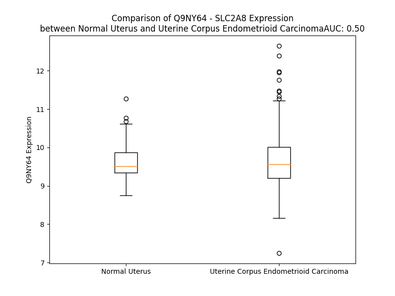

# Detailed Data for Q9NY64

## Introduction to the Detailed Summary

### How to Interpret the Results

- **Summary & Metrics**: This section provides a quick reference to essential protein attributes, including expression changes, family classification, and biomarker applications. Regulation status (upregulated/downregulated) indicates the protein's behavior in a disease context. Some information comes from the original excel file with the proteins selected from literature, while others are derived from the analyses.
- **Expression Comparison**: A visual representation comparing protein expression between normal and disease states. It highlights significant changes in expression levels that might indicate diagnostic or therapeutic relevance. This is data coming from transcriptomics experiments and could not translate similarly to protein levels.
- **Isoform Alignment**: An interactive view of isoform alignments, revealing structural and functional differences between variants of the protein.
- **Interactors & Homologs**: Tables listing known interaction partners and homologous proteins, the more interactors and homologs, the more complex the protein is to design an antibody for.
- **Biological Assemblies**: Information about the structural arrangement of the protein in different assemblies, providing insights into its functional state but also the complexity of the protein to develop antibodies.
- **Combined Per-Residue Information**: A detailed table summarizing residue-level data. This includes predictions for epitope regions, aggregation tendencies, and modifications that might impact the protein's function. Each row corresponds to a residue in the protein, providing insights into specific sites that may be important for research or drug development.
## Summary & Metrics

- **UniProt Accession**: Q9NY64
- **Gene Name**: GLUT8
- **Protein Name**: Solute carrier family 2, facilitated glucose transporter member 8
- **Swiss Prot**: GTR8_HUMAN
- **Family**: transporter
- **Biomarker Application**:  
- **Number of Isoforms**: 0
- **Regulation**: 1
- **(transcriptomics) AUC**: 0.5
- **(transcriptomics) Fold Change**: 1.01
- **(transcriptomics) Regulation**: Upregulated
- **Discotope Epitope Count**: 107
- **Max n_uniprots (Homo)**: N/A
- **Max n_uniprots (Hetero)**: N/A

## Expression Comparison

## Interactors

| preferredName_A   | preferredName_B   | score   |
|-------------------|-------------------|---------|

## Homologs

| uniprot_id   | gene_id   |
|:-------------|:----------|
| K7EIT1       | SLC2A5    |
| A6NL68       | SLC2A1    |
| F5GYX0       | SLC2A3    |
| F5H5Q3       | SLC2A14   |
| Q9NRM0       | SLC2A9    |
| F2Z2F6       | SLC2A6    |
| C9J0E8       | SLC2A2    |
| Q6PXP3       | SLC2A7    |
| Q8TD20       | SLC2A12   |
| I3L2R4       | SLC2A4    |
| O95528       | SLC2A10   |
| Q96QE2       | SLC2A13   |
| F8WCV3       | SLC2A11   |

## Combined Per-Residue Information

|   res | aa   |   epitope_score | epitope   |   relative_surface_accessibility |   modeling_confidence |   Aggregation | modification   | glycosylation                   |
|------:|:-----|----------------:|:----------|---------------------------------:|----------------------:|--------------:|:---------------|:--------------------------------|
|     1 | M    |         0.13674 | False     |                          1.31821 |                 36    |         0     | N/A            | N/A                             |
|     2 | T    |         0.24113 | True      |                          0.9087  |                 32.28 |         0     | N/A            | N/A                             |
|     3 | P    |         0.25606 | True      |                          0.9562  |                 38.34 |         0     | N/A            | N/A                             |
|     4 | E    |         0.23521 | True      |                          0.85967 |                 38.13 |         0     | N/A            | N/A                             |
|     5 | D    |         0.2172  | True      |                          0.81946 |                 35.72 |         0     | N/A            | N/A                             |
|     6 | P    |         0.18411 | True      |                          0.83581 |                 41.12 |         0     | N/A            | N/A                             |
|     7 | E    |         0.2453  | True      |                          0.88118 |                 34.81 |         0     | N/A            | N/A                             |
|     8 | E    |         0.23689 | True      |                          0.7592  |                 36.88 |         0     | N/A            | N/A                             |
|     9 | T    |         0.23541 | True      |                          0.93581 |                 33.77 |         0     | N/A            | N/A                             |
|    10 | Q    |         0.24677 | True      |                          0.85559 |                 32.28 |         0     | N/A            | N/A                             |
|    11 | P    |         0.22422 | True      |                          0.79768 |                 33.33 |         0     | N/A            | N/A                             |
|    12 | L    |         0.25082 | True      |                          0.99647 |                 44.97 |         0     | N/A            | N/A                             |
|    13 | L    |         0.25739 | True      |                          1.02053 |                 34.31 |         0     | N/A            | N/A                             |
|    14 | G    |         0.23144 | True      |                          0.6356  |                 33.85 |         0     | N/A            | N/A                             |
|    15 | P    |         0.25025 | True      |                          0.9171  |                 28.93 |         0     | N/A            | N/A                             |
|    16 | P    |         0.20493 | True      |                          0.94765 |                 41.61 |         0     | N/A            | N/A                             |
|    17 | G    |         0.28945 | True      |                          0.87243 |                 37.67 |         0     | N/A            | N/A                             |
|    18 | G    |         0.29197 | True      |                          0.85709 |                 40.41 |         0     | N/A            | N/A                             |
|    19 | S    |         0.21818 | True      |                          0.59806 |                 52.5  |         0     | N/A            | N/A                             |
|    20 | A    |         0.20726 | True      |                          0.59684 |                 57.7  |         0     | N/A            | N/A                             |
|    21 | P    |         0.15843 | True      |                          0.19069 |                 59.68 |         0     | N/A            | N/A                             |
|    22 | R    |         0.28079 | True      |                          0.8204  |                 65.76 |         0     | N/A            | N/A                             |
|    23 | G    |         0.10343 | False     |                          0.13476 |                 73.79 |         0     | N/A            | N/A                             |
|    24 | R    |         0.16028 | True      |                          0.84957 |                 83.49 |         0     | N/A            | N/A                             |
|    25 | R    |         0.1365  | False     |                          0.51236 |                 92.16 |         0     | N/A            | N/A                             |
|    26 | V    |         0.00726 | False     |                          0       |                 93.67 |        63.64  | N/A            | N/A                             |
|    27 | F    |         0.06547 | False     |                          0.42395 |                 94.56 |        78.286 | N/A            | N/A                             |
|    28 | L    |         0.03471 | False     |                          0.51276 |                 94.44 |        81.051 | N/A            | N/A                             |
|    29 | A    |         0.00358 | False     |                          0       |                 95.72 |        81.479 | N/A            | N/A                             |
|    30 | A    |         0.00718 | False     |                          0.03383 |                 96.32 |        81.907 | N/A            | N/A                             |
|    31 | F    |         0.01282 | False     |                          0.45261 |                 96.09 |        81.542 | N/A            | N/A                             |
|    32 | A    |         0.00106 | False     |                          0       |                 96.72 |        69.551 | N/A            | N/A                             |
|    33 | A    |         0.00107 | False     |                          0       |                 96.9  |        58.985 | N/A            | N/A                             |
|    34 | A    |         0.00393 | False     |                          0.0153  |                 96.61 |        49.986 | N/A            | N/A                             |
|    35 | L    |         0.00751 | False     |                          0.04781 |                 96.81 |        42.315 | N/A            | N/A                             |
|    36 | G    |         0.00071 | False     |                          0       |                 96.34 |         0     | N/A            | N/A                             |
|    37 | P    |         0.0092  | False     |                          0.00398 |                 96.96 |         0     | N/A            | N/A                             |
|    38 | L    |         0.01009 | False     |                          0.12613 |                 97.42 |         4.025 | N/A            | N/A                             |
|    39 | S    |         0.00228 | False     |                          0.00416 |                 96.8  |         4.565 | N/A            | N/A                             |
|    40 | F    |         0.01541 | False     |                          0.0637  |                 95.26 |         9.352 | N/A            | N/A                             |
|    41 | G    |         0.0055  | False     |                          0       |                 94.71 |         9.352 | N/A            | N/A                             |
|    42 | F    |         0.00152 | False     |                          0.00265 |                 96.18 |        10.406 | N/A            | N/A                             |
|    43 | A    |         0.00112 | False     |                          0       |                 94.79 |         9.918 | N/A            | N/A                             |
|    44 | L    |         0.02781 | False     |                          0.33697 |                 90.71 |         9.506 | N/A            | N/A                             |
|    45 | G    |         0.0342  | False     |                          0.02736 |                 91.11 |         3.535 | N/A            | N/A                             |
|    46 | Y    |         0.00319 | False     |                          0       |                 93.35 |         3.035 | N/A            | N/A                             |
|    47 | S    |         0.03965 | False     |                          0.10375 |                 89.94 |         0.244 | N/A            | N/A                             |
|    48 | S    |         0.05586 | False     |                          0.35106 |                 86    |         0     | N/A            | N/A                             |
|    49 | P    |         0.05573 | False     |                          0.18894 |                 87.9  |         0     | N/A            | N/A                             |
|    50 | A    |         0.00482 | False     |                          0.00255 |                 91.05 |         0     | N/A            | N/A                             |
|    51 | I    |         0.07736 | False     |                          0.22239 |                 88.79 |         0     | N/A            | N/A                             |
|    52 | P    |         0.11727 | False     |                          0.44833 |                 87.36 |         0     | N/A            | N/A                             |
|    53 | S    |         0.03839 | False     |                          0.07206 |                 88.46 |         0     | N/A            | N/A                             |
|    54 | L    |         0.00892 | False     |                          0       |                 89.9  |         0     | N/A            | N/A                             |
|    55 | Q    |         0.13313 | False     |                          0.28063 |                 88.41 |         0     | N/A            | N/A                             |
|    56 | R    |         0.2292  | True      |                          0.74784 |                 86.45 |         0     | N/A            | N/A                             |
|    57 | A    |         0.0911  | False     |                          0.15477 |                 81.52 |         0     | N/A            | N/A                             |
|    58 | A    |         0.27518 | True      |                          0.68324 |                 74.69 |         0     | N/A            | N/A                             |
|    59 | P    |         0.54997 | True      |                          0.90428 |                 70.45 |         0     | N/A            | N/A                             |
|    60 | P    |         0.42064 | True      |                          1.00619 |                 74.76 |         0     | N/A            | N/A                             |
|    61 | A    |         0.18537 | True      |                          0.30894 |                 78.1  |         0     | N/A            | N/A                             |
|    62 | P    |         0.09334 | False     |                          0.08251 |                 79.9  |         0     | N/A            | N/A                             |
|    63 | R    |         0.30358 | True      |                          0.67865 |                 84.56 |         0     | N/A            | N/A                             |
|    64 | L    |         0.04101 | False     |                          0.02376 |                 85.24 |         0     | N/A            | N/A                             |
|    65 | D    |         0.28402 | True      |                          0.56421 |                 88.01 |         0     | N/A            | N/A                             |
|    66 | D    |         0.28697 | True      |                          0.69716 |                 84.09 |         0     | N/A            | N/A                             |
|    67 | A    |         0.19797 | True      |                          0.60992 |                 85.2  |         0.35  | N/A            | N/A                             |
|    68 | A    |         0.06812 | False     |                          0.13284 |                 87.86 |         1.699 | N/A            | N/A                             |
|    69 | A    |         0.03796 | False     |                          0.07023 |                 86.17 |         6.204 | N/A            | N/A                             |
|    70 | S    |         0.04424 | False     |                          0.58766 |                 83.16 |        11.536 | N/A            | N/A                             |
|    71 | W    |         0.10287 | False     |                          0.63728 |                 86.9  |        54.798 | N/A            | N/A                             |
|    72 | F    |         0.00896 | False     |                          0       |                 87.78 |        65.078 | N/A            | N/A                             |
|    73 | G    |         0.04325 | False     |                          0.28616 |                 84.37 |        65.736 | N/A            | N/A                             |
|    74 | A    |         0.03457 | False     |                          0.40251 |                 84.19 |        73.338 | N/A            | N/A                             |
|    75 | V    |         0.01716 | False     |                          0.11806 |                 88.62 |        76.257 | N/A            | N/A                             |
|    76 | V    |         0.01721 | False     |                          0.03427 |                 89.91 |        75.655 | N/A            | N/A                             |
|    77 | T    |         0.0416  | False     |                          0.259   |                 85.22 |        64.694 | N/A            | N/A                             |
|    78 | L    |         0.01802 | False     |                          0.53035 |                 86.92 |        58.091 | N/A            | N/A                             |
|    79 | G    |         0.00768 | False     |                          0.00483 |                 91.59 |        16.85  | N/A            | N/A                             |
|    80 | A    |         0.00932 | False     |                          0.01148 |                 91.51 |        12.61  | N/A            | N/A                             |
|    81 | A    |         0.017   | False     |                          0.13989 |                 89.38 |         9.058 | N/A            | N/A                             |
|    82 | A    |         0.0074  | False     |                          0.52682 |                 92.43 |         6.085 | N/A            | N/A                             |
|    83 | G    |         0.00433 | False     |                          0       |                 94.12 |         3.674 | N/A            | N/A                             |
|    84 | G    |         0.00317 | False     |                          0       |                 91.77 |         4.827 | N/A            | N/A                             |
|    85 | V    |         0.01062 | False     |                          0.56946 |                 92.75 |        20.518 | N/A            | N/A                             |
|    86 | L    |         0.01874 | False     |                          0.4116  |                 94.44 |        21.667 | N/A            | N/A                             |
|    87 | G    |         0.00165 | False     |                          0       |                 93.31 |        20.692 | N/A            | N/A                             |
|    88 | G    |         0.00884 | False     |                          0.01609 |                 92.2  |        20.636 | N/A            | N/A                             |
|    89 | W    |         0.06085 | False     |                          0.63858 |                 92.46 |        20.636 | N/A            | N/A                             |
|    90 | L    |         0.01225 | False     |                          0.11541 |                 93.51 |        20.548 | N/A            | N/A                             |
|    91 | V    |         0.00117 | False     |                          0       |                 92.51 |        20.372 | N/A            | N/A                             |
|    92 | D    |         0.06524 | False     |                          0.30174 |                 88.99 |         0     | N/A            | N/A                             |
|    93 | R    |         0.22692 | True      |                          0.72602 |                 88.35 |         0     | N/A            | N/A                             |
|    94 | A    |         0.02722 | False     |                          0.256   |                 90.97 |         0     | N/A            | N/A                             |
|    95 | G    |         0.0061  | False     |                          0       |                 92.64 |         0     | N/A            | N/A                             |
|    96 | R    |         0.01713 | False     |                          0.02388 |                 95.08 |         0     | N/A            | N/A                             |
|    97 | K    |         0.01622 | False     |                          0.22582 |                 95.65 |         0     | N/A            | N/A                             |
|    98 | L    |         0.05607 | False     |                          0.4985  |                 95.17 |         1.179 | N/A            | N/A                             |
|    99 | S    |         0.00098 | False     |                          0       |                 96.19 |         1.179 | N/A            | N/A                             |
|   100 | L    |         0.00067 | False     |                          0       |                 95.9  |         1.368 | N/A            | N/A                             |
|   101 | L    |         0.01774 | False     |                          0.16556 |                 96.56 |         1.368 | N/A            | N/A                             |
|   102 | L    |         0.01226 | False     |                          0.48331 |                 95.41 |         1.368 | N/A            | N/A                             |
|   103 | C    |         0.00377 | False     |                          0.01402 |                 95    |         0.359 | N/A            | N/A                             |
|   104 | S    |         0.00234 | False     |                          0.00088 |                 94.81 |         0.189 | N/A            | N/A                             |
|   105 | V    |         0.02813 | False     |                          0.64281 |                 95.41 |         0     | N/A            | N/A                             |
|   106 | P    |         0.01722 | False     |                          0.14911 |                 96.21 |         1.006 | N/A            | N/A                             |
|   107 | F    |         0.00127 | False     |                          0       |                 96.01 |        83.858 | N/A            | N/A                             |
|   108 | V    |         0.02446 | False     |                          0.3237  |                 96.86 |        90.59  | N/A            | N/A                             |
|   109 | A    |         0.00895 | False     |                          0.36114 |                 96.97 |        91.158 | N/A            | N/A                             |
|   110 | G    |         0.00231 | False     |                          0       |                 97.26 |        91.805 | N/A            | N/A                             |
|   111 | F    |         0.00357 | False     |                          0.00064 |                 97.44 |        95.818 | N/A            | N/A                             |
|   112 | A    |         0.01319 | False     |                          0.43776 |                 96.52 |        95.667 | N/A            | N/A                             |
|   113 | V    |         0.01154 | False     |                          0.3452  |                 96.7  |        95.421 | N/A            | N/A                             |
|   114 | I    |         0.00295 | False     |                          0       |                 95.45 |        91.895 | N/A            | N/A                             |
|   115 | T    |         0.03509 | False     |                          0.25708 |                 95.11 |        53.084 | N/A            | N/A                             |
|   116 | A    |         0.07544 | False     |                          0.57124 |                 94.3  |        28.1   | N/A            | N/A                             |
|   117 | A    |         0.03902 | False     |                          0.09145 |                 93.35 |         6.846 | N/A            | N/A                             |
|   118 | Q    |         0.11817 | False     |                          0.69297 |                 90.54 |         0.243 | N/A            | N/A                             |
|   119 | D    |         0.25646 | True      |                          0.46067 |                 90.2  |         0     | N/A            | N/A                             |
|   120 | V    |         0.0762  | False     |                          0.28089 |                 91.2  |        36.331 | N/A            | N/A                             |
|   121 | W    |         0.1207  | False     |                          0.89503 |                 92.5  |        37.686 | N/A            | N/A                             |
|   122 | M    |         0.03496 | False     |                          0.32191 |                 94.91 |        37.686 | N/A            | N/A                             |
|   123 | L    |         0.00471 | False     |                          0       |                 94.39 |        37.686 | N/A            | N/A                             |
|   124 | L    |         0.0297  | False     |                          0.13988 |                 93.77 |        37.686 | N/A            | N/A                             |
|   125 | G    |         0.0196  | False     |                          0.35065 |                 95.22 |        16.723 | N/A            | N/A                             |
|   126 | G    |         0.00344 | False     |                          0       |                 96.74 |         1.376 | N/A            | N/A                             |
|   127 | R    |         0.00486 | False     |                          0.00375 |                 95.06 |         0     | N/A            | N/A                             |
|   128 | L    |         0.02928 | False     |                          0.52594 |                 95.11 |         0.598 | N/A            | N/A                             |
|   129 | L    |         0.01268 | False     |                          0.38827 |                 97.04 |         0.598 | N/A            | N/A                             |
|   130 | T    |         0.00127 | False     |                          0       |                 96.63 |         0.598 | N/A            | N/A                             |
|   131 | G    |         0.00546 | False     |                          0       |                 94.82 |         0.598 | N/A            | N/A                             |
|   132 | L    |         0.01553 | False     |                          0.28358 |                 95.59 |         0.968 | N/A            | N/A                             |
|   133 | A    |         0.00098 | False     |                          0       |                 96.93 |         0.755 | N/A            | N/A                             |
|   134 | C    |         0.00227 | False     |                          0.002   |                 94.71 |         0.576 | N/A            | N/A                             |
|   135 | G    |         0.00434 | False     |                          0       |                 93.59 |         0.957 | N/A            | N/A                             |
|   136 | V    |         0.00199 | False     |                          0.01047 |                 95.75 |         5.2   | N/A            | N/A                             |
|   137 | A    |         0.00077 | False     |                          0       |                 95.32 |         5.2   | N/A            | N/A                             |
|   138 | S    |         0.01034 | False     |                          0.03219 |                 92.54 |         5.2   | N/A            | N/A                             |
|   139 | L    |         0.00228 | False     |                          0.00287 |                 93.66 |         5.2   | N/A            | N/A                             |
|   140 | V    |         0.0007  | False     |                          0       |                 95.8  |         5.2   | N/A            | N/A                             |
|   141 | A    |         0.00059 | False     |                          0       |                 96.44 |         0     | N/A            | N/A                             |
|   142 | P    |         0.01158 | False     |                          0.01988 |                 95.08 |         0     | N/A            | N/A                             |
|   143 | V    |         0.00199 | False     |                          0.00381 |                 95.45 |         0     | N/A            | N/A                             |
|   144 | Y    |         0.00254 | False     |                          0       |                 96.54 |         0     | N/A            | N/A                             |
|   145 | I    |         0.00128 | False     |                          0.0016  |                 95.88 |         0     | N/A            | N/A                             |
|   146 | S    |         0.00194 | False     |                          0.00166 |                 93.92 |         0     | N/A            | N/A                             |
|   147 | E    |         0.00398 | False     |                          0.00361 |                 93.04 |         0     | N/A            | N/A                             |
|   148 | I    |         0.00953 | False     |                          0.0032  |                 93.98 |         0     | N/A            | N/A                             |
|   149 | A    |         0.01153 | False     |                          0.01791 |                 92.6  |         0     | N/A            | N/A                             |
|   150 | Y    |         0.13316 | False     |                          0.07976 |                 89.47 |         0     | N/A            | N/A                             |
|   151 | P    |         0.10694 | False     |                          0.25245 |                 87.13 |         0     | N/A            | N/A                             |
|   152 | A    |         0.15819 | True      |                          0.67347 |                 87.75 |         0     | N/A            | N/A                             |
|   153 | V    |         0.0438  | False     |                          0.15328 |                 90.77 |         0     | N/A            | N/A                             |
|   154 | R    |         0.01166 | False     |                          0.00858 |                 92.87 |         0     | N/A            | N/A                             |
|   155 | G    |         0.0023  | False     |                          0       |                 91.78 |         0     | N/A            | N/A                             |
|   156 | L    |         0.04876 | False     |                          0.29182 |                 93.66 |         0.011 | N/A            | N/A                             |
|   157 | L    |         0.00887 | False     |                          0.04616 |                 94.27 |         0.033 | N/A            | N/A                             |
|   158 | G    |         0.00922 | False     |                          0.04409 |                 92.5  |         0.039 | N/A            | N/A                             |
|   159 | S    |         0.0016  | False     |                          0       |                 93.32 |         0.115 | N/A            | N/A                             |
|   160 | C    |         0.01063 | False     |                          0.2151  |                 94.46 |         1.111 | N/A            | N/A                             |
|   161 | V    |         0.00885 | False     |                          0.05046 |                 95.46 |         8.607 | N/A            | N/A                             |
|   162 | Q    |         0.02407 | False     |                          0.1337  |                 95.59 |        10.979 | N/A            | N/A                             |
|   163 | L    |         0.0208  | False     |                          0.18548 |                 96.31 |        76.204 | N/A            | N/A                             |
|   164 | M    |         0.01549 | False     |                          0.1866  |                 97.34 |        88.149 | N/A            | N/A                             |
|   165 | V    |         0.02078 | False     |                          0.05046 |                 96.5  |        98.689 | N/A            | N/A                             |
|   166 | V    |         0.02175 | False     |                          0.0214  |                 95.64 |        99.61  | N/A            | N/A                             |
|   167 | V    |         0.0111  | False     |                          0.34506 |                 97.27 |        99.699 | N/A            | N/A                             |
|   168 | G    |         0.00341 | False     |                          0       |                 97.33 |        99.697 | N/A            | N/A                             |
|   169 | I    |         0.02833 | False     |                          0.13679 |                 94.19 |        99.897 | N/A            | N/A                             |
|   170 | L    |         0.01668 | False     |                          0.14426 |                 94.88 |        99.953 | N/A            | N/A                             |
|   171 | L    |         0.02279 | False     |                          0.37462 |                 95.8  |        99.898 | N/A            | N/A                             |
|   172 | A    |         0.00144 | False     |                          0       |                 94.71 |        99.533 | N/A            | N/A                             |
|   173 | Y    |         0.03202 | False     |                          0.13846 |                 91.27 |        99.225 | N/A            | N/A                             |
|   174 | L    |         0.03054 | False     |                          0.48336 |                 92.84 |        98.152 | N/A            | N/A                             |
|   175 | A    |         0.01818 | False     |                          0.09366 |                 93.85 |        92.324 | N/A            | N/A                             |
|   176 | G    |         0.03768 | False     |                          0.21497 |                 90.4  |        87.411 | N/A            | N/A                             |
|   177 | W    |         0.18824 | True      |                          0.75518 |                 86.77 |        86.97  | N/A            | N/A                             |
|   178 | V    |         0.1617  | True      |                          0.86791 |                 89.65 |        82.873 | N/A            | N/A                             |
|   179 | L    |         0.089   | False     |                          0.36672 |                 91.98 |        66.936 | N/A            | N/A                             |
|   180 | E    |         0.17479 | True      |                          0.51668 |                 92.03 |         0.33  | N/A            | N/A                             |
|   181 | W    |         0.0648  | False     |                          0.07342 |                 92.51 |         0.33  | N/A            | N/A                             |
|   182 | R    |         0.13181 | False     |                          0.49933 |                 93.87 |         0.33  | N/A            | N/A                             |
|   183 | W    |         0.17348 | True      |                          0.67117 |                 95.05 |         0.37  | N/A            | N/A                             |
|   184 | L    |         0.00681 | False     |                          0.0033  |                 94.79 |         0.343 | N/A            | N/A                             |
|   185 | A    |         0.00222 | False     |                          0       |                 96    |         0.318 | N/A            | N/A                             |
|   186 | V    |         0.02249 | False     |                          0.41481 |                 96.86 |         0.307 | N/A            | N/A                             |
|   187 | L    |         0.02182 | False     |                          0.30928 |                 96.74 |         0.187 | N/A            | N/A                             |
|   188 | G    |         0.00302 | False     |                          0.00595 |                 95.88 |         0.022 | N/A            | N/A                             |
|   189 | C    |         0.02019 | False     |                          0.1865  |                 96.54 |         0.01  | N/A            | N/A                             |
|   190 | V    |         0.04607 | False     |                          0.58809 |                 96.52 |         0.001 | N/A            | N/A                             |
|   191 | P    |         0.0126  | False     |                          0.0666  |                 96.04 |         0     | N/A            | N/A                             |
|   192 | P    |         0.00293 | False     |                          0       |                 96.79 |         0.047 | N/A            | N/A                             |
|   193 | S    |         0.01157 | False     |                          0.37328 |                 96.68 |         7.349 | N/A            | N/A                             |
|   194 | L    |         0.01284 | False     |                          0.43586 |                 96.6  |        64.292 | N/A            | N/A                             |
|   195 | M    |         0.00159 | False     |                          0.00144 |                 96.82 |        72.738 | N/A            | N/A                             |
|   196 | L    |         0.03341 | False     |                          0.43196 |                 96.29 |        78.189 | N/A            | N/A                             |
|   197 | L    |         0.03079 | False     |                          0.64266 |                 96.57 |        79.113 | N/A            | N/A                             |
|   198 | L    |         0.01746 | False     |                          0.22093 |                 96.5  |        78.852 | N/A            | N/A                             |
|   199 | M    |         0.00365 | False     |                          0.00072 |                 95.34 |        66.877 | N/A            | N/A                             |
|   200 | C    |         0.07319 | False     |                          0.51512 |                 95.31 |        50.988 | N/A            | N/A                             |
|   201 | F    |         0.08808 | False     |                          0.73802 |                 94.61 |        47.23  | N/A            | N/A                             |
|   202 | M    |         0.03985 | False     |                          0.04732 |                 95.04 |         0.179 | N/A            | N/A                             |
|   203 | P    |         0.08063 | False     |                          0.2011  |                 95.41 |         0.09  | N/A            | N/A                             |
|   204 | E    |         0.04863 | False     |                          0.11731 |                 95.89 |         0     | N/A            | N/A                             |
|   205 | T    |         0.00576 | False     |                          0       |                 94.51 |         0     | N/A            | N/A                             |
|   206 | P    |         0.0183  | False     |                          0.00895 |                 92.43 |         0     | N/A            | N/A                             |
|   207 | R    |         0.07265 | False     |                          0.03801 |                 90.98 |         0     | N/A            | N/A                             |
|   208 | F    |         0.08065 | False     |                          0.08482 |                 90.84 |         0     | N/A            | N/A                             |
|   209 | L    |         0.05562 | False     |                          0.0577  |                 92    |         0     | N/A            | N/A                             |
|   210 | L    |         0.05129 | False     |                          0.0148  |                 89.75 |         0     | N/A            | N/A                             |
|   211 | T    |         0.09373 | False     |                          0.3785  |                 85.75 |         0     | N/A            | N/A                             |
|   212 | Q    |         0.11134 | False     |                          0.41109 |                 87.54 |         0     | N/A            | N/A                             |
|   213 | H    |         0.22598 | True      |                          0.67127 |                 86.81 |         0     | N/A            | N/A                             |
|   214 | R    |         0.16815 | True      |                          0.49378 |                 90.16 |         0     | N/A            | N/A                             |
|   215 | R    |         0.28016 | True      |                          0.50314 |                 90.47 |         0     | N/A            | N/A                             |
|   216 | Q    |         0.33752 | True      |                          0.82031 |                 93.3  |         0     | N/A            | N/A                             |
|   217 | E    |         0.18163 | True      |                          0.38373 |                 94.25 |         0     | N/A            | N/A                             |
|   218 | A    |         0.00439 | False     |                          0       |                 93    |         0.584 | N/A            | N/A                             |
|   219 | M    |         0.08696 | False     |                          0.12803 |                 93.69 |         0.584 | N/A            | N/A                             |
|   220 | A    |         0.15877 | True      |                          0.56456 |                 94.14 |         0.584 | N/A            | N/A                             |
|   221 | A    |         0.03633 | False     |                          0.05468 |                 93.99 |         0.584 | N/A            | N/A                             |
|   222 | L    |         0.02156 | False     |                          0.00165 |                 92.62 |         0.584 | N/A            | N/A                             |
|   223 | R    |         0.48236 | True      |                          0.57822 |                 91.81 |         0     | N/A            | N/A                             |
|   224 | F    |         0.19295 | True      |                          0.31646 |                 93.12 |         0.478 | N/A            | N/A                             |
|   225 | L    |         0.01154 | False     |                          0       |                 93.37 |         0.478 | N/A            | N/A                             |
|   226 | W    |         0.09329 | False     |                          0.03751 |                 91.77 |         0.478 | N/A            | N/A                             |
|   227 | G    |         0.31883 | True      |                          0.69171 |                 88.4  |         0.478 | N/A            | N/A                             |
|   228 | S    |         0.18225 | True      |                          0.27231 |                 85.56 |         0.478 | N/A            | N/A                             |
|   229 | E    |         0.26366 | True      |                          0.35597 |                 82.88 |         0     | N/A            | N/A                             |
|   230 | Q    |         0.42476 | True      |                          0.55556 |                 78.22 |         0     | N/A            | N/A                             |
|   231 | G    |         0.2404  | True      |                          0.72917 |                 77.29 |         0     | N/A            | N/A                             |
|   232 | W    |         0.14674 | False     |                          0.16267 |                 84.04 |         0     | N/A            | N/A                             |
|   233 | E    |         0.19944 | True      |                          0.37121 |                 82.22 |         0     | N/A            | N/A                             |
|   234 | D    |         0.24532 | True      |                          0.38235 |                 81.86 |         0     | N/A            | N/A                             |
|   235 | P    |         0.06014 | False     |                          0.0577  |                 80.6  |         0     | N/A            | N/A                             |
|   236 | P    |         0.13278 | False     |                          0.72771 |                 70.15 |         0     | N/A            | N/A                             |
|   237 | I    |         0.1508  | False     |                          0.50086 |                 64.88 |         0     | N/A            | N/A                             |
|   238 | G    |         0.23382 | True      |                          0.69308 |                 53.76 |         0     | N/A            | N/A                             |
|   239 | A    |         0.21485 | True      |                          0.89688 |                 45.56 |         0     | N/A            | N/A                             |
|   240 | E    |         0.21263 | True      |                          0.71588 |                 48.2  |         0     | N/A            | N/A                             |
|   241 | Q    |         0.12945 | False     |                          0.51824 |                 50.88 |         0     | N/A            | N/A                             |
|   242 | S    |         0.17836 | True      |                          0.5811  |                 54.34 |         0.246 | N/A            | N/A                             |
|   243 | F    |         0.21476 | True      |                          0.38739 |                 57.55 |         0.513 | N/A            | N/A                             |
|   244 | H    |         0.22742 | True      |                          0.61907 |                 64.76 |         0.513 | N/A            | N/A                             |
|   245 | L    |         0.16728 | True      |                          0.87444 |                 65.2  |         0.513 | N/A            | N/A                             |
|   246 | A    |         0.24038 | True      |                          0.70427 |                 69.49 |         0.513 | N/A            | N/A                             |
|   247 | L    |         0.16213 | True      |                          0.07749 |                 73.5  |         0.513 | N/A            | N/A                             |
|   248 | L    |         0.09105 | False     |                          0.36877 |                 74.36 |         0.513 | N/A            | N/A                             |
|   249 | R    |         0.31608 | True      |                          0.85521 |                 77.95 |         0     | N/A            | N/A                             |
|   250 | Q    |         0.26182 | True      |                          0.39258 |                 83.09 |         0     | N/A            | N/A                             |
|   251 | P    |         0.15445 | True      |                          0.45032 |                 83.29 |         0     | N/A            | N/A                             |
|   252 | G    |         0.09968 | False     |                          0.07432 |                 85.03 |         0     | N/A            | N/A                             |
|   253 | I    |         0.05833 | False     |                          0.03339 |                 87.09 |         0     | N/A            | N/A                             |
|   254 | Y    |         0.14642 | False     |                          0.38229 |                 89.62 |         0     | N/A            | N/A                             |
|   255 | K    |         0.13647 | False     |                          0.43565 |                 92.64 |         0     | N/A            | N/A                             |
|   256 | P    |         0.0072  | False     |                          0.00099 |                 93.81 |         0.816 | N/A            | N/A                             |
|   257 | F    |         0.04685 | False     |                          0.23318 |                 93.07 |        67.261 | N/A            | N/A                             |
|   258 | I    |         0.03081 | False     |                          0.54318 |                 94.43 |        80.781 | N/A            | N/A                             |
|   259 | I    |         0.03384 | False     |                          0.0528  |                 95.87 |        81.996 | N/A            | N/A                             |
|   260 | G    |         0.00704 | False     |                          0.00966 |                 95.47 |        82.081 | N/A            | N/A                             |
|   261 | V    |         0.01177 | False     |                          0.25706 |                 95.72 |        83.145 | N/A            | N/A                             |
|   262 | S    |         0.00679 | False     |                          0.19532 |                 96.19 |        77.447 | N/A            | N/A                             |
|   263 | L    |         0.0018  | False     |                          0.00165 |                 96.24 |        76.607 | N/A            | N/A                             |
|   264 | M    |         0.00331 | False     |                          0       |                 95.26 |        71.752 | N/A            | N/A                             |
|   265 | A    |         0.00729 | False     |                          0.14795 |                 94.99 |        66.214 | N/A            | N/A                             |
|   266 | F    |         0.00997 | False     |                          0.17871 |                 95.55 |        61.454 | N/A            | N/A                             |
|   267 | Q    |         0.00878 | False     |                          0.03698 |                 94.4  |         2.937 | N/A            | N/A                             |
|   268 | Q    |         0.02424 | False     |                          0.08203 |                 91.84 |         0.63  | N/A            | N/A                             |
|   269 | L    |         0.00691 | False     |                          0.26939 |                 91.71 |         1.032 | N/A            | N/A                             |
|   270 | S    |         0.00726 | False     |                          0.0156  |                 90.37 |         0.565 | N/A            | N/A                             |
|   271 | G    |         0.01012 | False     |                          0.05472 |                 85.68 |         1.285 | N/A            | N/A                             |
|   272 | V    |         0.01888 | False     |                          0.14567 |                 87.07 |        10.183 | N/A            | N/A                             |
|   273 | N    |         0.0339  | False     |                          0.28492 |                 81.05 |        10.875 | N/A            | N/A                             |
|   274 | A    |         0.01838 | False     |                          0.04884 |                 80.03 |        24.145 | N/A            | N/A                             |
|   275 | V    |         0.00767 | False     |                          0.01809 |                 83.1  |        31.358 | N/A            | N/A                             |
|   276 | M    |         0.04771 | False     |                          0.35322 |                 81.18 |        31.358 | N/A            | N/A                             |
|   277 | F    |         0.11511 | False     |                          0.74815 |                 74.53 |        31.145 | N/A            | N/A                             |
|   278 | Y    |         0.06625 | False     |                          0.18612 |                 76.86 |        27.936 | N/A            | N/A                             |
|   279 | A    |         0.01548 | False     |                          0.04847 |                 79.52 |        16.707 | N/A            | N/A                             |
|   280 | E    |         0.1406  | False     |                          0.36113 |                 71.8  |         0     | N/A            | N/A                             |
|   281 | T    |         0.1467  | False     |                          0.43247 |                 74.77 |         0     | N/A            | N/A                             |
|   282 | I    |         0.02798 | False     |                          0.02539 |                 74.71 |         0     | N/A            | N/A                             |
|   283 | F    |         0.01627 | False     |                          0.03386 |                 77.58 |         0     | N/A            | N/A                             |
|   284 | E    |         0.18885 | True      |                          0.47455 |                 76.27 |         0     | N/A            | N/A                             |
|   285 | E    |         0.14667 | False     |                          0.5205  |                 72.26 |         0     | N/A            | N/A                             |
|   286 | A    |         0.11357 | False     |                          0.22626 |                 72.78 |         0     | N/A            | N/A                             |
|   287 | K    |         0.16674 | True      |                          0.74656 |                 71.65 |         0     | N/A            | N/A                             |
|   288 | F    |         0.22758 | True      |                          0.45198 |                 68.22 |         0     | N/A            | N/A                             |
|   289 | K    |         0.41341 | True      |                          0.9381  |                 63.76 |         0     | N/A            | N/A                             |
|   290 | D    |         0.27938 | True      |                          0.54551 |                 69.06 |         0     | N/A            | N/A                             |
|   291 | S    |         0.13412 | False     |                          0.28692 |                 66.37 |         0.019 | N/A            | N/A                             |
|   292 | S    |         0.11148 | False     |                          0.56717 |                 72.76 |         0.051 | N/A            | N/A                             |
|   293 | L    |         0.16387 | True      |                          0.41348 |                 79.18 |         1.006 | N/A            | N/A                             |
|   294 | A    |         0.01983 | False     |                          0.00948 |                 80.22 |         1.414 | N/A            | N/A                             |
|   295 | S    |         0.02832 | False     |                          0.13118 |                 82.52 |         2.991 | N/A            | N/A                             |
|   296 | V    |         0.03883 | False     |                          0.15138 |                 86.06 |        91.04  | N/A            | N/A                             |
|   297 | V    |         0.01877 | False     |                          0.43104 |                 86.63 |        98.522 | N/A            | N/A                             |
|   298 | V    |         0.00716 | False     |                          0.01047 |                 86.38 |        99.158 | N/A            | N/A                             |
|   299 | G    |         0.0288  | False     |                          0.01288 |                 90.33 |        99.212 | N/A            | N/A                             |
|   300 | V    |         0.01492 | False     |                          0.51408 |                 93.96 |        99.812 | N/A            | N/A                             |
|   301 | I    |         0.01941 | False     |                          0.16719 |                 92.78 |        99.863 | N/A            | N/A                             |
|   302 | Q    |         0.01479 | False     |                          0.12252 |                 93.94 |        99.861 | N/A            | N/A                             |
|   303 | V    |         0.01356 | False     |                          0.21517 |                 96.49 |        99.98  | N/A            | N/A                             |
|   304 | L    |         0.01811 | False     |                          0.6304  |                 96.84 |        99.987 | N/A            | N/A                             |
|   305 | F    |         0.01703 | False     |                          0.35479 |                 96.29 |        99.974 | N/A            | N/A                             |
|   306 | T    |         0.00361 | False     |                          0.00434 |                 96    |        99.787 | N/A            | N/A                             |
|   307 | A    |         0.01517 | False     |                          0.29584 |                 96.4  |        99.676 | N/A            | N/A                             |
|   308 | V    |         0.02425 | False     |                          0.42436 |                 95.8  |        99.582 | N/A            | N/A                             |
|   309 | A    |         0.0027  | False     |                          0       |                 94.74 |        98.473 | N/A            | N/A                             |
|   310 | A    |         0.00978 | False     |                          0.02579 |                 94.13 |        97.547 | N/A            | N/A                             |
|   311 | L    |         0.04779 | False     |                          0.77264 |                 94.12 |        96.775 | N/A            | N/A                             |
|   312 | I    |         0.04085 | False     |                          0.33519 |                 94.71 |        93.827 | N/A            | N/A                             |
|   313 | M    |         0.00195 | False     |                          0       |                 92.94 |        83     | N/A            | N/A                             |
|   314 | D    |         0.08082 | False     |                          0.19211 |                 90.85 |         0     | N/A            | N/A                             |
|   315 | R    |         0.23649 | True      |                          0.73806 |                 91.43 |         0     | N/A            | N/A                             |
|   316 | A    |         0.04612 | False     |                          0.32511 |                 91.45 |         0     | N/A            | N/A                             |
|   317 | G    |         0.0151  | False     |                          0.00483 |                 91.53 |         0     | N/A            | N/A                             |
|   318 | R    |         0.00535 | False     |                          0.00468 |                 93.88 |         0     | N/A            | N/A                             |
|   319 | R    |         0.03308 | False     |                          0.37694 |                 95.1  |         0     | N/A            | N/A                             |
|   320 | L    |         0.07507 | False     |                          0.54738 |                 95.65 |        52.939 | N/A            | N/A                             |
|   321 | L    |         0.00708 | False     |                          0.02968 |                 95.41 |        79.579 | N/A            | N/A                             |
|   322 | L    |         0.00085 | False     |                          0       |                 96.41 |        93.015 | N/A            | N/A                             |
|   323 | V    |         0.0162  | False     |                          0.14662 |                 97.33 |        95.665 | N/A            | N/A                             |
|   324 | L    |         0.01993 | False     |                          0.57129 |                 96.55 |        95.89  | N/A            | N/A                             |
|   325 | S    |         0.00743 | False     |                          0.02021 |                 96.08 |        95.779 | N/A            | N/A                             |
|   326 | G    |         0.00399 | False     |                          0.00322 |                 96.59 |        96.081 | N/A            | N/A                             |
|   327 | V    |         0.01005 | False     |                          0.39606 |                 97.21 |        99.55  | N/A            | N/A                             |
|   328 | V    |         0.00431 | False     |                          0.34846 |                 96.59 |        99.607 | N/A            | N/A                             |
|   329 | M    |         0.00356 | False     |                          0.00935 |                 95.84 |        99.202 | N/A            | N/A                             |
|   330 | V    |         0.01438 | False     |                          0.16471 |                 96.44 |        98.739 | N/A            | N/A                             |
|   331 | F    |         0.01275 | False     |                          0.69629 |                 95.6  |        93.226 | N/A            | N/A                             |
|   332 | S    |         0.00687 | False     |                          0.00788 |                 93.76 |        23.236 | N/A            | N/A                             |
|   333 | T    |         0.00488 | False     |                          0.00666 |                 91.97 |        14.529 | N/A            | N/A                             |
|   334 | S    |         0.01252 | False     |                          0.30192 |                 93.35 |         9.347 | N/A            | N/A                             |
|   335 | A    |         0.00552 | False     |                          0.29701 |                 91.84 |         8.713 | N/A            | N/A                             |
|   336 | F    |         0.00606 | False     |                          0.01536 |                 88.55 |         8.186 | N/A            | N/A                             |
|   337 | G    |         0.00478 | False     |                          0       |                 88.62 |         1.523 | N/A            | N/A                             |
|   338 | A    |         0.02601 | False     |                          0.35041 |                 89.56 |         0.915 | N/A            | N/A                             |
|   339 | Y    |         0.05204 | False     |                          0.0324  |                 87.14 |         0.676 | N/A            | N/A                             |
|   340 | F    |         0.05811 | False     |                          0.10892 |                 84.66 |         0.549 | N/A            | N/A                             |
|   341 | K    |         0.0896  | False     |                          0.56828 |                 86.26 |         0     | N/A            | N/A                             |
|   342 | L    |         0.11279 | False     |                          0.72451 |                 85.39 |         0     | N/A            | N/A                             |
|   343 | T    |         0.16496 | True      |                          0.36193 |                 77.88 |         0     | N/A            | N/A                             |
|   344 | Q    |         0.24789 | True      |                          0.43242 |                 71.98 |         0     | N/A            | N/A                             |
|   345 | G    |         0.23495 | True      |                          0.55021 |                 54.45 |         0     | N/A            | N/A                             |
|   346 | G    |         0.1742  | True      |                          0.81278 |                 43.86 |         0     | N/A            | N/A                             |
|   347 | P    |         0.19253 | True      |                          0.72266 |                 44.64 |         0     | N/A            | N/A                             |
|   348 | G    |         0.26944 | True      |                          0.88826 |                 39.54 |         0     | N/A            | N/A                             |
|   349 | N    |         0.25725 | True      |                          0.88391 |                 42.91 |         0     | N/A            | N-linked (GlcNAc...) asparagine |
|   350 | S    |         0.19756 | True      |                          0.72268 |                 36.86 |         0     | N/A            | N/A                             |
|   351 | S    |         0.27494 | True      |                          0.93115 |                 42.61 |         0     | N/A            | N/A                             |
|   352 | H    |         0.2447  | True      |                          0.86959 |                 34.19 |         0     | N/A            | N/A                             |
|   353 | V    |         0.17197 | True      |                          0.93255 |                 38    |         0     | N/A            | N/A                             |
|   354 | A    |         0.18434 | True      |                          0.86592 |                 35.01 |         0     | N/A            | N/A                             |
|   355 | I    |         0.30968 | True      |                          0.8811  |                 36.11 |         0     | N/A            | N/A                             |
|   356 | S    |         0.22177 | True      |                          0.83442 |                 33.6  |         0     | N/A            | N/A                             |
|   357 | A    |         0.22853 | True      |                          0.90293 |                 30.93 |         0     | N/A            | N/A                             |
|   358 | P    |         0.24087 | True      |                          0.9262  |                 33.08 |         0     | N/A            | N/A                             |
|   359 | V    |         0.36769 | True      |                          0.96133 |                 28.6  |         0     | N/A            | N/A                             |
|   360 | S    |         0.25785 | True      |                          0.7364  |                 30.34 |         0     | N/A            | N/A                             |
|   361 | A    |         0.18553 | True      |                          0.98307 |                 33.36 |         0     | N/A            | N/A                             |
|   362 | Q    |         0.21415 | True      |                          0.72748 |                 27.35 |         0     | N/A            | N/A                             |
|   363 | P    |         0.15951 | True      |                          0.89615 |                 39.7  |         0     | N/A            | N/A                             |
|   364 | V    |         0.21111 | True      |                          0.7829  |                 35.84 |         0     | N/A            | N/A                             |
|   365 | D    |         0.17899 | True      |                          0.66415 |                 45.84 |         0     | N/A            | N/A                             |
|   366 | A    |         0.20862 | True      |                          0.54903 |                 49.58 |         0.293 | N/A            | N/A                             |
|   367 | S    |         0.17594 | True      |                          0.51555 |                 52.61 |         0.652 | N/A            | N/A                             |
|   368 | V    |         0.16299 | True      |                          0.55281 |                 57.34 |        11.994 | N/A            | N/A                             |
|   369 | G    |         0.18209 | True      |                          0.65732 |                 67.2  |        13.199 | N/A            | N/A                             |
|   370 | L    |         0.1381  | False     |                          0.25637 |                 78.07 |        58.321 | N/A            | N/A                             |
|   371 | A    |         0.07487 | False     |                          0.0625  |                 78.78 |        67.1   | N/A            | N/A                             |
|   372 | W    |         0.07858 | False     |                          0.8473  |                 81.72 |        88.979 | N/A            | N/A                             |
|   373 | L    |         0.03076 | False     |                          0.46578 |                 86.46 |        90.138 | N/A            | N/A                             |
|   374 | A    |         0.00545 | False     |                          0.00128 |                 86.11 |        90.294 | N/A            | N/A                             |
|   375 | V    |         0.02001 | False     |                          0.13519 |                 86.14 |        90.459 | N/A            | N/A                             |
|   376 | G    |         0.0209  | False     |                          0.45814 |                 88.7  |        89.38  | N/A            | N/A                             |
|   377 | S    |         0.00959 | False     |                          0.05238 |                 90.32 |        89.512 | N/A            | N/A                             |
|   378 | M    |         0.00573 | False     |                          0.00791 |                 89.31 |        91.444 | N/A            | N/A                             |
|   379 | C    |         0.00784 | False     |                          0.20316 |                 90.87 |        93.078 | N/A            | N/A                             |
|   380 | L    |         0.00409 | False     |                          0.55244 |                 93.2  |        97.296 | N/A            | N/A                             |
|   381 | F    |         0.00314 | False     |                          0.01024 |                 94.65 |        97.999 | N/A            | N/A                             |
|   382 | I    |         0.01454 | False     |                          0.03318 |                 93.16 |        97.233 | N/A            | N/A                             |
|   383 | A    |         0.00445 | False     |                          0.06954 |                 94.4  |        88.08  | N/A            | N/A                             |
|   384 | G    |         0.00962 | False     |                          0.04438 |                 95.07 |        80.291 | N/A            | N/A                             |
|   385 | F    |         0.0104  | False     |                          0.13641 |                 95.14 |        79.602 | N/A            | N/A                             |
|   386 | A    |         0.01591 | False     |                          0.03571 |                 94.79 |        70.986 | N/A            | N/A                             |
|   387 | V    |         0.00503 | False     |                          0.17899 |                 94.36 |        66.556 | N/A            | N/A                             |
|   388 | G    |         0.00263 | False     |                          0       |                 94.37 |        17.274 | N/A            | N/A                             |
|   389 | W    |         0.00348 | False     |                          0.00362 |                 94.32 |        15.699 | N/A            | N/A                             |
|   390 | G    |         0.00599 | False     |                          0.01889 |                 92.35 |         0     | N/A            | N/A                             |
|   391 | P    |         0.00273 | False     |                          0.00687 |                 93.95 |         0     | N/A            | N/A                             |
|   392 | I    |         0.00262 | False     |                          0       |                 95.36 |         0     | N/A            | N/A                             |
|   393 | P    |         0.0019  | False     |                          0.00441 |                 95.5  |         0     | N/A            | N/A                             |
|   394 | W    |         0.02273 | False     |                          0.10155 |                 93.86 |         0.385 | N/A            | N/A                             |
|   395 | L    |         0.00377 | False     |                          0.00979 |                 93.56 |         0.385 | N/A            | N/A                             |
|   396 | L    |         0.003   | False     |                          0.00247 |                 94.48 |         0.385 | N/A            | N/A                             |
|   397 | M    |         0.01003 | False     |                          0.01337 |                 92.43 |         0.385 | N/A            | N/A                             |
|   398 | S    |         0.00222 | False     |                          0.00104 |                 91.98 |         0.385 | N/A            | N/A                             |
|   399 | E    |         0.01445 | False     |                          0.01082 |                 92.87 |         0     | N/A            | N/A                             |
|   400 | I    |         0.01146 | False     |                          0.00797 |                 93.19 |         0     | N/A            | N/A                             |
|   401 | F    |         0.0112  | False     |                          0.02976 |                 91.26 |         0     | N/A            | N/A                             |
|   402 | P    |         0.11176 | False     |                          0.0507  |                 87.49 |         0     | N/A            | N/A                             |
|   403 | L    |         0.05792 | False     |                          0.2152  |                 85.31 |         0     | N/A            | N/A                             |
|   404 | H    |         0.14385 | False     |                          0.44475 |                 82.17 |         0     | N/A            | N/A                             |
|   405 | V    |         0.02757 | False     |                          0.01047 |                 87.11 |         0     | N/A            | N/A                             |
|   406 | K    |         0.012   | False     |                          0.00453 |                 89.68 |         0     | N/A            | N/A                             |
|   407 | G    |         0.00351 | False     |                          0       |                 88.7  |         0.231 | N/A            | N/A                             |
|   408 | V    |         0.04176 | False     |                          0.37243 |                 89.49 |        11.682 | N/A            | N/A                             |
|   409 | A    |         0.0117  | False     |                          0.04446 |                 91.8  |        14.344 | N/A            | N/A                             |
|   410 | T    |         0.00137 | False     |                          0       |                 92.44 |        17.496 | N/A            | N/A                             |
|   411 | G    |         0.01299 | False     |                          0.04651 |                 93.18 |        22.839 | N/A            | N/A                             |
|   412 | I    |         0.02005 | False     |                          0.37599 |                 93.24 |        82.264 | N/A            | N/A                             |
|   413 | C    |         0.00216 | False     |                          0       |                 94.69 |        87.702 | N/A            | N/A                             |
|   414 | V    |         0.00556 | False     |                          0       |                 92.65 |        93.647 | N/A            | N/A                             |
|   415 | L    |         0.0316  | False     |                          0.33469 |                 91.71 |        94.152 | N/A            | N/A                             |
|   416 | T    |         0.02362 | False     |                          0.12892 |                 91.91 |        94.24  | N/A            | N/A                             |
|   417 | N    |         0.01556 | False     |                          0.01018 |                 90.97 |        94.387 | N/A            | N/A                             |
|   418 | W    |         0.04406 | False     |                          0.08467 |                 87.51 |        98.501 | N/A            | N/A                             |
|   419 | L    |         0.02403 | False     |                          0.57935 |                 86.42 |        99.479 | N/A            | N/A                             |
|   420 | M    |         0.0322  | False     |                          0.29816 |                 88.86 |        99.593 | N/A            | N/A                             |
|   421 | A    |         0.02167 | False     |                          0.09633 |                 85.06 |        99.65  | N/A            | N/A                             |
|   422 | F    |         0.05499 | False     |                          0.54137 |                 80.62 |        99.595 | N/A            | N/A                             |
|   423 | L    |         0.01984 | False     |                          0.53336 |                 83.74 |        98.865 | N/A            | N/A                             |
|   424 | V    |         0.02143 | False     |                          0.16723 |                 84.28 |        94.838 | N/A            | N/A                             |
|   425 | T    |         0.07389 | False     |                          0.63433 |                 80.04 |        77.222 | N/A            | N/A                             |
|   426 | K    |         0.11719 | False     |                          0.66764 |                 77.8  |         0.862 | N/A            | N/A                             |
|   427 | E    |         0.03224 | False     |                          0.4577  |                 83.34 |         0.862 | N/A            | N/A                             |
|   428 | F    |         0.02954 | False     |                          0.12873 |                 78.66 |         0.802 | N/A            | N/A                             |
|   429 | S    |         0.17996 | True      |                          0.53956 |                 78.5  |         0.088 | N/A            | N/A                             |
|   430 | S    |         0.13409 | False     |                          0.4305  |                 83.36 |         0.006 | N/A            | N/A                             |
|   431 | L    |         0.04071 | False     |                          0.34612 |                 83.41 |         0.004 | N/A            | N/A                             |
|   432 | M    |         0.09935 | False     |                          0.10129 |                 80.01 |         0.002 | N/A            | N/A                             |
|   433 | E    |         0.35022 | True      |                          0.73611 |                 83.79 |         0     | N/A            | N/A                             |
|   434 | V    |         0.20822 | True      |                          0.85683 |                 87    |         0     | N/A            | N/A                             |
|   435 | L    |         0.10547 | False     |                          0.41308 |                 85.85 |         0     | N/A            | N/A                             |
|   436 | R    |         0.28151 | True      |                          0.41059 |                 86.99 |         0     | N/A            | N/A                             |
|   437 | P    |         0.07033 | False     |                          0.14513 |                 84.74 |         0.001 | N/A            | N/A                             |
|   438 | Y    |         0.05974 | False     |                          0.24374 |                 87.15 |         0.18  | N/A            | N/A                             |
|   439 | G    |         0.03208 | False     |                          0.14632 |                 88.86 |         0.574 | N/A            | N/A                             |
|   440 | A    |         0.03392 | False     |                          0.04341 |                 89.01 |        39.21  | N/A            | N/A                             |
|   441 | F    |         0.00592 | False     |                          0.00637 |                 89.91 |        93.991 | N/A            | N/A                             |
|   442 | W    |         0.0653  | False     |                          0.46157 |                 92.67 |        98.48  | N/A            | N/A                             |
|   443 | L    |         0.03753 | False     |                          0.40195 |                 92.49 |        98.721 | N/A            | N/A                             |
|   444 | A    |         0.01354 | False     |                          0.08073 |                 92.01 |        98.765 | N/A            | N/A                             |
|   445 | S    |         0.01095 | False     |                          0.04656 |                 94.51 |        98.817 | N/A            | N/A                             |
|   446 | A    |         0.01376 | False     |                          0.32783 |                 95.74 |        99.237 | N/A            | N/A                             |
|   447 | F    |         0.0152  | False     |                          0.30059 |                 95.44 |        99.734 | N/A            | N/A                             |
|   448 | C    |         0.00228 | False     |                          0.00594 |                 95.42 |        99.775 | N/A            | N/A                             |
|   449 | I    |         0.0229  | False     |                          0.47278 |                 97.17 |        99.967 | N/A            | N/A                             |
|   450 | F    |         0.02028 | False     |                          0.58654 |                 96.92 |        99.982 | N/A            | N/A                             |
|   451 | S    |         0.00794 | False     |                          0.02284 |                 96.15 |        99.96  | N/A            | N/A                             |
|   452 | V    |         0.01495 | False     |                          0.09806 |                 97.02 |        99.969 | N/A            | N/A                             |
|   453 | L    |         0.02227 | False     |                          0.47209 |                 97.28 |        99.935 | N/A            | N/A                             |
|   454 | F    |         0.04694 | False     |                          0.16785 |                 96.48 |        99.744 | N/A            | N/A                             |
|   455 | T    |         0.00318 | False     |                          0       |                 95.78 |        97.4   | N/A            | N/A                             |
|   456 | L    |         0.06169 | False     |                          0.41903 |                 94.79 |        96.007 | N/A            | N/A                             |
|   457 | F    |         0.12872 | False     |                          0.84058 |                 94.41 |        89.258 | N/A            | N/A                             |
|   458 | C    |         0.05412 | False     |                          0.45751 |                 93.79 |         9.6   | N/A            | N/A                             |
|   459 | V    |         0.01493 | False     |                          0.03179 |                 94.16 |         0.033 | N/A            | N/A                             |
|   460 | P    |         0.0893  | False     |                          0.15849 |                 92.57 |         0.005 | N/A            | N/A                             |
|   461 | E    |         0.04204 | False     |                          0.26739 |                 93.99 |         0     | N/A            | N/A                             |
|   462 | T    |         0.00902 | False     |                          0.00571 |                 90.81 |         0     | N/A            | N/A                             |
|   463 | K    |         0.11001 | False     |                          0.43314 |                 89.78 |         0     | N/A            | N/A                             |
|   464 | G    |         0.25641 | True      |                          0.64742 |                 85.29 |         0     | N/A            | N/A                             |
|   465 | K    |         0.1682  | True      |                          0.3358  |                 89.35 |         0     | N/A            | N/A                             |
|   466 | T    |         0.10965 | False     |                          0.1133  |                 88.54 |         0     | N/A            | N/A                             |
|   467 | L    |         0.03523 | False     |                          0.0643  |                 86.38 |         0     | N/A            | N/A                             |
|   468 | E    |         0.11427 | False     |                          0.11776 |                 87.47 |         0     | N/A            | N/A                             |
|   469 | Q    |         0.13784 | False     |                          0.40091 |                 88.28 |         0     | N/A            | N/A                             |
|   470 | I    |         0.02955 | False     |                          0.0224  |                 89.43 |         0     | N/A            | N/A                             |
|   471 | T    |         0.06976 | False     |                          0.13914 |                 86.8  |         0     | N/A            | N/A                             |
|   472 | A    |         0.07913 | False     |                          0.28097 |                 86.43 |         0     | N/A            | N/A                             |
|   473 | H    |         0.21174 | True      |                          0.5325  |                 88.65 |         0     | N/A            | N/A                             |
|   474 | F    |         0.05489 | False     |                          0.04708 |                 87.33 |         0     | N/A            | N/A                             |
|   475 | E    |         0.1994  | True      |                          0.34947 |                 83.8  |         0     | N/A            | N/A                             |
|   476 | G    |         0.14456 | False     |                          0.85402 |                 79.5  |         0     | N/A            | N/A                             |
|   477 | R    |         0.14916 | False     |                          0.88784 |                 66.7  |         0     | N/A            | N/A                             |

