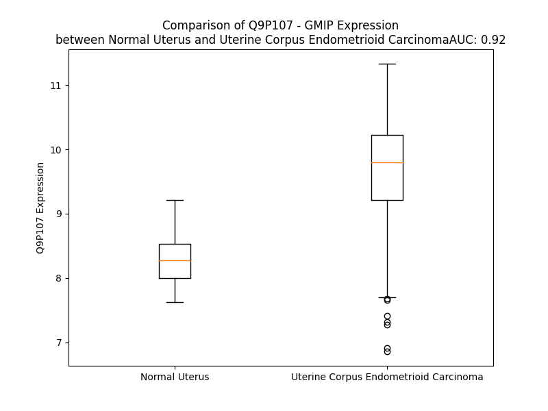

# Detailed Data for Q9P107

## Introduction to the Detailed Summary

### How to Interpret the Results

- **Summary & Metrics**: This section provides a quick reference to essential protein attributes, including expression changes, family classification, and biomarker applications. Regulation status (upregulated/downregulated) indicates the protein's behavior in a disease context. Some information comes from the original excel file with the proteins selected from literature, while others are derived from the analyses.
- **Expression Comparison**: A visual representation comparing protein expression between normal and disease states. It highlights significant changes in expression levels that might indicate diagnostic or therapeutic relevance. This is data coming from transcriptomics experiments and could not translate similarly to protein levels.
- **Isoform Alignment**: An interactive view of isoform alignments, revealing structural and functional differences between variants of the protein.
- **Interactors & Homologs**: Tables listing known interaction partners and homologous proteins, the more interactors and homologs, the more complex the protein is to design an antibody for.
- **Biological Assemblies**: Information about the structural arrangement of the protein in different assemblies, providing insights into its functional state but also the complexity of the protein to develop antibodies.
- **Combined Per-Residue Information**: A detailed table summarizing residue-level data. This includes predictions for epitope regions, aggregation tendencies, and modifications that might impact the protein's function. Each row corresponds to a residue in the protein, providing insights into specific sites that may be important for research or drug development.
## Summary & Metrics

- **UniProt Accession**: Q9P107
- **Gene Name**: GMIP 
- **Protein Name**: GEM interacting protein 
- **Swiss Prot**: GMIP_HUMAN
- **Family**: enzyme
- **Biomarker Application**:  
- **Number of Isoforms**: 2
- **Regulation**: 1
- **(transcriptomics) AUC**: 0.92
- **(transcriptomics) Fold Change**: 1.17
- **(transcriptomics) Regulation**: Upregulated
- **Discotope Epitope Count**: 271
- **Max n_uniprots (Homo)**: 1
- **Max n_uniprots (Hetero)**: N/A

## Expression Comparison

## Isoform Alignment

<pre style='font-size:14px; font-family:monospace;'>Q9P107-1 MDAAEPGLPPGPEGRKRYSDIFRSLDNLEISLGNVTLEMLAGDPLLSEDPEPDKTPTATVTNEASCWSGPSPEGPVPLTGEELDLRLIRTKGGVDAALEYAKTWSRYAKELLAWTEKRASYELEFAKSTMKIAEAGKVSIQQQSHMPLQYIYTLFLEHDLSLGTLAMETVAQQKRDYYQPLAAKRTEIEKWRKEFKEQWMKEQKRMNEAVQALRRAQLQYVQRSEDLRARSQGSPEDSAPQASPGPSKQQERRRRSREEAQAKAQEAEALYQACVREANARQQDLEIAKQRIVSHVRKLVFQGDEVLRRVTLSLFGLRGAQAERGPRAFAALAECCAPFEPGQRYQEFVRALRPEAPPPPPPAFSFQEFLPSLNSSPLDIRKKLSGPLPPRLDENSAEPGPWEDPGTGWRWQGTPGPTPGSDVDSVGGGSESRSLDSPTSSPGAGTRQLVKASSTGTESSDDFEERDPDLGDGLENGLGSPFGKWTLSSAAQTHQLRRLRGPAKCRECEAFMVSGTECEECFLTCHKRCLETLLILCGHRRLPARTPLFGVDFLQLPRDFPEEVPFVVTKCTAEIEHRALDVQGIYRVSGSRVRVERLCQAFENGRALVELSGNSPHDVSSVLKRFLQELTEPVIPFHLYDAFISLAKTLHADPGDDPGTPSPSPEVIRSLKTLLVQLPDSNYNTLRHLVAHLFRVAARFMENKMSANNLGIVFGPTLLRPPDGPRAASAIPVTCLLDSGHQAQLVEFLIVHYEQIFGMDELPQATEPPPQDSSPAPGPLTTSSQPPPPHLDPDSQPPVLASDPGPDPQHHSTLEQHPTATPTEIPTPQSDQREDVAEDTKDGGGEVSSQGPEDSLLGTQSRGHFSRQPVKYPRGGVRPVTHQLSSLALVASKLCEETPITSVPRGSLRGRGPSPAAASPEGSPLRRTPLPKHFEITQETARLLSKLDSEAVPRATCCPDVQPEEAEDHL
Q9P107-2 MDAAEPGLPPGPEGRKRYSDIFRSLDNLEISLGNVTLEMLAGDPLLSEDPEPDKTPTATVTNEASCWSGPSPEGPVPLTGEELDLRLIRTKGGVDAALEYAKTWSRYAKELLAWTEKRASYELEFAKSTMKIAEAGKVSIQQQSHMPLQYIYTLFLEHDLSLGTLAMETVAQQKRDYYQPLAAKRTEIEKWRKEFKEQWMKEQKRMNEAVQALRRAQLQYVQRSEDLRARSQGSPEDSAPQASPGPSKQQERRRRSREEAQAKAQEAEALYQACVREANARQQDLEIAKQRIVSHVRKLVFQGDEVLRRVTLSLFGLRGAQAERGPRAFAALAECCAPFEPGQRYQEFVRALRPEAPPPPPPAFSFQEFLPSLNSSPLDIRKKLSGPLPPRLDENSAEPGPWEDPGTGWRWQGTPGPTPGSDVDSVGGGSESRSLDSPTSS--------------------------PDLGDGLENGLGSPFGKWTLSSAAQTHQLRRLRGPAKCRECEAFMVSGTECEECFLTCHKRCLETLLILCGHRRLPARTPLFGVDFLQLPRDFPEEVPFVVTKCTAEIEHRALDVQGIYRVSGSRVRVERLCQAFENGRALVELSGNSPHDVSSVLKRFLQELTEPVIPFHLYDAFISLAKTLHADPGDDPGTPSPSPEVIRSLKTLLVQLPDSNYNTLRHLVAHLFRVAARFMENKMSANNLGIVFGPTLLRPPDGPRAASAIPVTCLLDSGHQAQLVEFLIVHYEQIFGMDELPQATEPPPQDSSPAPGPLTTSSQPPPPHLDPDSQPPVLASDPGPDPQHHSTLEQHPTATPTEIPTPQSDQREDVAEDTKDGGGEVSSQGPEDSLLGTQSRGHFSRQPVKYPRGGVRPVTHQLSSLALVASKLCEETPITSVPRGSLRGRGPSPAAASPEGSPLRRTPLPKHFEITQETARLLSKLDSEAVPRATCCPDVQPEEAEDHL
</pre>

## Interactors

| preferredName_A   | preferredName_B   | score   |
|-------------------|-------------------|---------|

## Homologs

| uniprot_id   | gene_id   |
|:-------------|:----------|
| F8VWZ8       | ARHGAP29  |
| K7EQA4       | ARHGAP45  |

## Biological Assemblies

|   Unnamed: 0 |   assembly |   n_uniprots | composition   | crystal_id   |
|-------------:|-----------:|-------------:|:--------------|:-------------|
|            0 |          1 |            1 | Homo          | 3qwe         |

## Combined Per-Residue Information

|   res | aa   |   epitope_score | epitope   |   relative_surface_accessibility |   modeling_confidence |   Aggregation | modification     |
|------:|:-----|----------------:|:----------|---------------------------------:|----------------------:|--------------:|:-----------------|
|     1 | M    |         0.0594  | False     |                          1.26997 |                 34.83 |         0     | N/A              |
|     2 | D    |         0.08492 | False     |                          0.90182 |                 36.8  |         0     | N/A              |
|     3 | A    |         0.06694 | False     |                          0.94774 |                 38.31 |         0     | N/A              |
|     4 | A    |         0.08216 | False     |                          0.99687 |                 43.24 |         0     | N/A              |
|     5 | E    |         0.09626 | True      |                          0.84325 |                 42.14 |         0     | N/A              |
|     6 | P    |         0.11641 | True      |                          0.94801 |                 39.75 |         0     | N/A              |
|     7 | G    |         0.13711 | True      |                          0.89179 |                 36.92 |         0     | N/A              |
|     8 | L    |         0.13043 | True      |                          1.0186  |                 41.5  |         0     | N/A              |
|     9 | P    |         0.09202 | False     |                          0.84901 |                 41.87 |         0     | N/A              |
|    10 | P    |         0.11609 | True      |                          0.89956 |                 44.56 |         0     | N/A              |
|    11 | G    |         0.16997 | True      |                          0.58678 |                 44.62 |         0     | N/A              |
|    12 | P    |         0.1439  | True      |                          1.00139 |                 40.42 |         0     | N/A              |
|    13 | E    |         0.07856 | False     |                          0.46406 |                 44.57 |         0     | N/A              |
|    14 | G    |         0.11462 | True      |                          0.54619 |                 41.58 |         0     | N/A              |
|    15 | R    |         0.15013 | True      |                          0.89898 |                 43.73 |         0     | N/A              |
|    16 | K    |         0.12475 | True      |                          0.74035 |                 46.68 |         0     | N/A              |
|    17 | R    |         0.07898 | False     |                          0.54783 |                 53.48 |         0     | N/A              |
|    18 | Y    |         0.09584 | True      |                          0.49409 |                 49.29 |         0     | N/A              |
|    19 | S    |         0.07198 | False     |                          0.43756 |                 54.51 |         0     | Phosphoserine    |
|    20 | D    |         0.07286 | False     |                          0.29138 |                 53.27 |         0     | N/A              |
|    21 | I    |         0.09454 | False     |                          0.54057 |                 54.4  |         0     | N/A              |
|    22 | F    |         0.08968 | False     |                          0.49257 |                 53.4  |         0     | N/A              |
|    23 | R    |         0.05504 | False     |                          0.45012 |                 54.97 |         0     | N/A              |
|    24 | S    |         0.06695 | False     |                          0.52368 |                 53.72 |         0     | N/A              |
|    25 | L    |         0.06975 | False     |                          0.61422 |                 55.27 |         0     | N/A              |
|    26 | D    |         0.0686  | False     |                          0.40162 |                 48.25 |         0     | N/A              |
|    27 | N    |         0.04062 | False     |                          0.57329 |                 51.87 |         0     | N/A              |
|    28 | L    |         0.06129 | False     |                          0.68647 |                 45.31 |         0     | N/A              |
|    29 | E    |         0.07458 | False     |                          0.49995 |                 48.61 |         0     | N/A              |
|    30 | I    |         0.07684 | False     |                          0.7587  |                 47.72 |         0     | N/A              |
|    31 | S    |         0.04346 | False     |                          0.61522 |                 38.41 |         0     | N/A              |
|    32 | L    |         0.07214 | False     |                          0.72971 |                 40.23 |         0     | N/A              |
|    33 | G    |         0.08121 | False     |                          0.78204 |                 35.34 |         0     | N/A              |
|    34 | N    |         0.06183 | False     |                          0.89573 |                 39.33 |         0     | N/A              |
|    35 | V    |         0.07047 | False     |                          0.81909 |                 38.85 |         0     | N/A              |
|    36 | T    |         0.06045 | False     |                          0.87354 |                 28.6  |         0     | N/A              |
|    37 | L    |         0.08147 | False     |                          0.9726  |                 32.86 |         0     | N/A              |
|    38 | E    |         0.10827 | True      |                          0.83673 |                 31.31 |         0     | N/A              |
|    39 | M    |         0.12181 | True      |                          0.79672 |                 34.16 |         0     | N/A              |
|    40 | L    |         0.13367 | True      |                          1.01773 |                 32.37 |         0     | N/A              |
|    41 | A    |         0.07963 | False     |                          1.06074 |                 31.64 |         0     | N/A              |
|    42 | G    |         0.19412 | True      |                          0.95658 |                 35.15 |         0     | N/A              |
|    43 | D    |         0.06917 | False     |                          0.85516 |                 35.96 |         0     | N/A              |
|    44 | P    |         0.07468 | False     |                          0.90869 |                 32.79 |         0     | N/A              |
|    45 | L    |         0.16487 | True      |                          1.074   |                 35.66 |         0     | N/A              |
|    46 | L    |         0.12207 | True      |                          1.10074 |                 34.22 |         0     | N/A              |
|    47 | S    |         0.07331 | False     |                          0.83303 |                 29.12 |         0     | N/A              |
|    48 | E    |         0.15684 | True      |                          0.90596 |                 39.4  |         0     | N/A              |
|    49 | D    |         0.17592 | True      |                          0.81531 |                 36.97 |         0     | N/A              |
|    50 | P    |         0.12245 | True      |                          0.79578 |                 40.94 |         0     | N/A              |
|    51 | E    |         0.14035 | True      |                          0.79946 |                 38.59 |         0     | N/A              |
|    52 | P    |         0.08745 | False     |                          0.81476 |                 37.54 |         0     | N/A              |
|    53 | D    |         0.17626 | True      |                          0.69618 |                 32.67 |         0     | N/A              |
|    54 | K    |         0.11332 | True      |                          0.77575 |                 39.32 |         0     | N/A              |
|    55 | T    |         0.09079 | False     |                          0.8885  |                 32.78 |         0     | N/A              |
|    56 | P    |         0.093   | False     |                          0.98439 |                 29.36 |         0     | N/A              |
|    57 | T    |         0.1152  | True      |                          0.88736 |                 31.81 |         0     | N/A              |
|    58 | A    |         0.07562 | False     |                          0.9768  |                 30.01 |         0     | N/A              |
|    59 | T    |         0.0628  | False     |                          0.79788 |                 30.34 |         0     | N/A              |
|    60 | V    |         0.06787 | False     |                          0.9823  |                 33.46 |         0     | N/A              |
|    61 | T    |         0.09663 | True      |                          0.77254 |                 31.9  |         0     | N/A              |
|    62 | N    |         0.1074  | True      |                          0.81085 |                 30.71 |         0     | N/A              |
|    63 | E    |         0.09    | False     |                          0.8311  |                 30.88 |         0     | N/A              |
|    64 | A    |         0.12802 | True      |                          0.92618 |                 33.08 |         0     | N/A              |
|    65 | S    |         0.10743 | True      |                          0.78444 |                 28.18 |         0     | N/A              |
|    66 | C    |         0.11226 | True      |                          0.75186 |                 28.78 |         0     | N/A              |
|    67 | W    |         0.16325 | True      |                          1.11657 |                 34.06 |         0     | N/A              |
|    68 | S    |         0.13225 | True      |                          0.76581 |                 33.06 |         0     | N/A              |
|    69 | G    |         0.17193 | True      |                          0.68377 |                 30.99 |         0     | N/A              |
|    70 | P    |         0.15578 | True      |                          0.90695 |                 36.73 |         0     | N/A              |
|    71 | S    |         0.1519  | True      |                          0.62271 |                 35.93 |         0     | Phosphoserine    |
|    72 | P    |         0.23144 | True      |                          0.9795  |                 46.61 |         0     | N/A              |
|    73 | E    |         0.15197 | True      |                          0.85871 |                 41.39 |         0     | N/A              |
|    74 | G    |         0.17527 | True      |                          0.52296 |                 44.28 |         0     | N/A              |
|    75 | P    |         0.16909 | True      |                          0.98405 |                 56.17 |         0     | N/A              |
|    76 | V    |         0.10653 | True      |                          0.89048 |                 59.82 |         0     | N/A              |
|    77 | P    |         0.1915  | True      |                          0.81208 |                 71.8  |         0     | N/A              |
|    78 | L    |         0.12346 | True      |                          0.46201 |                 79.59 |         0     | N/A              |
|    79 | T    |         0.12663 | True      |                          0.5623  |                 87.34 |         0     | N/A              |
|    80 | G    |         0.04902 | False     |                          0.30407 |                 86.12 |         0     | N/A              |
|    81 | E    |         0.17427 | True      |                          0.67231 |                 88.66 |         0     | N/A              |
|    82 | E    |         0.12194 | True      |                          0.41668 |                 89.97 |         0     | N/A              |
|    83 | L    |         0.04006 | False     |                          0.49781 |                 91.09 |         0     | N/A              |
|    84 | D    |         0.02335 | False     |                          0.07005 |                 94.05 |         0     | N/A              |
|    85 | L    |         0.14762 | True      |                          0.51605 |                 92.88 |         0     | N/A              |
|    86 | R    |         0.14347 | True      |                          0.65263 |                 91.7  |         0     | N/A              |
|    87 | L    |         0.03649 | False     |                          0.33722 |                 90.12 |         0     | N/A              |
|    88 | I    |         0.07523 | False     |                          0.1737  |                 92.33 |         0     | N/A              |
|    89 | R    |         0.14285 | True      |                          0.79435 |                 92.73 |         0     | N/A              |
|    90 | T    |         0.12317 | True      |                          0.50425 |                 92.42 |         0     | N/A              |
|    91 | K    |         0.10047 | True      |                          1.02805 |                 90.2  |         0     | N/A              |
|    92 | G    |         0.05522 | False     |                          0.47595 |                 92.66 |         0     | N/A              |
|    93 | G    |         0.01322 | False     |                          0.02994 |                 94.8  |         0     | N/A              |
|    94 | V    |         0.00615 | False     |                          0.02491 |                 97.55 |         0     | N/A              |
|    95 | D    |         0.1139  | True      |                          0.4152  |                 97.78 |         0     | N/A              |
|    96 | A    |         0.06544 | False     |                          0.50635 |                 97.13 |         0     | N/A              |
|    97 | A    |         0.01142 | False     |                          0.05994 |                 97.47 |         0     | N/A              |
|    98 | L    |         0.02158 | False     |                          0.04191 |                 98.3  |         0     | N/A              |
|    99 | E    |         0.09286 | False     |                          0.41568 |                 98.02 |         0     | N/A              |
|   100 | Y    |         0.11733 | True      |                          0.57049 |                 98.29 |         0     | N/A              |
|   101 | A    |         0.00735 | False     |                          0.01913 |                 98.32 |         0     | N/A              |
|   102 | K    |         0.06566 | False     |                          0.3999  |                 98.4  |         0     | N/A              |
|   103 | T    |         0.04375 | False     |                          0.3787  |                 98.12 |         0     | N/A              |
|   104 | W    |         0.01087 | False     |                          0.06088 |                 98.62 |         0     | N/A              |
|   105 | S    |         0.00826 | False     |                          0.02656 |                 98.35 |         0     | N/A              |
|   106 | R    |         0.05543 | False     |                          0.43734 |                 98.17 |         0     | N/A              |
|   107 | Y    |         0.06417 | False     |                          0.49797 |                 98.47 |         0.21  | N/A              |
|   108 | A    |         0.00144 | False     |                          0       |                 98.34 |         0.21  | N/A              |
|   109 | K    |         0.0531  | False     |                          0.59378 |                 98.38 |         0.21  | N/A              |
|   110 | E    |         0.06217 | False     |                          0.49204 |                 98.14 |         0.21  | N/A              |
|   111 | L    |         0.01476 | False     |                          0.22388 |                 98.44 |        22.266 | N/A              |
|   112 | L    |         0.01405 | False     |                          0.07076 |                 98.59 |        22.266 | N/A              |
|   113 | A    |         0.07656 | False     |                          0.54632 |                 98.11 |        22.266 | N/A              |
|   114 | W    |         0.07683 | False     |                          0.67978 |                 98.51 |        22.266 | N/A              |
|   115 | T    |         0.00998 | False     |                          0.02217 |                 97.86 |        22.056 | N/A              |
|   116 | E    |         0.03583 | False     |                          0.38846 |                 97.73 |         0     | N/A              |
|   117 | K    |         0.09812 | True      |                          0.59413 |                 97.79 |         0     | N/A              |
|   118 | R    |         0.04609 | False     |                          0.4582  |                 97.87 |         0     | N/A              |
|   119 | A    |         0.02616 | False     |                          0.08928 |                 96.89 |         0     | N/A              |
|   120 | S    |         0.08031 | False     |                          0.36416 |                 97.82 |         0     | N/A              |
|   121 | Y    |         0.09358 | False     |                          0.49815 |                 97.63 |         0     | N/A              |
|   122 | E    |         0.01267 | False     |                          0.12964 |                 96.63 |         0     | N/A              |
|   123 | L    |         0.03124 | False     |                          0.29512 |                 97.13 |         0     | N/A              |
|   124 | E    |         0.09504 | False     |                          0.52035 |                 97.65 |         0     | N/A              |
|   125 | F    |         0.09302 | False     |                          0.55486 |                 97.28 |         0     | N/A              |
|   126 | A    |         0.02371 | False     |                          0.01275 |                 96.92 |         0     | N/A              |
|   127 | K    |         0.12458 | True      |                          0.56922 |                 97.43 |         0     | N/A              |
|   128 | S    |         0.10628 | True      |                          0.50246 |                 97.48 |         0     | N/A              |
|   129 | T    |         0.01808 | False     |                          0.17064 |                 96.8  |         0     | N/A              |
|   130 | M    |         0.03816 | False     |                          0.24076 |                 98.25 |         0     | N/A              |
|   131 | K    |         0.08838 | False     |                          0.77584 |                 98.08 |         0     | N/A              |
|   132 | I    |         0.17208 | True      |                          0.72888 |                 97.65 |         0     | N/A              |
|   133 | A    |         0.0159  | False     |                          0.01275 |                 97.58 |         0     | N/A              |
|   134 | E    |         0.07168 | False     |                          0.41621 |                 97.68 |         0     | N/A              |
|   135 | A    |         0.06587 | False     |                          0.5961  |                 97.04 |         0     | N/A              |
|   136 | G    |         0.01281 | False     |                          0.24627 |                 96.66 |         0     | N/A              |
|   137 | K    |         0.02978 | False     |                          0.20814 |                 95.7  |         0     | N/A              |
|   138 | V    |         0.08872 | False     |                          0.53854 |                 95.23 |         0     | N/A              |
|   139 | S    |         0.07124 | False     |                          0.46516 |                 96.04 |         0     | N/A              |
|   140 | I    |         0.02129 | False     |                          0.24959 |                 94.78 |         0     | N/A              |
|   141 | Q    |         0.04492 | False     |                          0.55152 |                 91.65 |         0     | N/A              |
|   142 | Q    |         0.07632 | False     |                          0.67318 |                 93.73 |         0     | N/A              |
|   143 | Q    |         0.11164 | True      |                          0.46504 |                 90.8  |         0     | N/A              |
|   144 | S    |         0.11817 | True      |                          0.57522 |                 90.04 |         0     | N/A              |
|   145 | H    |         0.09102 | False     |                          0.33541 |                 90.87 |         0     | N/A              |
|   146 | M    |         0.0868  | False     |                          0.47324 |                 96.32 |         0     | N/A              |
|   147 | P    |         0.13285 | True      |                          0.5805  |                 95.33 |         0.188 | N/A              |
|   148 | L    |         0.05987 | False     |                          0.27465 |                 95.29 |        13.063 | N/A              |
|   149 | Q    |         0.03407 | False     |                          0.21664 |                 94.51 |        15.397 | N/A              |
|   150 | Y    |         0.04813 | False     |                          0.41145 |                 93.07 |        74.645 | N/A              |
|   151 | I    |         0.02954 | False     |                          0.16479 |                 95.64 |        91.254 | N/A              |
|   152 | Y    |         0.04826 | False     |                          0.50247 |                 97.13 |        92.538 | N/A              |
|   153 | T    |         0.01674 | False     |                          0.15851 |                 96.06 |        92.408 | N/A              |
|   154 | L    |         0.01766 | False     |                          0.1757  |                 95.72 |        92.317 | N/A              |
|   155 | F    |         0.05802 | False     |                          0.40726 |                 96.91 |        89.84  | N/A              |
|   156 | L    |         0.02214 | False     |                          0.1929  |                 97.23 |        76.131 | N/A              |
|   157 | E    |         0.0585  | False     |                          0.32333 |                 96.06 |         0     | N/A              |
|   158 | H    |         0.02901 | False     |                          0.161   |                 95.22 |         0     | N/A              |
|   159 | D    |         0.00945 | False     |                          0.22224 |                 96.57 |         0     | N/A              |
|   160 | L    |         0.02303 | False     |                          0.19338 |                 97.04 |         0     | N/A              |
|   161 | S    |         0.03906 | False     |                          0.47972 |                 96.05 |         0     | N/A              |
|   162 | L    |         0.03579 | False     |                          0.32205 |                 95.15 |         0     | N/A              |
|   163 | G    |         0.02159 | False     |                          0.04048 |                 96.08 |         0     | N/A              |
|   164 | T    |         0.09957 | True      |                          0.44075 |                 96.93 |         0     | N/A              |
|   165 | L    |         0.02803 | False     |                          0.10906 |                 95.79 |         0     | N/A              |
|   166 | A    |         0.02052 | False     |                          0.09673 |                 96.4  |         0     | N/A              |
|   167 | M    |         0.04759 | False     |                          0.41171 |                 97.09 |         0     | N/A              |
|   168 | E    |         0.07134 | False     |                          0.54049 |                 96.94 |         0     | N/A              |
|   169 | T    |         0.0121  | False     |                          0.0308  |                 97.23 |         0     | N/A              |
|   170 | V    |         0.05595 | False     |                          0.0842  |                 97.67 |         0     | N/A              |
|   171 | A    |         0.06063 | False     |                          0.60658 |                 97.68 |         0     | N/A              |
|   172 | Q    |         0.04347 | False     |                          0.33766 |                 97.54 |         0     | N/A              |
|   173 | Q    |         0.00981 | False     |                          0.04021 |                 97.81 |         0     | N/A              |
|   174 | K    |         0.085   | False     |                          0.56265 |                 97.61 |         0     | N/A              |
|   175 | R    |         0.17084 | True      |                          0.53808 |                 98    |         0     | N/A              |
|   176 | D    |         0.04745 | False     |                          0.26525 |                 97.55 |         0     | N/A              |
|   177 | Y    |         0.0299  | False     |                          0.02812 |                 98.51 |         0     | N/A              |
|   178 | Y    |         0.02719 | False     |                          0.25774 |                 98.32 |         0     | N/A              |
|   179 | Q    |         0.08952 | False     |                          0.52217 |                 98.22 |         0     | N/A              |
|   180 | P    |         0.04449 | False     |                          0.34606 |                 98.49 |         0     | N/A              |
|   181 | L    |         0.00079 | False     |                          0       |                 98.62 |         0     | N/A              |
|   182 | A    |         0.039   | False     |                          0.22729 |                 98.52 |         0     | N/A              |
|   183 | A    |         0.06161 | False     |                          0.55708 |                 98.53 |         0     | N/A              |
|   184 | K    |         0.02992 | False     |                          0.08184 |                 98.49 |         0     | N/A              |
|   185 | R    |         0.05336 | False     |                          0.21688 |                 98.5  |         0     | N/A              |
|   186 | T    |         0.15002 | True      |                          0.5724  |                 98.37 |         0     | N/A              |
|   187 | E    |         0.05538 | False     |                          0.33125 |                 98.3  |         0     | N/A              |
|   188 | I    |         0.00333 | False     |                          0.00998 |                 98.22 |         0     | N/A              |
|   189 | E    |         0.07178 | False     |                          0.1843  |                 98.13 |         0     | N/A              |
|   190 | K    |         0.12552 | True      |                          0.61023 |                 98.24 |         0     | N/A              |
|   191 | W    |         0.03971 | False     |                          0.37314 |                 98.45 |         0     | N/A              |
|   192 | R    |         0.08551 | False     |                          0.11826 |                 98.35 |         0     | N/A              |
|   193 | K    |         0.10524 | True      |                          0.54975 |                 98.29 |         0     | N/A              |
|   194 | E    |         0.11726 | True      |                          0.31252 |                 98.32 |         0     | N/A              |
|   195 | F    |         0.0267  | False     |                          0.02739 |                 98.39 |         0     | N/A              |
|   196 | K    |         0.08877 | False     |                          0.51988 |                 98.29 |         0     | N/A              |
|   197 | E    |         0.12856 | True      |                          0.62772 |                 98.18 |         0     | N/A              |
|   198 | Q    |         0.06973 | False     |                          0.28403 |                 97.59 |         0     | N/A              |
|   199 | W    |         0.03357 | False     |                          0.08071 |                 97.95 |         0     | N/A              |
|   200 | M    |         0.18788 | True      |                          0.58778 |                 97.62 |         0     | N/A              |
|   201 | K    |         0.12729 | True      |                          0.57789 |                 97.81 |         0     | N/A              |
|   202 | E    |         0.07477 | False     |                          0.1275  |                 96.64 |         0     | N/A              |
|   203 | Q    |         0.06996 | False     |                          0.33557 |                 97.14 |         0     | N/A              |
|   204 | K    |         0.13702 | True      |                          0.6357  |                 97.88 |         0     | N/A              |
|   205 | R    |         0.09506 | False     |                          0.44892 |                 97.68 |         0     | N/A              |
|   206 | M    |         0.05441 | False     |                          0.1805  |                 97.44 |         0     | N/A              |
|   207 | N    |         0.10158 | True      |                          0.51778 |                 97.69 |         0     | N/A              |
|   208 | E    |         0.14187 | True      |                          0.42452 |                 98.2  |         0     | N/A              |
|   209 | A    |         0.03065 | False     |                          0.0497  |                 97.94 |         0     | N/A              |
|   210 | V    |         0.05151 | False     |                          0.25992 |                 97.68 |         0     | N/A              |
|   211 | Q    |         0.11624 | True      |                          0.35753 |                 97.93 |         0     | N/A              |
|   212 | A    |         0.08902 | False     |                          0.2252  |                 97.92 |         0     | N/A              |
|   213 | L    |         0.06993 | False     |                          0.23082 |                 98.03 |         0     | N/A              |
|   214 | R    |         0.14496 | True      |                          0.59025 |                 97.7  |         0     | N/A              |
|   215 | R    |         0.23255 | True      |                          0.54269 |                 97.89 |         0     | N/A              |
|   216 | A    |         0.0234  | False     |                          0.02701 |                 97.76 |         0     | N/A              |
|   217 | Q    |         0.07769 | False     |                          0.42821 |                 97.85 |         0     | N/A              |
|   218 | L    |         0.12381 | True      |                          0.78148 |                 97.43 |         0     | N/A              |
|   219 | Q    |         0.12301 | True      |                          0.44893 |                 97.18 |         0     | N/A              |
|   220 | Y    |         0.05432 | False     |                          0.32368 |                 97.63 |         0     | N/A              |
|   221 | V    |         0.11    | True      |                          0.48936 |                 97.17 |         0     | N/A              |
|   222 | Q    |         0.12281 | True      |                          0.51693 |                 96.83 |         0     | N/A              |
|   223 | R    |         0.08162 | False     |                          0.338   |                 96.1  |         0     | N/A              |
|   224 | S    |         0.0674  | False     |                          0.23915 |                 95.12 |         0     | N/A              |
|   225 | E    |         0.0762  | False     |                          0.451   |                 94.84 |         0     | N/A              |
|   226 | D    |         0.07398 | False     |                          0.28076 |                 93.45 |         0     | N/A              |
|   227 | L    |         0.04858 | False     |                          0.26214 |                 93.21 |         0     | N/A              |
|   228 | R    |         0.15803 | True      |                          0.5642  |                 92.26 |         0     | N/A              |
|   229 | A    |         0.16755 | True      |                          0.56591 |                 90.7  |         0     | N/A              |
|   230 | R    |         0.19085 | True      |                          0.53882 |                 87.27 |         0     | N/A              |
|   231 | S    |         0.0764  | False     |                          0.39964 |                 83.8  |         0     | Phosphoserine    |
|   232 | Q    |         0.2011  | True      |                          0.73338 |                 71.86 |         0     | N/A              |
|   233 | G    |         0.14248 | True      |                          0.54369 |                 57.6  |         0     | N/A              |
|   234 | S    |         0.09715 | True      |                          0.54924 |                 47.66 |         0     | Phosphoserine    |
|   235 | P    |         0.13429 | True      |                          0.91574 |                 48.87 |         0     | N/A              |
|   236 | E    |         0.15513 | True      |                          0.75489 |                 45.44 |         0     | N/A              |
|   237 | D    |         0.14897 | True      |                          0.84608 |                 40.95 |         0     | N/A              |
|   238 | S    |         0.15441 | True      |                          0.8821  |                 39.57 |         0     | N/A              |
|   239 | A    |         0.13961 | True      |                          0.7387  |                 43.65 |         0     | N/A              |
|   240 | P    |         0.28397 | True      |                          1.01414 |                 42.76 |         0     | N/A              |
|   241 | Q    |         0.21043 | True      |                          0.86107 |                 46.11 |         0     | N/A              |
|   242 | A    |         0.1834  | True      |                          1.00918 |                 39.01 |         0     | N/A              |
|   243 | S    |         0.20363 | True      |                          0.74971 |                 50.37 |         0     | Phosphoserine    |
|   244 | P    |         0.17739 | True      |                          1.09885 |                 46.04 |         0     | N/A              |
|   245 | G    |         0.23441 | True      |                          0.63085 |                 55.11 |         0     | N/A              |
|   246 | P    |         0.13047 | True      |                          0.84307 |                 56.96 |         0     | N/A              |
|   247 | S    |         0.127   | True      |                          0.47461 |                 65.86 |         0     | N/A              |
|   248 | K    |         0.17399 | True      |                          0.92861 |                 77.42 |         0     | N/A              |
|   249 | Q    |         0.11313 | True      |                          0.58508 |                 76.35 |         0     | N/A              |
|   250 | Q    |         0.19824 | True      |                          0.59161 |                 77.58 |         0     | N/A              |
|   251 | E    |         0.05606 | False     |                          0.24198 |                 82.07 |         0     | N/A              |
|   252 | R    |         0.15671 | True      |                          0.7582  |                 85.13 |         0     | N/A              |
|   253 | R    |         0.13098 | True      |                          0.51815 |                 85.16 |         0     | N/A              |
|   254 | R    |         0.13165 | True      |                          0.4868  |                 86.14 |         0     | N/A              |
|   255 | R    |         0.18199 | True      |                          0.60692 |                 89.66 |         0     | N/A              |
|   256 | S    |         0.07573 | False     |                          0.31114 |                 89.77 |         0     | N/A              |
|   257 | R    |         0.10354 | True      |                          0.49604 |                 90.87 |         0     | N/A              |
|   258 | E    |         0.0859  | False     |                          0.40796 |                 92.4  |         0     | N/A              |
|   259 | E    |         0.1333  | True      |                          0.50824 |                 94.11 |         0     | N/A              |
|   260 | A    |         0.03504 | False     |                          0.08547 |                 93.96 |         0     | N/A              |
|   261 | Q    |         0.07709 | False     |                          0.39788 |                 95.11 |         0     | N/A              |
|   262 | A    |         0.10946 | True      |                          0.54538 |                 95.4  |         0     | N/A              |
|   263 | K    |         0.09144 | False     |                          0.42132 |                 96.59 |         0     | N/A              |
|   264 | A    |         0.02801 | False     |                          0.08378 |                 95.72 |         0     | N/A              |
|   265 | Q    |         0.11752 | True      |                          0.53956 |                 96.5  |         0     | N/A              |
|   266 | E    |         0.1258  | True      |                          0.63126 |                 96.96 |         0     | N/A              |
|   267 | A    |         0.02878 | False     |                          0.07999 |                 97.41 |         0     | N/A              |
|   268 | E    |         0.0775  | False     |                          0.3461  |                 97.77 |         0     | N/A              |
|   269 | A    |         0.10707 | True      |                          0.53867 |                 97.49 |         0     | N/A              |
|   270 | L    |         0.10314 | True      |                          0.51571 |                 97.55 |         0     | N/A              |
|   271 | Y    |         0.06066 | False     |                          0.27601 |                 98.02 |         0     | N/A              |
|   272 | Q    |         0.10652 | True      |                          0.40452 |                 98.03 |         0     | N/A              |
|   273 | A    |         0.0995  | True      |                          0.37837 |                 98.03 |         0     | N/A              |
|   274 | C    |         0.02942 | False     |                          0.09254 |                 98.06 |         0     | N/A              |
|   275 | V    |         0.11317 | True      |                          0.35893 |                 98.32 |         0     | N/A              |
|   276 | R    |         0.16169 | True      |                          0.59292 |                 97.88 |         0     | N/A              |
|   277 | E    |         0.0803  | False     |                          0.40419 |                 97.7  |         0     | N/A              |
|   278 | A    |         0.01916 | False     |                          0.05579 |                 97.86 |         0     | N/A              |
|   279 | N    |         0.1003  | True      |                          0.61105 |                 98.07 |         0     | N/A              |
|   280 | A    |         0.07942 | False     |                          0.37276 |                 98    |         0     | N/A              |
|   281 | R    |         0.07247 | False     |                          0.26573 |                 97.32 |         0     | N/A              |
|   282 | Q    |         0.10647 | True      |                          0.38193 |                 96.99 |         0     | N/A              |
|   283 | Q    |         0.13083 | True      |                          0.6077  |                 96.69 |         0     | N/A              |
|   284 | D    |         0.05435 | False     |                          0.32595 |                 97.09 |         0     | N/A              |
|   285 | L    |         0.02214 | False     |                          0.09315 |                 95.55 |         0     | N/A              |
|   286 | E    |         0.0658  | False     |                          0.31987 |                 94.47 |         0     | N/A              |
|   287 | I    |         0.10924 | True      |                          0.56438 |                 96.15 |         0     | N/A              |
|   288 | A    |         0.01684 | False     |                          0.01513 |                 96.51 |         0     | N/A              |
|   289 | K    |         0.03574 | False     |                          0.21638 |                 96.34 |         0     | N/A              |
|   290 | Q    |         0.10643 | True      |                          0.54897 |                 95.77 |         0     | N/A              |
|   291 | R    |         0.15825 | True      |                          0.44588 |                 97.4  |         0     | N/A              |
|   292 | I    |         0.00279 | False     |                          0       |                 97.95 |         0     | N/A              |
|   293 | V    |         0.02031 | False     |                          0.01246 |                 97.26 |         0     | N/A              |
|   294 | S    |         0.05086 | False     |                          0.18781 |                 96.61 |         0     | N/A              |
|   295 | H    |         0.05802 | False     |                          0.33407 |                 97.81 |         0     | N/A              |
|   296 | V    |         0.01488 | False     |                          0.04856 |                 98    |         0     | N/A              |
|   297 | R    |         0.06395 | False     |                          0.2978  |                 97.36 |         0     | N/A              |
|   298 | K    |         0.1067  | True      |                          0.56003 |                 97.36 |         0     | N/A              |
|   299 | L    |         0.03375 | False     |                          0.05688 |                 97.73 |         1.208 | N/A              |
|   300 | V    |         0.01732 | False     |                          0.139   |                 97.52 |         1.208 | N/A              |
|   301 | F    |         0.05645 | False     |                          0.66185 |                 96.94 |         1.208 | N/A              |
|   302 | Q    |         0.03653 | False     |                          0.41864 |                 98.06 |         1.208 | N/A              |
|   303 | G    |         0.00089 | False     |                          0       |                 98.34 |         1.208 | N/A              |
|   304 | D    |         0.01888 | False     |                          0.3718  |                 98.45 |         0     | N/A              |
|   305 | E    |         0.0281  | False     |                          0.33121 |                 98.27 |         0     | N/A              |
|   306 | V    |         0.01716 | False     |                          0.13234 |                 98.41 |         0     | N/A              |
|   307 | L    |         0.01319 | False     |                          0.16982 |                 98.54 |         0     | N/A              |
|   308 | R    |         0.05556 | False     |                          0.66049 |                 98.3  |         0     | N/A              |
|   309 | R    |         0.06841 | False     |                          0.57575 |                 98.43 |         0     | N/A              |
|   310 | V    |         0.01171 | False     |                          0.02571 |                 98.54 |         3.036 | N/A              |
|   311 | T    |         0.01978 | False     |                          0.26594 |                 98.51 |         3.596 | N/A              |
|   312 | L    |         0.05362 | False     |                          0.78765 |                 97.44 |         4.068 | N/A              |
|   313 | S    |         0.03285 | False     |                          0.38097 |                 96.92 |         4.068 | N/A              |
|   314 | L    |         0.01744 | False     |                          0.10199 |                 97.94 |         4.068 | N/A              |
|   315 | F    |         0.10806 | True      |                          0.68418 |                 97.98 |         3.872 | N/A              |
|   316 | G    |         0.08251 | False     |                          0.56292 |                 96    |         0.901 | N/A              |
|   317 | L    |         0.01863 | False     |                          0.18568 |                 96.18 |         0.901 | N/A              |
|   318 | R    |         0.04874 | False     |                          0.15133 |                 95.81 |         0     | N/A              |
|   319 | G    |         0.07492 | False     |                          0.38708 |                 94.98 |         0     | N/A              |
|   320 | A    |         0.06278 | False     |                          0.54652 |                 92.68 |         0     | N/A              |
|   321 | Q    |         0.03576 | False     |                          0.19361 |                 92.83 |         0     | N/A              |
|   322 | A    |         0.08851 | False     |                          0.65386 |                 91.93 |         0     | N/A              |
|   323 | E    |         0.12707 | True      |                          0.52063 |                 90.34 |         0     | N/A              |
|   324 | R    |         0.10075 | True      |                          0.5125  |                 86.18 |         0     | N/A              |
|   325 | G    |         0.03719 | False     |                          0.16921 |                 85.56 |         0     | N/A              |
|   326 | P    |         0.10363 | True      |                          0.70996 |                 89.65 |         0     | N/A              |
|   327 | R    |         0.07696 | False     |                          0.58966 |                 87.75 |         0     | N/A              |
|   328 | A    |         0.0272  | False     |                          0.08418 |                 88.96 |        10.577 | N/A              |
|   329 | F    |         0.1149  | True      |                          0.5306  |                 93.13 |        16.085 | N/A              |
|   330 | A    |         0.10887 | True      |                          0.51063 |                 93.51 |        16.085 | N/A              |
|   331 | A    |         0.05557 | False     |                          0.21789 |                 92.19 |        16.085 | N/A              |
|   332 | L    |         0.04275 | False     |                          0.10837 |                 94.4  |        16.085 | N/A              |
|   333 | A    |         0.18483 | True      |                          0.62043 |                 94.93 |        10.166 | N/A              |
|   334 | E    |         0.25807 | True      |                          0.64504 |                 94.81 |         0     | N/A              |
|   335 | C    |         0.04144 | False     |                          0.17747 |                 93.92 |         0     | N/A              |
|   336 | C    |         0.08559 | False     |                          0.40911 |                 94.94 |         0     | N/A              |
|   337 | A    |         0.21113 | True      |                          0.86324 |                 94.25 |         0     | N/A              |
|   338 | P    |         0.13799 | True      |                          0.78313 |                 94.88 |         0     | N/A              |
|   339 | F    |         0.08939 | False     |                          0.28568 |                 94.69 |         0     | N/A              |
|   340 | E    |         0.11239 | True      |                          0.55596 |                 94.1  |         0     | N/A              |
|   341 | P    |         0.19458 | True      |                          0.81913 |                 96.04 |         0     | N/A              |
|   342 | G    |         0.12222 | True      |                          0.59122 |                 93.1  |         0     | N/A              |
|   343 | Q    |         0.09068 | False     |                          0.31888 |                 94.07 |         0     | N/A              |
|   344 | R    |         0.141   | True      |                          0.33099 |                 92.75 |         0     | N/A              |
|   345 | Y    |         0.21016 | True      |                          0.66555 |                 94.61 |         0     | N/A              |
|   346 | Q    |         0.17682 | True      |                          0.4705  |                 92.68 |         0     | N/A              |
|   347 | E    |         0.06994 | False     |                          0.25152 |                 92.5  |         0     | N/A              |
|   348 | F    |         0.08516 | False     |                          0.43217 |                 93.94 |         0     | N/A              |
|   349 | V    |         0.11257 | True      |                          0.51785 |                 91.59 |         0     | N/A              |
|   350 | R    |         0.22876 | True      |                          0.66591 |                 90.21 |         0     | N/A              |
|   351 | A    |         0.08345 | False     |                          0.59838 |                 89.78 |         0     | N/A              |
|   352 | L    |         0.20567 | True      |                          0.58281 |                 86.71 |         0     | N/A              |
|   353 | R    |         0.27355 | True      |                          0.89934 |                 77.19 |         0     | N/A              |
|   354 | P    |         0.23154 | True      |                          0.93326 |                 70.79 |         0     | N/A              |
|   355 | E    |         0.25531 | True      |                          0.83456 |                 65.93 |         0     | N/A              |
|   356 | A    |         0.24774 | True      |                          0.84389 |                 67.35 |         0     | N/A              |
|   357 | P    |         0.24641 | True      |                          0.88058 |                 68.38 |         0     | N/A              |
|   358 | P    |         0.23038 | True      |                          0.85046 |                 68.07 |         0     | N/A              |
|   359 | P    |         0.23769 | True      |                          0.84955 |                 72.51 |         0     | N/A              |
|   360 | P    |         0.18773 | True      |                          0.86472 |                 72.04 |         0     | N/A              |
|   361 | P    |         0.1791  | True      |                          0.84475 |                 71.04 |         0     | N/A              |
|   362 | P    |         0.10864 | True      |                          0.75252 |                 73.24 |         0     | N/A              |
|   363 | A    |         0.09708 | True      |                          0.94317 |                 74.75 |         0     | N/A              |
|   364 | F    |         0.19267 | True      |                          1.00389 |                 76.49 |         0     | N/A              |
|   365 | S    |         0.08641 | False     |                          0.77055 |                 78.13 |         0     | N/A              |
|   366 | F    |         0.13324 | True      |                          0.92316 |                 79.12 |         0     | N/A              |
|   367 | Q    |         0.14087 | True      |                          0.83988 |                 75.93 |         0     | N/A              |
|   368 | E    |         0.09447 | False     |                          0.65379 |                 79.52 |         0     | N/A              |
|   369 | F    |         0.20047 | True      |                          0.90508 |                 68.09 |         0     | N/A              |
|   370 | L    |         0.14004 | True      |                          0.87219 |                 70.16 |         0     | N/A              |
|   371 | P    |         0.12534 | True      |                          0.80782 |                 62.53 |         0     | N/A              |
|   372 | S    |         0.10188 | True      |                          0.87053 |                 49.05 |         0     | N/A              |
|   373 | L    |         0.1173  | True      |                          1.03716 |                 48.58 |         0     | N/A              |
|   374 | N    |         0.0705  | False     |                          0.86146 |                 47.47 |         0     | N/A              |
|   375 | S    |         0.10462 | True      |                          0.88831 |                 47.37 |         0     | N/A              |
|   376 | S    |         0.08244 | False     |                          0.76233 |                 45.13 |         0     | N/A              |
|   377 | P    |         0.0971  | True      |                          0.91928 |                 39.84 |         0     | N/A              |
|   378 | L    |         0.09958 | True      |                          0.98045 |                 47.73 |         0     | N/A              |
|   379 | D    |         0.10975 | True      |                          0.94741 |                 37.75 |         0     | N/A              |
|   380 | I    |         0.11762 | True      |                          0.89825 |                 44.82 |         0     | N/A              |
|   381 | R    |         0.13303 | True      |                          0.95077 |                 36.72 |         0     | N/A              |
|   382 | K    |         0.07795 | False     |                          0.89781 |                 42.39 |         0     | N/A              |
|   383 | K    |         0.08559 | False     |                          0.88075 |                 38.21 |         0     | N/A              |
|   384 | L    |         0.07149 | False     |                          1.00774 |                 41.77 |         0     | N/A              |
|   385 | S    |         0.06344 | False     |                          0.77312 |                 40.54 |         0     | N/A              |
|   386 | G    |         0.08061 | False     |                          0.91705 |                 39.3  |         0     | N/A              |
|   387 | P    |         0.06385 | False     |                          1.011   |                 43.03 |         0     | N/A              |
|   388 | L    |         0.06953 | False     |                          1.03556 |                 40.2  |         0     | N/A              |
|   389 | P    |         0.06368 | False     |                          0.86659 |                 49.47 |         0     | N/A              |
|   390 | P    |         0.0942  | False     |                          0.86275 |                 47.78 |         0     | N/A              |
|   391 | R    |         0.17206 | True      |                          0.82005 |                 38.45 |         0     | N/A              |
|   392 | L    |         0.09529 | True      |                          1.00215 |                 44.16 |         0     | N/A              |
|   393 | D    |         0.10309 | True      |                          0.6475  |                 40.38 |         0     | N/A              |
|   394 | E    |         0.11797 | True      |                          0.76367 |                 45.59 |         0     | N/A              |
|   395 | N    |         0.05733 | False     |                          0.78075 |                 39.65 |         0     | N/A              |
|   396 | S    |         0.08807 | False     |                          0.77507 |                 39.16 |         0     | N/A              |
|   397 | A    |         0.08478 | False     |                          0.84885 |                 39.27 |         0     | N/A              |
|   398 | E    |         0.09862 | True      |                          0.83995 |                 38.2  |         0     | N/A              |
|   399 | P    |         0.07804 | False     |                          0.88002 |                 38.71 |         0     | N/A              |
|   400 | G    |         0.12563 | True      |                          0.85238 |                 34.87 |         0     | N/A              |
|   401 | P    |         0.0993  | True      |                          0.99383 |                 41.66 |         0     | N/A              |
|   402 | W    |         0.11069 | True      |                          1.04832 |                 37.17 |         0     | N/A              |
|   403 | E    |         0.09888 | True      |                          0.87304 |                 36.73 |         0     | N/A              |
|   404 | D    |         0.05178 | False     |                          0.81178 |                 32.74 |         0     | N/A              |
|   405 | P    |         0.09176 | False     |                          0.88666 |                 41    |         0     | N/A              |
|   406 | G    |         0.0684  | False     |                          0.83288 |                 38.37 |         0     | N/A              |
|   407 | T    |         0.09863 | True      |                          0.95256 |                 38.8  |         0     | N/A              |
|   408 | G    |         0.15856 | True      |                          0.79268 |                 32.18 |         0     | N/A              |
|   409 | W    |         0.10553 | True      |                          1.11918 |                 35.22 |         0     | N/A              |
|   410 | R    |         0.08711 | False     |                          0.75208 |                 27.95 |         0     | N/A              |
|   411 | W    |         0.08785 | False     |                          1.12194 |                 32.21 |         0     | N/A              |
|   412 | Q    |         0.07954 | False     |                          0.65058 |                 30.2  |         0     | N/A              |
|   413 | G    |         0.10882 | True      |                          0.91076 |                 34.8  |         0     | N/A              |
|   414 | T    |         0.12494 | True      |                          0.90818 |                 34.64 |         0     | N/A              |
|   415 | P    |         0.1057  | True      |                          0.96299 |                 40.37 |         0     | N/A              |
|   416 | G    |         0.11653 | True      |                          0.82733 |                 36.12 |         0     | N/A              |
|   417 | P    |         0.10166 | True      |                          1.02675 |                 39.28 |         0     | N/A              |
|   418 | T    |         0.08451 | False     |                          0.93339 |                 35.8  |         0     | N/A              |
|   419 | P    |         0.06883 | False     |                          0.97691 |                 47.39 |         0     | N/A              |
|   420 | G    |         0.07778 | False     |                          0.82477 |                 36.69 |         0     | N/A              |
|   421 | S    |         0.09832 | True      |                          0.74139 |                 38.04 |         0     | N/A              |
|   422 | D    |         0.11311 | True      |                          0.78494 |                 42.77 |         0     | N/A              |
|   423 | V    |         0.07285 | False     |                          0.95879 |                 51.27 |         0     | N/A              |
|   424 | D    |         0.08375 | False     |                          0.76564 |                 41.13 |         0     | N/A              |
|   425 | S    |         0.11598 | True      |                          0.64647 |                 46.27 |         0     | N/A              |
|   426 | V    |         0.05379 | False     |                          1.08435 |                 46.19 |         0     | N/A              |
|   427 | G    |         0.1355  | True      |                          0.93346 |                 38.22 |         0     | N/A              |
|   428 | G    |         0.09493 | False     |                          1.03342 |                 36.27 |         0     | N/A              |
|   429 | G    |         0.11085 | True      |                          1.033   |                 35.67 |         0     | N/A              |
|   430 | S    |         0.07872 | False     |                          0.83457 |                 32.4  |         0     | N/A              |
|   431 | E    |         0.08075 | False     |                          0.87487 |                 32.26 |         0     | N/A              |
|   432 | S    |         0.08532 | False     |                          0.79601 |                 35.77 |         0     | N/A              |
|   433 | R    |         0.10173 | True      |                          0.93024 |                 34.67 |         0     | N/A              |
|   434 | S    |         0.09797 | True      |                          0.77944 |                 35.58 |         0     | N/A              |
|   435 | L    |         0.07486 | False     |                          0.96276 |                 36.45 |         0     | N/A              |
|   436 | D    |         0.10859 | True      |                          0.75235 |                 33.8  |         0     | N/A              |
|   437 | S    |         0.11526 | True      |                          0.69616 |                 38.3  |         0     | Phosphoserine    |
|   438 | P    |         0.04986 | False     |                          0.70271 |                 45.26 |         0     | N/A              |
|   439 | T    |         0.05978 | False     |                          0.59112 |                 36.48 |         0     | N/A              |
|   440 | S    |         0.04743 | False     |                          0.68246 |                 35.48 |         0     | N/A              |
|   441 | S    |         0.10672 | True      |                          0.73781 |                 37.07 |         0     | Phosphoserine    |
|   442 | P    |         0.08411 | False     |                          1.00589 |                 41.97 |         0     | N/A              |
|   443 | G    |         0.12552 | True      |                          0.95668 |                 34.44 |         0     | N/A              |
|   444 | A    |         0.13035 | True      |                          1.12172 |                 34.26 |         0     | N/A              |
|   445 | G    |         0.13922 | True      |                          0.85713 |                 36.42 |         0     | N/A              |
|   446 | T    |         0.1373  | True      |                          0.92111 |                 39.76 |         0     | N/A              |
|   447 | R    |         0.13902 | True      |                          0.92304 |                 36.62 |         0     | N/A              |
|   448 | Q    |         0.1102  | True      |                          0.95391 |                 36.42 |         0     | N/A              |
|   449 | L    |         0.08414 | False     |                          0.92632 |                 32.41 |         0     | N/A              |
|   450 | V    |         0.06613 | False     |                          1.00849 |                 36.66 |         0     | N/A              |
|   451 | K    |         0.08652 | False     |                          0.86089 |                 32.94 |         0     | N/A              |
|   452 | A    |         0.06664 | False     |                          0.80088 |                 37.39 |         0     | N/A              |
|   453 | S    |         0.07881 | False     |                          0.73966 |                 34.86 |         0     | N/A              |
|   454 | S    |         0.0754  | False     |                          0.7639  |                 38.27 |         0     | N/A              |
|   455 | T    |         0.08472 | False     |                          0.99775 |                 37.11 |         0     | N/A              |
|   456 | G    |         0.09309 | False     |                          0.82889 |                 37.82 |         0     | N/A              |
|   457 | T    |         0.05368 | False     |                          0.94604 |                 38.69 |         0     | N/A              |
|   458 | E    |         0.11633 | True      |                          0.87356 |                 46.88 |         0     | N/A              |
|   459 | S    |         0.07788 | False     |                          0.88654 |                 38.35 |         0     | N/A              |
|   460 | S    |         0.09977 | True      |                          0.71703 |                 38.72 |         0     | N/A              |
|   461 | D    |         0.08275 | False     |                          0.84144 |                 45.99 |         0     | N/A              |
|   462 | D    |         0.07637 | False     |                          0.76697 |                 46.54 |         0     | N/A              |
|   463 | F    |         0.07811 | False     |                          1.00645 |                 44.89 |         0     | N/A              |
|   464 | E    |         0.05911 | False     |                          0.89684 |                 38.36 |         0     | N/A              |
|   465 | E    |         0.08642 | False     |                          0.74787 |                 41.25 |         0     | N/A              |
|   466 | R    |         0.10914 | True      |                          0.89732 |                 38.98 |         0     | N/A              |
|   467 | D    |         0.09655 | True      |                          0.84305 |                 38.79 |         0     | N/A              |
|   468 | P    |         0.07512 | False     |                          0.87594 |                 43.92 |         0     | N/A              |
|   469 | D    |         0.08408 | False     |                          0.83377 |                 36.35 |         0     | N/A              |
|   470 | L    |         0.08586 | False     |                          1.06153 |                 39.45 |         0     | N/A              |
|   471 | G    |         0.1515  | True      |                          0.88339 |                 36.56 |         0     | N/A              |
|   472 | D    |         0.11412 | True      |                          0.9956  |                 34.83 |         0     | N/A              |
|   473 | G    |         0.18538 | True      |                          0.86188 |                 32.35 |         0     | N/A              |
|   474 | L    |         0.08826 | False     |                          1.06289 |                 35.91 |         0     | N/A              |
|   475 | E    |         0.14084 | True      |                          0.84602 |                 32.7  |         0     | N/A              |
|   476 | N    |         0.08645 | False     |                          0.95622 |                 29.21 |         0     | N/A              |
|   477 | G    |         0.22746 | True      |                          0.78394 |                 31    |         0     | N/A              |
|   478 | L    |         0.11302 | True      |                          1.21629 |                 30.3  |         0     | N/A              |
|   479 | G    |         0.09657 | True      |                          0.77375 |                 31.24 |         0     | N/A              |
|   480 | S    |         0.12455 | True      |                          0.62801 |                 44.26 |         0     | N/A              |
|   481 | P    |         0.10076 | True      |                          0.54353 |                 48.4  |         0     | N/A              |
|   482 | F    |         0.03901 | False     |                          0.12044 |                 56.84 |         0     | N/A              |
|   483 | G    |         0.09973 | True      |                          0.9114  |                 52.49 |         0     | N/A              |
|   484 | K    |         0.11878 | True      |                          1.00478 |                 65.78 |         0     | N/A              |
|   485 | W    |         0.08411 | False     |                          0.44206 |                 69.04 |         0     | N/A              |
|   486 | T    |         0.09255 | False     |                          0.76364 |                 82.58 |         0     | N/A              |
|   487 | L    |         0.0298  | False     |                          0.27686 |                 90.71 |         0     | N/A              |
|   488 | S    |         0.01331 | False     |                          0.16001 |                 92.84 |         0     | N/A              |
|   489 | S    |         0.03301 | False     |                          0.48524 |                 92.49 |         0     | N/A              |
|   490 | A    |         0.0027  | False     |                          0       |                 94.56 |         0     | N/A              |
|   491 | A    |         0.00163 | False     |                          0.00283 |                 94.57 |         0     | N/A              |
|   492 | Q    |         0.07902 | False     |                          0.62383 |                 93.98 |         0     | N/A              |
|   493 | T    |         0.06752 | False     |                          0.39655 |                 95.19 |         0     | N/A              |
|   494 | H    |         0.04837 | False     |                          0.06724 |                 95.64 |         0     | N/A              |
|   495 | Q    |         0.06722 | False     |                          0.53833 |                 95.46 |         0     | N/A              |
|   496 | L    |         0.03794 | False     |                          0.14419 |                 94.91 |         0     | N/A              |
|   497 | R    |         0.11188 | True      |                          0.16918 |                 93.4  |         0     | N/A              |
|   498 | R    |         0.12584 | True      |                          0.70135 |                 92.84 |         0     | N/A              |
|   499 | L    |         0.02735 | False     |                          0.15837 |                 93.01 |         0     | N/A              |
|   500 | R    |         0.12299 | True      |                          0.80319 |                 87.83 |         0     | N/A              |
|   501 | G    |         0.06857 | False     |                          0.36671 |                 87.22 |         0     | N/A              |
|   502 | P    |         0.13275 | True      |                          0.65842 |                 91.06 |         0     | N/A              |
|   503 | A    |         0.03155 | False     |                          0.19641 |                 92.41 |         0     | N/A              |
|   504 | K    |         0.06065 | False     |                          0.68935 |                 92.96 |         0     | N/A              |
|   505 | C    |         0.03036 | False     |                          0.01036 |                 94.46 |         0     | N/A              |
|   506 | R    |         0.02914 | False     |                          0.18022 |                 93.01 |         0     | N/A              |
|   507 | E    |         0.01158 | False     |                          0.13816 |                 90.26 |         0     | N/A              |
|   508 | C    |         0.0636  | False     |                          0.40927 |                 90.39 |         0     | N/A              |
|   509 | E    |         0.03701 | False     |                          0.43396 |                 90.28 |         0     | N/A              |
|   510 | A    |         0.07716 | False     |                          0.47794 |                 92.8  |         0.371 | N/A              |
|   511 | F    |         0.11189 | True      |                          0.67081 |                 92.42 |         0.371 | N/A              |
|   512 | M    |         0.03927 | False     |                          0.02589 |                 91.89 |         0.371 | N/A              |
|   513 | V    |         0.10915 | True      |                          0.76679 |                 89.25 |         0.371 | N/A              |
|   514 | S    |         0.06252 | False     |                          0.68411 |                 89.09 |         0.371 | N/A              |
|   515 | G    |         0.01172 | False     |                          0.12669 |                 91.89 |         0     | N/A              |
|   516 | T    |         0.0048  | False     |                          0.00548 |                 94.7  |         0     | N/A              |
|   517 | E    |         0.0412  | False     |                          0.09437 |                 95.67 |         0     | N/A              |
|   518 | C    |         0.00356 | False     |                          0       |                 96.06 |         0     | N/A              |
|   519 | E    |         0.10104 | True      |                          0.35968 |                 94.51 |         0     | N/A              |
|   520 | E    |         0.05322 | False     |                          0.28518 |                 93.9  |         0     | N/A              |
|   521 | C    |         0.01093 | False     |                          0.0116  |                 94.59 |         0.396 | N/A              |
|   522 | F    |         0.08872 | False     |                          0.54924 |                 93.92 |         0.396 | N/A              |
|   523 | L    |         0.00902 | False     |                          0.0072  |                 94.56 |         0.396 | N/A              |
|   524 | T    |         0.04284 | False     |                          0.21068 |                 95.01 |         0.396 | N/A              |
|   525 | C    |         0.00146 | False     |                          0       |                 94.82 |         0.396 | N/A              |
|   526 | H    |         0.08058 | False     |                          0.10432 |                 95.29 |         0.396 | N/A              |
|   527 | K    |         0.0336  | False     |                          0.38682 |                 93.36 |         0     | N/A              |
|   528 | R    |         0.04178 | False     |                          0.55412 |                 93.34 |         0     | N/A              |
|   529 | C    |         0.03155 | False     |                          0.08632 |                 94.13 |         0     | N/A              |
|   530 | L    |         0.00253 | False     |                          0.00412 |                 94.6  |         0     | N/A              |
|   531 | E    |         0.04823 | False     |                          0.3851  |                 92.93 |         0     | N/A              |
|   532 | T    |         0.10657 | True      |                          0.40989 |                 91.84 |        21.166 | N/A              |
|   533 | L    |         0.00187 | False     |                          0.00061 |                 94.47 |        30.652 | N/A              |
|   534 | L    |         0.02007 | False     |                          0.19207 |                 95.28 |        30.743 | N/A              |
|   535 | I    |         0.00739 | False     |                          0.0056  |                 95.11 |        30.743 | N/A              |
|   536 | L    |         0.05031 | False     |                          0.32376 |                 95.98 |        30.743 | N/A              |
|   537 | C    |         0.01733 | False     |                          0.06588 |                 95.74 |        15.22  | N/A              |
|   538 | G    |         0.03404 | False     |                          0.28221 |                 91.99 |         6.454 | N/A              |
|   539 | H    |         0.08253 | False     |                          0.56575 |                 93.14 |         0.48  | N/A              |
|   540 | R    |         0.11826 | True      |                          0.79329 |                 91.66 |         0     | N/A              |
|   541 | R    |         0.05765 | False     |                          0.79189 |                 92.33 |         0     | N/A              |
|   542 | L    |         0.01283 | False     |                          0.07857 |                 91.27 |         0     | N/A              |
|   543 | P    |         0.06799 | False     |                          0.43091 |                 87.42 |         0     | N/A              |
|   544 | A    |         0.06715 | False     |                          0.79569 |                 87.81 |         0     | N/A              |
|   545 | R    |         0.0557  | False     |                          0.4597  |                 89.45 |         0     | N/A              |
|   546 | T    |         0.035   | False     |                          0.18738 |                 89.04 |         0     | N/A              |
|   547 | P    |         0.07688 | False     |                          0.59937 |                 91.99 |         0.152 | N/A              |
|   548 | L    |         0.00303 | False     |                          0.00659 |                 93.18 |         0.152 | N/A              |
|   549 | F    |         0.01198 | False     |                          0.13341 |                 93.44 |         0.152 | N/A              |
|   550 | G    |         0.03831 | False     |                          0.62475 |                 91.37 |         0.152 | N/A              |
|   551 | V    |         0.01926 | False     |                          0.17232 |                 91.27 |         0.152 | N/A              |
|   552 | D    |         0.06235 | False     |                          0.2496  |                 90.32 |         0     | N/A              |
|   553 | F    |         0.00559 | False     |                          0.01922 |                 90.18 |         0     | N/A              |
|   554 | L    |         0.05241 | False     |                          0.6982  |                 87.63 |         0     | N/A              |
|   555 | Q    |         0.08313 | False     |                          0.64946 |                 88.9  |         0     | N/A              |
|   556 | L    |         0.01474 | False     |                          0.06581 |                 89.05 |         0     | N/A              |
|   557 | P    |         0.04776 | False     |                          0.24809 |                 84.58 |         0     | N/A              |
|   558 | R    |         0.0569  | False     |                          0.18682 |                 84.27 |         0     | N/A              |
|   559 | D    |         0.06411 | False     |                          0.79714 |                 81.35 |         0     | N/A              |
|   560 | F    |         0.07893 | False     |                          0.72541 |                 86.29 |         0     | N/A              |
|   561 | P    |         0.11145 | True      |                          0.76399 |                 79.59 |         0     | N/A              |
|   562 | E    |         0.0945  | False     |                          0.51705 |                 81.97 |         0     | N/A              |
|   563 | E    |         0.07286 | False     |                          0.34458 |                 88.94 |         0     | N/A              |
|   564 | V    |         0.01232 | False     |                          0.14854 |                 93.55 |         0     | N/A              |
|   565 | P    |         0.00938 | False     |                          0.01889 |                 93.59 |         1.97  | N/A              |
|   566 | F    |         0.04229 | False     |                          0.15155 |                 92.92 |         1.97  | N/A              |
|   567 | V    |         0.00177 | False     |                          0.00762 |                 94.99 |         1.97  | N/A              |
|   568 | V    |         0.00076 | False     |                          0       |                 96.53 |         1.97  | N/A              |
|   569 | T    |         0.0259  | False     |                          0.31433 |                 95.48 |         1.97  | N/A              |
|   570 | K    |         0.04124 | False     |                          0.30441 |                 95.46 |         0     | N/A              |
|   571 | C    |         0.00141 | False     |                          0.00094 |                 97.5  |         0     | N/A              |
|   572 | T    |         0.00775 | False     |                          0.01109 |                 97.54 |         0     | N/A              |
|   573 | A    |         0.03282 | False     |                          0.33932 |                 96.71 |         0     | N/A              |
|   574 | E    |         0.01515 | False     |                          0.1604  |                 96.68 |         0     | N/A              |
|   575 | I    |         0.00239 | False     |                          0.0032  |                 96.95 |         0     | N/A              |
|   576 | E    |         0.01638 | False     |                          0.13947 |                 96.56 |         0     | N/A              |
|   577 | H    |         0.04697 | False     |                          0.85084 |                 95.6  |         0     | N/A              |
|   578 | R    |         0.06288 | False     |                          0.36791 |                 94.89 |         0     | N/A              |
|   579 | A    |         0.00956 | False     |                          0.01805 |                 94.34 |         0     | N/A              |
|   580 | L    |         0.02433 | False     |                          0.09022 |                 96.49 |         0     | N/A              |
|   581 | D    |         0.04811 | False     |                          0.45694 |                 96.31 |         0     | N/A              |
|   582 | V    |         0.03525 | False     |                          0.28086 |                 96.38 |         0.269 | N/A              |
|   583 | Q    |         0.15174 | True      |                          0.59842 |                 96.24 |         0.269 | N/A              |
|   584 | G    |         0.01392 | False     |                          0.01265 |                 93.84 |         0.269 | N/A              |
|   585 | I    |         0.00311 | False     |                          0       |                 96.56 |         0.269 | N/A              |
|   586 | Y    |         0.00122 | False     |                          0       |                 97.42 |         0.269 | N/A              |
|   587 | R    |         0.08396 | False     |                          0.50155 |                 95.04 |         0     | N/A              |
|   588 | V    |         0.07487 | False     |                          0.47794 |                 94.36 |         0     | N/A              |
|   589 | S    |         0.06617 | False     |                          0.58322 |                 92.88 |         0     | N/A              |
|   590 | G    |         0.01452 | False     |                          0.18327 |                 91.61 |         0     | N/A              |
|   591 | S    |         0.04703 | False     |                          0.38513 |                 95.46 |         0     | N/A              |
|   592 | R    |         0.08204 | False     |                          0.53717 |                 93.53 |         0     | N/A              |
|   593 | V    |         0.10074 | True      |                          0.66856 |                 94.14 |         0     | N/A              |
|   594 | R    |         0.03417 | False     |                          0.4399  |                 94.49 |         0     | N/A              |
|   595 | V    |         0.0086  | False     |                          0.07712 |                 96.16 |         0     | N/A              |
|   596 | E    |         0.03426 | False     |                          0.30288 |                 94.73 |         0     | N/A              |
|   597 | R    |         0.04668 | False     |                          0.45197 |                 93.81 |         0     | N/A              |
|   598 | L    |         0.00317 | False     |                          0.00082 |                 95.95 |         0     | N/A              |
|   599 | C    |         0.01364 | False     |                          0.06478 |                 95.15 |         0     | N/A              |
|   600 | Q    |         0.02502 | False     |                          0.38627 |                 93.8  |         0     | N/A              |
|   601 | A    |         0.00633 | False     |                          0.05085 |                 94.51 |         0     | N/A              |
|   602 | F    |         0.00066 | False     |                          0.00064 |                 95.51 |         0     | N/A              |
|   603 | E    |         0.02663 | False     |                          0.07464 |                 94.59 |         0     | N/A              |
|   604 | N    |         0.01125 | False     |                          0.05437 |                 92.28 |         0     | N/A              |
|   605 | G    |         0.01114 | False     |                          0.02641 |                 90.66 |         0     | N/A              |
|   606 | R    |         0.05869 | False     |                          0.31825 |                 91.43 |         0     | N/A              |
|   607 | A    |         0.03624 | False     |                          0.49438 |                 91.25 |         0     | N/A              |
|   608 | L    |         0.03977 | False     |                          0.30584 |                 93.92 |         0     | N/A              |
|   609 | V    |         0.00261 | False     |                          0.00211 |                 95.27 |         0     | N/A              |
|   610 | E    |         0.04969 | False     |                          0.16066 |                 94.06 |         0     | N/A              |
|   611 | L    |         0.01191 | False     |                          0.04174 |                 95.32 |         0     | N/A              |
|   612 | S    |         0.04431 | False     |                          0.47858 |                 90.49 |         0     | N/A              |
|   613 | G    |         0.0624  | False     |                          0.94262 |                 89.67 |         0     | N/A              |
|   614 | N    |         0.03921 | False     |                          0.10688 |                 93.53 |         0     | N/A              |
|   615 | S    |         0.03087 | False     |                          0.24669 |                 95.2  |         0     | N/A              |
|   616 | P    |         0.02724 | False     |                          0.16203 |                 96.76 |         0     | N/A              |
|   617 | H    |         0.03284 | False     |                          0.19371 |                 97.56 |         0     | N/A              |
|   618 | D    |         0.00416 | False     |                          0       |                 97.43 |         0     | N/A              |
|   619 | V    |         0.00112 | False     |                          0.0019  |                 97.64 |         0.643 | N/A              |
|   620 | S    |         0.00099 | False     |                          0.00158 |                 97.51 |         0.643 | N/A              |
|   621 | S    |         0.00931 | False     |                          0.0957  |                 97.55 |         0.643 | N/A              |
|   622 | V    |         0.00148 | False     |                          0.00476 |                 97.49 |         0.643 | N/A              |
|   623 | L    |         0.00166 | False     |                          0.00165 |                 97.69 |         0.643 | N/A              |
|   624 | K    |         0.01411 | False     |                          0.13719 |                 96.56 |         0     | N/A              |
|   625 | R    |         0.0585  | False     |                          0.22279 |                 95.3  |         0     | N/A              |
|   626 | F    |         0.00417 | False     |                          0.00255 |                 96.69 |         0     | N/A              |
|   627 | L    |         0.00076 | False     |                          0       |                 96.47 |         0     | N/A              |
|   628 | Q    |         0.04427 | False     |                          0.40068 |                 93.54 |         0     | N/A              |
|   629 | E    |         0.03793 | False     |                          0.20207 |                 93.26 |         0     | N/A              |
|   630 | L    |         0.00714 | False     |                          0.03473 |                 92.72 |         0     | N/A              |
|   631 | T    |         0.07783 | False     |                          0.58605 |                 91.08 |         0     | N/A              |
|   632 | E    |         0.05656 | False     |                          0.28456 |                 89.47 |         0     | N/A              |
|   633 | P    |         0.00881 | False     |                          0.0032  |                 92.73 |         0     | N/A              |
|   634 | V    |         0.00081 | False     |                          0       |                 94.66 |         0     | N/A              |
|   635 | I    |         0.00448 | False     |                          0.00671 |                 94.72 |         0     | N/A              |
|   636 | P    |         0.01623 | False     |                          0.03579 |                 93.44 |         0     | N/A              |
|   637 | F    |         0.03972 | False     |                          0.26125 |                 92.42 |         0     | N/A              |
|   638 | H    |         0.12175 | True      |                          0.75734 |                 92.47 |         0     | N/A              |
|   639 | L    |         0.02699 | False     |                          0.08161 |                 93.71 |         0.264 | N/A              |
|   640 | Y    |         0.01431 | False     |                          0.02891 |                 92.96 |         0.264 | N/A              |
|   641 | D    |         0.07913 | False     |                          0.64066 |                 92.02 |         0.264 | N/A              |
|   642 | A    |         0.02309 | False     |                          0.3585  |                 93.56 |        17.937 | N/A              |
|   643 | F    |         0.0013  | False     |                          0       |                 94.53 |        27.61  | N/A              |
|   644 | I    |         0.01214 | False     |                          0.0256  |                 92.48 |        27.61  | N/A              |
|   645 | S    |         0.0407  | False     |                          0.5158  |                 91.8  |        27.61  | N/A              |
|   646 | L    |         0.02341 | False     |                          0.10918 |                 91.75 |        27.61  | N/A              |
|   647 | A    |         0.00332 | False     |                          0.00377 |                 91.42 |        18.034 | N/A              |
|   648 | K    |         0.07776 | False     |                          0.49904 |                 88.91 |         0.264 | N/A              |
|   649 | T    |         0.06454 | False     |                          0.46529 |                 86.99 |         0.264 | N/A              |
|   650 | L    |         0.02778 | False     |                          0.20524 |                 81.58 |         0.264 | N/A              |
|   651 | H    |         0.09537 | True      |                          0.69308 |                 64.57 |         0     | N/A              |
|   652 | A    |         0.11947 | True      |                          0.69131 |                 50.22 |         0     | N/A              |
|   653 | D    |         0.0696  | False     |                          0.70554 |                 43.39 |         0     | N/A              |
|   654 | P    |         0.1635  | True      |                          1.00416 |                 37.3  |         0     | N/A              |
|   655 | G    |         0.11198 | True      |                          0.7271  |                 41    |         0     | N/A              |
|   656 | D    |         0.15202 | True      |                          0.89432 |                 37.2  |         0     | N/A              |
|   657 | D    |         0.12599 | True      |                          0.74543 |                 41.04 |         0     | N/A              |
|   658 | P    |         0.1818  | True      |                          1.05837 |                 40    |         0     | N/A              |
|   659 | G    |         0.09516 | False     |                          0.73647 |                 42.59 |         0     | N/A              |
|   660 | T    |         0.06098 | False     |                          0.80132 |                 38.84 |         0     | Phosphothreonine |
|   661 | P    |         0.1445  | True      |                          0.9971  |                 45.94 |         0     | N/A              |
|   662 | S    |         0.10691 | True      |                          0.72138 |                 55.13 |         0     | N/A              |
|   663 | P    |         0.06346 | False     |                          0.24124 |                 64.33 |         0     | N/A              |
|   664 | S    |         0.05434 | False     |                          0.3651  |                 67.26 |         0     | N/A              |
|   665 | P    |         0.12154 | True      |                          0.73281 |                 80.79 |         0     | N/A              |
|   666 | E    |         0.14302 | True      |                          0.5266  |                 84.67 |         0     | N/A              |
|   667 | V    |         0.01629 | False     |                          0.14471 |                 87.86 |         0     | N/A              |
|   668 | I    |         0.03041 | False     |                          0.15039 |                 89.68 |         0     | N/A              |
|   669 | R    |         0.10921 | True      |                          0.54904 |                 90.89 |         0     | N/A              |
|   670 | S    |         0.02722 | False     |                          0.36233 |                 92.26 |         0     | N/A              |
|   671 | L    |         0.00112 | False     |                          0       |                 93.42 |         0     | N/A              |
|   672 | K    |         0.06743 | False     |                          0.40063 |                 94.09 |         0     | N/A              |
|   673 | T    |         0.07435 | False     |                          0.57968 |                 94.61 |         0.179 | N/A              |
|   674 | L    |         0.03891 | False     |                          0.16075 |                 94.19 |         0.179 | N/A              |
|   675 | L    |         0.00538 | False     |                          0.02039 |                 95.05 |         0.179 | N/A              |
|   676 | V    |         0.08548 | False     |                          0.87442 |                 93.41 |         0.179 | N/A              |
|   677 | Q    |         0.06667 | False     |                          0.4728  |                 94.65 |         0.179 | N/A              |
|   678 | L    |         0.01362 | False     |                          0.05753 |                 93.59 |         0     | N/A              |
|   679 | P    |         0.05291 | False     |                          0.37435 |                 92.49 |         0     | N/A              |
|   680 | D    |         0.08295 | False     |                          0.57897 |                 91.55 |         0     | N/A              |
|   681 | S    |         0.02756 | False     |                          0.06792 |                 91.82 |         0     | N/A              |
|   682 | N    |         0.01252 | False     |                          0.03224 |                 94.33 |         0     | N/A              |
|   683 | Y    |         0.0371  | False     |                          0.24669 |                 95.2  |         0     | N/A              |
|   684 | N    |         0.02644 | False     |                          0.28319 |                 93.83 |         0     | N/A              |
|   685 | T    |         0.00075 | False     |                          0       |                 95.29 |         0     | N/A              |
|   686 | L    |         0.00081 | False     |                          0.00082 |                 96.17 |         0     | N/A              |
|   687 | R    |         0.01876 | False     |                          0.12342 |                 95.82 |         0     | N/A              |
|   688 | H    |         0.01478 | False     |                          0.16133 |                 96.26 |         0     | N/A              |
|   689 | L    |         0.00138 | False     |                          0.00659 |                 97.43 |         0.203 | N/A              |
|   690 | V    |         0.00136 | False     |                          0       |                 97.35 |         0.203 | N/A              |
|   691 | A    |         0.00947 | False     |                          0.02806 |                 96.91 |         0.203 | N/A              |
|   692 | H    |         0.00778 | False     |                          0.01481 |                 97.54 |         0.203 | N/A              |
|   693 | L    |         0.00132 | False     |                          0.00247 |                 97.74 |         0.203 | N/A              |
|   694 | F    |         0.02168 | False     |                          0.24778 |                 96.75 |         0.203 | N/A              |
|   695 | R    |         0.02256 | False     |                          0.22685 |                 96.7  |         0     | N/A              |
|   696 | V    |         0.00138 | False     |                          0       |                 97.48 |         0     | N/A              |
|   697 | A    |         0.00798 | False     |                          0.15598 |                 96.69 |         0     | N/A              |
|   698 | A    |         0.04267 | False     |                          0.75992 |                 95.5  |         0     | N/A              |
|   699 | R    |         0.04468 | False     |                          0.37829 |                 95.12 |         0     | N/A              |
|   700 | F    |         0.11773 | True      |                          0.48843 |                 93.07 |         0     | N/A              |
|   701 | M    |         0.10985 | True      |                          0.69081 |                 95.07 |         0     | N/A              |
|   702 | E    |         0.06679 | False     |                          0.44278 |                 95.07 |         0     | N/A              |
|   703 | N    |         0.00609 | False     |                          0       |                 95.77 |         0     | N/A              |
|   704 | K    |         0.07881 | False     |                          0.4903  |                 96.17 |         0     | N/A              |
|   705 | M    |         0.00723 | False     |                          0       |                 96.18 |         0     | N/A              |
|   706 | S    |         0.03897 | False     |                          0.2687  |                 96.34 |         0     | N/A              |
|   707 | A    |         0.00868 | False     |                          0.10264 |                 96.47 |         0     | N/A              |
|   708 | N    |         0.03353 | False     |                          0.42941 |                 95.57 |         0     | N/A              |
|   709 | N    |         0.01935 | False     |                          0.2861  |                 96.22 |         1.342 | N/A              |
|   710 | L    |         0.00072 | False     |                          0       |                 97.41 |        33.197 | N/A              |
|   711 | G    |         0.00122 | False     |                          0       |                 96    |        33.197 | N/A              |
|   712 | I    |         0.03987 | False     |                          0.59072 |                 94.36 |        33.197 | N/A              |
|   713 | V    |         0.01191 | False     |                          0.18752 |                 95.45 |        33.197 | N/A              |
|   714 | F    |         0.00154 | False     |                          0.00382 |                 97    |        33.096 | N/A              |
|   715 | G    |         0.00123 | False     |                          0       |                 94.57 |         0     | N/A              |
|   716 | P    |         0.02013 | False     |                          0.44096 |                 91.97 |         0     | N/A              |
|   717 | T    |         0.00209 | False     |                          0.00143 |                 93.17 |         0     | N/A              |
|   718 | L    |         0.00095 | False     |                          0       |                 95.71 |         0     | N/A              |
|   719 | L    |         0.00197 | False     |                          0.00165 |                 92.51 |         0     | N/A              |
|   720 | R    |         0.04132 | False     |                          0.17764 |                 88.49 |         0     | N/A              |
|   721 | P    |         0.03813 | False     |                          0.33738 |                 83.64 |         0     | N/A              |
|   722 | P    |         0.05145 | False     |                          0.56127 |                 77.86 |         0     | N/A              |
|   723 | D    |         0.07624 | False     |                          0.76334 |                 63.69 |         0     | N/A              |
|   724 | G    |         0.08666 | False     |                          0.61414 |                 48.39 |         0     | N/A              |
|   725 | P    |         0.11248 | True      |                          1.01628 |                 32.61 |         0     | N/A              |
|   726 | R    |         0.1139  | True      |                          0.96221 |                 31.76 |         0     | N/A              |
|   727 | A    |         0.06105 | False     |                          0.767   |                 33.94 |         0     | N/A              |
|   728 | A    |         0.08634 | False     |                          0.82897 |                 33.99 |         0     | N/A              |
|   729 | S    |         0.08972 | False     |                          0.6438  |                 32.67 |         0     | N/A              |
|   730 | A    |         0.08816 | False     |                          0.94198 |                 36.73 |         0     | N/A              |
|   731 | I    |         0.07018 | False     |                          0.67157 |                 48.56 |         0     | N/A              |
|   732 | P    |         0.08051 | False     |                          0.59346 |                 47.06 |         0     | N/A              |
|   733 | V    |         0.07402 | False     |                          0.77749 |                 50.15 |         0.937 | N/A              |
|   734 | T    |         0.04516 | False     |                          0.66029 |                 50.55 |         0.937 | N/A              |
|   735 | C    |         0.05154 | False     |                          0.29726 |                 56.22 |         0.937 | N/A              |
|   736 | L    |         0.06281 | False     |                          0.58045 |                 59    |         0.937 | N/A              |
|   737 | L    |         0.09777 | True      |                          0.69081 |                 64.8  |         0.937 | N/A              |
|   738 | D    |         0.04552 | False     |                          0.12411 |                 77.7  |         0     | N/A              |
|   739 | S    |         0.0254  | False     |                          0.38366 |                 83.84 |         0     | N/A              |
|   740 | G    |         0.02775 | False     |                          0.39955 |                 88.28 |         0     | N/A              |
|   741 | H    |         0.0243  | False     |                          0.22134 |                 91.05 |         0     | N/A              |
|   742 | Q    |         0.00908 | False     |                          0.02634 |                 92.68 |         0     | N/A              |
|   743 | A    |         0.00469 | False     |                          0.11023 |                 93.68 |         0     | N/A              |
|   744 | Q    |         0.01823 | False     |                          0.28256 |                 92.85 |         0     | N/A              |
|   745 | L    |         0.00083 | False     |                          0.00082 |                 94.92 |         0     | N/A              |
|   746 | V    |         0.00069 | False     |                          0       |                 96.25 |         0     | N/A              |
|   747 | E    |         0.0162  | False     |                          0.22477 |                 95.99 |         0     | N/A              |
|   748 | F    |         0.02676 | False     |                          0.10031 |                 94.67 |         5.255 | N/A              |
|   749 | L    |         0.00079 | False     |                          0       |                 95.83 |         5.642 | N/A              |
|   750 | I    |         0.0059  | False     |                          0.008   |                 96.03 |         5.642 | N/A              |
|   751 | V    |         0.04193 | False     |                          0.54277 |                 94.58 |         5.642 | N/A              |
|   752 | H    |         0.02111 | False     |                          0.11838 |                 92.64 |         5.642 | N/A              |
|   753 | Y    |         0.00428 | False     |                          0.00139 |                 93.97 |         5.133 | N/A              |
|   754 | E    |         0.03668 | False     |                          0.4385  |                 91.87 |         0     | N/A              |
|   755 | Q    |         0.03638 | False     |                          0.49308 |                 91.06 |         0     | N/A              |
|   756 | I    |         0.02109 | False     |                          0.05085 |                 92.34 |         0     | N/A              |
|   757 | F    |         0.01304 | False     |                          0.07533 |                 91.79 |         0     | N/A              |
|   758 | G    |         0.03862 | False     |                          0.28419 |                 85.43 |         0     | N/A              |
|   759 | M    |         0.07161 | False     |                          0.37918 |                 75.6  |         0     | N/A              |
|   760 | D    |         0.14014 | True      |                          0.90754 |                 60.34 |         0     | N/A              |
|   761 | E    |         0.07529 | False     |                          0.62308 |                 53.72 |         0     | N/A              |
|   762 | L    |         0.05569 | False     |                          0.28837 |                 55.91 |         0     | N/A              |
|   763 | P    |         0.08025 | False     |                          0.48926 |                 52.52 |         0     | N/A              |
|   764 | Q    |         0.08416 | False     |                          0.83624 |                 44.67 |         0     | N/A              |
|   765 | A    |         0.04762 | False     |                          0.60095 |                 43.35 |         0     | N/A              |
|   766 | T    |         0.07887 | False     |                          0.84931 |                 36.93 |         0     | N/A              |
|   767 | E    |         0.10787 | True      |                          0.78638 |                 29.55 |         0     | N/A              |
|   768 | P    |         0.09807 | True      |                          0.77642 |                 33.05 |         0     | N/A              |
|   769 | P    |         0.14656 | True      |                          0.81704 |                 33.23 |         0     | N/A              |
|   770 | P    |         0.09886 | True      |                          0.9758  |                 30.86 |         0     | N/A              |
|   771 | Q    |         0.09964 | True      |                          0.79023 |                 34.25 |         0     | N/A              |
|   772 | D    |         0.19621 | True      |                          0.90795 |                 32.78 |         0     | N/A              |
|   773 | S    |         0.13563 | True      |                          0.88066 |                 32.98 |         0     | N/A              |
|   774 | S    |         0.0852  | False     |                          0.81341 |                 31.08 |         0     | N/A              |
|   775 | P    |         0.07948 | False     |                          0.95698 |                 35.53 |         0     | N/A              |
|   776 | A    |         0.04406 | False     |                          0.90208 |                 31.66 |         0     | N/A              |
|   777 | P    |         0.08718 | False     |                          0.98513 |                 39.64 |         0     | N/A              |
|   778 | G    |         0.05795 | False     |                          0.74308 |                 32.61 |         0     | N/A              |
|   779 | P    |         0.0808  | False     |                          1.02924 |                 43.39 |         0     | N/A              |
|   780 | L    |         0.09107 | False     |                          1.0103  |                 36.3  |         0     | N/A              |
|   781 | T    |         0.11332 | True      |                          0.83721 |                 30.8  |         0     | N/A              |
|   782 | T    |         0.07131 | False     |                          0.99947 |                 35.47 |         0     | N/A              |
|   783 | S    |         0.05258 | False     |                          0.83106 |                 36.42 |         0     | N/A              |
|   784 | S    |         0.0461  | False     |                          0.91484 |                 37.92 |         0     | N/A              |
|   785 | Q    |         0.04874 | False     |                          0.90019 |                 38.17 |         0     | N/A              |
|   786 | P    |         0.09676 | True      |                          0.80209 |                 41.68 |         0     | N/A              |
|   787 | P    |         0.07459 | False     |                          0.9453  |                 43.82 |         0     | N/A              |
|   788 | P    |         0.07389 | False     |                          0.84077 |                 40.87 |         0     | N/A              |
|   789 | P    |         0.06359 | False     |                          0.78999 |                 42.65 |         0     | N/A              |
|   790 | H    |         0.05464 | False     |                          0.83583 |                 39.85 |         0     | N/A              |
|   791 | L    |         0.04639 | False     |                          0.98511 |                 40.78 |         0     | N/A              |
|   792 | D    |         0.07491 | False     |                          0.78541 |                 39.25 |         0     | N/A              |
|   793 | P    |         0.08513 | False     |                          0.88786 |                 47.81 |         0     | N/A              |
|   794 | D    |         0.07037 | False     |                          0.80907 |                 41.41 |         0     | N/A              |
|   795 | S    |         0.0522  | False     |                          0.78073 |                 39.79 |         0     | N/A              |
|   796 | Q    |         0.06385 | False     |                          0.84566 |                 36.04 |         0     | N/A              |
|   797 | P    |         0.09072 | False     |                          0.83773 |                 45.9  |         0     | N/A              |
|   798 | P    |         0.07607 | False     |                          0.75747 |                 47.83 |         0     | N/A              |
|   799 | V    |         0.03695 | False     |                          0.91501 |                 39.34 |         0     | N/A              |
|   800 | L    |         0.05865 | False     |                          1.00425 |                 42.63 |         0     | N/A              |
|   801 | A    |         0.05868 | False     |                          0.82221 |                 40.71 |         0     | N/A              |
|   802 | S    |         0.05924 | False     |                          0.89258 |                 41.73 |         0     | N/A              |
|   803 | D    |         0.09796 | True      |                          0.82415 |                 47.1  |         0     | N/A              |
|   804 | P    |         0.09373 | False     |                          0.87435 |                 50.46 |         0     | N/A              |
|   805 | G    |         0.05139 | False     |                          0.84905 |                 39.46 |         0     | N/A              |
|   806 | P    |         0.09363 | False     |                          0.92529 |                 44.32 |         0     | N/A              |
|   807 | D    |         0.07493 | False     |                          0.83236 |                 39.57 |         0     | N/A              |
|   808 | P    |         0.07299 | False     |                          0.76867 |                 44.06 |         0     | N/A              |
|   809 | Q    |         0.05461 | False     |                          0.77092 |                 37.35 |         0     | N/A              |
|   810 | H    |         0.06289 | False     |                          0.75684 |                 38.23 |         0     | N/A              |
|   811 | H    |         0.07341 | False     |                          0.89878 |                 37.24 |         0     | N/A              |
|   812 | S    |         0.08788 | False     |                          0.7185  |                 35.12 |         0     | N/A              |
|   813 | T    |         0.09735 | True      |                          0.7711  |                 36.17 |         0     | N/A              |
|   814 | L    |         0.09313 | False     |                          0.94217 |                 38.34 |         0     | N/A              |
|   815 | E    |         0.09192 | False     |                          0.67906 |                 37.79 |         0     | N/A              |
|   816 | Q    |         0.04652 | False     |                          0.69842 |                 37.49 |         0     | N/A              |
|   817 | H    |         0.08505 | False     |                          0.86285 |                 36.89 |         0     | N/A              |
|   818 | P    |         0.03199 | False     |                          0.88522 |                 38.84 |         0     | N/A              |
|   819 | T    |         0.04064 | False     |                          1.01976 |                 35.83 |         0     | N/A              |
|   820 | A    |         0.03835 | False     |                          0.83235 |                 32.93 |         0     | N/A              |
|   821 | T    |         0.04228 | False     |                          0.95311 |                 34.5  |         0     | N/A              |
|   822 | P    |         0.06896 | False     |                          0.94356 |                 35.74 |         0     | N/A              |
|   823 | T    |         0.04096 | False     |                          0.96413 |                 35.26 |         0     | N/A              |
|   824 | E    |         0.06337 | False     |                          0.74429 |                 34.41 |         0     | N/A              |
|   825 | I    |         0.06395 | False     |                          0.91447 |                 33.92 |         0     | N/A              |
|   826 | P    |         0.07899 | False     |                          0.85131 |                 37.11 |         0     | N/A              |
|   827 | T    |         0.06005 | False     |                          0.8864  |                 32.32 |         0     | N/A              |
|   828 | P    |         0.05903 | False     |                          0.8512  |                 36.58 |         0     | N/A              |
|   829 | Q    |         0.06142 | False     |                          0.87194 |                 32.83 |         0     | N/A              |
|   830 | S    |         0.05712 | False     |                          0.73859 |                 31.85 |         0     | N/A              |
|   831 | D    |         0.06052 | False     |                          0.70543 |                 36.47 |         0     | N/A              |
|   832 | Q    |         0.07715 | False     |                          0.76667 |                 34.6  |         0     | N/A              |
|   833 | R    |         0.10107 | True      |                          0.85336 |                 36.93 |         0     | N/A              |
|   834 | E    |         0.08051 | False     |                          0.70291 |                 37.43 |         0     | N/A              |
|   835 | D    |         0.06371 | False     |                          0.79836 |                 36.05 |         0     | N/A              |
|   836 | V    |         0.04771 | False     |                          1.09716 |                 43.58 |         0     | N/A              |
|   837 | A    |         0.03617 | False     |                          0.86133 |                 36.6  |         0     | N/A              |
|   838 | E    |         0.05778 | False     |                          0.92608 |                 41.58 |         0     | N/A              |
|   839 | D    |         0.10521 | True      |                          0.79807 |                 38.98 |         0     | N/A              |
|   840 | T    |         0.05661 | False     |                          0.74375 |                 39.32 |         0     | N/A              |
|   841 | K    |         0.07189 | False     |                          1.0042  |                 41.55 |         0     | N/A              |
|   842 | D    |         0.05646 | False     |                          0.85086 |                 37.13 |         0     | N/A              |
|   843 | G    |         0.07812 | False     |                          0.92658 |                 41.58 |         0     | N/A              |
|   844 | G    |         0.07426 | False     |                          0.95296 |                 30.15 |         0     | N/A              |
|   845 | G    |         0.03803 | False     |                          0.96767 |                 37.17 |         0     | N/A              |
|   846 | E    |         0.06055 | False     |                          0.85568 |                 35.55 |         0     | N/A              |
|   847 | V    |         0.06102 | False     |                          0.93146 |                 33.35 |         0     | N/A              |
|   848 | S    |         0.03357 | False     |                          0.84729 |                 34.3  |         0     | N/A              |
|   849 | S    |         0.04272 | False     |                          0.81364 |                 31.4  |         0     | N/A              |
|   850 | Q    |         0.05652 | False     |                          0.96708 |                 34.17 |         0     | N/A              |
|   851 | G    |         0.06256 | False     |                          0.75288 |                 27.77 |         0     | N/A              |
|   852 | P    |         0.06535 | False     |                          0.97137 |                 40.63 |         0     | N/A              |
|   853 | E    |         0.0433  | False     |                          0.87736 |                 34.91 |         0     | N/A              |
|   854 | D    |         0.05101 | False     |                          0.87802 |                 31.03 |         0     | N/A              |
|   855 | S    |         0.05457 | False     |                          0.83671 |                 35.07 |         0     | N/A              |
|   856 | L    |         0.05314 | False     |                          0.95538 |                 33.74 |         0     | N/A              |
|   857 | L    |         0.04699 | False     |                          1.07013 |                 36.45 |         0     | N/A              |
|   858 | G    |         0.06557 | False     |                          0.93869 |                 33.8  |         0     | N/A              |
|   859 | T    |         0.05322 | False     |                          0.95996 |                 36.5  |         0     | N/A              |
|   860 | Q    |         0.04044 | False     |                          0.9294  |                 33.82 |         0     | N/A              |
|   861 | S    |         0.05389 | False     |                          0.93495 |                 37.32 |         0     | N/A              |
|   862 | R    |         0.0616  | False     |                          0.989   |                 37.35 |         0     | N/A              |
|   863 | G    |         0.04597 | False     |                          0.93719 |                 34.18 |         0     | N/A              |
|   864 | H    |         0.05941 | False     |                          1.00111 |                 38.1  |         0     | N/A              |
|   865 | F    |         0.04847 | False     |                          0.65571 |                 30.09 |         0     | N/A              |
|   866 | S    |         0.05878 | False     |                          0.82141 |                 36.73 |         0     | N/A              |
|   867 | R    |         0.0591  | False     |                          0.68151 |                 35.66 |         0     | N/A              |
|   868 | Q    |         0.06706 | False     |                          0.90813 |                 35.31 |         0     | N/A              |
|   869 | P    |         0.08442 | False     |                          0.92473 |                 35.97 |         0     | N/A              |
|   870 | V    |         0.04825 | False     |                          1.0426  |                 36.46 |         0     | N/A              |
|   871 | K    |         0.08167 | False     |                          0.94384 |                 36.99 |         0     | N/A              |
|   872 | Y    |         0.06285 | False     |                          0.97647 |                 36.49 |         0     | N/A              |
|   873 | P    |         0.07048 | False     |                          0.92683 |                 38.83 |         0     | N/A              |
|   874 | R    |         0.15321 | True      |                          1.00936 |                 30.78 |         0     | N/A              |
|   875 | G    |         0.08136 | False     |                          0.91827 |                 33.29 |         0     | N/A              |
|   876 | G    |         0.08449 | False     |                          0.99564 |                 30.27 |         0     | N/A              |
|   877 | V    |         0.05307 | False     |                          1.03391 |                 34.18 |         0     | N/A              |
|   878 | R    |         0.12623 | True      |                          0.8671  |                 28.17 |         0     | N/A              |
|   879 | P    |         0.10005 | True      |                          0.92564 |                 37.42 |         0     | N/A              |
|   880 | V    |         0.0629  | False     |                          0.89884 |                 31.63 |         0     | N/A              |
|   881 | T    |         0.12529 | True      |                          0.90109 |                 30.54 |         0     | N/A              |
|   882 | H    |         0.10864 | True      |                          0.9181  |                 32.19 |         0     | N/A              |
|   883 | Q    |         0.15125 | True      |                          0.849   |                 29.18 |         0     | N/A              |
|   884 | L    |         0.11279 | True      |                          0.91965 |                 33.35 |         1.629 | N/A              |
|   885 | S    |         0.13108 | True      |                          0.92963 |                 31.8  |         1.884 | Phosphoserine    |
|   886 | S    |         0.0524  | False     |                          0.746   |                 35    |         4.577 | N/A              |
|   887 | L    |         0.0454  | False     |                          0.46279 |                 35.88 |        10.337 | N/A              |
|   888 | A    |         0.14498 | True      |                          0.69859 |                 36.93 |        10.453 | N/A              |
|   889 | L    |         0.11746 | True      |                          0.90789 |                 36.47 |        10.453 | N/A              |
|   890 | V    |         0.0499  | False     |                          0.48936 |                 39.79 |        10.453 | N/A              |
|   891 | A    |         0.05471 | False     |                          0.43192 |                 39.57 |         6.897 | N/A              |
|   892 | S    |         0.05999 | False     |                          0.38673 |                 41.36 |         0.752 | N/A              |
|   893 | K    |         0.04762 | False     |                          0.87504 |                 44.31 |         0     | N/A              |
|   894 | L    |         0.05357 | False     |                          0.41811 |                 42.75 |         0     | N/A              |
|   895 | C    |         0.06352 | False     |                          0.7962  |                 41.99 |         0     | N/A              |
|   896 | E    |         0.10375 | True      |                          0.6397  |                 33.36 |         0     | N/A              |
|   897 | E    |         0.07458 | False     |                          0.72853 |                 34.07 |         0     | N/A              |
|   898 | T    |         0.10569 | True      |                          0.8011  |                 32.97 |         0     | N/A              |
|   899 | P    |         0.0874  | False     |                          1.00901 |                 32.07 |         0     | N/A              |
|   900 | I    |         0.05404 | False     |                          0.93665 |                 32.37 |         0     | N/A              |
|   901 | T    |         0.05047 | False     |                          0.93043 |                 33.98 |         0     | N/A              |
|   902 | S    |         0.05435 | False     |                          0.79946 |                 29.85 |         0     | N/A              |
|   903 | V    |         0.11058 | True      |                          0.96231 |                 34.68 |         0     | N/A              |
|   904 | P    |         0.06423 | False     |                          1.00216 |                 36.73 |         0     | N/A              |
|   905 | R    |         0.06128 | False     |                          0.99167 |                 32.09 |         0     | N/A              |
|   906 | G    |         0.04871 | False     |                          0.89397 |                 36.61 |         0     | N/A              |
|   907 | S    |         0.07033 | False     |                          0.76503 |                 36.08 |         0     | Phosphoserine    |
|   908 | L    |         0.04986 | False     |                          0.86071 |                 37.2  |         0     | N/A              |
|   909 | R    |         0.05875 | False     |                          0.92982 |                 36.88 |         0     | N/A              |
|   910 | G    |         0.08174 | False     |                          0.83115 |                 35.29 |         0     | N/A              |
|   911 | R    |         0.07022 | False     |                          1.03134 |                 37.22 |         0     | N/A              |
|   912 | G    |         0.06267 | False     |                          0.82817 |                 36.59 |         0     | N/A              |
|   913 | P    |         0.04407 | False     |                          1.02119 |                 38.33 |         0     | N/A              |
|   914 | S    |         0.02999 | False     |                          0.76697 |                 33.7  |         0     | Phosphoserine    |
|   915 | P    |         0.05537 | False     |                          0.89577 |                 49.01 |         0     | N/A              |
|   916 | A    |         0.04245 | False     |                          0.95025 |                 37.04 |         0     | N/A              |
|   917 | A    |         0.04541 | False     |                          0.96868 |                 38.92 |         0     | N/A              |
|   918 | A    |         0.0678  | False     |                          0.96259 |                 38.39 |         0     | N/A              |
|   919 | S    |         0.0391  | False     |                          0.79546 |                 32.63 |         0     | Phosphoserine    |
|   920 | P    |         0.07647 | False     |                          0.78187 |                 44.7  |         0     | N/A              |
|   921 | E    |         0.05962 | False     |                          0.91967 |                 36.16 |         0     | N/A              |
|   922 | G    |         0.05292 | False     |                          0.93579 |                 40.42 |         0     | N/A              |
|   923 | S    |         0.08897 | False     |                          0.858   |                 34.81 |         0     | Phosphoserine    |
|   924 | P    |         0.06763 | False     |                          0.84241 |                 46.09 |         0     | N/A              |
|   925 | L    |         0.08112 | False     |                          0.9692  |                 37.14 |         0     | N/A              |
|   926 | R    |         0.09483 | False     |                          0.79896 |                 34.92 |         0     | N/A              |
|   927 | R    |         0.10351 | True      |                          0.80495 |                 34.14 |         0     | N/A              |
|   928 | T    |         0.04158 | False     |                          0.90941 |                 33.39 |         0     | N/A              |
|   929 | P    |         0.048   | False     |                          0.8699  |                 32.49 |         0     | N/A              |
|   930 | L    |         0.04181 | False     |                          1.09951 |                 32.88 |         0     | N/A              |
|   931 | P    |         0.07928 | False     |                          0.74392 |                 31.9  |         0     | N/A              |
|   932 | K    |         0.06181 | False     |                          0.90114 |                 30.66 |         0     | N/A              |
|   933 | H    |         0.07652 | False     |                          0.88586 |                 31.22 |         0     | N/A              |
|   934 | F    |         0.05591 | False     |                          1.04969 |                 31.71 |         0     | N/A              |
|   935 | E    |         0.0632  | False     |                          0.78511 |                 36.91 |         0     | N/A              |
|   936 | I    |         0.0678  | False     |                          0.72029 |                 45.2  |         0     | N/A              |
|   937 | T    |         0.06898 | False     |                          0.64343 |                 64.92 |         0     | N/A              |
|   938 | Q    |         0.06565 | False     |                          0.6109  |                 57.22 |         0     | N/A              |
|   939 | E    |         0.07724 | False     |                          0.54719 |                 50.29 |         0     | N/A              |
|   940 | T    |         0.06353 | False     |                          0.41158 |                 60.58 |         0     | N/A              |
|   941 | A    |         0.03487 | False     |                          0.44044 |                 64.91 |         0     | N/A              |
|   942 | R    |         0.06494 | False     |                          0.49367 |                 63.27 |         0     | N/A              |
|   943 | L    |         0.05023 | False     |                          0.72093 |                 54.44 |         0     | N/A              |
|   944 | L    |         0.06672 | False     |                          0.57772 |                 52.75 |         0     | N/A              |
|   945 | S    |         0.0665  | False     |                          0.58838 |                 52.59 |         0     | N/A              |
|   946 | K    |         0.08876 | False     |                          0.7409  |                 51.42 |         0     | N/A              |
|   947 | L    |         0.08463 | False     |                          0.87181 |                 45.08 |         0     | N/A              |
|   948 | D    |         0.07232 | False     |                          0.83854 |                 44.22 |         0     | N/A              |
|   949 | S    |         0.04542 | False     |                          0.62047 |                 38.11 |         0     | N/A              |
|   950 | E    |         0.08051 | False     |                          0.86546 |                 35.95 |         0     | N/A              |
|   951 | A    |         0.085   | False     |                          0.9477  |                 38.26 |         0     | N/A              |
|   952 | V    |         0.05575 | False     |                          0.95908 |                 38.59 |         0     | N/A              |
|   953 | P    |         0.08297 | False     |                          0.88806 |                 34.02 |         0     | N/A              |
|   954 | R    |         0.07625 | False     |                          0.94567 |                 37.67 |         0     | N/A              |
|   955 | A    |         0.04816 | False     |                          1.05763 |                 40.71 |         0     | N/A              |
|   956 | T    |         0.04893 | False     |                          0.93749 |                 34.99 |         0     | N/A              |
|   957 | C    |         0.05819 | False     |                          0.87144 |                 37.5  |         0     | N/A              |
|   958 | C    |         0.05851 | False     |                          0.7938  |                 36.28 |         0     | N/A              |
|   959 | P    |         0.07705 | False     |                          0.84109 |                 43.54 |         0     | N/A              |
|   960 | D    |         0.07084 | False     |                          0.7257  |                 35.78 |         0     | N/A              |
|   961 | V    |         0.06655 | False     |                          1.09864 |                 41.21 |         0     | N/A              |
|   962 | Q    |         0.05926 | False     |                          0.7829  |                 39.33 |         0     | N/A              |
|   963 | P    |         0.06605 | False     |                          0.87107 |                 43.05 |         0     | N/A              |
|   964 | E    |         0.0415  | False     |                          0.92231 |                 47.02 |         0     | N/A              |
|   965 | E    |         0.08493 | False     |                          0.91097 |                 39.16 |         0     | N/A              |
|   966 | A    |         0.04545 | False     |                          0.97893 |                 49.87 |         0     | N/A              |
|   967 | E    |         0.05563 | False     |                          0.85496 |                 43.7  |         0     | N/A              |
|   968 | D    |         0.05955 | False     |                          0.67022 |                 47.82 |         0     | N/A              |
|   969 | H    |         0.07701 | False     |                          0.85675 |                 44.26 |         0     | N/A              |
|   970 | L    |         0.06197 | False     |                          1.50053 |                 47.09 |         0     | N/A              |

